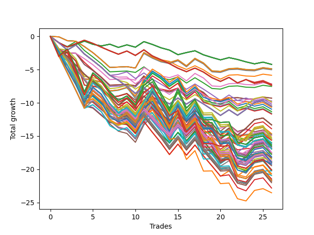

# Long HLT 510 
- Symbol: TSLA
- Date Range: 05/16/2022 - 05/17/2024
- Trading Period: 8:30-12:30
- Number of Trades: 26



| Id. | Name | Win Percent | Profit | Avg Profit / Trade | Avg Time / Trade | Std |      | Name | Win Percent | Profit | Avg Profit / Trade | Avg Time / Trade | Std |
| --- | ---- | ----------- | ------ | ------------------ | ---------------- | --- | ---- | ---- | ----------- | ------ | ------------------ | ---------------- | --- |
| | Sorted By <br> Profit | | | | | | | Sorted By <br> Win Percentage |||||
|0| TP-0.25 180m | 34.62 | -4.21 | -0.16 | 03:34 | 0.44 |     | TP-2.75 180m | 42.31 | -16.53 | -0.64 | 72:53 | 1.94 |
|1| TP-0.25 165m | 34.62 | -4.21 | -0.16 | 03:34 | 0.44 |     | TP-2.75 165m | 42.31 | -16.53 | -0.64 | 72:53 | 1.94 |
|2| TP-0.25 150m | 34.62 | -4.21 | -0.16 | 03:34 | 0.44 |     | TP-2.75 150m | 42.31 | -16.53 | -0.64 | 72:53 | 1.94 |
|3| TP-0.25 135m | 34.62 | -4.21 | -0.16 | 03:34 | 0.44 |     | TP-2.75 135m | 42.31 | -16.53 | -0.64 | 72:53 | 1.94 |
|4| TP-0.25 120m | 34.62 | -4.21 | -0.16 | 03:34 | 0.44 |     | TP-2.75 120m | 42.31 | -16.53 | -0.64 | 72:53 | 1.94 |
|5| TP-0.25 105m | 34.62 | -4.21 | -0.16 | 03:34 | 0.44 |     | TP-2.75 105m | 42.31 | -17.76 | -0.68 | 69:16 | 1.92 |
|6| TP-0.25 90m | 34.62 | -4.21 | -0.16 | 03:34 | 0.44 |     | TP-3 180m | 42.31 | -20.12 | -0.77 | 75:50 | 1.82 |
|7| TP-0.25 75m | 34.62 | -4.21 | -0.16 | 03:34 | 0.44 |     | TP-3 165m | 42.31 | -20.12 | -0.77 | 75:50 | 1.82 |
|8| TP-0.25 60m | 34.62 | -4.21 | -0.16 | 03:34 | 0.44 |     | TP-3 150m | 42.31 | -20.12 | -0.77 | 75:50 | 1.82 |
|9| TP-0.25 45m | 34.62 | -4.21 | -0.16 | 03:34 | 0.44 |     | TP-3 135m | 42.31 | -20.12 | -0.77 | 75:50 | 1.82 |
|10| TP-0.25 30m | 34.62 | -4.21 | -0.16 | 03:34 | 0.44 |     | TP-3 120m | 42.31 | -20.12 | -0.77 | 75:50 | 1.82 |
|11| TP-0.25 15m | 34.62 | -4.21 | -0.16 | 03:34 | 0.44 |     | TP-3 105m | 42.31 | -21.45 | -0.83 | 71:36 | 1.78 |
|12| TP-2.25 15m | 30.77 | -4.86 | -0.19 | 13:53 | 0.74 |     | TP-1.75 105m | 38.46 | -15.21 | -0.59 | 46:46 | 1.60 |
|13| TP-3 15m | 30.77 | -4.89 | -0.19 | 14:00 | 0.74 |     | TP-1.75 180m | 38.46 | -15.48 | -0.60 | 47:00 | 1.59 |
|14| TP-2.75 15m | 30.77 | -4.89 | -0.19 | 14:00 | 0.74 |     | TP-1.75 165m | 38.46 | -15.48 | -0.60 | 47:00 | 1.59 |
|15| TP-2.5 15m | 30.77 | -4.89 | -0.19 | 14:00 | 0.74 |     | TP-1.75 150m | 38.46 | -15.48 | -0.60 | 47:00 | 1.59 |
|16| TP-2 15m | 30.77 | -5.02 | -0.19 | 13:50 | 0.72 |     | TP-1.75 135m | 38.46 | -15.48 | -0.60 | 47:00 | 1.59 |
|17| TP-0.5 15m | 30.77 | -5.85 | -0.22 | 07:06 | 0.53 |     | TP-1.75 120m | 38.46 | -15.48 | -0.60 | 47:00 | 1.59 |
|18| TP-1.75 15m | 30.77 | -7.14 | -0.27 | 13:25 | 0.76 |     | TP-2 60m | 38.46 | -15.64 | -0.60 | 45:43 | 1.57 |
|19| TP-0.5 30m | 30.77 | -7.20 | -0.28 | 08:30 | 0.56 |     | TP-2 75m | 38.46 | -16.04 | -0.62 | 51:11 | 1.63 |
|20| TP-0.5 180m | 30.77 | -7.36 | -0.28 | 08:36 | 0.56 |     | TP-2 105m | 38.46 | -16.09 | -0.62 | 56:57 | 1.73 |
|21| TP-0.5 165m | 30.77 | -7.36 | -0.28 | 08:36 | 0.56 |     | TP-1.75 60m | 38.46 | -16.34 | -0.63 | 40:48 | 1.45 |
|22| TP-0.5 150m | 30.77 | -7.36 | -0.28 | 08:36 | 0.56 |     | TP-2.25 60m | 38.46 | -16.73 | -0.64 | 47:18 | 1.62 |
|23| TP-0.5 135m | 30.77 | -7.36 | -0.28 | 08:36 | 0.56 |     | TP-2 90m | 38.46 | -16.85 | -0.65 | 54:09 | 1.61 |
|24| TP-0.5 120m | 30.77 | -7.36 | -0.28 | 08:36 | 0.56 |     | TP-2 180m | 38.46 | -16.96 | -0.65 | 58:46 | 1.69 |
|25| TP-0.5 105m | 30.77 | -7.36 | -0.28 | 08:36 | 0.56 |     | TP-2 165m | 38.46 | -16.96 | -0.65 | 58:46 | 1.69 |
|26| TP-0.5 90m | 30.77 | -7.36 | -0.28 | 08:36 | 0.56 |     | TP-2 150m | 38.46 | -16.96 | -0.65 | 58:46 | 1.69 |
|27| TP-0.5 75m | 30.77 | -7.36 | -0.28 | 08:36 | 0.56 |     | TP-2 135m | 38.46 | -16.96 | -0.65 | 58:46 | 1.69 |
|28| TP-0.5 60m | 30.77 | -7.36 | -0.28 | 08:36 | 0.56 |     | TP-2 120m | 38.46 | -16.96 | -0.65 | 58:46 | 1.69 |
|29| TP-0.5 45m | 30.77 | -7.36 | -0.28 | 08:36 | 0.56 |     | TP-1.75 90m | 38.46 | -17.47 | -0.67 | 45:41 | 1.50 |
|30| TP-0.75 15m | 34.62 | -7.53 | -0.29 | 10:18 | 0.64 |     | TP-2.75 60m | 38.46 | -17.51 | -0.67 | 50:16 | 1.71 |
|31| TP-1.5 15m | 30.77 | -9.29 | -0.36 | 12:43 | 0.80 |     | TP-2.75 75m | 38.46 | -17.54 | -0.67 | 59:04 | 1.77 |
|32| TP-1 15m | 30.77 | -9.30 | -0.36 | 11:46 | 0.75 |     | TP-2.25 75m | 38.46 | -17.57 | -0.68 | 53:32 | 1.68 |
|33| TP-1.25 15m | 30.77 | -9.71 | -0.37 | 12:16 | 0.79 |     | TP-2.25 105m | 38.46 | -18.09 | -0.70 | 59:36 | 1.79 |
|34| TP-0.75 60m | 30.77 | -9.86 | -0.38 | 17:48 | 0.81 |     | TP-2.5 60m | 38.46 | -18.28 | -0.70 | 49:20 | 1.68 |
|35| TP-0.75 45m | 34.62 | -9.96 | -0.38 | 16:41 | 0.77 |     | TP-2.5 75m | 38.46 | -18.76 | -0.72 | 56:57 | 1.70 |
|36| TP-0.75 30m | 34.62 | -10.20 | -0.39 | 14:46 | 0.75 |     | TP-3 60m | 38.46 | -18.76 | -0.72 | 50:53 | 1.67 |
|37| TP-0.75 180m | 30.77 | -10.49 | -0.40 | 18:02 | 0.81 |     | TP-2.25 90m | 38.46 | -18.85 | -0.72 | 56:48 | 1.68 |
|38| TP-0.75 165m | 30.77 | -10.49 | -0.40 | 18:02 | 0.81 |     | TP-2.25 180m | 38.46 | -18.96 | -0.73 | 61:25 | 1.75 |
|39| TP-0.75 150m | 30.77 | -10.49 | -0.40 | 18:02 | 0.81 |     | TP-2.25 165m | 38.46 | -18.96 | -0.73 | 61:25 | 1.75 |
|40| TP-0.75 135m | 30.77 | -10.49 | -0.40 | 18:02 | 0.81 |     | TP-2.25 150m | 38.46 | -18.96 | -0.73 | 61:25 | 1.75 |
|41| TP-0.75 120m | 30.77 | -10.49 | -0.40 | 18:02 | 0.81 |     | TP-2.25 135m | 38.46 | -18.96 | -0.73 | 61:25 | 1.75 |
|42| TP-0.75 105m | 30.77 | -10.49 | -0.40 | 18:02 | 0.81 |     | TP-2.25 120m | 38.46 | -18.96 | -0.73 | 61:25 | 1.75 |
|43| TP-0.75 90m | 30.77 | -10.49 | -0.40 | 18:02 | 0.81 |     | TP-2.75 90m | 38.46 | -19.22 | -0.74 | 64:36 | 1.80 |
|44| TP-0.75 75m | 30.77 | -10.49 | -0.40 | 18:02 | 0.81 |     | TP-3 75m | 38.46 | -20.24 | -0.78 | 60:13 | 1.64 |
|45| TP-2.5 30m | 34.62 | -10.67 | -0.41 | 27:55 | 1.19 |     | TP-2.5 105m | 38.46 | -20.67 | -0.79 | 65:53 | 1.85 |
|46| TP-2.25 30m | 34.62 | -10.95 | -0.42 | 27:20 | 1.16 |     | TP-2.5 90m | 38.46 | -20.95 | -0.81 | 61:55 | 1.72 |
|47| TP-2.75 30m | 34.62 | -11.31 | -0.44 | 28:04 | 1.30 |     | TP-2.5 180m | 38.46 | -21.68 | -0.83 | 68:18 | 1.86 |
|48| TP-1.75 30m | 34.62 | -11.57 | -0.45 | 26:00 | 1.12 |     | TP-2.5 165m | 38.46 | -21.68 | -0.83 | 68:18 | 1.86 |
|49| TP-2 30m | 34.62 | -11.61 | -0.45 | 27:00 | 1.17 |     | TP-2.5 150m | 38.46 | -21.68 | -0.83 | 68:18 | 1.86 |
|50| TP-3 30m | 34.62 | -11.69 | -0.45 | 28:06 | 1.26 |     | TP-2.5 135m | 38.46 | -21.68 | -0.83 | 68:18 | 1.86 |
|51| TP-1 180m | 30.77 | -13.32 | -0.51 | 23:55 | 1.04 |     | TP-2.5 120m | 38.46 | -21.68 | -0.83 | 68:18 | 1.86 |
|52| TP-1 165m | 30.77 | -13.32 | -0.51 | 23:55 | 1.04 |     | TP-3 90m | 38.46 | -23.54 | -0.91 | 66:23 | 1.63 |
|53| TP-1 150m | 30.77 | -13.32 | -0.51 | 23:55 | 1.04 |     | TP-0.25 180m | 34.62 | -4.21 | -0.16 | 03:34 | 0.44 |
|54| TP-1 135m | 30.77 | -13.32 | -0.51 | 23:55 | 1.04 |     | TP-0.25 165m | 34.62 | -4.21 | -0.16 | 03:34 | 0.44 |
|55| TP-1 120m | 30.77 | -13.32 | -0.51 | 23:55 | 1.04 |     | TP-0.25 150m | 34.62 | -4.21 | -0.16 | 03:34 | 0.44 |
|56| TP-1 105m | 30.77 | -13.32 | -0.51 | 23:55 | 1.04 |     | TP-0.25 135m | 34.62 | -4.21 | -0.16 | 03:34 | 0.44 |
|57| TP-1 90m | 30.77 | -13.90 | -0.53 | 23:23 | 1.01 |     | TP-0.25 120m | 34.62 | -4.21 | -0.16 | 03:34 | 0.44 |
|58| TP-1 75m | 26.92 | -14.64 | -0.56 | 22:48 | 0.99 |     | TP-0.25 105m | 34.62 | -4.21 | -0.16 | 03:34 | 0.44 |
|59| TP-1 60m | 26.92 | -14.68 | -0.56 | 22:13 | 0.99 |     | TP-0.25 90m | 34.62 | -4.21 | -0.16 | 03:34 | 0.44 |
|60| TP-1 30m | 30.77 | -14.80 | -0.57 | 18:00 | 0.90 |     | TP-0.25 75m | 34.62 | -4.21 | -0.16 | 03:34 | 0.44 |
|61| TP-1.25 30m | 30.77 | -14.93 | -0.57 | 21:23 | 0.95 |     | TP-0.25 60m | 34.62 | -4.21 | -0.16 | 03:34 | 0.44 |
|62| TP-1.75 105m | 38.46 | -15.21 | -0.59 | 46:46 | 1.60 |     | TP-0.25 45m | 34.62 | -4.21 | -0.16 | 03:34 | 0.44 |
|63| TP-1 45m | 30.77 | -15.43 | -0.59 | 20:30 | 0.89 |     | TP-0.25 30m | 34.62 | -4.21 | -0.16 | 03:34 | 0.44 |
|64| TP-1.75 180m | 38.46 | -15.48 | -0.60 | 47:00 | 1.59 |     | TP-0.25 15m | 34.62 | -4.21 | -0.16 | 03:34 | 0.44 |
|65| TP-1.75 165m | 38.46 | -15.48 | -0.60 | 47:00 | 1.59 |     | TP-0.75 15m | 34.62 | -7.53 | -0.29 | 10:18 | 0.64 |
|66| TP-1.75 150m | 38.46 | -15.48 | -0.60 | 47:00 | 1.59 |     | TP-0.75 45m | 34.62 | -9.96 | -0.38 | 16:41 | 0.77 |
|67| TP-1.75 135m | 38.46 | -15.48 | -0.60 | 47:00 | 1.59 |     | TP-0.75 30m | 34.62 | -10.20 | -0.39 | 14:46 | 0.75 |
|68| TP-1.75 120m | 38.46 | -15.48 | -0.60 | 47:00 | 1.59 |     | TP-2.5 30m | 34.62 | -10.67 | -0.41 | 27:55 | 1.19 |
|69| TP-2 45m | 34.62 | -15.56 | -0.60 | 37:18 | 1.36 |     | TP-2.25 30m | 34.62 | -10.95 | -0.42 | 27:20 | 1.16 |
|70| TP-2 60m | 38.46 | -15.64 | -0.60 | 45:43 | 1.57 |     | TP-2.75 30m | 34.62 | -11.31 | -0.44 | 28:04 | 1.30 |
|71| TP-2.25 45m | 34.62 | -16.00 | -0.62 | 38:20 | 1.39 |     | TP-1.75 30m | 34.62 | -11.57 | -0.45 | 26:00 | 1.12 |
|72| TP-2 75m | 38.46 | -16.04 | -0.62 | 51:11 | 1.63 |     | TP-2 30m | 34.62 | -11.61 | -0.45 | 27:00 | 1.17 |
|73| TP-2 105m | 38.46 | -16.09 | -0.62 | 56:57 | 1.73 |     | TP-3 30m | 34.62 | -11.69 | -0.45 | 28:06 | 1.26 |
|74| TP-1.5 30m | 30.77 | -16.27 | -0.63 | 23:13 | 0.99 |     | TP-2 45m | 34.62 | -15.56 | -0.60 | 37:18 | 1.36 |
|75| TP-1.75 60m | 38.46 | -16.34 | -0.63 | 40:48 | 1.45 |     | TP-2.25 45m | 34.62 | -16.00 | -0.62 | 38:20 | 1.39 |
|76| TP-2.75 180m | 42.31 | -16.53 | -0.64 | 72:53 | 1.94 |     | TP-1.75 45m | 34.62 | -16.80 | -0.65 | 34:55 | 1.31 |
|77| TP-2.75 165m | 42.31 | -16.53 | -0.64 | 72:53 | 1.94 |     | TP-2.5 45m | 34.62 | -17.57 | -0.68 | 39:23 | 1.51 |
|78| TP-2.75 150m | 42.31 | -16.53 | -0.64 | 72:53 | 1.94 |     | TP-1.75 75m | 34.62 | -17.72 | -0.68 | 44:27 | 1.51 |
|79| TP-2.75 135m | 42.31 | -16.53 | -0.64 | 72:53 | 1.94 |     | TP-2.75 45m | 34.62 | -18.21 | -0.70 | 39:39 | 1.59 |
|80| TP-2.75 120m | 42.31 | -16.53 | -0.64 | 72:53 | 1.94 |     | TP-3 45m | 34.62 | -19.46 | -0.75 | 40:16 | 1.56 |
|81| TP-2.25 60m | 38.46 | -16.73 | -0.64 | 47:18 | 1.62 |     | TP-2.25 15m | 30.77 | -4.86 | -0.19 | 13:53 | 0.74 |
|82| TP-1.75 45m | 34.62 | -16.80 | -0.65 | 34:55 | 1.31 |     | TP-3 15m | 30.77 | -4.89 | -0.19 | 14:00 | 0.74 |
|83| TP-2 90m | 38.46 | -16.85 | -0.65 | 54:09 | 1.61 |     | TP-2.75 15m | 30.77 | -4.89 | -0.19 | 14:00 | 0.74 |
|84| TP-2 180m | 38.46 | -16.96 | -0.65 | 58:46 | 1.69 |     | TP-2.5 15m | 30.77 | -4.89 | -0.19 | 14:00 | 0.74 |
|85| TP-2 165m | 38.46 | -16.96 | -0.65 | 58:46 | 1.69 |     | TP-2 15m | 30.77 | -5.02 | -0.19 | 13:50 | 0.72 |
|86| TP-2 150m | 38.46 | -16.96 | -0.65 | 58:46 | 1.69 |     | TP-0.5 15m | 30.77 | -5.85 | -0.22 | 07:06 | 0.53 |
|87| TP-2 135m | 38.46 | -16.96 | -0.65 | 58:46 | 1.69 |     | TP-1.75 15m | 30.77 | -7.14 | -0.27 | 13:25 | 0.76 |
|88| TP-2 120m | 38.46 | -16.96 | -0.65 | 58:46 | 1.69 |     | TP-0.5 30m | 30.77 | -7.20 | -0.28 | 08:30 | 0.56 |
|89| TP-1.75 90m | 38.46 | -17.47 | -0.67 | 45:41 | 1.50 |     | TP-0.5 180m | 30.77 | -7.36 | -0.28 | 08:36 | 0.56 |
|90| TP-2.75 60m | 38.46 | -17.51 | -0.67 | 50:16 | 1.71 |     | TP-0.5 165m | 30.77 | -7.36 | -0.28 | 08:36 | 0.56 |
|91| TP-2.75 75m | 38.46 | -17.54 | -0.67 | 59:04 | 1.77 |     | TP-0.5 150m | 30.77 | -7.36 | -0.28 | 08:36 | 0.56 |
|92| TP-2.25 75m | 38.46 | -17.57 | -0.68 | 53:32 | 1.68 |     | TP-0.5 135m | 30.77 | -7.36 | -0.28 | 08:36 | 0.56 |
|93| TP-2.5 45m | 34.62 | -17.57 | -0.68 | 39:23 | 1.51 |     | TP-0.5 120m | 30.77 | -7.36 | -0.28 | 08:36 | 0.56 |
|94| TP-1.75 75m | 34.62 | -17.72 | -0.68 | 44:27 | 1.51 |     | TP-0.5 105m | 30.77 | -7.36 | -0.28 | 08:36 | 0.56 |
|95| TP-2.75 105m | 42.31 | -17.76 | -0.68 | 69:16 | 1.92 |     | TP-0.5 90m | 30.77 | -7.36 | -0.28 | 08:36 | 0.56 |
|96| TP-2.25 105m | 38.46 | -18.09 | -0.70 | 59:36 | 1.79 |     | TP-0.5 75m | 30.77 | -7.36 | -0.28 | 08:36 | 0.56 |
|97| TP-2.75 45m | 34.62 | -18.21 | -0.70 | 39:39 | 1.59 |     | TP-0.5 60m | 30.77 | -7.36 | -0.28 | 08:36 | 0.56 |
|98| TP-2.5 60m | 38.46 | -18.28 | -0.70 | 49:20 | 1.68 |     | TP-0.5 45m | 30.77 | -7.36 | -0.28 | 08:36 | 0.56 |
|99| TP-1.25 45m | 30.77 | -18.47 | -0.71 | 26:20 | 1.04 |     | TP-1.5 15m | 30.77 | -9.29 | -0.36 | 12:43 | 0.80 |
|100| TP-1.25 105m | 26.92 | -18.75 | -0.72 | 32:32 | 1.10 |     | TP-1 15m | 30.77 | -9.30 | -0.36 | 11:46 | 0.75 |
|101| TP-2.5 75m | 38.46 | -18.76 | -0.72 | 56:57 | 1.70 |     | TP-1.25 15m | 30.77 | -9.71 | -0.37 | 12:16 | 0.79 |
|102| TP-3 60m | 38.46 | -18.76 | -0.72 | 50:53 | 1.67 |     | TP-0.75 60m | 30.77 | -9.86 | -0.38 | 17:48 | 0.81 |
|103| TP-2.25 90m | 38.46 | -18.85 | -0.72 | 56:48 | 1.68 |     | TP-0.75 180m | 30.77 | -10.49 | -0.40 | 18:02 | 0.81 |
|104| TP-1.25 60m | 26.92 | -18.91 | -0.73 | 29:11 | 1.08 |     | TP-0.75 165m | 30.77 | -10.49 | -0.40 | 18:02 | 0.81 |
|105| TP-2.25 180m | 38.46 | -18.96 | -0.73 | 61:25 | 1.75 |     | TP-0.75 150m | 30.77 | -10.49 | -0.40 | 18:02 | 0.81 |
|106| TP-2.25 165m | 38.46 | -18.96 | -0.73 | 61:25 | 1.75 |     | TP-0.75 135m | 30.77 | -10.49 | -0.40 | 18:02 | 0.81 |
|107| TP-2.25 150m | 38.46 | -18.96 | -0.73 | 61:25 | 1.75 |     | TP-0.75 120m | 30.77 | -10.49 | -0.40 | 18:02 | 0.81 |
|108| TP-2.25 135m | 38.46 | -18.96 | -0.73 | 61:25 | 1.75 |     | TP-0.75 105m | 30.77 | -10.49 | -0.40 | 18:02 | 0.81 |
|109| TP-2.25 120m | 38.46 | -18.96 | -0.73 | 61:25 | 1.75 |     | TP-0.75 90m | 30.77 | -10.49 | -0.40 | 18:02 | 0.81 |
|110| TP-1.25 180m | 26.92 | -19.02 | -0.73 | 32:46 | 1.08 |     | TP-0.75 75m | 30.77 | -10.49 | -0.40 | 18:02 | 0.81 |
|111| TP-1.25 165m | 26.92 | -19.02 | -0.73 | 32:46 | 1.08 |     | TP-1 180m | 30.77 | -13.32 | -0.51 | 23:55 | 1.04 |
|112| TP-1.25 150m | 26.92 | -19.02 | -0.73 | 32:46 | 1.08 |     | TP-1 165m | 30.77 | -13.32 | -0.51 | 23:55 | 1.04 |
|113| TP-1.25 135m | 26.92 | -19.02 | -0.73 | 32:46 | 1.08 |     | TP-1 150m | 30.77 | -13.32 | -0.51 | 23:55 | 1.04 |
|114| TP-1.25 120m | 26.92 | -19.02 | -0.73 | 32:46 | 1.08 |     | TP-1 135m | 30.77 | -13.32 | -0.51 | 23:55 | 1.04 |
|115| TP-2.75 90m | 38.46 | -19.22 | -0.74 | 64:36 | 1.80 |     | TP-1 120m | 30.77 | -13.32 | -0.51 | 23:55 | 1.04 |
|116| TP-1.25 90m | 26.92 | -19.25 | -0.74 | 31:57 | 1.07 |     | TP-1 105m | 30.77 | -13.32 | -0.51 | 23:55 | 1.04 |
|117| TP-3 45m | 34.62 | -19.46 | -0.75 | 40:16 | 1.56 |     | TP-1 90m | 30.77 | -13.90 | -0.53 | 23:23 | 1.01 |
|118| TP-1.25 75m | 23.08 | -20.06 | -0.77 | 31:18 | 1.05 |     | TP-1 30m | 30.77 | -14.80 | -0.57 | 18:00 | 0.90 |
|119| TP-3 180m | 42.31 | -20.12 | -0.77 | 75:50 | 1.82 |     | TP-1.25 30m | 30.77 | -14.93 | -0.57 | 21:23 | 0.95 |
|120| TP-3 165m | 42.31 | -20.12 | -0.77 | 75:50 | 1.82 |     | TP-1 45m | 30.77 | -15.43 | -0.59 | 20:30 | 0.89 |
|121| TP-3 150m | 42.31 | -20.12 | -0.77 | 75:50 | 1.82 |     | TP-1.5 30m | 30.77 | -16.27 | -0.63 | 23:13 | 0.99 |
|122| TP-3 135m | 42.31 | -20.12 | -0.77 | 75:50 | 1.82 |     | TP-1.25 45m | 30.77 | -18.47 | -0.71 | 26:20 | 1.04 |
|123| TP-3 120m | 42.31 | -20.12 | -0.77 | 75:50 | 1.82 |     | TP-1.5 45m | 30.77 | -20.25 | -0.78 | 29:34 | 1.13 |
|124| TP-3 75m | 38.46 | -20.24 | -0.78 | 60:13 | 1.64 |     | TP-1 75m | 26.92 | -14.64 | -0.56 | 22:48 | 0.99 |
|125| TP-1.5 45m | 30.77 | -20.25 | -0.78 | 29:34 | 1.13 |     | TP-1 60m | 26.92 | -14.68 | -0.56 | 22:13 | 0.99 |
|126| TP-2.5 105m | 38.46 | -20.67 | -0.79 | 65:53 | 1.85 |     | TP-1.25 105m | 26.92 | -18.75 | -0.72 | 32:32 | 1.10 |
|127| TP-1.5 60m | 26.92 | -20.94 | -0.81 | 33:04 | 1.17 |     | TP-1.25 60m | 26.92 | -18.91 | -0.73 | 29:11 | 1.08 |
|128| TP-2.5 90m | 38.46 | -20.95 | -0.81 | 61:55 | 1.72 |     | TP-1.25 180m | 26.92 | -19.02 | -0.73 | 32:46 | 1.08 |
|129| TP-3 105m | 42.31 | -21.45 | -0.83 | 71:36 | 1.78 |     | TP-1.25 165m | 26.92 | -19.02 | -0.73 | 32:46 | 1.08 |
|130| TP-1.5 105m | 26.92 | -21.52 | -0.83 | 36:53 | 1.24 |     | TP-1.25 150m | 26.92 | -19.02 | -0.73 | 32:46 | 1.08 |
|131| TP-2.5 180m | 38.46 | -21.68 | -0.83 | 68:18 | 1.86 |     | TP-1.25 135m | 26.92 | -19.02 | -0.73 | 32:46 | 1.08 |
|132| TP-2.5 165m | 38.46 | -21.68 | -0.83 | 68:18 | 1.86 |     | TP-1.25 120m | 26.92 | -19.02 | -0.73 | 32:46 | 1.08 |
|133| TP-2.5 150m | 38.46 | -21.68 | -0.83 | 68:18 | 1.86 |     | TP-1.25 90m | 26.92 | -19.25 | -0.74 | 31:57 | 1.07 |
|134| TP-2.5 135m | 38.46 | -21.68 | -0.83 | 68:18 | 1.86 |     | TP-1.5 60m | 26.92 | -20.94 | -0.81 | 33:04 | 1.17 |
|135| TP-2.5 120m | 38.46 | -21.68 | -0.83 | 68:18 | 1.86 |     | TP-1.5 105m | 26.92 | -21.52 | -0.83 | 36:53 | 1.24 |
|136| TP-1.5 180m | 26.92 | -21.79 | -0.84 | 37:06 | 1.23 |     | TP-1.5 180m | 26.92 | -21.79 | -0.84 | 37:06 | 1.23 |
|137| TP-1.5 165m | 26.92 | -21.79 | -0.84 | 37:06 | 1.23 |     | TP-1.5 165m | 26.92 | -21.79 | -0.84 | 37:06 | 1.23 |
|138| TP-1.5 150m | 26.92 | -21.79 | -0.84 | 37:06 | 1.23 |     | TP-1.5 150m | 26.92 | -21.79 | -0.84 | 37:06 | 1.23 |
|139| TP-1.5 135m | 26.92 | -21.79 | -0.84 | 37:06 | 1.23 |     | TP-1.5 135m | 26.92 | -21.79 | -0.84 | 37:06 | 1.23 |
|140| TP-1.5 120m | 26.92 | -21.79 | -0.84 | 37:06 | 1.23 |     | TP-1.5 120m | 26.92 | -21.79 | -0.84 | 37:06 | 1.23 |
|141| TP-1.5 90m | 26.92 | -22.02 | -0.85 | 36:18 | 1.22 |     | TP-1.5 90m | 26.92 | -22.02 | -0.85 | 36:18 | 1.22 |
|142| TP-1.5 75m | 23.08 | -22.83 | -0.88 | 35:39 | 1.19 |     | TP-1.25 75m | 23.08 | -20.06 | -0.77 | 31:18 | 1.05 |
|143| TP-3 90m | 38.46 | -23.54 | -0.91 | 66:23 | 1.63 |     | TP-1.5 75m | 23.08 | -22.83 | -0.88 | 35:39 | 1.19 |

### Test TP-0.25 15m
* Take Profit of 0.25 Point
* 0.25 Stoploss
* Results:
```
Total Trades: 26
Percent Up: 34.62
Percent Down: 65.38
Total Points Moved Up: -4.21
Potential Profit: -2105.00
Total Points Ups: 3.57 Count Ups: 9
Total Points Downs: -7.78 Count Downs: 17
```

<details><summary>Trades</summary>

<code>In: 2022-05-20 09:50:00		Out: 2022-05-20 09:52:00		Total Position Time: 02:00		Total Move Up: -0.94		Total to Date: -0.94</code> <br />
<code>In: 2022-06-23 09:45:00		Out: 2022-06-23 09:47:00		Total Position Time: 02:00		Total Move Up: -0.66		Total to Date: -1.60</code> <br />
<code>In: 2022-07-18 11:15:00		Out: 2022-07-18 11:17:00		Total Position Time: 02:00		Total Move Up: 0.38		Total to Date: -1.22</code> <br />
<code>In: 2022-08-05 08:35:00		Out: 2022-08-05 08:37:00		Total Position Time: 02:00		Total Move Up: 0.52		Total to Date: -0.70</code> <br />
<code>In: 2022-08-09 09:15:00		Out: 2022-08-09 09:19:00		Total Position Time: 04:00		Total Move Up: -0.48		Total to Date: -1.18</code> <br />
<code>In: 2022-08-11 12:00:00		Out: 2022-08-11 12:06:00		Total Position Time: 06:00		Total Move Up: -0.25		Total to Date: -1.43</code> <br />
<code>In: 2022-09-02 09:55:00		Out: 2022-09-02 09:57:00		Total Position Time: 02:00		Total Move Up: 0.26		Total to Date: -1.17</code> <br />
<code>In: 2022-09-30 10:55:00		Out: 2022-09-30 11:00:00		Total Position Time: 05:00		Total Move Up: -0.48		Total to Date: -1.65</code> <br />
<code>In: 2022-11-29 11:00:00		Out: 2022-11-29 11:02:00		Total Position Time: 02:00		Total Move Up: 0.38		Total to Date: -1.27</code> <br />
<code>In: 2022-12-27 12:25:00		Out: 2022-12-27 12:28:00		Total Position Time: 03:00		Total Move Up: -0.35		Total to Date: -1.62</code> <br />
<code>In: 2023-02-02 12:10:00		Out: 2023-02-02 12:12:00		Total Position Time: 02:00		Total Move Up: 0.84		Total to Date: -0.78</code> <br />
<code>In: 2023-07-19 11:45:00		Out: 2023-07-19 11:47:00		Total Position Time: 02:00		Total Move Up: -0.43		Total to Date: -1.21</code> <br />
<code>In: 2023-08-04 11:30:00		Out: 2023-08-04 11:37:00		Total Position Time: 07:00		Total Move Up: -0.50		Total to Date: -1.71</code> <br />
<code>In: 2023-08-17 11:50:00		Out: 2023-08-17 11:54:00		Total Position Time: 04:00		Total Move Up: -0.35		Total to Date: -2.06</code> <br />
<code>In: 2023-08-28 09:30:00		Out: 2023-08-28 09:32:00		Total Position Time: 02:00		Total Move Up: -0.69		Total to Date: -2.75</code> <br />
<code>In: 2023-09-08 09:40:00		Out: 2023-09-08 09:42:00		Total Position Time: 02:00		Total Move Up: 0.32		Total to Date: -2.43</code> <br />
<code>In: 2023-09-15 11:35:00		Out: 2023-09-15 11:39:00		Total Position Time: 04:00		Total Move Up: 0.27		Total to Date: -2.16</code> <br />
<code>In: 2023-10-12 10:35:00		Out: 2023-10-12 10:37:00		Total Position Time: 02:00		Total Move Up: -0.61		Total to Date: -2.77</code> <br />
<code>In: 2023-10-19 11:40:00		Out: 2023-10-19 11:45:00		Total Position Time: 05:00		Total Move Up: -0.40		Total to Date: -3.17</code> <br />
<code>In: 2023-11-06 09:30:00		Out: 2023-11-06 09:33:00		Total Position Time: 03:00		Total Move Up: -0.36		Total to Date: -3.53</code> <br />
<code>In: 2023-12-22 11:35:00		Out: 2023-12-22 11:38:00		Total Position Time: 03:00		Total Move Up: 0.34		Total to Date: -3.19</code> <br />
<code>In: 2023-12-28 10:25:00		Out: 2023-12-28 10:29:00		Total Position Time: 04:00		Total Move Up: -0.28		Total to Date: -3.47</code> <br />
<code>In: 2024-01-04 11:35:00		Out: 2024-01-04 11:46:00		Total Position Time: 11:00		Total Move Up: -0.36		Total to Date: -3.83</code> <br />
<code>In: 2024-02-27 10:05:00		Out: 2024-02-27 10:09:00		Total Position Time: 04:00		Total Move Up: -0.30		Total to Date: -4.13</code> <br />
<code>In: 2024-03-11 12:35:00		Out: 2024-03-11 12:41:00		Total Position Time: 06:00		Total Move Up: 0.26		Total to Date: -3.87</code> <br />
<code>In: 2024-03-14 08:35:00		Out: 2024-03-14 08:37:00		Total Position Time: 02:00		Total Move Up: -0.34		Total to Date: -4.21</code> <br />


</details>

### Test TP-0.5 15m
* Take Profit of 0.5 Point
* 0.5 Stoploss
* Results:
```
Total Trades: 26
Percent Up: 30.77
Percent Down: 69.23
Total Points Moved Up: -5.85
Potential Profit: -2925.00
Total Points Ups: 3.89 Count Ups: 8
Total Points Downs: -9.74 Count Downs: 18
```

<details><summary>Trades</summary>

<code>In: 2022-05-20 09:50:00		Out: 2022-05-20 09:52:00		Total Position Time: 02:00		Total Move Up: -0.94		Total to Date: -0.94</code> <br />
<code>In: 2022-06-23 09:45:00		Out: 2022-06-23 09:47:00		Total Position Time: 02:00		Total Move Up: -0.66		Total to Date: -1.60</code> <br />
<code>In: 2022-07-18 11:15:00		Out: 2022-07-18 11:20:00		Total Position Time: 05:00		Total Move Up: 0.51		Total to Date: -1.09</code> <br />
<code>In: 2022-08-05 08:35:00		Out: 2022-08-05 08:37:00		Total Position Time: 02:00		Total Move Up: 0.52		Total to Date: -0.57</code> <br />
<code>In: 2022-08-09 09:15:00		Out: 2022-08-09 09:19:00		Total Position Time: 04:00		Total Move Up: -0.48		Total to Date: -1.05</code> <br />
<code>In: 2022-08-11 12:00:00		Out: 2022-08-11 12:07:00		Total Position Time: 07:00		Total Move Up: -0.57		Total to Date: -1.62</code> <br />
<code>In: 2022-09-02 09:55:00		Out: 2022-09-02 10:01:00		Total Position Time: 06:00		Total Move Up: -0.55		Total to Date: -2.17</code> <br />
<code>In: 2022-09-30 10:55:00		Out: 2022-09-30 11:05:00		Total Position Time: 10:00		Total Move Up: -0.51		Total to Date: -2.68</code> <br />
<code>In: 2022-11-29 11:00:00		Out: 2022-11-29 11:03:00		Total Position Time: 03:00		Total Move Up: 0.48		Total to Date: -2.20</code> <br />
<code>In: 2022-12-27 12:25:00		Out: 2022-12-27 12:34:00		Total Position Time: 09:00		Total Move Up: -0.66		Total to Date: -2.86</code> <br />
<code>In: 2023-02-02 12:10:00		Out: 2023-02-02 12:12:00		Total Position Time: 02:00		Total Move Up: 0.84		Total to Date: -2.02</code> <br />
<code>In: 2023-07-19 11:45:00		Out: 2023-07-19 11:48:00		Total Position Time: 03:00		Total Move Up: -0.92		Total to Date: -2.94</code> <br />
<code>In: 2023-08-04 11:30:00		Out: 2023-08-04 11:39:00		Total Position Time: 09:00		Total Move Up: -0.56		Total to Date: -3.50</code> <br />
<code>In: 2023-08-17 11:50:00		Out: 2023-08-17 12:04:00		Total Position Time: 14:00		Total Move Up: -0.26		Total to Date: -3.76</code> <br />
<code>In: 2023-08-28 09:30:00		Out: 2023-08-28 09:32:00		Total Position Time: 02:00		Total Move Up: -0.69		Total to Date: -4.45</code> <br />
<code>In: 2023-09-08 09:40:00		Out: 2023-09-08 09:45:00		Total Position Time: 05:00		Total Move Up: -0.52		Total to Date: -4.97</code> <br />
<code>In: 2023-09-15 11:35:00		Out: 2023-09-15 11:40:00		Total Position Time: 05:00		Total Move Up: 0.55		Total to Date: -4.42</code> <br />
<code>In: 2023-10-12 10:35:00		Out: 2023-10-12 10:37:00		Total Position Time: 02:00		Total Move Up: -0.61		Total to Date: -5.03</code> <br />
<code>In: 2023-10-19 11:40:00		Out: 2023-10-19 11:47:00		Total Position Time: 07:00		Total Move Up: -0.84		Total to Date: -5.87</code> <br />
<code>In: 2023-11-06 09:30:00		Out: 2023-11-06 09:42:00		Total Position Time: 12:00		Total Move Up: -0.56		Total to Date: -6.43</code> <br />
<code>In: 2023-12-22 11:35:00		Out: 2023-12-22 11:39:00		Total Position Time: 04:00		Total Move Up: 0.60		Total to Date: -5.83</code> <br />
<code>In: 2023-12-28 10:25:00		Out: 2023-12-28 10:39:00		Total Position Time: 14:00		Total Move Up: 0.06		Total to Date: -5.77</code> <br />
<code>In: 2024-01-04 11:35:00		Out: 2024-01-04 11:49:00		Total Position Time: 14:00		Total Move Up: -0.19		Total to Date: -5.96</code> <br />
<code>In: 2024-02-27 10:05:00		Out: 2024-02-27 10:19:00		Total Position Time: 14:00		Total Move Up: -0.05		Total to Date: -6.01</code> <br />
<code>In: 2024-03-11 12:35:00		Out: 2024-03-11 12:49:00		Total Position Time: 14:00		Total Move Up: 0.33		Total to Date: -5.68</code> <br />
<code>In: 2024-03-14 08:35:00		Out: 2024-03-14 08:49:00		Total Position Time: 14:00		Total Move Up: -0.17		Total to Date: -5.85</code> <br />


</details>

### Test TP-0.75 15m
* Take Profit of 0.75 Point
* 0.75 Stoploss
* Results:
```
Total Trades: 26
Percent Up: 34.62
Percent Down: 65.38
Total Points Moved Up: -7.53
Potential Profit: -3765.00
Total Points Ups: 3.75 Count Ups: 9
Total Points Downs: -11.28 Count Downs: 17
```

<details><summary>Trades</summary>

<code>In: 2022-05-20 09:50:00		Out: 2022-05-20 09:52:00		Total Position Time: 02:00		Total Move Up: -0.94		Total to Date: -0.94</code> <br />
<code>In: 2022-06-23 09:45:00		Out: 2022-06-23 09:59:00		Total Position Time: 14:00		Total Move Up: -0.58		Total to Date: -1.52</code> <br />
<code>In: 2022-07-18 11:15:00		Out: 2022-07-18 11:21:00		Total Position Time: 06:00		Total Move Up: 0.76		Total to Date: -0.76</code> <br />
<code>In: 2022-08-05 08:35:00		Out: 2022-08-05 08:43:00		Total Position Time: 08:00		Total Move Up: -1.35		Total to Date: -2.11</code> <br />
<code>In: 2022-08-09 09:15:00		Out: 2022-08-09 09:24:00		Total Position Time: 09:00		Total Move Up: -0.98		Total to Date: -3.09</code> <br />
<code>In: 2022-08-11 12:00:00		Out: 2022-08-11 12:13:00		Total Position Time: 13:00		Total Move Up: -1.03		Total to Date: -4.12</code> <br />
<code>In: 2022-09-02 09:55:00		Out: 2022-09-02 10:02:00		Total Position Time: 07:00		Total Move Up: -1.21		Total to Date: -5.33</code> <br />
<code>In: 2022-09-30 10:55:00		Out: 2022-09-30 11:09:00		Total Position Time: 14:00		Total Move Up: 0.06		Total to Date: -5.27</code> <br />
<code>In: 2022-11-29 11:00:00		Out: 2022-11-29 11:14:00		Total Position Time: 14:00		Total Move Up: 0.06		Total to Date: -5.21</code> <br />
<code>In: 2022-12-27 12:25:00		Out: 2022-12-27 12:39:00		Total Position Time: 14:00		Total Move Up: -0.21		Total to Date: -5.42</code> <br />
<code>In: 2023-02-02 12:10:00		Out: 2023-02-02 12:12:00		Total Position Time: 02:00		Total Move Up: 0.84		Total to Date: -4.58</code> <br />
<code>In: 2023-07-19 11:45:00		Out: 2023-07-19 11:48:00		Total Position Time: 03:00		Total Move Up: -0.92		Total to Date: -5.50</code> <br />
<code>In: 2023-08-04 11:30:00		Out: 2023-08-04 11:40:00		Total Position Time: 10:00		Total Move Up: -0.76		Total to Date: -6.26</code> <br />
<code>In: 2023-08-17 11:50:00		Out: 2023-08-17 12:04:00		Total Position Time: 14:00		Total Move Up: -0.26		Total to Date: -6.52</code> <br />
<code>In: 2023-08-28 09:30:00		Out: 2023-08-28 09:44:00		Total Position Time: 14:00		Total Move Up: 0.42		Total to Date: -6.10</code> <br />
<code>In: 2023-09-08 09:40:00		Out: 2023-09-08 09:48:00		Total Position Time: 08:00		Total Move Up: -0.92		Total to Date: -7.02</code> <br />
<code>In: 2023-09-15 11:35:00		Out: 2023-09-15 11:41:00		Total Position Time: 06:00		Total Move Up: 0.80		Total to Date: -6.22</code> <br />
<code>In: 2023-10-12 10:35:00		Out: 2023-10-12 10:40:00		Total Position Time: 05:00		Total Move Up: -0.78		Total to Date: -7.00</code> <br />
<code>In: 2023-10-19 11:40:00		Out: 2023-10-19 11:47:00		Total Position Time: 07:00		Total Move Up: -0.84		Total to Date: -7.84</code> <br />
<code>In: 2023-11-06 09:30:00		Out: 2023-11-06 09:44:00		Total Position Time: 14:00		Total Move Up: -0.09		Total to Date: -7.93</code> <br />
<code>In: 2023-12-22 11:35:00		Out: 2023-12-22 11:49:00		Total Position Time: 14:00		Total Move Up: 0.42		Total to Date: -7.51</code> <br />
<code>In: 2023-12-28 10:25:00		Out: 2023-12-28 10:39:00		Total Position Time: 14:00		Total Move Up: 0.06		Total to Date: -7.45</code> <br />
<code>In: 2024-01-04 11:35:00		Out: 2024-01-04 11:49:00		Total Position Time: 14:00		Total Move Up: -0.19		Total to Date: -7.64</code> <br />
<code>In: 2024-02-27 10:05:00		Out: 2024-02-27 10:19:00		Total Position Time: 14:00		Total Move Up: -0.05		Total to Date: -7.69</code> <br />
<code>In: 2024-03-11 12:35:00		Out: 2024-03-11 12:49:00		Total Position Time: 14:00		Total Move Up: 0.33		Total to Date: -7.36</code> <br />
<code>In: 2024-03-14 08:35:00		Out: 2024-03-14 08:49:00		Total Position Time: 14:00		Total Move Up: -0.17		Total to Date: -7.53</code> <br />


</details>

### Test TP-1 15m
* Take Profit of 1 Point
* 1 Stoploss
* Results:
```
Total Trades: 26
Percent Up: 30.77
Percent Down: 69.23
Total Points Moved Up: -9.30
Potential Profit: -4650.00
Total Points Ups: 3.75 Count Ups: 8
Total Points Downs: -13.05 Count Downs: 18
```

<details><summary>Trades</summary>

<code>In: 2022-05-20 09:50:00		Out: 2022-05-20 09:54:00		Total Position Time: 04:00		Total Move Up: -1.88		Total to Date: -1.88</code> <br />
<code>In: 2022-06-23 09:45:00		Out: 2022-06-23 09:59:00		Total Position Time: 14:00		Total Move Up: -0.58		Total to Date: -2.46</code> <br />
<code>In: 2022-07-18 11:15:00		Out: 2022-07-18 11:29:00		Total Position Time: 14:00		Total Move Up: -0.08		Total to Date: -2.54</code> <br />
<code>In: 2022-08-05 08:35:00		Out: 2022-08-05 08:43:00		Total Position Time: 08:00		Total Move Up: -1.35		Total to Date: -3.89</code> <br />
<code>In: 2022-08-09 09:15:00		Out: 2022-08-09 09:25:00		Total Position Time: 10:00		Total Move Up: -1.15		Total to Date: -5.04</code> <br />
<code>In: 2022-08-11 12:00:00		Out: 2022-08-11 12:14:00		Total Position Time: 14:00		Total Move Up: -1.08		Total to Date: -6.12</code> <br />
<code>In: 2022-09-02 09:55:00		Out: 2022-09-02 10:02:00		Total Position Time: 07:00		Total Move Up: -1.21		Total to Date: -7.33</code> <br />
<code>In: 2022-09-30 10:55:00		Out: 2022-09-30 11:09:00		Total Position Time: 14:00		Total Move Up: 0.06		Total to Date: -7.27</code> <br />
<code>In: 2022-11-29 11:00:00		Out: 2022-11-29 11:14:00		Total Position Time: 14:00		Total Move Up: 0.06		Total to Date: -7.21</code> <br />
<code>In: 2022-12-27 12:25:00		Out: 2022-12-27 12:39:00		Total Position Time: 14:00		Total Move Up: -0.21		Total to Date: -7.42</code> <br />
<code>In: 2023-02-02 12:10:00		Out: 2023-02-02 12:13:00		Total Position Time: 03:00		Total Move Up: 1.34		Total to Date: -6.08</code> <br />
<code>In: 2023-07-19 11:45:00		Out: 2023-07-19 11:49:00		Total Position Time: 04:00		Total Move Up: -1.30		Total to Date: -7.38</code> <br />
<code>In: 2023-08-04 11:30:00		Out: 2023-08-04 11:44:00		Total Position Time: 14:00		Total Move Up: -0.55		Total to Date: -7.93</code> <br />
<code>In: 2023-08-17 11:50:00		Out: 2023-08-17 12:04:00		Total Position Time: 14:00		Total Move Up: -0.26		Total to Date: -8.19</code> <br />
<code>In: 2023-08-28 09:30:00		Out: 2023-08-28 09:44:00		Total Position Time: 14:00		Total Move Up: 0.42		Total to Date: -7.77</code> <br />
<code>In: 2023-09-08 09:40:00		Out: 2023-09-08 09:50:00		Total Position Time: 10:00		Total Move Up: -1.13		Total to Date: -8.90</code> <br />
<code>In: 2023-09-15 11:35:00		Out: 2023-09-15 11:48:00		Total Position Time: 13:00		Total Move Up: 1.06		Total to Date: -7.84</code> <br />
<code>In: 2023-10-12 10:35:00		Out: 2023-10-12 10:49:00		Total Position Time: 14:00		Total Move Up: -0.69		Total to Date: -8.53</code> <br />
<code>In: 2023-10-19 11:40:00		Out: 2023-10-19 11:49:00		Total Position Time: 09:00		Total Move Up: -1.08		Total to Date: -9.61</code> <br />
<code>In: 2023-11-06 09:30:00		Out: 2023-11-06 09:44:00		Total Position Time: 14:00		Total Move Up: -0.09		Total to Date: -9.70</code> <br />
<code>In: 2023-12-22 11:35:00		Out: 2023-12-22 11:49:00		Total Position Time: 14:00		Total Move Up: 0.42		Total to Date: -9.28</code> <br />
<code>In: 2023-12-28 10:25:00		Out: 2023-12-28 10:39:00		Total Position Time: 14:00		Total Move Up: 0.06		Total to Date: -9.22</code> <br />
<code>In: 2024-01-04 11:35:00		Out: 2024-01-04 11:49:00		Total Position Time: 14:00		Total Move Up: -0.19		Total to Date: -9.41</code> <br />
<code>In: 2024-02-27 10:05:00		Out: 2024-02-27 10:19:00		Total Position Time: 14:00		Total Move Up: -0.05		Total to Date: -9.46</code> <br />
<code>In: 2024-03-11 12:35:00		Out: 2024-03-11 12:49:00		Total Position Time: 14:00		Total Move Up: 0.33		Total to Date: -9.13</code> <br />
<code>In: 2024-03-14 08:35:00		Out: 2024-03-14 08:49:00		Total Position Time: 14:00		Total Move Up: -0.17		Total to Date: -9.30</code> <br />


</details>

### Test TP-1.25 15m
* Take Profit of 1.25 Point
* 1.25 Stoploss
* Results:
```
Total Trades: 26
Percent Up: 30.77
Percent Down: 69.23
Total Points Moved Up: -9.71
Potential Profit: -4855.00
Total Points Ups: 3.81 Count Ups: 8
Total Points Downs: -13.52 Count Downs: 18
```

<details><summary>Trades</summary>

<code>In: 2022-05-20 09:50:00		Out: 2022-05-20 09:54:00		Total Position Time: 04:00		Total Move Up: -1.88		Total to Date: -1.88</code> <br />
<code>In: 2022-06-23 09:45:00		Out: 2022-06-23 09:59:00		Total Position Time: 14:00		Total Move Up: -0.58		Total to Date: -2.46</code> <br />
<code>In: 2022-07-18 11:15:00		Out: 2022-07-18 11:29:00		Total Position Time: 14:00		Total Move Up: -0.08		Total to Date: -2.54</code> <br />
<code>In: 2022-08-05 08:35:00		Out: 2022-08-05 08:44:00		Total Position Time: 09:00		Total Move Up: -1.68		Total to Date: -4.22</code> <br />
<code>In: 2022-08-09 09:15:00		Out: 2022-08-09 09:29:00		Total Position Time: 14:00		Total Move Up: -0.91		Total to Date: -5.13</code> <br />
<code>In: 2022-08-11 12:00:00		Out: 2022-08-11 12:14:00		Total Position Time: 14:00		Total Move Up: -1.08		Total to Date: -6.21</code> <br />
<code>In: 2022-09-02 09:55:00		Out: 2022-09-02 10:03:00		Total Position Time: 08:00		Total Move Up: -1.33		Total to Date: -7.54</code> <br />
<code>In: 2022-09-30 10:55:00		Out: 2022-09-30 11:09:00		Total Position Time: 14:00		Total Move Up: 0.06		Total to Date: -7.48</code> <br />
<code>In: 2022-11-29 11:00:00		Out: 2022-11-29 11:14:00		Total Position Time: 14:00		Total Move Up: 0.06		Total to Date: -7.42</code> <br />
<code>In: 2022-12-27 12:25:00		Out: 2022-12-27 12:39:00		Total Position Time: 14:00		Total Move Up: -0.21		Total to Date: -7.63</code> <br />
<code>In: 2023-02-02 12:10:00		Out: 2023-02-02 12:13:00		Total Position Time: 03:00		Total Move Up: 1.34		Total to Date: -6.29</code> <br />
<code>In: 2023-07-19 11:45:00		Out: 2023-07-19 11:49:00		Total Position Time: 04:00		Total Move Up: -1.30		Total to Date: -7.59</code> <br />
<code>In: 2023-08-04 11:30:00		Out: 2023-08-04 11:44:00		Total Position Time: 14:00		Total Move Up: -0.55		Total to Date: -8.14</code> <br />
<code>In: 2023-08-17 11:50:00		Out: 2023-08-17 12:04:00		Total Position Time: 14:00		Total Move Up: -0.26		Total to Date: -8.40</code> <br />
<code>In: 2023-08-28 09:30:00		Out: 2023-08-28 09:44:00		Total Position Time: 14:00		Total Move Up: 0.42		Total to Date: -7.98</code> <br />
<code>In: 2023-09-08 09:40:00		Out: 2023-09-08 09:51:00		Total Position Time: 11:00		Total Move Up: -1.28		Total to Date: -9.26</code> <br />
<code>In: 2023-09-15 11:35:00		Out: 2023-09-15 11:49:00		Total Position Time: 14:00		Total Move Up: 1.12		Total to Date: -8.14</code> <br />
<code>In: 2023-10-12 10:35:00		Out: 2023-10-12 10:49:00		Total Position Time: 14:00		Total Move Up: -0.69		Total to Date: -8.83</code> <br />
<code>In: 2023-10-19 11:40:00		Out: 2023-10-19 11:54:00		Total Position Time: 14:00		Total Move Up: -1.19		Total to Date: -10.02</code> <br />
<code>In: 2023-11-06 09:30:00		Out: 2023-11-06 09:44:00		Total Position Time: 14:00		Total Move Up: -0.09		Total to Date: -10.11</code> <br />
<code>In: 2023-12-22 11:35:00		Out: 2023-12-22 11:49:00		Total Position Time: 14:00		Total Move Up: 0.42		Total to Date: -9.69</code> <br />
<code>In: 2023-12-28 10:25:00		Out: 2023-12-28 10:39:00		Total Position Time: 14:00		Total Move Up: 0.06		Total to Date: -9.63</code> <br />
<code>In: 2024-01-04 11:35:00		Out: 2024-01-04 11:49:00		Total Position Time: 14:00		Total Move Up: -0.19		Total to Date: -9.82</code> <br />
<code>In: 2024-02-27 10:05:00		Out: 2024-02-27 10:19:00		Total Position Time: 14:00		Total Move Up: -0.05		Total to Date: -9.87</code> <br />
<code>In: 2024-03-11 12:35:00		Out: 2024-03-11 12:49:00		Total Position Time: 14:00		Total Move Up: 0.33		Total to Date: -9.54</code> <br />
<code>In: 2024-03-14 08:35:00		Out: 2024-03-14 08:49:00		Total Position Time: 14:00		Total Move Up: -0.17		Total to Date: -9.71</code> <br />


</details>

### Test TP-1.5 15m
* Take Profit of 1.5 Point
* 1.5 Stoploss
* Results:
```
Total Trades: 26
Percent Up: 30.77
Percent Down: 69.23
Total Points Moved Up: -9.29
Potential Profit: -4645.00
Total Points Ups: 4.00 Count Ups: 8
Total Points Downs: -13.29 Count Downs: 18
```

<details><summary>Trades</summary>

<code>In: 2022-05-20 09:50:00		Out: 2022-05-20 09:54:00		Total Position Time: 04:00		Total Move Up: -1.88		Total to Date: -1.88</code> <br />
<code>In: 2022-06-23 09:45:00		Out: 2022-06-23 09:59:00		Total Position Time: 14:00		Total Move Up: -0.58		Total to Date: -2.46</code> <br />
<code>In: 2022-07-18 11:15:00		Out: 2022-07-18 11:29:00		Total Position Time: 14:00		Total Move Up: -0.08		Total to Date: -2.54</code> <br />
<code>In: 2022-08-05 08:35:00		Out: 2022-08-05 08:44:00		Total Position Time: 09:00		Total Move Up: -1.68		Total to Date: -4.22</code> <br />
<code>In: 2022-08-09 09:15:00		Out: 2022-08-09 09:29:00		Total Position Time: 14:00		Total Move Up: -0.91		Total to Date: -5.13</code> <br />
<code>In: 2022-08-11 12:00:00		Out: 2022-08-11 12:14:00		Total Position Time: 14:00		Total Move Up: -1.08		Total to Date: -6.21</code> <br />
<code>In: 2022-09-02 09:55:00		Out: 2022-09-02 10:09:00		Total Position Time: 14:00		Total Move Up: -1.15		Total to Date: -7.36</code> <br />
<code>In: 2022-09-30 10:55:00		Out: 2022-09-30 11:09:00		Total Position Time: 14:00		Total Move Up: 0.06		Total to Date: -7.30</code> <br />
<code>In: 2022-11-29 11:00:00		Out: 2022-11-29 11:14:00		Total Position Time: 14:00		Total Move Up: 0.06		Total to Date: -7.24</code> <br />
<code>In: 2022-12-27 12:25:00		Out: 2022-12-27 12:39:00		Total Position Time: 14:00		Total Move Up: -0.21		Total to Date: -7.45</code> <br />
<code>In: 2023-02-02 12:10:00		Out: 2023-02-02 12:14:00		Total Position Time: 04:00		Total Move Up: 1.53		Total to Date: -5.92</code> <br />
<code>In: 2023-07-19 11:45:00		Out: 2023-07-19 11:51:00		Total Position Time: 06:00		Total Move Up: -1.63		Total to Date: -7.55</code> <br />
<code>In: 2023-08-04 11:30:00		Out: 2023-08-04 11:44:00		Total Position Time: 14:00		Total Move Up: -0.55		Total to Date: -8.10</code> <br />
<code>In: 2023-08-17 11:50:00		Out: 2023-08-17 12:04:00		Total Position Time: 14:00		Total Move Up: -0.26		Total to Date: -8.36</code> <br />
<code>In: 2023-08-28 09:30:00		Out: 2023-08-28 09:44:00		Total Position Time: 14:00		Total Move Up: 0.42		Total to Date: -7.94</code> <br />
<code>In: 2023-09-08 09:40:00		Out: 2023-09-08 09:54:00		Total Position Time: 14:00		Total Move Up: -0.90		Total to Date: -8.84</code> <br />
<code>In: 2023-09-15 11:35:00		Out: 2023-09-15 11:49:00		Total Position Time: 14:00		Total Move Up: 1.12		Total to Date: -7.72</code> <br />
<code>In: 2023-10-12 10:35:00		Out: 2023-10-12 10:49:00		Total Position Time: 14:00		Total Move Up: -0.69		Total to Date: -8.41</code> <br />
<code>In: 2023-10-19 11:40:00		Out: 2023-10-19 11:54:00		Total Position Time: 14:00		Total Move Up: -1.19		Total to Date: -9.60</code> <br />
<code>In: 2023-11-06 09:30:00		Out: 2023-11-06 09:44:00		Total Position Time: 14:00		Total Move Up: -0.09		Total to Date: -9.69</code> <br />
<code>In: 2023-12-22 11:35:00		Out: 2023-12-22 11:49:00		Total Position Time: 14:00		Total Move Up: 0.42		Total to Date: -9.27</code> <br />
<code>In: 2023-12-28 10:25:00		Out: 2023-12-28 10:39:00		Total Position Time: 14:00		Total Move Up: 0.06		Total to Date: -9.21</code> <br />
<code>In: 2024-01-04 11:35:00		Out: 2024-01-04 11:49:00		Total Position Time: 14:00		Total Move Up: -0.19		Total to Date: -9.40</code> <br />
<code>In: 2024-02-27 10:05:00		Out: 2024-02-27 10:19:00		Total Position Time: 14:00		Total Move Up: -0.05		Total to Date: -9.45</code> <br />
<code>In: 2024-03-11 12:35:00		Out: 2024-03-11 12:49:00		Total Position Time: 14:00		Total Move Up: 0.33		Total to Date: -9.12</code> <br />
<code>In: 2024-03-14 08:35:00		Out: 2024-03-14 08:49:00		Total Position Time: 14:00		Total Move Up: -0.17		Total to Date: -9.29</code> <br />


</details>

### Test TP-1.75 15m
* Take Profit of 1.75 Point
* 1.75 Stoploss
* Results:
```
Total Trades: 26
Percent Up: 30.77
Percent Down: 69.23
Total Points Moved Up: -7.14
Potential Profit: -3570.00
Total Points Ups: 4.36 Count Ups: 8
Total Points Downs: -11.50 Count Downs: 18
```

<details><summary>Trades</summary>

<code>In: 2022-05-20 09:50:00		Out: 2022-05-20 09:54:00		Total Position Time: 04:00		Total Move Up: -1.88		Total to Date: -1.88</code> <br />
<code>In: 2022-06-23 09:45:00		Out: 2022-06-23 09:59:00		Total Position Time: 14:00		Total Move Up: -0.58		Total to Date: -2.46</code> <br />
<code>In: 2022-07-18 11:15:00		Out: 2022-07-18 11:29:00		Total Position Time: 14:00		Total Move Up: -0.08		Total to Date: -2.54</code> <br />
<code>In: 2022-08-05 08:35:00		Out: 2022-08-05 08:49:00		Total Position Time: 14:00		Total Move Up: -0.81		Total to Date: -3.35</code> <br />
<code>In: 2022-08-09 09:15:00		Out: 2022-08-09 09:29:00		Total Position Time: 14:00		Total Move Up: -0.91		Total to Date: -4.26</code> <br />
<code>In: 2022-08-11 12:00:00		Out: 2022-08-11 12:14:00		Total Position Time: 14:00		Total Move Up: -1.08		Total to Date: -5.34</code> <br />
<code>In: 2022-09-02 09:55:00		Out: 2022-09-02 10:09:00		Total Position Time: 14:00		Total Move Up: -1.15		Total to Date: -6.49</code> <br />
<code>In: 2022-09-30 10:55:00		Out: 2022-09-30 11:09:00		Total Position Time: 14:00		Total Move Up: 0.06		Total to Date: -6.43</code> <br />
<code>In: 2022-11-29 11:00:00		Out: 2022-11-29 11:14:00		Total Position Time: 14:00		Total Move Up: 0.06		Total to Date: -6.37</code> <br />
<code>In: 2022-12-27 12:25:00		Out: 2022-12-27 12:39:00		Total Position Time: 14:00		Total Move Up: -0.21		Total to Date: -6.58</code> <br />
<code>In: 2023-02-02 12:10:00		Out: 2023-02-02 12:19:00		Total Position Time: 09:00		Total Move Up: 1.89		Total to Date: -4.69</code> <br />
<code>In: 2023-07-19 11:45:00		Out: 2023-07-19 11:59:00		Total Position Time: 14:00		Total Move Up: -0.71		Total to Date: -5.40</code> <br />
<code>In: 2023-08-04 11:30:00		Out: 2023-08-04 11:44:00		Total Position Time: 14:00		Total Move Up: -0.55		Total to Date: -5.95</code> <br />
<code>In: 2023-08-17 11:50:00		Out: 2023-08-17 12:04:00		Total Position Time: 14:00		Total Move Up: -0.26		Total to Date: -6.21</code> <br />
<code>In: 2023-08-28 09:30:00		Out: 2023-08-28 09:44:00		Total Position Time: 14:00		Total Move Up: 0.42		Total to Date: -5.79</code> <br />
<code>In: 2023-09-08 09:40:00		Out: 2023-09-08 09:54:00		Total Position Time: 14:00		Total Move Up: -0.90		Total to Date: -6.69</code> <br />
<code>In: 2023-09-15 11:35:00		Out: 2023-09-15 11:49:00		Total Position Time: 14:00		Total Move Up: 1.12		Total to Date: -5.57</code> <br />
<code>In: 2023-10-12 10:35:00		Out: 2023-10-12 10:49:00		Total Position Time: 14:00		Total Move Up: -0.69		Total to Date: -6.26</code> <br />
<code>In: 2023-10-19 11:40:00		Out: 2023-10-19 11:54:00		Total Position Time: 14:00		Total Move Up: -1.19		Total to Date: -7.45</code> <br />
<code>In: 2023-11-06 09:30:00		Out: 2023-11-06 09:44:00		Total Position Time: 14:00		Total Move Up: -0.09		Total to Date: -7.54</code> <br />
<code>In: 2023-12-22 11:35:00		Out: 2023-12-22 11:49:00		Total Position Time: 14:00		Total Move Up: 0.42		Total to Date: -7.12</code> <br />
<code>In: 2023-12-28 10:25:00		Out: 2023-12-28 10:39:00		Total Position Time: 14:00		Total Move Up: 0.06		Total to Date: -7.06</code> <br />
<code>In: 2024-01-04 11:35:00		Out: 2024-01-04 11:49:00		Total Position Time: 14:00		Total Move Up: -0.19		Total to Date: -7.25</code> <br />
<code>In: 2024-02-27 10:05:00		Out: 2024-02-27 10:19:00		Total Position Time: 14:00		Total Move Up: -0.05		Total to Date: -7.30</code> <br />
<code>In: 2024-03-11 12:35:00		Out: 2024-03-11 12:49:00		Total Position Time: 14:00		Total Move Up: 0.33		Total to Date: -6.97</code> <br />
<code>In: 2024-03-14 08:35:00		Out: 2024-03-14 08:49:00		Total Position Time: 14:00		Total Move Up: -0.17		Total to Date: -7.14</code> <br />


</details>

### Test TP-2 15m
* Take Profit of 2 Point
* 2 Stoploss
* Results:
```
Total Trades: 26
Percent Up: 30.77
Percent Down: 69.23
Total Points Moved Up: -5.02
Potential Profit: -2510.00
Total Points Ups: 4.66 Count Ups: 8
Total Points Downs: -9.68 Count Downs: 18
```

<details><summary>Trades</summary>

<code>In: 2022-05-20 09:50:00		Out: 2022-05-20 10:04:00		Total Position Time: 14:00		Total Move Up: -0.06		Total to Date: -0.06</code> <br />
<code>In: 2022-06-23 09:45:00		Out: 2022-06-23 09:59:00		Total Position Time: 14:00		Total Move Up: -0.58		Total to Date: -0.64</code> <br />
<code>In: 2022-07-18 11:15:00		Out: 2022-07-18 11:29:00		Total Position Time: 14:00		Total Move Up: -0.08		Total to Date: -0.72</code> <br />
<code>In: 2022-08-05 08:35:00		Out: 2022-08-05 08:49:00		Total Position Time: 14:00		Total Move Up: -0.81		Total to Date: -1.53</code> <br />
<code>In: 2022-08-09 09:15:00		Out: 2022-08-09 09:29:00		Total Position Time: 14:00		Total Move Up: -0.91		Total to Date: -2.44</code> <br />
<code>In: 2022-08-11 12:00:00		Out: 2022-08-11 12:14:00		Total Position Time: 14:00		Total Move Up: -1.08		Total to Date: -3.52</code> <br />
<code>In: 2022-09-02 09:55:00		Out: 2022-09-02 10:09:00		Total Position Time: 14:00		Total Move Up: -1.15		Total to Date: -4.67</code> <br />
<code>In: 2022-09-30 10:55:00		Out: 2022-09-30 11:09:00		Total Position Time: 14:00		Total Move Up: 0.06		Total to Date: -4.61</code> <br />
<code>In: 2022-11-29 11:00:00		Out: 2022-11-29 11:14:00		Total Position Time: 14:00		Total Move Up: 0.06		Total to Date: -4.55</code> <br />
<code>In: 2022-12-27 12:25:00		Out: 2022-12-27 12:39:00		Total Position Time: 14:00		Total Move Up: -0.21		Total to Date: -4.76</code> <br />
<code>In: 2023-02-02 12:10:00		Out: 2023-02-02 12:20:00		Total Position Time: 10:00		Total Move Up: 2.19		Total to Date: -2.57</code> <br />
<code>In: 2023-07-19 11:45:00		Out: 2023-07-19 11:59:00		Total Position Time: 14:00		Total Move Up: -0.71		Total to Date: -3.28</code> <br />
<code>In: 2023-08-04 11:30:00		Out: 2023-08-04 11:44:00		Total Position Time: 14:00		Total Move Up: -0.55		Total to Date: -3.83</code> <br />
<code>In: 2023-08-17 11:50:00		Out: 2023-08-17 12:04:00		Total Position Time: 14:00		Total Move Up: -0.26		Total to Date: -4.09</code> <br />
<code>In: 2023-08-28 09:30:00		Out: 2023-08-28 09:44:00		Total Position Time: 14:00		Total Move Up: 0.42		Total to Date: -3.67</code> <br />
<code>In: 2023-09-08 09:40:00		Out: 2023-09-08 09:54:00		Total Position Time: 14:00		Total Move Up: -0.90		Total to Date: -4.57</code> <br />
<code>In: 2023-09-15 11:35:00		Out: 2023-09-15 11:49:00		Total Position Time: 14:00		Total Move Up: 1.12		Total to Date: -3.45</code> <br />
<code>In: 2023-10-12 10:35:00		Out: 2023-10-12 10:49:00		Total Position Time: 14:00		Total Move Up: -0.69		Total to Date: -4.14</code> <br />
<code>In: 2023-10-19 11:40:00		Out: 2023-10-19 11:54:00		Total Position Time: 14:00		Total Move Up: -1.19		Total to Date: -5.33</code> <br />
<code>In: 2023-11-06 09:30:00		Out: 2023-11-06 09:44:00		Total Position Time: 14:00		Total Move Up: -0.09		Total to Date: -5.42</code> <br />
<code>In: 2023-12-22 11:35:00		Out: 2023-12-22 11:49:00		Total Position Time: 14:00		Total Move Up: 0.42		Total to Date: -5.00</code> <br />
<code>In: 2023-12-28 10:25:00		Out: 2023-12-28 10:39:00		Total Position Time: 14:00		Total Move Up: 0.06		Total to Date: -4.94</code> <br />
<code>In: 2024-01-04 11:35:00		Out: 2024-01-04 11:49:00		Total Position Time: 14:00		Total Move Up: -0.19		Total to Date: -5.13</code> <br />
<code>In: 2024-02-27 10:05:00		Out: 2024-02-27 10:19:00		Total Position Time: 14:00		Total Move Up: -0.05		Total to Date: -5.18</code> <br />
<code>In: 2024-03-11 12:35:00		Out: 2024-03-11 12:49:00		Total Position Time: 14:00		Total Move Up: 0.33		Total to Date: -4.85</code> <br />
<code>In: 2024-03-14 08:35:00		Out: 2024-03-14 08:49:00		Total Position Time: 14:00		Total Move Up: -0.17		Total to Date: -5.02</code> <br />


</details>

### Test TP-2.25 15m
* Take Profit of 2.25 Point
* 2.25 Stoploss
* Results:
```
Total Trades: 26
Percent Up: 30.77
Percent Down: 69.23
Total Points Moved Up: -4.86
Potential Profit: -2430.00
Total Points Ups: 4.82 Count Ups: 8
Total Points Downs: -9.68 Count Downs: 18
```

<details><summary>Trades</summary>

<code>In: 2022-05-20 09:50:00		Out: 2022-05-20 10:04:00		Total Position Time: 14:00		Total Move Up: -0.06		Total to Date: -0.06</code> <br />
<code>In: 2022-06-23 09:45:00		Out: 2022-06-23 09:59:00		Total Position Time: 14:00		Total Move Up: -0.58		Total to Date: -0.64</code> <br />
<code>In: 2022-07-18 11:15:00		Out: 2022-07-18 11:29:00		Total Position Time: 14:00		Total Move Up: -0.08		Total to Date: -0.72</code> <br />
<code>In: 2022-08-05 08:35:00		Out: 2022-08-05 08:49:00		Total Position Time: 14:00		Total Move Up: -0.81		Total to Date: -1.53</code> <br />
<code>In: 2022-08-09 09:15:00		Out: 2022-08-09 09:29:00		Total Position Time: 14:00		Total Move Up: -0.91		Total to Date: -2.44</code> <br />
<code>In: 2022-08-11 12:00:00		Out: 2022-08-11 12:14:00		Total Position Time: 14:00		Total Move Up: -1.08		Total to Date: -3.52</code> <br />
<code>In: 2022-09-02 09:55:00		Out: 2022-09-02 10:09:00		Total Position Time: 14:00		Total Move Up: -1.15		Total to Date: -4.67</code> <br />
<code>In: 2022-09-30 10:55:00		Out: 2022-09-30 11:09:00		Total Position Time: 14:00		Total Move Up: 0.06		Total to Date: -4.61</code> <br />
<code>In: 2022-11-29 11:00:00		Out: 2022-11-29 11:14:00		Total Position Time: 14:00		Total Move Up: 0.06		Total to Date: -4.55</code> <br />
<code>In: 2022-12-27 12:25:00		Out: 2022-12-27 12:39:00		Total Position Time: 14:00		Total Move Up: -0.21		Total to Date: -4.76</code> <br />
<code>In: 2023-02-02 12:10:00		Out: 2023-02-02 12:21:00		Total Position Time: 11:00		Total Move Up: 2.35		Total to Date: -2.41</code> <br />
<code>In: 2023-07-19 11:45:00		Out: 2023-07-19 11:59:00		Total Position Time: 14:00		Total Move Up: -0.71		Total to Date: -3.12</code> <br />
<code>In: 2023-08-04 11:30:00		Out: 2023-08-04 11:44:00		Total Position Time: 14:00		Total Move Up: -0.55		Total to Date: -3.67</code> <br />
<code>In: 2023-08-17 11:50:00		Out: 2023-08-17 12:04:00		Total Position Time: 14:00		Total Move Up: -0.26		Total to Date: -3.93</code> <br />
<code>In: 2023-08-28 09:30:00		Out: 2023-08-28 09:44:00		Total Position Time: 14:00		Total Move Up: 0.42		Total to Date: -3.51</code> <br />
<code>In: 2023-09-08 09:40:00		Out: 2023-09-08 09:54:00		Total Position Time: 14:00		Total Move Up: -0.90		Total to Date: -4.41</code> <br />
<code>In: 2023-09-15 11:35:00		Out: 2023-09-15 11:49:00		Total Position Time: 14:00		Total Move Up: 1.12		Total to Date: -3.29</code> <br />
<code>In: 2023-10-12 10:35:00		Out: 2023-10-12 10:49:00		Total Position Time: 14:00		Total Move Up: -0.69		Total to Date: -3.98</code> <br />
<code>In: 2023-10-19 11:40:00		Out: 2023-10-19 11:54:00		Total Position Time: 14:00		Total Move Up: -1.19		Total to Date: -5.17</code> <br />
<code>In: 2023-11-06 09:30:00		Out: 2023-11-06 09:44:00		Total Position Time: 14:00		Total Move Up: -0.09		Total to Date: -5.26</code> <br />
<code>In: 2023-12-22 11:35:00		Out: 2023-12-22 11:49:00		Total Position Time: 14:00		Total Move Up: 0.42		Total to Date: -4.84</code> <br />
<code>In: 2023-12-28 10:25:00		Out: 2023-12-28 10:39:00		Total Position Time: 14:00		Total Move Up: 0.06		Total to Date: -4.78</code> <br />
<code>In: 2024-01-04 11:35:00		Out: 2024-01-04 11:49:00		Total Position Time: 14:00		Total Move Up: -0.19		Total to Date: -4.97</code> <br />
<code>In: 2024-02-27 10:05:00		Out: 2024-02-27 10:19:00		Total Position Time: 14:00		Total Move Up: -0.05		Total to Date: -5.02</code> <br />
<code>In: 2024-03-11 12:35:00		Out: 2024-03-11 12:49:00		Total Position Time: 14:00		Total Move Up: 0.33		Total to Date: -4.69</code> <br />
<code>In: 2024-03-14 08:35:00		Out: 2024-03-14 08:49:00		Total Position Time: 14:00		Total Move Up: -0.17		Total to Date: -4.86</code> <br />


</details>

### Test TP-2.5 15m
* Take Profit of 2.5 Point
* 2.5 Stoploss
* Results:
```
Total Trades: 26
Percent Up: 30.77
Percent Down: 69.23
Total Points Moved Up: -4.89
Potential Profit: -2445.00
Total Points Ups: 4.79 Count Ups: 8
Total Points Downs: -9.68 Count Downs: 18
```

<details><summary>Trades</summary>

<code>In: 2022-05-20 09:50:00		Out: 2022-05-20 10:04:00		Total Position Time: 14:00		Total Move Up: -0.06		Total to Date: -0.06</code> <br />
<code>In: 2022-06-23 09:45:00		Out: 2022-06-23 09:59:00		Total Position Time: 14:00		Total Move Up: -0.58		Total to Date: -0.64</code> <br />
<code>In: 2022-07-18 11:15:00		Out: 2022-07-18 11:29:00		Total Position Time: 14:00		Total Move Up: -0.08		Total to Date: -0.72</code> <br />
<code>In: 2022-08-05 08:35:00		Out: 2022-08-05 08:49:00		Total Position Time: 14:00		Total Move Up: -0.81		Total to Date: -1.53</code> <br />
<code>In: 2022-08-09 09:15:00		Out: 2022-08-09 09:29:00		Total Position Time: 14:00		Total Move Up: -0.91		Total to Date: -2.44</code> <br />
<code>In: 2022-08-11 12:00:00		Out: 2022-08-11 12:14:00		Total Position Time: 14:00		Total Move Up: -1.08		Total to Date: -3.52</code> <br />
<code>In: 2022-09-02 09:55:00		Out: 2022-09-02 10:09:00		Total Position Time: 14:00		Total Move Up: -1.15		Total to Date: -4.67</code> <br />
<code>In: 2022-09-30 10:55:00		Out: 2022-09-30 11:09:00		Total Position Time: 14:00		Total Move Up: 0.06		Total to Date: -4.61</code> <br />
<code>In: 2022-11-29 11:00:00		Out: 2022-11-29 11:14:00		Total Position Time: 14:00		Total Move Up: 0.06		Total to Date: -4.55</code> <br />
<code>In: 2022-12-27 12:25:00		Out: 2022-12-27 12:39:00		Total Position Time: 14:00		Total Move Up: -0.21		Total to Date: -4.76</code> <br />
<code>In: 2023-02-02 12:10:00		Out: 2023-02-02 12:24:00		Total Position Time: 14:00		Total Move Up: 2.32		Total to Date: -2.44</code> <br />
<code>In: 2023-07-19 11:45:00		Out: 2023-07-19 11:59:00		Total Position Time: 14:00		Total Move Up: -0.71		Total to Date: -3.15</code> <br />
<code>In: 2023-08-04 11:30:00		Out: 2023-08-04 11:44:00		Total Position Time: 14:00		Total Move Up: -0.55		Total to Date: -3.70</code> <br />
<code>In: 2023-08-17 11:50:00		Out: 2023-08-17 12:04:00		Total Position Time: 14:00		Total Move Up: -0.26		Total to Date: -3.96</code> <br />
<code>In: 2023-08-28 09:30:00		Out: 2023-08-28 09:44:00		Total Position Time: 14:00		Total Move Up: 0.42		Total to Date: -3.54</code> <br />
<code>In: 2023-09-08 09:40:00		Out: 2023-09-08 09:54:00		Total Position Time: 14:00		Total Move Up: -0.90		Total to Date: -4.44</code> <br />
<code>In: 2023-09-15 11:35:00		Out: 2023-09-15 11:49:00		Total Position Time: 14:00		Total Move Up: 1.12		Total to Date: -3.32</code> <br />
<code>In: 2023-10-12 10:35:00		Out: 2023-10-12 10:49:00		Total Position Time: 14:00		Total Move Up: -0.69		Total to Date: -4.01</code> <br />
<code>In: 2023-10-19 11:40:00		Out: 2023-10-19 11:54:00		Total Position Time: 14:00		Total Move Up: -1.19		Total to Date: -5.20</code> <br />
<code>In: 2023-11-06 09:30:00		Out: 2023-11-06 09:44:00		Total Position Time: 14:00		Total Move Up: -0.09		Total to Date: -5.29</code> <br />
<code>In: 2023-12-22 11:35:00		Out: 2023-12-22 11:49:00		Total Position Time: 14:00		Total Move Up: 0.42		Total to Date: -4.87</code> <br />
<code>In: 2023-12-28 10:25:00		Out: 2023-12-28 10:39:00		Total Position Time: 14:00		Total Move Up: 0.06		Total to Date: -4.81</code> <br />
<code>In: 2024-01-04 11:35:00		Out: 2024-01-04 11:49:00		Total Position Time: 14:00		Total Move Up: -0.19		Total to Date: -5.00</code> <br />
<code>In: 2024-02-27 10:05:00		Out: 2024-02-27 10:19:00		Total Position Time: 14:00		Total Move Up: -0.05		Total to Date: -5.05</code> <br />
<code>In: 2024-03-11 12:35:00		Out: 2024-03-11 12:49:00		Total Position Time: 14:00		Total Move Up: 0.33		Total to Date: -4.72</code> <br />
<code>In: 2024-03-14 08:35:00		Out: 2024-03-14 08:49:00		Total Position Time: 14:00		Total Move Up: -0.17		Total to Date: -4.89</code> <br />


</details>

### Test TP-2.75 15m
* Take Profit of 2.75 Point
* 2.75 Stoploss
* Results:
```
Total Trades: 26
Percent Up: 30.77
Percent Down: 69.23
Total Points Moved Up: -4.89
Potential Profit: -2445.00
Total Points Ups: 4.79 Count Ups: 8
Total Points Downs: -9.68 Count Downs: 18
```

<details><summary>Trades</summary>

<code>In: 2022-05-20 09:50:00		Out: 2022-05-20 10:04:00		Total Position Time: 14:00		Total Move Up: -0.06		Total to Date: -0.06</code> <br />
<code>In: 2022-06-23 09:45:00		Out: 2022-06-23 09:59:00		Total Position Time: 14:00		Total Move Up: -0.58		Total to Date: -0.64</code> <br />
<code>In: 2022-07-18 11:15:00		Out: 2022-07-18 11:29:00		Total Position Time: 14:00		Total Move Up: -0.08		Total to Date: -0.72</code> <br />
<code>In: 2022-08-05 08:35:00		Out: 2022-08-05 08:49:00		Total Position Time: 14:00		Total Move Up: -0.81		Total to Date: -1.53</code> <br />
<code>In: 2022-08-09 09:15:00		Out: 2022-08-09 09:29:00		Total Position Time: 14:00		Total Move Up: -0.91		Total to Date: -2.44</code> <br />
<code>In: 2022-08-11 12:00:00		Out: 2022-08-11 12:14:00		Total Position Time: 14:00		Total Move Up: -1.08		Total to Date: -3.52</code> <br />
<code>In: 2022-09-02 09:55:00		Out: 2022-09-02 10:09:00		Total Position Time: 14:00		Total Move Up: -1.15		Total to Date: -4.67</code> <br />
<code>In: 2022-09-30 10:55:00		Out: 2022-09-30 11:09:00		Total Position Time: 14:00		Total Move Up: 0.06		Total to Date: -4.61</code> <br />
<code>In: 2022-11-29 11:00:00		Out: 2022-11-29 11:14:00		Total Position Time: 14:00		Total Move Up: 0.06		Total to Date: -4.55</code> <br />
<code>In: 2022-12-27 12:25:00		Out: 2022-12-27 12:39:00		Total Position Time: 14:00		Total Move Up: -0.21		Total to Date: -4.76</code> <br />
<code>In: 2023-02-02 12:10:00		Out: 2023-02-02 12:24:00		Total Position Time: 14:00		Total Move Up: 2.32		Total to Date: -2.44</code> <br />
<code>In: 2023-07-19 11:45:00		Out: 2023-07-19 11:59:00		Total Position Time: 14:00		Total Move Up: -0.71		Total to Date: -3.15</code> <br />
<code>In: 2023-08-04 11:30:00		Out: 2023-08-04 11:44:00		Total Position Time: 14:00		Total Move Up: -0.55		Total to Date: -3.70</code> <br />
<code>In: 2023-08-17 11:50:00		Out: 2023-08-17 12:04:00		Total Position Time: 14:00		Total Move Up: -0.26		Total to Date: -3.96</code> <br />
<code>In: 2023-08-28 09:30:00		Out: 2023-08-28 09:44:00		Total Position Time: 14:00		Total Move Up: 0.42		Total to Date: -3.54</code> <br />
<code>In: 2023-09-08 09:40:00		Out: 2023-09-08 09:54:00		Total Position Time: 14:00		Total Move Up: -0.90		Total to Date: -4.44</code> <br />
<code>In: 2023-09-15 11:35:00		Out: 2023-09-15 11:49:00		Total Position Time: 14:00		Total Move Up: 1.12		Total to Date: -3.32</code> <br />
<code>In: 2023-10-12 10:35:00		Out: 2023-10-12 10:49:00		Total Position Time: 14:00		Total Move Up: -0.69		Total to Date: -4.01</code> <br />
<code>In: 2023-10-19 11:40:00		Out: 2023-10-19 11:54:00		Total Position Time: 14:00		Total Move Up: -1.19		Total to Date: -5.20</code> <br />
<code>In: 2023-11-06 09:30:00		Out: 2023-11-06 09:44:00		Total Position Time: 14:00		Total Move Up: -0.09		Total to Date: -5.29</code> <br />
<code>In: 2023-12-22 11:35:00		Out: 2023-12-22 11:49:00		Total Position Time: 14:00		Total Move Up: 0.42		Total to Date: -4.87</code> <br />
<code>In: 2023-12-28 10:25:00		Out: 2023-12-28 10:39:00		Total Position Time: 14:00		Total Move Up: 0.06		Total to Date: -4.81</code> <br />
<code>In: 2024-01-04 11:35:00		Out: 2024-01-04 11:49:00		Total Position Time: 14:00		Total Move Up: -0.19		Total to Date: -5.00</code> <br />
<code>In: 2024-02-27 10:05:00		Out: 2024-02-27 10:19:00		Total Position Time: 14:00		Total Move Up: -0.05		Total to Date: -5.05</code> <br />
<code>In: 2024-03-11 12:35:00		Out: 2024-03-11 12:49:00		Total Position Time: 14:00		Total Move Up: 0.33		Total to Date: -4.72</code> <br />
<code>In: 2024-03-14 08:35:00		Out: 2024-03-14 08:49:00		Total Position Time: 14:00		Total Move Up: -0.17		Total to Date: -4.89</code> <br />


</details>

### Test TP-3 15m
* Take Profit of 3 Point
* 3 Stoploss
* Results:
```
Total Trades: 26
Percent Up: 30.77
Percent Down: 69.23
Total Points Moved Up: -4.89
Potential Profit: -2445.00
Total Points Ups: 4.79 Count Ups: 8
Total Points Downs: -9.68 Count Downs: 18
```

<details><summary>Trades</summary>

<code>In: 2022-05-20 09:50:00		Out: 2022-05-20 10:04:00		Total Position Time: 14:00		Total Move Up: -0.06		Total to Date: -0.06</code> <br />
<code>In: 2022-06-23 09:45:00		Out: 2022-06-23 09:59:00		Total Position Time: 14:00		Total Move Up: -0.58		Total to Date: -0.64</code> <br />
<code>In: 2022-07-18 11:15:00		Out: 2022-07-18 11:29:00		Total Position Time: 14:00		Total Move Up: -0.08		Total to Date: -0.72</code> <br />
<code>In: 2022-08-05 08:35:00		Out: 2022-08-05 08:49:00		Total Position Time: 14:00		Total Move Up: -0.81		Total to Date: -1.53</code> <br />
<code>In: 2022-08-09 09:15:00		Out: 2022-08-09 09:29:00		Total Position Time: 14:00		Total Move Up: -0.91		Total to Date: -2.44</code> <br />
<code>In: 2022-08-11 12:00:00		Out: 2022-08-11 12:14:00		Total Position Time: 14:00		Total Move Up: -1.08		Total to Date: -3.52</code> <br />
<code>In: 2022-09-02 09:55:00		Out: 2022-09-02 10:09:00		Total Position Time: 14:00		Total Move Up: -1.15		Total to Date: -4.67</code> <br />
<code>In: 2022-09-30 10:55:00		Out: 2022-09-30 11:09:00		Total Position Time: 14:00		Total Move Up: 0.06		Total to Date: -4.61</code> <br />
<code>In: 2022-11-29 11:00:00		Out: 2022-11-29 11:14:00		Total Position Time: 14:00		Total Move Up: 0.06		Total to Date: -4.55</code> <br />
<code>In: 2022-12-27 12:25:00		Out: 2022-12-27 12:39:00		Total Position Time: 14:00		Total Move Up: -0.21		Total to Date: -4.76</code> <br />
<code>In: 2023-02-02 12:10:00		Out: 2023-02-02 12:24:00		Total Position Time: 14:00		Total Move Up: 2.32		Total to Date: -2.44</code> <br />
<code>In: 2023-07-19 11:45:00		Out: 2023-07-19 11:59:00		Total Position Time: 14:00		Total Move Up: -0.71		Total to Date: -3.15</code> <br />
<code>In: 2023-08-04 11:30:00		Out: 2023-08-04 11:44:00		Total Position Time: 14:00		Total Move Up: -0.55		Total to Date: -3.70</code> <br />
<code>In: 2023-08-17 11:50:00		Out: 2023-08-17 12:04:00		Total Position Time: 14:00		Total Move Up: -0.26		Total to Date: -3.96</code> <br />
<code>In: 2023-08-28 09:30:00		Out: 2023-08-28 09:44:00		Total Position Time: 14:00		Total Move Up: 0.42		Total to Date: -3.54</code> <br />
<code>In: 2023-09-08 09:40:00		Out: 2023-09-08 09:54:00		Total Position Time: 14:00		Total Move Up: -0.90		Total to Date: -4.44</code> <br />
<code>In: 2023-09-15 11:35:00		Out: 2023-09-15 11:49:00		Total Position Time: 14:00		Total Move Up: 1.12		Total to Date: -3.32</code> <br />
<code>In: 2023-10-12 10:35:00		Out: 2023-10-12 10:49:00		Total Position Time: 14:00		Total Move Up: -0.69		Total to Date: -4.01</code> <br />
<code>In: 2023-10-19 11:40:00		Out: 2023-10-19 11:54:00		Total Position Time: 14:00		Total Move Up: -1.19		Total to Date: -5.20</code> <br />
<code>In: 2023-11-06 09:30:00		Out: 2023-11-06 09:44:00		Total Position Time: 14:00		Total Move Up: -0.09		Total to Date: -5.29</code> <br />
<code>In: 2023-12-22 11:35:00		Out: 2023-12-22 11:49:00		Total Position Time: 14:00		Total Move Up: 0.42		Total to Date: -4.87</code> <br />
<code>In: 2023-12-28 10:25:00		Out: 2023-12-28 10:39:00		Total Position Time: 14:00		Total Move Up: 0.06		Total to Date: -4.81</code> <br />
<code>In: 2024-01-04 11:35:00		Out: 2024-01-04 11:49:00		Total Position Time: 14:00		Total Move Up: -0.19		Total to Date: -5.00</code> <br />
<code>In: 2024-02-27 10:05:00		Out: 2024-02-27 10:19:00		Total Position Time: 14:00		Total Move Up: -0.05		Total to Date: -5.05</code> <br />
<code>In: 2024-03-11 12:35:00		Out: 2024-03-11 12:49:00		Total Position Time: 14:00		Total Move Up: 0.33		Total to Date: -4.72</code> <br />
<code>In: 2024-03-14 08:35:00		Out: 2024-03-14 08:49:00		Total Position Time: 14:00		Total Move Up: -0.17		Total to Date: -4.89</code> <br />


</details>

### Test TP-0.25 30m
* Take Profit of 0.25 Point
* 0.25 Stoploss
* Results:
```
Total Trades: 26
Percent Up: 34.62
Percent Down: 65.38
Total Points Moved Up: -4.21
Potential Profit: -2105.00
Total Points Ups: 3.57 Count Ups: 9
Total Points Downs: -7.78 Count Downs: 17
```

<details><summary>Trades</summary>

<code>In: 2022-05-20 09:50:00		Out: 2022-05-20 09:52:00		Total Position Time: 02:00		Total Move Up: -0.94		Total to Date: -0.94</code> <br />
<code>In: 2022-06-23 09:45:00		Out: 2022-06-23 09:47:00		Total Position Time: 02:00		Total Move Up: -0.66		Total to Date: -1.60</code> <br />
<code>In: 2022-07-18 11:15:00		Out: 2022-07-18 11:17:00		Total Position Time: 02:00		Total Move Up: 0.38		Total to Date: -1.22</code> <br />
<code>In: 2022-08-05 08:35:00		Out: 2022-08-05 08:37:00		Total Position Time: 02:00		Total Move Up: 0.52		Total to Date: -0.70</code> <br />
<code>In: 2022-08-09 09:15:00		Out: 2022-08-09 09:19:00		Total Position Time: 04:00		Total Move Up: -0.48		Total to Date: -1.18</code> <br />
<code>In: 2022-08-11 12:00:00		Out: 2022-08-11 12:06:00		Total Position Time: 06:00		Total Move Up: -0.25		Total to Date: -1.43</code> <br />
<code>In: 2022-09-02 09:55:00		Out: 2022-09-02 09:57:00		Total Position Time: 02:00		Total Move Up: 0.26		Total to Date: -1.17</code> <br />
<code>In: 2022-09-30 10:55:00		Out: 2022-09-30 11:00:00		Total Position Time: 05:00		Total Move Up: -0.48		Total to Date: -1.65</code> <br />
<code>In: 2022-11-29 11:00:00		Out: 2022-11-29 11:02:00		Total Position Time: 02:00		Total Move Up: 0.38		Total to Date: -1.27</code> <br />
<code>In: 2022-12-27 12:25:00		Out: 2022-12-27 12:28:00		Total Position Time: 03:00		Total Move Up: -0.35		Total to Date: -1.62</code> <br />
<code>In: 2023-02-02 12:10:00		Out: 2023-02-02 12:12:00		Total Position Time: 02:00		Total Move Up: 0.84		Total to Date: -0.78</code> <br />
<code>In: 2023-07-19 11:45:00		Out: 2023-07-19 11:47:00		Total Position Time: 02:00		Total Move Up: -0.43		Total to Date: -1.21</code> <br />
<code>In: 2023-08-04 11:30:00		Out: 2023-08-04 11:37:00		Total Position Time: 07:00		Total Move Up: -0.50		Total to Date: -1.71</code> <br />
<code>In: 2023-08-17 11:50:00		Out: 2023-08-17 11:54:00		Total Position Time: 04:00		Total Move Up: -0.35		Total to Date: -2.06</code> <br />
<code>In: 2023-08-28 09:30:00		Out: 2023-08-28 09:32:00		Total Position Time: 02:00		Total Move Up: -0.69		Total to Date: -2.75</code> <br />
<code>In: 2023-09-08 09:40:00		Out: 2023-09-08 09:42:00		Total Position Time: 02:00		Total Move Up: 0.32		Total to Date: -2.43</code> <br />
<code>In: 2023-09-15 11:35:00		Out: 2023-09-15 11:39:00		Total Position Time: 04:00		Total Move Up: 0.27		Total to Date: -2.16</code> <br />
<code>In: 2023-10-12 10:35:00		Out: 2023-10-12 10:37:00		Total Position Time: 02:00		Total Move Up: -0.61		Total to Date: -2.77</code> <br />
<code>In: 2023-10-19 11:40:00		Out: 2023-10-19 11:45:00		Total Position Time: 05:00		Total Move Up: -0.40		Total to Date: -3.17</code> <br />
<code>In: 2023-11-06 09:30:00		Out: 2023-11-06 09:33:00		Total Position Time: 03:00		Total Move Up: -0.36		Total to Date: -3.53</code> <br />
<code>In: 2023-12-22 11:35:00		Out: 2023-12-22 11:38:00		Total Position Time: 03:00		Total Move Up: 0.34		Total to Date: -3.19</code> <br />
<code>In: 2023-12-28 10:25:00		Out: 2023-12-28 10:29:00		Total Position Time: 04:00		Total Move Up: -0.28		Total to Date: -3.47</code> <br />
<code>In: 2024-01-04 11:35:00		Out: 2024-01-04 11:46:00		Total Position Time: 11:00		Total Move Up: -0.36		Total to Date: -3.83</code> <br />
<code>In: 2024-02-27 10:05:00		Out: 2024-02-27 10:09:00		Total Position Time: 04:00		Total Move Up: -0.30		Total to Date: -4.13</code> <br />
<code>In: 2024-03-11 12:35:00		Out: 2024-03-11 12:41:00		Total Position Time: 06:00		Total Move Up: 0.26		Total to Date: -3.87</code> <br />
<code>In: 2024-03-14 08:35:00		Out: 2024-03-14 08:37:00		Total Position Time: 02:00		Total Move Up: -0.34		Total to Date: -4.21</code> <br />


</details>

### Test TP-0.5 30m
* Take Profit of 0.5 Point
* 0.5 Stoploss
* Results:
```
Total Trades: 26
Percent Up: 30.77
Percent Down: 69.23
Total Points Moved Up: -7.20
Potential Profit: -3600.00
Total Points Ups: 4.28 Count Ups: 8
Total Points Downs: -11.48 Count Downs: 18
```

<details><summary>Trades</summary>

<code>In: 2022-05-20 09:50:00		Out: 2022-05-20 09:52:00		Total Position Time: 02:00		Total Move Up: -0.94		Total to Date: -0.94</code> <br />
<code>In: 2022-06-23 09:45:00		Out: 2022-06-23 09:47:00		Total Position Time: 02:00		Total Move Up: -0.66		Total to Date: -1.60</code> <br />
<code>In: 2022-07-18 11:15:00		Out: 2022-07-18 11:20:00		Total Position Time: 05:00		Total Move Up: 0.51		Total to Date: -1.09</code> <br />
<code>In: 2022-08-05 08:35:00		Out: 2022-08-05 08:37:00		Total Position Time: 02:00		Total Move Up: 0.52		Total to Date: -0.57</code> <br />
<code>In: 2022-08-09 09:15:00		Out: 2022-08-09 09:19:00		Total Position Time: 04:00		Total Move Up: -0.48		Total to Date: -1.05</code> <br />
<code>In: 2022-08-11 12:00:00		Out: 2022-08-11 12:07:00		Total Position Time: 07:00		Total Move Up: -0.57		Total to Date: -1.62</code> <br />
<code>In: 2022-09-02 09:55:00		Out: 2022-09-02 10:01:00		Total Position Time: 06:00		Total Move Up: -0.55		Total to Date: -2.17</code> <br />
<code>In: 2022-09-30 10:55:00		Out: 2022-09-30 11:05:00		Total Position Time: 10:00		Total Move Up: -0.51		Total to Date: -2.68</code> <br />
<code>In: 2022-11-29 11:00:00		Out: 2022-11-29 11:03:00		Total Position Time: 03:00		Total Move Up: 0.48		Total to Date: -2.20</code> <br />
<code>In: 2022-12-27 12:25:00		Out: 2022-12-27 12:34:00		Total Position Time: 09:00		Total Move Up: -0.66		Total to Date: -2.86</code> <br />
<code>In: 2023-02-02 12:10:00		Out: 2023-02-02 12:12:00		Total Position Time: 02:00		Total Move Up: 0.84		Total to Date: -2.02</code> <br />
<code>In: 2023-07-19 11:45:00		Out: 2023-07-19 11:48:00		Total Position Time: 03:00		Total Move Up: -0.92		Total to Date: -2.94</code> <br />
<code>In: 2023-08-04 11:30:00		Out: 2023-08-04 11:39:00		Total Position Time: 09:00		Total Move Up: -0.56		Total to Date: -3.50</code> <br />
<code>In: 2023-08-17 11:50:00		Out: 2023-08-17 12:08:00		Total Position Time: 18:00		Total Move Up: -0.60		Total to Date: -4.10</code> <br />
<code>In: 2023-08-28 09:30:00		Out: 2023-08-28 09:32:00		Total Position Time: 02:00		Total Move Up: -0.69		Total to Date: -4.79</code> <br />
<code>In: 2023-09-08 09:40:00		Out: 2023-09-08 09:45:00		Total Position Time: 05:00		Total Move Up: -0.52		Total to Date: -5.31</code> <br />
<code>In: 2023-09-15 11:35:00		Out: 2023-09-15 11:40:00		Total Position Time: 05:00		Total Move Up: 0.55		Total to Date: -4.76</code> <br />
<code>In: 2023-10-12 10:35:00		Out: 2023-10-12 10:37:00		Total Position Time: 02:00		Total Move Up: -0.61		Total to Date: -5.37</code> <br />
<code>In: 2023-10-19 11:40:00		Out: 2023-10-19 11:47:00		Total Position Time: 07:00		Total Move Up: -0.84		Total to Date: -6.21</code> <br />
<code>In: 2023-11-06 09:30:00		Out: 2023-11-06 09:42:00		Total Position Time: 12:00		Total Move Up: -0.56		Total to Date: -6.77</code> <br />
<code>In: 2023-12-22 11:35:00		Out: 2023-12-22 11:39:00		Total Position Time: 04:00		Total Move Up: 0.60		Total to Date: -6.17</code> <br />
<code>In: 2023-12-28 10:25:00		Out: 2023-12-28 10:47:00		Total Position Time: 22:00		Total Move Up: -0.83		Total to Date: -7.00</code> <br />
<code>In: 2024-01-04 11:35:00		Out: 2024-01-04 11:55:00		Total Position Time: 20:00		Total Move Up: 0.51		Total to Date: -6.49</code> <br />
<code>In: 2024-02-27 10:05:00		Out: 2024-02-27 10:34:00		Total Position Time: 29:00		Total Move Up: -0.42		Total to Date: -6.91</code> <br />
<code>In: 2024-03-11 12:35:00		Out: 2024-03-11 12:50:00		Total Position Time: 15:00		Total Move Up: 0.27		Total to Date: -6.64</code> <br />
<code>In: 2024-03-14 08:35:00		Out: 2024-03-14 08:51:00		Total Position Time: 16:00		Total Move Up: -0.56		Total to Date: -7.20</code> <br />


</details>

### Test TP-0.75 30m
* Take Profit of 0.75 Point
* 0.75 Stoploss
* Results:
```
Total Trades: 26
Percent Up: 34.62
Percent Down: 65.38
Total Points Moved Up: -10.20
Potential Profit: -5100.00
Total Points Ups: 5.32 Count Ups: 9
Total Points Downs: -15.52 Count Downs: 17
```

<details><summary>Trades</summary>

<code>In: 2022-05-20 09:50:00		Out: 2022-05-20 09:52:00		Total Position Time: 02:00		Total Move Up: -0.94		Total to Date: -0.94</code> <br />
<code>In: 2022-06-23 09:45:00		Out: 2022-06-23 10:01:00		Total Position Time: 16:00		Total Move Up: -1.11		Total to Date: -2.05</code> <br />
<code>In: 2022-07-18 11:15:00		Out: 2022-07-18 11:21:00		Total Position Time: 06:00		Total Move Up: 0.76		Total to Date: -1.29</code> <br />
<code>In: 2022-08-05 08:35:00		Out: 2022-08-05 08:43:00		Total Position Time: 08:00		Total Move Up: -1.35		Total to Date: -2.64</code> <br />
<code>In: 2022-08-09 09:15:00		Out: 2022-08-09 09:24:00		Total Position Time: 09:00		Total Move Up: -0.98		Total to Date: -3.62</code> <br />
<code>In: 2022-08-11 12:00:00		Out: 2022-08-11 12:13:00		Total Position Time: 13:00		Total Move Up: -1.03		Total to Date: -4.65</code> <br />
<code>In: 2022-09-02 09:55:00		Out: 2022-09-02 10:02:00		Total Position Time: 07:00		Total Move Up: -1.21		Total to Date: -5.86</code> <br />
<code>In: 2022-09-30 10:55:00		Out: 2022-09-30 11:24:00		Total Position Time: 29:00		Total Move Up: 0.15		Total to Date: -5.71</code> <br />
<code>In: 2022-11-29 11:00:00		Out: 2022-11-29 11:29:00		Total Position Time: 29:00		Total Move Up: 0.38		Total to Date: -5.33</code> <br />
<code>In: 2022-12-27 12:25:00		Out: 2022-12-27 12:46:00		Total Position Time: 21:00		Total Move Up: -1.01		Total to Date: -6.34</code> <br />
<code>In: 2023-02-02 12:10:00		Out: 2023-02-02 12:12:00		Total Position Time: 02:00		Total Move Up: 0.84		Total to Date: -5.50</code> <br />
<code>In: 2023-07-19 11:45:00		Out: 2023-07-19 11:48:00		Total Position Time: 03:00		Total Move Up: -0.92		Total to Date: -6.42</code> <br />
<code>In: 2023-08-04 11:30:00		Out: 2023-08-04 11:40:00		Total Position Time: 10:00		Total Move Up: -0.76		Total to Date: -7.18</code> <br />
<code>In: 2023-08-17 11:50:00		Out: 2023-08-17 12:09:00		Total Position Time: 19:00		Total Move Up: -0.76		Total to Date: -7.94</code> <br />
<code>In: 2023-08-28 09:30:00		Out: 2023-08-28 09:58:00		Total Position Time: 28:00		Total Move Up: 0.90		Total to Date: -7.04</code> <br />
<code>In: 2023-09-08 09:40:00		Out: 2023-09-08 09:48:00		Total Position Time: 08:00		Total Move Up: -0.92		Total to Date: -7.96</code> <br />
<code>In: 2023-09-15 11:35:00		Out: 2023-09-15 11:41:00		Total Position Time: 06:00		Total Move Up: 0.80		Total to Date: -7.16</code> <br />
<code>In: 2023-10-12 10:35:00		Out: 2023-10-12 10:40:00		Total Position Time: 05:00		Total Move Up: -0.78		Total to Date: -7.94</code> <br />
<code>In: 2023-10-19 11:40:00		Out: 2023-10-19 11:47:00		Total Position Time: 07:00		Total Move Up: -0.84		Total to Date: -8.78</code> <br />
<code>In: 2023-11-06 09:30:00		Out: 2023-11-06 09:51:00		Total Position Time: 21:00		Total Move Up: -0.88		Total to Date: -9.66</code> <br />
<code>In: 2023-12-22 11:35:00		Out: 2023-12-22 11:53:00		Total Position Time: 18:00		Total Move Up: 0.84		Total to Date: -8.82</code> <br />
<code>In: 2023-12-28 10:25:00		Out: 2023-12-28 10:47:00		Total Position Time: 22:00		Total Move Up: -0.83		Total to Date: -9.65</code> <br />
<code>In: 2024-01-04 11:35:00		Out: 2024-01-04 12:04:00		Total Position Time: 29:00		Total Move Up: 0.38		Total to Date: -9.27</code> <br />
<code>In: 2024-02-27 10:05:00		Out: 2024-02-27 10:34:00		Total Position Time: 29:00		Total Move Up: -0.42		Total to Date: -9.69</code> <br />
<code>In: 2024-03-11 12:35:00		Out: 2024-03-11 12:50:00		Total Position Time: 15:00		Total Move Up: 0.27		Total to Date: -9.42</code> <br />
<code>In: 2024-03-14 08:35:00		Out: 2024-03-14 08:57:00		Total Position Time: 22:00		Total Move Up: -0.78		Total to Date: -10.20</code> <br />


</details>

### Test TP-1 30m
* Take Profit of 1 Point
* 1 Stoploss
* Results:
```
Total Trades: 26
Percent Up: 30.77
Percent Down: 69.23
Total Points Moved Up: -14.80
Potential Profit: -7400.00
Total Points Ups: 5.43 Count Ups: 8
Total Points Downs: -20.23 Count Downs: 18
```

<details><summary>Trades</summary>

<code>In: 2022-05-20 09:50:00		Out: 2022-05-20 09:54:00		Total Position Time: 04:00		Total Move Up: -1.88		Total to Date: -1.88</code> <br />
<code>In: 2022-06-23 09:45:00		Out: 2022-06-23 10:01:00		Total Position Time: 16:00		Total Move Up: -1.11		Total to Date: -2.99</code> <br />
<code>In: 2022-07-18 11:15:00		Out: 2022-07-18 11:44:00		Total Position Time: 29:00		Total Move Up: -1.33		Total to Date: -4.32</code> <br />
<code>In: 2022-08-05 08:35:00		Out: 2022-08-05 08:43:00		Total Position Time: 08:00		Total Move Up: -1.35		Total to Date: -5.67</code> <br />
<code>In: 2022-08-09 09:15:00		Out: 2022-08-09 09:25:00		Total Position Time: 10:00		Total Move Up: -1.15		Total to Date: -6.82</code> <br />
<code>In: 2022-08-11 12:00:00		Out: 2022-08-11 12:14:00		Total Position Time: 14:00		Total Move Up: -1.08		Total to Date: -7.90</code> <br />
<code>In: 2022-09-02 09:55:00		Out: 2022-09-02 10:02:00		Total Position Time: 07:00		Total Move Up: -1.21		Total to Date: -9.11</code> <br />
<code>In: 2022-09-30 10:55:00		Out: 2022-09-30 11:24:00		Total Position Time: 29:00		Total Move Up: 0.15		Total to Date: -8.96</code> <br />
<code>In: 2022-11-29 11:00:00		Out: 2022-11-29 11:29:00		Total Position Time: 29:00		Total Move Up: 0.38		Total to Date: -8.58</code> <br />
<code>In: 2022-12-27 12:25:00		Out: 2022-12-27 12:46:00		Total Position Time: 21:00		Total Move Up: -1.01		Total to Date: -9.59</code> <br />
<code>In: 2023-02-02 12:10:00		Out: 2023-02-02 12:13:00		Total Position Time: 03:00		Total Move Up: 1.34		Total to Date: -8.25</code> <br />
<code>In: 2023-07-19 11:45:00		Out: 2023-07-19 11:49:00		Total Position Time: 04:00		Total Move Up: -1.30		Total to Date: -9.55</code> <br />
<code>In: 2023-08-04 11:30:00		Out: 2023-08-04 11:56:00		Total Position Time: 26:00		Total Move Up: -1.42		Total to Date: -10.97</code> <br />
<code>In: 2023-08-17 11:50:00		Out: 2023-08-17 12:12:00		Total Position Time: 22:00		Total Move Up: -0.99		Total to Date: -11.96</code> <br />
<code>In: 2023-08-28 09:30:00		Out: 2023-08-28 09:59:00		Total Position Time: 29:00		Total Move Up: 0.86		Total to Date: -11.10</code> <br />
<code>In: 2023-09-08 09:40:00		Out: 2023-09-08 09:50:00		Total Position Time: 10:00		Total Move Up: -1.13		Total to Date: -12.23</code> <br />
<code>In: 2023-09-15 11:35:00		Out: 2023-09-15 11:48:00		Total Position Time: 13:00		Total Move Up: 1.06		Total to Date: -11.17</code> <br />
<code>In: 2023-10-12 10:35:00		Out: 2023-10-12 10:53:00		Total Position Time: 18:00		Total Move Up: -0.97		Total to Date: -12.14</code> <br />
<code>In: 2023-10-19 11:40:00		Out: 2023-10-19 11:49:00		Total Position Time: 09:00		Total Move Up: -1.08		Total to Date: -13.22</code> <br />
<code>In: 2023-11-06 09:30:00		Out: 2023-11-06 09:52:00		Total Position Time: 22:00		Total Move Up: -1.04		Total to Date: -14.26</code> <br />
<code>In: 2023-12-22 11:35:00		Out: 2023-12-22 11:54:00		Total Position Time: 19:00		Total Move Up: 0.99		Total to Date: -13.27</code> <br />
<code>In: 2023-12-28 10:25:00		Out: 2023-12-28 10:49:00		Total Position Time: 24:00		Total Move Up: -1.04		Total to Date: -14.31</code> <br />
<code>In: 2024-01-04 11:35:00		Out: 2024-01-04 12:04:00		Total Position Time: 29:00		Total Move Up: 0.38		Total to Date: -13.93</code> <br />
<code>In: 2024-02-27 10:05:00		Out: 2024-02-27 10:34:00		Total Position Time: 29:00		Total Move Up: -0.42		Total to Date: -14.35</code> <br />
<code>In: 2024-03-11 12:35:00		Out: 2024-03-11 12:50:00		Total Position Time: 15:00		Total Move Up: 0.27		Total to Date: -14.08</code> <br />
<code>In: 2024-03-14 08:35:00		Out: 2024-03-14 09:04:00		Total Position Time: 29:00		Total Move Up: -0.72		Total to Date: -14.80</code> <br />


</details>

### Test TP-1.25 30m
* Take Profit of 1.25 Point
* 1.25 Stoploss
* Results:
```
Total Trades: 26
Percent Up: 30.77
Percent Down: 69.23
Total Points Moved Up: -14.93
Potential Profit: -7465.00
Total Points Ups: 5.15 Count Ups: 8
Total Points Downs: -20.08 Count Downs: 18
```

<details><summary>Trades</summary>

<code>In: 2022-05-20 09:50:00		Out: 2022-05-20 09:54:00		Total Position Time: 04:00		Total Move Up: -1.88		Total to Date: -1.88</code> <br />
<code>In: 2022-06-23 09:45:00		Out: 2022-06-23 10:02:00		Total Position Time: 17:00		Total Move Up: -1.51		Total to Date: -3.39</code> <br />
<code>In: 2022-07-18 11:15:00		Out: 2022-07-18 11:44:00		Total Position Time: 29:00		Total Move Up: -1.33		Total to Date: -4.72</code> <br />
<code>In: 2022-08-05 08:35:00		Out: 2022-08-05 08:44:00		Total Position Time: 09:00		Total Move Up: -1.68		Total to Date: -6.40</code> <br />
<code>In: 2022-08-09 09:15:00		Out: 2022-08-09 09:44:00		Total Position Time: 29:00		Total Move Up: -0.14		Total to Date: -6.54</code> <br />
<code>In: 2022-08-11 12:00:00		Out: 2022-08-11 12:29:00		Total Position Time: 29:00		Total Move Up: -0.35		Total to Date: -6.89</code> <br />
<code>In: 2022-09-02 09:55:00		Out: 2022-09-02 10:03:00		Total Position Time: 08:00		Total Move Up: -1.33		Total to Date: -8.22</code> <br />
<code>In: 2022-09-30 10:55:00		Out: 2022-09-30 11:24:00		Total Position Time: 29:00		Total Move Up: 0.15		Total to Date: -8.07</code> <br />
<code>In: 2022-11-29 11:00:00		Out: 2022-11-29 11:29:00		Total Position Time: 29:00		Total Move Up: 0.38		Total to Date: -7.69</code> <br />
<code>In: 2022-12-27 12:25:00		Out: 2022-12-27 12:47:00		Total Position Time: 22:00		Total Move Up: -1.29		Total to Date: -8.98</code> <br />
<code>In: 2023-02-02 12:10:00		Out: 2023-02-02 12:13:00		Total Position Time: 03:00		Total Move Up: 1.34		Total to Date: -7.64</code> <br />
<code>In: 2023-07-19 11:45:00		Out: 2023-07-19 11:49:00		Total Position Time: 04:00		Total Move Up: -1.30		Total to Date: -8.94</code> <br />
<code>In: 2023-08-04 11:30:00		Out: 2023-08-04 11:56:00		Total Position Time: 26:00		Total Move Up: -1.42		Total to Date: -10.36</code> <br />
<code>In: 2023-08-17 11:50:00		Out: 2023-08-17 12:15:00		Total Position Time: 25:00		Total Move Up: -1.23		Total to Date: -11.59</code> <br />
<code>In: 2023-08-28 09:30:00		Out: 2023-08-28 09:59:00		Total Position Time: 29:00		Total Move Up: 0.86		Total to Date: -10.73</code> <br />
<code>In: 2023-09-08 09:40:00		Out: 2023-09-08 09:51:00		Total Position Time: 11:00		Total Move Up: -1.28		Total to Date: -12.01</code> <br />
<code>In: 2023-09-15 11:35:00		Out: 2023-09-15 11:59:00		Total Position Time: 24:00		Total Move Up: 1.37		Total to Date: -10.64</code> <br />
<code>In: 2023-10-12 10:35:00		Out: 2023-10-12 11:00:00		Total Position Time: 25:00		Total Move Up: -1.43		Total to Date: -12.07</code> <br />
<code>In: 2023-10-19 11:40:00		Out: 2023-10-19 11:55:00		Total Position Time: 15:00		Total Move Up: -1.51		Total to Date: -13.58</code> <br />
<code>In: 2023-11-06 09:30:00		Out: 2023-11-06 09:59:00		Total Position Time: 29:00		Total Move Up: -0.25		Total to Date: -13.83</code> <br />
<code>In: 2023-12-22 11:35:00		Out: 2023-12-22 12:04:00		Total Position Time: 29:00		Total Move Up: 0.40		Total to Date: -13.43</code> <br />
<code>In: 2023-12-28 10:25:00		Out: 2023-12-28 10:54:00		Total Position Time: 29:00		Total Move Up: -1.01		Total to Date: -14.44</code> <br />
<code>In: 2024-01-04 11:35:00		Out: 2024-01-04 12:04:00		Total Position Time: 29:00		Total Move Up: 0.38		Total to Date: -14.06</code> <br />
<code>In: 2024-02-27 10:05:00		Out: 2024-02-27 10:34:00		Total Position Time: 29:00		Total Move Up: -0.42		Total to Date: -14.48</code> <br />
<code>In: 2024-03-11 12:35:00		Out: 2024-03-11 12:50:00		Total Position Time: 15:00		Total Move Up: 0.27		Total to Date: -14.21</code> <br />
<code>In: 2024-03-14 08:35:00		Out: 2024-03-14 09:04:00		Total Position Time: 29:00		Total Move Up: -0.72		Total to Date: -14.93</code> <br />


</details>

### Test TP-1.5 30m
* Take Profit of 1.5 Point
* 1.5 Stoploss
* Results:
```
Total Trades: 26
Percent Up: 30.77
Percent Down: 69.23
Total Points Moved Up: -16.27
Potential Profit: -8135.00
Total Points Ups: 5.03 Count Ups: 8
Total Points Downs: -21.30 Count Downs: 18
```

<details><summary>Trades</summary>

<code>In: 2022-05-20 09:50:00		Out: 2022-05-20 09:54:00		Total Position Time: 04:00		Total Move Up: -1.88		Total to Date: -1.88</code> <br />
<code>In: 2022-06-23 09:45:00		Out: 2022-06-23 10:02:00		Total Position Time: 17:00		Total Move Up: -1.51		Total to Date: -3.39</code> <br />
<code>In: 2022-07-18 11:15:00		Out: 2022-07-18 11:44:00		Total Position Time: 29:00		Total Move Up: -1.33		Total to Date: -4.72</code> <br />
<code>In: 2022-08-05 08:35:00		Out: 2022-08-05 08:44:00		Total Position Time: 09:00		Total Move Up: -1.68		Total to Date: -6.40</code> <br />
<code>In: 2022-08-09 09:15:00		Out: 2022-08-09 09:44:00		Total Position Time: 29:00		Total Move Up: -0.14		Total to Date: -6.54</code> <br />
<code>In: 2022-08-11 12:00:00		Out: 2022-08-11 12:29:00		Total Position Time: 29:00		Total Move Up: -0.35		Total to Date: -6.89</code> <br />
<code>In: 2022-09-02 09:55:00		Out: 2022-09-02 10:24:00		Total Position Time: 29:00		Total Move Up: -1.33		Total to Date: -8.22</code> <br />
<code>In: 2022-09-30 10:55:00		Out: 2022-09-30 11:24:00		Total Position Time: 29:00		Total Move Up: 0.15		Total to Date: -8.07</code> <br />
<code>In: 2022-11-29 11:00:00		Out: 2022-11-29 11:29:00		Total Position Time: 29:00		Total Move Up: 0.38		Total to Date: -7.69</code> <br />
<code>In: 2022-12-27 12:25:00		Out: 2022-12-27 12:49:00		Total Position Time: 24:00		Total Move Up: -1.65		Total to Date: -9.34</code> <br />
<code>In: 2023-02-02 12:10:00		Out: 2023-02-02 12:14:00		Total Position Time: 04:00		Total Move Up: 1.53		Total to Date: -7.81</code> <br />
<code>In: 2023-07-19 11:45:00		Out: 2023-07-19 11:51:00		Total Position Time: 06:00		Total Move Up: -1.63		Total to Date: -9.44</code> <br />
<code>In: 2023-08-04 11:30:00		Out: 2023-08-04 11:59:00		Total Position Time: 29:00		Total Move Up: -0.81		Total to Date: -10.25</code> <br />
<code>In: 2023-08-17 11:50:00		Out: 2023-08-17 12:16:00		Total Position Time: 26:00		Total Move Up: -1.77		Total to Date: -12.02</code> <br />
<code>In: 2023-08-28 09:30:00		Out: 2023-08-28 09:59:00		Total Position Time: 29:00		Total Move Up: 0.86		Total to Date: -11.16</code> <br />
<code>In: 2023-09-08 09:40:00		Out: 2023-09-08 10:03:00		Total Position Time: 23:00		Total Move Up: -1.67		Total to Date: -12.83</code> <br />
<code>In: 2023-09-15 11:35:00		Out: 2023-09-15 12:04:00		Total Position Time: 29:00		Total Move Up: 1.06		Total to Date: -11.77</code> <br />
<code>In: 2023-10-12 10:35:00		Out: 2023-10-12 11:01:00		Total Position Time: 26:00		Total Move Up: -1.64		Total to Date: -13.41</code> <br />
<code>In: 2023-10-19 11:40:00		Out: 2023-10-19 11:55:00		Total Position Time: 15:00		Total Move Up: -1.51		Total to Date: -14.92</code> <br />
<code>In: 2023-11-06 09:30:00		Out: 2023-11-06 09:59:00		Total Position Time: 29:00		Total Move Up: -0.25		Total to Date: -15.17</code> <br />
<code>In: 2023-12-22 11:35:00		Out: 2023-12-22 12:04:00		Total Position Time: 29:00		Total Move Up: 0.40		Total to Date: -14.77</code> <br />
<code>In: 2023-12-28 10:25:00		Out: 2023-12-28 10:54:00		Total Position Time: 29:00		Total Move Up: -1.01		Total to Date: -15.78</code> <br />
<code>In: 2024-01-04 11:35:00		Out: 2024-01-04 12:04:00		Total Position Time: 29:00		Total Move Up: 0.38		Total to Date: -15.40</code> <br />
<code>In: 2024-02-27 10:05:00		Out: 2024-02-27 10:34:00		Total Position Time: 29:00		Total Move Up: -0.42		Total to Date: -15.82</code> <br />
<code>In: 2024-03-11 12:35:00		Out: 2024-03-11 12:50:00		Total Position Time: 15:00		Total Move Up: 0.27		Total to Date: -15.55</code> <br />
<code>In: 2024-03-14 08:35:00		Out: 2024-03-14 09:04:00		Total Position Time: 29:00		Total Move Up: -0.72		Total to Date: -16.27</code> <br />


</details>

### Test TP-1.75 30m
* Take Profit of 1.75 Point
* 1.75 Stoploss
* Results:
```
Total Trades: 26
Percent Up: 34.62
Percent Down: 65.38
Total Points Moved Up: -11.57
Potential Profit: -5785.00
Total Points Ups: 6.86 Count Ups: 9
Total Points Downs: -18.43 Count Downs: 17
```

<details><summary>Trades</summary>

<code>In: 2022-05-20 09:50:00		Out: 2022-05-20 09:54:00		Total Position Time: 04:00		Total Move Up: -1.88		Total to Date: -1.88</code> <br />
<code>In: 2022-06-23 09:45:00		Out: 2022-06-23 10:14:00		Total Position Time: 29:00		Total Move Up: -0.15		Total to Date: -2.03</code> <br />
<code>In: 2022-07-18 11:15:00		Out: 2022-07-18 11:44:00		Total Position Time: 29:00		Total Move Up: -1.33		Total to Date: -3.36</code> <br />
<code>In: 2022-08-05 08:35:00		Out: 2022-08-05 08:57:00		Total Position Time: 22:00		Total Move Up: -2.69		Total to Date: -6.05</code> <br />
<code>In: 2022-08-09 09:15:00		Out: 2022-08-09 09:44:00		Total Position Time: 29:00		Total Move Up: -0.14		Total to Date: -6.19</code> <br />
<code>In: 2022-08-11 12:00:00		Out: 2022-08-11 12:29:00		Total Position Time: 29:00		Total Move Up: -0.35		Total to Date: -6.54</code> <br />
<code>In: 2022-09-02 09:55:00		Out: 2022-09-02 10:24:00		Total Position Time: 29:00		Total Move Up: -1.33		Total to Date: -7.87</code> <br />
<code>In: 2022-09-30 10:55:00		Out: 2022-09-30 11:24:00		Total Position Time: 29:00		Total Move Up: 0.15		Total to Date: -7.72</code> <br />
<code>In: 2022-11-29 11:00:00		Out: 2022-11-29 11:29:00		Total Position Time: 29:00		Total Move Up: 0.38		Total to Date: -7.34</code> <br />
<code>In: 2022-12-27 12:25:00		Out: 2022-12-27 12:50:00		Total Position Time: 25:00		Total Move Up: -1.34		Total to Date: -8.68</code> <br />
<code>In: 2023-02-02 12:10:00		Out: 2023-02-02 12:19:00		Total Position Time: 09:00		Total Move Up: 1.89		Total to Date: -6.79</code> <br />
<code>In: 2023-07-19 11:45:00		Out: 2023-07-19 12:14:00		Total Position Time: 29:00		Total Move Up: 1.47		Total to Date: -5.32</code> <br />
<code>In: 2023-08-04 11:30:00		Out: 2023-08-04 11:59:00		Total Position Time: 29:00		Total Move Up: -0.81		Total to Date: -6.13</code> <br />
<code>In: 2023-08-17 11:50:00		Out: 2023-08-17 12:16:00		Total Position Time: 26:00		Total Move Up: -1.77		Total to Date: -7.90</code> <br />
<code>In: 2023-08-28 09:30:00		Out: 2023-08-28 09:59:00		Total Position Time: 29:00		Total Move Up: 0.86		Total to Date: -7.04</code> <br />
<code>In: 2023-09-08 09:40:00		Out: 2023-09-08 10:06:00		Total Position Time: 26:00		Total Move Up: -1.78		Total to Date: -8.82</code> <br />
<code>In: 2023-09-15 11:35:00		Out: 2023-09-15 12:04:00		Total Position Time: 29:00		Total Move Up: 1.06		Total to Date: -7.76</code> <br />
<code>In: 2023-10-12 10:35:00		Out: 2023-10-12 11:02:00		Total Position Time: 27:00		Total Move Up: -2.04		Total to Date: -9.80</code> <br />
<code>In: 2023-10-19 11:40:00		Out: 2023-10-19 12:09:00		Total Position Time: 29:00		Total Move Up: -0.42		Total to Date: -10.22</code> <br />
<code>In: 2023-11-06 09:30:00		Out: 2023-11-06 09:59:00		Total Position Time: 29:00		Total Move Up: -0.25		Total to Date: -10.47</code> <br />
<code>In: 2023-12-22 11:35:00		Out: 2023-12-22 12:04:00		Total Position Time: 29:00		Total Move Up: 0.40		Total to Date: -10.07</code> <br />
<code>In: 2023-12-28 10:25:00		Out: 2023-12-28 10:54:00		Total Position Time: 29:00		Total Move Up: -1.01		Total to Date: -11.08</code> <br />
<code>In: 2024-01-04 11:35:00		Out: 2024-01-04 12:04:00		Total Position Time: 29:00		Total Move Up: 0.38		Total to Date: -10.70</code> <br />
<code>In: 2024-02-27 10:05:00		Out: 2024-02-27 10:34:00		Total Position Time: 29:00		Total Move Up: -0.42		Total to Date: -11.12</code> <br />
<code>In: 2024-03-11 12:35:00		Out: 2024-03-11 12:50:00		Total Position Time: 15:00		Total Move Up: 0.27		Total to Date: -10.85</code> <br />
<code>In: 2024-03-14 08:35:00		Out: 2024-03-14 09:04:00		Total Position Time: 29:00		Total Move Up: -0.72		Total to Date: -11.57</code> <br />


</details>

### Test TP-2 30m
* Take Profit of 2 Point
* 2 Stoploss
* Results:
```
Total Trades: 26
Percent Up: 34.62
Percent Down: 65.38
Total Points Moved Up: -11.61
Potential Profit: -5805.00
Total Points Ups: 7.16 Count Ups: 9
Total Points Downs: -18.77 Count Downs: 17
```

<details><summary>Trades</summary>

<code>In: 2022-05-20 09:50:00		Out: 2022-05-20 10:13:00		Total Position Time: 23:00		Total Move Up: -2.27		Total to Date: -2.27</code> <br />
<code>In: 2022-06-23 09:45:00		Out: 2022-06-23 10:14:00		Total Position Time: 29:00		Total Move Up: -0.15		Total to Date: -2.42</code> <br />
<code>In: 2022-07-18 11:15:00		Out: 2022-07-18 11:44:00		Total Position Time: 29:00		Total Move Up: -1.33		Total to Date: -3.75</code> <br />
<code>In: 2022-08-05 08:35:00		Out: 2022-08-05 08:57:00		Total Position Time: 22:00		Total Move Up: -2.69		Total to Date: -6.44</code> <br />
<code>In: 2022-08-09 09:15:00		Out: 2022-08-09 09:44:00		Total Position Time: 29:00		Total Move Up: -0.14		Total to Date: -6.58</code> <br />
<code>In: 2022-08-11 12:00:00		Out: 2022-08-11 12:29:00		Total Position Time: 29:00		Total Move Up: -0.35		Total to Date: -6.93</code> <br />
<code>In: 2022-09-02 09:55:00		Out: 2022-09-02 10:24:00		Total Position Time: 29:00		Total Move Up: -1.33		Total to Date: -8.26</code> <br />
<code>In: 2022-09-30 10:55:00		Out: 2022-09-30 11:24:00		Total Position Time: 29:00		Total Move Up: 0.15		Total to Date: -8.11</code> <br />
<code>In: 2022-11-29 11:00:00		Out: 2022-11-29 11:29:00		Total Position Time: 29:00		Total Move Up: 0.38		Total to Date: -7.73</code> <br />
<code>In: 2022-12-27 12:25:00		Out: 2022-12-27 12:50:00		Total Position Time: 25:00		Total Move Up: -1.34		Total to Date: -9.07</code> <br />
<code>In: 2023-02-02 12:10:00		Out: 2023-02-02 12:20:00		Total Position Time: 10:00		Total Move Up: 2.19		Total to Date: -6.88</code> <br />
<code>In: 2023-07-19 11:45:00		Out: 2023-07-19 12:14:00		Total Position Time: 29:00		Total Move Up: 1.47		Total to Date: -5.41</code> <br />
<code>In: 2023-08-04 11:30:00		Out: 2023-08-04 11:59:00		Total Position Time: 29:00		Total Move Up: -0.81		Total to Date: -6.22</code> <br />
<code>In: 2023-08-17 11:50:00		Out: 2023-08-17 12:19:00		Total Position Time: 29:00		Total Move Up: -1.17		Total to Date: -7.39</code> <br />
<code>In: 2023-08-28 09:30:00		Out: 2023-08-28 09:59:00		Total Position Time: 29:00		Total Move Up: 0.86		Total to Date: -6.53</code> <br />
<code>In: 2023-09-08 09:40:00		Out: 2023-09-08 10:09:00		Total Position Time: 29:00		Total Move Up: -2.33		Total to Date: -8.86</code> <br />
<code>In: 2023-09-15 11:35:00		Out: 2023-09-15 12:04:00		Total Position Time: 29:00		Total Move Up: 1.06		Total to Date: -7.80</code> <br />
<code>In: 2023-10-12 10:35:00		Out: 2023-10-12 11:02:00		Total Position Time: 27:00		Total Move Up: -2.04		Total to Date: -9.84</code> <br />
<code>In: 2023-10-19 11:40:00		Out: 2023-10-19 12:09:00		Total Position Time: 29:00		Total Move Up: -0.42		Total to Date: -10.26</code> <br />
<code>In: 2023-11-06 09:30:00		Out: 2023-11-06 09:59:00		Total Position Time: 29:00		Total Move Up: -0.25		Total to Date: -10.51</code> <br />
<code>In: 2023-12-22 11:35:00		Out: 2023-12-22 12:04:00		Total Position Time: 29:00		Total Move Up: 0.40		Total to Date: -10.11</code> <br />
<code>In: 2023-12-28 10:25:00		Out: 2023-12-28 10:54:00		Total Position Time: 29:00		Total Move Up: -1.01		Total to Date: -11.12</code> <br />
<code>In: 2024-01-04 11:35:00		Out: 2024-01-04 12:04:00		Total Position Time: 29:00		Total Move Up: 0.38		Total to Date: -10.74</code> <br />
<code>In: 2024-02-27 10:05:00		Out: 2024-02-27 10:34:00		Total Position Time: 29:00		Total Move Up: -0.42		Total to Date: -11.16</code> <br />
<code>In: 2024-03-11 12:35:00		Out: 2024-03-11 12:50:00		Total Position Time: 15:00		Total Move Up: 0.27		Total to Date: -10.89</code> <br />
<code>In: 2024-03-14 08:35:00		Out: 2024-03-14 09:04:00		Total Position Time: 29:00		Total Move Up: -0.72		Total to Date: -11.61</code> <br />


</details>

### Test TP-2.25 30m
* Take Profit of 2.25 Point
* 2.25 Stoploss
* Results:
```
Total Trades: 26
Percent Up: 34.62
Percent Down: 65.38
Total Points Moved Up: -10.95
Potential Profit: -5475.00
Total Points Ups: 7.32 Count Ups: 9
Total Points Downs: -18.27 Count Downs: 17
```

<details><summary>Trades</summary>

<code>In: 2022-05-20 09:50:00		Out: 2022-05-20 10:19:00		Total Position Time: 29:00		Total Move Up: -2.22		Total to Date: -2.22</code> <br />
<code>In: 2022-06-23 09:45:00		Out: 2022-06-23 10:14:00		Total Position Time: 29:00		Total Move Up: -0.15		Total to Date: -2.37</code> <br />
<code>In: 2022-07-18 11:15:00		Out: 2022-07-18 11:44:00		Total Position Time: 29:00		Total Move Up: -1.33		Total to Date: -3.70</code> <br />
<code>In: 2022-08-05 08:35:00		Out: 2022-08-05 08:57:00		Total Position Time: 22:00		Total Move Up: -2.69		Total to Date: -6.39</code> <br />
<code>In: 2022-08-09 09:15:00		Out: 2022-08-09 09:44:00		Total Position Time: 29:00		Total Move Up: -0.14		Total to Date: -6.53</code> <br />
<code>In: 2022-08-11 12:00:00		Out: 2022-08-11 12:29:00		Total Position Time: 29:00		Total Move Up: -0.35		Total to Date: -6.88</code> <br />
<code>In: 2022-09-02 09:55:00		Out: 2022-09-02 10:24:00		Total Position Time: 29:00		Total Move Up: -1.33		Total to Date: -8.21</code> <br />
<code>In: 2022-09-30 10:55:00		Out: 2022-09-30 11:24:00		Total Position Time: 29:00		Total Move Up: 0.15		Total to Date: -8.06</code> <br />
<code>In: 2022-11-29 11:00:00		Out: 2022-11-29 11:29:00		Total Position Time: 29:00		Total Move Up: 0.38		Total to Date: -7.68</code> <br />
<code>In: 2022-12-27 12:25:00		Out: 2022-12-27 12:50:00		Total Position Time: 25:00		Total Move Up: -1.34		Total to Date: -9.02</code> <br />
<code>In: 2023-02-02 12:10:00		Out: 2023-02-02 12:21:00		Total Position Time: 11:00		Total Move Up: 2.35		Total to Date: -6.67</code> <br />
<code>In: 2023-07-19 11:45:00		Out: 2023-07-19 12:14:00		Total Position Time: 29:00		Total Move Up: 1.47		Total to Date: -5.20</code> <br />
<code>In: 2023-08-04 11:30:00		Out: 2023-08-04 11:59:00		Total Position Time: 29:00		Total Move Up: -0.81		Total to Date: -6.01</code> <br />
<code>In: 2023-08-17 11:50:00		Out: 2023-08-17 12:19:00		Total Position Time: 29:00		Total Move Up: -1.17		Total to Date: -7.18</code> <br />
<code>In: 2023-08-28 09:30:00		Out: 2023-08-28 09:59:00		Total Position Time: 29:00		Total Move Up: 0.86		Total to Date: -6.32</code> <br />
<code>In: 2023-09-08 09:40:00		Out: 2023-09-08 10:09:00		Total Position Time: 29:00		Total Move Up: -2.33		Total to Date: -8.65</code> <br />
<code>In: 2023-09-15 11:35:00		Out: 2023-09-15 12:04:00		Total Position Time: 29:00		Total Move Up: 1.06		Total to Date: -7.59</code> <br />
<code>In: 2023-10-12 10:35:00		Out: 2023-10-12 11:04:00		Total Position Time: 29:00		Total Move Up: -1.59		Total to Date: -9.18</code> <br />
<code>In: 2023-10-19 11:40:00		Out: 2023-10-19 12:09:00		Total Position Time: 29:00		Total Move Up: -0.42		Total to Date: -9.60</code> <br />
<code>In: 2023-11-06 09:30:00		Out: 2023-11-06 09:59:00		Total Position Time: 29:00		Total Move Up: -0.25		Total to Date: -9.85</code> <br />
<code>In: 2023-12-22 11:35:00		Out: 2023-12-22 12:04:00		Total Position Time: 29:00		Total Move Up: 0.40		Total to Date: -9.45</code> <br />
<code>In: 2023-12-28 10:25:00		Out: 2023-12-28 10:54:00		Total Position Time: 29:00		Total Move Up: -1.01		Total to Date: -10.46</code> <br />
<code>In: 2024-01-04 11:35:00		Out: 2024-01-04 12:04:00		Total Position Time: 29:00		Total Move Up: 0.38		Total to Date: -10.08</code> <br />
<code>In: 2024-02-27 10:05:00		Out: 2024-02-27 10:34:00		Total Position Time: 29:00		Total Move Up: -0.42		Total to Date: -10.50</code> <br />
<code>In: 2024-03-11 12:35:00		Out: 2024-03-11 12:50:00		Total Position Time: 15:00		Total Move Up: 0.27		Total to Date: -10.23</code> <br />
<code>In: 2024-03-14 08:35:00		Out: 2024-03-14 09:04:00		Total Position Time: 29:00		Total Move Up: -0.72		Total to Date: -10.95</code> <br />


</details>

### Test TP-2.5 30m
* Take Profit of 2.5 Point
* 2.5 Stoploss
* Results:
```
Total Trades: 26
Percent Up: 34.62
Percent Down: 65.38
Total Points Moved Up: -10.67
Potential Profit: -5335.00
Total Points Ups: 7.60 Count Ups: 9
Total Points Downs: -18.27 Count Downs: 17
```

<details><summary>Trades</summary>

<code>In: 2022-05-20 09:50:00		Out: 2022-05-20 10:19:00		Total Position Time: 29:00		Total Move Up: -2.22		Total to Date: -2.22</code> <br />
<code>In: 2022-06-23 09:45:00		Out: 2022-06-23 10:14:00		Total Position Time: 29:00		Total Move Up: -0.15		Total to Date: -2.37</code> <br />
<code>In: 2022-07-18 11:15:00		Out: 2022-07-18 11:44:00		Total Position Time: 29:00		Total Move Up: -1.33		Total to Date: -3.70</code> <br />
<code>In: 2022-08-05 08:35:00		Out: 2022-08-05 08:57:00		Total Position Time: 22:00		Total Move Up: -2.69		Total to Date: -6.39</code> <br />
<code>In: 2022-08-09 09:15:00		Out: 2022-08-09 09:44:00		Total Position Time: 29:00		Total Move Up: -0.14		Total to Date: -6.53</code> <br />
<code>In: 2022-08-11 12:00:00		Out: 2022-08-11 12:29:00		Total Position Time: 29:00		Total Move Up: -0.35		Total to Date: -6.88</code> <br />
<code>In: 2022-09-02 09:55:00		Out: 2022-09-02 10:24:00		Total Position Time: 29:00		Total Move Up: -1.33		Total to Date: -8.21</code> <br />
<code>In: 2022-09-30 10:55:00		Out: 2022-09-30 11:24:00		Total Position Time: 29:00		Total Move Up: 0.15		Total to Date: -8.06</code> <br />
<code>In: 2022-11-29 11:00:00		Out: 2022-11-29 11:29:00		Total Position Time: 29:00		Total Move Up: 0.38		Total to Date: -7.68</code> <br />
<code>In: 2022-12-27 12:25:00		Out: 2022-12-27 12:50:00		Total Position Time: 25:00		Total Move Up: -1.34		Total to Date: -9.02</code> <br />
<code>In: 2023-02-02 12:10:00		Out: 2023-02-02 12:36:00		Total Position Time: 26:00		Total Move Up: 2.63		Total to Date: -6.39</code> <br />
<code>In: 2023-07-19 11:45:00		Out: 2023-07-19 12:14:00		Total Position Time: 29:00		Total Move Up: 1.47		Total to Date: -4.92</code> <br />
<code>In: 2023-08-04 11:30:00		Out: 2023-08-04 11:59:00		Total Position Time: 29:00		Total Move Up: -0.81		Total to Date: -5.73</code> <br />
<code>In: 2023-08-17 11:50:00		Out: 2023-08-17 12:19:00		Total Position Time: 29:00		Total Move Up: -1.17		Total to Date: -6.90</code> <br />
<code>In: 2023-08-28 09:30:00		Out: 2023-08-28 09:59:00		Total Position Time: 29:00		Total Move Up: 0.86		Total to Date: -6.04</code> <br />
<code>In: 2023-09-08 09:40:00		Out: 2023-09-08 10:09:00		Total Position Time: 29:00		Total Move Up: -2.33		Total to Date: -8.37</code> <br />
<code>In: 2023-09-15 11:35:00		Out: 2023-09-15 12:04:00		Total Position Time: 29:00		Total Move Up: 1.06		Total to Date: -7.31</code> <br />
<code>In: 2023-10-12 10:35:00		Out: 2023-10-12 11:04:00		Total Position Time: 29:00		Total Move Up: -1.59		Total to Date: -8.90</code> <br />
<code>In: 2023-10-19 11:40:00		Out: 2023-10-19 12:09:00		Total Position Time: 29:00		Total Move Up: -0.42		Total to Date: -9.32</code> <br />
<code>In: 2023-11-06 09:30:00		Out: 2023-11-06 09:59:00		Total Position Time: 29:00		Total Move Up: -0.25		Total to Date: -9.57</code> <br />
<code>In: 2023-12-22 11:35:00		Out: 2023-12-22 12:04:00		Total Position Time: 29:00		Total Move Up: 0.40		Total to Date: -9.17</code> <br />
<code>In: 2023-12-28 10:25:00		Out: 2023-12-28 10:54:00		Total Position Time: 29:00		Total Move Up: -1.01		Total to Date: -10.18</code> <br />
<code>In: 2024-01-04 11:35:00		Out: 2024-01-04 12:04:00		Total Position Time: 29:00		Total Move Up: 0.38		Total to Date: -9.80</code> <br />
<code>In: 2024-02-27 10:05:00		Out: 2024-02-27 10:34:00		Total Position Time: 29:00		Total Move Up: -0.42		Total to Date: -10.22</code> <br />
<code>In: 2024-03-11 12:35:00		Out: 2024-03-11 12:50:00		Total Position Time: 15:00		Total Move Up: 0.27		Total to Date: -9.95</code> <br />
<code>In: 2024-03-14 08:35:00		Out: 2024-03-14 09:04:00		Total Position Time: 29:00		Total Move Up: -0.72		Total to Date: -10.67</code> <br />


</details>

### Test TP-2.75 30m
* Take Profit of 2.75 Point
* 2.75 Stoploss
* Results:
```
Total Trades: 26
Percent Up: 34.62
Percent Down: 65.38
Total Points Moved Up: -11.31
Potential Profit: -5655.00
Total Points Ups: 7.90 Count Ups: 9
Total Points Downs: -19.21 Count Downs: 17
```

<details><summary>Trades</summary>

<code>In: 2022-05-20 09:50:00		Out: 2022-05-20 10:19:00		Total Position Time: 29:00		Total Move Up: -2.22		Total to Date: -2.22</code> <br />
<code>In: 2022-06-23 09:45:00		Out: 2022-06-23 10:14:00		Total Position Time: 29:00		Total Move Up: -0.15		Total to Date: -2.37</code> <br />
<code>In: 2022-07-18 11:15:00		Out: 2022-07-18 11:44:00		Total Position Time: 29:00		Total Move Up: -1.33		Total to Date: -3.70</code> <br />
<code>In: 2022-08-05 08:35:00		Out: 2022-08-05 08:59:00		Total Position Time: 24:00		Total Move Up: -3.63		Total to Date: -7.33</code> <br />
<code>In: 2022-08-09 09:15:00		Out: 2022-08-09 09:44:00		Total Position Time: 29:00		Total Move Up: -0.14		Total to Date: -7.47</code> <br />
<code>In: 2022-08-11 12:00:00		Out: 2022-08-11 12:29:00		Total Position Time: 29:00		Total Move Up: -0.35		Total to Date: -7.82</code> <br />
<code>In: 2022-09-02 09:55:00		Out: 2022-09-02 10:24:00		Total Position Time: 29:00		Total Move Up: -1.33		Total to Date: -9.15</code> <br />
<code>In: 2022-09-30 10:55:00		Out: 2022-09-30 11:24:00		Total Position Time: 29:00		Total Move Up: 0.15		Total to Date: -9.00</code> <br />
<code>In: 2022-11-29 11:00:00		Out: 2022-11-29 11:29:00		Total Position Time: 29:00		Total Move Up: 0.38		Total to Date: -8.62</code> <br />
<code>In: 2022-12-27 12:25:00		Out: 2022-12-27 12:50:00		Total Position Time: 25:00		Total Move Up: -1.34		Total to Date: -9.96</code> <br />
<code>In: 2023-02-02 12:10:00		Out: 2023-02-02 12:38:00		Total Position Time: 28:00		Total Move Up: 2.93		Total to Date: -7.03</code> <br />
<code>In: 2023-07-19 11:45:00		Out: 2023-07-19 12:14:00		Total Position Time: 29:00		Total Move Up: 1.47		Total to Date: -5.56</code> <br />
<code>In: 2023-08-04 11:30:00		Out: 2023-08-04 11:59:00		Total Position Time: 29:00		Total Move Up: -0.81		Total to Date: -6.37</code> <br />
<code>In: 2023-08-17 11:50:00		Out: 2023-08-17 12:19:00		Total Position Time: 29:00		Total Move Up: -1.17		Total to Date: -7.54</code> <br />
<code>In: 2023-08-28 09:30:00		Out: 2023-08-28 09:59:00		Total Position Time: 29:00		Total Move Up: 0.86		Total to Date: -6.68</code> <br />
<code>In: 2023-09-08 09:40:00		Out: 2023-09-08 10:09:00		Total Position Time: 29:00		Total Move Up: -2.33		Total to Date: -9.01</code> <br />
<code>In: 2023-09-15 11:35:00		Out: 2023-09-15 12:04:00		Total Position Time: 29:00		Total Move Up: 1.06		Total to Date: -7.95</code> <br />
<code>In: 2023-10-12 10:35:00		Out: 2023-10-12 11:04:00		Total Position Time: 29:00		Total Move Up: -1.59		Total to Date: -9.54</code> <br />
<code>In: 2023-10-19 11:40:00		Out: 2023-10-19 12:09:00		Total Position Time: 29:00		Total Move Up: -0.42		Total to Date: -9.96</code> <br />
<code>In: 2023-11-06 09:30:00		Out: 2023-11-06 09:59:00		Total Position Time: 29:00		Total Move Up: -0.25		Total to Date: -10.21</code> <br />
<code>In: 2023-12-22 11:35:00		Out: 2023-12-22 12:04:00		Total Position Time: 29:00		Total Move Up: 0.40		Total to Date: -9.81</code> <br />
<code>In: 2023-12-28 10:25:00		Out: 2023-12-28 10:54:00		Total Position Time: 29:00		Total Move Up: -1.01		Total to Date: -10.82</code> <br />
<code>In: 2024-01-04 11:35:00		Out: 2024-01-04 12:04:00		Total Position Time: 29:00		Total Move Up: 0.38		Total to Date: -10.44</code> <br />
<code>In: 2024-02-27 10:05:00		Out: 2024-02-27 10:34:00		Total Position Time: 29:00		Total Move Up: -0.42		Total to Date: -10.86</code> <br />
<code>In: 2024-03-11 12:35:00		Out: 2024-03-11 12:50:00		Total Position Time: 15:00		Total Move Up: 0.27		Total to Date: -10.59</code> <br />
<code>In: 2024-03-14 08:35:00		Out: 2024-03-14 09:04:00		Total Position Time: 29:00		Total Move Up: -0.72		Total to Date: -11.31</code> <br />


</details>

### Test TP-3 30m
* Take Profit of 3 Point
* 3 Stoploss
* Results:
```
Total Trades: 26
Percent Up: 34.62
Percent Down: 65.38
Total Points Moved Up: -11.69
Potential Profit: -5845.00
Total Points Ups: 7.52 Count Ups: 9
Total Points Downs: -19.21 Count Downs: 17
```

<details><summary>Trades</summary>

<code>In: 2022-05-20 09:50:00		Out: 2022-05-20 10:19:00		Total Position Time: 29:00		Total Move Up: -2.22		Total to Date: -2.22</code> <br />
<code>In: 2022-06-23 09:45:00		Out: 2022-06-23 10:14:00		Total Position Time: 29:00		Total Move Up: -0.15		Total to Date: -2.37</code> <br />
<code>In: 2022-07-18 11:15:00		Out: 2022-07-18 11:44:00		Total Position Time: 29:00		Total Move Up: -1.33		Total to Date: -3.70</code> <br />
<code>In: 2022-08-05 08:35:00		Out: 2022-08-05 08:59:00		Total Position Time: 24:00		Total Move Up: -3.63		Total to Date: -7.33</code> <br />
<code>In: 2022-08-09 09:15:00		Out: 2022-08-09 09:44:00		Total Position Time: 29:00		Total Move Up: -0.14		Total to Date: -7.47</code> <br />
<code>In: 2022-08-11 12:00:00		Out: 2022-08-11 12:29:00		Total Position Time: 29:00		Total Move Up: -0.35		Total to Date: -7.82</code> <br />
<code>In: 2022-09-02 09:55:00		Out: 2022-09-02 10:24:00		Total Position Time: 29:00		Total Move Up: -1.33		Total to Date: -9.15</code> <br />
<code>In: 2022-09-30 10:55:00		Out: 2022-09-30 11:24:00		Total Position Time: 29:00		Total Move Up: 0.15		Total to Date: -9.00</code> <br />
<code>In: 2022-11-29 11:00:00		Out: 2022-11-29 11:29:00		Total Position Time: 29:00		Total Move Up: 0.38		Total to Date: -8.62</code> <br />
<code>In: 2022-12-27 12:25:00		Out: 2022-12-27 12:50:00		Total Position Time: 25:00		Total Move Up: -1.34		Total to Date: -9.96</code> <br />
<code>In: 2023-02-02 12:10:00		Out: 2023-02-02 12:39:00		Total Position Time: 29:00		Total Move Up: 2.55		Total to Date: -7.41</code> <br />
<code>In: 2023-07-19 11:45:00		Out: 2023-07-19 12:14:00		Total Position Time: 29:00		Total Move Up: 1.47		Total to Date: -5.94</code> <br />
<code>In: 2023-08-04 11:30:00		Out: 2023-08-04 11:59:00		Total Position Time: 29:00		Total Move Up: -0.81		Total to Date: -6.75</code> <br />
<code>In: 2023-08-17 11:50:00		Out: 2023-08-17 12:19:00		Total Position Time: 29:00		Total Move Up: -1.17		Total to Date: -7.92</code> <br />
<code>In: 2023-08-28 09:30:00		Out: 2023-08-28 09:59:00		Total Position Time: 29:00		Total Move Up: 0.86		Total to Date: -7.06</code> <br />
<code>In: 2023-09-08 09:40:00		Out: 2023-09-08 10:09:00		Total Position Time: 29:00		Total Move Up: -2.33		Total to Date: -9.39</code> <br />
<code>In: 2023-09-15 11:35:00		Out: 2023-09-15 12:04:00		Total Position Time: 29:00		Total Move Up: 1.06		Total to Date: -8.33</code> <br />
<code>In: 2023-10-12 10:35:00		Out: 2023-10-12 11:04:00		Total Position Time: 29:00		Total Move Up: -1.59		Total to Date: -9.92</code> <br />
<code>In: 2023-10-19 11:40:00		Out: 2023-10-19 12:09:00		Total Position Time: 29:00		Total Move Up: -0.42		Total to Date: -10.34</code> <br />
<code>In: 2023-11-06 09:30:00		Out: 2023-11-06 09:59:00		Total Position Time: 29:00		Total Move Up: -0.25		Total to Date: -10.59</code> <br />
<code>In: 2023-12-22 11:35:00		Out: 2023-12-22 12:04:00		Total Position Time: 29:00		Total Move Up: 0.40		Total to Date: -10.19</code> <br />
<code>In: 2023-12-28 10:25:00		Out: 2023-12-28 10:54:00		Total Position Time: 29:00		Total Move Up: -1.01		Total to Date: -11.20</code> <br />
<code>In: 2024-01-04 11:35:00		Out: 2024-01-04 12:04:00		Total Position Time: 29:00		Total Move Up: 0.38		Total to Date: -10.82</code> <br />
<code>In: 2024-02-27 10:05:00		Out: 2024-02-27 10:34:00		Total Position Time: 29:00		Total Move Up: -0.42		Total to Date: -11.24</code> <br />
<code>In: 2024-03-11 12:35:00		Out: 2024-03-11 12:50:00		Total Position Time: 15:00		Total Move Up: 0.27		Total to Date: -10.97</code> <br />
<code>In: 2024-03-14 08:35:00		Out: 2024-03-14 09:04:00		Total Position Time: 29:00		Total Move Up: -0.72		Total to Date: -11.69</code> <br />


</details>

### Test TP-0.25 45m
* Take Profit of 0.25 Point
* 0.25 Stoploss
* Results:
```
Total Trades: 26
Percent Up: 34.62
Percent Down: 65.38
Total Points Moved Up: -4.21
Potential Profit: -2105.00
Total Points Ups: 3.57 Count Ups: 9
Total Points Downs: -7.78 Count Downs: 17
```

<details><summary>Trades</summary>

<code>In: 2022-05-20 09:50:00		Out: 2022-05-20 09:52:00		Total Position Time: 02:00		Total Move Up: -0.94		Total to Date: -0.94</code> <br />
<code>In: 2022-06-23 09:45:00		Out: 2022-06-23 09:47:00		Total Position Time: 02:00		Total Move Up: -0.66		Total to Date: -1.60</code> <br />
<code>In: 2022-07-18 11:15:00		Out: 2022-07-18 11:17:00		Total Position Time: 02:00		Total Move Up: 0.38		Total to Date: -1.22</code> <br />
<code>In: 2022-08-05 08:35:00		Out: 2022-08-05 08:37:00		Total Position Time: 02:00		Total Move Up: 0.52		Total to Date: -0.70</code> <br />
<code>In: 2022-08-09 09:15:00		Out: 2022-08-09 09:19:00		Total Position Time: 04:00		Total Move Up: -0.48		Total to Date: -1.18</code> <br />
<code>In: 2022-08-11 12:00:00		Out: 2022-08-11 12:06:00		Total Position Time: 06:00		Total Move Up: -0.25		Total to Date: -1.43</code> <br />
<code>In: 2022-09-02 09:55:00		Out: 2022-09-02 09:57:00		Total Position Time: 02:00		Total Move Up: 0.26		Total to Date: -1.17</code> <br />
<code>In: 2022-09-30 10:55:00		Out: 2022-09-30 11:00:00		Total Position Time: 05:00		Total Move Up: -0.48		Total to Date: -1.65</code> <br />
<code>In: 2022-11-29 11:00:00		Out: 2022-11-29 11:02:00		Total Position Time: 02:00		Total Move Up: 0.38		Total to Date: -1.27</code> <br />
<code>In: 2022-12-27 12:25:00		Out: 2022-12-27 12:28:00		Total Position Time: 03:00		Total Move Up: -0.35		Total to Date: -1.62</code> <br />
<code>In: 2023-02-02 12:10:00		Out: 2023-02-02 12:12:00		Total Position Time: 02:00		Total Move Up: 0.84		Total to Date: -0.78</code> <br />
<code>In: 2023-07-19 11:45:00		Out: 2023-07-19 11:47:00		Total Position Time: 02:00		Total Move Up: -0.43		Total to Date: -1.21</code> <br />
<code>In: 2023-08-04 11:30:00		Out: 2023-08-04 11:37:00		Total Position Time: 07:00		Total Move Up: -0.50		Total to Date: -1.71</code> <br />
<code>In: 2023-08-17 11:50:00		Out: 2023-08-17 11:54:00		Total Position Time: 04:00		Total Move Up: -0.35		Total to Date: -2.06</code> <br />
<code>In: 2023-08-28 09:30:00		Out: 2023-08-28 09:32:00		Total Position Time: 02:00		Total Move Up: -0.69		Total to Date: -2.75</code> <br />
<code>In: 2023-09-08 09:40:00		Out: 2023-09-08 09:42:00		Total Position Time: 02:00		Total Move Up: 0.32		Total to Date: -2.43</code> <br />
<code>In: 2023-09-15 11:35:00		Out: 2023-09-15 11:39:00		Total Position Time: 04:00		Total Move Up: 0.27		Total to Date: -2.16</code> <br />
<code>In: 2023-10-12 10:35:00		Out: 2023-10-12 10:37:00		Total Position Time: 02:00		Total Move Up: -0.61		Total to Date: -2.77</code> <br />
<code>In: 2023-10-19 11:40:00		Out: 2023-10-19 11:45:00		Total Position Time: 05:00		Total Move Up: -0.40		Total to Date: -3.17</code> <br />
<code>In: 2023-11-06 09:30:00		Out: 2023-11-06 09:33:00		Total Position Time: 03:00		Total Move Up: -0.36		Total to Date: -3.53</code> <br />
<code>In: 2023-12-22 11:35:00		Out: 2023-12-22 11:38:00		Total Position Time: 03:00		Total Move Up: 0.34		Total to Date: -3.19</code> <br />
<code>In: 2023-12-28 10:25:00		Out: 2023-12-28 10:29:00		Total Position Time: 04:00		Total Move Up: -0.28		Total to Date: -3.47</code> <br />
<code>In: 2024-01-04 11:35:00		Out: 2024-01-04 11:46:00		Total Position Time: 11:00		Total Move Up: -0.36		Total to Date: -3.83</code> <br />
<code>In: 2024-02-27 10:05:00		Out: 2024-02-27 10:09:00		Total Position Time: 04:00		Total Move Up: -0.30		Total to Date: -4.13</code> <br />
<code>In: 2024-03-11 12:35:00		Out: 2024-03-11 12:41:00		Total Position Time: 06:00		Total Move Up: 0.26		Total to Date: -3.87</code> <br />
<code>In: 2024-03-14 08:35:00		Out: 2024-03-14 08:37:00		Total Position Time: 02:00		Total Move Up: -0.34		Total to Date: -4.21</code> <br />


</details>

### Test TP-0.5 45m
* Take Profit of 0.5 Point
* 0.5 Stoploss
* Results:
```
Total Trades: 26
Percent Up: 30.77
Percent Down: 69.23
Total Points Moved Up: -7.36
Potential Profit: -3680.00
Total Points Ups: 4.28 Count Ups: 8
Total Points Downs: -11.64 Count Downs: 18
```

<details><summary>Trades</summary>

<code>In: 2022-05-20 09:50:00		Out: 2022-05-20 09:52:00		Total Position Time: 02:00		Total Move Up: -0.94		Total to Date: -0.94</code> <br />
<code>In: 2022-06-23 09:45:00		Out: 2022-06-23 09:47:00		Total Position Time: 02:00		Total Move Up: -0.66		Total to Date: -1.60</code> <br />
<code>In: 2022-07-18 11:15:00		Out: 2022-07-18 11:20:00		Total Position Time: 05:00		Total Move Up: 0.51		Total to Date: -1.09</code> <br />
<code>In: 2022-08-05 08:35:00		Out: 2022-08-05 08:37:00		Total Position Time: 02:00		Total Move Up: 0.52		Total to Date: -0.57</code> <br />
<code>In: 2022-08-09 09:15:00		Out: 2022-08-09 09:19:00		Total Position Time: 04:00		Total Move Up: -0.48		Total to Date: -1.05</code> <br />
<code>In: 2022-08-11 12:00:00		Out: 2022-08-11 12:07:00		Total Position Time: 07:00		Total Move Up: -0.57		Total to Date: -1.62</code> <br />
<code>In: 2022-09-02 09:55:00		Out: 2022-09-02 10:01:00		Total Position Time: 06:00		Total Move Up: -0.55		Total to Date: -2.17</code> <br />
<code>In: 2022-09-30 10:55:00		Out: 2022-09-30 11:05:00		Total Position Time: 10:00		Total Move Up: -0.51		Total to Date: -2.68</code> <br />
<code>In: 2022-11-29 11:00:00		Out: 2022-11-29 11:03:00		Total Position Time: 03:00		Total Move Up: 0.48		Total to Date: -2.20</code> <br />
<code>In: 2022-12-27 12:25:00		Out: 2022-12-27 12:34:00		Total Position Time: 09:00		Total Move Up: -0.66		Total to Date: -2.86</code> <br />
<code>In: 2023-02-02 12:10:00		Out: 2023-02-02 12:12:00		Total Position Time: 02:00		Total Move Up: 0.84		Total to Date: -2.02</code> <br />
<code>In: 2023-07-19 11:45:00		Out: 2023-07-19 11:48:00		Total Position Time: 03:00		Total Move Up: -0.92		Total to Date: -2.94</code> <br />
<code>In: 2023-08-04 11:30:00		Out: 2023-08-04 11:39:00		Total Position Time: 09:00		Total Move Up: -0.56		Total to Date: -3.50</code> <br />
<code>In: 2023-08-17 11:50:00		Out: 2023-08-17 12:08:00		Total Position Time: 18:00		Total Move Up: -0.60		Total to Date: -4.10</code> <br />
<code>In: 2023-08-28 09:30:00		Out: 2023-08-28 09:32:00		Total Position Time: 02:00		Total Move Up: -0.69		Total to Date: -4.79</code> <br />
<code>In: 2023-09-08 09:40:00		Out: 2023-09-08 09:45:00		Total Position Time: 05:00		Total Move Up: -0.52		Total to Date: -5.31</code> <br />
<code>In: 2023-09-15 11:35:00		Out: 2023-09-15 11:40:00		Total Position Time: 05:00		Total Move Up: 0.55		Total to Date: -4.76</code> <br />
<code>In: 2023-10-12 10:35:00		Out: 2023-10-12 10:37:00		Total Position Time: 02:00		Total Move Up: -0.61		Total to Date: -5.37</code> <br />
<code>In: 2023-10-19 11:40:00		Out: 2023-10-19 11:47:00		Total Position Time: 07:00		Total Move Up: -0.84		Total to Date: -6.21</code> <br />
<code>In: 2023-11-06 09:30:00		Out: 2023-11-06 09:42:00		Total Position Time: 12:00		Total Move Up: -0.56		Total to Date: -6.77</code> <br />
<code>In: 2023-12-22 11:35:00		Out: 2023-12-22 11:39:00		Total Position Time: 04:00		Total Move Up: 0.60		Total to Date: -6.17</code> <br />
<code>In: 2023-12-28 10:25:00		Out: 2023-12-28 10:47:00		Total Position Time: 22:00		Total Move Up: -0.83		Total to Date: -7.00</code> <br />
<code>In: 2024-01-04 11:35:00		Out: 2024-01-04 11:55:00		Total Position Time: 20:00		Total Move Up: 0.51		Total to Date: -6.49</code> <br />
<code>In: 2024-02-27 10:05:00		Out: 2024-02-27 10:37:00		Total Position Time: 32:00		Total Move Up: -0.58		Total to Date: -7.07</code> <br />
<code>In: 2024-03-11 12:35:00		Out: 2024-03-11 12:50:00		Total Position Time: 15:00		Total Move Up: 0.27		Total to Date: -6.80</code> <br />
<code>In: 2024-03-14 08:35:00		Out: 2024-03-14 08:51:00		Total Position Time: 16:00		Total Move Up: -0.56		Total to Date: -7.36</code> <br />


</details>

### Test TP-0.75 45m
* Take Profit of 0.75 Point
* 0.75 Stoploss
* Results:
```
Total Trades: 26
Percent Up: 34.62
Percent Down: 65.38
Total Points Moved Up: -9.96
Potential Profit: -4980.00
Total Points Ups: 5.41 Count Ups: 9
Total Points Downs: -15.37 Count Downs: 17
```

<details><summary>Trades</summary>

<code>In: 2022-05-20 09:50:00		Out: 2022-05-20 09:52:00		Total Position Time: 02:00		Total Move Up: -0.94		Total to Date: -0.94</code> <br />
<code>In: 2022-06-23 09:45:00		Out: 2022-06-23 10:01:00		Total Position Time: 16:00		Total Move Up: -1.11		Total to Date: -2.05</code> <br />
<code>In: 2022-07-18 11:15:00		Out: 2022-07-18 11:21:00		Total Position Time: 06:00		Total Move Up: 0.76		Total to Date: -1.29</code> <br />
<code>In: 2022-08-05 08:35:00		Out: 2022-08-05 08:43:00		Total Position Time: 08:00		Total Move Up: -1.35		Total to Date: -2.64</code> <br />
<code>In: 2022-08-09 09:15:00		Out: 2022-08-09 09:24:00		Total Position Time: 09:00		Total Move Up: -0.98		Total to Date: -3.62</code> <br />
<code>In: 2022-08-11 12:00:00		Out: 2022-08-11 12:13:00		Total Position Time: 13:00		Total Move Up: -1.03		Total to Date: -4.65</code> <br />
<code>In: 2022-09-02 09:55:00		Out: 2022-09-02 10:02:00		Total Position Time: 07:00		Total Move Up: -1.21		Total to Date: -5.86</code> <br />
<code>In: 2022-09-30 10:55:00		Out: 2022-09-30 11:39:00		Total Position Time: 44:00		Total Move Up: -0.27		Total to Date: -6.13</code> <br />
<code>In: 2022-11-29 11:00:00		Out: 2022-11-29 11:44:00		Total Position Time: 44:00		Total Move Up: 0.02		Total to Date: -6.11</code> <br />
<code>In: 2022-12-27 12:25:00		Out: 2022-12-27 12:46:00		Total Position Time: 21:00		Total Move Up: -1.01		Total to Date: -7.12</code> <br />
<code>In: 2023-02-02 12:10:00		Out: 2023-02-02 12:12:00		Total Position Time: 02:00		Total Move Up: 0.84		Total to Date: -6.28</code> <br />
<code>In: 2023-07-19 11:45:00		Out: 2023-07-19 11:48:00		Total Position Time: 03:00		Total Move Up: -0.92		Total to Date: -7.20</code> <br />
<code>In: 2023-08-04 11:30:00		Out: 2023-08-04 11:40:00		Total Position Time: 10:00		Total Move Up: -0.76		Total to Date: -7.96</code> <br />
<code>In: 2023-08-17 11:50:00		Out: 2023-08-17 12:09:00		Total Position Time: 19:00		Total Move Up: -0.76		Total to Date: -8.72</code> <br />
<code>In: 2023-08-28 09:30:00		Out: 2023-08-28 09:58:00		Total Position Time: 28:00		Total Move Up: 0.90		Total to Date: -7.82</code> <br />
<code>In: 2023-09-08 09:40:00		Out: 2023-09-08 09:48:00		Total Position Time: 08:00		Total Move Up: -0.92		Total to Date: -8.74</code> <br />
<code>In: 2023-09-15 11:35:00		Out: 2023-09-15 11:41:00		Total Position Time: 06:00		Total Move Up: 0.80		Total to Date: -7.94</code> <br />
<code>In: 2023-10-12 10:35:00		Out: 2023-10-12 10:40:00		Total Position Time: 05:00		Total Move Up: -0.78		Total to Date: -8.72</code> <br />
<code>In: 2023-10-19 11:40:00		Out: 2023-10-19 11:47:00		Total Position Time: 07:00		Total Move Up: -0.84		Total to Date: -9.56</code> <br />
<code>In: 2023-11-06 09:30:00		Out: 2023-11-06 09:51:00		Total Position Time: 21:00		Total Move Up: -0.88		Total to Date: -10.44</code> <br />
<code>In: 2023-12-22 11:35:00		Out: 2023-12-22 11:53:00		Total Position Time: 18:00		Total Move Up: 0.84		Total to Date: -9.60</code> <br />
<code>In: 2023-12-28 10:25:00		Out: 2023-12-28 10:47:00		Total Position Time: 22:00		Total Move Up: -0.83		Total to Date: -10.43</code> <br />
<code>In: 2024-01-04 11:35:00		Out: 2024-01-04 12:09:00		Total Position Time: 34:00		Total Move Up: 0.90		Total to Date: -9.53</code> <br />
<code>In: 2024-02-27 10:05:00		Out: 2024-02-27 10:49:00		Total Position Time: 44:00		Total Move Up: 0.08		Total to Date: -9.45</code> <br />
<code>In: 2024-03-11 12:35:00		Out: 2024-03-11 12:50:00		Total Position Time: 15:00		Total Move Up: 0.27		Total to Date: -9.18</code> <br />
<code>In: 2024-03-14 08:35:00		Out: 2024-03-14 08:57:00		Total Position Time: 22:00		Total Move Up: -0.78		Total to Date: -9.96</code> <br />


</details>

### Test TP-1 45m
* Take Profit of 1 Point
* 1 Stoploss
* Results:
```
Total Trades: 26
Percent Up: 30.77
Percent Down: 69.23
Total Points Moved Up: -15.43
Potential Profit: -7715.00
Total Points Ups: 4.97 Count Ups: 8
Total Points Downs: -20.40 Count Downs: 18
```

<details><summary>Trades</summary>

<code>In: 2022-05-20 09:50:00		Out: 2022-05-20 09:54:00		Total Position Time: 04:00		Total Move Up: -1.88		Total to Date: -1.88</code> <br />
<code>In: 2022-06-23 09:45:00		Out: 2022-06-23 10:01:00		Total Position Time: 16:00		Total Move Up: -1.11		Total to Date: -2.99</code> <br />
<code>In: 2022-07-18 11:15:00		Out: 2022-07-18 11:44:00		Total Position Time: 29:00		Total Move Up: -1.33		Total to Date: -4.32</code> <br />
<code>In: 2022-08-05 08:35:00		Out: 2022-08-05 08:43:00		Total Position Time: 08:00		Total Move Up: -1.35		Total to Date: -5.67</code> <br />
<code>In: 2022-08-09 09:15:00		Out: 2022-08-09 09:25:00		Total Position Time: 10:00		Total Move Up: -1.15		Total to Date: -6.82</code> <br />
<code>In: 2022-08-11 12:00:00		Out: 2022-08-11 12:14:00		Total Position Time: 14:00		Total Move Up: -1.08		Total to Date: -7.90</code> <br />
<code>In: 2022-09-02 09:55:00		Out: 2022-09-02 10:02:00		Total Position Time: 07:00		Total Move Up: -1.21		Total to Date: -9.11</code> <br />
<code>In: 2022-09-30 10:55:00		Out: 2022-09-30 11:39:00		Total Position Time: 44:00		Total Move Up: -0.27		Total to Date: -9.38</code> <br />
<code>In: 2022-11-29 11:00:00		Out: 2022-11-29 11:44:00		Total Position Time: 44:00		Total Move Up: 0.02		Total to Date: -9.36</code> <br />
<code>In: 2022-12-27 12:25:00		Out: 2022-12-27 12:46:00		Total Position Time: 21:00		Total Move Up: -1.01		Total to Date: -10.37</code> <br />
<code>In: 2023-02-02 12:10:00		Out: 2023-02-02 12:13:00		Total Position Time: 03:00		Total Move Up: 1.34		Total to Date: -9.03</code> <br />
<code>In: 2023-07-19 11:45:00		Out: 2023-07-19 11:49:00		Total Position Time: 04:00		Total Move Up: -1.30		Total to Date: -10.33</code> <br />
<code>In: 2023-08-04 11:30:00		Out: 2023-08-04 11:56:00		Total Position Time: 26:00		Total Move Up: -1.42		Total to Date: -11.75</code> <br />
<code>In: 2023-08-17 11:50:00		Out: 2023-08-17 12:12:00		Total Position Time: 22:00		Total Move Up: -0.99		Total to Date: -12.74</code> <br />
<code>In: 2023-08-28 09:30:00		Out: 2023-08-28 10:02:00		Total Position Time: 32:00		Total Move Up: 1.03		Total to Date: -11.71</code> <br />
<code>In: 2023-09-08 09:40:00		Out: 2023-09-08 09:50:00		Total Position Time: 10:00		Total Move Up: -1.13		Total to Date: -12.84</code> <br />
<code>In: 2023-09-15 11:35:00		Out: 2023-09-15 11:48:00		Total Position Time: 13:00		Total Move Up: 1.06		Total to Date: -11.78</code> <br />
<code>In: 2023-10-12 10:35:00		Out: 2023-10-12 10:53:00		Total Position Time: 18:00		Total Move Up: -0.97		Total to Date: -12.75</code> <br />
<code>In: 2023-10-19 11:40:00		Out: 2023-10-19 11:49:00		Total Position Time: 09:00		Total Move Up: -1.08		Total to Date: -13.83</code> <br />
<code>In: 2023-11-06 09:30:00		Out: 2023-11-06 09:52:00		Total Position Time: 22:00		Total Move Up: -1.04		Total to Date: -14.87</code> <br />
<code>In: 2023-12-22 11:35:00		Out: 2023-12-22 11:54:00		Total Position Time: 19:00		Total Move Up: 0.99		Total to Date: -13.88</code> <br />
<code>In: 2023-12-28 10:25:00		Out: 2023-12-28 10:49:00		Total Position Time: 24:00		Total Move Up: -1.04		Total to Date: -14.92</code> <br />
<code>In: 2024-01-04 11:35:00		Out: 2024-01-04 12:19:00		Total Position Time: 44:00		Total Move Up: 0.18		Total to Date: -14.74</code> <br />
<code>In: 2024-02-27 10:05:00		Out: 2024-02-27 10:49:00		Total Position Time: 44:00		Total Move Up: 0.08		Total to Date: -14.66</code> <br />
<code>In: 2024-03-11 12:35:00		Out: 2024-03-11 12:50:00		Total Position Time: 15:00		Total Move Up: 0.27		Total to Date: -14.39</code> <br />
<code>In: 2024-03-14 08:35:00		Out: 2024-03-14 09:06:00		Total Position Time: 31:00		Total Move Up: -1.04		Total to Date: -15.43</code> <br />


</details>

### Test TP-1.25 45m
* Take Profit of 1.25 Point
* 1.25 Stoploss
* Results:
```
Total Trades: 26
Percent Up: 30.77
Percent Down: 69.23
Total Points Moved Up: -18.47
Potential Profit: -9235.00
Total Points Ups: 5.73 Count Ups: 8
Total Points Downs: -24.20 Count Downs: 18
```

<details><summary>Trades</summary>

<code>In: 2022-05-20 09:50:00		Out: 2022-05-20 09:54:00		Total Position Time: 04:00		Total Move Up: -1.88		Total to Date: -1.88</code> <br />
<code>In: 2022-06-23 09:45:00		Out: 2022-06-23 10:02:00		Total Position Time: 17:00		Total Move Up: -1.51		Total to Date: -3.39</code> <br />
<code>In: 2022-07-18 11:15:00		Out: 2022-07-18 11:44:00		Total Position Time: 29:00		Total Move Up: -1.33		Total to Date: -4.72</code> <br />
<code>In: 2022-08-05 08:35:00		Out: 2022-08-05 08:44:00		Total Position Time: 09:00		Total Move Up: -1.68		Total to Date: -6.40</code> <br />
<code>In: 2022-08-09 09:15:00		Out: 2022-08-09 09:53:00		Total Position Time: 38:00		Total Move Up: -1.64		Total to Date: -8.04</code> <br />
<code>In: 2022-08-11 12:00:00		Out: 2022-08-11 12:44:00		Total Position Time: 44:00		Total Move Up: -1.11		Total to Date: -9.15</code> <br />
<code>In: 2022-09-02 09:55:00		Out: 2022-09-02 10:03:00		Total Position Time: 08:00		Total Move Up: -1.33		Total to Date: -10.48</code> <br />
<code>In: 2022-09-30 10:55:00		Out: 2022-09-30 11:39:00		Total Position Time: 44:00		Total Move Up: -0.27		Total to Date: -10.75</code> <br />
<code>In: 2022-11-29 11:00:00		Out: 2022-11-29 11:44:00		Total Position Time: 44:00		Total Move Up: 0.02		Total to Date: -10.73</code> <br />
<code>In: 2022-12-27 12:25:00		Out: 2022-12-27 12:47:00		Total Position Time: 22:00		Total Move Up: -1.29		Total to Date: -12.02</code> <br />
<code>In: 2023-02-02 12:10:00		Out: 2023-02-02 12:13:00		Total Position Time: 03:00		Total Move Up: 1.34		Total to Date: -10.68</code> <br />
<code>In: 2023-07-19 11:45:00		Out: 2023-07-19 11:49:00		Total Position Time: 04:00		Total Move Up: -1.30		Total to Date: -11.98</code> <br />
<code>In: 2023-08-04 11:30:00		Out: 2023-08-04 11:56:00		Total Position Time: 26:00		Total Move Up: -1.42		Total to Date: -13.40</code> <br />
<code>In: 2023-08-17 11:50:00		Out: 2023-08-17 12:15:00		Total Position Time: 25:00		Total Move Up: -1.23		Total to Date: -14.63</code> <br />
<code>In: 2023-08-28 09:30:00		Out: 2023-08-28 10:06:00		Total Position Time: 36:00		Total Move Up: 1.57		Total to Date: -13.06</code> <br />
<code>In: 2023-09-08 09:40:00		Out: 2023-09-08 09:51:00		Total Position Time: 11:00		Total Move Up: -1.28		Total to Date: -14.34</code> <br />
<code>In: 2023-09-15 11:35:00		Out: 2023-09-15 11:59:00		Total Position Time: 24:00		Total Move Up: 1.37		Total to Date: -12.97</code> <br />
<code>In: 2023-10-12 10:35:00		Out: 2023-10-12 11:00:00		Total Position Time: 25:00		Total Move Up: -1.43		Total to Date: -14.40</code> <br />
<code>In: 2023-10-19 11:40:00		Out: 2023-10-19 11:55:00		Total Position Time: 15:00		Total Move Up: -1.51		Total to Date: -15.91</code> <br />
<code>In: 2023-11-06 09:30:00		Out: 2023-11-06 10:14:00		Total Position Time: 44:00		Total Move Up: -1.36		Total to Date: -17.27</code> <br />
<code>In: 2023-12-22 11:35:00		Out: 2023-12-22 12:19:00		Total Position Time: 44:00		Total Move Up: 0.90		Total to Date: -16.37</code> <br />
<code>In: 2023-12-28 10:25:00		Out: 2023-12-28 10:59:00		Total Position Time: 34:00		Total Move Up: -1.32		Total to Date: -17.69</code> <br />
<code>In: 2024-01-04 11:35:00		Out: 2024-01-04 12:19:00		Total Position Time: 44:00		Total Move Up: 0.18		Total to Date: -17.51</code> <br />
<code>In: 2024-02-27 10:05:00		Out: 2024-02-27 10:49:00		Total Position Time: 44:00		Total Move Up: 0.08		Total to Date: -17.43</code> <br />
<code>In: 2024-03-11 12:35:00		Out: 2024-03-11 12:50:00		Total Position Time: 15:00		Total Move Up: 0.27		Total to Date: -17.16</code> <br />
<code>In: 2024-03-14 08:35:00		Out: 2024-03-14 09:07:00		Total Position Time: 32:00		Total Move Up: -1.31		Total to Date: -18.47</code> <br />


</details>

### Test TP-1.5 45m
* Take Profit of 1.5 Point
* 1.5 Stoploss
* Results:
```
Total Trades: 26
Percent Up: 30.77
Percent Down: 69.23
Total Points Moved Up: -20.25
Potential Profit: -10125.00
Total Points Ups: 6.08 Count Ups: 8
Total Points Downs: -26.33 Count Downs: 18
```

<details><summary>Trades</summary>

<code>In: 2022-05-20 09:50:00		Out: 2022-05-20 09:54:00		Total Position Time: 04:00		Total Move Up: -1.88		Total to Date: -1.88</code> <br />
<code>In: 2022-06-23 09:45:00		Out: 2022-06-23 10:02:00		Total Position Time: 17:00		Total Move Up: -1.51		Total to Date: -3.39</code> <br />
<code>In: 2022-07-18 11:15:00		Out: 2022-07-18 11:49:00		Total Position Time: 34:00		Total Move Up: -1.46		Total to Date: -4.85</code> <br />
<code>In: 2022-08-05 08:35:00		Out: 2022-08-05 08:44:00		Total Position Time: 09:00		Total Move Up: -1.68		Total to Date: -6.53</code> <br />
<code>In: 2022-08-09 09:15:00		Out: 2022-08-09 09:53:00		Total Position Time: 38:00		Total Move Up: -1.64		Total to Date: -8.17</code> <br />
<code>In: 2022-08-11 12:00:00		Out: 2022-08-11 12:44:00		Total Position Time: 44:00		Total Move Up: -1.11		Total to Date: -9.28</code> <br />
<code>In: 2022-09-02 09:55:00		Out: 2022-09-02 10:25:00		Total Position Time: 30:00		Total Move Up: -1.47		Total to Date: -10.75</code> <br />
<code>In: 2022-09-30 10:55:00		Out: 2022-09-30 11:39:00		Total Position Time: 44:00		Total Move Up: -0.27		Total to Date: -11.02</code> <br />
<code>In: 2022-11-29 11:00:00		Out: 2022-11-29 11:44:00		Total Position Time: 44:00		Total Move Up: 0.02		Total to Date: -11.00</code> <br />
<code>In: 2022-12-27 12:25:00		Out: 2022-12-27 12:49:00		Total Position Time: 24:00		Total Move Up: -1.65		Total to Date: -12.65</code> <br />
<code>In: 2023-02-02 12:10:00		Out: 2023-02-02 12:14:00		Total Position Time: 04:00		Total Move Up: 1.53		Total to Date: -11.12</code> <br />
<code>In: 2023-07-19 11:45:00		Out: 2023-07-19 11:51:00		Total Position Time: 06:00		Total Move Up: -1.63		Total to Date: -12.75</code> <br />
<code>In: 2023-08-04 11:30:00		Out: 2023-08-04 12:06:00		Total Position Time: 36:00		Total Move Up: -1.57		Total to Date: -14.32</code> <br />
<code>In: 2023-08-17 11:50:00		Out: 2023-08-17 12:16:00		Total Position Time: 26:00		Total Move Up: -1.77		Total to Date: -16.09</code> <br />
<code>In: 2023-08-28 09:30:00		Out: 2023-08-28 10:06:00		Total Position Time: 36:00		Total Move Up: 1.57		Total to Date: -14.52</code> <br />
<code>In: 2023-09-08 09:40:00		Out: 2023-09-08 10:03:00		Total Position Time: 23:00		Total Move Up: -1.67		Total to Date: -16.19</code> <br />
<code>In: 2023-09-15 11:35:00		Out: 2023-09-15 12:15:00		Total Position Time: 40:00		Total Move Up: 1.53		Total to Date: -14.66</code> <br />
<code>In: 2023-10-12 10:35:00		Out: 2023-10-12 11:01:00		Total Position Time: 26:00		Total Move Up: -1.64		Total to Date: -16.30</code> <br />
<code>In: 2023-10-19 11:40:00		Out: 2023-10-19 11:55:00		Total Position Time: 15:00		Total Move Up: -1.51		Total to Date: -17.81</code> <br />
<code>In: 2023-11-06 09:30:00		Out: 2023-11-06 10:14:00		Total Position Time: 44:00		Total Move Up: -1.36		Total to Date: -19.17</code> <br />
<code>In: 2023-12-22 11:35:00		Out: 2023-12-22 12:19:00		Total Position Time: 44:00		Total Move Up: 0.90		Total to Date: -18.27</code> <br />
<code>In: 2023-12-28 10:25:00		Out: 2023-12-28 11:09:00		Total Position Time: 44:00		Total Move Up: -0.98		Total to Date: -19.25</code> <br />
<code>In: 2024-01-04 11:35:00		Out: 2024-01-04 12:19:00		Total Position Time: 44:00		Total Move Up: 0.18		Total to Date: -19.07</code> <br />
<code>In: 2024-02-27 10:05:00		Out: 2024-02-27 10:49:00		Total Position Time: 44:00		Total Move Up: 0.08		Total to Date: -18.99</code> <br />
<code>In: 2024-03-11 12:35:00		Out: 2024-03-11 12:50:00		Total Position Time: 15:00		Total Move Up: 0.27		Total to Date: -18.72</code> <br />
<code>In: 2024-03-14 08:35:00		Out: 2024-03-14 09:09:00		Total Position Time: 34:00		Total Move Up: -1.53		Total to Date: -20.25</code> <br />


</details>

### Test TP-1.75 45m
* Take Profit of 1.75 Point
* 1.75 Stoploss
* Results:
```
Total Trades: 26
Percent Up: 34.62
Percent Down: 65.38
Total Points Moved Up: -16.80
Potential Profit: -8400.00
Total Points Ups: 8.15 Count Ups: 9
Total Points Downs: -24.95 Count Downs: 17
```

<details><summary>Trades</summary>

<code>In: 2022-05-20 09:50:00		Out: 2022-05-20 09:54:00		Total Position Time: 04:00		Total Move Up: -1.88		Total to Date: -1.88</code> <br />
<code>In: 2022-06-23 09:45:00		Out: 2022-06-23 10:29:00		Total Position Time: 44:00		Total Move Up: -1.38		Total to Date: -3.26</code> <br />
<code>In: 2022-07-18 11:15:00		Out: 2022-07-18 11:51:00		Total Position Time: 36:00		Total Move Up: -2.32		Total to Date: -5.58</code> <br />
<code>In: 2022-08-05 08:35:00		Out: 2022-08-05 08:57:00		Total Position Time: 22:00		Total Move Up: -2.69		Total to Date: -8.27</code> <br />
<code>In: 2022-08-09 09:15:00		Out: 2022-08-09 09:59:00		Total Position Time: 44:00		Total Move Up: -0.32		Total to Date: -8.59</code> <br />
<code>In: 2022-08-11 12:00:00		Out: 2022-08-11 12:44:00		Total Position Time: 44:00		Total Move Up: -1.11		Total to Date: -9.70</code> <br />
<code>In: 2022-09-02 09:55:00		Out: 2022-09-02 10:26:00		Total Position Time: 31:00		Total Move Up: -1.87		Total to Date: -11.57</code> <br />
<code>In: 2022-09-30 10:55:00		Out: 2022-09-30 11:39:00		Total Position Time: 44:00		Total Move Up: -0.27		Total to Date: -11.84</code> <br />
<code>In: 2022-11-29 11:00:00		Out: 2022-11-29 11:44:00		Total Position Time: 44:00		Total Move Up: 0.02		Total to Date: -11.82</code> <br />
<code>In: 2022-12-27 12:25:00		Out: 2022-12-27 12:50:00		Total Position Time: 25:00		Total Move Up: -1.34		Total to Date: -13.16</code> <br />
<code>In: 2023-02-02 12:10:00		Out: 2023-02-02 12:19:00		Total Position Time: 09:00		Total Move Up: 1.89		Total to Date: -11.27</code> <br />
<code>In: 2023-07-19 11:45:00		Out: 2023-07-19 12:18:00		Total Position Time: 33:00		Total Move Up: 1.80		Total to Date: -9.47</code> <br />
<code>In: 2023-08-04 11:30:00		Out: 2023-08-04 12:14:00		Total Position Time: 44:00		Total Move Up: -0.86		Total to Date: -10.33</code> <br />
<code>In: 2023-08-17 11:50:00		Out: 2023-08-17 12:16:00		Total Position Time: 26:00		Total Move Up: -1.77		Total to Date: -12.10</code> <br />
<code>In: 2023-08-28 09:30:00		Out: 2023-08-28 10:14:00		Total Position Time: 44:00		Total Move Up: 1.41		Total to Date: -10.69</code> <br />
<code>In: 2023-09-08 09:40:00		Out: 2023-09-08 10:06:00		Total Position Time: 26:00		Total Move Up: -1.78		Total to Date: -12.47</code> <br />
<code>In: 2023-09-15 11:35:00		Out: 2023-09-15 12:19:00		Total Position Time: 44:00		Total Move Up: 1.60		Total to Date: -10.87</code> <br />
<code>In: 2023-10-12 10:35:00		Out: 2023-10-12 11:02:00		Total Position Time: 27:00		Total Move Up: -2.04		Total to Date: -12.91</code> <br />
<code>In: 2023-10-19 11:40:00		Out: 2023-10-19 12:24:00		Total Position Time: 44:00		Total Move Up: -1.20		Total to Date: -14.11</code> <br />
<code>In: 2023-11-06 09:30:00		Out: 2023-11-06 10:14:00		Total Position Time: 44:00		Total Move Up: -1.36		Total to Date: -15.47</code> <br />
<code>In: 2023-12-22 11:35:00		Out: 2023-12-22 12:19:00		Total Position Time: 44:00		Total Move Up: 0.90		Total to Date: -14.57</code> <br />
<code>In: 2023-12-28 10:25:00		Out: 2023-12-28 11:09:00		Total Position Time: 44:00		Total Move Up: -0.98		Total to Date: -15.55</code> <br />
<code>In: 2024-01-04 11:35:00		Out: 2024-01-04 12:19:00		Total Position Time: 44:00		Total Move Up: 0.18		Total to Date: -15.37</code> <br />
<code>In: 2024-02-27 10:05:00		Out: 2024-02-27 10:49:00		Total Position Time: 44:00		Total Move Up: 0.08		Total to Date: -15.29</code> <br />
<code>In: 2024-03-11 12:35:00		Out: 2024-03-11 12:50:00		Total Position Time: 15:00		Total Move Up: 0.27		Total to Date: -15.02</code> <br />
<code>In: 2024-03-14 08:35:00		Out: 2024-03-14 09:13:00		Total Position Time: 38:00		Total Move Up: -1.78		Total to Date: -16.80</code> <br />


</details>

### Test TP-2 45m
* Take Profit of 2 Point
* 2 Stoploss
* Results:
```
Total Trades: 26
Percent Up: 34.62
Percent Down: 65.38
Total Points Moved Up: -15.56
Potential Profit: -7780.00
Total Points Ups: 8.75 Count Ups: 9
Total Points Downs: -24.31 Count Downs: 17
```

<details><summary>Trades</summary>

<code>In: 2022-05-20 09:50:00		Out: 2022-05-20 10:13:00		Total Position Time: 23:00		Total Move Up: -2.27		Total to Date: -2.27</code> <br />
<code>In: 2022-06-23 09:45:00		Out: 2022-06-23 10:29:00		Total Position Time: 44:00		Total Move Up: -1.38		Total to Date: -3.65</code> <br />
<code>In: 2022-07-18 11:15:00		Out: 2022-07-18 11:51:00		Total Position Time: 36:00		Total Move Up: -2.32		Total to Date: -5.97</code> <br />
<code>In: 2022-08-05 08:35:00		Out: 2022-08-05 08:57:00		Total Position Time: 22:00		Total Move Up: -2.69		Total to Date: -8.66</code> <br />
<code>In: 2022-08-09 09:15:00		Out: 2022-08-09 09:59:00		Total Position Time: 44:00		Total Move Up: -0.32		Total to Date: -8.98</code> <br />
<code>In: 2022-08-11 12:00:00		Out: 2022-08-11 12:44:00		Total Position Time: 44:00		Total Move Up: -1.11		Total to Date: -10.09</code> <br />
<code>In: 2022-09-02 09:55:00		Out: 2022-09-02 10:39:00		Total Position Time: 44:00		Total Move Up: -1.07		Total to Date: -11.16</code> <br />
<code>In: 2022-09-30 10:55:00		Out: 2022-09-30 11:39:00		Total Position Time: 44:00		Total Move Up: -0.27		Total to Date: -11.43</code> <br />
<code>In: 2022-11-29 11:00:00		Out: 2022-11-29 11:44:00		Total Position Time: 44:00		Total Move Up: 0.02		Total to Date: -11.41</code> <br />
<code>In: 2022-12-27 12:25:00		Out: 2022-12-27 12:50:00		Total Position Time: 25:00		Total Move Up: -1.34		Total to Date: -12.75</code> <br />
<code>In: 2023-02-02 12:10:00		Out: 2023-02-02 12:20:00		Total Position Time: 10:00		Total Move Up: 2.19		Total to Date: -10.56</code> <br />
<code>In: 2023-07-19 11:45:00		Out: 2023-07-19 12:20:00		Total Position Time: 35:00		Total Move Up: 2.10		Total to Date: -8.46</code> <br />
<code>In: 2023-08-04 11:30:00		Out: 2023-08-04 12:14:00		Total Position Time: 44:00		Total Move Up: -0.86		Total to Date: -9.32</code> <br />
<code>In: 2023-08-17 11:50:00		Out: 2023-08-17 12:34:00		Total Position Time: 44:00		Total Move Up: -1.75		Total to Date: -11.07</code> <br />
<code>In: 2023-08-28 09:30:00		Out: 2023-08-28 10:14:00		Total Position Time: 44:00		Total Move Up: 1.41		Total to Date: -9.66</code> <br />
<code>In: 2023-09-08 09:40:00		Out: 2023-09-08 10:09:00		Total Position Time: 29:00		Total Move Up: -2.33		Total to Date: -11.99</code> <br />
<code>In: 2023-09-15 11:35:00		Out: 2023-09-15 12:19:00		Total Position Time: 44:00		Total Move Up: 1.60		Total to Date: -10.39</code> <br />
<code>In: 2023-10-12 10:35:00		Out: 2023-10-12 11:02:00		Total Position Time: 27:00		Total Move Up: -2.04		Total to Date: -12.43</code> <br />
<code>In: 2023-10-19 11:40:00		Out: 2023-10-19 12:24:00		Total Position Time: 44:00		Total Move Up: -1.20		Total to Date: -13.63</code> <br />
<code>In: 2023-11-06 09:30:00		Out: 2023-11-06 10:14:00		Total Position Time: 44:00		Total Move Up: -1.36		Total to Date: -14.99</code> <br />
<code>In: 2023-12-22 11:35:00		Out: 2023-12-22 12:19:00		Total Position Time: 44:00		Total Move Up: 0.90		Total to Date: -14.09</code> <br />
<code>In: 2023-12-28 10:25:00		Out: 2023-12-28 11:09:00		Total Position Time: 44:00		Total Move Up: -0.98		Total to Date: -15.07</code> <br />
<code>In: 2024-01-04 11:35:00		Out: 2024-01-04 12:19:00		Total Position Time: 44:00		Total Move Up: 0.18		Total to Date: -14.89</code> <br />
<code>In: 2024-02-27 10:05:00		Out: 2024-02-27 10:49:00		Total Position Time: 44:00		Total Move Up: 0.08		Total to Date: -14.81</code> <br />
<code>In: 2024-03-11 12:35:00		Out: 2024-03-11 12:50:00		Total Position Time: 15:00		Total Move Up: 0.27		Total to Date: -14.54</code> <br />
<code>In: 2024-03-14 08:35:00		Out: 2024-03-14 09:19:00		Total Position Time: 44:00		Total Move Up: -1.02		Total to Date: -15.56</code> <br />


</details>

### Test TP-2.25 45m
* Take Profit of 2.25 Point
* 2.25 Stoploss
* Results:
```
Total Trades: 26
Percent Up: 34.62
Percent Down: 65.38
Total Points Moved Up: -16.00
Potential Profit: -8000.00
Total Points Ups: 8.81 Count Ups: 9
Total Points Downs: -24.81 Count Downs: 17
```

<details><summary>Trades</summary>

<code>In: 2022-05-20 09:50:00		Out: 2022-05-20 10:21:00		Total Position Time: 31:00		Total Move Up: -2.35		Total to Date: -2.35</code> <br />
<code>In: 2022-06-23 09:45:00		Out: 2022-06-23 10:29:00		Total Position Time: 44:00		Total Move Up: -1.38		Total to Date: -3.73</code> <br />
<code>In: 2022-07-18 11:15:00		Out: 2022-07-18 11:51:00		Total Position Time: 36:00		Total Move Up: -2.32		Total to Date: -6.05</code> <br />
<code>In: 2022-08-05 08:35:00		Out: 2022-08-05 08:57:00		Total Position Time: 22:00		Total Move Up: -2.69		Total to Date: -8.74</code> <br />
<code>In: 2022-08-09 09:15:00		Out: 2022-08-09 09:59:00		Total Position Time: 44:00		Total Move Up: -0.32		Total to Date: -9.06</code> <br />
<code>In: 2022-08-11 12:00:00		Out: 2022-08-11 12:44:00		Total Position Time: 44:00		Total Move Up: -1.11		Total to Date: -10.17</code> <br />
<code>In: 2022-09-02 09:55:00		Out: 2022-09-02 10:39:00		Total Position Time: 44:00		Total Move Up: -1.07		Total to Date: -11.24</code> <br />
<code>In: 2022-09-30 10:55:00		Out: 2022-09-30 11:39:00		Total Position Time: 44:00		Total Move Up: -0.27		Total to Date: -11.51</code> <br />
<code>In: 2022-11-29 11:00:00		Out: 2022-11-29 11:44:00		Total Position Time: 44:00		Total Move Up: 0.02		Total to Date: -11.49</code> <br />
<code>In: 2022-12-27 12:25:00		Out: 2022-12-27 12:50:00		Total Position Time: 25:00		Total Move Up: -1.34		Total to Date: -12.83</code> <br />
<code>In: 2023-02-02 12:10:00		Out: 2023-02-02 12:21:00		Total Position Time: 11:00		Total Move Up: 2.35		Total to Date: -10.48</code> <br />
<code>In: 2023-07-19 11:45:00		Out: 2023-07-19 12:29:00		Total Position Time: 44:00		Total Move Up: 2.00		Total to Date: -8.48</code> <br />
<code>In: 2023-08-04 11:30:00		Out: 2023-08-04 12:14:00		Total Position Time: 44:00		Total Move Up: -0.86		Total to Date: -9.34</code> <br />
<code>In: 2023-08-17 11:50:00		Out: 2023-08-17 12:34:00		Total Position Time: 44:00		Total Move Up: -1.75		Total to Date: -11.09</code> <br />
<code>In: 2023-08-28 09:30:00		Out: 2023-08-28 10:14:00		Total Position Time: 44:00		Total Move Up: 1.41		Total to Date: -9.68</code> <br />
<code>In: 2023-09-08 09:40:00		Out: 2023-09-08 10:09:00		Total Position Time: 29:00		Total Move Up: -2.33		Total to Date: -12.01</code> <br />
<code>In: 2023-09-15 11:35:00		Out: 2023-09-15 12:19:00		Total Position Time: 44:00		Total Move Up: 1.60		Total to Date: -10.41</code> <br />
<code>In: 2023-10-12 10:35:00		Out: 2023-10-12 11:11:00		Total Position Time: 36:00		Total Move Up: -2.46		Total to Date: -12.87</code> <br />
<code>In: 2023-10-19 11:40:00		Out: 2023-10-19 12:24:00		Total Position Time: 44:00		Total Move Up: -1.20		Total to Date: -14.07</code> <br />
<code>In: 2023-11-06 09:30:00		Out: 2023-11-06 10:14:00		Total Position Time: 44:00		Total Move Up: -1.36		Total to Date: -15.43</code> <br />
<code>In: 2023-12-22 11:35:00		Out: 2023-12-22 12:19:00		Total Position Time: 44:00		Total Move Up: 0.90		Total to Date: -14.53</code> <br />
<code>In: 2023-12-28 10:25:00		Out: 2023-12-28 11:09:00		Total Position Time: 44:00		Total Move Up: -0.98		Total to Date: -15.51</code> <br />
<code>In: 2024-01-04 11:35:00		Out: 2024-01-04 12:19:00		Total Position Time: 44:00		Total Move Up: 0.18		Total to Date: -15.33</code> <br />
<code>In: 2024-02-27 10:05:00		Out: 2024-02-27 10:49:00		Total Position Time: 44:00		Total Move Up: 0.08		Total to Date: -15.25</code> <br />
<code>In: 2024-03-11 12:35:00		Out: 2024-03-11 12:50:00		Total Position Time: 15:00		Total Move Up: 0.27		Total to Date: -14.98</code> <br />
<code>In: 2024-03-14 08:35:00		Out: 2024-03-14 09:19:00		Total Position Time: 44:00		Total Move Up: -1.02		Total to Date: -16.00</code> <br />


</details>

### Test TP-2.5 45m
* Take Profit of 2.5 Point
* 2.5 Stoploss
* Results:
```
Total Trades: 26
Percent Up: 34.62
Percent Down: 65.38
Total Points Moved Up: -17.57
Potential Profit: -8785.00
Total Points Ups: 9.09 Count Ups: 9
Total Points Downs: -26.66 Count Downs: 17
```

<details><summary>Trades</summary>

<code>In: 2022-05-20 09:50:00		Out: 2022-05-20 10:24:00		Total Position Time: 34:00		Total Move Up: -2.90		Total to Date: -2.90</code> <br />
<code>In: 2022-06-23 09:45:00		Out: 2022-06-23 10:29:00		Total Position Time: 44:00		Total Move Up: -1.38		Total to Date: -4.28</code> <br />
<code>In: 2022-07-18 11:15:00		Out: 2022-07-18 11:57:00		Total Position Time: 42:00		Total Move Up: -2.63		Total to Date: -6.91</code> <br />
<code>In: 2022-08-05 08:35:00		Out: 2022-08-05 08:57:00		Total Position Time: 22:00		Total Move Up: -2.69		Total to Date: -9.60</code> <br />
<code>In: 2022-08-09 09:15:00		Out: 2022-08-09 09:59:00		Total Position Time: 44:00		Total Move Up: -0.32		Total to Date: -9.92</code> <br />
<code>In: 2022-08-11 12:00:00		Out: 2022-08-11 12:44:00		Total Position Time: 44:00		Total Move Up: -1.11		Total to Date: -11.03</code> <br />
<code>In: 2022-09-02 09:55:00		Out: 2022-09-02 10:39:00		Total Position Time: 44:00		Total Move Up: -1.07		Total to Date: -12.10</code> <br />
<code>In: 2022-09-30 10:55:00		Out: 2022-09-30 11:39:00		Total Position Time: 44:00		Total Move Up: -0.27		Total to Date: -12.37</code> <br />
<code>In: 2022-11-29 11:00:00		Out: 2022-11-29 11:44:00		Total Position Time: 44:00		Total Move Up: 0.02		Total to Date: -12.35</code> <br />
<code>In: 2022-12-27 12:25:00		Out: 2022-12-27 12:50:00		Total Position Time: 25:00		Total Move Up: -1.34		Total to Date: -13.69</code> <br />
<code>In: 2023-02-02 12:10:00		Out: 2023-02-02 12:36:00		Total Position Time: 26:00		Total Move Up: 2.63		Total to Date: -11.06</code> <br />
<code>In: 2023-07-19 11:45:00		Out: 2023-07-19 12:29:00		Total Position Time: 44:00		Total Move Up: 2.00		Total to Date: -9.06</code> <br />
<code>In: 2023-08-04 11:30:00		Out: 2023-08-04 12:14:00		Total Position Time: 44:00		Total Move Up: -0.86		Total to Date: -9.92</code> <br />
<code>In: 2023-08-17 11:50:00		Out: 2023-08-17 12:34:00		Total Position Time: 44:00		Total Move Up: -1.75		Total to Date: -11.67</code> <br />
<code>In: 2023-08-28 09:30:00		Out: 2023-08-28 10:14:00		Total Position Time: 44:00		Total Move Up: 1.41		Total to Date: -10.26</code> <br />
<code>In: 2023-09-08 09:40:00		Out: 2023-09-08 10:11:00		Total Position Time: 31:00		Total Move Up: -2.70		Total to Date: -12.96</code> <br />
<code>In: 2023-09-15 11:35:00		Out: 2023-09-15 12:19:00		Total Position Time: 44:00		Total Move Up: 1.60		Total to Date: -11.36</code> <br />
<code>In: 2023-10-12 10:35:00		Out: 2023-10-12 11:12:00		Total Position Time: 37:00		Total Move Up: -3.08		Total to Date: -14.44</code> <br />
<code>In: 2023-10-19 11:40:00		Out: 2023-10-19 12:24:00		Total Position Time: 44:00		Total Move Up: -1.20		Total to Date: -15.64</code> <br />
<code>In: 2023-11-06 09:30:00		Out: 2023-11-06 10:14:00		Total Position Time: 44:00		Total Move Up: -1.36		Total to Date: -17.00</code> <br />
<code>In: 2023-12-22 11:35:00		Out: 2023-12-22 12:19:00		Total Position Time: 44:00		Total Move Up: 0.90		Total to Date: -16.10</code> <br />
<code>In: 2023-12-28 10:25:00		Out: 2023-12-28 11:09:00		Total Position Time: 44:00		Total Move Up: -0.98		Total to Date: -17.08</code> <br />
<code>In: 2024-01-04 11:35:00		Out: 2024-01-04 12:19:00		Total Position Time: 44:00		Total Move Up: 0.18		Total to Date: -16.90</code> <br />
<code>In: 2024-02-27 10:05:00		Out: 2024-02-27 10:49:00		Total Position Time: 44:00		Total Move Up: 0.08		Total to Date: -16.82</code> <br />
<code>In: 2024-03-11 12:35:00		Out: 2024-03-11 12:50:00		Total Position Time: 15:00		Total Move Up: 0.27		Total to Date: -16.55</code> <br />
<code>In: 2024-03-14 08:35:00		Out: 2024-03-14 09:19:00		Total Position Time: 44:00		Total Move Up: -1.02		Total to Date: -17.57</code> <br />


</details>

### Test TP-2.75 45m
* Take Profit of 2.75 Point
* 2.75 Stoploss
* Results:
```
Total Trades: 26
Percent Up: 34.62
Percent Down: 65.38
Total Points Moved Up: -18.21
Potential Profit: -9105.00
Total Points Ups: 9.39 Count Ups: 9
Total Points Downs: -27.60 Count Downs: 17
```

<details><summary>Trades</summary>

<code>In: 2022-05-20 09:50:00		Out: 2022-05-20 10:24:00		Total Position Time: 34:00		Total Move Up: -2.90		Total to Date: -2.90</code> <br />
<code>In: 2022-06-23 09:45:00		Out: 2022-06-23 10:29:00		Total Position Time: 44:00		Total Move Up: -1.38		Total to Date: -4.28</code> <br />
<code>In: 2022-07-18 11:15:00		Out: 2022-07-18 11:59:00		Total Position Time: 44:00		Total Move Up: -2.45		Total to Date: -6.73</code> <br />
<code>In: 2022-08-05 08:35:00		Out: 2022-08-05 08:59:00		Total Position Time: 24:00		Total Move Up: -3.63		Total to Date: -10.36</code> <br />
<code>In: 2022-08-09 09:15:00		Out: 2022-08-09 09:59:00		Total Position Time: 44:00		Total Move Up: -0.32		Total to Date: -10.68</code> <br />
<code>In: 2022-08-11 12:00:00		Out: 2022-08-11 12:44:00		Total Position Time: 44:00		Total Move Up: -1.11		Total to Date: -11.79</code> <br />
<code>In: 2022-09-02 09:55:00		Out: 2022-09-02 10:39:00		Total Position Time: 44:00		Total Move Up: -1.07		Total to Date: -12.86</code> <br />
<code>In: 2022-09-30 10:55:00		Out: 2022-09-30 11:39:00		Total Position Time: 44:00		Total Move Up: -0.27		Total to Date: -13.13</code> <br />
<code>In: 2022-11-29 11:00:00		Out: 2022-11-29 11:44:00		Total Position Time: 44:00		Total Move Up: 0.02		Total to Date: -13.11</code> <br />
<code>In: 2022-12-27 12:25:00		Out: 2022-12-27 12:50:00		Total Position Time: 25:00		Total Move Up: -1.34		Total to Date: -14.45</code> <br />
<code>In: 2023-02-02 12:10:00		Out: 2023-02-02 12:38:00		Total Position Time: 28:00		Total Move Up: 2.93		Total to Date: -11.52</code> <br />
<code>In: 2023-07-19 11:45:00		Out: 2023-07-19 12:29:00		Total Position Time: 44:00		Total Move Up: 2.00		Total to Date: -9.52</code> <br />
<code>In: 2023-08-04 11:30:00		Out: 2023-08-04 12:14:00		Total Position Time: 44:00		Total Move Up: -0.86		Total to Date: -10.38</code> <br />
<code>In: 2023-08-17 11:50:00		Out: 2023-08-17 12:34:00		Total Position Time: 44:00		Total Move Up: -1.75		Total to Date: -12.13</code> <br />
<code>In: 2023-08-28 09:30:00		Out: 2023-08-28 10:14:00		Total Position Time: 44:00		Total Move Up: 1.41		Total to Date: -10.72</code> <br />
<code>In: 2023-09-08 09:40:00		Out: 2023-09-08 10:12:00		Total Position Time: 32:00		Total Move Up: -2.88		Total to Date: -13.60</code> <br />
<code>In: 2023-09-15 11:35:00		Out: 2023-09-15 12:19:00		Total Position Time: 44:00		Total Move Up: 1.60		Total to Date: -12.00</code> <br />
<code>In: 2023-10-12 10:35:00		Out: 2023-10-12 11:12:00		Total Position Time: 37:00		Total Move Up: -3.08		Total to Date: -15.08</code> <br />
<code>In: 2023-10-19 11:40:00		Out: 2023-10-19 12:24:00		Total Position Time: 44:00		Total Move Up: -1.20		Total to Date: -16.28</code> <br />
<code>In: 2023-11-06 09:30:00		Out: 2023-11-06 10:14:00		Total Position Time: 44:00		Total Move Up: -1.36		Total to Date: -17.64</code> <br />
<code>In: 2023-12-22 11:35:00		Out: 2023-12-22 12:19:00		Total Position Time: 44:00		Total Move Up: 0.90		Total to Date: -16.74</code> <br />
<code>In: 2023-12-28 10:25:00		Out: 2023-12-28 11:09:00		Total Position Time: 44:00		Total Move Up: -0.98		Total to Date: -17.72</code> <br />
<code>In: 2024-01-04 11:35:00		Out: 2024-01-04 12:19:00		Total Position Time: 44:00		Total Move Up: 0.18		Total to Date: -17.54</code> <br />
<code>In: 2024-02-27 10:05:00		Out: 2024-02-27 10:49:00		Total Position Time: 44:00		Total Move Up: 0.08		Total to Date: -17.46</code> <br />
<code>In: 2024-03-11 12:35:00		Out: 2024-03-11 12:50:00		Total Position Time: 15:00		Total Move Up: 0.27		Total to Date: -17.19</code> <br />
<code>In: 2024-03-14 08:35:00		Out: 2024-03-14 09:19:00		Total Position Time: 44:00		Total Move Up: -1.02		Total to Date: -18.21</code> <br />


</details>

### Test TP-3 45m
* Take Profit of 3 Point
* 3 Stoploss
* Results:
```
Total Trades: 26
Percent Up: 34.62
Percent Down: 65.38
Total Points Moved Up: -19.46
Potential Profit: -9730.00
Total Points Ups: 8.59 Count Ups: 9
Total Points Downs: -28.05 Count Downs: 17
```

<details><summary>Trades</summary>

<code>In: 2022-05-20 09:50:00		Out: 2022-05-20 10:27:00		Total Position Time: 37:00		Total Move Up: -3.01		Total to Date: -3.01</code> <br />
<code>In: 2022-06-23 09:45:00		Out: 2022-06-23 10:29:00		Total Position Time: 44:00		Total Move Up: -1.38		Total to Date: -4.39</code> <br />
<code>In: 2022-07-18 11:15:00		Out: 2022-07-18 11:59:00		Total Position Time: 44:00		Total Move Up: -2.45		Total to Date: -6.84</code> <br />
<code>In: 2022-08-05 08:35:00		Out: 2022-08-05 08:59:00		Total Position Time: 24:00		Total Move Up: -3.63		Total to Date: -10.47</code> <br />
<code>In: 2022-08-09 09:15:00		Out: 2022-08-09 09:59:00		Total Position Time: 44:00		Total Move Up: -0.32		Total to Date: -10.79</code> <br />
<code>In: 2022-08-11 12:00:00		Out: 2022-08-11 12:44:00		Total Position Time: 44:00		Total Move Up: -1.11		Total to Date: -11.90</code> <br />
<code>In: 2022-09-02 09:55:00		Out: 2022-09-02 10:39:00		Total Position Time: 44:00		Total Move Up: -1.07		Total to Date: -12.97</code> <br />
<code>In: 2022-09-30 10:55:00		Out: 2022-09-30 11:39:00		Total Position Time: 44:00		Total Move Up: -0.27		Total to Date: -13.24</code> <br />
<code>In: 2022-11-29 11:00:00		Out: 2022-11-29 11:44:00		Total Position Time: 44:00		Total Move Up: 0.02		Total to Date: -13.22</code> <br />
<code>In: 2022-12-27 12:25:00		Out: 2022-12-27 12:50:00		Total Position Time: 25:00		Total Move Up: -1.34		Total to Date: -14.56</code> <br />
<code>In: 2023-02-02 12:10:00		Out: 2023-02-02 12:50:00		Total Position Time: 40:00		Total Move Up: 2.13		Total to Date: -12.43</code> <br />
<code>In: 2023-07-19 11:45:00		Out: 2023-07-19 12:29:00		Total Position Time: 44:00		Total Move Up: 2.00		Total to Date: -10.43</code> <br />
<code>In: 2023-08-04 11:30:00		Out: 2023-08-04 12:14:00		Total Position Time: 44:00		Total Move Up: -0.86		Total to Date: -11.29</code> <br />
<code>In: 2023-08-17 11:50:00		Out: 2023-08-17 12:34:00		Total Position Time: 44:00		Total Move Up: -1.75		Total to Date: -13.04</code> <br />
<code>In: 2023-08-28 09:30:00		Out: 2023-08-28 10:14:00		Total Position Time: 44:00		Total Move Up: 1.41		Total to Date: -11.63</code> <br />
<code>In: 2023-09-08 09:40:00		Out: 2023-09-08 10:13:00		Total Position Time: 33:00		Total Move Up: -3.22		Total to Date: -14.85</code> <br />
<code>In: 2023-09-15 11:35:00		Out: 2023-09-15 12:19:00		Total Position Time: 44:00		Total Move Up: 1.60		Total to Date: -13.25</code> <br />
<code>In: 2023-10-12 10:35:00		Out: 2023-10-12 11:12:00		Total Position Time: 37:00		Total Move Up: -3.08		Total to Date: -16.33</code> <br />
<code>In: 2023-10-19 11:40:00		Out: 2023-10-19 12:24:00		Total Position Time: 44:00		Total Move Up: -1.20		Total to Date: -17.53</code> <br />
<code>In: 2023-11-06 09:30:00		Out: 2023-11-06 10:14:00		Total Position Time: 44:00		Total Move Up: -1.36		Total to Date: -18.89</code> <br />
<code>In: 2023-12-22 11:35:00		Out: 2023-12-22 12:19:00		Total Position Time: 44:00		Total Move Up: 0.90		Total to Date: -17.99</code> <br />
<code>In: 2023-12-28 10:25:00		Out: 2023-12-28 11:09:00		Total Position Time: 44:00		Total Move Up: -0.98		Total to Date: -18.97</code> <br />
<code>In: 2024-01-04 11:35:00		Out: 2024-01-04 12:19:00		Total Position Time: 44:00		Total Move Up: 0.18		Total to Date: -18.79</code> <br />
<code>In: 2024-02-27 10:05:00		Out: 2024-02-27 10:49:00		Total Position Time: 44:00		Total Move Up: 0.08		Total to Date: -18.71</code> <br />
<code>In: 2024-03-11 12:35:00		Out: 2024-03-11 12:50:00		Total Position Time: 15:00		Total Move Up: 0.27		Total to Date: -18.44</code> <br />
<code>In: 2024-03-14 08:35:00		Out: 2024-03-14 09:19:00		Total Position Time: 44:00		Total Move Up: -1.02		Total to Date: -19.46</code> <br />


</details>

### Test TP-0.25 60m
* Take Profit of 0.25 Point
* 0.25 Stoploss
* Results:
```
Total Trades: 26
Percent Up: 34.62
Percent Down: 65.38
Total Points Moved Up: -4.21
Potential Profit: -2105.00
Total Points Ups: 3.57 Count Ups: 9
Total Points Downs: -7.78 Count Downs: 17
```

<details><summary>Trades</summary>

<code>In: 2022-05-20 09:50:00		Out: 2022-05-20 09:52:00		Total Position Time: 02:00		Total Move Up: -0.94		Total to Date: -0.94</code> <br />
<code>In: 2022-06-23 09:45:00		Out: 2022-06-23 09:47:00		Total Position Time: 02:00		Total Move Up: -0.66		Total to Date: -1.60</code> <br />
<code>In: 2022-07-18 11:15:00		Out: 2022-07-18 11:17:00		Total Position Time: 02:00		Total Move Up: 0.38		Total to Date: -1.22</code> <br />
<code>In: 2022-08-05 08:35:00		Out: 2022-08-05 08:37:00		Total Position Time: 02:00		Total Move Up: 0.52		Total to Date: -0.70</code> <br />
<code>In: 2022-08-09 09:15:00		Out: 2022-08-09 09:19:00		Total Position Time: 04:00		Total Move Up: -0.48		Total to Date: -1.18</code> <br />
<code>In: 2022-08-11 12:00:00		Out: 2022-08-11 12:06:00		Total Position Time: 06:00		Total Move Up: -0.25		Total to Date: -1.43</code> <br />
<code>In: 2022-09-02 09:55:00		Out: 2022-09-02 09:57:00		Total Position Time: 02:00		Total Move Up: 0.26		Total to Date: -1.17</code> <br />
<code>In: 2022-09-30 10:55:00		Out: 2022-09-30 11:00:00		Total Position Time: 05:00		Total Move Up: -0.48		Total to Date: -1.65</code> <br />
<code>In: 2022-11-29 11:00:00		Out: 2022-11-29 11:02:00		Total Position Time: 02:00		Total Move Up: 0.38		Total to Date: -1.27</code> <br />
<code>In: 2022-12-27 12:25:00		Out: 2022-12-27 12:28:00		Total Position Time: 03:00		Total Move Up: -0.35		Total to Date: -1.62</code> <br />
<code>In: 2023-02-02 12:10:00		Out: 2023-02-02 12:12:00		Total Position Time: 02:00		Total Move Up: 0.84		Total to Date: -0.78</code> <br />
<code>In: 2023-07-19 11:45:00		Out: 2023-07-19 11:47:00		Total Position Time: 02:00		Total Move Up: -0.43		Total to Date: -1.21</code> <br />
<code>In: 2023-08-04 11:30:00		Out: 2023-08-04 11:37:00		Total Position Time: 07:00		Total Move Up: -0.50		Total to Date: -1.71</code> <br />
<code>In: 2023-08-17 11:50:00		Out: 2023-08-17 11:54:00		Total Position Time: 04:00		Total Move Up: -0.35		Total to Date: -2.06</code> <br />
<code>In: 2023-08-28 09:30:00		Out: 2023-08-28 09:32:00		Total Position Time: 02:00		Total Move Up: -0.69		Total to Date: -2.75</code> <br />
<code>In: 2023-09-08 09:40:00		Out: 2023-09-08 09:42:00		Total Position Time: 02:00		Total Move Up: 0.32		Total to Date: -2.43</code> <br />
<code>In: 2023-09-15 11:35:00		Out: 2023-09-15 11:39:00		Total Position Time: 04:00		Total Move Up: 0.27		Total to Date: -2.16</code> <br />
<code>In: 2023-10-12 10:35:00		Out: 2023-10-12 10:37:00		Total Position Time: 02:00		Total Move Up: -0.61		Total to Date: -2.77</code> <br />
<code>In: 2023-10-19 11:40:00		Out: 2023-10-19 11:45:00		Total Position Time: 05:00		Total Move Up: -0.40		Total to Date: -3.17</code> <br />
<code>In: 2023-11-06 09:30:00		Out: 2023-11-06 09:33:00		Total Position Time: 03:00		Total Move Up: -0.36		Total to Date: -3.53</code> <br />
<code>In: 2023-12-22 11:35:00		Out: 2023-12-22 11:38:00		Total Position Time: 03:00		Total Move Up: 0.34		Total to Date: -3.19</code> <br />
<code>In: 2023-12-28 10:25:00		Out: 2023-12-28 10:29:00		Total Position Time: 04:00		Total Move Up: -0.28		Total to Date: -3.47</code> <br />
<code>In: 2024-01-04 11:35:00		Out: 2024-01-04 11:46:00		Total Position Time: 11:00		Total Move Up: -0.36		Total to Date: -3.83</code> <br />
<code>In: 2024-02-27 10:05:00		Out: 2024-02-27 10:09:00		Total Position Time: 04:00		Total Move Up: -0.30		Total to Date: -4.13</code> <br />
<code>In: 2024-03-11 12:35:00		Out: 2024-03-11 12:41:00		Total Position Time: 06:00		Total Move Up: 0.26		Total to Date: -3.87</code> <br />
<code>In: 2024-03-14 08:35:00		Out: 2024-03-14 08:37:00		Total Position Time: 02:00		Total Move Up: -0.34		Total to Date: -4.21</code> <br />


</details>

### Test TP-0.5 60m
* Take Profit of 0.5 Point
* 0.5 Stoploss
* Results:
```
Total Trades: 26
Percent Up: 30.77
Percent Down: 69.23
Total Points Moved Up: -7.36
Potential Profit: -3680.00
Total Points Ups: 4.28 Count Ups: 8
Total Points Downs: -11.64 Count Downs: 18
```

<details><summary>Trades</summary>

<code>In: 2022-05-20 09:50:00		Out: 2022-05-20 09:52:00		Total Position Time: 02:00		Total Move Up: -0.94		Total to Date: -0.94</code> <br />
<code>In: 2022-06-23 09:45:00		Out: 2022-06-23 09:47:00		Total Position Time: 02:00		Total Move Up: -0.66		Total to Date: -1.60</code> <br />
<code>In: 2022-07-18 11:15:00		Out: 2022-07-18 11:20:00		Total Position Time: 05:00		Total Move Up: 0.51		Total to Date: -1.09</code> <br />
<code>In: 2022-08-05 08:35:00		Out: 2022-08-05 08:37:00		Total Position Time: 02:00		Total Move Up: 0.52		Total to Date: -0.57</code> <br />
<code>In: 2022-08-09 09:15:00		Out: 2022-08-09 09:19:00		Total Position Time: 04:00		Total Move Up: -0.48		Total to Date: -1.05</code> <br />
<code>In: 2022-08-11 12:00:00		Out: 2022-08-11 12:07:00		Total Position Time: 07:00		Total Move Up: -0.57		Total to Date: -1.62</code> <br />
<code>In: 2022-09-02 09:55:00		Out: 2022-09-02 10:01:00		Total Position Time: 06:00		Total Move Up: -0.55		Total to Date: -2.17</code> <br />
<code>In: 2022-09-30 10:55:00		Out: 2022-09-30 11:05:00		Total Position Time: 10:00		Total Move Up: -0.51		Total to Date: -2.68</code> <br />
<code>In: 2022-11-29 11:00:00		Out: 2022-11-29 11:03:00		Total Position Time: 03:00		Total Move Up: 0.48		Total to Date: -2.20</code> <br />
<code>In: 2022-12-27 12:25:00		Out: 2022-12-27 12:34:00		Total Position Time: 09:00		Total Move Up: -0.66		Total to Date: -2.86</code> <br />
<code>In: 2023-02-02 12:10:00		Out: 2023-02-02 12:12:00		Total Position Time: 02:00		Total Move Up: 0.84		Total to Date: -2.02</code> <br />
<code>In: 2023-07-19 11:45:00		Out: 2023-07-19 11:48:00		Total Position Time: 03:00		Total Move Up: -0.92		Total to Date: -2.94</code> <br />
<code>In: 2023-08-04 11:30:00		Out: 2023-08-04 11:39:00		Total Position Time: 09:00		Total Move Up: -0.56		Total to Date: -3.50</code> <br />
<code>In: 2023-08-17 11:50:00		Out: 2023-08-17 12:08:00		Total Position Time: 18:00		Total Move Up: -0.60		Total to Date: -4.10</code> <br />
<code>In: 2023-08-28 09:30:00		Out: 2023-08-28 09:32:00		Total Position Time: 02:00		Total Move Up: -0.69		Total to Date: -4.79</code> <br />
<code>In: 2023-09-08 09:40:00		Out: 2023-09-08 09:45:00		Total Position Time: 05:00		Total Move Up: -0.52		Total to Date: -5.31</code> <br />
<code>In: 2023-09-15 11:35:00		Out: 2023-09-15 11:40:00		Total Position Time: 05:00		Total Move Up: 0.55		Total to Date: -4.76</code> <br />
<code>In: 2023-10-12 10:35:00		Out: 2023-10-12 10:37:00		Total Position Time: 02:00		Total Move Up: -0.61		Total to Date: -5.37</code> <br />
<code>In: 2023-10-19 11:40:00		Out: 2023-10-19 11:47:00		Total Position Time: 07:00		Total Move Up: -0.84		Total to Date: -6.21</code> <br />
<code>In: 2023-11-06 09:30:00		Out: 2023-11-06 09:42:00		Total Position Time: 12:00		Total Move Up: -0.56		Total to Date: -6.77</code> <br />
<code>In: 2023-12-22 11:35:00		Out: 2023-12-22 11:39:00		Total Position Time: 04:00		Total Move Up: 0.60		Total to Date: -6.17</code> <br />
<code>In: 2023-12-28 10:25:00		Out: 2023-12-28 10:47:00		Total Position Time: 22:00		Total Move Up: -0.83		Total to Date: -7.00</code> <br />
<code>In: 2024-01-04 11:35:00		Out: 2024-01-04 11:55:00		Total Position Time: 20:00		Total Move Up: 0.51		Total to Date: -6.49</code> <br />
<code>In: 2024-02-27 10:05:00		Out: 2024-02-27 10:37:00		Total Position Time: 32:00		Total Move Up: -0.58		Total to Date: -7.07</code> <br />
<code>In: 2024-03-11 12:35:00		Out: 2024-03-11 12:50:00		Total Position Time: 15:00		Total Move Up: 0.27		Total to Date: -6.80</code> <br />
<code>In: 2024-03-14 08:35:00		Out: 2024-03-14 08:51:00		Total Position Time: 16:00		Total Move Up: -0.56		Total to Date: -7.36</code> <br />


</details>

### Test TP-0.75 60m
* Take Profit of 0.75 Point
* 0.75 Stoploss
* Results:
```
Total Trades: 26
Percent Up: 30.77
Percent Down: 69.23
Total Points Moved Up: -9.86
Potential Profit: -4930.00
Total Points Ups: 6.31 Count Ups: 8
Total Points Downs: -16.17 Count Downs: 18
```

<details><summary>Trades</summary>

<code>In: 2022-05-20 09:50:00		Out: 2022-05-20 09:52:00		Total Position Time: 02:00		Total Move Up: -0.94		Total to Date: -0.94</code> <br />
<code>In: 2022-06-23 09:45:00		Out: 2022-06-23 10:01:00		Total Position Time: 16:00		Total Move Up: -1.11		Total to Date: -2.05</code> <br />
<code>In: 2022-07-18 11:15:00		Out: 2022-07-18 11:21:00		Total Position Time: 06:00		Total Move Up: 0.76		Total to Date: -1.29</code> <br />
<code>In: 2022-08-05 08:35:00		Out: 2022-08-05 08:43:00		Total Position Time: 08:00		Total Move Up: -1.35		Total to Date: -2.64</code> <br />
<code>In: 2022-08-09 09:15:00		Out: 2022-08-09 09:24:00		Total Position Time: 09:00		Total Move Up: -0.98		Total to Date: -3.62</code> <br />
<code>In: 2022-08-11 12:00:00		Out: 2022-08-11 12:13:00		Total Position Time: 13:00		Total Move Up: -1.03		Total to Date: -4.65</code> <br />
<code>In: 2022-09-02 09:55:00		Out: 2022-09-02 10:02:00		Total Position Time: 07:00		Total Move Up: -1.21		Total to Date: -5.86</code> <br />
<code>In: 2022-09-30 10:55:00		Out: 2022-09-30 11:43:00		Total Position Time: 48:00		Total Move Up: -0.74		Total to Date: -6.60</code> <br />
<code>In: 2022-11-29 11:00:00		Out: 2022-11-29 11:59:00		Total Position Time: 59:00		Total Move Up: -0.33		Total to Date: -6.93</code> <br />
<code>In: 2022-12-27 12:25:00		Out: 2022-12-27 12:46:00		Total Position Time: 21:00		Total Move Up: -1.01		Total to Date: -7.94</code> <br />
<code>In: 2023-02-02 12:10:00		Out: 2023-02-02 12:12:00		Total Position Time: 02:00		Total Move Up: 0.84		Total to Date: -7.10</code> <br />
<code>In: 2023-07-19 11:45:00		Out: 2023-07-19 11:48:00		Total Position Time: 03:00		Total Move Up: -0.92		Total to Date: -8.02</code> <br />
<code>In: 2023-08-04 11:30:00		Out: 2023-08-04 11:40:00		Total Position Time: 10:00		Total Move Up: -0.76		Total to Date: -8.78</code> <br />
<code>In: 2023-08-17 11:50:00		Out: 2023-08-17 12:09:00		Total Position Time: 19:00		Total Move Up: -0.76		Total to Date: -9.54</code> <br />
<code>In: 2023-08-28 09:30:00		Out: 2023-08-28 09:58:00		Total Position Time: 28:00		Total Move Up: 0.90		Total to Date: -8.64</code> <br />
<code>In: 2023-09-08 09:40:00		Out: 2023-09-08 09:48:00		Total Position Time: 08:00		Total Move Up: -0.92		Total to Date: -9.56</code> <br />
<code>In: 2023-09-15 11:35:00		Out: 2023-09-15 11:41:00		Total Position Time: 06:00		Total Move Up: 0.80		Total to Date: -8.76</code> <br />
<code>In: 2023-10-12 10:35:00		Out: 2023-10-12 10:40:00		Total Position Time: 05:00		Total Move Up: -0.78		Total to Date: -9.54</code> <br />
<code>In: 2023-10-19 11:40:00		Out: 2023-10-19 11:47:00		Total Position Time: 07:00		Total Move Up: -0.84		Total to Date: -10.38</code> <br />
<code>In: 2023-11-06 09:30:00		Out: 2023-11-06 09:51:00		Total Position Time: 21:00		Total Move Up: -0.88		Total to Date: -11.26</code> <br />
<code>In: 2023-12-22 11:35:00		Out: 2023-12-22 11:53:00		Total Position Time: 18:00		Total Move Up: 0.84		Total to Date: -10.42</code> <br />
<code>In: 2023-12-28 10:25:00		Out: 2023-12-28 10:47:00		Total Position Time: 22:00		Total Move Up: -0.83		Total to Date: -11.25</code> <br />
<code>In: 2024-01-04 11:35:00		Out: 2024-01-04 12:09:00		Total Position Time: 34:00		Total Move Up: 0.90		Total to Date: -10.35</code> <br />
<code>In: 2024-02-27 10:05:00		Out: 2024-02-27 10:59:00		Total Position Time: 54:00		Total Move Up: 1.00		Total to Date: -9.35</code> <br />
<code>In: 2024-03-11 12:35:00		Out: 2024-03-11 12:50:00		Total Position Time: 15:00		Total Move Up: 0.27		Total to Date: -9.08</code> <br />
<code>In: 2024-03-14 08:35:00		Out: 2024-03-14 08:57:00		Total Position Time: 22:00		Total Move Up: -0.78		Total to Date: -9.86</code> <br />


</details>

### Test TP-1 60m
* Take Profit of 1 Point
* 1 Stoploss
* Results:
```
Total Trades: 26
Percent Up: 26.92
Percent Down: 73.08
Total Points Moved Up: -14.68
Potential Profit: -7340.00
Total Points Ups: 6.99 Count Ups: 7
Total Points Downs: -21.67 Count Downs: 19
```

<details><summary>Trades</summary>

<code>In: 2022-05-20 09:50:00		Out: 2022-05-20 09:54:00		Total Position Time: 04:00		Total Move Up: -1.88		Total to Date: -1.88</code> <br />
<code>In: 2022-06-23 09:45:00		Out: 2022-06-23 10:01:00		Total Position Time: 16:00		Total Move Up: -1.11		Total to Date: -2.99</code> <br />
<code>In: 2022-07-18 11:15:00		Out: 2022-07-18 11:44:00		Total Position Time: 29:00		Total Move Up: -1.33		Total to Date: -4.32</code> <br />
<code>In: 2022-08-05 08:35:00		Out: 2022-08-05 08:43:00		Total Position Time: 08:00		Total Move Up: -1.35		Total to Date: -5.67</code> <br />
<code>In: 2022-08-09 09:15:00		Out: 2022-08-09 09:25:00		Total Position Time: 10:00		Total Move Up: -1.15		Total to Date: -6.82</code> <br />
<code>In: 2022-08-11 12:00:00		Out: 2022-08-11 12:14:00		Total Position Time: 14:00		Total Move Up: -1.08		Total to Date: -7.90</code> <br />
<code>In: 2022-09-02 09:55:00		Out: 2022-09-02 10:02:00		Total Position Time: 07:00		Total Move Up: -1.21		Total to Date: -9.11</code> <br />
<code>In: 2022-09-30 10:55:00		Out: 2022-09-30 11:44:00		Total Position Time: 49:00		Total Move Up: -1.21		Total to Date: -10.32</code> <br />
<code>In: 2022-11-29 11:00:00		Out: 2022-11-29 11:59:00		Total Position Time: 59:00		Total Move Up: -0.33		Total to Date: -10.65</code> <br />
<code>In: 2022-12-27 12:25:00		Out: 2022-12-27 12:46:00		Total Position Time: 21:00		Total Move Up: -1.01		Total to Date: -11.66</code> <br />
<code>In: 2023-02-02 12:10:00		Out: 2023-02-02 12:13:00		Total Position Time: 03:00		Total Move Up: 1.34		Total to Date: -10.32</code> <br />
<code>In: 2023-07-19 11:45:00		Out: 2023-07-19 11:49:00		Total Position Time: 04:00		Total Move Up: -1.30		Total to Date: -11.62</code> <br />
<code>In: 2023-08-04 11:30:00		Out: 2023-08-04 11:56:00		Total Position Time: 26:00		Total Move Up: -1.42		Total to Date: -13.04</code> <br />
<code>In: 2023-08-17 11:50:00		Out: 2023-08-17 12:12:00		Total Position Time: 22:00		Total Move Up: -0.99		Total to Date: -14.03</code> <br />
<code>In: 2023-08-28 09:30:00		Out: 2023-08-28 10:02:00		Total Position Time: 32:00		Total Move Up: 1.03		Total to Date: -13.00</code> <br />
<code>In: 2023-09-08 09:40:00		Out: 2023-09-08 09:50:00		Total Position Time: 10:00		Total Move Up: -1.13		Total to Date: -14.13</code> <br />
<code>In: 2023-09-15 11:35:00		Out: 2023-09-15 11:48:00		Total Position Time: 13:00		Total Move Up: 1.06		Total to Date: -13.07</code> <br />
<code>In: 2023-10-12 10:35:00		Out: 2023-10-12 10:53:00		Total Position Time: 18:00		Total Move Up: -0.97		Total to Date: -14.04</code> <br />
<code>In: 2023-10-19 11:40:00		Out: 2023-10-19 11:49:00		Total Position Time: 09:00		Total Move Up: -1.08		Total to Date: -15.12</code> <br />
<code>In: 2023-11-06 09:30:00		Out: 2023-11-06 09:52:00		Total Position Time: 22:00		Total Move Up: -1.04		Total to Date: -16.16</code> <br />
<code>In: 2023-12-22 11:35:00		Out: 2023-12-22 11:54:00		Total Position Time: 19:00		Total Move Up: 0.99		Total to Date: -15.17</code> <br />
<code>In: 2023-12-28 10:25:00		Out: 2023-12-28 10:49:00		Total Position Time: 24:00		Total Move Up: -1.04		Total to Date: -16.21</code> <br />
<code>In: 2024-01-04 11:35:00		Out: 2024-01-04 12:33:00		Total Position Time: 58:00		Total Move Up: 1.04		Total to Date: -15.17</code> <br />
<code>In: 2024-02-27 10:05:00		Out: 2024-02-27 11:00:00		Total Position Time: 55:00		Total Move Up: 1.26		Total to Date: -13.91</code> <br />
<code>In: 2024-03-11 12:35:00		Out: 2024-03-11 12:50:00		Total Position Time: 15:00		Total Move Up: 0.27		Total to Date: -13.64</code> <br />
<code>In: 2024-03-14 08:35:00		Out: 2024-03-14 09:06:00		Total Position Time: 31:00		Total Move Up: -1.04		Total to Date: -14.68</code> <br />


</details>

### Test TP-1.25 60m
* Take Profit of 1.25 Point
* 1.25 Stoploss
* Results:
```
Total Trades: 26
Percent Up: 26.92
Percent Down: 73.08
Total Points Moved Up: -18.91
Potential Profit: -9455.00
Total Points Ups: 6.68 Count Ups: 7
Total Points Downs: -25.59 Count Downs: 19
```

<details><summary>Trades</summary>

<code>In: 2022-05-20 09:50:00		Out: 2022-05-20 09:54:00		Total Position Time: 04:00		Total Move Up: -1.88		Total to Date: -1.88</code> <br />
<code>In: 2022-06-23 09:45:00		Out: 2022-06-23 10:02:00		Total Position Time: 17:00		Total Move Up: -1.51		Total to Date: -3.39</code> <br />
<code>In: 2022-07-18 11:15:00		Out: 2022-07-18 11:44:00		Total Position Time: 29:00		Total Move Up: -1.33		Total to Date: -4.72</code> <br />
<code>In: 2022-08-05 08:35:00		Out: 2022-08-05 08:44:00		Total Position Time: 09:00		Total Move Up: -1.68		Total to Date: -6.40</code> <br />
<code>In: 2022-08-09 09:15:00		Out: 2022-08-09 09:53:00		Total Position Time: 38:00		Total Move Up: -1.64		Total to Date: -8.04</code> <br />
<code>In: 2022-08-11 12:00:00		Out: 2022-08-11 12:50:00		Total Position Time: 50:00		Total Move Up: -1.06		Total to Date: -9.10</code> <br />
<code>In: 2022-09-02 09:55:00		Out: 2022-09-02 10:03:00		Total Position Time: 08:00		Total Move Up: -1.33		Total to Date: -10.43</code> <br />
<code>In: 2022-09-30 10:55:00		Out: 2022-09-30 11:47:00		Total Position Time: 52:00		Total Move Up: -1.38		Total to Date: -11.81</code> <br />
<code>In: 2022-11-29 11:00:00		Out: 2022-11-29 11:59:00		Total Position Time: 59:00		Total Move Up: -0.33		Total to Date: -12.14</code> <br />
<code>In: 2022-12-27 12:25:00		Out: 2022-12-27 12:47:00		Total Position Time: 22:00		Total Move Up: -1.29		Total to Date: -13.43</code> <br />
<code>In: 2023-02-02 12:10:00		Out: 2023-02-02 12:13:00		Total Position Time: 03:00		Total Move Up: 1.34		Total to Date: -12.09</code> <br />
<code>In: 2023-07-19 11:45:00		Out: 2023-07-19 11:49:00		Total Position Time: 04:00		Total Move Up: -1.30		Total to Date: -13.39</code> <br />
<code>In: 2023-08-04 11:30:00		Out: 2023-08-04 11:56:00		Total Position Time: 26:00		Total Move Up: -1.42		Total to Date: -14.81</code> <br />
<code>In: 2023-08-17 11:50:00		Out: 2023-08-17 12:15:00		Total Position Time: 25:00		Total Move Up: -1.23		Total to Date: -16.04</code> <br />
<code>In: 2023-08-28 09:30:00		Out: 2023-08-28 10:06:00		Total Position Time: 36:00		Total Move Up: 1.57		Total to Date: -14.47</code> <br />
<code>In: 2023-09-08 09:40:00		Out: 2023-09-08 09:51:00		Total Position Time: 11:00		Total Move Up: -1.28		Total to Date: -15.75</code> <br />
<code>In: 2023-09-15 11:35:00		Out: 2023-09-15 11:59:00		Total Position Time: 24:00		Total Move Up: 1.37		Total to Date: -14.38</code> <br />
<code>In: 2023-10-12 10:35:00		Out: 2023-10-12 11:00:00		Total Position Time: 25:00		Total Move Up: -1.43		Total to Date: -15.81</code> <br />
<code>In: 2023-10-19 11:40:00		Out: 2023-10-19 11:55:00		Total Position Time: 15:00		Total Move Up: -1.51		Total to Date: -17.32</code> <br />
<code>In: 2023-11-06 09:30:00		Out: 2023-11-06 10:14:00		Total Position Time: 44:00		Total Move Up: -1.36		Total to Date: -18.68</code> <br />
<code>In: 2023-12-22 11:35:00		Out: 2023-12-22 12:34:00		Total Position Time: 59:00		Total Move Up: 0.80		Total to Date: -17.88</code> <br />
<code>In: 2023-12-28 10:25:00		Out: 2023-12-28 10:59:00		Total Position Time: 34:00		Total Move Up: -1.32		Total to Date: -19.20</code> <br />
<code>In: 2024-01-04 11:35:00		Out: 2024-01-04 12:34:00		Total Position Time: 59:00		Total Move Up: 0.95		Total to Date: -18.25</code> <br />
<code>In: 2024-02-27 10:05:00		Out: 2024-02-27 11:04:00		Total Position Time: 59:00		Total Move Up: 0.38		Total to Date: -17.87</code> <br />
<code>In: 2024-03-11 12:35:00		Out: 2024-03-11 12:50:00		Total Position Time: 15:00		Total Move Up: 0.27		Total to Date: -17.60</code> <br />
<code>In: 2024-03-14 08:35:00		Out: 2024-03-14 09:07:00		Total Position Time: 32:00		Total Move Up: -1.31		Total to Date: -18.91</code> <br />


</details>

### Test TP-1.5 60m
* Take Profit of 1.5 Point
* 1.5 Stoploss
* Results:
```
Total Trades: 26
Percent Up: 26.92
Percent Down: 73.08
Total Points Moved Up: -20.94
Potential Profit: -10470.00
Total Points Ups: 7.03 Count Ups: 7
Total Points Downs: -27.97 Count Downs: 19
```

<details><summary>Trades</summary>

<code>In: 2022-05-20 09:50:00		Out: 2022-05-20 09:54:00		Total Position Time: 04:00		Total Move Up: -1.88		Total to Date: -1.88</code> <br />
<code>In: 2022-06-23 09:45:00		Out: 2022-06-23 10:02:00		Total Position Time: 17:00		Total Move Up: -1.51		Total to Date: -3.39</code> <br />
<code>In: 2022-07-18 11:15:00		Out: 2022-07-18 11:49:00		Total Position Time: 34:00		Total Move Up: -1.46		Total to Date: -4.85</code> <br />
<code>In: 2022-08-05 08:35:00		Out: 2022-08-05 08:44:00		Total Position Time: 09:00		Total Move Up: -1.68		Total to Date: -6.53</code> <br />
<code>In: 2022-08-09 09:15:00		Out: 2022-08-09 09:53:00		Total Position Time: 38:00		Total Move Up: -1.64		Total to Date: -8.17</code> <br />
<code>In: 2022-08-11 12:00:00		Out: 2022-08-11 12:50:00		Total Position Time: 50:00		Total Move Up: -1.06		Total to Date: -9.23</code> <br />
<code>In: 2022-09-02 09:55:00		Out: 2022-09-02 10:25:00		Total Position Time: 30:00		Total Move Up: -1.47		Total to Date: -10.70</code> <br />
<code>In: 2022-09-30 10:55:00		Out: 2022-09-30 11:48:00		Total Position Time: 53:00		Total Move Up: -1.69		Total to Date: -12.39</code> <br />
<code>In: 2022-11-29 11:00:00		Out: 2022-11-29 11:59:00		Total Position Time: 59:00		Total Move Up: -0.33		Total to Date: -12.72</code> <br />
<code>In: 2022-12-27 12:25:00		Out: 2022-12-27 12:49:00		Total Position Time: 24:00		Total Move Up: -1.65		Total to Date: -14.37</code> <br />
<code>In: 2023-02-02 12:10:00		Out: 2023-02-02 12:14:00		Total Position Time: 04:00		Total Move Up: 1.53		Total to Date: -12.84</code> <br />
<code>In: 2023-07-19 11:45:00		Out: 2023-07-19 11:51:00		Total Position Time: 06:00		Total Move Up: -1.63		Total to Date: -14.47</code> <br />
<code>In: 2023-08-04 11:30:00		Out: 2023-08-04 12:06:00		Total Position Time: 36:00		Total Move Up: -1.57		Total to Date: -16.04</code> <br />
<code>In: 2023-08-17 11:50:00		Out: 2023-08-17 12:16:00		Total Position Time: 26:00		Total Move Up: -1.77		Total to Date: -17.81</code> <br />
<code>In: 2023-08-28 09:30:00		Out: 2023-08-28 10:06:00		Total Position Time: 36:00		Total Move Up: 1.57		Total to Date: -16.24</code> <br />
<code>In: 2023-09-08 09:40:00		Out: 2023-09-08 10:03:00		Total Position Time: 23:00		Total Move Up: -1.67		Total to Date: -17.91</code> <br />
<code>In: 2023-09-15 11:35:00		Out: 2023-09-15 12:15:00		Total Position Time: 40:00		Total Move Up: 1.53		Total to Date: -16.38</code> <br />
<code>In: 2023-10-12 10:35:00		Out: 2023-10-12 11:01:00		Total Position Time: 26:00		Total Move Up: -1.64		Total to Date: -18.02</code> <br />
<code>In: 2023-10-19 11:40:00		Out: 2023-10-19 11:55:00		Total Position Time: 15:00		Total Move Up: -1.51		Total to Date: -19.53</code> <br />
<code>In: 2023-11-06 09:30:00		Out: 2023-11-06 10:15:00		Total Position Time: 45:00		Total Move Up: -1.53		Total to Date: -21.06</code> <br />
<code>In: 2023-12-22 11:35:00		Out: 2023-12-22 12:34:00		Total Position Time: 59:00		Total Move Up: 0.80		Total to Date: -20.26</code> <br />
<code>In: 2023-12-28 10:25:00		Out: 2023-12-28 11:24:00		Total Position Time: 59:00		Total Move Up: -0.75		Total to Date: -21.01</code> <br />
<code>In: 2024-01-04 11:35:00		Out: 2024-01-04 12:34:00		Total Position Time: 59:00		Total Move Up: 0.95		Total to Date: -20.06</code> <br />
<code>In: 2024-02-27 10:05:00		Out: 2024-02-27 11:04:00		Total Position Time: 59:00		Total Move Up: 0.38		Total to Date: -19.68</code> <br />
<code>In: 2024-03-11 12:35:00		Out: 2024-03-11 12:50:00		Total Position Time: 15:00		Total Move Up: 0.27		Total to Date: -19.41</code> <br />
<code>In: 2024-03-14 08:35:00		Out: 2024-03-14 09:09:00		Total Position Time: 34:00		Total Move Up: -1.53		Total to Date: -20.94</code> <br />


</details>

### Test TP-1.75 60m
* Take Profit of 1.75 Point
* 1.75 Stoploss
* Results:
```
Total Trades: 26
Percent Up: 38.46
Percent Down: 61.54
Total Points Moved Up: -16.34
Potential Profit: -8170.00
Total Points Ups: 10.44 Count Ups: 10
Total Points Downs: -26.78 Count Downs: 16
```

<details><summary>Trades</summary>

<code>In: 2022-05-20 09:50:00		Out: 2022-05-20 09:54:00		Total Position Time: 04:00		Total Move Up: -1.88		Total to Date: -1.88</code> <br />
<code>In: 2022-06-23 09:45:00		Out: 2022-06-23 10:39:00		Total Position Time: 54:00		Total Move Up: -1.82		Total to Date: -3.70</code> <br />
<code>In: 2022-07-18 11:15:00		Out: 2022-07-18 11:51:00		Total Position Time: 36:00		Total Move Up: -2.32		Total to Date: -6.02</code> <br />
<code>In: 2022-08-05 08:35:00		Out: 2022-08-05 08:57:00		Total Position Time: 22:00		Total Move Up: -2.69		Total to Date: -8.71</code> <br />
<code>In: 2022-08-09 09:15:00		Out: 2022-08-09 10:14:00		Total Position Time: 59:00		Total Move Up: 0.51		Total to Date: -8.20</code> <br />
<code>In: 2022-08-11 12:00:00		Out: 2022-08-11 12:50:00		Total Position Time: 50:00		Total Move Up: -1.06		Total to Date: -9.26</code> <br />
<code>In: 2022-09-02 09:55:00		Out: 2022-09-02 10:26:00		Total Position Time: 31:00		Total Move Up: -1.87		Total to Date: -11.13</code> <br />
<code>In: 2022-09-30 10:55:00		Out: 2022-09-30 11:49:00		Total Position Time: 54:00		Total Move Up: -1.77		Total to Date: -12.90</code> <br />
<code>In: 2022-11-29 11:00:00		Out: 2022-11-29 11:59:00		Total Position Time: 59:00		Total Move Up: -0.33		Total to Date: -13.23</code> <br />
<code>In: 2022-12-27 12:25:00		Out: 2022-12-27 12:50:00		Total Position Time: 25:00		Total Move Up: -1.34		Total to Date: -14.57</code> <br />
<code>In: 2023-02-02 12:10:00		Out: 2023-02-02 12:19:00		Total Position Time: 09:00		Total Move Up: 1.89		Total to Date: -12.68</code> <br />
<code>In: 2023-07-19 11:45:00		Out: 2023-07-19 12:18:00		Total Position Time: 33:00		Total Move Up: 1.80		Total to Date: -10.88</code> <br />
<code>In: 2023-08-04 11:30:00		Out: 2023-08-04 12:23:00		Total Position Time: 53:00		Total Move Up: -1.77		Total to Date: -12.65</code> <br />
<code>In: 2023-08-17 11:50:00		Out: 2023-08-17 12:16:00		Total Position Time: 26:00		Total Move Up: -1.77		Total to Date: -14.42</code> <br />
<code>In: 2023-08-28 09:30:00		Out: 2023-08-28 10:20:00		Total Position Time: 50:00		Total Move Up: 1.77		Total to Date: -12.65</code> <br />
<code>In: 2023-09-08 09:40:00		Out: 2023-09-08 10:06:00		Total Position Time: 26:00		Total Move Up: -1.78		Total to Date: -14.43</code> <br />
<code>In: 2023-09-15 11:35:00		Out: 2023-09-15 12:20:00		Total Position Time: 45:00		Total Move Up: 1.88		Total to Date: -12.55</code> <br />
<code>In: 2023-10-12 10:35:00		Out: 2023-10-12 11:02:00		Total Position Time: 27:00		Total Move Up: -2.04		Total to Date: -14.59</code> <br />
<code>In: 2023-10-19 11:40:00		Out: 2023-10-19 12:39:00		Total Position Time: 59:00		Total Move Up: 0.19		Total to Date: -14.40</code> <br />
<code>In: 2023-11-06 09:30:00		Out: 2023-11-06 10:20:00		Total Position Time: 50:00		Total Move Up: -1.81		Total to Date: -16.21</code> <br />
<code>In: 2023-12-22 11:35:00		Out: 2023-12-22 12:34:00		Total Position Time: 59:00		Total Move Up: 0.80		Total to Date: -15.41</code> <br />
<code>In: 2023-12-28 10:25:00		Out: 2023-12-28 11:24:00		Total Position Time: 59:00		Total Move Up: -0.75		Total to Date: -16.16</code> <br />
<code>In: 2024-01-04 11:35:00		Out: 2024-01-04 12:34:00		Total Position Time: 59:00		Total Move Up: 0.95		Total to Date: -15.21</code> <br />
<code>In: 2024-02-27 10:05:00		Out: 2024-02-27 11:04:00		Total Position Time: 59:00		Total Move Up: 0.38		Total to Date: -14.83</code> <br />
<code>In: 2024-03-11 12:35:00		Out: 2024-03-11 12:50:00		Total Position Time: 15:00		Total Move Up: 0.27		Total to Date: -14.56</code> <br />
<code>In: 2024-03-14 08:35:00		Out: 2024-03-14 09:13:00		Total Position Time: 38:00		Total Move Up: -1.78		Total to Date: -16.34</code> <br />


</details>

### Test TP-2 60m
* Take Profit of 2 Point
* 2 Stoploss
* Results:
```
Total Trades: 26
Percent Up: 38.46
Percent Down: 61.54
Total Points Moved Up: -15.64
Potential Profit: -7820.00
Total Points Ups: 11.58 Count Ups: 10
Total Points Downs: -27.22 Count Downs: 16
```

<details><summary>Trades</summary>

<code>In: 2022-05-20 09:50:00		Out: 2022-05-20 10:13:00		Total Position Time: 23:00		Total Move Up: -2.27		Total to Date: -2.27</code> <br />
<code>In: 2022-06-23 09:45:00		Out: 2022-06-23 10:40:00		Total Position Time: 55:00		Total Move Up: -2.02		Total to Date: -4.29</code> <br />
<code>In: 2022-07-18 11:15:00		Out: 2022-07-18 11:51:00		Total Position Time: 36:00		Total Move Up: -2.32		Total to Date: -6.61</code> <br />
<code>In: 2022-08-05 08:35:00		Out: 2022-08-05 08:57:00		Total Position Time: 22:00		Total Move Up: -2.69		Total to Date: -9.30</code> <br />
<code>In: 2022-08-09 09:15:00		Out: 2022-08-09 10:14:00		Total Position Time: 59:00		Total Move Up: 0.51		Total to Date: -8.79</code> <br />
<code>In: 2022-08-11 12:00:00		Out: 2022-08-11 12:50:00		Total Position Time: 50:00		Total Move Up: -1.06		Total to Date: -9.85</code> <br />
<code>In: 2022-09-02 09:55:00		Out: 2022-09-02 10:51:00		Total Position Time: 56:00		Total Move Up: -2.05		Total to Date: -11.90</code> <br />
<code>In: 2022-09-30 10:55:00		Out: 2022-09-30 11:54:00		Total Position Time: 59:00		Total Move Up: -1.07		Total to Date: -12.97</code> <br />
<code>In: 2022-11-29 11:00:00		Out: 2022-11-29 11:59:00		Total Position Time: 59:00		Total Move Up: -0.33		Total to Date: -13.30</code> <br />
<code>In: 2022-12-27 12:25:00		Out: 2022-12-27 12:50:00		Total Position Time: 25:00		Total Move Up: -1.34		Total to Date: -14.64</code> <br />
<code>In: 2023-02-02 12:10:00		Out: 2023-02-02 12:20:00		Total Position Time: 10:00		Total Move Up: 2.19		Total to Date: -12.45</code> <br />
<code>In: 2023-07-19 11:45:00		Out: 2023-07-19 12:20:00		Total Position Time: 35:00		Total Move Up: 2.10		Total to Date: -10.35</code> <br />
<code>In: 2023-08-04 11:30:00		Out: 2023-08-04 12:29:00		Total Position Time: 59:00		Total Move Up: -1.84		Total to Date: -12.19</code> <br />
<code>In: 2023-08-17 11:50:00		Out: 2023-08-17 12:46:00		Total Position Time: 56:00		Total Move Up: -2.04		Total to Date: -14.23</code> <br />
<code>In: 2023-08-28 09:30:00		Out: 2023-08-28 10:23:00		Total Position Time: 53:00		Total Move Up: 2.14		Total to Date: -12.09</code> <br />
<code>In: 2023-09-08 09:40:00		Out: 2023-09-08 10:09:00		Total Position Time: 29:00		Total Move Up: -2.33		Total to Date: -14.42</code> <br />
<code>In: 2023-09-15 11:35:00		Out: 2023-09-15 12:31:00		Total Position Time: 56:00		Total Move Up: 2.05		Total to Date: -12.37</code> <br />
<code>In: 2023-10-12 10:35:00		Out: 2023-10-12 11:02:00		Total Position Time: 27:00		Total Move Up: -2.04		Total to Date: -14.41</code> <br />
<code>In: 2023-10-19 11:40:00		Out: 2023-10-19 12:39:00		Total Position Time: 59:00		Total Move Up: 0.19		Total to Date: -14.22</code> <br />
<code>In: 2023-11-06 09:30:00		Out: 2023-11-06 10:21:00		Total Position Time: 51:00		Total Move Up: -2.19		Total to Date: -16.41</code> <br />
<code>In: 2023-12-22 11:35:00		Out: 2023-12-22 12:34:00		Total Position Time: 59:00		Total Move Up: 0.80		Total to Date: -15.61</code> <br />
<code>In: 2023-12-28 10:25:00		Out: 2023-12-28 11:24:00		Total Position Time: 59:00		Total Move Up: -0.75		Total to Date: -16.36</code> <br />
<code>In: 2024-01-04 11:35:00		Out: 2024-01-04 12:34:00		Total Position Time: 59:00		Total Move Up: 0.95		Total to Date: -15.41</code> <br />
<code>In: 2024-02-27 10:05:00		Out: 2024-02-27 11:04:00		Total Position Time: 59:00		Total Move Up: 0.38		Total to Date: -15.03</code> <br />
<code>In: 2024-03-11 12:35:00		Out: 2024-03-11 12:50:00		Total Position Time: 15:00		Total Move Up: 0.27		Total to Date: -14.76</code> <br />
<code>In: 2024-03-14 08:35:00		Out: 2024-03-14 09:34:00		Total Position Time: 59:00		Total Move Up: -0.88		Total to Date: -15.64</code> <br />


</details>

### Test TP-2.25 60m
* Take Profit of 2.25 Point
* 2.25 Stoploss
* Results:
```
Total Trades: 26
Percent Up: 38.46
Percent Down: 61.54
Total Points Moved Up: -16.73
Potential Profit: -8365.00
Total Points Ups: 11.61 Count Ups: 10
Total Points Downs: -28.34 Count Downs: 16
```

<details><summary>Trades</summary>

<code>In: 2022-05-20 09:50:00		Out: 2022-05-20 10:21:00		Total Position Time: 31:00		Total Move Up: -2.35		Total to Date: -2.35</code> <br />
<code>In: 2022-06-23 09:45:00		Out: 2022-06-23 10:42:00		Total Position Time: 57:00		Total Move Up: -2.59		Total to Date: -4.94</code> <br />
<code>In: 2022-07-18 11:15:00		Out: 2022-07-18 11:51:00		Total Position Time: 36:00		Total Move Up: -2.32		Total to Date: -7.26</code> <br />
<code>In: 2022-08-05 08:35:00		Out: 2022-08-05 08:57:00		Total Position Time: 22:00		Total Move Up: -2.69		Total to Date: -9.95</code> <br />
<code>In: 2022-08-09 09:15:00		Out: 2022-08-09 10:14:00		Total Position Time: 59:00		Total Move Up: 0.51		Total to Date: -9.44</code> <br />
<code>In: 2022-08-11 12:00:00		Out: 2022-08-11 12:50:00		Total Position Time: 50:00		Total Move Up: -1.06		Total to Date: -10.50</code> <br />
<code>In: 2022-09-02 09:55:00		Out: 2022-09-02 10:53:00		Total Position Time: 58:00		Total Move Up: -2.22		Total to Date: -12.72</code> <br />
<code>In: 2022-09-30 10:55:00		Out: 2022-09-30 11:54:00		Total Position Time: 59:00		Total Move Up: -1.07		Total to Date: -13.79</code> <br />
<code>In: 2022-11-29 11:00:00		Out: 2022-11-29 11:59:00		Total Position Time: 59:00		Total Move Up: -0.33		Total to Date: -14.12</code> <br />
<code>In: 2022-12-27 12:25:00		Out: 2022-12-27 12:50:00		Total Position Time: 25:00		Total Move Up: -1.34		Total to Date: -15.46</code> <br />
<code>In: 2023-02-02 12:10:00		Out: 2023-02-02 12:21:00		Total Position Time: 11:00		Total Move Up: 2.35		Total to Date: -13.11</code> <br />
<code>In: 2023-07-19 11:45:00		Out: 2023-07-19 12:30:00		Total Position Time: 45:00		Total Move Up: 2.33		Total to Date: -10.78</code> <br />
<code>In: 2023-08-04 11:30:00		Out: 2023-08-04 12:29:00		Total Position Time: 59:00		Total Move Up: -1.84		Total to Date: -12.62</code> <br />
<code>In: 2023-08-17 11:50:00		Out: 2023-08-17 12:49:00		Total Position Time: 59:00		Total Move Up: -1.85		Total to Date: -14.47</code> <br />
<code>In: 2023-08-28 09:30:00		Out: 2023-08-28 10:25:00		Total Position Time: 55:00		Total Move Up: 2.31		Total to Date: -12.16</code> <br />
<code>In: 2023-09-08 09:40:00		Out: 2023-09-08 10:09:00		Total Position Time: 29:00		Total Move Up: -2.33		Total to Date: -14.49</code> <br />
<code>In: 2023-09-15 11:35:00		Out: 2023-09-15 12:34:00		Total Position Time: 59:00		Total Move Up: 1.52		Total to Date: -12.97</code> <br />
<code>In: 2023-10-12 10:35:00		Out: 2023-10-12 11:11:00		Total Position Time: 36:00		Total Move Up: -2.46		Total to Date: -15.43</code> <br />
<code>In: 2023-10-19 11:40:00		Out: 2023-10-19 12:39:00		Total Position Time: 59:00		Total Move Up: 0.19		Total to Date: -15.24</code> <br />
<code>In: 2023-11-06 09:30:00		Out: 2023-11-06 10:22:00		Total Position Time: 52:00		Total Move Up: -2.26		Total to Date: -17.50</code> <br />
<code>In: 2023-12-22 11:35:00		Out: 2023-12-22 12:34:00		Total Position Time: 59:00		Total Move Up: 0.80		Total to Date: -16.70</code> <br />
<code>In: 2023-12-28 10:25:00		Out: 2023-12-28 11:24:00		Total Position Time: 59:00		Total Move Up: -0.75		Total to Date: -17.45</code> <br />
<code>In: 2024-01-04 11:35:00		Out: 2024-01-04 12:34:00		Total Position Time: 59:00		Total Move Up: 0.95		Total to Date: -16.50</code> <br />
<code>In: 2024-02-27 10:05:00		Out: 2024-02-27 11:04:00		Total Position Time: 59:00		Total Move Up: 0.38		Total to Date: -16.12</code> <br />
<code>In: 2024-03-11 12:35:00		Out: 2024-03-11 12:50:00		Total Position Time: 15:00		Total Move Up: 0.27		Total to Date: -15.85</code> <br />
<code>In: 2024-03-14 08:35:00		Out: 2024-03-14 09:34:00		Total Position Time: 59:00		Total Move Up: -0.88		Total to Date: -16.73</code> <br />


</details>

### Test TP-2.5 60m
* Take Profit of 2.5 Point
* 2.5 Stoploss
* Results:
```
Total Trades: 26
Percent Up: 38.46
Percent Down: 61.54
Total Points Moved Up: -18.28
Potential Profit: -9140.00
Total Points Ups: 11.26 Count Ups: 10
Total Points Downs: -29.54 Count Downs: 16
```

<details><summary>Trades</summary>

<code>In: 2022-05-20 09:50:00		Out: 2022-05-20 10:24:00		Total Position Time: 34:00		Total Move Up: -2.90		Total to Date: -2.90</code> <br />
<code>In: 2022-06-23 09:45:00		Out: 2022-06-23 10:42:00		Total Position Time: 57:00		Total Move Up: -2.59		Total to Date: -5.49</code> <br />
<code>In: 2022-07-18 11:15:00		Out: 2022-07-18 11:57:00		Total Position Time: 42:00		Total Move Up: -2.63		Total to Date: -8.12</code> <br />
<code>In: 2022-08-05 08:35:00		Out: 2022-08-05 08:57:00		Total Position Time: 22:00		Total Move Up: -2.69		Total to Date: -10.81</code> <br />
<code>In: 2022-08-09 09:15:00		Out: 2022-08-09 10:14:00		Total Position Time: 59:00		Total Move Up: 0.51		Total to Date: -10.30</code> <br />
<code>In: 2022-08-11 12:00:00		Out: 2022-08-11 12:50:00		Total Position Time: 50:00		Total Move Up: -1.06		Total to Date: -11.36</code> <br />
<code>In: 2022-09-02 09:55:00		Out: 2022-09-02 10:54:00		Total Position Time: 59:00		Total Move Up: -1.84		Total to Date: -13.20</code> <br />
<code>In: 2022-09-30 10:55:00		Out: 2022-09-30 11:54:00		Total Position Time: 59:00		Total Move Up: -1.07		Total to Date: -14.27</code> <br />
<code>In: 2022-11-29 11:00:00		Out: 2022-11-29 11:59:00		Total Position Time: 59:00		Total Move Up: -0.33		Total to Date: -14.60</code> <br />
<code>In: 2022-12-27 12:25:00		Out: 2022-12-27 12:50:00		Total Position Time: 25:00		Total Move Up: -1.34		Total to Date: -15.94</code> <br />
<code>In: 2023-02-02 12:10:00		Out: 2023-02-02 12:36:00		Total Position Time: 26:00		Total Move Up: 2.63		Total to Date: -13.31</code> <br />
<code>In: 2023-07-19 11:45:00		Out: 2023-07-19 12:44:00		Total Position Time: 59:00		Total Move Up: 1.34		Total to Date: -11.97</code> <br />
<code>In: 2023-08-04 11:30:00		Out: 2023-08-04 12:29:00		Total Position Time: 59:00		Total Move Up: -1.84		Total to Date: -13.81</code> <br />
<code>In: 2023-08-17 11:50:00		Out: 2023-08-17 12:49:00		Total Position Time: 59:00		Total Move Up: -1.85		Total to Date: -15.66</code> <br />
<code>In: 2023-08-28 09:30:00		Out: 2023-08-28 10:29:00		Total Position Time: 59:00		Total Move Up: 2.67		Total to Date: -12.99</code> <br />
<code>In: 2023-09-08 09:40:00		Out: 2023-09-08 10:11:00		Total Position Time: 31:00		Total Move Up: -2.70		Total to Date: -15.69</code> <br />
<code>In: 2023-09-15 11:35:00		Out: 2023-09-15 12:34:00		Total Position Time: 59:00		Total Move Up: 1.52		Total to Date: -14.17</code> <br />
<code>In: 2023-10-12 10:35:00		Out: 2023-10-12 11:12:00		Total Position Time: 37:00		Total Move Up: -3.08		Total to Date: -17.25</code> <br />
<code>In: 2023-10-19 11:40:00		Out: 2023-10-19 12:39:00		Total Position Time: 59:00		Total Move Up: 0.19		Total to Date: -17.06</code> <br />
<code>In: 2023-11-06 09:30:00		Out: 2023-11-06 10:29:00		Total Position Time: 59:00		Total Move Up: -1.99		Total to Date: -19.05</code> <br />
<code>In: 2023-12-22 11:35:00		Out: 2023-12-22 12:34:00		Total Position Time: 59:00		Total Move Up: 0.80		Total to Date: -18.25</code> <br />
<code>In: 2023-12-28 10:25:00		Out: 2023-12-28 11:24:00		Total Position Time: 59:00		Total Move Up: -0.75		Total to Date: -19.00</code> <br />
<code>In: 2024-01-04 11:35:00		Out: 2024-01-04 12:34:00		Total Position Time: 59:00		Total Move Up: 0.95		Total to Date: -18.05</code> <br />
<code>In: 2024-02-27 10:05:00		Out: 2024-02-27 11:04:00		Total Position Time: 59:00		Total Move Up: 0.38		Total to Date: -17.67</code> <br />
<code>In: 2024-03-11 12:35:00		Out: 2024-03-11 12:50:00		Total Position Time: 15:00		Total Move Up: 0.27		Total to Date: -17.40</code> <br />
<code>In: 2024-03-14 08:35:00		Out: 2024-03-14 09:34:00		Total Position Time: 59:00		Total Move Up: -0.88		Total to Date: -18.28</code> <br />


</details>

### Test TP-2.75 60m
* Take Profit of 2.75 Point
* 2.75 Stoploss
* Results:
```
Total Trades: 26
Percent Up: 38.46
Percent Down: 61.54
Total Points Moved Up: -17.51
Potential Profit: -8755.00
Total Points Ups: 11.56 Count Ups: 10
Total Points Downs: -29.07 Count Downs: 16
```

<details><summary>Trades</summary>

<code>In: 2022-05-20 09:50:00		Out: 2022-05-20 10:24:00		Total Position Time: 34:00		Total Move Up: -2.90		Total to Date: -2.90</code> <br />
<code>In: 2022-06-23 09:45:00		Out: 2022-06-23 10:44:00		Total Position Time: 59:00		Total Move Up: -1.91		Total to Date: -4.81</code> <br />
<code>In: 2022-07-18 11:15:00		Out: 2022-07-18 12:14:00		Total Position Time: 59:00		Total Move Up: -1.72		Total to Date: -6.53</code> <br />
<code>In: 2022-08-05 08:35:00		Out: 2022-08-05 08:59:00		Total Position Time: 24:00		Total Move Up: -3.63		Total to Date: -10.16</code> <br />
<code>In: 2022-08-09 09:15:00		Out: 2022-08-09 10:14:00		Total Position Time: 59:00		Total Move Up: 0.51		Total to Date: -9.65</code> <br />
<code>In: 2022-08-11 12:00:00		Out: 2022-08-11 12:50:00		Total Position Time: 50:00		Total Move Up: -1.06		Total to Date: -10.71</code> <br />
<code>In: 2022-09-02 09:55:00		Out: 2022-09-02 10:54:00		Total Position Time: 59:00		Total Move Up: -1.84		Total to Date: -12.55</code> <br />
<code>In: 2022-09-30 10:55:00		Out: 2022-09-30 11:54:00		Total Position Time: 59:00		Total Move Up: -1.07		Total to Date: -13.62</code> <br />
<code>In: 2022-11-29 11:00:00		Out: 2022-11-29 11:59:00		Total Position Time: 59:00		Total Move Up: -0.33		Total to Date: -13.95</code> <br />
<code>In: 2022-12-27 12:25:00		Out: 2022-12-27 12:50:00		Total Position Time: 25:00		Total Move Up: -1.34		Total to Date: -15.29</code> <br />
<code>In: 2023-02-02 12:10:00		Out: 2023-02-02 12:38:00		Total Position Time: 28:00		Total Move Up: 2.93		Total to Date: -12.36</code> <br />
<code>In: 2023-07-19 11:45:00		Out: 2023-07-19 12:44:00		Total Position Time: 59:00		Total Move Up: 1.34		Total to Date: -11.02</code> <br />
<code>In: 2023-08-04 11:30:00		Out: 2023-08-04 12:29:00		Total Position Time: 59:00		Total Move Up: -1.84		Total to Date: -12.86</code> <br />
<code>In: 2023-08-17 11:50:00		Out: 2023-08-17 12:49:00		Total Position Time: 59:00		Total Move Up: -1.85		Total to Date: -14.71</code> <br />
<code>In: 2023-08-28 09:30:00		Out: 2023-08-28 10:29:00		Total Position Time: 59:00		Total Move Up: 2.67		Total to Date: -12.04</code> <br />
<code>In: 2023-09-08 09:40:00		Out: 2023-09-08 10:12:00		Total Position Time: 32:00		Total Move Up: -2.88		Total to Date: -14.92</code> <br />
<code>In: 2023-09-15 11:35:00		Out: 2023-09-15 12:34:00		Total Position Time: 59:00		Total Move Up: 1.52		Total to Date: -13.40</code> <br />
<code>In: 2023-10-12 10:35:00		Out: 2023-10-12 11:12:00		Total Position Time: 37:00		Total Move Up: -3.08		Total to Date: -16.48</code> <br />
<code>In: 2023-10-19 11:40:00		Out: 2023-10-19 12:39:00		Total Position Time: 59:00		Total Move Up: 0.19		Total to Date: -16.29</code> <br />
<code>In: 2023-11-06 09:30:00		Out: 2023-11-06 10:29:00		Total Position Time: 59:00		Total Move Up: -1.99		Total to Date: -18.28</code> <br />
<code>In: 2023-12-22 11:35:00		Out: 2023-12-22 12:34:00		Total Position Time: 59:00		Total Move Up: 0.80		Total to Date: -17.48</code> <br />
<code>In: 2023-12-28 10:25:00		Out: 2023-12-28 11:24:00		Total Position Time: 59:00		Total Move Up: -0.75		Total to Date: -18.23</code> <br />
<code>In: 2024-01-04 11:35:00		Out: 2024-01-04 12:34:00		Total Position Time: 59:00		Total Move Up: 0.95		Total to Date: -17.28</code> <br />
<code>In: 2024-02-27 10:05:00		Out: 2024-02-27 11:04:00		Total Position Time: 59:00		Total Move Up: 0.38		Total to Date: -16.90</code> <br />
<code>In: 2024-03-11 12:35:00		Out: 2024-03-11 12:50:00		Total Position Time: 15:00		Total Move Up: 0.27		Total to Date: -16.63</code> <br />
<code>In: 2024-03-14 08:35:00		Out: 2024-03-14 09:34:00		Total Position Time: 59:00		Total Move Up: -0.88		Total to Date: -17.51</code> <br />


</details>

### Test TP-3 60m
* Take Profit of 3 Point
* 3 Stoploss
* Results:
```
Total Trades: 26
Percent Up: 38.46
Percent Down: 61.54
Total Points Moved Up: -18.76
Potential Profit: -9380.00
Total Points Ups: 10.76 Count Ups: 10
Total Points Downs: -29.52 Count Downs: 16
```

<details><summary>Trades</summary>

<code>In: 2022-05-20 09:50:00		Out: 2022-05-20 10:27:00		Total Position Time: 37:00		Total Move Up: -3.01		Total to Date: -3.01</code> <br />
<code>In: 2022-06-23 09:45:00		Out: 2022-06-23 10:44:00		Total Position Time: 59:00		Total Move Up: -1.91		Total to Date: -4.92</code> <br />
<code>In: 2022-07-18 11:15:00		Out: 2022-07-18 12:14:00		Total Position Time: 59:00		Total Move Up: -1.72		Total to Date: -6.64</code> <br />
<code>In: 2022-08-05 08:35:00		Out: 2022-08-05 08:59:00		Total Position Time: 24:00		Total Move Up: -3.63		Total to Date: -10.27</code> <br />
<code>In: 2022-08-09 09:15:00		Out: 2022-08-09 10:14:00		Total Position Time: 59:00		Total Move Up: 0.51		Total to Date: -9.76</code> <br />
<code>In: 2022-08-11 12:00:00		Out: 2022-08-11 12:50:00		Total Position Time: 50:00		Total Move Up: -1.06		Total to Date: -10.82</code> <br />
<code>In: 2022-09-02 09:55:00		Out: 2022-09-02 10:54:00		Total Position Time: 59:00		Total Move Up: -1.84		Total to Date: -12.66</code> <br />
<code>In: 2022-09-30 10:55:00		Out: 2022-09-30 11:54:00		Total Position Time: 59:00		Total Move Up: -1.07		Total to Date: -13.73</code> <br />
<code>In: 2022-11-29 11:00:00		Out: 2022-11-29 11:59:00		Total Position Time: 59:00		Total Move Up: -0.33		Total to Date: -14.06</code> <br />
<code>In: 2022-12-27 12:25:00		Out: 2022-12-27 12:50:00		Total Position Time: 25:00		Total Move Up: -1.34		Total to Date: -15.40</code> <br />
<code>In: 2023-02-02 12:10:00		Out: 2023-02-02 12:50:00		Total Position Time: 40:00		Total Move Up: 2.13		Total to Date: -13.27</code> <br />
<code>In: 2023-07-19 11:45:00		Out: 2023-07-19 12:44:00		Total Position Time: 59:00		Total Move Up: 1.34		Total to Date: -11.93</code> <br />
<code>In: 2023-08-04 11:30:00		Out: 2023-08-04 12:29:00		Total Position Time: 59:00		Total Move Up: -1.84		Total to Date: -13.77</code> <br />
<code>In: 2023-08-17 11:50:00		Out: 2023-08-17 12:49:00		Total Position Time: 59:00		Total Move Up: -1.85		Total to Date: -15.62</code> <br />
<code>In: 2023-08-28 09:30:00		Out: 2023-08-28 10:29:00		Total Position Time: 59:00		Total Move Up: 2.67		Total to Date: -12.95</code> <br />
<code>In: 2023-09-08 09:40:00		Out: 2023-09-08 10:13:00		Total Position Time: 33:00		Total Move Up: -3.22		Total to Date: -16.17</code> <br />
<code>In: 2023-09-15 11:35:00		Out: 2023-09-15 12:34:00		Total Position Time: 59:00		Total Move Up: 1.52		Total to Date: -14.65</code> <br />
<code>In: 2023-10-12 10:35:00		Out: 2023-10-12 11:12:00		Total Position Time: 37:00		Total Move Up: -3.08		Total to Date: -17.73</code> <br />
<code>In: 2023-10-19 11:40:00		Out: 2023-10-19 12:39:00		Total Position Time: 59:00		Total Move Up: 0.19		Total to Date: -17.54</code> <br />
<code>In: 2023-11-06 09:30:00		Out: 2023-11-06 10:29:00		Total Position Time: 59:00		Total Move Up: -1.99		Total to Date: -19.53</code> <br />
<code>In: 2023-12-22 11:35:00		Out: 2023-12-22 12:34:00		Total Position Time: 59:00		Total Move Up: 0.80		Total to Date: -18.73</code> <br />
<code>In: 2023-12-28 10:25:00		Out: 2023-12-28 11:24:00		Total Position Time: 59:00		Total Move Up: -0.75		Total to Date: -19.48</code> <br />
<code>In: 2024-01-04 11:35:00		Out: 2024-01-04 12:34:00		Total Position Time: 59:00		Total Move Up: 0.95		Total to Date: -18.53</code> <br />
<code>In: 2024-02-27 10:05:00		Out: 2024-02-27 11:04:00		Total Position Time: 59:00		Total Move Up: 0.38		Total to Date: -18.15</code> <br />
<code>In: 2024-03-11 12:35:00		Out: 2024-03-11 12:50:00		Total Position Time: 15:00		Total Move Up: 0.27		Total to Date: -17.88</code> <br />
<code>In: 2024-03-14 08:35:00		Out: 2024-03-14 09:34:00		Total Position Time: 59:00		Total Move Up: -0.88		Total to Date: -18.76</code> <br />


</details>

### Test TP-0.25 75m
* Take Profit of 0.25 Point
* 0.25 Stoploss
* Results:
```
Total Trades: 26
Percent Up: 34.62
Percent Down: 65.38
Total Points Moved Up: -4.21
Potential Profit: -2105.00
Total Points Ups: 3.57 Count Ups: 9
Total Points Downs: -7.78 Count Downs: 17
```

<details><summary>Trades</summary>

<code>In: 2022-05-20 09:50:00		Out: 2022-05-20 09:52:00		Total Position Time: 02:00		Total Move Up: -0.94		Total to Date: -0.94</code> <br />
<code>In: 2022-06-23 09:45:00		Out: 2022-06-23 09:47:00		Total Position Time: 02:00		Total Move Up: -0.66		Total to Date: -1.60</code> <br />
<code>In: 2022-07-18 11:15:00		Out: 2022-07-18 11:17:00		Total Position Time: 02:00		Total Move Up: 0.38		Total to Date: -1.22</code> <br />
<code>In: 2022-08-05 08:35:00		Out: 2022-08-05 08:37:00		Total Position Time: 02:00		Total Move Up: 0.52		Total to Date: -0.70</code> <br />
<code>In: 2022-08-09 09:15:00		Out: 2022-08-09 09:19:00		Total Position Time: 04:00		Total Move Up: -0.48		Total to Date: -1.18</code> <br />
<code>In: 2022-08-11 12:00:00		Out: 2022-08-11 12:06:00		Total Position Time: 06:00		Total Move Up: -0.25		Total to Date: -1.43</code> <br />
<code>In: 2022-09-02 09:55:00		Out: 2022-09-02 09:57:00		Total Position Time: 02:00		Total Move Up: 0.26		Total to Date: -1.17</code> <br />
<code>In: 2022-09-30 10:55:00		Out: 2022-09-30 11:00:00		Total Position Time: 05:00		Total Move Up: -0.48		Total to Date: -1.65</code> <br />
<code>In: 2022-11-29 11:00:00		Out: 2022-11-29 11:02:00		Total Position Time: 02:00		Total Move Up: 0.38		Total to Date: -1.27</code> <br />
<code>In: 2022-12-27 12:25:00		Out: 2022-12-27 12:28:00		Total Position Time: 03:00		Total Move Up: -0.35		Total to Date: -1.62</code> <br />
<code>In: 2023-02-02 12:10:00		Out: 2023-02-02 12:12:00		Total Position Time: 02:00		Total Move Up: 0.84		Total to Date: -0.78</code> <br />
<code>In: 2023-07-19 11:45:00		Out: 2023-07-19 11:47:00		Total Position Time: 02:00		Total Move Up: -0.43		Total to Date: -1.21</code> <br />
<code>In: 2023-08-04 11:30:00		Out: 2023-08-04 11:37:00		Total Position Time: 07:00		Total Move Up: -0.50		Total to Date: -1.71</code> <br />
<code>In: 2023-08-17 11:50:00		Out: 2023-08-17 11:54:00		Total Position Time: 04:00		Total Move Up: -0.35		Total to Date: -2.06</code> <br />
<code>In: 2023-08-28 09:30:00		Out: 2023-08-28 09:32:00		Total Position Time: 02:00		Total Move Up: -0.69		Total to Date: -2.75</code> <br />
<code>In: 2023-09-08 09:40:00		Out: 2023-09-08 09:42:00		Total Position Time: 02:00		Total Move Up: 0.32		Total to Date: -2.43</code> <br />
<code>In: 2023-09-15 11:35:00		Out: 2023-09-15 11:39:00		Total Position Time: 04:00		Total Move Up: 0.27		Total to Date: -2.16</code> <br />
<code>In: 2023-10-12 10:35:00		Out: 2023-10-12 10:37:00		Total Position Time: 02:00		Total Move Up: -0.61		Total to Date: -2.77</code> <br />
<code>In: 2023-10-19 11:40:00		Out: 2023-10-19 11:45:00		Total Position Time: 05:00		Total Move Up: -0.40		Total to Date: -3.17</code> <br />
<code>In: 2023-11-06 09:30:00		Out: 2023-11-06 09:33:00		Total Position Time: 03:00		Total Move Up: -0.36		Total to Date: -3.53</code> <br />
<code>In: 2023-12-22 11:35:00		Out: 2023-12-22 11:38:00		Total Position Time: 03:00		Total Move Up: 0.34		Total to Date: -3.19</code> <br />
<code>In: 2023-12-28 10:25:00		Out: 2023-12-28 10:29:00		Total Position Time: 04:00		Total Move Up: -0.28		Total to Date: -3.47</code> <br />
<code>In: 2024-01-04 11:35:00		Out: 2024-01-04 11:46:00		Total Position Time: 11:00		Total Move Up: -0.36		Total to Date: -3.83</code> <br />
<code>In: 2024-02-27 10:05:00		Out: 2024-02-27 10:09:00		Total Position Time: 04:00		Total Move Up: -0.30		Total to Date: -4.13</code> <br />
<code>In: 2024-03-11 12:35:00		Out: 2024-03-11 12:41:00		Total Position Time: 06:00		Total Move Up: 0.26		Total to Date: -3.87</code> <br />
<code>In: 2024-03-14 08:35:00		Out: 2024-03-14 08:37:00		Total Position Time: 02:00		Total Move Up: -0.34		Total to Date: -4.21</code> <br />


</details>

### Test TP-0.5 75m
* Take Profit of 0.5 Point
* 0.5 Stoploss
* Results:
```
Total Trades: 26
Percent Up: 30.77
Percent Down: 69.23
Total Points Moved Up: -7.36
Potential Profit: -3680.00
Total Points Ups: 4.28 Count Ups: 8
Total Points Downs: -11.64 Count Downs: 18
```

<details><summary>Trades</summary>

<code>In: 2022-05-20 09:50:00		Out: 2022-05-20 09:52:00		Total Position Time: 02:00		Total Move Up: -0.94		Total to Date: -0.94</code> <br />
<code>In: 2022-06-23 09:45:00		Out: 2022-06-23 09:47:00		Total Position Time: 02:00		Total Move Up: -0.66		Total to Date: -1.60</code> <br />
<code>In: 2022-07-18 11:15:00		Out: 2022-07-18 11:20:00		Total Position Time: 05:00		Total Move Up: 0.51		Total to Date: -1.09</code> <br />
<code>In: 2022-08-05 08:35:00		Out: 2022-08-05 08:37:00		Total Position Time: 02:00		Total Move Up: 0.52		Total to Date: -0.57</code> <br />
<code>In: 2022-08-09 09:15:00		Out: 2022-08-09 09:19:00		Total Position Time: 04:00		Total Move Up: -0.48		Total to Date: -1.05</code> <br />
<code>In: 2022-08-11 12:00:00		Out: 2022-08-11 12:07:00		Total Position Time: 07:00		Total Move Up: -0.57		Total to Date: -1.62</code> <br />
<code>In: 2022-09-02 09:55:00		Out: 2022-09-02 10:01:00		Total Position Time: 06:00		Total Move Up: -0.55		Total to Date: -2.17</code> <br />
<code>In: 2022-09-30 10:55:00		Out: 2022-09-30 11:05:00		Total Position Time: 10:00		Total Move Up: -0.51		Total to Date: -2.68</code> <br />
<code>In: 2022-11-29 11:00:00		Out: 2022-11-29 11:03:00		Total Position Time: 03:00		Total Move Up: 0.48		Total to Date: -2.20</code> <br />
<code>In: 2022-12-27 12:25:00		Out: 2022-12-27 12:34:00		Total Position Time: 09:00		Total Move Up: -0.66		Total to Date: -2.86</code> <br />
<code>In: 2023-02-02 12:10:00		Out: 2023-02-02 12:12:00		Total Position Time: 02:00		Total Move Up: 0.84		Total to Date: -2.02</code> <br />
<code>In: 2023-07-19 11:45:00		Out: 2023-07-19 11:48:00		Total Position Time: 03:00		Total Move Up: -0.92		Total to Date: -2.94</code> <br />
<code>In: 2023-08-04 11:30:00		Out: 2023-08-04 11:39:00		Total Position Time: 09:00		Total Move Up: -0.56		Total to Date: -3.50</code> <br />
<code>In: 2023-08-17 11:50:00		Out: 2023-08-17 12:08:00		Total Position Time: 18:00		Total Move Up: -0.60		Total to Date: -4.10</code> <br />
<code>In: 2023-08-28 09:30:00		Out: 2023-08-28 09:32:00		Total Position Time: 02:00		Total Move Up: -0.69		Total to Date: -4.79</code> <br />
<code>In: 2023-09-08 09:40:00		Out: 2023-09-08 09:45:00		Total Position Time: 05:00		Total Move Up: -0.52		Total to Date: -5.31</code> <br />
<code>In: 2023-09-15 11:35:00		Out: 2023-09-15 11:40:00		Total Position Time: 05:00		Total Move Up: 0.55		Total to Date: -4.76</code> <br />
<code>In: 2023-10-12 10:35:00		Out: 2023-10-12 10:37:00		Total Position Time: 02:00		Total Move Up: -0.61		Total to Date: -5.37</code> <br />
<code>In: 2023-10-19 11:40:00		Out: 2023-10-19 11:47:00		Total Position Time: 07:00		Total Move Up: -0.84		Total to Date: -6.21</code> <br />
<code>In: 2023-11-06 09:30:00		Out: 2023-11-06 09:42:00		Total Position Time: 12:00		Total Move Up: -0.56		Total to Date: -6.77</code> <br />
<code>In: 2023-12-22 11:35:00		Out: 2023-12-22 11:39:00		Total Position Time: 04:00		Total Move Up: 0.60		Total to Date: -6.17</code> <br />
<code>In: 2023-12-28 10:25:00		Out: 2023-12-28 10:47:00		Total Position Time: 22:00		Total Move Up: -0.83		Total to Date: -7.00</code> <br />
<code>In: 2024-01-04 11:35:00		Out: 2024-01-04 11:55:00		Total Position Time: 20:00		Total Move Up: 0.51		Total to Date: -6.49</code> <br />
<code>In: 2024-02-27 10:05:00		Out: 2024-02-27 10:37:00		Total Position Time: 32:00		Total Move Up: -0.58		Total to Date: -7.07</code> <br />
<code>In: 2024-03-11 12:35:00		Out: 2024-03-11 12:50:00		Total Position Time: 15:00		Total Move Up: 0.27		Total to Date: -6.80</code> <br />
<code>In: 2024-03-14 08:35:00		Out: 2024-03-14 08:51:00		Total Position Time: 16:00		Total Move Up: -0.56		Total to Date: -7.36</code> <br />


</details>

### Test TP-0.75 75m
* Take Profit of 0.75 Point
* 0.75 Stoploss
* Results:
```
Total Trades: 26
Percent Up: 30.77
Percent Down: 69.23
Total Points Moved Up: -10.49
Potential Profit: -5245.00
Total Points Ups: 6.31 Count Ups: 8
Total Points Downs: -16.80 Count Downs: 18
```

<details><summary>Trades</summary>

<code>In: 2022-05-20 09:50:00		Out: 2022-05-20 09:52:00		Total Position Time: 02:00		Total Move Up: -0.94		Total to Date: -0.94</code> <br />
<code>In: 2022-06-23 09:45:00		Out: 2022-06-23 10:01:00		Total Position Time: 16:00		Total Move Up: -1.11		Total to Date: -2.05</code> <br />
<code>In: 2022-07-18 11:15:00		Out: 2022-07-18 11:21:00		Total Position Time: 06:00		Total Move Up: 0.76		Total to Date: -1.29</code> <br />
<code>In: 2022-08-05 08:35:00		Out: 2022-08-05 08:43:00		Total Position Time: 08:00		Total Move Up: -1.35		Total to Date: -2.64</code> <br />
<code>In: 2022-08-09 09:15:00		Out: 2022-08-09 09:24:00		Total Position Time: 09:00		Total Move Up: -0.98		Total to Date: -3.62</code> <br />
<code>In: 2022-08-11 12:00:00		Out: 2022-08-11 12:13:00		Total Position Time: 13:00		Total Move Up: -1.03		Total to Date: -4.65</code> <br />
<code>In: 2022-09-02 09:55:00		Out: 2022-09-02 10:02:00		Total Position Time: 07:00		Total Move Up: -1.21		Total to Date: -5.86</code> <br />
<code>In: 2022-09-30 10:55:00		Out: 2022-09-30 11:43:00		Total Position Time: 48:00		Total Move Up: -0.74		Total to Date: -6.60</code> <br />
<code>In: 2022-11-29 11:00:00		Out: 2022-11-29 12:05:00		Total Position Time: 65:00		Total Move Up: -0.96		Total to Date: -7.56</code> <br />
<code>In: 2022-12-27 12:25:00		Out: 2022-12-27 12:46:00		Total Position Time: 21:00		Total Move Up: -1.01		Total to Date: -8.57</code> <br />
<code>In: 2023-02-02 12:10:00		Out: 2023-02-02 12:12:00		Total Position Time: 02:00		Total Move Up: 0.84		Total to Date: -7.73</code> <br />
<code>In: 2023-07-19 11:45:00		Out: 2023-07-19 11:48:00		Total Position Time: 03:00		Total Move Up: -0.92		Total to Date: -8.65</code> <br />
<code>In: 2023-08-04 11:30:00		Out: 2023-08-04 11:40:00		Total Position Time: 10:00		Total Move Up: -0.76		Total to Date: -9.41</code> <br />
<code>In: 2023-08-17 11:50:00		Out: 2023-08-17 12:09:00		Total Position Time: 19:00		Total Move Up: -0.76		Total to Date: -10.17</code> <br />
<code>In: 2023-08-28 09:30:00		Out: 2023-08-28 09:58:00		Total Position Time: 28:00		Total Move Up: 0.90		Total to Date: -9.27</code> <br />
<code>In: 2023-09-08 09:40:00		Out: 2023-09-08 09:48:00		Total Position Time: 08:00		Total Move Up: -0.92		Total to Date: -10.19</code> <br />
<code>In: 2023-09-15 11:35:00		Out: 2023-09-15 11:41:00		Total Position Time: 06:00		Total Move Up: 0.80		Total to Date: -9.39</code> <br />
<code>In: 2023-10-12 10:35:00		Out: 2023-10-12 10:40:00		Total Position Time: 05:00		Total Move Up: -0.78		Total to Date: -10.17</code> <br />
<code>In: 2023-10-19 11:40:00		Out: 2023-10-19 11:47:00		Total Position Time: 07:00		Total Move Up: -0.84		Total to Date: -11.01</code> <br />
<code>In: 2023-11-06 09:30:00		Out: 2023-11-06 09:51:00		Total Position Time: 21:00		Total Move Up: -0.88		Total to Date: -11.89</code> <br />
<code>In: 2023-12-22 11:35:00		Out: 2023-12-22 11:53:00		Total Position Time: 18:00		Total Move Up: 0.84		Total to Date: -11.05</code> <br />
<code>In: 2023-12-28 10:25:00		Out: 2023-12-28 10:47:00		Total Position Time: 22:00		Total Move Up: -0.83		Total to Date: -11.88</code> <br />
<code>In: 2024-01-04 11:35:00		Out: 2024-01-04 12:09:00		Total Position Time: 34:00		Total Move Up: 0.90		Total to Date: -10.98</code> <br />
<code>In: 2024-02-27 10:05:00		Out: 2024-02-27 10:59:00		Total Position Time: 54:00		Total Move Up: 1.00		Total to Date: -9.98</code> <br />
<code>In: 2024-03-11 12:35:00		Out: 2024-03-11 12:50:00		Total Position Time: 15:00		Total Move Up: 0.27		Total to Date: -9.71</code> <br />
<code>In: 2024-03-14 08:35:00		Out: 2024-03-14 08:57:00		Total Position Time: 22:00		Total Move Up: -0.78		Total to Date: -10.49</code> <br />


</details>

### Test TP-1 75m
* Take Profit of 1 Point
* 1 Stoploss
* Results:
```
Total Trades: 26
Percent Up: 26.92
Percent Down: 73.08
Total Points Moved Up: -14.64
Potential Profit: -7320.00
Total Points Ups: 6.99 Count Ups: 7
Total Points Downs: -21.63 Count Downs: 19
```

<details><summary>Trades</summary>

<code>In: 2022-05-20 09:50:00		Out: 2022-05-20 09:54:00		Total Position Time: 04:00		Total Move Up: -1.88		Total to Date: -1.88</code> <br />
<code>In: 2022-06-23 09:45:00		Out: 2022-06-23 10:01:00		Total Position Time: 16:00		Total Move Up: -1.11		Total to Date: -2.99</code> <br />
<code>In: 2022-07-18 11:15:00		Out: 2022-07-18 11:44:00		Total Position Time: 29:00		Total Move Up: -1.33		Total to Date: -4.32</code> <br />
<code>In: 2022-08-05 08:35:00		Out: 2022-08-05 08:43:00		Total Position Time: 08:00		Total Move Up: -1.35		Total to Date: -5.67</code> <br />
<code>In: 2022-08-09 09:15:00		Out: 2022-08-09 09:25:00		Total Position Time: 10:00		Total Move Up: -1.15		Total to Date: -6.82</code> <br />
<code>In: 2022-08-11 12:00:00		Out: 2022-08-11 12:14:00		Total Position Time: 14:00		Total Move Up: -1.08		Total to Date: -7.90</code> <br />
<code>In: 2022-09-02 09:55:00		Out: 2022-09-02 10:02:00		Total Position Time: 07:00		Total Move Up: -1.21		Total to Date: -9.11</code> <br />
<code>In: 2022-09-30 10:55:00		Out: 2022-09-30 11:44:00		Total Position Time: 49:00		Total Move Up: -1.21		Total to Date: -10.32</code> <br />
<code>In: 2022-11-29 11:00:00		Out: 2022-11-29 12:14:00		Total Position Time: 74:00		Total Move Up: -0.29		Total to Date: -10.61</code> <br />
<code>In: 2022-12-27 12:25:00		Out: 2022-12-27 12:46:00		Total Position Time: 21:00		Total Move Up: -1.01		Total to Date: -11.62</code> <br />
<code>In: 2023-02-02 12:10:00		Out: 2023-02-02 12:13:00		Total Position Time: 03:00		Total Move Up: 1.34		Total to Date: -10.28</code> <br />
<code>In: 2023-07-19 11:45:00		Out: 2023-07-19 11:49:00		Total Position Time: 04:00		Total Move Up: -1.30		Total to Date: -11.58</code> <br />
<code>In: 2023-08-04 11:30:00		Out: 2023-08-04 11:56:00		Total Position Time: 26:00		Total Move Up: -1.42		Total to Date: -13.00</code> <br />
<code>In: 2023-08-17 11:50:00		Out: 2023-08-17 12:12:00		Total Position Time: 22:00		Total Move Up: -0.99		Total to Date: -13.99</code> <br />
<code>In: 2023-08-28 09:30:00		Out: 2023-08-28 10:02:00		Total Position Time: 32:00		Total Move Up: 1.03		Total to Date: -12.96</code> <br />
<code>In: 2023-09-08 09:40:00		Out: 2023-09-08 09:50:00		Total Position Time: 10:00		Total Move Up: -1.13		Total to Date: -14.09</code> <br />
<code>In: 2023-09-15 11:35:00		Out: 2023-09-15 11:48:00		Total Position Time: 13:00		Total Move Up: 1.06		Total to Date: -13.03</code> <br />
<code>In: 2023-10-12 10:35:00		Out: 2023-10-12 10:53:00		Total Position Time: 18:00		Total Move Up: -0.97		Total to Date: -14.00</code> <br />
<code>In: 2023-10-19 11:40:00		Out: 2023-10-19 11:49:00		Total Position Time: 09:00		Total Move Up: -1.08		Total to Date: -15.08</code> <br />
<code>In: 2023-11-06 09:30:00		Out: 2023-11-06 09:52:00		Total Position Time: 22:00		Total Move Up: -1.04		Total to Date: -16.12</code> <br />
<code>In: 2023-12-22 11:35:00		Out: 2023-12-22 11:54:00		Total Position Time: 19:00		Total Move Up: 0.99		Total to Date: -15.13</code> <br />
<code>In: 2023-12-28 10:25:00		Out: 2023-12-28 10:49:00		Total Position Time: 24:00		Total Move Up: -1.04		Total to Date: -16.17</code> <br />
<code>In: 2024-01-04 11:35:00		Out: 2024-01-04 12:33:00		Total Position Time: 58:00		Total Move Up: 1.04		Total to Date: -15.13</code> <br />
<code>In: 2024-02-27 10:05:00		Out: 2024-02-27 11:00:00		Total Position Time: 55:00		Total Move Up: 1.26		Total to Date: -13.87</code> <br />
<code>In: 2024-03-11 12:35:00		Out: 2024-03-11 12:50:00		Total Position Time: 15:00		Total Move Up: 0.27		Total to Date: -13.60</code> <br />
<code>In: 2024-03-14 08:35:00		Out: 2024-03-14 09:06:00		Total Position Time: 31:00		Total Move Up: -1.04		Total to Date: -14.64</code> <br />


</details>

### Test TP-1.25 75m
* Take Profit of 1.25 Point
* 1.25 Stoploss
* Results:
```
Total Trades: 26
Percent Up: 23.08
Percent Down: 76.92
Total Points Moved Up: -20.06
Potential Profit: -10030.00
Total Points Ups: 5.98 Count Ups: 6
Total Points Downs: -26.04 Count Downs: 20
```

<details><summary>Trades</summary>

<code>In: 2022-05-20 09:50:00		Out: 2022-05-20 09:54:00		Total Position Time: 04:00		Total Move Up: -1.88		Total to Date: -1.88</code> <br />
<code>In: 2022-06-23 09:45:00		Out: 2022-06-23 10:02:00		Total Position Time: 17:00		Total Move Up: -1.51		Total to Date: -3.39</code> <br />
<code>In: 2022-07-18 11:15:00		Out: 2022-07-18 11:44:00		Total Position Time: 29:00		Total Move Up: -1.33		Total to Date: -4.72</code> <br />
<code>In: 2022-08-05 08:35:00		Out: 2022-08-05 08:44:00		Total Position Time: 09:00		Total Move Up: -1.68		Total to Date: -6.40</code> <br />
<code>In: 2022-08-09 09:15:00		Out: 2022-08-09 09:53:00		Total Position Time: 38:00		Total Move Up: -1.64		Total to Date: -8.04</code> <br />
<code>In: 2022-08-11 12:00:00		Out: 2022-08-11 12:50:00		Total Position Time: 50:00		Total Move Up: -1.06		Total to Date: -9.10</code> <br />
<code>In: 2022-09-02 09:55:00		Out: 2022-09-02 10:03:00		Total Position Time: 08:00		Total Move Up: -1.33		Total to Date: -10.43</code> <br />
<code>In: 2022-09-30 10:55:00		Out: 2022-09-30 11:47:00		Total Position Time: 52:00		Total Move Up: -1.38		Total to Date: -11.81</code> <br />
<code>In: 2022-11-29 11:00:00		Out: 2022-11-29 12:14:00		Total Position Time: 74:00		Total Move Up: -0.29		Total to Date: -12.10</code> <br />
<code>In: 2022-12-27 12:25:00		Out: 2022-12-27 12:47:00		Total Position Time: 22:00		Total Move Up: -1.29		Total to Date: -13.39</code> <br />
<code>In: 2023-02-02 12:10:00		Out: 2023-02-02 12:13:00		Total Position Time: 03:00		Total Move Up: 1.34		Total to Date: -12.05</code> <br />
<code>In: 2023-07-19 11:45:00		Out: 2023-07-19 11:49:00		Total Position Time: 04:00		Total Move Up: -1.30		Total to Date: -13.35</code> <br />
<code>In: 2023-08-04 11:30:00		Out: 2023-08-04 11:56:00		Total Position Time: 26:00		Total Move Up: -1.42		Total to Date: -14.77</code> <br />
<code>In: 2023-08-17 11:50:00		Out: 2023-08-17 12:15:00		Total Position Time: 25:00		Total Move Up: -1.23		Total to Date: -16.00</code> <br />
<code>In: 2023-08-28 09:30:00		Out: 2023-08-28 10:06:00		Total Position Time: 36:00		Total Move Up: 1.57		Total to Date: -14.43</code> <br />
<code>In: 2023-09-08 09:40:00		Out: 2023-09-08 09:51:00		Total Position Time: 11:00		Total Move Up: -1.28		Total to Date: -15.71</code> <br />
<code>In: 2023-09-15 11:35:00		Out: 2023-09-15 11:59:00		Total Position Time: 24:00		Total Move Up: 1.37		Total to Date: -14.34</code> <br />
<code>In: 2023-10-12 10:35:00		Out: 2023-10-12 11:00:00		Total Position Time: 25:00		Total Move Up: -1.43		Total to Date: -15.77</code> <br />
<code>In: 2023-10-19 11:40:00		Out: 2023-10-19 11:55:00		Total Position Time: 15:00		Total Move Up: -1.51		Total to Date: -17.28</code> <br />
<code>In: 2023-11-06 09:30:00		Out: 2023-11-06 10:14:00		Total Position Time: 44:00		Total Move Up: -1.36		Total to Date: -18.64</code> <br />
<code>In: 2023-12-22 11:35:00		Out: 2023-12-22 12:49:00		Total Position Time: 74:00		Total Move Up: 0.18		Total to Date: -18.46</code> <br />
<code>In: 2023-12-28 10:25:00		Out: 2023-12-28 10:59:00		Total Position Time: 34:00		Total Move Up: -1.32		Total to Date: -19.78</code> <br />
<code>In: 2024-01-04 11:35:00		Out: 2024-01-04 12:49:00		Total Position Time: 74:00		Total Move Up: -0.49		Total to Date: -20.27</code> <br />
<code>In: 2024-02-27 10:05:00		Out: 2024-02-27 11:14:00		Total Position Time: 69:00		Total Move Up: 1.25		Total to Date: -19.02</code> <br />
<code>In: 2024-03-11 12:35:00		Out: 2024-03-11 12:50:00		Total Position Time: 15:00		Total Move Up: 0.27		Total to Date: -18.75</code> <br />
<code>In: 2024-03-14 08:35:00		Out: 2024-03-14 09:07:00		Total Position Time: 32:00		Total Move Up: -1.31		Total to Date: -20.06</code> <br />


</details>

### Test TP-1.5 75m
* Take Profit of 1.5 Point
* 1.5 Stoploss
* Results:
```
Total Trades: 26
Percent Up: 23.08
Percent Down: 76.92
Total Points Moved Up: -22.83
Potential Profit: -11415.00
Total Points Ups: 6.76 Count Ups: 6
Total Points Downs: -29.59 Count Downs: 20
```

<details><summary>Trades</summary>

<code>In: 2022-05-20 09:50:00		Out: 2022-05-20 09:54:00		Total Position Time: 04:00		Total Move Up: -1.88		Total to Date: -1.88</code> <br />
<code>In: 2022-06-23 09:45:00		Out: 2022-06-23 10:02:00		Total Position Time: 17:00		Total Move Up: -1.51		Total to Date: -3.39</code> <br />
<code>In: 2022-07-18 11:15:00		Out: 2022-07-18 11:49:00		Total Position Time: 34:00		Total Move Up: -1.46		Total to Date: -4.85</code> <br />
<code>In: 2022-08-05 08:35:00		Out: 2022-08-05 08:44:00		Total Position Time: 09:00		Total Move Up: -1.68		Total to Date: -6.53</code> <br />
<code>In: 2022-08-09 09:15:00		Out: 2022-08-09 09:53:00		Total Position Time: 38:00		Total Move Up: -1.64		Total to Date: -8.17</code> <br />
<code>In: 2022-08-11 12:00:00		Out: 2022-08-11 12:50:00		Total Position Time: 50:00		Total Move Up: -1.06		Total to Date: -9.23</code> <br />
<code>In: 2022-09-02 09:55:00		Out: 2022-09-02 10:25:00		Total Position Time: 30:00		Total Move Up: -1.47		Total to Date: -10.70</code> <br />
<code>In: 2022-09-30 10:55:00		Out: 2022-09-30 11:48:00		Total Position Time: 53:00		Total Move Up: -1.69		Total to Date: -12.39</code> <br />
<code>In: 2022-11-29 11:00:00		Out: 2022-11-29 12:14:00		Total Position Time: 74:00		Total Move Up: -0.29		Total to Date: -12.68</code> <br />
<code>In: 2022-12-27 12:25:00		Out: 2022-12-27 12:49:00		Total Position Time: 24:00		Total Move Up: -1.65		Total to Date: -14.33</code> <br />
<code>In: 2023-02-02 12:10:00		Out: 2023-02-02 12:14:00		Total Position Time: 04:00		Total Move Up: 1.53		Total to Date: -12.80</code> <br />
<code>In: 2023-07-19 11:45:00		Out: 2023-07-19 11:51:00		Total Position Time: 06:00		Total Move Up: -1.63		Total to Date: -14.43</code> <br />
<code>In: 2023-08-04 11:30:00		Out: 2023-08-04 12:06:00		Total Position Time: 36:00		Total Move Up: -1.57		Total to Date: -16.00</code> <br />
<code>In: 2023-08-17 11:50:00		Out: 2023-08-17 12:16:00		Total Position Time: 26:00		Total Move Up: -1.77		Total to Date: -17.77</code> <br />
<code>In: 2023-08-28 09:30:00		Out: 2023-08-28 10:06:00		Total Position Time: 36:00		Total Move Up: 1.57		Total to Date: -16.20</code> <br />
<code>In: 2023-09-08 09:40:00		Out: 2023-09-08 10:03:00		Total Position Time: 23:00		Total Move Up: -1.67		Total to Date: -17.87</code> <br />
<code>In: 2023-09-15 11:35:00		Out: 2023-09-15 12:15:00		Total Position Time: 40:00		Total Move Up: 1.53		Total to Date: -16.34</code> <br />
<code>In: 2023-10-12 10:35:00		Out: 2023-10-12 11:01:00		Total Position Time: 26:00		Total Move Up: -1.64		Total to Date: -17.98</code> <br />
<code>In: 2023-10-19 11:40:00		Out: 2023-10-19 11:55:00		Total Position Time: 15:00		Total Move Up: -1.51		Total to Date: -19.49</code> <br />
<code>In: 2023-11-06 09:30:00		Out: 2023-11-06 10:15:00		Total Position Time: 45:00		Total Move Up: -1.53		Total to Date: -21.02</code> <br />
<code>In: 2023-12-22 11:35:00		Out: 2023-12-22 12:49:00		Total Position Time: 74:00		Total Move Up: 0.18		Total to Date: -20.84</code> <br />
<code>In: 2023-12-28 10:25:00		Out: 2023-12-28 11:34:00		Total Position Time: 69:00		Total Move Up: -1.92		Total to Date: -22.76</code> <br />
<code>In: 2024-01-04 11:35:00		Out: 2024-01-04 12:49:00		Total Position Time: 74:00		Total Move Up: -0.49		Total to Date: -23.25</code> <br />
<code>In: 2024-02-27 10:05:00		Out: 2024-02-27 11:16:00		Total Position Time: 71:00		Total Move Up: 1.68		Total to Date: -21.57</code> <br />
<code>In: 2024-03-11 12:35:00		Out: 2024-03-11 12:50:00		Total Position Time: 15:00		Total Move Up: 0.27		Total to Date: -21.30</code> <br />
<code>In: 2024-03-14 08:35:00		Out: 2024-03-14 09:09:00		Total Position Time: 34:00		Total Move Up: -1.53		Total to Date: -22.83</code> <br />


</details>

### Test TP-1.75 75m
* Take Profit of 1.75 Point
* 1.75 Stoploss
* Results:
```
Total Trades: 26
Percent Up: 34.62
Percent Down: 65.38
Total Points Moved Up: -17.72
Potential Profit: -8860.00
Total Points Ups: 10.68 Count Ups: 9
Total Points Downs: -28.40 Count Downs: 17
```

<details><summary>Trades</summary>

<code>In: 2022-05-20 09:50:00		Out: 2022-05-20 09:54:00		Total Position Time: 04:00		Total Move Up: -1.88		Total to Date: -1.88</code> <br />
<code>In: 2022-06-23 09:45:00		Out: 2022-06-23 10:39:00		Total Position Time: 54:00		Total Move Up: -1.82		Total to Date: -3.70</code> <br />
<code>In: 2022-07-18 11:15:00		Out: 2022-07-18 11:51:00		Total Position Time: 36:00		Total Move Up: -2.32		Total to Date: -6.02</code> <br />
<code>In: 2022-08-05 08:35:00		Out: 2022-08-05 08:57:00		Total Position Time: 22:00		Total Move Up: -2.69		Total to Date: -8.71</code> <br />
<code>In: 2022-08-09 09:15:00		Out: 2022-08-09 10:29:00		Total Position Time: 74:00		Total Move Up: 1.09		Total to Date: -7.62</code> <br />
<code>In: 2022-08-11 12:00:00		Out: 2022-08-11 12:50:00		Total Position Time: 50:00		Total Move Up: -1.06		Total to Date: -8.68</code> <br />
<code>In: 2022-09-02 09:55:00		Out: 2022-09-02 10:26:00		Total Position Time: 31:00		Total Move Up: -1.87		Total to Date: -10.55</code> <br />
<code>In: 2022-09-30 10:55:00		Out: 2022-09-30 11:49:00		Total Position Time: 54:00		Total Move Up: -1.77		Total to Date: -12.32</code> <br />
<code>In: 2022-11-29 11:00:00		Out: 2022-11-29 12:14:00		Total Position Time: 74:00		Total Move Up: -0.29		Total to Date: -12.61</code> <br />
<code>In: 2022-12-27 12:25:00		Out: 2022-12-27 12:50:00		Total Position Time: 25:00		Total Move Up: -1.34		Total to Date: -13.95</code> <br />
<code>In: 2023-02-02 12:10:00		Out: 2023-02-02 12:19:00		Total Position Time: 09:00		Total Move Up: 1.89		Total to Date: -12.06</code> <br />
<code>In: 2023-07-19 11:45:00		Out: 2023-07-19 12:18:00		Total Position Time: 33:00		Total Move Up: 1.80		Total to Date: -10.26</code> <br />
<code>In: 2023-08-04 11:30:00		Out: 2023-08-04 12:23:00		Total Position Time: 53:00		Total Move Up: -1.77		Total to Date: -12.03</code> <br />
<code>In: 2023-08-17 11:50:00		Out: 2023-08-17 12:16:00		Total Position Time: 26:00		Total Move Up: -1.77		Total to Date: -13.80</code> <br />
<code>In: 2023-08-28 09:30:00		Out: 2023-08-28 10:20:00		Total Position Time: 50:00		Total Move Up: 1.77		Total to Date: -12.03</code> <br />
<code>In: 2023-09-08 09:40:00		Out: 2023-09-08 10:06:00		Total Position Time: 26:00		Total Move Up: -1.78		Total to Date: -13.81</code> <br />
<code>In: 2023-09-15 11:35:00		Out: 2023-09-15 12:20:00		Total Position Time: 45:00		Total Move Up: 1.88		Total to Date: -11.93</code> <br />
<code>In: 2023-10-12 10:35:00		Out: 2023-10-12 11:02:00		Total Position Time: 27:00		Total Move Up: -2.04		Total to Date: -13.97</code> <br />
<code>In: 2023-10-19 11:40:00		Out: 2023-10-19 12:50:00		Total Position Time: 70:00		Total Move Up: 0.03		Total to Date: -13.94</code> <br />
<code>In: 2023-11-06 09:30:00		Out: 2023-11-06 10:20:00		Total Position Time: 50:00		Total Move Up: -1.81		Total to Date: -15.75</code> <br />
<code>In: 2023-12-22 11:35:00		Out: 2023-12-22 12:49:00		Total Position Time: 74:00		Total Move Up: 0.18		Total to Date: -15.57</code> <br />
<code>In: 2023-12-28 10:25:00		Out: 2023-12-28 11:34:00		Total Position Time: 69:00		Total Move Up: -1.92		Total to Date: -17.49</code> <br />
<code>In: 2024-01-04 11:35:00		Out: 2024-01-04 12:49:00		Total Position Time: 74:00		Total Move Up: -0.49		Total to Date: -17.98</code> <br />
<code>In: 2024-02-27 10:05:00		Out: 2024-02-27 11:18:00		Total Position Time: 73:00		Total Move Up: 1.77		Total to Date: -16.21</code> <br />
<code>In: 2024-03-11 12:35:00		Out: 2024-03-11 12:50:00		Total Position Time: 15:00		Total Move Up: 0.27		Total to Date: -15.94</code> <br />
<code>In: 2024-03-14 08:35:00		Out: 2024-03-14 09:13:00		Total Position Time: 38:00		Total Move Up: -1.78		Total to Date: -17.72</code> <br />


</details>

### Test TP-2 75m
* Take Profit of 2 Point
* 2 Stoploss
* Results:
```
Total Trades: 26
Percent Up: 38.46
Percent Down: 61.54
Total Points Moved Up: -16.04
Potential Profit: -8020.00
Total Points Ups: 11.62 Count Ups: 10
Total Points Downs: -27.66 Count Downs: 16
```

<details><summary>Trades</summary>

<code>In: 2022-05-20 09:50:00		Out: 2022-05-20 10:13:00		Total Position Time: 23:00		Total Move Up: -2.27		Total to Date: -2.27</code> <br />
<code>In: 2022-06-23 09:45:00		Out: 2022-06-23 10:40:00		Total Position Time: 55:00		Total Move Up: -2.02		Total to Date: -4.29</code> <br />
<code>In: 2022-07-18 11:15:00		Out: 2022-07-18 11:51:00		Total Position Time: 36:00		Total Move Up: -2.32		Total to Date: -6.61</code> <br />
<code>In: 2022-08-05 08:35:00		Out: 2022-08-05 08:57:00		Total Position Time: 22:00		Total Move Up: -2.69		Total to Date: -9.30</code> <br />
<code>In: 2022-08-09 09:15:00		Out: 2022-08-09 10:29:00		Total Position Time: 74:00		Total Move Up: 1.09		Total to Date: -8.21</code> <br />
<code>In: 2022-08-11 12:00:00		Out: 2022-08-11 12:50:00		Total Position Time: 50:00		Total Move Up: -1.06		Total to Date: -9.27</code> <br />
<code>In: 2022-09-02 09:55:00		Out: 2022-09-02 10:51:00		Total Position Time: 56:00		Total Move Up: -2.05		Total to Date: -11.32</code> <br />
<code>In: 2022-09-30 10:55:00		Out: 2022-09-30 12:09:00		Total Position Time: 74:00		Total Move Up: -0.26		Total to Date: -11.58</code> <br />
<code>In: 2022-11-29 11:00:00		Out: 2022-11-29 12:14:00		Total Position Time: 74:00		Total Move Up: -0.29		Total to Date: -11.87</code> <br />
<code>In: 2022-12-27 12:25:00		Out: 2022-12-27 12:50:00		Total Position Time: 25:00		Total Move Up: -1.34		Total to Date: -13.21</code> <br />
<code>In: 2023-02-02 12:10:00		Out: 2023-02-02 12:20:00		Total Position Time: 10:00		Total Move Up: 2.19		Total to Date: -11.02</code> <br />
<code>In: 2023-07-19 11:45:00		Out: 2023-07-19 12:20:00		Total Position Time: 35:00		Total Move Up: 2.10		Total to Date: -8.92</code> <br />
<code>In: 2023-08-04 11:30:00		Out: 2023-08-04 12:44:00		Total Position Time: 74:00		Total Move Up: -2.27		Total to Date: -11.19</code> <br />
<code>In: 2023-08-17 11:50:00		Out: 2023-08-17 12:46:00		Total Position Time: 56:00		Total Move Up: -2.04		Total to Date: -13.23</code> <br />
<code>In: 2023-08-28 09:30:00		Out: 2023-08-28 10:23:00		Total Position Time: 53:00		Total Move Up: 2.14		Total to Date: -11.09</code> <br />
<code>In: 2023-09-08 09:40:00		Out: 2023-09-08 10:09:00		Total Position Time: 29:00		Total Move Up: -2.33		Total to Date: -13.42</code> <br />
<code>In: 2023-09-15 11:35:00		Out: 2023-09-15 12:31:00		Total Position Time: 56:00		Total Move Up: 2.05		Total to Date: -11.37</code> <br />
<code>In: 2023-10-12 10:35:00		Out: 2023-10-12 11:02:00		Total Position Time: 27:00		Total Move Up: -2.04		Total to Date: -13.41</code> <br />
<code>In: 2023-10-19 11:40:00		Out: 2023-10-19 12:50:00		Total Position Time: 70:00		Total Move Up: 0.03		Total to Date: -13.38</code> <br />
<code>In: 2023-11-06 09:30:00		Out: 2023-11-06 10:21:00		Total Position Time: 51:00		Total Move Up: -2.19		Total to Date: -15.57</code> <br />
<code>In: 2023-12-22 11:35:00		Out: 2023-12-22 12:49:00		Total Position Time: 74:00		Total Move Up: 0.18		Total to Date: -15.39</code> <br />
<code>In: 2023-12-28 10:25:00		Out: 2023-12-28 11:35:00		Total Position Time: 70:00		Total Move Up: -2.00		Total to Date: -17.39</code> <br />
<code>In: 2024-01-04 11:35:00		Out: 2024-01-04 12:49:00		Total Position Time: 74:00		Total Move Up: -0.49		Total to Date: -17.88</code> <br />
<code>In: 2024-02-27 10:05:00		Out: 2024-02-27 11:19:00		Total Position Time: 74:00		Total Move Up: 1.54		Total to Date: -16.34</code> <br />
<code>In: 2024-03-11 12:35:00		Out: 2024-03-11 12:50:00		Total Position Time: 15:00		Total Move Up: 0.27		Total to Date: -16.07</code> <br />
<code>In: 2024-03-14 08:35:00		Out: 2024-03-14 09:49:00		Total Position Time: 74:00		Total Move Up: 0.03		Total to Date: -16.04</code> <br />


</details>

### Test TP-2.25 75m
* Take Profit of 2.25 Point
* 2.25 Stoploss
* Results:
```
Total Trades: 26
Percent Up: 38.46
Percent Down: 61.54
Total Points Moved Up: -17.57
Potential Profit: -8785.00
Total Points Ups: 11.48 Count Ups: 10
Total Points Downs: -29.05 Count Downs: 16
```

<details><summary>Trades</summary>

<code>In: 2022-05-20 09:50:00		Out: 2022-05-20 10:21:00		Total Position Time: 31:00		Total Move Up: -2.35		Total to Date: -2.35</code> <br />
<code>In: 2022-06-23 09:45:00		Out: 2022-06-23 10:42:00		Total Position Time: 57:00		Total Move Up: -2.59		Total to Date: -4.94</code> <br />
<code>In: 2022-07-18 11:15:00		Out: 2022-07-18 11:51:00		Total Position Time: 36:00		Total Move Up: -2.32		Total to Date: -7.26</code> <br />
<code>In: 2022-08-05 08:35:00		Out: 2022-08-05 08:57:00		Total Position Time: 22:00		Total Move Up: -2.69		Total to Date: -9.95</code> <br />
<code>In: 2022-08-09 09:15:00		Out: 2022-08-09 10:29:00		Total Position Time: 74:00		Total Move Up: 1.09		Total to Date: -8.86</code> <br />
<code>In: 2022-08-11 12:00:00		Out: 2022-08-11 12:50:00		Total Position Time: 50:00		Total Move Up: -1.06		Total to Date: -9.92</code> <br />
<code>In: 2022-09-02 09:55:00		Out: 2022-09-02 10:53:00		Total Position Time: 58:00		Total Move Up: -2.22		Total to Date: -12.14</code> <br />
<code>In: 2022-09-30 10:55:00		Out: 2022-09-30 12:09:00		Total Position Time: 74:00		Total Move Up: -0.26		Total to Date: -12.40</code> <br />
<code>In: 2022-11-29 11:00:00		Out: 2022-11-29 12:14:00		Total Position Time: 74:00		Total Move Up: -0.29		Total to Date: -12.69</code> <br />
<code>In: 2022-12-27 12:25:00		Out: 2022-12-27 12:50:00		Total Position Time: 25:00		Total Move Up: -1.34		Total to Date: -14.03</code> <br />
<code>In: 2023-02-02 12:10:00		Out: 2023-02-02 12:21:00		Total Position Time: 11:00		Total Move Up: 2.35		Total to Date: -11.68</code> <br />
<code>In: 2023-07-19 11:45:00		Out: 2023-07-19 12:30:00		Total Position Time: 45:00		Total Move Up: 2.33		Total to Date: -9.35</code> <br />
<code>In: 2023-08-04 11:30:00		Out: 2023-08-04 12:44:00		Total Position Time: 74:00		Total Move Up: -2.27		Total to Date: -11.62</code> <br />
<code>In: 2023-08-17 11:50:00		Out: 2023-08-17 12:50:00		Total Position Time: 60:00		Total Move Up: -2.27		Total to Date: -13.89</code> <br />
<code>In: 2023-08-28 09:30:00		Out: 2023-08-28 10:25:00		Total Position Time: 55:00		Total Move Up: 2.31		Total to Date: -11.58</code> <br />
<code>In: 2023-09-08 09:40:00		Out: 2023-09-08 10:09:00		Total Position Time: 29:00		Total Move Up: -2.33		Total to Date: -13.91</code> <br />
<code>In: 2023-09-15 11:35:00		Out: 2023-09-15 12:49:00		Total Position Time: 74:00		Total Move Up: 1.35		Total to Date: -12.56</code> <br />
<code>In: 2023-10-12 10:35:00		Out: 2023-10-12 11:11:00		Total Position Time: 36:00		Total Move Up: -2.46		Total to Date: -15.02</code> <br />
<code>In: 2023-10-19 11:40:00		Out: 2023-10-19 12:50:00		Total Position Time: 70:00		Total Move Up: 0.03		Total to Date: -14.99</code> <br />
<code>In: 2023-11-06 09:30:00		Out: 2023-11-06 10:22:00		Total Position Time: 52:00		Total Move Up: -2.26		Total to Date: -17.25</code> <br />
<code>In: 2023-12-22 11:35:00		Out: 2023-12-22 12:49:00		Total Position Time: 74:00		Total Move Up: 0.18		Total to Date: -17.07</code> <br />
<code>In: 2023-12-28 10:25:00		Out: 2023-12-28 11:39:00		Total Position Time: 74:00		Total Move Up: -1.85		Total to Date: -18.92</code> <br />
<code>In: 2024-01-04 11:35:00		Out: 2024-01-04 12:49:00		Total Position Time: 74:00		Total Move Up: -0.49		Total to Date: -19.41</code> <br />
<code>In: 2024-02-27 10:05:00		Out: 2024-02-27 11:19:00		Total Position Time: 74:00		Total Move Up: 1.54		Total to Date: -17.87</code> <br />
<code>In: 2024-03-11 12:35:00		Out: 2024-03-11 12:50:00		Total Position Time: 15:00		Total Move Up: 0.27		Total to Date: -17.60</code> <br />
<code>In: 2024-03-14 08:35:00		Out: 2024-03-14 09:49:00		Total Position Time: 74:00		Total Move Up: 0.03		Total to Date: -17.57</code> <br />


</details>

### Test TP-2.5 75m
* Take Profit of 2.5 Point
* 2.5 Stoploss
* Results:
```
Total Trades: 26
Percent Up: 38.46
Percent Down: 61.54
Total Points Moved Up: -18.76
Potential Profit: -9380.00
Total Points Ups: 10.77 Count Ups: 10
Total Points Downs: -29.53 Count Downs: 16
```

<details><summary>Trades</summary>

<code>In: 2022-05-20 09:50:00		Out: 2022-05-20 10:24:00		Total Position Time: 34:00		Total Move Up: -2.90		Total to Date: -2.90</code> <br />
<code>In: 2022-06-23 09:45:00		Out: 2022-06-23 10:42:00		Total Position Time: 57:00		Total Move Up: -2.59		Total to Date: -5.49</code> <br />
<code>In: 2022-07-18 11:15:00		Out: 2022-07-18 11:57:00		Total Position Time: 42:00		Total Move Up: -2.63		Total to Date: -8.12</code> <br />
<code>In: 2022-08-05 08:35:00		Out: 2022-08-05 08:57:00		Total Position Time: 22:00		Total Move Up: -2.69		Total to Date: -10.81</code> <br />
<code>In: 2022-08-09 09:15:00		Out: 2022-08-09 10:29:00		Total Position Time: 74:00		Total Move Up: 1.09		Total to Date: -9.72</code> <br />
<code>In: 2022-08-11 12:00:00		Out: 2022-08-11 12:50:00		Total Position Time: 50:00		Total Move Up: -1.06		Total to Date: -10.78</code> <br />
<code>In: 2022-09-02 09:55:00		Out: 2022-09-02 11:09:00		Total Position Time: 74:00		Total Move Up: -1.62		Total to Date: -12.40</code> <br />
<code>In: 2022-09-30 10:55:00		Out: 2022-09-30 12:09:00		Total Position Time: 74:00		Total Move Up: -0.26		Total to Date: -12.66</code> <br />
<code>In: 2022-11-29 11:00:00		Out: 2022-11-29 12:14:00		Total Position Time: 74:00		Total Move Up: -0.29		Total to Date: -12.95</code> <br />
<code>In: 2022-12-27 12:25:00		Out: 2022-12-27 12:50:00		Total Position Time: 25:00		Total Move Up: -1.34		Total to Date: -14.29</code> <br />
<code>In: 2023-02-02 12:10:00		Out: 2023-02-02 12:36:00		Total Position Time: 26:00		Total Move Up: 2.63		Total to Date: -11.66</code> <br />
<code>In: 2023-07-19 11:45:00		Out: 2023-07-19 12:50:00		Total Position Time: 65:00		Total Move Up: 0.98		Total to Date: -10.68</code> <br />
<code>In: 2023-08-04 11:30:00		Out: 2023-08-04 12:44:00		Total Position Time: 74:00		Total Move Up: -2.27		Total to Date: -12.95</code> <br />
<code>In: 2023-08-17 11:50:00		Out: 2023-08-17 12:50:00		Total Position Time: 60:00		Total Move Up: -2.27		Total to Date: -15.22</code> <br />
<code>In: 2023-08-28 09:30:00		Out: 2023-08-28 10:29:00		Total Position Time: 59:00		Total Move Up: 2.67		Total to Date: -12.55</code> <br />
<code>In: 2023-09-08 09:40:00		Out: 2023-09-08 10:11:00		Total Position Time: 31:00		Total Move Up: -2.70		Total to Date: -15.25</code> <br />
<code>In: 2023-09-15 11:35:00		Out: 2023-09-15 12:49:00		Total Position Time: 74:00		Total Move Up: 1.35		Total to Date: -13.90</code> <br />
<code>In: 2023-10-12 10:35:00		Out: 2023-10-12 11:12:00		Total Position Time: 37:00		Total Move Up: -3.08		Total to Date: -16.98</code> <br />
<code>In: 2023-10-19 11:40:00		Out: 2023-10-19 12:50:00		Total Position Time: 70:00		Total Move Up: 0.03		Total to Date: -16.95</code> <br />
<code>In: 2023-11-06 09:30:00		Out: 2023-11-06 10:44:00		Total Position Time: 74:00		Total Move Up: -1.49		Total to Date: -18.44</code> <br />
<code>In: 2023-12-22 11:35:00		Out: 2023-12-22 12:49:00		Total Position Time: 74:00		Total Move Up: 0.18		Total to Date: -18.26</code> <br />
<code>In: 2023-12-28 10:25:00		Out: 2023-12-28 11:39:00		Total Position Time: 74:00		Total Move Up: -1.85		Total to Date: -20.11</code> <br />
<code>In: 2024-01-04 11:35:00		Out: 2024-01-04 12:49:00		Total Position Time: 74:00		Total Move Up: -0.49		Total to Date: -20.60</code> <br />
<code>In: 2024-02-27 10:05:00		Out: 2024-02-27 11:19:00		Total Position Time: 74:00		Total Move Up: 1.54		Total to Date: -19.06</code> <br />
<code>In: 2024-03-11 12:35:00		Out: 2024-03-11 12:50:00		Total Position Time: 15:00		Total Move Up: 0.27		Total to Date: -18.79</code> <br />
<code>In: 2024-03-14 08:35:00		Out: 2024-03-14 09:49:00		Total Position Time: 74:00		Total Move Up: 0.03		Total to Date: -18.76</code> <br />


</details>

### Test TP-2.75 75m
* Take Profit of 2.75 Point
* 2.75 Stoploss
* Results:
```
Total Trades: 26
Percent Up: 38.46
Percent Down: 61.54
Total Points Moved Up: -17.54
Potential Profit: -8770.00
Total Points Ups: 11.32 Count Ups: 10
Total Points Downs: -28.86 Count Downs: 16
```

<details><summary>Trades</summary>

<code>In: 2022-05-20 09:50:00		Out: 2022-05-20 10:24:00		Total Position Time: 34:00		Total Move Up: -2.90		Total to Date: -2.90</code> <br />
<code>In: 2022-06-23 09:45:00		Out: 2022-06-23 10:59:00		Total Position Time: 74:00		Total Move Up: -0.57		Total to Date: -3.47</code> <br />
<code>In: 2022-07-18 11:15:00		Out: 2022-07-18 12:29:00		Total Position Time: 74:00		Total Move Up: -2.86		Total to Date: -6.33</code> <br />
<code>In: 2022-08-05 08:35:00		Out: 2022-08-05 08:59:00		Total Position Time: 24:00		Total Move Up: -3.63		Total to Date: -9.96</code> <br />
<code>In: 2022-08-09 09:15:00		Out: 2022-08-09 10:29:00		Total Position Time: 74:00		Total Move Up: 1.09		Total to Date: -8.87</code> <br />
<code>In: 2022-08-11 12:00:00		Out: 2022-08-11 12:50:00		Total Position Time: 50:00		Total Move Up: -1.06		Total to Date: -9.93</code> <br />
<code>In: 2022-09-02 09:55:00		Out: 2022-09-02 11:09:00		Total Position Time: 74:00		Total Move Up: -1.62		Total to Date: -11.55</code> <br />
<code>In: 2022-09-30 10:55:00		Out: 2022-09-30 12:09:00		Total Position Time: 74:00		Total Move Up: -0.26		Total to Date: -11.81</code> <br />
<code>In: 2022-11-29 11:00:00		Out: 2022-11-29 12:14:00		Total Position Time: 74:00		Total Move Up: -0.29		Total to Date: -12.10</code> <br />
<code>In: 2022-12-27 12:25:00		Out: 2022-12-27 12:50:00		Total Position Time: 25:00		Total Move Up: -1.34		Total to Date: -13.44</code> <br />
<code>In: 2023-02-02 12:10:00		Out: 2023-02-02 12:38:00		Total Position Time: 28:00		Total Move Up: 2.93		Total to Date: -10.51</code> <br />
<code>In: 2023-07-19 11:45:00		Out: 2023-07-19 12:50:00		Total Position Time: 65:00		Total Move Up: 0.98		Total to Date: -9.53</code> <br />
<code>In: 2023-08-04 11:30:00		Out: 2023-08-04 12:44:00		Total Position Time: 74:00		Total Move Up: -2.27		Total to Date: -11.80</code> <br />
<code>In: 2023-08-17 11:50:00		Out: 2023-08-17 12:50:00		Total Position Time: 60:00		Total Move Up: -2.27		Total to Date: -14.07</code> <br />
<code>In: 2023-08-28 09:30:00		Out: 2023-08-28 10:30:00		Total Position Time: 60:00		Total Move Up: 2.92		Total to Date: -11.15</code> <br />
<code>In: 2023-09-08 09:40:00		Out: 2023-09-08 10:12:00		Total Position Time: 32:00		Total Move Up: -2.88		Total to Date: -14.03</code> <br />
<code>In: 2023-09-15 11:35:00		Out: 2023-09-15 12:49:00		Total Position Time: 74:00		Total Move Up: 1.35		Total to Date: -12.68</code> <br />
<code>In: 2023-10-12 10:35:00		Out: 2023-10-12 11:12:00		Total Position Time: 37:00		Total Move Up: -3.08		Total to Date: -15.76</code> <br />
<code>In: 2023-10-19 11:40:00		Out: 2023-10-19 12:50:00		Total Position Time: 70:00		Total Move Up: 0.03		Total to Date: -15.73</code> <br />
<code>In: 2023-11-06 09:30:00		Out: 2023-11-06 10:44:00		Total Position Time: 74:00		Total Move Up: -1.49		Total to Date: -17.22</code> <br />
<code>In: 2023-12-22 11:35:00		Out: 2023-12-22 12:49:00		Total Position Time: 74:00		Total Move Up: 0.18		Total to Date: -17.04</code> <br />
<code>In: 2023-12-28 10:25:00		Out: 2023-12-28 11:39:00		Total Position Time: 74:00		Total Move Up: -1.85		Total to Date: -18.89</code> <br />
<code>In: 2024-01-04 11:35:00		Out: 2024-01-04 12:49:00		Total Position Time: 74:00		Total Move Up: -0.49		Total to Date: -19.38</code> <br />
<code>In: 2024-02-27 10:05:00		Out: 2024-02-27 11:19:00		Total Position Time: 74:00		Total Move Up: 1.54		Total to Date: -17.84</code> <br />
<code>In: 2024-03-11 12:35:00		Out: 2024-03-11 12:50:00		Total Position Time: 15:00		Total Move Up: 0.27		Total to Date: -17.57</code> <br />
<code>In: 2024-03-14 08:35:00		Out: 2024-03-14 09:49:00		Total Position Time: 74:00		Total Move Up: 0.03		Total to Date: -17.54</code> <br />


</details>

### Test TP-3 75m
* Take Profit of 3 Point
* 3 Stoploss
* Results:
```
Total Trades: 26
Percent Up: 38.46
Percent Down: 61.54
Total Points Moved Up: -20.24
Potential Profit: -10120.00
Total Points Ups: 9.07 Count Ups: 10
Total Points Downs: -29.31 Count Downs: 16
```

<details><summary>Trades</summary>

<code>In: 2022-05-20 09:50:00		Out: 2022-05-20 10:27:00		Total Position Time: 37:00		Total Move Up: -3.01		Total to Date: -3.01</code> <br />
<code>In: 2022-06-23 09:45:00		Out: 2022-06-23 10:59:00		Total Position Time: 74:00		Total Move Up: -0.57		Total to Date: -3.58</code> <br />
<code>In: 2022-07-18 11:15:00		Out: 2022-07-18 12:29:00		Total Position Time: 74:00		Total Move Up: -2.86		Total to Date: -6.44</code> <br />
<code>In: 2022-08-05 08:35:00		Out: 2022-08-05 08:59:00		Total Position Time: 24:00		Total Move Up: -3.63		Total to Date: -10.07</code> <br />
<code>In: 2022-08-09 09:15:00		Out: 2022-08-09 10:29:00		Total Position Time: 74:00		Total Move Up: 1.09		Total to Date: -8.98</code> <br />
<code>In: 2022-08-11 12:00:00		Out: 2022-08-11 12:50:00		Total Position Time: 50:00		Total Move Up: -1.06		Total to Date: -10.04</code> <br />
<code>In: 2022-09-02 09:55:00		Out: 2022-09-02 11:09:00		Total Position Time: 74:00		Total Move Up: -1.62		Total to Date: -11.66</code> <br />
<code>In: 2022-09-30 10:55:00		Out: 2022-09-30 12:09:00		Total Position Time: 74:00		Total Move Up: -0.26		Total to Date: -11.92</code> <br />
<code>In: 2022-11-29 11:00:00		Out: 2022-11-29 12:14:00		Total Position Time: 74:00		Total Move Up: -0.29		Total to Date: -12.21</code> <br />
<code>In: 2022-12-27 12:25:00		Out: 2022-12-27 12:50:00		Total Position Time: 25:00		Total Move Up: -1.34		Total to Date: -13.55</code> <br />
<code>In: 2023-02-02 12:10:00		Out: 2023-02-02 12:50:00		Total Position Time: 40:00		Total Move Up: 2.13		Total to Date: -11.42</code> <br />
<code>In: 2023-07-19 11:45:00		Out: 2023-07-19 12:50:00		Total Position Time: 65:00		Total Move Up: 0.98		Total to Date: -10.44</code> <br />
<code>In: 2023-08-04 11:30:00		Out: 2023-08-04 12:44:00		Total Position Time: 74:00		Total Move Up: -2.27		Total to Date: -12.71</code> <br />
<code>In: 2023-08-17 11:50:00		Out: 2023-08-17 12:50:00		Total Position Time: 60:00		Total Move Up: -2.27		Total to Date: -14.98</code> <br />
<code>In: 2023-08-28 09:30:00		Out: 2023-08-28 10:44:00		Total Position Time: 74:00		Total Move Up: 1.47		Total to Date: -13.51</code> <br />
<code>In: 2023-09-08 09:40:00		Out: 2023-09-08 10:13:00		Total Position Time: 33:00		Total Move Up: -3.22		Total to Date: -16.73</code> <br />
<code>In: 2023-09-15 11:35:00		Out: 2023-09-15 12:49:00		Total Position Time: 74:00		Total Move Up: 1.35		Total to Date: -15.38</code> <br />
<code>In: 2023-10-12 10:35:00		Out: 2023-10-12 11:12:00		Total Position Time: 37:00		Total Move Up: -3.08		Total to Date: -18.46</code> <br />
<code>In: 2023-10-19 11:40:00		Out: 2023-10-19 12:50:00		Total Position Time: 70:00		Total Move Up: 0.03		Total to Date: -18.43</code> <br />
<code>In: 2023-11-06 09:30:00		Out: 2023-11-06 10:44:00		Total Position Time: 74:00		Total Move Up: -1.49		Total to Date: -19.92</code> <br />
<code>In: 2023-12-22 11:35:00		Out: 2023-12-22 12:49:00		Total Position Time: 74:00		Total Move Up: 0.18		Total to Date: -19.74</code> <br />
<code>In: 2023-12-28 10:25:00		Out: 2023-12-28 11:39:00		Total Position Time: 74:00		Total Move Up: -1.85		Total to Date: -21.59</code> <br />
<code>In: 2024-01-04 11:35:00		Out: 2024-01-04 12:49:00		Total Position Time: 74:00		Total Move Up: -0.49		Total to Date: -22.08</code> <br />
<code>In: 2024-02-27 10:05:00		Out: 2024-02-27 11:19:00		Total Position Time: 74:00		Total Move Up: 1.54		Total to Date: -20.54</code> <br />
<code>In: 2024-03-11 12:35:00		Out: 2024-03-11 12:50:00		Total Position Time: 15:00		Total Move Up: 0.27		Total to Date: -20.27</code> <br />
<code>In: 2024-03-14 08:35:00		Out: 2024-03-14 09:49:00		Total Position Time: 74:00		Total Move Up: 0.03		Total to Date: -20.24</code> <br />


</details>

### Test TP-0.25 90m
* Take Profit of 0.25 Point
* 0.25 Stoploss
* Results:
```
Total Trades: 26
Percent Up: 34.62
Percent Down: 65.38
Total Points Moved Up: -4.21
Potential Profit: -2105.00
Total Points Ups: 3.57 Count Ups: 9
Total Points Downs: -7.78 Count Downs: 17
```

<details><summary>Trades</summary>

<code>In: 2022-05-20 09:50:00		Out: 2022-05-20 09:52:00		Total Position Time: 02:00		Total Move Up: -0.94		Total to Date: -0.94</code> <br />
<code>In: 2022-06-23 09:45:00		Out: 2022-06-23 09:47:00		Total Position Time: 02:00		Total Move Up: -0.66		Total to Date: -1.60</code> <br />
<code>In: 2022-07-18 11:15:00		Out: 2022-07-18 11:17:00		Total Position Time: 02:00		Total Move Up: 0.38		Total to Date: -1.22</code> <br />
<code>In: 2022-08-05 08:35:00		Out: 2022-08-05 08:37:00		Total Position Time: 02:00		Total Move Up: 0.52		Total to Date: -0.70</code> <br />
<code>In: 2022-08-09 09:15:00		Out: 2022-08-09 09:19:00		Total Position Time: 04:00		Total Move Up: -0.48		Total to Date: -1.18</code> <br />
<code>In: 2022-08-11 12:00:00		Out: 2022-08-11 12:06:00		Total Position Time: 06:00		Total Move Up: -0.25		Total to Date: -1.43</code> <br />
<code>In: 2022-09-02 09:55:00		Out: 2022-09-02 09:57:00		Total Position Time: 02:00		Total Move Up: 0.26		Total to Date: -1.17</code> <br />
<code>In: 2022-09-30 10:55:00		Out: 2022-09-30 11:00:00		Total Position Time: 05:00		Total Move Up: -0.48		Total to Date: -1.65</code> <br />
<code>In: 2022-11-29 11:00:00		Out: 2022-11-29 11:02:00		Total Position Time: 02:00		Total Move Up: 0.38		Total to Date: -1.27</code> <br />
<code>In: 2022-12-27 12:25:00		Out: 2022-12-27 12:28:00		Total Position Time: 03:00		Total Move Up: -0.35		Total to Date: -1.62</code> <br />
<code>In: 2023-02-02 12:10:00		Out: 2023-02-02 12:12:00		Total Position Time: 02:00		Total Move Up: 0.84		Total to Date: -0.78</code> <br />
<code>In: 2023-07-19 11:45:00		Out: 2023-07-19 11:47:00		Total Position Time: 02:00		Total Move Up: -0.43		Total to Date: -1.21</code> <br />
<code>In: 2023-08-04 11:30:00		Out: 2023-08-04 11:37:00		Total Position Time: 07:00		Total Move Up: -0.50		Total to Date: -1.71</code> <br />
<code>In: 2023-08-17 11:50:00		Out: 2023-08-17 11:54:00		Total Position Time: 04:00		Total Move Up: -0.35		Total to Date: -2.06</code> <br />
<code>In: 2023-08-28 09:30:00		Out: 2023-08-28 09:32:00		Total Position Time: 02:00		Total Move Up: -0.69		Total to Date: -2.75</code> <br />
<code>In: 2023-09-08 09:40:00		Out: 2023-09-08 09:42:00		Total Position Time: 02:00		Total Move Up: 0.32		Total to Date: -2.43</code> <br />
<code>In: 2023-09-15 11:35:00		Out: 2023-09-15 11:39:00		Total Position Time: 04:00		Total Move Up: 0.27		Total to Date: -2.16</code> <br />
<code>In: 2023-10-12 10:35:00		Out: 2023-10-12 10:37:00		Total Position Time: 02:00		Total Move Up: -0.61		Total to Date: -2.77</code> <br />
<code>In: 2023-10-19 11:40:00		Out: 2023-10-19 11:45:00		Total Position Time: 05:00		Total Move Up: -0.40		Total to Date: -3.17</code> <br />
<code>In: 2023-11-06 09:30:00		Out: 2023-11-06 09:33:00		Total Position Time: 03:00		Total Move Up: -0.36		Total to Date: -3.53</code> <br />
<code>In: 2023-12-22 11:35:00		Out: 2023-12-22 11:38:00		Total Position Time: 03:00		Total Move Up: 0.34		Total to Date: -3.19</code> <br />
<code>In: 2023-12-28 10:25:00		Out: 2023-12-28 10:29:00		Total Position Time: 04:00		Total Move Up: -0.28		Total to Date: -3.47</code> <br />
<code>In: 2024-01-04 11:35:00		Out: 2024-01-04 11:46:00		Total Position Time: 11:00		Total Move Up: -0.36		Total to Date: -3.83</code> <br />
<code>In: 2024-02-27 10:05:00		Out: 2024-02-27 10:09:00		Total Position Time: 04:00		Total Move Up: -0.30		Total to Date: -4.13</code> <br />
<code>In: 2024-03-11 12:35:00		Out: 2024-03-11 12:41:00		Total Position Time: 06:00		Total Move Up: 0.26		Total to Date: -3.87</code> <br />
<code>In: 2024-03-14 08:35:00		Out: 2024-03-14 08:37:00		Total Position Time: 02:00		Total Move Up: -0.34		Total to Date: -4.21</code> <br />


</details>

### Test TP-0.5 90m
* Take Profit of 0.5 Point
* 0.5 Stoploss
* Results:
```
Total Trades: 26
Percent Up: 30.77
Percent Down: 69.23
Total Points Moved Up: -7.36
Potential Profit: -3680.00
Total Points Ups: 4.28 Count Ups: 8
Total Points Downs: -11.64 Count Downs: 18
```

<details><summary>Trades</summary>

<code>In: 2022-05-20 09:50:00		Out: 2022-05-20 09:52:00		Total Position Time: 02:00		Total Move Up: -0.94		Total to Date: -0.94</code> <br />
<code>In: 2022-06-23 09:45:00		Out: 2022-06-23 09:47:00		Total Position Time: 02:00		Total Move Up: -0.66		Total to Date: -1.60</code> <br />
<code>In: 2022-07-18 11:15:00		Out: 2022-07-18 11:20:00		Total Position Time: 05:00		Total Move Up: 0.51		Total to Date: -1.09</code> <br />
<code>In: 2022-08-05 08:35:00		Out: 2022-08-05 08:37:00		Total Position Time: 02:00		Total Move Up: 0.52		Total to Date: -0.57</code> <br />
<code>In: 2022-08-09 09:15:00		Out: 2022-08-09 09:19:00		Total Position Time: 04:00		Total Move Up: -0.48		Total to Date: -1.05</code> <br />
<code>In: 2022-08-11 12:00:00		Out: 2022-08-11 12:07:00		Total Position Time: 07:00		Total Move Up: -0.57		Total to Date: -1.62</code> <br />
<code>In: 2022-09-02 09:55:00		Out: 2022-09-02 10:01:00		Total Position Time: 06:00		Total Move Up: -0.55		Total to Date: -2.17</code> <br />
<code>In: 2022-09-30 10:55:00		Out: 2022-09-30 11:05:00		Total Position Time: 10:00		Total Move Up: -0.51		Total to Date: -2.68</code> <br />
<code>In: 2022-11-29 11:00:00		Out: 2022-11-29 11:03:00		Total Position Time: 03:00		Total Move Up: 0.48		Total to Date: -2.20</code> <br />
<code>In: 2022-12-27 12:25:00		Out: 2022-12-27 12:34:00		Total Position Time: 09:00		Total Move Up: -0.66		Total to Date: -2.86</code> <br />
<code>In: 2023-02-02 12:10:00		Out: 2023-02-02 12:12:00		Total Position Time: 02:00		Total Move Up: 0.84		Total to Date: -2.02</code> <br />
<code>In: 2023-07-19 11:45:00		Out: 2023-07-19 11:48:00		Total Position Time: 03:00		Total Move Up: -0.92		Total to Date: -2.94</code> <br />
<code>In: 2023-08-04 11:30:00		Out: 2023-08-04 11:39:00		Total Position Time: 09:00		Total Move Up: -0.56		Total to Date: -3.50</code> <br />
<code>In: 2023-08-17 11:50:00		Out: 2023-08-17 12:08:00		Total Position Time: 18:00		Total Move Up: -0.60		Total to Date: -4.10</code> <br />
<code>In: 2023-08-28 09:30:00		Out: 2023-08-28 09:32:00		Total Position Time: 02:00		Total Move Up: -0.69		Total to Date: -4.79</code> <br />
<code>In: 2023-09-08 09:40:00		Out: 2023-09-08 09:45:00		Total Position Time: 05:00		Total Move Up: -0.52		Total to Date: -5.31</code> <br />
<code>In: 2023-09-15 11:35:00		Out: 2023-09-15 11:40:00		Total Position Time: 05:00		Total Move Up: 0.55		Total to Date: -4.76</code> <br />
<code>In: 2023-10-12 10:35:00		Out: 2023-10-12 10:37:00		Total Position Time: 02:00		Total Move Up: -0.61		Total to Date: -5.37</code> <br />
<code>In: 2023-10-19 11:40:00		Out: 2023-10-19 11:47:00		Total Position Time: 07:00		Total Move Up: -0.84		Total to Date: -6.21</code> <br />
<code>In: 2023-11-06 09:30:00		Out: 2023-11-06 09:42:00		Total Position Time: 12:00		Total Move Up: -0.56		Total to Date: -6.77</code> <br />
<code>In: 2023-12-22 11:35:00		Out: 2023-12-22 11:39:00		Total Position Time: 04:00		Total Move Up: 0.60		Total to Date: -6.17</code> <br />
<code>In: 2023-12-28 10:25:00		Out: 2023-12-28 10:47:00		Total Position Time: 22:00		Total Move Up: -0.83		Total to Date: -7.00</code> <br />
<code>In: 2024-01-04 11:35:00		Out: 2024-01-04 11:55:00		Total Position Time: 20:00		Total Move Up: 0.51		Total to Date: -6.49</code> <br />
<code>In: 2024-02-27 10:05:00		Out: 2024-02-27 10:37:00		Total Position Time: 32:00		Total Move Up: -0.58		Total to Date: -7.07</code> <br />
<code>In: 2024-03-11 12:35:00		Out: 2024-03-11 12:50:00		Total Position Time: 15:00		Total Move Up: 0.27		Total to Date: -6.80</code> <br />
<code>In: 2024-03-14 08:35:00		Out: 2024-03-14 08:51:00		Total Position Time: 16:00		Total Move Up: -0.56		Total to Date: -7.36</code> <br />


</details>

### Test TP-0.75 90m
* Take Profit of 0.75 Point
* 0.75 Stoploss
* Results:
```
Total Trades: 26
Percent Up: 30.77
Percent Down: 69.23
Total Points Moved Up: -10.49
Potential Profit: -5245.00
Total Points Ups: 6.31 Count Ups: 8
Total Points Downs: -16.80 Count Downs: 18
```

<details><summary>Trades</summary>

<code>In: 2022-05-20 09:50:00		Out: 2022-05-20 09:52:00		Total Position Time: 02:00		Total Move Up: -0.94		Total to Date: -0.94</code> <br />
<code>In: 2022-06-23 09:45:00		Out: 2022-06-23 10:01:00		Total Position Time: 16:00		Total Move Up: -1.11		Total to Date: -2.05</code> <br />
<code>In: 2022-07-18 11:15:00		Out: 2022-07-18 11:21:00		Total Position Time: 06:00		Total Move Up: 0.76		Total to Date: -1.29</code> <br />
<code>In: 2022-08-05 08:35:00		Out: 2022-08-05 08:43:00		Total Position Time: 08:00		Total Move Up: -1.35		Total to Date: -2.64</code> <br />
<code>In: 2022-08-09 09:15:00		Out: 2022-08-09 09:24:00		Total Position Time: 09:00		Total Move Up: -0.98		Total to Date: -3.62</code> <br />
<code>In: 2022-08-11 12:00:00		Out: 2022-08-11 12:13:00		Total Position Time: 13:00		Total Move Up: -1.03		Total to Date: -4.65</code> <br />
<code>In: 2022-09-02 09:55:00		Out: 2022-09-02 10:02:00		Total Position Time: 07:00		Total Move Up: -1.21		Total to Date: -5.86</code> <br />
<code>In: 2022-09-30 10:55:00		Out: 2022-09-30 11:43:00		Total Position Time: 48:00		Total Move Up: -0.74		Total to Date: -6.60</code> <br />
<code>In: 2022-11-29 11:00:00		Out: 2022-11-29 12:05:00		Total Position Time: 65:00		Total Move Up: -0.96		Total to Date: -7.56</code> <br />
<code>In: 2022-12-27 12:25:00		Out: 2022-12-27 12:46:00		Total Position Time: 21:00		Total Move Up: -1.01		Total to Date: -8.57</code> <br />
<code>In: 2023-02-02 12:10:00		Out: 2023-02-02 12:12:00		Total Position Time: 02:00		Total Move Up: 0.84		Total to Date: -7.73</code> <br />
<code>In: 2023-07-19 11:45:00		Out: 2023-07-19 11:48:00		Total Position Time: 03:00		Total Move Up: -0.92		Total to Date: -8.65</code> <br />
<code>In: 2023-08-04 11:30:00		Out: 2023-08-04 11:40:00		Total Position Time: 10:00		Total Move Up: -0.76		Total to Date: -9.41</code> <br />
<code>In: 2023-08-17 11:50:00		Out: 2023-08-17 12:09:00		Total Position Time: 19:00		Total Move Up: -0.76		Total to Date: -10.17</code> <br />
<code>In: 2023-08-28 09:30:00		Out: 2023-08-28 09:58:00		Total Position Time: 28:00		Total Move Up: 0.90		Total to Date: -9.27</code> <br />
<code>In: 2023-09-08 09:40:00		Out: 2023-09-08 09:48:00		Total Position Time: 08:00		Total Move Up: -0.92		Total to Date: -10.19</code> <br />
<code>In: 2023-09-15 11:35:00		Out: 2023-09-15 11:41:00		Total Position Time: 06:00		Total Move Up: 0.80		Total to Date: -9.39</code> <br />
<code>In: 2023-10-12 10:35:00		Out: 2023-10-12 10:40:00		Total Position Time: 05:00		Total Move Up: -0.78		Total to Date: -10.17</code> <br />
<code>In: 2023-10-19 11:40:00		Out: 2023-10-19 11:47:00		Total Position Time: 07:00		Total Move Up: -0.84		Total to Date: -11.01</code> <br />
<code>In: 2023-11-06 09:30:00		Out: 2023-11-06 09:51:00		Total Position Time: 21:00		Total Move Up: -0.88		Total to Date: -11.89</code> <br />
<code>In: 2023-12-22 11:35:00		Out: 2023-12-22 11:53:00		Total Position Time: 18:00		Total Move Up: 0.84		Total to Date: -11.05</code> <br />
<code>In: 2023-12-28 10:25:00		Out: 2023-12-28 10:47:00		Total Position Time: 22:00		Total Move Up: -0.83		Total to Date: -11.88</code> <br />
<code>In: 2024-01-04 11:35:00		Out: 2024-01-04 12:09:00		Total Position Time: 34:00		Total Move Up: 0.90		Total to Date: -10.98</code> <br />
<code>In: 2024-02-27 10:05:00		Out: 2024-02-27 10:59:00		Total Position Time: 54:00		Total Move Up: 1.00		Total to Date: -9.98</code> <br />
<code>In: 2024-03-11 12:35:00		Out: 2024-03-11 12:50:00		Total Position Time: 15:00		Total Move Up: 0.27		Total to Date: -9.71</code> <br />
<code>In: 2024-03-14 08:35:00		Out: 2024-03-14 08:57:00		Total Position Time: 22:00		Total Move Up: -0.78		Total to Date: -10.49</code> <br />


</details>

### Test TP-1 90m
* Take Profit of 1 Point
* 1 Stoploss
* Results:
```
Total Trades: 26
Percent Up: 30.77
Percent Down: 69.23
Total Points Moved Up: -13.90
Potential Profit: -6950.00
Total Points Ups: 7.44 Count Ups: 8
Total Points Downs: -21.34 Count Downs: 18
```

<details><summary>Trades</summary>

<code>In: 2022-05-20 09:50:00		Out: 2022-05-20 09:54:00		Total Position Time: 04:00		Total Move Up: -1.88		Total to Date: -1.88</code> <br />
<code>In: 2022-06-23 09:45:00		Out: 2022-06-23 10:01:00		Total Position Time: 16:00		Total Move Up: -1.11		Total to Date: -2.99</code> <br />
<code>In: 2022-07-18 11:15:00		Out: 2022-07-18 11:44:00		Total Position Time: 29:00		Total Move Up: -1.33		Total to Date: -4.32</code> <br />
<code>In: 2022-08-05 08:35:00		Out: 2022-08-05 08:43:00		Total Position Time: 08:00		Total Move Up: -1.35		Total to Date: -5.67</code> <br />
<code>In: 2022-08-09 09:15:00		Out: 2022-08-09 09:25:00		Total Position Time: 10:00		Total Move Up: -1.15		Total to Date: -6.82</code> <br />
<code>In: 2022-08-11 12:00:00		Out: 2022-08-11 12:14:00		Total Position Time: 14:00		Total Move Up: -1.08		Total to Date: -7.90</code> <br />
<code>In: 2022-09-02 09:55:00		Out: 2022-09-02 10:02:00		Total Position Time: 07:00		Total Move Up: -1.21		Total to Date: -9.11</code> <br />
<code>In: 2022-09-30 10:55:00		Out: 2022-09-30 11:44:00		Total Position Time: 49:00		Total Move Up: -1.21		Total to Date: -10.32</code> <br />
<code>In: 2022-11-29 11:00:00		Out: 2022-11-29 12:29:00		Total Position Time: 89:00		Total Move Up: 0.45		Total to Date: -9.87</code> <br />
<code>In: 2022-12-27 12:25:00		Out: 2022-12-27 12:46:00		Total Position Time: 21:00		Total Move Up: -1.01		Total to Date: -10.88</code> <br />
<code>In: 2023-02-02 12:10:00		Out: 2023-02-02 12:13:00		Total Position Time: 03:00		Total Move Up: 1.34		Total to Date: -9.54</code> <br />
<code>In: 2023-07-19 11:45:00		Out: 2023-07-19 11:49:00		Total Position Time: 04:00		Total Move Up: -1.30		Total to Date: -10.84</code> <br />
<code>In: 2023-08-04 11:30:00		Out: 2023-08-04 11:56:00		Total Position Time: 26:00		Total Move Up: -1.42		Total to Date: -12.26</code> <br />
<code>In: 2023-08-17 11:50:00		Out: 2023-08-17 12:12:00		Total Position Time: 22:00		Total Move Up: -0.99		Total to Date: -13.25</code> <br />
<code>In: 2023-08-28 09:30:00		Out: 2023-08-28 10:02:00		Total Position Time: 32:00		Total Move Up: 1.03		Total to Date: -12.22</code> <br />
<code>In: 2023-09-08 09:40:00		Out: 2023-09-08 09:50:00		Total Position Time: 10:00		Total Move Up: -1.13		Total to Date: -13.35</code> <br />
<code>In: 2023-09-15 11:35:00		Out: 2023-09-15 11:48:00		Total Position Time: 13:00		Total Move Up: 1.06		Total to Date: -12.29</code> <br />
<code>In: 2023-10-12 10:35:00		Out: 2023-10-12 10:53:00		Total Position Time: 18:00		Total Move Up: -0.97		Total to Date: -13.26</code> <br />
<code>In: 2023-10-19 11:40:00		Out: 2023-10-19 11:49:00		Total Position Time: 09:00		Total Move Up: -1.08		Total to Date: -14.34</code> <br />
<code>In: 2023-11-06 09:30:00		Out: 2023-11-06 09:52:00		Total Position Time: 22:00		Total Move Up: -1.04		Total to Date: -15.38</code> <br />
<code>In: 2023-12-22 11:35:00		Out: 2023-12-22 11:54:00		Total Position Time: 19:00		Total Move Up: 0.99		Total to Date: -14.39</code> <br />
<code>In: 2023-12-28 10:25:00		Out: 2023-12-28 10:49:00		Total Position Time: 24:00		Total Move Up: -1.04		Total to Date: -15.43</code> <br />
<code>In: 2024-01-04 11:35:00		Out: 2024-01-04 12:33:00		Total Position Time: 58:00		Total Move Up: 1.04		Total to Date: -14.39</code> <br />
<code>In: 2024-02-27 10:05:00		Out: 2024-02-27 11:00:00		Total Position Time: 55:00		Total Move Up: 1.26		Total to Date: -13.13</code> <br />
<code>In: 2024-03-11 12:35:00		Out: 2024-03-11 12:50:00		Total Position Time: 15:00		Total Move Up: 0.27		Total to Date: -12.86</code> <br />
<code>In: 2024-03-14 08:35:00		Out: 2024-03-14 09:06:00		Total Position Time: 31:00		Total Move Up: -1.04		Total to Date: -13.90</code> <br />


</details>

### Test TP-1.25 90m
* Take Profit of 1.25 Point
* 1.25 Stoploss
* Results:
```
Total Trades: 26
Percent Up: 26.92
Percent Down: 73.08
Total Points Moved Up: -19.25
Potential Profit: -9625.00
Total Points Ups: 6.34 Count Ups: 7
Total Points Downs: -25.59 Count Downs: 19
```

<details><summary>Trades</summary>

<code>In: 2022-05-20 09:50:00		Out: 2022-05-20 09:54:00		Total Position Time: 04:00		Total Move Up: -1.88		Total to Date: -1.88</code> <br />
<code>In: 2022-06-23 09:45:00		Out: 2022-06-23 10:02:00		Total Position Time: 17:00		Total Move Up: -1.51		Total to Date: -3.39</code> <br />
<code>In: 2022-07-18 11:15:00		Out: 2022-07-18 11:44:00		Total Position Time: 29:00		Total Move Up: -1.33		Total to Date: -4.72</code> <br />
<code>In: 2022-08-05 08:35:00		Out: 2022-08-05 08:44:00		Total Position Time: 09:00		Total Move Up: -1.68		Total to Date: -6.40</code> <br />
<code>In: 2022-08-09 09:15:00		Out: 2022-08-09 09:53:00		Total Position Time: 38:00		Total Move Up: -1.64		Total to Date: -8.04</code> <br />
<code>In: 2022-08-11 12:00:00		Out: 2022-08-11 12:50:00		Total Position Time: 50:00		Total Move Up: -1.06		Total to Date: -9.10</code> <br />
<code>In: 2022-09-02 09:55:00		Out: 2022-09-02 10:03:00		Total Position Time: 08:00		Total Move Up: -1.33		Total to Date: -10.43</code> <br />
<code>In: 2022-09-30 10:55:00		Out: 2022-09-30 11:47:00		Total Position Time: 52:00		Total Move Up: -1.38		Total to Date: -11.81</code> <br />
<code>In: 2022-11-29 11:00:00		Out: 2022-11-29 12:29:00		Total Position Time: 89:00		Total Move Up: 0.45		Total to Date: -11.36</code> <br />
<code>In: 2022-12-27 12:25:00		Out: 2022-12-27 12:47:00		Total Position Time: 22:00		Total Move Up: -1.29		Total to Date: -12.65</code> <br />
<code>In: 2023-02-02 12:10:00		Out: 2023-02-02 12:13:00		Total Position Time: 03:00		Total Move Up: 1.34		Total to Date: -11.31</code> <br />
<code>In: 2023-07-19 11:45:00		Out: 2023-07-19 11:49:00		Total Position Time: 04:00		Total Move Up: -1.30		Total to Date: -12.61</code> <br />
<code>In: 2023-08-04 11:30:00		Out: 2023-08-04 11:56:00		Total Position Time: 26:00		Total Move Up: -1.42		Total to Date: -14.03</code> <br />
<code>In: 2023-08-17 11:50:00		Out: 2023-08-17 12:15:00		Total Position Time: 25:00		Total Move Up: -1.23		Total to Date: -15.26</code> <br />
<code>In: 2023-08-28 09:30:00		Out: 2023-08-28 10:06:00		Total Position Time: 36:00		Total Move Up: 1.57		Total to Date: -13.69</code> <br />
<code>In: 2023-09-08 09:40:00		Out: 2023-09-08 09:51:00		Total Position Time: 11:00		Total Move Up: -1.28		Total to Date: -14.97</code> <br />
<code>In: 2023-09-15 11:35:00		Out: 2023-09-15 11:59:00		Total Position Time: 24:00		Total Move Up: 1.37		Total to Date: -13.60</code> <br />
<code>In: 2023-10-12 10:35:00		Out: 2023-10-12 11:00:00		Total Position Time: 25:00		Total Move Up: -1.43		Total to Date: -15.03</code> <br />
<code>In: 2023-10-19 11:40:00		Out: 2023-10-19 11:55:00		Total Position Time: 15:00		Total Move Up: -1.51		Total to Date: -16.54</code> <br />
<code>In: 2023-11-06 09:30:00		Out: 2023-11-06 10:14:00		Total Position Time: 44:00		Total Move Up: -1.36		Total to Date: -17.90</code> <br />
<code>In: 2023-12-22 11:35:00		Out: 2023-12-22 12:50:00		Total Position Time: 75:00		Total Move Up: 0.09		Total to Date: -17.81</code> <br />
<code>In: 2023-12-28 10:25:00		Out: 2023-12-28 10:59:00		Total Position Time: 34:00		Total Move Up: -1.32		Total to Date: -19.13</code> <br />
<code>In: 2024-01-04 11:35:00		Out: 2024-01-04 12:50:00		Total Position Time: 75:00		Total Move Up: -0.33		Total to Date: -19.46</code> <br />
<code>In: 2024-02-27 10:05:00		Out: 2024-02-27 11:14:00		Total Position Time: 69:00		Total Move Up: 1.25		Total to Date: -18.21</code> <br />
<code>In: 2024-03-11 12:35:00		Out: 2024-03-11 12:50:00		Total Position Time: 15:00		Total Move Up: 0.27		Total to Date: -17.94</code> <br />
<code>In: 2024-03-14 08:35:00		Out: 2024-03-14 09:07:00		Total Position Time: 32:00		Total Move Up: -1.31		Total to Date: -19.25</code> <br />


</details>

### Test TP-1.5 90m
* Take Profit of 1.5 Point
* 1.5 Stoploss
* Results:
```
Total Trades: 26
Percent Up: 26.92
Percent Down: 73.08
Total Points Moved Up: -22.02
Potential Profit: -11010.00
Total Points Ups: 7.12 Count Ups: 7
Total Points Downs: -29.14 Count Downs: 19
```

<details><summary>Trades</summary>

<code>In: 2022-05-20 09:50:00		Out: 2022-05-20 09:54:00		Total Position Time: 04:00		Total Move Up: -1.88		Total to Date: -1.88</code> <br />
<code>In: 2022-06-23 09:45:00		Out: 2022-06-23 10:02:00		Total Position Time: 17:00		Total Move Up: -1.51		Total to Date: -3.39</code> <br />
<code>In: 2022-07-18 11:15:00		Out: 2022-07-18 11:49:00		Total Position Time: 34:00		Total Move Up: -1.46		Total to Date: -4.85</code> <br />
<code>In: 2022-08-05 08:35:00		Out: 2022-08-05 08:44:00		Total Position Time: 09:00		Total Move Up: -1.68		Total to Date: -6.53</code> <br />
<code>In: 2022-08-09 09:15:00		Out: 2022-08-09 09:53:00		Total Position Time: 38:00		Total Move Up: -1.64		Total to Date: -8.17</code> <br />
<code>In: 2022-08-11 12:00:00		Out: 2022-08-11 12:50:00		Total Position Time: 50:00		Total Move Up: -1.06		Total to Date: -9.23</code> <br />
<code>In: 2022-09-02 09:55:00		Out: 2022-09-02 10:25:00		Total Position Time: 30:00		Total Move Up: -1.47		Total to Date: -10.70</code> <br />
<code>In: 2022-09-30 10:55:00		Out: 2022-09-30 11:48:00		Total Position Time: 53:00		Total Move Up: -1.69		Total to Date: -12.39</code> <br />
<code>In: 2022-11-29 11:00:00		Out: 2022-11-29 12:29:00		Total Position Time: 89:00		Total Move Up: 0.45		Total to Date: -11.94</code> <br />
<code>In: 2022-12-27 12:25:00		Out: 2022-12-27 12:49:00		Total Position Time: 24:00		Total Move Up: -1.65		Total to Date: -13.59</code> <br />
<code>In: 2023-02-02 12:10:00		Out: 2023-02-02 12:14:00		Total Position Time: 04:00		Total Move Up: 1.53		Total to Date: -12.06</code> <br />
<code>In: 2023-07-19 11:45:00		Out: 2023-07-19 11:51:00		Total Position Time: 06:00		Total Move Up: -1.63		Total to Date: -13.69</code> <br />
<code>In: 2023-08-04 11:30:00		Out: 2023-08-04 12:06:00		Total Position Time: 36:00		Total Move Up: -1.57		Total to Date: -15.26</code> <br />
<code>In: 2023-08-17 11:50:00		Out: 2023-08-17 12:16:00		Total Position Time: 26:00		Total Move Up: -1.77		Total to Date: -17.03</code> <br />
<code>In: 2023-08-28 09:30:00		Out: 2023-08-28 10:06:00		Total Position Time: 36:00		Total Move Up: 1.57		Total to Date: -15.46</code> <br />
<code>In: 2023-09-08 09:40:00		Out: 2023-09-08 10:03:00		Total Position Time: 23:00		Total Move Up: -1.67		Total to Date: -17.13</code> <br />
<code>In: 2023-09-15 11:35:00		Out: 2023-09-15 12:15:00		Total Position Time: 40:00		Total Move Up: 1.53		Total to Date: -15.60</code> <br />
<code>In: 2023-10-12 10:35:00		Out: 2023-10-12 11:01:00		Total Position Time: 26:00		Total Move Up: -1.64		Total to Date: -17.24</code> <br />
<code>In: 2023-10-19 11:40:00		Out: 2023-10-19 11:55:00		Total Position Time: 15:00		Total Move Up: -1.51		Total to Date: -18.75</code> <br />
<code>In: 2023-11-06 09:30:00		Out: 2023-11-06 10:15:00		Total Position Time: 45:00		Total Move Up: -1.53		Total to Date: -20.28</code> <br />
<code>In: 2023-12-22 11:35:00		Out: 2023-12-22 12:50:00		Total Position Time: 75:00		Total Move Up: 0.09		Total to Date: -20.19</code> <br />
<code>In: 2023-12-28 10:25:00		Out: 2023-12-28 11:34:00		Total Position Time: 69:00		Total Move Up: -1.92		Total to Date: -22.11</code> <br />
<code>In: 2024-01-04 11:35:00		Out: 2024-01-04 12:50:00		Total Position Time: 75:00		Total Move Up: -0.33		Total to Date: -22.44</code> <br />
<code>In: 2024-02-27 10:05:00		Out: 2024-02-27 11:16:00		Total Position Time: 71:00		Total Move Up: 1.68		Total to Date: -20.76</code> <br />
<code>In: 2024-03-11 12:35:00		Out: 2024-03-11 12:50:00		Total Position Time: 15:00		Total Move Up: 0.27		Total to Date: -20.49</code> <br />
<code>In: 2024-03-14 08:35:00		Out: 2024-03-14 09:09:00		Total Position Time: 34:00		Total Move Up: -1.53		Total to Date: -22.02</code> <br />


</details>

### Test TP-1.75 90m
* Take Profit of 1.75 Point
* 1.75 Stoploss
* Results:
```
Total Trades: 26
Percent Up: 38.46
Percent Down: 61.54
Total Points Moved Up: -17.47
Potential Profit: -8735.00
Total Points Ups: 10.48 Count Ups: 10
Total Points Downs: -27.95 Count Downs: 16
```

<details><summary>Trades</summary>

<code>In: 2022-05-20 09:50:00		Out: 2022-05-20 09:54:00		Total Position Time: 04:00		Total Move Up: -1.88		Total to Date: -1.88</code> <br />
<code>In: 2022-06-23 09:45:00		Out: 2022-06-23 10:39:00		Total Position Time: 54:00		Total Move Up: -1.82		Total to Date: -3.70</code> <br />
<code>In: 2022-07-18 11:15:00		Out: 2022-07-18 11:51:00		Total Position Time: 36:00		Total Move Up: -2.32		Total to Date: -6.02</code> <br />
<code>In: 2022-08-05 08:35:00		Out: 2022-08-05 08:57:00		Total Position Time: 22:00		Total Move Up: -2.69		Total to Date: -8.71</code> <br />
<code>In: 2022-08-09 09:15:00		Out: 2022-08-09 10:44:00		Total Position Time: 89:00		Total Move Up: 0.53		Total to Date: -8.18</code> <br />
<code>In: 2022-08-11 12:00:00		Out: 2022-08-11 12:50:00		Total Position Time: 50:00		Total Move Up: -1.06		Total to Date: -9.24</code> <br />
<code>In: 2022-09-02 09:55:00		Out: 2022-09-02 10:26:00		Total Position Time: 31:00		Total Move Up: -1.87		Total to Date: -11.11</code> <br />
<code>In: 2022-09-30 10:55:00		Out: 2022-09-30 11:49:00		Total Position Time: 54:00		Total Move Up: -1.77		Total to Date: -12.88</code> <br />
<code>In: 2022-11-29 11:00:00		Out: 2022-11-29 12:29:00		Total Position Time: 89:00		Total Move Up: 0.45		Total to Date: -12.43</code> <br />
<code>In: 2022-12-27 12:25:00		Out: 2022-12-27 12:50:00		Total Position Time: 25:00		Total Move Up: -1.34		Total to Date: -13.77</code> <br />
<code>In: 2023-02-02 12:10:00		Out: 2023-02-02 12:19:00		Total Position Time: 09:00		Total Move Up: 1.89		Total to Date: -11.88</code> <br />
<code>In: 2023-07-19 11:45:00		Out: 2023-07-19 12:18:00		Total Position Time: 33:00		Total Move Up: 1.80		Total to Date: -10.08</code> <br />
<code>In: 2023-08-04 11:30:00		Out: 2023-08-04 12:23:00		Total Position Time: 53:00		Total Move Up: -1.77		Total to Date: -11.85</code> <br />
<code>In: 2023-08-17 11:50:00		Out: 2023-08-17 12:16:00		Total Position Time: 26:00		Total Move Up: -1.77		Total to Date: -13.62</code> <br />
<code>In: 2023-08-28 09:30:00		Out: 2023-08-28 10:20:00		Total Position Time: 50:00		Total Move Up: 1.77		Total to Date: -11.85</code> <br />
<code>In: 2023-09-08 09:40:00		Out: 2023-09-08 10:06:00		Total Position Time: 26:00		Total Move Up: -1.78		Total to Date: -13.63</code> <br />
<code>In: 2023-09-15 11:35:00		Out: 2023-09-15 12:20:00		Total Position Time: 45:00		Total Move Up: 1.88		Total to Date: -11.75</code> <br />
<code>In: 2023-10-12 10:35:00		Out: 2023-10-12 11:02:00		Total Position Time: 27:00		Total Move Up: -2.04		Total to Date: -13.79</code> <br />
<code>In: 2023-10-19 11:40:00		Out: 2023-10-19 12:50:00		Total Position Time: 70:00		Total Move Up: 0.03		Total to Date: -13.76</code> <br />
<code>In: 2023-11-06 09:30:00		Out: 2023-11-06 10:20:00		Total Position Time: 50:00		Total Move Up: -1.81		Total to Date: -15.57</code> <br />
<code>In: 2023-12-22 11:35:00		Out: 2023-12-22 12:50:00		Total Position Time: 75:00		Total Move Up: 0.09		Total to Date: -15.48</code> <br />
<code>In: 2023-12-28 10:25:00		Out: 2023-12-28 11:34:00		Total Position Time: 69:00		Total Move Up: -1.92		Total to Date: -17.40</code> <br />
<code>In: 2024-01-04 11:35:00		Out: 2024-01-04 12:50:00		Total Position Time: 75:00		Total Move Up: -0.33		Total to Date: -17.73</code> <br />
<code>In: 2024-02-27 10:05:00		Out: 2024-02-27 11:18:00		Total Position Time: 73:00		Total Move Up: 1.77		Total to Date: -15.96</code> <br />
<code>In: 2024-03-11 12:35:00		Out: 2024-03-11 12:50:00		Total Position Time: 15:00		Total Move Up: 0.27		Total to Date: -15.69</code> <br />
<code>In: 2024-03-14 08:35:00		Out: 2024-03-14 09:13:00		Total Position Time: 38:00		Total Move Up: -1.78		Total to Date: -17.47</code> <br />


</details>

### Test TP-2 90m
* Take Profit of 2 Point
* 2 Stoploss
* Results:
```
Total Trades: 26
Percent Up: 38.46
Percent Down: 61.54
Total Points Moved Up: -16.85
Potential Profit: -8425.00
Total Points Ups: 11.43 Count Ups: 10
Total Points Downs: -28.28 Count Downs: 16
```

<details><summary>Trades</summary>

<code>In: 2022-05-20 09:50:00		Out: 2022-05-20 10:13:00		Total Position Time: 23:00		Total Move Up: -2.27		Total to Date: -2.27</code> <br />
<code>In: 2022-06-23 09:45:00		Out: 2022-06-23 10:40:00		Total Position Time: 55:00		Total Move Up: -2.02		Total to Date: -4.29</code> <br />
<code>In: 2022-07-18 11:15:00		Out: 2022-07-18 11:51:00		Total Position Time: 36:00		Total Move Up: -2.32		Total to Date: -6.61</code> <br />
<code>In: 2022-08-05 08:35:00		Out: 2022-08-05 08:57:00		Total Position Time: 22:00		Total Move Up: -2.69		Total to Date: -9.30</code> <br />
<code>In: 2022-08-09 09:15:00		Out: 2022-08-09 10:44:00		Total Position Time: 89:00		Total Move Up: 0.53		Total to Date: -8.77</code> <br />
<code>In: 2022-08-11 12:00:00		Out: 2022-08-11 12:50:00		Total Position Time: 50:00		Total Move Up: -1.06		Total to Date: -9.83</code> <br />
<code>In: 2022-09-02 09:55:00		Out: 2022-09-02 10:51:00		Total Position Time: 56:00		Total Move Up: -2.05		Total to Date: -11.88</code> <br />
<code>In: 2022-09-30 10:55:00		Out: 2022-09-30 12:24:00		Total Position Time: 89:00		Total Move Up: -0.71		Total to Date: -12.59</code> <br />
<code>In: 2022-11-29 11:00:00		Out: 2022-11-29 12:29:00		Total Position Time: 89:00		Total Move Up: 0.45		Total to Date: -12.14</code> <br />
<code>In: 2022-12-27 12:25:00		Out: 2022-12-27 12:50:00		Total Position Time: 25:00		Total Move Up: -1.34		Total to Date: -13.48</code> <br />
<code>In: 2023-02-02 12:10:00		Out: 2023-02-02 12:20:00		Total Position Time: 10:00		Total Move Up: 2.19		Total to Date: -11.29</code> <br />
<code>In: 2023-07-19 11:45:00		Out: 2023-07-19 12:20:00		Total Position Time: 35:00		Total Move Up: 2.10		Total to Date: -9.19</code> <br />
<code>In: 2023-08-04 11:30:00		Out: 2023-08-04 12:44:00		Total Position Time: 74:00		Total Move Up: -2.27		Total to Date: -11.46</code> <br />
<code>In: 2023-08-17 11:50:00		Out: 2023-08-17 12:46:00		Total Position Time: 56:00		Total Move Up: -2.04		Total to Date: -13.50</code> <br />
<code>In: 2023-08-28 09:30:00		Out: 2023-08-28 10:23:00		Total Position Time: 53:00		Total Move Up: 2.14		Total to Date: -11.36</code> <br />
<code>In: 2023-09-08 09:40:00		Out: 2023-09-08 10:09:00		Total Position Time: 29:00		Total Move Up: -2.33		Total to Date: -13.69</code> <br />
<code>In: 2023-09-15 11:35:00		Out: 2023-09-15 12:31:00		Total Position Time: 56:00		Total Move Up: 2.05		Total to Date: -11.64</code> <br />
<code>In: 2023-10-12 10:35:00		Out: 2023-10-12 11:02:00		Total Position Time: 27:00		Total Move Up: -2.04		Total to Date: -13.68</code> <br />
<code>In: 2023-10-19 11:40:00		Out: 2023-10-19 12:50:00		Total Position Time: 70:00		Total Move Up: 0.03		Total to Date: -13.65</code> <br />
<code>In: 2023-11-06 09:30:00		Out: 2023-11-06 10:21:00		Total Position Time: 51:00		Total Move Up: -2.19		Total to Date: -15.84</code> <br />
<code>In: 2023-12-22 11:35:00		Out: 2023-12-22 12:50:00		Total Position Time: 75:00		Total Move Up: 0.09		Total to Date: -15.75</code> <br />
<code>In: 2023-12-28 10:25:00		Out: 2023-12-28 11:35:00		Total Position Time: 70:00		Total Move Up: -2.00		Total to Date: -17.75</code> <br />
<code>In: 2024-01-04 11:35:00		Out: 2024-01-04 12:50:00		Total Position Time: 75:00		Total Move Up: -0.33		Total to Date: -18.08</code> <br />
<code>In: 2024-02-27 10:05:00		Out: 2024-02-27 11:34:00		Total Position Time: 89:00		Total Move Up: 1.58		Total to Date: -16.50</code> <br />
<code>In: 2024-03-11 12:35:00		Out: 2024-03-11 12:50:00		Total Position Time: 15:00		Total Move Up: 0.27		Total to Date: -16.23</code> <br />
<code>In: 2024-03-14 08:35:00		Out: 2024-03-14 10:04:00		Total Position Time: 89:00		Total Move Up: -0.62		Total to Date: -16.85</code> <br />


</details>

### Test TP-2.25 90m
* Take Profit of 2.25 Point
* 2.25 Stoploss
* Results:
```
Total Trades: 26
Percent Up: 38.46
Percent Down: 61.54
Total Points Moved Up: -18.85
Potential Profit: -9425.00
Total Points Ups: 11.26 Count Ups: 10
Total Points Downs: -30.11 Count Downs: 16
```

<details><summary>Trades</summary>

<code>In: 2022-05-20 09:50:00		Out: 2022-05-20 10:21:00		Total Position Time: 31:00		Total Move Up: -2.35		Total to Date: -2.35</code> <br />
<code>In: 2022-06-23 09:45:00		Out: 2022-06-23 10:42:00		Total Position Time: 57:00		Total Move Up: -2.59		Total to Date: -4.94</code> <br />
<code>In: 2022-07-18 11:15:00		Out: 2022-07-18 11:51:00		Total Position Time: 36:00		Total Move Up: -2.32		Total to Date: -7.26</code> <br />
<code>In: 2022-08-05 08:35:00		Out: 2022-08-05 08:57:00		Total Position Time: 22:00		Total Move Up: -2.69		Total to Date: -9.95</code> <br />
<code>In: 2022-08-09 09:15:00		Out: 2022-08-09 10:44:00		Total Position Time: 89:00		Total Move Up: 0.53		Total to Date: -9.42</code> <br />
<code>In: 2022-08-11 12:00:00		Out: 2022-08-11 12:50:00		Total Position Time: 50:00		Total Move Up: -1.06		Total to Date: -10.48</code> <br />
<code>In: 2022-09-02 09:55:00		Out: 2022-09-02 10:53:00		Total Position Time: 58:00		Total Move Up: -2.22		Total to Date: -12.70</code> <br />
<code>In: 2022-09-30 10:55:00		Out: 2022-09-30 12:24:00		Total Position Time: 89:00		Total Move Up: -0.71		Total to Date: -13.41</code> <br />
<code>In: 2022-11-29 11:00:00		Out: 2022-11-29 12:29:00		Total Position Time: 89:00		Total Move Up: 0.45		Total to Date: -12.96</code> <br />
<code>In: 2022-12-27 12:25:00		Out: 2022-12-27 12:50:00		Total Position Time: 25:00		Total Move Up: -1.34		Total to Date: -14.30</code> <br />
<code>In: 2023-02-02 12:10:00		Out: 2023-02-02 12:21:00		Total Position Time: 11:00		Total Move Up: 2.35		Total to Date: -11.95</code> <br />
<code>In: 2023-07-19 11:45:00		Out: 2023-07-19 12:30:00		Total Position Time: 45:00		Total Move Up: 2.33		Total to Date: -9.62</code> <br />
<code>In: 2023-08-04 11:30:00		Out: 2023-08-04 12:44:00		Total Position Time: 74:00		Total Move Up: -2.27		Total to Date: -11.89</code> <br />
<code>In: 2023-08-17 11:50:00		Out: 2023-08-17 12:50:00		Total Position Time: 60:00		Total Move Up: -2.27		Total to Date: -14.16</code> <br />
<code>In: 2023-08-28 09:30:00		Out: 2023-08-28 10:25:00		Total Position Time: 55:00		Total Move Up: 2.31		Total to Date: -11.85</code> <br />
<code>In: 2023-09-08 09:40:00		Out: 2023-09-08 10:09:00		Total Position Time: 29:00		Total Move Up: -2.33		Total to Date: -14.18</code> <br />
<code>In: 2023-09-15 11:35:00		Out: 2023-09-15 12:50:00		Total Position Time: 75:00		Total Move Up: 1.32		Total to Date: -12.86</code> <br />
<code>In: 2023-10-12 10:35:00		Out: 2023-10-12 11:11:00		Total Position Time: 36:00		Total Move Up: -2.46		Total to Date: -15.32</code> <br />
<code>In: 2023-10-19 11:40:00		Out: 2023-10-19 12:50:00		Total Position Time: 70:00		Total Move Up: 0.03		Total to Date: -15.29</code> <br />
<code>In: 2023-11-06 09:30:00		Out: 2023-11-06 10:22:00		Total Position Time: 52:00		Total Move Up: -2.26		Total to Date: -17.55</code> <br />
<code>In: 2023-12-22 11:35:00		Out: 2023-12-22 12:50:00		Total Position Time: 75:00		Total Move Up: 0.09		Total to Date: -17.46</code> <br />
<code>In: 2023-12-28 10:25:00		Out: 2023-12-28 11:46:00		Total Position Time: 81:00		Total Move Up: -2.29		Total to Date: -19.75</code> <br />
<code>In: 2024-01-04 11:35:00		Out: 2024-01-04 12:50:00		Total Position Time: 75:00		Total Move Up: -0.33		Total to Date: -20.08</code> <br />
<code>In: 2024-02-27 10:05:00		Out: 2024-02-27 11:34:00		Total Position Time: 89:00		Total Move Up: 1.58		Total to Date: -18.50</code> <br />
<code>In: 2024-03-11 12:35:00		Out: 2024-03-11 12:50:00		Total Position Time: 15:00		Total Move Up: 0.27		Total to Date: -18.23</code> <br />
<code>In: 2024-03-14 08:35:00		Out: 2024-03-14 10:04:00		Total Position Time: 89:00		Total Move Up: -0.62		Total to Date: -18.85</code> <br />


</details>

### Test TP-2.5 90m
* Take Profit of 2.5 Point
* 2.5 Stoploss
* Results:
```
Total Trades: 26
Percent Up: 38.46
Percent Down: 61.54
Total Points Moved Up: -20.95
Potential Profit: -10475.00
Total Points Ups: 10.55 Count Ups: 10
Total Points Downs: -31.50 Count Downs: 16
```

<details><summary>Trades</summary>

<code>In: 2022-05-20 09:50:00		Out: 2022-05-20 10:24:00		Total Position Time: 34:00		Total Move Up: -2.90		Total to Date: -2.90</code> <br />
<code>In: 2022-06-23 09:45:00		Out: 2022-06-23 10:42:00		Total Position Time: 57:00		Total Move Up: -2.59		Total to Date: -5.49</code> <br />
<code>In: 2022-07-18 11:15:00		Out: 2022-07-18 11:57:00		Total Position Time: 42:00		Total Move Up: -2.63		Total to Date: -8.12</code> <br />
<code>In: 2022-08-05 08:35:00		Out: 2022-08-05 08:57:00		Total Position Time: 22:00		Total Move Up: -2.69		Total to Date: -10.81</code> <br />
<code>In: 2022-08-09 09:15:00		Out: 2022-08-09 10:44:00		Total Position Time: 89:00		Total Move Up: 0.53		Total to Date: -10.28</code> <br />
<code>In: 2022-08-11 12:00:00		Out: 2022-08-11 12:50:00		Total Position Time: 50:00		Total Move Up: -1.06		Total to Date: -11.34</code> <br />
<code>In: 2022-09-02 09:55:00		Out: 2022-09-02 11:24:00		Total Position Time: 89:00		Total Move Up: -2.13		Total to Date: -13.47</code> <br />
<code>In: 2022-09-30 10:55:00		Out: 2022-09-30 12:24:00		Total Position Time: 89:00		Total Move Up: -0.71		Total to Date: -14.18</code> <br />
<code>In: 2022-11-29 11:00:00		Out: 2022-11-29 12:29:00		Total Position Time: 89:00		Total Move Up: 0.45		Total to Date: -13.73</code> <br />
<code>In: 2022-12-27 12:25:00		Out: 2022-12-27 12:50:00		Total Position Time: 25:00		Total Move Up: -1.34		Total to Date: -15.07</code> <br />
<code>In: 2023-02-02 12:10:00		Out: 2023-02-02 12:36:00		Total Position Time: 26:00		Total Move Up: 2.63		Total to Date: -12.44</code> <br />
<code>In: 2023-07-19 11:45:00		Out: 2023-07-19 12:50:00		Total Position Time: 65:00		Total Move Up: 0.98		Total to Date: -11.46</code> <br />
<code>In: 2023-08-04 11:30:00		Out: 2023-08-04 12:50:00		Total Position Time: 80:00		Total Move Up: -2.17		Total to Date: -13.63</code> <br />
<code>In: 2023-08-17 11:50:00		Out: 2023-08-17 12:50:00		Total Position Time: 60:00		Total Move Up: -2.27		Total to Date: -15.90</code> <br />
<code>In: 2023-08-28 09:30:00		Out: 2023-08-28 10:29:00		Total Position Time: 59:00		Total Move Up: 2.67		Total to Date: -13.23</code> <br />
<code>In: 2023-09-08 09:40:00		Out: 2023-09-08 10:11:00		Total Position Time: 31:00		Total Move Up: -2.70		Total to Date: -15.93</code> <br />
<code>In: 2023-09-15 11:35:00		Out: 2023-09-15 12:50:00		Total Position Time: 75:00		Total Move Up: 1.32		Total to Date: -14.61</code> <br />
<code>In: 2023-10-12 10:35:00		Out: 2023-10-12 11:12:00		Total Position Time: 37:00		Total Move Up: -3.08		Total to Date: -17.69</code> <br />
<code>In: 2023-10-19 11:40:00		Out: 2023-10-19 12:50:00		Total Position Time: 70:00		Total Move Up: 0.03		Total to Date: -17.66</code> <br />
<code>In: 2023-11-06 09:30:00		Out: 2023-11-06 10:59:00		Total Position Time: 89:00		Total Move Up: -1.92		Total to Date: -19.58</code> <br />
<code>In: 2023-12-22 11:35:00		Out: 2023-12-22 12:50:00		Total Position Time: 75:00		Total Move Up: 0.09		Total to Date: -19.49</code> <br />
<code>In: 2023-12-28 10:25:00		Out: 2023-12-28 11:54:00		Total Position Time: 89:00		Total Move Up: -2.36		Total to Date: -21.85</code> <br />
<code>In: 2024-01-04 11:35:00		Out: 2024-01-04 12:50:00		Total Position Time: 75:00		Total Move Up: -0.33		Total to Date: -22.18</code> <br />
<code>In: 2024-02-27 10:05:00		Out: 2024-02-27 11:34:00		Total Position Time: 89:00		Total Move Up: 1.58		Total to Date: -20.60</code> <br />
<code>In: 2024-03-11 12:35:00		Out: 2024-03-11 12:50:00		Total Position Time: 15:00		Total Move Up: 0.27		Total to Date: -20.33</code> <br />
<code>In: 2024-03-14 08:35:00		Out: 2024-03-14 10:04:00		Total Position Time: 89:00		Total Move Up: -0.62		Total to Date: -20.95</code> <br />


</details>

### Test TP-2.75 90m
* Take Profit of 2.75 Point
* 2.75 Stoploss
* Results:
```
Total Trades: 26
Percent Up: 38.46
Percent Down: 61.54
Total Points Moved Up: -19.22
Potential Profit: -9610.00
Total Points Ups: 11.10 Count Ups: 10
Total Points Downs: -30.32 Count Downs: 16
```

<details><summary>Trades</summary>

<code>In: 2022-05-20 09:50:00		Out: 2022-05-20 10:24:00		Total Position Time: 34:00		Total Move Up: -2.90		Total to Date: -2.90</code> <br />
<code>In: 2022-06-23 09:45:00		Out: 2022-06-23 11:14:00		Total Position Time: 89:00		Total Move Up: -0.06		Total to Date: -2.96</code> <br />
<code>In: 2022-07-18 11:15:00		Out: 2022-07-18 12:29:00		Total Position Time: 74:00		Total Move Up: -2.86		Total to Date: -5.82</code> <br />
<code>In: 2022-08-05 08:35:00		Out: 2022-08-05 08:59:00		Total Position Time: 24:00		Total Move Up: -3.63		Total to Date: -9.45</code> <br />
<code>In: 2022-08-09 09:15:00		Out: 2022-08-09 10:44:00		Total Position Time: 89:00		Total Move Up: 0.53		Total to Date: -8.92</code> <br />
<code>In: 2022-08-11 12:00:00		Out: 2022-08-11 12:50:00		Total Position Time: 50:00		Total Move Up: -1.06		Total to Date: -9.98</code> <br />
<code>In: 2022-09-02 09:55:00		Out: 2022-09-02 11:24:00		Total Position Time: 89:00		Total Move Up: -2.13		Total to Date: -12.11</code> <br />
<code>In: 2022-09-30 10:55:00		Out: 2022-09-30 12:24:00		Total Position Time: 89:00		Total Move Up: -0.71		Total to Date: -12.82</code> <br />
<code>In: 2022-11-29 11:00:00		Out: 2022-11-29 12:29:00		Total Position Time: 89:00		Total Move Up: 0.45		Total to Date: -12.37</code> <br />
<code>In: 2022-12-27 12:25:00		Out: 2022-12-27 12:50:00		Total Position Time: 25:00		Total Move Up: -1.34		Total to Date: -13.71</code> <br />
<code>In: 2023-02-02 12:10:00		Out: 2023-02-02 12:38:00		Total Position Time: 28:00		Total Move Up: 2.93		Total to Date: -10.78</code> <br />
<code>In: 2023-07-19 11:45:00		Out: 2023-07-19 12:50:00		Total Position Time: 65:00		Total Move Up: 0.98		Total to Date: -9.80</code> <br />
<code>In: 2023-08-04 11:30:00		Out: 2023-08-04 12:50:00		Total Position Time: 80:00		Total Move Up: -2.17		Total to Date: -11.97</code> <br />
<code>In: 2023-08-17 11:50:00		Out: 2023-08-17 12:50:00		Total Position Time: 60:00		Total Move Up: -2.27		Total to Date: -14.24</code> <br />
<code>In: 2023-08-28 09:30:00		Out: 2023-08-28 10:30:00		Total Position Time: 60:00		Total Move Up: 2.92		Total to Date: -11.32</code> <br />
<code>In: 2023-09-08 09:40:00		Out: 2023-09-08 10:12:00		Total Position Time: 32:00		Total Move Up: -2.88		Total to Date: -14.20</code> <br />
<code>In: 2023-09-15 11:35:00		Out: 2023-09-15 12:50:00		Total Position Time: 75:00		Total Move Up: 1.32		Total to Date: -12.88</code> <br />
<code>In: 2023-10-12 10:35:00		Out: 2023-10-12 11:12:00		Total Position Time: 37:00		Total Move Up: -3.08		Total to Date: -15.96</code> <br />
<code>In: 2023-10-19 11:40:00		Out: 2023-10-19 12:50:00		Total Position Time: 70:00		Total Move Up: 0.03		Total to Date: -15.93</code> <br />
<code>In: 2023-11-06 09:30:00		Out: 2023-11-06 10:59:00		Total Position Time: 89:00		Total Move Up: -1.92		Total to Date: -17.85</code> <br />
<code>In: 2023-12-22 11:35:00		Out: 2023-12-22 12:50:00		Total Position Time: 75:00		Total Move Up: 0.09		Total to Date: -17.76</code> <br />
<code>In: 2023-12-28 10:25:00		Out: 2023-12-28 11:54:00		Total Position Time: 89:00		Total Move Up: -2.36		Total to Date: -20.12</code> <br />
<code>In: 2024-01-04 11:35:00		Out: 2024-01-04 12:50:00		Total Position Time: 75:00		Total Move Up: -0.33		Total to Date: -20.45</code> <br />
<code>In: 2024-02-27 10:05:00		Out: 2024-02-27 11:34:00		Total Position Time: 89:00		Total Move Up: 1.58		Total to Date: -18.87</code> <br />
<code>In: 2024-03-11 12:35:00		Out: 2024-03-11 12:50:00		Total Position Time: 15:00		Total Move Up: 0.27		Total to Date: -18.60</code> <br />
<code>In: 2024-03-14 08:35:00		Out: 2024-03-14 10:04:00		Total Position Time: 89:00		Total Move Up: -0.62		Total to Date: -19.22</code> <br />


</details>

### Test TP-3 90m
* Take Profit of 3 Point
* 3 Stoploss
* Results:
```
Total Trades: 26
Percent Up: 38.46
Percent Down: 61.54
Total Points Moved Up: -23.54
Potential Profit: -11770.00
Total Points Ups: 7.56 Count Ups: 10
Total Points Downs: -31.10 Count Downs: 16
```

<details><summary>Trades</summary>

<code>In: 2022-05-20 09:50:00		Out: 2022-05-20 10:27:00		Total Position Time: 37:00		Total Move Up: -3.01		Total to Date: -3.01</code> <br />
<code>In: 2022-06-23 09:45:00		Out: 2022-06-23 11:14:00		Total Position Time: 89:00		Total Move Up: -0.06		Total to Date: -3.07</code> <br />
<code>In: 2022-07-18 11:15:00		Out: 2022-07-18 12:30:00		Total Position Time: 75:00		Total Move Up: -3.19		Total to Date: -6.26</code> <br />
<code>In: 2022-08-05 08:35:00		Out: 2022-08-05 08:59:00		Total Position Time: 24:00		Total Move Up: -3.63		Total to Date: -9.89</code> <br />
<code>In: 2022-08-09 09:15:00		Out: 2022-08-09 10:44:00		Total Position Time: 89:00		Total Move Up: 0.53		Total to Date: -9.36</code> <br />
<code>In: 2022-08-11 12:00:00		Out: 2022-08-11 12:50:00		Total Position Time: 50:00		Total Move Up: -1.06		Total to Date: -10.42</code> <br />
<code>In: 2022-09-02 09:55:00		Out: 2022-09-02 11:24:00		Total Position Time: 89:00		Total Move Up: -2.13		Total to Date: -12.55</code> <br />
<code>In: 2022-09-30 10:55:00		Out: 2022-09-30 12:24:00		Total Position Time: 89:00		Total Move Up: -0.71		Total to Date: -13.26</code> <br />
<code>In: 2022-11-29 11:00:00		Out: 2022-11-29 12:29:00		Total Position Time: 89:00		Total Move Up: 0.45		Total to Date: -12.81</code> <br />
<code>In: 2022-12-27 12:25:00		Out: 2022-12-27 12:50:00		Total Position Time: 25:00		Total Move Up: -1.34		Total to Date: -14.15</code> <br />
<code>In: 2023-02-02 12:10:00		Out: 2023-02-02 12:50:00		Total Position Time: 40:00		Total Move Up: 2.13		Total to Date: -12.02</code> <br />
<code>In: 2023-07-19 11:45:00		Out: 2023-07-19 12:50:00		Total Position Time: 65:00		Total Move Up: 0.98		Total to Date: -11.04</code> <br />
<code>In: 2023-08-04 11:30:00		Out: 2023-08-04 12:50:00		Total Position Time: 80:00		Total Move Up: -2.17		Total to Date: -13.21</code> <br />
<code>In: 2023-08-17 11:50:00		Out: 2023-08-17 12:50:00		Total Position Time: 60:00		Total Move Up: -2.27		Total to Date: -15.48</code> <br />
<code>In: 2023-08-28 09:30:00		Out: 2023-08-28 10:59:00		Total Position Time: 89:00		Total Move Up: 0.18		Total to Date: -15.30</code> <br />
<code>In: 2023-09-08 09:40:00		Out: 2023-09-08 10:13:00		Total Position Time: 33:00		Total Move Up: -3.22		Total to Date: -18.52</code> <br />
<code>In: 2023-09-15 11:35:00		Out: 2023-09-15 12:50:00		Total Position Time: 75:00		Total Move Up: 1.32		Total to Date: -17.20</code> <br />
<code>In: 2023-10-12 10:35:00		Out: 2023-10-12 11:12:00		Total Position Time: 37:00		Total Move Up: -3.08		Total to Date: -20.28</code> <br />
<code>In: 2023-10-19 11:40:00		Out: 2023-10-19 12:50:00		Total Position Time: 70:00		Total Move Up: 0.03		Total to Date: -20.25</code> <br />
<code>In: 2023-11-06 09:30:00		Out: 2023-11-06 10:59:00		Total Position Time: 89:00		Total Move Up: -1.92		Total to Date: -22.17</code> <br />
<code>In: 2023-12-22 11:35:00		Out: 2023-12-22 12:50:00		Total Position Time: 75:00		Total Move Up: 0.09		Total to Date: -22.08</code> <br />
<code>In: 2023-12-28 10:25:00		Out: 2023-12-28 11:54:00		Total Position Time: 89:00		Total Move Up: -2.36		Total to Date: -24.44</code> <br />
<code>In: 2024-01-04 11:35:00		Out: 2024-01-04 12:50:00		Total Position Time: 75:00		Total Move Up: -0.33		Total to Date: -24.77</code> <br />
<code>In: 2024-02-27 10:05:00		Out: 2024-02-27 11:34:00		Total Position Time: 89:00		Total Move Up: 1.58		Total to Date: -23.19</code> <br />
<code>In: 2024-03-11 12:35:00		Out: 2024-03-11 12:50:00		Total Position Time: 15:00		Total Move Up: 0.27		Total to Date: -22.92</code> <br />
<code>In: 2024-03-14 08:35:00		Out: 2024-03-14 10:04:00		Total Position Time: 89:00		Total Move Up: -0.62		Total to Date: -23.54</code> <br />


</details>

### Test TP-0.25 105m
* Take Profit of 0.25 Point
* 0.25 Stoploss
* Results:
```
Total Trades: 26
Percent Up: 34.62
Percent Down: 65.38
Total Points Moved Up: -4.21
Potential Profit: -2105.00
Total Points Ups: 3.57 Count Ups: 9
Total Points Downs: -7.78 Count Downs: 17
```

<details><summary>Trades</summary>

<code>In: 2022-05-20 09:50:00		Out: 2022-05-20 09:52:00		Total Position Time: 02:00		Total Move Up: -0.94		Total to Date: -0.94</code> <br />
<code>In: 2022-06-23 09:45:00		Out: 2022-06-23 09:47:00		Total Position Time: 02:00		Total Move Up: -0.66		Total to Date: -1.60</code> <br />
<code>In: 2022-07-18 11:15:00		Out: 2022-07-18 11:17:00		Total Position Time: 02:00		Total Move Up: 0.38		Total to Date: -1.22</code> <br />
<code>In: 2022-08-05 08:35:00		Out: 2022-08-05 08:37:00		Total Position Time: 02:00		Total Move Up: 0.52		Total to Date: -0.70</code> <br />
<code>In: 2022-08-09 09:15:00		Out: 2022-08-09 09:19:00		Total Position Time: 04:00		Total Move Up: -0.48		Total to Date: -1.18</code> <br />
<code>In: 2022-08-11 12:00:00		Out: 2022-08-11 12:06:00		Total Position Time: 06:00		Total Move Up: -0.25		Total to Date: -1.43</code> <br />
<code>In: 2022-09-02 09:55:00		Out: 2022-09-02 09:57:00		Total Position Time: 02:00		Total Move Up: 0.26		Total to Date: -1.17</code> <br />
<code>In: 2022-09-30 10:55:00		Out: 2022-09-30 11:00:00		Total Position Time: 05:00		Total Move Up: -0.48		Total to Date: -1.65</code> <br />
<code>In: 2022-11-29 11:00:00		Out: 2022-11-29 11:02:00		Total Position Time: 02:00		Total Move Up: 0.38		Total to Date: -1.27</code> <br />
<code>In: 2022-12-27 12:25:00		Out: 2022-12-27 12:28:00		Total Position Time: 03:00		Total Move Up: -0.35		Total to Date: -1.62</code> <br />
<code>In: 2023-02-02 12:10:00		Out: 2023-02-02 12:12:00		Total Position Time: 02:00		Total Move Up: 0.84		Total to Date: -0.78</code> <br />
<code>In: 2023-07-19 11:45:00		Out: 2023-07-19 11:47:00		Total Position Time: 02:00		Total Move Up: -0.43		Total to Date: -1.21</code> <br />
<code>In: 2023-08-04 11:30:00		Out: 2023-08-04 11:37:00		Total Position Time: 07:00		Total Move Up: -0.50		Total to Date: -1.71</code> <br />
<code>In: 2023-08-17 11:50:00		Out: 2023-08-17 11:54:00		Total Position Time: 04:00		Total Move Up: -0.35		Total to Date: -2.06</code> <br />
<code>In: 2023-08-28 09:30:00		Out: 2023-08-28 09:32:00		Total Position Time: 02:00		Total Move Up: -0.69		Total to Date: -2.75</code> <br />
<code>In: 2023-09-08 09:40:00		Out: 2023-09-08 09:42:00		Total Position Time: 02:00		Total Move Up: 0.32		Total to Date: -2.43</code> <br />
<code>In: 2023-09-15 11:35:00		Out: 2023-09-15 11:39:00		Total Position Time: 04:00		Total Move Up: 0.27		Total to Date: -2.16</code> <br />
<code>In: 2023-10-12 10:35:00		Out: 2023-10-12 10:37:00		Total Position Time: 02:00		Total Move Up: -0.61		Total to Date: -2.77</code> <br />
<code>In: 2023-10-19 11:40:00		Out: 2023-10-19 11:45:00		Total Position Time: 05:00		Total Move Up: -0.40		Total to Date: -3.17</code> <br />
<code>In: 2023-11-06 09:30:00		Out: 2023-11-06 09:33:00		Total Position Time: 03:00		Total Move Up: -0.36		Total to Date: -3.53</code> <br />
<code>In: 2023-12-22 11:35:00		Out: 2023-12-22 11:38:00		Total Position Time: 03:00		Total Move Up: 0.34		Total to Date: -3.19</code> <br />
<code>In: 2023-12-28 10:25:00		Out: 2023-12-28 10:29:00		Total Position Time: 04:00		Total Move Up: -0.28		Total to Date: -3.47</code> <br />
<code>In: 2024-01-04 11:35:00		Out: 2024-01-04 11:46:00		Total Position Time: 11:00		Total Move Up: -0.36		Total to Date: -3.83</code> <br />
<code>In: 2024-02-27 10:05:00		Out: 2024-02-27 10:09:00		Total Position Time: 04:00		Total Move Up: -0.30		Total to Date: -4.13</code> <br />
<code>In: 2024-03-11 12:35:00		Out: 2024-03-11 12:41:00		Total Position Time: 06:00		Total Move Up: 0.26		Total to Date: -3.87</code> <br />
<code>In: 2024-03-14 08:35:00		Out: 2024-03-14 08:37:00		Total Position Time: 02:00		Total Move Up: -0.34		Total to Date: -4.21</code> <br />


</details>

### Test TP-0.5 105m
* Take Profit of 0.5 Point
* 0.5 Stoploss
* Results:
```
Total Trades: 26
Percent Up: 30.77
Percent Down: 69.23
Total Points Moved Up: -7.36
Potential Profit: -3680.00
Total Points Ups: 4.28 Count Ups: 8
Total Points Downs: -11.64 Count Downs: 18
```

<details><summary>Trades</summary>

<code>In: 2022-05-20 09:50:00		Out: 2022-05-20 09:52:00		Total Position Time: 02:00		Total Move Up: -0.94		Total to Date: -0.94</code> <br />
<code>In: 2022-06-23 09:45:00		Out: 2022-06-23 09:47:00		Total Position Time: 02:00		Total Move Up: -0.66		Total to Date: -1.60</code> <br />
<code>In: 2022-07-18 11:15:00		Out: 2022-07-18 11:20:00		Total Position Time: 05:00		Total Move Up: 0.51		Total to Date: -1.09</code> <br />
<code>In: 2022-08-05 08:35:00		Out: 2022-08-05 08:37:00		Total Position Time: 02:00		Total Move Up: 0.52		Total to Date: -0.57</code> <br />
<code>In: 2022-08-09 09:15:00		Out: 2022-08-09 09:19:00		Total Position Time: 04:00		Total Move Up: -0.48		Total to Date: -1.05</code> <br />
<code>In: 2022-08-11 12:00:00		Out: 2022-08-11 12:07:00		Total Position Time: 07:00		Total Move Up: -0.57		Total to Date: -1.62</code> <br />
<code>In: 2022-09-02 09:55:00		Out: 2022-09-02 10:01:00		Total Position Time: 06:00		Total Move Up: -0.55		Total to Date: -2.17</code> <br />
<code>In: 2022-09-30 10:55:00		Out: 2022-09-30 11:05:00		Total Position Time: 10:00		Total Move Up: -0.51		Total to Date: -2.68</code> <br />
<code>In: 2022-11-29 11:00:00		Out: 2022-11-29 11:03:00		Total Position Time: 03:00		Total Move Up: 0.48		Total to Date: -2.20</code> <br />
<code>In: 2022-12-27 12:25:00		Out: 2022-12-27 12:34:00		Total Position Time: 09:00		Total Move Up: -0.66		Total to Date: -2.86</code> <br />
<code>In: 2023-02-02 12:10:00		Out: 2023-02-02 12:12:00		Total Position Time: 02:00		Total Move Up: 0.84		Total to Date: -2.02</code> <br />
<code>In: 2023-07-19 11:45:00		Out: 2023-07-19 11:48:00		Total Position Time: 03:00		Total Move Up: -0.92		Total to Date: -2.94</code> <br />
<code>In: 2023-08-04 11:30:00		Out: 2023-08-04 11:39:00		Total Position Time: 09:00		Total Move Up: -0.56		Total to Date: -3.50</code> <br />
<code>In: 2023-08-17 11:50:00		Out: 2023-08-17 12:08:00		Total Position Time: 18:00		Total Move Up: -0.60		Total to Date: -4.10</code> <br />
<code>In: 2023-08-28 09:30:00		Out: 2023-08-28 09:32:00		Total Position Time: 02:00		Total Move Up: -0.69		Total to Date: -4.79</code> <br />
<code>In: 2023-09-08 09:40:00		Out: 2023-09-08 09:45:00		Total Position Time: 05:00		Total Move Up: -0.52		Total to Date: -5.31</code> <br />
<code>In: 2023-09-15 11:35:00		Out: 2023-09-15 11:40:00		Total Position Time: 05:00		Total Move Up: 0.55		Total to Date: -4.76</code> <br />
<code>In: 2023-10-12 10:35:00		Out: 2023-10-12 10:37:00		Total Position Time: 02:00		Total Move Up: -0.61		Total to Date: -5.37</code> <br />
<code>In: 2023-10-19 11:40:00		Out: 2023-10-19 11:47:00		Total Position Time: 07:00		Total Move Up: -0.84		Total to Date: -6.21</code> <br />
<code>In: 2023-11-06 09:30:00		Out: 2023-11-06 09:42:00		Total Position Time: 12:00		Total Move Up: -0.56		Total to Date: -6.77</code> <br />
<code>In: 2023-12-22 11:35:00		Out: 2023-12-22 11:39:00		Total Position Time: 04:00		Total Move Up: 0.60		Total to Date: -6.17</code> <br />
<code>In: 2023-12-28 10:25:00		Out: 2023-12-28 10:47:00		Total Position Time: 22:00		Total Move Up: -0.83		Total to Date: -7.00</code> <br />
<code>In: 2024-01-04 11:35:00		Out: 2024-01-04 11:55:00		Total Position Time: 20:00		Total Move Up: 0.51		Total to Date: -6.49</code> <br />
<code>In: 2024-02-27 10:05:00		Out: 2024-02-27 10:37:00		Total Position Time: 32:00		Total Move Up: -0.58		Total to Date: -7.07</code> <br />
<code>In: 2024-03-11 12:35:00		Out: 2024-03-11 12:50:00		Total Position Time: 15:00		Total Move Up: 0.27		Total to Date: -6.80</code> <br />
<code>In: 2024-03-14 08:35:00		Out: 2024-03-14 08:51:00		Total Position Time: 16:00		Total Move Up: -0.56		Total to Date: -7.36</code> <br />


</details>

### Test TP-0.75 105m
* Take Profit of 0.75 Point
* 0.75 Stoploss
* Results:
```
Total Trades: 26
Percent Up: 30.77
Percent Down: 69.23
Total Points Moved Up: -10.49
Potential Profit: -5245.00
Total Points Ups: 6.31 Count Ups: 8
Total Points Downs: -16.80 Count Downs: 18
```

<details><summary>Trades</summary>

<code>In: 2022-05-20 09:50:00		Out: 2022-05-20 09:52:00		Total Position Time: 02:00		Total Move Up: -0.94		Total to Date: -0.94</code> <br />
<code>In: 2022-06-23 09:45:00		Out: 2022-06-23 10:01:00		Total Position Time: 16:00		Total Move Up: -1.11		Total to Date: -2.05</code> <br />
<code>In: 2022-07-18 11:15:00		Out: 2022-07-18 11:21:00		Total Position Time: 06:00		Total Move Up: 0.76		Total to Date: -1.29</code> <br />
<code>In: 2022-08-05 08:35:00		Out: 2022-08-05 08:43:00		Total Position Time: 08:00		Total Move Up: -1.35		Total to Date: -2.64</code> <br />
<code>In: 2022-08-09 09:15:00		Out: 2022-08-09 09:24:00		Total Position Time: 09:00		Total Move Up: -0.98		Total to Date: -3.62</code> <br />
<code>In: 2022-08-11 12:00:00		Out: 2022-08-11 12:13:00		Total Position Time: 13:00		Total Move Up: -1.03		Total to Date: -4.65</code> <br />
<code>In: 2022-09-02 09:55:00		Out: 2022-09-02 10:02:00		Total Position Time: 07:00		Total Move Up: -1.21		Total to Date: -5.86</code> <br />
<code>In: 2022-09-30 10:55:00		Out: 2022-09-30 11:43:00		Total Position Time: 48:00		Total Move Up: -0.74		Total to Date: -6.60</code> <br />
<code>In: 2022-11-29 11:00:00		Out: 2022-11-29 12:05:00		Total Position Time: 65:00		Total Move Up: -0.96		Total to Date: -7.56</code> <br />
<code>In: 2022-12-27 12:25:00		Out: 2022-12-27 12:46:00		Total Position Time: 21:00		Total Move Up: -1.01		Total to Date: -8.57</code> <br />
<code>In: 2023-02-02 12:10:00		Out: 2023-02-02 12:12:00		Total Position Time: 02:00		Total Move Up: 0.84		Total to Date: -7.73</code> <br />
<code>In: 2023-07-19 11:45:00		Out: 2023-07-19 11:48:00		Total Position Time: 03:00		Total Move Up: -0.92		Total to Date: -8.65</code> <br />
<code>In: 2023-08-04 11:30:00		Out: 2023-08-04 11:40:00		Total Position Time: 10:00		Total Move Up: -0.76		Total to Date: -9.41</code> <br />
<code>In: 2023-08-17 11:50:00		Out: 2023-08-17 12:09:00		Total Position Time: 19:00		Total Move Up: -0.76		Total to Date: -10.17</code> <br />
<code>In: 2023-08-28 09:30:00		Out: 2023-08-28 09:58:00		Total Position Time: 28:00		Total Move Up: 0.90		Total to Date: -9.27</code> <br />
<code>In: 2023-09-08 09:40:00		Out: 2023-09-08 09:48:00		Total Position Time: 08:00		Total Move Up: -0.92		Total to Date: -10.19</code> <br />
<code>In: 2023-09-15 11:35:00		Out: 2023-09-15 11:41:00		Total Position Time: 06:00		Total Move Up: 0.80		Total to Date: -9.39</code> <br />
<code>In: 2023-10-12 10:35:00		Out: 2023-10-12 10:40:00		Total Position Time: 05:00		Total Move Up: -0.78		Total to Date: -10.17</code> <br />
<code>In: 2023-10-19 11:40:00		Out: 2023-10-19 11:47:00		Total Position Time: 07:00		Total Move Up: -0.84		Total to Date: -11.01</code> <br />
<code>In: 2023-11-06 09:30:00		Out: 2023-11-06 09:51:00		Total Position Time: 21:00		Total Move Up: -0.88		Total to Date: -11.89</code> <br />
<code>In: 2023-12-22 11:35:00		Out: 2023-12-22 11:53:00		Total Position Time: 18:00		Total Move Up: 0.84		Total to Date: -11.05</code> <br />
<code>In: 2023-12-28 10:25:00		Out: 2023-12-28 10:47:00		Total Position Time: 22:00		Total Move Up: -0.83		Total to Date: -11.88</code> <br />
<code>In: 2024-01-04 11:35:00		Out: 2024-01-04 12:09:00		Total Position Time: 34:00		Total Move Up: 0.90		Total to Date: -10.98</code> <br />
<code>In: 2024-02-27 10:05:00		Out: 2024-02-27 10:59:00		Total Position Time: 54:00		Total Move Up: 1.00		Total to Date: -9.98</code> <br />
<code>In: 2024-03-11 12:35:00		Out: 2024-03-11 12:50:00		Total Position Time: 15:00		Total Move Up: 0.27		Total to Date: -9.71</code> <br />
<code>In: 2024-03-14 08:35:00		Out: 2024-03-14 08:57:00		Total Position Time: 22:00		Total Move Up: -0.78		Total to Date: -10.49</code> <br />


</details>

### Test TP-1 105m
* Take Profit of 1 Point
* 1 Stoploss
* Results:
```
Total Trades: 26
Percent Up: 30.77
Percent Down: 69.23
Total Points Moved Up: -13.32
Potential Profit: -6660.00
Total Points Ups: 8.02 Count Ups: 8
Total Points Downs: -21.34 Count Downs: 18
```

<details><summary>Trades</summary>

<code>In: 2022-05-20 09:50:00		Out: 2022-05-20 09:54:00		Total Position Time: 04:00		Total Move Up: -1.88		Total to Date: -1.88</code> <br />
<code>In: 2022-06-23 09:45:00		Out: 2022-06-23 10:01:00		Total Position Time: 16:00		Total Move Up: -1.11		Total to Date: -2.99</code> <br />
<code>In: 2022-07-18 11:15:00		Out: 2022-07-18 11:44:00		Total Position Time: 29:00		Total Move Up: -1.33		Total to Date: -4.32</code> <br />
<code>In: 2022-08-05 08:35:00		Out: 2022-08-05 08:43:00		Total Position Time: 08:00		Total Move Up: -1.35		Total to Date: -5.67</code> <br />
<code>In: 2022-08-09 09:15:00		Out: 2022-08-09 09:25:00		Total Position Time: 10:00		Total Move Up: -1.15		Total to Date: -6.82</code> <br />
<code>In: 2022-08-11 12:00:00		Out: 2022-08-11 12:14:00		Total Position Time: 14:00		Total Move Up: -1.08		Total to Date: -7.90</code> <br />
<code>In: 2022-09-02 09:55:00		Out: 2022-09-02 10:02:00		Total Position Time: 07:00		Total Move Up: -1.21		Total to Date: -9.11</code> <br />
<code>In: 2022-09-30 10:55:00		Out: 2022-09-30 11:44:00		Total Position Time: 49:00		Total Move Up: -1.21		Total to Date: -10.32</code> <br />
<code>In: 2022-11-29 11:00:00		Out: 2022-11-29 12:43:00		Total Position Time: 103:00		Total Move Up: 1.03		Total to Date: -9.29</code> <br />
<code>In: 2022-12-27 12:25:00		Out: 2022-12-27 12:46:00		Total Position Time: 21:00		Total Move Up: -1.01		Total to Date: -10.30</code> <br />
<code>In: 2023-02-02 12:10:00		Out: 2023-02-02 12:13:00		Total Position Time: 03:00		Total Move Up: 1.34		Total to Date: -8.96</code> <br />
<code>In: 2023-07-19 11:45:00		Out: 2023-07-19 11:49:00		Total Position Time: 04:00		Total Move Up: -1.30		Total to Date: -10.26</code> <br />
<code>In: 2023-08-04 11:30:00		Out: 2023-08-04 11:56:00		Total Position Time: 26:00		Total Move Up: -1.42		Total to Date: -11.68</code> <br />
<code>In: 2023-08-17 11:50:00		Out: 2023-08-17 12:12:00		Total Position Time: 22:00		Total Move Up: -0.99		Total to Date: -12.67</code> <br />
<code>In: 2023-08-28 09:30:00		Out: 2023-08-28 10:02:00		Total Position Time: 32:00		Total Move Up: 1.03		Total to Date: -11.64</code> <br />
<code>In: 2023-09-08 09:40:00		Out: 2023-09-08 09:50:00		Total Position Time: 10:00		Total Move Up: -1.13		Total to Date: -12.77</code> <br />
<code>In: 2023-09-15 11:35:00		Out: 2023-09-15 11:48:00		Total Position Time: 13:00		Total Move Up: 1.06		Total to Date: -11.71</code> <br />
<code>In: 2023-10-12 10:35:00		Out: 2023-10-12 10:53:00		Total Position Time: 18:00		Total Move Up: -0.97		Total to Date: -12.68</code> <br />
<code>In: 2023-10-19 11:40:00		Out: 2023-10-19 11:49:00		Total Position Time: 09:00		Total Move Up: -1.08		Total to Date: -13.76</code> <br />
<code>In: 2023-11-06 09:30:00		Out: 2023-11-06 09:52:00		Total Position Time: 22:00		Total Move Up: -1.04		Total to Date: -14.80</code> <br />
<code>In: 2023-12-22 11:35:00		Out: 2023-12-22 11:54:00		Total Position Time: 19:00		Total Move Up: 0.99		Total to Date: -13.81</code> <br />
<code>In: 2023-12-28 10:25:00		Out: 2023-12-28 10:49:00		Total Position Time: 24:00		Total Move Up: -1.04		Total to Date: -14.85</code> <br />
<code>In: 2024-01-04 11:35:00		Out: 2024-01-04 12:33:00		Total Position Time: 58:00		Total Move Up: 1.04		Total to Date: -13.81</code> <br />
<code>In: 2024-02-27 10:05:00		Out: 2024-02-27 11:00:00		Total Position Time: 55:00		Total Move Up: 1.26		Total to Date: -12.55</code> <br />
<code>In: 2024-03-11 12:35:00		Out: 2024-03-11 12:50:00		Total Position Time: 15:00		Total Move Up: 0.27		Total to Date: -12.28</code> <br />
<code>In: 2024-03-14 08:35:00		Out: 2024-03-14 09:06:00		Total Position Time: 31:00		Total Move Up: -1.04		Total to Date: -13.32</code> <br />


</details>

### Test TP-1.25 105m
* Take Profit of 1.25 Point
* 1.25 Stoploss
* Results:
```
Total Trades: 26
Percent Up: 26.92
Percent Down: 73.08
Total Points Moved Up: -18.75
Potential Profit: -9375.00
Total Points Ups: 6.84 Count Ups: 7
Total Points Downs: -25.59 Count Downs: 19
```

<details><summary>Trades</summary>

<code>In: 2022-05-20 09:50:00		Out: 2022-05-20 09:54:00		Total Position Time: 04:00		Total Move Up: -1.88		Total to Date: -1.88</code> <br />
<code>In: 2022-06-23 09:45:00		Out: 2022-06-23 10:02:00		Total Position Time: 17:00		Total Move Up: -1.51		Total to Date: -3.39</code> <br />
<code>In: 2022-07-18 11:15:00		Out: 2022-07-18 11:44:00		Total Position Time: 29:00		Total Move Up: -1.33		Total to Date: -4.72</code> <br />
<code>In: 2022-08-05 08:35:00		Out: 2022-08-05 08:44:00		Total Position Time: 09:00		Total Move Up: -1.68		Total to Date: -6.40</code> <br />
<code>In: 2022-08-09 09:15:00		Out: 2022-08-09 09:53:00		Total Position Time: 38:00		Total Move Up: -1.64		Total to Date: -8.04</code> <br />
<code>In: 2022-08-11 12:00:00		Out: 2022-08-11 12:50:00		Total Position Time: 50:00		Total Move Up: -1.06		Total to Date: -9.10</code> <br />
<code>In: 2022-09-02 09:55:00		Out: 2022-09-02 10:03:00		Total Position Time: 08:00		Total Move Up: -1.33		Total to Date: -10.43</code> <br />
<code>In: 2022-09-30 10:55:00		Out: 2022-09-30 11:47:00		Total Position Time: 52:00		Total Move Up: -1.38		Total to Date: -11.81</code> <br />
<code>In: 2022-11-29 11:00:00		Out: 2022-11-29 12:44:00		Total Position Time: 104:00		Total Move Up: 0.95		Total to Date: -10.86</code> <br />
<code>In: 2022-12-27 12:25:00		Out: 2022-12-27 12:47:00		Total Position Time: 22:00		Total Move Up: -1.29		Total to Date: -12.15</code> <br />
<code>In: 2023-02-02 12:10:00		Out: 2023-02-02 12:13:00		Total Position Time: 03:00		Total Move Up: 1.34		Total to Date: -10.81</code> <br />
<code>In: 2023-07-19 11:45:00		Out: 2023-07-19 11:49:00		Total Position Time: 04:00		Total Move Up: -1.30		Total to Date: -12.11</code> <br />
<code>In: 2023-08-04 11:30:00		Out: 2023-08-04 11:56:00		Total Position Time: 26:00		Total Move Up: -1.42		Total to Date: -13.53</code> <br />
<code>In: 2023-08-17 11:50:00		Out: 2023-08-17 12:15:00		Total Position Time: 25:00		Total Move Up: -1.23		Total to Date: -14.76</code> <br />
<code>In: 2023-08-28 09:30:00		Out: 2023-08-28 10:06:00		Total Position Time: 36:00		Total Move Up: 1.57		Total to Date: -13.19</code> <br />
<code>In: 2023-09-08 09:40:00		Out: 2023-09-08 09:51:00		Total Position Time: 11:00		Total Move Up: -1.28		Total to Date: -14.47</code> <br />
<code>In: 2023-09-15 11:35:00		Out: 2023-09-15 11:59:00		Total Position Time: 24:00		Total Move Up: 1.37		Total to Date: -13.10</code> <br />
<code>In: 2023-10-12 10:35:00		Out: 2023-10-12 11:00:00		Total Position Time: 25:00		Total Move Up: -1.43		Total to Date: -14.53</code> <br />
<code>In: 2023-10-19 11:40:00		Out: 2023-10-19 11:55:00		Total Position Time: 15:00		Total Move Up: -1.51		Total to Date: -16.04</code> <br />
<code>In: 2023-11-06 09:30:00		Out: 2023-11-06 10:14:00		Total Position Time: 44:00		Total Move Up: -1.36		Total to Date: -17.40</code> <br />
<code>In: 2023-12-22 11:35:00		Out: 2023-12-22 12:50:00		Total Position Time: 75:00		Total Move Up: 0.09		Total to Date: -17.31</code> <br />
<code>In: 2023-12-28 10:25:00		Out: 2023-12-28 10:59:00		Total Position Time: 34:00		Total Move Up: -1.32		Total to Date: -18.63</code> <br />
<code>In: 2024-01-04 11:35:00		Out: 2024-01-04 12:50:00		Total Position Time: 75:00		Total Move Up: -0.33		Total to Date: -18.96</code> <br />
<code>In: 2024-02-27 10:05:00		Out: 2024-02-27 11:14:00		Total Position Time: 69:00		Total Move Up: 1.25		Total to Date: -17.71</code> <br />
<code>In: 2024-03-11 12:35:00		Out: 2024-03-11 12:50:00		Total Position Time: 15:00		Total Move Up: 0.27		Total to Date: -17.44</code> <br />
<code>In: 2024-03-14 08:35:00		Out: 2024-03-14 09:07:00		Total Position Time: 32:00		Total Move Up: -1.31		Total to Date: -18.75</code> <br />


</details>

### Test TP-1.5 105m
* Take Profit of 1.5 Point
* 1.5 Stoploss
* Results:
```
Total Trades: 26
Percent Up: 26.92
Percent Down: 73.08
Total Points Moved Up: -21.52
Potential Profit: -10760.00
Total Points Ups: 7.62 Count Ups: 7
Total Points Downs: -29.14 Count Downs: 19
```

<details><summary>Trades</summary>

<code>In: 2022-05-20 09:50:00		Out: 2022-05-20 09:54:00		Total Position Time: 04:00		Total Move Up: -1.88		Total to Date: -1.88</code> <br />
<code>In: 2022-06-23 09:45:00		Out: 2022-06-23 10:02:00		Total Position Time: 17:00		Total Move Up: -1.51		Total to Date: -3.39</code> <br />
<code>In: 2022-07-18 11:15:00		Out: 2022-07-18 11:49:00		Total Position Time: 34:00		Total Move Up: -1.46		Total to Date: -4.85</code> <br />
<code>In: 2022-08-05 08:35:00		Out: 2022-08-05 08:44:00		Total Position Time: 09:00		Total Move Up: -1.68		Total to Date: -6.53</code> <br />
<code>In: 2022-08-09 09:15:00		Out: 2022-08-09 09:53:00		Total Position Time: 38:00		Total Move Up: -1.64		Total to Date: -8.17</code> <br />
<code>In: 2022-08-11 12:00:00		Out: 2022-08-11 12:50:00		Total Position Time: 50:00		Total Move Up: -1.06		Total to Date: -9.23</code> <br />
<code>In: 2022-09-02 09:55:00		Out: 2022-09-02 10:25:00		Total Position Time: 30:00		Total Move Up: -1.47		Total to Date: -10.70</code> <br />
<code>In: 2022-09-30 10:55:00		Out: 2022-09-30 11:48:00		Total Position Time: 53:00		Total Move Up: -1.69		Total to Date: -12.39</code> <br />
<code>In: 2022-11-29 11:00:00		Out: 2022-11-29 12:44:00		Total Position Time: 104:00		Total Move Up: 0.95		Total to Date: -11.44</code> <br />
<code>In: 2022-12-27 12:25:00		Out: 2022-12-27 12:49:00		Total Position Time: 24:00		Total Move Up: -1.65		Total to Date: -13.09</code> <br />
<code>In: 2023-02-02 12:10:00		Out: 2023-02-02 12:14:00		Total Position Time: 04:00		Total Move Up: 1.53		Total to Date: -11.56</code> <br />
<code>In: 2023-07-19 11:45:00		Out: 2023-07-19 11:51:00		Total Position Time: 06:00		Total Move Up: -1.63		Total to Date: -13.19</code> <br />
<code>In: 2023-08-04 11:30:00		Out: 2023-08-04 12:06:00		Total Position Time: 36:00		Total Move Up: -1.57		Total to Date: -14.76</code> <br />
<code>In: 2023-08-17 11:50:00		Out: 2023-08-17 12:16:00		Total Position Time: 26:00		Total Move Up: -1.77		Total to Date: -16.53</code> <br />
<code>In: 2023-08-28 09:30:00		Out: 2023-08-28 10:06:00		Total Position Time: 36:00		Total Move Up: 1.57		Total to Date: -14.96</code> <br />
<code>In: 2023-09-08 09:40:00		Out: 2023-09-08 10:03:00		Total Position Time: 23:00		Total Move Up: -1.67		Total to Date: -16.63</code> <br />
<code>In: 2023-09-15 11:35:00		Out: 2023-09-15 12:15:00		Total Position Time: 40:00		Total Move Up: 1.53		Total to Date: -15.10</code> <br />
<code>In: 2023-10-12 10:35:00		Out: 2023-10-12 11:01:00		Total Position Time: 26:00		Total Move Up: -1.64		Total to Date: -16.74</code> <br />
<code>In: 2023-10-19 11:40:00		Out: 2023-10-19 11:55:00		Total Position Time: 15:00		Total Move Up: -1.51		Total to Date: -18.25</code> <br />
<code>In: 2023-11-06 09:30:00		Out: 2023-11-06 10:15:00		Total Position Time: 45:00		Total Move Up: -1.53		Total to Date: -19.78</code> <br />
<code>In: 2023-12-22 11:35:00		Out: 2023-12-22 12:50:00		Total Position Time: 75:00		Total Move Up: 0.09		Total to Date: -19.69</code> <br />
<code>In: 2023-12-28 10:25:00		Out: 2023-12-28 11:34:00		Total Position Time: 69:00		Total Move Up: -1.92		Total to Date: -21.61</code> <br />
<code>In: 2024-01-04 11:35:00		Out: 2024-01-04 12:50:00		Total Position Time: 75:00		Total Move Up: -0.33		Total to Date: -21.94</code> <br />
<code>In: 2024-02-27 10:05:00		Out: 2024-02-27 11:16:00		Total Position Time: 71:00		Total Move Up: 1.68		Total to Date: -20.26</code> <br />
<code>In: 2024-03-11 12:35:00		Out: 2024-03-11 12:50:00		Total Position Time: 15:00		Total Move Up: 0.27		Total to Date: -19.99</code> <br />
<code>In: 2024-03-14 08:35:00		Out: 2024-03-14 09:09:00		Total Position Time: 34:00		Total Move Up: -1.53		Total to Date: -21.52</code> <br />


</details>

### Test TP-1.75 105m
* Take Profit of 1.75 Point
* 1.75 Stoploss
* Results:
```
Total Trades: 26
Percent Up: 38.46
Percent Down: 61.54
Total Points Moved Up: -15.21
Potential Profit: -7605.00
Total Points Ups: 12.74 Count Ups: 10
Total Points Downs: -27.95 Count Downs: 16
```

<details><summary>Trades</summary>

<code>In: 2022-05-20 09:50:00		Out: 2022-05-20 09:54:00		Total Position Time: 04:00		Total Move Up: -1.88		Total to Date: -1.88</code> <br />
<code>In: 2022-06-23 09:45:00		Out: 2022-06-23 10:39:00		Total Position Time: 54:00		Total Move Up: -1.82		Total to Date: -3.70</code> <br />
<code>In: 2022-07-18 11:15:00		Out: 2022-07-18 11:51:00		Total Position Time: 36:00		Total Move Up: -2.32		Total to Date: -6.02</code> <br />
<code>In: 2022-08-05 08:35:00		Out: 2022-08-05 08:57:00		Total Position Time: 22:00		Total Move Up: -2.69		Total to Date: -8.71</code> <br />
<code>In: 2022-08-09 09:15:00		Out: 2022-08-09 10:57:00		Total Position Time: 102:00		Total Move Up: 2.29		Total to Date: -6.42</code> <br />
<code>In: 2022-08-11 12:00:00		Out: 2022-08-11 12:50:00		Total Position Time: 50:00		Total Move Up: -1.06		Total to Date: -7.48</code> <br />
<code>In: 2022-09-02 09:55:00		Out: 2022-09-02 10:26:00		Total Position Time: 31:00		Total Move Up: -1.87		Total to Date: -9.35</code> <br />
<code>In: 2022-09-30 10:55:00		Out: 2022-09-30 11:49:00		Total Position Time: 54:00		Total Move Up: -1.77		Total to Date: -11.12</code> <br />
<code>In: 2022-11-29 11:00:00		Out: 2022-11-29 12:44:00		Total Position Time: 104:00		Total Move Up: 0.95		Total to Date: -10.17</code> <br />
<code>In: 2022-12-27 12:25:00		Out: 2022-12-27 12:50:00		Total Position Time: 25:00		Total Move Up: -1.34		Total to Date: -11.51</code> <br />
<code>In: 2023-02-02 12:10:00		Out: 2023-02-02 12:19:00		Total Position Time: 09:00		Total Move Up: 1.89		Total to Date: -9.62</code> <br />
<code>In: 2023-07-19 11:45:00		Out: 2023-07-19 12:18:00		Total Position Time: 33:00		Total Move Up: 1.80		Total to Date: -7.82</code> <br />
<code>In: 2023-08-04 11:30:00		Out: 2023-08-04 12:23:00		Total Position Time: 53:00		Total Move Up: -1.77		Total to Date: -9.59</code> <br />
<code>In: 2023-08-17 11:50:00		Out: 2023-08-17 12:16:00		Total Position Time: 26:00		Total Move Up: -1.77		Total to Date: -11.36</code> <br />
<code>In: 2023-08-28 09:30:00		Out: 2023-08-28 10:20:00		Total Position Time: 50:00		Total Move Up: 1.77		Total to Date: -9.59</code> <br />
<code>In: 2023-09-08 09:40:00		Out: 2023-09-08 10:06:00		Total Position Time: 26:00		Total Move Up: -1.78		Total to Date: -11.37</code> <br />
<code>In: 2023-09-15 11:35:00		Out: 2023-09-15 12:20:00		Total Position Time: 45:00		Total Move Up: 1.88		Total to Date: -9.49</code> <br />
<code>In: 2023-10-12 10:35:00		Out: 2023-10-12 11:02:00		Total Position Time: 27:00		Total Move Up: -2.04		Total to Date: -11.53</code> <br />
<code>In: 2023-10-19 11:40:00		Out: 2023-10-19 12:50:00		Total Position Time: 70:00		Total Move Up: 0.03		Total to Date: -11.50</code> <br />
<code>In: 2023-11-06 09:30:00		Out: 2023-11-06 10:20:00		Total Position Time: 50:00		Total Move Up: -1.81		Total to Date: -13.31</code> <br />
<code>In: 2023-12-22 11:35:00		Out: 2023-12-22 12:50:00		Total Position Time: 75:00		Total Move Up: 0.09		Total to Date: -13.22</code> <br />
<code>In: 2023-12-28 10:25:00		Out: 2023-12-28 11:34:00		Total Position Time: 69:00		Total Move Up: -1.92		Total to Date: -15.14</code> <br />
<code>In: 2024-01-04 11:35:00		Out: 2024-01-04 12:50:00		Total Position Time: 75:00		Total Move Up: -0.33		Total to Date: -15.47</code> <br />
<code>In: 2024-02-27 10:05:00		Out: 2024-02-27 11:18:00		Total Position Time: 73:00		Total Move Up: 1.77		Total to Date: -13.70</code> <br />
<code>In: 2024-03-11 12:35:00		Out: 2024-03-11 12:50:00		Total Position Time: 15:00		Total Move Up: 0.27		Total to Date: -13.43</code> <br />
<code>In: 2024-03-14 08:35:00		Out: 2024-03-14 09:13:00		Total Position Time: 38:00		Total Move Up: -1.78		Total to Date: -15.21</code> <br />


</details>

### Test TP-2 105m
* Take Profit of 2 Point
* 2 Stoploss
* Results:
```
Total Trades: 26
Percent Up: 38.46
Percent Down: 61.54
Total Points Moved Up: -16.09
Potential Profit: -8045.00
Total Points Ups: 13.66 Count Ups: 10
Total Points Downs: -29.75 Count Downs: 16
```

<details><summary>Trades</summary>

<code>In: 2022-05-20 09:50:00		Out: 2022-05-20 10:13:00		Total Position Time: 23:00		Total Move Up: -2.27		Total to Date: -2.27</code> <br />
<code>In: 2022-06-23 09:45:00		Out: 2022-06-23 10:40:00		Total Position Time: 55:00		Total Move Up: -2.02		Total to Date: -4.29</code> <br />
<code>In: 2022-07-18 11:15:00		Out: 2022-07-18 11:51:00		Total Position Time: 36:00		Total Move Up: -2.32		Total to Date: -6.61</code> <br />
<code>In: 2022-08-05 08:35:00		Out: 2022-08-05 08:57:00		Total Position Time: 22:00		Total Move Up: -2.69		Total to Date: -9.30</code> <br />
<code>In: 2022-08-09 09:15:00		Out: 2022-08-09 10:57:00		Total Position Time: 102:00		Total Move Up: 2.29		Total to Date: -7.01</code> <br />
<code>In: 2022-08-11 12:00:00		Out: 2022-08-11 12:50:00		Total Position Time: 50:00		Total Move Up: -1.06		Total to Date: -8.07</code> <br />
<code>In: 2022-09-02 09:55:00		Out: 2022-09-02 10:51:00		Total Position Time: 56:00		Total Move Up: -2.05		Total to Date: -10.12</code> <br />
<code>In: 2022-09-30 10:55:00		Out: 2022-09-30 12:39:00		Total Position Time: 104:00		Total Move Up: -1.47		Total to Date: -11.59</code> <br />
<code>In: 2022-11-29 11:00:00		Out: 2022-11-29 12:44:00		Total Position Time: 104:00		Total Move Up: 0.95		Total to Date: -10.64</code> <br />
<code>In: 2022-12-27 12:25:00		Out: 2022-12-27 12:50:00		Total Position Time: 25:00		Total Move Up: -1.34		Total to Date: -11.98</code> <br />
<code>In: 2023-02-02 12:10:00		Out: 2023-02-02 12:20:00		Total Position Time: 10:00		Total Move Up: 2.19		Total to Date: -9.79</code> <br />
<code>In: 2023-07-19 11:45:00		Out: 2023-07-19 12:20:00		Total Position Time: 35:00		Total Move Up: 2.10		Total to Date: -7.69</code> <br />
<code>In: 2023-08-04 11:30:00		Out: 2023-08-04 12:44:00		Total Position Time: 74:00		Total Move Up: -2.27		Total to Date: -9.96</code> <br />
<code>In: 2023-08-17 11:50:00		Out: 2023-08-17 12:46:00		Total Position Time: 56:00		Total Move Up: -2.04		Total to Date: -12.00</code> <br />
<code>In: 2023-08-28 09:30:00		Out: 2023-08-28 10:23:00		Total Position Time: 53:00		Total Move Up: 2.14		Total to Date: -9.86</code> <br />
<code>In: 2023-09-08 09:40:00		Out: 2023-09-08 10:09:00		Total Position Time: 29:00		Total Move Up: -2.33		Total to Date: -12.19</code> <br />
<code>In: 2023-09-15 11:35:00		Out: 2023-09-15 12:31:00		Total Position Time: 56:00		Total Move Up: 2.05		Total to Date: -10.14</code> <br />
<code>In: 2023-10-12 10:35:00		Out: 2023-10-12 11:02:00		Total Position Time: 27:00		Total Move Up: -2.04		Total to Date: -12.18</code> <br />
<code>In: 2023-10-19 11:40:00		Out: 2023-10-19 12:50:00		Total Position Time: 70:00		Total Move Up: 0.03		Total to Date: -12.15</code> <br />
<code>In: 2023-11-06 09:30:00		Out: 2023-11-06 10:21:00		Total Position Time: 51:00		Total Move Up: -2.19		Total to Date: -14.34</code> <br />
<code>In: 2023-12-22 11:35:00		Out: 2023-12-22 12:50:00		Total Position Time: 75:00		Total Move Up: 0.09		Total to Date: -14.25</code> <br />
<code>In: 2023-12-28 10:25:00		Out: 2023-12-28 11:35:00		Total Position Time: 70:00		Total Move Up: -2.00		Total to Date: -16.25</code> <br />
<code>In: 2024-01-04 11:35:00		Out: 2024-01-04 12:50:00		Total Position Time: 75:00		Total Move Up: -0.33		Total to Date: -16.58</code> <br />
<code>In: 2024-02-27 10:05:00		Out: 2024-02-27 11:49:00		Total Position Time: 104:00		Total Move Up: 1.55		Total to Date: -15.03</code> <br />
<code>In: 2024-03-11 12:35:00		Out: 2024-03-11 12:50:00		Total Position Time: 15:00		Total Move Up: 0.27		Total to Date: -14.76</code> <br />
<code>In: 2024-03-14 08:35:00		Out: 2024-03-14 10:19:00		Total Position Time: 104:00		Total Move Up: -1.33		Total to Date: -16.09</code> <br />


</details>

### Test TP-2.25 105m
* Take Profit of 2.25 Point
* 2.25 Stoploss
* Results:
```
Total Trades: 26
Percent Up: 38.46
Percent Down: 61.54
Total Points Moved Up: -18.09
Potential Profit: -9045.00
Total Points Ups: 13.49 Count Ups: 10
Total Points Downs: -31.58 Count Downs: 16
```

<details><summary>Trades</summary>

<code>In: 2022-05-20 09:50:00		Out: 2022-05-20 10:21:00		Total Position Time: 31:00		Total Move Up: -2.35		Total to Date: -2.35</code> <br />
<code>In: 2022-06-23 09:45:00		Out: 2022-06-23 10:42:00		Total Position Time: 57:00		Total Move Up: -2.59		Total to Date: -4.94</code> <br />
<code>In: 2022-07-18 11:15:00		Out: 2022-07-18 11:51:00		Total Position Time: 36:00		Total Move Up: -2.32		Total to Date: -7.26</code> <br />
<code>In: 2022-08-05 08:35:00		Out: 2022-08-05 08:57:00		Total Position Time: 22:00		Total Move Up: -2.69		Total to Date: -9.95</code> <br />
<code>In: 2022-08-09 09:15:00		Out: 2022-08-09 10:57:00		Total Position Time: 102:00		Total Move Up: 2.29		Total to Date: -7.66</code> <br />
<code>In: 2022-08-11 12:00:00		Out: 2022-08-11 12:50:00		Total Position Time: 50:00		Total Move Up: -1.06		Total to Date: -8.72</code> <br />
<code>In: 2022-09-02 09:55:00		Out: 2022-09-02 10:53:00		Total Position Time: 58:00		Total Move Up: -2.22		Total to Date: -10.94</code> <br />
<code>In: 2022-09-30 10:55:00		Out: 2022-09-30 12:39:00		Total Position Time: 104:00		Total Move Up: -1.47		Total to Date: -12.41</code> <br />
<code>In: 2022-11-29 11:00:00		Out: 2022-11-29 12:44:00		Total Position Time: 104:00		Total Move Up: 0.95		Total to Date: -11.46</code> <br />
<code>In: 2022-12-27 12:25:00		Out: 2022-12-27 12:50:00		Total Position Time: 25:00		Total Move Up: -1.34		Total to Date: -12.80</code> <br />
<code>In: 2023-02-02 12:10:00		Out: 2023-02-02 12:21:00		Total Position Time: 11:00		Total Move Up: 2.35		Total to Date: -10.45</code> <br />
<code>In: 2023-07-19 11:45:00		Out: 2023-07-19 12:30:00		Total Position Time: 45:00		Total Move Up: 2.33		Total to Date: -8.12</code> <br />
<code>In: 2023-08-04 11:30:00		Out: 2023-08-04 12:44:00		Total Position Time: 74:00		Total Move Up: -2.27		Total to Date: -10.39</code> <br />
<code>In: 2023-08-17 11:50:00		Out: 2023-08-17 12:50:00		Total Position Time: 60:00		Total Move Up: -2.27		Total to Date: -12.66</code> <br />
<code>In: 2023-08-28 09:30:00		Out: 2023-08-28 10:25:00		Total Position Time: 55:00		Total Move Up: 2.31		Total to Date: -10.35</code> <br />
<code>In: 2023-09-08 09:40:00		Out: 2023-09-08 10:09:00		Total Position Time: 29:00		Total Move Up: -2.33		Total to Date: -12.68</code> <br />
<code>In: 2023-09-15 11:35:00		Out: 2023-09-15 12:50:00		Total Position Time: 75:00		Total Move Up: 1.32		Total to Date: -11.36</code> <br />
<code>In: 2023-10-12 10:35:00		Out: 2023-10-12 11:11:00		Total Position Time: 36:00		Total Move Up: -2.46		Total to Date: -13.82</code> <br />
<code>In: 2023-10-19 11:40:00		Out: 2023-10-19 12:50:00		Total Position Time: 70:00		Total Move Up: 0.03		Total to Date: -13.79</code> <br />
<code>In: 2023-11-06 09:30:00		Out: 2023-11-06 10:22:00		Total Position Time: 52:00		Total Move Up: -2.26		Total to Date: -16.05</code> <br />
<code>In: 2023-12-22 11:35:00		Out: 2023-12-22 12:50:00		Total Position Time: 75:00		Total Move Up: 0.09		Total to Date: -15.96</code> <br />
<code>In: 2023-12-28 10:25:00		Out: 2023-12-28 11:46:00		Total Position Time: 81:00		Total Move Up: -2.29		Total to Date: -18.25</code> <br />
<code>In: 2024-01-04 11:35:00		Out: 2024-01-04 12:50:00		Total Position Time: 75:00		Total Move Up: -0.33		Total to Date: -18.58</code> <br />
<code>In: 2024-02-27 10:05:00		Out: 2024-02-27 11:49:00		Total Position Time: 104:00		Total Move Up: 1.55		Total to Date: -17.03</code> <br />
<code>In: 2024-03-11 12:35:00		Out: 2024-03-11 12:50:00		Total Position Time: 15:00		Total Move Up: 0.27		Total to Date: -16.76</code> <br />
<code>In: 2024-03-14 08:35:00		Out: 2024-03-14 10:19:00		Total Position Time: 104:00		Total Move Up: -1.33		Total to Date: -18.09</code> <br />


</details>

### Test TP-2.5 105m
* Take Profit of 2.5 Point
* 2.5 Stoploss
* Results:
```
Total Trades: 26
Percent Up: 38.46
Percent Down: 61.54
Total Points Moved Up: -20.67
Potential Profit: -10335.00
Total Points Ups: 12.71 Count Ups: 10
Total Points Downs: -33.38 Count Downs: 16
```

<details><summary>Trades</summary>

<code>In: 2022-05-20 09:50:00		Out: 2022-05-20 10:24:00		Total Position Time: 34:00		Total Move Up: -2.90		Total to Date: -2.90</code> <br />
<code>In: 2022-06-23 09:45:00		Out: 2022-06-23 10:42:00		Total Position Time: 57:00		Total Move Up: -2.59		Total to Date: -5.49</code> <br />
<code>In: 2022-07-18 11:15:00		Out: 2022-07-18 11:57:00		Total Position Time: 42:00		Total Move Up: -2.63		Total to Date: -8.12</code> <br />
<code>In: 2022-08-05 08:35:00		Out: 2022-08-05 08:57:00		Total Position Time: 22:00		Total Move Up: -2.69		Total to Date: -10.81</code> <br />
<code>In: 2022-08-09 09:15:00		Out: 2022-08-09 10:59:00		Total Position Time: 104:00		Total Move Up: 2.22		Total to Date: -8.59</code> <br />
<code>In: 2022-08-11 12:00:00		Out: 2022-08-11 12:50:00		Total Position Time: 50:00		Total Move Up: -1.06		Total to Date: -9.65</code> <br />
<code>In: 2022-09-02 09:55:00		Out: 2022-09-02 11:39:00		Total Position Time: 104:00		Total Move Up: -1.20		Total to Date: -10.85</code> <br />
<code>In: 2022-09-30 10:55:00		Out: 2022-09-30 12:39:00		Total Position Time: 104:00		Total Move Up: -1.47		Total to Date: -12.32</code> <br />
<code>In: 2022-11-29 11:00:00		Out: 2022-11-29 12:44:00		Total Position Time: 104:00		Total Move Up: 0.95		Total to Date: -11.37</code> <br />
<code>In: 2022-12-27 12:25:00		Out: 2022-12-27 12:50:00		Total Position Time: 25:00		Total Move Up: -1.34		Total to Date: -12.71</code> <br />
<code>In: 2023-02-02 12:10:00		Out: 2023-02-02 12:36:00		Total Position Time: 26:00		Total Move Up: 2.63		Total to Date: -10.08</code> <br />
<code>In: 2023-07-19 11:45:00		Out: 2023-07-19 12:50:00		Total Position Time: 65:00		Total Move Up: 0.98		Total to Date: -9.10</code> <br />
<code>In: 2023-08-04 11:30:00		Out: 2023-08-04 12:50:00		Total Position Time: 80:00		Total Move Up: -2.17		Total to Date: -11.27</code> <br />
<code>In: 2023-08-17 11:50:00		Out: 2023-08-17 12:50:00		Total Position Time: 60:00		Total Move Up: -2.27		Total to Date: -13.54</code> <br />
<code>In: 2023-08-28 09:30:00		Out: 2023-08-28 10:29:00		Total Position Time: 59:00		Total Move Up: 2.67		Total to Date: -10.87</code> <br />
<code>In: 2023-09-08 09:40:00		Out: 2023-09-08 10:11:00		Total Position Time: 31:00		Total Move Up: -2.70		Total to Date: -13.57</code> <br />
<code>In: 2023-09-15 11:35:00		Out: 2023-09-15 12:50:00		Total Position Time: 75:00		Total Move Up: 1.32		Total to Date: -12.25</code> <br />
<code>In: 2023-10-12 10:35:00		Out: 2023-10-12 11:12:00		Total Position Time: 37:00		Total Move Up: -3.08		Total to Date: -15.33</code> <br />
<code>In: 2023-10-19 11:40:00		Out: 2023-10-19 12:50:00		Total Position Time: 70:00		Total Move Up: 0.03		Total to Date: -15.30</code> <br />
<code>In: 2023-11-06 09:30:00		Out: 2023-11-06 11:11:00		Total Position Time: 101:00		Total Move Up: -2.56		Total to Date: -17.86</code> <br />
<code>In: 2023-12-22 11:35:00		Out: 2023-12-22 12:50:00		Total Position Time: 75:00		Total Move Up: 0.09		Total to Date: -17.77</code> <br />
<code>In: 2023-12-28 10:25:00		Out: 2023-12-28 11:55:00		Total Position Time: 90:00		Total Move Up: -3.06		Total to Date: -20.83</code> <br />
<code>In: 2024-01-04 11:35:00		Out: 2024-01-04 12:50:00		Total Position Time: 75:00		Total Move Up: -0.33		Total to Date: -21.16</code> <br />
<code>In: 2024-02-27 10:05:00		Out: 2024-02-27 11:49:00		Total Position Time: 104:00		Total Move Up: 1.55		Total to Date: -19.61</code> <br />
<code>In: 2024-03-11 12:35:00		Out: 2024-03-11 12:50:00		Total Position Time: 15:00		Total Move Up: 0.27		Total to Date: -19.34</code> <br />
<code>In: 2024-03-14 08:35:00		Out: 2024-03-14 10:19:00		Total Position Time: 104:00		Total Move Up: -1.33		Total to Date: -20.67</code> <br />


</details>

### Test TP-2.75 105m
* Take Profit of 2.75 Point
* 2.75 Stoploss
* Results:
```
Total Trades: 26
Percent Up: 42.31
Percent Down: 57.69
Total Points Moved Up: -17.76
Potential Profit: -8880.00
Total Points Ups: 13.82 Count Ups: 11
Total Points Downs: -31.58 Count Downs: 15
```

<details><summary>Trades</summary>

<code>In: 2022-05-20 09:50:00		Out: 2022-05-20 10:24:00		Total Position Time: 34:00		Total Move Up: -2.90		Total to Date: -2.90</code> <br />
<code>In: 2022-06-23 09:45:00		Out: 2022-06-23 11:29:00		Total Position Time: 104:00		Total Move Up: 0.56		Total to Date: -2.34</code> <br />
<code>In: 2022-07-18 11:15:00		Out: 2022-07-18 12:29:00		Total Position Time: 74:00		Total Move Up: -2.86		Total to Date: -5.20</code> <br />
<code>In: 2022-08-05 08:35:00		Out: 2022-08-05 08:59:00		Total Position Time: 24:00		Total Move Up: -3.63		Total to Date: -8.83</code> <br />
<code>In: 2022-08-09 09:15:00		Out: 2022-08-09 10:59:00		Total Position Time: 104:00		Total Move Up: 2.22		Total to Date: -6.61</code> <br />
<code>In: 2022-08-11 12:00:00		Out: 2022-08-11 12:50:00		Total Position Time: 50:00		Total Move Up: -1.06		Total to Date: -7.67</code> <br />
<code>In: 2022-09-02 09:55:00		Out: 2022-09-02 11:39:00		Total Position Time: 104:00		Total Move Up: -1.20		Total to Date: -8.87</code> <br />
<code>In: 2022-09-30 10:55:00		Out: 2022-09-30 12:39:00		Total Position Time: 104:00		Total Move Up: -1.47		Total to Date: -10.34</code> <br />
<code>In: 2022-11-29 11:00:00		Out: 2022-11-29 12:44:00		Total Position Time: 104:00		Total Move Up: 0.95		Total to Date: -9.39</code> <br />
<code>In: 2022-12-27 12:25:00		Out: 2022-12-27 12:50:00		Total Position Time: 25:00		Total Move Up: -1.34		Total to Date: -10.73</code> <br />
<code>In: 2023-02-02 12:10:00		Out: 2023-02-02 12:38:00		Total Position Time: 28:00		Total Move Up: 2.93		Total to Date: -7.80</code> <br />
<code>In: 2023-07-19 11:45:00		Out: 2023-07-19 12:50:00		Total Position Time: 65:00		Total Move Up: 0.98		Total to Date: -6.82</code> <br />
<code>In: 2023-08-04 11:30:00		Out: 2023-08-04 12:50:00		Total Position Time: 80:00		Total Move Up: -2.17		Total to Date: -8.99</code> <br />
<code>In: 2023-08-17 11:50:00		Out: 2023-08-17 12:50:00		Total Position Time: 60:00		Total Move Up: -2.27		Total to Date: -11.26</code> <br />
<code>In: 2023-08-28 09:30:00		Out: 2023-08-28 10:30:00		Total Position Time: 60:00		Total Move Up: 2.92		Total to Date: -8.34</code> <br />
<code>In: 2023-09-08 09:40:00		Out: 2023-09-08 10:12:00		Total Position Time: 32:00		Total Move Up: -2.88		Total to Date: -11.22</code> <br />
<code>In: 2023-09-15 11:35:00		Out: 2023-09-15 12:50:00		Total Position Time: 75:00		Total Move Up: 1.32		Total to Date: -9.90</code> <br />
<code>In: 2023-10-12 10:35:00		Out: 2023-10-12 11:12:00		Total Position Time: 37:00		Total Move Up: -3.08		Total to Date: -12.98</code> <br />
<code>In: 2023-10-19 11:40:00		Out: 2023-10-19 12:50:00		Total Position Time: 70:00		Total Move Up: 0.03		Total to Date: -12.95</code> <br />
<code>In: 2023-11-06 09:30:00		Out: 2023-11-06 11:14:00		Total Position Time: 104:00		Total Move Up: -2.00		Total to Date: -14.95</code> <br />
<code>In: 2023-12-22 11:35:00		Out: 2023-12-22 12:50:00		Total Position Time: 75:00		Total Move Up: 0.09		Total to Date: -14.86</code> <br />
<code>In: 2023-12-28 10:25:00		Out: 2023-12-28 11:55:00		Total Position Time: 90:00		Total Move Up: -3.06		Total to Date: -17.92</code> <br />
<code>In: 2024-01-04 11:35:00		Out: 2024-01-04 12:50:00		Total Position Time: 75:00		Total Move Up: -0.33		Total to Date: -18.25</code> <br />
<code>In: 2024-02-27 10:05:00		Out: 2024-02-27 11:49:00		Total Position Time: 104:00		Total Move Up: 1.55		Total to Date: -16.70</code> <br />
<code>In: 2024-03-11 12:35:00		Out: 2024-03-11 12:50:00		Total Position Time: 15:00		Total Move Up: 0.27		Total to Date: -16.43</code> <br />
<code>In: 2024-03-14 08:35:00		Out: 2024-03-14 10:19:00		Total Position Time: 104:00		Total Move Up: -1.33		Total to Date: -17.76</code> <br />


</details>

### Test TP-3 105m
* Take Profit of 3 Point
* 3 Stoploss
* Results:
```
Total Trades: 26
Percent Up: 42.31
Percent Down: 57.69
Total Points Moved Up: -21.45
Potential Profit: -10725.00
Total Points Ups: 10.91 Count Ups: 11
Total Points Downs: -32.36 Count Downs: 15
```

<details><summary>Trades</summary>

<code>In: 2022-05-20 09:50:00		Out: 2022-05-20 10:27:00		Total Position Time: 37:00		Total Move Up: -3.01		Total to Date: -3.01</code> <br />
<code>In: 2022-06-23 09:45:00		Out: 2022-06-23 11:29:00		Total Position Time: 104:00		Total Move Up: 0.56		Total to Date: -2.45</code> <br />
<code>In: 2022-07-18 11:15:00		Out: 2022-07-18 12:30:00		Total Position Time: 75:00		Total Move Up: -3.19		Total to Date: -5.64</code> <br />
<code>In: 2022-08-05 08:35:00		Out: 2022-08-05 08:59:00		Total Position Time: 24:00		Total Move Up: -3.63		Total to Date: -9.27</code> <br />
<code>In: 2022-08-09 09:15:00		Out: 2022-08-09 10:59:00		Total Position Time: 104:00		Total Move Up: 2.22		Total to Date: -7.05</code> <br />
<code>In: 2022-08-11 12:00:00		Out: 2022-08-11 12:50:00		Total Position Time: 50:00		Total Move Up: -1.06		Total to Date: -8.11</code> <br />
<code>In: 2022-09-02 09:55:00		Out: 2022-09-02 11:39:00		Total Position Time: 104:00		Total Move Up: -1.20		Total to Date: -9.31</code> <br />
<code>In: 2022-09-30 10:55:00		Out: 2022-09-30 12:39:00		Total Position Time: 104:00		Total Move Up: -1.47		Total to Date: -10.78</code> <br />
<code>In: 2022-11-29 11:00:00		Out: 2022-11-29 12:44:00		Total Position Time: 104:00		Total Move Up: 0.95		Total to Date: -9.83</code> <br />
<code>In: 2022-12-27 12:25:00		Out: 2022-12-27 12:50:00		Total Position Time: 25:00		Total Move Up: -1.34		Total to Date: -11.17</code> <br />
<code>In: 2023-02-02 12:10:00		Out: 2023-02-02 12:50:00		Total Position Time: 40:00		Total Move Up: 2.13		Total to Date: -9.04</code> <br />
<code>In: 2023-07-19 11:45:00		Out: 2023-07-19 12:50:00		Total Position Time: 65:00		Total Move Up: 0.98		Total to Date: -8.06</code> <br />
<code>In: 2023-08-04 11:30:00		Out: 2023-08-04 12:50:00		Total Position Time: 80:00		Total Move Up: -2.17		Total to Date: -10.23</code> <br />
<code>In: 2023-08-17 11:50:00		Out: 2023-08-17 12:50:00		Total Position Time: 60:00		Total Move Up: -2.27		Total to Date: -12.50</code> <br />
<code>In: 2023-08-28 09:30:00		Out: 2023-08-28 11:14:00		Total Position Time: 104:00		Total Move Up: 0.81		Total to Date: -11.69</code> <br />
<code>In: 2023-09-08 09:40:00		Out: 2023-09-08 10:13:00		Total Position Time: 33:00		Total Move Up: -3.22		Total to Date: -14.91</code> <br />
<code>In: 2023-09-15 11:35:00		Out: 2023-09-15 12:50:00		Total Position Time: 75:00		Total Move Up: 1.32		Total to Date: -13.59</code> <br />
<code>In: 2023-10-12 10:35:00		Out: 2023-10-12 11:12:00		Total Position Time: 37:00		Total Move Up: -3.08		Total to Date: -16.67</code> <br />
<code>In: 2023-10-19 11:40:00		Out: 2023-10-19 12:50:00		Total Position Time: 70:00		Total Move Up: 0.03		Total to Date: -16.64</code> <br />
<code>In: 2023-11-06 09:30:00		Out: 2023-11-06 11:14:00		Total Position Time: 104:00		Total Move Up: -2.00		Total to Date: -18.64</code> <br />
<code>In: 2023-12-22 11:35:00		Out: 2023-12-22 12:50:00		Total Position Time: 75:00		Total Move Up: 0.09		Total to Date: -18.55</code> <br />
<code>In: 2023-12-28 10:25:00		Out: 2023-12-28 11:55:00		Total Position Time: 90:00		Total Move Up: -3.06		Total to Date: -21.61</code> <br />
<code>In: 2024-01-04 11:35:00		Out: 2024-01-04 12:50:00		Total Position Time: 75:00		Total Move Up: -0.33		Total to Date: -21.94</code> <br />
<code>In: 2024-02-27 10:05:00		Out: 2024-02-27 11:49:00		Total Position Time: 104:00		Total Move Up: 1.55		Total to Date: -20.39</code> <br />
<code>In: 2024-03-11 12:35:00		Out: 2024-03-11 12:50:00		Total Position Time: 15:00		Total Move Up: 0.27		Total to Date: -20.12</code> <br />
<code>In: 2024-03-14 08:35:00		Out: 2024-03-14 10:19:00		Total Position Time: 104:00		Total Move Up: -1.33		Total to Date: -21.45</code> <br />


</details>

### Test TP-0.25 120m
* Take Profit of 0.25 Point
* 0.25 Stoploss
* Results:
```
Total Trades: 26
Percent Up: 34.62
Percent Down: 65.38
Total Points Moved Up: -4.21
Potential Profit: -2105.00
Total Points Ups: 3.57 Count Ups: 9
Total Points Downs: -7.78 Count Downs: 17
```

<details><summary>Trades</summary>

<code>In: 2022-05-20 09:50:00		Out: 2022-05-20 09:52:00		Total Position Time: 02:00		Total Move Up: -0.94		Total to Date: -0.94</code> <br />
<code>In: 2022-06-23 09:45:00		Out: 2022-06-23 09:47:00		Total Position Time: 02:00		Total Move Up: -0.66		Total to Date: -1.60</code> <br />
<code>In: 2022-07-18 11:15:00		Out: 2022-07-18 11:17:00		Total Position Time: 02:00		Total Move Up: 0.38		Total to Date: -1.22</code> <br />
<code>In: 2022-08-05 08:35:00		Out: 2022-08-05 08:37:00		Total Position Time: 02:00		Total Move Up: 0.52		Total to Date: -0.70</code> <br />
<code>In: 2022-08-09 09:15:00		Out: 2022-08-09 09:19:00		Total Position Time: 04:00		Total Move Up: -0.48		Total to Date: -1.18</code> <br />
<code>In: 2022-08-11 12:00:00		Out: 2022-08-11 12:06:00		Total Position Time: 06:00		Total Move Up: -0.25		Total to Date: -1.43</code> <br />
<code>In: 2022-09-02 09:55:00		Out: 2022-09-02 09:57:00		Total Position Time: 02:00		Total Move Up: 0.26		Total to Date: -1.17</code> <br />
<code>In: 2022-09-30 10:55:00		Out: 2022-09-30 11:00:00		Total Position Time: 05:00		Total Move Up: -0.48		Total to Date: -1.65</code> <br />
<code>In: 2022-11-29 11:00:00		Out: 2022-11-29 11:02:00		Total Position Time: 02:00		Total Move Up: 0.38		Total to Date: -1.27</code> <br />
<code>In: 2022-12-27 12:25:00		Out: 2022-12-27 12:28:00		Total Position Time: 03:00		Total Move Up: -0.35		Total to Date: -1.62</code> <br />
<code>In: 2023-02-02 12:10:00		Out: 2023-02-02 12:12:00		Total Position Time: 02:00		Total Move Up: 0.84		Total to Date: -0.78</code> <br />
<code>In: 2023-07-19 11:45:00		Out: 2023-07-19 11:47:00		Total Position Time: 02:00		Total Move Up: -0.43		Total to Date: -1.21</code> <br />
<code>In: 2023-08-04 11:30:00		Out: 2023-08-04 11:37:00		Total Position Time: 07:00		Total Move Up: -0.50		Total to Date: -1.71</code> <br />
<code>In: 2023-08-17 11:50:00		Out: 2023-08-17 11:54:00		Total Position Time: 04:00		Total Move Up: -0.35		Total to Date: -2.06</code> <br />
<code>In: 2023-08-28 09:30:00		Out: 2023-08-28 09:32:00		Total Position Time: 02:00		Total Move Up: -0.69		Total to Date: -2.75</code> <br />
<code>In: 2023-09-08 09:40:00		Out: 2023-09-08 09:42:00		Total Position Time: 02:00		Total Move Up: 0.32		Total to Date: -2.43</code> <br />
<code>In: 2023-09-15 11:35:00		Out: 2023-09-15 11:39:00		Total Position Time: 04:00		Total Move Up: 0.27		Total to Date: -2.16</code> <br />
<code>In: 2023-10-12 10:35:00		Out: 2023-10-12 10:37:00		Total Position Time: 02:00		Total Move Up: -0.61		Total to Date: -2.77</code> <br />
<code>In: 2023-10-19 11:40:00		Out: 2023-10-19 11:45:00		Total Position Time: 05:00		Total Move Up: -0.40		Total to Date: -3.17</code> <br />
<code>In: 2023-11-06 09:30:00		Out: 2023-11-06 09:33:00		Total Position Time: 03:00		Total Move Up: -0.36		Total to Date: -3.53</code> <br />
<code>In: 2023-12-22 11:35:00		Out: 2023-12-22 11:38:00		Total Position Time: 03:00		Total Move Up: 0.34		Total to Date: -3.19</code> <br />
<code>In: 2023-12-28 10:25:00		Out: 2023-12-28 10:29:00		Total Position Time: 04:00		Total Move Up: -0.28		Total to Date: -3.47</code> <br />
<code>In: 2024-01-04 11:35:00		Out: 2024-01-04 11:46:00		Total Position Time: 11:00		Total Move Up: -0.36		Total to Date: -3.83</code> <br />
<code>In: 2024-02-27 10:05:00		Out: 2024-02-27 10:09:00		Total Position Time: 04:00		Total Move Up: -0.30		Total to Date: -4.13</code> <br />
<code>In: 2024-03-11 12:35:00		Out: 2024-03-11 12:41:00		Total Position Time: 06:00		Total Move Up: 0.26		Total to Date: -3.87</code> <br />
<code>In: 2024-03-14 08:35:00		Out: 2024-03-14 08:37:00		Total Position Time: 02:00		Total Move Up: -0.34		Total to Date: -4.21</code> <br />


</details>

### Test TP-0.5 120m
* Take Profit of 0.5 Point
* 0.5 Stoploss
* Results:
```
Total Trades: 26
Percent Up: 30.77
Percent Down: 69.23
Total Points Moved Up: -7.36
Potential Profit: -3680.00
Total Points Ups: 4.28 Count Ups: 8
Total Points Downs: -11.64 Count Downs: 18
```

<details><summary>Trades</summary>

<code>In: 2022-05-20 09:50:00		Out: 2022-05-20 09:52:00		Total Position Time: 02:00		Total Move Up: -0.94		Total to Date: -0.94</code> <br />
<code>In: 2022-06-23 09:45:00		Out: 2022-06-23 09:47:00		Total Position Time: 02:00		Total Move Up: -0.66		Total to Date: -1.60</code> <br />
<code>In: 2022-07-18 11:15:00		Out: 2022-07-18 11:20:00		Total Position Time: 05:00		Total Move Up: 0.51		Total to Date: -1.09</code> <br />
<code>In: 2022-08-05 08:35:00		Out: 2022-08-05 08:37:00		Total Position Time: 02:00		Total Move Up: 0.52		Total to Date: -0.57</code> <br />
<code>In: 2022-08-09 09:15:00		Out: 2022-08-09 09:19:00		Total Position Time: 04:00		Total Move Up: -0.48		Total to Date: -1.05</code> <br />
<code>In: 2022-08-11 12:00:00		Out: 2022-08-11 12:07:00		Total Position Time: 07:00		Total Move Up: -0.57		Total to Date: -1.62</code> <br />
<code>In: 2022-09-02 09:55:00		Out: 2022-09-02 10:01:00		Total Position Time: 06:00		Total Move Up: -0.55		Total to Date: -2.17</code> <br />
<code>In: 2022-09-30 10:55:00		Out: 2022-09-30 11:05:00		Total Position Time: 10:00		Total Move Up: -0.51		Total to Date: -2.68</code> <br />
<code>In: 2022-11-29 11:00:00		Out: 2022-11-29 11:03:00		Total Position Time: 03:00		Total Move Up: 0.48		Total to Date: -2.20</code> <br />
<code>In: 2022-12-27 12:25:00		Out: 2022-12-27 12:34:00		Total Position Time: 09:00		Total Move Up: -0.66		Total to Date: -2.86</code> <br />
<code>In: 2023-02-02 12:10:00		Out: 2023-02-02 12:12:00		Total Position Time: 02:00		Total Move Up: 0.84		Total to Date: -2.02</code> <br />
<code>In: 2023-07-19 11:45:00		Out: 2023-07-19 11:48:00		Total Position Time: 03:00		Total Move Up: -0.92		Total to Date: -2.94</code> <br />
<code>In: 2023-08-04 11:30:00		Out: 2023-08-04 11:39:00		Total Position Time: 09:00		Total Move Up: -0.56		Total to Date: -3.50</code> <br />
<code>In: 2023-08-17 11:50:00		Out: 2023-08-17 12:08:00		Total Position Time: 18:00		Total Move Up: -0.60		Total to Date: -4.10</code> <br />
<code>In: 2023-08-28 09:30:00		Out: 2023-08-28 09:32:00		Total Position Time: 02:00		Total Move Up: -0.69		Total to Date: -4.79</code> <br />
<code>In: 2023-09-08 09:40:00		Out: 2023-09-08 09:45:00		Total Position Time: 05:00		Total Move Up: -0.52		Total to Date: -5.31</code> <br />
<code>In: 2023-09-15 11:35:00		Out: 2023-09-15 11:40:00		Total Position Time: 05:00		Total Move Up: 0.55		Total to Date: -4.76</code> <br />
<code>In: 2023-10-12 10:35:00		Out: 2023-10-12 10:37:00		Total Position Time: 02:00		Total Move Up: -0.61		Total to Date: -5.37</code> <br />
<code>In: 2023-10-19 11:40:00		Out: 2023-10-19 11:47:00		Total Position Time: 07:00		Total Move Up: -0.84		Total to Date: -6.21</code> <br />
<code>In: 2023-11-06 09:30:00		Out: 2023-11-06 09:42:00		Total Position Time: 12:00		Total Move Up: -0.56		Total to Date: -6.77</code> <br />
<code>In: 2023-12-22 11:35:00		Out: 2023-12-22 11:39:00		Total Position Time: 04:00		Total Move Up: 0.60		Total to Date: -6.17</code> <br />
<code>In: 2023-12-28 10:25:00		Out: 2023-12-28 10:47:00		Total Position Time: 22:00		Total Move Up: -0.83		Total to Date: -7.00</code> <br />
<code>In: 2024-01-04 11:35:00		Out: 2024-01-04 11:55:00		Total Position Time: 20:00		Total Move Up: 0.51		Total to Date: -6.49</code> <br />
<code>In: 2024-02-27 10:05:00		Out: 2024-02-27 10:37:00		Total Position Time: 32:00		Total Move Up: -0.58		Total to Date: -7.07</code> <br />
<code>In: 2024-03-11 12:35:00		Out: 2024-03-11 12:50:00		Total Position Time: 15:00		Total Move Up: 0.27		Total to Date: -6.80</code> <br />
<code>In: 2024-03-14 08:35:00		Out: 2024-03-14 08:51:00		Total Position Time: 16:00		Total Move Up: -0.56		Total to Date: -7.36</code> <br />


</details>

### Test TP-0.75 120m
* Take Profit of 0.75 Point
* 0.75 Stoploss
* Results:
```
Total Trades: 26
Percent Up: 30.77
Percent Down: 69.23
Total Points Moved Up: -10.49
Potential Profit: -5245.00
Total Points Ups: 6.31 Count Ups: 8
Total Points Downs: -16.80 Count Downs: 18
```

<details><summary>Trades</summary>

<code>In: 2022-05-20 09:50:00		Out: 2022-05-20 09:52:00		Total Position Time: 02:00		Total Move Up: -0.94		Total to Date: -0.94</code> <br />
<code>In: 2022-06-23 09:45:00		Out: 2022-06-23 10:01:00		Total Position Time: 16:00		Total Move Up: -1.11		Total to Date: -2.05</code> <br />
<code>In: 2022-07-18 11:15:00		Out: 2022-07-18 11:21:00		Total Position Time: 06:00		Total Move Up: 0.76		Total to Date: -1.29</code> <br />
<code>In: 2022-08-05 08:35:00		Out: 2022-08-05 08:43:00		Total Position Time: 08:00		Total Move Up: -1.35		Total to Date: -2.64</code> <br />
<code>In: 2022-08-09 09:15:00		Out: 2022-08-09 09:24:00		Total Position Time: 09:00		Total Move Up: -0.98		Total to Date: -3.62</code> <br />
<code>In: 2022-08-11 12:00:00		Out: 2022-08-11 12:13:00		Total Position Time: 13:00		Total Move Up: -1.03		Total to Date: -4.65</code> <br />
<code>In: 2022-09-02 09:55:00		Out: 2022-09-02 10:02:00		Total Position Time: 07:00		Total Move Up: -1.21		Total to Date: -5.86</code> <br />
<code>In: 2022-09-30 10:55:00		Out: 2022-09-30 11:43:00		Total Position Time: 48:00		Total Move Up: -0.74		Total to Date: -6.60</code> <br />
<code>In: 2022-11-29 11:00:00		Out: 2022-11-29 12:05:00		Total Position Time: 65:00		Total Move Up: -0.96		Total to Date: -7.56</code> <br />
<code>In: 2022-12-27 12:25:00		Out: 2022-12-27 12:46:00		Total Position Time: 21:00		Total Move Up: -1.01		Total to Date: -8.57</code> <br />
<code>In: 2023-02-02 12:10:00		Out: 2023-02-02 12:12:00		Total Position Time: 02:00		Total Move Up: 0.84		Total to Date: -7.73</code> <br />
<code>In: 2023-07-19 11:45:00		Out: 2023-07-19 11:48:00		Total Position Time: 03:00		Total Move Up: -0.92		Total to Date: -8.65</code> <br />
<code>In: 2023-08-04 11:30:00		Out: 2023-08-04 11:40:00		Total Position Time: 10:00		Total Move Up: -0.76		Total to Date: -9.41</code> <br />
<code>In: 2023-08-17 11:50:00		Out: 2023-08-17 12:09:00		Total Position Time: 19:00		Total Move Up: -0.76		Total to Date: -10.17</code> <br />
<code>In: 2023-08-28 09:30:00		Out: 2023-08-28 09:58:00		Total Position Time: 28:00		Total Move Up: 0.90		Total to Date: -9.27</code> <br />
<code>In: 2023-09-08 09:40:00		Out: 2023-09-08 09:48:00		Total Position Time: 08:00		Total Move Up: -0.92		Total to Date: -10.19</code> <br />
<code>In: 2023-09-15 11:35:00		Out: 2023-09-15 11:41:00		Total Position Time: 06:00		Total Move Up: 0.80		Total to Date: -9.39</code> <br />
<code>In: 2023-10-12 10:35:00		Out: 2023-10-12 10:40:00		Total Position Time: 05:00		Total Move Up: -0.78		Total to Date: -10.17</code> <br />
<code>In: 2023-10-19 11:40:00		Out: 2023-10-19 11:47:00		Total Position Time: 07:00		Total Move Up: -0.84		Total to Date: -11.01</code> <br />
<code>In: 2023-11-06 09:30:00		Out: 2023-11-06 09:51:00		Total Position Time: 21:00		Total Move Up: -0.88		Total to Date: -11.89</code> <br />
<code>In: 2023-12-22 11:35:00		Out: 2023-12-22 11:53:00		Total Position Time: 18:00		Total Move Up: 0.84		Total to Date: -11.05</code> <br />
<code>In: 2023-12-28 10:25:00		Out: 2023-12-28 10:47:00		Total Position Time: 22:00		Total Move Up: -0.83		Total to Date: -11.88</code> <br />
<code>In: 2024-01-04 11:35:00		Out: 2024-01-04 12:09:00		Total Position Time: 34:00		Total Move Up: 0.90		Total to Date: -10.98</code> <br />
<code>In: 2024-02-27 10:05:00		Out: 2024-02-27 10:59:00		Total Position Time: 54:00		Total Move Up: 1.00		Total to Date: -9.98</code> <br />
<code>In: 2024-03-11 12:35:00		Out: 2024-03-11 12:50:00		Total Position Time: 15:00		Total Move Up: 0.27		Total to Date: -9.71</code> <br />
<code>In: 2024-03-14 08:35:00		Out: 2024-03-14 08:57:00		Total Position Time: 22:00		Total Move Up: -0.78		Total to Date: -10.49</code> <br />


</details>

### Test TP-1 120m
* Take Profit of 1 Point
* 1 Stoploss
* Results:
```
Total Trades: 26
Percent Up: 30.77
Percent Down: 69.23
Total Points Moved Up: -13.32
Potential Profit: -6660.00
Total Points Ups: 8.02 Count Ups: 8
Total Points Downs: -21.34 Count Downs: 18
```

<details><summary>Trades</summary>

<code>In: 2022-05-20 09:50:00		Out: 2022-05-20 09:54:00		Total Position Time: 04:00		Total Move Up: -1.88		Total to Date: -1.88</code> <br />
<code>In: 2022-06-23 09:45:00		Out: 2022-06-23 10:01:00		Total Position Time: 16:00		Total Move Up: -1.11		Total to Date: -2.99</code> <br />
<code>In: 2022-07-18 11:15:00		Out: 2022-07-18 11:44:00		Total Position Time: 29:00		Total Move Up: -1.33		Total to Date: -4.32</code> <br />
<code>In: 2022-08-05 08:35:00		Out: 2022-08-05 08:43:00		Total Position Time: 08:00		Total Move Up: -1.35		Total to Date: -5.67</code> <br />
<code>In: 2022-08-09 09:15:00		Out: 2022-08-09 09:25:00		Total Position Time: 10:00		Total Move Up: -1.15		Total to Date: -6.82</code> <br />
<code>In: 2022-08-11 12:00:00		Out: 2022-08-11 12:14:00		Total Position Time: 14:00		Total Move Up: -1.08		Total to Date: -7.90</code> <br />
<code>In: 2022-09-02 09:55:00		Out: 2022-09-02 10:02:00		Total Position Time: 07:00		Total Move Up: -1.21		Total to Date: -9.11</code> <br />
<code>In: 2022-09-30 10:55:00		Out: 2022-09-30 11:44:00		Total Position Time: 49:00		Total Move Up: -1.21		Total to Date: -10.32</code> <br />
<code>In: 2022-11-29 11:00:00		Out: 2022-11-29 12:43:00		Total Position Time: 103:00		Total Move Up: 1.03		Total to Date: -9.29</code> <br />
<code>In: 2022-12-27 12:25:00		Out: 2022-12-27 12:46:00		Total Position Time: 21:00		Total Move Up: -1.01		Total to Date: -10.30</code> <br />
<code>In: 2023-02-02 12:10:00		Out: 2023-02-02 12:13:00		Total Position Time: 03:00		Total Move Up: 1.34		Total to Date: -8.96</code> <br />
<code>In: 2023-07-19 11:45:00		Out: 2023-07-19 11:49:00		Total Position Time: 04:00		Total Move Up: -1.30		Total to Date: -10.26</code> <br />
<code>In: 2023-08-04 11:30:00		Out: 2023-08-04 11:56:00		Total Position Time: 26:00		Total Move Up: -1.42		Total to Date: -11.68</code> <br />
<code>In: 2023-08-17 11:50:00		Out: 2023-08-17 12:12:00		Total Position Time: 22:00		Total Move Up: -0.99		Total to Date: -12.67</code> <br />
<code>In: 2023-08-28 09:30:00		Out: 2023-08-28 10:02:00		Total Position Time: 32:00		Total Move Up: 1.03		Total to Date: -11.64</code> <br />
<code>In: 2023-09-08 09:40:00		Out: 2023-09-08 09:50:00		Total Position Time: 10:00		Total Move Up: -1.13		Total to Date: -12.77</code> <br />
<code>In: 2023-09-15 11:35:00		Out: 2023-09-15 11:48:00		Total Position Time: 13:00		Total Move Up: 1.06		Total to Date: -11.71</code> <br />
<code>In: 2023-10-12 10:35:00		Out: 2023-10-12 10:53:00		Total Position Time: 18:00		Total Move Up: -0.97		Total to Date: -12.68</code> <br />
<code>In: 2023-10-19 11:40:00		Out: 2023-10-19 11:49:00		Total Position Time: 09:00		Total Move Up: -1.08		Total to Date: -13.76</code> <br />
<code>In: 2023-11-06 09:30:00		Out: 2023-11-06 09:52:00		Total Position Time: 22:00		Total Move Up: -1.04		Total to Date: -14.80</code> <br />
<code>In: 2023-12-22 11:35:00		Out: 2023-12-22 11:54:00		Total Position Time: 19:00		Total Move Up: 0.99		Total to Date: -13.81</code> <br />
<code>In: 2023-12-28 10:25:00		Out: 2023-12-28 10:49:00		Total Position Time: 24:00		Total Move Up: -1.04		Total to Date: -14.85</code> <br />
<code>In: 2024-01-04 11:35:00		Out: 2024-01-04 12:33:00		Total Position Time: 58:00		Total Move Up: 1.04		Total to Date: -13.81</code> <br />
<code>In: 2024-02-27 10:05:00		Out: 2024-02-27 11:00:00		Total Position Time: 55:00		Total Move Up: 1.26		Total to Date: -12.55</code> <br />
<code>In: 2024-03-11 12:35:00		Out: 2024-03-11 12:50:00		Total Position Time: 15:00		Total Move Up: 0.27		Total to Date: -12.28</code> <br />
<code>In: 2024-03-14 08:35:00		Out: 2024-03-14 09:06:00		Total Position Time: 31:00		Total Move Up: -1.04		Total to Date: -13.32</code> <br />


</details>

### Test TP-1.25 120m
* Take Profit of 1.25 Point
* 1.25 Stoploss
* Results:
```
Total Trades: 26
Percent Up: 26.92
Percent Down: 73.08
Total Points Moved Up: -19.02
Potential Profit: -9510.00
Total Points Ups: 6.57 Count Ups: 7
Total Points Downs: -25.59 Count Downs: 19
```

<details><summary>Trades</summary>

<code>In: 2022-05-20 09:50:00		Out: 2022-05-20 09:54:00		Total Position Time: 04:00		Total Move Up: -1.88		Total to Date: -1.88</code> <br />
<code>In: 2022-06-23 09:45:00		Out: 2022-06-23 10:02:00		Total Position Time: 17:00		Total Move Up: -1.51		Total to Date: -3.39</code> <br />
<code>In: 2022-07-18 11:15:00		Out: 2022-07-18 11:44:00		Total Position Time: 29:00		Total Move Up: -1.33		Total to Date: -4.72</code> <br />
<code>In: 2022-08-05 08:35:00		Out: 2022-08-05 08:44:00		Total Position Time: 09:00		Total Move Up: -1.68		Total to Date: -6.40</code> <br />
<code>In: 2022-08-09 09:15:00		Out: 2022-08-09 09:53:00		Total Position Time: 38:00		Total Move Up: -1.64		Total to Date: -8.04</code> <br />
<code>In: 2022-08-11 12:00:00		Out: 2022-08-11 12:50:00		Total Position Time: 50:00		Total Move Up: -1.06		Total to Date: -9.10</code> <br />
<code>In: 2022-09-02 09:55:00		Out: 2022-09-02 10:03:00		Total Position Time: 08:00		Total Move Up: -1.33		Total to Date: -10.43</code> <br />
<code>In: 2022-09-30 10:55:00		Out: 2022-09-30 11:47:00		Total Position Time: 52:00		Total Move Up: -1.38		Total to Date: -11.81</code> <br />
<code>In: 2022-11-29 11:00:00		Out: 2022-11-29 12:50:00		Total Position Time: 110:00		Total Move Up: 0.68		Total to Date: -11.13</code> <br />
<code>In: 2022-12-27 12:25:00		Out: 2022-12-27 12:47:00		Total Position Time: 22:00		Total Move Up: -1.29		Total to Date: -12.42</code> <br />
<code>In: 2023-02-02 12:10:00		Out: 2023-02-02 12:13:00		Total Position Time: 03:00		Total Move Up: 1.34		Total to Date: -11.08</code> <br />
<code>In: 2023-07-19 11:45:00		Out: 2023-07-19 11:49:00		Total Position Time: 04:00		Total Move Up: -1.30		Total to Date: -12.38</code> <br />
<code>In: 2023-08-04 11:30:00		Out: 2023-08-04 11:56:00		Total Position Time: 26:00		Total Move Up: -1.42		Total to Date: -13.80</code> <br />
<code>In: 2023-08-17 11:50:00		Out: 2023-08-17 12:15:00		Total Position Time: 25:00		Total Move Up: -1.23		Total to Date: -15.03</code> <br />
<code>In: 2023-08-28 09:30:00		Out: 2023-08-28 10:06:00		Total Position Time: 36:00		Total Move Up: 1.57		Total to Date: -13.46</code> <br />
<code>In: 2023-09-08 09:40:00		Out: 2023-09-08 09:51:00		Total Position Time: 11:00		Total Move Up: -1.28		Total to Date: -14.74</code> <br />
<code>In: 2023-09-15 11:35:00		Out: 2023-09-15 11:59:00		Total Position Time: 24:00		Total Move Up: 1.37		Total to Date: -13.37</code> <br />
<code>In: 2023-10-12 10:35:00		Out: 2023-10-12 11:00:00		Total Position Time: 25:00		Total Move Up: -1.43		Total to Date: -14.80</code> <br />
<code>In: 2023-10-19 11:40:00		Out: 2023-10-19 11:55:00		Total Position Time: 15:00		Total Move Up: -1.51		Total to Date: -16.31</code> <br />
<code>In: 2023-11-06 09:30:00		Out: 2023-11-06 10:14:00		Total Position Time: 44:00		Total Move Up: -1.36		Total to Date: -17.67</code> <br />
<code>In: 2023-12-22 11:35:00		Out: 2023-12-22 12:50:00		Total Position Time: 75:00		Total Move Up: 0.09		Total to Date: -17.58</code> <br />
<code>In: 2023-12-28 10:25:00		Out: 2023-12-28 10:59:00		Total Position Time: 34:00		Total Move Up: -1.32		Total to Date: -18.90</code> <br />
<code>In: 2024-01-04 11:35:00		Out: 2024-01-04 12:50:00		Total Position Time: 75:00		Total Move Up: -0.33		Total to Date: -19.23</code> <br />
<code>In: 2024-02-27 10:05:00		Out: 2024-02-27 11:14:00		Total Position Time: 69:00		Total Move Up: 1.25		Total to Date: -17.98</code> <br />
<code>In: 2024-03-11 12:35:00		Out: 2024-03-11 12:50:00		Total Position Time: 15:00		Total Move Up: 0.27		Total to Date: -17.71</code> <br />
<code>In: 2024-03-14 08:35:00		Out: 2024-03-14 09:07:00		Total Position Time: 32:00		Total Move Up: -1.31		Total to Date: -19.02</code> <br />


</details>

### Test TP-1.5 120m
* Take Profit of 1.5 Point
* 1.5 Stoploss
* Results:
```
Total Trades: 26
Percent Up: 26.92
Percent Down: 73.08
Total Points Moved Up: -21.79
Potential Profit: -10895.00
Total Points Ups: 7.35 Count Ups: 7
Total Points Downs: -29.14 Count Downs: 19
```

<details><summary>Trades</summary>

<code>In: 2022-05-20 09:50:00		Out: 2022-05-20 09:54:00		Total Position Time: 04:00		Total Move Up: -1.88		Total to Date: -1.88</code> <br />
<code>In: 2022-06-23 09:45:00		Out: 2022-06-23 10:02:00		Total Position Time: 17:00		Total Move Up: -1.51		Total to Date: -3.39</code> <br />
<code>In: 2022-07-18 11:15:00		Out: 2022-07-18 11:49:00		Total Position Time: 34:00		Total Move Up: -1.46		Total to Date: -4.85</code> <br />
<code>In: 2022-08-05 08:35:00		Out: 2022-08-05 08:44:00		Total Position Time: 09:00		Total Move Up: -1.68		Total to Date: -6.53</code> <br />
<code>In: 2022-08-09 09:15:00		Out: 2022-08-09 09:53:00		Total Position Time: 38:00		Total Move Up: -1.64		Total to Date: -8.17</code> <br />
<code>In: 2022-08-11 12:00:00		Out: 2022-08-11 12:50:00		Total Position Time: 50:00		Total Move Up: -1.06		Total to Date: -9.23</code> <br />
<code>In: 2022-09-02 09:55:00		Out: 2022-09-02 10:25:00		Total Position Time: 30:00		Total Move Up: -1.47		Total to Date: -10.70</code> <br />
<code>In: 2022-09-30 10:55:00		Out: 2022-09-30 11:48:00		Total Position Time: 53:00		Total Move Up: -1.69		Total to Date: -12.39</code> <br />
<code>In: 2022-11-29 11:00:00		Out: 2022-11-29 12:50:00		Total Position Time: 110:00		Total Move Up: 0.68		Total to Date: -11.71</code> <br />
<code>In: 2022-12-27 12:25:00		Out: 2022-12-27 12:49:00		Total Position Time: 24:00		Total Move Up: -1.65		Total to Date: -13.36</code> <br />
<code>In: 2023-02-02 12:10:00		Out: 2023-02-02 12:14:00		Total Position Time: 04:00		Total Move Up: 1.53		Total to Date: -11.83</code> <br />
<code>In: 2023-07-19 11:45:00		Out: 2023-07-19 11:51:00		Total Position Time: 06:00		Total Move Up: -1.63		Total to Date: -13.46</code> <br />
<code>In: 2023-08-04 11:30:00		Out: 2023-08-04 12:06:00		Total Position Time: 36:00		Total Move Up: -1.57		Total to Date: -15.03</code> <br />
<code>In: 2023-08-17 11:50:00		Out: 2023-08-17 12:16:00		Total Position Time: 26:00		Total Move Up: -1.77		Total to Date: -16.80</code> <br />
<code>In: 2023-08-28 09:30:00		Out: 2023-08-28 10:06:00		Total Position Time: 36:00		Total Move Up: 1.57		Total to Date: -15.23</code> <br />
<code>In: 2023-09-08 09:40:00		Out: 2023-09-08 10:03:00		Total Position Time: 23:00		Total Move Up: -1.67		Total to Date: -16.90</code> <br />
<code>In: 2023-09-15 11:35:00		Out: 2023-09-15 12:15:00		Total Position Time: 40:00		Total Move Up: 1.53		Total to Date: -15.37</code> <br />
<code>In: 2023-10-12 10:35:00		Out: 2023-10-12 11:01:00		Total Position Time: 26:00		Total Move Up: -1.64		Total to Date: -17.01</code> <br />
<code>In: 2023-10-19 11:40:00		Out: 2023-10-19 11:55:00		Total Position Time: 15:00		Total Move Up: -1.51		Total to Date: -18.52</code> <br />
<code>In: 2023-11-06 09:30:00		Out: 2023-11-06 10:15:00		Total Position Time: 45:00		Total Move Up: -1.53		Total to Date: -20.05</code> <br />
<code>In: 2023-12-22 11:35:00		Out: 2023-12-22 12:50:00		Total Position Time: 75:00		Total Move Up: 0.09		Total to Date: -19.96</code> <br />
<code>In: 2023-12-28 10:25:00		Out: 2023-12-28 11:34:00		Total Position Time: 69:00		Total Move Up: -1.92		Total to Date: -21.88</code> <br />
<code>In: 2024-01-04 11:35:00		Out: 2024-01-04 12:50:00		Total Position Time: 75:00		Total Move Up: -0.33		Total to Date: -22.21</code> <br />
<code>In: 2024-02-27 10:05:00		Out: 2024-02-27 11:16:00		Total Position Time: 71:00		Total Move Up: 1.68		Total to Date: -20.53</code> <br />
<code>In: 2024-03-11 12:35:00		Out: 2024-03-11 12:50:00		Total Position Time: 15:00		Total Move Up: 0.27		Total to Date: -20.26</code> <br />
<code>In: 2024-03-14 08:35:00		Out: 2024-03-14 09:09:00		Total Position Time: 34:00		Total Move Up: -1.53		Total to Date: -21.79</code> <br />


</details>

### Test TP-1.75 120m
* Take Profit of 1.75 Point
* 1.75 Stoploss
* Results:
```
Total Trades: 26
Percent Up: 38.46
Percent Down: 61.54
Total Points Moved Up: -15.48
Potential Profit: -7740.00
Total Points Ups: 12.47 Count Ups: 10
Total Points Downs: -27.95 Count Downs: 16
```

<details><summary>Trades</summary>

<code>In: 2022-05-20 09:50:00		Out: 2022-05-20 09:54:00		Total Position Time: 04:00		Total Move Up: -1.88		Total to Date: -1.88</code> <br />
<code>In: 2022-06-23 09:45:00		Out: 2022-06-23 10:39:00		Total Position Time: 54:00		Total Move Up: -1.82		Total to Date: -3.70</code> <br />
<code>In: 2022-07-18 11:15:00		Out: 2022-07-18 11:51:00		Total Position Time: 36:00		Total Move Up: -2.32		Total to Date: -6.02</code> <br />
<code>In: 2022-08-05 08:35:00		Out: 2022-08-05 08:57:00		Total Position Time: 22:00		Total Move Up: -2.69		Total to Date: -8.71</code> <br />
<code>In: 2022-08-09 09:15:00		Out: 2022-08-09 10:57:00		Total Position Time: 102:00		Total Move Up: 2.29		Total to Date: -6.42</code> <br />
<code>In: 2022-08-11 12:00:00		Out: 2022-08-11 12:50:00		Total Position Time: 50:00		Total Move Up: -1.06		Total to Date: -7.48</code> <br />
<code>In: 2022-09-02 09:55:00		Out: 2022-09-02 10:26:00		Total Position Time: 31:00		Total Move Up: -1.87		Total to Date: -9.35</code> <br />
<code>In: 2022-09-30 10:55:00		Out: 2022-09-30 11:49:00		Total Position Time: 54:00		Total Move Up: -1.77		Total to Date: -11.12</code> <br />
<code>In: 2022-11-29 11:00:00		Out: 2022-11-29 12:50:00		Total Position Time: 110:00		Total Move Up: 0.68		Total to Date: -10.44</code> <br />
<code>In: 2022-12-27 12:25:00		Out: 2022-12-27 12:50:00		Total Position Time: 25:00		Total Move Up: -1.34		Total to Date: -11.78</code> <br />
<code>In: 2023-02-02 12:10:00		Out: 2023-02-02 12:19:00		Total Position Time: 09:00		Total Move Up: 1.89		Total to Date: -9.89</code> <br />
<code>In: 2023-07-19 11:45:00		Out: 2023-07-19 12:18:00		Total Position Time: 33:00		Total Move Up: 1.80		Total to Date: -8.09</code> <br />
<code>In: 2023-08-04 11:30:00		Out: 2023-08-04 12:23:00		Total Position Time: 53:00		Total Move Up: -1.77		Total to Date: -9.86</code> <br />
<code>In: 2023-08-17 11:50:00		Out: 2023-08-17 12:16:00		Total Position Time: 26:00		Total Move Up: -1.77		Total to Date: -11.63</code> <br />
<code>In: 2023-08-28 09:30:00		Out: 2023-08-28 10:20:00		Total Position Time: 50:00		Total Move Up: 1.77		Total to Date: -9.86</code> <br />
<code>In: 2023-09-08 09:40:00		Out: 2023-09-08 10:06:00		Total Position Time: 26:00		Total Move Up: -1.78		Total to Date: -11.64</code> <br />
<code>In: 2023-09-15 11:35:00		Out: 2023-09-15 12:20:00		Total Position Time: 45:00		Total Move Up: 1.88		Total to Date: -9.76</code> <br />
<code>In: 2023-10-12 10:35:00		Out: 2023-10-12 11:02:00		Total Position Time: 27:00		Total Move Up: -2.04		Total to Date: -11.80</code> <br />
<code>In: 2023-10-19 11:40:00		Out: 2023-10-19 12:50:00		Total Position Time: 70:00		Total Move Up: 0.03		Total to Date: -11.77</code> <br />
<code>In: 2023-11-06 09:30:00		Out: 2023-11-06 10:20:00		Total Position Time: 50:00		Total Move Up: -1.81		Total to Date: -13.58</code> <br />
<code>In: 2023-12-22 11:35:00		Out: 2023-12-22 12:50:00		Total Position Time: 75:00		Total Move Up: 0.09		Total to Date: -13.49</code> <br />
<code>In: 2023-12-28 10:25:00		Out: 2023-12-28 11:34:00		Total Position Time: 69:00		Total Move Up: -1.92		Total to Date: -15.41</code> <br />
<code>In: 2024-01-04 11:35:00		Out: 2024-01-04 12:50:00		Total Position Time: 75:00		Total Move Up: -0.33		Total to Date: -15.74</code> <br />
<code>In: 2024-02-27 10:05:00		Out: 2024-02-27 11:18:00		Total Position Time: 73:00		Total Move Up: 1.77		Total to Date: -13.97</code> <br />
<code>In: 2024-03-11 12:35:00		Out: 2024-03-11 12:50:00		Total Position Time: 15:00		Total Move Up: 0.27		Total to Date: -13.70</code> <br />
<code>In: 2024-03-14 08:35:00		Out: 2024-03-14 09:13:00		Total Position Time: 38:00		Total Move Up: -1.78		Total to Date: -15.48</code> <br />


</details>

### Test TP-2 120m
* Take Profit of 2 Point
* 2 Stoploss
* Results:
```
Total Trades: 26
Percent Up: 38.46
Percent Down: 61.54
Total Points Moved Up: -16.96
Potential Profit: -8480.00
Total Points Ups: 12.84 Count Ups: 10
Total Points Downs: -29.80 Count Downs: 16
```

<details><summary>Trades</summary>

<code>In: 2022-05-20 09:50:00		Out: 2022-05-20 10:13:00		Total Position Time: 23:00		Total Move Up: -2.27		Total to Date: -2.27</code> <br />
<code>In: 2022-06-23 09:45:00		Out: 2022-06-23 10:40:00		Total Position Time: 55:00		Total Move Up: -2.02		Total to Date: -4.29</code> <br />
<code>In: 2022-07-18 11:15:00		Out: 2022-07-18 11:51:00		Total Position Time: 36:00		Total Move Up: -2.32		Total to Date: -6.61</code> <br />
<code>In: 2022-08-05 08:35:00		Out: 2022-08-05 08:57:00		Total Position Time: 22:00		Total Move Up: -2.69		Total to Date: -9.30</code> <br />
<code>In: 2022-08-09 09:15:00		Out: 2022-08-09 10:57:00		Total Position Time: 102:00		Total Move Up: 2.29		Total to Date: -7.01</code> <br />
<code>In: 2022-08-11 12:00:00		Out: 2022-08-11 12:50:00		Total Position Time: 50:00		Total Move Up: -1.06		Total to Date: -8.07</code> <br />
<code>In: 2022-09-02 09:55:00		Out: 2022-09-02 10:51:00		Total Position Time: 56:00		Total Move Up: -2.05		Total to Date: -10.12</code> <br />
<code>In: 2022-09-30 10:55:00		Out: 2022-09-30 12:50:00		Total Position Time: 115:00		Total Move Up: -1.31		Total to Date: -11.43</code> <br />
<code>In: 2022-11-29 11:00:00		Out: 2022-11-29 12:50:00		Total Position Time: 110:00		Total Move Up: 0.68		Total to Date: -10.75</code> <br />
<code>In: 2022-12-27 12:25:00		Out: 2022-12-27 12:50:00		Total Position Time: 25:00		Total Move Up: -1.34		Total to Date: -12.09</code> <br />
<code>In: 2023-02-02 12:10:00		Out: 2023-02-02 12:20:00		Total Position Time: 10:00		Total Move Up: 2.19		Total to Date: -9.90</code> <br />
<code>In: 2023-07-19 11:45:00		Out: 2023-07-19 12:20:00		Total Position Time: 35:00		Total Move Up: 2.10		Total to Date: -7.80</code> <br />
<code>In: 2023-08-04 11:30:00		Out: 2023-08-04 12:44:00		Total Position Time: 74:00		Total Move Up: -2.27		Total to Date: -10.07</code> <br />
<code>In: 2023-08-17 11:50:00		Out: 2023-08-17 12:46:00		Total Position Time: 56:00		Total Move Up: -2.04		Total to Date: -12.11</code> <br />
<code>In: 2023-08-28 09:30:00		Out: 2023-08-28 10:23:00		Total Position Time: 53:00		Total Move Up: 2.14		Total to Date: -9.97</code> <br />
<code>In: 2023-09-08 09:40:00		Out: 2023-09-08 10:09:00		Total Position Time: 29:00		Total Move Up: -2.33		Total to Date: -12.30</code> <br />
<code>In: 2023-09-15 11:35:00		Out: 2023-09-15 12:31:00		Total Position Time: 56:00		Total Move Up: 2.05		Total to Date: -10.25</code> <br />
<code>In: 2023-10-12 10:35:00		Out: 2023-10-12 11:02:00		Total Position Time: 27:00		Total Move Up: -2.04		Total to Date: -12.29</code> <br />
<code>In: 2023-10-19 11:40:00		Out: 2023-10-19 12:50:00		Total Position Time: 70:00		Total Move Up: 0.03		Total to Date: -12.26</code> <br />
<code>In: 2023-11-06 09:30:00		Out: 2023-11-06 10:21:00		Total Position Time: 51:00		Total Move Up: -2.19		Total to Date: -14.45</code> <br />
<code>In: 2023-12-22 11:35:00		Out: 2023-12-22 12:50:00		Total Position Time: 75:00		Total Move Up: 0.09		Total to Date: -14.36</code> <br />
<code>In: 2023-12-28 10:25:00		Out: 2023-12-28 11:35:00		Total Position Time: 70:00		Total Move Up: -2.00		Total to Date: -16.36</code> <br />
<code>In: 2024-01-04 11:35:00		Out: 2024-01-04 12:50:00		Total Position Time: 75:00		Total Move Up: -0.33		Total to Date: -16.69</code> <br />
<code>In: 2024-02-27 10:05:00		Out: 2024-02-27 12:04:00		Total Position Time: 119:00		Total Move Up: 1.00		Total to Date: -15.69</code> <br />
<code>In: 2024-03-11 12:35:00		Out: 2024-03-11 12:50:00		Total Position Time: 15:00		Total Move Up: 0.27		Total to Date: -15.42</code> <br />
<code>In: 2024-03-14 08:35:00		Out: 2024-03-14 10:34:00		Total Position Time: 119:00		Total Move Up: -1.54		Total to Date: -16.96</code> <br />


</details>

### Test TP-2.25 120m
* Take Profit of 2.25 Point
* 2.25 Stoploss
* Results:
```
Total Trades: 26
Percent Up: 38.46
Percent Down: 61.54
Total Points Moved Up: -18.96
Potential Profit: -9480.00
Total Points Ups: 12.67 Count Ups: 10
Total Points Downs: -31.63 Count Downs: 16
```

<details><summary>Trades</summary>

<code>In: 2022-05-20 09:50:00		Out: 2022-05-20 10:21:00		Total Position Time: 31:00		Total Move Up: -2.35		Total to Date: -2.35</code> <br />
<code>In: 2022-06-23 09:45:00		Out: 2022-06-23 10:42:00		Total Position Time: 57:00		Total Move Up: -2.59		Total to Date: -4.94</code> <br />
<code>In: 2022-07-18 11:15:00		Out: 2022-07-18 11:51:00		Total Position Time: 36:00		Total Move Up: -2.32		Total to Date: -7.26</code> <br />
<code>In: 2022-08-05 08:35:00		Out: 2022-08-05 08:57:00		Total Position Time: 22:00		Total Move Up: -2.69		Total to Date: -9.95</code> <br />
<code>In: 2022-08-09 09:15:00		Out: 2022-08-09 10:57:00		Total Position Time: 102:00		Total Move Up: 2.29		Total to Date: -7.66</code> <br />
<code>In: 2022-08-11 12:00:00		Out: 2022-08-11 12:50:00		Total Position Time: 50:00		Total Move Up: -1.06		Total to Date: -8.72</code> <br />
<code>In: 2022-09-02 09:55:00		Out: 2022-09-02 10:53:00		Total Position Time: 58:00		Total Move Up: -2.22		Total to Date: -10.94</code> <br />
<code>In: 2022-09-30 10:55:00		Out: 2022-09-30 12:50:00		Total Position Time: 115:00		Total Move Up: -1.31		Total to Date: -12.25</code> <br />
<code>In: 2022-11-29 11:00:00		Out: 2022-11-29 12:50:00		Total Position Time: 110:00		Total Move Up: 0.68		Total to Date: -11.57</code> <br />
<code>In: 2022-12-27 12:25:00		Out: 2022-12-27 12:50:00		Total Position Time: 25:00		Total Move Up: -1.34		Total to Date: -12.91</code> <br />
<code>In: 2023-02-02 12:10:00		Out: 2023-02-02 12:21:00		Total Position Time: 11:00		Total Move Up: 2.35		Total to Date: -10.56</code> <br />
<code>In: 2023-07-19 11:45:00		Out: 2023-07-19 12:30:00		Total Position Time: 45:00		Total Move Up: 2.33		Total to Date: -8.23</code> <br />
<code>In: 2023-08-04 11:30:00		Out: 2023-08-04 12:44:00		Total Position Time: 74:00		Total Move Up: -2.27		Total to Date: -10.50</code> <br />
<code>In: 2023-08-17 11:50:00		Out: 2023-08-17 12:50:00		Total Position Time: 60:00		Total Move Up: -2.27		Total to Date: -12.77</code> <br />
<code>In: 2023-08-28 09:30:00		Out: 2023-08-28 10:25:00		Total Position Time: 55:00		Total Move Up: 2.31		Total to Date: -10.46</code> <br />
<code>In: 2023-09-08 09:40:00		Out: 2023-09-08 10:09:00		Total Position Time: 29:00		Total Move Up: -2.33		Total to Date: -12.79</code> <br />
<code>In: 2023-09-15 11:35:00		Out: 2023-09-15 12:50:00		Total Position Time: 75:00		Total Move Up: 1.32		Total to Date: -11.47</code> <br />
<code>In: 2023-10-12 10:35:00		Out: 2023-10-12 11:11:00		Total Position Time: 36:00		Total Move Up: -2.46		Total to Date: -13.93</code> <br />
<code>In: 2023-10-19 11:40:00		Out: 2023-10-19 12:50:00		Total Position Time: 70:00		Total Move Up: 0.03		Total to Date: -13.90</code> <br />
<code>In: 2023-11-06 09:30:00		Out: 2023-11-06 10:22:00		Total Position Time: 52:00		Total Move Up: -2.26		Total to Date: -16.16</code> <br />
<code>In: 2023-12-22 11:35:00		Out: 2023-12-22 12:50:00		Total Position Time: 75:00		Total Move Up: 0.09		Total to Date: -16.07</code> <br />
<code>In: 2023-12-28 10:25:00		Out: 2023-12-28 11:46:00		Total Position Time: 81:00		Total Move Up: -2.29		Total to Date: -18.36</code> <br />
<code>In: 2024-01-04 11:35:00		Out: 2024-01-04 12:50:00		Total Position Time: 75:00		Total Move Up: -0.33		Total to Date: -18.69</code> <br />
<code>In: 2024-02-27 10:05:00		Out: 2024-02-27 12:04:00		Total Position Time: 119:00		Total Move Up: 1.00		Total to Date: -17.69</code> <br />
<code>In: 2024-03-11 12:35:00		Out: 2024-03-11 12:50:00		Total Position Time: 15:00		Total Move Up: 0.27		Total to Date: -17.42</code> <br />
<code>In: 2024-03-14 08:35:00		Out: 2024-03-14 10:34:00		Total Position Time: 119:00		Total Move Up: -1.54		Total to Date: -18.96</code> <br />


</details>

### Test TP-2.5 120m
* Take Profit of 2.5 Point
* 2.5 Stoploss
* Results:
```
Total Trades: 26
Percent Up: 38.46
Percent Down: 61.54
Total Points Moved Up: -21.68
Potential Profit: -10840.00
Total Points Ups: 12.34 Count Ups: 10
Total Points Downs: -34.02 Count Downs: 16
```

<details><summary>Trades</summary>

<code>In: 2022-05-20 09:50:00		Out: 2022-05-20 10:24:00		Total Position Time: 34:00		Total Move Up: -2.90		Total to Date: -2.90</code> <br />
<code>In: 2022-06-23 09:45:00		Out: 2022-06-23 10:42:00		Total Position Time: 57:00		Total Move Up: -2.59		Total to Date: -5.49</code> <br />
<code>In: 2022-07-18 11:15:00		Out: 2022-07-18 11:57:00		Total Position Time: 42:00		Total Move Up: -2.63		Total to Date: -8.12</code> <br />
<code>In: 2022-08-05 08:35:00		Out: 2022-08-05 08:57:00		Total Position Time: 22:00		Total Move Up: -2.69		Total to Date: -10.81</code> <br />
<code>In: 2022-08-09 09:15:00		Out: 2022-08-09 11:00:00		Total Position Time: 105:00		Total Move Up: 2.67		Total to Date: -8.14</code> <br />
<code>In: 2022-08-11 12:00:00		Out: 2022-08-11 12:50:00		Total Position Time: 50:00		Total Move Up: -1.06		Total to Date: -9.20</code> <br />
<code>In: 2022-09-02 09:55:00		Out: 2022-09-02 11:54:00		Total Position Time: 119:00		Total Move Up: -1.79		Total to Date: -10.99</code> <br />
<code>In: 2022-09-30 10:55:00		Out: 2022-09-30 12:50:00		Total Position Time: 115:00		Total Move Up: -1.31		Total to Date: -12.30</code> <br />
<code>In: 2022-11-29 11:00:00		Out: 2022-11-29 12:50:00		Total Position Time: 110:00		Total Move Up: 0.68		Total to Date: -11.62</code> <br />
<code>In: 2022-12-27 12:25:00		Out: 2022-12-27 12:50:00		Total Position Time: 25:00		Total Move Up: -1.34		Total to Date: -12.96</code> <br />
<code>In: 2023-02-02 12:10:00		Out: 2023-02-02 12:36:00		Total Position Time: 26:00		Total Move Up: 2.63		Total to Date: -10.33</code> <br />
<code>In: 2023-07-19 11:45:00		Out: 2023-07-19 12:50:00		Total Position Time: 65:00		Total Move Up: 0.98		Total to Date: -9.35</code> <br />
<code>In: 2023-08-04 11:30:00		Out: 2023-08-04 12:50:00		Total Position Time: 80:00		Total Move Up: -2.17		Total to Date: -11.52</code> <br />
<code>In: 2023-08-17 11:50:00		Out: 2023-08-17 12:50:00		Total Position Time: 60:00		Total Move Up: -2.27		Total to Date: -13.79</code> <br />
<code>In: 2023-08-28 09:30:00		Out: 2023-08-28 10:29:00		Total Position Time: 59:00		Total Move Up: 2.67		Total to Date: -11.12</code> <br />
<code>In: 2023-09-08 09:40:00		Out: 2023-09-08 10:11:00		Total Position Time: 31:00		Total Move Up: -2.70		Total to Date: -13.82</code> <br />
<code>In: 2023-09-15 11:35:00		Out: 2023-09-15 12:50:00		Total Position Time: 75:00		Total Move Up: 1.32		Total to Date: -12.50</code> <br />
<code>In: 2023-10-12 10:35:00		Out: 2023-10-12 11:12:00		Total Position Time: 37:00		Total Move Up: -3.08		Total to Date: -15.58</code> <br />
<code>In: 2023-10-19 11:40:00		Out: 2023-10-19 12:50:00		Total Position Time: 70:00		Total Move Up: 0.03		Total to Date: -15.55</code> <br />
<code>In: 2023-11-06 09:30:00		Out: 2023-11-06 11:11:00		Total Position Time: 101:00		Total Move Up: -2.56		Total to Date: -18.11</code> <br />
<code>In: 2023-12-22 11:35:00		Out: 2023-12-22 12:50:00		Total Position Time: 75:00		Total Move Up: 0.09		Total to Date: -18.02</code> <br />
<code>In: 2023-12-28 10:25:00		Out: 2023-12-28 11:55:00		Total Position Time: 90:00		Total Move Up: -3.06		Total to Date: -21.08</code> <br />
<code>In: 2024-01-04 11:35:00		Out: 2024-01-04 12:50:00		Total Position Time: 75:00		Total Move Up: -0.33		Total to Date: -21.41</code> <br />
<code>In: 2024-02-27 10:05:00		Out: 2024-02-27 12:04:00		Total Position Time: 119:00		Total Move Up: 1.00		Total to Date: -20.41</code> <br />
<code>In: 2024-03-11 12:35:00		Out: 2024-03-11 12:50:00		Total Position Time: 15:00		Total Move Up: 0.27		Total to Date: -20.14</code> <br />
<code>In: 2024-03-14 08:35:00		Out: 2024-03-14 10:34:00		Total Position Time: 119:00		Total Move Up: -1.54		Total to Date: -21.68</code> <br />


</details>

### Test TP-2.75 120m
* Take Profit of 2.75 Point
* 2.75 Stoploss
* Results:
```
Total Trades: 26
Percent Up: 42.31
Percent Down: 57.69
Total Points Moved Up: -16.53
Potential Profit: -8265.00
Total Points Ups: 14.13 Count Ups: 11
Total Points Downs: -30.66 Count Downs: 15
```

<details><summary>Trades</summary>

<code>In: 2022-05-20 09:50:00		Out: 2022-05-20 10:24:00		Total Position Time: 34:00		Total Move Up: -2.90		Total to Date: -2.90</code> <br />
<code>In: 2022-06-23 09:45:00		Out: 2022-06-23 11:44:00		Total Position Time: 119:00		Total Move Up: 1.02		Total to Date: -1.88</code> <br />
<code>In: 2022-07-18 11:15:00		Out: 2022-07-18 12:29:00		Total Position Time: 74:00		Total Move Up: -2.86		Total to Date: -4.74</code> <br />
<code>In: 2022-08-05 08:35:00		Out: 2022-08-05 08:59:00		Total Position Time: 24:00		Total Move Up: -3.63		Total to Date: -8.37</code> <br />
<code>In: 2022-08-09 09:15:00		Out: 2022-08-09 11:01:00		Total Position Time: 106:00		Total Move Up: 2.89		Total to Date: -5.48</code> <br />
<code>In: 2022-08-11 12:00:00		Out: 2022-08-11 12:50:00		Total Position Time: 50:00		Total Move Up: -1.06		Total to Date: -6.54</code> <br />
<code>In: 2022-09-02 09:55:00		Out: 2022-09-02 11:54:00		Total Position Time: 119:00		Total Move Up: -1.79		Total to Date: -8.33</code> <br />
<code>In: 2022-09-30 10:55:00		Out: 2022-09-30 12:50:00		Total Position Time: 115:00		Total Move Up: -1.31		Total to Date: -9.64</code> <br />
<code>In: 2022-11-29 11:00:00		Out: 2022-11-29 12:50:00		Total Position Time: 110:00		Total Move Up: 0.68		Total to Date: -8.96</code> <br />
<code>In: 2022-12-27 12:25:00		Out: 2022-12-27 12:50:00		Total Position Time: 25:00		Total Move Up: -1.34		Total to Date: -10.30</code> <br />
<code>In: 2023-02-02 12:10:00		Out: 2023-02-02 12:38:00		Total Position Time: 28:00		Total Move Up: 2.93		Total to Date: -7.37</code> <br />
<code>In: 2023-07-19 11:45:00		Out: 2023-07-19 12:50:00		Total Position Time: 65:00		Total Move Up: 0.98		Total to Date: -6.39</code> <br />
<code>In: 2023-08-04 11:30:00		Out: 2023-08-04 12:50:00		Total Position Time: 80:00		Total Move Up: -2.17		Total to Date: -8.56</code> <br />
<code>In: 2023-08-17 11:50:00		Out: 2023-08-17 12:50:00		Total Position Time: 60:00		Total Move Up: -2.27		Total to Date: -10.83</code> <br />
<code>In: 2023-08-28 09:30:00		Out: 2023-08-28 10:30:00		Total Position Time: 60:00		Total Move Up: 2.92		Total to Date: -7.91</code> <br />
<code>In: 2023-09-08 09:40:00		Out: 2023-09-08 10:12:00		Total Position Time: 32:00		Total Move Up: -2.88		Total to Date: -10.79</code> <br />
<code>In: 2023-09-15 11:35:00		Out: 2023-09-15 12:50:00		Total Position Time: 75:00		Total Move Up: 1.32		Total to Date: -9.47</code> <br />
<code>In: 2023-10-12 10:35:00		Out: 2023-10-12 11:12:00		Total Position Time: 37:00		Total Move Up: -3.08		Total to Date: -12.55</code> <br />
<code>In: 2023-10-19 11:40:00		Out: 2023-10-19 12:50:00		Total Position Time: 70:00		Total Move Up: 0.03		Total to Date: -12.52</code> <br />
<code>In: 2023-11-06 09:30:00		Out: 2023-11-06 11:29:00		Total Position Time: 119:00		Total Move Up: -0.44		Total to Date: -12.96</code> <br />
<code>In: 2023-12-22 11:35:00		Out: 2023-12-22 12:50:00		Total Position Time: 75:00		Total Move Up: 0.09		Total to Date: -12.87</code> <br />
<code>In: 2023-12-28 10:25:00		Out: 2023-12-28 11:55:00		Total Position Time: 90:00		Total Move Up: -3.06		Total to Date: -15.93</code> <br />
<code>In: 2024-01-04 11:35:00		Out: 2024-01-04 12:50:00		Total Position Time: 75:00		Total Move Up: -0.33		Total to Date: -16.26</code> <br />
<code>In: 2024-02-27 10:05:00		Out: 2024-02-27 12:04:00		Total Position Time: 119:00		Total Move Up: 1.00		Total to Date: -15.26</code> <br />
<code>In: 2024-03-11 12:35:00		Out: 2024-03-11 12:50:00		Total Position Time: 15:00		Total Move Up: 0.27		Total to Date: -14.99</code> <br />
<code>In: 2024-03-14 08:35:00		Out: 2024-03-14 10:34:00		Total Position Time: 119:00		Total Move Up: -1.54		Total to Date: -16.53</code> <br />


</details>

### Test TP-3 120m
* Take Profit of 3 Point
* 3 Stoploss
* Results:
```
Total Trades: 26
Percent Up: 42.31
Percent Down: 57.69
Total Points Moved Up: -20.12
Potential Profit: -10060.00
Total Points Ups: 11.32 Count Ups: 11
Total Points Downs: -31.44 Count Downs: 15
```

<details><summary>Trades</summary>

<code>In: 2022-05-20 09:50:00		Out: 2022-05-20 10:27:00		Total Position Time: 37:00		Total Move Up: -3.01		Total to Date: -3.01</code> <br />
<code>In: 2022-06-23 09:45:00		Out: 2022-06-23 11:44:00		Total Position Time: 119:00		Total Move Up: 1.02		Total to Date: -1.99</code> <br />
<code>In: 2022-07-18 11:15:00		Out: 2022-07-18 12:30:00		Total Position Time: 75:00		Total Move Up: -3.19		Total to Date: -5.18</code> <br />
<code>In: 2022-08-05 08:35:00		Out: 2022-08-05 08:59:00		Total Position Time: 24:00		Total Move Up: -3.63		Total to Date: -8.81</code> <br />
<code>In: 2022-08-09 09:15:00		Out: 2022-08-09 11:02:00		Total Position Time: 107:00		Total Move Up: 3.04		Total to Date: -5.77</code> <br />
<code>In: 2022-08-11 12:00:00		Out: 2022-08-11 12:50:00		Total Position Time: 50:00		Total Move Up: -1.06		Total to Date: -6.83</code> <br />
<code>In: 2022-09-02 09:55:00		Out: 2022-09-02 11:54:00		Total Position Time: 119:00		Total Move Up: -1.79		Total to Date: -8.62</code> <br />
<code>In: 2022-09-30 10:55:00		Out: 2022-09-30 12:50:00		Total Position Time: 115:00		Total Move Up: -1.31		Total to Date: -9.93</code> <br />
<code>In: 2022-11-29 11:00:00		Out: 2022-11-29 12:50:00		Total Position Time: 110:00		Total Move Up: 0.68		Total to Date: -9.25</code> <br />
<code>In: 2022-12-27 12:25:00		Out: 2022-12-27 12:50:00		Total Position Time: 25:00		Total Move Up: -1.34		Total to Date: -10.59</code> <br />
<code>In: 2023-02-02 12:10:00		Out: 2023-02-02 12:50:00		Total Position Time: 40:00		Total Move Up: 2.13		Total to Date: -8.46</code> <br />
<code>In: 2023-07-19 11:45:00		Out: 2023-07-19 12:50:00		Total Position Time: 65:00		Total Move Up: 0.98		Total to Date: -7.48</code> <br />
<code>In: 2023-08-04 11:30:00		Out: 2023-08-04 12:50:00		Total Position Time: 80:00		Total Move Up: -2.17		Total to Date: -9.65</code> <br />
<code>In: 2023-08-17 11:50:00		Out: 2023-08-17 12:50:00		Total Position Time: 60:00		Total Move Up: -2.27		Total to Date: -11.92</code> <br />
<code>In: 2023-08-28 09:30:00		Out: 2023-08-28 11:29:00		Total Position Time: 119:00		Total Move Up: 0.76		Total to Date: -11.16</code> <br />
<code>In: 2023-09-08 09:40:00		Out: 2023-09-08 10:13:00		Total Position Time: 33:00		Total Move Up: -3.22		Total to Date: -14.38</code> <br />
<code>In: 2023-09-15 11:35:00		Out: 2023-09-15 12:50:00		Total Position Time: 75:00		Total Move Up: 1.32		Total to Date: -13.06</code> <br />
<code>In: 2023-10-12 10:35:00		Out: 2023-10-12 11:12:00		Total Position Time: 37:00		Total Move Up: -3.08		Total to Date: -16.14</code> <br />
<code>In: 2023-10-19 11:40:00		Out: 2023-10-19 12:50:00		Total Position Time: 70:00		Total Move Up: 0.03		Total to Date: -16.11</code> <br />
<code>In: 2023-11-06 09:30:00		Out: 2023-11-06 11:29:00		Total Position Time: 119:00		Total Move Up: -0.44		Total to Date: -16.55</code> <br />
<code>In: 2023-12-22 11:35:00		Out: 2023-12-22 12:50:00		Total Position Time: 75:00		Total Move Up: 0.09		Total to Date: -16.46</code> <br />
<code>In: 2023-12-28 10:25:00		Out: 2023-12-28 11:55:00		Total Position Time: 90:00		Total Move Up: -3.06		Total to Date: -19.52</code> <br />
<code>In: 2024-01-04 11:35:00		Out: 2024-01-04 12:50:00		Total Position Time: 75:00		Total Move Up: -0.33		Total to Date: -19.85</code> <br />
<code>In: 2024-02-27 10:05:00		Out: 2024-02-27 12:04:00		Total Position Time: 119:00		Total Move Up: 1.00		Total to Date: -18.85</code> <br />
<code>In: 2024-03-11 12:35:00		Out: 2024-03-11 12:50:00		Total Position Time: 15:00		Total Move Up: 0.27		Total to Date: -18.58</code> <br />
<code>In: 2024-03-14 08:35:00		Out: 2024-03-14 10:34:00		Total Position Time: 119:00		Total Move Up: -1.54		Total to Date: -20.12</code> <br />


</details>

### Test TP-0.25 135m
* Take Profit of 0.25 Point
* 0.25 Stoploss
* Results:
```
Total Trades: 26
Percent Up: 34.62
Percent Down: 65.38
Total Points Moved Up: -4.21
Potential Profit: -2105.00
Total Points Ups: 3.57 Count Ups: 9
Total Points Downs: -7.78 Count Downs: 17
```

<details><summary>Trades</summary>

<code>In: 2022-05-20 09:50:00		Out: 2022-05-20 09:52:00		Total Position Time: 02:00		Total Move Up: -0.94		Total to Date: -0.94</code> <br />
<code>In: 2022-06-23 09:45:00		Out: 2022-06-23 09:47:00		Total Position Time: 02:00		Total Move Up: -0.66		Total to Date: -1.60</code> <br />
<code>In: 2022-07-18 11:15:00		Out: 2022-07-18 11:17:00		Total Position Time: 02:00		Total Move Up: 0.38		Total to Date: -1.22</code> <br />
<code>In: 2022-08-05 08:35:00		Out: 2022-08-05 08:37:00		Total Position Time: 02:00		Total Move Up: 0.52		Total to Date: -0.70</code> <br />
<code>In: 2022-08-09 09:15:00		Out: 2022-08-09 09:19:00		Total Position Time: 04:00		Total Move Up: -0.48		Total to Date: -1.18</code> <br />
<code>In: 2022-08-11 12:00:00		Out: 2022-08-11 12:06:00		Total Position Time: 06:00		Total Move Up: -0.25		Total to Date: -1.43</code> <br />
<code>In: 2022-09-02 09:55:00		Out: 2022-09-02 09:57:00		Total Position Time: 02:00		Total Move Up: 0.26		Total to Date: -1.17</code> <br />
<code>In: 2022-09-30 10:55:00		Out: 2022-09-30 11:00:00		Total Position Time: 05:00		Total Move Up: -0.48		Total to Date: -1.65</code> <br />
<code>In: 2022-11-29 11:00:00		Out: 2022-11-29 11:02:00		Total Position Time: 02:00		Total Move Up: 0.38		Total to Date: -1.27</code> <br />
<code>In: 2022-12-27 12:25:00		Out: 2022-12-27 12:28:00		Total Position Time: 03:00		Total Move Up: -0.35		Total to Date: -1.62</code> <br />
<code>In: 2023-02-02 12:10:00		Out: 2023-02-02 12:12:00		Total Position Time: 02:00		Total Move Up: 0.84		Total to Date: -0.78</code> <br />
<code>In: 2023-07-19 11:45:00		Out: 2023-07-19 11:47:00		Total Position Time: 02:00		Total Move Up: -0.43		Total to Date: -1.21</code> <br />
<code>In: 2023-08-04 11:30:00		Out: 2023-08-04 11:37:00		Total Position Time: 07:00		Total Move Up: -0.50		Total to Date: -1.71</code> <br />
<code>In: 2023-08-17 11:50:00		Out: 2023-08-17 11:54:00		Total Position Time: 04:00		Total Move Up: -0.35		Total to Date: -2.06</code> <br />
<code>In: 2023-08-28 09:30:00		Out: 2023-08-28 09:32:00		Total Position Time: 02:00		Total Move Up: -0.69		Total to Date: -2.75</code> <br />
<code>In: 2023-09-08 09:40:00		Out: 2023-09-08 09:42:00		Total Position Time: 02:00		Total Move Up: 0.32		Total to Date: -2.43</code> <br />
<code>In: 2023-09-15 11:35:00		Out: 2023-09-15 11:39:00		Total Position Time: 04:00		Total Move Up: 0.27		Total to Date: -2.16</code> <br />
<code>In: 2023-10-12 10:35:00		Out: 2023-10-12 10:37:00		Total Position Time: 02:00		Total Move Up: -0.61		Total to Date: -2.77</code> <br />
<code>In: 2023-10-19 11:40:00		Out: 2023-10-19 11:45:00		Total Position Time: 05:00		Total Move Up: -0.40		Total to Date: -3.17</code> <br />
<code>In: 2023-11-06 09:30:00		Out: 2023-11-06 09:33:00		Total Position Time: 03:00		Total Move Up: -0.36		Total to Date: -3.53</code> <br />
<code>In: 2023-12-22 11:35:00		Out: 2023-12-22 11:38:00		Total Position Time: 03:00		Total Move Up: 0.34		Total to Date: -3.19</code> <br />
<code>In: 2023-12-28 10:25:00		Out: 2023-12-28 10:29:00		Total Position Time: 04:00		Total Move Up: -0.28		Total to Date: -3.47</code> <br />
<code>In: 2024-01-04 11:35:00		Out: 2024-01-04 11:46:00		Total Position Time: 11:00		Total Move Up: -0.36		Total to Date: -3.83</code> <br />
<code>In: 2024-02-27 10:05:00		Out: 2024-02-27 10:09:00		Total Position Time: 04:00		Total Move Up: -0.30		Total to Date: -4.13</code> <br />
<code>In: 2024-03-11 12:35:00		Out: 2024-03-11 12:41:00		Total Position Time: 06:00		Total Move Up: 0.26		Total to Date: -3.87</code> <br />
<code>In: 2024-03-14 08:35:00		Out: 2024-03-14 08:37:00		Total Position Time: 02:00		Total Move Up: -0.34		Total to Date: -4.21</code> <br />


</details>

### Test TP-0.5 135m
* Take Profit of 0.5 Point
* 0.5 Stoploss
* Results:
```
Total Trades: 26
Percent Up: 30.77
Percent Down: 69.23
Total Points Moved Up: -7.36
Potential Profit: -3680.00
Total Points Ups: 4.28 Count Ups: 8
Total Points Downs: -11.64 Count Downs: 18
```

<details><summary>Trades</summary>

<code>In: 2022-05-20 09:50:00		Out: 2022-05-20 09:52:00		Total Position Time: 02:00		Total Move Up: -0.94		Total to Date: -0.94</code> <br />
<code>In: 2022-06-23 09:45:00		Out: 2022-06-23 09:47:00		Total Position Time: 02:00		Total Move Up: -0.66		Total to Date: -1.60</code> <br />
<code>In: 2022-07-18 11:15:00		Out: 2022-07-18 11:20:00		Total Position Time: 05:00		Total Move Up: 0.51		Total to Date: -1.09</code> <br />
<code>In: 2022-08-05 08:35:00		Out: 2022-08-05 08:37:00		Total Position Time: 02:00		Total Move Up: 0.52		Total to Date: -0.57</code> <br />
<code>In: 2022-08-09 09:15:00		Out: 2022-08-09 09:19:00		Total Position Time: 04:00		Total Move Up: -0.48		Total to Date: -1.05</code> <br />
<code>In: 2022-08-11 12:00:00		Out: 2022-08-11 12:07:00		Total Position Time: 07:00		Total Move Up: -0.57		Total to Date: -1.62</code> <br />
<code>In: 2022-09-02 09:55:00		Out: 2022-09-02 10:01:00		Total Position Time: 06:00		Total Move Up: -0.55		Total to Date: -2.17</code> <br />
<code>In: 2022-09-30 10:55:00		Out: 2022-09-30 11:05:00		Total Position Time: 10:00		Total Move Up: -0.51		Total to Date: -2.68</code> <br />
<code>In: 2022-11-29 11:00:00		Out: 2022-11-29 11:03:00		Total Position Time: 03:00		Total Move Up: 0.48		Total to Date: -2.20</code> <br />
<code>In: 2022-12-27 12:25:00		Out: 2022-12-27 12:34:00		Total Position Time: 09:00		Total Move Up: -0.66		Total to Date: -2.86</code> <br />
<code>In: 2023-02-02 12:10:00		Out: 2023-02-02 12:12:00		Total Position Time: 02:00		Total Move Up: 0.84		Total to Date: -2.02</code> <br />
<code>In: 2023-07-19 11:45:00		Out: 2023-07-19 11:48:00		Total Position Time: 03:00		Total Move Up: -0.92		Total to Date: -2.94</code> <br />
<code>In: 2023-08-04 11:30:00		Out: 2023-08-04 11:39:00		Total Position Time: 09:00		Total Move Up: -0.56		Total to Date: -3.50</code> <br />
<code>In: 2023-08-17 11:50:00		Out: 2023-08-17 12:08:00		Total Position Time: 18:00		Total Move Up: -0.60		Total to Date: -4.10</code> <br />
<code>In: 2023-08-28 09:30:00		Out: 2023-08-28 09:32:00		Total Position Time: 02:00		Total Move Up: -0.69		Total to Date: -4.79</code> <br />
<code>In: 2023-09-08 09:40:00		Out: 2023-09-08 09:45:00		Total Position Time: 05:00		Total Move Up: -0.52		Total to Date: -5.31</code> <br />
<code>In: 2023-09-15 11:35:00		Out: 2023-09-15 11:40:00		Total Position Time: 05:00		Total Move Up: 0.55		Total to Date: -4.76</code> <br />
<code>In: 2023-10-12 10:35:00		Out: 2023-10-12 10:37:00		Total Position Time: 02:00		Total Move Up: -0.61		Total to Date: -5.37</code> <br />
<code>In: 2023-10-19 11:40:00		Out: 2023-10-19 11:47:00		Total Position Time: 07:00		Total Move Up: -0.84		Total to Date: -6.21</code> <br />
<code>In: 2023-11-06 09:30:00		Out: 2023-11-06 09:42:00		Total Position Time: 12:00		Total Move Up: -0.56		Total to Date: -6.77</code> <br />
<code>In: 2023-12-22 11:35:00		Out: 2023-12-22 11:39:00		Total Position Time: 04:00		Total Move Up: 0.60		Total to Date: -6.17</code> <br />
<code>In: 2023-12-28 10:25:00		Out: 2023-12-28 10:47:00		Total Position Time: 22:00		Total Move Up: -0.83		Total to Date: -7.00</code> <br />
<code>In: 2024-01-04 11:35:00		Out: 2024-01-04 11:55:00		Total Position Time: 20:00		Total Move Up: 0.51		Total to Date: -6.49</code> <br />
<code>In: 2024-02-27 10:05:00		Out: 2024-02-27 10:37:00		Total Position Time: 32:00		Total Move Up: -0.58		Total to Date: -7.07</code> <br />
<code>In: 2024-03-11 12:35:00		Out: 2024-03-11 12:50:00		Total Position Time: 15:00		Total Move Up: 0.27		Total to Date: -6.80</code> <br />
<code>In: 2024-03-14 08:35:00		Out: 2024-03-14 08:51:00		Total Position Time: 16:00		Total Move Up: -0.56		Total to Date: -7.36</code> <br />


</details>

### Test TP-0.75 135m
* Take Profit of 0.75 Point
* 0.75 Stoploss
* Results:
```
Total Trades: 26
Percent Up: 30.77
Percent Down: 69.23
Total Points Moved Up: -10.49
Potential Profit: -5245.00
Total Points Ups: 6.31 Count Ups: 8
Total Points Downs: -16.80 Count Downs: 18
```

<details><summary>Trades</summary>

<code>In: 2022-05-20 09:50:00		Out: 2022-05-20 09:52:00		Total Position Time: 02:00		Total Move Up: -0.94		Total to Date: -0.94</code> <br />
<code>In: 2022-06-23 09:45:00		Out: 2022-06-23 10:01:00		Total Position Time: 16:00		Total Move Up: -1.11		Total to Date: -2.05</code> <br />
<code>In: 2022-07-18 11:15:00		Out: 2022-07-18 11:21:00		Total Position Time: 06:00		Total Move Up: 0.76		Total to Date: -1.29</code> <br />
<code>In: 2022-08-05 08:35:00		Out: 2022-08-05 08:43:00		Total Position Time: 08:00		Total Move Up: -1.35		Total to Date: -2.64</code> <br />
<code>In: 2022-08-09 09:15:00		Out: 2022-08-09 09:24:00		Total Position Time: 09:00		Total Move Up: -0.98		Total to Date: -3.62</code> <br />
<code>In: 2022-08-11 12:00:00		Out: 2022-08-11 12:13:00		Total Position Time: 13:00		Total Move Up: -1.03		Total to Date: -4.65</code> <br />
<code>In: 2022-09-02 09:55:00		Out: 2022-09-02 10:02:00		Total Position Time: 07:00		Total Move Up: -1.21		Total to Date: -5.86</code> <br />
<code>In: 2022-09-30 10:55:00		Out: 2022-09-30 11:43:00		Total Position Time: 48:00		Total Move Up: -0.74		Total to Date: -6.60</code> <br />
<code>In: 2022-11-29 11:00:00		Out: 2022-11-29 12:05:00		Total Position Time: 65:00		Total Move Up: -0.96		Total to Date: -7.56</code> <br />
<code>In: 2022-12-27 12:25:00		Out: 2022-12-27 12:46:00		Total Position Time: 21:00		Total Move Up: -1.01		Total to Date: -8.57</code> <br />
<code>In: 2023-02-02 12:10:00		Out: 2023-02-02 12:12:00		Total Position Time: 02:00		Total Move Up: 0.84		Total to Date: -7.73</code> <br />
<code>In: 2023-07-19 11:45:00		Out: 2023-07-19 11:48:00		Total Position Time: 03:00		Total Move Up: -0.92		Total to Date: -8.65</code> <br />
<code>In: 2023-08-04 11:30:00		Out: 2023-08-04 11:40:00		Total Position Time: 10:00		Total Move Up: -0.76		Total to Date: -9.41</code> <br />
<code>In: 2023-08-17 11:50:00		Out: 2023-08-17 12:09:00		Total Position Time: 19:00		Total Move Up: -0.76		Total to Date: -10.17</code> <br />
<code>In: 2023-08-28 09:30:00		Out: 2023-08-28 09:58:00		Total Position Time: 28:00		Total Move Up: 0.90		Total to Date: -9.27</code> <br />
<code>In: 2023-09-08 09:40:00		Out: 2023-09-08 09:48:00		Total Position Time: 08:00		Total Move Up: -0.92		Total to Date: -10.19</code> <br />
<code>In: 2023-09-15 11:35:00		Out: 2023-09-15 11:41:00		Total Position Time: 06:00		Total Move Up: 0.80		Total to Date: -9.39</code> <br />
<code>In: 2023-10-12 10:35:00		Out: 2023-10-12 10:40:00		Total Position Time: 05:00		Total Move Up: -0.78		Total to Date: -10.17</code> <br />
<code>In: 2023-10-19 11:40:00		Out: 2023-10-19 11:47:00		Total Position Time: 07:00		Total Move Up: -0.84		Total to Date: -11.01</code> <br />
<code>In: 2023-11-06 09:30:00		Out: 2023-11-06 09:51:00		Total Position Time: 21:00		Total Move Up: -0.88		Total to Date: -11.89</code> <br />
<code>In: 2023-12-22 11:35:00		Out: 2023-12-22 11:53:00		Total Position Time: 18:00		Total Move Up: 0.84		Total to Date: -11.05</code> <br />
<code>In: 2023-12-28 10:25:00		Out: 2023-12-28 10:47:00		Total Position Time: 22:00		Total Move Up: -0.83		Total to Date: -11.88</code> <br />
<code>In: 2024-01-04 11:35:00		Out: 2024-01-04 12:09:00		Total Position Time: 34:00		Total Move Up: 0.90		Total to Date: -10.98</code> <br />
<code>In: 2024-02-27 10:05:00		Out: 2024-02-27 10:59:00		Total Position Time: 54:00		Total Move Up: 1.00		Total to Date: -9.98</code> <br />
<code>In: 2024-03-11 12:35:00		Out: 2024-03-11 12:50:00		Total Position Time: 15:00		Total Move Up: 0.27		Total to Date: -9.71</code> <br />
<code>In: 2024-03-14 08:35:00		Out: 2024-03-14 08:57:00		Total Position Time: 22:00		Total Move Up: -0.78		Total to Date: -10.49</code> <br />


</details>

### Test TP-1 135m
* Take Profit of 1 Point
* 1 Stoploss
* Results:
```
Total Trades: 26
Percent Up: 30.77
Percent Down: 69.23
Total Points Moved Up: -13.32
Potential Profit: -6660.00
Total Points Ups: 8.02 Count Ups: 8
Total Points Downs: -21.34 Count Downs: 18
```

<details><summary>Trades</summary>

<code>In: 2022-05-20 09:50:00		Out: 2022-05-20 09:54:00		Total Position Time: 04:00		Total Move Up: -1.88		Total to Date: -1.88</code> <br />
<code>In: 2022-06-23 09:45:00		Out: 2022-06-23 10:01:00		Total Position Time: 16:00		Total Move Up: -1.11		Total to Date: -2.99</code> <br />
<code>In: 2022-07-18 11:15:00		Out: 2022-07-18 11:44:00		Total Position Time: 29:00		Total Move Up: -1.33		Total to Date: -4.32</code> <br />
<code>In: 2022-08-05 08:35:00		Out: 2022-08-05 08:43:00		Total Position Time: 08:00		Total Move Up: -1.35		Total to Date: -5.67</code> <br />
<code>In: 2022-08-09 09:15:00		Out: 2022-08-09 09:25:00		Total Position Time: 10:00		Total Move Up: -1.15		Total to Date: -6.82</code> <br />
<code>In: 2022-08-11 12:00:00		Out: 2022-08-11 12:14:00		Total Position Time: 14:00		Total Move Up: -1.08		Total to Date: -7.90</code> <br />
<code>In: 2022-09-02 09:55:00		Out: 2022-09-02 10:02:00		Total Position Time: 07:00		Total Move Up: -1.21		Total to Date: -9.11</code> <br />
<code>In: 2022-09-30 10:55:00		Out: 2022-09-30 11:44:00		Total Position Time: 49:00		Total Move Up: -1.21		Total to Date: -10.32</code> <br />
<code>In: 2022-11-29 11:00:00		Out: 2022-11-29 12:43:00		Total Position Time: 103:00		Total Move Up: 1.03		Total to Date: -9.29</code> <br />
<code>In: 2022-12-27 12:25:00		Out: 2022-12-27 12:46:00		Total Position Time: 21:00		Total Move Up: -1.01		Total to Date: -10.30</code> <br />
<code>In: 2023-02-02 12:10:00		Out: 2023-02-02 12:13:00		Total Position Time: 03:00		Total Move Up: 1.34		Total to Date: -8.96</code> <br />
<code>In: 2023-07-19 11:45:00		Out: 2023-07-19 11:49:00		Total Position Time: 04:00		Total Move Up: -1.30		Total to Date: -10.26</code> <br />
<code>In: 2023-08-04 11:30:00		Out: 2023-08-04 11:56:00		Total Position Time: 26:00		Total Move Up: -1.42		Total to Date: -11.68</code> <br />
<code>In: 2023-08-17 11:50:00		Out: 2023-08-17 12:12:00		Total Position Time: 22:00		Total Move Up: -0.99		Total to Date: -12.67</code> <br />
<code>In: 2023-08-28 09:30:00		Out: 2023-08-28 10:02:00		Total Position Time: 32:00		Total Move Up: 1.03		Total to Date: -11.64</code> <br />
<code>In: 2023-09-08 09:40:00		Out: 2023-09-08 09:50:00		Total Position Time: 10:00		Total Move Up: -1.13		Total to Date: -12.77</code> <br />
<code>In: 2023-09-15 11:35:00		Out: 2023-09-15 11:48:00		Total Position Time: 13:00		Total Move Up: 1.06		Total to Date: -11.71</code> <br />
<code>In: 2023-10-12 10:35:00		Out: 2023-10-12 10:53:00		Total Position Time: 18:00		Total Move Up: -0.97		Total to Date: -12.68</code> <br />
<code>In: 2023-10-19 11:40:00		Out: 2023-10-19 11:49:00		Total Position Time: 09:00		Total Move Up: -1.08		Total to Date: -13.76</code> <br />
<code>In: 2023-11-06 09:30:00		Out: 2023-11-06 09:52:00		Total Position Time: 22:00		Total Move Up: -1.04		Total to Date: -14.80</code> <br />
<code>In: 2023-12-22 11:35:00		Out: 2023-12-22 11:54:00		Total Position Time: 19:00		Total Move Up: 0.99		Total to Date: -13.81</code> <br />
<code>In: 2023-12-28 10:25:00		Out: 2023-12-28 10:49:00		Total Position Time: 24:00		Total Move Up: -1.04		Total to Date: -14.85</code> <br />
<code>In: 2024-01-04 11:35:00		Out: 2024-01-04 12:33:00		Total Position Time: 58:00		Total Move Up: 1.04		Total to Date: -13.81</code> <br />
<code>In: 2024-02-27 10:05:00		Out: 2024-02-27 11:00:00		Total Position Time: 55:00		Total Move Up: 1.26		Total to Date: -12.55</code> <br />
<code>In: 2024-03-11 12:35:00		Out: 2024-03-11 12:50:00		Total Position Time: 15:00		Total Move Up: 0.27		Total to Date: -12.28</code> <br />
<code>In: 2024-03-14 08:35:00		Out: 2024-03-14 09:06:00		Total Position Time: 31:00		Total Move Up: -1.04		Total to Date: -13.32</code> <br />


</details>

### Test TP-1.25 135m
* Take Profit of 1.25 Point
* 1.25 Stoploss
* Results:
```
Total Trades: 26
Percent Up: 26.92
Percent Down: 73.08
Total Points Moved Up: -19.02
Potential Profit: -9510.00
Total Points Ups: 6.57 Count Ups: 7
Total Points Downs: -25.59 Count Downs: 19
```

<details><summary>Trades</summary>

<code>In: 2022-05-20 09:50:00		Out: 2022-05-20 09:54:00		Total Position Time: 04:00		Total Move Up: -1.88		Total to Date: -1.88</code> <br />
<code>In: 2022-06-23 09:45:00		Out: 2022-06-23 10:02:00		Total Position Time: 17:00		Total Move Up: -1.51		Total to Date: -3.39</code> <br />
<code>In: 2022-07-18 11:15:00		Out: 2022-07-18 11:44:00		Total Position Time: 29:00		Total Move Up: -1.33		Total to Date: -4.72</code> <br />
<code>In: 2022-08-05 08:35:00		Out: 2022-08-05 08:44:00		Total Position Time: 09:00		Total Move Up: -1.68		Total to Date: -6.40</code> <br />
<code>In: 2022-08-09 09:15:00		Out: 2022-08-09 09:53:00		Total Position Time: 38:00		Total Move Up: -1.64		Total to Date: -8.04</code> <br />
<code>In: 2022-08-11 12:00:00		Out: 2022-08-11 12:50:00		Total Position Time: 50:00		Total Move Up: -1.06		Total to Date: -9.10</code> <br />
<code>In: 2022-09-02 09:55:00		Out: 2022-09-02 10:03:00		Total Position Time: 08:00		Total Move Up: -1.33		Total to Date: -10.43</code> <br />
<code>In: 2022-09-30 10:55:00		Out: 2022-09-30 11:47:00		Total Position Time: 52:00		Total Move Up: -1.38		Total to Date: -11.81</code> <br />
<code>In: 2022-11-29 11:00:00		Out: 2022-11-29 12:50:00		Total Position Time: 110:00		Total Move Up: 0.68		Total to Date: -11.13</code> <br />
<code>In: 2022-12-27 12:25:00		Out: 2022-12-27 12:47:00		Total Position Time: 22:00		Total Move Up: -1.29		Total to Date: -12.42</code> <br />
<code>In: 2023-02-02 12:10:00		Out: 2023-02-02 12:13:00		Total Position Time: 03:00		Total Move Up: 1.34		Total to Date: -11.08</code> <br />
<code>In: 2023-07-19 11:45:00		Out: 2023-07-19 11:49:00		Total Position Time: 04:00		Total Move Up: -1.30		Total to Date: -12.38</code> <br />
<code>In: 2023-08-04 11:30:00		Out: 2023-08-04 11:56:00		Total Position Time: 26:00		Total Move Up: -1.42		Total to Date: -13.80</code> <br />
<code>In: 2023-08-17 11:50:00		Out: 2023-08-17 12:15:00		Total Position Time: 25:00		Total Move Up: -1.23		Total to Date: -15.03</code> <br />
<code>In: 2023-08-28 09:30:00		Out: 2023-08-28 10:06:00		Total Position Time: 36:00		Total Move Up: 1.57		Total to Date: -13.46</code> <br />
<code>In: 2023-09-08 09:40:00		Out: 2023-09-08 09:51:00		Total Position Time: 11:00		Total Move Up: -1.28		Total to Date: -14.74</code> <br />
<code>In: 2023-09-15 11:35:00		Out: 2023-09-15 11:59:00		Total Position Time: 24:00		Total Move Up: 1.37		Total to Date: -13.37</code> <br />
<code>In: 2023-10-12 10:35:00		Out: 2023-10-12 11:00:00		Total Position Time: 25:00		Total Move Up: -1.43		Total to Date: -14.80</code> <br />
<code>In: 2023-10-19 11:40:00		Out: 2023-10-19 11:55:00		Total Position Time: 15:00		Total Move Up: -1.51		Total to Date: -16.31</code> <br />
<code>In: 2023-11-06 09:30:00		Out: 2023-11-06 10:14:00		Total Position Time: 44:00		Total Move Up: -1.36		Total to Date: -17.67</code> <br />
<code>In: 2023-12-22 11:35:00		Out: 2023-12-22 12:50:00		Total Position Time: 75:00		Total Move Up: 0.09		Total to Date: -17.58</code> <br />
<code>In: 2023-12-28 10:25:00		Out: 2023-12-28 10:59:00		Total Position Time: 34:00		Total Move Up: -1.32		Total to Date: -18.90</code> <br />
<code>In: 2024-01-04 11:35:00		Out: 2024-01-04 12:50:00		Total Position Time: 75:00		Total Move Up: -0.33		Total to Date: -19.23</code> <br />
<code>In: 2024-02-27 10:05:00		Out: 2024-02-27 11:14:00		Total Position Time: 69:00		Total Move Up: 1.25		Total to Date: -17.98</code> <br />
<code>In: 2024-03-11 12:35:00		Out: 2024-03-11 12:50:00		Total Position Time: 15:00		Total Move Up: 0.27		Total to Date: -17.71</code> <br />
<code>In: 2024-03-14 08:35:00		Out: 2024-03-14 09:07:00		Total Position Time: 32:00		Total Move Up: -1.31		Total to Date: -19.02</code> <br />


</details>

### Test TP-1.5 135m
* Take Profit of 1.5 Point
* 1.5 Stoploss
* Results:
```
Total Trades: 26
Percent Up: 26.92
Percent Down: 73.08
Total Points Moved Up: -21.79
Potential Profit: -10895.00
Total Points Ups: 7.35 Count Ups: 7
Total Points Downs: -29.14 Count Downs: 19
```

<details><summary>Trades</summary>

<code>In: 2022-05-20 09:50:00		Out: 2022-05-20 09:54:00		Total Position Time: 04:00		Total Move Up: -1.88		Total to Date: -1.88</code> <br />
<code>In: 2022-06-23 09:45:00		Out: 2022-06-23 10:02:00		Total Position Time: 17:00		Total Move Up: -1.51		Total to Date: -3.39</code> <br />
<code>In: 2022-07-18 11:15:00		Out: 2022-07-18 11:49:00		Total Position Time: 34:00		Total Move Up: -1.46		Total to Date: -4.85</code> <br />
<code>In: 2022-08-05 08:35:00		Out: 2022-08-05 08:44:00		Total Position Time: 09:00		Total Move Up: -1.68		Total to Date: -6.53</code> <br />
<code>In: 2022-08-09 09:15:00		Out: 2022-08-09 09:53:00		Total Position Time: 38:00		Total Move Up: -1.64		Total to Date: -8.17</code> <br />
<code>In: 2022-08-11 12:00:00		Out: 2022-08-11 12:50:00		Total Position Time: 50:00		Total Move Up: -1.06		Total to Date: -9.23</code> <br />
<code>In: 2022-09-02 09:55:00		Out: 2022-09-02 10:25:00		Total Position Time: 30:00		Total Move Up: -1.47		Total to Date: -10.70</code> <br />
<code>In: 2022-09-30 10:55:00		Out: 2022-09-30 11:48:00		Total Position Time: 53:00		Total Move Up: -1.69		Total to Date: -12.39</code> <br />
<code>In: 2022-11-29 11:00:00		Out: 2022-11-29 12:50:00		Total Position Time: 110:00		Total Move Up: 0.68		Total to Date: -11.71</code> <br />
<code>In: 2022-12-27 12:25:00		Out: 2022-12-27 12:49:00		Total Position Time: 24:00		Total Move Up: -1.65		Total to Date: -13.36</code> <br />
<code>In: 2023-02-02 12:10:00		Out: 2023-02-02 12:14:00		Total Position Time: 04:00		Total Move Up: 1.53		Total to Date: -11.83</code> <br />
<code>In: 2023-07-19 11:45:00		Out: 2023-07-19 11:51:00		Total Position Time: 06:00		Total Move Up: -1.63		Total to Date: -13.46</code> <br />
<code>In: 2023-08-04 11:30:00		Out: 2023-08-04 12:06:00		Total Position Time: 36:00		Total Move Up: -1.57		Total to Date: -15.03</code> <br />
<code>In: 2023-08-17 11:50:00		Out: 2023-08-17 12:16:00		Total Position Time: 26:00		Total Move Up: -1.77		Total to Date: -16.80</code> <br />
<code>In: 2023-08-28 09:30:00		Out: 2023-08-28 10:06:00		Total Position Time: 36:00		Total Move Up: 1.57		Total to Date: -15.23</code> <br />
<code>In: 2023-09-08 09:40:00		Out: 2023-09-08 10:03:00		Total Position Time: 23:00		Total Move Up: -1.67		Total to Date: -16.90</code> <br />
<code>In: 2023-09-15 11:35:00		Out: 2023-09-15 12:15:00		Total Position Time: 40:00		Total Move Up: 1.53		Total to Date: -15.37</code> <br />
<code>In: 2023-10-12 10:35:00		Out: 2023-10-12 11:01:00		Total Position Time: 26:00		Total Move Up: -1.64		Total to Date: -17.01</code> <br />
<code>In: 2023-10-19 11:40:00		Out: 2023-10-19 11:55:00		Total Position Time: 15:00		Total Move Up: -1.51		Total to Date: -18.52</code> <br />
<code>In: 2023-11-06 09:30:00		Out: 2023-11-06 10:15:00		Total Position Time: 45:00		Total Move Up: -1.53		Total to Date: -20.05</code> <br />
<code>In: 2023-12-22 11:35:00		Out: 2023-12-22 12:50:00		Total Position Time: 75:00		Total Move Up: 0.09		Total to Date: -19.96</code> <br />
<code>In: 2023-12-28 10:25:00		Out: 2023-12-28 11:34:00		Total Position Time: 69:00		Total Move Up: -1.92		Total to Date: -21.88</code> <br />
<code>In: 2024-01-04 11:35:00		Out: 2024-01-04 12:50:00		Total Position Time: 75:00		Total Move Up: -0.33		Total to Date: -22.21</code> <br />
<code>In: 2024-02-27 10:05:00		Out: 2024-02-27 11:16:00		Total Position Time: 71:00		Total Move Up: 1.68		Total to Date: -20.53</code> <br />
<code>In: 2024-03-11 12:35:00		Out: 2024-03-11 12:50:00		Total Position Time: 15:00		Total Move Up: 0.27		Total to Date: -20.26</code> <br />
<code>In: 2024-03-14 08:35:00		Out: 2024-03-14 09:09:00		Total Position Time: 34:00		Total Move Up: -1.53		Total to Date: -21.79</code> <br />


</details>

### Test TP-1.75 135m
* Take Profit of 1.75 Point
* 1.75 Stoploss
* Results:
```
Total Trades: 26
Percent Up: 38.46
Percent Down: 61.54
Total Points Moved Up: -15.48
Potential Profit: -7740.00
Total Points Ups: 12.47 Count Ups: 10
Total Points Downs: -27.95 Count Downs: 16
```

<details><summary>Trades</summary>

<code>In: 2022-05-20 09:50:00		Out: 2022-05-20 09:54:00		Total Position Time: 04:00		Total Move Up: -1.88		Total to Date: -1.88</code> <br />
<code>In: 2022-06-23 09:45:00		Out: 2022-06-23 10:39:00		Total Position Time: 54:00		Total Move Up: -1.82		Total to Date: -3.70</code> <br />
<code>In: 2022-07-18 11:15:00		Out: 2022-07-18 11:51:00		Total Position Time: 36:00		Total Move Up: -2.32		Total to Date: -6.02</code> <br />
<code>In: 2022-08-05 08:35:00		Out: 2022-08-05 08:57:00		Total Position Time: 22:00		Total Move Up: -2.69		Total to Date: -8.71</code> <br />
<code>In: 2022-08-09 09:15:00		Out: 2022-08-09 10:57:00		Total Position Time: 102:00		Total Move Up: 2.29		Total to Date: -6.42</code> <br />
<code>In: 2022-08-11 12:00:00		Out: 2022-08-11 12:50:00		Total Position Time: 50:00		Total Move Up: -1.06		Total to Date: -7.48</code> <br />
<code>In: 2022-09-02 09:55:00		Out: 2022-09-02 10:26:00		Total Position Time: 31:00		Total Move Up: -1.87		Total to Date: -9.35</code> <br />
<code>In: 2022-09-30 10:55:00		Out: 2022-09-30 11:49:00		Total Position Time: 54:00		Total Move Up: -1.77		Total to Date: -11.12</code> <br />
<code>In: 2022-11-29 11:00:00		Out: 2022-11-29 12:50:00		Total Position Time: 110:00		Total Move Up: 0.68		Total to Date: -10.44</code> <br />
<code>In: 2022-12-27 12:25:00		Out: 2022-12-27 12:50:00		Total Position Time: 25:00		Total Move Up: -1.34		Total to Date: -11.78</code> <br />
<code>In: 2023-02-02 12:10:00		Out: 2023-02-02 12:19:00		Total Position Time: 09:00		Total Move Up: 1.89		Total to Date: -9.89</code> <br />
<code>In: 2023-07-19 11:45:00		Out: 2023-07-19 12:18:00		Total Position Time: 33:00		Total Move Up: 1.80		Total to Date: -8.09</code> <br />
<code>In: 2023-08-04 11:30:00		Out: 2023-08-04 12:23:00		Total Position Time: 53:00		Total Move Up: -1.77		Total to Date: -9.86</code> <br />
<code>In: 2023-08-17 11:50:00		Out: 2023-08-17 12:16:00		Total Position Time: 26:00		Total Move Up: -1.77		Total to Date: -11.63</code> <br />
<code>In: 2023-08-28 09:30:00		Out: 2023-08-28 10:20:00		Total Position Time: 50:00		Total Move Up: 1.77		Total to Date: -9.86</code> <br />
<code>In: 2023-09-08 09:40:00		Out: 2023-09-08 10:06:00		Total Position Time: 26:00		Total Move Up: -1.78		Total to Date: -11.64</code> <br />
<code>In: 2023-09-15 11:35:00		Out: 2023-09-15 12:20:00		Total Position Time: 45:00		Total Move Up: 1.88		Total to Date: -9.76</code> <br />
<code>In: 2023-10-12 10:35:00		Out: 2023-10-12 11:02:00		Total Position Time: 27:00		Total Move Up: -2.04		Total to Date: -11.80</code> <br />
<code>In: 2023-10-19 11:40:00		Out: 2023-10-19 12:50:00		Total Position Time: 70:00		Total Move Up: 0.03		Total to Date: -11.77</code> <br />
<code>In: 2023-11-06 09:30:00		Out: 2023-11-06 10:20:00		Total Position Time: 50:00		Total Move Up: -1.81		Total to Date: -13.58</code> <br />
<code>In: 2023-12-22 11:35:00		Out: 2023-12-22 12:50:00		Total Position Time: 75:00		Total Move Up: 0.09		Total to Date: -13.49</code> <br />
<code>In: 2023-12-28 10:25:00		Out: 2023-12-28 11:34:00		Total Position Time: 69:00		Total Move Up: -1.92		Total to Date: -15.41</code> <br />
<code>In: 2024-01-04 11:35:00		Out: 2024-01-04 12:50:00		Total Position Time: 75:00		Total Move Up: -0.33		Total to Date: -15.74</code> <br />
<code>In: 2024-02-27 10:05:00		Out: 2024-02-27 11:18:00		Total Position Time: 73:00		Total Move Up: 1.77		Total to Date: -13.97</code> <br />
<code>In: 2024-03-11 12:35:00		Out: 2024-03-11 12:50:00		Total Position Time: 15:00		Total Move Up: 0.27		Total to Date: -13.70</code> <br />
<code>In: 2024-03-14 08:35:00		Out: 2024-03-14 09:13:00		Total Position Time: 38:00		Total Move Up: -1.78		Total to Date: -15.48</code> <br />


</details>

### Test TP-2 135m
* Take Profit of 2 Point
* 2 Stoploss
* Results:
```
Total Trades: 26
Percent Up: 38.46
Percent Down: 61.54
Total Points Moved Up: -16.96
Potential Profit: -8480.00
Total Points Ups: 12.84 Count Ups: 10
Total Points Downs: -29.80 Count Downs: 16
```

<details><summary>Trades</summary>

<code>In: 2022-05-20 09:50:00		Out: 2022-05-20 10:13:00		Total Position Time: 23:00		Total Move Up: -2.27		Total to Date: -2.27</code> <br />
<code>In: 2022-06-23 09:45:00		Out: 2022-06-23 10:40:00		Total Position Time: 55:00		Total Move Up: -2.02		Total to Date: -4.29</code> <br />
<code>In: 2022-07-18 11:15:00		Out: 2022-07-18 11:51:00		Total Position Time: 36:00		Total Move Up: -2.32		Total to Date: -6.61</code> <br />
<code>In: 2022-08-05 08:35:00		Out: 2022-08-05 08:57:00		Total Position Time: 22:00		Total Move Up: -2.69		Total to Date: -9.30</code> <br />
<code>In: 2022-08-09 09:15:00		Out: 2022-08-09 10:57:00		Total Position Time: 102:00		Total Move Up: 2.29		Total to Date: -7.01</code> <br />
<code>In: 2022-08-11 12:00:00		Out: 2022-08-11 12:50:00		Total Position Time: 50:00		Total Move Up: -1.06		Total to Date: -8.07</code> <br />
<code>In: 2022-09-02 09:55:00		Out: 2022-09-02 10:51:00		Total Position Time: 56:00		Total Move Up: -2.05		Total to Date: -10.12</code> <br />
<code>In: 2022-09-30 10:55:00		Out: 2022-09-30 12:50:00		Total Position Time: 115:00		Total Move Up: -1.31		Total to Date: -11.43</code> <br />
<code>In: 2022-11-29 11:00:00		Out: 2022-11-29 12:50:00		Total Position Time: 110:00		Total Move Up: 0.68		Total to Date: -10.75</code> <br />
<code>In: 2022-12-27 12:25:00		Out: 2022-12-27 12:50:00		Total Position Time: 25:00		Total Move Up: -1.34		Total to Date: -12.09</code> <br />
<code>In: 2023-02-02 12:10:00		Out: 2023-02-02 12:20:00		Total Position Time: 10:00		Total Move Up: 2.19		Total to Date: -9.90</code> <br />
<code>In: 2023-07-19 11:45:00		Out: 2023-07-19 12:20:00		Total Position Time: 35:00		Total Move Up: 2.10		Total to Date: -7.80</code> <br />
<code>In: 2023-08-04 11:30:00		Out: 2023-08-04 12:44:00		Total Position Time: 74:00		Total Move Up: -2.27		Total to Date: -10.07</code> <br />
<code>In: 2023-08-17 11:50:00		Out: 2023-08-17 12:46:00		Total Position Time: 56:00		Total Move Up: -2.04		Total to Date: -12.11</code> <br />
<code>In: 2023-08-28 09:30:00		Out: 2023-08-28 10:23:00		Total Position Time: 53:00		Total Move Up: 2.14		Total to Date: -9.97</code> <br />
<code>In: 2023-09-08 09:40:00		Out: 2023-09-08 10:09:00		Total Position Time: 29:00		Total Move Up: -2.33		Total to Date: -12.30</code> <br />
<code>In: 2023-09-15 11:35:00		Out: 2023-09-15 12:31:00		Total Position Time: 56:00		Total Move Up: 2.05		Total to Date: -10.25</code> <br />
<code>In: 2023-10-12 10:35:00		Out: 2023-10-12 11:02:00		Total Position Time: 27:00		Total Move Up: -2.04		Total to Date: -12.29</code> <br />
<code>In: 2023-10-19 11:40:00		Out: 2023-10-19 12:50:00		Total Position Time: 70:00		Total Move Up: 0.03		Total to Date: -12.26</code> <br />
<code>In: 2023-11-06 09:30:00		Out: 2023-11-06 10:21:00		Total Position Time: 51:00		Total Move Up: -2.19		Total to Date: -14.45</code> <br />
<code>In: 2023-12-22 11:35:00		Out: 2023-12-22 12:50:00		Total Position Time: 75:00		Total Move Up: 0.09		Total to Date: -14.36</code> <br />
<code>In: 2023-12-28 10:25:00		Out: 2023-12-28 11:35:00		Total Position Time: 70:00		Total Move Up: -2.00		Total to Date: -16.36</code> <br />
<code>In: 2024-01-04 11:35:00		Out: 2024-01-04 12:50:00		Total Position Time: 75:00		Total Move Up: -0.33		Total to Date: -16.69</code> <br />
<code>In: 2024-02-27 10:05:00		Out: 2024-02-27 12:04:00		Total Position Time: 119:00		Total Move Up: 1.00		Total to Date: -15.69</code> <br />
<code>In: 2024-03-11 12:35:00		Out: 2024-03-11 12:50:00		Total Position Time: 15:00		Total Move Up: 0.27		Total to Date: -15.42</code> <br />
<code>In: 2024-03-14 08:35:00		Out: 2024-03-14 10:34:00		Total Position Time: 119:00		Total Move Up: -1.54		Total to Date: -16.96</code> <br />


</details>

### Test TP-2.25 135m
* Take Profit of 2.25 Point
* 2.25 Stoploss
* Results:
```
Total Trades: 26
Percent Up: 38.46
Percent Down: 61.54
Total Points Moved Up: -18.96
Potential Profit: -9480.00
Total Points Ups: 12.67 Count Ups: 10
Total Points Downs: -31.63 Count Downs: 16
```

<details><summary>Trades</summary>

<code>In: 2022-05-20 09:50:00		Out: 2022-05-20 10:21:00		Total Position Time: 31:00		Total Move Up: -2.35		Total to Date: -2.35</code> <br />
<code>In: 2022-06-23 09:45:00		Out: 2022-06-23 10:42:00		Total Position Time: 57:00		Total Move Up: -2.59		Total to Date: -4.94</code> <br />
<code>In: 2022-07-18 11:15:00		Out: 2022-07-18 11:51:00		Total Position Time: 36:00		Total Move Up: -2.32		Total to Date: -7.26</code> <br />
<code>In: 2022-08-05 08:35:00		Out: 2022-08-05 08:57:00		Total Position Time: 22:00		Total Move Up: -2.69		Total to Date: -9.95</code> <br />
<code>In: 2022-08-09 09:15:00		Out: 2022-08-09 10:57:00		Total Position Time: 102:00		Total Move Up: 2.29		Total to Date: -7.66</code> <br />
<code>In: 2022-08-11 12:00:00		Out: 2022-08-11 12:50:00		Total Position Time: 50:00		Total Move Up: -1.06		Total to Date: -8.72</code> <br />
<code>In: 2022-09-02 09:55:00		Out: 2022-09-02 10:53:00		Total Position Time: 58:00		Total Move Up: -2.22		Total to Date: -10.94</code> <br />
<code>In: 2022-09-30 10:55:00		Out: 2022-09-30 12:50:00		Total Position Time: 115:00		Total Move Up: -1.31		Total to Date: -12.25</code> <br />
<code>In: 2022-11-29 11:00:00		Out: 2022-11-29 12:50:00		Total Position Time: 110:00		Total Move Up: 0.68		Total to Date: -11.57</code> <br />
<code>In: 2022-12-27 12:25:00		Out: 2022-12-27 12:50:00		Total Position Time: 25:00		Total Move Up: -1.34		Total to Date: -12.91</code> <br />
<code>In: 2023-02-02 12:10:00		Out: 2023-02-02 12:21:00		Total Position Time: 11:00		Total Move Up: 2.35		Total to Date: -10.56</code> <br />
<code>In: 2023-07-19 11:45:00		Out: 2023-07-19 12:30:00		Total Position Time: 45:00		Total Move Up: 2.33		Total to Date: -8.23</code> <br />
<code>In: 2023-08-04 11:30:00		Out: 2023-08-04 12:44:00		Total Position Time: 74:00		Total Move Up: -2.27		Total to Date: -10.50</code> <br />
<code>In: 2023-08-17 11:50:00		Out: 2023-08-17 12:50:00		Total Position Time: 60:00		Total Move Up: -2.27		Total to Date: -12.77</code> <br />
<code>In: 2023-08-28 09:30:00		Out: 2023-08-28 10:25:00		Total Position Time: 55:00		Total Move Up: 2.31		Total to Date: -10.46</code> <br />
<code>In: 2023-09-08 09:40:00		Out: 2023-09-08 10:09:00		Total Position Time: 29:00		Total Move Up: -2.33		Total to Date: -12.79</code> <br />
<code>In: 2023-09-15 11:35:00		Out: 2023-09-15 12:50:00		Total Position Time: 75:00		Total Move Up: 1.32		Total to Date: -11.47</code> <br />
<code>In: 2023-10-12 10:35:00		Out: 2023-10-12 11:11:00		Total Position Time: 36:00		Total Move Up: -2.46		Total to Date: -13.93</code> <br />
<code>In: 2023-10-19 11:40:00		Out: 2023-10-19 12:50:00		Total Position Time: 70:00		Total Move Up: 0.03		Total to Date: -13.90</code> <br />
<code>In: 2023-11-06 09:30:00		Out: 2023-11-06 10:22:00		Total Position Time: 52:00		Total Move Up: -2.26		Total to Date: -16.16</code> <br />
<code>In: 2023-12-22 11:35:00		Out: 2023-12-22 12:50:00		Total Position Time: 75:00		Total Move Up: 0.09		Total to Date: -16.07</code> <br />
<code>In: 2023-12-28 10:25:00		Out: 2023-12-28 11:46:00		Total Position Time: 81:00		Total Move Up: -2.29		Total to Date: -18.36</code> <br />
<code>In: 2024-01-04 11:35:00		Out: 2024-01-04 12:50:00		Total Position Time: 75:00		Total Move Up: -0.33		Total to Date: -18.69</code> <br />
<code>In: 2024-02-27 10:05:00		Out: 2024-02-27 12:04:00		Total Position Time: 119:00		Total Move Up: 1.00		Total to Date: -17.69</code> <br />
<code>In: 2024-03-11 12:35:00		Out: 2024-03-11 12:50:00		Total Position Time: 15:00		Total Move Up: 0.27		Total to Date: -17.42</code> <br />
<code>In: 2024-03-14 08:35:00		Out: 2024-03-14 10:34:00		Total Position Time: 119:00		Total Move Up: -1.54		Total to Date: -18.96</code> <br />


</details>

### Test TP-2.5 135m
* Take Profit of 2.5 Point
* 2.5 Stoploss
* Results:
```
Total Trades: 26
Percent Up: 38.46
Percent Down: 61.54
Total Points Moved Up: -21.68
Potential Profit: -10840.00
Total Points Ups: 12.34 Count Ups: 10
Total Points Downs: -34.02 Count Downs: 16
```

<details><summary>Trades</summary>

<code>In: 2022-05-20 09:50:00		Out: 2022-05-20 10:24:00		Total Position Time: 34:00		Total Move Up: -2.90		Total to Date: -2.90</code> <br />
<code>In: 2022-06-23 09:45:00		Out: 2022-06-23 10:42:00		Total Position Time: 57:00		Total Move Up: -2.59		Total to Date: -5.49</code> <br />
<code>In: 2022-07-18 11:15:00		Out: 2022-07-18 11:57:00		Total Position Time: 42:00		Total Move Up: -2.63		Total to Date: -8.12</code> <br />
<code>In: 2022-08-05 08:35:00		Out: 2022-08-05 08:57:00		Total Position Time: 22:00		Total Move Up: -2.69		Total to Date: -10.81</code> <br />
<code>In: 2022-08-09 09:15:00		Out: 2022-08-09 11:00:00		Total Position Time: 105:00		Total Move Up: 2.67		Total to Date: -8.14</code> <br />
<code>In: 2022-08-11 12:00:00		Out: 2022-08-11 12:50:00		Total Position Time: 50:00		Total Move Up: -1.06		Total to Date: -9.20</code> <br />
<code>In: 2022-09-02 09:55:00		Out: 2022-09-02 11:54:00		Total Position Time: 119:00		Total Move Up: -1.79		Total to Date: -10.99</code> <br />
<code>In: 2022-09-30 10:55:00		Out: 2022-09-30 12:50:00		Total Position Time: 115:00		Total Move Up: -1.31		Total to Date: -12.30</code> <br />
<code>In: 2022-11-29 11:00:00		Out: 2022-11-29 12:50:00		Total Position Time: 110:00		Total Move Up: 0.68		Total to Date: -11.62</code> <br />
<code>In: 2022-12-27 12:25:00		Out: 2022-12-27 12:50:00		Total Position Time: 25:00		Total Move Up: -1.34		Total to Date: -12.96</code> <br />
<code>In: 2023-02-02 12:10:00		Out: 2023-02-02 12:36:00		Total Position Time: 26:00		Total Move Up: 2.63		Total to Date: -10.33</code> <br />
<code>In: 2023-07-19 11:45:00		Out: 2023-07-19 12:50:00		Total Position Time: 65:00		Total Move Up: 0.98		Total to Date: -9.35</code> <br />
<code>In: 2023-08-04 11:30:00		Out: 2023-08-04 12:50:00		Total Position Time: 80:00		Total Move Up: -2.17		Total to Date: -11.52</code> <br />
<code>In: 2023-08-17 11:50:00		Out: 2023-08-17 12:50:00		Total Position Time: 60:00		Total Move Up: -2.27		Total to Date: -13.79</code> <br />
<code>In: 2023-08-28 09:30:00		Out: 2023-08-28 10:29:00		Total Position Time: 59:00		Total Move Up: 2.67		Total to Date: -11.12</code> <br />
<code>In: 2023-09-08 09:40:00		Out: 2023-09-08 10:11:00		Total Position Time: 31:00		Total Move Up: -2.70		Total to Date: -13.82</code> <br />
<code>In: 2023-09-15 11:35:00		Out: 2023-09-15 12:50:00		Total Position Time: 75:00		Total Move Up: 1.32		Total to Date: -12.50</code> <br />
<code>In: 2023-10-12 10:35:00		Out: 2023-10-12 11:12:00		Total Position Time: 37:00		Total Move Up: -3.08		Total to Date: -15.58</code> <br />
<code>In: 2023-10-19 11:40:00		Out: 2023-10-19 12:50:00		Total Position Time: 70:00		Total Move Up: 0.03		Total to Date: -15.55</code> <br />
<code>In: 2023-11-06 09:30:00		Out: 2023-11-06 11:11:00		Total Position Time: 101:00		Total Move Up: -2.56		Total to Date: -18.11</code> <br />
<code>In: 2023-12-22 11:35:00		Out: 2023-12-22 12:50:00		Total Position Time: 75:00		Total Move Up: 0.09		Total to Date: -18.02</code> <br />
<code>In: 2023-12-28 10:25:00		Out: 2023-12-28 11:55:00		Total Position Time: 90:00		Total Move Up: -3.06		Total to Date: -21.08</code> <br />
<code>In: 2024-01-04 11:35:00		Out: 2024-01-04 12:50:00		Total Position Time: 75:00		Total Move Up: -0.33		Total to Date: -21.41</code> <br />
<code>In: 2024-02-27 10:05:00		Out: 2024-02-27 12:04:00		Total Position Time: 119:00		Total Move Up: 1.00		Total to Date: -20.41</code> <br />
<code>In: 2024-03-11 12:35:00		Out: 2024-03-11 12:50:00		Total Position Time: 15:00		Total Move Up: 0.27		Total to Date: -20.14</code> <br />
<code>In: 2024-03-14 08:35:00		Out: 2024-03-14 10:34:00		Total Position Time: 119:00		Total Move Up: -1.54		Total to Date: -21.68</code> <br />


</details>

### Test TP-2.75 135m
* Take Profit of 2.75 Point
* 2.75 Stoploss
* Results:
```
Total Trades: 26
Percent Up: 42.31
Percent Down: 57.69
Total Points Moved Up: -16.53
Potential Profit: -8265.00
Total Points Ups: 14.13 Count Ups: 11
Total Points Downs: -30.66 Count Downs: 15
```

<details><summary>Trades</summary>

<code>In: 2022-05-20 09:50:00		Out: 2022-05-20 10:24:00		Total Position Time: 34:00		Total Move Up: -2.90		Total to Date: -2.90</code> <br />
<code>In: 2022-06-23 09:45:00		Out: 2022-06-23 11:44:00		Total Position Time: 119:00		Total Move Up: 1.02		Total to Date: -1.88</code> <br />
<code>In: 2022-07-18 11:15:00		Out: 2022-07-18 12:29:00		Total Position Time: 74:00		Total Move Up: -2.86		Total to Date: -4.74</code> <br />
<code>In: 2022-08-05 08:35:00		Out: 2022-08-05 08:59:00		Total Position Time: 24:00		Total Move Up: -3.63		Total to Date: -8.37</code> <br />
<code>In: 2022-08-09 09:15:00		Out: 2022-08-09 11:01:00		Total Position Time: 106:00		Total Move Up: 2.89		Total to Date: -5.48</code> <br />
<code>In: 2022-08-11 12:00:00		Out: 2022-08-11 12:50:00		Total Position Time: 50:00		Total Move Up: -1.06		Total to Date: -6.54</code> <br />
<code>In: 2022-09-02 09:55:00		Out: 2022-09-02 11:54:00		Total Position Time: 119:00		Total Move Up: -1.79		Total to Date: -8.33</code> <br />
<code>In: 2022-09-30 10:55:00		Out: 2022-09-30 12:50:00		Total Position Time: 115:00		Total Move Up: -1.31		Total to Date: -9.64</code> <br />
<code>In: 2022-11-29 11:00:00		Out: 2022-11-29 12:50:00		Total Position Time: 110:00		Total Move Up: 0.68		Total to Date: -8.96</code> <br />
<code>In: 2022-12-27 12:25:00		Out: 2022-12-27 12:50:00		Total Position Time: 25:00		Total Move Up: -1.34		Total to Date: -10.30</code> <br />
<code>In: 2023-02-02 12:10:00		Out: 2023-02-02 12:38:00		Total Position Time: 28:00		Total Move Up: 2.93		Total to Date: -7.37</code> <br />
<code>In: 2023-07-19 11:45:00		Out: 2023-07-19 12:50:00		Total Position Time: 65:00		Total Move Up: 0.98		Total to Date: -6.39</code> <br />
<code>In: 2023-08-04 11:30:00		Out: 2023-08-04 12:50:00		Total Position Time: 80:00		Total Move Up: -2.17		Total to Date: -8.56</code> <br />
<code>In: 2023-08-17 11:50:00		Out: 2023-08-17 12:50:00		Total Position Time: 60:00		Total Move Up: -2.27		Total to Date: -10.83</code> <br />
<code>In: 2023-08-28 09:30:00		Out: 2023-08-28 10:30:00		Total Position Time: 60:00		Total Move Up: 2.92		Total to Date: -7.91</code> <br />
<code>In: 2023-09-08 09:40:00		Out: 2023-09-08 10:12:00		Total Position Time: 32:00		Total Move Up: -2.88		Total to Date: -10.79</code> <br />
<code>In: 2023-09-15 11:35:00		Out: 2023-09-15 12:50:00		Total Position Time: 75:00		Total Move Up: 1.32		Total to Date: -9.47</code> <br />
<code>In: 2023-10-12 10:35:00		Out: 2023-10-12 11:12:00		Total Position Time: 37:00		Total Move Up: -3.08		Total to Date: -12.55</code> <br />
<code>In: 2023-10-19 11:40:00		Out: 2023-10-19 12:50:00		Total Position Time: 70:00		Total Move Up: 0.03		Total to Date: -12.52</code> <br />
<code>In: 2023-11-06 09:30:00		Out: 2023-11-06 11:29:00		Total Position Time: 119:00		Total Move Up: -0.44		Total to Date: -12.96</code> <br />
<code>In: 2023-12-22 11:35:00		Out: 2023-12-22 12:50:00		Total Position Time: 75:00		Total Move Up: 0.09		Total to Date: -12.87</code> <br />
<code>In: 2023-12-28 10:25:00		Out: 2023-12-28 11:55:00		Total Position Time: 90:00		Total Move Up: -3.06		Total to Date: -15.93</code> <br />
<code>In: 2024-01-04 11:35:00		Out: 2024-01-04 12:50:00		Total Position Time: 75:00		Total Move Up: -0.33		Total to Date: -16.26</code> <br />
<code>In: 2024-02-27 10:05:00		Out: 2024-02-27 12:04:00		Total Position Time: 119:00		Total Move Up: 1.00		Total to Date: -15.26</code> <br />
<code>In: 2024-03-11 12:35:00		Out: 2024-03-11 12:50:00		Total Position Time: 15:00		Total Move Up: 0.27		Total to Date: -14.99</code> <br />
<code>In: 2024-03-14 08:35:00		Out: 2024-03-14 10:34:00		Total Position Time: 119:00		Total Move Up: -1.54		Total to Date: -16.53</code> <br />


</details>

### Test TP-3 135m
* Take Profit of 3 Point
* 3 Stoploss
* Results:
```
Total Trades: 26
Percent Up: 42.31
Percent Down: 57.69
Total Points Moved Up: -20.12
Potential Profit: -10060.00
Total Points Ups: 11.32 Count Ups: 11
Total Points Downs: -31.44 Count Downs: 15
```

<details><summary>Trades</summary>

<code>In: 2022-05-20 09:50:00		Out: 2022-05-20 10:27:00		Total Position Time: 37:00		Total Move Up: -3.01		Total to Date: -3.01</code> <br />
<code>In: 2022-06-23 09:45:00		Out: 2022-06-23 11:44:00		Total Position Time: 119:00		Total Move Up: 1.02		Total to Date: -1.99</code> <br />
<code>In: 2022-07-18 11:15:00		Out: 2022-07-18 12:30:00		Total Position Time: 75:00		Total Move Up: -3.19		Total to Date: -5.18</code> <br />
<code>In: 2022-08-05 08:35:00		Out: 2022-08-05 08:59:00		Total Position Time: 24:00		Total Move Up: -3.63		Total to Date: -8.81</code> <br />
<code>In: 2022-08-09 09:15:00		Out: 2022-08-09 11:02:00		Total Position Time: 107:00		Total Move Up: 3.04		Total to Date: -5.77</code> <br />
<code>In: 2022-08-11 12:00:00		Out: 2022-08-11 12:50:00		Total Position Time: 50:00		Total Move Up: -1.06		Total to Date: -6.83</code> <br />
<code>In: 2022-09-02 09:55:00		Out: 2022-09-02 11:54:00		Total Position Time: 119:00		Total Move Up: -1.79		Total to Date: -8.62</code> <br />
<code>In: 2022-09-30 10:55:00		Out: 2022-09-30 12:50:00		Total Position Time: 115:00		Total Move Up: -1.31		Total to Date: -9.93</code> <br />
<code>In: 2022-11-29 11:00:00		Out: 2022-11-29 12:50:00		Total Position Time: 110:00		Total Move Up: 0.68		Total to Date: -9.25</code> <br />
<code>In: 2022-12-27 12:25:00		Out: 2022-12-27 12:50:00		Total Position Time: 25:00		Total Move Up: -1.34		Total to Date: -10.59</code> <br />
<code>In: 2023-02-02 12:10:00		Out: 2023-02-02 12:50:00		Total Position Time: 40:00		Total Move Up: 2.13		Total to Date: -8.46</code> <br />
<code>In: 2023-07-19 11:45:00		Out: 2023-07-19 12:50:00		Total Position Time: 65:00		Total Move Up: 0.98		Total to Date: -7.48</code> <br />
<code>In: 2023-08-04 11:30:00		Out: 2023-08-04 12:50:00		Total Position Time: 80:00		Total Move Up: -2.17		Total to Date: -9.65</code> <br />
<code>In: 2023-08-17 11:50:00		Out: 2023-08-17 12:50:00		Total Position Time: 60:00		Total Move Up: -2.27		Total to Date: -11.92</code> <br />
<code>In: 2023-08-28 09:30:00		Out: 2023-08-28 11:29:00		Total Position Time: 119:00		Total Move Up: 0.76		Total to Date: -11.16</code> <br />
<code>In: 2023-09-08 09:40:00		Out: 2023-09-08 10:13:00		Total Position Time: 33:00		Total Move Up: -3.22		Total to Date: -14.38</code> <br />
<code>In: 2023-09-15 11:35:00		Out: 2023-09-15 12:50:00		Total Position Time: 75:00		Total Move Up: 1.32		Total to Date: -13.06</code> <br />
<code>In: 2023-10-12 10:35:00		Out: 2023-10-12 11:12:00		Total Position Time: 37:00		Total Move Up: -3.08		Total to Date: -16.14</code> <br />
<code>In: 2023-10-19 11:40:00		Out: 2023-10-19 12:50:00		Total Position Time: 70:00		Total Move Up: 0.03		Total to Date: -16.11</code> <br />
<code>In: 2023-11-06 09:30:00		Out: 2023-11-06 11:29:00		Total Position Time: 119:00		Total Move Up: -0.44		Total to Date: -16.55</code> <br />
<code>In: 2023-12-22 11:35:00		Out: 2023-12-22 12:50:00		Total Position Time: 75:00		Total Move Up: 0.09		Total to Date: -16.46</code> <br />
<code>In: 2023-12-28 10:25:00		Out: 2023-12-28 11:55:00		Total Position Time: 90:00		Total Move Up: -3.06		Total to Date: -19.52</code> <br />
<code>In: 2024-01-04 11:35:00		Out: 2024-01-04 12:50:00		Total Position Time: 75:00		Total Move Up: -0.33		Total to Date: -19.85</code> <br />
<code>In: 2024-02-27 10:05:00		Out: 2024-02-27 12:04:00		Total Position Time: 119:00		Total Move Up: 1.00		Total to Date: -18.85</code> <br />
<code>In: 2024-03-11 12:35:00		Out: 2024-03-11 12:50:00		Total Position Time: 15:00		Total Move Up: 0.27		Total to Date: -18.58</code> <br />
<code>In: 2024-03-14 08:35:00		Out: 2024-03-14 10:34:00		Total Position Time: 119:00		Total Move Up: -1.54		Total to Date: -20.12</code> <br />


</details>

### Test TP-0.25 150m
* Take Profit of 0.25 Point
* 0.25 Stoploss
* Results:
```
Total Trades: 26
Percent Up: 34.62
Percent Down: 65.38
Total Points Moved Up: -4.21
Potential Profit: -2105.00
Total Points Ups: 3.57 Count Ups: 9
Total Points Downs: -7.78 Count Downs: 17
```

<details><summary>Trades</summary>

<code>In: 2022-05-20 09:50:00		Out: 2022-05-20 09:52:00		Total Position Time: 02:00		Total Move Up: -0.94		Total to Date: -0.94</code> <br />
<code>In: 2022-06-23 09:45:00		Out: 2022-06-23 09:47:00		Total Position Time: 02:00		Total Move Up: -0.66		Total to Date: -1.60</code> <br />
<code>In: 2022-07-18 11:15:00		Out: 2022-07-18 11:17:00		Total Position Time: 02:00		Total Move Up: 0.38		Total to Date: -1.22</code> <br />
<code>In: 2022-08-05 08:35:00		Out: 2022-08-05 08:37:00		Total Position Time: 02:00		Total Move Up: 0.52		Total to Date: -0.70</code> <br />
<code>In: 2022-08-09 09:15:00		Out: 2022-08-09 09:19:00		Total Position Time: 04:00		Total Move Up: -0.48		Total to Date: -1.18</code> <br />
<code>In: 2022-08-11 12:00:00		Out: 2022-08-11 12:06:00		Total Position Time: 06:00		Total Move Up: -0.25		Total to Date: -1.43</code> <br />
<code>In: 2022-09-02 09:55:00		Out: 2022-09-02 09:57:00		Total Position Time: 02:00		Total Move Up: 0.26		Total to Date: -1.17</code> <br />
<code>In: 2022-09-30 10:55:00		Out: 2022-09-30 11:00:00		Total Position Time: 05:00		Total Move Up: -0.48		Total to Date: -1.65</code> <br />
<code>In: 2022-11-29 11:00:00		Out: 2022-11-29 11:02:00		Total Position Time: 02:00		Total Move Up: 0.38		Total to Date: -1.27</code> <br />
<code>In: 2022-12-27 12:25:00		Out: 2022-12-27 12:28:00		Total Position Time: 03:00		Total Move Up: -0.35		Total to Date: -1.62</code> <br />
<code>In: 2023-02-02 12:10:00		Out: 2023-02-02 12:12:00		Total Position Time: 02:00		Total Move Up: 0.84		Total to Date: -0.78</code> <br />
<code>In: 2023-07-19 11:45:00		Out: 2023-07-19 11:47:00		Total Position Time: 02:00		Total Move Up: -0.43		Total to Date: -1.21</code> <br />
<code>In: 2023-08-04 11:30:00		Out: 2023-08-04 11:37:00		Total Position Time: 07:00		Total Move Up: -0.50		Total to Date: -1.71</code> <br />
<code>In: 2023-08-17 11:50:00		Out: 2023-08-17 11:54:00		Total Position Time: 04:00		Total Move Up: -0.35		Total to Date: -2.06</code> <br />
<code>In: 2023-08-28 09:30:00		Out: 2023-08-28 09:32:00		Total Position Time: 02:00		Total Move Up: -0.69		Total to Date: -2.75</code> <br />
<code>In: 2023-09-08 09:40:00		Out: 2023-09-08 09:42:00		Total Position Time: 02:00		Total Move Up: 0.32		Total to Date: -2.43</code> <br />
<code>In: 2023-09-15 11:35:00		Out: 2023-09-15 11:39:00		Total Position Time: 04:00		Total Move Up: 0.27		Total to Date: -2.16</code> <br />
<code>In: 2023-10-12 10:35:00		Out: 2023-10-12 10:37:00		Total Position Time: 02:00		Total Move Up: -0.61		Total to Date: -2.77</code> <br />
<code>In: 2023-10-19 11:40:00		Out: 2023-10-19 11:45:00		Total Position Time: 05:00		Total Move Up: -0.40		Total to Date: -3.17</code> <br />
<code>In: 2023-11-06 09:30:00		Out: 2023-11-06 09:33:00		Total Position Time: 03:00		Total Move Up: -0.36		Total to Date: -3.53</code> <br />
<code>In: 2023-12-22 11:35:00		Out: 2023-12-22 11:38:00		Total Position Time: 03:00		Total Move Up: 0.34		Total to Date: -3.19</code> <br />
<code>In: 2023-12-28 10:25:00		Out: 2023-12-28 10:29:00		Total Position Time: 04:00		Total Move Up: -0.28		Total to Date: -3.47</code> <br />
<code>In: 2024-01-04 11:35:00		Out: 2024-01-04 11:46:00		Total Position Time: 11:00		Total Move Up: -0.36		Total to Date: -3.83</code> <br />
<code>In: 2024-02-27 10:05:00		Out: 2024-02-27 10:09:00		Total Position Time: 04:00		Total Move Up: -0.30		Total to Date: -4.13</code> <br />
<code>In: 2024-03-11 12:35:00		Out: 2024-03-11 12:41:00		Total Position Time: 06:00		Total Move Up: 0.26		Total to Date: -3.87</code> <br />
<code>In: 2024-03-14 08:35:00		Out: 2024-03-14 08:37:00		Total Position Time: 02:00		Total Move Up: -0.34		Total to Date: -4.21</code> <br />


</details>

### Test TP-0.5 150m
* Take Profit of 0.5 Point
* 0.5 Stoploss
* Results:
```
Total Trades: 26
Percent Up: 30.77
Percent Down: 69.23
Total Points Moved Up: -7.36
Potential Profit: -3680.00
Total Points Ups: 4.28 Count Ups: 8
Total Points Downs: -11.64 Count Downs: 18
```

<details><summary>Trades</summary>

<code>In: 2022-05-20 09:50:00		Out: 2022-05-20 09:52:00		Total Position Time: 02:00		Total Move Up: -0.94		Total to Date: -0.94</code> <br />
<code>In: 2022-06-23 09:45:00		Out: 2022-06-23 09:47:00		Total Position Time: 02:00		Total Move Up: -0.66		Total to Date: -1.60</code> <br />
<code>In: 2022-07-18 11:15:00		Out: 2022-07-18 11:20:00		Total Position Time: 05:00		Total Move Up: 0.51		Total to Date: -1.09</code> <br />
<code>In: 2022-08-05 08:35:00		Out: 2022-08-05 08:37:00		Total Position Time: 02:00		Total Move Up: 0.52		Total to Date: -0.57</code> <br />
<code>In: 2022-08-09 09:15:00		Out: 2022-08-09 09:19:00		Total Position Time: 04:00		Total Move Up: -0.48		Total to Date: -1.05</code> <br />
<code>In: 2022-08-11 12:00:00		Out: 2022-08-11 12:07:00		Total Position Time: 07:00		Total Move Up: -0.57		Total to Date: -1.62</code> <br />
<code>In: 2022-09-02 09:55:00		Out: 2022-09-02 10:01:00		Total Position Time: 06:00		Total Move Up: -0.55		Total to Date: -2.17</code> <br />
<code>In: 2022-09-30 10:55:00		Out: 2022-09-30 11:05:00		Total Position Time: 10:00		Total Move Up: -0.51		Total to Date: -2.68</code> <br />
<code>In: 2022-11-29 11:00:00		Out: 2022-11-29 11:03:00		Total Position Time: 03:00		Total Move Up: 0.48		Total to Date: -2.20</code> <br />
<code>In: 2022-12-27 12:25:00		Out: 2022-12-27 12:34:00		Total Position Time: 09:00		Total Move Up: -0.66		Total to Date: -2.86</code> <br />
<code>In: 2023-02-02 12:10:00		Out: 2023-02-02 12:12:00		Total Position Time: 02:00		Total Move Up: 0.84		Total to Date: -2.02</code> <br />
<code>In: 2023-07-19 11:45:00		Out: 2023-07-19 11:48:00		Total Position Time: 03:00		Total Move Up: -0.92		Total to Date: -2.94</code> <br />
<code>In: 2023-08-04 11:30:00		Out: 2023-08-04 11:39:00		Total Position Time: 09:00		Total Move Up: -0.56		Total to Date: -3.50</code> <br />
<code>In: 2023-08-17 11:50:00		Out: 2023-08-17 12:08:00		Total Position Time: 18:00		Total Move Up: -0.60		Total to Date: -4.10</code> <br />
<code>In: 2023-08-28 09:30:00		Out: 2023-08-28 09:32:00		Total Position Time: 02:00		Total Move Up: -0.69		Total to Date: -4.79</code> <br />
<code>In: 2023-09-08 09:40:00		Out: 2023-09-08 09:45:00		Total Position Time: 05:00		Total Move Up: -0.52		Total to Date: -5.31</code> <br />
<code>In: 2023-09-15 11:35:00		Out: 2023-09-15 11:40:00		Total Position Time: 05:00		Total Move Up: 0.55		Total to Date: -4.76</code> <br />
<code>In: 2023-10-12 10:35:00		Out: 2023-10-12 10:37:00		Total Position Time: 02:00		Total Move Up: -0.61		Total to Date: -5.37</code> <br />
<code>In: 2023-10-19 11:40:00		Out: 2023-10-19 11:47:00		Total Position Time: 07:00		Total Move Up: -0.84		Total to Date: -6.21</code> <br />
<code>In: 2023-11-06 09:30:00		Out: 2023-11-06 09:42:00		Total Position Time: 12:00		Total Move Up: -0.56		Total to Date: -6.77</code> <br />
<code>In: 2023-12-22 11:35:00		Out: 2023-12-22 11:39:00		Total Position Time: 04:00		Total Move Up: 0.60		Total to Date: -6.17</code> <br />
<code>In: 2023-12-28 10:25:00		Out: 2023-12-28 10:47:00		Total Position Time: 22:00		Total Move Up: -0.83		Total to Date: -7.00</code> <br />
<code>In: 2024-01-04 11:35:00		Out: 2024-01-04 11:55:00		Total Position Time: 20:00		Total Move Up: 0.51		Total to Date: -6.49</code> <br />
<code>In: 2024-02-27 10:05:00		Out: 2024-02-27 10:37:00		Total Position Time: 32:00		Total Move Up: -0.58		Total to Date: -7.07</code> <br />
<code>In: 2024-03-11 12:35:00		Out: 2024-03-11 12:50:00		Total Position Time: 15:00		Total Move Up: 0.27		Total to Date: -6.80</code> <br />
<code>In: 2024-03-14 08:35:00		Out: 2024-03-14 08:51:00		Total Position Time: 16:00		Total Move Up: -0.56		Total to Date: -7.36</code> <br />


</details>

### Test TP-0.75 150m
* Take Profit of 0.75 Point
* 0.75 Stoploss
* Results:
```
Total Trades: 26
Percent Up: 30.77
Percent Down: 69.23
Total Points Moved Up: -10.49
Potential Profit: -5245.00
Total Points Ups: 6.31 Count Ups: 8
Total Points Downs: -16.80 Count Downs: 18
```

<details><summary>Trades</summary>

<code>In: 2022-05-20 09:50:00		Out: 2022-05-20 09:52:00		Total Position Time: 02:00		Total Move Up: -0.94		Total to Date: -0.94</code> <br />
<code>In: 2022-06-23 09:45:00		Out: 2022-06-23 10:01:00		Total Position Time: 16:00		Total Move Up: -1.11		Total to Date: -2.05</code> <br />
<code>In: 2022-07-18 11:15:00		Out: 2022-07-18 11:21:00		Total Position Time: 06:00		Total Move Up: 0.76		Total to Date: -1.29</code> <br />
<code>In: 2022-08-05 08:35:00		Out: 2022-08-05 08:43:00		Total Position Time: 08:00		Total Move Up: -1.35		Total to Date: -2.64</code> <br />
<code>In: 2022-08-09 09:15:00		Out: 2022-08-09 09:24:00		Total Position Time: 09:00		Total Move Up: -0.98		Total to Date: -3.62</code> <br />
<code>In: 2022-08-11 12:00:00		Out: 2022-08-11 12:13:00		Total Position Time: 13:00		Total Move Up: -1.03		Total to Date: -4.65</code> <br />
<code>In: 2022-09-02 09:55:00		Out: 2022-09-02 10:02:00		Total Position Time: 07:00		Total Move Up: -1.21		Total to Date: -5.86</code> <br />
<code>In: 2022-09-30 10:55:00		Out: 2022-09-30 11:43:00		Total Position Time: 48:00		Total Move Up: -0.74		Total to Date: -6.60</code> <br />
<code>In: 2022-11-29 11:00:00		Out: 2022-11-29 12:05:00		Total Position Time: 65:00		Total Move Up: -0.96		Total to Date: -7.56</code> <br />
<code>In: 2022-12-27 12:25:00		Out: 2022-12-27 12:46:00		Total Position Time: 21:00		Total Move Up: -1.01		Total to Date: -8.57</code> <br />
<code>In: 2023-02-02 12:10:00		Out: 2023-02-02 12:12:00		Total Position Time: 02:00		Total Move Up: 0.84		Total to Date: -7.73</code> <br />
<code>In: 2023-07-19 11:45:00		Out: 2023-07-19 11:48:00		Total Position Time: 03:00		Total Move Up: -0.92		Total to Date: -8.65</code> <br />
<code>In: 2023-08-04 11:30:00		Out: 2023-08-04 11:40:00		Total Position Time: 10:00		Total Move Up: -0.76		Total to Date: -9.41</code> <br />
<code>In: 2023-08-17 11:50:00		Out: 2023-08-17 12:09:00		Total Position Time: 19:00		Total Move Up: -0.76		Total to Date: -10.17</code> <br />
<code>In: 2023-08-28 09:30:00		Out: 2023-08-28 09:58:00		Total Position Time: 28:00		Total Move Up: 0.90		Total to Date: -9.27</code> <br />
<code>In: 2023-09-08 09:40:00		Out: 2023-09-08 09:48:00		Total Position Time: 08:00		Total Move Up: -0.92		Total to Date: -10.19</code> <br />
<code>In: 2023-09-15 11:35:00		Out: 2023-09-15 11:41:00		Total Position Time: 06:00		Total Move Up: 0.80		Total to Date: -9.39</code> <br />
<code>In: 2023-10-12 10:35:00		Out: 2023-10-12 10:40:00		Total Position Time: 05:00		Total Move Up: -0.78		Total to Date: -10.17</code> <br />
<code>In: 2023-10-19 11:40:00		Out: 2023-10-19 11:47:00		Total Position Time: 07:00		Total Move Up: -0.84		Total to Date: -11.01</code> <br />
<code>In: 2023-11-06 09:30:00		Out: 2023-11-06 09:51:00		Total Position Time: 21:00		Total Move Up: -0.88		Total to Date: -11.89</code> <br />
<code>In: 2023-12-22 11:35:00		Out: 2023-12-22 11:53:00		Total Position Time: 18:00		Total Move Up: 0.84		Total to Date: -11.05</code> <br />
<code>In: 2023-12-28 10:25:00		Out: 2023-12-28 10:47:00		Total Position Time: 22:00		Total Move Up: -0.83		Total to Date: -11.88</code> <br />
<code>In: 2024-01-04 11:35:00		Out: 2024-01-04 12:09:00		Total Position Time: 34:00		Total Move Up: 0.90		Total to Date: -10.98</code> <br />
<code>In: 2024-02-27 10:05:00		Out: 2024-02-27 10:59:00		Total Position Time: 54:00		Total Move Up: 1.00		Total to Date: -9.98</code> <br />
<code>In: 2024-03-11 12:35:00		Out: 2024-03-11 12:50:00		Total Position Time: 15:00		Total Move Up: 0.27		Total to Date: -9.71</code> <br />
<code>In: 2024-03-14 08:35:00		Out: 2024-03-14 08:57:00		Total Position Time: 22:00		Total Move Up: -0.78		Total to Date: -10.49</code> <br />


</details>

### Test TP-1 150m
* Take Profit of 1 Point
* 1 Stoploss
* Results:
```
Total Trades: 26
Percent Up: 30.77
Percent Down: 69.23
Total Points Moved Up: -13.32
Potential Profit: -6660.00
Total Points Ups: 8.02 Count Ups: 8
Total Points Downs: -21.34 Count Downs: 18
```

<details><summary>Trades</summary>

<code>In: 2022-05-20 09:50:00		Out: 2022-05-20 09:54:00		Total Position Time: 04:00		Total Move Up: -1.88		Total to Date: -1.88</code> <br />
<code>In: 2022-06-23 09:45:00		Out: 2022-06-23 10:01:00		Total Position Time: 16:00		Total Move Up: -1.11		Total to Date: -2.99</code> <br />
<code>In: 2022-07-18 11:15:00		Out: 2022-07-18 11:44:00		Total Position Time: 29:00		Total Move Up: -1.33		Total to Date: -4.32</code> <br />
<code>In: 2022-08-05 08:35:00		Out: 2022-08-05 08:43:00		Total Position Time: 08:00		Total Move Up: -1.35		Total to Date: -5.67</code> <br />
<code>In: 2022-08-09 09:15:00		Out: 2022-08-09 09:25:00		Total Position Time: 10:00		Total Move Up: -1.15		Total to Date: -6.82</code> <br />
<code>In: 2022-08-11 12:00:00		Out: 2022-08-11 12:14:00		Total Position Time: 14:00		Total Move Up: -1.08		Total to Date: -7.90</code> <br />
<code>In: 2022-09-02 09:55:00		Out: 2022-09-02 10:02:00		Total Position Time: 07:00		Total Move Up: -1.21		Total to Date: -9.11</code> <br />
<code>In: 2022-09-30 10:55:00		Out: 2022-09-30 11:44:00		Total Position Time: 49:00		Total Move Up: -1.21		Total to Date: -10.32</code> <br />
<code>In: 2022-11-29 11:00:00		Out: 2022-11-29 12:43:00		Total Position Time: 103:00		Total Move Up: 1.03		Total to Date: -9.29</code> <br />
<code>In: 2022-12-27 12:25:00		Out: 2022-12-27 12:46:00		Total Position Time: 21:00		Total Move Up: -1.01		Total to Date: -10.30</code> <br />
<code>In: 2023-02-02 12:10:00		Out: 2023-02-02 12:13:00		Total Position Time: 03:00		Total Move Up: 1.34		Total to Date: -8.96</code> <br />
<code>In: 2023-07-19 11:45:00		Out: 2023-07-19 11:49:00		Total Position Time: 04:00		Total Move Up: -1.30		Total to Date: -10.26</code> <br />
<code>In: 2023-08-04 11:30:00		Out: 2023-08-04 11:56:00		Total Position Time: 26:00		Total Move Up: -1.42		Total to Date: -11.68</code> <br />
<code>In: 2023-08-17 11:50:00		Out: 2023-08-17 12:12:00		Total Position Time: 22:00		Total Move Up: -0.99		Total to Date: -12.67</code> <br />
<code>In: 2023-08-28 09:30:00		Out: 2023-08-28 10:02:00		Total Position Time: 32:00		Total Move Up: 1.03		Total to Date: -11.64</code> <br />
<code>In: 2023-09-08 09:40:00		Out: 2023-09-08 09:50:00		Total Position Time: 10:00		Total Move Up: -1.13		Total to Date: -12.77</code> <br />
<code>In: 2023-09-15 11:35:00		Out: 2023-09-15 11:48:00		Total Position Time: 13:00		Total Move Up: 1.06		Total to Date: -11.71</code> <br />
<code>In: 2023-10-12 10:35:00		Out: 2023-10-12 10:53:00		Total Position Time: 18:00		Total Move Up: -0.97		Total to Date: -12.68</code> <br />
<code>In: 2023-10-19 11:40:00		Out: 2023-10-19 11:49:00		Total Position Time: 09:00		Total Move Up: -1.08		Total to Date: -13.76</code> <br />
<code>In: 2023-11-06 09:30:00		Out: 2023-11-06 09:52:00		Total Position Time: 22:00		Total Move Up: -1.04		Total to Date: -14.80</code> <br />
<code>In: 2023-12-22 11:35:00		Out: 2023-12-22 11:54:00		Total Position Time: 19:00		Total Move Up: 0.99		Total to Date: -13.81</code> <br />
<code>In: 2023-12-28 10:25:00		Out: 2023-12-28 10:49:00		Total Position Time: 24:00		Total Move Up: -1.04		Total to Date: -14.85</code> <br />
<code>In: 2024-01-04 11:35:00		Out: 2024-01-04 12:33:00		Total Position Time: 58:00		Total Move Up: 1.04		Total to Date: -13.81</code> <br />
<code>In: 2024-02-27 10:05:00		Out: 2024-02-27 11:00:00		Total Position Time: 55:00		Total Move Up: 1.26		Total to Date: -12.55</code> <br />
<code>In: 2024-03-11 12:35:00		Out: 2024-03-11 12:50:00		Total Position Time: 15:00		Total Move Up: 0.27		Total to Date: -12.28</code> <br />
<code>In: 2024-03-14 08:35:00		Out: 2024-03-14 09:06:00		Total Position Time: 31:00		Total Move Up: -1.04		Total to Date: -13.32</code> <br />


</details>

### Test TP-1.25 150m
* Take Profit of 1.25 Point
* 1.25 Stoploss
* Results:
```
Total Trades: 26
Percent Up: 26.92
Percent Down: 73.08
Total Points Moved Up: -19.02
Potential Profit: -9510.00
Total Points Ups: 6.57 Count Ups: 7
Total Points Downs: -25.59 Count Downs: 19
```

<details><summary>Trades</summary>

<code>In: 2022-05-20 09:50:00		Out: 2022-05-20 09:54:00		Total Position Time: 04:00		Total Move Up: -1.88		Total to Date: -1.88</code> <br />
<code>In: 2022-06-23 09:45:00		Out: 2022-06-23 10:02:00		Total Position Time: 17:00		Total Move Up: -1.51		Total to Date: -3.39</code> <br />
<code>In: 2022-07-18 11:15:00		Out: 2022-07-18 11:44:00		Total Position Time: 29:00		Total Move Up: -1.33		Total to Date: -4.72</code> <br />
<code>In: 2022-08-05 08:35:00		Out: 2022-08-05 08:44:00		Total Position Time: 09:00		Total Move Up: -1.68		Total to Date: -6.40</code> <br />
<code>In: 2022-08-09 09:15:00		Out: 2022-08-09 09:53:00		Total Position Time: 38:00		Total Move Up: -1.64		Total to Date: -8.04</code> <br />
<code>In: 2022-08-11 12:00:00		Out: 2022-08-11 12:50:00		Total Position Time: 50:00		Total Move Up: -1.06		Total to Date: -9.10</code> <br />
<code>In: 2022-09-02 09:55:00		Out: 2022-09-02 10:03:00		Total Position Time: 08:00		Total Move Up: -1.33		Total to Date: -10.43</code> <br />
<code>In: 2022-09-30 10:55:00		Out: 2022-09-30 11:47:00		Total Position Time: 52:00		Total Move Up: -1.38		Total to Date: -11.81</code> <br />
<code>In: 2022-11-29 11:00:00		Out: 2022-11-29 12:50:00		Total Position Time: 110:00		Total Move Up: 0.68		Total to Date: -11.13</code> <br />
<code>In: 2022-12-27 12:25:00		Out: 2022-12-27 12:47:00		Total Position Time: 22:00		Total Move Up: -1.29		Total to Date: -12.42</code> <br />
<code>In: 2023-02-02 12:10:00		Out: 2023-02-02 12:13:00		Total Position Time: 03:00		Total Move Up: 1.34		Total to Date: -11.08</code> <br />
<code>In: 2023-07-19 11:45:00		Out: 2023-07-19 11:49:00		Total Position Time: 04:00		Total Move Up: -1.30		Total to Date: -12.38</code> <br />
<code>In: 2023-08-04 11:30:00		Out: 2023-08-04 11:56:00		Total Position Time: 26:00		Total Move Up: -1.42		Total to Date: -13.80</code> <br />
<code>In: 2023-08-17 11:50:00		Out: 2023-08-17 12:15:00		Total Position Time: 25:00		Total Move Up: -1.23		Total to Date: -15.03</code> <br />
<code>In: 2023-08-28 09:30:00		Out: 2023-08-28 10:06:00		Total Position Time: 36:00		Total Move Up: 1.57		Total to Date: -13.46</code> <br />
<code>In: 2023-09-08 09:40:00		Out: 2023-09-08 09:51:00		Total Position Time: 11:00		Total Move Up: -1.28		Total to Date: -14.74</code> <br />
<code>In: 2023-09-15 11:35:00		Out: 2023-09-15 11:59:00		Total Position Time: 24:00		Total Move Up: 1.37		Total to Date: -13.37</code> <br />
<code>In: 2023-10-12 10:35:00		Out: 2023-10-12 11:00:00		Total Position Time: 25:00		Total Move Up: -1.43		Total to Date: -14.80</code> <br />
<code>In: 2023-10-19 11:40:00		Out: 2023-10-19 11:55:00		Total Position Time: 15:00		Total Move Up: -1.51		Total to Date: -16.31</code> <br />
<code>In: 2023-11-06 09:30:00		Out: 2023-11-06 10:14:00		Total Position Time: 44:00		Total Move Up: -1.36		Total to Date: -17.67</code> <br />
<code>In: 2023-12-22 11:35:00		Out: 2023-12-22 12:50:00		Total Position Time: 75:00		Total Move Up: 0.09		Total to Date: -17.58</code> <br />
<code>In: 2023-12-28 10:25:00		Out: 2023-12-28 10:59:00		Total Position Time: 34:00		Total Move Up: -1.32		Total to Date: -18.90</code> <br />
<code>In: 2024-01-04 11:35:00		Out: 2024-01-04 12:50:00		Total Position Time: 75:00		Total Move Up: -0.33		Total to Date: -19.23</code> <br />
<code>In: 2024-02-27 10:05:00		Out: 2024-02-27 11:14:00		Total Position Time: 69:00		Total Move Up: 1.25		Total to Date: -17.98</code> <br />
<code>In: 2024-03-11 12:35:00		Out: 2024-03-11 12:50:00		Total Position Time: 15:00		Total Move Up: 0.27		Total to Date: -17.71</code> <br />
<code>In: 2024-03-14 08:35:00		Out: 2024-03-14 09:07:00		Total Position Time: 32:00		Total Move Up: -1.31		Total to Date: -19.02</code> <br />


</details>

### Test TP-1.5 150m
* Take Profit of 1.5 Point
* 1.5 Stoploss
* Results:
```
Total Trades: 26
Percent Up: 26.92
Percent Down: 73.08
Total Points Moved Up: -21.79
Potential Profit: -10895.00
Total Points Ups: 7.35 Count Ups: 7
Total Points Downs: -29.14 Count Downs: 19
```

<details><summary>Trades</summary>

<code>In: 2022-05-20 09:50:00		Out: 2022-05-20 09:54:00		Total Position Time: 04:00		Total Move Up: -1.88		Total to Date: -1.88</code> <br />
<code>In: 2022-06-23 09:45:00		Out: 2022-06-23 10:02:00		Total Position Time: 17:00		Total Move Up: -1.51		Total to Date: -3.39</code> <br />
<code>In: 2022-07-18 11:15:00		Out: 2022-07-18 11:49:00		Total Position Time: 34:00		Total Move Up: -1.46		Total to Date: -4.85</code> <br />
<code>In: 2022-08-05 08:35:00		Out: 2022-08-05 08:44:00		Total Position Time: 09:00		Total Move Up: -1.68		Total to Date: -6.53</code> <br />
<code>In: 2022-08-09 09:15:00		Out: 2022-08-09 09:53:00		Total Position Time: 38:00		Total Move Up: -1.64		Total to Date: -8.17</code> <br />
<code>In: 2022-08-11 12:00:00		Out: 2022-08-11 12:50:00		Total Position Time: 50:00		Total Move Up: -1.06		Total to Date: -9.23</code> <br />
<code>In: 2022-09-02 09:55:00		Out: 2022-09-02 10:25:00		Total Position Time: 30:00		Total Move Up: -1.47		Total to Date: -10.70</code> <br />
<code>In: 2022-09-30 10:55:00		Out: 2022-09-30 11:48:00		Total Position Time: 53:00		Total Move Up: -1.69		Total to Date: -12.39</code> <br />
<code>In: 2022-11-29 11:00:00		Out: 2022-11-29 12:50:00		Total Position Time: 110:00		Total Move Up: 0.68		Total to Date: -11.71</code> <br />
<code>In: 2022-12-27 12:25:00		Out: 2022-12-27 12:49:00		Total Position Time: 24:00		Total Move Up: -1.65		Total to Date: -13.36</code> <br />
<code>In: 2023-02-02 12:10:00		Out: 2023-02-02 12:14:00		Total Position Time: 04:00		Total Move Up: 1.53		Total to Date: -11.83</code> <br />
<code>In: 2023-07-19 11:45:00		Out: 2023-07-19 11:51:00		Total Position Time: 06:00		Total Move Up: -1.63		Total to Date: -13.46</code> <br />
<code>In: 2023-08-04 11:30:00		Out: 2023-08-04 12:06:00		Total Position Time: 36:00		Total Move Up: -1.57		Total to Date: -15.03</code> <br />
<code>In: 2023-08-17 11:50:00		Out: 2023-08-17 12:16:00		Total Position Time: 26:00		Total Move Up: -1.77		Total to Date: -16.80</code> <br />
<code>In: 2023-08-28 09:30:00		Out: 2023-08-28 10:06:00		Total Position Time: 36:00		Total Move Up: 1.57		Total to Date: -15.23</code> <br />
<code>In: 2023-09-08 09:40:00		Out: 2023-09-08 10:03:00		Total Position Time: 23:00		Total Move Up: -1.67		Total to Date: -16.90</code> <br />
<code>In: 2023-09-15 11:35:00		Out: 2023-09-15 12:15:00		Total Position Time: 40:00		Total Move Up: 1.53		Total to Date: -15.37</code> <br />
<code>In: 2023-10-12 10:35:00		Out: 2023-10-12 11:01:00		Total Position Time: 26:00		Total Move Up: -1.64		Total to Date: -17.01</code> <br />
<code>In: 2023-10-19 11:40:00		Out: 2023-10-19 11:55:00		Total Position Time: 15:00		Total Move Up: -1.51		Total to Date: -18.52</code> <br />
<code>In: 2023-11-06 09:30:00		Out: 2023-11-06 10:15:00		Total Position Time: 45:00		Total Move Up: -1.53		Total to Date: -20.05</code> <br />
<code>In: 2023-12-22 11:35:00		Out: 2023-12-22 12:50:00		Total Position Time: 75:00		Total Move Up: 0.09		Total to Date: -19.96</code> <br />
<code>In: 2023-12-28 10:25:00		Out: 2023-12-28 11:34:00		Total Position Time: 69:00		Total Move Up: -1.92		Total to Date: -21.88</code> <br />
<code>In: 2024-01-04 11:35:00		Out: 2024-01-04 12:50:00		Total Position Time: 75:00		Total Move Up: -0.33		Total to Date: -22.21</code> <br />
<code>In: 2024-02-27 10:05:00		Out: 2024-02-27 11:16:00		Total Position Time: 71:00		Total Move Up: 1.68		Total to Date: -20.53</code> <br />
<code>In: 2024-03-11 12:35:00		Out: 2024-03-11 12:50:00		Total Position Time: 15:00		Total Move Up: 0.27		Total to Date: -20.26</code> <br />
<code>In: 2024-03-14 08:35:00		Out: 2024-03-14 09:09:00		Total Position Time: 34:00		Total Move Up: -1.53		Total to Date: -21.79</code> <br />


</details>

### Test TP-1.75 150m
* Take Profit of 1.75 Point
* 1.75 Stoploss
* Results:
```
Total Trades: 26
Percent Up: 38.46
Percent Down: 61.54
Total Points Moved Up: -15.48
Potential Profit: -7740.00
Total Points Ups: 12.47 Count Ups: 10
Total Points Downs: -27.95 Count Downs: 16
```

<details><summary>Trades</summary>

<code>In: 2022-05-20 09:50:00		Out: 2022-05-20 09:54:00		Total Position Time: 04:00		Total Move Up: -1.88		Total to Date: -1.88</code> <br />
<code>In: 2022-06-23 09:45:00		Out: 2022-06-23 10:39:00		Total Position Time: 54:00		Total Move Up: -1.82		Total to Date: -3.70</code> <br />
<code>In: 2022-07-18 11:15:00		Out: 2022-07-18 11:51:00		Total Position Time: 36:00		Total Move Up: -2.32		Total to Date: -6.02</code> <br />
<code>In: 2022-08-05 08:35:00		Out: 2022-08-05 08:57:00		Total Position Time: 22:00		Total Move Up: -2.69		Total to Date: -8.71</code> <br />
<code>In: 2022-08-09 09:15:00		Out: 2022-08-09 10:57:00		Total Position Time: 102:00		Total Move Up: 2.29		Total to Date: -6.42</code> <br />
<code>In: 2022-08-11 12:00:00		Out: 2022-08-11 12:50:00		Total Position Time: 50:00		Total Move Up: -1.06		Total to Date: -7.48</code> <br />
<code>In: 2022-09-02 09:55:00		Out: 2022-09-02 10:26:00		Total Position Time: 31:00		Total Move Up: -1.87		Total to Date: -9.35</code> <br />
<code>In: 2022-09-30 10:55:00		Out: 2022-09-30 11:49:00		Total Position Time: 54:00		Total Move Up: -1.77		Total to Date: -11.12</code> <br />
<code>In: 2022-11-29 11:00:00		Out: 2022-11-29 12:50:00		Total Position Time: 110:00		Total Move Up: 0.68		Total to Date: -10.44</code> <br />
<code>In: 2022-12-27 12:25:00		Out: 2022-12-27 12:50:00		Total Position Time: 25:00		Total Move Up: -1.34		Total to Date: -11.78</code> <br />
<code>In: 2023-02-02 12:10:00		Out: 2023-02-02 12:19:00		Total Position Time: 09:00		Total Move Up: 1.89		Total to Date: -9.89</code> <br />
<code>In: 2023-07-19 11:45:00		Out: 2023-07-19 12:18:00		Total Position Time: 33:00		Total Move Up: 1.80		Total to Date: -8.09</code> <br />
<code>In: 2023-08-04 11:30:00		Out: 2023-08-04 12:23:00		Total Position Time: 53:00		Total Move Up: -1.77		Total to Date: -9.86</code> <br />
<code>In: 2023-08-17 11:50:00		Out: 2023-08-17 12:16:00		Total Position Time: 26:00		Total Move Up: -1.77		Total to Date: -11.63</code> <br />
<code>In: 2023-08-28 09:30:00		Out: 2023-08-28 10:20:00		Total Position Time: 50:00		Total Move Up: 1.77		Total to Date: -9.86</code> <br />
<code>In: 2023-09-08 09:40:00		Out: 2023-09-08 10:06:00		Total Position Time: 26:00		Total Move Up: -1.78		Total to Date: -11.64</code> <br />
<code>In: 2023-09-15 11:35:00		Out: 2023-09-15 12:20:00		Total Position Time: 45:00		Total Move Up: 1.88		Total to Date: -9.76</code> <br />
<code>In: 2023-10-12 10:35:00		Out: 2023-10-12 11:02:00		Total Position Time: 27:00		Total Move Up: -2.04		Total to Date: -11.80</code> <br />
<code>In: 2023-10-19 11:40:00		Out: 2023-10-19 12:50:00		Total Position Time: 70:00		Total Move Up: 0.03		Total to Date: -11.77</code> <br />
<code>In: 2023-11-06 09:30:00		Out: 2023-11-06 10:20:00		Total Position Time: 50:00		Total Move Up: -1.81		Total to Date: -13.58</code> <br />
<code>In: 2023-12-22 11:35:00		Out: 2023-12-22 12:50:00		Total Position Time: 75:00		Total Move Up: 0.09		Total to Date: -13.49</code> <br />
<code>In: 2023-12-28 10:25:00		Out: 2023-12-28 11:34:00		Total Position Time: 69:00		Total Move Up: -1.92		Total to Date: -15.41</code> <br />
<code>In: 2024-01-04 11:35:00		Out: 2024-01-04 12:50:00		Total Position Time: 75:00		Total Move Up: -0.33		Total to Date: -15.74</code> <br />
<code>In: 2024-02-27 10:05:00		Out: 2024-02-27 11:18:00		Total Position Time: 73:00		Total Move Up: 1.77		Total to Date: -13.97</code> <br />
<code>In: 2024-03-11 12:35:00		Out: 2024-03-11 12:50:00		Total Position Time: 15:00		Total Move Up: 0.27		Total to Date: -13.70</code> <br />
<code>In: 2024-03-14 08:35:00		Out: 2024-03-14 09:13:00		Total Position Time: 38:00		Total Move Up: -1.78		Total to Date: -15.48</code> <br />


</details>

### Test TP-2 150m
* Take Profit of 2 Point
* 2 Stoploss
* Results:
```
Total Trades: 26
Percent Up: 38.46
Percent Down: 61.54
Total Points Moved Up: -16.96
Potential Profit: -8480.00
Total Points Ups: 12.84 Count Ups: 10
Total Points Downs: -29.80 Count Downs: 16
```

<details><summary>Trades</summary>

<code>In: 2022-05-20 09:50:00		Out: 2022-05-20 10:13:00		Total Position Time: 23:00		Total Move Up: -2.27		Total to Date: -2.27</code> <br />
<code>In: 2022-06-23 09:45:00		Out: 2022-06-23 10:40:00		Total Position Time: 55:00		Total Move Up: -2.02		Total to Date: -4.29</code> <br />
<code>In: 2022-07-18 11:15:00		Out: 2022-07-18 11:51:00		Total Position Time: 36:00		Total Move Up: -2.32		Total to Date: -6.61</code> <br />
<code>In: 2022-08-05 08:35:00		Out: 2022-08-05 08:57:00		Total Position Time: 22:00		Total Move Up: -2.69		Total to Date: -9.30</code> <br />
<code>In: 2022-08-09 09:15:00		Out: 2022-08-09 10:57:00		Total Position Time: 102:00		Total Move Up: 2.29		Total to Date: -7.01</code> <br />
<code>In: 2022-08-11 12:00:00		Out: 2022-08-11 12:50:00		Total Position Time: 50:00		Total Move Up: -1.06		Total to Date: -8.07</code> <br />
<code>In: 2022-09-02 09:55:00		Out: 2022-09-02 10:51:00		Total Position Time: 56:00		Total Move Up: -2.05		Total to Date: -10.12</code> <br />
<code>In: 2022-09-30 10:55:00		Out: 2022-09-30 12:50:00		Total Position Time: 115:00		Total Move Up: -1.31		Total to Date: -11.43</code> <br />
<code>In: 2022-11-29 11:00:00		Out: 2022-11-29 12:50:00		Total Position Time: 110:00		Total Move Up: 0.68		Total to Date: -10.75</code> <br />
<code>In: 2022-12-27 12:25:00		Out: 2022-12-27 12:50:00		Total Position Time: 25:00		Total Move Up: -1.34		Total to Date: -12.09</code> <br />
<code>In: 2023-02-02 12:10:00		Out: 2023-02-02 12:20:00		Total Position Time: 10:00		Total Move Up: 2.19		Total to Date: -9.90</code> <br />
<code>In: 2023-07-19 11:45:00		Out: 2023-07-19 12:20:00		Total Position Time: 35:00		Total Move Up: 2.10		Total to Date: -7.80</code> <br />
<code>In: 2023-08-04 11:30:00		Out: 2023-08-04 12:44:00		Total Position Time: 74:00		Total Move Up: -2.27		Total to Date: -10.07</code> <br />
<code>In: 2023-08-17 11:50:00		Out: 2023-08-17 12:46:00		Total Position Time: 56:00		Total Move Up: -2.04		Total to Date: -12.11</code> <br />
<code>In: 2023-08-28 09:30:00		Out: 2023-08-28 10:23:00		Total Position Time: 53:00		Total Move Up: 2.14		Total to Date: -9.97</code> <br />
<code>In: 2023-09-08 09:40:00		Out: 2023-09-08 10:09:00		Total Position Time: 29:00		Total Move Up: -2.33		Total to Date: -12.30</code> <br />
<code>In: 2023-09-15 11:35:00		Out: 2023-09-15 12:31:00		Total Position Time: 56:00		Total Move Up: 2.05		Total to Date: -10.25</code> <br />
<code>In: 2023-10-12 10:35:00		Out: 2023-10-12 11:02:00		Total Position Time: 27:00		Total Move Up: -2.04		Total to Date: -12.29</code> <br />
<code>In: 2023-10-19 11:40:00		Out: 2023-10-19 12:50:00		Total Position Time: 70:00		Total Move Up: 0.03		Total to Date: -12.26</code> <br />
<code>In: 2023-11-06 09:30:00		Out: 2023-11-06 10:21:00		Total Position Time: 51:00		Total Move Up: -2.19		Total to Date: -14.45</code> <br />
<code>In: 2023-12-22 11:35:00		Out: 2023-12-22 12:50:00		Total Position Time: 75:00		Total Move Up: 0.09		Total to Date: -14.36</code> <br />
<code>In: 2023-12-28 10:25:00		Out: 2023-12-28 11:35:00		Total Position Time: 70:00		Total Move Up: -2.00		Total to Date: -16.36</code> <br />
<code>In: 2024-01-04 11:35:00		Out: 2024-01-04 12:50:00		Total Position Time: 75:00		Total Move Up: -0.33		Total to Date: -16.69</code> <br />
<code>In: 2024-02-27 10:05:00		Out: 2024-02-27 12:04:00		Total Position Time: 119:00		Total Move Up: 1.00		Total to Date: -15.69</code> <br />
<code>In: 2024-03-11 12:35:00		Out: 2024-03-11 12:50:00		Total Position Time: 15:00		Total Move Up: 0.27		Total to Date: -15.42</code> <br />
<code>In: 2024-03-14 08:35:00		Out: 2024-03-14 10:34:00		Total Position Time: 119:00		Total Move Up: -1.54		Total to Date: -16.96</code> <br />


</details>

### Test TP-2.25 150m
* Take Profit of 2.25 Point
* 2.25 Stoploss
* Results:
```
Total Trades: 26
Percent Up: 38.46
Percent Down: 61.54
Total Points Moved Up: -18.96
Potential Profit: -9480.00
Total Points Ups: 12.67 Count Ups: 10
Total Points Downs: -31.63 Count Downs: 16
```

<details><summary>Trades</summary>

<code>In: 2022-05-20 09:50:00		Out: 2022-05-20 10:21:00		Total Position Time: 31:00		Total Move Up: -2.35		Total to Date: -2.35</code> <br />
<code>In: 2022-06-23 09:45:00		Out: 2022-06-23 10:42:00		Total Position Time: 57:00		Total Move Up: -2.59		Total to Date: -4.94</code> <br />
<code>In: 2022-07-18 11:15:00		Out: 2022-07-18 11:51:00		Total Position Time: 36:00		Total Move Up: -2.32		Total to Date: -7.26</code> <br />
<code>In: 2022-08-05 08:35:00		Out: 2022-08-05 08:57:00		Total Position Time: 22:00		Total Move Up: -2.69		Total to Date: -9.95</code> <br />
<code>In: 2022-08-09 09:15:00		Out: 2022-08-09 10:57:00		Total Position Time: 102:00		Total Move Up: 2.29		Total to Date: -7.66</code> <br />
<code>In: 2022-08-11 12:00:00		Out: 2022-08-11 12:50:00		Total Position Time: 50:00		Total Move Up: -1.06		Total to Date: -8.72</code> <br />
<code>In: 2022-09-02 09:55:00		Out: 2022-09-02 10:53:00		Total Position Time: 58:00		Total Move Up: -2.22		Total to Date: -10.94</code> <br />
<code>In: 2022-09-30 10:55:00		Out: 2022-09-30 12:50:00		Total Position Time: 115:00		Total Move Up: -1.31		Total to Date: -12.25</code> <br />
<code>In: 2022-11-29 11:00:00		Out: 2022-11-29 12:50:00		Total Position Time: 110:00		Total Move Up: 0.68		Total to Date: -11.57</code> <br />
<code>In: 2022-12-27 12:25:00		Out: 2022-12-27 12:50:00		Total Position Time: 25:00		Total Move Up: -1.34		Total to Date: -12.91</code> <br />
<code>In: 2023-02-02 12:10:00		Out: 2023-02-02 12:21:00		Total Position Time: 11:00		Total Move Up: 2.35		Total to Date: -10.56</code> <br />
<code>In: 2023-07-19 11:45:00		Out: 2023-07-19 12:30:00		Total Position Time: 45:00		Total Move Up: 2.33		Total to Date: -8.23</code> <br />
<code>In: 2023-08-04 11:30:00		Out: 2023-08-04 12:44:00		Total Position Time: 74:00		Total Move Up: -2.27		Total to Date: -10.50</code> <br />
<code>In: 2023-08-17 11:50:00		Out: 2023-08-17 12:50:00		Total Position Time: 60:00		Total Move Up: -2.27		Total to Date: -12.77</code> <br />
<code>In: 2023-08-28 09:30:00		Out: 2023-08-28 10:25:00		Total Position Time: 55:00		Total Move Up: 2.31		Total to Date: -10.46</code> <br />
<code>In: 2023-09-08 09:40:00		Out: 2023-09-08 10:09:00		Total Position Time: 29:00		Total Move Up: -2.33		Total to Date: -12.79</code> <br />
<code>In: 2023-09-15 11:35:00		Out: 2023-09-15 12:50:00		Total Position Time: 75:00		Total Move Up: 1.32		Total to Date: -11.47</code> <br />
<code>In: 2023-10-12 10:35:00		Out: 2023-10-12 11:11:00		Total Position Time: 36:00		Total Move Up: -2.46		Total to Date: -13.93</code> <br />
<code>In: 2023-10-19 11:40:00		Out: 2023-10-19 12:50:00		Total Position Time: 70:00		Total Move Up: 0.03		Total to Date: -13.90</code> <br />
<code>In: 2023-11-06 09:30:00		Out: 2023-11-06 10:22:00		Total Position Time: 52:00		Total Move Up: -2.26		Total to Date: -16.16</code> <br />
<code>In: 2023-12-22 11:35:00		Out: 2023-12-22 12:50:00		Total Position Time: 75:00		Total Move Up: 0.09		Total to Date: -16.07</code> <br />
<code>In: 2023-12-28 10:25:00		Out: 2023-12-28 11:46:00		Total Position Time: 81:00		Total Move Up: -2.29		Total to Date: -18.36</code> <br />
<code>In: 2024-01-04 11:35:00		Out: 2024-01-04 12:50:00		Total Position Time: 75:00		Total Move Up: -0.33		Total to Date: -18.69</code> <br />
<code>In: 2024-02-27 10:05:00		Out: 2024-02-27 12:04:00		Total Position Time: 119:00		Total Move Up: 1.00		Total to Date: -17.69</code> <br />
<code>In: 2024-03-11 12:35:00		Out: 2024-03-11 12:50:00		Total Position Time: 15:00		Total Move Up: 0.27		Total to Date: -17.42</code> <br />
<code>In: 2024-03-14 08:35:00		Out: 2024-03-14 10:34:00		Total Position Time: 119:00		Total Move Up: -1.54		Total to Date: -18.96</code> <br />


</details>

### Test TP-2.5 150m
* Take Profit of 2.5 Point
* 2.5 Stoploss
* Results:
```
Total Trades: 26
Percent Up: 38.46
Percent Down: 61.54
Total Points Moved Up: -21.68
Potential Profit: -10840.00
Total Points Ups: 12.34 Count Ups: 10
Total Points Downs: -34.02 Count Downs: 16
```

<details><summary>Trades</summary>

<code>In: 2022-05-20 09:50:00		Out: 2022-05-20 10:24:00		Total Position Time: 34:00		Total Move Up: -2.90		Total to Date: -2.90</code> <br />
<code>In: 2022-06-23 09:45:00		Out: 2022-06-23 10:42:00		Total Position Time: 57:00		Total Move Up: -2.59		Total to Date: -5.49</code> <br />
<code>In: 2022-07-18 11:15:00		Out: 2022-07-18 11:57:00		Total Position Time: 42:00		Total Move Up: -2.63		Total to Date: -8.12</code> <br />
<code>In: 2022-08-05 08:35:00		Out: 2022-08-05 08:57:00		Total Position Time: 22:00		Total Move Up: -2.69		Total to Date: -10.81</code> <br />
<code>In: 2022-08-09 09:15:00		Out: 2022-08-09 11:00:00		Total Position Time: 105:00		Total Move Up: 2.67		Total to Date: -8.14</code> <br />
<code>In: 2022-08-11 12:00:00		Out: 2022-08-11 12:50:00		Total Position Time: 50:00		Total Move Up: -1.06		Total to Date: -9.20</code> <br />
<code>In: 2022-09-02 09:55:00		Out: 2022-09-02 11:54:00		Total Position Time: 119:00		Total Move Up: -1.79		Total to Date: -10.99</code> <br />
<code>In: 2022-09-30 10:55:00		Out: 2022-09-30 12:50:00		Total Position Time: 115:00		Total Move Up: -1.31		Total to Date: -12.30</code> <br />
<code>In: 2022-11-29 11:00:00		Out: 2022-11-29 12:50:00		Total Position Time: 110:00		Total Move Up: 0.68		Total to Date: -11.62</code> <br />
<code>In: 2022-12-27 12:25:00		Out: 2022-12-27 12:50:00		Total Position Time: 25:00		Total Move Up: -1.34		Total to Date: -12.96</code> <br />
<code>In: 2023-02-02 12:10:00		Out: 2023-02-02 12:36:00		Total Position Time: 26:00		Total Move Up: 2.63		Total to Date: -10.33</code> <br />
<code>In: 2023-07-19 11:45:00		Out: 2023-07-19 12:50:00		Total Position Time: 65:00		Total Move Up: 0.98		Total to Date: -9.35</code> <br />
<code>In: 2023-08-04 11:30:00		Out: 2023-08-04 12:50:00		Total Position Time: 80:00		Total Move Up: -2.17		Total to Date: -11.52</code> <br />
<code>In: 2023-08-17 11:50:00		Out: 2023-08-17 12:50:00		Total Position Time: 60:00		Total Move Up: -2.27		Total to Date: -13.79</code> <br />
<code>In: 2023-08-28 09:30:00		Out: 2023-08-28 10:29:00		Total Position Time: 59:00		Total Move Up: 2.67		Total to Date: -11.12</code> <br />
<code>In: 2023-09-08 09:40:00		Out: 2023-09-08 10:11:00		Total Position Time: 31:00		Total Move Up: -2.70		Total to Date: -13.82</code> <br />
<code>In: 2023-09-15 11:35:00		Out: 2023-09-15 12:50:00		Total Position Time: 75:00		Total Move Up: 1.32		Total to Date: -12.50</code> <br />
<code>In: 2023-10-12 10:35:00		Out: 2023-10-12 11:12:00		Total Position Time: 37:00		Total Move Up: -3.08		Total to Date: -15.58</code> <br />
<code>In: 2023-10-19 11:40:00		Out: 2023-10-19 12:50:00		Total Position Time: 70:00		Total Move Up: 0.03		Total to Date: -15.55</code> <br />
<code>In: 2023-11-06 09:30:00		Out: 2023-11-06 11:11:00		Total Position Time: 101:00		Total Move Up: -2.56		Total to Date: -18.11</code> <br />
<code>In: 2023-12-22 11:35:00		Out: 2023-12-22 12:50:00		Total Position Time: 75:00		Total Move Up: 0.09		Total to Date: -18.02</code> <br />
<code>In: 2023-12-28 10:25:00		Out: 2023-12-28 11:55:00		Total Position Time: 90:00		Total Move Up: -3.06		Total to Date: -21.08</code> <br />
<code>In: 2024-01-04 11:35:00		Out: 2024-01-04 12:50:00		Total Position Time: 75:00		Total Move Up: -0.33		Total to Date: -21.41</code> <br />
<code>In: 2024-02-27 10:05:00		Out: 2024-02-27 12:04:00		Total Position Time: 119:00		Total Move Up: 1.00		Total to Date: -20.41</code> <br />
<code>In: 2024-03-11 12:35:00		Out: 2024-03-11 12:50:00		Total Position Time: 15:00		Total Move Up: 0.27		Total to Date: -20.14</code> <br />
<code>In: 2024-03-14 08:35:00		Out: 2024-03-14 10:34:00		Total Position Time: 119:00		Total Move Up: -1.54		Total to Date: -21.68</code> <br />


</details>

### Test TP-2.75 150m
* Take Profit of 2.75 Point
* 2.75 Stoploss
* Results:
```
Total Trades: 26
Percent Up: 42.31
Percent Down: 57.69
Total Points Moved Up: -16.53
Potential Profit: -8265.00
Total Points Ups: 14.13 Count Ups: 11
Total Points Downs: -30.66 Count Downs: 15
```

<details><summary>Trades</summary>

<code>In: 2022-05-20 09:50:00		Out: 2022-05-20 10:24:00		Total Position Time: 34:00		Total Move Up: -2.90		Total to Date: -2.90</code> <br />
<code>In: 2022-06-23 09:45:00		Out: 2022-06-23 11:44:00		Total Position Time: 119:00		Total Move Up: 1.02		Total to Date: -1.88</code> <br />
<code>In: 2022-07-18 11:15:00		Out: 2022-07-18 12:29:00		Total Position Time: 74:00		Total Move Up: -2.86		Total to Date: -4.74</code> <br />
<code>In: 2022-08-05 08:35:00		Out: 2022-08-05 08:59:00		Total Position Time: 24:00		Total Move Up: -3.63		Total to Date: -8.37</code> <br />
<code>In: 2022-08-09 09:15:00		Out: 2022-08-09 11:01:00		Total Position Time: 106:00		Total Move Up: 2.89		Total to Date: -5.48</code> <br />
<code>In: 2022-08-11 12:00:00		Out: 2022-08-11 12:50:00		Total Position Time: 50:00		Total Move Up: -1.06		Total to Date: -6.54</code> <br />
<code>In: 2022-09-02 09:55:00		Out: 2022-09-02 11:54:00		Total Position Time: 119:00		Total Move Up: -1.79		Total to Date: -8.33</code> <br />
<code>In: 2022-09-30 10:55:00		Out: 2022-09-30 12:50:00		Total Position Time: 115:00		Total Move Up: -1.31		Total to Date: -9.64</code> <br />
<code>In: 2022-11-29 11:00:00		Out: 2022-11-29 12:50:00		Total Position Time: 110:00		Total Move Up: 0.68		Total to Date: -8.96</code> <br />
<code>In: 2022-12-27 12:25:00		Out: 2022-12-27 12:50:00		Total Position Time: 25:00		Total Move Up: -1.34		Total to Date: -10.30</code> <br />
<code>In: 2023-02-02 12:10:00		Out: 2023-02-02 12:38:00		Total Position Time: 28:00		Total Move Up: 2.93		Total to Date: -7.37</code> <br />
<code>In: 2023-07-19 11:45:00		Out: 2023-07-19 12:50:00		Total Position Time: 65:00		Total Move Up: 0.98		Total to Date: -6.39</code> <br />
<code>In: 2023-08-04 11:30:00		Out: 2023-08-04 12:50:00		Total Position Time: 80:00		Total Move Up: -2.17		Total to Date: -8.56</code> <br />
<code>In: 2023-08-17 11:50:00		Out: 2023-08-17 12:50:00		Total Position Time: 60:00		Total Move Up: -2.27		Total to Date: -10.83</code> <br />
<code>In: 2023-08-28 09:30:00		Out: 2023-08-28 10:30:00		Total Position Time: 60:00		Total Move Up: 2.92		Total to Date: -7.91</code> <br />
<code>In: 2023-09-08 09:40:00		Out: 2023-09-08 10:12:00		Total Position Time: 32:00		Total Move Up: -2.88		Total to Date: -10.79</code> <br />
<code>In: 2023-09-15 11:35:00		Out: 2023-09-15 12:50:00		Total Position Time: 75:00		Total Move Up: 1.32		Total to Date: -9.47</code> <br />
<code>In: 2023-10-12 10:35:00		Out: 2023-10-12 11:12:00		Total Position Time: 37:00		Total Move Up: -3.08		Total to Date: -12.55</code> <br />
<code>In: 2023-10-19 11:40:00		Out: 2023-10-19 12:50:00		Total Position Time: 70:00		Total Move Up: 0.03		Total to Date: -12.52</code> <br />
<code>In: 2023-11-06 09:30:00		Out: 2023-11-06 11:29:00		Total Position Time: 119:00		Total Move Up: -0.44		Total to Date: -12.96</code> <br />
<code>In: 2023-12-22 11:35:00		Out: 2023-12-22 12:50:00		Total Position Time: 75:00		Total Move Up: 0.09		Total to Date: -12.87</code> <br />
<code>In: 2023-12-28 10:25:00		Out: 2023-12-28 11:55:00		Total Position Time: 90:00		Total Move Up: -3.06		Total to Date: -15.93</code> <br />
<code>In: 2024-01-04 11:35:00		Out: 2024-01-04 12:50:00		Total Position Time: 75:00		Total Move Up: -0.33		Total to Date: -16.26</code> <br />
<code>In: 2024-02-27 10:05:00		Out: 2024-02-27 12:04:00		Total Position Time: 119:00		Total Move Up: 1.00		Total to Date: -15.26</code> <br />
<code>In: 2024-03-11 12:35:00		Out: 2024-03-11 12:50:00		Total Position Time: 15:00		Total Move Up: 0.27		Total to Date: -14.99</code> <br />
<code>In: 2024-03-14 08:35:00		Out: 2024-03-14 10:34:00		Total Position Time: 119:00		Total Move Up: -1.54		Total to Date: -16.53</code> <br />


</details>

### Test TP-3 150m
* Take Profit of 3 Point
* 3 Stoploss
* Results:
```
Total Trades: 26
Percent Up: 42.31
Percent Down: 57.69
Total Points Moved Up: -20.12
Potential Profit: -10060.00
Total Points Ups: 11.32 Count Ups: 11
Total Points Downs: -31.44 Count Downs: 15
```

<details><summary>Trades</summary>

<code>In: 2022-05-20 09:50:00		Out: 2022-05-20 10:27:00		Total Position Time: 37:00		Total Move Up: -3.01		Total to Date: -3.01</code> <br />
<code>In: 2022-06-23 09:45:00		Out: 2022-06-23 11:44:00		Total Position Time: 119:00		Total Move Up: 1.02		Total to Date: -1.99</code> <br />
<code>In: 2022-07-18 11:15:00		Out: 2022-07-18 12:30:00		Total Position Time: 75:00		Total Move Up: -3.19		Total to Date: -5.18</code> <br />
<code>In: 2022-08-05 08:35:00		Out: 2022-08-05 08:59:00		Total Position Time: 24:00		Total Move Up: -3.63		Total to Date: -8.81</code> <br />
<code>In: 2022-08-09 09:15:00		Out: 2022-08-09 11:02:00		Total Position Time: 107:00		Total Move Up: 3.04		Total to Date: -5.77</code> <br />
<code>In: 2022-08-11 12:00:00		Out: 2022-08-11 12:50:00		Total Position Time: 50:00		Total Move Up: -1.06		Total to Date: -6.83</code> <br />
<code>In: 2022-09-02 09:55:00		Out: 2022-09-02 11:54:00		Total Position Time: 119:00		Total Move Up: -1.79		Total to Date: -8.62</code> <br />
<code>In: 2022-09-30 10:55:00		Out: 2022-09-30 12:50:00		Total Position Time: 115:00		Total Move Up: -1.31		Total to Date: -9.93</code> <br />
<code>In: 2022-11-29 11:00:00		Out: 2022-11-29 12:50:00		Total Position Time: 110:00		Total Move Up: 0.68		Total to Date: -9.25</code> <br />
<code>In: 2022-12-27 12:25:00		Out: 2022-12-27 12:50:00		Total Position Time: 25:00		Total Move Up: -1.34		Total to Date: -10.59</code> <br />
<code>In: 2023-02-02 12:10:00		Out: 2023-02-02 12:50:00		Total Position Time: 40:00		Total Move Up: 2.13		Total to Date: -8.46</code> <br />
<code>In: 2023-07-19 11:45:00		Out: 2023-07-19 12:50:00		Total Position Time: 65:00		Total Move Up: 0.98		Total to Date: -7.48</code> <br />
<code>In: 2023-08-04 11:30:00		Out: 2023-08-04 12:50:00		Total Position Time: 80:00		Total Move Up: -2.17		Total to Date: -9.65</code> <br />
<code>In: 2023-08-17 11:50:00		Out: 2023-08-17 12:50:00		Total Position Time: 60:00		Total Move Up: -2.27		Total to Date: -11.92</code> <br />
<code>In: 2023-08-28 09:30:00		Out: 2023-08-28 11:29:00		Total Position Time: 119:00		Total Move Up: 0.76		Total to Date: -11.16</code> <br />
<code>In: 2023-09-08 09:40:00		Out: 2023-09-08 10:13:00		Total Position Time: 33:00		Total Move Up: -3.22		Total to Date: -14.38</code> <br />
<code>In: 2023-09-15 11:35:00		Out: 2023-09-15 12:50:00		Total Position Time: 75:00		Total Move Up: 1.32		Total to Date: -13.06</code> <br />
<code>In: 2023-10-12 10:35:00		Out: 2023-10-12 11:12:00		Total Position Time: 37:00		Total Move Up: -3.08		Total to Date: -16.14</code> <br />
<code>In: 2023-10-19 11:40:00		Out: 2023-10-19 12:50:00		Total Position Time: 70:00		Total Move Up: 0.03		Total to Date: -16.11</code> <br />
<code>In: 2023-11-06 09:30:00		Out: 2023-11-06 11:29:00		Total Position Time: 119:00		Total Move Up: -0.44		Total to Date: -16.55</code> <br />
<code>In: 2023-12-22 11:35:00		Out: 2023-12-22 12:50:00		Total Position Time: 75:00		Total Move Up: 0.09		Total to Date: -16.46</code> <br />
<code>In: 2023-12-28 10:25:00		Out: 2023-12-28 11:55:00		Total Position Time: 90:00		Total Move Up: -3.06		Total to Date: -19.52</code> <br />
<code>In: 2024-01-04 11:35:00		Out: 2024-01-04 12:50:00		Total Position Time: 75:00		Total Move Up: -0.33		Total to Date: -19.85</code> <br />
<code>In: 2024-02-27 10:05:00		Out: 2024-02-27 12:04:00		Total Position Time: 119:00		Total Move Up: 1.00		Total to Date: -18.85</code> <br />
<code>In: 2024-03-11 12:35:00		Out: 2024-03-11 12:50:00		Total Position Time: 15:00		Total Move Up: 0.27		Total to Date: -18.58</code> <br />
<code>In: 2024-03-14 08:35:00		Out: 2024-03-14 10:34:00		Total Position Time: 119:00		Total Move Up: -1.54		Total to Date: -20.12</code> <br />


</details>

### Test TP-0.25 165m
* Take Profit of 0.25 Point
* 0.25 Stoploss
* Results:
```
Total Trades: 26
Percent Up: 34.62
Percent Down: 65.38
Total Points Moved Up: -4.21
Potential Profit: -2105.00
Total Points Ups: 3.57 Count Ups: 9
Total Points Downs: -7.78 Count Downs: 17
```

<details><summary>Trades</summary>

<code>In: 2022-05-20 09:50:00		Out: 2022-05-20 09:52:00		Total Position Time: 02:00		Total Move Up: -0.94		Total to Date: -0.94</code> <br />
<code>In: 2022-06-23 09:45:00		Out: 2022-06-23 09:47:00		Total Position Time: 02:00		Total Move Up: -0.66		Total to Date: -1.60</code> <br />
<code>In: 2022-07-18 11:15:00		Out: 2022-07-18 11:17:00		Total Position Time: 02:00		Total Move Up: 0.38		Total to Date: -1.22</code> <br />
<code>In: 2022-08-05 08:35:00		Out: 2022-08-05 08:37:00		Total Position Time: 02:00		Total Move Up: 0.52		Total to Date: -0.70</code> <br />
<code>In: 2022-08-09 09:15:00		Out: 2022-08-09 09:19:00		Total Position Time: 04:00		Total Move Up: -0.48		Total to Date: -1.18</code> <br />
<code>In: 2022-08-11 12:00:00		Out: 2022-08-11 12:06:00		Total Position Time: 06:00		Total Move Up: -0.25		Total to Date: -1.43</code> <br />
<code>In: 2022-09-02 09:55:00		Out: 2022-09-02 09:57:00		Total Position Time: 02:00		Total Move Up: 0.26		Total to Date: -1.17</code> <br />
<code>In: 2022-09-30 10:55:00		Out: 2022-09-30 11:00:00		Total Position Time: 05:00		Total Move Up: -0.48		Total to Date: -1.65</code> <br />
<code>In: 2022-11-29 11:00:00		Out: 2022-11-29 11:02:00		Total Position Time: 02:00		Total Move Up: 0.38		Total to Date: -1.27</code> <br />
<code>In: 2022-12-27 12:25:00		Out: 2022-12-27 12:28:00		Total Position Time: 03:00		Total Move Up: -0.35		Total to Date: -1.62</code> <br />
<code>In: 2023-02-02 12:10:00		Out: 2023-02-02 12:12:00		Total Position Time: 02:00		Total Move Up: 0.84		Total to Date: -0.78</code> <br />
<code>In: 2023-07-19 11:45:00		Out: 2023-07-19 11:47:00		Total Position Time: 02:00		Total Move Up: -0.43		Total to Date: -1.21</code> <br />
<code>In: 2023-08-04 11:30:00		Out: 2023-08-04 11:37:00		Total Position Time: 07:00		Total Move Up: -0.50		Total to Date: -1.71</code> <br />
<code>In: 2023-08-17 11:50:00		Out: 2023-08-17 11:54:00		Total Position Time: 04:00		Total Move Up: -0.35		Total to Date: -2.06</code> <br />
<code>In: 2023-08-28 09:30:00		Out: 2023-08-28 09:32:00		Total Position Time: 02:00		Total Move Up: -0.69		Total to Date: -2.75</code> <br />
<code>In: 2023-09-08 09:40:00		Out: 2023-09-08 09:42:00		Total Position Time: 02:00		Total Move Up: 0.32		Total to Date: -2.43</code> <br />
<code>In: 2023-09-15 11:35:00		Out: 2023-09-15 11:39:00		Total Position Time: 04:00		Total Move Up: 0.27		Total to Date: -2.16</code> <br />
<code>In: 2023-10-12 10:35:00		Out: 2023-10-12 10:37:00		Total Position Time: 02:00		Total Move Up: -0.61		Total to Date: -2.77</code> <br />
<code>In: 2023-10-19 11:40:00		Out: 2023-10-19 11:45:00		Total Position Time: 05:00		Total Move Up: -0.40		Total to Date: -3.17</code> <br />
<code>In: 2023-11-06 09:30:00		Out: 2023-11-06 09:33:00		Total Position Time: 03:00		Total Move Up: -0.36		Total to Date: -3.53</code> <br />
<code>In: 2023-12-22 11:35:00		Out: 2023-12-22 11:38:00		Total Position Time: 03:00		Total Move Up: 0.34		Total to Date: -3.19</code> <br />
<code>In: 2023-12-28 10:25:00		Out: 2023-12-28 10:29:00		Total Position Time: 04:00		Total Move Up: -0.28		Total to Date: -3.47</code> <br />
<code>In: 2024-01-04 11:35:00		Out: 2024-01-04 11:46:00		Total Position Time: 11:00		Total Move Up: -0.36		Total to Date: -3.83</code> <br />
<code>In: 2024-02-27 10:05:00		Out: 2024-02-27 10:09:00		Total Position Time: 04:00		Total Move Up: -0.30		Total to Date: -4.13</code> <br />
<code>In: 2024-03-11 12:35:00		Out: 2024-03-11 12:41:00		Total Position Time: 06:00		Total Move Up: 0.26		Total to Date: -3.87</code> <br />
<code>In: 2024-03-14 08:35:00		Out: 2024-03-14 08:37:00		Total Position Time: 02:00		Total Move Up: -0.34		Total to Date: -4.21</code> <br />


</details>

### Test TP-0.5 165m
* Take Profit of 0.5 Point
* 0.5 Stoploss
* Results:
```
Total Trades: 26
Percent Up: 30.77
Percent Down: 69.23
Total Points Moved Up: -7.36
Potential Profit: -3680.00
Total Points Ups: 4.28 Count Ups: 8
Total Points Downs: -11.64 Count Downs: 18
```

<details><summary>Trades</summary>

<code>In: 2022-05-20 09:50:00		Out: 2022-05-20 09:52:00		Total Position Time: 02:00		Total Move Up: -0.94		Total to Date: -0.94</code> <br />
<code>In: 2022-06-23 09:45:00		Out: 2022-06-23 09:47:00		Total Position Time: 02:00		Total Move Up: -0.66		Total to Date: -1.60</code> <br />
<code>In: 2022-07-18 11:15:00		Out: 2022-07-18 11:20:00		Total Position Time: 05:00		Total Move Up: 0.51		Total to Date: -1.09</code> <br />
<code>In: 2022-08-05 08:35:00		Out: 2022-08-05 08:37:00		Total Position Time: 02:00		Total Move Up: 0.52		Total to Date: -0.57</code> <br />
<code>In: 2022-08-09 09:15:00		Out: 2022-08-09 09:19:00		Total Position Time: 04:00		Total Move Up: -0.48		Total to Date: -1.05</code> <br />
<code>In: 2022-08-11 12:00:00		Out: 2022-08-11 12:07:00		Total Position Time: 07:00		Total Move Up: -0.57		Total to Date: -1.62</code> <br />
<code>In: 2022-09-02 09:55:00		Out: 2022-09-02 10:01:00		Total Position Time: 06:00		Total Move Up: -0.55		Total to Date: -2.17</code> <br />
<code>In: 2022-09-30 10:55:00		Out: 2022-09-30 11:05:00		Total Position Time: 10:00		Total Move Up: -0.51		Total to Date: -2.68</code> <br />
<code>In: 2022-11-29 11:00:00		Out: 2022-11-29 11:03:00		Total Position Time: 03:00		Total Move Up: 0.48		Total to Date: -2.20</code> <br />
<code>In: 2022-12-27 12:25:00		Out: 2022-12-27 12:34:00		Total Position Time: 09:00		Total Move Up: -0.66		Total to Date: -2.86</code> <br />
<code>In: 2023-02-02 12:10:00		Out: 2023-02-02 12:12:00		Total Position Time: 02:00		Total Move Up: 0.84		Total to Date: -2.02</code> <br />
<code>In: 2023-07-19 11:45:00		Out: 2023-07-19 11:48:00		Total Position Time: 03:00		Total Move Up: -0.92		Total to Date: -2.94</code> <br />
<code>In: 2023-08-04 11:30:00		Out: 2023-08-04 11:39:00		Total Position Time: 09:00		Total Move Up: -0.56		Total to Date: -3.50</code> <br />
<code>In: 2023-08-17 11:50:00		Out: 2023-08-17 12:08:00		Total Position Time: 18:00		Total Move Up: -0.60		Total to Date: -4.10</code> <br />
<code>In: 2023-08-28 09:30:00		Out: 2023-08-28 09:32:00		Total Position Time: 02:00		Total Move Up: -0.69		Total to Date: -4.79</code> <br />
<code>In: 2023-09-08 09:40:00		Out: 2023-09-08 09:45:00		Total Position Time: 05:00		Total Move Up: -0.52		Total to Date: -5.31</code> <br />
<code>In: 2023-09-15 11:35:00		Out: 2023-09-15 11:40:00		Total Position Time: 05:00		Total Move Up: 0.55		Total to Date: -4.76</code> <br />
<code>In: 2023-10-12 10:35:00		Out: 2023-10-12 10:37:00		Total Position Time: 02:00		Total Move Up: -0.61		Total to Date: -5.37</code> <br />
<code>In: 2023-10-19 11:40:00		Out: 2023-10-19 11:47:00		Total Position Time: 07:00		Total Move Up: -0.84		Total to Date: -6.21</code> <br />
<code>In: 2023-11-06 09:30:00		Out: 2023-11-06 09:42:00		Total Position Time: 12:00		Total Move Up: -0.56		Total to Date: -6.77</code> <br />
<code>In: 2023-12-22 11:35:00		Out: 2023-12-22 11:39:00		Total Position Time: 04:00		Total Move Up: 0.60		Total to Date: -6.17</code> <br />
<code>In: 2023-12-28 10:25:00		Out: 2023-12-28 10:47:00		Total Position Time: 22:00		Total Move Up: -0.83		Total to Date: -7.00</code> <br />
<code>In: 2024-01-04 11:35:00		Out: 2024-01-04 11:55:00		Total Position Time: 20:00		Total Move Up: 0.51		Total to Date: -6.49</code> <br />
<code>In: 2024-02-27 10:05:00		Out: 2024-02-27 10:37:00		Total Position Time: 32:00		Total Move Up: -0.58		Total to Date: -7.07</code> <br />
<code>In: 2024-03-11 12:35:00		Out: 2024-03-11 12:50:00		Total Position Time: 15:00		Total Move Up: 0.27		Total to Date: -6.80</code> <br />
<code>In: 2024-03-14 08:35:00		Out: 2024-03-14 08:51:00		Total Position Time: 16:00		Total Move Up: -0.56		Total to Date: -7.36</code> <br />


</details>

### Test TP-0.75 165m
* Take Profit of 0.75 Point
* 0.75 Stoploss
* Results:
```
Total Trades: 26
Percent Up: 30.77
Percent Down: 69.23
Total Points Moved Up: -10.49
Potential Profit: -5245.00
Total Points Ups: 6.31 Count Ups: 8
Total Points Downs: -16.80 Count Downs: 18
```

<details><summary>Trades</summary>

<code>In: 2022-05-20 09:50:00		Out: 2022-05-20 09:52:00		Total Position Time: 02:00		Total Move Up: -0.94		Total to Date: -0.94</code> <br />
<code>In: 2022-06-23 09:45:00		Out: 2022-06-23 10:01:00		Total Position Time: 16:00		Total Move Up: -1.11		Total to Date: -2.05</code> <br />
<code>In: 2022-07-18 11:15:00		Out: 2022-07-18 11:21:00		Total Position Time: 06:00		Total Move Up: 0.76		Total to Date: -1.29</code> <br />
<code>In: 2022-08-05 08:35:00		Out: 2022-08-05 08:43:00		Total Position Time: 08:00		Total Move Up: -1.35		Total to Date: -2.64</code> <br />
<code>In: 2022-08-09 09:15:00		Out: 2022-08-09 09:24:00		Total Position Time: 09:00		Total Move Up: -0.98		Total to Date: -3.62</code> <br />
<code>In: 2022-08-11 12:00:00		Out: 2022-08-11 12:13:00		Total Position Time: 13:00		Total Move Up: -1.03		Total to Date: -4.65</code> <br />
<code>In: 2022-09-02 09:55:00		Out: 2022-09-02 10:02:00		Total Position Time: 07:00		Total Move Up: -1.21		Total to Date: -5.86</code> <br />
<code>In: 2022-09-30 10:55:00		Out: 2022-09-30 11:43:00		Total Position Time: 48:00		Total Move Up: -0.74		Total to Date: -6.60</code> <br />
<code>In: 2022-11-29 11:00:00		Out: 2022-11-29 12:05:00		Total Position Time: 65:00		Total Move Up: -0.96		Total to Date: -7.56</code> <br />
<code>In: 2022-12-27 12:25:00		Out: 2022-12-27 12:46:00		Total Position Time: 21:00		Total Move Up: -1.01		Total to Date: -8.57</code> <br />
<code>In: 2023-02-02 12:10:00		Out: 2023-02-02 12:12:00		Total Position Time: 02:00		Total Move Up: 0.84		Total to Date: -7.73</code> <br />
<code>In: 2023-07-19 11:45:00		Out: 2023-07-19 11:48:00		Total Position Time: 03:00		Total Move Up: -0.92		Total to Date: -8.65</code> <br />
<code>In: 2023-08-04 11:30:00		Out: 2023-08-04 11:40:00		Total Position Time: 10:00		Total Move Up: -0.76		Total to Date: -9.41</code> <br />
<code>In: 2023-08-17 11:50:00		Out: 2023-08-17 12:09:00		Total Position Time: 19:00		Total Move Up: -0.76		Total to Date: -10.17</code> <br />
<code>In: 2023-08-28 09:30:00		Out: 2023-08-28 09:58:00		Total Position Time: 28:00		Total Move Up: 0.90		Total to Date: -9.27</code> <br />
<code>In: 2023-09-08 09:40:00		Out: 2023-09-08 09:48:00		Total Position Time: 08:00		Total Move Up: -0.92		Total to Date: -10.19</code> <br />
<code>In: 2023-09-15 11:35:00		Out: 2023-09-15 11:41:00		Total Position Time: 06:00		Total Move Up: 0.80		Total to Date: -9.39</code> <br />
<code>In: 2023-10-12 10:35:00		Out: 2023-10-12 10:40:00		Total Position Time: 05:00		Total Move Up: -0.78		Total to Date: -10.17</code> <br />
<code>In: 2023-10-19 11:40:00		Out: 2023-10-19 11:47:00		Total Position Time: 07:00		Total Move Up: -0.84		Total to Date: -11.01</code> <br />
<code>In: 2023-11-06 09:30:00		Out: 2023-11-06 09:51:00		Total Position Time: 21:00		Total Move Up: -0.88		Total to Date: -11.89</code> <br />
<code>In: 2023-12-22 11:35:00		Out: 2023-12-22 11:53:00		Total Position Time: 18:00		Total Move Up: 0.84		Total to Date: -11.05</code> <br />
<code>In: 2023-12-28 10:25:00		Out: 2023-12-28 10:47:00		Total Position Time: 22:00		Total Move Up: -0.83		Total to Date: -11.88</code> <br />
<code>In: 2024-01-04 11:35:00		Out: 2024-01-04 12:09:00		Total Position Time: 34:00		Total Move Up: 0.90		Total to Date: -10.98</code> <br />
<code>In: 2024-02-27 10:05:00		Out: 2024-02-27 10:59:00		Total Position Time: 54:00		Total Move Up: 1.00		Total to Date: -9.98</code> <br />
<code>In: 2024-03-11 12:35:00		Out: 2024-03-11 12:50:00		Total Position Time: 15:00		Total Move Up: 0.27		Total to Date: -9.71</code> <br />
<code>In: 2024-03-14 08:35:00		Out: 2024-03-14 08:57:00		Total Position Time: 22:00		Total Move Up: -0.78		Total to Date: -10.49</code> <br />


</details>

### Test TP-1 165m
* Take Profit of 1 Point
* 1 Stoploss
* Results:
```
Total Trades: 26
Percent Up: 30.77
Percent Down: 69.23
Total Points Moved Up: -13.32
Potential Profit: -6660.00
Total Points Ups: 8.02 Count Ups: 8
Total Points Downs: -21.34 Count Downs: 18
```

<details><summary>Trades</summary>

<code>In: 2022-05-20 09:50:00		Out: 2022-05-20 09:54:00		Total Position Time: 04:00		Total Move Up: -1.88		Total to Date: -1.88</code> <br />
<code>In: 2022-06-23 09:45:00		Out: 2022-06-23 10:01:00		Total Position Time: 16:00		Total Move Up: -1.11		Total to Date: -2.99</code> <br />
<code>In: 2022-07-18 11:15:00		Out: 2022-07-18 11:44:00		Total Position Time: 29:00		Total Move Up: -1.33		Total to Date: -4.32</code> <br />
<code>In: 2022-08-05 08:35:00		Out: 2022-08-05 08:43:00		Total Position Time: 08:00		Total Move Up: -1.35		Total to Date: -5.67</code> <br />
<code>In: 2022-08-09 09:15:00		Out: 2022-08-09 09:25:00		Total Position Time: 10:00		Total Move Up: -1.15		Total to Date: -6.82</code> <br />
<code>In: 2022-08-11 12:00:00		Out: 2022-08-11 12:14:00		Total Position Time: 14:00		Total Move Up: -1.08		Total to Date: -7.90</code> <br />
<code>In: 2022-09-02 09:55:00		Out: 2022-09-02 10:02:00		Total Position Time: 07:00		Total Move Up: -1.21		Total to Date: -9.11</code> <br />
<code>In: 2022-09-30 10:55:00		Out: 2022-09-30 11:44:00		Total Position Time: 49:00		Total Move Up: -1.21		Total to Date: -10.32</code> <br />
<code>In: 2022-11-29 11:00:00		Out: 2022-11-29 12:43:00		Total Position Time: 103:00		Total Move Up: 1.03		Total to Date: -9.29</code> <br />
<code>In: 2022-12-27 12:25:00		Out: 2022-12-27 12:46:00		Total Position Time: 21:00		Total Move Up: -1.01		Total to Date: -10.30</code> <br />
<code>In: 2023-02-02 12:10:00		Out: 2023-02-02 12:13:00		Total Position Time: 03:00		Total Move Up: 1.34		Total to Date: -8.96</code> <br />
<code>In: 2023-07-19 11:45:00		Out: 2023-07-19 11:49:00		Total Position Time: 04:00		Total Move Up: -1.30		Total to Date: -10.26</code> <br />
<code>In: 2023-08-04 11:30:00		Out: 2023-08-04 11:56:00		Total Position Time: 26:00		Total Move Up: -1.42		Total to Date: -11.68</code> <br />
<code>In: 2023-08-17 11:50:00		Out: 2023-08-17 12:12:00		Total Position Time: 22:00		Total Move Up: -0.99		Total to Date: -12.67</code> <br />
<code>In: 2023-08-28 09:30:00		Out: 2023-08-28 10:02:00		Total Position Time: 32:00		Total Move Up: 1.03		Total to Date: -11.64</code> <br />
<code>In: 2023-09-08 09:40:00		Out: 2023-09-08 09:50:00		Total Position Time: 10:00		Total Move Up: -1.13		Total to Date: -12.77</code> <br />
<code>In: 2023-09-15 11:35:00		Out: 2023-09-15 11:48:00		Total Position Time: 13:00		Total Move Up: 1.06		Total to Date: -11.71</code> <br />
<code>In: 2023-10-12 10:35:00		Out: 2023-10-12 10:53:00		Total Position Time: 18:00		Total Move Up: -0.97		Total to Date: -12.68</code> <br />
<code>In: 2023-10-19 11:40:00		Out: 2023-10-19 11:49:00		Total Position Time: 09:00		Total Move Up: -1.08		Total to Date: -13.76</code> <br />
<code>In: 2023-11-06 09:30:00		Out: 2023-11-06 09:52:00		Total Position Time: 22:00		Total Move Up: -1.04		Total to Date: -14.80</code> <br />
<code>In: 2023-12-22 11:35:00		Out: 2023-12-22 11:54:00		Total Position Time: 19:00		Total Move Up: 0.99		Total to Date: -13.81</code> <br />
<code>In: 2023-12-28 10:25:00		Out: 2023-12-28 10:49:00		Total Position Time: 24:00		Total Move Up: -1.04		Total to Date: -14.85</code> <br />
<code>In: 2024-01-04 11:35:00		Out: 2024-01-04 12:33:00		Total Position Time: 58:00		Total Move Up: 1.04		Total to Date: -13.81</code> <br />
<code>In: 2024-02-27 10:05:00		Out: 2024-02-27 11:00:00		Total Position Time: 55:00		Total Move Up: 1.26		Total to Date: -12.55</code> <br />
<code>In: 2024-03-11 12:35:00		Out: 2024-03-11 12:50:00		Total Position Time: 15:00		Total Move Up: 0.27		Total to Date: -12.28</code> <br />
<code>In: 2024-03-14 08:35:00		Out: 2024-03-14 09:06:00		Total Position Time: 31:00		Total Move Up: -1.04		Total to Date: -13.32</code> <br />


</details>

### Test TP-1.25 165m
* Take Profit of 1.25 Point
* 1.25 Stoploss
* Results:
```
Total Trades: 26
Percent Up: 26.92
Percent Down: 73.08
Total Points Moved Up: -19.02
Potential Profit: -9510.00
Total Points Ups: 6.57 Count Ups: 7
Total Points Downs: -25.59 Count Downs: 19
```

<details><summary>Trades</summary>

<code>In: 2022-05-20 09:50:00		Out: 2022-05-20 09:54:00		Total Position Time: 04:00		Total Move Up: -1.88		Total to Date: -1.88</code> <br />
<code>In: 2022-06-23 09:45:00		Out: 2022-06-23 10:02:00		Total Position Time: 17:00		Total Move Up: -1.51		Total to Date: -3.39</code> <br />
<code>In: 2022-07-18 11:15:00		Out: 2022-07-18 11:44:00		Total Position Time: 29:00		Total Move Up: -1.33		Total to Date: -4.72</code> <br />
<code>In: 2022-08-05 08:35:00		Out: 2022-08-05 08:44:00		Total Position Time: 09:00		Total Move Up: -1.68		Total to Date: -6.40</code> <br />
<code>In: 2022-08-09 09:15:00		Out: 2022-08-09 09:53:00		Total Position Time: 38:00		Total Move Up: -1.64		Total to Date: -8.04</code> <br />
<code>In: 2022-08-11 12:00:00		Out: 2022-08-11 12:50:00		Total Position Time: 50:00		Total Move Up: -1.06		Total to Date: -9.10</code> <br />
<code>In: 2022-09-02 09:55:00		Out: 2022-09-02 10:03:00		Total Position Time: 08:00		Total Move Up: -1.33		Total to Date: -10.43</code> <br />
<code>In: 2022-09-30 10:55:00		Out: 2022-09-30 11:47:00		Total Position Time: 52:00		Total Move Up: -1.38		Total to Date: -11.81</code> <br />
<code>In: 2022-11-29 11:00:00		Out: 2022-11-29 12:50:00		Total Position Time: 110:00		Total Move Up: 0.68		Total to Date: -11.13</code> <br />
<code>In: 2022-12-27 12:25:00		Out: 2022-12-27 12:47:00		Total Position Time: 22:00		Total Move Up: -1.29		Total to Date: -12.42</code> <br />
<code>In: 2023-02-02 12:10:00		Out: 2023-02-02 12:13:00		Total Position Time: 03:00		Total Move Up: 1.34		Total to Date: -11.08</code> <br />
<code>In: 2023-07-19 11:45:00		Out: 2023-07-19 11:49:00		Total Position Time: 04:00		Total Move Up: -1.30		Total to Date: -12.38</code> <br />
<code>In: 2023-08-04 11:30:00		Out: 2023-08-04 11:56:00		Total Position Time: 26:00		Total Move Up: -1.42		Total to Date: -13.80</code> <br />
<code>In: 2023-08-17 11:50:00		Out: 2023-08-17 12:15:00		Total Position Time: 25:00		Total Move Up: -1.23		Total to Date: -15.03</code> <br />
<code>In: 2023-08-28 09:30:00		Out: 2023-08-28 10:06:00		Total Position Time: 36:00		Total Move Up: 1.57		Total to Date: -13.46</code> <br />
<code>In: 2023-09-08 09:40:00		Out: 2023-09-08 09:51:00		Total Position Time: 11:00		Total Move Up: -1.28		Total to Date: -14.74</code> <br />
<code>In: 2023-09-15 11:35:00		Out: 2023-09-15 11:59:00		Total Position Time: 24:00		Total Move Up: 1.37		Total to Date: -13.37</code> <br />
<code>In: 2023-10-12 10:35:00		Out: 2023-10-12 11:00:00		Total Position Time: 25:00		Total Move Up: -1.43		Total to Date: -14.80</code> <br />
<code>In: 2023-10-19 11:40:00		Out: 2023-10-19 11:55:00		Total Position Time: 15:00		Total Move Up: -1.51		Total to Date: -16.31</code> <br />
<code>In: 2023-11-06 09:30:00		Out: 2023-11-06 10:14:00		Total Position Time: 44:00		Total Move Up: -1.36		Total to Date: -17.67</code> <br />
<code>In: 2023-12-22 11:35:00		Out: 2023-12-22 12:50:00		Total Position Time: 75:00		Total Move Up: 0.09		Total to Date: -17.58</code> <br />
<code>In: 2023-12-28 10:25:00		Out: 2023-12-28 10:59:00		Total Position Time: 34:00		Total Move Up: -1.32		Total to Date: -18.90</code> <br />
<code>In: 2024-01-04 11:35:00		Out: 2024-01-04 12:50:00		Total Position Time: 75:00		Total Move Up: -0.33		Total to Date: -19.23</code> <br />
<code>In: 2024-02-27 10:05:00		Out: 2024-02-27 11:14:00		Total Position Time: 69:00		Total Move Up: 1.25		Total to Date: -17.98</code> <br />
<code>In: 2024-03-11 12:35:00		Out: 2024-03-11 12:50:00		Total Position Time: 15:00		Total Move Up: 0.27		Total to Date: -17.71</code> <br />
<code>In: 2024-03-14 08:35:00		Out: 2024-03-14 09:07:00		Total Position Time: 32:00		Total Move Up: -1.31		Total to Date: -19.02</code> <br />


</details>

### Test TP-1.5 165m
* Take Profit of 1.5 Point
* 1.5 Stoploss
* Results:
```
Total Trades: 26
Percent Up: 26.92
Percent Down: 73.08
Total Points Moved Up: -21.79
Potential Profit: -10895.00
Total Points Ups: 7.35 Count Ups: 7
Total Points Downs: -29.14 Count Downs: 19
```

<details><summary>Trades</summary>

<code>In: 2022-05-20 09:50:00		Out: 2022-05-20 09:54:00		Total Position Time: 04:00		Total Move Up: -1.88		Total to Date: -1.88</code> <br />
<code>In: 2022-06-23 09:45:00		Out: 2022-06-23 10:02:00		Total Position Time: 17:00		Total Move Up: -1.51		Total to Date: -3.39</code> <br />
<code>In: 2022-07-18 11:15:00		Out: 2022-07-18 11:49:00		Total Position Time: 34:00		Total Move Up: -1.46		Total to Date: -4.85</code> <br />
<code>In: 2022-08-05 08:35:00		Out: 2022-08-05 08:44:00		Total Position Time: 09:00		Total Move Up: -1.68		Total to Date: -6.53</code> <br />
<code>In: 2022-08-09 09:15:00		Out: 2022-08-09 09:53:00		Total Position Time: 38:00		Total Move Up: -1.64		Total to Date: -8.17</code> <br />
<code>In: 2022-08-11 12:00:00		Out: 2022-08-11 12:50:00		Total Position Time: 50:00		Total Move Up: -1.06		Total to Date: -9.23</code> <br />
<code>In: 2022-09-02 09:55:00		Out: 2022-09-02 10:25:00		Total Position Time: 30:00		Total Move Up: -1.47		Total to Date: -10.70</code> <br />
<code>In: 2022-09-30 10:55:00		Out: 2022-09-30 11:48:00		Total Position Time: 53:00		Total Move Up: -1.69		Total to Date: -12.39</code> <br />
<code>In: 2022-11-29 11:00:00		Out: 2022-11-29 12:50:00		Total Position Time: 110:00		Total Move Up: 0.68		Total to Date: -11.71</code> <br />
<code>In: 2022-12-27 12:25:00		Out: 2022-12-27 12:49:00		Total Position Time: 24:00		Total Move Up: -1.65		Total to Date: -13.36</code> <br />
<code>In: 2023-02-02 12:10:00		Out: 2023-02-02 12:14:00		Total Position Time: 04:00		Total Move Up: 1.53		Total to Date: -11.83</code> <br />
<code>In: 2023-07-19 11:45:00		Out: 2023-07-19 11:51:00		Total Position Time: 06:00		Total Move Up: -1.63		Total to Date: -13.46</code> <br />
<code>In: 2023-08-04 11:30:00		Out: 2023-08-04 12:06:00		Total Position Time: 36:00		Total Move Up: -1.57		Total to Date: -15.03</code> <br />
<code>In: 2023-08-17 11:50:00		Out: 2023-08-17 12:16:00		Total Position Time: 26:00		Total Move Up: -1.77		Total to Date: -16.80</code> <br />
<code>In: 2023-08-28 09:30:00		Out: 2023-08-28 10:06:00		Total Position Time: 36:00		Total Move Up: 1.57		Total to Date: -15.23</code> <br />
<code>In: 2023-09-08 09:40:00		Out: 2023-09-08 10:03:00		Total Position Time: 23:00		Total Move Up: -1.67		Total to Date: -16.90</code> <br />
<code>In: 2023-09-15 11:35:00		Out: 2023-09-15 12:15:00		Total Position Time: 40:00		Total Move Up: 1.53		Total to Date: -15.37</code> <br />
<code>In: 2023-10-12 10:35:00		Out: 2023-10-12 11:01:00		Total Position Time: 26:00		Total Move Up: -1.64		Total to Date: -17.01</code> <br />
<code>In: 2023-10-19 11:40:00		Out: 2023-10-19 11:55:00		Total Position Time: 15:00		Total Move Up: -1.51		Total to Date: -18.52</code> <br />
<code>In: 2023-11-06 09:30:00		Out: 2023-11-06 10:15:00		Total Position Time: 45:00		Total Move Up: -1.53		Total to Date: -20.05</code> <br />
<code>In: 2023-12-22 11:35:00		Out: 2023-12-22 12:50:00		Total Position Time: 75:00		Total Move Up: 0.09		Total to Date: -19.96</code> <br />
<code>In: 2023-12-28 10:25:00		Out: 2023-12-28 11:34:00		Total Position Time: 69:00		Total Move Up: -1.92		Total to Date: -21.88</code> <br />
<code>In: 2024-01-04 11:35:00		Out: 2024-01-04 12:50:00		Total Position Time: 75:00		Total Move Up: -0.33		Total to Date: -22.21</code> <br />
<code>In: 2024-02-27 10:05:00		Out: 2024-02-27 11:16:00		Total Position Time: 71:00		Total Move Up: 1.68		Total to Date: -20.53</code> <br />
<code>In: 2024-03-11 12:35:00		Out: 2024-03-11 12:50:00		Total Position Time: 15:00		Total Move Up: 0.27		Total to Date: -20.26</code> <br />
<code>In: 2024-03-14 08:35:00		Out: 2024-03-14 09:09:00		Total Position Time: 34:00		Total Move Up: -1.53		Total to Date: -21.79</code> <br />


</details>

### Test TP-1.75 165m
* Take Profit of 1.75 Point
* 1.75 Stoploss
* Results:
```
Total Trades: 26
Percent Up: 38.46
Percent Down: 61.54
Total Points Moved Up: -15.48
Potential Profit: -7740.00
Total Points Ups: 12.47 Count Ups: 10
Total Points Downs: -27.95 Count Downs: 16
```

<details><summary>Trades</summary>

<code>In: 2022-05-20 09:50:00		Out: 2022-05-20 09:54:00		Total Position Time: 04:00		Total Move Up: -1.88		Total to Date: -1.88</code> <br />
<code>In: 2022-06-23 09:45:00		Out: 2022-06-23 10:39:00		Total Position Time: 54:00		Total Move Up: -1.82		Total to Date: -3.70</code> <br />
<code>In: 2022-07-18 11:15:00		Out: 2022-07-18 11:51:00		Total Position Time: 36:00		Total Move Up: -2.32		Total to Date: -6.02</code> <br />
<code>In: 2022-08-05 08:35:00		Out: 2022-08-05 08:57:00		Total Position Time: 22:00		Total Move Up: -2.69		Total to Date: -8.71</code> <br />
<code>In: 2022-08-09 09:15:00		Out: 2022-08-09 10:57:00		Total Position Time: 102:00		Total Move Up: 2.29		Total to Date: -6.42</code> <br />
<code>In: 2022-08-11 12:00:00		Out: 2022-08-11 12:50:00		Total Position Time: 50:00		Total Move Up: -1.06		Total to Date: -7.48</code> <br />
<code>In: 2022-09-02 09:55:00		Out: 2022-09-02 10:26:00		Total Position Time: 31:00		Total Move Up: -1.87		Total to Date: -9.35</code> <br />
<code>In: 2022-09-30 10:55:00		Out: 2022-09-30 11:49:00		Total Position Time: 54:00		Total Move Up: -1.77		Total to Date: -11.12</code> <br />
<code>In: 2022-11-29 11:00:00		Out: 2022-11-29 12:50:00		Total Position Time: 110:00		Total Move Up: 0.68		Total to Date: -10.44</code> <br />
<code>In: 2022-12-27 12:25:00		Out: 2022-12-27 12:50:00		Total Position Time: 25:00		Total Move Up: -1.34		Total to Date: -11.78</code> <br />
<code>In: 2023-02-02 12:10:00		Out: 2023-02-02 12:19:00		Total Position Time: 09:00		Total Move Up: 1.89		Total to Date: -9.89</code> <br />
<code>In: 2023-07-19 11:45:00		Out: 2023-07-19 12:18:00		Total Position Time: 33:00		Total Move Up: 1.80		Total to Date: -8.09</code> <br />
<code>In: 2023-08-04 11:30:00		Out: 2023-08-04 12:23:00		Total Position Time: 53:00		Total Move Up: -1.77		Total to Date: -9.86</code> <br />
<code>In: 2023-08-17 11:50:00		Out: 2023-08-17 12:16:00		Total Position Time: 26:00		Total Move Up: -1.77		Total to Date: -11.63</code> <br />
<code>In: 2023-08-28 09:30:00		Out: 2023-08-28 10:20:00		Total Position Time: 50:00		Total Move Up: 1.77		Total to Date: -9.86</code> <br />
<code>In: 2023-09-08 09:40:00		Out: 2023-09-08 10:06:00		Total Position Time: 26:00		Total Move Up: -1.78		Total to Date: -11.64</code> <br />
<code>In: 2023-09-15 11:35:00		Out: 2023-09-15 12:20:00		Total Position Time: 45:00		Total Move Up: 1.88		Total to Date: -9.76</code> <br />
<code>In: 2023-10-12 10:35:00		Out: 2023-10-12 11:02:00		Total Position Time: 27:00		Total Move Up: -2.04		Total to Date: -11.80</code> <br />
<code>In: 2023-10-19 11:40:00		Out: 2023-10-19 12:50:00		Total Position Time: 70:00		Total Move Up: 0.03		Total to Date: -11.77</code> <br />
<code>In: 2023-11-06 09:30:00		Out: 2023-11-06 10:20:00		Total Position Time: 50:00		Total Move Up: -1.81		Total to Date: -13.58</code> <br />
<code>In: 2023-12-22 11:35:00		Out: 2023-12-22 12:50:00		Total Position Time: 75:00		Total Move Up: 0.09		Total to Date: -13.49</code> <br />
<code>In: 2023-12-28 10:25:00		Out: 2023-12-28 11:34:00		Total Position Time: 69:00		Total Move Up: -1.92		Total to Date: -15.41</code> <br />
<code>In: 2024-01-04 11:35:00		Out: 2024-01-04 12:50:00		Total Position Time: 75:00		Total Move Up: -0.33		Total to Date: -15.74</code> <br />
<code>In: 2024-02-27 10:05:00		Out: 2024-02-27 11:18:00		Total Position Time: 73:00		Total Move Up: 1.77		Total to Date: -13.97</code> <br />
<code>In: 2024-03-11 12:35:00		Out: 2024-03-11 12:50:00		Total Position Time: 15:00		Total Move Up: 0.27		Total to Date: -13.70</code> <br />
<code>In: 2024-03-14 08:35:00		Out: 2024-03-14 09:13:00		Total Position Time: 38:00		Total Move Up: -1.78		Total to Date: -15.48</code> <br />


</details>

### Test TP-2 165m
* Take Profit of 2 Point
* 2 Stoploss
* Results:
```
Total Trades: 26
Percent Up: 38.46
Percent Down: 61.54
Total Points Moved Up: -16.96
Potential Profit: -8480.00
Total Points Ups: 12.84 Count Ups: 10
Total Points Downs: -29.80 Count Downs: 16
```

<details><summary>Trades</summary>

<code>In: 2022-05-20 09:50:00		Out: 2022-05-20 10:13:00		Total Position Time: 23:00		Total Move Up: -2.27		Total to Date: -2.27</code> <br />
<code>In: 2022-06-23 09:45:00		Out: 2022-06-23 10:40:00		Total Position Time: 55:00		Total Move Up: -2.02		Total to Date: -4.29</code> <br />
<code>In: 2022-07-18 11:15:00		Out: 2022-07-18 11:51:00		Total Position Time: 36:00		Total Move Up: -2.32		Total to Date: -6.61</code> <br />
<code>In: 2022-08-05 08:35:00		Out: 2022-08-05 08:57:00		Total Position Time: 22:00		Total Move Up: -2.69		Total to Date: -9.30</code> <br />
<code>In: 2022-08-09 09:15:00		Out: 2022-08-09 10:57:00		Total Position Time: 102:00		Total Move Up: 2.29		Total to Date: -7.01</code> <br />
<code>In: 2022-08-11 12:00:00		Out: 2022-08-11 12:50:00		Total Position Time: 50:00		Total Move Up: -1.06		Total to Date: -8.07</code> <br />
<code>In: 2022-09-02 09:55:00		Out: 2022-09-02 10:51:00		Total Position Time: 56:00		Total Move Up: -2.05		Total to Date: -10.12</code> <br />
<code>In: 2022-09-30 10:55:00		Out: 2022-09-30 12:50:00		Total Position Time: 115:00		Total Move Up: -1.31		Total to Date: -11.43</code> <br />
<code>In: 2022-11-29 11:00:00		Out: 2022-11-29 12:50:00		Total Position Time: 110:00		Total Move Up: 0.68		Total to Date: -10.75</code> <br />
<code>In: 2022-12-27 12:25:00		Out: 2022-12-27 12:50:00		Total Position Time: 25:00		Total Move Up: -1.34		Total to Date: -12.09</code> <br />
<code>In: 2023-02-02 12:10:00		Out: 2023-02-02 12:20:00		Total Position Time: 10:00		Total Move Up: 2.19		Total to Date: -9.90</code> <br />
<code>In: 2023-07-19 11:45:00		Out: 2023-07-19 12:20:00		Total Position Time: 35:00		Total Move Up: 2.10		Total to Date: -7.80</code> <br />
<code>In: 2023-08-04 11:30:00		Out: 2023-08-04 12:44:00		Total Position Time: 74:00		Total Move Up: -2.27		Total to Date: -10.07</code> <br />
<code>In: 2023-08-17 11:50:00		Out: 2023-08-17 12:46:00		Total Position Time: 56:00		Total Move Up: -2.04		Total to Date: -12.11</code> <br />
<code>In: 2023-08-28 09:30:00		Out: 2023-08-28 10:23:00		Total Position Time: 53:00		Total Move Up: 2.14		Total to Date: -9.97</code> <br />
<code>In: 2023-09-08 09:40:00		Out: 2023-09-08 10:09:00		Total Position Time: 29:00		Total Move Up: -2.33		Total to Date: -12.30</code> <br />
<code>In: 2023-09-15 11:35:00		Out: 2023-09-15 12:31:00		Total Position Time: 56:00		Total Move Up: 2.05		Total to Date: -10.25</code> <br />
<code>In: 2023-10-12 10:35:00		Out: 2023-10-12 11:02:00		Total Position Time: 27:00		Total Move Up: -2.04		Total to Date: -12.29</code> <br />
<code>In: 2023-10-19 11:40:00		Out: 2023-10-19 12:50:00		Total Position Time: 70:00		Total Move Up: 0.03		Total to Date: -12.26</code> <br />
<code>In: 2023-11-06 09:30:00		Out: 2023-11-06 10:21:00		Total Position Time: 51:00		Total Move Up: -2.19		Total to Date: -14.45</code> <br />
<code>In: 2023-12-22 11:35:00		Out: 2023-12-22 12:50:00		Total Position Time: 75:00		Total Move Up: 0.09		Total to Date: -14.36</code> <br />
<code>In: 2023-12-28 10:25:00		Out: 2023-12-28 11:35:00		Total Position Time: 70:00		Total Move Up: -2.00		Total to Date: -16.36</code> <br />
<code>In: 2024-01-04 11:35:00		Out: 2024-01-04 12:50:00		Total Position Time: 75:00		Total Move Up: -0.33		Total to Date: -16.69</code> <br />
<code>In: 2024-02-27 10:05:00		Out: 2024-02-27 12:04:00		Total Position Time: 119:00		Total Move Up: 1.00		Total to Date: -15.69</code> <br />
<code>In: 2024-03-11 12:35:00		Out: 2024-03-11 12:50:00		Total Position Time: 15:00		Total Move Up: 0.27		Total to Date: -15.42</code> <br />
<code>In: 2024-03-14 08:35:00		Out: 2024-03-14 10:34:00		Total Position Time: 119:00		Total Move Up: -1.54		Total to Date: -16.96</code> <br />


</details>

### Test TP-2.25 165m
* Take Profit of 2.25 Point
* 2.25 Stoploss
* Results:
```
Total Trades: 26
Percent Up: 38.46
Percent Down: 61.54
Total Points Moved Up: -18.96
Potential Profit: -9480.00
Total Points Ups: 12.67 Count Ups: 10
Total Points Downs: -31.63 Count Downs: 16
```

<details><summary>Trades</summary>

<code>In: 2022-05-20 09:50:00		Out: 2022-05-20 10:21:00		Total Position Time: 31:00		Total Move Up: -2.35		Total to Date: -2.35</code> <br />
<code>In: 2022-06-23 09:45:00		Out: 2022-06-23 10:42:00		Total Position Time: 57:00		Total Move Up: -2.59		Total to Date: -4.94</code> <br />
<code>In: 2022-07-18 11:15:00		Out: 2022-07-18 11:51:00		Total Position Time: 36:00		Total Move Up: -2.32		Total to Date: -7.26</code> <br />
<code>In: 2022-08-05 08:35:00		Out: 2022-08-05 08:57:00		Total Position Time: 22:00		Total Move Up: -2.69		Total to Date: -9.95</code> <br />
<code>In: 2022-08-09 09:15:00		Out: 2022-08-09 10:57:00		Total Position Time: 102:00		Total Move Up: 2.29		Total to Date: -7.66</code> <br />
<code>In: 2022-08-11 12:00:00		Out: 2022-08-11 12:50:00		Total Position Time: 50:00		Total Move Up: -1.06		Total to Date: -8.72</code> <br />
<code>In: 2022-09-02 09:55:00		Out: 2022-09-02 10:53:00		Total Position Time: 58:00		Total Move Up: -2.22		Total to Date: -10.94</code> <br />
<code>In: 2022-09-30 10:55:00		Out: 2022-09-30 12:50:00		Total Position Time: 115:00		Total Move Up: -1.31		Total to Date: -12.25</code> <br />
<code>In: 2022-11-29 11:00:00		Out: 2022-11-29 12:50:00		Total Position Time: 110:00		Total Move Up: 0.68		Total to Date: -11.57</code> <br />
<code>In: 2022-12-27 12:25:00		Out: 2022-12-27 12:50:00		Total Position Time: 25:00		Total Move Up: -1.34		Total to Date: -12.91</code> <br />
<code>In: 2023-02-02 12:10:00		Out: 2023-02-02 12:21:00		Total Position Time: 11:00		Total Move Up: 2.35		Total to Date: -10.56</code> <br />
<code>In: 2023-07-19 11:45:00		Out: 2023-07-19 12:30:00		Total Position Time: 45:00		Total Move Up: 2.33		Total to Date: -8.23</code> <br />
<code>In: 2023-08-04 11:30:00		Out: 2023-08-04 12:44:00		Total Position Time: 74:00		Total Move Up: -2.27		Total to Date: -10.50</code> <br />
<code>In: 2023-08-17 11:50:00		Out: 2023-08-17 12:50:00		Total Position Time: 60:00		Total Move Up: -2.27		Total to Date: -12.77</code> <br />
<code>In: 2023-08-28 09:30:00		Out: 2023-08-28 10:25:00		Total Position Time: 55:00		Total Move Up: 2.31		Total to Date: -10.46</code> <br />
<code>In: 2023-09-08 09:40:00		Out: 2023-09-08 10:09:00		Total Position Time: 29:00		Total Move Up: -2.33		Total to Date: -12.79</code> <br />
<code>In: 2023-09-15 11:35:00		Out: 2023-09-15 12:50:00		Total Position Time: 75:00		Total Move Up: 1.32		Total to Date: -11.47</code> <br />
<code>In: 2023-10-12 10:35:00		Out: 2023-10-12 11:11:00		Total Position Time: 36:00		Total Move Up: -2.46		Total to Date: -13.93</code> <br />
<code>In: 2023-10-19 11:40:00		Out: 2023-10-19 12:50:00		Total Position Time: 70:00		Total Move Up: 0.03		Total to Date: -13.90</code> <br />
<code>In: 2023-11-06 09:30:00		Out: 2023-11-06 10:22:00		Total Position Time: 52:00		Total Move Up: -2.26		Total to Date: -16.16</code> <br />
<code>In: 2023-12-22 11:35:00		Out: 2023-12-22 12:50:00		Total Position Time: 75:00		Total Move Up: 0.09		Total to Date: -16.07</code> <br />
<code>In: 2023-12-28 10:25:00		Out: 2023-12-28 11:46:00		Total Position Time: 81:00		Total Move Up: -2.29		Total to Date: -18.36</code> <br />
<code>In: 2024-01-04 11:35:00		Out: 2024-01-04 12:50:00		Total Position Time: 75:00		Total Move Up: -0.33		Total to Date: -18.69</code> <br />
<code>In: 2024-02-27 10:05:00		Out: 2024-02-27 12:04:00		Total Position Time: 119:00		Total Move Up: 1.00		Total to Date: -17.69</code> <br />
<code>In: 2024-03-11 12:35:00		Out: 2024-03-11 12:50:00		Total Position Time: 15:00		Total Move Up: 0.27		Total to Date: -17.42</code> <br />
<code>In: 2024-03-14 08:35:00		Out: 2024-03-14 10:34:00		Total Position Time: 119:00		Total Move Up: -1.54		Total to Date: -18.96</code> <br />


</details>

### Test TP-2.5 165m
* Take Profit of 2.5 Point
* 2.5 Stoploss
* Results:
```
Total Trades: 26
Percent Up: 38.46
Percent Down: 61.54
Total Points Moved Up: -21.68
Potential Profit: -10840.00
Total Points Ups: 12.34 Count Ups: 10
Total Points Downs: -34.02 Count Downs: 16
```

<details><summary>Trades</summary>

<code>In: 2022-05-20 09:50:00		Out: 2022-05-20 10:24:00		Total Position Time: 34:00		Total Move Up: -2.90		Total to Date: -2.90</code> <br />
<code>In: 2022-06-23 09:45:00		Out: 2022-06-23 10:42:00		Total Position Time: 57:00		Total Move Up: -2.59		Total to Date: -5.49</code> <br />
<code>In: 2022-07-18 11:15:00		Out: 2022-07-18 11:57:00		Total Position Time: 42:00		Total Move Up: -2.63		Total to Date: -8.12</code> <br />
<code>In: 2022-08-05 08:35:00		Out: 2022-08-05 08:57:00		Total Position Time: 22:00		Total Move Up: -2.69		Total to Date: -10.81</code> <br />
<code>In: 2022-08-09 09:15:00		Out: 2022-08-09 11:00:00		Total Position Time: 105:00		Total Move Up: 2.67		Total to Date: -8.14</code> <br />
<code>In: 2022-08-11 12:00:00		Out: 2022-08-11 12:50:00		Total Position Time: 50:00		Total Move Up: -1.06		Total to Date: -9.20</code> <br />
<code>In: 2022-09-02 09:55:00		Out: 2022-09-02 11:54:00		Total Position Time: 119:00		Total Move Up: -1.79		Total to Date: -10.99</code> <br />
<code>In: 2022-09-30 10:55:00		Out: 2022-09-30 12:50:00		Total Position Time: 115:00		Total Move Up: -1.31		Total to Date: -12.30</code> <br />
<code>In: 2022-11-29 11:00:00		Out: 2022-11-29 12:50:00		Total Position Time: 110:00		Total Move Up: 0.68		Total to Date: -11.62</code> <br />
<code>In: 2022-12-27 12:25:00		Out: 2022-12-27 12:50:00		Total Position Time: 25:00		Total Move Up: -1.34		Total to Date: -12.96</code> <br />
<code>In: 2023-02-02 12:10:00		Out: 2023-02-02 12:36:00		Total Position Time: 26:00		Total Move Up: 2.63		Total to Date: -10.33</code> <br />
<code>In: 2023-07-19 11:45:00		Out: 2023-07-19 12:50:00		Total Position Time: 65:00		Total Move Up: 0.98		Total to Date: -9.35</code> <br />
<code>In: 2023-08-04 11:30:00		Out: 2023-08-04 12:50:00		Total Position Time: 80:00		Total Move Up: -2.17		Total to Date: -11.52</code> <br />
<code>In: 2023-08-17 11:50:00		Out: 2023-08-17 12:50:00		Total Position Time: 60:00		Total Move Up: -2.27		Total to Date: -13.79</code> <br />
<code>In: 2023-08-28 09:30:00		Out: 2023-08-28 10:29:00		Total Position Time: 59:00		Total Move Up: 2.67		Total to Date: -11.12</code> <br />
<code>In: 2023-09-08 09:40:00		Out: 2023-09-08 10:11:00		Total Position Time: 31:00		Total Move Up: -2.70		Total to Date: -13.82</code> <br />
<code>In: 2023-09-15 11:35:00		Out: 2023-09-15 12:50:00		Total Position Time: 75:00		Total Move Up: 1.32		Total to Date: -12.50</code> <br />
<code>In: 2023-10-12 10:35:00		Out: 2023-10-12 11:12:00		Total Position Time: 37:00		Total Move Up: -3.08		Total to Date: -15.58</code> <br />
<code>In: 2023-10-19 11:40:00		Out: 2023-10-19 12:50:00		Total Position Time: 70:00		Total Move Up: 0.03		Total to Date: -15.55</code> <br />
<code>In: 2023-11-06 09:30:00		Out: 2023-11-06 11:11:00		Total Position Time: 101:00		Total Move Up: -2.56		Total to Date: -18.11</code> <br />
<code>In: 2023-12-22 11:35:00		Out: 2023-12-22 12:50:00		Total Position Time: 75:00		Total Move Up: 0.09		Total to Date: -18.02</code> <br />
<code>In: 2023-12-28 10:25:00		Out: 2023-12-28 11:55:00		Total Position Time: 90:00		Total Move Up: -3.06		Total to Date: -21.08</code> <br />
<code>In: 2024-01-04 11:35:00		Out: 2024-01-04 12:50:00		Total Position Time: 75:00		Total Move Up: -0.33		Total to Date: -21.41</code> <br />
<code>In: 2024-02-27 10:05:00		Out: 2024-02-27 12:04:00		Total Position Time: 119:00		Total Move Up: 1.00		Total to Date: -20.41</code> <br />
<code>In: 2024-03-11 12:35:00		Out: 2024-03-11 12:50:00		Total Position Time: 15:00		Total Move Up: 0.27		Total to Date: -20.14</code> <br />
<code>In: 2024-03-14 08:35:00		Out: 2024-03-14 10:34:00		Total Position Time: 119:00		Total Move Up: -1.54		Total to Date: -21.68</code> <br />


</details>

### Test TP-2.75 165m
* Take Profit of 2.75 Point
* 2.75 Stoploss
* Results:
```
Total Trades: 26
Percent Up: 42.31
Percent Down: 57.69
Total Points Moved Up: -16.53
Potential Profit: -8265.00
Total Points Ups: 14.13 Count Ups: 11
Total Points Downs: -30.66 Count Downs: 15
```

<details><summary>Trades</summary>

<code>In: 2022-05-20 09:50:00		Out: 2022-05-20 10:24:00		Total Position Time: 34:00		Total Move Up: -2.90		Total to Date: -2.90</code> <br />
<code>In: 2022-06-23 09:45:00		Out: 2022-06-23 11:44:00		Total Position Time: 119:00		Total Move Up: 1.02		Total to Date: -1.88</code> <br />
<code>In: 2022-07-18 11:15:00		Out: 2022-07-18 12:29:00		Total Position Time: 74:00		Total Move Up: -2.86		Total to Date: -4.74</code> <br />
<code>In: 2022-08-05 08:35:00		Out: 2022-08-05 08:59:00		Total Position Time: 24:00		Total Move Up: -3.63		Total to Date: -8.37</code> <br />
<code>In: 2022-08-09 09:15:00		Out: 2022-08-09 11:01:00		Total Position Time: 106:00		Total Move Up: 2.89		Total to Date: -5.48</code> <br />
<code>In: 2022-08-11 12:00:00		Out: 2022-08-11 12:50:00		Total Position Time: 50:00		Total Move Up: -1.06		Total to Date: -6.54</code> <br />
<code>In: 2022-09-02 09:55:00		Out: 2022-09-02 11:54:00		Total Position Time: 119:00		Total Move Up: -1.79		Total to Date: -8.33</code> <br />
<code>In: 2022-09-30 10:55:00		Out: 2022-09-30 12:50:00		Total Position Time: 115:00		Total Move Up: -1.31		Total to Date: -9.64</code> <br />
<code>In: 2022-11-29 11:00:00		Out: 2022-11-29 12:50:00		Total Position Time: 110:00		Total Move Up: 0.68		Total to Date: -8.96</code> <br />
<code>In: 2022-12-27 12:25:00		Out: 2022-12-27 12:50:00		Total Position Time: 25:00		Total Move Up: -1.34		Total to Date: -10.30</code> <br />
<code>In: 2023-02-02 12:10:00		Out: 2023-02-02 12:38:00		Total Position Time: 28:00		Total Move Up: 2.93		Total to Date: -7.37</code> <br />
<code>In: 2023-07-19 11:45:00		Out: 2023-07-19 12:50:00		Total Position Time: 65:00		Total Move Up: 0.98		Total to Date: -6.39</code> <br />
<code>In: 2023-08-04 11:30:00		Out: 2023-08-04 12:50:00		Total Position Time: 80:00		Total Move Up: -2.17		Total to Date: -8.56</code> <br />
<code>In: 2023-08-17 11:50:00		Out: 2023-08-17 12:50:00		Total Position Time: 60:00		Total Move Up: -2.27		Total to Date: -10.83</code> <br />
<code>In: 2023-08-28 09:30:00		Out: 2023-08-28 10:30:00		Total Position Time: 60:00		Total Move Up: 2.92		Total to Date: -7.91</code> <br />
<code>In: 2023-09-08 09:40:00		Out: 2023-09-08 10:12:00		Total Position Time: 32:00		Total Move Up: -2.88		Total to Date: -10.79</code> <br />
<code>In: 2023-09-15 11:35:00		Out: 2023-09-15 12:50:00		Total Position Time: 75:00		Total Move Up: 1.32		Total to Date: -9.47</code> <br />
<code>In: 2023-10-12 10:35:00		Out: 2023-10-12 11:12:00		Total Position Time: 37:00		Total Move Up: -3.08		Total to Date: -12.55</code> <br />
<code>In: 2023-10-19 11:40:00		Out: 2023-10-19 12:50:00		Total Position Time: 70:00		Total Move Up: 0.03		Total to Date: -12.52</code> <br />
<code>In: 2023-11-06 09:30:00		Out: 2023-11-06 11:29:00		Total Position Time: 119:00		Total Move Up: -0.44		Total to Date: -12.96</code> <br />
<code>In: 2023-12-22 11:35:00		Out: 2023-12-22 12:50:00		Total Position Time: 75:00		Total Move Up: 0.09		Total to Date: -12.87</code> <br />
<code>In: 2023-12-28 10:25:00		Out: 2023-12-28 11:55:00		Total Position Time: 90:00		Total Move Up: -3.06		Total to Date: -15.93</code> <br />
<code>In: 2024-01-04 11:35:00		Out: 2024-01-04 12:50:00		Total Position Time: 75:00		Total Move Up: -0.33		Total to Date: -16.26</code> <br />
<code>In: 2024-02-27 10:05:00		Out: 2024-02-27 12:04:00		Total Position Time: 119:00		Total Move Up: 1.00		Total to Date: -15.26</code> <br />
<code>In: 2024-03-11 12:35:00		Out: 2024-03-11 12:50:00		Total Position Time: 15:00		Total Move Up: 0.27		Total to Date: -14.99</code> <br />
<code>In: 2024-03-14 08:35:00		Out: 2024-03-14 10:34:00		Total Position Time: 119:00		Total Move Up: -1.54		Total to Date: -16.53</code> <br />


</details>

### Test TP-3 165m
* Take Profit of 3 Point
* 3 Stoploss
* Results:
```
Total Trades: 26
Percent Up: 42.31
Percent Down: 57.69
Total Points Moved Up: -20.12
Potential Profit: -10060.00
Total Points Ups: 11.32 Count Ups: 11
Total Points Downs: -31.44 Count Downs: 15
```

<details><summary>Trades</summary>

<code>In: 2022-05-20 09:50:00		Out: 2022-05-20 10:27:00		Total Position Time: 37:00		Total Move Up: -3.01		Total to Date: -3.01</code> <br />
<code>In: 2022-06-23 09:45:00		Out: 2022-06-23 11:44:00		Total Position Time: 119:00		Total Move Up: 1.02		Total to Date: -1.99</code> <br />
<code>In: 2022-07-18 11:15:00		Out: 2022-07-18 12:30:00		Total Position Time: 75:00		Total Move Up: -3.19		Total to Date: -5.18</code> <br />
<code>In: 2022-08-05 08:35:00		Out: 2022-08-05 08:59:00		Total Position Time: 24:00		Total Move Up: -3.63		Total to Date: -8.81</code> <br />
<code>In: 2022-08-09 09:15:00		Out: 2022-08-09 11:02:00		Total Position Time: 107:00		Total Move Up: 3.04		Total to Date: -5.77</code> <br />
<code>In: 2022-08-11 12:00:00		Out: 2022-08-11 12:50:00		Total Position Time: 50:00		Total Move Up: -1.06		Total to Date: -6.83</code> <br />
<code>In: 2022-09-02 09:55:00		Out: 2022-09-02 11:54:00		Total Position Time: 119:00		Total Move Up: -1.79		Total to Date: -8.62</code> <br />
<code>In: 2022-09-30 10:55:00		Out: 2022-09-30 12:50:00		Total Position Time: 115:00		Total Move Up: -1.31		Total to Date: -9.93</code> <br />
<code>In: 2022-11-29 11:00:00		Out: 2022-11-29 12:50:00		Total Position Time: 110:00		Total Move Up: 0.68		Total to Date: -9.25</code> <br />
<code>In: 2022-12-27 12:25:00		Out: 2022-12-27 12:50:00		Total Position Time: 25:00		Total Move Up: -1.34		Total to Date: -10.59</code> <br />
<code>In: 2023-02-02 12:10:00		Out: 2023-02-02 12:50:00		Total Position Time: 40:00		Total Move Up: 2.13		Total to Date: -8.46</code> <br />
<code>In: 2023-07-19 11:45:00		Out: 2023-07-19 12:50:00		Total Position Time: 65:00		Total Move Up: 0.98		Total to Date: -7.48</code> <br />
<code>In: 2023-08-04 11:30:00		Out: 2023-08-04 12:50:00		Total Position Time: 80:00		Total Move Up: -2.17		Total to Date: -9.65</code> <br />
<code>In: 2023-08-17 11:50:00		Out: 2023-08-17 12:50:00		Total Position Time: 60:00		Total Move Up: -2.27		Total to Date: -11.92</code> <br />
<code>In: 2023-08-28 09:30:00		Out: 2023-08-28 11:29:00		Total Position Time: 119:00		Total Move Up: 0.76		Total to Date: -11.16</code> <br />
<code>In: 2023-09-08 09:40:00		Out: 2023-09-08 10:13:00		Total Position Time: 33:00		Total Move Up: -3.22		Total to Date: -14.38</code> <br />
<code>In: 2023-09-15 11:35:00		Out: 2023-09-15 12:50:00		Total Position Time: 75:00		Total Move Up: 1.32		Total to Date: -13.06</code> <br />
<code>In: 2023-10-12 10:35:00		Out: 2023-10-12 11:12:00		Total Position Time: 37:00		Total Move Up: -3.08		Total to Date: -16.14</code> <br />
<code>In: 2023-10-19 11:40:00		Out: 2023-10-19 12:50:00		Total Position Time: 70:00		Total Move Up: 0.03		Total to Date: -16.11</code> <br />
<code>In: 2023-11-06 09:30:00		Out: 2023-11-06 11:29:00		Total Position Time: 119:00		Total Move Up: -0.44		Total to Date: -16.55</code> <br />
<code>In: 2023-12-22 11:35:00		Out: 2023-12-22 12:50:00		Total Position Time: 75:00		Total Move Up: 0.09		Total to Date: -16.46</code> <br />
<code>In: 2023-12-28 10:25:00		Out: 2023-12-28 11:55:00		Total Position Time: 90:00		Total Move Up: -3.06		Total to Date: -19.52</code> <br />
<code>In: 2024-01-04 11:35:00		Out: 2024-01-04 12:50:00		Total Position Time: 75:00		Total Move Up: -0.33		Total to Date: -19.85</code> <br />
<code>In: 2024-02-27 10:05:00		Out: 2024-02-27 12:04:00		Total Position Time: 119:00		Total Move Up: 1.00		Total to Date: -18.85</code> <br />
<code>In: 2024-03-11 12:35:00		Out: 2024-03-11 12:50:00		Total Position Time: 15:00		Total Move Up: 0.27		Total to Date: -18.58</code> <br />
<code>In: 2024-03-14 08:35:00		Out: 2024-03-14 10:34:00		Total Position Time: 119:00		Total Move Up: -1.54		Total to Date: -20.12</code> <br />


</details>

### Test TP-0.25 180m
* Take Profit of 0.25 Point
* 0.25 Stoploss
* Results:
```
Total Trades: 26
Percent Up: 34.62
Percent Down: 65.38
Total Points Moved Up: -4.21
Potential Profit: -2105.00
Total Points Ups: 3.57 Count Ups: 9
Total Points Downs: -7.78 Count Downs: 17
```

<details><summary>Trades</summary>

<code>In: 2022-05-20 09:50:00		Out: 2022-05-20 09:52:00		Total Position Time: 02:00		Total Move Up: -0.94		Total to Date: -0.94</code> <br />
<code>In: 2022-06-23 09:45:00		Out: 2022-06-23 09:47:00		Total Position Time: 02:00		Total Move Up: -0.66		Total to Date: -1.60</code> <br />
<code>In: 2022-07-18 11:15:00		Out: 2022-07-18 11:17:00		Total Position Time: 02:00		Total Move Up: 0.38		Total to Date: -1.22</code> <br />
<code>In: 2022-08-05 08:35:00		Out: 2022-08-05 08:37:00		Total Position Time: 02:00		Total Move Up: 0.52		Total to Date: -0.70</code> <br />
<code>In: 2022-08-09 09:15:00		Out: 2022-08-09 09:19:00		Total Position Time: 04:00		Total Move Up: -0.48		Total to Date: -1.18</code> <br />
<code>In: 2022-08-11 12:00:00		Out: 2022-08-11 12:06:00		Total Position Time: 06:00		Total Move Up: -0.25		Total to Date: -1.43</code> <br />
<code>In: 2022-09-02 09:55:00		Out: 2022-09-02 09:57:00		Total Position Time: 02:00		Total Move Up: 0.26		Total to Date: -1.17</code> <br />
<code>In: 2022-09-30 10:55:00		Out: 2022-09-30 11:00:00		Total Position Time: 05:00		Total Move Up: -0.48		Total to Date: -1.65</code> <br />
<code>In: 2022-11-29 11:00:00		Out: 2022-11-29 11:02:00		Total Position Time: 02:00		Total Move Up: 0.38		Total to Date: -1.27</code> <br />
<code>In: 2022-12-27 12:25:00		Out: 2022-12-27 12:28:00		Total Position Time: 03:00		Total Move Up: -0.35		Total to Date: -1.62</code> <br />
<code>In: 2023-02-02 12:10:00		Out: 2023-02-02 12:12:00		Total Position Time: 02:00		Total Move Up: 0.84		Total to Date: -0.78</code> <br />
<code>In: 2023-07-19 11:45:00		Out: 2023-07-19 11:47:00		Total Position Time: 02:00		Total Move Up: -0.43		Total to Date: -1.21</code> <br />
<code>In: 2023-08-04 11:30:00		Out: 2023-08-04 11:37:00		Total Position Time: 07:00		Total Move Up: -0.50		Total to Date: -1.71</code> <br />
<code>In: 2023-08-17 11:50:00		Out: 2023-08-17 11:54:00		Total Position Time: 04:00		Total Move Up: -0.35		Total to Date: -2.06</code> <br />
<code>In: 2023-08-28 09:30:00		Out: 2023-08-28 09:32:00		Total Position Time: 02:00		Total Move Up: -0.69		Total to Date: -2.75</code> <br />
<code>In: 2023-09-08 09:40:00		Out: 2023-09-08 09:42:00		Total Position Time: 02:00		Total Move Up: 0.32		Total to Date: -2.43</code> <br />
<code>In: 2023-09-15 11:35:00		Out: 2023-09-15 11:39:00		Total Position Time: 04:00		Total Move Up: 0.27		Total to Date: -2.16</code> <br />
<code>In: 2023-10-12 10:35:00		Out: 2023-10-12 10:37:00		Total Position Time: 02:00		Total Move Up: -0.61		Total to Date: -2.77</code> <br />
<code>In: 2023-10-19 11:40:00		Out: 2023-10-19 11:45:00		Total Position Time: 05:00		Total Move Up: -0.40		Total to Date: -3.17</code> <br />
<code>In: 2023-11-06 09:30:00		Out: 2023-11-06 09:33:00		Total Position Time: 03:00		Total Move Up: -0.36		Total to Date: -3.53</code> <br />
<code>In: 2023-12-22 11:35:00		Out: 2023-12-22 11:38:00		Total Position Time: 03:00		Total Move Up: 0.34		Total to Date: -3.19</code> <br />
<code>In: 2023-12-28 10:25:00		Out: 2023-12-28 10:29:00		Total Position Time: 04:00		Total Move Up: -0.28		Total to Date: -3.47</code> <br />
<code>In: 2024-01-04 11:35:00		Out: 2024-01-04 11:46:00		Total Position Time: 11:00		Total Move Up: -0.36		Total to Date: -3.83</code> <br />
<code>In: 2024-02-27 10:05:00		Out: 2024-02-27 10:09:00		Total Position Time: 04:00		Total Move Up: -0.30		Total to Date: -4.13</code> <br />
<code>In: 2024-03-11 12:35:00		Out: 2024-03-11 12:41:00		Total Position Time: 06:00		Total Move Up: 0.26		Total to Date: -3.87</code> <br />
<code>In: 2024-03-14 08:35:00		Out: 2024-03-14 08:37:00		Total Position Time: 02:00		Total Move Up: -0.34		Total to Date: -4.21</code> <br />


</details>

### Test TP-0.5 180m
* Take Profit of 0.5 Point
* 0.5 Stoploss
* Results:
```
Total Trades: 26
Percent Up: 30.77
Percent Down: 69.23
Total Points Moved Up: -7.36
Potential Profit: -3680.00
Total Points Ups: 4.28 Count Ups: 8
Total Points Downs: -11.64 Count Downs: 18
```

<details><summary>Trades</summary>

<code>In: 2022-05-20 09:50:00		Out: 2022-05-20 09:52:00		Total Position Time: 02:00		Total Move Up: -0.94		Total to Date: -0.94</code> <br />
<code>In: 2022-06-23 09:45:00		Out: 2022-06-23 09:47:00		Total Position Time: 02:00		Total Move Up: -0.66		Total to Date: -1.60</code> <br />
<code>In: 2022-07-18 11:15:00		Out: 2022-07-18 11:20:00		Total Position Time: 05:00		Total Move Up: 0.51		Total to Date: -1.09</code> <br />
<code>In: 2022-08-05 08:35:00		Out: 2022-08-05 08:37:00		Total Position Time: 02:00		Total Move Up: 0.52		Total to Date: -0.57</code> <br />
<code>In: 2022-08-09 09:15:00		Out: 2022-08-09 09:19:00		Total Position Time: 04:00		Total Move Up: -0.48		Total to Date: -1.05</code> <br />
<code>In: 2022-08-11 12:00:00		Out: 2022-08-11 12:07:00		Total Position Time: 07:00		Total Move Up: -0.57		Total to Date: -1.62</code> <br />
<code>In: 2022-09-02 09:55:00		Out: 2022-09-02 10:01:00		Total Position Time: 06:00		Total Move Up: -0.55		Total to Date: -2.17</code> <br />
<code>In: 2022-09-30 10:55:00		Out: 2022-09-30 11:05:00		Total Position Time: 10:00		Total Move Up: -0.51		Total to Date: -2.68</code> <br />
<code>In: 2022-11-29 11:00:00		Out: 2022-11-29 11:03:00		Total Position Time: 03:00		Total Move Up: 0.48		Total to Date: -2.20</code> <br />
<code>In: 2022-12-27 12:25:00		Out: 2022-12-27 12:34:00		Total Position Time: 09:00		Total Move Up: -0.66		Total to Date: -2.86</code> <br />
<code>In: 2023-02-02 12:10:00		Out: 2023-02-02 12:12:00		Total Position Time: 02:00		Total Move Up: 0.84		Total to Date: -2.02</code> <br />
<code>In: 2023-07-19 11:45:00		Out: 2023-07-19 11:48:00		Total Position Time: 03:00		Total Move Up: -0.92		Total to Date: -2.94</code> <br />
<code>In: 2023-08-04 11:30:00		Out: 2023-08-04 11:39:00		Total Position Time: 09:00		Total Move Up: -0.56		Total to Date: -3.50</code> <br />
<code>In: 2023-08-17 11:50:00		Out: 2023-08-17 12:08:00		Total Position Time: 18:00		Total Move Up: -0.60		Total to Date: -4.10</code> <br />
<code>In: 2023-08-28 09:30:00		Out: 2023-08-28 09:32:00		Total Position Time: 02:00		Total Move Up: -0.69		Total to Date: -4.79</code> <br />
<code>In: 2023-09-08 09:40:00		Out: 2023-09-08 09:45:00		Total Position Time: 05:00		Total Move Up: -0.52		Total to Date: -5.31</code> <br />
<code>In: 2023-09-15 11:35:00		Out: 2023-09-15 11:40:00		Total Position Time: 05:00		Total Move Up: 0.55		Total to Date: -4.76</code> <br />
<code>In: 2023-10-12 10:35:00		Out: 2023-10-12 10:37:00		Total Position Time: 02:00		Total Move Up: -0.61		Total to Date: -5.37</code> <br />
<code>In: 2023-10-19 11:40:00		Out: 2023-10-19 11:47:00		Total Position Time: 07:00		Total Move Up: -0.84		Total to Date: -6.21</code> <br />
<code>In: 2023-11-06 09:30:00		Out: 2023-11-06 09:42:00		Total Position Time: 12:00		Total Move Up: -0.56		Total to Date: -6.77</code> <br />
<code>In: 2023-12-22 11:35:00		Out: 2023-12-22 11:39:00		Total Position Time: 04:00		Total Move Up: 0.60		Total to Date: -6.17</code> <br />
<code>In: 2023-12-28 10:25:00		Out: 2023-12-28 10:47:00		Total Position Time: 22:00		Total Move Up: -0.83		Total to Date: -7.00</code> <br />
<code>In: 2024-01-04 11:35:00		Out: 2024-01-04 11:55:00		Total Position Time: 20:00		Total Move Up: 0.51		Total to Date: -6.49</code> <br />
<code>In: 2024-02-27 10:05:00		Out: 2024-02-27 10:37:00		Total Position Time: 32:00		Total Move Up: -0.58		Total to Date: -7.07</code> <br />
<code>In: 2024-03-11 12:35:00		Out: 2024-03-11 12:50:00		Total Position Time: 15:00		Total Move Up: 0.27		Total to Date: -6.80</code> <br />
<code>In: 2024-03-14 08:35:00		Out: 2024-03-14 08:51:00		Total Position Time: 16:00		Total Move Up: -0.56		Total to Date: -7.36</code> <br />


</details>

### Test TP-0.75 180m
* Take Profit of 0.75 Point
* 0.75 Stoploss
* Results:
```
Total Trades: 26
Percent Up: 30.77
Percent Down: 69.23
Total Points Moved Up: -10.49
Potential Profit: -5245.00
Total Points Ups: 6.31 Count Ups: 8
Total Points Downs: -16.80 Count Downs: 18
```

<details><summary>Trades</summary>

<code>In: 2022-05-20 09:50:00		Out: 2022-05-20 09:52:00		Total Position Time: 02:00		Total Move Up: -0.94		Total to Date: -0.94</code> <br />
<code>In: 2022-06-23 09:45:00		Out: 2022-06-23 10:01:00		Total Position Time: 16:00		Total Move Up: -1.11		Total to Date: -2.05</code> <br />
<code>In: 2022-07-18 11:15:00		Out: 2022-07-18 11:21:00		Total Position Time: 06:00		Total Move Up: 0.76		Total to Date: -1.29</code> <br />
<code>In: 2022-08-05 08:35:00		Out: 2022-08-05 08:43:00		Total Position Time: 08:00		Total Move Up: -1.35		Total to Date: -2.64</code> <br />
<code>In: 2022-08-09 09:15:00		Out: 2022-08-09 09:24:00		Total Position Time: 09:00		Total Move Up: -0.98		Total to Date: -3.62</code> <br />
<code>In: 2022-08-11 12:00:00		Out: 2022-08-11 12:13:00		Total Position Time: 13:00		Total Move Up: -1.03		Total to Date: -4.65</code> <br />
<code>In: 2022-09-02 09:55:00		Out: 2022-09-02 10:02:00		Total Position Time: 07:00		Total Move Up: -1.21		Total to Date: -5.86</code> <br />
<code>In: 2022-09-30 10:55:00		Out: 2022-09-30 11:43:00		Total Position Time: 48:00		Total Move Up: -0.74		Total to Date: -6.60</code> <br />
<code>In: 2022-11-29 11:00:00		Out: 2022-11-29 12:05:00		Total Position Time: 65:00		Total Move Up: -0.96		Total to Date: -7.56</code> <br />
<code>In: 2022-12-27 12:25:00		Out: 2022-12-27 12:46:00		Total Position Time: 21:00		Total Move Up: -1.01		Total to Date: -8.57</code> <br />
<code>In: 2023-02-02 12:10:00		Out: 2023-02-02 12:12:00		Total Position Time: 02:00		Total Move Up: 0.84		Total to Date: -7.73</code> <br />
<code>In: 2023-07-19 11:45:00		Out: 2023-07-19 11:48:00		Total Position Time: 03:00		Total Move Up: -0.92		Total to Date: -8.65</code> <br />
<code>In: 2023-08-04 11:30:00		Out: 2023-08-04 11:40:00		Total Position Time: 10:00		Total Move Up: -0.76		Total to Date: -9.41</code> <br />
<code>In: 2023-08-17 11:50:00		Out: 2023-08-17 12:09:00		Total Position Time: 19:00		Total Move Up: -0.76		Total to Date: -10.17</code> <br />
<code>In: 2023-08-28 09:30:00		Out: 2023-08-28 09:58:00		Total Position Time: 28:00		Total Move Up: 0.90		Total to Date: -9.27</code> <br />
<code>In: 2023-09-08 09:40:00		Out: 2023-09-08 09:48:00		Total Position Time: 08:00		Total Move Up: -0.92		Total to Date: -10.19</code> <br />
<code>In: 2023-09-15 11:35:00		Out: 2023-09-15 11:41:00		Total Position Time: 06:00		Total Move Up: 0.80		Total to Date: -9.39</code> <br />
<code>In: 2023-10-12 10:35:00		Out: 2023-10-12 10:40:00		Total Position Time: 05:00		Total Move Up: -0.78		Total to Date: -10.17</code> <br />
<code>In: 2023-10-19 11:40:00		Out: 2023-10-19 11:47:00		Total Position Time: 07:00		Total Move Up: -0.84		Total to Date: -11.01</code> <br />
<code>In: 2023-11-06 09:30:00		Out: 2023-11-06 09:51:00		Total Position Time: 21:00		Total Move Up: -0.88		Total to Date: -11.89</code> <br />
<code>In: 2023-12-22 11:35:00		Out: 2023-12-22 11:53:00		Total Position Time: 18:00		Total Move Up: 0.84		Total to Date: -11.05</code> <br />
<code>In: 2023-12-28 10:25:00		Out: 2023-12-28 10:47:00		Total Position Time: 22:00		Total Move Up: -0.83		Total to Date: -11.88</code> <br />
<code>In: 2024-01-04 11:35:00		Out: 2024-01-04 12:09:00		Total Position Time: 34:00		Total Move Up: 0.90		Total to Date: -10.98</code> <br />
<code>In: 2024-02-27 10:05:00		Out: 2024-02-27 10:59:00		Total Position Time: 54:00		Total Move Up: 1.00		Total to Date: -9.98</code> <br />
<code>In: 2024-03-11 12:35:00		Out: 2024-03-11 12:50:00		Total Position Time: 15:00		Total Move Up: 0.27		Total to Date: -9.71</code> <br />
<code>In: 2024-03-14 08:35:00		Out: 2024-03-14 08:57:00		Total Position Time: 22:00		Total Move Up: -0.78		Total to Date: -10.49</code> <br />


</details>

### Test TP-1 180m
* Take Profit of 1 Point
* 1 Stoploss
* Results:
```
Total Trades: 26
Percent Up: 30.77
Percent Down: 69.23
Total Points Moved Up: -13.32
Potential Profit: -6660.00
Total Points Ups: 8.02 Count Ups: 8
Total Points Downs: -21.34 Count Downs: 18
```

<details><summary>Trades</summary>

<code>In: 2022-05-20 09:50:00		Out: 2022-05-20 09:54:00		Total Position Time: 04:00		Total Move Up: -1.88		Total to Date: -1.88</code> <br />
<code>In: 2022-06-23 09:45:00		Out: 2022-06-23 10:01:00		Total Position Time: 16:00		Total Move Up: -1.11		Total to Date: -2.99</code> <br />
<code>In: 2022-07-18 11:15:00		Out: 2022-07-18 11:44:00		Total Position Time: 29:00		Total Move Up: -1.33		Total to Date: -4.32</code> <br />
<code>In: 2022-08-05 08:35:00		Out: 2022-08-05 08:43:00		Total Position Time: 08:00		Total Move Up: -1.35		Total to Date: -5.67</code> <br />
<code>In: 2022-08-09 09:15:00		Out: 2022-08-09 09:25:00		Total Position Time: 10:00		Total Move Up: -1.15		Total to Date: -6.82</code> <br />
<code>In: 2022-08-11 12:00:00		Out: 2022-08-11 12:14:00		Total Position Time: 14:00		Total Move Up: -1.08		Total to Date: -7.90</code> <br />
<code>In: 2022-09-02 09:55:00		Out: 2022-09-02 10:02:00		Total Position Time: 07:00		Total Move Up: -1.21		Total to Date: -9.11</code> <br />
<code>In: 2022-09-30 10:55:00		Out: 2022-09-30 11:44:00		Total Position Time: 49:00		Total Move Up: -1.21		Total to Date: -10.32</code> <br />
<code>In: 2022-11-29 11:00:00		Out: 2022-11-29 12:43:00		Total Position Time: 103:00		Total Move Up: 1.03		Total to Date: -9.29</code> <br />
<code>In: 2022-12-27 12:25:00		Out: 2022-12-27 12:46:00		Total Position Time: 21:00		Total Move Up: -1.01		Total to Date: -10.30</code> <br />
<code>In: 2023-02-02 12:10:00		Out: 2023-02-02 12:13:00		Total Position Time: 03:00		Total Move Up: 1.34		Total to Date: -8.96</code> <br />
<code>In: 2023-07-19 11:45:00		Out: 2023-07-19 11:49:00		Total Position Time: 04:00		Total Move Up: -1.30		Total to Date: -10.26</code> <br />
<code>In: 2023-08-04 11:30:00		Out: 2023-08-04 11:56:00		Total Position Time: 26:00		Total Move Up: -1.42		Total to Date: -11.68</code> <br />
<code>In: 2023-08-17 11:50:00		Out: 2023-08-17 12:12:00		Total Position Time: 22:00		Total Move Up: -0.99		Total to Date: -12.67</code> <br />
<code>In: 2023-08-28 09:30:00		Out: 2023-08-28 10:02:00		Total Position Time: 32:00		Total Move Up: 1.03		Total to Date: -11.64</code> <br />
<code>In: 2023-09-08 09:40:00		Out: 2023-09-08 09:50:00		Total Position Time: 10:00		Total Move Up: -1.13		Total to Date: -12.77</code> <br />
<code>In: 2023-09-15 11:35:00		Out: 2023-09-15 11:48:00		Total Position Time: 13:00		Total Move Up: 1.06		Total to Date: -11.71</code> <br />
<code>In: 2023-10-12 10:35:00		Out: 2023-10-12 10:53:00		Total Position Time: 18:00		Total Move Up: -0.97		Total to Date: -12.68</code> <br />
<code>In: 2023-10-19 11:40:00		Out: 2023-10-19 11:49:00		Total Position Time: 09:00		Total Move Up: -1.08		Total to Date: -13.76</code> <br />
<code>In: 2023-11-06 09:30:00		Out: 2023-11-06 09:52:00		Total Position Time: 22:00		Total Move Up: -1.04		Total to Date: -14.80</code> <br />
<code>In: 2023-12-22 11:35:00		Out: 2023-12-22 11:54:00		Total Position Time: 19:00		Total Move Up: 0.99		Total to Date: -13.81</code> <br />
<code>In: 2023-12-28 10:25:00		Out: 2023-12-28 10:49:00		Total Position Time: 24:00		Total Move Up: -1.04		Total to Date: -14.85</code> <br />
<code>In: 2024-01-04 11:35:00		Out: 2024-01-04 12:33:00		Total Position Time: 58:00		Total Move Up: 1.04		Total to Date: -13.81</code> <br />
<code>In: 2024-02-27 10:05:00		Out: 2024-02-27 11:00:00		Total Position Time: 55:00		Total Move Up: 1.26		Total to Date: -12.55</code> <br />
<code>In: 2024-03-11 12:35:00		Out: 2024-03-11 12:50:00		Total Position Time: 15:00		Total Move Up: 0.27		Total to Date: -12.28</code> <br />
<code>In: 2024-03-14 08:35:00		Out: 2024-03-14 09:06:00		Total Position Time: 31:00		Total Move Up: -1.04		Total to Date: -13.32</code> <br />


</details>

### Test TP-1.25 180m
* Take Profit of 1.25 Point
* 1.25 Stoploss
* Results:
```
Total Trades: 26
Percent Up: 26.92
Percent Down: 73.08
Total Points Moved Up: -19.02
Potential Profit: -9510.00
Total Points Ups: 6.57 Count Ups: 7
Total Points Downs: -25.59 Count Downs: 19
```

<details><summary>Trades</summary>

<code>In: 2022-05-20 09:50:00		Out: 2022-05-20 09:54:00		Total Position Time: 04:00		Total Move Up: -1.88		Total to Date: -1.88</code> <br />
<code>In: 2022-06-23 09:45:00		Out: 2022-06-23 10:02:00		Total Position Time: 17:00		Total Move Up: -1.51		Total to Date: -3.39</code> <br />
<code>In: 2022-07-18 11:15:00		Out: 2022-07-18 11:44:00		Total Position Time: 29:00		Total Move Up: -1.33		Total to Date: -4.72</code> <br />
<code>In: 2022-08-05 08:35:00		Out: 2022-08-05 08:44:00		Total Position Time: 09:00		Total Move Up: -1.68		Total to Date: -6.40</code> <br />
<code>In: 2022-08-09 09:15:00		Out: 2022-08-09 09:53:00		Total Position Time: 38:00		Total Move Up: -1.64		Total to Date: -8.04</code> <br />
<code>In: 2022-08-11 12:00:00		Out: 2022-08-11 12:50:00		Total Position Time: 50:00		Total Move Up: -1.06		Total to Date: -9.10</code> <br />
<code>In: 2022-09-02 09:55:00		Out: 2022-09-02 10:03:00		Total Position Time: 08:00		Total Move Up: -1.33		Total to Date: -10.43</code> <br />
<code>In: 2022-09-30 10:55:00		Out: 2022-09-30 11:47:00		Total Position Time: 52:00		Total Move Up: -1.38		Total to Date: -11.81</code> <br />
<code>In: 2022-11-29 11:00:00		Out: 2022-11-29 12:50:00		Total Position Time: 110:00		Total Move Up: 0.68		Total to Date: -11.13</code> <br />
<code>In: 2022-12-27 12:25:00		Out: 2022-12-27 12:47:00		Total Position Time: 22:00		Total Move Up: -1.29		Total to Date: -12.42</code> <br />
<code>In: 2023-02-02 12:10:00		Out: 2023-02-02 12:13:00		Total Position Time: 03:00		Total Move Up: 1.34		Total to Date: -11.08</code> <br />
<code>In: 2023-07-19 11:45:00		Out: 2023-07-19 11:49:00		Total Position Time: 04:00		Total Move Up: -1.30		Total to Date: -12.38</code> <br />
<code>In: 2023-08-04 11:30:00		Out: 2023-08-04 11:56:00		Total Position Time: 26:00		Total Move Up: -1.42		Total to Date: -13.80</code> <br />
<code>In: 2023-08-17 11:50:00		Out: 2023-08-17 12:15:00		Total Position Time: 25:00		Total Move Up: -1.23		Total to Date: -15.03</code> <br />
<code>In: 2023-08-28 09:30:00		Out: 2023-08-28 10:06:00		Total Position Time: 36:00		Total Move Up: 1.57		Total to Date: -13.46</code> <br />
<code>In: 2023-09-08 09:40:00		Out: 2023-09-08 09:51:00		Total Position Time: 11:00		Total Move Up: -1.28		Total to Date: -14.74</code> <br />
<code>In: 2023-09-15 11:35:00		Out: 2023-09-15 11:59:00		Total Position Time: 24:00		Total Move Up: 1.37		Total to Date: -13.37</code> <br />
<code>In: 2023-10-12 10:35:00		Out: 2023-10-12 11:00:00		Total Position Time: 25:00		Total Move Up: -1.43		Total to Date: -14.80</code> <br />
<code>In: 2023-10-19 11:40:00		Out: 2023-10-19 11:55:00		Total Position Time: 15:00		Total Move Up: -1.51		Total to Date: -16.31</code> <br />
<code>In: 2023-11-06 09:30:00		Out: 2023-11-06 10:14:00		Total Position Time: 44:00		Total Move Up: -1.36		Total to Date: -17.67</code> <br />
<code>In: 2023-12-22 11:35:00		Out: 2023-12-22 12:50:00		Total Position Time: 75:00		Total Move Up: 0.09		Total to Date: -17.58</code> <br />
<code>In: 2023-12-28 10:25:00		Out: 2023-12-28 10:59:00		Total Position Time: 34:00		Total Move Up: -1.32		Total to Date: -18.90</code> <br />
<code>In: 2024-01-04 11:35:00		Out: 2024-01-04 12:50:00		Total Position Time: 75:00		Total Move Up: -0.33		Total to Date: -19.23</code> <br />
<code>In: 2024-02-27 10:05:00		Out: 2024-02-27 11:14:00		Total Position Time: 69:00		Total Move Up: 1.25		Total to Date: -17.98</code> <br />
<code>In: 2024-03-11 12:35:00		Out: 2024-03-11 12:50:00		Total Position Time: 15:00		Total Move Up: 0.27		Total to Date: -17.71</code> <br />
<code>In: 2024-03-14 08:35:00		Out: 2024-03-14 09:07:00		Total Position Time: 32:00		Total Move Up: -1.31		Total to Date: -19.02</code> <br />


</details>

### Test TP-1.5 180m
* Take Profit of 1.5 Point
* 1.5 Stoploss
* Results:
```
Total Trades: 26
Percent Up: 26.92
Percent Down: 73.08
Total Points Moved Up: -21.79
Potential Profit: -10895.00
Total Points Ups: 7.35 Count Ups: 7
Total Points Downs: -29.14 Count Downs: 19
```

<details><summary>Trades</summary>

<code>In: 2022-05-20 09:50:00		Out: 2022-05-20 09:54:00		Total Position Time: 04:00		Total Move Up: -1.88		Total to Date: -1.88</code> <br />
<code>In: 2022-06-23 09:45:00		Out: 2022-06-23 10:02:00		Total Position Time: 17:00		Total Move Up: -1.51		Total to Date: -3.39</code> <br />
<code>In: 2022-07-18 11:15:00		Out: 2022-07-18 11:49:00		Total Position Time: 34:00		Total Move Up: -1.46		Total to Date: -4.85</code> <br />
<code>In: 2022-08-05 08:35:00		Out: 2022-08-05 08:44:00		Total Position Time: 09:00		Total Move Up: -1.68		Total to Date: -6.53</code> <br />
<code>In: 2022-08-09 09:15:00		Out: 2022-08-09 09:53:00		Total Position Time: 38:00		Total Move Up: -1.64		Total to Date: -8.17</code> <br />
<code>In: 2022-08-11 12:00:00		Out: 2022-08-11 12:50:00		Total Position Time: 50:00		Total Move Up: -1.06		Total to Date: -9.23</code> <br />
<code>In: 2022-09-02 09:55:00		Out: 2022-09-02 10:25:00		Total Position Time: 30:00		Total Move Up: -1.47		Total to Date: -10.70</code> <br />
<code>In: 2022-09-30 10:55:00		Out: 2022-09-30 11:48:00		Total Position Time: 53:00		Total Move Up: -1.69		Total to Date: -12.39</code> <br />
<code>In: 2022-11-29 11:00:00		Out: 2022-11-29 12:50:00		Total Position Time: 110:00		Total Move Up: 0.68		Total to Date: -11.71</code> <br />
<code>In: 2022-12-27 12:25:00		Out: 2022-12-27 12:49:00		Total Position Time: 24:00		Total Move Up: -1.65		Total to Date: -13.36</code> <br />
<code>In: 2023-02-02 12:10:00		Out: 2023-02-02 12:14:00		Total Position Time: 04:00		Total Move Up: 1.53		Total to Date: -11.83</code> <br />
<code>In: 2023-07-19 11:45:00		Out: 2023-07-19 11:51:00		Total Position Time: 06:00		Total Move Up: -1.63		Total to Date: -13.46</code> <br />
<code>In: 2023-08-04 11:30:00		Out: 2023-08-04 12:06:00		Total Position Time: 36:00		Total Move Up: -1.57		Total to Date: -15.03</code> <br />
<code>In: 2023-08-17 11:50:00		Out: 2023-08-17 12:16:00		Total Position Time: 26:00		Total Move Up: -1.77		Total to Date: -16.80</code> <br />
<code>In: 2023-08-28 09:30:00		Out: 2023-08-28 10:06:00		Total Position Time: 36:00		Total Move Up: 1.57		Total to Date: -15.23</code> <br />
<code>In: 2023-09-08 09:40:00		Out: 2023-09-08 10:03:00		Total Position Time: 23:00		Total Move Up: -1.67		Total to Date: -16.90</code> <br />
<code>In: 2023-09-15 11:35:00		Out: 2023-09-15 12:15:00		Total Position Time: 40:00		Total Move Up: 1.53		Total to Date: -15.37</code> <br />
<code>In: 2023-10-12 10:35:00		Out: 2023-10-12 11:01:00		Total Position Time: 26:00		Total Move Up: -1.64		Total to Date: -17.01</code> <br />
<code>In: 2023-10-19 11:40:00		Out: 2023-10-19 11:55:00		Total Position Time: 15:00		Total Move Up: -1.51		Total to Date: -18.52</code> <br />
<code>In: 2023-11-06 09:30:00		Out: 2023-11-06 10:15:00		Total Position Time: 45:00		Total Move Up: -1.53		Total to Date: -20.05</code> <br />
<code>In: 2023-12-22 11:35:00		Out: 2023-12-22 12:50:00		Total Position Time: 75:00		Total Move Up: 0.09		Total to Date: -19.96</code> <br />
<code>In: 2023-12-28 10:25:00		Out: 2023-12-28 11:34:00		Total Position Time: 69:00		Total Move Up: -1.92		Total to Date: -21.88</code> <br />
<code>In: 2024-01-04 11:35:00		Out: 2024-01-04 12:50:00		Total Position Time: 75:00		Total Move Up: -0.33		Total to Date: -22.21</code> <br />
<code>In: 2024-02-27 10:05:00		Out: 2024-02-27 11:16:00		Total Position Time: 71:00		Total Move Up: 1.68		Total to Date: -20.53</code> <br />
<code>In: 2024-03-11 12:35:00		Out: 2024-03-11 12:50:00		Total Position Time: 15:00		Total Move Up: 0.27		Total to Date: -20.26</code> <br />
<code>In: 2024-03-14 08:35:00		Out: 2024-03-14 09:09:00		Total Position Time: 34:00		Total Move Up: -1.53		Total to Date: -21.79</code> <br />


</details>

### Test TP-1.75 180m
* Take Profit of 1.75 Point
* 1.75 Stoploss
* Results:
```
Total Trades: 26
Percent Up: 38.46
Percent Down: 61.54
Total Points Moved Up: -15.48
Potential Profit: -7740.00
Total Points Ups: 12.47 Count Ups: 10
Total Points Downs: -27.95 Count Downs: 16
```

<details><summary>Trades</summary>

<code>In: 2022-05-20 09:50:00		Out: 2022-05-20 09:54:00		Total Position Time: 04:00		Total Move Up: -1.88		Total to Date: -1.88</code> <br />
<code>In: 2022-06-23 09:45:00		Out: 2022-06-23 10:39:00		Total Position Time: 54:00		Total Move Up: -1.82		Total to Date: -3.70</code> <br />
<code>In: 2022-07-18 11:15:00		Out: 2022-07-18 11:51:00		Total Position Time: 36:00		Total Move Up: -2.32		Total to Date: -6.02</code> <br />
<code>In: 2022-08-05 08:35:00		Out: 2022-08-05 08:57:00		Total Position Time: 22:00		Total Move Up: -2.69		Total to Date: -8.71</code> <br />
<code>In: 2022-08-09 09:15:00		Out: 2022-08-09 10:57:00		Total Position Time: 102:00		Total Move Up: 2.29		Total to Date: -6.42</code> <br />
<code>In: 2022-08-11 12:00:00		Out: 2022-08-11 12:50:00		Total Position Time: 50:00		Total Move Up: -1.06		Total to Date: -7.48</code> <br />
<code>In: 2022-09-02 09:55:00		Out: 2022-09-02 10:26:00		Total Position Time: 31:00		Total Move Up: -1.87		Total to Date: -9.35</code> <br />
<code>In: 2022-09-30 10:55:00		Out: 2022-09-30 11:49:00		Total Position Time: 54:00		Total Move Up: -1.77		Total to Date: -11.12</code> <br />
<code>In: 2022-11-29 11:00:00		Out: 2022-11-29 12:50:00		Total Position Time: 110:00		Total Move Up: 0.68		Total to Date: -10.44</code> <br />
<code>In: 2022-12-27 12:25:00		Out: 2022-12-27 12:50:00		Total Position Time: 25:00		Total Move Up: -1.34		Total to Date: -11.78</code> <br />
<code>In: 2023-02-02 12:10:00		Out: 2023-02-02 12:19:00		Total Position Time: 09:00		Total Move Up: 1.89		Total to Date: -9.89</code> <br />
<code>In: 2023-07-19 11:45:00		Out: 2023-07-19 12:18:00		Total Position Time: 33:00		Total Move Up: 1.80		Total to Date: -8.09</code> <br />
<code>In: 2023-08-04 11:30:00		Out: 2023-08-04 12:23:00		Total Position Time: 53:00		Total Move Up: -1.77		Total to Date: -9.86</code> <br />
<code>In: 2023-08-17 11:50:00		Out: 2023-08-17 12:16:00		Total Position Time: 26:00		Total Move Up: -1.77		Total to Date: -11.63</code> <br />
<code>In: 2023-08-28 09:30:00		Out: 2023-08-28 10:20:00		Total Position Time: 50:00		Total Move Up: 1.77		Total to Date: -9.86</code> <br />
<code>In: 2023-09-08 09:40:00		Out: 2023-09-08 10:06:00		Total Position Time: 26:00		Total Move Up: -1.78		Total to Date: -11.64</code> <br />
<code>In: 2023-09-15 11:35:00		Out: 2023-09-15 12:20:00		Total Position Time: 45:00		Total Move Up: 1.88		Total to Date: -9.76</code> <br />
<code>In: 2023-10-12 10:35:00		Out: 2023-10-12 11:02:00		Total Position Time: 27:00		Total Move Up: -2.04		Total to Date: -11.80</code> <br />
<code>In: 2023-10-19 11:40:00		Out: 2023-10-19 12:50:00		Total Position Time: 70:00		Total Move Up: 0.03		Total to Date: -11.77</code> <br />
<code>In: 2023-11-06 09:30:00		Out: 2023-11-06 10:20:00		Total Position Time: 50:00		Total Move Up: -1.81		Total to Date: -13.58</code> <br />
<code>In: 2023-12-22 11:35:00		Out: 2023-12-22 12:50:00		Total Position Time: 75:00		Total Move Up: 0.09		Total to Date: -13.49</code> <br />
<code>In: 2023-12-28 10:25:00		Out: 2023-12-28 11:34:00		Total Position Time: 69:00		Total Move Up: -1.92		Total to Date: -15.41</code> <br />
<code>In: 2024-01-04 11:35:00		Out: 2024-01-04 12:50:00		Total Position Time: 75:00		Total Move Up: -0.33		Total to Date: -15.74</code> <br />
<code>In: 2024-02-27 10:05:00		Out: 2024-02-27 11:18:00		Total Position Time: 73:00		Total Move Up: 1.77		Total to Date: -13.97</code> <br />
<code>In: 2024-03-11 12:35:00		Out: 2024-03-11 12:50:00		Total Position Time: 15:00		Total Move Up: 0.27		Total to Date: -13.70</code> <br />
<code>In: 2024-03-14 08:35:00		Out: 2024-03-14 09:13:00		Total Position Time: 38:00		Total Move Up: -1.78		Total to Date: -15.48</code> <br />


</details>

### Test TP-2 180m
* Take Profit of 2 Point
* 2 Stoploss
* Results:
```
Total Trades: 26
Percent Up: 38.46
Percent Down: 61.54
Total Points Moved Up: -16.96
Potential Profit: -8480.00
Total Points Ups: 12.84 Count Ups: 10
Total Points Downs: -29.80 Count Downs: 16
```

<details><summary>Trades</summary>

<code>In: 2022-05-20 09:50:00		Out: 2022-05-20 10:13:00		Total Position Time: 23:00		Total Move Up: -2.27		Total to Date: -2.27</code> <br />
<code>In: 2022-06-23 09:45:00		Out: 2022-06-23 10:40:00		Total Position Time: 55:00		Total Move Up: -2.02		Total to Date: -4.29</code> <br />
<code>In: 2022-07-18 11:15:00		Out: 2022-07-18 11:51:00		Total Position Time: 36:00		Total Move Up: -2.32		Total to Date: -6.61</code> <br />
<code>In: 2022-08-05 08:35:00		Out: 2022-08-05 08:57:00		Total Position Time: 22:00		Total Move Up: -2.69		Total to Date: -9.30</code> <br />
<code>In: 2022-08-09 09:15:00		Out: 2022-08-09 10:57:00		Total Position Time: 102:00		Total Move Up: 2.29		Total to Date: -7.01</code> <br />
<code>In: 2022-08-11 12:00:00		Out: 2022-08-11 12:50:00		Total Position Time: 50:00		Total Move Up: -1.06		Total to Date: -8.07</code> <br />
<code>In: 2022-09-02 09:55:00		Out: 2022-09-02 10:51:00		Total Position Time: 56:00		Total Move Up: -2.05		Total to Date: -10.12</code> <br />
<code>In: 2022-09-30 10:55:00		Out: 2022-09-30 12:50:00		Total Position Time: 115:00		Total Move Up: -1.31		Total to Date: -11.43</code> <br />
<code>In: 2022-11-29 11:00:00		Out: 2022-11-29 12:50:00		Total Position Time: 110:00		Total Move Up: 0.68		Total to Date: -10.75</code> <br />
<code>In: 2022-12-27 12:25:00		Out: 2022-12-27 12:50:00		Total Position Time: 25:00		Total Move Up: -1.34		Total to Date: -12.09</code> <br />
<code>In: 2023-02-02 12:10:00		Out: 2023-02-02 12:20:00		Total Position Time: 10:00		Total Move Up: 2.19		Total to Date: -9.90</code> <br />
<code>In: 2023-07-19 11:45:00		Out: 2023-07-19 12:20:00		Total Position Time: 35:00		Total Move Up: 2.10		Total to Date: -7.80</code> <br />
<code>In: 2023-08-04 11:30:00		Out: 2023-08-04 12:44:00		Total Position Time: 74:00		Total Move Up: -2.27		Total to Date: -10.07</code> <br />
<code>In: 2023-08-17 11:50:00		Out: 2023-08-17 12:46:00		Total Position Time: 56:00		Total Move Up: -2.04		Total to Date: -12.11</code> <br />
<code>In: 2023-08-28 09:30:00		Out: 2023-08-28 10:23:00		Total Position Time: 53:00		Total Move Up: 2.14		Total to Date: -9.97</code> <br />
<code>In: 2023-09-08 09:40:00		Out: 2023-09-08 10:09:00		Total Position Time: 29:00		Total Move Up: -2.33		Total to Date: -12.30</code> <br />
<code>In: 2023-09-15 11:35:00		Out: 2023-09-15 12:31:00		Total Position Time: 56:00		Total Move Up: 2.05		Total to Date: -10.25</code> <br />
<code>In: 2023-10-12 10:35:00		Out: 2023-10-12 11:02:00		Total Position Time: 27:00		Total Move Up: -2.04		Total to Date: -12.29</code> <br />
<code>In: 2023-10-19 11:40:00		Out: 2023-10-19 12:50:00		Total Position Time: 70:00		Total Move Up: 0.03		Total to Date: -12.26</code> <br />
<code>In: 2023-11-06 09:30:00		Out: 2023-11-06 10:21:00		Total Position Time: 51:00		Total Move Up: -2.19		Total to Date: -14.45</code> <br />
<code>In: 2023-12-22 11:35:00		Out: 2023-12-22 12:50:00		Total Position Time: 75:00		Total Move Up: 0.09		Total to Date: -14.36</code> <br />
<code>In: 2023-12-28 10:25:00		Out: 2023-12-28 11:35:00		Total Position Time: 70:00		Total Move Up: -2.00		Total to Date: -16.36</code> <br />
<code>In: 2024-01-04 11:35:00		Out: 2024-01-04 12:50:00		Total Position Time: 75:00		Total Move Up: -0.33		Total to Date: -16.69</code> <br />
<code>In: 2024-02-27 10:05:00		Out: 2024-02-27 12:04:00		Total Position Time: 119:00		Total Move Up: 1.00		Total to Date: -15.69</code> <br />
<code>In: 2024-03-11 12:35:00		Out: 2024-03-11 12:50:00		Total Position Time: 15:00		Total Move Up: 0.27		Total to Date: -15.42</code> <br />
<code>In: 2024-03-14 08:35:00		Out: 2024-03-14 10:34:00		Total Position Time: 119:00		Total Move Up: -1.54		Total to Date: -16.96</code> <br />


</details>

### Test TP-2.25 180m
* Take Profit of 2.25 Point
* 2.25 Stoploss
* Results:
```
Total Trades: 26
Percent Up: 38.46
Percent Down: 61.54
Total Points Moved Up: -18.96
Potential Profit: -9480.00
Total Points Ups: 12.67 Count Ups: 10
Total Points Downs: -31.63 Count Downs: 16
```

<details><summary>Trades</summary>

<code>In: 2022-05-20 09:50:00		Out: 2022-05-20 10:21:00		Total Position Time: 31:00		Total Move Up: -2.35		Total to Date: -2.35</code> <br />
<code>In: 2022-06-23 09:45:00		Out: 2022-06-23 10:42:00		Total Position Time: 57:00		Total Move Up: -2.59		Total to Date: -4.94</code> <br />
<code>In: 2022-07-18 11:15:00		Out: 2022-07-18 11:51:00		Total Position Time: 36:00		Total Move Up: -2.32		Total to Date: -7.26</code> <br />
<code>In: 2022-08-05 08:35:00		Out: 2022-08-05 08:57:00		Total Position Time: 22:00		Total Move Up: -2.69		Total to Date: -9.95</code> <br />
<code>In: 2022-08-09 09:15:00		Out: 2022-08-09 10:57:00		Total Position Time: 102:00		Total Move Up: 2.29		Total to Date: -7.66</code> <br />
<code>In: 2022-08-11 12:00:00		Out: 2022-08-11 12:50:00		Total Position Time: 50:00		Total Move Up: -1.06		Total to Date: -8.72</code> <br />
<code>In: 2022-09-02 09:55:00		Out: 2022-09-02 10:53:00		Total Position Time: 58:00		Total Move Up: -2.22		Total to Date: -10.94</code> <br />
<code>In: 2022-09-30 10:55:00		Out: 2022-09-30 12:50:00		Total Position Time: 115:00		Total Move Up: -1.31		Total to Date: -12.25</code> <br />
<code>In: 2022-11-29 11:00:00		Out: 2022-11-29 12:50:00		Total Position Time: 110:00		Total Move Up: 0.68		Total to Date: -11.57</code> <br />
<code>In: 2022-12-27 12:25:00		Out: 2022-12-27 12:50:00		Total Position Time: 25:00		Total Move Up: -1.34		Total to Date: -12.91</code> <br />
<code>In: 2023-02-02 12:10:00		Out: 2023-02-02 12:21:00		Total Position Time: 11:00		Total Move Up: 2.35		Total to Date: -10.56</code> <br />
<code>In: 2023-07-19 11:45:00		Out: 2023-07-19 12:30:00		Total Position Time: 45:00		Total Move Up: 2.33		Total to Date: -8.23</code> <br />
<code>In: 2023-08-04 11:30:00		Out: 2023-08-04 12:44:00		Total Position Time: 74:00		Total Move Up: -2.27		Total to Date: -10.50</code> <br />
<code>In: 2023-08-17 11:50:00		Out: 2023-08-17 12:50:00		Total Position Time: 60:00		Total Move Up: -2.27		Total to Date: -12.77</code> <br />
<code>In: 2023-08-28 09:30:00		Out: 2023-08-28 10:25:00		Total Position Time: 55:00		Total Move Up: 2.31		Total to Date: -10.46</code> <br />
<code>In: 2023-09-08 09:40:00		Out: 2023-09-08 10:09:00		Total Position Time: 29:00		Total Move Up: -2.33		Total to Date: -12.79</code> <br />
<code>In: 2023-09-15 11:35:00		Out: 2023-09-15 12:50:00		Total Position Time: 75:00		Total Move Up: 1.32		Total to Date: -11.47</code> <br />
<code>In: 2023-10-12 10:35:00		Out: 2023-10-12 11:11:00		Total Position Time: 36:00		Total Move Up: -2.46		Total to Date: -13.93</code> <br />
<code>In: 2023-10-19 11:40:00		Out: 2023-10-19 12:50:00		Total Position Time: 70:00		Total Move Up: 0.03		Total to Date: -13.90</code> <br />
<code>In: 2023-11-06 09:30:00		Out: 2023-11-06 10:22:00		Total Position Time: 52:00		Total Move Up: -2.26		Total to Date: -16.16</code> <br />
<code>In: 2023-12-22 11:35:00		Out: 2023-12-22 12:50:00		Total Position Time: 75:00		Total Move Up: 0.09		Total to Date: -16.07</code> <br />
<code>In: 2023-12-28 10:25:00		Out: 2023-12-28 11:46:00		Total Position Time: 81:00		Total Move Up: -2.29		Total to Date: -18.36</code> <br />
<code>In: 2024-01-04 11:35:00		Out: 2024-01-04 12:50:00		Total Position Time: 75:00		Total Move Up: -0.33		Total to Date: -18.69</code> <br />
<code>In: 2024-02-27 10:05:00		Out: 2024-02-27 12:04:00		Total Position Time: 119:00		Total Move Up: 1.00		Total to Date: -17.69</code> <br />
<code>In: 2024-03-11 12:35:00		Out: 2024-03-11 12:50:00		Total Position Time: 15:00		Total Move Up: 0.27		Total to Date: -17.42</code> <br />
<code>In: 2024-03-14 08:35:00		Out: 2024-03-14 10:34:00		Total Position Time: 119:00		Total Move Up: -1.54		Total to Date: -18.96</code> <br />


</details>

### Test TP-2.5 180m
* Take Profit of 2.5 Point
* 2.5 Stoploss
* Results:
```
Total Trades: 26
Percent Up: 38.46
Percent Down: 61.54
Total Points Moved Up: -21.68
Potential Profit: -10840.00
Total Points Ups: 12.34 Count Ups: 10
Total Points Downs: -34.02 Count Downs: 16
```

<details><summary>Trades</summary>

<code>In: 2022-05-20 09:50:00		Out: 2022-05-20 10:24:00		Total Position Time: 34:00		Total Move Up: -2.90		Total to Date: -2.90</code> <br />
<code>In: 2022-06-23 09:45:00		Out: 2022-06-23 10:42:00		Total Position Time: 57:00		Total Move Up: -2.59		Total to Date: -5.49</code> <br />
<code>In: 2022-07-18 11:15:00		Out: 2022-07-18 11:57:00		Total Position Time: 42:00		Total Move Up: -2.63		Total to Date: -8.12</code> <br />
<code>In: 2022-08-05 08:35:00		Out: 2022-08-05 08:57:00		Total Position Time: 22:00		Total Move Up: -2.69		Total to Date: -10.81</code> <br />
<code>In: 2022-08-09 09:15:00		Out: 2022-08-09 11:00:00		Total Position Time: 105:00		Total Move Up: 2.67		Total to Date: -8.14</code> <br />
<code>In: 2022-08-11 12:00:00		Out: 2022-08-11 12:50:00		Total Position Time: 50:00		Total Move Up: -1.06		Total to Date: -9.20</code> <br />
<code>In: 2022-09-02 09:55:00		Out: 2022-09-02 11:54:00		Total Position Time: 119:00		Total Move Up: -1.79		Total to Date: -10.99</code> <br />
<code>In: 2022-09-30 10:55:00		Out: 2022-09-30 12:50:00		Total Position Time: 115:00		Total Move Up: -1.31		Total to Date: -12.30</code> <br />
<code>In: 2022-11-29 11:00:00		Out: 2022-11-29 12:50:00		Total Position Time: 110:00		Total Move Up: 0.68		Total to Date: -11.62</code> <br />
<code>In: 2022-12-27 12:25:00		Out: 2022-12-27 12:50:00		Total Position Time: 25:00		Total Move Up: -1.34		Total to Date: -12.96</code> <br />
<code>In: 2023-02-02 12:10:00		Out: 2023-02-02 12:36:00		Total Position Time: 26:00		Total Move Up: 2.63		Total to Date: -10.33</code> <br />
<code>In: 2023-07-19 11:45:00		Out: 2023-07-19 12:50:00		Total Position Time: 65:00		Total Move Up: 0.98		Total to Date: -9.35</code> <br />
<code>In: 2023-08-04 11:30:00		Out: 2023-08-04 12:50:00		Total Position Time: 80:00		Total Move Up: -2.17		Total to Date: -11.52</code> <br />
<code>In: 2023-08-17 11:50:00		Out: 2023-08-17 12:50:00		Total Position Time: 60:00		Total Move Up: -2.27		Total to Date: -13.79</code> <br />
<code>In: 2023-08-28 09:30:00		Out: 2023-08-28 10:29:00		Total Position Time: 59:00		Total Move Up: 2.67		Total to Date: -11.12</code> <br />
<code>In: 2023-09-08 09:40:00		Out: 2023-09-08 10:11:00		Total Position Time: 31:00		Total Move Up: -2.70		Total to Date: -13.82</code> <br />
<code>In: 2023-09-15 11:35:00		Out: 2023-09-15 12:50:00		Total Position Time: 75:00		Total Move Up: 1.32		Total to Date: -12.50</code> <br />
<code>In: 2023-10-12 10:35:00		Out: 2023-10-12 11:12:00		Total Position Time: 37:00		Total Move Up: -3.08		Total to Date: -15.58</code> <br />
<code>In: 2023-10-19 11:40:00		Out: 2023-10-19 12:50:00		Total Position Time: 70:00		Total Move Up: 0.03		Total to Date: -15.55</code> <br />
<code>In: 2023-11-06 09:30:00		Out: 2023-11-06 11:11:00		Total Position Time: 101:00		Total Move Up: -2.56		Total to Date: -18.11</code> <br />
<code>In: 2023-12-22 11:35:00		Out: 2023-12-22 12:50:00		Total Position Time: 75:00		Total Move Up: 0.09		Total to Date: -18.02</code> <br />
<code>In: 2023-12-28 10:25:00		Out: 2023-12-28 11:55:00		Total Position Time: 90:00		Total Move Up: -3.06		Total to Date: -21.08</code> <br />
<code>In: 2024-01-04 11:35:00		Out: 2024-01-04 12:50:00		Total Position Time: 75:00		Total Move Up: -0.33		Total to Date: -21.41</code> <br />
<code>In: 2024-02-27 10:05:00		Out: 2024-02-27 12:04:00		Total Position Time: 119:00		Total Move Up: 1.00		Total to Date: -20.41</code> <br />
<code>In: 2024-03-11 12:35:00		Out: 2024-03-11 12:50:00		Total Position Time: 15:00		Total Move Up: 0.27		Total to Date: -20.14</code> <br />
<code>In: 2024-03-14 08:35:00		Out: 2024-03-14 10:34:00		Total Position Time: 119:00		Total Move Up: -1.54		Total to Date: -21.68</code> <br />


</details>

### Test TP-2.75 180m
* Take Profit of 2.75 Point
* 2.75 Stoploss
* Results:
```
Total Trades: 26
Percent Up: 42.31
Percent Down: 57.69
Total Points Moved Up: -16.53
Potential Profit: -8265.00
Total Points Ups: 14.13 Count Ups: 11
Total Points Downs: -30.66 Count Downs: 15
```

<details><summary>Trades</summary>

<code>In: 2022-05-20 09:50:00		Out: 2022-05-20 10:24:00		Total Position Time: 34:00		Total Move Up: -2.90		Total to Date: -2.90</code> <br />
<code>In: 2022-06-23 09:45:00		Out: 2022-06-23 11:44:00		Total Position Time: 119:00		Total Move Up: 1.02		Total to Date: -1.88</code> <br />
<code>In: 2022-07-18 11:15:00		Out: 2022-07-18 12:29:00		Total Position Time: 74:00		Total Move Up: -2.86		Total to Date: -4.74</code> <br />
<code>In: 2022-08-05 08:35:00		Out: 2022-08-05 08:59:00		Total Position Time: 24:00		Total Move Up: -3.63		Total to Date: -8.37</code> <br />
<code>In: 2022-08-09 09:15:00		Out: 2022-08-09 11:01:00		Total Position Time: 106:00		Total Move Up: 2.89		Total to Date: -5.48</code> <br />
<code>In: 2022-08-11 12:00:00		Out: 2022-08-11 12:50:00		Total Position Time: 50:00		Total Move Up: -1.06		Total to Date: -6.54</code> <br />
<code>In: 2022-09-02 09:55:00		Out: 2022-09-02 11:54:00		Total Position Time: 119:00		Total Move Up: -1.79		Total to Date: -8.33</code> <br />
<code>In: 2022-09-30 10:55:00		Out: 2022-09-30 12:50:00		Total Position Time: 115:00		Total Move Up: -1.31		Total to Date: -9.64</code> <br />
<code>In: 2022-11-29 11:00:00		Out: 2022-11-29 12:50:00		Total Position Time: 110:00		Total Move Up: 0.68		Total to Date: -8.96</code> <br />
<code>In: 2022-12-27 12:25:00		Out: 2022-12-27 12:50:00		Total Position Time: 25:00		Total Move Up: -1.34		Total to Date: -10.30</code> <br />
<code>In: 2023-02-02 12:10:00		Out: 2023-02-02 12:38:00		Total Position Time: 28:00		Total Move Up: 2.93		Total to Date: -7.37</code> <br />
<code>In: 2023-07-19 11:45:00		Out: 2023-07-19 12:50:00		Total Position Time: 65:00		Total Move Up: 0.98		Total to Date: -6.39</code> <br />
<code>In: 2023-08-04 11:30:00		Out: 2023-08-04 12:50:00		Total Position Time: 80:00		Total Move Up: -2.17		Total to Date: -8.56</code> <br />
<code>In: 2023-08-17 11:50:00		Out: 2023-08-17 12:50:00		Total Position Time: 60:00		Total Move Up: -2.27		Total to Date: -10.83</code> <br />
<code>In: 2023-08-28 09:30:00		Out: 2023-08-28 10:30:00		Total Position Time: 60:00		Total Move Up: 2.92		Total to Date: -7.91</code> <br />
<code>In: 2023-09-08 09:40:00		Out: 2023-09-08 10:12:00		Total Position Time: 32:00		Total Move Up: -2.88		Total to Date: -10.79</code> <br />
<code>In: 2023-09-15 11:35:00		Out: 2023-09-15 12:50:00		Total Position Time: 75:00		Total Move Up: 1.32		Total to Date: -9.47</code> <br />
<code>In: 2023-10-12 10:35:00		Out: 2023-10-12 11:12:00		Total Position Time: 37:00		Total Move Up: -3.08		Total to Date: -12.55</code> <br />
<code>In: 2023-10-19 11:40:00		Out: 2023-10-19 12:50:00		Total Position Time: 70:00		Total Move Up: 0.03		Total to Date: -12.52</code> <br />
<code>In: 2023-11-06 09:30:00		Out: 2023-11-06 11:29:00		Total Position Time: 119:00		Total Move Up: -0.44		Total to Date: -12.96</code> <br />
<code>In: 2023-12-22 11:35:00		Out: 2023-12-22 12:50:00		Total Position Time: 75:00		Total Move Up: 0.09		Total to Date: -12.87</code> <br />
<code>In: 2023-12-28 10:25:00		Out: 2023-12-28 11:55:00		Total Position Time: 90:00		Total Move Up: -3.06		Total to Date: -15.93</code> <br />
<code>In: 2024-01-04 11:35:00		Out: 2024-01-04 12:50:00		Total Position Time: 75:00		Total Move Up: -0.33		Total to Date: -16.26</code> <br />
<code>In: 2024-02-27 10:05:00		Out: 2024-02-27 12:04:00		Total Position Time: 119:00		Total Move Up: 1.00		Total to Date: -15.26</code> <br />
<code>In: 2024-03-11 12:35:00		Out: 2024-03-11 12:50:00		Total Position Time: 15:00		Total Move Up: 0.27		Total to Date: -14.99</code> <br />
<code>In: 2024-03-14 08:35:00		Out: 2024-03-14 10:34:00		Total Position Time: 119:00		Total Move Up: -1.54		Total to Date: -16.53</code> <br />


</details>

### Test TP-3 180m
* Take Profit of 3 Point
* 3 Stoploss
* Results:
```
Total Trades: 26
Percent Up: 42.31
Percent Down: 57.69
Total Points Moved Up: -20.12
Potential Profit: -10060.00
Total Points Ups: 11.32 Count Ups: 11
Total Points Downs: -31.44 Count Downs: 15
```

<details><summary>Trades</summary>

<code>In: 2022-05-20 09:50:00		Out: 2022-05-20 10:27:00		Total Position Time: 37:00		Total Move Up: -3.01		Total to Date: -3.01</code> <br />
<code>In: 2022-06-23 09:45:00		Out: 2022-06-23 11:44:00		Total Position Time: 119:00		Total Move Up: 1.02		Total to Date: -1.99</code> <br />
<code>In: 2022-07-18 11:15:00		Out: 2022-07-18 12:30:00		Total Position Time: 75:00		Total Move Up: -3.19		Total to Date: -5.18</code> <br />
<code>In: 2022-08-05 08:35:00		Out: 2022-08-05 08:59:00		Total Position Time: 24:00		Total Move Up: -3.63		Total to Date: -8.81</code> <br />
<code>In: 2022-08-09 09:15:00		Out: 2022-08-09 11:02:00		Total Position Time: 107:00		Total Move Up: 3.04		Total to Date: -5.77</code> <br />
<code>In: 2022-08-11 12:00:00		Out: 2022-08-11 12:50:00		Total Position Time: 50:00		Total Move Up: -1.06		Total to Date: -6.83</code> <br />
<code>In: 2022-09-02 09:55:00		Out: 2022-09-02 11:54:00		Total Position Time: 119:00		Total Move Up: -1.79		Total to Date: -8.62</code> <br />
<code>In: 2022-09-30 10:55:00		Out: 2022-09-30 12:50:00		Total Position Time: 115:00		Total Move Up: -1.31		Total to Date: -9.93</code> <br />
<code>In: 2022-11-29 11:00:00		Out: 2022-11-29 12:50:00		Total Position Time: 110:00		Total Move Up: 0.68		Total to Date: -9.25</code> <br />
<code>In: 2022-12-27 12:25:00		Out: 2022-12-27 12:50:00		Total Position Time: 25:00		Total Move Up: -1.34		Total to Date: -10.59</code> <br />
<code>In: 2023-02-02 12:10:00		Out: 2023-02-02 12:50:00		Total Position Time: 40:00		Total Move Up: 2.13		Total to Date: -8.46</code> <br />
<code>In: 2023-07-19 11:45:00		Out: 2023-07-19 12:50:00		Total Position Time: 65:00		Total Move Up: 0.98		Total to Date: -7.48</code> <br />
<code>In: 2023-08-04 11:30:00		Out: 2023-08-04 12:50:00		Total Position Time: 80:00		Total Move Up: -2.17		Total to Date: -9.65</code> <br />
<code>In: 2023-08-17 11:50:00		Out: 2023-08-17 12:50:00		Total Position Time: 60:00		Total Move Up: -2.27		Total to Date: -11.92</code> <br />
<code>In: 2023-08-28 09:30:00		Out: 2023-08-28 11:29:00		Total Position Time: 119:00		Total Move Up: 0.76		Total to Date: -11.16</code> <br />
<code>In: 2023-09-08 09:40:00		Out: 2023-09-08 10:13:00		Total Position Time: 33:00		Total Move Up: -3.22		Total to Date: -14.38</code> <br />
<code>In: 2023-09-15 11:35:00		Out: 2023-09-15 12:50:00		Total Position Time: 75:00		Total Move Up: 1.32		Total to Date: -13.06</code> <br />
<code>In: 2023-10-12 10:35:00		Out: 2023-10-12 11:12:00		Total Position Time: 37:00		Total Move Up: -3.08		Total to Date: -16.14</code> <br />
<code>In: 2023-10-19 11:40:00		Out: 2023-10-19 12:50:00		Total Position Time: 70:00		Total Move Up: 0.03		Total to Date: -16.11</code> <br />
<code>In: 2023-11-06 09:30:00		Out: 2023-11-06 11:29:00		Total Position Time: 119:00		Total Move Up: -0.44		Total to Date: -16.55</code> <br />
<code>In: 2023-12-22 11:35:00		Out: 2023-12-22 12:50:00		Total Position Time: 75:00		Total Move Up: 0.09		Total to Date: -16.46</code> <br />
<code>In: 2023-12-28 10:25:00		Out: 2023-12-28 11:55:00		Total Position Time: 90:00		Total Move Up: -3.06		Total to Date: -19.52</code> <br />
<code>In: 2024-01-04 11:35:00		Out: 2024-01-04 12:50:00		Total Position Time: 75:00		Total Move Up: -0.33		Total to Date: -19.85</code> <br />
<code>In: 2024-02-27 10:05:00		Out: 2024-02-27 12:04:00		Total Position Time: 119:00		Total Move Up: 1.00		Total to Date: -18.85</code> <br />
<code>In: 2024-03-11 12:35:00		Out: 2024-03-11 12:50:00		Total Position Time: 15:00		Total Move Up: 0.27		Total to Date: -18.58</code> <br />
<code>In: 2024-03-14 08:35:00		Out: 2024-03-14 10:34:00		Total Position Time: 119:00		Total Move Up: -1.54		Total to Date: -20.12</code> <br />


</details>