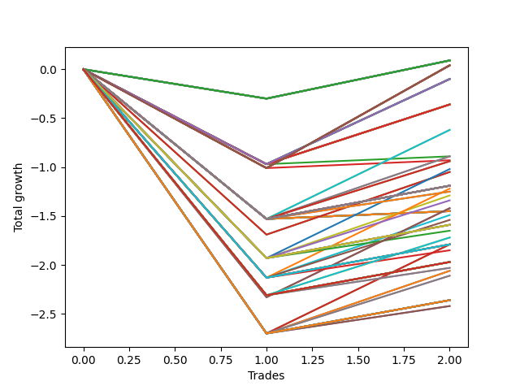

# Long HLT 511 
- Symbol: TSLA
- Date Range: 05/16/2022 - 05/17/2024
- Trading Period: 8:30-12:30
- Number of Trades: 2



| Id. | Name | Win Percent | Profit | Avg Profit / Trade | Avg Time / Trade | Std |      | Name | Win Percent | Profit | Avg Profit / Trade | Avg Time / Trade | Std |
| --- | ---- | ----------- | ------ | ------------------ | ---------------- | --- | ---- | ---- | ----------- | ------ | ------------------ | ---------------- | --- |
| | Sorted By <br> Profit | | | | | | | Sorted By <br> Win Percentage |||||
|0| TP-0.25 180m | 50.00 | 0.09 | 0.05 | 02:00 | 0.35 |     | TP-0.25 180m | 50.00 | 0.09 | 0.05 | 02:00 | 0.35 |
|1| TP-0.25 165m | 50.00 | 0.09 | 0.05 | 02:00 | 0.35 |     | TP-0.25 165m | 50.00 | 0.09 | 0.05 | 02:00 | 0.35 |
|2| TP-0.25 150m | 50.00 | 0.09 | 0.05 | 02:00 | 0.35 |     | TP-0.25 150m | 50.00 | 0.09 | 0.05 | 02:00 | 0.35 |
|3| TP-0.25 135m | 50.00 | 0.09 | 0.05 | 02:00 | 0.35 |     | TP-0.25 135m | 50.00 | 0.09 | 0.05 | 02:00 | 0.35 |
|4| TP-0.25 120m | 50.00 | 0.09 | 0.05 | 02:00 | 0.35 |     | TP-0.25 120m | 50.00 | 0.09 | 0.05 | 02:00 | 0.35 |
|5| TP-0.25 105m | 50.00 | 0.09 | 0.05 | 02:00 | 0.35 |     | TP-0.25 105m | 50.00 | 0.09 | 0.05 | 02:00 | 0.35 |
|6| TP-0.25 90m | 50.00 | 0.09 | 0.05 | 02:00 | 0.35 |     | TP-0.25 90m | 50.00 | 0.09 | 0.05 | 02:00 | 0.35 |
|7| TP-0.25 75m | 50.00 | 0.09 | 0.05 | 02:00 | 0.35 |     | TP-0.25 75m | 50.00 | 0.09 | 0.05 | 02:00 | 0.35 |
|8| TP-0.25 60m | 50.00 | 0.09 | 0.05 | 02:00 | 0.35 |     | TP-0.25 60m | 50.00 | 0.09 | 0.05 | 02:00 | 0.35 |
|9| TP-0.25 45m | 50.00 | 0.09 | 0.05 | 02:00 | 0.35 |     | TP-0.25 45m | 50.00 | 0.09 | 0.05 | 02:00 | 0.35 |
|10| TP-0.25 30m | 50.00 | 0.09 | 0.05 | 02:00 | 0.35 |     | TP-0.25 30m | 50.00 | 0.09 | 0.05 | 02:00 | 0.35 |
|11| TP-0.25 15m | 50.00 | 0.09 | 0.05 | 02:00 | 0.35 |     | TP-0.25 15m | 50.00 | 0.09 | 0.05 | 02:00 | 0.35 |
|12| TP-1 180m | 50.00 | 0.04 | 0.02 | 14:30 | 1.03 |     | TP-1 180m | 50.00 | 0.04 | 0.02 | 14:30 | 1.03 |
|13| TP-1 165m | 50.00 | 0.04 | 0.02 | 14:30 | 1.03 |     | TP-1 165m | 50.00 | 0.04 | 0.02 | 14:30 | 1.03 |
|14| TP-1 150m | 50.00 | 0.04 | 0.02 | 14:30 | 1.03 |     | TP-1 150m | 50.00 | 0.04 | 0.02 | 14:30 | 1.03 |
|15| TP-1 135m | 50.00 | 0.04 | 0.02 | 14:30 | 1.03 |     | TP-1 135m | 50.00 | 0.04 | 0.02 | 14:30 | 1.03 |
|16| TP-1 120m | 50.00 | 0.04 | 0.02 | 14:30 | 1.03 |     | TP-1 120m | 50.00 | 0.04 | 0.02 | 14:30 | 1.03 |
|17| TP-1 105m | 50.00 | 0.04 | 0.02 | 14:30 | 1.03 |     | TP-1 105m | 50.00 | 0.04 | 0.02 | 14:30 | 1.03 |
|18| TP-1 90m | 50.00 | 0.04 | 0.02 | 14:30 | 1.03 |     | TP-1 90m | 50.00 | 0.04 | 0.02 | 14:30 | 1.03 |
|19| TP-1 75m | 50.00 | 0.04 | 0.02 | 14:30 | 1.03 |     | TP-1 75m | 50.00 | 0.04 | 0.02 | 14:30 | 1.03 |
|20| TP-1 60m | 50.00 | 0.04 | 0.02 | 14:30 | 1.03 |     | TP-1 60m | 50.00 | 0.04 | 0.02 | 14:30 | 1.03 |
|21| TP-1 45m | 50.00 | 0.04 | 0.02 | 14:30 | 1.03 |     | TP-1 45m | 50.00 | 0.04 | 0.02 | 14:30 | 1.03 |
|22| TP-1 30m | 50.00 | 0.04 | 0.02 | 14:30 | 1.03 |     | TP-1 30m | 50.00 | 0.04 | 0.02 | 14:30 | 1.03 |
|23| TP-0.75 180m | 50.00 | -0.10 | -0.05 | 12:00 | 0.92 |     | TP-0.75 180m | 50.00 | -0.10 | -0.05 | 12:00 | 0.92 |
|24| TP-0.75 165m | 50.00 | -0.10 | -0.05 | 12:00 | 0.92 |     | TP-0.75 165m | 50.00 | -0.10 | -0.05 | 12:00 | 0.92 |
|25| TP-0.75 150m | 50.00 | -0.10 | -0.05 | 12:00 | 0.92 |     | TP-0.75 150m | 50.00 | -0.10 | -0.05 | 12:00 | 0.92 |
|26| TP-0.75 135m | 50.00 | -0.10 | -0.05 | 12:00 | 0.92 |     | TP-0.75 135m | 50.00 | -0.10 | -0.05 | 12:00 | 0.92 |
|27| TP-0.75 120m | 50.00 | -0.10 | -0.05 | 12:00 | 0.92 |     | TP-0.75 120m | 50.00 | -0.10 | -0.05 | 12:00 | 0.92 |
|28| TP-0.75 105m | 50.00 | -0.10 | -0.05 | 12:00 | 0.92 |     | TP-0.75 105m | 50.00 | -0.10 | -0.05 | 12:00 | 0.92 |
|29| TP-0.75 90m | 50.00 | -0.10 | -0.05 | 12:00 | 0.92 |     | TP-0.75 90m | 50.00 | -0.10 | -0.05 | 12:00 | 0.92 |
|30| TP-0.75 75m | 50.00 | -0.10 | -0.05 | 12:00 | 0.92 |     | TP-0.75 75m | 50.00 | -0.10 | -0.05 | 12:00 | 0.92 |
|31| TP-0.75 60m | 50.00 | -0.10 | -0.05 | 12:00 | 0.92 |     | TP-0.75 60m | 50.00 | -0.10 | -0.05 | 12:00 | 0.92 |
|32| TP-0.75 45m | 50.00 | -0.10 | -0.05 | 12:00 | 0.92 |     | TP-0.75 45m | 50.00 | -0.10 | -0.05 | 12:00 | 0.92 |
|33| TP-0.75 30m | 50.00 | -0.10 | -0.05 | 12:00 | 0.92 |     | TP-0.75 30m | 50.00 | -0.10 | -0.05 | 12:00 | 0.92 |
|34| TP-0.5 180m | 50.00 | -0.36 | -0.18 | 05:00 | 0.79 |     | TP-0.5 180m | 50.00 | -0.36 | -0.18 | 05:00 | 0.79 |
|35| TP-0.5 165m | 50.00 | -0.36 | -0.18 | 05:00 | 0.79 |     | TP-0.5 165m | 50.00 | -0.36 | -0.18 | 05:00 | 0.79 |
|36| TP-0.5 150m | 50.00 | -0.36 | -0.18 | 05:00 | 0.79 |     | TP-0.5 150m | 50.00 | -0.36 | -0.18 | 05:00 | 0.79 |
|37| TP-0.5 135m | 50.00 | -0.36 | -0.18 | 05:00 | 0.79 |     | TP-0.5 135m | 50.00 | -0.36 | -0.18 | 05:00 | 0.79 |
|38| TP-0.5 120m | 50.00 | -0.36 | -0.18 | 05:00 | 0.79 |     | TP-0.5 120m | 50.00 | -0.36 | -0.18 | 05:00 | 0.79 |
|39| TP-0.5 105m | 50.00 | -0.36 | -0.18 | 05:00 | 0.79 |     | TP-0.5 105m | 50.00 | -0.36 | -0.18 | 05:00 | 0.79 |
|40| TP-0.5 90m | 50.00 | -0.36 | -0.18 | 05:00 | 0.79 |     | TP-0.5 90m | 50.00 | -0.36 | -0.18 | 05:00 | 0.79 |
|41| TP-0.5 75m | 50.00 | -0.36 | -0.18 | 05:00 | 0.79 |     | TP-0.5 75m | 50.00 | -0.36 | -0.18 | 05:00 | 0.79 |
|42| TP-0.5 60m | 50.00 | -0.36 | -0.18 | 05:00 | 0.79 |     | TP-0.5 60m | 50.00 | -0.36 | -0.18 | 05:00 | 0.79 |
|43| TP-0.5 45m | 50.00 | -0.36 | -0.18 | 05:00 | 0.79 |     | TP-0.5 45m | 50.00 | -0.36 | -0.18 | 05:00 | 0.79 |
|44| TP-0.5 30m | 50.00 | -0.36 | -0.18 | 05:00 | 0.79 |     | TP-0.5 30m | 50.00 | -0.36 | -0.18 | 05:00 | 0.79 |
|45| TP-0.5 15m | 50.00 | -0.36 | -0.18 | 05:00 | 0.79 |     | TP-0.5 15m | 50.00 | -0.36 | -0.18 | 05:00 | 0.79 |
|46| TP-1.5 45m | 50.00 | -0.62 | -0.31 | 29:00 | 1.22 |     | TP-1.5 45m | 50.00 | -0.62 | -0.31 | 29:00 | 1.22 |
|47| TP-1.25 45m | 50.00 | -0.62 | -0.31 | 29:00 | 1.22 |     | TP-1.25 45m | 50.00 | -0.62 | -0.31 | 29:00 | 1.22 |
|48| TP-1.5 30m | 50.00 | -0.89 | -0.44 | 21:30 | 1.08 |     | TP-1.5 30m | 50.00 | -0.89 | -0.44 | 21:30 | 1.08 |
|49| TP-1.25 30m | 50.00 | -0.89 | -0.44 | 21:30 | 1.08 |     | TP-1.25 30m | 50.00 | -0.89 | -0.44 | 21:30 | 1.08 |
|50| TP-0.75 15m | 50.00 | -0.89 | -0.44 | 08:30 | 0.52 |     | TP-0.75 15m | 50.00 | -0.89 | -0.44 | 08:30 | 0.52 |
|51| TP-1 15m | 50.00 | -0.93 | -0.46 | 10:00 | 0.55 |     | TP-1 15m | 50.00 | -0.93 | -0.46 | 10:00 | 0.55 |
|52| TP-1.5 75m | 50.00 | -0.94 | -0.47 | 44:00 | 1.06 |     | TP-1.5 75m | 50.00 | -0.94 | -0.47 | 44:00 | 1.06 |
|53| TP-1.25 75m | 50.00 | -0.94 | -0.47 | 44:00 | 1.06 |     | TP-1.25 75m | 50.00 | -0.94 | -0.47 | 44:00 | 1.06 |
|54| TP-1.75 45m | 50.00 | -1.02 | -0.51 | 33:30 | 1.42 |     | TP-1.75 45m | 50.00 | -1.02 | -0.51 | 33:30 | 1.42 |
|55| TP-3 30m | 50.00 | -1.05 | -0.52 | 29:00 | 1.17 |     | TP-3 30m | 50.00 | -1.05 | -0.52 | 29:00 | 1.17 |
|56| TP-2.75 30m | 50.00 | -1.05 | -0.52 | 29:00 | 1.17 |     | TP-2.75 30m | 50.00 | -1.05 | -0.52 | 29:00 | 1.17 |
|57| TP-1.5 180m | 50.00 | -1.19 | -0.59 | 47:00 | 0.93 |     | TP-1.5 180m | 50.00 | -1.19 | -0.59 | 47:00 | 0.93 |
|58| TP-1.25 180m | 50.00 | -1.19 | -0.59 | 47:00 | 0.93 |     | TP-1.25 180m | 50.00 | -1.19 | -0.59 | 47:00 | 0.93 |
|59| TP-1.5 165m | 50.00 | -1.19 | -0.59 | 47:00 | 0.93 |     | TP-1.5 165m | 50.00 | -1.19 | -0.59 | 47:00 | 0.93 |
|60| TP-1.25 165m | 50.00 | -1.19 | -0.59 | 47:00 | 0.93 |     | TP-1.25 165m | 50.00 | -1.19 | -0.59 | 47:00 | 0.93 |
|61| TP-1.5 150m | 50.00 | -1.19 | -0.59 | 47:00 | 0.93 |     | TP-1.5 150m | 50.00 | -1.19 | -0.59 | 47:00 | 0.93 |
|62| TP-1.25 150m | 50.00 | -1.19 | -0.59 | 47:00 | 0.93 |     | TP-1.25 150m | 50.00 | -1.19 | -0.59 | 47:00 | 0.93 |
|63| TP-1.5 135m | 50.00 | -1.19 | -0.59 | 47:00 | 0.93 |     | TP-1.5 135m | 50.00 | -1.19 | -0.59 | 47:00 | 0.93 |
|64| TP-1.25 135m | 50.00 | -1.19 | -0.59 | 47:00 | 0.93 |     | TP-1.25 135m | 50.00 | -1.19 | -0.59 | 47:00 | 0.93 |
|65| TP-1.5 120m | 50.00 | -1.19 | -0.59 | 47:00 | 0.93 |     | TP-1.5 120m | 50.00 | -1.19 | -0.59 | 47:00 | 0.93 |
|66| TP-1.25 120m | 50.00 | -1.19 | -0.59 | 47:00 | 0.93 |     | TP-1.25 120m | 50.00 | -1.19 | -0.59 | 47:00 | 0.93 |
|67| TP-1.5 105m | 50.00 | -1.19 | -0.59 | 47:00 | 0.93 |     | TP-1.5 105m | 50.00 | -1.19 | -0.59 | 47:00 | 0.93 |
|68| TP-1.25 105m | 50.00 | -1.19 | -0.59 | 47:00 | 0.93 |     | TP-1.25 105m | 50.00 | -1.19 | -0.59 | 47:00 | 0.93 |
|69| TP-1.5 90m | 50.00 | -1.19 | -0.59 | 47:00 | 0.93 |     | TP-1.5 90m | 50.00 | -1.19 | -0.59 | 47:00 | 0.93 |
|70| TP-1.25 90m | 50.00 | -1.19 | -0.59 | 47:00 | 0.93 |     | TP-1.25 90m | 50.00 | -1.19 | -0.59 | 47:00 | 0.93 |
|71| TP-2 45m | 50.00 | -1.22 | -0.61 | 35:00 | 1.52 |     | TP-2 45m | 50.00 | -1.22 | -0.61 | 35:00 | 1.52 |
|72| TP-1.5 60m | 50.00 | -1.25 | -0.62 | 36:30 | 0.90 |     | TP-1.5 60m | 50.00 | -1.25 | -0.62 | 36:30 | 0.90 |
|73| TP-1.25 60m | 50.00 | -1.25 | -0.62 | 36:30 | 0.90 |     | TP-1.25 60m | 50.00 | -1.25 | -0.62 | 36:30 | 0.90 |
|74| TP-1.75 30m | 50.00 | -1.29 | -0.64 | 26:00 | 1.29 |     | TP-1.75 30m | 50.00 | -1.29 | -0.64 | 26:00 | 1.29 |
|75| TP-1.75 75m | 50.00 | -1.34 | -0.67 | 48:30 | 1.26 |     | TP-1.75 75m | 50.00 | -1.34 | -0.67 | 48:30 | 1.26 |
|76| TP-3 45m | 50.00 | -1.42 | -0.71 | 44:00 | 1.62 |     | TP-3 45m | 50.00 | -1.42 | -0.71 | 44:00 | 1.62 |
|77| TP-2.75 45m | 50.00 | -1.42 | -0.71 | 44:00 | 1.62 |     | TP-2.75 45m | 50.00 | -1.42 | -0.71 | 44:00 | 1.62 |
|78| TP-3 15m | 50.00 | -1.45 | -0.72 | 14:00 | 0.80 |     | TP-3 15m | 50.00 | -1.45 | -0.72 | 14:00 | 0.80 |
|79| TP-2.75 15m | 50.00 | -1.45 | -0.72 | 14:00 | 0.80 |     | TP-2.75 15m | 50.00 | -1.45 | -0.72 | 14:00 | 0.80 |
|80| TP-2.5 15m | 50.00 | -1.45 | -0.72 | 14:00 | 0.80 |     | TP-2.5 15m | 50.00 | -1.45 | -0.72 | 14:00 | 0.80 |
|81| TP-2.25 15m | 50.00 | -1.45 | -0.72 | 14:00 | 0.80 |     | TP-2.25 15m | 50.00 | -1.45 | -0.72 | 14:00 | 0.80 |
|82| TP-2 15m | 50.00 | -1.45 | -0.72 | 14:00 | 0.80 |     | TP-2 15m | 50.00 | -1.45 | -0.72 | 14:00 | 0.80 |
|83| TP-1.75 15m | 50.00 | -1.45 | -0.72 | 14:00 | 0.80 |     | TP-1.75 15m | 50.00 | -1.45 | -0.72 | 14:00 | 0.80 |
|84| TP-1.5 15m | 50.00 | -1.45 | -0.72 | 14:00 | 0.80 |     | TP-1.5 15m | 50.00 | -1.45 | -0.72 | 14:00 | 0.80 |
|85| TP-1.25 15m | 50.00 | -1.45 | -0.72 | 14:00 | 0.80 |     | TP-1.25 15m | 50.00 | -1.45 | -0.72 | 14:00 | 0.80 |
|86| TP-2 30m | 50.00 | -1.49 | -0.74 | 27:30 | 1.39 |     | TP-2 30m | 50.00 | -1.49 | -0.74 | 27:30 | 1.39 |
|87| TP-2 75m | 50.00 | -1.54 | -0.77 | 50:00 | 1.36 |     | TP-2 75m | 50.00 | -1.54 | -0.77 | 50:00 | 1.36 |
|88| TP-1.75 180m | 50.00 | -1.59 | -0.80 | 51:30 | 1.14 |     | TP-1.75 180m | 50.00 | -1.59 | -0.80 | 51:30 | 1.14 |
|89| TP-1.75 165m | 50.00 | -1.59 | -0.80 | 51:30 | 1.14 |     | TP-1.75 165m | 50.00 | -1.59 | -0.80 | 51:30 | 1.14 |
|90| TP-1.75 150m | 50.00 | -1.59 | -0.80 | 51:30 | 1.14 |     | TP-1.75 150m | 50.00 | -1.59 | -0.80 | 51:30 | 1.14 |
|91| TP-1.75 135m | 50.00 | -1.59 | -0.80 | 51:30 | 1.14 |     | TP-1.75 135m | 50.00 | -1.59 | -0.80 | 51:30 | 1.14 |
|92| TP-1.75 120m | 50.00 | -1.59 | -0.80 | 51:30 | 1.14 |     | TP-1.75 120m | 50.00 | -1.59 | -0.80 | 51:30 | 1.14 |
|93| TP-1.75 105m | 50.00 | -1.59 | -0.80 | 51:30 | 1.14 |     | TP-1.75 105m | 50.00 | -1.59 | -0.80 | 51:30 | 1.14 |
|94| TP-1.75 90m | 50.00 | -1.59 | -0.80 | 51:30 | 1.14 |     | TP-1.75 90m | 50.00 | -1.59 | -0.80 | 51:30 | 1.14 |
|95| TP-1.75 60m | 50.00 | -1.65 | -0.83 | 41:00 | 1.11 |     | TP-1.75 60m | 50.00 | -1.65 | -0.83 | 41:00 | 1.11 |
|96| TP-3 75m | 50.00 | -1.72 | -0.86 | 59:30 | 1.45 |     | TP-3 75m | 50.00 | -1.72 | -0.86 | 59:30 | 1.45 |
|97| TP-2.75 75m | 50.00 | -1.72 | -0.86 | 59:30 | 1.45 |     | TP-2.75 75m | 50.00 | -1.72 | -0.86 | 59:30 | 1.45 |
|98| TP-2 180m | 50.00 | -1.79 | -0.89 | 53:00 | 1.23 |     | TP-2 180m | 50.00 | -1.79 | -0.89 | 53:00 | 1.23 |
|99| TP-2 165m | 50.00 | -1.79 | -0.89 | 53:00 | 1.23 |     | TP-2 165m | 50.00 | -1.79 | -0.89 | 53:00 | 1.23 |
|100| TP-2 150m | 50.00 | -1.79 | -0.89 | 53:00 | 1.23 |     | TP-2 150m | 50.00 | -1.79 | -0.89 | 53:00 | 1.23 |
|101| TP-2 135m | 50.00 | -1.79 | -0.89 | 53:00 | 1.23 |     | TP-2 135m | 50.00 | -1.79 | -0.89 | 53:00 | 1.23 |
|102| TP-2 120m | 50.00 | -1.79 | -0.89 | 53:00 | 1.23 |     | TP-2 120m | 50.00 | -1.79 | -0.89 | 53:00 | 1.23 |
|103| TP-2 105m | 50.00 | -1.79 | -0.89 | 53:00 | 1.23 |     | TP-2 105m | 50.00 | -1.79 | -0.89 | 53:00 | 1.23 |
|104| TP-2 90m | 50.00 | -1.79 | -0.89 | 53:00 | 1.23 |     | TP-2 90m | 50.00 | -1.79 | -0.89 | 53:00 | 1.23 |
|105| TP-2.5 45m | 50.00 | -1.79 | -0.89 | 35:30 | 1.80 |     | TP-2.5 45m | 50.00 | -1.79 | -0.89 | 35:30 | 1.80 |
|106| TP-2.25 45m | 50.00 | -1.79 | -0.89 | 35:30 | 1.80 |     | TP-2.25 45m | 50.00 | -1.79 | -0.89 | 35:30 | 1.80 |
|107| TP-2 60m | 50.00 | -1.85 | -0.92 | 42:30 | 1.20 |     | TP-2 60m | 50.00 | -1.85 | -0.92 | 42:30 | 1.20 |
|108| TP-3 180m | 50.00 | -1.97 | -0.98 | 62:30 | 1.33 |     | TP-3 180m | 50.00 | -1.97 | -0.98 | 62:30 | 1.33 |
|109| TP-2.75 180m | 50.00 | -1.97 | -0.98 | 62:30 | 1.33 |     | TP-2.75 180m | 50.00 | -1.97 | -0.98 | 62:30 | 1.33 |
|110| TP-3 165m | 50.00 | -1.97 | -0.98 | 62:30 | 1.33 |     | TP-3 165m | 50.00 | -1.97 | -0.98 | 62:30 | 1.33 |
|111| TP-2.75 165m | 50.00 | -1.97 | -0.98 | 62:30 | 1.33 |     | TP-2.75 165m | 50.00 | -1.97 | -0.98 | 62:30 | 1.33 |
|112| TP-3 150m | 50.00 | -1.97 | -0.98 | 62:30 | 1.33 |     | TP-3 150m | 50.00 | -1.97 | -0.98 | 62:30 | 1.33 |
|113| TP-2.75 150m | 50.00 | -1.97 | -0.98 | 62:30 | 1.33 |     | TP-2.75 150m | 50.00 | -1.97 | -0.98 | 62:30 | 1.33 |
|114| TP-3 135m | 50.00 | -1.97 | -0.98 | 62:30 | 1.33 |     | TP-3 135m | 50.00 | -1.97 | -0.98 | 62:30 | 1.33 |
|115| TP-2.75 135m | 50.00 | -1.97 | -0.98 | 62:30 | 1.33 |     | TP-2.75 135m | 50.00 | -1.97 | -0.98 | 62:30 | 1.33 |
|116| TP-3 120m | 50.00 | -1.97 | -0.98 | 62:30 | 1.33 |     | TP-3 120m | 50.00 | -1.97 | -0.98 | 62:30 | 1.33 |
|117| TP-2.75 120m | 50.00 | -1.97 | -0.98 | 62:30 | 1.33 |     | TP-2.75 120m | 50.00 | -1.97 | -0.98 | 62:30 | 1.33 |
|118| TP-3 105m | 50.00 | -1.97 | -0.98 | 62:30 | 1.33 |     | TP-3 105m | 50.00 | -1.97 | -0.98 | 62:30 | 1.33 |
|119| TP-2.75 105m | 50.00 | -1.97 | -0.98 | 62:30 | 1.33 |     | TP-2.75 105m | 50.00 | -1.97 | -0.98 | 62:30 | 1.33 |
|120| TP-3 90m | 50.00 | -1.97 | -0.98 | 62:30 | 1.33 |     | TP-3 90m | 50.00 | -1.97 | -0.98 | 62:30 | 1.33 |
|121| TP-2.75 90m | 50.00 | -1.97 | -0.98 | 62:30 | 1.33 |     | TP-2.75 90m | 50.00 | -1.97 | -0.98 | 62:30 | 1.33 |
|122| TP-3 60m | 50.00 | -2.03 | -1.02 | 52:00 | 1.30 |     | TP-3 60m | 50.00 | -2.03 | -1.02 | 52:00 | 1.30 |
|123| TP-2.75 60m | 50.00 | -2.03 | -1.02 | 52:00 | 1.30 |     | TP-2.75 60m | 50.00 | -2.03 | -1.02 | 52:00 | 1.30 |
|124| TP-2.5 30m | 50.00 | -2.06 | -1.03 | 28:00 | 1.67 |     | TP-2.5 30m | 50.00 | -2.06 | -1.03 | 28:00 | 1.67 |
|125| TP-2.25 30m | 50.00 | -2.06 | -1.03 | 28:00 | 1.67 |     | TP-2.25 30m | 50.00 | -2.06 | -1.03 | 28:00 | 1.67 |
|126| TP-2.5 75m | 50.00 | -2.11 | -1.05 | 50:30 | 1.64 |     | TP-2.5 75m | 50.00 | -2.11 | -1.05 | 50:30 | 1.64 |
|127| TP-2.25 75m | 50.00 | -2.11 | -1.05 | 50:30 | 1.64 |     | TP-2.25 75m | 50.00 | -2.11 | -1.05 | 50:30 | 1.64 |
|128| TP-2.5 180m | 50.00 | -2.36 | -1.18 | 53:30 | 1.52 |     | TP-2.5 180m | 50.00 | -2.36 | -1.18 | 53:30 | 1.52 |
|129| TP-2.25 180m | 50.00 | -2.36 | -1.18 | 53:30 | 1.52 |     | TP-2.25 180m | 50.00 | -2.36 | -1.18 | 53:30 | 1.52 |
|130| TP-2.5 165m | 50.00 | -2.36 | -1.18 | 53:30 | 1.52 |     | TP-2.5 165m | 50.00 | -2.36 | -1.18 | 53:30 | 1.52 |
|131| TP-2.25 165m | 50.00 | -2.36 | -1.18 | 53:30 | 1.52 |     | TP-2.25 165m | 50.00 | -2.36 | -1.18 | 53:30 | 1.52 |
|132| TP-2.5 150m | 50.00 | -2.36 | -1.18 | 53:30 | 1.52 |     | TP-2.5 150m | 50.00 | -2.36 | -1.18 | 53:30 | 1.52 |
|133| TP-2.25 150m | 50.00 | -2.36 | -1.18 | 53:30 | 1.52 |     | TP-2.25 150m | 50.00 | -2.36 | -1.18 | 53:30 | 1.52 |
|134| TP-2.5 135m | 50.00 | -2.36 | -1.18 | 53:30 | 1.52 |     | TP-2.5 135m | 50.00 | -2.36 | -1.18 | 53:30 | 1.52 |
|135| TP-2.25 135m | 50.00 | -2.36 | -1.18 | 53:30 | 1.52 |     | TP-2.25 135m | 50.00 | -2.36 | -1.18 | 53:30 | 1.52 |
|136| TP-2.5 120m | 50.00 | -2.36 | -1.18 | 53:30 | 1.52 |     | TP-2.5 120m | 50.00 | -2.36 | -1.18 | 53:30 | 1.52 |
|137| TP-2.25 120m | 50.00 | -2.36 | -1.18 | 53:30 | 1.52 |     | TP-2.25 120m | 50.00 | -2.36 | -1.18 | 53:30 | 1.52 |
|138| TP-2.5 105m | 50.00 | -2.36 | -1.18 | 53:30 | 1.52 |     | TP-2.5 105m | 50.00 | -2.36 | -1.18 | 53:30 | 1.52 |
|139| TP-2.25 105m | 50.00 | -2.36 | -1.18 | 53:30 | 1.52 |     | TP-2.25 105m | 50.00 | -2.36 | -1.18 | 53:30 | 1.52 |
|140| TP-2.5 90m | 50.00 | -2.36 | -1.18 | 53:30 | 1.52 |     | TP-2.5 90m | 50.00 | -2.36 | -1.18 | 53:30 | 1.52 |
|141| TP-2.25 90m | 50.00 | -2.36 | -1.18 | 53:30 | 1.52 |     | TP-2.25 90m | 50.00 | -2.36 | -1.18 | 53:30 | 1.52 |
|142| TP-2.5 60m | 50.00 | -2.42 | -1.21 | 43:00 | 1.49 |     | TP-2.5 60m | 50.00 | -2.42 | -1.21 | 43:00 | 1.49 |
|143| TP-2.25 60m | 50.00 | -2.42 | -1.21 | 43:00 | 1.49 |     | TP-2.25 60m | 50.00 | -2.42 | -1.21 | 43:00 | 1.49 |

### Test TP-0.25 15m
* Take Profit of 0.25 Point
* 0.25 Stoploss
* Results:
```
Total Trades: 2
Percent Up: 50.00
Percent Down: 50.00
Total Points Moved Up: 0.09
Potential Profit: 45.00
Total Points Ups: 0.39 Count Ups: 1
Total Points Downs: -0.30 Count Downs: 1
```

<details><summary>Trades</summary>

<code>In: 2022-08-08 12:05:00		Out: 2022-08-08 12:07:00		Total Position Time: 02:00		Total Move Up: -0.30		Total to Date: -0.30</code> <br />
<code>In: 2023-09-26 11:30:00		Out: 2023-09-26 11:32:00		Total Position Time: 02:00		Total Move Up: 0.39		Total to Date: 0.09</code> <br />


</details>

### Test TP-0.5 15m
* Take Profit of 0.5 Point
* 0.5 Stoploss
* Results:
```
Total Trades: 2
Percent Up: 50.00
Percent Down: 50.00
Total Points Moved Up: -0.36
Potential Profit: -180.00
Total Points Ups: 0.61 Count Ups: 1
Total Points Downs: -0.97 Count Downs: 1
```

<details><summary>Trades</summary>

<code>In: 2022-08-08 12:05:00		Out: 2022-08-08 12:08:00		Total Position Time: 03:00		Total Move Up: -0.97		Total to Date: -0.97</code> <br />
<code>In: 2023-09-26 11:30:00		Out: 2023-09-26 11:37:00		Total Position Time: 07:00		Total Move Up: 0.61		Total to Date: -0.36</code> <br />


</details>

### Test TP-0.75 15m
* Take Profit of 0.75 Point
* 0.75 Stoploss
* Results:
```
Total Trades: 2
Percent Up: 50.00
Percent Down: 50.00
Total Points Moved Up: -0.89
Potential Profit: -445.00
Total Points Ups: 0.08 Count Ups: 1
Total Points Downs: -0.97 Count Downs: 1
```

<details><summary>Trades</summary>

<code>In: 2022-08-08 12:05:00		Out: 2022-08-08 12:08:00		Total Position Time: 03:00		Total Move Up: -0.97		Total to Date: -0.97</code> <br />
<code>In: 2023-09-26 11:30:00		Out: 2023-09-26 11:44:00		Total Position Time: 14:00		Total Move Up: 0.08		Total to Date: -0.89</code> <br />


</details>

### Test TP-1 15m
* Take Profit of 1 Point
* 1 Stoploss
* Results:
```
Total Trades: 2
Percent Up: 50.00
Percent Down: 50.00
Total Points Moved Up: -0.93
Potential Profit: -465.00
Total Points Ups: 0.08 Count Ups: 1
Total Points Downs: -1.01 Count Downs: 1
```

<details><summary>Trades</summary>

<code>In: 2022-08-08 12:05:00		Out: 2022-08-08 12:11:00		Total Position Time: 06:00		Total Move Up: -1.01		Total to Date: -1.01</code> <br />
<code>In: 2023-09-26 11:30:00		Out: 2023-09-26 11:44:00		Total Position Time: 14:00		Total Move Up: 0.08		Total to Date: -0.93</code> <br />


</details>

### Test TP-1.25 15m
* Take Profit of 1.25 Point
* 1.25 Stoploss
* Results:
```
Total Trades: 2
Percent Up: 50.00
Percent Down: 50.00
Total Points Moved Up: -1.45
Potential Profit: -725.00
Total Points Ups: 0.08 Count Ups: 1
Total Points Downs: -1.53 Count Downs: 1
```

<details><summary>Trades</summary>

<code>In: 2022-08-08 12:05:00		Out: 2022-08-08 12:19:00		Total Position Time: 14:00		Total Move Up: -1.53		Total to Date: -1.53</code> <br />
<code>In: 2023-09-26 11:30:00		Out: 2023-09-26 11:44:00		Total Position Time: 14:00		Total Move Up: 0.08		Total to Date: -1.45</code> <br />


</details>

### Test TP-1.5 15m
* Take Profit of 1.5 Point
* 1.5 Stoploss
* Results:
```
Total Trades: 2
Percent Up: 50.00
Percent Down: 50.00
Total Points Moved Up: -1.45
Potential Profit: -725.00
Total Points Ups: 0.08 Count Ups: 1
Total Points Downs: -1.53 Count Downs: 1
```

<details><summary>Trades</summary>

<code>In: 2022-08-08 12:05:00		Out: 2022-08-08 12:19:00		Total Position Time: 14:00		Total Move Up: -1.53		Total to Date: -1.53</code> <br />
<code>In: 2023-09-26 11:30:00		Out: 2023-09-26 11:44:00		Total Position Time: 14:00		Total Move Up: 0.08		Total to Date: -1.45</code> <br />


</details>

### Test TP-1.75 15m
* Take Profit of 1.75 Point
* 1.75 Stoploss
* Results:
```
Total Trades: 2
Percent Up: 50.00
Percent Down: 50.00
Total Points Moved Up: -1.45
Potential Profit: -725.00
Total Points Ups: 0.08 Count Ups: 1
Total Points Downs: -1.53 Count Downs: 1
```

<details><summary>Trades</summary>

<code>In: 2022-08-08 12:05:00		Out: 2022-08-08 12:19:00		Total Position Time: 14:00		Total Move Up: -1.53		Total to Date: -1.53</code> <br />
<code>In: 2023-09-26 11:30:00		Out: 2023-09-26 11:44:00		Total Position Time: 14:00		Total Move Up: 0.08		Total to Date: -1.45</code> <br />


</details>

### Test TP-2 15m
* Take Profit of 2 Point
* 2 Stoploss
* Results:
```
Total Trades: 2
Percent Up: 50.00
Percent Down: 50.00
Total Points Moved Up: -1.45
Potential Profit: -725.00
Total Points Ups: 0.08 Count Ups: 1
Total Points Downs: -1.53 Count Downs: 1
```

<details><summary>Trades</summary>

<code>In: 2022-08-08 12:05:00		Out: 2022-08-08 12:19:00		Total Position Time: 14:00		Total Move Up: -1.53		Total to Date: -1.53</code> <br />
<code>In: 2023-09-26 11:30:00		Out: 2023-09-26 11:44:00		Total Position Time: 14:00		Total Move Up: 0.08		Total to Date: -1.45</code> <br />


</details>

### Test TP-2.25 15m
* Take Profit of 2.25 Point
* 2.25 Stoploss
* Results:
```
Total Trades: 2
Percent Up: 50.00
Percent Down: 50.00
Total Points Moved Up: -1.45
Potential Profit: -725.00
Total Points Ups: 0.08 Count Ups: 1
Total Points Downs: -1.53 Count Downs: 1
```

<details><summary>Trades</summary>

<code>In: 2022-08-08 12:05:00		Out: 2022-08-08 12:19:00		Total Position Time: 14:00		Total Move Up: -1.53		Total to Date: -1.53</code> <br />
<code>In: 2023-09-26 11:30:00		Out: 2023-09-26 11:44:00		Total Position Time: 14:00		Total Move Up: 0.08		Total to Date: -1.45</code> <br />


</details>

### Test TP-2.5 15m
* Take Profit of 2.5 Point
* 2.5 Stoploss
* Results:
```
Total Trades: 2
Percent Up: 50.00
Percent Down: 50.00
Total Points Moved Up: -1.45
Potential Profit: -725.00
Total Points Ups: 0.08 Count Ups: 1
Total Points Downs: -1.53 Count Downs: 1
```

<details><summary>Trades</summary>

<code>In: 2022-08-08 12:05:00		Out: 2022-08-08 12:19:00		Total Position Time: 14:00		Total Move Up: -1.53		Total to Date: -1.53</code> <br />
<code>In: 2023-09-26 11:30:00		Out: 2023-09-26 11:44:00		Total Position Time: 14:00		Total Move Up: 0.08		Total to Date: -1.45</code> <br />


</details>

### Test TP-2.75 15m
* Take Profit of 2.75 Point
* 2.75 Stoploss
* Results:
```
Total Trades: 2
Percent Up: 50.00
Percent Down: 50.00
Total Points Moved Up: -1.45
Potential Profit: -725.00
Total Points Ups: 0.08 Count Ups: 1
Total Points Downs: -1.53 Count Downs: 1
```

<details><summary>Trades</summary>

<code>In: 2022-08-08 12:05:00		Out: 2022-08-08 12:19:00		Total Position Time: 14:00		Total Move Up: -1.53		Total to Date: -1.53</code> <br />
<code>In: 2023-09-26 11:30:00		Out: 2023-09-26 11:44:00		Total Position Time: 14:00		Total Move Up: 0.08		Total to Date: -1.45</code> <br />


</details>

### Test TP-3 15m
* Take Profit of 3 Point
* 3 Stoploss
* Results:
```
Total Trades: 2
Percent Up: 50.00
Percent Down: 50.00
Total Points Moved Up: -1.45
Potential Profit: -725.00
Total Points Ups: 0.08 Count Ups: 1
Total Points Downs: -1.53 Count Downs: 1
```

<details><summary>Trades</summary>

<code>In: 2022-08-08 12:05:00		Out: 2022-08-08 12:19:00		Total Position Time: 14:00		Total Move Up: -1.53		Total to Date: -1.53</code> <br />
<code>In: 2023-09-26 11:30:00		Out: 2023-09-26 11:44:00		Total Position Time: 14:00		Total Move Up: 0.08		Total to Date: -1.45</code> <br />


</details>

### Test TP-0.25 30m
* Take Profit of 0.25 Point
* 0.25 Stoploss
* Results:
```
Total Trades: 2
Percent Up: 50.00
Percent Down: 50.00
Total Points Moved Up: 0.09
Potential Profit: 45.00
Total Points Ups: 0.39 Count Ups: 1
Total Points Downs: -0.30 Count Downs: 1
```

<details><summary>Trades</summary>

<code>In: 2022-08-08 12:05:00		Out: 2022-08-08 12:07:00		Total Position Time: 02:00		Total Move Up: -0.30		Total to Date: -0.30</code> <br />
<code>In: 2023-09-26 11:30:00		Out: 2023-09-26 11:32:00		Total Position Time: 02:00		Total Move Up: 0.39		Total to Date: 0.09</code> <br />


</details>

### Test TP-0.5 30m
* Take Profit of 0.5 Point
* 0.5 Stoploss
* Results:
```
Total Trades: 2
Percent Up: 50.00
Percent Down: 50.00
Total Points Moved Up: -0.36
Potential Profit: -180.00
Total Points Ups: 0.61 Count Ups: 1
Total Points Downs: -0.97 Count Downs: 1
```

<details><summary>Trades</summary>

<code>In: 2022-08-08 12:05:00		Out: 2022-08-08 12:08:00		Total Position Time: 03:00		Total Move Up: -0.97		Total to Date: -0.97</code> <br />
<code>In: 2023-09-26 11:30:00		Out: 2023-09-26 11:37:00		Total Position Time: 07:00		Total Move Up: 0.61		Total to Date: -0.36</code> <br />


</details>

### Test TP-0.75 30m
* Take Profit of 0.75 Point
* 0.75 Stoploss
* Results:
```
Total Trades: 2
Percent Up: 50.00
Percent Down: 50.00
Total Points Moved Up: -0.10
Potential Profit: -50.00
Total Points Ups: 0.87 Count Ups: 1
Total Points Downs: -0.97 Count Downs: 1
```

<details><summary>Trades</summary>

<code>In: 2022-08-08 12:05:00		Out: 2022-08-08 12:08:00		Total Position Time: 03:00		Total Move Up: -0.97		Total to Date: -0.97</code> <br />
<code>In: 2023-09-26 11:30:00		Out: 2023-09-26 11:51:00		Total Position Time: 21:00		Total Move Up: 0.87		Total to Date: -0.10</code> <br />


</details>

### Test TP-1 30m
* Take Profit of 1 Point
* 1 Stoploss
* Results:
```
Total Trades: 2
Percent Up: 50.00
Percent Down: 50.00
Total Points Moved Up: 0.04
Potential Profit: 20.00
Total Points Ups: 1.05 Count Ups: 1
Total Points Downs: -1.01 Count Downs: 1
```

<details><summary>Trades</summary>

<code>In: 2022-08-08 12:05:00		Out: 2022-08-08 12:11:00		Total Position Time: 06:00		Total Move Up: -1.01		Total to Date: -1.01</code> <br />
<code>In: 2023-09-26 11:30:00		Out: 2023-09-26 11:53:00		Total Position Time: 23:00		Total Move Up: 1.05		Total to Date: 0.04</code> <br />


</details>

### Test TP-1.25 30m
* Take Profit of 1.25 Point
* 1.25 Stoploss
* Results:
```
Total Trades: 2
Percent Up: 50.00
Percent Down: 50.00
Total Points Moved Up: -0.89
Potential Profit: -445.00
Total Points Ups: 0.64 Count Ups: 1
Total Points Downs: -1.53 Count Downs: 1
```

<details><summary>Trades</summary>

<code>In: 2022-08-08 12:05:00		Out: 2022-08-08 12:19:00		Total Position Time: 14:00		Total Move Up: -1.53		Total to Date: -1.53</code> <br />
<code>In: 2023-09-26 11:30:00		Out: 2023-09-26 11:59:00		Total Position Time: 29:00		Total Move Up: 0.64		Total to Date: -0.89</code> <br />


</details>

### Test TP-1.5 30m
* Take Profit of 1.5 Point
* 1.5 Stoploss
* Results:
```
Total Trades: 2
Percent Up: 50.00
Percent Down: 50.00
Total Points Moved Up: -0.89
Potential Profit: -445.00
Total Points Ups: 0.64 Count Ups: 1
Total Points Downs: -1.53 Count Downs: 1
```

<details><summary>Trades</summary>

<code>In: 2022-08-08 12:05:00		Out: 2022-08-08 12:19:00		Total Position Time: 14:00		Total Move Up: -1.53		Total to Date: -1.53</code> <br />
<code>In: 2023-09-26 11:30:00		Out: 2023-09-26 11:59:00		Total Position Time: 29:00		Total Move Up: 0.64		Total to Date: -0.89</code> <br />


</details>

### Test TP-1.75 30m
* Take Profit of 1.75 Point
* 1.75 Stoploss
* Results:
```
Total Trades: 2
Percent Up: 50.00
Percent Down: 50.00
Total Points Moved Up: -1.29
Potential Profit: -645.00
Total Points Ups: 0.64 Count Ups: 1
Total Points Downs: -1.93 Count Downs: 1
```

<details><summary>Trades</summary>

<code>In: 2022-08-08 12:05:00		Out: 2022-08-08 12:28:00		Total Position Time: 23:00		Total Move Up: -1.93		Total to Date: -1.93</code> <br />
<code>In: 2023-09-26 11:30:00		Out: 2023-09-26 11:59:00		Total Position Time: 29:00		Total Move Up: 0.64		Total to Date: -1.29</code> <br />


</details>

### Test TP-2 30m
* Take Profit of 2 Point
* 2 Stoploss
* Results:
```
Total Trades: 2
Percent Up: 50.00
Percent Down: 50.00
Total Points Moved Up: -1.49
Potential Profit: -745.00
Total Points Ups: 0.64 Count Ups: 1
Total Points Downs: -2.13 Count Downs: 1
```

<details><summary>Trades</summary>

<code>In: 2022-08-08 12:05:00		Out: 2022-08-08 12:31:00		Total Position Time: 26:00		Total Move Up: -2.13		Total to Date: -2.13</code> <br />
<code>In: 2023-09-26 11:30:00		Out: 2023-09-26 11:59:00		Total Position Time: 29:00		Total Move Up: 0.64		Total to Date: -1.49</code> <br />


</details>

### Test TP-2.25 30m
* Take Profit of 2.25 Point
* 2.25 Stoploss
* Results:
```
Total Trades: 2
Percent Up: 50.00
Percent Down: 50.00
Total Points Moved Up: -2.06
Potential Profit: -1030.00
Total Points Ups: 0.64 Count Ups: 1
Total Points Downs: -2.70 Count Downs: 1
```

<details><summary>Trades</summary>

<code>In: 2022-08-08 12:05:00		Out: 2022-08-08 12:32:00		Total Position Time: 27:00		Total Move Up: -2.70		Total to Date: -2.70</code> <br />
<code>In: 2023-09-26 11:30:00		Out: 2023-09-26 11:59:00		Total Position Time: 29:00		Total Move Up: 0.64		Total to Date: -2.06</code> <br />


</details>

### Test TP-2.5 30m
* Take Profit of 2.5 Point
* 2.5 Stoploss
* Results:
```
Total Trades: 2
Percent Up: 50.00
Percent Down: 50.00
Total Points Moved Up: -2.06
Potential Profit: -1030.00
Total Points Ups: 0.64 Count Ups: 1
Total Points Downs: -2.70 Count Downs: 1
```

<details><summary>Trades</summary>

<code>In: 2022-08-08 12:05:00		Out: 2022-08-08 12:32:00		Total Position Time: 27:00		Total Move Up: -2.70		Total to Date: -2.70</code> <br />
<code>In: 2023-09-26 11:30:00		Out: 2023-09-26 11:59:00		Total Position Time: 29:00		Total Move Up: 0.64		Total to Date: -2.06</code> <br />


</details>

### Test TP-2.75 30m
* Take Profit of 2.75 Point
* 2.75 Stoploss
* Results:
```
Total Trades: 2
Percent Up: 50.00
Percent Down: 50.00
Total Points Moved Up: -1.05
Potential Profit: -525.00
Total Points Ups: 0.64 Count Ups: 1
Total Points Downs: -1.69 Count Downs: 1
```

<details><summary>Trades</summary>

<code>In: 2022-08-08 12:05:00		Out: 2022-08-08 12:34:00		Total Position Time: 29:00		Total Move Up: -1.69		Total to Date: -1.69</code> <br />
<code>In: 2023-09-26 11:30:00		Out: 2023-09-26 11:59:00		Total Position Time: 29:00		Total Move Up: 0.64		Total to Date: -1.05</code> <br />


</details>

### Test TP-3 30m
* Take Profit of 3 Point
* 3 Stoploss
* Results:
```
Total Trades: 2
Percent Up: 50.00
Percent Down: 50.00
Total Points Moved Up: -1.05
Potential Profit: -525.00
Total Points Ups: 0.64 Count Ups: 1
Total Points Downs: -1.69 Count Downs: 1
```

<details><summary>Trades</summary>

<code>In: 2022-08-08 12:05:00		Out: 2022-08-08 12:34:00		Total Position Time: 29:00		Total Move Up: -1.69		Total to Date: -1.69</code> <br />
<code>In: 2023-09-26 11:30:00		Out: 2023-09-26 11:59:00		Total Position Time: 29:00		Total Move Up: 0.64		Total to Date: -1.05</code> <br />


</details>

### Test TP-0.25 45m
* Take Profit of 0.25 Point
* 0.25 Stoploss
* Results:
```
Total Trades: 2
Percent Up: 50.00
Percent Down: 50.00
Total Points Moved Up: 0.09
Potential Profit: 45.00
Total Points Ups: 0.39 Count Ups: 1
Total Points Downs: -0.30 Count Downs: 1
```

<details><summary>Trades</summary>

<code>In: 2022-08-08 12:05:00		Out: 2022-08-08 12:07:00		Total Position Time: 02:00		Total Move Up: -0.30		Total to Date: -0.30</code> <br />
<code>In: 2023-09-26 11:30:00		Out: 2023-09-26 11:32:00		Total Position Time: 02:00		Total Move Up: 0.39		Total to Date: 0.09</code> <br />


</details>

### Test TP-0.5 45m
* Take Profit of 0.5 Point
* 0.5 Stoploss
* Results:
```
Total Trades: 2
Percent Up: 50.00
Percent Down: 50.00
Total Points Moved Up: -0.36
Potential Profit: -180.00
Total Points Ups: 0.61 Count Ups: 1
Total Points Downs: -0.97 Count Downs: 1
```

<details><summary>Trades</summary>

<code>In: 2022-08-08 12:05:00		Out: 2022-08-08 12:08:00		Total Position Time: 03:00		Total Move Up: -0.97		Total to Date: -0.97</code> <br />
<code>In: 2023-09-26 11:30:00		Out: 2023-09-26 11:37:00		Total Position Time: 07:00		Total Move Up: 0.61		Total to Date: -0.36</code> <br />


</details>

### Test TP-0.75 45m
* Take Profit of 0.75 Point
* 0.75 Stoploss
* Results:
```
Total Trades: 2
Percent Up: 50.00
Percent Down: 50.00
Total Points Moved Up: -0.10
Potential Profit: -50.00
Total Points Ups: 0.87 Count Ups: 1
Total Points Downs: -0.97 Count Downs: 1
```

<details><summary>Trades</summary>

<code>In: 2022-08-08 12:05:00		Out: 2022-08-08 12:08:00		Total Position Time: 03:00		Total Move Up: -0.97		Total to Date: -0.97</code> <br />
<code>In: 2023-09-26 11:30:00		Out: 2023-09-26 11:51:00		Total Position Time: 21:00		Total Move Up: 0.87		Total to Date: -0.10</code> <br />


</details>

### Test TP-1 45m
* Take Profit of 1 Point
* 1 Stoploss
* Results:
```
Total Trades: 2
Percent Up: 50.00
Percent Down: 50.00
Total Points Moved Up: 0.04
Potential Profit: 20.00
Total Points Ups: 1.05 Count Ups: 1
Total Points Downs: -1.01 Count Downs: 1
```

<details><summary>Trades</summary>

<code>In: 2022-08-08 12:05:00		Out: 2022-08-08 12:11:00		Total Position Time: 06:00		Total Move Up: -1.01		Total to Date: -1.01</code> <br />
<code>In: 2023-09-26 11:30:00		Out: 2023-09-26 11:53:00		Total Position Time: 23:00		Total Move Up: 1.05		Total to Date: 0.04</code> <br />


</details>

### Test TP-1.25 45m
* Take Profit of 1.25 Point
* 1.25 Stoploss
* Results:
```
Total Trades: 2
Percent Up: 50.00
Percent Down: 50.00
Total Points Moved Up: -0.62
Potential Profit: -310.00
Total Points Ups: 0.91 Count Ups: 1
Total Points Downs: -1.53 Count Downs: 1
```

<details><summary>Trades</summary>

<code>In: 2022-08-08 12:05:00		Out: 2022-08-08 12:19:00		Total Position Time: 14:00		Total Move Up: -1.53		Total to Date: -1.53</code> <br />
<code>In: 2023-09-26 11:30:00		Out: 2023-09-26 12:14:00		Total Position Time: 44:00		Total Move Up: 0.91		Total to Date: -0.62</code> <br />


</details>

### Test TP-1.5 45m
* Take Profit of 1.5 Point
* 1.5 Stoploss
* Results:
```
Total Trades: 2
Percent Up: 50.00
Percent Down: 50.00
Total Points Moved Up: -0.62
Potential Profit: -310.00
Total Points Ups: 0.91 Count Ups: 1
Total Points Downs: -1.53 Count Downs: 1
```

<details><summary>Trades</summary>

<code>In: 2022-08-08 12:05:00		Out: 2022-08-08 12:19:00		Total Position Time: 14:00		Total Move Up: -1.53		Total to Date: -1.53</code> <br />
<code>In: 2023-09-26 11:30:00		Out: 2023-09-26 12:14:00		Total Position Time: 44:00		Total Move Up: 0.91		Total to Date: -0.62</code> <br />


</details>

### Test TP-1.75 45m
* Take Profit of 1.75 Point
* 1.75 Stoploss
* Results:
```
Total Trades: 2
Percent Up: 50.00
Percent Down: 50.00
Total Points Moved Up: -1.02
Potential Profit: -510.00
Total Points Ups: 0.91 Count Ups: 1
Total Points Downs: -1.93 Count Downs: 1
```

<details><summary>Trades</summary>

<code>In: 2022-08-08 12:05:00		Out: 2022-08-08 12:28:00		Total Position Time: 23:00		Total Move Up: -1.93		Total to Date: -1.93</code> <br />
<code>In: 2023-09-26 11:30:00		Out: 2023-09-26 12:14:00		Total Position Time: 44:00		Total Move Up: 0.91		Total to Date: -1.02</code> <br />


</details>

### Test TP-2 45m
* Take Profit of 2 Point
* 2 Stoploss
* Results:
```
Total Trades: 2
Percent Up: 50.00
Percent Down: 50.00
Total Points Moved Up: -1.22
Potential Profit: -610.00
Total Points Ups: 0.91 Count Ups: 1
Total Points Downs: -2.13 Count Downs: 1
```

<details><summary>Trades</summary>

<code>In: 2022-08-08 12:05:00		Out: 2022-08-08 12:31:00		Total Position Time: 26:00		Total Move Up: -2.13		Total to Date: -2.13</code> <br />
<code>In: 2023-09-26 11:30:00		Out: 2023-09-26 12:14:00		Total Position Time: 44:00		Total Move Up: 0.91		Total to Date: -1.22</code> <br />


</details>

### Test TP-2.25 45m
* Take Profit of 2.25 Point
* 2.25 Stoploss
* Results:
```
Total Trades: 2
Percent Up: 50.00
Percent Down: 50.00
Total Points Moved Up: -1.79
Potential Profit: -895.00
Total Points Ups: 0.91 Count Ups: 1
Total Points Downs: -2.70 Count Downs: 1
```

<details><summary>Trades</summary>

<code>In: 2022-08-08 12:05:00		Out: 2022-08-08 12:32:00		Total Position Time: 27:00		Total Move Up: -2.70		Total to Date: -2.70</code> <br />
<code>In: 2023-09-26 11:30:00		Out: 2023-09-26 12:14:00		Total Position Time: 44:00		Total Move Up: 0.91		Total to Date: -1.79</code> <br />


</details>

### Test TP-2.5 45m
* Take Profit of 2.5 Point
* 2.5 Stoploss
* Results:
```
Total Trades: 2
Percent Up: 50.00
Percent Down: 50.00
Total Points Moved Up: -1.79
Potential Profit: -895.00
Total Points Ups: 0.91 Count Ups: 1
Total Points Downs: -2.70 Count Downs: 1
```

<details><summary>Trades</summary>

<code>In: 2022-08-08 12:05:00		Out: 2022-08-08 12:32:00		Total Position Time: 27:00		Total Move Up: -2.70		Total to Date: -2.70</code> <br />
<code>In: 2023-09-26 11:30:00		Out: 2023-09-26 12:14:00		Total Position Time: 44:00		Total Move Up: 0.91		Total to Date: -1.79</code> <br />


</details>

### Test TP-2.75 45m
* Take Profit of 2.75 Point
* 2.75 Stoploss
* Results:
```
Total Trades: 2
Percent Up: 50.00
Percent Down: 50.00
Total Points Moved Up: -1.42
Potential Profit: -710.00
Total Points Ups: 0.91 Count Ups: 1
Total Points Downs: -2.33 Count Downs: 1
```

<details><summary>Trades</summary>

<code>In: 2022-08-08 12:05:00		Out: 2022-08-08 12:49:00		Total Position Time: 44:00		Total Move Up: -2.33		Total to Date: -2.33</code> <br />
<code>In: 2023-09-26 11:30:00		Out: 2023-09-26 12:14:00		Total Position Time: 44:00		Total Move Up: 0.91		Total to Date: -1.42</code> <br />


</details>

### Test TP-3 45m
* Take Profit of 3 Point
* 3 Stoploss
* Results:
```
Total Trades: 2
Percent Up: 50.00
Percent Down: 50.00
Total Points Moved Up: -1.42
Potential Profit: -710.00
Total Points Ups: 0.91 Count Ups: 1
Total Points Downs: -2.33 Count Downs: 1
```

<details><summary>Trades</summary>

<code>In: 2022-08-08 12:05:00		Out: 2022-08-08 12:49:00		Total Position Time: 44:00		Total Move Up: -2.33		Total to Date: -2.33</code> <br />
<code>In: 2023-09-26 11:30:00		Out: 2023-09-26 12:14:00		Total Position Time: 44:00		Total Move Up: 0.91		Total to Date: -1.42</code> <br />


</details>

### Test TP-0.25 60m
* Take Profit of 0.25 Point
* 0.25 Stoploss
* Results:
```
Total Trades: 2
Percent Up: 50.00
Percent Down: 50.00
Total Points Moved Up: 0.09
Potential Profit: 45.00
Total Points Ups: 0.39 Count Ups: 1
Total Points Downs: -0.30 Count Downs: 1
```

<details><summary>Trades</summary>

<code>In: 2022-08-08 12:05:00		Out: 2022-08-08 12:07:00		Total Position Time: 02:00		Total Move Up: -0.30		Total to Date: -0.30</code> <br />
<code>In: 2023-09-26 11:30:00		Out: 2023-09-26 11:32:00		Total Position Time: 02:00		Total Move Up: 0.39		Total to Date: 0.09</code> <br />


</details>

### Test TP-0.5 60m
* Take Profit of 0.5 Point
* 0.5 Stoploss
* Results:
```
Total Trades: 2
Percent Up: 50.00
Percent Down: 50.00
Total Points Moved Up: -0.36
Potential Profit: -180.00
Total Points Ups: 0.61 Count Ups: 1
Total Points Downs: -0.97 Count Downs: 1
```

<details><summary>Trades</summary>

<code>In: 2022-08-08 12:05:00		Out: 2022-08-08 12:08:00		Total Position Time: 03:00		Total Move Up: -0.97		Total to Date: -0.97</code> <br />
<code>In: 2023-09-26 11:30:00		Out: 2023-09-26 11:37:00		Total Position Time: 07:00		Total Move Up: 0.61		Total to Date: -0.36</code> <br />


</details>

### Test TP-0.75 60m
* Take Profit of 0.75 Point
* 0.75 Stoploss
* Results:
```
Total Trades: 2
Percent Up: 50.00
Percent Down: 50.00
Total Points Moved Up: -0.10
Potential Profit: -50.00
Total Points Ups: 0.87 Count Ups: 1
Total Points Downs: -0.97 Count Downs: 1
```

<details><summary>Trades</summary>

<code>In: 2022-08-08 12:05:00		Out: 2022-08-08 12:08:00		Total Position Time: 03:00		Total Move Up: -0.97		Total to Date: -0.97</code> <br />
<code>In: 2023-09-26 11:30:00		Out: 2023-09-26 11:51:00		Total Position Time: 21:00		Total Move Up: 0.87		Total to Date: -0.10</code> <br />


</details>

### Test TP-1 60m
* Take Profit of 1 Point
* 1 Stoploss
* Results:
```
Total Trades: 2
Percent Up: 50.00
Percent Down: 50.00
Total Points Moved Up: 0.04
Potential Profit: 20.00
Total Points Ups: 1.05 Count Ups: 1
Total Points Downs: -1.01 Count Downs: 1
```

<details><summary>Trades</summary>

<code>In: 2022-08-08 12:05:00		Out: 2022-08-08 12:11:00		Total Position Time: 06:00		Total Move Up: -1.01		Total to Date: -1.01</code> <br />
<code>In: 2023-09-26 11:30:00		Out: 2023-09-26 11:53:00		Total Position Time: 23:00		Total Move Up: 1.05		Total to Date: 0.04</code> <br />


</details>

### Test TP-1.25 60m
* Take Profit of 1.25 Point
* 1.25 Stoploss
* Results:
```
Total Trades: 2
Percent Up: 50.00
Percent Down: 50.00
Total Points Moved Up: -1.25
Potential Profit: -625.00
Total Points Ups: 0.28 Count Ups: 1
Total Points Downs: -1.53 Count Downs: 1
```

<details><summary>Trades</summary>

<code>In: 2022-08-08 12:05:00		Out: 2022-08-08 12:19:00		Total Position Time: 14:00		Total Move Up: -1.53		Total to Date: -1.53</code> <br />
<code>In: 2023-09-26 11:30:00		Out: 2023-09-26 12:29:00		Total Position Time: 59:00		Total Move Up: 0.28		Total to Date: -1.25</code> <br />


</details>

### Test TP-1.5 60m
* Take Profit of 1.5 Point
* 1.5 Stoploss
* Results:
```
Total Trades: 2
Percent Up: 50.00
Percent Down: 50.00
Total Points Moved Up: -1.25
Potential Profit: -625.00
Total Points Ups: 0.28 Count Ups: 1
Total Points Downs: -1.53 Count Downs: 1
```

<details><summary>Trades</summary>

<code>In: 2022-08-08 12:05:00		Out: 2022-08-08 12:19:00		Total Position Time: 14:00		Total Move Up: -1.53		Total to Date: -1.53</code> <br />
<code>In: 2023-09-26 11:30:00		Out: 2023-09-26 12:29:00		Total Position Time: 59:00		Total Move Up: 0.28		Total to Date: -1.25</code> <br />


</details>

### Test TP-1.75 60m
* Take Profit of 1.75 Point
* 1.75 Stoploss
* Results:
```
Total Trades: 2
Percent Up: 50.00
Percent Down: 50.00
Total Points Moved Up: -1.65
Potential Profit: -825.00
Total Points Ups: 0.28 Count Ups: 1
Total Points Downs: -1.93 Count Downs: 1
```

<details><summary>Trades</summary>

<code>In: 2022-08-08 12:05:00		Out: 2022-08-08 12:28:00		Total Position Time: 23:00		Total Move Up: -1.93		Total to Date: -1.93</code> <br />
<code>In: 2023-09-26 11:30:00		Out: 2023-09-26 12:29:00		Total Position Time: 59:00		Total Move Up: 0.28		Total to Date: -1.65</code> <br />


</details>

### Test TP-2 60m
* Take Profit of 2 Point
* 2 Stoploss
* Results:
```
Total Trades: 2
Percent Up: 50.00
Percent Down: 50.00
Total Points Moved Up: -1.85
Potential Profit: -925.00
Total Points Ups: 0.28 Count Ups: 1
Total Points Downs: -2.13 Count Downs: 1
```

<details><summary>Trades</summary>

<code>In: 2022-08-08 12:05:00		Out: 2022-08-08 12:31:00		Total Position Time: 26:00		Total Move Up: -2.13		Total to Date: -2.13</code> <br />
<code>In: 2023-09-26 11:30:00		Out: 2023-09-26 12:29:00		Total Position Time: 59:00		Total Move Up: 0.28		Total to Date: -1.85</code> <br />


</details>

### Test TP-2.25 60m
* Take Profit of 2.25 Point
* 2.25 Stoploss
* Results:
```
Total Trades: 2
Percent Up: 50.00
Percent Down: 50.00
Total Points Moved Up: -2.42
Potential Profit: -1210.00
Total Points Ups: 0.28 Count Ups: 1
Total Points Downs: -2.70 Count Downs: 1
```

<details><summary>Trades</summary>

<code>In: 2022-08-08 12:05:00		Out: 2022-08-08 12:32:00		Total Position Time: 27:00		Total Move Up: -2.70		Total to Date: -2.70</code> <br />
<code>In: 2023-09-26 11:30:00		Out: 2023-09-26 12:29:00		Total Position Time: 59:00		Total Move Up: 0.28		Total to Date: -2.42</code> <br />


</details>

### Test TP-2.5 60m
* Take Profit of 2.5 Point
* 2.5 Stoploss
* Results:
```
Total Trades: 2
Percent Up: 50.00
Percent Down: 50.00
Total Points Moved Up: -2.42
Potential Profit: -1210.00
Total Points Ups: 0.28 Count Ups: 1
Total Points Downs: -2.70 Count Downs: 1
```

<details><summary>Trades</summary>

<code>In: 2022-08-08 12:05:00		Out: 2022-08-08 12:32:00		Total Position Time: 27:00		Total Move Up: -2.70		Total to Date: -2.70</code> <br />
<code>In: 2023-09-26 11:30:00		Out: 2023-09-26 12:29:00		Total Position Time: 59:00		Total Move Up: 0.28		Total to Date: -2.42</code> <br />


</details>

### Test TP-2.75 60m
* Take Profit of 2.75 Point
* 2.75 Stoploss
* Results:
```
Total Trades: 2
Percent Up: 50.00
Percent Down: 50.00
Total Points Moved Up: -2.03
Potential Profit: -1015.00
Total Points Ups: 0.28 Count Ups: 1
Total Points Downs: -2.31 Count Downs: 1
```

<details><summary>Trades</summary>

<code>In: 2022-08-08 12:05:00		Out: 2022-08-08 12:50:00		Total Position Time: 45:00		Total Move Up: -2.31		Total to Date: -2.31</code> <br />
<code>In: 2023-09-26 11:30:00		Out: 2023-09-26 12:29:00		Total Position Time: 59:00		Total Move Up: 0.28		Total to Date: -2.03</code> <br />


</details>

### Test TP-3 60m
* Take Profit of 3 Point
* 3 Stoploss
* Results:
```
Total Trades: 2
Percent Up: 50.00
Percent Down: 50.00
Total Points Moved Up: -2.03
Potential Profit: -1015.00
Total Points Ups: 0.28 Count Ups: 1
Total Points Downs: -2.31 Count Downs: 1
```

<details><summary>Trades</summary>

<code>In: 2022-08-08 12:05:00		Out: 2022-08-08 12:50:00		Total Position Time: 45:00		Total Move Up: -2.31		Total to Date: -2.31</code> <br />
<code>In: 2023-09-26 11:30:00		Out: 2023-09-26 12:29:00		Total Position Time: 59:00		Total Move Up: 0.28		Total to Date: -2.03</code> <br />


</details>

### Test TP-0.25 75m
* Take Profit of 0.25 Point
* 0.25 Stoploss
* Results:
```
Total Trades: 2
Percent Up: 50.00
Percent Down: 50.00
Total Points Moved Up: 0.09
Potential Profit: 45.00
Total Points Ups: 0.39 Count Ups: 1
Total Points Downs: -0.30 Count Downs: 1
```

<details><summary>Trades</summary>

<code>In: 2022-08-08 12:05:00		Out: 2022-08-08 12:07:00		Total Position Time: 02:00		Total Move Up: -0.30		Total to Date: -0.30</code> <br />
<code>In: 2023-09-26 11:30:00		Out: 2023-09-26 11:32:00		Total Position Time: 02:00		Total Move Up: 0.39		Total to Date: 0.09</code> <br />


</details>

### Test TP-0.5 75m
* Take Profit of 0.5 Point
* 0.5 Stoploss
* Results:
```
Total Trades: 2
Percent Up: 50.00
Percent Down: 50.00
Total Points Moved Up: -0.36
Potential Profit: -180.00
Total Points Ups: 0.61 Count Ups: 1
Total Points Downs: -0.97 Count Downs: 1
```

<details><summary>Trades</summary>

<code>In: 2022-08-08 12:05:00		Out: 2022-08-08 12:08:00		Total Position Time: 03:00		Total Move Up: -0.97		Total to Date: -0.97</code> <br />
<code>In: 2023-09-26 11:30:00		Out: 2023-09-26 11:37:00		Total Position Time: 07:00		Total Move Up: 0.61		Total to Date: -0.36</code> <br />


</details>

### Test TP-0.75 75m
* Take Profit of 0.75 Point
* 0.75 Stoploss
* Results:
```
Total Trades: 2
Percent Up: 50.00
Percent Down: 50.00
Total Points Moved Up: -0.10
Potential Profit: -50.00
Total Points Ups: 0.87 Count Ups: 1
Total Points Downs: -0.97 Count Downs: 1
```

<details><summary>Trades</summary>

<code>In: 2022-08-08 12:05:00		Out: 2022-08-08 12:08:00		Total Position Time: 03:00		Total Move Up: -0.97		Total to Date: -0.97</code> <br />
<code>In: 2023-09-26 11:30:00		Out: 2023-09-26 11:51:00		Total Position Time: 21:00		Total Move Up: 0.87		Total to Date: -0.10</code> <br />


</details>

### Test TP-1 75m
* Take Profit of 1 Point
* 1 Stoploss
* Results:
```
Total Trades: 2
Percent Up: 50.00
Percent Down: 50.00
Total Points Moved Up: 0.04
Potential Profit: 20.00
Total Points Ups: 1.05 Count Ups: 1
Total Points Downs: -1.01 Count Downs: 1
```

<details><summary>Trades</summary>

<code>In: 2022-08-08 12:05:00		Out: 2022-08-08 12:11:00		Total Position Time: 06:00		Total Move Up: -1.01		Total to Date: -1.01</code> <br />
<code>In: 2023-09-26 11:30:00		Out: 2023-09-26 11:53:00		Total Position Time: 23:00		Total Move Up: 1.05		Total to Date: 0.04</code> <br />


</details>

### Test TP-1.25 75m
* Take Profit of 1.25 Point
* 1.25 Stoploss
* Results:
```
Total Trades: 2
Percent Up: 50.00
Percent Down: 50.00
Total Points Moved Up: -0.94
Potential Profit: -470.00
Total Points Ups: 0.59 Count Ups: 1
Total Points Downs: -1.53 Count Downs: 1
```

<details><summary>Trades</summary>

<code>In: 2022-08-08 12:05:00		Out: 2022-08-08 12:19:00		Total Position Time: 14:00		Total Move Up: -1.53		Total to Date: -1.53</code> <br />
<code>In: 2023-09-26 11:30:00		Out: 2023-09-26 12:44:00		Total Position Time: 74:00		Total Move Up: 0.59		Total to Date: -0.94</code> <br />


</details>

### Test TP-1.5 75m
* Take Profit of 1.5 Point
* 1.5 Stoploss
* Results:
```
Total Trades: 2
Percent Up: 50.00
Percent Down: 50.00
Total Points Moved Up: -0.94
Potential Profit: -470.00
Total Points Ups: 0.59 Count Ups: 1
Total Points Downs: -1.53 Count Downs: 1
```

<details><summary>Trades</summary>

<code>In: 2022-08-08 12:05:00		Out: 2022-08-08 12:19:00		Total Position Time: 14:00		Total Move Up: -1.53		Total to Date: -1.53</code> <br />
<code>In: 2023-09-26 11:30:00		Out: 2023-09-26 12:44:00		Total Position Time: 74:00		Total Move Up: 0.59		Total to Date: -0.94</code> <br />


</details>

### Test TP-1.75 75m
* Take Profit of 1.75 Point
* 1.75 Stoploss
* Results:
```
Total Trades: 2
Percent Up: 50.00
Percent Down: 50.00
Total Points Moved Up: -1.34
Potential Profit: -670.00
Total Points Ups: 0.59 Count Ups: 1
Total Points Downs: -1.93 Count Downs: 1
```

<details><summary>Trades</summary>

<code>In: 2022-08-08 12:05:00		Out: 2022-08-08 12:28:00		Total Position Time: 23:00		Total Move Up: -1.93		Total to Date: -1.93</code> <br />
<code>In: 2023-09-26 11:30:00		Out: 2023-09-26 12:44:00		Total Position Time: 74:00		Total Move Up: 0.59		Total to Date: -1.34</code> <br />


</details>

### Test TP-2 75m
* Take Profit of 2 Point
* 2 Stoploss
* Results:
```
Total Trades: 2
Percent Up: 50.00
Percent Down: 50.00
Total Points Moved Up: -1.54
Potential Profit: -770.00
Total Points Ups: 0.59 Count Ups: 1
Total Points Downs: -2.13 Count Downs: 1
```

<details><summary>Trades</summary>

<code>In: 2022-08-08 12:05:00		Out: 2022-08-08 12:31:00		Total Position Time: 26:00		Total Move Up: -2.13		Total to Date: -2.13</code> <br />
<code>In: 2023-09-26 11:30:00		Out: 2023-09-26 12:44:00		Total Position Time: 74:00		Total Move Up: 0.59		Total to Date: -1.54</code> <br />


</details>

### Test TP-2.25 75m
* Take Profit of 2.25 Point
* 2.25 Stoploss
* Results:
```
Total Trades: 2
Percent Up: 50.00
Percent Down: 50.00
Total Points Moved Up: -2.11
Potential Profit: -1055.00
Total Points Ups: 0.59 Count Ups: 1
Total Points Downs: -2.70 Count Downs: 1
```

<details><summary>Trades</summary>

<code>In: 2022-08-08 12:05:00		Out: 2022-08-08 12:32:00		Total Position Time: 27:00		Total Move Up: -2.70		Total to Date: -2.70</code> <br />
<code>In: 2023-09-26 11:30:00		Out: 2023-09-26 12:44:00		Total Position Time: 74:00		Total Move Up: 0.59		Total to Date: -2.11</code> <br />


</details>

### Test TP-2.5 75m
* Take Profit of 2.5 Point
* 2.5 Stoploss
* Results:
```
Total Trades: 2
Percent Up: 50.00
Percent Down: 50.00
Total Points Moved Up: -2.11
Potential Profit: -1055.00
Total Points Ups: 0.59 Count Ups: 1
Total Points Downs: -2.70 Count Downs: 1
```

<details><summary>Trades</summary>

<code>In: 2022-08-08 12:05:00		Out: 2022-08-08 12:32:00		Total Position Time: 27:00		Total Move Up: -2.70		Total to Date: -2.70</code> <br />
<code>In: 2023-09-26 11:30:00		Out: 2023-09-26 12:44:00		Total Position Time: 74:00		Total Move Up: 0.59		Total to Date: -2.11</code> <br />


</details>

### Test TP-2.75 75m
* Take Profit of 2.75 Point
* 2.75 Stoploss
* Results:
```
Total Trades: 2
Percent Up: 50.00
Percent Down: 50.00
Total Points Moved Up: -1.72
Potential Profit: -860.00
Total Points Ups: 0.59 Count Ups: 1
Total Points Downs: -2.31 Count Downs: 1
```

<details><summary>Trades</summary>

<code>In: 2022-08-08 12:05:00		Out: 2022-08-08 12:50:00		Total Position Time: 45:00		Total Move Up: -2.31		Total to Date: -2.31</code> <br />
<code>In: 2023-09-26 11:30:00		Out: 2023-09-26 12:44:00		Total Position Time: 74:00		Total Move Up: 0.59		Total to Date: -1.72</code> <br />


</details>

### Test TP-3 75m
* Take Profit of 3 Point
* 3 Stoploss
* Results:
```
Total Trades: 2
Percent Up: 50.00
Percent Down: 50.00
Total Points Moved Up: -1.72
Potential Profit: -860.00
Total Points Ups: 0.59 Count Ups: 1
Total Points Downs: -2.31 Count Downs: 1
```

<details><summary>Trades</summary>

<code>In: 2022-08-08 12:05:00		Out: 2022-08-08 12:50:00		Total Position Time: 45:00		Total Move Up: -2.31		Total to Date: -2.31</code> <br />
<code>In: 2023-09-26 11:30:00		Out: 2023-09-26 12:44:00		Total Position Time: 74:00		Total Move Up: 0.59		Total to Date: -1.72</code> <br />


</details>

### Test TP-0.25 90m
* Take Profit of 0.25 Point
* 0.25 Stoploss
* Results:
```
Total Trades: 2
Percent Up: 50.00
Percent Down: 50.00
Total Points Moved Up: 0.09
Potential Profit: 45.00
Total Points Ups: 0.39 Count Ups: 1
Total Points Downs: -0.30 Count Downs: 1
```

<details><summary>Trades</summary>

<code>In: 2022-08-08 12:05:00		Out: 2022-08-08 12:07:00		Total Position Time: 02:00		Total Move Up: -0.30		Total to Date: -0.30</code> <br />
<code>In: 2023-09-26 11:30:00		Out: 2023-09-26 11:32:00		Total Position Time: 02:00		Total Move Up: 0.39		Total to Date: 0.09</code> <br />


</details>

### Test TP-0.5 90m
* Take Profit of 0.5 Point
* 0.5 Stoploss
* Results:
```
Total Trades: 2
Percent Up: 50.00
Percent Down: 50.00
Total Points Moved Up: -0.36
Potential Profit: -180.00
Total Points Ups: 0.61 Count Ups: 1
Total Points Downs: -0.97 Count Downs: 1
```

<details><summary>Trades</summary>

<code>In: 2022-08-08 12:05:00		Out: 2022-08-08 12:08:00		Total Position Time: 03:00		Total Move Up: -0.97		Total to Date: -0.97</code> <br />
<code>In: 2023-09-26 11:30:00		Out: 2023-09-26 11:37:00		Total Position Time: 07:00		Total Move Up: 0.61		Total to Date: -0.36</code> <br />


</details>

### Test TP-0.75 90m
* Take Profit of 0.75 Point
* 0.75 Stoploss
* Results:
```
Total Trades: 2
Percent Up: 50.00
Percent Down: 50.00
Total Points Moved Up: -0.10
Potential Profit: -50.00
Total Points Ups: 0.87 Count Ups: 1
Total Points Downs: -0.97 Count Downs: 1
```

<details><summary>Trades</summary>

<code>In: 2022-08-08 12:05:00		Out: 2022-08-08 12:08:00		Total Position Time: 03:00		Total Move Up: -0.97		Total to Date: -0.97</code> <br />
<code>In: 2023-09-26 11:30:00		Out: 2023-09-26 11:51:00		Total Position Time: 21:00		Total Move Up: 0.87		Total to Date: -0.10</code> <br />


</details>

### Test TP-1 90m
* Take Profit of 1 Point
* 1 Stoploss
* Results:
```
Total Trades: 2
Percent Up: 50.00
Percent Down: 50.00
Total Points Moved Up: 0.04
Potential Profit: 20.00
Total Points Ups: 1.05 Count Ups: 1
Total Points Downs: -1.01 Count Downs: 1
```

<details><summary>Trades</summary>

<code>In: 2022-08-08 12:05:00		Out: 2022-08-08 12:11:00		Total Position Time: 06:00		Total Move Up: -1.01		Total to Date: -1.01</code> <br />
<code>In: 2023-09-26 11:30:00		Out: 2023-09-26 11:53:00		Total Position Time: 23:00		Total Move Up: 1.05		Total to Date: 0.04</code> <br />


</details>

### Test TP-1.25 90m
* Take Profit of 1.25 Point
* 1.25 Stoploss
* Results:
```
Total Trades: 2
Percent Up: 50.00
Percent Down: 50.00
Total Points Moved Up: -1.19
Potential Profit: -595.00
Total Points Ups: 0.34 Count Ups: 1
Total Points Downs: -1.53 Count Downs: 1
```

<details><summary>Trades</summary>

<code>In: 2022-08-08 12:05:00		Out: 2022-08-08 12:19:00		Total Position Time: 14:00		Total Move Up: -1.53		Total to Date: -1.53</code> <br />
<code>In: 2023-09-26 11:30:00		Out: 2023-09-26 12:50:00		Total Position Time: 80:00		Total Move Up: 0.34		Total to Date: -1.19</code> <br />


</details>

### Test TP-1.5 90m
* Take Profit of 1.5 Point
* 1.5 Stoploss
* Results:
```
Total Trades: 2
Percent Up: 50.00
Percent Down: 50.00
Total Points Moved Up: -1.19
Potential Profit: -595.00
Total Points Ups: 0.34 Count Ups: 1
Total Points Downs: -1.53 Count Downs: 1
```

<details><summary>Trades</summary>

<code>In: 2022-08-08 12:05:00		Out: 2022-08-08 12:19:00		Total Position Time: 14:00		Total Move Up: -1.53		Total to Date: -1.53</code> <br />
<code>In: 2023-09-26 11:30:00		Out: 2023-09-26 12:50:00		Total Position Time: 80:00		Total Move Up: 0.34		Total to Date: -1.19</code> <br />


</details>

### Test TP-1.75 90m
* Take Profit of 1.75 Point
* 1.75 Stoploss
* Results:
```
Total Trades: 2
Percent Up: 50.00
Percent Down: 50.00
Total Points Moved Up: -1.59
Potential Profit: -795.00
Total Points Ups: 0.34 Count Ups: 1
Total Points Downs: -1.93 Count Downs: 1
```

<details><summary>Trades</summary>

<code>In: 2022-08-08 12:05:00		Out: 2022-08-08 12:28:00		Total Position Time: 23:00		Total Move Up: -1.93		Total to Date: -1.93</code> <br />
<code>In: 2023-09-26 11:30:00		Out: 2023-09-26 12:50:00		Total Position Time: 80:00		Total Move Up: 0.34		Total to Date: -1.59</code> <br />


</details>

### Test TP-2 90m
* Take Profit of 2 Point
* 2 Stoploss
* Results:
```
Total Trades: 2
Percent Up: 50.00
Percent Down: 50.00
Total Points Moved Up: -1.79
Potential Profit: -895.00
Total Points Ups: 0.34 Count Ups: 1
Total Points Downs: -2.13 Count Downs: 1
```

<details><summary>Trades</summary>

<code>In: 2022-08-08 12:05:00		Out: 2022-08-08 12:31:00		Total Position Time: 26:00		Total Move Up: -2.13		Total to Date: -2.13</code> <br />
<code>In: 2023-09-26 11:30:00		Out: 2023-09-26 12:50:00		Total Position Time: 80:00		Total Move Up: 0.34		Total to Date: -1.79</code> <br />


</details>

### Test TP-2.25 90m
* Take Profit of 2.25 Point
* 2.25 Stoploss
* Results:
```
Total Trades: 2
Percent Up: 50.00
Percent Down: 50.00
Total Points Moved Up: -2.36
Potential Profit: -1180.00
Total Points Ups: 0.34 Count Ups: 1
Total Points Downs: -2.70 Count Downs: 1
```

<details><summary>Trades</summary>

<code>In: 2022-08-08 12:05:00		Out: 2022-08-08 12:32:00		Total Position Time: 27:00		Total Move Up: -2.70		Total to Date: -2.70</code> <br />
<code>In: 2023-09-26 11:30:00		Out: 2023-09-26 12:50:00		Total Position Time: 80:00		Total Move Up: 0.34		Total to Date: -2.36</code> <br />


</details>

### Test TP-2.5 90m
* Take Profit of 2.5 Point
* 2.5 Stoploss
* Results:
```
Total Trades: 2
Percent Up: 50.00
Percent Down: 50.00
Total Points Moved Up: -2.36
Potential Profit: -1180.00
Total Points Ups: 0.34 Count Ups: 1
Total Points Downs: -2.70 Count Downs: 1
```

<details><summary>Trades</summary>

<code>In: 2022-08-08 12:05:00		Out: 2022-08-08 12:32:00		Total Position Time: 27:00		Total Move Up: -2.70		Total to Date: -2.70</code> <br />
<code>In: 2023-09-26 11:30:00		Out: 2023-09-26 12:50:00		Total Position Time: 80:00		Total Move Up: 0.34		Total to Date: -2.36</code> <br />


</details>

### Test TP-2.75 90m
* Take Profit of 2.75 Point
* 2.75 Stoploss
* Results:
```
Total Trades: 2
Percent Up: 50.00
Percent Down: 50.00
Total Points Moved Up: -1.97
Potential Profit: -985.00
Total Points Ups: 0.34 Count Ups: 1
Total Points Downs: -2.31 Count Downs: 1
```

<details><summary>Trades</summary>

<code>In: 2022-08-08 12:05:00		Out: 2022-08-08 12:50:00		Total Position Time: 45:00		Total Move Up: -2.31		Total to Date: -2.31</code> <br />
<code>In: 2023-09-26 11:30:00		Out: 2023-09-26 12:50:00		Total Position Time: 80:00		Total Move Up: 0.34		Total to Date: -1.97</code> <br />


</details>

### Test TP-3 90m
* Take Profit of 3 Point
* 3 Stoploss
* Results:
```
Total Trades: 2
Percent Up: 50.00
Percent Down: 50.00
Total Points Moved Up: -1.97
Potential Profit: -985.00
Total Points Ups: 0.34 Count Ups: 1
Total Points Downs: -2.31 Count Downs: 1
```

<details><summary>Trades</summary>

<code>In: 2022-08-08 12:05:00		Out: 2022-08-08 12:50:00		Total Position Time: 45:00		Total Move Up: -2.31		Total to Date: -2.31</code> <br />
<code>In: 2023-09-26 11:30:00		Out: 2023-09-26 12:50:00		Total Position Time: 80:00		Total Move Up: 0.34		Total to Date: -1.97</code> <br />


</details>

### Test TP-0.25 105m
* Take Profit of 0.25 Point
* 0.25 Stoploss
* Results:
```
Total Trades: 2
Percent Up: 50.00
Percent Down: 50.00
Total Points Moved Up: 0.09
Potential Profit: 45.00
Total Points Ups: 0.39 Count Ups: 1
Total Points Downs: -0.30 Count Downs: 1
```

<details><summary>Trades</summary>

<code>In: 2022-08-08 12:05:00		Out: 2022-08-08 12:07:00		Total Position Time: 02:00		Total Move Up: -0.30		Total to Date: -0.30</code> <br />
<code>In: 2023-09-26 11:30:00		Out: 2023-09-26 11:32:00		Total Position Time: 02:00		Total Move Up: 0.39		Total to Date: 0.09</code> <br />


</details>

### Test TP-0.5 105m
* Take Profit of 0.5 Point
* 0.5 Stoploss
* Results:
```
Total Trades: 2
Percent Up: 50.00
Percent Down: 50.00
Total Points Moved Up: -0.36
Potential Profit: -180.00
Total Points Ups: 0.61 Count Ups: 1
Total Points Downs: -0.97 Count Downs: 1
```

<details><summary>Trades</summary>

<code>In: 2022-08-08 12:05:00		Out: 2022-08-08 12:08:00		Total Position Time: 03:00		Total Move Up: -0.97		Total to Date: -0.97</code> <br />
<code>In: 2023-09-26 11:30:00		Out: 2023-09-26 11:37:00		Total Position Time: 07:00		Total Move Up: 0.61		Total to Date: -0.36</code> <br />


</details>

### Test TP-0.75 105m
* Take Profit of 0.75 Point
* 0.75 Stoploss
* Results:
```
Total Trades: 2
Percent Up: 50.00
Percent Down: 50.00
Total Points Moved Up: -0.10
Potential Profit: -50.00
Total Points Ups: 0.87 Count Ups: 1
Total Points Downs: -0.97 Count Downs: 1
```

<details><summary>Trades</summary>

<code>In: 2022-08-08 12:05:00		Out: 2022-08-08 12:08:00		Total Position Time: 03:00		Total Move Up: -0.97		Total to Date: -0.97</code> <br />
<code>In: 2023-09-26 11:30:00		Out: 2023-09-26 11:51:00		Total Position Time: 21:00		Total Move Up: 0.87		Total to Date: -0.10</code> <br />


</details>

### Test TP-1 105m
* Take Profit of 1 Point
* 1 Stoploss
* Results:
```
Total Trades: 2
Percent Up: 50.00
Percent Down: 50.00
Total Points Moved Up: 0.04
Potential Profit: 20.00
Total Points Ups: 1.05 Count Ups: 1
Total Points Downs: -1.01 Count Downs: 1
```

<details><summary>Trades</summary>

<code>In: 2022-08-08 12:05:00		Out: 2022-08-08 12:11:00		Total Position Time: 06:00		Total Move Up: -1.01		Total to Date: -1.01</code> <br />
<code>In: 2023-09-26 11:30:00		Out: 2023-09-26 11:53:00		Total Position Time: 23:00		Total Move Up: 1.05		Total to Date: 0.04</code> <br />


</details>

### Test TP-1.25 105m
* Take Profit of 1.25 Point
* 1.25 Stoploss
* Results:
```
Total Trades: 2
Percent Up: 50.00
Percent Down: 50.00
Total Points Moved Up: -1.19
Potential Profit: -595.00
Total Points Ups: 0.34 Count Ups: 1
Total Points Downs: -1.53 Count Downs: 1
```

<details><summary>Trades</summary>

<code>In: 2022-08-08 12:05:00		Out: 2022-08-08 12:19:00		Total Position Time: 14:00		Total Move Up: -1.53		Total to Date: -1.53</code> <br />
<code>In: 2023-09-26 11:30:00		Out: 2023-09-26 12:50:00		Total Position Time: 80:00		Total Move Up: 0.34		Total to Date: -1.19</code> <br />


</details>

### Test TP-1.5 105m
* Take Profit of 1.5 Point
* 1.5 Stoploss
* Results:
```
Total Trades: 2
Percent Up: 50.00
Percent Down: 50.00
Total Points Moved Up: -1.19
Potential Profit: -595.00
Total Points Ups: 0.34 Count Ups: 1
Total Points Downs: -1.53 Count Downs: 1
```

<details><summary>Trades</summary>

<code>In: 2022-08-08 12:05:00		Out: 2022-08-08 12:19:00		Total Position Time: 14:00		Total Move Up: -1.53		Total to Date: -1.53</code> <br />
<code>In: 2023-09-26 11:30:00		Out: 2023-09-26 12:50:00		Total Position Time: 80:00		Total Move Up: 0.34		Total to Date: -1.19</code> <br />


</details>

### Test TP-1.75 105m
* Take Profit of 1.75 Point
* 1.75 Stoploss
* Results:
```
Total Trades: 2
Percent Up: 50.00
Percent Down: 50.00
Total Points Moved Up: -1.59
Potential Profit: -795.00
Total Points Ups: 0.34 Count Ups: 1
Total Points Downs: -1.93 Count Downs: 1
```

<details><summary>Trades</summary>

<code>In: 2022-08-08 12:05:00		Out: 2022-08-08 12:28:00		Total Position Time: 23:00		Total Move Up: -1.93		Total to Date: -1.93</code> <br />
<code>In: 2023-09-26 11:30:00		Out: 2023-09-26 12:50:00		Total Position Time: 80:00		Total Move Up: 0.34		Total to Date: -1.59</code> <br />


</details>

### Test TP-2 105m
* Take Profit of 2 Point
* 2 Stoploss
* Results:
```
Total Trades: 2
Percent Up: 50.00
Percent Down: 50.00
Total Points Moved Up: -1.79
Potential Profit: -895.00
Total Points Ups: 0.34 Count Ups: 1
Total Points Downs: -2.13 Count Downs: 1
```

<details><summary>Trades</summary>

<code>In: 2022-08-08 12:05:00		Out: 2022-08-08 12:31:00		Total Position Time: 26:00		Total Move Up: -2.13		Total to Date: -2.13</code> <br />
<code>In: 2023-09-26 11:30:00		Out: 2023-09-26 12:50:00		Total Position Time: 80:00		Total Move Up: 0.34		Total to Date: -1.79</code> <br />


</details>

### Test TP-2.25 105m
* Take Profit of 2.25 Point
* 2.25 Stoploss
* Results:
```
Total Trades: 2
Percent Up: 50.00
Percent Down: 50.00
Total Points Moved Up: -2.36
Potential Profit: -1180.00
Total Points Ups: 0.34 Count Ups: 1
Total Points Downs: -2.70 Count Downs: 1
```

<details><summary>Trades</summary>

<code>In: 2022-08-08 12:05:00		Out: 2022-08-08 12:32:00		Total Position Time: 27:00		Total Move Up: -2.70		Total to Date: -2.70</code> <br />
<code>In: 2023-09-26 11:30:00		Out: 2023-09-26 12:50:00		Total Position Time: 80:00		Total Move Up: 0.34		Total to Date: -2.36</code> <br />


</details>

### Test TP-2.5 105m
* Take Profit of 2.5 Point
* 2.5 Stoploss
* Results:
```
Total Trades: 2
Percent Up: 50.00
Percent Down: 50.00
Total Points Moved Up: -2.36
Potential Profit: -1180.00
Total Points Ups: 0.34 Count Ups: 1
Total Points Downs: -2.70 Count Downs: 1
```

<details><summary>Trades</summary>

<code>In: 2022-08-08 12:05:00		Out: 2022-08-08 12:32:00		Total Position Time: 27:00		Total Move Up: -2.70		Total to Date: -2.70</code> <br />
<code>In: 2023-09-26 11:30:00		Out: 2023-09-26 12:50:00		Total Position Time: 80:00		Total Move Up: 0.34		Total to Date: -2.36</code> <br />


</details>

### Test TP-2.75 105m
* Take Profit of 2.75 Point
* 2.75 Stoploss
* Results:
```
Total Trades: 2
Percent Up: 50.00
Percent Down: 50.00
Total Points Moved Up: -1.97
Potential Profit: -985.00
Total Points Ups: 0.34 Count Ups: 1
Total Points Downs: -2.31 Count Downs: 1
```

<details><summary>Trades</summary>

<code>In: 2022-08-08 12:05:00		Out: 2022-08-08 12:50:00		Total Position Time: 45:00		Total Move Up: -2.31		Total to Date: -2.31</code> <br />
<code>In: 2023-09-26 11:30:00		Out: 2023-09-26 12:50:00		Total Position Time: 80:00		Total Move Up: 0.34		Total to Date: -1.97</code> <br />


</details>

### Test TP-3 105m
* Take Profit of 3 Point
* 3 Stoploss
* Results:
```
Total Trades: 2
Percent Up: 50.00
Percent Down: 50.00
Total Points Moved Up: -1.97
Potential Profit: -985.00
Total Points Ups: 0.34 Count Ups: 1
Total Points Downs: -2.31 Count Downs: 1
```

<details><summary>Trades</summary>

<code>In: 2022-08-08 12:05:00		Out: 2022-08-08 12:50:00		Total Position Time: 45:00		Total Move Up: -2.31		Total to Date: -2.31</code> <br />
<code>In: 2023-09-26 11:30:00		Out: 2023-09-26 12:50:00		Total Position Time: 80:00		Total Move Up: 0.34		Total to Date: -1.97</code> <br />


</details>

### Test TP-0.25 120m
* Take Profit of 0.25 Point
* 0.25 Stoploss
* Results:
```
Total Trades: 2
Percent Up: 50.00
Percent Down: 50.00
Total Points Moved Up: 0.09
Potential Profit: 45.00
Total Points Ups: 0.39 Count Ups: 1
Total Points Downs: -0.30 Count Downs: 1
```

<details><summary>Trades</summary>

<code>In: 2022-08-08 12:05:00		Out: 2022-08-08 12:07:00		Total Position Time: 02:00		Total Move Up: -0.30		Total to Date: -0.30</code> <br />
<code>In: 2023-09-26 11:30:00		Out: 2023-09-26 11:32:00		Total Position Time: 02:00		Total Move Up: 0.39		Total to Date: 0.09</code> <br />


</details>

### Test TP-0.5 120m
* Take Profit of 0.5 Point
* 0.5 Stoploss
* Results:
```
Total Trades: 2
Percent Up: 50.00
Percent Down: 50.00
Total Points Moved Up: -0.36
Potential Profit: -180.00
Total Points Ups: 0.61 Count Ups: 1
Total Points Downs: -0.97 Count Downs: 1
```

<details><summary>Trades</summary>

<code>In: 2022-08-08 12:05:00		Out: 2022-08-08 12:08:00		Total Position Time: 03:00		Total Move Up: -0.97		Total to Date: -0.97</code> <br />
<code>In: 2023-09-26 11:30:00		Out: 2023-09-26 11:37:00		Total Position Time: 07:00		Total Move Up: 0.61		Total to Date: -0.36</code> <br />


</details>

### Test TP-0.75 120m
* Take Profit of 0.75 Point
* 0.75 Stoploss
* Results:
```
Total Trades: 2
Percent Up: 50.00
Percent Down: 50.00
Total Points Moved Up: -0.10
Potential Profit: -50.00
Total Points Ups: 0.87 Count Ups: 1
Total Points Downs: -0.97 Count Downs: 1
```

<details><summary>Trades</summary>

<code>In: 2022-08-08 12:05:00		Out: 2022-08-08 12:08:00		Total Position Time: 03:00		Total Move Up: -0.97		Total to Date: -0.97</code> <br />
<code>In: 2023-09-26 11:30:00		Out: 2023-09-26 11:51:00		Total Position Time: 21:00		Total Move Up: 0.87		Total to Date: -0.10</code> <br />


</details>

### Test TP-1 120m
* Take Profit of 1 Point
* 1 Stoploss
* Results:
```
Total Trades: 2
Percent Up: 50.00
Percent Down: 50.00
Total Points Moved Up: 0.04
Potential Profit: 20.00
Total Points Ups: 1.05 Count Ups: 1
Total Points Downs: -1.01 Count Downs: 1
```

<details><summary>Trades</summary>

<code>In: 2022-08-08 12:05:00		Out: 2022-08-08 12:11:00		Total Position Time: 06:00		Total Move Up: -1.01		Total to Date: -1.01</code> <br />
<code>In: 2023-09-26 11:30:00		Out: 2023-09-26 11:53:00		Total Position Time: 23:00		Total Move Up: 1.05		Total to Date: 0.04</code> <br />


</details>

### Test TP-1.25 120m
* Take Profit of 1.25 Point
* 1.25 Stoploss
* Results:
```
Total Trades: 2
Percent Up: 50.00
Percent Down: 50.00
Total Points Moved Up: -1.19
Potential Profit: -595.00
Total Points Ups: 0.34 Count Ups: 1
Total Points Downs: -1.53 Count Downs: 1
```

<details><summary>Trades</summary>

<code>In: 2022-08-08 12:05:00		Out: 2022-08-08 12:19:00		Total Position Time: 14:00		Total Move Up: -1.53		Total to Date: -1.53</code> <br />
<code>In: 2023-09-26 11:30:00		Out: 2023-09-26 12:50:00		Total Position Time: 80:00		Total Move Up: 0.34		Total to Date: -1.19</code> <br />


</details>

### Test TP-1.5 120m
* Take Profit of 1.5 Point
* 1.5 Stoploss
* Results:
```
Total Trades: 2
Percent Up: 50.00
Percent Down: 50.00
Total Points Moved Up: -1.19
Potential Profit: -595.00
Total Points Ups: 0.34 Count Ups: 1
Total Points Downs: -1.53 Count Downs: 1
```

<details><summary>Trades</summary>

<code>In: 2022-08-08 12:05:00		Out: 2022-08-08 12:19:00		Total Position Time: 14:00		Total Move Up: -1.53		Total to Date: -1.53</code> <br />
<code>In: 2023-09-26 11:30:00		Out: 2023-09-26 12:50:00		Total Position Time: 80:00		Total Move Up: 0.34		Total to Date: -1.19</code> <br />


</details>

### Test TP-1.75 120m
* Take Profit of 1.75 Point
* 1.75 Stoploss
* Results:
```
Total Trades: 2
Percent Up: 50.00
Percent Down: 50.00
Total Points Moved Up: -1.59
Potential Profit: -795.00
Total Points Ups: 0.34 Count Ups: 1
Total Points Downs: -1.93 Count Downs: 1
```

<details><summary>Trades</summary>

<code>In: 2022-08-08 12:05:00		Out: 2022-08-08 12:28:00		Total Position Time: 23:00		Total Move Up: -1.93		Total to Date: -1.93</code> <br />
<code>In: 2023-09-26 11:30:00		Out: 2023-09-26 12:50:00		Total Position Time: 80:00		Total Move Up: 0.34		Total to Date: -1.59</code> <br />


</details>

### Test TP-2 120m
* Take Profit of 2 Point
* 2 Stoploss
* Results:
```
Total Trades: 2
Percent Up: 50.00
Percent Down: 50.00
Total Points Moved Up: -1.79
Potential Profit: -895.00
Total Points Ups: 0.34 Count Ups: 1
Total Points Downs: -2.13 Count Downs: 1
```

<details><summary>Trades</summary>

<code>In: 2022-08-08 12:05:00		Out: 2022-08-08 12:31:00		Total Position Time: 26:00		Total Move Up: -2.13		Total to Date: -2.13</code> <br />
<code>In: 2023-09-26 11:30:00		Out: 2023-09-26 12:50:00		Total Position Time: 80:00		Total Move Up: 0.34		Total to Date: -1.79</code> <br />


</details>

### Test TP-2.25 120m
* Take Profit of 2.25 Point
* 2.25 Stoploss
* Results:
```
Total Trades: 2
Percent Up: 50.00
Percent Down: 50.00
Total Points Moved Up: -2.36
Potential Profit: -1180.00
Total Points Ups: 0.34 Count Ups: 1
Total Points Downs: -2.70 Count Downs: 1
```

<details><summary>Trades</summary>

<code>In: 2022-08-08 12:05:00		Out: 2022-08-08 12:32:00		Total Position Time: 27:00		Total Move Up: -2.70		Total to Date: -2.70</code> <br />
<code>In: 2023-09-26 11:30:00		Out: 2023-09-26 12:50:00		Total Position Time: 80:00		Total Move Up: 0.34		Total to Date: -2.36</code> <br />


</details>

### Test TP-2.5 120m
* Take Profit of 2.5 Point
* 2.5 Stoploss
* Results:
```
Total Trades: 2
Percent Up: 50.00
Percent Down: 50.00
Total Points Moved Up: -2.36
Potential Profit: -1180.00
Total Points Ups: 0.34 Count Ups: 1
Total Points Downs: -2.70 Count Downs: 1
```

<details><summary>Trades</summary>

<code>In: 2022-08-08 12:05:00		Out: 2022-08-08 12:32:00		Total Position Time: 27:00		Total Move Up: -2.70		Total to Date: -2.70</code> <br />
<code>In: 2023-09-26 11:30:00		Out: 2023-09-26 12:50:00		Total Position Time: 80:00		Total Move Up: 0.34		Total to Date: -2.36</code> <br />


</details>

### Test TP-2.75 120m
* Take Profit of 2.75 Point
* 2.75 Stoploss
* Results:
```
Total Trades: 2
Percent Up: 50.00
Percent Down: 50.00
Total Points Moved Up: -1.97
Potential Profit: -985.00
Total Points Ups: 0.34 Count Ups: 1
Total Points Downs: -2.31 Count Downs: 1
```

<details><summary>Trades</summary>

<code>In: 2022-08-08 12:05:00		Out: 2022-08-08 12:50:00		Total Position Time: 45:00		Total Move Up: -2.31		Total to Date: -2.31</code> <br />
<code>In: 2023-09-26 11:30:00		Out: 2023-09-26 12:50:00		Total Position Time: 80:00		Total Move Up: 0.34		Total to Date: -1.97</code> <br />


</details>

### Test TP-3 120m
* Take Profit of 3 Point
* 3 Stoploss
* Results:
```
Total Trades: 2
Percent Up: 50.00
Percent Down: 50.00
Total Points Moved Up: -1.97
Potential Profit: -985.00
Total Points Ups: 0.34 Count Ups: 1
Total Points Downs: -2.31 Count Downs: 1
```

<details><summary>Trades</summary>

<code>In: 2022-08-08 12:05:00		Out: 2022-08-08 12:50:00		Total Position Time: 45:00		Total Move Up: -2.31		Total to Date: -2.31</code> <br />
<code>In: 2023-09-26 11:30:00		Out: 2023-09-26 12:50:00		Total Position Time: 80:00		Total Move Up: 0.34		Total to Date: -1.97</code> <br />


</details>

### Test TP-0.25 135m
* Take Profit of 0.25 Point
* 0.25 Stoploss
* Results:
```
Total Trades: 2
Percent Up: 50.00
Percent Down: 50.00
Total Points Moved Up: 0.09
Potential Profit: 45.00
Total Points Ups: 0.39 Count Ups: 1
Total Points Downs: -0.30 Count Downs: 1
```

<details><summary>Trades</summary>

<code>In: 2022-08-08 12:05:00		Out: 2022-08-08 12:07:00		Total Position Time: 02:00		Total Move Up: -0.30		Total to Date: -0.30</code> <br />
<code>In: 2023-09-26 11:30:00		Out: 2023-09-26 11:32:00		Total Position Time: 02:00		Total Move Up: 0.39		Total to Date: 0.09</code> <br />


</details>

### Test TP-0.5 135m
* Take Profit of 0.5 Point
* 0.5 Stoploss
* Results:
```
Total Trades: 2
Percent Up: 50.00
Percent Down: 50.00
Total Points Moved Up: -0.36
Potential Profit: -180.00
Total Points Ups: 0.61 Count Ups: 1
Total Points Downs: -0.97 Count Downs: 1
```

<details><summary>Trades</summary>

<code>In: 2022-08-08 12:05:00		Out: 2022-08-08 12:08:00		Total Position Time: 03:00		Total Move Up: -0.97		Total to Date: -0.97</code> <br />
<code>In: 2023-09-26 11:30:00		Out: 2023-09-26 11:37:00		Total Position Time: 07:00		Total Move Up: 0.61		Total to Date: -0.36</code> <br />


</details>

### Test TP-0.75 135m
* Take Profit of 0.75 Point
* 0.75 Stoploss
* Results:
```
Total Trades: 2
Percent Up: 50.00
Percent Down: 50.00
Total Points Moved Up: -0.10
Potential Profit: -50.00
Total Points Ups: 0.87 Count Ups: 1
Total Points Downs: -0.97 Count Downs: 1
```

<details><summary>Trades</summary>

<code>In: 2022-08-08 12:05:00		Out: 2022-08-08 12:08:00		Total Position Time: 03:00		Total Move Up: -0.97		Total to Date: -0.97</code> <br />
<code>In: 2023-09-26 11:30:00		Out: 2023-09-26 11:51:00		Total Position Time: 21:00		Total Move Up: 0.87		Total to Date: -0.10</code> <br />


</details>

### Test TP-1 135m
* Take Profit of 1 Point
* 1 Stoploss
* Results:
```
Total Trades: 2
Percent Up: 50.00
Percent Down: 50.00
Total Points Moved Up: 0.04
Potential Profit: 20.00
Total Points Ups: 1.05 Count Ups: 1
Total Points Downs: -1.01 Count Downs: 1
```

<details><summary>Trades</summary>

<code>In: 2022-08-08 12:05:00		Out: 2022-08-08 12:11:00		Total Position Time: 06:00		Total Move Up: -1.01		Total to Date: -1.01</code> <br />
<code>In: 2023-09-26 11:30:00		Out: 2023-09-26 11:53:00		Total Position Time: 23:00		Total Move Up: 1.05		Total to Date: 0.04</code> <br />


</details>

### Test TP-1.25 135m
* Take Profit of 1.25 Point
* 1.25 Stoploss
* Results:
```
Total Trades: 2
Percent Up: 50.00
Percent Down: 50.00
Total Points Moved Up: -1.19
Potential Profit: -595.00
Total Points Ups: 0.34 Count Ups: 1
Total Points Downs: -1.53 Count Downs: 1
```

<details><summary>Trades</summary>

<code>In: 2022-08-08 12:05:00		Out: 2022-08-08 12:19:00		Total Position Time: 14:00		Total Move Up: -1.53		Total to Date: -1.53</code> <br />
<code>In: 2023-09-26 11:30:00		Out: 2023-09-26 12:50:00		Total Position Time: 80:00		Total Move Up: 0.34		Total to Date: -1.19</code> <br />


</details>

### Test TP-1.5 135m
* Take Profit of 1.5 Point
* 1.5 Stoploss
* Results:
```
Total Trades: 2
Percent Up: 50.00
Percent Down: 50.00
Total Points Moved Up: -1.19
Potential Profit: -595.00
Total Points Ups: 0.34 Count Ups: 1
Total Points Downs: -1.53 Count Downs: 1
```

<details><summary>Trades</summary>

<code>In: 2022-08-08 12:05:00		Out: 2022-08-08 12:19:00		Total Position Time: 14:00		Total Move Up: -1.53		Total to Date: -1.53</code> <br />
<code>In: 2023-09-26 11:30:00		Out: 2023-09-26 12:50:00		Total Position Time: 80:00		Total Move Up: 0.34		Total to Date: -1.19</code> <br />


</details>

### Test TP-1.75 135m
* Take Profit of 1.75 Point
* 1.75 Stoploss
* Results:
```
Total Trades: 2
Percent Up: 50.00
Percent Down: 50.00
Total Points Moved Up: -1.59
Potential Profit: -795.00
Total Points Ups: 0.34 Count Ups: 1
Total Points Downs: -1.93 Count Downs: 1
```

<details><summary>Trades</summary>

<code>In: 2022-08-08 12:05:00		Out: 2022-08-08 12:28:00		Total Position Time: 23:00		Total Move Up: -1.93		Total to Date: -1.93</code> <br />
<code>In: 2023-09-26 11:30:00		Out: 2023-09-26 12:50:00		Total Position Time: 80:00		Total Move Up: 0.34		Total to Date: -1.59</code> <br />


</details>

### Test TP-2 135m
* Take Profit of 2 Point
* 2 Stoploss
* Results:
```
Total Trades: 2
Percent Up: 50.00
Percent Down: 50.00
Total Points Moved Up: -1.79
Potential Profit: -895.00
Total Points Ups: 0.34 Count Ups: 1
Total Points Downs: -2.13 Count Downs: 1
```

<details><summary>Trades</summary>

<code>In: 2022-08-08 12:05:00		Out: 2022-08-08 12:31:00		Total Position Time: 26:00		Total Move Up: -2.13		Total to Date: -2.13</code> <br />
<code>In: 2023-09-26 11:30:00		Out: 2023-09-26 12:50:00		Total Position Time: 80:00		Total Move Up: 0.34		Total to Date: -1.79</code> <br />


</details>

### Test TP-2.25 135m
* Take Profit of 2.25 Point
* 2.25 Stoploss
* Results:
```
Total Trades: 2
Percent Up: 50.00
Percent Down: 50.00
Total Points Moved Up: -2.36
Potential Profit: -1180.00
Total Points Ups: 0.34 Count Ups: 1
Total Points Downs: -2.70 Count Downs: 1
```

<details><summary>Trades</summary>

<code>In: 2022-08-08 12:05:00		Out: 2022-08-08 12:32:00		Total Position Time: 27:00		Total Move Up: -2.70		Total to Date: -2.70</code> <br />
<code>In: 2023-09-26 11:30:00		Out: 2023-09-26 12:50:00		Total Position Time: 80:00		Total Move Up: 0.34		Total to Date: -2.36</code> <br />


</details>

### Test TP-2.5 135m
* Take Profit of 2.5 Point
* 2.5 Stoploss
* Results:
```
Total Trades: 2
Percent Up: 50.00
Percent Down: 50.00
Total Points Moved Up: -2.36
Potential Profit: -1180.00
Total Points Ups: 0.34 Count Ups: 1
Total Points Downs: -2.70 Count Downs: 1
```

<details><summary>Trades</summary>

<code>In: 2022-08-08 12:05:00		Out: 2022-08-08 12:32:00		Total Position Time: 27:00		Total Move Up: -2.70		Total to Date: -2.70</code> <br />
<code>In: 2023-09-26 11:30:00		Out: 2023-09-26 12:50:00		Total Position Time: 80:00		Total Move Up: 0.34		Total to Date: -2.36</code> <br />


</details>

### Test TP-2.75 135m
* Take Profit of 2.75 Point
* 2.75 Stoploss
* Results:
```
Total Trades: 2
Percent Up: 50.00
Percent Down: 50.00
Total Points Moved Up: -1.97
Potential Profit: -985.00
Total Points Ups: 0.34 Count Ups: 1
Total Points Downs: -2.31 Count Downs: 1
```

<details><summary>Trades</summary>

<code>In: 2022-08-08 12:05:00		Out: 2022-08-08 12:50:00		Total Position Time: 45:00		Total Move Up: -2.31		Total to Date: -2.31</code> <br />
<code>In: 2023-09-26 11:30:00		Out: 2023-09-26 12:50:00		Total Position Time: 80:00		Total Move Up: 0.34		Total to Date: -1.97</code> <br />


</details>

### Test TP-3 135m
* Take Profit of 3 Point
* 3 Stoploss
* Results:
```
Total Trades: 2
Percent Up: 50.00
Percent Down: 50.00
Total Points Moved Up: -1.97
Potential Profit: -985.00
Total Points Ups: 0.34 Count Ups: 1
Total Points Downs: -2.31 Count Downs: 1
```

<details><summary>Trades</summary>

<code>In: 2022-08-08 12:05:00		Out: 2022-08-08 12:50:00		Total Position Time: 45:00		Total Move Up: -2.31		Total to Date: -2.31</code> <br />
<code>In: 2023-09-26 11:30:00		Out: 2023-09-26 12:50:00		Total Position Time: 80:00		Total Move Up: 0.34		Total to Date: -1.97</code> <br />


</details>

### Test TP-0.25 150m
* Take Profit of 0.25 Point
* 0.25 Stoploss
* Results:
```
Total Trades: 2
Percent Up: 50.00
Percent Down: 50.00
Total Points Moved Up: 0.09
Potential Profit: 45.00
Total Points Ups: 0.39 Count Ups: 1
Total Points Downs: -0.30 Count Downs: 1
```

<details><summary>Trades</summary>

<code>In: 2022-08-08 12:05:00		Out: 2022-08-08 12:07:00		Total Position Time: 02:00		Total Move Up: -0.30		Total to Date: -0.30</code> <br />
<code>In: 2023-09-26 11:30:00		Out: 2023-09-26 11:32:00		Total Position Time: 02:00		Total Move Up: 0.39		Total to Date: 0.09</code> <br />


</details>

### Test TP-0.5 150m
* Take Profit of 0.5 Point
* 0.5 Stoploss
* Results:
```
Total Trades: 2
Percent Up: 50.00
Percent Down: 50.00
Total Points Moved Up: -0.36
Potential Profit: -180.00
Total Points Ups: 0.61 Count Ups: 1
Total Points Downs: -0.97 Count Downs: 1
```

<details><summary>Trades</summary>

<code>In: 2022-08-08 12:05:00		Out: 2022-08-08 12:08:00		Total Position Time: 03:00		Total Move Up: -0.97		Total to Date: -0.97</code> <br />
<code>In: 2023-09-26 11:30:00		Out: 2023-09-26 11:37:00		Total Position Time: 07:00		Total Move Up: 0.61		Total to Date: -0.36</code> <br />


</details>

### Test TP-0.75 150m
* Take Profit of 0.75 Point
* 0.75 Stoploss
* Results:
```
Total Trades: 2
Percent Up: 50.00
Percent Down: 50.00
Total Points Moved Up: -0.10
Potential Profit: -50.00
Total Points Ups: 0.87 Count Ups: 1
Total Points Downs: -0.97 Count Downs: 1
```

<details><summary>Trades</summary>

<code>In: 2022-08-08 12:05:00		Out: 2022-08-08 12:08:00		Total Position Time: 03:00		Total Move Up: -0.97		Total to Date: -0.97</code> <br />
<code>In: 2023-09-26 11:30:00		Out: 2023-09-26 11:51:00		Total Position Time: 21:00		Total Move Up: 0.87		Total to Date: -0.10</code> <br />


</details>

### Test TP-1 150m
* Take Profit of 1 Point
* 1 Stoploss
* Results:
```
Total Trades: 2
Percent Up: 50.00
Percent Down: 50.00
Total Points Moved Up: 0.04
Potential Profit: 20.00
Total Points Ups: 1.05 Count Ups: 1
Total Points Downs: -1.01 Count Downs: 1
```

<details><summary>Trades</summary>

<code>In: 2022-08-08 12:05:00		Out: 2022-08-08 12:11:00		Total Position Time: 06:00		Total Move Up: -1.01		Total to Date: -1.01</code> <br />
<code>In: 2023-09-26 11:30:00		Out: 2023-09-26 11:53:00		Total Position Time: 23:00		Total Move Up: 1.05		Total to Date: 0.04</code> <br />


</details>

### Test TP-1.25 150m
* Take Profit of 1.25 Point
* 1.25 Stoploss
* Results:
```
Total Trades: 2
Percent Up: 50.00
Percent Down: 50.00
Total Points Moved Up: -1.19
Potential Profit: -595.00
Total Points Ups: 0.34 Count Ups: 1
Total Points Downs: -1.53 Count Downs: 1
```

<details><summary>Trades</summary>

<code>In: 2022-08-08 12:05:00		Out: 2022-08-08 12:19:00		Total Position Time: 14:00		Total Move Up: -1.53		Total to Date: -1.53</code> <br />
<code>In: 2023-09-26 11:30:00		Out: 2023-09-26 12:50:00		Total Position Time: 80:00		Total Move Up: 0.34		Total to Date: -1.19</code> <br />


</details>

### Test TP-1.5 150m
* Take Profit of 1.5 Point
* 1.5 Stoploss
* Results:
```
Total Trades: 2
Percent Up: 50.00
Percent Down: 50.00
Total Points Moved Up: -1.19
Potential Profit: -595.00
Total Points Ups: 0.34 Count Ups: 1
Total Points Downs: -1.53 Count Downs: 1
```

<details><summary>Trades</summary>

<code>In: 2022-08-08 12:05:00		Out: 2022-08-08 12:19:00		Total Position Time: 14:00		Total Move Up: -1.53		Total to Date: -1.53</code> <br />
<code>In: 2023-09-26 11:30:00		Out: 2023-09-26 12:50:00		Total Position Time: 80:00		Total Move Up: 0.34		Total to Date: -1.19</code> <br />


</details>

### Test TP-1.75 150m
* Take Profit of 1.75 Point
* 1.75 Stoploss
* Results:
```
Total Trades: 2
Percent Up: 50.00
Percent Down: 50.00
Total Points Moved Up: -1.59
Potential Profit: -795.00
Total Points Ups: 0.34 Count Ups: 1
Total Points Downs: -1.93 Count Downs: 1
```

<details><summary>Trades</summary>

<code>In: 2022-08-08 12:05:00		Out: 2022-08-08 12:28:00		Total Position Time: 23:00		Total Move Up: -1.93		Total to Date: -1.93</code> <br />
<code>In: 2023-09-26 11:30:00		Out: 2023-09-26 12:50:00		Total Position Time: 80:00		Total Move Up: 0.34		Total to Date: -1.59</code> <br />


</details>

### Test TP-2 150m
* Take Profit of 2 Point
* 2 Stoploss
* Results:
```
Total Trades: 2
Percent Up: 50.00
Percent Down: 50.00
Total Points Moved Up: -1.79
Potential Profit: -895.00
Total Points Ups: 0.34 Count Ups: 1
Total Points Downs: -2.13 Count Downs: 1
```

<details><summary>Trades</summary>

<code>In: 2022-08-08 12:05:00		Out: 2022-08-08 12:31:00		Total Position Time: 26:00		Total Move Up: -2.13		Total to Date: -2.13</code> <br />
<code>In: 2023-09-26 11:30:00		Out: 2023-09-26 12:50:00		Total Position Time: 80:00		Total Move Up: 0.34		Total to Date: -1.79</code> <br />


</details>

### Test TP-2.25 150m
* Take Profit of 2.25 Point
* 2.25 Stoploss
* Results:
```
Total Trades: 2
Percent Up: 50.00
Percent Down: 50.00
Total Points Moved Up: -2.36
Potential Profit: -1180.00
Total Points Ups: 0.34 Count Ups: 1
Total Points Downs: -2.70 Count Downs: 1
```

<details><summary>Trades</summary>

<code>In: 2022-08-08 12:05:00		Out: 2022-08-08 12:32:00		Total Position Time: 27:00		Total Move Up: -2.70		Total to Date: -2.70</code> <br />
<code>In: 2023-09-26 11:30:00		Out: 2023-09-26 12:50:00		Total Position Time: 80:00		Total Move Up: 0.34		Total to Date: -2.36</code> <br />


</details>

### Test TP-2.5 150m
* Take Profit of 2.5 Point
* 2.5 Stoploss
* Results:
```
Total Trades: 2
Percent Up: 50.00
Percent Down: 50.00
Total Points Moved Up: -2.36
Potential Profit: -1180.00
Total Points Ups: 0.34 Count Ups: 1
Total Points Downs: -2.70 Count Downs: 1
```

<details><summary>Trades</summary>

<code>In: 2022-08-08 12:05:00		Out: 2022-08-08 12:32:00		Total Position Time: 27:00		Total Move Up: -2.70		Total to Date: -2.70</code> <br />
<code>In: 2023-09-26 11:30:00		Out: 2023-09-26 12:50:00		Total Position Time: 80:00		Total Move Up: 0.34		Total to Date: -2.36</code> <br />


</details>

### Test TP-2.75 150m
* Take Profit of 2.75 Point
* 2.75 Stoploss
* Results:
```
Total Trades: 2
Percent Up: 50.00
Percent Down: 50.00
Total Points Moved Up: -1.97
Potential Profit: -985.00
Total Points Ups: 0.34 Count Ups: 1
Total Points Downs: -2.31 Count Downs: 1
```

<details><summary>Trades</summary>

<code>In: 2022-08-08 12:05:00		Out: 2022-08-08 12:50:00		Total Position Time: 45:00		Total Move Up: -2.31		Total to Date: -2.31</code> <br />
<code>In: 2023-09-26 11:30:00		Out: 2023-09-26 12:50:00		Total Position Time: 80:00		Total Move Up: 0.34		Total to Date: -1.97</code> <br />


</details>

### Test TP-3 150m
* Take Profit of 3 Point
* 3 Stoploss
* Results:
```
Total Trades: 2
Percent Up: 50.00
Percent Down: 50.00
Total Points Moved Up: -1.97
Potential Profit: -985.00
Total Points Ups: 0.34 Count Ups: 1
Total Points Downs: -2.31 Count Downs: 1
```

<details><summary>Trades</summary>

<code>In: 2022-08-08 12:05:00		Out: 2022-08-08 12:50:00		Total Position Time: 45:00		Total Move Up: -2.31		Total to Date: -2.31</code> <br />
<code>In: 2023-09-26 11:30:00		Out: 2023-09-26 12:50:00		Total Position Time: 80:00		Total Move Up: 0.34		Total to Date: -1.97</code> <br />


</details>

### Test TP-0.25 165m
* Take Profit of 0.25 Point
* 0.25 Stoploss
* Results:
```
Total Trades: 2
Percent Up: 50.00
Percent Down: 50.00
Total Points Moved Up: 0.09
Potential Profit: 45.00
Total Points Ups: 0.39 Count Ups: 1
Total Points Downs: -0.30 Count Downs: 1
```

<details><summary>Trades</summary>

<code>In: 2022-08-08 12:05:00		Out: 2022-08-08 12:07:00		Total Position Time: 02:00		Total Move Up: -0.30		Total to Date: -0.30</code> <br />
<code>In: 2023-09-26 11:30:00		Out: 2023-09-26 11:32:00		Total Position Time: 02:00		Total Move Up: 0.39		Total to Date: 0.09</code> <br />


</details>

### Test TP-0.5 165m
* Take Profit of 0.5 Point
* 0.5 Stoploss
* Results:
```
Total Trades: 2
Percent Up: 50.00
Percent Down: 50.00
Total Points Moved Up: -0.36
Potential Profit: -180.00
Total Points Ups: 0.61 Count Ups: 1
Total Points Downs: -0.97 Count Downs: 1
```

<details><summary>Trades</summary>

<code>In: 2022-08-08 12:05:00		Out: 2022-08-08 12:08:00		Total Position Time: 03:00		Total Move Up: -0.97		Total to Date: -0.97</code> <br />
<code>In: 2023-09-26 11:30:00		Out: 2023-09-26 11:37:00		Total Position Time: 07:00		Total Move Up: 0.61		Total to Date: -0.36</code> <br />


</details>

### Test TP-0.75 165m
* Take Profit of 0.75 Point
* 0.75 Stoploss
* Results:
```
Total Trades: 2
Percent Up: 50.00
Percent Down: 50.00
Total Points Moved Up: -0.10
Potential Profit: -50.00
Total Points Ups: 0.87 Count Ups: 1
Total Points Downs: -0.97 Count Downs: 1
```

<details><summary>Trades</summary>

<code>In: 2022-08-08 12:05:00		Out: 2022-08-08 12:08:00		Total Position Time: 03:00		Total Move Up: -0.97		Total to Date: -0.97</code> <br />
<code>In: 2023-09-26 11:30:00		Out: 2023-09-26 11:51:00		Total Position Time: 21:00		Total Move Up: 0.87		Total to Date: -0.10</code> <br />


</details>

### Test TP-1 165m
* Take Profit of 1 Point
* 1 Stoploss
* Results:
```
Total Trades: 2
Percent Up: 50.00
Percent Down: 50.00
Total Points Moved Up: 0.04
Potential Profit: 20.00
Total Points Ups: 1.05 Count Ups: 1
Total Points Downs: -1.01 Count Downs: 1
```

<details><summary>Trades</summary>

<code>In: 2022-08-08 12:05:00		Out: 2022-08-08 12:11:00		Total Position Time: 06:00		Total Move Up: -1.01		Total to Date: -1.01</code> <br />
<code>In: 2023-09-26 11:30:00		Out: 2023-09-26 11:53:00		Total Position Time: 23:00		Total Move Up: 1.05		Total to Date: 0.04</code> <br />


</details>

### Test TP-1.25 165m
* Take Profit of 1.25 Point
* 1.25 Stoploss
* Results:
```
Total Trades: 2
Percent Up: 50.00
Percent Down: 50.00
Total Points Moved Up: -1.19
Potential Profit: -595.00
Total Points Ups: 0.34 Count Ups: 1
Total Points Downs: -1.53 Count Downs: 1
```

<details><summary>Trades</summary>

<code>In: 2022-08-08 12:05:00		Out: 2022-08-08 12:19:00		Total Position Time: 14:00		Total Move Up: -1.53		Total to Date: -1.53</code> <br />
<code>In: 2023-09-26 11:30:00		Out: 2023-09-26 12:50:00		Total Position Time: 80:00		Total Move Up: 0.34		Total to Date: -1.19</code> <br />


</details>

### Test TP-1.5 165m
* Take Profit of 1.5 Point
* 1.5 Stoploss
* Results:
```
Total Trades: 2
Percent Up: 50.00
Percent Down: 50.00
Total Points Moved Up: -1.19
Potential Profit: -595.00
Total Points Ups: 0.34 Count Ups: 1
Total Points Downs: -1.53 Count Downs: 1
```

<details><summary>Trades</summary>

<code>In: 2022-08-08 12:05:00		Out: 2022-08-08 12:19:00		Total Position Time: 14:00		Total Move Up: -1.53		Total to Date: -1.53</code> <br />
<code>In: 2023-09-26 11:30:00		Out: 2023-09-26 12:50:00		Total Position Time: 80:00		Total Move Up: 0.34		Total to Date: -1.19</code> <br />


</details>

### Test TP-1.75 165m
* Take Profit of 1.75 Point
* 1.75 Stoploss
* Results:
```
Total Trades: 2
Percent Up: 50.00
Percent Down: 50.00
Total Points Moved Up: -1.59
Potential Profit: -795.00
Total Points Ups: 0.34 Count Ups: 1
Total Points Downs: -1.93 Count Downs: 1
```

<details><summary>Trades</summary>

<code>In: 2022-08-08 12:05:00		Out: 2022-08-08 12:28:00		Total Position Time: 23:00		Total Move Up: -1.93		Total to Date: -1.93</code> <br />
<code>In: 2023-09-26 11:30:00		Out: 2023-09-26 12:50:00		Total Position Time: 80:00		Total Move Up: 0.34		Total to Date: -1.59</code> <br />


</details>

### Test TP-2 165m
* Take Profit of 2 Point
* 2 Stoploss
* Results:
```
Total Trades: 2
Percent Up: 50.00
Percent Down: 50.00
Total Points Moved Up: -1.79
Potential Profit: -895.00
Total Points Ups: 0.34 Count Ups: 1
Total Points Downs: -2.13 Count Downs: 1
```

<details><summary>Trades</summary>

<code>In: 2022-08-08 12:05:00		Out: 2022-08-08 12:31:00		Total Position Time: 26:00		Total Move Up: -2.13		Total to Date: -2.13</code> <br />
<code>In: 2023-09-26 11:30:00		Out: 2023-09-26 12:50:00		Total Position Time: 80:00		Total Move Up: 0.34		Total to Date: -1.79</code> <br />


</details>

### Test TP-2.25 165m
* Take Profit of 2.25 Point
* 2.25 Stoploss
* Results:
```
Total Trades: 2
Percent Up: 50.00
Percent Down: 50.00
Total Points Moved Up: -2.36
Potential Profit: -1180.00
Total Points Ups: 0.34 Count Ups: 1
Total Points Downs: -2.70 Count Downs: 1
```

<details><summary>Trades</summary>

<code>In: 2022-08-08 12:05:00		Out: 2022-08-08 12:32:00		Total Position Time: 27:00		Total Move Up: -2.70		Total to Date: -2.70</code> <br />
<code>In: 2023-09-26 11:30:00		Out: 2023-09-26 12:50:00		Total Position Time: 80:00		Total Move Up: 0.34		Total to Date: -2.36</code> <br />


</details>

### Test TP-2.5 165m
* Take Profit of 2.5 Point
* 2.5 Stoploss
* Results:
```
Total Trades: 2
Percent Up: 50.00
Percent Down: 50.00
Total Points Moved Up: -2.36
Potential Profit: -1180.00
Total Points Ups: 0.34 Count Ups: 1
Total Points Downs: -2.70 Count Downs: 1
```

<details><summary>Trades</summary>

<code>In: 2022-08-08 12:05:00		Out: 2022-08-08 12:32:00		Total Position Time: 27:00		Total Move Up: -2.70		Total to Date: -2.70</code> <br />
<code>In: 2023-09-26 11:30:00		Out: 2023-09-26 12:50:00		Total Position Time: 80:00		Total Move Up: 0.34		Total to Date: -2.36</code> <br />


</details>

### Test TP-2.75 165m
* Take Profit of 2.75 Point
* 2.75 Stoploss
* Results:
```
Total Trades: 2
Percent Up: 50.00
Percent Down: 50.00
Total Points Moved Up: -1.97
Potential Profit: -985.00
Total Points Ups: 0.34 Count Ups: 1
Total Points Downs: -2.31 Count Downs: 1
```

<details><summary>Trades</summary>

<code>In: 2022-08-08 12:05:00		Out: 2022-08-08 12:50:00		Total Position Time: 45:00		Total Move Up: -2.31		Total to Date: -2.31</code> <br />
<code>In: 2023-09-26 11:30:00		Out: 2023-09-26 12:50:00		Total Position Time: 80:00		Total Move Up: 0.34		Total to Date: -1.97</code> <br />


</details>

### Test TP-3 165m
* Take Profit of 3 Point
* 3 Stoploss
* Results:
```
Total Trades: 2
Percent Up: 50.00
Percent Down: 50.00
Total Points Moved Up: -1.97
Potential Profit: -985.00
Total Points Ups: 0.34 Count Ups: 1
Total Points Downs: -2.31 Count Downs: 1
```

<details><summary>Trades</summary>

<code>In: 2022-08-08 12:05:00		Out: 2022-08-08 12:50:00		Total Position Time: 45:00		Total Move Up: -2.31		Total to Date: -2.31</code> <br />
<code>In: 2023-09-26 11:30:00		Out: 2023-09-26 12:50:00		Total Position Time: 80:00		Total Move Up: 0.34		Total to Date: -1.97</code> <br />


</details>

### Test TP-0.25 180m
* Take Profit of 0.25 Point
* 0.25 Stoploss
* Results:
```
Total Trades: 2
Percent Up: 50.00
Percent Down: 50.00
Total Points Moved Up: 0.09
Potential Profit: 45.00
Total Points Ups: 0.39 Count Ups: 1
Total Points Downs: -0.30 Count Downs: 1
```

<details><summary>Trades</summary>

<code>In: 2022-08-08 12:05:00		Out: 2022-08-08 12:07:00		Total Position Time: 02:00		Total Move Up: -0.30		Total to Date: -0.30</code> <br />
<code>In: 2023-09-26 11:30:00		Out: 2023-09-26 11:32:00		Total Position Time: 02:00		Total Move Up: 0.39		Total to Date: 0.09</code> <br />


</details>

### Test TP-0.5 180m
* Take Profit of 0.5 Point
* 0.5 Stoploss
* Results:
```
Total Trades: 2
Percent Up: 50.00
Percent Down: 50.00
Total Points Moved Up: -0.36
Potential Profit: -180.00
Total Points Ups: 0.61 Count Ups: 1
Total Points Downs: -0.97 Count Downs: 1
```

<details><summary>Trades</summary>

<code>In: 2022-08-08 12:05:00		Out: 2022-08-08 12:08:00		Total Position Time: 03:00		Total Move Up: -0.97		Total to Date: -0.97</code> <br />
<code>In: 2023-09-26 11:30:00		Out: 2023-09-26 11:37:00		Total Position Time: 07:00		Total Move Up: 0.61		Total to Date: -0.36</code> <br />


</details>

### Test TP-0.75 180m
* Take Profit of 0.75 Point
* 0.75 Stoploss
* Results:
```
Total Trades: 2
Percent Up: 50.00
Percent Down: 50.00
Total Points Moved Up: -0.10
Potential Profit: -50.00
Total Points Ups: 0.87 Count Ups: 1
Total Points Downs: -0.97 Count Downs: 1
```

<details><summary>Trades</summary>

<code>In: 2022-08-08 12:05:00		Out: 2022-08-08 12:08:00		Total Position Time: 03:00		Total Move Up: -0.97		Total to Date: -0.97</code> <br />
<code>In: 2023-09-26 11:30:00		Out: 2023-09-26 11:51:00		Total Position Time: 21:00		Total Move Up: 0.87		Total to Date: -0.10</code> <br />


</details>

### Test TP-1 180m
* Take Profit of 1 Point
* 1 Stoploss
* Results:
```
Total Trades: 2
Percent Up: 50.00
Percent Down: 50.00
Total Points Moved Up: 0.04
Potential Profit: 20.00
Total Points Ups: 1.05 Count Ups: 1
Total Points Downs: -1.01 Count Downs: 1
```

<details><summary>Trades</summary>

<code>In: 2022-08-08 12:05:00		Out: 2022-08-08 12:11:00		Total Position Time: 06:00		Total Move Up: -1.01		Total to Date: -1.01</code> <br />
<code>In: 2023-09-26 11:30:00		Out: 2023-09-26 11:53:00		Total Position Time: 23:00		Total Move Up: 1.05		Total to Date: 0.04</code> <br />


</details>

### Test TP-1.25 180m
* Take Profit of 1.25 Point
* 1.25 Stoploss
* Results:
```
Total Trades: 2
Percent Up: 50.00
Percent Down: 50.00
Total Points Moved Up: -1.19
Potential Profit: -595.00
Total Points Ups: 0.34 Count Ups: 1
Total Points Downs: -1.53 Count Downs: 1
```

<details><summary>Trades</summary>

<code>In: 2022-08-08 12:05:00		Out: 2022-08-08 12:19:00		Total Position Time: 14:00		Total Move Up: -1.53		Total to Date: -1.53</code> <br />
<code>In: 2023-09-26 11:30:00		Out: 2023-09-26 12:50:00		Total Position Time: 80:00		Total Move Up: 0.34		Total to Date: -1.19</code> <br />


</details>

### Test TP-1.5 180m
* Take Profit of 1.5 Point
* 1.5 Stoploss
* Results:
```
Total Trades: 2
Percent Up: 50.00
Percent Down: 50.00
Total Points Moved Up: -1.19
Potential Profit: -595.00
Total Points Ups: 0.34 Count Ups: 1
Total Points Downs: -1.53 Count Downs: 1
```

<details><summary>Trades</summary>

<code>In: 2022-08-08 12:05:00		Out: 2022-08-08 12:19:00		Total Position Time: 14:00		Total Move Up: -1.53		Total to Date: -1.53</code> <br />
<code>In: 2023-09-26 11:30:00		Out: 2023-09-26 12:50:00		Total Position Time: 80:00		Total Move Up: 0.34		Total to Date: -1.19</code> <br />


</details>

### Test TP-1.75 180m
* Take Profit of 1.75 Point
* 1.75 Stoploss
* Results:
```
Total Trades: 2
Percent Up: 50.00
Percent Down: 50.00
Total Points Moved Up: -1.59
Potential Profit: -795.00
Total Points Ups: 0.34 Count Ups: 1
Total Points Downs: -1.93 Count Downs: 1
```

<details><summary>Trades</summary>

<code>In: 2022-08-08 12:05:00		Out: 2022-08-08 12:28:00		Total Position Time: 23:00		Total Move Up: -1.93		Total to Date: -1.93</code> <br />
<code>In: 2023-09-26 11:30:00		Out: 2023-09-26 12:50:00		Total Position Time: 80:00		Total Move Up: 0.34		Total to Date: -1.59</code> <br />


</details>

### Test TP-2 180m
* Take Profit of 2 Point
* 2 Stoploss
* Results:
```
Total Trades: 2
Percent Up: 50.00
Percent Down: 50.00
Total Points Moved Up: -1.79
Potential Profit: -895.00
Total Points Ups: 0.34 Count Ups: 1
Total Points Downs: -2.13 Count Downs: 1
```

<details><summary>Trades</summary>

<code>In: 2022-08-08 12:05:00		Out: 2022-08-08 12:31:00		Total Position Time: 26:00		Total Move Up: -2.13		Total to Date: -2.13</code> <br />
<code>In: 2023-09-26 11:30:00		Out: 2023-09-26 12:50:00		Total Position Time: 80:00		Total Move Up: 0.34		Total to Date: -1.79</code> <br />


</details>

### Test TP-2.25 180m
* Take Profit of 2.25 Point
* 2.25 Stoploss
* Results:
```
Total Trades: 2
Percent Up: 50.00
Percent Down: 50.00
Total Points Moved Up: -2.36
Potential Profit: -1180.00
Total Points Ups: 0.34 Count Ups: 1
Total Points Downs: -2.70 Count Downs: 1
```

<details><summary>Trades</summary>

<code>In: 2022-08-08 12:05:00		Out: 2022-08-08 12:32:00		Total Position Time: 27:00		Total Move Up: -2.70		Total to Date: -2.70</code> <br />
<code>In: 2023-09-26 11:30:00		Out: 2023-09-26 12:50:00		Total Position Time: 80:00		Total Move Up: 0.34		Total to Date: -2.36</code> <br />


</details>

### Test TP-2.5 180m
* Take Profit of 2.5 Point
* 2.5 Stoploss
* Results:
```
Total Trades: 2
Percent Up: 50.00
Percent Down: 50.00
Total Points Moved Up: -2.36
Potential Profit: -1180.00
Total Points Ups: 0.34 Count Ups: 1
Total Points Downs: -2.70 Count Downs: 1
```

<details><summary>Trades</summary>

<code>In: 2022-08-08 12:05:00		Out: 2022-08-08 12:32:00		Total Position Time: 27:00		Total Move Up: -2.70		Total to Date: -2.70</code> <br />
<code>In: 2023-09-26 11:30:00		Out: 2023-09-26 12:50:00		Total Position Time: 80:00		Total Move Up: 0.34		Total to Date: -2.36</code> <br />


</details>

### Test TP-2.75 180m
* Take Profit of 2.75 Point
* 2.75 Stoploss
* Results:
```
Total Trades: 2
Percent Up: 50.00
Percent Down: 50.00
Total Points Moved Up: -1.97
Potential Profit: -985.00
Total Points Ups: 0.34 Count Ups: 1
Total Points Downs: -2.31 Count Downs: 1
```

<details><summary>Trades</summary>

<code>In: 2022-08-08 12:05:00		Out: 2022-08-08 12:50:00		Total Position Time: 45:00		Total Move Up: -2.31		Total to Date: -2.31</code> <br />
<code>In: 2023-09-26 11:30:00		Out: 2023-09-26 12:50:00		Total Position Time: 80:00		Total Move Up: 0.34		Total to Date: -1.97</code> <br />


</details>

### Test TP-3 180m
* Take Profit of 3 Point
* 3 Stoploss
* Results:
```
Total Trades: 2
Percent Up: 50.00
Percent Down: 50.00
Total Points Moved Up: -1.97
Potential Profit: -985.00
Total Points Ups: 0.34 Count Ups: 1
Total Points Downs: -2.31 Count Downs: 1
```

<details><summary>Trades</summary>

<code>In: 2022-08-08 12:05:00		Out: 2022-08-08 12:50:00		Total Position Time: 45:00		Total Move Up: -2.31		Total to Date: -2.31</code> <br />
<code>In: 2023-09-26 11:30:00		Out: 2023-09-26 12:50:00		Total Position Time: 80:00		Total Move Up: 0.34		Total to Date: -1.97</code> <br />


</details>