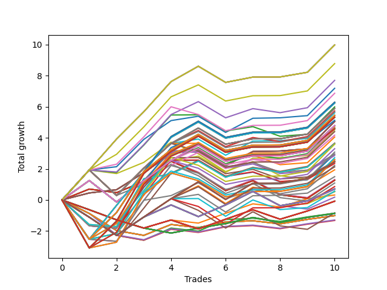

# Long HLT 5305 
- Symbol: TSLA
- Date Range: 05/16/2022 - 05/17/2024
- Trading Period: 8:30-12:30
- Number of Trades: 10



| Id. | Name | Win Percent | Profit | Avg Profit / Trade | Avg Time / Trade | Std |      | Name | Win Percent | Profit | Avg Profit / Trade | Avg Time / Trade | Std |
| --- | ---- | ----------- | ------ | ------------------ | ---------------- | --- | ---- | ---- | ----------- | ------ | ------------------ | ---------------- | --- |
| | Sorted By <br> Profit | | | | | | | Sorted By <br> Win Percentage |||||
|0| TP-1.75 180m | 90.00 | 9.98 | 1.00 | 65:30 | 1.00 |     | TP-1.75 180m | 90.00 | 9.98 | 1.00 | 65:30 | 1.00 |
|1| TP-1.75 165m | 90.00 | 9.98 | 1.00 | 65:30 | 1.00 |     | TP-1.75 165m | 90.00 | 9.98 | 1.00 | 65:30 | 1.00 |
|2| TP-1.75 150m | 90.00 | 9.98 | 1.00 | 65:30 | 1.00 |     | TP-1.75 150m | 90.00 | 9.98 | 1.00 | 65:30 | 1.00 |
|3| TP-1.75 135m | 90.00 | 9.98 | 1.00 | 65:30 | 1.00 |     | TP-1.75 135m | 90.00 | 9.98 | 1.00 | 65:30 | 1.00 |
|4| TP-1.75 120m | 90.00 | 9.98 | 1.00 | 65:30 | 1.00 |     | TP-1.75 120m | 90.00 | 9.98 | 1.00 | 65:30 | 1.00 |
|5| TP-1.75 105m | 90.00 | 8.78 | 0.88 | 63:30 | 0.94 |     | TP-1.75 105m | 90.00 | 8.78 | 0.88 | 63:30 | 0.94 |
|6| TP-1.75 75m | 70.00 | 7.70 | 0.77 | 56:12 | 1.00 |     | TP-1.75 45m | 90.00 | 7.19 | 0.72 | 40:36 | 0.91 |
|7| TP-1.75 45m | 90.00 | 7.19 | 0.72 | 40:36 | 0.91 |     | TP-3 45m | 90.00 | 5.05 | 0.50 | 43:06 | 0.74 |
|8| TP-1.75 90m | 80.00 | 6.87 | 0.69 | 60:30 | 1.03 |     | TP-2.75 45m | 90.00 | 5.05 | 0.50 | 43:06 | 0.74 |
|9| TP-2.25 180m | 80.00 | 6.29 | 0.63 | 79:06 | 1.49 |     | TP-2.5 45m | 90.00 | 5.05 | 0.50 | 43:06 | 0.74 |
|10| TP-2.25 165m | 80.00 | 6.29 | 0.63 | 79:06 | 1.49 |     | TP-2.25 45m | 90.00 | 5.05 | 0.50 | 43:06 | 0.74 |
|11| TP-2.25 150m | 80.00 | 6.29 | 0.63 | 79:06 | 1.49 |     | TP-2 45m | 90.00 | 5.05 | 0.50 | 43:06 | 0.74 |
|12| TP-2.25 135m | 80.00 | 6.29 | 0.63 | 79:06 | 1.49 |     | TP-1.75 90m | 80.00 | 6.87 | 0.69 | 60:30 | 1.03 |
|13| TP-2.25 120m | 80.00 | 6.29 | 0.63 | 79:06 | 1.49 |     | TP-2.25 180m | 80.00 | 6.29 | 0.63 | 79:06 | 1.49 |
|14| TP-2 180m | 80.00 | 6.24 | 0.62 | 78:30 | 1.47 |     | TP-2.25 165m | 80.00 | 6.29 | 0.63 | 79:06 | 1.49 |
|15| TP-2 165m | 80.00 | 6.24 | 0.62 | 78:30 | 1.47 |     | TP-2.25 150m | 80.00 | 6.29 | 0.63 | 79:06 | 1.49 |
|16| TP-2 150m | 80.00 | 6.24 | 0.62 | 78:30 | 1.47 |     | TP-2.25 135m | 80.00 | 6.29 | 0.63 | 79:06 | 1.49 |
|17| TP-2 135m | 80.00 | 6.24 | 0.62 | 78:30 | 1.47 |     | TP-2.25 120m | 80.00 | 6.29 | 0.63 | 79:06 | 1.49 |
|18| TP-2 120m | 80.00 | 6.24 | 0.62 | 78:30 | 1.47 |     | TP-2 180m | 80.00 | 6.24 | 0.62 | 78:30 | 1.47 |
|19| TP-1.75 60m | 70.00 | 5.99 | 0.60 | 48:42 | 1.08 |     | TP-2 165m | 80.00 | 6.24 | 0.62 | 78:30 | 1.47 |
|20| TP-1.5 180m | 80.00 | 5.89 | 0.59 | 54:36 | 1.16 |     | TP-2 150m | 80.00 | 6.24 | 0.62 | 78:30 | 1.47 |
|21| TP-1.5 165m | 80.00 | 5.89 | 0.59 | 54:36 | 1.16 |     | TP-2 135m | 80.00 | 6.24 | 0.62 | 78:30 | 1.47 |
|22| TP-1.5 150m | 80.00 | 5.89 | 0.59 | 54:36 | 1.16 |     | TP-2 120m | 80.00 | 6.24 | 0.62 | 78:30 | 1.47 |
|23| TP-1.5 135m | 80.00 | 5.89 | 0.59 | 54:36 | 1.16 |     | TP-1.5 180m | 80.00 | 5.89 | 0.59 | 54:36 | 1.16 |
|24| TP-1.5 120m | 80.00 | 5.89 | 0.59 | 54:36 | 1.16 |     | TP-1.5 165m | 80.00 | 5.89 | 0.59 | 54:36 | 1.16 |
|25| TP-1.5 75m | 70.00 | 5.73 | 0.57 | 48:48 | 1.17 |     | TP-1.5 150m | 80.00 | 5.89 | 0.59 | 54:36 | 1.16 |
|26| TP-1.5 105m | 80.00 | 5.67 | 0.57 | 53:06 | 1.16 |     | TP-1.5 135m | 80.00 | 5.89 | 0.59 | 54:36 | 1.16 |
|27| TP-1.5 45m | 80.00 | 5.61 | 0.56 | 36:48 | 1.17 |     | TP-1.5 120m | 80.00 | 5.89 | 0.59 | 54:36 | 1.16 |
|28| TP-2.5 180m | 80.00 | 5.45 | 0.54 | 85:54 | 1.42 |     | TP-1.5 105m | 80.00 | 5.67 | 0.57 | 53:06 | 1.16 |
|29| TP-2.5 165m | 80.00 | 5.45 | 0.54 | 85:54 | 1.42 |     | TP-1.5 45m | 80.00 | 5.61 | 0.56 | 36:48 | 1.17 |
|30| TP-2.5 150m | 80.00 | 5.45 | 0.54 | 85:54 | 1.42 |     | TP-2.5 180m | 80.00 | 5.45 | 0.54 | 85:54 | 1.42 |
|31| TP-2.5 135m | 80.00 | 5.45 | 0.54 | 85:54 | 1.42 |     | TP-2.5 165m | 80.00 | 5.45 | 0.54 | 85:54 | 1.42 |
|32| TP-2.5 120m | 80.00 | 5.45 | 0.54 | 85:54 | 1.42 |     | TP-2.5 150m | 80.00 | 5.45 | 0.54 | 85:54 | 1.42 |
|33| TP-3 180m | 80.00 | 5.33 | 0.53 | 87:54 | 1.61 |     | TP-2.5 135m | 80.00 | 5.45 | 0.54 | 85:54 | 1.42 |
|34| TP-2.75 180m | 80.00 | 5.33 | 0.53 | 87:54 | 1.61 |     | TP-2.5 120m | 80.00 | 5.45 | 0.54 | 85:54 | 1.42 |
|35| TP-3 165m | 80.00 | 5.33 | 0.53 | 87:54 | 1.61 |     | TP-3 180m | 80.00 | 5.33 | 0.53 | 87:54 | 1.61 |
|36| TP-2.75 165m | 80.00 | 5.33 | 0.53 | 87:54 | 1.61 |     | TP-2.75 180m | 80.00 | 5.33 | 0.53 | 87:54 | 1.61 |
|37| TP-3 150m | 80.00 | 5.33 | 0.53 | 87:54 | 1.61 |     | TP-3 165m | 80.00 | 5.33 | 0.53 | 87:54 | 1.61 |
|38| TP-2.75 150m | 80.00 | 5.33 | 0.53 | 87:54 | 1.61 |     | TP-2.75 165m | 80.00 | 5.33 | 0.53 | 87:54 | 1.61 |
|39| TP-3 135m | 80.00 | 5.33 | 0.53 | 87:54 | 1.61 |     | TP-3 150m | 80.00 | 5.33 | 0.53 | 87:54 | 1.61 |
|40| TP-2.75 135m | 80.00 | 5.33 | 0.53 | 87:54 | 1.61 |     | TP-2.75 150m | 80.00 | 5.33 | 0.53 | 87:54 | 1.61 |
|41| TP-3 120m | 80.00 | 5.33 | 0.53 | 87:54 | 1.61 |     | TP-3 135m | 80.00 | 5.33 | 0.53 | 87:54 | 1.61 |
|42| TP-2.75 120m | 80.00 | 5.33 | 0.53 | 87:54 | 1.61 |     | TP-2.75 135m | 80.00 | 5.33 | 0.53 | 87:54 | 1.61 |
|43| TP-2.25 105m | 80.00 | 5.13 | 0.51 | 74:36 | 1.44 |     | TP-3 120m | 80.00 | 5.33 | 0.53 | 87:54 | 1.61 |
|44| TP-3 45m | 90.00 | 5.05 | 0.50 | 43:06 | 0.74 |     | TP-2.75 120m | 80.00 | 5.33 | 0.53 | 87:54 | 1.61 |
|45| TP-2.75 45m | 90.00 | 5.05 | 0.50 | 43:06 | 0.74 |     | TP-2.25 105m | 80.00 | 5.13 | 0.51 | 74:36 | 1.44 |
|46| TP-2.5 45m | 90.00 | 5.05 | 0.50 | 43:06 | 0.74 |     | TP-1.25 180m | 80.00 | 4.79 | 0.48 | 51:30 | 0.99 |
|47| TP-2.25 45m | 90.00 | 5.05 | 0.50 | 43:06 | 0.74 |     | TP-1.25 165m | 80.00 | 4.79 | 0.48 | 51:30 | 0.99 |
|48| TP-2 45m | 90.00 | 5.05 | 0.50 | 43:06 | 0.74 |     | TP-1.25 150m | 80.00 | 4.79 | 0.48 | 51:30 | 0.99 |
|49| TP-1.25 180m | 80.00 | 4.79 | 0.48 | 51:30 | 0.99 |     | TP-1.25 135m | 80.00 | 4.79 | 0.48 | 51:30 | 0.99 |
|50| TP-1.25 165m | 80.00 | 4.79 | 0.48 | 51:30 | 0.99 |     | TP-1.25 120m | 80.00 | 4.79 | 0.48 | 51:30 | 0.99 |
|51| TP-1.25 150m | 80.00 | 4.79 | 0.48 | 51:30 | 0.99 |     | TP-2.5 105m | 80.00 | 4.70 | 0.47 | 79:54 | 1.39 |
|52| TP-1.25 135m | 80.00 | 4.79 | 0.48 | 51:30 | 0.99 |     | TP-2 105m | 80.00 | 4.62 | 0.46 | 74:30 | 1.37 |
|53| TP-1.25 120m | 80.00 | 4.79 | 0.48 | 51:30 | 0.99 |     | TP-3 105m | 80.00 | 4.58 | 0.46 | 81:54 | 1.58 |
|54| TP-2.5 105m | 80.00 | 4.70 | 0.47 | 79:54 | 1.39 |     | TP-2.75 105m | 80.00 | 4.58 | 0.46 | 81:54 | 1.58 |
|55| TP-1.25 75m | 70.00 | 4.63 | 0.46 | 45:42 | 1.00 |     | TP-1.25 105m | 80.00 | 4.57 | 0.46 | 50:00 | 0.98 |
|56| TP-2 105m | 80.00 | 4.62 | 0.46 | 74:30 | 1.37 |     | TP-1.25 45m | 80.00 | 4.51 | 0.45 | 33:42 | 0.99 |
|57| TP-3 105m | 80.00 | 4.58 | 0.46 | 81:54 | 1.58 |     | TP-1.75 75m | 70.00 | 7.70 | 0.77 | 56:12 | 1.00 |
|58| TP-2.75 105m | 80.00 | 4.58 | 0.46 | 81:54 | 1.58 |     | TP-1.75 60m | 70.00 | 5.99 | 0.60 | 48:42 | 1.08 |
|59| TP-1.25 105m | 80.00 | 4.57 | 0.46 | 50:00 | 0.98 |     | TP-1.5 75m | 70.00 | 5.73 | 0.57 | 48:48 | 1.17 |
|60| TP-1.25 45m | 80.00 | 4.51 | 0.45 | 33:42 | 0.99 |     | TP-1.25 75m | 70.00 | 4.63 | 0.46 | 45:42 | 1.00 |
|61| TP-1.5 90m | 70.00 | 4.40 | 0.44 | 51:36 | 1.20 |     | TP-1.5 90m | 70.00 | 4.40 | 0.44 | 51:36 | 1.20 |
|62| TP-2.25 75m | 60.00 | 4.17 | 0.42 | 64:18 | 1.46 |     | TP-1.5 60m | 70.00 | 4.05 | 0.40 | 42:48 | 1.21 |
|63| TP-1.5 60m | 70.00 | 4.05 | 0.40 | 42:48 | 1.21 |     | TP-2.25 90m | 70.00 | 3.59 | 0.36 | 70:06 | 1.48 |
|64| TP-2 75m | 60.00 | 3.66 | 0.37 | 64:12 | 1.39 |     | TP-1.25 90m | 70.00 | 3.30 | 0.33 | 48:30 | 1.01 |
|65| TP-3 75m | 60.00 | 3.61 | 0.36 | 68:00 | 1.24 |     | TP-2 90m | 70.00 | 3.08 | 0.31 | 70:00 | 1.41 |
|66| TP-2.75 75m | 60.00 | 3.61 | 0.36 | 68:00 | 1.24 |     | TP-1.25 60m | 70.00 | 2.95 | 0.30 | 39:42 | 1.02 |
|67| TP-2.25 90m | 70.00 | 3.59 | 0.36 | 70:06 | 1.48 |     | TP-2.5 90m | 70.00 | 2.72 | 0.27 | 73:54 | 1.39 |
|68| TP-1.25 90m | 70.00 | 3.30 | 0.33 | 48:30 | 1.01 |     | TP-3 90m | 70.00 | 2.60 | 0.26 | 75:54 | 1.58 |
|69| TP-2 90m | 70.00 | 3.08 | 0.31 | 70:00 | 1.41 |     | TP-2.75 90m | 70.00 | 2.60 | 0.26 | 75:54 | 1.58 |
|70| TP-1.25 60m | 70.00 | 2.95 | 0.30 | 39:42 | 1.02 |     | TP-1 180m | 70.00 | 2.45 | 0.24 | 40:24 | 0.98 |
|71| TP-3 60m | 60.00 | 2.95 | 0.29 | 56:00 | 1.33 |     | TP-1 165m | 70.00 | 2.45 | 0.24 | 40:24 | 0.98 |
|72| TP-2.75 60m | 60.00 | 2.95 | 0.29 | 56:00 | 1.33 |     | TP-1 150m | 70.00 | 2.45 | 0.24 | 40:24 | 0.98 |
|73| TP-2.25 60m | 60.00 | 2.86 | 0.29 | 55:00 | 1.29 |     | TP-1 135m | 70.00 | 2.45 | 0.24 | 40:24 | 0.98 |
|74| TP-2.5 90m | 70.00 | 2.72 | 0.27 | 73:54 | 1.39 |     | TP-1 120m | 70.00 | 2.45 | 0.24 | 40:24 | 0.98 |
|75| TP-3 90m | 70.00 | 2.60 | 0.26 | 75:54 | 1.58 |     | TP-1 105m | 70.00 | 2.13 | 0.21 | 39:54 | 0.96 |
|76| TP-2.75 90m | 70.00 | 2.60 | 0.26 | 75:54 | 1.58 |     | TP-1 45m | 70.00 | 1.50 | 0.15 | 27:12 | 0.94 |
|77| TP-2.5 60m | 60.00 | 2.51 | 0.25 | 55:48 | 1.24 |     | TP-2.25 75m | 60.00 | 4.17 | 0.42 | 64:18 | 1.46 |
|78| TP-1.75 30m | 50.00 | 2.50 | 0.25 | 28:42 | 0.99 |     | TP-2 75m | 60.00 | 3.66 | 0.37 | 64:12 | 1.39 |
|79| TP-1 180m | 70.00 | 2.45 | 0.24 | 40:24 | 0.98 |     | TP-3 75m | 60.00 | 3.61 | 0.36 | 68:00 | 1.24 |
|80| TP-1 165m | 70.00 | 2.45 | 0.24 | 40:24 | 0.98 |     | TP-2.75 75m | 60.00 | 3.61 | 0.36 | 68:00 | 1.24 |
|81| TP-1 150m | 70.00 | 2.45 | 0.24 | 40:24 | 0.98 |     | TP-3 60m | 60.00 | 2.95 | 0.29 | 56:00 | 1.33 |
|82| TP-1 135m | 70.00 | 2.45 | 0.24 | 40:24 | 0.98 |     | TP-2.75 60m | 60.00 | 2.95 | 0.29 | 56:00 | 1.33 |
|83| TP-1 120m | 70.00 | 2.45 | 0.24 | 40:24 | 0.98 |     | TP-2.25 60m | 60.00 | 2.86 | 0.29 | 55:00 | 1.29 |
|84| TP-2 60m | 60.00 | 2.35 | 0.24 | 54:54 | 1.20 |     | TP-2.5 60m | 60.00 | 2.51 | 0.25 | 55:48 | 1.24 |
|85| TP-2.5 75m | 60.00 | 2.22 | 0.22 | 66:36 | 1.32 |     | TP-2 60m | 60.00 | 2.35 | 0.24 | 54:54 | 1.20 |
|86| TP-1 105m | 70.00 | 2.13 | 0.21 | 39:54 | 0.96 |     | TP-2.5 75m | 60.00 | 2.22 | 0.22 | 66:36 | 1.32 |
|87| TP-1 75m | 60.00 | 1.94 | 0.19 | 36:12 | 0.97 |     | TP-1 75m | 60.00 | 1.94 | 0.19 | 36:12 | 0.97 |
|88| TP-1 45m | 70.00 | 1.50 | 0.15 | 27:12 | 0.94 |     | TP-1 90m | 60.00 | 0.86 | 0.09 | 38:24 | 0.96 |
|89| TP-1.25 30m | 50.00 | 1.32 | 0.13 | 25:42 | 1.07 |     | TP-0.75 75m | 60.00 | 0.72 | 0.07 | 22:18 | 0.89 |
|90| TP-3 30m | 50.00 | 1.27 | 0.13 | 29:00 | 0.84 |     | TP-0.75 180m | 60.00 | 0.70 | 0.07 | 22:24 | 0.89 |
|91| TP-2.75 30m | 50.00 | 1.27 | 0.13 | 29:00 | 0.84 |     | TP-0.75 165m | 60.00 | 0.70 | 0.07 | 22:24 | 0.89 |
|92| TP-2.5 30m | 50.00 | 1.27 | 0.13 | 29:00 | 0.84 |     | TP-0.75 150m | 60.00 | 0.70 | 0.07 | 22:24 | 0.89 |
|93| TP-2.25 30m | 50.00 | 1.27 | 0.13 | 29:00 | 0.84 |     | TP-0.75 135m | 60.00 | 0.70 | 0.07 | 22:24 | 0.89 |
|94| TP-2 30m | 50.00 | 1.27 | 0.13 | 29:00 | 0.84 |     | TP-0.75 120m | 60.00 | 0.70 | 0.07 | 22:24 | 0.89 |
|95| TP-1.5 30m | 50.00 | 1.09 | 0.11 | 27:36 | 1.14 |     | TP-0.75 105m | 60.00 | 0.70 | 0.07 | 22:24 | 0.89 |
|96| TP-1 90m | 60.00 | 0.86 | 0.09 | 38:24 | 0.96 |     | TP-0.75 90m | 60.00 | 0.70 | 0.07 | 22:24 | 0.89 |
|97| TP-0.75 75m | 60.00 | 0.72 | 0.07 | 22:18 | 0.89 |     | TP-1 60m | 60.00 | 0.57 | 0.06 | 31:42 | 0.96 |
|98| TP-0.75 180m | 60.00 | 0.70 | 0.07 | 22:24 | 0.89 |     | TP-0.75 45m | 60.00 | 0.54 | 0.05 | 19:18 | 0.89 |
|99| TP-0.75 165m | 60.00 | 0.70 | 0.07 | 22:24 | 0.89 |     | TP-0.75 60m | 60.00 | 0.53 | 0.05 | 20:48 | 0.89 |
|100| TP-0.75 150m | 60.00 | 0.70 | 0.07 | 22:24 | 0.89 |     | TP-1.75 30m | 50.00 | 2.50 | 0.25 | 28:42 | 0.99 |
|101| TP-0.75 135m | 60.00 | 0.70 | 0.07 | 22:24 | 0.89 |     | TP-1.25 30m | 50.00 | 1.32 | 0.13 | 25:42 | 1.07 |
|102| TP-0.75 120m | 60.00 | 0.70 | 0.07 | 22:24 | 0.89 |     | TP-3 30m | 50.00 | 1.27 | 0.13 | 29:00 | 0.84 |
|103| TP-0.75 105m | 60.00 | 0.70 | 0.07 | 22:24 | 0.89 |     | TP-2.75 30m | 50.00 | 1.27 | 0.13 | 29:00 | 0.84 |
|104| TP-0.75 90m | 60.00 | 0.70 | 0.07 | 22:24 | 0.89 |     | TP-2.5 30m | 50.00 | 1.27 | 0.13 | 29:00 | 0.84 |
|105| TP-1 60m | 60.00 | 0.57 | 0.06 | 31:42 | 0.96 |     | TP-2.25 30m | 50.00 | 1.27 | 0.13 | 29:00 | 0.84 |
|106| TP-0.75 45m | 60.00 | 0.54 | 0.05 | 19:18 | 0.89 |     | TP-2 30m | 50.00 | 1.27 | 0.13 | 29:00 | 0.84 |
|107| TP-0.75 60m | 60.00 | 0.53 | 0.05 | 20:48 | 0.89 |     | TP-1.5 30m | 50.00 | 1.09 | 0.11 | 27:36 | 1.14 |
|108| TP-0.5 15m | 50.00 | 0.32 | 0.03 | 08:00 | 0.50 |     | TP-0.5 15m | 50.00 | 0.32 | 0.03 | 08:00 | 0.50 |
|109| TP-0.75 30m | 50.00 | 0.18 | 0.02 | 17:48 | 0.89 |     | TP-0.75 30m | 50.00 | 0.18 | 0.02 | 17:48 | 0.89 |
|110| TP-0.5 180m | 50.00 | -0.08 | -0.01 | 09:42 | 0.59 |     | TP-0.5 180m | 50.00 | -0.08 | -0.01 | 09:42 | 0.59 |
|111| TP-0.5 165m | 50.00 | -0.08 | -0.01 | 09:42 | 0.59 |     | TP-0.5 165m | 50.00 | -0.08 | -0.01 | 09:42 | 0.59 |
|112| TP-0.5 150m | 50.00 | -0.08 | -0.01 | 09:42 | 0.59 |     | TP-0.5 150m | 50.00 | -0.08 | -0.01 | 09:42 | 0.59 |
|113| TP-0.5 135m | 50.00 | -0.08 | -0.01 | 09:42 | 0.59 |     | TP-0.5 135m | 50.00 | -0.08 | -0.01 | 09:42 | 0.59 |
|114| TP-0.5 120m | 50.00 | -0.08 | -0.01 | 09:42 | 0.59 |     | TP-0.5 120m | 50.00 | -0.08 | -0.01 | 09:42 | 0.59 |
|115| TP-0.5 105m | 50.00 | -0.08 | -0.01 | 09:42 | 0.59 |     | TP-0.5 105m | 50.00 | -0.08 | -0.01 | 09:42 | 0.59 |
|116| TP-0.5 90m | 50.00 | -0.08 | -0.01 | 09:42 | 0.59 |     | TP-0.5 90m | 50.00 | -0.08 | -0.01 | 09:42 | 0.59 |
|117| TP-0.5 75m | 50.00 | -0.08 | -0.01 | 09:42 | 0.59 |     | TP-0.5 75m | 50.00 | -0.08 | -0.01 | 09:42 | 0.59 |
|118| TP-0.5 60m | 50.00 | -0.08 | -0.01 | 09:42 | 0.59 |     | TP-0.5 60m | 50.00 | -0.08 | -0.01 | 09:42 | 0.59 |
|119| TP-0.5 45m | 50.00 | -0.08 | -0.01 | 09:42 | 0.59 |     | TP-0.5 45m | 50.00 | -0.08 | -0.01 | 09:42 | 0.59 |
|120| TP-0.5 30m | 50.00 | -0.08 | -0.01 | 09:42 | 0.59 |     | TP-0.5 30m | 50.00 | -0.08 | -0.01 | 09:42 | 0.59 |
|121| TP-1 30m | 40.00 | -0.83 | -0.08 | 22:42 | 1.01 |     | TP-0.75 15m | 50.00 | -0.85 | -0.08 | 11:18 | 0.63 |
|122| TP-0.75 15m | 50.00 | -0.85 | -0.08 | 11:18 | 0.63 |     | TP-0.25 180m | 50.00 | -0.86 | -0.09 | 05:00 | 0.42 |
|123| TP-0.25 180m | 50.00 | -0.86 | -0.09 | 05:00 | 0.42 |     | TP-0.25 165m | 50.00 | -0.86 | -0.09 | 05:00 | 0.42 |
|124| TP-0.25 165m | 50.00 | -0.86 | -0.09 | 05:00 | 0.42 |     | TP-0.25 150m | 50.00 | -0.86 | -0.09 | 05:00 | 0.42 |
|125| TP-0.25 150m | 50.00 | -0.86 | -0.09 | 05:00 | 0.42 |     | TP-0.25 135m | 50.00 | -0.86 | -0.09 | 05:00 | 0.42 |
|126| TP-0.25 135m | 50.00 | -0.86 | -0.09 | 05:00 | 0.42 |     | TP-0.25 120m | 50.00 | -0.86 | -0.09 | 05:00 | 0.42 |
|127| TP-0.25 120m | 50.00 | -0.86 | -0.09 | 05:00 | 0.42 |     | TP-0.25 105m | 50.00 | -0.86 | -0.09 | 05:00 | 0.42 |
|128| TP-0.25 105m | 50.00 | -0.86 | -0.09 | 05:00 | 0.42 |     | TP-0.25 90m | 50.00 | -0.86 | -0.09 | 05:00 | 0.42 |
|129| TP-0.25 90m | 50.00 | -0.86 | -0.09 | 05:00 | 0.42 |     | TP-0.25 75m | 50.00 | -0.86 | -0.09 | 05:00 | 0.42 |
|130| TP-0.25 75m | 50.00 | -0.86 | -0.09 | 05:00 | 0.42 |     | TP-0.25 60m | 50.00 | -0.86 | -0.09 | 05:00 | 0.42 |
|131| TP-0.25 60m | 50.00 | -0.86 | -0.09 | 05:00 | 0.42 |     | TP-0.25 45m | 50.00 | -0.86 | -0.09 | 05:00 | 0.42 |
|132| TP-0.25 45m | 50.00 | -0.86 | -0.09 | 05:00 | 0.42 |     | TP-0.25 30m | 50.00 | -0.86 | -0.09 | 05:00 | 0.42 |
|133| TP-0.25 30m | 50.00 | -0.86 | -0.09 | 05:00 | 0.42 |     | TP-0.25 15m | 50.00 | -0.88 | -0.09 | 04:48 | 0.42 |
|134| TP-0.25 15m | 50.00 | -0.88 | -0.09 | 04:48 | 0.42 |     | TP-3 15m | 50.00 | -1.01 | -0.10 | 14:00 | 0.53 |
|135| TP-3 15m | 50.00 | -1.01 | -0.10 | 14:00 | 0.53 |     | TP-2.75 15m | 50.00 | -1.01 | -0.10 | 14:00 | 0.53 |
|136| TP-2.75 15m | 50.00 | -1.01 | -0.10 | 14:00 | 0.53 |     | TP-2.5 15m | 50.00 | -1.01 | -0.10 | 14:00 | 0.53 |
|137| TP-2.5 15m | 50.00 | -1.01 | -0.10 | 14:00 | 0.53 |     | TP-2.25 15m | 50.00 | -1.01 | -0.10 | 14:00 | 0.53 |
|138| TP-2.25 15m | 50.00 | -1.01 | -0.10 | 14:00 | 0.53 |     | TP-2 15m | 50.00 | -1.01 | -0.10 | 14:00 | 0.53 |
|139| TP-2 15m | 50.00 | -1.01 | -0.10 | 14:00 | 0.53 |     | TP-1.75 15m | 50.00 | -1.01 | -0.10 | 14:00 | 0.53 |
|140| TP-1.75 15m | 50.00 | -1.01 | -0.10 | 14:00 | 0.53 |     | TP-1.5 15m | 50.00 | -1.01 | -0.10 | 14:00 | 0.53 |
|141| TP-1.5 15m | 50.00 | -1.01 | -0.10 | 14:00 | 0.53 |     | TP-1.25 15m | 50.00 | -1.29 | -0.13 | 13:06 | 0.59 |
|142| TP-1.25 15m | 50.00 | -1.29 | -0.13 | 13:06 | 0.59 |     | TP-1 15m | 50.00 | -1.32 | -0.13 | 12:00 | 0.58 |
|143| TP-1 15m | 50.00 | -1.32 | -0.13 | 12:00 | 0.58 |     | TP-1 30m | 40.00 | -0.83 | -0.08 | 22:42 | 1.01 |

### Test TP-0.25 15m
* Take Profit of 0.25 Point
* 0.25 Stoploss
* Results:
```
Total Trades: 10
Percent Up: 50.00
Percent Down: 50.00
Total Points Moved Up: -0.88
Potential Profit: -440.00
Total Points Ups: 1.57 Count Ups: 5
Total Points Downs: -2.45 Count Downs: 5
```

<details><summary>Trades</summary>

<code>In: 2022-08-05 09:50:00		Out: 2022-08-05 09:52:00		Total Position Time: 02:00		Total Move Up: -0.63		Total to Date: -0.63</code> <br />
<code>In: 2022-09-01 08:40:00		Out: 2022-09-01 08:42:00		Total Position Time: 02:00		Total Move Up: -0.65		Total to Date: -1.28</code> <br />
<code>In: 2022-11-04 11:20:00		Out: 2022-11-04 11:22:00		Total Position Time: 02:00		Total Move Up: -0.53		Total to Date: -1.81</code> <br />
<code>In: 2023-03-17 08:40:00		Out: 2023-03-17 08:44:00		Total Position Time: 04:00		Total Move Up: -0.32		Total to Date: -2.13</code> <br />
<code>In: 2023-08-16 09:40:00		Out: 2023-08-16 09:43:00		Total Position Time: 03:00		Total Move Up: 0.32		Total to Date: -1.81</code> <br />
<code>In: 2023-09-22 12:15:00		Out: 2023-09-22 12:18:00		Total Position Time: 03:00		Total Move Up: 0.29		Total to Date: -1.52</code> <br />
<code>In: 2023-09-26 11:30:00		Out: 2023-09-26 11:32:00		Total Position Time: 02:00		Total Move Up: 0.39		Total to Date: -1.13</code> <br />
<code>In: 2023-10-12 11:30:00		Out: 2023-10-12 11:41:00		Total Position Time: 11:00		Total Move Up: -0.32		Total to Date: -1.45</code> <br />
<code>In: 2024-02-12 11:35:00		Out: 2024-02-12 11:40:00		Total Position Time: 05:00		Total Move Up: 0.33		Total to Date: -1.12</code> <br />
<code>In: 2024-04-22 08:35:00		Out: 2024-04-22 08:49:00		Total Position Time: 14:00		Total Move Up: 0.24		Total to Date: -0.88</code> <br />


</details>

### Test TP-0.5 15m
* Take Profit of 0.5 Point
* 0.5 Stoploss
* Results:
```
Total Trades: 10
Percent Up: 50.00
Percent Down: 50.00
Total Points Moved Up: 0.32
Potential Profit: 160.00
Total Points Ups: 2.53 Count Ups: 5
Total Points Downs: -2.21 Count Downs: 5
```

<details><summary>Trades</summary>

<code>In: 2022-08-05 09:50:00		Out: 2022-08-05 09:52:00		Total Position Time: 02:00		Total Move Up: -0.63		Total to Date: -0.63</code> <br />
<code>In: 2022-09-01 08:40:00		Out: 2022-09-01 08:42:00		Total Position Time: 02:00		Total Move Up: -0.65		Total to Date: -1.28</code> <br />
<code>In: 2022-11-04 11:20:00		Out: 2022-11-04 11:22:00		Total Position Time: 02:00		Total Move Up: -0.53		Total to Date: -1.81</code> <br />
<code>In: 2023-03-17 08:40:00		Out: 2023-03-17 08:49:00		Total Position Time: 09:00		Total Move Up: 0.52		Total to Date: -1.29</code> <br />
<code>In: 2023-08-16 09:40:00		Out: 2023-08-16 09:54:00		Total Position Time: 14:00		Total Move Up: -0.20		Total to Date: -1.49</code> <br />
<code>In: 2023-09-22 12:15:00		Out: 2023-09-22 12:24:00		Total Position Time: 09:00		Total Move Up: 0.63		Total to Date: -0.86</code> <br />
<code>In: 2023-09-26 11:30:00		Out: 2023-09-26 11:37:00		Total Position Time: 07:00		Total Move Up: 0.61		Total to Date: -0.25</code> <br />
<code>In: 2023-10-12 11:30:00		Out: 2023-10-12 11:44:00		Total Position Time: 14:00		Total Move Up: -0.20		Total to Date: -0.45</code> <br />
<code>In: 2024-02-12 11:35:00		Out: 2024-02-12 11:42:00		Total Position Time: 07:00		Total Move Up: 0.53		Total to Date: 0.08</code> <br />
<code>In: 2024-04-22 08:35:00		Out: 2024-04-22 08:49:00		Total Position Time: 14:00		Total Move Up: 0.24		Total to Date: 0.32</code> <br />


</details>

### Test TP-0.75 15m
* Take Profit of 0.75 Point
* 0.75 Stoploss
* Results:
```
Total Trades: 10
Percent Up: 50.00
Percent Down: 50.00
Total Points Moved Up: -0.85
Potential Profit: -425.00
Total Points Ups: 2.14 Count Ups: 5
Total Points Downs: -2.99 Count Downs: 5
```

<details><summary>Trades</summary>

<code>In: 2022-08-05 09:50:00		Out: 2022-08-05 09:54:00		Total Position Time: 04:00		Total Move Up: -1.11		Total to Date: -1.11</code> <br />
<code>In: 2022-09-01 08:40:00		Out: 2022-09-01 08:44:00		Total Position Time: 04:00		Total Move Up: -1.17		Total to Date: -2.28</code> <br />
<code>In: 2022-11-04 11:20:00		Out: 2022-11-04 11:34:00		Total Position Time: 14:00		Total Move Up: -0.31		Total to Date: -2.59</code> <br />
<code>In: 2023-03-17 08:40:00		Out: 2023-03-17 08:51:00		Total Position Time: 11:00		Total Move Up: 0.78		Total to Date: -1.81</code> <br />
<code>In: 2023-08-16 09:40:00		Out: 2023-08-16 09:54:00		Total Position Time: 14:00		Total Move Up: -0.20		Total to Date: -2.01</code> <br />
<code>In: 2023-09-22 12:15:00		Out: 2023-09-22 12:25:00		Total Position Time: 10:00		Total Move Up: 0.75		Total to Date: -1.26</code> <br />
<code>In: 2023-09-26 11:30:00		Out: 2023-09-26 11:44:00		Total Position Time: 14:00		Total Move Up: 0.08		Total to Date: -1.18</code> <br />
<code>In: 2023-10-12 11:30:00		Out: 2023-10-12 11:44:00		Total Position Time: 14:00		Total Move Up: -0.20		Total to Date: -1.38</code> <br />
<code>In: 2024-02-12 11:35:00		Out: 2024-02-12 11:49:00		Total Position Time: 14:00		Total Move Up: 0.29		Total to Date: -1.09</code> <br />
<code>In: 2024-04-22 08:35:00		Out: 2024-04-22 08:49:00		Total Position Time: 14:00		Total Move Up: 0.24		Total to Date: -0.85</code> <br />


</details>

### Test TP-1 15m
* Take Profit of 1 Point
* 1 Stoploss
* Results:
```
Total Trades: 10
Percent Up: 50.00
Percent Down: 50.00
Total Points Moved Up: -1.32
Potential Profit: -660.00
Total Points Ups: 1.67 Count Ups: 5
Total Points Downs: -2.99 Count Downs: 5
```

<details><summary>Trades</summary>

<code>In: 2022-08-05 09:50:00		Out: 2022-08-05 09:54:00		Total Position Time: 04:00		Total Move Up: -1.11		Total to Date: -1.11</code> <br />
<code>In: 2022-09-01 08:40:00		Out: 2022-09-01 08:44:00		Total Position Time: 04:00		Total Move Up: -1.17		Total to Date: -2.28</code> <br />
<code>In: 2022-11-04 11:20:00		Out: 2022-11-04 11:34:00		Total Position Time: 14:00		Total Move Up: -0.31		Total to Date: -2.59</code> <br />
<code>In: 2023-03-17 08:40:00		Out: 2023-03-17 08:54:00		Total Position Time: 14:00		Total Move Up: 0.70		Total to Date: -1.89</code> <br />
<code>In: 2023-08-16 09:40:00		Out: 2023-08-16 09:54:00		Total Position Time: 14:00		Total Move Up: -0.20		Total to Date: -2.09</code> <br />
<code>In: 2023-09-22 12:15:00		Out: 2023-09-22 12:29:00		Total Position Time: 14:00		Total Move Up: 0.36		Total to Date: -1.73</code> <br />
<code>In: 2023-09-26 11:30:00		Out: 2023-09-26 11:44:00		Total Position Time: 14:00		Total Move Up: 0.08		Total to Date: -1.65</code> <br />
<code>In: 2023-10-12 11:30:00		Out: 2023-10-12 11:44:00		Total Position Time: 14:00		Total Move Up: -0.20		Total to Date: -1.85</code> <br />
<code>In: 2024-02-12 11:35:00		Out: 2024-02-12 11:49:00		Total Position Time: 14:00		Total Move Up: 0.29		Total to Date: -1.56</code> <br />
<code>In: 2024-04-22 08:35:00		Out: 2024-04-22 08:49:00		Total Position Time: 14:00		Total Move Up: 0.24		Total to Date: -1.32</code> <br />


</details>

### Test TP-1.25 15m
* Take Profit of 1.25 Point
* 1.25 Stoploss
* Results:
```
Total Trades: 10
Percent Up: 50.00
Percent Down: 50.00
Total Points Moved Up: -1.29
Potential Profit: -645.00
Total Points Ups: 1.67 Count Ups: 5
Total Points Downs: -2.96 Count Downs: 5
```

<details><summary>Trades</summary>

<code>In: 2022-08-05 09:50:00		Out: 2022-08-05 10:04:00		Total Position Time: 14:00		Total Move Up: -0.87		Total to Date: -0.87</code> <br />
<code>In: 2022-09-01 08:40:00		Out: 2022-09-01 08:45:00		Total Position Time: 05:00		Total Move Up: -1.38		Total to Date: -2.25</code> <br />
<code>In: 2022-11-04 11:20:00		Out: 2022-11-04 11:34:00		Total Position Time: 14:00		Total Move Up: -0.31		Total to Date: -2.56</code> <br />
<code>In: 2023-03-17 08:40:00		Out: 2023-03-17 08:54:00		Total Position Time: 14:00		Total Move Up: 0.70		Total to Date: -1.86</code> <br />
<code>In: 2023-08-16 09:40:00		Out: 2023-08-16 09:54:00		Total Position Time: 14:00		Total Move Up: -0.20		Total to Date: -2.06</code> <br />
<code>In: 2023-09-22 12:15:00		Out: 2023-09-22 12:29:00		Total Position Time: 14:00		Total Move Up: 0.36		Total to Date: -1.70</code> <br />
<code>In: 2023-09-26 11:30:00		Out: 2023-09-26 11:44:00		Total Position Time: 14:00		Total Move Up: 0.08		Total to Date: -1.62</code> <br />
<code>In: 2023-10-12 11:30:00		Out: 2023-10-12 11:44:00		Total Position Time: 14:00		Total Move Up: -0.20		Total to Date: -1.82</code> <br />
<code>In: 2024-02-12 11:35:00		Out: 2024-02-12 11:49:00		Total Position Time: 14:00		Total Move Up: 0.29		Total to Date: -1.53</code> <br />
<code>In: 2024-04-22 08:35:00		Out: 2024-04-22 08:49:00		Total Position Time: 14:00		Total Move Up: 0.24		Total to Date: -1.29</code> <br />


</details>

### Test TP-1.5 15m
* Take Profit of 1.5 Point
* 1.5 Stoploss
* Results:
```
Total Trades: 10
Percent Up: 50.00
Percent Down: 50.00
Total Points Moved Up: -1.01
Potential Profit: -505.00
Total Points Ups: 1.67 Count Ups: 5
Total Points Downs: -2.68 Count Downs: 5
```

<details><summary>Trades</summary>

<code>In: 2022-08-05 09:50:00		Out: 2022-08-05 10:04:00		Total Position Time: 14:00		Total Move Up: -0.87		Total to Date: -0.87</code> <br />
<code>In: 2022-09-01 08:40:00		Out: 2022-09-01 08:54:00		Total Position Time: 14:00		Total Move Up: -1.10		Total to Date: -1.97</code> <br />
<code>In: 2022-11-04 11:20:00		Out: 2022-11-04 11:34:00		Total Position Time: 14:00		Total Move Up: -0.31		Total to Date: -2.28</code> <br />
<code>In: 2023-03-17 08:40:00		Out: 2023-03-17 08:54:00		Total Position Time: 14:00		Total Move Up: 0.70		Total to Date: -1.58</code> <br />
<code>In: 2023-08-16 09:40:00		Out: 2023-08-16 09:54:00		Total Position Time: 14:00		Total Move Up: -0.20		Total to Date: -1.78</code> <br />
<code>In: 2023-09-22 12:15:00		Out: 2023-09-22 12:29:00		Total Position Time: 14:00		Total Move Up: 0.36		Total to Date: -1.42</code> <br />
<code>In: 2023-09-26 11:30:00		Out: 2023-09-26 11:44:00		Total Position Time: 14:00		Total Move Up: 0.08		Total to Date: -1.34</code> <br />
<code>In: 2023-10-12 11:30:00		Out: 2023-10-12 11:44:00		Total Position Time: 14:00		Total Move Up: -0.20		Total to Date: -1.54</code> <br />
<code>In: 2024-02-12 11:35:00		Out: 2024-02-12 11:49:00		Total Position Time: 14:00		Total Move Up: 0.29		Total to Date: -1.25</code> <br />
<code>In: 2024-04-22 08:35:00		Out: 2024-04-22 08:49:00		Total Position Time: 14:00		Total Move Up: 0.24		Total to Date: -1.01</code> <br />


</details>

### Test TP-1.75 15m
* Take Profit of 1.75 Point
* 1.75 Stoploss
* Results:
```
Total Trades: 10
Percent Up: 50.00
Percent Down: 50.00
Total Points Moved Up: -1.01
Potential Profit: -505.00
Total Points Ups: 1.67 Count Ups: 5
Total Points Downs: -2.68 Count Downs: 5
```

<details><summary>Trades</summary>

<code>In: 2022-08-05 09:50:00		Out: 2022-08-05 10:04:00		Total Position Time: 14:00		Total Move Up: -0.87		Total to Date: -0.87</code> <br />
<code>In: 2022-09-01 08:40:00		Out: 2022-09-01 08:54:00		Total Position Time: 14:00		Total Move Up: -1.10		Total to Date: -1.97</code> <br />
<code>In: 2022-11-04 11:20:00		Out: 2022-11-04 11:34:00		Total Position Time: 14:00		Total Move Up: -0.31		Total to Date: -2.28</code> <br />
<code>In: 2023-03-17 08:40:00		Out: 2023-03-17 08:54:00		Total Position Time: 14:00		Total Move Up: 0.70		Total to Date: -1.58</code> <br />
<code>In: 2023-08-16 09:40:00		Out: 2023-08-16 09:54:00		Total Position Time: 14:00		Total Move Up: -0.20		Total to Date: -1.78</code> <br />
<code>In: 2023-09-22 12:15:00		Out: 2023-09-22 12:29:00		Total Position Time: 14:00		Total Move Up: 0.36		Total to Date: -1.42</code> <br />
<code>In: 2023-09-26 11:30:00		Out: 2023-09-26 11:44:00		Total Position Time: 14:00		Total Move Up: 0.08		Total to Date: -1.34</code> <br />
<code>In: 2023-10-12 11:30:00		Out: 2023-10-12 11:44:00		Total Position Time: 14:00		Total Move Up: -0.20		Total to Date: -1.54</code> <br />
<code>In: 2024-02-12 11:35:00		Out: 2024-02-12 11:49:00		Total Position Time: 14:00		Total Move Up: 0.29		Total to Date: -1.25</code> <br />
<code>In: 2024-04-22 08:35:00		Out: 2024-04-22 08:49:00		Total Position Time: 14:00		Total Move Up: 0.24		Total to Date: -1.01</code> <br />


</details>

### Test TP-2 15m
* Take Profit of 2 Point
* 2 Stoploss
* Results:
```
Total Trades: 10
Percent Up: 50.00
Percent Down: 50.00
Total Points Moved Up: -1.01
Potential Profit: -505.00
Total Points Ups: 1.67 Count Ups: 5
Total Points Downs: -2.68 Count Downs: 5
```

<details><summary>Trades</summary>

<code>In: 2022-08-05 09:50:00		Out: 2022-08-05 10:04:00		Total Position Time: 14:00		Total Move Up: -0.87		Total to Date: -0.87</code> <br />
<code>In: 2022-09-01 08:40:00		Out: 2022-09-01 08:54:00		Total Position Time: 14:00		Total Move Up: -1.10		Total to Date: -1.97</code> <br />
<code>In: 2022-11-04 11:20:00		Out: 2022-11-04 11:34:00		Total Position Time: 14:00		Total Move Up: -0.31		Total to Date: -2.28</code> <br />
<code>In: 2023-03-17 08:40:00		Out: 2023-03-17 08:54:00		Total Position Time: 14:00		Total Move Up: 0.70		Total to Date: -1.58</code> <br />
<code>In: 2023-08-16 09:40:00		Out: 2023-08-16 09:54:00		Total Position Time: 14:00		Total Move Up: -0.20		Total to Date: -1.78</code> <br />
<code>In: 2023-09-22 12:15:00		Out: 2023-09-22 12:29:00		Total Position Time: 14:00		Total Move Up: 0.36		Total to Date: -1.42</code> <br />
<code>In: 2023-09-26 11:30:00		Out: 2023-09-26 11:44:00		Total Position Time: 14:00		Total Move Up: 0.08		Total to Date: -1.34</code> <br />
<code>In: 2023-10-12 11:30:00		Out: 2023-10-12 11:44:00		Total Position Time: 14:00		Total Move Up: -0.20		Total to Date: -1.54</code> <br />
<code>In: 2024-02-12 11:35:00		Out: 2024-02-12 11:49:00		Total Position Time: 14:00		Total Move Up: 0.29		Total to Date: -1.25</code> <br />
<code>In: 2024-04-22 08:35:00		Out: 2024-04-22 08:49:00		Total Position Time: 14:00		Total Move Up: 0.24		Total to Date: -1.01</code> <br />


</details>

### Test TP-2.25 15m
* Take Profit of 2.25 Point
* 2.25 Stoploss
* Results:
```
Total Trades: 10
Percent Up: 50.00
Percent Down: 50.00
Total Points Moved Up: -1.01
Potential Profit: -505.00
Total Points Ups: 1.67 Count Ups: 5
Total Points Downs: -2.68 Count Downs: 5
```

<details><summary>Trades</summary>

<code>In: 2022-08-05 09:50:00		Out: 2022-08-05 10:04:00		Total Position Time: 14:00		Total Move Up: -0.87		Total to Date: -0.87</code> <br />
<code>In: 2022-09-01 08:40:00		Out: 2022-09-01 08:54:00		Total Position Time: 14:00		Total Move Up: -1.10		Total to Date: -1.97</code> <br />
<code>In: 2022-11-04 11:20:00		Out: 2022-11-04 11:34:00		Total Position Time: 14:00		Total Move Up: -0.31		Total to Date: -2.28</code> <br />
<code>In: 2023-03-17 08:40:00		Out: 2023-03-17 08:54:00		Total Position Time: 14:00		Total Move Up: 0.70		Total to Date: -1.58</code> <br />
<code>In: 2023-08-16 09:40:00		Out: 2023-08-16 09:54:00		Total Position Time: 14:00		Total Move Up: -0.20		Total to Date: -1.78</code> <br />
<code>In: 2023-09-22 12:15:00		Out: 2023-09-22 12:29:00		Total Position Time: 14:00		Total Move Up: 0.36		Total to Date: -1.42</code> <br />
<code>In: 2023-09-26 11:30:00		Out: 2023-09-26 11:44:00		Total Position Time: 14:00		Total Move Up: 0.08		Total to Date: -1.34</code> <br />
<code>In: 2023-10-12 11:30:00		Out: 2023-10-12 11:44:00		Total Position Time: 14:00		Total Move Up: -0.20		Total to Date: -1.54</code> <br />
<code>In: 2024-02-12 11:35:00		Out: 2024-02-12 11:49:00		Total Position Time: 14:00		Total Move Up: 0.29		Total to Date: -1.25</code> <br />
<code>In: 2024-04-22 08:35:00		Out: 2024-04-22 08:49:00		Total Position Time: 14:00		Total Move Up: 0.24		Total to Date: -1.01</code> <br />


</details>

### Test TP-2.5 15m
* Take Profit of 2.5 Point
* 2.5 Stoploss
* Results:
```
Total Trades: 10
Percent Up: 50.00
Percent Down: 50.00
Total Points Moved Up: -1.01
Potential Profit: -505.00
Total Points Ups: 1.67 Count Ups: 5
Total Points Downs: -2.68 Count Downs: 5
```

<details><summary>Trades</summary>

<code>In: 2022-08-05 09:50:00		Out: 2022-08-05 10:04:00		Total Position Time: 14:00		Total Move Up: -0.87		Total to Date: -0.87</code> <br />
<code>In: 2022-09-01 08:40:00		Out: 2022-09-01 08:54:00		Total Position Time: 14:00		Total Move Up: -1.10		Total to Date: -1.97</code> <br />
<code>In: 2022-11-04 11:20:00		Out: 2022-11-04 11:34:00		Total Position Time: 14:00		Total Move Up: -0.31		Total to Date: -2.28</code> <br />
<code>In: 2023-03-17 08:40:00		Out: 2023-03-17 08:54:00		Total Position Time: 14:00		Total Move Up: 0.70		Total to Date: -1.58</code> <br />
<code>In: 2023-08-16 09:40:00		Out: 2023-08-16 09:54:00		Total Position Time: 14:00		Total Move Up: -0.20		Total to Date: -1.78</code> <br />
<code>In: 2023-09-22 12:15:00		Out: 2023-09-22 12:29:00		Total Position Time: 14:00		Total Move Up: 0.36		Total to Date: -1.42</code> <br />
<code>In: 2023-09-26 11:30:00		Out: 2023-09-26 11:44:00		Total Position Time: 14:00		Total Move Up: 0.08		Total to Date: -1.34</code> <br />
<code>In: 2023-10-12 11:30:00		Out: 2023-10-12 11:44:00		Total Position Time: 14:00		Total Move Up: -0.20		Total to Date: -1.54</code> <br />
<code>In: 2024-02-12 11:35:00		Out: 2024-02-12 11:49:00		Total Position Time: 14:00		Total Move Up: 0.29		Total to Date: -1.25</code> <br />
<code>In: 2024-04-22 08:35:00		Out: 2024-04-22 08:49:00		Total Position Time: 14:00		Total Move Up: 0.24		Total to Date: -1.01</code> <br />


</details>

### Test TP-2.75 15m
* Take Profit of 2.75 Point
* 2.75 Stoploss
* Results:
```
Total Trades: 10
Percent Up: 50.00
Percent Down: 50.00
Total Points Moved Up: -1.01
Potential Profit: -505.00
Total Points Ups: 1.67 Count Ups: 5
Total Points Downs: -2.68 Count Downs: 5
```

<details><summary>Trades</summary>

<code>In: 2022-08-05 09:50:00		Out: 2022-08-05 10:04:00		Total Position Time: 14:00		Total Move Up: -0.87		Total to Date: -0.87</code> <br />
<code>In: 2022-09-01 08:40:00		Out: 2022-09-01 08:54:00		Total Position Time: 14:00		Total Move Up: -1.10		Total to Date: -1.97</code> <br />
<code>In: 2022-11-04 11:20:00		Out: 2022-11-04 11:34:00		Total Position Time: 14:00		Total Move Up: -0.31		Total to Date: -2.28</code> <br />
<code>In: 2023-03-17 08:40:00		Out: 2023-03-17 08:54:00		Total Position Time: 14:00		Total Move Up: 0.70		Total to Date: -1.58</code> <br />
<code>In: 2023-08-16 09:40:00		Out: 2023-08-16 09:54:00		Total Position Time: 14:00		Total Move Up: -0.20		Total to Date: -1.78</code> <br />
<code>In: 2023-09-22 12:15:00		Out: 2023-09-22 12:29:00		Total Position Time: 14:00		Total Move Up: 0.36		Total to Date: -1.42</code> <br />
<code>In: 2023-09-26 11:30:00		Out: 2023-09-26 11:44:00		Total Position Time: 14:00		Total Move Up: 0.08		Total to Date: -1.34</code> <br />
<code>In: 2023-10-12 11:30:00		Out: 2023-10-12 11:44:00		Total Position Time: 14:00		Total Move Up: -0.20		Total to Date: -1.54</code> <br />
<code>In: 2024-02-12 11:35:00		Out: 2024-02-12 11:49:00		Total Position Time: 14:00		Total Move Up: 0.29		Total to Date: -1.25</code> <br />
<code>In: 2024-04-22 08:35:00		Out: 2024-04-22 08:49:00		Total Position Time: 14:00		Total Move Up: 0.24		Total to Date: -1.01</code> <br />


</details>

### Test TP-3 15m
* Take Profit of 3 Point
* 3 Stoploss
* Results:
```
Total Trades: 10
Percent Up: 50.00
Percent Down: 50.00
Total Points Moved Up: -1.01
Potential Profit: -505.00
Total Points Ups: 1.67 Count Ups: 5
Total Points Downs: -2.68 Count Downs: 5
```

<details><summary>Trades</summary>

<code>In: 2022-08-05 09:50:00		Out: 2022-08-05 10:04:00		Total Position Time: 14:00		Total Move Up: -0.87		Total to Date: -0.87</code> <br />
<code>In: 2022-09-01 08:40:00		Out: 2022-09-01 08:54:00		Total Position Time: 14:00		Total Move Up: -1.10		Total to Date: -1.97</code> <br />
<code>In: 2022-11-04 11:20:00		Out: 2022-11-04 11:34:00		Total Position Time: 14:00		Total Move Up: -0.31		Total to Date: -2.28</code> <br />
<code>In: 2023-03-17 08:40:00		Out: 2023-03-17 08:54:00		Total Position Time: 14:00		Total Move Up: 0.70		Total to Date: -1.58</code> <br />
<code>In: 2023-08-16 09:40:00		Out: 2023-08-16 09:54:00		Total Position Time: 14:00		Total Move Up: -0.20		Total to Date: -1.78</code> <br />
<code>In: 2023-09-22 12:15:00		Out: 2023-09-22 12:29:00		Total Position Time: 14:00		Total Move Up: 0.36		Total to Date: -1.42</code> <br />
<code>In: 2023-09-26 11:30:00		Out: 2023-09-26 11:44:00		Total Position Time: 14:00		Total Move Up: 0.08		Total to Date: -1.34</code> <br />
<code>In: 2023-10-12 11:30:00		Out: 2023-10-12 11:44:00		Total Position Time: 14:00		Total Move Up: -0.20		Total to Date: -1.54</code> <br />
<code>In: 2024-02-12 11:35:00		Out: 2024-02-12 11:49:00		Total Position Time: 14:00		Total Move Up: 0.29		Total to Date: -1.25</code> <br />
<code>In: 2024-04-22 08:35:00		Out: 2024-04-22 08:49:00		Total Position Time: 14:00		Total Move Up: 0.24		Total to Date: -1.01</code> <br />


</details>

### Test TP-0.25 30m
* Take Profit of 0.25 Point
* 0.25 Stoploss
* Results:
```
Total Trades: 10
Percent Up: 50.00
Percent Down: 50.00
Total Points Moved Up: -0.86
Potential Profit: -430.00
Total Points Ups: 1.59 Count Ups: 5
Total Points Downs: -2.45 Count Downs: 5
```

<details><summary>Trades</summary>

<code>In: 2022-08-05 09:50:00		Out: 2022-08-05 09:52:00		Total Position Time: 02:00		Total Move Up: -0.63		Total to Date: -0.63</code> <br />
<code>In: 2022-09-01 08:40:00		Out: 2022-09-01 08:42:00		Total Position Time: 02:00		Total Move Up: -0.65		Total to Date: -1.28</code> <br />
<code>In: 2022-11-04 11:20:00		Out: 2022-11-04 11:22:00		Total Position Time: 02:00		Total Move Up: -0.53		Total to Date: -1.81</code> <br />
<code>In: 2023-03-17 08:40:00		Out: 2023-03-17 08:44:00		Total Position Time: 04:00		Total Move Up: -0.32		Total to Date: -2.13</code> <br />
<code>In: 2023-08-16 09:40:00		Out: 2023-08-16 09:43:00		Total Position Time: 03:00		Total Move Up: 0.32		Total to Date: -1.81</code> <br />
<code>In: 2023-09-22 12:15:00		Out: 2023-09-22 12:18:00		Total Position Time: 03:00		Total Move Up: 0.29		Total to Date: -1.52</code> <br />
<code>In: 2023-09-26 11:30:00		Out: 2023-09-26 11:32:00		Total Position Time: 02:00		Total Move Up: 0.39		Total to Date: -1.13</code> <br />
<code>In: 2023-10-12 11:30:00		Out: 2023-10-12 11:41:00		Total Position Time: 11:00		Total Move Up: -0.32		Total to Date: -1.45</code> <br />
<code>In: 2024-02-12 11:35:00		Out: 2024-02-12 11:40:00		Total Position Time: 05:00		Total Move Up: 0.33		Total to Date: -1.12</code> <br />
<code>In: 2024-04-22 08:35:00		Out: 2024-04-22 08:51:00		Total Position Time: 16:00		Total Move Up: 0.26		Total to Date: -0.86</code> <br />


</details>

### Test TP-0.5 30m
* Take Profit of 0.5 Point
* 0.5 Stoploss
* Results:
```
Total Trades: 10
Percent Up: 50.00
Percent Down: 50.00
Total Points Moved Up: -0.08
Potential Profit: -40.00
Total Points Ups: 2.92 Count Ups: 5
Total Points Downs: -3.00 Count Downs: 5
```

<details><summary>Trades</summary>

<code>In: 2022-08-05 09:50:00		Out: 2022-08-05 09:52:00		Total Position Time: 02:00		Total Move Up: -0.63		Total to Date: -0.63</code> <br />
<code>In: 2022-09-01 08:40:00		Out: 2022-09-01 08:42:00		Total Position Time: 02:00		Total Move Up: -0.65		Total to Date: -1.28</code> <br />
<code>In: 2022-11-04 11:20:00		Out: 2022-11-04 11:22:00		Total Position Time: 02:00		Total Move Up: -0.53		Total to Date: -1.81</code> <br />
<code>In: 2023-03-17 08:40:00		Out: 2023-03-17 08:49:00		Total Position Time: 09:00		Total Move Up: 0.52		Total to Date: -1.29</code> <br />
<code>In: 2023-08-16 09:40:00		Out: 2023-08-16 09:58:00		Total Position Time: 18:00		Total Move Up: -0.58		Total to Date: -1.87</code> <br />
<code>In: 2023-09-22 12:15:00		Out: 2023-09-22 12:24:00		Total Position Time: 09:00		Total Move Up: 0.63		Total to Date: -1.24</code> <br />
<code>In: 2023-09-26 11:30:00		Out: 2023-09-26 11:37:00		Total Position Time: 07:00		Total Move Up: 0.61		Total to Date: -0.63</code> <br />
<code>In: 2023-10-12 11:30:00		Out: 2023-10-12 11:53:00		Total Position Time: 23:00		Total Move Up: -0.61		Total to Date: -1.24</code> <br />
<code>In: 2024-02-12 11:35:00		Out: 2024-02-12 11:42:00		Total Position Time: 07:00		Total Move Up: 0.53		Total to Date: -0.71</code> <br />
<code>In: 2024-04-22 08:35:00		Out: 2024-04-22 08:53:00		Total Position Time: 18:00		Total Move Up: 0.63		Total to Date: -0.08</code> <br />


</details>

### Test TP-0.75 30m
* Take Profit of 0.75 Point
* 0.75 Stoploss
* Results:
```
Total Trades: 10
Percent Up: 50.00
Percent Down: 50.00
Total Points Moved Up: 0.18
Potential Profit: 90.00
Total Points Ups: 4.35 Count Ups: 5
Total Points Downs: -4.17 Count Downs: 5
```

<details><summary>Trades</summary>

<code>In: 2022-08-05 09:50:00		Out: 2022-08-05 09:54:00		Total Position Time: 04:00		Total Move Up: -1.11		Total to Date: -1.11</code> <br />
<code>In: 2022-09-01 08:40:00		Out: 2022-09-01 08:44:00		Total Position Time: 04:00		Total Move Up: -1.17		Total to Date: -2.28</code> <br />
<code>In: 2022-11-04 11:20:00		Out: 2022-11-04 11:44:00		Total Position Time: 24:00		Total Move Up: 1.18		Total to Date: -1.10</code> <br />
<code>In: 2023-03-17 08:40:00		Out: 2023-03-17 08:51:00		Total Position Time: 11:00		Total Move Up: 0.78		Total to Date: -0.32</code> <br />
<code>In: 2023-08-16 09:40:00		Out: 2023-08-16 10:09:00		Total Position Time: 29:00		Total Move Up: -0.75		Total to Date: -1.07</code> <br />
<code>In: 2023-09-22 12:15:00		Out: 2023-09-22 12:25:00		Total Position Time: 10:00		Total Move Up: 0.75		Total to Date: -0.32</code> <br />
<code>In: 2023-09-26 11:30:00		Out: 2023-09-26 11:51:00		Total Position Time: 21:00		Total Move Up: 0.87		Total to Date: 0.55</code> <br />
<code>In: 2023-10-12 11:30:00		Out: 2023-10-12 11:54:00		Total Position Time: 24:00		Total Move Up: -0.92		Total to Date: -0.37</code> <br />
<code>In: 2024-02-12 11:35:00		Out: 2024-02-12 12:04:00		Total Position Time: 29:00		Total Move Up: -0.22		Total to Date: -0.59</code> <br />
<code>In: 2024-04-22 08:35:00		Out: 2024-04-22 08:57:00		Total Position Time: 22:00		Total Move Up: 0.77		Total to Date: 0.18</code> <br />


</details>

### Test TP-1 30m
* Take Profit of 1 Point
* 1 Stoploss
* Results:
```
Total Trades: 10
Percent Up: 40.00
Percent Down: 60.00
Total Points Moved Up: -0.83
Potential Profit: -415.00
Total Points Ups: 4.47 Count Ups: 4
Total Points Downs: -5.30 Count Downs: 6
```

<details><summary>Trades</summary>

<code>In: 2022-08-05 09:50:00		Out: 2022-08-05 09:54:00		Total Position Time: 04:00		Total Move Up: -1.11		Total to Date: -1.11</code> <br />
<code>In: 2022-09-01 08:40:00		Out: 2022-09-01 08:44:00		Total Position Time: 04:00		Total Move Up: -1.17		Total to Date: -2.28</code> <br />
<code>In: 2022-11-04 11:20:00		Out: 2022-11-04 11:44:00		Total Position Time: 24:00		Total Move Up: 1.18		Total to Date: -1.10</code> <br />
<code>In: 2023-03-17 08:40:00		Out: 2023-03-17 09:08:00		Total Position Time: 28:00		Total Move Up: 1.18		Total to Date: 0.08</code> <br />
<code>In: 2023-08-16 09:40:00		Out: 2023-08-16 10:09:00		Total Position Time: 29:00		Total Move Up: -0.75		Total to Date: -0.67</code> <br />
<code>In: 2023-09-22 12:15:00		Out: 2023-09-22 12:44:00		Total Position Time: 29:00		Total Move Up: -1.14		Total to Date: -1.81</code> <br />
<code>In: 2023-09-26 11:30:00		Out: 2023-09-26 11:53:00		Total Position Time: 23:00		Total Move Up: 1.05		Total to Date: -0.76</code> <br />
<code>In: 2023-10-12 11:30:00		Out: 2023-10-12 11:59:00		Total Position Time: 29:00		Total Move Up: -0.91		Total to Date: -1.67</code> <br />
<code>In: 2024-02-12 11:35:00		Out: 2024-02-12 12:04:00		Total Position Time: 29:00		Total Move Up: -0.22		Total to Date: -1.89</code> <br />
<code>In: 2024-04-22 08:35:00		Out: 2024-04-22 09:03:00		Total Position Time: 28:00		Total Move Up: 1.06		Total to Date: -0.83</code> <br />


</details>

### Test TP-1.25 30m
* Take Profit of 1.25 Point
* 1.25 Stoploss
* Results:
```
Total Trades: 10
Percent Up: 50.00
Percent Down: 50.00
Total Points Moved Up: 1.32
Potential Profit: 660.00
Total Points Ups: 5.72 Count Ups: 5
Total Points Downs: -4.40 Count Downs: 5
```

<details><summary>Trades</summary>

<code>In: 2022-08-05 09:50:00		Out: 2022-08-05 10:14:00		Total Position Time: 24:00		Total Move Up: 1.25		Total to Date: 1.25</code> <br />
<code>In: 2022-09-01 08:40:00		Out: 2022-09-01 08:45:00		Total Position Time: 05:00		Total Move Up: -1.38		Total to Date: -0.13</code> <br />
<code>In: 2022-11-04 11:20:00		Out: 2022-11-04 11:45:00		Total Position Time: 25:00		Total Move Up: 1.37		Total to Date: 1.24</code> <br />
<code>In: 2023-03-17 08:40:00		Out: 2023-03-17 09:09:00		Total Position Time: 29:00		Total Move Up: 1.30		Total to Date: 2.54</code> <br />
<code>In: 2023-08-16 09:40:00		Out: 2023-08-16 10:09:00		Total Position Time: 29:00		Total Move Up: -0.75		Total to Date: 1.79</code> <br />
<code>In: 2023-09-22 12:15:00		Out: 2023-09-22 12:44:00		Total Position Time: 29:00		Total Move Up: -1.14		Total to Date: 0.65</code> <br />
<code>In: 2023-09-26 11:30:00		Out: 2023-09-26 11:59:00		Total Position Time: 29:00		Total Move Up: 0.64		Total to Date: 1.29</code> <br />
<code>In: 2023-10-12 11:30:00		Out: 2023-10-12 11:59:00		Total Position Time: 29:00		Total Move Up: -0.91		Total to Date: 0.38</code> <br />
<code>In: 2024-02-12 11:35:00		Out: 2024-02-12 12:04:00		Total Position Time: 29:00		Total Move Up: -0.22		Total to Date: 0.16</code> <br />
<code>In: 2024-04-22 08:35:00		Out: 2024-04-22 09:04:00		Total Position Time: 29:00		Total Move Up: 1.16		Total to Date: 1.32</code> <br />


</details>

### Test TP-1.5 30m
* Take Profit of 1.5 Point
* 1.5 Stoploss
* Results:
```
Total Trades: 10
Percent Up: 50.00
Percent Down: 50.00
Total Points Moved Up: 1.09
Potential Profit: 545.00
Total Points Ups: 5.75 Count Ups: 5
Total Points Downs: -4.66 Count Downs: 5
```

<details><summary>Trades</summary>

<code>In: 2022-08-05 09:50:00		Out: 2022-08-05 10:16:00		Total Position Time: 26:00		Total Move Up: 1.93		Total to Date: 1.93</code> <br />
<code>In: 2022-09-01 08:40:00		Out: 2022-09-01 08:58:00		Total Position Time: 18:00		Total Move Up: -1.64		Total to Date: 0.29</code> <br />
<code>In: 2022-11-04 11:20:00		Out: 2022-11-04 11:49:00		Total Position Time: 29:00		Total Move Up: 0.72		Total to Date: 1.01</code> <br />
<code>In: 2023-03-17 08:40:00		Out: 2023-03-17 09:09:00		Total Position Time: 29:00		Total Move Up: 1.30		Total to Date: 2.31</code> <br />
<code>In: 2023-08-16 09:40:00		Out: 2023-08-16 10:09:00		Total Position Time: 29:00		Total Move Up: -0.75		Total to Date: 1.56</code> <br />
<code>In: 2023-09-22 12:15:00		Out: 2023-09-22 12:44:00		Total Position Time: 29:00		Total Move Up: -1.14		Total to Date: 0.42</code> <br />
<code>In: 2023-09-26 11:30:00		Out: 2023-09-26 11:59:00		Total Position Time: 29:00		Total Move Up: 0.64		Total to Date: 1.06</code> <br />
<code>In: 2023-10-12 11:30:00		Out: 2023-10-12 11:59:00		Total Position Time: 29:00		Total Move Up: -0.91		Total to Date: 0.15</code> <br />
<code>In: 2024-02-12 11:35:00		Out: 2024-02-12 12:04:00		Total Position Time: 29:00		Total Move Up: -0.22		Total to Date: -0.07</code> <br />
<code>In: 2024-04-22 08:35:00		Out: 2024-04-22 09:04:00		Total Position Time: 29:00		Total Move Up: 1.16		Total to Date: 1.09</code> <br />


</details>

### Test TP-1.75 30m
* Take Profit of 1.75 Point
* 1.75 Stoploss
* Results:
```
Total Trades: 10
Percent Up: 50.00
Percent Down: 50.00
Total Points Moved Up: 2.50
Potential Profit: 1250.00
Total Points Ups: 5.75 Count Ups: 5
Total Points Downs: -3.25 Count Downs: 5
```

<details><summary>Trades</summary>

<code>In: 2022-08-05 09:50:00		Out: 2022-08-05 10:16:00		Total Position Time: 26:00		Total Move Up: 1.93		Total to Date: 1.93</code> <br />
<code>In: 2022-09-01 08:40:00		Out: 2022-09-01 09:09:00		Total Position Time: 29:00		Total Move Up: -0.23		Total to Date: 1.70</code> <br />
<code>In: 2022-11-04 11:20:00		Out: 2022-11-04 11:49:00		Total Position Time: 29:00		Total Move Up: 0.72		Total to Date: 2.42</code> <br />
<code>In: 2023-03-17 08:40:00		Out: 2023-03-17 09:09:00		Total Position Time: 29:00		Total Move Up: 1.30		Total to Date: 3.72</code> <br />
<code>In: 2023-08-16 09:40:00		Out: 2023-08-16 10:09:00		Total Position Time: 29:00		Total Move Up: -0.75		Total to Date: 2.97</code> <br />
<code>In: 2023-09-22 12:15:00		Out: 2023-09-22 12:44:00		Total Position Time: 29:00		Total Move Up: -1.14		Total to Date: 1.83</code> <br />
<code>In: 2023-09-26 11:30:00		Out: 2023-09-26 11:59:00		Total Position Time: 29:00		Total Move Up: 0.64		Total to Date: 2.47</code> <br />
<code>In: 2023-10-12 11:30:00		Out: 2023-10-12 11:59:00		Total Position Time: 29:00		Total Move Up: -0.91		Total to Date: 1.56</code> <br />
<code>In: 2024-02-12 11:35:00		Out: 2024-02-12 12:04:00		Total Position Time: 29:00		Total Move Up: -0.22		Total to Date: 1.34</code> <br />
<code>In: 2024-04-22 08:35:00		Out: 2024-04-22 09:04:00		Total Position Time: 29:00		Total Move Up: 1.16		Total to Date: 2.50</code> <br />


</details>

### Test TP-2 30m
* Take Profit of 2 Point
* 2 Stoploss
* Results:
```
Total Trades: 10
Percent Up: 50.00
Percent Down: 50.00
Total Points Moved Up: 1.27
Potential Profit: 635.00
Total Points Ups: 4.52 Count Ups: 5
Total Points Downs: -3.25 Count Downs: 5
```

<details><summary>Trades</summary>

<code>In: 2022-08-05 09:50:00		Out: 2022-08-05 10:19:00		Total Position Time: 29:00		Total Move Up: 0.70		Total to Date: 0.70</code> <br />
<code>In: 2022-09-01 08:40:00		Out: 2022-09-01 09:09:00		Total Position Time: 29:00		Total Move Up: -0.23		Total to Date: 0.47</code> <br />
<code>In: 2022-11-04 11:20:00		Out: 2022-11-04 11:49:00		Total Position Time: 29:00		Total Move Up: 0.72		Total to Date: 1.19</code> <br />
<code>In: 2023-03-17 08:40:00		Out: 2023-03-17 09:09:00		Total Position Time: 29:00		Total Move Up: 1.30		Total to Date: 2.49</code> <br />
<code>In: 2023-08-16 09:40:00		Out: 2023-08-16 10:09:00		Total Position Time: 29:00		Total Move Up: -0.75		Total to Date: 1.74</code> <br />
<code>In: 2023-09-22 12:15:00		Out: 2023-09-22 12:44:00		Total Position Time: 29:00		Total Move Up: -1.14		Total to Date: 0.60</code> <br />
<code>In: 2023-09-26 11:30:00		Out: 2023-09-26 11:59:00		Total Position Time: 29:00		Total Move Up: 0.64		Total to Date: 1.24</code> <br />
<code>In: 2023-10-12 11:30:00		Out: 2023-10-12 11:59:00		Total Position Time: 29:00		Total Move Up: -0.91		Total to Date: 0.33</code> <br />
<code>In: 2024-02-12 11:35:00		Out: 2024-02-12 12:04:00		Total Position Time: 29:00		Total Move Up: -0.22		Total to Date: 0.11</code> <br />
<code>In: 2024-04-22 08:35:00		Out: 2024-04-22 09:04:00		Total Position Time: 29:00		Total Move Up: 1.16		Total to Date: 1.27</code> <br />


</details>

### Test TP-2.25 30m
* Take Profit of 2.25 Point
* 2.25 Stoploss
* Results:
```
Total Trades: 10
Percent Up: 50.00
Percent Down: 50.00
Total Points Moved Up: 1.27
Potential Profit: 635.00
Total Points Ups: 4.52 Count Ups: 5
Total Points Downs: -3.25 Count Downs: 5
```

<details><summary>Trades</summary>

<code>In: 2022-08-05 09:50:00		Out: 2022-08-05 10:19:00		Total Position Time: 29:00		Total Move Up: 0.70		Total to Date: 0.70</code> <br />
<code>In: 2022-09-01 08:40:00		Out: 2022-09-01 09:09:00		Total Position Time: 29:00		Total Move Up: -0.23		Total to Date: 0.47</code> <br />
<code>In: 2022-11-04 11:20:00		Out: 2022-11-04 11:49:00		Total Position Time: 29:00		Total Move Up: 0.72		Total to Date: 1.19</code> <br />
<code>In: 2023-03-17 08:40:00		Out: 2023-03-17 09:09:00		Total Position Time: 29:00		Total Move Up: 1.30		Total to Date: 2.49</code> <br />
<code>In: 2023-08-16 09:40:00		Out: 2023-08-16 10:09:00		Total Position Time: 29:00		Total Move Up: -0.75		Total to Date: 1.74</code> <br />
<code>In: 2023-09-22 12:15:00		Out: 2023-09-22 12:44:00		Total Position Time: 29:00		Total Move Up: -1.14		Total to Date: 0.60</code> <br />
<code>In: 2023-09-26 11:30:00		Out: 2023-09-26 11:59:00		Total Position Time: 29:00		Total Move Up: 0.64		Total to Date: 1.24</code> <br />
<code>In: 2023-10-12 11:30:00		Out: 2023-10-12 11:59:00		Total Position Time: 29:00		Total Move Up: -0.91		Total to Date: 0.33</code> <br />
<code>In: 2024-02-12 11:35:00		Out: 2024-02-12 12:04:00		Total Position Time: 29:00		Total Move Up: -0.22		Total to Date: 0.11</code> <br />
<code>In: 2024-04-22 08:35:00		Out: 2024-04-22 09:04:00		Total Position Time: 29:00		Total Move Up: 1.16		Total to Date: 1.27</code> <br />


</details>

### Test TP-2.5 30m
* Take Profit of 2.5 Point
* 2.5 Stoploss
* Results:
```
Total Trades: 10
Percent Up: 50.00
Percent Down: 50.00
Total Points Moved Up: 1.27
Potential Profit: 635.00
Total Points Ups: 4.52 Count Ups: 5
Total Points Downs: -3.25 Count Downs: 5
```

<details><summary>Trades</summary>

<code>In: 2022-08-05 09:50:00		Out: 2022-08-05 10:19:00		Total Position Time: 29:00		Total Move Up: 0.70		Total to Date: 0.70</code> <br />
<code>In: 2022-09-01 08:40:00		Out: 2022-09-01 09:09:00		Total Position Time: 29:00		Total Move Up: -0.23		Total to Date: 0.47</code> <br />
<code>In: 2022-11-04 11:20:00		Out: 2022-11-04 11:49:00		Total Position Time: 29:00		Total Move Up: 0.72		Total to Date: 1.19</code> <br />
<code>In: 2023-03-17 08:40:00		Out: 2023-03-17 09:09:00		Total Position Time: 29:00		Total Move Up: 1.30		Total to Date: 2.49</code> <br />
<code>In: 2023-08-16 09:40:00		Out: 2023-08-16 10:09:00		Total Position Time: 29:00		Total Move Up: -0.75		Total to Date: 1.74</code> <br />
<code>In: 2023-09-22 12:15:00		Out: 2023-09-22 12:44:00		Total Position Time: 29:00		Total Move Up: -1.14		Total to Date: 0.60</code> <br />
<code>In: 2023-09-26 11:30:00		Out: 2023-09-26 11:59:00		Total Position Time: 29:00		Total Move Up: 0.64		Total to Date: 1.24</code> <br />
<code>In: 2023-10-12 11:30:00		Out: 2023-10-12 11:59:00		Total Position Time: 29:00		Total Move Up: -0.91		Total to Date: 0.33</code> <br />
<code>In: 2024-02-12 11:35:00		Out: 2024-02-12 12:04:00		Total Position Time: 29:00		Total Move Up: -0.22		Total to Date: 0.11</code> <br />
<code>In: 2024-04-22 08:35:00		Out: 2024-04-22 09:04:00		Total Position Time: 29:00		Total Move Up: 1.16		Total to Date: 1.27</code> <br />


</details>

### Test TP-2.75 30m
* Take Profit of 2.75 Point
* 2.75 Stoploss
* Results:
```
Total Trades: 10
Percent Up: 50.00
Percent Down: 50.00
Total Points Moved Up: 1.27
Potential Profit: 635.00
Total Points Ups: 4.52 Count Ups: 5
Total Points Downs: -3.25 Count Downs: 5
```

<details><summary>Trades</summary>

<code>In: 2022-08-05 09:50:00		Out: 2022-08-05 10:19:00		Total Position Time: 29:00		Total Move Up: 0.70		Total to Date: 0.70</code> <br />
<code>In: 2022-09-01 08:40:00		Out: 2022-09-01 09:09:00		Total Position Time: 29:00		Total Move Up: -0.23		Total to Date: 0.47</code> <br />
<code>In: 2022-11-04 11:20:00		Out: 2022-11-04 11:49:00		Total Position Time: 29:00		Total Move Up: 0.72		Total to Date: 1.19</code> <br />
<code>In: 2023-03-17 08:40:00		Out: 2023-03-17 09:09:00		Total Position Time: 29:00		Total Move Up: 1.30		Total to Date: 2.49</code> <br />
<code>In: 2023-08-16 09:40:00		Out: 2023-08-16 10:09:00		Total Position Time: 29:00		Total Move Up: -0.75		Total to Date: 1.74</code> <br />
<code>In: 2023-09-22 12:15:00		Out: 2023-09-22 12:44:00		Total Position Time: 29:00		Total Move Up: -1.14		Total to Date: 0.60</code> <br />
<code>In: 2023-09-26 11:30:00		Out: 2023-09-26 11:59:00		Total Position Time: 29:00		Total Move Up: 0.64		Total to Date: 1.24</code> <br />
<code>In: 2023-10-12 11:30:00		Out: 2023-10-12 11:59:00		Total Position Time: 29:00		Total Move Up: -0.91		Total to Date: 0.33</code> <br />
<code>In: 2024-02-12 11:35:00		Out: 2024-02-12 12:04:00		Total Position Time: 29:00		Total Move Up: -0.22		Total to Date: 0.11</code> <br />
<code>In: 2024-04-22 08:35:00		Out: 2024-04-22 09:04:00		Total Position Time: 29:00		Total Move Up: 1.16		Total to Date: 1.27</code> <br />


</details>

### Test TP-3 30m
* Take Profit of 3 Point
* 3 Stoploss
* Results:
```
Total Trades: 10
Percent Up: 50.00
Percent Down: 50.00
Total Points Moved Up: 1.27
Potential Profit: 635.00
Total Points Ups: 4.52 Count Ups: 5
Total Points Downs: -3.25 Count Downs: 5
```

<details><summary>Trades</summary>

<code>In: 2022-08-05 09:50:00		Out: 2022-08-05 10:19:00		Total Position Time: 29:00		Total Move Up: 0.70		Total to Date: 0.70</code> <br />
<code>In: 2022-09-01 08:40:00		Out: 2022-09-01 09:09:00		Total Position Time: 29:00		Total Move Up: -0.23		Total to Date: 0.47</code> <br />
<code>In: 2022-11-04 11:20:00		Out: 2022-11-04 11:49:00		Total Position Time: 29:00		Total Move Up: 0.72		Total to Date: 1.19</code> <br />
<code>In: 2023-03-17 08:40:00		Out: 2023-03-17 09:09:00		Total Position Time: 29:00		Total Move Up: 1.30		Total to Date: 2.49</code> <br />
<code>In: 2023-08-16 09:40:00		Out: 2023-08-16 10:09:00		Total Position Time: 29:00		Total Move Up: -0.75		Total to Date: 1.74</code> <br />
<code>In: 2023-09-22 12:15:00		Out: 2023-09-22 12:44:00		Total Position Time: 29:00		Total Move Up: -1.14		Total to Date: 0.60</code> <br />
<code>In: 2023-09-26 11:30:00		Out: 2023-09-26 11:59:00		Total Position Time: 29:00		Total Move Up: 0.64		Total to Date: 1.24</code> <br />
<code>In: 2023-10-12 11:30:00		Out: 2023-10-12 11:59:00		Total Position Time: 29:00		Total Move Up: -0.91		Total to Date: 0.33</code> <br />
<code>In: 2024-02-12 11:35:00		Out: 2024-02-12 12:04:00		Total Position Time: 29:00		Total Move Up: -0.22		Total to Date: 0.11</code> <br />
<code>In: 2024-04-22 08:35:00		Out: 2024-04-22 09:04:00		Total Position Time: 29:00		Total Move Up: 1.16		Total to Date: 1.27</code> <br />


</details>

### Test TP-0.25 45m
* Take Profit of 0.25 Point
* 0.25 Stoploss
* Results:
```
Total Trades: 10
Percent Up: 50.00
Percent Down: 50.00
Total Points Moved Up: -0.86
Potential Profit: -430.00
Total Points Ups: 1.59 Count Ups: 5
Total Points Downs: -2.45 Count Downs: 5
```

<details><summary>Trades</summary>

<code>In: 2022-08-05 09:50:00		Out: 2022-08-05 09:52:00		Total Position Time: 02:00		Total Move Up: -0.63		Total to Date: -0.63</code> <br />
<code>In: 2022-09-01 08:40:00		Out: 2022-09-01 08:42:00		Total Position Time: 02:00		Total Move Up: -0.65		Total to Date: -1.28</code> <br />
<code>In: 2022-11-04 11:20:00		Out: 2022-11-04 11:22:00		Total Position Time: 02:00		Total Move Up: -0.53		Total to Date: -1.81</code> <br />
<code>In: 2023-03-17 08:40:00		Out: 2023-03-17 08:44:00		Total Position Time: 04:00		Total Move Up: -0.32		Total to Date: -2.13</code> <br />
<code>In: 2023-08-16 09:40:00		Out: 2023-08-16 09:43:00		Total Position Time: 03:00		Total Move Up: 0.32		Total to Date: -1.81</code> <br />
<code>In: 2023-09-22 12:15:00		Out: 2023-09-22 12:18:00		Total Position Time: 03:00		Total Move Up: 0.29		Total to Date: -1.52</code> <br />
<code>In: 2023-09-26 11:30:00		Out: 2023-09-26 11:32:00		Total Position Time: 02:00		Total Move Up: 0.39		Total to Date: -1.13</code> <br />
<code>In: 2023-10-12 11:30:00		Out: 2023-10-12 11:41:00		Total Position Time: 11:00		Total Move Up: -0.32		Total to Date: -1.45</code> <br />
<code>In: 2024-02-12 11:35:00		Out: 2024-02-12 11:40:00		Total Position Time: 05:00		Total Move Up: 0.33		Total to Date: -1.12</code> <br />
<code>In: 2024-04-22 08:35:00		Out: 2024-04-22 08:51:00		Total Position Time: 16:00		Total Move Up: 0.26		Total to Date: -0.86</code> <br />


</details>

### Test TP-0.5 45m
* Take Profit of 0.5 Point
* 0.5 Stoploss
* Results:
```
Total Trades: 10
Percent Up: 50.00
Percent Down: 50.00
Total Points Moved Up: -0.08
Potential Profit: -40.00
Total Points Ups: 2.92 Count Ups: 5
Total Points Downs: -3.00 Count Downs: 5
```

<details><summary>Trades</summary>

<code>In: 2022-08-05 09:50:00		Out: 2022-08-05 09:52:00		Total Position Time: 02:00		Total Move Up: -0.63		Total to Date: -0.63</code> <br />
<code>In: 2022-09-01 08:40:00		Out: 2022-09-01 08:42:00		Total Position Time: 02:00		Total Move Up: -0.65		Total to Date: -1.28</code> <br />
<code>In: 2022-11-04 11:20:00		Out: 2022-11-04 11:22:00		Total Position Time: 02:00		Total Move Up: -0.53		Total to Date: -1.81</code> <br />
<code>In: 2023-03-17 08:40:00		Out: 2023-03-17 08:49:00		Total Position Time: 09:00		Total Move Up: 0.52		Total to Date: -1.29</code> <br />
<code>In: 2023-08-16 09:40:00		Out: 2023-08-16 09:58:00		Total Position Time: 18:00		Total Move Up: -0.58		Total to Date: -1.87</code> <br />
<code>In: 2023-09-22 12:15:00		Out: 2023-09-22 12:24:00		Total Position Time: 09:00		Total Move Up: 0.63		Total to Date: -1.24</code> <br />
<code>In: 2023-09-26 11:30:00		Out: 2023-09-26 11:37:00		Total Position Time: 07:00		Total Move Up: 0.61		Total to Date: -0.63</code> <br />
<code>In: 2023-10-12 11:30:00		Out: 2023-10-12 11:53:00		Total Position Time: 23:00		Total Move Up: -0.61		Total to Date: -1.24</code> <br />
<code>In: 2024-02-12 11:35:00		Out: 2024-02-12 11:42:00		Total Position Time: 07:00		Total Move Up: 0.53		Total to Date: -0.71</code> <br />
<code>In: 2024-04-22 08:35:00		Out: 2024-04-22 08:53:00		Total Position Time: 18:00		Total Move Up: 0.63		Total to Date: -0.08</code> <br />


</details>

### Test TP-0.75 45m
* Take Profit of 0.75 Point
* 0.75 Stoploss
* Results:
```
Total Trades: 10
Percent Up: 60.00
Percent Down: 40.00
Total Points Moved Up: 0.54
Potential Profit: 270.00
Total Points Ups: 4.49 Count Ups: 6
Total Points Downs: -3.95 Count Downs: 4
```

<details><summary>Trades</summary>

<code>In: 2022-08-05 09:50:00		Out: 2022-08-05 09:54:00		Total Position Time: 04:00		Total Move Up: -1.11		Total to Date: -1.11</code> <br />
<code>In: 2022-09-01 08:40:00		Out: 2022-09-01 08:44:00		Total Position Time: 04:00		Total Move Up: -1.17		Total to Date: -2.28</code> <br />
<code>In: 2022-11-04 11:20:00		Out: 2022-11-04 11:44:00		Total Position Time: 24:00		Total Move Up: 1.18		Total to Date: -1.10</code> <br />
<code>In: 2023-03-17 08:40:00		Out: 2023-03-17 08:51:00		Total Position Time: 11:00		Total Move Up: 0.78		Total to Date: -0.32</code> <br />
<code>In: 2023-08-16 09:40:00		Out: 2023-08-16 10:09:00		Total Position Time: 29:00		Total Move Up: -0.75		Total to Date: -1.07</code> <br />
<code>In: 2023-09-22 12:15:00		Out: 2023-09-22 12:25:00		Total Position Time: 10:00		Total Move Up: 0.75		Total to Date: -0.32</code> <br />
<code>In: 2023-09-26 11:30:00		Out: 2023-09-26 11:51:00		Total Position Time: 21:00		Total Move Up: 0.87		Total to Date: 0.55</code> <br />
<code>In: 2023-10-12 11:30:00		Out: 2023-10-12 11:54:00		Total Position Time: 24:00		Total Move Up: -0.92		Total to Date: -0.37</code> <br />
<code>In: 2024-02-12 11:35:00		Out: 2024-02-12 12:19:00		Total Position Time: 44:00		Total Move Up: 0.14		Total to Date: -0.23</code> <br />
<code>In: 2024-04-22 08:35:00		Out: 2024-04-22 08:57:00		Total Position Time: 22:00		Total Move Up: 0.77		Total to Date: 0.54</code> <br />


</details>

### Test TP-1 45m
* Take Profit of 1 Point
* 1 Stoploss
* Results:
```
Total Trades: 10
Percent Up: 70.00
Percent Down: 30.00
Total Points Moved Up: 1.50
Potential Profit: 750.00
Total Points Ups: 4.92 Count Ups: 7
Total Points Downs: -3.42 Count Downs: 3
```

<details><summary>Trades</summary>

<code>In: 2022-08-05 09:50:00		Out: 2022-08-05 09:54:00		Total Position Time: 04:00		Total Move Up: -1.11		Total to Date: -1.11</code> <br />
<code>In: 2022-09-01 08:40:00		Out: 2022-09-01 08:44:00		Total Position Time: 04:00		Total Move Up: -1.17		Total to Date: -2.28</code> <br />
<code>In: 2022-11-04 11:20:00		Out: 2022-11-04 11:44:00		Total Position Time: 24:00		Total Move Up: 1.18		Total to Date: -1.10</code> <br />
<code>In: 2023-03-17 08:40:00		Out: 2023-03-17 09:08:00		Total Position Time: 28:00		Total Move Up: 1.18		Total to Date: 0.08</code> <br />
<code>In: 2023-08-16 09:40:00		Out: 2023-08-16 10:24:00		Total Position Time: 44:00		Total Move Up: 0.28		Total to Date: 0.36</code> <br />
<code>In: 2023-09-22 12:15:00		Out: 2023-09-22 12:44:00		Total Position Time: 29:00		Total Move Up: -1.14		Total to Date: -0.78</code> <br />
<code>In: 2023-09-26 11:30:00		Out: 2023-09-26 11:53:00		Total Position Time: 23:00		Total Move Up: 1.05		Total to Date: 0.27</code> <br />
<code>In: 2023-10-12 11:30:00		Out: 2023-10-12 12:14:00		Total Position Time: 44:00		Total Move Up: 0.03		Total to Date: 0.30</code> <br />
<code>In: 2024-02-12 11:35:00		Out: 2024-02-12 12:19:00		Total Position Time: 44:00		Total Move Up: 0.14		Total to Date: 0.44</code> <br />
<code>In: 2024-04-22 08:35:00		Out: 2024-04-22 09:03:00		Total Position Time: 28:00		Total Move Up: 1.06		Total to Date: 1.50</code> <br />


</details>

### Test TP-1.25 45m
* Take Profit of 1.25 Point
* 1.25 Stoploss
* Results:
```
Total Trades: 10
Percent Up: 80.00
Percent Down: 20.00
Total Points Moved Up: 4.51
Potential Profit: 2255.00
Total Points Ups: 6.93 Count Ups: 8
Total Points Downs: -2.42 Count Downs: 2
```

<details><summary>Trades</summary>

<code>In: 2022-08-05 09:50:00		Out: 2022-08-05 10:14:00		Total Position Time: 24:00		Total Move Up: 1.25		Total to Date: 1.25</code> <br />
<code>In: 2022-09-01 08:40:00		Out: 2022-09-01 08:45:00		Total Position Time: 05:00		Total Move Up: -1.38		Total to Date: -0.13</code> <br />
<code>In: 2022-11-04 11:20:00		Out: 2022-11-04 11:45:00		Total Position Time: 25:00		Total Move Up: 1.37		Total to Date: 1.24</code> <br />
<code>In: 2023-03-17 08:40:00		Out: 2023-03-17 09:09:00		Total Position Time: 29:00		Total Move Up: 1.30		Total to Date: 2.54</code> <br />
<code>In: 2023-08-16 09:40:00		Out: 2023-08-16 10:24:00		Total Position Time: 44:00		Total Move Up: 0.28		Total to Date: 2.82</code> <br />
<code>In: 2023-09-22 12:15:00		Out: 2023-09-22 12:50:00		Total Position Time: 35:00		Total Move Up: -1.04		Total to Date: 1.78</code> <br />
<code>In: 2023-09-26 11:30:00		Out: 2023-09-26 12:14:00		Total Position Time: 44:00		Total Move Up: 0.91		Total to Date: 2.69</code> <br />
<code>In: 2023-10-12 11:30:00		Out: 2023-10-12 12:14:00		Total Position Time: 44:00		Total Move Up: 0.03		Total to Date: 2.72</code> <br />
<code>In: 2024-02-12 11:35:00		Out: 2024-02-12 12:19:00		Total Position Time: 44:00		Total Move Up: 0.14		Total to Date: 2.86</code> <br />
<code>In: 2024-04-22 08:35:00		Out: 2024-04-22 09:18:00		Total Position Time: 43:00		Total Move Up: 1.65		Total to Date: 4.51</code> <br />


</details>

### Test TP-1.5 45m
* Take Profit of 1.5 Point
* 1.5 Stoploss
* Results:
```
Total Trades: 10
Percent Up: 80.00
Percent Down: 20.00
Total Points Moved Up: 5.61
Potential Profit: 2805.00
Total Points Ups: 8.29 Count Ups: 8
Total Points Downs: -2.68 Count Downs: 2
```

<details><summary>Trades</summary>

<code>In: 2022-08-05 09:50:00		Out: 2022-08-05 10:16:00		Total Position Time: 26:00		Total Move Up: 1.93		Total to Date: 1.93</code> <br />
<code>In: 2022-09-01 08:40:00		Out: 2022-09-01 08:58:00		Total Position Time: 18:00		Total Move Up: -1.64		Total to Date: 0.29</code> <br />
<code>In: 2022-11-04 11:20:00		Out: 2022-11-04 11:57:00		Total Position Time: 37:00		Total Move Up: 1.76		Total to Date: 2.05</code> <br />
<code>In: 2023-03-17 08:40:00		Out: 2023-03-17 09:13:00		Total Position Time: 33:00		Total Move Up: 1.59		Total to Date: 3.64</code> <br />
<code>In: 2023-08-16 09:40:00		Out: 2023-08-16 10:24:00		Total Position Time: 44:00		Total Move Up: 0.28		Total to Date: 3.92</code> <br />
<code>In: 2023-09-22 12:15:00		Out: 2023-09-22 12:50:00		Total Position Time: 35:00		Total Move Up: -1.04		Total to Date: 2.88</code> <br />
<code>In: 2023-09-26 11:30:00		Out: 2023-09-26 12:14:00		Total Position Time: 44:00		Total Move Up: 0.91		Total to Date: 3.79</code> <br />
<code>In: 2023-10-12 11:30:00		Out: 2023-10-12 12:14:00		Total Position Time: 44:00		Total Move Up: 0.03		Total to Date: 3.82</code> <br />
<code>In: 2024-02-12 11:35:00		Out: 2024-02-12 12:19:00		Total Position Time: 44:00		Total Move Up: 0.14		Total to Date: 3.96</code> <br />
<code>In: 2024-04-22 08:35:00		Out: 2024-04-22 09:18:00		Total Position Time: 43:00		Total Move Up: 1.65		Total to Date: 5.61</code> <br />


</details>

### Test TP-1.75 45m
* Take Profit of 1.75 Point
* 1.75 Stoploss
* Results:
```
Total Trades: 10
Percent Up: 90.00
Percent Down: 10.00
Total Points Moved Up: 7.19
Potential Profit: 3595.00
Total Points Ups: 8.23 Count Ups: 9
Total Points Downs: -1.04 Count Downs: 1
```

<details><summary>Trades</summary>

<code>In: 2022-08-05 09:50:00		Out: 2022-08-05 10:16:00		Total Position Time: 26:00		Total Move Up: 1.93		Total to Date: 1.93</code> <br />
<code>In: 2022-09-01 08:40:00		Out: 2022-09-01 09:24:00		Total Position Time: 44:00		Total Move Up: 0.21		Total to Date: 2.14</code> <br />
<code>In: 2022-11-04 11:20:00		Out: 2022-11-04 11:57:00		Total Position Time: 37:00		Total Move Up: 1.76		Total to Date: 3.90</code> <br />
<code>In: 2023-03-17 08:40:00		Out: 2023-03-17 09:24:00		Total Position Time: 44:00		Total Move Up: 1.21		Total to Date: 5.11</code> <br />
<code>In: 2023-08-16 09:40:00		Out: 2023-08-16 10:24:00		Total Position Time: 44:00		Total Move Up: 0.28		Total to Date: 5.39</code> <br />
<code>In: 2023-09-22 12:15:00		Out: 2023-09-22 12:50:00		Total Position Time: 35:00		Total Move Up: -1.04		Total to Date: 4.35</code> <br />
<code>In: 2023-09-26 11:30:00		Out: 2023-09-26 12:14:00		Total Position Time: 44:00		Total Move Up: 0.91		Total to Date: 5.26</code> <br />
<code>In: 2023-10-12 11:30:00		Out: 2023-10-12 12:14:00		Total Position Time: 44:00		Total Move Up: 0.03		Total to Date: 5.29</code> <br />
<code>In: 2024-02-12 11:35:00		Out: 2024-02-12 12:19:00		Total Position Time: 44:00		Total Move Up: 0.14		Total to Date: 5.43</code> <br />
<code>In: 2024-04-22 08:35:00		Out: 2024-04-22 09:19:00		Total Position Time: 44:00		Total Move Up: 1.76		Total to Date: 7.19</code> <br />


</details>

### Test TP-2 45m
* Take Profit of 2 Point
* 2 Stoploss
* Results:
```
Total Trades: 10
Percent Up: 90.00
Percent Down: 10.00
Total Points Moved Up: 5.05
Potential Profit: 2525.00
Total Points Ups: 6.09 Count Ups: 9
Total Points Downs: -1.04 Count Downs: 1
```

<details><summary>Trades</summary>

<code>In: 2022-08-05 09:50:00		Out: 2022-08-05 10:34:00		Total Position Time: 44:00		Total Move Up: 0.45		Total to Date: 0.45</code> <br />
<code>In: 2022-09-01 08:40:00		Out: 2022-09-01 09:24:00		Total Position Time: 44:00		Total Move Up: 0.21		Total to Date: 0.66</code> <br />
<code>In: 2022-11-04 11:20:00		Out: 2022-11-04 12:04:00		Total Position Time: 44:00		Total Move Up: 1.10		Total to Date: 1.76</code> <br />
<code>In: 2023-03-17 08:40:00		Out: 2023-03-17 09:24:00		Total Position Time: 44:00		Total Move Up: 1.21		Total to Date: 2.97</code> <br />
<code>In: 2023-08-16 09:40:00		Out: 2023-08-16 10:24:00		Total Position Time: 44:00		Total Move Up: 0.28		Total to Date: 3.25</code> <br />
<code>In: 2023-09-22 12:15:00		Out: 2023-09-22 12:50:00		Total Position Time: 35:00		Total Move Up: -1.04		Total to Date: 2.21</code> <br />
<code>In: 2023-09-26 11:30:00		Out: 2023-09-26 12:14:00		Total Position Time: 44:00		Total Move Up: 0.91		Total to Date: 3.12</code> <br />
<code>In: 2023-10-12 11:30:00		Out: 2023-10-12 12:14:00		Total Position Time: 44:00		Total Move Up: 0.03		Total to Date: 3.15</code> <br />
<code>In: 2024-02-12 11:35:00		Out: 2024-02-12 12:19:00		Total Position Time: 44:00		Total Move Up: 0.14		Total to Date: 3.29</code> <br />
<code>In: 2024-04-22 08:35:00		Out: 2024-04-22 09:19:00		Total Position Time: 44:00		Total Move Up: 1.76		Total to Date: 5.05</code> <br />


</details>

### Test TP-2.25 45m
* Take Profit of 2.25 Point
* 2.25 Stoploss
* Results:
```
Total Trades: 10
Percent Up: 90.00
Percent Down: 10.00
Total Points Moved Up: 5.05
Potential Profit: 2525.00
Total Points Ups: 6.09 Count Ups: 9
Total Points Downs: -1.04 Count Downs: 1
```

<details><summary>Trades</summary>

<code>In: 2022-08-05 09:50:00		Out: 2022-08-05 10:34:00		Total Position Time: 44:00		Total Move Up: 0.45		Total to Date: 0.45</code> <br />
<code>In: 2022-09-01 08:40:00		Out: 2022-09-01 09:24:00		Total Position Time: 44:00		Total Move Up: 0.21		Total to Date: 0.66</code> <br />
<code>In: 2022-11-04 11:20:00		Out: 2022-11-04 12:04:00		Total Position Time: 44:00		Total Move Up: 1.10		Total to Date: 1.76</code> <br />
<code>In: 2023-03-17 08:40:00		Out: 2023-03-17 09:24:00		Total Position Time: 44:00		Total Move Up: 1.21		Total to Date: 2.97</code> <br />
<code>In: 2023-08-16 09:40:00		Out: 2023-08-16 10:24:00		Total Position Time: 44:00		Total Move Up: 0.28		Total to Date: 3.25</code> <br />
<code>In: 2023-09-22 12:15:00		Out: 2023-09-22 12:50:00		Total Position Time: 35:00		Total Move Up: -1.04		Total to Date: 2.21</code> <br />
<code>In: 2023-09-26 11:30:00		Out: 2023-09-26 12:14:00		Total Position Time: 44:00		Total Move Up: 0.91		Total to Date: 3.12</code> <br />
<code>In: 2023-10-12 11:30:00		Out: 2023-10-12 12:14:00		Total Position Time: 44:00		Total Move Up: 0.03		Total to Date: 3.15</code> <br />
<code>In: 2024-02-12 11:35:00		Out: 2024-02-12 12:19:00		Total Position Time: 44:00		Total Move Up: 0.14		Total to Date: 3.29</code> <br />
<code>In: 2024-04-22 08:35:00		Out: 2024-04-22 09:19:00		Total Position Time: 44:00		Total Move Up: 1.76		Total to Date: 5.05</code> <br />


</details>

### Test TP-2.5 45m
* Take Profit of 2.5 Point
* 2.5 Stoploss
* Results:
```
Total Trades: 10
Percent Up: 90.00
Percent Down: 10.00
Total Points Moved Up: 5.05
Potential Profit: 2525.00
Total Points Ups: 6.09 Count Ups: 9
Total Points Downs: -1.04 Count Downs: 1
```

<details><summary>Trades</summary>

<code>In: 2022-08-05 09:50:00		Out: 2022-08-05 10:34:00		Total Position Time: 44:00		Total Move Up: 0.45		Total to Date: 0.45</code> <br />
<code>In: 2022-09-01 08:40:00		Out: 2022-09-01 09:24:00		Total Position Time: 44:00		Total Move Up: 0.21		Total to Date: 0.66</code> <br />
<code>In: 2022-11-04 11:20:00		Out: 2022-11-04 12:04:00		Total Position Time: 44:00		Total Move Up: 1.10		Total to Date: 1.76</code> <br />
<code>In: 2023-03-17 08:40:00		Out: 2023-03-17 09:24:00		Total Position Time: 44:00		Total Move Up: 1.21		Total to Date: 2.97</code> <br />
<code>In: 2023-08-16 09:40:00		Out: 2023-08-16 10:24:00		Total Position Time: 44:00		Total Move Up: 0.28		Total to Date: 3.25</code> <br />
<code>In: 2023-09-22 12:15:00		Out: 2023-09-22 12:50:00		Total Position Time: 35:00		Total Move Up: -1.04		Total to Date: 2.21</code> <br />
<code>In: 2023-09-26 11:30:00		Out: 2023-09-26 12:14:00		Total Position Time: 44:00		Total Move Up: 0.91		Total to Date: 3.12</code> <br />
<code>In: 2023-10-12 11:30:00		Out: 2023-10-12 12:14:00		Total Position Time: 44:00		Total Move Up: 0.03		Total to Date: 3.15</code> <br />
<code>In: 2024-02-12 11:35:00		Out: 2024-02-12 12:19:00		Total Position Time: 44:00		Total Move Up: 0.14		Total to Date: 3.29</code> <br />
<code>In: 2024-04-22 08:35:00		Out: 2024-04-22 09:19:00		Total Position Time: 44:00		Total Move Up: 1.76		Total to Date: 5.05</code> <br />


</details>

### Test TP-2.75 45m
* Take Profit of 2.75 Point
* 2.75 Stoploss
* Results:
```
Total Trades: 10
Percent Up: 90.00
Percent Down: 10.00
Total Points Moved Up: 5.05
Potential Profit: 2525.00
Total Points Ups: 6.09 Count Ups: 9
Total Points Downs: -1.04 Count Downs: 1
```

<details><summary>Trades</summary>

<code>In: 2022-08-05 09:50:00		Out: 2022-08-05 10:34:00		Total Position Time: 44:00		Total Move Up: 0.45		Total to Date: 0.45</code> <br />
<code>In: 2022-09-01 08:40:00		Out: 2022-09-01 09:24:00		Total Position Time: 44:00		Total Move Up: 0.21		Total to Date: 0.66</code> <br />
<code>In: 2022-11-04 11:20:00		Out: 2022-11-04 12:04:00		Total Position Time: 44:00		Total Move Up: 1.10		Total to Date: 1.76</code> <br />
<code>In: 2023-03-17 08:40:00		Out: 2023-03-17 09:24:00		Total Position Time: 44:00		Total Move Up: 1.21		Total to Date: 2.97</code> <br />
<code>In: 2023-08-16 09:40:00		Out: 2023-08-16 10:24:00		Total Position Time: 44:00		Total Move Up: 0.28		Total to Date: 3.25</code> <br />
<code>In: 2023-09-22 12:15:00		Out: 2023-09-22 12:50:00		Total Position Time: 35:00		Total Move Up: -1.04		Total to Date: 2.21</code> <br />
<code>In: 2023-09-26 11:30:00		Out: 2023-09-26 12:14:00		Total Position Time: 44:00		Total Move Up: 0.91		Total to Date: 3.12</code> <br />
<code>In: 2023-10-12 11:30:00		Out: 2023-10-12 12:14:00		Total Position Time: 44:00		Total Move Up: 0.03		Total to Date: 3.15</code> <br />
<code>In: 2024-02-12 11:35:00		Out: 2024-02-12 12:19:00		Total Position Time: 44:00		Total Move Up: 0.14		Total to Date: 3.29</code> <br />
<code>In: 2024-04-22 08:35:00		Out: 2024-04-22 09:19:00		Total Position Time: 44:00		Total Move Up: 1.76		Total to Date: 5.05</code> <br />


</details>

### Test TP-3 45m
* Take Profit of 3 Point
* 3 Stoploss
* Results:
```
Total Trades: 10
Percent Up: 90.00
Percent Down: 10.00
Total Points Moved Up: 5.05
Potential Profit: 2525.00
Total Points Ups: 6.09 Count Ups: 9
Total Points Downs: -1.04 Count Downs: 1
```

<details><summary>Trades</summary>

<code>In: 2022-08-05 09:50:00		Out: 2022-08-05 10:34:00		Total Position Time: 44:00		Total Move Up: 0.45		Total to Date: 0.45</code> <br />
<code>In: 2022-09-01 08:40:00		Out: 2022-09-01 09:24:00		Total Position Time: 44:00		Total Move Up: 0.21		Total to Date: 0.66</code> <br />
<code>In: 2022-11-04 11:20:00		Out: 2022-11-04 12:04:00		Total Position Time: 44:00		Total Move Up: 1.10		Total to Date: 1.76</code> <br />
<code>In: 2023-03-17 08:40:00		Out: 2023-03-17 09:24:00		Total Position Time: 44:00		Total Move Up: 1.21		Total to Date: 2.97</code> <br />
<code>In: 2023-08-16 09:40:00		Out: 2023-08-16 10:24:00		Total Position Time: 44:00		Total Move Up: 0.28		Total to Date: 3.25</code> <br />
<code>In: 2023-09-22 12:15:00		Out: 2023-09-22 12:50:00		Total Position Time: 35:00		Total Move Up: -1.04		Total to Date: 2.21</code> <br />
<code>In: 2023-09-26 11:30:00		Out: 2023-09-26 12:14:00		Total Position Time: 44:00		Total Move Up: 0.91		Total to Date: 3.12</code> <br />
<code>In: 2023-10-12 11:30:00		Out: 2023-10-12 12:14:00		Total Position Time: 44:00		Total Move Up: 0.03		Total to Date: 3.15</code> <br />
<code>In: 2024-02-12 11:35:00		Out: 2024-02-12 12:19:00		Total Position Time: 44:00		Total Move Up: 0.14		Total to Date: 3.29</code> <br />
<code>In: 2024-04-22 08:35:00		Out: 2024-04-22 09:19:00		Total Position Time: 44:00		Total Move Up: 1.76		Total to Date: 5.05</code> <br />


</details>

### Test TP-0.25 60m
* Take Profit of 0.25 Point
* 0.25 Stoploss
* Results:
```
Total Trades: 10
Percent Up: 50.00
Percent Down: 50.00
Total Points Moved Up: -0.86
Potential Profit: -430.00
Total Points Ups: 1.59 Count Ups: 5
Total Points Downs: -2.45 Count Downs: 5
```

<details><summary>Trades</summary>

<code>In: 2022-08-05 09:50:00		Out: 2022-08-05 09:52:00		Total Position Time: 02:00		Total Move Up: -0.63		Total to Date: -0.63</code> <br />
<code>In: 2022-09-01 08:40:00		Out: 2022-09-01 08:42:00		Total Position Time: 02:00		Total Move Up: -0.65		Total to Date: -1.28</code> <br />
<code>In: 2022-11-04 11:20:00		Out: 2022-11-04 11:22:00		Total Position Time: 02:00		Total Move Up: -0.53		Total to Date: -1.81</code> <br />
<code>In: 2023-03-17 08:40:00		Out: 2023-03-17 08:44:00		Total Position Time: 04:00		Total Move Up: -0.32		Total to Date: -2.13</code> <br />
<code>In: 2023-08-16 09:40:00		Out: 2023-08-16 09:43:00		Total Position Time: 03:00		Total Move Up: 0.32		Total to Date: -1.81</code> <br />
<code>In: 2023-09-22 12:15:00		Out: 2023-09-22 12:18:00		Total Position Time: 03:00		Total Move Up: 0.29		Total to Date: -1.52</code> <br />
<code>In: 2023-09-26 11:30:00		Out: 2023-09-26 11:32:00		Total Position Time: 02:00		Total Move Up: 0.39		Total to Date: -1.13</code> <br />
<code>In: 2023-10-12 11:30:00		Out: 2023-10-12 11:41:00		Total Position Time: 11:00		Total Move Up: -0.32		Total to Date: -1.45</code> <br />
<code>In: 2024-02-12 11:35:00		Out: 2024-02-12 11:40:00		Total Position Time: 05:00		Total Move Up: 0.33		Total to Date: -1.12</code> <br />
<code>In: 2024-04-22 08:35:00		Out: 2024-04-22 08:51:00		Total Position Time: 16:00		Total Move Up: 0.26		Total to Date: -0.86</code> <br />


</details>

### Test TP-0.5 60m
* Take Profit of 0.5 Point
* 0.5 Stoploss
* Results:
```
Total Trades: 10
Percent Up: 50.00
Percent Down: 50.00
Total Points Moved Up: -0.08
Potential Profit: -40.00
Total Points Ups: 2.92 Count Ups: 5
Total Points Downs: -3.00 Count Downs: 5
```

<details><summary>Trades</summary>

<code>In: 2022-08-05 09:50:00		Out: 2022-08-05 09:52:00		Total Position Time: 02:00		Total Move Up: -0.63		Total to Date: -0.63</code> <br />
<code>In: 2022-09-01 08:40:00		Out: 2022-09-01 08:42:00		Total Position Time: 02:00		Total Move Up: -0.65		Total to Date: -1.28</code> <br />
<code>In: 2022-11-04 11:20:00		Out: 2022-11-04 11:22:00		Total Position Time: 02:00		Total Move Up: -0.53		Total to Date: -1.81</code> <br />
<code>In: 2023-03-17 08:40:00		Out: 2023-03-17 08:49:00		Total Position Time: 09:00		Total Move Up: 0.52		Total to Date: -1.29</code> <br />
<code>In: 2023-08-16 09:40:00		Out: 2023-08-16 09:58:00		Total Position Time: 18:00		Total Move Up: -0.58		Total to Date: -1.87</code> <br />
<code>In: 2023-09-22 12:15:00		Out: 2023-09-22 12:24:00		Total Position Time: 09:00		Total Move Up: 0.63		Total to Date: -1.24</code> <br />
<code>In: 2023-09-26 11:30:00		Out: 2023-09-26 11:37:00		Total Position Time: 07:00		Total Move Up: 0.61		Total to Date: -0.63</code> <br />
<code>In: 2023-10-12 11:30:00		Out: 2023-10-12 11:53:00		Total Position Time: 23:00		Total Move Up: -0.61		Total to Date: -1.24</code> <br />
<code>In: 2024-02-12 11:35:00		Out: 2024-02-12 11:42:00		Total Position Time: 07:00		Total Move Up: 0.53		Total to Date: -0.71</code> <br />
<code>In: 2024-04-22 08:35:00		Out: 2024-04-22 08:53:00		Total Position Time: 18:00		Total Move Up: 0.63		Total to Date: -0.08</code> <br />


</details>

### Test TP-0.75 60m
* Take Profit of 0.75 Point
* 0.75 Stoploss
* Results:
```
Total Trades: 10
Percent Up: 60.00
Percent Down: 40.00
Total Points Moved Up: 0.53
Potential Profit: 265.00
Total Points Ups: 4.48 Count Ups: 6
Total Points Downs: -3.95 Count Downs: 4
```

<details><summary>Trades</summary>

<code>In: 2022-08-05 09:50:00		Out: 2022-08-05 09:54:00		Total Position Time: 04:00		Total Move Up: -1.11		Total to Date: -1.11</code> <br />
<code>In: 2022-09-01 08:40:00		Out: 2022-09-01 08:44:00		Total Position Time: 04:00		Total Move Up: -1.17		Total to Date: -2.28</code> <br />
<code>In: 2022-11-04 11:20:00		Out: 2022-11-04 11:44:00		Total Position Time: 24:00		Total Move Up: 1.18		Total to Date: -1.10</code> <br />
<code>In: 2023-03-17 08:40:00		Out: 2023-03-17 08:51:00		Total Position Time: 11:00		Total Move Up: 0.78		Total to Date: -0.32</code> <br />
<code>In: 2023-08-16 09:40:00		Out: 2023-08-16 10:09:00		Total Position Time: 29:00		Total Move Up: -0.75		Total to Date: -1.07</code> <br />
<code>In: 2023-09-22 12:15:00		Out: 2023-09-22 12:25:00		Total Position Time: 10:00		Total Move Up: 0.75		Total to Date: -0.32</code> <br />
<code>In: 2023-09-26 11:30:00		Out: 2023-09-26 11:51:00		Total Position Time: 21:00		Total Move Up: 0.87		Total to Date: 0.55</code> <br />
<code>In: 2023-10-12 11:30:00		Out: 2023-10-12 11:54:00		Total Position Time: 24:00		Total Move Up: -0.92		Total to Date: -0.37</code> <br />
<code>In: 2024-02-12 11:35:00		Out: 2024-02-12 12:34:00		Total Position Time: 59:00		Total Move Up: 0.13		Total to Date: -0.24</code> <br />
<code>In: 2024-04-22 08:35:00		Out: 2024-04-22 08:57:00		Total Position Time: 22:00		Total Move Up: 0.77		Total to Date: 0.53</code> <br />


</details>

### Test TP-1 60m
* Take Profit of 1 Point
* 1 Stoploss
* Results:
```
Total Trades: 10
Percent Up: 60.00
Percent Down: 40.00
Total Points Moved Up: 0.57
Potential Profit: 285.00
Total Points Ups: 4.61 Count Ups: 6
Total Points Downs: -4.04 Count Downs: 4
```

<details><summary>Trades</summary>

<code>In: 2022-08-05 09:50:00		Out: 2022-08-05 09:54:00		Total Position Time: 04:00		Total Move Up: -1.11		Total to Date: -1.11</code> <br />
<code>In: 2022-09-01 08:40:00		Out: 2022-09-01 08:44:00		Total Position Time: 04:00		Total Move Up: -1.17		Total to Date: -2.28</code> <br />
<code>In: 2022-11-04 11:20:00		Out: 2022-11-04 11:44:00		Total Position Time: 24:00		Total Move Up: 1.18		Total to Date: -1.10</code> <br />
<code>In: 2023-03-17 08:40:00		Out: 2023-03-17 09:08:00		Total Position Time: 28:00		Total Move Up: 1.18		Total to Date: 0.08</code> <br />
<code>In: 2023-08-16 09:40:00		Out: 2023-08-16 10:39:00		Total Position Time: 59:00		Total Move Up: 0.01		Total to Date: 0.09</code> <br />
<code>In: 2023-09-22 12:15:00		Out: 2023-09-22 12:44:00		Total Position Time: 29:00		Total Move Up: -1.14		Total to Date: -1.05</code> <br />
<code>In: 2023-09-26 11:30:00		Out: 2023-09-26 11:53:00		Total Position Time: 23:00		Total Move Up: 1.05		Total to Date: -0.00</code> <br />
<code>In: 2023-10-12 11:30:00		Out: 2023-10-12 12:29:00		Total Position Time: 59:00		Total Move Up: -0.62		Total to Date: -0.62</code> <br />
<code>In: 2024-02-12 11:35:00		Out: 2024-02-12 12:34:00		Total Position Time: 59:00		Total Move Up: 0.13		Total to Date: -0.49</code> <br />
<code>In: 2024-04-22 08:35:00		Out: 2024-04-22 09:03:00		Total Position Time: 28:00		Total Move Up: 1.06		Total to Date: 0.57</code> <br />


</details>

### Test TP-1.25 60m
* Take Profit of 1.25 Point
* 1.25 Stoploss
* Results:
```
Total Trades: 10
Percent Up: 70.00
Percent Down: 30.00
Total Points Moved Up: 2.95
Potential Profit: 1475.00
Total Points Ups: 5.99 Count Ups: 7
Total Points Downs: -3.04 Count Downs: 3
```

<details><summary>Trades</summary>

<code>In: 2022-08-05 09:50:00		Out: 2022-08-05 10:14:00		Total Position Time: 24:00		Total Move Up: 1.25		Total to Date: 1.25</code> <br />
<code>In: 2022-09-01 08:40:00		Out: 2022-09-01 08:45:00		Total Position Time: 05:00		Total Move Up: -1.38		Total to Date: -0.13</code> <br />
<code>In: 2022-11-04 11:20:00		Out: 2022-11-04 11:45:00		Total Position Time: 25:00		Total Move Up: 1.37		Total to Date: 1.24</code> <br />
<code>In: 2023-03-17 08:40:00		Out: 2023-03-17 09:09:00		Total Position Time: 29:00		Total Move Up: 1.30		Total to Date: 2.54</code> <br />
<code>In: 2023-08-16 09:40:00		Out: 2023-08-16 10:39:00		Total Position Time: 59:00		Total Move Up: 0.01		Total to Date: 2.55</code> <br />
<code>In: 2023-09-22 12:15:00		Out: 2023-09-22 12:50:00		Total Position Time: 35:00		Total Move Up: -1.04		Total to Date: 1.51</code> <br />
<code>In: 2023-09-26 11:30:00		Out: 2023-09-26 12:29:00		Total Position Time: 59:00		Total Move Up: 0.28		Total to Date: 1.79</code> <br />
<code>In: 2023-10-12 11:30:00		Out: 2023-10-12 12:29:00		Total Position Time: 59:00		Total Move Up: -0.62		Total to Date: 1.17</code> <br />
<code>In: 2024-02-12 11:35:00		Out: 2024-02-12 12:34:00		Total Position Time: 59:00		Total Move Up: 0.13		Total to Date: 1.30</code> <br />
<code>In: 2024-04-22 08:35:00		Out: 2024-04-22 09:18:00		Total Position Time: 43:00		Total Move Up: 1.65		Total to Date: 2.95</code> <br />


</details>

### Test TP-1.5 60m
* Take Profit of 1.5 Point
* 1.5 Stoploss
* Results:
```
Total Trades: 10
Percent Up: 70.00
Percent Down: 30.00
Total Points Moved Up: 4.05
Potential Profit: 2025.00
Total Points Ups: 7.35 Count Ups: 7
Total Points Downs: -3.30 Count Downs: 3
```

<details><summary>Trades</summary>

<code>In: 2022-08-05 09:50:00		Out: 2022-08-05 10:16:00		Total Position Time: 26:00		Total Move Up: 1.93		Total to Date: 1.93</code> <br />
<code>In: 2022-09-01 08:40:00		Out: 2022-09-01 08:58:00		Total Position Time: 18:00		Total Move Up: -1.64		Total to Date: 0.29</code> <br />
<code>In: 2022-11-04 11:20:00		Out: 2022-11-04 11:57:00		Total Position Time: 37:00		Total Move Up: 1.76		Total to Date: 2.05</code> <br />
<code>In: 2023-03-17 08:40:00		Out: 2023-03-17 09:13:00		Total Position Time: 33:00		Total Move Up: 1.59		Total to Date: 3.64</code> <br />
<code>In: 2023-08-16 09:40:00		Out: 2023-08-16 10:39:00		Total Position Time: 59:00		Total Move Up: 0.01		Total to Date: 3.65</code> <br />
<code>In: 2023-09-22 12:15:00		Out: 2023-09-22 12:50:00		Total Position Time: 35:00		Total Move Up: -1.04		Total to Date: 2.61</code> <br />
<code>In: 2023-09-26 11:30:00		Out: 2023-09-26 12:29:00		Total Position Time: 59:00		Total Move Up: 0.28		Total to Date: 2.89</code> <br />
<code>In: 2023-10-12 11:30:00		Out: 2023-10-12 12:29:00		Total Position Time: 59:00		Total Move Up: -0.62		Total to Date: 2.27</code> <br />
<code>In: 2024-02-12 11:35:00		Out: 2024-02-12 12:34:00		Total Position Time: 59:00		Total Move Up: 0.13		Total to Date: 2.40</code> <br />
<code>In: 2024-04-22 08:35:00		Out: 2024-04-22 09:18:00		Total Position Time: 43:00		Total Move Up: 1.65		Total to Date: 4.05</code> <br />


</details>

### Test TP-1.75 60m
* Take Profit of 1.75 Point
* 1.75 Stoploss
* Results:
```
Total Trades: 10
Percent Up: 70.00
Percent Down: 30.00
Total Points Moved Up: 5.99
Potential Profit: 2995.00
Total Points Ups: 7.81 Count Ups: 7
Total Points Downs: -1.82 Count Downs: 3
```

<details><summary>Trades</summary>

<code>In: 2022-08-05 09:50:00		Out: 2022-08-05 10:16:00		Total Position Time: 26:00		Total Move Up: 1.93		Total to Date: 1.93</code> <br />
<code>In: 2022-09-01 08:40:00		Out: 2022-09-01 09:39:00		Total Position Time: 59:00		Total Move Up: -0.16		Total to Date: 1.77</code> <br />
<code>In: 2022-11-04 11:20:00		Out: 2022-11-04 11:57:00		Total Position Time: 37:00		Total Move Up: 1.76		Total to Date: 3.53</code> <br />
<code>In: 2023-03-17 08:40:00		Out: 2023-03-17 09:30:00		Total Position Time: 50:00		Total Move Up: 1.94		Total to Date: 5.47</code> <br />
<code>In: 2023-08-16 09:40:00		Out: 2023-08-16 10:39:00		Total Position Time: 59:00		Total Move Up: 0.01		Total to Date: 5.48</code> <br />
<code>In: 2023-09-22 12:15:00		Out: 2023-09-22 12:50:00		Total Position Time: 35:00		Total Move Up: -1.04		Total to Date: 4.44</code> <br />
<code>In: 2023-09-26 11:30:00		Out: 2023-09-26 12:29:00		Total Position Time: 59:00		Total Move Up: 0.28		Total to Date: 4.72</code> <br />
<code>In: 2023-10-12 11:30:00		Out: 2023-10-12 12:29:00		Total Position Time: 59:00		Total Move Up: -0.62		Total to Date: 4.10</code> <br />
<code>In: 2024-02-12 11:35:00		Out: 2024-02-12 12:34:00		Total Position Time: 59:00		Total Move Up: 0.13		Total to Date: 4.23</code> <br />
<code>In: 2024-04-22 08:35:00		Out: 2024-04-22 09:19:00		Total Position Time: 44:00		Total Move Up: 1.76		Total to Date: 5.99</code> <br />


</details>

### Test TP-2 60m
* Take Profit of 2 Point
* 2 Stoploss
* Results:
```
Total Trades: 10
Percent Up: 60.00
Percent Down: 40.00
Total Points Moved Up: 2.35
Potential Profit: 1175.00
Total Points Ups: 5.83 Count Ups: 6
Total Points Downs: -3.48 Count Downs: 4
```

<details><summary>Trades</summary>

<code>In: 2022-08-05 09:50:00		Out: 2022-08-05 10:49:00		Total Position Time: 59:00		Total Move Up: -1.66		Total to Date: -1.66</code> <br />
<code>In: 2022-09-01 08:40:00		Out: 2022-09-01 09:39:00		Total Position Time: 59:00		Total Move Up: -0.16		Total to Date: -1.82</code> <br />
<code>In: 2022-11-04 11:20:00		Out: 2022-11-04 12:10:00		Total Position Time: 50:00		Total Move Up: 2.13		Total to Date: 0.31</code> <br />
<code>In: 2023-03-17 08:40:00		Out: 2023-03-17 09:31:00		Total Position Time: 51:00		Total Move Up: 2.25		Total to Date: 2.56</code> <br />
<code>In: 2023-08-16 09:40:00		Out: 2023-08-16 10:39:00		Total Position Time: 59:00		Total Move Up: 0.01		Total to Date: 2.57</code> <br />
<code>In: 2023-09-22 12:15:00		Out: 2023-09-22 12:50:00		Total Position Time: 35:00		Total Move Up: -1.04		Total to Date: 1.53</code> <br />
<code>In: 2023-09-26 11:30:00		Out: 2023-09-26 12:29:00		Total Position Time: 59:00		Total Move Up: 0.28		Total to Date: 1.81</code> <br />
<code>In: 2023-10-12 11:30:00		Out: 2023-10-12 12:29:00		Total Position Time: 59:00		Total Move Up: -0.62		Total to Date: 1.19</code> <br />
<code>In: 2024-02-12 11:35:00		Out: 2024-02-12 12:34:00		Total Position Time: 59:00		Total Move Up: 0.13		Total to Date: 1.32</code> <br />
<code>In: 2024-04-22 08:35:00		Out: 2024-04-22 09:34:00		Total Position Time: 59:00		Total Move Up: 1.03		Total to Date: 2.35</code> <br />


</details>

### Test TP-2.25 60m
* Take Profit of 2.25 Point
* 2.25 Stoploss
* Results:
```
Total Trades: 10
Percent Up: 60.00
Percent Down: 40.00
Total Points Moved Up: 2.86
Potential Profit: 1430.00
Total Points Ups: 6.34 Count Ups: 6
Total Points Downs: -3.48 Count Downs: 4
```

<details><summary>Trades</summary>

<code>In: 2022-08-05 09:50:00		Out: 2022-08-05 10:49:00		Total Position Time: 59:00		Total Move Up: -1.66		Total to Date: -1.66</code> <br />
<code>In: 2022-09-01 08:40:00		Out: 2022-09-01 09:39:00		Total Position Time: 59:00		Total Move Up: -0.16		Total to Date: -1.82</code> <br />
<code>In: 2022-11-04 11:20:00		Out: 2022-11-04 12:11:00		Total Position Time: 51:00		Total Move Up: 2.64		Total to Date: 0.82</code> <br />
<code>In: 2023-03-17 08:40:00		Out: 2023-03-17 09:31:00		Total Position Time: 51:00		Total Move Up: 2.25		Total to Date: 3.07</code> <br />
<code>In: 2023-08-16 09:40:00		Out: 2023-08-16 10:39:00		Total Position Time: 59:00		Total Move Up: 0.01		Total to Date: 3.08</code> <br />
<code>In: 2023-09-22 12:15:00		Out: 2023-09-22 12:50:00		Total Position Time: 35:00		Total Move Up: -1.04		Total to Date: 2.04</code> <br />
<code>In: 2023-09-26 11:30:00		Out: 2023-09-26 12:29:00		Total Position Time: 59:00		Total Move Up: 0.28		Total to Date: 2.32</code> <br />
<code>In: 2023-10-12 11:30:00		Out: 2023-10-12 12:29:00		Total Position Time: 59:00		Total Move Up: -0.62		Total to Date: 1.70</code> <br />
<code>In: 2024-02-12 11:35:00		Out: 2024-02-12 12:34:00		Total Position Time: 59:00		Total Move Up: 0.13		Total to Date: 1.83</code> <br />
<code>In: 2024-04-22 08:35:00		Out: 2024-04-22 09:34:00		Total Position Time: 59:00		Total Move Up: 1.03		Total to Date: 2.86</code> <br />


</details>

### Test TP-2.5 60m
* Take Profit of 2.5 Point
* 2.5 Stoploss
* Results:
```
Total Trades: 10
Percent Up: 60.00
Percent Down: 40.00
Total Points Moved Up: 2.51
Potential Profit: 1255.00
Total Points Ups: 5.99 Count Ups: 6
Total Points Downs: -3.48 Count Downs: 4
```

<details><summary>Trades</summary>

<code>In: 2022-08-05 09:50:00		Out: 2022-08-05 10:49:00		Total Position Time: 59:00		Total Move Up: -1.66		Total to Date: -1.66</code> <br />
<code>In: 2022-09-01 08:40:00		Out: 2022-09-01 09:39:00		Total Position Time: 59:00		Total Move Up: -0.16		Total to Date: -1.82</code> <br />
<code>In: 2022-11-04 11:20:00		Out: 2022-11-04 12:11:00		Total Position Time: 51:00		Total Move Up: 2.64		Total to Date: 0.82</code> <br />
<code>In: 2023-03-17 08:40:00		Out: 2023-03-17 09:39:00		Total Position Time: 59:00		Total Move Up: 1.90		Total to Date: 2.72</code> <br />
<code>In: 2023-08-16 09:40:00		Out: 2023-08-16 10:39:00		Total Position Time: 59:00		Total Move Up: 0.01		Total to Date: 2.73</code> <br />
<code>In: 2023-09-22 12:15:00		Out: 2023-09-22 12:50:00		Total Position Time: 35:00		Total Move Up: -1.04		Total to Date: 1.69</code> <br />
<code>In: 2023-09-26 11:30:00		Out: 2023-09-26 12:29:00		Total Position Time: 59:00		Total Move Up: 0.28		Total to Date: 1.97</code> <br />
<code>In: 2023-10-12 11:30:00		Out: 2023-10-12 12:29:00		Total Position Time: 59:00		Total Move Up: -0.62		Total to Date: 1.35</code> <br />
<code>In: 2024-02-12 11:35:00		Out: 2024-02-12 12:34:00		Total Position Time: 59:00		Total Move Up: 0.13		Total to Date: 1.48</code> <br />
<code>In: 2024-04-22 08:35:00		Out: 2024-04-22 09:34:00		Total Position Time: 59:00		Total Move Up: 1.03		Total to Date: 2.51</code> <br />


</details>

### Test TP-2.75 60m
* Take Profit of 2.75 Point
* 2.75 Stoploss
* Results:
```
Total Trades: 10
Percent Up: 60.00
Percent Down: 40.00
Total Points Moved Up: 2.95
Potential Profit: 1475.00
Total Points Ups: 6.43 Count Ups: 6
Total Points Downs: -3.48 Count Downs: 4
```

<details><summary>Trades</summary>

<code>In: 2022-08-05 09:50:00		Out: 2022-08-05 10:49:00		Total Position Time: 59:00		Total Move Up: -1.66		Total to Date: -1.66</code> <br />
<code>In: 2022-09-01 08:40:00		Out: 2022-09-01 09:39:00		Total Position Time: 59:00		Total Move Up: -0.16		Total to Date: -1.82</code> <br />
<code>In: 2022-11-04 11:20:00		Out: 2022-11-04 12:13:00		Total Position Time: 53:00		Total Move Up: 3.08		Total to Date: 1.26</code> <br />
<code>In: 2023-03-17 08:40:00		Out: 2023-03-17 09:39:00		Total Position Time: 59:00		Total Move Up: 1.90		Total to Date: 3.16</code> <br />
<code>In: 2023-08-16 09:40:00		Out: 2023-08-16 10:39:00		Total Position Time: 59:00		Total Move Up: 0.01		Total to Date: 3.17</code> <br />
<code>In: 2023-09-22 12:15:00		Out: 2023-09-22 12:50:00		Total Position Time: 35:00		Total Move Up: -1.04		Total to Date: 2.13</code> <br />
<code>In: 2023-09-26 11:30:00		Out: 2023-09-26 12:29:00		Total Position Time: 59:00		Total Move Up: 0.28		Total to Date: 2.41</code> <br />
<code>In: 2023-10-12 11:30:00		Out: 2023-10-12 12:29:00		Total Position Time: 59:00		Total Move Up: -0.62		Total to Date: 1.79</code> <br />
<code>In: 2024-02-12 11:35:00		Out: 2024-02-12 12:34:00		Total Position Time: 59:00		Total Move Up: 0.13		Total to Date: 1.92</code> <br />
<code>In: 2024-04-22 08:35:00		Out: 2024-04-22 09:34:00		Total Position Time: 59:00		Total Move Up: 1.03		Total to Date: 2.95</code> <br />


</details>

### Test TP-3 60m
* Take Profit of 3 Point
* 3 Stoploss
* Results:
```
Total Trades: 10
Percent Up: 60.00
Percent Down: 40.00
Total Points Moved Up: 2.95
Potential Profit: 1475.00
Total Points Ups: 6.43 Count Ups: 6
Total Points Downs: -3.48 Count Downs: 4
```

<details><summary>Trades</summary>

<code>In: 2022-08-05 09:50:00		Out: 2022-08-05 10:49:00		Total Position Time: 59:00		Total Move Up: -1.66		Total to Date: -1.66</code> <br />
<code>In: 2022-09-01 08:40:00		Out: 2022-09-01 09:39:00		Total Position Time: 59:00		Total Move Up: -0.16		Total to Date: -1.82</code> <br />
<code>In: 2022-11-04 11:20:00		Out: 2022-11-04 12:13:00		Total Position Time: 53:00		Total Move Up: 3.08		Total to Date: 1.26</code> <br />
<code>In: 2023-03-17 08:40:00		Out: 2023-03-17 09:39:00		Total Position Time: 59:00		Total Move Up: 1.90		Total to Date: 3.16</code> <br />
<code>In: 2023-08-16 09:40:00		Out: 2023-08-16 10:39:00		Total Position Time: 59:00		Total Move Up: 0.01		Total to Date: 3.17</code> <br />
<code>In: 2023-09-22 12:15:00		Out: 2023-09-22 12:50:00		Total Position Time: 35:00		Total Move Up: -1.04		Total to Date: 2.13</code> <br />
<code>In: 2023-09-26 11:30:00		Out: 2023-09-26 12:29:00		Total Position Time: 59:00		Total Move Up: 0.28		Total to Date: 2.41</code> <br />
<code>In: 2023-10-12 11:30:00		Out: 2023-10-12 12:29:00		Total Position Time: 59:00		Total Move Up: -0.62		Total to Date: 1.79</code> <br />
<code>In: 2024-02-12 11:35:00		Out: 2024-02-12 12:34:00		Total Position Time: 59:00		Total Move Up: 0.13		Total to Date: 1.92</code> <br />
<code>In: 2024-04-22 08:35:00		Out: 2024-04-22 09:34:00		Total Position Time: 59:00		Total Move Up: 1.03		Total to Date: 2.95</code> <br />


</details>

### Test TP-0.25 75m
* Take Profit of 0.25 Point
* 0.25 Stoploss
* Results:
```
Total Trades: 10
Percent Up: 50.00
Percent Down: 50.00
Total Points Moved Up: -0.86
Potential Profit: -430.00
Total Points Ups: 1.59 Count Ups: 5
Total Points Downs: -2.45 Count Downs: 5
```

<details><summary>Trades</summary>

<code>In: 2022-08-05 09:50:00		Out: 2022-08-05 09:52:00		Total Position Time: 02:00		Total Move Up: -0.63		Total to Date: -0.63</code> <br />
<code>In: 2022-09-01 08:40:00		Out: 2022-09-01 08:42:00		Total Position Time: 02:00		Total Move Up: -0.65		Total to Date: -1.28</code> <br />
<code>In: 2022-11-04 11:20:00		Out: 2022-11-04 11:22:00		Total Position Time: 02:00		Total Move Up: -0.53		Total to Date: -1.81</code> <br />
<code>In: 2023-03-17 08:40:00		Out: 2023-03-17 08:44:00		Total Position Time: 04:00		Total Move Up: -0.32		Total to Date: -2.13</code> <br />
<code>In: 2023-08-16 09:40:00		Out: 2023-08-16 09:43:00		Total Position Time: 03:00		Total Move Up: 0.32		Total to Date: -1.81</code> <br />
<code>In: 2023-09-22 12:15:00		Out: 2023-09-22 12:18:00		Total Position Time: 03:00		Total Move Up: 0.29		Total to Date: -1.52</code> <br />
<code>In: 2023-09-26 11:30:00		Out: 2023-09-26 11:32:00		Total Position Time: 02:00		Total Move Up: 0.39		Total to Date: -1.13</code> <br />
<code>In: 2023-10-12 11:30:00		Out: 2023-10-12 11:41:00		Total Position Time: 11:00		Total Move Up: -0.32		Total to Date: -1.45</code> <br />
<code>In: 2024-02-12 11:35:00		Out: 2024-02-12 11:40:00		Total Position Time: 05:00		Total Move Up: 0.33		Total to Date: -1.12</code> <br />
<code>In: 2024-04-22 08:35:00		Out: 2024-04-22 08:51:00		Total Position Time: 16:00		Total Move Up: 0.26		Total to Date: -0.86</code> <br />


</details>

### Test TP-0.5 75m
* Take Profit of 0.5 Point
* 0.5 Stoploss
* Results:
```
Total Trades: 10
Percent Up: 50.00
Percent Down: 50.00
Total Points Moved Up: -0.08
Potential Profit: -40.00
Total Points Ups: 2.92 Count Ups: 5
Total Points Downs: -3.00 Count Downs: 5
```

<details><summary>Trades</summary>

<code>In: 2022-08-05 09:50:00		Out: 2022-08-05 09:52:00		Total Position Time: 02:00		Total Move Up: -0.63		Total to Date: -0.63</code> <br />
<code>In: 2022-09-01 08:40:00		Out: 2022-09-01 08:42:00		Total Position Time: 02:00		Total Move Up: -0.65		Total to Date: -1.28</code> <br />
<code>In: 2022-11-04 11:20:00		Out: 2022-11-04 11:22:00		Total Position Time: 02:00		Total Move Up: -0.53		Total to Date: -1.81</code> <br />
<code>In: 2023-03-17 08:40:00		Out: 2023-03-17 08:49:00		Total Position Time: 09:00		Total Move Up: 0.52		Total to Date: -1.29</code> <br />
<code>In: 2023-08-16 09:40:00		Out: 2023-08-16 09:58:00		Total Position Time: 18:00		Total Move Up: -0.58		Total to Date: -1.87</code> <br />
<code>In: 2023-09-22 12:15:00		Out: 2023-09-22 12:24:00		Total Position Time: 09:00		Total Move Up: 0.63		Total to Date: -1.24</code> <br />
<code>In: 2023-09-26 11:30:00		Out: 2023-09-26 11:37:00		Total Position Time: 07:00		Total Move Up: 0.61		Total to Date: -0.63</code> <br />
<code>In: 2023-10-12 11:30:00		Out: 2023-10-12 11:53:00		Total Position Time: 23:00		Total Move Up: -0.61		Total to Date: -1.24</code> <br />
<code>In: 2024-02-12 11:35:00		Out: 2024-02-12 11:42:00		Total Position Time: 07:00		Total Move Up: 0.53		Total to Date: -0.71</code> <br />
<code>In: 2024-04-22 08:35:00		Out: 2024-04-22 08:53:00		Total Position Time: 18:00		Total Move Up: 0.63		Total to Date: -0.08</code> <br />


</details>

### Test TP-0.75 75m
* Take Profit of 0.75 Point
* 0.75 Stoploss
* Results:
```
Total Trades: 10
Percent Up: 60.00
Percent Down: 40.00
Total Points Moved Up: 0.72
Potential Profit: 360.00
Total Points Ups: 4.67 Count Ups: 6
Total Points Downs: -3.95 Count Downs: 4
```

<details><summary>Trades</summary>

<code>In: 2022-08-05 09:50:00		Out: 2022-08-05 09:54:00		Total Position Time: 04:00		Total Move Up: -1.11		Total to Date: -1.11</code> <br />
<code>In: 2022-09-01 08:40:00		Out: 2022-09-01 08:44:00		Total Position Time: 04:00		Total Move Up: -1.17		Total to Date: -2.28</code> <br />
<code>In: 2022-11-04 11:20:00		Out: 2022-11-04 11:44:00		Total Position Time: 24:00		Total Move Up: 1.18		Total to Date: -1.10</code> <br />
<code>In: 2023-03-17 08:40:00		Out: 2023-03-17 08:51:00		Total Position Time: 11:00		Total Move Up: 0.78		Total to Date: -0.32</code> <br />
<code>In: 2023-08-16 09:40:00		Out: 2023-08-16 10:09:00		Total Position Time: 29:00		Total Move Up: -0.75		Total to Date: -1.07</code> <br />
<code>In: 2023-09-22 12:15:00		Out: 2023-09-22 12:25:00		Total Position Time: 10:00		Total Move Up: 0.75		Total to Date: -0.32</code> <br />
<code>In: 2023-09-26 11:30:00		Out: 2023-09-26 11:51:00		Total Position Time: 21:00		Total Move Up: 0.87		Total to Date: 0.55</code> <br />
<code>In: 2023-10-12 11:30:00		Out: 2023-10-12 11:54:00		Total Position Time: 24:00		Total Move Up: -0.92		Total to Date: -0.37</code> <br />
<code>In: 2024-02-12 11:35:00		Out: 2024-02-12 12:49:00		Total Position Time: 74:00		Total Move Up: 0.32		Total to Date: -0.05</code> <br />
<code>In: 2024-04-22 08:35:00		Out: 2024-04-22 08:57:00		Total Position Time: 22:00		Total Move Up: 0.77		Total to Date: 0.72</code> <br />


</details>

### Test TP-1 75m
* Take Profit of 1 Point
* 1 Stoploss
* Results:
```
Total Trades: 10
Percent Up: 60.00
Percent Down: 40.00
Total Points Moved Up: 1.94
Potential Profit: 970.00
Total Points Ups: 5.62 Count Ups: 6
Total Points Downs: -3.68 Count Downs: 4
```

<details><summary>Trades</summary>

<code>In: 2022-08-05 09:50:00		Out: 2022-08-05 09:54:00		Total Position Time: 04:00		Total Move Up: -1.11		Total to Date: -1.11</code> <br />
<code>In: 2022-09-01 08:40:00		Out: 2022-09-01 08:44:00		Total Position Time: 04:00		Total Move Up: -1.17		Total to Date: -2.28</code> <br />
<code>In: 2022-11-04 11:20:00		Out: 2022-11-04 11:44:00		Total Position Time: 24:00		Total Move Up: 1.18		Total to Date: -1.10</code> <br />
<code>In: 2023-03-17 08:40:00		Out: 2023-03-17 09:08:00		Total Position Time: 28:00		Total Move Up: 1.18		Total to Date: 0.08</code> <br />
<code>In: 2023-08-16 09:40:00		Out: 2023-08-16 10:54:00		Total Position Time: 74:00		Total Move Up: 0.83		Total to Date: 0.91</code> <br />
<code>In: 2023-09-22 12:15:00		Out: 2023-09-22 12:44:00		Total Position Time: 29:00		Total Move Up: -1.14		Total to Date: -0.23</code> <br />
<code>In: 2023-09-26 11:30:00		Out: 2023-09-26 11:53:00		Total Position Time: 23:00		Total Move Up: 1.05		Total to Date: 0.82</code> <br />
<code>In: 2023-10-12 11:30:00		Out: 2023-10-12 12:44:00		Total Position Time: 74:00		Total Move Up: -0.26		Total to Date: 0.56</code> <br />
<code>In: 2024-02-12 11:35:00		Out: 2024-02-12 12:49:00		Total Position Time: 74:00		Total Move Up: 0.32		Total to Date: 0.88</code> <br />
<code>In: 2024-04-22 08:35:00		Out: 2024-04-22 09:03:00		Total Position Time: 28:00		Total Move Up: 1.06		Total to Date: 1.94</code> <br />


</details>

### Test TP-1.25 75m
* Take Profit of 1.25 Point
* 1.25 Stoploss
* Results:
```
Total Trades: 10
Percent Up: 70.00
Percent Down: 30.00
Total Points Moved Up: 4.63
Potential Profit: 2315.00
Total Points Ups: 7.31 Count Ups: 7
Total Points Downs: -2.68 Count Downs: 3
```

<details><summary>Trades</summary>

<code>In: 2022-08-05 09:50:00		Out: 2022-08-05 10:14:00		Total Position Time: 24:00		Total Move Up: 1.25		Total to Date: 1.25</code> <br />
<code>In: 2022-09-01 08:40:00		Out: 2022-09-01 08:45:00		Total Position Time: 05:00		Total Move Up: -1.38		Total to Date: -0.13</code> <br />
<code>In: 2022-11-04 11:20:00		Out: 2022-11-04 11:45:00		Total Position Time: 25:00		Total Move Up: 1.37		Total to Date: 1.24</code> <br />
<code>In: 2023-03-17 08:40:00		Out: 2023-03-17 09:09:00		Total Position Time: 29:00		Total Move Up: 1.30		Total to Date: 2.54</code> <br />
<code>In: 2023-08-16 09:40:00		Out: 2023-08-16 10:54:00		Total Position Time: 74:00		Total Move Up: 0.83		Total to Date: 3.37</code> <br />
<code>In: 2023-09-22 12:15:00		Out: 2023-09-22 12:50:00		Total Position Time: 35:00		Total Move Up: -1.04		Total to Date: 2.33</code> <br />
<code>In: 2023-09-26 11:30:00		Out: 2023-09-26 12:44:00		Total Position Time: 74:00		Total Move Up: 0.59		Total to Date: 2.92</code> <br />
<code>In: 2023-10-12 11:30:00		Out: 2023-10-12 12:44:00		Total Position Time: 74:00		Total Move Up: -0.26		Total to Date: 2.66</code> <br />
<code>In: 2024-02-12 11:35:00		Out: 2024-02-12 12:49:00		Total Position Time: 74:00		Total Move Up: 0.32		Total to Date: 2.98</code> <br />
<code>In: 2024-04-22 08:35:00		Out: 2024-04-22 09:18:00		Total Position Time: 43:00		Total Move Up: 1.65		Total to Date: 4.63</code> <br />


</details>

### Test TP-1.5 75m
* Take Profit of 1.5 Point
* 1.5 Stoploss
* Results:
```
Total Trades: 10
Percent Up: 70.00
Percent Down: 30.00
Total Points Moved Up: 5.73
Potential Profit: 2865.00
Total Points Ups: 8.67 Count Ups: 7
Total Points Downs: -2.94 Count Downs: 3
```

<details><summary>Trades</summary>

<code>In: 2022-08-05 09:50:00		Out: 2022-08-05 10:16:00		Total Position Time: 26:00		Total Move Up: 1.93		Total to Date: 1.93</code> <br />
<code>In: 2022-09-01 08:40:00		Out: 2022-09-01 08:58:00		Total Position Time: 18:00		Total Move Up: -1.64		Total to Date: 0.29</code> <br />
<code>In: 2022-11-04 11:20:00		Out: 2022-11-04 11:57:00		Total Position Time: 37:00		Total Move Up: 1.76		Total to Date: 2.05</code> <br />
<code>In: 2023-03-17 08:40:00		Out: 2023-03-17 09:13:00		Total Position Time: 33:00		Total Move Up: 1.59		Total to Date: 3.64</code> <br />
<code>In: 2023-08-16 09:40:00		Out: 2023-08-16 10:54:00		Total Position Time: 74:00		Total Move Up: 0.83		Total to Date: 4.47</code> <br />
<code>In: 2023-09-22 12:15:00		Out: 2023-09-22 12:50:00		Total Position Time: 35:00		Total Move Up: -1.04		Total to Date: 3.43</code> <br />
<code>In: 2023-09-26 11:30:00		Out: 2023-09-26 12:44:00		Total Position Time: 74:00		Total Move Up: 0.59		Total to Date: 4.02</code> <br />
<code>In: 2023-10-12 11:30:00		Out: 2023-10-12 12:44:00		Total Position Time: 74:00		Total Move Up: -0.26		Total to Date: 3.76</code> <br />
<code>In: 2024-02-12 11:35:00		Out: 2024-02-12 12:49:00		Total Position Time: 74:00		Total Move Up: 0.32		Total to Date: 4.08</code> <br />
<code>In: 2024-04-22 08:35:00		Out: 2024-04-22 09:18:00		Total Position Time: 43:00		Total Move Up: 1.65		Total to Date: 5.73</code> <br />


</details>

### Test TP-1.75 75m
* Take Profit of 1.75 Point
* 1.75 Stoploss
* Results:
```
Total Trades: 10
Percent Up: 70.00
Percent Down: 30.00
Total Points Moved Up: 7.70
Potential Profit: 3850.00
Total Points Ups: 9.13 Count Ups: 7
Total Points Downs: -1.43 Count Downs: 3
```

<details><summary>Trades</summary>

<code>In: 2022-08-05 09:50:00		Out: 2022-08-05 10:16:00		Total Position Time: 26:00		Total Move Up: 1.93		Total to Date: 1.93</code> <br />
<code>In: 2022-09-01 08:40:00		Out: 2022-09-01 09:54:00		Total Position Time: 74:00		Total Move Up: -0.13		Total to Date: 1.80</code> <br />
<code>In: 2022-11-04 11:20:00		Out: 2022-11-04 11:57:00		Total Position Time: 37:00		Total Move Up: 1.76		Total to Date: 3.56</code> <br />
<code>In: 2023-03-17 08:40:00		Out: 2023-03-17 09:30:00		Total Position Time: 50:00		Total Move Up: 1.94		Total to Date: 5.50</code> <br />
<code>In: 2023-08-16 09:40:00		Out: 2023-08-16 10:54:00		Total Position Time: 74:00		Total Move Up: 0.83		Total to Date: 6.33</code> <br />
<code>In: 2023-09-22 12:15:00		Out: 2023-09-22 12:50:00		Total Position Time: 35:00		Total Move Up: -1.04		Total to Date: 5.29</code> <br />
<code>In: 2023-09-26 11:30:00		Out: 2023-09-26 12:44:00		Total Position Time: 74:00		Total Move Up: 0.59		Total to Date: 5.88</code> <br />
<code>In: 2023-10-12 11:30:00		Out: 2023-10-12 12:44:00		Total Position Time: 74:00		Total Move Up: -0.26		Total to Date: 5.62</code> <br />
<code>In: 2024-02-12 11:35:00		Out: 2024-02-12 12:49:00		Total Position Time: 74:00		Total Move Up: 0.32		Total to Date: 5.94</code> <br />
<code>In: 2024-04-22 08:35:00		Out: 2024-04-22 09:19:00		Total Position Time: 44:00		Total Move Up: 1.76		Total to Date: 7.70</code> <br />


</details>

### Test TP-2 75m
* Take Profit of 2 Point
* 2 Stoploss
* Results:
```
Total Trades: 10
Percent Up: 60.00
Percent Down: 40.00
Total Points Moved Up: 3.66
Potential Profit: 1830.00
Total Points Ups: 7.62 Count Ups: 6
Total Points Downs: -3.96 Count Downs: 4
```

<details><summary>Trades</summary>

<code>In: 2022-08-05 09:50:00		Out: 2022-08-05 10:52:00		Total Position Time: 62:00		Total Move Up: -2.53		Total to Date: -2.53</code> <br />
<code>In: 2022-09-01 08:40:00		Out: 2022-09-01 09:54:00		Total Position Time: 74:00		Total Move Up: -0.13		Total to Date: -2.66</code> <br />
<code>In: 2022-11-04 11:20:00		Out: 2022-11-04 12:10:00		Total Position Time: 50:00		Total Move Up: 2.13		Total to Date: -0.53</code> <br />
<code>In: 2023-03-17 08:40:00		Out: 2023-03-17 09:31:00		Total Position Time: 51:00		Total Move Up: 2.25		Total to Date: 1.72</code> <br />
<code>In: 2023-08-16 09:40:00		Out: 2023-08-16 10:54:00		Total Position Time: 74:00		Total Move Up: 0.83		Total to Date: 2.55</code> <br />
<code>In: 2023-09-22 12:15:00		Out: 2023-09-22 12:50:00		Total Position Time: 35:00		Total Move Up: -1.04		Total to Date: 1.51</code> <br />
<code>In: 2023-09-26 11:30:00		Out: 2023-09-26 12:44:00		Total Position Time: 74:00		Total Move Up: 0.59		Total to Date: 2.10</code> <br />
<code>In: 2023-10-12 11:30:00		Out: 2023-10-12 12:44:00		Total Position Time: 74:00		Total Move Up: -0.26		Total to Date: 1.84</code> <br />
<code>In: 2024-02-12 11:35:00		Out: 2024-02-12 12:49:00		Total Position Time: 74:00		Total Move Up: 0.32		Total to Date: 2.16</code> <br />
<code>In: 2024-04-22 08:35:00		Out: 2024-04-22 09:49:00		Total Position Time: 74:00		Total Move Up: 1.50		Total to Date: 3.66</code> <br />


</details>

### Test TP-2.25 75m
* Take Profit of 2.25 Point
* 2.25 Stoploss
* Results:
```
Total Trades: 10
Percent Up: 60.00
Percent Down: 40.00
Total Points Moved Up: 4.17
Potential Profit: 2085.00
Total Points Ups: 8.13 Count Ups: 6
Total Points Downs: -3.96 Count Downs: 4
```

<details><summary>Trades</summary>

<code>In: 2022-08-05 09:50:00		Out: 2022-08-05 10:52:00		Total Position Time: 62:00		Total Move Up: -2.53		Total to Date: -2.53</code> <br />
<code>In: 2022-09-01 08:40:00		Out: 2022-09-01 09:54:00		Total Position Time: 74:00		Total Move Up: -0.13		Total to Date: -2.66</code> <br />
<code>In: 2022-11-04 11:20:00		Out: 2022-11-04 12:11:00		Total Position Time: 51:00		Total Move Up: 2.64		Total to Date: -0.02</code> <br />
<code>In: 2023-03-17 08:40:00		Out: 2023-03-17 09:31:00		Total Position Time: 51:00		Total Move Up: 2.25		Total to Date: 2.23</code> <br />
<code>In: 2023-08-16 09:40:00		Out: 2023-08-16 10:54:00		Total Position Time: 74:00		Total Move Up: 0.83		Total to Date: 3.06</code> <br />
<code>In: 2023-09-22 12:15:00		Out: 2023-09-22 12:50:00		Total Position Time: 35:00		Total Move Up: -1.04		Total to Date: 2.02</code> <br />
<code>In: 2023-09-26 11:30:00		Out: 2023-09-26 12:44:00		Total Position Time: 74:00		Total Move Up: 0.59		Total to Date: 2.61</code> <br />
<code>In: 2023-10-12 11:30:00		Out: 2023-10-12 12:44:00		Total Position Time: 74:00		Total Move Up: -0.26		Total to Date: 2.35</code> <br />
<code>In: 2024-02-12 11:35:00		Out: 2024-02-12 12:49:00		Total Position Time: 74:00		Total Move Up: 0.32		Total to Date: 2.67</code> <br />
<code>In: 2024-04-22 08:35:00		Out: 2024-04-22 09:49:00		Total Position Time: 74:00		Total Move Up: 1.50		Total to Date: 4.17</code> <br />


</details>

### Test TP-2.5 75m
* Take Profit of 2.5 Point
* 2.5 Stoploss
* Results:
```
Total Trades: 10
Percent Up: 60.00
Percent Down: 40.00
Total Points Moved Up: 2.22
Potential Profit: 1110.00
Total Points Ups: 6.18 Count Ups: 6
Total Points Downs: -3.96 Count Downs: 4
```

<details><summary>Trades</summary>

<code>In: 2022-08-05 09:50:00		Out: 2022-08-05 10:52:00		Total Position Time: 62:00		Total Move Up: -2.53		Total to Date: -2.53</code> <br />
<code>In: 2022-09-01 08:40:00		Out: 2022-09-01 09:54:00		Total Position Time: 74:00		Total Move Up: -0.13		Total to Date: -2.66</code> <br />
<code>In: 2022-11-04 11:20:00		Out: 2022-11-04 12:11:00		Total Position Time: 51:00		Total Move Up: 2.64		Total to Date: -0.02</code> <br />
<code>In: 2023-03-17 08:40:00		Out: 2023-03-17 09:54:00		Total Position Time: 74:00		Total Move Up: 0.30		Total to Date: 0.28</code> <br />
<code>In: 2023-08-16 09:40:00		Out: 2023-08-16 10:54:00		Total Position Time: 74:00		Total Move Up: 0.83		Total to Date: 1.11</code> <br />
<code>In: 2023-09-22 12:15:00		Out: 2023-09-22 12:50:00		Total Position Time: 35:00		Total Move Up: -1.04		Total to Date: 0.07</code> <br />
<code>In: 2023-09-26 11:30:00		Out: 2023-09-26 12:44:00		Total Position Time: 74:00		Total Move Up: 0.59		Total to Date: 0.66</code> <br />
<code>In: 2023-10-12 11:30:00		Out: 2023-10-12 12:44:00		Total Position Time: 74:00		Total Move Up: -0.26		Total to Date: 0.40</code> <br />
<code>In: 2024-02-12 11:35:00		Out: 2024-02-12 12:49:00		Total Position Time: 74:00		Total Move Up: 0.32		Total to Date: 0.72</code> <br />
<code>In: 2024-04-22 08:35:00		Out: 2024-04-22 09:49:00		Total Position Time: 74:00		Total Move Up: 1.50		Total to Date: 2.22</code> <br />


</details>

### Test TP-2.75 75m
* Take Profit of 2.75 Point
* 2.75 Stoploss
* Results:
```
Total Trades: 10
Percent Up: 60.00
Percent Down: 40.00
Total Points Moved Up: 3.61
Potential Profit: 1805.00
Total Points Ups: 6.62 Count Ups: 6
Total Points Downs: -3.01 Count Downs: 4
```

<details><summary>Trades</summary>

<code>In: 2022-08-05 09:50:00		Out: 2022-08-05 11:04:00		Total Position Time: 74:00		Total Move Up: -1.58		Total to Date: -1.58</code> <br />
<code>In: 2022-09-01 08:40:00		Out: 2022-09-01 09:54:00		Total Position Time: 74:00		Total Move Up: -0.13		Total to Date: -1.71</code> <br />
<code>In: 2022-11-04 11:20:00		Out: 2022-11-04 12:13:00		Total Position Time: 53:00		Total Move Up: 3.08		Total to Date: 1.37</code> <br />
<code>In: 2023-03-17 08:40:00		Out: 2023-03-17 09:54:00		Total Position Time: 74:00		Total Move Up: 0.30		Total to Date: 1.67</code> <br />
<code>In: 2023-08-16 09:40:00		Out: 2023-08-16 10:54:00		Total Position Time: 74:00		Total Move Up: 0.83		Total to Date: 2.50</code> <br />
<code>In: 2023-09-22 12:15:00		Out: 2023-09-22 12:50:00		Total Position Time: 35:00		Total Move Up: -1.04		Total to Date: 1.46</code> <br />
<code>In: 2023-09-26 11:30:00		Out: 2023-09-26 12:44:00		Total Position Time: 74:00		Total Move Up: 0.59		Total to Date: 2.05</code> <br />
<code>In: 2023-10-12 11:30:00		Out: 2023-10-12 12:44:00		Total Position Time: 74:00		Total Move Up: -0.26		Total to Date: 1.79</code> <br />
<code>In: 2024-02-12 11:35:00		Out: 2024-02-12 12:49:00		Total Position Time: 74:00		Total Move Up: 0.32		Total to Date: 2.11</code> <br />
<code>In: 2024-04-22 08:35:00		Out: 2024-04-22 09:49:00		Total Position Time: 74:00		Total Move Up: 1.50		Total to Date: 3.61</code> <br />


</details>

### Test TP-3 75m
* Take Profit of 3 Point
* 3 Stoploss
* Results:
```
Total Trades: 10
Percent Up: 60.00
Percent Down: 40.00
Total Points Moved Up: 3.61
Potential Profit: 1805.00
Total Points Ups: 6.62 Count Ups: 6
Total Points Downs: -3.01 Count Downs: 4
```

<details><summary>Trades</summary>

<code>In: 2022-08-05 09:50:00		Out: 2022-08-05 11:04:00		Total Position Time: 74:00		Total Move Up: -1.58		Total to Date: -1.58</code> <br />
<code>In: 2022-09-01 08:40:00		Out: 2022-09-01 09:54:00		Total Position Time: 74:00		Total Move Up: -0.13		Total to Date: -1.71</code> <br />
<code>In: 2022-11-04 11:20:00		Out: 2022-11-04 12:13:00		Total Position Time: 53:00		Total Move Up: 3.08		Total to Date: 1.37</code> <br />
<code>In: 2023-03-17 08:40:00		Out: 2023-03-17 09:54:00		Total Position Time: 74:00		Total Move Up: 0.30		Total to Date: 1.67</code> <br />
<code>In: 2023-08-16 09:40:00		Out: 2023-08-16 10:54:00		Total Position Time: 74:00		Total Move Up: 0.83		Total to Date: 2.50</code> <br />
<code>In: 2023-09-22 12:15:00		Out: 2023-09-22 12:50:00		Total Position Time: 35:00		Total Move Up: -1.04		Total to Date: 1.46</code> <br />
<code>In: 2023-09-26 11:30:00		Out: 2023-09-26 12:44:00		Total Position Time: 74:00		Total Move Up: 0.59		Total to Date: 2.05</code> <br />
<code>In: 2023-10-12 11:30:00		Out: 2023-10-12 12:44:00		Total Position Time: 74:00		Total Move Up: -0.26		Total to Date: 1.79</code> <br />
<code>In: 2024-02-12 11:35:00		Out: 2024-02-12 12:49:00		Total Position Time: 74:00		Total Move Up: 0.32		Total to Date: 2.11</code> <br />
<code>In: 2024-04-22 08:35:00		Out: 2024-04-22 09:49:00		Total Position Time: 74:00		Total Move Up: 1.50		Total to Date: 3.61</code> <br />


</details>

### Test TP-0.25 90m
* Take Profit of 0.25 Point
* 0.25 Stoploss
* Results:
```
Total Trades: 10
Percent Up: 50.00
Percent Down: 50.00
Total Points Moved Up: -0.86
Potential Profit: -430.00
Total Points Ups: 1.59 Count Ups: 5
Total Points Downs: -2.45 Count Downs: 5
```

<details><summary>Trades</summary>

<code>In: 2022-08-05 09:50:00		Out: 2022-08-05 09:52:00		Total Position Time: 02:00		Total Move Up: -0.63		Total to Date: -0.63</code> <br />
<code>In: 2022-09-01 08:40:00		Out: 2022-09-01 08:42:00		Total Position Time: 02:00		Total Move Up: -0.65		Total to Date: -1.28</code> <br />
<code>In: 2022-11-04 11:20:00		Out: 2022-11-04 11:22:00		Total Position Time: 02:00		Total Move Up: -0.53		Total to Date: -1.81</code> <br />
<code>In: 2023-03-17 08:40:00		Out: 2023-03-17 08:44:00		Total Position Time: 04:00		Total Move Up: -0.32		Total to Date: -2.13</code> <br />
<code>In: 2023-08-16 09:40:00		Out: 2023-08-16 09:43:00		Total Position Time: 03:00		Total Move Up: 0.32		Total to Date: -1.81</code> <br />
<code>In: 2023-09-22 12:15:00		Out: 2023-09-22 12:18:00		Total Position Time: 03:00		Total Move Up: 0.29		Total to Date: -1.52</code> <br />
<code>In: 2023-09-26 11:30:00		Out: 2023-09-26 11:32:00		Total Position Time: 02:00		Total Move Up: 0.39		Total to Date: -1.13</code> <br />
<code>In: 2023-10-12 11:30:00		Out: 2023-10-12 11:41:00		Total Position Time: 11:00		Total Move Up: -0.32		Total to Date: -1.45</code> <br />
<code>In: 2024-02-12 11:35:00		Out: 2024-02-12 11:40:00		Total Position Time: 05:00		Total Move Up: 0.33		Total to Date: -1.12</code> <br />
<code>In: 2024-04-22 08:35:00		Out: 2024-04-22 08:51:00		Total Position Time: 16:00		Total Move Up: 0.26		Total to Date: -0.86</code> <br />


</details>

### Test TP-0.5 90m
* Take Profit of 0.5 Point
* 0.5 Stoploss
* Results:
```
Total Trades: 10
Percent Up: 50.00
Percent Down: 50.00
Total Points Moved Up: -0.08
Potential Profit: -40.00
Total Points Ups: 2.92 Count Ups: 5
Total Points Downs: -3.00 Count Downs: 5
```

<details><summary>Trades</summary>

<code>In: 2022-08-05 09:50:00		Out: 2022-08-05 09:52:00		Total Position Time: 02:00		Total Move Up: -0.63		Total to Date: -0.63</code> <br />
<code>In: 2022-09-01 08:40:00		Out: 2022-09-01 08:42:00		Total Position Time: 02:00		Total Move Up: -0.65		Total to Date: -1.28</code> <br />
<code>In: 2022-11-04 11:20:00		Out: 2022-11-04 11:22:00		Total Position Time: 02:00		Total Move Up: -0.53		Total to Date: -1.81</code> <br />
<code>In: 2023-03-17 08:40:00		Out: 2023-03-17 08:49:00		Total Position Time: 09:00		Total Move Up: 0.52		Total to Date: -1.29</code> <br />
<code>In: 2023-08-16 09:40:00		Out: 2023-08-16 09:58:00		Total Position Time: 18:00		Total Move Up: -0.58		Total to Date: -1.87</code> <br />
<code>In: 2023-09-22 12:15:00		Out: 2023-09-22 12:24:00		Total Position Time: 09:00		Total Move Up: 0.63		Total to Date: -1.24</code> <br />
<code>In: 2023-09-26 11:30:00		Out: 2023-09-26 11:37:00		Total Position Time: 07:00		Total Move Up: 0.61		Total to Date: -0.63</code> <br />
<code>In: 2023-10-12 11:30:00		Out: 2023-10-12 11:53:00		Total Position Time: 23:00		Total Move Up: -0.61		Total to Date: -1.24</code> <br />
<code>In: 2024-02-12 11:35:00		Out: 2024-02-12 11:42:00		Total Position Time: 07:00		Total Move Up: 0.53		Total to Date: -0.71</code> <br />
<code>In: 2024-04-22 08:35:00		Out: 2024-04-22 08:53:00		Total Position Time: 18:00		Total Move Up: 0.63		Total to Date: -0.08</code> <br />


</details>

### Test TP-0.75 90m
* Take Profit of 0.75 Point
* 0.75 Stoploss
* Results:
```
Total Trades: 10
Percent Up: 60.00
Percent Down: 40.00
Total Points Moved Up: 0.70
Potential Profit: 350.00
Total Points Ups: 4.65 Count Ups: 6
Total Points Downs: -3.95 Count Downs: 4
```

<details><summary>Trades</summary>

<code>In: 2022-08-05 09:50:00		Out: 2022-08-05 09:54:00		Total Position Time: 04:00		Total Move Up: -1.11		Total to Date: -1.11</code> <br />
<code>In: 2022-09-01 08:40:00		Out: 2022-09-01 08:44:00		Total Position Time: 04:00		Total Move Up: -1.17		Total to Date: -2.28</code> <br />
<code>In: 2022-11-04 11:20:00		Out: 2022-11-04 11:44:00		Total Position Time: 24:00		Total Move Up: 1.18		Total to Date: -1.10</code> <br />
<code>In: 2023-03-17 08:40:00		Out: 2023-03-17 08:51:00		Total Position Time: 11:00		Total Move Up: 0.78		Total to Date: -0.32</code> <br />
<code>In: 2023-08-16 09:40:00		Out: 2023-08-16 10:09:00		Total Position Time: 29:00		Total Move Up: -0.75		Total to Date: -1.07</code> <br />
<code>In: 2023-09-22 12:15:00		Out: 2023-09-22 12:25:00		Total Position Time: 10:00		Total Move Up: 0.75		Total to Date: -0.32</code> <br />
<code>In: 2023-09-26 11:30:00		Out: 2023-09-26 11:51:00		Total Position Time: 21:00		Total Move Up: 0.87		Total to Date: 0.55</code> <br />
<code>In: 2023-10-12 11:30:00		Out: 2023-10-12 11:54:00		Total Position Time: 24:00		Total Move Up: -0.92		Total to Date: -0.37</code> <br />
<code>In: 2024-02-12 11:35:00		Out: 2024-02-12 12:50:00		Total Position Time: 75:00		Total Move Up: 0.30		Total to Date: -0.07</code> <br />
<code>In: 2024-04-22 08:35:00		Out: 2024-04-22 08:57:00		Total Position Time: 22:00		Total Move Up: 0.77		Total to Date: 0.70</code> <br />


</details>

### Test TP-1 90m
* Take Profit of 1 Point
* 1 Stoploss
* Results:
```
Total Trades: 10
Percent Up: 60.00
Percent Down: 40.00
Total Points Moved Up: 0.86
Potential Profit: 430.00
Total Points Ups: 4.78 Count Ups: 6
Total Points Downs: -3.92 Count Downs: 4
```

<details><summary>Trades</summary>

<code>In: 2022-08-05 09:50:00		Out: 2022-08-05 09:54:00		Total Position Time: 04:00		Total Move Up: -1.11		Total to Date: -1.11</code> <br />
<code>In: 2022-09-01 08:40:00		Out: 2022-09-01 08:44:00		Total Position Time: 04:00		Total Move Up: -1.17		Total to Date: -2.28</code> <br />
<code>In: 2022-11-04 11:20:00		Out: 2022-11-04 11:44:00		Total Position Time: 24:00		Total Move Up: 1.18		Total to Date: -1.10</code> <br />
<code>In: 2023-03-17 08:40:00		Out: 2023-03-17 09:08:00		Total Position Time: 28:00		Total Move Up: 1.18		Total to Date: 0.08</code> <br />
<code>In: 2023-08-16 09:40:00		Out: 2023-08-16 11:09:00		Total Position Time: 89:00		Total Move Up: -0.50		Total to Date: -0.42</code> <br />
<code>In: 2023-09-22 12:15:00		Out: 2023-09-22 12:44:00		Total Position Time: 29:00		Total Move Up: -1.14		Total to Date: -1.56</code> <br />
<code>In: 2023-09-26 11:30:00		Out: 2023-09-26 11:53:00		Total Position Time: 23:00		Total Move Up: 1.05		Total to Date: -0.51</code> <br />
<code>In: 2023-10-12 11:30:00		Out: 2023-10-12 12:50:00		Total Position Time: 80:00		Total Move Up: 0.01		Total to Date: -0.50</code> <br />
<code>In: 2024-02-12 11:35:00		Out: 2024-02-12 12:50:00		Total Position Time: 75:00		Total Move Up: 0.30		Total to Date: -0.20</code> <br />
<code>In: 2024-04-22 08:35:00		Out: 2024-04-22 09:03:00		Total Position Time: 28:00		Total Move Up: 1.06		Total to Date: 0.86</code> <br />


</details>

### Test TP-1.25 90m
* Take Profit of 1.25 Point
* 1.25 Stoploss
* Results:
```
Total Trades: 10
Percent Up: 70.00
Percent Down: 30.00
Total Points Moved Up: 3.30
Potential Profit: 1650.00
Total Points Ups: 6.22 Count Ups: 7
Total Points Downs: -2.92 Count Downs: 3
```

<details><summary>Trades</summary>

<code>In: 2022-08-05 09:50:00		Out: 2022-08-05 10:14:00		Total Position Time: 24:00		Total Move Up: 1.25		Total to Date: 1.25</code> <br />
<code>In: 2022-09-01 08:40:00		Out: 2022-09-01 08:45:00		Total Position Time: 05:00		Total Move Up: -1.38		Total to Date: -0.13</code> <br />
<code>In: 2022-11-04 11:20:00		Out: 2022-11-04 11:45:00		Total Position Time: 25:00		Total Move Up: 1.37		Total to Date: 1.24</code> <br />
<code>In: 2023-03-17 08:40:00		Out: 2023-03-17 09:09:00		Total Position Time: 29:00		Total Move Up: 1.30		Total to Date: 2.54</code> <br />
<code>In: 2023-08-16 09:40:00		Out: 2023-08-16 11:09:00		Total Position Time: 89:00		Total Move Up: -0.50		Total to Date: 2.04</code> <br />
<code>In: 2023-09-22 12:15:00		Out: 2023-09-22 12:50:00		Total Position Time: 35:00		Total Move Up: -1.04		Total to Date: 1.00</code> <br />
<code>In: 2023-09-26 11:30:00		Out: 2023-09-26 12:50:00		Total Position Time: 80:00		Total Move Up: 0.34		Total to Date: 1.34</code> <br />
<code>In: 2023-10-12 11:30:00		Out: 2023-10-12 12:50:00		Total Position Time: 80:00		Total Move Up: 0.01		Total to Date: 1.35</code> <br />
<code>In: 2024-02-12 11:35:00		Out: 2024-02-12 12:50:00		Total Position Time: 75:00		Total Move Up: 0.30		Total to Date: 1.65</code> <br />
<code>In: 2024-04-22 08:35:00		Out: 2024-04-22 09:18:00		Total Position Time: 43:00		Total Move Up: 1.65		Total to Date: 3.30</code> <br />


</details>

### Test TP-1.5 90m
* Take Profit of 1.5 Point
* 1.5 Stoploss
* Results:
```
Total Trades: 10
Percent Up: 70.00
Percent Down: 30.00
Total Points Moved Up: 4.40
Potential Profit: 2200.00
Total Points Ups: 7.58 Count Ups: 7
Total Points Downs: -3.18 Count Downs: 3
```

<details><summary>Trades</summary>

<code>In: 2022-08-05 09:50:00		Out: 2022-08-05 10:16:00		Total Position Time: 26:00		Total Move Up: 1.93		Total to Date: 1.93</code> <br />
<code>In: 2022-09-01 08:40:00		Out: 2022-09-01 08:58:00		Total Position Time: 18:00		Total Move Up: -1.64		Total to Date: 0.29</code> <br />
<code>In: 2022-11-04 11:20:00		Out: 2022-11-04 11:57:00		Total Position Time: 37:00		Total Move Up: 1.76		Total to Date: 2.05</code> <br />
<code>In: 2023-03-17 08:40:00		Out: 2023-03-17 09:13:00		Total Position Time: 33:00		Total Move Up: 1.59		Total to Date: 3.64</code> <br />
<code>In: 2023-08-16 09:40:00		Out: 2023-08-16 11:09:00		Total Position Time: 89:00		Total Move Up: -0.50		Total to Date: 3.14</code> <br />
<code>In: 2023-09-22 12:15:00		Out: 2023-09-22 12:50:00		Total Position Time: 35:00		Total Move Up: -1.04		Total to Date: 2.10</code> <br />
<code>In: 2023-09-26 11:30:00		Out: 2023-09-26 12:50:00		Total Position Time: 80:00		Total Move Up: 0.34		Total to Date: 2.44</code> <br />
<code>In: 2023-10-12 11:30:00		Out: 2023-10-12 12:50:00		Total Position Time: 80:00		Total Move Up: 0.01		Total to Date: 2.45</code> <br />
<code>In: 2024-02-12 11:35:00		Out: 2024-02-12 12:50:00		Total Position Time: 75:00		Total Move Up: 0.30		Total to Date: 2.75</code> <br />
<code>In: 2024-04-22 08:35:00		Out: 2024-04-22 09:18:00		Total Position Time: 43:00		Total Move Up: 1.65		Total to Date: 4.40</code> <br />


</details>

### Test TP-1.75 90m
* Take Profit of 1.75 Point
* 1.75 Stoploss
* Results:
```
Total Trades: 10
Percent Up: 80.00
Percent Down: 20.00
Total Points Moved Up: 6.87
Potential Profit: 3435.00
Total Points Ups: 8.41 Count Ups: 8
Total Points Downs: -1.54 Count Downs: 2
```

<details><summary>Trades</summary>

<code>In: 2022-08-05 09:50:00		Out: 2022-08-05 10:16:00		Total Position Time: 26:00		Total Move Up: 1.93		Total to Date: 1.93</code> <br />
<code>In: 2022-09-01 08:40:00		Out: 2022-09-01 10:09:00		Total Position Time: 89:00		Total Move Up: 0.37		Total to Date: 2.30</code> <br />
<code>In: 2022-11-04 11:20:00		Out: 2022-11-04 11:57:00		Total Position Time: 37:00		Total Move Up: 1.76		Total to Date: 4.06</code> <br />
<code>In: 2023-03-17 08:40:00		Out: 2023-03-17 09:30:00		Total Position Time: 50:00		Total Move Up: 1.94		Total to Date: 6.00</code> <br />
<code>In: 2023-08-16 09:40:00		Out: 2023-08-16 11:09:00		Total Position Time: 89:00		Total Move Up: -0.50		Total to Date: 5.50</code> <br />
<code>In: 2023-09-22 12:15:00		Out: 2023-09-22 12:50:00		Total Position Time: 35:00		Total Move Up: -1.04		Total to Date: 4.46</code> <br />
<code>In: 2023-09-26 11:30:00		Out: 2023-09-26 12:50:00		Total Position Time: 80:00		Total Move Up: 0.34		Total to Date: 4.80</code> <br />
<code>In: 2023-10-12 11:30:00		Out: 2023-10-12 12:50:00		Total Position Time: 80:00		Total Move Up: 0.01		Total to Date: 4.81</code> <br />
<code>In: 2024-02-12 11:35:00		Out: 2024-02-12 12:50:00		Total Position Time: 75:00		Total Move Up: 0.30		Total to Date: 5.11</code> <br />
<code>In: 2024-04-22 08:35:00		Out: 2024-04-22 09:19:00		Total Position Time: 44:00		Total Move Up: 1.76		Total to Date: 6.87</code> <br />


</details>

### Test TP-2 90m
* Take Profit of 2 Point
* 2 Stoploss
* Results:
```
Total Trades: 10
Percent Up: 70.00
Percent Down: 30.00
Total Points Moved Up: 3.08
Potential Profit: 1540.00
Total Points Ups: 7.15 Count Ups: 7
Total Points Downs: -4.07 Count Downs: 3
```

<details><summary>Trades</summary>

<code>In: 2022-08-05 09:50:00		Out: 2022-08-05 10:52:00		Total Position Time: 62:00		Total Move Up: -2.53		Total to Date: -2.53</code> <br />
<code>In: 2022-09-01 08:40:00		Out: 2022-09-01 10:09:00		Total Position Time: 89:00		Total Move Up: 0.37		Total to Date: -2.16</code> <br />
<code>In: 2022-11-04 11:20:00		Out: 2022-11-04 12:10:00		Total Position Time: 50:00		Total Move Up: 2.13		Total to Date: -0.03</code> <br />
<code>In: 2023-03-17 08:40:00		Out: 2023-03-17 09:31:00		Total Position Time: 51:00		Total Move Up: 2.25		Total to Date: 2.22</code> <br />
<code>In: 2023-08-16 09:40:00		Out: 2023-08-16 11:09:00		Total Position Time: 89:00		Total Move Up: -0.50		Total to Date: 1.72</code> <br />
<code>In: 2023-09-22 12:15:00		Out: 2023-09-22 12:50:00		Total Position Time: 35:00		Total Move Up: -1.04		Total to Date: 0.68</code> <br />
<code>In: 2023-09-26 11:30:00		Out: 2023-09-26 12:50:00		Total Position Time: 80:00		Total Move Up: 0.34		Total to Date: 1.02</code> <br />
<code>In: 2023-10-12 11:30:00		Out: 2023-10-12 12:50:00		Total Position Time: 80:00		Total Move Up: 0.01		Total to Date: 1.03</code> <br />
<code>In: 2024-02-12 11:35:00		Out: 2024-02-12 12:50:00		Total Position Time: 75:00		Total Move Up: 0.30		Total to Date: 1.33</code> <br />
<code>In: 2024-04-22 08:35:00		Out: 2024-04-22 10:04:00		Total Position Time: 89:00		Total Move Up: 1.75		Total to Date: 3.08</code> <br />


</details>

### Test TP-2.25 90m
* Take Profit of 2.25 Point
* 2.25 Stoploss
* Results:
```
Total Trades: 10
Percent Up: 70.00
Percent Down: 30.00
Total Points Moved Up: 3.59
Potential Profit: 1795.00
Total Points Ups: 7.66 Count Ups: 7
Total Points Downs: -4.07 Count Downs: 3
```

<details><summary>Trades</summary>

<code>In: 2022-08-05 09:50:00		Out: 2022-08-05 10:52:00		Total Position Time: 62:00		Total Move Up: -2.53		Total to Date: -2.53</code> <br />
<code>In: 2022-09-01 08:40:00		Out: 2022-09-01 10:09:00		Total Position Time: 89:00		Total Move Up: 0.37		Total to Date: -2.16</code> <br />
<code>In: 2022-11-04 11:20:00		Out: 2022-11-04 12:11:00		Total Position Time: 51:00		Total Move Up: 2.64		Total to Date: 0.48</code> <br />
<code>In: 2023-03-17 08:40:00		Out: 2023-03-17 09:31:00		Total Position Time: 51:00		Total Move Up: 2.25		Total to Date: 2.73</code> <br />
<code>In: 2023-08-16 09:40:00		Out: 2023-08-16 11:09:00		Total Position Time: 89:00		Total Move Up: -0.50		Total to Date: 2.23</code> <br />
<code>In: 2023-09-22 12:15:00		Out: 2023-09-22 12:50:00		Total Position Time: 35:00		Total Move Up: -1.04		Total to Date: 1.19</code> <br />
<code>In: 2023-09-26 11:30:00		Out: 2023-09-26 12:50:00		Total Position Time: 80:00		Total Move Up: 0.34		Total to Date: 1.53</code> <br />
<code>In: 2023-10-12 11:30:00		Out: 2023-10-12 12:50:00		Total Position Time: 80:00		Total Move Up: 0.01		Total to Date: 1.54</code> <br />
<code>In: 2024-02-12 11:35:00		Out: 2024-02-12 12:50:00		Total Position Time: 75:00		Total Move Up: 0.30		Total to Date: 1.84</code> <br />
<code>In: 2024-04-22 08:35:00		Out: 2024-04-22 10:04:00		Total Position Time: 89:00		Total Move Up: 1.75		Total to Date: 3.59</code> <br />


</details>

### Test TP-2.5 90m
* Take Profit of 2.5 Point
* 2.5 Stoploss
* Results:
```
Total Trades: 10
Percent Up: 70.00
Percent Down: 30.00
Total Points Moved Up: 2.72
Potential Profit: 1360.00
Total Points Ups: 6.79 Count Ups: 7
Total Points Downs: -4.07 Count Downs: 3
```

<details><summary>Trades</summary>

<code>In: 2022-08-05 09:50:00		Out: 2022-08-05 10:52:00		Total Position Time: 62:00		Total Move Up: -2.53		Total to Date: -2.53</code> <br />
<code>In: 2022-09-01 08:40:00		Out: 2022-09-01 10:09:00		Total Position Time: 89:00		Total Move Up: 0.37		Total to Date: -2.16</code> <br />
<code>In: 2022-11-04 11:20:00		Out: 2022-11-04 12:11:00		Total Position Time: 51:00		Total Move Up: 2.64		Total to Date: 0.48</code> <br />
<code>In: 2023-03-17 08:40:00		Out: 2023-03-17 10:09:00		Total Position Time: 89:00		Total Move Up: 1.38		Total to Date: 1.86</code> <br />
<code>In: 2023-08-16 09:40:00		Out: 2023-08-16 11:09:00		Total Position Time: 89:00		Total Move Up: -0.50		Total to Date: 1.36</code> <br />
<code>In: 2023-09-22 12:15:00		Out: 2023-09-22 12:50:00		Total Position Time: 35:00		Total Move Up: -1.04		Total to Date: 0.32</code> <br />
<code>In: 2023-09-26 11:30:00		Out: 2023-09-26 12:50:00		Total Position Time: 80:00		Total Move Up: 0.34		Total to Date: 0.66</code> <br />
<code>In: 2023-10-12 11:30:00		Out: 2023-10-12 12:50:00		Total Position Time: 80:00		Total Move Up: 0.01		Total to Date: 0.67</code> <br />
<code>In: 2024-02-12 11:35:00		Out: 2024-02-12 12:50:00		Total Position Time: 75:00		Total Move Up: 0.30		Total to Date: 0.97</code> <br />
<code>In: 2024-04-22 08:35:00		Out: 2024-04-22 10:04:00		Total Position Time: 89:00		Total Move Up: 1.75		Total to Date: 2.72</code> <br />


</details>

### Test TP-2.75 90m
* Take Profit of 2.75 Point
* 2.75 Stoploss
* Results:
```
Total Trades: 10
Percent Up: 70.00
Percent Down: 30.00
Total Points Moved Up: 2.60
Potential Profit: 1300.00
Total Points Ups: 7.23 Count Ups: 7
Total Points Downs: -4.63 Count Downs: 3
```

<details><summary>Trades</summary>

<code>In: 2022-08-05 09:50:00		Out: 2022-08-05 11:10:00		Total Position Time: 80:00		Total Move Up: -3.09		Total to Date: -3.09</code> <br />
<code>In: 2022-09-01 08:40:00		Out: 2022-09-01 10:09:00		Total Position Time: 89:00		Total Move Up: 0.37		Total to Date: -2.72</code> <br />
<code>In: 2022-11-04 11:20:00		Out: 2022-11-04 12:13:00		Total Position Time: 53:00		Total Move Up: 3.08		Total to Date: 0.36</code> <br />
<code>In: 2023-03-17 08:40:00		Out: 2023-03-17 10:09:00		Total Position Time: 89:00		Total Move Up: 1.38		Total to Date: 1.74</code> <br />
<code>In: 2023-08-16 09:40:00		Out: 2023-08-16 11:09:00		Total Position Time: 89:00		Total Move Up: -0.50		Total to Date: 1.24</code> <br />
<code>In: 2023-09-22 12:15:00		Out: 2023-09-22 12:50:00		Total Position Time: 35:00		Total Move Up: -1.04		Total to Date: 0.20</code> <br />
<code>In: 2023-09-26 11:30:00		Out: 2023-09-26 12:50:00		Total Position Time: 80:00		Total Move Up: 0.34		Total to Date: 0.54</code> <br />
<code>In: 2023-10-12 11:30:00		Out: 2023-10-12 12:50:00		Total Position Time: 80:00		Total Move Up: 0.01		Total to Date: 0.55</code> <br />
<code>In: 2024-02-12 11:35:00		Out: 2024-02-12 12:50:00		Total Position Time: 75:00		Total Move Up: 0.30		Total to Date: 0.85</code> <br />
<code>In: 2024-04-22 08:35:00		Out: 2024-04-22 10:04:00		Total Position Time: 89:00		Total Move Up: 1.75		Total to Date: 2.60</code> <br />


</details>

### Test TP-3 90m
* Take Profit of 3 Point
* 3 Stoploss
* Results:
```
Total Trades: 10
Percent Up: 70.00
Percent Down: 30.00
Total Points Moved Up: 2.60
Potential Profit: 1300.00
Total Points Ups: 7.23 Count Ups: 7
Total Points Downs: -4.63 Count Downs: 3
```

<details><summary>Trades</summary>

<code>In: 2022-08-05 09:50:00		Out: 2022-08-05 11:10:00		Total Position Time: 80:00		Total Move Up: -3.09		Total to Date: -3.09</code> <br />
<code>In: 2022-09-01 08:40:00		Out: 2022-09-01 10:09:00		Total Position Time: 89:00		Total Move Up: 0.37		Total to Date: -2.72</code> <br />
<code>In: 2022-11-04 11:20:00		Out: 2022-11-04 12:13:00		Total Position Time: 53:00		Total Move Up: 3.08		Total to Date: 0.36</code> <br />
<code>In: 2023-03-17 08:40:00		Out: 2023-03-17 10:09:00		Total Position Time: 89:00		Total Move Up: 1.38		Total to Date: 1.74</code> <br />
<code>In: 2023-08-16 09:40:00		Out: 2023-08-16 11:09:00		Total Position Time: 89:00		Total Move Up: -0.50		Total to Date: 1.24</code> <br />
<code>In: 2023-09-22 12:15:00		Out: 2023-09-22 12:50:00		Total Position Time: 35:00		Total Move Up: -1.04		Total to Date: 0.20</code> <br />
<code>In: 2023-09-26 11:30:00		Out: 2023-09-26 12:50:00		Total Position Time: 80:00		Total Move Up: 0.34		Total to Date: 0.54</code> <br />
<code>In: 2023-10-12 11:30:00		Out: 2023-10-12 12:50:00		Total Position Time: 80:00		Total Move Up: 0.01		Total to Date: 0.55</code> <br />
<code>In: 2024-02-12 11:35:00		Out: 2024-02-12 12:50:00		Total Position Time: 75:00		Total Move Up: 0.30		Total to Date: 0.85</code> <br />
<code>In: 2024-04-22 08:35:00		Out: 2024-04-22 10:04:00		Total Position Time: 89:00		Total Move Up: 1.75		Total to Date: 2.60</code> <br />


</details>

### Test TP-0.25 105m
* Take Profit of 0.25 Point
* 0.25 Stoploss
* Results:
```
Total Trades: 10
Percent Up: 50.00
Percent Down: 50.00
Total Points Moved Up: -0.86
Potential Profit: -430.00
Total Points Ups: 1.59 Count Ups: 5
Total Points Downs: -2.45 Count Downs: 5
```

<details><summary>Trades</summary>

<code>In: 2022-08-05 09:50:00		Out: 2022-08-05 09:52:00		Total Position Time: 02:00		Total Move Up: -0.63		Total to Date: -0.63</code> <br />
<code>In: 2022-09-01 08:40:00		Out: 2022-09-01 08:42:00		Total Position Time: 02:00		Total Move Up: -0.65		Total to Date: -1.28</code> <br />
<code>In: 2022-11-04 11:20:00		Out: 2022-11-04 11:22:00		Total Position Time: 02:00		Total Move Up: -0.53		Total to Date: -1.81</code> <br />
<code>In: 2023-03-17 08:40:00		Out: 2023-03-17 08:44:00		Total Position Time: 04:00		Total Move Up: -0.32		Total to Date: -2.13</code> <br />
<code>In: 2023-08-16 09:40:00		Out: 2023-08-16 09:43:00		Total Position Time: 03:00		Total Move Up: 0.32		Total to Date: -1.81</code> <br />
<code>In: 2023-09-22 12:15:00		Out: 2023-09-22 12:18:00		Total Position Time: 03:00		Total Move Up: 0.29		Total to Date: -1.52</code> <br />
<code>In: 2023-09-26 11:30:00		Out: 2023-09-26 11:32:00		Total Position Time: 02:00		Total Move Up: 0.39		Total to Date: -1.13</code> <br />
<code>In: 2023-10-12 11:30:00		Out: 2023-10-12 11:41:00		Total Position Time: 11:00		Total Move Up: -0.32		Total to Date: -1.45</code> <br />
<code>In: 2024-02-12 11:35:00		Out: 2024-02-12 11:40:00		Total Position Time: 05:00		Total Move Up: 0.33		Total to Date: -1.12</code> <br />
<code>In: 2024-04-22 08:35:00		Out: 2024-04-22 08:51:00		Total Position Time: 16:00		Total Move Up: 0.26		Total to Date: -0.86</code> <br />


</details>

### Test TP-0.5 105m
* Take Profit of 0.5 Point
* 0.5 Stoploss
* Results:
```
Total Trades: 10
Percent Up: 50.00
Percent Down: 50.00
Total Points Moved Up: -0.08
Potential Profit: -40.00
Total Points Ups: 2.92 Count Ups: 5
Total Points Downs: -3.00 Count Downs: 5
```

<details><summary>Trades</summary>

<code>In: 2022-08-05 09:50:00		Out: 2022-08-05 09:52:00		Total Position Time: 02:00		Total Move Up: -0.63		Total to Date: -0.63</code> <br />
<code>In: 2022-09-01 08:40:00		Out: 2022-09-01 08:42:00		Total Position Time: 02:00		Total Move Up: -0.65		Total to Date: -1.28</code> <br />
<code>In: 2022-11-04 11:20:00		Out: 2022-11-04 11:22:00		Total Position Time: 02:00		Total Move Up: -0.53		Total to Date: -1.81</code> <br />
<code>In: 2023-03-17 08:40:00		Out: 2023-03-17 08:49:00		Total Position Time: 09:00		Total Move Up: 0.52		Total to Date: -1.29</code> <br />
<code>In: 2023-08-16 09:40:00		Out: 2023-08-16 09:58:00		Total Position Time: 18:00		Total Move Up: -0.58		Total to Date: -1.87</code> <br />
<code>In: 2023-09-22 12:15:00		Out: 2023-09-22 12:24:00		Total Position Time: 09:00		Total Move Up: 0.63		Total to Date: -1.24</code> <br />
<code>In: 2023-09-26 11:30:00		Out: 2023-09-26 11:37:00		Total Position Time: 07:00		Total Move Up: 0.61		Total to Date: -0.63</code> <br />
<code>In: 2023-10-12 11:30:00		Out: 2023-10-12 11:53:00		Total Position Time: 23:00		Total Move Up: -0.61		Total to Date: -1.24</code> <br />
<code>In: 2024-02-12 11:35:00		Out: 2024-02-12 11:42:00		Total Position Time: 07:00		Total Move Up: 0.53		Total to Date: -0.71</code> <br />
<code>In: 2024-04-22 08:35:00		Out: 2024-04-22 08:53:00		Total Position Time: 18:00		Total Move Up: 0.63		Total to Date: -0.08</code> <br />


</details>

### Test TP-0.75 105m
* Take Profit of 0.75 Point
* 0.75 Stoploss
* Results:
```
Total Trades: 10
Percent Up: 60.00
Percent Down: 40.00
Total Points Moved Up: 0.70
Potential Profit: 350.00
Total Points Ups: 4.65 Count Ups: 6
Total Points Downs: -3.95 Count Downs: 4
```

<details><summary>Trades</summary>

<code>In: 2022-08-05 09:50:00		Out: 2022-08-05 09:54:00		Total Position Time: 04:00		Total Move Up: -1.11		Total to Date: -1.11</code> <br />
<code>In: 2022-09-01 08:40:00		Out: 2022-09-01 08:44:00		Total Position Time: 04:00		Total Move Up: -1.17		Total to Date: -2.28</code> <br />
<code>In: 2022-11-04 11:20:00		Out: 2022-11-04 11:44:00		Total Position Time: 24:00		Total Move Up: 1.18		Total to Date: -1.10</code> <br />
<code>In: 2023-03-17 08:40:00		Out: 2023-03-17 08:51:00		Total Position Time: 11:00		Total Move Up: 0.78		Total to Date: -0.32</code> <br />
<code>In: 2023-08-16 09:40:00		Out: 2023-08-16 10:09:00		Total Position Time: 29:00		Total Move Up: -0.75		Total to Date: -1.07</code> <br />
<code>In: 2023-09-22 12:15:00		Out: 2023-09-22 12:25:00		Total Position Time: 10:00		Total Move Up: 0.75		Total to Date: -0.32</code> <br />
<code>In: 2023-09-26 11:30:00		Out: 2023-09-26 11:51:00		Total Position Time: 21:00		Total Move Up: 0.87		Total to Date: 0.55</code> <br />
<code>In: 2023-10-12 11:30:00		Out: 2023-10-12 11:54:00		Total Position Time: 24:00		Total Move Up: -0.92		Total to Date: -0.37</code> <br />
<code>In: 2024-02-12 11:35:00		Out: 2024-02-12 12:50:00		Total Position Time: 75:00		Total Move Up: 0.30		Total to Date: -0.07</code> <br />
<code>In: 2024-04-22 08:35:00		Out: 2024-04-22 08:57:00		Total Position Time: 22:00		Total Move Up: 0.77		Total to Date: 0.70</code> <br />


</details>

### Test TP-1 105m
* Take Profit of 1 Point
* 1 Stoploss
* Results:
```
Total Trades: 10
Percent Up: 70.00
Percent Down: 30.00
Total Points Moved Up: 2.13
Potential Profit: 1065.00
Total Points Ups: 5.55 Count Ups: 7
Total Points Downs: -3.42 Count Downs: 3
```

<details><summary>Trades</summary>

<code>In: 2022-08-05 09:50:00		Out: 2022-08-05 09:54:00		Total Position Time: 04:00		Total Move Up: -1.11		Total to Date: -1.11</code> <br />
<code>In: 2022-09-01 08:40:00		Out: 2022-09-01 08:44:00		Total Position Time: 04:00		Total Move Up: -1.17		Total to Date: -2.28</code> <br />
<code>In: 2022-11-04 11:20:00		Out: 2022-11-04 11:44:00		Total Position Time: 24:00		Total Move Up: 1.18		Total to Date: -1.10</code> <br />
<code>In: 2023-03-17 08:40:00		Out: 2023-03-17 09:08:00		Total Position Time: 28:00		Total Move Up: 1.18		Total to Date: 0.08</code> <br />
<code>In: 2023-08-16 09:40:00		Out: 2023-08-16 11:24:00		Total Position Time: 104:00		Total Move Up: 0.77		Total to Date: 0.85</code> <br />
<code>In: 2023-09-22 12:15:00		Out: 2023-09-22 12:44:00		Total Position Time: 29:00		Total Move Up: -1.14		Total to Date: -0.29</code> <br />
<code>In: 2023-09-26 11:30:00		Out: 2023-09-26 11:53:00		Total Position Time: 23:00		Total Move Up: 1.05		Total to Date: 0.76</code> <br />
<code>In: 2023-10-12 11:30:00		Out: 2023-10-12 12:50:00		Total Position Time: 80:00		Total Move Up: 0.01		Total to Date: 0.77</code> <br />
<code>In: 2024-02-12 11:35:00		Out: 2024-02-12 12:50:00		Total Position Time: 75:00		Total Move Up: 0.30		Total to Date: 1.07</code> <br />
<code>In: 2024-04-22 08:35:00		Out: 2024-04-22 09:03:00		Total Position Time: 28:00		Total Move Up: 1.06		Total to Date: 2.13</code> <br />


</details>

### Test TP-1.25 105m
* Take Profit of 1.25 Point
* 1.25 Stoploss
* Results:
```
Total Trades: 10
Percent Up: 80.00
Percent Down: 20.00
Total Points Moved Up: 4.57
Potential Profit: 2285.00
Total Points Ups: 6.99 Count Ups: 8
Total Points Downs: -2.42 Count Downs: 2
```

<details><summary>Trades</summary>

<code>In: 2022-08-05 09:50:00		Out: 2022-08-05 10:14:00		Total Position Time: 24:00		Total Move Up: 1.25		Total to Date: 1.25</code> <br />
<code>In: 2022-09-01 08:40:00		Out: 2022-09-01 08:45:00		Total Position Time: 05:00		Total Move Up: -1.38		Total to Date: -0.13</code> <br />
<code>In: 2022-11-04 11:20:00		Out: 2022-11-04 11:45:00		Total Position Time: 25:00		Total Move Up: 1.37		Total to Date: 1.24</code> <br />
<code>In: 2023-03-17 08:40:00		Out: 2023-03-17 09:09:00		Total Position Time: 29:00		Total Move Up: 1.30		Total to Date: 2.54</code> <br />
<code>In: 2023-08-16 09:40:00		Out: 2023-08-16 11:24:00		Total Position Time: 104:00		Total Move Up: 0.77		Total to Date: 3.31</code> <br />
<code>In: 2023-09-22 12:15:00		Out: 2023-09-22 12:50:00		Total Position Time: 35:00		Total Move Up: -1.04		Total to Date: 2.27</code> <br />
<code>In: 2023-09-26 11:30:00		Out: 2023-09-26 12:50:00		Total Position Time: 80:00		Total Move Up: 0.34		Total to Date: 2.61</code> <br />
<code>In: 2023-10-12 11:30:00		Out: 2023-10-12 12:50:00		Total Position Time: 80:00		Total Move Up: 0.01		Total to Date: 2.62</code> <br />
<code>In: 2024-02-12 11:35:00		Out: 2024-02-12 12:50:00		Total Position Time: 75:00		Total Move Up: 0.30		Total to Date: 2.92</code> <br />
<code>In: 2024-04-22 08:35:00		Out: 2024-04-22 09:18:00		Total Position Time: 43:00		Total Move Up: 1.65		Total to Date: 4.57</code> <br />


</details>

### Test TP-1.5 105m
* Take Profit of 1.5 Point
* 1.5 Stoploss
* Results:
```
Total Trades: 10
Percent Up: 80.00
Percent Down: 20.00
Total Points Moved Up: 5.67
Potential Profit: 2835.00
Total Points Ups: 8.35 Count Ups: 8
Total Points Downs: -2.68 Count Downs: 2
```

<details><summary>Trades</summary>

<code>In: 2022-08-05 09:50:00		Out: 2022-08-05 10:16:00		Total Position Time: 26:00		Total Move Up: 1.93		Total to Date: 1.93</code> <br />
<code>In: 2022-09-01 08:40:00		Out: 2022-09-01 08:58:00		Total Position Time: 18:00		Total Move Up: -1.64		Total to Date: 0.29</code> <br />
<code>In: 2022-11-04 11:20:00		Out: 2022-11-04 11:57:00		Total Position Time: 37:00		Total Move Up: 1.76		Total to Date: 2.05</code> <br />
<code>In: 2023-03-17 08:40:00		Out: 2023-03-17 09:13:00		Total Position Time: 33:00		Total Move Up: 1.59		Total to Date: 3.64</code> <br />
<code>In: 2023-08-16 09:40:00		Out: 2023-08-16 11:24:00		Total Position Time: 104:00		Total Move Up: 0.77		Total to Date: 4.41</code> <br />
<code>In: 2023-09-22 12:15:00		Out: 2023-09-22 12:50:00		Total Position Time: 35:00		Total Move Up: -1.04		Total to Date: 3.37</code> <br />
<code>In: 2023-09-26 11:30:00		Out: 2023-09-26 12:50:00		Total Position Time: 80:00		Total Move Up: 0.34		Total to Date: 3.71</code> <br />
<code>In: 2023-10-12 11:30:00		Out: 2023-10-12 12:50:00		Total Position Time: 80:00		Total Move Up: 0.01		Total to Date: 3.72</code> <br />
<code>In: 2024-02-12 11:35:00		Out: 2024-02-12 12:50:00		Total Position Time: 75:00		Total Move Up: 0.30		Total to Date: 4.02</code> <br />
<code>In: 2024-04-22 08:35:00		Out: 2024-04-22 09:18:00		Total Position Time: 43:00		Total Move Up: 1.65		Total to Date: 5.67</code> <br />


</details>

### Test TP-1.75 105m
* Take Profit of 1.75 Point
* 1.75 Stoploss
* Results:
```
Total Trades: 10
Percent Up: 90.00
Percent Down: 10.00
Total Points Moved Up: 8.78
Potential Profit: 4390.00
Total Points Ups: 9.82 Count Ups: 9
Total Points Downs: -1.04 Count Downs: 1
```

<details><summary>Trades</summary>

<code>In: 2022-08-05 09:50:00		Out: 2022-08-05 10:16:00		Total Position Time: 26:00		Total Move Up: 1.93		Total to Date: 1.93</code> <br />
<code>In: 2022-09-01 08:40:00		Out: 2022-09-01 10:24:00		Total Position Time: 104:00		Total Move Up: 1.01		Total to Date: 2.94</code> <br />
<code>In: 2022-11-04 11:20:00		Out: 2022-11-04 11:57:00		Total Position Time: 37:00		Total Move Up: 1.76		Total to Date: 4.70</code> <br />
<code>In: 2023-03-17 08:40:00		Out: 2023-03-17 09:30:00		Total Position Time: 50:00		Total Move Up: 1.94		Total to Date: 6.64</code> <br />
<code>In: 2023-08-16 09:40:00		Out: 2023-08-16 11:24:00		Total Position Time: 104:00		Total Move Up: 0.77		Total to Date: 7.41</code> <br />
<code>In: 2023-09-22 12:15:00		Out: 2023-09-22 12:50:00		Total Position Time: 35:00		Total Move Up: -1.04		Total to Date: 6.37</code> <br />
<code>In: 2023-09-26 11:30:00		Out: 2023-09-26 12:50:00		Total Position Time: 80:00		Total Move Up: 0.34		Total to Date: 6.71</code> <br />
<code>In: 2023-10-12 11:30:00		Out: 2023-10-12 12:50:00		Total Position Time: 80:00		Total Move Up: 0.01		Total to Date: 6.72</code> <br />
<code>In: 2024-02-12 11:35:00		Out: 2024-02-12 12:50:00		Total Position Time: 75:00		Total Move Up: 0.30		Total to Date: 7.02</code> <br />
<code>In: 2024-04-22 08:35:00		Out: 2024-04-22 09:19:00		Total Position Time: 44:00		Total Move Up: 1.76		Total to Date: 8.78</code> <br />


</details>

### Test TP-2 105m
* Take Profit of 2 Point
* 2 Stoploss
* Results:
```
Total Trades: 10
Percent Up: 80.00
Percent Down: 20.00
Total Points Moved Up: 4.62
Potential Profit: 2310.00
Total Points Ups: 8.19 Count Ups: 8
Total Points Downs: -3.57 Count Downs: 2
```

<details><summary>Trades</summary>

<code>In: 2022-08-05 09:50:00		Out: 2022-08-05 10:52:00		Total Position Time: 62:00		Total Move Up: -2.53		Total to Date: -2.53</code> <br />
<code>In: 2022-09-01 08:40:00		Out: 2022-09-01 10:24:00		Total Position Time: 104:00		Total Move Up: 1.01		Total to Date: -1.52</code> <br />
<code>In: 2022-11-04 11:20:00		Out: 2022-11-04 12:10:00		Total Position Time: 50:00		Total Move Up: 2.13		Total to Date: 0.61</code> <br />
<code>In: 2023-03-17 08:40:00		Out: 2023-03-17 09:31:00		Total Position Time: 51:00		Total Move Up: 2.25		Total to Date: 2.86</code> <br />
<code>In: 2023-08-16 09:40:00		Out: 2023-08-16 11:24:00		Total Position Time: 104:00		Total Move Up: 0.77		Total to Date: 3.63</code> <br />
<code>In: 2023-09-22 12:15:00		Out: 2023-09-22 12:50:00		Total Position Time: 35:00		Total Move Up: -1.04		Total to Date: 2.59</code> <br />
<code>In: 2023-09-26 11:30:00		Out: 2023-09-26 12:50:00		Total Position Time: 80:00		Total Move Up: 0.34		Total to Date: 2.93</code> <br />
<code>In: 2023-10-12 11:30:00		Out: 2023-10-12 12:50:00		Total Position Time: 80:00		Total Move Up: 0.01		Total to Date: 2.94</code> <br />
<code>In: 2024-02-12 11:35:00		Out: 2024-02-12 12:50:00		Total Position Time: 75:00		Total Move Up: 0.30		Total to Date: 3.24</code> <br />
<code>In: 2024-04-22 08:35:00		Out: 2024-04-22 10:19:00		Total Position Time: 104:00		Total Move Up: 1.38		Total to Date: 4.62</code> <br />


</details>

### Test TP-2.25 105m
* Take Profit of 2.25 Point
* 2.25 Stoploss
* Results:
```
Total Trades: 10
Percent Up: 80.00
Percent Down: 20.00
Total Points Moved Up: 5.13
Potential Profit: 2565.00
Total Points Ups: 8.70 Count Ups: 8
Total Points Downs: -3.57 Count Downs: 2
```

<details><summary>Trades</summary>

<code>In: 2022-08-05 09:50:00		Out: 2022-08-05 10:52:00		Total Position Time: 62:00		Total Move Up: -2.53		Total to Date: -2.53</code> <br />
<code>In: 2022-09-01 08:40:00		Out: 2022-09-01 10:24:00		Total Position Time: 104:00		Total Move Up: 1.01		Total to Date: -1.52</code> <br />
<code>In: 2022-11-04 11:20:00		Out: 2022-11-04 12:11:00		Total Position Time: 51:00		Total Move Up: 2.64		Total to Date: 1.12</code> <br />
<code>In: 2023-03-17 08:40:00		Out: 2023-03-17 09:31:00		Total Position Time: 51:00		Total Move Up: 2.25		Total to Date: 3.37</code> <br />
<code>In: 2023-08-16 09:40:00		Out: 2023-08-16 11:24:00		Total Position Time: 104:00		Total Move Up: 0.77		Total to Date: 4.14</code> <br />
<code>In: 2023-09-22 12:15:00		Out: 2023-09-22 12:50:00		Total Position Time: 35:00		Total Move Up: -1.04		Total to Date: 3.10</code> <br />
<code>In: 2023-09-26 11:30:00		Out: 2023-09-26 12:50:00		Total Position Time: 80:00		Total Move Up: 0.34		Total to Date: 3.44</code> <br />
<code>In: 2023-10-12 11:30:00		Out: 2023-10-12 12:50:00		Total Position Time: 80:00		Total Move Up: 0.01		Total to Date: 3.45</code> <br />
<code>In: 2024-02-12 11:35:00		Out: 2024-02-12 12:50:00		Total Position Time: 75:00		Total Move Up: 0.30		Total to Date: 3.75</code> <br />
<code>In: 2024-04-22 08:35:00		Out: 2024-04-22 10:19:00		Total Position Time: 104:00		Total Move Up: 1.38		Total to Date: 5.13</code> <br />


</details>

### Test TP-2.5 105m
* Take Profit of 2.5 Point
* 2.5 Stoploss
* Results:
```
Total Trades: 10
Percent Up: 80.00
Percent Down: 20.00
Total Points Moved Up: 4.70
Potential Profit: 2350.00
Total Points Ups: 8.27 Count Ups: 8
Total Points Downs: -3.57 Count Downs: 2
```

<details><summary>Trades</summary>

<code>In: 2022-08-05 09:50:00		Out: 2022-08-05 10:52:00		Total Position Time: 62:00		Total Move Up: -2.53		Total to Date: -2.53</code> <br />
<code>In: 2022-09-01 08:40:00		Out: 2022-09-01 10:24:00		Total Position Time: 104:00		Total Move Up: 1.01		Total to Date: -1.52</code> <br />
<code>In: 2022-11-04 11:20:00		Out: 2022-11-04 12:11:00		Total Position Time: 51:00		Total Move Up: 2.64		Total to Date: 1.12</code> <br />
<code>In: 2023-03-17 08:40:00		Out: 2023-03-17 10:24:00		Total Position Time: 104:00		Total Move Up: 1.82		Total to Date: 2.94</code> <br />
<code>In: 2023-08-16 09:40:00		Out: 2023-08-16 11:24:00		Total Position Time: 104:00		Total Move Up: 0.77		Total to Date: 3.71</code> <br />
<code>In: 2023-09-22 12:15:00		Out: 2023-09-22 12:50:00		Total Position Time: 35:00		Total Move Up: -1.04		Total to Date: 2.67</code> <br />
<code>In: 2023-09-26 11:30:00		Out: 2023-09-26 12:50:00		Total Position Time: 80:00		Total Move Up: 0.34		Total to Date: 3.01</code> <br />
<code>In: 2023-10-12 11:30:00		Out: 2023-10-12 12:50:00		Total Position Time: 80:00		Total Move Up: 0.01		Total to Date: 3.02</code> <br />
<code>In: 2024-02-12 11:35:00		Out: 2024-02-12 12:50:00		Total Position Time: 75:00		Total Move Up: 0.30		Total to Date: 3.32</code> <br />
<code>In: 2024-04-22 08:35:00		Out: 2024-04-22 10:19:00		Total Position Time: 104:00		Total Move Up: 1.38		Total to Date: 4.70</code> <br />


</details>

### Test TP-2.75 105m
* Take Profit of 2.75 Point
* 2.75 Stoploss
* Results:
```
Total Trades: 10
Percent Up: 80.00
Percent Down: 20.00
Total Points Moved Up: 4.58
Potential Profit: 2290.00
Total Points Ups: 8.71 Count Ups: 8
Total Points Downs: -4.13 Count Downs: 2
```

<details><summary>Trades</summary>

<code>In: 2022-08-05 09:50:00		Out: 2022-08-05 11:10:00		Total Position Time: 80:00		Total Move Up: -3.09		Total to Date: -3.09</code> <br />
<code>In: 2022-09-01 08:40:00		Out: 2022-09-01 10:24:00		Total Position Time: 104:00		Total Move Up: 1.01		Total to Date: -2.08</code> <br />
<code>In: 2022-11-04 11:20:00		Out: 2022-11-04 12:13:00		Total Position Time: 53:00		Total Move Up: 3.08		Total to Date: 1.00</code> <br />
<code>In: 2023-03-17 08:40:00		Out: 2023-03-17 10:24:00		Total Position Time: 104:00		Total Move Up: 1.82		Total to Date: 2.82</code> <br />
<code>In: 2023-08-16 09:40:00		Out: 2023-08-16 11:24:00		Total Position Time: 104:00		Total Move Up: 0.77		Total to Date: 3.59</code> <br />
<code>In: 2023-09-22 12:15:00		Out: 2023-09-22 12:50:00		Total Position Time: 35:00		Total Move Up: -1.04		Total to Date: 2.55</code> <br />
<code>In: 2023-09-26 11:30:00		Out: 2023-09-26 12:50:00		Total Position Time: 80:00		Total Move Up: 0.34		Total to Date: 2.89</code> <br />
<code>In: 2023-10-12 11:30:00		Out: 2023-10-12 12:50:00		Total Position Time: 80:00		Total Move Up: 0.01		Total to Date: 2.90</code> <br />
<code>In: 2024-02-12 11:35:00		Out: 2024-02-12 12:50:00		Total Position Time: 75:00		Total Move Up: 0.30		Total to Date: 3.20</code> <br />
<code>In: 2024-04-22 08:35:00		Out: 2024-04-22 10:19:00		Total Position Time: 104:00		Total Move Up: 1.38		Total to Date: 4.58</code> <br />


</details>

### Test TP-3 105m
* Take Profit of 3 Point
* 3 Stoploss
* Results:
```
Total Trades: 10
Percent Up: 80.00
Percent Down: 20.00
Total Points Moved Up: 4.58
Potential Profit: 2290.00
Total Points Ups: 8.71 Count Ups: 8
Total Points Downs: -4.13 Count Downs: 2
```

<details><summary>Trades</summary>

<code>In: 2022-08-05 09:50:00		Out: 2022-08-05 11:10:00		Total Position Time: 80:00		Total Move Up: -3.09		Total to Date: -3.09</code> <br />
<code>In: 2022-09-01 08:40:00		Out: 2022-09-01 10:24:00		Total Position Time: 104:00		Total Move Up: 1.01		Total to Date: -2.08</code> <br />
<code>In: 2022-11-04 11:20:00		Out: 2022-11-04 12:13:00		Total Position Time: 53:00		Total Move Up: 3.08		Total to Date: 1.00</code> <br />
<code>In: 2023-03-17 08:40:00		Out: 2023-03-17 10:24:00		Total Position Time: 104:00		Total Move Up: 1.82		Total to Date: 2.82</code> <br />
<code>In: 2023-08-16 09:40:00		Out: 2023-08-16 11:24:00		Total Position Time: 104:00		Total Move Up: 0.77		Total to Date: 3.59</code> <br />
<code>In: 2023-09-22 12:15:00		Out: 2023-09-22 12:50:00		Total Position Time: 35:00		Total Move Up: -1.04		Total to Date: 2.55</code> <br />
<code>In: 2023-09-26 11:30:00		Out: 2023-09-26 12:50:00		Total Position Time: 80:00		Total Move Up: 0.34		Total to Date: 2.89</code> <br />
<code>In: 2023-10-12 11:30:00		Out: 2023-10-12 12:50:00		Total Position Time: 80:00		Total Move Up: 0.01		Total to Date: 2.90</code> <br />
<code>In: 2024-02-12 11:35:00		Out: 2024-02-12 12:50:00		Total Position Time: 75:00		Total Move Up: 0.30		Total to Date: 3.20</code> <br />
<code>In: 2024-04-22 08:35:00		Out: 2024-04-22 10:19:00		Total Position Time: 104:00		Total Move Up: 1.38		Total to Date: 4.58</code> <br />


</details>

### Test TP-0.25 120m
* Take Profit of 0.25 Point
* 0.25 Stoploss
* Results:
```
Total Trades: 10
Percent Up: 50.00
Percent Down: 50.00
Total Points Moved Up: -0.86
Potential Profit: -430.00
Total Points Ups: 1.59 Count Ups: 5
Total Points Downs: -2.45 Count Downs: 5
```

<details><summary>Trades</summary>

<code>In: 2022-08-05 09:50:00		Out: 2022-08-05 09:52:00		Total Position Time: 02:00		Total Move Up: -0.63		Total to Date: -0.63</code> <br />
<code>In: 2022-09-01 08:40:00		Out: 2022-09-01 08:42:00		Total Position Time: 02:00		Total Move Up: -0.65		Total to Date: -1.28</code> <br />
<code>In: 2022-11-04 11:20:00		Out: 2022-11-04 11:22:00		Total Position Time: 02:00		Total Move Up: -0.53		Total to Date: -1.81</code> <br />
<code>In: 2023-03-17 08:40:00		Out: 2023-03-17 08:44:00		Total Position Time: 04:00		Total Move Up: -0.32		Total to Date: -2.13</code> <br />
<code>In: 2023-08-16 09:40:00		Out: 2023-08-16 09:43:00		Total Position Time: 03:00		Total Move Up: 0.32		Total to Date: -1.81</code> <br />
<code>In: 2023-09-22 12:15:00		Out: 2023-09-22 12:18:00		Total Position Time: 03:00		Total Move Up: 0.29		Total to Date: -1.52</code> <br />
<code>In: 2023-09-26 11:30:00		Out: 2023-09-26 11:32:00		Total Position Time: 02:00		Total Move Up: 0.39		Total to Date: -1.13</code> <br />
<code>In: 2023-10-12 11:30:00		Out: 2023-10-12 11:41:00		Total Position Time: 11:00		Total Move Up: -0.32		Total to Date: -1.45</code> <br />
<code>In: 2024-02-12 11:35:00		Out: 2024-02-12 11:40:00		Total Position Time: 05:00		Total Move Up: 0.33		Total to Date: -1.12</code> <br />
<code>In: 2024-04-22 08:35:00		Out: 2024-04-22 08:51:00		Total Position Time: 16:00		Total Move Up: 0.26		Total to Date: -0.86</code> <br />


</details>

### Test TP-0.5 120m
* Take Profit of 0.5 Point
* 0.5 Stoploss
* Results:
```
Total Trades: 10
Percent Up: 50.00
Percent Down: 50.00
Total Points Moved Up: -0.08
Potential Profit: -40.00
Total Points Ups: 2.92 Count Ups: 5
Total Points Downs: -3.00 Count Downs: 5
```

<details><summary>Trades</summary>

<code>In: 2022-08-05 09:50:00		Out: 2022-08-05 09:52:00		Total Position Time: 02:00		Total Move Up: -0.63		Total to Date: -0.63</code> <br />
<code>In: 2022-09-01 08:40:00		Out: 2022-09-01 08:42:00		Total Position Time: 02:00		Total Move Up: -0.65		Total to Date: -1.28</code> <br />
<code>In: 2022-11-04 11:20:00		Out: 2022-11-04 11:22:00		Total Position Time: 02:00		Total Move Up: -0.53		Total to Date: -1.81</code> <br />
<code>In: 2023-03-17 08:40:00		Out: 2023-03-17 08:49:00		Total Position Time: 09:00		Total Move Up: 0.52		Total to Date: -1.29</code> <br />
<code>In: 2023-08-16 09:40:00		Out: 2023-08-16 09:58:00		Total Position Time: 18:00		Total Move Up: -0.58		Total to Date: -1.87</code> <br />
<code>In: 2023-09-22 12:15:00		Out: 2023-09-22 12:24:00		Total Position Time: 09:00		Total Move Up: 0.63		Total to Date: -1.24</code> <br />
<code>In: 2023-09-26 11:30:00		Out: 2023-09-26 11:37:00		Total Position Time: 07:00		Total Move Up: 0.61		Total to Date: -0.63</code> <br />
<code>In: 2023-10-12 11:30:00		Out: 2023-10-12 11:53:00		Total Position Time: 23:00		Total Move Up: -0.61		Total to Date: -1.24</code> <br />
<code>In: 2024-02-12 11:35:00		Out: 2024-02-12 11:42:00		Total Position Time: 07:00		Total Move Up: 0.53		Total to Date: -0.71</code> <br />
<code>In: 2024-04-22 08:35:00		Out: 2024-04-22 08:53:00		Total Position Time: 18:00		Total Move Up: 0.63		Total to Date: -0.08</code> <br />


</details>

### Test TP-0.75 120m
* Take Profit of 0.75 Point
* 0.75 Stoploss
* Results:
```
Total Trades: 10
Percent Up: 60.00
Percent Down: 40.00
Total Points Moved Up: 0.70
Potential Profit: 350.00
Total Points Ups: 4.65 Count Ups: 6
Total Points Downs: -3.95 Count Downs: 4
```

<details><summary>Trades</summary>

<code>In: 2022-08-05 09:50:00		Out: 2022-08-05 09:54:00		Total Position Time: 04:00		Total Move Up: -1.11		Total to Date: -1.11</code> <br />
<code>In: 2022-09-01 08:40:00		Out: 2022-09-01 08:44:00		Total Position Time: 04:00		Total Move Up: -1.17		Total to Date: -2.28</code> <br />
<code>In: 2022-11-04 11:20:00		Out: 2022-11-04 11:44:00		Total Position Time: 24:00		Total Move Up: 1.18		Total to Date: -1.10</code> <br />
<code>In: 2023-03-17 08:40:00		Out: 2023-03-17 08:51:00		Total Position Time: 11:00		Total Move Up: 0.78		Total to Date: -0.32</code> <br />
<code>In: 2023-08-16 09:40:00		Out: 2023-08-16 10:09:00		Total Position Time: 29:00		Total Move Up: -0.75		Total to Date: -1.07</code> <br />
<code>In: 2023-09-22 12:15:00		Out: 2023-09-22 12:25:00		Total Position Time: 10:00		Total Move Up: 0.75		Total to Date: -0.32</code> <br />
<code>In: 2023-09-26 11:30:00		Out: 2023-09-26 11:51:00		Total Position Time: 21:00		Total Move Up: 0.87		Total to Date: 0.55</code> <br />
<code>In: 2023-10-12 11:30:00		Out: 2023-10-12 11:54:00		Total Position Time: 24:00		Total Move Up: -0.92		Total to Date: -0.37</code> <br />
<code>In: 2024-02-12 11:35:00		Out: 2024-02-12 12:50:00		Total Position Time: 75:00		Total Move Up: 0.30		Total to Date: -0.07</code> <br />
<code>In: 2024-04-22 08:35:00		Out: 2024-04-22 08:57:00		Total Position Time: 22:00		Total Move Up: 0.77		Total to Date: 0.70</code> <br />


</details>

### Test TP-1 120m
* Take Profit of 1 Point
* 1 Stoploss
* Results:
```
Total Trades: 10
Percent Up: 70.00
Percent Down: 30.00
Total Points Moved Up: 2.45
Potential Profit: 1225.00
Total Points Ups: 5.87 Count Ups: 7
Total Points Downs: -3.42 Count Downs: 3
```

<details><summary>Trades</summary>

<code>In: 2022-08-05 09:50:00		Out: 2022-08-05 09:54:00		Total Position Time: 04:00		Total Move Up: -1.11		Total to Date: -1.11</code> <br />
<code>In: 2022-09-01 08:40:00		Out: 2022-09-01 08:44:00		Total Position Time: 04:00		Total Move Up: -1.17		Total to Date: -2.28</code> <br />
<code>In: 2022-11-04 11:20:00		Out: 2022-11-04 11:44:00		Total Position Time: 24:00		Total Move Up: 1.18		Total to Date: -1.10</code> <br />
<code>In: 2023-03-17 08:40:00		Out: 2023-03-17 09:08:00		Total Position Time: 28:00		Total Move Up: 1.18		Total to Date: 0.08</code> <br />
<code>In: 2023-08-16 09:40:00		Out: 2023-08-16 11:29:00		Total Position Time: 109:00		Total Move Up: 1.09		Total to Date: 1.17</code> <br />
<code>In: 2023-09-22 12:15:00		Out: 2023-09-22 12:44:00		Total Position Time: 29:00		Total Move Up: -1.14		Total to Date: 0.03</code> <br />
<code>In: 2023-09-26 11:30:00		Out: 2023-09-26 11:53:00		Total Position Time: 23:00		Total Move Up: 1.05		Total to Date: 1.08</code> <br />
<code>In: 2023-10-12 11:30:00		Out: 2023-10-12 12:50:00		Total Position Time: 80:00		Total Move Up: 0.01		Total to Date: 1.09</code> <br />
<code>In: 2024-02-12 11:35:00		Out: 2024-02-12 12:50:00		Total Position Time: 75:00		Total Move Up: 0.30		Total to Date: 1.39</code> <br />
<code>In: 2024-04-22 08:35:00		Out: 2024-04-22 09:03:00		Total Position Time: 28:00		Total Move Up: 1.06		Total to Date: 2.45</code> <br />


</details>

### Test TP-1.25 120m
* Take Profit of 1.25 Point
* 1.25 Stoploss
* Results:
```
Total Trades: 10
Percent Up: 80.00
Percent Down: 20.00
Total Points Moved Up: 4.79
Potential Profit: 2395.00
Total Points Ups: 7.21 Count Ups: 8
Total Points Downs: -2.42 Count Downs: 2
```

<details><summary>Trades</summary>

<code>In: 2022-08-05 09:50:00		Out: 2022-08-05 10:14:00		Total Position Time: 24:00		Total Move Up: 1.25		Total to Date: 1.25</code> <br />
<code>In: 2022-09-01 08:40:00		Out: 2022-09-01 08:45:00		Total Position Time: 05:00		Total Move Up: -1.38		Total to Date: -0.13</code> <br />
<code>In: 2022-11-04 11:20:00		Out: 2022-11-04 11:45:00		Total Position Time: 25:00		Total Move Up: 1.37		Total to Date: 1.24</code> <br />
<code>In: 2023-03-17 08:40:00		Out: 2023-03-17 09:09:00		Total Position Time: 29:00		Total Move Up: 1.30		Total to Date: 2.54</code> <br />
<code>In: 2023-08-16 09:40:00		Out: 2023-08-16 11:39:00		Total Position Time: 119:00		Total Move Up: 0.99		Total to Date: 3.53</code> <br />
<code>In: 2023-09-22 12:15:00		Out: 2023-09-22 12:50:00		Total Position Time: 35:00		Total Move Up: -1.04		Total to Date: 2.49</code> <br />
<code>In: 2023-09-26 11:30:00		Out: 2023-09-26 12:50:00		Total Position Time: 80:00		Total Move Up: 0.34		Total to Date: 2.83</code> <br />
<code>In: 2023-10-12 11:30:00		Out: 2023-10-12 12:50:00		Total Position Time: 80:00		Total Move Up: 0.01		Total to Date: 2.84</code> <br />
<code>In: 2024-02-12 11:35:00		Out: 2024-02-12 12:50:00		Total Position Time: 75:00		Total Move Up: 0.30		Total to Date: 3.14</code> <br />
<code>In: 2024-04-22 08:35:00		Out: 2024-04-22 09:18:00		Total Position Time: 43:00		Total Move Up: 1.65		Total to Date: 4.79</code> <br />


</details>

### Test TP-1.5 120m
* Take Profit of 1.5 Point
* 1.5 Stoploss
* Results:
```
Total Trades: 10
Percent Up: 80.00
Percent Down: 20.00
Total Points Moved Up: 5.89
Potential Profit: 2945.00
Total Points Ups: 8.57 Count Ups: 8
Total Points Downs: -2.68 Count Downs: 2
```

<details><summary>Trades</summary>

<code>In: 2022-08-05 09:50:00		Out: 2022-08-05 10:16:00		Total Position Time: 26:00		Total Move Up: 1.93		Total to Date: 1.93</code> <br />
<code>In: 2022-09-01 08:40:00		Out: 2022-09-01 08:58:00		Total Position Time: 18:00		Total Move Up: -1.64		Total to Date: 0.29</code> <br />
<code>In: 2022-11-04 11:20:00		Out: 2022-11-04 11:57:00		Total Position Time: 37:00		Total Move Up: 1.76		Total to Date: 2.05</code> <br />
<code>In: 2023-03-17 08:40:00		Out: 2023-03-17 09:13:00		Total Position Time: 33:00		Total Move Up: 1.59		Total to Date: 3.64</code> <br />
<code>In: 2023-08-16 09:40:00		Out: 2023-08-16 11:39:00		Total Position Time: 119:00		Total Move Up: 0.99		Total to Date: 4.63</code> <br />
<code>In: 2023-09-22 12:15:00		Out: 2023-09-22 12:50:00		Total Position Time: 35:00		Total Move Up: -1.04		Total to Date: 3.59</code> <br />
<code>In: 2023-09-26 11:30:00		Out: 2023-09-26 12:50:00		Total Position Time: 80:00		Total Move Up: 0.34		Total to Date: 3.93</code> <br />
<code>In: 2023-10-12 11:30:00		Out: 2023-10-12 12:50:00		Total Position Time: 80:00		Total Move Up: 0.01		Total to Date: 3.94</code> <br />
<code>In: 2024-02-12 11:35:00		Out: 2024-02-12 12:50:00		Total Position Time: 75:00		Total Move Up: 0.30		Total to Date: 4.24</code> <br />
<code>In: 2024-04-22 08:35:00		Out: 2024-04-22 09:18:00		Total Position Time: 43:00		Total Move Up: 1.65		Total to Date: 5.89</code> <br />


</details>

### Test TP-1.75 120m
* Take Profit of 1.75 Point
* 1.75 Stoploss
* Results:
```
Total Trades: 10
Percent Up: 90.00
Percent Down: 10.00
Total Points Moved Up: 9.98
Potential Profit: 4990.00
Total Points Ups: 11.02 Count Ups: 9
Total Points Downs: -1.04 Count Downs: 1
```

<details><summary>Trades</summary>

<code>In: 2022-08-05 09:50:00		Out: 2022-08-05 10:16:00		Total Position Time: 26:00		Total Move Up: 1.93		Total to Date: 1.93</code> <br />
<code>In: 2022-09-01 08:40:00		Out: 2022-09-01 10:29:00		Total Position Time: 109:00		Total Move Up: 1.99		Total to Date: 3.92</code> <br />
<code>In: 2022-11-04 11:20:00		Out: 2022-11-04 11:57:00		Total Position Time: 37:00		Total Move Up: 1.76		Total to Date: 5.68</code> <br />
<code>In: 2023-03-17 08:40:00		Out: 2023-03-17 09:30:00		Total Position Time: 50:00		Total Move Up: 1.94		Total to Date: 7.62</code> <br />
<code>In: 2023-08-16 09:40:00		Out: 2023-08-16 11:39:00		Total Position Time: 119:00		Total Move Up: 0.99		Total to Date: 8.61</code> <br />
<code>In: 2023-09-22 12:15:00		Out: 2023-09-22 12:50:00		Total Position Time: 35:00		Total Move Up: -1.04		Total to Date: 7.57</code> <br />
<code>In: 2023-09-26 11:30:00		Out: 2023-09-26 12:50:00		Total Position Time: 80:00		Total Move Up: 0.34		Total to Date: 7.91</code> <br />
<code>In: 2023-10-12 11:30:00		Out: 2023-10-12 12:50:00		Total Position Time: 80:00		Total Move Up: 0.01		Total to Date: 7.92</code> <br />
<code>In: 2024-02-12 11:35:00		Out: 2024-02-12 12:50:00		Total Position Time: 75:00		Total Move Up: 0.30		Total to Date: 8.22</code> <br />
<code>In: 2024-04-22 08:35:00		Out: 2024-04-22 09:19:00		Total Position Time: 44:00		Total Move Up: 1.76		Total to Date: 9.98</code> <br />


</details>

### Test TP-2 120m
* Take Profit of 2 Point
* 2 Stoploss
* Results:
```
Total Trades: 10
Percent Up: 80.00
Percent Down: 20.00
Total Points Moved Up: 6.24
Potential Profit: 3120.00
Total Points Ups: 9.81 Count Ups: 8
Total Points Downs: -3.57 Count Downs: 2
```

<details><summary>Trades</summary>

<code>In: 2022-08-05 09:50:00		Out: 2022-08-05 10:52:00		Total Position Time: 62:00		Total Move Up: -2.53		Total to Date: -2.53</code> <br />
<code>In: 2022-09-01 08:40:00		Out: 2022-09-01 10:34:00		Total Position Time: 114:00		Total Move Up: 2.18		Total to Date: -0.35</code> <br />
<code>In: 2022-11-04 11:20:00		Out: 2022-11-04 12:10:00		Total Position Time: 50:00		Total Move Up: 2.13		Total to Date: 1.78</code> <br />
<code>In: 2023-03-17 08:40:00		Out: 2023-03-17 09:31:00		Total Position Time: 51:00		Total Move Up: 2.25		Total to Date: 4.03</code> <br />
<code>In: 2023-08-16 09:40:00		Out: 2023-08-16 11:39:00		Total Position Time: 119:00		Total Move Up: 0.99		Total to Date: 5.02</code> <br />
<code>In: 2023-09-22 12:15:00		Out: 2023-09-22 12:50:00		Total Position Time: 35:00		Total Move Up: -1.04		Total to Date: 3.98</code> <br />
<code>In: 2023-09-26 11:30:00		Out: 2023-09-26 12:50:00		Total Position Time: 80:00		Total Move Up: 0.34		Total to Date: 4.32</code> <br />
<code>In: 2023-10-12 11:30:00		Out: 2023-10-12 12:50:00		Total Position Time: 80:00		Total Move Up: 0.01		Total to Date: 4.33</code> <br />
<code>In: 2024-02-12 11:35:00		Out: 2024-02-12 12:50:00		Total Position Time: 75:00		Total Move Up: 0.30		Total to Date: 4.63</code> <br />
<code>In: 2024-04-22 08:35:00		Out: 2024-04-22 10:34:00		Total Position Time: 119:00		Total Move Up: 1.61		Total to Date: 6.24</code> <br />


</details>

### Test TP-2.25 120m
* Take Profit of 2.25 Point
* 2.25 Stoploss
* Results:
```
Total Trades: 10
Percent Up: 80.00
Percent Down: 20.00
Total Points Moved Up: 6.29
Potential Profit: 3145.00
Total Points Ups: 9.86 Count Ups: 8
Total Points Downs: -3.57 Count Downs: 2
```

<details><summary>Trades</summary>

<code>In: 2022-08-05 09:50:00		Out: 2022-08-05 10:52:00		Total Position Time: 62:00		Total Move Up: -2.53		Total to Date: -2.53</code> <br />
<code>In: 2022-09-01 08:40:00		Out: 2022-09-01 10:39:00		Total Position Time: 119:00		Total Move Up: 1.72		Total to Date: -0.81</code> <br />
<code>In: 2022-11-04 11:20:00		Out: 2022-11-04 12:11:00		Total Position Time: 51:00		Total Move Up: 2.64		Total to Date: 1.83</code> <br />
<code>In: 2023-03-17 08:40:00		Out: 2023-03-17 09:31:00		Total Position Time: 51:00		Total Move Up: 2.25		Total to Date: 4.08</code> <br />
<code>In: 2023-08-16 09:40:00		Out: 2023-08-16 11:39:00		Total Position Time: 119:00		Total Move Up: 0.99		Total to Date: 5.07</code> <br />
<code>In: 2023-09-22 12:15:00		Out: 2023-09-22 12:50:00		Total Position Time: 35:00		Total Move Up: -1.04		Total to Date: 4.03</code> <br />
<code>In: 2023-09-26 11:30:00		Out: 2023-09-26 12:50:00		Total Position Time: 80:00		Total Move Up: 0.34		Total to Date: 4.37</code> <br />
<code>In: 2023-10-12 11:30:00		Out: 2023-10-12 12:50:00		Total Position Time: 80:00		Total Move Up: 0.01		Total to Date: 4.38</code> <br />
<code>In: 2024-02-12 11:35:00		Out: 2024-02-12 12:50:00		Total Position Time: 75:00		Total Move Up: 0.30		Total to Date: 4.68</code> <br />
<code>In: 2024-04-22 08:35:00		Out: 2024-04-22 10:34:00		Total Position Time: 119:00		Total Move Up: 1.61		Total to Date: 6.29</code> <br />


</details>

### Test TP-2.5 120m
* Take Profit of 2.5 Point
* 2.5 Stoploss
* Results:
```
Total Trades: 10
Percent Up: 80.00
Percent Down: 20.00
Total Points Moved Up: 5.45
Potential Profit: 2725.00
Total Points Ups: 9.02 Count Ups: 8
Total Points Downs: -3.57 Count Downs: 2
```

<details><summary>Trades</summary>

<code>In: 2022-08-05 09:50:00		Out: 2022-08-05 10:52:00		Total Position Time: 62:00		Total Move Up: -2.53		Total to Date: -2.53</code> <br />
<code>In: 2022-09-01 08:40:00		Out: 2022-09-01 10:39:00		Total Position Time: 119:00		Total Move Up: 1.72		Total to Date: -0.81</code> <br />
<code>In: 2022-11-04 11:20:00		Out: 2022-11-04 12:11:00		Total Position Time: 51:00		Total Move Up: 2.64		Total to Date: 1.83</code> <br />
<code>In: 2023-03-17 08:40:00		Out: 2023-03-17 10:39:00		Total Position Time: 119:00		Total Move Up: 1.41		Total to Date: 3.24</code> <br />
<code>In: 2023-08-16 09:40:00		Out: 2023-08-16 11:39:00		Total Position Time: 119:00		Total Move Up: 0.99		Total to Date: 4.23</code> <br />
<code>In: 2023-09-22 12:15:00		Out: 2023-09-22 12:50:00		Total Position Time: 35:00		Total Move Up: -1.04		Total to Date: 3.19</code> <br />
<code>In: 2023-09-26 11:30:00		Out: 2023-09-26 12:50:00		Total Position Time: 80:00		Total Move Up: 0.34		Total to Date: 3.53</code> <br />
<code>In: 2023-10-12 11:30:00		Out: 2023-10-12 12:50:00		Total Position Time: 80:00		Total Move Up: 0.01		Total to Date: 3.54</code> <br />
<code>In: 2024-02-12 11:35:00		Out: 2024-02-12 12:50:00		Total Position Time: 75:00		Total Move Up: 0.30		Total to Date: 3.84</code> <br />
<code>In: 2024-04-22 08:35:00		Out: 2024-04-22 10:34:00		Total Position Time: 119:00		Total Move Up: 1.61		Total to Date: 5.45</code> <br />


</details>

### Test TP-2.75 120m
* Take Profit of 2.75 Point
* 2.75 Stoploss
* Results:
```
Total Trades: 10
Percent Up: 80.00
Percent Down: 20.00
Total Points Moved Up: 5.33
Potential Profit: 2665.00
Total Points Ups: 9.46 Count Ups: 8
Total Points Downs: -4.13 Count Downs: 2
```

<details><summary>Trades</summary>

<code>In: 2022-08-05 09:50:00		Out: 2022-08-05 11:10:00		Total Position Time: 80:00		Total Move Up: -3.09		Total to Date: -3.09</code> <br />
<code>In: 2022-09-01 08:40:00		Out: 2022-09-01 10:39:00		Total Position Time: 119:00		Total Move Up: 1.72		Total to Date: -1.37</code> <br />
<code>In: 2022-11-04 11:20:00		Out: 2022-11-04 12:13:00		Total Position Time: 53:00		Total Move Up: 3.08		Total to Date: 1.71</code> <br />
<code>In: 2023-03-17 08:40:00		Out: 2023-03-17 10:39:00		Total Position Time: 119:00		Total Move Up: 1.41		Total to Date: 3.12</code> <br />
<code>In: 2023-08-16 09:40:00		Out: 2023-08-16 11:39:00		Total Position Time: 119:00		Total Move Up: 0.99		Total to Date: 4.11</code> <br />
<code>In: 2023-09-22 12:15:00		Out: 2023-09-22 12:50:00		Total Position Time: 35:00		Total Move Up: -1.04		Total to Date: 3.07</code> <br />
<code>In: 2023-09-26 11:30:00		Out: 2023-09-26 12:50:00		Total Position Time: 80:00		Total Move Up: 0.34		Total to Date: 3.41</code> <br />
<code>In: 2023-10-12 11:30:00		Out: 2023-10-12 12:50:00		Total Position Time: 80:00		Total Move Up: 0.01		Total to Date: 3.42</code> <br />
<code>In: 2024-02-12 11:35:00		Out: 2024-02-12 12:50:00		Total Position Time: 75:00		Total Move Up: 0.30		Total to Date: 3.72</code> <br />
<code>In: 2024-04-22 08:35:00		Out: 2024-04-22 10:34:00		Total Position Time: 119:00		Total Move Up: 1.61		Total to Date: 5.33</code> <br />


</details>

### Test TP-3 120m
* Take Profit of 3 Point
* 3 Stoploss
* Results:
```
Total Trades: 10
Percent Up: 80.00
Percent Down: 20.00
Total Points Moved Up: 5.33
Potential Profit: 2665.00
Total Points Ups: 9.46 Count Ups: 8
Total Points Downs: -4.13 Count Downs: 2
```

<details><summary>Trades</summary>

<code>In: 2022-08-05 09:50:00		Out: 2022-08-05 11:10:00		Total Position Time: 80:00		Total Move Up: -3.09		Total to Date: -3.09</code> <br />
<code>In: 2022-09-01 08:40:00		Out: 2022-09-01 10:39:00		Total Position Time: 119:00		Total Move Up: 1.72		Total to Date: -1.37</code> <br />
<code>In: 2022-11-04 11:20:00		Out: 2022-11-04 12:13:00		Total Position Time: 53:00		Total Move Up: 3.08		Total to Date: 1.71</code> <br />
<code>In: 2023-03-17 08:40:00		Out: 2023-03-17 10:39:00		Total Position Time: 119:00		Total Move Up: 1.41		Total to Date: 3.12</code> <br />
<code>In: 2023-08-16 09:40:00		Out: 2023-08-16 11:39:00		Total Position Time: 119:00		Total Move Up: 0.99		Total to Date: 4.11</code> <br />
<code>In: 2023-09-22 12:15:00		Out: 2023-09-22 12:50:00		Total Position Time: 35:00		Total Move Up: -1.04		Total to Date: 3.07</code> <br />
<code>In: 2023-09-26 11:30:00		Out: 2023-09-26 12:50:00		Total Position Time: 80:00		Total Move Up: 0.34		Total to Date: 3.41</code> <br />
<code>In: 2023-10-12 11:30:00		Out: 2023-10-12 12:50:00		Total Position Time: 80:00		Total Move Up: 0.01		Total to Date: 3.42</code> <br />
<code>In: 2024-02-12 11:35:00		Out: 2024-02-12 12:50:00		Total Position Time: 75:00		Total Move Up: 0.30		Total to Date: 3.72</code> <br />
<code>In: 2024-04-22 08:35:00		Out: 2024-04-22 10:34:00		Total Position Time: 119:00		Total Move Up: 1.61		Total to Date: 5.33</code> <br />


</details>

### Test TP-0.25 135m
* Take Profit of 0.25 Point
* 0.25 Stoploss
* Results:
```
Total Trades: 10
Percent Up: 50.00
Percent Down: 50.00
Total Points Moved Up: -0.86
Potential Profit: -430.00
Total Points Ups: 1.59 Count Ups: 5
Total Points Downs: -2.45 Count Downs: 5
```

<details><summary>Trades</summary>

<code>In: 2022-08-05 09:50:00		Out: 2022-08-05 09:52:00		Total Position Time: 02:00		Total Move Up: -0.63		Total to Date: -0.63</code> <br />
<code>In: 2022-09-01 08:40:00		Out: 2022-09-01 08:42:00		Total Position Time: 02:00		Total Move Up: -0.65		Total to Date: -1.28</code> <br />
<code>In: 2022-11-04 11:20:00		Out: 2022-11-04 11:22:00		Total Position Time: 02:00		Total Move Up: -0.53		Total to Date: -1.81</code> <br />
<code>In: 2023-03-17 08:40:00		Out: 2023-03-17 08:44:00		Total Position Time: 04:00		Total Move Up: -0.32		Total to Date: -2.13</code> <br />
<code>In: 2023-08-16 09:40:00		Out: 2023-08-16 09:43:00		Total Position Time: 03:00		Total Move Up: 0.32		Total to Date: -1.81</code> <br />
<code>In: 2023-09-22 12:15:00		Out: 2023-09-22 12:18:00		Total Position Time: 03:00		Total Move Up: 0.29		Total to Date: -1.52</code> <br />
<code>In: 2023-09-26 11:30:00		Out: 2023-09-26 11:32:00		Total Position Time: 02:00		Total Move Up: 0.39		Total to Date: -1.13</code> <br />
<code>In: 2023-10-12 11:30:00		Out: 2023-10-12 11:41:00		Total Position Time: 11:00		Total Move Up: -0.32		Total to Date: -1.45</code> <br />
<code>In: 2024-02-12 11:35:00		Out: 2024-02-12 11:40:00		Total Position Time: 05:00		Total Move Up: 0.33		Total to Date: -1.12</code> <br />
<code>In: 2024-04-22 08:35:00		Out: 2024-04-22 08:51:00		Total Position Time: 16:00		Total Move Up: 0.26		Total to Date: -0.86</code> <br />


</details>

### Test TP-0.5 135m
* Take Profit of 0.5 Point
* 0.5 Stoploss
* Results:
```
Total Trades: 10
Percent Up: 50.00
Percent Down: 50.00
Total Points Moved Up: -0.08
Potential Profit: -40.00
Total Points Ups: 2.92 Count Ups: 5
Total Points Downs: -3.00 Count Downs: 5
```

<details><summary>Trades</summary>

<code>In: 2022-08-05 09:50:00		Out: 2022-08-05 09:52:00		Total Position Time: 02:00		Total Move Up: -0.63		Total to Date: -0.63</code> <br />
<code>In: 2022-09-01 08:40:00		Out: 2022-09-01 08:42:00		Total Position Time: 02:00		Total Move Up: -0.65		Total to Date: -1.28</code> <br />
<code>In: 2022-11-04 11:20:00		Out: 2022-11-04 11:22:00		Total Position Time: 02:00		Total Move Up: -0.53		Total to Date: -1.81</code> <br />
<code>In: 2023-03-17 08:40:00		Out: 2023-03-17 08:49:00		Total Position Time: 09:00		Total Move Up: 0.52		Total to Date: -1.29</code> <br />
<code>In: 2023-08-16 09:40:00		Out: 2023-08-16 09:58:00		Total Position Time: 18:00		Total Move Up: -0.58		Total to Date: -1.87</code> <br />
<code>In: 2023-09-22 12:15:00		Out: 2023-09-22 12:24:00		Total Position Time: 09:00		Total Move Up: 0.63		Total to Date: -1.24</code> <br />
<code>In: 2023-09-26 11:30:00		Out: 2023-09-26 11:37:00		Total Position Time: 07:00		Total Move Up: 0.61		Total to Date: -0.63</code> <br />
<code>In: 2023-10-12 11:30:00		Out: 2023-10-12 11:53:00		Total Position Time: 23:00		Total Move Up: -0.61		Total to Date: -1.24</code> <br />
<code>In: 2024-02-12 11:35:00		Out: 2024-02-12 11:42:00		Total Position Time: 07:00		Total Move Up: 0.53		Total to Date: -0.71</code> <br />
<code>In: 2024-04-22 08:35:00		Out: 2024-04-22 08:53:00		Total Position Time: 18:00		Total Move Up: 0.63		Total to Date: -0.08</code> <br />


</details>

### Test TP-0.75 135m
* Take Profit of 0.75 Point
* 0.75 Stoploss
* Results:
```
Total Trades: 10
Percent Up: 60.00
Percent Down: 40.00
Total Points Moved Up: 0.70
Potential Profit: 350.00
Total Points Ups: 4.65 Count Ups: 6
Total Points Downs: -3.95 Count Downs: 4
```

<details><summary>Trades</summary>

<code>In: 2022-08-05 09:50:00		Out: 2022-08-05 09:54:00		Total Position Time: 04:00		Total Move Up: -1.11		Total to Date: -1.11</code> <br />
<code>In: 2022-09-01 08:40:00		Out: 2022-09-01 08:44:00		Total Position Time: 04:00		Total Move Up: -1.17		Total to Date: -2.28</code> <br />
<code>In: 2022-11-04 11:20:00		Out: 2022-11-04 11:44:00		Total Position Time: 24:00		Total Move Up: 1.18		Total to Date: -1.10</code> <br />
<code>In: 2023-03-17 08:40:00		Out: 2023-03-17 08:51:00		Total Position Time: 11:00		Total Move Up: 0.78		Total to Date: -0.32</code> <br />
<code>In: 2023-08-16 09:40:00		Out: 2023-08-16 10:09:00		Total Position Time: 29:00		Total Move Up: -0.75		Total to Date: -1.07</code> <br />
<code>In: 2023-09-22 12:15:00		Out: 2023-09-22 12:25:00		Total Position Time: 10:00		Total Move Up: 0.75		Total to Date: -0.32</code> <br />
<code>In: 2023-09-26 11:30:00		Out: 2023-09-26 11:51:00		Total Position Time: 21:00		Total Move Up: 0.87		Total to Date: 0.55</code> <br />
<code>In: 2023-10-12 11:30:00		Out: 2023-10-12 11:54:00		Total Position Time: 24:00		Total Move Up: -0.92		Total to Date: -0.37</code> <br />
<code>In: 2024-02-12 11:35:00		Out: 2024-02-12 12:50:00		Total Position Time: 75:00		Total Move Up: 0.30		Total to Date: -0.07</code> <br />
<code>In: 2024-04-22 08:35:00		Out: 2024-04-22 08:57:00		Total Position Time: 22:00		Total Move Up: 0.77		Total to Date: 0.70</code> <br />


</details>

### Test TP-1 135m
* Take Profit of 1 Point
* 1 Stoploss
* Results:
```
Total Trades: 10
Percent Up: 70.00
Percent Down: 30.00
Total Points Moved Up: 2.45
Potential Profit: 1225.00
Total Points Ups: 5.87 Count Ups: 7
Total Points Downs: -3.42 Count Downs: 3
```

<details><summary>Trades</summary>

<code>In: 2022-08-05 09:50:00		Out: 2022-08-05 09:54:00		Total Position Time: 04:00		Total Move Up: -1.11		Total to Date: -1.11</code> <br />
<code>In: 2022-09-01 08:40:00		Out: 2022-09-01 08:44:00		Total Position Time: 04:00		Total Move Up: -1.17		Total to Date: -2.28</code> <br />
<code>In: 2022-11-04 11:20:00		Out: 2022-11-04 11:44:00		Total Position Time: 24:00		Total Move Up: 1.18		Total to Date: -1.10</code> <br />
<code>In: 2023-03-17 08:40:00		Out: 2023-03-17 09:08:00		Total Position Time: 28:00		Total Move Up: 1.18		Total to Date: 0.08</code> <br />
<code>In: 2023-08-16 09:40:00		Out: 2023-08-16 11:29:00		Total Position Time: 109:00		Total Move Up: 1.09		Total to Date: 1.17</code> <br />
<code>In: 2023-09-22 12:15:00		Out: 2023-09-22 12:44:00		Total Position Time: 29:00		Total Move Up: -1.14		Total to Date: 0.03</code> <br />
<code>In: 2023-09-26 11:30:00		Out: 2023-09-26 11:53:00		Total Position Time: 23:00		Total Move Up: 1.05		Total to Date: 1.08</code> <br />
<code>In: 2023-10-12 11:30:00		Out: 2023-10-12 12:50:00		Total Position Time: 80:00		Total Move Up: 0.01		Total to Date: 1.09</code> <br />
<code>In: 2024-02-12 11:35:00		Out: 2024-02-12 12:50:00		Total Position Time: 75:00		Total Move Up: 0.30		Total to Date: 1.39</code> <br />
<code>In: 2024-04-22 08:35:00		Out: 2024-04-22 09:03:00		Total Position Time: 28:00		Total Move Up: 1.06		Total to Date: 2.45</code> <br />


</details>

### Test TP-1.25 135m
* Take Profit of 1.25 Point
* 1.25 Stoploss
* Results:
```
Total Trades: 10
Percent Up: 80.00
Percent Down: 20.00
Total Points Moved Up: 4.79
Potential Profit: 2395.00
Total Points Ups: 7.21 Count Ups: 8
Total Points Downs: -2.42 Count Downs: 2
```

<details><summary>Trades</summary>

<code>In: 2022-08-05 09:50:00		Out: 2022-08-05 10:14:00		Total Position Time: 24:00		Total Move Up: 1.25		Total to Date: 1.25</code> <br />
<code>In: 2022-09-01 08:40:00		Out: 2022-09-01 08:45:00		Total Position Time: 05:00		Total Move Up: -1.38		Total to Date: -0.13</code> <br />
<code>In: 2022-11-04 11:20:00		Out: 2022-11-04 11:45:00		Total Position Time: 25:00		Total Move Up: 1.37		Total to Date: 1.24</code> <br />
<code>In: 2023-03-17 08:40:00		Out: 2023-03-17 09:09:00		Total Position Time: 29:00		Total Move Up: 1.30		Total to Date: 2.54</code> <br />
<code>In: 2023-08-16 09:40:00		Out: 2023-08-16 11:39:00		Total Position Time: 119:00		Total Move Up: 0.99		Total to Date: 3.53</code> <br />
<code>In: 2023-09-22 12:15:00		Out: 2023-09-22 12:50:00		Total Position Time: 35:00		Total Move Up: -1.04		Total to Date: 2.49</code> <br />
<code>In: 2023-09-26 11:30:00		Out: 2023-09-26 12:50:00		Total Position Time: 80:00		Total Move Up: 0.34		Total to Date: 2.83</code> <br />
<code>In: 2023-10-12 11:30:00		Out: 2023-10-12 12:50:00		Total Position Time: 80:00		Total Move Up: 0.01		Total to Date: 2.84</code> <br />
<code>In: 2024-02-12 11:35:00		Out: 2024-02-12 12:50:00		Total Position Time: 75:00		Total Move Up: 0.30		Total to Date: 3.14</code> <br />
<code>In: 2024-04-22 08:35:00		Out: 2024-04-22 09:18:00		Total Position Time: 43:00		Total Move Up: 1.65		Total to Date: 4.79</code> <br />


</details>

### Test TP-1.5 135m
* Take Profit of 1.5 Point
* 1.5 Stoploss
* Results:
```
Total Trades: 10
Percent Up: 80.00
Percent Down: 20.00
Total Points Moved Up: 5.89
Potential Profit: 2945.00
Total Points Ups: 8.57 Count Ups: 8
Total Points Downs: -2.68 Count Downs: 2
```

<details><summary>Trades</summary>

<code>In: 2022-08-05 09:50:00		Out: 2022-08-05 10:16:00		Total Position Time: 26:00		Total Move Up: 1.93		Total to Date: 1.93</code> <br />
<code>In: 2022-09-01 08:40:00		Out: 2022-09-01 08:58:00		Total Position Time: 18:00		Total Move Up: -1.64		Total to Date: 0.29</code> <br />
<code>In: 2022-11-04 11:20:00		Out: 2022-11-04 11:57:00		Total Position Time: 37:00		Total Move Up: 1.76		Total to Date: 2.05</code> <br />
<code>In: 2023-03-17 08:40:00		Out: 2023-03-17 09:13:00		Total Position Time: 33:00		Total Move Up: 1.59		Total to Date: 3.64</code> <br />
<code>In: 2023-08-16 09:40:00		Out: 2023-08-16 11:39:00		Total Position Time: 119:00		Total Move Up: 0.99		Total to Date: 4.63</code> <br />
<code>In: 2023-09-22 12:15:00		Out: 2023-09-22 12:50:00		Total Position Time: 35:00		Total Move Up: -1.04		Total to Date: 3.59</code> <br />
<code>In: 2023-09-26 11:30:00		Out: 2023-09-26 12:50:00		Total Position Time: 80:00		Total Move Up: 0.34		Total to Date: 3.93</code> <br />
<code>In: 2023-10-12 11:30:00		Out: 2023-10-12 12:50:00		Total Position Time: 80:00		Total Move Up: 0.01		Total to Date: 3.94</code> <br />
<code>In: 2024-02-12 11:35:00		Out: 2024-02-12 12:50:00		Total Position Time: 75:00		Total Move Up: 0.30		Total to Date: 4.24</code> <br />
<code>In: 2024-04-22 08:35:00		Out: 2024-04-22 09:18:00		Total Position Time: 43:00		Total Move Up: 1.65		Total to Date: 5.89</code> <br />


</details>

### Test TP-1.75 135m
* Take Profit of 1.75 Point
* 1.75 Stoploss
* Results:
```
Total Trades: 10
Percent Up: 90.00
Percent Down: 10.00
Total Points Moved Up: 9.98
Potential Profit: 4990.00
Total Points Ups: 11.02 Count Ups: 9
Total Points Downs: -1.04 Count Downs: 1
```

<details><summary>Trades</summary>

<code>In: 2022-08-05 09:50:00		Out: 2022-08-05 10:16:00		Total Position Time: 26:00		Total Move Up: 1.93		Total to Date: 1.93</code> <br />
<code>In: 2022-09-01 08:40:00		Out: 2022-09-01 10:29:00		Total Position Time: 109:00		Total Move Up: 1.99		Total to Date: 3.92</code> <br />
<code>In: 2022-11-04 11:20:00		Out: 2022-11-04 11:57:00		Total Position Time: 37:00		Total Move Up: 1.76		Total to Date: 5.68</code> <br />
<code>In: 2023-03-17 08:40:00		Out: 2023-03-17 09:30:00		Total Position Time: 50:00		Total Move Up: 1.94		Total to Date: 7.62</code> <br />
<code>In: 2023-08-16 09:40:00		Out: 2023-08-16 11:39:00		Total Position Time: 119:00		Total Move Up: 0.99		Total to Date: 8.61</code> <br />
<code>In: 2023-09-22 12:15:00		Out: 2023-09-22 12:50:00		Total Position Time: 35:00		Total Move Up: -1.04		Total to Date: 7.57</code> <br />
<code>In: 2023-09-26 11:30:00		Out: 2023-09-26 12:50:00		Total Position Time: 80:00		Total Move Up: 0.34		Total to Date: 7.91</code> <br />
<code>In: 2023-10-12 11:30:00		Out: 2023-10-12 12:50:00		Total Position Time: 80:00		Total Move Up: 0.01		Total to Date: 7.92</code> <br />
<code>In: 2024-02-12 11:35:00		Out: 2024-02-12 12:50:00		Total Position Time: 75:00		Total Move Up: 0.30		Total to Date: 8.22</code> <br />
<code>In: 2024-04-22 08:35:00		Out: 2024-04-22 09:19:00		Total Position Time: 44:00		Total Move Up: 1.76		Total to Date: 9.98</code> <br />


</details>

### Test TP-2 135m
* Take Profit of 2 Point
* 2 Stoploss
* Results:
```
Total Trades: 10
Percent Up: 80.00
Percent Down: 20.00
Total Points Moved Up: 6.24
Potential Profit: 3120.00
Total Points Ups: 9.81 Count Ups: 8
Total Points Downs: -3.57 Count Downs: 2
```

<details><summary>Trades</summary>

<code>In: 2022-08-05 09:50:00		Out: 2022-08-05 10:52:00		Total Position Time: 62:00		Total Move Up: -2.53		Total to Date: -2.53</code> <br />
<code>In: 2022-09-01 08:40:00		Out: 2022-09-01 10:34:00		Total Position Time: 114:00		Total Move Up: 2.18		Total to Date: -0.35</code> <br />
<code>In: 2022-11-04 11:20:00		Out: 2022-11-04 12:10:00		Total Position Time: 50:00		Total Move Up: 2.13		Total to Date: 1.78</code> <br />
<code>In: 2023-03-17 08:40:00		Out: 2023-03-17 09:31:00		Total Position Time: 51:00		Total Move Up: 2.25		Total to Date: 4.03</code> <br />
<code>In: 2023-08-16 09:40:00		Out: 2023-08-16 11:39:00		Total Position Time: 119:00		Total Move Up: 0.99		Total to Date: 5.02</code> <br />
<code>In: 2023-09-22 12:15:00		Out: 2023-09-22 12:50:00		Total Position Time: 35:00		Total Move Up: -1.04		Total to Date: 3.98</code> <br />
<code>In: 2023-09-26 11:30:00		Out: 2023-09-26 12:50:00		Total Position Time: 80:00		Total Move Up: 0.34		Total to Date: 4.32</code> <br />
<code>In: 2023-10-12 11:30:00		Out: 2023-10-12 12:50:00		Total Position Time: 80:00		Total Move Up: 0.01		Total to Date: 4.33</code> <br />
<code>In: 2024-02-12 11:35:00		Out: 2024-02-12 12:50:00		Total Position Time: 75:00		Total Move Up: 0.30		Total to Date: 4.63</code> <br />
<code>In: 2024-04-22 08:35:00		Out: 2024-04-22 10:34:00		Total Position Time: 119:00		Total Move Up: 1.61		Total to Date: 6.24</code> <br />


</details>

### Test TP-2.25 135m
* Take Profit of 2.25 Point
* 2.25 Stoploss
* Results:
```
Total Trades: 10
Percent Up: 80.00
Percent Down: 20.00
Total Points Moved Up: 6.29
Potential Profit: 3145.00
Total Points Ups: 9.86 Count Ups: 8
Total Points Downs: -3.57 Count Downs: 2
```

<details><summary>Trades</summary>

<code>In: 2022-08-05 09:50:00		Out: 2022-08-05 10:52:00		Total Position Time: 62:00		Total Move Up: -2.53		Total to Date: -2.53</code> <br />
<code>In: 2022-09-01 08:40:00		Out: 2022-09-01 10:39:00		Total Position Time: 119:00		Total Move Up: 1.72		Total to Date: -0.81</code> <br />
<code>In: 2022-11-04 11:20:00		Out: 2022-11-04 12:11:00		Total Position Time: 51:00		Total Move Up: 2.64		Total to Date: 1.83</code> <br />
<code>In: 2023-03-17 08:40:00		Out: 2023-03-17 09:31:00		Total Position Time: 51:00		Total Move Up: 2.25		Total to Date: 4.08</code> <br />
<code>In: 2023-08-16 09:40:00		Out: 2023-08-16 11:39:00		Total Position Time: 119:00		Total Move Up: 0.99		Total to Date: 5.07</code> <br />
<code>In: 2023-09-22 12:15:00		Out: 2023-09-22 12:50:00		Total Position Time: 35:00		Total Move Up: -1.04		Total to Date: 4.03</code> <br />
<code>In: 2023-09-26 11:30:00		Out: 2023-09-26 12:50:00		Total Position Time: 80:00		Total Move Up: 0.34		Total to Date: 4.37</code> <br />
<code>In: 2023-10-12 11:30:00		Out: 2023-10-12 12:50:00		Total Position Time: 80:00		Total Move Up: 0.01		Total to Date: 4.38</code> <br />
<code>In: 2024-02-12 11:35:00		Out: 2024-02-12 12:50:00		Total Position Time: 75:00		Total Move Up: 0.30		Total to Date: 4.68</code> <br />
<code>In: 2024-04-22 08:35:00		Out: 2024-04-22 10:34:00		Total Position Time: 119:00		Total Move Up: 1.61		Total to Date: 6.29</code> <br />


</details>

### Test TP-2.5 135m
* Take Profit of 2.5 Point
* 2.5 Stoploss
* Results:
```
Total Trades: 10
Percent Up: 80.00
Percent Down: 20.00
Total Points Moved Up: 5.45
Potential Profit: 2725.00
Total Points Ups: 9.02 Count Ups: 8
Total Points Downs: -3.57 Count Downs: 2
```

<details><summary>Trades</summary>

<code>In: 2022-08-05 09:50:00		Out: 2022-08-05 10:52:00		Total Position Time: 62:00		Total Move Up: -2.53		Total to Date: -2.53</code> <br />
<code>In: 2022-09-01 08:40:00		Out: 2022-09-01 10:39:00		Total Position Time: 119:00		Total Move Up: 1.72		Total to Date: -0.81</code> <br />
<code>In: 2022-11-04 11:20:00		Out: 2022-11-04 12:11:00		Total Position Time: 51:00		Total Move Up: 2.64		Total to Date: 1.83</code> <br />
<code>In: 2023-03-17 08:40:00		Out: 2023-03-17 10:39:00		Total Position Time: 119:00		Total Move Up: 1.41		Total to Date: 3.24</code> <br />
<code>In: 2023-08-16 09:40:00		Out: 2023-08-16 11:39:00		Total Position Time: 119:00		Total Move Up: 0.99		Total to Date: 4.23</code> <br />
<code>In: 2023-09-22 12:15:00		Out: 2023-09-22 12:50:00		Total Position Time: 35:00		Total Move Up: -1.04		Total to Date: 3.19</code> <br />
<code>In: 2023-09-26 11:30:00		Out: 2023-09-26 12:50:00		Total Position Time: 80:00		Total Move Up: 0.34		Total to Date: 3.53</code> <br />
<code>In: 2023-10-12 11:30:00		Out: 2023-10-12 12:50:00		Total Position Time: 80:00		Total Move Up: 0.01		Total to Date: 3.54</code> <br />
<code>In: 2024-02-12 11:35:00		Out: 2024-02-12 12:50:00		Total Position Time: 75:00		Total Move Up: 0.30		Total to Date: 3.84</code> <br />
<code>In: 2024-04-22 08:35:00		Out: 2024-04-22 10:34:00		Total Position Time: 119:00		Total Move Up: 1.61		Total to Date: 5.45</code> <br />


</details>

### Test TP-2.75 135m
* Take Profit of 2.75 Point
* 2.75 Stoploss
* Results:
```
Total Trades: 10
Percent Up: 80.00
Percent Down: 20.00
Total Points Moved Up: 5.33
Potential Profit: 2665.00
Total Points Ups: 9.46 Count Ups: 8
Total Points Downs: -4.13 Count Downs: 2
```

<details><summary>Trades</summary>

<code>In: 2022-08-05 09:50:00		Out: 2022-08-05 11:10:00		Total Position Time: 80:00		Total Move Up: -3.09		Total to Date: -3.09</code> <br />
<code>In: 2022-09-01 08:40:00		Out: 2022-09-01 10:39:00		Total Position Time: 119:00		Total Move Up: 1.72		Total to Date: -1.37</code> <br />
<code>In: 2022-11-04 11:20:00		Out: 2022-11-04 12:13:00		Total Position Time: 53:00		Total Move Up: 3.08		Total to Date: 1.71</code> <br />
<code>In: 2023-03-17 08:40:00		Out: 2023-03-17 10:39:00		Total Position Time: 119:00		Total Move Up: 1.41		Total to Date: 3.12</code> <br />
<code>In: 2023-08-16 09:40:00		Out: 2023-08-16 11:39:00		Total Position Time: 119:00		Total Move Up: 0.99		Total to Date: 4.11</code> <br />
<code>In: 2023-09-22 12:15:00		Out: 2023-09-22 12:50:00		Total Position Time: 35:00		Total Move Up: -1.04		Total to Date: 3.07</code> <br />
<code>In: 2023-09-26 11:30:00		Out: 2023-09-26 12:50:00		Total Position Time: 80:00		Total Move Up: 0.34		Total to Date: 3.41</code> <br />
<code>In: 2023-10-12 11:30:00		Out: 2023-10-12 12:50:00		Total Position Time: 80:00		Total Move Up: 0.01		Total to Date: 3.42</code> <br />
<code>In: 2024-02-12 11:35:00		Out: 2024-02-12 12:50:00		Total Position Time: 75:00		Total Move Up: 0.30		Total to Date: 3.72</code> <br />
<code>In: 2024-04-22 08:35:00		Out: 2024-04-22 10:34:00		Total Position Time: 119:00		Total Move Up: 1.61		Total to Date: 5.33</code> <br />


</details>

### Test TP-3 135m
* Take Profit of 3 Point
* 3 Stoploss
* Results:
```
Total Trades: 10
Percent Up: 80.00
Percent Down: 20.00
Total Points Moved Up: 5.33
Potential Profit: 2665.00
Total Points Ups: 9.46 Count Ups: 8
Total Points Downs: -4.13 Count Downs: 2
```

<details><summary>Trades</summary>

<code>In: 2022-08-05 09:50:00		Out: 2022-08-05 11:10:00		Total Position Time: 80:00		Total Move Up: -3.09		Total to Date: -3.09</code> <br />
<code>In: 2022-09-01 08:40:00		Out: 2022-09-01 10:39:00		Total Position Time: 119:00		Total Move Up: 1.72		Total to Date: -1.37</code> <br />
<code>In: 2022-11-04 11:20:00		Out: 2022-11-04 12:13:00		Total Position Time: 53:00		Total Move Up: 3.08		Total to Date: 1.71</code> <br />
<code>In: 2023-03-17 08:40:00		Out: 2023-03-17 10:39:00		Total Position Time: 119:00		Total Move Up: 1.41		Total to Date: 3.12</code> <br />
<code>In: 2023-08-16 09:40:00		Out: 2023-08-16 11:39:00		Total Position Time: 119:00		Total Move Up: 0.99		Total to Date: 4.11</code> <br />
<code>In: 2023-09-22 12:15:00		Out: 2023-09-22 12:50:00		Total Position Time: 35:00		Total Move Up: -1.04		Total to Date: 3.07</code> <br />
<code>In: 2023-09-26 11:30:00		Out: 2023-09-26 12:50:00		Total Position Time: 80:00		Total Move Up: 0.34		Total to Date: 3.41</code> <br />
<code>In: 2023-10-12 11:30:00		Out: 2023-10-12 12:50:00		Total Position Time: 80:00		Total Move Up: 0.01		Total to Date: 3.42</code> <br />
<code>In: 2024-02-12 11:35:00		Out: 2024-02-12 12:50:00		Total Position Time: 75:00		Total Move Up: 0.30		Total to Date: 3.72</code> <br />
<code>In: 2024-04-22 08:35:00		Out: 2024-04-22 10:34:00		Total Position Time: 119:00		Total Move Up: 1.61		Total to Date: 5.33</code> <br />


</details>

### Test TP-0.25 150m
* Take Profit of 0.25 Point
* 0.25 Stoploss
* Results:
```
Total Trades: 10
Percent Up: 50.00
Percent Down: 50.00
Total Points Moved Up: -0.86
Potential Profit: -430.00
Total Points Ups: 1.59 Count Ups: 5
Total Points Downs: -2.45 Count Downs: 5
```

<details><summary>Trades</summary>

<code>In: 2022-08-05 09:50:00		Out: 2022-08-05 09:52:00		Total Position Time: 02:00		Total Move Up: -0.63		Total to Date: -0.63</code> <br />
<code>In: 2022-09-01 08:40:00		Out: 2022-09-01 08:42:00		Total Position Time: 02:00		Total Move Up: -0.65		Total to Date: -1.28</code> <br />
<code>In: 2022-11-04 11:20:00		Out: 2022-11-04 11:22:00		Total Position Time: 02:00		Total Move Up: -0.53		Total to Date: -1.81</code> <br />
<code>In: 2023-03-17 08:40:00		Out: 2023-03-17 08:44:00		Total Position Time: 04:00		Total Move Up: -0.32		Total to Date: -2.13</code> <br />
<code>In: 2023-08-16 09:40:00		Out: 2023-08-16 09:43:00		Total Position Time: 03:00		Total Move Up: 0.32		Total to Date: -1.81</code> <br />
<code>In: 2023-09-22 12:15:00		Out: 2023-09-22 12:18:00		Total Position Time: 03:00		Total Move Up: 0.29		Total to Date: -1.52</code> <br />
<code>In: 2023-09-26 11:30:00		Out: 2023-09-26 11:32:00		Total Position Time: 02:00		Total Move Up: 0.39		Total to Date: -1.13</code> <br />
<code>In: 2023-10-12 11:30:00		Out: 2023-10-12 11:41:00		Total Position Time: 11:00		Total Move Up: -0.32		Total to Date: -1.45</code> <br />
<code>In: 2024-02-12 11:35:00		Out: 2024-02-12 11:40:00		Total Position Time: 05:00		Total Move Up: 0.33		Total to Date: -1.12</code> <br />
<code>In: 2024-04-22 08:35:00		Out: 2024-04-22 08:51:00		Total Position Time: 16:00		Total Move Up: 0.26		Total to Date: -0.86</code> <br />


</details>

### Test TP-0.5 150m
* Take Profit of 0.5 Point
* 0.5 Stoploss
* Results:
```
Total Trades: 10
Percent Up: 50.00
Percent Down: 50.00
Total Points Moved Up: -0.08
Potential Profit: -40.00
Total Points Ups: 2.92 Count Ups: 5
Total Points Downs: -3.00 Count Downs: 5
```

<details><summary>Trades</summary>

<code>In: 2022-08-05 09:50:00		Out: 2022-08-05 09:52:00		Total Position Time: 02:00		Total Move Up: -0.63		Total to Date: -0.63</code> <br />
<code>In: 2022-09-01 08:40:00		Out: 2022-09-01 08:42:00		Total Position Time: 02:00		Total Move Up: -0.65		Total to Date: -1.28</code> <br />
<code>In: 2022-11-04 11:20:00		Out: 2022-11-04 11:22:00		Total Position Time: 02:00		Total Move Up: -0.53		Total to Date: -1.81</code> <br />
<code>In: 2023-03-17 08:40:00		Out: 2023-03-17 08:49:00		Total Position Time: 09:00		Total Move Up: 0.52		Total to Date: -1.29</code> <br />
<code>In: 2023-08-16 09:40:00		Out: 2023-08-16 09:58:00		Total Position Time: 18:00		Total Move Up: -0.58		Total to Date: -1.87</code> <br />
<code>In: 2023-09-22 12:15:00		Out: 2023-09-22 12:24:00		Total Position Time: 09:00		Total Move Up: 0.63		Total to Date: -1.24</code> <br />
<code>In: 2023-09-26 11:30:00		Out: 2023-09-26 11:37:00		Total Position Time: 07:00		Total Move Up: 0.61		Total to Date: -0.63</code> <br />
<code>In: 2023-10-12 11:30:00		Out: 2023-10-12 11:53:00		Total Position Time: 23:00		Total Move Up: -0.61		Total to Date: -1.24</code> <br />
<code>In: 2024-02-12 11:35:00		Out: 2024-02-12 11:42:00		Total Position Time: 07:00		Total Move Up: 0.53		Total to Date: -0.71</code> <br />
<code>In: 2024-04-22 08:35:00		Out: 2024-04-22 08:53:00		Total Position Time: 18:00		Total Move Up: 0.63		Total to Date: -0.08</code> <br />


</details>

### Test TP-0.75 150m
* Take Profit of 0.75 Point
* 0.75 Stoploss
* Results:
```
Total Trades: 10
Percent Up: 60.00
Percent Down: 40.00
Total Points Moved Up: 0.70
Potential Profit: 350.00
Total Points Ups: 4.65 Count Ups: 6
Total Points Downs: -3.95 Count Downs: 4
```

<details><summary>Trades</summary>

<code>In: 2022-08-05 09:50:00		Out: 2022-08-05 09:54:00		Total Position Time: 04:00		Total Move Up: -1.11		Total to Date: -1.11</code> <br />
<code>In: 2022-09-01 08:40:00		Out: 2022-09-01 08:44:00		Total Position Time: 04:00		Total Move Up: -1.17		Total to Date: -2.28</code> <br />
<code>In: 2022-11-04 11:20:00		Out: 2022-11-04 11:44:00		Total Position Time: 24:00		Total Move Up: 1.18		Total to Date: -1.10</code> <br />
<code>In: 2023-03-17 08:40:00		Out: 2023-03-17 08:51:00		Total Position Time: 11:00		Total Move Up: 0.78		Total to Date: -0.32</code> <br />
<code>In: 2023-08-16 09:40:00		Out: 2023-08-16 10:09:00		Total Position Time: 29:00		Total Move Up: -0.75		Total to Date: -1.07</code> <br />
<code>In: 2023-09-22 12:15:00		Out: 2023-09-22 12:25:00		Total Position Time: 10:00		Total Move Up: 0.75		Total to Date: -0.32</code> <br />
<code>In: 2023-09-26 11:30:00		Out: 2023-09-26 11:51:00		Total Position Time: 21:00		Total Move Up: 0.87		Total to Date: 0.55</code> <br />
<code>In: 2023-10-12 11:30:00		Out: 2023-10-12 11:54:00		Total Position Time: 24:00		Total Move Up: -0.92		Total to Date: -0.37</code> <br />
<code>In: 2024-02-12 11:35:00		Out: 2024-02-12 12:50:00		Total Position Time: 75:00		Total Move Up: 0.30		Total to Date: -0.07</code> <br />
<code>In: 2024-04-22 08:35:00		Out: 2024-04-22 08:57:00		Total Position Time: 22:00		Total Move Up: 0.77		Total to Date: 0.70</code> <br />


</details>

### Test TP-1 150m
* Take Profit of 1 Point
* 1 Stoploss
* Results:
```
Total Trades: 10
Percent Up: 70.00
Percent Down: 30.00
Total Points Moved Up: 2.45
Potential Profit: 1225.00
Total Points Ups: 5.87 Count Ups: 7
Total Points Downs: -3.42 Count Downs: 3
```

<details><summary>Trades</summary>

<code>In: 2022-08-05 09:50:00		Out: 2022-08-05 09:54:00		Total Position Time: 04:00		Total Move Up: -1.11		Total to Date: -1.11</code> <br />
<code>In: 2022-09-01 08:40:00		Out: 2022-09-01 08:44:00		Total Position Time: 04:00		Total Move Up: -1.17		Total to Date: -2.28</code> <br />
<code>In: 2022-11-04 11:20:00		Out: 2022-11-04 11:44:00		Total Position Time: 24:00		Total Move Up: 1.18		Total to Date: -1.10</code> <br />
<code>In: 2023-03-17 08:40:00		Out: 2023-03-17 09:08:00		Total Position Time: 28:00		Total Move Up: 1.18		Total to Date: 0.08</code> <br />
<code>In: 2023-08-16 09:40:00		Out: 2023-08-16 11:29:00		Total Position Time: 109:00		Total Move Up: 1.09		Total to Date: 1.17</code> <br />
<code>In: 2023-09-22 12:15:00		Out: 2023-09-22 12:44:00		Total Position Time: 29:00		Total Move Up: -1.14		Total to Date: 0.03</code> <br />
<code>In: 2023-09-26 11:30:00		Out: 2023-09-26 11:53:00		Total Position Time: 23:00		Total Move Up: 1.05		Total to Date: 1.08</code> <br />
<code>In: 2023-10-12 11:30:00		Out: 2023-10-12 12:50:00		Total Position Time: 80:00		Total Move Up: 0.01		Total to Date: 1.09</code> <br />
<code>In: 2024-02-12 11:35:00		Out: 2024-02-12 12:50:00		Total Position Time: 75:00		Total Move Up: 0.30		Total to Date: 1.39</code> <br />
<code>In: 2024-04-22 08:35:00		Out: 2024-04-22 09:03:00		Total Position Time: 28:00		Total Move Up: 1.06		Total to Date: 2.45</code> <br />


</details>

### Test TP-1.25 150m
* Take Profit of 1.25 Point
* 1.25 Stoploss
* Results:
```
Total Trades: 10
Percent Up: 80.00
Percent Down: 20.00
Total Points Moved Up: 4.79
Potential Profit: 2395.00
Total Points Ups: 7.21 Count Ups: 8
Total Points Downs: -2.42 Count Downs: 2
```

<details><summary>Trades</summary>

<code>In: 2022-08-05 09:50:00		Out: 2022-08-05 10:14:00		Total Position Time: 24:00		Total Move Up: 1.25		Total to Date: 1.25</code> <br />
<code>In: 2022-09-01 08:40:00		Out: 2022-09-01 08:45:00		Total Position Time: 05:00		Total Move Up: -1.38		Total to Date: -0.13</code> <br />
<code>In: 2022-11-04 11:20:00		Out: 2022-11-04 11:45:00		Total Position Time: 25:00		Total Move Up: 1.37		Total to Date: 1.24</code> <br />
<code>In: 2023-03-17 08:40:00		Out: 2023-03-17 09:09:00		Total Position Time: 29:00		Total Move Up: 1.30		Total to Date: 2.54</code> <br />
<code>In: 2023-08-16 09:40:00		Out: 2023-08-16 11:39:00		Total Position Time: 119:00		Total Move Up: 0.99		Total to Date: 3.53</code> <br />
<code>In: 2023-09-22 12:15:00		Out: 2023-09-22 12:50:00		Total Position Time: 35:00		Total Move Up: -1.04		Total to Date: 2.49</code> <br />
<code>In: 2023-09-26 11:30:00		Out: 2023-09-26 12:50:00		Total Position Time: 80:00		Total Move Up: 0.34		Total to Date: 2.83</code> <br />
<code>In: 2023-10-12 11:30:00		Out: 2023-10-12 12:50:00		Total Position Time: 80:00		Total Move Up: 0.01		Total to Date: 2.84</code> <br />
<code>In: 2024-02-12 11:35:00		Out: 2024-02-12 12:50:00		Total Position Time: 75:00		Total Move Up: 0.30		Total to Date: 3.14</code> <br />
<code>In: 2024-04-22 08:35:00		Out: 2024-04-22 09:18:00		Total Position Time: 43:00		Total Move Up: 1.65		Total to Date: 4.79</code> <br />


</details>

### Test TP-1.5 150m
* Take Profit of 1.5 Point
* 1.5 Stoploss
* Results:
```
Total Trades: 10
Percent Up: 80.00
Percent Down: 20.00
Total Points Moved Up: 5.89
Potential Profit: 2945.00
Total Points Ups: 8.57 Count Ups: 8
Total Points Downs: -2.68 Count Downs: 2
```

<details><summary>Trades</summary>

<code>In: 2022-08-05 09:50:00		Out: 2022-08-05 10:16:00		Total Position Time: 26:00		Total Move Up: 1.93		Total to Date: 1.93</code> <br />
<code>In: 2022-09-01 08:40:00		Out: 2022-09-01 08:58:00		Total Position Time: 18:00		Total Move Up: -1.64		Total to Date: 0.29</code> <br />
<code>In: 2022-11-04 11:20:00		Out: 2022-11-04 11:57:00		Total Position Time: 37:00		Total Move Up: 1.76		Total to Date: 2.05</code> <br />
<code>In: 2023-03-17 08:40:00		Out: 2023-03-17 09:13:00		Total Position Time: 33:00		Total Move Up: 1.59		Total to Date: 3.64</code> <br />
<code>In: 2023-08-16 09:40:00		Out: 2023-08-16 11:39:00		Total Position Time: 119:00		Total Move Up: 0.99		Total to Date: 4.63</code> <br />
<code>In: 2023-09-22 12:15:00		Out: 2023-09-22 12:50:00		Total Position Time: 35:00		Total Move Up: -1.04		Total to Date: 3.59</code> <br />
<code>In: 2023-09-26 11:30:00		Out: 2023-09-26 12:50:00		Total Position Time: 80:00		Total Move Up: 0.34		Total to Date: 3.93</code> <br />
<code>In: 2023-10-12 11:30:00		Out: 2023-10-12 12:50:00		Total Position Time: 80:00		Total Move Up: 0.01		Total to Date: 3.94</code> <br />
<code>In: 2024-02-12 11:35:00		Out: 2024-02-12 12:50:00		Total Position Time: 75:00		Total Move Up: 0.30		Total to Date: 4.24</code> <br />
<code>In: 2024-04-22 08:35:00		Out: 2024-04-22 09:18:00		Total Position Time: 43:00		Total Move Up: 1.65		Total to Date: 5.89</code> <br />


</details>

### Test TP-1.75 150m
* Take Profit of 1.75 Point
* 1.75 Stoploss
* Results:
```
Total Trades: 10
Percent Up: 90.00
Percent Down: 10.00
Total Points Moved Up: 9.98
Potential Profit: 4990.00
Total Points Ups: 11.02 Count Ups: 9
Total Points Downs: -1.04 Count Downs: 1
```

<details><summary>Trades</summary>

<code>In: 2022-08-05 09:50:00		Out: 2022-08-05 10:16:00		Total Position Time: 26:00		Total Move Up: 1.93		Total to Date: 1.93</code> <br />
<code>In: 2022-09-01 08:40:00		Out: 2022-09-01 10:29:00		Total Position Time: 109:00		Total Move Up: 1.99		Total to Date: 3.92</code> <br />
<code>In: 2022-11-04 11:20:00		Out: 2022-11-04 11:57:00		Total Position Time: 37:00		Total Move Up: 1.76		Total to Date: 5.68</code> <br />
<code>In: 2023-03-17 08:40:00		Out: 2023-03-17 09:30:00		Total Position Time: 50:00		Total Move Up: 1.94		Total to Date: 7.62</code> <br />
<code>In: 2023-08-16 09:40:00		Out: 2023-08-16 11:39:00		Total Position Time: 119:00		Total Move Up: 0.99		Total to Date: 8.61</code> <br />
<code>In: 2023-09-22 12:15:00		Out: 2023-09-22 12:50:00		Total Position Time: 35:00		Total Move Up: -1.04		Total to Date: 7.57</code> <br />
<code>In: 2023-09-26 11:30:00		Out: 2023-09-26 12:50:00		Total Position Time: 80:00		Total Move Up: 0.34		Total to Date: 7.91</code> <br />
<code>In: 2023-10-12 11:30:00		Out: 2023-10-12 12:50:00		Total Position Time: 80:00		Total Move Up: 0.01		Total to Date: 7.92</code> <br />
<code>In: 2024-02-12 11:35:00		Out: 2024-02-12 12:50:00		Total Position Time: 75:00		Total Move Up: 0.30		Total to Date: 8.22</code> <br />
<code>In: 2024-04-22 08:35:00		Out: 2024-04-22 09:19:00		Total Position Time: 44:00		Total Move Up: 1.76		Total to Date: 9.98</code> <br />


</details>

### Test TP-2 150m
* Take Profit of 2 Point
* 2 Stoploss
* Results:
```
Total Trades: 10
Percent Up: 80.00
Percent Down: 20.00
Total Points Moved Up: 6.24
Potential Profit: 3120.00
Total Points Ups: 9.81 Count Ups: 8
Total Points Downs: -3.57 Count Downs: 2
```

<details><summary>Trades</summary>

<code>In: 2022-08-05 09:50:00		Out: 2022-08-05 10:52:00		Total Position Time: 62:00		Total Move Up: -2.53		Total to Date: -2.53</code> <br />
<code>In: 2022-09-01 08:40:00		Out: 2022-09-01 10:34:00		Total Position Time: 114:00		Total Move Up: 2.18		Total to Date: -0.35</code> <br />
<code>In: 2022-11-04 11:20:00		Out: 2022-11-04 12:10:00		Total Position Time: 50:00		Total Move Up: 2.13		Total to Date: 1.78</code> <br />
<code>In: 2023-03-17 08:40:00		Out: 2023-03-17 09:31:00		Total Position Time: 51:00		Total Move Up: 2.25		Total to Date: 4.03</code> <br />
<code>In: 2023-08-16 09:40:00		Out: 2023-08-16 11:39:00		Total Position Time: 119:00		Total Move Up: 0.99		Total to Date: 5.02</code> <br />
<code>In: 2023-09-22 12:15:00		Out: 2023-09-22 12:50:00		Total Position Time: 35:00		Total Move Up: -1.04		Total to Date: 3.98</code> <br />
<code>In: 2023-09-26 11:30:00		Out: 2023-09-26 12:50:00		Total Position Time: 80:00		Total Move Up: 0.34		Total to Date: 4.32</code> <br />
<code>In: 2023-10-12 11:30:00		Out: 2023-10-12 12:50:00		Total Position Time: 80:00		Total Move Up: 0.01		Total to Date: 4.33</code> <br />
<code>In: 2024-02-12 11:35:00		Out: 2024-02-12 12:50:00		Total Position Time: 75:00		Total Move Up: 0.30		Total to Date: 4.63</code> <br />
<code>In: 2024-04-22 08:35:00		Out: 2024-04-22 10:34:00		Total Position Time: 119:00		Total Move Up: 1.61		Total to Date: 6.24</code> <br />


</details>

### Test TP-2.25 150m
* Take Profit of 2.25 Point
* 2.25 Stoploss
* Results:
```
Total Trades: 10
Percent Up: 80.00
Percent Down: 20.00
Total Points Moved Up: 6.29
Potential Profit: 3145.00
Total Points Ups: 9.86 Count Ups: 8
Total Points Downs: -3.57 Count Downs: 2
```

<details><summary>Trades</summary>

<code>In: 2022-08-05 09:50:00		Out: 2022-08-05 10:52:00		Total Position Time: 62:00		Total Move Up: -2.53		Total to Date: -2.53</code> <br />
<code>In: 2022-09-01 08:40:00		Out: 2022-09-01 10:39:00		Total Position Time: 119:00		Total Move Up: 1.72		Total to Date: -0.81</code> <br />
<code>In: 2022-11-04 11:20:00		Out: 2022-11-04 12:11:00		Total Position Time: 51:00		Total Move Up: 2.64		Total to Date: 1.83</code> <br />
<code>In: 2023-03-17 08:40:00		Out: 2023-03-17 09:31:00		Total Position Time: 51:00		Total Move Up: 2.25		Total to Date: 4.08</code> <br />
<code>In: 2023-08-16 09:40:00		Out: 2023-08-16 11:39:00		Total Position Time: 119:00		Total Move Up: 0.99		Total to Date: 5.07</code> <br />
<code>In: 2023-09-22 12:15:00		Out: 2023-09-22 12:50:00		Total Position Time: 35:00		Total Move Up: -1.04		Total to Date: 4.03</code> <br />
<code>In: 2023-09-26 11:30:00		Out: 2023-09-26 12:50:00		Total Position Time: 80:00		Total Move Up: 0.34		Total to Date: 4.37</code> <br />
<code>In: 2023-10-12 11:30:00		Out: 2023-10-12 12:50:00		Total Position Time: 80:00		Total Move Up: 0.01		Total to Date: 4.38</code> <br />
<code>In: 2024-02-12 11:35:00		Out: 2024-02-12 12:50:00		Total Position Time: 75:00		Total Move Up: 0.30		Total to Date: 4.68</code> <br />
<code>In: 2024-04-22 08:35:00		Out: 2024-04-22 10:34:00		Total Position Time: 119:00		Total Move Up: 1.61		Total to Date: 6.29</code> <br />


</details>

### Test TP-2.5 150m
* Take Profit of 2.5 Point
* 2.5 Stoploss
* Results:
```
Total Trades: 10
Percent Up: 80.00
Percent Down: 20.00
Total Points Moved Up: 5.45
Potential Profit: 2725.00
Total Points Ups: 9.02 Count Ups: 8
Total Points Downs: -3.57 Count Downs: 2
```

<details><summary>Trades</summary>

<code>In: 2022-08-05 09:50:00		Out: 2022-08-05 10:52:00		Total Position Time: 62:00		Total Move Up: -2.53		Total to Date: -2.53</code> <br />
<code>In: 2022-09-01 08:40:00		Out: 2022-09-01 10:39:00		Total Position Time: 119:00		Total Move Up: 1.72		Total to Date: -0.81</code> <br />
<code>In: 2022-11-04 11:20:00		Out: 2022-11-04 12:11:00		Total Position Time: 51:00		Total Move Up: 2.64		Total to Date: 1.83</code> <br />
<code>In: 2023-03-17 08:40:00		Out: 2023-03-17 10:39:00		Total Position Time: 119:00		Total Move Up: 1.41		Total to Date: 3.24</code> <br />
<code>In: 2023-08-16 09:40:00		Out: 2023-08-16 11:39:00		Total Position Time: 119:00		Total Move Up: 0.99		Total to Date: 4.23</code> <br />
<code>In: 2023-09-22 12:15:00		Out: 2023-09-22 12:50:00		Total Position Time: 35:00		Total Move Up: -1.04		Total to Date: 3.19</code> <br />
<code>In: 2023-09-26 11:30:00		Out: 2023-09-26 12:50:00		Total Position Time: 80:00		Total Move Up: 0.34		Total to Date: 3.53</code> <br />
<code>In: 2023-10-12 11:30:00		Out: 2023-10-12 12:50:00		Total Position Time: 80:00		Total Move Up: 0.01		Total to Date: 3.54</code> <br />
<code>In: 2024-02-12 11:35:00		Out: 2024-02-12 12:50:00		Total Position Time: 75:00		Total Move Up: 0.30		Total to Date: 3.84</code> <br />
<code>In: 2024-04-22 08:35:00		Out: 2024-04-22 10:34:00		Total Position Time: 119:00		Total Move Up: 1.61		Total to Date: 5.45</code> <br />


</details>

### Test TP-2.75 150m
* Take Profit of 2.75 Point
* 2.75 Stoploss
* Results:
```
Total Trades: 10
Percent Up: 80.00
Percent Down: 20.00
Total Points Moved Up: 5.33
Potential Profit: 2665.00
Total Points Ups: 9.46 Count Ups: 8
Total Points Downs: -4.13 Count Downs: 2
```

<details><summary>Trades</summary>

<code>In: 2022-08-05 09:50:00		Out: 2022-08-05 11:10:00		Total Position Time: 80:00		Total Move Up: -3.09		Total to Date: -3.09</code> <br />
<code>In: 2022-09-01 08:40:00		Out: 2022-09-01 10:39:00		Total Position Time: 119:00		Total Move Up: 1.72		Total to Date: -1.37</code> <br />
<code>In: 2022-11-04 11:20:00		Out: 2022-11-04 12:13:00		Total Position Time: 53:00		Total Move Up: 3.08		Total to Date: 1.71</code> <br />
<code>In: 2023-03-17 08:40:00		Out: 2023-03-17 10:39:00		Total Position Time: 119:00		Total Move Up: 1.41		Total to Date: 3.12</code> <br />
<code>In: 2023-08-16 09:40:00		Out: 2023-08-16 11:39:00		Total Position Time: 119:00		Total Move Up: 0.99		Total to Date: 4.11</code> <br />
<code>In: 2023-09-22 12:15:00		Out: 2023-09-22 12:50:00		Total Position Time: 35:00		Total Move Up: -1.04		Total to Date: 3.07</code> <br />
<code>In: 2023-09-26 11:30:00		Out: 2023-09-26 12:50:00		Total Position Time: 80:00		Total Move Up: 0.34		Total to Date: 3.41</code> <br />
<code>In: 2023-10-12 11:30:00		Out: 2023-10-12 12:50:00		Total Position Time: 80:00		Total Move Up: 0.01		Total to Date: 3.42</code> <br />
<code>In: 2024-02-12 11:35:00		Out: 2024-02-12 12:50:00		Total Position Time: 75:00		Total Move Up: 0.30		Total to Date: 3.72</code> <br />
<code>In: 2024-04-22 08:35:00		Out: 2024-04-22 10:34:00		Total Position Time: 119:00		Total Move Up: 1.61		Total to Date: 5.33</code> <br />


</details>

### Test TP-3 150m
* Take Profit of 3 Point
* 3 Stoploss
* Results:
```
Total Trades: 10
Percent Up: 80.00
Percent Down: 20.00
Total Points Moved Up: 5.33
Potential Profit: 2665.00
Total Points Ups: 9.46 Count Ups: 8
Total Points Downs: -4.13 Count Downs: 2
```

<details><summary>Trades</summary>

<code>In: 2022-08-05 09:50:00		Out: 2022-08-05 11:10:00		Total Position Time: 80:00		Total Move Up: -3.09		Total to Date: -3.09</code> <br />
<code>In: 2022-09-01 08:40:00		Out: 2022-09-01 10:39:00		Total Position Time: 119:00		Total Move Up: 1.72		Total to Date: -1.37</code> <br />
<code>In: 2022-11-04 11:20:00		Out: 2022-11-04 12:13:00		Total Position Time: 53:00		Total Move Up: 3.08		Total to Date: 1.71</code> <br />
<code>In: 2023-03-17 08:40:00		Out: 2023-03-17 10:39:00		Total Position Time: 119:00		Total Move Up: 1.41		Total to Date: 3.12</code> <br />
<code>In: 2023-08-16 09:40:00		Out: 2023-08-16 11:39:00		Total Position Time: 119:00		Total Move Up: 0.99		Total to Date: 4.11</code> <br />
<code>In: 2023-09-22 12:15:00		Out: 2023-09-22 12:50:00		Total Position Time: 35:00		Total Move Up: -1.04		Total to Date: 3.07</code> <br />
<code>In: 2023-09-26 11:30:00		Out: 2023-09-26 12:50:00		Total Position Time: 80:00		Total Move Up: 0.34		Total to Date: 3.41</code> <br />
<code>In: 2023-10-12 11:30:00		Out: 2023-10-12 12:50:00		Total Position Time: 80:00		Total Move Up: 0.01		Total to Date: 3.42</code> <br />
<code>In: 2024-02-12 11:35:00		Out: 2024-02-12 12:50:00		Total Position Time: 75:00		Total Move Up: 0.30		Total to Date: 3.72</code> <br />
<code>In: 2024-04-22 08:35:00		Out: 2024-04-22 10:34:00		Total Position Time: 119:00		Total Move Up: 1.61		Total to Date: 5.33</code> <br />


</details>

### Test TP-0.25 165m
* Take Profit of 0.25 Point
* 0.25 Stoploss
* Results:
```
Total Trades: 10
Percent Up: 50.00
Percent Down: 50.00
Total Points Moved Up: -0.86
Potential Profit: -430.00
Total Points Ups: 1.59 Count Ups: 5
Total Points Downs: -2.45 Count Downs: 5
```

<details><summary>Trades</summary>

<code>In: 2022-08-05 09:50:00		Out: 2022-08-05 09:52:00		Total Position Time: 02:00		Total Move Up: -0.63		Total to Date: -0.63</code> <br />
<code>In: 2022-09-01 08:40:00		Out: 2022-09-01 08:42:00		Total Position Time: 02:00		Total Move Up: -0.65		Total to Date: -1.28</code> <br />
<code>In: 2022-11-04 11:20:00		Out: 2022-11-04 11:22:00		Total Position Time: 02:00		Total Move Up: -0.53		Total to Date: -1.81</code> <br />
<code>In: 2023-03-17 08:40:00		Out: 2023-03-17 08:44:00		Total Position Time: 04:00		Total Move Up: -0.32		Total to Date: -2.13</code> <br />
<code>In: 2023-08-16 09:40:00		Out: 2023-08-16 09:43:00		Total Position Time: 03:00		Total Move Up: 0.32		Total to Date: -1.81</code> <br />
<code>In: 2023-09-22 12:15:00		Out: 2023-09-22 12:18:00		Total Position Time: 03:00		Total Move Up: 0.29		Total to Date: -1.52</code> <br />
<code>In: 2023-09-26 11:30:00		Out: 2023-09-26 11:32:00		Total Position Time: 02:00		Total Move Up: 0.39		Total to Date: -1.13</code> <br />
<code>In: 2023-10-12 11:30:00		Out: 2023-10-12 11:41:00		Total Position Time: 11:00		Total Move Up: -0.32		Total to Date: -1.45</code> <br />
<code>In: 2024-02-12 11:35:00		Out: 2024-02-12 11:40:00		Total Position Time: 05:00		Total Move Up: 0.33		Total to Date: -1.12</code> <br />
<code>In: 2024-04-22 08:35:00		Out: 2024-04-22 08:51:00		Total Position Time: 16:00		Total Move Up: 0.26		Total to Date: -0.86</code> <br />


</details>

### Test TP-0.5 165m
* Take Profit of 0.5 Point
* 0.5 Stoploss
* Results:
```
Total Trades: 10
Percent Up: 50.00
Percent Down: 50.00
Total Points Moved Up: -0.08
Potential Profit: -40.00
Total Points Ups: 2.92 Count Ups: 5
Total Points Downs: -3.00 Count Downs: 5
```

<details><summary>Trades</summary>

<code>In: 2022-08-05 09:50:00		Out: 2022-08-05 09:52:00		Total Position Time: 02:00		Total Move Up: -0.63		Total to Date: -0.63</code> <br />
<code>In: 2022-09-01 08:40:00		Out: 2022-09-01 08:42:00		Total Position Time: 02:00		Total Move Up: -0.65		Total to Date: -1.28</code> <br />
<code>In: 2022-11-04 11:20:00		Out: 2022-11-04 11:22:00		Total Position Time: 02:00		Total Move Up: -0.53		Total to Date: -1.81</code> <br />
<code>In: 2023-03-17 08:40:00		Out: 2023-03-17 08:49:00		Total Position Time: 09:00		Total Move Up: 0.52		Total to Date: -1.29</code> <br />
<code>In: 2023-08-16 09:40:00		Out: 2023-08-16 09:58:00		Total Position Time: 18:00		Total Move Up: -0.58		Total to Date: -1.87</code> <br />
<code>In: 2023-09-22 12:15:00		Out: 2023-09-22 12:24:00		Total Position Time: 09:00		Total Move Up: 0.63		Total to Date: -1.24</code> <br />
<code>In: 2023-09-26 11:30:00		Out: 2023-09-26 11:37:00		Total Position Time: 07:00		Total Move Up: 0.61		Total to Date: -0.63</code> <br />
<code>In: 2023-10-12 11:30:00		Out: 2023-10-12 11:53:00		Total Position Time: 23:00		Total Move Up: -0.61		Total to Date: -1.24</code> <br />
<code>In: 2024-02-12 11:35:00		Out: 2024-02-12 11:42:00		Total Position Time: 07:00		Total Move Up: 0.53		Total to Date: -0.71</code> <br />
<code>In: 2024-04-22 08:35:00		Out: 2024-04-22 08:53:00		Total Position Time: 18:00		Total Move Up: 0.63		Total to Date: -0.08</code> <br />


</details>

### Test TP-0.75 165m
* Take Profit of 0.75 Point
* 0.75 Stoploss
* Results:
```
Total Trades: 10
Percent Up: 60.00
Percent Down: 40.00
Total Points Moved Up: 0.70
Potential Profit: 350.00
Total Points Ups: 4.65 Count Ups: 6
Total Points Downs: -3.95 Count Downs: 4
```

<details><summary>Trades</summary>

<code>In: 2022-08-05 09:50:00		Out: 2022-08-05 09:54:00		Total Position Time: 04:00		Total Move Up: -1.11		Total to Date: -1.11</code> <br />
<code>In: 2022-09-01 08:40:00		Out: 2022-09-01 08:44:00		Total Position Time: 04:00		Total Move Up: -1.17		Total to Date: -2.28</code> <br />
<code>In: 2022-11-04 11:20:00		Out: 2022-11-04 11:44:00		Total Position Time: 24:00		Total Move Up: 1.18		Total to Date: -1.10</code> <br />
<code>In: 2023-03-17 08:40:00		Out: 2023-03-17 08:51:00		Total Position Time: 11:00		Total Move Up: 0.78		Total to Date: -0.32</code> <br />
<code>In: 2023-08-16 09:40:00		Out: 2023-08-16 10:09:00		Total Position Time: 29:00		Total Move Up: -0.75		Total to Date: -1.07</code> <br />
<code>In: 2023-09-22 12:15:00		Out: 2023-09-22 12:25:00		Total Position Time: 10:00		Total Move Up: 0.75		Total to Date: -0.32</code> <br />
<code>In: 2023-09-26 11:30:00		Out: 2023-09-26 11:51:00		Total Position Time: 21:00		Total Move Up: 0.87		Total to Date: 0.55</code> <br />
<code>In: 2023-10-12 11:30:00		Out: 2023-10-12 11:54:00		Total Position Time: 24:00		Total Move Up: -0.92		Total to Date: -0.37</code> <br />
<code>In: 2024-02-12 11:35:00		Out: 2024-02-12 12:50:00		Total Position Time: 75:00		Total Move Up: 0.30		Total to Date: -0.07</code> <br />
<code>In: 2024-04-22 08:35:00		Out: 2024-04-22 08:57:00		Total Position Time: 22:00		Total Move Up: 0.77		Total to Date: 0.70</code> <br />


</details>

### Test TP-1 165m
* Take Profit of 1 Point
* 1 Stoploss
* Results:
```
Total Trades: 10
Percent Up: 70.00
Percent Down: 30.00
Total Points Moved Up: 2.45
Potential Profit: 1225.00
Total Points Ups: 5.87 Count Ups: 7
Total Points Downs: -3.42 Count Downs: 3
```

<details><summary>Trades</summary>

<code>In: 2022-08-05 09:50:00		Out: 2022-08-05 09:54:00		Total Position Time: 04:00		Total Move Up: -1.11		Total to Date: -1.11</code> <br />
<code>In: 2022-09-01 08:40:00		Out: 2022-09-01 08:44:00		Total Position Time: 04:00		Total Move Up: -1.17		Total to Date: -2.28</code> <br />
<code>In: 2022-11-04 11:20:00		Out: 2022-11-04 11:44:00		Total Position Time: 24:00		Total Move Up: 1.18		Total to Date: -1.10</code> <br />
<code>In: 2023-03-17 08:40:00		Out: 2023-03-17 09:08:00		Total Position Time: 28:00		Total Move Up: 1.18		Total to Date: 0.08</code> <br />
<code>In: 2023-08-16 09:40:00		Out: 2023-08-16 11:29:00		Total Position Time: 109:00		Total Move Up: 1.09		Total to Date: 1.17</code> <br />
<code>In: 2023-09-22 12:15:00		Out: 2023-09-22 12:44:00		Total Position Time: 29:00		Total Move Up: -1.14		Total to Date: 0.03</code> <br />
<code>In: 2023-09-26 11:30:00		Out: 2023-09-26 11:53:00		Total Position Time: 23:00		Total Move Up: 1.05		Total to Date: 1.08</code> <br />
<code>In: 2023-10-12 11:30:00		Out: 2023-10-12 12:50:00		Total Position Time: 80:00		Total Move Up: 0.01		Total to Date: 1.09</code> <br />
<code>In: 2024-02-12 11:35:00		Out: 2024-02-12 12:50:00		Total Position Time: 75:00		Total Move Up: 0.30		Total to Date: 1.39</code> <br />
<code>In: 2024-04-22 08:35:00		Out: 2024-04-22 09:03:00		Total Position Time: 28:00		Total Move Up: 1.06		Total to Date: 2.45</code> <br />


</details>

### Test TP-1.25 165m
* Take Profit of 1.25 Point
* 1.25 Stoploss
* Results:
```
Total Trades: 10
Percent Up: 80.00
Percent Down: 20.00
Total Points Moved Up: 4.79
Potential Profit: 2395.00
Total Points Ups: 7.21 Count Ups: 8
Total Points Downs: -2.42 Count Downs: 2
```

<details><summary>Trades</summary>

<code>In: 2022-08-05 09:50:00		Out: 2022-08-05 10:14:00		Total Position Time: 24:00		Total Move Up: 1.25		Total to Date: 1.25</code> <br />
<code>In: 2022-09-01 08:40:00		Out: 2022-09-01 08:45:00		Total Position Time: 05:00		Total Move Up: -1.38		Total to Date: -0.13</code> <br />
<code>In: 2022-11-04 11:20:00		Out: 2022-11-04 11:45:00		Total Position Time: 25:00		Total Move Up: 1.37		Total to Date: 1.24</code> <br />
<code>In: 2023-03-17 08:40:00		Out: 2023-03-17 09:09:00		Total Position Time: 29:00		Total Move Up: 1.30		Total to Date: 2.54</code> <br />
<code>In: 2023-08-16 09:40:00		Out: 2023-08-16 11:39:00		Total Position Time: 119:00		Total Move Up: 0.99		Total to Date: 3.53</code> <br />
<code>In: 2023-09-22 12:15:00		Out: 2023-09-22 12:50:00		Total Position Time: 35:00		Total Move Up: -1.04		Total to Date: 2.49</code> <br />
<code>In: 2023-09-26 11:30:00		Out: 2023-09-26 12:50:00		Total Position Time: 80:00		Total Move Up: 0.34		Total to Date: 2.83</code> <br />
<code>In: 2023-10-12 11:30:00		Out: 2023-10-12 12:50:00		Total Position Time: 80:00		Total Move Up: 0.01		Total to Date: 2.84</code> <br />
<code>In: 2024-02-12 11:35:00		Out: 2024-02-12 12:50:00		Total Position Time: 75:00		Total Move Up: 0.30		Total to Date: 3.14</code> <br />
<code>In: 2024-04-22 08:35:00		Out: 2024-04-22 09:18:00		Total Position Time: 43:00		Total Move Up: 1.65		Total to Date: 4.79</code> <br />


</details>

### Test TP-1.5 165m
* Take Profit of 1.5 Point
* 1.5 Stoploss
* Results:
```
Total Trades: 10
Percent Up: 80.00
Percent Down: 20.00
Total Points Moved Up: 5.89
Potential Profit: 2945.00
Total Points Ups: 8.57 Count Ups: 8
Total Points Downs: -2.68 Count Downs: 2
```

<details><summary>Trades</summary>

<code>In: 2022-08-05 09:50:00		Out: 2022-08-05 10:16:00		Total Position Time: 26:00		Total Move Up: 1.93		Total to Date: 1.93</code> <br />
<code>In: 2022-09-01 08:40:00		Out: 2022-09-01 08:58:00		Total Position Time: 18:00		Total Move Up: -1.64		Total to Date: 0.29</code> <br />
<code>In: 2022-11-04 11:20:00		Out: 2022-11-04 11:57:00		Total Position Time: 37:00		Total Move Up: 1.76		Total to Date: 2.05</code> <br />
<code>In: 2023-03-17 08:40:00		Out: 2023-03-17 09:13:00		Total Position Time: 33:00		Total Move Up: 1.59		Total to Date: 3.64</code> <br />
<code>In: 2023-08-16 09:40:00		Out: 2023-08-16 11:39:00		Total Position Time: 119:00		Total Move Up: 0.99		Total to Date: 4.63</code> <br />
<code>In: 2023-09-22 12:15:00		Out: 2023-09-22 12:50:00		Total Position Time: 35:00		Total Move Up: -1.04		Total to Date: 3.59</code> <br />
<code>In: 2023-09-26 11:30:00		Out: 2023-09-26 12:50:00		Total Position Time: 80:00		Total Move Up: 0.34		Total to Date: 3.93</code> <br />
<code>In: 2023-10-12 11:30:00		Out: 2023-10-12 12:50:00		Total Position Time: 80:00		Total Move Up: 0.01		Total to Date: 3.94</code> <br />
<code>In: 2024-02-12 11:35:00		Out: 2024-02-12 12:50:00		Total Position Time: 75:00		Total Move Up: 0.30		Total to Date: 4.24</code> <br />
<code>In: 2024-04-22 08:35:00		Out: 2024-04-22 09:18:00		Total Position Time: 43:00		Total Move Up: 1.65		Total to Date: 5.89</code> <br />


</details>

### Test TP-1.75 165m
* Take Profit of 1.75 Point
* 1.75 Stoploss
* Results:
```
Total Trades: 10
Percent Up: 90.00
Percent Down: 10.00
Total Points Moved Up: 9.98
Potential Profit: 4990.00
Total Points Ups: 11.02 Count Ups: 9
Total Points Downs: -1.04 Count Downs: 1
```

<details><summary>Trades</summary>

<code>In: 2022-08-05 09:50:00		Out: 2022-08-05 10:16:00		Total Position Time: 26:00		Total Move Up: 1.93		Total to Date: 1.93</code> <br />
<code>In: 2022-09-01 08:40:00		Out: 2022-09-01 10:29:00		Total Position Time: 109:00		Total Move Up: 1.99		Total to Date: 3.92</code> <br />
<code>In: 2022-11-04 11:20:00		Out: 2022-11-04 11:57:00		Total Position Time: 37:00		Total Move Up: 1.76		Total to Date: 5.68</code> <br />
<code>In: 2023-03-17 08:40:00		Out: 2023-03-17 09:30:00		Total Position Time: 50:00		Total Move Up: 1.94		Total to Date: 7.62</code> <br />
<code>In: 2023-08-16 09:40:00		Out: 2023-08-16 11:39:00		Total Position Time: 119:00		Total Move Up: 0.99		Total to Date: 8.61</code> <br />
<code>In: 2023-09-22 12:15:00		Out: 2023-09-22 12:50:00		Total Position Time: 35:00		Total Move Up: -1.04		Total to Date: 7.57</code> <br />
<code>In: 2023-09-26 11:30:00		Out: 2023-09-26 12:50:00		Total Position Time: 80:00		Total Move Up: 0.34		Total to Date: 7.91</code> <br />
<code>In: 2023-10-12 11:30:00		Out: 2023-10-12 12:50:00		Total Position Time: 80:00		Total Move Up: 0.01		Total to Date: 7.92</code> <br />
<code>In: 2024-02-12 11:35:00		Out: 2024-02-12 12:50:00		Total Position Time: 75:00		Total Move Up: 0.30		Total to Date: 8.22</code> <br />
<code>In: 2024-04-22 08:35:00		Out: 2024-04-22 09:19:00		Total Position Time: 44:00		Total Move Up: 1.76		Total to Date: 9.98</code> <br />


</details>

### Test TP-2 165m
* Take Profit of 2 Point
* 2 Stoploss
* Results:
```
Total Trades: 10
Percent Up: 80.00
Percent Down: 20.00
Total Points Moved Up: 6.24
Potential Profit: 3120.00
Total Points Ups: 9.81 Count Ups: 8
Total Points Downs: -3.57 Count Downs: 2
```

<details><summary>Trades</summary>

<code>In: 2022-08-05 09:50:00		Out: 2022-08-05 10:52:00		Total Position Time: 62:00		Total Move Up: -2.53		Total to Date: -2.53</code> <br />
<code>In: 2022-09-01 08:40:00		Out: 2022-09-01 10:34:00		Total Position Time: 114:00		Total Move Up: 2.18		Total to Date: -0.35</code> <br />
<code>In: 2022-11-04 11:20:00		Out: 2022-11-04 12:10:00		Total Position Time: 50:00		Total Move Up: 2.13		Total to Date: 1.78</code> <br />
<code>In: 2023-03-17 08:40:00		Out: 2023-03-17 09:31:00		Total Position Time: 51:00		Total Move Up: 2.25		Total to Date: 4.03</code> <br />
<code>In: 2023-08-16 09:40:00		Out: 2023-08-16 11:39:00		Total Position Time: 119:00		Total Move Up: 0.99		Total to Date: 5.02</code> <br />
<code>In: 2023-09-22 12:15:00		Out: 2023-09-22 12:50:00		Total Position Time: 35:00		Total Move Up: -1.04		Total to Date: 3.98</code> <br />
<code>In: 2023-09-26 11:30:00		Out: 2023-09-26 12:50:00		Total Position Time: 80:00		Total Move Up: 0.34		Total to Date: 4.32</code> <br />
<code>In: 2023-10-12 11:30:00		Out: 2023-10-12 12:50:00		Total Position Time: 80:00		Total Move Up: 0.01		Total to Date: 4.33</code> <br />
<code>In: 2024-02-12 11:35:00		Out: 2024-02-12 12:50:00		Total Position Time: 75:00		Total Move Up: 0.30		Total to Date: 4.63</code> <br />
<code>In: 2024-04-22 08:35:00		Out: 2024-04-22 10:34:00		Total Position Time: 119:00		Total Move Up: 1.61		Total to Date: 6.24</code> <br />


</details>

### Test TP-2.25 165m
* Take Profit of 2.25 Point
* 2.25 Stoploss
* Results:
```
Total Trades: 10
Percent Up: 80.00
Percent Down: 20.00
Total Points Moved Up: 6.29
Potential Profit: 3145.00
Total Points Ups: 9.86 Count Ups: 8
Total Points Downs: -3.57 Count Downs: 2
```

<details><summary>Trades</summary>

<code>In: 2022-08-05 09:50:00		Out: 2022-08-05 10:52:00		Total Position Time: 62:00		Total Move Up: -2.53		Total to Date: -2.53</code> <br />
<code>In: 2022-09-01 08:40:00		Out: 2022-09-01 10:39:00		Total Position Time: 119:00		Total Move Up: 1.72		Total to Date: -0.81</code> <br />
<code>In: 2022-11-04 11:20:00		Out: 2022-11-04 12:11:00		Total Position Time: 51:00		Total Move Up: 2.64		Total to Date: 1.83</code> <br />
<code>In: 2023-03-17 08:40:00		Out: 2023-03-17 09:31:00		Total Position Time: 51:00		Total Move Up: 2.25		Total to Date: 4.08</code> <br />
<code>In: 2023-08-16 09:40:00		Out: 2023-08-16 11:39:00		Total Position Time: 119:00		Total Move Up: 0.99		Total to Date: 5.07</code> <br />
<code>In: 2023-09-22 12:15:00		Out: 2023-09-22 12:50:00		Total Position Time: 35:00		Total Move Up: -1.04		Total to Date: 4.03</code> <br />
<code>In: 2023-09-26 11:30:00		Out: 2023-09-26 12:50:00		Total Position Time: 80:00		Total Move Up: 0.34		Total to Date: 4.37</code> <br />
<code>In: 2023-10-12 11:30:00		Out: 2023-10-12 12:50:00		Total Position Time: 80:00		Total Move Up: 0.01		Total to Date: 4.38</code> <br />
<code>In: 2024-02-12 11:35:00		Out: 2024-02-12 12:50:00		Total Position Time: 75:00		Total Move Up: 0.30		Total to Date: 4.68</code> <br />
<code>In: 2024-04-22 08:35:00		Out: 2024-04-22 10:34:00		Total Position Time: 119:00		Total Move Up: 1.61		Total to Date: 6.29</code> <br />


</details>

### Test TP-2.5 165m
* Take Profit of 2.5 Point
* 2.5 Stoploss
* Results:
```
Total Trades: 10
Percent Up: 80.00
Percent Down: 20.00
Total Points Moved Up: 5.45
Potential Profit: 2725.00
Total Points Ups: 9.02 Count Ups: 8
Total Points Downs: -3.57 Count Downs: 2
```

<details><summary>Trades</summary>

<code>In: 2022-08-05 09:50:00		Out: 2022-08-05 10:52:00		Total Position Time: 62:00		Total Move Up: -2.53		Total to Date: -2.53</code> <br />
<code>In: 2022-09-01 08:40:00		Out: 2022-09-01 10:39:00		Total Position Time: 119:00		Total Move Up: 1.72		Total to Date: -0.81</code> <br />
<code>In: 2022-11-04 11:20:00		Out: 2022-11-04 12:11:00		Total Position Time: 51:00		Total Move Up: 2.64		Total to Date: 1.83</code> <br />
<code>In: 2023-03-17 08:40:00		Out: 2023-03-17 10:39:00		Total Position Time: 119:00		Total Move Up: 1.41		Total to Date: 3.24</code> <br />
<code>In: 2023-08-16 09:40:00		Out: 2023-08-16 11:39:00		Total Position Time: 119:00		Total Move Up: 0.99		Total to Date: 4.23</code> <br />
<code>In: 2023-09-22 12:15:00		Out: 2023-09-22 12:50:00		Total Position Time: 35:00		Total Move Up: -1.04		Total to Date: 3.19</code> <br />
<code>In: 2023-09-26 11:30:00		Out: 2023-09-26 12:50:00		Total Position Time: 80:00		Total Move Up: 0.34		Total to Date: 3.53</code> <br />
<code>In: 2023-10-12 11:30:00		Out: 2023-10-12 12:50:00		Total Position Time: 80:00		Total Move Up: 0.01		Total to Date: 3.54</code> <br />
<code>In: 2024-02-12 11:35:00		Out: 2024-02-12 12:50:00		Total Position Time: 75:00		Total Move Up: 0.30		Total to Date: 3.84</code> <br />
<code>In: 2024-04-22 08:35:00		Out: 2024-04-22 10:34:00		Total Position Time: 119:00		Total Move Up: 1.61		Total to Date: 5.45</code> <br />


</details>

### Test TP-2.75 165m
* Take Profit of 2.75 Point
* 2.75 Stoploss
* Results:
```
Total Trades: 10
Percent Up: 80.00
Percent Down: 20.00
Total Points Moved Up: 5.33
Potential Profit: 2665.00
Total Points Ups: 9.46 Count Ups: 8
Total Points Downs: -4.13 Count Downs: 2
```

<details><summary>Trades</summary>

<code>In: 2022-08-05 09:50:00		Out: 2022-08-05 11:10:00		Total Position Time: 80:00		Total Move Up: -3.09		Total to Date: -3.09</code> <br />
<code>In: 2022-09-01 08:40:00		Out: 2022-09-01 10:39:00		Total Position Time: 119:00		Total Move Up: 1.72		Total to Date: -1.37</code> <br />
<code>In: 2022-11-04 11:20:00		Out: 2022-11-04 12:13:00		Total Position Time: 53:00		Total Move Up: 3.08		Total to Date: 1.71</code> <br />
<code>In: 2023-03-17 08:40:00		Out: 2023-03-17 10:39:00		Total Position Time: 119:00		Total Move Up: 1.41		Total to Date: 3.12</code> <br />
<code>In: 2023-08-16 09:40:00		Out: 2023-08-16 11:39:00		Total Position Time: 119:00		Total Move Up: 0.99		Total to Date: 4.11</code> <br />
<code>In: 2023-09-22 12:15:00		Out: 2023-09-22 12:50:00		Total Position Time: 35:00		Total Move Up: -1.04		Total to Date: 3.07</code> <br />
<code>In: 2023-09-26 11:30:00		Out: 2023-09-26 12:50:00		Total Position Time: 80:00		Total Move Up: 0.34		Total to Date: 3.41</code> <br />
<code>In: 2023-10-12 11:30:00		Out: 2023-10-12 12:50:00		Total Position Time: 80:00		Total Move Up: 0.01		Total to Date: 3.42</code> <br />
<code>In: 2024-02-12 11:35:00		Out: 2024-02-12 12:50:00		Total Position Time: 75:00		Total Move Up: 0.30		Total to Date: 3.72</code> <br />
<code>In: 2024-04-22 08:35:00		Out: 2024-04-22 10:34:00		Total Position Time: 119:00		Total Move Up: 1.61		Total to Date: 5.33</code> <br />


</details>

### Test TP-3 165m
* Take Profit of 3 Point
* 3 Stoploss
* Results:
```
Total Trades: 10
Percent Up: 80.00
Percent Down: 20.00
Total Points Moved Up: 5.33
Potential Profit: 2665.00
Total Points Ups: 9.46 Count Ups: 8
Total Points Downs: -4.13 Count Downs: 2
```

<details><summary>Trades</summary>

<code>In: 2022-08-05 09:50:00		Out: 2022-08-05 11:10:00		Total Position Time: 80:00		Total Move Up: -3.09		Total to Date: -3.09</code> <br />
<code>In: 2022-09-01 08:40:00		Out: 2022-09-01 10:39:00		Total Position Time: 119:00		Total Move Up: 1.72		Total to Date: -1.37</code> <br />
<code>In: 2022-11-04 11:20:00		Out: 2022-11-04 12:13:00		Total Position Time: 53:00		Total Move Up: 3.08		Total to Date: 1.71</code> <br />
<code>In: 2023-03-17 08:40:00		Out: 2023-03-17 10:39:00		Total Position Time: 119:00		Total Move Up: 1.41		Total to Date: 3.12</code> <br />
<code>In: 2023-08-16 09:40:00		Out: 2023-08-16 11:39:00		Total Position Time: 119:00		Total Move Up: 0.99		Total to Date: 4.11</code> <br />
<code>In: 2023-09-22 12:15:00		Out: 2023-09-22 12:50:00		Total Position Time: 35:00		Total Move Up: -1.04		Total to Date: 3.07</code> <br />
<code>In: 2023-09-26 11:30:00		Out: 2023-09-26 12:50:00		Total Position Time: 80:00		Total Move Up: 0.34		Total to Date: 3.41</code> <br />
<code>In: 2023-10-12 11:30:00		Out: 2023-10-12 12:50:00		Total Position Time: 80:00		Total Move Up: 0.01		Total to Date: 3.42</code> <br />
<code>In: 2024-02-12 11:35:00		Out: 2024-02-12 12:50:00		Total Position Time: 75:00		Total Move Up: 0.30		Total to Date: 3.72</code> <br />
<code>In: 2024-04-22 08:35:00		Out: 2024-04-22 10:34:00		Total Position Time: 119:00		Total Move Up: 1.61		Total to Date: 5.33</code> <br />


</details>

### Test TP-0.25 180m
* Take Profit of 0.25 Point
* 0.25 Stoploss
* Results:
```
Total Trades: 10
Percent Up: 50.00
Percent Down: 50.00
Total Points Moved Up: -0.86
Potential Profit: -430.00
Total Points Ups: 1.59 Count Ups: 5
Total Points Downs: -2.45 Count Downs: 5
```

<details><summary>Trades</summary>

<code>In: 2022-08-05 09:50:00		Out: 2022-08-05 09:52:00		Total Position Time: 02:00		Total Move Up: -0.63		Total to Date: -0.63</code> <br />
<code>In: 2022-09-01 08:40:00		Out: 2022-09-01 08:42:00		Total Position Time: 02:00		Total Move Up: -0.65		Total to Date: -1.28</code> <br />
<code>In: 2022-11-04 11:20:00		Out: 2022-11-04 11:22:00		Total Position Time: 02:00		Total Move Up: -0.53		Total to Date: -1.81</code> <br />
<code>In: 2023-03-17 08:40:00		Out: 2023-03-17 08:44:00		Total Position Time: 04:00		Total Move Up: -0.32		Total to Date: -2.13</code> <br />
<code>In: 2023-08-16 09:40:00		Out: 2023-08-16 09:43:00		Total Position Time: 03:00		Total Move Up: 0.32		Total to Date: -1.81</code> <br />
<code>In: 2023-09-22 12:15:00		Out: 2023-09-22 12:18:00		Total Position Time: 03:00		Total Move Up: 0.29		Total to Date: -1.52</code> <br />
<code>In: 2023-09-26 11:30:00		Out: 2023-09-26 11:32:00		Total Position Time: 02:00		Total Move Up: 0.39		Total to Date: -1.13</code> <br />
<code>In: 2023-10-12 11:30:00		Out: 2023-10-12 11:41:00		Total Position Time: 11:00		Total Move Up: -0.32		Total to Date: -1.45</code> <br />
<code>In: 2024-02-12 11:35:00		Out: 2024-02-12 11:40:00		Total Position Time: 05:00		Total Move Up: 0.33		Total to Date: -1.12</code> <br />
<code>In: 2024-04-22 08:35:00		Out: 2024-04-22 08:51:00		Total Position Time: 16:00		Total Move Up: 0.26		Total to Date: -0.86</code> <br />


</details>

### Test TP-0.5 180m
* Take Profit of 0.5 Point
* 0.5 Stoploss
* Results:
```
Total Trades: 10
Percent Up: 50.00
Percent Down: 50.00
Total Points Moved Up: -0.08
Potential Profit: -40.00
Total Points Ups: 2.92 Count Ups: 5
Total Points Downs: -3.00 Count Downs: 5
```

<details><summary>Trades</summary>

<code>In: 2022-08-05 09:50:00		Out: 2022-08-05 09:52:00		Total Position Time: 02:00		Total Move Up: -0.63		Total to Date: -0.63</code> <br />
<code>In: 2022-09-01 08:40:00		Out: 2022-09-01 08:42:00		Total Position Time: 02:00		Total Move Up: -0.65		Total to Date: -1.28</code> <br />
<code>In: 2022-11-04 11:20:00		Out: 2022-11-04 11:22:00		Total Position Time: 02:00		Total Move Up: -0.53		Total to Date: -1.81</code> <br />
<code>In: 2023-03-17 08:40:00		Out: 2023-03-17 08:49:00		Total Position Time: 09:00		Total Move Up: 0.52		Total to Date: -1.29</code> <br />
<code>In: 2023-08-16 09:40:00		Out: 2023-08-16 09:58:00		Total Position Time: 18:00		Total Move Up: -0.58		Total to Date: -1.87</code> <br />
<code>In: 2023-09-22 12:15:00		Out: 2023-09-22 12:24:00		Total Position Time: 09:00		Total Move Up: 0.63		Total to Date: -1.24</code> <br />
<code>In: 2023-09-26 11:30:00		Out: 2023-09-26 11:37:00		Total Position Time: 07:00		Total Move Up: 0.61		Total to Date: -0.63</code> <br />
<code>In: 2023-10-12 11:30:00		Out: 2023-10-12 11:53:00		Total Position Time: 23:00		Total Move Up: -0.61		Total to Date: -1.24</code> <br />
<code>In: 2024-02-12 11:35:00		Out: 2024-02-12 11:42:00		Total Position Time: 07:00		Total Move Up: 0.53		Total to Date: -0.71</code> <br />
<code>In: 2024-04-22 08:35:00		Out: 2024-04-22 08:53:00		Total Position Time: 18:00		Total Move Up: 0.63		Total to Date: -0.08</code> <br />


</details>

### Test TP-0.75 180m
* Take Profit of 0.75 Point
* 0.75 Stoploss
* Results:
```
Total Trades: 10
Percent Up: 60.00
Percent Down: 40.00
Total Points Moved Up: 0.70
Potential Profit: 350.00
Total Points Ups: 4.65 Count Ups: 6
Total Points Downs: -3.95 Count Downs: 4
```

<details><summary>Trades</summary>

<code>In: 2022-08-05 09:50:00		Out: 2022-08-05 09:54:00		Total Position Time: 04:00		Total Move Up: -1.11		Total to Date: -1.11</code> <br />
<code>In: 2022-09-01 08:40:00		Out: 2022-09-01 08:44:00		Total Position Time: 04:00		Total Move Up: -1.17		Total to Date: -2.28</code> <br />
<code>In: 2022-11-04 11:20:00		Out: 2022-11-04 11:44:00		Total Position Time: 24:00		Total Move Up: 1.18		Total to Date: -1.10</code> <br />
<code>In: 2023-03-17 08:40:00		Out: 2023-03-17 08:51:00		Total Position Time: 11:00		Total Move Up: 0.78		Total to Date: -0.32</code> <br />
<code>In: 2023-08-16 09:40:00		Out: 2023-08-16 10:09:00		Total Position Time: 29:00		Total Move Up: -0.75		Total to Date: -1.07</code> <br />
<code>In: 2023-09-22 12:15:00		Out: 2023-09-22 12:25:00		Total Position Time: 10:00		Total Move Up: 0.75		Total to Date: -0.32</code> <br />
<code>In: 2023-09-26 11:30:00		Out: 2023-09-26 11:51:00		Total Position Time: 21:00		Total Move Up: 0.87		Total to Date: 0.55</code> <br />
<code>In: 2023-10-12 11:30:00		Out: 2023-10-12 11:54:00		Total Position Time: 24:00		Total Move Up: -0.92		Total to Date: -0.37</code> <br />
<code>In: 2024-02-12 11:35:00		Out: 2024-02-12 12:50:00		Total Position Time: 75:00		Total Move Up: 0.30		Total to Date: -0.07</code> <br />
<code>In: 2024-04-22 08:35:00		Out: 2024-04-22 08:57:00		Total Position Time: 22:00		Total Move Up: 0.77		Total to Date: 0.70</code> <br />


</details>

### Test TP-1 180m
* Take Profit of 1 Point
* 1 Stoploss
* Results:
```
Total Trades: 10
Percent Up: 70.00
Percent Down: 30.00
Total Points Moved Up: 2.45
Potential Profit: 1225.00
Total Points Ups: 5.87 Count Ups: 7
Total Points Downs: -3.42 Count Downs: 3
```

<details><summary>Trades</summary>

<code>In: 2022-08-05 09:50:00		Out: 2022-08-05 09:54:00		Total Position Time: 04:00		Total Move Up: -1.11		Total to Date: -1.11</code> <br />
<code>In: 2022-09-01 08:40:00		Out: 2022-09-01 08:44:00		Total Position Time: 04:00		Total Move Up: -1.17		Total to Date: -2.28</code> <br />
<code>In: 2022-11-04 11:20:00		Out: 2022-11-04 11:44:00		Total Position Time: 24:00		Total Move Up: 1.18		Total to Date: -1.10</code> <br />
<code>In: 2023-03-17 08:40:00		Out: 2023-03-17 09:08:00		Total Position Time: 28:00		Total Move Up: 1.18		Total to Date: 0.08</code> <br />
<code>In: 2023-08-16 09:40:00		Out: 2023-08-16 11:29:00		Total Position Time: 109:00		Total Move Up: 1.09		Total to Date: 1.17</code> <br />
<code>In: 2023-09-22 12:15:00		Out: 2023-09-22 12:44:00		Total Position Time: 29:00		Total Move Up: -1.14		Total to Date: 0.03</code> <br />
<code>In: 2023-09-26 11:30:00		Out: 2023-09-26 11:53:00		Total Position Time: 23:00		Total Move Up: 1.05		Total to Date: 1.08</code> <br />
<code>In: 2023-10-12 11:30:00		Out: 2023-10-12 12:50:00		Total Position Time: 80:00		Total Move Up: 0.01		Total to Date: 1.09</code> <br />
<code>In: 2024-02-12 11:35:00		Out: 2024-02-12 12:50:00		Total Position Time: 75:00		Total Move Up: 0.30		Total to Date: 1.39</code> <br />
<code>In: 2024-04-22 08:35:00		Out: 2024-04-22 09:03:00		Total Position Time: 28:00		Total Move Up: 1.06		Total to Date: 2.45</code> <br />


</details>

### Test TP-1.25 180m
* Take Profit of 1.25 Point
* 1.25 Stoploss
* Results:
```
Total Trades: 10
Percent Up: 80.00
Percent Down: 20.00
Total Points Moved Up: 4.79
Potential Profit: 2395.00
Total Points Ups: 7.21 Count Ups: 8
Total Points Downs: -2.42 Count Downs: 2
```

<details><summary>Trades</summary>

<code>In: 2022-08-05 09:50:00		Out: 2022-08-05 10:14:00		Total Position Time: 24:00		Total Move Up: 1.25		Total to Date: 1.25</code> <br />
<code>In: 2022-09-01 08:40:00		Out: 2022-09-01 08:45:00		Total Position Time: 05:00		Total Move Up: -1.38		Total to Date: -0.13</code> <br />
<code>In: 2022-11-04 11:20:00		Out: 2022-11-04 11:45:00		Total Position Time: 25:00		Total Move Up: 1.37		Total to Date: 1.24</code> <br />
<code>In: 2023-03-17 08:40:00		Out: 2023-03-17 09:09:00		Total Position Time: 29:00		Total Move Up: 1.30		Total to Date: 2.54</code> <br />
<code>In: 2023-08-16 09:40:00		Out: 2023-08-16 11:39:00		Total Position Time: 119:00		Total Move Up: 0.99		Total to Date: 3.53</code> <br />
<code>In: 2023-09-22 12:15:00		Out: 2023-09-22 12:50:00		Total Position Time: 35:00		Total Move Up: -1.04		Total to Date: 2.49</code> <br />
<code>In: 2023-09-26 11:30:00		Out: 2023-09-26 12:50:00		Total Position Time: 80:00		Total Move Up: 0.34		Total to Date: 2.83</code> <br />
<code>In: 2023-10-12 11:30:00		Out: 2023-10-12 12:50:00		Total Position Time: 80:00		Total Move Up: 0.01		Total to Date: 2.84</code> <br />
<code>In: 2024-02-12 11:35:00		Out: 2024-02-12 12:50:00		Total Position Time: 75:00		Total Move Up: 0.30		Total to Date: 3.14</code> <br />
<code>In: 2024-04-22 08:35:00		Out: 2024-04-22 09:18:00		Total Position Time: 43:00		Total Move Up: 1.65		Total to Date: 4.79</code> <br />


</details>

### Test TP-1.5 180m
* Take Profit of 1.5 Point
* 1.5 Stoploss
* Results:
```
Total Trades: 10
Percent Up: 80.00
Percent Down: 20.00
Total Points Moved Up: 5.89
Potential Profit: 2945.00
Total Points Ups: 8.57 Count Ups: 8
Total Points Downs: -2.68 Count Downs: 2
```

<details><summary>Trades</summary>

<code>In: 2022-08-05 09:50:00		Out: 2022-08-05 10:16:00		Total Position Time: 26:00		Total Move Up: 1.93		Total to Date: 1.93</code> <br />
<code>In: 2022-09-01 08:40:00		Out: 2022-09-01 08:58:00		Total Position Time: 18:00		Total Move Up: -1.64		Total to Date: 0.29</code> <br />
<code>In: 2022-11-04 11:20:00		Out: 2022-11-04 11:57:00		Total Position Time: 37:00		Total Move Up: 1.76		Total to Date: 2.05</code> <br />
<code>In: 2023-03-17 08:40:00		Out: 2023-03-17 09:13:00		Total Position Time: 33:00		Total Move Up: 1.59		Total to Date: 3.64</code> <br />
<code>In: 2023-08-16 09:40:00		Out: 2023-08-16 11:39:00		Total Position Time: 119:00		Total Move Up: 0.99		Total to Date: 4.63</code> <br />
<code>In: 2023-09-22 12:15:00		Out: 2023-09-22 12:50:00		Total Position Time: 35:00		Total Move Up: -1.04		Total to Date: 3.59</code> <br />
<code>In: 2023-09-26 11:30:00		Out: 2023-09-26 12:50:00		Total Position Time: 80:00		Total Move Up: 0.34		Total to Date: 3.93</code> <br />
<code>In: 2023-10-12 11:30:00		Out: 2023-10-12 12:50:00		Total Position Time: 80:00		Total Move Up: 0.01		Total to Date: 3.94</code> <br />
<code>In: 2024-02-12 11:35:00		Out: 2024-02-12 12:50:00		Total Position Time: 75:00		Total Move Up: 0.30		Total to Date: 4.24</code> <br />
<code>In: 2024-04-22 08:35:00		Out: 2024-04-22 09:18:00		Total Position Time: 43:00		Total Move Up: 1.65		Total to Date: 5.89</code> <br />


</details>

### Test TP-1.75 180m
* Take Profit of 1.75 Point
* 1.75 Stoploss
* Results:
```
Total Trades: 10
Percent Up: 90.00
Percent Down: 10.00
Total Points Moved Up: 9.98
Potential Profit: 4990.00
Total Points Ups: 11.02 Count Ups: 9
Total Points Downs: -1.04 Count Downs: 1
```

<details><summary>Trades</summary>

<code>In: 2022-08-05 09:50:00		Out: 2022-08-05 10:16:00		Total Position Time: 26:00		Total Move Up: 1.93		Total to Date: 1.93</code> <br />
<code>In: 2022-09-01 08:40:00		Out: 2022-09-01 10:29:00		Total Position Time: 109:00		Total Move Up: 1.99		Total to Date: 3.92</code> <br />
<code>In: 2022-11-04 11:20:00		Out: 2022-11-04 11:57:00		Total Position Time: 37:00		Total Move Up: 1.76		Total to Date: 5.68</code> <br />
<code>In: 2023-03-17 08:40:00		Out: 2023-03-17 09:30:00		Total Position Time: 50:00		Total Move Up: 1.94		Total to Date: 7.62</code> <br />
<code>In: 2023-08-16 09:40:00		Out: 2023-08-16 11:39:00		Total Position Time: 119:00		Total Move Up: 0.99		Total to Date: 8.61</code> <br />
<code>In: 2023-09-22 12:15:00		Out: 2023-09-22 12:50:00		Total Position Time: 35:00		Total Move Up: -1.04		Total to Date: 7.57</code> <br />
<code>In: 2023-09-26 11:30:00		Out: 2023-09-26 12:50:00		Total Position Time: 80:00		Total Move Up: 0.34		Total to Date: 7.91</code> <br />
<code>In: 2023-10-12 11:30:00		Out: 2023-10-12 12:50:00		Total Position Time: 80:00		Total Move Up: 0.01		Total to Date: 7.92</code> <br />
<code>In: 2024-02-12 11:35:00		Out: 2024-02-12 12:50:00		Total Position Time: 75:00		Total Move Up: 0.30		Total to Date: 8.22</code> <br />
<code>In: 2024-04-22 08:35:00		Out: 2024-04-22 09:19:00		Total Position Time: 44:00		Total Move Up: 1.76		Total to Date: 9.98</code> <br />


</details>

### Test TP-2 180m
* Take Profit of 2 Point
* 2 Stoploss
* Results:
```
Total Trades: 10
Percent Up: 80.00
Percent Down: 20.00
Total Points Moved Up: 6.24
Potential Profit: 3120.00
Total Points Ups: 9.81 Count Ups: 8
Total Points Downs: -3.57 Count Downs: 2
```

<details><summary>Trades</summary>

<code>In: 2022-08-05 09:50:00		Out: 2022-08-05 10:52:00		Total Position Time: 62:00		Total Move Up: -2.53		Total to Date: -2.53</code> <br />
<code>In: 2022-09-01 08:40:00		Out: 2022-09-01 10:34:00		Total Position Time: 114:00		Total Move Up: 2.18		Total to Date: -0.35</code> <br />
<code>In: 2022-11-04 11:20:00		Out: 2022-11-04 12:10:00		Total Position Time: 50:00		Total Move Up: 2.13		Total to Date: 1.78</code> <br />
<code>In: 2023-03-17 08:40:00		Out: 2023-03-17 09:31:00		Total Position Time: 51:00		Total Move Up: 2.25		Total to Date: 4.03</code> <br />
<code>In: 2023-08-16 09:40:00		Out: 2023-08-16 11:39:00		Total Position Time: 119:00		Total Move Up: 0.99		Total to Date: 5.02</code> <br />
<code>In: 2023-09-22 12:15:00		Out: 2023-09-22 12:50:00		Total Position Time: 35:00		Total Move Up: -1.04		Total to Date: 3.98</code> <br />
<code>In: 2023-09-26 11:30:00		Out: 2023-09-26 12:50:00		Total Position Time: 80:00		Total Move Up: 0.34		Total to Date: 4.32</code> <br />
<code>In: 2023-10-12 11:30:00		Out: 2023-10-12 12:50:00		Total Position Time: 80:00		Total Move Up: 0.01		Total to Date: 4.33</code> <br />
<code>In: 2024-02-12 11:35:00		Out: 2024-02-12 12:50:00		Total Position Time: 75:00		Total Move Up: 0.30		Total to Date: 4.63</code> <br />
<code>In: 2024-04-22 08:35:00		Out: 2024-04-22 10:34:00		Total Position Time: 119:00		Total Move Up: 1.61		Total to Date: 6.24</code> <br />


</details>

### Test TP-2.25 180m
* Take Profit of 2.25 Point
* 2.25 Stoploss
* Results:
```
Total Trades: 10
Percent Up: 80.00
Percent Down: 20.00
Total Points Moved Up: 6.29
Potential Profit: 3145.00
Total Points Ups: 9.86 Count Ups: 8
Total Points Downs: -3.57 Count Downs: 2
```

<details><summary>Trades</summary>

<code>In: 2022-08-05 09:50:00		Out: 2022-08-05 10:52:00		Total Position Time: 62:00		Total Move Up: -2.53		Total to Date: -2.53</code> <br />
<code>In: 2022-09-01 08:40:00		Out: 2022-09-01 10:39:00		Total Position Time: 119:00		Total Move Up: 1.72		Total to Date: -0.81</code> <br />
<code>In: 2022-11-04 11:20:00		Out: 2022-11-04 12:11:00		Total Position Time: 51:00		Total Move Up: 2.64		Total to Date: 1.83</code> <br />
<code>In: 2023-03-17 08:40:00		Out: 2023-03-17 09:31:00		Total Position Time: 51:00		Total Move Up: 2.25		Total to Date: 4.08</code> <br />
<code>In: 2023-08-16 09:40:00		Out: 2023-08-16 11:39:00		Total Position Time: 119:00		Total Move Up: 0.99		Total to Date: 5.07</code> <br />
<code>In: 2023-09-22 12:15:00		Out: 2023-09-22 12:50:00		Total Position Time: 35:00		Total Move Up: -1.04		Total to Date: 4.03</code> <br />
<code>In: 2023-09-26 11:30:00		Out: 2023-09-26 12:50:00		Total Position Time: 80:00		Total Move Up: 0.34		Total to Date: 4.37</code> <br />
<code>In: 2023-10-12 11:30:00		Out: 2023-10-12 12:50:00		Total Position Time: 80:00		Total Move Up: 0.01		Total to Date: 4.38</code> <br />
<code>In: 2024-02-12 11:35:00		Out: 2024-02-12 12:50:00		Total Position Time: 75:00		Total Move Up: 0.30		Total to Date: 4.68</code> <br />
<code>In: 2024-04-22 08:35:00		Out: 2024-04-22 10:34:00		Total Position Time: 119:00		Total Move Up: 1.61		Total to Date: 6.29</code> <br />


</details>

### Test TP-2.5 180m
* Take Profit of 2.5 Point
* 2.5 Stoploss
* Results:
```
Total Trades: 10
Percent Up: 80.00
Percent Down: 20.00
Total Points Moved Up: 5.45
Potential Profit: 2725.00
Total Points Ups: 9.02 Count Ups: 8
Total Points Downs: -3.57 Count Downs: 2
```

<details><summary>Trades</summary>

<code>In: 2022-08-05 09:50:00		Out: 2022-08-05 10:52:00		Total Position Time: 62:00		Total Move Up: -2.53		Total to Date: -2.53</code> <br />
<code>In: 2022-09-01 08:40:00		Out: 2022-09-01 10:39:00		Total Position Time: 119:00		Total Move Up: 1.72		Total to Date: -0.81</code> <br />
<code>In: 2022-11-04 11:20:00		Out: 2022-11-04 12:11:00		Total Position Time: 51:00		Total Move Up: 2.64		Total to Date: 1.83</code> <br />
<code>In: 2023-03-17 08:40:00		Out: 2023-03-17 10:39:00		Total Position Time: 119:00		Total Move Up: 1.41		Total to Date: 3.24</code> <br />
<code>In: 2023-08-16 09:40:00		Out: 2023-08-16 11:39:00		Total Position Time: 119:00		Total Move Up: 0.99		Total to Date: 4.23</code> <br />
<code>In: 2023-09-22 12:15:00		Out: 2023-09-22 12:50:00		Total Position Time: 35:00		Total Move Up: -1.04		Total to Date: 3.19</code> <br />
<code>In: 2023-09-26 11:30:00		Out: 2023-09-26 12:50:00		Total Position Time: 80:00		Total Move Up: 0.34		Total to Date: 3.53</code> <br />
<code>In: 2023-10-12 11:30:00		Out: 2023-10-12 12:50:00		Total Position Time: 80:00		Total Move Up: 0.01		Total to Date: 3.54</code> <br />
<code>In: 2024-02-12 11:35:00		Out: 2024-02-12 12:50:00		Total Position Time: 75:00		Total Move Up: 0.30		Total to Date: 3.84</code> <br />
<code>In: 2024-04-22 08:35:00		Out: 2024-04-22 10:34:00		Total Position Time: 119:00		Total Move Up: 1.61		Total to Date: 5.45</code> <br />


</details>

### Test TP-2.75 180m
* Take Profit of 2.75 Point
* 2.75 Stoploss
* Results:
```
Total Trades: 10
Percent Up: 80.00
Percent Down: 20.00
Total Points Moved Up: 5.33
Potential Profit: 2665.00
Total Points Ups: 9.46 Count Ups: 8
Total Points Downs: -4.13 Count Downs: 2
```

<details><summary>Trades</summary>

<code>In: 2022-08-05 09:50:00		Out: 2022-08-05 11:10:00		Total Position Time: 80:00		Total Move Up: -3.09		Total to Date: -3.09</code> <br />
<code>In: 2022-09-01 08:40:00		Out: 2022-09-01 10:39:00		Total Position Time: 119:00		Total Move Up: 1.72		Total to Date: -1.37</code> <br />
<code>In: 2022-11-04 11:20:00		Out: 2022-11-04 12:13:00		Total Position Time: 53:00		Total Move Up: 3.08		Total to Date: 1.71</code> <br />
<code>In: 2023-03-17 08:40:00		Out: 2023-03-17 10:39:00		Total Position Time: 119:00		Total Move Up: 1.41		Total to Date: 3.12</code> <br />
<code>In: 2023-08-16 09:40:00		Out: 2023-08-16 11:39:00		Total Position Time: 119:00		Total Move Up: 0.99		Total to Date: 4.11</code> <br />
<code>In: 2023-09-22 12:15:00		Out: 2023-09-22 12:50:00		Total Position Time: 35:00		Total Move Up: -1.04		Total to Date: 3.07</code> <br />
<code>In: 2023-09-26 11:30:00		Out: 2023-09-26 12:50:00		Total Position Time: 80:00		Total Move Up: 0.34		Total to Date: 3.41</code> <br />
<code>In: 2023-10-12 11:30:00		Out: 2023-10-12 12:50:00		Total Position Time: 80:00		Total Move Up: 0.01		Total to Date: 3.42</code> <br />
<code>In: 2024-02-12 11:35:00		Out: 2024-02-12 12:50:00		Total Position Time: 75:00		Total Move Up: 0.30		Total to Date: 3.72</code> <br />
<code>In: 2024-04-22 08:35:00		Out: 2024-04-22 10:34:00		Total Position Time: 119:00		Total Move Up: 1.61		Total to Date: 5.33</code> <br />


</details>

### Test TP-3 180m
* Take Profit of 3 Point
* 3 Stoploss
* Results:
```
Total Trades: 10
Percent Up: 80.00
Percent Down: 20.00
Total Points Moved Up: 5.33
Potential Profit: 2665.00
Total Points Ups: 9.46 Count Ups: 8
Total Points Downs: -4.13 Count Downs: 2
```

<details><summary>Trades</summary>

<code>In: 2022-08-05 09:50:00		Out: 2022-08-05 11:10:00		Total Position Time: 80:00		Total Move Up: -3.09		Total to Date: -3.09</code> <br />
<code>In: 2022-09-01 08:40:00		Out: 2022-09-01 10:39:00		Total Position Time: 119:00		Total Move Up: 1.72		Total to Date: -1.37</code> <br />
<code>In: 2022-11-04 11:20:00		Out: 2022-11-04 12:13:00		Total Position Time: 53:00		Total Move Up: 3.08		Total to Date: 1.71</code> <br />
<code>In: 2023-03-17 08:40:00		Out: 2023-03-17 10:39:00		Total Position Time: 119:00		Total Move Up: 1.41		Total to Date: 3.12</code> <br />
<code>In: 2023-08-16 09:40:00		Out: 2023-08-16 11:39:00		Total Position Time: 119:00		Total Move Up: 0.99		Total to Date: 4.11</code> <br />
<code>In: 2023-09-22 12:15:00		Out: 2023-09-22 12:50:00		Total Position Time: 35:00		Total Move Up: -1.04		Total to Date: 3.07</code> <br />
<code>In: 2023-09-26 11:30:00		Out: 2023-09-26 12:50:00		Total Position Time: 80:00		Total Move Up: 0.34		Total to Date: 3.41</code> <br />
<code>In: 2023-10-12 11:30:00		Out: 2023-10-12 12:50:00		Total Position Time: 80:00		Total Move Up: 0.01		Total to Date: 3.42</code> <br />
<code>In: 2024-02-12 11:35:00		Out: 2024-02-12 12:50:00		Total Position Time: 75:00		Total Move Up: 0.30		Total to Date: 3.72</code> <br />
<code>In: 2024-04-22 08:35:00		Out: 2024-04-22 10:34:00		Total Position Time: 119:00		Total Move Up: 1.61		Total to Date: 5.33</code> <br />


</details>