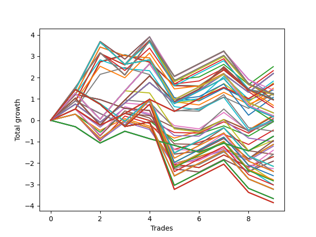

# Long HLT 600 
- Symbol: TSLA
- Date Range: 05/16/2022 - 05/17/2024
- Trading Period: 8:30-12:30
- Number of Trades: 9



| Id. | Name | Win Percent | Profit | Avg Profit / Trade | Avg Time / Trade | Std |      | Name | Win Percent | Profit | Avg Profit / Trade | Avg Time / Trade | Std |
| --- | ---- | ----------- | ------ | ------------------ | ---------------- | --- | ---- | ---- | ----------- | ------ | ------------------ | ---------------- | --- |
| | Sorted By <br> Profit | | | | | | | Sorted By <br> Win Percentage |||||
|0| TP-1.75 60m | 66.67 | 2.51 | 0.28 | 50:53 | 1.16 |     | TP-1.75 60m | 66.67 | 2.51 | 0.28 | 50:53 | 1.16 |
|1| TP-2 60m | 66.67 | 2.32 | 0.26 | 51:20 | 1.20 |     | TP-2 60m | 66.67 | 2.32 | 0.26 | 51:20 | 1.20 |
|2| TP-0.75 180m | 66.67 | 2.19 | 0.24 | 30:00 | 0.81 |     | TP-0.75 180m | 66.67 | 2.19 | 0.24 | 30:00 | 0.81 |
|3| TP-0.75 165m | 66.67 | 2.19 | 0.24 | 30:00 | 0.81 |     | TP-0.75 165m | 66.67 | 2.19 | 0.24 | 30:00 | 0.81 |
|4| TP-0.75 150m | 66.67 | 2.19 | 0.24 | 30:00 | 0.81 |     | TP-0.75 150m | 66.67 | 2.19 | 0.24 | 30:00 | 0.81 |
|5| TP-0.75 135m | 66.67 | 2.19 | 0.24 | 30:00 | 0.81 |     | TP-0.75 135m | 66.67 | 2.19 | 0.24 | 30:00 | 0.81 |
|6| TP-0.75 120m | 66.67 | 2.19 | 0.24 | 30:00 | 0.81 |     | TP-0.75 120m | 66.67 | 2.19 | 0.24 | 30:00 | 0.81 |
|7| TP-0.75 105m | 66.67 | 2.19 | 0.24 | 30:00 | 0.81 |     | TP-0.75 105m | 66.67 | 2.19 | 0.24 | 30:00 | 0.81 |
|8| TP-0.75 90m | 66.67 | 2.19 | 0.24 | 30:00 | 0.81 |     | TP-0.75 90m | 66.67 | 2.19 | 0.24 | 30:00 | 0.81 |
|9| TP-0.75 75m | 66.67 | 2.19 | 0.24 | 30:00 | 0.81 |     | TP-0.75 75m | 66.67 | 2.19 | 0.24 | 30:00 | 0.81 |
|10| TP-1 60m | 66.67 | 1.83 | 0.20 | 31:40 | 1.02 |     | TP-1 60m | 66.67 | 1.83 | 0.20 | 31:40 | 1.02 |
|11| TP-0.75 60m | 66.67 | 1.74 | 0.19 | 29:20 | 0.80 |     | TP-0.75 60m | 66.67 | 1.74 | 0.19 | 29:20 | 0.80 |
|12| TP-0.5 180m | 66.67 | 1.69 | 0.19 | 20:33 | 0.57 |     | TP-0.5 180m | 66.67 | 1.69 | 0.19 | 20:33 | 0.57 |
|13| TP-0.5 165m | 66.67 | 1.69 | 0.19 | 20:33 | 0.57 |     | TP-0.5 165m | 66.67 | 1.69 | 0.19 | 20:33 | 0.57 |
|14| TP-0.5 150m | 66.67 | 1.69 | 0.19 | 20:33 | 0.57 |     | TP-0.5 150m | 66.67 | 1.69 | 0.19 | 20:33 | 0.57 |
|15| TP-0.5 135m | 66.67 | 1.69 | 0.19 | 20:33 | 0.57 |     | TP-0.5 135m | 66.67 | 1.69 | 0.19 | 20:33 | 0.57 |
|16| TP-0.5 120m | 66.67 | 1.69 | 0.19 | 20:33 | 0.57 |     | TP-0.5 120m | 66.67 | 1.69 | 0.19 | 20:33 | 0.57 |
|17| TP-0.5 105m | 66.67 | 1.69 | 0.19 | 20:33 | 0.57 |     | TP-0.5 105m | 66.67 | 1.69 | 0.19 | 20:33 | 0.57 |
|18| TP-0.5 90m | 66.67 | 1.69 | 0.19 | 20:33 | 0.57 |     | TP-0.5 90m | 66.67 | 1.69 | 0.19 | 20:33 | 0.57 |
|19| TP-0.5 75m | 66.67 | 1.69 | 0.19 | 20:33 | 0.57 |     | TP-0.5 75m | 66.67 | 1.69 | 0.19 | 20:33 | 0.57 |
|20| TP-1.5 60m | 66.67 | 1.50 | 0.17 | 44:06 | 1.11 |     | TP-1.5 60m | 66.67 | 1.50 | 0.17 | 44:06 | 1.11 |
|21| TP-1.75 90m | 55.56 | 1.42 | 0.16 | 63:40 | 1.32 |     | TP-0.5 60m | 66.67 | 1.24 | 0.14 | 19:53 | 0.56 |
|22| TP-1.75 45m | 44.44 | 1.42 | 0.16 | 40:53 | 1.09 |     | TP-1.25 60m | 66.67 | 1.08 | 0.12 | 34:40 | 1.17 |
|23| TP-2 30m | 44.44 | 1.26 | 0.14 | 28:53 | 0.94 |     | TP-1.75 90m | 55.56 | 1.42 | 0.16 | 63:40 | 1.32 |
|24| TP-1.75 30m | 44.44 | 1.26 | 0.14 | 28:53 | 0.94 |     | TP-2 90m | 55.56 | 1.23 | 0.14 | 64:06 | 1.35 |
|25| TP-0.5 60m | 66.67 | 1.24 | 0.14 | 19:53 | 0.56 |     | TP-1.5 180m | 55.56 | 1.22 | 0.14 | 52:33 | 1.28 |
|26| TP-3 30m | 44.44 | 1.24 | 0.14 | 29:00 | 0.94 |     | TP-1.5 165m | 55.56 | 1.22 | 0.14 | 52:33 | 1.28 |
|27| TP-2.75 30m | 44.44 | 1.24 | 0.14 | 29:00 | 0.94 |     | TP-1.5 150m | 55.56 | 1.22 | 0.14 | 52:33 | 1.28 |
|28| TP-2.5 30m | 44.44 | 1.24 | 0.14 | 29:00 | 0.94 |     | TP-1.5 135m | 55.56 | 1.22 | 0.14 | 52:33 | 1.28 |
|29| TP-2.25 30m | 44.44 | 1.24 | 0.14 | 29:00 | 0.94 |     | TP-1.5 120m | 55.56 | 1.22 | 0.14 | 52:33 | 1.28 |
|30| TP-2 90m | 55.56 | 1.23 | 0.14 | 64:06 | 1.35 |     | TP-1.5 105m | 55.56 | 1.22 | 0.14 | 52:33 | 1.28 |
|31| TP-2 45m | 44.44 | 1.23 | 0.14 | 41:20 | 1.13 |     | TP-1.5 90m | 55.56 | 1.22 | 0.14 | 52:33 | 1.28 |
|32| TP-1.5 180m | 55.56 | 1.22 | 0.14 | 52:33 | 1.28 |     | TP-1.75 105m | 55.56 | 1.18 | 0.13 | 65:20 | 1.30 |
|33| TP-1.5 165m | 55.56 | 1.22 | 0.14 | 52:33 | 1.28 |     | TP-1.75 75m | 55.56 | 1.18 | 0.13 | 59:53 | 1.30 |
|34| TP-1.5 150m | 55.56 | 1.22 | 0.14 | 52:33 | 1.28 |     | TP-2 105m | 55.56 | 0.99 | 0.11 | 65:46 | 1.33 |
|35| TP-1.5 135m | 55.56 | 1.22 | 0.14 | 52:33 | 1.28 |     | TP-2 75m | 55.56 | 0.99 | 0.11 | 60:20 | 1.33 |
|36| TP-1.5 120m | 55.56 | 1.22 | 0.14 | 52:33 | 1.28 |     | TP-1 180m | 55.56 | 0.96 | 0.11 | 34:06 | 1.03 |
|37| TP-1.5 105m | 55.56 | 1.22 | 0.14 | 52:33 | 1.28 |     | TP-1 165m | 55.56 | 0.96 | 0.11 | 34:06 | 1.03 |
|38| TP-1.5 90m | 55.56 | 1.22 | 0.14 | 52:33 | 1.28 |     | TP-1 150m | 55.56 | 0.96 | 0.11 | 34:06 | 1.03 |
|39| TP-1.75 105m | 55.56 | 1.18 | 0.13 | 65:20 | 1.30 |     | TP-1 135m | 55.56 | 0.96 | 0.11 | 34:06 | 1.03 |
|40| TP-1.75 75m | 55.56 | 1.18 | 0.13 | 59:53 | 1.30 |     | TP-1 120m | 55.56 | 0.96 | 0.11 | 34:06 | 1.03 |
|41| TP-1.25 60m | 66.67 | 1.08 | 0.12 | 34:40 | 1.17 |     | TP-1 105m | 55.56 | 0.96 | 0.11 | 34:06 | 1.03 |
|42| TP-2 105m | 55.56 | 0.99 | 0.11 | 65:46 | 1.33 |     | TP-1 90m | 55.56 | 0.96 | 0.11 | 34:06 | 1.03 |
|43| TP-2 75m | 55.56 | 0.99 | 0.11 | 60:20 | 1.33 |     | TP-1 75m | 55.56 | 0.70 | 0.08 | 34:00 | 1.04 |
|44| TP-1 180m | 55.56 | 0.96 | 0.11 | 34:06 | 1.03 |     | TP-1.5 75m | 55.56 | 0.60 | 0.07 | 50:40 | 1.21 |
|45| TP-1 165m | 55.56 | 0.96 | 0.11 | 34:06 | 1.03 |     | TP-1.75 180m | 55.56 | 0.35 | 0.04 | 67:00 | 1.26 |
|46| TP-1 150m | 55.56 | 0.96 | 0.11 | 34:06 | 1.03 |     | TP-1.75 165m | 55.56 | 0.35 | 0.04 | 67:00 | 1.26 |
|47| TP-1 135m | 55.56 | 0.96 | 0.11 | 34:06 | 1.03 |     | TP-1.75 150m | 55.56 | 0.35 | 0.04 | 67:00 | 1.26 |
|48| TP-1 120m | 55.56 | 0.96 | 0.11 | 34:06 | 1.03 |     | TP-1.75 135m | 55.56 | 0.35 | 0.04 | 67:00 | 1.26 |
|49| TP-1 105m | 55.56 | 0.96 | 0.11 | 34:06 | 1.03 |     | TP-1.75 120m | 55.56 | 0.35 | 0.04 | 67:00 | 1.26 |
|50| TP-1 90m | 55.56 | 0.96 | 0.11 | 34:06 | 1.03 |     | TP-0.5 15m | 55.56 | 0.23 | 0.03 | 08:40 | 0.52 |
|51| TP-1 75m | 55.56 | 0.70 | 0.08 | 34:00 | 1.04 |     | TP-1.25 180m | 55.56 | 0.21 | 0.02 | 37:06 | 1.17 |
|52| TP-1.5 75m | 55.56 | 0.60 | 0.07 | 50:40 | 1.21 |     | TP-1.25 165m | 55.56 | 0.21 | 0.02 | 37:06 | 1.17 |
|53| TP-1.75 180m | 55.56 | 0.35 | 0.04 | 67:00 | 1.26 |     | TP-1.25 150m | 55.56 | 0.21 | 0.02 | 37:06 | 1.17 |
|54| TP-1.75 165m | 55.56 | 0.35 | 0.04 | 67:00 | 1.26 |     | TP-1.25 135m | 55.56 | 0.21 | 0.02 | 37:06 | 1.17 |
|55| TP-1.75 150m | 55.56 | 0.35 | 0.04 | 67:00 | 1.26 |     | TP-1.25 120m | 55.56 | 0.21 | 0.02 | 37:06 | 1.17 |
|56| TP-1.75 135m | 55.56 | 0.35 | 0.04 | 67:00 | 1.26 |     | TP-1.25 105m | 55.56 | 0.21 | 0.02 | 37:06 | 1.17 |
|57| TP-1.75 120m | 55.56 | 0.35 | 0.04 | 67:00 | 1.26 |     | TP-1.25 90m | 55.56 | 0.21 | 0.02 | 37:06 | 1.17 |
|58| TP-0.5 15m | 55.56 | 0.23 | 0.03 | 08:40 | 0.52 |     | TP-2 180m | 55.56 | 0.16 | 0.02 | 67:26 | 1.29 |
|59| TP-1.25 180m | 55.56 | 0.21 | 0.02 | 37:06 | 1.17 |     | TP-2 165m | 55.56 | 0.16 | 0.02 | 67:26 | 1.29 |
|60| TP-1.25 165m | 55.56 | 0.21 | 0.02 | 37:06 | 1.17 |     | TP-2 150m | 55.56 | 0.16 | 0.02 | 67:26 | 1.29 |
|61| TP-1.25 150m | 55.56 | 0.21 | 0.02 | 37:06 | 1.17 |     | TP-2 135m | 55.56 | 0.16 | 0.02 | 67:26 | 1.29 |
|62| TP-1.25 135m | 55.56 | 0.21 | 0.02 | 37:06 | 1.17 |     | TP-2 120m | 55.56 | 0.16 | 0.02 | 67:26 | 1.29 |
|63| TP-1.25 120m | 55.56 | 0.21 | 0.02 | 37:06 | 1.17 |     | TP-1.25 75m | 55.56 | -0.05 | -0.01 | 37:00 | 1.19 |
|64| TP-1.25 105m | 55.56 | 0.21 | 0.02 | 37:06 | 1.17 |     | TP-0.75 15m | 55.56 | -0.07 | -0.01 | 10:46 | 0.63 |
|65| TP-1.25 90m | 55.56 | 0.21 | 0.02 | 37:06 | 1.17 |     | TP-1 15m | 55.56 | -0.46 | -0.05 | 11:26 | 0.78 |
|66| TP-0.5 45m | 44.44 | 0.19 | 0.02 | 17:06 | 0.53 |     | TP-2.5 60m | 55.56 | -0.96 | -0.11 | 54:53 | 1.11 |
|67| TP-2 180m | 55.56 | 0.16 | 0.02 | 67:26 | 1.29 |     | TP-2.25 60m | 55.56 | -0.96 | -0.11 | 54:53 | 1.11 |
|68| TP-2 165m | 55.56 | 0.16 | 0.02 | 67:26 | 1.29 |     | TP-3 15m | 55.56 | -1.13 | -0.13 | 14:00 | 0.81 |
|69| TP-2 150m | 55.56 | 0.16 | 0.02 | 67:26 | 1.29 |     | TP-2.75 15m | 55.56 | -1.13 | -0.13 | 14:00 | 0.81 |
|70| TP-2 135m | 55.56 | 0.16 | 0.02 | 67:26 | 1.29 |     | TP-2.5 15m | 55.56 | -1.13 | -0.13 | 14:00 | 0.81 |
|71| TP-2 120m | 55.56 | 0.16 | 0.02 | 67:26 | 1.29 |     | TP-2.25 15m | 55.56 | -1.13 | -0.13 | 14:00 | 0.81 |
|72| TP-0.5 30m | 44.44 | 0.08 | 0.01 | 13:46 | 0.54 |     | TP-2 15m | 55.56 | -1.13 | -0.13 | 14:00 | 0.81 |
|73| TP-1.5 45m | 44.44 | 0.02 | 0.00 | 35:46 | 1.06 |     | TP-1.75 15m | 55.56 | -1.13 | -0.13 | 14:00 | 0.81 |
|74| TP-0.75 45m | 44.44 | -0.01 | -0.00 | 25:06 | 0.72 |     | TP-1.5 15m | 55.56 | -1.13 | -0.13 | 14:00 | 0.81 |
|75| TP-1.25 75m | 55.56 | -0.05 | -0.01 | 37:00 | 1.19 |     | TP-1.25 15m | 55.56 | -1.21 | -0.13 | 13:13 | 0.82 |
|76| TP-1 45m | 44.44 | -0.05 | -0.01 | 27:00 | 0.94 |     | TP-2.75 60m | 55.56 | -1.40 | -0.16 | 55:20 | 1.22 |
|77| TP-0.75 15m | 55.56 | -0.07 | -0.01 | 10:46 | 0.63 |     | TP-3 60m | 55.56 | -1.59 | -0.18 | 55:46 | 1.27 |
|78| TP-1 15m | 55.56 | -0.46 | -0.05 | 11:26 | 0.78 |     | TP-1.75 45m | 44.44 | 1.42 | 0.16 | 40:53 | 1.09 |
|79| TP-1.5 30m | 44.44 | -0.51 | -0.06 | 26:13 | 0.99 |     | TP-2 30m | 44.44 | 1.26 | 0.14 | 28:53 | 0.94 |
|80| TP-0.25 180m | 33.33 | -0.75 | -0.08 | 05:40 | 0.47 |     | TP-1.75 30m | 44.44 | 1.26 | 0.14 | 28:53 | 0.94 |
|81| TP-0.25 165m | 33.33 | -0.75 | -0.08 | 05:40 | 0.47 |     | TP-3 30m | 44.44 | 1.24 | 0.14 | 29:00 | 0.94 |
|82| TP-0.25 150m | 33.33 | -0.75 | -0.08 | 05:40 | 0.47 |     | TP-2.75 30m | 44.44 | 1.24 | 0.14 | 29:00 | 0.94 |
|83| TP-0.25 135m | 33.33 | -0.75 | -0.08 | 05:40 | 0.47 |     | TP-2.5 30m | 44.44 | 1.24 | 0.14 | 29:00 | 0.94 |
|84| TP-0.25 120m | 33.33 | -0.75 | -0.08 | 05:40 | 0.47 |     | TP-2.25 30m | 44.44 | 1.24 | 0.14 | 29:00 | 0.94 |
|85| TP-0.25 105m | 33.33 | -0.75 | -0.08 | 05:40 | 0.47 |     | TP-2 45m | 44.44 | 1.23 | 0.14 | 41:20 | 1.13 |
|86| TP-0.25 90m | 33.33 | -0.75 | -0.08 | 05:40 | 0.47 |     | TP-0.5 45m | 44.44 | 0.19 | 0.02 | 17:06 | 0.53 |
|87| TP-0.25 75m | 33.33 | -0.75 | -0.08 | 05:40 | 0.47 |     | TP-0.5 30m | 44.44 | 0.08 | 0.01 | 13:46 | 0.54 |
|88| TP-0.25 60m | 33.33 | -0.75 | -0.08 | 05:40 | 0.47 |     | TP-1.5 45m | 44.44 | 0.02 | 0.00 | 35:46 | 1.06 |
|89| TP-0.25 45m | 33.33 | -0.75 | -0.08 | 05:40 | 0.47 |     | TP-0.75 45m | 44.44 | -0.01 | -0.00 | 25:06 | 0.72 |
|90| TP-0.25 30m | 33.33 | -0.75 | -0.08 | 05:40 | 0.47 |     | TP-1 45m | 44.44 | -0.05 | -0.01 | 27:00 | 0.94 |
|91| TP-0.25 15m | 33.33 | -0.75 | -0.08 | 05:40 | 0.47 |     | TP-1.5 30m | 44.44 | -0.51 | -0.06 | 26:13 | 0.99 |
|92| TP-1.25 45m | 44.44 | -0.94 | -0.10 | 29:53 | 1.07 |     | TP-1.25 45m | 44.44 | -0.94 | -0.10 | 29:53 | 1.07 |
|93| TP-2.5 60m | 55.56 | -0.96 | -0.11 | 54:53 | 1.11 |     | TP-2.5 90m | 44.44 | -2.15 | -0.24 | 68:20 | 1.24 |
|94| TP-2.25 60m | 55.56 | -0.96 | -0.11 | 54:53 | 1.11 |     | TP-2.25 90m | 44.44 | -2.15 | -0.24 | 68:20 | 1.24 |
|95| TP-0.75 30m | 33.33 | -1.00 | -0.11 | 19:20 | 0.67 |     | TP-2.5 105m | 44.44 | -2.39 | -0.27 | 70:00 | 1.21 |
|96| TP-3 15m | 55.56 | -1.13 | -0.13 | 14:00 | 0.81 |     | TP-2.25 105m | 44.44 | -2.39 | -0.27 | 70:00 | 1.21 |
|97| TP-2.75 15m | 55.56 | -1.13 | -0.13 | 14:00 | 0.81 |     | TP-2.5 75m | 44.44 | -2.39 | -0.27 | 64:33 | 1.21 |
|98| TP-2.5 15m | 55.56 | -1.13 | -0.13 | 14:00 | 0.81 |     | TP-2.25 75m | 44.44 | -2.39 | -0.27 | 64:33 | 1.21 |
|99| TP-2.25 15m | 55.56 | -1.13 | -0.13 | 14:00 | 0.81 |     | TP-2.75 90m | 44.44 | -2.59 | -0.29 | 68:46 | 1.33 |
|100| TP-2 15m | 55.56 | -1.13 | -0.13 | 14:00 | 0.81 |     | TP-3 90m | 44.44 | -2.78 | -0.31 | 69:13 | 1.37 |
|101| TP-1.75 15m | 55.56 | -1.13 | -0.13 | 14:00 | 0.81 |     | TP-2.75 105m | 44.44 | -2.83 | -0.31 | 70:26 | 1.30 |
|102| TP-1.5 15m | 55.56 | -1.13 | -0.13 | 14:00 | 0.81 |     | TP-2.75 75m | 44.44 | -2.83 | -0.31 | 65:00 | 1.30 |
|103| TP-1.25 15m | 55.56 | -1.21 | -0.13 | 13:13 | 0.82 |     | TP-3 105m | 44.44 | -3.02 | -0.34 | 70:53 | 1.35 |
|104| TP-2.75 60m | 55.56 | -1.40 | -0.16 | 55:20 | 1.22 |     | TP-3 75m | 44.44 | -3.02 | -0.34 | 65:26 | 1.35 |
|105| TP-3 60m | 55.56 | -1.59 | -0.18 | 55:46 | 1.27 |     | TP-2.5 180m | 44.44 | -3.22 | -0.36 | 71:40 | 1.13 |
|106| TP-1 30m | 33.33 | -1.59 | -0.18 | 20:13 | 0.84 |     | TP-2.25 180m | 44.44 | -3.22 | -0.36 | 71:40 | 1.13 |
|107| TP-2.5 45m | 33.33 | -1.70 | -0.19 | 43:13 | 0.98 |     | TP-2.5 165m | 44.44 | -3.22 | -0.36 | 71:40 | 1.13 |
|108| TP-2.25 45m | 33.33 | -1.70 | -0.19 | 43:13 | 0.98 |     | TP-2.25 165m | 44.44 | -3.22 | -0.36 | 71:40 | 1.13 |
|109| TP-3 45m | 33.33 | -1.91 | -0.21 | 43:33 | 1.04 |     | TP-2.5 150m | 44.44 | -3.22 | -0.36 | 71:40 | 1.13 |
|110| TP-2.75 45m | 33.33 | -1.91 | -0.21 | 43:33 | 1.04 |     | TP-2.25 150m | 44.44 | -3.22 | -0.36 | 71:40 | 1.13 |
|111| TP-2.5 90m | 44.44 | -2.15 | -0.24 | 68:20 | 1.24 |     | TP-2.5 135m | 44.44 | -3.22 | -0.36 | 71:40 | 1.13 |
|112| TP-2.25 90m | 44.44 | -2.15 | -0.24 | 68:20 | 1.24 |     | TP-2.25 135m | 44.44 | -3.22 | -0.36 | 71:40 | 1.13 |
|113| TP-1.25 30m | 33.33 | -2.26 | -0.25 | 22:26 | 0.98 |     | TP-2.5 120m | 44.44 | -3.22 | -0.36 | 71:40 | 1.13 |
|114| TP-2.5 105m | 44.44 | -2.39 | -0.27 | 70:00 | 1.21 |     | TP-2.25 120m | 44.44 | -3.22 | -0.36 | 71:40 | 1.13 |
|115| TP-2.25 105m | 44.44 | -2.39 | -0.27 | 70:00 | 1.21 |     | TP-2.75 180m | 44.44 | -3.66 | -0.41 | 72:06 | 1.23 |
|116| TP-2.5 75m | 44.44 | -2.39 | -0.27 | 64:33 | 1.21 |     | TP-2.75 165m | 44.44 | -3.66 | -0.41 | 72:06 | 1.23 |
|117| TP-2.25 75m | 44.44 | -2.39 | -0.27 | 64:33 | 1.21 |     | TP-2.75 150m | 44.44 | -3.66 | -0.41 | 72:06 | 1.23 |
|118| TP-2.75 90m | 44.44 | -2.59 | -0.29 | 68:46 | 1.33 |     | TP-2.75 135m | 44.44 | -3.66 | -0.41 | 72:06 | 1.23 |
|119| TP-3 90m | 44.44 | -2.78 | -0.31 | 69:13 | 1.37 |     | TP-2.75 120m | 44.44 | -3.66 | -0.41 | 72:06 | 1.23 |
|120| TP-2.75 105m | 44.44 | -2.83 | -0.31 | 70:26 | 1.30 |     | TP-3 180m | 44.44 | -3.85 | -0.43 | 72:33 | 1.27 |
|121| TP-2.75 75m | 44.44 | -2.83 | -0.31 | 65:00 | 1.30 |     | TP-3 165m | 44.44 | -3.85 | -0.43 | 72:33 | 1.27 |
|122| TP-3 105m | 44.44 | -3.02 | -0.34 | 70:53 | 1.35 |     | TP-3 150m | 44.44 | -3.85 | -0.43 | 72:33 | 1.27 |
|123| TP-3 75m | 44.44 | -3.02 | -0.34 | 65:26 | 1.35 |     | TP-3 135m | 44.44 | -3.85 | -0.43 | 72:33 | 1.27 |
|124| TP-2.5 180m | 44.44 | -3.22 | -0.36 | 71:40 | 1.13 |     | TP-3 120m | 44.44 | -3.85 | -0.43 | 72:33 | 1.27 |
|125| TP-2.25 180m | 44.44 | -3.22 | -0.36 | 71:40 | 1.13 |     | TP-0.25 180m | 33.33 | -0.75 | -0.08 | 05:40 | 0.47 |
|126| TP-2.5 165m | 44.44 | -3.22 | -0.36 | 71:40 | 1.13 |     | TP-0.25 165m | 33.33 | -0.75 | -0.08 | 05:40 | 0.47 |
|127| TP-2.25 165m | 44.44 | -3.22 | -0.36 | 71:40 | 1.13 |     | TP-0.25 150m | 33.33 | -0.75 | -0.08 | 05:40 | 0.47 |
|128| TP-2.5 150m | 44.44 | -3.22 | -0.36 | 71:40 | 1.13 |     | TP-0.25 135m | 33.33 | -0.75 | -0.08 | 05:40 | 0.47 |
|129| TP-2.25 150m | 44.44 | -3.22 | -0.36 | 71:40 | 1.13 |     | TP-0.25 120m | 33.33 | -0.75 | -0.08 | 05:40 | 0.47 |
|130| TP-2.5 135m | 44.44 | -3.22 | -0.36 | 71:40 | 1.13 |     | TP-0.25 105m | 33.33 | -0.75 | -0.08 | 05:40 | 0.47 |
|131| TP-2.25 135m | 44.44 | -3.22 | -0.36 | 71:40 | 1.13 |     | TP-0.25 90m | 33.33 | -0.75 | -0.08 | 05:40 | 0.47 |
|132| TP-2.5 120m | 44.44 | -3.22 | -0.36 | 71:40 | 1.13 |     | TP-0.25 75m | 33.33 | -0.75 | -0.08 | 05:40 | 0.47 |
|133| TP-2.25 120m | 44.44 | -3.22 | -0.36 | 71:40 | 1.13 |     | TP-0.25 60m | 33.33 | -0.75 | -0.08 | 05:40 | 0.47 |
|134| TP-2.75 180m | 44.44 | -3.66 | -0.41 | 72:06 | 1.23 |     | TP-0.25 45m | 33.33 | -0.75 | -0.08 | 05:40 | 0.47 |
|135| TP-2.75 165m | 44.44 | -3.66 | -0.41 | 72:06 | 1.23 |     | TP-0.25 30m | 33.33 | -0.75 | -0.08 | 05:40 | 0.47 |
|136| TP-2.75 150m | 44.44 | -3.66 | -0.41 | 72:06 | 1.23 |     | TP-0.25 15m | 33.33 | -0.75 | -0.08 | 05:40 | 0.47 |
|137| TP-2.75 135m | 44.44 | -3.66 | -0.41 | 72:06 | 1.23 |     | TP-0.75 30m | 33.33 | -1.00 | -0.11 | 19:20 | 0.67 |
|138| TP-2.75 120m | 44.44 | -3.66 | -0.41 | 72:06 | 1.23 |     | TP-1 30m | 33.33 | -1.59 | -0.18 | 20:13 | 0.84 |
|139| TP-3 180m | 44.44 | -3.85 | -0.43 | 72:33 | 1.27 |     | TP-2.5 45m | 33.33 | -1.70 | -0.19 | 43:13 | 0.98 |
|140| TP-3 165m | 44.44 | -3.85 | -0.43 | 72:33 | 1.27 |     | TP-2.25 45m | 33.33 | -1.70 | -0.19 | 43:13 | 0.98 |
|141| TP-3 150m | 44.44 | -3.85 | -0.43 | 72:33 | 1.27 |     | TP-3 45m | 33.33 | -1.91 | -0.21 | 43:33 | 1.04 |
|142| TP-3 135m | 44.44 | -3.85 | -0.43 | 72:33 | 1.27 |     | TP-2.75 45m | 33.33 | -1.91 | -0.21 | 43:33 | 1.04 |
|143| TP-3 120m | 44.44 | -3.85 | -0.43 | 72:33 | 1.27 |     | TP-1.25 30m | 33.33 | -2.26 | -0.25 | 22:26 | 0.98 |

### Test TP-0.25 15m
* Take Profit of 0.25 Point
* 0.25 Stoploss
* Results:
```
Total Trades: 9
Percent Up: 33.33
Percent Down: 66.67
Total Points Moved Up: -0.75
Potential Profit: -375.00
Total Points Ups: 1.65 Count Ups: 3
Total Points Downs: -2.40 Count Downs: 6
```

<details><summary>Trades</summary>

<code>In: 2022-11-22 11:25:00		Out: 2022-11-22 11:31:00		Total Position Time: 06:00		Total Move Up: -0.30		Total to Date: -0.30</code> <br />
<code>In: 2022-12-14 11:45:00		Out: 2022-12-14 11:47:00		Total Position Time: 02:00		Total Move Up: -0.76		Total to Date: -1.06</code> <br />
<code>In: 2023-02-21 11:30:00		Out: 2023-02-21 11:32:00		Total Position Time: 02:00		Total Move Up: 0.55		Total to Date: -0.51</code> <br />
<code>In: 2023-03-08 10:15:00		Out: 2023-03-08 10:29:00		Total Position Time: 14:00		Total Move Up: -0.35		Total to Date: -0.86</code> <br />
<code>In: 2023-03-23 10:45:00		Out: 2023-03-23 10:48:00		Total Position Time: 03:00		Total Move Up: -0.31		Total to Date: -1.17</code> <br />
<code>In: 2023-05-01 11:45:00		Out: 2023-05-01 11:52:00		Total Position Time: 07:00		Total Move Up: -0.32		Total to Date: -1.49</code> <br />
<code>In: 2023-05-25 12:10:00		Out: 2023-05-25 12:21:00		Total Position Time: 11:00		Total Move Up: 0.42		Total to Date: -1.07</code> <br />
<code>In: 2023-09-18 11:35:00		Out: 2023-09-18 11:39:00		Total Position Time: 04:00		Total Move Up: -0.36		Total to Date: -1.43</code> <br />
<code>In: 2023-10-27 11:35:00		Out: 2023-10-27 11:37:00		Total Position Time: 02:00		Total Move Up: 0.68		Total to Date: -0.75</code> <br />


</details>

### Test TP-0.5 15m
* Take Profit of 0.5 Point
* 0.5 Stoploss
* Results:
```
Total Trades: 9
Percent Up: 55.56
Percent Down: 44.44
Total Points Moved Up: 0.23
Potential Profit: 115.00
Total Points Ups: 2.38 Count Ups: 5
Total Points Downs: -2.15 Count Downs: 4
```

<details><summary>Trades</summary>

<code>In: 2022-11-22 11:25:00		Out: 2022-11-22 11:39:00		Total Position Time: 14:00		Total Move Up: 0.29		Total to Date: 0.29</code> <br />
<code>In: 2022-12-14 11:45:00		Out: 2022-12-14 11:47:00		Total Position Time: 02:00		Total Move Up: -0.76		Total to Date: -0.47</code> <br />
<code>In: 2023-02-21 11:30:00		Out: 2023-02-21 11:32:00		Total Position Time: 02:00		Total Move Up: 0.55		Total to Date: 0.08</code> <br />
<code>In: 2023-03-08 10:15:00		Out: 2023-03-08 10:29:00		Total Position Time: 14:00		Total Move Up: -0.35		Total to Date: -0.27</code> <br />
<code>In: 2023-03-23 10:45:00		Out: 2023-03-23 10:49:00		Total Position Time: 04:00		Total Move Up: -0.56		Total to Date: -0.83</code> <br />
<code>In: 2023-05-01 11:45:00		Out: 2023-05-01 11:59:00		Total Position Time: 14:00		Total Move Up: 0.33		Total to Date: -0.50</code> <br />
<code>In: 2023-05-25 12:10:00		Out: 2023-05-25 12:22:00		Total Position Time: 12:00		Total Move Up: 0.53		Total to Date: 0.03</code> <br />
<code>In: 2023-09-18 11:35:00		Out: 2023-09-18 11:49:00		Total Position Time: 14:00		Total Move Up: -0.48		Total to Date: -0.45</code> <br />
<code>In: 2023-10-27 11:35:00		Out: 2023-10-27 11:37:00		Total Position Time: 02:00		Total Move Up: 0.68		Total to Date: 0.23</code> <br />


</details>

### Test TP-0.75 15m
* Take Profit of 0.75 Point
* 0.75 Stoploss
* Results:
```
Total Trades: 9
Percent Up: 55.56
Percent Down: 44.44
Total Points Moved Up: -0.07
Potential Profit: -35.00
Total Points Ups: 2.57 Count Ups: 5
Total Points Downs: -2.64 Count Downs: 4
```

<details><summary>Trades</summary>

<code>In: 2022-11-22 11:25:00		Out: 2022-11-22 11:39:00		Total Position Time: 14:00		Total Move Up: 0.29		Total to Date: 0.29</code> <br />
<code>In: 2022-12-14 11:45:00		Out: 2022-12-14 11:48:00		Total Position Time: 03:00		Total Move Up: -0.85		Total to Date: -0.56</code> <br />
<code>In: 2023-02-21 11:30:00		Out: 2023-02-21 11:33:00		Total Position Time: 03:00		Total Move Up: 0.90		Total to Date: 0.34</code> <br />
<code>In: 2023-03-08 10:15:00		Out: 2023-03-08 10:29:00		Total Position Time: 14:00		Total Move Up: -0.35		Total to Date: -0.01</code> <br />
<code>In: 2023-03-23 10:45:00		Out: 2023-03-23 10:52:00		Total Position Time: 07:00		Total Move Up: -0.96		Total to Date: -0.97</code> <br />
<code>In: 2023-05-01 11:45:00		Out: 2023-05-01 11:59:00		Total Position Time: 14:00		Total Move Up: 0.33		Total to Date: -0.64</code> <br />
<code>In: 2023-05-25 12:10:00		Out: 2023-05-25 12:24:00		Total Position Time: 14:00		Total Move Up: 0.38		Total to Date: -0.26</code> <br />
<code>In: 2023-09-18 11:35:00		Out: 2023-09-18 11:49:00		Total Position Time: 14:00		Total Move Up: -0.48		Total to Date: -0.74</code> <br />
<code>In: 2023-10-27 11:35:00		Out: 2023-10-27 11:49:00		Total Position Time: 14:00		Total Move Up: 0.67		Total to Date: -0.07</code> <br />


</details>

### Test TP-1 15m
* Take Profit of 1 Point
* 1 Stoploss
* Results:
```
Total Trades: 9
Percent Up: 55.56
Percent Down: 44.44
Total Points Moved Up: -0.46
Potential Profit: -230.00
Total Points Ups: 2.84 Count Ups: 5
Total Points Downs: -3.30 Count Downs: 4
```

<details><summary>Trades</summary>

<code>In: 2022-11-22 11:25:00		Out: 2022-11-22 11:39:00		Total Position Time: 14:00		Total Move Up: 0.29		Total to Date: 0.29</code> <br />
<code>In: 2022-12-14 11:45:00		Out: 2022-12-14 11:49:00		Total Position Time: 04:00		Total Move Up: -1.26		Total to Date: -0.97</code> <br />
<code>In: 2023-02-21 11:30:00		Out: 2023-02-21 11:35:00		Total Position Time: 05:00		Total Move Up: 1.17		Total to Date: 0.20</code> <br />
<code>In: 2023-03-08 10:15:00		Out: 2023-03-08 10:29:00		Total Position Time: 14:00		Total Move Up: -0.35		Total to Date: -0.15</code> <br />
<code>In: 2023-03-23 10:45:00		Out: 2023-03-23 10:55:00		Total Position Time: 10:00		Total Move Up: -1.21		Total to Date: -1.36</code> <br />
<code>In: 2023-05-01 11:45:00		Out: 2023-05-01 11:59:00		Total Position Time: 14:00		Total Move Up: 0.33		Total to Date: -1.03</code> <br />
<code>In: 2023-05-25 12:10:00		Out: 2023-05-25 12:24:00		Total Position Time: 14:00		Total Move Up: 0.38		Total to Date: -0.65</code> <br />
<code>In: 2023-09-18 11:35:00		Out: 2023-09-18 11:49:00		Total Position Time: 14:00		Total Move Up: -0.48		Total to Date: -1.13</code> <br />
<code>In: 2023-10-27 11:35:00		Out: 2023-10-27 11:49:00		Total Position Time: 14:00		Total Move Up: 0.67		Total to Date: -0.46</code> <br />


</details>

### Test TP-1.25 15m
* Take Profit of 1.25 Point
* 1.25 Stoploss
* Results:
```
Total Trades: 9
Percent Up: 55.56
Percent Down: 44.44
Total Points Moved Up: -1.21
Potential Profit: -605.00
Total Points Ups: 2.52 Count Ups: 5
Total Points Downs: -3.73 Count Downs: 4
```

<details><summary>Trades</summary>

<code>In: 2022-11-22 11:25:00		Out: 2022-11-22 11:39:00		Total Position Time: 14:00		Total Move Up: 0.29		Total to Date: 0.29</code> <br />
<code>In: 2022-12-14 11:45:00		Out: 2022-12-14 11:52:00		Total Position Time: 07:00		Total Move Up: -1.22		Total to Date: -0.93</code> <br />
<code>In: 2023-02-21 11:30:00		Out: 2023-02-21 11:44:00		Total Position Time: 14:00		Total Move Up: 0.85		Total to Date: -0.08</code> <br />
<code>In: 2023-03-08 10:15:00		Out: 2023-03-08 10:29:00		Total Position Time: 14:00		Total Move Up: -0.35		Total to Date: -0.43</code> <br />
<code>In: 2023-03-23 10:45:00		Out: 2023-03-23 10:59:00		Total Position Time: 14:00		Total Move Up: -1.68		Total to Date: -2.11</code> <br />
<code>In: 2023-05-01 11:45:00		Out: 2023-05-01 11:59:00		Total Position Time: 14:00		Total Move Up: 0.33		Total to Date: -1.78</code> <br />
<code>In: 2023-05-25 12:10:00		Out: 2023-05-25 12:24:00		Total Position Time: 14:00		Total Move Up: 0.38		Total to Date: -1.40</code> <br />
<code>In: 2023-09-18 11:35:00		Out: 2023-09-18 11:49:00		Total Position Time: 14:00		Total Move Up: -0.48		Total to Date: -1.88</code> <br />
<code>In: 2023-10-27 11:35:00		Out: 2023-10-27 11:49:00		Total Position Time: 14:00		Total Move Up: 0.67		Total to Date: -1.21</code> <br />


</details>

### Test TP-1.5 15m
* Take Profit of 1.5 Point
* 1.5 Stoploss
* Results:
```
Total Trades: 9
Percent Up: 55.56
Percent Down: 44.44
Total Points Moved Up: -1.13
Potential Profit: -565.00
Total Points Ups: 2.52 Count Ups: 5
Total Points Downs: -3.65 Count Downs: 4
```

<details><summary>Trades</summary>

<code>In: 2022-11-22 11:25:00		Out: 2022-11-22 11:39:00		Total Position Time: 14:00		Total Move Up: 0.29		Total to Date: 0.29</code> <br />
<code>In: 2022-12-14 11:45:00		Out: 2022-12-14 11:59:00		Total Position Time: 14:00		Total Move Up: -1.14		Total to Date: -0.85</code> <br />
<code>In: 2023-02-21 11:30:00		Out: 2023-02-21 11:44:00		Total Position Time: 14:00		Total Move Up: 0.85		Total to Date: -0.00</code> <br />
<code>In: 2023-03-08 10:15:00		Out: 2023-03-08 10:29:00		Total Position Time: 14:00		Total Move Up: -0.35		Total to Date: -0.35</code> <br />
<code>In: 2023-03-23 10:45:00		Out: 2023-03-23 10:59:00		Total Position Time: 14:00		Total Move Up: -1.68		Total to Date: -2.03</code> <br />
<code>In: 2023-05-01 11:45:00		Out: 2023-05-01 11:59:00		Total Position Time: 14:00		Total Move Up: 0.33		Total to Date: -1.70</code> <br />
<code>In: 2023-05-25 12:10:00		Out: 2023-05-25 12:24:00		Total Position Time: 14:00		Total Move Up: 0.38		Total to Date: -1.32</code> <br />
<code>In: 2023-09-18 11:35:00		Out: 2023-09-18 11:49:00		Total Position Time: 14:00		Total Move Up: -0.48		Total to Date: -1.80</code> <br />
<code>In: 2023-10-27 11:35:00		Out: 2023-10-27 11:49:00		Total Position Time: 14:00		Total Move Up: 0.67		Total to Date: -1.13</code> <br />


</details>

### Test TP-1.75 15m
* Take Profit of 1.75 Point
* 1.75 Stoploss
* Results:
```
Total Trades: 9
Percent Up: 55.56
Percent Down: 44.44
Total Points Moved Up: -1.13
Potential Profit: -565.00
Total Points Ups: 2.52 Count Ups: 5
Total Points Downs: -3.65 Count Downs: 4
```

<details><summary>Trades</summary>

<code>In: 2022-11-22 11:25:00		Out: 2022-11-22 11:39:00		Total Position Time: 14:00		Total Move Up: 0.29		Total to Date: 0.29</code> <br />
<code>In: 2022-12-14 11:45:00		Out: 2022-12-14 11:59:00		Total Position Time: 14:00		Total Move Up: -1.14		Total to Date: -0.85</code> <br />
<code>In: 2023-02-21 11:30:00		Out: 2023-02-21 11:44:00		Total Position Time: 14:00		Total Move Up: 0.85		Total to Date: -0.00</code> <br />
<code>In: 2023-03-08 10:15:00		Out: 2023-03-08 10:29:00		Total Position Time: 14:00		Total Move Up: -0.35		Total to Date: -0.35</code> <br />
<code>In: 2023-03-23 10:45:00		Out: 2023-03-23 10:59:00		Total Position Time: 14:00		Total Move Up: -1.68		Total to Date: -2.03</code> <br />
<code>In: 2023-05-01 11:45:00		Out: 2023-05-01 11:59:00		Total Position Time: 14:00		Total Move Up: 0.33		Total to Date: -1.70</code> <br />
<code>In: 2023-05-25 12:10:00		Out: 2023-05-25 12:24:00		Total Position Time: 14:00		Total Move Up: 0.38		Total to Date: -1.32</code> <br />
<code>In: 2023-09-18 11:35:00		Out: 2023-09-18 11:49:00		Total Position Time: 14:00		Total Move Up: -0.48		Total to Date: -1.80</code> <br />
<code>In: 2023-10-27 11:35:00		Out: 2023-10-27 11:49:00		Total Position Time: 14:00		Total Move Up: 0.67		Total to Date: -1.13</code> <br />


</details>

### Test TP-2 15m
* Take Profit of 2 Point
* 2 Stoploss
* Results:
```
Total Trades: 9
Percent Up: 55.56
Percent Down: 44.44
Total Points Moved Up: -1.13
Potential Profit: -565.00
Total Points Ups: 2.52 Count Ups: 5
Total Points Downs: -3.65 Count Downs: 4
```

<details><summary>Trades</summary>

<code>In: 2022-11-22 11:25:00		Out: 2022-11-22 11:39:00		Total Position Time: 14:00		Total Move Up: 0.29		Total to Date: 0.29</code> <br />
<code>In: 2022-12-14 11:45:00		Out: 2022-12-14 11:59:00		Total Position Time: 14:00		Total Move Up: -1.14		Total to Date: -0.85</code> <br />
<code>In: 2023-02-21 11:30:00		Out: 2023-02-21 11:44:00		Total Position Time: 14:00		Total Move Up: 0.85		Total to Date: -0.00</code> <br />
<code>In: 2023-03-08 10:15:00		Out: 2023-03-08 10:29:00		Total Position Time: 14:00		Total Move Up: -0.35		Total to Date: -0.35</code> <br />
<code>In: 2023-03-23 10:45:00		Out: 2023-03-23 10:59:00		Total Position Time: 14:00		Total Move Up: -1.68		Total to Date: -2.03</code> <br />
<code>In: 2023-05-01 11:45:00		Out: 2023-05-01 11:59:00		Total Position Time: 14:00		Total Move Up: 0.33		Total to Date: -1.70</code> <br />
<code>In: 2023-05-25 12:10:00		Out: 2023-05-25 12:24:00		Total Position Time: 14:00		Total Move Up: 0.38		Total to Date: -1.32</code> <br />
<code>In: 2023-09-18 11:35:00		Out: 2023-09-18 11:49:00		Total Position Time: 14:00		Total Move Up: -0.48		Total to Date: -1.80</code> <br />
<code>In: 2023-10-27 11:35:00		Out: 2023-10-27 11:49:00		Total Position Time: 14:00		Total Move Up: 0.67		Total to Date: -1.13</code> <br />


</details>

### Test TP-2.25 15m
* Take Profit of 2.25 Point
* 2.25 Stoploss
* Results:
```
Total Trades: 9
Percent Up: 55.56
Percent Down: 44.44
Total Points Moved Up: -1.13
Potential Profit: -565.00
Total Points Ups: 2.52 Count Ups: 5
Total Points Downs: -3.65 Count Downs: 4
```

<details><summary>Trades</summary>

<code>In: 2022-11-22 11:25:00		Out: 2022-11-22 11:39:00		Total Position Time: 14:00		Total Move Up: 0.29		Total to Date: 0.29</code> <br />
<code>In: 2022-12-14 11:45:00		Out: 2022-12-14 11:59:00		Total Position Time: 14:00		Total Move Up: -1.14		Total to Date: -0.85</code> <br />
<code>In: 2023-02-21 11:30:00		Out: 2023-02-21 11:44:00		Total Position Time: 14:00		Total Move Up: 0.85		Total to Date: -0.00</code> <br />
<code>In: 2023-03-08 10:15:00		Out: 2023-03-08 10:29:00		Total Position Time: 14:00		Total Move Up: -0.35		Total to Date: -0.35</code> <br />
<code>In: 2023-03-23 10:45:00		Out: 2023-03-23 10:59:00		Total Position Time: 14:00		Total Move Up: -1.68		Total to Date: -2.03</code> <br />
<code>In: 2023-05-01 11:45:00		Out: 2023-05-01 11:59:00		Total Position Time: 14:00		Total Move Up: 0.33		Total to Date: -1.70</code> <br />
<code>In: 2023-05-25 12:10:00		Out: 2023-05-25 12:24:00		Total Position Time: 14:00		Total Move Up: 0.38		Total to Date: -1.32</code> <br />
<code>In: 2023-09-18 11:35:00		Out: 2023-09-18 11:49:00		Total Position Time: 14:00		Total Move Up: -0.48		Total to Date: -1.80</code> <br />
<code>In: 2023-10-27 11:35:00		Out: 2023-10-27 11:49:00		Total Position Time: 14:00		Total Move Up: 0.67		Total to Date: -1.13</code> <br />


</details>

### Test TP-2.5 15m
* Take Profit of 2.5 Point
* 2.5 Stoploss
* Results:
```
Total Trades: 9
Percent Up: 55.56
Percent Down: 44.44
Total Points Moved Up: -1.13
Potential Profit: -565.00
Total Points Ups: 2.52 Count Ups: 5
Total Points Downs: -3.65 Count Downs: 4
```

<details><summary>Trades</summary>

<code>In: 2022-11-22 11:25:00		Out: 2022-11-22 11:39:00		Total Position Time: 14:00		Total Move Up: 0.29		Total to Date: 0.29</code> <br />
<code>In: 2022-12-14 11:45:00		Out: 2022-12-14 11:59:00		Total Position Time: 14:00		Total Move Up: -1.14		Total to Date: -0.85</code> <br />
<code>In: 2023-02-21 11:30:00		Out: 2023-02-21 11:44:00		Total Position Time: 14:00		Total Move Up: 0.85		Total to Date: -0.00</code> <br />
<code>In: 2023-03-08 10:15:00		Out: 2023-03-08 10:29:00		Total Position Time: 14:00		Total Move Up: -0.35		Total to Date: -0.35</code> <br />
<code>In: 2023-03-23 10:45:00		Out: 2023-03-23 10:59:00		Total Position Time: 14:00		Total Move Up: -1.68		Total to Date: -2.03</code> <br />
<code>In: 2023-05-01 11:45:00		Out: 2023-05-01 11:59:00		Total Position Time: 14:00		Total Move Up: 0.33		Total to Date: -1.70</code> <br />
<code>In: 2023-05-25 12:10:00		Out: 2023-05-25 12:24:00		Total Position Time: 14:00		Total Move Up: 0.38		Total to Date: -1.32</code> <br />
<code>In: 2023-09-18 11:35:00		Out: 2023-09-18 11:49:00		Total Position Time: 14:00		Total Move Up: -0.48		Total to Date: -1.80</code> <br />
<code>In: 2023-10-27 11:35:00		Out: 2023-10-27 11:49:00		Total Position Time: 14:00		Total Move Up: 0.67		Total to Date: -1.13</code> <br />


</details>

### Test TP-2.75 15m
* Take Profit of 2.75 Point
* 2.75 Stoploss
* Results:
```
Total Trades: 9
Percent Up: 55.56
Percent Down: 44.44
Total Points Moved Up: -1.13
Potential Profit: -565.00
Total Points Ups: 2.52 Count Ups: 5
Total Points Downs: -3.65 Count Downs: 4
```

<details><summary>Trades</summary>

<code>In: 2022-11-22 11:25:00		Out: 2022-11-22 11:39:00		Total Position Time: 14:00		Total Move Up: 0.29		Total to Date: 0.29</code> <br />
<code>In: 2022-12-14 11:45:00		Out: 2022-12-14 11:59:00		Total Position Time: 14:00		Total Move Up: -1.14		Total to Date: -0.85</code> <br />
<code>In: 2023-02-21 11:30:00		Out: 2023-02-21 11:44:00		Total Position Time: 14:00		Total Move Up: 0.85		Total to Date: -0.00</code> <br />
<code>In: 2023-03-08 10:15:00		Out: 2023-03-08 10:29:00		Total Position Time: 14:00		Total Move Up: -0.35		Total to Date: -0.35</code> <br />
<code>In: 2023-03-23 10:45:00		Out: 2023-03-23 10:59:00		Total Position Time: 14:00		Total Move Up: -1.68		Total to Date: -2.03</code> <br />
<code>In: 2023-05-01 11:45:00		Out: 2023-05-01 11:59:00		Total Position Time: 14:00		Total Move Up: 0.33		Total to Date: -1.70</code> <br />
<code>In: 2023-05-25 12:10:00		Out: 2023-05-25 12:24:00		Total Position Time: 14:00		Total Move Up: 0.38		Total to Date: -1.32</code> <br />
<code>In: 2023-09-18 11:35:00		Out: 2023-09-18 11:49:00		Total Position Time: 14:00		Total Move Up: -0.48		Total to Date: -1.80</code> <br />
<code>In: 2023-10-27 11:35:00		Out: 2023-10-27 11:49:00		Total Position Time: 14:00		Total Move Up: 0.67		Total to Date: -1.13</code> <br />


</details>

### Test TP-3 15m
* Take Profit of 3 Point
* 3 Stoploss
* Results:
```
Total Trades: 9
Percent Up: 55.56
Percent Down: 44.44
Total Points Moved Up: -1.13
Potential Profit: -565.00
Total Points Ups: 2.52 Count Ups: 5
Total Points Downs: -3.65 Count Downs: 4
```

<details><summary>Trades</summary>

<code>In: 2022-11-22 11:25:00		Out: 2022-11-22 11:39:00		Total Position Time: 14:00		Total Move Up: 0.29		Total to Date: 0.29</code> <br />
<code>In: 2022-12-14 11:45:00		Out: 2022-12-14 11:59:00		Total Position Time: 14:00		Total Move Up: -1.14		Total to Date: -0.85</code> <br />
<code>In: 2023-02-21 11:30:00		Out: 2023-02-21 11:44:00		Total Position Time: 14:00		Total Move Up: 0.85		Total to Date: -0.00</code> <br />
<code>In: 2023-03-08 10:15:00		Out: 2023-03-08 10:29:00		Total Position Time: 14:00		Total Move Up: -0.35		Total to Date: -0.35</code> <br />
<code>In: 2023-03-23 10:45:00		Out: 2023-03-23 10:59:00		Total Position Time: 14:00		Total Move Up: -1.68		Total to Date: -2.03</code> <br />
<code>In: 2023-05-01 11:45:00		Out: 2023-05-01 11:59:00		Total Position Time: 14:00		Total Move Up: 0.33		Total to Date: -1.70</code> <br />
<code>In: 2023-05-25 12:10:00		Out: 2023-05-25 12:24:00		Total Position Time: 14:00		Total Move Up: 0.38		Total to Date: -1.32</code> <br />
<code>In: 2023-09-18 11:35:00		Out: 2023-09-18 11:49:00		Total Position Time: 14:00		Total Move Up: -0.48		Total to Date: -1.80</code> <br />
<code>In: 2023-10-27 11:35:00		Out: 2023-10-27 11:49:00		Total Position Time: 14:00		Total Move Up: 0.67		Total to Date: -1.13</code> <br />


</details>

### Test TP-0.25 30m
* Take Profit of 0.25 Point
* 0.25 Stoploss
* Results:
```
Total Trades: 9
Percent Up: 33.33
Percent Down: 66.67
Total Points Moved Up: -0.75
Potential Profit: -375.00
Total Points Ups: 1.65 Count Ups: 3
Total Points Downs: -2.40 Count Downs: 6
```

<details><summary>Trades</summary>

<code>In: 2022-11-22 11:25:00		Out: 2022-11-22 11:31:00		Total Position Time: 06:00		Total Move Up: -0.30		Total to Date: -0.30</code> <br />
<code>In: 2022-12-14 11:45:00		Out: 2022-12-14 11:47:00		Total Position Time: 02:00		Total Move Up: -0.76		Total to Date: -1.06</code> <br />
<code>In: 2023-02-21 11:30:00		Out: 2023-02-21 11:32:00		Total Position Time: 02:00		Total Move Up: 0.55		Total to Date: -0.51</code> <br />
<code>In: 2023-03-08 10:15:00		Out: 2023-03-08 10:29:00		Total Position Time: 14:00		Total Move Up: -0.35		Total to Date: -0.86</code> <br />
<code>In: 2023-03-23 10:45:00		Out: 2023-03-23 10:48:00		Total Position Time: 03:00		Total Move Up: -0.31		Total to Date: -1.17</code> <br />
<code>In: 2023-05-01 11:45:00		Out: 2023-05-01 11:52:00		Total Position Time: 07:00		Total Move Up: -0.32		Total to Date: -1.49</code> <br />
<code>In: 2023-05-25 12:10:00		Out: 2023-05-25 12:21:00		Total Position Time: 11:00		Total Move Up: 0.42		Total to Date: -1.07</code> <br />
<code>In: 2023-09-18 11:35:00		Out: 2023-09-18 11:39:00		Total Position Time: 04:00		Total Move Up: -0.36		Total to Date: -1.43</code> <br />
<code>In: 2023-10-27 11:35:00		Out: 2023-10-27 11:37:00		Total Position Time: 02:00		Total Move Up: 0.68		Total to Date: -0.75</code> <br />


</details>

### Test TP-0.5 30m
* Take Profit of 0.5 Point
* 0.5 Stoploss
* Results:
```
Total Trades: 9
Percent Up: 44.44
Percent Down: 55.56
Total Points Moved Up: 0.08
Potential Profit: 40.00
Total Points Ups: 2.29 Count Ups: 4
Total Points Downs: -2.21 Count Downs: 5
```

<details><summary>Trades</summary>

<code>In: 2022-11-22 11:25:00		Out: 2022-11-22 11:54:00		Total Position Time: 29:00		Total Move Up: 0.53		Total to Date: 0.53</code> <br />
<code>In: 2022-12-14 11:45:00		Out: 2022-12-14 11:47:00		Total Position Time: 02:00		Total Move Up: -0.76		Total to Date: -0.23</code> <br />
<code>In: 2023-02-21 11:30:00		Out: 2023-02-21 11:32:00		Total Position Time: 02:00		Total Move Up: 0.55		Total to Date: 0.32</code> <br />
<code>In: 2023-03-08 10:15:00		Out: 2023-03-08 10:44:00		Total Position Time: 29:00		Total Move Up: -0.33		Total to Date: -0.01</code> <br />
<code>In: 2023-03-23 10:45:00		Out: 2023-03-23 10:49:00		Total Position Time: 04:00		Total Move Up: -0.56		Total to Date: -0.57</code> <br />
<code>In: 2023-05-01 11:45:00		Out: 2023-05-01 12:14:00		Total Position Time: 29:00		Total Move Up: -0.03		Total to Date: -0.60</code> <br />
<code>In: 2023-05-25 12:10:00		Out: 2023-05-25 12:22:00		Total Position Time: 12:00		Total Move Up: 0.53		Total to Date: -0.07</code> <br />
<code>In: 2023-09-18 11:35:00		Out: 2023-09-18 11:50:00		Total Position Time: 15:00		Total Move Up: -0.53		Total to Date: -0.60</code> <br />
<code>In: 2023-10-27 11:35:00		Out: 2023-10-27 11:37:00		Total Position Time: 02:00		Total Move Up: 0.68		Total to Date: 0.08</code> <br />


</details>

### Test TP-0.75 30m
* Take Profit of 0.75 Point
* 0.75 Stoploss
* Results:
```
Total Trades: 9
Percent Up: 33.33
Percent Down: 66.67
Total Points Moved Up: -1.00
Potential Profit: -500.00
Total Points Ups: 2.20 Count Ups: 3
Total Points Downs: -3.20 Count Downs: 6
```

<details><summary>Trades</summary>

<code>In: 2022-11-22 11:25:00		Out: 2022-11-22 11:54:00		Total Position Time: 29:00		Total Move Up: 0.53		Total to Date: 0.53</code> <br />
<code>In: 2022-12-14 11:45:00		Out: 2022-12-14 11:48:00		Total Position Time: 03:00		Total Move Up: -0.85		Total to Date: -0.32</code> <br />
<code>In: 2023-02-21 11:30:00		Out: 2023-02-21 11:33:00		Total Position Time: 03:00		Total Move Up: 0.90		Total to Date: 0.58</code> <br />
<code>In: 2023-03-08 10:15:00		Out: 2023-03-08 10:44:00		Total Position Time: 29:00		Total Move Up: -0.33		Total to Date: 0.25</code> <br />
<code>In: 2023-03-23 10:45:00		Out: 2023-03-23 10:52:00		Total Position Time: 07:00		Total Move Up: -0.96		Total to Date: -0.71</code> <br />
<code>In: 2023-05-01 11:45:00		Out: 2023-05-01 12:14:00		Total Position Time: 29:00		Total Move Up: -0.03		Total to Date: -0.74</code> <br />
<code>In: 2023-05-25 12:10:00		Out: 2023-05-25 12:39:00		Total Position Time: 29:00		Total Move Up: 0.77		Total to Date: 0.03</code> <br />
<code>In: 2023-09-18 11:35:00		Out: 2023-09-18 11:51:00		Total Position Time: 16:00		Total Move Up: -0.86		Total to Date: -0.83</code> <br />
<code>In: 2023-10-27 11:35:00		Out: 2023-10-27 12:04:00		Total Position Time: 29:00		Total Move Up: -0.17		Total to Date: -1.00</code> <br />


</details>

### Test TP-1 30m
* Take Profit of 1 Point
* 1 Stoploss
* Results:
```
Total Trades: 9
Percent Up: 33.33
Percent Down: 66.67
Total Points Moved Up: -1.59
Potential Profit: -795.00
Total Points Ups: 2.47 Count Ups: 3
Total Points Downs: -4.06 Count Downs: 6
```

<details><summary>Trades</summary>

<code>In: 2022-11-22 11:25:00		Out: 2022-11-22 11:54:00		Total Position Time: 29:00		Total Move Up: 0.53		Total to Date: 0.53</code> <br />
<code>In: 2022-12-14 11:45:00		Out: 2022-12-14 11:49:00		Total Position Time: 04:00		Total Move Up: -1.26		Total to Date: -0.73</code> <br />
<code>In: 2023-02-21 11:30:00		Out: 2023-02-21 11:35:00		Total Position Time: 05:00		Total Move Up: 1.17		Total to Date: 0.44</code> <br />
<code>In: 2023-03-08 10:15:00		Out: 2023-03-08 10:44:00		Total Position Time: 29:00		Total Move Up: -0.33		Total to Date: 0.11</code> <br />
<code>In: 2023-03-23 10:45:00		Out: 2023-03-23 10:55:00		Total Position Time: 10:00		Total Move Up: -1.21		Total to Date: -1.10</code> <br />
<code>In: 2023-05-01 11:45:00		Out: 2023-05-01 12:14:00		Total Position Time: 29:00		Total Move Up: -0.03		Total to Date: -1.13</code> <br />
<code>In: 2023-05-25 12:10:00		Out: 2023-05-25 12:39:00		Total Position Time: 29:00		Total Move Up: 0.77		Total to Date: -0.36</code> <br />
<code>In: 2023-09-18 11:35:00		Out: 2023-09-18 11:53:00		Total Position Time: 18:00		Total Move Up: -1.06		Total to Date: -1.42</code> <br />
<code>In: 2023-10-27 11:35:00		Out: 2023-10-27 12:04:00		Total Position Time: 29:00		Total Move Up: -0.17		Total to Date: -1.59</code> <br />


</details>

### Test TP-1.25 30m
* Take Profit of 1.25 Point
* 1.25 Stoploss
* Results:
```
Total Trades: 9
Percent Up: 33.33
Percent Down: 66.67
Total Points Moved Up: -2.26
Potential Profit: -1130.00
Total Points Ups: 2.63 Count Ups: 3
Total Points Downs: -4.89 Count Downs: 6
```

<details><summary>Trades</summary>

<code>In: 2022-11-22 11:25:00		Out: 2022-11-22 11:54:00		Total Position Time: 29:00		Total Move Up: 0.53		Total to Date: 0.53</code> <br />
<code>In: 2022-12-14 11:45:00		Out: 2022-12-14 11:52:00		Total Position Time: 07:00		Total Move Up: -1.22		Total to Date: -0.69</code> <br />
<code>In: 2023-02-21 11:30:00		Out: 2023-02-21 11:46:00		Total Position Time: 16:00		Total Move Up: 1.33		Total to Date: 0.64</code> <br />
<code>In: 2023-03-08 10:15:00		Out: 2023-03-08 10:44:00		Total Position Time: 29:00		Total Move Up: -0.33		Total to Date: 0.31</code> <br />
<code>In: 2023-03-23 10:45:00		Out: 2023-03-23 10:59:00		Total Position Time: 14:00		Total Move Up: -1.68		Total to Date: -1.37</code> <br />
<code>In: 2023-05-01 11:45:00		Out: 2023-05-01 12:14:00		Total Position Time: 29:00		Total Move Up: -0.03		Total to Date: -1.40</code> <br />
<code>In: 2023-05-25 12:10:00		Out: 2023-05-25 12:39:00		Total Position Time: 29:00		Total Move Up: 0.77		Total to Date: -0.63</code> <br />
<code>In: 2023-09-18 11:35:00		Out: 2023-09-18 11:55:00		Total Position Time: 20:00		Total Move Up: -1.46		Total to Date: -2.09</code> <br />
<code>In: 2023-10-27 11:35:00		Out: 2023-10-27 12:04:00		Total Position Time: 29:00		Total Move Up: -0.17		Total to Date: -2.26</code> <br />


</details>

### Test TP-1.5 30m
* Take Profit of 1.5 Point
* 1.5 Stoploss
* Results:
```
Total Trades: 9
Percent Up: 44.44
Percent Down: 55.56
Total Points Moved Up: -0.51
Potential Profit: -255.00
Total Points Ups: 3.24 Count Ups: 4
Total Points Downs: -3.75 Count Downs: 5
```

<details><summary>Trades</summary>

<code>In: 2022-11-22 11:25:00		Out: 2022-11-22 11:54:00		Total Position Time: 29:00		Total Move Up: 0.53		Total to Date: 0.53</code> <br />
<code>In: 2022-12-14 11:45:00		Out: 2022-12-14 12:12:00		Total Position Time: 27:00		Total Move Up: 1.62		Total to Date: 2.15</code> <br />
<code>In: 2023-02-21 11:30:00		Out: 2023-02-21 11:59:00		Total Position Time: 29:00		Total Move Up: 0.32		Total to Date: 2.47</code> <br />
<code>In: 2023-03-08 10:15:00		Out: 2023-03-08 10:44:00		Total Position Time: 29:00		Total Move Up: -0.33		Total to Date: 2.14</code> <br />
<code>In: 2023-03-23 10:45:00		Out: 2023-03-23 10:59:00		Total Position Time: 14:00		Total Move Up: -1.68		Total to Date: 0.46</code> <br />
<code>In: 2023-05-01 11:45:00		Out: 2023-05-01 12:14:00		Total Position Time: 29:00		Total Move Up: -0.03		Total to Date: 0.43</code> <br />
<code>In: 2023-05-25 12:10:00		Out: 2023-05-25 12:39:00		Total Position Time: 29:00		Total Move Up: 0.77		Total to Date: 1.20</code> <br />
<code>In: 2023-09-18 11:35:00		Out: 2023-09-18 11:56:00		Total Position Time: 21:00		Total Move Up: -1.54		Total to Date: -0.34</code> <br />
<code>In: 2023-10-27 11:35:00		Out: 2023-10-27 12:04:00		Total Position Time: 29:00		Total Move Up: -0.17		Total to Date: -0.51</code> <br />


</details>

### Test TP-1.75 30m
* Take Profit of 1.75 Point
* 1.75 Stoploss
* Results:
```
Total Trades: 9
Percent Up: 44.44
Percent Down: 55.56
Total Points Moved Up: 1.26
Potential Profit: 630.00
Total Points Ups: 3.84 Count Ups: 4
Total Points Downs: -2.58 Count Downs: 5
```

<details><summary>Trades</summary>

<code>In: 2022-11-22 11:25:00		Out: 2022-11-22 11:54:00		Total Position Time: 29:00		Total Move Up: 0.53		Total to Date: 0.53</code> <br />
<code>In: 2022-12-14 11:45:00		Out: 2022-12-14 12:13:00		Total Position Time: 28:00		Total Move Up: 2.22		Total to Date: 2.75</code> <br />
<code>In: 2023-02-21 11:30:00		Out: 2023-02-21 11:59:00		Total Position Time: 29:00		Total Move Up: 0.32		Total to Date: 3.07</code> <br />
<code>In: 2023-03-08 10:15:00		Out: 2023-03-08 10:44:00		Total Position Time: 29:00		Total Move Up: -0.33		Total to Date: 2.74</code> <br />
<code>In: 2023-03-23 10:45:00		Out: 2023-03-23 11:14:00		Total Position Time: 29:00		Total Move Up: -1.10		Total to Date: 1.64</code> <br />
<code>In: 2023-05-01 11:45:00		Out: 2023-05-01 12:14:00		Total Position Time: 29:00		Total Move Up: -0.03		Total to Date: 1.61</code> <br />
<code>In: 2023-05-25 12:10:00		Out: 2023-05-25 12:39:00		Total Position Time: 29:00		Total Move Up: 0.77		Total to Date: 2.38</code> <br />
<code>In: 2023-09-18 11:35:00		Out: 2023-09-18 12:04:00		Total Position Time: 29:00		Total Move Up: -0.95		Total to Date: 1.43</code> <br />
<code>In: 2023-10-27 11:35:00		Out: 2023-10-27 12:04:00		Total Position Time: 29:00		Total Move Up: -0.17		Total to Date: 1.26</code> <br />


</details>

### Test TP-2 30m
* Take Profit of 2 Point
* 2 Stoploss
* Results:
```
Total Trades: 9
Percent Up: 44.44
Percent Down: 55.56
Total Points Moved Up: 1.26
Potential Profit: 630.00
Total Points Ups: 3.84 Count Ups: 4
Total Points Downs: -2.58 Count Downs: 5
```

<details><summary>Trades</summary>

<code>In: 2022-11-22 11:25:00		Out: 2022-11-22 11:54:00		Total Position Time: 29:00		Total Move Up: 0.53		Total to Date: 0.53</code> <br />
<code>In: 2022-12-14 11:45:00		Out: 2022-12-14 12:13:00		Total Position Time: 28:00		Total Move Up: 2.22		Total to Date: 2.75</code> <br />
<code>In: 2023-02-21 11:30:00		Out: 2023-02-21 11:59:00		Total Position Time: 29:00		Total Move Up: 0.32		Total to Date: 3.07</code> <br />
<code>In: 2023-03-08 10:15:00		Out: 2023-03-08 10:44:00		Total Position Time: 29:00		Total Move Up: -0.33		Total to Date: 2.74</code> <br />
<code>In: 2023-03-23 10:45:00		Out: 2023-03-23 11:14:00		Total Position Time: 29:00		Total Move Up: -1.10		Total to Date: 1.64</code> <br />
<code>In: 2023-05-01 11:45:00		Out: 2023-05-01 12:14:00		Total Position Time: 29:00		Total Move Up: -0.03		Total to Date: 1.61</code> <br />
<code>In: 2023-05-25 12:10:00		Out: 2023-05-25 12:39:00		Total Position Time: 29:00		Total Move Up: 0.77		Total to Date: 2.38</code> <br />
<code>In: 2023-09-18 11:35:00		Out: 2023-09-18 12:04:00		Total Position Time: 29:00		Total Move Up: -0.95		Total to Date: 1.43</code> <br />
<code>In: 2023-10-27 11:35:00		Out: 2023-10-27 12:04:00		Total Position Time: 29:00		Total Move Up: -0.17		Total to Date: 1.26</code> <br />


</details>

### Test TP-2.25 30m
* Take Profit of 2.25 Point
* 2.25 Stoploss
* Results:
```
Total Trades: 9
Percent Up: 44.44
Percent Down: 55.56
Total Points Moved Up: 1.24
Potential Profit: 620.00
Total Points Ups: 3.82 Count Ups: 4
Total Points Downs: -2.58 Count Downs: 5
```

<details><summary>Trades</summary>

<code>In: 2022-11-22 11:25:00		Out: 2022-11-22 11:54:00		Total Position Time: 29:00		Total Move Up: 0.53		Total to Date: 0.53</code> <br />
<code>In: 2022-12-14 11:45:00		Out: 2022-12-14 12:14:00		Total Position Time: 29:00		Total Move Up: 2.20		Total to Date: 2.73</code> <br />
<code>In: 2023-02-21 11:30:00		Out: 2023-02-21 11:59:00		Total Position Time: 29:00		Total Move Up: 0.32		Total to Date: 3.05</code> <br />
<code>In: 2023-03-08 10:15:00		Out: 2023-03-08 10:44:00		Total Position Time: 29:00		Total Move Up: -0.33		Total to Date: 2.72</code> <br />
<code>In: 2023-03-23 10:45:00		Out: 2023-03-23 11:14:00		Total Position Time: 29:00		Total Move Up: -1.10		Total to Date: 1.62</code> <br />
<code>In: 2023-05-01 11:45:00		Out: 2023-05-01 12:14:00		Total Position Time: 29:00		Total Move Up: -0.03		Total to Date: 1.59</code> <br />
<code>In: 2023-05-25 12:10:00		Out: 2023-05-25 12:39:00		Total Position Time: 29:00		Total Move Up: 0.77		Total to Date: 2.36</code> <br />
<code>In: 2023-09-18 11:35:00		Out: 2023-09-18 12:04:00		Total Position Time: 29:00		Total Move Up: -0.95		Total to Date: 1.41</code> <br />
<code>In: 2023-10-27 11:35:00		Out: 2023-10-27 12:04:00		Total Position Time: 29:00		Total Move Up: -0.17		Total to Date: 1.24</code> <br />


</details>

### Test TP-2.5 30m
* Take Profit of 2.5 Point
* 2.5 Stoploss
* Results:
```
Total Trades: 9
Percent Up: 44.44
Percent Down: 55.56
Total Points Moved Up: 1.24
Potential Profit: 620.00
Total Points Ups: 3.82 Count Ups: 4
Total Points Downs: -2.58 Count Downs: 5
```

<details><summary>Trades</summary>

<code>In: 2022-11-22 11:25:00		Out: 2022-11-22 11:54:00		Total Position Time: 29:00		Total Move Up: 0.53		Total to Date: 0.53</code> <br />
<code>In: 2022-12-14 11:45:00		Out: 2022-12-14 12:14:00		Total Position Time: 29:00		Total Move Up: 2.20		Total to Date: 2.73</code> <br />
<code>In: 2023-02-21 11:30:00		Out: 2023-02-21 11:59:00		Total Position Time: 29:00		Total Move Up: 0.32		Total to Date: 3.05</code> <br />
<code>In: 2023-03-08 10:15:00		Out: 2023-03-08 10:44:00		Total Position Time: 29:00		Total Move Up: -0.33		Total to Date: 2.72</code> <br />
<code>In: 2023-03-23 10:45:00		Out: 2023-03-23 11:14:00		Total Position Time: 29:00		Total Move Up: -1.10		Total to Date: 1.62</code> <br />
<code>In: 2023-05-01 11:45:00		Out: 2023-05-01 12:14:00		Total Position Time: 29:00		Total Move Up: -0.03		Total to Date: 1.59</code> <br />
<code>In: 2023-05-25 12:10:00		Out: 2023-05-25 12:39:00		Total Position Time: 29:00		Total Move Up: 0.77		Total to Date: 2.36</code> <br />
<code>In: 2023-09-18 11:35:00		Out: 2023-09-18 12:04:00		Total Position Time: 29:00		Total Move Up: -0.95		Total to Date: 1.41</code> <br />
<code>In: 2023-10-27 11:35:00		Out: 2023-10-27 12:04:00		Total Position Time: 29:00		Total Move Up: -0.17		Total to Date: 1.24</code> <br />


</details>

### Test TP-2.75 30m
* Take Profit of 2.75 Point
* 2.75 Stoploss
* Results:
```
Total Trades: 9
Percent Up: 44.44
Percent Down: 55.56
Total Points Moved Up: 1.24
Potential Profit: 620.00
Total Points Ups: 3.82 Count Ups: 4
Total Points Downs: -2.58 Count Downs: 5
```

<details><summary>Trades</summary>

<code>In: 2022-11-22 11:25:00		Out: 2022-11-22 11:54:00		Total Position Time: 29:00		Total Move Up: 0.53		Total to Date: 0.53</code> <br />
<code>In: 2022-12-14 11:45:00		Out: 2022-12-14 12:14:00		Total Position Time: 29:00		Total Move Up: 2.20		Total to Date: 2.73</code> <br />
<code>In: 2023-02-21 11:30:00		Out: 2023-02-21 11:59:00		Total Position Time: 29:00		Total Move Up: 0.32		Total to Date: 3.05</code> <br />
<code>In: 2023-03-08 10:15:00		Out: 2023-03-08 10:44:00		Total Position Time: 29:00		Total Move Up: -0.33		Total to Date: 2.72</code> <br />
<code>In: 2023-03-23 10:45:00		Out: 2023-03-23 11:14:00		Total Position Time: 29:00		Total Move Up: -1.10		Total to Date: 1.62</code> <br />
<code>In: 2023-05-01 11:45:00		Out: 2023-05-01 12:14:00		Total Position Time: 29:00		Total Move Up: -0.03		Total to Date: 1.59</code> <br />
<code>In: 2023-05-25 12:10:00		Out: 2023-05-25 12:39:00		Total Position Time: 29:00		Total Move Up: 0.77		Total to Date: 2.36</code> <br />
<code>In: 2023-09-18 11:35:00		Out: 2023-09-18 12:04:00		Total Position Time: 29:00		Total Move Up: -0.95		Total to Date: 1.41</code> <br />
<code>In: 2023-10-27 11:35:00		Out: 2023-10-27 12:04:00		Total Position Time: 29:00		Total Move Up: -0.17		Total to Date: 1.24</code> <br />


</details>

### Test TP-3 30m
* Take Profit of 3 Point
* 3 Stoploss
* Results:
```
Total Trades: 9
Percent Up: 44.44
Percent Down: 55.56
Total Points Moved Up: 1.24
Potential Profit: 620.00
Total Points Ups: 3.82 Count Ups: 4
Total Points Downs: -2.58 Count Downs: 5
```

<details><summary>Trades</summary>

<code>In: 2022-11-22 11:25:00		Out: 2022-11-22 11:54:00		Total Position Time: 29:00		Total Move Up: 0.53		Total to Date: 0.53</code> <br />
<code>In: 2022-12-14 11:45:00		Out: 2022-12-14 12:14:00		Total Position Time: 29:00		Total Move Up: 2.20		Total to Date: 2.73</code> <br />
<code>In: 2023-02-21 11:30:00		Out: 2023-02-21 11:59:00		Total Position Time: 29:00		Total Move Up: 0.32		Total to Date: 3.05</code> <br />
<code>In: 2023-03-08 10:15:00		Out: 2023-03-08 10:44:00		Total Position Time: 29:00		Total Move Up: -0.33		Total to Date: 2.72</code> <br />
<code>In: 2023-03-23 10:45:00		Out: 2023-03-23 11:14:00		Total Position Time: 29:00		Total Move Up: -1.10		Total to Date: 1.62</code> <br />
<code>In: 2023-05-01 11:45:00		Out: 2023-05-01 12:14:00		Total Position Time: 29:00		Total Move Up: -0.03		Total to Date: 1.59</code> <br />
<code>In: 2023-05-25 12:10:00		Out: 2023-05-25 12:39:00		Total Position Time: 29:00		Total Move Up: 0.77		Total to Date: 2.36</code> <br />
<code>In: 2023-09-18 11:35:00		Out: 2023-09-18 12:04:00		Total Position Time: 29:00		Total Move Up: -0.95		Total to Date: 1.41</code> <br />
<code>In: 2023-10-27 11:35:00		Out: 2023-10-27 12:04:00		Total Position Time: 29:00		Total Move Up: -0.17		Total to Date: 1.24</code> <br />


</details>

### Test TP-0.25 45m
* Take Profit of 0.25 Point
* 0.25 Stoploss
* Results:
```
Total Trades: 9
Percent Up: 33.33
Percent Down: 66.67
Total Points Moved Up: -0.75
Potential Profit: -375.00
Total Points Ups: 1.65 Count Ups: 3
Total Points Downs: -2.40 Count Downs: 6
```

<details><summary>Trades</summary>

<code>In: 2022-11-22 11:25:00		Out: 2022-11-22 11:31:00		Total Position Time: 06:00		Total Move Up: -0.30		Total to Date: -0.30</code> <br />
<code>In: 2022-12-14 11:45:00		Out: 2022-12-14 11:47:00		Total Position Time: 02:00		Total Move Up: -0.76		Total to Date: -1.06</code> <br />
<code>In: 2023-02-21 11:30:00		Out: 2023-02-21 11:32:00		Total Position Time: 02:00		Total Move Up: 0.55		Total to Date: -0.51</code> <br />
<code>In: 2023-03-08 10:15:00		Out: 2023-03-08 10:29:00		Total Position Time: 14:00		Total Move Up: -0.35		Total to Date: -0.86</code> <br />
<code>In: 2023-03-23 10:45:00		Out: 2023-03-23 10:48:00		Total Position Time: 03:00		Total Move Up: -0.31		Total to Date: -1.17</code> <br />
<code>In: 2023-05-01 11:45:00		Out: 2023-05-01 11:52:00		Total Position Time: 07:00		Total Move Up: -0.32		Total to Date: -1.49</code> <br />
<code>In: 2023-05-25 12:10:00		Out: 2023-05-25 12:21:00		Total Position Time: 11:00		Total Move Up: 0.42		Total to Date: -1.07</code> <br />
<code>In: 2023-09-18 11:35:00		Out: 2023-09-18 11:39:00		Total Position Time: 04:00		Total Move Up: -0.36		Total to Date: -1.43</code> <br />
<code>In: 2023-10-27 11:35:00		Out: 2023-10-27 11:37:00		Total Position Time: 02:00		Total Move Up: 0.68		Total to Date: -0.75</code> <br />


</details>

### Test TP-0.5 45m
* Take Profit of 0.5 Point
* 0.5 Stoploss
* Results:
```
Total Trades: 9
Percent Up: 44.44
Percent Down: 55.56
Total Points Moved Up: 0.19
Potential Profit: 95.00
Total Points Ups: 2.29 Count Ups: 4
Total Points Downs: -2.10 Count Downs: 5
```

<details><summary>Trades</summary>

<code>In: 2022-11-22 11:25:00		Out: 2022-11-22 11:54:00		Total Position Time: 29:00		Total Move Up: 0.53		Total to Date: 0.53</code> <br />
<code>In: 2022-12-14 11:45:00		Out: 2022-12-14 11:47:00		Total Position Time: 02:00		Total Move Up: -0.76		Total to Date: -0.23</code> <br />
<code>In: 2023-02-21 11:30:00		Out: 2023-02-21 11:32:00		Total Position Time: 02:00		Total Move Up: 0.55		Total to Date: 0.32</code> <br />
<code>In: 2023-03-08 10:15:00		Out: 2023-03-08 10:59:00		Total Position Time: 44:00		Total Move Up: -0.10		Total to Date: 0.22</code> <br />
<code>In: 2023-03-23 10:45:00		Out: 2023-03-23 10:49:00		Total Position Time: 04:00		Total Move Up: -0.56		Total to Date: -0.34</code> <br />
<code>In: 2023-05-01 11:45:00		Out: 2023-05-01 12:29:00		Total Position Time: 44:00		Total Move Up: -0.15		Total to Date: -0.49</code> <br />
<code>In: 2023-05-25 12:10:00		Out: 2023-05-25 12:22:00		Total Position Time: 12:00		Total Move Up: 0.53		Total to Date: 0.04</code> <br />
<code>In: 2023-09-18 11:35:00		Out: 2023-09-18 11:50:00		Total Position Time: 15:00		Total Move Up: -0.53		Total to Date: -0.49</code> <br />
<code>In: 2023-10-27 11:35:00		Out: 2023-10-27 11:37:00		Total Position Time: 02:00		Total Move Up: 0.68		Total to Date: 0.19</code> <br />


</details>

### Test TP-0.75 45m
* Take Profit of 0.75 Point
* 0.75 Stoploss
* Results:
```
Total Trades: 9
Percent Up: 44.44
Percent Down: 55.56
Total Points Moved Up: -0.01
Potential Profit: -5.00
Total Points Ups: 2.91 Count Ups: 4
Total Points Downs: -2.92 Count Downs: 5
```

<details><summary>Trades</summary>

<code>In: 2022-11-22 11:25:00		Out: 2022-11-22 12:01:00		Total Position Time: 36:00		Total Move Up: 0.76		Total to Date: 0.76</code> <br />
<code>In: 2022-12-14 11:45:00		Out: 2022-12-14 11:48:00		Total Position Time: 03:00		Total Move Up: -0.85		Total to Date: -0.09</code> <br />
<code>In: 2023-02-21 11:30:00		Out: 2023-02-21 11:33:00		Total Position Time: 03:00		Total Move Up: 0.90		Total to Date: 0.81</code> <br />
<code>In: 2023-03-08 10:15:00		Out: 2023-03-08 10:59:00		Total Position Time: 44:00		Total Move Up: -0.10		Total to Date: 0.71</code> <br />
<code>In: 2023-03-23 10:45:00		Out: 2023-03-23 10:52:00		Total Position Time: 07:00		Total Move Up: -0.96		Total to Date: -0.25</code> <br />
<code>In: 2023-05-01 11:45:00		Out: 2023-05-01 12:29:00		Total Position Time: 44:00		Total Move Up: -0.15		Total to Date: -0.40</code> <br />
<code>In: 2023-05-25 12:10:00		Out: 2023-05-25 12:39:00		Total Position Time: 29:00		Total Move Up: 0.77		Total to Date: 0.37</code> <br />
<code>In: 2023-09-18 11:35:00		Out: 2023-09-18 11:51:00		Total Position Time: 16:00		Total Move Up: -0.86		Total to Date: -0.49</code> <br />
<code>In: 2023-10-27 11:35:00		Out: 2023-10-27 12:19:00		Total Position Time: 44:00		Total Move Up: 0.48		Total to Date: -0.01</code> <br />


</details>

### Test TP-1 45m
* Take Profit of 1 Point
* 1 Stoploss
* Results:
```
Total Trades: 9
Percent Up: 44.44
Percent Down: 55.56
Total Points Moved Up: -0.05
Potential Profit: -25.00
Total Points Ups: 3.73 Count Ups: 4
Total Points Downs: -3.78 Count Downs: 5
```

<details><summary>Trades</summary>

<code>In: 2022-11-22 11:25:00		Out: 2022-11-22 12:02:00		Total Position Time: 37:00		Total Move Up: 1.04		Total to Date: 1.04</code> <br />
<code>In: 2022-12-14 11:45:00		Out: 2022-12-14 11:49:00		Total Position Time: 04:00		Total Move Up: -1.26		Total to Date: -0.22</code> <br />
<code>In: 2023-02-21 11:30:00		Out: 2023-02-21 11:35:00		Total Position Time: 05:00		Total Move Up: 1.17		Total to Date: 0.95</code> <br />
<code>In: 2023-03-08 10:15:00		Out: 2023-03-08 10:59:00		Total Position Time: 44:00		Total Move Up: -0.10		Total to Date: 0.85</code> <br />
<code>In: 2023-03-23 10:45:00		Out: 2023-03-23 10:55:00		Total Position Time: 10:00		Total Move Up: -1.21		Total to Date: -0.36</code> <br />
<code>In: 2023-05-01 11:45:00		Out: 2023-05-01 12:29:00		Total Position Time: 44:00		Total Move Up: -0.15		Total to Date: -0.51</code> <br />
<code>In: 2023-05-25 12:10:00		Out: 2023-05-25 12:47:00		Total Position Time: 37:00		Total Move Up: 1.04		Total to Date: 0.53</code> <br />
<code>In: 2023-09-18 11:35:00		Out: 2023-09-18 11:53:00		Total Position Time: 18:00		Total Move Up: -1.06		Total to Date: -0.53</code> <br />
<code>In: 2023-10-27 11:35:00		Out: 2023-10-27 12:19:00		Total Position Time: 44:00		Total Move Up: 0.48		Total to Date: -0.05</code> <br />


</details>

### Test TP-1.25 45m
* Take Profit of 1.25 Point
* 1.25 Stoploss
* Results:
```
Total Trades: 9
Percent Up: 44.44
Percent Down: 55.56
Total Points Moved Up: -0.94
Potential Profit: -470.00
Total Points Ups: 3.67 Count Ups: 4
Total Points Downs: -4.61 Count Downs: 5
```

<details><summary>Trades</summary>

<code>In: 2022-11-22 11:25:00		Out: 2022-11-22 12:05:00		Total Position Time: 40:00		Total Move Up: 1.27		Total to Date: 1.27</code> <br />
<code>In: 2022-12-14 11:45:00		Out: 2022-12-14 11:52:00		Total Position Time: 07:00		Total Move Up: -1.22		Total to Date: 0.05</code> <br />
<code>In: 2023-02-21 11:30:00		Out: 2023-02-21 11:46:00		Total Position Time: 16:00		Total Move Up: 1.33		Total to Date: 1.38</code> <br />
<code>In: 2023-03-08 10:15:00		Out: 2023-03-08 10:59:00		Total Position Time: 44:00		Total Move Up: -0.10		Total to Date: 1.28</code> <br />
<code>In: 2023-03-23 10:45:00		Out: 2023-03-23 10:59:00		Total Position Time: 14:00		Total Move Up: -1.68		Total to Date: -0.40</code> <br />
<code>In: 2023-05-01 11:45:00		Out: 2023-05-01 12:29:00		Total Position Time: 44:00		Total Move Up: -0.15		Total to Date: -0.55</code> <br />
<code>In: 2023-05-25 12:10:00		Out: 2023-05-25 12:50:00		Total Position Time: 40:00		Total Move Up: 0.59		Total to Date: 0.04</code> <br />
<code>In: 2023-09-18 11:35:00		Out: 2023-09-18 11:55:00		Total Position Time: 20:00		Total Move Up: -1.46		Total to Date: -1.42</code> <br />
<code>In: 2023-10-27 11:35:00		Out: 2023-10-27 12:19:00		Total Position Time: 44:00		Total Move Up: 0.48		Total to Date: -0.94</code> <br />


</details>

### Test TP-1.5 45m
* Take Profit of 1.5 Point
* 1.5 Stoploss
* Results:
```
Total Trades: 9
Percent Up: 44.44
Percent Down: 55.56
Total Points Moved Up: 0.02
Potential Profit: 10.00
Total Points Ups: 3.90 Count Ups: 4
Total Points Downs: -3.88 Count Downs: 5
```

<details><summary>Trades</summary>

<code>In: 2022-11-22 11:25:00		Out: 2022-11-22 12:09:00		Total Position Time: 44:00		Total Move Up: 1.21		Total to Date: 1.21</code> <br />
<code>In: 2022-12-14 11:45:00		Out: 2022-12-14 12:12:00		Total Position Time: 27:00		Total Move Up: 1.62		Total to Date: 2.83</code> <br />
<code>In: 2023-02-21 11:30:00		Out: 2023-02-21 12:14:00		Total Position Time: 44:00		Total Move Up: -0.41		Total to Date: 2.42</code> <br />
<code>In: 2023-03-08 10:15:00		Out: 2023-03-08 10:59:00		Total Position Time: 44:00		Total Move Up: -0.10		Total to Date: 2.32</code> <br />
<code>In: 2023-03-23 10:45:00		Out: 2023-03-23 10:59:00		Total Position Time: 14:00		Total Move Up: -1.68		Total to Date: 0.64</code> <br />
<code>In: 2023-05-01 11:45:00		Out: 2023-05-01 12:29:00		Total Position Time: 44:00		Total Move Up: -0.15		Total to Date: 0.49</code> <br />
<code>In: 2023-05-25 12:10:00		Out: 2023-05-25 12:50:00		Total Position Time: 40:00		Total Move Up: 0.59		Total to Date: 1.08</code> <br />
<code>In: 2023-09-18 11:35:00		Out: 2023-09-18 11:56:00		Total Position Time: 21:00		Total Move Up: -1.54		Total to Date: -0.46</code> <br />
<code>In: 2023-10-27 11:35:00		Out: 2023-10-27 12:19:00		Total Position Time: 44:00		Total Move Up: 0.48		Total to Date: 0.02</code> <br />


</details>

### Test TP-1.75 45m
* Take Profit of 1.75 Point
* 1.75 Stoploss
* Results:
```
Total Trades: 9
Percent Up: 44.44
Percent Down: 55.56
Total Points Moved Up: 1.42
Potential Profit: 710.00
Total Points Ups: 4.50 Count Ups: 4
Total Points Downs: -3.08 Count Downs: 5
```

<details><summary>Trades</summary>

<code>In: 2022-11-22 11:25:00		Out: 2022-11-22 12:09:00		Total Position Time: 44:00		Total Move Up: 1.21		Total to Date: 1.21</code> <br />
<code>In: 2022-12-14 11:45:00		Out: 2022-12-14 12:13:00		Total Position Time: 28:00		Total Move Up: 2.22		Total to Date: 3.43</code> <br />
<code>In: 2023-02-21 11:30:00		Out: 2023-02-21 12:14:00		Total Position Time: 44:00		Total Move Up: -0.41		Total to Date: 3.02</code> <br />
<code>In: 2023-03-08 10:15:00		Out: 2023-03-08 10:59:00		Total Position Time: 44:00		Total Move Up: -0.10		Total to Date: 2.92</code> <br />
<code>In: 2023-03-23 10:45:00		Out: 2023-03-23 11:21:00		Total Position Time: 36:00		Total Move Up: -1.86		Total to Date: 1.06</code> <br />
<code>In: 2023-05-01 11:45:00		Out: 2023-05-01 12:29:00		Total Position Time: 44:00		Total Move Up: -0.15		Total to Date: 0.91</code> <br />
<code>In: 2023-05-25 12:10:00		Out: 2023-05-25 12:50:00		Total Position Time: 40:00		Total Move Up: 0.59		Total to Date: 1.50</code> <br />
<code>In: 2023-09-18 11:35:00		Out: 2023-09-18 12:19:00		Total Position Time: 44:00		Total Move Up: -0.56		Total to Date: 0.94</code> <br />
<code>In: 2023-10-27 11:35:00		Out: 2023-10-27 12:19:00		Total Position Time: 44:00		Total Move Up: 0.48		Total to Date: 1.42</code> <br />


</details>

### Test TP-2 45m
* Take Profit of 2 Point
* 2 Stoploss
* Results:
```
Total Trades: 9
Percent Up: 44.44
Percent Down: 55.56
Total Points Moved Up: 1.23
Potential Profit: 615.00
Total Points Ups: 4.50 Count Ups: 4
Total Points Downs: -3.27 Count Downs: 5
```

<details><summary>Trades</summary>

<code>In: 2022-11-22 11:25:00		Out: 2022-11-22 12:09:00		Total Position Time: 44:00		Total Move Up: 1.21		Total to Date: 1.21</code> <br />
<code>In: 2022-12-14 11:45:00		Out: 2022-12-14 12:13:00		Total Position Time: 28:00		Total Move Up: 2.22		Total to Date: 3.43</code> <br />
<code>In: 2023-02-21 11:30:00		Out: 2023-02-21 12:14:00		Total Position Time: 44:00		Total Move Up: -0.41		Total to Date: 3.02</code> <br />
<code>In: 2023-03-08 10:15:00		Out: 2023-03-08 10:59:00		Total Position Time: 44:00		Total Move Up: -0.10		Total to Date: 2.92</code> <br />
<code>In: 2023-03-23 10:45:00		Out: 2023-03-23 11:25:00		Total Position Time: 40:00		Total Move Up: -2.05		Total to Date: 0.87</code> <br />
<code>In: 2023-05-01 11:45:00		Out: 2023-05-01 12:29:00		Total Position Time: 44:00		Total Move Up: -0.15		Total to Date: 0.72</code> <br />
<code>In: 2023-05-25 12:10:00		Out: 2023-05-25 12:50:00		Total Position Time: 40:00		Total Move Up: 0.59		Total to Date: 1.31</code> <br />
<code>In: 2023-09-18 11:35:00		Out: 2023-09-18 12:19:00		Total Position Time: 44:00		Total Move Up: -0.56		Total to Date: 0.75</code> <br />
<code>In: 2023-10-27 11:35:00		Out: 2023-10-27 12:19:00		Total Position Time: 44:00		Total Move Up: 0.48		Total to Date: 1.23</code> <br />


</details>

### Test TP-2.25 45m
* Take Profit of 2.25 Point
* 2.25 Stoploss
* Results:
```
Total Trades: 9
Percent Up: 33.33
Percent Down: 66.67
Total Points Moved Up: -1.70
Potential Profit: -850.00
Total Points Ups: 2.28 Count Ups: 3
Total Points Downs: -3.98 Count Downs: 6
```

<details><summary>Trades</summary>

<code>In: 2022-11-22 11:25:00		Out: 2022-11-22 12:09:00		Total Position Time: 44:00		Total Move Up: 1.21		Total to Date: 1.21</code> <br />
<code>In: 2022-12-14 11:45:00		Out: 2022-12-14 12:29:00		Total Position Time: 44:00		Total Move Up: -0.24		Total to Date: 0.97</code> <br />
<code>In: 2023-02-21 11:30:00		Out: 2023-02-21 12:14:00		Total Position Time: 44:00		Total Move Up: -0.41		Total to Date: 0.56</code> <br />
<code>In: 2023-03-08 10:15:00		Out: 2023-03-08 10:59:00		Total Position Time: 44:00		Total Move Up: -0.10		Total to Date: 0.46</code> <br />
<code>In: 2023-03-23 10:45:00		Out: 2023-03-23 11:26:00		Total Position Time: 41:00		Total Move Up: -2.52		Total to Date: -2.06</code> <br />
<code>In: 2023-05-01 11:45:00		Out: 2023-05-01 12:29:00		Total Position Time: 44:00		Total Move Up: -0.15		Total to Date: -2.21</code> <br />
<code>In: 2023-05-25 12:10:00		Out: 2023-05-25 12:50:00		Total Position Time: 40:00		Total Move Up: 0.59		Total to Date: -1.62</code> <br />
<code>In: 2023-09-18 11:35:00		Out: 2023-09-18 12:19:00		Total Position Time: 44:00		Total Move Up: -0.56		Total to Date: -2.18</code> <br />
<code>In: 2023-10-27 11:35:00		Out: 2023-10-27 12:19:00		Total Position Time: 44:00		Total Move Up: 0.48		Total to Date: -1.70</code> <br />


</details>

### Test TP-2.5 45m
* Take Profit of 2.5 Point
* 2.5 Stoploss
* Results:
```
Total Trades: 9
Percent Up: 33.33
Percent Down: 66.67
Total Points Moved Up: -1.70
Potential Profit: -850.00
Total Points Ups: 2.28 Count Ups: 3
Total Points Downs: -3.98 Count Downs: 6
```

<details><summary>Trades</summary>

<code>In: 2022-11-22 11:25:00		Out: 2022-11-22 12:09:00		Total Position Time: 44:00		Total Move Up: 1.21		Total to Date: 1.21</code> <br />
<code>In: 2022-12-14 11:45:00		Out: 2022-12-14 12:29:00		Total Position Time: 44:00		Total Move Up: -0.24		Total to Date: 0.97</code> <br />
<code>In: 2023-02-21 11:30:00		Out: 2023-02-21 12:14:00		Total Position Time: 44:00		Total Move Up: -0.41		Total to Date: 0.56</code> <br />
<code>In: 2023-03-08 10:15:00		Out: 2023-03-08 10:59:00		Total Position Time: 44:00		Total Move Up: -0.10		Total to Date: 0.46</code> <br />
<code>In: 2023-03-23 10:45:00		Out: 2023-03-23 11:26:00		Total Position Time: 41:00		Total Move Up: -2.52		Total to Date: -2.06</code> <br />
<code>In: 2023-05-01 11:45:00		Out: 2023-05-01 12:29:00		Total Position Time: 44:00		Total Move Up: -0.15		Total to Date: -2.21</code> <br />
<code>In: 2023-05-25 12:10:00		Out: 2023-05-25 12:50:00		Total Position Time: 40:00		Total Move Up: 0.59		Total to Date: -1.62</code> <br />
<code>In: 2023-09-18 11:35:00		Out: 2023-09-18 12:19:00		Total Position Time: 44:00		Total Move Up: -0.56		Total to Date: -2.18</code> <br />
<code>In: 2023-10-27 11:35:00		Out: 2023-10-27 12:19:00		Total Position Time: 44:00		Total Move Up: 0.48		Total to Date: -1.70</code> <br />


</details>

### Test TP-2.75 45m
* Take Profit of 2.75 Point
* 2.75 Stoploss
* Results:
```
Total Trades: 9
Percent Up: 33.33
Percent Down: 66.67
Total Points Moved Up: -1.91
Potential Profit: -955.00
Total Points Ups: 2.28 Count Ups: 3
Total Points Downs: -4.19 Count Downs: 6
```

<details><summary>Trades</summary>

<code>In: 2022-11-22 11:25:00		Out: 2022-11-22 12:09:00		Total Position Time: 44:00		Total Move Up: 1.21		Total to Date: 1.21</code> <br />
<code>In: 2022-12-14 11:45:00		Out: 2022-12-14 12:29:00		Total Position Time: 44:00		Total Move Up: -0.24		Total to Date: 0.97</code> <br />
<code>In: 2023-02-21 11:30:00		Out: 2023-02-21 12:14:00		Total Position Time: 44:00		Total Move Up: -0.41		Total to Date: 0.56</code> <br />
<code>In: 2023-03-08 10:15:00		Out: 2023-03-08 10:59:00		Total Position Time: 44:00		Total Move Up: -0.10		Total to Date: 0.46</code> <br />
<code>In: 2023-03-23 10:45:00		Out: 2023-03-23 11:29:00		Total Position Time: 44:00		Total Move Up: -2.73		Total to Date: -2.27</code> <br />
<code>In: 2023-05-01 11:45:00		Out: 2023-05-01 12:29:00		Total Position Time: 44:00		Total Move Up: -0.15		Total to Date: -2.42</code> <br />
<code>In: 2023-05-25 12:10:00		Out: 2023-05-25 12:50:00		Total Position Time: 40:00		Total Move Up: 0.59		Total to Date: -1.83</code> <br />
<code>In: 2023-09-18 11:35:00		Out: 2023-09-18 12:19:00		Total Position Time: 44:00		Total Move Up: -0.56		Total to Date: -2.39</code> <br />
<code>In: 2023-10-27 11:35:00		Out: 2023-10-27 12:19:00		Total Position Time: 44:00		Total Move Up: 0.48		Total to Date: -1.91</code> <br />


</details>

### Test TP-3 45m
* Take Profit of 3 Point
* 3 Stoploss
* Results:
```
Total Trades: 9
Percent Up: 33.33
Percent Down: 66.67
Total Points Moved Up: -1.91
Potential Profit: -955.00
Total Points Ups: 2.28 Count Ups: 3
Total Points Downs: -4.19 Count Downs: 6
```

<details><summary>Trades</summary>

<code>In: 2022-11-22 11:25:00		Out: 2022-11-22 12:09:00		Total Position Time: 44:00		Total Move Up: 1.21		Total to Date: 1.21</code> <br />
<code>In: 2022-12-14 11:45:00		Out: 2022-12-14 12:29:00		Total Position Time: 44:00		Total Move Up: -0.24		Total to Date: 0.97</code> <br />
<code>In: 2023-02-21 11:30:00		Out: 2023-02-21 12:14:00		Total Position Time: 44:00		Total Move Up: -0.41		Total to Date: 0.56</code> <br />
<code>In: 2023-03-08 10:15:00		Out: 2023-03-08 10:59:00		Total Position Time: 44:00		Total Move Up: -0.10		Total to Date: 0.46</code> <br />
<code>In: 2023-03-23 10:45:00		Out: 2023-03-23 11:29:00		Total Position Time: 44:00		Total Move Up: -2.73		Total to Date: -2.27</code> <br />
<code>In: 2023-05-01 11:45:00		Out: 2023-05-01 12:29:00		Total Position Time: 44:00		Total Move Up: -0.15		Total to Date: -2.42</code> <br />
<code>In: 2023-05-25 12:10:00		Out: 2023-05-25 12:50:00		Total Position Time: 40:00		Total Move Up: 0.59		Total to Date: -1.83</code> <br />
<code>In: 2023-09-18 11:35:00		Out: 2023-09-18 12:19:00		Total Position Time: 44:00		Total Move Up: -0.56		Total to Date: -2.39</code> <br />
<code>In: 2023-10-27 11:35:00		Out: 2023-10-27 12:19:00		Total Position Time: 44:00		Total Move Up: 0.48		Total to Date: -1.91</code> <br />


</details>

### Test TP-0.25 60m
* Take Profit of 0.25 Point
* 0.25 Stoploss
* Results:
```
Total Trades: 9
Percent Up: 33.33
Percent Down: 66.67
Total Points Moved Up: -0.75
Potential Profit: -375.00
Total Points Ups: 1.65 Count Ups: 3
Total Points Downs: -2.40 Count Downs: 6
```

<details><summary>Trades</summary>

<code>In: 2022-11-22 11:25:00		Out: 2022-11-22 11:31:00		Total Position Time: 06:00		Total Move Up: -0.30		Total to Date: -0.30</code> <br />
<code>In: 2022-12-14 11:45:00		Out: 2022-12-14 11:47:00		Total Position Time: 02:00		Total Move Up: -0.76		Total to Date: -1.06</code> <br />
<code>In: 2023-02-21 11:30:00		Out: 2023-02-21 11:32:00		Total Position Time: 02:00		Total Move Up: 0.55		Total to Date: -0.51</code> <br />
<code>In: 2023-03-08 10:15:00		Out: 2023-03-08 10:29:00		Total Position Time: 14:00		Total Move Up: -0.35		Total to Date: -0.86</code> <br />
<code>In: 2023-03-23 10:45:00		Out: 2023-03-23 10:48:00		Total Position Time: 03:00		Total Move Up: -0.31		Total to Date: -1.17</code> <br />
<code>In: 2023-05-01 11:45:00		Out: 2023-05-01 11:52:00		Total Position Time: 07:00		Total Move Up: -0.32		Total to Date: -1.49</code> <br />
<code>In: 2023-05-25 12:10:00		Out: 2023-05-25 12:21:00		Total Position Time: 11:00		Total Move Up: 0.42		Total to Date: -1.07</code> <br />
<code>In: 2023-09-18 11:35:00		Out: 2023-09-18 11:39:00		Total Position Time: 04:00		Total Move Up: -0.36		Total to Date: -1.43</code> <br />
<code>In: 2023-10-27 11:35:00		Out: 2023-10-27 11:37:00		Total Position Time: 02:00		Total Move Up: 0.68		Total to Date: -0.75</code> <br />


</details>

### Test TP-0.5 60m
* Take Profit of 0.5 Point
* 0.5 Stoploss
* Results:
```
Total Trades: 9
Percent Up: 66.67
Percent Down: 33.33
Total Points Moved Up: 1.24
Potential Profit: 620.00
Total Points Ups: 3.09 Count Ups: 6
Total Points Downs: -1.85 Count Downs: 3
```

<details><summary>Trades</summary>

<code>In: 2022-11-22 11:25:00		Out: 2022-11-22 11:54:00		Total Position Time: 29:00		Total Move Up: 0.53		Total to Date: 0.53</code> <br />
<code>In: 2022-12-14 11:45:00		Out: 2022-12-14 11:47:00		Total Position Time: 02:00		Total Move Up: -0.76		Total to Date: -0.23</code> <br />
<code>In: 2023-02-21 11:30:00		Out: 2023-02-21 11:32:00		Total Position Time: 02:00		Total Move Up: 0.55		Total to Date: 0.32</code> <br />
<code>In: 2023-03-08 10:15:00		Out: 2023-03-08 11:09:00		Total Position Time: 54:00		Total Move Up: 0.66		Total to Date: 0.98</code> <br />
<code>In: 2023-03-23 10:45:00		Out: 2023-03-23 10:49:00		Total Position Time: 04:00		Total Move Up: -0.56		Total to Date: 0.42</code> <br />
<code>In: 2023-05-01 11:45:00		Out: 2023-05-01 12:44:00		Total Position Time: 59:00		Total Move Up: 0.14		Total to Date: 0.56</code> <br />
<code>In: 2023-05-25 12:10:00		Out: 2023-05-25 12:22:00		Total Position Time: 12:00		Total Move Up: 0.53		Total to Date: 1.09</code> <br />
<code>In: 2023-09-18 11:35:00		Out: 2023-09-18 11:50:00		Total Position Time: 15:00		Total Move Up: -0.53		Total to Date: 0.56</code> <br />
<code>In: 2023-10-27 11:35:00		Out: 2023-10-27 11:37:00		Total Position Time: 02:00		Total Move Up: 0.68		Total to Date: 1.24</code> <br />


</details>

### Test TP-0.75 60m
* Take Profit of 0.75 Point
* 0.75 Stoploss
* Results:
```
Total Trades: 9
Percent Up: 66.67
Percent Down: 33.33
Total Points Moved Up: 1.74
Potential Profit: 870.00
Total Points Ups: 4.41 Count Ups: 6
Total Points Downs: -2.67 Count Downs: 3
```

<details><summary>Trades</summary>

<code>In: 2022-11-22 11:25:00		Out: 2022-11-22 12:01:00		Total Position Time: 36:00		Total Move Up: 0.76		Total to Date: 0.76</code> <br />
<code>In: 2022-12-14 11:45:00		Out: 2022-12-14 11:48:00		Total Position Time: 03:00		Total Move Up: -0.85		Total to Date: -0.09</code> <br />
<code>In: 2023-02-21 11:30:00		Out: 2023-02-21 11:33:00		Total Position Time: 03:00		Total Move Up: 0.90		Total to Date: 0.81</code> <br />
<code>In: 2023-03-08 10:15:00		Out: 2023-03-08 11:10:00		Total Position Time: 55:00		Total Move Up: 0.96		Total to Date: 1.77</code> <br />
<code>In: 2023-03-23 10:45:00		Out: 2023-03-23 10:52:00		Total Position Time: 07:00		Total Move Up: -0.96		Total to Date: 0.81</code> <br />
<code>In: 2023-05-01 11:45:00		Out: 2023-05-01 12:44:00		Total Position Time: 59:00		Total Move Up: 0.14		Total to Date: 0.95</code> <br />
<code>In: 2023-05-25 12:10:00		Out: 2023-05-25 12:39:00		Total Position Time: 29:00		Total Move Up: 0.77		Total to Date: 1.72</code> <br />
<code>In: 2023-09-18 11:35:00		Out: 2023-09-18 11:51:00		Total Position Time: 16:00		Total Move Up: -0.86		Total to Date: 0.86</code> <br />
<code>In: 2023-10-27 11:35:00		Out: 2023-10-27 12:31:00		Total Position Time: 56:00		Total Move Up: 0.88		Total to Date: 1.74</code> <br />


</details>

### Test TP-1 60m
* Take Profit of 1 Point
* 1 Stoploss
* Results:
```
Total Trades: 9
Percent Up: 66.67
Percent Down: 33.33
Total Points Moved Up: 1.83
Potential Profit: 915.00
Total Points Ups: 5.36 Count Ups: 6
Total Points Downs: -3.53 Count Downs: 3
```

<details><summary>Trades</summary>

<code>In: 2022-11-22 11:25:00		Out: 2022-11-22 12:02:00		Total Position Time: 37:00		Total Move Up: 1.04		Total to Date: 1.04</code> <br />
<code>In: 2022-12-14 11:45:00		Out: 2022-12-14 11:49:00		Total Position Time: 04:00		Total Move Up: -1.26		Total to Date: -0.22</code> <br />
<code>In: 2023-02-21 11:30:00		Out: 2023-02-21 11:35:00		Total Position Time: 05:00		Total Move Up: 1.17		Total to Date: 0.95</code> <br />
<code>In: 2023-03-08 10:15:00		Out: 2023-03-08 11:11:00		Total Position Time: 56:00		Total Move Up: 1.13		Total to Date: 2.08</code> <br />
<code>In: 2023-03-23 10:45:00		Out: 2023-03-23 10:55:00		Total Position Time: 10:00		Total Move Up: -1.21		Total to Date: 0.87</code> <br />
<code>In: 2023-05-01 11:45:00		Out: 2023-05-01 12:44:00		Total Position Time: 59:00		Total Move Up: 0.14		Total to Date: 1.01</code> <br />
<code>In: 2023-05-25 12:10:00		Out: 2023-05-25 12:47:00		Total Position Time: 37:00		Total Move Up: 1.04		Total to Date: 2.05</code> <br />
<code>In: 2023-09-18 11:35:00		Out: 2023-09-18 11:53:00		Total Position Time: 18:00		Total Move Up: -1.06		Total to Date: 0.99</code> <br />
<code>In: 2023-10-27 11:35:00		Out: 2023-10-27 12:34:00		Total Position Time: 59:00		Total Move Up: 0.84		Total to Date: 1.83</code> <br />


</details>

### Test TP-1.25 60m
* Take Profit of 1.25 Point
* 1.25 Stoploss
* Results:
```
Total Trades: 9
Percent Up: 66.67
Percent Down: 33.33
Total Points Moved Up: 1.08
Potential Profit: 540.00
Total Points Ups: 5.44 Count Ups: 6
Total Points Downs: -4.36 Count Downs: 3
```

<details><summary>Trades</summary>

<code>In: 2022-11-22 11:25:00		Out: 2022-11-22 12:05:00		Total Position Time: 40:00		Total Move Up: 1.27		Total to Date: 1.27</code> <br />
<code>In: 2022-12-14 11:45:00		Out: 2022-12-14 11:52:00		Total Position Time: 07:00		Total Move Up: -1.22		Total to Date: 0.05</code> <br />
<code>In: 2023-02-21 11:30:00		Out: 2023-02-21 11:46:00		Total Position Time: 16:00		Total Move Up: 1.33		Total to Date: 1.38</code> <br />
<code>In: 2023-03-08 10:15:00		Out: 2023-03-08 11:12:00		Total Position Time: 57:00		Total Move Up: 1.27		Total to Date: 2.65</code> <br />
<code>In: 2023-03-23 10:45:00		Out: 2023-03-23 10:59:00		Total Position Time: 14:00		Total Move Up: -1.68		Total to Date: 0.97</code> <br />
<code>In: 2023-05-01 11:45:00		Out: 2023-05-01 12:44:00		Total Position Time: 59:00		Total Move Up: 0.14		Total to Date: 1.11</code> <br />
<code>In: 2023-05-25 12:10:00		Out: 2023-05-25 12:50:00		Total Position Time: 40:00		Total Move Up: 0.59		Total to Date: 1.70</code> <br />
<code>In: 2023-09-18 11:35:00		Out: 2023-09-18 11:55:00		Total Position Time: 20:00		Total Move Up: -1.46		Total to Date: 0.24</code> <br />
<code>In: 2023-10-27 11:35:00		Out: 2023-10-27 12:34:00		Total Position Time: 59:00		Total Move Up: 0.84		Total to Date: 1.08</code> <br />


</details>

### Test TP-1.5 60m
* Take Profit of 1.5 Point
* 1.5 Stoploss
* Results:
```
Total Trades: 9
Percent Up: 66.67
Percent Down: 33.33
Total Points Moved Up: 1.50
Potential Profit: 750.00
Total Points Ups: 5.26 Count Ups: 6
Total Points Downs: -3.76 Count Downs: 3
```

<details><summary>Trades</summary>

<code>In: 2022-11-22 11:25:00		Out: 2022-11-22 12:24:00		Total Position Time: 59:00		Total Move Up: 0.91		Total to Date: 0.91</code> <br />
<code>In: 2022-12-14 11:45:00		Out: 2022-12-14 12:12:00		Total Position Time: 27:00		Total Move Up: 1.62		Total to Date: 2.53</code> <br />
<code>In: 2023-02-21 11:30:00		Out: 2023-02-21 12:29:00		Total Position Time: 59:00		Total Move Up: -0.54		Total to Date: 1.99</code> <br />
<code>In: 2023-03-08 10:15:00		Out: 2023-03-08 11:14:00		Total Position Time: 59:00		Total Move Up: 1.16		Total to Date: 3.15</code> <br />
<code>In: 2023-03-23 10:45:00		Out: 2023-03-23 10:59:00		Total Position Time: 14:00		Total Move Up: -1.68		Total to Date: 1.47</code> <br />
<code>In: 2023-05-01 11:45:00		Out: 2023-05-01 12:44:00		Total Position Time: 59:00		Total Move Up: 0.14		Total to Date: 1.61</code> <br />
<code>In: 2023-05-25 12:10:00		Out: 2023-05-25 12:50:00		Total Position Time: 40:00		Total Move Up: 0.59		Total to Date: 2.20</code> <br />
<code>In: 2023-09-18 11:35:00		Out: 2023-09-18 11:56:00		Total Position Time: 21:00		Total Move Up: -1.54		Total to Date: 0.66</code> <br />
<code>In: 2023-10-27 11:35:00		Out: 2023-10-27 12:34:00		Total Position Time: 59:00		Total Move Up: 0.84		Total to Date: 1.50</code> <br />


</details>

### Test TP-1.75 60m
* Take Profit of 1.75 Point
* 1.75 Stoploss
* Results:
```
Total Trades: 9
Percent Up: 66.67
Percent Down: 33.33
Total Points Moved Up: 2.51
Potential Profit: 1255.00
Total Points Ups: 5.86 Count Ups: 6
Total Points Downs: -3.35 Count Downs: 3
```

<details><summary>Trades</summary>

<code>In: 2022-11-22 11:25:00		Out: 2022-11-22 12:24:00		Total Position Time: 59:00		Total Move Up: 0.91		Total to Date: 0.91</code> <br />
<code>In: 2022-12-14 11:45:00		Out: 2022-12-14 12:13:00		Total Position Time: 28:00		Total Move Up: 2.22		Total to Date: 3.13</code> <br />
<code>In: 2023-02-21 11:30:00		Out: 2023-02-21 12:29:00		Total Position Time: 59:00		Total Move Up: -0.54		Total to Date: 2.59</code> <br />
<code>In: 2023-03-08 10:15:00		Out: 2023-03-08 11:14:00		Total Position Time: 59:00		Total Move Up: 1.16		Total to Date: 3.75</code> <br />
<code>In: 2023-03-23 10:45:00		Out: 2023-03-23 11:21:00		Total Position Time: 36:00		Total Move Up: -1.86		Total to Date: 1.89</code> <br />
<code>In: 2023-05-01 11:45:00		Out: 2023-05-01 12:44:00		Total Position Time: 59:00		Total Move Up: 0.14		Total to Date: 2.03</code> <br />
<code>In: 2023-05-25 12:10:00		Out: 2023-05-25 12:50:00		Total Position Time: 40:00		Total Move Up: 0.59		Total to Date: 2.62</code> <br />
<code>In: 2023-09-18 11:35:00		Out: 2023-09-18 12:34:00		Total Position Time: 59:00		Total Move Up: -0.95		Total to Date: 1.67</code> <br />
<code>In: 2023-10-27 11:35:00		Out: 2023-10-27 12:34:00		Total Position Time: 59:00		Total Move Up: 0.84		Total to Date: 2.51</code> <br />


</details>

### Test TP-2 60m
* Take Profit of 2 Point
* 2 Stoploss
* Results:
```
Total Trades: 9
Percent Up: 66.67
Percent Down: 33.33
Total Points Moved Up: 2.32
Potential Profit: 1160.00
Total Points Ups: 5.86 Count Ups: 6
Total Points Downs: -3.54 Count Downs: 3
```

<details><summary>Trades</summary>

<code>In: 2022-11-22 11:25:00		Out: 2022-11-22 12:24:00		Total Position Time: 59:00		Total Move Up: 0.91		Total to Date: 0.91</code> <br />
<code>In: 2022-12-14 11:45:00		Out: 2022-12-14 12:13:00		Total Position Time: 28:00		Total Move Up: 2.22		Total to Date: 3.13</code> <br />
<code>In: 2023-02-21 11:30:00		Out: 2023-02-21 12:29:00		Total Position Time: 59:00		Total Move Up: -0.54		Total to Date: 2.59</code> <br />
<code>In: 2023-03-08 10:15:00		Out: 2023-03-08 11:14:00		Total Position Time: 59:00		Total Move Up: 1.16		Total to Date: 3.75</code> <br />
<code>In: 2023-03-23 10:45:00		Out: 2023-03-23 11:25:00		Total Position Time: 40:00		Total Move Up: -2.05		Total to Date: 1.70</code> <br />
<code>In: 2023-05-01 11:45:00		Out: 2023-05-01 12:44:00		Total Position Time: 59:00		Total Move Up: 0.14		Total to Date: 1.84</code> <br />
<code>In: 2023-05-25 12:10:00		Out: 2023-05-25 12:50:00		Total Position Time: 40:00		Total Move Up: 0.59		Total to Date: 2.43</code> <br />
<code>In: 2023-09-18 11:35:00		Out: 2023-09-18 12:34:00		Total Position Time: 59:00		Total Move Up: -0.95		Total to Date: 1.48</code> <br />
<code>In: 2023-10-27 11:35:00		Out: 2023-10-27 12:34:00		Total Position Time: 59:00		Total Move Up: 0.84		Total to Date: 2.32</code> <br />


</details>

### Test TP-2.25 60m
* Take Profit of 2.25 Point
* 2.25 Stoploss
* Results:
```
Total Trades: 9
Percent Up: 55.56
Percent Down: 44.44
Total Points Moved Up: -0.96
Potential Profit: -480.00
Total Points Ups: 3.64 Count Ups: 5
Total Points Downs: -4.60 Count Downs: 4
```

<details><summary>Trades</summary>

<code>In: 2022-11-22 11:25:00		Out: 2022-11-22 12:24:00		Total Position Time: 59:00		Total Move Up: 0.91		Total to Date: 0.91</code> <br />
<code>In: 2022-12-14 11:45:00		Out: 2022-12-14 12:44:00		Total Position Time: 59:00		Total Move Up: -0.59		Total to Date: 0.32</code> <br />
<code>In: 2023-02-21 11:30:00		Out: 2023-02-21 12:29:00		Total Position Time: 59:00		Total Move Up: -0.54		Total to Date: -0.22</code> <br />
<code>In: 2023-03-08 10:15:00		Out: 2023-03-08 11:14:00		Total Position Time: 59:00		Total Move Up: 1.16		Total to Date: 0.94</code> <br />
<code>In: 2023-03-23 10:45:00		Out: 2023-03-23 11:26:00		Total Position Time: 41:00		Total Move Up: -2.52		Total to Date: -1.58</code> <br />
<code>In: 2023-05-01 11:45:00		Out: 2023-05-01 12:44:00		Total Position Time: 59:00		Total Move Up: 0.14		Total to Date: -1.44</code> <br />
<code>In: 2023-05-25 12:10:00		Out: 2023-05-25 12:50:00		Total Position Time: 40:00		Total Move Up: 0.59		Total to Date: -0.85</code> <br />
<code>In: 2023-09-18 11:35:00		Out: 2023-09-18 12:34:00		Total Position Time: 59:00		Total Move Up: -0.95		Total to Date: -1.80</code> <br />
<code>In: 2023-10-27 11:35:00		Out: 2023-10-27 12:34:00		Total Position Time: 59:00		Total Move Up: 0.84		Total to Date: -0.96</code> <br />


</details>

### Test TP-2.5 60m
* Take Profit of 2.5 Point
* 2.5 Stoploss
* Results:
```
Total Trades: 9
Percent Up: 55.56
Percent Down: 44.44
Total Points Moved Up: -0.96
Potential Profit: -480.00
Total Points Ups: 3.64 Count Ups: 5
Total Points Downs: -4.60 Count Downs: 4
```

<details><summary>Trades</summary>

<code>In: 2022-11-22 11:25:00		Out: 2022-11-22 12:24:00		Total Position Time: 59:00		Total Move Up: 0.91		Total to Date: 0.91</code> <br />
<code>In: 2022-12-14 11:45:00		Out: 2022-12-14 12:44:00		Total Position Time: 59:00		Total Move Up: -0.59		Total to Date: 0.32</code> <br />
<code>In: 2023-02-21 11:30:00		Out: 2023-02-21 12:29:00		Total Position Time: 59:00		Total Move Up: -0.54		Total to Date: -0.22</code> <br />
<code>In: 2023-03-08 10:15:00		Out: 2023-03-08 11:14:00		Total Position Time: 59:00		Total Move Up: 1.16		Total to Date: 0.94</code> <br />
<code>In: 2023-03-23 10:45:00		Out: 2023-03-23 11:26:00		Total Position Time: 41:00		Total Move Up: -2.52		Total to Date: -1.58</code> <br />
<code>In: 2023-05-01 11:45:00		Out: 2023-05-01 12:44:00		Total Position Time: 59:00		Total Move Up: 0.14		Total to Date: -1.44</code> <br />
<code>In: 2023-05-25 12:10:00		Out: 2023-05-25 12:50:00		Total Position Time: 40:00		Total Move Up: 0.59		Total to Date: -0.85</code> <br />
<code>In: 2023-09-18 11:35:00		Out: 2023-09-18 12:34:00		Total Position Time: 59:00		Total Move Up: -0.95		Total to Date: -1.80</code> <br />
<code>In: 2023-10-27 11:35:00		Out: 2023-10-27 12:34:00		Total Position Time: 59:00		Total Move Up: 0.84		Total to Date: -0.96</code> <br />


</details>

### Test TP-2.75 60m
* Take Profit of 2.75 Point
* 2.75 Stoploss
* Results:
```
Total Trades: 9
Percent Up: 55.56
Percent Down: 44.44
Total Points Moved Up: -1.40
Potential Profit: -700.00
Total Points Ups: 3.64 Count Ups: 5
Total Points Downs: -5.04 Count Downs: 4
```

<details><summary>Trades</summary>

<code>In: 2022-11-22 11:25:00		Out: 2022-11-22 12:24:00		Total Position Time: 59:00		Total Move Up: 0.91		Total to Date: 0.91</code> <br />
<code>In: 2022-12-14 11:45:00		Out: 2022-12-14 12:44:00		Total Position Time: 59:00		Total Move Up: -0.59		Total to Date: 0.32</code> <br />
<code>In: 2023-02-21 11:30:00		Out: 2023-02-21 12:29:00		Total Position Time: 59:00		Total Move Up: -0.54		Total to Date: -0.22</code> <br />
<code>In: 2023-03-08 10:15:00		Out: 2023-03-08 11:14:00		Total Position Time: 59:00		Total Move Up: 1.16		Total to Date: 0.94</code> <br />
<code>In: 2023-03-23 10:45:00		Out: 2023-03-23 11:30:00		Total Position Time: 45:00		Total Move Up: -2.96		Total to Date: -2.02</code> <br />
<code>In: 2023-05-01 11:45:00		Out: 2023-05-01 12:44:00		Total Position Time: 59:00		Total Move Up: 0.14		Total to Date: -1.88</code> <br />
<code>In: 2023-05-25 12:10:00		Out: 2023-05-25 12:50:00		Total Position Time: 40:00		Total Move Up: 0.59		Total to Date: -1.29</code> <br />
<code>In: 2023-09-18 11:35:00		Out: 2023-09-18 12:34:00		Total Position Time: 59:00		Total Move Up: -0.95		Total to Date: -2.24</code> <br />
<code>In: 2023-10-27 11:35:00		Out: 2023-10-27 12:34:00		Total Position Time: 59:00		Total Move Up: 0.84		Total to Date: -1.40</code> <br />


</details>

### Test TP-3 60m
* Take Profit of 3 Point
* 3 Stoploss
* Results:
```
Total Trades: 9
Percent Up: 55.56
Percent Down: 44.44
Total Points Moved Up: -1.59
Potential Profit: -795.00
Total Points Ups: 3.64 Count Ups: 5
Total Points Downs: -5.23 Count Downs: 4
```

<details><summary>Trades</summary>

<code>In: 2022-11-22 11:25:00		Out: 2022-11-22 12:24:00		Total Position Time: 59:00		Total Move Up: 0.91		Total to Date: 0.91</code> <br />
<code>In: 2022-12-14 11:45:00		Out: 2022-12-14 12:44:00		Total Position Time: 59:00		Total Move Up: -0.59		Total to Date: 0.32</code> <br />
<code>In: 2023-02-21 11:30:00		Out: 2023-02-21 12:29:00		Total Position Time: 59:00		Total Move Up: -0.54		Total to Date: -0.22</code> <br />
<code>In: 2023-03-08 10:15:00		Out: 2023-03-08 11:14:00		Total Position Time: 59:00		Total Move Up: 1.16		Total to Date: 0.94</code> <br />
<code>In: 2023-03-23 10:45:00		Out: 2023-03-23 11:34:00		Total Position Time: 49:00		Total Move Up: -3.15		Total to Date: -2.21</code> <br />
<code>In: 2023-05-01 11:45:00		Out: 2023-05-01 12:44:00		Total Position Time: 59:00		Total Move Up: 0.14		Total to Date: -2.07</code> <br />
<code>In: 2023-05-25 12:10:00		Out: 2023-05-25 12:50:00		Total Position Time: 40:00		Total Move Up: 0.59		Total to Date: -1.48</code> <br />
<code>In: 2023-09-18 11:35:00		Out: 2023-09-18 12:34:00		Total Position Time: 59:00		Total Move Up: -0.95		Total to Date: -2.43</code> <br />
<code>In: 2023-10-27 11:35:00		Out: 2023-10-27 12:34:00		Total Position Time: 59:00		Total Move Up: 0.84		Total to Date: -1.59</code> <br />


</details>

### Test TP-0.25 75m
* Take Profit of 0.25 Point
* 0.25 Stoploss
* Results:
```
Total Trades: 9
Percent Up: 33.33
Percent Down: 66.67
Total Points Moved Up: -0.75
Potential Profit: -375.00
Total Points Ups: 1.65 Count Ups: 3
Total Points Downs: -2.40 Count Downs: 6
```

<details><summary>Trades</summary>

<code>In: 2022-11-22 11:25:00		Out: 2022-11-22 11:31:00		Total Position Time: 06:00		Total Move Up: -0.30		Total to Date: -0.30</code> <br />
<code>In: 2022-12-14 11:45:00		Out: 2022-12-14 11:47:00		Total Position Time: 02:00		Total Move Up: -0.76		Total to Date: -1.06</code> <br />
<code>In: 2023-02-21 11:30:00		Out: 2023-02-21 11:32:00		Total Position Time: 02:00		Total Move Up: 0.55		Total to Date: -0.51</code> <br />
<code>In: 2023-03-08 10:15:00		Out: 2023-03-08 10:29:00		Total Position Time: 14:00		Total Move Up: -0.35		Total to Date: -0.86</code> <br />
<code>In: 2023-03-23 10:45:00		Out: 2023-03-23 10:48:00		Total Position Time: 03:00		Total Move Up: -0.31		Total to Date: -1.17</code> <br />
<code>In: 2023-05-01 11:45:00		Out: 2023-05-01 11:52:00		Total Position Time: 07:00		Total Move Up: -0.32		Total to Date: -1.49</code> <br />
<code>In: 2023-05-25 12:10:00		Out: 2023-05-25 12:21:00		Total Position Time: 11:00		Total Move Up: 0.42		Total to Date: -1.07</code> <br />
<code>In: 2023-09-18 11:35:00		Out: 2023-09-18 11:39:00		Total Position Time: 04:00		Total Move Up: -0.36		Total to Date: -1.43</code> <br />
<code>In: 2023-10-27 11:35:00		Out: 2023-10-27 11:37:00		Total Position Time: 02:00		Total Move Up: 0.68		Total to Date: -0.75</code> <br />


</details>

### Test TP-0.5 75m
* Take Profit of 0.5 Point
* 0.5 Stoploss
* Results:
```
Total Trades: 9
Percent Up: 66.67
Percent Down: 33.33
Total Points Moved Up: 1.69
Potential Profit: 845.00
Total Points Ups: 3.54 Count Ups: 6
Total Points Downs: -1.85 Count Downs: 3
```

<details><summary>Trades</summary>

<code>In: 2022-11-22 11:25:00		Out: 2022-11-22 11:54:00		Total Position Time: 29:00		Total Move Up: 0.53		Total to Date: 0.53</code> <br />
<code>In: 2022-12-14 11:45:00		Out: 2022-12-14 11:47:00		Total Position Time: 02:00		Total Move Up: -0.76		Total to Date: -0.23</code> <br />
<code>In: 2023-02-21 11:30:00		Out: 2023-02-21 11:32:00		Total Position Time: 02:00		Total Move Up: 0.55		Total to Date: 0.32</code> <br />
<code>In: 2023-03-08 10:15:00		Out: 2023-03-08 11:09:00		Total Position Time: 54:00		Total Move Up: 0.66		Total to Date: 0.98</code> <br />
<code>In: 2023-03-23 10:45:00		Out: 2023-03-23 10:49:00		Total Position Time: 04:00		Total Move Up: -0.56		Total to Date: 0.42</code> <br />
<code>In: 2023-05-01 11:45:00		Out: 2023-05-01 12:50:00		Total Position Time: 65:00		Total Move Up: 0.59		Total to Date: 1.01</code> <br />
<code>In: 2023-05-25 12:10:00		Out: 2023-05-25 12:22:00		Total Position Time: 12:00		Total Move Up: 0.53		Total to Date: 1.54</code> <br />
<code>In: 2023-09-18 11:35:00		Out: 2023-09-18 11:50:00		Total Position Time: 15:00		Total Move Up: -0.53		Total to Date: 1.01</code> <br />
<code>In: 2023-10-27 11:35:00		Out: 2023-10-27 11:37:00		Total Position Time: 02:00		Total Move Up: 0.68		Total to Date: 1.69</code> <br />


</details>

### Test TP-0.75 75m
* Take Profit of 0.75 Point
* 0.75 Stoploss
* Results:
```
Total Trades: 9
Percent Up: 66.67
Percent Down: 33.33
Total Points Moved Up: 2.19
Potential Profit: 1095.00
Total Points Ups: 4.86 Count Ups: 6
Total Points Downs: -2.67 Count Downs: 3
```

<details><summary>Trades</summary>

<code>In: 2022-11-22 11:25:00		Out: 2022-11-22 12:01:00		Total Position Time: 36:00		Total Move Up: 0.76		Total to Date: 0.76</code> <br />
<code>In: 2022-12-14 11:45:00		Out: 2022-12-14 11:48:00		Total Position Time: 03:00		Total Move Up: -0.85		Total to Date: -0.09</code> <br />
<code>In: 2023-02-21 11:30:00		Out: 2023-02-21 11:33:00		Total Position Time: 03:00		Total Move Up: 0.90		Total to Date: 0.81</code> <br />
<code>In: 2023-03-08 10:15:00		Out: 2023-03-08 11:10:00		Total Position Time: 55:00		Total Move Up: 0.96		Total to Date: 1.77</code> <br />
<code>In: 2023-03-23 10:45:00		Out: 2023-03-23 10:52:00		Total Position Time: 07:00		Total Move Up: -0.96		Total to Date: 0.81</code> <br />
<code>In: 2023-05-01 11:45:00		Out: 2023-05-01 12:50:00		Total Position Time: 65:00		Total Move Up: 0.59		Total to Date: 1.40</code> <br />
<code>In: 2023-05-25 12:10:00		Out: 2023-05-25 12:39:00		Total Position Time: 29:00		Total Move Up: 0.77		Total to Date: 2.17</code> <br />
<code>In: 2023-09-18 11:35:00		Out: 2023-09-18 11:51:00		Total Position Time: 16:00		Total Move Up: -0.86		Total to Date: 1.31</code> <br />
<code>In: 2023-10-27 11:35:00		Out: 2023-10-27 12:31:00		Total Position Time: 56:00		Total Move Up: 0.88		Total to Date: 2.19</code> <br />


</details>

### Test TP-1 75m
* Take Profit of 1 Point
* 1 Stoploss
* Results:
```
Total Trades: 9
Percent Up: 55.56
Percent Down: 44.44
Total Points Moved Up: 0.70
Potential Profit: 350.00
Total Points Ups: 4.97 Count Ups: 5
Total Points Downs: -4.27 Count Downs: 4
```

<details><summary>Trades</summary>

<code>In: 2022-11-22 11:25:00		Out: 2022-11-22 12:02:00		Total Position Time: 37:00		Total Move Up: 1.04		Total to Date: 1.04</code> <br />
<code>In: 2022-12-14 11:45:00		Out: 2022-12-14 11:49:00		Total Position Time: 04:00		Total Move Up: -1.26		Total to Date: -0.22</code> <br />
<code>In: 2023-02-21 11:30:00		Out: 2023-02-21 11:35:00		Total Position Time: 05:00		Total Move Up: 1.17		Total to Date: 0.95</code> <br />
<code>In: 2023-03-08 10:15:00		Out: 2023-03-08 11:11:00		Total Position Time: 56:00		Total Move Up: 1.13		Total to Date: 2.08</code> <br />
<code>In: 2023-03-23 10:45:00		Out: 2023-03-23 10:55:00		Total Position Time: 10:00		Total Move Up: -1.21		Total to Date: 0.87</code> <br />
<code>In: 2023-05-01 11:45:00		Out: 2023-05-01 12:50:00		Total Position Time: 65:00		Total Move Up: 0.59		Total to Date: 1.46</code> <br />
<code>In: 2023-05-25 12:10:00		Out: 2023-05-25 12:47:00		Total Position Time: 37:00		Total Move Up: 1.04		Total to Date: 2.50</code> <br />
<code>In: 2023-09-18 11:35:00		Out: 2023-09-18 11:53:00		Total Position Time: 18:00		Total Move Up: -1.06		Total to Date: 1.44</code> <br />
<code>In: 2023-10-27 11:35:00		Out: 2023-10-27 12:49:00		Total Position Time: 74:00		Total Move Up: -0.74		Total to Date: 0.70</code> <br />


</details>

### Test TP-1.25 75m
* Take Profit of 1.25 Point
* 1.25 Stoploss
* Results:
```
Total Trades: 9
Percent Up: 55.56
Percent Down: 44.44
Total Points Moved Up: -0.05
Potential Profit: -25.00
Total Points Ups: 5.05 Count Ups: 5
Total Points Downs: -5.10 Count Downs: 4
```

<details><summary>Trades</summary>

<code>In: 2022-11-22 11:25:00		Out: 2022-11-22 12:05:00		Total Position Time: 40:00		Total Move Up: 1.27		Total to Date: 1.27</code> <br />
<code>In: 2022-12-14 11:45:00		Out: 2022-12-14 11:52:00		Total Position Time: 07:00		Total Move Up: -1.22		Total to Date: 0.05</code> <br />
<code>In: 2023-02-21 11:30:00		Out: 2023-02-21 11:46:00		Total Position Time: 16:00		Total Move Up: 1.33		Total to Date: 1.38</code> <br />
<code>In: 2023-03-08 10:15:00		Out: 2023-03-08 11:12:00		Total Position Time: 57:00		Total Move Up: 1.27		Total to Date: 2.65</code> <br />
<code>In: 2023-03-23 10:45:00		Out: 2023-03-23 10:59:00		Total Position Time: 14:00		Total Move Up: -1.68		Total to Date: 0.97</code> <br />
<code>In: 2023-05-01 11:45:00		Out: 2023-05-01 12:50:00		Total Position Time: 65:00		Total Move Up: 0.59		Total to Date: 1.56</code> <br />
<code>In: 2023-05-25 12:10:00		Out: 2023-05-25 12:50:00		Total Position Time: 40:00		Total Move Up: 0.59		Total to Date: 2.15</code> <br />
<code>In: 2023-09-18 11:35:00		Out: 2023-09-18 11:55:00		Total Position Time: 20:00		Total Move Up: -1.46		Total to Date: 0.69</code> <br />
<code>In: 2023-10-27 11:35:00		Out: 2023-10-27 12:49:00		Total Position Time: 74:00		Total Move Up: -0.74		Total to Date: -0.05</code> <br />


</details>

### Test TP-1.5 75m
* Take Profit of 1.5 Point
* 1.5 Stoploss
* Results:
```
Total Trades: 9
Percent Up: 55.56
Percent Down: 44.44
Total Points Moved Up: 0.60
Potential Profit: 300.00
Total Points Ups: 5.39 Count Ups: 5
Total Points Downs: -4.79 Count Downs: 4
```

<details><summary>Trades</summary>

<code>In: 2022-11-22 11:25:00		Out: 2022-11-22 12:32:00		Total Position Time: 67:00		Total Move Up: 1.54		Total to Date: 1.54</code> <br />
<code>In: 2022-12-14 11:45:00		Out: 2022-12-14 12:12:00		Total Position Time: 27:00		Total Move Up: 1.62		Total to Date: 3.16</code> <br />
<code>In: 2023-02-21 11:30:00		Out: 2023-02-21 12:44:00		Total Position Time: 74:00		Total Move Up: -0.83		Total to Date: 2.33</code> <br />
<code>In: 2023-03-08 10:15:00		Out: 2023-03-08 11:29:00		Total Position Time: 74:00		Total Move Up: 1.05		Total to Date: 3.38</code> <br />
<code>In: 2023-03-23 10:45:00		Out: 2023-03-23 10:59:00		Total Position Time: 14:00		Total Move Up: -1.68		Total to Date: 1.70</code> <br />
<code>In: 2023-05-01 11:45:00		Out: 2023-05-01 12:50:00		Total Position Time: 65:00		Total Move Up: 0.59		Total to Date: 2.29</code> <br />
<code>In: 2023-05-25 12:10:00		Out: 2023-05-25 12:50:00		Total Position Time: 40:00		Total Move Up: 0.59		Total to Date: 2.88</code> <br />
<code>In: 2023-09-18 11:35:00		Out: 2023-09-18 11:56:00		Total Position Time: 21:00		Total Move Up: -1.54		Total to Date: 1.34</code> <br />
<code>In: 2023-10-27 11:35:00		Out: 2023-10-27 12:49:00		Total Position Time: 74:00		Total Move Up: -0.74		Total to Date: 0.60</code> <br />


</details>

### Test TP-1.75 75m
* Take Profit of 1.75 Point
* 1.75 Stoploss
* Results:
```
Total Trades: 9
Percent Up: 55.56
Percent Down: 44.44
Total Points Moved Up: 1.18
Potential Profit: 590.00
Total Points Ups: 5.92 Count Ups: 5
Total Points Downs: -4.74 Count Downs: 4
```

<details><summary>Trades</summary>

<code>In: 2022-11-22 11:25:00		Out: 2022-11-22 12:39:00		Total Position Time: 74:00		Total Move Up: 1.47		Total to Date: 1.47</code> <br />
<code>In: 2022-12-14 11:45:00		Out: 2022-12-14 12:13:00		Total Position Time: 28:00		Total Move Up: 2.22		Total to Date: 3.69</code> <br />
<code>In: 2023-02-21 11:30:00		Out: 2023-02-21 12:44:00		Total Position Time: 74:00		Total Move Up: -0.83		Total to Date: 2.86</code> <br />
<code>In: 2023-03-08 10:15:00		Out: 2023-03-08 11:29:00		Total Position Time: 74:00		Total Move Up: 1.05		Total to Date: 3.91</code> <br />
<code>In: 2023-03-23 10:45:00		Out: 2023-03-23 11:21:00		Total Position Time: 36:00		Total Move Up: -1.86		Total to Date: 2.05</code> <br />
<code>In: 2023-05-01 11:45:00		Out: 2023-05-01 12:50:00		Total Position Time: 65:00		Total Move Up: 0.59		Total to Date: 2.64</code> <br />
<code>In: 2023-05-25 12:10:00		Out: 2023-05-25 12:50:00		Total Position Time: 40:00		Total Move Up: 0.59		Total to Date: 3.23</code> <br />
<code>In: 2023-09-18 11:35:00		Out: 2023-09-18 12:49:00		Total Position Time: 74:00		Total Move Up: -1.31		Total to Date: 1.92</code> <br />
<code>In: 2023-10-27 11:35:00		Out: 2023-10-27 12:49:00		Total Position Time: 74:00		Total Move Up: -0.74		Total to Date: 1.18</code> <br />


</details>

### Test TP-2 75m
* Take Profit of 2 Point
* 2 Stoploss
* Results:
```
Total Trades: 9
Percent Up: 55.56
Percent Down: 44.44
Total Points Moved Up: 0.99
Potential Profit: 495.00
Total Points Ups: 5.92 Count Ups: 5
Total Points Downs: -4.93 Count Downs: 4
```

<details><summary>Trades</summary>

<code>In: 2022-11-22 11:25:00		Out: 2022-11-22 12:39:00		Total Position Time: 74:00		Total Move Up: 1.47		Total to Date: 1.47</code> <br />
<code>In: 2022-12-14 11:45:00		Out: 2022-12-14 12:13:00		Total Position Time: 28:00		Total Move Up: 2.22		Total to Date: 3.69</code> <br />
<code>In: 2023-02-21 11:30:00		Out: 2023-02-21 12:44:00		Total Position Time: 74:00		Total Move Up: -0.83		Total to Date: 2.86</code> <br />
<code>In: 2023-03-08 10:15:00		Out: 2023-03-08 11:29:00		Total Position Time: 74:00		Total Move Up: 1.05		Total to Date: 3.91</code> <br />
<code>In: 2023-03-23 10:45:00		Out: 2023-03-23 11:25:00		Total Position Time: 40:00		Total Move Up: -2.05		Total to Date: 1.86</code> <br />
<code>In: 2023-05-01 11:45:00		Out: 2023-05-01 12:50:00		Total Position Time: 65:00		Total Move Up: 0.59		Total to Date: 2.45</code> <br />
<code>In: 2023-05-25 12:10:00		Out: 2023-05-25 12:50:00		Total Position Time: 40:00		Total Move Up: 0.59		Total to Date: 3.04</code> <br />
<code>In: 2023-09-18 11:35:00		Out: 2023-09-18 12:49:00		Total Position Time: 74:00		Total Move Up: -1.31		Total to Date: 1.73</code> <br />
<code>In: 2023-10-27 11:35:00		Out: 2023-10-27 12:49:00		Total Position Time: 74:00		Total Move Up: -0.74		Total to Date: 0.99</code> <br />


</details>

### Test TP-2.25 75m
* Take Profit of 2.25 Point
* 2.25 Stoploss
* Results:
```
Total Trades: 9
Percent Up: 44.44
Percent Down: 55.56
Total Points Moved Up: -2.39
Potential Profit: -1195.00
Total Points Ups: 3.70 Count Ups: 4
Total Points Downs: -6.09 Count Downs: 5
```

<details><summary>Trades</summary>

<code>In: 2022-11-22 11:25:00		Out: 2022-11-22 12:39:00		Total Position Time: 74:00		Total Move Up: 1.47		Total to Date: 1.47</code> <br />
<code>In: 2022-12-14 11:45:00		Out: 2022-12-14 12:50:00		Total Position Time: 65:00		Total Move Up: -0.69		Total to Date: 0.78</code> <br />
<code>In: 2023-02-21 11:30:00		Out: 2023-02-21 12:44:00		Total Position Time: 74:00		Total Move Up: -0.83		Total to Date: -0.05</code> <br />
<code>In: 2023-03-08 10:15:00		Out: 2023-03-08 11:29:00		Total Position Time: 74:00		Total Move Up: 1.05		Total to Date: 1.00</code> <br />
<code>In: 2023-03-23 10:45:00		Out: 2023-03-23 11:26:00		Total Position Time: 41:00		Total Move Up: -2.52		Total to Date: -1.52</code> <br />
<code>In: 2023-05-01 11:45:00		Out: 2023-05-01 12:50:00		Total Position Time: 65:00		Total Move Up: 0.59		Total to Date: -0.93</code> <br />
<code>In: 2023-05-25 12:10:00		Out: 2023-05-25 12:50:00		Total Position Time: 40:00		Total Move Up: 0.59		Total to Date: -0.34</code> <br />
<code>In: 2023-09-18 11:35:00		Out: 2023-09-18 12:49:00		Total Position Time: 74:00		Total Move Up: -1.31		Total to Date: -1.65</code> <br />
<code>In: 2023-10-27 11:35:00		Out: 2023-10-27 12:49:00		Total Position Time: 74:00		Total Move Up: -0.74		Total to Date: -2.39</code> <br />


</details>

### Test TP-2.5 75m
* Take Profit of 2.5 Point
* 2.5 Stoploss
* Results:
```
Total Trades: 9
Percent Up: 44.44
Percent Down: 55.56
Total Points Moved Up: -2.39
Potential Profit: -1195.00
Total Points Ups: 3.70 Count Ups: 4
Total Points Downs: -6.09 Count Downs: 5
```

<details><summary>Trades</summary>

<code>In: 2022-11-22 11:25:00		Out: 2022-11-22 12:39:00		Total Position Time: 74:00		Total Move Up: 1.47		Total to Date: 1.47</code> <br />
<code>In: 2022-12-14 11:45:00		Out: 2022-12-14 12:50:00		Total Position Time: 65:00		Total Move Up: -0.69		Total to Date: 0.78</code> <br />
<code>In: 2023-02-21 11:30:00		Out: 2023-02-21 12:44:00		Total Position Time: 74:00		Total Move Up: -0.83		Total to Date: -0.05</code> <br />
<code>In: 2023-03-08 10:15:00		Out: 2023-03-08 11:29:00		Total Position Time: 74:00		Total Move Up: 1.05		Total to Date: 1.00</code> <br />
<code>In: 2023-03-23 10:45:00		Out: 2023-03-23 11:26:00		Total Position Time: 41:00		Total Move Up: -2.52		Total to Date: -1.52</code> <br />
<code>In: 2023-05-01 11:45:00		Out: 2023-05-01 12:50:00		Total Position Time: 65:00		Total Move Up: 0.59		Total to Date: -0.93</code> <br />
<code>In: 2023-05-25 12:10:00		Out: 2023-05-25 12:50:00		Total Position Time: 40:00		Total Move Up: 0.59		Total to Date: -0.34</code> <br />
<code>In: 2023-09-18 11:35:00		Out: 2023-09-18 12:49:00		Total Position Time: 74:00		Total Move Up: -1.31		Total to Date: -1.65</code> <br />
<code>In: 2023-10-27 11:35:00		Out: 2023-10-27 12:49:00		Total Position Time: 74:00		Total Move Up: -0.74		Total to Date: -2.39</code> <br />


</details>

### Test TP-2.75 75m
* Take Profit of 2.75 Point
* 2.75 Stoploss
* Results:
```
Total Trades: 9
Percent Up: 44.44
Percent Down: 55.56
Total Points Moved Up: -2.83
Potential Profit: -1415.00
Total Points Ups: 3.70 Count Ups: 4
Total Points Downs: -6.53 Count Downs: 5
```

<details><summary>Trades</summary>

<code>In: 2022-11-22 11:25:00		Out: 2022-11-22 12:39:00		Total Position Time: 74:00		Total Move Up: 1.47		Total to Date: 1.47</code> <br />
<code>In: 2022-12-14 11:45:00		Out: 2022-12-14 12:50:00		Total Position Time: 65:00		Total Move Up: -0.69		Total to Date: 0.78</code> <br />
<code>In: 2023-02-21 11:30:00		Out: 2023-02-21 12:44:00		Total Position Time: 74:00		Total Move Up: -0.83		Total to Date: -0.05</code> <br />
<code>In: 2023-03-08 10:15:00		Out: 2023-03-08 11:29:00		Total Position Time: 74:00		Total Move Up: 1.05		Total to Date: 1.00</code> <br />
<code>In: 2023-03-23 10:45:00		Out: 2023-03-23 11:30:00		Total Position Time: 45:00		Total Move Up: -2.96		Total to Date: -1.96</code> <br />
<code>In: 2023-05-01 11:45:00		Out: 2023-05-01 12:50:00		Total Position Time: 65:00		Total Move Up: 0.59		Total to Date: -1.37</code> <br />
<code>In: 2023-05-25 12:10:00		Out: 2023-05-25 12:50:00		Total Position Time: 40:00		Total Move Up: 0.59		Total to Date: -0.78</code> <br />
<code>In: 2023-09-18 11:35:00		Out: 2023-09-18 12:49:00		Total Position Time: 74:00		Total Move Up: -1.31		Total to Date: -2.09</code> <br />
<code>In: 2023-10-27 11:35:00		Out: 2023-10-27 12:49:00		Total Position Time: 74:00		Total Move Up: -0.74		Total to Date: -2.83</code> <br />


</details>

### Test TP-3 75m
* Take Profit of 3 Point
* 3 Stoploss
* Results:
```
Total Trades: 9
Percent Up: 44.44
Percent Down: 55.56
Total Points Moved Up: -3.02
Potential Profit: -1510.00
Total Points Ups: 3.70 Count Ups: 4
Total Points Downs: -6.72 Count Downs: 5
```

<details><summary>Trades</summary>

<code>In: 2022-11-22 11:25:00		Out: 2022-11-22 12:39:00		Total Position Time: 74:00		Total Move Up: 1.47		Total to Date: 1.47</code> <br />
<code>In: 2022-12-14 11:45:00		Out: 2022-12-14 12:50:00		Total Position Time: 65:00		Total Move Up: -0.69		Total to Date: 0.78</code> <br />
<code>In: 2023-02-21 11:30:00		Out: 2023-02-21 12:44:00		Total Position Time: 74:00		Total Move Up: -0.83		Total to Date: -0.05</code> <br />
<code>In: 2023-03-08 10:15:00		Out: 2023-03-08 11:29:00		Total Position Time: 74:00		Total Move Up: 1.05		Total to Date: 1.00</code> <br />
<code>In: 2023-03-23 10:45:00		Out: 2023-03-23 11:34:00		Total Position Time: 49:00		Total Move Up: -3.15		Total to Date: -2.15</code> <br />
<code>In: 2023-05-01 11:45:00		Out: 2023-05-01 12:50:00		Total Position Time: 65:00		Total Move Up: 0.59		Total to Date: -1.56</code> <br />
<code>In: 2023-05-25 12:10:00		Out: 2023-05-25 12:50:00		Total Position Time: 40:00		Total Move Up: 0.59		Total to Date: -0.97</code> <br />
<code>In: 2023-09-18 11:35:00		Out: 2023-09-18 12:49:00		Total Position Time: 74:00		Total Move Up: -1.31		Total to Date: -2.28</code> <br />
<code>In: 2023-10-27 11:35:00		Out: 2023-10-27 12:49:00		Total Position Time: 74:00		Total Move Up: -0.74		Total to Date: -3.02</code> <br />


</details>

### Test TP-0.25 90m
* Take Profit of 0.25 Point
* 0.25 Stoploss
* Results:
```
Total Trades: 9
Percent Up: 33.33
Percent Down: 66.67
Total Points Moved Up: -0.75
Potential Profit: -375.00
Total Points Ups: 1.65 Count Ups: 3
Total Points Downs: -2.40 Count Downs: 6
```

<details><summary>Trades</summary>

<code>In: 2022-11-22 11:25:00		Out: 2022-11-22 11:31:00		Total Position Time: 06:00		Total Move Up: -0.30		Total to Date: -0.30</code> <br />
<code>In: 2022-12-14 11:45:00		Out: 2022-12-14 11:47:00		Total Position Time: 02:00		Total Move Up: -0.76		Total to Date: -1.06</code> <br />
<code>In: 2023-02-21 11:30:00		Out: 2023-02-21 11:32:00		Total Position Time: 02:00		Total Move Up: 0.55		Total to Date: -0.51</code> <br />
<code>In: 2023-03-08 10:15:00		Out: 2023-03-08 10:29:00		Total Position Time: 14:00		Total Move Up: -0.35		Total to Date: -0.86</code> <br />
<code>In: 2023-03-23 10:45:00		Out: 2023-03-23 10:48:00		Total Position Time: 03:00		Total Move Up: -0.31		Total to Date: -1.17</code> <br />
<code>In: 2023-05-01 11:45:00		Out: 2023-05-01 11:52:00		Total Position Time: 07:00		Total Move Up: -0.32		Total to Date: -1.49</code> <br />
<code>In: 2023-05-25 12:10:00		Out: 2023-05-25 12:21:00		Total Position Time: 11:00		Total Move Up: 0.42		Total to Date: -1.07</code> <br />
<code>In: 2023-09-18 11:35:00		Out: 2023-09-18 11:39:00		Total Position Time: 04:00		Total Move Up: -0.36		Total to Date: -1.43</code> <br />
<code>In: 2023-10-27 11:35:00		Out: 2023-10-27 11:37:00		Total Position Time: 02:00		Total Move Up: 0.68		Total to Date: -0.75</code> <br />


</details>

### Test TP-0.5 90m
* Take Profit of 0.5 Point
* 0.5 Stoploss
* Results:
```
Total Trades: 9
Percent Up: 66.67
Percent Down: 33.33
Total Points Moved Up: 1.69
Potential Profit: 845.00
Total Points Ups: 3.54 Count Ups: 6
Total Points Downs: -1.85 Count Downs: 3
```

<details><summary>Trades</summary>

<code>In: 2022-11-22 11:25:00		Out: 2022-11-22 11:54:00		Total Position Time: 29:00		Total Move Up: 0.53		Total to Date: 0.53</code> <br />
<code>In: 2022-12-14 11:45:00		Out: 2022-12-14 11:47:00		Total Position Time: 02:00		Total Move Up: -0.76		Total to Date: -0.23</code> <br />
<code>In: 2023-02-21 11:30:00		Out: 2023-02-21 11:32:00		Total Position Time: 02:00		Total Move Up: 0.55		Total to Date: 0.32</code> <br />
<code>In: 2023-03-08 10:15:00		Out: 2023-03-08 11:09:00		Total Position Time: 54:00		Total Move Up: 0.66		Total to Date: 0.98</code> <br />
<code>In: 2023-03-23 10:45:00		Out: 2023-03-23 10:49:00		Total Position Time: 04:00		Total Move Up: -0.56		Total to Date: 0.42</code> <br />
<code>In: 2023-05-01 11:45:00		Out: 2023-05-01 12:50:00		Total Position Time: 65:00		Total Move Up: 0.59		Total to Date: 1.01</code> <br />
<code>In: 2023-05-25 12:10:00		Out: 2023-05-25 12:22:00		Total Position Time: 12:00		Total Move Up: 0.53		Total to Date: 1.54</code> <br />
<code>In: 2023-09-18 11:35:00		Out: 2023-09-18 11:50:00		Total Position Time: 15:00		Total Move Up: -0.53		Total to Date: 1.01</code> <br />
<code>In: 2023-10-27 11:35:00		Out: 2023-10-27 11:37:00		Total Position Time: 02:00		Total Move Up: 0.68		Total to Date: 1.69</code> <br />


</details>

### Test TP-0.75 90m
* Take Profit of 0.75 Point
* 0.75 Stoploss
* Results:
```
Total Trades: 9
Percent Up: 66.67
Percent Down: 33.33
Total Points Moved Up: 2.19
Potential Profit: 1095.00
Total Points Ups: 4.86 Count Ups: 6
Total Points Downs: -2.67 Count Downs: 3
```

<details><summary>Trades</summary>

<code>In: 2022-11-22 11:25:00		Out: 2022-11-22 12:01:00		Total Position Time: 36:00		Total Move Up: 0.76		Total to Date: 0.76</code> <br />
<code>In: 2022-12-14 11:45:00		Out: 2022-12-14 11:48:00		Total Position Time: 03:00		Total Move Up: -0.85		Total to Date: -0.09</code> <br />
<code>In: 2023-02-21 11:30:00		Out: 2023-02-21 11:33:00		Total Position Time: 03:00		Total Move Up: 0.90		Total to Date: 0.81</code> <br />
<code>In: 2023-03-08 10:15:00		Out: 2023-03-08 11:10:00		Total Position Time: 55:00		Total Move Up: 0.96		Total to Date: 1.77</code> <br />
<code>In: 2023-03-23 10:45:00		Out: 2023-03-23 10:52:00		Total Position Time: 07:00		Total Move Up: -0.96		Total to Date: 0.81</code> <br />
<code>In: 2023-05-01 11:45:00		Out: 2023-05-01 12:50:00		Total Position Time: 65:00		Total Move Up: 0.59		Total to Date: 1.40</code> <br />
<code>In: 2023-05-25 12:10:00		Out: 2023-05-25 12:39:00		Total Position Time: 29:00		Total Move Up: 0.77		Total to Date: 2.17</code> <br />
<code>In: 2023-09-18 11:35:00		Out: 2023-09-18 11:51:00		Total Position Time: 16:00		Total Move Up: -0.86		Total to Date: 1.31</code> <br />
<code>In: 2023-10-27 11:35:00		Out: 2023-10-27 12:31:00		Total Position Time: 56:00		Total Move Up: 0.88		Total to Date: 2.19</code> <br />


</details>

### Test TP-1 90m
* Take Profit of 1 Point
* 1 Stoploss
* Results:
```
Total Trades: 9
Percent Up: 55.56
Percent Down: 44.44
Total Points Moved Up: 0.96
Potential Profit: 480.00
Total Points Ups: 4.97 Count Ups: 5
Total Points Downs: -4.01 Count Downs: 4
```

<details><summary>Trades</summary>

<code>In: 2022-11-22 11:25:00		Out: 2022-11-22 12:02:00		Total Position Time: 37:00		Total Move Up: 1.04		Total to Date: 1.04</code> <br />
<code>In: 2022-12-14 11:45:00		Out: 2022-12-14 11:49:00		Total Position Time: 04:00		Total Move Up: -1.26		Total to Date: -0.22</code> <br />
<code>In: 2023-02-21 11:30:00		Out: 2023-02-21 11:35:00		Total Position Time: 05:00		Total Move Up: 1.17		Total to Date: 0.95</code> <br />
<code>In: 2023-03-08 10:15:00		Out: 2023-03-08 11:11:00		Total Position Time: 56:00		Total Move Up: 1.13		Total to Date: 2.08</code> <br />
<code>In: 2023-03-23 10:45:00		Out: 2023-03-23 10:55:00		Total Position Time: 10:00		Total Move Up: -1.21		Total to Date: 0.87</code> <br />
<code>In: 2023-05-01 11:45:00		Out: 2023-05-01 12:50:00		Total Position Time: 65:00		Total Move Up: 0.59		Total to Date: 1.46</code> <br />
<code>In: 2023-05-25 12:10:00		Out: 2023-05-25 12:47:00		Total Position Time: 37:00		Total Move Up: 1.04		Total to Date: 2.50</code> <br />
<code>In: 2023-09-18 11:35:00		Out: 2023-09-18 11:53:00		Total Position Time: 18:00		Total Move Up: -1.06		Total to Date: 1.44</code> <br />
<code>In: 2023-10-27 11:35:00		Out: 2023-10-27 12:50:00		Total Position Time: 75:00		Total Move Up: -0.48		Total to Date: 0.96</code> <br />


</details>

### Test TP-1.25 90m
* Take Profit of 1.25 Point
* 1.25 Stoploss
* Results:
```
Total Trades: 9
Percent Up: 55.56
Percent Down: 44.44
Total Points Moved Up: 0.21
Potential Profit: 105.00
Total Points Ups: 5.05 Count Ups: 5
Total Points Downs: -4.84 Count Downs: 4
```

<details><summary>Trades</summary>

<code>In: 2022-11-22 11:25:00		Out: 2022-11-22 12:05:00		Total Position Time: 40:00		Total Move Up: 1.27		Total to Date: 1.27</code> <br />
<code>In: 2022-12-14 11:45:00		Out: 2022-12-14 11:52:00		Total Position Time: 07:00		Total Move Up: -1.22		Total to Date: 0.05</code> <br />
<code>In: 2023-02-21 11:30:00		Out: 2023-02-21 11:46:00		Total Position Time: 16:00		Total Move Up: 1.33		Total to Date: 1.38</code> <br />
<code>In: 2023-03-08 10:15:00		Out: 2023-03-08 11:12:00		Total Position Time: 57:00		Total Move Up: 1.27		Total to Date: 2.65</code> <br />
<code>In: 2023-03-23 10:45:00		Out: 2023-03-23 10:59:00		Total Position Time: 14:00		Total Move Up: -1.68		Total to Date: 0.97</code> <br />
<code>In: 2023-05-01 11:45:00		Out: 2023-05-01 12:50:00		Total Position Time: 65:00		Total Move Up: 0.59		Total to Date: 1.56</code> <br />
<code>In: 2023-05-25 12:10:00		Out: 2023-05-25 12:50:00		Total Position Time: 40:00		Total Move Up: 0.59		Total to Date: 2.15</code> <br />
<code>In: 2023-09-18 11:35:00		Out: 2023-09-18 11:55:00		Total Position Time: 20:00		Total Move Up: -1.46		Total to Date: 0.69</code> <br />
<code>In: 2023-10-27 11:35:00		Out: 2023-10-27 12:50:00		Total Position Time: 75:00		Total Move Up: -0.48		Total to Date: 0.21</code> <br />


</details>

### Test TP-1.5 90m
* Take Profit of 1.5 Point
* 1.5 Stoploss
* Results:
```
Total Trades: 9
Percent Up: 55.56
Percent Down: 44.44
Total Points Moved Up: 1.22
Potential Profit: 610.00
Total Points Ups: 5.96 Count Ups: 5
Total Points Downs: -4.74 Count Downs: 4
```

<details><summary>Trades</summary>

<code>In: 2022-11-22 11:25:00		Out: 2022-11-22 12:32:00		Total Position Time: 67:00		Total Move Up: 1.54		Total to Date: 1.54</code> <br />
<code>In: 2022-12-14 11:45:00		Out: 2022-12-14 12:12:00		Total Position Time: 27:00		Total Move Up: 1.62		Total to Date: 3.16</code> <br />
<code>In: 2023-02-21 11:30:00		Out: 2023-02-21 12:50:00		Total Position Time: 80:00		Total Move Up: -1.04		Total to Date: 2.12</code> <br />
<code>In: 2023-03-08 10:15:00		Out: 2023-03-08 11:39:00		Total Position Time: 84:00		Total Move Up: 1.62		Total to Date: 3.74</code> <br />
<code>In: 2023-03-23 10:45:00		Out: 2023-03-23 10:59:00		Total Position Time: 14:00		Total Move Up: -1.68		Total to Date: 2.06</code> <br />
<code>In: 2023-05-01 11:45:00		Out: 2023-05-01 12:50:00		Total Position Time: 65:00		Total Move Up: 0.59		Total to Date: 2.65</code> <br />
<code>In: 2023-05-25 12:10:00		Out: 2023-05-25 12:50:00		Total Position Time: 40:00		Total Move Up: 0.59		Total to Date: 3.24</code> <br />
<code>In: 2023-09-18 11:35:00		Out: 2023-09-18 11:56:00		Total Position Time: 21:00		Total Move Up: -1.54		Total to Date: 1.70</code> <br />
<code>In: 2023-10-27 11:35:00		Out: 2023-10-27 12:50:00		Total Position Time: 75:00		Total Move Up: -0.48		Total to Date: 1.22</code> <br />


</details>

### Test TP-1.75 90m
* Take Profit of 1.75 Point
* 1.75 Stoploss
* Results:
```
Total Trades: 9
Percent Up: 55.56
Percent Down: 44.44
Total Points Moved Up: 1.42
Potential Profit: 710.00
Total Points Ups: 6.12 Count Ups: 5
Total Points Downs: -4.70 Count Downs: 4
```

<details><summary>Trades</summary>

<code>In: 2022-11-22 11:25:00		Out: 2022-11-22 12:50:00		Total Position Time: 85:00		Total Move Up: 1.44		Total to Date: 1.44</code> <br />
<code>In: 2022-12-14 11:45:00		Out: 2022-12-14 12:13:00		Total Position Time: 28:00		Total Move Up: 2.22		Total to Date: 3.66</code> <br />
<code>In: 2023-02-21 11:30:00		Out: 2023-02-21 12:50:00		Total Position Time: 80:00		Total Move Up: -1.04		Total to Date: 2.62</code> <br />
<code>In: 2023-03-08 10:15:00		Out: 2023-03-08 11:44:00		Total Position Time: 89:00		Total Move Up: 1.28		Total to Date: 3.90</code> <br />
<code>In: 2023-03-23 10:45:00		Out: 2023-03-23 11:21:00		Total Position Time: 36:00		Total Move Up: -1.86		Total to Date: 2.04</code> <br />
<code>In: 2023-05-01 11:45:00		Out: 2023-05-01 12:50:00		Total Position Time: 65:00		Total Move Up: 0.59		Total to Date: 2.63</code> <br />
<code>In: 2023-05-25 12:10:00		Out: 2023-05-25 12:50:00		Total Position Time: 40:00		Total Move Up: 0.59		Total to Date: 3.22</code> <br />
<code>In: 2023-09-18 11:35:00		Out: 2023-09-18 12:50:00		Total Position Time: 75:00		Total Move Up: -1.32		Total to Date: 1.90</code> <br />
<code>In: 2023-10-27 11:35:00		Out: 2023-10-27 12:50:00		Total Position Time: 75:00		Total Move Up: -0.48		Total to Date: 1.42</code> <br />


</details>

### Test TP-2 90m
* Take Profit of 2 Point
* 2 Stoploss
* Results:
```
Total Trades: 9
Percent Up: 55.56
Percent Down: 44.44
Total Points Moved Up: 1.23
Potential Profit: 615.00
Total Points Ups: 6.12 Count Ups: 5
Total Points Downs: -4.89 Count Downs: 4
```

<details><summary>Trades</summary>

<code>In: 2022-11-22 11:25:00		Out: 2022-11-22 12:50:00		Total Position Time: 85:00		Total Move Up: 1.44		Total to Date: 1.44</code> <br />
<code>In: 2022-12-14 11:45:00		Out: 2022-12-14 12:13:00		Total Position Time: 28:00		Total Move Up: 2.22		Total to Date: 3.66</code> <br />
<code>In: 2023-02-21 11:30:00		Out: 2023-02-21 12:50:00		Total Position Time: 80:00		Total Move Up: -1.04		Total to Date: 2.62</code> <br />
<code>In: 2023-03-08 10:15:00		Out: 2023-03-08 11:44:00		Total Position Time: 89:00		Total Move Up: 1.28		Total to Date: 3.90</code> <br />
<code>In: 2023-03-23 10:45:00		Out: 2023-03-23 11:25:00		Total Position Time: 40:00		Total Move Up: -2.05		Total to Date: 1.85</code> <br />
<code>In: 2023-05-01 11:45:00		Out: 2023-05-01 12:50:00		Total Position Time: 65:00		Total Move Up: 0.59		Total to Date: 2.44</code> <br />
<code>In: 2023-05-25 12:10:00		Out: 2023-05-25 12:50:00		Total Position Time: 40:00		Total Move Up: 0.59		Total to Date: 3.03</code> <br />
<code>In: 2023-09-18 11:35:00		Out: 2023-09-18 12:50:00		Total Position Time: 75:00		Total Move Up: -1.32		Total to Date: 1.71</code> <br />
<code>In: 2023-10-27 11:35:00		Out: 2023-10-27 12:50:00		Total Position Time: 75:00		Total Move Up: -0.48		Total to Date: 1.23</code> <br />


</details>

### Test TP-2.25 90m
* Take Profit of 2.25 Point
* 2.25 Stoploss
* Results:
```
Total Trades: 9
Percent Up: 44.44
Percent Down: 55.56
Total Points Moved Up: -2.15
Potential Profit: -1075.00
Total Points Ups: 3.90 Count Ups: 4
Total Points Downs: -6.05 Count Downs: 5
```

<details><summary>Trades</summary>

<code>In: 2022-11-22 11:25:00		Out: 2022-11-22 12:50:00		Total Position Time: 85:00		Total Move Up: 1.44		Total to Date: 1.44</code> <br />
<code>In: 2022-12-14 11:45:00		Out: 2022-12-14 12:50:00		Total Position Time: 65:00		Total Move Up: -0.69		Total to Date: 0.75</code> <br />
<code>In: 2023-02-21 11:30:00		Out: 2023-02-21 12:50:00		Total Position Time: 80:00		Total Move Up: -1.04		Total to Date: -0.29</code> <br />
<code>In: 2023-03-08 10:15:00		Out: 2023-03-08 11:44:00		Total Position Time: 89:00		Total Move Up: 1.28		Total to Date: 0.99</code> <br />
<code>In: 2023-03-23 10:45:00		Out: 2023-03-23 11:26:00		Total Position Time: 41:00		Total Move Up: -2.52		Total to Date: -1.53</code> <br />
<code>In: 2023-05-01 11:45:00		Out: 2023-05-01 12:50:00		Total Position Time: 65:00		Total Move Up: 0.59		Total to Date: -0.94</code> <br />
<code>In: 2023-05-25 12:10:00		Out: 2023-05-25 12:50:00		Total Position Time: 40:00		Total Move Up: 0.59		Total to Date: -0.35</code> <br />
<code>In: 2023-09-18 11:35:00		Out: 2023-09-18 12:50:00		Total Position Time: 75:00		Total Move Up: -1.32		Total to Date: -1.67</code> <br />
<code>In: 2023-10-27 11:35:00		Out: 2023-10-27 12:50:00		Total Position Time: 75:00		Total Move Up: -0.48		Total to Date: -2.15</code> <br />


</details>

### Test TP-2.5 90m
* Take Profit of 2.5 Point
* 2.5 Stoploss
* Results:
```
Total Trades: 9
Percent Up: 44.44
Percent Down: 55.56
Total Points Moved Up: -2.15
Potential Profit: -1075.00
Total Points Ups: 3.90 Count Ups: 4
Total Points Downs: -6.05 Count Downs: 5
```

<details><summary>Trades</summary>

<code>In: 2022-11-22 11:25:00		Out: 2022-11-22 12:50:00		Total Position Time: 85:00		Total Move Up: 1.44		Total to Date: 1.44</code> <br />
<code>In: 2022-12-14 11:45:00		Out: 2022-12-14 12:50:00		Total Position Time: 65:00		Total Move Up: -0.69		Total to Date: 0.75</code> <br />
<code>In: 2023-02-21 11:30:00		Out: 2023-02-21 12:50:00		Total Position Time: 80:00		Total Move Up: -1.04		Total to Date: -0.29</code> <br />
<code>In: 2023-03-08 10:15:00		Out: 2023-03-08 11:44:00		Total Position Time: 89:00		Total Move Up: 1.28		Total to Date: 0.99</code> <br />
<code>In: 2023-03-23 10:45:00		Out: 2023-03-23 11:26:00		Total Position Time: 41:00		Total Move Up: -2.52		Total to Date: -1.53</code> <br />
<code>In: 2023-05-01 11:45:00		Out: 2023-05-01 12:50:00		Total Position Time: 65:00		Total Move Up: 0.59		Total to Date: -0.94</code> <br />
<code>In: 2023-05-25 12:10:00		Out: 2023-05-25 12:50:00		Total Position Time: 40:00		Total Move Up: 0.59		Total to Date: -0.35</code> <br />
<code>In: 2023-09-18 11:35:00		Out: 2023-09-18 12:50:00		Total Position Time: 75:00		Total Move Up: -1.32		Total to Date: -1.67</code> <br />
<code>In: 2023-10-27 11:35:00		Out: 2023-10-27 12:50:00		Total Position Time: 75:00		Total Move Up: -0.48		Total to Date: -2.15</code> <br />


</details>

### Test TP-2.75 90m
* Take Profit of 2.75 Point
* 2.75 Stoploss
* Results:
```
Total Trades: 9
Percent Up: 44.44
Percent Down: 55.56
Total Points Moved Up: -2.59
Potential Profit: -1295.00
Total Points Ups: 3.90 Count Ups: 4
Total Points Downs: -6.49 Count Downs: 5
```

<details><summary>Trades</summary>

<code>In: 2022-11-22 11:25:00		Out: 2022-11-22 12:50:00		Total Position Time: 85:00		Total Move Up: 1.44		Total to Date: 1.44</code> <br />
<code>In: 2022-12-14 11:45:00		Out: 2022-12-14 12:50:00		Total Position Time: 65:00		Total Move Up: -0.69		Total to Date: 0.75</code> <br />
<code>In: 2023-02-21 11:30:00		Out: 2023-02-21 12:50:00		Total Position Time: 80:00		Total Move Up: -1.04		Total to Date: -0.29</code> <br />
<code>In: 2023-03-08 10:15:00		Out: 2023-03-08 11:44:00		Total Position Time: 89:00		Total Move Up: 1.28		Total to Date: 0.99</code> <br />
<code>In: 2023-03-23 10:45:00		Out: 2023-03-23 11:30:00		Total Position Time: 45:00		Total Move Up: -2.96		Total to Date: -1.97</code> <br />
<code>In: 2023-05-01 11:45:00		Out: 2023-05-01 12:50:00		Total Position Time: 65:00		Total Move Up: 0.59		Total to Date: -1.38</code> <br />
<code>In: 2023-05-25 12:10:00		Out: 2023-05-25 12:50:00		Total Position Time: 40:00		Total Move Up: 0.59		Total to Date: -0.79</code> <br />
<code>In: 2023-09-18 11:35:00		Out: 2023-09-18 12:50:00		Total Position Time: 75:00		Total Move Up: -1.32		Total to Date: -2.11</code> <br />
<code>In: 2023-10-27 11:35:00		Out: 2023-10-27 12:50:00		Total Position Time: 75:00		Total Move Up: -0.48		Total to Date: -2.59</code> <br />


</details>

### Test TP-3 90m
* Take Profit of 3 Point
* 3 Stoploss
* Results:
```
Total Trades: 9
Percent Up: 44.44
Percent Down: 55.56
Total Points Moved Up: -2.78
Potential Profit: -1390.00
Total Points Ups: 3.90 Count Ups: 4
Total Points Downs: -6.68 Count Downs: 5
```

<details><summary>Trades</summary>

<code>In: 2022-11-22 11:25:00		Out: 2022-11-22 12:50:00		Total Position Time: 85:00		Total Move Up: 1.44		Total to Date: 1.44</code> <br />
<code>In: 2022-12-14 11:45:00		Out: 2022-12-14 12:50:00		Total Position Time: 65:00		Total Move Up: -0.69		Total to Date: 0.75</code> <br />
<code>In: 2023-02-21 11:30:00		Out: 2023-02-21 12:50:00		Total Position Time: 80:00		Total Move Up: -1.04		Total to Date: -0.29</code> <br />
<code>In: 2023-03-08 10:15:00		Out: 2023-03-08 11:44:00		Total Position Time: 89:00		Total Move Up: 1.28		Total to Date: 0.99</code> <br />
<code>In: 2023-03-23 10:45:00		Out: 2023-03-23 11:34:00		Total Position Time: 49:00		Total Move Up: -3.15		Total to Date: -2.16</code> <br />
<code>In: 2023-05-01 11:45:00		Out: 2023-05-01 12:50:00		Total Position Time: 65:00		Total Move Up: 0.59		Total to Date: -1.57</code> <br />
<code>In: 2023-05-25 12:10:00		Out: 2023-05-25 12:50:00		Total Position Time: 40:00		Total Move Up: 0.59		Total to Date: -0.98</code> <br />
<code>In: 2023-09-18 11:35:00		Out: 2023-09-18 12:50:00		Total Position Time: 75:00		Total Move Up: -1.32		Total to Date: -2.30</code> <br />
<code>In: 2023-10-27 11:35:00		Out: 2023-10-27 12:50:00		Total Position Time: 75:00		Total Move Up: -0.48		Total to Date: -2.78</code> <br />


</details>

### Test TP-0.25 105m
* Take Profit of 0.25 Point
* 0.25 Stoploss
* Results:
```
Total Trades: 9
Percent Up: 33.33
Percent Down: 66.67
Total Points Moved Up: -0.75
Potential Profit: -375.00
Total Points Ups: 1.65 Count Ups: 3
Total Points Downs: -2.40 Count Downs: 6
```

<details><summary>Trades</summary>

<code>In: 2022-11-22 11:25:00		Out: 2022-11-22 11:31:00		Total Position Time: 06:00		Total Move Up: -0.30		Total to Date: -0.30</code> <br />
<code>In: 2022-12-14 11:45:00		Out: 2022-12-14 11:47:00		Total Position Time: 02:00		Total Move Up: -0.76		Total to Date: -1.06</code> <br />
<code>In: 2023-02-21 11:30:00		Out: 2023-02-21 11:32:00		Total Position Time: 02:00		Total Move Up: 0.55		Total to Date: -0.51</code> <br />
<code>In: 2023-03-08 10:15:00		Out: 2023-03-08 10:29:00		Total Position Time: 14:00		Total Move Up: -0.35		Total to Date: -0.86</code> <br />
<code>In: 2023-03-23 10:45:00		Out: 2023-03-23 10:48:00		Total Position Time: 03:00		Total Move Up: -0.31		Total to Date: -1.17</code> <br />
<code>In: 2023-05-01 11:45:00		Out: 2023-05-01 11:52:00		Total Position Time: 07:00		Total Move Up: -0.32		Total to Date: -1.49</code> <br />
<code>In: 2023-05-25 12:10:00		Out: 2023-05-25 12:21:00		Total Position Time: 11:00		Total Move Up: 0.42		Total to Date: -1.07</code> <br />
<code>In: 2023-09-18 11:35:00		Out: 2023-09-18 11:39:00		Total Position Time: 04:00		Total Move Up: -0.36		Total to Date: -1.43</code> <br />
<code>In: 2023-10-27 11:35:00		Out: 2023-10-27 11:37:00		Total Position Time: 02:00		Total Move Up: 0.68		Total to Date: -0.75</code> <br />


</details>

### Test TP-0.5 105m
* Take Profit of 0.5 Point
* 0.5 Stoploss
* Results:
```
Total Trades: 9
Percent Up: 66.67
Percent Down: 33.33
Total Points Moved Up: 1.69
Potential Profit: 845.00
Total Points Ups: 3.54 Count Ups: 6
Total Points Downs: -1.85 Count Downs: 3
```

<details><summary>Trades</summary>

<code>In: 2022-11-22 11:25:00		Out: 2022-11-22 11:54:00		Total Position Time: 29:00		Total Move Up: 0.53		Total to Date: 0.53</code> <br />
<code>In: 2022-12-14 11:45:00		Out: 2022-12-14 11:47:00		Total Position Time: 02:00		Total Move Up: -0.76		Total to Date: -0.23</code> <br />
<code>In: 2023-02-21 11:30:00		Out: 2023-02-21 11:32:00		Total Position Time: 02:00		Total Move Up: 0.55		Total to Date: 0.32</code> <br />
<code>In: 2023-03-08 10:15:00		Out: 2023-03-08 11:09:00		Total Position Time: 54:00		Total Move Up: 0.66		Total to Date: 0.98</code> <br />
<code>In: 2023-03-23 10:45:00		Out: 2023-03-23 10:49:00		Total Position Time: 04:00		Total Move Up: -0.56		Total to Date: 0.42</code> <br />
<code>In: 2023-05-01 11:45:00		Out: 2023-05-01 12:50:00		Total Position Time: 65:00		Total Move Up: 0.59		Total to Date: 1.01</code> <br />
<code>In: 2023-05-25 12:10:00		Out: 2023-05-25 12:22:00		Total Position Time: 12:00		Total Move Up: 0.53		Total to Date: 1.54</code> <br />
<code>In: 2023-09-18 11:35:00		Out: 2023-09-18 11:50:00		Total Position Time: 15:00		Total Move Up: -0.53		Total to Date: 1.01</code> <br />
<code>In: 2023-10-27 11:35:00		Out: 2023-10-27 11:37:00		Total Position Time: 02:00		Total Move Up: 0.68		Total to Date: 1.69</code> <br />


</details>

### Test TP-0.75 105m
* Take Profit of 0.75 Point
* 0.75 Stoploss
* Results:
```
Total Trades: 9
Percent Up: 66.67
Percent Down: 33.33
Total Points Moved Up: 2.19
Potential Profit: 1095.00
Total Points Ups: 4.86 Count Ups: 6
Total Points Downs: -2.67 Count Downs: 3
```

<details><summary>Trades</summary>

<code>In: 2022-11-22 11:25:00		Out: 2022-11-22 12:01:00		Total Position Time: 36:00		Total Move Up: 0.76		Total to Date: 0.76</code> <br />
<code>In: 2022-12-14 11:45:00		Out: 2022-12-14 11:48:00		Total Position Time: 03:00		Total Move Up: -0.85		Total to Date: -0.09</code> <br />
<code>In: 2023-02-21 11:30:00		Out: 2023-02-21 11:33:00		Total Position Time: 03:00		Total Move Up: 0.90		Total to Date: 0.81</code> <br />
<code>In: 2023-03-08 10:15:00		Out: 2023-03-08 11:10:00		Total Position Time: 55:00		Total Move Up: 0.96		Total to Date: 1.77</code> <br />
<code>In: 2023-03-23 10:45:00		Out: 2023-03-23 10:52:00		Total Position Time: 07:00		Total Move Up: -0.96		Total to Date: 0.81</code> <br />
<code>In: 2023-05-01 11:45:00		Out: 2023-05-01 12:50:00		Total Position Time: 65:00		Total Move Up: 0.59		Total to Date: 1.40</code> <br />
<code>In: 2023-05-25 12:10:00		Out: 2023-05-25 12:39:00		Total Position Time: 29:00		Total Move Up: 0.77		Total to Date: 2.17</code> <br />
<code>In: 2023-09-18 11:35:00		Out: 2023-09-18 11:51:00		Total Position Time: 16:00		Total Move Up: -0.86		Total to Date: 1.31</code> <br />
<code>In: 2023-10-27 11:35:00		Out: 2023-10-27 12:31:00		Total Position Time: 56:00		Total Move Up: 0.88		Total to Date: 2.19</code> <br />


</details>

### Test TP-1 105m
* Take Profit of 1 Point
* 1 Stoploss
* Results:
```
Total Trades: 9
Percent Up: 55.56
Percent Down: 44.44
Total Points Moved Up: 0.96
Potential Profit: 480.00
Total Points Ups: 4.97 Count Ups: 5
Total Points Downs: -4.01 Count Downs: 4
```

<details><summary>Trades</summary>

<code>In: 2022-11-22 11:25:00		Out: 2022-11-22 12:02:00		Total Position Time: 37:00		Total Move Up: 1.04		Total to Date: 1.04</code> <br />
<code>In: 2022-12-14 11:45:00		Out: 2022-12-14 11:49:00		Total Position Time: 04:00		Total Move Up: -1.26		Total to Date: -0.22</code> <br />
<code>In: 2023-02-21 11:30:00		Out: 2023-02-21 11:35:00		Total Position Time: 05:00		Total Move Up: 1.17		Total to Date: 0.95</code> <br />
<code>In: 2023-03-08 10:15:00		Out: 2023-03-08 11:11:00		Total Position Time: 56:00		Total Move Up: 1.13		Total to Date: 2.08</code> <br />
<code>In: 2023-03-23 10:45:00		Out: 2023-03-23 10:55:00		Total Position Time: 10:00		Total Move Up: -1.21		Total to Date: 0.87</code> <br />
<code>In: 2023-05-01 11:45:00		Out: 2023-05-01 12:50:00		Total Position Time: 65:00		Total Move Up: 0.59		Total to Date: 1.46</code> <br />
<code>In: 2023-05-25 12:10:00		Out: 2023-05-25 12:47:00		Total Position Time: 37:00		Total Move Up: 1.04		Total to Date: 2.50</code> <br />
<code>In: 2023-09-18 11:35:00		Out: 2023-09-18 11:53:00		Total Position Time: 18:00		Total Move Up: -1.06		Total to Date: 1.44</code> <br />
<code>In: 2023-10-27 11:35:00		Out: 2023-10-27 12:50:00		Total Position Time: 75:00		Total Move Up: -0.48		Total to Date: 0.96</code> <br />


</details>

### Test TP-1.25 105m
* Take Profit of 1.25 Point
* 1.25 Stoploss
* Results:
```
Total Trades: 9
Percent Up: 55.56
Percent Down: 44.44
Total Points Moved Up: 0.21
Potential Profit: 105.00
Total Points Ups: 5.05 Count Ups: 5
Total Points Downs: -4.84 Count Downs: 4
```

<details><summary>Trades</summary>

<code>In: 2022-11-22 11:25:00		Out: 2022-11-22 12:05:00		Total Position Time: 40:00		Total Move Up: 1.27		Total to Date: 1.27</code> <br />
<code>In: 2022-12-14 11:45:00		Out: 2022-12-14 11:52:00		Total Position Time: 07:00		Total Move Up: -1.22		Total to Date: 0.05</code> <br />
<code>In: 2023-02-21 11:30:00		Out: 2023-02-21 11:46:00		Total Position Time: 16:00		Total Move Up: 1.33		Total to Date: 1.38</code> <br />
<code>In: 2023-03-08 10:15:00		Out: 2023-03-08 11:12:00		Total Position Time: 57:00		Total Move Up: 1.27		Total to Date: 2.65</code> <br />
<code>In: 2023-03-23 10:45:00		Out: 2023-03-23 10:59:00		Total Position Time: 14:00		Total Move Up: -1.68		Total to Date: 0.97</code> <br />
<code>In: 2023-05-01 11:45:00		Out: 2023-05-01 12:50:00		Total Position Time: 65:00		Total Move Up: 0.59		Total to Date: 1.56</code> <br />
<code>In: 2023-05-25 12:10:00		Out: 2023-05-25 12:50:00		Total Position Time: 40:00		Total Move Up: 0.59		Total to Date: 2.15</code> <br />
<code>In: 2023-09-18 11:35:00		Out: 2023-09-18 11:55:00		Total Position Time: 20:00		Total Move Up: -1.46		Total to Date: 0.69</code> <br />
<code>In: 2023-10-27 11:35:00		Out: 2023-10-27 12:50:00		Total Position Time: 75:00		Total Move Up: -0.48		Total to Date: 0.21</code> <br />


</details>

### Test TP-1.5 105m
* Take Profit of 1.5 Point
* 1.5 Stoploss
* Results:
```
Total Trades: 9
Percent Up: 55.56
Percent Down: 44.44
Total Points Moved Up: 1.22
Potential Profit: 610.00
Total Points Ups: 5.96 Count Ups: 5
Total Points Downs: -4.74 Count Downs: 4
```

<details><summary>Trades</summary>

<code>In: 2022-11-22 11:25:00		Out: 2022-11-22 12:32:00		Total Position Time: 67:00		Total Move Up: 1.54		Total to Date: 1.54</code> <br />
<code>In: 2022-12-14 11:45:00		Out: 2022-12-14 12:12:00		Total Position Time: 27:00		Total Move Up: 1.62		Total to Date: 3.16</code> <br />
<code>In: 2023-02-21 11:30:00		Out: 2023-02-21 12:50:00		Total Position Time: 80:00		Total Move Up: -1.04		Total to Date: 2.12</code> <br />
<code>In: 2023-03-08 10:15:00		Out: 2023-03-08 11:39:00		Total Position Time: 84:00		Total Move Up: 1.62		Total to Date: 3.74</code> <br />
<code>In: 2023-03-23 10:45:00		Out: 2023-03-23 10:59:00		Total Position Time: 14:00		Total Move Up: -1.68		Total to Date: 2.06</code> <br />
<code>In: 2023-05-01 11:45:00		Out: 2023-05-01 12:50:00		Total Position Time: 65:00		Total Move Up: 0.59		Total to Date: 2.65</code> <br />
<code>In: 2023-05-25 12:10:00		Out: 2023-05-25 12:50:00		Total Position Time: 40:00		Total Move Up: 0.59		Total to Date: 3.24</code> <br />
<code>In: 2023-09-18 11:35:00		Out: 2023-09-18 11:56:00		Total Position Time: 21:00		Total Move Up: -1.54		Total to Date: 1.70</code> <br />
<code>In: 2023-10-27 11:35:00		Out: 2023-10-27 12:50:00		Total Position Time: 75:00		Total Move Up: -0.48		Total to Date: 1.22</code> <br />


</details>

### Test TP-1.75 105m
* Take Profit of 1.75 Point
* 1.75 Stoploss
* Results:
```
Total Trades: 9
Percent Up: 55.56
Percent Down: 44.44
Total Points Moved Up: 1.18
Potential Profit: 590.00
Total Points Ups: 5.88 Count Ups: 5
Total Points Downs: -4.70 Count Downs: 4
```

<details><summary>Trades</summary>

<code>In: 2022-11-22 11:25:00		Out: 2022-11-22 12:50:00		Total Position Time: 85:00		Total Move Up: 1.44		Total to Date: 1.44</code> <br />
<code>In: 2022-12-14 11:45:00		Out: 2022-12-14 12:13:00		Total Position Time: 28:00		Total Move Up: 2.22		Total to Date: 3.66</code> <br />
<code>In: 2023-02-21 11:30:00		Out: 2023-02-21 12:50:00		Total Position Time: 80:00		Total Move Up: -1.04		Total to Date: 2.62</code> <br />
<code>In: 2023-03-08 10:15:00		Out: 2023-03-08 11:59:00		Total Position Time: 104:00		Total Move Up: 1.04		Total to Date: 3.66</code> <br />
<code>In: 2023-03-23 10:45:00		Out: 2023-03-23 11:21:00		Total Position Time: 36:00		Total Move Up: -1.86		Total to Date: 1.80</code> <br />
<code>In: 2023-05-01 11:45:00		Out: 2023-05-01 12:50:00		Total Position Time: 65:00		Total Move Up: 0.59		Total to Date: 2.39</code> <br />
<code>In: 2023-05-25 12:10:00		Out: 2023-05-25 12:50:00		Total Position Time: 40:00		Total Move Up: 0.59		Total to Date: 2.98</code> <br />
<code>In: 2023-09-18 11:35:00		Out: 2023-09-18 12:50:00		Total Position Time: 75:00		Total Move Up: -1.32		Total to Date: 1.66</code> <br />
<code>In: 2023-10-27 11:35:00		Out: 2023-10-27 12:50:00		Total Position Time: 75:00		Total Move Up: -0.48		Total to Date: 1.18</code> <br />


</details>

### Test TP-2 105m
* Take Profit of 2 Point
* 2 Stoploss
* Results:
```
Total Trades: 9
Percent Up: 55.56
Percent Down: 44.44
Total Points Moved Up: 0.99
Potential Profit: 495.00
Total Points Ups: 5.88 Count Ups: 5
Total Points Downs: -4.89 Count Downs: 4
```

<details><summary>Trades</summary>

<code>In: 2022-11-22 11:25:00		Out: 2022-11-22 12:50:00		Total Position Time: 85:00		Total Move Up: 1.44		Total to Date: 1.44</code> <br />
<code>In: 2022-12-14 11:45:00		Out: 2022-12-14 12:13:00		Total Position Time: 28:00		Total Move Up: 2.22		Total to Date: 3.66</code> <br />
<code>In: 2023-02-21 11:30:00		Out: 2023-02-21 12:50:00		Total Position Time: 80:00		Total Move Up: -1.04		Total to Date: 2.62</code> <br />
<code>In: 2023-03-08 10:15:00		Out: 2023-03-08 11:59:00		Total Position Time: 104:00		Total Move Up: 1.04		Total to Date: 3.66</code> <br />
<code>In: 2023-03-23 10:45:00		Out: 2023-03-23 11:25:00		Total Position Time: 40:00		Total Move Up: -2.05		Total to Date: 1.61</code> <br />
<code>In: 2023-05-01 11:45:00		Out: 2023-05-01 12:50:00		Total Position Time: 65:00		Total Move Up: 0.59		Total to Date: 2.20</code> <br />
<code>In: 2023-05-25 12:10:00		Out: 2023-05-25 12:50:00		Total Position Time: 40:00		Total Move Up: 0.59		Total to Date: 2.79</code> <br />
<code>In: 2023-09-18 11:35:00		Out: 2023-09-18 12:50:00		Total Position Time: 75:00		Total Move Up: -1.32		Total to Date: 1.47</code> <br />
<code>In: 2023-10-27 11:35:00		Out: 2023-10-27 12:50:00		Total Position Time: 75:00		Total Move Up: -0.48		Total to Date: 0.99</code> <br />


</details>

### Test TP-2.25 105m
* Take Profit of 2.25 Point
* 2.25 Stoploss
* Results:
```
Total Trades: 9
Percent Up: 44.44
Percent Down: 55.56
Total Points Moved Up: -2.39
Potential Profit: -1195.00
Total Points Ups: 3.66 Count Ups: 4
Total Points Downs: -6.05 Count Downs: 5
```

<details><summary>Trades</summary>

<code>In: 2022-11-22 11:25:00		Out: 2022-11-22 12:50:00		Total Position Time: 85:00		Total Move Up: 1.44		Total to Date: 1.44</code> <br />
<code>In: 2022-12-14 11:45:00		Out: 2022-12-14 12:50:00		Total Position Time: 65:00		Total Move Up: -0.69		Total to Date: 0.75</code> <br />
<code>In: 2023-02-21 11:30:00		Out: 2023-02-21 12:50:00		Total Position Time: 80:00		Total Move Up: -1.04		Total to Date: -0.29</code> <br />
<code>In: 2023-03-08 10:15:00		Out: 2023-03-08 11:59:00		Total Position Time: 104:00		Total Move Up: 1.04		Total to Date: 0.75</code> <br />
<code>In: 2023-03-23 10:45:00		Out: 2023-03-23 11:26:00		Total Position Time: 41:00		Total Move Up: -2.52		Total to Date: -1.77</code> <br />
<code>In: 2023-05-01 11:45:00		Out: 2023-05-01 12:50:00		Total Position Time: 65:00		Total Move Up: 0.59		Total to Date: -1.18</code> <br />
<code>In: 2023-05-25 12:10:00		Out: 2023-05-25 12:50:00		Total Position Time: 40:00		Total Move Up: 0.59		Total to Date: -0.59</code> <br />
<code>In: 2023-09-18 11:35:00		Out: 2023-09-18 12:50:00		Total Position Time: 75:00		Total Move Up: -1.32		Total to Date: -1.91</code> <br />
<code>In: 2023-10-27 11:35:00		Out: 2023-10-27 12:50:00		Total Position Time: 75:00		Total Move Up: -0.48		Total to Date: -2.39</code> <br />


</details>

### Test TP-2.5 105m
* Take Profit of 2.5 Point
* 2.5 Stoploss
* Results:
```
Total Trades: 9
Percent Up: 44.44
Percent Down: 55.56
Total Points Moved Up: -2.39
Potential Profit: -1195.00
Total Points Ups: 3.66 Count Ups: 4
Total Points Downs: -6.05 Count Downs: 5
```

<details><summary>Trades</summary>

<code>In: 2022-11-22 11:25:00		Out: 2022-11-22 12:50:00		Total Position Time: 85:00		Total Move Up: 1.44		Total to Date: 1.44</code> <br />
<code>In: 2022-12-14 11:45:00		Out: 2022-12-14 12:50:00		Total Position Time: 65:00		Total Move Up: -0.69		Total to Date: 0.75</code> <br />
<code>In: 2023-02-21 11:30:00		Out: 2023-02-21 12:50:00		Total Position Time: 80:00		Total Move Up: -1.04		Total to Date: -0.29</code> <br />
<code>In: 2023-03-08 10:15:00		Out: 2023-03-08 11:59:00		Total Position Time: 104:00		Total Move Up: 1.04		Total to Date: 0.75</code> <br />
<code>In: 2023-03-23 10:45:00		Out: 2023-03-23 11:26:00		Total Position Time: 41:00		Total Move Up: -2.52		Total to Date: -1.77</code> <br />
<code>In: 2023-05-01 11:45:00		Out: 2023-05-01 12:50:00		Total Position Time: 65:00		Total Move Up: 0.59		Total to Date: -1.18</code> <br />
<code>In: 2023-05-25 12:10:00		Out: 2023-05-25 12:50:00		Total Position Time: 40:00		Total Move Up: 0.59		Total to Date: -0.59</code> <br />
<code>In: 2023-09-18 11:35:00		Out: 2023-09-18 12:50:00		Total Position Time: 75:00		Total Move Up: -1.32		Total to Date: -1.91</code> <br />
<code>In: 2023-10-27 11:35:00		Out: 2023-10-27 12:50:00		Total Position Time: 75:00		Total Move Up: -0.48		Total to Date: -2.39</code> <br />


</details>

### Test TP-2.75 105m
* Take Profit of 2.75 Point
* 2.75 Stoploss
* Results:
```
Total Trades: 9
Percent Up: 44.44
Percent Down: 55.56
Total Points Moved Up: -2.83
Potential Profit: -1415.00
Total Points Ups: 3.66 Count Ups: 4
Total Points Downs: -6.49 Count Downs: 5
```

<details><summary>Trades</summary>

<code>In: 2022-11-22 11:25:00		Out: 2022-11-22 12:50:00		Total Position Time: 85:00		Total Move Up: 1.44		Total to Date: 1.44</code> <br />
<code>In: 2022-12-14 11:45:00		Out: 2022-12-14 12:50:00		Total Position Time: 65:00		Total Move Up: -0.69		Total to Date: 0.75</code> <br />
<code>In: 2023-02-21 11:30:00		Out: 2023-02-21 12:50:00		Total Position Time: 80:00		Total Move Up: -1.04		Total to Date: -0.29</code> <br />
<code>In: 2023-03-08 10:15:00		Out: 2023-03-08 11:59:00		Total Position Time: 104:00		Total Move Up: 1.04		Total to Date: 0.75</code> <br />
<code>In: 2023-03-23 10:45:00		Out: 2023-03-23 11:30:00		Total Position Time: 45:00		Total Move Up: -2.96		Total to Date: -2.21</code> <br />
<code>In: 2023-05-01 11:45:00		Out: 2023-05-01 12:50:00		Total Position Time: 65:00		Total Move Up: 0.59		Total to Date: -1.62</code> <br />
<code>In: 2023-05-25 12:10:00		Out: 2023-05-25 12:50:00		Total Position Time: 40:00		Total Move Up: 0.59		Total to Date: -1.03</code> <br />
<code>In: 2023-09-18 11:35:00		Out: 2023-09-18 12:50:00		Total Position Time: 75:00		Total Move Up: -1.32		Total to Date: -2.35</code> <br />
<code>In: 2023-10-27 11:35:00		Out: 2023-10-27 12:50:00		Total Position Time: 75:00		Total Move Up: -0.48		Total to Date: -2.83</code> <br />


</details>

### Test TP-3 105m
* Take Profit of 3 Point
* 3 Stoploss
* Results:
```
Total Trades: 9
Percent Up: 44.44
Percent Down: 55.56
Total Points Moved Up: -3.02
Potential Profit: -1510.00
Total Points Ups: 3.66 Count Ups: 4
Total Points Downs: -6.68 Count Downs: 5
```

<details><summary>Trades</summary>

<code>In: 2022-11-22 11:25:00		Out: 2022-11-22 12:50:00		Total Position Time: 85:00		Total Move Up: 1.44		Total to Date: 1.44</code> <br />
<code>In: 2022-12-14 11:45:00		Out: 2022-12-14 12:50:00		Total Position Time: 65:00		Total Move Up: -0.69		Total to Date: 0.75</code> <br />
<code>In: 2023-02-21 11:30:00		Out: 2023-02-21 12:50:00		Total Position Time: 80:00		Total Move Up: -1.04		Total to Date: -0.29</code> <br />
<code>In: 2023-03-08 10:15:00		Out: 2023-03-08 11:59:00		Total Position Time: 104:00		Total Move Up: 1.04		Total to Date: 0.75</code> <br />
<code>In: 2023-03-23 10:45:00		Out: 2023-03-23 11:34:00		Total Position Time: 49:00		Total Move Up: -3.15		Total to Date: -2.40</code> <br />
<code>In: 2023-05-01 11:45:00		Out: 2023-05-01 12:50:00		Total Position Time: 65:00		Total Move Up: 0.59		Total to Date: -1.81</code> <br />
<code>In: 2023-05-25 12:10:00		Out: 2023-05-25 12:50:00		Total Position Time: 40:00		Total Move Up: 0.59		Total to Date: -1.22</code> <br />
<code>In: 2023-09-18 11:35:00		Out: 2023-09-18 12:50:00		Total Position Time: 75:00		Total Move Up: -1.32		Total to Date: -2.54</code> <br />
<code>In: 2023-10-27 11:35:00		Out: 2023-10-27 12:50:00		Total Position Time: 75:00		Total Move Up: -0.48		Total to Date: -3.02</code> <br />


</details>

### Test TP-0.25 120m
* Take Profit of 0.25 Point
* 0.25 Stoploss
* Results:
```
Total Trades: 9
Percent Up: 33.33
Percent Down: 66.67
Total Points Moved Up: -0.75
Potential Profit: -375.00
Total Points Ups: 1.65 Count Ups: 3
Total Points Downs: -2.40 Count Downs: 6
```

<details><summary>Trades</summary>

<code>In: 2022-11-22 11:25:00		Out: 2022-11-22 11:31:00		Total Position Time: 06:00		Total Move Up: -0.30		Total to Date: -0.30</code> <br />
<code>In: 2022-12-14 11:45:00		Out: 2022-12-14 11:47:00		Total Position Time: 02:00		Total Move Up: -0.76		Total to Date: -1.06</code> <br />
<code>In: 2023-02-21 11:30:00		Out: 2023-02-21 11:32:00		Total Position Time: 02:00		Total Move Up: 0.55		Total to Date: -0.51</code> <br />
<code>In: 2023-03-08 10:15:00		Out: 2023-03-08 10:29:00		Total Position Time: 14:00		Total Move Up: -0.35		Total to Date: -0.86</code> <br />
<code>In: 2023-03-23 10:45:00		Out: 2023-03-23 10:48:00		Total Position Time: 03:00		Total Move Up: -0.31		Total to Date: -1.17</code> <br />
<code>In: 2023-05-01 11:45:00		Out: 2023-05-01 11:52:00		Total Position Time: 07:00		Total Move Up: -0.32		Total to Date: -1.49</code> <br />
<code>In: 2023-05-25 12:10:00		Out: 2023-05-25 12:21:00		Total Position Time: 11:00		Total Move Up: 0.42		Total to Date: -1.07</code> <br />
<code>In: 2023-09-18 11:35:00		Out: 2023-09-18 11:39:00		Total Position Time: 04:00		Total Move Up: -0.36		Total to Date: -1.43</code> <br />
<code>In: 2023-10-27 11:35:00		Out: 2023-10-27 11:37:00		Total Position Time: 02:00		Total Move Up: 0.68		Total to Date: -0.75</code> <br />


</details>

### Test TP-0.5 120m
* Take Profit of 0.5 Point
* 0.5 Stoploss
* Results:
```
Total Trades: 9
Percent Up: 66.67
Percent Down: 33.33
Total Points Moved Up: 1.69
Potential Profit: 845.00
Total Points Ups: 3.54 Count Ups: 6
Total Points Downs: -1.85 Count Downs: 3
```

<details><summary>Trades</summary>

<code>In: 2022-11-22 11:25:00		Out: 2022-11-22 11:54:00		Total Position Time: 29:00		Total Move Up: 0.53		Total to Date: 0.53</code> <br />
<code>In: 2022-12-14 11:45:00		Out: 2022-12-14 11:47:00		Total Position Time: 02:00		Total Move Up: -0.76		Total to Date: -0.23</code> <br />
<code>In: 2023-02-21 11:30:00		Out: 2023-02-21 11:32:00		Total Position Time: 02:00		Total Move Up: 0.55		Total to Date: 0.32</code> <br />
<code>In: 2023-03-08 10:15:00		Out: 2023-03-08 11:09:00		Total Position Time: 54:00		Total Move Up: 0.66		Total to Date: 0.98</code> <br />
<code>In: 2023-03-23 10:45:00		Out: 2023-03-23 10:49:00		Total Position Time: 04:00		Total Move Up: -0.56		Total to Date: 0.42</code> <br />
<code>In: 2023-05-01 11:45:00		Out: 2023-05-01 12:50:00		Total Position Time: 65:00		Total Move Up: 0.59		Total to Date: 1.01</code> <br />
<code>In: 2023-05-25 12:10:00		Out: 2023-05-25 12:22:00		Total Position Time: 12:00		Total Move Up: 0.53		Total to Date: 1.54</code> <br />
<code>In: 2023-09-18 11:35:00		Out: 2023-09-18 11:50:00		Total Position Time: 15:00		Total Move Up: -0.53		Total to Date: 1.01</code> <br />
<code>In: 2023-10-27 11:35:00		Out: 2023-10-27 11:37:00		Total Position Time: 02:00		Total Move Up: 0.68		Total to Date: 1.69</code> <br />


</details>

### Test TP-0.75 120m
* Take Profit of 0.75 Point
* 0.75 Stoploss
* Results:
```
Total Trades: 9
Percent Up: 66.67
Percent Down: 33.33
Total Points Moved Up: 2.19
Potential Profit: 1095.00
Total Points Ups: 4.86 Count Ups: 6
Total Points Downs: -2.67 Count Downs: 3
```

<details><summary>Trades</summary>

<code>In: 2022-11-22 11:25:00		Out: 2022-11-22 12:01:00		Total Position Time: 36:00		Total Move Up: 0.76		Total to Date: 0.76</code> <br />
<code>In: 2022-12-14 11:45:00		Out: 2022-12-14 11:48:00		Total Position Time: 03:00		Total Move Up: -0.85		Total to Date: -0.09</code> <br />
<code>In: 2023-02-21 11:30:00		Out: 2023-02-21 11:33:00		Total Position Time: 03:00		Total Move Up: 0.90		Total to Date: 0.81</code> <br />
<code>In: 2023-03-08 10:15:00		Out: 2023-03-08 11:10:00		Total Position Time: 55:00		Total Move Up: 0.96		Total to Date: 1.77</code> <br />
<code>In: 2023-03-23 10:45:00		Out: 2023-03-23 10:52:00		Total Position Time: 07:00		Total Move Up: -0.96		Total to Date: 0.81</code> <br />
<code>In: 2023-05-01 11:45:00		Out: 2023-05-01 12:50:00		Total Position Time: 65:00		Total Move Up: 0.59		Total to Date: 1.40</code> <br />
<code>In: 2023-05-25 12:10:00		Out: 2023-05-25 12:39:00		Total Position Time: 29:00		Total Move Up: 0.77		Total to Date: 2.17</code> <br />
<code>In: 2023-09-18 11:35:00		Out: 2023-09-18 11:51:00		Total Position Time: 16:00		Total Move Up: -0.86		Total to Date: 1.31</code> <br />
<code>In: 2023-10-27 11:35:00		Out: 2023-10-27 12:31:00		Total Position Time: 56:00		Total Move Up: 0.88		Total to Date: 2.19</code> <br />


</details>

### Test TP-1 120m
* Take Profit of 1 Point
* 1 Stoploss
* Results:
```
Total Trades: 9
Percent Up: 55.56
Percent Down: 44.44
Total Points Moved Up: 0.96
Potential Profit: 480.00
Total Points Ups: 4.97 Count Ups: 5
Total Points Downs: -4.01 Count Downs: 4
```

<details><summary>Trades</summary>

<code>In: 2022-11-22 11:25:00		Out: 2022-11-22 12:02:00		Total Position Time: 37:00		Total Move Up: 1.04		Total to Date: 1.04</code> <br />
<code>In: 2022-12-14 11:45:00		Out: 2022-12-14 11:49:00		Total Position Time: 04:00		Total Move Up: -1.26		Total to Date: -0.22</code> <br />
<code>In: 2023-02-21 11:30:00		Out: 2023-02-21 11:35:00		Total Position Time: 05:00		Total Move Up: 1.17		Total to Date: 0.95</code> <br />
<code>In: 2023-03-08 10:15:00		Out: 2023-03-08 11:11:00		Total Position Time: 56:00		Total Move Up: 1.13		Total to Date: 2.08</code> <br />
<code>In: 2023-03-23 10:45:00		Out: 2023-03-23 10:55:00		Total Position Time: 10:00		Total Move Up: -1.21		Total to Date: 0.87</code> <br />
<code>In: 2023-05-01 11:45:00		Out: 2023-05-01 12:50:00		Total Position Time: 65:00		Total Move Up: 0.59		Total to Date: 1.46</code> <br />
<code>In: 2023-05-25 12:10:00		Out: 2023-05-25 12:47:00		Total Position Time: 37:00		Total Move Up: 1.04		Total to Date: 2.50</code> <br />
<code>In: 2023-09-18 11:35:00		Out: 2023-09-18 11:53:00		Total Position Time: 18:00		Total Move Up: -1.06		Total to Date: 1.44</code> <br />
<code>In: 2023-10-27 11:35:00		Out: 2023-10-27 12:50:00		Total Position Time: 75:00		Total Move Up: -0.48		Total to Date: 0.96</code> <br />


</details>

### Test TP-1.25 120m
* Take Profit of 1.25 Point
* 1.25 Stoploss
* Results:
```
Total Trades: 9
Percent Up: 55.56
Percent Down: 44.44
Total Points Moved Up: 0.21
Potential Profit: 105.00
Total Points Ups: 5.05 Count Ups: 5
Total Points Downs: -4.84 Count Downs: 4
```

<details><summary>Trades</summary>

<code>In: 2022-11-22 11:25:00		Out: 2022-11-22 12:05:00		Total Position Time: 40:00		Total Move Up: 1.27		Total to Date: 1.27</code> <br />
<code>In: 2022-12-14 11:45:00		Out: 2022-12-14 11:52:00		Total Position Time: 07:00		Total Move Up: -1.22		Total to Date: 0.05</code> <br />
<code>In: 2023-02-21 11:30:00		Out: 2023-02-21 11:46:00		Total Position Time: 16:00		Total Move Up: 1.33		Total to Date: 1.38</code> <br />
<code>In: 2023-03-08 10:15:00		Out: 2023-03-08 11:12:00		Total Position Time: 57:00		Total Move Up: 1.27		Total to Date: 2.65</code> <br />
<code>In: 2023-03-23 10:45:00		Out: 2023-03-23 10:59:00		Total Position Time: 14:00		Total Move Up: -1.68		Total to Date: 0.97</code> <br />
<code>In: 2023-05-01 11:45:00		Out: 2023-05-01 12:50:00		Total Position Time: 65:00		Total Move Up: 0.59		Total to Date: 1.56</code> <br />
<code>In: 2023-05-25 12:10:00		Out: 2023-05-25 12:50:00		Total Position Time: 40:00		Total Move Up: 0.59		Total to Date: 2.15</code> <br />
<code>In: 2023-09-18 11:35:00		Out: 2023-09-18 11:55:00		Total Position Time: 20:00		Total Move Up: -1.46		Total to Date: 0.69</code> <br />
<code>In: 2023-10-27 11:35:00		Out: 2023-10-27 12:50:00		Total Position Time: 75:00		Total Move Up: -0.48		Total to Date: 0.21</code> <br />


</details>

### Test TP-1.5 120m
* Take Profit of 1.5 Point
* 1.5 Stoploss
* Results:
```
Total Trades: 9
Percent Up: 55.56
Percent Down: 44.44
Total Points Moved Up: 1.22
Potential Profit: 610.00
Total Points Ups: 5.96 Count Ups: 5
Total Points Downs: -4.74 Count Downs: 4
```

<details><summary>Trades</summary>

<code>In: 2022-11-22 11:25:00		Out: 2022-11-22 12:32:00		Total Position Time: 67:00		Total Move Up: 1.54		Total to Date: 1.54</code> <br />
<code>In: 2022-12-14 11:45:00		Out: 2022-12-14 12:12:00		Total Position Time: 27:00		Total Move Up: 1.62		Total to Date: 3.16</code> <br />
<code>In: 2023-02-21 11:30:00		Out: 2023-02-21 12:50:00		Total Position Time: 80:00		Total Move Up: -1.04		Total to Date: 2.12</code> <br />
<code>In: 2023-03-08 10:15:00		Out: 2023-03-08 11:39:00		Total Position Time: 84:00		Total Move Up: 1.62		Total to Date: 3.74</code> <br />
<code>In: 2023-03-23 10:45:00		Out: 2023-03-23 10:59:00		Total Position Time: 14:00		Total Move Up: -1.68		Total to Date: 2.06</code> <br />
<code>In: 2023-05-01 11:45:00		Out: 2023-05-01 12:50:00		Total Position Time: 65:00		Total Move Up: 0.59		Total to Date: 2.65</code> <br />
<code>In: 2023-05-25 12:10:00		Out: 2023-05-25 12:50:00		Total Position Time: 40:00		Total Move Up: 0.59		Total to Date: 3.24</code> <br />
<code>In: 2023-09-18 11:35:00		Out: 2023-09-18 11:56:00		Total Position Time: 21:00		Total Move Up: -1.54		Total to Date: 1.70</code> <br />
<code>In: 2023-10-27 11:35:00		Out: 2023-10-27 12:50:00		Total Position Time: 75:00		Total Move Up: -0.48		Total to Date: 1.22</code> <br />


</details>

### Test TP-1.75 120m
* Take Profit of 1.75 Point
* 1.75 Stoploss
* Results:
```
Total Trades: 9
Percent Up: 55.56
Percent Down: 44.44
Total Points Moved Up: 0.35
Potential Profit: 175.00
Total Points Ups: 5.05 Count Ups: 5
Total Points Downs: -4.70 Count Downs: 4
```

<details><summary>Trades</summary>

<code>In: 2022-11-22 11:25:00		Out: 2022-11-22 12:50:00		Total Position Time: 85:00		Total Move Up: 1.44		Total to Date: 1.44</code> <br />
<code>In: 2022-12-14 11:45:00		Out: 2022-12-14 12:13:00		Total Position Time: 28:00		Total Move Up: 2.22		Total to Date: 3.66</code> <br />
<code>In: 2023-02-21 11:30:00		Out: 2023-02-21 12:50:00		Total Position Time: 80:00		Total Move Up: -1.04		Total to Date: 2.62</code> <br />
<code>In: 2023-03-08 10:15:00		Out: 2023-03-08 12:14:00		Total Position Time: 119:00		Total Move Up: 0.21		Total to Date: 2.83</code> <br />
<code>In: 2023-03-23 10:45:00		Out: 2023-03-23 11:21:00		Total Position Time: 36:00		Total Move Up: -1.86		Total to Date: 0.97</code> <br />
<code>In: 2023-05-01 11:45:00		Out: 2023-05-01 12:50:00		Total Position Time: 65:00		Total Move Up: 0.59		Total to Date: 1.56</code> <br />
<code>In: 2023-05-25 12:10:00		Out: 2023-05-25 12:50:00		Total Position Time: 40:00		Total Move Up: 0.59		Total to Date: 2.15</code> <br />
<code>In: 2023-09-18 11:35:00		Out: 2023-09-18 12:50:00		Total Position Time: 75:00		Total Move Up: -1.32		Total to Date: 0.83</code> <br />
<code>In: 2023-10-27 11:35:00		Out: 2023-10-27 12:50:00		Total Position Time: 75:00		Total Move Up: -0.48		Total to Date: 0.35</code> <br />


</details>

### Test TP-2 120m
* Take Profit of 2 Point
* 2 Stoploss
* Results:
```
Total Trades: 9
Percent Up: 55.56
Percent Down: 44.44
Total Points Moved Up: 0.16
Potential Profit: 80.00
Total Points Ups: 5.05 Count Ups: 5
Total Points Downs: -4.89 Count Downs: 4
```

<details><summary>Trades</summary>

<code>In: 2022-11-22 11:25:00		Out: 2022-11-22 12:50:00		Total Position Time: 85:00		Total Move Up: 1.44		Total to Date: 1.44</code> <br />
<code>In: 2022-12-14 11:45:00		Out: 2022-12-14 12:13:00		Total Position Time: 28:00		Total Move Up: 2.22		Total to Date: 3.66</code> <br />
<code>In: 2023-02-21 11:30:00		Out: 2023-02-21 12:50:00		Total Position Time: 80:00		Total Move Up: -1.04		Total to Date: 2.62</code> <br />
<code>In: 2023-03-08 10:15:00		Out: 2023-03-08 12:14:00		Total Position Time: 119:00		Total Move Up: 0.21		Total to Date: 2.83</code> <br />
<code>In: 2023-03-23 10:45:00		Out: 2023-03-23 11:25:00		Total Position Time: 40:00		Total Move Up: -2.05		Total to Date: 0.78</code> <br />
<code>In: 2023-05-01 11:45:00		Out: 2023-05-01 12:50:00		Total Position Time: 65:00		Total Move Up: 0.59		Total to Date: 1.37</code> <br />
<code>In: 2023-05-25 12:10:00		Out: 2023-05-25 12:50:00		Total Position Time: 40:00		Total Move Up: 0.59		Total to Date: 1.96</code> <br />
<code>In: 2023-09-18 11:35:00		Out: 2023-09-18 12:50:00		Total Position Time: 75:00		Total Move Up: -1.32		Total to Date: 0.64</code> <br />
<code>In: 2023-10-27 11:35:00		Out: 2023-10-27 12:50:00		Total Position Time: 75:00		Total Move Up: -0.48		Total to Date: 0.16</code> <br />


</details>

### Test TP-2.25 120m
* Take Profit of 2.25 Point
* 2.25 Stoploss
* Results:
```
Total Trades: 9
Percent Up: 44.44
Percent Down: 55.56
Total Points Moved Up: -3.22
Potential Profit: -1610.00
Total Points Ups: 2.83 Count Ups: 4
Total Points Downs: -6.05 Count Downs: 5
```

<details><summary>Trades</summary>

<code>In: 2022-11-22 11:25:00		Out: 2022-11-22 12:50:00		Total Position Time: 85:00		Total Move Up: 1.44		Total to Date: 1.44</code> <br />
<code>In: 2022-12-14 11:45:00		Out: 2022-12-14 12:50:00		Total Position Time: 65:00		Total Move Up: -0.69		Total to Date: 0.75</code> <br />
<code>In: 2023-02-21 11:30:00		Out: 2023-02-21 12:50:00		Total Position Time: 80:00		Total Move Up: -1.04		Total to Date: -0.29</code> <br />
<code>In: 2023-03-08 10:15:00		Out: 2023-03-08 12:14:00		Total Position Time: 119:00		Total Move Up: 0.21		Total to Date: -0.08</code> <br />
<code>In: 2023-03-23 10:45:00		Out: 2023-03-23 11:26:00		Total Position Time: 41:00		Total Move Up: -2.52		Total to Date: -2.60</code> <br />
<code>In: 2023-05-01 11:45:00		Out: 2023-05-01 12:50:00		Total Position Time: 65:00		Total Move Up: 0.59		Total to Date: -2.01</code> <br />
<code>In: 2023-05-25 12:10:00		Out: 2023-05-25 12:50:00		Total Position Time: 40:00		Total Move Up: 0.59		Total to Date: -1.42</code> <br />
<code>In: 2023-09-18 11:35:00		Out: 2023-09-18 12:50:00		Total Position Time: 75:00		Total Move Up: -1.32		Total to Date: -2.74</code> <br />
<code>In: 2023-10-27 11:35:00		Out: 2023-10-27 12:50:00		Total Position Time: 75:00		Total Move Up: -0.48		Total to Date: -3.22</code> <br />


</details>

### Test TP-2.5 120m
* Take Profit of 2.5 Point
* 2.5 Stoploss
* Results:
```
Total Trades: 9
Percent Up: 44.44
Percent Down: 55.56
Total Points Moved Up: -3.22
Potential Profit: -1610.00
Total Points Ups: 2.83 Count Ups: 4
Total Points Downs: -6.05 Count Downs: 5
```

<details><summary>Trades</summary>

<code>In: 2022-11-22 11:25:00		Out: 2022-11-22 12:50:00		Total Position Time: 85:00		Total Move Up: 1.44		Total to Date: 1.44</code> <br />
<code>In: 2022-12-14 11:45:00		Out: 2022-12-14 12:50:00		Total Position Time: 65:00		Total Move Up: -0.69		Total to Date: 0.75</code> <br />
<code>In: 2023-02-21 11:30:00		Out: 2023-02-21 12:50:00		Total Position Time: 80:00		Total Move Up: -1.04		Total to Date: -0.29</code> <br />
<code>In: 2023-03-08 10:15:00		Out: 2023-03-08 12:14:00		Total Position Time: 119:00		Total Move Up: 0.21		Total to Date: -0.08</code> <br />
<code>In: 2023-03-23 10:45:00		Out: 2023-03-23 11:26:00		Total Position Time: 41:00		Total Move Up: -2.52		Total to Date: -2.60</code> <br />
<code>In: 2023-05-01 11:45:00		Out: 2023-05-01 12:50:00		Total Position Time: 65:00		Total Move Up: 0.59		Total to Date: -2.01</code> <br />
<code>In: 2023-05-25 12:10:00		Out: 2023-05-25 12:50:00		Total Position Time: 40:00		Total Move Up: 0.59		Total to Date: -1.42</code> <br />
<code>In: 2023-09-18 11:35:00		Out: 2023-09-18 12:50:00		Total Position Time: 75:00		Total Move Up: -1.32		Total to Date: -2.74</code> <br />
<code>In: 2023-10-27 11:35:00		Out: 2023-10-27 12:50:00		Total Position Time: 75:00		Total Move Up: -0.48		Total to Date: -3.22</code> <br />


</details>

### Test TP-2.75 120m
* Take Profit of 2.75 Point
* 2.75 Stoploss
* Results:
```
Total Trades: 9
Percent Up: 44.44
Percent Down: 55.56
Total Points Moved Up: -3.66
Potential Profit: -1830.00
Total Points Ups: 2.83 Count Ups: 4
Total Points Downs: -6.49 Count Downs: 5
```

<details><summary>Trades</summary>

<code>In: 2022-11-22 11:25:00		Out: 2022-11-22 12:50:00		Total Position Time: 85:00		Total Move Up: 1.44		Total to Date: 1.44</code> <br />
<code>In: 2022-12-14 11:45:00		Out: 2022-12-14 12:50:00		Total Position Time: 65:00		Total Move Up: -0.69		Total to Date: 0.75</code> <br />
<code>In: 2023-02-21 11:30:00		Out: 2023-02-21 12:50:00		Total Position Time: 80:00		Total Move Up: -1.04		Total to Date: -0.29</code> <br />
<code>In: 2023-03-08 10:15:00		Out: 2023-03-08 12:14:00		Total Position Time: 119:00		Total Move Up: 0.21		Total to Date: -0.08</code> <br />
<code>In: 2023-03-23 10:45:00		Out: 2023-03-23 11:30:00		Total Position Time: 45:00		Total Move Up: -2.96		Total to Date: -3.04</code> <br />
<code>In: 2023-05-01 11:45:00		Out: 2023-05-01 12:50:00		Total Position Time: 65:00		Total Move Up: 0.59		Total to Date: -2.45</code> <br />
<code>In: 2023-05-25 12:10:00		Out: 2023-05-25 12:50:00		Total Position Time: 40:00		Total Move Up: 0.59		Total to Date: -1.86</code> <br />
<code>In: 2023-09-18 11:35:00		Out: 2023-09-18 12:50:00		Total Position Time: 75:00		Total Move Up: -1.32		Total to Date: -3.18</code> <br />
<code>In: 2023-10-27 11:35:00		Out: 2023-10-27 12:50:00		Total Position Time: 75:00		Total Move Up: -0.48		Total to Date: -3.66</code> <br />


</details>

### Test TP-3 120m
* Take Profit of 3 Point
* 3 Stoploss
* Results:
```
Total Trades: 9
Percent Up: 44.44
Percent Down: 55.56
Total Points Moved Up: -3.85
Potential Profit: -1925.00
Total Points Ups: 2.83 Count Ups: 4
Total Points Downs: -6.68 Count Downs: 5
```

<details><summary>Trades</summary>

<code>In: 2022-11-22 11:25:00		Out: 2022-11-22 12:50:00		Total Position Time: 85:00		Total Move Up: 1.44		Total to Date: 1.44</code> <br />
<code>In: 2022-12-14 11:45:00		Out: 2022-12-14 12:50:00		Total Position Time: 65:00		Total Move Up: -0.69		Total to Date: 0.75</code> <br />
<code>In: 2023-02-21 11:30:00		Out: 2023-02-21 12:50:00		Total Position Time: 80:00		Total Move Up: -1.04		Total to Date: -0.29</code> <br />
<code>In: 2023-03-08 10:15:00		Out: 2023-03-08 12:14:00		Total Position Time: 119:00		Total Move Up: 0.21		Total to Date: -0.08</code> <br />
<code>In: 2023-03-23 10:45:00		Out: 2023-03-23 11:34:00		Total Position Time: 49:00		Total Move Up: -3.15		Total to Date: -3.23</code> <br />
<code>In: 2023-05-01 11:45:00		Out: 2023-05-01 12:50:00		Total Position Time: 65:00		Total Move Up: 0.59		Total to Date: -2.64</code> <br />
<code>In: 2023-05-25 12:10:00		Out: 2023-05-25 12:50:00		Total Position Time: 40:00		Total Move Up: 0.59		Total to Date: -2.05</code> <br />
<code>In: 2023-09-18 11:35:00		Out: 2023-09-18 12:50:00		Total Position Time: 75:00		Total Move Up: -1.32		Total to Date: -3.37</code> <br />
<code>In: 2023-10-27 11:35:00		Out: 2023-10-27 12:50:00		Total Position Time: 75:00		Total Move Up: -0.48		Total to Date: -3.85</code> <br />


</details>

### Test TP-0.25 135m
* Take Profit of 0.25 Point
* 0.25 Stoploss
* Results:
```
Total Trades: 9
Percent Up: 33.33
Percent Down: 66.67
Total Points Moved Up: -0.75
Potential Profit: -375.00
Total Points Ups: 1.65 Count Ups: 3
Total Points Downs: -2.40 Count Downs: 6
```

<details><summary>Trades</summary>

<code>In: 2022-11-22 11:25:00		Out: 2022-11-22 11:31:00		Total Position Time: 06:00		Total Move Up: -0.30		Total to Date: -0.30</code> <br />
<code>In: 2022-12-14 11:45:00		Out: 2022-12-14 11:47:00		Total Position Time: 02:00		Total Move Up: -0.76		Total to Date: -1.06</code> <br />
<code>In: 2023-02-21 11:30:00		Out: 2023-02-21 11:32:00		Total Position Time: 02:00		Total Move Up: 0.55		Total to Date: -0.51</code> <br />
<code>In: 2023-03-08 10:15:00		Out: 2023-03-08 10:29:00		Total Position Time: 14:00		Total Move Up: -0.35		Total to Date: -0.86</code> <br />
<code>In: 2023-03-23 10:45:00		Out: 2023-03-23 10:48:00		Total Position Time: 03:00		Total Move Up: -0.31		Total to Date: -1.17</code> <br />
<code>In: 2023-05-01 11:45:00		Out: 2023-05-01 11:52:00		Total Position Time: 07:00		Total Move Up: -0.32		Total to Date: -1.49</code> <br />
<code>In: 2023-05-25 12:10:00		Out: 2023-05-25 12:21:00		Total Position Time: 11:00		Total Move Up: 0.42		Total to Date: -1.07</code> <br />
<code>In: 2023-09-18 11:35:00		Out: 2023-09-18 11:39:00		Total Position Time: 04:00		Total Move Up: -0.36		Total to Date: -1.43</code> <br />
<code>In: 2023-10-27 11:35:00		Out: 2023-10-27 11:37:00		Total Position Time: 02:00		Total Move Up: 0.68		Total to Date: -0.75</code> <br />


</details>

### Test TP-0.5 135m
* Take Profit of 0.5 Point
* 0.5 Stoploss
* Results:
```
Total Trades: 9
Percent Up: 66.67
Percent Down: 33.33
Total Points Moved Up: 1.69
Potential Profit: 845.00
Total Points Ups: 3.54 Count Ups: 6
Total Points Downs: -1.85 Count Downs: 3
```

<details><summary>Trades</summary>

<code>In: 2022-11-22 11:25:00		Out: 2022-11-22 11:54:00		Total Position Time: 29:00		Total Move Up: 0.53		Total to Date: 0.53</code> <br />
<code>In: 2022-12-14 11:45:00		Out: 2022-12-14 11:47:00		Total Position Time: 02:00		Total Move Up: -0.76		Total to Date: -0.23</code> <br />
<code>In: 2023-02-21 11:30:00		Out: 2023-02-21 11:32:00		Total Position Time: 02:00		Total Move Up: 0.55		Total to Date: 0.32</code> <br />
<code>In: 2023-03-08 10:15:00		Out: 2023-03-08 11:09:00		Total Position Time: 54:00		Total Move Up: 0.66		Total to Date: 0.98</code> <br />
<code>In: 2023-03-23 10:45:00		Out: 2023-03-23 10:49:00		Total Position Time: 04:00		Total Move Up: -0.56		Total to Date: 0.42</code> <br />
<code>In: 2023-05-01 11:45:00		Out: 2023-05-01 12:50:00		Total Position Time: 65:00		Total Move Up: 0.59		Total to Date: 1.01</code> <br />
<code>In: 2023-05-25 12:10:00		Out: 2023-05-25 12:22:00		Total Position Time: 12:00		Total Move Up: 0.53		Total to Date: 1.54</code> <br />
<code>In: 2023-09-18 11:35:00		Out: 2023-09-18 11:50:00		Total Position Time: 15:00		Total Move Up: -0.53		Total to Date: 1.01</code> <br />
<code>In: 2023-10-27 11:35:00		Out: 2023-10-27 11:37:00		Total Position Time: 02:00		Total Move Up: 0.68		Total to Date: 1.69</code> <br />


</details>

### Test TP-0.75 135m
* Take Profit of 0.75 Point
* 0.75 Stoploss
* Results:
```
Total Trades: 9
Percent Up: 66.67
Percent Down: 33.33
Total Points Moved Up: 2.19
Potential Profit: 1095.00
Total Points Ups: 4.86 Count Ups: 6
Total Points Downs: -2.67 Count Downs: 3
```

<details><summary>Trades</summary>

<code>In: 2022-11-22 11:25:00		Out: 2022-11-22 12:01:00		Total Position Time: 36:00		Total Move Up: 0.76		Total to Date: 0.76</code> <br />
<code>In: 2022-12-14 11:45:00		Out: 2022-12-14 11:48:00		Total Position Time: 03:00		Total Move Up: -0.85		Total to Date: -0.09</code> <br />
<code>In: 2023-02-21 11:30:00		Out: 2023-02-21 11:33:00		Total Position Time: 03:00		Total Move Up: 0.90		Total to Date: 0.81</code> <br />
<code>In: 2023-03-08 10:15:00		Out: 2023-03-08 11:10:00		Total Position Time: 55:00		Total Move Up: 0.96		Total to Date: 1.77</code> <br />
<code>In: 2023-03-23 10:45:00		Out: 2023-03-23 10:52:00		Total Position Time: 07:00		Total Move Up: -0.96		Total to Date: 0.81</code> <br />
<code>In: 2023-05-01 11:45:00		Out: 2023-05-01 12:50:00		Total Position Time: 65:00		Total Move Up: 0.59		Total to Date: 1.40</code> <br />
<code>In: 2023-05-25 12:10:00		Out: 2023-05-25 12:39:00		Total Position Time: 29:00		Total Move Up: 0.77		Total to Date: 2.17</code> <br />
<code>In: 2023-09-18 11:35:00		Out: 2023-09-18 11:51:00		Total Position Time: 16:00		Total Move Up: -0.86		Total to Date: 1.31</code> <br />
<code>In: 2023-10-27 11:35:00		Out: 2023-10-27 12:31:00		Total Position Time: 56:00		Total Move Up: 0.88		Total to Date: 2.19</code> <br />


</details>

### Test TP-1 135m
* Take Profit of 1 Point
* 1 Stoploss
* Results:
```
Total Trades: 9
Percent Up: 55.56
Percent Down: 44.44
Total Points Moved Up: 0.96
Potential Profit: 480.00
Total Points Ups: 4.97 Count Ups: 5
Total Points Downs: -4.01 Count Downs: 4
```

<details><summary>Trades</summary>

<code>In: 2022-11-22 11:25:00		Out: 2022-11-22 12:02:00		Total Position Time: 37:00		Total Move Up: 1.04		Total to Date: 1.04</code> <br />
<code>In: 2022-12-14 11:45:00		Out: 2022-12-14 11:49:00		Total Position Time: 04:00		Total Move Up: -1.26		Total to Date: -0.22</code> <br />
<code>In: 2023-02-21 11:30:00		Out: 2023-02-21 11:35:00		Total Position Time: 05:00		Total Move Up: 1.17		Total to Date: 0.95</code> <br />
<code>In: 2023-03-08 10:15:00		Out: 2023-03-08 11:11:00		Total Position Time: 56:00		Total Move Up: 1.13		Total to Date: 2.08</code> <br />
<code>In: 2023-03-23 10:45:00		Out: 2023-03-23 10:55:00		Total Position Time: 10:00		Total Move Up: -1.21		Total to Date: 0.87</code> <br />
<code>In: 2023-05-01 11:45:00		Out: 2023-05-01 12:50:00		Total Position Time: 65:00		Total Move Up: 0.59		Total to Date: 1.46</code> <br />
<code>In: 2023-05-25 12:10:00		Out: 2023-05-25 12:47:00		Total Position Time: 37:00		Total Move Up: 1.04		Total to Date: 2.50</code> <br />
<code>In: 2023-09-18 11:35:00		Out: 2023-09-18 11:53:00		Total Position Time: 18:00		Total Move Up: -1.06		Total to Date: 1.44</code> <br />
<code>In: 2023-10-27 11:35:00		Out: 2023-10-27 12:50:00		Total Position Time: 75:00		Total Move Up: -0.48		Total to Date: 0.96</code> <br />


</details>

### Test TP-1.25 135m
* Take Profit of 1.25 Point
* 1.25 Stoploss
* Results:
```
Total Trades: 9
Percent Up: 55.56
Percent Down: 44.44
Total Points Moved Up: 0.21
Potential Profit: 105.00
Total Points Ups: 5.05 Count Ups: 5
Total Points Downs: -4.84 Count Downs: 4
```

<details><summary>Trades</summary>

<code>In: 2022-11-22 11:25:00		Out: 2022-11-22 12:05:00		Total Position Time: 40:00		Total Move Up: 1.27		Total to Date: 1.27</code> <br />
<code>In: 2022-12-14 11:45:00		Out: 2022-12-14 11:52:00		Total Position Time: 07:00		Total Move Up: -1.22		Total to Date: 0.05</code> <br />
<code>In: 2023-02-21 11:30:00		Out: 2023-02-21 11:46:00		Total Position Time: 16:00		Total Move Up: 1.33		Total to Date: 1.38</code> <br />
<code>In: 2023-03-08 10:15:00		Out: 2023-03-08 11:12:00		Total Position Time: 57:00		Total Move Up: 1.27		Total to Date: 2.65</code> <br />
<code>In: 2023-03-23 10:45:00		Out: 2023-03-23 10:59:00		Total Position Time: 14:00		Total Move Up: -1.68		Total to Date: 0.97</code> <br />
<code>In: 2023-05-01 11:45:00		Out: 2023-05-01 12:50:00		Total Position Time: 65:00		Total Move Up: 0.59		Total to Date: 1.56</code> <br />
<code>In: 2023-05-25 12:10:00		Out: 2023-05-25 12:50:00		Total Position Time: 40:00		Total Move Up: 0.59		Total to Date: 2.15</code> <br />
<code>In: 2023-09-18 11:35:00		Out: 2023-09-18 11:55:00		Total Position Time: 20:00		Total Move Up: -1.46		Total to Date: 0.69</code> <br />
<code>In: 2023-10-27 11:35:00		Out: 2023-10-27 12:50:00		Total Position Time: 75:00		Total Move Up: -0.48		Total to Date: 0.21</code> <br />


</details>

### Test TP-1.5 135m
* Take Profit of 1.5 Point
* 1.5 Stoploss
* Results:
```
Total Trades: 9
Percent Up: 55.56
Percent Down: 44.44
Total Points Moved Up: 1.22
Potential Profit: 610.00
Total Points Ups: 5.96 Count Ups: 5
Total Points Downs: -4.74 Count Downs: 4
```

<details><summary>Trades</summary>

<code>In: 2022-11-22 11:25:00		Out: 2022-11-22 12:32:00		Total Position Time: 67:00		Total Move Up: 1.54		Total to Date: 1.54</code> <br />
<code>In: 2022-12-14 11:45:00		Out: 2022-12-14 12:12:00		Total Position Time: 27:00		Total Move Up: 1.62		Total to Date: 3.16</code> <br />
<code>In: 2023-02-21 11:30:00		Out: 2023-02-21 12:50:00		Total Position Time: 80:00		Total Move Up: -1.04		Total to Date: 2.12</code> <br />
<code>In: 2023-03-08 10:15:00		Out: 2023-03-08 11:39:00		Total Position Time: 84:00		Total Move Up: 1.62		Total to Date: 3.74</code> <br />
<code>In: 2023-03-23 10:45:00		Out: 2023-03-23 10:59:00		Total Position Time: 14:00		Total Move Up: -1.68		Total to Date: 2.06</code> <br />
<code>In: 2023-05-01 11:45:00		Out: 2023-05-01 12:50:00		Total Position Time: 65:00		Total Move Up: 0.59		Total to Date: 2.65</code> <br />
<code>In: 2023-05-25 12:10:00		Out: 2023-05-25 12:50:00		Total Position Time: 40:00		Total Move Up: 0.59		Total to Date: 3.24</code> <br />
<code>In: 2023-09-18 11:35:00		Out: 2023-09-18 11:56:00		Total Position Time: 21:00		Total Move Up: -1.54		Total to Date: 1.70</code> <br />
<code>In: 2023-10-27 11:35:00		Out: 2023-10-27 12:50:00		Total Position Time: 75:00		Total Move Up: -0.48		Total to Date: 1.22</code> <br />


</details>

### Test TP-1.75 135m
* Take Profit of 1.75 Point
* 1.75 Stoploss
* Results:
```
Total Trades: 9
Percent Up: 55.56
Percent Down: 44.44
Total Points Moved Up: 0.35
Potential Profit: 175.00
Total Points Ups: 5.05 Count Ups: 5
Total Points Downs: -4.70 Count Downs: 4
```

<details><summary>Trades</summary>

<code>In: 2022-11-22 11:25:00		Out: 2022-11-22 12:50:00		Total Position Time: 85:00		Total Move Up: 1.44		Total to Date: 1.44</code> <br />
<code>In: 2022-12-14 11:45:00		Out: 2022-12-14 12:13:00		Total Position Time: 28:00		Total Move Up: 2.22		Total to Date: 3.66</code> <br />
<code>In: 2023-02-21 11:30:00		Out: 2023-02-21 12:50:00		Total Position Time: 80:00		Total Move Up: -1.04		Total to Date: 2.62</code> <br />
<code>In: 2023-03-08 10:15:00		Out: 2023-03-08 12:14:00		Total Position Time: 119:00		Total Move Up: 0.21		Total to Date: 2.83</code> <br />
<code>In: 2023-03-23 10:45:00		Out: 2023-03-23 11:21:00		Total Position Time: 36:00		Total Move Up: -1.86		Total to Date: 0.97</code> <br />
<code>In: 2023-05-01 11:45:00		Out: 2023-05-01 12:50:00		Total Position Time: 65:00		Total Move Up: 0.59		Total to Date: 1.56</code> <br />
<code>In: 2023-05-25 12:10:00		Out: 2023-05-25 12:50:00		Total Position Time: 40:00		Total Move Up: 0.59		Total to Date: 2.15</code> <br />
<code>In: 2023-09-18 11:35:00		Out: 2023-09-18 12:50:00		Total Position Time: 75:00		Total Move Up: -1.32		Total to Date: 0.83</code> <br />
<code>In: 2023-10-27 11:35:00		Out: 2023-10-27 12:50:00		Total Position Time: 75:00		Total Move Up: -0.48		Total to Date: 0.35</code> <br />


</details>

### Test TP-2 135m
* Take Profit of 2 Point
* 2 Stoploss
* Results:
```
Total Trades: 9
Percent Up: 55.56
Percent Down: 44.44
Total Points Moved Up: 0.16
Potential Profit: 80.00
Total Points Ups: 5.05 Count Ups: 5
Total Points Downs: -4.89 Count Downs: 4
```

<details><summary>Trades</summary>

<code>In: 2022-11-22 11:25:00		Out: 2022-11-22 12:50:00		Total Position Time: 85:00		Total Move Up: 1.44		Total to Date: 1.44</code> <br />
<code>In: 2022-12-14 11:45:00		Out: 2022-12-14 12:13:00		Total Position Time: 28:00		Total Move Up: 2.22		Total to Date: 3.66</code> <br />
<code>In: 2023-02-21 11:30:00		Out: 2023-02-21 12:50:00		Total Position Time: 80:00		Total Move Up: -1.04		Total to Date: 2.62</code> <br />
<code>In: 2023-03-08 10:15:00		Out: 2023-03-08 12:14:00		Total Position Time: 119:00		Total Move Up: 0.21		Total to Date: 2.83</code> <br />
<code>In: 2023-03-23 10:45:00		Out: 2023-03-23 11:25:00		Total Position Time: 40:00		Total Move Up: -2.05		Total to Date: 0.78</code> <br />
<code>In: 2023-05-01 11:45:00		Out: 2023-05-01 12:50:00		Total Position Time: 65:00		Total Move Up: 0.59		Total to Date: 1.37</code> <br />
<code>In: 2023-05-25 12:10:00		Out: 2023-05-25 12:50:00		Total Position Time: 40:00		Total Move Up: 0.59		Total to Date: 1.96</code> <br />
<code>In: 2023-09-18 11:35:00		Out: 2023-09-18 12:50:00		Total Position Time: 75:00		Total Move Up: -1.32		Total to Date: 0.64</code> <br />
<code>In: 2023-10-27 11:35:00		Out: 2023-10-27 12:50:00		Total Position Time: 75:00		Total Move Up: -0.48		Total to Date: 0.16</code> <br />


</details>

### Test TP-2.25 135m
* Take Profit of 2.25 Point
* 2.25 Stoploss
* Results:
```
Total Trades: 9
Percent Up: 44.44
Percent Down: 55.56
Total Points Moved Up: -3.22
Potential Profit: -1610.00
Total Points Ups: 2.83 Count Ups: 4
Total Points Downs: -6.05 Count Downs: 5
```

<details><summary>Trades</summary>

<code>In: 2022-11-22 11:25:00		Out: 2022-11-22 12:50:00		Total Position Time: 85:00		Total Move Up: 1.44		Total to Date: 1.44</code> <br />
<code>In: 2022-12-14 11:45:00		Out: 2022-12-14 12:50:00		Total Position Time: 65:00		Total Move Up: -0.69		Total to Date: 0.75</code> <br />
<code>In: 2023-02-21 11:30:00		Out: 2023-02-21 12:50:00		Total Position Time: 80:00		Total Move Up: -1.04		Total to Date: -0.29</code> <br />
<code>In: 2023-03-08 10:15:00		Out: 2023-03-08 12:14:00		Total Position Time: 119:00		Total Move Up: 0.21		Total to Date: -0.08</code> <br />
<code>In: 2023-03-23 10:45:00		Out: 2023-03-23 11:26:00		Total Position Time: 41:00		Total Move Up: -2.52		Total to Date: -2.60</code> <br />
<code>In: 2023-05-01 11:45:00		Out: 2023-05-01 12:50:00		Total Position Time: 65:00		Total Move Up: 0.59		Total to Date: -2.01</code> <br />
<code>In: 2023-05-25 12:10:00		Out: 2023-05-25 12:50:00		Total Position Time: 40:00		Total Move Up: 0.59		Total to Date: -1.42</code> <br />
<code>In: 2023-09-18 11:35:00		Out: 2023-09-18 12:50:00		Total Position Time: 75:00		Total Move Up: -1.32		Total to Date: -2.74</code> <br />
<code>In: 2023-10-27 11:35:00		Out: 2023-10-27 12:50:00		Total Position Time: 75:00		Total Move Up: -0.48		Total to Date: -3.22</code> <br />


</details>

### Test TP-2.5 135m
* Take Profit of 2.5 Point
* 2.5 Stoploss
* Results:
```
Total Trades: 9
Percent Up: 44.44
Percent Down: 55.56
Total Points Moved Up: -3.22
Potential Profit: -1610.00
Total Points Ups: 2.83 Count Ups: 4
Total Points Downs: -6.05 Count Downs: 5
```

<details><summary>Trades</summary>

<code>In: 2022-11-22 11:25:00		Out: 2022-11-22 12:50:00		Total Position Time: 85:00		Total Move Up: 1.44		Total to Date: 1.44</code> <br />
<code>In: 2022-12-14 11:45:00		Out: 2022-12-14 12:50:00		Total Position Time: 65:00		Total Move Up: -0.69		Total to Date: 0.75</code> <br />
<code>In: 2023-02-21 11:30:00		Out: 2023-02-21 12:50:00		Total Position Time: 80:00		Total Move Up: -1.04		Total to Date: -0.29</code> <br />
<code>In: 2023-03-08 10:15:00		Out: 2023-03-08 12:14:00		Total Position Time: 119:00		Total Move Up: 0.21		Total to Date: -0.08</code> <br />
<code>In: 2023-03-23 10:45:00		Out: 2023-03-23 11:26:00		Total Position Time: 41:00		Total Move Up: -2.52		Total to Date: -2.60</code> <br />
<code>In: 2023-05-01 11:45:00		Out: 2023-05-01 12:50:00		Total Position Time: 65:00		Total Move Up: 0.59		Total to Date: -2.01</code> <br />
<code>In: 2023-05-25 12:10:00		Out: 2023-05-25 12:50:00		Total Position Time: 40:00		Total Move Up: 0.59		Total to Date: -1.42</code> <br />
<code>In: 2023-09-18 11:35:00		Out: 2023-09-18 12:50:00		Total Position Time: 75:00		Total Move Up: -1.32		Total to Date: -2.74</code> <br />
<code>In: 2023-10-27 11:35:00		Out: 2023-10-27 12:50:00		Total Position Time: 75:00		Total Move Up: -0.48		Total to Date: -3.22</code> <br />


</details>

### Test TP-2.75 135m
* Take Profit of 2.75 Point
* 2.75 Stoploss
* Results:
```
Total Trades: 9
Percent Up: 44.44
Percent Down: 55.56
Total Points Moved Up: -3.66
Potential Profit: -1830.00
Total Points Ups: 2.83 Count Ups: 4
Total Points Downs: -6.49 Count Downs: 5
```

<details><summary>Trades</summary>

<code>In: 2022-11-22 11:25:00		Out: 2022-11-22 12:50:00		Total Position Time: 85:00		Total Move Up: 1.44		Total to Date: 1.44</code> <br />
<code>In: 2022-12-14 11:45:00		Out: 2022-12-14 12:50:00		Total Position Time: 65:00		Total Move Up: -0.69		Total to Date: 0.75</code> <br />
<code>In: 2023-02-21 11:30:00		Out: 2023-02-21 12:50:00		Total Position Time: 80:00		Total Move Up: -1.04		Total to Date: -0.29</code> <br />
<code>In: 2023-03-08 10:15:00		Out: 2023-03-08 12:14:00		Total Position Time: 119:00		Total Move Up: 0.21		Total to Date: -0.08</code> <br />
<code>In: 2023-03-23 10:45:00		Out: 2023-03-23 11:30:00		Total Position Time: 45:00		Total Move Up: -2.96		Total to Date: -3.04</code> <br />
<code>In: 2023-05-01 11:45:00		Out: 2023-05-01 12:50:00		Total Position Time: 65:00		Total Move Up: 0.59		Total to Date: -2.45</code> <br />
<code>In: 2023-05-25 12:10:00		Out: 2023-05-25 12:50:00		Total Position Time: 40:00		Total Move Up: 0.59		Total to Date: -1.86</code> <br />
<code>In: 2023-09-18 11:35:00		Out: 2023-09-18 12:50:00		Total Position Time: 75:00		Total Move Up: -1.32		Total to Date: -3.18</code> <br />
<code>In: 2023-10-27 11:35:00		Out: 2023-10-27 12:50:00		Total Position Time: 75:00		Total Move Up: -0.48		Total to Date: -3.66</code> <br />


</details>

### Test TP-3 135m
* Take Profit of 3 Point
* 3 Stoploss
* Results:
```
Total Trades: 9
Percent Up: 44.44
Percent Down: 55.56
Total Points Moved Up: -3.85
Potential Profit: -1925.00
Total Points Ups: 2.83 Count Ups: 4
Total Points Downs: -6.68 Count Downs: 5
```

<details><summary>Trades</summary>

<code>In: 2022-11-22 11:25:00		Out: 2022-11-22 12:50:00		Total Position Time: 85:00		Total Move Up: 1.44		Total to Date: 1.44</code> <br />
<code>In: 2022-12-14 11:45:00		Out: 2022-12-14 12:50:00		Total Position Time: 65:00		Total Move Up: -0.69		Total to Date: 0.75</code> <br />
<code>In: 2023-02-21 11:30:00		Out: 2023-02-21 12:50:00		Total Position Time: 80:00		Total Move Up: -1.04		Total to Date: -0.29</code> <br />
<code>In: 2023-03-08 10:15:00		Out: 2023-03-08 12:14:00		Total Position Time: 119:00		Total Move Up: 0.21		Total to Date: -0.08</code> <br />
<code>In: 2023-03-23 10:45:00		Out: 2023-03-23 11:34:00		Total Position Time: 49:00		Total Move Up: -3.15		Total to Date: -3.23</code> <br />
<code>In: 2023-05-01 11:45:00		Out: 2023-05-01 12:50:00		Total Position Time: 65:00		Total Move Up: 0.59		Total to Date: -2.64</code> <br />
<code>In: 2023-05-25 12:10:00		Out: 2023-05-25 12:50:00		Total Position Time: 40:00		Total Move Up: 0.59		Total to Date: -2.05</code> <br />
<code>In: 2023-09-18 11:35:00		Out: 2023-09-18 12:50:00		Total Position Time: 75:00		Total Move Up: -1.32		Total to Date: -3.37</code> <br />
<code>In: 2023-10-27 11:35:00		Out: 2023-10-27 12:50:00		Total Position Time: 75:00		Total Move Up: -0.48		Total to Date: -3.85</code> <br />


</details>

### Test TP-0.25 150m
* Take Profit of 0.25 Point
* 0.25 Stoploss
* Results:
```
Total Trades: 9
Percent Up: 33.33
Percent Down: 66.67
Total Points Moved Up: -0.75
Potential Profit: -375.00
Total Points Ups: 1.65 Count Ups: 3
Total Points Downs: -2.40 Count Downs: 6
```

<details><summary>Trades</summary>

<code>In: 2022-11-22 11:25:00		Out: 2022-11-22 11:31:00		Total Position Time: 06:00		Total Move Up: -0.30		Total to Date: -0.30</code> <br />
<code>In: 2022-12-14 11:45:00		Out: 2022-12-14 11:47:00		Total Position Time: 02:00		Total Move Up: -0.76		Total to Date: -1.06</code> <br />
<code>In: 2023-02-21 11:30:00		Out: 2023-02-21 11:32:00		Total Position Time: 02:00		Total Move Up: 0.55		Total to Date: -0.51</code> <br />
<code>In: 2023-03-08 10:15:00		Out: 2023-03-08 10:29:00		Total Position Time: 14:00		Total Move Up: -0.35		Total to Date: -0.86</code> <br />
<code>In: 2023-03-23 10:45:00		Out: 2023-03-23 10:48:00		Total Position Time: 03:00		Total Move Up: -0.31		Total to Date: -1.17</code> <br />
<code>In: 2023-05-01 11:45:00		Out: 2023-05-01 11:52:00		Total Position Time: 07:00		Total Move Up: -0.32		Total to Date: -1.49</code> <br />
<code>In: 2023-05-25 12:10:00		Out: 2023-05-25 12:21:00		Total Position Time: 11:00		Total Move Up: 0.42		Total to Date: -1.07</code> <br />
<code>In: 2023-09-18 11:35:00		Out: 2023-09-18 11:39:00		Total Position Time: 04:00		Total Move Up: -0.36		Total to Date: -1.43</code> <br />
<code>In: 2023-10-27 11:35:00		Out: 2023-10-27 11:37:00		Total Position Time: 02:00		Total Move Up: 0.68		Total to Date: -0.75</code> <br />


</details>

### Test TP-0.5 150m
* Take Profit of 0.5 Point
* 0.5 Stoploss
* Results:
```
Total Trades: 9
Percent Up: 66.67
Percent Down: 33.33
Total Points Moved Up: 1.69
Potential Profit: 845.00
Total Points Ups: 3.54 Count Ups: 6
Total Points Downs: -1.85 Count Downs: 3
```

<details><summary>Trades</summary>

<code>In: 2022-11-22 11:25:00		Out: 2022-11-22 11:54:00		Total Position Time: 29:00		Total Move Up: 0.53		Total to Date: 0.53</code> <br />
<code>In: 2022-12-14 11:45:00		Out: 2022-12-14 11:47:00		Total Position Time: 02:00		Total Move Up: -0.76		Total to Date: -0.23</code> <br />
<code>In: 2023-02-21 11:30:00		Out: 2023-02-21 11:32:00		Total Position Time: 02:00		Total Move Up: 0.55		Total to Date: 0.32</code> <br />
<code>In: 2023-03-08 10:15:00		Out: 2023-03-08 11:09:00		Total Position Time: 54:00		Total Move Up: 0.66		Total to Date: 0.98</code> <br />
<code>In: 2023-03-23 10:45:00		Out: 2023-03-23 10:49:00		Total Position Time: 04:00		Total Move Up: -0.56		Total to Date: 0.42</code> <br />
<code>In: 2023-05-01 11:45:00		Out: 2023-05-01 12:50:00		Total Position Time: 65:00		Total Move Up: 0.59		Total to Date: 1.01</code> <br />
<code>In: 2023-05-25 12:10:00		Out: 2023-05-25 12:22:00		Total Position Time: 12:00		Total Move Up: 0.53		Total to Date: 1.54</code> <br />
<code>In: 2023-09-18 11:35:00		Out: 2023-09-18 11:50:00		Total Position Time: 15:00		Total Move Up: -0.53		Total to Date: 1.01</code> <br />
<code>In: 2023-10-27 11:35:00		Out: 2023-10-27 11:37:00		Total Position Time: 02:00		Total Move Up: 0.68		Total to Date: 1.69</code> <br />


</details>

### Test TP-0.75 150m
* Take Profit of 0.75 Point
* 0.75 Stoploss
* Results:
```
Total Trades: 9
Percent Up: 66.67
Percent Down: 33.33
Total Points Moved Up: 2.19
Potential Profit: 1095.00
Total Points Ups: 4.86 Count Ups: 6
Total Points Downs: -2.67 Count Downs: 3
```

<details><summary>Trades</summary>

<code>In: 2022-11-22 11:25:00		Out: 2022-11-22 12:01:00		Total Position Time: 36:00		Total Move Up: 0.76		Total to Date: 0.76</code> <br />
<code>In: 2022-12-14 11:45:00		Out: 2022-12-14 11:48:00		Total Position Time: 03:00		Total Move Up: -0.85		Total to Date: -0.09</code> <br />
<code>In: 2023-02-21 11:30:00		Out: 2023-02-21 11:33:00		Total Position Time: 03:00		Total Move Up: 0.90		Total to Date: 0.81</code> <br />
<code>In: 2023-03-08 10:15:00		Out: 2023-03-08 11:10:00		Total Position Time: 55:00		Total Move Up: 0.96		Total to Date: 1.77</code> <br />
<code>In: 2023-03-23 10:45:00		Out: 2023-03-23 10:52:00		Total Position Time: 07:00		Total Move Up: -0.96		Total to Date: 0.81</code> <br />
<code>In: 2023-05-01 11:45:00		Out: 2023-05-01 12:50:00		Total Position Time: 65:00		Total Move Up: 0.59		Total to Date: 1.40</code> <br />
<code>In: 2023-05-25 12:10:00		Out: 2023-05-25 12:39:00		Total Position Time: 29:00		Total Move Up: 0.77		Total to Date: 2.17</code> <br />
<code>In: 2023-09-18 11:35:00		Out: 2023-09-18 11:51:00		Total Position Time: 16:00		Total Move Up: -0.86		Total to Date: 1.31</code> <br />
<code>In: 2023-10-27 11:35:00		Out: 2023-10-27 12:31:00		Total Position Time: 56:00		Total Move Up: 0.88		Total to Date: 2.19</code> <br />


</details>

### Test TP-1 150m
* Take Profit of 1 Point
* 1 Stoploss
* Results:
```
Total Trades: 9
Percent Up: 55.56
Percent Down: 44.44
Total Points Moved Up: 0.96
Potential Profit: 480.00
Total Points Ups: 4.97 Count Ups: 5
Total Points Downs: -4.01 Count Downs: 4
```

<details><summary>Trades</summary>

<code>In: 2022-11-22 11:25:00		Out: 2022-11-22 12:02:00		Total Position Time: 37:00		Total Move Up: 1.04		Total to Date: 1.04</code> <br />
<code>In: 2022-12-14 11:45:00		Out: 2022-12-14 11:49:00		Total Position Time: 04:00		Total Move Up: -1.26		Total to Date: -0.22</code> <br />
<code>In: 2023-02-21 11:30:00		Out: 2023-02-21 11:35:00		Total Position Time: 05:00		Total Move Up: 1.17		Total to Date: 0.95</code> <br />
<code>In: 2023-03-08 10:15:00		Out: 2023-03-08 11:11:00		Total Position Time: 56:00		Total Move Up: 1.13		Total to Date: 2.08</code> <br />
<code>In: 2023-03-23 10:45:00		Out: 2023-03-23 10:55:00		Total Position Time: 10:00		Total Move Up: -1.21		Total to Date: 0.87</code> <br />
<code>In: 2023-05-01 11:45:00		Out: 2023-05-01 12:50:00		Total Position Time: 65:00		Total Move Up: 0.59		Total to Date: 1.46</code> <br />
<code>In: 2023-05-25 12:10:00		Out: 2023-05-25 12:47:00		Total Position Time: 37:00		Total Move Up: 1.04		Total to Date: 2.50</code> <br />
<code>In: 2023-09-18 11:35:00		Out: 2023-09-18 11:53:00		Total Position Time: 18:00		Total Move Up: -1.06		Total to Date: 1.44</code> <br />
<code>In: 2023-10-27 11:35:00		Out: 2023-10-27 12:50:00		Total Position Time: 75:00		Total Move Up: -0.48		Total to Date: 0.96</code> <br />


</details>

### Test TP-1.25 150m
* Take Profit of 1.25 Point
* 1.25 Stoploss
* Results:
```
Total Trades: 9
Percent Up: 55.56
Percent Down: 44.44
Total Points Moved Up: 0.21
Potential Profit: 105.00
Total Points Ups: 5.05 Count Ups: 5
Total Points Downs: -4.84 Count Downs: 4
```

<details><summary>Trades</summary>

<code>In: 2022-11-22 11:25:00		Out: 2022-11-22 12:05:00		Total Position Time: 40:00		Total Move Up: 1.27		Total to Date: 1.27</code> <br />
<code>In: 2022-12-14 11:45:00		Out: 2022-12-14 11:52:00		Total Position Time: 07:00		Total Move Up: -1.22		Total to Date: 0.05</code> <br />
<code>In: 2023-02-21 11:30:00		Out: 2023-02-21 11:46:00		Total Position Time: 16:00		Total Move Up: 1.33		Total to Date: 1.38</code> <br />
<code>In: 2023-03-08 10:15:00		Out: 2023-03-08 11:12:00		Total Position Time: 57:00		Total Move Up: 1.27		Total to Date: 2.65</code> <br />
<code>In: 2023-03-23 10:45:00		Out: 2023-03-23 10:59:00		Total Position Time: 14:00		Total Move Up: -1.68		Total to Date: 0.97</code> <br />
<code>In: 2023-05-01 11:45:00		Out: 2023-05-01 12:50:00		Total Position Time: 65:00		Total Move Up: 0.59		Total to Date: 1.56</code> <br />
<code>In: 2023-05-25 12:10:00		Out: 2023-05-25 12:50:00		Total Position Time: 40:00		Total Move Up: 0.59		Total to Date: 2.15</code> <br />
<code>In: 2023-09-18 11:35:00		Out: 2023-09-18 11:55:00		Total Position Time: 20:00		Total Move Up: -1.46		Total to Date: 0.69</code> <br />
<code>In: 2023-10-27 11:35:00		Out: 2023-10-27 12:50:00		Total Position Time: 75:00		Total Move Up: -0.48		Total to Date: 0.21</code> <br />


</details>

### Test TP-1.5 150m
* Take Profit of 1.5 Point
* 1.5 Stoploss
* Results:
```
Total Trades: 9
Percent Up: 55.56
Percent Down: 44.44
Total Points Moved Up: 1.22
Potential Profit: 610.00
Total Points Ups: 5.96 Count Ups: 5
Total Points Downs: -4.74 Count Downs: 4
```

<details><summary>Trades</summary>

<code>In: 2022-11-22 11:25:00		Out: 2022-11-22 12:32:00		Total Position Time: 67:00		Total Move Up: 1.54		Total to Date: 1.54</code> <br />
<code>In: 2022-12-14 11:45:00		Out: 2022-12-14 12:12:00		Total Position Time: 27:00		Total Move Up: 1.62		Total to Date: 3.16</code> <br />
<code>In: 2023-02-21 11:30:00		Out: 2023-02-21 12:50:00		Total Position Time: 80:00		Total Move Up: -1.04		Total to Date: 2.12</code> <br />
<code>In: 2023-03-08 10:15:00		Out: 2023-03-08 11:39:00		Total Position Time: 84:00		Total Move Up: 1.62		Total to Date: 3.74</code> <br />
<code>In: 2023-03-23 10:45:00		Out: 2023-03-23 10:59:00		Total Position Time: 14:00		Total Move Up: -1.68		Total to Date: 2.06</code> <br />
<code>In: 2023-05-01 11:45:00		Out: 2023-05-01 12:50:00		Total Position Time: 65:00		Total Move Up: 0.59		Total to Date: 2.65</code> <br />
<code>In: 2023-05-25 12:10:00		Out: 2023-05-25 12:50:00		Total Position Time: 40:00		Total Move Up: 0.59		Total to Date: 3.24</code> <br />
<code>In: 2023-09-18 11:35:00		Out: 2023-09-18 11:56:00		Total Position Time: 21:00		Total Move Up: -1.54		Total to Date: 1.70</code> <br />
<code>In: 2023-10-27 11:35:00		Out: 2023-10-27 12:50:00		Total Position Time: 75:00		Total Move Up: -0.48		Total to Date: 1.22</code> <br />


</details>

### Test TP-1.75 150m
* Take Profit of 1.75 Point
* 1.75 Stoploss
* Results:
```
Total Trades: 9
Percent Up: 55.56
Percent Down: 44.44
Total Points Moved Up: 0.35
Potential Profit: 175.00
Total Points Ups: 5.05 Count Ups: 5
Total Points Downs: -4.70 Count Downs: 4
```

<details><summary>Trades</summary>

<code>In: 2022-11-22 11:25:00		Out: 2022-11-22 12:50:00		Total Position Time: 85:00		Total Move Up: 1.44		Total to Date: 1.44</code> <br />
<code>In: 2022-12-14 11:45:00		Out: 2022-12-14 12:13:00		Total Position Time: 28:00		Total Move Up: 2.22		Total to Date: 3.66</code> <br />
<code>In: 2023-02-21 11:30:00		Out: 2023-02-21 12:50:00		Total Position Time: 80:00		Total Move Up: -1.04		Total to Date: 2.62</code> <br />
<code>In: 2023-03-08 10:15:00		Out: 2023-03-08 12:14:00		Total Position Time: 119:00		Total Move Up: 0.21		Total to Date: 2.83</code> <br />
<code>In: 2023-03-23 10:45:00		Out: 2023-03-23 11:21:00		Total Position Time: 36:00		Total Move Up: -1.86		Total to Date: 0.97</code> <br />
<code>In: 2023-05-01 11:45:00		Out: 2023-05-01 12:50:00		Total Position Time: 65:00		Total Move Up: 0.59		Total to Date: 1.56</code> <br />
<code>In: 2023-05-25 12:10:00		Out: 2023-05-25 12:50:00		Total Position Time: 40:00		Total Move Up: 0.59		Total to Date: 2.15</code> <br />
<code>In: 2023-09-18 11:35:00		Out: 2023-09-18 12:50:00		Total Position Time: 75:00		Total Move Up: -1.32		Total to Date: 0.83</code> <br />
<code>In: 2023-10-27 11:35:00		Out: 2023-10-27 12:50:00		Total Position Time: 75:00		Total Move Up: -0.48		Total to Date: 0.35</code> <br />


</details>

### Test TP-2 150m
* Take Profit of 2 Point
* 2 Stoploss
* Results:
```
Total Trades: 9
Percent Up: 55.56
Percent Down: 44.44
Total Points Moved Up: 0.16
Potential Profit: 80.00
Total Points Ups: 5.05 Count Ups: 5
Total Points Downs: -4.89 Count Downs: 4
```

<details><summary>Trades</summary>

<code>In: 2022-11-22 11:25:00		Out: 2022-11-22 12:50:00		Total Position Time: 85:00		Total Move Up: 1.44		Total to Date: 1.44</code> <br />
<code>In: 2022-12-14 11:45:00		Out: 2022-12-14 12:13:00		Total Position Time: 28:00		Total Move Up: 2.22		Total to Date: 3.66</code> <br />
<code>In: 2023-02-21 11:30:00		Out: 2023-02-21 12:50:00		Total Position Time: 80:00		Total Move Up: -1.04		Total to Date: 2.62</code> <br />
<code>In: 2023-03-08 10:15:00		Out: 2023-03-08 12:14:00		Total Position Time: 119:00		Total Move Up: 0.21		Total to Date: 2.83</code> <br />
<code>In: 2023-03-23 10:45:00		Out: 2023-03-23 11:25:00		Total Position Time: 40:00		Total Move Up: -2.05		Total to Date: 0.78</code> <br />
<code>In: 2023-05-01 11:45:00		Out: 2023-05-01 12:50:00		Total Position Time: 65:00		Total Move Up: 0.59		Total to Date: 1.37</code> <br />
<code>In: 2023-05-25 12:10:00		Out: 2023-05-25 12:50:00		Total Position Time: 40:00		Total Move Up: 0.59		Total to Date: 1.96</code> <br />
<code>In: 2023-09-18 11:35:00		Out: 2023-09-18 12:50:00		Total Position Time: 75:00		Total Move Up: -1.32		Total to Date: 0.64</code> <br />
<code>In: 2023-10-27 11:35:00		Out: 2023-10-27 12:50:00		Total Position Time: 75:00		Total Move Up: -0.48		Total to Date: 0.16</code> <br />


</details>

### Test TP-2.25 150m
* Take Profit of 2.25 Point
* 2.25 Stoploss
* Results:
```
Total Trades: 9
Percent Up: 44.44
Percent Down: 55.56
Total Points Moved Up: -3.22
Potential Profit: -1610.00
Total Points Ups: 2.83 Count Ups: 4
Total Points Downs: -6.05 Count Downs: 5
```

<details><summary>Trades</summary>

<code>In: 2022-11-22 11:25:00		Out: 2022-11-22 12:50:00		Total Position Time: 85:00		Total Move Up: 1.44		Total to Date: 1.44</code> <br />
<code>In: 2022-12-14 11:45:00		Out: 2022-12-14 12:50:00		Total Position Time: 65:00		Total Move Up: -0.69		Total to Date: 0.75</code> <br />
<code>In: 2023-02-21 11:30:00		Out: 2023-02-21 12:50:00		Total Position Time: 80:00		Total Move Up: -1.04		Total to Date: -0.29</code> <br />
<code>In: 2023-03-08 10:15:00		Out: 2023-03-08 12:14:00		Total Position Time: 119:00		Total Move Up: 0.21		Total to Date: -0.08</code> <br />
<code>In: 2023-03-23 10:45:00		Out: 2023-03-23 11:26:00		Total Position Time: 41:00		Total Move Up: -2.52		Total to Date: -2.60</code> <br />
<code>In: 2023-05-01 11:45:00		Out: 2023-05-01 12:50:00		Total Position Time: 65:00		Total Move Up: 0.59		Total to Date: -2.01</code> <br />
<code>In: 2023-05-25 12:10:00		Out: 2023-05-25 12:50:00		Total Position Time: 40:00		Total Move Up: 0.59		Total to Date: -1.42</code> <br />
<code>In: 2023-09-18 11:35:00		Out: 2023-09-18 12:50:00		Total Position Time: 75:00		Total Move Up: -1.32		Total to Date: -2.74</code> <br />
<code>In: 2023-10-27 11:35:00		Out: 2023-10-27 12:50:00		Total Position Time: 75:00		Total Move Up: -0.48		Total to Date: -3.22</code> <br />


</details>

### Test TP-2.5 150m
* Take Profit of 2.5 Point
* 2.5 Stoploss
* Results:
```
Total Trades: 9
Percent Up: 44.44
Percent Down: 55.56
Total Points Moved Up: -3.22
Potential Profit: -1610.00
Total Points Ups: 2.83 Count Ups: 4
Total Points Downs: -6.05 Count Downs: 5
```

<details><summary>Trades</summary>

<code>In: 2022-11-22 11:25:00		Out: 2022-11-22 12:50:00		Total Position Time: 85:00		Total Move Up: 1.44		Total to Date: 1.44</code> <br />
<code>In: 2022-12-14 11:45:00		Out: 2022-12-14 12:50:00		Total Position Time: 65:00		Total Move Up: -0.69		Total to Date: 0.75</code> <br />
<code>In: 2023-02-21 11:30:00		Out: 2023-02-21 12:50:00		Total Position Time: 80:00		Total Move Up: -1.04		Total to Date: -0.29</code> <br />
<code>In: 2023-03-08 10:15:00		Out: 2023-03-08 12:14:00		Total Position Time: 119:00		Total Move Up: 0.21		Total to Date: -0.08</code> <br />
<code>In: 2023-03-23 10:45:00		Out: 2023-03-23 11:26:00		Total Position Time: 41:00		Total Move Up: -2.52		Total to Date: -2.60</code> <br />
<code>In: 2023-05-01 11:45:00		Out: 2023-05-01 12:50:00		Total Position Time: 65:00		Total Move Up: 0.59		Total to Date: -2.01</code> <br />
<code>In: 2023-05-25 12:10:00		Out: 2023-05-25 12:50:00		Total Position Time: 40:00		Total Move Up: 0.59		Total to Date: -1.42</code> <br />
<code>In: 2023-09-18 11:35:00		Out: 2023-09-18 12:50:00		Total Position Time: 75:00		Total Move Up: -1.32		Total to Date: -2.74</code> <br />
<code>In: 2023-10-27 11:35:00		Out: 2023-10-27 12:50:00		Total Position Time: 75:00		Total Move Up: -0.48		Total to Date: -3.22</code> <br />


</details>

### Test TP-2.75 150m
* Take Profit of 2.75 Point
* 2.75 Stoploss
* Results:
```
Total Trades: 9
Percent Up: 44.44
Percent Down: 55.56
Total Points Moved Up: -3.66
Potential Profit: -1830.00
Total Points Ups: 2.83 Count Ups: 4
Total Points Downs: -6.49 Count Downs: 5
```

<details><summary>Trades</summary>

<code>In: 2022-11-22 11:25:00		Out: 2022-11-22 12:50:00		Total Position Time: 85:00		Total Move Up: 1.44		Total to Date: 1.44</code> <br />
<code>In: 2022-12-14 11:45:00		Out: 2022-12-14 12:50:00		Total Position Time: 65:00		Total Move Up: -0.69		Total to Date: 0.75</code> <br />
<code>In: 2023-02-21 11:30:00		Out: 2023-02-21 12:50:00		Total Position Time: 80:00		Total Move Up: -1.04		Total to Date: -0.29</code> <br />
<code>In: 2023-03-08 10:15:00		Out: 2023-03-08 12:14:00		Total Position Time: 119:00		Total Move Up: 0.21		Total to Date: -0.08</code> <br />
<code>In: 2023-03-23 10:45:00		Out: 2023-03-23 11:30:00		Total Position Time: 45:00		Total Move Up: -2.96		Total to Date: -3.04</code> <br />
<code>In: 2023-05-01 11:45:00		Out: 2023-05-01 12:50:00		Total Position Time: 65:00		Total Move Up: 0.59		Total to Date: -2.45</code> <br />
<code>In: 2023-05-25 12:10:00		Out: 2023-05-25 12:50:00		Total Position Time: 40:00		Total Move Up: 0.59		Total to Date: -1.86</code> <br />
<code>In: 2023-09-18 11:35:00		Out: 2023-09-18 12:50:00		Total Position Time: 75:00		Total Move Up: -1.32		Total to Date: -3.18</code> <br />
<code>In: 2023-10-27 11:35:00		Out: 2023-10-27 12:50:00		Total Position Time: 75:00		Total Move Up: -0.48		Total to Date: -3.66</code> <br />


</details>

### Test TP-3 150m
* Take Profit of 3 Point
* 3 Stoploss
* Results:
```
Total Trades: 9
Percent Up: 44.44
Percent Down: 55.56
Total Points Moved Up: -3.85
Potential Profit: -1925.00
Total Points Ups: 2.83 Count Ups: 4
Total Points Downs: -6.68 Count Downs: 5
```

<details><summary>Trades</summary>

<code>In: 2022-11-22 11:25:00		Out: 2022-11-22 12:50:00		Total Position Time: 85:00		Total Move Up: 1.44		Total to Date: 1.44</code> <br />
<code>In: 2022-12-14 11:45:00		Out: 2022-12-14 12:50:00		Total Position Time: 65:00		Total Move Up: -0.69		Total to Date: 0.75</code> <br />
<code>In: 2023-02-21 11:30:00		Out: 2023-02-21 12:50:00		Total Position Time: 80:00		Total Move Up: -1.04		Total to Date: -0.29</code> <br />
<code>In: 2023-03-08 10:15:00		Out: 2023-03-08 12:14:00		Total Position Time: 119:00		Total Move Up: 0.21		Total to Date: -0.08</code> <br />
<code>In: 2023-03-23 10:45:00		Out: 2023-03-23 11:34:00		Total Position Time: 49:00		Total Move Up: -3.15		Total to Date: -3.23</code> <br />
<code>In: 2023-05-01 11:45:00		Out: 2023-05-01 12:50:00		Total Position Time: 65:00		Total Move Up: 0.59		Total to Date: -2.64</code> <br />
<code>In: 2023-05-25 12:10:00		Out: 2023-05-25 12:50:00		Total Position Time: 40:00		Total Move Up: 0.59		Total to Date: -2.05</code> <br />
<code>In: 2023-09-18 11:35:00		Out: 2023-09-18 12:50:00		Total Position Time: 75:00		Total Move Up: -1.32		Total to Date: -3.37</code> <br />
<code>In: 2023-10-27 11:35:00		Out: 2023-10-27 12:50:00		Total Position Time: 75:00		Total Move Up: -0.48		Total to Date: -3.85</code> <br />


</details>

### Test TP-0.25 165m
* Take Profit of 0.25 Point
* 0.25 Stoploss
* Results:
```
Total Trades: 9
Percent Up: 33.33
Percent Down: 66.67
Total Points Moved Up: -0.75
Potential Profit: -375.00
Total Points Ups: 1.65 Count Ups: 3
Total Points Downs: -2.40 Count Downs: 6
```

<details><summary>Trades</summary>

<code>In: 2022-11-22 11:25:00		Out: 2022-11-22 11:31:00		Total Position Time: 06:00		Total Move Up: -0.30		Total to Date: -0.30</code> <br />
<code>In: 2022-12-14 11:45:00		Out: 2022-12-14 11:47:00		Total Position Time: 02:00		Total Move Up: -0.76		Total to Date: -1.06</code> <br />
<code>In: 2023-02-21 11:30:00		Out: 2023-02-21 11:32:00		Total Position Time: 02:00		Total Move Up: 0.55		Total to Date: -0.51</code> <br />
<code>In: 2023-03-08 10:15:00		Out: 2023-03-08 10:29:00		Total Position Time: 14:00		Total Move Up: -0.35		Total to Date: -0.86</code> <br />
<code>In: 2023-03-23 10:45:00		Out: 2023-03-23 10:48:00		Total Position Time: 03:00		Total Move Up: -0.31		Total to Date: -1.17</code> <br />
<code>In: 2023-05-01 11:45:00		Out: 2023-05-01 11:52:00		Total Position Time: 07:00		Total Move Up: -0.32		Total to Date: -1.49</code> <br />
<code>In: 2023-05-25 12:10:00		Out: 2023-05-25 12:21:00		Total Position Time: 11:00		Total Move Up: 0.42		Total to Date: -1.07</code> <br />
<code>In: 2023-09-18 11:35:00		Out: 2023-09-18 11:39:00		Total Position Time: 04:00		Total Move Up: -0.36		Total to Date: -1.43</code> <br />
<code>In: 2023-10-27 11:35:00		Out: 2023-10-27 11:37:00		Total Position Time: 02:00		Total Move Up: 0.68		Total to Date: -0.75</code> <br />


</details>

### Test TP-0.5 165m
* Take Profit of 0.5 Point
* 0.5 Stoploss
* Results:
```
Total Trades: 9
Percent Up: 66.67
Percent Down: 33.33
Total Points Moved Up: 1.69
Potential Profit: 845.00
Total Points Ups: 3.54 Count Ups: 6
Total Points Downs: -1.85 Count Downs: 3
```

<details><summary>Trades</summary>

<code>In: 2022-11-22 11:25:00		Out: 2022-11-22 11:54:00		Total Position Time: 29:00		Total Move Up: 0.53		Total to Date: 0.53</code> <br />
<code>In: 2022-12-14 11:45:00		Out: 2022-12-14 11:47:00		Total Position Time: 02:00		Total Move Up: -0.76		Total to Date: -0.23</code> <br />
<code>In: 2023-02-21 11:30:00		Out: 2023-02-21 11:32:00		Total Position Time: 02:00		Total Move Up: 0.55		Total to Date: 0.32</code> <br />
<code>In: 2023-03-08 10:15:00		Out: 2023-03-08 11:09:00		Total Position Time: 54:00		Total Move Up: 0.66		Total to Date: 0.98</code> <br />
<code>In: 2023-03-23 10:45:00		Out: 2023-03-23 10:49:00		Total Position Time: 04:00		Total Move Up: -0.56		Total to Date: 0.42</code> <br />
<code>In: 2023-05-01 11:45:00		Out: 2023-05-01 12:50:00		Total Position Time: 65:00		Total Move Up: 0.59		Total to Date: 1.01</code> <br />
<code>In: 2023-05-25 12:10:00		Out: 2023-05-25 12:22:00		Total Position Time: 12:00		Total Move Up: 0.53		Total to Date: 1.54</code> <br />
<code>In: 2023-09-18 11:35:00		Out: 2023-09-18 11:50:00		Total Position Time: 15:00		Total Move Up: -0.53		Total to Date: 1.01</code> <br />
<code>In: 2023-10-27 11:35:00		Out: 2023-10-27 11:37:00		Total Position Time: 02:00		Total Move Up: 0.68		Total to Date: 1.69</code> <br />


</details>

### Test TP-0.75 165m
* Take Profit of 0.75 Point
* 0.75 Stoploss
* Results:
```
Total Trades: 9
Percent Up: 66.67
Percent Down: 33.33
Total Points Moved Up: 2.19
Potential Profit: 1095.00
Total Points Ups: 4.86 Count Ups: 6
Total Points Downs: -2.67 Count Downs: 3
```

<details><summary>Trades</summary>

<code>In: 2022-11-22 11:25:00		Out: 2022-11-22 12:01:00		Total Position Time: 36:00		Total Move Up: 0.76		Total to Date: 0.76</code> <br />
<code>In: 2022-12-14 11:45:00		Out: 2022-12-14 11:48:00		Total Position Time: 03:00		Total Move Up: -0.85		Total to Date: -0.09</code> <br />
<code>In: 2023-02-21 11:30:00		Out: 2023-02-21 11:33:00		Total Position Time: 03:00		Total Move Up: 0.90		Total to Date: 0.81</code> <br />
<code>In: 2023-03-08 10:15:00		Out: 2023-03-08 11:10:00		Total Position Time: 55:00		Total Move Up: 0.96		Total to Date: 1.77</code> <br />
<code>In: 2023-03-23 10:45:00		Out: 2023-03-23 10:52:00		Total Position Time: 07:00		Total Move Up: -0.96		Total to Date: 0.81</code> <br />
<code>In: 2023-05-01 11:45:00		Out: 2023-05-01 12:50:00		Total Position Time: 65:00		Total Move Up: 0.59		Total to Date: 1.40</code> <br />
<code>In: 2023-05-25 12:10:00		Out: 2023-05-25 12:39:00		Total Position Time: 29:00		Total Move Up: 0.77		Total to Date: 2.17</code> <br />
<code>In: 2023-09-18 11:35:00		Out: 2023-09-18 11:51:00		Total Position Time: 16:00		Total Move Up: -0.86		Total to Date: 1.31</code> <br />
<code>In: 2023-10-27 11:35:00		Out: 2023-10-27 12:31:00		Total Position Time: 56:00		Total Move Up: 0.88		Total to Date: 2.19</code> <br />


</details>

### Test TP-1 165m
* Take Profit of 1 Point
* 1 Stoploss
* Results:
```
Total Trades: 9
Percent Up: 55.56
Percent Down: 44.44
Total Points Moved Up: 0.96
Potential Profit: 480.00
Total Points Ups: 4.97 Count Ups: 5
Total Points Downs: -4.01 Count Downs: 4
```

<details><summary>Trades</summary>

<code>In: 2022-11-22 11:25:00		Out: 2022-11-22 12:02:00		Total Position Time: 37:00		Total Move Up: 1.04		Total to Date: 1.04</code> <br />
<code>In: 2022-12-14 11:45:00		Out: 2022-12-14 11:49:00		Total Position Time: 04:00		Total Move Up: -1.26		Total to Date: -0.22</code> <br />
<code>In: 2023-02-21 11:30:00		Out: 2023-02-21 11:35:00		Total Position Time: 05:00		Total Move Up: 1.17		Total to Date: 0.95</code> <br />
<code>In: 2023-03-08 10:15:00		Out: 2023-03-08 11:11:00		Total Position Time: 56:00		Total Move Up: 1.13		Total to Date: 2.08</code> <br />
<code>In: 2023-03-23 10:45:00		Out: 2023-03-23 10:55:00		Total Position Time: 10:00		Total Move Up: -1.21		Total to Date: 0.87</code> <br />
<code>In: 2023-05-01 11:45:00		Out: 2023-05-01 12:50:00		Total Position Time: 65:00		Total Move Up: 0.59		Total to Date: 1.46</code> <br />
<code>In: 2023-05-25 12:10:00		Out: 2023-05-25 12:47:00		Total Position Time: 37:00		Total Move Up: 1.04		Total to Date: 2.50</code> <br />
<code>In: 2023-09-18 11:35:00		Out: 2023-09-18 11:53:00		Total Position Time: 18:00		Total Move Up: -1.06		Total to Date: 1.44</code> <br />
<code>In: 2023-10-27 11:35:00		Out: 2023-10-27 12:50:00		Total Position Time: 75:00		Total Move Up: -0.48		Total to Date: 0.96</code> <br />


</details>

### Test TP-1.25 165m
* Take Profit of 1.25 Point
* 1.25 Stoploss
* Results:
```
Total Trades: 9
Percent Up: 55.56
Percent Down: 44.44
Total Points Moved Up: 0.21
Potential Profit: 105.00
Total Points Ups: 5.05 Count Ups: 5
Total Points Downs: -4.84 Count Downs: 4
```

<details><summary>Trades</summary>

<code>In: 2022-11-22 11:25:00		Out: 2022-11-22 12:05:00		Total Position Time: 40:00		Total Move Up: 1.27		Total to Date: 1.27</code> <br />
<code>In: 2022-12-14 11:45:00		Out: 2022-12-14 11:52:00		Total Position Time: 07:00		Total Move Up: -1.22		Total to Date: 0.05</code> <br />
<code>In: 2023-02-21 11:30:00		Out: 2023-02-21 11:46:00		Total Position Time: 16:00		Total Move Up: 1.33		Total to Date: 1.38</code> <br />
<code>In: 2023-03-08 10:15:00		Out: 2023-03-08 11:12:00		Total Position Time: 57:00		Total Move Up: 1.27		Total to Date: 2.65</code> <br />
<code>In: 2023-03-23 10:45:00		Out: 2023-03-23 10:59:00		Total Position Time: 14:00		Total Move Up: -1.68		Total to Date: 0.97</code> <br />
<code>In: 2023-05-01 11:45:00		Out: 2023-05-01 12:50:00		Total Position Time: 65:00		Total Move Up: 0.59		Total to Date: 1.56</code> <br />
<code>In: 2023-05-25 12:10:00		Out: 2023-05-25 12:50:00		Total Position Time: 40:00		Total Move Up: 0.59		Total to Date: 2.15</code> <br />
<code>In: 2023-09-18 11:35:00		Out: 2023-09-18 11:55:00		Total Position Time: 20:00		Total Move Up: -1.46		Total to Date: 0.69</code> <br />
<code>In: 2023-10-27 11:35:00		Out: 2023-10-27 12:50:00		Total Position Time: 75:00		Total Move Up: -0.48		Total to Date: 0.21</code> <br />


</details>

### Test TP-1.5 165m
* Take Profit of 1.5 Point
* 1.5 Stoploss
* Results:
```
Total Trades: 9
Percent Up: 55.56
Percent Down: 44.44
Total Points Moved Up: 1.22
Potential Profit: 610.00
Total Points Ups: 5.96 Count Ups: 5
Total Points Downs: -4.74 Count Downs: 4
```

<details><summary>Trades</summary>

<code>In: 2022-11-22 11:25:00		Out: 2022-11-22 12:32:00		Total Position Time: 67:00		Total Move Up: 1.54		Total to Date: 1.54</code> <br />
<code>In: 2022-12-14 11:45:00		Out: 2022-12-14 12:12:00		Total Position Time: 27:00		Total Move Up: 1.62		Total to Date: 3.16</code> <br />
<code>In: 2023-02-21 11:30:00		Out: 2023-02-21 12:50:00		Total Position Time: 80:00		Total Move Up: -1.04		Total to Date: 2.12</code> <br />
<code>In: 2023-03-08 10:15:00		Out: 2023-03-08 11:39:00		Total Position Time: 84:00		Total Move Up: 1.62		Total to Date: 3.74</code> <br />
<code>In: 2023-03-23 10:45:00		Out: 2023-03-23 10:59:00		Total Position Time: 14:00		Total Move Up: -1.68		Total to Date: 2.06</code> <br />
<code>In: 2023-05-01 11:45:00		Out: 2023-05-01 12:50:00		Total Position Time: 65:00		Total Move Up: 0.59		Total to Date: 2.65</code> <br />
<code>In: 2023-05-25 12:10:00		Out: 2023-05-25 12:50:00		Total Position Time: 40:00		Total Move Up: 0.59		Total to Date: 3.24</code> <br />
<code>In: 2023-09-18 11:35:00		Out: 2023-09-18 11:56:00		Total Position Time: 21:00		Total Move Up: -1.54		Total to Date: 1.70</code> <br />
<code>In: 2023-10-27 11:35:00		Out: 2023-10-27 12:50:00		Total Position Time: 75:00		Total Move Up: -0.48		Total to Date: 1.22</code> <br />


</details>

### Test TP-1.75 165m
* Take Profit of 1.75 Point
* 1.75 Stoploss
* Results:
```
Total Trades: 9
Percent Up: 55.56
Percent Down: 44.44
Total Points Moved Up: 0.35
Potential Profit: 175.00
Total Points Ups: 5.05 Count Ups: 5
Total Points Downs: -4.70 Count Downs: 4
```

<details><summary>Trades</summary>

<code>In: 2022-11-22 11:25:00		Out: 2022-11-22 12:50:00		Total Position Time: 85:00		Total Move Up: 1.44		Total to Date: 1.44</code> <br />
<code>In: 2022-12-14 11:45:00		Out: 2022-12-14 12:13:00		Total Position Time: 28:00		Total Move Up: 2.22		Total to Date: 3.66</code> <br />
<code>In: 2023-02-21 11:30:00		Out: 2023-02-21 12:50:00		Total Position Time: 80:00		Total Move Up: -1.04		Total to Date: 2.62</code> <br />
<code>In: 2023-03-08 10:15:00		Out: 2023-03-08 12:14:00		Total Position Time: 119:00		Total Move Up: 0.21		Total to Date: 2.83</code> <br />
<code>In: 2023-03-23 10:45:00		Out: 2023-03-23 11:21:00		Total Position Time: 36:00		Total Move Up: -1.86		Total to Date: 0.97</code> <br />
<code>In: 2023-05-01 11:45:00		Out: 2023-05-01 12:50:00		Total Position Time: 65:00		Total Move Up: 0.59		Total to Date: 1.56</code> <br />
<code>In: 2023-05-25 12:10:00		Out: 2023-05-25 12:50:00		Total Position Time: 40:00		Total Move Up: 0.59		Total to Date: 2.15</code> <br />
<code>In: 2023-09-18 11:35:00		Out: 2023-09-18 12:50:00		Total Position Time: 75:00		Total Move Up: -1.32		Total to Date: 0.83</code> <br />
<code>In: 2023-10-27 11:35:00		Out: 2023-10-27 12:50:00		Total Position Time: 75:00		Total Move Up: -0.48		Total to Date: 0.35</code> <br />


</details>

### Test TP-2 165m
* Take Profit of 2 Point
* 2 Stoploss
* Results:
```
Total Trades: 9
Percent Up: 55.56
Percent Down: 44.44
Total Points Moved Up: 0.16
Potential Profit: 80.00
Total Points Ups: 5.05 Count Ups: 5
Total Points Downs: -4.89 Count Downs: 4
```

<details><summary>Trades</summary>

<code>In: 2022-11-22 11:25:00		Out: 2022-11-22 12:50:00		Total Position Time: 85:00		Total Move Up: 1.44		Total to Date: 1.44</code> <br />
<code>In: 2022-12-14 11:45:00		Out: 2022-12-14 12:13:00		Total Position Time: 28:00		Total Move Up: 2.22		Total to Date: 3.66</code> <br />
<code>In: 2023-02-21 11:30:00		Out: 2023-02-21 12:50:00		Total Position Time: 80:00		Total Move Up: -1.04		Total to Date: 2.62</code> <br />
<code>In: 2023-03-08 10:15:00		Out: 2023-03-08 12:14:00		Total Position Time: 119:00		Total Move Up: 0.21		Total to Date: 2.83</code> <br />
<code>In: 2023-03-23 10:45:00		Out: 2023-03-23 11:25:00		Total Position Time: 40:00		Total Move Up: -2.05		Total to Date: 0.78</code> <br />
<code>In: 2023-05-01 11:45:00		Out: 2023-05-01 12:50:00		Total Position Time: 65:00		Total Move Up: 0.59		Total to Date: 1.37</code> <br />
<code>In: 2023-05-25 12:10:00		Out: 2023-05-25 12:50:00		Total Position Time: 40:00		Total Move Up: 0.59		Total to Date: 1.96</code> <br />
<code>In: 2023-09-18 11:35:00		Out: 2023-09-18 12:50:00		Total Position Time: 75:00		Total Move Up: -1.32		Total to Date: 0.64</code> <br />
<code>In: 2023-10-27 11:35:00		Out: 2023-10-27 12:50:00		Total Position Time: 75:00		Total Move Up: -0.48		Total to Date: 0.16</code> <br />


</details>

### Test TP-2.25 165m
* Take Profit of 2.25 Point
* 2.25 Stoploss
* Results:
```
Total Trades: 9
Percent Up: 44.44
Percent Down: 55.56
Total Points Moved Up: -3.22
Potential Profit: -1610.00
Total Points Ups: 2.83 Count Ups: 4
Total Points Downs: -6.05 Count Downs: 5
```

<details><summary>Trades</summary>

<code>In: 2022-11-22 11:25:00		Out: 2022-11-22 12:50:00		Total Position Time: 85:00		Total Move Up: 1.44		Total to Date: 1.44</code> <br />
<code>In: 2022-12-14 11:45:00		Out: 2022-12-14 12:50:00		Total Position Time: 65:00		Total Move Up: -0.69		Total to Date: 0.75</code> <br />
<code>In: 2023-02-21 11:30:00		Out: 2023-02-21 12:50:00		Total Position Time: 80:00		Total Move Up: -1.04		Total to Date: -0.29</code> <br />
<code>In: 2023-03-08 10:15:00		Out: 2023-03-08 12:14:00		Total Position Time: 119:00		Total Move Up: 0.21		Total to Date: -0.08</code> <br />
<code>In: 2023-03-23 10:45:00		Out: 2023-03-23 11:26:00		Total Position Time: 41:00		Total Move Up: -2.52		Total to Date: -2.60</code> <br />
<code>In: 2023-05-01 11:45:00		Out: 2023-05-01 12:50:00		Total Position Time: 65:00		Total Move Up: 0.59		Total to Date: -2.01</code> <br />
<code>In: 2023-05-25 12:10:00		Out: 2023-05-25 12:50:00		Total Position Time: 40:00		Total Move Up: 0.59		Total to Date: -1.42</code> <br />
<code>In: 2023-09-18 11:35:00		Out: 2023-09-18 12:50:00		Total Position Time: 75:00		Total Move Up: -1.32		Total to Date: -2.74</code> <br />
<code>In: 2023-10-27 11:35:00		Out: 2023-10-27 12:50:00		Total Position Time: 75:00		Total Move Up: -0.48		Total to Date: -3.22</code> <br />


</details>

### Test TP-2.5 165m
* Take Profit of 2.5 Point
* 2.5 Stoploss
* Results:
```
Total Trades: 9
Percent Up: 44.44
Percent Down: 55.56
Total Points Moved Up: -3.22
Potential Profit: -1610.00
Total Points Ups: 2.83 Count Ups: 4
Total Points Downs: -6.05 Count Downs: 5
```

<details><summary>Trades</summary>

<code>In: 2022-11-22 11:25:00		Out: 2022-11-22 12:50:00		Total Position Time: 85:00		Total Move Up: 1.44		Total to Date: 1.44</code> <br />
<code>In: 2022-12-14 11:45:00		Out: 2022-12-14 12:50:00		Total Position Time: 65:00		Total Move Up: -0.69		Total to Date: 0.75</code> <br />
<code>In: 2023-02-21 11:30:00		Out: 2023-02-21 12:50:00		Total Position Time: 80:00		Total Move Up: -1.04		Total to Date: -0.29</code> <br />
<code>In: 2023-03-08 10:15:00		Out: 2023-03-08 12:14:00		Total Position Time: 119:00		Total Move Up: 0.21		Total to Date: -0.08</code> <br />
<code>In: 2023-03-23 10:45:00		Out: 2023-03-23 11:26:00		Total Position Time: 41:00		Total Move Up: -2.52		Total to Date: -2.60</code> <br />
<code>In: 2023-05-01 11:45:00		Out: 2023-05-01 12:50:00		Total Position Time: 65:00		Total Move Up: 0.59		Total to Date: -2.01</code> <br />
<code>In: 2023-05-25 12:10:00		Out: 2023-05-25 12:50:00		Total Position Time: 40:00		Total Move Up: 0.59		Total to Date: -1.42</code> <br />
<code>In: 2023-09-18 11:35:00		Out: 2023-09-18 12:50:00		Total Position Time: 75:00		Total Move Up: -1.32		Total to Date: -2.74</code> <br />
<code>In: 2023-10-27 11:35:00		Out: 2023-10-27 12:50:00		Total Position Time: 75:00		Total Move Up: -0.48		Total to Date: -3.22</code> <br />


</details>

### Test TP-2.75 165m
* Take Profit of 2.75 Point
* 2.75 Stoploss
* Results:
```
Total Trades: 9
Percent Up: 44.44
Percent Down: 55.56
Total Points Moved Up: -3.66
Potential Profit: -1830.00
Total Points Ups: 2.83 Count Ups: 4
Total Points Downs: -6.49 Count Downs: 5
```

<details><summary>Trades</summary>

<code>In: 2022-11-22 11:25:00		Out: 2022-11-22 12:50:00		Total Position Time: 85:00		Total Move Up: 1.44		Total to Date: 1.44</code> <br />
<code>In: 2022-12-14 11:45:00		Out: 2022-12-14 12:50:00		Total Position Time: 65:00		Total Move Up: -0.69		Total to Date: 0.75</code> <br />
<code>In: 2023-02-21 11:30:00		Out: 2023-02-21 12:50:00		Total Position Time: 80:00		Total Move Up: -1.04		Total to Date: -0.29</code> <br />
<code>In: 2023-03-08 10:15:00		Out: 2023-03-08 12:14:00		Total Position Time: 119:00		Total Move Up: 0.21		Total to Date: -0.08</code> <br />
<code>In: 2023-03-23 10:45:00		Out: 2023-03-23 11:30:00		Total Position Time: 45:00		Total Move Up: -2.96		Total to Date: -3.04</code> <br />
<code>In: 2023-05-01 11:45:00		Out: 2023-05-01 12:50:00		Total Position Time: 65:00		Total Move Up: 0.59		Total to Date: -2.45</code> <br />
<code>In: 2023-05-25 12:10:00		Out: 2023-05-25 12:50:00		Total Position Time: 40:00		Total Move Up: 0.59		Total to Date: -1.86</code> <br />
<code>In: 2023-09-18 11:35:00		Out: 2023-09-18 12:50:00		Total Position Time: 75:00		Total Move Up: -1.32		Total to Date: -3.18</code> <br />
<code>In: 2023-10-27 11:35:00		Out: 2023-10-27 12:50:00		Total Position Time: 75:00		Total Move Up: -0.48		Total to Date: -3.66</code> <br />


</details>

### Test TP-3 165m
* Take Profit of 3 Point
* 3 Stoploss
* Results:
```
Total Trades: 9
Percent Up: 44.44
Percent Down: 55.56
Total Points Moved Up: -3.85
Potential Profit: -1925.00
Total Points Ups: 2.83 Count Ups: 4
Total Points Downs: -6.68 Count Downs: 5
```

<details><summary>Trades</summary>

<code>In: 2022-11-22 11:25:00		Out: 2022-11-22 12:50:00		Total Position Time: 85:00		Total Move Up: 1.44		Total to Date: 1.44</code> <br />
<code>In: 2022-12-14 11:45:00		Out: 2022-12-14 12:50:00		Total Position Time: 65:00		Total Move Up: -0.69		Total to Date: 0.75</code> <br />
<code>In: 2023-02-21 11:30:00		Out: 2023-02-21 12:50:00		Total Position Time: 80:00		Total Move Up: -1.04		Total to Date: -0.29</code> <br />
<code>In: 2023-03-08 10:15:00		Out: 2023-03-08 12:14:00		Total Position Time: 119:00		Total Move Up: 0.21		Total to Date: -0.08</code> <br />
<code>In: 2023-03-23 10:45:00		Out: 2023-03-23 11:34:00		Total Position Time: 49:00		Total Move Up: -3.15		Total to Date: -3.23</code> <br />
<code>In: 2023-05-01 11:45:00		Out: 2023-05-01 12:50:00		Total Position Time: 65:00		Total Move Up: 0.59		Total to Date: -2.64</code> <br />
<code>In: 2023-05-25 12:10:00		Out: 2023-05-25 12:50:00		Total Position Time: 40:00		Total Move Up: 0.59		Total to Date: -2.05</code> <br />
<code>In: 2023-09-18 11:35:00		Out: 2023-09-18 12:50:00		Total Position Time: 75:00		Total Move Up: -1.32		Total to Date: -3.37</code> <br />
<code>In: 2023-10-27 11:35:00		Out: 2023-10-27 12:50:00		Total Position Time: 75:00		Total Move Up: -0.48		Total to Date: -3.85</code> <br />


</details>

### Test TP-0.25 180m
* Take Profit of 0.25 Point
* 0.25 Stoploss
* Results:
```
Total Trades: 9
Percent Up: 33.33
Percent Down: 66.67
Total Points Moved Up: -0.75
Potential Profit: -375.00
Total Points Ups: 1.65 Count Ups: 3
Total Points Downs: -2.40 Count Downs: 6
```

<details><summary>Trades</summary>

<code>In: 2022-11-22 11:25:00		Out: 2022-11-22 11:31:00		Total Position Time: 06:00		Total Move Up: -0.30		Total to Date: -0.30</code> <br />
<code>In: 2022-12-14 11:45:00		Out: 2022-12-14 11:47:00		Total Position Time: 02:00		Total Move Up: -0.76		Total to Date: -1.06</code> <br />
<code>In: 2023-02-21 11:30:00		Out: 2023-02-21 11:32:00		Total Position Time: 02:00		Total Move Up: 0.55		Total to Date: -0.51</code> <br />
<code>In: 2023-03-08 10:15:00		Out: 2023-03-08 10:29:00		Total Position Time: 14:00		Total Move Up: -0.35		Total to Date: -0.86</code> <br />
<code>In: 2023-03-23 10:45:00		Out: 2023-03-23 10:48:00		Total Position Time: 03:00		Total Move Up: -0.31		Total to Date: -1.17</code> <br />
<code>In: 2023-05-01 11:45:00		Out: 2023-05-01 11:52:00		Total Position Time: 07:00		Total Move Up: -0.32		Total to Date: -1.49</code> <br />
<code>In: 2023-05-25 12:10:00		Out: 2023-05-25 12:21:00		Total Position Time: 11:00		Total Move Up: 0.42		Total to Date: -1.07</code> <br />
<code>In: 2023-09-18 11:35:00		Out: 2023-09-18 11:39:00		Total Position Time: 04:00		Total Move Up: -0.36		Total to Date: -1.43</code> <br />
<code>In: 2023-10-27 11:35:00		Out: 2023-10-27 11:37:00		Total Position Time: 02:00		Total Move Up: 0.68		Total to Date: -0.75</code> <br />


</details>

### Test TP-0.5 180m
* Take Profit of 0.5 Point
* 0.5 Stoploss
* Results:
```
Total Trades: 9
Percent Up: 66.67
Percent Down: 33.33
Total Points Moved Up: 1.69
Potential Profit: 845.00
Total Points Ups: 3.54 Count Ups: 6
Total Points Downs: -1.85 Count Downs: 3
```

<details><summary>Trades</summary>

<code>In: 2022-11-22 11:25:00		Out: 2022-11-22 11:54:00		Total Position Time: 29:00		Total Move Up: 0.53		Total to Date: 0.53</code> <br />
<code>In: 2022-12-14 11:45:00		Out: 2022-12-14 11:47:00		Total Position Time: 02:00		Total Move Up: -0.76		Total to Date: -0.23</code> <br />
<code>In: 2023-02-21 11:30:00		Out: 2023-02-21 11:32:00		Total Position Time: 02:00		Total Move Up: 0.55		Total to Date: 0.32</code> <br />
<code>In: 2023-03-08 10:15:00		Out: 2023-03-08 11:09:00		Total Position Time: 54:00		Total Move Up: 0.66		Total to Date: 0.98</code> <br />
<code>In: 2023-03-23 10:45:00		Out: 2023-03-23 10:49:00		Total Position Time: 04:00		Total Move Up: -0.56		Total to Date: 0.42</code> <br />
<code>In: 2023-05-01 11:45:00		Out: 2023-05-01 12:50:00		Total Position Time: 65:00		Total Move Up: 0.59		Total to Date: 1.01</code> <br />
<code>In: 2023-05-25 12:10:00		Out: 2023-05-25 12:22:00		Total Position Time: 12:00		Total Move Up: 0.53		Total to Date: 1.54</code> <br />
<code>In: 2023-09-18 11:35:00		Out: 2023-09-18 11:50:00		Total Position Time: 15:00		Total Move Up: -0.53		Total to Date: 1.01</code> <br />
<code>In: 2023-10-27 11:35:00		Out: 2023-10-27 11:37:00		Total Position Time: 02:00		Total Move Up: 0.68		Total to Date: 1.69</code> <br />


</details>

### Test TP-0.75 180m
* Take Profit of 0.75 Point
* 0.75 Stoploss
* Results:
```
Total Trades: 9
Percent Up: 66.67
Percent Down: 33.33
Total Points Moved Up: 2.19
Potential Profit: 1095.00
Total Points Ups: 4.86 Count Ups: 6
Total Points Downs: -2.67 Count Downs: 3
```

<details><summary>Trades</summary>

<code>In: 2022-11-22 11:25:00		Out: 2022-11-22 12:01:00		Total Position Time: 36:00		Total Move Up: 0.76		Total to Date: 0.76</code> <br />
<code>In: 2022-12-14 11:45:00		Out: 2022-12-14 11:48:00		Total Position Time: 03:00		Total Move Up: -0.85		Total to Date: -0.09</code> <br />
<code>In: 2023-02-21 11:30:00		Out: 2023-02-21 11:33:00		Total Position Time: 03:00		Total Move Up: 0.90		Total to Date: 0.81</code> <br />
<code>In: 2023-03-08 10:15:00		Out: 2023-03-08 11:10:00		Total Position Time: 55:00		Total Move Up: 0.96		Total to Date: 1.77</code> <br />
<code>In: 2023-03-23 10:45:00		Out: 2023-03-23 10:52:00		Total Position Time: 07:00		Total Move Up: -0.96		Total to Date: 0.81</code> <br />
<code>In: 2023-05-01 11:45:00		Out: 2023-05-01 12:50:00		Total Position Time: 65:00		Total Move Up: 0.59		Total to Date: 1.40</code> <br />
<code>In: 2023-05-25 12:10:00		Out: 2023-05-25 12:39:00		Total Position Time: 29:00		Total Move Up: 0.77		Total to Date: 2.17</code> <br />
<code>In: 2023-09-18 11:35:00		Out: 2023-09-18 11:51:00		Total Position Time: 16:00		Total Move Up: -0.86		Total to Date: 1.31</code> <br />
<code>In: 2023-10-27 11:35:00		Out: 2023-10-27 12:31:00		Total Position Time: 56:00		Total Move Up: 0.88		Total to Date: 2.19</code> <br />


</details>

### Test TP-1 180m
* Take Profit of 1 Point
* 1 Stoploss
* Results:
```
Total Trades: 9
Percent Up: 55.56
Percent Down: 44.44
Total Points Moved Up: 0.96
Potential Profit: 480.00
Total Points Ups: 4.97 Count Ups: 5
Total Points Downs: -4.01 Count Downs: 4
```

<details><summary>Trades</summary>

<code>In: 2022-11-22 11:25:00		Out: 2022-11-22 12:02:00		Total Position Time: 37:00		Total Move Up: 1.04		Total to Date: 1.04</code> <br />
<code>In: 2022-12-14 11:45:00		Out: 2022-12-14 11:49:00		Total Position Time: 04:00		Total Move Up: -1.26		Total to Date: -0.22</code> <br />
<code>In: 2023-02-21 11:30:00		Out: 2023-02-21 11:35:00		Total Position Time: 05:00		Total Move Up: 1.17		Total to Date: 0.95</code> <br />
<code>In: 2023-03-08 10:15:00		Out: 2023-03-08 11:11:00		Total Position Time: 56:00		Total Move Up: 1.13		Total to Date: 2.08</code> <br />
<code>In: 2023-03-23 10:45:00		Out: 2023-03-23 10:55:00		Total Position Time: 10:00		Total Move Up: -1.21		Total to Date: 0.87</code> <br />
<code>In: 2023-05-01 11:45:00		Out: 2023-05-01 12:50:00		Total Position Time: 65:00		Total Move Up: 0.59		Total to Date: 1.46</code> <br />
<code>In: 2023-05-25 12:10:00		Out: 2023-05-25 12:47:00		Total Position Time: 37:00		Total Move Up: 1.04		Total to Date: 2.50</code> <br />
<code>In: 2023-09-18 11:35:00		Out: 2023-09-18 11:53:00		Total Position Time: 18:00		Total Move Up: -1.06		Total to Date: 1.44</code> <br />
<code>In: 2023-10-27 11:35:00		Out: 2023-10-27 12:50:00		Total Position Time: 75:00		Total Move Up: -0.48		Total to Date: 0.96</code> <br />


</details>

### Test TP-1.25 180m
* Take Profit of 1.25 Point
* 1.25 Stoploss
* Results:
```
Total Trades: 9
Percent Up: 55.56
Percent Down: 44.44
Total Points Moved Up: 0.21
Potential Profit: 105.00
Total Points Ups: 5.05 Count Ups: 5
Total Points Downs: -4.84 Count Downs: 4
```

<details><summary>Trades</summary>

<code>In: 2022-11-22 11:25:00		Out: 2022-11-22 12:05:00		Total Position Time: 40:00		Total Move Up: 1.27		Total to Date: 1.27</code> <br />
<code>In: 2022-12-14 11:45:00		Out: 2022-12-14 11:52:00		Total Position Time: 07:00		Total Move Up: -1.22		Total to Date: 0.05</code> <br />
<code>In: 2023-02-21 11:30:00		Out: 2023-02-21 11:46:00		Total Position Time: 16:00		Total Move Up: 1.33		Total to Date: 1.38</code> <br />
<code>In: 2023-03-08 10:15:00		Out: 2023-03-08 11:12:00		Total Position Time: 57:00		Total Move Up: 1.27		Total to Date: 2.65</code> <br />
<code>In: 2023-03-23 10:45:00		Out: 2023-03-23 10:59:00		Total Position Time: 14:00		Total Move Up: -1.68		Total to Date: 0.97</code> <br />
<code>In: 2023-05-01 11:45:00		Out: 2023-05-01 12:50:00		Total Position Time: 65:00		Total Move Up: 0.59		Total to Date: 1.56</code> <br />
<code>In: 2023-05-25 12:10:00		Out: 2023-05-25 12:50:00		Total Position Time: 40:00		Total Move Up: 0.59		Total to Date: 2.15</code> <br />
<code>In: 2023-09-18 11:35:00		Out: 2023-09-18 11:55:00		Total Position Time: 20:00		Total Move Up: -1.46		Total to Date: 0.69</code> <br />
<code>In: 2023-10-27 11:35:00		Out: 2023-10-27 12:50:00		Total Position Time: 75:00		Total Move Up: -0.48		Total to Date: 0.21</code> <br />


</details>

### Test TP-1.5 180m
* Take Profit of 1.5 Point
* 1.5 Stoploss
* Results:
```
Total Trades: 9
Percent Up: 55.56
Percent Down: 44.44
Total Points Moved Up: 1.22
Potential Profit: 610.00
Total Points Ups: 5.96 Count Ups: 5
Total Points Downs: -4.74 Count Downs: 4
```

<details><summary>Trades</summary>

<code>In: 2022-11-22 11:25:00		Out: 2022-11-22 12:32:00		Total Position Time: 67:00		Total Move Up: 1.54		Total to Date: 1.54</code> <br />
<code>In: 2022-12-14 11:45:00		Out: 2022-12-14 12:12:00		Total Position Time: 27:00		Total Move Up: 1.62		Total to Date: 3.16</code> <br />
<code>In: 2023-02-21 11:30:00		Out: 2023-02-21 12:50:00		Total Position Time: 80:00		Total Move Up: -1.04		Total to Date: 2.12</code> <br />
<code>In: 2023-03-08 10:15:00		Out: 2023-03-08 11:39:00		Total Position Time: 84:00		Total Move Up: 1.62		Total to Date: 3.74</code> <br />
<code>In: 2023-03-23 10:45:00		Out: 2023-03-23 10:59:00		Total Position Time: 14:00		Total Move Up: -1.68		Total to Date: 2.06</code> <br />
<code>In: 2023-05-01 11:45:00		Out: 2023-05-01 12:50:00		Total Position Time: 65:00		Total Move Up: 0.59		Total to Date: 2.65</code> <br />
<code>In: 2023-05-25 12:10:00		Out: 2023-05-25 12:50:00		Total Position Time: 40:00		Total Move Up: 0.59		Total to Date: 3.24</code> <br />
<code>In: 2023-09-18 11:35:00		Out: 2023-09-18 11:56:00		Total Position Time: 21:00		Total Move Up: -1.54		Total to Date: 1.70</code> <br />
<code>In: 2023-10-27 11:35:00		Out: 2023-10-27 12:50:00		Total Position Time: 75:00		Total Move Up: -0.48		Total to Date: 1.22</code> <br />


</details>

### Test TP-1.75 180m
* Take Profit of 1.75 Point
* 1.75 Stoploss
* Results:
```
Total Trades: 9
Percent Up: 55.56
Percent Down: 44.44
Total Points Moved Up: 0.35
Potential Profit: 175.00
Total Points Ups: 5.05 Count Ups: 5
Total Points Downs: -4.70 Count Downs: 4
```

<details><summary>Trades</summary>

<code>In: 2022-11-22 11:25:00		Out: 2022-11-22 12:50:00		Total Position Time: 85:00		Total Move Up: 1.44		Total to Date: 1.44</code> <br />
<code>In: 2022-12-14 11:45:00		Out: 2022-12-14 12:13:00		Total Position Time: 28:00		Total Move Up: 2.22		Total to Date: 3.66</code> <br />
<code>In: 2023-02-21 11:30:00		Out: 2023-02-21 12:50:00		Total Position Time: 80:00		Total Move Up: -1.04		Total to Date: 2.62</code> <br />
<code>In: 2023-03-08 10:15:00		Out: 2023-03-08 12:14:00		Total Position Time: 119:00		Total Move Up: 0.21		Total to Date: 2.83</code> <br />
<code>In: 2023-03-23 10:45:00		Out: 2023-03-23 11:21:00		Total Position Time: 36:00		Total Move Up: -1.86		Total to Date: 0.97</code> <br />
<code>In: 2023-05-01 11:45:00		Out: 2023-05-01 12:50:00		Total Position Time: 65:00		Total Move Up: 0.59		Total to Date: 1.56</code> <br />
<code>In: 2023-05-25 12:10:00		Out: 2023-05-25 12:50:00		Total Position Time: 40:00		Total Move Up: 0.59		Total to Date: 2.15</code> <br />
<code>In: 2023-09-18 11:35:00		Out: 2023-09-18 12:50:00		Total Position Time: 75:00		Total Move Up: -1.32		Total to Date: 0.83</code> <br />
<code>In: 2023-10-27 11:35:00		Out: 2023-10-27 12:50:00		Total Position Time: 75:00		Total Move Up: -0.48		Total to Date: 0.35</code> <br />


</details>

### Test TP-2 180m
* Take Profit of 2 Point
* 2 Stoploss
* Results:
```
Total Trades: 9
Percent Up: 55.56
Percent Down: 44.44
Total Points Moved Up: 0.16
Potential Profit: 80.00
Total Points Ups: 5.05 Count Ups: 5
Total Points Downs: -4.89 Count Downs: 4
```

<details><summary>Trades</summary>

<code>In: 2022-11-22 11:25:00		Out: 2022-11-22 12:50:00		Total Position Time: 85:00		Total Move Up: 1.44		Total to Date: 1.44</code> <br />
<code>In: 2022-12-14 11:45:00		Out: 2022-12-14 12:13:00		Total Position Time: 28:00		Total Move Up: 2.22		Total to Date: 3.66</code> <br />
<code>In: 2023-02-21 11:30:00		Out: 2023-02-21 12:50:00		Total Position Time: 80:00		Total Move Up: -1.04		Total to Date: 2.62</code> <br />
<code>In: 2023-03-08 10:15:00		Out: 2023-03-08 12:14:00		Total Position Time: 119:00		Total Move Up: 0.21		Total to Date: 2.83</code> <br />
<code>In: 2023-03-23 10:45:00		Out: 2023-03-23 11:25:00		Total Position Time: 40:00		Total Move Up: -2.05		Total to Date: 0.78</code> <br />
<code>In: 2023-05-01 11:45:00		Out: 2023-05-01 12:50:00		Total Position Time: 65:00		Total Move Up: 0.59		Total to Date: 1.37</code> <br />
<code>In: 2023-05-25 12:10:00		Out: 2023-05-25 12:50:00		Total Position Time: 40:00		Total Move Up: 0.59		Total to Date: 1.96</code> <br />
<code>In: 2023-09-18 11:35:00		Out: 2023-09-18 12:50:00		Total Position Time: 75:00		Total Move Up: -1.32		Total to Date: 0.64</code> <br />
<code>In: 2023-10-27 11:35:00		Out: 2023-10-27 12:50:00		Total Position Time: 75:00		Total Move Up: -0.48		Total to Date: 0.16</code> <br />


</details>

### Test TP-2.25 180m
* Take Profit of 2.25 Point
* 2.25 Stoploss
* Results:
```
Total Trades: 9
Percent Up: 44.44
Percent Down: 55.56
Total Points Moved Up: -3.22
Potential Profit: -1610.00
Total Points Ups: 2.83 Count Ups: 4
Total Points Downs: -6.05 Count Downs: 5
```

<details><summary>Trades</summary>

<code>In: 2022-11-22 11:25:00		Out: 2022-11-22 12:50:00		Total Position Time: 85:00		Total Move Up: 1.44		Total to Date: 1.44</code> <br />
<code>In: 2022-12-14 11:45:00		Out: 2022-12-14 12:50:00		Total Position Time: 65:00		Total Move Up: -0.69		Total to Date: 0.75</code> <br />
<code>In: 2023-02-21 11:30:00		Out: 2023-02-21 12:50:00		Total Position Time: 80:00		Total Move Up: -1.04		Total to Date: -0.29</code> <br />
<code>In: 2023-03-08 10:15:00		Out: 2023-03-08 12:14:00		Total Position Time: 119:00		Total Move Up: 0.21		Total to Date: -0.08</code> <br />
<code>In: 2023-03-23 10:45:00		Out: 2023-03-23 11:26:00		Total Position Time: 41:00		Total Move Up: -2.52		Total to Date: -2.60</code> <br />
<code>In: 2023-05-01 11:45:00		Out: 2023-05-01 12:50:00		Total Position Time: 65:00		Total Move Up: 0.59		Total to Date: -2.01</code> <br />
<code>In: 2023-05-25 12:10:00		Out: 2023-05-25 12:50:00		Total Position Time: 40:00		Total Move Up: 0.59		Total to Date: -1.42</code> <br />
<code>In: 2023-09-18 11:35:00		Out: 2023-09-18 12:50:00		Total Position Time: 75:00		Total Move Up: -1.32		Total to Date: -2.74</code> <br />
<code>In: 2023-10-27 11:35:00		Out: 2023-10-27 12:50:00		Total Position Time: 75:00		Total Move Up: -0.48		Total to Date: -3.22</code> <br />


</details>

### Test TP-2.5 180m
* Take Profit of 2.5 Point
* 2.5 Stoploss
* Results:
```
Total Trades: 9
Percent Up: 44.44
Percent Down: 55.56
Total Points Moved Up: -3.22
Potential Profit: -1610.00
Total Points Ups: 2.83 Count Ups: 4
Total Points Downs: -6.05 Count Downs: 5
```

<details><summary>Trades</summary>

<code>In: 2022-11-22 11:25:00		Out: 2022-11-22 12:50:00		Total Position Time: 85:00		Total Move Up: 1.44		Total to Date: 1.44</code> <br />
<code>In: 2022-12-14 11:45:00		Out: 2022-12-14 12:50:00		Total Position Time: 65:00		Total Move Up: -0.69		Total to Date: 0.75</code> <br />
<code>In: 2023-02-21 11:30:00		Out: 2023-02-21 12:50:00		Total Position Time: 80:00		Total Move Up: -1.04		Total to Date: -0.29</code> <br />
<code>In: 2023-03-08 10:15:00		Out: 2023-03-08 12:14:00		Total Position Time: 119:00		Total Move Up: 0.21		Total to Date: -0.08</code> <br />
<code>In: 2023-03-23 10:45:00		Out: 2023-03-23 11:26:00		Total Position Time: 41:00		Total Move Up: -2.52		Total to Date: -2.60</code> <br />
<code>In: 2023-05-01 11:45:00		Out: 2023-05-01 12:50:00		Total Position Time: 65:00		Total Move Up: 0.59		Total to Date: -2.01</code> <br />
<code>In: 2023-05-25 12:10:00		Out: 2023-05-25 12:50:00		Total Position Time: 40:00		Total Move Up: 0.59		Total to Date: -1.42</code> <br />
<code>In: 2023-09-18 11:35:00		Out: 2023-09-18 12:50:00		Total Position Time: 75:00		Total Move Up: -1.32		Total to Date: -2.74</code> <br />
<code>In: 2023-10-27 11:35:00		Out: 2023-10-27 12:50:00		Total Position Time: 75:00		Total Move Up: -0.48		Total to Date: -3.22</code> <br />


</details>

### Test TP-2.75 180m
* Take Profit of 2.75 Point
* 2.75 Stoploss
* Results:
```
Total Trades: 9
Percent Up: 44.44
Percent Down: 55.56
Total Points Moved Up: -3.66
Potential Profit: -1830.00
Total Points Ups: 2.83 Count Ups: 4
Total Points Downs: -6.49 Count Downs: 5
```

<details><summary>Trades</summary>

<code>In: 2022-11-22 11:25:00		Out: 2022-11-22 12:50:00		Total Position Time: 85:00		Total Move Up: 1.44		Total to Date: 1.44</code> <br />
<code>In: 2022-12-14 11:45:00		Out: 2022-12-14 12:50:00		Total Position Time: 65:00		Total Move Up: -0.69		Total to Date: 0.75</code> <br />
<code>In: 2023-02-21 11:30:00		Out: 2023-02-21 12:50:00		Total Position Time: 80:00		Total Move Up: -1.04		Total to Date: -0.29</code> <br />
<code>In: 2023-03-08 10:15:00		Out: 2023-03-08 12:14:00		Total Position Time: 119:00		Total Move Up: 0.21		Total to Date: -0.08</code> <br />
<code>In: 2023-03-23 10:45:00		Out: 2023-03-23 11:30:00		Total Position Time: 45:00		Total Move Up: -2.96		Total to Date: -3.04</code> <br />
<code>In: 2023-05-01 11:45:00		Out: 2023-05-01 12:50:00		Total Position Time: 65:00		Total Move Up: 0.59		Total to Date: -2.45</code> <br />
<code>In: 2023-05-25 12:10:00		Out: 2023-05-25 12:50:00		Total Position Time: 40:00		Total Move Up: 0.59		Total to Date: -1.86</code> <br />
<code>In: 2023-09-18 11:35:00		Out: 2023-09-18 12:50:00		Total Position Time: 75:00		Total Move Up: -1.32		Total to Date: -3.18</code> <br />
<code>In: 2023-10-27 11:35:00		Out: 2023-10-27 12:50:00		Total Position Time: 75:00		Total Move Up: -0.48		Total to Date: -3.66</code> <br />


</details>

### Test TP-3 180m
* Take Profit of 3 Point
* 3 Stoploss
* Results:
```
Total Trades: 9
Percent Up: 44.44
Percent Down: 55.56
Total Points Moved Up: -3.85
Potential Profit: -1925.00
Total Points Ups: 2.83 Count Ups: 4
Total Points Downs: -6.68 Count Downs: 5
```

<details><summary>Trades</summary>

<code>In: 2022-11-22 11:25:00		Out: 2022-11-22 12:50:00		Total Position Time: 85:00		Total Move Up: 1.44		Total to Date: 1.44</code> <br />
<code>In: 2022-12-14 11:45:00		Out: 2022-12-14 12:50:00		Total Position Time: 65:00		Total Move Up: -0.69		Total to Date: 0.75</code> <br />
<code>In: 2023-02-21 11:30:00		Out: 2023-02-21 12:50:00		Total Position Time: 80:00		Total Move Up: -1.04		Total to Date: -0.29</code> <br />
<code>In: 2023-03-08 10:15:00		Out: 2023-03-08 12:14:00		Total Position Time: 119:00		Total Move Up: 0.21		Total to Date: -0.08</code> <br />
<code>In: 2023-03-23 10:45:00		Out: 2023-03-23 11:34:00		Total Position Time: 49:00		Total Move Up: -3.15		Total to Date: -3.23</code> <br />
<code>In: 2023-05-01 11:45:00		Out: 2023-05-01 12:50:00		Total Position Time: 65:00		Total Move Up: 0.59		Total to Date: -2.64</code> <br />
<code>In: 2023-05-25 12:10:00		Out: 2023-05-25 12:50:00		Total Position Time: 40:00		Total Move Up: 0.59		Total to Date: -2.05</code> <br />
<code>In: 2023-09-18 11:35:00		Out: 2023-09-18 12:50:00		Total Position Time: 75:00		Total Move Up: -1.32		Total to Date: -3.37</code> <br />
<code>In: 2023-10-27 11:35:00		Out: 2023-10-27 12:50:00		Total Position Time: 75:00		Total Move Up: -0.48		Total to Date: -3.85</code> <br />


</details>