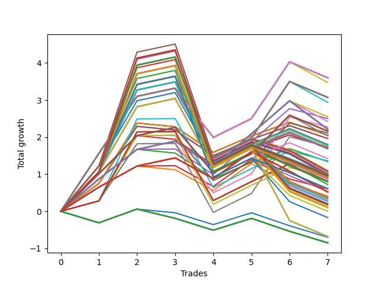

# Long HLT 601 
- Symbol: TSLA
- Date Range: 05/16/2022 - 05/17/2024
- Trading Period: 8:30-12:30
- Number of Trades: 7



| Id. | Name | Win Percent | Profit | Avg Profit / Trade | Avg Time / Trade | Std |      | Name | Win Percent | Profit | Avg Profit / Trade | Avg Time / Trade | Std |
| --- | ---- | ----------- | ------ | ------------------ | ---------------- | --- | ---- | ---- | ----------- | ------ | ------------------ | ---------------- | --- |
| | Sorted By <br> Profit | | | | | | | Sorted By <br> Win Percentage |||||
|0| TP-1.25 180m | 71.43 | 3.60 | 0.51 | 33:17 | 1.04 |     | TP-1.25 180m | 71.43 | 3.60 | 0.51 | 33:17 | 1.04 |
|1| TP-1.25 165m | 71.43 | 3.60 | 0.51 | 33:17 | 1.04 |     | TP-1.25 165m | 71.43 | 3.60 | 0.51 | 33:17 | 1.04 |
|2| TP-1.25 150m | 71.43 | 3.60 | 0.51 | 33:17 | 1.04 |     | TP-1.25 150m | 71.43 | 3.60 | 0.51 | 33:17 | 1.04 |
|3| TP-1.25 135m | 71.43 | 3.60 | 0.51 | 33:17 | 1.04 |     | TP-1.25 135m | 71.43 | 3.60 | 0.51 | 33:17 | 1.04 |
|4| TP-1.25 120m | 71.43 | 3.60 | 0.51 | 33:17 | 1.04 |     | TP-1.25 120m | 71.43 | 3.60 | 0.51 | 33:17 | 1.04 |
|5| TP-1.25 105m | 71.43 | 3.60 | 0.51 | 33:17 | 1.04 |     | TP-1.25 105m | 71.43 | 3.60 | 0.51 | 33:17 | 1.04 |
|6| TP-1.25 90m | 71.43 | 3.60 | 0.51 | 33:17 | 1.04 |     | TP-1.25 90m | 71.43 | 3.60 | 0.51 | 33:17 | 1.04 |
|7| TP-1.25 75m | 71.43 | 3.60 | 0.51 | 33:17 | 1.04 |     | TP-1.25 75m | 71.43 | 3.60 | 0.51 | 33:17 | 1.04 |
|8| TP-1.25 60m | 71.43 | 3.60 | 0.51 | 31:42 | 1.04 |     | TP-1.25 60m | 71.43 | 3.60 | 0.51 | 31:42 | 1.04 |
|9| TP-1.25 45m | 71.43 | 3.47 | 0.50 | 29:34 | 1.06 |     | TP-1.25 45m | 71.43 | 3.47 | 0.50 | 29:34 | 1.06 |
|10| TP-1.5 180m | 71.43 | 3.07 | 0.44 | 33:25 | 1.18 |     | TP-1.5 180m | 71.43 | 3.07 | 0.44 | 33:25 | 1.18 |
|11| TP-1.5 165m | 71.43 | 3.07 | 0.44 | 33:25 | 1.18 |     | TP-1.5 165m | 71.43 | 3.07 | 0.44 | 33:25 | 1.18 |
|12| TP-1.5 150m | 71.43 | 3.07 | 0.44 | 33:25 | 1.18 |     | TP-1.5 150m | 71.43 | 3.07 | 0.44 | 33:25 | 1.18 |
|13| TP-1.5 135m | 71.43 | 3.07 | 0.44 | 33:25 | 1.18 |     | TP-1.5 135m | 71.43 | 3.07 | 0.44 | 33:25 | 1.18 |
|14| TP-1.5 120m | 71.43 | 3.07 | 0.44 | 33:25 | 1.18 |     | TP-1.5 120m | 71.43 | 3.07 | 0.44 | 33:25 | 1.18 |
|15| TP-1.5 105m | 71.43 | 3.07 | 0.44 | 33:25 | 1.18 |     | TP-1.5 105m | 71.43 | 3.07 | 0.44 | 33:25 | 1.18 |
|16| TP-1.5 90m | 71.43 | 3.07 | 0.44 | 33:25 | 1.18 |     | TP-1.5 90m | 71.43 | 3.07 | 0.44 | 33:25 | 1.18 |
|17| TP-1.5 75m | 71.43 | 3.07 | 0.44 | 33:25 | 1.18 |     | TP-1.5 75m | 71.43 | 3.07 | 0.44 | 33:25 | 1.18 |
|18| TP-1.5 60m | 71.43 | 3.07 | 0.44 | 31:51 | 1.18 |     | TP-1.5 60m | 71.43 | 3.07 | 0.44 | 31:51 | 1.18 |
|19| TP-1.5 45m | 71.43 | 2.94 | 0.42 | 29:42 | 1.19 |     | TP-1.5 45m | 71.43 | 2.94 | 0.42 | 29:42 | 1.19 |
|20| TP-0.75 60m | 71.43 | 2.55 | 0.36 | 23:00 | 0.63 |     | TP-0.75 60m | 71.43 | 2.55 | 0.36 | 23:00 | 0.63 |
|21| TP-0.75 30m | 71.43 | 2.50 | 0.36 | 17:51 | 0.61 |     | TP-0.75 30m | 71.43 | 2.50 | 0.36 | 17:51 | 0.61 |
|22| TP-0.75 45m | 71.43 | 2.42 | 0.35 | 20:51 | 0.65 |     | TP-0.75 45m | 71.43 | 2.42 | 0.35 | 20:51 | 0.65 |
|23| TP-1.25 30m | 71.43 | 2.27 | 0.32 | 25:00 | 0.94 |     | TP-1.25 30m | 71.43 | 2.27 | 0.32 | 25:00 | 0.94 |
|24| TP-0.75 180m | 71.43 | 2.21 | 0.32 | 23:51 | 0.70 |     | TP-0.75 180m | 71.43 | 2.21 | 0.32 | 23:51 | 0.70 |
|25| TP-0.75 165m | 71.43 | 2.21 | 0.32 | 23:51 | 0.70 |     | TP-0.75 165m | 71.43 | 2.21 | 0.32 | 23:51 | 0.70 |
|26| TP-0.75 150m | 71.43 | 2.21 | 0.32 | 23:51 | 0.70 |     | TP-0.75 150m | 71.43 | 2.21 | 0.32 | 23:51 | 0.70 |
|27| TP-0.75 135m | 71.43 | 2.21 | 0.32 | 23:51 | 0.70 |     | TP-0.75 135m | 71.43 | 2.21 | 0.32 | 23:51 | 0.70 |
|28| TP-0.75 120m | 71.43 | 2.21 | 0.32 | 23:51 | 0.70 |     | TP-0.75 120m | 71.43 | 2.21 | 0.32 | 23:51 | 0.70 |
|29| TP-0.75 105m | 71.43 | 2.21 | 0.32 | 23:51 | 0.70 |     | TP-0.75 105m | 71.43 | 2.21 | 0.32 | 23:51 | 0.70 |
|30| TP-0.75 90m | 71.43 | 2.21 | 0.32 | 23:51 | 0.70 |     | TP-0.75 90m | 71.43 | 2.21 | 0.32 | 23:51 | 0.70 |
|31| TP-0.75 75m | 71.43 | 2.21 | 0.32 | 23:51 | 0.70 |     | TP-0.75 75m | 71.43 | 2.21 | 0.32 | 23:51 | 0.70 |
|32| TP-1 180m | 71.43 | 2.16 | 0.31 | 26:34 | 0.80 |     | TP-1 180m | 71.43 | 2.16 | 0.31 | 26:34 | 0.80 |
|33| TP-1 165m | 71.43 | 2.16 | 0.31 | 26:34 | 0.80 |     | TP-1 165m | 71.43 | 2.16 | 0.31 | 26:34 | 0.80 |
|34| TP-1 150m | 71.43 | 2.16 | 0.31 | 26:34 | 0.80 |     | TP-1 150m | 71.43 | 2.16 | 0.31 | 26:34 | 0.80 |
|35| TP-1 135m | 71.43 | 2.16 | 0.31 | 26:34 | 0.80 |     | TP-1 135m | 71.43 | 2.16 | 0.31 | 26:34 | 0.80 |
|36| TP-1 120m | 71.43 | 2.16 | 0.31 | 26:34 | 0.80 |     | TP-1 120m | 71.43 | 2.16 | 0.31 | 26:34 | 0.80 |
|37| TP-1 105m | 71.43 | 2.16 | 0.31 | 26:34 | 0.80 |     | TP-1 105m | 71.43 | 2.16 | 0.31 | 26:34 | 0.80 |
|38| TP-1 90m | 71.43 | 2.16 | 0.31 | 26:34 | 0.80 |     | TP-1 90m | 71.43 | 2.16 | 0.31 | 26:34 | 0.80 |
|39| TP-1 75m | 71.43 | 2.16 | 0.31 | 26:34 | 0.80 |     | TP-1 75m | 71.43 | 2.16 | 0.31 | 26:34 | 0.80 |
|40| TP-1 60m | 71.43 | 2.16 | 0.31 | 25:00 | 0.80 |     | TP-1 60m | 71.43 | 2.16 | 0.31 | 25:00 | 0.80 |
|41| TP-1 30m | 71.43 | 2.11 | 0.30 | 19:51 | 0.79 |     | TP-1 30m | 71.43 | 2.11 | 0.30 | 19:51 | 0.79 |
|42| TP-3 15m | 57.14 | 2.05 | 0.29 | 14:00 | 0.71 |     | TP-1 45m | 71.43 | 2.03 | 0.29 | 22:51 | 0.82 |
|43| TP-2.75 15m | 57.14 | 2.05 | 0.29 | 14:00 | 0.71 |     | TP-2 75m | 71.43 | 1.80 | 0.26 | 44:00 | 1.25 |
|44| TP-2.5 15m | 57.14 | 2.05 | 0.29 | 14:00 | 0.71 |     | TP-3 75m | 71.43 | 1.78 | 0.25 | 46:00 | 1.70 |
|45| TP-2.25 15m | 57.14 | 2.05 | 0.29 | 14:00 | 0.71 |     | TP-2.75 75m | 71.43 | 1.76 | 0.25 | 45:42 | 1.61 |
|46| TP-2 15m | 57.14 | 2.05 | 0.29 | 14:00 | 0.71 |     | TP-1.5 30m | 71.43 | 1.74 | 0.25 | 25:08 | 1.08 |
|47| TP-1.75 15m | 57.14 | 2.05 | 0.29 | 14:00 | 0.71 |     | TP-2.5 75m | 71.43 | 1.71 | 0.24 | 44:51 | 1.50 |
|48| TP-1 45m | 71.43 | 2.03 | 0.29 | 22:51 | 0.82 |     | TP-1.75 75m | 71.43 | 1.68 | 0.24 | 42:08 | 1.07 |
|49| TP-1.5 15m | 57.14 | 1.96 | 0.28 | 13:51 | 0.69 |     | TP-2.25 75m | 71.43 | 1.42 | 0.20 | 44:34 | 1.44 |
|50| TP-1.25 15m | 57.14 | 1.96 | 0.28 | 13:51 | 0.69 |     | TP-2 30m | 71.43 | 1.36 | 0.19 | 28:17 | 1.12 |
|51| TP-2 75m | 71.43 | 1.80 | 0.26 | 44:00 | 1.25 |     | TP-3 30m | 71.43 | 1.01 | 0.14 | 28:25 | 1.03 |
|52| TP-3 75m | 71.43 | 1.78 | 0.25 | 46:00 | 1.70 |     | TP-2.75 30m | 71.43 | 1.01 | 0.14 | 28:25 | 1.03 |
|53| TP-2.75 75m | 71.43 | 1.76 | 0.25 | 45:42 | 1.61 |     | TP-2.5 30m | 71.43 | 1.01 | 0.14 | 28:25 | 1.03 |
|54| TP-1.5 30m | 71.43 | 1.74 | 0.25 | 25:08 | 1.08 |     | TP-2.25 30m | 71.43 | 1.01 | 0.14 | 28:25 | 1.03 |
|55| TP-2.5 75m | 71.43 | 1.71 | 0.24 | 44:51 | 1.50 |     | TP-1.75 30m | 71.43 | 0.91 | 0.13 | 26:42 | 1.01 |
|56| TP-1 15m | 57.14 | 1.71 | 0.24 | 12:34 | 0.61 |     | TP-3 15m | 57.14 | 2.05 | 0.29 | 14:00 | 0.71 |
|57| TP-1.75 75m | 71.43 | 1.68 | 0.24 | 42:08 | 1.07 |     | TP-2.75 15m | 57.14 | 2.05 | 0.29 | 14:00 | 0.71 |
|58| TP-2.25 75m | 71.43 | 1.42 | 0.20 | 44:34 | 1.44 |     | TP-2.5 15m | 57.14 | 2.05 | 0.29 | 14:00 | 0.71 |
|59| TP-2 30m | 71.43 | 1.36 | 0.19 | 28:17 | 1.12 |     | TP-2.25 15m | 57.14 | 2.05 | 0.29 | 14:00 | 0.71 |
|60| TP-0.75 15m | 57.14 | 1.34 | 0.19 | 11:25 | 0.55 |     | TP-2 15m | 57.14 | 2.05 | 0.29 | 14:00 | 0.71 |
|61| TP-2 45m | 57.14 | 1.10 | 0.16 | 35:51 | 1.29 |     | TP-1.75 15m | 57.14 | 2.05 | 0.29 | 14:00 | 0.71 |
|62| TP-3 45m | 57.14 | 1.08 | 0.15 | 37:51 | 1.73 |     | TP-1.5 15m | 57.14 | 1.96 | 0.28 | 13:51 | 0.69 |
|63| TP-2.75 45m | 57.14 | 1.06 | 0.15 | 37:34 | 1.64 |     | TP-1.25 15m | 57.14 | 1.96 | 0.28 | 13:51 | 0.69 |
|64| TP-3 30m | 71.43 | 1.01 | 0.14 | 28:25 | 1.03 |     | TP-1 15m | 57.14 | 1.71 | 0.24 | 12:34 | 0.61 |
|65| TP-2.75 30m | 71.43 | 1.01 | 0.14 | 28:25 | 1.03 |     | TP-0.75 15m | 57.14 | 1.34 | 0.19 | 11:25 | 0.55 |
|66| TP-2.5 30m | 71.43 | 1.01 | 0.14 | 28:25 | 1.03 |     | TP-2 45m | 57.14 | 1.10 | 0.16 | 35:51 | 1.29 |
|67| TP-2.25 30m | 71.43 | 1.01 | 0.14 | 28:25 | 1.03 |     | TP-3 45m | 57.14 | 1.08 | 0.15 | 37:51 | 1.73 |
|68| TP-2.5 45m | 57.14 | 1.01 | 0.14 | 36:42 | 1.53 |     | TP-2.75 45m | 57.14 | 1.06 | 0.15 | 37:34 | 1.64 |
|69| TP-2 180m | 57.14 | 0.99 | 0.14 | 50:25 | 1.27 |     | TP-2.5 45m | 57.14 | 1.01 | 0.14 | 36:42 | 1.53 |
|70| TP-2 165m | 57.14 | 0.99 | 0.14 | 50:25 | 1.27 |     | TP-2 180m | 57.14 | 0.99 | 0.14 | 50:25 | 1.27 |
|71| TP-2 150m | 57.14 | 0.99 | 0.14 | 50:25 | 1.27 |     | TP-2 165m | 57.14 | 0.99 | 0.14 | 50:25 | 1.27 |
|72| TP-2 135m | 57.14 | 0.99 | 0.14 | 50:25 | 1.27 |     | TP-2 150m | 57.14 | 0.99 | 0.14 | 50:25 | 1.27 |
|73| TP-2 120m | 57.14 | 0.99 | 0.14 | 50:25 | 1.27 |     | TP-2 135m | 57.14 | 0.99 | 0.14 | 50:25 | 1.27 |
|74| TP-1.75 45m | 57.14 | 0.98 | 0.14 | 34:00 | 1.11 |     | TP-2 120m | 57.14 | 0.99 | 0.14 | 50:25 | 1.27 |
|75| TP-3 180m | 57.14 | 0.97 | 0.14 | 52:25 | 1.71 |     | TP-1.75 45m | 57.14 | 0.98 | 0.14 | 34:00 | 1.11 |
|76| TP-3 165m | 57.14 | 0.97 | 0.14 | 52:25 | 1.71 |     | TP-3 180m | 57.14 | 0.97 | 0.14 | 52:25 | 1.71 |
|77| TP-3 150m | 57.14 | 0.97 | 0.14 | 52:25 | 1.71 |     | TP-3 165m | 57.14 | 0.97 | 0.14 | 52:25 | 1.71 |
|78| TP-3 135m | 57.14 | 0.97 | 0.14 | 52:25 | 1.71 |     | TP-3 150m | 57.14 | 0.97 | 0.14 | 52:25 | 1.71 |
|79| TP-3 120m | 57.14 | 0.97 | 0.14 | 52:25 | 1.71 |     | TP-3 135m | 57.14 | 0.97 | 0.14 | 52:25 | 1.71 |
|80| TP-2.75 180m | 57.14 | 0.95 | 0.14 | 52:08 | 1.62 |     | TP-3 120m | 57.14 | 0.97 | 0.14 | 52:25 | 1.71 |
|81| TP-2.75 165m | 57.14 | 0.95 | 0.14 | 52:08 | 1.62 |     | TP-2.75 180m | 57.14 | 0.95 | 0.14 | 52:08 | 1.62 |
|82| TP-2.75 150m | 57.14 | 0.95 | 0.14 | 52:08 | 1.62 |     | TP-2.75 165m | 57.14 | 0.95 | 0.14 | 52:08 | 1.62 |
|83| TP-2.75 135m | 57.14 | 0.95 | 0.14 | 52:08 | 1.62 |     | TP-2.75 150m | 57.14 | 0.95 | 0.14 | 52:08 | 1.62 |
|84| TP-2.75 120m | 57.14 | 0.95 | 0.14 | 52:08 | 1.62 |     | TP-2.75 135m | 57.14 | 0.95 | 0.14 | 52:08 | 1.62 |
|85| TP-1.75 30m | 71.43 | 0.91 | 0.13 | 26:42 | 1.01 |     | TP-2.75 120m | 57.14 | 0.95 | 0.14 | 52:08 | 1.62 |
|86| TP-2 60m | 57.14 | 0.91 | 0.13 | 40:17 | 1.28 |     | TP-2 60m | 57.14 | 0.91 | 0.13 | 40:17 | 1.28 |
|87| TP-2.5 180m | 57.14 | 0.90 | 0.13 | 51:17 | 1.52 |     | TP-2.5 180m | 57.14 | 0.90 | 0.13 | 51:17 | 1.52 |
|88| TP-2.5 165m | 57.14 | 0.90 | 0.13 | 51:17 | 1.52 |     | TP-2.5 165m | 57.14 | 0.90 | 0.13 | 51:17 | 1.52 |
|89| TP-2.5 150m | 57.14 | 0.90 | 0.13 | 51:17 | 1.52 |     | TP-2.5 150m | 57.14 | 0.90 | 0.13 | 51:17 | 1.52 |
|90| TP-2.5 135m | 57.14 | 0.90 | 0.13 | 51:17 | 1.52 |     | TP-2.5 135m | 57.14 | 0.90 | 0.13 | 51:17 | 1.52 |
|91| TP-2.5 120m | 57.14 | 0.90 | 0.13 | 51:17 | 1.52 |     | TP-2.5 120m | 57.14 | 0.90 | 0.13 | 51:17 | 1.52 |
|92| TP-3 60m | 57.14 | 0.89 | 0.13 | 42:17 | 1.71 |     | TP-3 60m | 57.14 | 0.89 | 0.13 | 42:17 | 1.71 |
|93| TP-2.75 60m | 57.14 | 0.87 | 0.12 | 42:00 | 1.62 |     | TP-2.75 60m | 57.14 | 0.87 | 0.12 | 42:00 | 1.62 |
|94| TP-2.5 60m | 57.14 | 0.82 | 0.12 | 41:08 | 1.52 |     | TP-2.5 60m | 57.14 | 0.82 | 0.12 | 41:08 | 1.52 |
|95| TP-1.75 60m | 57.14 | 0.79 | 0.11 | 38:25 | 1.09 |     | TP-1.75 60m | 57.14 | 0.79 | 0.11 | 38:25 | 1.09 |
|96| TP-2.25 45m | 57.14 | 0.72 | 0.10 | 36:25 | 1.47 |     | TP-2.25 45m | 57.14 | 0.72 | 0.10 | 36:25 | 1.47 |
|97| TP-2.25 180m | 57.14 | 0.61 | 0.09 | 51:00 | 1.45 |     | TP-2.25 180m | 57.14 | 0.61 | 0.09 | 51:00 | 1.45 |
|98| TP-2.25 165m | 57.14 | 0.61 | 0.09 | 51:00 | 1.45 |     | TP-2.25 165m | 57.14 | 0.61 | 0.09 | 51:00 | 1.45 |
|99| TP-2.25 150m | 57.14 | 0.61 | 0.09 | 51:00 | 1.45 |     | TP-2.25 150m | 57.14 | 0.61 | 0.09 | 51:00 | 1.45 |
|100| TP-2.25 135m | 57.14 | 0.61 | 0.09 | 51:00 | 1.45 |     | TP-2.25 135m | 57.14 | 0.61 | 0.09 | 51:00 | 1.45 |
|101| TP-2.25 120m | 57.14 | 0.61 | 0.09 | 51:00 | 1.45 |     | TP-2.25 120m | 57.14 | 0.61 | 0.09 | 51:00 | 1.45 |
|102| TP-0.5 30m | 57.14 | 0.60 | 0.09 | 13:17 | 0.52 |     | TP-0.5 30m | 57.14 | 0.60 | 0.09 | 13:17 | 0.52 |
|103| TP-2.25 60m | 57.14 | 0.53 | 0.08 | 40:51 | 1.45 |     | TP-2.25 60m | 57.14 | 0.53 | 0.08 | 40:51 | 1.45 |
|104| TP-0.5 180m | 57.14 | 0.52 | 0.07 | 14:34 | 0.56 |     | TP-0.5 180m | 57.14 | 0.52 | 0.07 | 14:34 | 0.56 |
|105| TP-0.5 165m | 57.14 | 0.52 | 0.07 | 14:34 | 0.56 |     | TP-0.5 165m | 57.14 | 0.52 | 0.07 | 14:34 | 0.56 |
|106| TP-0.5 150m | 57.14 | 0.52 | 0.07 | 14:34 | 0.56 |     | TP-0.5 150m | 57.14 | 0.52 | 0.07 | 14:34 | 0.56 |
|107| TP-0.5 135m | 57.14 | 0.52 | 0.07 | 14:34 | 0.56 |     | TP-0.5 135m | 57.14 | 0.52 | 0.07 | 14:34 | 0.56 |
|108| TP-0.5 120m | 57.14 | 0.52 | 0.07 | 14:34 | 0.56 |     | TP-0.5 120m | 57.14 | 0.52 | 0.07 | 14:34 | 0.56 |
|109| TP-0.5 105m | 57.14 | 0.52 | 0.07 | 14:34 | 0.56 |     | TP-0.5 105m | 57.14 | 0.52 | 0.07 | 14:34 | 0.56 |
|110| TP-0.5 90m | 57.14 | 0.52 | 0.07 | 14:34 | 0.56 |     | TP-0.5 90m | 57.14 | 0.52 | 0.07 | 14:34 | 0.56 |
|111| TP-0.5 75m | 57.14 | 0.52 | 0.07 | 14:34 | 0.56 |     | TP-0.5 75m | 57.14 | 0.52 | 0.07 | 14:34 | 0.56 |
|112| TP-0.5 60m | 57.14 | 0.52 | 0.07 | 14:34 | 0.56 |     | TP-0.5 60m | 57.14 | 0.52 | 0.07 | 14:34 | 0.56 |
|113| TP-0.5 45m | 57.14 | 0.52 | 0.07 | 14:34 | 0.56 |     | TP-0.5 45m | 57.14 | 0.52 | 0.07 | 14:34 | 0.56 |
|114| TP-0.5 15m | 42.86 | 0.41 | 0.06 | 09:00 | 0.53 |     | TP-2 90m | 57.14 | 0.38 | 0.05 | 46:08 | 1.32 |
|115| TP-2 90m | 57.14 | 0.38 | 0.05 | 46:08 | 1.32 |     | TP-3 90m | 57.14 | 0.36 | 0.05 | 48:08 | 1.75 |
|116| TP-3 90m | 57.14 | 0.36 | 0.05 | 48:08 | 1.75 |     | TP-2.75 90m | 57.14 | 0.34 | 0.05 | 47:51 | 1.66 |
|117| TP-2.75 90m | 57.14 | 0.34 | 0.05 | 47:51 | 1.66 |     | TP-2.5 90m | 57.14 | 0.29 | 0.04 | 47:00 | 1.56 |
|118| TP-2.5 90m | 57.14 | 0.29 | 0.04 | 47:00 | 1.56 |     | TP-1.75 90m | 57.14 | 0.26 | 0.04 | 44:17 | 1.14 |
|119| TP-1.75 90m | 57.14 | 0.26 | 0.04 | 44:17 | 1.14 |     | TP-2 105m | 57.14 | 0.21 | 0.03 | 48:17 | 1.34 |
|120| TP-2 105m | 57.14 | 0.21 | 0.03 | 48:17 | 1.34 |     | TP-3 105m | 57.14 | 0.19 | 0.03 | 50:17 | 1.77 |
|121| TP-3 105m | 57.14 | 0.19 | 0.03 | 50:17 | 1.77 |     | TP-2.75 105m | 57.14 | 0.17 | 0.02 | 50:00 | 1.68 |
|122| TP-2.75 105m | 57.14 | 0.17 | 0.02 | 50:00 | 1.68 |     | TP-2.5 105m | 57.14 | 0.12 | 0.02 | 49:08 | 1.58 |
|123| TP-2.5 105m | 57.14 | 0.12 | 0.02 | 49:08 | 1.58 |     | TP-1.75 105m | 57.14 | 0.09 | 0.01 | 46:25 | 1.17 |
|124| TP-1.75 105m | 57.14 | 0.09 | 0.01 | 46:25 | 1.17 |     | TP-2.25 90m | 57.14 | -0.00 | -0.00 | 46:42 | 1.49 |
|125| TP-2.25 90m | 57.14 | -0.00 | -0.00 | 46:42 | 1.49 |     | TP-2.25 105m | 57.14 | -0.17 | -0.02 | 48:51 | 1.51 |
|126| TP-2.25 105m | 57.14 | -0.17 | -0.02 | 48:51 | 1.51 |     | TP-1.75 180m | 57.14 | -0.68 | -0.10 | 46:42 | 1.30 |
|127| TP-1.75 180m | 57.14 | -0.68 | -0.10 | 46:42 | 1.30 |     | TP-1.75 165m | 57.14 | -0.68 | -0.10 | 46:42 | 1.30 |
|128| TP-1.75 165m | 57.14 | -0.68 | -0.10 | 46:42 | 1.30 |     | TP-1.75 150m | 57.14 | -0.68 | -0.10 | 46:42 | 1.30 |
|129| TP-1.75 150m | 57.14 | -0.68 | -0.10 | 46:42 | 1.30 |     | TP-1.75 135m | 57.14 | -0.68 | -0.10 | 46:42 | 1.30 |
|130| TP-1.75 135m | 57.14 | -0.68 | -0.10 | 46:42 | 1.30 |     | TP-1.75 120m | 57.14 | -0.68 | -0.10 | 46:42 | 1.30 |
|131| TP-1.75 120m | 57.14 | -0.68 | -0.10 | 46:42 | 1.30 |     | TP-0.5 15m | 42.86 | 0.41 | 0.06 | 09:00 | 0.53 |
|132| TP-0.25 15m | 28.57 | -0.70 | -0.10 | 05:17 | 0.29 |     | TP-0.25 15m | 28.57 | -0.70 | -0.10 | 05:17 | 0.29 |
|133| TP-0.25 180m | 28.57 | -0.85 | -0.12 | 05:25 | 0.30 |     | TP-0.25 180m | 28.57 | -0.85 | -0.12 | 05:25 | 0.30 |
|134| TP-0.25 165m | 28.57 | -0.85 | -0.12 | 05:25 | 0.30 |     | TP-0.25 165m | 28.57 | -0.85 | -0.12 | 05:25 | 0.30 |
|135| TP-0.25 150m | 28.57 | -0.85 | -0.12 | 05:25 | 0.30 |     | TP-0.25 150m | 28.57 | -0.85 | -0.12 | 05:25 | 0.30 |
|136| TP-0.25 135m | 28.57 | -0.85 | -0.12 | 05:25 | 0.30 |     | TP-0.25 135m | 28.57 | -0.85 | -0.12 | 05:25 | 0.30 |
|137| TP-0.25 120m | 28.57 | -0.85 | -0.12 | 05:25 | 0.30 |     | TP-0.25 120m | 28.57 | -0.85 | -0.12 | 05:25 | 0.30 |
|138| TP-0.25 105m | 28.57 | -0.85 | -0.12 | 05:25 | 0.30 |     | TP-0.25 105m | 28.57 | -0.85 | -0.12 | 05:25 | 0.30 |
|139| TP-0.25 90m | 28.57 | -0.85 | -0.12 | 05:25 | 0.30 |     | TP-0.25 90m | 28.57 | -0.85 | -0.12 | 05:25 | 0.30 |
|140| TP-0.25 75m | 28.57 | -0.85 | -0.12 | 05:25 | 0.30 |     | TP-0.25 75m | 28.57 | -0.85 | -0.12 | 05:25 | 0.30 |
|141| TP-0.25 60m | 28.57 | -0.85 | -0.12 | 05:25 | 0.30 |     | TP-0.25 60m | 28.57 | -0.85 | -0.12 | 05:25 | 0.30 |
|142| TP-0.25 45m | 28.57 | -0.85 | -0.12 | 05:25 | 0.30 |     | TP-0.25 45m | 28.57 | -0.85 | -0.12 | 05:25 | 0.30 |
|143| TP-0.25 30m | 28.57 | -0.85 | -0.12 | 05:25 | 0.30 |     | TP-0.25 30m | 28.57 | -0.85 | -0.12 | 05:25 | 0.30 |

### Test TP-0.25 15m
* Take Profit of 0.25 Point
* 0.25 Stoploss
* Results:
```
Total Trades: 7
Percent Up: 28.57
Percent Down: 71.43
Total Points Moved Up: -0.70
Potential Profit: -350.00
Total Points Ups: 0.69 Count Ups: 2
Total Points Downs: -1.39 Count Downs: 5
```

<details><summary>Trades</summary>

<code>In: 2022-09-23 12:05:00		Out: 2022-09-23 12:07:00		Total Position Time: 02:00		Total Move Up: -0.31		Total to Date: -0.31</code> <br />
<code>In: 2022-11-10 12:10:00		Out: 2022-11-10 12:12:00		Total Position Time: 02:00		Total Move Up: 0.37		Total to Date: 0.06</code> <br />
<code>In: 2023-04-04 12:15:00		Out: 2023-04-04 12:29:00		Total Position Time: 14:00		Total Move Up: -0.10		Total to Date: -0.04</code> <br />
<code>In: 2023-06-05 11:00:00		Out: 2023-06-05 11:07:00		Total Position Time: 07:00		Total Move Up: -0.32		Total to Date: -0.36</code> <br />
<code>In: 2023-09-21 12:25:00		Out: 2023-09-21 12:32:00		Total Position Time: 07:00		Total Move Up: 0.32		Total to Date: -0.04</code> <br />
<code>In: 2023-11-09 10:15:00		Out: 2023-11-09 10:18:00		Total Position Time: 03:00		Total Move Up: -0.35		Total to Date: -0.39</code> <br />
<code>In: 2024-05-09 11:40:00		Out: 2024-05-09 11:42:00		Total Position Time: 02:00		Total Move Up: -0.31		Total to Date: -0.70</code> <br />


</details>

### Test TP-0.5 15m
* Take Profit of 0.5 Point
* 0.5 Stoploss
* Results:
```
Total Trades: 7
Percent Up: 42.86
Percent Down: 57.14
Total Points Moved Up: 0.41
Potential Profit: 205.00
Total Points Ups: 1.95 Count Ups: 3
Total Points Downs: -1.54 Count Downs: 4
```

<details><summary>Trades</summary>

<code>In: 2022-09-23 12:05:00		Out: 2022-09-23 12:08:00		Total Position Time: 03:00		Total Move Up: 0.65		Total to Date: 0.65</code> <br />
<code>In: 2022-11-10 12:10:00		Out: 2022-11-10 12:13:00		Total Position Time: 03:00		Total Move Up: 0.57		Total to Date: 1.22</code> <br />
<code>In: 2023-04-04 12:15:00		Out: 2023-04-04 12:29:00		Total Position Time: 14:00		Total Move Up: -0.10		Total to Date: 1.12</code> <br />
<code>In: 2023-06-05 11:00:00		Out: 2023-06-05 11:13:00		Total Position Time: 13:00		Total Move Up: -0.56		Total to Date: 0.56</code> <br />
<code>In: 2023-09-21 12:25:00		Out: 2023-09-21 12:37:00		Total Position Time: 12:00		Total Move Up: 0.73		Total to Date: 1.29</code> <br />
<code>In: 2023-11-09 10:15:00		Out: 2023-11-09 10:19:00		Total Position Time: 04:00		Total Move Up: -0.53		Total to Date: 0.76</code> <br />
<code>In: 2024-05-09 11:40:00		Out: 2024-05-09 11:54:00		Total Position Time: 14:00		Total Move Up: -0.35		Total to Date: 0.41</code> <br />


</details>

### Test TP-0.75 15m
* Take Profit of 0.75 Point
* 0.75 Stoploss
* Results:
```
Total Trades: 7
Percent Up: 57.14
Percent Down: 42.86
Total Points Moved Up: 1.34
Potential Profit: 670.00
Total Points Ups: 2.48 Count Ups: 4
Total Points Downs: -1.14 Count Downs: 3
```

<details><summary>Trades</summary>

<code>In: 2022-09-23 12:05:00		Out: 2022-09-23 12:09:00		Total Position Time: 04:00		Total Move Up: 0.87		Total to Date: 0.87</code> <br />
<code>In: 2022-11-10 12:10:00		Out: 2022-11-10 12:16:00		Total Position Time: 06:00		Total Move Up: 0.80		Total to Date: 1.67</code> <br />
<code>In: 2023-04-04 12:15:00		Out: 2023-04-04 12:29:00		Total Position Time: 14:00		Total Move Up: -0.10		Total to Date: 1.57</code> <br />
<code>In: 2023-06-05 11:00:00		Out: 2023-06-05 11:14:00		Total Position Time: 14:00		Total Move Up: -0.69		Total to Date: 0.88</code> <br />
<code>In: 2023-09-21 12:25:00		Out: 2023-09-21 12:39:00		Total Position Time: 14:00		Total Move Up: 0.44		Total to Date: 1.32</code> <br />
<code>In: 2023-11-09 10:15:00		Out: 2023-11-09 10:29:00		Total Position Time: 14:00		Total Move Up: 0.37		Total to Date: 1.69</code> <br />
<code>In: 2024-05-09 11:40:00		Out: 2024-05-09 11:54:00		Total Position Time: 14:00		Total Move Up: -0.35		Total to Date: 1.34</code> <br />


</details>

### Test TP-1 15m
* Take Profit of 1 Point
* 1 Stoploss
* Results:
```
Total Trades: 7
Percent Up: 57.14
Percent Down: 42.86
Total Points Moved Up: 1.71
Potential Profit: 855.00
Total Points Ups: 2.85 Count Ups: 4
Total Points Downs: -1.14 Count Downs: 3
```

<details><summary>Trades</summary>

<code>In: 2022-09-23 12:05:00		Out: 2022-09-23 12:12:00		Total Position Time: 07:00		Total Move Up: 1.01		Total to Date: 1.01</code> <br />
<code>In: 2022-11-10 12:10:00		Out: 2022-11-10 12:21:00		Total Position Time: 11:00		Total Move Up: 1.03		Total to Date: 2.04</code> <br />
<code>In: 2023-04-04 12:15:00		Out: 2023-04-04 12:29:00		Total Position Time: 14:00		Total Move Up: -0.10		Total to Date: 1.94</code> <br />
<code>In: 2023-06-05 11:00:00		Out: 2023-06-05 11:14:00		Total Position Time: 14:00		Total Move Up: -0.69		Total to Date: 1.25</code> <br />
<code>In: 2023-09-21 12:25:00		Out: 2023-09-21 12:39:00		Total Position Time: 14:00		Total Move Up: 0.44		Total to Date: 1.69</code> <br />
<code>In: 2023-11-09 10:15:00		Out: 2023-11-09 10:29:00		Total Position Time: 14:00		Total Move Up: 0.37		Total to Date: 2.06</code> <br />
<code>In: 2024-05-09 11:40:00		Out: 2024-05-09 11:54:00		Total Position Time: 14:00		Total Move Up: -0.35		Total to Date: 1.71</code> <br />


</details>

### Test TP-1.25 15m
* Take Profit of 1.25 Point
* 1.25 Stoploss
* Results:
```
Total Trades: 7
Percent Up: 57.14
Percent Down: 42.86
Total Points Moved Up: 1.96
Potential Profit: 980.00
Total Points Ups: 3.10 Count Ups: 4
Total Points Downs: -1.14 Count Downs: 3
```

<details><summary>Trades</summary>

<code>In: 2022-09-23 12:05:00		Out: 2022-09-23 12:19:00		Total Position Time: 14:00		Total Move Up: 0.75		Total to Date: 0.75</code> <br />
<code>In: 2022-11-10 12:10:00		Out: 2022-11-10 12:23:00		Total Position Time: 13:00		Total Move Up: 1.54		Total to Date: 2.29</code> <br />
<code>In: 2023-04-04 12:15:00		Out: 2023-04-04 12:29:00		Total Position Time: 14:00		Total Move Up: -0.10		Total to Date: 2.19</code> <br />
<code>In: 2023-06-05 11:00:00		Out: 2023-06-05 11:14:00		Total Position Time: 14:00		Total Move Up: -0.69		Total to Date: 1.50</code> <br />
<code>In: 2023-09-21 12:25:00		Out: 2023-09-21 12:39:00		Total Position Time: 14:00		Total Move Up: 0.44		Total to Date: 1.94</code> <br />
<code>In: 2023-11-09 10:15:00		Out: 2023-11-09 10:29:00		Total Position Time: 14:00		Total Move Up: 0.37		Total to Date: 2.31</code> <br />
<code>In: 2024-05-09 11:40:00		Out: 2024-05-09 11:54:00		Total Position Time: 14:00		Total Move Up: -0.35		Total to Date: 1.96</code> <br />


</details>

### Test TP-1.5 15m
* Take Profit of 1.5 Point
* 1.5 Stoploss
* Results:
```
Total Trades: 7
Percent Up: 57.14
Percent Down: 42.86
Total Points Moved Up: 1.96
Potential Profit: 980.00
Total Points Ups: 3.10 Count Ups: 4
Total Points Downs: -1.14 Count Downs: 3
```

<details><summary>Trades</summary>

<code>In: 2022-09-23 12:05:00		Out: 2022-09-23 12:19:00		Total Position Time: 14:00		Total Move Up: 0.75		Total to Date: 0.75</code> <br />
<code>In: 2022-11-10 12:10:00		Out: 2022-11-10 12:23:00		Total Position Time: 13:00		Total Move Up: 1.54		Total to Date: 2.29</code> <br />
<code>In: 2023-04-04 12:15:00		Out: 2023-04-04 12:29:00		Total Position Time: 14:00		Total Move Up: -0.10		Total to Date: 2.19</code> <br />
<code>In: 2023-06-05 11:00:00		Out: 2023-06-05 11:14:00		Total Position Time: 14:00		Total Move Up: -0.69		Total to Date: 1.50</code> <br />
<code>In: 2023-09-21 12:25:00		Out: 2023-09-21 12:39:00		Total Position Time: 14:00		Total Move Up: 0.44		Total to Date: 1.94</code> <br />
<code>In: 2023-11-09 10:15:00		Out: 2023-11-09 10:29:00		Total Position Time: 14:00		Total Move Up: 0.37		Total to Date: 2.31</code> <br />
<code>In: 2024-05-09 11:40:00		Out: 2024-05-09 11:54:00		Total Position Time: 14:00		Total Move Up: -0.35		Total to Date: 1.96</code> <br />


</details>

### Test TP-1.75 15m
* Take Profit of 1.75 Point
* 1.75 Stoploss
* Results:
```
Total Trades: 7
Percent Up: 57.14
Percent Down: 42.86
Total Points Moved Up: 2.05
Potential Profit: 1025.00
Total Points Ups: 3.19 Count Ups: 4
Total Points Downs: -1.14 Count Downs: 3
```

<details><summary>Trades</summary>

<code>In: 2022-09-23 12:05:00		Out: 2022-09-23 12:19:00		Total Position Time: 14:00		Total Move Up: 0.75		Total to Date: 0.75</code> <br />
<code>In: 2022-11-10 12:10:00		Out: 2022-11-10 12:24:00		Total Position Time: 14:00		Total Move Up: 1.63		Total to Date: 2.38</code> <br />
<code>In: 2023-04-04 12:15:00		Out: 2023-04-04 12:29:00		Total Position Time: 14:00		Total Move Up: -0.10		Total to Date: 2.28</code> <br />
<code>In: 2023-06-05 11:00:00		Out: 2023-06-05 11:14:00		Total Position Time: 14:00		Total Move Up: -0.69		Total to Date: 1.59</code> <br />
<code>In: 2023-09-21 12:25:00		Out: 2023-09-21 12:39:00		Total Position Time: 14:00		Total Move Up: 0.44		Total to Date: 2.03</code> <br />
<code>In: 2023-11-09 10:15:00		Out: 2023-11-09 10:29:00		Total Position Time: 14:00		Total Move Up: 0.37		Total to Date: 2.40</code> <br />
<code>In: 2024-05-09 11:40:00		Out: 2024-05-09 11:54:00		Total Position Time: 14:00		Total Move Up: -0.35		Total to Date: 2.05</code> <br />


</details>

### Test TP-2 15m
* Take Profit of 2 Point
* 2 Stoploss
* Results:
```
Total Trades: 7
Percent Up: 57.14
Percent Down: 42.86
Total Points Moved Up: 2.05
Potential Profit: 1025.00
Total Points Ups: 3.19 Count Ups: 4
Total Points Downs: -1.14 Count Downs: 3
```

<details><summary>Trades</summary>

<code>In: 2022-09-23 12:05:00		Out: 2022-09-23 12:19:00		Total Position Time: 14:00		Total Move Up: 0.75		Total to Date: 0.75</code> <br />
<code>In: 2022-11-10 12:10:00		Out: 2022-11-10 12:24:00		Total Position Time: 14:00		Total Move Up: 1.63		Total to Date: 2.38</code> <br />
<code>In: 2023-04-04 12:15:00		Out: 2023-04-04 12:29:00		Total Position Time: 14:00		Total Move Up: -0.10		Total to Date: 2.28</code> <br />
<code>In: 2023-06-05 11:00:00		Out: 2023-06-05 11:14:00		Total Position Time: 14:00		Total Move Up: -0.69		Total to Date: 1.59</code> <br />
<code>In: 2023-09-21 12:25:00		Out: 2023-09-21 12:39:00		Total Position Time: 14:00		Total Move Up: 0.44		Total to Date: 2.03</code> <br />
<code>In: 2023-11-09 10:15:00		Out: 2023-11-09 10:29:00		Total Position Time: 14:00		Total Move Up: 0.37		Total to Date: 2.40</code> <br />
<code>In: 2024-05-09 11:40:00		Out: 2024-05-09 11:54:00		Total Position Time: 14:00		Total Move Up: -0.35		Total to Date: 2.05</code> <br />


</details>

### Test TP-2.25 15m
* Take Profit of 2.25 Point
* 2.25 Stoploss
* Results:
```
Total Trades: 7
Percent Up: 57.14
Percent Down: 42.86
Total Points Moved Up: 2.05
Potential Profit: 1025.00
Total Points Ups: 3.19 Count Ups: 4
Total Points Downs: -1.14 Count Downs: 3
```

<details><summary>Trades</summary>

<code>In: 2022-09-23 12:05:00		Out: 2022-09-23 12:19:00		Total Position Time: 14:00		Total Move Up: 0.75		Total to Date: 0.75</code> <br />
<code>In: 2022-11-10 12:10:00		Out: 2022-11-10 12:24:00		Total Position Time: 14:00		Total Move Up: 1.63		Total to Date: 2.38</code> <br />
<code>In: 2023-04-04 12:15:00		Out: 2023-04-04 12:29:00		Total Position Time: 14:00		Total Move Up: -0.10		Total to Date: 2.28</code> <br />
<code>In: 2023-06-05 11:00:00		Out: 2023-06-05 11:14:00		Total Position Time: 14:00		Total Move Up: -0.69		Total to Date: 1.59</code> <br />
<code>In: 2023-09-21 12:25:00		Out: 2023-09-21 12:39:00		Total Position Time: 14:00		Total Move Up: 0.44		Total to Date: 2.03</code> <br />
<code>In: 2023-11-09 10:15:00		Out: 2023-11-09 10:29:00		Total Position Time: 14:00		Total Move Up: 0.37		Total to Date: 2.40</code> <br />
<code>In: 2024-05-09 11:40:00		Out: 2024-05-09 11:54:00		Total Position Time: 14:00		Total Move Up: -0.35		Total to Date: 2.05</code> <br />


</details>

### Test TP-2.5 15m
* Take Profit of 2.5 Point
* 2.5 Stoploss
* Results:
```
Total Trades: 7
Percent Up: 57.14
Percent Down: 42.86
Total Points Moved Up: 2.05
Potential Profit: 1025.00
Total Points Ups: 3.19 Count Ups: 4
Total Points Downs: -1.14 Count Downs: 3
```

<details><summary>Trades</summary>

<code>In: 2022-09-23 12:05:00		Out: 2022-09-23 12:19:00		Total Position Time: 14:00		Total Move Up: 0.75		Total to Date: 0.75</code> <br />
<code>In: 2022-11-10 12:10:00		Out: 2022-11-10 12:24:00		Total Position Time: 14:00		Total Move Up: 1.63		Total to Date: 2.38</code> <br />
<code>In: 2023-04-04 12:15:00		Out: 2023-04-04 12:29:00		Total Position Time: 14:00		Total Move Up: -0.10		Total to Date: 2.28</code> <br />
<code>In: 2023-06-05 11:00:00		Out: 2023-06-05 11:14:00		Total Position Time: 14:00		Total Move Up: -0.69		Total to Date: 1.59</code> <br />
<code>In: 2023-09-21 12:25:00		Out: 2023-09-21 12:39:00		Total Position Time: 14:00		Total Move Up: 0.44		Total to Date: 2.03</code> <br />
<code>In: 2023-11-09 10:15:00		Out: 2023-11-09 10:29:00		Total Position Time: 14:00		Total Move Up: 0.37		Total to Date: 2.40</code> <br />
<code>In: 2024-05-09 11:40:00		Out: 2024-05-09 11:54:00		Total Position Time: 14:00		Total Move Up: -0.35		Total to Date: 2.05</code> <br />


</details>

### Test TP-2.75 15m
* Take Profit of 2.75 Point
* 2.75 Stoploss
* Results:
```
Total Trades: 7
Percent Up: 57.14
Percent Down: 42.86
Total Points Moved Up: 2.05
Potential Profit: 1025.00
Total Points Ups: 3.19 Count Ups: 4
Total Points Downs: -1.14 Count Downs: 3
```

<details><summary>Trades</summary>

<code>In: 2022-09-23 12:05:00		Out: 2022-09-23 12:19:00		Total Position Time: 14:00		Total Move Up: 0.75		Total to Date: 0.75</code> <br />
<code>In: 2022-11-10 12:10:00		Out: 2022-11-10 12:24:00		Total Position Time: 14:00		Total Move Up: 1.63		Total to Date: 2.38</code> <br />
<code>In: 2023-04-04 12:15:00		Out: 2023-04-04 12:29:00		Total Position Time: 14:00		Total Move Up: -0.10		Total to Date: 2.28</code> <br />
<code>In: 2023-06-05 11:00:00		Out: 2023-06-05 11:14:00		Total Position Time: 14:00		Total Move Up: -0.69		Total to Date: 1.59</code> <br />
<code>In: 2023-09-21 12:25:00		Out: 2023-09-21 12:39:00		Total Position Time: 14:00		Total Move Up: 0.44		Total to Date: 2.03</code> <br />
<code>In: 2023-11-09 10:15:00		Out: 2023-11-09 10:29:00		Total Position Time: 14:00		Total Move Up: 0.37		Total to Date: 2.40</code> <br />
<code>In: 2024-05-09 11:40:00		Out: 2024-05-09 11:54:00		Total Position Time: 14:00		Total Move Up: -0.35		Total to Date: 2.05</code> <br />


</details>

### Test TP-3 15m
* Take Profit of 3 Point
* 3 Stoploss
* Results:
```
Total Trades: 7
Percent Up: 57.14
Percent Down: 42.86
Total Points Moved Up: 2.05
Potential Profit: 1025.00
Total Points Ups: 3.19 Count Ups: 4
Total Points Downs: -1.14 Count Downs: 3
```

<details><summary>Trades</summary>

<code>In: 2022-09-23 12:05:00		Out: 2022-09-23 12:19:00		Total Position Time: 14:00		Total Move Up: 0.75		Total to Date: 0.75</code> <br />
<code>In: 2022-11-10 12:10:00		Out: 2022-11-10 12:24:00		Total Position Time: 14:00		Total Move Up: 1.63		Total to Date: 2.38</code> <br />
<code>In: 2023-04-04 12:15:00		Out: 2023-04-04 12:29:00		Total Position Time: 14:00		Total Move Up: -0.10		Total to Date: 2.28</code> <br />
<code>In: 2023-06-05 11:00:00		Out: 2023-06-05 11:14:00		Total Position Time: 14:00		Total Move Up: -0.69		Total to Date: 1.59</code> <br />
<code>In: 2023-09-21 12:25:00		Out: 2023-09-21 12:39:00		Total Position Time: 14:00		Total Move Up: 0.44		Total to Date: 2.03</code> <br />
<code>In: 2023-11-09 10:15:00		Out: 2023-11-09 10:29:00		Total Position Time: 14:00		Total Move Up: 0.37		Total to Date: 2.40</code> <br />
<code>In: 2024-05-09 11:40:00		Out: 2024-05-09 11:54:00		Total Position Time: 14:00		Total Move Up: -0.35		Total to Date: 2.05</code> <br />


</details>

### Test TP-0.25 30m
* Take Profit of 0.25 Point
* 0.25 Stoploss
* Results:
```
Total Trades: 7
Percent Up: 28.57
Percent Down: 71.43
Total Points Moved Up: -0.85
Potential Profit: -425.00
Total Points Ups: 0.69 Count Ups: 2
Total Points Downs: -1.54 Count Downs: 5
```

<details><summary>Trades</summary>

<code>In: 2022-09-23 12:05:00		Out: 2022-09-23 12:07:00		Total Position Time: 02:00		Total Move Up: -0.31		Total to Date: -0.31</code> <br />
<code>In: 2022-11-10 12:10:00		Out: 2022-11-10 12:12:00		Total Position Time: 02:00		Total Move Up: 0.37		Total to Date: 0.06</code> <br />
<code>In: 2023-04-04 12:15:00		Out: 2023-04-04 12:30:00		Total Position Time: 15:00		Total Move Up: -0.25		Total to Date: -0.19</code> <br />
<code>In: 2023-06-05 11:00:00		Out: 2023-06-05 11:07:00		Total Position Time: 07:00		Total Move Up: -0.32		Total to Date: -0.51</code> <br />
<code>In: 2023-09-21 12:25:00		Out: 2023-09-21 12:32:00		Total Position Time: 07:00		Total Move Up: 0.32		Total to Date: -0.19</code> <br />
<code>In: 2023-11-09 10:15:00		Out: 2023-11-09 10:18:00		Total Position Time: 03:00		Total Move Up: -0.35		Total to Date: -0.54</code> <br />
<code>In: 2024-05-09 11:40:00		Out: 2024-05-09 11:42:00		Total Position Time: 02:00		Total Move Up: -0.31		Total to Date: -0.85</code> <br />


</details>

### Test TP-0.5 30m
* Take Profit of 0.5 Point
* 0.5 Stoploss
* Results:
```
Total Trades: 7
Percent Up: 57.14
Percent Down: 42.86
Total Points Moved Up: 0.60
Potential Profit: 300.00
Total Points Ups: 1.96 Count Ups: 4
Total Points Downs: -1.36 Count Downs: 3
```

<details><summary>Trades</summary>

<code>In: 2022-09-23 12:05:00		Out: 2022-09-23 12:08:00		Total Position Time: 03:00		Total Move Up: 0.65		Total to Date: 0.65</code> <br />
<code>In: 2022-11-10 12:10:00		Out: 2022-11-10 12:13:00		Total Position Time: 03:00		Total Move Up: 0.57		Total to Date: 1.22</code> <br />
<code>In: 2023-04-04 12:15:00		Out: 2023-04-04 12:44:00		Total Position Time: 29:00		Total Move Up: 0.01		Total to Date: 1.23</code> <br />
<code>In: 2023-06-05 11:00:00		Out: 2023-06-05 11:13:00		Total Position Time: 13:00		Total Move Up: -0.56		Total to Date: 0.67</code> <br />
<code>In: 2023-09-21 12:25:00		Out: 2023-09-21 12:37:00		Total Position Time: 12:00		Total Move Up: 0.73		Total to Date: 1.40</code> <br />
<code>In: 2023-11-09 10:15:00		Out: 2023-11-09 10:19:00		Total Position Time: 04:00		Total Move Up: -0.53		Total to Date: 0.87</code> <br />
<code>In: 2024-05-09 11:40:00		Out: 2024-05-09 12:09:00		Total Position Time: 29:00		Total Move Up: -0.27		Total to Date: 0.60</code> <br />


</details>

### Test TP-0.75 30m
* Take Profit of 0.75 Point
* 0.75 Stoploss
* Results:
```
Total Trades: 7
Percent Up: 71.43
Percent Down: 28.57
Total Points Moved Up: 2.50
Potential Profit: 1250.00
Total Points Ups: 3.46 Count Ups: 5
Total Points Downs: -0.96 Count Downs: 2
```

<details><summary>Trades</summary>

<code>In: 2022-09-23 12:05:00		Out: 2022-09-23 12:09:00		Total Position Time: 04:00		Total Move Up: 0.87		Total to Date: 0.87</code> <br />
<code>In: 2022-11-10 12:10:00		Out: 2022-11-10 12:16:00		Total Position Time: 06:00		Total Move Up: 0.80		Total to Date: 1.67</code> <br />
<code>In: 2023-04-04 12:15:00		Out: 2023-04-04 12:44:00		Total Position Time: 29:00		Total Move Up: 0.01		Total to Date: 1.68</code> <br />
<code>In: 2023-06-05 11:00:00		Out: 2023-06-05 11:14:00		Total Position Time: 14:00		Total Move Up: -0.69		Total to Date: 0.99</code> <br />
<code>In: 2023-09-21 12:25:00		Out: 2023-09-21 12:48:00		Total Position Time: 23:00		Total Move Up: 0.89		Total to Date: 1.88</code> <br />
<code>In: 2023-11-09 10:15:00		Out: 2023-11-09 10:35:00		Total Position Time: 20:00		Total Move Up: 0.89		Total to Date: 2.77</code> <br />
<code>In: 2024-05-09 11:40:00		Out: 2024-05-09 12:09:00		Total Position Time: 29:00		Total Move Up: -0.27		Total to Date: 2.50</code> <br />


</details>

### Test TP-1 30m
* Take Profit of 1 Point
* 1 Stoploss
* Results:
```
Total Trades: 7
Percent Up: 71.43
Percent Down: 28.57
Total Points Moved Up: 2.11
Potential Profit: 1055.00
Total Points Ups: 3.60 Count Ups: 5
Total Points Downs: -1.49 Count Downs: 2
```

<details><summary>Trades</summary>

<code>In: 2022-09-23 12:05:00		Out: 2022-09-23 12:12:00		Total Position Time: 07:00		Total Move Up: 1.01		Total to Date: 1.01</code> <br />
<code>In: 2022-11-10 12:10:00		Out: 2022-11-10 12:21:00		Total Position Time: 11:00		Total Move Up: 1.03		Total to Date: 2.04</code> <br />
<code>In: 2023-04-04 12:15:00		Out: 2023-04-04 12:44:00		Total Position Time: 29:00		Total Move Up: 0.01		Total to Date: 2.05</code> <br />
<code>In: 2023-06-05 11:00:00		Out: 2023-06-05 11:17:00		Total Position Time: 17:00		Total Move Up: -1.22		Total to Date: 0.83</code> <br />
<code>In: 2023-09-21 12:25:00		Out: 2023-09-21 12:50:00		Total Position Time: 25:00		Total Move Up: 0.51		Total to Date: 1.34</code> <br />
<code>In: 2023-11-09 10:15:00		Out: 2023-11-09 10:36:00		Total Position Time: 21:00		Total Move Up: 1.04		Total to Date: 2.38</code> <br />
<code>In: 2024-05-09 11:40:00		Out: 2024-05-09 12:09:00		Total Position Time: 29:00		Total Move Up: -0.27		Total to Date: 2.11</code> <br />


</details>

### Test TP-1.25 30m
* Take Profit of 1.25 Point
* 1.25 Stoploss
* Results:
```
Total Trades: 7
Percent Up: 71.43
Percent Down: 28.57
Total Points Moved Up: 2.27
Potential Profit: 1135.00
Total Points Ups: 3.87 Count Ups: 5
Total Points Downs: -1.60 Count Downs: 2
```

<details><summary>Trades</summary>

<code>In: 2022-09-23 12:05:00		Out: 2022-09-23 12:34:00		Total Position Time: 29:00		Total Move Up: 0.28		Total to Date: 0.28</code> <br />
<code>In: 2022-11-10 12:10:00		Out: 2022-11-10 12:23:00		Total Position Time: 13:00		Total Move Up: 1.54		Total to Date: 1.82</code> <br />
<code>In: 2023-04-04 12:15:00		Out: 2023-04-04 12:44:00		Total Position Time: 29:00		Total Move Up: 0.01		Total to Date: 1.83</code> <br />
<code>In: 2023-06-05 11:00:00		Out: 2023-06-05 11:28:00		Total Position Time: 28:00		Total Move Up: -1.33		Total to Date: 0.50</code> <br />
<code>In: 2023-09-21 12:25:00		Out: 2023-09-21 12:50:00		Total Position Time: 25:00		Total Move Up: 0.51		Total to Date: 1.01</code> <br />
<code>In: 2023-11-09 10:15:00		Out: 2023-11-09 10:37:00		Total Position Time: 22:00		Total Move Up: 1.53		Total to Date: 2.54</code> <br />
<code>In: 2024-05-09 11:40:00		Out: 2024-05-09 12:09:00		Total Position Time: 29:00		Total Move Up: -0.27		Total to Date: 2.27</code> <br />


</details>

### Test TP-1.5 30m
* Take Profit of 1.5 Point
* 1.5 Stoploss
* Results:
```
Total Trades: 7
Percent Up: 71.43
Percent Down: 28.57
Total Points Moved Up: 1.74
Potential Profit: 870.00
Total Points Ups: 3.87 Count Ups: 5
Total Points Downs: -2.13 Count Downs: 2
```

<details><summary>Trades</summary>

<code>In: 2022-09-23 12:05:00		Out: 2022-09-23 12:34:00		Total Position Time: 29:00		Total Move Up: 0.28		Total to Date: 0.28</code> <br />
<code>In: 2022-11-10 12:10:00		Out: 2022-11-10 12:23:00		Total Position Time: 13:00		Total Move Up: 1.54		Total to Date: 1.82</code> <br />
<code>In: 2023-04-04 12:15:00		Out: 2023-04-04 12:44:00		Total Position Time: 29:00		Total Move Up: 0.01		Total to Date: 1.83</code> <br />
<code>In: 2023-06-05 11:00:00		Out: 2023-06-05 11:29:00		Total Position Time: 29:00		Total Move Up: -1.86		Total to Date: -0.03</code> <br />
<code>In: 2023-09-21 12:25:00		Out: 2023-09-21 12:50:00		Total Position Time: 25:00		Total Move Up: 0.51		Total to Date: 0.48</code> <br />
<code>In: 2023-11-09 10:15:00		Out: 2023-11-09 10:37:00		Total Position Time: 22:00		Total Move Up: 1.53		Total to Date: 2.01</code> <br />
<code>In: 2024-05-09 11:40:00		Out: 2024-05-09 12:09:00		Total Position Time: 29:00		Total Move Up: -0.27		Total to Date: 1.74</code> <br />


</details>

### Test TP-1.75 30m
* Take Profit of 1.75 Point
* 1.75 Stoploss
* Results:
```
Total Trades: 7
Percent Up: 71.43
Percent Down: 28.57
Total Points Moved Up: 0.91
Potential Profit: 455.00
Total Points Ups: 3.04 Count Ups: 5
Total Points Downs: -2.13 Count Downs: 2
```

<details><summary>Trades</summary>

<code>In: 2022-09-23 12:05:00		Out: 2022-09-23 12:34:00		Total Position Time: 29:00		Total Move Up: 0.28		Total to Date: 0.28</code> <br />
<code>In: 2022-11-10 12:10:00		Out: 2022-11-10 12:27:00		Total Position Time: 17:00		Total Move Up: 1.76		Total to Date: 2.04</code> <br />
<code>In: 2023-04-04 12:15:00		Out: 2023-04-04 12:44:00		Total Position Time: 29:00		Total Move Up: 0.01		Total to Date: 2.05</code> <br />
<code>In: 2023-06-05 11:00:00		Out: 2023-06-05 11:29:00		Total Position Time: 29:00		Total Move Up: -1.86		Total to Date: 0.19</code> <br />
<code>In: 2023-09-21 12:25:00		Out: 2023-09-21 12:50:00		Total Position Time: 25:00		Total Move Up: 0.51		Total to Date: 0.70</code> <br />
<code>In: 2023-11-09 10:15:00		Out: 2023-11-09 10:44:00		Total Position Time: 29:00		Total Move Up: 0.48		Total to Date: 1.18</code> <br />
<code>In: 2024-05-09 11:40:00		Out: 2024-05-09 12:09:00		Total Position Time: 29:00		Total Move Up: -0.27		Total to Date: 0.91</code> <br />


</details>

### Test TP-2 30m
* Take Profit of 2 Point
* 2 Stoploss
* Results:
```
Total Trades: 7
Percent Up: 71.43
Percent Down: 28.57
Total Points Moved Up: 1.36
Potential Profit: 680.00
Total Points Ups: 3.49 Count Ups: 5
Total Points Downs: -2.13 Count Downs: 2
```

<details><summary>Trades</summary>

<code>In: 2022-09-23 12:05:00		Out: 2022-09-23 12:34:00		Total Position Time: 29:00		Total Move Up: 0.28		Total to Date: 0.28</code> <br />
<code>In: 2022-11-10 12:10:00		Out: 2022-11-10 12:38:00		Total Position Time: 28:00		Total Move Up: 2.21		Total to Date: 2.49</code> <br />
<code>In: 2023-04-04 12:15:00		Out: 2023-04-04 12:44:00		Total Position Time: 29:00		Total Move Up: 0.01		Total to Date: 2.50</code> <br />
<code>In: 2023-06-05 11:00:00		Out: 2023-06-05 11:29:00		Total Position Time: 29:00		Total Move Up: -1.86		Total to Date: 0.64</code> <br />
<code>In: 2023-09-21 12:25:00		Out: 2023-09-21 12:50:00		Total Position Time: 25:00		Total Move Up: 0.51		Total to Date: 1.15</code> <br />
<code>In: 2023-11-09 10:15:00		Out: 2023-11-09 10:44:00		Total Position Time: 29:00		Total Move Up: 0.48		Total to Date: 1.63</code> <br />
<code>In: 2024-05-09 11:40:00		Out: 2024-05-09 12:09:00		Total Position Time: 29:00		Total Move Up: -0.27		Total to Date: 1.36</code> <br />


</details>

### Test TP-2.25 30m
* Take Profit of 2.25 Point
* 2.25 Stoploss
* Results:
```
Total Trades: 7
Percent Up: 71.43
Percent Down: 28.57
Total Points Moved Up: 1.01
Potential Profit: 505.00
Total Points Ups: 3.14 Count Ups: 5
Total Points Downs: -2.13 Count Downs: 2
```

<details><summary>Trades</summary>

<code>In: 2022-09-23 12:05:00		Out: 2022-09-23 12:34:00		Total Position Time: 29:00		Total Move Up: 0.28		Total to Date: 0.28</code> <br />
<code>In: 2022-11-10 12:10:00		Out: 2022-11-10 12:39:00		Total Position Time: 29:00		Total Move Up: 1.86		Total to Date: 2.14</code> <br />
<code>In: 2023-04-04 12:15:00		Out: 2023-04-04 12:44:00		Total Position Time: 29:00		Total Move Up: 0.01		Total to Date: 2.15</code> <br />
<code>In: 2023-06-05 11:00:00		Out: 2023-06-05 11:29:00		Total Position Time: 29:00		Total Move Up: -1.86		Total to Date: 0.29</code> <br />
<code>In: 2023-09-21 12:25:00		Out: 2023-09-21 12:50:00		Total Position Time: 25:00		Total Move Up: 0.51		Total to Date: 0.80</code> <br />
<code>In: 2023-11-09 10:15:00		Out: 2023-11-09 10:44:00		Total Position Time: 29:00		Total Move Up: 0.48		Total to Date: 1.28</code> <br />
<code>In: 2024-05-09 11:40:00		Out: 2024-05-09 12:09:00		Total Position Time: 29:00		Total Move Up: -0.27		Total to Date: 1.01</code> <br />


</details>

### Test TP-2.5 30m
* Take Profit of 2.5 Point
* 2.5 Stoploss
* Results:
```
Total Trades: 7
Percent Up: 71.43
Percent Down: 28.57
Total Points Moved Up: 1.01
Potential Profit: 505.00
Total Points Ups: 3.14 Count Ups: 5
Total Points Downs: -2.13 Count Downs: 2
```

<details><summary>Trades</summary>

<code>In: 2022-09-23 12:05:00		Out: 2022-09-23 12:34:00		Total Position Time: 29:00		Total Move Up: 0.28		Total to Date: 0.28</code> <br />
<code>In: 2022-11-10 12:10:00		Out: 2022-11-10 12:39:00		Total Position Time: 29:00		Total Move Up: 1.86		Total to Date: 2.14</code> <br />
<code>In: 2023-04-04 12:15:00		Out: 2023-04-04 12:44:00		Total Position Time: 29:00		Total Move Up: 0.01		Total to Date: 2.15</code> <br />
<code>In: 2023-06-05 11:00:00		Out: 2023-06-05 11:29:00		Total Position Time: 29:00		Total Move Up: -1.86		Total to Date: 0.29</code> <br />
<code>In: 2023-09-21 12:25:00		Out: 2023-09-21 12:50:00		Total Position Time: 25:00		Total Move Up: 0.51		Total to Date: 0.80</code> <br />
<code>In: 2023-11-09 10:15:00		Out: 2023-11-09 10:44:00		Total Position Time: 29:00		Total Move Up: 0.48		Total to Date: 1.28</code> <br />
<code>In: 2024-05-09 11:40:00		Out: 2024-05-09 12:09:00		Total Position Time: 29:00		Total Move Up: -0.27		Total to Date: 1.01</code> <br />


</details>

### Test TP-2.75 30m
* Take Profit of 2.75 Point
* 2.75 Stoploss
* Results:
```
Total Trades: 7
Percent Up: 71.43
Percent Down: 28.57
Total Points Moved Up: 1.01
Potential Profit: 505.00
Total Points Ups: 3.14 Count Ups: 5
Total Points Downs: -2.13 Count Downs: 2
```

<details><summary>Trades</summary>

<code>In: 2022-09-23 12:05:00		Out: 2022-09-23 12:34:00		Total Position Time: 29:00		Total Move Up: 0.28		Total to Date: 0.28</code> <br />
<code>In: 2022-11-10 12:10:00		Out: 2022-11-10 12:39:00		Total Position Time: 29:00		Total Move Up: 1.86		Total to Date: 2.14</code> <br />
<code>In: 2023-04-04 12:15:00		Out: 2023-04-04 12:44:00		Total Position Time: 29:00		Total Move Up: 0.01		Total to Date: 2.15</code> <br />
<code>In: 2023-06-05 11:00:00		Out: 2023-06-05 11:29:00		Total Position Time: 29:00		Total Move Up: -1.86		Total to Date: 0.29</code> <br />
<code>In: 2023-09-21 12:25:00		Out: 2023-09-21 12:50:00		Total Position Time: 25:00		Total Move Up: 0.51		Total to Date: 0.80</code> <br />
<code>In: 2023-11-09 10:15:00		Out: 2023-11-09 10:44:00		Total Position Time: 29:00		Total Move Up: 0.48		Total to Date: 1.28</code> <br />
<code>In: 2024-05-09 11:40:00		Out: 2024-05-09 12:09:00		Total Position Time: 29:00		Total Move Up: -0.27		Total to Date: 1.01</code> <br />


</details>

### Test TP-3 30m
* Take Profit of 3 Point
* 3 Stoploss
* Results:
```
Total Trades: 7
Percent Up: 71.43
Percent Down: 28.57
Total Points Moved Up: 1.01
Potential Profit: 505.00
Total Points Ups: 3.14 Count Ups: 5
Total Points Downs: -2.13 Count Downs: 2
```

<details><summary>Trades</summary>

<code>In: 2022-09-23 12:05:00		Out: 2022-09-23 12:34:00		Total Position Time: 29:00		Total Move Up: 0.28		Total to Date: 0.28</code> <br />
<code>In: 2022-11-10 12:10:00		Out: 2022-11-10 12:39:00		Total Position Time: 29:00		Total Move Up: 1.86		Total to Date: 2.14</code> <br />
<code>In: 2023-04-04 12:15:00		Out: 2023-04-04 12:44:00		Total Position Time: 29:00		Total Move Up: 0.01		Total to Date: 2.15</code> <br />
<code>In: 2023-06-05 11:00:00		Out: 2023-06-05 11:29:00		Total Position Time: 29:00		Total Move Up: -1.86		Total to Date: 0.29</code> <br />
<code>In: 2023-09-21 12:25:00		Out: 2023-09-21 12:50:00		Total Position Time: 25:00		Total Move Up: 0.51		Total to Date: 0.80</code> <br />
<code>In: 2023-11-09 10:15:00		Out: 2023-11-09 10:44:00		Total Position Time: 29:00		Total Move Up: 0.48		Total to Date: 1.28</code> <br />
<code>In: 2024-05-09 11:40:00		Out: 2024-05-09 12:09:00		Total Position Time: 29:00		Total Move Up: -0.27		Total to Date: 1.01</code> <br />


</details>

### Test TP-0.25 45m
* Take Profit of 0.25 Point
* 0.25 Stoploss
* Results:
```
Total Trades: 7
Percent Up: 28.57
Percent Down: 71.43
Total Points Moved Up: -0.85
Potential Profit: -425.00
Total Points Ups: 0.69 Count Ups: 2
Total Points Downs: -1.54 Count Downs: 5
```

<details><summary>Trades</summary>

<code>In: 2022-09-23 12:05:00		Out: 2022-09-23 12:07:00		Total Position Time: 02:00		Total Move Up: -0.31		Total to Date: -0.31</code> <br />
<code>In: 2022-11-10 12:10:00		Out: 2022-11-10 12:12:00		Total Position Time: 02:00		Total Move Up: 0.37		Total to Date: 0.06</code> <br />
<code>In: 2023-04-04 12:15:00		Out: 2023-04-04 12:30:00		Total Position Time: 15:00		Total Move Up: -0.25		Total to Date: -0.19</code> <br />
<code>In: 2023-06-05 11:00:00		Out: 2023-06-05 11:07:00		Total Position Time: 07:00		Total Move Up: -0.32		Total to Date: -0.51</code> <br />
<code>In: 2023-09-21 12:25:00		Out: 2023-09-21 12:32:00		Total Position Time: 07:00		Total Move Up: 0.32		Total to Date: -0.19</code> <br />
<code>In: 2023-11-09 10:15:00		Out: 2023-11-09 10:18:00		Total Position Time: 03:00		Total Move Up: -0.35		Total to Date: -0.54</code> <br />
<code>In: 2024-05-09 11:40:00		Out: 2024-05-09 11:42:00		Total Position Time: 02:00		Total Move Up: -0.31		Total to Date: -0.85</code> <br />


</details>

### Test TP-0.5 45m
* Take Profit of 0.5 Point
* 0.5 Stoploss
* Results:
```
Total Trades: 7
Percent Up: 57.14
Percent Down: 42.86
Total Points Moved Up: 0.52
Potential Profit: 260.00
Total Points Ups: 2.17 Count Ups: 4
Total Points Downs: -1.65 Count Downs: 3
```

<details><summary>Trades</summary>

<code>In: 2022-09-23 12:05:00		Out: 2022-09-23 12:08:00		Total Position Time: 03:00		Total Move Up: 0.65		Total to Date: 0.65</code> <br />
<code>In: 2022-11-10 12:10:00		Out: 2022-11-10 12:13:00		Total Position Time: 03:00		Total Move Up: 0.57		Total to Date: 1.22</code> <br />
<code>In: 2023-04-04 12:15:00		Out: 2023-04-04 12:50:00		Total Position Time: 35:00		Total Move Up: 0.22		Total to Date: 1.44</code> <br />
<code>In: 2023-06-05 11:00:00		Out: 2023-06-05 11:13:00		Total Position Time: 13:00		Total Move Up: -0.56		Total to Date: 0.88</code> <br />
<code>In: 2023-09-21 12:25:00		Out: 2023-09-21 12:37:00		Total Position Time: 12:00		Total Move Up: 0.73		Total to Date: 1.61</code> <br />
<code>In: 2023-11-09 10:15:00		Out: 2023-11-09 10:19:00		Total Position Time: 04:00		Total Move Up: -0.53		Total to Date: 1.08</code> <br />
<code>In: 2024-05-09 11:40:00		Out: 2024-05-09 12:12:00		Total Position Time: 32:00		Total Move Up: -0.56		Total to Date: 0.52</code> <br />


</details>

### Test TP-0.75 45m
* Take Profit of 0.75 Point
* 0.75 Stoploss
* Results:
```
Total Trades: 7
Percent Up: 71.43
Percent Down: 28.57
Total Points Moved Up: 2.42
Potential Profit: 1210.00
Total Points Ups: 3.67 Count Ups: 5
Total Points Downs: -1.25 Count Downs: 2
```

<details><summary>Trades</summary>

<code>In: 2022-09-23 12:05:00		Out: 2022-09-23 12:09:00		Total Position Time: 04:00		Total Move Up: 0.87		Total to Date: 0.87</code> <br />
<code>In: 2022-11-10 12:10:00		Out: 2022-11-10 12:16:00		Total Position Time: 06:00		Total Move Up: 0.80		Total to Date: 1.67</code> <br />
<code>In: 2023-04-04 12:15:00		Out: 2023-04-04 12:50:00		Total Position Time: 35:00		Total Move Up: 0.22		Total to Date: 1.89</code> <br />
<code>In: 2023-06-05 11:00:00		Out: 2023-06-05 11:14:00		Total Position Time: 14:00		Total Move Up: -0.69		Total to Date: 1.20</code> <br />
<code>In: 2023-09-21 12:25:00		Out: 2023-09-21 12:48:00		Total Position Time: 23:00		Total Move Up: 0.89		Total to Date: 2.09</code> <br />
<code>In: 2023-11-09 10:15:00		Out: 2023-11-09 10:35:00		Total Position Time: 20:00		Total Move Up: 0.89		Total to Date: 2.98</code> <br />
<code>In: 2024-05-09 11:40:00		Out: 2024-05-09 12:24:00		Total Position Time: 44:00		Total Move Up: -0.56		Total to Date: 2.42</code> <br />


</details>

### Test TP-1 45m
* Take Profit of 1 Point
* 1 Stoploss
* Results:
```
Total Trades: 7
Percent Up: 71.43
Percent Down: 28.57
Total Points Moved Up: 2.03
Potential Profit: 1015.00
Total Points Ups: 3.81 Count Ups: 5
Total Points Downs: -1.78 Count Downs: 2
```

<details><summary>Trades</summary>

<code>In: 2022-09-23 12:05:00		Out: 2022-09-23 12:12:00		Total Position Time: 07:00		Total Move Up: 1.01		Total to Date: 1.01</code> <br />
<code>In: 2022-11-10 12:10:00		Out: 2022-11-10 12:21:00		Total Position Time: 11:00		Total Move Up: 1.03		Total to Date: 2.04</code> <br />
<code>In: 2023-04-04 12:15:00		Out: 2023-04-04 12:50:00		Total Position Time: 35:00		Total Move Up: 0.22		Total to Date: 2.26</code> <br />
<code>In: 2023-06-05 11:00:00		Out: 2023-06-05 11:17:00		Total Position Time: 17:00		Total Move Up: -1.22		Total to Date: 1.04</code> <br />
<code>In: 2023-09-21 12:25:00		Out: 2023-09-21 12:50:00		Total Position Time: 25:00		Total Move Up: 0.51		Total to Date: 1.55</code> <br />
<code>In: 2023-11-09 10:15:00		Out: 2023-11-09 10:36:00		Total Position Time: 21:00		Total Move Up: 1.04		Total to Date: 2.59</code> <br />
<code>In: 2024-05-09 11:40:00		Out: 2024-05-09 12:24:00		Total Position Time: 44:00		Total Move Up: -0.56		Total to Date: 2.03</code> <br />


</details>

### Test TP-1.25 45m
* Take Profit of 1.25 Point
* 1.25 Stoploss
* Results:
```
Total Trades: 7
Percent Up: 71.43
Percent Down: 28.57
Total Points Moved Up: 3.47
Potential Profit: 1735.00
Total Points Ups: 5.36 Count Ups: 5
Total Points Downs: -1.89 Count Downs: 2
```

<details><summary>Trades</summary>

<code>In: 2022-09-23 12:05:00		Out: 2022-09-23 12:45:00		Total Position Time: 40:00		Total Move Up: 1.56		Total to Date: 1.56</code> <br />
<code>In: 2022-11-10 12:10:00		Out: 2022-11-10 12:23:00		Total Position Time: 13:00		Total Move Up: 1.54		Total to Date: 3.10</code> <br />
<code>In: 2023-04-04 12:15:00		Out: 2023-04-04 12:50:00		Total Position Time: 35:00		Total Move Up: 0.22		Total to Date: 3.32</code> <br />
<code>In: 2023-06-05 11:00:00		Out: 2023-06-05 11:28:00		Total Position Time: 28:00		Total Move Up: -1.33		Total to Date: 1.99</code> <br />
<code>In: 2023-09-21 12:25:00		Out: 2023-09-21 12:50:00		Total Position Time: 25:00		Total Move Up: 0.51		Total to Date: 2.50</code> <br />
<code>In: 2023-11-09 10:15:00		Out: 2023-11-09 10:37:00		Total Position Time: 22:00		Total Move Up: 1.53		Total to Date: 4.03</code> <br />
<code>In: 2024-05-09 11:40:00		Out: 2024-05-09 12:24:00		Total Position Time: 44:00		Total Move Up: -0.56		Total to Date: 3.47</code> <br />


</details>

### Test TP-1.5 45m
* Take Profit of 1.5 Point
* 1.5 Stoploss
* Results:
```
Total Trades: 7
Percent Up: 71.43
Percent Down: 28.57
Total Points Moved Up: 2.94
Potential Profit: 1470.00
Total Points Ups: 5.36 Count Ups: 5
Total Points Downs: -2.42 Count Downs: 2
```

<details><summary>Trades</summary>

<code>In: 2022-09-23 12:05:00		Out: 2022-09-23 12:45:00		Total Position Time: 40:00		Total Move Up: 1.56		Total to Date: 1.56</code> <br />
<code>In: 2022-11-10 12:10:00		Out: 2022-11-10 12:23:00		Total Position Time: 13:00		Total Move Up: 1.54		Total to Date: 3.10</code> <br />
<code>In: 2023-04-04 12:15:00		Out: 2023-04-04 12:50:00		Total Position Time: 35:00		Total Move Up: 0.22		Total to Date: 3.32</code> <br />
<code>In: 2023-06-05 11:00:00		Out: 2023-06-05 11:29:00		Total Position Time: 29:00		Total Move Up: -1.86		Total to Date: 1.46</code> <br />
<code>In: 2023-09-21 12:25:00		Out: 2023-09-21 12:50:00		Total Position Time: 25:00		Total Move Up: 0.51		Total to Date: 1.97</code> <br />
<code>In: 2023-11-09 10:15:00		Out: 2023-11-09 10:37:00		Total Position Time: 22:00		Total Move Up: 1.53		Total to Date: 3.50</code> <br />
<code>In: 2024-05-09 11:40:00		Out: 2024-05-09 12:24:00		Total Position Time: 44:00		Total Move Up: -0.56		Total to Date: 2.94</code> <br />


</details>

### Test TP-1.75 45m
* Take Profit of 1.75 Point
* 1.75 Stoploss
* Results:
```
Total Trades: 7
Percent Up: 57.14
Percent Down: 42.86
Total Points Moved Up: 0.98
Potential Profit: 490.00
Total Points Ups: 3.71 Count Ups: 4
Total Points Downs: -2.73 Count Downs: 3
```

<details><summary>Trades</summary>

<code>In: 2022-09-23 12:05:00		Out: 2022-09-23 12:49:00		Total Position Time: 44:00		Total Move Up: 1.22		Total to Date: 1.22</code> <br />
<code>In: 2022-11-10 12:10:00		Out: 2022-11-10 12:27:00		Total Position Time: 17:00		Total Move Up: 1.76		Total to Date: 2.98</code> <br />
<code>In: 2023-04-04 12:15:00		Out: 2023-04-04 12:50:00		Total Position Time: 35:00		Total Move Up: 0.22		Total to Date: 3.20</code> <br />
<code>In: 2023-06-05 11:00:00		Out: 2023-06-05 11:29:00		Total Position Time: 29:00		Total Move Up: -1.86		Total to Date: 1.34</code> <br />
<code>In: 2023-09-21 12:25:00		Out: 2023-09-21 12:50:00		Total Position Time: 25:00		Total Move Up: 0.51		Total to Date: 1.85</code> <br />
<code>In: 2023-11-09 10:15:00		Out: 2023-11-09 10:59:00		Total Position Time: 44:00		Total Move Up: -0.31		Total to Date: 1.54</code> <br />
<code>In: 2024-05-09 11:40:00		Out: 2024-05-09 12:24:00		Total Position Time: 44:00		Total Move Up: -0.56		Total to Date: 0.98</code> <br />


</details>

### Test TP-2 45m
* Take Profit of 2 Point
* 2 Stoploss
* Results:
```
Total Trades: 7
Percent Up: 57.14
Percent Down: 42.86
Total Points Moved Up: 1.10
Potential Profit: 550.00
Total Points Ups: 4.16 Count Ups: 4
Total Points Downs: -3.06 Count Downs: 3
```

<details><summary>Trades</summary>

<code>In: 2022-09-23 12:05:00		Out: 2022-09-23 12:49:00		Total Position Time: 44:00		Total Move Up: 1.22		Total to Date: 1.22</code> <br />
<code>In: 2022-11-10 12:10:00		Out: 2022-11-10 12:38:00		Total Position Time: 28:00		Total Move Up: 2.21		Total to Date: 3.43</code> <br />
<code>In: 2023-04-04 12:15:00		Out: 2023-04-04 12:50:00		Total Position Time: 35:00		Total Move Up: 0.22		Total to Date: 3.65</code> <br />
<code>In: 2023-06-05 11:00:00		Out: 2023-06-05 11:31:00		Total Position Time: 31:00		Total Move Up: -2.19		Total to Date: 1.46</code> <br />
<code>In: 2023-09-21 12:25:00		Out: 2023-09-21 12:50:00		Total Position Time: 25:00		Total Move Up: 0.51		Total to Date: 1.97</code> <br />
<code>In: 2023-11-09 10:15:00		Out: 2023-11-09 10:59:00		Total Position Time: 44:00		Total Move Up: -0.31		Total to Date: 1.66</code> <br />
<code>In: 2024-05-09 11:40:00		Out: 2024-05-09 12:24:00		Total Position Time: 44:00		Total Move Up: -0.56		Total to Date: 1.10</code> <br />


</details>

### Test TP-2.25 45m
* Take Profit of 2.25 Point
* 2.25 Stoploss
* Results:
```
Total Trades: 7
Percent Up: 57.14
Percent Down: 42.86
Total Points Moved Up: 0.72
Potential Profit: 360.00
Total Points Ups: 4.31 Count Ups: 4
Total Points Downs: -3.59 Count Downs: 3
```

<details><summary>Trades</summary>

<code>In: 2022-09-23 12:05:00		Out: 2022-09-23 12:49:00		Total Position Time: 44:00		Total Move Up: 1.22		Total to Date: 1.22</code> <br />
<code>In: 2022-11-10 12:10:00		Out: 2022-11-10 12:41:00		Total Position Time: 31:00		Total Move Up: 2.36		Total to Date: 3.58</code> <br />
<code>In: 2023-04-04 12:15:00		Out: 2023-04-04 12:50:00		Total Position Time: 35:00		Total Move Up: 0.22		Total to Date: 3.80</code> <br />
<code>In: 2023-06-05 11:00:00		Out: 2023-06-05 11:32:00		Total Position Time: 32:00		Total Move Up: -2.72		Total to Date: 1.08</code> <br />
<code>In: 2023-09-21 12:25:00		Out: 2023-09-21 12:50:00		Total Position Time: 25:00		Total Move Up: 0.51		Total to Date: 1.59</code> <br />
<code>In: 2023-11-09 10:15:00		Out: 2023-11-09 10:59:00		Total Position Time: 44:00		Total Move Up: -0.31		Total to Date: 1.28</code> <br />
<code>In: 2024-05-09 11:40:00		Out: 2024-05-09 12:24:00		Total Position Time: 44:00		Total Move Up: -0.56		Total to Date: 0.72</code> <br />


</details>

### Test TP-2.5 45m
* Take Profit of 2.5 Point
* 2.5 Stoploss
* Results:
```
Total Trades: 7
Percent Up: 57.14
Percent Down: 42.86
Total Points Moved Up: 1.01
Potential Profit: 505.00
Total Points Ups: 4.60 Count Ups: 4
Total Points Downs: -3.59 Count Downs: 3
```

<details><summary>Trades</summary>

<code>In: 2022-09-23 12:05:00		Out: 2022-09-23 12:49:00		Total Position Time: 44:00		Total Move Up: 1.22		Total to Date: 1.22</code> <br />
<code>In: 2022-11-10 12:10:00		Out: 2022-11-10 12:43:00		Total Position Time: 33:00		Total Move Up: 2.65		Total to Date: 3.87</code> <br />
<code>In: 2023-04-04 12:15:00		Out: 2023-04-04 12:50:00		Total Position Time: 35:00		Total Move Up: 0.22		Total to Date: 4.09</code> <br />
<code>In: 2023-06-05 11:00:00		Out: 2023-06-05 11:32:00		Total Position Time: 32:00		Total Move Up: -2.72		Total to Date: 1.37</code> <br />
<code>In: 2023-09-21 12:25:00		Out: 2023-09-21 12:50:00		Total Position Time: 25:00		Total Move Up: 0.51		Total to Date: 1.88</code> <br />
<code>In: 2023-11-09 10:15:00		Out: 2023-11-09 10:59:00		Total Position Time: 44:00		Total Move Up: -0.31		Total to Date: 1.57</code> <br />
<code>In: 2024-05-09 11:40:00		Out: 2024-05-09 12:24:00		Total Position Time: 44:00		Total Move Up: -0.56		Total to Date: 1.01</code> <br />


</details>

### Test TP-2.75 45m
* Take Profit of 2.75 Point
* 2.75 Stoploss
* Results:
```
Total Trades: 7
Percent Up: 57.14
Percent Down: 42.86
Total Points Moved Up: 1.06
Potential Profit: 530.00
Total Points Ups: 4.83 Count Ups: 4
Total Points Downs: -3.77 Count Downs: 3
```

<details><summary>Trades</summary>

<code>In: 2022-09-23 12:05:00		Out: 2022-09-23 12:49:00		Total Position Time: 44:00		Total Move Up: 1.22		Total to Date: 1.22</code> <br />
<code>In: 2022-11-10 12:10:00		Out: 2022-11-10 12:48:00		Total Position Time: 38:00		Total Move Up: 2.88		Total to Date: 4.10</code> <br />
<code>In: 2023-04-04 12:15:00		Out: 2023-04-04 12:50:00		Total Position Time: 35:00		Total Move Up: 0.22		Total to Date: 4.32</code> <br />
<code>In: 2023-06-05 11:00:00		Out: 2023-06-05 11:33:00		Total Position Time: 33:00		Total Move Up: -2.90		Total to Date: 1.42</code> <br />
<code>In: 2023-09-21 12:25:00		Out: 2023-09-21 12:50:00		Total Position Time: 25:00		Total Move Up: 0.51		Total to Date: 1.93</code> <br />
<code>In: 2023-11-09 10:15:00		Out: 2023-11-09 10:59:00		Total Position Time: 44:00		Total Move Up: -0.31		Total to Date: 1.62</code> <br />
<code>In: 2024-05-09 11:40:00		Out: 2024-05-09 12:24:00		Total Position Time: 44:00		Total Move Up: -0.56		Total to Date: 1.06</code> <br />


</details>

### Test TP-3 45m
* Take Profit of 3 Point
* 3 Stoploss
* Results:
```
Total Trades: 7
Percent Up: 57.14
Percent Down: 42.86
Total Points Moved Up: 1.08
Potential Profit: 540.00
Total Points Ups: 5.02 Count Ups: 4
Total Points Downs: -3.94 Count Downs: 3
```

<details><summary>Trades</summary>

<code>In: 2022-09-23 12:05:00		Out: 2022-09-23 12:49:00		Total Position Time: 44:00		Total Move Up: 1.22		Total to Date: 1.22</code> <br />
<code>In: 2022-11-10 12:10:00		Out: 2022-11-10 12:49:00		Total Position Time: 39:00		Total Move Up: 3.07		Total to Date: 4.29</code> <br />
<code>In: 2023-04-04 12:15:00		Out: 2023-04-04 12:50:00		Total Position Time: 35:00		Total Move Up: 0.22		Total to Date: 4.51</code> <br />
<code>In: 2023-06-05 11:00:00		Out: 2023-06-05 11:34:00		Total Position Time: 34:00		Total Move Up: -3.07		Total to Date: 1.44</code> <br />
<code>In: 2023-09-21 12:25:00		Out: 2023-09-21 12:50:00		Total Position Time: 25:00		Total Move Up: 0.51		Total to Date: 1.95</code> <br />
<code>In: 2023-11-09 10:15:00		Out: 2023-11-09 10:59:00		Total Position Time: 44:00		Total Move Up: -0.31		Total to Date: 1.64</code> <br />
<code>In: 2024-05-09 11:40:00		Out: 2024-05-09 12:24:00		Total Position Time: 44:00		Total Move Up: -0.56		Total to Date: 1.08</code> <br />


</details>

### Test TP-0.25 60m
* Take Profit of 0.25 Point
* 0.25 Stoploss
* Results:
```
Total Trades: 7
Percent Up: 28.57
Percent Down: 71.43
Total Points Moved Up: -0.85
Potential Profit: -425.00
Total Points Ups: 0.69 Count Ups: 2
Total Points Downs: -1.54 Count Downs: 5
```

<details><summary>Trades</summary>

<code>In: 2022-09-23 12:05:00		Out: 2022-09-23 12:07:00		Total Position Time: 02:00		Total Move Up: -0.31		Total to Date: -0.31</code> <br />
<code>In: 2022-11-10 12:10:00		Out: 2022-11-10 12:12:00		Total Position Time: 02:00		Total Move Up: 0.37		Total to Date: 0.06</code> <br />
<code>In: 2023-04-04 12:15:00		Out: 2023-04-04 12:30:00		Total Position Time: 15:00		Total Move Up: -0.25		Total to Date: -0.19</code> <br />
<code>In: 2023-06-05 11:00:00		Out: 2023-06-05 11:07:00		Total Position Time: 07:00		Total Move Up: -0.32		Total to Date: -0.51</code> <br />
<code>In: 2023-09-21 12:25:00		Out: 2023-09-21 12:32:00		Total Position Time: 07:00		Total Move Up: 0.32		Total to Date: -0.19</code> <br />
<code>In: 2023-11-09 10:15:00		Out: 2023-11-09 10:18:00		Total Position Time: 03:00		Total Move Up: -0.35		Total to Date: -0.54</code> <br />
<code>In: 2024-05-09 11:40:00		Out: 2024-05-09 11:42:00		Total Position Time: 02:00		Total Move Up: -0.31		Total to Date: -0.85</code> <br />


</details>

### Test TP-0.5 60m
* Take Profit of 0.5 Point
* 0.5 Stoploss
* Results:
```
Total Trades: 7
Percent Up: 57.14
Percent Down: 42.86
Total Points Moved Up: 0.52
Potential Profit: 260.00
Total Points Ups: 2.17 Count Ups: 4
Total Points Downs: -1.65 Count Downs: 3
```

<details><summary>Trades</summary>

<code>In: 2022-09-23 12:05:00		Out: 2022-09-23 12:08:00		Total Position Time: 03:00		Total Move Up: 0.65		Total to Date: 0.65</code> <br />
<code>In: 2022-11-10 12:10:00		Out: 2022-11-10 12:13:00		Total Position Time: 03:00		Total Move Up: 0.57		Total to Date: 1.22</code> <br />
<code>In: 2023-04-04 12:15:00		Out: 2023-04-04 12:50:00		Total Position Time: 35:00		Total Move Up: 0.22		Total to Date: 1.44</code> <br />
<code>In: 2023-06-05 11:00:00		Out: 2023-06-05 11:13:00		Total Position Time: 13:00		Total Move Up: -0.56		Total to Date: 0.88</code> <br />
<code>In: 2023-09-21 12:25:00		Out: 2023-09-21 12:37:00		Total Position Time: 12:00		Total Move Up: 0.73		Total to Date: 1.61</code> <br />
<code>In: 2023-11-09 10:15:00		Out: 2023-11-09 10:19:00		Total Position Time: 04:00		Total Move Up: -0.53		Total to Date: 1.08</code> <br />
<code>In: 2024-05-09 11:40:00		Out: 2024-05-09 12:12:00		Total Position Time: 32:00		Total Move Up: -0.56		Total to Date: 0.52</code> <br />


</details>

### Test TP-0.75 60m
* Take Profit of 0.75 Point
* 0.75 Stoploss
* Results:
```
Total Trades: 7
Percent Up: 71.43
Percent Down: 28.57
Total Points Moved Up: 2.55
Potential Profit: 1275.00
Total Points Ups: 3.67 Count Ups: 5
Total Points Downs: -1.12 Count Downs: 2
```

<details><summary>Trades</summary>

<code>In: 2022-09-23 12:05:00		Out: 2022-09-23 12:09:00		Total Position Time: 04:00		Total Move Up: 0.87		Total to Date: 0.87</code> <br />
<code>In: 2022-11-10 12:10:00		Out: 2022-11-10 12:16:00		Total Position Time: 06:00		Total Move Up: 0.80		Total to Date: 1.67</code> <br />
<code>In: 2023-04-04 12:15:00		Out: 2023-04-04 12:50:00		Total Position Time: 35:00		Total Move Up: 0.22		Total to Date: 1.89</code> <br />
<code>In: 2023-06-05 11:00:00		Out: 2023-06-05 11:14:00		Total Position Time: 14:00		Total Move Up: -0.69		Total to Date: 1.20</code> <br />
<code>In: 2023-09-21 12:25:00		Out: 2023-09-21 12:48:00		Total Position Time: 23:00		Total Move Up: 0.89		Total to Date: 2.09</code> <br />
<code>In: 2023-11-09 10:15:00		Out: 2023-11-09 10:35:00		Total Position Time: 20:00		Total Move Up: 0.89		Total to Date: 2.98</code> <br />
<code>In: 2024-05-09 11:40:00		Out: 2024-05-09 12:39:00		Total Position Time: 59:00		Total Move Up: -0.43		Total to Date: 2.55</code> <br />


</details>

### Test TP-1 60m
* Take Profit of 1 Point
* 1 Stoploss
* Results:
```
Total Trades: 7
Percent Up: 71.43
Percent Down: 28.57
Total Points Moved Up: 2.16
Potential Profit: 1080.00
Total Points Ups: 3.81 Count Ups: 5
Total Points Downs: -1.65 Count Downs: 2
```

<details><summary>Trades</summary>

<code>In: 2022-09-23 12:05:00		Out: 2022-09-23 12:12:00		Total Position Time: 07:00		Total Move Up: 1.01		Total to Date: 1.01</code> <br />
<code>In: 2022-11-10 12:10:00		Out: 2022-11-10 12:21:00		Total Position Time: 11:00		Total Move Up: 1.03		Total to Date: 2.04</code> <br />
<code>In: 2023-04-04 12:15:00		Out: 2023-04-04 12:50:00		Total Position Time: 35:00		Total Move Up: 0.22		Total to Date: 2.26</code> <br />
<code>In: 2023-06-05 11:00:00		Out: 2023-06-05 11:17:00		Total Position Time: 17:00		Total Move Up: -1.22		Total to Date: 1.04</code> <br />
<code>In: 2023-09-21 12:25:00		Out: 2023-09-21 12:50:00		Total Position Time: 25:00		Total Move Up: 0.51		Total to Date: 1.55</code> <br />
<code>In: 2023-11-09 10:15:00		Out: 2023-11-09 10:36:00		Total Position Time: 21:00		Total Move Up: 1.04		Total to Date: 2.59</code> <br />
<code>In: 2024-05-09 11:40:00		Out: 2024-05-09 12:39:00		Total Position Time: 59:00		Total Move Up: -0.43		Total to Date: 2.16</code> <br />


</details>

### Test TP-1.25 60m
* Take Profit of 1.25 Point
* 1.25 Stoploss
* Results:
```
Total Trades: 7
Percent Up: 71.43
Percent Down: 28.57
Total Points Moved Up: 3.60
Potential Profit: 1800.00
Total Points Ups: 5.36 Count Ups: 5
Total Points Downs: -1.76 Count Downs: 2
```

<details><summary>Trades</summary>

<code>In: 2022-09-23 12:05:00		Out: 2022-09-23 12:45:00		Total Position Time: 40:00		Total Move Up: 1.56		Total to Date: 1.56</code> <br />
<code>In: 2022-11-10 12:10:00		Out: 2022-11-10 12:23:00		Total Position Time: 13:00		Total Move Up: 1.54		Total to Date: 3.10</code> <br />
<code>In: 2023-04-04 12:15:00		Out: 2023-04-04 12:50:00		Total Position Time: 35:00		Total Move Up: 0.22		Total to Date: 3.32</code> <br />
<code>In: 2023-06-05 11:00:00		Out: 2023-06-05 11:28:00		Total Position Time: 28:00		Total Move Up: -1.33		Total to Date: 1.99</code> <br />
<code>In: 2023-09-21 12:25:00		Out: 2023-09-21 12:50:00		Total Position Time: 25:00		Total Move Up: 0.51		Total to Date: 2.50</code> <br />
<code>In: 2023-11-09 10:15:00		Out: 2023-11-09 10:37:00		Total Position Time: 22:00		Total Move Up: 1.53		Total to Date: 4.03</code> <br />
<code>In: 2024-05-09 11:40:00		Out: 2024-05-09 12:39:00		Total Position Time: 59:00		Total Move Up: -0.43		Total to Date: 3.60</code> <br />


</details>

### Test TP-1.5 60m
* Take Profit of 1.5 Point
* 1.5 Stoploss
* Results:
```
Total Trades: 7
Percent Up: 71.43
Percent Down: 28.57
Total Points Moved Up: 3.07
Potential Profit: 1535.00
Total Points Ups: 5.36 Count Ups: 5
Total Points Downs: -2.29 Count Downs: 2
```

<details><summary>Trades</summary>

<code>In: 2022-09-23 12:05:00		Out: 2022-09-23 12:45:00		Total Position Time: 40:00		Total Move Up: 1.56		Total to Date: 1.56</code> <br />
<code>In: 2022-11-10 12:10:00		Out: 2022-11-10 12:23:00		Total Position Time: 13:00		Total Move Up: 1.54		Total to Date: 3.10</code> <br />
<code>In: 2023-04-04 12:15:00		Out: 2023-04-04 12:50:00		Total Position Time: 35:00		Total Move Up: 0.22		Total to Date: 3.32</code> <br />
<code>In: 2023-06-05 11:00:00		Out: 2023-06-05 11:29:00		Total Position Time: 29:00		Total Move Up: -1.86		Total to Date: 1.46</code> <br />
<code>In: 2023-09-21 12:25:00		Out: 2023-09-21 12:50:00		Total Position Time: 25:00		Total Move Up: 0.51		Total to Date: 1.97</code> <br />
<code>In: 2023-11-09 10:15:00		Out: 2023-11-09 10:37:00		Total Position Time: 22:00		Total Move Up: 1.53		Total to Date: 3.50</code> <br />
<code>In: 2024-05-09 11:40:00		Out: 2024-05-09 12:39:00		Total Position Time: 59:00		Total Move Up: -0.43		Total to Date: 3.07</code> <br />


</details>

### Test TP-1.75 60m
* Take Profit of 1.75 Point
* 1.75 Stoploss
* Results:
```
Total Trades: 7
Percent Up: 57.14
Percent Down: 42.86
Total Points Moved Up: 0.79
Potential Profit: 395.00
Total Points Ups: 3.55 Count Ups: 4
Total Points Downs: -2.76 Count Downs: 3
```

<details><summary>Trades</summary>

<code>In: 2022-09-23 12:05:00		Out: 2022-09-23 12:50:00		Total Position Time: 45:00		Total Move Up: 1.06		Total to Date: 1.06</code> <br />
<code>In: 2022-11-10 12:10:00		Out: 2022-11-10 12:27:00		Total Position Time: 17:00		Total Move Up: 1.76		Total to Date: 2.82</code> <br />
<code>In: 2023-04-04 12:15:00		Out: 2023-04-04 12:50:00		Total Position Time: 35:00		Total Move Up: 0.22		Total to Date: 3.04</code> <br />
<code>In: 2023-06-05 11:00:00		Out: 2023-06-05 11:29:00		Total Position Time: 29:00		Total Move Up: -1.86		Total to Date: 1.18</code> <br />
<code>In: 2023-09-21 12:25:00		Out: 2023-09-21 12:50:00		Total Position Time: 25:00		Total Move Up: 0.51		Total to Date: 1.69</code> <br />
<code>In: 2023-11-09 10:15:00		Out: 2023-11-09 11:14:00		Total Position Time: 59:00		Total Move Up: -0.47		Total to Date: 1.22</code> <br />
<code>In: 2024-05-09 11:40:00		Out: 2024-05-09 12:39:00		Total Position Time: 59:00		Total Move Up: -0.43		Total to Date: 0.79</code> <br />


</details>

### Test TP-2 60m
* Take Profit of 2 Point
* 2 Stoploss
* Results:
```
Total Trades: 7
Percent Up: 57.14
Percent Down: 42.86
Total Points Moved Up: 0.91
Potential Profit: 455.00
Total Points Ups: 4.00 Count Ups: 4
Total Points Downs: -3.09 Count Downs: 3
```

<details><summary>Trades</summary>

<code>In: 2022-09-23 12:05:00		Out: 2022-09-23 12:50:00		Total Position Time: 45:00		Total Move Up: 1.06		Total to Date: 1.06</code> <br />
<code>In: 2022-11-10 12:10:00		Out: 2022-11-10 12:38:00		Total Position Time: 28:00		Total Move Up: 2.21		Total to Date: 3.27</code> <br />
<code>In: 2023-04-04 12:15:00		Out: 2023-04-04 12:50:00		Total Position Time: 35:00		Total Move Up: 0.22		Total to Date: 3.49</code> <br />
<code>In: 2023-06-05 11:00:00		Out: 2023-06-05 11:31:00		Total Position Time: 31:00		Total Move Up: -2.19		Total to Date: 1.30</code> <br />
<code>In: 2023-09-21 12:25:00		Out: 2023-09-21 12:50:00		Total Position Time: 25:00		Total Move Up: 0.51		Total to Date: 1.81</code> <br />
<code>In: 2023-11-09 10:15:00		Out: 2023-11-09 11:14:00		Total Position Time: 59:00		Total Move Up: -0.47		Total to Date: 1.34</code> <br />
<code>In: 2024-05-09 11:40:00		Out: 2024-05-09 12:39:00		Total Position Time: 59:00		Total Move Up: -0.43		Total to Date: 0.91</code> <br />


</details>

### Test TP-2.25 60m
* Take Profit of 2.25 Point
* 2.25 Stoploss
* Results:
```
Total Trades: 7
Percent Up: 57.14
Percent Down: 42.86
Total Points Moved Up: 0.53
Potential Profit: 265.00
Total Points Ups: 4.15 Count Ups: 4
Total Points Downs: -3.62 Count Downs: 3
```

<details><summary>Trades</summary>

<code>In: 2022-09-23 12:05:00		Out: 2022-09-23 12:50:00		Total Position Time: 45:00		Total Move Up: 1.06		Total to Date: 1.06</code> <br />
<code>In: 2022-11-10 12:10:00		Out: 2022-11-10 12:41:00		Total Position Time: 31:00		Total Move Up: 2.36		Total to Date: 3.42</code> <br />
<code>In: 2023-04-04 12:15:00		Out: 2023-04-04 12:50:00		Total Position Time: 35:00		Total Move Up: 0.22		Total to Date: 3.64</code> <br />
<code>In: 2023-06-05 11:00:00		Out: 2023-06-05 11:32:00		Total Position Time: 32:00		Total Move Up: -2.72		Total to Date: 0.92</code> <br />
<code>In: 2023-09-21 12:25:00		Out: 2023-09-21 12:50:00		Total Position Time: 25:00		Total Move Up: 0.51		Total to Date: 1.43</code> <br />
<code>In: 2023-11-09 10:15:00		Out: 2023-11-09 11:14:00		Total Position Time: 59:00		Total Move Up: -0.47		Total to Date: 0.96</code> <br />
<code>In: 2024-05-09 11:40:00		Out: 2024-05-09 12:39:00		Total Position Time: 59:00		Total Move Up: -0.43		Total to Date: 0.53</code> <br />


</details>

### Test TP-2.5 60m
* Take Profit of 2.5 Point
* 2.5 Stoploss
* Results:
```
Total Trades: 7
Percent Up: 57.14
Percent Down: 42.86
Total Points Moved Up: 0.82
Potential Profit: 410.00
Total Points Ups: 4.44 Count Ups: 4
Total Points Downs: -3.62 Count Downs: 3
```

<details><summary>Trades</summary>

<code>In: 2022-09-23 12:05:00		Out: 2022-09-23 12:50:00		Total Position Time: 45:00		Total Move Up: 1.06		Total to Date: 1.06</code> <br />
<code>In: 2022-11-10 12:10:00		Out: 2022-11-10 12:43:00		Total Position Time: 33:00		Total Move Up: 2.65		Total to Date: 3.71</code> <br />
<code>In: 2023-04-04 12:15:00		Out: 2023-04-04 12:50:00		Total Position Time: 35:00		Total Move Up: 0.22		Total to Date: 3.93</code> <br />
<code>In: 2023-06-05 11:00:00		Out: 2023-06-05 11:32:00		Total Position Time: 32:00		Total Move Up: -2.72		Total to Date: 1.21</code> <br />
<code>In: 2023-09-21 12:25:00		Out: 2023-09-21 12:50:00		Total Position Time: 25:00		Total Move Up: 0.51		Total to Date: 1.72</code> <br />
<code>In: 2023-11-09 10:15:00		Out: 2023-11-09 11:14:00		Total Position Time: 59:00		Total Move Up: -0.47		Total to Date: 1.25</code> <br />
<code>In: 2024-05-09 11:40:00		Out: 2024-05-09 12:39:00		Total Position Time: 59:00		Total Move Up: -0.43		Total to Date: 0.82</code> <br />


</details>

### Test TP-2.75 60m
* Take Profit of 2.75 Point
* 2.75 Stoploss
* Results:
```
Total Trades: 7
Percent Up: 57.14
Percent Down: 42.86
Total Points Moved Up: 0.87
Potential Profit: 435.00
Total Points Ups: 4.67 Count Ups: 4
Total Points Downs: -3.80 Count Downs: 3
```

<details><summary>Trades</summary>

<code>In: 2022-09-23 12:05:00		Out: 2022-09-23 12:50:00		Total Position Time: 45:00		Total Move Up: 1.06		Total to Date: 1.06</code> <br />
<code>In: 2022-11-10 12:10:00		Out: 2022-11-10 12:48:00		Total Position Time: 38:00		Total Move Up: 2.88		Total to Date: 3.94</code> <br />
<code>In: 2023-04-04 12:15:00		Out: 2023-04-04 12:50:00		Total Position Time: 35:00		Total Move Up: 0.22		Total to Date: 4.16</code> <br />
<code>In: 2023-06-05 11:00:00		Out: 2023-06-05 11:33:00		Total Position Time: 33:00		Total Move Up: -2.90		Total to Date: 1.26</code> <br />
<code>In: 2023-09-21 12:25:00		Out: 2023-09-21 12:50:00		Total Position Time: 25:00		Total Move Up: 0.51		Total to Date: 1.77</code> <br />
<code>In: 2023-11-09 10:15:00		Out: 2023-11-09 11:14:00		Total Position Time: 59:00		Total Move Up: -0.47		Total to Date: 1.30</code> <br />
<code>In: 2024-05-09 11:40:00		Out: 2024-05-09 12:39:00		Total Position Time: 59:00		Total Move Up: -0.43		Total to Date: 0.87</code> <br />


</details>

### Test TP-3 60m
* Take Profit of 3 Point
* 3 Stoploss
* Results:
```
Total Trades: 7
Percent Up: 57.14
Percent Down: 42.86
Total Points Moved Up: 0.89
Potential Profit: 445.00
Total Points Ups: 4.86 Count Ups: 4
Total Points Downs: -3.97 Count Downs: 3
```

<details><summary>Trades</summary>

<code>In: 2022-09-23 12:05:00		Out: 2022-09-23 12:50:00		Total Position Time: 45:00		Total Move Up: 1.06		Total to Date: 1.06</code> <br />
<code>In: 2022-11-10 12:10:00		Out: 2022-11-10 12:49:00		Total Position Time: 39:00		Total Move Up: 3.07		Total to Date: 4.13</code> <br />
<code>In: 2023-04-04 12:15:00		Out: 2023-04-04 12:50:00		Total Position Time: 35:00		Total Move Up: 0.22		Total to Date: 4.35</code> <br />
<code>In: 2023-06-05 11:00:00		Out: 2023-06-05 11:34:00		Total Position Time: 34:00		Total Move Up: -3.07		Total to Date: 1.28</code> <br />
<code>In: 2023-09-21 12:25:00		Out: 2023-09-21 12:50:00		Total Position Time: 25:00		Total Move Up: 0.51		Total to Date: 1.79</code> <br />
<code>In: 2023-11-09 10:15:00		Out: 2023-11-09 11:14:00		Total Position Time: 59:00		Total Move Up: -0.47		Total to Date: 1.32</code> <br />
<code>In: 2024-05-09 11:40:00		Out: 2024-05-09 12:39:00		Total Position Time: 59:00		Total Move Up: -0.43		Total to Date: 0.89</code> <br />


</details>

### Test TP-0.25 75m
* Take Profit of 0.25 Point
* 0.25 Stoploss
* Results:
```
Total Trades: 7
Percent Up: 28.57
Percent Down: 71.43
Total Points Moved Up: -0.85
Potential Profit: -425.00
Total Points Ups: 0.69 Count Ups: 2
Total Points Downs: -1.54 Count Downs: 5
```

<details><summary>Trades</summary>

<code>In: 2022-09-23 12:05:00		Out: 2022-09-23 12:07:00		Total Position Time: 02:00		Total Move Up: -0.31		Total to Date: -0.31</code> <br />
<code>In: 2022-11-10 12:10:00		Out: 2022-11-10 12:12:00		Total Position Time: 02:00		Total Move Up: 0.37		Total to Date: 0.06</code> <br />
<code>In: 2023-04-04 12:15:00		Out: 2023-04-04 12:30:00		Total Position Time: 15:00		Total Move Up: -0.25		Total to Date: -0.19</code> <br />
<code>In: 2023-06-05 11:00:00		Out: 2023-06-05 11:07:00		Total Position Time: 07:00		Total Move Up: -0.32		Total to Date: -0.51</code> <br />
<code>In: 2023-09-21 12:25:00		Out: 2023-09-21 12:32:00		Total Position Time: 07:00		Total Move Up: 0.32		Total to Date: -0.19</code> <br />
<code>In: 2023-11-09 10:15:00		Out: 2023-11-09 10:18:00		Total Position Time: 03:00		Total Move Up: -0.35		Total to Date: -0.54</code> <br />
<code>In: 2024-05-09 11:40:00		Out: 2024-05-09 11:42:00		Total Position Time: 02:00		Total Move Up: -0.31		Total to Date: -0.85</code> <br />


</details>

### Test TP-0.5 75m
* Take Profit of 0.5 Point
* 0.5 Stoploss
* Results:
```
Total Trades: 7
Percent Up: 57.14
Percent Down: 42.86
Total Points Moved Up: 0.52
Potential Profit: 260.00
Total Points Ups: 2.17 Count Ups: 4
Total Points Downs: -1.65 Count Downs: 3
```

<details><summary>Trades</summary>

<code>In: 2022-09-23 12:05:00		Out: 2022-09-23 12:08:00		Total Position Time: 03:00		Total Move Up: 0.65		Total to Date: 0.65</code> <br />
<code>In: 2022-11-10 12:10:00		Out: 2022-11-10 12:13:00		Total Position Time: 03:00		Total Move Up: 0.57		Total to Date: 1.22</code> <br />
<code>In: 2023-04-04 12:15:00		Out: 2023-04-04 12:50:00		Total Position Time: 35:00		Total Move Up: 0.22		Total to Date: 1.44</code> <br />
<code>In: 2023-06-05 11:00:00		Out: 2023-06-05 11:13:00		Total Position Time: 13:00		Total Move Up: -0.56		Total to Date: 0.88</code> <br />
<code>In: 2023-09-21 12:25:00		Out: 2023-09-21 12:37:00		Total Position Time: 12:00		Total Move Up: 0.73		Total to Date: 1.61</code> <br />
<code>In: 2023-11-09 10:15:00		Out: 2023-11-09 10:19:00		Total Position Time: 04:00		Total Move Up: -0.53		Total to Date: 1.08</code> <br />
<code>In: 2024-05-09 11:40:00		Out: 2024-05-09 12:12:00		Total Position Time: 32:00		Total Move Up: -0.56		Total to Date: 0.52</code> <br />


</details>

### Test TP-0.75 75m
* Take Profit of 0.75 Point
* 0.75 Stoploss
* Results:
```
Total Trades: 7
Percent Up: 71.43
Percent Down: 28.57
Total Points Moved Up: 2.21
Potential Profit: 1105.00
Total Points Ups: 3.67 Count Ups: 5
Total Points Downs: -1.46 Count Downs: 2
```

<details><summary>Trades</summary>

<code>In: 2022-09-23 12:05:00		Out: 2022-09-23 12:09:00		Total Position Time: 04:00		Total Move Up: 0.87		Total to Date: 0.87</code> <br />
<code>In: 2022-11-10 12:10:00		Out: 2022-11-10 12:16:00		Total Position Time: 06:00		Total Move Up: 0.80		Total to Date: 1.67</code> <br />
<code>In: 2023-04-04 12:15:00		Out: 2023-04-04 12:50:00		Total Position Time: 35:00		Total Move Up: 0.22		Total to Date: 1.89</code> <br />
<code>In: 2023-06-05 11:00:00		Out: 2023-06-05 11:14:00		Total Position Time: 14:00		Total Move Up: -0.69		Total to Date: 1.20</code> <br />
<code>In: 2023-09-21 12:25:00		Out: 2023-09-21 12:48:00		Total Position Time: 23:00		Total Move Up: 0.89		Total to Date: 2.09</code> <br />
<code>In: 2023-11-09 10:15:00		Out: 2023-11-09 10:35:00		Total Position Time: 20:00		Total Move Up: 0.89		Total to Date: 2.98</code> <br />
<code>In: 2024-05-09 11:40:00		Out: 2024-05-09 12:45:00		Total Position Time: 65:00		Total Move Up: -0.77		Total to Date: 2.21</code> <br />


</details>

### Test TP-1 75m
* Take Profit of 1 Point
* 1 Stoploss
* Results:
```
Total Trades: 7
Percent Up: 71.43
Percent Down: 28.57
Total Points Moved Up: 2.16
Potential Profit: 1080.00
Total Points Ups: 3.81 Count Ups: 5
Total Points Downs: -1.65 Count Downs: 2
```

<details><summary>Trades</summary>

<code>In: 2022-09-23 12:05:00		Out: 2022-09-23 12:12:00		Total Position Time: 07:00		Total Move Up: 1.01		Total to Date: 1.01</code> <br />
<code>In: 2022-11-10 12:10:00		Out: 2022-11-10 12:21:00		Total Position Time: 11:00		Total Move Up: 1.03		Total to Date: 2.04</code> <br />
<code>In: 2023-04-04 12:15:00		Out: 2023-04-04 12:50:00		Total Position Time: 35:00		Total Move Up: 0.22		Total to Date: 2.26</code> <br />
<code>In: 2023-06-05 11:00:00		Out: 2023-06-05 11:17:00		Total Position Time: 17:00		Total Move Up: -1.22		Total to Date: 1.04</code> <br />
<code>In: 2023-09-21 12:25:00		Out: 2023-09-21 12:50:00		Total Position Time: 25:00		Total Move Up: 0.51		Total to Date: 1.55</code> <br />
<code>In: 2023-11-09 10:15:00		Out: 2023-11-09 10:36:00		Total Position Time: 21:00		Total Move Up: 1.04		Total to Date: 2.59</code> <br />
<code>In: 2024-05-09 11:40:00		Out: 2024-05-09 12:50:00		Total Position Time: 70:00		Total Move Up: -0.43		Total to Date: 2.16</code> <br />


</details>

### Test TP-1.25 75m
* Take Profit of 1.25 Point
* 1.25 Stoploss
* Results:
```
Total Trades: 7
Percent Up: 71.43
Percent Down: 28.57
Total Points Moved Up: 3.60
Potential Profit: 1800.00
Total Points Ups: 5.36 Count Ups: 5
Total Points Downs: -1.76 Count Downs: 2
```

<details><summary>Trades</summary>

<code>In: 2022-09-23 12:05:00		Out: 2022-09-23 12:45:00		Total Position Time: 40:00		Total Move Up: 1.56		Total to Date: 1.56</code> <br />
<code>In: 2022-11-10 12:10:00		Out: 2022-11-10 12:23:00		Total Position Time: 13:00		Total Move Up: 1.54		Total to Date: 3.10</code> <br />
<code>In: 2023-04-04 12:15:00		Out: 2023-04-04 12:50:00		Total Position Time: 35:00		Total Move Up: 0.22		Total to Date: 3.32</code> <br />
<code>In: 2023-06-05 11:00:00		Out: 2023-06-05 11:28:00		Total Position Time: 28:00		Total Move Up: -1.33		Total to Date: 1.99</code> <br />
<code>In: 2023-09-21 12:25:00		Out: 2023-09-21 12:50:00		Total Position Time: 25:00		Total Move Up: 0.51		Total to Date: 2.50</code> <br />
<code>In: 2023-11-09 10:15:00		Out: 2023-11-09 10:37:00		Total Position Time: 22:00		Total Move Up: 1.53		Total to Date: 4.03</code> <br />
<code>In: 2024-05-09 11:40:00		Out: 2024-05-09 12:50:00		Total Position Time: 70:00		Total Move Up: -0.43		Total to Date: 3.60</code> <br />


</details>

### Test TP-1.5 75m
* Take Profit of 1.5 Point
* 1.5 Stoploss
* Results:
```
Total Trades: 7
Percent Up: 71.43
Percent Down: 28.57
Total Points Moved Up: 3.07
Potential Profit: 1535.00
Total Points Ups: 5.36 Count Ups: 5
Total Points Downs: -2.29 Count Downs: 2
```

<details><summary>Trades</summary>

<code>In: 2022-09-23 12:05:00		Out: 2022-09-23 12:45:00		Total Position Time: 40:00		Total Move Up: 1.56		Total to Date: 1.56</code> <br />
<code>In: 2022-11-10 12:10:00		Out: 2022-11-10 12:23:00		Total Position Time: 13:00		Total Move Up: 1.54		Total to Date: 3.10</code> <br />
<code>In: 2023-04-04 12:15:00		Out: 2023-04-04 12:50:00		Total Position Time: 35:00		Total Move Up: 0.22		Total to Date: 3.32</code> <br />
<code>In: 2023-06-05 11:00:00		Out: 2023-06-05 11:29:00		Total Position Time: 29:00		Total Move Up: -1.86		Total to Date: 1.46</code> <br />
<code>In: 2023-09-21 12:25:00		Out: 2023-09-21 12:50:00		Total Position Time: 25:00		Total Move Up: 0.51		Total to Date: 1.97</code> <br />
<code>In: 2023-11-09 10:15:00		Out: 2023-11-09 10:37:00		Total Position Time: 22:00		Total Move Up: 1.53		Total to Date: 3.50</code> <br />
<code>In: 2024-05-09 11:40:00		Out: 2024-05-09 12:50:00		Total Position Time: 70:00		Total Move Up: -0.43		Total to Date: 3.07</code> <br />


</details>

### Test TP-1.75 75m
* Take Profit of 1.75 Point
* 1.75 Stoploss
* Results:
```
Total Trades: 7
Percent Up: 71.43
Percent Down: 28.57
Total Points Moved Up: 1.68
Potential Profit: 840.00
Total Points Ups: 3.97 Count Ups: 5
Total Points Downs: -2.29 Count Downs: 2
```

<details><summary>Trades</summary>

<code>In: 2022-09-23 12:05:00		Out: 2022-09-23 12:50:00		Total Position Time: 45:00		Total Move Up: 1.06		Total to Date: 1.06</code> <br />
<code>In: 2022-11-10 12:10:00		Out: 2022-11-10 12:27:00		Total Position Time: 17:00		Total Move Up: 1.76		Total to Date: 2.82</code> <br />
<code>In: 2023-04-04 12:15:00		Out: 2023-04-04 12:50:00		Total Position Time: 35:00		Total Move Up: 0.22		Total to Date: 3.04</code> <br />
<code>In: 2023-06-05 11:00:00		Out: 2023-06-05 11:29:00		Total Position Time: 29:00		Total Move Up: -1.86		Total to Date: 1.18</code> <br />
<code>In: 2023-09-21 12:25:00		Out: 2023-09-21 12:50:00		Total Position Time: 25:00		Total Move Up: 0.51		Total to Date: 1.69</code> <br />
<code>In: 2023-11-09 10:15:00		Out: 2023-11-09 11:29:00		Total Position Time: 74:00		Total Move Up: 0.42		Total to Date: 2.11</code> <br />
<code>In: 2024-05-09 11:40:00		Out: 2024-05-09 12:50:00		Total Position Time: 70:00		Total Move Up: -0.43		Total to Date: 1.68</code> <br />


</details>

### Test TP-2 75m
* Take Profit of 2 Point
* 2 Stoploss
* Results:
```
Total Trades: 7
Percent Up: 71.43
Percent Down: 28.57
Total Points Moved Up: 1.80
Potential Profit: 900.00
Total Points Ups: 4.42 Count Ups: 5
Total Points Downs: -2.62 Count Downs: 2
```

<details><summary>Trades</summary>

<code>In: 2022-09-23 12:05:00		Out: 2022-09-23 12:50:00		Total Position Time: 45:00		Total Move Up: 1.06		Total to Date: 1.06</code> <br />
<code>In: 2022-11-10 12:10:00		Out: 2022-11-10 12:38:00		Total Position Time: 28:00		Total Move Up: 2.21		Total to Date: 3.27</code> <br />
<code>In: 2023-04-04 12:15:00		Out: 2023-04-04 12:50:00		Total Position Time: 35:00		Total Move Up: 0.22		Total to Date: 3.49</code> <br />
<code>In: 2023-06-05 11:00:00		Out: 2023-06-05 11:31:00		Total Position Time: 31:00		Total Move Up: -2.19		Total to Date: 1.30</code> <br />
<code>In: 2023-09-21 12:25:00		Out: 2023-09-21 12:50:00		Total Position Time: 25:00		Total Move Up: 0.51		Total to Date: 1.81</code> <br />
<code>In: 2023-11-09 10:15:00		Out: 2023-11-09 11:29:00		Total Position Time: 74:00		Total Move Up: 0.42		Total to Date: 2.23</code> <br />
<code>In: 2024-05-09 11:40:00		Out: 2024-05-09 12:50:00		Total Position Time: 70:00		Total Move Up: -0.43		Total to Date: 1.80</code> <br />


</details>

### Test TP-2.25 75m
* Take Profit of 2.25 Point
* 2.25 Stoploss
* Results:
```
Total Trades: 7
Percent Up: 71.43
Percent Down: 28.57
Total Points Moved Up: 1.42
Potential Profit: 710.00
Total Points Ups: 4.57 Count Ups: 5
Total Points Downs: -3.15 Count Downs: 2
```

<details><summary>Trades</summary>

<code>In: 2022-09-23 12:05:00		Out: 2022-09-23 12:50:00		Total Position Time: 45:00		Total Move Up: 1.06		Total to Date: 1.06</code> <br />
<code>In: 2022-11-10 12:10:00		Out: 2022-11-10 12:41:00		Total Position Time: 31:00		Total Move Up: 2.36		Total to Date: 3.42</code> <br />
<code>In: 2023-04-04 12:15:00		Out: 2023-04-04 12:50:00		Total Position Time: 35:00		Total Move Up: 0.22		Total to Date: 3.64</code> <br />
<code>In: 2023-06-05 11:00:00		Out: 2023-06-05 11:32:00		Total Position Time: 32:00		Total Move Up: -2.72		Total to Date: 0.92</code> <br />
<code>In: 2023-09-21 12:25:00		Out: 2023-09-21 12:50:00		Total Position Time: 25:00		Total Move Up: 0.51		Total to Date: 1.43</code> <br />
<code>In: 2023-11-09 10:15:00		Out: 2023-11-09 11:29:00		Total Position Time: 74:00		Total Move Up: 0.42		Total to Date: 1.85</code> <br />
<code>In: 2024-05-09 11:40:00		Out: 2024-05-09 12:50:00		Total Position Time: 70:00		Total Move Up: -0.43		Total to Date: 1.42</code> <br />


</details>

### Test TP-2.5 75m
* Take Profit of 2.5 Point
* 2.5 Stoploss
* Results:
```
Total Trades: 7
Percent Up: 71.43
Percent Down: 28.57
Total Points Moved Up: 1.71
Potential Profit: 855.00
Total Points Ups: 4.86 Count Ups: 5
Total Points Downs: -3.15 Count Downs: 2
```

<details><summary>Trades</summary>

<code>In: 2022-09-23 12:05:00		Out: 2022-09-23 12:50:00		Total Position Time: 45:00		Total Move Up: 1.06		Total to Date: 1.06</code> <br />
<code>In: 2022-11-10 12:10:00		Out: 2022-11-10 12:43:00		Total Position Time: 33:00		Total Move Up: 2.65		Total to Date: 3.71</code> <br />
<code>In: 2023-04-04 12:15:00		Out: 2023-04-04 12:50:00		Total Position Time: 35:00		Total Move Up: 0.22		Total to Date: 3.93</code> <br />
<code>In: 2023-06-05 11:00:00		Out: 2023-06-05 11:32:00		Total Position Time: 32:00		Total Move Up: -2.72		Total to Date: 1.21</code> <br />
<code>In: 2023-09-21 12:25:00		Out: 2023-09-21 12:50:00		Total Position Time: 25:00		Total Move Up: 0.51		Total to Date: 1.72</code> <br />
<code>In: 2023-11-09 10:15:00		Out: 2023-11-09 11:29:00		Total Position Time: 74:00		Total Move Up: 0.42		Total to Date: 2.14</code> <br />
<code>In: 2024-05-09 11:40:00		Out: 2024-05-09 12:50:00		Total Position Time: 70:00		Total Move Up: -0.43		Total to Date: 1.71</code> <br />


</details>

### Test TP-2.75 75m
* Take Profit of 2.75 Point
* 2.75 Stoploss
* Results:
```
Total Trades: 7
Percent Up: 71.43
Percent Down: 28.57
Total Points Moved Up: 1.76
Potential Profit: 880.00
Total Points Ups: 5.09 Count Ups: 5
Total Points Downs: -3.33 Count Downs: 2
```

<details><summary>Trades</summary>

<code>In: 2022-09-23 12:05:00		Out: 2022-09-23 12:50:00		Total Position Time: 45:00		Total Move Up: 1.06		Total to Date: 1.06</code> <br />
<code>In: 2022-11-10 12:10:00		Out: 2022-11-10 12:48:00		Total Position Time: 38:00		Total Move Up: 2.88		Total to Date: 3.94</code> <br />
<code>In: 2023-04-04 12:15:00		Out: 2023-04-04 12:50:00		Total Position Time: 35:00		Total Move Up: 0.22		Total to Date: 4.16</code> <br />
<code>In: 2023-06-05 11:00:00		Out: 2023-06-05 11:33:00		Total Position Time: 33:00		Total Move Up: -2.90		Total to Date: 1.26</code> <br />
<code>In: 2023-09-21 12:25:00		Out: 2023-09-21 12:50:00		Total Position Time: 25:00		Total Move Up: 0.51		Total to Date: 1.77</code> <br />
<code>In: 2023-11-09 10:15:00		Out: 2023-11-09 11:29:00		Total Position Time: 74:00		Total Move Up: 0.42		Total to Date: 2.19</code> <br />
<code>In: 2024-05-09 11:40:00		Out: 2024-05-09 12:50:00		Total Position Time: 70:00		Total Move Up: -0.43		Total to Date: 1.76</code> <br />


</details>

### Test TP-3 75m
* Take Profit of 3 Point
* 3 Stoploss
* Results:
```
Total Trades: 7
Percent Up: 71.43
Percent Down: 28.57
Total Points Moved Up: 1.78
Potential Profit: 890.00
Total Points Ups: 5.28 Count Ups: 5
Total Points Downs: -3.50 Count Downs: 2
```

<details><summary>Trades</summary>

<code>In: 2022-09-23 12:05:00		Out: 2022-09-23 12:50:00		Total Position Time: 45:00		Total Move Up: 1.06		Total to Date: 1.06</code> <br />
<code>In: 2022-11-10 12:10:00		Out: 2022-11-10 12:49:00		Total Position Time: 39:00		Total Move Up: 3.07		Total to Date: 4.13</code> <br />
<code>In: 2023-04-04 12:15:00		Out: 2023-04-04 12:50:00		Total Position Time: 35:00		Total Move Up: 0.22		Total to Date: 4.35</code> <br />
<code>In: 2023-06-05 11:00:00		Out: 2023-06-05 11:34:00		Total Position Time: 34:00		Total Move Up: -3.07		Total to Date: 1.28</code> <br />
<code>In: 2023-09-21 12:25:00		Out: 2023-09-21 12:50:00		Total Position Time: 25:00		Total Move Up: 0.51		Total to Date: 1.79</code> <br />
<code>In: 2023-11-09 10:15:00		Out: 2023-11-09 11:29:00		Total Position Time: 74:00		Total Move Up: 0.42		Total to Date: 2.21</code> <br />
<code>In: 2024-05-09 11:40:00		Out: 2024-05-09 12:50:00		Total Position Time: 70:00		Total Move Up: -0.43		Total to Date: 1.78</code> <br />


</details>

### Test TP-0.25 90m
* Take Profit of 0.25 Point
* 0.25 Stoploss
* Results:
```
Total Trades: 7
Percent Up: 28.57
Percent Down: 71.43
Total Points Moved Up: -0.85
Potential Profit: -425.00
Total Points Ups: 0.69 Count Ups: 2
Total Points Downs: -1.54 Count Downs: 5
```

<details><summary>Trades</summary>

<code>In: 2022-09-23 12:05:00		Out: 2022-09-23 12:07:00		Total Position Time: 02:00		Total Move Up: -0.31		Total to Date: -0.31</code> <br />
<code>In: 2022-11-10 12:10:00		Out: 2022-11-10 12:12:00		Total Position Time: 02:00		Total Move Up: 0.37		Total to Date: 0.06</code> <br />
<code>In: 2023-04-04 12:15:00		Out: 2023-04-04 12:30:00		Total Position Time: 15:00		Total Move Up: -0.25		Total to Date: -0.19</code> <br />
<code>In: 2023-06-05 11:00:00		Out: 2023-06-05 11:07:00		Total Position Time: 07:00		Total Move Up: -0.32		Total to Date: -0.51</code> <br />
<code>In: 2023-09-21 12:25:00		Out: 2023-09-21 12:32:00		Total Position Time: 07:00		Total Move Up: 0.32		Total to Date: -0.19</code> <br />
<code>In: 2023-11-09 10:15:00		Out: 2023-11-09 10:18:00		Total Position Time: 03:00		Total Move Up: -0.35		Total to Date: -0.54</code> <br />
<code>In: 2024-05-09 11:40:00		Out: 2024-05-09 11:42:00		Total Position Time: 02:00		Total Move Up: -0.31		Total to Date: -0.85</code> <br />


</details>

### Test TP-0.5 90m
* Take Profit of 0.5 Point
* 0.5 Stoploss
* Results:
```
Total Trades: 7
Percent Up: 57.14
Percent Down: 42.86
Total Points Moved Up: 0.52
Potential Profit: 260.00
Total Points Ups: 2.17 Count Ups: 4
Total Points Downs: -1.65 Count Downs: 3
```

<details><summary>Trades</summary>

<code>In: 2022-09-23 12:05:00		Out: 2022-09-23 12:08:00		Total Position Time: 03:00		Total Move Up: 0.65		Total to Date: 0.65</code> <br />
<code>In: 2022-11-10 12:10:00		Out: 2022-11-10 12:13:00		Total Position Time: 03:00		Total Move Up: 0.57		Total to Date: 1.22</code> <br />
<code>In: 2023-04-04 12:15:00		Out: 2023-04-04 12:50:00		Total Position Time: 35:00		Total Move Up: 0.22		Total to Date: 1.44</code> <br />
<code>In: 2023-06-05 11:00:00		Out: 2023-06-05 11:13:00		Total Position Time: 13:00		Total Move Up: -0.56		Total to Date: 0.88</code> <br />
<code>In: 2023-09-21 12:25:00		Out: 2023-09-21 12:37:00		Total Position Time: 12:00		Total Move Up: 0.73		Total to Date: 1.61</code> <br />
<code>In: 2023-11-09 10:15:00		Out: 2023-11-09 10:19:00		Total Position Time: 04:00		Total Move Up: -0.53		Total to Date: 1.08</code> <br />
<code>In: 2024-05-09 11:40:00		Out: 2024-05-09 12:12:00		Total Position Time: 32:00		Total Move Up: -0.56		Total to Date: 0.52</code> <br />


</details>

### Test TP-0.75 90m
* Take Profit of 0.75 Point
* 0.75 Stoploss
* Results:
```
Total Trades: 7
Percent Up: 71.43
Percent Down: 28.57
Total Points Moved Up: 2.21
Potential Profit: 1105.00
Total Points Ups: 3.67 Count Ups: 5
Total Points Downs: -1.46 Count Downs: 2
```

<details><summary>Trades</summary>

<code>In: 2022-09-23 12:05:00		Out: 2022-09-23 12:09:00		Total Position Time: 04:00		Total Move Up: 0.87		Total to Date: 0.87</code> <br />
<code>In: 2022-11-10 12:10:00		Out: 2022-11-10 12:16:00		Total Position Time: 06:00		Total Move Up: 0.80		Total to Date: 1.67</code> <br />
<code>In: 2023-04-04 12:15:00		Out: 2023-04-04 12:50:00		Total Position Time: 35:00		Total Move Up: 0.22		Total to Date: 1.89</code> <br />
<code>In: 2023-06-05 11:00:00		Out: 2023-06-05 11:14:00		Total Position Time: 14:00		Total Move Up: -0.69		Total to Date: 1.20</code> <br />
<code>In: 2023-09-21 12:25:00		Out: 2023-09-21 12:48:00		Total Position Time: 23:00		Total Move Up: 0.89		Total to Date: 2.09</code> <br />
<code>In: 2023-11-09 10:15:00		Out: 2023-11-09 10:35:00		Total Position Time: 20:00		Total Move Up: 0.89		Total to Date: 2.98</code> <br />
<code>In: 2024-05-09 11:40:00		Out: 2024-05-09 12:45:00		Total Position Time: 65:00		Total Move Up: -0.77		Total to Date: 2.21</code> <br />


</details>

### Test TP-1 90m
* Take Profit of 1 Point
* 1 Stoploss
* Results:
```
Total Trades: 7
Percent Up: 71.43
Percent Down: 28.57
Total Points Moved Up: 2.16
Potential Profit: 1080.00
Total Points Ups: 3.81 Count Ups: 5
Total Points Downs: -1.65 Count Downs: 2
```

<details><summary>Trades</summary>

<code>In: 2022-09-23 12:05:00		Out: 2022-09-23 12:12:00		Total Position Time: 07:00		Total Move Up: 1.01		Total to Date: 1.01</code> <br />
<code>In: 2022-11-10 12:10:00		Out: 2022-11-10 12:21:00		Total Position Time: 11:00		Total Move Up: 1.03		Total to Date: 2.04</code> <br />
<code>In: 2023-04-04 12:15:00		Out: 2023-04-04 12:50:00		Total Position Time: 35:00		Total Move Up: 0.22		Total to Date: 2.26</code> <br />
<code>In: 2023-06-05 11:00:00		Out: 2023-06-05 11:17:00		Total Position Time: 17:00		Total Move Up: -1.22		Total to Date: 1.04</code> <br />
<code>In: 2023-09-21 12:25:00		Out: 2023-09-21 12:50:00		Total Position Time: 25:00		Total Move Up: 0.51		Total to Date: 1.55</code> <br />
<code>In: 2023-11-09 10:15:00		Out: 2023-11-09 10:36:00		Total Position Time: 21:00		Total Move Up: 1.04		Total to Date: 2.59</code> <br />
<code>In: 2024-05-09 11:40:00		Out: 2024-05-09 12:50:00		Total Position Time: 70:00		Total Move Up: -0.43		Total to Date: 2.16</code> <br />


</details>

### Test TP-1.25 90m
* Take Profit of 1.25 Point
* 1.25 Stoploss
* Results:
```
Total Trades: 7
Percent Up: 71.43
Percent Down: 28.57
Total Points Moved Up: 3.60
Potential Profit: 1800.00
Total Points Ups: 5.36 Count Ups: 5
Total Points Downs: -1.76 Count Downs: 2
```

<details><summary>Trades</summary>

<code>In: 2022-09-23 12:05:00		Out: 2022-09-23 12:45:00		Total Position Time: 40:00		Total Move Up: 1.56		Total to Date: 1.56</code> <br />
<code>In: 2022-11-10 12:10:00		Out: 2022-11-10 12:23:00		Total Position Time: 13:00		Total Move Up: 1.54		Total to Date: 3.10</code> <br />
<code>In: 2023-04-04 12:15:00		Out: 2023-04-04 12:50:00		Total Position Time: 35:00		Total Move Up: 0.22		Total to Date: 3.32</code> <br />
<code>In: 2023-06-05 11:00:00		Out: 2023-06-05 11:28:00		Total Position Time: 28:00		Total Move Up: -1.33		Total to Date: 1.99</code> <br />
<code>In: 2023-09-21 12:25:00		Out: 2023-09-21 12:50:00		Total Position Time: 25:00		Total Move Up: 0.51		Total to Date: 2.50</code> <br />
<code>In: 2023-11-09 10:15:00		Out: 2023-11-09 10:37:00		Total Position Time: 22:00		Total Move Up: 1.53		Total to Date: 4.03</code> <br />
<code>In: 2024-05-09 11:40:00		Out: 2024-05-09 12:50:00		Total Position Time: 70:00		Total Move Up: -0.43		Total to Date: 3.60</code> <br />


</details>

### Test TP-1.5 90m
* Take Profit of 1.5 Point
* 1.5 Stoploss
* Results:
```
Total Trades: 7
Percent Up: 71.43
Percent Down: 28.57
Total Points Moved Up: 3.07
Potential Profit: 1535.00
Total Points Ups: 5.36 Count Ups: 5
Total Points Downs: -2.29 Count Downs: 2
```

<details><summary>Trades</summary>

<code>In: 2022-09-23 12:05:00		Out: 2022-09-23 12:45:00		Total Position Time: 40:00		Total Move Up: 1.56		Total to Date: 1.56</code> <br />
<code>In: 2022-11-10 12:10:00		Out: 2022-11-10 12:23:00		Total Position Time: 13:00		Total Move Up: 1.54		Total to Date: 3.10</code> <br />
<code>In: 2023-04-04 12:15:00		Out: 2023-04-04 12:50:00		Total Position Time: 35:00		Total Move Up: 0.22		Total to Date: 3.32</code> <br />
<code>In: 2023-06-05 11:00:00		Out: 2023-06-05 11:29:00		Total Position Time: 29:00		Total Move Up: -1.86		Total to Date: 1.46</code> <br />
<code>In: 2023-09-21 12:25:00		Out: 2023-09-21 12:50:00		Total Position Time: 25:00		Total Move Up: 0.51		Total to Date: 1.97</code> <br />
<code>In: 2023-11-09 10:15:00		Out: 2023-11-09 10:37:00		Total Position Time: 22:00		Total Move Up: 1.53		Total to Date: 3.50</code> <br />
<code>In: 2024-05-09 11:40:00		Out: 2024-05-09 12:50:00		Total Position Time: 70:00		Total Move Up: -0.43		Total to Date: 3.07</code> <br />


</details>

### Test TP-1.75 90m
* Take Profit of 1.75 Point
* 1.75 Stoploss
* Results:
```
Total Trades: 7
Percent Up: 57.14
Percent Down: 42.86
Total Points Moved Up: 0.26
Potential Profit: 130.00
Total Points Ups: 3.55 Count Ups: 4
Total Points Downs: -3.29 Count Downs: 3
```

<details><summary>Trades</summary>

<code>In: 2022-09-23 12:05:00		Out: 2022-09-23 12:50:00		Total Position Time: 45:00		Total Move Up: 1.06		Total to Date: 1.06</code> <br />
<code>In: 2022-11-10 12:10:00		Out: 2022-11-10 12:27:00		Total Position Time: 17:00		Total Move Up: 1.76		Total to Date: 2.82</code> <br />
<code>In: 2023-04-04 12:15:00		Out: 2023-04-04 12:50:00		Total Position Time: 35:00		Total Move Up: 0.22		Total to Date: 3.04</code> <br />
<code>In: 2023-06-05 11:00:00		Out: 2023-06-05 11:29:00		Total Position Time: 29:00		Total Move Up: -1.86		Total to Date: 1.18</code> <br />
<code>In: 2023-09-21 12:25:00		Out: 2023-09-21 12:50:00		Total Position Time: 25:00		Total Move Up: 0.51		Total to Date: 1.69</code> <br />
<code>In: 2023-11-09 10:15:00		Out: 2023-11-09 11:44:00		Total Position Time: 89:00		Total Move Up: -1.00		Total to Date: 0.69</code> <br />
<code>In: 2024-05-09 11:40:00		Out: 2024-05-09 12:50:00		Total Position Time: 70:00		Total Move Up: -0.43		Total to Date: 0.26</code> <br />


</details>

### Test TP-2 90m
* Take Profit of 2 Point
* 2 Stoploss
* Results:
```
Total Trades: 7
Percent Up: 57.14
Percent Down: 42.86
Total Points Moved Up: 0.38
Potential Profit: 190.00
Total Points Ups: 4.00 Count Ups: 4
Total Points Downs: -3.62 Count Downs: 3
```

<details><summary>Trades</summary>

<code>In: 2022-09-23 12:05:00		Out: 2022-09-23 12:50:00		Total Position Time: 45:00		Total Move Up: 1.06		Total to Date: 1.06</code> <br />
<code>In: 2022-11-10 12:10:00		Out: 2022-11-10 12:38:00		Total Position Time: 28:00		Total Move Up: 2.21		Total to Date: 3.27</code> <br />
<code>In: 2023-04-04 12:15:00		Out: 2023-04-04 12:50:00		Total Position Time: 35:00		Total Move Up: 0.22		Total to Date: 3.49</code> <br />
<code>In: 2023-06-05 11:00:00		Out: 2023-06-05 11:31:00		Total Position Time: 31:00		Total Move Up: -2.19		Total to Date: 1.30</code> <br />
<code>In: 2023-09-21 12:25:00		Out: 2023-09-21 12:50:00		Total Position Time: 25:00		Total Move Up: 0.51		Total to Date: 1.81</code> <br />
<code>In: 2023-11-09 10:15:00		Out: 2023-11-09 11:44:00		Total Position Time: 89:00		Total Move Up: -1.00		Total to Date: 0.81</code> <br />
<code>In: 2024-05-09 11:40:00		Out: 2024-05-09 12:50:00		Total Position Time: 70:00		Total Move Up: -0.43		Total to Date: 0.38</code> <br />


</details>

### Test TP-2.25 90m
* Take Profit of 2.25 Point
* 2.25 Stoploss
* Results:
```
Total Trades: 7
Percent Up: 57.14
Percent Down: 42.86
Total Points Moved Up: -0.00
Potential Profit: -0.00
Total Points Ups: 4.15 Count Ups: 4
Total Points Downs: -4.15 Count Downs: 3
```

<details><summary>Trades</summary>

<code>In: 2022-09-23 12:05:00		Out: 2022-09-23 12:50:00		Total Position Time: 45:00		Total Move Up: 1.06		Total to Date: 1.06</code> <br />
<code>In: 2022-11-10 12:10:00		Out: 2022-11-10 12:41:00		Total Position Time: 31:00		Total Move Up: 2.36		Total to Date: 3.42</code> <br />
<code>In: 2023-04-04 12:15:00		Out: 2023-04-04 12:50:00		Total Position Time: 35:00		Total Move Up: 0.22		Total to Date: 3.64</code> <br />
<code>In: 2023-06-05 11:00:00		Out: 2023-06-05 11:32:00		Total Position Time: 32:00		Total Move Up: -2.72		Total to Date: 0.92</code> <br />
<code>In: 2023-09-21 12:25:00		Out: 2023-09-21 12:50:00		Total Position Time: 25:00		Total Move Up: 0.51		Total to Date: 1.43</code> <br />
<code>In: 2023-11-09 10:15:00		Out: 2023-11-09 11:44:00		Total Position Time: 89:00		Total Move Up: -1.00		Total to Date: 0.43</code> <br />
<code>In: 2024-05-09 11:40:00		Out: 2024-05-09 12:50:00		Total Position Time: 70:00		Total Move Up: -0.43		Total to Date: -0.00</code> <br />


</details>

### Test TP-2.5 90m
* Take Profit of 2.5 Point
* 2.5 Stoploss
* Results:
```
Total Trades: 7
Percent Up: 57.14
Percent Down: 42.86
Total Points Moved Up: 0.29
Potential Profit: 145.00
Total Points Ups: 4.44 Count Ups: 4
Total Points Downs: -4.15 Count Downs: 3
```

<details><summary>Trades</summary>

<code>In: 2022-09-23 12:05:00		Out: 2022-09-23 12:50:00		Total Position Time: 45:00		Total Move Up: 1.06		Total to Date: 1.06</code> <br />
<code>In: 2022-11-10 12:10:00		Out: 2022-11-10 12:43:00		Total Position Time: 33:00		Total Move Up: 2.65		Total to Date: 3.71</code> <br />
<code>In: 2023-04-04 12:15:00		Out: 2023-04-04 12:50:00		Total Position Time: 35:00		Total Move Up: 0.22		Total to Date: 3.93</code> <br />
<code>In: 2023-06-05 11:00:00		Out: 2023-06-05 11:32:00		Total Position Time: 32:00		Total Move Up: -2.72		Total to Date: 1.21</code> <br />
<code>In: 2023-09-21 12:25:00		Out: 2023-09-21 12:50:00		Total Position Time: 25:00		Total Move Up: 0.51		Total to Date: 1.72</code> <br />
<code>In: 2023-11-09 10:15:00		Out: 2023-11-09 11:44:00		Total Position Time: 89:00		Total Move Up: -1.00		Total to Date: 0.72</code> <br />
<code>In: 2024-05-09 11:40:00		Out: 2024-05-09 12:50:00		Total Position Time: 70:00		Total Move Up: -0.43		Total to Date: 0.29</code> <br />


</details>

### Test TP-2.75 90m
* Take Profit of 2.75 Point
* 2.75 Stoploss
* Results:
```
Total Trades: 7
Percent Up: 57.14
Percent Down: 42.86
Total Points Moved Up: 0.34
Potential Profit: 170.00
Total Points Ups: 4.67 Count Ups: 4
Total Points Downs: -4.33 Count Downs: 3
```

<details><summary>Trades</summary>

<code>In: 2022-09-23 12:05:00		Out: 2022-09-23 12:50:00		Total Position Time: 45:00		Total Move Up: 1.06		Total to Date: 1.06</code> <br />
<code>In: 2022-11-10 12:10:00		Out: 2022-11-10 12:48:00		Total Position Time: 38:00		Total Move Up: 2.88		Total to Date: 3.94</code> <br />
<code>In: 2023-04-04 12:15:00		Out: 2023-04-04 12:50:00		Total Position Time: 35:00		Total Move Up: 0.22		Total to Date: 4.16</code> <br />
<code>In: 2023-06-05 11:00:00		Out: 2023-06-05 11:33:00		Total Position Time: 33:00		Total Move Up: -2.90		Total to Date: 1.26</code> <br />
<code>In: 2023-09-21 12:25:00		Out: 2023-09-21 12:50:00		Total Position Time: 25:00		Total Move Up: 0.51		Total to Date: 1.77</code> <br />
<code>In: 2023-11-09 10:15:00		Out: 2023-11-09 11:44:00		Total Position Time: 89:00		Total Move Up: -1.00		Total to Date: 0.77</code> <br />
<code>In: 2024-05-09 11:40:00		Out: 2024-05-09 12:50:00		Total Position Time: 70:00		Total Move Up: -0.43		Total to Date: 0.34</code> <br />


</details>

### Test TP-3 90m
* Take Profit of 3 Point
* 3 Stoploss
* Results:
```
Total Trades: 7
Percent Up: 57.14
Percent Down: 42.86
Total Points Moved Up: 0.36
Potential Profit: 180.00
Total Points Ups: 4.86 Count Ups: 4
Total Points Downs: -4.50 Count Downs: 3
```

<details><summary>Trades</summary>

<code>In: 2022-09-23 12:05:00		Out: 2022-09-23 12:50:00		Total Position Time: 45:00		Total Move Up: 1.06		Total to Date: 1.06</code> <br />
<code>In: 2022-11-10 12:10:00		Out: 2022-11-10 12:49:00		Total Position Time: 39:00		Total Move Up: 3.07		Total to Date: 4.13</code> <br />
<code>In: 2023-04-04 12:15:00		Out: 2023-04-04 12:50:00		Total Position Time: 35:00		Total Move Up: 0.22		Total to Date: 4.35</code> <br />
<code>In: 2023-06-05 11:00:00		Out: 2023-06-05 11:34:00		Total Position Time: 34:00		Total Move Up: -3.07		Total to Date: 1.28</code> <br />
<code>In: 2023-09-21 12:25:00		Out: 2023-09-21 12:50:00		Total Position Time: 25:00		Total Move Up: 0.51		Total to Date: 1.79</code> <br />
<code>In: 2023-11-09 10:15:00		Out: 2023-11-09 11:44:00		Total Position Time: 89:00		Total Move Up: -1.00		Total to Date: 0.79</code> <br />
<code>In: 2024-05-09 11:40:00		Out: 2024-05-09 12:50:00		Total Position Time: 70:00		Total Move Up: -0.43		Total to Date: 0.36</code> <br />


</details>

### Test TP-0.25 105m
* Take Profit of 0.25 Point
* 0.25 Stoploss
* Results:
```
Total Trades: 7
Percent Up: 28.57
Percent Down: 71.43
Total Points Moved Up: -0.85
Potential Profit: -425.00
Total Points Ups: 0.69 Count Ups: 2
Total Points Downs: -1.54 Count Downs: 5
```

<details><summary>Trades</summary>

<code>In: 2022-09-23 12:05:00		Out: 2022-09-23 12:07:00		Total Position Time: 02:00		Total Move Up: -0.31		Total to Date: -0.31</code> <br />
<code>In: 2022-11-10 12:10:00		Out: 2022-11-10 12:12:00		Total Position Time: 02:00		Total Move Up: 0.37		Total to Date: 0.06</code> <br />
<code>In: 2023-04-04 12:15:00		Out: 2023-04-04 12:30:00		Total Position Time: 15:00		Total Move Up: -0.25		Total to Date: -0.19</code> <br />
<code>In: 2023-06-05 11:00:00		Out: 2023-06-05 11:07:00		Total Position Time: 07:00		Total Move Up: -0.32		Total to Date: -0.51</code> <br />
<code>In: 2023-09-21 12:25:00		Out: 2023-09-21 12:32:00		Total Position Time: 07:00		Total Move Up: 0.32		Total to Date: -0.19</code> <br />
<code>In: 2023-11-09 10:15:00		Out: 2023-11-09 10:18:00		Total Position Time: 03:00		Total Move Up: -0.35		Total to Date: -0.54</code> <br />
<code>In: 2024-05-09 11:40:00		Out: 2024-05-09 11:42:00		Total Position Time: 02:00		Total Move Up: -0.31		Total to Date: -0.85</code> <br />


</details>

### Test TP-0.5 105m
* Take Profit of 0.5 Point
* 0.5 Stoploss
* Results:
```
Total Trades: 7
Percent Up: 57.14
Percent Down: 42.86
Total Points Moved Up: 0.52
Potential Profit: 260.00
Total Points Ups: 2.17 Count Ups: 4
Total Points Downs: -1.65 Count Downs: 3
```

<details><summary>Trades</summary>

<code>In: 2022-09-23 12:05:00		Out: 2022-09-23 12:08:00		Total Position Time: 03:00		Total Move Up: 0.65		Total to Date: 0.65</code> <br />
<code>In: 2022-11-10 12:10:00		Out: 2022-11-10 12:13:00		Total Position Time: 03:00		Total Move Up: 0.57		Total to Date: 1.22</code> <br />
<code>In: 2023-04-04 12:15:00		Out: 2023-04-04 12:50:00		Total Position Time: 35:00		Total Move Up: 0.22		Total to Date: 1.44</code> <br />
<code>In: 2023-06-05 11:00:00		Out: 2023-06-05 11:13:00		Total Position Time: 13:00		Total Move Up: -0.56		Total to Date: 0.88</code> <br />
<code>In: 2023-09-21 12:25:00		Out: 2023-09-21 12:37:00		Total Position Time: 12:00		Total Move Up: 0.73		Total to Date: 1.61</code> <br />
<code>In: 2023-11-09 10:15:00		Out: 2023-11-09 10:19:00		Total Position Time: 04:00		Total Move Up: -0.53		Total to Date: 1.08</code> <br />
<code>In: 2024-05-09 11:40:00		Out: 2024-05-09 12:12:00		Total Position Time: 32:00		Total Move Up: -0.56		Total to Date: 0.52</code> <br />


</details>

### Test TP-0.75 105m
* Take Profit of 0.75 Point
* 0.75 Stoploss
* Results:
```
Total Trades: 7
Percent Up: 71.43
Percent Down: 28.57
Total Points Moved Up: 2.21
Potential Profit: 1105.00
Total Points Ups: 3.67 Count Ups: 5
Total Points Downs: -1.46 Count Downs: 2
```

<details><summary>Trades</summary>

<code>In: 2022-09-23 12:05:00		Out: 2022-09-23 12:09:00		Total Position Time: 04:00		Total Move Up: 0.87		Total to Date: 0.87</code> <br />
<code>In: 2022-11-10 12:10:00		Out: 2022-11-10 12:16:00		Total Position Time: 06:00		Total Move Up: 0.80		Total to Date: 1.67</code> <br />
<code>In: 2023-04-04 12:15:00		Out: 2023-04-04 12:50:00		Total Position Time: 35:00		Total Move Up: 0.22		Total to Date: 1.89</code> <br />
<code>In: 2023-06-05 11:00:00		Out: 2023-06-05 11:14:00		Total Position Time: 14:00		Total Move Up: -0.69		Total to Date: 1.20</code> <br />
<code>In: 2023-09-21 12:25:00		Out: 2023-09-21 12:48:00		Total Position Time: 23:00		Total Move Up: 0.89		Total to Date: 2.09</code> <br />
<code>In: 2023-11-09 10:15:00		Out: 2023-11-09 10:35:00		Total Position Time: 20:00		Total Move Up: 0.89		Total to Date: 2.98</code> <br />
<code>In: 2024-05-09 11:40:00		Out: 2024-05-09 12:45:00		Total Position Time: 65:00		Total Move Up: -0.77		Total to Date: 2.21</code> <br />


</details>

### Test TP-1 105m
* Take Profit of 1 Point
* 1 Stoploss
* Results:
```
Total Trades: 7
Percent Up: 71.43
Percent Down: 28.57
Total Points Moved Up: 2.16
Potential Profit: 1080.00
Total Points Ups: 3.81 Count Ups: 5
Total Points Downs: -1.65 Count Downs: 2
```

<details><summary>Trades</summary>

<code>In: 2022-09-23 12:05:00		Out: 2022-09-23 12:12:00		Total Position Time: 07:00		Total Move Up: 1.01		Total to Date: 1.01</code> <br />
<code>In: 2022-11-10 12:10:00		Out: 2022-11-10 12:21:00		Total Position Time: 11:00		Total Move Up: 1.03		Total to Date: 2.04</code> <br />
<code>In: 2023-04-04 12:15:00		Out: 2023-04-04 12:50:00		Total Position Time: 35:00		Total Move Up: 0.22		Total to Date: 2.26</code> <br />
<code>In: 2023-06-05 11:00:00		Out: 2023-06-05 11:17:00		Total Position Time: 17:00		Total Move Up: -1.22		Total to Date: 1.04</code> <br />
<code>In: 2023-09-21 12:25:00		Out: 2023-09-21 12:50:00		Total Position Time: 25:00		Total Move Up: 0.51		Total to Date: 1.55</code> <br />
<code>In: 2023-11-09 10:15:00		Out: 2023-11-09 10:36:00		Total Position Time: 21:00		Total Move Up: 1.04		Total to Date: 2.59</code> <br />
<code>In: 2024-05-09 11:40:00		Out: 2024-05-09 12:50:00		Total Position Time: 70:00		Total Move Up: -0.43		Total to Date: 2.16</code> <br />


</details>

### Test TP-1.25 105m
* Take Profit of 1.25 Point
* 1.25 Stoploss
* Results:
```
Total Trades: 7
Percent Up: 71.43
Percent Down: 28.57
Total Points Moved Up: 3.60
Potential Profit: 1800.00
Total Points Ups: 5.36 Count Ups: 5
Total Points Downs: -1.76 Count Downs: 2
```

<details><summary>Trades</summary>

<code>In: 2022-09-23 12:05:00		Out: 2022-09-23 12:45:00		Total Position Time: 40:00		Total Move Up: 1.56		Total to Date: 1.56</code> <br />
<code>In: 2022-11-10 12:10:00		Out: 2022-11-10 12:23:00		Total Position Time: 13:00		Total Move Up: 1.54		Total to Date: 3.10</code> <br />
<code>In: 2023-04-04 12:15:00		Out: 2023-04-04 12:50:00		Total Position Time: 35:00		Total Move Up: 0.22		Total to Date: 3.32</code> <br />
<code>In: 2023-06-05 11:00:00		Out: 2023-06-05 11:28:00		Total Position Time: 28:00		Total Move Up: -1.33		Total to Date: 1.99</code> <br />
<code>In: 2023-09-21 12:25:00		Out: 2023-09-21 12:50:00		Total Position Time: 25:00		Total Move Up: 0.51		Total to Date: 2.50</code> <br />
<code>In: 2023-11-09 10:15:00		Out: 2023-11-09 10:37:00		Total Position Time: 22:00		Total Move Up: 1.53		Total to Date: 4.03</code> <br />
<code>In: 2024-05-09 11:40:00		Out: 2024-05-09 12:50:00		Total Position Time: 70:00		Total Move Up: -0.43		Total to Date: 3.60</code> <br />


</details>

### Test TP-1.5 105m
* Take Profit of 1.5 Point
* 1.5 Stoploss
* Results:
```
Total Trades: 7
Percent Up: 71.43
Percent Down: 28.57
Total Points Moved Up: 3.07
Potential Profit: 1535.00
Total Points Ups: 5.36 Count Ups: 5
Total Points Downs: -2.29 Count Downs: 2
```

<details><summary>Trades</summary>

<code>In: 2022-09-23 12:05:00		Out: 2022-09-23 12:45:00		Total Position Time: 40:00		Total Move Up: 1.56		Total to Date: 1.56</code> <br />
<code>In: 2022-11-10 12:10:00		Out: 2022-11-10 12:23:00		Total Position Time: 13:00		Total Move Up: 1.54		Total to Date: 3.10</code> <br />
<code>In: 2023-04-04 12:15:00		Out: 2023-04-04 12:50:00		Total Position Time: 35:00		Total Move Up: 0.22		Total to Date: 3.32</code> <br />
<code>In: 2023-06-05 11:00:00		Out: 2023-06-05 11:29:00		Total Position Time: 29:00		Total Move Up: -1.86		Total to Date: 1.46</code> <br />
<code>In: 2023-09-21 12:25:00		Out: 2023-09-21 12:50:00		Total Position Time: 25:00		Total Move Up: 0.51		Total to Date: 1.97</code> <br />
<code>In: 2023-11-09 10:15:00		Out: 2023-11-09 10:37:00		Total Position Time: 22:00		Total Move Up: 1.53		Total to Date: 3.50</code> <br />
<code>In: 2024-05-09 11:40:00		Out: 2024-05-09 12:50:00		Total Position Time: 70:00		Total Move Up: -0.43		Total to Date: 3.07</code> <br />


</details>

### Test TP-1.75 105m
* Take Profit of 1.75 Point
* 1.75 Stoploss
* Results:
```
Total Trades: 7
Percent Up: 57.14
Percent Down: 42.86
Total Points Moved Up: 0.09
Potential Profit: 45.00
Total Points Ups: 3.55 Count Ups: 4
Total Points Downs: -3.46 Count Downs: 3
```

<details><summary>Trades</summary>

<code>In: 2022-09-23 12:05:00		Out: 2022-09-23 12:50:00		Total Position Time: 45:00		Total Move Up: 1.06		Total to Date: 1.06</code> <br />
<code>In: 2022-11-10 12:10:00		Out: 2022-11-10 12:27:00		Total Position Time: 17:00		Total Move Up: 1.76		Total to Date: 2.82</code> <br />
<code>In: 2023-04-04 12:15:00		Out: 2023-04-04 12:50:00		Total Position Time: 35:00		Total Move Up: 0.22		Total to Date: 3.04</code> <br />
<code>In: 2023-06-05 11:00:00		Out: 2023-06-05 11:29:00		Total Position Time: 29:00		Total Move Up: -1.86		Total to Date: 1.18</code> <br />
<code>In: 2023-09-21 12:25:00		Out: 2023-09-21 12:50:00		Total Position Time: 25:00		Total Move Up: 0.51		Total to Date: 1.69</code> <br />
<code>In: 2023-11-09 10:15:00		Out: 2023-11-09 11:59:00		Total Position Time: 104:00		Total Move Up: -1.17		Total to Date: 0.52</code> <br />
<code>In: 2024-05-09 11:40:00		Out: 2024-05-09 12:50:00		Total Position Time: 70:00		Total Move Up: -0.43		Total to Date: 0.09</code> <br />


</details>

### Test TP-2 105m
* Take Profit of 2 Point
* 2 Stoploss
* Results:
```
Total Trades: 7
Percent Up: 57.14
Percent Down: 42.86
Total Points Moved Up: 0.21
Potential Profit: 105.00
Total Points Ups: 4.00 Count Ups: 4
Total Points Downs: -3.79 Count Downs: 3
```

<details><summary>Trades</summary>

<code>In: 2022-09-23 12:05:00		Out: 2022-09-23 12:50:00		Total Position Time: 45:00		Total Move Up: 1.06		Total to Date: 1.06</code> <br />
<code>In: 2022-11-10 12:10:00		Out: 2022-11-10 12:38:00		Total Position Time: 28:00		Total Move Up: 2.21		Total to Date: 3.27</code> <br />
<code>In: 2023-04-04 12:15:00		Out: 2023-04-04 12:50:00		Total Position Time: 35:00		Total Move Up: 0.22		Total to Date: 3.49</code> <br />
<code>In: 2023-06-05 11:00:00		Out: 2023-06-05 11:31:00		Total Position Time: 31:00		Total Move Up: -2.19		Total to Date: 1.30</code> <br />
<code>In: 2023-09-21 12:25:00		Out: 2023-09-21 12:50:00		Total Position Time: 25:00		Total Move Up: 0.51		Total to Date: 1.81</code> <br />
<code>In: 2023-11-09 10:15:00		Out: 2023-11-09 11:59:00		Total Position Time: 104:00		Total Move Up: -1.17		Total to Date: 0.64</code> <br />
<code>In: 2024-05-09 11:40:00		Out: 2024-05-09 12:50:00		Total Position Time: 70:00		Total Move Up: -0.43		Total to Date: 0.21</code> <br />


</details>

### Test TP-2.25 105m
* Take Profit of 2.25 Point
* 2.25 Stoploss
* Results:
```
Total Trades: 7
Percent Up: 57.14
Percent Down: 42.86
Total Points Moved Up: -0.17
Potential Profit: -85.00
Total Points Ups: 4.15 Count Ups: 4
Total Points Downs: -4.32 Count Downs: 3
```

<details><summary>Trades</summary>

<code>In: 2022-09-23 12:05:00		Out: 2022-09-23 12:50:00		Total Position Time: 45:00		Total Move Up: 1.06		Total to Date: 1.06</code> <br />
<code>In: 2022-11-10 12:10:00		Out: 2022-11-10 12:41:00		Total Position Time: 31:00		Total Move Up: 2.36		Total to Date: 3.42</code> <br />
<code>In: 2023-04-04 12:15:00		Out: 2023-04-04 12:50:00		Total Position Time: 35:00		Total Move Up: 0.22		Total to Date: 3.64</code> <br />
<code>In: 2023-06-05 11:00:00		Out: 2023-06-05 11:32:00		Total Position Time: 32:00		Total Move Up: -2.72		Total to Date: 0.92</code> <br />
<code>In: 2023-09-21 12:25:00		Out: 2023-09-21 12:50:00		Total Position Time: 25:00		Total Move Up: 0.51		Total to Date: 1.43</code> <br />
<code>In: 2023-11-09 10:15:00		Out: 2023-11-09 11:59:00		Total Position Time: 104:00		Total Move Up: -1.17		Total to Date: 0.26</code> <br />
<code>In: 2024-05-09 11:40:00		Out: 2024-05-09 12:50:00		Total Position Time: 70:00		Total Move Up: -0.43		Total to Date: -0.17</code> <br />


</details>

### Test TP-2.5 105m
* Take Profit of 2.5 Point
* 2.5 Stoploss
* Results:
```
Total Trades: 7
Percent Up: 57.14
Percent Down: 42.86
Total Points Moved Up: 0.12
Potential Profit: 60.00
Total Points Ups: 4.44 Count Ups: 4
Total Points Downs: -4.32 Count Downs: 3
```

<details><summary>Trades</summary>

<code>In: 2022-09-23 12:05:00		Out: 2022-09-23 12:50:00		Total Position Time: 45:00		Total Move Up: 1.06		Total to Date: 1.06</code> <br />
<code>In: 2022-11-10 12:10:00		Out: 2022-11-10 12:43:00		Total Position Time: 33:00		Total Move Up: 2.65		Total to Date: 3.71</code> <br />
<code>In: 2023-04-04 12:15:00		Out: 2023-04-04 12:50:00		Total Position Time: 35:00		Total Move Up: 0.22		Total to Date: 3.93</code> <br />
<code>In: 2023-06-05 11:00:00		Out: 2023-06-05 11:32:00		Total Position Time: 32:00		Total Move Up: -2.72		Total to Date: 1.21</code> <br />
<code>In: 2023-09-21 12:25:00		Out: 2023-09-21 12:50:00		Total Position Time: 25:00		Total Move Up: 0.51		Total to Date: 1.72</code> <br />
<code>In: 2023-11-09 10:15:00		Out: 2023-11-09 11:59:00		Total Position Time: 104:00		Total Move Up: -1.17		Total to Date: 0.55</code> <br />
<code>In: 2024-05-09 11:40:00		Out: 2024-05-09 12:50:00		Total Position Time: 70:00		Total Move Up: -0.43		Total to Date: 0.12</code> <br />


</details>

### Test TP-2.75 105m
* Take Profit of 2.75 Point
* 2.75 Stoploss
* Results:
```
Total Trades: 7
Percent Up: 57.14
Percent Down: 42.86
Total Points Moved Up: 0.17
Potential Profit: 85.00
Total Points Ups: 4.67 Count Ups: 4
Total Points Downs: -4.50 Count Downs: 3
```

<details><summary>Trades</summary>

<code>In: 2022-09-23 12:05:00		Out: 2022-09-23 12:50:00		Total Position Time: 45:00		Total Move Up: 1.06		Total to Date: 1.06</code> <br />
<code>In: 2022-11-10 12:10:00		Out: 2022-11-10 12:48:00		Total Position Time: 38:00		Total Move Up: 2.88		Total to Date: 3.94</code> <br />
<code>In: 2023-04-04 12:15:00		Out: 2023-04-04 12:50:00		Total Position Time: 35:00		Total Move Up: 0.22		Total to Date: 4.16</code> <br />
<code>In: 2023-06-05 11:00:00		Out: 2023-06-05 11:33:00		Total Position Time: 33:00		Total Move Up: -2.90		Total to Date: 1.26</code> <br />
<code>In: 2023-09-21 12:25:00		Out: 2023-09-21 12:50:00		Total Position Time: 25:00		Total Move Up: 0.51		Total to Date: 1.77</code> <br />
<code>In: 2023-11-09 10:15:00		Out: 2023-11-09 11:59:00		Total Position Time: 104:00		Total Move Up: -1.17		Total to Date: 0.60</code> <br />
<code>In: 2024-05-09 11:40:00		Out: 2024-05-09 12:50:00		Total Position Time: 70:00		Total Move Up: -0.43		Total to Date: 0.17</code> <br />


</details>

### Test TP-3 105m
* Take Profit of 3 Point
* 3 Stoploss
* Results:
```
Total Trades: 7
Percent Up: 57.14
Percent Down: 42.86
Total Points Moved Up: 0.19
Potential Profit: 95.00
Total Points Ups: 4.86 Count Ups: 4
Total Points Downs: -4.67 Count Downs: 3
```

<details><summary>Trades</summary>

<code>In: 2022-09-23 12:05:00		Out: 2022-09-23 12:50:00		Total Position Time: 45:00		Total Move Up: 1.06		Total to Date: 1.06</code> <br />
<code>In: 2022-11-10 12:10:00		Out: 2022-11-10 12:49:00		Total Position Time: 39:00		Total Move Up: 3.07		Total to Date: 4.13</code> <br />
<code>In: 2023-04-04 12:15:00		Out: 2023-04-04 12:50:00		Total Position Time: 35:00		Total Move Up: 0.22		Total to Date: 4.35</code> <br />
<code>In: 2023-06-05 11:00:00		Out: 2023-06-05 11:34:00		Total Position Time: 34:00		Total Move Up: -3.07		Total to Date: 1.28</code> <br />
<code>In: 2023-09-21 12:25:00		Out: 2023-09-21 12:50:00		Total Position Time: 25:00		Total Move Up: 0.51		Total to Date: 1.79</code> <br />
<code>In: 2023-11-09 10:15:00		Out: 2023-11-09 11:59:00		Total Position Time: 104:00		Total Move Up: -1.17		Total to Date: 0.62</code> <br />
<code>In: 2024-05-09 11:40:00		Out: 2024-05-09 12:50:00		Total Position Time: 70:00		Total Move Up: -0.43		Total to Date: 0.19</code> <br />


</details>

### Test TP-0.25 120m
* Take Profit of 0.25 Point
* 0.25 Stoploss
* Results:
```
Total Trades: 7
Percent Up: 28.57
Percent Down: 71.43
Total Points Moved Up: -0.85
Potential Profit: -425.00
Total Points Ups: 0.69 Count Ups: 2
Total Points Downs: -1.54 Count Downs: 5
```

<details><summary>Trades</summary>

<code>In: 2022-09-23 12:05:00		Out: 2022-09-23 12:07:00		Total Position Time: 02:00		Total Move Up: -0.31		Total to Date: -0.31</code> <br />
<code>In: 2022-11-10 12:10:00		Out: 2022-11-10 12:12:00		Total Position Time: 02:00		Total Move Up: 0.37		Total to Date: 0.06</code> <br />
<code>In: 2023-04-04 12:15:00		Out: 2023-04-04 12:30:00		Total Position Time: 15:00		Total Move Up: -0.25		Total to Date: -0.19</code> <br />
<code>In: 2023-06-05 11:00:00		Out: 2023-06-05 11:07:00		Total Position Time: 07:00		Total Move Up: -0.32		Total to Date: -0.51</code> <br />
<code>In: 2023-09-21 12:25:00		Out: 2023-09-21 12:32:00		Total Position Time: 07:00		Total Move Up: 0.32		Total to Date: -0.19</code> <br />
<code>In: 2023-11-09 10:15:00		Out: 2023-11-09 10:18:00		Total Position Time: 03:00		Total Move Up: -0.35		Total to Date: -0.54</code> <br />
<code>In: 2024-05-09 11:40:00		Out: 2024-05-09 11:42:00		Total Position Time: 02:00		Total Move Up: -0.31		Total to Date: -0.85</code> <br />


</details>

### Test TP-0.5 120m
* Take Profit of 0.5 Point
* 0.5 Stoploss
* Results:
```
Total Trades: 7
Percent Up: 57.14
Percent Down: 42.86
Total Points Moved Up: 0.52
Potential Profit: 260.00
Total Points Ups: 2.17 Count Ups: 4
Total Points Downs: -1.65 Count Downs: 3
```

<details><summary>Trades</summary>

<code>In: 2022-09-23 12:05:00		Out: 2022-09-23 12:08:00		Total Position Time: 03:00		Total Move Up: 0.65		Total to Date: 0.65</code> <br />
<code>In: 2022-11-10 12:10:00		Out: 2022-11-10 12:13:00		Total Position Time: 03:00		Total Move Up: 0.57		Total to Date: 1.22</code> <br />
<code>In: 2023-04-04 12:15:00		Out: 2023-04-04 12:50:00		Total Position Time: 35:00		Total Move Up: 0.22		Total to Date: 1.44</code> <br />
<code>In: 2023-06-05 11:00:00		Out: 2023-06-05 11:13:00		Total Position Time: 13:00		Total Move Up: -0.56		Total to Date: 0.88</code> <br />
<code>In: 2023-09-21 12:25:00		Out: 2023-09-21 12:37:00		Total Position Time: 12:00		Total Move Up: 0.73		Total to Date: 1.61</code> <br />
<code>In: 2023-11-09 10:15:00		Out: 2023-11-09 10:19:00		Total Position Time: 04:00		Total Move Up: -0.53		Total to Date: 1.08</code> <br />
<code>In: 2024-05-09 11:40:00		Out: 2024-05-09 12:12:00		Total Position Time: 32:00		Total Move Up: -0.56		Total to Date: 0.52</code> <br />


</details>

### Test TP-0.75 120m
* Take Profit of 0.75 Point
* 0.75 Stoploss
* Results:
```
Total Trades: 7
Percent Up: 71.43
Percent Down: 28.57
Total Points Moved Up: 2.21
Potential Profit: 1105.00
Total Points Ups: 3.67 Count Ups: 5
Total Points Downs: -1.46 Count Downs: 2
```

<details><summary>Trades</summary>

<code>In: 2022-09-23 12:05:00		Out: 2022-09-23 12:09:00		Total Position Time: 04:00		Total Move Up: 0.87		Total to Date: 0.87</code> <br />
<code>In: 2022-11-10 12:10:00		Out: 2022-11-10 12:16:00		Total Position Time: 06:00		Total Move Up: 0.80		Total to Date: 1.67</code> <br />
<code>In: 2023-04-04 12:15:00		Out: 2023-04-04 12:50:00		Total Position Time: 35:00		Total Move Up: 0.22		Total to Date: 1.89</code> <br />
<code>In: 2023-06-05 11:00:00		Out: 2023-06-05 11:14:00		Total Position Time: 14:00		Total Move Up: -0.69		Total to Date: 1.20</code> <br />
<code>In: 2023-09-21 12:25:00		Out: 2023-09-21 12:48:00		Total Position Time: 23:00		Total Move Up: 0.89		Total to Date: 2.09</code> <br />
<code>In: 2023-11-09 10:15:00		Out: 2023-11-09 10:35:00		Total Position Time: 20:00		Total Move Up: 0.89		Total to Date: 2.98</code> <br />
<code>In: 2024-05-09 11:40:00		Out: 2024-05-09 12:45:00		Total Position Time: 65:00		Total Move Up: -0.77		Total to Date: 2.21</code> <br />


</details>

### Test TP-1 120m
* Take Profit of 1 Point
* 1 Stoploss
* Results:
```
Total Trades: 7
Percent Up: 71.43
Percent Down: 28.57
Total Points Moved Up: 2.16
Potential Profit: 1080.00
Total Points Ups: 3.81 Count Ups: 5
Total Points Downs: -1.65 Count Downs: 2
```

<details><summary>Trades</summary>

<code>In: 2022-09-23 12:05:00		Out: 2022-09-23 12:12:00		Total Position Time: 07:00		Total Move Up: 1.01		Total to Date: 1.01</code> <br />
<code>In: 2022-11-10 12:10:00		Out: 2022-11-10 12:21:00		Total Position Time: 11:00		Total Move Up: 1.03		Total to Date: 2.04</code> <br />
<code>In: 2023-04-04 12:15:00		Out: 2023-04-04 12:50:00		Total Position Time: 35:00		Total Move Up: 0.22		Total to Date: 2.26</code> <br />
<code>In: 2023-06-05 11:00:00		Out: 2023-06-05 11:17:00		Total Position Time: 17:00		Total Move Up: -1.22		Total to Date: 1.04</code> <br />
<code>In: 2023-09-21 12:25:00		Out: 2023-09-21 12:50:00		Total Position Time: 25:00		Total Move Up: 0.51		Total to Date: 1.55</code> <br />
<code>In: 2023-11-09 10:15:00		Out: 2023-11-09 10:36:00		Total Position Time: 21:00		Total Move Up: 1.04		Total to Date: 2.59</code> <br />
<code>In: 2024-05-09 11:40:00		Out: 2024-05-09 12:50:00		Total Position Time: 70:00		Total Move Up: -0.43		Total to Date: 2.16</code> <br />


</details>

### Test TP-1.25 120m
* Take Profit of 1.25 Point
* 1.25 Stoploss
* Results:
```
Total Trades: 7
Percent Up: 71.43
Percent Down: 28.57
Total Points Moved Up: 3.60
Potential Profit: 1800.00
Total Points Ups: 5.36 Count Ups: 5
Total Points Downs: -1.76 Count Downs: 2
```

<details><summary>Trades</summary>

<code>In: 2022-09-23 12:05:00		Out: 2022-09-23 12:45:00		Total Position Time: 40:00		Total Move Up: 1.56		Total to Date: 1.56</code> <br />
<code>In: 2022-11-10 12:10:00		Out: 2022-11-10 12:23:00		Total Position Time: 13:00		Total Move Up: 1.54		Total to Date: 3.10</code> <br />
<code>In: 2023-04-04 12:15:00		Out: 2023-04-04 12:50:00		Total Position Time: 35:00		Total Move Up: 0.22		Total to Date: 3.32</code> <br />
<code>In: 2023-06-05 11:00:00		Out: 2023-06-05 11:28:00		Total Position Time: 28:00		Total Move Up: -1.33		Total to Date: 1.99</code> <br />
<code>In: 2023-09-21 12:25:00		Out: 2023-09-21 12:50:00		Total Position Time: 25:00		Total Move Up: 0.51		Total to Date: 2.50</code> <br />
<code>In: 2023-11-09 10:15:00		Out: 2023-11-09 10:37:00		Total Position Time: 22:00		Total Move Up: 1.53		Total to Date: 4.03</code> <br />
<code>In: 2024-05-09 11:40:00		Out: 2024-05-09 12:50:00		Total Position Time: 70:00		Total Move Up: -0.43		Total to Date: 3.60</code> <br />


</details>

### Test TP-1.5 120m
* Take Profit of 1.5 Point
* 1.5 Stoploss
* Results:
```
Total Trades: 7
Percent Up: 71.43
Percent Down: 28.57
Total Points Moved Up: 3.07
Potential Profit: 1535.00
Total Points Ups: 5.36 Count Ups: 5
Total Points Downs: -2.29 Count Downs: 2
```

<details><summary>Trades</summary>

<code>In: 2022-09-23 12:05:00		Out: 2022-09-23 12:45:00		Total Position Time: 40:00		Total Move Up: 1.56		Total to Date: 1.56</code> <br />
<code>In: 2022-11-10 12:10:00		Out: 2022-11-10 12:23:00		Total Position Time: 13:00		Total Move Up: 1.54		Total to Date: 3.10</code> <br />
<code>In: 2023-04-04 12:15:00		Out: 2023-04-04 12:50:00		Total Position Time: 35:00		Total Move Up: 0.22		Total to Date: 3.32</code> <br />
<code>In: 2023-06-05 11:00:00		Out: 2023-06-05 11:29:00		Total Position Time: 29:00		Total Move Up: -1.86		Total to Date: 1.46</code> <br />
<code>In: 2023-09-21 12:25:00		Out: 2023-09-21 12:50:00		Total Position Time: 25:00		Total Move Up: 0.51		Total to Date: 1.97</code> <br />
<code>In: 2023-11-09 10:15:00		Out: 2023-11-09 10:37:00		Total Position Time: 22:00		Total Move Up: 1.53		Total to Date: 3.50</code> <br />
<code>In: 2024-05-09 11:40:00		Out: 2024-05-09 12:50:00		Total Position Time: 70:00		Total Move Up: -0.43		Total to Date: 3.07</code> <br />


</details>

### Test TP-1.75 120m
* Take Profit of 1.75 Point
* 1.75 Stoploss
* Results:
```
Total Trades: 7
Percent Up: 57.14
Percent Down: 42.86
Total Points Moved Up: -0.68
Potential Profit: -340.00
Total Points Ups: 3.55 Count Ups: 4
Total Points Downs: -4.23 Count Downs: 3
```

<details><summary>Trades</summary>

<code>In: 2022-09-23 12:05:00		Out: 2022-09-23 12:50:00		Total Position Time: 45:00		Total Move Up: 1.06		Total to Date: 1.06</code> <br />
<code>In: 2022-11-10 12:10:00		Out: 2022-11-10 12:27:00		Total Position Time: 17:00		Total Move Up: 1.76		Total to Date: 2.82</code> <br />
<code>In: 2023-04-04 12:15:00		Out: 2023-04-04 12:50:00		Total Position Time: 35:00		Total Move Up: 0.22		Total to Date: 3.04</code> <br />
<code>In: 2023-06-05 11:00:00		Out: 2023-06-05 11:29:00		Total Position Time: 29:00		Total Move Up: -1.86		Total to Date: 1.18</code> <br />
<code>In: 2023-09-21 12:25:00		Out: 2023-09-21 12:50:00		Total Position Time: 25:00		Total Move Up: 0.51		Total to Date: 1.69</code> <br />
<code>In: 2023-11-09 10:15:00		Out: 2023-11-09 12:01:00		Total Position Time: 106:00		Total Move Up: -1.94		Total to Date: -0.25</code> <br />
<code>In: 2024-05-09 11:40:00		Out: 2024-05-09 12:50:00		Total Position Time: 70:00		Total Move Up: -0.43		Total to Date: -0.68</code> <br />


</details>

### Test TP-2 120m
* Take Profit of 2 Point
* 2 Stoploss
* Results:
```
Total Trades: 7
Percent Up: 57.14
Percent Down: 42.86
Total Points Moved Up: 0.99
Potential Profit: 495.00
Total Points Ups: 4.00 Count Ups: 4
Total Points Downs: -3.01 Count Downs: 3
```

<details><summary>Trades</summary>

<code>In: 2022-09-23 12:05:00		Out: 2022-09-23 12:50:00		Total Position Time: 45:00		Total Move Up: 1.06		Total to Date: 1.06</code> <br />
<code>In: 2022-11-10 12:10:00		Out: 2022-11-10 12:38:00		Total Position Time: 28:00		Total Move Up: 2.21		Total to Date: 3.27</code> <br />
<code>In: 2023-04-04 12:15:00		Out: 2023-04-04 12:50:00		Total Position Time: 35:00		Total Move Up: 0.22		Total to Date: 3.49</code> <br />
<code>In: 2023-06-05 11:00:00		Out: 2023-06-05 11:31:00		Total Position Time: 31:00		Total Move Up: -2.19		Total to Date: 1.30</code> <br />
<code>In: 2023-09-21 12:25:00		Out: 2023-09-21 12:50:00		Total Position Time: 25:00		Total Move Up: 0.51		Total to Date: 1.81</code> <br />
<code>In: 2023-11-09 10:15:00		Out: 2023-11-09 12:14:00		Total Position Time: 119:00		Total Move Up: -0.39		Total to Date: 1.42</code> <br />
<code>In: 2024-05-09 11:40:00		Out: 2024-05-09 12:50:00		Total Position Time: 70:00		Total Move Up: -0.43		Total to Date: 0.99</code> <br />


</details>

### Test TP-2.25 120m
* Take Profit of 2.25 Point
* 2.25 Stoploss
* Results:
```
Total Trades: 7
Percent Up: 57.14
Percent Down: 42.86
Total Points Moved Up: 0.61
Potential Profit: 305.00
Total Points Ups: 4.15 Count Ups: 4
Total Points Downs: -3.54 Count Downs: 3
```

<details><summary>Trades</summary>

<code>In: 2022-09-23 12:05:00		Out: 2022-09-23 12:50:00		Total Position Time: 45:00		Total Move Up: 1.06		Total to Date: 1.06</code> <br />
<code>In: 2022-11-10 12:10:00		Out: 2022-11-10 12:41:00		Total Position Time: 31:00		Total Move Up: 2.36		Total to Date: 3.42</code> <br />
<code>In: 2023-04-04 12:15:00		Out: 2023-04-04 12:50:00		Total Position Time: 35:00		Total Move Up: 0.22		Total to Date: 3.64</code> <br />
<code>In: 2023-06-05 11:00:00		Out: 2023-06-05 11:32:00		Total Position Time: 32:00		Total Move Up: -2.72		Total to Date: 0.92</code> <br />
<code>In: 2023-09-21 12:25:00		Out: 2023-09-21 12:50:00		Total Position Time: 25:00		Total Move Up: 0.51		Total to Date: 1.43</code> <br />
<code>In: 2023-11-09 10:15:00		Out: 2023-11-09 12:14:00		Total Position Time: 119:00		Total Move Up: -0.39		Total to Date: 1.04</code> <br />
<code>In: 2024-05-09 11:40:00		Out: 2024-05-09 12:50:00		Total Position Time: 70:00		Total Move Up: -0.43		Total to Date: 0.61</code> <br />


</details>

### Test TP-2.5 120m
* Take Profit of 2.5 Point
* 2.5 Stoploss
* Results:
```
Total Trades: 7
Percent Up: 57.14
Percent Down: 42.86
Total Points Moved Up: 0.90
Potential Profit: 450.00
Total Points Ups: 4.44 Count Ups: 4
Total Points Downs: -3.54 Count Downs: 3
```

<details><summary>Trades</summary>

<code>In: 2022-09-23 12:05:00		Out: 2022-09-23 12:50:00		Total Position Time: 45:00		Total Move Up: 1.06		Total to Date: 1.06</code> <br />
<code>In: 2022-11-10 12:10:00		Out: 2022-11-10 12:43:00		Total Position Time: 33:00		Total Move Up: 2.65		Total to Date: 3.71</code> <br />
<code>In: 2023-04-04 12:15:00		Out: 2023-04-04 12:50:00		Total Position Time: 35:00		Total Move Up: 0.22		Total to Date: 3.93</code> <br />
<code>In: 2023-06-05 11:00:00		Out: 2023-06-05 11:32:00		Total Position Time: 32:00		Total Move Up: -2.72		Total to Date: 1.21</code> <br />
<code>In: 2023-09-21 12:25:00		Out: 2023-09-21 12:50:00		Total Position Time: 25:00		Total Move Up: 0.51		Total to Date: 1.72</code> <br />
<code>In: 2023-11-09 10:15:00		Out: 2023-11-09 12:14:00		Total Position Time: 119:00		Total Move Up: -0.39		Total to Date: 1.33</code> <br />
<code>In: 2024-05-09 11:40:00		Out: 2024-05-09 12:50:00		Total Position Time: 70:00		Total Move Up: -0.43		Total to Date: 0.90</code> <br />


</details>

### Test TP-2.75 120m
* Take Profit of 2.75 Point
* 2.75 Stoploss
* Results:
```
Total Trades: 7
Percent Up: 57.14
Percent Down: 42.86
Total Points Moved Up: 0.95
Potential Profit: 475.00
Total Points Ups: 4.67 Count Ups: 4
Total Points Downs: -3.72 Count Downs: 3
```

<details><summary>Trades</summary>

<code>In: 2022-09-23 12:05:00		Out: 2022-09-23 12:50:00		Total Position Time: 45:00		Total Move Up: 1.06		Total to Date: 1.06</code> <br />
<code>In: 2022-11-10 12:10:00		Out: 2022-11-10 12:48:00		Total Position Time: 38:00		Total Move Up: 2.88		Total to Date: 3.94</code> <br />
<code>In: 2023-04-04 12:15:00		Out: 2023-04-04 12:50:00		Total Position Time: 35:00		Total Move Up: 0.22		Total to Date: 4.16</code> <br />
<code>In: 2023-06-05 11:00:00		Out: 2023-06-05 11:33:00		Total Position Time: 33:00		Total Move Up: -2.90		Total to Date: 1.26</code> <br />
<code>In: 2023-09-21 12:25:00		Out: 2023-09-21 12:50:00		Total Position Time: 25:00		Total Move Up: 0.51		Total to Date: 1.77</code> <br />
<code>In: 2023-11-09 10:15:00		Out: 2023-11-09 12:14:00		Total Position Time: 119:00		Total Move Up: -0.39		Total to Date: 1.38</code> <br />
<code>In: 2024-05-09 11:40:00		Out: 2024-05-09 12:50:00		Total Position Time: 70:00		Total Move Up: -0.43		Total to Date: 0.95</code> <br />


</details>

### Test TP-3 120m
* Take Profit of 3 Point
* 3 Stoploss
* Results:
```
Total Trades: 7
Percent Up: 57.14
Percent Down: 42.86
Total Points Moved Up: 0.97
Potential Profit: 485.00
Total Points Ups: 4.86 Count Ups: 4
Total Points Downs: -3.89 Count Downs: 3
```

<details><summary>Trades</summary>

<code>In: 2022-09-23 12:05:00		Out: 2022-09-23 12:50:00		Total Position Time: 45:00		Total Move Up: 1.06		Total to Date: 1.06</code> <br />
<code>In: 2022-11-10 12:10:00		Out: 2022-11-10 12:49:00		Total Position Time: 39:00		Total Move Up: 3.07		Total to Date: 4.13</code> <br />
<code>In: 2023-04-04 12:15:00		Out: 2023-04-04 12:50:00		Total Position Time: 35:00		Total Move Up: 0.22		Total to Date: 4.35</code> <br />
<code>In: 2023-06-05 11:00:00		Out: 2023-06-05 11:34:00		Total Position Time: 34:00		Total Move Up: -3.07		Total to Date: 1.28</code> <br />
<code>In: 2023-09-21 12:25:00		Out: 2023-09-21 12:50:00		Total Position Time: 25:00		Total Move Up: 0.51		Total to Date: 1.79</code> <br />
<code>In: 2023-11-09 10:15:00		Out: 2023-11-09 12:14:00		Total Position Time: 119:00		Total Move Up: -0.39		Total to Date: 1.40</code> <br />
<code>In: 2024-05-09 11:40:00		Out: 2024-05-09 12:50:00		Total Position Time: 70:00		Total Move Up: -0.43		Total to Date: 0.97</code> <br />


</details>

### Test TP-0.25 135m
* Take Profit of 0.25 Point
* 0.25 Stoploss
* Results:
```
Total Trades: 7
Percent Up: 28.57
Percent Down: 71.43
Total Points Moved Up: -0.85
Potential Profit: -425.00
Total Points Ups: 0.69 Count Ups: 2
Total Points Downs: -1.54 Count Downs: 5
```

<details><summary>Trades</summary>

<code>In: 2022-09-23 12:05:00		Out: 2022-09-23 12:07:00		Total Position Time: 02:00		Total Move Up: -0.31		Total to Date: -0.31</code> <br />
<code>In: 2022-11-10 12:10:00		Out: 2022-11-10 12:12:00		Total Position Time: 02:00		Total Move Up: 0.37		Total to Date: 0.06</code> <br />
<code>In: 2023-04-04 12:15:00		Out: 2023-04-04 12:30:00		Total Position Time: 15:00		Total Move Up: -0.25		Total to Date: -0.19</code> <br />
<code>In: 2023-06-05 11:00:00		Out: 2023-06-05 11:07:00		Total Position Time: 07:00		Total Move Up: -0.32		Total to Date: -0.51</code> <br />
<code>In: 2023-09-21 12:25:00		Out: 2023-09-21 12:32:00		Total Position Time: 07:00		Total Move Up: 0.32		Total to Date: -0.19</code> <br />
<code>In: 2023-11-09 10:15:00		Out: 2023-11-09 10:18:00		Total Position Time: 03:00		Total Move Up: -0.35		Total to Date: -0.54</code> <br />
<code>In: 2024-05-09 11:40:00		Out: 2024-05-09 11:42:00		Total Position Time: 02:00		Total Move Up: -0.31		Total to Date: -0.85</code> <br />


</details>

### Test TP-0.5 135m
* Take Profit of 0.5 Point
* 0.5 Stoploss
* Results:
```
Total Trades: 7
Percent Up: 57.14
Percent Down: 42.86
Total Points Moved Up: 0.52
Potential Profit: 260.00
Total Points Ups: 2.17 Count Ups: 4
Total Points Downs: -1.65 Count Downs: 3
```

<details><summary>Trades</summary>

<code>In: 2022-09-23 12:05:00		Out: 2022-09-23 12:08:00		Total Position Time: 03:00		Total Move Up: 0.65		Total to Date: 0.65</code> <br />
<code>In: 2022-11-10 12:10:00		Out: 2022-11-10 12:13:00		Total Position Time: 03:00		Total Move Up: 0.57		Total to Date: 1.22</code> <br />
<code>In: 2023-04-04 12:15:00		Out: 2023-04-04 12:50:00		Total Position Time: 35:00		Total Move Up: 0.22		Total to Date: 1.44</code> <br />
<code>In: 2023-06-05 11:00:00		Out: 2023-06-05 11:13:00		Total Position Time: 13:00		Total Move Up: -0.56		Total to Date: 0.88</code> <br />
<code>In: 2023-09-21 12:25:00		Out: 2023-09-21 12:37:00		Total Position Time: 12:00		Total Move Up: 0.73		Total to Date: 1.61</code> <br />
<code>In: 2023-11-09 10:15:00		Out: 2023-11-09 10:19:00		Total Position Time: 04:00		Total Move Up: -0.53		Total to Date: 1.08</code> <br />
<code>In: 2024-05-09 11:40:00		Out: 2024-05-09 12:12:00		Total Position Time: 32:00		Total Move Up: -0.56		Total to Date: 0.52</code> <br />


</details>

### Test TP-0.75 135m
* Take Profit of 0.75 Point
* 0.75 Stoploss
* Results:
```
Total Trades: 7
Percent Up: 71.43
Percent Down: 28.57
Total Points Moved Up: 2.21
Potential Profit: 1105.00
Total Points Ups: 3.67 Count Ups: 5
Total Points Downs: -1.46 Count Downs: 2
```

<details><summary>Trades</summary>

<code>In: 2022-09-23 12:05:00		Out: 2022-09-23 12:09:00		Total Position Time: 04:00		Total Move Up: 0.87		Total to Date: 0.87</code> <br />
<code>In: 2022-11-10 12:10:00		Out: 2022-11-10 12:16:00		Total Position Time: 06:00		Total Move Up: 0.80		Total to Date: 1.67</code> <br />
<code>In: 2023-04-04 12:15:00		Out: 2023-04-04 12:50:00		Total Position Time: 35:00		Total Move Up: 0.22		Total to Date: 1.89</code> <br />
<code>In: 2023-06-05 11:00:00		Out: 2023-06-05 11:14:00		Total Position Time: 14:00		Total Move Up: -0.69		Total to Date: 1.20</code> <br />
<code>In: 2023-09-21 12:25:00		Out: 2023-09-21 12:48:00		Total Position Time: 23:00		Total Move Up: 0.89		Total to Date: 2.09</code> <br />
<code>In: 2023-11-09 10:15:00		Out: 2023-11-09 10:35:00		Total Position Time: 20:00		Total Move Up: 0.89		Total to Date: 2.98</code> <br />
<code>In: 2024-05-09 11:40:00		Out: 2024-05-09 12:45:00		Total Position Time: 65:00		Total Move Up: -0.77		Total to Date: 2.21</code> <br />


</details>

### Test TP-1 135m
* Take Profit of 1 Point
* 1 Stoploss
* Results:
```
Total Trades: 7
Percent Up: 71.43
Percent Down: 28.57
Total Points Moved Up: 2.16
Potential Profit: 1080.00
Total Points Ups: 3.81 Count Ups: 5
Total Points Downs: -1.65 Count Downs: 2
```

<details><summary>Trades</summary>

<code>In: 2022-09-23 12:05:00		Out: 2022-09-23 12:12:00		Total Position Time: 07:00		Total Move Up: 1.01		Total to Date: 1.01</code> <br />
<code>In: 2022-11-10 12:10:00		Out: 2022-11-10 12:21:00		Total Position Time: 11:00		Total Move Up: 1.03		Total to Date: 2.04</code> <br />
<code>In: 2023-04-04 12:15:00		Out: 2023-04-04 12:50:00		Total Position Time: 35:00		Total Move Up: 0.22		Total to Date: 2.26</code> <br />
<code>In: 2023-06-05 11:00:00		Out: 2023-06-05 11:17:00		Total Position Time: 17:00		Total Move Up: -1.22		Total to Date: 1.04</code> <br />
<code>In: 2023-09-21 12:25:00		Out: 2023-09-21 12:50:00		Total Position Time: 25:00		Total Move Up: 0.51		Total to Date: 1.55</code> <br />
<code>In: 2023-11-09 10:15:00		Out: 2023-11-09 10:36:00		Total Position Time: 21:00		Total Move Up: 1.04		Total to Date: 2.59</code> <br />
<code>In: 2024-05-09 11:40:00		Out: 2024-05-09 12:50:00		Total Position Time: 70:00		Total Move Up: -0.43		Total to Date: 2.16</code> <br />


</details>

### Test TP-1.25 135m
* Take Profit of 1.25 Point
* 1.25 Stoploss
* Results:
```
Total Trades: 7
Percent Up: 71.43
Percent Down: 28.57
Total Points Moved Up: 3.60
Potential Profit: 1800.00
Total Points Ups: 5.36 Count Ups: 5
Total Points Downs: -1.76 Count Downs: 2
```

<details><summary>Trades</summary>

<code>In: 2022-09-23 12:05:00		Out: 2022-09-23 12:45:00		Total Position Time: 40:00		Total Move Up: 1.56		Total to Date: 1.56</code> <br />
<code>In: 2022-11-10 12:10:00		Out: 2022-11-10 12:23:00		Total Position Time: 13:00		Total Move Up: 1.54		Total to Date: 3.10</code> <br />
<code>In: 2023-04-04 12:15:00		Out: 2023-04-04 12:50:00		Total Position Time: 35:00		Total Move Up: 0.22		Total to Date: 3.32</code> <br />
<code>In: 2023-06-05 11:00:00		Out: 2023-06-05 11:28:00		Total Position Time: 28:00		Total Move Up: -1.33		Total to Date: 1.99</code> <br />
<code>In: 2023-09-21 12:25:00		Out: 2023-09-21 12:50:00		Total Position Time: 25:00		Total Move Up: 0.51		Total to Date: 2.50</code> <br />
<code>In: 2023-11-09 10:15:00		Out: 2023-11-09 10:37:00		Total Position Time: 22:00		Total Move Up: 1.53		Total to Date: 4.03</code> <br />
<code>In: 2024-05-09 11:40:00		Out: 2024-05-09 12:50:00		Total Position Time: 70:00		Total Move Up: -0.43		Total to Date: 3.60</code> <br />


</details>

### Test TP-1.5 135m
* Take Profit of 1.5 Point
* 1.5 Stoploss
* Results:
```
Total Trades: 7
Percent Up: 71.43
Percent Down: 28.57
Total Points Moved Up: 3.07
Potential Profit: 1535.00
Total Points Ups: 5.36 Count Ups: 5
Total Points Downs: -2.29 Count Downs: 2
```

<details><summary>Trades</summary>

<code>In: 2022-09-23 12:05:00		Out: 2022-09-23 12:45:00		Total Position Time: 40:00		Total Move Up: 1.56		Total to Date: 1.56</code> <br />
<code>In: 2022-11-10 12:10:00		Out: 2022-11-10 12:23:00		Total Position Time: 13:00		Total Move Up: 1.54		Total to Date: 3.10</code> <br />
<code>In: 2023-04-04 12:15:00		Out: 2023-04-04 12:50:00		Total Position Time: 35:00		Total Move Up: 0.22		Total to Date: 3.32</code> <br />
<code>In: 2023-06-05 11:00:00		Out: 2023-06-05 11:29:00		Total Position Time: 29:00		Total Move Up: -1.86		Total to Date: 1.46</code> <br />
<code>In: 2023-09-21 12:25:00		Out: 2023-09-21 12:50:00		Total Position Time: 25:00		Total Move Up: 0.51		Total to Date: 1.97</code> <br />
<code>In: 2023-11-09 10:15:00		Out: 2023-11-09 10:37:00		Total Position Time: 22:00		Total Move Up: 1.53		Total to Date: 3.50</code> <br />
<code>In: 2024-05-09 11:40:00		Out: 2024-05-09 12:50:00		Total Position Time: 70:00		Total Move Up: -0.43		Total to Date: 3.07</code> <br />


</details>

### Test TP-1.75 135m
* Take Profit of 1.75 Point
* 1.75 Stoploss
* Results:
```
Total Trades: 7
Percent Up: 57.14
Percent Down: 42.86
Total Points Moved Up: -0.68
Potential Profit: -340.00
Total Points Ups: 3.55 Count Ups: 4
Total Points Downs: -4.23 Count Downs: 3
```

<details><summary>Trades</summary>

<code>In: 2022-09-23 12:05:00		Out: 2022-09-23 12:50:00		Total Position Time: 45:00		Total Move Up: 1.06		Total to Date: 1.06</code> <br />
<code>In: 2022-11-10 12:10:00		Out: 2022-11-10 12:27:00		Total Position Time: 17:00		Total Move Up: 1.76		Total to Date: 2.82</code> <br />
<code>In: 2023-04-04 12:15:00		Out: 2023-04-04 12:50:00		Total Position Time: 35:00		Total Move Up: 0.22		Total to Date: 3.04</code> <br />
<code>In: 2023-06-05 11:00:00		Out: 2023-06-05 11:29:00		Total Position Time: 29:00		Total Move Up: -1.86		Total to Date: 1.18</code> <br />
<code>In: 2023-09-21 12:25:00		Out: 2023-09-21 12:50:00		Total Position Time: 25:00		Total Move Up: 0.51		Total to Date: 1.69</code> <br />
<code>In: 2023-11-09 10:15:00		Out: 2023-11-09 12:01:00		Total Position Time: 106:00		Total Move Up: -1.94		Total to Date: -0.25</code> <br />
<code>In: 2024-05-09 11:40:00		Out: 2024-05-09 12:50:00		Total Position Time: 70:00		Total Move Up: -0.43		Total to Date: -0.68</code> <br />


</details>

### Test TP-2 135m
* Take Profit of 2 Point
* 2 Stoploss
* Results:
```
Total Trades: 7
Percent Up: 57.14
Percent Down: 42.86
Total Points Moved Up: 0.99
Potential Profit: 495.00
Total Points Ups: 4.00 Count Ups: 4
Total Points Downs: -3.01 Count Downs: 3
```

<details><summary>Trades</summary>

<code>In: 2022-09-23 12:05:00		Out: 2022-09-23 12:50:00		Total Position Time: 45:00		Total Move Up: 1.06		Total to Date: 1.06</code> <br />
<code>In: 2022-11-10 12:10:00		Out: 2022-11-10 12:38:00		Total Position Time: 28:00		Total Move Up: 2.21		Total to Date: 3.27</code> <br />
<code>In: 2023-04-04 12:15:00		Out: 2023-04-04 12:50:00		Total Position Time: 35:00		Total Move Up: 0.22		Total to Date: 3.49</code> <br />
<code>In: 2023-06-05 11:00:00		Out: 2023-06-05 11:31:00		Total Position Time: 31:00		Total Move Up: -2.19		Total to Date: 1.30</code> <br />
<code>In: 2023-09-21 12:25:00		Out: 2023-09-21 12:50:00		Total Position Time: 25:00		Total Move Up: 0.51		Total to Date: 1.81</code> <br />
<code>In: 2023-11-09 10:15:00		Out: 2023-11-09 12:14:00		Total Position Time: 119:00		Total Move Up: -0.39		Total to Date: 1.42</code> <br />
<code>In: 2024-05-09 11:40:00		Out: 2024-05-09 12:50:00		Total Position Time: 70:00		Total Move Up: -0.43		Total to Date: 0.99</code> <br />


</details>

### Test TP-2.25 135m
* Take Profit of 2.25 Point
* 2.25 Stoploss
* Results:
```
Total Trades: 7
Percent Up: 57.14
Percent Down: 42.86
Total Points Moved Up: 0.61
Potential Profit: 305.00
Total Points Ups: 4.15 Count Ups: 4
Total Points Downs: -3.54 Count Downs: 3
```

<details><summary>Trades</summary>

<code>In: 2022-09-23 12:05:00		Out: 2022-09-23 12:50:00		Total Position Time: 45:00		Total Move Up: 1.06		Total to Date: 1.06</code> <br />
<code>In: 2022-11-10 12:10:00		Out: 2022-11-10 12:41:00		Total Position Time: 31:00		Total Move Up: 2.36		Total to Date: 3.42</code> <br />
<code>In: 2023-04-04 12:15:00		Out: 2023-04-04 12:50:00		Total Position Time: 35:00		Total Move Up: 0.22		Total to Date: 3.64</code> <br />
<code>In: 2023-06-05 11:00:00		Out: 2023-06-05 11:32:00		Total Position Time: 32:00		Total Move Up: -2.72		Total to Date: 0.92</code> <br />
<code>In: 2023-09-21 12:25:00		Out: 2023-09-21 12:50:00		Total Position Time: 25:00		Total Move Up: 0.51		Total to Date: 1.43</code> <br />
<code>In: 2023-11-09 10:15:00		Out: 2023-11-09 12:14:00		Total Position Time: 119:00		Total Move Up: -0.39		Total to Date: 1.04</code> <br />
<code>In: 2024-05-09 11:40:00		Out: 2024-05-09 12:50:00		Total Position Time: 70:00		Total Move Up: -0.43		Total to Date: 0.61</code> <br />


</details>

### Test TP-2.5 135m
* Take Profit of 2.5 Point
* 2.5 Stoploss
* Results:
```
Total Trades: 7
Percent Up: 57.14
Percent Down: 42.86
Total Points Moved Up: 0.90
Potential Profit: 450.00
Total Points Ups: 4.44 Count Ups: 4
Total Points Downs: -3.54 Count Downs: 3
```

<details><summary>Trades</summary>

<code>In: 2022-09-23 12:05:00		Out: 2022-09-23 12:50:00		Total Position Time: 45:00		Total Move Up: 1.06		Total to Date: 1.06</code> <br />
<code>In: 2022-11-10 12:10:00		Out: 2022-11-10 12:43:00		Total Position Time: 33:00		Total Move Up: 2.65		Total to Date: 3.71</code> <br />
<code>In: 2023-04-04 12:15:00		Out: 2023-04-04 12:50:00		Total Position Time: 35:00		Total Move Up: 0.22		Total to Date: 3.93</code> <br />
<code>In: 2023-06-05 11:00:00		Out: 2023-06-05 11:32:00		Total Position Time: 32:00		Total Move Up: -2.72		Total to Date: 1.21</code> <br />
<code>In: 2023-09-21 12:25:00		Out: 2023-09-21 12:50:00		Total Position Time: 25:00		Total Move Up: 0.51		Total to Date: 1.72</code> <br />
<code>In: 2023-11-09 10:15:00		Out: 2023-11-09 12:14:00		Total Position Time: 119:00		Total Move Up: -0.39		Total to Date: 1.33</code> <br />
<code>In: 2024-05-09 11:40:00		Out: 2024-05-09 12:50:00		Total Position Time: 70:00		Total Move Up: -0.43		Total to Date: 0.90</code> <br />


</details>

### Test TP-2.75 135m
* Take Profit of 2.75 Point
* 2.75 Stoploss
* Results:
```
Total Trades: 7
Percent Up: 57.14
Percent Down: 42.86
Total Points Moved Up: 0.95
Potential Profit: 475.00
Total Points Ups: 4.67 Count Ups: 4
Total Points Downs: -3.72 Count Downs: 3
```

<details><summary>Trades</summary>

<code>In: 2022-09-23 12:05:00		Out: 2022-09-23 12:50:00		Total Position Time: 45:00		Total Move Up: 1.06		Total to Date: 1.06</code> <br />
<code>In: 2022-11-10 12:10:00		Out: 2022-11-10 12:48:00		Total Position Time: 38:00		Total Move Up: 2.88		Total to Date: 3.94</code> <br />
<code>In: 2023-04-04 12:15:00		Out: 2023-04-04 12:50:00		Total Position Time: 35:00		Total Move Up: 0.22		Total to Date: 4.16</code> <br />
<code>In: 2023-06-05 11:00:00		Out: 2023-06-05 11:33:00		Total Position Time: 33:00		Total Move Up: -2.90		Total to Date: 1.26</code> <br />
<code>In: 2023-09-21 12:25:00		Out: 2023-09-21 12:50:00		Total Position Time: 25:00		Total Move Up: 0.51		Total to Date: 1.77</code> <br />
<code>In: 2023-11-09 10:15:00		Out: 2023-11-09 12:14:00		Total Position Time: 119:00		Total Move Up: -0.39		Total to Date: 1.38</code> <br />
<code>In: 2024-05-09 11:40:00		Out: 2024-05-09 12:50:00		Total Position Time: 70:00		Total Move Up: -0.43		Total to Date: 0.95</code> <br />


</details>

### Test TP-3 135m
* Take Profit of 3 Point
* 3 Stoploss
* Results:
```
Total Trades: 7
Percent Up: 57.14
Percent Down: 42.86
Total Points Moved Up: 0.97
Potential Profit: 485.00
Total Points Ups: 4.86 Count Ups: 4
Total Points Downs: -3.89 Count Downs: 3
```

<details><summary>Trades</summary>

<code>In: 2022-09-23 12:05:00		Out: 2022-09-23 12:50:00		Total Position Time: 45:00		Total Move Up: 1.06		Total to Date: 1.06</code> <br />
<code>In: 2022-11-10 12:10:00		Out: 2022-11-10 12:49:00		Total Position Time: 39:00		Total Move Up: 3.07		Total to Date: 4.13</code> <br />
<code>In: 2023-04-04 12:15:00		Out: 2023-04-04 12:50:00		Total Position Time: 35:00		Total Move Up: 0.22		Total to Date: 4.35</code> <br />
<code>In: 2023-06-05 11:00:00		Out: 2023-06-05 11:34:00		Total Position Time: 34:00		Total Move Up: -3.07		Total to Date: 1.28</code> <br />
<code>In: 2023-09-21 12:25:00		Out: 2023-09-21 12:50:00		Total Position Time: 25:00		Total Move Up: 0.51		Total to Date: 1.79</code> <br />
<code>In: 2023-11-09 10:15:00		Out: 2023-11-09 12:14:00		Total Position Time: 119:00		Total Move Up: -0.39		Total to Date: 1.40</code> <br />
<code>In: 2024-05-09 11:40:00		Out: 2024-05-09 12:50:00		Total Position Time: 70:00		Total Move Up: -0.43		Total to Date: 0.97</code> <br />


</details>

### Test TP-0.25 150m
* Take Profit of 0.25 Point
* 0.25 Stoploss
* Results:
```
Total Trades: 7
Percent Up: 28.57
Percent Down: 71.43
Total Points Moved Up: -0.85
Potential Profit: -425.00
Total Points Ups: 0.69 Count Ups: 2
Total Points Downs: -1.54 Count Downs: 5
```

<details><summary>Trades</summary>

<code>In: 2022-09-23 12:05:00		Out: 2022-09-23 12:07:00		Total Position Time: 02:00		Total Move Up: -0.31		Total to Date: -0.31</code> <br />
<code>In: 2022-11-10 12:10:00		Out: 2022-11-10 12:12:00		Total Position Time: 02:00		Total Move Up: 0.37		Total to Date: 0.06</code> <br />
<code>In: 2023-04-04 12:15:00		Out: 2023-04-04 12:30:00		Total Position Time: 15:00		Total Move Up: -0.25		Total to Date: -0.19</code> <br />
<code>In: 2023-06-05 11:00:00		Out: 2023-06-05 11:07:00		Total Position Time: 07:00		Total Move Up: -0.32		Total to Date: -0.51</code> <br />
<code>In: 2023-09-21 12:25:00		Out: 2023-09-21 12:32:00		Total Position Time: 07:00		Total Move Up: 0.32		Total to Date: -0.19</code> <br />
<code>In: 2023-11-09 10:15:00		Out: 2023-11-09 10:18:00		Total Position Time: 03:00		Total Move Up: -0.35		Total to Date: -0.54</code> <br />
<code>In: 2024-05-09 11:40:00		Out: 2024-05-09 11:42:00		Total Position Time: 02:00		Total Move Up: -0.31		Total to Date: -0.85</code> <br />


</details>

### Test TP-0.5 150m
* Take Profit of 0.5 Point
* 0.5 Stoploss
* Results:
```
Total Trades: 7
Percent Up: 57.14
Percent Down: 42.86
Total Points Moved Up: 0.52
Potential Profit: 260.00
Total Points Ups: 2.17 Count Ups: 4
Total Points Downs: -1.65 Count Downs: 3
```

<details><summary>Trades</summary>

<code>In: 2022-09-23 12:05:00		Out: 2022-09-23 12:08:00		Total Position Time: 03:00		Total Move Up: 0.65		Total to Date: 0.65</code> <br />
<code>In: 2022-11-10 12:10:00		Out: 2022-11-10 12:13:00		Total Position Time: 03:00		Total Move Up: 0.57		Total to Date: 1.22</code> <br />
<code>In: 2023-04-04 12:15:00		Out: 2023-04-04 12:50:00		Total Position Time: 35:00		Total Move Up: 0.22		Total to Date: 1.44</code> <br />
<code>In: 2023-06-05 11:00:00		Out: 2023-06-05 11:13:00		Total Position Time: 13:00		Total Move Up: -0.56		Total to Date: 0.88</code> <br />
<code>In: 2023-09-21 12:25:00		Out: 2023-09-21 12:37:00		Total Position Time: 12:00		Total Move Up: 0.73		Total to Date: 1.61</code> <br />
<code>In: 2023-11-09 10:15:00		Out: 2023-11-09 10:19:00		Total Position Time: 04:00		Total Move Up: -0.53		Total to Date: 1.08</code> <br />
<code>In: 2024-05-09 11:40:00		Out: 2024-05-09 12:12:00		Total Position Time: 32:00		Total Move Up: -0.56		Total to Date: 0.52</code> <br />


</details>

### Test TP-0.75 150m
* Take Profit of 0.75 Point
* 0.75 Stoploss
* Results:
```
Total Trades: 7
Percent Up: 71.43
Percent Down: 28.57
Total Points Moved Up: 2.21
Potential Profit: 1105.00
Total Points Ups: 3.67 Count Ups: 5
Total Points Downs: -1.46 Count Downs: 2
```

<details><summary>Trades</summary>

<code>In: 2022-09-23 12:05:00		Out: 2022-09-23 12:09:00		Total Position Time: 04:00		Total Move Up: 0.87		Total to Date: 0.87</code> <br />
<code>In: 2022-11-10 12:10:00		Out: 2022-11-10 12:16:00		Total Position Time: 06:00		Total Move Up: 0.80		Total to Date: 1.67</code> <br />
<code>In: 2023-04-04 12:15:00		Out: 2023-04-04 12:50:00		Total Position Time: 35:00		Total Move Up: 0.22		Total to Date: 1.89</code> <br />
<code>In: 2023-06-05 11:00:00		Out: 2023-06-05 11:14:00		Total Position Time: 14:00		Total Move Up: -0.69		Total to Date: 1.20</code> <br />
<code>In: 2023-09-21 12:25:00		Out: 2023-09-21 12:48:00		Total Position Time: 23:00		Total Move Up: 0.89		Total to Date: 2.09</code> <br />
<code>In: 2023-11-09 10:15:00		Out: 2023-11-09 10:35:00		Total Position Time: 20:00		Total Move Up: 0.89		Total to Date: 2.98</code> <br />
<code>In: 2024-05-09 11:40:00		Out: 2024-05-09 12:45:00		Total Position Time: 65:00		Total Move Up: -0.77		Total to Date: 2.21</code> <br />


</details>

### Test TP-1 150m
* Take Profit of 1 Point
* 1 Stoploss
* Results:
```
Total Trades: 7
Percent Up: 71.43
Percent Down: 28.57
Total Points Moved Up: 2.16
Potential Profit: 1080.00
Total Points Ups: 3.81 Count Ups: 5
Total Points Downs: -1.65 Count Downs: 2
```

<details><summary>Trades</summary>

<code>In: 2022-09-23 12:05:00		Out: 2022-09-23 12:12:00		Total Position Time: 07:00		Total Move Up: 1.01		Total to Date: 1.01</code> <br />
<code>In: 2022-11-10 12:10:00		Out: 2022-11-10 12:21:00		Total Position Time: 11:00		Total Move Up: 1.03		Total to Date: 2.04</code> <br />
<code>In: 2023-04-04 12:15:00		Out: 2023-04-04 12:50:00		Total Position Time: 35:00		Total Move Up: 0.22		Total to Date: 2.26</code> <br />
<code>In: 2023-06-05 11:00:00		Out: 2023-06-05 11:17:00		Total Position Time: 17:00		Total Move Up: -1.22		Total to Date: 1.04</code> <br />
<code>In: 2023-09-21 12:25:00		Out: 2023-09-21 12:50:00		Total Position Time: 25:00		Total Move Up: 0.51		Total to Date: 1.55</code> <br />
<code>In: 2023-11-09 10:15:00		Out: 2023-11-09 10:36:00		Total Position Time: 21:00		Total Move Up: 1.04		Total to Date: 2.59</code> <br />
<code>In: 2024-05-09 11:40:00		Out: 2024-05-09 12:50:00		Total Position Time: 70:00		Total Move Up: -0.43		Total to Date: 2.16</code> <br />


</details>

### Test TP-1.25 150m
* Take Profit of 1.25 Point
* 1.25 Stoploss
* Results:
```
Total Trades: 7
Percent Up: 71.43
Percent Down: 28.57
Total Points Moved Up: 3.60
Potential Profit: 1800.00
Total Points Ups: 5.36 Count Ups: 5
Total Points Downs: -1.76 Count Downs: 2
```

<details><summary>Trades</summary>

<code>In: 2022-09-23 12:05:00		Out: 2022-09-23 12:45:00		Total Position Time: 40:00		Total Move Up: 1.56		Total to Date: 1.56</code> <br />
<code>In: 2022-11-10 12:10:00		Out: 2022-11-10 12:23:00		Total Position Time: 13:00		Total Move Up: 1.54		Total to Date: 3.10</code> <br />
<code>In: 2023-04-04 12:15:00		Out: 2023-04-04 12:50:00		Total Position Time: 35:00		Total Move Up: 0.22		Total to Date: 3.32</code> <br />
<code>In: 2023-06-05 11:00:00		Out: 2023-06-05 11:28:00		Total Position Time: 28:00		Total Move Up: -1.33		Total to Date: 1.99</code> <br />
<code>In: 2023-09-21 12:25:00		Out: 2023-09-21 12:50:00		Total Position Time: 25:00		Total Move Up: 0.51		Total to Date: 2.50</code> <br />
<code>In: 2023-11-09 10:15:00		Out: 2023-11-09 10:37:00		Total Position Time: 22:00		Total Move Up: 1.53		Total to Date: 4.03</code> <br />
<code>In: 2024-05-09 11:40:00		Out: 2024-05-09 12:50:00		Total Position Time: 70:00		Total Move Up: -0.43		Total to Date: 3.60</code> <br />


</details>

### Test TP-1.5 150m
* Take Profit of 1.5 Point
* 1.5 Stoploss
* Results:
```
Total Trades: 7
Percent Up: 71.43
Percent Down: 28.57
Total Points Moved Up: 3.07
Potential Profit: 1535.00
Total Points Ups: 5.36 Count Ups: 5
Total Points Downs: -2.29 Count Downs: 2
```

<details><summary>Trades</summary>

<code>In: 2022-09-23 12:05:00		Out: 2022-09-23 12:45:00		Total Position Time: 40:00		Total Move Up: 1.56		Total to Date: 1.56</code> <br />
<code>In: 2022-11-10 12:10:00		Out: 2022-11-10 12:23:00		Total Position Time: 13:00		Total Move Up: 1.54		Total to Date: 3.10</code> <br />
<code>In: 2023-04-04 12:15:00		Out: 2023-04-04 12:50:00		Total Position Time: 35:00		Total Move Up: 0.22		Total to Date: 3.32</code> <br />
<code>In: 2023-06-05 11:00:00		Out: 2023-06-05 11:29:00		Total Position Time: 29:00		Total Move Up: -1.86		Total to Date: 1.46</code> <br />
<code>In: 2023-09-21 12:25:00		Out: 2023-09-21 12:50:00		Total Position Time: 25:00		Total Move Up: 0.51		Total to Date: 1.97</code> <br />
<code>In: 2023-11-09 10:15:00		Out: 2023-11-09 10:37:00		Total Position Time: 22:00		Total Move Up: 1.53		Total to Date: 3.50</code> <br />
<code>In: 2024-05-09 11:40:00		Out: 2024-05-09 12:50:00		Total Position Time: 70:00		Total Move Up: -0.43		Total to Date: 3.07</code> <br />


</details>

### Test TP-1.75 150m
* Take Profit of 1.75 Point
* 1.75 Stoploss
* Results:
```
Total Trades: 7
Percent Up: 57.14
Percent Down: 42.86
Total Points Moved Up: -0.68
Potential Profit: -340.00
Total Points Ups: 3.55 Count Ups: 4
Total Points Downs: -4.23 Count Downs: 3
```

<details><summary>Trades</summary>

<code>In: 2022-09-23 12:05:00		Out: 2022-09-23 12:50:00		Total Position Time: 45:00		Total Move Up: 1.06		Total to Date: 1.06</code> <br />
<code>In: 2022-11-10 12:10:00		Out: 2022-11-10 12:27:00		Total Position Time: 17:00		Total Move Up: 1.76		Total to Date: 2.82</code> <br />
<code>In: 2023-04-04 12:15:00		Out: 2023-04-04 12:50:00		Total Position Time: 35:00		Total Move Up: 0.22		Total to Date: 3.04</code> <br />
<code>In: 2023-06-05 11:00:00		Out: 2023-06-05 11:29:00		Total Position Time: 29:00		Total Move Up: -1.86		Total to Date: 1.18</code> <br />
<code>In: 2023-09-21 12:25:00		Out: 2023-09-21 12:50:00		Total Position Time: 25:00		Total Move Up: 0.51		Total to Date: 1.69</code> <br />
<code>In: 2023-11-09 10:15:00		Out: 2023-11-09 12:01:00		Total Position Time: 106:00		Total Move Up: -1.94		Total to Date: -0.25</code> <br />
<code>In: 2024-05-09 11:40:00		Out: 2024-05-09 12:50:00		Total Position Time: 70:00		Total Move Up: -0.43		Total to Date: -0.68</code> <br />


</details>

### Test TP-2 150m
* Take Profit of 2 Point
* 2 Stoploss
* Results:
```
Total Trades: 7
Percent Up: 57.14
Percent Down: 42.86
Total Points Moved Up: 0.99
Potential Profit: 495.00
Total Points Ups: 4.00 Count Ups: 4
Total Points Downs: -3.01 Count Downs: 3
```

<details><summary>Trades</summary>

<code>In: 2022-09-23 12:05:00		Out: 2022-09-23 12:50:00		Total Position Time: 45:00		Total Move Up: 1.06		Total to Date: 1.06</code> <br />
<code>In: 2022-11-10 12:10:00		Out: 2022-11-10 12:38:00		Total Position Time: 28:00		Total Move Up: 2.21		Total to Date: 3.27</code> <br />
<code>In: 2023-04-04 12:15:00		Out: 2023-04-04 12:50:00		Total Position Time: 35:00		Total Move Up: 0.22		Total to Date: 3.49</code> <br />
<code>In: 2023-06-05 11:00:00		Out: 2023-06-05 11:31:00		Total Position Time: 31:00		Total Move Up: -2.19		Total to Date: 1.30</code> <br />
<code>In: 2023-09-21 12:25:00		Out: 2023-09-21 12:50:00		Total Position Time: 25:00		Total Move Up: 0.51		Total to Date: 1.81</code> <br />
<code>In: 2023-11-09 10:15:00		Out: 2023-11-09 12:14:00		Total Position Time: 119:00		Total Move Up: -0.39		Total to Date: 1.42</code> <br />
<code>In: 2024-05-09 11:40:00		Out: 2024-05-09 12:50:00		Total Position Time: 70:00		Total Move Up: -0.43		Total to Date: 0.99</code> <br />


</details>

### Test TP-2.25 150m
* Take Profit of 2.25 Point
* 2.25 Stoploss
* Results:
```
Total Trades: 7
Percent Up: 57.14
Percent Down: 42.86
Total Points Moved Up: 0.61
Potential Profit: 305.00
Total Points Ups: 4.15 Count Ups: 4
Total Points Downs: -3.54 Count Downs: 3
```

<details><summary>Trades</summary>

<code>In: 2022-09-23 12:05:00		Out: 2022-09-23 12:50:00		Total Position Time: 45:00		Total Move Up: 1.06		Total to Date: 1.06</code> <br />
<code>In: 2022-11-10 12:10:00		Out: 2022-11-10 12:41:00		Total Position Time: 31:00		Total Move Up: 2.36		Total to Date: 3.42</code> <br />
<code>In: 2023-04-04 12:15:00		Out: 2023-04-04 12:50:00		Total Position Time: 35:00		Total Move Up: 0.22		Total to Date: 3.64</code> <br />
<code>In: 2023-06-05 11:00:00		Out: 2023-06-05 11:32:00		Total Position Time: 32:00		Total Move Up: -2.72		Total to Date: 0.92</code> <br />
<code>In: 2023-09-21 12:25:00		Out: 2023-09-21 12:50:00		Total Position Time: 25:00		Total Move Up: 0.51		Total to Date: 1.43</code> <br />
<code>In: 2023-11-09 10:15:00		Out: 2023-11-09 12:14:00		Total Position Time: 119:00		Total Move Up: -0.39		Total to Date: 1.04</code> <br />
<code>In: 2024-05-09 11:40:00		Out: 2024-05-09 12:50:00		Total Position Time: 70:00		Total Move Up: -0.43		Total to Date: 0.61</code> <br />


</details>

### Test TP-2.5 150m
* Take Profit of 2.5 Point
* 2.5 Stoploss
* Results:
```
Total Trades: 7
Percent Up: 57.14
Percent Down: 42.86
Total Points Moved Up: 0.90
Potential Profit: 450.00
Total Points Ups: 4.44 Count Ups: 4
Total Points Downs: -3.54 Count Downs: 3
```

<details><summary>Trades</summary>

<code>In: 2022-09-23 12:05:00		Out: 2022-09-23 12:50:00		Total Position Time: 45:00		Total Move Up: 1.06		Total to Date: 1.06</code> <br />
<code>In: 2022-11-10 12:10:00		Out: 2022-11-10 12:43:00		Total Position Time: 33:00		Total Move Up: 2.65		Total to Date: 3.71</code> <br />
<code>In: 2023-04-04 12:15:00		Out: 2023-04-04 12:50:00		Total Position Time: 35:00		Total Move Up: 0.22		Total to Date: 3.93</code> <br />
<code>In: 2023-06-05 11:00:00		Out: 2023-06-05 11:32:00		Total Position Time: 32:00		Total Move Up: -2.72		Total to Date: 1.21</code> <br />
<code>In: 2023-09-21 12:25:00		Out: 2023-09-21 12:50:00		Total Position Time: 25:00		Total Move Up: 0.51		Total to Date: 1.72</code> <br />
<code>In: 2023-11-09 10:15:00		Out: 2023-11-09 12:14:00		Total Position Time: 119:00		Total Move Up: -0.39		Total to Date: 1.33</code> <br />
<code>In: 2024-05-09 11:40:00		Out: 2024-05-09 12:50:00		Total Position Time: 70:00		Total Move Up: -0.43		Total to Date: 0.90</code> <br />


</details>

### Test TP-2.75 150m
* Take Profit of 2.75 Point
* 2.75 Stoploss
* Results:
```
Total Trades: 7
Percent Up: 57.14
Percent Down: 42.86
Total Points Moved Up: 0.95
Potential Profit: 475.00
Total Points Ups: 4.67 Count Ups: 4
Total Points Downs: -3.72 Count Downs: 3
```

<details><summary>Trades</summary>

<code>In: 2022-09-23 12:05:00		Out: 2022-09-23 12:50:00		Total Position Time: 45:00		Total Move Up: 1.06		Total to Date: 1.06</code> <br />
<code>In: 2022-11-10 12:10:00		Out: 2022-11-10 12:48:00		Total Position Time: 38:00		Total Move Up: 2.88		Total to Date: 3.94</code> <br />
<code>In: 2023-04-04 12:15:00		Out: 2023-04-04 12:50:00		Total Position Time: 35:00		Total Move Up: 0.22		Total to Date: 4.16</code> <br />
<code>In: 2023-06-05 11:00:00		Out: 2023-06-05 11:33:00		Total Position Time: 33:00		Total Move Up: -2.90		Total to Date: 1.26</code> <br />
<code>In: 2023-09-21 12:25:00		Out: 2023-09-21 12:50:00		Total Position Time: 25:00		Total Move Up: 0.51		Total to Date: 1.77</code> <br />
<code>In: 2023-11-09 10:15:00		Out: 2023-11-09 12:14:00		Total Position Time: 119:00		Total Move Up: -0.39		Total to Date: 1.38</code> <br />
<code>In: 2024-05-09 11:40:00		Out: 2024-05-09 12:50:00		Total Position Time: 70:00		Total Move Up: -0.43		Total to Date: 0.95</code> <br />


</details>

### Test TP-3 150m
* Take Profit of 3 Point
* 3 Stoploss
* Results:
```
Total Trades: 7
Percent Up: 57.14
Percent Down: 42.86
Total Points Moved Up: 0.97
Potential Profit: 485.00
Total Points Ups: 4.86 Count Ups: 4
Total Points Downs: -3.89 Count Downs: 3
```

<details><summary>Trades</summary>

<code>In: 2022-09-23 12:05:00		Out: 2022-09-23 12:50:00		Total Position Time: 45:00		Total Move Up: 1.06		Total to Date: 1.06</code> <br />
<code>In: 2022-11-10 12:10:00		Out: 2022-11-10 12:49:00		Total Position Time: 39:00		Total Move Up: 3.07		Total to Date: 4.13</code> <br />
<code>In: 2023-04-04 12:15:00		Out: 2023-04-04 12:50:00		Total Position Time: 35:00		Total Move Up: 0.22		Total to Date: 4.35</code> <br />
<code>In: 2023-06-05 11:00:00		Out: 2023-06-05 11:34:00		Total Position Time: 34:00		Total Move Up: -3.07		Total to Date: 1.28</code> <br />
<code>In: 2023-09-21 12:25:00		Out: 2023-09-21 12:50:00		Total Position Time: 25:00		Total Move Up: 0.51		Total to Date: 1.79</code> <br />
<code>In: 2023-11-09 10:15:00		Out: 2023-11-09 12:14:00		Total Position Time: 119:00		Total Move Up: -0.39		Total to Date: 1.40</code> <br />
<code>In: 2024-05-09 11:40:00		Out: 2024-05-09 12:50:00		Total Position Time: 70:00		Total Move Up: -0.43		Total to Date: 0.97</code> <br />


</details>

### Test TP-0.25 165m
* Take Profit of 0.25 Point
* 0.25 Stoploss
* Results:
```
Total Trades: 7
Percent Up: 28.57
Percent Down: 71.43
Total Points Moved Up: -0.85
Potential Profit: -425.00
Total Points Ups: 0.69 Count Ups: 2
Total Points Downs: -1.54 Count Downs: 5
```

<details><summary>Trades</summary>

<code>In: 2022-09-23 12:05:00		Out: 2022-09-23 12:07:00		Total Position Time: 02:00		Total Move Up: -0.31		Total to Date: -0.31</code> <br />
<code>In: 2022-11-10 12:10:00		Out: 2022-11-10 12:12:00		Total Position Time: 02:00		Total Move Up: 0.37		Total to Date: 0.06</code> <br />
<code>In: 2023-04-04 12:15:00		Out: 2023-04-04 12:30:00		Total Position Time: 15:00		Total Move Up: -0.25		Total to Date: -0.19</code> <br />
<code>In: 2023-06-05 11:00:00		Out: 2023-06-05 11:07:00		Total Position Time: 07:00		Total Move Up: -0.32		Total to Date: -0.51</code> <br />
<code>In: 2023-09-21 12:25:00		Out: 2023-09-21 12:32:00		Total Position Time: 07:00		Total Move Up: 0.32		Total to Date: -0.19</code> <br />
<code>In: 2023-11-09 10:15:00		Out: 2023-11-09 10:18:00		Total Position Time: 03:00		Total Move Up: -0.35		Total to Date: -0.54</code> <br />
<code>In: 2024-05-09 11:40:00		Out: 2024-05-09 11:42:00		Total Position Time: 02:00		Total Move Up: -0.31		Total to Date: -0.85</code> <br />


</details>

### Test TP-0.5 165m
* Take Profit of 0.5 Point
* 0.5 Stoploss
* Results:
```
Total Trades: 7
Percent Up: 57.14
Percent Down: 42.86
Total Points Moved Up: 0.52
Potential Profit: 260.00
Total Points Ups: 2.17 Count Ups: 4
Total Points Downs: -1.65 Count Downs: 3
```

<details><summary>Trades</summary>

<code>In: 2022-09-23 12:05:00		Out: 2022-09-23 12:08:00		Total Position Time: 03:00		Total Move Up: 0.65		Total to Date: 0.65</code> <br />
<code>In: 2022-11-10 12:10:00		Out: 2022-11-10 12:13:00		Total Position Time: 03:00		Total Move Up: 0.57		Total to Date: 1.22</code> <br />
<code>In: 2023-04-04 12:15:00		Out: 2023-04-04 12:50:00		Total Position Time: 35:00		Total Move Up: 0.22		Total to Date: 1.44</code> <br />
<code>In: 2023-06-05 11:00:00		Out: 2023-06-05 11:13:00		Total Position Time: 13:00		Total Move Up: -0.56		Total to Date: 0.88</code> <br />
<code>In: 2023-09-21 12:25:00		Out: 2023-09-21 12:37:00		Total Position Time: 12:00		Total Move Up: 0.73		Total to Date: 1.61</code> <br />
<code>In: 2023-11-09 10:15:00		Out: 2023-11-09 10:19:00		Total Position Time: 04:00		Total Move Up: -0.53		Total to Date: 1.08</code> <br />
<code>In: 2024-05-09 11:40:00		Out: 2024-05-09 12:12:00		Total Position Time: 32:00		Total Move Up: -0.56		Total to Date: 0.52</code> <br />


</details>

### Test TP-0.75 165m
* Take Profit of 0.75 Point
* 0.75 Stoploss
* Results:
```
Total Trades: 7
Percent Up: 71.43
Percent Down: 28.57
Total Points Moved Up: 2.21
Potential Profit: 1105.00
Total Points Ups: 3.67 Count Ups: 5
Total Points Downs: -1.46 Count Downs: 2
```

<details><summary>Trades</summary>

<code>In: 2022-09-23 12:05:00		Out: 2022-09-23 12:09:00		Total Position Time: 04:00		Total Move Up: 0.87		Total to Date: 0.87</code> <br />
<code>In: 2022-11-10 12:10:00		Out: 2022-11-10 12:16:00		Total Position Time: 06:00		Total Move Up: 0.80		Total to Date: 1.67</code> <br />
<code>In: 2023-04-04 12:15:00		Out: 2023-04-04 12:50:00		Total Position Time: 35:00		Total Move Up: 0.22		Total to Date: 1.89</code> <br />
<code>In: 2023-06-05 11:00:00		Out: 2023-06-05 11:14:00		Total Position Time: 14:00		Total Move Up: -0.69		Total to Date: 1.20</code> <br />
<code>In: 2023-09-21 12:25:00		Out: 2023-09-21 12:48:00		Total Position Time: 23:00		Total Move Up: 0.89		Total to Date: 2.09</code> <br />
<code>In: 2023-11-09 10:15:00		Out: 2023-11-09 10:35:00		Total Position Time: 20:00		Total Move Up: 0.89		Total to Date: 2.98</code> <br />
<code>In: 2024-05-09 11:40:00		Out: 2024-05-09 12:45:00		Total Position Time: 65:00		Total Move Up: -0.77		Total to Date: 2.21</code> <br />


</details>

### Test TP-1 165m
* Take Profit of 1 Point
* 1 Stoploss
* Results:
```
Total Trades: 7
Percent Up: 71.43
Percent Down: 28.57
Total Points Moved Up: 2.16
Potential Profit: 1080.00
Total Points Ups: 3.81 Count Ups: 5
Total Points Downs: -1.65 Count Downs: 2
```

<details><summary>Trades</summary>

<code>In: 2022-09-23 12:05:00		Out: 2022-09-23 12:12:00		Total Position Time: 07:00		Total Move Up: 1.01		Total to Date: 1.01</code> <br />
<code>In: 2022-11-10 12:10:00		Out: 2022-11-10 12:21:00		Total Position Time: 11:00		Total Move Up: 1.03		Total to Date: 2.04</code> <br />
<code>In: 2023-04-04 12:15:00		Out: 2023-04-04 12:50:00		Total Position Time: 35:00		Total Move Up: 0.22		Total to Date: 2.26</code> <br />
<code>In: 2023-06-05 11:00:00		Out: 2023-06-05 11:17:00		Total Position Time: 17:00		Total Move Up: -1.22		Total to Date: 1.04</code> <br />
<code>In: 2023-09-21 12:25:00		Out: 2023-09-21 12:50:00		Total Position Time: 25:00		Total Move Up: 0.51		Total to Date: 1.55</code> <br />
<code>In: 2023-11-09 10:15:00		Out: 2023-11-09 10:36:00		Total Position Time: 21:00		Total Move Up: 1.04		Total to Date: 2.59</code> <br />
<code>In: 2024-05-09 11:40:00		Out: 2024-05-09 12:50:00		Total Position Time: 70:00		Total Move Up: -0.43		Total to Date: 2.16</code> <br />


</details>

### Test TP-1.25 165m
* Take Profit of 1.25 Point
* 1.25 Stoploss
* Results:
```
Total Trades: 7
Percent Up: 71.43
Percent Down: 28.57
Total Points Moved Up: 3.60
Potential Profit: 1800.00
Total Points Ups: 5.36 Count Ups: 5
Total Points Downs: -1.76 Count Downs: 2
```

<details><summary>Trades</summary>

<code>In: 2022-09-23 12:05:00		Out: 2022-09-23 12:45:00		Total Position Time: 40:00		Total Move Up: 1.56		Total to Date: 1.56</code> <br />
<code>In: 2022-11-10 12:10:00		Out: 2022-11-10 12:23:00		Total Position Time: 13:00		Total Move Up: 1.54		Total to Date: 3.10</code> <br />
<code>In: 2023-04-04 12:15:00		Out: 2023-04-04 12:50:00		Total Position Time: 35:00		Total Move Up: 0.22		Total to Date: 3.32</code> <br />
<code>In: 2023-06-05 11:00:00		Out: 2023-06-05 11:28:00		Total Position Time: 28:00		Total Move Up: -1.33		Total to Date: 1.99</code> <br />
<code>In: 2023-09-21 12:25:00		Out: 2023-09-21 12:50:00		Total Position Time: 25:00		Total Move Up: 0.51		Total to Date: 2.50</code> <br />
<code>In: 2023-11-09 10:15:00		Out: 2023-11-09 10:37:00		Total Position Time: 22:00		Total Move Up: 1.53		Total to Date: 4.03</code> <br />
<code>In: 2024-05-09 11:40:00		Out: 2024-05-09 12:50:00		Total Position Time: 70:00		Total Move Up: -0.43		Total to Date: 3.60</code> <br />


</details>

### Test TP-1.5 165m
* Take Profit of 1.5 Point
* 1.5 Stoploss
* Results:
```
Total Trades: 7
Percent Up: 71.43
Percent Down: 28.57
Total Points Moved Up: 3.07
Potential Profit: 1535.00
Total Points Ups: 5.36 Count Ups: 5
Total Points Downs: -2.29 Count Downs: 2
```

<details><summary>Trades</summary>

<code>In: 2022-09-23 12:05:00		Out: 2022-09-23 12:45:00		Total Position Time: 40:00		Total Move Up: 1.56		Total to Date: 1.56</code> <br />
<code>In: 2022-11-10 12:10:00		Out: 2022-11-10 12:23:00		Total Position Time: 13:00		Total Move Up: 1.54		Total to Date: 3.10</code> <br />
<code>In: 2023-04-04 12:15:00		Out: 2023-04-04 12:50:00		Total Position Time: 35:00		Total Move Up: 0.22		Total to Date: 3.32</code> <br />
<code>In: 2023-06-05 11:00:00		Out: 2023-06-05 11:29:00		Total Position Time: 29:00		Total Move Up: -1.86		Total to Date: 1.46</code> <br />
<code>In: 2023-09-21 12:25:00		Out: 2023-09-21 12:50:00		Total Position Time: 25:00		Total Move Up: 0.51		Total to Date: 1.97</code> <br />
<code>In: 2023-11-09 10:15:00		Out: 2023-11-09 10:37:00		Total Position Time: 22:00		Total Move Up: 1.53		Total to Date: 3.50</code> <br />
<code>In: 2024-05-09 11:40:00		Out: 2024-05-09 12:50:00		Total Position Time: 70:00		Total Move Up: -0.43		Total to Date: 3.07</code> <br />


</details>

### Test TP-1.75 165m
* Take Profit of 1.75 Point
* 1.75 Stoploss
* Results:
```
Total Trades: 7
Percent Up: 57.14
Percent Down: 42.86
Total Points Moved Up: -0.68
Potential Profit: -340.00
Total Points Ups: 3.55 Count Ups: 4
Total Points Downs: -4.23 Count Downs: 3
```

<details><summary>Trades</summary>

<code>In: 2022-09-23 12:05:00		Out: 2022-09-23 12:50:00		Total Position Time: 45:00		Total Move Up: 1.06		Total to Date: 1.06</code> <br />
<code>In: 2022-11-10 12:10:00		Out: 2022-11-10 12:27:00		Total Position Time: 17:00		Total Move Up: 1.76		Total to Date: 2.82</code> <br />
<code>In: 2023-04-04 12:15:00		Out: 2023-04-04 12:50:00		Total Position Time: 35:00		Total Move Up: 0.22		Total to Date: 3.04</code> <br />
<code>In: 2023-06-05 11:00:00		Out: 2023-06-05 11:29:00		Total Position Time: 29:00		Total Move Up: -1.86		Total to Date: 1.18</code> <br />
<code>In: 2023-09-21 12:25:00		Out: 2023-09-21 12:50:00		Total Position Time: 25:00		Total Move Up: 0.51		Total to Date: 1.69</code> <br />
<code>In: 2023-11-09 10:15:00		Out: 2023-11-09 12:01:00		Total Position Time: 106:00		Total Move Up: -1.94		Total to Date: -0.25</code> <br />
<code>In: 2024-05-09 11:40:00		Out: 2024-05-09 12:50:00		Total Position Time: 70:00		Total Move Up: -0.43		Total to Date: -0.68</code> <br />


</details>

### Test TP-2 165m
* Take Profit of 2 Point
* 2 Stoploss
* Results:
```
Total Trades: 7
Percent Up: 57.14
Percent Down: 42.86
Total Points Moved Up: 0.99
Potential Profit: 495.00
Total Points Ups: 4.00 Count Ups: 4
Total Points Downs: -3.01 Count Downs: 3
```

<details><summary>Trades</summary>

<code>In: 2022-09-23 12:05:00		Out: 2022-09-23 12:50:00		Total Position Time: 45:00		Total Move Up: 1.06		Total to Date: 1.06</code> <br />
<code>In: 2022-11-10 12:10:00		Out: 2022-11-10 12:38:00		Total Position Time: 28:00		Total Move Up: 2.21		Total to Date: 3.27</code> <br />
<code>In: 2023-04-04 12:15:00		Out: 2023-04-04 12:50:00		Total Position Time: 35:00		Total Move Up: 0.22		Total to Date: 3.49</code> <br />
<code>In: 2023-06-05 11:00:00		Out: 2023-06-05 11:31:00		Total Position Time: 31:00		Total Move Up: -2.19		Total to Date: 1.30</code> <br />
<code>In: 2023-09-21 12:25:00		Out: 2023-09-21 12:50:00		Total Position Time: 25:00		Total Move Up: 0.51		Total to Date: 1.81</code> <br />
<code>In: 2023-11-09 10:15:00		Out: 2023-11-09 12:14:00		Total Position Time: 119:00		Total Move Up: -0.39		Total to Date: 1.42</code> <br />
<code>In: 2024-05-09 11:40:00		Out: 2024-05-09 12:50:00		Total Position Time: 70:00		Total Move Up: -0.43		Total to Date: 0.99</code> <br />


</details>

### Test TP-2.25 165m
* Take Profit of 2.25 Point
* 2.25 Stoploss
* Results:
```
Total Trades: 7
Percent Up: 57.14
Percent Down: 42.86
Total Points Moved Up: 0.61
Potential Profit: 305.00
Total Points Ups: 4.15 Count Ups: 4
Total Points Downs: -3.54 Count Downs: 3
```

<details><summary>Trades</summary>

<code>In: 2022-09-23 12:05:00		Out: 2022-09-23 12:50:00		Total Position Time: 45:00		Total Move Up: 1.06		Total to Date: 1.06</code> <br />
<code>In: 2022-11-10 12:10:00		Out: 2022-11-10 12:41:00		Total Position Time: 31:00		Total Move Up: 2.36		Total to Date: 3.42</code> <br />
<code>In: 2023-04-04 12:15:00		Out: 2023-04-04 12:50:00		Total Position Time: 35:00		Total Move Up: 0.22		Total to Date: 3.64</code> <br />
<code>In: 2023-06-05 11:00:00		Out: 2023-06-05 11:32:00		Total Position Time: 32:00		Total Move Up: -2.72		Total to Date: 0.92</code> <br />
<code>In: 2023-09-21 12:25:00		Out: 2023-09-21 12:50:00		Total Position Time: 25:00		Total Move Up: 0.51		Total to Date: 1.43</code> <br />
<code>In: 2023-11-09 10:15:00		Out: 2023-11-09 12:14:00		Total Position Time: 119:00		Total Move Up: -0.39		Total to Date: 1.04</code> <br />
<code>In: 2024-05-09 11:40:00		Out: 2024-05-09 12:50:00		Total Position Time: 70:00		Total Move Up: -0.43		Total to Date: 0.61</code> <br />


</details>

### Test TP-2.5 165m
* Take Profit of 2.5 Point
* 2.5 Stoploss
* Results:
```
Total Trades: 7
Percent Up: 57.14
Percent Down: 42.86
Total Points Moved Up: 0.90
Potential Profit: 450.00
Total Points Ups: 4.44 Count Ups: 4
Total Points Downs: -3.54 Count Downs: 3
```

<details><summary>Trades</summary>

<code>In: 2022-09-23 12:05:00		Out: 2022-09-23 12:50:00		Total Position Time: 45:00		Total Move Up: 1.06		Total to Date: 1.06</code> <br />
<code>In: 2022-11-10 12:10:00		Out: 2022-11-10 12:43:00		Total Position Time: 33:00		Total Move Up: 2.65		Total to Date: 3.71</code> <br />
<code>In: 2023-04-04 12:15:00		Out: 2023-04-04 12:50:00		Total Position Time: 35:00		Total Move Up: 0.22		Total to Date: 3.93</code> <br />
<code>In: 2023-06-05 11:00:00		Out: 2023-06-05 11:32:00		Total Position Time: 32:00		Total Move Up: -2.72		Total to Date: 1.21</code> <br />
<code>In: 2023-09-21 12:25:00		Out: 2023-09-21 12:50:00		Total Position Time: 25:00		Total Move Up: 0.51		Total to Date: 1.72</code> <br />
<code>In: 2023-11-09 10:15:00		Out: 2023-11-09 12:14:00		Total Position Time: 119:00		Total Move Up: -0.39		Total to Date: 1.33</code> <br />
<code>In: 2024-05-09 11:40:00		Out: 2024-05-09 12:50:00		Total Position Time: 70:00		Total Move Up: -0.43		Total to Date: 0.90</code> <br />


</details>

### Test TP-2.75 165m
* Take Profit of 2.75 Point
* 2.75 Stoploss
* Results:
```
Total Trades: 7
Percent Up: 57.14
Percent Down: 42.86
Total Points Moved Up: 0.95
Potential Profit: 475.00
Total Points Ups: 4.67 Count Ups: 4
Total Points Downs: -3.72 Count Downs: 3
```

<details><summary>Trades</summary>

<code>In: 2022-09-23 12:05:00		Out: 2022-09-23 12:50:00		Total Position Time: 45:00		Total Move Up: 1.06		Total to Date: 1.06</code> <br />
<code>In: 2022-11-10 12:10:00		Out: 2022-11-10 12:48:00		Total Position Time: 38:00		Total Move Up: 2.88		Total to Date: 3.94</code> <br />
<code>In: 2023-04-04 12:15:00		Out: 2023-04-04 12:50:00		Total Position Time: 35:00		Total Move Up: 0.22		Total to Date: 4.16</code> <br />
<code>In: 2023-06-05 11:00:00		Out: 2023-06-05 11:33:00		Total Position Time: 33:00		Total Move Up: -2.90		Total to Date: 1.26</code> <br />
<code>In: 2023-09-21 12:25:00		Out: 2023-09-21 12:50:00		Total Position Time: 25:00		Total Move Up: 0.51		Total to Date: 1.77</code> <br />
<code>In: 2023-11-09 10:15:00		Out: 2023-11-09 12:14:00		Total Position Time: 119:00		Total Move Up: -0.39		Total to Date: 1.38</code> <br />
<code>In: 2024-05-09 11:40:00		Out: 2024-05-09 12:50:00		Total Position Time: 70:00		Total Move Up: -0.43		Total to Date: 0.95</code> <br />


</details>

### Test TP-3 165m
* Take Profit of 3 Point
* 3 Stoploss
* Results:
```
Total Trades: 7
Percent Up: 57.14
Percent Down: 42.86
Total Points Moved Up: 0.97
Potential Profit: 485.00
Total Points Ups: 4.86 Count Ups: 4
Total Points Downs: -3.89 Count Downs: 3
```

<details><summary>Trades</summary>

<code>In: 2022-09-23 12:05:00		Out: 2022-09-23 12:50:00		Total Position Time: 45:00		Total Move Up: 1.06		Total to Date: 1.06</code> <br />
<code>In: 2022-11-10 12:10:00		Out: 2022-11-10 12:49:00		Total Position Time: 39:00		Total Move Up: 3.07		Total to Date: 4.13</code> <br />
<code>In: 2023-04-04 12:15:00		Out: 2023-04-04 12:50:00		Total Position Time: 35:00		Total Move Up: 0.22		Total to Date: 4.35</code> <br />
<code>In: 2023-06-05 11:00:00		Out: 2023-06-05 11:34:00		Total Position Time: 34:00		Total Move Up: -3.07		Total to Date: 1.28</code> <br />
<code>In: 2023-09-21 12:25:00		Out: 2023-09-21 12:50:00		Total Position Time: 25:00		Total Move Up: 0.51		Total to Date: 1.79</code> <br />
<code>In: 2023-11-09 10:15:00		Out: 2023-11-09 12:14:00		Total Position Time: 119:00		Total Move Up: -0.39		Total to Date: 1.40</code> <br />
<code>In: 2024-05-09 11:40:00		Out: 2024-05-09 12:50:00		Total Position Time: 70:00		Total Move Up: -0.43		Total to Date: 0.97</code> <br />


</details>

### Test TP-0.25 180m
* Take Profit of 0.25 Point
* 0.25 Stoploss
* Results:
```
Total Trades: 7
Percent Up: 28.57
Percent Down: 71.43
Total Points Moved Up: -0.85
Potential Profit: -425.00
Total Points Ups: 0.69 Count Ups: 2
Total Points Downs: -1.54 Count Downs: 5
```

<details><summary>Trades</summary>

<code>In: 2022-09-23 12:05:00		Out: 2022-09-23 12:07:00		Total Position Time: 02:00		Total Move Up: -0.31		Total to Date: -0.31</code> <br />
<code>In: 2022-11-10 12:10:00		Out: 2022-11-10 12:12:00		Total Position Time: 02:00		Total Move Up: 0.37		Total to Date: 0.06</code> <br />
<code>In: 2023-04-04 12:15:00		Out: 2023-04-04 12:30:00		Total Position Time: 15:00		Total Move Up: -0.25		Total to Date: -0.19</code> <br />
<code>In: 2023-06-05 11:00:00		Out: 2023-06-05 11:07:00		Total Position Time: 07:00		Total Move Up: -0.32		Total to Date: -0.51</code> <br />
<code>In: 2023-09-21 12:25:00		Out: 2023-09-21 12:32:00		Total Position Time: 07:00		Total Move Up: 0.32		Total to Date: -0.19</code> <br />
<code>In: 2023-11-09 10:15:00		Out: 2023-11-09 10:18:00		Total Position Time: 03:00		Total Move Up: -0.35		Total to Date: -0.54</code> <br />
<code>In: 2024-05-09 11:40:00		Out: 2024-05-09 11:42:00		Total Position Time: 02:00		Total Move Up: -0.31		Total to Date: -0.85</code> <br />


</details>

### Test TP-0.5 180m
* Take Profit of 0.5 Point
* 0.5 Stoploss
* Results:
```
Total Trades: 7
Percent Up: 57.14
Percent Down: 42.86
Total Points Moved Up: 0.52
Potential Profit: 260.00
Total Points Ups: 2.17 Count Ups: 4
Total Points Downs: -1.65 Count Downs: 3
```

<details><summary>Trades</summary>

<code>In: 2022-09-23 12:05:00		Out: 2022-09-23 12:08:00		Total Position Time: 03:00		Total Move Up: 0.65		Total to Date: 0.65</code> <br />
<code>In: 2022-11-10 12:10:00		Out: 2022-11-10 12:13:00		Total Position Time: 03:00		Total Move Up: 0.57		Total to Date: 1.22</code> <br />
<code>In: 2023-04-04 12:15:00		Out: 2023-04-04 12:50:00		Total Position Time: 35:00		Total Move Up: 0.22		Total to Date: 1.44</code> <br />
<code>In: 2023-06-05 11:00:00		Out: 2023-06-05 11:13:00		Total Position Time: 13:00		Total Move Up: -0.56		Total to Date: 0.88</code> <br />
<code>In: 2023-09-21 12:25:00		Out: 2023-09-21 12:37:00		Total Position Time: 12:00		Total Move Up: 0.73		Total to Date: 1.61</code> <br />
<code>In: 2023-11-09 10:15:00		Out: 2023-11-09 10:19:00		Total Position Time: 04:00		Total Move Up: -0.53		Total to Date: 1.08</code> <br />
<code>In: 2024-05-09 11:40:00		Out: 2024-05-09 12:12:00		Total Position Time: 32:00		Total Move Up: -0.56		Total to Date: 0.52</code> <br />


</details>

### Test TP-0.75 180m
* Take Profit of 0.75 Point
* 0.75 Stoploss
* Results:
```
Total Trades: 7
Percent Up: 71.43
Percent Down: 28.57
Total Points Moved Up: 2.21
Potential Profit: 1105.00
Total Points Ups: 3.67 Count Ups: 5
Total Points Downs: -1.46 Count Downs: 2
```

<details><summary>Trades</summary>

<code>In: 2022-09-23 12:05:00		Out: 2022-09-23 12:09:00		Total Position Time: 04:00		Total Move Up: 0.87		Total to Date: 0.87</code> <br />
<code>In: 2022-11-10 12:10:00		Out: 2022-11-10 12:16:00		Total Position Time: 06:00		Total Move Up: 0.80		Total to Date: 1.67</code> <br />
<code>In: 2023-04-04 12:15:00		Out: 2023-04-04 12:50:00		Total Position Time: 35:00		Total Move Up: 0.22		Total to Date: 1.89</code> <br />
<code>In: 2023-06-05 11:00:00		Out: 2023-06-05 11:14:00		Total Position Time: 14:00		Total Move Up: -0.69		Total to Date: 1.20</code> <br />
<code>In: 2023-09-21 12:25:00		Out: 2023-09-21 12:48:00		Total Position Time: 23:00		Total Move Up: 0.89		Total to Date: 2.09</code> <br />
<code>In: 2023-11-09 10:15:00		Out: 2023-11-09 10:35:00		Total Position Time: 20:00		Total Move Up: 0.89		Total to Date: 2.98</code> <br />
<code>In: 2024-05-09 11:40:00		Out: 2024-05-09 12:45:00		Total Position Time: 65:00		Total Move Up: -0.77		Total to Date: 2.21</code> <br />


</details>

### Test TP-1 180m
* Take Profit of 1 Point
* 1 Stoploss
* Results:
```
Total Trades: 7
Percent Up: 71.43
Percent Down: 28.57
Total Points Moved Up: 2.16
Potential Profit: 1080.00
Total Points Ups: 3.81 Count Ups: 5
Total Points Downs: -1.65 Count Downs: 2
```

<details><summary>Trades</summary>

<code>In: 2022-09-23 12:05:00		Out: 2022-09-23 12:12:00		Total Position Time: 07:00		Total Move Up: 1.01		Total to Date: 1.01</code> <br />
<code>In: 2022-11-10 12:10:00		Out: 2022-11-10 12:21:00		Total Position Time: 11:00		Total Move Up: 1.03		Total to Date: 2.04</code> <br />
<code>In: 2023-04-04 12:15:00		Out: 2023-04-04 12:50:00		Total Position Time: 35:00		Total Move Up: 0.22		Total to Date: 2.26</code> <br />
<code>In: 2023-06-05 11:00:00		Out: 2023-06-05 11:17:00		Total Position Time: 17:00		Total Move Up: -1.22		Total to Date: 1.04</code> <br />
<code>In: 2023-09-21 12:25:00		Out: 2023-09-21 12:50:00		Total Position Time: 25:00		Total Move Up: 0.51		Total to Date: 1.55</code> <br />
<code>In: 2023-11-09 10:15:00		Out: 2023-11-09 10:36:00		Total Position Time: 21:00		Total Move Up: 1.04		Total to Date: 2.59</code> <br />
<code>In: 2024-05-09 11:40:00		Out: 2024-05-09 12:50:00		Total Position Time: 70:00		Total Move Up: -0.43		Total to Date: 2.16</code> <br />


</details>

### Test TP-1.25 180m
* Take Profit of 1.25 Point
* 1.25 Stoploss
* Results:
```
Total Trades: 7
Percent Up: 71.43
Percent Down: 28.57
Total Points Moved Up: 3.60
Potential Profit: 1800.00
Total Points Ups: 5.36 Count Ups: 5
Total Points Downs: -1.76 Count Downs: 2
```

<details><summary>Trades</summary>

<code>In: 2022-09-23 12:05:00		Out: 2022-09-23 12:45:00		Total Position Time: 40:00		Total Move Up: 1.56		Total to Date: 1.56</code> <br />
<code>In: 2022-11-10 12:10:00		Out: 2022-11-10 12:23:00		Total Position Time: 13:00		Total Move Up: 1.54		Total to Date: 3.10</code> <br />
<code>In: 2023-04-04 12:15:00		Out: 2023-04-04 12:50:00		Total Position Time: 35:00		Total Move Up: 0.22		Total to Date: 3.32</code> <br />
<code>In: 2023-06-05 11:00:00		Out: 2023-06-05 11:28:00		Total Position Time: 28:00		Total Move Up: -1.33		Total to Date: 1.99</code> <br />
<code>In: 2023-09-21 12:25:00		Out: 2023-09-21 12:50:00		Total Position Time: 25:00		Total Move Up: 0.51		Total to Date: 2.50</code> <br />
<code>In: 2023-11-09 10:15:00		Out: 2023-11-09 10:37:00		Total Position Time: 22:00		Total Move Up: 1.53		Total to Date: 4.03</code> <br />
<code>In: 2024-05-09 11:40:00		Out: 2024-05-09 12:50:00		Total Position Time: 70:00		Total Move Up: -0.43		Total to Date: 3.60</code> <br />


</details>

### Test TP-1.5 180m
* Take Profit of 1.5 Point
* 1.5 Stoploss
* Results:
```
Total Trades: 7
Percent Up: 71.43
Percent Down: 28.57
Total Points Moved Up: 3.07
Potential Profit: 1535.00
Total Points Ups: 5.36 Count Ups: 5
Total Points Downs: -2.29 Count Downs: 2
```

<details><summary>Trades</summary>

<code>In: 2022-09-23 12:05:00		Out: 2022-09-23 12:45:00		Total Position Time: 40:00		Total Move Up: 1.56		Total to Date: 1.56</code> <br />
<code>In: 2022-11-10 12:10:00		Out: 2022-11-10 12:23:00		Total Position Time: 13:00		Total Move Up: 1.54		Total to Date: 3.10</code> <br />
<code>In: 2023-04-04 12:15:00		Out: 2023-04-04 12:50:00		Total Position Time: 35:00		Total Move Up: 0.22		Total to Date: 3.32</code> <br />
<code>In: 2023-06-05 11:00:00		Out: 2023-06-05 11:29:00		Total Position Time: 29:00		Total Move Up: -1.86		Total to Date: 1.46</code> <br />
<code>In: 2023-09-21 12:25:00		Out: 2023-09-21 12:50:00		Total Position Time: 25:00		Total Move Up: 0.51		Total to Date: 1.97</code> <br />
<code>In: 2023-11-09 10:15:00		Out: 2023-11-09 10:37:00		Total Position Time: 22:00		Total Move Up: 1.53		Total to Date: 3.50</code> <br />
<code>In: 2024-05-09 11:40:00		Out: 2024-05-09 12:50:00		Total Position Time: 70:00		Total Move Up: -0.43		Total to Date: 3.07</code> <br />


</details>

### Test TP-1.75 180m
* Take Profit of 1.75 Point
* 1.75 Stoploss
* Results:
```
Total Trades: 7
Percent Up: 57.14
Percent Down: 42.86
Total Points Moved Up: -0.68
Potential Profit: -340.00
Total Points Ups: 3.55 Count Ups: 4
Total Points Downs: -4.23 Count Downs: 3
```

<details><summary>Trades</summary>

<code>In: 2022-09-23 12:05:00		Out: 2022-09-23 12:50:00		Total Position Time: 45:00		Total Move Up: 1.06		Total to Date: 1.06</code> <br />
<code>In: 2022-11-10 12:10:00		Out: 2022-11-10 12:27:00		Total Position Time: 17:00		Total Move Up: 1.76		Total to Date: 2.82</code> <br />
<code>In: 2023-04-04 12:15:00		Out: 2023-04-04 12:50:00		Total Position Time: 35:00		Total Move Up: 0.22		Total to Date: 3.04</code> <br />
<code>In: 2023-06-05 11:00:00		Out: 2023-06-05 11:29:00		Total Position Time: 29:00		Total Move Up: -1.86		Total to Date: 1.18</code> <br />
<code>In: 2023-09-21 12:25:00		Out: 2023-09-21 12:50:00		Total Position Time: 25:00		Total Move Up: 0.51		Total to Date: 1.69</code> <br />
<code>In: 2023-11-09 10:15:00		Out: 2023-11-09 12:01:00		Total Position Time: 106:00		Total Move Up: -1.94		Total to Date: -0.25</code> <br />
<code>In: 2024-05-09 11:40:00		Out: 2024-05-09 12:50:00		Total Position Time: 70:00		Total Move Up: -0.43		Total to Date: -0.68</code> <br />


</details>

### Test TP-2 180m
* Take Profit of 2 Point
* 2 Stoploss
* Results:
```
Total Trades: 7
Percent Up: 57.14
Percent Down: 42.86
Total Points Moved Up: 0.99
Potential Profit: 495.00
Total Points Ups: 4.00 Count Ups: 4
Total Points Downs: -3.01 Count Downs: 3
```

<details><summary>Trades</summary>

<code>In: 2022-09-23 12:05:00		Out: 2022-09-23 12:50:00		Total Position Time: 45:00		Total Move Up: 1.06		Total to Date: 1.06</code> <br />
<code>In: 2022-11-10 12:10:00		Out: 2022-11-10 12:38:00		Total Position Time: 28:00		Total Move Up: 2.21		Total to Date: 3.27</code> <br />
<code>In: 2023-04-04 12:15:00		Out: 2023-04-04 12:50:00		Total Position Time: 35:00		Total Move Up: 0.22		Total to Date: 3.49</code> <br />
<code>In: 2023-06-05 11:00:00		Out: 2023-06-05 11:31:00		Total Position Time: 31:00		Total Move Up: -2.19		Total to Date: 1.30</code> <br />
<code>In: 2023-09-21 12:25:00		Out: 2023-09-21 12:50:00		Total Position Time: 25:00		Total Move Up: 0.51		Total to Date: 1.81</code> <br />
<code>In: 2023-11-09 10:15:00		Out: 2023-11-09 12:14:00		Total Position Time: 119:00		Total Move Up: -0.39		Total to Date: 1.42</code> <br />
<code>In: 2024-05-09 11:40:00		Out: 2024-05-09 12:50:00		Total Position Time: 70:00		Total Move Up: -0.43		Total to Date: 0.99</code> <br />


</details>

### Test TP-2.25 180m
* Take Profit of 2.25 Point
* 2.25 Stoploss
* Results:
```
Total Trades: 7
Percent Up: 57.14
Percent Down: 42.86
Total Points Moved Up: 0.61
Potential Profit: 305.00
Total Points Ups: 4.15 Count Ups: 4
Total Points Downs: -3.54 Count Downs: 3
```

<details><summary>Trades</summary>

<code>In: 2022-09-23 12:05:00		Out: 2022-09-23 12:50:00		Total Position Time: 45:00		Total Move Up: 1.06		Total to Date: 1.06</code> <br />
<code>In: 2022-11-10 12:10:00		Out: 2022-11-10 12:41:00		Total Position Time: 31:00		Total Move Up: 2.36		Total to Date: 3.42</code> <br />
<code>In: 2023-04-04 12:15:00		Out: 2023-04-04 12:50:00		Total Position Time: 35:00		Total Move Up: 0.22		Total to Date: 3.64</code> <br />
<code>In: 2023-06-05 11:00:00		Out: 2023-06-05 11:32:00		Total Position Time: 32:00		Total Move Up: -2.72		Total to Date: 0.92</code> <br />
<code>In: 2023-09-21 12:25:00		Out: 2023-09-21 12:50:00		Total Position Time: 25:00		Total Move Up: 0.51		Total to Date: 1.43</code> <br />
<code>In: 2023-11-09 10:15:00		Out: 2023-11-09 12:14:00		Total Position Time: 119:00		Total Move Up: -0.39		Total to Date: 1.04</code> <br />
<code>In: 2024-05-09 11:40:00		Out: 2024-05-09 12:50:00		Total Position Time: 70:00		Total Move Up: -0.43		Total to Date: 0.61</code> <br />


</details>

### Test TP-2.5 180m
* Take Profit of 2.5 Point
* 2.5 Stoploss
* Results:
```
Total Trades: 7
Percent Up: 57.14
Percent Down: 42.86
Total Points Moved Up: 0.90
Potential Profit: 450.00
Total Points Ups: 4.44 Count Ups: 4
Total Points Downs: -3.54 Count Downs: 3
```

<details><summary>Trades</summary>

<code>In: 2022-09-23 12:05:00		Out: 2022-09-23 12:50:00		Total Position Time: 45:00		Total Move Up: 1.06		Total to Date: 1.06</code> <br />
<code>In: 2022-11-10 12:10:00		Out: 2022-11-10 12:43:00		Total Position Time: 33:00		Total Move Up: 2.65		Total to Date: 3.71</code> <br />
<code>In: 2023-04-04 12:15:00		Out: 2023-04-04 12:50:00		Total Position Time: 35:00		Total Move Up: 0.22		Total to Date: 3.93</code> <br />
<code>In: 2023-06-05 11:00:00		Out: 2023-06-05 11:32:00		Total Position Time: 32:00		Total Move Up: -2.72		Total to Date: 1.21</code> <br />
<code>In: 2023-09-21 12:25:00		Out: 2023-09-21 12:50:00		Total Position Time: 25:00		Total Move Up: 0.51		Total to Date: 1.72</code> <br />
<code>In: 2023-11-09 10:15:00		Out: 2023-11-09 12:14:00		Total Position Time: 119:00		Total Move Up: -0.39		Total to Date: 1.33</code> <br />
<code>In: 2024-05-09 11:40:00		Out: 2024-05-09 12:50:00		Total Position Time: 70:00		Total Move Up: -0.43		Total to Date: 0.90</code> <br />


</details>

### Test TP-2.75 180m
* Take Profit of 2.75 Point
* 2.75 Stoploss
* Results:
```
Total Trades: 7
Percent Up: 57.14
Percent Down: 42.86
Total Points Moved Up: 0.95
Potential Profit: 475.00
Total Points Ups: 4.67 Count Ups: 4
Total Points Downs: -3.72 Count Downs: 3
```

<details><summary>Trades</summary>

<code>In: 2022-09-23 12:05:00		Out: 2022-09-23 12:50:00		Total Position Time: 45:00		Total Move Up: 1.06		Total to Date: 1.06</code> <br />
<code>In: 2022-11-10 12:10:00		Out: 2022-11-10 12:48:00		Total Position Time: 38:00		Total Move Up: 2.88		Total to Date: 3.94</code> <br />
<code>In: 2023-04-04 12:15:00		Out: 2023-04-04 12:50:00		Total Position Time: 35:00		Total Move Up: 0.22		Total to Date: 4.16</code> <br />
<code>In: 2023-06-05 11:00:00		Out: 2023-06-05 11:33:00		Total Position Time: 33:00		Total Move Up: -2.90		Total to Date: 1.26</code> <br />
<code>In: 2023-09-21 12:25:00		Out: 2023-09-21 12:50:00		Total Position Time: 25:00		Total Move Up: 0.51		Total to Date: 1.77</code> <br />
<code>In: 2023-11-09 10:15:00		Out: 2023-11-09 12:14:00		Total Position Time: 119:00		Total Move Up: -0.39		Total to Date: 1.38</code> <br />
<code>In: 2024-05-09 11:40:00		Out: 2024-05-09 12:50:00		Total Position Time: 70:00		Total Move Up: -0.43		Total to Date: 0.95</code> <br />


</details>

### Test TP-3 180m
* Take Profit of 3 Point
* 3 Stoploss
* Results:
```
Total Trades: 7
Percent Up: 57.14
Percent Down: 42.86
Total Points Moved Up: 0.97
Potential Profit: 485.00
Total Points Ups: 4.86 Count Ups: 4
Total Points Downs: -3.89 Count Downs: 3
```

<details><summary>Trades</summary>

<code>In: 2022-09-23 12:05:00		Out: 2022-09-23 12:50:00		Total Position Time: 45:00		Total Move Up: 1.06		Total to Date: 1.06</code> <br />
<code>In: 2022-11-10 12:10:00		Out: 2022-11-10 12:49:00		Total Position Time: 39:00		Total Move Up: 3.07		Total to Date: 4.13</code> <br />
<code>In: 2023-04-04 12:15:00		Out: 2023-04-04 12:50:00		Total Position Time: 35:00		Total Move Up: 0.22		Total to Date: 4.35</code> <br />
<code>In: 2023-06-05 11:00:00		Out: 2023-06-05 11:34:00		Total Position Time: 34:00		Total Move Up: -3.07		Total to Date: 1.28</code> <br />
<code>In: 2023-09-21 12:25:00		Out: 2023-09-21 12:50:00		Total Position Time: 25:00		Total Move Up: 0.51		Total to Date: 1.79</code> <br />
<code>In: 2023-11-09 10:15:00		Out: 2023-11-09 12:14:00		Total Position Time: 119:00		Total Move Up: -0.39		Total to Date: 1.40</code> <br />
<code>In: 2024-05-09 11:40:00		Out: 2024-05-09 12:50:00		Total Position Time: 70:00		Total Move Up: -0.43		Total to Date: 0.97</code> <br />


</details>