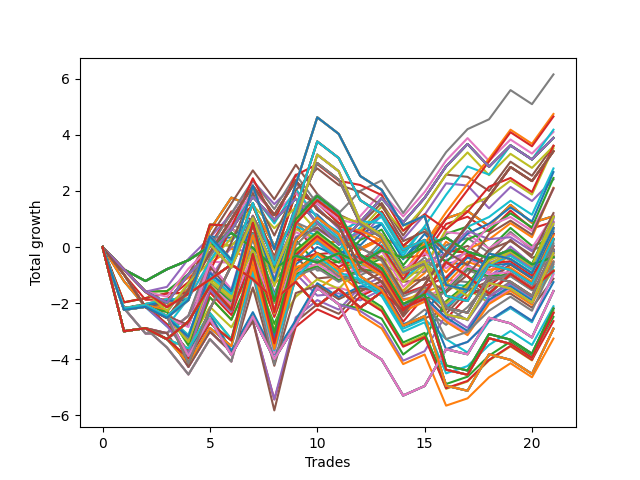

# Long HLT 602 
- Symbol: TSLA
- Date Range: 05/16/2022 - 05/17/2024
- Trading Period: 8:30-12:30
- Number of Trades: 21



| Id. | Name | Win Percent | Profit | Avg Profit / Trade | Avg Time / Trade | Std |      | Name | Win Percent | Profit | Avg Profit / Trade | Avg Time / Trade | Std |
| --- | ---- | ----------- | ------ | ------------------ | ---------------- | --- | ---- | ---- | ----------- | ------ | ------------------ | ---------------- | --- |
| | Sorted By <br> Profit | | | | | | | Sorted By <br> Win Percentage |||||
|0| TP-1 45m | 61.90 | 6.15 | 0.29 | 23:57 | 0.92 |     | TP-1 45m | 61.90 | 6.15 | 0.29 | 23:57 | 0.92 |
|1| TP-1 75m | 52.38 | 4.74 | 0.23 | 29:51 | 0.95 |     | TP-1.25 45m | 61.90 | 3.52 | 0.17 | 32:20 | 1.05 |
|2| TP-1 90m | 52.38 | 4.65 | 0.22 | 30:45 | 0.96 |     | TP-0.75 45m | 57.14 | 4.10 | 0.20 | 17:34 | 0.80 |
|3| TP-1 60m | 52.38 | 4.18 | 0.20 | 27:37 | 0.95 |     | TP-0.75 180m | 57.14 | 3.89 | 0.19 | 18:20 | 0.81 |
|4| TP-0.75 45m | 57.14 | 4.10 | 0.20 | 17:34 | 0.80 |     | TP-0.75 165m | 57.14 | 3.89 | 0.19 | 18:20 | 0.81 |
|5| TP-0.75 180m | 57.14 | 3.89 | 0.19 | 18:20 | 0.81 |     | TP-0.75 150m | 57.14 | 3.89 | 0.19 | 18:20 | 0.81 |
|6| TP-0.75 165m | 57.14 | 3.89 | 0.19 | 18:20 | 0.81 |     | TP-0.75 135m | 57.14 | 3.89 | 0.19 | 18:20 | 0.81 |
|7| TP-0.75 150m | 57.14 | 3.89 | 0.19 | 18:20 | 0.81 |     | TP-0.75 120m | 57.14 | 3.89 | 0.19 | 18:20 | 0.81 |
|8| TP-0.75 135m | 57.14 | 3.89 | 0.19 | 18:20 | 0.81 |     | TP-0.75 105m | 57.14 | 3.89 | 0.19 | 18:20 | 0.81 |
|9| TP-0.75 120m | 57.14 | 3.89 | 0.19 | 18:20 | 0.81 |     | TP-0.75 90m | 57.14 | 3.89 | 0.19 | 18:20 | 0.81 |
|10| TP-0.75 105m | 57.14 | 3.89 | 0.19 | 18:20 | 0.81 |     | TP-0.75 75m | 57.14 | 3.89 | 0.19 | 18:20 | 0.81 |
|11| TP-0.75 90m | 57.14 | 3.89 | 0.19 | 18:20 | 0.81 |     | TP-0.75 60m | 57.14 | 3.59 | 0.17 | 18:17 | 0.82 |
|12| TP-0.75 75m | 57.14 | 3.89 | 0.19 | 18:20 | 0.81 |     | TP-1.5 45m | 57.14 | 2.80 | 0.13 | 35:05 | 1.13 |
|13| TP-1.5 75m | 52.38 | 3.61 | 0.17 | 50:22 | 1.11 |     | TP-1.75 45m | 57.14 | 2.67 | 0.13 | 35:14 | 1.17 |
|14| TP-1 30m | 52.38 | 3.60 | 0.17 | 19:40 | 0.94 |     | TP-2.25 45m | 57.14 | 2.46 | 0.12 | 38:57 | 1.24 |
|15| TP-0.75 60m | 57.14 | 3.59 | 0.17 | 18:17 | 0.82 |     | TP-2 45m | 57.14 | 2.11 | 0.10 | 36:45 | 1.19 |
|16| TP-1.25 45m | 61.90 | 3.52 | 0.17 | 32:20 | 1.05 |     | TP-3 15m | 57.14 | 1.10 | 0.05 | 14:00 | 0.83 |
|17| TP-1 180m | 52.38 | 3.41 | 0.16 | 31:14 | 1.03 |     | TP-2.75 15m | 57.14 | 1.10 | 0.05 | 14:00 | 0.83 |
|18| TP-1 165m | 52.38 | 3.41 | 0.16 | 31:14 | 1.03 |     | TP-2.5 15m | 57.14 | 1.10 | 0.05 | 14:00 | 0.83 |
|19| TP-1 150m | 52.38 | 3.41 | 0.16 | 31:14 | 1.03 |     | TP-2.25 15m | 57.14 | 1.10 | 0.05 | 14:00 | 0.83 |
|20| TP-1 135m | 52.38 | 3.41 | 0.16 | 31:14 | 1.03 |     | TP-1 15m | 57.14 | 0.90 | 0.04 | 11:48 | 0.73 |
|21| TP-1 120m | 52.38 | 3.41 | 0.16 | 31:14 | 1.03 |     | TP-2.75 45m | 57.14 | 0.78 | 0.04 | 40:31 | 1.36 |
|22| TP-1 105m | 52.38 | 3.41 | 0.16 | 31:14 | 1.03 |     | TP-3 45m | 57.14 | 0.63 | 0.03 | 40:48 | 1.43 |
|23| TP-1.5 45m | 57.14 | 2.80 | 0.13 | 35:05 | 1.13 |     | TP-2.5 45m | 57.14 | 0.45 | 0.02 | 40:28 | 1.33 |
|24| TP-1.75 45m | 57.14 | 2.67 | 0.13 | 35:14 | 1.17 |     | TP-0.75 15m | 57.14 | 0.28 | 0.01 | 10:17 | 0.63 |
|25| TP-2.25 45m | 57.14 | 2.46 | 0.12 | 38:57 | 1.24 |     | TP-2 15m | 57.14 | 0.14 | 0.01 | 13:31 | 0.92 |
|26| TP-0.75 30m | 52.38 | 2.41 | 0.11 | 15:57 | 0.78 |     | TP-1.5 15m | 57.14 | -0.14 | -0.01 | 12:54 | 0.91 |
|27| TP-2 45m | 57.14 | 2.11 | 0.10 | 36:45 | 1.19 |     | TP-1.25 15m | 57.14 | -0.38 | -0.02 | 12:25 | 0.88 |
|28| TP-1.5 90m | 47.62 | 2.09 | 0.10 | 55:42 | 1.15 |     | TP-1.75 15m | 57.14 | -0.54 | -0.03 | 12:57 | 0.94 |
|29| TP-2.25 75m | 47.62 | 2.07 | 0.10 | 56:31 | 1.30 |     | TP-1 75m | 52.38 | 4.74 | 0.23 | 29:51 | 0.95 |
|30| TP-2 75m | 47.62 | 1.21 | 0.06 | 54:17 | 1.20 |     | TP-1 90m | 52.38 | 4.65 | 0.22 | 30:45 | 0.96 |
|31| TP-1.25 30m | 52.38 | 1.13 | 0.05 | 23:45 | 0.96 |     | TP-1 60m | 52.38 | 4.18 | 0.20 | 27:37 | 0.95 |
|32| TP-3 15m | 57.14 | 1.10 | 0.05 | 14:00 | 0.83 |     | TP-1.5 75m | 52.38 | 3.61 | 0.17 | 50:22 | 1.11 |
|33| TP-2.75 15m | 57.14 | 1.10 | 0.05 | 14:00 | 0.83 |     | TP-1 30m | 52.38 | 3.60 | 0.17 | 19:40 | 0.94 |
|34| TP-2.5 15m | 57.14 | 1.10 | 0.05 | 14:00 | 0.83 |     | TP-1 180m | 52.38 | 3.41 | 0.16 | 31:14 | 1.03 |
|35| TP-2.25 15m | 57.14 | 1.10 | 0.05 | 14:00 | 0.83 |     | TP-1 165m | 52.38 | 3.41 | 0.16 | 31:14 | 1.03 |
|36| TP-2.25 90m | 42.86 | 1.08 | 0.05 | 63:17 | 1.33 |     | TP-1 150m | 52.38 | 3.41 | 0.16 | 31:14 | 1.03 |
|37| TP-1.25 75m | 52.38 | 1.05 | 0.05 | 43:42 | 1.12 |     | TP-1 135m | 52.38 | 3.41 | 0.16 | 31:14 | 1.03 |
|38| TP-1.75 75m | 47.62 | 1.00 | 0.05 | 51:02 | 1.13 |     | TP-1 120m | 52.38 | 3.41 | 0.16 | 31:14 | 1.03 |
|39| TP-1 15m | 57.14 | 0.90 | 0.04 | 11:48 | 0.73 |     | TP-1 105m | 52.38 | 3.41 | 0.16 | 31:14 | 1.03 |
|40| TP-2.25 60m | 52.38 | 0.88 | 0.04 | 48:34 | 1.27 |     | TP-0.75 30m | 52.38 | 2.41 | 0.11 | 15:57 | 0.78 |
|41| TP-2.75 75m | 47.62 | 0.83 | 0.04 | 58:11 | 1.45 |     | TP-1.25 30m | 52.38 | 1.13 | 0.05 | 23:45 | 0.96 |
|42| TP-2.75 45m | 57.14 | 0.78 | 0.04 | 40:31 | 1.36 |     | TP-1.25 75m | 52.38 | 1.05 | 0.05 | 43:42 | 1.12 |
|43| TP-3 75m | 47.62 | 0.68 | 0.03 | 58:28 | 1.51 |     | TP-2.25 60m | 52.38 | 0.88 | 0.04 | 48:34 | 1.27 |
|44| TP-2.25 180m | 42.86 | 0.68 | 0.03 | 75:02 | 1.54 |     | TP-1.25 60m | 52.38 | 0.56 | 0.03 | 39:17 | 1.08 |
|45| TP-2.25 165m | 42.86 | 0.68 | 0.03 | 75:02 | 1.54 |     | TP-1.5 60m | 52.38 | 0.41 | 0.02 | 43:40 | 1.08 |
|46| TP-2.25 150m | 42.86 | 0.68 | 0.03 | 75:02 | 1.54 |     | TP-1.75 60m | 52.38 | 0.28 | 0.01 | 43:48 | 1.13 |
|47| TP-2.25 135m | 42.86 | 0.68 | 0.03 | 75:02 | 1.54 |     | TP-2 60m | 52.38 | 0.02 | 0.00 | 46:20 | 1.17 |
|48| TP-2.25 120m | 42.86 | 0.68 | 0.03 | 75:02 | 1.54 |     | TP-0.25 180m | 52.38 | -0.36 | -0.02 | 04:31 | 0.44 |
|49| TP-3 45m | 57.14 | 0.63 | 0.03 | 40:48 | 1.43 |     | TP-0.25 165m | 52.38 | -0.36 | -0.02 | 04:31 | 0.44 |
|50| TP-1.25 60m | 52.38 | 0.56 | 0.03 | 39:17 | 1.08 |     | TP-0.25 150m | 52.38 | -0.36 | -0.02 | 04:31 | 0.44 |
|51| TP-3 30m | 47.62 | 0.48 | 0.02 | 28:48 | 1.10 |     | TP-0.25 135m | 52.38 | -0.36 | -0.02 | 04:31 | 0.44 |
|52| TP-2.75 30m | 47.62 | 0.48 | 0.02 | 28:48 | 1.10 |     | TP-0.25 120m | 52.38 | -0.36 | -0.02 | 04:31 | 0.44 |
|53| TP-2.5 30m | 47.62 | 0.48 | 0.02 | 28:48 | 1.10 |     | TP-0.25 105m | 52.38 | -0.36 | -0.02 | 04:31 | 0.44 |
|54| TP-2.5 45m | 57.14 | 0.45 | 0.02 | 40:28 | 1.33 |     | TP-0.25 90m | 52.38 | -0.36 | -0.02 | 04:31 | 0.44 |
|55| TP-1.5 60m | 52.38 | 0.41 | 0.02 | 43:40 | 1.08 |     | TP-0.25 75m | 52.38 | -0.36 | -0.02 | 04:31 | 0.44 |
|56| TP-2 180m | 42.86 | 0.29 | 0.01 | 72:31 | 1.42 |     | TP-2.75 60m | 52.38 | -0.36 | -0.02 | 50:14 | 1.43 |
|57| TP-2 165m | 42.86 | 0.29 | 0.01 | 72:31 | 1.42 |     | TP-0.25 60m | 52.38 | -0.36 | -0.02 | 04:31 | 0.44 |
|58| TP-2 150m | 42.86 | 0.29 | 0.01 | 72:31 | 1.42 |     | TP-0.25 45m | 52.38 | -0.36 | -0.02 | 04:31 | 0.44 |
|59| TP-2 135m | 42.86 | 0.29 | 0.01 | 72:31 | 1.42 |     | TP-0.25 30m | 52.38 | -0.36 | -0.02 | 04:31 | 0.44 |
|60| TP-2 120m | 42.86 | 0.29 | 0.01 | 72:31 | 1.42 |     | TP-0.25 15m | 52.38 | -0.38 | -0.02 | 04:25 | 0.44 |
|61| TP-0.75 15m | 57.14 | 0.28 | 0.01 | 10:17 | 0.63 |     | TP-3 60m | 52.38 | -0.51 | -0.02 | 50:31 | 1.49 |
|62| TP-1.75 60m | 52.38 | 0.28 | 0.01 | 43:48 | 1.13 |     | TP-0.5 15m | 52.38 | -0.52 | -0.02 | 07:17 | 0.62 |
|63| TP-2 90m | 42.86 | 0.22 | 0.01 | 61:02 | 1.24 |     | TP-1.5 105m | 52.38 | -0.62 | -0.03 | 59:42 | 1.26 |
|64| TP-2 15m | 57.14 | 0.14 | 0.01 | 13:31 | 0.92 |     | TP-1.25 105m | 52.38 | -0.98 | -0.05 | 49:31 | 1.15 |
|65| TP-2.5 75m | 47.62 | 0.06 | 0.00 | 58:02 | 1.38 |     | TP-2.5 60m | 52.38 | -1.13 | -0.05 | 50:05 | 1.35 |
|66| TP-2.25 30m | 47.62 | 0.05 | 0.00 | 28:40 | 1.10 |     | TP-1.5 90m | 47.62 | 2.09 | 0.10 | 55:42 | 1.15 |
|67| TP-2 60m | 52.38 | 0.02 | 0.00 | 46:20 | 1.17 |     | TP-2.25 75m | 47.62 | 2.07 | 0.10 | 56:31 | 1.30 |
|68| TP-1.5 180m | 42.86 | -0.09 | -0.00 | 62:11 | 1.33 |     | TP-2 75m | 47.62 | 1.21 | 0.06 | 54:17 | 1.20 |
|69| TP-1.5 165m | 42.86 | -0.09 | -0.00 | 62:11 | 1.33 |     | TP-1.75 75m | 47.62 | 1.00 | 0.05 | 51:02 | 1.13 |
|70| TP-1.5 150m | 42.86 | -0.09 | -0.00 | 62:11 | 1.33 |     | TP-2.75 75m | 47.62 | 0.83 | 0.04 | 58:11 | 1.45 |
|71| TP-1.5 135m | 42.86 | -0.09 | -0.00 | 62:11 | 1.33 |     | TP-3 75m | 47.62 | 0.68 | 0.03 | 58:28 | 1.51 |
|72| TP-1.5 120m | 42.86 | -0.09 | -0.00 | 62:11 | 1.33 |     | TP-3 30m | 47.62 | 0.48 | 0.02 | 28:48 | 1.10 |
|73| TP-1.5 15m | 57.14 | -0.14 | -0.01 | 12:54 | 0.91 |     | TP-2.75 30m | 47.62 | 0.48 | 0.02 | 28:48 | 1.10 |
|74| TP-1.25 90m | 47.62 | -0.15 | -0.01 | 46:54 | 1.12 |     | TP-2.5 30m | 47.62 | 0.48 | 0.02 | 28:48 | 1.10 |
|75| TP-2.75 90m | 42.86 | -0.16 | -0.01 | 64:57 | 1.48 |     | TP-2.5 75m | 47.62 | 0.06 | 0.00 | 58:02 | 1.38 |
|76| TP-1.75 180m | 42.86 | -0.22 | -0.01 | 66:51 | 1.37 |     | TP-2.25 30m | 47.62 | 0.05 | 0.00 | 28:40 | 1.10 |
|77| TP-1.75 165m | 42.86 | -0.22 | -0.01 | 66:51 | 1.37 |     | TP-1.25 90m | 47.62 | -0.15 | -0.01 | 46:54 | 1.12 |
|78| TP-1.75 150m | 42.86 | -0.22 | -0.01 | 66:51 | 1.37 |     | TP-1.5 30m | 47.62 | -0.57 | -0.03 | 25:22 | 0.98 |
|79| TP-1.75 135m | 42.86 | -0.22 | -0.01 | 66:51 | 1.37 |     | TP-2 30m | 47.62 | -0.71 | -0.03 | 26:40 | 1.08 |
|80| TP-1.75 120m | 42.86 | -0.22 | -0.01 | 66:51 | 1.37 |     | TP-1.75 30m | 47.62 | -0.81 | -0.04 | 25:28 | 1.02 |
|81| TP-1.75 90m | 42.86 | -0.24 | -0.01 | 57:05 | 1.16 |     | TP-0.5 180m | 47.62 | -0.85 | -0.04 | 08:14 | 0.66 |
|82| TP-3 90m | 42.86 | -0.31 | -0.01 | 65:14 | 1.54 |     | TP-0.5 165m | 47.62 | -0.85 | -0.04 | 08:14 | 0.66 |
|83| TP-0.25 180m | 52.38 | -0.36 | -0.02 | 04:31 | 0.44 |     | TP-0.5 150m | 47.62 | -0.85 | -0.04 | 08:14 | 0.66 |
|84| TP-0.25 165m | 52.38 | -0.36 | -0.02 | 04:31 | 0.44 |     | TP-0.5 135m | 47.62 | -0.85 | -0.04 | 08:14 | 0.66 |
|85| TP-0.25 150m | 52.38 | -0.36 | -0.02 | 04:31 | 0.44 |     | TP-0.5 120m | 47.62 | -0.85 | -0.04 | 08:14 | 0.66 |
|86| TP-0.25 135m | 52.38 | -0.36 | -0.02 | 04:31 | 0.44 |     | TP-0.5 105m | 47.62 | -0.85 | -0.04 | 08:14 | 0.66 |
|87| TP-0.25 120m | 52.38 | -0.36 | -0.02 | 04:31 | 0.44 |     | TP-0.5 90m | 47.62 | -0.85 | -0.04 | 08:14 | 0.66 |
|88| TP-0.25 105m | 52.38 | -0.36 | -0.02 | 04:31 | 0.44 |     | TP-0.5 75m | 47.62 | -0.85 | -0.04 | 08:14 | 0.66 |
|89| TP-0.25 90m | 52.38 | -0.36 | -0.02 | 04:31 | 0.44 |     | TP-0.5 60m | 47.62 | -0.85 | -0.04 | 08:14 | 0.66 |
|90| TP-0.25 75m | 52.38 | -0.36 | -0.02 | 04:31 | 0.44 |     | TP-0.5 45m | 47.62 | -0.85 | -0.04 | 08:14 | 0.66 |
|91| TP-2.75 60m | 52.38 | -0.36 | -0.02 | 50:14 | 1.43 |     | TP-0.5 30m | 47.62 | -0.85 | -0.04 | 08:14 | 0.66 |
|92| TP-0.25 60m | 52.38 | -0.36 | -0.02 | 04:31 | 0.44 |     | TP-2.25 105m | 47.62 | -1.25 | -0.06 | 69:42 | 1.38 |
|93| TP-0.25 45m | 52.38 | -0.36 | -0.02 | 04:31 | 0.44 |     | TP-2 105m | 47.62 | -2.11 | -0.10 | 67:28 | 1.29 |
|94| TP-0.25 30m | 52.38 | -0.36 | -0.02 | 04:31 | 0.44 |     | TP-1.75 105m | 47.62 | -2.28 | -0.11 | 62:42 | 1.24 |
|95| TP-1.25 15m | 57.14 | -0.38 | -0.02 | 12:25 | 0.88 |     | TP-2.75 105m | 47.62 | -2.49 | -0.12 | 71:22 | 1.52 |
|96| TP-0.25 15m | 52.38 | -0.38 | -0.02 | 04:25 | 0.44 |     | TP-3 105m | 47.62 | -2.64 | -0.13 | 71:40 | 1.58 |
|97| TP-3 60m | 52.38 | -0.51 | -0.02 | 50:31 | 1.49 |     | TP-2.5 105m | 47.62 | -3.26 | -0.16 | 71:14 | 1.45 |
|98| TP-0.5 15m | 52.38 | -0.52 | -0.02 | 07:17 | 0.62 |     | TP-2.25 90m | 42.86 | 1.08 | 0.05 | 63:17 | 1.33 |
|99| TP-1.75 15m | 57.14 | -0.54 | -0.03 | 12:57 | 0.94 |     | TP-2.25 180m | 42.86 | 0.68 | 0.03 | 75:02 | 1.54 |
|100| TP-1.5 30m | 47.62 | -0.57 | -0.03 | 25:22 | 0.98 |     | TP-2.25 165m | 42.86 | 0.68 | 0.03 | 75:02 | 1.54 |
|101| TP-1.5 105m | 52.38 | -0.62 | -0.03 | 59:42 | 1.26 |     | TP-2.25 150m | 42.86 | 0.68 | 0.03 | 75:02 | 1.54 |
|102| TP-2 30m | 47.62 | -0.71 | -0.03 | 26:40 | 1.08 |     | TP-2.25 135m | 42.86 | 0.68 | 0.03 | 75:02 | 1.54 |
|103| TP-1.75 30m | 47.62 | -0.81 | -0.04 | 25:28 | 1.02 |     | TP-2.25 120m | 42.86 | 0.68 | 0.03 | 75:02 | 1.54 |
|104| TP-0.5 180m | 47.62 | -0.85 | -0.04 | 08:14 | 0.66 |     | TP-2 180m | 42.86 | 0.29 | 0.01 | 72:31 | 1.42 |
|105| TP-0.5 165m | 47.62 | -0.85 | -0.04 | 08:14 | 0.66 |     | TP-2 165m | 42.86 | 0.29 | 0.01 | 72:31 | 1.42 |
|106| TP-0.5 150m | 47.62 | -0.85 | -0.04 | 08:14 | 0.66 |     | TP-2 150m | 42.86 | 0.29 | 0.01 | 72:31 | 1.42 |
|107| TP-0.5 135m | 47.62 | -0.85 | -0.04 | 08:14 | 0.66 |     | TP-2 135m | 42.86 | 0.29 | 0.01 | 72:31 | 1.42 |
|108| TP-0.5 120m | 47.62 | -0.85 | -0.04 | 08:14 | 0.66 |     | TP-2 120m | 42.86 | 0.29 | 0.01 | 72:31 | 1.42 |
|109| TP-0.5 105m | 47.62 | -0.85 | -0.04 | 08:14 | 0.66 |     | TP-2 90m | 42.86 | 0.22 | 0.01 | 61:02 | 1.24 |
|110| TP-0.5 90m | 47.62 | -0.85 | -0.04 | 08:14 | 0.66 |     | TP-1.5 180m | 42.86 | -0.09 | -0.00 | 62:11 | 1.33 |
|111| TP-0.5 75m | 47.62 | -0.85 | -0.04 | 08:14 | 0.66 |     | TP-1.5 165m | 42.86 | -0.09 | -0.00 | 62:11 | 1.33 |
|112| TP-0.5 60m | 47.62 | -0.85 | -0.04 | 08:14 | 0.66 |     | TP-1.5 150m | 42.86 | -0.09 | -0.00 | 62:11 | 1.33 |
|113| TP-0.5 45m | 47.62 | -0.85 | -0.04 | 08:14 | 0.66 |     | TP-1.5 135m | 42.86 | -0.09 | -0.00 | 62:11 | 1.33 |
|114| TP-0.5 30m | 47.62 | -0.85 | -0.04 | 08:14 | 0.66 |     | TP-1.5 120m | 42.86 | -0.09 | -0.00 | 62:11 | 1.33 |
|115| TP-2.5 90m | 42.86 | -0.93 | -0.04 | 64:48 | 1.41 |     | TP-2.75 90m | 42.86 | -0.16 | -0.01 | 64:57 | 1.48 |
|116| TP-1.25 105m | 52.38 | -0.98 | -0.05 | 49:31 | 1.15 |     | TP-1.75 180m | 42.86 | -0.22 | -0.01 | 66:51 | 1.37 |
|117| TP-2.5 60m | 52.38 | -1.13 | -0.05 | 50:05 | 1.35 |     | TP-1.75 165m | 42.86 | -0.22 | -0.01 | 66:51 | 1.37 |
|118| TP-2.25 105m | 47.62 | -1.25 | -0.06 | 69:42 | 1.38 |     | TP-1.75 150m | 42.86 | -0.22 | -0.01 | 66:51 | 1.37 |
|119| TP-1.25 180m | 42.86 | -1.57 | -0.07 | 51:00 | 1.17 |     | TP-1.75 135m | 42.86 | -0.22 | -0.01 | 66:51 | 1.37 |
|120| TP-1.25 165m | 42.86 | -1.57 | -0.07 | 51:00 | 1.17 |     | TP-1.75 120m | 42.86 | -0.22 | -0.01 | 66:51 | 1.37 |
|121| TP-1.25 150m | 42.86 | -1.57 | -0.07 | 51:00 | 1.17 |     | TP-1.75 90m | 42.86 | -0.24 | -0.01 | 57:05 | 1.16 |
|122| TP-1.25 135m | 42.86 | -1.57 | -0.07 | 51:00 | 1.17 |     | TP-3 90m | 42.86 | -0.31 | -0.01 | 65:14 | 1.54 |
|123| TP-1.25 120m | 42.86 | -1.57 | -0.07 | 51:00 | 1.17 |     | TP-2.5 90m | 42.86 | -0.93 | -0.04 | 64:48 | 1.41 |
|124| TP-2 105m | 47.62 | -2.11 | -0.10 | 67:28 | 1.29 |     | TP-1.25 180m | 42.86 | -1.57 | -0.07 | 51:00 | 1.17 |
|125| TP-2.75 180m | 42.86 | -2.19 | -0.10 | 77:22 | 1.60 |     | TP-1.25 165m | 42.86 | -1.57 | -0.07 | 51:00 | 1.17 |
|126| TP-2.75 165m | 42.86 | -2.19 | -0.10 | 77:22 | 1.60 |     | TP-1.25 150m | 42.86 | -1.57 | -0.07 | 51:00 | 1.17 |
|127| TP-2.75 150m | 42.86 | -2.19 | -0.10 | 77:22 | 1.60 |     | TP-1.25 135m | 42.86 | -1.57 | -0.07 | 51:00 | 1.17 |
|128| TP-2.75 135m | 42.86 | -2.19 | -0.10 | 77:22 | 1.60 |     | TP-1.25 120m | 42.86 | -1.57 | -0.07 | 51:00 | 1.17 |
|129| TP-2.75 120m | 42.86 | -2.19 | -0.10 | 77:22 | 1.60 |     | TP-2.75 180m | 42.86 | -2.19 | -0.10 | 77:22 | 1.60 |
|130| TP-1.75 105m | 47.62 | -2.28 | -0.11 | 62:42 | 1.24 |     | TP-2.75 165m | 42.86 | -2.19 | -0.10 | 77:22 | 1.60 |
|131| TP-3 180m | 42.86 | -2.34 | -0.11 | 77:40 | 1.65 |     | TP-2.75 150m | 42.86 | -2.19 | -0.10 | 77:22 | 1.60 |
|132| TP-3 165m | 42.86 | -2.34 | -0.11 | 77:40 | 1.65 |     | TP-2.75 135m | 42.86 | -2.19 | -0.10 | 77:22 | 1.60 |
|133| TP-3 150m | 42.86 | -2.34 | -0.11 | 77:40 | 1.65 |     | TP-2.75 120m | 42.86 | -2.19 | -0.10 | 77:22 | 1.60 |
|134| TP-3 135m | 42.86 | -2.34 | -0.11 | 77:40 | 1.65 |     | TP-3 180m | 42.86 | -2.34 | -0.11 | 77:40 | 1.65 |
|135| TP-3 120m | 42.86 | -2.34 | -0.11 | 77:40 | 1.65 |     | TP-3 165m | 42.86 | -2.34 | -0.11 | 77:40 | 1.65 |
|136| TP-2.75 105m | 47.62 | -2.49 | -0.12 | 71:22 | 1.52 |     | TP-3 150m | 42.86 | -2.34 | -0.11 | 77:40 | 1.65 |
|137| TP-3 105m | 47.62 | -2.64 | -0.13 | 71:40 | 1.58 |     | TP-3 135m | 42.86 | -2.34 | -0.11 | 77:40 | 1.65 |
|138| TP-2.5 180m | 42.86 | -2.91 | -0.14 | 77:08 | 1.53 |     | TP-3 120m | 42.86 | -2.34 | -0.11 | 77:40 | 1.65 |
|139| TP-2.5 165m | 42.86 | -2.91 | -0.14 | 77:08 | 1.53 |     | TP-2.5 180m | 42.86 | -2.91 | -0.14 | 77:08 | 1.53 |
|140| TP-2.5 150m | 42.86 | -2.91 | -0.14 | 77:08 | 1.53 |     | TP-2.5 165m | 42.86 | -2.91 | -0.14 | 77:08 | 1.53 |
|141| TP-2.5 135m | 42.86 | -2.91 | -0.14 | 77:08 | 1.53 |     | TP-2.5 150m | 42.86 | -2.91 | -0.14 | 77:08 | 1.53 |
|142| TP-2.5 120m | 42.86 | -2.91 | -0.14 | 77:08 | 1.53 |     | TP-2.5 135m | 42.86 | -2.91 | -0.14 | 77:08 | 1.53 |
|143| TP-2.5 105m | 47.62 | -3.26 | -0.16 | 71:14 | 1.45 |     | TP-2.5 120m | 42.86 | -2.91 | -0.14 | 77:08 | 1.53 |

### Test TP-0.25 15m
* Take Profit of 0.25 Point
* 0.25 Stoploss
* Results:
```
Total Trades: 21
Percent Up: 52.38
Percent Down: 47.62
Total Points Moved Up: -0.38
Potential Profit: -190.00
Total Points Ups: 4.18 Count Ups: 11
Total Points Downs: -4.56 Count Downs: 10
```

<details><summary>Trades</summary>

<code>In: 2022-05-20 08:35:00		Out: 2022-05-20 08:37:00		Total Position Time: 02:00		Total Move Up: -0.80		Total to Date: -0.80</code> <br />
<code>In: 2022-07-12 12:20:00		Out: 2022-07-12 12:23:00		Total Position Time: 03:00		Total Move Up: -0.41		Total to Date: -1.21</code> <br />
<code>In: 2022-07-26 11:50:00		Out: 2022-07-26 11:52:00		Total Position Time: 02:00		Total Move Up: 0.42		Total to Date: -0.79</code> <br />
<code>In: 2022-09-29 10:20:00		Out: 2022-09-29 10:22:00		Total Position Time: 02:00		Total Move Up: 0.32		Total to Date: -0.47</code> <br />
<code>In: 2022-09-29 12:10:00		Out: 2022-09-29 12:12:00		Total Position Time: 02:00		Total Move Up: 0.50		Total to Date: 0.03</code> <br />
<code>In: 2022-09-30 11:00:00		Out: 2022-09-30 11:02:00		Total Position Time: 02:00		Total Move Up: 0.47		Total to Date: 0.50</code> <br />
<code>In: 2022-11-04 11:20:00		Out: 2022-11-04 11:22:00		Total Position Time: 02:00		Total Move Up: -0.53		Total to Date: -0.03</code> <br />
<code>In: 2022-11-09 09:35:00		Out: 2022-11-09 09:37:00		Total Position Time: 02:00		Total Move Up: -0.72		Total to Date: -0.75</code> <br />
<code>In: 2022-12-19 09:10:00		Out: 2022-12-19 09:14:00		Total Position Time: 04:00		Total Move Up: 0.44		Total to Date: -0.31</code> <br />
<code>In: 2023-03-02 08:45:00		Out: 2023-03-02 08:48:00		Total Position Time: 03:00		Total Move Up: -0.24		Total to Date: -0.55</code> <br />
<code>In: 2023-04-12 11:50:00		Out: 2023-04-12 11:57:00		Total Position Time: 07:00		Total Move Up: 0.33		Total to Date: -0.22</code> <br />
<code>In: 2023-04-20 09:35:00		Out: 2023-04-20 09:38:00		Total Position Time: 03:00		Total Move Up: -0.35		Total to Date: -0.57</code> <br />
<code>In: 2023-04-25 11:35:00		Out: 2023-04-25 11:39:00		Total Position Time: 04:00		Total Move Up: 0.45		Total to Date: -0.12</code> <br />
<code>In: 2023-04-26 12:20:00		Out: 2023-04-26 12:33:00		Total Position Time: 13:00		Total Move Up: -0.26		Total to Date: -0.38</code> <br />
<code>In: 2023-09-26 11:30:00		Out: 2023-09-26 11:32:00		Total Position Time: 02:00		Total Move Up: 0.39		Total to Date: 0.01</code> <br />
<code>In: 2023-10-18 10:10:00		Out: 2023-10-18 10:12:00		Total Position Time: 02:00		Total Move Up: 0.33		Total to Date: 0.34</code> <br />
<code>In: 2024-01-12 09:20:00		Out: 2024-01-12 09:26:00		Total Position Time: 06:00		Total Move Up: -0.51		Total to Date: -0.17</code> <br />
<code>In: 2024-02-20 09:35:00		Out: 2024-02-20 09:37:00		Total Position Time: 02:00		Total Move Up: -0.22		Total to Date: -0.39</code> <br />
<code>In: 2024-03-14 09:25:00		Out: 2024-03-14 09:34:00		Total Position Time: 09:00		Total Move Up: 0.29		Total to Date: -0.10</code> <br />
<code>In: 2024-03-28 12:25:00		Out: 2024-03-28 12:32:00		Total Position Time: 07:00		Total Move Up: -0.52		Total to Date: -0.62</code> <br />
<code>In: 2024-04-22 08:35:00		Out: 2024-04-22 08:49:00		Total Position Time: 14:00		Total Move Up: 0.24		Total to Date: -0.38</code> <br />


</details>

### Test TP-0.5 15m
* Take Profit of 0.5 Point
* 0.5 Stoploss
* Results:
```
Total Trades: 21
Percent Up: 52.38
Percent Down: 47.62
Total Points Moved Up: -0.52
Potential Profit: -260.00
Total Points Ups: 5.82 Count Ups: 11
Total Points Downs: -6.34 Count Downs: 10
```

<details><summary>Trades</summary>

<code>In: 2022-05-20 08:35:00		Out: 2022-05-20 08:37:00		Total Position Time: 02:00		Total Move Up: -0.80		Total to Date: -0.80</code> <br />
<code>In: 2022-07-12 12:20:00		Out: 2022-07-12 12:26:00		Total Position Time: 06:00		Total Move Up: -0.79		Total to Date: -1.59</code> <br />
<code>In: 2022-07-26 11:50:00		Out: 2022-07-26 12:04:00		Total Position Time: 14:00		Total Move Up: 0.02		Total to Date: -1.57</code> <br />
<code>In: 2022-09-29 10:20:00		Out: 2022-09-29 10:26:00		Total Position Time: 06:00		Total Move Up: 0.48		Total to Date: -1.09</code> <br />
<code>In: 2022-09-29 12:10:00		Out: 2022-09-29 12:12:00		Total Position Time: 02:00		Total Move Up: 0.50		Total to Date: -0.59</code> <br />
<code>In: 2022-09-30 11:00:00		Out: 2022-09-30 11:09:00		Total Position Time: 09:00		Total Move Up: 0.54		Total to Date: -0.05</code> <br />
<code>In: 2022-11-04 11:20:00		Out: 2022-11-04 11:22:00		Total Position Time: 02:00		Total Move Up: -0.53		Total to Date: -0.58</code> <br />
<code>In: 2022-11-09 09:35:00		Out: 2022-11-09 09:37:00		Total Position Time: 02:00		Total Move Up: -0.72		Total to Date: -1.30</code> <br />
<code>In: 2022-12-19 09:10:00		Out: 2022-12-19 09:15:00		Total Position Time: 05:00		Total Move Up: 0.63		Total to Date: -0.67</code> <br />
<code>In: 2023-03-02 08:45:00		Out: 2023-03-02 08:53:00		Total Position Time: 08:00		Total Move Up: -0.86		Total to Date: -1.53</code> <br />
<code>In: 2023-04-12 11:50:00		Out: 2023-04-12 12:02:00		Total Position Time: 12:00		Total Move Up: 0.60		Total to Date: -0.93</code> <br />
<code>In: 2023-04-20 09:35:00		Out: 2023-04-20 09:40:00		Total Position Time: 05:00		Total Move Up: -0.66		Total to Date: -1.59</code> <br />
<code>In: 2023-04-25 11:35:00		Out: 2023-04-25 11:49:00		Total Position Time: 14:00		Total Move Up: 0.38		Total to Date: -1.21</code> <br />
<code>In: 2023-04-26 12:20:00		Out: 2023-04-26 12:34:00		Total Position Time: 14:00		Total Move Up: -0.33		Total to Date: -1.54</code> <br />
<code>In: 2023-09-26 11:30:00		Out: 2023-09-26 11:37:00		Total Position Time: 07:00		Total Move Up: 0.61		Total to Date: -0.93</code> <br />
<code>In: 2023-10-18 10:10:00		Out: 2023-10-18 10:14:00		Total Position Time: 04:00		Total Move Up: 1.12		Total to Date: 0.19</code> <br />
<code>In: 2024-01-12 09:20:00		Out: 2024-01-12 09:26:00		Total Position Time: 06:00		Total Move Up: -0.51		Total to Date: -0.32</code> <br />
<code>In: 2024-02-20 09:35:00		Out: 2024-02-20 09:38:00		Total Position Time: 03:00		Total Move Up: -0.62		Total to Date: -0.94</code> <br />
<code>In: 2024-03-14 09:25:00		Out: 2024-03-14 09:36:00		Total Position Time: 11:00		Total Move Up: 0.70		Total to Date: -0.24</code> <br />
<code>In: 2024-03-28 12:25:00		Out: 2024-03-28 12:32:00		Total Position Time: 07:00		Total Move Up: -0.52		Total to Date: -0.76</code> <br />
<code>In: 2024-04-22 08:35:00		Out: 2024-04-22 08:49:00		Total Position Time: 14:00		Total Move Up: 0.24		Total to Date: -0.52</code> <br />


</details>

### Test TP-0.75 15m
* Take Profit of 0.75 Point
* 0.75 Stoploss
* Results:
```
Total Trades: 21
Percent Up: 57.14
Percent Down: 42.86
Total Points Moved Up: 0.28
Potential Profit: 140.00
Total Points Ups: 5.89 Count Ups: 12
Total Points Downs: -5.61 Count Downs: 9
```

<details><summary>Trades</summary>

<code>In: 2022-05-20 08:35:00		Out: 2022-05-20 08:37:00		Total Position Time: 02:00		Total Move Up: -0.80		Total to Date: -0.80</code> <br />
<code>In: 2022-07-12 12:20:00		Out: 2022-07-12 12:26:00		Total Position Time: 06:00		Total Move Up: -0.79		Total to Date: -1.59</code> <br />
<code>In: 2022-07-26 11:50:00		Out: 2022-07-26 12:04:00		Total Position Time: 14:00		Total Move Up: 0.02		Total to Date: -1.57</code> <br />
<code>In: 2022-09-29 10:20:00		Out: 2022-09-29 10:34:00		Total Position Time: 14:00		Total Move Up: 0.61		Total to Date: -0.96</code> <br />
<code>In: 2022-09-29 12:10:00		Out: 2022-09-29 12:14:00		Total Position Time: 04:00		Total Move Up: 0.76		Total to Date: -0.20</code> <br />
<code>In: 2022-09-30 11:00:00		Out: 2022-09-30 11:11:00		Total Position Time: 11:00		Total Move Up: 0.83		Total to Date: 0.63</code> <br />
<code>In: 2022-11-04 11:20:00		Out: 2022-11-04 11:34:00		Total Position Time: 14:00		Total Move Up: -0.31		Total to Date: 0.32</code> <br />
<code>In: 2022-11-09 09:35:00		Out: 2022-11-09 09:38:00		Total Position Time: 03:00		Total Move Up: -0.82		Total to Date: -0.50</code> <br />
<code>In: 2022-12-19 09:10:00		Out: 2022-12-19 09:18:00		Total Position Time: 08:00		Total Move Up: 0.75		Total to Date: 0.25</code> <br />
<code>In: 2023-03-02 08:45:00		Out: 2023-03-02 08:53:00		Total Position Time: 08:00		Total Move Up: -0.86		Total to Date: -0.61</code> <br />
<code>In: 2023-04-12 11:50:00		Out: 2023-04-12 12:04:00		Total Position Time: 14:00		Total Move Up: 0.08		Total to Date: -0.53</code> <br />
<code>In: 2023-04-20 09:35:00		Out: 2023-04-20 09:49:00		Total Position Time: 14:00		Total Move Up: -0.25		Total to Date: -0.78</code> <br />
<code>In: 2023-04-25 11:35:00		Out: 2023-04-25 11:49:00		Total Position Time: 14:00		Total Move Up: 0.38		Total to Date: -0.40</code> <br />
<code>In: 2023-04-26 12:20:00		Out: 2023-04-26 12:34:00		Total Position Time: 14:00		Total Move Up: -0.33		Total to Date: -0.73</code> <br />
<code>In: 2023-09-26 11:30:00		Out: 2023-09-26 11:44:00		Total Position Time: 14:00		Total Move Up: 0.08		Total to Date: -0.65</code> <br />
<code>In: 2023-10-18 10:10:00		Out: 2023-10-18 10:14:00		Total Position Time: 04:00		Total Move Up: 1.12		Total to Date: 0.47</code> <br />
<code>In: 2024-01-12 09:20:00		Out: 2024-01-12 09:34:00		Total Position Time: 14:00		Total Move Up: 0.26		Total to Date: 0.73</code> <br />
<code>In: 2024-02-20 09:35:00		Out: 2024-02-20 09:39:00		Total Position Time: 04:00		Total Move Up: -0.81		Total to Date: -0.08</code> <br />
<code>In: 2024-03-14 09:25:00		Out: 2024-03-14 09:37:00		Total Position Time: 12:00		Total Move Up: 0.76		Total to Date: 0.68</code> <br />
<code>In: 2024-03-28 12:25:00		Out: 2024-03-28 12:39:00		Total Position Time: 14:00		Total Move Up: -0.64		Total to Date: 0.04</code> <br />
<code>In: 2024-04-22 08:35:00		Out: 2024-04-22 08:49:00		Total Position Time: 14:00		Total Move Up: 0.24		Total to Date: 0.28</code> <br />


</details>

### Test TP-1 15m
* Take Profit of 1 Point
* 1 Stoploss
* Results:
```
Total Trades: 21
Percent Up: 57.14
Percent Down: 42.86
Total Points Moved Up: 0.90
Potential Profit: 450.00
Total Points Ups: 6.91 Count Ups: 12
Total Points Downs: -6.01 Count Downs: 9
```

<details><summary>Trades</summary>

<code>In: 2022-05-20 08:35:00		Out: 2022-05-20 08:38:00		Total Position Time: 03:00		Total Move Up: -0.98		Total to Date: -0.98</code> <br />
<code>In: 2022-07-12 12:20:00		Out: 2022-07-12 12:34:00		Total Position Time: 14:00		Total Move Up: -0.90		Total to Date: -1.88</code> <br />
<code>In: 2022-07-26 11:50:00		Out: 2022-07-26 12:04:00		Total Position Time: 14:00		Total Move Up: 0.02		Total to Date: -1.86</code> <br />
<code>In: 2022-09-29 10:20:00		Out: 2022-09-29 10:34:00		Total Position Time: 14:00		Total Move Up: 0.61		Total to Date: -1.25</code> <br />
<code>In: 2022-09-29 12:10:00		Out: 2022-09-29 12:15:00		Total Position Time: 05:00		Total Move Up: 1.32		Total to Date: 0.07</code> <br />
<code>In: 2022-09-30 11:00:00		Out: 2022-09-30 11:12:00		Total Position Time: 12:00		Total Move Up: 1.20		Total to Date: 1.27</code> <br />
<code>In: 2022-11-04 11:20:00		Out: 2022-11-04 11:34:00		Total Position Time: 14:00		Total Move Up: -0.31		Total to Date: 0.96</code> <br />
<code>In: 2022-11-09 09:35:00		Out: 2022-11-09 09:39:00		Total Position Time: 04:00		Total Move Up: -1.03		Total to Date: -0.07</code> <br />
<code>In: 2022-12-19 09:10:00		Out: 2022-12-19 09:24:00		Total Position Time: 14:00		Total Move Up: 0.85		Total to Date: 0.78</code> <br />
<code>In: 2023-03-02 08:45:00		Out: 2023-03-02 08:55:00		Total Position Time: 10:00		Total Move Up: -1.04		Total to Date: -0.26</code> <br />
<code>In: 2023-04-12 11:50:00		Out: 2023-04-12 12:04:00		Total Position Time: 14:00		Total Move Up: 0.08		Total to Date: -0.18</code> <br />
<code>In: 2023-04-20 09:35:00		Out: 2023-04-20 09:49:00		Total Position Time: 14:00		Total Move Up: -0.25		Total to Date: -0.43</code> <br />
<code>In: 2023-04-25 11:35:00		Out: 2023-04-25 11:49:00		Total Position Time: 14:00		Total Move Up: 0.38		Total to Date: -0.05</code> <br />
<code>In: 2023-04-26 12:20:00		Out: 2023-04-26 12:34:00		Total Position Time: 14:00		Total Move Up: -0.33		Total to Date: -0.38</code> <br />
<code>In: 2023-09-26 11:30:00		Out: 2023-09-26 11:44:00		Total Position Time: 14:00		Total Move Up: 0.08		Total to Date: -0.30</code> <br />
<code>In: 2023-10-18 10:10:00		Out: 2023-10-18 10:14:00		Total Position Time: 04:00		Total Move Up: 1.12		Total to Date: 0.82</code> <br />
<code>In: 2024-01-12 09:20:00		Out: 2024-01-12 09:34:00		Total Position Time: 14:00		Total Move Up: 0.26		Total to Date: 1.08</code> <br />
<code>In: 2024-02-20 09:35:00		Out: 2024-02-20 09:49:00		Total Position Time: 14:00		Total Move Up: -0.53		Total to Date: 0.55</code> <br />
<code>In: 2024-03-14 09:25:00		Out: 2024-03-14 09:39:00		Total Position Time: 14:00		Total Move Up: 0.75		Total to Date: 1.30</code> <br />
<code>In: 2024-03-28 12:25:00		Out: 2024-03-28 12:39:00		Total Position Time: 14:00		Total Move Up: -0.64		Total to Date: 0.66</code> <br />
<code>In: 2024-04-22 08:35:00		Out: 2024-04-22 08:49:00		Total Position Time: 14:00		Total Move Up: 0.24		Total to Date: 0.90</code> <br />


</details>

### Test TP-1.25 15m
* Take Profit of 1.25 Point
* 1.25 Stoploss
* Results:
```
Total Trades: 21
Percent Up: 57.14
Percent Down: 42.86
Total Points Moved Up: -0.38
Potential Profit: -190.00
Total Points Ups: 7.05 Count Ups: 12
Total Points Downs: -7.43 Count Downs: 9
```

<details><summary>Trades</summary>

<code>In: 2022-05-20 08:35:00		Out: 2022-05-20 08:39:00		Total Position Time: 04:00		Total Move Up: -2.18		Total to Date: -2.18</code> <br />
<code>In: 2022-07-12 12:20:00		Out: 2022-07-12 12:34:00		Total Position Time: 14:00		Total Move Up: -0.90		Total to Date: -3.08</code> <br />
<code>In: 2022-07-26 11:50:00		Out: 2022-07-26 12:04:00		Total Position Time: 14:00		Total Move Up: 0.02		Total to Date: -3.06</code> <br />
<code>In: 2022-09-29 10:20:00		Out: 2022-09-29 10:34:00		Total Position Time: 14:00		Total Move Up: 0.61		Total to Date: -2.45</code> <br />
<code>In: 2022-09-29 12:10:00		Out: 2022-09-29 12:15:00		Total Position Time: 05:00		Total Move Up: 1.32		Total to Date: -1.13</code> <br />
<code>In: 2022-09-30 11:00:00		Out: 2022-09-30 11:14:00		Total Position Time: 14:00		Total Move Up: 1.15		Total to Date: 0.02</code> <br />
<code>In: 2022-11-04 11:20:00		Out: 2022-11-04 11:34:00		Total Position Time: 14:00		Total Move Up: -0.31		Total to Date: -0.29</code> <br />
<code>In: 2022-11-09 09:35:00		Out: 2022-11-09 09:42:00		Total Position Time: 07:00		Total Move Up: -1.51		Total to Date: -1.80</code> <br />
<code>In: 2022-12-19 09:10:00		Out: 2022-12-19 09:24:00		Total Position Time: 14:00		Total Move Up: 0.85		Total to Date: -0.95</code> <br />
<code>In: 2023-03-02 08:45:00		Out: 2023-03-02 08:59:00		Total Position Time: 14:00		Total Move Up: -0.78		Total to Date: -1.73</code> <br />
<code>In: 2023-04-12 11:50:00		Out: 2023-04-12 12:04:00		Total Position Time: 14:00		Total Move Up: 0.08		Total to Date: -1.65</code> <br />
<code>In: 2023-04-20 09:35:00		Out: 2023-04-20 09:49:00		Total Position Time: 14:00		Total Move Up: -0.25		Total to Date: -1.90</code> <br />
<code>In: 2023-04-25 11:35:00		Out: 2023-04-25 11:49:00		Total Position Time: 14:00		Total Move Up: 0.38		Total to Date: -1.52</code> <br />
<code>In: 2023-04-26 12:20:00		Out: 2023-04-26 12:34:00		Total Position Time: 14:00		Total Move Up: -0.33		Total to Date: -1.85</code> <br />
<code>In: 2023-09-26 11:30:00		Out: 2023-09-26 11:44:00		Total Position Time: 14:00		Total Move Up: 0.08		Total to Date: -1.77</code> <br />
<code>In: 2023-10-18 10:10:00		Out: 2023-10-18 10:17:00		Total Position Time: 07:00		Total Move Up: 1.31		Total to Date: -0.46</code> <br />
<code>In: 2024-01-12 09:20:00		Out: 2024-01-12 09:34:00		Total Position Time: 14:00		Total Move Up: 0.26		Total to Date: -0.20</code> <br />
<code>In: 2024-02-20 09:35:00		Out: 2024-02-20 09:49:00		Total Position Time: 14:00		Total Move Up: -0.53		Total to Date: -0.73</code> <br />
<code>In: 2024-03-14 09:25:00		Out: 2024-03-14 09:39:00		Total Position Time: 14:00		Total Move Up: 0.75		Total to Date: 0.02</code> <br />
<code>In: 2024-03-28 12:25:00		Out: 2024-03-28 12:39:00		Total Position Time: 14:00		Total Move Up: -0.64		Total to Date: -0.62</code> <br />
<code>In: 2024-04-22 08:35:00		Out: 2024-04-22 08:49:00		Total Position Time: 14:00		Total Move Up: 0.24		Total to Date: -0.38</code> <br />


</details>

### Test TP-1.5 15m
* Take Profit of 1.5 Point
* 1.5 Stoploss
* Results:
```
Total Trades: 21
Percent Up: 57.14
Percent Down: 42.86
Total Points Moved Up: -0.14
Potential Profit: -70.00
Total Points Ups: 7.29 Count Ups: 12
Total Points Downs: -7.43 Count Downs: 9
```

<details><summary>Trades</summary>

<code>In: 2022-05-20 08:35:00		Out: 2022-05-20 08:39:00		Total Position Time: 04:00		Total Move Up: -2.18		Total to Date: -2.18</code> <br />
<code>In: 2022-07-12 12:20:00		Out: 2022-07-12 12:34:00		Total Position Time: 14:00		Total Move Up: -0.90		Total to Date: -3.08</code> <br />
<code>In: 2022-07-26 11:50:00		Out: 2022-07-26 12:04:00		Total Position Time: 14:00		Total Move Up: 0.02		Total to Date: -3.06</code> <br />
<code>In: 2022-09-29 10:20:00		Out: 2022-09-29 10:34:00		Total Position Time: 14:00		Total Move Up: 0.61		Total to Date: -2.45</code> <br />
<code>In: 2022-09-29 12:10:00		Out: 2022-09-29 12:17:00		Total Position Time: 07:00		Total Move Up: 1.93		Total to Date: -0.52</code> <br />
<code>In: 2022-09-30 11:00:00		Out: 2022-09-30 11:14:00		Total Position Time: 14:00		Total Move Up: 1.15		Total to Date: 0.63</code> <br />
<code>In: 2022-11-04 11:20:00		Out: 2022-11-04 11:34:00		Total Position Time: 14:00		Total Move Up: -0.31		Total to Date: 0.32</code> <br />
<code>In: 2022-11-09 09:35:00		Out: 2022-11-09 09:43:00		Total Position Time: 08:00		Total Move Up: -1.51		Total to Date: -1.19</code> <br />
<code>In: 2022-12-19 09:10:00		Out: 2022-12-19 09:24:00		Total Position Time: 14:00		Total Move Up: 0.85		Total to Date: -0.34</code> <br />
<code>In: 2023-03-02 08:45:00		Out: 2023-03-02 08:59:00		Total Position Time: 14:00		Total Move Up: -0.78		Total to Date: -1.12</code> <br />
<code>In: 2023-04-12 11:50:00		Out: 2023-04-12 12:04:00		Total Position Time: 14:00		Total Move Up: 0.08		Total to Date: -1.04</code> <br />
<code>In: 2023-04-20 09:35:00		Out: 2023-04-20 09:49:00		Total Position Time: 14:00		Total Move Up: -0.25		Total to Date: -1.29</code> <br />
<code>In: 2023-04-25 11:35:00		Out: 2023-04-25 11:49:00		Total Position Time: 14:00		Total Move Up: 0.38		Total to Date: -0.91</code> <br />
<code>In: 2023-04-26 12:20:00		Out: 2023-04-26 12:34:00		Total Position Time: 14:00		Total Move Up: -0.33		Total to Date: -1.24</code> <br />
<code>In: 2023-09-26 11:30:00		Out: 2023-09-26 11:44:00		Total Position Time: 14:00		Total Move Up: 0.08		Total to Date: -1.16</code> <br />
<code>In: 2023-10-18 10:10:00		Out: 2023-10-18 10:24:00		Total Position Time: 14:00		Total Move Up: 0.94		Total to Date: -0.22</code> <br />
<code>In: 2024-01-12 09:20:00		Out: 2024-01-12 09:34:00		Total Position Time: 14:00		Total Move Up: 0.26		Total to Date: 0.04</code> <br />
<code>In: 2024-02-20 09:35:00		Out: 2024-02-20 09:49:00		Total Position Time: 14:00		Total Move Up: -0.53		Total to Date: -0.49</code> <br />
<code>In: 2024-03-14 09:25:00		Out: 2024-03-14 09:39:00		Total Position Time: 14:00		Total Move Up: 0.75		Total to Date: 0.26</code> <br />
<code>In: 2024-03-28 12:25:00		Out: 2024-03-28 12:39:00		Total Position Time: 14:00		Total Move Up: -0.64		Total to Date: -0.38</code> <br />
<code>In: 2024-04-22 08:35:00		Out: 2024-04-22 08:49:00		Total Position Time: 14:00		Total Move Up: 0.24		Total to Date: -0.14</code> <br />


</details>

### Test TP-1.75 15m
* Take Profit of 1.75 Point
* 1.75 Stoploss
* Results:
```
Total Trades: 21
Percent Up: 57.14
Percent Down: 42.86
Total Points Moved Up: -0.54
Potential Profit: -270.00
Total Points Ups: 7.29 Count Ups: 12
Total Points Downs: -7.83 Count Downs: 9
```

<details><summary>Trades</summary>

<code>In: 2022-05-20 08:35:00		Out: 2022-05-20 08:39:00		Total Position Time: 04:00		Total Move Up: -2.18		Total to Date: -2.18</code> <br />
<code>In: 2022-07-12 12:20:00		Out: 2022-07-12 12:34:00		Total Position Time: 14:00		Total Move Up: -0.90		Total to Date: -3.08</code> <br />
<code>In: 2022-07-26 11:50:00		Out: 2022-07-26 12:04:00		Total Position Time: 14:00		Total Move Up: 0.02		Total to Date: -3.06</code> <br />
<code>In: 2022-09-29 10:20:00		Out: 2022-09-29 10:34:00		Total Position Time: 14:00		Total Move Up: 0.61		Total to Date: -2.45</code> <br />
<code>In: 2022-09-29 12:10:00		Out: 2022-09-29 12:17:00		Total Position Time: 07:00		Total Move Up: 1.93		Total to Date: -0.52</code> <br />
<code>In: 2022-09-30 11:00:00		Out: 2022-09-30 11:14:00		Total Position Time: 14:00		Total Move Up: 1.15		Total to Date: 0.63</code> <br />
<code>In: 2022-11-04 11:20:00		Out: 2022-11-04 11:34:00		Total Position Time: 14:00		Total Move Up: -0.31		Total to Date: 0.32</code> <br />
<code>In: 2022-11-09 09:35:00		Out: 2022-11-09 09:44:00		Total Position Time: 09:00		Total Move Up: -1.91		Total to Date: -1.59</code> <br />
<code>In: 2022-12-19 09:10:00		Out: 2022-12-19 09:24:00		Total Position Time: 14:00		Total Move Up: 0.85		Total to Date: -0.74</code> <br />
<code>In: 2023-03-02 08:45:00		Out: 2023-03-02 08:59:00		Total Position Time: 14:00		Total Move Up: -0.78		Total to Date: -1.52</code> <br />
<code>In: 2023-04-12 11:50:00		Out: 2023-04-12 12:04:00		Total Position Time: 14:00		Total Move Up: 0.08		Total to Date: -1.44</code> <br />
<code>In: 2023-04-20 09:35:00		Out: 2023-04-20 09:49:00		Total Position Time: 14:00		Total Move Up: -0.25		Total to Date: -1.69</code> <br />
<code>In: 2023-04-25 11:35:00		Out: 2023-04-25 11:49:00		Total Position Time: 14:00		Total Move Up: 0.38		Total to Date: -1.31</code> <br />
<code>In: 2023-04-26 12:20:00		Out: 2023-04-26 12:34:00		Total Position Time: 14:00		Total Move Up: -0.33		Total to Date: -1.64</code> <br />
<code>In: 2023-09-26 11:30:00		Out: 2023-09-26 11:44:00		Total Position Time: 14:00		Total Move Up: 0.08		Total to Date: -1.56</code> <br />
<code>In: 2023-10-18 10:10:00		Out: 2023-10-18 10:24:00		Total Position Time: 14:00		Total Move Up: 0.94		Total to Date: -0.62</code> <br />
<code>In: 2024-01-12 09:20:00		Out: 2024-01-12 09:34:00		Total Position Time: 14:00		Total Move Up: 0.26		Total to Date: -0.36</code> <br />
<code>In: 2024-02-20 09:35:00		Out: 2024-02-20 09:49:00		Total Position Time: 14:00		Total Move Up: -0.53		Total to Date: -0.89</code> <br />
<code>In: 2024-03-14 09:25:00		Out: 2024-03-14 09:39:00		Total Position Time: 14:00		Total Move Up: 0.75		Total to Date: -0.14</code> <br />
<code>In: 2024-03-28 12:25:00		Out: 2024-03-28 12:39:00		Total Position Time: 14:00		Total Move Up: -0.64		Total to Date: -0.78</code> <br />
<code>In: 2024-04-22 08:35:00		Out: 2024-04-22 08:49:00		Total Position Time: 14:00		Total Move Up: 0.24		Total to Date: -0.54</code> <br />


</details>

### Test TP-2 15m
* Take Profit of 2 Point
* 2 Stoploss
* Results:
```
Total Trades: 21
Percent Up: 57.14
Percent Down: 42.86
Total Points Moved Up: 0.14
Potential Profit: 70.00
Total Points Ups: 7.46 Count Ups: 12
Total Points Downs: -7.32 Count Downs: 9
```

<details><summary>Trades</summary>

<code>In: 2022-05-20 08:35:00		Out: 2022-05-20 08:39:00		Total Position Time: 04:00		Total Move Up: -2.18		Total to Date: -2.18</code> <br />
<code>In: 2022-07-12 12:20:00		Out: 2022-07-12 12:34:00		Total Position Time: 14:00		Total Move Up: -0.90		Total to Date: -3.08</code> <br />
<code>In: 2022-07-26 11:50:00		Out: 2022-07-26 12:04:00		Total Position Time: 14:00		Total Move Up: 0.02		Total to Date: -3.06</code> <br />
<code>In: 2022-09-29 10:20:00		Out: 2022-09-29 10:34:00		Total Position Time: 14:00		Total Move Up: 0.61		Total to Date: -2.45</code> <br />
<code>In: 2022-09-29 12:10:00		Out: 2022-09-29 12:24:00		Total Position Time: 14:00		Total Move Up: 2.10		Total to Date: -0.35</code> <br />
<code>In: 2022-09-30 11:00:00		Out: 2022-09-30 11:14:00		Total Position Time: 14:00		Total Move Up: 1.15		Total to Date: 0.80</code> <br />
<code>In: 2022-11-04 11:20:00		Out: 2022-11-04 11:34:00		Total Position Time: 14:00		Total Move Up: -0.31		Total to Date: 0.49</code> <br />
<code>In: 2022-11-09 09:35:00		Out: 2022-11-09 09:49:00		Total Position Time: 14:00		Total Move Up: -1.40		Total to Date: -0.91</code> <br />
<code>In: 2022-12-19 09:10:00		Out: 2022-12-19 09:24:00		Total Position Time: 14:00		Total Move Up: 0.85		Total to Date: -0.06</code> <br />
<code>In: 2023-03-02 08:45:00		Out: 2023-03-02 08:59:00		Total Position Time: 14:00		Total Move Up: -0.78		Total to Date: -0.84</code> <br />
<code>In: 2023-04-12 11:50:00		Out: 2023-04-12 12:04:00		Total Position Time: 14:00		Total Move Up: 0.08		Total to Date: -0.76</code> <br />
<code>In: 2023-04-20 09:35:00		Out: 2023-04-20 09:49:00		Total Position Time: 14:00		Total Move Up: -0.25		Total to Date: -1.01</code> <br />
<code>In: 2023-04-25 11:35:00		Out: 2023-04-25 11:49:00		Total Position Time: 14:00		Total Move Up: 0.38		Total to Date: -0.63</code> <br />
<code>In: 2023-04-26 12:20:00		Out: 2023-04-26 12:34:00		Total Position Time: 14:00		Total Move Up: -0.33		Total to Date: -0.96</code> <br />
<code>In: 2023-09-26 11:30:00		Out: 2023-09-26 11:44:00		Total Position Time: 14:00		Total Move Up: 0.08		Total to Date: -0.88</code> <br />
<code>In: 2023-10-18 10:10:00		Out: 2023-10-18 10:24:00		Total Position Time: 14:00		Total Move Up: 0.94		Total to Date: 0.06</code> <br />
<code>In: 2024-01-12 09:20:00		Out: 2024-01-12 09:34:00		Total Position Time: 14:00		Total Move Up: 0.26		Total to Date: 0.32</code> <br />
<code>In: 2024-02-20 09:35:00		Out: 2024-02-20 09:49:00		Total Position Time: 14:00		Total Move Up: -0.53		Total to Date: -0.21</code> <br />
<code>In: 2024-03-14 09:25:00		Out: 2024-03-14 09:39:00		Total Position Time: 14:00		Total Move Up: 0.75		Total to Date: 0.54</code> <br />
<code>In: 2024-03-28 12:25:00		Out: 2024-03-28 12:39:00		Total Position Time: 14:00		Total Move Up: -0.64		Total to Date: -0.10</code> <br />
<code>In: 2024-04-22 08:35:00		Out: 2024-04-22 08:49:00		Total Position Time: 14:00		Total Move Up: 0.24		Total to Date: 0.14</code> <br />


</details>

### Test TP-2.25 15m
* Take Profit of 2.25 Point
* 2.25 Stoploss
* Results:
```
Total Trades: 21
Percent Up: 57.14
Percent Down: 42.86
Total Points Moved Up: 1.10
Potential Profit: 550.00
Total Points Ups: 7.46 Count Ups: 12
Total Points Downs: -6.36 Count Downs: 9
```

<details><summary>Trades</summary>

<code>In: 2022-05-20 08:35:00		Out: 2022-05-20 08:49:00		Total Position Time: 14:00		Total Move Up: -1.22		Total to Date: -1.22</code> <br />
<code>In: 2022-07-12 12:20:00		Out: 2022-07-12 12:34:00		Total Position Time: 14:00		Total Move Up: -0.90		Total to Date: -2.12</code> <br />
<code>In: 2022-07-26 11:50:00		Out: 2022-07-26 12:04:00		Total Position Time: 14:00		Total Move Up: 0.02		Total to Date: -2.10</code> <br />
<code>In: 2022-09-29 10:20:00		Out: 2022-09-29 10:34:00		Total Position Time: 14:00		Total Move Up: 0.61		Total to Date: -1.49</code> <br />
<code>In: 2022-09-29 12:10:00		Out: 2022-09-29 12:24:00		Total Position Time: 14:00		Total Move Up: 2.10		Total to Date: 0.61</code> <br />
<code>In: 2022-09-30 11:00:00		Out: 2022-09-30 11:14:00		Total Position Time: 14:00		Total Move Up: 1.15		Total to Date: 1.76</code> <br />
<code>In: 2022-11-04 11:20:00		Out: 2022-11-04 11:34:00		Total Position Time: 14:00		Total Move Up: -0.31		Total to Date: 1.45</code> <br />
<code>In: 2022-11-09 09:35:00		Out: 2022-11-09 09:49:00		Total Position Time: 14:00		Total Move Up: -1.40		Total to Date: 0.05</code> <br />
<code>In: 2022-12-19 09:10:00		Out: 2022-12-19 09:24:00		Total Position Time: 14:00		Total Move Up: 0.85		Total to Date: 0.90</code> <br />
<code>In: 2023-03-02 08:45:00		Out: 2023-03-02 08:59:00		Total Position Time: 14:00		Total Move Up: -0.78		Total to Date: 0.12</code> <br />
<code>In: 2023-04-12 11:50:00		Out: 2023-04-12 12:04:00		Total Position Time: 14:00		Total Move Up: 0.08		Total to Date: 0.20</code> <br />
<code>In: 2023-04-20 09:35:00		Out: 2023-04-20 09:49:00		Total Position Time: 14:00		Total Move Up: -0.25		Total to Date: -0.05</code> <br />
<code>In: 2023-04-25 11:35:00		Out: 2023-04-25 11:49:00		Total Position Time: 14:00		Total Move Up: 0.38		Total to Date: 0.33</code> <br />
<code>In: 2023-04-26 12:20:00		Out: 2023-04-26 12:34:00		Total Position Time: 14:00		Total Move Up: -0.33		Total to Date: -0.00</code> <br />
<code>In: 2023-09-26 11:30:00		Out: 2023-09-26 11:44:00		Total Position Time: 14:00		Total Move Up: 0.08		Total to Date: 0.08</code> <br />
<code>In: 2023-10-18 10:10:00		Out: 2023-10-18 10:24:00		Total Position Time: 14:00		Total Move Up: 0.94		Total to Date: 1.02</code> <br />
<code>In: 2024-01-12 09:20:00		Out: 2024-01-12 09:34:00		Total Position Time: 14:00		Total Move Up: 0.26		Total to Date: 1.28</code> <br />
<code>In: 2024-02-20 09:35:00		Out: 2024-02-20 09:49:00		Total Position Time: 14:00		Total Move Up: -0.53		Total to Date: 0.75</code> <br />
<code>In: 2024-03-14 09:25:00		Out: 2024-03-14 09:39:00		Total Position Time: 14:00		Total Move Up: 0.75		Total to Date: 1.50</code> <br />
<code>In: 2024-03-28 12:25:00		Out: 2024-03-28 12:39:00		Total Position Time: 14:00		Total Move Up: -0.64		Total to Date: 0.86</code> <br />
<code>In: 2024-04-22 08:35:00		Out: 2024-04-22 08:49:00		Total Position Time: 14:00		Total Move Up: 0.24		Total to Date: 1.10</code> <br />


</details>

### Test TP-2.5 15m
* Take Profit of 2.5 Point
* 2.5 Stoploss
* Results:
```
Total Trades: 21
Percent Up: 57.14
Percent Down: 42.86
Total Points Moved Up: 1.10
Potential Profit: 550.00
Total Points Ups: 7.46 Count Ups: 12
Total Points Downs: -6.36 Count Downs: 9
```

<details><summary>Trades</summary>

<code>In: 2022-05-20 08:35:00		Out: 2022-05-20 08:49:00		Total Position Time: 14:00		Total Move Up: -1.22		Total to Date: -1.22</code> <br />
<code>In: 2022-07-12 12:20:00		Out: 2022-07-12 12:34:00		Total Position Time: 14:00		Total Move Up: -0.90		Total to Date: -2.12</code> <br />
<code>In: 2022-07-26 11:50:00		Out: 2022-07-26 12:04:00		Total Position Time: 14:00		Total Move Up: 0.02		Total to Date: -2.10</code> <br />
<code>In: 2022-09-29 10:20:00		Out: 2022-09-29 10:34:00		Total Position Time: 14:00		Total Move Up: 0.61		Total to Date: -1.49</code> <br />
<code>In: 2022-09-29 12:10:00		Out: 2022-09-29 12:24:00		Total Position Time: 14:00		Total Move Up: 2.10		Total to Date: 0.61</code> <br />
<code>In: 2022-09-30 11:00:00		Out: 2022-09-30 11:14:00		Total Position Time: 14:00		Total Move Up: 1.15		Total to Date: 1.76</code> <br />
<code>In: 2022-11-04 11:20:00		Out: 2022-11-04 11:34:00		Total Position Time: 14:00		Total Move Up: -0.31		Total to Date: 1.45</code> <br />
<code>In: 2022-11-09 09:35:00		Out: 2022-11-09 09:49:00		Total Position Time: 14:00		Total Move Up: -1.40		Total to Date: 0.05</code> <br />
<code>In: 2022-12-19 09:10:00		Out: 2022-12-19 09:24:00		Total Position Time: 14:00		Total Move Up: 0.85		Total to Date: 0.90</code> <br />
<code>In: 2023-03-02 08:45:00		Out: 2023-03-02 08:59:00		Total Position Time: 14:00		Total Move Up: -0.78		Total to Date: 0.12</code> <br />
<code>In: 2023-04-12 11:50:00		Out: 2023-04-12 12:04:00		Total Position Time: 14:00		Total Move Up: 0.08		Total to Date: 0.20</code> <br />
<code>In: 2023-04-20 09:35:00		Out: 2023-04-20 09:49:00		Total Position Time: 14:00		Total Move Up: -0.25		Total to Date: -0.05</code> <br />
<code>In: 2023-04-25 11:35:00		Out: 2023-04-25 11:49:00		Total Position Time: 14:00		Total Move Up: 0.38		Total to Date: 0.33</code> <br />
<code>In: 2023-04-26 12:20:00		Out: 2023-04-26 12:34:00		Total Position Time: 14:00		Total Move Up: -0.33		Total to Date: -0.00</code> <br />
<code>In: 2023-09-26 11:30:00		Out: 2023-09-26 11:44:00		Total Position Time: 14:00		Total Move Up: 0.08		Total to Date: 0.08</code> <br />
<code>In: 2023-10-18 10:10:00		Out: 2023-10-18 10:24:00		Total Position Time: 14:00		Total Move Up: 0.94		Total to Date: 1.02</code> <br />
<code>In: 2024-01-12 09:20:00		Out: 2024-01-12 09:34:00		Total Position Time: 14:00		Total Move Up: 0.26		Total to Date: 1.28</code> <br />
<code>In: 2024-02-20 09:35:00		Out: 2024-02-20 09:49:00		Total Position Time: 14:00		Total Move Up: -0.53		Total to Date: 0.75</code> <br />
<code>In: 2024-03-14 09:25:00		Out: 2024-03-14 09:39:00		Total Position Time: 14:00		Total Move Up: 0.75		Total to Date: 1.50</code> <br />
<code>In: 2024-03-28 12:25:00		Out: 2024-03-28 12:39:00		Total Position Time: 14:00		Total Move Up: -0.64		Total to Date: 0.86</code> <br />
<code>In: 2024-04-22 08:35:00		Out: 2024-04-22 08:49:00		Total Position Time: 14:00		Total Move Up: 0.24		Total to Date: 1.10</code> <br />


</details>

### Test TP-2.75 15m
* Take Profit of 2.75 Point
* 2.75 Stoploss
* Results:
```
Total Trades: 21
Percent Up: 57.14
Percent Down: 42.86
Total Points Moved Up: 1.10
Potential Profit: 550.00
Total Points Ups: 7.46 Count Ups: 12
Total Points Downs: -6.36 Count Downs: 9
```

<details><summary>Trades</summary>

<code>In: 2022-05-20 08:35:00		Out: 2022-05-20 08:49:00		Total Position Time: 14:00		Total Move Up: -1.22		Total to Date: -1.22</code> <br />
<code>In: 2022-07-12 12:20:00		Out: 2022-07-12 12:34:00		Total Position Time: 14:00		Total Move Up: -0.90		Total to Date: -2.12</code> <br />
<code>In: 2022-07-26 11:50:00		Out: 2022-07-26 12:04:00		Total Position Time: 14:00		Total Move Up: 0.02		Total to Date: -2.10</code> <br />
<code>In: 2022-09-29 10:20:00		Out: 2022-09-29 10:34:00		Total Position Time: 14:00		Total Move Up: 0.61		Total to Date: -1.49</code> <br />
<code>In: 2022-09-29 12:10:00		Out: 2022-09-29 12:24:00		Total Position Time: 14:00		Total Move Up: 2.10		Total to Date: 0.61</code> <br />
<code>In: 2022-09-30 11:00:00		Out: 2022-09-30 11:14:00		Total Position Time: 14:00		Total Move Up: 1.15		Total to Date: 1.76</code> <br />
<code>In: 2022-11-04 11:20:00		Out: 2022-11-04 11:34:00		Total Position Time: 14:00		Total Move Up: -0.31		Total to Date: 1.45</code> <br />
<code>In: 2022-11-09 09:35:00		Out: 2022-11-09 09:49:00		Total Position Time: 14:00		Total Move Up: -1.40		Total to Date: 0.05</code> <br />
<code>In: 2022-12-19 09:10:00		Out: 2022-12-19 09:24:00		Total Position Time: 14:00		Total Move Up: 0.85		Total to Date: 0.90</code> <br />
<code>In: 2023-03-02 08:45:00		Out: 2023-03-02 08:59:00		Total Position Time: 14:00		Total Move Up: -0.78		Total to Date: 0.12</code> <br />
<code>In: 2023-04-12 11:50:00		Out: 2023-04-12 12:04:00		Total Position Time: 14:00		Total Move Up: 0.08		Total to Date: 0.20</code> <br />
<code>In: 2023-04-20 09:35:00		Out: 2023-04-20 09:49:00		Total Position Time: 14:00		Total Move Up: -0.25		Total to Date: -0.05</code> <br />
<code>In: 2023-04-25 11:35:00		Out: 2023-04-25 11:49:00		Total Position Time: 14:00		Total Move Up: 0.38		Total to Date: 0.33</code> <br />
<code>In: 2023-04-26 12:20:00		Out: 2023-04-26 12:34:00		Total Position Time: 14:00		Total Move Up: -0.33		Total to Date: -0.00</code> <br />
<code>In: 2023-09-26 11:30:00		Out: 2023-09-26 11:44:00		Total Position Time: 14:00		Total Move Up: 0.08		Total to Date: 0.08</code> <br />
<code>In: 2023-10-18 10:10:00		Out: 2023-10-18 10:24:00		Total Position Time: 14:00		Total Move Up: 0.94		Total to Date: 1.02</code> <br />
<code>In: 2024-01-12 09:20:00		Out: 2024-01-12 09:34:00		Total Position Time: 14:00		Total Move Up: 0.26		Total to Date: 1.28</code> <br />
<code>In: 2024-02-20 09:35:00		Out: 2024-02-20 09:49:00		Total Position Time: 14:00		Total Move Up: -0.53		Total to Date: 0.75</code> <br />
<code>In: 2024-03-14 09:25:00		Out: 2024-03-14 09:39:00		Total Position Time: 14:00		Total Move Up: 0.75		Total to Date: 1.50</code> <br />
<code>In: 2024-03-28 12:25:00		Out: 2024-03-28 12:39:00		Total Position Time: 14:00		Total Move Up: -0.64		Total to Date: 0.86</code> <br />
<code>In: 2024-04-22 08:35:00		Out: 2024-04-22 08:49:00		Total Position Time: 14:00		Total Move Up: 0.24		Total to Date: 1.10</code> <br />


</details>

### Test TP-3 15m
* Take Profit of 3 Point
* 3 Stoploss
* Results:
```
Total Trades: 21
Percent Up: 57.14
Percent Down: 42.86
Total Points Moved Up: 1.10
Potential Profit: 550.00
Total Points Ups: 7.46 Count Ups: 12
Total Points Downs: -6.36 Count Downs: 9
```

<details><summary>Trades</summary>

<code>In: 2022-05-20 08:35:00		Out: 2022-05-20 08:49:00		Total Position Time: 14:00		Total Move Up: -1.22		Total to Date: -1.22</code> <br />
<code>In: 2022-07-12 12:20:00		Out: 2022-07-12 12:34:00		Total Position Time: 14:00		Total Move Up: -0.90		Total to Date: -2.12</code> <br />
<code>In: 2022-07-26 11:50:00		Out: 2022-07-26 12:04:00		Total Position Time: 14:00		Total Move Up: 0.02		Total to Date: -2.10</code> <br />
<code>In: 2022-09-29 10:20:00		Out: 2022-09-29 10:34:00		Total Position Time: 14:00		Total Move Up: 0.61		Total to Date: -1.49</code> <br />
<code>In: 2022-09-29 12:10:00		Out: 2022-09-29 12:24:00		Total Position Time: 14:00		Total Move Up: 2.10		Total to Date: 0.61</code> <br />
<code>In: 2022-09-30 11:00:00		Out: 2022-09-30 11:14:00		Total Position Time: 14:00		Total Move Up: 1.15		Total to Date: 1.76</code> <br />
<code>In: 2022-11-04 11:20:00		Out: 2022-11-04 11:34:00		Total Position Time: 14:00		Total Move Up: -0.31		Total to Date: 1.45</code> <br />
<code>In: 2022-11-09 09:35:00		Out: 2022-11-09 09:49:00		Total Position Time: 14:00		Total Move Up: -1.40		Total to Date: 0.05</code> <br />
<code>In: 2022-12-19 09:10:00		Out: 2022-12-19 09:24:00		Total Position Time: 14:00		Total Move Up: 0.85		Total to Date: 0.90</code> <br />
<code>In: 2023-03-02 08:45:00		Out: 2023-03-02 08:59:00		Total Position Time: 14:00		Total Move Up: -0.78		Total to Date: 0.12</code> <br />
<code>In: 2023-04-12 11:50:00		Out: 2023-04-12 12:04:00		Total Position Time: 14:00		Total Move Up: 0.08		Total to Date: 0.20</code> <br />
<code>In: 2023-04-20 09:35:00		Out: 2023-04-20 09:49:00		Total Position Time: 14:00		Total Move Up: -0.25		Total to Date: -0.05</code> <br />
<code>In: 2023-04-25 11:35:00		Out: 2023-04-25 11:49:00		Total Position Time: 14:00		Total Move Up: 0.38		Total to Date: 0.33</code> <br />
<code>In: 2023-04-26 12:20:00		Out: 2023-04-26 12:34:00		Total Position Time: 14:00		Total Move Up: -0.33		Total to Date: -0.00</code> <br />
<code>In: 2023-09-26 11:30:00		Out: 2023-09-26 11:44:00		Total Position Time: 14:00		Total Move Up: 0.08		Total to Date: 0.08</code> <br />
<code>In: 2023-10-18 10:10:00		Out: 2023-10-18 10:24:00		Total Position Time: 14:00		Total Move Up: 0.94		Total to Date: 1.02</code> <br />
<code>In: 2024-01-12 09:20:00		Out: 2024-01-12 09:34:00		Total Position Time: 14:00		Total Move Up: 0.26		Total to Date: 1.28</code> <br />
<code>In: 2024-02-20 09:35:00		Out: 2024-02-20 09:49:00		Total Position Time: 14:00		Total Move Up: -0.53		Total to Date: 0.75</code> <br />
<code>In: 2024-03-14 09:25:00		Out: 2024-03-14 09:39:00		Total Position Time: 14:00		Total Move Up: 0.75		Total to Date: 1.50</code> <br />
<code>In: 2024-03-28 12:25:00		Out: 2024-03-28 12:39:00		Total Position Time: 14:00		Total Move Up: -0.64		Total to Date: 0.86</code> <br />
<code>In: 2024-04-22 08:35:00		Out: 2024-04-22 08:49:00		Total Position Time: 14:00		Total Move Up: 0.24		Total to Date: 1.10</code> <br />


</details>

### Test TP-0.25 30m
* Take Profit of 0.25 Point
* 0.25 Stoploss
* Results:
```
Total Trades: 21
Percent Up: 52.38
Percent Down: 47.62
Total Points Moved Up: -0.36
Potential Profit: -180.00
Total Points Ups: 4.20 Count Ups: 11
Total Points Downs: -4.56 Count Downs: 10
```

<details><summary>Trades</summary>

<code>In: 2022-05-20 08:35:00		Out: 2022-05-20 08:37:00		Total Position Time: 02:00		Total Move Up: -0.80		Total to Date: -0.80</code> <br />
<code>In: 2022-07-12 12:20:00		Out: 2022-07-12 12:23:00		Total Position Time: 03:00		Total Move Up: -0.41		Total to Date: -1.21</code> <br />
<code>In: 2022-07-26 11:50:00		Out: 2022-07-26 11:52:00		Total Position Time: 02:00		Total Move Up: 0.42		Total to Date: -0.79</code> <br />
<code>In: 2022-09-29 10:20:00		Out: 2022-09-29 10:22:00		Total Position Time: 02:00		Total Move Up: 0.32		Total to Date: -0.47</code> <br />
<code>In: 2022-09-29 12:10:00		Out: 2022-09-29 12:12:00		Total Position Time: 02:00		Total Move Up: 0.50		Total to Date: 0.03</code> <br />
<code>In: 2022-09-30 11:00:00		Out: 2022-09-30 11:02:00		Total Position Time: 02:00		Total Move Up: 0.47		Total to Date: 0.50</code> <br />
<code>In: 2022-11-04 11:20:00		Out: 2022-11-04 11:22:00		Total Position Time: 02:00		Total Move Up: -0.53		Total to Date: -0.03</code> <br />
<code>In: 2022-11-09 09:35:00		Out: 2022-11-09 09:37:00		Total Position Time: 02:00		Total Move Up: -0.72		Total to Date: -0.75</code> <br />
<code>In: 2022-12-19 09:10:00		Out: 2022-12-19 09:14:00		Total Position Time: 04:00		Total Move Up: 0.44		Total to Date: -0.31</code> <br />
<code>In: 2023-03-02 08:45:00		Out: 2023-03-02 08:48:00		Total Position Time: 03:00		Total Move Up: -0.24		Total to Date: -0.55</code> <br />
<code>In: 2023-04-12 11:50:00		Out: 2023-04-12 11:57:00		Total Position Time: 07:00		Total Move Up: 0.33		Total to Date: -0.22</code> <br />
<code>In: 2023-04-20 09:35:00		Out: 2023-04-20 09:38:00		Total Position Time: 03:00		Total Move Up: -0.35		Total to Date: -0.57</code> <br />
<code>In: 2023-04-25 11:35:00		Out: 2023-04-25 11:39:00		Total Position Time: 04:00		Total Move Up: 0.45		Total to Date: -0.12</code> <br />
<code>In: 2023-04-26 12:20:00		Out: 2023-04-26 12:33:00		Total Position Time: 13:00		Total Move Up: -0.26		Total to Date: -0.38</code> <br />
<code>In: 2023-09-26 11:30:00		Out: 2023-09-26 11:32:00		Total Position Time: 02:00		Total Move Up: 0.39		Total to Date: 0.01</code> <br />
<code>In: 2023-10-18 10:10:00		Out: 2023-10-18 10:12:00		Total Position Time: 02:00		Total Move Up: 0.33		Total to Date: 0.34</code> <br />
<code>In: 2024-01-12 09:20:00		Out: 2024-01-12 09:26:00		Total Position Time: 06:00		Total Move Up: -0.51		Total to Date: -0.17</code> <br />
<code>In: 2024-02-20 09:35:00		Out: 2024-02-20 09:37:00		Total Position Time: 02:00		Total Move Up: -0.22		Total to Date: -0.39</code> <br />
<code>In: 2024-03-14 09:25:00		Out: 2024-03-14 09:34:00		Total Position Time: 09:00		Total Move Up: 0.29		Total to Date: -0.10</code> <br />
<code>In: 2024-03-28 12:25:00		Out: 2024-03-28 12:32:00		Total Position Time: 07:00		Total Move Up: -0.52		Total to Date: -0.62</code> <br />
<code>In: 2024-04-22 08:35:00		Out: 2024-04-22 08:51:00		Total Position Time: 16:00		Total Move Up: 0.26		Total to Date: -0.36</code> <br />


</details>

### Test TP-0.5 30m
* Take Profit of 0.5 Point
* 0.5 Stoploss
* Results:
```
Total Trades: 21
Percent Up: 47.62
Percent Down: 52.38
Total Points Moved Up: -0.85
Potential Profit: -425.00
Total Points Ups: 6.37 Count Ups: 10
Total Points Downs: -7.22 Count Downs: 11
```

<details><summary>Trades</summary>

<code>In: 2022-05-20 08:35:00		Out: 2022-05-20 08:37:00		Total Position Time: 02:00		Total Move Up: -0.80		Total to Date: -0.80</code> <br />
<code>In: 2022-07-12 12:20:00		Out: 2022-07-12 12:26:00		Total Position Time: 06:00		Total Move Up: -0.79		Total to Date: -1.59</code> <br />
<code>In: 2022-07-26 11:50:00		Out: 2022-07-26 12:10:00		Total Position Time: 20:00		Total Move Up: -0.55		Total to Date: -2.14</code> <br />
<code>In: 2022-09-29 10:20:00		Out: 2022-09-29 10:26:00		Total Position Time: 06:00		Total Move Up: 0.48		Total to Date: -1.66</code> <br />
<code>In: 2022-09-29 12:10:00		Out: 2022-09-29 12:12:00		Total Position Time: 02:00		Total Move Up: 0.50		Total to Date: -1.16</code> <br />
<code>In: 2022-09-30 11:00:00		Out: 2022-09-30 11:09:00		Total Position Time: 09:00		Total Move Up: 0.54		Total to Date: -0.62</code> <br />
<code>In: 2022-11-04 11:20:00		Out: 2022-11-04 11:22:00		Total Position Time: 02:00		Total Move Up: -0.53		Total to Date: -1.15</code> <br />
<code>In: 2022-11-09 09:35:00		Out: 2022-11-09 09:37:00		Total Position Time: 02:00		Total Move Up: -0.72		Total to Date: -1.87</code> <br />
<code>In: 2022-12-19 09:10:00		Out: 2022-12-19 09:15:00		Total Position Time: 05:00		Total Move Up: 0.63		Total to Date: -1.24</code> <br />
<code>In: 2023-03-02 08:45:00		Out: 2023-03-02 08:53:00		Total Position Time: 08:00		Total Move Up: -0.86		Total to Date: -2.10</code> <br />
<code>In: 2023-04-12 11:50:00		Out: 2023-04-12 12:02:00		Total Position Time: 12:00		Total Move Up: 0.60		Total to Date: -1.50</code> <br />
<code>In: 2023-04-20 09:35:00		Out: 2023-04-20 09:40:00		Total Position Time: 05:00		Total Move Up: -0.66		Total to Date: -2.16</code> <br />
<code>In: 2023-04-25 11:35:00		Out: 2023-04-25 11:50:00		Total Position Time: 15:00		Total Move Up: 0.56		Total to Date: -1.60</code> <br />
<code>In: 2023-04-26 12:20:00		Out: 2023-04-26 12:43:00		Total Position Time: 23:00		Total Move Up: -0.66		Total to Date: -2.26</code> <br />
<code>In: 2023-09-26 11:30:00		Out: 2023-09-26 11:37:00		Total Position Time: 07:00		Total Move Up: 0.61		Total to Date: -1.65</code> <br />
<code>In: 2023-10-18 10:10:00		Out: 2023-10-18 10:14:00		Total Position Time: 04:00		Total Move Up: 1.12		Total to Date: -0.53</code> <br />
<code>In: 2024-01-12 09:20:00		Out: 2024-01-12 09:26:00		Total Position Time: 06:00		Total Move Up: -0.51		Total to Date: -1.04</code> <br />
<code>In: 2024-02-20 09:35:00		Out: 2024-02-20 09:38:00		Total Position Time: 03:00		Total Move Up: -0.62		Total to Date: -1.66</code> <br />
<code>In: 2024-03-14 09:25:00		Out: 2024-03-14 09:36:00		Total Position Time: 11:00		Total Move Up: 0.70		Total to Date: -0.96</code> <br />
<code>In: 2024-03-28 12:25:00		Out: 2024-03-28 12:32:00		Total Position Time: 07:00		Total Move Up: -0.52		Total to Date: -1.48</code> <br />
<code>In: 2024-04-22 08:35:00		Out: 2024-04-22 08:53:00		Total Position Time: 18:00		Total Move Up: 0.63		Total to Date: -0.85</code> <br />


</details>

### Test TP-0.75 30m
* Take Profit of 0.75 Point
* 0.75 Stoploss
* Results:
```
Total Trades: 21
Percent Up: 52.38
Percent Down: 47.62
Total Points Moved Up: 2.41
Potential Profit: 1205.00
Total Points Ups: 9.06 Count Ups: 11
Total Points Downs: -6.65 Count Downs: 10
```

<details><summary>Trades</summary>

<code>In: 2022-05-20 08:35:00		Out: 2022-05-20 08:37:00		Total Position Time: 02:00		Total Move Up: -0.80		Total to Date: -0.80</code> <br />
<code>In: 2022-07-12 12:20:00		Out: 2022-07-12 12:26:00		Total Position Time: 06:00		Total Move Up: -0.79		Total to Date: -1.59</code> <br />
<code>In: 2022-07-26 11:50:00		Out: 2022-07-26 12:19:00		Total Position Time: 29:00		Total Move Up: 0.17		Total to Date: -1.42</code> <br />
<code>In: 2022-09-29 10:20:00		Out: 2022-09-29 10:36:00		Total Position Time: 16:00		Total Move Up: 1.00		Total to Date: -0.42</code> <br />
<code>In: 2022-09-29 12:10:00		Out: 2022-09-29 12:14:00		Total Position Time: 04:00		Total Move Up: 0.76		Total to Date: 0.34</code> <br />
<code>In: 2022-09-30 11:00:00		Out: 2022-09-30 11:11:00		Total Position Time: 11:00		Total Move Up: 0.83		Total to Date: 1.17</code> <br />
<code>In: 2022-11-04 11:20:00		Out: 2022-11-04 11:44:00		Total Position Time: 24:00		Total Move Up: 1.18		Total to Date: 2.35</code> <br />
<code>In: 2022-11-09 09:35:00		Out: 2022-11-09 09:38:00		Total Position Time: 03:00		Total Move Up: -0.82		Total to Date: 1.53</code> <br />
<code>In: 2022-12-19 09:10:00		Out: 2022-12-19 09:18:00		Total Position Time: 08:00		Total Move Up: 0.75		Total to Date: 2.28</code> <br />
<code>In: 2023-03-02 08:45:00		Out: 2023-03-02 08:53:00		Total Position Time: 08:00		Total Move Up: -0.86		Total to Date: 1.42</code> <br />
<code>In: 2023-04-12 11:50:00		Out: 2023-04-12 12:16:00		Total Position Time: 26:00		Total Move Up: -0.77		Total to Date: 0.65</code> <br />
<code>In: 2023-04-20 09:35:00		Out: 2023-04-20 10:04:00		Total Position Time: 29:00		Total Move Up: -0.36		Total to Date: 0.29</code> <br />
<code>In: 2023-04-25 11:35:00		Out: 2023-04-25 12:03:00		Total Position Time: 28:00		Total Move Up: 0.85		Total to Date: 1.14</code> <br />
<code>In: 2023-04-26 12:20:00		Out: 2023-04-26 12:44:00		Total Position Time: 24:00		Total Move Up: -0.86		Total to Date: 0.28</code> <br />
<code>In: 2023-09-26 11:30:00		Out: 2023-09-26 11:51:00		Total Position Time: 21:00		Total Move Up: 0.87		Total to Date: 1.15</code> <br />
<code>In: 2023-10-18 10:10:00		Out: 2023-10-18 10:14:00		Total Position Time: 04:00		Total Move Up: 1.12		Total to Date: 2.27</code> <br />
<code>In: 2024-01-12 09:20:00		Out: 2024-01-12 09:49:00		Total Position Time: 29:00		Total Move Up: -0.08		Total to Date: 2.19</code> <br />
<code>In: 2024-02-20 09:35:00		Out: 2024-02-20 09:39:00		Total Position Time: 04:00		Total Move Up: -0.81		Total to Date: 1.38</code> <br />
<code>In: 2024-03-14 09:25:00		Out: 2024-03-14 09:37:00		Total Position Time: 12:00		Total Move Up: 0.76		Total to Date: 2.14</code> <br />
<code>In: 2024-03-28 12:25:00		Out: 2024-03-28 12:50:00		Total Position Time: 25:00		Total Move Up: -0.50		Total to Date: 1.64</code> <br />
<code>In: 2024-04-22 08:35:00		Out: 2024-04-22 08:57:00		Total Position Time: 22:00		Total Move Up: 0.77		Total to Date: 2.41</code> <br />


</details>

### Test TP-1 30m
* Take Profit of 1 Point
* 1 Stoploss
* Results:
```
Total Trades: 21
Percent Up: 52.38
Percent Down: 47.62
Total Points Moved Up: 3.60
Potential Profit: 1800.00
Total Points Ups: 11.14 Count Ups: 11
Total Points Downs: -7.54 Count Downs: 10
```

<details><summary>Trades</summary>

<code>In: 2022-05-20 08:35:00		Out: 2022-05-20 08:38:00		Total Position Time: 03:00		Total Move Up: -0.98		Total to Date: -0.98</code> <br />
<code>In: 2022-07-12 12:20:00		Out: 2022-07-12 12:36:00		Total Position Time: 16:00		Total Move Up: -1.16		Total to Date: -2.14</code> <br />
<code>In: 2022-07-26 11:50:00		Out: 2022-07-26 12:19:00		Total Position Time: 29:00		Total Move Up: 0.17		Total to Date: -1.97</code> <br />
<code>In: 2022-09-29 10:20:00		Out: 2022-09-29 10:36:00		Total Position Time: 16:00		Total Move Up: 1.00		Total to Date: -0.97</code> <br />
<code>In: 2022-09-29 12:10:00		Out: 2022-09-29 12:15:00		Total Position Time: 05:00		Total Move Up: 1.32		Total to Date: 0.35</code> <br />
<code>In: 2022-09-30 11:00:00		Out: 2022-09-30 11:12:00		Total Position Time: 12:00		Total Move Up: 1.20		Total to Date: 1.55</code> <br />
<code>In: 2022-11-04 11:20:00		Out: 2022-11-04 11:44:00		Total Position Time: 24:00		Total Move Up: 1.18		Total to Date: 2.73</code> <br />
<code>In: 2022-11-09 09:35:00		Out: 2022-11-09 09:39:00		Total Position Time: 04:00		Total Move Up: -1.03		Total to Date: 1.70</code> <br />
<code>In: 2022-12-19 09:10:00		Out: 2022-12-19 09:31:00		Total Position Time: 21:00		Total Move Up: 1.23		Total to Date: 2.93</code> <br />
<code>In: 2023-03-02 08:45:00		Out: 2023-03-02 08:55:00		Total Position Time: 10:00		Total Move Up: -1.04		Total to Date: 1.89</code> <br />
<code>In: 2023-04-12 11:50:00		Out: 2023-04-12 12:19:00		Total Position Time: 29:00		Total Move Up: -0.73		Total to Date: 1.16</code> <br />
<code>In: 2023-04-20 09:35:00		Out: 2023-04-20 10:04:00		Total Position Time: 29:00		Total Move Up: -0.36		Total to Date: 0.80</code> <br />
<code>In: 2023-04-25 11:35:00		Out: 2023-04-25 12:04:00		Total Position Time: 29:00		Total Move Up: 0.77		Total to Date: 1.57</code> <br />
<code>In: 2023-04-26 12:20:00		Out: 2023-04-26 12:47:00		Total Position Time: 27:00		Total Move Up: -1.16		Total to Date: 0.41</code> <br />
<code>In: 2023-09-26 11:30:00		Out: 2023-09-26 11:53:00		Total Position Time: 23:00		Total Move Up: 1.05		Total to Date: 1.46</code> <br />
<code>In: 2023-10-18 10:10:00		Out: 2023-10-18 10:14:00		Total Position Time: 04:00		Total Move Up: 1.12		Total to Date: 2.58</code> <br />
<code>In: 2024-01-12 09:20:00		Out: 2024-01-12 09:49:00		Total Position Time: 29:00		Total Move Up: -0.08		Total to Date: 2.50</code> <br />
<code>In: 2024-02-20 09:35:00		Out: 2024-02-20 10:04:00		Total Position Time: 29:00		Total Move Up: -0.50		Total to Date: 2.00</code> <br />
<code>In: 2024-03-14 09:25:00		Out: 2024-03-14 09:46:00		Total Position Time: 21:00		Total Move Up: 1.04		Total to Date: 3.04</code> <br />
<code>In: 2024-03-28 12:25:00		Out: 2024-03-28 12:50:00		Total Position Time: 25:00		Total Move Up: -0.50		Total to Date: 2.54</code> <br />
<code>In: 2024-04-22 08:35:00		Out: 2024-04-22 09:03:00		Total Position Time: 28:00		Total Move Up: 1.06		Total to Date: 3.60</code> <br />


</details>

### Test TP-1.25 30m
* Take Profit of 1.25 Point
* 1.25 Stoploss
* Results:
```
Total Trades: 21
Percent Up: 52.38
Percent Down: 47.62
Total Points Moved Up: 1.13
Potential Profit: 565.00
Total Points Ups: 8.66 Count Ups: 11
Total Points Downs: -7.53 Count Downs: 10
```

<details><summary>Trades</summary>

<code>In: 2022-05-20 08:35:00		Out: 2022-05-20 08:39:00		Total Position Time: 04:00		Total Move Up: -2.18		Total to Date: -2.18</code> <br />
<code>In: 2022-07-12 12:20:00		Out: 2022-07-12 12:49:00		Total Position Time: 29:00		Total Move Up: 0.15		Total to Date: -2.03</code> <br />
<code>In: 2022-07-26 11:50:00		Out: 2022-07-26 12:19:00		Total Position Time: 29:00		Total Move Up: 0.17		Total to Date: -1.86</code> <br />
<code>In: 2022-09-29 10:20:00		Out: 2022-09-29 10:49:00		Total Position Time: 29:00		Total Move Up: 0.02		Total to Date: -1.84</code> <br />
<code>In: 2022-09-29 12:10:00		Out: 2022-09-29 12:15:00		Total Position Time: 05:00		Total Move Up: 1.32		Total to Date: -0.52</code> <br />
<code>In: 2022-09-30 11:00:00		Out: 2022-09-30 11:29:00		Total Position Time: 29:00		Total Move Up: -0.04		Total to Date: -0.56</code> <br />
<code>In: 2022-11-04 11:20:00		Out: 2022-11-04 11:45:00		Total Position Time: 25:00		Total Move Up: 1.37		Total to Date: 0.81</code> <br />
<code>In: 2022-11-09 09:35:00		Out: 2022-11-09 09:42:00		Total Position Time: 07:00		Total Move Up: -1.51		Total to Date: -0.70</code> <br />
<code>In: 2022-12-19 09:10:00		Out: 2022-12-19 09:31:00		Total Position Time: 21:00		Total Move Up: 1.23		Total to Date: 0.53</code> <br />
<code>In: 2023-03-02 08:45:00		Out: 2023-03-02 09:14:00		Total Position Time: 29:00		Total Move Up: -0.35		Total to Date: 0.18</code> <br />
<code>In: 2023-04-12 11:50:00		Out: 2023-04-12 12:19:00		Total Position Time: 29:00		Total Move Up: -0.73		Total to Date: -0.55</code> <br />
<code>In: 2023-04-20 09:35:00		Out: 2023-04-20 10:04:00		Total Position Time: 29:00		Total Move Up: -0.36		Total to Date: -0.91</code> <br />
<code>In: 2023-04-25 11:35:00		Out: 2023-04-25 12:04:00		Total Position Time: 29:00		Total Move Up: 0.77		Total to Date: -0.14</code> <br />
<code>In: 2023-04-26 12:20:00		Out: 2023-04-26 12:48:00		Total Position Time: 28:00		Total Move Up: -1.28		Total to Date: -1.42</code> <br />
<code>In: 2023-09-26 11:30:00		Out: 2023-09-26 11:59:00		Total Position Time: 29:00		Total Move Up: 0.64		Total to Date: -0.78</code> <br />
<code>In: 2023-10-18 10:10:00		Out: 2023-10-18 10:17:00		Total Position Time: 07:00		Total Move Up: 1.31		Total to Date: 0.53</code> <br />
<code>In: 2024-01-12 09:20:00		Out: 2024-01-12 09:49:00		Total Position Time: 29:00		Total Move Up: -0.08		Total to Date: 0.45</code> <br />
<code>In: 2024-02-20 09:35:00		Out: 2024-02-20 10:04:00		Total Position Time: 29:00		Total Move Up: -0.50		Total to Date: -0.05</code> <br />
<code>In: 2024-03-14 09:25:00		Out: 2024-03-14 09:54:00		Total Position Time: 29:00		Total Move Up: 0.52		Total to Date: 0.47</code> <br />
<code>In: 2024-03-28 12:25:00		Out: 2024-03-28 12:50:00		Total Position Time: 25:00		Total Move Up: -0.50		Total to Date: -0.03</code> <br />
<code>In: 2024-04-22 08:35:00		Out: 2024-04-22 09:04:00		Total Position Time: 29:00		Total Move Up: 1.16		Total to Date: 1.13</code> <br />


</details>

### Test TP-1.5 30m
* Take Profit of 1.5 Point
* 1.5 Stoploss
* Results:
```
Total Trades: 21
Percent Up: 47.62
Percent Down: 52.38
Total Points Moved Up: -0.57
Potential Profit: -285.00
Total Points Ups: 7.70 Count Ups: 10
Total Points Downs: -8.27 Count Downs: 11
```

<details><summary>Trades</summary>

<code>In: 2022-05-20 08:35:00		Out: 2022-05-20 08:39:00		Total Position Time: 04:00		Total Move Up: -2.18		Total to Date: -2.18</code> <br />
<code>In: 2022-07-12 12:20:00		Out: 2022-07-12 12:49:00		Total Position Time: 29:00		Total Move Up: 0.15		Total to Date: -2.03</code> <br />
<code>In: 2022-07-26 11:50:00		Out: 2022-07-26 12:19:00		Total Position Time: 29:00		Total Move Up: 0.17		Total to Date: -1.86</code> <br />
<code>In: 2022-09-29 10:20:00		Out: 2022-09-29 10:49:00		Total Position Time: 29:00		Total Move Up: 0.02		Total to Date: -1.84</code> <br />
<code>In: 2022-09-29 12:10:00		Out: 2022-09-29 12:17:00		Total Position Time: 07:00		Total Move Up: 1.93		Total to Date: 0.09</code> <br />
<code>In: 2022-09-30 11:00:00		Out: 2022-09-30 11:29:00		Total Position Time: 29:00		Total Move Up: -0.04		Total to Date: 0.05</code> <br />
<code>In: 2022-11-04 11:20:00		Out: 2022-11-04 11:49:00		Total Position Time: 29:00		Total Move Up: 0.72		Total to Date: 0.77</code> <br />
<code>In: 2022-11-09 09:35:00		Out: 2022-11-09 09:43:00		Total Position Time: 08:00		Total Move Up: -1.51		Total to Date: -0.74</code> <br />
<code>In: 2022-12-19 09:10:00		Out: 2022-12-19 09:35:00		Total Position Time: 25:00		Total Move Up: 1.62		Total to Date: 0.88</code> <br />
<code>In: 2023-03-02 08:45:00		Out: 2023-03-02 09:14:00		Total Position Time: 29:00		Total Move Up: -0.35		Total to Date: 0.53</code> <br />
<code>In: 2023-04-12 11:50:00		Out: 2023-04-12 12:19:00		Total Position Time: 29:00		Total Move Up: -0.73		Total to Date: -0.20</code> <br />
<code>In: 2023-04-20 09:35:00		Out: 2023-04-20 10:04:00		Total Position Time: 29:00		Total Move Up: -0.36		Total to Date: -0.56</code> <br />
<code>In: 2023-04-25 11:35:00		Out: 2023-04-25 12:04:00		Total Position Time: 29:00		Total Move Up: 0.77		Total to Date: 0.21</code> <br />
<code>In: 2023-04-26 12:20:00		Out: 2023-04-26 12:49:00		Total Position Time: 29:00		Total Move Up: -1.22		Total to Date: -1.01</code> <br />
<code>In: 2023-09-26 11:30:00		Out: 2023-09-26 11:59:00		Total Position Time: 29:00		Total Move Up: 0.64		Total to Date: -0.37</code> <br />
<code>In: 2023-10-18 10:10:00		Out: 2023-10-18 10:39:00		Total Position Time: 29:00		Total Move Up: -0.80		Total to Date: -1.17</code> <br />
<code>In: 2024-01-12 09:20:00		Out: 2024-01-12 09:49:00		Total Position Time: 29:00		Total Move Up: -0.08		Total to Date: -1.25</code> <br />
<code>In: 2024-02-20 09:35:00		Out: 2024-02-20 10:04:00		Total Position Time: 29:00		Total Move Up: -0.50		Total to Date: -1.75</code> <br />
<code>In: 2024-03-14 09:25:00		Out: 2024-03-14 09:54:00		Total Position Time: 29:00		Total Move Up: 0.52		Total to Date: -1.23</code> <br />
<code>In: 2024-03-28 12:25:00		Out: 2024-03-28 12:50:00		Total Position Time: 25:00		Total Move Up: -0.50		Total to Date: -1.73</code> <br />
<code>In: 2024-04-22 08:35:00		Out: 2024-04-22 09:04:00		Total Position Time: 29:00		Total Move Up: 1.16		Total to Date: -0.57</code> <br />


</details>

### Test TP-1.75 30m
* Take Profit of 1.75 Point
* 1.75 Stoploss
* Results:
```
Total Trades: 21
Percent Up: 47.62
Percent Down: 52.38
Total Points Moved Up: -0.81
Potential Profit: -405.00
Total Points Ups: 7.86 Count Ups: 10
Total Points Downs: -8.67 Count Downs: 11
```

<details><summary>Trades</summary>

<code>In: 2022-05-20 08:35:00		Out: 2022-05-20 08:39:00		Total Position Time: 04:00		Total Move Up: -2.18		Total to Date: -2.18</code> <br />
<code>In: 2022-07-12 12:20:00		Out: 2022-07-12 12:49:00		Total Position Time: 29:00		Total Move Up: 0.15		Total to Date: -2.03</code> <br />
<code>In: 2022-07-26 11:50:00		Out: 2022-07-26 12:19:00		Total Position Time: 29:00		Total Move Up: 0.17		Total to Date: -1.86</code> <br />
<code>In: 2022-09-29 10:20:00		Out: 2022-09-29 10:49:00		Total Position Time: 29:00		Total Move Up: 0.02		Total to Date: -1.84</code> <br />
<code>In: 2022-09-29 12:10:00		Out: 2022-09-29 12:17:00		Total Position Time: 07:00		Total Move Up: 1.93		Total to Date: 0.09</code> <br />
<code>In: 2022-09-30 11:00:00		Out: 2022-09-30 11:29:00		Total Position Time: 29:00		Total Move Up: -0.04		Total to Date: 0.05</code> <br />
<code>In: 2022-11-04 11:20:00		Out: 2022-11-04 11:49:00		Total Position Time: 29:00		Total Move Up: 0.72		Total to Date: 0.77</code> <br />
<code>In: 2022-11-09 09:35:00		Out: 2022-11-09 09:44:00		Total Position Time: 09:00		Total Move Up: -1.91		Total to Date: -1.14</code> <br />
<code>In: 2022-12-19 09:10:00		Out: 2022-12-19 09:36:00		Total Position Time: 26:00		Total Move Up: 1.78		Total to Date: 0.64</code> <br />
<code>In: 2023-03-02 08:45:00		Out: 2023-03-02 09:14:00		Total Position Time: 29:00		Total Move Up: -0.35		Total to Date: 0.29</code> <br />
<code>In: 2023-04-12 11:50:00		Out: 2023-04-12 12:19:00		Total Position Time: 29:00		Total Move Up: -0.73		Total to Date: -0.44</code> <br />
<code>In: 2023-04-20 09:35:00		Out: 2023-04-20 10:04:00		Total Position Time: 29:00		Total Move Up: -0.36		Total to Date: -0.80</code> <br />
<code>In: 2023-04-25 11:35:00		Out: 2023-04-25 12:04:00		Total Position Time: 29:00		Total Move Up: 0.77		Total to Date: -0.03</code> <br />
<code>In: 2023-04-26 12:20:00		Out: 2023-04-26 12:49:00		Total Position Time: 29:00		Total Move Up: -1.22		Total to Date: -1.25</code> <br />
<code>In: 2023-09-26 11:30:00		Out: 2023-09-26 11:59:00		Total Position Time: 29:00		Total Move Up: 0.64		Total to Date: -0.61</code> <br />
<code>In: 2023-10-18 10:10:00		Out: 2023-10-18 10:39:00		Total Position Time: 29:00		Total Move Up: -0.80		Total to Date: -1.41</code> <br />
<code>In: 2024-01-12 09:20:00		Out: 2024-01-12 09:49:00		Total Position Time: 29:00		Total Move Up: -0.08		Total to Date: -1.49</code> <br />
<code>In: 2024-02-20 09:35:00		Out: 2024-02-20 10:04:00		Total Position Time: 29:00		Total Move Up: -0.50		Total to Date: -1.99</code> <br />
<code>In: 2024-03-14 09:25:00		Out: 2024-03-14 09:54:00		Total Position Time: 29:00		Total Move Up: 0.52		Total to Date: -1.47</code> <br />
<code>In: 2024-03-28 12:25:00		Out: 2024-03-28 12:50:00		Total Position Time: 25:00		Total Move Up: -0.50		Total to Date: -1.97</code> <br />
<code>In: 2024-04-22 08:35:00		Out: 2024-04-22 09:04:00		Total Position Time: 29:00		Total Move Up: 1.16		Total to Date: -0.81</code> <br />


</details>

### Test TP-2 30m
* Take Profit of 2 Point
* 2 Stoploss
* Results:
```
Total Trades: 21
Percent Up: 47.62
Percent Down: 52.38
Total Points Moved Up: -0.71
Potential Profit: -355.00
Total Points Ups: 8.25 Count Ups: 10
Total Points Downs: -8.96 Count Downs: 11
```

<details><summary>Trades</summary>

<code>In: 2022-05-20 08:35:00		Out: 2022-05-20 08:39:00		Total Position Time: 04:00		Total Move Up: -2.18		Total to Date: -2.18</code> <br />
<code>In: 2022-07-12 12:20:00		Out: 2022-07-12 12:49:00		Total Position Time: 29:00		Total Move Up: 0.15		Total to Date: -2.03</code> <br />
<code>In: 2022-07-26 11:50:00		Out: 2022-07-26 12:19:00		Total Position Time: 29:00		Total Move Up: 0.17		Total to Date: -1.86</code> <br />
<code>In: 2022-09-29 10:20:00		Out: 2022-09-29 10:49:00		Total Position Time: 29:00		Total Move Up: 0.02		Total to Date: -1.84</code> <br />
<code>In: 2022-09-29 12:10:00		Out: 2022-09-29 12:24:00		Total Position Time: 14:00		Total Move Up: 2.10		Total to Date: 0.26</code> <br />
<code>In: 2022-09-30 11:00:00		Out: 2022-09-30 11:29:00		Total Position Time: 29:00		Total Move Up: -0.04		Total to Date: 0.22</code> <br />
<code>In: 2022-11-04 11:20:00		Out: 2022-11-04 11:49:00		Total Position Time: 29:00		Total Move Up: 0.72		Total to Date: 0.94</code> <br />
<code>In: 2022-11-09 09:35:00		Out: 2022-11-09 10:01:00		Total Position Time: 26:00		Total Move Up: -2.20		Total to Date: -1.26</code> <br />
<code>In: 2022-12-19 09:10:00		Out: 2022-12-19 09:37:00		Total Position Time: 27:00		Total Move Up: 2.00		Total to Date: 0.74</code> <br />
<code>In: 2023-03-02 08:45:00		Out: 2023-03-02 09:14:00		Total Position Time: 29:00		Total Move Up: -0.35		Total to Date: 0.39</code> <br />
<code>In: 2023-04-12 11:50:00		Out: 2023-04-12 12:19:00		Total Position Time: 29:00		Total Move Up: -0.73		Total to Date: -0.34</code> <br />
<code>In: 2023-04-20 09:35:00		Out: 2023-04-20 10:04:00		Total Position Time: 29:00		Total Move Up: -0.36		Total to Date: -0.70</code> <br />
<code>In: 2023-04-25 11:35:00		Out: 2023-04-25 12:04:00		Total Position Time: 29:00		Total Move Up: 0.77		Total to Date: 0.07</code> <br />
<code>In: 2023-04-26 12:20:00		Out: 2023-04-26 12:49:00		Total Position Time: 29:00		Total Move Up: -1.22		Total to Date: -1.15</code> <br />
<code>In: 2023-09-26 11:30:00		Out: 2023-09-26 11:59:00		Total Position Time: 29:00		Total Move Up: 0.64		Total to Date: -0.51</code> <br />
<code>In: 2023-10-18 10:10:00		Out: 2023-10-18 10:39:00		Total Position Time: 29:00		Total Move Up: -0.80		Total to Date: -1.31</code> <br />
<code>In: 2024-01-12 09:20:00		Out: 2024-01-12 09:49:00		Total Position Time: 29:00		Total Move Up: -0.08		Total to Date: -1.39</code> <br />
<code>In: 2024-02-20 09:35:00		Out: 2024-02-20 10:04:00		Total Position Time: 29:00		Total Move Up: -0.50		Total to Date: -1.89</code> <br />
<code>In: 2024-03-14 09:25:00		Out: 2024-03-14 09:54:00		Total Position Time: 29:00		Total Move Up: 0.52		Total to Date: -1.37</code> <br />
<code>In: 2024-03-28 12:25:00		Out: 2024-03-28 12:50:00		Total Position Time: 25:00		Total Move Up: -0.50		Total to Date: -1.87</code> <br />
<code>In: 2024-04-22 08:35:00		Out: 2024-04-22 09:04:00		Total Position Time: 29:00		Total Move Up: 1.16		Total to Date: -0.71</code> <br />


</details>

### Test TP-2.25 30m
* Take Profit of 2.25 Point
* 2.25 Stoploss
* Results:
```
Total Trades: 21
Percent Up: 47.62
Percent Down: 52.38
Total Points Moved Up: 0.05
Potential Profit: 25.00
Total Points Ups: 8.73 Count Ups: 10
Total Points Downs: -8.68 Count Downs: 11
```

<details><summary>Trades</summary>

<code>In: 2022-05-20 08:35:00		Out: 2022-05-20 09:03:00		Total Position Time: 28:00		Total Move Up: -2.24		Total to Date: -2.24</code> <br />
<code>In: 2022-07-12 12:20:00		Out: 2022-07-12 12:49:00		Total Position Time: 29:00		Total Move Up: 0.15		Total to Date: -2.09</code> <br />
<code>In: 2022-07-26 11:50:00		Out: 2022-07-26 12:19:00		Total Position Time: 29:00		Total Move Up: 0.17		Total to Date: -1.92</code> <br />
<code>In: 2022-09-29 10:20:00		Out: 2022-09-29 10:49:00		Total Position Time: 29:00		Total Move Up: 0.02		Total to Date: -1.90</code> <br />
<code>In: 2022-09-29 12:10:00		Out: 2022-09-29 12:37:00		Total Position Time: 27:00		Total Move Up: 2.27		Total to Date: 0.37</code> <br />
<code>In: 2022-09-30 11:00:00		Out: 2022-09-30 11:29:00		Total Position Time: 29:00		Total Move Up: -0.04		Total to Date: 0.33</code> <br />
<code>In: 2022-11-04 11:20:00		Out: 2022-11-04 11:49:00		Total Position Time: 29:00		Total Move Up: 0.72		Total to Date: 1.05</code> <br />
<code>In: 2022-11-09 09:35:00		Out: 2022-11-09 10:04:00		Total Position Time: 29:00		Total Move Up: -1.86		Total to Date: -0.81</code> <br />
<code>In: 2022-12-19 09:10:00		Out: 2022-12-19 09:39:00		Total Position Time: 29:00		Total Move Up: 2.31		Total to Date: 1.50</code> <br />
<code>In: 2023-03-02 08:45:00		Out: 2023-03-02 09:14:00		Total Position Time: 29:00		Total Move Up: -0.35		Total to Date: 1.15</code> <br />
<code>In: 2023-04-12 11:50:00		Out: 2023-04-12 12:19:00		Total Position Time: 29:00		Total Move Up: -0.73		Total to Date: 0.42</code> <br />
<code>In: 2023-04-20 09:35:00		Out: 2023-04-20 10:04:00		Total Position Time: 29:00		Total Move Up: -0.36		Total to Date: 0.06</code> <br />
<code>In: 2023-04-25 11:35:00		Out: 2023-04-25 12:04:00		Total Position Time: 29:00		Total Move Up: 0.77		Total to Date: 0.83</code> <br />
<code>In: 2023-04-26 12:20:00		Out: 2023-04-26 12:49:00		Total Position Time: 29:00		Total Move Up: -1.22		Total to Date: -0.39</code> <br />
<code>In: 2023-09-26 11:30:00		Out: 2023-09-26 11:59:00		Total Position Time: 29:00		Total Move Up: 0.64		Total to Date: 0.25</code> <br />
<code>In: 2023-10-18 10:10:00		Out: 2023-10-18 10:39:00		Total Position Time: 29:00		Total Move Up: -0.80		Total to Date: -0.55</code> <br />
<code>In: 2024-01-12 09:20:00		Out: 2024-01-12 09:49:00		Total Position Time: 29:00		Total Move Up: -0.08		Total to Date: -0.63</code> <br />
<code>In: 2024-02-20 09:35:00		Out: 2024-02-20 10:04:00		Total Position Time: 29:00		Total Move Up: -0.50		Total to Date: -1.13</code> <br />
<code>In: 2024-03-14 09:25:00		Out: 2024-03-14 09:54:00		Total Position Time: 29:00		Total Move Up: 0.52		Total to Date: -0.61</code> <br />
<code>In: 2024-03-28 12:25:00		Out: 2024-03-28 12:50:00		Total Position Time: 25:00		Total Move Up: -0.50		Total to Date: -1.11</code> <br />
<code>In: 2024-04-22 08:35:00		Out: 2024-04-22 09:04:00		Total Position Time: 29:00		Total Move Up: 1.16		Total to Date: 0.05</code> <br />


</details>

### Test TP-2.5 30m
* Take Profit of 2.5 Point
* 2.5 Stoploss
* Results:
```
Total Trades: 21
Percent Up: 47.62
Percent Down: 52.38
Total Points Moved Up: 0.48
Potential Profit: 240.00
Total Points Ups: 8.89 Count Ups: 10
Total Points Downs: -8.41 Count Downs: 11
```

<details><summary>Trades</summary>

<code>In: 2022-05-20 08:35:00		Out: 2022-05-20 09:04:00		Total Position Time: 29:00		Total Move Up: -1.97		Total to Date: -1.97</code> <br />
<code>In: 2022-07-12 12:20:00		Out: 2022-07-12 12:49:00		Total Position Time: 29:00		Total Move Up: 0.15		Total to Date: -1.82</code> <br />
<code>In: 2022-07-26 11:50:00		Out: 2022-07-26 12:19:00		Total Position Time: 29:00		Total Move Up: 0.17		Total to Date: -1.65</code> <br />
<code>In: 2022-09-29 10:20:00		Out: 2022-09-29 10:49:00		Total Position Time: 29:00		Total Move Up: 0.02		Total to Date: -1.63</code> <br />
<code>In: 2022-09-29 12:10:00		Out: 2022-09-29 12:39:00		Total Position Time: 29:00		Total Move Up: 2.43		Total to Date: 0.80</code> <br />
<code>In: 2022-09-30 11:00:00		Out: 2022-09-30 11:29:00		Total Position Time: 29:00		Total Move Up: -0.04		Total to Date: 0.76</code> <br />
<code>In: 2022-11-04 11:20:00		Out: 2022-11-04 11:49:00		Total Position Time: 29:00		Total Move Up: 0.72		Total to Date: 1.48</code> <br />
<code>In: 2022-11-09 09:35:00		Out: 2022-11-09 10:04:00		Total Position Time: 29:00		Total Move Up: -1.86		Total to Date: -0.38</code> <br />
<code>In: 2022-12-19 09:10:00		Out: 2022-12-19 09:39:00		Total Position Time: 29:00		Total Move Up: 2.31		Total to Date: 1.93</code> <br />
<code>In: 2023-03-02 08:45:00		Out: 2023-03-02 09:14:00		Total Position Time: 29:00		Total Move Up: -0.35		Total to Date: 1.58</code> <br />
<code>In: 2023-04-12 11:50:00		Out: 2023-04-12 12:19:00		Total Position Time: 29:00		Total Move Up: -0.73		Total to Date: 0.85</code> <br />
<code>In: 2023-04-20 09:35:00		Out: 2023-04-20 10:04:00		Total Position Time: 29:00		Total Move Up: -0.36		Total to Date: 0.49</code> <br />
<code>In: 2023-04-25 11:35:00		Out: 2023-04-25 12:04:00		Total Position Time: 29:00		Total Move Up: 0.77		Total to Date: 1.26</code> <br />
<code>In: 2023-04-26 12:20:00		Out: 2023-04-26 12:49:00		Total Position Time: 29:00		Total Move Up: -1.22		Total to Date: 0.04</code> <br />
<code>In: 2023-09-26 11:30:00		Out: 2023-09-26 11:59:00		Total Position Time: 29:00		Total Move Up: 0.64		Total to Date: 0.68</code> <br />
<code>In: 2023-10-18 10:10:00		Out: 2023-10-18 10:39:00		Total Position Time: 29:00		Total Move Up: -0.80		Total to Date: -0.12</code> <br />
<code>In: 2024-01-12 09:20:00		Out: 2024-01-12 09:49:00		Total Position Time: 29:00		Total Move Up: -0.08		Total to Date: -0.20</code> <br />
<code>In: 2024-02-20 09:35:00		Out: 2024-02-20 10:04:00		Total Position Time: 29:00		Total Move Up: -0.50		Total to Date: -0.70</code> <br />
<code>In: 2024-03-14 09:25:00		Out: 2024-03-14 09:54:00		Total Position Time: 29:00		Total Move Up: 0.52		Total to Date: -0.18</code> <br />
<code>In: 2024-03-28 12:25:00		Out: 2024-03-28 12:50:00		Total Position Time: 25:00		Total Move Up: -0.50		Total to Date: -0.68</code> <br />
<code>In: 2024-04-22 08:35:00		Out: 2024-04-22 09:04:00		Total Position Time: 29:00		Total Move Up: 1.16		Total to Date: 0.48</code> <br />


</details>

### Test TP-2.75 30m
* Take Profit of 2.75 Point
* 2.75 Stoploss
* Results:
```
Total Trades: 21
Percent Up: 47.62
Percent Down: 52.38
Total Points Moved Up: 0.48
Potential Profit: 240.00
Total Points Ups: 8.89 Count Ups: 10
Total Points Downs: -8.41 Count Downs: 11
```

<details><summary>Trades</summary>

<code>In: 2022-05-20 08:35:00		Out: 2022-05-20 09:04:00		Total Position Time: 29:00		Total Move Up: -1.97		Total to Date: -1.97</code> <br />
<code>In: 2022-07-12 12:20:00		Out: 2022-07-12 12:49:00		Total Position Time: 29:00		Total Move Up: 0.15		Total to Date: -1.82</code> <br />
<code>In: 2022-07-26 11:50:00		Out: 2022-07-26 12:19:00		Total Position Time: 29:00		Total Move Up: 0.17		Total to Date: -1.65</code> <br />
<code>In: 2022-09-29 10:20:00		Out: 2022-09-29 10:49:00		Total Position Time: 29:00		Total Move Up: 0.02		Total to Date: -1.63</code> <br />
<code>In: 2022-09-29 12:10:00		Out: 2022-09-29 12:39:00		Total Position Time: 29:00		Total Move Up: 2.43		Total to Date: 0.80</code> <br />
<code>In: 2022-09-30 11:00:00		Out: 2022-09-30 11:29:00		Total Position Time: 29:00		Total Move Up: -0.04		Total to Date: 0.76</code> <br />
<code>In: 2022-11-04 11:20:00		Out: 2022-11-04 11:49:00		Total Position Time: 29:00		Total Move Up: 0.72		Total to Date: 1.48</code> <br />
<code>In: 2022-11-09 09:35:00		Out: 2022-11-09 10:04:00		Total Position Time: 29:00		Total Move Up: -1.86		Total to Date: -0.38</code> <br />
<code>In: 2022-12-19 09:10:00		Out: 2022-12-19 09:39:00		Total Position Time: 29:00		Total Move Up: 2.31		Total to Date: 1.93</code> <br />
<code>In: 2023-03-02 08:45:00		Out: 2023-03-02 09:14:00		Total Position Time: 29:00		Total Move Up: -0.35		Total to Date: 1.58</code> <br />
<code>In: 2023-04-12 11:50:00		Out: 2023-04-12 12:19:00		Total Position Time: 29:00		Total Move Up: -0.73		Total to Date: 0.85</code> <br />
<code>In: 2023-04-20 09:35:00		Out: 2023-04-20 10:04:00		Total Position Time: 29:00		Total Move Up: -0.36		Total to Date: 0.49</code> <br />
<code>In: 2023-04-25 11:35:00		Out: 2023-04-25 12:04:00		Total Position Time: 29:00		Total Move Up: 0.77		Total to Date: 1.26</code> <br />
<code>In: 2023-04-26 12:20:00		Out: 2023-04-26 12:49:00		Total Position Time: 29:00		Total Move Up: -1.22		Total to Date: 0.04</code> <br />
<code>In: 2023-09-26 11:30:00		Out: 2023-09-26 11:59:00		Total Position Time: 29:00		Total Move Up: 0.64		Total to Date: 0.68</code> <br />
<code>In: 2023-10-18 10:10:00		Out: 2023-10-18 10:39:00		Total Position Time: 29:00		Total Move Up: -0.80		Total to Date: -0.12</code> <br />
<code>In: 2024-01-12 09:20:00		Out: 2024-01-12 09:49:00		Total Position Time: 29:00		Total Move Up: -0.08		Total to Date: -0.20</code> <br />
<code>In: 2024-02-20 09:35:00		Out: 2024-02-20 10:04:00		Total Position Time: 29:00		Total Move Up: -0.50		Total to Date: -0.70</code> <br />
<code>In: 2024-03-14 09:25:00		Out: 2024-03-14 09:54:00		Total Position Time: 29:00		Total Move Up: 0.52		Total to Date: -0.18</code> <br />
<code>In: 2024-03-28 12:25:00		Out: 2024-03-28 12:50:00		Total Position Time: 25:00		Total Move Up: -0.50		Total to Date: -0.68</code> <br />
<code>In: 2024-04-22 08:35:00		Out: 2024-04-22 09:04:00		Total Position Time: 29:00		Total Move Up: 1.16		Total to Date: 0.48</code> <br />


</details>

### Test TP-3 30m
* Take Profit of 3 Point
* 3 Stoploss
* Results:
```
Total Trades: 21
Percent Up: 47.62
Percent Down: 52.38
Total Points Moved Up: 0.48
Potential Profit: 240.00
Total Points Ups: 8.89 Count Ups: 10
Total Points Downs: -8.41 Count Downs: 11
```

<details><summary>Trades</summary>

<code>In: 2022-05-20 08:35:00		Out: 2022-05-20 09:04:00		Total Position Time: 29:00		Total Move Up: -1.97		Total to Date: -1.97</code> <br />
<code>In: 2022-07-12 12:20:00		Out: 2022-07-12 12:49:00		Total Position Time: 29:00		Total Move Up: 0.15		Total to Date: -1.82</code> <br />
<code>In: 2022-07-26 11:50:00		Out: 2022-07-26 12:19:00		Total Position Time: 29:00		Total Move Up: 0.17		Total to Date: -1.65</code> <br />
<code>In: 2022-09-29 10:20:00		Out: 2022-09-29 10:49:00		Total Position Time: 29:00		Total Move Up: 0.02		Total to Date: -1.63</code> <br />
<code>In: 2022-09-29 12:10:00		Out: 2022-09-29 12:39:00		Total Position Time: 29:00		Total Move Up: 2.43		Total to Date: 0.80</code> <br />
<code>In: 2022-09-30 11:00:00		Out: 2022-09-30 11:29:00		Total Position Time: 29:00		Total Move Up: -0.04		Total to Date: 0.76</code> <br />
<code>In: 2022-11-04 11:20:00		Out: 2022-11-04 11:49:00		Total Position Time: 29:00		Total Move Up: 0.72		Total to Date: 1.48</code> <br />
<code>In: 2022-11-09 09:35:00		Out: 2022-11-09 10:04:00		Total Position Time: 29:00		Total Move Up: -1.86		Total to Date: -0.38</code> <br />
<code>In: 2022-12-19 09:10:00		Out: 2022-12-19 09:39:00		Total Position Time: 29:00		Total Move Up: 2.31		Total to Date: 1.93</code> <br />
<code>In: 2023-03-02 08:45:00		Out: 2023-03-02 09:14:00		Total Position Time: 29:00		Total Move Up: -0.35		Total to Date: 1.58</code> <br />
<code>In: 2023-04-12 11:50:00		Out: 2023-04-12 12:19:00		Total Position Time: 29:00		Total Move Up: -0.73		Total to Date: 0.85</code> <br />
<code>In: 2023-04-20 09:35:00		Out: 2023-04-20 10:04:00		Total Position Time: 29:00		Total Move Up: -0.36		Total to Date: 0.49</code> <br />
<code>In: 2023-04-25 11:35:00		Out: 2023-04-25 12:04:00		Total Position Time: 29:00		Total Move Up: 0.77		Total to Date: 1.26</code> <br />
<code>In: 2023-04-26 12:20:00		Out: 2023-04-26 12:49:00		Total Position Time: 29:00		Total Move Up: -1.22		Total to Date: 0.04</code> <br />
<code>In: 2023-09-26 11:30:00		Out: 2023-09-26 11:59:00		Total Position Time: 29:00		Total Move Up: 0.64		Total to Date: 0.68</code> <br />
<code>In: 2023-10-18 10:10:00		Out: 2023-10-18 10:39:00		Total Position Time: 29:00		Total Move Up: -0.80		Total to Date: -0.12</code> <br />
<code>In: 2024-01-12 09:20:00		Out: 2024-01-12 09:49:00		Total Position Time: 29:00		Total Move Up: -0.08		Total to Date: -0.20</code> <br />
<code>In: 2024-02-20 09:35:00		Out: 2024-02-20 10:04:00		Total Position Time: 29:00		Total Move Up: -0.50		Total to Date: -0.70</code> <br />
<code>In: 2024-03-14 09:25:00		Out: 2024-03-14 09:54:00		Total Position Time: 29:00		Total Move Up: 0.52		Total to Date: -0.18</code> <br />
<code>In: 2024-03-28 12:25:00		Out: 2024-03-28 12:50:00		Total Position Time: 25:00		Total Move Up: -0.50		Total to Date: -0.68</code> <br />
<code>In: 2024-04-22 08:35:00		Out: 2024-04-22 09:04:00		Total Position Time: 29:00		Total Move Up: 1.16		Total to Date: 0.48</code> <br />


</details>

### Test TP-0.25 45m
* Take Profit of 0.25 Point
* 0.25 Stoploss
* Results:
```
Total Trades: 21
Percent Up: 52.38
Percent Down: 47.62
Total Points Moved Up: -0.36
Potential Profit: -180.00
Total Points Ups: 4.20 Count Ups: 11
Total Points Downs: -4.56 Count Downs: 10
```

<details><summary>Trades</summary>

<code>In: 2022-05-20 08:35:00		Out: 2022-05-20 08:37:00		Total Position Time: 02:00		Total Move Up: -0.80		Total to Date: -0.80</code> <br />
<code>In: 2022-07-12 12:20:00		Out: 2022-07-12 12:23:00		Total Position Time: 03:00		Total Move Up: -0.41		Total to Date: -1.21</code> <br />
<code>In: 2022-07-26 11:50:00		Out: 2022-07-26 11:52:00		Total Position Time: 02:00		Total Move Up: 0.42		Total to Date: -0.79</code> <br />
<code>In: 2022-09-29 10:20:00		Out: 2022-09-29 10:22:00		Total Position Time: 02:00		Total Move Up: 0.32		Total to Date: -0.47</code> <br />
<code>In: 2022-09-29 12:10:00		Out: 2022-09-29 12:12:00		Total Position Time: 02:00		Total Move Up: 0.50		Total to Date: 0.03</code> <br />
<code>In: 2022-09-30 11:00:00		Out: 2022-09-30 11:02:00		Total Position Time: 02:00		Total Move Up: 0.47		Total to Date: 0.50</code> <br />
<code>In: 2022-11-04 11:20:00		Out: 2022-11-04 11:22:00		Total Position Time: 02:00		Total Move Up: -0.53		Total to Date: -0.03</code> <br />
<code>In: 2022-11-09 09:35:00		Out: 2022-11-09 09:37:00		Total Position Time: 02:00		Total Move Up: -0.72		Total to Date: -0.75</code> <br />
<code>In: 2022-12-19 09:10:00		Out: 2022-12-19 09:14:00		Total Position Time: 04:00		Total Move Up: 0.44		Total to Date: -0.31</code> <br />
<code>In: 2023-03-02 08:45:00		Out: 2023-03-02 08:48:00		Total Position Time: 03:00		Total Move Up: -0.24		Total to Date: -0.55</code> <br />
<code>In: 2023-04-12 11:50:00		Out: 2023-04-12 11:57:00		Total Position Time: 07:00		Total Move Up: 0.33		Total to Date: -0.22</code> <br />
<code>In: 2023-04-20 09:35:00		Out: 2023-04-20 09:38:00		Total Position Time: 03:00		Total Move Up: -0.35		Total to Date: -0.57</code> <br />
<code>In: 2023-04-25 11:35:00		Out: 2023-04-25 11:39:00		Total Position Time: 04:00		Total Move Up: 0.45		Total to Date: -0.12</code> <br />
<code>In: 2023-04-26 12:20:00		Out: 2023-04-26 12:33:00		Total Position Time: 13:00		Total Move Up: -0.26		Total to Date: -0.38</code> <br />
<code>In: 2023-09-26 11:30:00		Out: 2023-09-26 11:32:00		Total Position Time: 02:00		Total Move Up: 0.39		Total to Date: 0.01</code> <br />
<code>In: 2023-10-18 10:10:00		Out: 2023-10-18 10:12:00		Total Position Time: 02:00		Total Move Up: 0.33		Total to Date: 0.34</code> <br />
<code>In: 2024-01-12 09:20:00		Out: 2024-01-12 09:26:00		Total Position Time: 06:00		Total Move Up: -0.51		Total to Date: -0.17</code> <br />
<code>In: 2024-02-20 09:35:00		Out: 2024-02-20 09:37:00		Total Position Time: 02:00		Total Move Up: -0.22		Total to Date: -0.39</code> <br />
<code>In: 2024-03-14 09:25:00		Out: 2024-03-14 09:34:00		Total Position Time: 09:00		Total Move Up: 0.29		Total to Date: -0.10</code> <br />
<code>In: 2024-03-28 12:25:00		Out: 2024-03-28 12:32:00		Total Position Time: 07:00		Total Move Up: -0.52		Total to Date: -0.62</code> <br />
<code>In: 2024-04-22 08:35:00		Out: 2024-04-22 08:51:00		Total Position Time: 16:00		Total Move Up: 0.26		Total to Date: -0.36</code> <br />


</details>

### Test TP-0.5 45m
* Take Profit of 0.5 Point
* 0.5 Stoploss
* Results:
```
Total Trades: 21
Percent Up: 47.62
Percent Down: 52.38
Total Points Moved Up: -0.85
Potential Profit: -425.00
Total Points Ups: 6.37 Count Ups: 10
Total Points Downs: -7.22 Count Downs: 11
```

<details><summary>Trades</summary>

<code>In: 2022-05-20 08:35:00		Out: 2022-05-20 08:37:00		Total Position Time: 02:00		Total Move Up: -0.80		Total to Date: -0.80</code> <br />
<code>In: 2022-07-12 12:20:00		Out: 2022-07-12 12:26:00		Total Position Time: 06:00		Total Move Up: -0.79		Total to Date: -1.59</code> <br />
<code>In: 2022-07-26 11:50:00		Out: 2022-07-26 12:10:00		Total Position Time: 20:00		Total Move Up: -0.55		Total to Date: -2.14</code> <br />
<code>In: 2022-09-29 10:20:00		Out: 2022-09-29 10:26:00		Total Position Time: 06:00		Total Move Up: 0.48		Total to Date: -1.66</code> <br />
<code>In: 2022-09-29 12:10:00		Out: 2022-09-29 12:12:00		Total Position Time: 02:00		Total Move Up: 0.50		Total to Date: -1.16</code> <br />
<code>In: 2022-09-30 11:00:00		Out: 2022-09-30 11:09:00		Total Position Time: 09:00		Total Move Up: 0.54		Total to Date: -0.62</code> <br />
<code>In: 2022-11-04 11:20:00		Out: 2022-11-04 11:22:00		Total Position Time: 02:00		Total Move Up: -0.53		Total to Date: -1.15</code> <br />
<code>In: 2022-11-09 09:35:00		Out: 2022-11-09 09:37:00		Total Position Time: 02:00		Total Move Up: -0.72		Total to Date: -1.87</code> <br />
<code>In: 2022-12-19 09:10:00		Out: 2022-12-19 09:15:00		Total Position Time: 05:00		Total Move Up: 0.63		Total to Date: -1.24</code> <br />
<code>In: 2023-03-02 08:45:00		Out: 2023-03-02 08:53:00		Total Position Time: 08:00		Total Move Up: -0.86		Total to Date: -2.10</code> <br />
<code>In: 2023-04-12 11:50:00		Out: 2023-04-12 12:02:00		Total Position Time: 12:00		Total Move Up: 0.60		Total to Date: -1.50</code> <br />
<code>In: 2023-04-20 09:35:00		Out: 2023-04-20 09:40:00		Total Position Time: 05:00		Total Move Up: -0.66		Total to Date: -2.16</code> <br />
<code>In: 2023-04-25 11:35:00		Out: 2023-04-25 11:50:00		Total Position Time: 15:00		Total Move Up: 0.56		Total to Date: -1.60</code> <br />
<code>In: 2023-04-26 12:20:00		Out: 2023-04-26 12:43:00		Total Position Time: 23:00		Total Move Up: -0.66		Total to Date: -2.26</code> <br />
<code>In: 2023-09-26 11:30:00		Out: 2023-09-26 11:37:00		Total Position Time: 07:00		Total Move Up: 0.61		Total to Date: -1.65</code> <br />
<code>In: 2023-10-18 10:10:00		Out: 2023-10-18 10:14:00		Total Position Time: 04:00		Total Move Up: 1.12		Total to Date: -0.53</code> <br />
<code>In: 2024-01-12 09:20:00		Out: 2024-01-12 09:26:00		Total Position Time: 06:00		Total Move Up: -0.51		Total to Date: -1.04</code> <br />
<code>In: 2024-02-20 09:35:00		Out: 2024-02-20 09:38:00		Total Position Time: 03:00		Total Move Up: -0.62		Total to Date: -1.66</code> <br />
<code>In: 2024-03-14 09:25:00		Out: 2024-03-14 09:36:00		Total Position Time: 11:00		Total Move Up: 0.70		Total to Date: -0.96</code> <br />
<code>In: 2024-03-28 12:25:00		Out: 2024-03-28 12:32:00		Total Position Time: 07:00		Total Move Up: -0.52		Total to Date: -1.48</code> <br />
<code>In: 2024-04-22 08:35:00		Out: 2024-04-22 08:53:00		Total Position Time: 18:00		Total Move Up: 0.63		Total to Date: -0.85</code> <br />


</details>

### Test TP-0.75 45m
* Take Profit of 0.75 Point
* 0.75 Stoploss
* Results:
```
Total Trades: 21
Percent Up: 57.14
Percent Down: 42.86
Total Points Moved Up: 4.10
Potential Profit: 2050.00
Total Points Ups: 10.49 Count Ups: 12
Total Points Downs: -6.39 Count Downs: 9
```

<details><summary>Trades</summary>

<code>In: 2022-05-20 08:35:00		Out: 2022-05-20 08:37:00		Total Position Time: 02:00		Total Move Up: -0.80		Total to Date: -0.80</code> <br />
<code>In: 2022-07-12 12:20:00		Out: 2022-07-12 12:26:00		Total Position Time: 06:00		Total Move Up: -0.79		Total to Date: -1.59</code> <br />
<code>In: 2022-07-26 11:50:00		Out: 2022-07-26 12:34:00		Total Position Time: 44:00		Total Move Up: -0.18		Total to Date: -1.77</code> <br />
<code>In: 2022-09-29 10:20:00		Out: 2022-09-29 10:36:00		Total Position Time: 16:00		Total Move Up: 1.00		Total to Date: -0.77</code> <br />
<code>In: 2022-09-29 12:10:00		Out: 2022-09-29 12:14:00		Total Position Time: 04:00		Total Move Up: 0.76		Total to Date: -0.01</code> <br />
<code>In: 2022-09-30 11:00:00		Out: 2022-09-30 11:11:00		Total Position Time: 11:00		Total Move Up: 0.83		Total to Date: 0.82</code> <br />
<code>In: 2022-11-04 11:20:00		Out: 2022-11-04 11:44:00		Total Position Time: 24:00		Total Move Up: 1.18		Total to Date: 2.00</code> <br />
<code>In: 2022-11-09 09:35:00		Out: 2022-11-09 09:38:00		Total Position Time: 03:00		Total Move Up: -0.82		Total to Date: 1.18</code> <br />
<code>In: 2022-12-19 09:10:00		Out: 2022-12-19 09:18:00		Total Position Time: 08:00		Total Move Up: 0.75		Total to Date: 1.93</code> <br />
<code>In: 2023-03-02 08:45:00		Out: 2023-03-02 08:53:00		Total Position Time: 08:00		Total Move Up: -0.86		Total to Date: 1.07</code> <br />
<code>In: 2023-04-12 11:50:00		Out: 2023-04-12 12:16:00		Total Position Time: 26:00		Total Move Up: -0.77		Total to Date: 0.30</code> <br />
<code>In: 2023-04-20 09:35:00		Out: 2023-04-20 10:17:00		Total Position Time: 42:00		Total Move Up: 0.80		Total to Date: 1.10</code> <br />
<code>In: 2023-04-25 11:35:00		Out: 2023-04-25 12:03:00		Total Position Time: 28:00		Total Move Up: 0.85		Total to Date: 1.95</code> <br />
<code>In: 2023-04-26 12:20:00		Out: 2023-04-26 12:44:00		Total Position Time: 24:00		Total Move Up: -0.86		Total to Date: 1.09</code> <br />
<code>In: 2023-09-26 11:30:00		Out: 2023-09-26 11:51:00		Total Position Time: 21:00		Total Move Up: 0.87		Total to Date: 1.96</code> <br />
<code>In: 2023-10-18 10:10:00		Out: 2023-10-18 10:14:00		Total Position Time: 04:00		Total Move Up: 1.12		Total to Date: 3.08</code> <br />
<code>In: 2024-01-12 09:20:00		Out: 2024-01-12 09:55:00		Total Position Time: 35:00		Total Move Up: 0.80		Total to Date: 3.88</code> <br />
<code>In: 2024-02-20 09:35:00		Out: 2024-02-20 09:39:00		Total Position Time: 04:00		Total Move Up: -0.81		Total to Date: 3.07</code> <br />
<code>In: 2024-03-14 09:25:00		Out: 2024-03-14 09:37:00		Total Position Time: 12:00		Total Move Up: 0.76		Total to Date: 3.83</code> <br />
<code>In: 2024-03-28 12:25:00		Out: 2024-03-28 12:50:00		Total Position Time: 25:00		Total Move Up: -0.50		Total to Date: 3.33</code> <br />
<code>In: 2024-04-22 08:35:00		Out: 2024-04-22 08:57:00		Total Position Time: 22:00		Total Move Up: 0.77		Total to Date: 4.10</code> <br />


</details>

### Test TP-1 45m
* Take Profit of 1 Point
* 1 Stoploss
* Results:
```
Total Trades: 21
Percent Up: 61.90
Percent Down: 38.10
Total Points Moved Up: 6.15
Potential Profit: 3075.00
Total Points Ups: 12.54 Count Ups: 13
Total Points Downs: -6.39 Count Downs: 8
```

<details><summary>Trades</summary>

<code>In: 2022-05-20 08:35:00		Out: 2022-05-20 08:38:00		Total Position Time: 03:00		Total Move Up: -0.98		Total to Date: -0.98</code> <br />
<code>In: 2022-07-12 12:20:00		Out: 2022-07-12 12:36:00		Total Position Time: 16:00		Total Move Up: -1.16		Total to Date: -2.14</code> <br />
<code>In: 2022-07-26 11:50:00		Out: 2022-07-26 12:34:00		Total Position Time: 44:00		Total Move Up: -0.18		Total to Date: -2.32</code> <br />
<code>In: 2022-09-29 10:20:00		Out: 2022-09-29 10:36:00		Total Position Time: 16:00		Total Move Up: 1.00		Total to Date: -1.32</code> <br />
<code>In: 2022-09-29 12:10:00		Out: 2022-09-29 12:15:00		Total Position Time: 05:00		Total Move Up: 1.32		Total to Date: -0.00</code> <br />
<code>In: 2022-09-30 11:00:00		Out: 2022-09-30 11:12:00		Total Position Time: 12:00		Total Move Up: 1.20		Total to Date: 1.20</code> <br />
<code>In: 2022-11-04 11:20:00		Out: 2022-11-04 11:44:00		Total Position Time: 24:00		Total Move Up: 1.18		Total to Date: 2.38</code> <br />
<code>In: 2022-11-09 09:35:00		Out: 2022-11-09 09:39:00		Total Position Time: 04:00		Total Move Up: -1.03		Total to Date: 1.35</code> <br />
<code>In: 2022-12-19 09:10:00		Out: 2022-12-19 09:31:00		Total Position Time: 21:00		Total Move Up: 1.23		Total to Date: 2.58</code> <br />
<code>In: 2023-03-02 08:45:00		Out: 2023-03-02 08:55:00		Total Position Time: 10:00		Total Move Up: -1.04		Total to Date: 1.54</code> <br />
<code>In: 2023-04-12 11:50:00		Out: 2023-04-12 12:34:00		Total Position Time: 44:00		Total Move Up: -0.34		Total to Date: 1.20</code> <br />
<code>In: 2023-04-20 09:35:00		Out: 2023-04-20 10:19:00		Total Position Time: 44:00		Total Move Up: 0.80		Total to Date: 2.00</code> <br />
<code>In: 2023-04-25 11:35:00		Out: 2023-04-25 12:19:00		Total Position Time: 44:00		Total Move Up: 0.37		Total to Date: 2.37</code> <br />
<code>In: 2023-04-26 12:20:00		Out: 2023-04-26 12:47:00		Total Position Time: 27:00		Total Move Up: -1.16		Total to Date: 1.21</code> <br />
<code>In: 2023-09-26 11:30:00		Out: 2023-09-26 11:53:00		Total Position Time: 23:00		Total Move Up: 1.05		Total to Date: 2.26</code> <br />
<code>In: 2023-10-18 10:10:00		Out: 2023-10-18 10:14:00		Total Position Time: 04:00		Total Move Up: 1.12		Total to Date: 3.38</code> <br />
<code>In: 2024-01-12 09:20:00		Out: 2024-01-12 10:04:00		Total Position Time: 44:00		Total Move Up: 0.82		Total to Date: 4.20</code> <br />
<code>In: 2024-02-20 09:35:00		Out: 2024-02-20 10:19:00		Total Position Time: 44:00		Total Move Up: 0.35		Total to Date: 4.55</code> <br />
<code>In: 2024-03-14 09:25:00		Out: 2024-03-14 09:46:00		Total Position Time: 21:00		Total Move Up: 1.04		Total to Date: 5.59</code> <br />
<code>In: 2024-03-28 12:25:00		Out: 2024-03-28 12:50:00		Total Position Time: 25:00		Total Move Up: -0.50		Total to Date: 5.09</code> <br />
<code>In: 2024-04-22 08:35:00		Out: 2024-04-22 09:03:00		Total Position Time: 28:00		Total Move Up: 1.06		Total to Date: 6.15</code> <br />


</details>

### Test TP-1.25 45m
* Take Profit of 1.25 Point
* 1.25 Stoploss
* Results:
```
Total Trades: 21
Percent Up: 61.90
Percent Down: 38.10
Total Points Moved Up: 3.52
Potential Profit: 1760.00
Total Points Ups: 11.44 Count Ups: 13
Total Points Downs: -7.92 Count Downs: 8
```

<details><summary>Trades</summary>

<code>In: 2022-05-20 08:35:00		Out: 2022-05-20 08:39:00		Total Position Time: 04:00		Total Move Up: -2.18		Total to Date: -2.18</code> <br />
<code>In: 2022-07-12 12:20:00		Out: 2022-07-12 12:50:00		Total Position Time: 30:00		Total Move Up: 0.11		Total to Date: -2.07</code> <br />
<code>In: 2022-07-26 11:50:00		Out: 2022-07-26 12:34:00		Total Position Time: 44:00		Total Move Up: -0.18		Total to Date: -2.25</code> <br />
<code>In: 2022-09-29 10:20:00		Out: 2022-09-29 11:04:00		Total Position Time: 44:00		Total Move Up: -1.20		Total to Date: -3.45</code> <br />
<code>In: 2022-09-29 12:10:00		Out: 2022-09-29 12:15:00		Total Position Time: 05:00		Total Move Up: 1.32		Total to Date: -2.13</code> <br />
<code>In: 2022-09-30 11:00:00		Out: 2022-09-30 11:44:00		Total Position Time: 44:00		Total Move Up: -0.73		Total to Date: -2.86</code> <br />
<code>In: 2022-11-04 11:20:00		Out: 2022-11-04 11:45:00		Total Position Time: 25:00		Total Move Up: 1.37		Total to Date: -1.49</code> <br />
<code>In: 2022-11-09 09:35:00		Out: 2022-11-09 09:42:00		Total Position Time: 07:00		Total Move Up: -1.51		Total to Date: -3.00</code> <br />
<code>In: 2022-12-19 09:10:00		Out: 2022-12-19 09:31:00		Total Position Time: 21:00		Total Move Up: 1.23		Total to Date: -1.77</code> <br />
<code>In: 2023-03-02 08:45:00		Out: 2023-03-02 09:29:00		Total Position Time: 44:00		Total Move Up: 0.62		Total to Date: -1.15</code> <br />
<code>In: 2023-04-12 11:50:00		Out: 2023-04-12 12:34:00		Total Position Time: 44:00		Total Move Up: -0.34		Total to Date: -1.49</code> <br />
<code>In: 2023-04-20 09:35:00		Out: 2023-04-20 10:19:00		Total Position Time: 44:00		Total Move Up: 0.80		Total to Date: -0.69</code> <br />
<code>In: 2023-04-25 11:35:00		Out: 2023-04-25 12:19:00		Total Position Time: 44:00		Total Move Up: 0.37		Total to Date: -0.32</code> <br />
<code>In: 2023-04-26 12:20:00		Out: 2023-04-26 12:48:00		Total Position Time: 28:00		Total Move Up: -1.28		Total to Date: -1.60</code> <br />
<code>In: 2023-09-26 11:30:00		Out: 2023-09-26 12:14:00		Total Position Time: 44:00		Total Move Up: 0.91		Total to Date: -0.69</code> <br />
<code>In: 2023-10-18 10:10:00		Out: 2023-10-18 10:17:00		Total Position Time: 07:00		Total Move Up: 1.31		Total to Date: 0.62</code> <br />
<code>In: 2024-01-12 09:20:00		Out: 2024-01-12 10:04:00		Total Position Time: 44:00		Total Move Up: 0.82		Total to Date: 1.44</code> <br />
<code>In: 2024-02-20 09:35:00		Out: 2024-02-20 10:19:00		Total Position Time: 44:00		Total Move Up: 0.35		Total to Date: 1.79</code> <br />
<code>In: 2024-03-14 09:25:00		Out: 2024-03-14 10:09:00		Total Position Time: 44:00		Total Move Up: 0.58		Total to Date: 2.37</code> <br />
<code>In: 2024-03-28 12:25:00		Out: 2024-03-28 12:50:00		Total Position Time: 25:00		Total Move Up: -0.50		Total to Date: 1.87</code> <br />
<code>In: 2024-04-22 08:35:00		Out: 2024-04-22 09:18:00		Total Position Time: 43:00		Total Move Up: 1.65		Total to Date: 3.52</code> <br />


</details>

### Test TP-1.5 45m
* Take Profit of 1.5 Point
* 1.5 Stoploss
* Results:
```
Total Trades: 21
Percent Up: 57.14
Percent Down: 42.86
Total Points Moved Up: 2.80
Potential Profit: 1400.00
Total Points Ups: 11.52 Count Ups: 12
Total Points Downs: -8.72 Count Downs: 9
```

<details><summary>Trades</summary>

<code>In: 2022-05-20 08:35:00		Out: 2022-05-20 08:39:00		Total Position Time: 04:00		Total Move Up: -2.18		Total to Date: -2.18</code> <br />
<code>In: 2022-07-12 12:20:00		Out: 2022-07-12 12:50:00		Total Position Time: 30:00		Total Move Up: 0.11		Total to Date: -2.07</code> <br />
<code>In: 2022-07-26 11:50:00		Out: 2022-07-26 12:34:00		Total Position Time: 44:00		Total Move Up: -0.18		Total to Date: -2.25</code> <br />
<code>In: 2022-09-29 10:20:00		Out: 2022-09-29 11:04:00		Total Position Time: 44:00		Total Move Up: -1.20		Total to Date: -3.45</code> <br />
<code>In: 2022-09-29 12:10:00		Out: 2022-09-29 12:17:00		Total Position Time: 07:00		Total Move Up: 1.93		Total to Date: -1.52</code> <br />
<code>In: 2022-09-30 11:00:00		Out: 2022-09-30 11:44:00		Total Position Time: 44:00		Total Move Up: -0.73		Total to Date: -2.25</code> <br />
<code>In: 2022-11-04 11:20:00		Out: 2022-11-04 11:57:00		Total Position Time: 37:00		Total Move Up: 1.76		Total to Date: -0.49</code> <br />
<code>In: 2022-11-09 09:35:00		Out: 2022-11-09 09:43:00		Total Position Time: 08:00		Total Move Up: -1.51		Total to Date: -2.00</code> <br />
<code>In: 2022-12-19 09:10:00		Out: 2022-12-19 09:35:00		Total Position Time: 25:00		Total Move Up: 1.62		Total to Date: -0.38</code> <br />
<code>In: 2023-03-02 08:45:00		Out: 2023-03-02 09:29:00		Total Position Time: 44:00		Total Move Up: 0.62		Total to Date: 0.24</code> <br />
<code>In: 2023-04-12 11:50:00		Out: 2023-04-12 12:34:00		Total Position Time: 44:00		Total Move Up: -0.34		Total to Date: -0.10</code> <br />
<code>In: 2023-04-20 09:35:00		Out: 2023-04-20 10:19:00		Total Position Time: 44:00		Total Move Up: 0.80		Total to Date: 0.70</code> <br />
<code>In: 2023-04-25 11:35:00		Out: 2023-04-25 12:19:00		Total Position Time: 44:00		Total Move Up: 0.37		Total to Date: 1.07</code> <br />
<code>In: 2023-04-26 12:20:00		Out: 2023-04-26 12:50:00		Total Position Time: 30:00		Total Move Up: -1.27		Total to Date: -0.20</code> <br />
<code>In: 2023-09-26 11:30:00		Out: 2023-09-26 12:14:00		Total Position Time: 44:00		Total Move Up: 0.91		Total to Date: 0.71</code> <br />
<code>In: 2023-10-18 10:10:00		Out: 2023-10-18 10:54:00		Total Position Time: 44:00		Total Move Up: -0.81		Total to Date: -0.10</code> <br />
<code>In: 2024-01-12 09:20:00		Out: 2024-01-12 10:04:00		Total Position Time: 44:00		Total Move Up: 0.82		Total to Date: 0.72</code> <br />
<code>In: 2024-02-20 09:35:00		Out: 2024-02-20 10:19:00		Total Position Time: 44:00		Total Move Up: 0.35		Total to Date: 1.07</code> <br />
<code>In: 2024-03-14 09:25:00		Out: 2024-03-14 10:09:00		Total Position Time: 44:00		Total Move Up: 0.58		Total to Date: 1.65</code> <br />
<code>In: 2024-03-28 12:25:00		Out: 2024-03-28 12:50:00		Total Position Time: 25:00		Total Move Up: -0.50		Total to Date: 1.15</code> <br />
<code>In: 2024-04-22 08:35:00		Out: 2024-04-22 09:18:00		Total Position Time: 43:00		Total Move Up: 1.65		Total to Date: 2.80</code> <br />


</details>

### Test TP-1.75 45m
* Take Profit of 1.75 Point
* 1.75 Stoploss
* Results:
```
Total Trades: 21
Percent Up: 57.14
Percent Down: 42.86
Total Points Moved Up: 2.67
Potential Profit: 1335.00
Total Points Ups: 11.79 Count Ups: 12
Total Points Downs: -9.12 Count Downs: 9
```

<details><summary>Trades</summary>

<code>In: 2022-05-20 08:35:00		Out: 2022-05-20 08:39:00		Total Position Time: 04:00		Total Move Up: -2.18		Total to Date: -2.18</code> <br />
<code>In: 2022-07-12 12:20:00		Out: 2022-07-12 12:50:00		Total Position Time: 30:00		Total Move Up: 0.11		Total to Date: -2.07</code> <br />
<code>In: 2022-07-26 11:50:00		Out: 2022-07-26 12:34:00		Total Position Time: 44:00		Total Move Up: -0.18		Total to Date: -2.25</code> <br />
<code>In: 2022-09-29 10:20:00		Out: 2022-09-29 11:04:00		Total Position Time: 44:00		Total Move Up: -1.20		Total to Date: -3.45</code> <br />
<code>In: 2022-09-29 12:10:00		Out: 2022-09-29 12:17:00		Total Position Time: 07:00		Total Move Up: 1.93		Total to Date: -1.52</code> <br />
<code>In: 2022-09-30 11:00:00		Out: 2022-09-30 11:44:00		Total Position Time: 44:00		Total Move Up: -0.73		Total to Date: -2.25</code> <br />
<code>In: 2022-11-04 11:20:00		Out: 2022-11-04 11:57:00		Total Position Time: 37:00		Total Move Up: 1.76		Total to Date: -0.49</code> <br />
<code>In: 2022-11-09 09:35:00		Out: 2022-11-09 09:44:00		Total Position Time: 09:00		Total Move Up: -1.91		Total to Date: -2.40</code> <br />
<code>In: 2022-12-19 09:10:00		Out: 2022-12-19 09:36:00		Total Position Time: 26:00		Total Move Up: 1.78		Total to Date: -0.62</code> <br />
<code>In: 2023-03-02 08:45:00		Out: 2023-03-02 09:29:00		Total Position Time: 44:00		Total Move Up: 0.62		Total to Date: -0.00</code> <br />
<code>In: 2023-04-12 11:50:00		Out: 2023-04-12 12:34:00		Total Position Time: 44:00		Total Move Up: -0.34		Total to Date: -0.34</code> <br />
<code>In: 2023-04-20 09:35:00		Out: 2023-04-20 10:19:00		Total Position Time: 44:00		Total Move Up: 0.80		Total to Date: 0.46</code> <br />
<code>In: 2023-04-25 11:35:00		Out: 2023-04-25 12:19:00		Total Position Time: 44:00		Total Move Up: 0.37		Total to Date: 0.83</code> <br />
<code>In: 2023-04-26 12:20:00		Out: 2023-04-26 12:50:00		Total Position Time: 30:00		Total Move Up: -1.27		Total to Date: -0.44</code> <br />
<code>In: 2023-09-26 11:30:00		Out: 2023-09-26 12:14:00		Total Position Time: 44:00		Total Move Up: 0.91		Total to Date: 0.47</code> <br />
<code>In: 2023-10-18 10:10:00		Out: 2023-10-18 10:54:00		Total Position Time: 44:00		Total Move Up: -0.81		Total to Date: -0.34</code> <br />
<code>In: 2024-01-12 09:20:00		Out: 2024-01-12 10:04:00		Total Position Time: 44:00		Total Move Up: 0.82		Total to Date: 0.48</code> <br />
<code>In: 2024-02-20 09:35:00		Out: 2024-02-20 10:19:00		Total Position Time: 44:00		Total Move Up: 0.35		Total to Date: 0.83</code> <br />
<code>In: 2024-03-14 09:25:00		Out: 2024-03-14 10:09:00		Total Position Time: 44:00		Total Move Up: 0.58		Total to Date: 1.41</code> <br />
<code>In: 2024-03-28 12:25:00		Out: 2024-03-28 12:50:00		Total Position Time: 25:00		Total Move Up: -0.50		Total to Date: 0.91</code> <br />
<code>In: 2024-04-22 08:35:00		Out: 2024-04-22 09:19:00		Total Position Time: 44:00		Total Move Up: 1.76		Total to Date: 2.67</code> <br />


</details>

### Test TP-2 45m
* Take Profit of 2 Point
* 2 Stoploss
* Results:
```
Total Trades: 21
Percent Up: 57.14
Percent Down: 42.86
Total Points Moved Up: 2.11
Potential Profit: 1055.00
Total Points Ups: 11.52 Count Ups: 12
Total Points Downs: -9.41 Count Downs: 9
```

<details><summary>Trades</summary>

<code>In: 2022-05-20 08:35:00		Out: 2022-05-20 08:39:00		Total Position Time: 04:00		Total Move Up: -2.18		Total to Date: -2.18</code> <br />
<code>In: 2022-07-12 12:20:00		Out: 2022-07-12 12:50:00		Total Position Time: 30:00		Total Move Up: 0.11		Total to Date: -2.07</code> <br />
<code>In: 2022-07-26 11:50:00		Out: 2022-07-26 12:34:00		Total Position Time: 44:00		Total Move Up: -0.18		Total to Date: -2.25</code> <br />
<code>In: 2022-09-29 10:20:00		Out: 2022-09-29 11:04:00		Total Position Time: 44:00		Total Move Up: -1.20		Total to Date: -3.45</code> <br />
<code>In: 2022-09-29 12:10:00		Out: 2022-09-29 12:24:00		Total Position Time: 14:00		Total Move Up: 2.10		Total to Date: -1.35</code> <br />
<code>In: 2022-09-30 11:00:00		Out: 2022-09-30 11:44:00		Total Position Time: 44:00		Total Move Up: -0.73		Total to Date: -2.08</code> <br />
<code>In: 2022-11-04 11:20:00		Out: 2022-11-04 12:04:00		Total Position Time: 44:00		Total Move Up: 1.10		Total to Date: -0.98</code> <br />
<code>In: 2022-11-09 09:35:00		Out: 2022-11-09 10:01:00		Total Position Time: 26:00		Total Move Up: -2.20		Total to Date: -3.18</code> <br />
<code>In: 2022-12-19 09:10:00		Out: 2022-12-19 09:37:00		Total Position Time: 27:00		Total Move Up: 2.00		Total to Date: -1.18</code> <br />
<code>In: 2023-03-02 08:45:00		Out: 2023-03-02 09:29:00		Total Position Time: 44:00		Total Move Up: 0.62		Total to Date: -0.56</code> <br />
<code>In: 2023-04-12 11:50:00		Out: 2023-04-12 12:34:00		Total Position Time: 44:00		Total Move Up: -0.34		Total to Date: -0.90</code> <br />
<code>In: 2023-04-20 09:35:00		Out: 2023-04-20 10:19:00		Total Position Time: 44:00		Total Move Up: 0.80		Total to Date: -0.10</code> <br />
<code>In: 2023-04-25 11:35:00		Out: 2023-04-25 12:19:00		Total Position Time: 44:00		Total Move Up: 0.37		Total to Date: 0.27</code> <br />
<code>In: 2023-04-26 12:20:00		Out: 2023-04-26 12:50:00		Total Position Time: 30:00		Total Move Up: -1.27		Total to Date: -1.00</code> <br />
<code>In: 2023-09-26 11:30:00		Out: 2023-09-26 12:14:00		Total Position Time: 44:00		Total Move Up: 0.91		Total to Date: -0.09</code> <br />
<code>In: 2023-10-18 10:10:00		Out: 2023-10-18 10:54:00		Total Position Time: 44:00		Total Move Up: -0.81		Total to Date: -0.90</code> <br />
<code>In: 2024-01-12 09:20:00		Out: 2024-01-12 10:04:00		Total Position Time: 44:00		Total Move Up: 0.82		Total to Date: -0.08</code> <br />
<code>In: 2024-02-20 09:35:00		Out: 2024-02-20 10:19:00		Total Position Time: 44:00		Total Move Up: 0.35		Total to Date: 0.27</code> <br />
<code>In: 2024-03-14 09:25:00		Out: 2024-03-14 10:09:00		Total Position Time: 44:00		Total Move Up: 0.58		Total to Date: 0.85</code> <br />
<code>In: 2024-03-28 12:25:00		Out: 2024-03-28 12:50:00		Total Position Time: 25:00		Total Move Up: -0.50		Total to Date: 0.35</code> <br />
<code>In: 2024-04-22 08:35:00		Out: 2024-04-22 09:19:00		Total Position Time: 44:00		Total Move Up: 1.76		Total to Date: 2.11</code> <br />


</details>

### Test TP-2.25 45m
* Take Profit of 2.25 Point
* 2.25 Stoploss
* Results:
```
Total Trades: 21
Percent Up: 57.14
Percent Down: 42.86
Total Points Moved Up: 2.46
Potential Profit: 1230.00
Total Points Ups: 12.00 Count Ups: 12
Total Points Downs: -9.54 Count Downs: 9
```

<details><summary>Trades</summary>

<code>In: 2022-05-20 08:35:00		Out: 2022-05-20 09:03:00		Total Position Time: 28:00		Total Move Up: -2.24		Total to Date: -2.24</code> <br />
<code>In: 2022-07-12 12:20:00		Out: 2022-07-12 12:50:00		Total Position Time: 30:00		Total Move Up: 0.11		Total to Date: -2.13</code> <br />
<code>In: 2022-07-26 11:50:00		Out: 2022-07-26 12:34:00		Total Position Time: 44:00		Total Move Up: -0.18		Total to Date: -2.31</code> <br />
<code>In: 2022-09-29 10:20:00		Out: 2022-09-29 11:04:00		Total Position Time: 44:00		Total Move Up: -1.20		Total to Date: -3.51</code> <br />
<code>In: 2022-09-29 12:10:00		Out: 2022-09-29 12:37:00		Total Position Time: 27:00		Total Move Up: 2.27		Total to Date: -1.24</code> <br />
<code>In: 2022-09-30 11:00:00		Out: 2022-09-30 11:44:00		Total Position Time: 44:00		Total Move Up: -0.73		Total to Date: -1.97</code> <br />
<code>In: 2022-11-04 11:20:00		Out: 2022-11-04 12:04:00		Total Position Time: 44:00		Total Move Up: 1.10		Total to Date: -0.87</code> <br />
<code>In: 2022-11-09 09:35:00		Out: 2022-11-09 10:08:00		Total Position Time: 33:00		Total Move Up: -2.27		Total to Date: -3.14</code> <br />
<code>In: 2022-12-19 09:10:00		Out: 2022-12-19 09:39:00		Total Position Time: 29:00		Total Move Up: 2.31		Total to Date: -0.83</code> <br />
<code>In: 2023-03-02 08:45:00		Out: 2023-03-02 09:29:00		Total Position Time: 44:00		Total Move Up: 0.62		Total to Date: -0.21</code> <br />
<code>In: 2023-04-12 11:50:00		Out: 2023-04-12 12:34:00		Total Position Time: 44:00		Total Move Up: -0.34		Total to Date: -0.55</code> <br />
<code>In: 2023-04-20 09:35:00		Out: 2023-04-20 10:19:00		Total Position Time: 44:00		Total Move Up: 0.80		Total to Date: 0.25</code> <br />
<code>In: 2023-04-25 11:35:00		Out: 2023-04-25 12:19:00		Total Position Time: 44:00		Total Move Up: 0.37		Total to Date: 0.62</code> <br />
<code>In: 2023-04-26 12:20:00		Out: 2023-04-26 12:50:00		Total Position Time: 30:00		Total Move Up: -1.27		Total to Date: -0.65</code> <br />
<code>In: 2023-09-26 11:30:00		Out: 2023-09-26 12:14:00		Total Position Time: 44:00		Total Move Up: 0.91		Total to Date: 0.26</code> <br />
<code>In: 2023-10-18 10:10:00		Out: 2023-10-18 10:54:00		Total Position Time: 44:00		Total Move Up: -0.81		Total to Date: -0.55</code> <br />
<code>In: 2024-01-12 09:20:00		Out: 2024-01-12 10:04:00		Total Position Time: 44:00		Total Move Up: 0.82		Total to Date: 0.27</code> <br />
<code>In: 2024-02-20 09:35:00		Out: 2024-02-20 10:19:00		Total Position Time: 44:00		Total Move Up: 0.35		Total to Date: 0.62</code> <br />
<code>In: 2024-03-14 09:25:00		Out: 2024-03-14 10:09:00		Total Position Time: 44:00		Total Move Up: 0.58		Total to Date: 1.20</code> <br />
<code>In: 2024-03-28 12:25:00		Out: 2024-03-28 12:50:00		Total Position Time: 25:00		Total Move Up: -0.50		Total to Date: 0.70</code> <br />
<code>In: 2024-04-22 08:35:00		Out: 2024-04-22 09:19:00		Total Position Time: 44:00		Total Move Up: 1.76		Total to Date: 2.46</code> <br />


</details>

### Test TP-2.5 45m
* Take Profit of 2.5 Point
* 2.5 Stoploss
* Results:
```
Total Trades: 21
Percent Up: 57.14
Percent Down: 42.86
Total Points Moved Up: 0.45
Potential Profit: 225.00
Total Points Ups: 11.27 Count Ups: 12
Total Points Downs: -10.82 Count Downs: 9
```

<details><summary>Trades</summary>

<code>In: 2022-05-20 08:35:00		Out: 2022-05-20 09:08:00		Total Position Time: 33:00		Total Move Up: -3.00		Total to Date: -3.00</code> <br />
<code>In: 2022-07-12 12:20:00		Out: 2022-07-12 12:50:00		Total Position Time: 30:00		Total Move Up: 0.11		Total to Date: -2.89</code> <br />
<code>In: 2022-07-26 11:50:00		Out: 2022-07-26 12:34:00		Total Position Time: 44:00		Total Move Up: -0.18		Total to Date: -3.07</code> <br />
<code>In: 2022-09-29 10:20:00		Out: 2022-09-29 11:04:00		Total Position Time: 44:00		Total Move Up: -1.20		Total to Date: -4.27</code> <br />
<code>In: 2022-09-29 12:10:00		Out: 2022-09-29 12:50:00		Total Position Time: 40:00		Total Move Up: 1.26		Total to Date: -3.01</code> <br />
<code>In: 2022-09-30 11:00:00		Out: 2022-09-30 11:44:00		Total Position Time: 44:00		Total Move Up: -0.73		Total to Date: -3.74</code> <br />
<code>In: 2022-11-04 11:20:00		Out: 2022-11-04 12:04:00		Total Position Time: 44:00		Total Move Up: 1.10		Total to Date: -2.64</code> <br />
<code>In: 2022-11-09 09:35:00		Out: 2022-11-09 10:11:00		Total Position Time: 36:00		Total Move Up: -2.79		Total to Date: -5.43</code> <br />
<code>In: 2022-12-19 09:10:00		Out: 2022-12-19 09:50:00		Total Position Time: 40:00		Total Move Up: 2.59		Total to Date: -2.84</code> <br />
<code>In: 2023-03-02 08:45:00		Out: 2023-03-02 09:29:00		Total Position Time: 44:00		Total Move Up: 0.62		Total to Date: -2.22</code> <br />
<code>In: 2023-04-12 11:50:00		Out: 2023-04-12 12:34:00		Total Position Time: 44:00		Total Move Up: -0.34		Total to Date: -2.56</code> <br />
<code>In: 2023-04-20 09:35:00		Out: 2023-04-20 10:19:00		Total Position Time: 44:00		Total Move Up: 0.80		Total to Date: -1.76</code> <br />
<code>In: 2023-04-25 11:35:00		Out: 2023-04-25 12:19:00		Total Position Time: 44:00		Total Move Up: 0.37		Total to Date: -1.39</code> <br />
<code>In: 2023-04-26 12:20:00		Out: 2023-04-26 12:50:00		Total Position Time: 30:00		Total Move Up: -1.27		Total to Date: -2.66</code> <br />
<code>In: 2023-09-26 11:30:00		Out: 2023-09-26 12:14:00		Total Position Time: 44:00		Total Move Up: 0.91		Total to Date: -1.75</code> <br />
<code>In: 2023-10-18 10:10:00		Out: 2023-10-18 10:54:00		Total Position Time: 44:00		Total Move Up: -0.81		Total to Date: -2.56</code> <br />
<code>In: 2024-01-12 09:20:00		Out: 2024-01-12 10:04:00		Total Position Time: 44:00		Total Move Up: 0.82		Total to Date: -1.74</code> <br />
<code>In: 2024-02-20 09:35:00		Out: 2024-02-20 10:19:00		Total Position Time: 44:00		Total Move Up: 0.35		Total to Date: -1.39</code> <br />
<code>In: 2024-03-14 09:25:00		Out: 2024-03-14 10:09:00		Total Position Time: 44:00		Total Move Up: 0.58		Total to Date: -0.81</code> <br />
<code>In: 2024-03-28 12:25:00		Out: 2024-03-28 12:50:00		Total Position Time: 25:00		Total Move Up: -0.50		Total to Date: -1.31</code> <br />
<code>In: 2024-04-22 08:35:00		Out: 2024-04-22 09:19:00		Total Position Time: 44:00		Total Move Up: 1.76		Total to Date: 0.45</code> <br />


</details>

### Test TP-2.75 45m
* Take Profit of 2.75 Point
* 2.75 Stoploss
* Results:
```
Total Trades: 21
Percent Up: 57.14
Percent Down: 42.86
Total Points Moved Up: 0.78
Potential Profit: 390.00
Total Points Ups: 11.60 Count Ups: 12
Total Points Downs: -10.82 Count Downs: 9
```

<details><summary>Trades</summary>

<code>In: 2022-05-20 08:35:00		Out: 2022-05-20 09:08:00		Total Position Time: 33:00		Total Move Up: -3.00		Total to Date: -3.00</code> <br />
<code>In: 2022-07-12 12:20:00		Out: 2022-07-12 12:50:00		Total Position Time: 30:00		Total Move Up: 0.11		Total to Date: -2.89</code> <br />
<code>In: 2022-07-26 11:50:00		Out: 2022-07-26 12:34:00		Total Position Time: 44:00		Total Move Up: -0.18		Total to Date: -3.07</code> <br />
<code>In: 2022-09-29 10:20:00		Out: 2022-09-29 11:04:00		Total Position Time: 44:00		Total Move Up: -1.20		Total to Date: -4.27</code> <br />
<code>In: 2022-09-29 12:10:00		Out: 2022-09-29 12:50:00		Total Position Time: 40:00		Total Move Up: 1.26		Total to Date: -3.01</code> <br />
<code>In: 2022-09-30 11:00:00		Out: 2022-09-30 11:44:00		Total Position Time: 44:00		Total Move Up: -0.73		Total to Date: -3.74</code> <br />
<code>In: 2022-11-04 11:20:00		Out: 2022-11-04 12:04:00		Total Position Time: 44:00		Total Move Up: 1.10		Total to Date: -2.64</code> <br />
<code>In: 2022-11-09 09:35:00		Out: 2022-11-09 10:11:00		Total Position Time: 36:00		Total Move Up: -2.79		Total to Date: -5.43</code> <br />
<code>In: 2022-12-19 09:10:00		Out: 2022-12-19 09:51:00		Total Position Time: 41:00		Total Move Up: 2.92		Total to Date: -2.51</code> <br />
<code>In: 2023-03-02 08:45:00		Out: 2023-03-02 09:29:00		Total Position Time: 44:00		Total Move Up: 0.62		Total to Date: -1.89</code> <br />
<code>In: 2023-04-12 11:50:00		Out: 2023-04-12 12:34:00		Total Position Time: 44:00		Total Move Up: -0.34		Total to Date: -2.23</code> <br />
<code>In: 2023-04-20 09:35:00		Out: 2023-04-20 10:19:00		Total Position Time: 44:00		Total Move Up: 0.80		Total to Date: -1.43</code> <br />
<code>In: 2023-04-25 11:35:00		Out: 2023-04-25 12:19:00		Total Position Time: 44:00		Total Move Up: 0.37		Total to Date: -1.06</code> <br />
<code>In: 2023-04-26 12:20:00		Out: 2023-04-26 12:50:00		Total Position Time: 30:00		Total Move Up: -1.27		Total to Date: -2.33</code> <br />
<code>In: 2023-09-26 11:30:00		Out: 2023-09-26 12:14:00		Total Position Time: 44:00		Total Move Up: 0.91		Total to Date: -1.42</code> <br />
<code>In: 2023-10-18 10:10:00		Out: 2023-10-18 10:54:00		Total Position Time: 44:00		Total Move Up: -0.81		Total to Date: -2.23</code> <br />
<code>In: 2024-01-12 09:20:00		Out: 2024-01-12 10:04:00		Total Position Time: 44:00		Total Move Up: 0.82		Total to Date: -1.41</code> <br />
<code>In: 2024-02-20 09:35:00		Out: 2024-02-20 10:19:00		Total Position Time: 44:00		Total Move Up: 0.35		Total to Date: -1.06</code> <br />
<code>In: 2024-03-14 09:25:00		Out: 2024-03-14 10:09:00		Total Position Time: 44:00		Total Move Up: 0.58		Total to Date: -0.48</code> <br />
<code>In: 2024-03-28 12:25:00		Out: 2024-03-28 12:50:00		Total Position Time: 25:00		Total Move Up: -0.50		Total to Date: -0.98</code> <br />
<code>In: 2024-04-22 08:35:00		Out: 2024-04-22 09:19:00		Total Position Time: 44:00		Total Move Up: 1.76		Total to Date: 0.78</code> <br />


</details>

### Test TP-3 45m
* Take Profit of 3 Point
* 3 Stoploss
* Results:
```
Total Trades: 21
Percent Up: 57.14
Percent Down: 42.86
Total Points Moved Up: 0.63
Potential Profit: 315.00
Total Points Ups: 11.84 Count Ups: 12
Total Points Downs: -11.21 Count Downs: 9
```

<details><summary>Trades</summary>

<code>In: 2022-05-20 08:35:00		Out: 2022-05-20 09:08:00		Total Position Time: 33:00		Total Move Up: -3.00		Total to Date: -3.00</code> <br />
<code>In: 2022-07-12 12:20:00		Out: 2022-07-12 12:50:00		Total Position Time: 30:00		Total Move Up: 0.11		Total to Date: -2.89</code> <br />
<code>In: 2022-07-26 11:50:00		Out: 2022-07-26 12:34:00		Total Position Time: 44:00		Total Move Up: -0.18		Total to Date: -3.07</code> <br />
<code>In: 2022-09-29 10:20:00		Out: 2022-09-29 11:04:00		Total Position Time: 44:00		Total Move Up: -1.20		Total to Date: -4.27</code> <br />
<code>In: 2022-09-29 12:10:00		Out: 2022-09-29 12:50:00		Total Position Time: 40:00		Total Move Up: 1.26		Total to Date: -3.01</code> <br />
<code>In: 2022-09-30 11:00:00		Out: 2022-09-30 11:44:00		Total Position Time: 44:00		Total Move Up: -0.73		Total to Date: -3.74</code> <br />
<code>In: 2022-11-04 11:20:00		Out: 2022-11-04 12:04:00		Total Position Time: 44:00		Total Move Up: 1.10		Total to Date: -2.64</code> <br />
<code>In: 2022-11-09 09:35:00		Out: 2022-11-09 10:15:00		Total Position Time: 40:00		Total Move Up: -3.18		Total to Date: -5.82</code> <br />
<code>In: 2022-12-19 09:10:00		Out: 2022-12-19 09:53:00		Total Position Time: 43:00		Total Move Up: 3.16		Total to Date: -2.66</code> <br />
<code>In: 2023-03-02 08:45:00		Out: 2023-03-02 09:29:00		Total Position Time: 44:00		Total Move Up: 0.62		Total to Date: -2.04</code> <br />
<code>In: 2023-04-12 11:50:00		Out: 2023-04-12 12:34:00		Total Position Time: 44:00		Total Move Up: -0.34		Total to Date: -2.38</code> <br />
<code>In: 2023-04-20 09:35:00		Out: 2023-04-20 10:19:00		Total Position Time: 44:00		Total Move Up: 0.80		Total to Date: -1.58</code> <br />
<code>In: 2023-04-25 11:35:00		Out: 2023-04-25 12:19:00		Total Position Time: 44:00		Total Move Up: 0.37		Total to Date: -1.21</code> <br />
<code>In: 2023-04-26 12:20:00		Out: 2023-04-26 12:50:00		Total Position Time: 30:00		Total Move Up: -1.27		Total to Date: -2.48</code> <br />
<code>In: 2023-09-26 11:30:00		Out: 2023-09-26 12:14:00		Total Position Time: 44:00		Total Move Up: 0.91		Total to Date: -1.57</code> <br />
<code>In: 2023-10-18 10:10:00		Out: 2023-10-18 10:54:00		Total Position Time: 44:00		Total Move Up: -0.81		Total to Date: -2.38</code> <br />
<code>In: 2024-01-12 09:20:00		Out: 2024-01-12 10:04:00		Total Position Time: 44:00		Total Move Up: 0.82		Total to Date: -1.56</code> <br />
<code>In: 2024-02-20 09:35:00		Out: 2024-02-20 10:19:00		Total Position Time: 44:00		Total Move Up: 0.35		Total to Date: -1.21</code> <br />
<code>In: 2024-03-14 09:25:00		Out: 2024-03-14 10:09:00		Total Position Time: 44:00		Total Move Up: 0.58		Total to Date: -0.63</code> <br />
<code>In: 2024-03-28 12:25:00		Out: 2024-03-28 12:50:00		Total Position Time: 25:00		Total Move Up: -0.50		Total to Date: -1.13</code> <br />
<code>In: 2024-04-22 08:35:00		Out: 2024-04-22 09:19:00		Total Position Time: 44:00		Total Move Up: 1.76		Total to Date: 0.63</code> <br />


</details>

### Test TP-0.25 60m
* Take Profit of 0.25 Point
* 0.25 Stoploss
* Results:
```
Total Trades: 21
Percent Up: 52.38
Percent Down: 47.62
Total Points Moved Up: -0.36
Potential Profit: -180.00
Total Points Ups: 4.20 Count Ups: 11
Total Points Downs: -4.56 Count Downs: 10
```

<details><summary>Trades</summary>

<code>In: 2022-05-20 08:35:00		Out: 2022-05-20 08:37:00		Total Position Time: 02:00		Total Move Up: -0.80		Total to Date: -0.80</code> <br />
<code>In: 2022-07-12 12:20:00		Out: 2022-07-12 12:23:00		Total Position Time: 03:00		Total Move Up: -0.41		Total to Date: -1.21</code> <br />
<code>In: 2022-07-26 11:50:00		Out: 2022-07-26 11:52:00		Total Position Time: 02:00		Total Move Up: 0.42		Total to Date: -0.79</code> <br />
<code>In: 2022-09-29 10:20:00		Out: 2022-09-29 10:22:00		Total Position Time: 02:00		Total Move Up: 0.32		Total to Date: -0.47</code> <br />
<code>In: 2022-09-29 12:10:00		Out: 2022-09-29 12:12:00		Total Position Time: 02:00		Total Move Up: 0.50		Total to Date: 0.03</code> <br />
<code>In: 2022-09-30 11:00:00		Out: 2022-09-30 11:02:00		Total Position Time: 02:00		Total Move Up: 0.47		Total to Date: 0.50</code> <br />
<code>In: 2022-11-04 11:20:00		Out: 2022-11-04 11:22:00		Total Position Time: 02:00		Total Move Up: -0.53		Total to Date: -0.03</code> <br />
<code>In: 2022-11-09 09:35:00		Out: 2022-11-09 09:37:00		Total Position Time: 02:00		Total Move Up: -0.72		Total to Date: -0.75</code> <br />
<code>In: 2022-12-19 09:10:00		Out: 2022-12-19 09:14:00		Total Position Time: 04:00		Total Move Up: 0.44		Total to Date: -0.31</code> <br />
<code>In: 2023-03-02 08:45:00		Out: 2023-03-02 08:48:00		Total Position Time: 03:00		Total Move Up: -0.24		Total to Date: -0.55</code> <br />
<code>In: 2023-04-12 11:50:00		Out: 2023-04-12 11:57:00		Total Position Time: 07:00		Total Move Up: 0.33		Total to Date: -0.22</code> <br />
<code>In: 2023-04-20 09:35:00		Out: 2023-04-20 09:38:00		Total Position Time: 03:00		Total Move Up: -0.35		Total to Date: -0.57</code> <br />
<code>In: 2023-04-25 11:35:00		Out: 2023-04-25 11:39:00		Total Position Time: 04:00		Total Move Up: 0.45		Total to Date: -0.12</code> <br />
<code>In: 2023-04-26 12:20:00		Out: 2023-04-26 12:33:00		Total Position Time: 13:00		Total Move Up: -0.26		Total to Date: -0.38</code> <br />
<code>In: 2023-09-26 11:30:00		Out: 2023-09-26 11:32:00		Total Position Time: 02:00		Total Move Up: 0.39		Total to Date: 0.01</code> <br />
<code>In: 2023-10-18 10:10:00		Out: 2023-10-18 10:12:00		Total Position Time: 02:00		Total Move Up: 0.33		Total to Date: 0.34</code> <br />
<code>In: 2024-01-12 09:20:00		Out: 2024-01-12 09:26:00		Total Position Time: 06:00		Total Move Up: -0.51		Total to Date: -0.17</code> <br />
<code>In: 2024-02-20 09:35:00		Out: 2024-02-20 09:37:00		Total Position Time: 02:00		Total Move Up: -0.22		Total to Date: -0.39</code> <br />
<code>In: 2024-03-14 09:25:00		Out: 2024-03-14 09:34:00		Total Position Time: 09:00		Total Move Up: 0.29		Total to Date: -0.10</code> <br />
<code>In: 2024-03-28 12:25:00		Out: 2024-03-28 12:32:00		Total Position Time: 07:00		Total Move Up: -0.52		Total to Date: -0.62</code> <br />
<code>In: 2024-04-22 08:35:00		Out: 2024-04-22 08:51:00		Total Position Time: 16:00		Total Move Up: 0.26		Total to Date: -0.36</code> <br />


</details>

### Test TP-0.5 60m
* Take Profit of 0.5 Point
* 0.5 Stoploss
* Results:
```
Total Trades: 21
Percent Up: 47.62
Percent Down: 52.38
Total Points Moved Up: -0.85
Potential Profit: -425.00
Total Points Ups: 6.37 Count Ups: 10
Total Points Downs: -7.22 Count Downs: 11
```

<details><summary>Trades</summary>

<code>In: 2022-05-20 08:35:00		Out: 2022-05-20 08:37:00		Total Position Time: 02:00		Total Move Up: -0.80		Total to Date: -0.80</code> <br />
<code>In: 2022-07-12 12:20:00		Out: 2022-07-12 12:26:00		Total Position Time: 06:00		Total Move Up: -0.79		Total to Date: -1.59</code> <br />
<code>In: 2022-07-26 11:50:00		Out: 2022-07-26 12:10:00		Total Position Time: 20:00		Total Move Up: -0.55		Total to Date: -2.14</code> <br />
<code>In: 2022-09-29 10:20:00		Out: 2022-09-29 10:26:00		Total Position Time: 06:00		Total Move Up: 0.48		Total to Date: -1.66</code> <br />
<code>In: 2022-09-29 12:10:00		Out: 2022-09-29 12:12:00		Total Position Time: 02:00		Total Move Up: 0.50		Total to Date: -1.16</code> <br />
<code>In: 2022-09-30 11:00:00		Out: 2022-09-30 11:09:00		Total Position Time: 09:00		Total Move Up: 0.54		Total to Date: -0.62</code> <br />
<code>In: 2022-11-04 11:20:00		Out: 2022-11-04 11:22:00		Total Position Time: 02:00		Total Move Up: -0.53		Total to Date: -1.15</code> <br />
<code>In: 2022-11-09 09:35:00		Out: 2022-11-09 09:37:00		Total Position Time: 02:00		Total Move Up: -0.72		Total to Date: -1.87</code> <br />
<code>In: 2022-12-19 09:10:00		Out: 2022-12-19 09:15:00		Total Position Time: 05:00		Total Move Up: 0.63		Total to Date: -1.24</code> <br />
<code>In: 2023-03-02 08:45:00		Out: 2023-03-02 08:53:00		Total Position Time: 08:00		Total Move Up: -0.86		Total to Date: -2.10</code> <br />
<code>In: 2023-04-12 11:50:00		Out: 2023-04-12 12:02:00		Total Position Time: 12:00		Total Move Up: 0.60		Total to Date: -1.50</code> <br />
<code>In: 2023-04-20 09:35:00		Out: 2023-04-20 09:40:00		Total Position Time: 05:00		Total Move Up: -0.66		Total to Date: -2.16</code> <br />
<code>In: 2023-04-25 11:35:00		Out: 2023-04-25 11:50:00		Total Position Time: 15:00		Total Move Up: 0.56		Total to Date: -1.60</code> <br />
<code>In: 2023-04-26 12:20:00		Out: 2023-04-26 12:43:00		Total Position Time: 23:00		Total Move Up: -0.66		Total to Date: -2.26</code> <br />
<code>In: 2023-09-26 11:30:00		Out: 2023-09-26 11:37:00		Total Position Time: 07:00		Total Move Up: 0.61		Total to Date: -1.65</code> <br />
<code>In: 2023-10-18 10:10:00		Out: 2023-10-18 10:14:00		Total Position Time: 04:00		Total Move Up: 1.12		Total to Date: -0.53</code> <br />
<code>In: 2024-01-12 09:20:00		Out: 2024-01-12 09:26:00		Total Position Time: 06:00		Total Move Up: -0.51		Total to Date: -1.04</code> <br />
<code>In: 2024-02-20 09:35:00		Out: 2024-02-20 09:38:00		Total Position Time: 03:00		Total Move Up: -0.62		Total to Date: -1.66</code> <br />
<code>In: 2024-03-14 09:25:00		Out: 2024-03-14 09:36:00		Total Position Time: 11:00		Total Move Up: 0.70		Total to Date: -0.96</code> <br />
<code>In: 2024-03-28 12:25:00		Out: 2024-03-28 12:32:00		Total Position Time: 07:00		Total Move Up: -0.52		Total to Date: -1.48</code> <br />
<code>In: 2024-04-22 08:35:00		Out: 2024-04-22 08:53:00		Total Position Time: 18:00		Total Move Up: 0.63		Total to Date: -0.85</code> <br />


</details>

### Test TP-0.75 60m
* Take Profit of 0.75 Point
* 0.75 Stoploss
* Results:
```
Total Trades: 21
Percent Up: 57.14
Percent Down: 42.86
Total Points Moved Up: 3.59
Potential Profit: 1795.00
Total Points Ups: 10.49 Count Ups: 12
Total Points Downs: -6.90 Count Downs: 9
```

<details><summary>Trades</summary>

<code>In: 2022-05-20 08:35:00		Out: 2022-05-20 08:37:00		Total Position Time: 02:00		Total Move Up: -0.80		Total to Date: -0.80</code> <br />
<code>In: 2022-07-12 12:20:00		Out: 2022-07-12 12:26:00		Total Position Time: 06:00		Total Move Up: -0.79		Total to Date: -1.59</code> <br />
<code>In: 2022-07-26 11:50:00		Out: 2022-07-26 12:49:00		Total Position Time: 59:00		Total Move Up: -0.69		Total to Date: -2.28</code> <br />
<code>In: 2022-09-29 10:20:00		Out: 2022-09-29 10:36:00		Total Position Time: 16:00		Total Move Up: 1.00		Total to Date: -1.28</code> <br />
<code>In: 2022-09-29 12:10:00		Out: 2022-09-29 12:14:00		Total Position Time: 04:00		Total Move Up: 0.76		Total to Date: -0.52</code> <br />
<code>In: 2022-09-30 11:00:00		Out: 2022-09-30 11:11:00		Total Position Time: 11:00		Total Move Up: 0.83		Total to Date: 0.31</code> <br />
<code>In: 2022-11-04 11:20:00		Out: 2022-11-04 11:44:00		Total Position Time: 24:00		Total Move Up: 1.18		Total to Date: 1.49</code> <br />
<code>In: 2022-11-09 09:35:00		Out: 2022-11-09 09:38:00		Total Position Time: 03:00		Total Move Up: -0.82		Total to Date: 0.67</code> <br />
<code>In: 2022-12-19 09:10:00		Out: 2022-12-19 09:18:00		Total Position Time: 08:00		Total Move Up: 0.75		Total to Date: 1.42</code> <br />
<code>In: 2023-03-02 08:45:00		Out: 2023-03-02 08:53:00		Total Position Time: 08:00		Total Move Up: -0.86		Total to Date: 0.56</code> <br />
<code>In: 2023-04-12 11:50:00		Out: 2023-04-12 12:16:00		Total Position Time: 26:00		Total Move Up: -0.77		Total to Date: -0.21</code> <br />
<code>In: 2023-04-20 09:35:00		Out: 2023-04-20 10:17:00		Total Position Time: 42:00		Total Move Up: 0.80		Total to Date: 0.59</code> <br />
<code>In: 2023-04-25 11:35:00		Out: 2023-04-25 12:03:00		Total Position Time: 28:00		Total Move Up: 0.85		Total to Date: 1.44</code> <br />
<code>In: 2023-04-26 12:20:00		Out: 2023-04-26 12:44:00		Total Position Time: 24:00		Total Move Up: -0.86		Total to Date: 0.58</code> <br />
<code>In: 2023-09-26 11:30:00		Out: 2023-09-26 11:51:00		Total Position Time: 21:00		Total Move Up: 0.87		Total to Date: 1.45</code> <br />
<code>In: 2023-10-18 10:10:00		Out: 2023-10-18 10:14:00		Total Position Time: 04:00		Total Move Up: 1.12		Total to Date: 2.57</code> <br />
<code>In: 2024-01-12 09:20:00		Out: 2024-01-12 09:55:00		Total Position Time: 35:00		Total Move Up: 0.80		Total to Date: 3.37</code> <br />
<code>In: 2024-02-20 09:35:00		Out: 2024-02-20 09:39:00		Total Position Time: 04:00		Total Move Up: -0.81		Total to Date: 2.56</code> <br />
<code>In: 2024-03-14 09:25:00		Out: 2024-03-14 09:37:00		Total Position Time: 12:00		Total Move Up: 0.76		Total to Date: 3.32</code> <br />
<code>In: 2024-03-28 12:25:00		Out: 2024-03-28 12:50:00		Total Position Time: 25:00		Total Move Up: -0.50		Total to Date: 2.82</code> <br />
<code>In: 2024-04-22 08:35:00		Out: 2024-04-22 08:57:00		Total Position Time: 22:00		Total Move Up: 0.77		Total to Date: 3.59</code> <br />


</details>

### Test TP-1 60m
* Take Profit of 1 Point
* 1 Stoploss
* Results:
```
Total Trades: 21
Percent Up: 52.38
Percent Down: 47.62
Total Points Moved Up: 4.18
Potential Profit: 2090.00
Total Points Ups: 11.59 Count Ups: 11
Total Points Downs: -7.41 Count Downs: 10
```

<details><summary>Trades</summary>

<code>In: 2022-05-20 08:35:00		Out: 2022-05-20 08:38:00		Total Position Time: 03:00		Total Move Up: -0.98		Total to Date: -0.98</code> <br />
<code>In: 2022-07-12 12:20:00		Out: 2022-07-12 12:36:00		Total Position Time: 16:00		Total Move Up: -1.16		Total to Date: -2.14</code> <br />
<code>In: 2022-07-26 11:50:00		Out: 2022-07-26 12:49:00		Total Position Time: 59:00		Total Move Up: -0.69		Total to Date: -2.83</code> <br />
<code>In: 2022-09-29 10:20:00		Out: 2022-09-29 10:36:00		Total Position Time: 16:00		Total Move Up: 1.00		Total to Date: -1.83</code> <br />
<code>In: 2022-09-29 12:10:00		Out: 2022-09-29 12:15:00		Total Position Time: 05:00		Total Move Up: 1.32		Total to Date: -0.51</code> <br />
<code>In: 2022-09-30 11:00:00		Out: 2022-09-30 11:12:00		Total Position Time: 12:00		Total Move Up: 1.20		Total to Date: 0.69</code> <br />
<code>In: 2022-11-04 11:20:00		Out: 2022-11-04 11:44:00		Total Position Time: 24:00		Total Move Up: 1.18		Total to Date: 1.87</code> <br />
<code>In: 2022-11-09 09:35:00		Out: 2022-11-09 09:39:00		Total Position Time: 04:00		Total Move Up: -1.03		Total to Date: 0.84</code> <br />
<code>In: 2022-12-19 09:10:00		Out: 2022-12-19 09:31:00		Total Position Time: 21:00		Total Move Up: 1.23		Total to Date: 2.07</code> <br />
<code>In: 2023-03-02 08:45:00		Out: 2023-03-02 08:55:00		Total Position Time: 10:00		Total Move Up: -1.04		Total to Date: 1.03</code> <br />
<code>In: 2023-04-12 11:50:00		Out: 2023-04-12 12:49:00		Total Position Time: 59:00		Total Move Up: -0.49		Total to Date: 0.54</code> <br />
<code>In: 2023-04-20 09:35:00		Out: 2023-04-20 10:34:00		Total Position Time: 59:00		Total Move Up: 0.38		Total to Date: 0.92</code> <br />
<code>In: 2023-04-25 11:35:00		Out: 2023-04-25 12:34:00		Total Position Time: 59:00		Total Move Up: -0.07		Total to Date: 0.85</code> <br />
<code>In: 2023-04-26 12:20:00		Out: 2023-04-26 12:47:00		Total Position Time: 27:00		Total Move Up: -1.16		Total to Date: -0.31</code> <br />
<code>In: 2023-09-26 11:30:00		Out: 2023-09-26 11:53:00		Total Position Time: 23:00		Total Move Up: 1.05		Total to Date: 0.74</code> <br />
<code>In: 2023-10-18 10:10:00		Out: 2023-10-18 10:14:00		Total Position Time: 04:00		Total Move Up: 1.12		Total to Date: 1.86</code> <br />
<code>In: 2024-01-12 09:20:00		Out: 2024-01-12 10:06:00		Total Position Time: 46:00		Total Move Up: 1.01		Total to Date: 2.87</code> <br />
<code>In: 2024-02-20 09:35:00		Out: 2024-02-20 10:34:00		Total Position Time: 59:00		Total Move Up: -0.29		Total to Date: 2.58</code> <br />
<code>In: 2024-03-14 09:25:00		Out: 2024-03-14 09:46:00		Total Position Time: 21:00		Total Move Up: 1.04		Total to Date: 3.62</code> <br />
<code>In: 2024-03-28 12:25:00		Out: 2024-03-28 12:50:00		Total Position Time: 25:00		Total Move Up: -0.50		Total to Date: 3.12</code> <br />
<code>In: 2024-04-22 08:35:00		Out: 2024-04-22 09:03:00		Total Position Time: 28:00		Total Move Up: 1.06		Total to Date: 4.18</code> <br />


</details>

### Test TP-1.25 60m
* Take Profit of 1.25 Point
* 1.25 Stoploss
* Results:
```
Total Trades: 21
Percent Up: 52.38
Percent Down: 47.62
Total Points Moved Up: 0.56
Potential Profit: 280.00
Total Points Ups: 9.82 Count Ups: 11
Total Points Downs: -9.26 Count Downs: 10
```

<details><summary>Trades</summary>

<code>In: 2022-05-20 08:35:00		Out: 2022-05-20 08:39:00		Total Position Time: 04:00		Total Move Up: -2.18		Total to Date: -2.18</code> <br />
<code>In: 2022-07-12 12:20:00		Out: 2022-07-12 12:50:00		Total Position Time: 30:00		Total Move Up: 0.11		Total to Date: -2.07</code> <br />
<code>In: 2022-07-26 11:50:00		Out: 2022-07-26 12:49:00		Total Position Time: 59:00		Total Move Up: -0.69		Total to Date: -2.76</code> <br />
<code>In: 2022-09-29 10:20:00		Out: 2022-09-29 11:19:00		Total Position Time: 59:00		Total Move Up: -0.96		Total to Date: -3.72</code> <br />
<code>In: 2022-09-29 12:10:00		Out: 2022-09-29 12:15:00		Total Position Time: 05:00		Total Move Up: 1.32		Total to Date: -2.40</code> <br />
<code>In: 2022-09-30 11:00:00		Out: 2022-09-30 11:49:00		Total Position Time: 49:00		Total Move Up: -1.29		Total to Date: -3.69</code> <br />
<code>In: 2022-11-04 11:20:00		Out: 2022-11-04 11:45:00		Total Position Time: 25:00		Total Move Up: 1.37		Total to Date: -2.32</code> <br />
<code>In: 2022-11-09 09:35:00		Out: 2022-11-09 09:42:00		Total Position Time: 07:00		Total Move Up: -1.51		Total to Date: -3.83</code> <br />
<code>In: 2022-12-19 09:10:00		Out: 2022-12-19 09:31:00		Total Position Time: 21:00		Total Move Up: 1.23		Total to Date: -2.60</code> <br />
<code>In: 2023-03-02 08:45:00		Out: 2023-03-02 09:35:00		Total Position Time: 50:00		Total Move Up: 1.31		Total to Date: -1.29</code> <br />
<code>In: 2023-04-12 11:50:00		Out: 2023-04-12 12:49:00		Total Position Time: 59:00		Total Move Up: -0.49		Total to Date: -1.78</code> <br />
<code>In: 2023-04-20 09:35:00		Out: 2023-04-20 10:34:00		Total Position Time: 59:00		Total Move Up: 0.38		Total to Date: -1.40</code> <br />
<code>In: 2023-04-25 11:35:00		Out: 2023-04-25 12:34:00		Total Position Time: 59:00		Total Move Up: -0.07		Total to Date: -1.47</code> <br />
<code>In: 2023-04-26 12:20:00		Out: 2023-04-26 12:48:00		Total Position Time: 28:00		Total Move Up: -1.28		Total to Date: -2.75</code> <br />
<code>In: 2023-09-26 11:30:00		Out: 2023-09-26 12:29:00		Total Position Time: 59:00		Total Move Up: 0.28		Total to Date: -2.47</code> <br />
<code>In: 2023-10-18 10:10:00		Out: 2023-10-18 10:17:00		Total Position Time: 07:00		Total Move Up: 1.31		Total to Date: -1.16</code> <br />
<code>In: 2024-01-12 09:20:00		Out: 2024-01-12 10:19:00		Total Position Time: 59:00		Total Move Up: 0.79		Total to Date: -0.37</code> <br />
<code>In: 2024-02-20 09:35:00		Out: 2024-02-20 10:34:00		Total Position Time: 59:00		Total Move Up: -0.29		Total to Date: -0.66</code> <br />
<code>In: 2024-03-14 09:25:00		Out: 2024-03-14 10:24:00		Total Position Time: 59:00		Total Move Up: 0.07		Total to Date: -0.59</code> <br />
<code>In: 2024-03-28 12:25:00		Out: 2024-03-28 12:50:00		Total Position Time: 25:00		Total Move Up: -0.50		Total to Date: -1.09</code> <br />
<code>In: 2024-04-22 08:35:00		Out: 2024-04-22 09:18:00		Total Position Time: 43:00		Total Move Up: 1.65		Total to Date: 0.56</code> <br />


</details>

### Test TP-1.5 60m
* Take Profit of 1.5 Point
* 1.5 Stoploss
* Results:
```
Total Trades: 21
Percent Up: 52.38
Percent Down: 47.62
Total Points Moved Up: 0.41
Potential Profit: 205.00
Total Points Ups: 9.17 Count Ups: 11
Total Points Downs: -8.76 Count Downs: 10
```

<details><summary>Trades</summary>

<code>In: 2022-05-20 08:35:00		Out: 2022-05-20 08:39:00		Total Position Time: 04:00		Total Move Up: -2.18		Total to Date: -2.18</code> <br />
<code>In: 2022-07-12 12:20:00		Out: 2022-07-12 12:50:00		Total Position Time: 30:00		Total Move Up: 0.11		Total to Date: -2.07</code> <br />
<code>In: 2022-07-26 11:50:00		Out: 2022-07-26 12:49:00		Total Position Time: 59:00		Total Move Up: -0.69		Total to Date: -2.76</code> <br />
<code>In: 2022-09-29 10:20:00		Out: 2022-09-29 11:19:00		Total Position Time: 59:00		Total Move Up: -0.96		Total to Date: -3.72</code> <br />
<code>In: 2022-09-29 12:10:00		Out: 2022-09-29 12:17:00		Total Position Time: 07:00		Total Move Up: 1.93		Total to Date: -1.79</code> <br />
<code>In: 2022-09-30 11:00:00		Out: 2022-09-30 11:59:00		Total Position Time: 59:00		Total Move Up: -0.80		Total to Date: -2.59</code> <br />
<code>In: 2022-11-04 11:20:00		Out: 2022-11-04 11:57:00		Total Position Time: 37:00		Total Move Up: 1.76		Total to Date: -0.83</code> <br />
<code>In: 2022-11-09 09:35:00		Out: 2022-11-09 09:43:00		Total Position Time: 08:00		Total Move Up: -1.51		Total to Date: -2.34</code> <br />
<code>In: 2022-12-19 09:10:00		Out: 2022-12-19 09:35:00		Total Position Time: 25:00		Total Move Up: 1.62		Total to Date: -0.72</code> <br />
<code>In: 2023-03-02 08:45:00		Out: 2023-03-02 09:44:00		Total Position Time: 59:00		Total Move Up: 0.27		Total to Date: -0.45</code> <br />
<code>In: 2023-04-12 11:50:00		Out: 2023-04-12 12:49:00		Total Position Time: 59:00		Total Move Up: -0.49		Total to Date: -0.94</code> <br />
<code>In: 2023-04-20 09:35:00		Out: 2023-04-20 10:34:00		Total Position Time: 59:00		Total Move Up: 0.38		Total to Date: -0.56</code> <br />
<code>In: 2023-04-25 11:35:00		Out: 2023-04-25 12:34:00		Total Position Time: 59:00		Total Move Up: -0.07		Total to Date: -0.63</code> <br />
<code>In: 2023-04-26 12:20:00		Out: 2023-04-26 12:50:00		Total Position Time: 30:00		Total Move Up: -1.27		Total to Date: -1.90</code> <br />
<code>In: 2023-09-26 11:30:00		Out: 2023-09-26 12:29:00		Total Position Time: 59:00		Total Move Up: 0.28		Total to Date: -1.62</code> <br />
<code>In: 2023-10-18 10:10:00		Out: 2023-10-18 11:09:00		Total Position Time: 59:00		Total Move Up: 0.31		Total to Date: -1.31</code> <br />
<code>In: 2024-01-12 09:20:00		Out: 2024-01-12 10:19:00		Total Position Time: 59:00		Total Move Up: 0.79		Total to Date: -0.52</code> <br />
<code>In: 2024-02-20 09:35:00		Out: 2024-02-20 10:34:00		Total Position Time: 59:00		Total Move Up: -0.29		Total to Date: -0.81</code> <br />
<code>In: 2024-03-14 09:25:00		Out: 2024-03-14 10:24:00		Total Position Time: 59:00		Total Move Up: 0.07		Total to Date: -0.74</code> <br />
<code>In: 2024-03-28 12:25:00		Out: 2024-03-28 12:50:00		Total Position Time: 25:00		Total Move Up: -0.50		Total to Date: -1.24</code> <br />
<code>In: 2024-04-22 08:35:00		Out: 2024-04-22 09:18:00		Total Position Time: 43:00		Total Move Up: 1.65		Total to Date: 0.41</code> <br />


</details>

### Test TP-1.75 60m
* Take Profit of 1.75 Point
* 1.75 Stoploss
* Results:
```
Total Trades: 21
Percent Up: 52.38
Percent Down: 47.62
Total Points Moved Up: 0.28
Potential Profit: 140.00
Total Points Ups: 9.44 Count Ups: 11
Total Points Downs: -9.16 Count Downs: 10
```

<details><summary>Trades</summary>

<code>In: 2022-05-20 08:35:00		Out: 2022-05-20 08:39:00		Total Position Time: 04:00		Total Move Up: -2.18		Total to Date: -2.18</code> <br />
<code>In: 2022-07-12 12:20:00		Out: 2022-07-12 12:50:00		Total Position Time: 30:00		Total Move Up: 0.11		Total to Date: -2.07</code> <br />
<code>In: 2022-07-26 11:50:00		Out: 2022-07-26 12:49:00		Total Position Time: 59:00		Total Move Up: -0.69		Total to Date: -2.76</code> <br />
<code>In: 2022-09-29 10:20:00		Out: 2022-09-29 11:19:00		Total Position Time: 59:00		Total Move Up: -0.96		Total to Date: -3.72</code> <br />
<code>In: 2022-09-29 12:10:00		Out: 2022-09-29 12:17:00		Total Position Time: 07:00		Total Move Up: 1.93		Total to Date: -1.79</code> <br />
<code>In: 2022-09-30 11:00:00		Out: 2022-09-30 11:59:00		Total Position Time: 59:00		Total Move Up: -0.80		Total to Date: -2.59</code> <br />
<code>In: 2022-11-04 11:20:00		Out: 2022-11-04 11:57:00		Total Position Time: 37:00		Total Move Up: 1.76		Total to Date: -0.83</code> <br />
<code>In: 2022-11-09 09:35:00		Out: 2022-11-09 09:44:00		Total Position Time: 09:00		Total Move Up: -1.91		Total to Date: -2.74</code> <br />
<code>In: 2022-12-19 09:10:00		Out: 2022-12-19 09:36:00		Total Position Time: 26:00		Total Move Up: 1.78		Total to Date: -0.96</code> <br />
<code>In: 2023-03-02 08:45:00		Out: 2023-03-02 09:44:00		Total Position Time: 59:00		Total Move Up: 0.27		Total to Date: -0.69</code> <br />
<code>In: 2023-04-12 11:50:00		Out: 2023-04-12 12:49:00		Total Position Time: 59:00		Total Move Up: -0.49		Total to Date: -1.18</code> <br />
<code>In: 2023-04-20 09:35:00		Out: 2023-04-20 10:34:00		Total Position Time: 59:00		Total Move Up: 0.38		Total to Date: -0.80</code> <br />
<code>In: 2023-04-25 11:35:00		Out: 2023-04-25 12:34:00		Total Position Time: 59:00		Total Move Up: -0.07		Total to Date: -0.87</code> <br />
<code>In: 2023-04-26 12:20:00		Out: 2023-04-26 12:50:00		Total Position Time: 30:00		Total Move Up: -1.27		Total to Date: -2.14</code> <br />
<code>In: 2023-09-26 11:30:00		Out: 2023-09-26 12:29:00		Total Position Time: 59:00		Total Move Up: 0.28		Total to Date: -1.86</code> <br />
<code>In: 2023-10-18 10:10:00		Out: 2023-10-18 11:09:00		Total Position Time: 59:00		Total Move Up: 0.31		Total to Date: -1.55</code> <br />
<code>In: 2024-01-12 09:20:00		Out: 2024-01-12 10:19:00		Total Position Time: 59:00		Total Move Up: 0.79		Total to Date: -0.76</code> <br />
<code>In: 2024-02-20 09:35:00		Out: 2024-02-20 10:34:00		Total Position Time: 59:00		Total Move Up: -0.29		Total to Date: -1.05</code> <br />
<code>In: 2024-03-14 09:25:00		Out: 2024-03-14 10:24:00		Total Position Time: 59:00		Total Move Up: 0.07		Total to Date: -0.98</code> <br />
<code>In: 2024-03-28 12:25:00		Out: 2024-03-28 12:50:00		Total Position Time: 25:00		Total Move Up: -0.50		Total to Date: -1.48</code> <br />
<code>In: 2024-04-22 08:35:00		Out: 2024-04-22 09:19:00		Total Position Time: 44:00		Total Move Up: 1.76		Total to Date: 0.28</code> <br />


</details>

### Test TP-2 60m
* Take Profit of 2 Point
* 2 Stoploss
* Results:
```
Total Trades: 21
Percent Up: 52.38
Percent Down: 47.62
Total Points Moved Up: 0.02
Potential Profit: 10.00
Total Points Ups: 9.47 Count Ups: 11
Total Points Downs: -9.45 Count Downs: 10
```

<details><summary>Trades</summary>

<code>In: 2022-05-20 08:35:00		Out: 2022-05-20 08:39:00		Total Position Time: 04:00		Total Move Up: -2.18		Total to Date: -2.18</code> <br />
<code>In: 2022-07-12 12:20:00		Out: 2022-07-12 12:50:00		Total Position Time: 30:00		Total Move Up: 0.11		Total to Date: -2.07</code> <br />
<code>In: 2022-07-26 11:50:00		Out: 2022-07-26 12:49:00		Total Position Time: 59:00		Total Move Up: -0.69		Total to Date: -2.76</code> <br />
<code>In: 2022-09-29 10:20:00		Out: 2022-09-29 11:19:00		Total Position Time: 59:00		Total Move Up: -0.96		Total to Date: -3.72</code> <br />
<code>In: 2022-09-29 12:10:00		Out: 2022-09-29 12:24:00		Total Position Time: 14:00		Total Move Up: 2.10		Total to Date: -1.62</code> <br />
<code>In: 2022-09-30 11:00:00		Out: 2022-09-30 11:59:00		Total Position Time: 59:00		Total Move Up: -0.80		Total to Date: -2.42</code> <br />
<code>In: 2022-11-04 11:20:00		Out: 2022-11-04 12:10:00		Total Position Time: 50:00		Total Move Up: 2.13		Total to Date: -0.29</code> <br />
<code>In: 2022-11-09 09:35:00		Out: 2022-11-09 10:01:00		Total Position Time: 26:00		Total Move Up: -2.20		Total to Date: -2.49</code> <br />
<code>In: 2022-12-19 09:10:00		Out: 2022-12-19 09:37:00		Total Position Time: 27:00		Total Move Up: 2.00		Total to Date: -0.49</code> <br />
<code>In: 2023-03-02 08:45:00		Out: 2023-03-02 09:44:00		Total Position Time: 59:00		Total Move Up: 0.27		Total to Date: -0.22</code> <br />
<code>In: 2023-04-12 11:50:00		Out: 2023-04-12 12:49:00		Total Position Time: 59:00		Total Move Up: -0.49		Total to Date: -0.71</code> <br />
<code>In: 2023-04-20 09:35:00		Out: 2023-04-20 10:34:00		Total Position Time: 59:00		Total Move Up: 0.38		Total to Date: -0.33</code> <br />
<code>In: 2023-04-25 11:35:00		Out: 2023-04-25 12:34:00		Total Position Time: 59:00		Total Move Up: -0.07		Total to Date: -0.40</code> <br />
<code>In: 2023-04-26 12:20:00		Out: 2023-04-26 12:50:00		Total Position Time: 30:00		Total Move Up: -1.27		Total to Date: -1.67</code> <br />
<code>In: 2023-09-26 11:30:00		Out: 2023-09-26 12:29:00		Total Position Time: 59:00		Total Move Up: 0.28		Total to Date: -1.39</code> <br />
<code>In: 2023-10-18 10:10:00		Out: 2023-10-18 11:09:00		Total Position Time: 59:00		Total Move Up: 0.31		Total to Date: -1.08</code> <br />
<code>In: 2024-01-12 09:20:00		Out: 2024-01-12 10:19:00		Total Position Time: 59:00		Total Move Up: 0.79		Total to Date: -0.29</code> <br />
<code>In: 2024-02-20 09:35:00		Out: 2024-02-20 10:34:00		Total Position Time: 59:00		Total Move Up: -0.29		Total to Date: -0.58</code> <br />
<code>In: 2024-03-14 09:25:00		Out: 2024-03-14 10:24:00		Total Position Time: 59:00		Total Move Up: 0.07		Total to Date: -0.51</code> <br />
<code>In: 2024-03-28 12:25:00		Out: 2024-03-28 12:50:00		Total Position Time: 25:00		Total Move Up: -0.50		Total to Date: -1.01</code> <br />
<code>In: 2024-04-22 08:35:00		Out: 2024-04-22 09:34:00		Total Position Time: 59:00		Total Move Up: 1.03		Total to Date: 0.02</code> <br />


</details>

### Test TP-2.25 60m
* Take Profit of 2.25 Point
* 2.25 Stoploss
* Results:
```
Total Trades: 21
Percent Up: 52.38
Percent Down: 47.62
Total Points Moved Up: 0.88
Potential Profit: 440.00
Total Points Ups: 10.46 Count Ups: 11
Total Points Downs: -9.58 Count Downs: 10
```

<details><summary>Trades</summary>

<code>In: 2022-05-20 08:35:00		Out: 2022-05-20 09:03:00		Total Position Time: 28:00		Total Move Up: -2.24		Total to Date: -2.24</code> <br />
<code>In: 2022-07-12 12:20:00		Out: 2022-07-12 12:50:00		Total Position Time: 30:00		Total Move Up: 0.11		Total to Date: -2.13</code> <br />
<code>In: 2022-07-26 11:50:00		Out: 2022-07-26 12:49:00		Total Position Time: 59:00		Total Move Up: -0.69		Total to Date: -2.82</code> <br />
<code>In: 2022-09-29 10:20:00		Out: 2022-09-29 11:19:00		Total Position Time: 59:00		Total Move Up: -0.96		Total to Date: -3.78</code> <br />
<code>In: 2022-09-29 12:10:00		Out: 2022-09-29 12:37:00		Total Position Time: 27:00		Total Move Up: 2.27		Total to Date: -1.51</code> <br />
<code>In: 2022-09-30 11:00:00		Out: 2022-09-30 11:59:00		Total Position Time: 59:00		Total Move Up: -0.80		Total to Date: -2.31</code> <br />
<code>In: 2022-11-04 11:20:00		Out: 2022-11-04 12:11:00		Total Position Time: 51:00		Total Move Up: 2.64		Total to Date: 0.33</code> <br />
<code>In: 2022-11-09 09:35:00		Out: 2022-11-09 10:08:00		Total Position Time: 33:00		Total Move Up: -2.27		Total to Date: -1.94</code> <br />
<code>In: 2022-12-19 09:10:00		Out: 2022-12-19 09:39:00		Total Position Time: 29:00		Total Move Up: 2.31		Total to Date: 0.37</code> <br />
<code>In: 2023-03-02 08:45:00		Out: 2023-03-02 09:44:00		Total Position Time: 59:00		Total Move Up: 0.27		Total to Date: 0.64</code> <br />
<code>In: 2023-04-12 11:50:00		Out: 2023-04-12 12:49:00		Total Position Time: 59:00		Total Move Up: -0.49		Total to Date: 0.15</code> <br />
<code>In: 2023-04-20 09:35:00		Out: 2023-04-20 10:34:00		Total Position Time: 59:00		Total Move Up: 0.38		Total to Date: 0.53</code> <br />
<code>In: 2023-04-25 11:35:00		Out: 2023-04-25 12:34:00		Total Position Time: 59:00		Total Move Up: -0.07		Total to Date: 0.46</code> <br />
<code>In: 2023-04-26 12:20:00		Out: 2023-04-26 12:50:00		Total Position Time: 30:00		Total Move Up: -1.27		Total to Date: -0.81</code> <br />
<code>In: 2023-09-26 11:30:00		Out: 2023-09-26 12:29:00		Total Position Time: 59:00		Total Move Up: 0.28		Total to Date: -0.53</code> <br />
<code>In: 2023-10-18 10:10:00		Out: 2023-10-18 11:09:00		Total Position Time: 59:00		Total Move Up: 0.31		Total to Date: -0.22</code> <br />
<code>In: 2024-01-12 09:20:00		Out: 2024-01-12 10:19:00		Total Position Time: 59:00		Total Move Up: 0.79		Total to Date: 0.57</code> <br />
<code>In: 2024-02-20 09:35:00		Out: 2024-02-20 10:34:00		Total Position Time: 59:00		Total Move Up: -0.29		Total to Date: 0.28</code> <br />
<code>In: 2024-03-14 09:25:00		Out: 2024-03-14 10:24:00		Total Position Time: 59:00		Total Move Up: 0.07		Total to Date: 0.35</code> <br />
<code>In: 2024-03-28 12:25:00		Out: 2024-03-28 12:50:00		Total Position Time: 25:00		Total Move Up: -0.50		Total to Date: -0.15</code> <br />
<code>In: 2024-04-22 08:35:00		Out: 2024-04-22 09:34:00		Total Position Time: 59:00		Total Move Up: 1.03		Total to Date: 0.88</code> <br />


</details>

### Test TP-2.5 60m
* Take Profit of 2.5 Point
* 2.5 Stoploss
* Results:
```
Total Trades: 21
Percent Up: 52.38
Percent Down: 47.62
Total Points Moved Up: -1.13
Potential Profit: -565.00
Total Points Ups: 9.73 Count Ups: 11
Total Points Downs: -10.86 Count Downs: 10
```

<details><summary>Trades</summary>

<code>In: 2022-05-20 08:35:00		Out: 2022-05-20 09:08:00		Total Position Time: 33:00		Total Move Up: -3.00		Total to Date: -3.00</code> <br />
<code>In: 2022-07-12 12:20:00		Out: 2022-07-12 12:50:00		Total Position Time: 30:00		Total Move Up: 0.11		Total to Date: -2.89</code> <br />
<code>In: 2022-07-26 11:50:00		Out: 2022-07-26 12:49:00		Total Position Time: 59:00		Total Move Up: -0.69		Total to Date: -3.58</code> <br />
<code>In: 2022-09-29 10:20:00		Out: 2022-09-29 11:19:00		Total Position Time: 59:00		Total Move Up: -0.96		Total to Date: -4.54</code> <br />
<code>In: 2022-09-29 12:10:00		Out: 2022-09-29 12:50:00		Total Position Time: 40:00		Total Move Up: 1.26		Total to Date: -3.28</code> <br />
<code>In: 2022-09-30 11:00:00		Out: 2022-09-30 11:59:00		Total Position Time: 59:00		Total Move Up: -0.80		Total to Date: -4.08</code> <br />
<code>In: 2022-11-04 11:20:00		Out: 2022-11-04 12:11:00		Total Position Time: 51:00		Total Move Up: 2.64		Total to Date: -1.44</code> <br />
<code>In: 2022-11-09 09:35:00		Out: 2022-11-09 10:11:00		Total Position Time: 36:00		Total Move Up: -2.79		Total to Date: -4.23</code> <br />
<code>In: 2022-12-19 09:10:00		Out: 2022-12-19 09:50:00		Total Position Time: 40:00		Total Move Up: 2.59		Total to Date: -1.64</code> <br />
<code>In: 2023-03-02 08:45:00		Out: 2023-03-02 09:44:00		Total Position Time: 59:00		Total Move Up: 0.27		Total to Date: -1.37</code> <br />
<code>In: 2023-04-12 11:50:00		Out: 2023-04-12 12:49:00		Total Position Time: 59:00		Total Move Up: -0.49		Total to Date: -1.86</code> <br />
<code>In: 2023-04-20 09:35:00		Out: 2023-04-20 10:34:00		Total Position Time: 59:00		Total Move Up: 0.38		Total to Date: -1.48</code> <br />
<code>In: 2023-04-25 11:35:00		Out: 2023-04-25 12:34:00		Total Position Time: 59:00		Total Move Up: -0.07		Total to Date: -1.55</code> <br />
<code>In: 2023-04-26 12:20:00		Out: 2023-04-26 12:50:00		Total Position Time: 30:00		Total Move Up: -1.27		Total to Date: -2.82</code> <br />
<code>In: 2023-09-26 11:30:00		Out: 2023-09-26 12:29:00		Total Position Time: 59:00		Total Move Up: 0.28		Total to Date: -2.54</code> <br />
<code>In: 2023-10-18 10:10:00		Out: 2023-10-18 11:09:00		Total Position Time: 59:00		Total Move Up: 0.31		Total to Date: -2.23</code> <br />
<code>In: 2024-01-12 09:20:00		Out: 2024-01-12 10:19:00		Total Position Time: 59:00		Total Move Up: 0.79		Total to Date: -1.44</code> <br />
<code>In: 2024-02-20 09:35:00		Out: 2024-02-20 10:34:00		Total Position Time: 59:00		Total Move Up: -0.29		Total to Date: -1.73</code> <br />
<code>In: 2024-03-14 09:25:00		Out: 2024-03-14 10:24:00		Total Position Time: 59:00		Total Move Up: 0.07		Total to Date: -1.66</code> <br />
<code>In: 2024-03-28 12:25:00		Out: 2024-03-28 12:50:00		Total Position Time: 25:00		Total Move Up: -0.50		Total to Date: -2.16</code> <br />
<code>In: 2024-04-22 08:35:00		Out: 2024-04-22 09:34:00		Total Position Time: 59:00		Total Move Up: 1.03		Total to Date: -1.13</code> <br />


</details>

### Test TP-2.75 60m
* Take Profit of 2.75 Point
* 2.75 Stoploss
* Results:
```
Total Trades: 21
Percent Up: 52.38
Percent Down: 47.62
Total Points Moved Up: -0.36
Potential Profit: -180.00
Total Points Ups: 10.50 Count Ups: 11
Total Points Downs: -10.86 Count Downs: 10
```

<details><summary>Trades</summary>

<code>In: 2022-05-20 08:35:00		Out: 2022-05-20 09:08:00		Total Position Time: 33:00		Total Move Up: -3.00		Total to Date: -3.00</code> <br />
<code>In: 2022-07-12 12:20:00		Out: 2022-07-12 12:50:00		Total Position Time: 30:00		Total Move Up: 0.11		Total to Date: -2.89</code> <br />
<code>In: 2022-07-26 11:50:00		Out: 2022-07-26 12:49:00		Total Position Time: 59:00		Total Move Up: -0.69		Total to Date: -3.58</code> <br />
<code>In: 2022-09-29 10:20:00		Out: 2022-09-29 11:19:00		Total Position Time: 59:00		Total Move Up: -0.96		Total to Date: -4.54</code> <br />
<code>In: 2022-09-29 12:10:00		Out: 2022-09-29 12:50:00		Total Position Time: 40:00		Total Move Up: 1.26		Total to Date: -3.28</code> <br />
<code>In: 2022-09-30 11:00:00		Out: 2022-09-30 11:59:00		Total Position Time: 59:00		Total Move Up: -0.80		Total to Date: -4.08</code> <br />
<code>In: 2022-11-04 11:20:00		Out: 2022-11-04 12:13:00		Total Position Time: 53:00		Total Move Up: 3.08		Total to Date: -1.00</code> <br />
<code>In: 2022-11-09 09:35:00		Out: 2022-11-09 10:11:00		Total Position Time: 36:00		Total Move Up: -2.79		Total to Date: -3.79</code> <br />
<code>In: 2022-12-19 09:10:00		Out: 2022-12-19 09:51:00		Total Position Time: 41:00		Total Move Up: 2.92		Total to Date: -0.87</code> <br />
<code>In: 2023-03-02 08:45:00		Out: 2023-03-02 09:44:00		Total Position Time: 59:00		Total Move Up: 0.27		Total to Date: -0.60</code> <br />
<code>In: 2023-04-12 11:50:00		Out: 2023-04-12 12:49:00		Total Position Time: 59:00		Total Move Up: -0.49		Total to Date: -1.09</code> <br />
<code>In: 2023-04-20 09:35:00		Out: 2023-04-20 10:34:00		Total Position Time: 59:00		Total Move Up: 0.38		Total to Date: -0.71</code> <br />
<code>In: 2023-04-25 11:35:00		Out: 2023-04-25 12:34:00		Total Position Time: 59:00		Total Move Up: -0.07		Total to Date: -0.78</code> <br />
<code>In: 2023-04-26 12:20:00		Out: 2023-04-26 12:50:00		Total Position Time: 30:00		Total Move Up: -1.27		Total to Date: -2.05</code> <br />
<code>In: 2023-09-26 11:30:00		Out: 2023-09-26 12:29:00		Total Position Time: 59:00		Total Move Up: 0.28		Total to Date: -1.77</code> <br />
<code>In: 2023-10-18 10:10:00		Out: 2023-10-18 11:09:00		Total Position Time: 59:00		Total Move Up: 0.31		Total to Date: -1.46</code> <br />
<code>In: 2024-01-12 09:20:00		Out: 2024-01-12 10:19:00		Total Position Time: 59:00		Total Move Up: 0.79		Total to Date: -0.67</code> <br />
<code>In: 2024-02-20 09:35:00		Out: 2024-02-20 10:34:00		Total Position Time: 59:00		Total Move Up: -0.29		Total to Date: -0.96</code> <br />
<code>In: 2024-03-14 09:25:00		Out: 2024-03-14 10:24:00		Total Position Time: 59:00		Total Move Up: 0.07		Total to Date: -0.89</code> <br />
<code>In: 2024-03-28 12:25:00		Out: 2024-03-28 12:50:00		Total Position Time: 25:00		Total Move Up: -0.50		Total to Date: -1.39</code> <br />
<code>In: 2024-04-22 08:35:00		Out: 2024-04-22 09:34:00		Total Position Time: 59:00		Total Move Up: 1.03		Total to Date: -0.36</code> <br />


</details>

### Test TP-3 60m
* Take Profit of 3 Point
* 3 Stoploss
* Results:
```
Total Trades: 21
Percent Up: 52.38
Percent Down: 47.62
Total Points Moved Up: -0.51
Potential Profit: -255.00
Total Points Ups: 10.74 Count Ups: 11
Total Points Downs: -11.25 Count Downs: 10
```

<details><summary>Trades</summary>

<code>In: 2022-05-20 08:35:00		Out: 2022-05-20 09:08:00		Total Position Time: 33:00		Total Move Up: -3.00		Total to Date: -3.00</code> <br />
<code>In: 2022-07-12 12:20:00		Out: 2022-07-12 12:50:00		Total Position Time: 30:00		Total Move Up: 0.11		Total to Date: -2.89</code> <br />
<code>In: 2022-07-26 11:50:00		Out: 2022-07-26 12:49:00		Total Position Time: 59:00		Total Move Up: -0.69		Total to Date: -3.58</code> <br />
<code>In: 2022-09-29 10:20:00		Out: 2022-09-29 11:19:00		Total Position Time: 59:00		Total Move Up: -0.96		Total to Date: -4.54</code> <br />
<code>In: 2022-09-29 12:10:00		Out: 2022-09-29 12:50:00		Total Position Time: 40:00		Total Move Up: 1.26		Total to Date: -3.28</code> <br />
<code>In: 2022-09-30 11:00:00		Out: 2022-09-30 11:59:00		Total Position Time: 59:00		Total Move Up: -0.80		Total to Date: -4.08</code> <br />
<code>In: 2022-11-04 11:20:00		Out: 2022-11-04 12:13:00		Total Position Time: 53:00		Total Move Up: 3.08		Total to Date: -1.00</code> <br />
<code>In: 2022-11-09 09:35:00		Out: 2022-11-09 10:15:00		Total Position Time: 40:00		Total Move Up: -3.18		Total to Date: -4.18</code> <br />
<code>In: 2022-12-19 09:10:00		Out: 2022-12-19 09:53:00		Total Position Time: 43:00		Total Move Up: 3.16		Total to Date: -1.02</code> <br />
<code>In: 2023-03-02 08:45:00		Out: 2023-03-02 09:44:00		Total Position Time: 59:00		Total Move Up: 0.27		Total to Date: -0.75</code> <br />
<code>In: 2023-04-12 11:50:00		Out: 2023-04-12 12:49:00		Total Position Time: 59:00		Total Move Up: -0.49		Total to Date: -1.24</code> <br />
<code>In: 2023-04-20 09:35:00		Out: 2023-04-20 10:34:00		Total Position Time: 59:00		Total Move Up: 0.38		Total to Date: -0.86</code> <br />
<code>In: 2023-04-25 11:35:00		Out: 2023-04-25 12:34:00		Total Position Time: 59:00		Total Move Up: -0.07		Total to Date: -0.93</code> <br />
<code>In: 2023-04-26 12:20:00		Out: 2023-04-26 12:50:00		Total Position Time: 30:00		Total Move Up: -1.27		Total to Date: -2.20</code> <br />
<code>In: 2023-09-26 11:30:00		Out: 2023-09-26 12:29:00		Total Position Time: 59:00		Total Move Up: 0.28		Total to Date: -1.92</code> <br />
<code>In: 2023-10-18 10:10:00		Out: 2023-10-18 11:09:00		Total Position Time: 59:00		Total Move Up: 0.31		Total to Date: -1.61</code> <br />
<code>In: 2024-01-12 09:20:00		Out: 2024-01-12 10:19:00		Total Position Time: 59:00		Total Move Up: 0.79		Total to Date: -0.82</code> <br />
<code>In: 2024-02-20 09:35:00		Out: 2024-02-20 10:34:00		Total Position Time: 59:00		Total Move Up: -0.29		Total to Date: -1.11</code> <br />
<code>In: 2024-03-14 09:25:00		Out: 2024-03-14 10:24:00		Total Position Time: 59:00		Total Move Up: 0.07		Total to Date: -1.04</code> <br />
<code>In: 2024-03-28 12:25:00		Out: 2024-03-28 12:50:00		Total Position Time: 25:00		Total Move Up: -0.50		Total to Date: -1.54</code> <br />
<code>In: 2024-04-22 08:35:00		Out: 2024-04-22 09:34:00		Total Position Time: 59:00		Total Move Up: 1.03		Total to Date: -0.51</code> <br />


</details>

### Test TP-0.25 75m
* Take Profit of 0.25 Point
* 0.25 Stoploss
* Results:
```
Total Trades: 21
Percent Up: 52.38
Percent Down: 47.62
Total Points Moved Up: -0.36
Potential Profit: -180.00
Total Points Ups: 4.20 Count Ups: 11
Total Points Downs: -4.56 Count Downs: 10
```

<details><summary>Trades</summary>

<code>In: 2022-05-20 08:35:00		Out: 2022-05-20 08:37:00		Total Position Time: 02:00		Total Move Up: -0.80		Total to Date: -0.80</code> <br />
<code>In: 2022-07-12 12:20:00		Out: 2022-07-12 12:23:00		Total Position Time: 03:00		Total Move Up: -0.41		Total to Date: -1.21</code> <br />
<code>In: 2022-07-26 11:50:00		Out: 2022-07-26 11:52:00		Total Position Time: 02:00		Total Move Up: 0.42		Total to Date: -0.79</code> <br />
<code>In: 2022-09-29 10:20:00		Out: 2022-09-29 10:22:00		Total Position Time: 02:00		Total Move Up: 0.32		Total to Date: -0.47</code> <br />
<code>In: 2022-09-29 12:10:00		Out: 2022-09-29 12:12:00		Total Position Time: 02:00		Total Move Up: 0.50		Total to Date: 0.03</code> <br />
<code>In: 2022-09-30 11:00:00		Out: 2022-09-30 11:02:00		Total Position Time: 02:00		Total Move Up: 0.47		Total to Date: 0.50</code> <br />
<code>In: 2022-11-04 11:20:00		Out: 2022-11-04 11:22:00		Total Position Time: 02:00		Total Move Up: -0.53		Total to Date: -0.03</code> <br />
<code>In: 2022-11-09 09:35:00		Out: 2022-11-09 09:37:00		Total Position Time: 02:00		Total Move Up: -0.72		Total to Date: -0.75</code> <br />
<code>In: 2022-12-19 09:10:00		Out: 2022-12-19 09:14:00		Total Position Time: 04:00		Total Move Up: 0.44		Total to Date: -0.31</code> <br />
<code>In: 2023-03-02 08:45:00		Out: 2023-03-02 08:48:00		Total Position Time: 03:00		Total Move Up: -0.24		Total to Date: -0.55</code> <br />
<code>In: 2023-04-12 11:50:00		Out: 2023-04-12 11:57:00		Total Position Time: 07:00		Total Move Up: 0.33		Total to Date: -0.22</code> <br />
<code>In: 2023-04-20 09:35:00		Out: 2023-04-20 09:38:00		Total Position Time: 03:00		Total Move Up: -0.35		Total to Date: -0.57</code> <br />
<code>In: 2023-04-25 11:35:00		Out: 2023-04-25 11:39:00		Total Position Time: 04:00		Total Move Up: 0.45		Total to Date: -0.12</code> <br />
<code>In: 2023-04-26 12:20:00		Out: 2023-04-26 12:33:00		Total Position Time: 13:00		Total Move Up: -0.26		Total to Date: -0.38</code> <br />
<code>In: 2023-09-26 11:30:00		Out: 2023-09-26 11:32:00		Total Position Time: 02:00		Total Move Up: 0.39		Total to Date: 0.01</code> <br />
<code>In: 2023-10-18 10:10:00		Out: 2023-10-18 10:12:00		Total Position Time: 02:00		Total Move Up: 0.33		Total to Date: 0.34</code> <br />
<code>In: 2024-01-12 09:20:00		Out: 2024-01-12 09:26:00		Total Position Time: 06:00		Total Move Up: -0.51		Total to Date: -0.17</code> <br />
<code>In: 2024-02-20 09:35:00		Out: 2024-02-20 09:37:00		Total Position Time: 02:00		Total Move Up: -0.22		Total to Date: -0.39</code> <br />
<code>In: 2024-03-14 09:25:00		Out: 2024-03-14 09:34:00		Total Position Time: 09:00		Total Move Up: 0.29		Total to Date: -0.10</code> <br />
<code>In: 2024-03-28 12:25:00		Out: 2024-03-28 12:32:00		Total Position Time: 07:00		Total Move Up: -0.52		Total to Date: -0.62</code> <br />
<code>In: 2024-04-22 08:35:00		Out: 2024-04-22 08:51:00		Total Position Time: 16:00		Total Move Up: 0.26		Total to Date: -0.36</code> <br />


</details>

### Test TP-0.5 75m
* Take Profit of 0.5 Point
* 0.5 Stoploss
* Results:
```
Total Trades: 21
Percent Up: 47.62
Percent Down: 52.38
Total Points Moved Up: -0.85
Potential Profit: -425.00
Total Points Ups: 6.37 Count Ups: 10
Total Points Downs: -7.22 Count Downs: 11
```

<details><summary>Trades</summary>

<code>In: 2022-05-20 08:35:00		Out: 2022-05-20 08:37:00		Total Position Time: 02:00		Total Move Up: -0.80		Total to Date: -0.80</code> <br />
<code>In: 2022-07-12 12:20:00		Out: 2022-07-12 12:26:00		Total Position Time: 06:00		Total Move Up: -0.79		Total to Date: -1.59</code> <br />
<code>In: 2022-07-26 11:50:00		Out: 2022-07-26 12:10:00		Total Position Time: 20:00		Total Move Up: -0.55		Total to Date: -2.14</code> <br />
<code>In: 2022-09-29 10:20:00		Out: 2022-09-29 10:26:00		Total Position Time: 06:00		Total Move Up: 0.48		Total to Date: -1.66</code> <br />
<code>In: 2022-09-29 12:10:00		Out: 2022-09-29 12:12:00		Total Position Time: 02:00		Total Move Up: 0.50		Total to Date: -1.16</code> <br />
<code>In: 2022-09-30 11:00:00		Out: 2022-09-30 11:09:00		Total Position Time: 09:00		Total Move Up: 0.54		Total to Date: -0.62</code> <br />
<code>In: 2022-11-04 11:20:00		Out: 2022-11-04 11:22:00		Total Position Time: 02:00		Total Move Up: -0.53		Total to Date: -1.15</code> <br />
<code>In: 2022-11-09 09:35:00		Out: 2022-11-09 09:37:00		Total Position Time: 02:00		Total Move Up: -0.72		Total to Date: -1.87</code> <br />
<code>In: 2022-12-19 09:10:00		Out: 2022-12-19 09:15:00		Total Position Time: 05:00		Total Move Up: 0.63		Total to Date: -1.24</code> <br />
<code>In: 2023-03-02 08:45:00		Out: 2023-03-02 08:53:00		Total Position Time: 08:00		Total Move Up: -0.86		Total to Date: -2.10</code> <br />
<code>In: 2023-04-12 11:50:00		Out: 2023-04-12 12:02:00		Total Position Time: 12:00		Total Move Up: 0.60		Total to Date: -1.50</code> <br />
<code>In: 2023-04-20 09:35:00		Out: 2023-04-20 09:40:00		Total Position Time: 05:00		Total Move Up: -0.66		Total to Date: -2.16</code> <br />
<code>In: 2023-04-25 11:35:00		Out: 2023-04-25 11:50:00		Total Position Time: 15:00		Total Move Up: 0.56		Total to Date: -1.60</code> <br />
<code>In: 2023-04-26 12:20:00		Out: 2023-04-26 12:43:00		Total Position Time: 23:00		Total Move Up: -0.66		Total to Date: -2.26</code> <br />
<code>In: 2023-09-26 11:30:00		Out: 2023-09-26 11:37:00		Total Position Time: 07:00		Total Move Up: 0.61		Total to Date: -1.65</code> <br />
<code>In: 2023-10-18 10:10:00		Out: 2023-10-18 10:14:00		Total Position Time: 04:00		Total Move Up: 1.12		Total to Date: -0.53</code> <br />
<code>In: 2024-01-12 09:20:00		Out: 2024-01-12 09:26:00		Total Position Time: 06:00		Total Move Up: -0.51		Total to Date: -1.04</code> <br />
<code>In: 2024-02-20 09:35:00		Out: 2024-02-20 09:38:00		Total Position Time: 03:00		Total Move Up: -0.62		Total to Date: -1.66</code> <br />
<code>In: 2024-03-14 09:25:00		Out: 2024-03-14 09:36:00		Total Position Time: 11:00		Total Move Up: 0.70		Total to Date: -0.96</code> <br />
<code>In: 2024-03-28 12:25:00		Out: 2024-03-28 12:32:00		Total Position Time: 07:00		Total Move Up: -0.52		Total to Date: -1.48</code> <br />
<code>In: 2024-04-22 08:35:00		Out: 2024-04-22 08:53:00		Total Position Time: 18:00		Total Move Up: 0.63		Total to Date: -0.85</code> <br />


</details>

### Test TP-0.75 75m
* Take Profit of 0.75 Point
* 0.75 Stoploss
* Results:
```
Total Trades: 21
Percent Up: 57.14
Percent Down: 42.86
Total Points Moved Up: 3.89
Potential Profit: 1945.00
Total Points Ups: 10.49 Count Ups: 12
Total Points Downs: -6.60 Count Downs: 9
```

<details><summary>Trades</summary>

<code>In: 2022-05-20 08:35:00		Out: 2022-05-20 08:37:00		Total Position Time: 02:00		Total Move Up: -0.80		Total to Date: -0.80</code> <br />
<code>In: 2022-07-12 12:20:00		Out: 2022-07-12 12:26:00		Total Position Time: 06:00		Total Move Up: -0.79		Total to Date: -1.59</code> <br />
<code>In: 2022-07-26 11:50:00		Out: 2022-07-26 12:50:00		Total Position Time: 60:00		Total Move Up: -0.39		Total to Date: -1.98</code> <br />
<code>In: 2022-09-29 10:20:00		Out: 2022-09-29 10:36:00		Total Position Time: 16:00		Total Move Up: 1.00		Total to Date: -0.98</code> <br />
<code>In: 2022-09-29 12:10:00		Out: 2022-09-29 12:14:00		Total Position Time: 04:00		Total Move Up: 0.76		Total to Date: -0.22</code> <br />
<code>In: 2022-09-30 11:00:00		Out: 2022-09-30 11:11:00		Total Position Time: 11:00		Total Move Up: 0.83		Total to Date: 0.61</code> <br />
<code>In: 2022-11-04 11:20:00		Out: 2022-11-04 11:44:00		Total Position Time: 24:00		Total Move Up: 1.18		Total to Date: 1.79</code> <br />
<code>In: 2022-11-09 09:35:00		Out: 2022-11-09 09:38:00		Total Position Time: 03:00		Total Move Up: -0.82		Total to Date: 0.97</code> <br />
<code>In: 2022-12-19 09:10:00		Out: 2022-12-19 09:18:00		Total Position Time: 08:00		Total Move Up: 0.75		Total to Date: 1.72</code> <br />
<code>In: 2023-03-02 08:45:00		Out: 2023-03-02 08:53:00		Total Position Time: 08:00		Total Move Up: -0.86		Total to Date: 0.86</code> <br />
<code>In: 2023-04-12 11:50:00		Out: 2023-04-12 12:16:00		Total Position Time: 26:00		Total Move Up: -0.77		Total to Date: 0.09</code> <br />
<code>In: 2023-04-20 09:35:00		Out: 2023-04-20 10:17:00		Total Position Time: 42:00		Total Move Up: 0.80		Total to Date: 0.89</code> <br />
<code>In: 2023-04-25 11:35:00		Out: 2023-04-25 12:03:00		Total Position Time: 28:00		Total Move Up: 0.85		Total to Date: 1.74</code> <br />
<code>In: 2023-04-26 12:20:00		Out: 2023-04-26 12:44:00		Total Position Time: 24:00		Total Move Up: -0.86		Total to Date: 0.88</code> <br />
<code>In: 2023-09-26 11:30:00		Out: 2023-09-26 11:51:00		Total Position Time: 21:00		Total Move Up: 0.87		Total to Date: 1.75</code> <br />
<code>In: 2023-10-18 10:10:00		Out: 2023-10-18 10:14:00		Total Position Time: 04:00		Total Move Up: 1.12		Total to Date: 2.87</code> <br />
<code>In: 2024-01-12 09:20:00		Out: 2024-01-12 09:55:00		Total Position Time: 35:00		Total Move Up: 0.80		Total to Date: 3.67</code> <br />
<code>In: 2024-02-20 09:35:00		Out: 2024-02-20 09:39:00		Total Position Time: 04:00		Total Move Up: -0.81		Total to Date: 2.86</code> <br />
<code>In: 2024-03-14 09:25:00		Out: 2024-03-14 09:37:00		Total Position Time: 12:00		Total Move Up: 0.76		Total to Date: 3.62</code> <br />
<code>In: 2024-03-28 12:25:00		Out: 2024-03-28 12:50:00		Total Position Time: 25:00		Total Move Up: -0.50		Total to Date: 3.12</code> <br />
<code>In: 2024-04-22 08:35:00		Out: 2024-04-22 08:57:00		Total Position Time: 22:00		Total Move Up: 0.77		Total to Date: 3.89</code> <br />


</details>

### Test TP-1 75m
* Take Profit of 1 Point
* 1 Stoploss
* Results:
```
Total Trades: 21
Percent Up: 52.38
Percent Down: 47.62
Total Points Moved Up: 4.74
Potential Profit: 2370.00
Total Points Ups: 12.10 Count Ups: 11
Total Points Downs: -7.36 Count Downs: 10
```

<details><summary>Trades</summary>

<code>In: 2022-05-20 08:35:00		Out: 2022-05-20 08:38:00		Total Position Time: 03:00		Total Move Up: -0.98		Total to Date: -0.98</code> <br />
<code>In: 2022-07-12 12:20:00		Out: 2022-07-12 12:36:00		Total Position Time: 16:00		Total Move Up: -1.16		Total to Date: -2.14</code> <br />
<code>In: 2022-07-26 11:50:00		Out: 2022-07-26 12:50:00		Total Position Time: 60:00		Total Move Up: -0.39		Total to Date: -2.53</code> <br />
<code>In: 2022-09-29 10:20:00		Out: 2022-09-29 10:36:00		Total Position Time: 16:00		Total Move Up: 1.00		Total to Date: -1.53</code> <br />
<code>In: 2022-09-29 12:10:00		Out: 2022-09-29 12:15:00		Total Position Time: 05:00		Total Move Up: 1.32		Total to Date: -0.21</code> <br />
<code>In: 2022-09-30 11:00:00		Out: 2022-09-30 11:12:00		Total Position Time: 12:00		Total Move Up: 1.20		Total to Date: 0.99</code> <br />
<code>In: 2022-11-04 11:20:00		Out: 2022-11-04 11:44:00		Total Position Time: 24:00		Total Move Up: 1.18		Total to Date: 2.17</code> <br />
<code>In: 2022-11-09 09:35:00		Out: 2022-11-09 09:39:00		Total Position Time: 04:00		Total Move Up: -1.03		Total to Date: 1.14</code> <br />
<code>In: 2022-12-19 09:10:00		Out: 2022-12-19 09:31:00		Total Position Time: 21:00		Total Move Up: 1.23		Total to Date: 2.37</code> <br />
<code>In: 2023-03-02 08:45:00		Out: 2023-03-02 08:55:00		Total Position Time: 10:00		Total Move Up: -1.04		Total to Date: 1.33</code> <br />
<code>In: 2023-04-12 11:50:00		Out: 2023-04-12 12:50:00		Total Position Time: 60:00		Total Move Up: -0.59		Total to Date: 0.74</code> <br />
<code>In: 2023-04-20 09:35:00		Out: 2023-04-20 10:49:00		Total Position Time: 74:00		Total Move Up: -0.15		Total to Date: 0.59</code> <br />
<code>In: 2023-04-25 11:35:00		Out: 2023-04-25 12:49:00		Total Position Time: 74:00		Total Move Up: -0.36		Total to Date: 0.23</code> <br />
<code>In: 2023-04-26 12:20:00		Out: 2023-04-26 12:47:00		Total Position Time: 27:00		Total Move Up: -1.16		Total to Date: -0.93</code> <br />
<code>In: 2023-09-26 11:30:00		Out: 2023-09-26 11:53:00		Total Position Time: 23:00		Total Move Up: 1.05		Total to Date: 0.12</code> <br />
<code>In: 2023-10-18 10:10:00		Out: 2023-10-18 10:14:00		Total Position Time: 04:00		Total Move Up: 1.12		Total to Date: 1.24</code> <br />
<code>In: 2024-01-12 09:20:00		Out: 2024-01-12 10:06:00		Total Position Time: 46:00		Total Move Up: 1.01		Total to Date: 2.25</code> <br />
<code>In: 2024-02-20 09:35:00		Out: 2024-02-20 10:49:00		Total Position Time: 74:00		Total Move Up: 0.89		Total to Date: 3.14</code> <br />
<code>In: 2024-03-14 09:25:00		Out: 2024-03-14 09:46:00		Total Position Time: 21:00		Total Move Up: 1.04		Total to Date: 4.18</code> <br />
<code>In: 2024-03-28 12:25:00		Out: 2024-03-28 12:50:00		Total Position Time: 25:00		Total Move Up: -0.50		Total to Date: 3.68</code> <br />
<code>In: 2024-04-22 08:35:00		Out: 2024-04-22 09:03:00		Total Position Time: 28:00		Total Move Up: 1.06		Total to Date: 4.74</code> <br />


</details>

### Test TP-1.25 75m
* Take Profit of 1.25 Point
* 1.25 Stoploss
* Results:
```
Total Trades: 21
Percent Up: 52.38
Percent Down: 47.62
Total Points Moved Up: 1.05
Potential Profit: 525.00
Total Points Ups: 10.72 Count Ups: 11
Total Points Downs: -9.67 Count Downs: 10
```

<details><summary>Trades</summary>

<code>In: 2022-05-20 08:35:00		Out: 2022-05-20 08:39:00		Total Position Time: 04:00		Total Move Up: -2.18		Total to Date: -2.18</code> <br />
<code>In: 2022-07-12 12:20:00		Out: 2022-07-12 12:50:00		Total Position Time: 30:00		Total Move Up: 0.11		Total to Date: -2.07</code> <br />
<code>In: 2022-07-26 11:50:00		Out: 2022-07-26 12:50:00		Total Position Time: 60:00		Total Move Up: -0.39		Total to Date: -2.46</code> <br />
<code>In: 2022-09-29 10:20:00		Out: 2022-09-29 11:20:00		Total Position Time: 60:00		Total Move Up: -1.42		Total to Date: -3.88</code> <br />
<code>In: 2022-09-29 12:10:00		Out: 2022-09-29 12:15:00		Total Position Time: 05:00		Total Move Up: 1.32		Total to Date: -2.56</code> <br />
<code>In: 2022-09-30 11:00:00		Out: 2022-09-30 11:49:00		Total Position Time: 49:00		Total Move Up: -1.29		Total to Date: -3.85</code> <br />
<code>In: 2022-11-04 11:20:00		Out: 2022-11-04 11:45:00		Total Position Time: 25:00		Total Move Up: 1.37		Total to Date: -2.48</code> <br />
<code>In: 2022-11-09 09:35:00		Out: 2022-11-09 09:42:00		Total Position Time: 07:00		Total Move Up: -1.51		Total to Date: -3.99</code> <br />
<code>In: 2022-12-19 09:10:00		Out: 2022-12-19 09:31:00		Total Position Time: 21:00		Total Move Up: 1.23		Total to Date: -2.76</code> <br />
<code>In: 2023-03-02 08:45:00		Out: 2023-03-02 09:35:00		Total Position Time: 50:00		Total Move Up: 1.31		Total to Date: -1.45</code> <br />
<code>In: 2023-04-12 11:50:00		Out: 2023-04-12 12:50:00		Total Position Time: 60:00		Total Move Up: -0.59		Total to Date: -2.04</code> <br />
<code>In: 2023-04-20 09:35:00		Out: 2023-04-20 10:49:00		Total Position Time: 74:00		Total Move Up: -0.15		Total to Date: -2.19</code> <br />
<code>In: 2023-04-25 11:35:00		Out: 2023-04-25 12:49:00		Total Position Time: 74:00		Total Move Up: -0.36		Total to Date: -2.55</code> <br />
<code>In: 2023-04-26 12:20:00		Out: 2023-04-26 12:48:00		Total Position Time: 28:00		Total Move Up: -1.28		Total to Date: -3.83</code> <br />
<code>In: 2023-09-26 11:30:00		Out: 2023-09-26 12:44:00		Total Position Time: 74:00		Total Move Up: 0.59		Total to Date: -3.24</code> <br />
<code>In: 2023-10-18 10:10:00		Out: 2023-10-18 10:17:00		Total Position Time: 07:00		Total Move Up: 1.31		Total to Date: -1.93</code> <br />
<code>In: 2024-01-12 09:20:00		Out: 2024-01-12 10:34:00		Total Position Time: 74:00		Total Move Up: 0.63		Total to Date: -1.30</code> <br />
<code>In: 2024-02-20 09:35:00		Out: 2024-02-20 10:49:00		Total Position Time: 74:00		Total Move Up: 0.89		Total to Date: -0.41</code> <br />
<code>In: 2024-03-14 09:25:00		Out: 2024-03-14 10:39:00		Total Position Time: 74:00		Total Move Up: 0.31		Total to Date: -0.10</code> <br />
<code>In: 2024-03-28 12:25:00		Out: 2024-03-28 12:50:00		Total Position Time: 25:00		Total Move Up: -0.50		Total to Date: -0.60</code> <br />
<code>In: 2024-04-22 08:35:00		Out: 2024-04-22 09:18:00		Total Position Time: 43:00		Total Move Up: 1.65		Total to Date: 1.05</code> <br />


</details>

### Test TP-1.5 75m
* Take Profit of 1.5 Point
* 1.5 Stoploss
* Results:
```
Total Trades: 21
Percent Up: 52.38
Percent Down: 47.62
Total Points Moved Up: 3.61
Potential Profit: 1805.00
Total Points Ups: 11.43 Count Ups: 11
Total Points Downs: -7.82 Count Downs: 10
```

<details><summary>Trades</summary>

<code>In: 2022-05-20 08:35:00		Out: 2022-05-20 08:39:00		Total Position Time: 04:00		Total Move Up: -2.18		Total to Date: -2.18</code> <br />
<code>In: 2022-07-12 12:20:00		Out: 2022-07-12 12:50:00		Total Position Time: 30:00		Total Move Up: 0.11		Total to Date: -2.07</code> <br />
<code>In: 2022-07-26 11:50:00		Out: 2022-07-26 12:50:00		Total Position Time: 60:00		Total Move Up: -0.39		Total to Date: -2.46</code> <br />
<code>In: 2022-09-29 10:20:00		Out: 2022-09-29 11:34:00		Total Position Time: 74:00		Total Move Up: -0.33		Total to Date: -2.79</code> <br />
<code>In: 2022-09-29 12:10:00		Out: 2022-09-29 12:17:00		Total Position Time: 07:00		Total Move Up: 1.93		Total to Date: -0.86</code> <br />
<code>In: 2022-09-30 11:00:00		Out: 2022-09-30 12:03:00		Total Position Time: 63:00		Total Move Up: 1.55		Total to Date: 0.69</code> <br />
<code>In: 2022-11-04 11:20:00		Out: 2022-11-04 11:57:00		Total Position Time: 37:00		Total Move Up: 1.76		Total to Date: 2.45</code> <br />
<code>In: 2022-11-09 09:35:00		Out: 2022-11-09 09:43:00		Total Position Time: 08:00		Total Move Up: -1.51		Total to Date: 0.94</code> <br />
<code>In: 2022-12-19 09:10:00		Out: 2022-12-19 09:35:00		Total Position Time: 25:00		Total Move Up: 1.62		Total to Date: 2.56</code> <br />
<code>In: 2023-03-02 08:45:00		Out: 2023-03-02 09:59:00		Total Position Time: 74:00		Total Move Up: 0.39		Total to Date: 2.95</code> <br />
<code>In: 2023-04-12 11:50:00		Out: 2023-04-12 12:50:00		Total Position Time: 60:00		Total Move Up: -0.59		Total to Date: 2.36</code> <br />
<code>In: 2023-04-20 09:35:00		Out: 2023-04-20 10:49:00		Total Position Time: 74:00		Total Move Up: -0.15		Total to Date: 2.21</code> <br />
<code>In: 2023-04-25 11:35:00		Out: 2023-04-25 12:49:00		Total Position Time: 74:00		Total Move Up: -0.36		Total to Date: 1.85</code> <br />
<code>In: 2023-04-26 12:20:00		Out: 2023-04-26 12:50:00		Total Position Time: 30:00		Total Move Up: -1.27		Total to Date: 0.58</code> <br />
<code>In: 2023-09-26 11:30:00		Out: 2023-09-26 12:44:00		Total Position Time: 74:00		Total Move Up: 0.59		Total to Date: 1.17</code> <br />
<code>In: 2023-10-18 10:10:00		Out: 2023-10-18 11:24:00		Total Position Time: 74:00		Total Move Up: -0.54		Total to Date: 0.63</code> <br />
<code>In: 2024-01-12 09:20:00		Out: 2024-01-12 10:34:00		Total Position Time: 74:00		Total Move Up: 0.63		Total to Date: 1.26</code> <br />
<code>In: 2024-02-20 09:35:00		Out: 2024-02-20 10:49:00		Total Position Time: 74:00		Total Move Up: 0.89		Total to Date: 2.15</code> <br />
<code>In: 2024-03-14 09:25:00		Out: 2024-03-14 10:39:00		Total Position Time: 74:00		Total Move Up: 0.31		Total to Date: 2.46</code> <br />
<code>In: 2024-03-28 12:25:00		Out: 2024-03-28 12:50:00		Total Position Time: 25:00		Total Move Up: -0.50		Total to Date: 1.96</code> <br />
<code>In: 2024-04-22 08:35:00		Out: 2024-04-22 09:18:00		Total Position Time: 43:00		Total Move Up: 1.65		Total to Date: 3.61</code> <br />


</details>

### Test TP-1.75 75m
* Take Profit of 1.75 Point
* 1.75 Stoploss
* Results:
```
Total Trades: 21
Percent Up: 47.62
Percent Down: 52.38
Total Points Moved Up: 1.00
Potential Profit: 500.00
Total Points Ups: 10.15 Count Ups: 10
Total Points Downs: -9.15 Count Downs: 11
```

<details><summary>Trades</summary>

<code>In: 2022-05-20 08:35:00		Out: 2022-05-20 08:39:00		Total Position Time: 04:00		Total Move Up: -2.18		Total to Date: -2.18</code> <br />
<code>In: 2022-07-12 12:20:00		Out: 2022-07-12 12:50:00		Total Position Time: 30:00		Total Move Up: 0.11		Total to Date: -2.07</code> <br />
<code>In: 2022-07-26 11:50:00		Out: 2022-07-26 12:50:00		Total Position Time: 60:00		Total Move Up: -0.39		Total to Date: -2.46</code> <br />
<code>In: 2022-09-29 10:20:00		Out: 2022-09-29 11:34:00		Total Position Time: 74:00		Total Move Up: -0.33		Total to Date: -2.79</code> <br />
<code>In: 2022-09-29 12:10:00		Out: 2022-09-29 12:17:00		Total Position Time: 07:00		Total Move Up: 1.93		Total to Date: -0.86</code> <br />
<code>In: 2022-09-30 11:00:00		Out: 2022-09-30 12:14:00		Total Position Time: 74:00		Total Move Up: -0.93		Total to Date: -1.79</code> <br />
<code>In: 2022-11-04 11:20:00		Out: 2022-11-04 11:57:00		Total Position Time: 37:00		Total Move Up: 1.76		Total to Date: -0.03</code> <br />
<code>In: 2022-11-09 09:35:00		Out: 2022-11-09 09:44:00		Total Position Time: 09:00		Total Move Up: -1.91		Total to Date: -1.94</code> <br />
<code>In: 2022-12-19 09:10:00		Out: 2022-12-19 09:36:00		Total Position Time: 26:00		Total Move Up: 1.78		Total to Date: -0.16</code> <br />
<code>In: 2023-03-02 08:45:00		Out: 2023-03-02 09:59:00		Total Position Time: 74:00		Total Move Up: 0.39		Total to Date: 0.23</code> <br />
<code>In: 2023-04-12 11:50:00		Out: 2023-04-12 12:50:00		Total Position Time: 60:00		Total Move Up: -0.59		Total to Date: -0.36</code> <br />
<code>In: 2023-04-20 09:35:00		Out: 2023-04-20 10:49:00		Total Position Time: 74:00		Total Move Up: -0.15		Total to Date: -0.51</code> <br />
<code>In: 2023-04-25 11:35:00		Out: 2023-04-25 12:49:00		Total Position Time: 74:00		Total Move Up: -0.36		Total to Date: -0.87</code> <br />
<code>In: 2023-04-26 12:20:00		Out: 2023-04-26 12:50:00		Total Position Time: 30:00		Total Move Up: -1.27		Total to Date: -2.14</code> <br />
<code>In: 2023-09-26 11:30:00		Out: 2023-09-26 12:44:00		Total Position Time: 74:00		Total Move Up: 0.59		Total to Date: -1.55</code> <br />
<code>In: 2023-10-18 10:10:00		Out: 2023-10-18 11:24:00		Total Position Time: 74:00		Total Move Up: -0.54		Total to Date: -2.09</code> <br />
<code>In: 2024-01-12 09:20:00		Out: 2024-01-12 10:34:00		Total Position Time: 74:00		Total Move Up: 0.63		Total to Date: -1.46</code> <br />
<code>In: 2024-02-20 09:35:00		Out: 2024-02-20 10:49:00		Total Position Time: 74:00		Total Move Up: 0.89		Total to Date: -0.57</code> <br />
<code>In: 2024-03-14 09:25:00		Out: 2024-03-14 10:39:00		Total Position Time: 74:00		Total Move Up: 0.31		Total to Date: -0.26</code> <br />
<code>In: 2024-03-28 12:25:00		Out: 2024-03-28 12:50:00		Total Position Time: 25:00		Total Move Up: -0.50		Total to Date: -0.76</code> <br />
<code>In: 2024-04-22 08:35:00		Out: 2024-04-22 09:19:00		Total Position Time: 44:00		Total Move Up: 1.76		Total to Date: 1.00</code> <br />


</details>

### Test TP-2 75m
* Take Profit of 2 Point
* 2 Stoploss
* Results:
```
Total Trades: 21
Percent Up: 47.62
Percent Down: 52.38
Total Points Moved Up: 1.21
Potential Profit: 605.00
Total Points Ups: 10.65 Count Ups: 10
Total Points Downs: -9.44 Count Downs: 11
```

<details><summary>Trades</summary>

<code>In: 2022-05-20 08:35:00		Out: 2022-05-20 08:39:00		Total Position Time: 04:00		Total Move Up: -2.18		Total to Date: -2.18</code> <br />
<code>In: 2022-07-12 12:20:00		Out: 2022-07-12 12:50:00		Total Position Time: 30:00		Total Move Up: 0.11		Total to Date: -2.07</code> <br />
<code>In: 2022-07-26 11:50:00		Out: 2022-07-26 12:50:00		Total Position Time: 60:00		Total Move Up: -0.39		Total to Date: -2.46</code> <br />
<code>In: 2022-09-29 10:20:00		Out: 2022-09-29 11:34:00		Total Position Time: 74:00		Total Move Up: -0.33		Total to Date: -2.79</code> <br />
<code>In: 2022-09-29 12:10:00		Out: 2022-09-29 12:24:00		Total Position Time: 14:00		Total Move Up: 2.10		Total to Date: -0.69</code> <br />
<code>In: 2022-09-30 11:00:00		Out: 2022-09-30 12:14:00		Total Position Time: 74:00		Total Move Up: -0.93		Total to Date: -1.62</code> <br />
<code>In: 2022-11-04 11:20:00		Out: 2022-11-04 12:10:00		Total Position Time: 50:00		Total Move Up: 2.13		Total to Date: 0.51</code> <br />
<code>In: 2022-11-09 09:35:00		Out: 2022-11-09 10:01:00		Total Position Time: 26:00		Total Move Up: -2.20		Total to Date: -1.69</code> <br />
<code>In: 2022-12-19 09:10:00		Out: 2022-12-19 09:37:00		Total Position Time: 27:00		Total Move Up: 2.00		Total to Date: 0.31</code> <br />
<code>In: 2023-03-02 08:45:00		Out: 2023-03-02 09:59:00		Total Position Time: 74:00		Total Move Up: 0.39		Total to Date: 0.70</code> <br />
<code>In: 2023-04-12 11:50:00		Out: 2023-04-12 12:50:00		Total Position Time: 60:00		Total Move Up: -0.59		Total to Date: 0.11</code> <br />
<code>In: 2023-04-20 09:35:00		Out: 2023-04-20 10:49:00		Total Position Time: 74:00		Total Move Up: -0.15		Total to Date: -0.04</code> <br />
<code>In: 2023-04-25 11:35:00		Out: 2023-04-25 12:49:00		Total Position Time: 74:00		Total Move Up: -0.36		Total to Date: -0.40</code> <br />
<code>In: 2023-04-26 12:20:00		Out: 2023-04-26 12:50:00		Total Position Time: 30:00		Total Move Up: -1.27		Total to Date: -1.67</code> <br />
<code>In: 2023-09-26 11:30:00		Out: 2023-09-26 12:44:00		Total Position Time: 74:00		Total Move Up: 0.59		Total to Date: -1.08</code> <br />
<code>In: 2023-10-18 10:10:00		Out: 2023-10-18 11:24:00		Total Position Time: 74:00		Total Move Up: -0.54		Total to Date: -1.62</code> <br />
<code>In: 2024-01-12 09:20:00		Out: 2024-01-12 10:34:00		Total Position Time: 74:00		Total Move Up: 0.63		Total to Date: -0.99</code> <br />
<code>In: 2024-02-20 09:35:00		Out: 2024-02-20 10:49:00		Total Position Time: 74:00		Total Move Up: 0.89		Total to Date: -0.10</code> <br />
<code>In: 2024-03-14 09:25:00		Out: 2024-03-14 10:39:00		Total Position Time: 74:00		Total Move Up: 0.31		Total to Date: 0.21</code> <br />
<code>In: 2024-03-28 12:25:00		Out: 2024-03-28 12:50:00		Total Position Time: 25:00		Total Move Up: -0.50		Total to Date: -0.29</code> <br />
<code>In: 2024-04-22 08:35:00		Out: 2024-04-22 09:49:00		Total Position Time: 74:00		Total Move Up: 1.50		Total to Date: 1.21</code> <br />


</details>

### Test TP-2.25 75m
* Take Profit of 2.25 Point
* 2.25 Stoploss
* Results:
```
Total Trades: 21
Percent Up: 47.62
Percent Down: 52.38
Total Points Moved Up: 2.07
Potential Profit: 1035.00
Total Points Ups: 11.64 Count Ups: 10
Total Points Downs: -9.57 Count Downs: 11
```

<details><summary>Trades</summary>

<code>In: 2022-05-20 08:35:00		Out: 2022-05-20 09:03:00		Total Position Time: 28:00		Total Move Up: -2.24		Total to Date: -2.24</code> <br />
<code>In: 2022-07-12 12:20:00		Out: 2022-07-12 12:50:00		Total Position Time: 30:00		Total Move Up: 0.11		Total to Date: -2.13</code> <br />
<code>In: 2022-07-26 11:50:00		Out: 2022-07-26 12:50:00		Total Position Time: 60:00		Total Move Up: -0.39		Total to Date: -2.52</code> <br />
<code>In: 2022-09-29 10:20:00		Out: 2022-09-29 11:34:00		Total Position Time: 74:00		Total Move Up: -0.33		Total to Date: -2.85</code> <br />
<code>In: 2022-09-29 12:10:00		Out: 2022-09-29 12:37:00		Total Position Time: 27:00		Total Move Up: 2.27		Total to Date: -0.58</code> <br />
<code>In: 2022-09-30 11:00:00		Out: 2022-09-30 12:14:00		Total Position Time: 74:00		Total Move Up: -0.93		Total to Date: -1.51</code> <br />
<code>In: 2022-11-04 11:20:00		Out: 2022-11-04 12:11:00		Total Position Time: 51:00		Total Move Up: 2.64		Total to Date: 1.13</code> <br />
<code>In: 2022-11-09 09:35:00		Out: 2022-11-09 10:08:00		Total Position Time: 33:00		Total Move Up: -2.27		Total to Date: -1.14</code> <br />
<code>In: 2022-12-19 09:10:00		Out: 2022-12-19 09:39:00		Total Position Time: 29:00		Total Move Up: 2.31		Total to Date: 1.17</code> <br />
<code>In: 2023-03-02 08:45:00		Out: 2023-03-02 09:59:00		Total Position Time: 74:00		Total Move Up: 0.39		Total to Date: 1.56</code> <br />
<code>In: 2023-04-12 11:50:00		Out: 2023-04-12 12:50:00		Total Position Time: 60:00		Total Move Up: -0.59		Total to Date: 0.97</code> <br />
<code>In: 2023-04-20 09:35:00		Out: 2023-04-20 10:49:00		Total Position Time: 74:00		Total Move Up: -0.15		Total to Date: 0.82</code> <br />
<code>In: 2023-04-25 11:35:00		Out: 2023-04-25 12:49:00		Total Position Time: 74:00		Total Move Up: -0.36		Total to Date: 0.46</code> <br />
<code>In: 2023-04-26 12:20:00		Out: 2023-04-26 12:50:00		Total Position Time: 30:00		Total Move Up: -1.27		Total to Date: -0.81</code> <br />
<code>In: 2023-09-26 11:30:00		Out: 2023-09-26 12:44:00		Total Position Time: 74:00		Total Move Up: 0.59		Total to Date: -0.22</code> <br />
<code>In: 2023-10-18 10:10:00		Out: 2023-10-18 11:24:00		Total Position Time: 74:00		Total Move Up: -0.54		Total to Date: -0.76</code> <br />
<code>In: 2024-01-12 09:20:00		Out: 2024-01-12 10:34:00		Total Position Time: 74:00		Total Move Up: 0.63		Total to Date: -0.13</code> <br />
<code>In: 2024-02-20 09:35:00		Out: 2024-02-20 10:49:00		Total Position Time: 74:00		Total Move Up: 0.89		Total to Date: 0.76</code> <br />
<code>In: 2024-03-14 09:25:00		Out: 2024-03-14 10:39:00		Total Position Time: 74:00		Total Move Up: 0.31		Total to Date: 1.07</code> <br />
<code>In: 2024-03-28 12:25:00		Out: 2024-03-28 12:50:00		Total Position Time: 25:00		Total Move Up: -0.50		Total to Date: 0.57</code> <br />
<code>In: 2024-04-22 08:35:00		Out: 2024-04-22 09:49:00		Total Position Time: 74:00		Total Move Up: 1.50		Total to Date: 2.07</code> <br />


</details>

### Test TP-2.5 75m
* Take Profit of 2.5 Point
* 2.5 Stoploss
* Results:
```
Total Trades: 21
Percent Up: 47.62
Percent Down: 52.38
Total Points Moved Up: 0.06
Potential Profit: 30.00
Total Points Ups: 10.91 Count Ups: 10
Total Points Downs: -10.85 Count Downs: 11
```

<details><summary>Trades</summary>

<code>In: 2022-05-20 08:35:00		Out: 2022-05-20 09:08:00		Total Position Time: 33:00		Total Move Up: -3.00		Total to Date: -3.00</code> <br />
<code>In: 2022-07-12 12:20:00		Out: 2022-07-12 12:50:00		Total Position Time: 30:00		Total Move Up: 0.11		Total to Date: -2.89</code> <br />
<code>In: 2022-07-26 11:50:00		Out: 2022-07-26 12:50:00		Total Position Time: 60:00		Total Move Up: -0.39		Total to Date: -3.28</code> <br />
<code>In: 2022-09-29 10:20:00		Out: 2022-09-29 11:34:00		Total Position Time: 74:00		Total Move Up: -0.33		Total to Date: -3.61</code> <br />
<code>In: 2022-09-29 12:10:00		Out: 2022-09-29 12:50:00		Total Position Time: 40:00		Total Move Up: 1.26		Total to Date: -2.35</code> <br />
<code>In: 2022-09-30 11:00:00		Out: 2022-09-30 12:14:00		Total Position Time: 74:00		Total Move Up: -0.93		Total to Date: -3.28</code> <br />
<code>In: 2022-11-04 11:20:00		Out: 2022-11-04 12:11:00		Total Position Time: 51:00		Total Move Up: 2.64		Total to Date: -0.64</code> <br />
<code>In: 2022-11-09 09:35:00		Out: 2022-11-09 10:11:00		Total Position Time: 36:00		Total Move Up: -2.79		Total to Date: -3.43</code> <br />
<code>In: 2022-12-19 09:10:00		Out: 2022-12-19 09:50:00		Total Position Time: 40:00		Total Move Up: 2.59		Total to Date: -0.84</code> <br />
<code>In: 2023-03-02 08:45:00		Out: 2023-03-02 09:59:00		Total Position Time: 74:00		Total Move Up: 0.39		Total to Date: -0.45</code> <br />
<code>In: 2023-04-12 11:50:00		Out: 2023-04-12 12:50:00		Total Position Time: 60:00		Total Move Up: -0.59		Total to Date: -1.04</code> <br />
<code>In: 2023-04-20 09:35:00		Out: 2023-04-20 10:49:00		Total Position Time: 74:00		Total Move Up: -0.15		Total to Date: -1.19</code> <br />
<code>In: 2023-04-25 11:35:00		Out: 2023-04-25 12:49:00		Total Position Time: 74:00		Total Move Up: -0.36		Total to Date: -1.55</code> <br />
<code>In: 2023-04-26 12:20:00		Out: 2023-04-26 12:50:00		Total Position Time: 30:00		Total Move Up: -1.27		Total to Date: -2.82</code> <br />
<code>In: 2023-09-26 11:30:00		Out: 2023-09-26 12:44:00		Total Position Time: 74:00		Total Move Up: 0.59		Total to Date: -2.23</code> <br />
<code>In: 2023-10-18 10:10:00		Out: 2023-10-18 11:24:00		Total Position Time: 74:00		Total Move Up: -0.54		Total to Date: -2.77</code> <br />
<code>In: 2024-01-12 09:20:00		Out: 2024-01-12 10:34:00		Total Position Time: 74:00		Total Move Up: 0.63		Total to Date: -2.14</code> <br />
<code>In: 2024-02-20 09:35:00		Out: 2024-02-20 10:49:00		Total Position Time: 74:00		Total Move Up: 0.89		Total to Date: -1.25</code> <br />
<code>In: 2024-03-14 09:25:00		Out: 2024-03-14 10:39:00		Total Position Time: 74:00		Total Move Up: 0.31		Total to Date: -0.94</code> <br />
<code>In: 2024-03-28 12:25:00		Out: 2024-03-28 12:50:00		Total Position Time: 25:00		Total Move Up: -0.50		Total to Date: -1.44</code> <br />
<code>In: 2024-04-22 08:35:00		Out: 2024-04-22 09:49:00		Total Position Time: 74:00		Total Move Up: 1.50		Total to Date: 0.06</code> <br />


</details>

### Test TP-2.75 75m
* Take Profit of 2.75 Point
* 2.75 Stoploss
* Results:
```
Total Trades: 21
Percent Up: 47.62
Percent Down: 52.38
Total Points Moved Up: 0.83
Potential Profit: 415.00
Total Points Ups: 11.68 Count Ups: 10
Total Points Downs: -10.85 Count Downs: 11
```

<details><summary>Trades</summary>

<code>In: 2022-05-20 08:35:00		Out: 2022-05-20 09:08:00		Total Position Time: 33:00		Total Move Up: -3.00		Total to Date: -3.00</code> <br />
<code>In: 2022-07-12 12:20:00		Out: 2022-07-12 12:50:00		Total Position Time: 30:00		Total Move Up: 0.11		Total to Date: -2.89</code> <br />
<code>In: 2022-07-26 11:50:00		Out: 2022-07-26 12:50:00		Total Position Time: 60:00		Total Move Up: -0.39		Total to Date: -3.28</code> <br />
<code>In: 2022-09-29 10:20:00		Out: 2022-09-29 11:34:00		Total Position Time: 74:00		Total Move Up: -0.33		Total to Date: -3.61</code> <br />
<code>In: 2022-09-29 12:10:00		Out: 2022-09-29 12:50:00		Total Position Time: 40:00		Total Move Up: 1.26		Total to Date: -2.35</code> <br />
<code>In: 2022-09-30 11:00:00		Out: 2022-09-30 12:14:00		Total Position Time: 74:00		Total Move Up: -0.93		Total to Date: -3.28</code> <br />
<code>In: 2022-11-04 11:20:00		Out: 2022-11-04 12:13:00		Total Position Time: 53:00		Total Move Up: 3.08		Total to Date: -0.20</code> <br />
<code>In: 2022-11-09 09:35:00		Out: 2022-11-09 10:11:00		Total Position Time: 36:00		Total Move Up: -2.79		Total to Date: -2.99</code> <br />
<code>In: 2022-12-19 09:10:00		Out: 2022-12-19 09:51:00		Total Position Time: 41:00		Total Move Up: 2.92		Total to Date: -0.07</code> <br />
<code>In: 2023-03-02 08:45:00		Out: 2023-03-02 09:59:00		Total Position Time: 74:00		Total Move Up: 0.39		Total to Date: 0.32</code> <br />
<code>In: 2023-04-12 11:50:00		Out: 2023-04-12 12:50:00		Total Position Time: 60:00		Total Move Up: -0.59		Total to Date: -0.27</code> <br />
<code>In: 2023-04-20 09:35:00		Out: 2023-04-20 10:49:00		Total Position Time: 74:00		Total Move Up: -0.15		Total to Date: -0.42</code> <br />
<code>In: 2023-04-25 11:35:00		Out: 2023-04-25 12:49:00		Total Position Time: 74:00		Total Move Up: -0.36		Total to Date: -0.78</code> <br />
<code>In: 2023-04-26 12:20:00		Out: 2023-04-26 12:50:00		Total Position Time: 30:00		Total Move Up: -1.27		Total to Date: -2.05</code> <br />
<code>In: 2023-09-26 11:30:00		Out: 2023-09-26 12:44:00		Total Position Time: 74:00		Total Move Up: 0.59		Total to Date: -1.46</code> <br />
<code>In: 2023-10-18 10:10:00		Out: 2023-10-18 11:24:00		Total Position Time: 74:00		Total Move Up: -0.54		Total to Date: -2.00</code> <br />
<code>In: 2024-01-12 09:20:00		Out: 2024-01-12 10:34:00		Total Position Time: 74:00		Total Move Up: 0.63		Total to Date: -1.37</code> <br />
<code>In: 2024-02-20 09:35:00		Out: 2024-02-20 10:49:00		Total Position Time: 74:00		Total Move Up: 0.89		Total to Date: -0.48</code> <br />
<code>In: 2024-03-14 09:25:00		Out: 2024-03-14 10:39:00		Total Position Time: 74:00		Total Move Up: 0.31		Total to Date: -0.17</code> <br />
<code>In: 2024-03-28 12:25:00		Out: 2024-03-28 12:50:00		Total Position Time: 25:00		Total Move Up: -0.50		Total to Date: -0.67</code> <br />
<code>In: 2024-04-22 08:35:00		Out: 2024-04-22 09:49:00		Total Position Time: 74:00		Total Move Up: 1.50		Total to Date: 0.83</code> <br />


</details>

### Test TP-3 75m
* Take Profit of 3 Point
* 3 Stoploss
* Results:
```
Total Trades: 21
Percent Up: 47.62
Percent Down: 52.38
Total Points Moved Up: 0.68
Potential Profit: 340.00
Total Points Ups: 11.92 Count Ups: 10
Total Points Downs: -11.24 Count Downs: 11
```

<details><summary>Trades</summary>

<code>In: 2022-05-20 08:35:00		Out: 2022-05-20 09:08:00		Total Position Time: 33:00		Total Move Up: -3.00		Total to Date: -3.00</code> <br />
<code>In: 2022-07-12 12:20:00		Out: 2022-07-12 12:50:00		Total Position Time: 30:00		Total Move Up: 0.11		Total to Date: -2.89</code> <br />
<code>In: 2022-07-26 11:50:00		Out: 2022-07-26 12:50:00		Total Position Time: 60:00		Total Move Up: -0.39		Total to Date: -3.28</code> <br />
<code>In: 2022-09-29 10:20:00		Out: 2022-09-29 11:34:00		Total Position Time: 74:00		Total Move Up: -0.33		Total to Date: -3.61</code> <br />
<code>In: 2022-09-29 12:10:00		Out: 2022-09-29 12:50:00		Total Position Time: 40:00		Total Move Up: 1.26		Total to Date: -2.35</code> <br />
<code>In: 2022-09-30 11:00:00		Out: 2022-09-30 12:14:00		Total Position Time: 74:00		Total Move Up: -0.93		Total to Date: -3.28</code> <br />
<code>In: 2022-11-04 11:20:00		Out: 2022-11-04 12:13:00		Total Position Time: 53:00		Total Move Up: 3.08		Total to Date: -0.20</code> <br />
<code>In: 2022-11-09 09:35:00		Out: 2022-11-09 10:15:00		Total Position Time: 40:00		Total Move Up: -3.18		Total to Date: -3.38</code> <br />
<code>In: 2022-12-19 09:10:00		Out: 2022-12-19 09:53:00		Total Position Time: 43:00		Total Move Up: 3.16		Total to Date: -0.22</code> <br />
<code>In: 2023-03-02 08:45:00		Out: 2023-03-02 09:59:00		Total Position Time: 74:00		Total Move Up: 0.39		Total to Date: 0.17</code> <br />
<code>In: 2023-04-12 11:50:00		Out: 2023-04-12 12:50:00		Total Position Time: 60:00		Total Move Up: -0.59		Total to Date: -0.42</code> <br />
<code>In: 2023-04-20 09:35:00		Out: 2023-04-20 10:49:00		Total Position Time: 74:00		Total Move Up: -0.15		Total to Date: -0.57</code> <br />
<code>In: 2023-04-25 11:35:00		Out: 2023-04-25 12:49:00		Total Position Time: 74:00		Total Move Up: -0.36		Total to Date: -0.93</code> <br />
<code>In: 2023-04-26 12:20:00		Out: 2023-04-26 12:50:00		Total Position Time: 30:00		Total Move Up: -1.27		Total to Date: -2.20</code> <br />
<code>In: 2023-09-26 11:30:00		Out: 2023-09-26 12:44:00		Total Position Time: 74:00		Total Move Up: 0.59		Total to Date: -1.61</code> <br />
<code>In: 2023-10-18 10:10:00		Out: 2023-10-18 11:24:00		Total Position Time: 74:00		Total Move Up: -0.54		Total to Date: -2.15</code> <br />
<code>In: 2024-01-12 09:20:00		Out: 2024-01-12 10:34:00		Total Position Time: 74:00		Total Move Up: 0.63		Total to Date: -1.52</code> <br />
<code>In: 2024-02-20 09:35:00		Out: 2024-02-20 10:49:00		Total Position Time: 74:00		Total Move Up: 0.89		Total to Date: -0.63</code> <br />
<code>In: 2024-03-14 09:25:00		Out: 2024-03-14 10:39:00		Total Position Time: 74:00		Total Move Up: 0.31		Total to Date: -0.32</code> <br />
<code>In: 2024-03-28 12:25:00		Out: 2024-03-28 12:50:00		Total Position Time: 25:00		Total Move Up: -0.50		Total to Date: -0.82</code> <br />
<code>In: 2024-04-22 08:35:00		Out: 2024-04-22 09:49:00		Total Position Time: 74:00		Total Move Up: 1.50		Total to Date: 0.68</code> <br />


</details>

### Test TP-0.25 90m
* Take Profit of 0.25 Point
* 0.25 Stoploss
* Results:
```
Total Trades: 21
Percent Up: 52.38
Percent Down: 47.62
Total Points Moved Up: -0.36
Potential Profit: -180.00
Total Points Ups: 4.20 Count Ups: 11
Total Points Downs: -4.56 Count Downs: 10
```

<details><summary>Trades</summary>

<code>In: 2022-05-20 08:35:00		Out: 2022-05-20 08:37:00		Total Position Time: 02:00		Total Move Up: -0.80		Total to Date: -0.80</code> <br />
<code>In: 2022-07-12 12:20:00		Out: 2022-07-12 12:23:00		Total Position Time: 03:00		Total Move Up: -0.41		Total to Date: -1.21</code> <br />
<code>In: 2022-07-26 11:50:00		Out: 2022-07-26 11:52:00		Total Position Time: 02:00		Total Move Up: 0.42		Total to Date: -0.79</code> <br />
<code>In: 2022-09-29 10:20:00		Out: 2022-09-29 10:22:00		Total Position Time: 02:00		Total Move Up: 0.32		Total to Date: -0.47</code> <br />
<code>In: 2022-09-29 12:10:00		Out: 2022-09-29 12:12:00		Total Position Time: 02:00		Total Move Up: 0.50		Total to Date: 0.03</code> <br />
<code>In: 2022-09-30 11:00:00		Out: 2022-09-30 11:02:00		Total Position Time: 02:00		Total Move Up: 0.47		Total to Date: 0.50</code> <br />
<code>In: 2022-11-04 11:20:00		Out: 2022-11-04 11:22:00		Total Position Time: 02:00		Total Move Up: -0.53		Total to Date: -0.03</code> <br />
<code>In: 2022-11-09 09:35:00		Out: 2022-11-09 09:37:00		Total Position Time: 02:00		Total Move Up: -0.72		Total to Date: -0.75</code> <br />
<code>In: 2022-12-19 09:10:00		Out: 2022-12-19 09:14:00		Total Position Time: 04:00		Total Move Up: 0.44		Total to Date: -0.31</code> <br />
<code>In: 2023-03-02 08:45:00		Out: 2023-03-02 08:48:00		Total Position Time: 03:00		Total Move Up: -0.24		Total to Date: -0.55</code> <br />
<code>In: 2023-04-12 11:50:00		Out: 2023-04-12 11:57:00		Total Position Time: 07:00		Total Move Up: 0.33		Total to Date: -0.22</code> <br />
<code>In: 2023-04-20 09:35:00		Out: 2023-04-20 09:38:00		Total Position Time: 03:00		Total Move Up: -0.35		Total to Date: -0.57</code> <br />
<code>In: 2023-04-25 11:35:00		Out: 2023-04-25 11:39:00		Total Position Time: 04:00		Total Move Up: 0.45		Total to Date: -0.12</code> <br />
<code>In: 2023-04-26 12:20:00		Out: 2023-04-26 12:33:00		Total Position Time: 13:00		Total Move Up: -0.26		Total to Date: -0.38</code> <br />
<code>In: 2023-09-26 11:30:00		Out: 2023-09-26 11:32:00		Total Position Time: 02:00		Total Move Up: 0.39		Total to Date: 0.01</code> <br />
<code>In: 2023-10-18 10:10:00		Out: 2023-10-18 10:12:00		Total Position Time: 02:00		Total Move Up: 0.33		Total to Date: 0.34</code> <br />
<code>In: 2024-01-12 09:20:00		Out: 2024-01-12 09:26:00		Total Position Time: 06:00		Total Move Up: -0.51		Total to Date: -0.17</code> <br />
<code>In: 2024-02-20 09:35:00		Out: 2024-02-20 09:37:00		Total Position Time: 02:00		Total Move Up: -0.22		Total to Date: -0.39</code> <br />
<code>In: 2024-03-14 09:25:00		Out: 2024-03-14 09:34:00		Total Position Time: 09:00		Total Move Up: 0.29		Total to Date: -0.10</code> <br />
<code>In: 2024-03-28 12:25:00		Out: 2024-03-28 12:32:00		Total Position Time: 07:00		Total Move Up: -0.52		Total to Date: -0.62</code> <br />
<code>In: 2024-04-22 08:35:00		Out: 2024-04-22 08:51:00		Total Position Time: 16:00		Total Move Up: 0.26		Total to Date: -0.36</code> <br />


</details>

### Test TP-0.5 90m
* Take Profit of 0.5 Point
* 0.5 Stoploss
* Results:
```
Total Trades: 21
Percent Up: 47.62
Percent Down: 52.38
Total Points Moved Up: -0.85
Potential Profit: -425.00
Total Points Ups: 6.37 Count Ups: 10
Total Points Downs: -7.22 Count Downs: 11
```

<details><summary>Trades</summary>

<code>In: 2022-05-20 08:35:00		Out: 2022-05-20 08:37:00		Total Position Time: 02:00		Total Move Up: -0.80		Total to Date: -0.80</code> <br />
<code>In: 2022-07-12 12:20:00		Out: 2022-07-12 12:26:00		Total Position Time: 06:00		Total Move Up: -0.79		Total to Date: -1.59</code> <br />
<code>In: 2022-07-26 11:50:00		Out: 2022-07-26 12:10:00		Total Position Time: 20:00		Total Move Up: -0.55		Total to Date: -2.14</code> <br />
<code>In: 2022-09-29 10:20:00		Out: 2022-09-29 10:26:00		Total Position Time: 06:00		Total Move Up: 0.48		Total to Date: -1.66</code> <br />
<code>In: 2022-09-29 12:10:00		Out: 2022-09-29 12:12:00		Total Position Time: 02:00		Total Move Up: 0.50		Total to Date: -1.16</code> <br />
<code>In: 2022-09-30 11:00:00		Out: 2022-09-30 11:09:00		Total Position Time: 09:00		Total Move Up: 0.54		Total to Date: -0.62</code> <br />
<code>In: 2022-11-04 11:20:00		Out: 2022-11-04 11:22:00		Total Position Time: 02:00		Total Move Up: -0.53		Total to Date: -1.15</code> <br />
<code>In: 2022-11-09 09:35:00		Out: 2022-11-09 09:37:00		Total Position Time: 02:00		Total Move Up: -0.72		Total to Date: -1.87</code> <br />
<code>In: 2022-12-19 09:10:00		Out: 2022-12-19 09:15:00		Total Position Time: 05:00		Total Move Up: 0.63		Total to Date: -1.24</code> <br />
<code>In: 2023-03-02 08:45:00		Out: 2023-03-02 08:53:00		Total Position Time: 08:00		Total Move Up: -0.86		Total to Date: -2.10</code> <br />
<code>In: 2023-04-12 11:50:00		Out: 2023-04-12 12:02:00		Total Position Time: 12:00		Total Move Up: 0.60		Total to Date: -1.50</code> <br />
<code>In: 2023-04-20 09:35:00		Out: 2023-04-20 09:40:00		Total Position Time: 05:00		Total Move Up: -0.66		Total to Date: -2.16</code> <br />
<code>In: 2023-04-25 11:35:00		Out: 2023-04-25 11:50:00		Total Position Time: 15:00		Total Move Up: 0.56		Total to Date: -1.60</code> <br />
<code>In: 2023-04-26 12:20:00		Out: 2023-04-26 12:43:00		Total Position Time: 23:00		Total Move Up: -0.66		Total to Date: -2.26</code> <br />
<code>In: 2023-09-26 11:30:00		Out: 2023-09-26 11:37:00		Total Position Time: 07:00		Total Move Up: 0.61		Total to Date: -1.65</code> <br />
<code>In: 2023-10-18 10:10:00		Out: 2023-10-18 10:14:00		Total Position Time: 04:00		Total Move Up: 1.12		Total to Date: -0.53</code> <br />
<code>In: 2024-01-12 09:20:00		Out: 2024-01-12 09:26:00		Total Position Time: 06:00		Total Move Up: -0.51		Total to Date: -1.04</code> <br />
<code>In: 2024-02-20 09:35:00		Out: 2024-02-20 09:38:00		Total Position Time: 03:00		Total Move Up: -0.62		Total to Date: -1.66</code> <br />
<code>In: 2024-03-14 09:25:00		Out: 2024-03-14 09:36:00		Total Position Time: 11:00		Total Move Up: 0.70		Total to Date: -0.96</code> <br />
<code>In: 2024-03-28 12:25:00		Out: 2024-03-28 12:32:00		Total Position Time: 07:00		Total Move Up: -0.52		Total to Date: -1.48</code> <br />
<code>In: 2024-04-22 08:35:00		Out: 2024-04-22 08:53:00		Total Position Time: 18:00		Total Move Up: 0.63		Total to Date: -0.85</code> <br />


</details>

### Test TP-0.75 90m
* Take Profit of 0.75 Point
* 0.75 Stoploss
* Results:
```
Total Trades: 21
Percent Up: 57.14
Percent Down: 42.86
Total Points Moved Up: 3.89
Potential Profit: 1945.00
Total Points Ups: 10.49 Count Ups: 12
Total Points Downs: -6.60 Count Downs: 9
```

<details><summary>Trades</summary>

<code>In: 2022-05-20 08:35:00		Out: 2022-05-20 08:37:00		Total Position Time: 02:00		Total Move Up: -0.80		Total to Date: -0.80</code> <br />
<code>In: 2022-07-12 12:20:00		Out: 2022-07-12 12:26:00		Total Position Time: 06:00		Total Move Up: -0.79		Total to Date: -1.59</code> <br />
<code>In: 2022-07-26 11:50:00		Out: 2022-07-26 12:50:00		Total Position Time: 60:00		Total Move Up: -0.39		Total to Date: -1.98</code> <br />
<code>In: 2022-09-29 10:20:00		Out: 2022-09-29 10:36:00		Total Position Time: 16:00		Total Move Up: 1.00		Total to Date: -0.98</code> <br />
<code>In: 2022-09-29 12:10:00		Out: 2022-09-29 12:14:00		Total Position Time: 04:00		Total Move Up: 0.76		Total to Date: -0.22</code> <br />
<code>In: 2022-09-30 11:00:00		Out: 2022-09-30 11:11:00		Total Position Time: 11:00		Total Move Up: 0.83		Total to Date: 0.61</code> <br />
<code>In: 2022-11-04 11:20:00		Out: 2022-11-04 11:44:00		Total Position Time: 24:00		Total Move Up: 1.18		Total to Date: 1.79</code> <br />
<code>In: 2022-11-09 09:35:00		Out: 2022-11-09 09:38:00		Total Position Time: 03:00		Total Move Up: -0.82		Total to Date: 0.97</code> <br />
<code>In: 2022-12-19 09:10:00		Out: 2022-12-19 09:18:00		Total Position Time: 08:00		Total Move Up: 0.75		Total to Date: 1.72</code> <br />
<code>In: 2023-03-02 08:45:00		Out: 2023-03-02 08:53:00		Total Position Time: 08:00		Total Move Up: -0.86		Total to Date: 0.86</code> <br />
<code>In: 2023-04-12 11:50:00		Out: 2023-04-12 12:16:00		Total Position Time: 26:00		Total Move Up: -0.77		Total to Date: 0.09</code> <br />
<code>In: 2023-04-20 09:35:00		Out: 2023-04-20 10:17:00		Total Position Time: 42:00		Total Move Up: 0.80		Total to Date: 0.89</code> <br />
<code>In: 2023-04-25 11:35:00		Out: 2023-04-25 12:03:00		Total Position Time: 28:00		Total Move Up: 0.85		Total to Date: 1.74</code> <br />
<code>In: 2023-04-26 12:20:00		Out: 2023-04-26 12:44:00		Total Position Time: 24:00		Total Move Up: -0.86		Total to Date: 0.88</code> <br />
<code>In: 2023-09-26 11:30:00		Out: 2023-09-26 11:51:00		Total Position Time: 21:00		Total Move Up: 0.87		Total to Date: 1.75</code> <br />
<code>In: 2023-10-18 10:10:00		Out: 2023-10-18 10:14:00		Total Position Time: 04:00		Total Move Up: 1.12		Total to Date: 2.87</code> <br />
<code>In: 2024-01-12 09:20:00		Out: 2024-01-12 09:55:00		Total Position Time: 35:00		Total Move Up: 0.80		Total to Date: 3.67</code> <br />
<code>In: 2024-02-20 09:35:00		Out: 2024-02-20 09:39:00		Total Position Time: 04:00		Total Move Up: -0.81		Total to Date: 2.86</code> <br />
<code>In: 2024-03-14 09:25:00		Out: 2024-03-14 09:37:00		Total Position Time: 12:00		Total Move Up: 0.76		Total to Date: 3.62</code> <br />
<code>In: 2024-03-28 12:25:00		Out: 2024-03-28 12:50:00		Total Position Time: 25:00		Total Move Up: -0.50		Total to Date: 3.12</code> <br />
<code>In: 2024-04-22 08:35:00		Out: 2024-04-22 08:57:00		Total Position Time: 22:00		Total Move Up: 0.77		Total to Date: 3.89</code> <br />


</details>

### Test TP-1 90m
* Take Profit of 1 Point
* 1 Stoploss
* Results:
```
Total Trades: 21
Percent Up: 52.38
Percent Down: 47.62
Total Points Moved Up: 4.65
Potential Profit: 2325.00
Total Points Ups: 12.23 Count Ups: 11
Total Points Downs: -7.58 Count Downs: 10
```

<details><summary>Trades</summary>

<code>In: 2022-05-20 08:35:00		Out: 2022-05-20 08:38:00		Total Position Time: 03:00		Total Move Up: -0.98		Total to Date: -0.98</code> <br />
<code>In: 2022-07-12 12:20:00		Out: 2022-07-12 12:36:00		Total Position Time: 16:00		Total Move Up: -1.16		Total to Date: -2.14</code> <br />
<code>In: 2022-07-26 11:50:00		Out: 2022-07-26 12:50:00		Total Position Time: 60:00		Total Move Up: -0.39		Total to Date: -2.53</code> <br />
<code>In: 2022-09-29 10:20:00		Out: 2022-09-29 10:36:00		Total Position Time: 16:00		Total Move Up: 1.00		Total to Date: -1.53</code> <br />
<code>In: 2022-09-29 12:10:00		Out: 2022-09-29 12:15:00		Total Position Time: 05:00		Total Move Up: 1.32		Total to Date: -0.21</code> <br />
<code>In: 2022-09-30 11:00:00		Out: 2022-09-30 11:12:00		Total Position Time: 12:00		Total Move Up: 1.20		Total to Date: 0.99</code> <br />
<code>In: 2022-11-04 11:20:00		Out: 2022-11-04 11:44:00		Total Position Time: 24:00		Total Move Up: 1.18		Total to Date: 2.17</code> <br />
<code>In: 2022-11-09 09:35:00		Out: 2022-11-09 09:39:00		Total Position Time: 04:00		Total Move Up: -1.03		Total to Date: 1.14</code> <br />
<code>In: 2022-12-19 09:10:00		Out: 2022-12-19 09:31:00		Total Position Time: 21:00		Total Move Up: 1.23		Total to Date: 2.37</code> <br />
<code>In: 2023-03-02 08:45:00		Out: 2023-03-02 08:55:00		Total Position Time: 10:00		Total Move Up: -1.04		Total to Date: 1.33</code> <br />
<code>In: 2023-04-12 11:50:00		Out: 2023-04-12 12:50:00		Total Position Time: 60:00		Total Move Up: -0.59		Total to Date: 0.74</code> <br />
<code>In: 2023-04-20 09:35:00		Out: 2023-04-20 11:04:00		Total Position Time: 89:00		Total Move Up: -0.24		Total to Date: 0.50</code> <br />
<code>In: 2023-04-25 11:35:00		Out: 2023-04-25 12:50:00		Total Position Time: 75:00		Total Move Up: -0.49		Total to Date: 0.01</code> <br />
<code>In: 2023-04-26 12:20:00		Out: 2023-04-26 12:47:00		Total Position Time: 27:00		Total Move Up: -1.16		Total to Date: -1.15</code> <br />
<code>In: 2023-09-26 11:30:00		Out: 2023-09-26 11:53:00		Total Position Time: 23:00		Total Move Up: 1.05		Total to Date: -0.10</code> <br />
<code>In: 2023-10-18 10:10:00		Out: 2023-10-18 10:14:00		Total Position Time: 04:00		Total Move Up: 1.12		Total to Date: 1.02</code> <br />
<code>In: 2024-01-12 09:20:00		Out: 2024-01-12 10:06:00		Total Position Time: 46:00		Total Move Up: 1.01		Total to Date: 2.03</code> <br />
<code>In: 2024-02-20 09:35:00		Out: 2024-02-20 10:52:00		Total Position Time: 77:00		Total Move Up: 1.02		Total to Date: 3.05</code> <br />
<code>In: 2024-03-14 09:25:00		Out: 2024-03-14 09:46:00		Total Position Time: 21:00		Total Move Up: 1.04		Total to Date: 4.09</code> <br />
<code>In: 2024-03-28 12:25:00		Out: 2024-03-28 12:50:00		Total Position Time: 25:00		Total Move Up: -0.50		Total to Date: 3.59</code> <br />
<code>In: 2024-04-22 08:35:00		Out: 2024-04-22 09:03:00		Total Position Time: 28:00		Total Move Up: 1.06		Total to Date: 4.65</code> <br />


</details>

### Test TP-1.25 90m
* Take Profit of 1.25 Point
* 1.25 Stoploss
* Results:
```
Total Trades: 21
Percent Up: 47.62
Percent Down: 52.38
Total Points Moved Up: -0.15
Potential Profit: -75.00
Total Points Ups: 10.22 Count Ups: 10
Total Points Downs: -10.37 Count Downs: 11
```

<details><summary>Trades</summary>

<code>In: 2022-05-20 08:35:00		Out: 2022-05-20 08:39:00		Total Position Time: 04:00		Total Move Up: -2.18		Total to Date: -2.18</code> <br />
<code>In: 2022-07-12 12:20:00		Out: 2022-07-12 12:50:00		Total Position Time: 30:00		Total Move Up: 0.11		Total to Date: -2.07</code> <br />
<code>In: 2022-07-26 11:50:00		Out: 2022-07-26 12:50:00		Total Position Time: 60:00		Total Move Up: -0.39		Total to Date: -2.46</code> <br />
<code>In: 2022-09-29 10:20:00		Out: 2022-09-29 11:20:00		Total Position Time: 60:00		Total Move Up: -1.42		Total to Date: -3.88</code> <br />
<code>In: 2022-09-29 12:10:00		Out: 2022-09-29 12:15:00		Total Position Time: 05:00		Total Move Up: 1.32		Total to Date: -2.56</code> <br />
<code>In: 2022-09-30 11:00:00		Out: 2022-09-30 11:49:00		Total Position Time: 49:00		Total Move Up: -1.29		Total to Date: -3.85</code> <br />
<code>In: 2022-11-04 11:20:00		Out: 2022-11-04 11:45:00		Total Position Time: 25:00		Total Move Up: 1.37		Total to Date: -2.48</code> <br />
<code>In: 2022-11-09 09:35:00		Out: 2022-11-09 09:42:00		Total Position Time: 07:00		Total Move Up: -1.51		Total to Date: -3.99</code> <br />
<code>In: 2022-12-19 09:10:00		Out: 2022-12-19 09:31:00		Total Position Time: 21:00		Total Move Up: 1.23		Total to Date: -2.76</code> <br />
<code>In: 2023-03-02 08:45:00		Out: 2023-03-02 09:35:00		Total Position Time: 50:00		Total Move Up: 1.31		Total to Date: -1.45</code> <br />
<code>In: 2023-04-12 11:50:00		Out: 2023-04-12 12:50:00		Total Position Time: 60:00		Total Move Up: -0.59		Total to Date: -2.04</code> <br />
<code>In: 2023-04-20 09:35:00		Out: 2023-04-20 11:04:00		Total Position Time: 89:00		Total Move Up: -0.24		Total to Date: -2.28</code> <br />
<code>In: 2023-04-25 11:35:00		Out: 2023-04-25 12:50:00		Total Position Time: 75:00		Total Move Up: -0.49		Total to Date: -2.77</code> <br />
<code>In: 2023-04-26 12:20:00		Out: 2023-04-26 12:48:00		Total Position Time: 28:00		Total Move Up: -1.28		Total to Date: -4.05</code> <br />
<code>In: 2023-09-26 11:30:00		Out: 2023-09-26 12:50:00		Total Position Time: 80:00		Total Move Up: 0.34		Total to Date: -3.71</code> <br />
<code>In: 2023-10-18 10:10:00		Out: 2023-10-18 10:17:00		Total Position Time: 07:00		Total Move Up: 1.31		Total to Date: -2.40</code> <br />
<code>In: 2024-01-12 09:20:00		Out: 2024-01-12 10:49:00		Total Position Time: 89:00		Total Move Up: -0.48		Total to Date: -2.88</code> <br />
<code>In: 2024-02-20 09:35:00		Out: 2024-02-20 11:04:00		Total Position Time: 89:00		Total Move Up: 1.11		Total to Date: -1.77</code> <br />
<code>In: 2024-03-14 09:25:00		Out: 2024-03-14 10:54:00		Total Position Time: 89:00		Total Move Up: 0.47		Total to Date: -1.30</code> <br />
<code>In: 2024-03-28 12:25:00		Out: 2024-03-28 12:50:00		Total Position Time: 25:00		Total Move Up: -0.50		Total to Date: -1.80</code> <br />
<code>In: 2024-04-22 08:35:00		Out: 2024-04-22 09:18:00		Total Position Time: 43:00		Total Move Up: 1.65		Total to Date: -0.15</code> <br />


</details>

### Test TP-1.5 90m
* Take Profit of 1.5 Point
* 1.5 Stoploss
* Results:
```
Total Trades: 21
Percent Up: 47.62
Percent Down: 52.38
Total Points Moved Up: 2.09
Potential Profit: 1045.00
Total Points Ups: 11.31 Count Ups: 10
Total Points Downs: -9.22 Count Downs: 11
```

<details><summary>Trades</summary>

<code>In: 2022-05-20 08:35:00		Out: 2022-05-20 08:39:00		Total Position Time: 04:00		Total Move Up: -2.18		Total to Date: -2.18</code> <br />
<code>In: 2022-07-12 12:20:00		Out: 2022-07-12 12:50:00		Total Position Time: 30:00		Total Move Up: 0.11		Total to Date: -2.07</code> <br />
<code>In: 2022-07-26 11:50:00		Out: 2022-07-26 12:50:00		Total Position Time: 60:00		Total Move Up: -0.39		Total to Date: -2.46</code> <br />
<code>In: 2022-09-29 10:20:00		Out: 2022-09-29 11:49:00		Total Position Time: 89:00		Total Move Up: -0.86		Total to Date: -3.32</code> <br />
<code>In: 2022-09-29 12:10:00		Out: 2022-09-29 12:17:00		Total Position Time: 07:00		Total Move Up: 1.93		Total to Date: -1.39</code> <br />
<code>In: 2022-09-30 11:00:00		Out: 2022-09-30 12:03:00		Total Position Time: 63:00		Total Move Up: 1.55		Total to Date: 0.16</code> <br />
<code>In: 2022-11-04 11:20:00		Out: 2022-11-04 11:57:00		Total Position Time: 37:00		Total Move Up: 1.76		Total to Date: 1.92</code> <br />
<code>In: 2022-11-09 09:35:00		Out: 2022-11-09 09:43:00		Total Position Time: 08:00		Total Move Up: -1.51		Total to Date: 0.41</code> <br />
<code>In: 2022-12-19 09:10:00		Out: 2022-12-19 09:35:00		Total Position Time: 25:00		Total Move Up: 1.62		Total to Date: 2.03</code> <br />
<code>In: 2023-03-02 08:45:00		Out: 2023-03-02 10:14:00		Total Position Time: 89:00		Total Move Up: 0.77		Total to Date: 2.80</code> <br />
<code>In: 2023-04-12 11:50:00		Out: 2023-04-12 12:50:00		Total Position Time: 60:00		Total Move Up: -0.59		Total to Date: 2.21</code> <br />
<code>In: 2023-04-20 09:35:00		Out: 2023-04-20 11:04:00		Total Position Time: 89:00		Total Move Up: -0.24		Total to Date: 1.97</code> <br />
<code>In: 2023-04-25 11:35:00		Out: 2023-04-25 12:50:00		Total Position Time: 75:00		Total Move Up: -0.49		Total to Date: 1.48</code> <br />
<code>In: 2023-04-26 12:20:00		Out: 2023-04-26 12:50:00		Total Position Time: 30:00		Total Move Up: -1.27		Total to Date: 0.21</code> <br />
<code>In: 2023-09-26 11:30:00		Out: 2023-09-26 12:50:00		Total Position Time: 80:00		Total Move Up: 0.34		Total to Date: 0.55</code> <br />
<code>In: 2023-10-18 10:10:00		Out: 2023-10-18 11:39:00		Total Position Time: 89:00		Total Move Up: -0.71		Total to Date: -0.16</code> <br />
<code>In: 2024-01-12 09:20:00		Out: 2024-01-12 10:49:00		Total Position Time: 89:00		Total Move Up: -0.48		Total to Date: -0.64</code> <br />
<code>In: 2024-02-20 09:35:00		Out: 2024-02-20 11:04:00		Total Position Time: 89:00		Total Move Up: 1.11		Total to Date: 0.47</code> <br />
<code>In: 2024-03-14 09:25:00		Out: 2024-03-14 10:54:00		Total Position Time: 89:00		Total Move Up: 0.47		Total to Date: 0.94</code> <br />
<code>In: 2024-03-28 12:25:00		Out: 2024-03-28 12:50:00		Total Position Time: 25:00		Total Move Up: -0.50		Total to Date: 0.44</code> <br />
<code>In: 2024-04-22 08:35:00		Out: 2024-04-22 09:18:00		Total Position Time: 43:00		Total Move Up: 1.65		Total to Date: 2.09</code> <br />


</details>

### Test TP-1.75 90m
* Take Profit of 1.75 Point
* 1.75 Stoploss
* Results:
```
Total Trades: 21
Percent Up: 42.86
Percent Down: 57.14
Total Points Moved Up: -0.24
Potential Profit: -120.00
Total Points Ups: 10.03 Count Ups: 9
Total Points Downs: -10.27 Count Downs: 12
```

<details><summary>Trades</summary>

<code>In: 2022-05-20 08:35:00		Out: 2022-05-20 08:39:00		Total Position Time: 04:00		Total Move Up: -2.18		Total to Date: -2.18</code> <br />
<code>In: 2022-07-12 12:20:00		Out: 2022-07-12 12:50:00		Total Position Time: 30:00		Total Move Up: 0.11		Total to Date: -2.07</code> <br />
<code>In: 2022-07-26 11:50:00		Out: 2022-07-26 12:50:00		Total Position Time: 60:00		Total Move Up: -0.39		Total to Date: -2.46</code> <br />
<code>In: 2022-09-29 10:20:00		Out: 2022-09-29 11:49:00		Total Position Time: 89:00		Total Move Up: -0.86		Total to Date: -3.32</code> <br />
<code>In: 2022-09-29 12:10:00		Out: 2022-09-29 12:17:00		Total Position Time: 07:00		Total Move Up: 1.93		Total to Date: -1.39</code> <br />
<code>In: 2022-09-30 11:00:00		Out: 2022-09-30 12:29:00		Total Position Time: 89:00		Total Move Up: -0.65		Total to Date: -2.04</code> <br />
<code>In: 2022-11-04 11:20:00		Out: 2022-11-04 11:57:00		Total Position Time: 37:00		Total Move Up: 1.76		Total to Date: -0.28</code> <br />
<code>In: 2022-11-09 09:35:00		Out: 2022-11-09 09:44:00		Total Position Time: 09:00		Total Move Up: -1.91		Total to Date: -2.19</code> <br />
<code>In: 2022-12-19 09:10:00		Out: 2022-12-19 09:36:00		Total Position Time: 26:00		Total Move Up: 1.78		Total to Date: -0.41</code> <br />
<code>In: 2023-03-02 08:45:00		Out: 2023-03-02 10:14:00		Total Position Time: 89:00		Total Move Up: 0.77		Total to Date: 0.36</code> <br />
<code>In: 2023-04-12 11:50:00		Out: 2023-04-12 12:50:00		Total Position Time: 60:00		Total Move Up: -0.59		Total to Date: -0.23</code> <br />
<code>In: 2023-04-20 09:35:00		Out: 2023-04-20 11:04:00		Total Position Time: 89:00		Total Move Up: -0.24		Total to Date: -0.47</code> <br />
<code>In: 2023-04-25 11:35:00		Out: 2023-04-25 12:50:00		Total Position Time: 75:00		Total Move Up: -0.49		Total to Date: -0.96</code> <br />
<code>In: 2023-04-26 12:20:00		Out: 2023-04-26 12:50:00		Total Position Time: 30:00		Total Move Up: -1.27		Total to Date: -2.23</code> <br />
<code>In: 2023-09-26 11:30:00		Out: 2023-09-26 12:50:00		Total Position Time: 80:00		Total Move Up: 0.34		Total to Date: -1.89</code> <br />
<code>In: 2023-10-18 10:10:00		Out: 2023-10-18 11:39:00		Total Position Time: 89:00		Total Move Up: -0.71		Total to Date: -2.60</code> <br />
<code>In: 2024-01-12 09:20:00		Out: 2024-01-12 10:49:00		Total Position Time: 89:00		Total Move Up: -0.48		Total to Date: -3.08</code> <br />
<code>In: 2024-02-20 09:35:00		Out: 2024-02-20 11:04:00		Total Position Time: 89:00		Total Move Up: 1.11		Total to Date: -1.97</code> <br />
<code>In: 2024-03-14 09:25:00		Out: 2024-03-14 10:54:00		Total Position Time: 89:00		Total Move Up: 0.47		Total to Date: -1.50</code> <br />
<code>In: 2024-03-28 12:25:00		Out: 2024-03-28 12:50:00		Total Position Time: 25:00		Total Move Up: -0.50		Total to Date: -2.00</code> <br />
<code>In: 2024-04-22 08:35:00		Out: 2024-04-22 09:19:00		Total Position Time: 44:00		Total Move Up: 1.76		Total to Date: -0.24</code> <br />


</details>

### Test TP-2 90m
* Take Profit of 2 Point
* 2 Stoploss
* Results:
```
Total Trades: 21
Percent Up: 42.86
Percent Down: 57.14
Total Points Moved Up: 0.22
Potential Profit: 110.00
Total Points Ups: 10.78 Count Ups: 9
Total Points Downs: -10.56 Count Downs: 12
```

<details><summary>Trades</summary>

<code>In: 2022-05-20 08:35:00		Out: 2022-05-20 08:39:00		Total Position Time: 04:00		Total Move Up: -2.18		Total to Date: -2.18</code> <br />
<code>In: 2022-07-12 12:20:00		Out: 2022-07-12 12:50:00		Total Position Time: 30:00		Total Move Up: 0.11		Total to Date: -2.07</code> <br />
<code>In: 2022-07-26 11:50:00		Out: 2022-07-26 12:50:00		Total Position Time: 60:00		Total Move Up: -0.39		Total to Date: -2.46</code> <br />
<code>In: 2022-09-29 10:20:00		Out: 2022-09-29 11:49:00		Total Position Time: 89:00		Total Move Up: -0.86		Total to Date: -3.32</code> <br />
<code>In: 2022-09-29 12:10:00		Out: 2022-09-29 12:24:00		Total Position Time: 14:00		Total Move Up: 2.10		Total to Date: -1.22</code> <br />
<code>In: 2022-09-30 11:00:00		Out: 2022-09-30 12:29:00		Total Position Time: 89:00		Total Move Up: -0.65		Total to Date: -1.87</code> <br />
<code>In: 2022-11-04 11:20:00		Out: 2022-11-04 12:10:00		Total Position Time: 50:00		Total Move Up: 2.13		Total to Date: 0.26</code> <br />
<code>In: 2022-11-09 09:35:00		Out: 2022-11-09 10:01:00		Total Position Time: 26:00		Total Move Up: -2.20		Total to Date: -1.94</code> <br />
<code>In: 2022-12-19 09:10:00		Out: 2022-12-19 09:37:00		Total Position Time: 27:00		Total Move Up: 2.00		Total to Date: 0.06</code> <br />
<code>In: 2023-03-02 08:45:00		Out: 2023-03-02 10:14:00		Total Position Time: 89:00		Total Move Up: 0.77		Total to Date: 0.83</code> <br />
<code>In: 2023-04-12 11:50:00		Out: 2023-04-12 12:50:00		Total Position Time: 60:00		Total Move Up: -0.59		Total to Date: 0.24</code> <br />
<code>In: 2023-04-20 09:35:00		Out: 2023-04-20 11:04:00		Total Position Time: 89:00		Total Move Up: -0.24		Total to Date: 0.00</code> <br />
<code>In: 2023-04-25 11:35:00		Out: 2023-04-25 12:50:00		Total Position Time: 75:00		Total Move Up: -0.49		Total to Date: -0.49</code> <br />
<code>In: 2023-04-26 12:20:00		Out: 2023-04-26 12:50:00		Total Position Time: 30:00		Total Move Up: -1.27		Total to Date: -1.76</code> <br />
<code>In: 2023-09-26 11:30:00		Out: 2023-09-26 12:50:00		Total Position Time: 80:00		Total Move Up: 0.34		Total to Date: -1.42</code> <br />
<code>In: 2023-10-18 10:10:00		Out: 2023-10-18 11:39:00		Total Position Time: 89:00		Total Move Up: -0.71		Total to Date: -2.13</code> <br />
<code>In: 2024-01-12 09:20:00		Out: 2024-01-12 10:49:00		Total Position Time: 89:00		Total Move Up: -0.48		Total to Date: -2.61</code> <br />
<code>In: 2024-02-20 09:35:00		Out: 2024-02-20 11:04:00		Total Position Time: 89:00		Total Move Up: 1.11		Total to Date: -1.50</code> <br />
<code>In: 2024-03-14 09:25:00		Out: 2024-03-14 10:54:00		Total Position Time: 89:00		Total Move Up: 0.47		Total to Date: -1.03</code> <br />
<code>In: 2024-03-28 12:25:00		Out: 2024-03-28 12:50:00		Total Position Time: 25:00		Total Move Up: -0.50		Total to Date: -1.53</code> <br />
<code>In: 2024-04-22 08:35:00		Out: 2024-04-22 10:04:00		Total Position Time: 89:00		Total Move Up: 1.75		Total to Date: 0.22</code> <br />


</details>

### Test TP-2.25 90m
* Take Profit of 2.25 Point
* 2.25 Stoploss
* Results:
```
Total Trades: 21
Percent Up: 42.86
Percent Down: 57.14
Total Points Moved Up: 1.08
Potential Profit: 540.00
Total Points Ups: 11.77 Count Ups: 9
Total Points Downs: -10.69 Count Downs: 12
```

<details><summary>Trades</summary>

<code>In: 2022-05-20 08:35:00		Out: 2022-05-20 09:03:00		Total Position Time: 28:00		Total Move Up: -2.24		Total to Date: -2.24</code> <br />
<code>In: 2022-07-12 12:20:00		Out: 2022-07-12 12:50:00		Total Position Time: 30:00		Total Move Up: 0.11		Total to Date: -2.13</code> <br />
<code>In: 2022-07-26 11:50:00		Out: 2022-07-26 12:50:00		Total Position Time: 60:00		Total Move Up: -0.39		Total to Date: -2.52</code> <br />
<code>In: 2022-09-29 10:20:00		Out: 2022-09-29 11:49:00		Total Position Time: 89:00		Total Move Up: -0.86		Total to Date: -3.38</code> <br />
<code>In: 2022-09-29 12:10:00		Out: 2022-09-29 12:37:00		Total Position Time: 27:00		Total Move Up: 2.27		Total to Date: -1.11</code> <br />
<code>In: 2022-09-30 11:00:00		Out: 2022-09-30 12:29:00		Total Position Time: 89:00		Total Move Up: -0.65		Total to Date: -1.76</code> <br />
<code>In: 2022-11-04 11:20:00		Out: 2022-11-04 12:11:00		Total Position Time: 51:00		Total Move Up: 2.64		Total to Date: 0.88</code> <br />
<code>In: 2022-11-09 09:35:00		Out: 2022-11-09 10:08:00		Total Position Time: 33:00		Total Move Up: -2.27		Total to Date: -1.39</code> <br />
<code>In: 2022-12-19 09:10:00		Out: 2022-12-19 09:39:00		Total Position Time: 29:00		Total Move Up: 2.31		Total to Date: 0.92</code> <br />
<code>In: 2023-03-02 08:45:00		Out: 2023-03-02 10:14:00		Total Position Time: 89:00		Total Move Up: 0.77		Total to Date: 1.69</code> <br />
<code>In: 2023-04-12 11:50:00		Out: 2023-04-12 12:50:00		Total Position Time: 60:00		Total Move Up: -0.59		Total to Date: 1.10</code> <br />
<code>In: 2023-04-20 09:35:00		Out: 2023-04-20 11:04:00		Total Position Time: 89:00		Total Move Up: -0.24		Total to Date: 0.86</code> <br />
<code>In: 2023-04-25 11:35:00		Out: 2023-04-25 12:50:00		Total Position Time: 75:00		Total Move Up: -0.49		Total to Date: 0.37</code> <br />
<code>In: 2023-04-26 12:20:00		Out: 2023-04-26 12:50:00		Total Position Time: 30:00		Total Move Up: -1.27		Total to Date: -0.90</code> <br />
<code>In: 2023-09-26 11:30:00		Out: 2023-09-26 12:50:00		Total Position Time: 80:00		Total Move Up: 0.34		Total to Date: -0.56</code> <br />
<code>In: 2023-10-18 10:10:00		Out: 2023-10-18 11:39:00		Total Position Time: 89:00		Total Move Up: -0.71		Total to Date: -1.27</code> <br />
<code>In: 2024-01-12 09:20:00		Out: 2024-01-12 10:49:00		Total Position Time: 89:00		Total Move Up: -0.48		Total to Date: -1.75</code> <br />
<code>In: 2024-02-20 09:35:00		Out: 2024-02-20 11:04:00		Total Position Time: 89:00		Total Move Up: 1.11		Total to Date: -0.64</code> <br />
<code>In: 2024-03-14 09:25:00		Out: 2024-03-14 10:54:00		Total Position Time: 89:00		Total Move Up: 0.47		Total to Date: -0.17</code> <br />
<code>In: 2024-03-28 12:25:00		Out: 2024-03-28 12:50:00		Total Position Time: 25:00		Total Move Up: -0.50		Total to Date: -0.67</code> <br />
<code>In: 2024-04-22 08:35:00		Out: 2024-04-22 10:04:00		Total Position Time: 89:00		Total Move Up: 1.75		Total to Date: 1.08</code> <br />


</details>

### Test TP-2.5 90m
* Take Profit of 2.5 Point
* 2.5 Stoploss
* Results:
```
Total Trades: 21
Percent Up: 42.86
Percent Down: 57.14
Total Points Moved Up: -0.93
Potential Profit: -465.00
Total Points Ups: 11.04 Count Ups: 9
Total Points Downs: -11.97 Count Downs: 12
```

<details><summary>Trades</summary>

<code>In: 2022-05-20 08:35:00		Out: 2022-05-20 09:08:00		Total Position Time: 33:00		Total Move Up: -3.00		Total to Date: -3.00</code> <br />
<code>In: 2022-07-12 12:20:00		Out: 2022-07-12 12:50:00		Total Position Time: 30:00		Total Move Up: 0.11		Total to Date: -2.89</code> <br />
<code>In: 2022-07-26 11:50:00		Out: 2022-07-26 12:50:00		Total Position Time: 60:00		Total Move Up: -0.39		Total to Date: -3.28</code> <br />
<code>In: 2022-09-29 10:20:00		Out: 2022-09-29 11:49:00		Total Position Time: 89:00		Total Move Up: -0.86		Total to Date: -4.14</code> <br />
<code>In: 2022-09-29 12:10:00		Out: 2022-09-29 12:50:00		Total Position Time: 40:00		Total Move Up: 1.26		Total to Date: -2.88</code> <br />
<code>In: 2022-09-30 11:00:00		Out: 2022-09-30 12:29:00		Total Position Time: 89:00		Total Move Up: -0.65		Total to Date: -3.53</code> <br />
<code>In: 2022-11-04 11:20:00		Out: 2022-11-04 12:11:00		Total Position Time: 51:00		Total Move Up: 2.64		Total to Date: -0.89</code> <br />
<code>In: 2022-11-09 09:35:00		Out: 2022-11-09 10:11:00		Total Position Time: 36:00		Total Move Up: -2.79		Total to Date: -3.68</code> <br />
<code>In: 2022-12-19 09:10:00		Out: 2022-12-19 09:50:00		Total Position Time: 40:00		Total Move Up: 2.59		Total to Date: -1.09</code> <br />
<code>In: 2023-03-02 08:45:00		Out: 2023-03-02 10:14:00		Total Position Time: 89:00		Total Move Up: 0.77		Total to Date: -0.32</code> <br />
<code>In: 2023-04-12 11:50:00		Out: 2023-04-12 12:50:00		Total Position Time: 60:00		Total Move Up: -0.59		Total to Date: -0.91</code> <br />
<code>In: 2023-04-20 09:35:00		Out: 2023-04-20 11:04:00		Total Position Time: 89:00		Total Move Up: -0.24		Total to Date: -1.15</code> <br />
<code>In: 2023-04-25 11:35:00		Out: 2023-04-25 12:50:00		Total Position Time: 75:00		Total Move Up: -0.49		Total to Date: -1.64</code> <br />
<code>In: 2023-04-26 12:20:00		Out: 2023-04-26 12:50:00		Total Position Time: 30:00		Total Move Up: -1.27		Total to Date: -2.91</code> <br />
<code>In: 2023-09-26 11:30:00		Out: 2023-09-26 12:50:00		Total Position Time: 80:00		Total Move Up: 0.34		Total to Date: -2.57</code> <br />
<code>In: 2023-10-18 10:10:00		Out: 2023-10-18 11:39:00		Total Position Time: 89:00		Total Move Up: -0.71		Total to Date: -3.28</code> <br />
<code>In: 2024-01-12 09:20:00		Out: 2024-01-12 10:49:00		Total Position Time: 89:00		Total Move Up: -0.48		Total to Date: -3.76</code> <br />
<code>In: 2024-02-20 09:35:00		Out: 2024-02-20 11:04:00		Total Position Time: 89:00		Total Move Up: 1.11		Total to Date: -2.65</code> <br />
<code>In: 2024-03-14 09:25:00		Out: 2024-03-14 10:54:00		Total Position Time: 89:00		Total Move Up: 0.47		Total to Date: -2.18</code> <br />
<code>In: 2024-03-28 12:25:00		Out: 2024-03-28 12:50:00		Total Position Time: 25:00		Total Move Up: -0.50		Total to Date: -2.68</code> <br />
<code>In: 2024-04-22 08:35:00		Out: 2024-04-22 10:04:00		Total Position Time: 89:00		Total Move Up: 1.75		Total to Date: -0.93</code> <br />


</details>

### Test TP-2.75 90m
* Take Profit of 2.75 Point
* 2.75 Stoploss
* Results:
```
Total Trades: 21
Percent Up: 42.86
Percent Down: 57.14
Total Points Moved Up: -0.16
Potential Profit: -80.00
Total Points Ups: 11.81 Count Ups: 9
Total Points Downs: -11.97 Count Downs: 12
```

<details><summary>Trades</summary>

<code>In: 2022-05-20 08:35:00		Out: 2022-05-20 09:08:00		Total Position Time: 33:00		Total Move Up: -3.00		Total to Date: -3.00</code> <br />
<code>In: 2022-07-12 12:20:00		Out: 2022-07-12 12:50:00		Total Position Time: 30:00		Total Move Up: 0.11		Total to Date: -2.89</code> <br />
<code>In: 2022-07-26 11:50:00		Out: 2022-07-26 12:50:00		Total Position Time: 60:00		Total Move Up: -0.39		Total to Date: -3.28</code> <br />
<code>In: 2022-09-29 10:20:00		Out: 2022-09-29 11:49:00		Total Position Time: 89:00		Total Move Up: -0.86		Total to Date: -4.14</code> <br />
<code>In: 2022-09-29 12:10:00		Out: 2022-09-29 12:50:00		Total Position Time: 40:00		Total Move Up: 1.26		Total to Date: -2.88</code> <br />
<code>In: 2022-09-30 11:00:00		Out: 2022-09-30 12:29:00		Total Position Time: 89:00		Total Move Up: -0.65		Total to Date: -3.53</code> <br />
<code>In: 2022-11-04 11:20:00		Out: 2022-11-04 12:13:00		Total Position Time: 53:00		Total Move Up: 3.08		Total to Date: -0.45</code> <br />
<code>In: 2022-11-09 09:35:00		Out: 2022-11-09 10:11:00		Total Position Time: 36:00		Total Move Up: -2.79		Total to Date: -3.24</code> <br />
<code>In: 2022-12-19 09:10:00		Out: 2022-12-19 09:51:00		Total Position Time: 41:00		Total Move Up: 2.92		Total to Date: -0.32</code> <br />
<code>In: 2023-03-02 08:45:00		Out: 2023-03-02 10:14:00		Total Position Time: 89:00		Total Move Up: 0.77		Total to Date: 0.45</code> <br />
<code>In: 2023-04-12 11:50:00		Out: 2023-04-12 12:50:00		Total Position Time: 60:00		Total Move Up: -0.59		Total to Date: -0.14</code> <br />
<code>In: 2023-04-20 09:35:00		Out: 2023-04-20 11:04:00		Total Position Time: 89:00		Total Move Up: -0.24		Total to Date: -0.38</code> <br />
<code>In: 2023-04-25 11:35:00		Out: 2023-04-25 12:50:00		Total Position Time: 75:00		Total Move Up: -0.49		Total to Date: -0.87</code> <br />
<code>In: 2023-04-26 12:20:00		Out: 2023-04-26 12:50:00		Total Position Time: 30:00		Total Move Up: -1.27		Total to Date: -2.14</code> <br />
<code>In: 2023-09-26 11:30:00		Out: 2023-09-26 12:50:00		Total Position Time: 80:00		Total Move Up: 0.34		Total to Date: -1.80</code> <br />
<code>In: 2023-10-18 10:10:00		Out: 2023-10-18 11:39:00		Total Position Time: 89:00		Total Move Up: -0.71		Total to Date: -2.51</code> <br />
<code>In: 2024-01-12 09:20:00		Out: 2024-01-12 10:49:00		Total Position Time: 89:00		Total Move Up: -0.48		Total to Date: -2.99</code> <br />
<code>In: 2024-02-20 09:35:00		Out: 2024-02-20 11:04:00		Total Position Time: 89:00		Total Move Up: 1.11		Total to Date: -1.88</code> <br />
<code>In: 2024-03-14 09:25:00		Out: 2024-03-14 10:54:00		Total Position Time: 89:00		Total Move Up: 0.47		Total to Date: -1.41</code> <br />
<code>In: 2024-03-28 12:25:00		Out: 2024-03-28 12:50:00		Total Position Time: 25:00		Total Move Up: -0.50		Total to Date: -1.91</code> <br />
<code>In: 2024-04-22 08:35:00		Out: 2024-04-22 10:04:00		Total Position Time: 89:00		Total Move Up: 1.75		Total to Date: -0.16</code> <br />


</details>

### Test TP-3 90m
* Take Profit of 3 Point
* 3 Stoploss
* Results:
```
Total Trades: 21
Percent Up: 42.86
Percent Down: 57.14
Total Points Moved Up: -0.31
Potential Profit: -155.00
Total Points Ups: 12.05 Count Ups: 9
Total Points Downs: -12.36 Count Downs: 12
```

<details><summary>Trades</summary>

<code>In: 2022-05-20 08:35:00		Out: 2022-05-20 09:08:00		Total Position Time: 33:00		Total Move Up: -3.00		Total to Date: -3.00</code> <br />
<code>In: 2022-07-12 12:20:00		Out: 2022-07-12 12:50:00		Total Position Time: 30:00		Total Move Up: 0.11		Total to Date: -2.89</code> <br />
<code>In: 2022-07-26 11:50:00		Out: 2022-07-26 12:50:00		Total Position Time: 60:00		Total Move Up: -0.39		Total to Date: -3.28</code> <br />
<code>In: 2022-09-29 10:20:00		Out: 2022-09-29 11:49:00		Total Position Time: 89:00		Total Move Up: -0.86		Total to Date: -4.14</code> <br />
<code>In: 2022-09-29 12:10:00		Out: 2022-09-29 12:50:00		Total Position Time: 40:00		Total Move Up: 1.26		Total to Date: -2.88</code> <br />
<code>In: 2022-09-30 11:00:00		Out: 2022-09-30 12:29:00		Total Position Time: 89:00		Total Move Up: -0.65		Total to Date: -3.53</code> <br />
<code>In: 2022-11-04 11:20:00		Out: 2022-11-04 12:13:00		Total Position Time: 53:00		Total Move Up: 3.08		Total to Date: -0.45</code> <br />
<code>In: 2022-11-09 09:35:00		Out: 2022-11-09 10:15:00		Total Position Time: 40:00		Total Move Up: -3.18		Total to Date: -3.63</code> <br />
<code>In: 2022-12-19 09:10:00		Out: 2022-12-19 09:53:00		Total Position Time: 43:00		Total Move Up: 3.16		Total to Date: -0.47</code> <br />
<code>In: 2023-03-02 08:45:00		Out: 2023-03-02 10:14:00		Total Position Time: 89:00		Total Move Up: 0.77		Total to Date: 0.30</code> <br />
<code>In: 2023-04-12 11:50:00		Out: 2023-04-12 12:50:00		Total Position Time: 60:00		Total Move Up: -0.59		Total to Date: -0.29</code> <br />
<code>In: 2023-04-20 09:35:00		Out: 2023-04-20 11:04:00		Total Position Time: 89:00		Total Move Up: -0.24		Total to Date: -0.53</code> <br />
<code>In: 2023-04-25 11:35:00		Out: 2023-04-25 12:50:00		Total Position Time: 75:00		Total Move Up: -0.49		Total to Date: -1.02</code> <br />
<code>In: 2023-04-26 12:20:00		Out: 2023-04-26 12:50:00		Total Position Time: 30:00		Total Move Up: -1.27		Total to Date: -2.29</code> <br />
<code>In: 2023-09-26 11:30:00		Out: 2023-09-26 12:50:00		Total Position Time: 80:00		Total Move Up: 0.34		Total to Date: -1.95</code> <br />
<code>In: 2023-10-18 10:10:00		Out: 2023-10-18 11:39:00		Total Position Time: 89:00		Total Move Up: -0.71		Total to Date: -2.66</code> <br />
<code>In: 2024-01-12 09:20:00		Out: 2024-01-12 10:49:00		Total Position Time: 89:00		Total Move Up: -0.48		Total to Date: -3.14</code> <br />
<code>In: 2024-02-20 09:35:00		Out: 2024-02-20 11:04:00		Total Position Time: 89:00		Total Move Up: 1.11		Total to Date: -2.03</code> <br />
<code>In: 2024-03-14 09:25:00		Out: 2024-03-14 10:54:00		Total Position Time: 89:00		Total Move Up: 0.47		Total to Date: -1.56</code> <br />
<code>In: 2024-03-28 12:25:00		Out: 2024-03-28 12:50:00		Total Position Time: 25:00		Total Move Up: -0.50		Total to Date: -2.06</code> <br />
<code>In: 2024-04-22 08:35:00		Out: 2024-04-22 10:04:00		Total Position Time: 89:00		Total Move Up: 1.75		Total to Date: -0.31</code> <br />


</details>

### Test TP-0.25 105m
* Take Profit of 0.25 Point
* 0.25 Stoploss
* Results:
```
Total Trades: 21
Percent Up: 52.38
Percent Down: 47.62
Total Points Moved Up: -0.36
Potential Profit: -180.00
Total Points Ups: 4.20 Count Ups: 11
Total Points Downs: -4.56 Count Downs: 10
```

<details><summary>Trades</summary>

<code>In: 2022-05-20 08:35:00		Out: 2022-05-20 08:37:00		Total Position Time: 02:00		Total Move Up: -0.80		Total to Date: -0.80</code> <br />
<code>In: 2022-07-12 12:20:00		Out: 2022-07-12 12:23:00		Total Position Time: 03:00		Total Move Up: -0.41		Total to Date: -1.21</code> <br />
<code>In: 2022-07-26 11:50:00		Out: 2022-07-26 11:52:00		Total Position Time: 02:00		Total Move Up: 0.42		Total to Date: -0.79</code> <br />
<code>In: 2022-09-29 10:20:00		Out: 2022-09-29 10:22:00		Total Position Time: 02:00		Total Move Up: 0.32		Total to Date: -0.47</code> <br />
<code>In: 2022-09-29 12:10:00		Out: 2022-09-29 12:12:00		Total Position Time: 02:00		Total Move Up: 0.50		Total to Date: 0.03</code> <br />
<code>In: 2022-09-30 11:00:00		Out: 2022-09-30 11:02:00		Total Position Time: 02:00		Total Move Up: 0.47		Total to Date: 0.50</code> <br />
<code>In: 2022-11-04 11:20:00		Out: 2022-11-04 11:22:00		Total Position Time: 02:00		Total Move Up: -0.53		Total to Date: -0.03</code> <br />
<code>In: 2022-11-09 09:35:00		Out: 2022-11-09 09:37:00		Total Position Time: 02:00		Total Move Up: -0.72		Total to Date: -0.75</code> <br />
<code>In: 2022-12-19 09:10:00		Out: 2022-12-19 09:14:00		Total Position Time: 04:00		Total Move Up: 0.44		Total to Date: -0.31</code> <br />
<code>In: 2023-03-02 08:45:00		Out: 2023-03-02 08:48:00		Total Position Time: 03:00		Total Move Up: -0.24		Total to Date: -0.55</code> <br />
<code>In: 2023-04-12 11:50:00		Out: 2023-04-12 11:57:00		Total Position Time: 07:00		Total Move Up: 0.33		Total to Date: -0.22</code> <br />
<code>In: 2023-04-20 09:35:00		Out: 2023-04-20 09:38:00		Total Position Time: 03:00		Total Move Up: -0.35		Total to Date: -0.57</code> <br />
<code>In: 2023-04-25 11:35:00		Out: 2023-04-25 11:39:00		Total Position Time: 04:00		Total Move Up: 0.45		Total to Date: -0.12</code> <br />
<code>In: 2023-04-26 12:20:00		Out: 2023-04-26 12:33:00		Total Position Time: 13:00		Total Move Up: -0.26		Total to Date: -0.38</code> <br />
<code>In: 2023-09-26 11:30:00		Out: 2023-09-26 11:32:00		Total Position Time: 02:00		Total Move Up: 0.39		Total to Date: 0.01</code> <br />
<code>In: 2023-10-18 10:10:00		Out: 2023-10-18 10:12:00		Total Position Time: 02:00		Total Move Up: 0.33		Total to Date: 0.34</code> <br />
<code>In: 2024-01-12 09:20:00		Out: 2024-01-12 09:26:00		Total Position Time: 06:00		Total Move Up: -0.51		Total to Date: -0.17</code> <br />
<code>In: 2024-02-20 09:35:00		Out: 2024-02-20 09:37:00		Total Position Time: 02:00		Total Move Up: -0.22		Total to Date: -0.39</code> <br />
<code>In: 2024-03-14 09:25:00		Out: 2024-03-14 09:34:00		Total Position Time: 09:00		Total Move Up: 0.29		Total to Date: -0.10</code> <br />
<code>In: 2024-03-28 12:25:00		Out: 2024-03-28 12:32:00		Total Position Time: 07:00		Total Move Up: -0.52		Total to Date: -0.62</code> <br />
<code>In: 2024-04-22 08:35:00		Out: 2024-04-22 08:51:00		Total Position Time: 16:00		Total Move Up: 0.26		Total to Date: -0.36</code> <br />


</details>

### Test TP-0.5 105m
* Take Profit of 0.5 Point
* 0.5 Stoploss
* Results:
```
Total Trades: 21
Percent Up: 47.62
Percent Down: 52.38
Total Points Moved Up: -0.85
Potential Profit: -425.00
Total Points Ups: 6.37 Count Ups: 10
Total Points Downs: -7.22 Count Downs: 11
```

<details><summary>Trades</summary>

<code>In: 2022-05-20 08:35:00		Out: 2022-05-20 08:37:00		Total Position Time: 02:00		Total Move Up: -0.80		Total to Date: -0.80</code> <br />
<code>In: 2022-07-12 12:20:00		Out: 2022-07-12 12:26:00		Total Position Time: 06:00		Total Move Up: -0.79		Total to Date: -1.59</code> <br />
<code>In: 2022-07-26 11:50:00		Out: 2022-07-26 12:10:00		Total Position Time: 20:00		Total Move Up: -0.55		Total to Date: -2.14</code> <br />
<code>In: 2022-09-29 10:20:00		Out: 2022-09-29 10:26:00		Total Position Time: 06:00		Total Move Up: 0.48		Total to Date: -1.66</code> <br />
<code>In: 2022-09-29 12:10:00		Out: 2022-09-29 12:12:00		Total Position Time: 02:00		Total Move Up: 0.50		Total to Date: -1.16</code> <br />
<code>In: 2022-09-30 11:00:00		Out: 2022-09-30 11:09:00		Total Position Time: 09:00		Total Move Up: 0.54		Total to Date: -0.62</code> <br />
<code>In: 2022-11-04 11:20:00		Out: 2022-11-04 11:22:00		Total Position Time: 02:00		Total Move Up: -0.53		Total to Date: -1.15</code> <br />
<code>In: 2022-11-09 09:35:00		Out: 2022-11-09 09:37:00		Total Position Time: 02:00		Total Move Up: -0.72		Total to Date: -1.87</code> <br />
<code>In: 2022-12-19 09:10:00		Out: 2022-12-19 09:15:00		Total Position Time: 05:00		Total Move Up: 0.63		Total to Date: -1.24</code> <br />
<code>In: 2023-03-02 08:45:00		Out: 2023-03-02 08:53:00		Total Position Time: 08:00		Total Move Up: -0.86		Total to Date: -2.10</code> <br />
<code>In: 2023-04-12 11:50:00		Out: 2023-04-12 12:02:00		Total Position Time: 12:00		Total Move Up: 0.60		Total to Date: -1.50</code> <br />
<code>In: 2023-04-20 09:35:00		Out: 2023-04-20 09:40:00		Total Position Time: 05:00		Total Move Up: -0.66		Total to Date: -2.16</code> <br />
<code>In: 2023-04-25 11:35:00		Out: 2023-04-25 11:50:00		Total Position Time: 15:00		Total Move Up: 0.56		Total to Date: -1.60</code> <br />
<code>In: 2023-04-26 12:20:00		Out: 2023-04-26 12:43:00		Total Position Time: 23:00		Total Move Up: -0.66		Total to Date: -2.26</code> <br />
<code>In: 2023-09-26 11:30:00		Out: 2023-09-26 11:37:00		Total Position Time: 07:00		Total Move Up: 0.61		Total to Date: -1.65</code> <br />
<code>In: 2023-10-18 10:10:00		Out: 2023-10-18 10:14:00		Total Position Time: 04:00		Total Move Up: 1.12		Total to Date: -0.53</code> <br />
<code>In: 2024-01-12 09:20:00		Out: 2024-01-12 09:26:00		Total Position Time: 06:00		Total Move Up: -0.51		Total to Date: -1.04</code> <br />
<code>In: 2024-02-20 09:35:00		Out: 2024-02-20 09:38:00		Total Position Time: 03:00		Total Move Up: -0.62		Total to Date: -1.66</code> <br />
<code>In: 2024-03-14 09:25:00		Out: 2024-03-14 09:36:00		Total Position Time: 11:00		Total Move Up: 0.70		Total to Date: -0.96</code> <br />
<code>In: 2024-03-28 12:25:00		Out: 2024-03-28 12:32:00		Total Position Time: 07:00		Total Move Up: -0.52		Total to Date: -1.48</code> <br />
<code>In: 2024-04-22 08:35:00		Out: 2024-04-22 08:53:00		Total Position Time: 18:00		Total Move Up: 0.63		Total to Date: -0.85</code> <br />


</details>

### Test TP-0.75 105m
* Take Profit of 0.75 Point
* 0.75 Stoploss
* Results:
```
Total Trades: 21
Percent Up: 57.14
Percent Down: 42.86
Total Points Moved Up: 3.89
Potential Profit: 1945.00
Total Points Ups: 10.49 Count Ups: 12
Total Points Downs: -6.60 Count Downs: 9
```

<details><summary>Trades</summary>

<code>In: 2022-05-20 08:35:00		Out: 2022-05-20 08:37:00		Total Position Time: 02:00		Total Move Up: -0.80		Total to Date: -0.80</code> <br />
<code>In: 2022-07-12 12:20:00		Out: 2022-07-12 12:26:00		Total Position Time: 06:00		Total Move Up: -0.79		Total to Date: -1.59</code> <br />
<code>In: 2022-07-26 11:50:00		Out: 2022-07-26 12:50:00		Total Position Time: 60:00		Total Move Up: -0.39		Total to Date: -1.98</code> <br />
<code>In: 2022-09-29 10:20:00		Out: 2022-09-29 10:36:00		Total Position Time: 16:00		Total Move Up: 1.00		Total to Date: -0.98</code> <br />
<code>In: 2022-09-29 12:10:00		Out: 2022-09-29 12:14:00		Total Position Time: 04:00		Total Move Up: 0.76		Total to Date: -0.22</code> <br />
<code>In: 2022-09-30 11:00:00		Out: 2022-09-30 11:11:00		Total Position Time: 11:00		Total Move Up: 0.83		Total to Date: 0.61</code> <br />
<code>In: 2022-11-04 11:20:00		Out: 2022-11-04 11:44:00		Total Position Time: 24:00		Total Move Up: 1.18		Total to Date: 1.79</code> <br />
<code>In: 2022-11-09 09:35:00		Out: 2022-11-09 09:38:00		Total Position Time: 03:00		Total Move Up: -0.82		Total to Date: 0.97</code> <br />
<code>In: 2022-12-19 09:10:00		Out: 2022-12-19 09:18:00		Total Position Time: 08:00		Total Move Up: 0.75		Total to Date: 1.72</code> <br />
<code>In: 2023-03-02 08:45:00		Out: 2023-03-02 08:53:00		Total Position Time: 08:00		Total Move Up: -0.86		Total to Date: 0.86</code> <br />
<code>In: 2023-04-12 11:50:00		Out: 2023-04-12 12:16:00		Total Position Time: 26:00		Total Move Up: -0.77		Total to Date: 0.09</code> <br />
<code>In: 2023-04-20 09:35:00		Out: 2023-04-20 10:17:00		Total Position Time: 42:00		Total Move Up: 0.80		Total to Date: 0.89</code> <br />
<code>In: 2023-04-25 11:35:00		Out: 2023-04-25 12:03:00		Total Position Time: 28:00		Total Move Up: 0.85		Total to Date: 1.74</code> <br />
<code>In: 2023-04-26 12:20:00		Out: 2023-04-26 12:44:00		Total Position Time: 24:00		Total Move Up: -0.86		Total to Date: 0.88</code> <br />
<code>In: 2023-09-26 11:30:00		Out: 2023-09-26 11:51:00		Total Position Time: 21:00		Total Move Up: 0.87		Total to Date: 1.75</code> <br />
<code>In: 2023-10-18 10:10:00		Out: 2023-10-18 10:14:00		Total Position Time: 04:00		Total Move Up: 1.12		Total to Date: 2.87</code> <br />
<code>In: 2024-01-12 09:20:00		Out: 2024-01-12 09:55:00		Total Position Time: 35:00		Total Move Up: 0.80		Total to Date: 3.67</code> <br />
<code>In: 2024-02-20 09:35:00		Out: 2024-02-20 09:39:00		Total Position Time: 04:00		Total Move Up: -0.81		Total to Date: 2.86</code> <br />
<code>In: 2024-03-14 09:25:00		Out: 2024-03-14 09:37:00		Total Position Time: 12:00		Total Move Up: 0.76		Total to Date: 3.62</code> <br />
<code>In: 2024-03-28 12:25:00		Out: 2024-03-28 12:50:00		Total Position Time: 25:00		Total Move Up: -0.50		Total to Date: 3.12</code> <br />
<code>In: 2024-04-22 08:35:00		Out: 2024-04-22 08:57:00		Total Position Time: 22:00		Total Move Up: 0.77		Total to Date: 3.89</code> <br />


</details>

### Test TP-1 105m
* Take Profit of 1 Point
* 1 Stoploss
* Results:
```
Total Trades: 21
Percent Up: 52.38
Percent Down: 47.62
Total Points Moved Up: 3.41
Potential Profit: 1705.00
Total Points Ups: 12.23 Count Ups: 11
Total Points Downs: -8.82 Count Downs: 10
```

<details><summary>Trades</summary>

<code>In: 2022-05-20 08:35:00		Out: 2022-05-20 08:38:00		Total Position Time: 03:00		Total Move Up: -0.98		Total to Date: -0.98</code> <br />
<code>In: 2022-07-12 12:20:00		Out: 2022-07-12 12:36:00		Total Position Time: 16:00		Total Move Up: -1.16		Total to Date: -2.14</code> <br />
<code>In: 2022-07-26 11:50:00		Out: 2022-07-26 12:50:00		Total Position Time: 60:00		Total Move Up: -0.39		Total to Date: -2.53</code> <br />
<code>In: 2022-09-29 10:20:00		Out: 2022-09-29 10:36:00		Total Position Time: 16:00		Total Move Up: 1.00		Total to Date: -1.53</code> <br />
<code>In: 2022-09-29 12:10:00		Out: 2022-09-29 12:15:00		Total Position Time: 05:00		Total Move Up: 1.32		Total to Date: -0.21</code> <br />
<code>In: 2022-09-30 11:00:00		Out: 2022-09-30 11:12:00		Total Position Time: 12:00		Total Move Up: 1.20		Total to Date: 0.99</code> <br />
<code>In: 2022-11-04 11:20:00		Out: 2022-11-04 11:44:00		Total Position Time: 24:00		Total Move Up: 1.18		Total to Date: 2.17</code> <br />
<code>In: 2022-11-09 09:35:00		Out: 2022-11-09 09:39:00		Total Position Time: 04:00		Total Move Up: -1.03		Total to Date: 1.14</code> <br />
<code>In: 2022-12-19 09:10:00		Out: 2022-12-19 09:31:00		Total Position Time: 21:00		Total Move Up: 1.23		Total to Date: 2.37</code> <br />
<code>In: 2023-03-02 08:45:00		Out: 2023-03-02 08:55:00		Total Position Time: 10:00		Total Move Up: -1.04		Total to Date: 1.33</code> <br />
<code>In: 2023-04-12 11:50:00		Out: 2023-04-12 12:50:00		Total Position Time: 60:00		Total Move Up: -0.59		Total to Date: 0.74</code> <br />
<code>In: 2023-04-20 09:35:00		Out: 2023-04-20 11:14:00		Total Position Time: 99:00		Total Move Up: -1.48		Total to Date: -0.74</code> <br />
<code>In: 2023-04-25 11:35:00		Out: 2023-04-25 12:50:00		Total Position Time: 75:00		Total Move Up: -0.49		Total to Date: -1.23</code> <br />
<code>In: 2023-04-26 12:20:00		Out: 2023-04-26 12:47:00		Total Position Time: 27:00		Total Move Up: -1.16		Total to Date: -2.39</code> <br />
<code>In: 2023-09-26 11:30:00		Out: 2023-09-26 11:53:00		Total Position Time: 23:00		Total Move Up: 1.05		Total to Date: -1.34</code> <br />
<code>In: 2023-10-18 10:10:00		Out: 2023-10-18 10:14:00		Total Position Time: 04:00		Total Move Up: 1.12		Total to Date: -0.22</code> <br />
<code>In: 2024-01-12 09:20:00		Out: 2024-01-12 10:06:00		Total Position Time: 46:00		Total Move Up: 1.01		Total to Date: 0.79</code> <br />
<code>In: 2024-02-20 09:35:00		Out: 2024-02-20 10:52:00		Total Position Time: 77:00		Total Move Up: 1.02		Total to Date: 1.81</code> <br />
<code>In: 2024-03-14 09:25:00		Out: 2024-03-14 09:46:00		Total Position Time: 21:00		Total Move Up: 1.04		Total to Date: 2.85</code> <br />
<code>In: 2024-03-28 12:25:00		Out: 2024-03-28 12:50:00		Total Position Time: 25:00		Total Move Up: -0.50		Total to Date: 2.35</code> <br />
<code>In: 2024-04-22 08:35:00		Out: 2024-04-22 09:03:00		Total Position Time: 28:00		Total Move Up: 1.06		Total to Date: 3.41</code> <br />


</details>

### Test TP-1.25 105m
* Take Profit of 1.25 Point
* 1.25 Stoploss
* Results:
```
Total Trades: 21
Percent Up: 52.38
Percent Down: 47.62
Total Points Moved Up: -0.98
Potential Profit: -490.00
Total Points Ups: 10.15 Count Ups: 11
Total Points Downs: -11.13 Count Downs: 10
```

<details><summary>Trades</summary>

<code>In: 2022-05-20 08:35:00		Out: 2022-05-20 08:39:00		Total Position Time: 04:00		Total Move Up: -2.18		Total to Date: -2.18</code> <br />
<code>In: 2022-07-12 12:20:00		Out: 2022-07-12 12:50:00		Total Position Time: 30:00		Total Move Up: 0.11		Total to Date: -2.07</code> <br />
<code>In: 2022-07-26 11:50:00		Out: 2022-07-26 12:50:00		Total Position Time: 60:00		Total Move Up: -0.39		Total to Date: -2.46</code> <br />
<code>In: 2022-09-29 10:20:00		Out: 2022-09-29 11:20:00		Total Position Time: 60:00		Total Move Up: -1.42		Total to Date: -3.88</code> <br />
<code>In: 2022-09-29 12:10:00		Out: 2022-09-29 12:15:00		Total Position Time: 05:00		Total Move Up: 1.32		Total to Date: -2.56</code> <br />
<code>In: 2022-09-30 11:00:00		Out: 2022-09-30 11:49:00		Total Position Time: 49:00		Total Move Up: -1.29		Total to Date: -3.85</code> <br />
<code>In: 2022-11-04 11:20:00		Out: 2022-11-04 11:45:00		Total Position Time: 25:00		Total Move Up: 1.37		Total to Date: -2.48</code> <br />
<code>In: 2022-11-09 09:35:00		Out: 2022-11-09 09:42:00		Total Position Time: 07:00		Total Move Up: -1.51		Total to Date: -3.99</code> <br />
<code>In: 2022-12-19 09:10:00		Out: 2022-12-19 09:31:00		Total Position Time: 21:00		Total Move Up: 1.23		Total to Date: -2.76</code> <br />
<code>In: 2023-03-02 08:45:00		Out: 2023-03-02 09:35:00		Total Position Time: 50:00		Total Move Up: 1.31		Total to Date: -1.45</code> <br />
<code>In: 2023-04-12 11:50:00		Out: 2023-04-12 12:50:00		Total Position Time: 60:00		Total Move Up: -0.59		Total to Date: -2.04</code> <br />
<code>In: 2023-04-20 09:35:00		Out: 2023-04-20 11:14:00		Total Position Time: 99:00		Total Move Up: -1.48		Total to Date: -3.52</code> <br />
<code>In: 2023-04-25 11:35:00		Out: 2023-04-25 12:50:00		Total Position Time: 75:00		Total Move Up: -0.49		Total to Date: -4.01</code> <br />
<code>In: 2023-04-26 12:20:00		Out: 2023-04-26 12:48:00		Total Position Time: 28:00		Total Move Up: -1.28		Total to Date: -5.29</code> <br />
<code>In: 2023-09-26 11:30:00		Out: 2023-09-26 12:50:00		Total Position Time: 80:00		Total Move Up: 0.34		Total to Date: -4.95</code> <br />
<code>In: 2023-10-18 10:10:00		Out: 2023-10-18 10:17:00		Total Position Time: 07:00		Total Move Up: 1.31		Total to Date: -3.64</code> <br />
<code>In: 2024-01-12 09:20:00		Out: 2024-01-12 11:04:00		Total Position Time: 104:00		Total Move Up: 0.26		Total to Date: -3.38</code> <br />
<code>In: 2024-02-20 09:35:00		Out: 2024-02-20 11:19:00		Total Position Time: 104:00		Total Move Up: 0.75		Total to Date: -2.63</code> <br />
<code>In: 2024-03-14 09:25:00		Out: 2024-03-14 11:09:00		Total Position Time: 104:00		Total Move Up: 0.50		Total to Date: -2.13</code> <br />
<code>In: 2024-03-28 12:25:00		Out: 2024-03-28 12:50:00		Total Position Time: 25:00		Total Move Up: -0.50		Total to Date: -2.63</code> <br />
<code>In: 2024-04-22 08:35:00		Out: 2024-04-22 09:18:00		Total Position Time: 43:00		Total Move Up: 1.65		Total to Date: -0.98</code> <br />


</details>

### Test TP-1.5 105m
* Take Profit of 1.5 Point
* 1.5 Stoploss
* Results:
```
Total Trades: 21
Percent Up: 52.38
Percent Down: 47.62
Total Points Moved Up: -0.62
Potential Profit: -310.00
Total Points Ups: 11.13 Count Ups: 11
Total Points Downs: -11.75 Count Downs: 10
```

<details><summary>Trades</summary>

<code>In: 2022-05-20 08:35:00		Out: 2022-05-20 08:39:00		Total Position Time: 04:00		Total Move Up: -2.18		Total to Date: -2.18</code> <br />
<code>In: 2022-07-12 12:20:00		Out: 2022-07-12 12:50:00		Total Position Time: 30:00		Total Move Up: 0.11		Total to Date: -2.07</code> <br />
<code>In: 2022-07-26 11:50:00		Out: 2022-07-26 12:50:00		Total Position Time: 60:00		Total Move Up: -0.39		Total to Date: -2.46</code> <br />
<code>In: 2022-09-29 10:20:00		Out: 2022-09-29 11:52:00		Total Position Time: 92:00		Total Move Up: -1.68		Total to Date: -4.14</code> <br />
<code>In: 2022-09-29 12:10:00		Out: 2022-09-29 12:17:00		Total Position Time: 07:00		Total Move Up: 1.93		Total to Date: -2.21</code> <br />
<code>In: 2022-09-30 11:00:00		Out: 2022-09-30 12:03:00		Total Position Time: 63:00		Total Move Up: 1.55		Total to Date: -0.66</code> <br />
<code>In: 2022-11-04 11:20:00		Out: 2022-11-04 11:57:00		Total Position Time: 37:00		Total Move Up: 1.76		Total to Date: 1.10</code> <br />
<code>In: 2022-11-09 09:35:00		Out: 2022-11-09 09:43:00		Total Position Time: 08:00		Total Move Up: -1.51		Total to Date: -0.41</code> <br />
<code>In: 2022-12-19 09:10:00		Out: 2022-12-19 09:35:00		Total Position Time: 25:00		Total Move Up: 1.62		Total to Date: 1.21</code> <br />
<code>In: 2023-03-02 08:45:00		Out: 2023-03-02 10:29:00		Total Position Time: 104:00		Total Move Up: 0.66		Total to Date: 1.87</code> <br />
<code>In: 2023-04-12 11:50:00		Out: 2023-04-12 12:50:00		Total Position Time: 60:00		Total Move Up: -0.59		Total to Date: 1.28</code> <br />
<code>In: 2023-04-20 09:35:00		Out: 2023-04-20 11:17:00		Total Position Time: 102:00		Total Move Up: -1.57		Total to Date: -0.29</code> <br />
<code>In: 2023-04-25 11:35:00		Out: 2023-04-25 12:50:00		Total Position Time: 75:00		Total Move Up: -0.49		Total to Date: -0.78</code> <br />
<code>In: 2023-04-26 12:20:00		Out: 2023-04-26 12:50:00		Total Position Time: 30:00		Total Move Up: -1.27		Total to Date: -2.05</code> <br />
<code>In: 2023-09-26 11:30:00		Out: 2023-09-26 12:50:00		Total Position Time: 80:00		Total Move Up: 0.34		Total to Date: -1.71</code> <br />
<code>In: 2023-10-18 10:10:00		Out: 2023-10-18 11:47:00		Total Position Time: 97:00		Total Move Up: -1.57		Total to Date: -3.28</code> <br />
<code>In: 2024-01-12 09:20:00		Out: 2024-01-12 11:04:00		Total Position Time: 104:00		Total Move Up: 0.26		Total to Date: -3.02</code> <br />
<code>In: 2024-02-20 09:35:00		Out: 2024-02-20 11:19:00		Total Position Time: 104:00		Total Move Up: 0.75		Total to Date: -2.27</code> <br />
<code>In: 2024-03-14 09:25:00		Out: 2024-03-14 11:09:00		Total Position Time: 104:00		Total Move Up: 0.50		Total to Date: -1.77</code> <br />
<code>In: 2024-03-28 12:25:00		Out: 2024-03-28 12:50:00		Total Position Time: 25:00		Total Move Up: -0.50		Total to Date: -2.27</code> <br />
<code>In: 2024-04-22 08:35:00		Out: 2024-04-22 09:18:00		Total Position Time: 43:00		Total Move Up: 1.65		Total to Date: -0.62</code> <br />


</details>

### Test TP-1.75 105m
* Take Profit of 1.75 Point
* 1.75 Stoploss
* Results:
```
Total Trades: 21
Percent Up: 47.62
Percent Down: 52.38
Total Points Moved Up: -2.28
Potential Profit: -1140.00
Total Points Ups: 9.85 Count Ups: 10
Total Points Downs: -12.13 Count Downs: 11
```

<details><summary>Trades</summary>

<code>In: 2022-05-20 08:35:00		Out: 2022-05-20 08:39:00		Total Position Time: 04:00		Total Move Up: -2.18		Total to Date: -2.18</code> <br />
<code>In: 2022-07-12 12:20:00		Out: 2022-07-12 12:50:00		Total Position Time: 30:00		Total Move Up: 0.11		Total to Date: -2.07</code> <br />
<code>In: 2022-07-26 11:50:00		Out: 2022-07-26 12:50:00		Total Position Time: 60:00		Total Move Up: -0.39		Total to Date: -2.46</code> <br />
<code>In: 2022-09-29 10:20:00		Out: 2022-09-29 12:04:00		Total Position Time: 104:00		Total Move Up: -0.68		Total to Date: -3.14</code> <br />
<code>In: 2022-09-29 12:10:00		Out: 2022-09-29 12:17:00		Total Position Time: 07:00		Total Move Up: 1.93		Total to Date: -1.21</code> <br />
<code>In: 2022-09-30 11:00:00		Out: 2022-09-30 12:44:00		Total Position Time: 104:00		Total Move Up: -0.63		Total to Date: -1.84</code> <br />
<code>In: 2022-11-04 11:20:00		Out: 2022-11-04 11:57:00		Total Position Time: 37:00		Total Move Up: 1.76		Total to Date: -0.08</code> <br />
<code>In: 2022-11-09 09:35:00		Out: 2022-11-09 09:44:00		Total Position Time: 09:00		Total Move Up: -1.91		Total to Date: -1.99</code> <br />
<code>In: 2022-12-19 09:10:00		Out: 2022-12-19 09:36:00		Total Position Time: 26:00		Total Move Up: 1.78		Total to Date: -0.21</code> <br />
<code>In: 2023-03-02 08:45:00		Out: 2023-03-02 10:29:00		Total Position Time: 104:00		Total Move Up: 0.66		Total to Date: 0.45</code> <br />
<code>In: 2023-04-12 11:50:00		Out: 2023-04-12 12:50:00		Total Position Time: 60:00		Total Move Up: -0.59		Total to Date: -0.14</code> <br />
<code>In: 2023-04-20 09:35:00		Out: 2023-04-20 11:19:00		Total Position Time: 104:00		Total Move Up: -1.59		Total to Date: -1.73</code> <br />
<code>In: 2023-04-25 11:35:00		Out: 2023-04-25 12:50:00		Total Position Time: 75:00		Total Move Up: -0.49		Total to Date: -2.22</code> <br />
<code>In: 2023-04-26 12:20:00		Out: 2023-04-26 12:50:00		Total Position Time: 30:00		Total Move Up: -1.27		Total to Date: -3.49</code> <br />
<code>In: 2023-09-26 11:30:00		Out: 2023-09-26 12:50:00		Total Position Time: 80:00		Total Move Up: 0.34		Total to Date: -3.15</code> <br />
<code>In: 2023-10-18 10:10:00		Out: 2023-10-18 11:52:00		Total Position Time: 102:00		Total Move Up: -1.90		Total to Date: -5.05</code> <br />
<code>In: 2024-01-12 09:20:00		Out: 2024-01-12 11:04:00		Total Position Time: 104:00		Total Move Up: 0.26		Total to Date: -4.79</code> <br />
<code>In: 2024-02-20 09:35:00		Out: 2024-02-20 11:19:00		Total Position Time: 104:00		Total Move Up: 0.75		Total to Date: -4.04</code> <br />
<code>In: 2024-03-14 09:25:00		Out: 2024-03-14 11:09:00		Total Position Time: 104:00		Total Move Up: 0.50		Total to Date: -3.54</code> <br />
<code>In: 2024-03-28 12:25:00		Out: 2024-03-28 12:50:00		Total Position Time: 25:00		Total Move Up: -0.50		Total to Date: -4.04</code> <br />
<code>In: 2024-04-22 08:35:00		Out: 2024-04-22 09:19:00		Total Position Time: 44:00		Total Move Up: 1.76		Total to Date: -2.28</code> <br />


</details>

### Test TP-2 105m
* Take Profit of 2 Point
* 2 Stoploss
* Results:
```
Total Trades: 21
Percent Up: 47.62
Percent Down: 52.38
Total Points Moved Up: -2.11
Potential Profit: -1055.00
Total Points Ups: 10.23 Count Ups: 10
Total Points Downs: -12.34 Count Downs: 11
```

<details><summary>Trades</summary>

<code>In: 2022-05-20 08:35:00		Out: 2022-05-20 08:39:00		Total Position Time: 04:00		Total Move Up: -2.18		Total to Date: -2.18</code> <br />
<code>In: 2022-07-12 12:20:00		Out: 2022-07-12 12:50:00		Total Position Time: 30:00		Total Move Up: 0.11		Total to Date: -2.07</code> <br />
<code>In: 2022-07-26 11:50:00		Out: 2022-07-26 12:50:00		Total Position Time: 60:00		Total Move Up: -0.39		Total to Date: -2.46</code> <br />
<code>In: 2022-09-29 10:20:00		Out: 2022-09-29 12:04:00		Total Position Time: 104:00		Total Move Up: -0.68		Total to Date: -3.14</code> <br />
<code>In: 2022-09-29 12:10:00		Out: 2022-09-29 12:24:00		Total Position Time: 14:00		Total Move Up: 2.10		Total to Date: -1.04</code> <br />
<code>In: 2022-09-30 11:00:00		Out: 2022-09-30 12:44:00		Total Position Time: 104:00		Total Move Up: -0.63		Total to Date: -1.67</code> <br />
<code>In: 2022-11-04 11:20:00		Out: 2022-11-04 12:10:00		Total Position Time: 50:00		Total Move Up: 2.13		Total to Date: 0.46</code> <br />
<code>In: 2022-11-09 09:35:00		Out: 2022-11-09 10:01:00		Total Position Time: 26:00		Total Move Up: -2.20		Total to Date: -1.74</code> <br />
<code>In: 2022-12-19 09:10:00		Out: 2022-12-19 09:37:00		Total Position Time: 27:00		Total Move Up: 2.00		Total to Date: 0.26</code> <br />
<code>In: 2023-03-02 08:45:00		Out: 2023-03-02 10:29:00		Total Position Time: 104:00		Total Move Up: 0.66		Total to Date: 0.92</code> <br />
<code>In: 2023-04-12 11:50:00		Out: 2023-04-12 12:50:00		Total Position Time: 60:00		Total Move Up: -0.59		Total to Date: 0.33</code> <br />
<code>In: 2023-04-20 09:35:00		Out: 2023-04-20 11:19:00		Total Position Time: 104:00		Total Move Up: -1.59		Total to Date: -1.26</code> <br />
<code>In: 2023-04-25 11:35:00		Out: 2023-04-25 12:50:00		Total Position Time: 75:00		Total Move Up: -0.49		Total to Date: -1.75</code> <br />
<code>In: 2023-04-26 12:20:00		Out: 2023-04-26 12:50:00		Total Position Time: 30:00		Total Move Up: -1.27		Total to Date: -3.02</code> <br />
<code>In: 2023-09-26 11:30:00		Out: 2023-09-26 12:50:00		Total Position Time: 80:00		Total Move Up: 0.34		Total to Date: -2.68</code> <br />
<code>In: 2023-10-18 10:10:00		Out: 2023-10-18 11:54:00		Total Position Time: 104:00		Total Move Up: -1.82		Total to Date: -4.50</code> <br />
<code>In: 2024-01-12 09:20:00		Out: 2024-01-12 11:04:00		Total Position Time: 104:00		Total Move Up: 0.26		Total to Date: -4.24</code> <br />
<code>In: 2024-02-20 09:35:00		Out: 2024-02-20 11:19:00		Total Position Time: 104:00		Total Move Up: 0.75		Total to Date: -3.49</code> <br />
<code>In: 2024-03-14 09:25:00		Out: 2024-03-14 11:09:00		Total Position Time: 104:00		Total Move Up: 0.50		Total to Date: -2.99</code> <br />
<code>In: 2024-03-28 12:25:00		Out: 2024-03-28 12:50:00		Total Position Time: 25:00		Total Move Up: -0.50		Total to Date: -3.49</code> <br />
<code>In: 2024-04-22 08:35:00		Out: 2024-04-22 10:19:00		Total Position Time: 104:00		Total Move Up: 1.38		Total to Date: -2.11</code> <br />


</details>

### Test TP-2.25 105m
* Take Profit of 2.25 Point
* 2.25 Stoploss
* Results:
```
Total Trades: 21
Percent Up: 47.62
Percent Down: 52.38
Total Points Moved Up: -1.25
Potential Profit: -625.00
Total Points Ups: 11.22 Count Ups: 10
Total Points Downs: -12.47 Count Downs: 11
```

<details><summary>Trades</summary>

<code>In: 2022-05-20 08:35:00		Out: 2022-05-20 09:03:00		Total Position Time: 28:00		Total Move Up: -2.24		Total to Date: -2.24</code> <br />
<code>In: 2022-07-12 12:20:00		Out: 2022-07-12 12:50:00		Total Position Time: 30:00		Total Move Up: 0.11		Total to Date: -2.13</code> <br />
<code>In: 2022-07-26 11:50:00		Out: 2022-07-26 12:50:00		Total Position Time: 60:00		Total Move Up: -0.39		Total to Date: -2.52</code> <br />
<code>In: 2022-09-29 10:20:00		Out: 2022-09-29 12:04:00		Total Position Time: 104:00		Total Move Up: -0.68		Total to Date: -3.20</code> <br />
<code>In: 2022-09-29 12:10:00		Out: 2022-09-29 12:37:00		Total Position Time: 27:00		Total Move Up: 2.27		Total to Date: -0.93</code> <br />
<code>In: 2022-09-30 11:00:00		Out: 2022-09-30 12:44:00		Total Position Time: 104:00		Total Move Up: -0.63		Total to Date: -1.56</code> <br />
<code>In: 2022-11-04 11:20:00		Out: 2022-11-04 12:11:00		Total Position Time: 51:00		Total Move Up: 2.64		Total to Date: 1.08</code> <br />
<code>In: 2022-11-09 09:35:00		Out: 2022-11-09 10:08:00		Total Position Time: 33:00		Total Move Up: -2.27		Total to Date: -1.19</code> <br />
<code>In: 2022-12-19 09:10:00		Out: 2022-12-19 09:39:00		Total Position Time: 29:00		Total Move Up: 2.31		Total to Date: 1.12</code> <br />
<code>In: 2023-03-02 08:45:00		Out: 2023-03-02 10:29:00		Total Position Time: 104:00		Total Move Up: 0.66		Total to Date: 1.78</code> <br />
<code>In: 2023-04-12 11:50:00		Out: 2023-04-12 12:50:00		Total Position Time: 60:00		Total Move Up: -0.59		Total to Date: 1.19</code> <br />
<code>In: 2023-04-20 09:35:00		Out: 2023-04-20 11:19:00		Total Position Time: 104:00		Total Move Up: -1.59		Total to Date: -0.40</code> <br />
<code>In: 2023-04-25 11:35:00		Out: 2023-04-25 12:50:00		Total Position Time: 75:00		Total Move Up: -0.49		Total to Date: -0.89</code> <br />
<code>In: 2023-04-26 12:20:00		Out: 2023-04-26 12:50:00		Total Position Time: 30:00		Total Move Up: -1.27		Total to Date: -2.16</code> <br />
<code>In: 2023-09-26 11:30:00		Out: 2023-09-26 12:50:00		Total Position Time: 80:00		Total Move Up: 0.34		Total to Date: -1.82</code> <br />
<code>In: 2023-10-18 10:10:00		Out: 2023-10-18 11:54:00		Total Position Time: 104:00		Total Move Up: -1.82		Total to Date: -3.64</code> <br />
<code>In: 2024-01-12 09:20:00		Out: 2024-01-12 11:04:00		Total Position Time: 104:00		Total Move Up: 0.26		Total to Date: -3.38</code> <br />
<code>In: 2024-02-20 09:35:00		Out: 2024-02-20 11:19:00		Total Position Time: 104:00		Total Move Up: 0.75		Total to Date: -2.63</code> <br />
<code>In: 2024-03-14 09:25:00		Out: 2024-03-14 11:09:00		Total Position Time: 104:00		Total Move Up: 0.50		Total to Date: -2.13</code> <br />
<code>In: 2024-03-28 12:25:00		Out: 2024-03-28 12:50:00		Total Position Time: 25:00		Total Move Up: -0.50		Total to Date: -2.63</code> <br />
<code>In: 2024-04-22 08:35:00		Out: 2024-04-22 10:19:00		Total Position Time: 104:00		Total Move Up: 1.38		Total to Date: -1.25</code> <br />


</details>

### Test TP-2.5 105m
* Take Profit of 2.5 Point
* 2.5 Stoploss
* Results:
```
Total Trades: 21
Percent Up: 47.62
Percent Down: 52.38
Total Points Moved Up: -3.26
Potential Profit: -1630.00
Total Points Ups: 10.49 Count Ups: 10
Total Points Downs: -13.75 Count Downs: 11
```

<details><summary>Trades</summary>

<code>In: 2022-05-20 08:35:00		Out: 2022-05-20 09:08:00		Total Position Time: 33:00		Total Move Up: -3.00		Total to Date: -3.00</code> <br />
<code>In: 2022-07-12 12:20:00		Out: 2022-07-12 12:50:00		Total Position Time: 30:00		Total Move Up: 0.11		Total to Date: -2.89</code> <br />
<code>In: 2022-07-26 11:50:00		Out: 2022-07-26 12:50:00		Total Position Time: 60:00		Total Move Up: -0.39		Total to Date: -3.28</code> <br />
<code>In: 2022-09-29 10:20:00		Out: 2022-09-29 12:04:00		Total Position Time: 104:00		Total Move Up: -0.68		Total to Date: -3.96</code> <br />
<code>In: 2022-09-29 12:10:00		Out: 2022-09-29 12:50:00		Total Position Time: 40:00		Total Move Up: 1.26		Total to Date: -2.70</code> <br />
<code>In: 2022-09-30 11:00:00		Out: 2022-09-30 12:44:00		Total Position Time: 104:00		Total Move Up: -0.63		Total to Date: -3.33</code> <br />
<code>In: 2022-11-04 11:20:00		Out: 2022-11-04 12:11:00		Total Position Time: 51:00		Total Move Up: 2.64		Total to Date: -0.69</code> <br />
<code>In: 2022-11-09 09:35:00		Out: 2022-11-09 10:11:00		Total Position Time: 36:00		Total Move Up: -2.79		Total to Date: -3.48</code> <br />
<code>In: 2022-12-19 09:10:00		Out: 2022-12-19 09:50:00		Total Position Time: 40:00		Total Move Up: 2.59		Total to Date: -0.89</code> <br />
<code>In: 2023-03-02 08:45:00		Out: 2023-03-02 10:29:00		Total Position Time: 104:00		Total Move Up: 0.66		Total to Date: -0.23</code> <br />
<code>In: 2023-04-12 11:50:00		Out: 2023-04-12 12:50:00		Total Position Time: 60:00		Total Move Up: -0.59		Total to Date: -0.82</code> <br />
<code>In: 2023-04-20 09:35:00		Out: 2023-04-20 11:19:00		Total Position Time: 104:00		Total Move Up: -1.59		Total to Date: -2.41</code> <br />
<code>In: 2023-04-25 11:35:00		Out: 2023-04-25 12:50:00		Total Position Time: 75:00		Total Move Up: -0.49		Total to Date: -2.90</code> <br />
<code>In: 2023-04-26 12:20:00		Out: 2023-04-26 12:50:00		Total Position Time: 30:00		Total Move Up: -1.27		Total to Date: -4.17</code> <br />
<code>In: 2023-09-26 11:30:00		Out: 2023-09-26 12:50:00		Total Position Time: 80:00		Total Move Up: 0.34		Total to Date: -3.83</code> <br />
<code>In: 2023-10-18 10:10:00		Out: 2023-10-18 11:54:00		Total Position Time: 104:00		Total Move Up: -1.82		Total to Date: -5.65</code> <br />
<code>In: 2024-01-12 09:20:00		Out: 2024-01-12 11:04:00		Total Position Time: 104:00		Total Move Up: 0.26		Total to Date: -5.39</code> <br />
<code>In: 2024-02-20 09:35:00		Out: 2024-02-20 11:19:00		Total Position Time: 104:00		Total Move Up: 0.75		Total to Date: -4.64</code> <br />
<code>In: 2024-03-14 09:25:00		Out: 2024-03-14 11:09:00		Total Position Time: 104:00		Total Move Up: 0.50		Total to Date: -4.14</code> <br />
<code>In: 2024-03-28 12:25:00		Out: 2024-03-28 12:50:00		Total Position Time: 25:00		Total Move Up: -0.50		Total to Date: -4.64</code> <br />
<code>In: 2024-04-22 08:35:00		Out: 2024-04-22 10:19:00		Total Position Time: 104:00		Total Move Up: 1.38		Total to Date: -3.26</code> <br />


</details>

### Test TP-2.75 105m
* Take Profit of 2.75 Point
* 2.75 Stoploss
* Results:
```
Total Trades: 21
Percent Up: 47.62
Percent Down: 52.38
Total Points Moved Up: -2.49
Potential Profit: -1245.00
Total Points Ups: 11.26 Count Ups: 10
Total Points Downs: -13.75 Count Downs: 11
```

<details><summary>Trades</summary>

<code>In: 2022-05-20 08:35:00		Out: 2022-05-20 09:08:00		Total Position Time: 33:00		Total Move Up: -3.00		Total to Date: -3.00</code> <br />
<code>In: 2022-07-12 12:20:00		Out: 2022-07-12 12:50:00		Total Position Time: 30:00		Total Move Up: 0.11		Total to Date: -2.89</code> <br />
<code>In: 2022-07-26 11:50:00		Out: 2022-07-26 12:50:00		Total Position Time: 60:00		Total Move Up: -0.39		Total to Date: -3.28</code> <br />
<code>In: 2022-09-29 10:20:00		Out: 2022-09-29 12:04:00		Total Position Time: 104:00		Total Move Up: -0.68		Total to Date: -3.96</code> <br />
<code>In: 2022-09-29 12:10:00		Out: 2022-09-29 12:50:00		Total Position Time: 40:00		Total Move Up: 1.26		Total to Date: -2.70</code> <br />
<code>In: 2022-09-30 11:00:00		Out: 2022-09-30 12:44:00		Total Position Time: 104:00		Total Move Up: -0.63		Total to Date: -3.33</code> <br />
<code>In: 2022-11-04 11:20:00		Out: 2022-11-04 12:13:00		Total Position Time: 53:00		Total Move Up: 3.08		Total to Date: -0.25</code> <br />
<code>In: 2022-11-09 09:35:00		Out: 2022-11-09 10:11:00		Total Position Time: 36:00		Total Move Up: -2.79		Total to Date: -3.04</code> <br />
<code>In: 2022-12-19 09:10:00		Out: 2022-12-19 09:51:00		Total Position Time: 41:00		Total Move Up: 2.92		Total to Date: -0.12</code> <br />
<code>In: 2023-03-02 08:45:00		Out: 2023-03-02 10:29:00		Total Position Time: 104:00		Total Move Up: 0.66		Total to Date: 0.54</code> <br />
<code>In: 2023-04-12 11:50:00		Out: 2023-04-12 12:50:00		Total Position Time: 60:00		Total Move Up: -0.59		Total to Date: -0.05</code> <br />
<code>In: 2023-04-20 09:35:00		Out: 2023-04-20 11:19:00		Total Position Time: 104:00		Total Move Up: -1.59		Total to Date: -1.64</code> <br />
<code>In: 2023-04-25 11:35:00		Out: 2023-04-25 12:50:00		Total Position Time: 75:00		Total Move Up: -0.49		Total to Date: -2.13</code> <br />
<code>In: 2023-04-26 12:20:00		Out: 2023-04-26 12:50:00		Total Position Time: 30:00		Total Move Up: -1.27		Total to Date: -3.40</code> <br />
<code>In: 2023-09-26 11:30:00		Out: 2023-09-26 12:50:00		Total Position Time: 80:00		Total Move Up: 0.34		Total to Date: -3.06</code> <br />
<code>In: 2023-10-18 10:10:00		Out: 2023-10-18 11:54:00		Total Position Time: 104:00		Total Move Up: -1.82		Total to Date: -4.88</code> <br />
<code>In: 2024-01-12 09:20:00		Out: 2024-01-12 11:04:00		Total Position Time: 104:00		Total Move Up: 0.26		Total to Date: -4.62</code> <br />
<code>In: 2024-02-20 09:35:00		Out: 2024-02-20 11:19:00		Total Position Time: 104:00		Total Move Up: 0.75		Total to Date: -3.87</code> <br />
<code>In: 2024-03-14 09:25:00		Out: 2024-03-14 11:09:00		Total Position Time: 104:00		Total Move Up: 0.50		Total to Date: -3.37</code> <br />
<code>In: 2024-03-28 12:25:00		Out: 2024-03-28 12:50:00		Total Position Time: 25:00		Total Move Up: -0.50		Total to Date: -3.87</code> <br />
<code>In: 2024-04-22 08:35:00		Out: 2024-04-22 10:19:00		Total Position Time: 104:00		Total Move Up: 1.38		Total to Date: -2.49</code> <br />


</details>

### Test TP-3 105m
* Take Profit of 3 Point
* 3 Stoploss
* Results:
```
Total Trades: 21
Percent Up: 47.62
Percent Down: 52.38
Total Points Moved Up: -2.64
Potential Profit: -1320.00
Total Points Ups: 11.50 Count Ups: 10
Total Points Downs: -14.14 Count Downs: 11
```

<details><summary>Trades</summary>

<code>In: 2022-05-20 08:35:00		Out: 2022-05-20 09:08:00		Total Position Time: 33:00		Total Move Up: -3.00		Total to Date: -3.00</code> <br />
<code>In: 2022-07-12 12:20:00		Out: 2022-07-12 12:50:00		Total Position Time: 30:00		Total Move Up: 0.11		Total to Date: -2.89</code> <br />
<code>In: 2022-07-26 11:50:00		Out: 2022-07-26 12:50:00		Total Position Time: 60:00		Total Move Up: -0.39		Total to Date: -3.28</code> <br />
<code>In: 2022-09-29 10:20:00		Out: 2022-09-29 12:04:00		Total Position Time: 104:00		Total Move Up: -0.68		Total to Date: -3.96</code> <br />
<code>In: 2022-09-29 12:10:00		Out: 2022-09-29 12:50:00		Total Position Time: 40:00		Total Move Up: 1.26		Total to Date: -2.70</code> <br />
<code>In: 2022-09-30 11:00:00		Out: 2022-09-30 12:44:00		Total Position Time: 104:00		Total Move Up: -0.63		Total to Date: -3.33</code> <br />
<code>In: 2022-11-04 11:20:00		Out: 2022-11-04 12:13:00		Total Position Time: 53:00		Total Move Up: 3.08		Total to Date: -0.25</code> <br />
<code>In: 2022-11-09 09:35:00		Out: 2022-11-09 10:15:00		Total Position Time: 40:00		Total Move Up: -3.18		Total to Date: -3.43</code> <br />
<code>In: 2022-12-19 09:10:00		Out: 2022-12-19 09:53:00		Total Position Time: 43:00		Total Move Up: 3.16		Total to Date: -0.27</code> <br />
<code>In: 2023-03-02 08:45:00		Out: 2023-03-02 10:29:00		Total Position Time: 104:00		Total Move Up: 0.66		Total to Date: 0.39</code> <br />
<code>In: 2023-04-12 11:50:00		Out: 2023-04-12 12:50:00		Total Position Time: 60:00		Total Move Up: -0.59		Total to Date: -0.20</code> <br />
<code>In: 2023-04-20 09:35:00		Out: 2023-04-20 11:19:00		Total Position Time: 104:00		Total Move Up: -1.59		Total to Date: -1.79</code> <br />
<code>In: 2023-04-25 11:35:00		Out: 2023-04-25 12:50:00		Total Position Time: 75:00		Total Move Up: -0.49		Total to Date: -2.28</code> <br />
<code>In: 2023-04-26 12:20:00		Out: 2023-04-26 12:50:00		Total Position Time: 30:00		Total Move Up: -1.27		Total to Date: -3.55</code> <br />
<code>In: 2023-09-26 11:30:00		Out: 2023-09-26 12:50:00		Total Position Time: 80:00		Total Move Up: 0.34		Total to Date: -3.21</code> <br />
<code>In: 2023-10-18 10:10:00		Out: 2023-10-18 11:54:00		Total Position Time: 104:00		Total Move Up: -1.82		Total to Date: -5.03</code> <br />
<code>In: 2024-01-12 09:20:00		Out: 2024-01-12 11:04:00		Total Position Time: 104:00		Total Move Up: 0.26		Total to Date: -4.77</code> <br />
<code>In: 2024-02-20 09:35:00		Out: 2024-02-20 11:19:00		Total Position Time: 104:00		Total Move Up: 0.75		Total to Date: -4.02</code> <br />
<code>In: 2024-03-14 09:25:00		Out: 2024-03-14 11:09:00		Total Position Time: 104:00		Total Move Up: 0.50		Total to Date: -3.52</code> <br />
<code>In: 2024-03-28 12:25:00		Out: 2024-03-28 12:50:00		Total Position Time: 25:00		Total Move Up: -0.50		Total to Date: -4.02</code> <br />
<code>In: 2024-04-22 08:35:00		Out: 2024-04-22 10:19:00		Total Position Time: 104:00		Total Move Up: 1.38		Total to Date: -2.64</code> <br />


</details>

### Test TP-0.25 120m
* Take Profit of 0.25 Point
* 0.25 Stoploss
* Results:
```
Total Trades: 21
Percent Up: 52.38
Percent Down: 47.62
Total Points Moved Up: -0.36
Potential Profit: -180.00
Total Points Ups: 4.20 Count Ups: 11
Total Points Downs: -4.56 Count Downs: 10
```

<details><summary>Trades</summary>

<code>In: 2022-05-20 08:35:00		Out: 2022-05-20 08:37:00		Total Position Time: 02:00		Total Move Up: -0.80		Total to Date: -0.80</code> <br />
<code>In: 2022-07-12 12:20:00		Out: 2022-07-12 12:23:00		Total Position Time: 03:00		Total Move Up: -0.41		Total to Date: -1.21</code> <br />
<code>In: 2022-07-26 11:50:00		Out: 2022-07-26 11:52:00		Total Position Time: 02:00		Total Move Up: 0.42		Total to Date: -0.79</code> <br />
<code>In: 2022-09-29 10:20:00		Out: 2022-09-29 10:22:00		Total Position Time: 02:00		Total Move Up: 0.32		Total to Date: -0.47</code> <br />
<code>In: 2022-09-29 12:10:00		Out: 2022-09-29 12:12:00		Total Position Time: 02:00		Total Move Up: 0.50		Total to Date: 0.03</code> <br />
<code>In: 2022-09-30 11:00:00		Out: 2022-09-30 11:02:00		Total Position Time: 02:00		Total Move Up: 0.47		Total to Date: 0.50</code> <br />
<code>In: 2022-11-04 11:20:00		Out: 2022-11-04 11:22:00		Total Position Time: 02:00		Total Move Up: -0.53		Total to Date: -0.03</code> <br />
<code>In: 2022-11-09 09:35:00		Out: 2022-11-09 09:37:00		Total Position Time: 02:00		Total Move Up: -0.72		Total to Date: -0.75</code> <br />
<code>In: 2022-12-19 09:10:00		Out: 2022-12-19 09:14:00		Total Position Time: 04:00		Total Move Up: 0.44		Total to Date: -0.31</code> <br />
<code>In: 2023-03-02 08:45:00		Out: 2023-03-02 08:48:00		Total Position Time: 03:00		Total Move Up: -0.24		Total to Date: -0.55</code> <br />
<code>In: 2023-04-12 11:50:00		Out: 2023-04-12 11:57:00		Total Position Time: 07:00		Total Move Up: 0.33		Total to Date: -0.22</code> <br />
<code>In: 2023-04-20 09:35:00		Out: 2023-04-20 09:38:00		Total Position Time: 03:00		Total Move Up: -0.35		Total to Date: -0.57</code> <br />
<code>In: 2023-04-25 11:35:00		Out: 2023-04-25 11:39:00		Total Position Time: 04:00		Total Move Up: 0.45		Total to Date: -0.12</code> <br />
<code>In: 2023-04-26 12:20:00		Out: 2023-04-26 12:33:00		Total Position Time: 13:00		Total Move Up: -0.26		Total to Date: -0.38</code> <br />
<code>In: 2023-09-26 11:30:00		Out: 2023-09-26 11:32:00		Total Position Time: 02:00		Total Move Up: 0.39		Total to Date: 0.01</code> <br />
<code>In: 2023-10-18 10:10:00		Out: 2023-10-18 10:12:00		Total Position Time: 02:00		Total Move Up: 0.33		Total to Date: 0.34</code> <br />
<code>In: 2024-01-12 09:20:00		Out: 2024-01-12 09:26:00		Total Position Time: 06:00		Total Move Up: -0.51		Total to Date: -0.17</code> <br />
<code>In: 2024-02-20 09:35:00		Out: 2024-02-20 09:37:00		Total Position Time: 02:00		Total Move Up: -0.22		Total to Date: -0.39</code> <br />
<code>In: 2024-03-14 09:25:00		Out: 2024-03-14 09:34:00		Total Position Time: 09:00		Total Move Up: 0.29		Total to Date: -0.10</code> <br />
<code>In: 2024-03-28 12:25:00		Out: 2024-03-28 12:32:00		Total Position Time: 07:00		Total Move Up: -0.52		Total to Date: -0.62</code> <br />
<code>In: 2024-04-22 08:35:00		Out: 2024-04-22 08:51:00		Total Position Time: 16:00		Total Move Up: 0.26		Total to Date: -0.36</code> <br />


</details>

### Test TP-0.5 120m
* Take Profit of 0.5 Point
* 0.5 Stoploss
* Results:
```
Total Trades: 21
Percent Up: 47.62
Percent Down: 52.38
Total Points Moved Up: -0.85
Potential Profit: -425.00
Total Points Ups: 6.37 Count Ups: 10
Total Points Downs: -7.22 Count Downs: 11
```

<details><summary>Trades</summary>

<code>In: 2022-05-20 08:35:00		Out: 2022-05-20 08:37:00		Total Position Time: 02:00		Total Move Up: -0.80		Total to Date: -0.80</code> <br />
<code>In: 2022-07-12 12:20:00		Out: 2022-07-12 12:26:00		Total Position Time: 06:00		Total Move Up: -0.79		Total to Date: -1.59</code> <br />
<code>In: 2022-07-26 11:50:00		Out: 2022-07-26 12:10:00		Total Position Time: 20:00		Total Move Up: -0.55		Total to Date: -2.14</code> <br />
<code>In: 2022-09-29 10:20:00		Out: 2022-09-29 10:26:00		Total Position Time: 06:00		Total Move Up: 0.48		Total to Date: -1.66</code> <br />
<code>In: 2022-09-29 12:10:00		Out: 2022-09-29 12:12:00		Total Position Time: 02:00		Total Move Up: 0.50		Total to Date: -1.16</code> <br />
<code>In: 2022-09-30 11:00:00		Out: 2022-09-30 11:09:00		Total Position Time: 09:00		Total Move Up: 0.54		Total to Date: -0.62</code> <br />
<code>In: 2022-11-04 11:20:00		Out: 2022-11-04 11:22:00		Total Position Time: 02:00		Total Move Up: -0.53		Total to Date: -1.15</code> <br />
<code>In: 2022-11-09 09:35:00		Out: 2022-11-09 09:37:00		Total Position Time: 02:00		Total Move Up: -0.72		Total to Date: -1.87</code> <br />
<code>In: 2022-12-19 09:10:00		Out: 2022-12-19 09:15:00		Total Position Time: 05:00		Total Move Up: 0.63		Total to Date: -1.24</code> <br />
<code>In: 2023-03-02 08:45:00		Out: 2023-03-02 08:53:00		Total Position Time: 08:00		Total Move Up: -0.86		Total to Date: -2.10</code> <br />
<code>In: 2023-04-12 11:50:00		Out: 2023-04-12 12:02:00		Total Position Time: 12:00		Total Move Up: 0.60		Total to Date: -1.50</code> <br />
<code>In: 2023-04-20 09:35:00		Out: 2023-04-20 09:40:00		Total Position Time: 05:00		Total Move Up: -0.66		Total to Date: -2.16</code> <br />
<code>In: 2023-04-25 11:35:00		Out: 2023-04-25 11:50:00		Total Position Time: 15:00		Total Move Up: 0.56		Total to Date: -1.60</code> <br />
<code>In: 2023-04-26 12:20:00		Out: 2023-04-26 12:43:00		Total Position Time: 23:00		Total Move Up: -0.66		Total to Date: -2.26</code> <br />
<code>In: 2023-09-26 11:30:00		Out: 2023-09-26 11:37:00		Total Position Time: 07:00		Total Move Up: 0.61		Total to Date: -1.65</code> <br />
<code>In: 2023-10-18 10:10:00		Out: 2023-10-18 10:14:00		Total Position Time: 04:00		Total Move Up: 1.12		Total to Date: -0.53</code> <br />
<code>In: 2024-01-12 09:20:00		Out: 2024-01-12 09:26:00		Total Position Time: 06:00		Total Move Up: -0.51		Total to Date: -1.04</code> <br />
<code>In: 2024-02-20 09:35:00		Out: 2024-02-20 09:38:00		Total Position Time: 03:00		Total Move Up: -0.62		Total to Date: -1.66</code> <br />
<code>In: 2024-03-14 09:25:00		Out: 2024-03-14 09:36:00		Total Position Time: 11:00		Total Move Up: 0.70		Total to Date: -0.96</code> <br />
<code>In: 2024-03-28 12:25:00		Out: 2024-03-28 12:32:00		Total Position Time: 07:00		Total Move Up: -0.52		Total to Date: -1.48</code> <br />
<code>In: 2024-04-22 08:35:00		Out: 2024-04-22 08:53:00		Total Position Time: 18:00		Total Move Up: 0.63		Total to Date: -0.85</code> <br />


</details>

### Test TP-0.75 120m
* Take Profit of 0.75 Point
* 0.75 Stoploss
* Results:
```
Total Trades: 21
Percent Up: 57.14
Percent Down: 42.86
Total Points Moved Up: 3.89
Potential Profit: 1945.00
Total Points Ups: 10.49 Count Ups: 12
Total Points Downs: -6.60 Count Downs: 9
```

<details><summary>Trades</summary>

<code>In: 2022-05-20 08:35:00		Out: 2022-05-20 08:37:00		Total Position Time: 02:00		Total Move Up: -0.80		Total to Date: -0.80</code> <br />
<code>In: 2022-07-12 12:20:00		Out: 2022-07-12 12:26:00		Total Position Time: 06:00		Total Move Up: -0.79		Total to Date: -1.59</code> <br />
<code>In: 2022-07-26 11:50:00		Out: 2022-07-26 12:50:00		Total Position Time: 60:00		Total Move Up: -0.39		Total to Date: -1.98</code> <br />
<code>In: 2022-09-29 10:20:00		Out: 2022-09-29 10:36:00		Total Position Time: 16:00		Total Move Up: 1.00		Total to Date: -0.98</code> <br />
<code>In: 2022-09-29 12:10:00		Out: 2022-09-29 12:14:00		Total Position Time: 04:00		Total Move Up: 0.76		Total to Date: -0.22</code> <br />
<code>In: 2022-09-30 11:00:00		Out: 2022-09-30 11:11:00		Total Position Time: 11:00		Total Move Up: 0.83		Total to Date: 0.61</code> <br />
<code>In: 2022-11-04 11:20:00		Out: 2022-11-04 11:44:00		Total Position Time: 24:00		Total Move Up: 1.18		Total to Date: 1.79</code> <br />
<code>In: 2022-11-09 09:35:00		Out: 2022-11-09 09:38:00		Total Position Time: 03:00		Total Move Up: -0.82		Total to Date: 0.97</code> <br />
<code>In: 2022-12-19 09:10:00		Out: 2022-12-19 09:18:00		Total Position Time: 08:00		Total Move Up: 0.75		Total to Date: 1.72</code> <br />
<code>In: 2023-03-02 08:45:00		Out: 2023-03-02 08:53:00		Total Position Time: 08:00		Total Move Up: -0.86		Total to Date: 0.86</code> <br />
<code>In: 2023-04-12 11:50:00		Out: 2023-04-12 12:16:00		Total Position Time: 26:00		Total Move Up: -0.77		Total to Date: 0.09</code> <br />
<code>In: 2023-04-20 09:35:00		Out: 2023-04-20 10:17:00		Total Position Time: 42:00		Total Move Up: 0.80		Total to Date: 0.89</code> <br />
<code>In: 2023-04-25 11:35:00		Out: 2023-04-25 12:03:00		Total Position Time: 28:00		Total Move Up: 0.85		Total to Date: 1.74</code> <br />
<code>In: 2023-04-26 12:20:00		Out: 2023-04-26 12:44:00		Total Position Time: 24:00		Total Move Up: -0.86		Total to Date: 0.88</code> <br />
<code>In: 2023-09-26 11:30:00		Out: 2023-09-26 11:51:00		Total Position Time: 21:00		Total Move Up: 0.87		Total to Date: 1.75</code> <br />
<code>In: 2023-10-18 10:10:00		Out: 2023-10-18 10:14:00		Total Position Time: 04:00		Total Move Up: 1.12		Total to Date: 2.87</code> <br />
<code>In: 2024-01-12 09:20:00		Out: 2024-01-12 09:55:00		Total Position Time: 35:00		Total Move Up: 0.80		Total to Date: 3.67</code> <br />
<code>In: 2024-02-20 09:35:00		Out: 2024-02-20 09:39:00		Total Position Time: 04:00		Total Move Up: -0.81		Total to Date: 2.86</code> <br />
<code>In: 2024-03-14 09:25:00		Out: 2024-03-14 09:37:00		Total Position Time: 12:00		Total Move Up: 0.76		Total to Date: 3.62</code> <br />
<code>In: 2024-03-28 12:25:00		Out: 2024-03-28 12:50:00		Total Position Time: 25:00		Total Move Up: -0.50		Total to Date: 3.12</code> <br />
<code>In: 2024-04-22 08:35:00		Out: 2024-04-22 08:57:00		Total Position Time: 22:00		Total Move Up: 0.77		Total to Date: 3.89</code> <br />


</details>

### Test TP-1 120m
* Take Profit of 1 Point
* 1 Stoploss
* Results:
```
Total Trades: 21
Percent Up: 52.38
Percent Down: 47.62
Total Points Moved Up: 3.41
Potential Profit: 1705.00
Total Points Ups: 12.23 Count Ups: 11
Total Points Downs: -8.82 Count Downs: 10
```

<details><summary>Trades</summary>

<code>In: 2022-05-20 08:35:00		Out: 2022-05-20 08:38:00		Total Position Time: 03:00		Total Move Up: -0.98		Total to Date: -0.98</code> <br />
<code>In: 2022-07-12 12:20:00		Out: 2022-07-12 12:36:00		Total Position Time: 16:00		Total Move Up: -1.16		Total to Date: -2.14</code> <br />
<code>In: 2022-07-26 11:50:00		Out: 2022-07-26 12:50:00		Total Position Time: 60:00		Total Move Up: -0.39		Total to Date: -2.53</code> <br />
<code>In: 2022-09-29 10:20:00		Out: 2022-09-29 10:36:00		Total Position Time: 16:00		Total Move Up: 1.00		Total to Date: -1.53</code> <br />
<code>In: 2022-09-29 12:10:00		Out: 2022-09-29 12:15:00		Total Position Time: 05:00		Total Move Up: 1.32		Total to Date: -0.21</code> <br />
<code>In: 2022-09-30 11:00:00		Out: 2022-09-30 11:12:00		Total Position Time: 12:00		Total Move Up: 1.20		Total to Date: 0.99</code> <br />
<code>In: 2022-11-04 11:20:00		Out: 2022-11-04 11:44:00		Total Position Time: 24:00		Total Move Up: 1.18		Total to Date: 2.17</code> <br />
<code>In: 2022-11-09 09:35:00		Out: 2022-11-09 09:39:00		Total Position Time: 04:00		Total Move Up: -1.03		Total to Date: 1.14</code> <br />
<code>In: 2022-12-19 09:10:00		Out: 2022-12-19 09:31:00		Total Position Time: 21:00		Total Move Up: 1.23		Total to Date: 2.37</code> <br />
<code>In: 2023-03-02 08:45:00		Out: 2023-03-02 08:55:00		Total Position Time: 10:00		Total Move Up: -1.04		Total to Date: 1.33</code> <br />
<code>In: 2023-04-12 11:50:00		Out: 2023-04-12 12:50:00		Total Position Time: 60:00		Total Move Up: -0.59		Total to Date: 0.74</code> <br />
<code>In: 2023-04-20 09:35:00		Out: 2023-04-20 11:14:00		Total Position Time: 99:00		Total Move Up: -1.48		Total to Date: -0.74</code> <br />
<code>In: 2023-04-25 11:35:00		Out: 2023-04-25 12:50:00		Total Position Time: 75:00		Total Move Up: -0.49		Total to Date: -1.23</code> <br />
<code>In: 2023-04-26 12:20:00		Out: 2023-04-26 12:47:00		Total Position Time: 27:00		Total Move Up: -1.16		Total to Date: -2.39</code> <br />
<code>In: 2023-09-26 11:30:00		Out: 2023-09-26 11:53:00		Total Position Time: 23:00		Total Move Up: 1.05		Total to Date: -1.34</code> <br />
<code>In: 2023-10-18 10:10:00		Out: 2023-10-18 10:14:00		Total Position Time: 04:00		Total Move Up: 1.12		Total to Date: -0.22</code> <br />
<code>In: 2024-01-12 09:20:00		Out: 2024-01-12 10:06:00		Total Position Time: 46:00		Total Move Up: 1.01		Total to Date: 0.79</code> <br />
<code>In: 2024-02-20 09:35:00		Out: 2024-02-20 10:52:00		Total Position Time: 77:00		Total Move Up: 1.02		Total to Date: 1.81</code> <br />
<code>In: 2024-03-14 09:25:00		Out: 2024-03-14 09:46:00		Total Position Time: 21:00		Total Move Up: 1.04		Total to Date: 2.85</code> <br />
<code>In: 2024-03-28 12:25:00		Out: 2024-03-28 12:50:00		Total Position Time: 25:00		Total Move Up: -0.50		Total to Date: 2.35</code> <br />
<code>In: 2024-04-22 08:35:00		Out: 2024-04-22 09:03:00		Total Position Time: 28:00		Total Move Up: 1.06		Total to Date: 3.41</code> <br />


</details>

### Test TP-1.25 120m
* Take Profit of 1.25 Point
* 1.25 Stoploss
* Results:
```
Total Trades: 21
Percent Up: 42.86
Percent Down: 57.14
Total Points Moved Up: -1.57
Potential Profit: -785.00
Total Points Ups: 9.94 Count Ups: 9
Total Points Downs: -11.51 Count Downs: 12
```

<details><summary>Trades</summary>

<code>In: 2022-05-20 08:35:00		Out: 2022-05-20 08:39:00		Total Position Time: 04:00		Total Move Up: -2.18		Total to Date: -2.18</code> <br />
<code>In: 2022-07-12 12:20:00		Out: 2022-07-12 12:50:00		Total Position Time: 30:00		Total Move Up: 0.11		Total to Date: -2.07</code> <br />
<code>In: 2022-07-26 11:50:00		Out: 2022-07-26 12:50:00		Total Position Time: 60:00		Total Move Up: -0.39		Total to Date: -2.46</code> <br />
<code>In: 2022-09-29 10:20:00		Out: 2022-09-29 11:20:00		Total Position Time: 60:00		Total Move Up: -1.42		Total to Date: -3.88</code> <br />
<code>In: 2022-09-29 12:10:00		Out: 2022-09-29 12:15:00		Total Position Time: 05:00		Total Move Up: 1.32		Total to Date: -2.56</code> <br />
<code>In: 2022-09-30 11:00:00		Out: 2022-09-30 11:49:00		Total Position Time: 49:00		Total Move Up: -1.29		Total to Date: -3.85</code> <br />
<code>In: 2022-11-04 11:20:00		Out: 2022-11-04 11:45:00		Total Position Time: 25:00		Total Move Up: 1.37		Total to Date: -2.48</code> <br />
<code>In: 2022-11-09 09:35:00		Out: 2022-11-09 09:42:00		Total Position Time: 07:00		Total Move Up: -1.51		Total to Date: -3.99</code> <br />
<code>In: 2022-12-19 09:10:00		Out: 2022-12-19 09:31:00		Total Position Time: 21:00		Total Move Up: 1.23		Total to Date: -2.76</code> <br />
<code>In: 2023-03-02 08:45:00		Out: 2023-03-02 09:35:00		Total Position Time: 50:00		Total Move Up: 1.31		Total to Date: -1.45</code> <br />
<code>In: 2023-04-12 11:50:00		Out: 2023-04-12 12:50:00		Total Position Time: 60:00		Total Move Up: -0.59		Total to Date: -2.04</code> <br />
<code>In: 2023-04-20 09:35:00		Out: 2023-04-20 11:14:00		Total Position Time: 99:00		Total Move Up: -1.48		Total to Date: -3.52</code> <br />
<code>In: 2023-04-25 11:35:00		Out: 2023-04-25 12:50:00		Total Position Time: 75:00		Total Move Up: -0.49		Total to Date: -4.01</code> <br />
<code>In: 2023-04-26 12:20:00		Out: 2023-04-26 12:48:00		Total Position Time: 28:00		Total Move Up: -1.28		Total to Date: -5.29</code> <br />
<code>In: 2023-09-26 11:30:00		Out: 2023-09-26 12:50:00		Total Position Time: 80:00		Total Move Up: 0.34		Total to Date: -4.95</code> <br />
<code>In: 2023-10-18 10:10:00		Out: 2023-10-18 10:17:00		Total Position Time: 07:00		Total Move Up: 1.31		Total to Date: -3.64</code> <br />
<code>In: 2024-01-12 09:20:00		Out: 2024-01-12 11:19:00		Total Position Time: 119:00		Total Move Up: -0.18		Total to Date: -3.82</code> <br />
<code>In: 2024-02-20 09:35:00		Out: 2024-02-20 11:20:00		Total Position Time: 105:00		Total Move Up: 1.30		Total to Date: -2.52</code> <br />
<code>In: 2024-03-14 09:25:00		Out: 2024-03-14 11:24:00		Total Position Time: 119:00		Total Move Up: -0.20		Total to Date: -2.72</code> <br />
<code>In: 2024-03-28 12:25:00		Out: 2024-03-28 12:50:00		Total Position Time: 25:00		Total Move Up: -0.50		Total to Date: -3.22</code> <br />
<code>In: 2024-04-22 08:35:00		Out: 2024-04-22 09:18:00		Total Position Time: 43:00		Total Move Up: 1.65		Total to Date: -1.57</code> <br />


</details>

### Test TP-1.5 120m
* Take Profit of 1.5 Point
* 1.5 Stoploss
* Results:
```
Total Trades: 21
Percent Up: 42.86
Percent Down: 57.14
Total Points Moved Up: -0.09
Potential Profit: -45.00
Total Points Ups: 12.04 Count Ups: 9
Total Points Downs: -12.13 Count Downs: 12
```

<details><summary>Trades</summary>

<code>In: 2022-05-20 08:35:00		Out: 2022-05-20 08:39:00		Total Position Time: 04:00		Total Move Up: -2.18		Total to Date: -2.18</code> <br />
<code>In: 2022-07-12 12:20:00		Out: 2022-07-12 12:50:00		Total Position Time: 30:00		Total Move Up: 0.11		Total to Date: -2.07</code> <br />
<code>In: 2022-07-26 11:50:00		Out: 2022-07-26 12:50:00		Total Position Time: 60:00		Total Move Up: -0.39		Total to Date: -2.46</code> <br />
<code>In: 2022-09-29 10:20:00		Out: 2022-09-29 11:52:00		Total Position Time: 92:00		Total Move Up: -1.68		Total to Date: -4.14</code> <br />
<code>In: 2022-09-29 12:10:00		Out: 2022-09-29 12:17:00		Total Position Time: 07:00		Total Move Up: 1.93		Total to Date: -2.21</code> <br />
<code>In: 2022-09-30 11:00:00		Out: 2022-09-30 12:03:00		Total Position Time: 63:00		Total Move Up: 1.55		Total to Date: -0.66</code> <br />
<code>In: 2022-11-04 11:20:00		Out: 2022-11-04 11:57:00		Total Position Time: 37:00		Total Move Up: 1.76		Total to Date: 1.10</code> <br />
<code>In: 2022-11-09 09:35:00		Out: 2022-11-09 09:43:00		Total Position Time: 08:00		Total Move Up: -1.51		Total to Date: -0.41</code> <br />
<code>In: 2022-12-19 09:10:00		Out: 2022-12-19 09:35:00		Total Position Time: 25:00		Total Move Up: 1.62		Total to Date: 1.21</code> <br />
<code>In: 2023-03-02 08:45:00		Out: 2023-03-02 10:36:00		Total Position Time: 111:00		Total Move Up: 1.78		Total to Date: 2.99</code> <br />
<code>In: 2023-04-12 11:50:00		Out: 2023-04-12 12:50:00		Total Position Time: 60:00		Total Move Up: -0.59		Total to Date: 2.40</code> <br />
<code>In: 2023-04-20 09:35:00		Out: 2023-04-20 11:17:00		Total Position Time: 102:00		Total Move Up: -1.57		Total to Date: 0.83</code> <br />
<code>In: 2023-04-25 11:35:00		Out: 2023-04-25 12:50:00		Total Position Time: 75:00		Total Move Up: -0.49		Total to Date: 0.34</code> <br />
<code>In: 2023-04-26 12:20:00		Out: 2023-04-26 12:50:00		Total Position Time: 30:00		Total Move Up: -1.27		Total to Date: -0.93</code> <br />
<code>In: 2023-09-26 11:30:00		Out: 2023-09-26 12:50:00		Total Position Time: 80:00		Total Move Up: 0.34		Total to Date: -0.59</code> <br />
<code>In: 2023-10-18 10:10:00		Out: 2023-10-18 11:47:00		Total Position Time: 97:00		Total Move Up: -1.57		Total to Date: -2.16</code> <br />
<code>In: 2024-01-12 09:20:00		Out: 2024-01-12 11:19:00		Total Position Time: 119:00		Total Move Up: -0.18		Total to Date: -2.34</code> <br />
<code>In: 2024-02-20 09:35:00		Out: 2024-02-20 11:34:00		Total Position Time: 119:00		Total Move Up: 1.30		Total to Date: -1.04</code> <br />
<code>In: 2024-03-14 09:25:00		Out: 2024-03-14 11:24:00		Total Position Time: 119:00		Total Move Up: -0.20		Total to Date: -1.24</code> <br />
<code>In: 2024-03-28 12:25:00		Out: 2024-03-28 12:50:00		Total Position Time: 25:00		Total Move Up: -0.50		Total to Date: -1.74</code> <br />
<code>In: 2024-04-22 08:35:00		Out: 2024-04-22 09:18:00		Total Position Time: 43:00		Total Move Up: 1.65		Total to Date: -0.09</code> <br />


</details>

### Test TP-1.75 120m
* Take Profit of 1.75 Point
* 1.75 Stoploss
* Results:
```
Total Trades: 21
Percent Up: 42.86
Percent Down: 57.14
Total Points Moved Up: -0.22
Potential Profit: -110.00
Total Points Ups: 12.00 Count Ups: 9
Total Points Downs: -12.22 Count Downs: 12
```

<details><summary>Trades</summary>

<code>In: 2022-05-20 08:35:00		Out: 2022-05-20 08:39:00		Total Position Time: 04:00		Total Move Up: -2.18		Total to Date: -2.18</code> <br />
<code>In: 2022-07-12 12:20:00		Out: 2022-07-12 12:50:00		Total Position Time: 30:00		Total Move Up: 0.11		Total to Date: -2.07</code> <br />
<code>In: 2022-07-26 11:50:00		Out: 2022-07-26 12:50:00		Total Position Time: 60:00		Total Move Up: -0.39		Total to Date: -2.46</code> <br />
<code>In: 2022-09-29 10:20:00		Out: 2022-09-29 12:19:00		Total Position Time: 119:00		Total Move Up: 0.63		Total to Date: -1.83</code> <br />
<code>In: 2022-09-29 12:10:00		Out: 2022-09-29 12:17:00		Total Position Time: 07:00		Total Move Up: 1.93		Total to Date: 0.10</code> <br />
<code>In: 2022-09-30 11:00:00		Out: 2022-09-30 12:50:00		Total Position Time: 110:00		Total Move Up: -0.83		Total to Date: -0.73</code> <br />
<code>In: 2022-11-04 11:20:00		Out: 2022-11-04 11:57:00		Total Position Time: 37:00		Total Move Up: 1.76		Total to Date: 1.03</code> <br />
<code>In: 2022-11-09 09:35:00		Out: 2022-11-09 09:44:00		Total Position Time: 09:00		Total Move Up: -1.91		Total to Date: -0.88</code> <br />
<code>In: 2022-12-19 09:10:00		Out: 2022-12-19 09:36:00		Total Position Time: 26:00		Total Move Up: 1.78		Total to Date: 0.90</code> <br />
<code>In: 2023-03-02 08:45:00		Out: 2023-03-02 10:37:00		Total Position Time: 112:00		Total Move Up: 2.39		Total to Date: 3.29</code> <br />
<code>In: 2023-04-12 11:50:00		Out: 2023-04-12 12:50:00		Total Position Time: 60:00		Total Move Up: -0.59		Total to Date: 2.70</code> <br />
<code>In: 2023-04-20 09:35:00		Out: 2023-04-20 11:32:00		Total Position Time: 117:00		Total Move Up: -1.78		Total to Date: 0.92</code> <br />
<code>In: 2023-04-25 11:35:00		Out: 2023-04-25 12:50:00		Total Position Time: 75:00		Total Move Up: -0.49		Total to Date: 0.43</code> <br />
<code>In: 2023-04-26 12:20:00		Out: 2023-04-26 12:50:00		Total Position Time: 30:00		Total Move Up: -1.27		Total to Date: -0.84</code> <br />
<code>In: 2023-09-26 11:30:00		Out: 2023-09-26 12:50:00		Total Position Time: 80:00		Total Move Up: 0.34		Total to Date: -0.50</code> <br />
<code>In: 2023-10-18 10:10:00		Out: 2023-10-18 11:52:00		Total Position Time: 102:00		Total Move Up: -1.90		Total to Date: -2.40</code> <br />
<code>In: 2024-01-12 09:20:00		Out: 2024-01-12 11:19:00		Total Position Time: 119:00		Total Move Up: -0.18		Total to Date: -2.58</code> <br />
<code>In: 2024-02-20 09:35:00		Out: 2024-02-20 11:34:00		Total Position Time: 119:00		Total Move Up: 1.30		Total to Date: -1.28</code> <br />
<code>In: 2024-03-14 09:25:00		Out: 2024-03-14 11:24:00		Total Position Time: 119:00		Total Move Up: -0.20		Total to Date: -1.48</code> <br />
<code>In: 2024-03-28 12:25:00		Out: 2024-03-28 12:50:00		Total Position Time: 25:00		Total Move Up: -0.50		Total to Date: -1.98</code> <br />
<code>In: 2024-04-22 08:35:00		Out: 2024-04-22 09:19:00		Total Position Time: 44:00		Total Move Up: 1.76		Total to Date: -0.22</code> <br />


</details>

### Test TP-2 120m
* Take Profit of 2 Point
* 2 Stoploss
* Results:
```
Total Trades: 21
Percent Up: 42.86
Percent Down: 57.14
Total Points Moved Up: 0.29
Potential Profit: 145.00
Total Points Ups: 12.61 Count Ups: 9
Total Points Downs: -12.32 Count Downs: 12
```

<details><summary>Trades</summary>

<code>In: 2022-05-20 08:35:00		Out: 2022-05-20 08:39:00		Total Position Time: 04:00		Total Move Up: -2.18		Total to Date: -2.18</code> <br />
<code>In: 2022-07-12 12:20:00		Out: 2022-07-12 12:50:00		Total Position Time: 30:00		Total Move Up: 0.11		Total to Date: -2.07</code> <br />
<code>In: 2022-07-26 11:50:00		Out: 2022-07-26 12:50:00		Total Position Time: 60:00		Total Move Up: -0.39		Total to Date: -2.46</code> <br />
<code>In: 2022-09-29 10:20:00		Out: 2022-09-29 12:19:00		Total Position Time: 119:00		Total Move Up: 0.63		Total to Date: -1.83</code> <br />
<code>In: 2022-09-29 12:10:00		Out: 2022-09-29 12:24:00		Total Position Time: 14:00		Total Move Up: 2.10		Total to Date: 0.27</code> <br />
<code>In: 2022-09-30 11:00:00		Out: 2022-09-30 12:50:00		Total Position Time: 110:00		Total Move Up: -0.83		Total to Date: -0.56</code> <br />
<code>In: 2022-11-04 11:20:00		Out: 2022-11-04 12:10:00		Total Position Time: 50:00		Total Move Up: 2.13		Total to Date: 1.57</code> <br />
<code>In: 2022-11-09 09:35:00		Out: 2022-11-09 10:01:00		Total Position Time: 26:00		Total Move Up: -2.20		Total to Date: -0.63</code> <br />
<code>In: 2022-12-19 09:10:00		Out: 2022-12-19 09:37:00		Total Position Time: 27:00		Total Move Up: 2.00		Total to Date: 1.37</code> <br />
<code>In: 2023-03-02 08:45:00		Out: 2023-03-02 10:37:00		Total Position Time: 112:00		Total Move Up: 2.39		Total to Date: 3.76</code> <br />
<code>In: 2023-04-12 11:50:00		Out: 2023-04-12 12:50:00		Total Position Time: 60:00		Total Move Up: -0.59		Total to Date: 3.17</code> <br />
<code>In: 2023-04-20 09:35:00		Out: 2023-04-20 11:34:00		Total Position Time: 119:00		Total Move Up: -1.50		Total to Date: 1.67</code> <br />
<code>In: 2023-04-25 11:35:00		Out: 2023-04-25 12:50:00		Total Position Time: 75:00		Total Move Up: -0.49		Total to Date: 1.18</code> <br />
<code>In: 2023-04-26 12:20:00		Out: 2023-04-26 12:50:00		Total Position Time: 30:00		Total Move Up: -1.27		Total to Date: -0.09</code> <br />
<code>In: 2023-09-26 11:30:00		Out: 2023-09-26 12:50:00		Total Position Time: 80:00		Total Move Up: 0.34		Total to Date: 0.25</code> <br />
<code>In: 2023-10-18 10:10:00		Out: 2023-10-18 11:56:00		Total Position Time: 106:00		Total Move Up: -1.99		Total to Date: -1.74</code> <br />
<code>In: 2024-01-12 09:20:00		Out: 2024-01-12 11:19:00		Total Position Time: 119:00		Total Move Up: -0.18		Total to Date: -1.92</code> <br />
<code>In: 2024-02-20 09:35:00		Out: 2024-02-20 11:34:00		Total Position Time: 119:00		Total Move Up: 1.30		Total to Date: -0.62</code> <br />
<code>In: 2024-03-14 09:25:00		Out: 2024-03-14 11:24:00		Total Position Time: 119:00		Total Move Up: -0.20		Total to Date: -0.82</code> <br />
<code>In: 2024-03-28 12:25:00		Out: 2024-03-28 12:50:00		Total Position Time: 25:00		Total Move Up: -0.50		Total to Date: -1.32</code> <br />
<code>In: 2024-04-22 08:35:00		Out: 2024-04-22 10:34:00		Total Position Time: 119:00		Total Move Up: 1.61		Total to Date: 0.29</code> <br />


</details>

### Test TP-2.25 120m
* Take Profit of 2.25 Point
* 2.25 Stoploss
* Results:
```
Total Trades: 21
Percent Up: 42.86
Percent Down: 57.14
Total Points Moved Up: 0.68
Potential Profit: 340.00
Total Points Ups: 13.60 Count Ups: 9
Total Points Downs: -12.92 Count Downs: 12
```

<details><summary>Trades</summary>

<code>In: 2022-05-20 08:35:00		Out: 2022-05-20 09:03:00		Total Position Time: 28:00		Total Move Up: -2.24		Total to Date: -2.24</code> <br />
<code>In: 2022-07-12 12:20:00		Out: 2022-07-12 12:50:00		Total Position Time: 30:00		Total Move Up: 0.11		Total to Date: -2.13</code> <br />
<code>In: 2022-07-26 11:50:00		Out: 2022-07-26 12:50:00		Total Position Time: 60:00		Total Move Up: -0.39		Total to Date: -2.52</code> <br />
<code>In: 2022-09-29 10:20:00		Out: 2022-09-29 12:19:00		Total Position Time: 119:00		Total Move Up: 0.63		Total to Date: -1.89</code> <br />
<code>In: 2022-09-29 12:10:00		Out: 2022-09-29 12:37:00		Total Position Time: 27:00		Total Move Up: 2.27		Total to Date: 0.38</code> <br />
<code>In: 2022-09-30 11:00:00		Out: 2022-09-30 12:50:00		Total Position Time: 110:00		Total Move Up: -0.83		Total to Date: -0.45</code> <br />
<code>In: 2022-11-04 11:20:00		Out: 2022-11-04 12:11:00		Total Position Time: 51:00		Total Move Up: 2.64		Total to Date: 2.19</code> <br />
<code>In: 2022-11-09 09:35:00		Out: 2022-11-09 10:08:00		Total Position Time: 33:00		Total Move Up: -2.27		Total to Date: -0.08</code> <br />
<code>In: 2022-12-19 09:10:00		Out: 2022-12-19 09:39:00		Total Position Time: 29:00		Total Move Up: 2.31		Total to Date: 2.23</code> <br />
<code>In: 2023-03-02 08:45:00		Out: 2023-03-02 10:37:00		Total Position Time: 112:00		Total Move Up: 2.39		Total to Date: 4.62</code> <br />
<code>In: 2023-04-12 11:50:00		Out: 2023-04-12 12:50:00		Total Position Time: 60:00		Total Move Up: -0.59		Total to Date: 4.03</code> <br />
<code>In: 2023-04-20 09:35:00		Out: 2023-04-20 11:34:00		Total Position Time: 119:00		Total Move Up: -1.50		Total to Date: 2.53</code> <br />
<code>In: 2023-04-25 11:35:00		Out: 2023-04-25 12:50:00		Total Position Time: 75:00		Total Move Up: -0.49		Total to Date: 2.04</code> <br />
<code>In: 2023-04-26 12:20:00		Out: 2023-04-26 12:50:00		Total Position Time: 30:00		Total Move Up: -1.27		Total to Date: 0.77</code> <br />
<code>In: 2023-09-26 11:30:00		Out: 2023-09-26 12:50:00		Total Position Time: 80:00		Total Move Up: 0.34		Total to Date: 1.11</code> <br />
<code>In: 2023-10-18 10:10:00		Out: 2023-10-18 12:02:00		Total Position Time: 112:00		Total Move Up: -2.46		Total to Date: -1.35</code> <br />
<code>In: 2024-01-12 09:20:00		Out: 2024-01-12 11:19:00		Total Position Time: 119:00		Total Move Up: -0.18		Total to Date: -1.53</code> <br />
<code>In: 2024-02-20 09:35:00		Out: 2024-02-20 11:34:00		Total Position Time: 119:00		Total Move Up: 1.30		Total to Date: -0.23</code> <br />
<code>In: 2024-03-14 09:25:00		Out: 2024-03-14 11:24:00		Total Position Time: 119:00		Total Move Up: -0.20		Total to Date: -0.43</code> <br />
<code>In: 2024-03-28 12:25:00		Out: 2024-03-28 12:50:00		Total Position Time: 25:00		Total Move Up: -0.50		Total to Date: -0.93</code> <br />
<code>In: 2024-04-22 08:35:00		Out: 2024-04-22 10:34:00		Total Position Time: 119:00		Total Move Up: 1.61		Total to Date: 0.68</code> <br />


</details>

### Test TP-2.5 120m
* Take Profit of 2.5 Point
* 2.5 Stoploss
* Results:
```
Total Trades: 21
Percent Up: 42.86
Percent Down: 57.14
Total Points Moved Up: -2.91
Potential Profit: -1455.00
Total Points Ups: 11.31 Count Ups: 9
Total Points Downs: -14.22 Count Downs: 12
```

<details><summary>Trades</summary>

<code>In: 2022-05-20 08:35:00		Out: 2022-05-20 09:08:00		Total Position Time: 33:00		Total Move Up: -3.00		Total to Date: -3.00</code> <br />
<code>In: 2022-07-12 12:20:00		Out: 2022-07-12 12:50:00		Total Position Time: 30:00		Total Move Up: 0.11		Total to Date: -2.89</code> <br />
<code>In: 2022-07-26 11:50:00		Out: 2022-07-26 12:50:00		Total Position Time: 60:00		Total Move Up: -0.39		Total to Date: -3.28</code> <br />
<code>In: 2022-09-29 10:20:00		Out: 2022-09-29 12:19:00		Total Position Time: 119:00		Total Move Up: 0.63		Total to Date: -2.65</code> <br />
<code>In: 2022-09-29 12:10:00		Out: 2022-09-29 12:50:00		Total Position Time: 40:00		Total Move Up: 1.26		Total to Date: -1.39</code> <br />
<code>In: 2022-09-30 11:00:00		Out: 2022-09-30 12:50:00		Total Position Time: 110:00		Total Move Up: -0.83		Total to Date: -2.22</code> <br />
<code>In: 2022-11-04 11:20:00		Out: 2022-11-04 12:11:00		Total Position Time: 51:00		Total Move Up: 2.64		Total to Date: 0.42</code> <br />
<code>In: 2022-11-09 09:35:00		Out: 2022-11-09 10:11:00		Total Position Time: 36:00		Total Move Up: -2.79		Total to Date: -2.37</code> <br />
<code>In: 2022-12-19 09:10:00		Out: 2022-12-19 09:50:00		Total Position Time: 40:00		Total Move Up: 2.59		Total to Date: 0.22</code> <br />
<code>In: 2023-03-02 08:45:00		Out: 2023-03-02 10:44:00		Total Position Time: 119:00		Total Move Up: 0.83		Total to Date: 1.05</code> <br />
<code>In: 2023-04-12 11:50:00		Out: 2023-04-12 12:50:00		Total Position Time: 60:00		Total Move Up: -0.59		Total to Date: 0.46</code> <br />
<code>In: 2023-04-20 09:35:00		Out: 2023-04-20 11:34:00		Total Position Time: 119:00		Total Move Up: -1.50		Total to Date: -1.04</code> <br />
<code>In: 2023-04-25 11:35:00		Out: 2023-04-25 12:50:00		Total Position Time: 75:00		Total Move Up: -0.49		Total to Date: -1.53</code> <br />
<code>In: 2023-04-26 12:20:00		Out: 2023-04-26 12:50:00		Total Position Time: 30:00		Total Move Up: -1.27		Total to Date: -2.80</code> <br />
<code>In: 2023-09-26 11:30:00		Out: 2023-09-26 12:50:00		Total Position Time: 80:00		Total Move Up: 0.34		Total to Date: -2.46</code> <br />
<code>In: 2023-10-18 10:10:00		Out: 2023-10-18 12:07:00		Total Position Time: 117:00		Total Move Up: -2.48		Total to Date: -4.94</code> <br />
<code>In: 2024-01-12 09:20:00		Out: 2024-01-12 11:19:00		Total Position Time: 119:00		Total Move Up: -0.18		Total to Date: -5.12</code> <br />
<code>In: 2024-02-20 09:35:00		Out: 2024-02-20 11:34:00		Total Position Time: 119:00		Total Move Up: 1.30		Total to Date: -3.82</code> <br />
<code>In: 2024-03-14 09:25:00		Out: 2024-03-14 11:24:00		Total Position Time: 119:00		Total Move Up: -0.20		Total to Date: -4.02</code> <br />
<code>In: 2024-03-28 12:25:00		Out: 2024-03-28 12:50:00		Total Position Time: 25:00		Total Move Up: -0.50		Total to Date: -4.52</code> <br />
<code>In: 2024-04-22 08:35:00		Out: 2024-04-22 10:34:00		Total Position Time: 119:00		Total Move Up: 1.61		Total to Date: -2.91</code> <br />


</details>

### Test TP-2.75 120m
* Take Profit of 2.75 Point
* 2.75 Stoploss
* Results:
```
Total Trades: 21
Percent Up: 42.86
Percent Down: 57.14
Total Points Moved Up: -2.19
Potential Profit: -1095.00
Total Points Ups: 12.08 Count Ups: 9
Total Points Downs: -14.27 Count Downs: 12
```

<details><summary>Trades</summary>

<code>In: 2022-05-20 08:35:00		Out: 2022-05-20 09:08:00		Total Position Time: 33:00		Total Move Up: -3.00		Total to Date: -3.00</code> <br />
<code>In: 2022-07-12 12:20:00		Out: 2022-07-12 12:50:00		Total Position Time: 30:00		Total Move Up: 0.11		Total to Date: -2.89</code> <br />
<code>In: 2022-07-26 11:50:00		Out: 2022-07-26 12:50:00		Total Position Time: 60:00		Total Move Up: -0.39		Total to Date: -3.28</code> <br />
<code>In: 2022-09-29 10:20:00		Out: 2022-09-29 12:19:00		Total Position Time: 119:00		Total Move Up: 0.63		Total to Date: -2.65</code> <br />
<code>In: 2022-09-29 12:10:00		Out: 2022-09-29 12:50:00		Total Position Time: 40:00		Total Move Up: 1.26		Total to Date: -1.39</code> <br />
<code>In: 2022-09-30 11:00:00		Out: 2022-09-30 12:50:00		Total Position Time: 110:00		Total Move Up: -0.83		Total to Date: -2.22</code> <br />
<code>In: 2022-11-04 11:20:00		Out: 2022-11-04 12:13:00		Total Position Time: 53:00		Total Move Up: 3.08		Total to Date: 0.86</code> <br />
<code>In: 2022-11-09 09:35:00		Out: 2022-11-09 10:11:00		Total Position Time: 36:00		Total Move Up: -2.79		Total to Date: -1.93</code> <br />
<code>In: 2022-12-19 09:10:00		Out: 2022-12-19 09:51:00		Total Position Time: 41:00		Total Move Up: 2.92		Total to Date: 0.99</code> <br />
<code>In: 2023-03-02 08:45:00		Out: 2023-03-02 10:44:00		Total Position Time: 119:00		Total Move Up: 0.83		Total to Date: 1.82</code> <br />
<code>In: 2023-04-12 11:50:00		Out: 2023-04-12 12:50:00		Total Position Time: 60:00		Total Move Up: -0.59		Total to Date: 1.23</code> <br />
<code>In: 2023-04-20 09:35:00		Out: 2023-04-20 11:34:00		Total Position Time: 119:00		Total Move Up: -1.50		Total to Date: -0.27</code> <br />
<code>In: 2023-04-25 11:35:00		Out: 2023-04-25 12:50:00		Total Position Time: 75:00		Total Move Up: -0.49		Total to Date: -0.76</code> <br />
<code>In: 2023-04-26 12:20:00		Out: 2023-04-26 12:50:00		Total Position Time: 30:00		Total Move Up: -1.27		Total to Date: -2.03</code> <br />
<code>In: 2023-09-26 11:30:00		Out: 2023-09-26 12:50:00		Total Position Time: 80:00		Total Move Up: 0.34		Total to Date: -1.69</code> <br />
<code>In: 2023-10-18 10:10:00		Out: 2023-10-18 12:09:00		Total Position Time: 119:00		Total Move Up: -2.53		Total to Date: -4.22</code> <br />
<code>In: 2024-01-12 09:20:00		Out: 2024-01-12 11:19:00		Total Position Time: 119:00		Total Move Up: -0.18		Total to Date: -4.40</code> <br />
<code>In: 2024-02-20 09:35:00		Out: 2024-02-20 11:34:00		Total Position Time: 119:00		Total Move Up: 1.30		Total to Date: -3.10</code> <br />
<code>In: 2024-03-14 09:25:00		Out: 2024-03-14 11:24:00		Total Position Time: 119:00		Total Move Up: -0.20		Total to Date: -3.30</code> <br />
<code>In: 2024-03-28 12:25:00		Out: 2024-03-28 12:50:00		Total Position Time: 25:00		Total Move Up: -0.50		Total to Date: -3.80</code> <br />
<code>In: 2024-04-22 08:35:00		Out: 2024-04-22 10:34:00		Total Position Time: 119:00		Total Move Up: 1.61		Total to Date: -2.19</code> <br />


</details>

### Test TP-3 120m
* Take Profit of 3 Point
* 3 Stoploss
* Results:
```
Total Trades: 21
Percent Up: 42.86
Percent Down: 57.14
Total Points Moved Up: -2.34
Potential Profit: -1170.00
Total Points Ups: 12.32 Count Ups: 9
Total Points Downs: -14.66 Count Downs: 12
```

<details><summary>Trades</summary>

<code>In: 2022-05-20 08:35:00		Out: 2022-05-20 09:08:00		Total Position Time: 33:00		Total Move Up: -3.00		Total to Date: -3.00</code> <br />
<code>In: 2022-07-12 12:20:00		Out: 2022-07-12 12:50:00		Total Position Time: 30:00		Total Move Up: 0.11		Total to Date: -2.89</code> <br />
<code>In: 2022-07-26 11:50:00		Out: 2022-07-26 12:50:00		Total Position Time: 60:00		Total Move Up: -0.39		Total to Date: -3.28</code> <br />
<code>In: 2022-09-29 10:20:00		Out: 2022-09-29 12:19:00		Total Position Time: 119:00		Total Move Up: 0.63		Total to Date: -2.65</code> <br />
<code>In: 2022-09-29 12:10:00		Out: 2022-09-29 12:50:00		Total Position Time: 40:00		Total Move Up: 1.26		Total to Date: -1.39</code> <br />
<code>In: 2022-09-30 11:00:00		Out: 2022-09-30 12:50:00		Total Position Time: 110:00		Total Move Up: -0.83		Total to Date: -2.22</code> <br />
<code>In: 2022-11-04 11:20:00		Out: 2022-11-04 12:13:00		Total Position Time: 53:00		Total Move Up: 3.08		Total to Date: 0.86</code> <br />
<code>In: 2022-11-09 09:35:00		Out: 2022-11-09 10:15:00		Total Position Time: 40:00		Total Move Up: -3.18		Total to Date: -2.32</code> <br />
<code>In: 2022-12-19 09:10:00		Out: 2022-12-19 09:53:00		Total Position Time: 43:00		Total Move Up: 3.16		Total to Date: 0.84</code> <br />
<code>In: 2023-03-02 08:45:00		Out: 2023-03-02 10:44:00		Total Position Time: 119:00		Total Move Up: 0.83		Total to Date: 1.67</code> <br />
<code>In: 2023-04-12 11:50:00		Out: 2023-04-12 12:50:00		Total Position Time: 60:00		Total Move Up: -0.59		Total to Date: 1.08</code> <br />
<code>In: 2023-04-20 09:35:00		Out: 2023-04-20 11:34:00		Total Position Time: 119:00		Total Move Up: -1.50		Total to Date: -0.42</code> <br />
<code>In: 2023-04-25 11:35:00		Out: 2023-04-25 12:50:00		Total Position Time: 75:00		Total Move Up: -0.49		Total to Date: -0.91</code> <br />
<code>In: 2023-04-26 12:20:00		Out: 2023-04-26 12:50:00		Total Position Time: 30:00		Total Move Up: -1.27		Total to Date: -2.18</code> <br />
<code>In: 2023-09-26 11:30:00		Out: 2023-09-26 12:50:00		Total Position Time: 80:00		Total Move Up: 0.34		Total to Date: -1.84</code> <br />
<code>In: 2023-10-18 10:10:00		Out: 2023-10-18 12:09:00		Total Position Time: 119:00		Total Move Up: -2.53		Total to Date: -4.37</code> <br />
<code>In: 2024-01-12 09:20:00		Out: 2024-01-12 11:19:00		Total Position Time: 119:00		Total Move Up: -0.18		Total to Date: -4.55</code> <br />
<code>In: 2024-02-20 09:35:00		Out: 2024-02-20 11:34:00		Total Position Time: 119:00		Total Move Up: 1.30		Total to Date: -3.25</code> <br />
<code>In: 2024-03-14 09:25:00		Out: 2024-03-14 11:24:00		Total Position Time: 119:00		Total Move Up: -0.20		Total to Date: -3.45</code> <br />
<code>In: 2024-03-28 12:25:00		Out: 2024-03-28 12:50:00		Total Position Time: 25:00		Total Move Up: -0.50		Total to Date: -3.95</code> <br />
<code>In: 2024-04-22 08:35:00		Out: 2024-04-22 10:34:00		Total Position Time: 119:00		Total Move Up: 1.61		Total to Date: -2.34</code> <br />


</details>

### Test TP-0.25 135m
* Take Profit of 0.25 Point
* 0.25 Stoploss
* Results:
```
Total Trades: 21
Percent Up: 52.38
Percent Down: 47.62
Total Points Moved Up: -0.36
Potential Profit: -180.00
Total Points Ups: 4.20 Count Ups: 11
Total Points Downs: -4.56 Count Downs: 10
```

<details><summary>Trades</summary>

<code>In: 2022-05-20 08:35:00		Out: 2022-05-20 08:37:00		Total Position Time: 02:00		Total Move Up: -0.80		Total to Date: -0.80</code> <br />
<code>In: 2022-07-12 12:20:00		Out: 2022-07-12 12:23:00		Total Position Time: 03:00		Total Move Up: -0.41		Total to Date: -1.21</code> <br />
<code>In: 2022-07-26 11:50:00		Out: 2022-07-26 11:52:00		Total Position Time: 02:00		Total Move Up: 0.42		Total to Date: -0.79</code> <br />
<code>In: 2022-09-29 10:20:00		Out: 2022-09-29 10:22:00		Total Position Time: 02:00		Total Move Up: 0.32		Total to Date: -0.47</code> <br />
<code>In: 2022-09-29 12:10:00		Out: 2022-09-29 12:12:00		Total Position Time: 02:00		Total Move Up: 0.50		Total to Date: 0.03</code> <br />
<code>In: 2022-09-30 11:00:00		Out: 2022-09-30 11:02:00		Total Position Time: 02:00		Total Move Up: 0.47		Total to Date: 0.50</code> <br />
<code>In: 2022-11-04 11:20:00		Out: 2022-11-04 11:22:00		Total Position Time: 02:00		Total Move Up: -0.53		Total to Date: -0.03</code> <br />
<code>In: 2022-11-09 09:35:00		Out: 2022-11-09 09:37:00		Total Position Time: 02:00		Total Move Up: -0.72		Total to Date: -0.75</code> <br />
<code>In: 2022-12-19 09:10:00		Out: 2022-12-19 09:14:00		Total Position Time: 04:00		Total Move Up: 0.44		Total to Date: -0.31</code> <br />
<code>In: 2023-03-02 08:45:00		Out: 2023-03-02 08:48:00		Total Position Time: 03:00		Total Move Up: -0.24		Total to Date: -0.55</code> <br />
<code>In: 2023-04-12 11:50:00		Out: 2023-04-12 11:57:00		Total Position Time: 07:00		Total Move Up: 0.33		Total to Date: -0.22</code> <br />
<code>In: 2023-04-20 09:35:00		Out: 2023-04-20 09:38:00		Total Position Time: 03:00		Total Move Up: -0.35		Total to Date: -0.57</code> <br />
<code>In: 2023-04-25 11:35:00		Out: 2023-04-25 11:39:00		Total Position Time: 04:00		Total Move Up: 0.45		Total to Date: -0.12</code> <br />
<code>In: 2023-04-26 12:20:00		Out: 2023-04-26 12:33:00		Total Position Time: 13:00		Total Move Up: -0.26		Total to Date: -0.38</code> <br />
<code>In: 2023-09-26 11:30:00		Out: 2023-09-26 11:32:00		Total Position Time: 02:00		Total Move Up: 0.39		Total to Date: 0.01</code> <br />
<code>In: 2023-10-18 10:10:00		Out: 2023-10-18 10:12:00		Total Position Time: 02:00		Total Move Up: 0.33		Total to Date: 0.34</code> <br />
<code>In: 2024-01-12 09:20:00		Out: 2024-01-12 09:26:00		Total Position Time: 06:00		Total Move Up: -0.51		Total to Date: -0.17</code> <br />
<code>In: 2024-02-20 09:35:00		Out: 2024-02-20 09:37:00		Total Position Time: 02:00		Total Move Up: -0.22		Total to Date: -0.39</code> <br />
<code>In: 2024-03-14 09:25:00		Out: 2024-03-14 09:34:00		Total Position Time: 09:00		Total Move Up: 0.29		Total to Date: -0.10</code> <br />
<code>In: 2024-03-28 12:25:00		Out: 2024-03-28 12:32:00		Total Position Time: 07:00		Total Move Up: -0.52		Total to Date: -0.62</code> <br />
<code>In: 2024-04-22 08:35:00		Out: 2024-04-22 08:51:00		Total Position Time: 16:00		Total Move Up: 0.26		Total to Date: -0.36</code> <br />


</details>

### Test TP-0.5 135m
* Take Profit of 0.5 Point
* 0.5 Stoploss
* Results:
```
Total Trades: 21
Percent Up: 47.62
Percent Down: 52.38
Total Points Moved Up: -0.85
Potential Profit: -425.00
Total Points Ups: 6.37 Count Ups: 10
Total Points Downs: -7.22 Count Downs: 11
```

<details><summary>Trades</summary>

<code>In: 2022-05-20 08:35:00		Out: 2022-05-20 08:37:00		Total Position Time: 02:00		Total Move Up: -0.80		Total to Date: -0.80</code> <br />
<code>In: 2022-07-12 12:20:00		Out: 2022-07-12 12:26:00		Total Position Time: 06:00		Total Move Up: -0.79		Total to Date: -1.59</code> <br />
<code>In: 2022-07-26 11:50:00		Out: 2022-07-26 12:10:00		Total Position Time: 20:00		Total Move Up: -0.55		Total to Date: -2.14</code> <br />
<code>In: 2022-09-29 10:20:00		Out: 2022-09-29 10:26:00		Total Position Time: 06:00		Total Move Up: 0.48		Total to Date: -1.66</code> <br />
<code>In: 2022-09-29 12:10:00		Out: 2022-09-29 12:12:00		Total Position Time: 02:00		Total Move Up: 0.50		Total to Date: -1.16</code> <br />
<code>In: 2022-09-30 11:00:00		Out: 2022-09-30 11:09:00		Total Position Time: 09:00		Total Move Up: 0.54		Total to Date: -0.62</code> <br />
<code>In: 2022-11-04 11:20:00		Out: 2022-11-04 11:22:00		Total Position Time: 02:00		Total Move Up: -0.53		Total to Date: -1.15</code> <br />
<code>In: 2022-11-09 09:35:00		Out: 2022-11-09 09:37:00		Total Position Time: 02:00		Total Move Up: -0.72		Total to Date: -1.87</code> <br />
<code>In: 2022-12-19 09:10:00		Out: 2022-12-19 09:15:00		Total Position Time: 05:00		Total Move Up: 0.63		Total to Date: -1.24</code> <br />
<code>In: 2023-03-02 08:45:00		Out: 2023-03-02 08:53:00		Total Position Time: 08:00		Total Move Up: -0.86		Total to Date: -2.10</code> <br />
<code>In: 2023-04-12 11:50:00		Out: 2023-04-12 12:02:00		Total Position Time: 12:00		Total Move Up: 0.60		Total to Date: -1.50</code> <br />
<code>In: 2023-04-20 09:35:00		Out: 2023-04-20 09:40:00		Total Position Time: 05:00		Total Move Up: -0.66		Total to Date: -2.16</code> <br />
<code>In: 2023-04-25 11:35:00		Out: 2023-04-25 11:50:00		Total Position Time: 15:00		Total Move Up: 0.56		Total to Date: -1.60</code> <br />
<code>In: 2023-04-26 12:20:00		Out: 2023-04-26 12:43:00		Total Position Time: 23:00		Total Move Up: -0.66		Total to Date: -2.26</code> <br />
<code>In: 2023-09-26 11:30:00		Out: 2023-09-26 11:37:00		Total Position Time: 07:00		Total Move Up: 0.61		Total to Date: -1.65</code> <br />
<code>In: 2023-10-18 10:10:00		Out: 2023-10-18 10:14:00		Total Position Time: 04:00		Total Move Up: 1.12		Total to Date: -0.53</code> <br />
<code>In: 2024-01-12 09:20:00		Out: 2024-01-12 09:26:00		Total Position Time: 06:00		Total Move Up: -0.51		Total to Date: -1.04</code> <br />
<code>In: 2024-02-20 09:35:00		Out: 2024-02-20 09:38:00		Total Position Time: 03:00		Total Move Up: -0.62		Total to Date: -1.66</code> <br />
<code>In: 2024-03-14 09:25:00		Out: 2024-03-14 09:36:00		Total Position Time: 11:00		Total Move Up: 0.70		Total to Date: -0.96</code> <br />
<code>In: 2024-03-28 12:25:00		Out: 2024-03-28 12:32:00		Total Position Time: 07:00		Total Move Up: -0.52		Total to Date: -1.48</code> <br />
<code>In: 2024-04-22 08:35:00		Out: 2024-04-22 08:53:00		Total Position Time: 18:00		Total Move Up: 0.63		Total to Date: -0.85</code> <br />


</details>

### Test TP-0.75 135m
* Take Profit of 0.75 Point
* 0.75 Stoploss
* Results:
```
Total Trades: 21
Percent Up: 57.14
Percent Down: 42.86
Total Points Moved Up: 3.89
Potential Profit: 1945.00
Total Points Ups: 10.49 Count Ups: 12
Total Points Downs: -6.60 Count Downs: 9
```

<details><summary>Trades</summary>

<code>In: 2022-05-20 08:35:00		Out: 2022-05-20 08:37:00		Total Position Time: 02:00		Total Move Up: -0.80		Total to Date: -0.80</code> <br />
<code>In: 2022-07-12 12:20:00		Out: 2022-07-12 12:26:00		Total Position Time: 06:00		Total Move Up: -0.79		Total to Date: -1.59</code> <br />
<code>In: 2022-07-26 11:50:00		Out: 2022-07-26 12:50:00		Total Position Time: 60:00		Total Move Up: -0.39		Total to Date: -1.98</code> <br />
<code>In: 2022-09-29 10:20:00		Out: 2022-09-29 10:36:00		Total Position Time: 16:00		Total Move Up: 1.00		Total to Date: -0.98</code> <br />
<code>In: 2022-09-29 12:10:00		Out: 2022-09-29 12:14:00		Total Position Time: 04:00		Total Move Up: 0.76		Total to Date: -0.22</code> <br />
<code>In: 2022-09-30 11:00:00		Out: 2022-09-30 11:11:00		Total Position Time: 11:00		Total Move Up: 0.83		Total to Date: 0.61</code> <br />
<code>In: 2022-11-04 11:20:00		Out: 2022-11-04 11:44:00		Total Position Time: 24:00		Total Move Up: 1.18		Total to Date: 1.79</code> <br />
<code>In: 2022-11-09 09:35:00		Out: 2022-11-09 09:38:00		Total Position Time: 03:00		Total Move Up: -0.82		Total to Date: 0.97</code> <br />
<code>In: 2022-12-19 09:10:00		Out: 2022-12-19 09:18:00		Total Position Time: 08:00		Total Move Up: 0.75		Total to Date: 1.72</code> <br />
<code>In: 2023-03-02 08:45:00		Out: 2023-03-02 08:53:00		Total Position Time: 08:00		Total Move Up: -0.86		Total to Date: 0.86</code> <br />
<code>In: 2023-04-12 11:50:00		Out: 2023-04-12 12:16:00		Total Position Time: 26:00		Total Move Up: -0.77		Total to Date: 0.09</code> <br />
<code>In: 2023-04-20 09:35:00		Out: 2023-04-20 10:17:00		Total Position Time: 42:00		Total Move Up: 0.80		Total to Date: 0.89</code> <br />
<code>In: 2023-04-25 11:35:00		Out: 2023-04-25 12:03:00		Total Position Time: 28:00		Total Move Up: 0.85		Total to Date: 1.74</code> <br />
<code>In: 2023-04-26 12:20:00		Out: 2023-04-26 12:44:00		Total Position Time: 24:00		Total Move Up: -0.86		Total to Date: 0.88</code> <br />
<code>In: 2023-09-26 11:30:00		Out: 2023-09-26 11:51:00		Total Position Time: 21:00		Total Move Up: 0.87		Total to Date: 1.75</code> <br />
<code>In: 2023-10-18 10:10:00		Out: 2023-10-18 10:14:00		Total Position Time: 04:00		Total Move Up: 1.12		Total to Date: 2.87</code> <br />
<code>In: 2024-01-12 09:20:00		Out: 2024-01-12 09:55:00		Total Position Time: 35:00		Total Move Up: 0.80		Total to Date: 3.67</code> <br />
<code>In: 2024-02-20 09:35:00		Out: 2024-02-20 09:39:00		Total Position Time: 04:00		Total Move Up: -0.81		Total to Date: 2.86</code> <br />
<code>In: 2024-03-14 09:25:00		Out: 2024-03-14 09:37:00		Total Position Time: 12:00		Total Move Up: 0.76		Total to Date: 3.62</code> <br />
<code>In: 2024-03-28 12:25:00		Out: 2024-03-28 12:50:00		Total Position Time: 25:00		Total Move Up: -0.50		Total to Date: 3.12</code> <br />
<code>In: 2024-04-22 08:35:00		Out: 2024-04-22 08:57:00		Total Position Time: 22:00		Total Move Up: 0.77		Total to Date: 3.89</code> <br />


</details>

### Test TP-1 135m
* Take Profit of 1 Point
* 1 Stoploss
* Results:
```
Total Trades: 21
Percent Up: 52.38
Percent Down: 47.62
Total Points Moved Up: 3.41
Potential Profit: 1705.00
Total Points Ups: 12.23 Count Ups: 11
Total Points Downs: -8.82 Count Downs: 10
```

<details><summary>Trades</summary>

<code>In: 2022-05-20 08:35:00		Out: 2022-05-20 08:38:00		Total Position Time: 03:00		Total Move Up: -0.98		Total to Date: -0.98</code> <br />
<code>In: 2022-07-12 12:20:00		Out: 2022-07-12 12:36:00		Total Position Time: 16:00		Total Move Up: -1.16		Total to Date: -2.14</code> <br />
<code>In: 2022-07-26 11:50:00		Out: 2022-07-26 12:50:00		Total Position Time: 60:00		Total Move Up: -0.39		Total to Date: -2.53</code> <br />
<code>In: 2022-09-29 10:20:00		Out: 2022-09-29 10:36:00		Total Position Time: 16:00		Total Move Up: 1.00		Total to Date: -1.53</code> <br />
<code>In: 2022-09-29 12:10:00		Out: 2022-09-29 12:15:00		Total Position Time: 05:00		Total Move Up: 1.32		Total to Date: -0.21</code> <br />
<code>In: 2022-09-30 11:00:00		Out: 2022-09-30 11:12:00		Total Position Time: 12:00		Total Move Up: 1.20		Total to Date: 0.99</code> <br />
<code>In: 2022-11-04 11:20:00		Out: 2022-11-04 11:44:00		Total Position Time: 24:00		Total Move Up: 1.18		Total to Date: 2.17</code> <br />
<code>In: 2022-11-09 09:35:00		Out: 2022-11-09 09:39:00		Total Position Time: 04:00		Total Move Up: -1.03		Total to Date: 1.14</code> <br />
<code>In: 2022-12-19 09:10:00		Out: 2022-12-19 09:31:00		Total Position Time: 21:00		Total Move Up: 1.23		Total to Date: 2.37</code> <br />
<code>In: 2023-03-02 08:45:00		Out: 2023-03-02 08:55:00		Total Position Time: 10:00		Total Move Up: -1.04		Total to Date: 1.33</code> <br />
<code>In: 2023-04-12 11:50:00		Out: 2023-04-12 12:50:00		Total Position Time: 60:00		Total Move Up: -0.59		Total to Date: 0.74</code> <br />
<code>In: 2023-04-20 09:35:00		Out: 2023-04-20 11:14:00		Total Position Time: 99:00		Total Move Up: -1.48		Total to Date: -0.74</code> <br />
<code>In: 2023-04-25 11:35:00		Out: 2023-04-25 12:50:00		Total Position Time: 75:00		Total Move Up: -0.49		Total to Date: -1.23</code> <br />
<code>In: 2023-04-26 12:20:00		Out: 2023-04-26 12:47:00		Total Position Time: 27:00		Total Move Up: -1.16		Total to Date: -2.39</code> <br />
<code>In: 2023-09-26 11:30:00		Out: 2023-09-26 11:53:00		Total Position Time: 23:00		Total Move Up: 1.05		Total to Date: -1.34</code> <br />
<code>In: 2023-10-18 10:10:00		Out: 2023-10-18 10:14:00		Total Position Time: 04:00		Total Move Up: 1.12		Total to Date: -0.22</code> <br />
<code>In: 2024-01-12 09:20:00		Out: 2024-01-12 10:06:00		Total Position Time: 46:00		Total Move Up: 1.01		Total to Date: 0.79</code> <br />
<code>In: 2024-02-20 09:35:00		Out: 2024-02-20 10:52:00		Total Position Time: 77:00		Total Move Up: 1.02		Total to Date: 1.81</code> <br />
<code>In: 2024-03-14 09:25:00		Out: 2024-03-14 09:46:00		Total Position Time: 21:00		Total Move Up: 1.04		Total to Date: 2.85</code> <br />
<code>In: 2024-03-28 12:25:00		Out: 2024-03-28 12:50:00		Total Position Time: 25:00		Total Move Up: -0.50		Total to Date: 2.35</code> <br />
<code>In: 2024-04-22 08:35:00		Out: 2024-04-22 09:03:00		Total Position Time: 28:00		Total Move Up: 1.06		Total to Date: 3.41</code> <br />


</details>

### Test TP-1.25 135m
* Take Profit of 1.25 Point
* 1.25 Stoploss
* Results:
```
Total Trades: 21
Percent Up: 42.86
Percent Down: 57.14
Total Points Moved Up: -1.57
Potential Profit: -785.00
Total Points Ups: 9.94 Count Ups: 9
Total Points Downs: -11.51 Count Downs: 12
```

<details><summary>Trades</summary>

<code>In: 2022-05-20 08:35:00		Out: 2022-05-20 08:39:00		Total Position Time: 04:00		Total Move Up: -2.18		Total to Date: -2.18</code> <br />
<code>In: 2022-07-12 12:20:00		Out: 2022-07-12 12:50:00		Total Position Time: 30:00		Total Move Up: 0.11		Total to Date: -2.07</code> <br />
<code>In: 2022-07-26 11:50:00		Out: 2022-07-26 12:50:00		Total Position Time: 60:00		Total Move Up: -0.39		Total to Date: -2.46</code> <br />
<code>In: 2022-09-29 10:20:00		Out: 2022-09-29 11:20:00		Total Position Time: 60:00		Total Move Up: -1.42		Total to Date: -3.88</code> <br />
<code>In: 2022-09-29 12:10:00		Out: 2022-09-29 12:15:00		Total Position Time: 05:00		Total Move Up: 1.32		Total to Date: -2.56</code> <br />
<code>In: 2022-09-30 11:00:00		Out: 2022-09-30 11:49:00		Total Position Time: 49:00		Total Move Up: -1.29		Total to Date: -3.85</code> <br />
<code>In: 2022-11-04 11:20:00		Out: 2022-11-04 11:45:00		Total Position Time: 25:00		Total Move Up: 1.37		Total to Date: -2.48</code> <br />
<code>In: 2022-11-09 09:35:00		Out: 2022-11-09 09:42:00		Total Position Time: 07:00		Total Move Up: -1.51		Total to Date: -3.99</code> <br />
<code>In: 2022-12-19 09:10:00		Out: 2022-12-19 09:31:00		Total Position Time: 21:00		Total Move Up: 1.23		Total to Date: -2.76</code> <br />
<code>In: 2023-03-02 08:45:00		Out: 2023-03-02 09:35:00		Total Position Time: 50:00		Total Move Up: 1.31		Total to Date: -1.45</code> <br />
<code>In: 2023-04-12 11:50:00		Out: 2023-04-12 12:50:00		Total Position Time: 60:00		Total Move Up: -0.59		Total to Date: -2.04</code> <br />
<code>In: 2023-04-20 09:35:00		Out: 2023-04-20 11:14:00		Total Position Time: 99:00		Total Move Up: -1.48		Total to Date: -3.52</code> <br />
<code>In: 2023-04-25 11:35:00		Out: 2023-04-25 12:50:00		Total Position Time: 75:00		Total Move Up: -0.49		Total to Date: -4.01</code> <br />
<code>In: 2023-04-26 12:20:00		Out: 2023-04-26 12:48:00		Total Position Time: 28:00		Total Move Up: -1.28		Total to Date: -5.29</code> <br />
<code>In: 2023-09-26 11:30:00		Out: 2023-09-26 12:50:00		Total Position Time: 80:00		Total Move Up: 0.34		Total to Date: -4.95</code> <br />
<code>In: 2023-10-18 10:10:00		Out: 2023-10-18 10:17:00		Total Position Time: 07:00		Total Move Up: 1.31		Total to Date: -3.64</code> <br />
<code>In: 2024-01-12 09:20:00		Out: 2024-01-12 11:19:00		Total Position Time: 119:00		Total Move Up: -0.18		Total to Date: -3.82</code> <br />
<code>In: 2024-02-20 09:35:00		Out: 2024-02-20 11:20:00		Total Position Time: 105:00		Total Move Up: 1.30		Total to Date: -2.52</code> <br />
<code>In: 2024-03-14 09:25:00		Out: 2024-03-14 11:24:00		Total Position Time: 119:00		Total Move Up: -0.20		Total to Date: -2.72</code> <br />
<code>In: 2024-03-28 12:25:00		Out: 2024-03-28 12:50:00		Total Position Time: 25:00		Total Move Up: -0.50		Total to Date: -3.22</code> <br />
<code>In: 2024-04-22 08:35:00		Out: 2024-04-22 09:18:00		Total Position Time: 43:00		Total Move Up: 1.65		Total to Date: -1.57</code> <br />


</details>

### Test TP-1.5 135m
* Take Profit of 1.5 Point
* 1.5 Stoploss
* Results:
```
Total Trades: 21
Percent Up: 42.86
Percent Down: 57.14
Total Points Moved Up: -0.09
Potential Profit: -45.00
Total Points Ups: 12.04 Count Ups: 9
Total Points Downs: -12.13 Count Downs: 12
```

<details><summary>Trades</summary>

<code>In: 2022-05-20 08:35:00		Out: 2022-05-20 08:39:00		Total Position Time: 04:00		Total Move Up: -2.18		Total to Date: -2.18</code> <br />
<code>In: 2022-07-12 12:20:00		Out: 2022-07-12 12:50:00		Total Position Time: 30:00		Total Move Up: 0.11		Total to Date: -2.07</code> <br />
<code>In: 2022-07-26 11:50:00		Out: 2022-07-26 12:50:00		Total Position Time: 60:00		Total Move Up: -0.39		Total to Date: -2.46</code> <br />
<code>In: 2022-09-29 10:20:00		Out: 2022-09-29 11:52:00		Total Position Time: 92:00		Total Move Up: -1.68		Total to Date: -4.14</code> <br />
<code>In: 2022-09-29 12:10:00		Out: 2022-09-29 12:17:00		Total Position Time: 07:00		Total Move Up: 1.93		Total to Date: -2.21</code> <br />
<code>In: 2022-09-30 11:00:00		Out: 2022-09-30 12:03:00		Total Position Time: 63:00		Total Move Up: 1.55		Total to Date: -0.66</code> <br />
<code>In: 2022-11-04 11:20:00		Out: 2022-11-04 11:57:00		Total Position Time: 37:00		Total Move Up: 1.76		Total to Date: 1.10</code> <br />
<code>In: 2022-11-09 09:35:00		Out: 2022-11-09 09:43:00		Total Position Time: 08:00		Total Move Up: -1.51		Total to Date: -0.41</code> <br />
<code>In: 2022-12-19 09:10:00		Out: 2022-12-19 09:35:00		Total Position Time: 25:00		Total Move Up: 1.62		Total to Date: 1.21</code> <br />
<code>In: 2023-03-02 08:45:00		Out: 2023-03-02 10:36:00		Total Position Time: 111:00		Total Move Up: 1.78		Total to Date: 2.99</code> <br />
<code>In: 2023-04-12 11:50:00		Out: 2023-04-12 12:50:00		Total Position Time: 60:00		Total Move Up: -0.59		Total to Date: 2.40</code> <br />
<code>In: 2023-04-20 09:35:00		Out: 2023-04-20 11:17:00		Total Position Time: 102:00		Total Move Up: -1.57		Total to Date: 0.83</code> <br />
<code>In: 2023-04-25 11:35:00		Out: 2023-04-25 12:50:00		Total Position Time: 75:00		Total Move Up: -0.49		Total to Date: 0.34</code> <br />
<code>In: 2023-04-26 12:20:00		Out: 2023-04-26 12:50:00		Total Position Time: 30:00		Total Move Up: -1.27		Total to Date: -0.93</code> <br />
<code>In: 2023-09-26 11:30:00		Out: 2023-09-26 12:50:00		Total Position Time: 80:00		Total Move Up: 0.34		Total to Date: -0.59</code> <br />
<code>In: 2023-10-18 10:10:00		Out: 2023-10-18 11:47:00		Total Position Time: 97:00		Total Move Up: -1.57		Total to Date: -2.16</code> <br />
<code>In: 2024-01-12 09:20:00		Out: 2024-01-12 11:19:00		Total Position Time: 119:00		Total Move Up: -0.18		Total to Date: -2.34</code> <br />
<code>In: 2024-02-20 09:35:00		Out: 2024-02-20 11:34:00		Total Position Time: 119:00		Total Move Up: 1.30		Total to Date: -1.04</code> <br />
<code>In: 2024-03-14 09:25:00		Out: 2024-03-14 11:24:00		Total Position Time: 119:00		Total Move Up: -0.20		Total to Date: -1.24</code> <br />
<code>In: 2024-03-28 12:25:00		Out: 2024-03-28 12:50:00		Total Position Time: 25:00		Total Move Up: -0.50		Total to Date: -1.74</code> <br />
<code>In: 2024-04-22 08:35:00		Out: 2024-04-22 09:18:00		Total Position Time: 43:00		Total Move Up: 1.65		Total to Date: -0.09</code> <br />


</details>

### Test TP-1.75 135m
* Take Profit of 1.75 Point
* 1.75 Stoploss
* Results:
```
Total Trades: 21
Percent Up: 42.86
Percent Down: 57.14
Total Points Moved Up: -0.22
Potential Profit: -110.00
Total Points Ups: 12.00 Count Ups: 9
Total Points Downs: -12.22 Count Downs: 12
```

<details><summary>Trades</summary>

<code>In: 2022-05-20 08:35:00		Out: 2022-05-20 08:39:00		Total Position Time: 04:00		Total Move Up: -2.18		Total to Date: -2.18</code> <br />
<code>In: 2022-07-12 12:20:00		Out: 2022-07-12 12:50:00		Total Position Time: 30:00		Total Move Up: 0.11		Total to Date: -2.07</code> <br />
<code>In: 2022-07-26 11:50:00		Out: 2022-07-26 12:50:00		Total Position Time: 60:00		Total Move Up: -0.39		Total to Date: -2.46</code> <br />
<code>In: 2022-09-29 10:20:00		Out: 2022-09-29 12:19:00		Total Position Time: 119:00		Total Move Up: 0.63		Total to Date: -1.83</code> <br />
<code>In: 2022-09-29 12:10:00		Out: 2022-09-29 12:17:00		Total Position Time: 07:00		Total Move Up: 1.93		Total to Date: 0.10</code> <br />
<code>In: 2022-09-30 11:00:00		Out: 2022-09-30 12:50:00		Total Position Time: 110:00		Total Move Up: -0.83		Total to Date: -0.73</code> <br />
<code>In: 2022-11-04 11:20:00		Out: 2022-11-04 11:57:00		Total Position Time: 37:00		Total Move Up: 1.76		Total to Date: 1.03</code> <br />
<code>In: 2022-11-09 09:35:00		Out: 2022-11-09 09:44:00		Total Position Time: 09:00		Total Move Up: -1.91		Total to Date: -0.88</code> <br />
<code>In: 2022-12-19 09:10:00		Out: 2022-12-19 09:36:00		Total Position Time: 26:00		Total Move Up: 1.78		Total to Date: 0.90</code> <br />
<code>In: 2023-03-02 08:45:00		Out: 2023-03-02 10:37:00		Total Position Time: 112:00		Total Move Up: 2.39		Total to Date: 3.29</code> <br />
<code>In: 2023-04-12 11:50:00		Out: 2023-04-12 12:50:00		Total Position Time: 60:00		Total Move Up: -0.59		Total to Date: 2.70</code> <br />
<code>In: 2023-04-20 09:35:00		Out: 2023-04-20 11:32:00		Total Position Time: 117:00		Total Move Up: -1.78		Total to Date: 0.92</code> <br />
<code>In: 2023-04-25 11:35:00		Out: 2023-04-25 12:50:00		Total Position Time: 75:00		Total Move Up: -0.49		Total to Date: 0.43</code> <br />
<code>In: 2023-04-26 12:20:00		Out: 2023-04-26 12:50:00		Total Position Time: 30:00		Total Move Up: -1.27		Total to Date: -0.84</code> <br />
<code>In: 2023-09-26 11:30:00		Out: 2023-09-26 12:50:00		Total Position Time: 80:00		Total Move Up: 0.34		Total to Date: -0.50</code> <br />
<code>In: 2023-10-18 10:10:00		Out: 2023-10-18 11:52:00		Total Position Time: 102:00		Total Move Up: -1.90		Total to Date: -2.40</code> <br />
<code>In: 2024-01-12 09:20:00		Out: 2024-01-12 11:19:00		Total Position Time: 119:00		Total Move Up: -0.18		Total to Date: -2.58</code> <br />
<code>In: 2024-02-20 09:35:00		Out: 2024-02-20 11:34:00		Total Position Time: 119:00		Total Move Up: 1.30		Total to Date: -1.28</code> <br />
<code>In: 2024-03-14 09:25:00		Out: 2024-03-14 11:24:00		Total Position Time: 119:00		Total Move Up: -0.20		Total to Date: -1.48</code> <br />
<code>In: 2024-03-28 12:25:00		Out: 2024-03-28 12:50:00		Total Position Time: 25:00		Total Move Up: -0.50		Total to Date: -1.98</code> <br />
<code>In: 2024-04-22 08:35:00		Out: 2024-04-22 09:19:00		Total Position Time: 44:00		Total Move Up: 1.76		Total to Date: -0.22</code> <br />


</details>

### Test TP-2 135m
* Take Profit of 2 Point
* 2 Stoploss
* Results:
```
Total Trades: 21
Percent Up: 42.86
Percent Down: 57.14
Total Points Moved Up: 0.29
Potential Profit: 145.00
Total Points Ups: 12.61 Count Ups: 9
Total Points Downs: -12.32 Count Downs: 12
```

<details><summary>Trades</summary>

<code>In: 2022-05-20 08:35:00		Out: 2022-05-20 08:39:00		Total Position Time: 04:00		Total Move Up: -2.18		Total to Date: -2.18</code> <br />
<code>In: 2022-07-12 12:20:00		Out: 2022-07-12 12:50:00		Total Position Time: 30:00		Total Move Up: 0.11		Total to Date: -2.07</code> <br />
<code>In: 2022-07-26 11:50:00		Out: 2022-07-26 12:50:00		Total Position Time: 60:00		Total Move Up: -0.39		Total to Date: -2.46</code> <br />
<code>In: 2022-09-29 10:20:00		Out: 2022-09-29 12:19:00		Total Position Time: 119:00		Total Move Up: 0.63		Total to Date: -1.83</code> <br />
<code>In: 2022-09-29 12:10:00		Out: 2022-09-29 12:24:00		Total Position Time: 14:00		Total Move Up: 2.10		Total to Date: 0.27</code> <br />
<code>In: 2022-09-30 11:00:00		Out: 2022-09-30 12:50:00		Total Position Time: 110:00		Total Move Up: -0.83		Total to Date: -0.56</code> <br />
<code>In: 2022-11-04 11:20:00		Out: 2022-11-04 12:10:00		Total Position Time: 50:00		Total Move Up: 2.13		Total to Date: 1.57</code> <br />
<code>In: 2022-11-09 09:35:00		Out: 2022-11-09 10:01:00		Total Position Time: 26:00		Total Move Up: -2.20		Total to Date: -0.63</code> <br />
<code>In: 2022-12-19 09:10:00		Out: 2022-12-19 09:37:00		Total Position Time: 27:00		Total Move Up: 2.00		Total to Date: 1.37</code> <br />
<code>In: 2023-03-02 08:45:00		Out: 2023-03-02 10:37:00		Total Position Time: 112:00		Total Move Up: 2.39		Total to Date: 3.76</code> <br />
<code>In: 2023-04-12 11:50:00		Out: 2023-04-12 12:50:00		Total Position Time: 60:00		Total Move Up: -0.59		Total to Date: 3.17</code> <br />
<code>In: 2023-04-20 09:35:00		Out: 2023-04-20 11:34:00		Total Position Time: 119:00		Total Move Up: -1.50		Total to Date: 1.67</code> <br />
<code>In: 2023-04-25 11:35:00		Out: 2023-04-25 12:50:00		Total Position Time: 75:00		Total Move Up: -0.49		Total to Date: 1.18</code> <br />
<code>In: 2023-04-26 12:20:00		Out: 2023-04-26 12:50:00		Total Position Time: 30:00		Total Move Up: -1.27		Total to Date: -0.09</code> <br />
<code>In: 2023-09-26 11:30:00		Out: 2023-09-26 12:50:00		Total Position Time: 80:00		Total Move Up: 0.34		Total to Date: 0.25</code> <br />
<code>In: 2023-10-18 10:10:00		Out: 2023-10-18 11:56:00		Total Position Time: 106:00		Total Move Up: -1.99		Total to Date: -1.74</code> <br />
<code>In: 2024-01-12 09:20:00		Out: 2024-01-12 11:19:00		Total Position Time: 119:00		Total Move Up: -0.18		Total to Date: -1.92</code> <br />
<code>In: 2024-02-20 09:35:00		Out: 2024-02-20 11:34:00		Total Position Time: 119:00		Total Move Up: 1.30		Total to Date: -0.62</code> <br />
<code>In: 2024-03-14 09:25:00		Out: 2024-03-14 11:24:00		Total Position Time: 119:00		Total Move Up: -0.20		Total to Date: -0.82</code> <br />
<code>In: 2024-03-28 12:25:00		Out: 2024-03-28 12:50:00		Total Position Time: 25:00		Total Move Up: -0.50		Total to Date: -1.32</code> <br />
<code>In: 2024-04-22 08:35:00		Out: 2024-04-22 10:34:00		Total Position Time: 119:00		Total Move Up: 1.61		Total to Date: 0.29</code> <br />


</details>

### Test TP-2.25 135m
* Take Profit of 2.25 Point
* 2.25 Stoploss
* Results:
```
Total Trades: 21
Percent Up: 42.86
Percent Down: 57.14
Total Points Moved Up: 0.68
Potential Profit: 340.00
Total Points Ups: 13.60 Count Ups: 9
Total Points Downs: -12.92 Count Downs: 12
```

<details><summary>Trades</summary>

<code>In: 2022-05-20 08:35:00		Out: 2022-05-20 09:03:00		Total Position Time: 28:00		Total Move Up: -2.24		Total to Date: -2.24</code> <br />
<code>In: 2022-07-12 12:20:00		Out: 2022-07-12 12:50:00		Total Position Time: 30:00		Total Move Up: 0.11		Total to Date: -2.13</code> <br />
<code>In: 2022-07-26 11:50:00		Out: 2022-07-26 12:50:00		Total Position Time: 60:00		Total Move Up: -0.39		Total to Date: -2.52</code> <br />
<code>In: 2022-09-29 10:20:00		Out: 2022-09-29 12:19:00		Total Position Time: 119:00		Total Move Up: 0.63		Total to Date: -1.89</code> <br />
<code>In: 2022-09-29 12:10:00		Out: 2022-09-29 12:37:00		Total Position Time: 27:00		Total Move Up: 2.27		Total to Date: 0.38</code> <br />
<code>In: 2022-09-30 11:00:00		Out: 2022-09-30 12:50:00		Total Position Time: 110:00		Total Move Up: -0.83		Total to Date: -0.45</code> <br />
<code>In: 2022-11-04 11:20:00		Out: 2022-11-04 12:11:00		Total Position Time: 51:00		Total Move Up: 2.64		Total to Date: 2.19</code> <br />
<code>In: 2022-11-09 09:35:00		Out: 2022-11-09 10:08:00		Total Position Time: 33:00		Total Move Up: -2.27		Total to Date: -0.08</code> <br />
<code>In: 2022-12-19 09:10:00		Out: 2022-12-19 09:39:00		Total Position Time: 29:00		Total Move Up: 2.31		Total to Date: 2.23</code> <br />
<code>In: 2023-03-02 08:45:00		Out: 2023-03-02 10:37:00		Total Position Time: 112:00		Total Move Up: 2.39		Total to Date: 4.62</code> <br />
<code>In: 2023-04-12 11:50:00		Out: 2023-04-12 12:50:00		Total Position Time: 60:00		Total Move Up: -0.59		Total to Date: 4.03</code> <br />
<code>In: 2023-04-20 09:35:00		Out: 2023-04-20 11:34:00		Total Position Time: 119:00		Total Move Up: -1.50		Total to Date: 2.53</code> <br />
<code>In: 2023-04-25 11:35:00		Out: 2023-04-25 12:50:00		Total Position Time: 75:00		Total Move Up: -0.49		Total to Date: 2.04</code> <br />
<code>In: 2023-04-26 12:20:00		Out: 2023-04-26 12:50:00		Total Position Time: 30:00		Total Move Up: -1.27		Total to Date: 0.77</code> <br />
<code>In: 2023-09-26 11:30:00		Out: 2023-09-26 12:50:00		Total Position Time: 80:00		Total Move Up: 0.34		Total to Date: 1.11</code> <br />
<code>In: 2023-10-18 10:10:00		Out: 2023-10-18 12:02:00		Total Position Time: 112:00		Total Move Up: -2.46		Total to Date: -1.35</code> <br />
<code>In: 2024-01-12 09:20:00		Out: 2024-01-12 11:19:00		Total Position Time: 119:00		Total Move Up: -0.18		Total to Date: -1.53</code> <br />
<code>In: 2024-02-20 09:35:00		Out: 2024-02-20 11:34:00		Total Position Time: 119:00		Total Move Up: 1.30		Total to Date: -0.23</code> <br />
<code>In: 2024-03-14 09:25:00		Out: 2024-03-14 11:24:00		Total Position Time: 119:00		Total Move Up: -0.20		Total to Date: -0.43</code> <br />
<code>In: 2024-03-28 12:25:00		Out: 2024-03-28 12:50:00		Total Position Time: 25:00		Total Move Up: -0.50		Total to Date: -0.93</code> <br />
<code>In: 2024-04-22 08:35:00		Out: 2024-04-22 10:34:00		Total Position Time: 119:00		Total Move Up: 1.61		Total to Date: 0.68</code> <br />


</details>

### Test TP-2.5 135m
* Take Profit of 2.5 Point
* 2.5 Stoploss
* Results:
```
Total Trades: 21
Percent Up: 42.86
Percent Down: 57.14
Total Points Moved Up: -2.91
Potential Profit: -1455.00
Total Points Ups: 11.31 Count Ups: 9
Total Points Downs: -14.22 Count Downs: 12
```

<details><summary>Trades</summary>

<code>In: 2022-05-20 08:35:00		Out: 2022-05-20 09:08:00		Total Position Time: 33:00		Total Move Up: -3.00		Total to Date: -3.00</code> <br />
<code>In: 2022-07-12 12:20:00		Out: 2022-07-12 12:50:00		Total Position Time: 30:00		Total Move Up: 0.11		Total to Date: -2.89</code> <br />
<code>In: 2022-07-26 11:50:00		Out: 2022-07-26 12:50:00		Total Position Time: 60:00		Total Move Up: -0.39		Total to Date: -3.28</code> <br />
<code>In: 2022-09-29 10:20:00		Out: 2022-09-29 12:19:00		Total Position Time: 119:00		Total Move Up: 0.63		Total to Date: -2.65</code> <br />
<code>In: 2022-09-29 12:10:00		Out: 2022-09-29 12:50:00		Total Position Time: 40:00		Total Move Up: 1.26		Total to Date: -1.39</code> <br />
<code>In: 2022-09-30 11:00:00		Out: 2022-09-30 12:50:00		Total Position Time: 110:00		Total Move Up: -0.83		Total to Date: -2.22</code> <br />
<code>In: 2022-11-04 11:20:00		Out: 2022-11-04 12:11:00		Total Position Time: 51:00		Total Move Up: 2.64		Total to Date: 0.42</code> <br />
<code>In: 2022-11-09 09:35:00		Out: 2022-11-09 10:11:00		Total Position Time: 36:00		Total Move Up: -2.79		Total to Date: -2.37</code> <br />
<code>In: 2022-12-19 09:10:00		Out: 2022-12-19 09:50:00		Total Position Time: 40:00		Total Move Up: 2.59		Total to Date: 0.22</code> <br />
<code>In: 2023-03-02 08:45:00		Out: 2023-03-02 10:44:00		Total Position Time: 119:00		Total Move Up: 0.83		Total to Date: 1.05</code> <br />
<code>In: 2023-04-12 11:50:00		Out: 2023-04-12 12:50:00		Total Position Time: 60:00		Total Move Up: -0.59		Total to Date: 0.46</code> <br />
<code>In: 2023-04-20 09:35:00		Out: 2023-04-20 11:34:00		Total Position Time: 119:00		Total Move Up: -1.50		Total to Date: -1.04</code> <br />
<code>In: 2023-04-25 11:35:00		Out: 2023-04-25 12:50:00		Total Position Time: 75:00		Total Move Up: -0.49		Total to Date: -1.53</code> <br />
<code>In: 2023-04-26 12:20:00		Out: 2023-04-26 12:50:00		Total Position Time: 30:00		Total Move Up: -1.27		Total to Date: -2.80</code> <br />
<code>In: 2023-09-26 11:30:00		Out: 2023-09-26 12:50:00		Total Position Time: 80:00		Total Move Up: 0.34		Total to Date: -2.46</code> <br />
<code>In: 2023-10-18 10:10:00		Out: 2023-10-18 12:07:00		Total Position Time: 117:00		Total Move Up: -2.48		Total to Date: -4.94</code> <br />
<code>In: 2024-01-12 09:20:00		Out: 2024-01-12 11:19:00		Total Position Time: 119:00		Total Move Up: -0.18		Total to Date: -5.12</code> <br />
<code>In: 2024-02-20 09:35:00		Out: 2024-02-20 11:34:00		Total Position Time: 119:00		Total Move Up: 1.30		Total to Date: -3.82</code> <br />
<code>In: 2024-03-14 09:25:00		Out: 2024-03-14 11:24:00		Total Position Time: 119:00		Total Move Up: -0.20		Total to Date: -4.02</code> <br />
<code>In: 2024-03-28 12:25:00		Out: 2024-03-28 12:50:00		Total Position Time: 25:00		Total Move Up: -0.50		Total to Date: -4.52</code> <br />
<code>In: 2024-04-22 08:35:00		Out: 2024-04-22 10:34:00		Total Position Time: 119:00		Total Move Up: 1.61		Total to Date: -2.91</code> <br />


</details>

### Test TP-2.75 135m
* Take Profit of 2.75 Point
* 2.75 Stoploss
* Results:
```
Total Trades: 21
Percent Up: 42.86
Percent Down: 57.14
Total Points Moved Up: -2.19
Potential Profit: -1095.00
Total Points Ups: 12.08 Count Ups: 9
Total Points Downs: -14.27 Count Downs: 12
```

<details><summary>Trades</summary>

<code>In: 2022-05-20 08:35:00		Out: 2022-05-20 09:08:00		Total Position Time: 33:00		Total Move Up: -3.00		Total to Date: -3.00</code> <br />
<code>In: 2022-07-12 12:20:00		Out: 2022-07-12 12:50:00		Total Position Time: 30:00		Total Move Up: 0.11		Total to Date: -2.89</code> <br />
<code>In: 2022-07-26 11:50:00		Out: 2022-07-26 12:50:00		Total Position Time: 60:00		Total Move Up: -0.39		Total to Date: -3.28</code> <br />
<code>In: 2022-09-29 10:20:00		Out: 2022-09-29 12:19:00		Total Position Time: 119:00		Total Move Up: 0.63		Total to Date: -2.65</code> <br />
<code>In: 2022-09-29 12:10:00		Out: 2022-09-29 12:50:00		Total Position Time: 40:00		Total Move Up: 1.26		Total to Date: -1.39</code> <br />
<code>In: 2022-09-30 11:00:00		Out: 2022-09-30 12:50:00		Total Position Time: 110:00		Total Move Up: -0.83		Total to Date: -2.22</code> <br />
<code>In: 2022-11-04 11:20:00		Out: 2022-11-04 12:13:00		Total Position Time: 53:00		Total Move Up: 3.08		Total to Date: 0.86</code> <br />
<code>In: 2022-11-09 09:35:00		Out: 2022-11-09 10:11:00		Total Position Time: 36:00		Total Move Up: -2.79		Total to Date: -1.93</code> <br />
<code>In: 2022-12-19 09:10:00		Out: 2022-12-19 09:51:00		Total Position Time: 41:00		Total Move Up: 2.92		Total to Date: 0.99</code> <br />
<code>In: 2023-03-02 08:45:00		Out: 2023-03-02 10:44:00		Total Position Time: 119:00		Total Move Up: 0.83		Total to Date: 1.82</code> <br />
<code>In: 2023-04-12 11:50:00		Out: 2023-04-12 12:50:00		Total Position Time: 60:00		Total Move Up: -0.59		Total to Date: 1.23</code> <br />
<code>In: 2023-04-20 09:35:00		Out: 2023-04-20 11:34:00		Total Position Time: 119:00		Total Move Up: -1.50		Total to Date: -0.27</code> <br />
<code>In: 2023-04-25 11:35:00		Out: 2023-04-25 12:50:00		Total Position Time: 75:00		Total Move Up: -0.49		Total to Date: -0.76</code> <br />
<code>In: 2023-04-26 12:20:00		Out: 2023-04-26 12:50:00		Total Position Time: 30:00		Total Move Up: -1.27		Total to Date: -2.03</code> <br />
<code>In: 2023-09-26 11:30:00		Out: 2023-09-26 12:50:00		Total Position Time: 80:00		Total Move Up: 0.34		Total to Date: -1.69</code> <br />
<code>In: 2023-10-18 10:10:00		Out: 2023-10-18 12:09:00		Total Position Time: 119:00		Total Move Up: -2.53		Total to Date: -4.22</code> <br />
<code>In: 2024-01-12 09:20:00		Out: 2024-01-12 11:19:00		Total Position Time: 119:00		Total Move Up: -0.18		Total to Date: -4.40</code> <br />
<code>In: 2024-02-20 09:35:00		Out: 2024-02-20 11:34:00		Total Position Time: 119:00		Total Move Up: 1.30		Total to Date: -3.10</code> <br />
<code>In: 2024-03-14 09:25:00		Out: 2024-03-14 11:24:00		Total Position Time: 119:00		Total Move Up: -0.20		Total to Date: -3.30</code> <br />
<code>In: 2024-03-28 12:25:00		Out: 2024-03-28 12:50:00		Total Position Time: 25:00		Total Move Up: -0.50		Total to Date: -3.80</code> <br />
<code>In: 2024-04-22 08:35:00		Out: 2024-04-22 10:34:00		Total Position Time: 119:00		Total Move Up: 1.61		Total to Date: -2.19</code> <br />


</details>

### Test TP-3 135m
* Take Profit of 3 Point
* 3 Stoploss
* Results:
```
Total Trades: 21
Percent Up: 42.86
Percent Down: 57.14
Total Points Moved Up: -2.34
Potential Profit: -1170.00
Total Points Ups: 12.32 Count Ups: 9
Total Points Downs: -14.66 Count Downs: 12
```

<details><summary>Trades</summary>

<code>In: 2022-05-20 08:35:00		Out: 2022-05-20 09:08:00		Total Position Time: 33:00		Total Move Up: -3.00		Total to Date: -3.00</code> <br />
<code>In: 2022-07-12 12:20:00		Out: 2022-07-12 12:50:00		Total Position Time: 30:00		Total Move Up: 0.11		Total to Date: -2.89</code> <br />
<code>In: 2022-07-26 11:50:00		Out: 2022-07-26 12:50:00		Total Position Time: 60:00		Total Move Up: -0.39		Total to Date: -3.28</code> <br />
<code>In: 2022-09-29 10:20:00		Out: 2022-09-29 12:19:00		Total Position Time: 119:00		Total Move Up: 0.63		Total to Date: -2.65</code> <br />
<code>In: 2022-09-29 12:10:00		Out: 2022-09-29 12:50:00		Total Position Time: 40:00		Total Move Up: 1.26		Total to Date: -1.39</code> <br />
<code>In: 2022-09-30 11:00:00		Out: 2022-09-30 12:50:00		Total Position Time: 110:00		Total Move Up: -0.83		Total to Date: -2.22</code> <br />
<code>In: 2022-11-04 11:20:00		Out: 2022-11-04 12:13:00		Total Position Time: 53:00		Total Move Up: 3.08		Total to Date: 0.86</code> <br />
<code>In: 2022-11-09 09:35:00		Out: 2022-11-09 10:15:00		Total Position Time: 40:00		Total Move Up: -3.18		Total to Date: -2.32</code> <br />
<code>In: 2022-12-19 09:10:00		Out: 2022-12-19 09:53:00		Total Position Time: 43:00		Total Move Up: 3.16		Total to Date: 0.84</code> <br />
<code>In: 2023-03-02 08:45:00		Out: 2023-03-02 10:44:00		Total Position Time: 119:00		Total Move Up: 0.83		Total to Date: 1.67</code> <br />
<code>In: 2023-04-12 11:50:00		Out: 2023-04-12 12:50:00		Total Position Time: 60:00		Total Move Up: -0.59		Total to Date: 1.08</code> <br />
<code>In: 2023-04-20 09:35:00		Out: 2023-04-20 11:34:00		Total Position Time: 119:00		Total Move Up: -1.50		Total to Date: -0.42</code> <br />
<code>In: 2023-04-25 11:35:00		Out: 2023-04-25 12:50:00		Total Position Time: 75:00		Total Move Up: -0.49		Total to Date: -0.91</code> <br />
<code>In: 2023-04-26 12:20:00		Out: 2023-04-26 12:50:00		Total Position Time: 30:00		Total Move Up: -1.27		Total to Date: -2.18</code> <br />
<code>In: 2023-09-26 11:30:00		Out: 2023-09-26 12:50:00		Total Position Time: 80:00		Total Move Up: 0.34		Total to Date: -1.84</code> <br />
<code>In: 2023-10-18 10:10:00		Out: 2023-10-18 12:09:00		Total Position Time: 119:00		Total Move Up: -2.53		Total to Date: -4.37</code> <br />
<code>In: 2024-01-12 09:20:00		Out: 2024-01-12 11:19:00		Total Position Time: 119:00		Total Move Up: -0.18		Total to Date: -4.55</code> <br />
<code>In: 2024-02-20 09:35:00		Out: 2024-02-20 11:34:00		Total Position Time: 119:00		Total Move Up: 1.30		Total to Date: -3.25</code> <br />
<code>In: 2024-03-14 09:25:00		Out: 2024-03-14 11:24:00		Total Position Time: 119:00		Total Move Up: -0.20		Total to Date: -3.45</code> <br />
<code>In: 2024-03-28 12:25:00		Out: 2024-03-28 12:50:00		Total Position Time: 25:00		Total Move Up: -0.50		Total to Date: -3.95</code> <br />
<code>In: 2024-04-22 08:35:00		Out: 2024-04-22 10:34:00		Total Position Time: 119:00		Total Move Up: 1.61		Total to Date: -2.34</code> <br />


</details>

### Test TP-0.25 150m
* Take Profit of 0.25 Point
* 0.25 Stoploss
* Results:
```
Total Trades: 21
Percent Up: 52.38
Percent Down: 47.62
Total Points Moved Up: -0.36
Potential Profit: -180.00
Total Points Ups: 4.20 Count Ups: 11
Total Points Downs: -4.56 Count Downs: 10
```

<details><summary>Trades</summary>

<code>In: 2022-05-20 08:35:00		Out: 2022-05-20 08:37:00		Total Position Time: 02:00		Total Move Up: -0.80		Total to Date: -0.80</code> <br />
<code>In: 2022-07-12 12:20:00		Out: 2022-07-12 12:23:00		Total Position Time: 03:00		Total Move Up: -0.41		Total to Date: -1.21</code> <br />
<code>In: 2022-07-26 11:50:00		Out: 2022-07-26 11:52:00		Total Position Time: 02:00		Total Move Up: 0.42		Total to Date: -0.79</code> <br />
<code>In: 2022-09-29 10:20:00		Out: 2022-09-29 10:22:00		Total Position Time: 02:00		Total Move Up: 0.32		Total to Date: -0.47</code> <br />
<code>In: 2022-09-29 12:10:00		Out: 2022-09-29 12:12:00		Total Position Time: 02:00		Total Move Up: 0.50		Total to Date: 0.03</code> <br />
<code>In: 2022-09-30 11:00:00		Out: 2022-09-30 11:02:00		Total Position Time: 02:00		Total Move Up: 0.47		Total to Date: 0.50</code> <br />
<code>In: 2022-11-04 11:20:00		Out: 2022-11-04 11:22:00		Total Position Time: 02:00		Total Move Up: -0.53		Total to Date: -0.03</code> <br />
<code>In: 2022-11-09 09:35:00		Out: 2022-11-09 09:37:00		Total Position Time: 02:00		Total Move Up: -0.72		Total to Date: -0.75</code> <br />
<code>In: 2022-12-19 09:10:00		Out: 2022-12-19 09:14:00		Total Position Time: 04:00		Total Move Up: 0.44		Total to Date: -0.31</code> <br />
<code>In: 2023-03-02 08:45:00		Out: 2023-03-02 08:48:00		Total Position Time: 03:00		Total Move Up: -0.24		Total to Date: -0.55</code> <br />
<code>In: 2023-04-12 11:50:00		Out: 2023-04-12 11:57:00		Total Position Time: 07:00		Total Move Up: 0.33		Total to Date: -0.22</code> <br />
<code>In: 2023-04-20 09:35:00		Out: 2023-04-20 09:38:00		Total Position Time: 03:00		Total Move Up: -0.35		Total to Date: -0.57</code> <br />
<code>In: 2023-04-25 11:35:00		Out: 2023-04-25 11:39:00		Total Position Time: 04:00		Total Move Up: 0.45		Total to Date: -0.12</code> <br />
<code>In: 2023-04-26 12:20:00		Out: 2023-04-26 12:33:00		Total Position Time: 13:00		Total Move Up: -0.26		Total to Date: -0.38</code> <br />
<code>In: 2023-09-26 11:30:00		Out: 2023-09-26 11:32:00		Total Position Time: 02:00		Total Move Up: 0.39		Total to Date: 0.01</code> <br />
<code>In: 2023-10-18 10:10:00		Out: 2023-10-18 10:12:00		Total Position Time: 02:00		Total Move Up: 0.33		Total to Date: 0.34</code> <br />
<code>In: 2024-01-12 09:20:00		Out: 2024-01-12 09:26:00		Total Position Time: 06:00		Total Move Up: -0.51		Total to Date: -0.17</code> <br />
<code>In: 2024-02-20 09:35:00		Out: 2024-02-20 09:37:00		Total Position Time: 02:00		Total Move Up: -0.22		Total to Date: -0.39</code> <br />
<code>In: 2024-03-14 09:25:00		Out: 2024-03-14 09:34:00		Total Position Time: 09:00		Total Move Up: 0.29		Total to Date: -0.10</code> <br />
<code>In: 2024-03-28 12:25:00		Out: 2024-03-28 12:32:00		Total Position Time: 07:00		Total Move Up: -0.52		Total to Date: -0.62</code> <br />
<code>In: 2024-04-22 08:35:00		Out: 2024-04-22 08:51:00		Total Position Time: 16:00		Total Move Up: 0.26		Total to Date: -0.36</code> <br />


</details>

### Test TP-0.5 150m
* Take Profit of 0.5 Point
* 0.5 Stoploss
* Results:
```
Total Trades: 21
Percent Up: 47.62
Percent Down: 52.38
Total Points Moved Up: -0.85
Potential Profit: -425.00
Total Points Ups: 6.37 Count Ups: 10
Total Points Downs: -7.22 Count Downs: 11
```

<details><summary>Trades</summary>

<code>In: 2022-05-20 08:35:00		Out: 2022-05-20 08:37:00		Total Position Time: 02:00		Total Move Up: -0.80		Total to Date: -0.80</code> <br />
<code>In: 2022-07-12 12:20:00		Out: 2022-07-12 12:26:00		Total Position Time: 06:00		Total Move Up: -0.79		Total to Date: -1.59</code> <br />
<code>In: 2022-07-26 11:50:00		Out: 2022-07-26 12:10:00		Total Position Time: 20:00		Total Move Up: -0.55		Total to Date: -2.14</code> <br />
<code>In: 2022-09-29 10:20:00		Out: 2022-09-29 10:26:00		Total Position Time: 06:00		Total Move Up: 0.48		Total to Date: -1.66</code> <br />
<code>In: 2022-09-29 12:10:00		Out: 2022-09-29 12:12:00		Total Position Time: 02:00		Total Move Up: 0.50		Total to Date: -1.16</code> <br />
<code>In: 2022-09-30 11:00:00		Out: 2022-09-30 11:09:00		Total Position Time: 09:00		Total Move Up: 0.54		Total to Date: -0.62</code> <br />
<code>In: 2022-11-04 11:20:00		Out: 2022-11-04 11:22:00		Total Position Time: 02:00		Total Move Up: -0.53		Total to Date: -1.15</code> <br />
<code>In: 2022-11-09 09:35:00		Out: 2022-11-09 09:37:00		Total Position Time: 02:00		Total Move Up: -0.72		Total to Date: -1.87</code> <br />
<code>In: 2022-12-19 09:10:00		Out: 2022-12-19 09:15:00		Total Position Time: 05:00		Total Move Up: 0.63		Total to Date: -1.24</code> <br />
<code>In: 2023-03-02 08:45:00		Out: 2023-03-02 08:53:00		Total Position Time: 08:00		Total Move Up: -0.86		Total to Date: -2.10</code> <br />
<code>In: 2023-04-12 11:50:00		Out: 2023-04-12 12:02:00		Total Position Time: 12:00		Total Move Up: 0.60		Total to Date: -1.50</code> <br />
<code>In: 2023-04-20 09:35:00		Out: 2023-04-20 09:40:00		Total Position Time: 05:00		Total Move Up: -0.66		Total to Date: -2.16</code> <br />
<code>In: 2023-04-25 11:35:00		Out: 2023-04-25 11:50:00		Total Position Time: 15:00		Total Move Up: 0.56		Total to Date: -1.60</code> <br />
<code>In: 2023-04-26 12:20:00		Out: 2023-04-26 12:43:00		Total Position Time: 23:00		Total Move Up: -0.66		Total to Date: -2.26</code> <br />
<code>In: 2023-09-26 11:30:00		Out: 2023-09-26 11:37:00		Total Position Time: 07:00		Total Move Up: 0.61		Total to Date: -1.65</code> <br />
<code>In: 2023-10-18 10:10:00		Out: 2023-10-18 10:14:00		Total Position Time: 04:00		Total Move Up: 1.12		Total to Date: -0.53</code> <br />
<code>In: 2024-01-12 09:20:00		Out: 2024-01-12 09:26:00		Total Position Time: 06:00		Total Move Up: -0.51		Total to Date: -1.04</code> <br />
<code>In: 2024-02-20 09:35:00		Out: 2024-02-20 09:38:00		Total Position Time: 03:00		Total Move Up: -0.62		Total to Date: -1.66</code> <br />
<code>In: 2024-03-14 09:25:00		Out: 2024-03-14 09:36:00		Total Position Time: 11:00		Total Move Up: 0.70		Total to Date: -0.96</code> <br />
<code>In: 2024-03-28 12:25:00		Out: 2024-03-28 12:32:00		Total Position Time: 07:00		Total Move Up: -0.52		Total to Date: -1.48</code> <br />
<code>In: 2024-04-22 08:35:00		Out: 2024-04-22 08:53:00		Total Position Time: 18:00		Total Move Up: 0.63		Total to Date: -0.85</code> <br />


</details>

### Test TP-0.75 150m
* Take Profit of 0.75 Point
* 0.75 Stoploss
* Results:
```
Total Trades: 21
Percent Up: 57.14
Percent Down: 42.86
Total Points Moved Up: 3.89
Potential Profit: 1945.00
Total Points Ups: 10.49 Count Ups: 12
Total Points Downs: -6.60 Count Downs: 9
```

<details><summary>Trades</summary>

<code>In: 2022-05-20 08:35:00		Out: 2022-05-20 08:37:00		Total Position Time: 02:00		Total Move Up: -0.80		Total to Date: -0.80</code> <br />
<code>In: 2022-07-12 12:20:00		Out: 2022-07-12 12:26:00		Total Position Time: 06:00		Total Move Up: -0.79		Total to Date: -1.59</code> <br />
<code>In: 2022-07-26 11:50:00		Out: 2022-07-26 12:50:00		Total Position Time: 60:00		Total Move Up: -0.39		Total to Date: -1.98</code> <br />
<code>In: 2022-09-29 10:20:00		Out: 2022-09-29 10:36:00		Total Position Time: 16:00		Total Move Up: 1.00		Total to Date: -0.98</code> <br />
<code>In: 2022-09-29 12:10:00		Out: 2022-09-29 12:14:00		Total Position Time: 04:00		Total Move Up: 0.76		Total to Date: -0.22</code> <br />
<code>In: 2022-09-30 11:00:00		Out: 2022-09-30 11:11:00		Total Position Time: 11:00		Total Move Up: 0.83		Total to Date: 0.61</code> <br />
<code>In: 2022-11-04 11:20:00		Out: 2022-11-04 11:44:00		Total Position Time: 24:00		Total Move Up: 1.18		Total to Date: 1.79</code> <br />
<code>In: 2022-11-09 09:35:00		Out: 2022-11-09 09:38:00		Total Position Time: 03:00		Total Move Up: -0.82		Total to Date: 0.97</code> <br />
<code>In: 2022-12-19 09:10:00		Out: 2022-12-19 09:18:00		Total Position Time: 08:00		Total Move Up: 0.75		Total to Date: 1.72</code> <br />
<code>In: 2023-03-02 08:45:00		Out: 2023-03-02 08:53:00		Total Position Time: 08:00		Total Move Up: -0.86		Total to Date: 0.86</code> <br />
<code>In: 2023-04-12 11:50:00		Out: 2023-04-12 12:16:00		Total Position Time: 26:00		Total Move Up: -0.77		Total to Date: 0.09</code> <br />
<code>In: 2023-04-20 09:35:00		Out: 2023-04-20 10:17:00		Total Position Time: 42:00		Total Move Up: 0.80		Total to Date: 0.89</code> <br />
<code>In: 2023-04-25 11:35:00		Out: 2023-04-25 12:03:00		Total Position Time: 28:00		Total Move Up: 0.85		Total to Date: 1.74</code> <br />
<code>In: 2023-04-26 12:20:00		Out: 2023-04-26 12:44:00		Total Position Time: 24:00		Total Move Up: -0.86		Total to Date: 0.88</code> <br />
<code>In: 2023-09-26 11:30:00		Out: 2023-09-26 11:51:00		Total Position Time: 21:00		Total Move Up: 0.87		Total to Date: 1.75</code> <br />
<code>In: 2023-10-18 10:10:00		Out: 2023-10-18 10:14:00		Total Position Time: 04:00		Total Move Up: 1.12		Total to Date: 2.87</code> <br />
<code>In: 2024-01-12 09:20:00		Out: 2024-01-12 09:55:00		Total Position Time: 35:00		Total Move Up: 0.80		Total to Date: 3.67</code> <br />
<code>In: 2024-02-20 09:35:00		Out: 2024-02-20 09:39:00		Total Position Time: 04:00		Total Move Up: -0.81		Total to Date: 2.86</code> <br />
<code>In: 2024-03-14 09:25:00		Out: 2024-03-14 09:37:00		Total Position Time: 12:00		Total Move Up: 0.76		Total to Date: 3.62</code> <br />
<code>In: 2024-03-28 12:25:00		Out: 2024-03-28 12:50:00		Total Position Time: 25:00		Total Move Up: -0.50		Total to Date: 3.12</code> <br />
<code>In: 2024-04-22 08:35:00		Out: 2024-04-22 08:57:00		Total Position Time: 22:00		Total Move Up: 0.77		Total to Date: 3.89</code> <br />


</details>

### Test TP-1 150m
* Take Profit of 1 Point
* 1 Stoploss
* Results:
```
Total Trades: 21
Percent Up: 52.38
Percent Down: 47.62
Total Points Moved Up: 3.41
Potential Profit: 1705.00
Total Points Ups: 12.23 Count Ups: 11
Total Points Downs: -8.82 Count Downs: 10
```

<details><summary>Trades</summary>

<code>In: 2022-05-20 08:35:00		Out: 2022-05-20 08:38:00		Total Position Time: 03:00		Total Move Up: -0.98		Total to Date: -0.98</code> <br />
<code>In: 2022-07-12 12:20:00		Out: 2022-07-12 12:36:00		Total Position Time: 16:00		Total Move Up: -1.16		Total to Date: -2.14</code> <br />
<code>In: 2022-07-26 11:50:00		Out: 2022-07-26 12:50:00		Total Position Time: 60:00		Total Move Up: -0.39		Total to Date: -2.53</code> <br />
<code>In: 2022-09-29 10:20:00		Out: 2022-09-29 10:36:00		Total Position Time: 16:00		Total Move Up: 1.00		Total to Date: -1.53</code> <br />
<code>In: 2022-09-29 12:10:00		Out: 2022-09-29 12:15:00		Total Position Time: 05:00		Total Move Up: 1.32		Total to Date: -0.21</code> <br />
<code>In: 2022-09-30 11:00:00		Out: 2022-09-30 11:12:00		Total Position Time: 12:00		Total Move Up: 1.20		Total to Date: 0.99</code> <br />
<code>In: 2022-11-04 11:20:00		Out: 2022-11-04 11:44:00		Total Position Time: 24:00		Total Move Up: 1.18		Total to Date: 2.17</code> <br />
<code>In: 2022-11-09 09:35:00		Out: 2022-11-09 09:39:00		Total Position Time: 04:00		Total Move Up: -1.03		Total to Date: 1.14</code> <br />
<code>In: 2022-12-19 09:10:00		Out: 2022-12-19 09:31:00		Total Position Time: 21:00		Total Move Up: 1.23		Total to Date: 2.37</code> <br />
<code>In: 2023-03-02 08:45:00		Out: 2023-03-02 08:55:00		Total Position Time: 10:00		Total Move Up: -1.04		Total to Date: 1.33</code> <br />
<code>In: 2023-04-12 11:50:00		Out: 2023-04-12 12:50:00		Total Position Time: 60:00		Total Move Up: -0.59		Total to Date: 0.74</code> <br />
<code>In: 2023-04-20 09:35:00		Out: 2023-04-20 11:14:00		Total Position Time: 99:00		Total Move Up: -1.48		Total to Date: -0.74</code> <br />
<code>In: 2023-04-25 11:35:00		Out: 2023-04-25 12:50:00		Total Position Time: 75:00		Total Move Up: -0.49		Total to Date: -1.23</code> <br />
<code>In: 2023-04-26 12:20:00		Out: 2023-04-26 12:47:00		Total Position Time: 27:00		Total Move Up: -1.16		Total to Date: -2.39</code> <br />
<code>In: 2023-09-26 11:30:00		Out: 2023-09-26 11:53:00		Total Position Time: 23:00		Total Move Up: 1.05		Total to Date: -1.34</code> <br />
<code>In: 2023-10-18 10:10:00		Out: 2023-10-18 10:14:00		Total Position Time: 04:00		Total Move Up: 1.12		Total to Date: -0.22</code> <br />
<code>In: 2024-01-12 09:20:00		Out: 2024-01-12 10:06:00		Total Position Time: 46:00		Total Move Up: 1.01		Total to Date: 0.79</code> <br />
<code>In: 2024-02-20 09:35:00		Out: 2024-02-20 10:52:00		Total Position Time: 77:00		Total Move Up: 1.02		Total to Date: 1.81</code> <br />
<code>In: 2024-03-14 09:25:00		Out: 2024-03-14 09:46:00		Total Position Time: 21:00		Total Move Up: 1.04		Total to Date: 2.85</code> <br />
<code>In: 2024-03-28 12:25:00		Out: 2024-03-28 12:50:00		Total Position Time: 25:00		Total Move Up: -0.50		Total to Date: 2.35</code> <br />
<code>In: 2024-04-22 08:35:00		Out: 2024-04-22 09:03:00		Total Position Time: 28:00		Total Move Up: 1.06		Total to Date: 3.41</code> <br />


</details>

### Test TP-1.25 150m
* Take Profit of 1.25 Point
* 1.25 Stoploss
* Results:
```
Total Trades: 21
Percent Up: 42.86
Percent Down: 57.14
Total Points Moved Up: -1.57
Potential Profit: -785.00
Total Points Ups: 9.94 Count Ups: 9
Total Points Downs: -11.51 Count Downs: 12
```

<details><summary>Trades</summary>

<code>In: 2022-05-20 08:35:00		Out: 2022-05-20 08:39:00		Total Position Time: 04:00		Total Move Up: -2.18		Total to Date: -2.18</code> <br />
<code>In: 2022-07-12 12:20:00		Out: 2022-07-12 12:50:00		Total Position Time: 30:00		Total Move Up: 0.11		Total to Date: -2.07</code> <br />
<code>In: 2022-07-26 11:50:00		Out: 2022-07-26 12:50:00		Total Position Time: 60:00		Total Move Up: -0.39		Total to Date: -2.46</code> <br />
<code>In: 2022-09-29 10:20:00		Out: 2022-09-29 11:20:00		Total Position Time: 60:00		Total Move Up: -1.42		Total to Date: -3.88</code> <br />
<code>In: 2022-09-29 12:10:00		Out: 2022-09-29 12:15:00		Total Position Time: 05:00		Total Move Up: 1.32		Total to Date: -2.56</code> <br />
<code>In: 2022-09-30 11:00:00		Out: 2022-09-30 11:49:00		Total Position Time: 49:00		Total Move Up: -1.29		Total to Date: -3.85</code> <br />
<code>In: 2022-11-04 11:20:00		Out: 2022-11-04 11:45:00		Total Position Time: 25:00		Total Move Up: 1.37		Total to Date: -2.48</code> <br />
<code>In: 2022-11-09 09:35:00		Out: 2022-11-09 09:42:00		Total Position Time: 07:00		Total Move Up: -1.51		Total to Date: -3.99</code> <br />
<code>In: 2022-12-19 09:10:00		Out: 2022-12-19 09:31:00		Total Position Time: 21:00		Total Move Up: 1.23		Total to Date: -2.76</code> <br />
<code>In: 2023-03-02 08:45:00		Out: 2023-03-02 09:35:00		Total Position Time: 50:00		Total Move Up: 1.31		Total to Date: -1.45</code> <br />
<code>In: 2023-04-12 11:50:00		Out: 2023-04-12 12:50:00		Total Position Time: 60:00		Total Move Up: -0.59		Total to Date: -2.04</code> <br />
<code>In: 2023-04-20 09:35:00		Out: 2023-04-20 11:14:00		Total Position Time: 99:00		Total Move Up: -1.48		Total to Date: -3.52</code> <br />
<code>In: 2023-04-25 11:35:00		Out: 2023-04-25 12:50:00		Total Position Time: 75:00		Total Move Up: -0.49		Total to Date: -4.01</code> <br />
<code>In: 2023-04-26 12:20:00		Out: 2023-04-26 12:48:00		Total Position Time: 28:00		Total Move Up: -1.28		Total to Date: -5.29</code> <br />
<code>In: 2023-09-26 11:30:00		Out: 2023-09-26 12:50:00		Total Position Time: 80:00		Total Move Up: 0.34		Total to Date: -4.95</code> <br />
<code>In: 2023-10-18 10:10:00		Out: 2023-10-18 10:17:00		Total Position Time: 07:00		Total Move Up: 1.31		Total to Date: -3.64</code> <br />
<code>In: 2024-01-12 09:20:00		Out: 2024-01-12 11:19:00		Total Position Time: 119:00		Total Move Up: -0.18		Total to Date: -3.82</code> <br />
<code>In: 2024-02-20 09:35:00		Out: 2024-02-20 11:20:00		Total Position Time: 105:00		Total Move Up: 1.30		Total to Date: -2.52</code> <br />
<code>In: 2024-03-14 09:25:00		Out: 2024-03-14 11:24:00		Total Position Time: 119:00		Total Move Up: -0.20		Total to Date: -2.72</code> <br />
<code>In: 2024-03-28 12:25:00		Out: 2024-03-28 12:50:00		Total Position Time: 25:00		Total Move Up: -0.50		Total to Date: -3.22</code> <br />
<code>In: 2024-04-22 08:35:00		Out: 2024-04-22 09:18:00		Total Position Time: 43:00		Total Move Up: 1.65		Total to Date: -1.57</code> <br />


</details>

### Test TP-1.5 150m
* Take Profit of 1.5 Point
* 1.5 Stoploss
* Results:
```
Total Trades: 21
Percent Up: 42.86
Percent Down: 57.14
Total Points Moved Up: -0.09
Potential Profit: -45.00
Total Points Ups: 12.04 Count Ups: 9
Total Points Downs: -12.13 Count Downs: 12
```

<details><summary>Trades</summary>

<code>In: 2022-05-20 08:35:00		Out: 2022-05-20 08:39:00		Total Position Time: 04:00		Total Move Up: -2.18		Total to Date: -2.18</code> <br />
<code>In: 2022-07-12 12:20:00		Out: 2022-07-12 12:50:00		Total Position Time: 30:00		Total Move Up: 0.11		Total to Date: -2.07</code> <br />
<code>In: 2022-07-26 11:50:00		Out: 2022-07-26 12:50:00		Total Position Time: 60:00		Total Move Up: -0.39		Total to Date: -2.46</code> <br />
<code>In: 2022-09-29 10:20:00		Out: 2022-09-29 11:52:00		Total Position Time: 92:00		Total Move Up: -1.68		Total to Date: -4.14</code> <br />
<code>In: 2022-09-29 12:10:00		Out: 2022-09-29 12:17:00		Total Position Time: 07:00		Total Move Up: 1.93		Total to Date: -2.21</code> <br />
<code>In: 2022-09-30 11:00:00		Out: 2022-09-30 12:03:00		Total Position Time: 63:00		Total Move Up: 1.55		Total to Date: -0.66</code> <br />
<code>In: 2022-11-04 11:20:00		Out: 2022-11-04 11:57:00		Total Position Time: 37:00		Total Move Up: 1.76		Total to Date: 1.10</code> <br />
<code>In: 2022-11-09 09:35:00		Out: 2022-11-09 09:43:00		Total Position Time: 08:00		Total Move Up: -1.51		Total to Date: -0.41</code> <br />
<code>In: 2022-12-19 09:10:00		Out: 2022-12-19 09:35:00		Total Position Time: 25:00		Total Move Up: 1.62		Total to Date: 1.21</code> <br />
<code>In: 2023-03-02 08:45:00		Out: 2023-03-02 10:36:00		Total Position Time: 111:00		Total Move Up: 1.78		Total to Date: 2.99</code> <br />
<code>In: 2023-04-12 11:50:00		Out: 2023-04-12 12:50:00		Total Position Time: 60:00		Total Move Up: -0.59		Total to Date: 2.40</code> <br />
<code>In: 2023-04-20 09:35:00		Out: 2023-04-20 11:17:00		Total Position Time: 102:00		Total Move Up: -1.57		Total to Date: 0.83</code> <br />
<code>In: 2023-04-25 11:35:00		Out: 2023-04-25 12:50:00		Total Position Time: 75:00		Total Move Up: -0.49		Total to Date: 0.34</code> <br />
<code>In: 2023-04-26 12:20:00		Out: 2023-04-26 12:50:00		Total Position Time: 30:00		Total Move Up: -1.27		Total to Date: -0.93</code> <br />
<code>In: 2023-09-26 11:30:00		Out: 2023-09-26 12:50:00		Total Position Time: 80:00		Total Move Up: 0.34		Total to Date: -0.59</code> <br />
<code>In: 2023-10-18 10:10:00		Out: 2023-10-18 11:47:00		Total Position Time: 97:00		Total Move Up: -1.57		Total to Date: -2.16</code> <br />
<code>In: 2024-01-12 09:20:00		Out: 2024-01-12 11:19:00		Total Position Time: 119:00		Total Move Up: -0.18		Total to Date: -2.34</code> <br />
<code>In: 2024-02-20 09:35:00		Out: 2024-02-20 11:34:00		Total Position Time: 119:00		Total Move Up: 1.30		Total to Date: -1.04</code> <br />
<code>In: 2024-03-14 09:25:00		Out: 2024-03-14 11:24:00		Total Position Time: 119:00		Total Move Up: -0.20		Total to Date: -1.24</code> <br />
<code>In: 2024-03-28 12:25:00		Out: 2024-03-28 12:50:00		Total Position Time: 25:00		Total Move Up: -0.50		Total to Date: -1.74</code> <br />
<code>In: 2024-04-22 08:35:00		Out: 2024-04-22 09:18:00		Total Position Time: 43:00		Total Move Up: 1.65		Total to Date: -0.09</code> <br />


</details>

### Test TP-1.75 150m
* Take Profit of 1.75 Point
* 1.75 Stoploss
* Results:
```
Total Trades: 21
Percent Up: 42.86
Percent Down: 57.14
Total Points Moved Up: -0.22
Potential Profit: -110.00
Total Points Ups: 12.00 Count Ups: 9
Total Points Downs: -12.22 Count Downs: 12
```

<details><summary>Trades</summary>

<code>In: 2022-05-20 08:35:00		Out: 2022-05-20 08:39:00		Total Position Time: 04:00		Total Move Up: -2.18		Total to Date: -2.18</code> <br />
<code>In: 2022-07-12 12:20:00		Out: 2022-07-12 12:50:00		Total Position Time: 30:00		Total Move Up: 0.11		Total to Date: -2.07</code> <br />
<code>In: 2022-07-26 11:50:00		Out: 2022-07-26 12:50:00		Total Position Time: 60:00		Total Move Up: -0.39		Total to Date: -2.46</code> <br />
<code>In: 2022-09-29 10:20:00		Out: 2022-09-29 12:19:00		Total Position Time: 119:00		Total Move Up: 0.63		Total to Date: -1.83</code> <br />
<code>In: 2022-09-29 12:10:00		Out: 2022-09-29 12:17:00		Total Position Time: 07:00		Total Move Up: 1.93		Total to Date: 0.10</code> <br />
<code>In: 2022-09-30 11:00:00		Out: 2022-09-30 12:50:00		Total Position Time: 110:00		Total Move Up: -0.83		Total to Date: -0.73</code> <br />
<code>In: 2022-11-04 11:20:00		Out: 2022-11-04 11:57:00		Total Position Time: 37:00		Total Move Up: 1.76		Total to Date: 1.03</code> <br />
<code>In: 2022-11-09 09:35:00		Out: 2022-11-09 09:44:00		Total Position Time: 09:00		Total Move Up: -1.91		Total to Date: -0.88</code> <br />
<code>In: 2022-12-19 09:10:00		Out: 2022-12-19 09:36:00		Total Position Time: 26:00		Total Move Up: 1.78		Total to Date: 0.90</code> <br />
<code>In: 2023-03-02 08:45:00		Out: 2023-03-02 10:37:00		Total Position Time: 112:00		Total Move Up: 2.39		Total to Date: 3.29</code> <br />
<code>In: 2023-04-12 11:50:00		Out: 2023-04-12 12:50:00		Total Position Time: 60:00		Total Move Up: -0.59		Total to Date: 2.70</code> <br />
<code>In: 2023-04-20 09:35:00		Out: 2023-04-20 11:32:00		Total Position Time: 117:00		Total Move Up: -1.78		Total to Date: 0.92</code> <br />
<code>In: 2023-04-25 11:35:00		Out: 2023-04-25 12:50:00		Total Position Time: 75:00		Total Move Up: -0.49		Total to Date: 0.43</code> <br />
<code>In: 2023-04-26 12:20:00		Out: 2023-04-26 12:50:00		Total Position Time: 30:00		Total Move Up: -1.27		Total to Date: -0.84</code> <br />
<code>In: 2023-09-26 11:30:00		Out: 2023-09-26 12:50:00		Total Position Time: 80:00		Total Move Up: 0.34		Total to Date: -0.50</code> <br />
<code>In: 2023-10-18 10:10:00		Out: 2023-10-18 11:52:00		Total Position Time: 102:00		Total Move Up: -1.90		Total to Date: -2.40</code> <br />
<code>In: 2024-01-12 09:20:00		Out: 2024-01-12 11:19:00		Total Position Time: 119:00		Total Move Up: -0.18		Total to Date: -2.58</code> <br />
<code>In: 2024-02-20 09:35:00		Out: 2024-02-20 11:34:00		Total Position Time: 119:00		Total Move Up: 1.30		Total to Date: -1.28</code> <br />
<code>In: 2024-03-14 09:25:00		Out: 2024-03-14 11:24:00		Total Position Time: 119:00		Total Move Up: -0.20		Total to Date: -1.48</code> <br />
<code>In: 2024-03-28 12:25:00		Out: 2024-03-28 12:50:00		Total Position Time: 25:00		Total Move Up: -0.50		Total to Date: -1.98</code> <br />
<code>In: 2024-04-22 08:35:00		Out: 2024-04-22 09:19:00		Total Position Time: 44:00		Total Move Up: 1.76		Total to Date: -0.22</code> <br />


</details>

### Test TP-2 150m
* Take Profit of 2 Point
* 2 Stoploss
* Results:
```
Total Trades: 21
Percent Up: 42.86
Percent Down: 57.14
Total Points Moved Up: 0.29
Potential Profit: 145.00
Total Points Ups: 12.61 Count Ups: 9
Total Points Downs: -12.32 Count Downs: 12
```

<details><summary>Trades</summary>

<code>In: 2022-05-20 08:35:00		Out: 2022-05-20 08:39:00		Total Position Time: 04:00		Total Move Up: -2.18		Total to Date: -2.18</code> <br />
<code>In: 2022-07-12 12:20:00		Out: 2022-07-12 12:50:00		Total Position Time: 30:00		Total Move Up: 0.11		Total to Date: -2.07</code> <br />
<code>In: 2022-07-26 11:50:00		Out: 2022-07-26 12:50:00		Total Position Time: 60:00		Total Move Up: -0.39		Total to Date: -2.46</code> <br />
<code>In: 2022-09-29 10:20:00		Out: 2022-09-29 12:19:00		Total Position Time: 119:00		Total Move Up: 0.63		Total to Date: -1.83</code> <br />
<code>In: 2022-09-29 12:10:00		Out: 2022-09-29 12:24:00		Total Position Time: 14:00		Total Move Up: 2.10		Total to Date: 0.27</code> <br />
<code>In: 2022-09-30 11:00:00		Out: 2022-09-30 12:50:00		Total Position Time: 110:00		Total Move Up: -0.83		Total to Date: -0.56</code> <br />
<code>In: 2022-11-04 11:20:00		Out: 2022-11-04 12:10:00		Total Position Time: 50:00		Total Move Up: 2.13		Total to Date: 1.57</code> <br />
<code>In: 2022-11-09 09:35:00		Out: 2022-11-09 10:01:00		Total Position Time: 26:00		Total Move Up: -2.20		Total to Date: -0.63</code> <br />
<code>In: 2022-12-19 09:10:00		Out: 2022-12-19 09:37:00		Total Position Time: 27:00		Total Move Up: 2.00		Total to Date: 1.37</code> <br />
<code>In: 2023-03-02 08:45:00		Out: 2023-03-02 10:37:00		Total Position Time: 112:00		Total Move Up: 2.39		Total to Date: 3.76</code> <br />
<code>In: 2023-04-12 11:50:00		Out: 2023-04-12 12:50:00		Total Position Time: 60:00		Total Move Up: -0.59		Total to Date: 3.17</code> <br />
<code>In: 2023-04-20 09:35:00		Out: 2023-04-20 11:34:00		Total Position Time: 119:00		Total Move Up: -1.50		Total to Date: 1.67</code> <br />
<code>In: 2023-04-25 11:35:00		Out: 2023-04-25 12:50:00		Total Position Time: 75:00		Total Move Up: -0.49		Total to Date: 1.18</code> <br />
<code>In: 2023-04-26 12:20:00		Out: 2023-04-26 12:50:00		Total Position Time: 30:00		Total Move Up: -1.27		Total to Date: -0.09</code> <br />
<code>In: 2023-09-26 11:30:00		Out: 2023-09-26 12:50:00		Total Position Time: 80:00		Total Move Up: 0.34		Total to Date: 0.25</code> <br />
<code>In: 2023-10-18 10:10:00		Out: 2023-10-18 11:56:00		Total Position Time: 106:00		Total Move Up: -1.99		Total to Date: -1.74</code> <br />
<code>In: 2024-01-12 09:20:00		Out: 2024-01-12 11:19:00		Total Position Time: 119:00		Total Move Up: -0.18		Total to Date: -1.92</code> <br />
<code>In: 2024-02-20 09:35:00		Out: 2024-02-20 11:34:00		Total Position Time: 119:00		Total Move Up: 1.30		Total to Date: -0.62</code> <br />
<code>In: 2024-03-14 09:25:00		Out: 2024-03-14 11:24:00		Total Position Time: 119:00		Total Move Up: -0.20		Total to Date: -0.82</code> <br />
<code>In: 2024-03-28 12:25:00		Out: 2024-03-28 12:50:00		Total Position Time: 25:00		Total Move Up: -0.50		Total to Date: -1.32</code> <br />
<code>In: 2024-04-22 08:35:00		Out: 2024-04-22 10:34:00		Total Position Time: 119:00		Total Move Up: 1.61		Total to Date: 0.29</code> <br />


</details>

### Test TP-2.25 150m
* Take Profit of 2.25 Point
* 2.25 Stoploss
* Results:
```
Total Trades: 21
Percent Up: 42.86
Percent Down: 57.14
Total Points Moved Up: 0.68
Potential Profit: 340.00
Total Points Ups: 13.60 Count Ups: 9
Total Points Downs: -12.92 Count Downs: 12
```

<details><summary>Trades</summary>

<code>In: 2022-05-20 08:35:00		Out: 2022-05-20 09:03:00		Total Position Time: 28:00		Total Move Up: -2.24		Total to Date: -2.24</code> <br />
<code>In: 2022-07-12 12:20:00		Out: 2022-07-12 12:50:00		Total Position Time: 30:00		Total Move Up: 0.11		Total to Date: -2.13</code> <br />
<code>In: 2022-07-26 11:50:00		Out: 2022-07-26 12:50:00		Total Position Time: 60:00		Total Move Up: -0.39		Total to Date: -2.52</code> <br />
<code>In: 2022-09-29 10:20:00		Out: 2022-09-29 12:19:00		Total Position Time: 119:00		Total Move Up: 0.63		Total to Date: -1.89</code> <br />
<code>In: 2022-09-29 12:10:00		Out: 2022-09-29 12:37:00		Total Position Time: 27:00		Total Move Up: 2.27		Total to Date: 0.38</code> <br />
<code>In: 2022-09-30 11:00:00		Out: 2022-09-30 12:50:00		Total Position Time: 110:00		Total Move Up: -0.83		Total to Date: -0.45</code> <br />
<code>In: 2022-11-04 11:20:00		Out: 2022-11-04 12:11:00		Total Position Time: 51:00		Total Move Up: 2.64		Total to Date: 2.19</code> <br />
<code>In: 2022-11-09 09:35:00		Out: 2022-11-09 10:08:00		Total Position Time: 33:00		Total Move Up: -2.27		Total to Date: -0.08</code> <br />
<code>In: 2022-12-19 09:10:00		Out: 2022-12-19 09:39:00		Total Position Time: 29:00		Total Move Up: 2.31		Total to Date: 2.23</code> <br />
<code>In: 2023-03-02 08:45:00		Out: 2023-03-02 10:37:00		Total Position Time: 112:00		Total Move Up: 2.39		Total to Date: 4.62</code> <br />
<code>In: 2023-04-12 11:50:00		Out: 2023-04-12 12:50:00		Total Position Time: 60:00		Total Move Up: -0.59		Total to Date: 4.03</code> <br />
<code>In: 2023-04-20 09:35:00		Out: 2023-04-20 11:34:00		Total Position Time: 119:00		Total Move Up: -1.50		Total to Date: 2.53</code> <br />
<code>In: 2023-04-25 11:35:00		Out: 2023-04-25 12:50:00		Total Position Time: 75:00		Total Move Up: -0.49		Total to Date: 2.04</code> <br />
<code>In: 2023-04-26 12:20:00		Out: 2023-04-26 12:50:00		Total Position Time: 30:00		Total Move Up: -1.27		Total to Date: 0.77</code> <br />
<code>In: 2023-09-26 11:30:00		Out: 2023-09-26 12:50:00		Total Position Time: 80:00		Total Move Up: 0.34		Total to Date: 1.11</code> <br />
<code>In: 2023-10-18 10:10:00		Out: 2023-10-18 12:02:00		Total Position Time: 112:00		Total Move Up: -2.46		Total to Date: -1.35</code> <br />
<code>In: 2024-01-12 09:20:00		Out: 2024-01-12 11:19:00		Total Position Time: 119:00		Total Move Up: -0.18		Total to Date: -1.53</code> <br />
<code>In: 2024-02-20 09:35:00		Out: 2024-02-20 11:34:00		Total Position Time: 119:00		Total Move Up: 1.30		Total to Date: -0.23</code> <br />
<code>In: 2024-03-14 09:25:00		Out: 2024-03-14 11:24:00		Total Position Time: 119:00		Total Move Up: -0.20		Total to Date: -0.43</code> <br />
<code>In: 2024-03-28 12:25:00		Out: 2024-03-28 12:50:00		Total Position Time: 25:00		Total Move Up: -0.50		Total to Date: -0.93</code> <br />
<code>In: 2024-04-22 08:35:00		Out: 2024-04-22 10:34:00		Total Position Time: 119:00		Total Move Up: 1.61		Total to Date: 0.68</code> <br />


</details>

### Test TP-2.5 150m
* Take Profit of 2.5 Point
* 2.5 Stoploss
* Results:
```
Total Trades: 21
Percent Up: 42.86
Percent Down: 57.14
Total Points Moved Up: -2.91
Potential Profit: -1455.00
Total Points Ups: 11.31 Count Ups: 9
Total Points Downs: -14.22 Count Downs: 12
```

<details><summary>Trades</summary>

<code>In: 2022-05-20 08:35:00		Out: 2022-05-20 09:08:00		Total Position Time: 33:00		Total Move Up: -3.00		Total to Date: -3.00</code> <br />
<code>In: 2022-07-12 12:20:00		Out: 2022-07-12 12:50:00		Total Position Time: 30:00		Total Move Up: 0.11		Total to Date: -2.89</code> <br />
<code>In: 2022-07-26 11:50:00		Out: 2022-07-26 12:50:00		Total Position Time: 60:00		Total Move Up: -0.39		Total to Date: -3.28</code> <br />
<code>In: 2022-09-29 10:20:00		Out: 2022-09-29 12:19:00		Total Position Time: 119:00		Total Move Up: 0.63		Total to Date: -2.65</code> <br />
<code>In: 2022-09-29 12:10:00		Out: 2022-09-29 12:50:00		Total Position Time: 40:00		Total Move Up: 1.26		Total to Date: -1.39</code> <br />
<code>In: 2022-09-30 11:00:00		Out: 2022-09-30 12:50:00		Total Position Time: 110:00		Total Move Up: -0.83		Total to Date: -2.22</code> <br />
<code>In: 2022-11-04 11:20:00		Out: 2022-11-04 12:11:00		Total Position Time: 51:00		Total Move Up: 2.64		Total to Date: 0.42</code> <br />
<code>In: 2022-11-09 09:35:00		Out: 2022-11-09 10:11:00		Total Position Time: 36:00		Total Move Up: -2.79		Total to Date: -2.37</code> <br />
<code>In: 2022-12-19 09:10:00		Out: 2022-12-19 09:50:00		Total Position Time: 40:00		Total Move Up: 2.59		Total to Date: 0.22</code> <br />
<code>In: 2023-03-02 08:45:00		Out: 2023-03-02 10:44:00		Total Position Time: 119:00		Total Move Up: 0.83		Total to Date: 1.05</code> <br />
<code>In: 2023-04-12 11:50:00		Out: 2023-04-12 12:50:00		Total Position Time: 60:00		Total Move Up: -0.59		Total to Date: 0.46</code> <br />
<code>In: 2023-04-20 09:35:00		Out: 2023-04-20 11:34:00		Total Position Time: 119:00		Total Move Up: -1.50		Total to Date: -1.04</code> <br />
<code>In: 2023-04-25 11:35:00		Out: 2023-04-25 12:50:00		Total Position Time: 75:00		Total Move Up: -0.49		Total to Date: -1.53</code> <br />
<code>In: 2023-04-26 12:20:00		Out: 2023-04-26 12:50:00		Total Position Time: 30:00		Total Move Up: -1.27		Total to Date: -2.80</code> <br />
<code>In: 2023-09-26 11:30:00		Out: 2023-09-26 12:50:00		Total Position Time: 80:00		Total Move Up: 0.34		Total to Date: -2.46</code> <br />
<code>In: 2023-10-18 10:10:00		Out: 2023-10-18 12:07:00		Total Position Time: 117:00		Total Move Up: -2.48		Total to Date: -4.94</code> <br />
<code>In: 2024-01-12 09:20:00		Out: 2024-01-12 11:19:00		Total Position Time: 119:00		Total Move Up: -0.18		Total to Date: -5.12</code> <br />
<code>In: 2024-02-20 09:35:00		Out: 2024-02-20 11:34:00		Total Position Time: 119:00		Total Move Up: 1.30		Total to Date: -3.82</code> <br />
<code>In: 2024-03-14 09:25:00		Out: 2024-03-14 11:24:00		Total Position Time: 119:00		Total Move Up: -0.20		Total to Date: -4.02</code> <br />
<code>In: 2024-03-28 12:25:00		Out: 2024-03-28 12:50:00		Total Position Time: 25:00		Total Move Up: -0.50		Total to Date: -4.52</code> <br />
<code>In: 2024-04-22 08:35:00		Out: 2024-04-22 10:34:00		Total Position Time: 119:00		Total Move Up: 1.61		Total to Date: -2.91</code> <br />


</details>

### Test TP-2.75 150m
* Take Profit of 2.75 Point
* 2.75 Stoploss
* Results:
```
Total Trades: 21
Percent Up: 42.86
Percent Down: 57.14
Total Points Moved Up: -2.19
Potential Profit: -1095.00
Total Points Ups: 12.08 Count Ups: 9
Total Points Downs: -14.27 Count Downs: 12
```

<details><summary>Trades</summary>

<code>In: 2022-05-20 08:35:00		Out: 2022-05-20 09:08:00		Total Position Time: 33:00		Total Move Up: -3.00		Total to Date: -3.00</code> <br />
<code>In: 2022-07-12 12:20:00		Out: 2022-07-12 12:50:00		Total Position Time: 30:00		Total Move Up: 0.11		Total to Date: -2.89</code> <br />
<code>In: 2022-07-26 11:50:00		Out: 2022-07-26 12:50:00		Total Position Time: 60:00		Total Move Up: -0.39		Total to Date: -3.28</code> <br />
<code>In: 2022-09-29 10:20:00		Out: 2022-09-29 12:19:00		Total Position Time: 119:00		Total Move Up: 0.63		Total to Date: -2.65</code> <br />
<code>In: 2022-09-29 12:10:00		Out: 2022-09-29 12:50:00		Total Position Time: 40:00		Total Move Up: 1.26		Total to Date: -1.39</code> <br />
<code>In: 2022-09-30 11:00:00		Out: 2022-09-30 12:50:00		Total Position Time: 110:00		Total Move Up: -0.83		Total to Date: -2.22</code> <br />
<code>In: 2022-11-04 11:20:00		Out: 2022-11-04 12:13:00		Total Position Time: 53:00		Total Move Up: 3.08		Total to Date: 0.86</code> <br />
<code>In: 2022-11-09 09:35:00		Out: 2022-11-09 10:11:00		Total Position Time: 36:00		Total Move Up: -2.79		Total to Date: -1.93</code> <br />
<code>In: 2022-12-19 09:10:00		Out: 2022-12-19 09:51:00		Total Position Time: 41:00		Total Move Up: 2.92		Total to Date: 0.99</code> <br />
<code>In: 2023-03-02 08:45:00		Out: 2023-03-02 10:44:00		Total Position Time: 119:00		Total Move Up: 0.83		Total to Date: 1.82</code> <br />
<code>In: 2023-04-12 11:50:00		Out: 2023-04-12 12:50:00		Total Position Time: 60:00		Total Move Up: -0.59		Total to Date: 1.23</code> <br />
<code>In: 2023-04-20 09:35:00		Out: 2023-04-20 11:34:00		Total Position Time: 119:00		Total Move Up: -1.50		Total to Date: -0.27</code> <br />
<code>In: 2023-04-25 11:35:00		Out: 2023-04-25 12:50:00		Total Position Time: 75:00		Total Move Up: -0.49		Total to Date: -0.76</code> <br />
<code>In: 2023-04-26 12:20:00		Out: 2023-04-26 12:50:00		Total Position Time: 30:00		Total Move Up: -1.27		Total to Date: -2.03</code> <br />
<code>In: 2023-09-26 11:30:00		Out: 2023-09-26 12:50:00		Total Position Time: 80:00		Total Move Up: 0.34		Total to Date: -1.69</code> <br />
<code>In: 2023-10-18 10:10:00		Out: 2023-10-18 12:09:00		Total Position Time: 119:00		Total Move Up: -2.53		Total to Date: -4.22</code> <br />
<code>In: 2024-01-12 09:20:00		Out: 2024-01-12 11:19:00		Total Position Time: 119:00		Total Move Up: -0.18		Total to Date: -4.40</code> <br />
<code>In: 2024-02-20 09:35:00		Out: 2024-02-20 11:34:00		Total Position Time: 119:00		Total Move Up: 1.30		Total to Date: -3.10</code> <br />
<code>In: 2024-03-14 09:25:00		Out: 2024-03-14 11:24:00		Total Position Time: 119:00		Total Move Up: -0.20		Total to Date: -3.30</code> <br />
<code>In: 2024-03-28 12:25:00		Out: 2024-03-28 12:50:00		Total Position Time: 25:00		Total Move Up: -0.50		Total to Date: -3.80</code> <br />
<code>In: 2024-04-22 08:35:00		Out: 2024-04-22 10:34:00		Total Position Time: 119:00		Total Move Up: 1.61		Total to Date: -2.19</code> <br />


</details>

### Test TP-3 150m
* Take Profit of 3 Point
* 3 Stoploss
* Results:
```
Total Trades: 21
Percent Up: 42.86
Percent Down: 57.14
Total Points Moved Up: -2.34
Potential Profit: -1170.00
Total Points Ups: 12.32 Count Ups: 9
Total Points Downs: -14.66 Count Downs: 12
```

<details><summary>Trades</summary>

<code>In: 2022-05-20 08:35:00		Out: 2022-05-20 09:08:00		Total Position Time: 33:00		Total Move Up: -3.00		Total to Date: -3.00</code> <br />
<code>In: 2022-07-12 12:20:00		Out: 2022-07-12 12:50:00		Total Position Time: 30:00		Total Move Up: 0.11		Total to Date: -2.89</code> <br />
<code>In: 2022-07-26 11:50:00		Out: 2022-07-26 12:50:00		Total Position Time: 60:00		Total Move Up: -0.39		Total to Date: -3.28</code> <br />
<code>In: 2022-09-29 10:20:00		Out: 2022-09-29 12:19:00		Total Position Time: 119:00		Total Move Up: 0.63		Total to Date: -2.65</code> <br />
<code>In: 2022-09-29 12:10:00		Out: 2022-09-29 12:50:00		Total Position Time: 40:00		Total Move Up: 1.26		Total to Date: -1.39</code> <br />
<code>In: 2022-09-30 11:00:00		Out: 2022-09-30 12:50:00		Total Position Time: 110:00		Total Move Up: -0.83		Total to Date: -2.22</code> <br />
<code>In: 2022-11-04 11:20:00		Out: 2022-11-04 12:13:00		Total Position Time: 53:00		Total Move Up: 3.08		Total to Date: 0.86</code> <br />
<code>In: 2022-11-09 09:35:00		Out: 2022-11-09 10:15:00		Total Position Time: 40:00		Total Move Up: -3.18		Total to Date: -2.32</code> <br />
<code>In: 2022-12-19 09:10:00		Out: 2022-12-19 09:53:00		Total Position Time: 43:00		Total Move Up: 3.16		Total to Date: 0.84</code> <br />
<code>In: 2023-03-02 08:45:00		Out: 2023-03-02 10:44:00		Total Position Time: 119:00		Total Move Up: 0.83		Total to Date: 1.67</code> <br />
<code>In: 2023-04-12 11:50:00		Out: 2023-04-12 12:50:00		Total Position Time: 60:00		Total Move Up: -0.59		Total to Date: 1.08</code> <br />
<code>In: 2023-04-20 09:35:00		Out: 2023-04-20 11:34:00		Total Position Time: 119:00		Total Move Up: -1.50		Total to Date: -0.42</code> <br />
<code>In: 2023-04-25 11:35:00		Out: 2023-04-25 12:50:00		Total Position Time: 75:00		Total Move Up: -0.49		Total to Date: -0.91</code> <br />
<code>In: 2023-04-26 12:20:00		Out: 2023-04-26 12:50:00		Total Position Time: 30:00		Total Move Up: -1.27		Total to Date: -2.18</code> <br />
<code>In: 2023-09-26 11:30:00		Out: 2023-09-26 12:50:00		Total Position Time: 80:00		Total Move Up: 0.34		Total to Date: -1.84</code> <br />
<code>In: 2023-10-18 10:10:00		Out: 2023-10-18 12:09:00		Total Position Time: 119:00		Total Move Up: -2.53		Total to Date: -4.37</code> <br />
<code>In: 2024-01-12 09:20:00		Out: 2024-01-12 11:19:00		Total Position Time: 119:00		Total Move Up: -0.18		Total to Date: -4.55</code> <br />
<code>In: 2024-02-20 09:35:00		Out: 2024-02-20 11:34:00		Total Position Time: 119:00		Total Move Up: 1.30		Total to Date: -3.25</code> <br />
<code>In: 2024-03-14 09:25:00		Out: 2024-03-14 11:24:00		Total Position Time: 119:00		Total Move Up: -0.20		Total to Date: -3.45</code> <br />
<code>In: 2024-03-28 12:25:00		Out: 2024-03-28 12:50:00		Total Position Time: 25:00		Total Move Up: -0.50		Total to Date: -3.95</code> <br />
<code>In: 2024-04-22 08:35:00		Out: 2024-04-22 10:34:00		Total Position Time: 119:00		Total Move Up: 1.61		Total to Date: -2.34</code> <br />


</details>

### Test TP-0.25 165m
* Take Profit of 0.25 Point
* 0.25 Stoploss
* Results:
```
Total Trades: 21
Percent Up: 52.38
Percent Down: 47.62
Total Points Moved Up: -0.36
Potential Profit: -180.00
Total Points Ups: 4.20 Count Ups: 11
Total Points Downs: -4.56 Count Downs: 10
```

<details><summary>Trades</summary>

<code>In: 2022-05-20 08:35:00		Out: 2022-05-20 08:37:00		Total Position Time: 02:00		Total Move Up: -0.80		Total to Date: -0.80</code> <br />
<code>In: 2022-07-12 12:20:00		Out: 2022-07-12 12:23:00		Total Position Time: 03:00		Total Move Up: -0.41		Total to Date: -1.21</code> <br />
<code>In: 2022-07-26 11:50:00		Out: 2022-07-26 11:52:00		Total Position Time: 02:00		Total Move Up: 0.42		Total to Date: -0.79</code> <br />
<code>In: 2022-09-29 10:20:00		Out: 2022-09-29 10:22:00		Total Position Time: 02:00		Total Move Up: 0.32		Total to Date: -0.47</code> <br />
<code>In: 2022-09-29 12:10:00		Out: 2022-09-29 12:12:00		Total Position Time: 02:00		Total Move Up: 0.50		Total to Date: 0.03</code> <br />
<code>In: 2022-09-30 11:00:00		Out: 2022-09-30 11:02:00		Total Position Time: 02:00		Total Move Up: 0.47		Total to Date: 0.50</code> <br />
<code>In: 2022-11-04 11:20:00		Out: 2022-11-04 11:22:00		Total Position Time: 02:00		Total Move Up: -0.53		Total to Date: -0.03</code> <br />
<code>In: 2022-11-09 09:35:00		Out: 2022-11-09 09:37:00		Total Position Time: 02:00		Total Move Up: -0.72		Total to Date: -0.75</code> <br />
<code>In: 2022-12-19 09:10:00		Out: 2022-12-19 09:14:00		Total Position Time: 04:00		Total Move Up: 0.44		Total to Date: -0.31</code> <br />
<code>In: 2023-03-02 08:45:00		Out: 2023-03-02 08:48:00		Total Position Time: 03:00		Total Move Up: -0.24		Total to Date: -0.55</code> <br />
<code>In: 2023-04-12 11:50:00		Out: 2023-04-12 11:57:00		Total Position Time: 07:00		Total Move Up: 0.33		Total to Date: -0.22</code> <br />
<code>In: 2023-04-20 09:35:00		Out: 2023-04-20 09:38:00		Total Position Time: 03:00		Total Move Up: -0.35		Total to Date: -0.57</code> <br />
<code>In: 2023-04-25 11:35:00		Out: 2023-04-25 11:39:00		Total Position Time: 04:00		Total Move Up: 0.45		Total to Date: -0.12</code> <br />
<code>In: 2023-04-26 12:20:00		Out: 2023-04-26 12:33:00		Total Position Time: 13:00		Total Move Up: -0.26		Total to Date: -0.38</code> <br />
<code>In: 2023-09-26 11:30:00		Out: 2023-09-26 11:32:00		Total Position Time: 02:00		Total Move Up: 0.39		Total to Date: 0.01</code> <br />
<code>In: 2023-10-18 10:10:00		Out: 2023-10-18 10:12:00		Total Position Time: 02:00		Total Move Up: 0.33		Total to Date: 0.34</code> <br />
<code>In: 2024-01-12 09:20:00		Out: 2024-01-12 09:26:00		Total Position Time: 06:00		Total Move Up: -0.51		Total to Date: -0.17</code> <br />
<code>In: 2024-02-20 09:35:00		Out: 2024-02-20 09:37:00		Total Position Time: 02:00		Total Move Up: -0.22		Total to Date: -0.39</code> <br />
<code>In: 2024-03-14 09:25:00		Out: 2024-03-14 09:34:00		Total Position Time: 09:00		Total Move Up: 0.29		Total to Date: -0.10</code> <br />
<code>In: 2024-03-28 12:25:00		Out: 2024-03-28 12:32:00		Total Position Time: 07:00		Total Move Up: -0.52		Total to Date: -0.62</code> <br />
<code>In: 2024-04-22 08:35:00		Out: 2024-04-22 08:51:00		Total Position Time: 16:00		Total Move Up: 0.26		Total to Date: -0.36</code> <br />


</details>

### Test TP-0.5 165m
* Take Profit of 0.5 Point
* 0.5 Stoploss
* Results:
```
Total Trades: 21
Percent Up: 47.62
Percent Down: 52.38
Total Points Moved Up: -0.85
Potential Profit: -425.00
Total Points Ups: 6.37 Count Ups: 10
Total Points Downs: -7.22 Count Downs: 11
```

<details><summary>Trades</summary>

<code>In: 2022-05-20 08:35:00		Out: 2022-05-20 08:37:00		Total Position Time: 02:00		Total Move Up: -0.80		Total to Date: -0.80</code> <br />
<code>In: 2022-07-12 12:20:00		Out: 2022-07-12 12:26:00		Total Position Time: 06:00		Total Move Up: -0.79		Total to Date: -1.59</code> <br />
<code>In: 2022-07-26 11:50:00		Out: 2022-07-26 12:10:00		Total Position Time: 20:00		Total Move Up: -0.55		Total to Date: -2.14</code> <br />
<code>In: 2022-09-29 10:20:00		Out: 2022-09-29 10:26:00		Total Position Time: 06:00		Total Move Up: 0.48		Total to Date: -1.66</code> <br />
<code>In: 2022-09-29 12:10:00		Out: 2022-09-29 12:12:00		Total Position Time: 02:00		Total Move Up: 0.50		Total to Date: -1.16</code> <br />
<code>In: 2022-09-30 11:00:00		Out: 2022-09-30 11:09:00		Total Position Time: 09:00		Total Move Up: 0.54		Total to Date: -0.62</code> <br />
<code>In: 2022-11-04 11:20:00		Out: 2022-11-04 11:22:00		Total Position Time: 02:00		Total Move Up: -0.53		Total to Date: -1.15</code> <br />
<code>In: 2022-11-09 09:35:00		Out: 2022-11-09 09:37:00		Total Position Time: 02:00		Total Move Up: -0.72		Total to Date: -1.87</code> <br />
<code>In: 2022-12-19 09:10:00		Out: 2022-12-19 09:15:00		Total Position Time: 05:00		Total Move Up: 0.63		Total to Date: -1.24</code> <br />
<code>In: 2023-03-02 08:45:00		Out: 2023-03-02 08:53:00		Total Position Time: 08:00		Total Move Up: -0.86		Total to Date: -2.10</code> <br />
<code>In: 2023-04-12 11:50:00		Out: 2023-04-12 12:02:00		Total Position Time: 12:00		Total Move Up: 0.60		Total to Date: -1.50</code> <br />
<code>In: 2023-04-20 09:35:00		Out: 2023-04-20 09:40:00		Total Position Time: 05:00		Total Move Up: -0.66		Total to Date: -2.16</code> <br />
<code>In: 2023-04-25 11:35:00		Out: 2023-04-25 11:50:00		Total Position Time: 15:00		Total Move Up: 0.56		Total to Date: -1.60</code> <br />
<code>In: 2023-04-26 12:20:00		Out: 2023-04-26 12:43:00		Total Position Time: 23:00		Total Move Up: -0.66		Total to Date: -2.26</code> <br />
<code>In: 2023-09-26 11:30:00		Out: 2023-09-26 11:37:00		Total Position Time: 07:00		Total Move Up: 0.61		Total to Date: -1.65</code> <br />
<code>In: 2023-10-18 10:10:00		Out: 2023-10-18 10:14:00		Total Position Time: 04:00		Total Move Up: 1.12		Total to Date: -0.53</code> <br />
<code>In: 2024-01-12 09:20:00		Out: 2024-01-12 09:26:00		Total Position Time: 06:00		Total Move Up: -0.51		Total to Date: -1.04</code> <br />
<code>In: 2024-02-20 09:35:00		Out: 2024-02-20 09:38:00		Total Position Time: 03:00		Total Move Up: -0.62		Total to Date: -1.66</code> <br />
<code>In: 2024-03-14 09:25:00		Out: 2024-03-14 09:36:00		Total Position Time: 11:00		Total Move Up: 0.70		Total to Date: -0.96</code> <br />
<code>In: 2024-03-28 12:25:00		Out: 2024-03-28 12:32:00		Total Position Time: 07:00		Total Move Up: -0.52		Total to Date: -1.48</code> <br />
<code>In: 2024-04-22 08:35:00		Out: 2024-04-22 08:53:00		Total Position Time: 18:00		Total Move Up: 0.63		Total to Date: -0.85</code> <br />


</details>

### Test TP-0.75 165m
* Take Profit of 0.75 Point
* 0.75 Stoploss
* Results:
```
Total Trades: 21
Percent Up: 57.14
Percent Down: 42.86
Total Points Moved Up: 3.89
Potential Profit: 1945.00
Total Points Ups: 10.49 Count Ups: 12
Total Points Downs: -6.60 Count Downs: 9
```

<details><summary>Trades</summary>

<code>In: 2022-05-20 08:35:00		Out: 2022-05-20 08:37:00		Total Position Time: 02:00		Total Move Up: -0.80		Total to Date: -0.80</code> <br />
<code>In: 2022-07-12 12:20:00		Out: 2022-07-12 12:26:00		Total Position Time: 06:00		Total Move Up: -0.79		Total to Date: -1.59</code> <br />
<code>In: 2022-07-26 11:50:00		Out: 2022-07-26 12:50:00		Total Position Time: 60:00		Total Move Up: -0.39		Total to Date: -1.98</code> <br />
<code>In: 2022-09-29 10:20:00		Out: 2022-09-29 10:36:00		Total Position Time: 16:00		Total Move Up: 1.00		Total to Date: -0.98</code> <br />
<code>In: 2022-09-29 12:10:00		Out: 2022-09-29 12:14:00		Total Position Time: 04:00		Total Move Up: 0.76		Total to Date: -0.22</code> <br />
<code>In: 2022-09-30 11:00:00		Out: 2022-09-30 11:11:00		Total Position Time: 11:00		Total Move Up: 0.83		Total to Date: 0.61</code> <br />
<code>In: 2022-11-04 11:20:00		Out: 2022-11-04 11:44:00		Total Position Time: 24:00		Total Move Up: 1.18		Total to Date: 1.79</code> <br />
<code>In: 2022-11-09 09:35:00		Out: 2022-11-09 09:38:00		Total Position Time: 03:00		Total Move Up: -0.82		Total to Date: 0.97</code> <br />
<code>In: 2022-12-19 09:10:00		Out: 2022-12-19 09:18:00		Total Position Time: 08:00		Total Move Up: 0.75		Total to Date: 1.72</code> <br />
<code>In: 2023-03-02 08:45:00		Out: 2023-03-02 08:53:00		Total Position Time: 08:00		Total Move Up: -0.86		Total to Date: 0.86</code> <br />
<code>In: 2023-04-12 11:50:00		Out: 2023-04-12 12:16:00		Total Position Time: 26:00		Total Move Up: -0.77		Total to Date: 0.09</code> <br />
<code>In: 2023-04-20 09:35:00		Out: 2023-04-20 10:17:00		Total Position Time: 42:00		Total Move Up: 0.80		Total to Date: 0.89</code> <br />
<code>In: 2023-04-25 11:35:00		Out: 2023-04-25 12:03:00		Total Position Time: 28:00		Total Move Up: 0.85		Total to Date: 1.74</code> <br />
<code>In: 2023-04-26 12:20:00		Out: 2023-04-26 12:44:00		Total Position Time: 24:00		Total Move Up: -0.86		Total to Date: 0.88</code> <br />
<code>In: 2023-09-26 11:30:00		Out: 2023-09-26 11:51:00		Total Position Time: 21:00		Total Move Up: 0.87		Total to Date: 1.75</code> <br />
<code>In: 2023-10-18 10:10:00		Out: 2023-10-18 10:14:00		Total Position Time: 04:00		Total Move Up: 1.12		Total to Date: 2.87</code> <br />
<code>In: 2024-01-12 09:20:00		Out: 2024-01-12 09:55:00		Total Position Time: 35:00		Total Move Up: 0.80		Total to Date: 3.67</code> <br />
<code>In: 2024-02-20 09:35:00		Out: 2024-02-20 09:39:00		Total Position Time: 04:00		Total Move Up: -0.81		Total to Date: 2.86</code> <br />
<code>In: 2024-03-14 09:25:00		Out: 2024-03-14 09:37:00		Total Position Time: 12:00		Total Move Up: 0.76		Total to Date: 3.62</code> <br />
<code>In: 2024-03-28 12:25:00		Out: 2024-03-28 12:50:00		Total Position Time: 25:00		Total Move Up: -0.50		Total to Date: 3.12</code> <br />
<code>In: 2024-04-22 08:35:00		Out: 2024-04-22 08:57:00		Total Position Time: 22:00		Total Move Up: 0.77		Total to Date: 3.89</code> <br />


</details>

### Test TP-1 165m
* Take Profit of 1 Point
* 1 Stoploss
* Results:
```
Total Trades: 21
Percent Up: 52.38
Percent Down: 47.62
Total Points Moved Up: 3.41
Potential Profit: 1705.00
Total Points Ups: 12.23 Count Ups: 11
Total Points Downs: -8.82 Count Downs: 10
```

<details><summary>Trades</summary>

<code>In: 2022-05-20 08:35:00		Out: 2022-05-20 08:38:00		Total Position Time: 03:00		Total Move Up: -0.98		Total to Date: -0.98</code> <br />
<code>In: 2022-07-12 12:20:00		Out: 2022-07-12 12:36:00		Total Position Time: 16:00		Total Move Up: -1.16		Total to Date: -2.14</code> <br />
<code>In: 2022-07-26 11:50:00		Out: 2022-07-26 12:50:00		Total Position Time: 60:00		Total Move Up: -0.39		Total to Date: -2.53</code> <br />
<code>In: 2022-09-29 10:20:00		Out: 2022-09-29 10:36:00		Total Position Time: 16:00		Total Move Up: 1.00		Total to Date: -1.53</code> <br />
<code>In: 2022-09-29 12:10:00		Out: 2022-09-29 12:15:00		Total Position Time: 05:00		Total Move Up: 1.32		Total to Date: -0.21</code> <br />
<code>In: 2022-09-30 11:00:00		Out: 2022-09-30 11:12:00		Total Position Time: 12:00		Total Move Up: 1.20		Total to Date: 0.99</code> <br />
<code>In: 2022-11-04 11:20:00		Out: 2022-11-04 11:44:00		Total Position Time: 24:00		Total Move Up: 1.18		Total to Date: 2.17</code> <br />
<code>In: 2022-11-09 09:35:00		Out: 2022-11-09 09:39:00		Total Position Time: 04:00		Total Move Up: -1.03		Total to Date: 1.14</code> <br />
<code>In: 2022-12-19 09:10:00		Out: 2022-12-19 09:31:00		Total Position Time: 21:00		Total Move Up: 1.23		Total to Date: 2.37</code> <br />
<code>In: 2023-03-02 08:45:00		Out: 2023-03-02 08:55:00		Total Position Time: 10:00		Total Move Up: -1.04		Total to Date: 1.33</code> <br />
<code>In: 2023-04-12 11:50:00		Out: 2023-04-12 12:50:00		Total Position Time: 60:00		Total Move Up: -0.59		Total to Date: 0.74</code> <br />
<code>In: 2023-04-20 09:35:00		Out: 2023-04-20 11:14:00		Total Position Time: 99:00		Total Move Up: -1.48		Total to Date: -0.74</code> <br />
<code>In: 2023-04-25 11:35:00		Out: 2023-04-25 12:50:00		Total Position Time: 75:00		Total Move Up: -0.49		Total to Date: -1.23</code> <br />
<code>In: 2023-04-26 12:20:00		Out: 2023-04-26 12:47:00		Total Position Time: 27:00		Total Move Up: -1.16		Total to Date: -2.39</code> <br />
<code>In: 2023-09-26 11:30:00		Out: 2023-09-26 11:53:00		Total Position Time: 23:00		Total Move Up: 1.05		Total to Date: -1.34</code> <br />
<code>In: 2023-10-18 10:10:00		Out: 2023-10-18 10:14:00		Total Position Time: 04:00		Total Move Up: 1.12		Total to Date: -0.22</code> <br />
<code>In: 2024-01-12 09:20:00		Out: 2024-01-12 10:06:00		Total Position Time: 46:00		Total Move Up: 1.01		Total to Date: 0.79</code> <br />
<code>In: 2024-02-20 09:35:00		Out: 2024-02-20 10:52:00		Total Position Time: 77:00		Total Move Up: 1.02		Total to Date: 1.81</code> <br />
<code>In: 2024-03-14 09:25:00		Out: 2024-03-14 09:46:00		Total Position Time: 21:00		Total Move Up: 1.04		Total to Date: 2.85</code> <br />
<code>In: 2024-03-28 12:25:00		Out: 2024-03-28 12:50:00		Total Position Time: 25:00		Total Move Up: -0.50		Total to Date: 2.35</code> <br />
<code>In: 2024-04-22 08:35:00		Out: 2024-04-22 09:03:00		Total Position Time: 28:00		Total Move Up: 1.06		Total to Date: 3.41</code> <br />


</details>

### Test TP-1.25 165m
* Take Profit of 1.25 Point
* 1.25 Stoploss
* Results:
```
Total Trades: 21
Percent Up: 42.86
Percent Down: 57.14
Total Points Moved Up: -1.57
Potential Profit: -785.00
Total Points Ups: 9.94 Count Ups: 9
Total Points Downs: -11.51 Count Downs: 12
```

<details><summary>Trades</summary>

<code>In: 2022-05-20 08:35:00		Out: 2022-05-20 08:39:00		Total Position Time: 04:00		Total Move Up: -2.18		Total to Date: -2.18</code> <br />
<code>In: 2022-07-12 12:20:00		Out: 2022-07-12 12:50:00		Total Position Time: 30:00		Total Move Up: 0.11		Total to Date: -2.07</code> <br />
<code>In: 2022-07-26 11:50:00		Out: 2022-07-26 12:50:00		Total Position Time: 60:00		Total Move Up: -0.39		Total to Date: -2.46</code> <br />
<code>In: 2022-09-29 10:20:00		Out: 2022-09-29 11:20:00		Total Position Time: 60:00		Total Move Up: -1.42		Total to Date: -3.88</code> <br />
<code>In: 2022-09-29 12:10:00		Out: 2022-09-29 12:15:00		Total Position Time: 05:00		Total Move Up: 1.32		Total to Date: -2.56</code> <br />
<code>In: 2022-09-30 11:00:00		Out: 2022-09-30 11:49:00		Total Position Time: 49:00		Total Move Up: -1.29		Total to Date: -3.85</code> <br />
<code>In: 2022-11-04 11:20:00		Out: 2022-11-04 11:45:00		Total Position Time: 25:00		Total Move Up: 1.37		Total to Date: -2.48</code> <br />
<code>In: 2022-11-09 09:35:00		Out: 2022-11-09 09:42:00		Total Position Time: 07:00		Total Move Up: -1.51		Total to Date: -3.99</code> <br />
<code>In: 2022-12-19 09:10:00		Out: 2022-12-19 09:31:00		Total Position Time: 21:00		Total Move Up: 1.23		Total to Date: -2.76</code> <br />
<code>In: 2023-03-02 08:45:00		Out: 2023-03-02 09:35:00		Total Position Time: 50:00		Total Move Up: 1.31		Total to Date: -1.45</code> <br />
<code>In: 2023-04-12 11:50:00		Out: 2023-04-12 12:50:00		Total Position Time: 60:00		Total Move Up: -0.59		Total to Date: -2.04</code> <br />
<code>In: 2023-04-20 09:35:00		Out: 2023-04-20 11:14:00		Total Position Time: 99:00		Total Move Up: -1.48		Total to Date: -3.52</code> <br />
<code>In: 2023-04-25 11:35:00		Out: 2023-04-25 12:50:00		Total Position Time: 75:00		Total Move Up: -0.49		Total to Date: -4.01</code> <br />
<code>In: 2023-04-26 12:20:00		Out: 2023-04-26 12:48:00		Total Position Time: 28:00		Total Move Up: -1.28		Total to Date: -5.29</code> <br />
<code>In: 2023-09-26 11:30:00		Out: 2023-09-26 12:50:00		Total Position Time: 80:00		Total Move Up: 0.34		Total to Date: -4.95</code> <br />
<code>In: 2023-10-18 10:10:00		Out: 2023-10-18 10:17:00		Total Position Time: 07:00		Total Move Up: 1.31		Total to Date: -3.64</code> <br />
<code>In: 2024-01-12 09:20:00		Out: 2024-01-12 11:19:00		Total Position Time: 119:00		Total Move Up: -0.18		Total to Date: -3.82</code> <br />
<code>In: 2024-02-20 09:35:00		Out: 2024-02-20 11:20:00		Total Position Time: 105:00		Total Move Up: 1.30		Total to Date: -2.52</code> <br />
<code>In: 2024-03-14 09:25:00		Out: 2024-03-14 11:24:00		Total Position Time: 119:00		Total Move Up: -0.20		Total to Date: -2.72</code> <br />
<code>In: 2024-03-28 12:25:00		Out: 2024-03-28 12:50:00		Total Position Time: 25:00		Total Move Up: -0.50		Total to Date: -3.22</code> <br />
<code>In: 2024-04-22 08:35:00		Out: 2024-04-22 09:18:00		Total Position Time: 43:00		Total Move Up: 1.65		Total to Date: -1.57</code> <br />


</details>

### Test TP-1.5 165m
* Take Profit of 1.5 Point
* 1.5 Stoploss
* Results:
```
Total Trades: 21
Percent Up: 42.86
Percent Down: 57.14
Total Points Moved Up: -0.09
Potential Profit: -45.00
Total Points Ups: 12.04 Count Ups: 9
Total Points Downs: -12.13 Count Downs: 12
```

<details><summary>Trades</summary>

<code>In: 2022-05-20 08:35:00		Out: 2022-05-20 08:39:00		Total Position Time: 04:00		Total Move Up: -2.18		Total to Date: -2.18</code> <br />
<code>In: 2022-07-12 12:20:00		Out: 2022-07-12 12:50:00		Total Position Time: 30:00		Total Move Up: 0.11		Total to Date: -2.07</code> <br />
<code>In: 2022-07-26 11:50:00		Out: 2022-07-26 12:50:00		Total Position Time: 60:00		Total Move Up: -0.39		Total to Date: -2.46</code> <br />
<code>In: 2022-09-29 10:20:00		Out: 2022-09-29 11:52:00		Total Position Time: 92:00		Total Move Up: -1.68		Total to Date: -4.14</code> <br />
<code>In: 2022-09-29 12:10:00		Out: 2022-09-29 12:17:00		Total Position Time: 07:00		Total Move Up: 1.93		Total to Date: -2.21</code> <br />
<code>In: 2022-09-30 11:00:00		Out: 2022-09-30 12:03:00		Total Position Time: 63:00		Total Move Up: 1.55		Total to Date: -0.66</code> <br />
<code>In: 2022-11-04 11:20:00		Out: 2022-11-04 11:57:00		Total Position Time: 37:00		Total Move Up: 1.76		Total to Date: 1.10</code> <br />
<code>In: 2022-11-09 09:35:00		Out: 2022-11-09 09:43:00		Total Position Time: 08:00		Total Move Up: -1.51		Total to Date: -0.41</code> <br />
<code>In: 2022-12-19 09:10:00		Out: 2022-12-19 09:35:00		Total Position Time: 25:00		Total Move Up: 1.62		Total to Date: 1.21</code> <br />
<code>In: 2023-03-02 08:45:00		Out: 2023-03-02 10:36:00		Total Position Time: 111:00		Total Move Up: 1.78		Total to Date: 2.99</code> <br />
<code>In: 2023-04-12 11:50:00		Out: 2023-04-12 12:50:00		Total Position Time: 60:00		Total Move Up: -0.59		Total to Date: 2.40</code> <br />
<code>In: 2023-04-20 09:35:00		Out: 2023-04-20 11:17:00		Total Position Time: 102:00		Total Move Up: -1.57		Total to Date: 0.83</code> <br />
<code>In: 2023-04-25 11:35:00		Out: 2023-04-25 12:50:00		Total Position Time: 75:00		Total Move Up: -0.49		Total to Date: 0.34</code> <br />
<code>In: 2023-04-26 12:20:00		Out: 2023-04-26 12:50:00		Total Position Time: 30:00		Total Move Up: -1.27		Total to Date: -0.93</code> <br />
<code>In: 2023-09-26 11:30:00		Out: 2023-09-26 12:50:00		Total Position Time: 80:00		Total Move Up: 0.34		Total to Date: -0.59</code> <br />
<code>In: 2023-10-18 10:10:00		Out: 2023-10-18 11:47:00		Total Position Time: 97:00		Total Move Up: -1.57		Total to Date: -2.16</code> <br />
<code>In: 2024-01-12 09:20:00		Out: 2024-01-12 11:19:00		Total Position Time: 119:00		Total Move Up: -0.18		Total to Date: -2.34</code> <br />
<code>In: 2024-02-20 09:35:00		Out: 2024-02-20 11:34:00		Total Position Time: 119:00		Total Move Up: 1.30		Total to Date: -1.04</code> <br />
<code>In: 2024-03-14 09:25:00		Out: 2024-03-14 11:24:00		Total Position Time: 119:00		Total Move Up: -0.20		Total to Date: -1.24</code> <br />
<code>In: 2024-03-28 12:25:00		Out: 2024-03-28 12:50:00		Total Position Time: 25:00		Total Move Up: -0.50		Total to Date: -1.74</code> <br />
<code>In: 2024-04-22 08:35:00		Out: 2024-04-22 09:18:00		Total Position Time: 43:00		Total Move Up: 1.65		Total to Date: -0.09</code> <br />


</details>

### Test TP-1.75 165m
* Take Profit of 1.75 Point
* 1.75 Stoploss
* Results:
```
Total Trades: 21
Percent Up: 42.86
Percent Down: 57.14
Total Points Moved Up: -0.22
Potential Profit: -110.00
Total Points Ups: 12.00 Count Ups: 9
Total Points Downs: -12.22 Count Downs: 12
```

<details><summary>Trades</summary>

<code>In: 2022-05-20 08:35:00		Out: 2022-05-20 08:39:00		Total Position Time: 04:00		Total Move Up: -2.18		Total to Date: -2.18</code> <br />
<code>In: 2022-07-12 12:20:00		Out: 2022-07-12 12:50:00		Total Position Time: 30:00		Total Move Up: 0.11		Total to Date: -2.07</code> <br />
<code>In: 2022-07-26 11:50:00		Out: 2022-07-26 12:50:00		Total Position Time: 60:00		Total Move Up: -0.39		Total to Date: -2.46</code> <br />
<code>In: 2022-09-29 10:20:00		Out: 2022-09-29 12:19:00		Total Position Time: 119:00		Total Move Up: 0.63		Total to Date: -1.83</code> <br />
<code>In: 2022-09-29 12:10:00		Out: 2022-09-29 12:17:00		Total Position Time: 07:00		Total Move Up: 1.93		Total to Date: 0.10</code> <br />
<code>In: 2022-09-30 11:00:00		Out: 2022-09-30 12:50:00		Total Position Time: 110:00		Total Move Up: -0.83		Total to Date: -0.73</code> <br />
<code>In: 2022-11-04 11:20:00		Out: 2022-11-04 11:57:00		Total Position Time: 37:00		Total Move Up: 1.76		Total to Date: 1.03</code> <br />
<code>In: 2022-11-09 09:35:00		Out: 2022-11-09 09:44:00		Total Position Time: 09:00		Total Move Up: -1.91		Total to Date: -0.88</code> <br />
<code>In: 2022-12-19 09:10:00		Out: 2022-12-19 09:36:00		Total Position Time: 26:00		Total Move Up: 1.78		Total to Date: 0.90</code> <br />
<code>In: 2023-03-02 08:45:00		Out: 2023-03-02 10:37:00		Total Position Time: 112:00		Total Move Up: 2.39		Total to Date: 3.29</code> <br />
<code>In: 2023-04-12 11:50:00		Out: 2023-04-12 12:50:00		Total Position Time: 60:00		Total Move Up: -0.59		Total to Date: 2.70</code> <br />
<code>In: 2023-04-20 09:35:00		Out: 2023-04-20 11:32:00		Total Position Time: 117:00		Total Move Up: -1.78		Total to Date: 0.92</code> <br />
<code>In: 2023-04-25 11:35:00		Out: 2023-04-25 12:50:00		Total Position Time: 75:00		Total Move Up: -0.49		Total to Date: 0.43</code> <br />
<code>In: 2023-04-26 12:20:00		Out: 2023-04-26 12:50:00		Total Position Time: 30:00		Total Move Up: -1.27		Total to Date: -0.84</code> <br />
<code>In: 2023-09-26 11:30:00		Out: 2023-09-26 12:50:00		Total Position Time: 80:00		Total Move Up: 0.34		Total to Date: -0.50</code> <br />
<code>In: 2023-10-18 10:10:00		Out: 2023-10-18 11:52:00		Total Position Time: 102:00		Total Move Up: -1.90		Total to Date: -2.40</code> <br />
<code>In: 2024-01-12 09:20:00		Out: 2024-01-12 11:19:00		Total Position Time: 119:00		Total Move Up: -0.18		Total to Date: -2.58</code> <br />
<code>In: 2024-02-20 09:35:00		Out: 2024-02-20 11:34:00		Total Position Time: 119:00		Total Move Up: 1.30		Total to Date: -1.28</code> <br />
<code>In: 2024-03-14 09:25:00		Out: 2024-03-14 11:24:00		Total Position Time: 119:00		Total Move Up: -0.20		Total to Date: -1.48</code> <br />
<code>In: 2024-03-28 12:25:00		Out: 2024-03-28 12:50:00		Total Position Time: 25:00		Total Move Up: -0.50		Total to Date: -1.98</code> <br />
<code>In: 2024-04-22 08:35:00		Out: 2024-04-22 09:19:00		Total Position Time: 44:00		Total Move Up: 1.76		Total to Date: -0.22</code> <br />


</details>

### Test TP-2 165m
* Take Profit of 2 Point
* 2 Stoploss
* Results:
```
Total Trades: 21
Percent Up: 42.86
Percent Down: 57.14
Total Points Moved Up: 0.29
Potential Profit: 145.00
Total Points Ups: 12.61 Count Ups: 9
Total Points Downs: -12.32 Count Downs: 12
```

<details><summary>Trades</summary>

<code>In: 2022-05-20 08:35:00		Out: 2022-05-20 08:39:00		Total Position Time: 04:00		Total Move Up: -2.18		Total to Date: -2.18</code> <br />
<code>In: 2022-07-12 12:20:00		Out: 2022-07-12 12:50:00		Total Position Time: 30:00		Total Move Up: 0.11		Total to Date: -2.07</code> <br />
<code>In: 2022-07-26 11:50:00		Out: 2022-07-26 12:50:00		Total Position Time: 60:00		Total Move Up: -0.39		Total to Date: -2.46</code> <br />
<code>In: 2022-09-29 10:20:00		Out: 2022-09-29 12:19:00		Total Position Time: 119:00		Total Move Up: 0.63		Total to Date: -1.83</code> <br />
<code>In: 2022-09-29 12:10:00		Out: 2022-09-29 12:24:00		Total Position Time: 14:00		Total Move Up: 2.10		Total to Date: 0.27</code> <br />
<code>In: 2022-09-30 11:00:00		Out: 2022-09-30 12:50:00		Total Position Time: 110:00		Total Move Up: -0.83		Total to Date: -0.56</code> <br />
<code>In: 2022-11-04 11:20:00		Out: 2022-11-04 12:10:00		Total Position Time: 50:00		Total Move Up: 2.13		Total to Date: 1.57</code> <br />
<code>In: 2022-11-09 09:35:00		Out: 2022-11-09 10:01:00		Total Position Time: 26:00		Total Move Up: -2.20		Total to Date: -0.63</code> <br />
<code>In: 2022-12-19 09:10:00		Out: 2022-12-19 09:37:00		Total Position Time: 27:00		Total Move Up: 2.00		Total to Date: 1.37</code> <br />
<code>In: 2023-03-02 08:45:00		Out: 2023-03-02 10:37:00		Total Position Time: 112:00		Total Move Up: 2.39		Total to Date: 3.76</code> <br />
<code>In: 2023-04-12 11:50:00		Out: 2023-04-12 12:50:00		Total Position Time: 60:00		Total Move Up: -0.59		Total to Date: 3.17</code> <br />
<code>In: 2023-04-20 09:35:00		Out: 2023-04-20 11:34:00		Total Position Time: 119:00		Total Move Up: -1.50		Total to Date: 1.67</code> <br />
<code>In: 2023-04-25 11:35:00		Out: 2023-04-25 12:50:00		Total Position Time: 75:00		Total Move Up: -0.49		Total to Date: 1.18</code> <br />
<code>In: 2023-04-26 12:20:00		Out: 2023-04-26 12:50:00		Total Position Time: 30:00		Total Move Up: -1.27		Total to Date: -0.09</code> <br />
<code>In: 2023-09-26 11:30:00		Out: 2023-09-26 12:50:00		Total Position Time: 80:00		Total Move Up: 0.34		Total to Date: 0.25</code> <br />
<code>In: 2023-10-18 10:10:00		Out: 2023-10-18 11:56:00		Total Position Time: 106:00		Total Move Up: -1.99		Total to Date: -1.74</code> <br />
<code>In: 2024-01-12 09:20:00		Out: 2024-01-12 11:19:00		Total Position Time: 119:00		Total Move Up: -0.18		Total to Date: -1.92</code> <br />
<code>In: 2024-02-20 09:35:00		Out: 2024-02-20 11:34:00		Total Position Time: 119:00		Total Move Up: 1.30		Total to Date: -0.62</code> <br />
<code>In: 2024-03-14 09:25:00		Out: 2024-03-14 11:24:00		Total Position Time: 119:00		Total Move Up: -0.20		Total to Date: -0.82</code> <br />
<code>In: 2024-03-28 12:25:00		Out: 2024-03-28 12:50:00		Total Position Time: 25:00		Total Move Up: -0.50		Total to Date: -1.32</code> <br />
<code>In: 2024-04-22 08:35:00		Out: 2024-04-22 10:34:00		Total Position Time: 119:00		Total Move Up: 1.61		Total to Date: 0.29</code> <br />


</details>

### Test TP-2.25 165m
* Take Profit of 2.25 Point
* 2.25 Stoploss
* Results:
```
Total Trades: 21
Percent Up: 42.86
Percent Down: 57.14
Total Points Moved Up: 0.68
Potential Profit: 340.00
Total Points Ups: 13.60 Count Ups: 9
Total Points Downs: -12.92 Count Downs: 12
```

<details><summary>Trades</summary>

<code>In: 2022-05-20 08:35:00		Out: 2022-05-20 09:03:00		Total Position Time: 28:00		Total Move Up: -2.24		Total to Date: -2.24</code> <br />
<code>In: 2022-07-12 12:20:00		Out: 2022-07-12 12:50:00		Total Position Time: 30:00		Total Move Up: 0.11		Total to Date: -2.13</code> <br />
<code>In: 2022-07-26 11:50:00		Out: 2022-07-26 12:50:00		Total Position Time: 60:00		Total Move Up: -0.39		Total to Date: -2.52</code> <br />
<code>In: 2022-09-29 10:20:00		Out: 2022-09-29 12:19:00		Total Position Time: 119:00		Total Move Up: 0.63		Total to Date: -1.89</code> <br />
<code>In: 2022-09-29 12:10:00		Out: 2022-09-29 12:37:00		Total Position Time: 27:00		Total Move Up: 2.27		Total to Date: 0.38</code> <br />
<code>In: 2022-09-30 11:00:00		Out: 2022-09-30 12:50:00		Total Position Time: 110:00		Total Move Up: -0.83		Total to Date: -0.45</code> <br />
<code>In: 2022-11-04 11:20:00		Out: 2022-11-04 12:11:00		Total Position Time: 51:00		Total Move Up: 2.64		Total to Date: 2.19</code> <br />
<code>In: 2022-11-09 09:35:00		Out: 2022-11-09 10:08:00		Total Position Time: 33:00		Total Move Up: -2.27		Total to Date: -0.08</code> <br />
<code>In: 2022-12-19 09:10:00		Out: 2022-12-19 09:39:00		Total Position Time: 29:00		Total Move Up: 2.31		Total to Date: 2.23</code> <br />
<code>In: 2023-03-02 08:45:00		Out: 2023-03-02 10:37:00		Total Position Time: 112:00		Total Move Up: 2.39		Total to Date: 4.62</code> <br />
<code>In: 2023-04-12 11:50:00		Out: 2023-04-12 12:50:00		Total Position Time: 60:00		Total Move Up: -0.59		Total to Date: 4.03</code> <br />
<code>In: 2023-04-20 09:35:00		Out: 2023-04-20 11:34:00		Total Position Time: 119:00		Total Move Up: -1.50		Total to Date: 2.53</code> <br />
<code>In: 2023-04-25 11:35:00		Out: 2023-04-25 12:50:00		Total Position Time: 75:00		Total Move Up: -0.49		Total to Date: 2.04</code> <br />
<code>In: 2023-04-26 12:20:00		Out: 2023-04-26 12:50:00		Total Position Time: 30:00		Total Move Up: -1.27		Total to Date: 0.77</code> <br />
<code>In: 2023-09-26 11:30:00		Out: 2023-09-26 12:50:00		Total Position Time: 80:00		Total Move Up: 0.34		Total to Date: 1.11</code> <br />
<code>In: 2023-10-18 10:10:00		Out: 2023-10-18 12:02:00		Total Position Time: 112:00		Total Move Up: -2.46		Total to Date: -1.35</code> <br />
<code>In: 2024-01-12 09:20:00		Out: 2024-01-12 11:19:00		Total Position Time: 119:00		Total Move Up: -0.18		Total to Date: -1.53</code> <br />
<code>In: 2024-02-20 09:35:00		Out: 2024-02-20 11:34:00		Total Position Time: 119:00		Total Move Up: 1.30		Total to Date: -0.23</code> <br />
<code>In: 2024-03-14 09:25:00		Out: 2024-03-14 11:24:00		Total Position Time: 119:00		Total Move Up: -0.20		Total to Date: -0.43</code> <br />
<code>In: 2024-03-28 12:25:00		Out: 2024-03-28 12:50:00		Total Position Time: 25:00		Total Move Up: -0.50		Total to Date: -0.93</code> <br />
<code>In: 2024-04-22 08:35:00		Out: 2024-04-22 10:34:00		Total Position Time: 119:00		Total Move Up: 1.61		Total to Date: 0.68</code> <br />


</details>

### Test TP-2.5 165m
* Take Profit of 2.5 Point
* 2.5 Stoploss
* Results:
```
Total Trades: 21
Percent Up: 42.86
Percent Down: 57.14
Total Points Moved Up: -2.91
Potential Profit: -1455.00
Total Points Ups: 11.31 Count Ups: 9
Total Points Downs: -14.22 Count Downs: 12
```

<details><summary>Trades</summary>

<code>In: 2022-05-20 08:35:00		Out: 2022-05-20 09:08:00		Total Position Time: 33:00		Total Move Up: -3.00		Total to Date: -3.00</code> <br />
<code>In: 2022-07-12 12:20:00		Out: 2022-07-12 12:50:00		Total Position Time: 30:00		Total Move Up: 0.11		Total to Date: -2.89</code> <br />
<code>In: 2022-07-26 11:50:00		Out: 2022-07-26 12:50:00		Total Position Time: 60:00		Total Move Up: -0.39		Total to Date: -3.28</code> <br />
<code>In: 2022-09-29 10:20:00		Out: 2022-09-29 12:19:00		Total Position Time: 119:00		Total Move Up: 0.63		Total to Date: -2.65</code> <br />
<code>In: 2022-09-29 12:10:00		Out: 2022-09-29 12:50:00		Total Position Time: 40:00		Total Move Up: 1.26		Total to Date: -1.39</code> <br />
<code>In: 2022-09-30 11:00:00		Out: 2022-09-30 12:50:00		Total Position Time: 110:00		Total Move Up: -0.83		Total to Date: -2.22</code> <br />
<code>In: 2022-11-04 11:20:00		Out: 2022-11-04 12:11:00		Total Position Time: 51:00		Total Move Up: 2.64		Total to Date: 0.42</code> <br />
<code>In: 2022-11-09 09:35:00		Out: 2022-11-09 10:11:00		Total Position Time: 36:00		Total Move Up: -2.79		Total to Date: -2.37</code> <br />
<code>In: 2022-12-19 09:10:00		Out: 2022-12-19 09:50:00		Total Position Time: 40:00		Total Move Up: 2.59		Total to Date: 0.22</code> <br />
<code>In: 2023-03-02 08:45:00		Out: 2023-03-02 10:44:00		Total Position Time: 119:00		Total Move Up: 0.83		Total to Date: 1.05</code> <br />
<code>In: 2023-04-12 11:50:00		Out: 2023-04-12 12:50:00		Total Position Time: 60:00		Total Move Up: -0.59		Total to Date: 0.46</code> <br />
<code>In: 2023-04-20 09:35:00		Out: 2023-04-20 11:34:00		Total Position Time: 119:00		Total Move Up: -1.50		Total to Date: -1.04</code> <br />
<code>In: 2023-04-25 11:35:00		Out: 2023-04-25 12:50:00		Total Position Time: 75:00		Total Move Up: -0.49		Total to Date: -1.53</code> <br />
<code>In: 2023-04-26 12:20:00		Out: 2023-04-26 12:50:00		Total Position Time: 30:00		Total Move Up: -1.27		Total to Date: -2.80</code> <br />
<code>In: 2023-09-26 11:30:00		Out: 2023-09-26 12:50:00		Total Position Time: 80:00		Total Move Up: 0.34		Total to Date: -2.46</code> <br />
<code>In: 2023-10-18 10:10:00		Out: 2023-10-18 12:07:00		Total Position Time: 117:00		Total Move Up: -2.48		Total to Date: -4.94</code> <br />
<code>In: 2024-01-12 09:20:00		Out: 2024-01-12 11:19:00		Total Position Time: 119:00		Total Move Up: -0.18		Total to Date: -5.12</code> <br />
<code>In: 2024-02-20 09:35:00		Out: 2024-02-20 11:34:00		Total Position Time: 119:00		Total Move Up: 1.30		Total to Date: -3.82</code> <br />
<code>In: 2024-03-14 09:25:00		Out: 2024-03-14 11:24:00		Total Position Time: 119:00		Total Move Up: -0.20		Total to Date: -4.02</code> <br />
<code>In: 2024-03-28 12:25:00		Out: 2024-03-28 12:50:00		Total Position Time: 25:00		Total Move Up: -0.50		Total to Date: -4.52</code> <br />
<code>In: 2024-04-22 08:35:00		Out: 2024-04-22 10:34:00		Total Position Time: 119:00		Total Move Up: 1.61		Total to Date: -2.91</code> <br />


</details>

### Test TP-2.75 165m
* Take Profit of 2.75 Point
* 2.75 Stoploss
* Results:
```
Total Trades: 21
Percent Up: 42.86
Percent Down: 57.14
Total Points Moved Up: -2.19
Potential Profit: -1095.00
Total Points Ups: 12.08 Count Ups: 9
Total Points Downs: -14.27 Count Downs: 12
```

<details><summary>Trades</summary>

<code>In: 2022-05-20 08:35:00		Out: 2022-05-20 09:08:00		Total Position Time: 33:00		Total Move Up: -3.00		Total to Date: -3.00</code> <br />
<code>In: 2022-07-12 12:20:00		Out: 2022-07-12 12:50:00		Total Position Time: 30:00		Total Move Up: 0.11		Total to Date: -2.89</code> <br />
<code>In: 2022-07-26 11:50:00		Out: 2022-07-26 12:50:00		Total Position Time: 60:00		Total Move Up: -0.39		Total to Date: -3.28</code> <br />
<code>In: 2022-09-29 10:20:00		Out: 2022-09-29 12:19:00		Total Position Time: 119:00		Total Move Up: 0.63		Total to Date: -2.65</code> <br />
<code>In: 2022-09-29 12:10:00		Out: 2022-09-29 12:50:00		Total Position Time: 40:00		Total Move Up: 1.26		Total to Date: -1.39</code> <br />
<code>In: 2022-09-30 11:00:00		Out: 2022-09-30 12:50:00		Total Position Time: 110:00		Total Move Up: -0.83		Total to Date: -2.22</code> <br />
<code>In: 2022-11-04 11:20:00		Out: 2022-11-04 12:13:00		Total Position Time: 53:00		Total Move Up: 3.08		Total to Date: 0.86</code> <br />
<code>In: 2022-11-09 09:35:00		Out: 2022-11-09 10:11:00		Total Position Time: 36:00		Total Move Up: -2.79		Total to Date: -1.93</code> <br />
<code>In: 2022-12-19 09:10:00		Out: 2022-12-19 09:51:00		Total Position Time: 41:00		Total Move Up: 2.92		Total to Date: 0.99</code> <br />
<code>In: 2023-03-02 08:45:00		Out: 2023-03-02 10:44:00		Total Position Time: 119:00		Total Move Up: 0.83		Total to Date: 1.82</code> <br />
<code>In: 2023-04-12 11:50:00		Out: 2023-04-12 12:50:00		Total Position Time: 60:00		Total Move Up: -0.59		Total to Date: 1.23</code> <br />
<code>In: 2023-04-20 09:35:00		Out: 2023-04-20 11:34:00		Total Position Time: 119:00		Total Move Up: -1.50		Total to Date: -0.27</code> <br />
<code>In: 2023-04-25 11:35:00		Out: 2023-04-25 12:50:00		Total Position Time: 75:00		Total Move Up: -0.49		Total to Date: -0.76</code> <br />
<code>In: 2023-04-26 12:20:00		Out: 2023-04-26 12:50:00		Total Position Time: 30:00		Total Move Up: -1.27		Total to Date: -2.03</code> <br />
<code>In: 2023-09-26 11:30:00		Out: 2023-09-26 12:50:00		Total Position Time: 80:00		Total Move Up: 0.34		Total to Date: -1.69</code> <br />
<code>In: 2023-10-18 10:10:00		Out: 2023-10-18 12:09:00		Total Position Time: 119:00		Total Move Up: -2.53		Total to Date: -4.22</code> <br />
<code>In: 2024-01-12 09:20:00		Out: 2024-01-12 11:19:00		Total Position Time: 119:00		Total Move Up: -0.18		Total to Date: -4.40</code> <br />
<code>In: 2024-02-20 09:35:00		Out: 2024-02-20 11:34:00		Total Position Time: 119:00		Total Move Up: 1.30		Total to Date: -3.10</code> <br />
<code>In: 2024-03-14 09:25:00		Out: 2024-03-14 11:24:00		Total Position Time: 119:00		Total Move Up: -0.20		Total to Date: -3.30</code> <br />
<code>In: 2024-03-28 12:25:00		Out: 2024-03-28 12:50:00		Total Position Time: 25:00		Total Move Up: -0.50		Total to Date: -3.80</code> <br />
<code>In: 2024-04-22 08:35:00		Out: 2024-04-22 10:34:00		Total Position Time: 119:00		Total Move Up: 1.61		Total to Date: -2.19</code> <br />


</details>

### Test TP-3 165m
* Take Profit of 3 Point
* 3 Stoploss
* Results:
```
Total Trades: 21
Percent Up: 42.86
Percent Down: 57.14
Total Points Moved Up: -2.34
Potential Profit: -1170.00
Total Points Ups: 12.32 Count Ups: 9
Total Points Downs: -14.66 Count Downs: 12
```

<details><summary>Trades</summary>

<code>In: 2022-05-20 08:35:00		Out: 2022-05-20 09:08:00		Total Position Time: 33:00		Total Move Up: -3.00		Total to Date: -3.00</code> <br />
<code>In: 2022-07-12 12:20:00		Out: 2022-07-12 12:50:00		Total Position Time: 30:00		Total Move Up: 0.11		Total to Date: -2.89</code> <br />
<code>In: 2022-07-26 11:50:00		Out: 2022-07-26 12:50:00		Total Position Time: 60:00		Total Move Up: -0.39		Total to Date: -3.28</code> <br />
<code>In: 2022-09-29 10:20:00		Out: 2022-09-29 12:19:00		Total Position Time: 119:00		Total Move Up: 0.63		Total to Date: -2.65</code> <br />
<code>In: 2022-09-29 12:10:00		Out: 2022-09-29 12:50:00		Total Position Time: 40:00		Total Move Up: 1.26		Total to Date: -1.39</code> <br />
<code>In: 2022-09-30 11:00:00		Out: 2022-09-30 12:50:00		Total Position Time: 110:00		Total Move Up: -0.83		Total to Date: -2.22</code> <br />
<code>In: 2022-11-04 11:20:00		Out: 2022-11-04 12:13:00		Total Position Time: 53:00		Total Move Up: 3.08		Total to Date: 0.86</code> <br />
<code>In: 2022-11-09 09:35:00		Out: 2022-11-09 10:15:00		Total Position Time: 40:00		Total Move Up: -3.18		Total to Date: -2.32</code> <br />
<code>In: 2022-12-19 09:10:00		Out: 2022-12-19 09:53:00		Total Position Time: 43:00		Total Move Up: 3.16		Total to Date: 0.84</code> <br />
<code>In: 2023-03-02 08:45:00		Out: 2023-03-02 10:44:00		Total Position Time: 119:00		Total Move Up: 0.83		Total to Date: 1.67</code> <br />
<code>In: 2023-04-12 11:50:00		Out: 2023-04-12 12:50:00		Total Position Time: 60:00		Total Move Up: -0.59		Total to Date: 1.08</code> <br />
<code>In: 2023-04-20 09:35:00		Out: 2023-04-20 11:34:00		Total Position Time: 119:00		Total Move Up: -1.50		Total to Date: -0.42</code> <br />
<code>In: 2023-04-25 11:35:00		Out: 2023-04-25 12:50:00		Total Position Time: 75:00		Total Move Up: -0.49		Total to Date: -0.91</code> <br />
<code>In: 2023-04-26 12:20:00		Out: 2023-04-26 12:50:00		Total Position Time: 30:00		Total Move Up: -1.27		Total to Date: -2.18</code> <br />
<code>In: 2023-09-26 11:30:00		Out: 2023-09-26 12:50:00		Total Position Time: 80:00		Total Move Up: 0.34		Total to Date: -1.84</code> <br />
<code>In: 2023-10-18 10:10:00		Out: 2023-10-18 12:09:00		Total Position Time: 119:00		Total Move Up: -2.53		Total to Date: -4.37</code> <br />
<code>In: 2024-01-12 09:20:00		Out: 2024-01-12 11:19:00		Total Position Time: 119:00		Total Move Up: -0.18		Total to Date: -4.55</code> <br />
<code>In: 2024-02-20 09:35:00		Out: 2024-02-20 11:34:00		Total Position Time: 119:00		Total Move Up: 1.30		Total to Date: -3.25</code> <br />
<code>In: 2024-03-14 09:25:00		Out: 2024-03-14 11:24:00		Total Position Time: 119:00		Total Move Up: -0.20		Total to Date: -3.45</code> <br />
<code>In: 2024-03-28 12:25:00		Out: 2024-03-28 12:50:00		Total Position Time: 25:00		Total Move Up: -0.50		Total to Date: -3.95</code> <br />
<code>In: 2024-04-22 08:35:00		Out: 2024-04-22 10:34:00		Total Position Time: 119:00		Total Move Up: 1.61		Total to Date: -2.34</code> <br />


</details>

### Test TP-0.25 180m
* Take Profit of 0.25 Point
* 0.25 Stoploss
* Results:
```
Total Trades: 21
Percent Up: 52.38
Percent Down: 47.62
Total Points Moved Up: -0.36
Potential Profit: -180.00
Total Points Ups: 4.20 Count Ups: 11
Total Points Downs: -4.56 Count Downs: 10
```

<details><summary>Trades</summary>

<code>In: 2022-05-20 08:35:00		Out: 2022-05-20 08:37:00		Total Position Time: 02:00		Total Move Up: -0.80		Total to Date: -0.80</code> <br />
<code>In: 2022-07-12 12:20:00		Out: 2022-07-12 12:23:00		Total Position Time: 03:00		Total Move Up: -0.41		Total to Date: -1.21</code> <br />
<code>In: 2022-07-26 11:50:00		Out: 2022-07-26 11:52:00		Total Position Time: 02:00		Total Move Up: 0.42		Total to Date: -0.79</code> <br />
<code>In: 2022-09-29 10:20:00		Out: 2022-09-29 10:22:00		Total Position Time: 02:00		Total Move Up: 0.32		Total to Date: -0.47</code> <br />
<code>In: 2022-09-29 12:10:00		Out: 2022-09-29 12:12:00		Total Position Time: 02:00		Total Move Up: 0.50		Total to Date: 0.03</code> <br />
<code>In: 2022-09-30 11:00:00		Out: 2022-09-30 11:02:00		Total Position Time: 02:00		Total Move Up: 0.47		Total to Date: 0.50</code> <br />
<code>In: 2022-11-04 11:20:00		Out: 2022-11-04 11:22:00		Total Position Time: 02:00		Total Move Up: -0.53		Total to Date: -0.03</code> <br />
<code>In: 2022-11-09 09:35:00		Out: 2022-11-09 09:37:00		Total Position Time: 02:00		Total Move Up: -0.72		Total to Date: -0.75</code> <br />
<code>In: 2022-12-19 09:10:00		Out: 2022-12-19 09:14:00		Total Position Time: 04:00		Total Move Up: 0.44		Total to Date: -0.31</code> <br />
<code>In: 2023-03-02 08:45:00		Out: 2023-03-02 08:48:00		Total Position Time: 03:00		Total Move Up: -0.24		Total to Date: -0.55</code> <br />
<code>In: 2023-04-12 11:50:00		Out: 2023-04-12 11:57:00		Total Position Time: 07:00		Total Move Up: 0.33		Total to Date: -0.22</code> <br />
<code>In: 2023-04-20 09:35:00		Out: 2023-04-20 09:38:00		Total Position Time: 03:00		Total Move Up: -0.35		Total to Date: -0.57</code> <br />
<code>In: 2023-04-25 11:35:00		Out: 2023-04-25 11:39:00		Total Position Time: 04:00		Total Move Up: 0.45		Total to Date: -0.12</code> <br />
<code>In: 2023-04-26 12:20:00		Out: 2023-04-26 12:33:00		Total Position Time: 13:00		Total Move Up: -0.26		Total to Date: -0.38</code> <br />
<code>In: 2023-09-26 11:30:00		Out: 2023-09-26 11:32:00		Total Position Time: 02:00		Total Move Up: 0.39		Total to Date: 0.01</code> <br />
<code>In: 2023-10-18 10:10:00		Out: 2023-10-18 10:12:00		Total Position Time: 02:00		Total Move Up: 0.33		Total to Date: 0.34</code> <br />
<code>In: 2024-01-12 09:20:00		Out: 2024-01-12 09:26:00		Total Position Time: 06:00		Total Move Up: -0.51		Total to Date: -0.17</code> <br />
<code>In: 2024-02-20 09:35:00		Out: 2024-02-20 09:37:00		Total Position Time: 02:00		Total Move Up: -0.22		Total to Date: -0.39</code> <br />
<code>In: 2024-03-14 09:25:00		Out: 2024-03-14 09:34:00		Total Position Time: 09:00		Total Move Up: 0.29		Total to Date: -0.10</code> <br />
<code>In: 2024-03-28 12:25:00		Out: 2024-03-28 12:32:00		Total Position Time: 07:00		Total Move Up: -0.52		Total to Date: -0.62</code> <br />
<code>In: 2024-04-22 08:35:00		Out: 2024-04-22 08:51:00		Total Position Time: 16:00		Total Move Up: 0.26		Total to Date: -0.36</code> <br />


</details>

### Test TP-0.5 180m
* Take Profit of 0.5 Point
* 0.5 Stoploss
* Results:
```
Total Trades: 21
Percent Up: 47.62
Percent Down: 52.38
Total Points Moved Up: -0.85
Potential Profit: -425.00
Total Points Ups: 6.37 Count Ups: 10
Total Points Downs: -7.22 Count Downs: 11
```

<details><summary>Trades</summary>

<code>In: 2022-05-20 08:35:00		Out: 2022-05-20 08:37:00		Total Position Time: 02:00		Total Move Up: -0.80		Total to Date: -0.80</code> <br />
<code>In: 2022-07-12 12:20:00		Out: 2022-07-12 12:26:00		Total Position Time: 06:00		Total Move Up: -0.79		Total to Date: -1.59</code> <br />
<code>In: 2022-07-26 11:50:00		Out: 2022-07-26 12:10:00		Total Position Time: 20:00		Total Move Up: -0.55		Total to Date: -2.14</code> <br />
<code>In: 2022-09-29 10:20:00		Out: 2022-09-29 10:26:00		Total Position Time: 06:00		Total Move Up: 0.48		Total to Date: -1.66</code> <br />
<code>In: 2022-09-29 12:10:00		Out: 2022-09-29 12:12:00		Total Position Time: 02:00		Total Move Up: 0.50		Total to Date: -1.16</code> <br />
<code>In: 2022-09-30 11:00:00		Out: 2022-09-30 11:09:00		Total Position Time: 09:00		Total Move Up: 0.54		Total to Date: -0.62</code> <br />
<code>In: 2022-11-04 11:20:00		Out: 2022-11-04 11:22:00		Total Position Time: 02:00		Total Move Up: -0.53		Total to Date: -1.15</code> <br />
<code>In: 2022-11-09 09:35:00		Out: 2022-11-09 09:37:00		Total Position Time: 02:00		Total Move Up: -0.72		Total to Date: -1.87</code> <br />
<code>In: 2022-12-19 09:10:00		Out: 2022-12-19 09:15:00		Total Position Time: 05:00		Total Move Up: 0.63		Total to Date: -1.24</code> <br />
<code>In: 2023-03-02 08:45:00		Out: 2023-03-02 08:53:00		Total Position Time: 08:00		Total Move Up: -0.86		Total to Date: -2.10</code> <br />
<code>In: 2023-04-12 11:50:00		Out: 2023-04-12 12:02:00		Total Position Time: 12:00		Total Move Up: 0.60		Total to Date: -1.50</code> <br />
<code>In: 2023-04-20 09:35:00		Out: 2023-04-20 09:40:00		Total Position Time: 05:00		Total Move Up: -0.66		Total to Date: -2.16</code> <br />
<code>In: 2023-04-25 11:35:00		Out: 2023-04-25 11:50:00		Total Position Time: 15:00		Total Move Up: 0.56		Total to Date: -1.60</code> <br />
<code>In: 2023-04-26 12:20:00		Out: 2023-04-26 12:43:00		Total Position Time: 23:00		Total Move Up: -0.66		Total to Date: -2.26</code> <br />
<code>In: 2023-09-26 11:30:00		Out: 2023-09-26 11:37:00		Total Position Time: 07:00		Total Move Up: 0.61		Total to Date: -1.65</code> <br />
<code>In: 2023-10-18 10:10:00		Out: 2023-10-18 10:14:00		Total Position Time: 04:00		Total Move Up: 1.12		Total to Date: -0.53</code> <br />
<code>In: 2024-01-12 09:20:00		Out: 2024-01-12 09:26:00		Total Position Time: 06:00		Total Move Up: -0.51		Total to Date: -1.04</code> <br />
<code>In: 2024-02-20 09:35:00		Out: 2024-02-20 09:38:00		Total Position Time: 03:00		Total Move Up: -0.62		Total to Date: -1.66</code> <br />
<code>In: 2024-03-14 09:25:00		Out: 2024-03-14 09:36:00		Total Position Time: 11:00		Total Move Up: 0.70		Total to Date: -0.96</code> <br />
<code>In: 2024-03-28 12:25:00		Out: 2024-03-28 12:32:00		Total Position Time: 07:00		Total Move Up: -0.52		Total to Date: -1.48</code> <br />
<code>In: 2024-04-22 08:35:00		Out: 2024-04-22 08:53:00		Total Position Time: 18:00		Total Move Up: 0.63		Total to Date: -0.85</code> <br />


</details>

### Test TP-0.75 180m
* Take Profit of 0.75 Point
* 0.75 Stoploss
* Results:
```
Total Trades: 21
Percent Up: 57.14
Percent Down: 42.86
Total Points Moved Up: 3.89
Potential Profit: 1945.00
Total Points Ups: 10.49 Count Ups: 12
Total Points Downs: -6.60 Count Downs: 9
```

<details><summary>Trades</summary>

<code>In: 2022-05-20 08:35:00		Out: 2022-05-20 08:37:00		Total Position Time: 02:00		Total Move Up: -0.80		Total to Date: -0.80</code> <br />
<code>In: 2022-07-12 12:20:00		Out: 2022-07-12 12:26:00		Total Position Time: 06:00		Total Move Up: -0.79		Total to Date: -1.59</code> <br />
<code>In: 2022-07-26 11:50:00		Out: 2022-07-26 12:50:00		Total Position Time: 60:00		Total Move Up: -0.39		Total to Date: -1.98</code> <br />
<code>In: 2022-09-29 10:20:00		Out: 2022-09-29 10:36:00		Total Position Time: 16:00		Total Move Up: 1.00		Total to Date: -0.98</code> <br />
<code>In: 2022-09-29 12:10:00		Out: 2022-09-29 12:14:00		Total Position Time: 04:00		Total Move Up: 0.76		Total to Date: -0.22</code> <br />
<code>In: 2022-09-30 11:00:00		Out: 2022-09-30 11:11:00		Total Position Time: 11:00		Total Move Up: 0.83		Total to Date: 0.61</code> <br />
<code>In: 2022-11-04 11:20:00		Out: 2022-11-04 11:44:00		Total Position Time: 24:00		Total Move Up: 1.18		Total to Date: 1.79</code> <br />
<code>In: 2022-11-09 09:35:00		Out: 2022-11-09 09:38:00		Total Position Time: 03:00		Total Move Up: -0.82		Total to Date: 0.97</code> <br />
<code>In: 2022-12-19 09:10:00		Out: 2022-12-19 09:18:00		Total Position Time: 08:00		Total Move Up: 0.75		Total to Date: 1.72</code> <br />
<code>In: 2023-03-02 08:45:00		Out: 2023-03-02 08:53:00		Total Position Time: 08:00		Total Move Up: -0.86		Total to Date: 0.86</code> <br />
<code>In: 2023-04-12 11:50:00		Out: 2023-04-12 12:16:00		Total Position Time: 26:00		Total Move Up: -0.77		Total to Date: 0.09</code> <br />
<code>In: 2023-04-20 09:35:00		Out: 2023-04-20 10:17:00		Total Position Time: 42:00		Total Move Up: 0.80		Total to Date: 0.89</code> <br />
<code>In: 2023-04-25 11:35:00		Out: 2023-04-25 12:03:00		Total Position Time: 28:00		Total Move Up: 0.85		Total to Date: 1.74</code> <br />
<code>In: 2023-04-26 12:20:00		Out: 2023-04-26 12:44:00		Total Position Time: 24:00		Total Move Up: -0.86		Total to Date: 0.88</code> <br />
<code>In: 2023-09-26 11:30:00		Out: 2023-09-26 11:51:00		Total Position Time: 21:00		Total Move Up: 0.87		Total to Date: 1.75</code> <br />
<code>In: 2023-10-18 10:10:00		Out: 2023-10-18 10:14:00		Total Position Time: 04:00		Total Move Up: 1.12		Total to Date: 2.87</code> <br />
<code>In: 2024-01-12 09:20:00		Out: 2024-01-12 09:55:00		Total Position Time: 35:00		Total Move Up: 0.80		Total to Date: 3.67</code> <br />
<code>In: 2024-02-20 09:35:00		Out: 2024-02-20 09:39:00		Total Position Time: 04:00		Total Move Up: -0.81		Total to Date: 2.86</code> <br />
<code>In: 2024-03-14 09:25:00		Out: 2024-03-14 09:37:00		Total Position Time: 12:00		Total Move Up: 0.76		Total to Date: 3.62</code> <br />
<code>In: 2024-03-28 12:25:00		Out: 2024-03-28 12:50:00		Total Position Time: 25:00		Total Move Up: -0.50		Total to Date: 3.12</code> <br />
<code>In: 2024-04-22 08:35:00		Out: 2024-04-22 08:57:00		Total Position Time: 22:00		Total Move Up: 0.77		Total to Date: 3.89</code> <br />


</details>

### Test TP-1 180m
* Take Profit of 1 Point
* 1 Stoploss
* Results:
```
Total Trades: 21
Percent Up: 52.38
Percent Down: 47.62
Total Points Moved Up: 3.41
Potential Profit: 1705.00
Total Points Ups: 12.23 Count Ups: 11
Total Points Downs: -8.82 Count Downs: 10
```

<details><summary>Trades</summary>

<code>In: 2022-05-20 08:35:00		Out: 2022-05-20 08:38:00		Total Position Time: 03:00		Total Move Up: -0.98		Total to Date: -0.98</code> <br />
<code>In: 2022-07-12 12:20:00		Out: 2022-07-12 12:36:00		Total Position Time: 16:00		Total Move Up: -1.16		Total to Date: -2.14</code> <br />
<code>In: 2022-07-26 11:50:00		Out: 2022-07-26 12:50:00		Total Position Time: 60:00		Total Move Up: -0.39		Total to Date: -2.53</code> <br />
<code>In: 2022-09-29 10:20:00		Out: 2022-09-29 10:36:00		Total Position Time: 16:00		Total Move Up: 1.00		Total to Date: -1.53</code> <br />
<code>In: 2022-09-29 12:10:00		Out: 2022-09-29 12:15:00		Total Position Time: 05:00		Total Move Up: 1.32		Total to Date: -0.21</code> <br />
<code>In: 2022-09-30 11:00:00		Out: 2022-09-30 11:12:00		Total Position Time: 12:00		Total Move Up: 1.20		Total to Date: 0.99</code> <br />
<code>In: 2022-11-04 11:20:00		Out: 2022-11-04 11:44:00		Total Position Time: 24:00		Total Move Up: 1.18		Total to Date: 2.17</code> <br />
<code>In: 2022-11-09 09:35:00		Out: 2022-11-09 09:39:00		Total Position Time: 04:00		Total Move Up: -1.03		Total to Date: 1.14</code> <br />
<code>In: 2022-12-19 09:10:00		Out: 2022-12-19 09:31:00		Total Position Time: 21:00		Total Move Up: 1.23		Total to Date: 2.37</code> <br />
<code>In: 2023-03-02 08:45:00		Out: 2023-03-02 08:55:00		Total Position Time: 10:00		Total Move Up: -1.04		Total to Date: 1.33</code> <br />
<code>In: 2023-04-12 11:50:00		Out: 2023-04-12 12:50:00		Total Position Time: 60:00		Total Move Up: -0.59		Total to Date: 0.74</code> <br />
<code>In: 2023-04-20 09:35:00		Out: 2023-04-20 11:14:00		Total Position Time: 99:00		Total Move Up: -1.48		Total to Date: -0.74</code> <br />
<code>In: 2023-04-25 11:35:00		Out: 2023-04-25 12:50:00		Total Position Time: 75:00		Total Move Up: -0.49		Total to Date: -1.23</code> <br />
<code>In: 2023-04-26 12:20:00		Out: 2023-04-26 12:47:00		Total Position Time: 27:00		Total Move Up: -1.16		Total to Date: -2.39</code> <br />
<code>In: 2023-09-26 11:30:00		Out: 2023-09-26 11:53:00		Total Position Time: 23:00		Total Move Up: 1.05		Total to Date: -1.34</code> <br />
<code>In: 2023-10-18 10:10:00		Out: 2023-10-18 10:14:00		Total Position Time: 04:00		Total Move Up: 1.12		Total to Date: -0.22</code> <br />
<code>In: 2024-01-12 09:20:00		Out: 2024-01-12 10:06:00		Total Position Time: 46:00		Total Move Up: 1.01		Total to Date: 0.79</code> <br />
<code>In: 2024-02-20 09:35:00		Out: 2024-02-20 10:52:00		Total Position Time: 77:00		Total Move Up: 1.02		Total to Date: 1.81</code> <br />
<code>In: 2024-03-14 09:25:00		Out: 2024-03-14 09:46:00		Total Position Time: 21:00		Total Move Up: 1.04		Total to Date: 2.85</code> <br />
<code>In: 2024-03-28 12:25:00		Out: 2024-03-28 12:50:00		Total Position Time: 25:00		Total Move Up: -0.50		Total to Date: 2.35</code> <br />
<code>In: 2024-04-22 08:35:00		Out: 2024-04-22 09:03:00		Total Position Time: 28:00		Total Move Up: 1.06		Total to Date: 3.41</code> <br />


</details>

### Test TP-1.25 180m
* Take Profit of 1.25 Point
* 1.25 Stoploss
* Results:
```
Total Trades: 21
Percent Up: 42.86
Percent Down: 57.14
Total Points Moved Up: -1.57
Potential Profit: -785.00
Total Points Ups: 9.94 Count Ups: 9
Total Points Downs: -11.51 Count Downs: 12
```

<details><summary>Trades</summary>

<code>In: 2022-05-20 08:35:00		Out: 2022-05-20 08:39:00		Total Position Time: 04:00		Total Move Up: -2.18		Total to Date: -2.18</code> <br />
<code>In: 2022-07-12 12:20:00		Out: 2022-07-12 12:50:00		Total Position Time: 30:00		Total Move Up: 0.11		Total to Date: -2.07</code> <br />
<code>In: 2022-07-26 11:50:00		Out: 2022-07-26 12:50:00		Total Position Time: 60:00		Total Move Up: -0.39		Total to Date: -2.46</code> <br />
<code>In: 2022-09-29 10:20:00		Out: 2022-09-29 11:20:00		Total Position Time: 60:00		Total Move Up: -1.42		Total to Date: -3.88</code> <br />
<code>In: 2022-09-29 12:10:00		Out: 2022-09-29 12:15:00		Total Position Time: 05:00		Total Move Up: 1.32		Total to Date: -2.56</code> <br />
<code>In: 2022-09-30 11:00:00		Out: 2022-09-30 11:49:00		Total Position Time: 49:00		Total Move Up: -1.29		Total to Date: -3.85</code> <br />
<code>In: 2022-11-04 11:20:00		Out: 2022-11-04 11:45:00		Total Position Time: 25:00		Total Move Up: 1.37		Total to Date: -2.48</code> <br />
<code>In: 2022-11-09 09:35:00		Out: 2022-11-09 09:42:00		Total Position Time: 07:00		Total Move Up: -1.51		Total to Date: -3.99</code> <br />
<code>In: 2022-12-19 09:10:00		Out: 2022-12-19 09:31:00		Total Position Time: 21:00		Total Move Up: 1.23		Total to Date: -2.76</code> <br />
<code>In: 2023-03-02 08:45:00		Out: 2023-03-02 09:35:00		Total Position Time: 50:00		Total Move Up: 1.31		Total to Date: -1.45</code> <br />
<code>In: 2023-04-12 11:50:00		Out: 2023-04-12 12:50:00		Total Position Time: 60:00		Total Move Up: -0.59		Total to Date: -2.04</code> <br />
<code>In: 2023-04-20 09:35:00		Out: 2023-04-20 11:14:00		Total Position Time: 99:00		Total Move Up: -1.48		Total to Date: -3.52</code> <br />
<code>In: 2023-04-25 11:35:00		Out: 2023-04-25 12:50:00		Total Position Time: 75:00		Total Move Up: -0.49		Total to Date: -4.01</code> <br />
<code>In: 2023-04-26 12:20:00		Out: 2023-04-26 12:48:00		Total Position Time: 28:00		Total Move Up: -1.28		Total to Date: -5.29</code> <br />
<code>In: 2023-09-26 11:30:00		Out: 2023-09-26 12:50:00		Total Position Time: 80:00		Total Move Up: 0.34		Total to Date: -4.95</code> <br />
<code>In: 2023-10-18 10:10:00		Out: 2023-10-18 10:17:00		Total Position Time: 07:00		Total Move Up: 1.31		Total to Date: -3.64</code> <br />
<code>In: 2024-01-12 09:20:00		Out: 2024-01-12 11:19:00		Total Position Time: 119:00		Total Move Up: -0.18		Total to Date: -3.82</code> <br />
<code>In: 2024-02-20 09:35:00		Out: 2024-02-20 11:20:00		Total Position Time: 105:00		Total Move Up: 1.30		Total to Date: -2.52</code> <br />
<code>In: 2024-03-14 09:25:00		Out: 2024-03-14 11:24:00		Total Position Time: 119:00		Total Move Up: -0.20		Total to Date: -2.72</code> <br />
<code>In: 2024-03-28 12:25:00		Out: 2024-03-28 12:50:00		Total Position Time: 25:00		Total Move Up: -0.50		Total to Date: -3.22</code> <br />
<code>In: 2024-04-22 08:35:00		Out: 2024-04-22 09:18:00		Total Position Time: 43:00		Total Move Up: 1.65		Total to Date: -1.57</code> <br />


</details>

### Test TP-1.5 180m
* Take Profit of 1.5 Point
* 1.5 Stoploss
* Results:
```
Total Trades: 21
Percent Up: 42.86
Percent Down: 57.14
Total Points Moved Up: -0.09
Potential Profit: -45.00
Total Points Ups: 12.04 Count Ups: 9
Total Points Downs: -12.13 Count Downs: 12
```

<details><summary>Trades</summary>

<code>In: 2022-05-20 08:35:00		Out: 2022-05-20 08:39:00		Total Position Time: 04:00		Total Move Up: -2.18		Total to Date: -2.18</code> <br />
<code>In: 2022-07-12 12:20:00		Out: 2022-07-12 12:50:00		Total Position Time: 30:00		Total Move Up: 0.11		Total to Date: -2.07</code> <br />
<code>In: 2022-07-26 11:50:00		Out: 2022-07-26 12:50:00		Total Position Time: 60:00		Total Move Up: -0.39		Total to Date: -2.46</code> <br />
<code>In: 2022-09-29 10:20:00		Out: 2022-09-29 11:52:00		Total Position Time: 92:00		Total Move Up: -1.68		Total to Date: -4.14</code> <br />
<code>In: 2022-09-29 12:10:00		Out: 2022-09-29 12:17:00		Total Position Time: 07:00		Total Move Up: 1.93		Total to Date: -2.21</code> <br />
<code>In: 2022-09-30 11:00:00		Out: 2022-09-30 12:03:00		Total Position Time: 63:00		Total Move Up: 1.55		Total to Date: -0.66</code> <br />
<code>In: 2022-11-04 11:20:00		Out: 2022-11-04 11:57:00		Total Position Time: 37:00		Total Move Up: 1.76		Total to Date: 1.10</code> <br />
<code>In: 2022-11-09 09:35:00		Out: 2022-11-09 09:43:00		Total Position Time: 08:00		Total Move Up: -1.51		Total to Date: -0.41</code> <br />
<code>In: 2022-12-19 09:10:00		Out: 2022-12-19 09:35:00		Total Position Time: 25:00		Total Move Up: 1.62		Total to Date: 1.21</code> <br />
<code>In: 2023-03-02 08:45:00		Out: 2023-03-02 10:36:00		Total Position Time: 111:00		Total Move Up: 1.78		Total to Date: 2.99</code> <br />
<code>In: 2023-04-12 11:50:00		Out: 2023-04-12 12:50:00		Total Position Time: 60:00		Total Move Up: -0.59		Total to Date: 2.40</code> <br />
<code>In: 2023-04-20 09:35:00		Out: 2023-04-20 11:17:00		Total Position Time: 102:00		Total Move Up: -1.57		Total to Date: 0.83</code> <br />
<code>In: 2023-04-25 11:35:00		Out: 2023-04-25 12:50:00		Total Position Time: 75:00		Total Move Up: -0.49		Total to Date: 0.34</code> <br />
<code>In: 2023-04-26 12:20:00		Out: 2023-04-26 12:50:00		Total Position Time: 30:00		Total Move Up: -1.27		Total to Date: -0.93</code> <br />
<code>In: 2023-09-26 11:30:00		Out: 2023-09-26 12:50:00		Total Position Time: 80:00		Total Move Up: 0.34		Total to Date: -0.59</code> <br />
<code>In: 2023-10-18 10:10:00		Out: 2023-10-18 11:47:00		Total Position Time: 97:00		Total Move Up: -1.57		Total to Date: -2.16</code> <br />
<code>In: 2024-01-12 09:20:00		Out: 2024-01-12 11:19:00		Total Position Time: 119:00		Total Move Up: -0.18		Total to Date: -2.34</code> <br />
<code>In: 2024-02-20 09:35:00		Out: 2024-02-20 11:34:00		Total Position Time: 119:00		Total Move Up: 1.30		Total to Date: -1.04</code> <br />
<code>In: 2024-03-14 09:25:00		Out: 2024-03-14 11:24:00		Total Position Time: 119:00		Total Move Up: -0.20		Total to Date: -1.24</code> <br />
<code>In: 2024-03-28 12:25:00		Out: 2024-03-28 12:50:00		Total Position Time: 25:00		Total Move Up: -0.50		Total to Date: -1.74</code> <br />
<code>In: 2024-04-22 08:35:00		Out: 2024-04-22 09:18:00		Total Position Time: 43:00		Total Move Up: 1.65		Total to Date: -0.09</code> <br />


</details>

### Test TP-1.75 180m
* Take Profit of 1.75 Point
* 1.75 Stoploss
* Results:
```
Total Trades: 21
Percent Up: 42.86
Percent Down: 57.14
Total Points Moved Up: -0.22
Potential Profit: -110.00
Total Points Ups: 12.00 Count Ups: 9
Total Points Downs: -12.22 Count Downs: 12
```

<details><summary>Trades</summary>

<code>In: 2022-05-20 08:35:00		Out: 2022-05-20 08:39:00		Total Position Time: 04:00		Total Move Up: -2.18		Total to Date: -2.18</code> <br />
<code>In: 2022-07-12 12:20:00		Out: 2022-07-12 12:50:00		Total Position Time: 30:00		Total Move Up: 0.11		Total to Date: -2.07</code> <br />
<code>In: 2022-07-26 11:50:00		Out: 2022-07-26 12:50:00		Total Position Time: 60:00		Total Move Up: -0.39		Total to Date: -2.46</code> <br />
<code>In: 2022-09-29 10:20:00		Out: 2022-09-29 12:19:00		Total Position Time: 119:00		Total Move Up: 0.63		Total to Date: -1.83</code> <br />
<code>In: 2022-09-29 12:10:00		Out: 2022-09-29 12:17:00		Total Position Time: 07:00		Total Move Up: 1.93		Total to Date: 0.10</code> <br />
<code>In: 2022-09-30 11:00:00		Out: 2022-09-30 12:50:00		Total Position Time: 110:00		Total Move Up: -0.83		Total to Date: -0.73</code> <br />
<code>In: 2022-11-04 11:20:00		Out: 2022-11-04 11:57:00		Total Position Time: 37:00		Total Move Up: 1.76		Total to Date: 1.03</code> <br />
<code>In: 2022-11-09 09:35:00		Out: 2022-11-09 09:44:00		Total Position Time: 09:00		Total Move Up: -1.91		Total to Date: -0.88</code> <br />
<code>In: 2022-12-19 09:10:00		Out: 2022-12-19 09:36:00		Total Position Time: 26:00		Total Move Up: 1.78		Total to Date: 0.90</code> <br />
<code>In: 2023-03-02 08:45:00		Out: 2023-03-02 10:37:00		Total Position Time: 112:00		Total Move Up: 2.39		Total to Date: 3.29</code> <br />
<code>In: 2023-04-12 11:50:00		Out: 2023-04-12 12:50:00		Total Position Time: 60:00		Total Move Up: -0.59		Total to Date: 2.70</code> <br />
<code>In: 2023-04-20 09:35:00		Out: 2023-04-20 11:32:00		Total Position Time: 117:00		Total Move Up: -1.78		Total to Date: 0.92</code> <br />
<code>In: 2023-04-25 11:35:00		Out: 2023-04-25 12:50:00		Total Position Time: 75:00		Total Move Up: -0.49		Total to Date: 0.43</code> <br />
<code>In: 2023-04-26 12:20:00		Out: 2023-04-26 12:50:00		Total Position Time: 30:00		Total Move Up: -1.27		Total to Date: -0.84</code> <br />
<code>In: 2023-09-26 11:30:00		Out: 2023-09-26 12:50:00		Total Position Time: 80:00		Total Move Up: 0.34		Total to Date: -0.50</code> <br />
<code>In: 2023-10-18 10:10:00		Out: 2023-10-18 11:52:00		Total Position Time: 102:00		Total Move Up: -1.90		Total to Date: -2.40</code> <br />
<code>In: 2024-01-12 09:20:00		Out: 2024-01-12 11:19:00		Total Position Time: 119:00		Total Move Up: -0.18		Total to Date: -2.58</code> <br />
<code>In: 2024-02-20 09:35:00		Out: 2024-02-20 11:34:00		Total Position Time: 119:00		Total Move Up: 1.30		Total to Date: -1.28</code> <br />
<code>In: 2024-03-14 09:25:00		Out: 2024-03-14 11:24:00		Total Position Time: 119:00		Total Move Up: -0.20		Total to Date: -1.48</code> <br />
<code>In: 2024-03-28 12:25:00		Out: 2024-03-28 12:50:00		Total Position Time: 25:00		Total Move Up: -0.50		Total to Date: -1.98</code> <br />
<code>In: 2024-04-22 08:35:00		Out: 2024-04-22 09:19:00		Total Position Time: 44:00		Total Move Up: 1.76		Total to Date: -0.22</code> <br />


</details>

### Test TP-2 180m
* Take Profit of 2 Point
* 2 Stoploss
* Results:
```
Total Trades: 21
Percent Up: 42.86
Percent Down: 57.14
Total Points Moved Up: 0.29
Potential Profit: 145.00
Total Points Ups: 12.61 Count Ups: 9
Total Points Downs: -12.32 Count Downs: 12
```

<details><summary>Trades</summary>

<code>In: 2022-05-20 08:35:00		Out: 2022-05-20 08:39:00		Total Position Time: 04:00		Total Move Up: -2.18		Total to Date: -2.18</code> <br />
<code>In: 2022-07-12 12:20:00		Out: 2022-07-12 12:50:00		Total Position Time: 30:00		Total Move Up: 0.11		Total to Date: -2.07</code> <br />
<code>In: 2022-07-26 11:50:00		Out: 2022-07-26 12:50:00		Total Position Time: 60:00		Total Move Up: -0.39		Total to Date: -2.46</code> <br />
<code>In: 2022-09-29 10:20:00		Out: 2022-09-29 12:19:00		Total Position Time: 119:00		Total Move Up: 0.63		Total to Date: -1.83</code> <br />
<code>In: 2022-09-29 12:10:00		Out: 2022-09-29 12:24:00		Total Position Time: 14:00		Total Move Up: 2.10		Total to Date: 0.27</code> <br />
<code>In: 2022-09-30 11:00:00		Out: 2022-09-30 12:50:00		Total Position Time: 110:00		Total Move Up: -0.83		Total to Date: -0.56</code> <br />
<code>In: 2022-11-04 11:20:00		Out: 2022-11-04 12:10:00		Total Position Time: 50:00		Total Move Up: 2.13		Total to Date: 1.57</code> <br />
<code>In: 2022-11-09 09:35:00		Out: 2022-11-09 10:01:00		Total Position Time: 26:00		Total Move Up: -2.20		Total to Date: -0.63</code> <br />
<code>In: 2022-12-19 09:10:00		Out: 2022-12-19 09:37:00		Total Position Time: 27:00		Total Move Up: 2.00		Total to Date: 1.37</code> <br />
<code>In: 2023-03-02 08:45:00		Out: 2023-03-02 10:37:00		Total Position Time: 112:00		Total Move Up: 2.39		Total to Date: 3.76</code> <br />
<code>In: 2023-04-12 11:50:00		Out: 2023-04-12 12:50:00		Total Position Time: 60:00		Total Move Up: -0.59		Total to Date: 3.17</code> <br />
<code>In: 2023-04-20 09:35:00		Out: 2023-04-20 11:34:00		Total Position Time: 119:00		Total Move Up: -1.50		Total to Date: 1.67</code> <br />
<code>In: 2023-04-25 11:35:00		Out: 2023-04-25 12:50:00		Total Position Time: 75:00		Total Move Up: -0.49		Total to Date: 1.18</code> <br />
<code>In: 2023-04-26 12:20:00		Out: 2023-04-26 12:50:00		Total Position Time: 30:00		Total Move Up: -1.27		Total to Date: -0.09</code> <br />
<code>In: 2023-09-26 11:30:00		Out: 2023-09-26 12:50:00		Total Position Time: 80:00		Total Move Up: 0.34		Total to Date: 0.25</code> <br />
<code>In: 2023-10-18 10:10:00		Out: 2023-10-18 11:56:00		Total Position Time: 106:00		Total Move Up: -1.99		Total to Date: -1.74</code> <br />
<code>In: 2024-01-12 09:20:00		Out: 2024-01-12 11:19:00		Total Position Time: 119:00		Total Move Up: -0.18		Total to Date: -1.92</code> <br />
<code>In: 2024-02-20 09:35:00		Out: 2024-02-20 11:34:00		Total Position Time: 119:00		Total Move Up: 1.30		Total to Date: -0.62</code> <br />
<code>In: 2024-03-14 09:25:00		Out: 2024-03-14 11:24:00		Total Position Time: 119:00		Total Move Up: -0.20		Total to Date: -0.82</code> <br />
<code>In: 2024-03-28 12:25:00		Out: 2024-03-28 12:50:00		Total Position Time: 25:00		Total Move Up: -0.50		Total to Date: -1.32</code> <br />
<code>In: 2024-04-22 08:35:00		Out: 2024-04-22 10:34:00		Total Position Time: 119:00		Total Move Up: 1.61		Total to Date: 0.29</code> <br />


</details>

### Test TP-2.25 180m
* Take Profit of 2.25 Point
* 2.25 Stoploss
* Results:
```
Total Trades: 21
Percent Up: 42.86
Percent Down: 57.14
Total Points Moved Up: 0.68
Potential Profit: 340.00
Total Points Ups: 13.60 Count Ups: 9
Total Points Downs: -12.92 Count Downs: 12
```

<details><summary>Trades</summary>

<code>In: 2022-05-20 08:35:00		Out: 2022-05-20 09:03:00		Total Position Time: 28:00		Total Move Up: -2.24		Total to Date: -2.24</code> <br />
<code>In: 2022-07-12 12:20:00		Out: 2022-07-12 12:50:00		Total Position Time: 30:00		Total Move Up: 0.11		Total to Date: -2.13</code> <br />
<code>In: 2022-07-26 11:50:00		Out: 2022-07-26 12:50:00		Total Position Time: 60:00		Total Move Up: -0.39		Total to Date: -2.52</code> <br />
<code>In: 2022-09-29 10:20:00		Out: 2022-09-29 12:19:00		Total Position Time: 119:00		Total Move Up: 0.63		Total to Date: -1.89</code> <br />
<code>In: 2022-09-29 12:10:00		Out: 2022-09-29 12:37:00		Total Position Time: 27:00		Total Move Up: 2.27		Total to Date: 0.38</code> <br />
<code>In: 2022-09-30 11:00:00		Out: 2022-09-30 12:50:00		Total Position Time: 110:00		Total Move Up: -0.83		Total to Date: -0.45</code> <br />
<code>In: 2022-11-04 11:20:00		Out: 2022-11-04 12:11:00		Total Position Time: 51:00		Total Move Up: 2.64		Total to Date: 2.19</code> <br />
<code>In: 2022-11-09 09:35:00		Out: 2022-11-09 10:08:00		Total Position Time: 33:00		Total Move Up: -2.27		Total to Date: -0.08</code> <br />
<code>In: 2022-12-19 09:10:00		Out: 2022-12-19 09:39:00		Total Position Time: 29:00		Total Move Up: 2.31		Total to Date: 2.23</code> <br />
<code>In: 2023-03-02 08:45:00		Out: 2023-03-02 10:37:00		Total Position Time: 112:00		Total Move Up: 2.39		Total to Date: 4.62</code> <br />
<code>In: 2023-04-12 11:50:00		Out: 2023-04-12 12:50:00		Total Position Time: 60:00		Total Move Up: -0.59		Total to Date: 4.03</code> <br />
<code>In: 2023-04-20 09:35:00		Out: 2023-04-20 11:34:00		Total Position Time: 119:00		Total Move Up: -1.50		Total to Date: 2.53</code> <br />
<code>In: 2023-04-25 11:35:00		Out: 2023-04-25 12:50:00		Total Position Time: 75:00		Total Move Up: -0.49		Total to Date: 2.04</code> <br />
<code>In: 2023-04-26 12:20:00		Out: 2023-04-26 12:50:00		Total Position Time: 30:00		Total Move Up: -1.27		Total to Date: 0.77</code> <br />
<code>In: 2023-09-26 11:30:00		Out: 2023-09-26 12:50:00		Total Position Time: 80:00		Total Move Up: 0.34		Total to Date: 1.11</code> <br />
<code>In: 2023-10-18 10:10:00		Out: 2023-10-18 12:02:00		Total Position Time: 112:00		Total Move Up: -2.46		Total to Date: -1.35</code> <br />
<code>In: 2024-01-12 09:20:00		Out: 2024-01-12 11:19:00		Total Position Time: 119:00		Total Move Up: -0.18		Total to Date: -1.53</code> <br />
<code>In: 2024-02-20 09:35:00		Out: 2024-02-20 11:34:00		Total Position Time: 119:00		Total Move Up: 1.30		Total to Date: -0.23</code> <br />
<code>In: 2024-03-14 09:25:00		Out: 2024-03-14 11:24:00		Total Position Time: 119:00		Total Move Up: -0.20		Total to Date: -0.43</code> <br />
<code>In: 2024-03-28 12:25:00		Out: 2024-03-28 12:50:00		Total Position Time: 25:00		Total Move Up: -0.50		Total to Date: -0.93</code> <br />
<code>In: 2024-04-22 08:35:00		Out: 2024-04-22 10:34:00		Total Position Time: 119:00		Total Move Up: 1.61		Total to Date: 0.68</code> <br />


</details>

### Test TP-2.5 180m
* Take Profit of 2.5 Point
* 2.5 Stoploss
* Results:
```
Total Trades: 21
Percent Up: 42.86
Percent Down: 57.14
Total Points Moved Up: -2.91
Potential Profit: -1455.00
Total Points Ups: 11.31 Count Ups: 9
Total Points Downs: -14.22 Count Downs: 12
```

<details><summary>Trades</summary>

<code>In: 2022-05-20 08:35:00		Out: 2022-05-20 09:08:00		Total Position Time: 33:00		Total Move Up: -3.00		Total to Date: -3.00</code> <br />
<code>In: 2022-07-12 12:20:00		Out: 2022-07-12 12:50:00		Total Position Time: 30:00		Total Move Up: 0.11		Total to Date: -2.89</code> <br />
<code>In: 2022-07-26 11:50:00		Out: 2022-07-26 12:50:00		Total Position Time: 60:00		Total Move Up: -0.39		Total to Date: -3.28</code> <br />
<code>In: 2022-09-29 10:20:00		Out: 2022-09-29 12:19:00		Total Position Time: 119:00		Total Move Up: 0.63		Total to Date: -2.65</code> <br />
<code>In: 2022-09-29 12:10:00		Out: 2022-09-29 12:50:00		Total Position Time: 40:00		Total Move Up: 1.26		Total to Date: -1.39</code> <br />
<code>In: 2022-09-30 11:00:00		Out: 2022-09-30 12:50:00		Total Position Time: 110:00		Total Move Up: -0.83		Total to Date: -2.22</code> <br />
<code>In: 2022-11-04 11:20:00		Out: 2022-11-04 12:11:00		Total Position Time: 51:00		Total Move Up: 2.64		Total to Date: 0.42</code> <br />
<code>In: 2022-11-09 09:35:00		Out: 2022-11-09 10:11:00		Total Position Time: 36:00		Total Move Up: -2.79		Total to Date: -2.37</code> <br />
<code>In: 2022-12-19 09:10:00		Out: 2022-12-19 09:50:00		Total Position Time: 40:00		Total Move Up: 2.59		Total to Date: 0.22</code> <br />
<code>In: 2023-03-02 08:45:00		Out: 2023-03-02 10:44:00		Total Position Time: 119:00		Total Move Up: 0.83		Total to Date: 1.05</code> <br />
<code>In: 2023-04-12 11:50:00		Out: 2023-04-12 12:50:00		Total Position Time: 60:00		Total Move Up: -0.59		Total to Date: 0.46</code> <br />
<code>In: 2023-04-20 09:35:00		Out: 2023-04-20 11:34:00		Total Position Time: 119:00		Total Move Up: -1.50		Total to Date: -1.04</code> <br />
<code>In: 2023-04-25 11:35:00		Out: 2023-04-25 12:50:00		Total Position Time: 75:00		Total Move Up: -0.49		Total to Date: -1.53</code> <br />
<code>In: 2023-04-26 12:20:00		Out: 2023-04-26 12:50:00		Total Position Time: 30:00		Total Move Up: -1.27		Total to Date: -2.80</code> <br />
<code>In: 2023-09-26 11:30:00		Out: 2023-09-26 12:50:00		Total Position Time: 80:00		Total Move Up: 0.34		Total to Date: -2.46</code> <br />
<code>In: 2023-10-18 10:10:00		Out: 2023-10-18 12:07:00		Total Position Time: 117:00		Total Move Up: -2.48		Total to Date: -4.94</code> <br />
<code>In: 2024-01-12 09:20:00		Out: 2024-01-12 11:19:00		Total Position Time: 119:00		Total Move Up: -0.18		Total to Date: -5.12</code> <br />
<code>In: 2024-02-20 09:35:00		Out: 2024-02-20 11:34:00		Total Position Time: 119:00		Total Move Up: 1.30		Total to Date: -3.82</code> <br />
<code>In: 2024-03-14 09:25:00		Out: 2024-03-14 11:24:00		Total Position Time: 119:00		Total Move Up: -0.20		Total to Date: -4.02</code> <br />
<code>In: 2024-03-28 12:25:00		Out: 2024-03-28 12:50:00		Total Position Time: 25:00		Total Move Up: -0.50		Total to Date: -4.52</code> <br />
<code>In: 2024-04-22 08:35:00		Out: 2024-04-22 10:34:00		Total Position Time: 119:00		Total Move Up: 1.61		Total to Date: -2.91</code> <br />


</details>

### Test TP-2.75 180m
* Take Profit of 2.75 Point
* 2.75 Stoploss
* Results:
```
Total Trades: 21
Percent Up: 42.86
Percent Down: 57.14
Total Points Moved Up: -2.19
Potential Profit: -1095.00
Total Points Ups: 12.08 Count Ups: 9
Total Points Downs: -14.27 Count Downs: 12
```

<details><summary>Trades</summary>

<code>In: 2022-05-20 08:35:00		Out: 2022-05-20 09:08:00		Total Position Time: 33:00		Total Move Up: -3.00		Total to Date: -3.00</code> <br />
<code>In: 2022-07-12 12:20:00		Out: 2022-07-12 12:50:00		Total Position Time: 30:00		Total Move Up: 0.11		Total to Date: -2.89</code> <br />
<code>In: 2022-07-26 11:50:00		Out: 2022-07-26 12:50:00		Total Position Time: 60:00		Total Move Up: -0.39		Total to Date: -3.28</code> <br />
<code>In: 2022-09-29 10:20:00		Out: 2022-09-29 12:19:00		Total Position Time: 119:00		Total Move Up: 0.63		Total to Date: -2.65</code> <br />
<code>In: 2022-09-29 12:10:00		Out: 2022-09-29 12:50:00		Total Position Time: 40:00		Total Move Up: 1.26		Total to Date: -1.39</code> <br />
<code>In: 2022-09-30 11:00:00		Out: 2022-09-30 12:50:00		Total Position Time: 110:00		Total Move Up: -0.83		Total to Date: -2.22</code> <br />
<code>In: 2022-11-04 11:20:00		Out: 2022-11-04 12:13:00		Total Position Time: 53:00		Total Move Up: 3.08		Total to Date: 0.86</code> <br />
<code>In: 2022-11-09 09:35:00		Out: 2022-11-09 10:11:00		Total Position Time: 36:00		Total Move Up: -2.79		Total to Date: -1.93</code> <br />
<code>In: 2022-12-19 09:10:00		Out: 2022-12-19 09:51:00		Total Position Time: 41:00		Total Move Up: 2.92		Total to Date: 0.99</code> <br />
<code>In: 2023-03-02 08:45:00		Out: 2023-03-02 10:44:00		Total Position Time: 119:00		Total Move Up: 0.83		Total to Date: 1.82</code> <br />
<code>In: 2023-04-12 11:50:00		Out: 2023-04-12 12:50:00		Total Position Time: 60:00		Total Move Up: -0.59		Total to Date: 1.23</code> <br />
<code>In: 2023-04-20 09:35:00		Out: 2023-04-20 11:34:00		Total Position Time: 119:00		Total Move Up: -1.50		Total to Date: -0.27</code> <br />
<code>In: 2023-04-25 11:35:00		Out: 2023-04-25 12:50:00		Total Position Time: 75:00		Total Move Up: -0.49		Total to Date: -0.76</code> <br />
<code>In: 2023-04-26 12:20:00		Out: 2023-04-26 12:50:00		Total Position Time: 30:00		Total Move Up: -1.27		Total to Date: -2.03</code> <br />
<code>In: 2023-09-26 11:30:00		Out: 2023-09-26 12:50:00		Total Position Time: 80:00		Total Move Up: 0.34		Total to Date: -1.69</code> <br />
<code>In: 2023-10-18 10:10:00		Out: 2023-10-18 12:09:00		Total Position Time: 119:00		Total Move Up: -2.53		Total to Date: -4.22</code> <br />
<code>In: 2024-01-12 09:20:00		Out: 2024-01-12 11:19:00		Total Position Time: 119:00		Total Move Up: -0.18		Total to Date: -4.40</code> <br />
<code>In: 2024-02-20 09:35:00		Out: 2024-02-20 11:34:00		Total Position Time: 119:00		Total Move Up: 1.30		Total to Date: -3.10</code> <br />
<code>In: 2024-03-14 09:25:00		Out: 2024-03-14 11:24:00		Total Position Time: 119:00		Total Move Up: -0.20		Total to Date: -3.30</code> <br />
<code>In: 2024-03-28 12:25:00		Out: 2024-03-28 12:50:00		Total Position Time: 25:00		Total Move Up: -0.50		Total to Date: -3.80</code> <br />
<code>In: 2024-04-22 08:35:00		Out: 2024-04-22 10:34:00		Total Position Time: 119:00		Total Move Up: 1.61		Total to Date: -2.19</code> <br />


</details>

### Test TP-3 180m
* Take Profit of 3 Point
* 3 Stoploss
* Results:
```
Total Trades: 21
Percent Up: 42.86
Percent Down: 57.14
Total Points Moved Up: -2.34
Potential Profit: -1170.00
Total Points Ups: 12.32 Count Ups: 9
Total Points Downs: -14.66 Count Downs: 12
```

<details><summary>Trades</summary>

<code>In: 2022-05-20 08:35:00		Out: 2022-05-20 09:08:00		Total Position Time: 33:00		Total Move Up: -3.00		Total to Date: -3.00</code> <br />
<code>In: 2022-07-12 12:20:00		Out: 2022-07-12 12:50:00		Total Position Time: 30:00		Total Move Up: 0.11		Total to Date: -2.89</code> <br />
<code>In: 2022-07-26 11:50:00		Out: 2022-07-26 12:50:00		Total Position Time: 60:00		Total Move Up: -0.39		Total to Date: -3.28</code> <br />
<code>In: 2022-09-29 10:20:00		Out: 2022-09-29 12:19:00		Total Position Time: 119:00		Total Move Up: 0.63		Total to Date: -2.65</code> <br />
<code>In: 2022-09-29 12:10:00		Out: 2022-09-29 12:50:00		Total Position Time: 40:00		Total Move Up: 1.26		Total to Date: -1.39</code> <br />
<code>In: 2022-09-30 11:00:00		Out: 2022-09-30 12:50:00		Total Position Time: 110:00		Total Move Up: -0.83		Total to Date: -2.22</code> <br />
<code>In: 2022-11-04 11:20:00		Out: 2022-11-04 12:13:00		Total Position Time: 53:00		Total Move Up: 3.08		Total to Date: 0.86</code> <br />
<code>In: 2022-11-09 09:35:00		Out: 2022-11-09 10:15:00		Total Position Time: 40:00		Total Move Up: -3.18		Total to Date: -2.32</code> <br />
<code>In: 2022-12-19 09:10:00		Out: 2022-12-19 09:53:00		Total Position Time: 43:00		Total Move Up: 3.16		Total to Date: 0.84</code> <br />
<code>In: 2023-03-02 08:45:00		Out: 2023-03-02 10:44:00		Total Position Time: 119:00		Total Move Up: 0.83		Total to Date: 1.67</code> <br />
<code>In: 2023-04-12 11:50:00		Out: 2023-04-12 12:50:00		Total Position Time: 60:00		Total Move Up: -0.59		Total to Date: 1.08</code> <br />
<code>In: 2023-04-20 09:35:00		Out: 2023-04-20 11:34:00		Total Position Time: 119:00		Total Move Up: -1.50		Total to Date: -0.42</code> <br />
<code>In: 2023-04-25 11:35:00		Out: 2023-04-25 12:50:00		Total Position Time: 75:00		Total Move Up: -0.49		Total to Date: -0.91</code> <br />
<code>In: 2023-04-26 12:20:00		Out: 2023-04-26 12:50:00		Total Position Time: 30:00		Total Move Up: -1.27		Total to Date: -2.18</code> <br />
<code>In: 2023-09-26 11:30:00		Out: 2023-09-26 12:50:00		Total Position Time: 80:00		Total Move Up: 0.34		Total to Date: -1.84</code> <br />
<code>In: 2023-10-18 10:10:00		Out: 2023-10-18 12:09:00		Total Position Time: 119:00		Total Move Up: -2.53		Total to Date: -4.37</code> <br />
<code>In: 2024-01-12 09:20:00		Out: 2024-01-12 11:19:00		Total Position Time: 119:00		Total Move Up: -0.18		Total to Date: -4.55</code> <br />
<code>In: 2024-02-20 09:35:00		Out: 2024-02-20 11:34:00		Total Position Time: 119:00		Total Move Up: 1.30		Total to Date: -3.25</code> <br />
<code>In: 2024-03-14 09:25:00		Out: 2024-03-14 11:24:00		Total Position Time: 119:00		Total Move Up: -0.20		Total to Date: -3.45</code> <br />
<code>In: 2024-03-28 12:25:00		Out: 2024-03-28 12:50:00		Total Position Time: 25:00		Total Move Up: -0.50		Total to Date: -3.95</code> <br />
<code>In: 2024-04-22 08:35:00		Out: 2024-04-22 10:34:00		Total Position Time: 119:00		Total Move Up: 1.61		Total to Date: -2.34</code> <br />


</details>