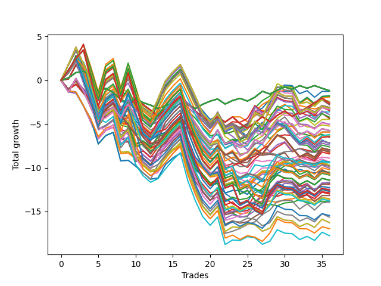

# Long HLT 604 
- Symbol: TSLA
- Date Range: 05/16/2022 - 05/17/2024
- Trading Period: 8:30-12:30
- Number of Trades: 36



| Id. | Name | Win Percent | Profit | Avg Profit / Trade | Avg Time / Trade | Std |      | Name | Win Percent | Profit | Avg Profit / Trade | Avg Time / Trade | Std |
| --- | ---- | ----------- | ------ | ------------------ | ---------------- | --- | ---- | ---- | ----------- | ------ | ------------------ | ---------------- | --- |
| | Sorted By <br> Profit | | | | | | | Sorted By <br> Win Percentage |||||
|0| TP-0.25 180m | 52.78 | -1.18 | -0.03 | 03:55 | 0.54 |     | TP-1.75 60m | 58.33 | -1.79 | -0.05 | 39:38 | 1.34 |
|1| TP-0.25 165m | 52.78 | -1.18 | -0.03 | 03:55 | 0.54 |     | TP-1.5 60m | 58.33 | -1.91 | -0.05 | 37:00 | 1.24 |
|2| TP-0.25 150m | 52.78 | -1.18 | -0.03 | 03:55 | 0.54 |     | TP-2 60m | 58.33 | -6.44 | -0.18 | 42:58 | 1.38 |
|3| TP-0.25 135m | 52.78 | -1.18 | -0.03 | 03:55 | 0.54 |     | TP-2.25 60m | 58.33 | -11.66 | -0.32 | 44:55 | 1.41 |
|4| TP-0.25 120m | 52.78 | -1.18 | -0.03 | 03:55 | 0.54 |     | TP-2.5 60m | 58.33 | -11.81 | -0.33 | 45:21 | 1.44 |
|5| TP-0.25 105m | 52.78 | -1.18 | -0.03 | 03:55 | 0.54 |     | TP-2.75 60m | 58.33 | -12.43 | -0.35 | 45:46 | 1.47 |
|6| TP-0.25 90m | 52.78 | -1.18 | -0.03 | 03:55 | 0.54 |     | TP-3 60m | 58.33 | -13.93 | -0.39 | 47:40 | 1.54 |
|7| TP-0.25 75m | 52.78 | -1.18 | -0.03 | 03:55 | 0.54 |     | TP-1.75 45m | 55.56 | -1.26 | -0.04 | 32:38 | 1.21 |
|8| TP-0.25 60m | 52.78 | -1.18 | -0.03 | 03:55 | 0.54 |     | TP-1.25 60m | 55.56 | -1.75 | -0.05 | 33:08 | 1.17 |
|9| TP-0.25 45m | 52.78 | -1.18 | -0.03 | 03:55 | 0.54 |     | TP-1.5 45m | 55.56 | -3.61 | -0.10 | 30:41 | 1.16 |
|10| TP-0.25 30m | 52.78 | -1.18 | -0.03 | 03:55 | 0.54 |     | TP-2 45m | 55.56 | -5.92 | -0.16 | 35:06 | 1.28 |
|11| TP-0.25 15m | 52.78 | -1.18 | -0.03 | 03:55 | 0.54 |     | TP-2.25 45m | 55.56 | -10.49 | -0.29 | 36:08 | 1.31 |
|12| TP-1.75 45m | 55.56 | -1.26 | -0.04 | 32:38 | 1.21 |     | TP-2.5 45m | 55.56 | -11.88 | -0.33 | 36:23 | 1.37 |
|13| TP-1.25 60m | 55.56 | -1.75 | -0.05 | 33:08 | 1.17 |     | TP-2.75 45m | 55.56 | -12.50 | -0.35 | 36:48 | 1.40 |
|14| TP-1.75 60m | 58.33 | -1.79 | -0.05 | 39:38 | 1.34 |     | TP-3 45m | 55.56 | -13.18 | -0.37 | 38:26 | 1.44 |
|15| TP-1.5 60m | 58.33 | -1.91 | -0.05 | 37:00 | 1.24 |     | TP-0.25 180m | 52.78 | -1.18 | -0.03 | 03:55 | 0.54 |
|16| TP-1.75 105m | 47.22 | -2.42 | -0.07 | 48:25 | 1.46 |     | TP-0.25 165m | 52.78 | -1.18 | -0.03 | 03:55 | 0.54 |
|17| TP-1.5 105m | 47.22 | -2.42 | -0.07 | 44:56 | 1.34 |     | TP-0.25 150m | 52.78 | -1.18 | -0.03 | 03:55 | 0.54 |
|18| TP-0.5 180m | 50.00 | -2.61 | -0.07 | 10:10 | 0.73 |     | TP-0.25 135m | 52.78 | -1.18 | -0.03 | 03:55 | 0.54 |
|19| TP-0.5 165m | 50.00 | -2.61 | -0.07 | 10:10 | 0.73 |     | TP-0.25 120m | 52.78 | -1.18 | -0.03 | 03:55 | 0.54 |
|20| TP-0.5 150m | 50.00 | -2.61 | -0.07 | 10:10 | 0.73 |     | TP-0.25 105m | 52.78 | -1.18 | -0.03 | 03:55 | 0.54 |
|21| TP-0.5 135m | 50.00 | -2.61 | -0.07 | 10:10 | 0.73 |     | TP-0.25 90m | 52.78 | -1.18 | -0.03 | 03:55 | 0.54 |
|22| TP-0.5 120m | 50.00 | -2.61 | -0.07 | 10:10 | 0.73 |     | TP-0.25 75m | 52.78 | -1.18 | -0.03 | 03:55 | 0.54 |
|23| TP-0.5 105m | 50.00 | -2.61 | -0.07 | 10:10 | 0.73 |     | TP-0.25 60m | 52.78 | -1.18 | -0.03 | 03:55 | 0.54 |
|24| TP-0.5 90m | 50.00 | -2.61 | -0.07 | 10:10 | 0.73 |     | TP-0.25 45m | 52.78 | -1.18 | -0.03 | 03:55 | 0.54 |
|25| TP-0.5 75m | 50.00 | -2.61 | -0.07 | 10:10 | 0.73 |     | TP-0.25 30m | 52.78 | -1.18 | -0.03 | 03:55 | 0.54 |
|26| TP-0.5 60m | 50.00 | -2.61 | -0.07 | 10:10 | 0.73 |     | TP-0.25 15m | 52.78 | -1.18 | -0.03 | 03:55 | 0.54 |
|27| TP-0.5 45m | 50.00 | -2.80 | -0.08 | 09:46 | 0.73 |     | TP-1.25 45m | 52.78 | -4.47 | -0.12 | 28:26 | 1.07 |
|28| TP-1.5 180m | 47.22 | -3.10 | -0.09 | 45:20 | 1.37 |     | TP-0.5 180m | 50.00 | -2.61 | -0.07 | 10:10 | 0.73 |
|29| TP-1.5 165m | 47.22 | -3.10 | -0.09 | 45:20 | 1.37 |     | TP-0.5 165m | 50.00 | -2.61 | -0.07 | 10:10 | 0.73 |
|30| TP-1.5 150m | 47.22 | -3.10 | -0.09 | 45:20 | 1.37 |     | TP-0.5 150m | 50.00 | -2.61 | -0.07 | 10:10 | 0.73 |
|31| TP-1.5 135m | 47.22 | -3.10 | -0.09 | 45:20 | 1.37 |     | TP-0.5 135m | 50.00 | -2.61 | -0.07 | 10:10 | 0.73 |
|32| TP-1.5 120m | 47.22 | -3.10 | -0.09 | 45:20 | 1.37 |     | TP-0.5 120m | 50.00 | -2.61 | -0.07 | 10:10 | 0.73 |
|33| TP-1.75 180m | 47.22 | -3.18 | -0.09 | 48:50 | 1.49 |     | TP-0.5 105m | 50.00 | -2.61 | -0.07 | 10:10 | 0.73 |
|34| TP-1.75 165m | 47.22 | -3.18 | -0.09 | 48:50 | 1.49 |     | TP-0.5 90m | 50.00 | -2.61 | -0.07 | 10:10 | 0.73 |
|35| TP-1.75 150m | 47.22 | -3.18 | -0.09 | 48:50 | 1.49 |     | TP-0.5 75m | 50.00 | -2.61 | -0.07 | 10:10 | 0.73 |
|36| TP-1.75 135m | 47.22 | -3.18 | -0.09 | 48:50 | 1.49 |     | TP-0.5 60m | 50.00 | -2.61 | -0.07 | 10:10 | 0.73 |
|37| TP-1.75 120m | 47.22 | -3.18 | -0.09 | 48:50 | 1.49 |     | TP-0.5 45m | 50.00 | -2.80 | -0.08 | 09:46 | 0.73 |
|38| TP-1.75 90m | 44.44 | -3.33 | -0.09 | 47:13 | 1.43 |     | TP-1.75 30m | 50.00 | -5.22 | -0.15 | 23:58 | 1.09 |
|39| TP-1.5 90m | 44.44 | -3.33 | -0.09 | 43:45 | 1.31 |     | TP-1 45m | 50.00 | -5.90 | -0.16 | 23:31 | 0.98 |
|40| TP-0.5 15m | 47.22 | -3.36 | -0.09 | 07:18 | 0.70 |     | TP-1 60m | 50.00 | -6.22 | -0.17 | 26:41 | 1.01 |
|41| TP-1.5 75m | 47.22 | -3.46 | -0.10 | 41:23 | 1.30 |     | TP-1 15m | 50.00 | -8.26 | -0.23 | 11:08 | 0.82 |
|42| TP-1.5 45m | 55.56 | -3.61 | -0.10 | 30:41 | 1.16 |     | TP-2 30m | 50.00 | -9.43 | -0.26 | 25:40 | 1.18 |
|43| TP-1.75 75m | 47.22 | -3.91 | -0.11 | 44:30 | 1.37 |     | TP-2.25 30m | 50.00 | -12.26 | -0.34 | 26:05 | 1.23 |
|44| TP-1.25 75m | 44.44 | -4.21 | -0.12 | 36:25 | 1.19 |     | TP-3 30m | 50.00 | -12.85 | -0.36 | 27:21 | 1.27 |
|45| TP-0.5 30m | 44.44 | -4.36 | -0.12 | 08:55 | 0.71 |     | TP-2.5 30m | 50.00 | -13.53 | -0.38 | 26:18 | 1.30 |
|46| TP-1.25 45m | 52.78 | -4.47 | -0.12 | 28:26 | 1.07 |     | TP-2.75 30m | 50.00 | -13.92 | -0.39 | 26:31 | 1.31 |
|47| TP-1.25 90m | 41.67 | -5.01 | -0.14 | 38:10 | 1.17 |     | TP-1.75 105m | 47.22 | -2.42 | -0.07 | 48:25 | 1.46 |
|48| TP-1.25 105m | 44.44 | -5.06 | -0.14 | 39:01 | 1.18 |     | TP-1.5 105m | 47.22 | -2.42 | -0.07 | 44:56 | 1.34 |
|49| TP-1.75 30m | 50.00 | -5.22 | -0.15 | 23:58 | 1.09 |     | TP-1.5 180m | 47.22 | -3.10 | -0.09 | 45:20 | 1.37 |
|50| TP-1.25 180m | 44.44 | -5.74 | -0.16 | 39:25 | 1.21 |     | TP-1.5 165m | 47.22 | -3.10 | -0.09 | 45:20 | 1.37 |
|51| TP-1.25 165m | 44.44 | -5.74 | -0.16 | 39:25 | 1.21 |     | TP-1.5 150m | 47.22 | -3.10 | -0.09 | 45:20 | 1.37 |
|52| TP-1.25 150m | 44.44 | -5.74 | -0.16 | 39:25 | 1.21 |     | TP-1.5 135m | 47.22 | -3.10 | -0.09 | 45:20 | 1.37 |
|53| TP-1.25 135m | 44.44 | -5.74 | -0.16 | 39:25 | 1.21 |     | TP-1.5 120m | 47.22 | -3.10 | -0.09 | 45:20 | 1.37 |
|54| TP-1.25 120m | 44.44 | -5.74 | -0.16 | 39:25 | 1.21 |     | TP-1.75 180m | 47.22 | -3.18 | -0.09 | 48:50 | 1.49 |
|55| TP-1 45m | 50.00 | -5.90 | -0.16 | 23:31 | 0.98 |     | TP-1.75 165m | 47.22 | -3.18 | -0.09 | 48:50 | 1.49 |
|56| TP-2 45m | 55.56 | -5.92 | -0.16 | 35:06 | 1.28 |     | TP-1.75 150m | 47.22 | -3.18 | -0.09 | 48:50 | 1.49 |
|57| TP-1 60m | 50.00 | -6.22 | -0.17 | 26:41 | 1.01 |     | TP-1.75 135m | 47.22 | -3.18 | -0.09 | 48:50 | 1.49 |
|58| TP-0.75 60m | 47.22 | -6.29 | -0.17 | 20:16 | 0.89 |     | TP-1.75 120m | 47.22 | -3.18 | -0.09 | 48:50 | 1.49 |
|59| TP-0.75 45m | 47.22 | -6.33 | -0.18 | 18:16 | 0.88 |     | TP-0.5 15m | 47.22 | -3.36 | -0.09 | 07:18 | 0.70 |
|60| TP-2 60m | 58.33 | -6.44 | -0.18 | 42:58 | 1.38 |     | TP-1.5 75m | 47.22 | -3.46 | -0.10 | 41:23 | 1.30 |
|61| TP-0.75 15m | 47.22 | -6.51 | -0.18 | 10:05 | 0.78 |     | TP-1.75 75m | 47.22 | -3.91 | -0.11 | 44:30 | 1.37 |
|62| TP-0.75 180m | 41.67 | -7.16 | -0.20 | 23:10 | 0.88 |     | TP-0.75 60m | 47.22 | -6.29 | -0.17 | 20:16 | 0.89 |
|63| TP-0.75 165m | 41.67 | -7.16 | -0.20 | 23:10 | 0.88 |     | TP-0.75 45m | 47.22 | -6.33 | -0.18 | 18:16 | 0.88 |
|64| TP-0.75 150m | 41.67 | -7.16 | -0.20 | 23:10 | 0.88 |     | TP-0.75 15m | 47.22 | -6.51 | -0.18 | 10:05 | 0.78 |
|65| TP-0.75 135m | 41.67 | -7.16 | -0.20 | 23:10 | 0.88 |     | TP-1.5 30m | 47.22 | -8.06 | -0.22 | 22:56 | 1.05 |
|66| TP-0.75 120m | 41.67 | -7.16 | -0.20 | 23:10 | 0.88 |     | TP-1.75 15m | 47.22 | -9.35 | -0.26 | 13:03 | 0.87 |
|67| TP-0.75 75m | 41.67 | -7.23 | -0.20 | 21:41 | 0.89 |     | TP-2.25 15m | 47.22 | -9.69 | -0.27 | 13:30 | 0.92 |
|68| TP-0.75 105m | 41.67 | -7.40 | -0.21 | 23:00 | 0.88 |     | TP-2 15m | 47.22 | -9.69 | -0.27 | 13:30 | 0.92 |
|69| TP-0.75 90m | 38.89 | -7.62 | -0.21 | 22:35 | 0.88 |     | TP-1.5 15m | 47.22 | -9.81 | -0.27 | 12:55 | 0.89 |
|70| TP-1 180m | 41.67 | -7.95 | -0.22 | 30:21 | 1.00 |     | TP-3 15m | 47.22 | -9.85 | -0.27 | 13:55 | 0.94 |
|71| TP-1 165m | 41.67 | -7.95 | -0.22 | 30:21 | 1.00 |     | TP-1.25 15m | 47.22 | -10.05 | -0.28 | 12:31 | 0.86 |
|72| TP-1 150m | 41.67 | -7.95 | -0.22 | 30:21 | 1.00 |     | TP-2.5 105m | 47.22 | -10.21 | -0.28 | 61:38 | 1.64 |
|73| TP-1 135m | 41.67 | -7.95 | -0.22 | 30:21 | 1.00 |     | TP-2.75 15m | 47.22 | -10.69 | -0.30 | 13:38 | 0.99 |
|74| TP-1 120m | 41.67 | -7.95 | -0.22 | 30:21 | 1.00 |     | TP-2.5 15m | 47.22 | -10.69 | -0.30 | 13:38 | 0.99 |
|75| TP-1.5 30m | 47.22 | -8.06 | -0.22 | 22:56 | 1.05 |     | TP-2.5 180m | 47.22 | -10.72 | -0.30 | 64:20 | 1.71 |
|76| TP-0.75 30m | 38.89 | -8.07 | -0.22 | 14:58 | 0.83 |     | TP-2.5 165m | 47.22 | -10.72 | -0.30 | 64:20 | 1.71 |
|77| TP-1 105m | 41.67 | -8.19 | -0.23 | 30:11 | 1.00 |     | TP-2.5 150m | 47.22 | -10.72 | -0.30 | 64:20 | 1.71 |
|78| TP-1 15m | 50.00 | -8.26 | -0.23 | 11:08 | 0.82 |     | TP-2.5 135m | 47.22 | -10.72 | -0.30 | 64:20 | 1.71 |
|79| TP-1 75m | 41.67 | -8.28 | -0.23 | 28:51 | 1.00 |     | TP-2.5 120m | 47.22 | -10.72 | -0.30 | 64:20 | 1.71 |
|80| TP-1 90m | 38.89 | -8.41 | -0.23 | 29:46 | 0.99 |     | TP-2.75 105m | 47.22 | -10.84 | -0.30 | 62:25 | 1.70 |
|81| TP-1.25 30m | 44.44 | -8.89 | -0.25 | 21:28 | 0.98 |     | TP-2.75 180m | 47.22 | -11.42 | -0.32 | 65:08 | 1.77 |
|82| TP-1 30m | 38.89 | -9.32 | -0.26 | 18:11 | 0.87 |     | TP-2.75 165m | 47.22 | -11.42 | -0.32 | 65:08 | 1.77 |
|83| TP-1.75 15m | 47.22 | -9.35 | -0.26 | 13:03 | 0.87 |     | TP-2.75 150m | 47.22 | -11.42 | -0.32 | 65:08 | 1.77 |
|84| TP-2 105m | 44.44 | -9.38 | -0.26 | 55:38 | 1.47 |     | TP-2.75 135m | 47.22 | -11.42 | -0.32 | 65:08 | 1.77 |
|85| TP-2 30m | 50.00 | -9.43 | -0.26 | 25:40 | 1.18 |     | TP-2.75 120m | 47.22 | -11.42 | -0.32 | 65:08 | 1.77 |
|86| TP-2.25 15m | 47.22 | -9.69 | -0.27 | 13:30 | 0.92 |     | TP-3 180m | 47.22 | -12.55 | -0.35 | 67:23 | 1.85 |
|87| TP-2 15m | 47.22 | -9.69 | -0.27 | 13:30 | 0.92 |     | TP-3 165m | 47.22 | -12.55 | -0.35 | 67:23 | 1.85 |
|88| TP-1.5 15m | 47.22 | -9.81 | -0.27 | 12:55 | 0.89 |     | TP-3 150m | 47.22 | -12.55 | -0.35 | 67:23 | 1.85 |
|89| TP-2 90m | 41.67 | -9.84 | -0.27 | 53:08 | 1.44 |     | TP-3 135m | 47.22 | -12.55 | -0.35 | 67:23 | 1.85 |
|90| TP-3 15m | 47.22 | -9.85 | -0.27 | 13:55 | 0.94 |     | TP-3 120m | 47.22 | -12.55 | -0.35 | 67:23 | 1.85 |
|91| TP-1.25 15m | 47.22 | -10.05 | -0.28 | 12:31 | 0.86 |     | TP-3 105m | 47.22 | -13.00 | -0.36 | 64:30 | 1.73 |
|92| TP-2.5 105m | 47.22 | -10.21 | -0.28 | 61:38 | 1.64 |     | TP-1.75 90m | 44.44 | -3.33 | -0.09 | 47:13 | 1.43 |
|93| TP-2.25 45m | 55.56 | -10.49 | -0.29 | 36:08 | 1.31 |     | TP-1.5 90m | 44.44 | -3.33 | -0.09 | 43:45 | 1.31 |
|94| TP-2 75m | 44.44 | -10.62 | -0.30 | 49:20 | 1.35 |     | TP-1.25 75m | 44.44 | -4.21 | -0.12 | 36:25 | 1.19 |
|95| TP-2.75 15m | 47.22 | -10.69 | -0.30 | 13:38 | 0.99 |     | TP-0.5 30m | 44.44 | -4.36 | -0.12 | 08:55 | 0.71 |
|96| TP-2.5 15m | 47.22 | -10.69 | -0.30 | 13:38 | 0.99 |     | TP-1.25 105m | 44.44 | -5.06 | -0.14 | 39:01 | 1.18 |
|97| TP-2.5 180m | 47.22 | -10.72 | -0.30 | 64:20 | 1.71 |     | TP-1.25 180m | 44.44 | -5.74 | -0.16 | 39:25 | 1.21 |
|98| TP-2.5 165m | 47.22 | -10.72 | -0.30 | 64:20 | 1.71 |     | TP-1.25 165m | 44.44 | -5.74 | -0.16 | 39:25 | 1.21 |
|99| TP-2.5 150m | 47.22 | -10.72 | -0.30 | 64:20 | 1.71 |     | TP-1.25 150m | 44.44 | -5.74 | -0.16 | 39:25 | 1.21 |
|100| TP-2.5 135m | 47.22 | -10.72 | -0.30 | 64:20 | 1.71 |     | TP-1.25 135m | 44.44 | -5.74 | -0.16 | 39:25 | 1.21 |
|101| TP-2.5 120m | 47.22 | -10.72 | -0.30 | 64:20 | 1.71 |     | TP-1.25 120m | 44.44 | -5.74 | -0.16 | 39:25 | 1.21 |
|102| TP-2 180m | 44.44 | -10.72 | -0.30 | 57:15 | 1.52 |     | TP-1.25 30m | 44.44 | -8.89 | -0.25 | 21:28 | 0.98 |
|103| TP-2 165m | 44.44 | -10.72 | -0.30 | 57:15 | 1.52 |     | TP-2 105m | 44.44 | -9.38 | -0.26 | 55:38 | 1.47 |
|104| TP-2 150m | 44.44 | -10.72 | -0.30 | 57:15 | 1.52 |     | TP-2 75m | 44.44 | -10.62 | -0.30 | 49:20 | 1.35 |
|105| TP-2 135m | 44.44 | -10.72 | -0.30 | 57:15 | 1.52 |     | TP-2 180m | 44.44 | -10.72 | -0.30 | 57:15 | 1.52 |
|106| TP-2 120m | 44.44 | -10.72 | -0.30 | 57:15 | 1.52 |     | TP-2 165m | 44.44 | -10.72 | -0.30 | 57:15 | 1.52 |
|107| TP-2.75 105m | 47.22 | -10.84 | -0.30 | 62:25 | 1.70 |     | TP-2 150m | 44.44 | -10.72 | -0.30 | 57:15 | 1.52 |
|108| TP-2.75 180m | 47.22 | -11.42 | -0.32 | 65:08 | 1.77 |     | TP-2 135m | 44.44 | -10.72 | -0.30 | 57:15 | 1.52 |
|109| TP-2.75 165m | 47.22 | -11.42 | -0.32 | 65:08 | 1.77 |     | TP-2 120m | 44.44 | -10.72 | -0.30 | 57:15 | 1.52 |
|110| TP-2.75 150m | 47.22 | -11.42 | -0.32 | 65:08 | 1.77 |     | TP-2.25 105m | 44.44 | -12.62 | -0.35 | 59:53 | 1.56 |
|111| TP-2.75 135m | 47.22 | -11.42 | -0.32 | 65:08 | 1.77 |     | TP-2.25 180m | 44.44 | -12.69 | -0.35 | 62:03 | 1.65 |
|112| TP-2.75 120m | 47.22 | -11.42 | -0.32 | 65:08 | 1.77 |     | TP-2.25 165m | 44.44 | -12.69 | -0.35 | 62:03 | 1.65 |
|113| TP-2.25 60m | 58.33 | -11.66 | -0.32 | 44:55 | 1.41 |     | TP-2.25 150m | 44.44 | -12.69 | -0.35 | 62:03 | 1.65 |
|114| TP-2.5 60m | 58.33 | -11.81 | -0.33 | 45:21 | 1.44 |     | TP-2.25 135m | 44.44 | -12.69 | -0.35 | 62:03 | 1.65 |
|115| TP-2.5 45m | 55.56 | -11.88 | -0.33 | 36:23 | 1.37 |     | TP-2.25 120m | 44.44 | -12.69 | -0.35 | 62:03 | 1.65 |
|116| TP-2.25 30m | 50.00 | -12.26 | -0.34 | 26:05 | 1.23 |     | TP-1.25 90m | 41.67 | -5.01 | -0.14 | 38:10 | 1.17 |
|117| TP-2.75 60m | 58.33 | -12.43 | -0.35 | 45:46 | 1.47 |     | TP-0.75 180m | 41.67 | -7.16 | -0.20 | 23:10 | 0.88 |
|118| TP-2.75 45m | 55.56 | -12.50 | -0.35 | 36:48 | 1.40 |     | TP-0.75 165m | 41.67 | -7.16 | -0.20 | 23:10 | 0.88 |
|119| TP-3 180m | 47.22 | -12.55 | -0.35 | 67:23 | 1.85 |     | TP-0.75 150m | 41.67 | -7.16 | -0.20 | 23:10 | 0.88 |
|120| TP-3 165m | 47.22 | -12.55 | -0.35 | 67:23 | 1.85 |     | TP-0.75 135m | 41.67 | -7.16 | -0.20 | 23:10 | 0.88 |
|121| TP-3 150m | 47.22 | -12.55 | -0.35 | 67:23 | 1.85 |     | TP-0.75 120m | 41.67 | -7.16 | -0.20 | 23:10 | 0.88 |
|122| TP-3 135m | 47.22 | -12.55 | -0.35 | 67:23 | 1.85 |     | TP-0.75 75m | 41.67 | -7.23 | -0.20 | 21:41 | 0.89 |
|123| TP-3 120m | 47.22 | -12.55 | -0.35 | 67:23 | 1.85 |     | TP-0.75 105m | 41.67 | -7.40 | -0.21 | 23:00 | 0.88 |
|124| TP-2.25 105m | 44.44 | -12.62 | -0.35 | 59:53 | 1.56 |     | TP-1 180m | 41.67 | -7.95 | -0.22 | 30:21 | 1.00 |
|125| TP-2.25 180m | 44.44 | -12.69 | -0.35 | 62:03 | 1.65 |     | TP-1 165m | 41.67 | -7.95 | -0.22 | 30:21 | 1.00 |
|126| TP-2.25 165m | 44.44 | -12.69 | -0.35 | 62:03 | 1.65 |     | TP-1 150m | 41.67 | -7.95 | -0.22 | 30:21 | 1.00 |
|127| TP-2.25 150m | 44.44 | -12.69 | -0.35 | 62:03 | 1.65 |     | TP-1 135m | 41.67 | -7.95 | -0.22 | 30:21 | 1.00 |
|128| TP-2.25 135m | 44.44 | -12.69 | -0.35 | 62:03 | 1.65 |     | TP-1 120m | 41.67 | -7.95 | -0.22 | 30:21 | 1.00 |
|129| TP-2.25 120m | 44.44 | -12.69 | -0.35 | 62:03 | 1.65 |     | TP-1 105m | 41.67 | -8.19 | -0.23 | 30:11 | 1.00 |
|130| TP-3 30m | 50.00 | -12.85 | -0.36 | 27:21 | 1.27 |     | TP-1 75m | 41.67 | -8.28 | -0.23 | 28:51 | 1.00 |
|131| TP-3 105m | 47.22 | -13.00 | -0.36 | 64:30 | 1.73 |     | TP-2 90m | 41.67 | -9.84 | -0.27 | 53:08 | 1.44 |
|132| TP-3 45m | 55.56 | -13.18 | -0.37 | 38:26 | 1.44 |     | TP-2.25 90m | 41.67 | -13.63 | -0.38 | 56:46 | 1.49 |
|133| TP-2.5 30m | 50.00 | -13.53 | -0.38 | 26:18 | 1.30 |     | TP-2.5 90m | 41.67 | -13.79 | -0.38 | 58:06 | 1.54 |
|134| TP-2.25 90m | 41.67 | -13.63 | -0.38 | 56:46 | 1.49 |     | TP-2.75 90m | 41.67 | -15.46 | -0.43 | 58:40 | 1.55 |
|135| TP-2.5 90m | 41.67 | -13.79 | -0.38 | 58:06 | 1.54 |     | TP-2.5 75m | 41.67 | -15.65 | -0.43 | 53:00 | 1.37 |
|136| TP-2.75 30m | 50.00 | -13.92 | -0.39 | 26:31 | 1.31 |     | TP-2.75 75m | 41.67 | -16.27 | -0.45 | 53:25 | 1.40 |
|137| TP-3 60m | 58.33 | -13.93 | -0.39 | 47:40 | 1.54 |     | TP-2.25 75m | 41.67 | -16.29 | -0.45 | 52:08 | 1.35 |
|138| TP-2.75 90m | 41.67 | -15.46 | -0.43 | 58:40 | 1.55 |     | TP-3 90m | 41.67 | -16.96 | -0.47 | 60:33 | 1.62 |
|139| TP-2.5 75m | 41.67 | -15.65 | -0.43 | 53:00 | 1.37 |     | TP-3 75m | 41.67 | -17.77 | -0.49 | 55:18 | 1.47 |
|140| TP-2.75 75m | 41.67 | -16.27 | -0.45 | 53:25 | 1.40 |     | TP-0.75 90m | 38.89 | -7.62 | -0.21 | 22:35 | 0.88 |
|141| TP-2.25 75m | 41.67 | -16.29 | -0.45 | 52:08 | 1.35 |     | TP-0.75 30m | 38.89 | -8.07 | -0.22 | 14:58 | 0.83 |
|142| TP-3 90m | 41.67 | -16.96 | -0.47 | 60:33 | 1.62 |     | TP-1 90m | 38.89 | -8.41 | -0.23 | 29:46 | 0.99 |
|143| TP-3 75m | 41.67 | -17.77 | -0.49 | 55:18 | 1.47 |     | TP-1 30m | 38.89 | -9.32 | -0.26 | 18:11 | 0.87 |

### Test TP-0.25 15m
* Take Profit of 0.25 Point
* 0.25 Stoploss
* Results:
```
Total Trades: 36
Percent Up: 52.78
Percent Down: 47.22
Total Points Moved Up: -1.18
Potential Profit: -590.00
Total Points Ups: 7.72 Count Ups: 19
Total Points Downs: -8.90 Count Downs: 17
```

<details><summary>Trades</summary>

<code>In: 2022-06-16 11:40:00		Out: 2022-06-16 11:42:00		Total Position Time: 02:00		Total Move Up: 0.28		Total to Date: 0.28</code> <br />
<code>In: 2022-06-16 12:00:00		Out: 2022-06-16 12:02:00		Total Position Time: 02:00		Total Move Up: 0.61		Total to Date: 0.89</code> <br />
<code>In: 2022-06-23 09:50:00		Out: 2022-06-23 09:54:00		Total Position Time: 04:00		Total Move Up: 0.15		Total to Date: 1.04</code> <br />
<code>In: 2022-06-28 08:35:00		Out: 2022-06-28 08:37:00		Total Position Time: 02:00		Total Move Up: -0.48		Total to Date: 0.56</code> <br />
<code>In: 2022-08-05 08:55:00		Out: 2022-08-05 08:57:00		Total Position Time: 02:00		Total Move Up: -1.88		Total to Date: -1.32</code> <br />
<code>In: 2022-08-30 10:35:00		Out: 2022-08-30 10:39:00		Total Position Time: 04:00		Total Move Up: 0.42		Total to Date: -0.90</code> <br />
<code>In: 2022-10-11 12:25:00		Out: 2022-10-11 12:29:00		Total Position Time: 04:00		Total Move Up: -0.49		Total to Date: -1.39</code> <br />
<code>In: 2022-11-02 12:10:00		Out: 2022-11-02 12:12:00		Total Position Time: 02:00		Total Move Up: -0.79		Total to Date: -2.18</code> <br />
<code>In: 2022-11-04 10:20:00		Out: 2022-11-04 10:22:00		Total Position Time: 02:00		Total Move Up: -0.45		Total to Date: -2.63</code> <br />
<code>In: 2022-11-09 08:45:00		Out: 2022-11-09 08:48:00		Total Position Time: 03:00		Total Move Up: 0.60		Total to Date: -2.03</code> <br />
<code>In: 2023-03-09 11:00:00		Out: 2023-03-09 11:02:00		Total Position Time: 02:00		Total Move Up: -0.52		Total to Date: -2.55</code> <br />
<code>In: 2023-03-09 12:35:00		Out: 2023-03-09 12:37:00		Total Position Time: 02:00		Total Move Up: -0.28		Total to Date: -2.83</code> <br />
<code>In: 2023-03-17 08:35:00		Out: 2023-03-17 08:40:00		Total Position Time: 05:00		Total Move Up: -0.40		Total to Date: -3.23</code> <br />
<code>In: 2023-03-24 08:40:00		Out: 2023-03-24 08:43:00		Total Position Time: 03:00		Total Move Up: 0.32		Total to Date: -2.91</code> <br />
<code>In: 2023-04-20 12:25:00		Out: 2023-04-20 12:27:00		Total Position Time: 02:00		Total Move Up: 0.34		Total to Date: -2.57</code> <br />
<code>In: 2023-04-20 12:30:00		Out: 2023-04-20 12:32:00		Total Position Time: 02:00		Total Move Up: 0.63		Total to Date: -1.94</code> <br />
<code>In: 2023-06-26 08:35:00		Out: 2023-06-26 08:42:00		Total Position Time: 07:00		Total Move Up: -0.84		Total to Date: -2.78</code> <br />
<code>In: 2023-07-07 12:20:00		Out: 2023-07-07 12:24:00		Total Position Time: 04:00		Total Move Up: -0.45		Total to Date: -3.23</code> <br />
<code>In: 2023-08-04 11:50:00		Out: 2023-08-04 11:52:00		Total Position Time: 02:00		Total Move Up: 0.49		Total to Date: -2.74</code> <br />
<code>In: 2023-08-16 12:30:00		Out: 2023-08-16 12:33:00		Total Position Time: 03:00		Total Move Up: 0.36		Total to Date: -2.38</code> <br />
<code>In: 2023-09-01 11:40:00		Out: 2023-09-01 11:43:00		Total Position Time: 03:00		Total Move Up: 0.25		Total to Date: -2.13</code> <br />
<code>In: 2023-09-27 09:35:00		Out: 2023-09-27 09:38:00		Total Position Time: 03:00		Total Move Up: -0.58		Total to Date: -2.71</code> <br />
<code>In: 2023-10-12 11:25:00		Out: 2023-10-12 11:28:00		Total Position Time: 03:00		Total Move Up: 0.40		Total to Date: -2.31</code> <br />
<code>In: 2023-10-13 08:35:00		Out: 2023-10-13 08:38:00		Total Position Time: 03:00		Total Move Up: 0.25		Total to Date: -2.06</code> <br />
<code>In: 2023-10-19 12:05:00		Out: 2023-10-19 12:13:00		Total Position Time: 08:00		Total Move Up: -0.31		Total to Date: -2.37</code> <br />
<code>In: 2023-10-25 10:55:00		Out: 2023-10-25 10:57:00		Total Position Time: 02:00		Total Move Up: 0.44		Total to Date: -1.93</code> <br />
<code>In: 2023-10-27 11:35:00		Out: 2023-10-27 11:37:00		Total Position Time: 02:00		Total Move Up: 0.68		Total to Date: -1.25</code> <br />
<code>In: 2023-11-16 11:00:00		Out: 2023-11-16 11:06:00		Total Position Time: 06:00		Total Move Up: -0.31		Total to Date: -1.56</code> <br />
<code>In: 2023-12-13 08:35:00		Out: 2023-12-13 08:37:00		Total Position Time: 02:00		Total Move Up: 0.43		Total to Date: -1.13</code> <br />
<code>In: 2023-12-22 11:45:00		Out: 2023-12-22 11:53:00		Total Position Time: 08:00		Total Move Up: 0.36		Total to Date: -0.77</code> <br />
<code>In: 2023-12-28 12:05:00		Out: 2023-12-28 12:10:00		Total Position Time: 05:00		Total Move Up: -0.25		Total to Date: -1.02</code> <br />
<code>In: 2024-01-24 11:35:00		Out: 2024-01-24 11:40:00		Total Position Time: 05:00		Total Move Up: 0.41		Total to Date: -0.61</code> <br />
<code>In: 2024-01-26 11:00:00		Out: 2024-01-26 11:13:00		Total Position Time: 13:00		Total Move Up: -0.29		Total to Date: -0.90</code> <br />
<code>In: 2024-03-13 11:45:00		Out: 2024-03-13 11:53:00		Total Position Time: 08:00		Total Move Up: 0.30		Total to Date: -0.60</code> <br />
<code>In: 2024-03-21 11:20:00		Out: 2024-03-21 11:25:00		Total Position Time: 05:00		Total Move Up: -0.31		Total to Date: -0.91</code> <br />
<code>In: 2024-05-07 11:30:00		Out: 2024-05-07 11:36:00		Total Position Time: 06:00		Total Move Up: -0.27		Total to Date: -1.18</code> <br />


</details>

### Test TP-0.5 15m
* Take Profit of 0.5 Point
* 0.5 Stoploss
* Results:
```
Total Trades: 36
Percent Up: 47.22
Percent Down: 52.78
Total Points Moved Up: -3.36
Potential Profit: -1680.00
Total Points Ups: 9.81 Count Ups: 17
Total Points Downs: -13.17 Count Downs: 19
```

<details><summary>Trades</summary>

<code>In: 2022-06-16 11:40:00		Out: 2022-06-16 11:49:00		Total Position Time: 09:00		Total Move Up: -1.05		Total to Date: -1.05</code> <br />
<code>In: 2022-06-16 12:00:00		Out: 2022-06-16 12:02:00		Total Position Time: 02:00		Total Move Up: 0.61		Total to Date: -0.44</code> <br />
<code>In: 2022-06-23 09:50:00		Out: 2022-06-23 10:01:00		Total Position Time: 11:00		Total Move Up: -1.01		Total to Date: -1.45</code> <br />
<code>In: 2022-06-28 08:35:00		Out: 2022-06-28 08:39:00		Total Position Time: 04:00		Total Move Up: -0.62		Total to Date: -2.07</code> <br />
<code>In: 2022-08-05 08:55:00		Out: 2022-08-05 08:57:00		Total Position Time: 02:00		Total Move Up: -1.88		Total to Date: -3.95</code> <br />
<code>In: 2022-08-30 10:35:00		Out: 2022-08-30 10:48:00		Total Position Time: 13:00		Total Move Up: 0.61		Total to Date: -3.34</code> <br />
<code>In: 2022-10-11 12:25:00		Out: 2022-10-11 12:37:00		Total Position Time: 12:00		Total Move Up: 0.76		Total to Date: -2.58</code> <br />
<code>In: 2022-11-02 12:10:00		Out: 2022-11-02 12:12:00		Total Position Time: 02:00		Total Move Up: -0.79		Total to Date: -3.37</code> <br />
<code>In: 2022-11-04 10:20:00		Out: 2022-11-04 10:27:00		Total Position Time: 07:00		Total Move Up: 0.52		Total to Date: -2.85</code> <br />
<code>In: 2022-11-09 08:45:00		Out: 2022-11-09 08:48:00		Total Position Time: 03:00		Total Move Up: 0.60		Total to Date: -2.25</code> <br />
<code>In: 2023-03-09 11:00:00		Out: 2023-03-09 11:02:00		Total Position Time: 02:00		Total Move Up: -0.52		Total to Date: -2.77</code> <br />
<code>In: 2023-03-09 12:35:00		Out: 2023-03-09 12:41:00		Total Position Time: 06:00		Total Move Up: -0.63		Total to Date: -3.40</code> <br />
<code>In: 2023-03-17 08:35:00		Out: 2023-03-17 08:44:00		Total Position Time: 09:00		Total Move Up: -0.72		Total to Date: -4.12</code> <br />
<code>In: 2023-03-24 08:40:00		Out: 2023-03-24 08:46:00		Total Position Time: 06:00		Total Move Up: 0.85		Total to Date: -3.27</code> <br />
<code>In: 2023-04-20 12:25:00		Out: 2023-04-20 12:32:00		Total Position Time: 07:00		Total Move Up: 0.83		Total to Date: -2.44</code> <br />
<code>In: 2023-04-20 12:30:00		Out: 2023-04-20 12:32:00		Total Position Time: 02:00		Total Move Up: 0.63		Total to Date: -1.81</code> <br />
<code>In: 2023-06-26 08:35:00		Out: 2023-06-26 08:42:00		Total Position Time: 07:00		Total Move Up: -0.84		Total to Date: -2.65</code> <br />
<code>In: 2023-07-07 12:20:00		Out: 2023-07-07 12:28:00		Total Position Time: 08:00		Total Move Up: -0.86		Total to Date: -3.51</code> <br />
<code>In: 2023-08-04 11:50:00		Out: 2023-08-04 11:55:00		Total Position Time: 05:00		Total Move Up: -0.67		Total to Date: -4.18</code> <br />
<code>In: 2023-08-16 12:30:00		Out: 2023-08-16 12:41:00		Total Position Time: 11:00		Total Move Up: -0.52		Total to Date: -4.70</code> <br />
<code>In: 2023-09-01 11:40:00		Out: 2023-09-01 11:46:00		Total Position Time: 06:00		Total Move Up: 0.51		Total to Date: -4.19</code> <br />
<code>In: 2023-09-27 09:35:00		Out: 2023-09-27 09:38:00		Total Position Time: 03:00		Total Move Up: -0.58		Total to Date: -4.77</code> <br />
<code>In: 2023-10-12 11:25:00		Out: 2023-10-12 11:35:00		Total Position Time: 10:00		Total Move Up: 0.59		Total to Date: -4.18</code> <br />
<code>In: 2023-10-13 08:35:00		Out: 2023-10-13 08:49:00		Total Position Time: 14:00		Total Move Up: 0.00		Total to Date: -4.18</code> <br />
<code>In: 2023-10-19 12:05:00		Out: 2023-10-19 12:14:00		Total Position Time: 09:00		Total Move Up: -0.54		Total to Date: -4.72</code> <br />
<code>In: 2023-10-25 10:55:00		Out: 2023-10-25 10:58:00		Total Position Time: 03:00		Total Move Up: 0.64		Total to Date: -4.08</code> <br />
<code>In: 2023-10-27 11:35:00		Out: 2023-10-27 11:37:00		Total Position Time: 02:00		Total Move Up: 0.68		Total to Date: -3.40</code> <br />
<code>In: 2023-11-16 11:00:00		Out: 2023-11-16 11:07:00		Total Position Time: 07:00		Total Move Up: -0.57		Total to Date: -3.97</code> <br />
<code>In: 2023-12-13 08:35:00		Out: 2023-12-13 08:38:00		Total Position Time: 03:00		Total Move Up: 0.72		Total to Date: -3.25</code> <br />
<code>In: 2023-12-22 11:45:00		Out: 2023-12-22 11:54:00		Total Position Time: 09:00		Total Move Up: 0.51		Total to Date: -2.74</code> <br />
<code>In: 2023-12-28 12:05:00		Out: 2023-12-28 12:11:00		Total Position Time: 06:00		Total Move Up: -0.63		Total to Date: -3.37</code> <br />
<code>In: 2024-01-24 11:35:00		Out: 2024-01-24 11:42:00		Total Position Time: 07:00		Total Move Up: 0.50		Total to Date: -2.87</code> <br />
<code>In: 2024-01-26 11:00:00		Out: 2024-01-26 11:14:00		Total Position Time: 14:00		Total Move Up: -0.22		Total to Date: -3.09</code> <br />
<code>In: 2024-03-13 11:45:00		Out: 2024-03-13 11:59:00		Total Position Time: 14:00		Total Move Up: -0.18		Total to Date: -3.27</code> <br />
<code>In: 2024-03-21 11:20:00		Out: 2024-03-21 11:34:00		Total Position Time: 14:00		Total Move Up: 0.25		Total to Date: -3.02</code> <br />
<code>In: 2024-05-07 11:30:00		Out: 2024-05-07 11:44:00		Total Position Time: 14:00		Total Move Up: -0.34		Total to Date: -3.36</code> <br />


</details>

### Test TP-0.75 15m
* Take Profit of 0.75 Point
* 0.75 Stoploss
* Results:
```
Total Trades: 36
Percent Up: 47.22
Percent Down: 52.78
Total Points Moved Up: -6.51
Potential Profit: -3255.00
Total Points Ups: 9.51 Count Ups: 17
Total Points Downs: -16.02 Count Downs: 19
```

<details><summary>Trades</summary>

<code>In: 2022-06-16 11:40:00		Out: 2022-06-16 11:49:00		Total Position Time: 09:00		Total Move Up: -1.05		Total to Date: -1.05</code> <br />
<code>In: 2022-06-16 12:00:00		Out: 2022-06-16 12:04:00		Total Position Time: 04:00		Total Move Up: 1.04		Total to Date: -0.01</code> <br />
<code>In: 2022-06-23 09:50:00		Out: 2022-06-23 10:01:00		Total Position Time: 11:00		Total Move Up: -1.01		Total to Date: -1.02</code> <br />
<code>In: 2022-06-28 08:35:00		Out: 2022-06-28 08:40:00		Total Position Time: 05:00		Total Move Up: -1.12		Total to Date: -2.14</code> <br />
<code>In: 2022-08-05 08:55:00		Out: 2022-08-05 08:57:00		Total Position Time: 02:00		Total Move Up: -1.88		Total to Date: -4.02</code> <br />
<code>In: 2022-08-30 10:35:00		Out: 2022-08-30 10:49:00		Total Position Time: 14:00		Total Move Up: 0.96		Total to Date: -3.06</code> <br />
<code>In: 2022-10-11 12:25:00		Out: 2022-10-11 12:39:00		Total Position Time: 14:00		Total Move Up: 0.35		Total to Date: -2.71</code> <br />
<code>In: 2022-11-02 12:10:00		Out: 2022-11-02 12:12:00		Total Position Time: 02:00		Total Move Up: -0.79		Total to Date: -3.50</code> <br />
<code>In: 2022-11-04 10:20:00		Out: 2022-11-04 10:32:00		Total Position Time: 12:00		Total Move Up: 0.93		Total to Date: -2.57</code> <br />
<code>In: 2022-11-09 08:45:00		Out: 2022-11-09 08:59:00		Total Position Time: 14:00		Total Move Up: -0.67		Total to Date: -3.24</code> <br />
<code>In: 2023-03-09 11:00:00		Out: 2023-03-09 11:04:00		Total Position Time: 04:00		Total Move Up: -0.83		Total to Date: -4.07</code> <br />
<code>In: 2023-03-09 12:35:00		Out: 2023-03-09 12:42:00		Total Position Time: 07:00		Total Move Up: -0.90		Total to Date: -4.97</code> <br />
<code>In: 2023-03-17 08:35:00		Out: 2023-03-17 08:49:00		Total Position Time: 14:00		Total Move Up: 0.12		Total to Date: -4.85</code> <br />
<code>In: 2023-03-24 08:40:00		Out: 2023-03-24 08:46:00		Total Position Time: 06:00		Total Move Up: 0.85		Total to Date: -4.00</code> <br />
<code>In: 2023-04-20 12:25:00		Out: 2023-04-20 12:32:00		Total Position Time: 07:00		Total Move Up: 0.83		Total to Date: -3.17</code> <br />
<code>In: 2023-04-20 12:30:00		Out: 2023-04-20 12:44:00		Total Position Time: 14:00		Total Move Up: 0.54		Total to Date: -2.63</code> <br />
<code>In: 2023-06-26 08:35:00		Out: 2023-06-26 08:42:00		Total Position Time: 07:00		Total Move Up: -0.84		Total to Date: -3.47</code> <br />
<code>In: 2023-07-07 12:20:00		Out: 2023-07-07 12:28:00		Total Position Time: 08:00		Total Move Up: -0.86		Total to Date: -4.33</code> <br />
<code>In: 2023-08-04 11:50:00		Out: 2023-08-04 11:56:00		Total Position Time: 06:00		Total Move Up: -1.10		Total to Date: -5.43</code> <br />
<code>In: 2023-08-16 12:30:00		Out: 2023-08-16 12:43:00		Total Position Time: 13:00		Total Move Up: -0.89		Total to Date: -6.32</code> <br />
<code>In: 2023-09-01 11:40:00		Out: 2023-09-01 11:54:00		Total Position Time: 14:00		Total Move Up: 0.15		Total to Date: -6.17</code> <br />
<code>In: 2023-09-27 09:35:00		Out: 2023-09-27 09:41:00		Total Position Time: 06:00		Total Move Up: -1.00		Total to Date: -7.17</code> <br />
<code>In: 2023-10-12 11:25:00		Out: 2023-10-12 11:39:00		Total Position Time: 14:00		Total Move Up: 0.29		Total to Date: -6.88</code> <br />
<code>In: 2023-10-13 08:35:00		Out: 2023-10-13 08:49:00		Total Position Time: 14:00		Total Move Up: 0.00		Total to Date: -6.88</code> <br />
<code>In: 2023-10-19 12:05:00		Out: 2023-10-19 12:19:00		Total Position Time: 14:00		Total Move Up: -0.44		Total to Date: -7.32</code> <br />
<code>In: 2023-10-25 10:55:00		Out: 2023-10-25 11:00:00		Total Position Time: 05:00		Total Move Up: 0.80		Total to Date: -6.52</code> <br />
<code>In: 2023-10-27 11:35:00		Out: 2023-10-27 11:49:00		Total Position Time: 14:00		Total Move Up: 0.67		Total to Date: -5.85</code> <br />
<code>In: 2023-11-16 11:00:00		Out: 2023-11-16 11:08:00		Total Position Time: 08:00		Total Move Up: -0.83		Total to Date: -6.68</code> <br />
<code>In: 2023-12-13 08:35:00		Out: 2023-12-13 08:44:00		Total Position Time: 09:00		Total Move Up: 0.80		Total to Date: -5.88</code> <br />
<code>In: 2023-12-22 11:45:00		Out: 2023-12-22 11:59:00		Total Position Time: 14:00		Total Move Up: 0.52		Total to Date: -5.36</code> <br />
<code>In: 2023-12-28 12:05:00		Out: 2023-12-28 12:13:00		Total Position Time: 08:00		Total Move Up: -1.07		Total to Date: -6.43</code> <br />
<code>In: 2024-01-24 11:35:00		Out: 2024-01-24 11:49:00		Total Position Time: 14:00		Total Move Up: 0.41		Total to Date: -6.02</code> <br />
<code>In: 2024-01-26 11:00:00		Out: 2024-01-26 11:14:00		Total Position Time: 14:00		Total Move Up: -0.22		Total to Date: -6.24</code> <br />
<code>In: 2024-03-13 11:45:00		Out: 2024-03-13 11:59:00		Total Position Time: 14:00		Total Move Up: -0.18		Total to Date: -6.42</code> <br />
<code>In: 2024-03-21 11:20:00		Out: 2024-03-21 11:34:00		Total Position Time: 14:00		Total Move Up: 0.25		Total to Date: -6.17</code> <br />
<code>In: 2024-05-07 11:30:00		Out: 2024-05-07 11:44:00		Total Position Time: 14:00		Total Move Up: -0.34		Total to Date: -6.51</code> <br />


</details>

### Test TP-1 15m
* Take Profit of 1 Point
* 1 Stoploss
* Results:
```
Total Trades: 36
Percent Up: 50.00
Percent Down: 50.00
Total Points Moved Up: -8.26
Potential Profit: -4130.00
Total Points Ups: 8.93 Count Ups: 18
Total Points Downs: -17.19 Count Downs: 18
```

<details><summary>Trades</summary>

<code>In: 2022-06-16 11:40:00		Out: 2022-06-16 11:49:00		Total Position Time: 09:00		Total Move Up: -1.05		Total to Date: -1.05</code> <br />
<code>In: 2022-06-16 12:00:00		Out: 2022-06-16 12:04:00		Total Position Time: 04:00		Total Move Up: 1.04		Total to Date: -0.01</code> <br />
<code>In: 2022-06-23 09:50:00		Out: 2022-06-23 10:02:00		Total Position Time: 12:00		Total Move Up: -1.41		Total to Date: -1.42</code> <br />
<code>In: 2022-06-28 08:35:00		Out: 2022-06-28 08:40:00		Total Position Time: 05:00		Total Move Up: -1.12		Total to Date: -2.54</code> <br />
<code>In: 2022-08-05 08:55:00		Out: 2022-08-05 08:57:00		Total Position Time: 02:00		Total Move Up: -1.88		Total to Date: -4.42</code> <br />
<code>In: 2022-08-30 10:35:00		Out: 2022-08-30 10:49:00		Total Position Time: 14:00		Total Move Up: 0.96		Total to Date: -3.46</code> <br />
<code>In: 2022-10-11 12:25:00		Out: 2022-10-11 12:39:00		Total Position Time: 14:00		Total Move Up: 0.35		Total to Date: -3.11</code> <br />
<code>In: 2022-11-02 12:10:00		Out: 2022-11-02 12:14:00		Total Position Time: 04:00		Total Move Up: -1.29		Total to Date: -4.40</code> <br />
<code>In: 2022-11-04 10:20:00		Out: 2022-11-04 10:34:00		Total Position Time: 14:00		Total Move Up: 0.08		Total to Date: -4.32</code> <br />
<code>In: 2022-11-09 08:45:00		Out: 2022-11-09 08:59:00		Total Position Time: 14:00		Total Move Up: -0.67		Total to Date: -4.99</code> <br />
<code>In: 2023-03-09 11:00:00		Out: 2023-03-09 11:09:00		Total Position Time: 09:00		Total Move Up: -1.09		Total to Date: -6.08</code> <br />
<code>In: 2023-03-09 12:35:00		Out: 2023-03-09 12:47:00		Total Position Time: 12:00		Total Move Up: -1.11		Total to Date: -7.19</code> <br />
<code>In: 2023-03-17 08:35:00		Out: 2023-03-17 08:49:00		Total Position Time: 14:00		Total Move Up: 0.12		Total to Date: -7.07</code> <br />
<code>In: 2023-03-24 08:40:00		Out: 2023-03-24 08:47:00		Total Position Time: 07:00		Total Move Up: 1.14		Total to Date: -5.93</code> <br />
<code>In: 2023-04-20 12:25:00		Out: 2023-04-20 12:39:00		Total Position Time: 14:00		Total Move Up: 0.75		Total to Date: -5.18</code> <br />
<code>In: 2023-04-20 12:30:00		Out: 2023-04-20 12:44:00		Total Position Time: 14:00		Total Move Up: 0.54		Total to Date: -4.64</code> <br />
<code>In: 2023-06-26 08:35:00		Out: 2023-06-26 08:43:00		Total Position Time: 08:00		Total Move Up: -1.09		Total to Date: -5.73</code> <br />
<code>In: 2023-07-07 12:20:00		Out: 2023-07-07 12:29:00		Total Position Time: 09:00		Total Move Up: -1.18		Total to Date: -6.91</code> <br />
<code>In: 2023-08-04 11:50:00		Out: 2023-08-04 11:56:00		Total Position Time: 06:00		Total Move Up: -1.10		Total to Date: -8.01</code> <br />
<code>In: 2023-08-16 12:30:00		Out: 2023-08-16 12:44:00		Total Position Time: 14:00		Total Move Up: -0.95		Total to Date: -8.96</code> <br />
<code>In: 2023-09-01 11:40:00		Out: 2023-09-01 11:54:00		Total Position Time: 14:00		Total Move Up: 0.15		Total to Date: -8.81</code> <br />
<code>In: 2023-09-27 09:35:00		Out: 2023-09-27 09:41:00		Total Position Time: 06:00		Total Move Up: -1.00		Total to Date: -9.81</code> <br />
<code>In: 2023-10-12 11:25:00		Out: 2023-10-12 11:39:00		Total Position Time: 14:00		Total Move Up: 0.29		Total to Date: -9.52</code> <br />
<code>In: 2023-10-13 08:35:00		Out: 2023-10-13 08:49:00		Total Position Time: 14:00		Total Move Up: 0.00		Total to Date: -9.52</code> <br />
<code>In: 2023-10-19 12:05:00		Out: 2023-10-19 12:19:00		Total Position Time: 14:00		Total Move Up: -0.44		Total to Date: -9.96</code> <br />
<code>In: 2023-10-25 10:55:00		Out: 2023-10-25 11:01:00		Total Position Time: 06:00		Total Move Up: 0.97		Total to Date: -8.99</code> <br />
<code>In: 2023-10-27 11:35:00		Out: 2023-10-27 11:49:00		Total Position Time: 14:00		Total Move Up: 0.67		Total to Date: -8.32</code> <br />
<code>In: 2023-11-16 11:00:00		Out: 2023-11-16 11:14:00		Total Position Time: 14:00		Total Move Up: 0.02		Total to Date: -8.30</code> <br />
<code>In: 2023-12-13 08:35:00		Out: 2023-12-13 08:49:00		Total Position Time: 14:00		Total Move Up: 0.67		Total to Date: -7.63</code> <br />
<code>In: 2023-12-22 11:45:00		Out: 2023-12-22 11:59:00		Total Position Time: 14:00		Total Move Up: 0.52		Total to Date: -7.11</code> <br />
<code>In: 2023-12-28 12:05:00		Out: 2023-12-28 12:13:00		Total Position Time: 08:00		Total Move Up: -1.07		Total to Date: -8.18</code> <br />
<code>In: 2024-01-24 11:35:00		Out: 2024-01-24 11:49:00		Total Position Time: 14:00		Total Move Up: 0.41		Total to Date: -7.77</code> <br />
<code>In: 2024-01-26 11:00:00		Out: 2024-01-26 11:14:00		Total Position Time: 14:00		Total Move Up: -0.22		Total to Date: -7.99</code> <br />
<code>In: 2024-03-13 11:45:00		Out: 2024-03-13 11:59:00		Total Position Time: 14:00		Total Move Up: -0.18		Total to Date: -8.17</code> <br />
<code>In: 2024-03-21 11:20:00		Out: 2024-03-21 11:34:00		Total Position Time: 14:00		Total Move Up: 0.25		Total to Date: -7.92</code> <br />
<code>In: 2024-05-07 11:30:00		Out: 2024-05-07 11:44:00		Total Position Time: 14:00		Total Move Up: -0.34		Total to Date: -8.26</code> <br />


</details>

### Test TP-1.25 15m
* Take Profit of 1.25 Point
* 1.25 Stoploss
* Results:
```
Total Trades: 36
Percent Up: 47.22
Percent Down: 52.78
Total Points Moved Up: -10.05
Potential Profit: -5025.00
Total Points Ups: 8.09 Count Ups: 17
Total Points Downs: -18.14 Count Downs: 19
```

<details><summary>Trades</summary>

<code>In: 2022-06-16 11:40:00		Out: 2022-06-16 11:50:00		Total Position Time: 10:00		Total Move Up: -1.33		Total to Date: -1.33</code> <br />
<code>In: 2022-06-16 12:00:00		Out: 2022-06-16 12:14:00		Total Position Time: 14:00		Total Move Up: -0.16		Total to Date: -1.49</code> <br />
<code>In: 2022-06-23 09:50:00		Out: 2022-06-23 10:02:00		Total Position Time: 12:00		Total Move Up: -1.41		Total to Date: -2.90</code> <br />
<code>In: 2022-06-28 08:35:00		Out: 2022-06-28 08:41:00		Total Position Time: 06:00		Total Move Up: -1.90		Total to Date: -4.80</code> <br />
<code>In: 2022-08-05 08:55:00		Out: 2022-08-05 08:57:00		Total Position Time: 02:00		Total Move Up: -1.88		Total to Date: -6.68</code> <br />
<code>In: 2022-08-30 10:35:00		Out: 2022-08-30 10:49:00		Total Position Time: 14:00		Total Move Up: 0.96		Total to Date: -5.72</code> <br />
<code>In: 2022-10-11 12:25:00		Out: 2022-10-11 12:39:00		Total Position Time: 14:00		Total Move Up: 0.35		Total to Date: -5.37</code> <br />
<code>In: 2022-11-02 12:10:00		Out: 2022-11-02 12:14:00		Total Position Time: 04:00		Total Move Up: -1.29		Total to Date: -6.66</code> <br />
<code>In: 2022-11-04 10:20:00		Out: 2022-11-04 10:34:00		Total Position Time: 14:00		Total Move Up: 0.08		Total to Date: -6.58</code> <br />
<code>In: 2022-11-09 08:45:00		Out: 2022-11-09 08:59:00		Total Position Time: 14:00		Total Move Up: -0.67		Total to Date: -7.25</code> <br />
<code>In: 2023-03-09 11:00:00		Out: 2023-03-09 11:14:00		Total Position Time: 14:00		Total Move Up: -0.78		Total to Date: -8.03</code> <br />
<code>In: 2023-03-09 12:35:00		Out: 2023-03-09 12:49:00		Total Position Time: 14:00		Total Move Up: -0.71		Total to Date: -8.74</code> <br />
<code>In: 2023-03-17 08:35:00		Out: 2023-03-17 08:49:00		Total Position Time: 14:00		Total Move Up: 0.12		Total to Date: -8.62</code> <br />
<code>In: 2023-03-24 08:40:00		Out: 2023-03-24 08:51:00		Total Position Time: 11:00		Total Move Up: 1.30		Total to Date: -7.32</code> <br />
<code>In: 2023-04-20 12:25:00		Out: 2023-04-20 12:39:00		Total Position Time: 14:00		Total Move Up: 0.75		Total to Date: -6.57</code> <br />
<code>In: 2023-04-20 12:30:00		Out: 2023-04-20 12:44:00		Total Position Time: 14:00		Total Move Up: 0.54		Total to Date: -6.03</code> <br />
<code>In: 2023-06-26 08:35:00		Out: 2023-06-26 08:44:00		Total Position Time: 09:00		Total Move Up: -1.76		Total to Date: -7.79</code> <br />
<code>In: 2023-07-07 12:20:00		Out: 2023-07-07 12:30:00		Total Position Time: 10:00		Total Move Up: -1.32		Total to Date: -9.11</code> <br />
<code>In: 2023-08-04 11:50:00		Out: 2023-08-04 12:04:00		Total Position Time: 14:00		Total Move Up: -0.74		Total to Date: -9.85</code> <br />
<code>In: 2023-08-16 12:30:00		Out: 2023-08-16 12:44:00		Total Position Time: 14:00		Total Move Up: -0.95		Total to Date: -10.80</code> <br />
<code>In: 2023-09-01 11:40:00		Out: 2023-09-01 11:54:00		Total Position Time: 14:00		Total Move Up: 0.15		Total to Date: -10.65</code> <br />
<code>In: 2023-09-27 09:35:00		Out: 2023-09-27 09:44:00		Total Position Time: 09:00		Total Move Up: -1.60		Total to Date: -12.25</code> <br />
<code>In: 2023-10-12 11:25:00		Out: 2023-10-12 11:39:00		Total Position Time: 14:00		Total Move Up: 0.29		Total to Date: -11.96</code> <br />
<code>In: 2023-10-13 08:35:00		Out: 2023-10-13 08:49:00		Total Position Time: 14:00		Total Move Up: 0.00		Total to Date: -11.96</code> <br />
<code>In: 2023-10-19 12:05:00		Out: 2023-10-19 12:19:00		Total Position Time: 14:00		Total Move Up: -0.44		Total to Date: -12.40</code> <br />
<code>In: 2023-10-25 10:55:00		Out: 2023-10-25 11:09:00		Total Position Time: 14:00		Total Move Up: 1.01		Total to Date: -11.39</code> <br />
<code>In: 2023-10-27 11:35:00		Out: 2023-10-27 11:49:00		Total Position Time: 14:00		Total Move Up: 0.67		Total to Date: -10.72</code> <br />
<code>In: 2023-11-16 11:00:00		Out: 2023-11-16 11:14:00		Total Position Time: 14:00		Total Move Up: 0.02		Total to Date: -10.70</code> <br />
<code>In: 2023-12-13 08:35:00		Out: 2023-12-13 08:49:00		Total Position Time: 14:00		Total Move Up: 0.67		Total to Date: -10.03</code> <br />
<code>In: 2023-12-22 11:45:00		Out: 2023-12-22 11:59:00		Total Position Time: 14:00		Total Move Up: 0.52		Total to Date: -9.51</code> <br />
<code>In: 2023-12-28 12:05:00		Out: 2023-12-28 12:19:00		Total Position Time: 14:00		Total Move Up: -0.46		Total to Date: -9.97</code> <br />
<code>In: 2024-01-24 11:35:00		Out: 2024-01-24 11:49:00		Total Position Time: 14:00		Total Move Up: 0.41		Total to Date: -9.56</code> <br />
<code>In: 2024-01-26 11:00:00		Out: 2024-01-26 11:14:00		Total Position Time: 14:00		Total Move Up: -0.22		Total to Date: -9.78</code> <br />
<code>In: 2024-03-13 11:45:00		Out: 2024-03-13 11:59:00		Total Position Time: 14:00		Total Move Up: -0.18		Total to Date: -9.96</code> <br />
<code>In: 2024-03-21 11:20:00		Out: 2024-03-21 11:34:00		Total Position Time: 14:00		Total Move Up: 0.25		Total to Date: -9.71</code> <br />
<code>In: 2024-05-07 11:30:00		Out: 2024-05-07 11:44:00		Total Position Time: 14:00		Total Move Up: -0.34		Total to Date: -10.05</code> <br />


</details>

### Test TP-1.5 15m
* Take Profit of 1.5 Point
* 1.5 Stoploss
* Results:
```
Total Trades: 36
Percent Up: 47.22
Percent Down: 52.78
Total Points Moved Up: -9.81
Potential Profit: -4905.00
Total Points Ups: 8.34 Count Ups: 17
Total Points Downs: -18.15 Count Downs: 19
```

<details><summary>Trades</summary>

<code>In: 2022-06-16 11:40:00		Out: 2022-06-16 11:54:00		Total Position Time: 14:00		Total Move Up: -1.19		Total to Date: -1.19</code> <br />
<code>In: 2022-06-16 12:00:00		Out: 2022-06-16 12:14:00		Total Position Time: 14:00		Total Move Up: -0.16		Total to Date: -1.35</code> <br />
<code>In: 2022-06-23 09:50:00		Out: 2022-06-23 10:04:00		Total Position Time: 14:00		Total Move Up: -1.55		Total to Date: -2.90</code> <br />
<code>In: 2022-06-28 08:35:00		Out: 2022-06-28 08:41:00		Total Position Time: 06:00		Total Move Up: -1.90		Total to Date: -4.80</code> <br />
<code>In: 2022-08-05 08:55:00		Out: 2022-08-05 08:57:00		Total Position Time: 02:00		Total Move Up: -1.88		Total to Date: -6.68</code> <br />
<code>In: 2022-08-30 10:35:00		Out: 2022-08-30 10:49:00		Total Position Time: 14:00		Total Move Up: 0.96		Total to Date: -5.72</code> <br />
<code>In: 2022-10-11 12:25:00		Out: 2022-10-11 12:39:00		Total Position Time: 14:00		Total Move Up: 0.35		Total to Date: -5.37</code> <br />
<code>In: 2022-11-02 12:10:00		Out: 2022-11-02 12:15:00		Total Position Time: 05:00		Total Move Up: -1.76		Total to Date: -7.13</code> <br />
<code>In: 2022-11-04 10:20:00		Out: 2022-11-04 10:34:00		Total Position Time: 14:00		Total Move Up: 0.08		Total to Date: -7.05</code> <br />
<code>In: 2022-11-09 08:45:00		Out: 2022-11-09 08:59:00		Total Position Time: 14:00		Total Move Up: -0.67		Total to Date: -7.72</code> <br />
<code>In: 2023-03-09 11:00:00		Out: 2023-03-09 11:14:00		Total Position Time: 14:00		Total Move Up: -0.78		Total to Date: -8.50</code> <br />
<code>In: 2023-03-09 12:35:00		Out: 2023-03-09 12:49:00		Total Position Time: 14:00		Total Move Up: -0.71		Total to Date: -9.21</code> <br />
<code>In: 2023-03-17 08:35:00		Out: 2023-03-17 08:49:00		Total Position Time: 14:00		Total Move Up: 0.12		Total to Date: -9.09</code> <br />
<code>In: 2023-03-24 08:40:00		Out: 2023-03-24 08:54:00		Total Position Time: 14:00		Total Move Up: 1.55		Total to Date: -7.54</code> <br />
<code>In: 2023-04-20 12:25:00		Out: 2023-04-20 12:39:00		Total Position Time: 14:00		Total Move Up: 0.75		Total to Date: -6.79</code> <br />
<code>In: 2023-04-20 12:30:00		Out: 2023-04-20 12:44:00		Total Position Time: 14:00		Total Move Up: 0.54		Total to Date: -6.25</code> <br />
<code>In: 2023-06-26 08:35:00		Out: 2023-06-26 08:44:00		Total Position Time: 09:00		Total Move Up: -1.76		Total to Date: -8.01</code> <br />
<code>In: 2023-07-07 12:20:00		Out: 2023-07-07 12:34:00		Total Position Time: 14:00		Total Move Up: -0.86		Total to Date: -8.87</code> <br />
<code>In: 2023-08-04 11:50:00		Out: 2023-08-04 12:04:00		Total Position Time: 14:00		Total Move Up: -0.74		Total to Date: -9.61</code> <br />
<code>In: 2023-08-16 12:30:00		Out: 2023-08-16 12:44:00		Total Position Time: 14:00		Total Move Up: -0.95		Total to Date: -10.56</code> <br />
<code>In: 2023-09-01 11:40:00		Out: 2023-09-01 11:54:00		Total Position Time: 14:00		Total Move Up: 0.15		Total to Date: -10.41</code> <br />
<code>In: 2023-09-27 09:35:00		Out: 2023-09-27 09:44:00		Total Position Time: 09:00		Total Move Up: -1.60		Total to Date: -12.01</code> <br />
<code>In: 2023-10-12 11:25:00		Out: 2023-10-12 11:39:00		Total Position Time: 14:00		Total Move Up: 0.29		Total to Date: -11.72</code> <br />
<code>In: 2023-10-13 08:35:00		Out: 2023-10-13 08:49:00		Total Position Time: 14:00		Total Move Up: 0.00		Total to Date: -11.72</code> <br />
<code>In: 2023-10-19 12:05:00		Out: 2023-10-19 12:19:00		Total Position Time: 14:00		Total Move Up: -0.44		Total to Date: -12.16</code> <br />
<code>In: 2023-10-25 10:55:00		Out: 2023-10-25 11:09:00		Total Position Time: 14:00		Total Move Up: 1.01		Total to Date: -11.15</code> <br />
<code>In: 2023-10-27 11:35:00		Out: 2023-10-27 11:49:00		Total Position Time: 14:00		Total Move Up: 0.67		Total to Date: -10.48</code> <br />
<code>In: 2023-11-16 11:00:00		Out: 2023-11-16 11:14:00		Total Position Time: 14:00		Total Move Up: 0.02		Total to Date: -10.46</code> <br />
<code>In: 2023-12-13 08:35:00		Out: 2023-12-13 08:49:00		Total Position Time: 14:00		Total Move Up: 0.67		Total to Date: -9.79</code> <br />
<code>In: 2023-12-22 11:45:00		Out: 2023-12-22 11:59:00		Total Position Time: 14:00		Total Move Up: 0.52		Total to Date: -9.27</code> <br />
<code>In: 2023-12-28 12:05:00		Out: 2023-12-28 12:19:00		Total Position Time: 14:00		Total Move Up: -0.46		Total to Date: -9.73</code> <br />
<code>In: 2024-01-24 11:35:00		Out: 2024-01-24 11:49:00		Total Position Time: 14:00		Total Move Up: 0.41		Total to Date: -9.32</code> <br />
<code>In: 2024-01-26 11:00:00		Out: 2024-01-26 11:14:00		Total Position Time: 14:00		Total Move Up: -0.22		Total to Date: -9.54</code> <br />
<code>In: 2024-03-13 11:45:00		Out: 2024-03-13 11:59:00		Total Position Time: 14:00		Total Move Up: -0.18		Total to Date: -9.72</code> <br />
<code>In: 2024-03-21 11:20:00		Out: 2024-03-21 11:34:00		Total Position Time: 14:00		Total Move Up: 0.25		Total to Date: -9.47</code> <br />
<code>In: 2024-05-07 11:30:00		Out: 2024-05-07 11:44:00		Total Position Time: 14:00		Total Move Up: -0.34		Total to Date: -9.81</code> <br />


</details>

### Test TP-1.75 15m
* Take Profit of 1.75 Point
* 1.75 Stoploss
* Results:
```
Total Trades: 36
Percent Up: 47.22
Percent Down: 52.78
Total Points Moved Up: -9.35
Potential Profit: -4675.00
Total Points Ups: 8.34 Count Ups: 17
Total Points Downs: -17.69 Count Downs: 19
```

<details><summary>Trades</summary>

<code>In: 2022-06-16 11:40:00		Out: 2022-06-16 11:54:00		Total Position Time: 14:00		Total Move Up: -1.19		Total to Date: -1.19</code> <br />
<code>In: 2022-06-16 12:00:00		Out: 2022-06-16 12:14:00		Total Position Time: 14:00		Total Move Up: -0.16		Total to Date: -1.35</code> <br />
<code>In: 2022-06-23 09:50:00		Out: 2022-06-23 10:04:00		Total Position Time: 14:00		Total Move Up: -1.55		Total to Date: -2.90</code> <br />
<code>In: 2022-06-28 08:35:00		Out: 2022-06-28 08:41:00		Total Position Time: 06:00		Total Move Up: -1.90		Total to Date: -4.80</code> <br />
<code>In: 2022-08-05 08:55:00		Out: 2022-08-05 08:57:00		Total Position Time: 02:00		Total Move Up: -1.88		Total to Date: -6.68</code> <br />
<code>In: 2022-08-30 10:35:00		Out: 2022-08-30 10:49:00		Total Position Time: 14:00		Total Move Up: 0.96		Total to Date: -5.72</code> <br />
<code>In: 2022-10-11 12:25:00		Out: 2022-10-11 12:39:00		Total Position Time: 14:00		Total Move Up: 0.35		Total to Date: -5.37</code> <br />
<code>In: 2022-11-02 12:10:00		Out: 2022-11-02 12:15:00		Total Position Time: 05:00		Total Move Up: -1.76		Total to Date: -7.13</code> <br />
<code>In: 2022-11-04 10:20:00		Out: 2022-11-04 10:34:00		Total Position Time: 14:00		Total Move Up: 0.08		Total to Date: -7.05</code> <br />
<code>In: 2022-11-09 08:45:00		Out: 2022-11-09 08:59:00		Total Position Time: 14:00		Total Move Up: -0.67		Total to Date: -7.72</code> <br />
<code>In: 2023-03-09 11:00:00		Out: 2023-03-09 11:14:00		Total Position Time: 14:00		Total Move Up: -0.78		Total to Date: -8.50</code> <br />
<code>In: 2023-03-09 12:35:00		Out: 2023-03-09 12:49:00		Total Position Time: 14:00		Total Move Up: -0.71		Total to Date: -9.21</code> <br />
<code>In: 2023-03-17 08:35:00		Out: 2023-03-17 08:49:00		Total Position Time: 14:00		Total Move Up: 0.12		Total to Date: -9.09</code> <br />
<code>In: 2023-03-24 08:40:00		Out: 2023-03-24 08:54:00		Total Position Time: 14:00		Total Move Up: 1.55		Total to Date: -7.54</code> <br />
<code>In: 2023-04-20 12:25:00		Out: 2023-04-20 12:39:00		Total Position Time: 14:00		Total Move Up: 0.75		Total to Date: -6.79</code> <br />
<code>In: 2023-04-20 12:30:00		Out: 2023-04-20 12:44:00		Total Position Time: 14:00		Total Move Up: 0.54		Total to Date: -6.25</code> <br />
<code>In: 2023-06-26 08:35:00		Out: 2023-06-26 08:44:00		Total Position Time: 09:00		Total Move Up: -1.76		Total to Date: -8.01</code> <br />
<code>In: 2023-07-07 12:20:00		Out: 2023-07-07 12:34:00		Total Position Time: 14:00		Total Move Up: -0.86		Total to Date: -8.87</code> <br />
<code>In: 2023-08-04 11:50:00		Out: 2023-08-04 12:04:00		Total Position Time: 14:00		Total Move Up: -0.74		Total to Date: -9.61</code> <br />
<code>In: 2023-08-16 12:30:00		Out: 2023-08-16 12:44:00		Total Position Time: 14:00		Total Move Up: -0.95		Total to Date: -10.56</code> <br />
<code>In: 2023-09-01 11:40:00		Out: 2023-09-01 11:54:00		Total Position Time: 14:00		Total Move Up: 0.15		Total to Date: -10.41</code> <br />
<code>In: 2023-09-27 09:35:00		Out: 2023-09-27 09:49:00		Total Position Time: 14:00		Total Move Up: -1.14		Total to Date: -11.55</code> <br />
<code>In: 2023-10-12 11:25:00		Out: 2023-10-12 11:39:00		Total Position Time: 14:00		Total Move Up: 0.29		Total to Date: -11.26</code> <br />
<code>In: 2023-10-13 08:35:00		Out: 2023-10-13 08:49:00		Total Position Time: 14:00		Total Move Up: 0.00		Total to Date: -11.26</code> <br />
<code>In: 2023-10-19 12:05:00		Out: 2023-10-19 12:19:00		Total Position Time: 14:00		Total Move Up: -0.44		Total to Date: -11.70</code> <br />
<code>In: 2023-10-25 10:55:00		Out: 2023-10-25 11:09:00		Total Position Time: 14:00		Total Move Up: 1.01		Total to Date: -10.69</code> <br />
<code>In: 2023-10-27 11:35:00		Out: 2023-10-27 11:49:00		Total Position Time: 14:00		Total Move Up: 0.67		Total to Date: -10.02</code> <br />
<code>In: 2023-11-16 11:00:00		Out: 2023-11-16 11:14:00		Total Position Time: 14:00		Total Move Up: 0.02		Total to Date: -10.00</code> <br />
<code>In: 2023-12-13 08:35:00		Out: 2023-12-13 08:49:00		Total Position Time: 14:00		Total Move Up: 0.67		Total to Date: -9.33</code> <br />
<code>In: 2023-12-22 11:45:00		Out: 2023-12-22 11:59:00		Total Position Time: 14:00		Total Move Up: 0.52		Total to Date: -8.81</code> <br />
<code>In: 2023-12-28 12:05:00		Out: 2023-12-28 12:19:00		Total Position Time: 14:00		Total Move Up: -0.46		Total to Date: -9.27</code> <br />
<code>In: 2024-01-24 11:35:00		Out: 2024-01-24 11:49:00		Total Position Time: 14:00		Total Move Up: 0.41		Total to Date: -8.86</code> <br />
<code>In: 2024-01-26 11:00:00		Out: 2024-01-26 11:14:00		Total Position Time: 14:00		Total Move Up: -0.22		Total to Date: -9.08</code> <br />
<code>In: 2024-03-13 11:45:00		Out: 2024-03-13 11:59:00		Total Position Time: 14:00		Total Move Up: -0.18		Total to Date: -9.26</code> <br />
<code>In: 2024-03-21 11:20:00		Out: 2024-03-21 11:34:00		Total Position Time: 14:00		Total Move Up: 0.25		Total to Date: -9.01</code> <br />
<code>In: 2024-05-07 11:30:00		Out: 2024-05-07 11:44:00		Total Position Time: 14:00		Total Move Up: -0.34		Total to Date: -9.35</code> <br />


</details>

### Test TP-2 15m
* Take Profit of 2 Point
* 2 Stoploss
* Results:
```
Total Trades: 36
Percent Up: 47.22
Percent Down: 52.78
Total Points Moved Up: -9.69
Potential Profit: -4845.00
Total Points Ups: 8.34 Count Ups: 17
Total Points Downs: -18.03 Count Downs: 19
```

<details><summary>Trades</summary>

<code>In: 2022-06-16 11:40:00		Out: 2022-06-16 11:54:00		Total Position Time: 14:00		Total Move Up: -1.19		Total to Date: -1.19</code> <br />
<code>In: 2022-06-16 12:00:00		Out: 2022-06-16 12:14:00		Total Position Time: 14:00		Total Move Up: -0.16		Total to Date: -1.35</code> <br />
<code>In: 2022-06-23 09:50:00		Out: 2022-06-23 10:04:00		Total Position Time: 14:00		Total Move Up: -1.55		Total to Date: -2.90</code> <br />
<code>In: 2022-06-28 08:35:00		Out: 2022-06-28 08:49:00		Total Position Time: 14:00		Total Move Up: -1.55		Total to Date: -4.45</code> <br />
<code>In: 2022-08-05 08:55:00		Out: 2022-08-05 08:59:00		Total Position Time: 04:00		Total Move Up: -2.82		Total to Date: -7.27</code> <br />
<code>In: 2022-08-30 10:35:00		Out: 2022-08-30 10:49:00		Total Position Time: 14:00		Total Move Up: 0.96		Total to Date: -6.31</code> <br />
<code>In: 2022-10-11 12:25:00		Out: 2022-10-11 12:39:00		Total Position Time: 14:00		Total Move Up: 0.35		Total to Date: -5.96</code> <br />
<code>In: 2022-11-02 12:10:00		Out: 2022-11-02 12:16:00		Total Position Time: 06:00		Total Move Up: -2.26		Total to Date: -8.22</code> <br />
<code>In: 2022-11-04 10:20:00		Out: 2022-11-04 10:34:00		Total Position Time: 14:00		Total Move Up: 0.08		Total to Date: -8.14</code> <br />
<code>In: 2022-11-09 08:45:00		Out: 2022-11-09 08:59:00		Total Position Time: 14:00		Total Move Up: -0.67		Total to Date: -8.81</code> <br />
<code>In: 2023-03-09 11:00:00		Out: 2023-03-09 11:14:00		Total Position Time: 14:00		Total Move Up: -0.78		Total to Date: -9.59</code> <br />
<code>In: 2023-03-09 12:35:00		Out: 2023-03-09 12:49:00		Total Position Time: 14:00		Total Move Up: -0.71		Total to Date: -10.30</code> <br />
<code>In: 2023-03-17 08:35:00		Out: 2023-03-17 08:49:00		Total Position Time: 14:00		Total Move Up: 0.12		Total to Date: -10.18</code> <br />
<code>In: 2023-03-24 08:40:00		Out: 2023-03-24 08:54:00		Total Position Time: 14:00		Total Move Up: 1.55		Total to Date: -8.63</code> <br />
<code>In: 2023-04-20 12:25:00		Out: 2023-04-20 12:39:00		Total Position Time: 14:00		Total Move Up: 0.75		Total to Date: -7.88</code> <br />
<code>In: 2023-04-20 12:30:00		Out: 2023-04-20 12:44:00		Total Position Time: 14:00		Total Move Up: 0.54		Total to Date: -7.34</code> <br />
<code>In: 2023-06-26 08:35:00		Out: 2023-06-26 08:49:00		Total Position Time: 14:00		Total Move Up: -1.01		Total to Date: -8.35</code> <br />
<code>In: 2023-07-07 12:20:00		Out: 2023-07-07 12:34:00		Total Position Time: 14:00		Total Move Up: -0.86		Total to Date: -9.21</code> <br />
<code>In: 2023-08-04 11:50:00		Out: 2023-08-04 12:04:00		Total Position Time: 14:00		Total Move Up: -0.74		Total to Date: -9.95</code> <br />
<code>In: 2023-08-16 12:30:00		Out: 2023-08-16 12:44:00		Total Position Time: 14:00		Total Move Up: -0.95		Total to Date: -10.90</code> <br />
<code>In: 2023-09-01 11:40:00		Out: 2023-09-01 11:54:00		Total Position Time: 14:00		Total Move Up: 0.15		Total to Date: -10.75</code> <br />
<code>In: 2023-09-27 09:35:00		Out: 2023-09-27 09:49:00		Total Position Time: 14:00		Total Move Up: -1.14		Total to Date: -11.89</code> <br />
<code>In: 2023-10-12 11:25:00		Out: 2023-10-12 11:39:00		Total Position Time: 14:00		Total Move Up: 0.29		Total to Date: -11.60</code> <br />
<code>In: 2023-10-13 08:35:00		Out: 2023-10-13 08:49:00		Total Position Time: 14:00		Total Move Up: 0.00		Total to Date: -11.60</code> <br />
<code>In: 2023-10-19 12:05:00		Out: 2023-10-19 12:19:00		Total Position Time: 14:00		Total Move Up: -0.44		Total to Date: -12.04</code> <br />
<code>In: 2023-10-25 10:55:00		Out: 2023-10-25 11:09:00		Total Position Time: 14:00		Total Move Up: 1.01		Total to Date: -11.03</code> <br />
<code>In: 2023-10-27 11:35:00		Out: 2023-10-27 11:49:00		Total Position Time: 14:00		Total Move Up: 0.67		Total to Date: -10.36</code> <br />
<code>In: 2023-11-16 11:00:00		Out: 2023-11-16 11:14:00		Total Position Time: 14:00		Total Move Up: 0.02		Total to Date: -10.34</code> <br />
<code>In: 2023-12-13 08:35:00		Out: 2023-12-13 08:49:00		Total Position Time: 14:00		Total Move Up: 0.67		Total to Date: -9.67</code> <br />
<code>In: 2023-12-22 11:45:00		Out: 2023-12-22 11:59:00		Total Position Time: 14:00		Total Move Up: 0.52		Total to Date: -9.15</code> <br />
<code>In: 2023-12-28 12:05:00		Out: 2023-12-28 12:19:00		Total Position Time: 14:00		Total Move Up: -0.46		Total to Date: -9.61</code> <br />
<code>In: 2024-01-24 11:35:00		Out: 2024-01-24 11:49:00		Total Position Time: 14:00		Total Move Up: 0.41		Total to Date: -9.20</code> <br />
<code>In: 2024-01-26 11:00:00		Out: 2024-01-26 11:14:00		Total Position Time: 14:00		Total Move Up: -0.22		Total to Date: -9.42</code> <br />
<code>In: 2024-03-13 11:45:00		Out: 2024-03-13 11:59:00		Total Position Time: 14:00		Total Move Up: -0.18		Total to Date: -9.60</code> <br />
<code>In: 2024-03-21 11:20:00		Out: 2024-03-21 11:34:00		Total Position Time: 14:00		Total Move Up: 0.25		Total to Date: -9.35</code> <br />
<code>In: 2024-05-07 11:30:00		Out: 2024-05-07 11:44:00		Total Position Time: 14:00		Total Move Up: -0.34		Total to Date: -9.69</code> <br />


</details>

### Test TP-2.25 15m
* Take Profit of 2.25 Point
* 2.25 Stoploss
* Results:
```
Total Trades: 36
Percent Up: 47.22
Percent Down: 52.78
Total Points Moved Up: -9.69
Potential Profit: -4845.00
Total Points Ups: 8.34 Count Ups: 17
Total Points Downs: -18.03 Count Downs: 19
```

<details><summary>Trades</summary>

<code>In: 2022-06-16 11:40:00		Out: 2022-06-16 11:54:00		Total Position Time: 14:00		Total Move Up: -1.19		Total to Date: -1.19</code> <br />
<code>In: 2022-06-16 12:00:00		Out: 2022-06-16 12:14:00		Total Position Time: 14:00		Total Move Up: -0.16		Total to Date: -1.35</code> <br />
<code>In: 2022-06-23 09:50:00		Out: 2022-06-23 10:04:00		Total Position Time: 14:00		Total Move Up: -1.55		Total to Date: -2.90</code> <br />
<code>In: 2022-06-28 08:35:00		Out: 2022-06-28 08:49:00		Total Position Time: 14:00		Total Move Up: -1.55		Total to Date: -4.45</code> <br />
<code>In: 2022-08-05 08:55:00		Out: 2022-08-05 08:59:00		Total Position Time: 04:00		Total Move Up: -2.82		Total to Date: -7.27</code> <br />
<code>In: 2022-08-30 10:35:00		Out: 2022-08-30 10:49:00		Total Position Time: 14:00		Total Move Up: 0.96		Total to Date: -6.31</code> <br />
<code>In: 2022-10-11 12:25:00		Out: 2022-10-11 12:39:00		Total Position Time: 14:00		Total Move Up: 0.35		Total to Date: -5.96</code> <br />
<code>In: 2022-11-02 12:10:00		Out: 2022-11-02 12:16:00		Total Position Time: 06:00		Total Move Up: -2.26		Total to Date: -8.22</code> <br />
<code>In: 2022-11-04 10:20:00		Out: 2022-11-04 10:34:00		Total Position Time: 14:00		Total Move Up: 0.08		Total to Date: -8.14</code> <br />
<code>In: 2022-11-09 08:45:00		Out: 2022-11-09 08:59:00		Total Position Time: 14:00		Total Move Up: -0.67		Total to Date: -8.81</code> <br />
<code>In: 2023-03-09 11:00:00		Out: 2023-03-09 11:14:00		Total Position Time: 14:00		Total Move Up: -0.78		Total to Date: -9.59</code> <br />
<code>In: 2023-03-09 12:35:00		Out: 2023-03-09 12:49:00		Total Position Time: 14:00		Total Move Up: -0.71		Total to Date: -10.30</code> <br />
<code>In: 2023-03-17 08:35:00		Out: 2023-03-17 08:49:00		Total Position Time: 14:00		Total Move Up: 0.12		Total to Date: -10.18</code> <br />
<code>In: 2023-03-24 08:40:00		Out: 2023-03-24 08:54:00		Total Position Time: 14:00		Total Move Up: 1.55		Total to Date: -8.63</code> <br />
<code>In: 2023-04-20 12:25:00		Out: 2023-04-20 12:39:00		Total Position Time: 14:00		Total Move Up: 0.75		Total to Date: -7.88</code> <br />
<code>In: 2023-04-20 12:30:00		Out: 2023-04-20 12:44:00		Total Position Time: 14:00		Total Move Up: 0.54		Total to Date: -7.34</code> <br />
<code>In: 2023-06-26 08:35:00		Out: 2023-06-26 08:49:00		Total Position Time: 14:00		Total Move Up: -1.01		Total to Date: -8.35</code> <br />
<code>In: 2023-07-07 12:20:00		Out: 2023-07-07 12:34:00		Total Position Time: 14:00		Total Move Up: -0.86		Total to Date: -9.21</code> <br />
<code>In: 2023-08-04 11:50:00		Out: 2023-08-04 12:04:00		Total Position Time: 14:00		Total Move Up: -0.74		Total to Date: -9.95</code> <br />
<code>In: 2023-08-16 12:30:00		Out: 2023-08-16 12:44:00		Total Position Time: 14:00		Total Move Up: -0.95		Total to Date: -10.90</code> <br />
<code>In: 2023-09-01 11:40:00		Out: 2023-09-01 11:54:00		Total Position Time: 14:00		Total Move Up: 0.15		Total to Date: -10.75</code> <br />
<code>In: 2023-09-27 09:35:00		Out: 2023-09-27 09:49:00		Total Position Time: 14:00		Total Move Up: -1.14		Total to Date: -11.89</code> <br />
<code>In: 2023-10-12 11:25:00		Out: 2023-10-12 11:39:00		Total Position Time: 14:00		Total Move Up: 0.29		Total to Date: -11.60</code> <br />
<code>In: 2023-10-13 08:35:00		Out: 2023-10-13 08:49:00		Total Position Time: 14:00		Total Move Up: 0.00		Total to Date: -11.60</code> <br />
<code>In: 2023-10-19 12:05:00		Out: 2023-10-19 12:19:00		Total Position Time: 14:00		Total Move Up: -0.44		Total to Date: -12.04</code> <br />
<code>In: 2023-10-25 10:55:00		Out: 2023-10-25 11:09:00		Total Position Time: 14:00		Total Move Up: 1.01		Total to Date: -11.03</code> <br />
<code>In: 2023-10-27 11:35:00		Out: 2023-10-27 11:49:00		Total Position Time: 14:00		Total Move Up: 0.67		Total to Date: -10.36</code> <br />
<code>In: 2023-11-16 11:00:00		Out: 2023-11-16 11:14:00		Total Position Time: 14:00		Total Move Up: 0.02		Total to Date: -10.34</code> <br />
<code>In: 2023-12-13 08:35:00		Out: 2023-12-13 08:49:00		Total Position Time: 14:00		Total Move Up: 0.67		Total to Date: -9.67</code> <br />
<code>In: 2023-12-22 11:45:00		Out: 2023-12-22 11:59:00		Total Position Time: 14:00		Total Move Up: 0.52		Total to Date: -9.15</code> <br />
<code>In: 2023-12-28 12:05:00		Out: 2023-12-28 12:19:00		Total Position Time: 14:00		Total Move Up: -0.46		Total to Date: -9.61</code> <br />
<code>In: 2024-01-24 11:35:00		Out: 2024-01-24 11:49:00		Total Position Time: 14:00		Total Move Up: 0.41		Total to Date: -9.20</code> <br />
<code>In: 2024-01-26 11:00:00		Out: 2024-01-26 11:14:00		Total Position Time: 14:00		Total Move Up: -0.22		Total to Date: -9.42</code> <br />
<code>In: 2024-03-13 11:45:00		Out: 2024-03-13 11:59:00		Total Position Time: 14:00		Total Move Up: -0.18		Total to Date: -9.60</code> <br />
<code>In: 2024-03-21 11:20:00		Out: 2024-03-21 11:34:00		Total Position Time: 14:00		Total Move Up: 0.25		Total to Date: -9.35</code> <br />
<code>In: 2024-05-07 11:30:00		Out: 2024-05-07 11:44:00		Total Position Time: 14:00		Total Move Up: -0.34		Total to Date: -9.69</code> <br />


</details>

### Test TP-2.5 15m
* Take Profit of 2.5 Point
* 2.5 Stoploss
* Results:
```
Total Trades: 36
Percent Up: 47.22
Percent Down: 52.78
Total Points Moved Up: -10.69
Potential Profit: -5345.00
Total Points Ups: 8.34 Count Ups: 17
Total Points Downs: -19.03 Count Downs: 19
```

<details><summary>Trades</summary>

<code>In: 2022-06-16 11:40:00		Out: 2022-06-16 11:54:00		Total Position Time: 14:00		Total Move Up: -1.19		Total to Date: -1.19</code> <br />
<code>In: 2022-06-16 12:00:00		Out: 2022-06-16 12:14:00		Total Position Time: 14:00		Total Move Up: -0.16		Total to Date: -1.35</code> <br />
<code>In: 2022-06-23 09:50:00		Out: 2022-06-23 10:04:00		Total Position Time: 14:00		Total Move Up: -1.55		Total to Date: -2.90</code> <br />
<code>In: 2022-06-28 08:35:00		Out: 2022-06-28 08:49:00		Total Position Time: 14:00		Total Move Up: -1.55		Total to Date: -4.45</code> <br />
<code>In: 2022-08-05 08:55:00		Out: 2022-08-05 08:59:00		Total Position Time: 04:00		Total Move Up: -2.82		Total to Date: -7.27</code> <br />
<code>In: 2022-08-30 10:35:00		Out: 2022-08-30 10:49:00		Total Position Time: 14:00		Total Move Up: 0.96		Total to Date: -6.31</code> <br />
<code>In: 2022-10-11 12:25:00		Out: 2022-10-11 12:39:00		Total Position Time: 14:00		Total Move Up: 0.35		Total to Date: -5.96</code> <br />
<code>In: 2022-11-02 12:10:00		Out: 2022-11-02 12:21:00		Total Position Time: 11:00		Total Move Up: -3.26		Total to Date: -9.22</code> <br />
<code>In: 2022-11-04 10:20:00		Out: 2022-11-04 10:34:00		Total Position Time: 14:00		Total Move Up: 0.08		Total to Date: -9.14</code> <br />
<code>In: 2022-11-09 08:45:00		Out: 2022-11-09 08:59:00		Total Position Time: 14:00		Total Move Up: -0.67		Total to Date: -9.81</code> <br />
<code>In: 2023-03-09 11:00:00		Out: 2023-03-09 11:14:00		Total Position Time: 14:00		Total Move Up: -0.78		Total to Date: -10.59</code> <br />
<code>In: 2023-03-09 12:35:00		Out: 2023-03-09 12:49:00		Total Position Time: 14:00		Total Move Up: -0.71		Total to Date: -11.30</code> <br />
<code>In: 2023-03-17 08:35:00		Out: 2023-03-17 08:49:00		Total Position Time: 14:00		Total Move Up: 0.12		Total to Date: -11.18</code> <br />
<code>In: 2023-03-24 08:40:00		Out: 2023-03-24 08:54:00		Total Position Time: 14:00		Total Move Up: 1.55		Total to Date: -9.63</code> <br />
<code>In: 2023-04-20 12:25:00		Out: 2023-04-20 12:39:00		Total Position Time: 14:00		Total Move Up: 0.75		Total to Date: -8.88</code> <br />
<code>In: 2023-04-20 12:30:00		Out: 2023-04-20 12:44:00		Total Position Time: 14:00		Total Move Up: 0.54		Total to Date: -8.34</code> <br />
<code>In: 2023-06-26 08:35:00		Out: 2023-06-26 08:49:00		Total Position Time: 14:00		Total Move Up: -1.01		Total to Date: -9.35</code> <br />
<code>In: 2023-07-07 12:20:00		Out: 2023-07-07 12:34:00		Total Position Time: 14:00		Total Move Up: -0.86		Total to Date: -10.21</code> <br />
<code>In: 2023-08-04 11:50:00		Out: 2023-08-04 12:04:00		Total Position Time: 14:00		Total Move Up: -0.74		Total to Date: -10.95</code> <br />
<code>In: 2023-08-16 12:30:00		Out: 2023-08-16 12:44:00		Total Position Time: 14:00		Total Move Up: -0.95		Total to Date: -11.90</code> <br />
<code>In: 2023-09-01 11:40:00		Out: 2023-09-01 11:54:00		Total Position Time: 14:00		Total Move Up: 0.15		Total to Date: -11.75</code> <br />
<code>In: 2023-09-27 09:35:00		Out: 2023-09-27 09:49:00		Total Position Time: 14:00		Total Move Up: -1.14		Total to Date: -12.89</code> <br />
<code>In: 2023-10-12 11:25:00		Out: 2023-10-12 11:39:00		Total Position Time: 14:00		Total Move Up: 0.29		Total to Date: -12.60</code> <br />
<code>In: 2023-10-13 08:35:00		Out: 2023-10-13 08:49:00		Total Position Time: 14:00		Total Move Up: 0.00		Total to Date: -12.60</code> <br />
<code>In: 2023-10-19 12:05:00		Out: 2023-10-19 12:19:00		Total Position Time: 14:00		Total Move Up: -0.44		Total to Date: -13.04</code> <br />
<code>In: 2023-10-25 10:55:00		Out: 2023-10-25 11:09:00		Total Position Time: 14:00		Total Move Up: 1.01		Total to Date: -12.03</code> <br />
<code>In: 2023-10-27 11:35:00		Out: 2023-10-27 11:49:00		Total Position Time: 14:00		Total Move Up: 0.67		Total to Date: -11.36</code> <br />
<code>In: 2023-11-16 11:00:00		Out: 2023-11-16 11:14:00		Total Position Time: 14:00		Total Move Up: 0.02		Total to Date: -11.34</code> <br />
<code>In: 2023-12-13 08:35:00		Out: 2023-12-13 08:49:00		Total Position Time: 14:00		Total Move Up: 0.67		Total to Date: -10.67</code> <br />
<code>In: 2023-12-22 11:45:00		Out: 2023-12-22 11:59:00		Total Position Time: 14:00		Total Move Up: 0.52		Total to Date: -10.15</code> <br />
<code>In: 2023-12-28 12:05:00		Out: 2023-12-28 12:19:00		Total Position Time: 14:00		Total Move Up: -0.46		Total to Date: -10.61</code> <br />
<code>In: 2024-01-24 11:35:00		Out: 2024-01-24 11:49:00		Total Position Time: 14:00		Total Move Up: 0.41		Total to Date: -10.20</code> <br />
<code>In: 2024-01-26 11:00:00		Out: 2024-01-26 11:14:00		Total Position Time: 14:00		Total Move Up: -0.22		Total to Date: -10.42</code> <br />
<code>In: 2024-03-13 11:45:00		Out: 2024-03-13 11:59:00		Total Position Time: 14:00		Total Move Up: -0.18		Total to Date: -10.60</code> <br />
<code>In: 2024-03-21 11:20:00		Out: 2024-03-21 11:34:00		Total Position Time: 14:00		Total Move Up: 0.25		Total to Date: -10.35</code> <br />
<code>In: 2024-05-07 11:30:00		Out: 2024-05-07 11:44:00		Total Position Time: 14:00		Total Move Up: -0.34		Total to Date: -10.69</code> <br />


</details>

### Test TP-2.75 15m
* Take Profit of 2.75 Point
* 2.75 Stoploss
* Results:
```
Total Trades: 36
Percent Up: 47.22
Percent Down: 52.78
Total Points Moved Up: -10.69
Potential Profit: -5345.00
Total Points Ups: 8.34 Count Ups: 17
Total Points Downs: -19.03 Count Downs: 19
```

<details><summary>Trades</summary>

<code>In: 2022-06-16 11:40:00		Out: 2022-06-16 11:54:00		Total Position Time: 14:00		Total Move Up: -1.19		Total to Date: -1.19</code> <br />
<code>In: 2022-06-16 12:00:00		Out: 2022-06-16 12:14:00		Total Position Time: 14:00		Total Move Up: -0.16		Total to Date: -1.35</code> <br />
<code>In: 2022-06-23 09:50:00		Out: 2022-06-23 10:04:00		Total Position Time: 14:00		Total Move Up: -1.55		Total to Date: -2.90</code> <br />
<code>In: 2022-06-28 08:35:00		Out: 2022-06-28 08:49:00		Total Position Time: 14:00		Total Move Up: -1.55		Total to Date: -4.45</code> <br />
<code>In: 2022-08-05 08:55:00		Out: 2022-08-05 08:59:00		Total Position Time: 04:00		Total Move Up: -2.82		Total to Date: -7.27</code> <br />
<code>In: 2022-08-30 10:35:00		Out: 2022-08-30 10:49:00		Total Position Time: 14:00		Total Move Up: 0.96		Total to Date: -6.31</code> <br />
<code>In: 2022-10-11 12:25:00		Out: 2022-10-11 12:39:00		Total Position Time: 14:00		Total Move Up: 0.35		Total to Date: -5.96</code> <br />
<code>In: 2022-11-02 12:10:00		Out: 2022-11-02 12:21:00		Total Position Time: 11:00		Total Move Up: -3.26		Total to Date: -9.22</code> <br />
<code>In: 2022-11-04 10:20:00		Out: 2022-11-04 10:34:00		Total Position Time: 14:00		Total Move Up: 0.08		Total to Date: -9.14</code> <br />
<code>In: 2022-11-09 08:45:00		Out: 2022-11-09 08:59:00		Total Position Time: 14:00		Total Move Up: -0.67		Total to Date: -9.81</code> <br />
<code>In: 2023-03-09 11:00:00		Out: 2023-03-09 11:14:00		Total Position Time: 14:00		Total Move Up: -0.78		Total to Date: -10.59</code> <br />
<code>In: 2023-03-09 12:35:00		Out: 2023-03-09 12:49:00		Total Position Time: 14:00		Total Move Up: -0.71		Total to Date: -11.30</code> <br />
<code>In: 2023-03-17 08:35:00		Out: 2023-03-17 08:49:00		Total Position Time: 14:00		Total Move Up: 0.12		Total to Date: -11.18</code> <br />
<code>In: 2023-03-24 08:40:00		Out: 2023-03-24 08:54:00		Total Position Time: 14:00		Total Move Up: 1.55		Total to Date: -9.63</code> <br />
<code>In: 2023-04-20 12:25:00		Out: 2023-04-20 12:39:00		Total Position Time: 14:00		Total Move Up: 0.75		Total to Date: -8.88</code> <br />
<code>In: 2023-04-20 12:30:00		Out: 2023-04-20 12:44:00		Total Position Time: 14:00		Total Move Up: 0.54		Total to Date: -8.34</code> <br />
<code>In: 2023-06-26 08:35:00		Out: 2023-06-26 08:49:00		Total Position Time: 14:00		Total Move Up: -1.01		Total to Date: -9.35</code> <br />
<code>In: 2023-07-07 12:20:00		Out: 2023-07-07 12:34:00		Total Position Time: 14:00		Total Move Up: -0.86		Total to Date: -10.21</code> <br />
<code>In: 2023-08-04 11:50:00		Out: 2023-08-04 12:04:00		Total Position Time: 14:00		Total Move Up: -0.74		Total to Date: -10.95</code> <br />
<code>In: 2023-08-16 12:30:00		Out: 2023-08-16 12:44:00		Total Position Time: 14:00		Total Move Up: -0.95		Total to Date: -11.90</code> <br />
<code>In: 2023-09-01 11:40:00		Out: 2023-09-01 11:54:00		Total Position Time: 14:00		Total Move Up: 0.15		Total to Date: -11.75</code> <br />
<code>In: 2023-09-27 09:35:00		Out: 2023-09-27 09:49:00		Total Position Time: 14:00		Total Move Up: -1.14		Total to Date: -12.89</code> <br />
<code>In: 2023-10-12 11:25:00		Out: 2023-10-12 11:39:00		Total Position Time: 14:00		Total Move Up: 0.29		Total to Date: -12.60</code> <br />
<code>In: 2023-10-13 08:35:00		Out: 2023-10-13 08:49:00		Total Position Time: 14:00		Total Move Up: 0.00		Total to Date: -12.60</code> <br />
<code>In: 2023-10-19 12:05:00		Out: 2023-10-19 12:19:00		Total Position Time: 14:00		Total Move Up: -0.44		Total to Date: -13.04</code> <br />
<code>In: 2023-10-25 10:55:00		Out: 2023-10-25 11:09:00		Total Position Time: 14:00		Total Move Up: 1.01		Total to Date: -12.03</code> <br />
<code>In: 2023-10-27 11:35:00		Out: 2023-10-27 11:49:00		Total Position Time: 14:00		Total Move Up: 0.67		Total to Date: -11.36</code> <br />
<code>In: 2023-11-16 11:00:00		Out: 2023-11-16 11:14:00		Total Position Time: 14:00		Total Move Up: 0.02		Total to Date: -11.34</code> <br />
<code>In: 2023-12-13 08:35:00		Out: 2023-12-13 08:49:00		Total Position Time: 14:00		Total Move Up: 0.67		Total to Date: -10.67</code> <br />
<code>In: 2023-12-22 11:45:00		Out: 2023-12-22 11:59:00		Total Position Time: 14:00		Total Move Up: 0.52		Total to Date: -10.15</code> <br />
<code>In: 2023-12-28 12:05:00		Out: 2023-12-28 12:19:00		Total Position Time: 14:00		Total Move Up: -0.46		Total to Date: -10.61</code> <br />
<code>In: 2024-01-24 11:35:00		Out: 2024-01-24 11:49:00		Total Position Time: 14:00		Total Move Up: 0.41		Total to Date: -10.20</code> <br />
<code>In: 2024-01-26 11:00:00		Out: 2024-01-26 11:14:00		Total Position Time: 14:00		Total Move Up: -0.22		Total to Date: -10.42</code> <br />
<code>In: 2024-03-13 11:45:00		Out: 2024-03-13 11:59:00		Total Position Time: 14:00		Total Move Up: -0.18		Total to Date: -10.60</code> <br />
<code>In: 2024-03-21 11:20:00		Out: 2024-03-21 11:34:00		Total Position Time: 14:00		Total Move Up: 0.25		Total to Date: -10.35</code> <br />
<code>In: 2024-05-07 11:30:00		Out: 2024-05-07 11:44:00		Total Position Time: 14:00		Total Move Up: -0.34		Total to Date: -10.69</code> <br />


</details>

### Test TP-3 15m
* Take Profit of 3 Point
* 3 Stoploss
* Results:
```
Total Trades: 36
Percent Up: 47.22
Percent Down: 52.78
Total Points Moved Up: -9.85
Potential Profit: -4925.00
Total Points Ups: 8.34 Count Ups: 17
Total Points Downs: -18.19 Count Downs: 19
```

<details><summary>Trades</summary>

<code>In: 2022-06-16 11:40:00		Out: 2022-06-16 11:54:00		Total Position Time: 14:00		Total Move Up: -1.19		Total to Date: -1.19</code> <br />
<code>In: 2022-06-16 12:00:00		Out: 2022-06-16 12:14:00		Total Position Time: 14:00		Total Move Up: -0.16		Total to Date: -1.35</code> <br />
<code>In: 2022-06-23 09:50:00		Out: 2022-06-23 10:04:00		Total Position Time: 14:00		Total Move Up: -1.55		Total to Date: -2.90</code> <br />
<code>In: 2022-06-28 08:35:00		Out: 2022-06-28 08:49:00		Total Position Time: 14:00		Total Move Up: -1.55		Total to Date: -4.45</code> <br />
<code>In: 2022-08-05 08:55:00		Out: 2022-08-05 09:09:00		Total Position Time: 14:00		Total Move Up: -1.98		Total to Date: -6.43</code> <br />
<code>In: 2022-08-30 10:35:00		Out: 2022-08-30 10:49:00		Total Position Time: 14:00		Total Move Up: 0.96		Total to Date: -5.47</code> <br />
<code>In: 2022-10-11 12:25:00		Out: 2022-10-11 12:39:00		Total Position Time: 14:00		Total Move Up: 0.35		Total to Date: -5.12</code> <br />
<code>In: 2022-11-02 12:10:00		Out: 2022-11-02 12:21:00		Total Position Time: 11:00		Total Move Up: -3.26		Total to Date: -8.38</code> <br />
<code>In: 2022-11-04 10:20:00		Out: 2022-11-04 10:34:00		Total Position Time: 14:00		Total Move Up: 0.08		Total to Date: -8.30</code> <br />
<code>In: 2022-11-09 08:45:00		Out: 2022-11-09 08:59:00		Total Position Time: 14:00		Total Move Up: -0.67		Total to Date: -8.97</code> <br />
<code>In: 2023-03-09 11:00:00		Out: 2023-03-09 11:14:00		Total Position Time: 14:00		Total Move Up: -0.78		Total to Date: -9.75</code> <br />
<code>In: 2023-03-09 12:35:00		Out: 2023-03-09 12:49:00		Total Position Time: 14:00		Total Move Up: -0.71		Total to Date: -10.46</code> <br />
<code>In: 2023-03-17 08:35:00		Out: 2023-03-17 08:49:00		Total Position Time: 14:00		Total Move Up: 0.12		Total to Date: -10.34</code> <br />
<code>In: 2023-03-24 08:40:00		Out: 2023-03-24 08:54:00		Total Position Time: 14:00		Total Move Up: 1.55		Total to Date: -8.79</code> <br />
<code>In: 2023-04-20 12:25:00		Out: 2023-04-20 12:39:00		Total Position Time: 14:00		Total Move Up: 0.75		Total to Date: -8.04</code> <br />
<code>In: 2023-04-20 12:30:00		Out: 2023-04-20 12:44:00		Total Position Time: 14:00		Total Move Up: 0.54		Total to Date: -7.50</code> <br />
<code>In: 2023-06-26 08:35:00		Out: 2023-06-26 08:49:00		Total Position Time: 14:00		Total Move Up: -1.01		Total to Date: -8.51</code> <br />
<code>In: 2023-07-07 12:20:00		Out: 2023-07-07 12:34:00		Total Position Time: 14:00		Total Move Up: -0.86		Total to Date: -9.37</code> <br />
<code>In: 2023-08-04 11:50:00		Out: 2023-08-04 12:04:00		Total Position Time: 14:00		Total Move Up: -0.74		Total to Date: -10.11</code> <br />
<code>In: 2023-08-16 12:30:00		Out: 2023-08-16 12:44:00		Total Position Time: 14:00		Total Move Up: -0.95		Total to Date: -11.06</code> <br />
<code>In: 2023-09-01 11:40:00		Out: 2023-09-01 11:54:00		Total Position Time: 14:00		Total Move Up: 0.15		Total to Date: -10.91</code> <br />
<code>In: 2023-09-27 09:35:00		Out: 2023-09-27 09:49:00		Total Position Time: 14:00		Total Move Up: -1.14		Total to Date: -12.05</code> <br />
<code>In: 2023-10-12 11:25:00		Out: 2023-10-12 11:39:00		Total Position Time: 14:00		Total Move Up: 0.29		Total to Date: -11.76</code> <br />
<code>In: 2023-10-13 08:35:00		Out: 2023-10-13 08:49:00		Total Position Time: 14:00		Total Move Up: 0.00		Total to Date: -11.76</code> <br />
<code>In: 2023-10-19 12:05:00		Out: 2023-10-19 12:19:00		Total Position Time: 14:00		Total Move Up: -0.44		Total to Date: -12.20</code> <br />
<code>In: 2023-10-25 10:55:00		Out: 2023-10-25 11:09:00		Total Position Time: 14:00		Total Move Up: 1.01		Total to Date: -11.19</code> <br />
<code>In: 2023-10-27 11:35:00		Out: 2023-10-27 11:49:00		Total Position Time: 14:00		Total Move Up: 0.67		Total to Date: -10.52</code> <br />
<code>In: 2023-11-16 11:00:00		Out: 2023-11-16 11:14:00		Total Position Time: 14:00		Total Move Up: 0.02		Total to Date: -10.50</code> <br />
<code>In: 2023-12-13 08:35:00		Out: 2023-12-13 08:49:00		Total Position Time: 14:00		Total Move Up: 0.67		Total to Date: -9.83</code> <br />
<code>In: 2023-12-22 11:45:00		Out: 2023-12-22 11:59:00		Total Position Time: 14:00		Total Move Up: 0.52		Total to Date: -9.31</code> <br />
<code>In: 2023-12-28 12:05:00		Out: 2023-12-28 12:19:00		Total Position Time: 14:00		Total Move Up: -0.46		Total to Date: -9.77</code> <br />
<code>In: 2024-01-24 11:35:00		Out: 2024-01-24 11:49:00		Total Position Time: 14:00		Total Move Up: 0.41		Total to Date: -9.36</code> <br />
<code>In: 2024-01-26 11:00:00		Out: 2024-01-26 11:14:00		Total Position Time: 14:00		Total Move Up: -0.22		Total to Date: -9.58</code> <br />
<code>In: 2024-03-13 11:45:00		Out: 2024-03-13 11:59:00		Total Position Time: 14:00		Total Move Up: -0.18		Total to Date: -9.76</code> <br />
<code>In: 2024-03-21 11:20:00		Out: 2024-03-21 11:34:00		Total Position Time: 14:00		Total Move Up: 0.25		Total to Date: -9.51</code> <br />
<code>In: 2024-05-07 11:30:00		Out: 2024-05-07 11:44:00		Total Position Time: 14:00		Total Move Up: -0.34		Total to Date: -9.85</code> <br />


</details>

### Test TP-0.25 30m
* Take Profit of 0.25 Point
* 0.25 Stoploss
* Results:
```
Total Trades: 36
Percent Up: 52.78
Percent Down: 47.22
Total Points Moved Up: -1.18
Potential Profit: -590.00
Total Points Ups: 7.72 Count Ups: 19
Total Points Downs: -8.90 Count Downs: 17
```

<details><summary>Trades</summary>

<code>In: 2022-06-16 11:40:00		Out: 2022-06-16 11:42:00		Total Position Time: 02:00		Total Move Up: 0.28		Total to Date: 0.28</code> <br />
<code>In: 2022-06-16 12:00:00		Out: 2022-06-16 12:02:00		Total Position Time: 02:00		Total Move Up: 0.61		Total to Date: 0.89</code> <br />
<code>In: 2022-06-23 09:50:00		Out: 2022-06-23 09:54:00		Total Position Time: 04:00		Total Move Up: 0.15		Total to Date: 1.04</code> <br />
<code>In: 2022-06-28 08:35:00		Out: 2022-06-28 08:37:00		Total Position Time: 02:00		Total Move Up: -0.48		Total to Date: 0.56</code> <br />
<code>In: 2022-08-05 08:55:00		Out: 2022-08-05 08:57:00		Total Position Time: 02:00		Total Move Up: -1.88		Total to Date: -1.32</code> <br />
<code>In: 2022-08-30 10:35:00		Out: 2022-08-30 10:39:00		Total Position Time: 04:00		Total Move Up: 0.42		Total to Date: -0.90</code> <br />
<code>In: 2022-10-11 12:25:00		Out: 2022-10-11 12:29:00		Total Position Time: 04:00		Total Move Up: -0.49		Total to Date: -1.39</code> <br />
<code>In: 2022-11-02 12:10:00		Out: 2022-11-02 12:12:00		Total Position Time: 02:00		Total Move Up: -0.79		Total to Date: -2.18</code> <br />
<code>In: 2022-11-04 10:20:00		Out: 2022-11-04 10:22:00		Total Position Time: 02:00		Total Move Up: -0.45		Total to Date: -2.63</code> <br />
<code>In: 2022-11-09 08:45:00		Out: 2022-11-09 08:48:00		Total Position Time: 03:00		Total Move Up: 0.60		Total to Date: -2.03</code> <br />
<code>In: 2023-03-09 11:00:00		Out: 2023-03-09 11:02:00		Total Position Time: 02:00		Total Move Up: -0.52		Total to Date: -2.55</code> <br />
<code>In: 2023-03-09 12:35:00		Out: 2023-03-09 12:37:00		Total Position Time: 02:00		Total Move Up: -0.28		Total to Date: -2.83</code> <br />
<code>In: 2023-03-17 08:35:00		Out: 2023-03-17 08:40:00		Total Position Time: 05:00		Total Move Up: -0.40		Total to Date: -3.23</code> <br />
<code>In: 2023-03-24 08:40:00		Out: 2023-03-24 08:43:00		Total Position Time: 03:00		Total Move Up: 0.32		Total to Date: -2.91</code> <br />
<code>In: 2023-04-20 12:25:00		Out: 2023-04-20 12:27:00		Total Position Time: 02:00		Total Move Up: 0.34		Total to Date: -2.57</code> <br />
<code>In: 2023-04-20 12:30:00		Out: 2023-04-20 12:32:00		Total Position Time: 02:00		Total Move Up: 0.63		Total to Date: -1.94</code> <br />
<code>In: 2023-06-26 08:35:00		Out: 2023-06-26 08:42:00		Total Position Time: 07:00		Total Move Up: -0.84		Total to Date: -2.78</code> <br />
<code>In: 2023-07-07 12:20:00		Out: 2023-07-07 12:24:00		Total Position Time: 04:00		Total Move Up: -0.45		Total to Date: -3.23</code> <br />
<code>In: 2023-08-04 11:50:00		Out: 2023-08-04 11:52:00		Total Position Time: 02:00		Total Move Up: 0.49		Total to Date: -2.74</code> <br />
<code>In: 2023-08-16 12:30:00		Out: 2023-08-16 12:33:00		Total Position Time: 03:00		Total Move Up: 0.36		Total to Date: -2.38</code> <br />
<code>In: 2023-09-01 11:40:00		Out: 2023-09-01 11:43:00		Total Position Time: 03:00		Total Move Up: 0.25		Total to Date: -2.13</code> <br />
<code>In: 2023-09-27 09:35:00		Out: 2023-09-27 09:38:00		Total Position Time: 03:00		Total Move Up: -0.58		Total to Date: -2.71</code> <br />
<code>In: 2023-10-12 11:25:00		Out: 2023-10-12 11:28:00		Total Position Time: 03:00		Total Move Up: 0.40		Total to Date: -2.31</code> <br />
<code>In: 2023-10-13 08:35:00		Out: 2023-10-13 08:38:00		Total Position Time: 03:00		Total Move Up: 0.25		Total to Date: -2.06</code> <br />
<code>In: 2023-10-19 12:05:00		Out: 2023-10-19 12:13:00		Total Position Time: 08:00		Total Move Up: -0.31		Total to Date: -2.37</code> <br />
<code>In: 2023-10-25 10:55:00		Out: 2023-10-25 10:57:00		Total Position Time: 02:00		Total Move Up: 0.44		Total to Date: -1.93</code> <br />
<code>In: 2023-10-27 11:35:00		Out: 2023-10-27 11:37:00		Total Position Time: 02:00		Total Move Up: 0.68		Total to Date: -1.25</code> <br />
<code>In: 2023-11-16 11:00:00		Out: 2023-11-16 11:06:00		Total Position Time: 06:00		Total Move Up: -0.31		Total to Date: -1.56</code> <br />
<code>In: 2023-12-13 08:35:00		Out: 2023-12-13 08:37:00		Total Position Time: 02:00		Total Move Up: 0.43		Total to Date: -1.13</code> <br />
<code>In: 2023-12-22 11:45:00		Out: 2023-12-22 11:53:00		Total Position Time: 08:00		Total Move Up: 0.36		Total to Date: -0.77</code> <br />
<code>In: 2023-12-28 12:05:00		Out: 2023-12-28 12:10:00		Total Position Time: 05:00		Total Move Up: -0.25		Total to Date: -1.02</code> <br />
<code>In: 2024-01-24 11:35:00		Out: 2024-01-24 11:40:00		Total Position Time: 05:00		Total Move Up: 0.41		Total to Date: -0.61</code> <br />
<code>In: 2024-01-26 11:00:00		Out: 2024-01-26 11:13:00		Total Position Time: 13:00		Total Move Up: -0.29		Total to Date: -0.90</code> <br />
<code>In: 2024-03-13 11:45:00		Out: 2024-03-13 11:53:00		Total Position Time: 08:00		Total Move Up: 0.30		Total to Date: -0.60</code> <br />
<code>In: 2024-03-21 11:20:00		Out: 2024-03-21 11:25:00		Total Position Time: 05:00		Total Move Up: -0.31		Total to Date: -0.91</code> <br />
<code>In: 2024-05-07 11:30:00		Out: 2024-05-07 11:36:00		Total Position Time: 06:00		Total Move Up: -0.27		Total to Date: -1.18</code> <br />


</details>

### Test TP-0.5 30m
* Take Profit of 0.5 Point
* 0.5 Stoploss
* Results:
```
Total Trades: 36
Percent Up: 44.44
Percent Down: 55.56
Total Points Moved Up: -4.36
Potential Profit: -2180.00
Total Points Ups: 9.85 Count Ups: 16
Total Points Downs: -14.21 Count Downs: 20
```

<details><summary>Trades</summary>

<code>In: 2022-06-16 11:40:00		Out: 2022-06-16 11:49:00		Total Position Time: 09:00		Total Move Up: -1.05		Total to Date: -1.05</code> <br />
<code>In: 2022-06-16 12:00:00		Out: 2022-06-16 12:02:00		Total Position Time: 02:00		Total Move Up: 0.61		Total to Date: -0.44</code> <br />
<code>In: 2022-06-23 09:50:00		Out: 2022-06-23 10:01:00		Total Position Time: 11:00		Total Move Up: -1.01		Total to Date: -1.45</code> <br />
<code>In: 2022-06-28 08:35:00		Out: 2022-06-28 08:39:00		Total Position Time: 04:00		Total Move Up: -0.62		Total to Date: -2.07</code> <br />
<code>In: 2022-08-05 08:55:00		Out: 2022-08-05 08:57:00		Total Position Time: 02:00		Total Move Up: -1.88		Total to Date: -3.95</code> <br />
<code>In: 2022-08-30 10:35:00		Out: 2022-08-30 10:48:00		Total Position Time: 13:00		Total Move Up: 0.61		Total to Date: -3.34</code> <br />
<code>In: 2022-10-11 12:25:00		Out: 2022-10-11 12:37:00		Total Position Time: 12:00		Total Move Up: 0.76		Total to Date: -2.58</code> <br />
<code>In: 2022-11-02 12:10:00		Out: 2022-11-02 12:12:00		Total Position Time: 02:00		Total Move Up: -0.79		Total to Date: -3.37</code> <br />
<code>In: 2022-11-04 10:20:00		Out: 2022-11-04 10:27:00		Total Position Time: 07:00		Total Move Up: 0.52		Total to Date: -2.85</code> <br />
<code>In: 2022-11-09 08:45:00		Out: 2022-11-09 08:48:00		Total Position Time: 03:00		Total Move Up: 0.60		Total to Date: -2.25</code> <br />
<code>In: 2023-03-09 11:00:00		Out: 2023-03-09 11:02:00		Total Position Time: 02:00		Total Move Up: -0.52		Total to Date: -2.77</code> <br />
<code>In: 2023-03-09 12:35:00		Out: 2023-03-09 12:41:00		Total Position Time: 06:00		Total Move Up: -0.63		Total to Date: -3.40</code> <br />
<code>In: 2023-03-17 08:35:00		Out: 2023-03-17 08:44:00		Total Position Time: 09:00		Total Move Up: -0.72		Total to Date: -4.12</code> <br />
<code>In: 2023-03-24 08:40:00		Out: 2023-03-24 08:46:00		Total Position Time: 06:00		Total Move Up: 0.85		Total to Date: -3.27</code> <br />
<code>In: 2023-04-20 12:25:00		Out: 2023-04-20 12:32:00		Total Position Time: 07:00		Total Move Up: 0.83		Total to Date: -2.44</code> <br />
<code>In: 2023-04-20 12:30:00		Out: 2023-04-20 12:32:00		Total Position Time: 02:00		Total Move Up: 0.63		Total to Date: -1.81</code> <br />
<code>In: 2023-06-26 08:35:00		Out: 2023-06-26 08:42:00		Total Position Time: 07:00		Total Move Up: -0.84		Total to Date: -2.65</code> <br />
<code>In: 2023-07-07 12:20:00		Out: 2023-07-07 12:28:00		Total Position Time: 08:00		Total Move Up: -0.86		Total to Date: -3.51</code> <br />
<code>In: 2023-08-04 11:50:00		Out: 2023-08-04 11:55:00		Total Position Time: 05:00		Total Move Up: -0.67		Total to Date: -4.18</code> <br />
<code>In: 2023-08-16 12:30:00		Out: 2023-08-16 12:41:00		Total Position Time: 11:00		Total Move Up: -0.52		Total to Date: -4.70</code> <br />
<code>In: 2023-09-01 11:40:00		Out: 2023-09-01 11:46:00		Total Position Time: 06:00		Total Move Up: 0.51		Total to Date: -4.19</code> <br />
<code>In: 2023-09-27 09:35:00		Out: 2023-09-27 09:38:00		Total Position Time: 03:00		Total Move Up: -0.58		Total to Date: -4.77</code> <br />
<code>In: 2023-10-12 11:25:00		Out: 2023-10-12 11:35:00		Total Position Time: 10:00		Total Move Up: 0.59		Total to Date: -4.18</code> <br />
<code>In: 2023-10-13 08:35:00		Out: 2023-10-13 08:56:00		Total Position Time: 21:00		Total Move Up: -0.76		Total to Date: -4.94</code> <br />
<code>In: 2023-10-19 12:05:00		Out: 2023-10-19 12:14:00		Total Position Time: 09:00		Total Move Up: -0.54		Total to Date: -5.48</code> <br />
<code>In: 2023-10-25 10:55:00		Out: 2023-10-25 10:58:00		Total Position Time: 03:00		Total Move Up: 0.64		Total to Date: -4.84</code> <br />
<code>In: 2023-10-27 11:35:00		Out: 2023-10-27 11:37:00		Total Position Time: 02:00		Total Move Up: 0.68		Total to Date: -4.16</code> <br />
<code>In: 2023-11-16 11:00:00		Out: 2023-11-16 11:07:00		Total Position Time: 07:00		Total Move Up: -0.57		Total to Date: -4.73</code> <br />
<code>In: 2023-12-13 08:35:00		Out: 2023-12-13 08:38:00		Total Position Time: 03:00		Total Move Up: 0.72		Total to Date: -4.01</code> <br />
<code>In: 2023-12-22 11:45:00		Out: 2023-12-22 11:54:00		Total Position Time: 09:00		Total Move Up: 0.51		Total to Date: -3.50</code> <br />
<code>In: 2023-12-28 12:05:00		Out: 2023-12-28 12:11:00		Total Position Time: 06:00		Total Move Up: -0.63		Total to Date: -4.13</code> <br />
<code>In: 2024-01-24 11:35:00		Out: 2024-01-24 11:42:00		Total Position Time: 07:00		Total Move Up: 0.50		Total to Date: -3.63</code> <br />
<code>In: 2024-01-26 11:00:00		Out: 2024-01-26 11:29:00		Total Position Time: 29:00		Total Move Up: -0.36		Total to Date: -3.99</code> <br />
<code>In: 2024-03-13 11:45:00		Out: 2024-03-13 12:14:00		Total Position Time: 29:00		Total Move Up: -0.08		Total to Date: -4.07</code> <br />
<code>In: 2024-03-21 11:20:00		Out: 2024-03-21 11:49:00		Total Position Time: 29:00		Total Move Up: 0.29		Total to Date: -3.78</code> <br />
<code>In: 2024-05-07 11:30:00		Out: 2024-05-07 11:50:00		Total Position Time: 20:00		Total Move Up: -0.58		Total to Date: -4.36</code> <br />


</details>

### Test TP-0.75 30m
* Take Profit of 0.75 Point
* 0.75 Stoploss
* Results:
```
Total Trades: 36
Percent Up: 38.89
Percent Down: 61.11
Total Points Moved Up: -8.07
Potential Profit: -4035.00
Total Points Ups: 10.09 Count Ups: 14
Total Points Downs: -18.16 Count Downs: 22
```

<details><summary>Trades</summary>

<code>In: 2022-06-16 11:40:00		Out: 2022-06-16 11:49:00		Total Position Time: 09:00		Total Move Up: -1.05		Total to Date: -1.05</code> <br />
<code>In: 2022-06-16 12:00:00		Out: 2022-06-16 12:04:00		Total Position Time: 04:00		Total Move Up: 1.04		Total to Date: -0.01</code> <br />
<code>In: 2022-06-23 09:50:00		Out: 2022-06-23 10:01:00		Total Position Time: 11:00		Total Move Up: -1.01		Total to Date: -1.02</code> <br />
<code>In: 2022-06-28 08:35:00		Out: 2022-06-28 08:40:00		Total Position Time: 05:00		Total Move Up: -1.12		Total to Date: -2.14</code> <br />
<code>In: 2022-08-05 08:55:00		Out: 2022-08-05 08:57:00		Total Position Time: 02:00		Total Move Up: -1.88		Total to Date: -4.02</code> <br />
<code>In: 2022-08-30 10:35:00		Out: 2022-08-30 10:49:00		Total Position Time: 14:00		Total Move Up: 0.96		Total to Date: -3.06</code> <br />
<code>In: 2022-10-11 12:25:00		Out: 2022-10-11 12:50:00		Total Position Time: 25:00		Total Move Up: 0.66		Total to Date: -2.40</code> <br />
<code>In: 2022-11-02 12:10:00		Out: 2022-11-02 12:12:00		Total Position Time: 02:00		Total Move Up: -0.79		Total to Date: -3.19</code> <br />
<code>In: 2022-11-04 10:20:00		Out: 2022-11-04 10:32:00		Total Position Time: 12:00		Total Move Up: 0.93		Total to Date: -2.26</code> <br />
<code>In: 2022-11-09 08:45:00		Out: 2022-11-09 09:06:00		Total Position Time: 21:00		Total Move Up: -1.13		Total to Date: -3.39</code> <br />
<code>In: 2023-03-09 11:00:00		Out: 2023-03-09 11:04:00		Total Position Time: 04:00		Total Move Up: -0.83		Total to Date: -4.22</code> <br />
<code>In: 2023-03-09 12:35:00		Out: 2023-03-09 12:42:00		Total Position Time: 07:00		Total Move Up: -0.90		Total to Date: -5.12</code> <br />
<code>In: 2023-03-17 08:35:00		Out: 2023-03-17 09:04:00		Total Position Time: 29:00		Total Move Up: 0.41		Total to Date: -4.71</code> <br />
<code>In: 2023-03-24 08:40:00		Out: 2023-03-24 08:46:00		Total Position Time: 06:00		Total Move Up: 0.85		Total to Date: -3.86</code> <br />
<code>In: 2023-04-20 12:25:00		Out: 2023-04-20 12:32:00		Total Position Time: 07:00		Total Move Up: 0.83		Total to Date: -3.03</code> <br />
<code>In: 2023-04-20 12:30:00		Out: 2023-04-20 12:50:00		Total Position Time: 20:00		Total Move Up: 0.83		Total to Date: -2.20</code> <br />
<code>In: 2023-06-26 08:35:00		Out: 2023-06-26 08:42:00		Total Position Time: 07:00		Total Move Up: -0.84		Total to Date: -3.04</code> <br />
<code>In: 2023-07-07 12:20:00		Out: 2023-07-07 12:28:00		Total Position Time: 08:00		Total Move Up: -0.86		Total to Date: -3.90</code> <br />
<code>In: 2023-08-04 11:50:00		Out: 2023-08-04 11:56:00		Total Position Time: 06:00		Total Move Up: -1.10		Total to Date: -5.00</code> <br />
<code>In: 2023-08-16 12:30:00		Out: 2023-08-16 12:43:00		Total Position Time: 13:00		Total Move Up: -0.89		Total to Date: -5.89</code> <br />
<code>In: 2023-09-01 11:40:00		Out: 2023-09-01 11:59:00		Total Position Time: 19:00		Total Move Up: 1.07		Total to Date: -4.82</code> <br />
<code>In: 2023-09-27 09:35:00		Out: 2023-09-27 09:41:00		Total Position Time: 06:00		Total Move Up: -1.00		Total to Date: -5.82</code> <br />
<code>In: 2023-10-12 11:25:00		Out: 2023-10-12 11:54:00		Total Position Time: 29:00		Total Move Up: -0.59		Total to Date: -6.41</code> <br />
<code>In: 2023-10-13 08:35:00		Out: 2023-10-13 08:56:00		Total Position Time: 21:00		Total Move Up: -0.76		Total to Date: -7.17</code> <br />
<code>In: 2023-10-19 12:05:00		Out: 2023-10-19 12:24:00		Total Position Time: 19:00		Total Move Up: -0.79		Total to Date: -7.96</code> <br />
<code>In: 2023-10-25 10:55:00		Out: 2023-10-25 11:00:00		Total Position Time: 05:00		Total Move Up: 0.80		Total to Date: -7.16</code> <br />
<code>In: 2023-10-27 11:35:00		Out: 2023-10-27 12:04:00		Total Position Time: 29:00		Total Move Up: -0.17		Total to Date: -7.33</code> <br />
<code>In: 2023-11-16 11:00:00		Out: 2023-11-16 11:08:00		Total Position Time: 08:00		Total Move Up: -0.83		Total to Date: -8.16</code> <br />
<code>In: 2023-12-13 08:35:00		Out: 2023-12-13 08:44:00		Total Position Time: 09:00		Total Move Up: 0.80		Total to Date: -7.36</code> <br />
<code>In: 2023-12-22 11:45:00		Out: 2023-12-22 12:14:00		Total Position Time: 29:00		Total Move Up: 0.33		Total to Date: -7.03</code> <br />
<code>In: 2023-12-28 12:05:00		Out: 2023-12-28 12:13:00		Total Position Time: 08:00		Total Move Up: -1.07		Total to Date: -8.10</code> <br />
<code>In: 2024-01-24 11:35:00		Out: 2024-01-24 12:04:00		Total Position Time: 29:00		Total Move Up: 0.29		Total to Date: -7.81</code> <br />
<code>In: 2024-01-26 11:00:00		Out: 2024-01-26 11:29:00		Total Position Time: 29:00		Total Move Up: -0.36		Total to Date: -8.17</code> <br />
<code>In: 2024-03-13 11:45:00		Out: 2024-03-13 12:14:00		Total Position Time: 29:00		Total Move Up: -0.08		Total to Date: -8.25</code> <br />
<code>In: 2024-03-21 11:20:00		Out: 2024-03-21 11:49:00		Total Position Time: 29:00		Total Move Up: 0.29		Total to Date: -7.96</code> <br />
<code>In: 2024-05-07 11:30:00		Out: 2024-05-07 11:59:00		Total Position Time: 29:00		Total Move Up: -0.11		Total to Date: -8.07</code> <br />


</details>

### Test TP-1 30m
* Take Profit of 1 Point
* 1 Stoploss
* Results:
```
Total Trades: 36
Percent Up: 38.89
Percent Down: 61.11
Total Points Moved Up: -9.32
Potential Profit: -4660.00
Total Points Ups: 9.39 Count Ups: 14
Total Points Downs: -18.71 Count Downs: 22
```

<details><summary>Trades</summary>

<code>In: 2022-06-16 11:40:00		Out: 2022-06-16 11:49:00		Total Position Time: 09:00		Total Move Up: -1.05		Total to Date: -1.05</code> <br />
<code>In: 2022-06-16 12:00:00		Out: 2022-06-16 12:04:00		Total Position Time: 04:00		Total Move Up: 1.04		Total to Date: -0.01</code> <br />
<code>In: 2022-06-23 09:50:00		Out: 2022-06-23 10:02:00		Total Position Time: 12:00		Total Move Up: -1.41		Total to Date: -1.42</code> <br />
<code>In: 2022-06-28 08:35:00		Out: 2022-06-28 08:40:00		Total Position Time: 05:00		Total Move Up: -1.12		Total to Date: -2.54</code> <br />
<code>In: 2022-08-05 08:55:00		Out: 2022-08-05 08:57:00		Total Position Time: 02:00		Total Move Up: -1.88		Total to Date: -4.42</code> <br />
<code>In: 2022-08-30 10:35:00		Out: 2022-08-30 10:50:00		Total Position Time: 15:00		Total Move Up: 1.11		Total to Date: -3.31</code> <br />
<code>In: 2022-10-11 12:25:00		Out: 2022-10-11 12:50:00		Total Position Time: 25:00		Total Move Up: 0.66		Total to Date: -2.65</code> <br />
<code>In: 2022-11-02 12:10:00		Out: 2022-11-02 12:14:00		Total Position Time: 04:00		Total Move Up: -1.29		Total to Date: -3.94</code> <br />
<code>In: 2022-11-04 10:20:00		Out: 2022-11-04 10:49:00		Total Position Time: 29:00		Total Move Up: -0.23		Total to Date: -4.17</code> <br />
<code>In: 2022-11-09 08:45:00		Out: 2022-11-09 09:06:00		Total Position Time: 21:00		Total Move Up: -1.13		Total to Date: -5.30</code> <br />
<code>In: 2023-03-09 11:00:00		Out: 2023-03-09 11:09:00		Total Position Time: 09:00		Total Move Up: -1.09		Total to Date: -6.39</code> <br />
<code>In: 2023-03-09 12:35:00		Out: 2023-03-09 12:47:00		Total Position Time: 12:00		Total Move Up: -1.11		Total to Date: -7.50</code> <br />
<code>In: 2023-03-17 08:35:00		Out: 2023-03-17 09:04:00		Total Position Time: 29:00		Total Move Up: 0.41		Total to Date: -7.09</code> <br />
<code>In: 2023-03-24 08:40:00		Out: 2023-03-24 08:47:00		Total Position Time: 07:00		Total Move Up: 1.14		Total to Date: -5.95</code> <br />
<code>In: 2023-04-20 12:25:00		Out: 2023-04-20 12:50:00		Total Position Time: 25:00		Total Move Up: 1.03		Total to Date: -4.92</code> <br />
<code>In: 2023-04-20 12:30:00		Out: 2023-04-20 12:50:00		Total Position Time: 20:00		Total Move Up: 0.83		Total to Date: -4.09</code> <br />
<code>In: 2023-06-26 08:35:00		Out: 2023-06-26 08:43:00		Total Position Time: 08:00		Total Move Up: -1.09		Total to Date: -5.18</code> <br />
<code>In: 2023-07-07 12:20:00		Out: 2023-07-07 12:29:00		Total Position Time: 09:00		Total Move Up: -1.18		Total to Date: -6.36</code> <br />
<code>In: 2023-08-04 11:50:00		Out: 2023-08-04 11:56:00		Total Position Time: 06:00		Total Move Up: -1.10		Total to Date: -7.46</code> <br />
<code>In: 2023-08-16 12:30:00		Out: 2023-08-16 12:47:00		Total Position Time: 17:00		Total Move Up: -1.02		Total to Date: -8.48</code> <br />
<code>In: 2023-09-01 11:40:00		Out: 2023-09-01 11:59:00		Total Position Time: 19:00		Total Move Up: 1.07		Total to Date: -7.41</code> <br />
<code>In: 2023-09-27 09:35:00		Out: 2023-09-27 09:41:00		Total Position Time: 06:00		Total Move Up: -1.00		Total to Date: -8.41</code> <br />
<code>In: 2023-10-12 11:25:00		Out: 2023-10-12 11:54:00		Total Position Time: 29:00		Total Move Up: -0.59		Total to Date: -9.00</code> <br />
<code>In: 2023-10-13 08:35:00		Out: 2023-10-13 09:04:00		Total Position Time: 29:00		Total Move Up: -0.47		Total to Date: -9.47</code> <br />
<code>In: 2023-10-19 12:05:00		Out: 2023-10-19 12:34:00		Total Position Time: 29:00		Total Move Up: 0.09		Total to Date: -9.38</code> <br />
<code>In: 2023-10-25 10:55:00		Out: 2023-10-25 11:01:00		Total Position Time: 06:00		Total Move Up: 0.97		Total to Date: -8.41</code> <br />
<code>In: 2023-10-27 11:35:00		Out: 2023-10-27 12:04:00		Total Position Time: 29:00		Total Move Up: -0.17		Total to Date: -8.58</code> <br />
<code>In: 2023-11-16 11:00:00		Out: 2023-11-16 11:29:00		Total Position Time: 29:00		Total Move Up: 0.13		Total to Date: -8.45</code> <br />
<code>In: 2023-12-13 08:35:00		Out: 2023-12-13 09:04:00		Total Position Time: 29:00		Total Move Up: -0.16		Total to Date: -8.61</code> <br />
<code>In: 2023-12-22 11:45:00		Out: 2023-12-22 12:14:00		Total Position Time: 29:00		Total Move Up: 0.33		Total to Date: -8.28</code> <br />
<code>In: 2023-12-28 12:05:00		Out: 2023-12-28 12:13:00		Total Position Time: 08:00		Total Move Up: -1.07		Total to Date: -9.35</code> <br />
<code>In: 2024-01-24 11:35:00		Out: 2024-01-24 12:04:00		Total Position Time: 29:00		Total Move Up: 0.29		Total to Date: -9.06</code> <br />
<code>In: 2024-01-26 11:00:00		Out: 2024-01-26 11:29:00		Total Position Time: 29:00		Total Move Up: -0.36		Total to Date: -9.42</code> <br />
<code>In: 2024-03-13 11:45:00		Out: 2024-03-13 12:14:00		Total Position Time: 29:00		Total Move Up: -0.08		Total to Date: -9.50</code> <br />
<code>In: 2024-03-21 11:20:00		Out: 2024-03-21 11:49:00		Total Position Time: 29:00		Total Move Up: 0.29		Total to Date: -9.21</code> <br />
<code>In: 2024-05-07 11:30:00		Out: 2024-05-07 11:59:00		Total Position Time: 29:00		Total Move Up: -0.11		Total to Date: -9.32</code> <br />


</details>

### Test TP-1.25 30m
* Take Profit of 1.25 Point
* 1.25 Stoploss
* Results:
```
Total Trades: 36
Percent Up: 44.44
Percent Down: 55.56
Total Points Moved Up: -8.89
Potential Profit: -4445.00
Total Points Ups: 10.22 Count Ups: 16
Total Points Downs: -19.11 Count Downs: 20
```

<details><summary>Trades</summary>

<code>In: 2022-06-16 11:40:00		Out: 2022-06-16 11:50:00		Total Position Time: 10:00		Total Move Up: -1.33		Total to Date: -1.33</code> <br />
<code>In: 2022-06-16 12:00:00		Out: 2022-06-16 12:27:00		Total Position Time: 27:00		Total Move Up: 1.54		Total to Date: 0.21</code> <br />
<code>In: 2022-06-23 09:50:00		Out: 2022-06-23 10:02:00		Total Position Time: 12:00		Total Move Up: -1.41		Total to Date: -1.20</code> <br />
<code>In: 2022-06-28 08:35:00		Out: 2022-06-28 08:41:00		Total Position Time: 06:00		Total Move Up: -1.90		Total to Date: -3.10</code> <br />
<code>In: 2022-08-05 08:55:00		Out: 2022-08-05 08:57:00		Total Position Time: 02:00		Total Move Up: -1.88		Total to Date: -4.98</code> <br />
<code>In: 2022-08-30 10:35:00		Out: 2022-08-30 10:52:00		Total Position Time: 17:00		Total Move Up: 1.27		Total to Date: -3.71</code> <br />
<code>In: 2022-10-11 12:25:00		Out: 2022-10-11 12:50:00		Total Position Time: 25:00		Total Move Up: 0.66		Total to Date: -3.05</code> <br />
<code>In: 2022-11-02 12:10:00		Out: 2022-11-02 12:14:00		Total Position Time: 04:00		Total Move Up: -1.29		Total to Date: -4.34</code> <br />
<code>In: 2022-11-04 10:20:00		Out: 2022-11-04 10:49:00		Total Position Time: 29:00		Total Move Up: -0.23		Total to Date: -4.57</code> <br />
<code>In: 2022-11-09 08:45:00		Out: 2022-11-09 09:08:00		Total Position Time: 23:00		Total Move Up: -1.46		Total to Date: -6.03</code> <br />
<code>In: 2023-03-09 11:00:00		Out: 2023-03-09 11:29:00		Total Position Time: 29:00		Total Move Up: 0.28		Total to Date: -5.75</code> <br />
<code>In: 2023-03-09 12:35:00		Out: 2023-03-09 12:50:00		Total Position Time: 15:00		Total Move Up: -0.75		Total to Date: -6.50</code> <br />
<code>In: 2023-03-17 08:35:00		Out: 2023-03-17 09:04:00		Total Position Time: 29:00		Total Move Up: 0.41		Total to Date: -6.09</code> <br />
<code>In: 2023-03-24 08:40:00		Out: 2023-03-24 08:51:00		Total Position Time: 11:00		Total Move Up: 1.30		Total to Date: -4.79</code> <br />
<code>In: 2023-04-20 12:25:00		Out: 2023-04-20 12:50:00		Total Position Time: 25:00		Total Move Up: 1.03		Total to Date: -3.76</code> <br />
<code>In: 2023-04-20 12:30:00		Out: 2023-04-20 12:50:00		Total Position Time: 20:00		Total Move Up: 0.83		Total to Date: -2.93</code> <br />
<code>In: 2023-06-26 08:35:00		Out: 2023-06-26 08:44:00		Total Position Time: 09:00		Total Move Up: -1.76		Total to Date: -4.69</code> <br />
<code>In: 2023-07-07 12:20:00		Out: 2023-07-07 12:30:00		Total Position Time: 10:00		Total Move Up: -1.32		Total to Date: -6.01</code> <br />
<code>In: 2023-08-04 11:50:00		Out: 2023-08-04 12:06:00		Total Position Time: 16:00		Total Move Up: -1.25		Total to Date: -7.26</code> <br />
<code>In: 2023-08-16 12:30:00		Out: 2023-08-16 12:50:00		Total Position Time: 20:00		Total Move Up: -0.99		Total to Date: -8.25</code> <br />
<code>In: 2023-09-01 11:40:00		Out: 2023-09-01 12:09:00		Total Position Time: 29:00		Total Move Up: 0.27		Total to Date: -7.98</code> <br />
<code>In: 2023-09-27 09:35:00		Out: 2023-09-27 09:44:00		Total Position Time: 09:00		Total Move Up: -1.60		Total to Date: -9.58</code> <br />
<code>In: 2023-10-12 11:25:00		Out: 2023-10-12 11:54:00		Total Position Time: 29:00		Total Move Up: -0.59		Total to Date: -10.17</code> <br />
<code>In: 2023-10-13 08:35:00		Out: 2023-10-13 09:04:00		Total Position Time: 29:00		Total Move Up: -0.47		Total to Date: -10.64</code> <br />
<code>In: 2023-10-19 12:05:00		Out: 2023-10-19 12:34:00		Total Position Time: 29:00		Total Move Up: 0.09		Total to Date: -10.55</code> <br />
<code>In: 2023-10-25 10:55:00		Out: 2023-10-25 11:14:00		Total Position Time: 19:00		Total Move Up: 1.43		Total to Date: -9.12</code> <br />
<code>In: 2023-10-27 11:35:00		Out: 2023-10-27 12:04:00		Total Position Time: 29:00		Total Move Up: -0.17		Total to Date: -9.29</code> <br />
<code>In: 2023-11-16 11:00:00		Out: 2023-11-16 11:29:00		Total Position Time: 29:00		Total Move Up: 0.13		Total to Date: -9.16</code> <br />
<code>In: 2023-12-13 08:35:00		Out: 2023-12-13 09:04:00		Total Position Time: 29:00		Total Move Up: -0.16		Total to Date: -9.32</code> <br />
<code>In: 2023-12-22 11:45:00		Out: 2023-12-22 12:14:00		Total Position Time: 29:00		Total Move Up: 0.33		Total to Date: -8.99</code> <br />
<code>In: 2023-12-28 12:05:00		Out: 2023-12-28 12:34:00		Total Position Time: 29:00		Total Move Up: 0.07		Total to Date: -8.92</code> <br />
<code>In: 2024-01-24 11:35:00		Out: 2024-01-24 12:04:00		Total Position Time: 29:00		Total Move Up: 0.29		Total to Date: -8.63</code> <br />
<code>In: 2024-01-26 11:00:00		Out: 2024-01-26 11:29:00		Total Position Time: 29:00		Total Move Up: -0.36		Total to Date: -8.99</code> <br />
<code>In: 2024-03-13 11:45:00		Out: 2024-03-13 12:14:00		Total Position Time: 29:00		Total Move Up: -0.08		Total to Date: -9.07</code> <br />
<code>In: 2024-03-21 11:20:00		Out: 2024-03-21 11:49:00		Total Position Time: 29:00		Total Move Up: 0.29		Total to Date: -8.78</code> <br />
<code>In: 2024-05-07 11:30:00		Out: 2024-05-07 11:59:00		Total Position Time: 29:00		Total Move Up: -0.11		Total to Date: -8.89</code> <br />


</details>

### Test TP-1.5 30m
* Take Profit of 1.5 Point
* 1.5 Stoploss
* Results:
```
Total Trades: 36
Percent Up: 47.22
Percent Down: 52.78
Total Points Moved Up: -8.06
Potential Profit: -4030.00
Total Points Ups: 11.05 Count Ups: 17
Total Points Downs: -19.11 Count Downs: 19
```

<details><summary>Trades</summary>

<code>In: 2022-06-16 11:40:00		Out: 2022-06-16 12:09:00		Total Position Time: 29:00		Total Move Up: 0.16		Total to Date: 0.16</code> <br />
<code>In: 2022-06-16 12:00:00		Out: 2022-06-16 12:28:00		Total Position Time: 28:00		Total Move Up: 1.60		Total to Date: 1.76</code> <br />
<code>In: 2022-06-23 09:50:00		Out: 2022-06-23 10:04:00		Total Position Time: 14:00		Total Move Up: -1.55		Total to Date: 0.21</code> <br />
<code>In: 2022-06-28 08:35:00		Out: 2022-06-28 08:41:00		Total Position Time: 06:00		Total Move Up: -1.90		Total to Date: -1.69</code> <br />
<code>In: 2022-08-05 08:55:00		Out: 2022-08-05 08:57:00		Total Position Time: 02:00		Total Move Up: -1.88		Total to Date: -3.57</code> <br />
<code>In: 2022-08-30 10:35:00		Out: 2022-08-30 10:53:00		Total Position Time: 18:00		Total Move Up: 1.57		Total to Date: -2.00</code> <br />
<code>In: 2022-10-11 12:25:00		Out: 2022-10-11 12:50:00		Total Position Time: 25:00		Total Move Up: 0.66		Total to Date: -1.34</code> <br />
<code>In: 2022-11-02 12:10:00		Out: 2022-11-02 12:15:00		Total Position Time: 05:00		Total Move Up: -1.76		Total to Date: -3.10</code> <br />
<code>In: 2022-11-04 10:20:00		Out: 2022-11-04 10:49:00		Total Position Time: 29:00		Total Move Up: -0.23		Total to Date: -3.33</code> <br />
<code>In: 2022-11-09 08:45:00		Out: 2022-11-09 09:09:00		Total Position Time: 24:00		Total Move Up: -1.87		Total to Date: -5.20</code> <br />
<code>In: 2023-03-09 11:00:00		Out: 2023-03-09 11:29:00		Total Position Time: 29:00		Total Move Up: 0.28		Total to Date: -4.92</code> <br />
<code>In: 2023-03-09 12:35:00		Out: 2023-03-09 12:50:00		Total Position Time: 15:00		Total Move Up: -0.75		Total to Date: -5.67</code> <br />
<code>In: 2023-03-17 08:35:00		Out: 2023-03-17 09:04:00		Total Position Time: 29:00		Total Move Up: 0.41		Total to Date: -5.26</code> <br />
<code>In: 2023-03-24 08:40:00		Out: 2023-03-24 08:54:00		Total Position Time: 14:00		Total Move Up: 1.55		Total to Date: -3.71</code> <br />
<code>In: 2023-04-20 12:25:00		Out: 2023-04-20 12:50:00		Total Position Time: 25:00		Total Move Up: 1.03		Total to Date: -2.68</code> <br />
<code>In: 2023-04-20 12:30:00		Out: 2023-04-20 12:50:00		Total Position Time: 20:00		Total Move Up: 0.83		Total to Date: -1.85</code> <br />
<code>In: 2023-06-26 08:35:00		Out: 2023-06-26 08:44:00		Total Position Time: 09:00		Total Move Up: -1.76		Total to Date: -3.61</code> <br />
<code>In: 2023-07-07 12:20:00		Out: 2023-07-07 12:41:00		Total Position Time: 21:00		Total Move Up: -1.85		Total to Date: -5.46</code> <br />
<code>In: 2023-08-04 11:50:00		Out: 2023-08-04 12:19:00		Total Position Time: 29:00		Total Move Up: -1.03		Total to Date: -6.49</code> <br />
<code>In: 2023-08-16 12:30:00		Out: 2023-08-16 12:50:00		Total Position Time: 20:00		Total Move Up: -0.99		Total to Date: -7.48</code> <br />
<code>In: 2023-09-01 11:40:00		Out: 2023-09-01 12:09:00		Total Position Time: 29:00		Total Move Up: 0.27		Total to Date: -7.21</code> <br />
<code>In: 2023-09-27 09:35:00		Out: 2023-09-27 09:44:00		Total Position Time: 09:00		Total Move Up: -1.60		Total to Date: -8.81</code> <br />
<code>In: 2023-10-12 11:25:00		Out: 2023-10-12 11:54:00		Total Position Time: 29:00		Total Move Up: -0.59		Total to Date: -9.40</code> <br />
<code>In: 2023-10-13 08:35:00		Out: 2023-10-13 09:04:00		Total Position Time: 29:00		Total Move Up: -0.47		Total to Date: -9.87</code> <br />
<code>In: 2023-10-19 12:05:00		Out: 2023-10-19 12:34:00		Total Position Time: 29:00		Total Move Up: 0.09		Total to Date: -9.78</code> <br />
<code>In: 2023-10-25 10:55:00		Out: 2023-10-25 11:15:00		Total Position Time: 20:00		Total Move Up: 1.49		Total to Date: -8.29</code> <br />
<code>In: 2023-10-27 11:35:00		Out: 2023-10-27 12:04:00		Total Position Time: 29:00		Total Move Up: -0.17		Total to Date: -8.46</code> <br />
<code>In: 2023-11-16 11:00:00		Out: 2023-11-16 11:29:00		Total Position Time: 29:00		Total Move Up: 0.13		Total to Date: -8.33</code> <br />
<code>In: 2023-12-13 08:35:00		Out: 2023-12-13 09:04:00		Total Position Time: 29:00		Total Move Up: -0.16		Total to Date: -8.49</code> <br />
<code>In: 2023-12-22 11:45:00		Out: 2023-12-22 12:14:00		Total Position Time: 29:00		Total Move Up: 0.33		Total to Date: -8.16</code> <br />
<code>In: 2023-12-28 12:05:00		Out: 2023-12-28 12:34:00		Total Position Time: 29:00		Total Move Up: 0.07		Total to Date: -8.09</code> <br />
<code>In: 2024-01-24 11:35:00		Out: 2024-01-24 12:04:00		Total Position Time: 29:00		Total Move Up: 0.29		Total to Date: -7.80</code> <br />
<code>In: 2024-01-26 11:00:00		Out: 2024-01-26 11:29:00		Total Position Time: 29:00		Total Move Up: -0.36		Total to Date: -8.16</code> <br />
<code>In: 2024-03-13 11:45:00		Out: 2024-03-13 12:14:00		Total Position Time: 29:00		Total Move Up: -0.08		Total to Date: -8.24</code> <br />
<code>In: 2024-03-21 11:20:00		Out: 2024-03-21 11:49:00		Total Position Time: 29:00		Total Move Up: 0.29		Total to Date: -7.95</code> <br />
<code>In: 2024-05-07 11:30:00		Out: 2024-05-07 11:59:00		Total Position Time: 29:00		Total Move Up: -0.11		Total to Date: -8.06</code> <br />


</details>

### Test TP-1.75 30m
* Take Profit of 1.75 Point
* 1.75 Stoploss
* Results:
```
Total Trades: 36
Percent Up: 50.00
Percent Down: 50.00
Total Points Moved Up: -5.22
Potential Profit: -2610.00
Total Points Ups: 12.53 Count Ups: 18
Total Points Downs: -17.75 Count Downs: 18
```

<details><summary>Trades</summary>

<code>In: 2022-06-16 11:40:00		Out: 2022-06-16 12:09:00		Total Position Time: 29:00		Total Move Up: 0.16		Total to Date: 0.16</code> <br />
<code>In: 2022-06-16 12:00:00		Out: 2022-06-16 12:29:00		Total Position Time: 29:00		Total Move Up: 1.62		Total to Date: 1.78</code> <br />
<code>In: 2022-06-23 09:50:00		Out: 2022-06-23 10:19:00		Total Position Time: 29:00		Total Move Up: 0.25		Total to Date: 2.03</code> <br />
<code>In: 2022-06-28 08:35:00		Out: 2022-06-28 08:41:00		Total Position Time: 06:00		Total Move Up: -1.90		Total to Date: 0.13</code> <br />
<code>In: 2022-08-05 08:55:00		Out: 2022-08-05 08:57:00		Total Position Time: 02:00		Total Move Up: -1.88		Total to Date: -1.75</code> <br />
<code>In: 2022-08-30 10:35:00		Out: 2022-08-30 10:54:00		Total Position Time: 19:00		Total Move Up: 1.81		Total to Date: 0.06</code> <br />
<code>In: 2022-10-11 12:25:00		Out: 2022-10-11 12:50:00		Total Position Time: 25:00		Total Move Up: 0.66		Total to Date: 0.72</code> <br />
<code>In: 2022-11-02 12:10:00		Out: 2022-11-02 12:15:00		Total Position Time: 05:00		Total Move Up: -1.76		Total to Date: -1.04</code> <br />
<code>In: 2022-11-04 10:20:00		Out: 2022-11-04 10:49:00		Total Position Time: 29:00		Total Move Up: -0.23		Total to Date: -1.27</code> <br />
<code>In: 2022-11-09 08:45:00		Out: 2022-11-09 09:09:00		Total Position Time: 24:00		Total Move Up: -1.87		Total to Date: -3.14</code> <br />
<code>In: 2023-03-09 11:00:00		Out: 2023-03-09 11:29:00		Total Position Time: 29:00		Total Move Up: 0.28		Total to Date: -2.86</code> <br />
<code>In: 2023-03-09 12:35:00		Out: 2023-03-09 12:50:00		Total Position Time: 15:00		Total Move Up: -0.75		Total to Date: -3.61</code> <br />
<code>In: 2023-03-17 08:35:00		Out: 2023-03-17 09:04:00		Total Position Time: 29:00		Total Move Up: 0.41		Total to Date: -3.20</code> <br />
<code>In: 2023-03-24 08:40:00		Out: 2023-03-24 09:02:00		Total Position Time: 22:00		Total Move Up: 2.07		Total to Date: -1.13</code> <br />
<code>In: 2023-04-20 12:25:00		Out: 2023-04-20 12:50:00		Total Position Time: 25:00		Total Move Up: 1.03		Total to Date: -0.10</code> <br />
<code>In: 2023-04-20 12:30:00		Out: 2023-04-20 12:50:00		Total Position Time: 20:00		Total Move Up: 0.83		Total to Date: 0.73</code> <br />
<code>In: 2023-06-26 08:35:00		Out: 2023-06-26 08:44:00		Total Position Time: 09:00		Total Move Up: -1.76		Total to Date: -1.03</code> <br />
<code>In: 2023-07-07 12:20:00		Out: 2023-07-07 12:41:00		Total Position Time: 21:00		Total Move Up: -1.85		Total to Date: -2.88</code> <br />
<code>In: 2023-08-04 11:50:00		Out: 2023-08-04 12:19:00		Total Position Time: 29:00		Total Move Up: -1.03		Total to Date: -3.91</code> <br />
<code>In: 2023-08-16 12:30:00		Out: 2023-08-16 12:50:00		Total Position Time: 20:00		Total Move Up: -0.99		Total to Date: -4.90</code> <br />
<code>In: 2023-09-01 11:40:00		Out: 2023-09-01 12:09:00		Total Position Time: 29:00		Total Move Up: 0.27		Total to Date: -4.63</code> <br />
<code>In: 2023-09-27 09:35:00		Out: 2023-09-27 09:53:00		Total Position Time: 18:00		Total Move Up: -1.79		Total to Date: -6.42</code> <br />
<code>In: 2023-10-12 11:25:00		Out: 2023-10-12 11:54:00		Total Position Time: 29:00		Total Move Up: -0.59		Total to Date: -7.01</code> <br />
<code>In: 2023-10-13 08:35:00		Out: 2023-10-13 09:04:00		Total Position Time: 29:00		Total Move Up: -0.47		Total to Date: -7.48</code> <br />
<code>In: 2023-10-19 12:05:00		Out: 2023-10-19 12:34:00		Total Position Time: 29:00		Total Move Up: 0.09		Total to Date: -7.39</code> <br />
<code>In: 2023-10-25 10:55:00		Out: 2023-10-25 11:18:00		Total Position Time: 23:00		Total Move Up: 1.94		Total to Date: -5.45</code> <br />
<code>In: 2023-10-27 11:35:00		Out: 2023-10-27 12:04:00		Total Position Time: 29:00		Total Move Up: -0.17		Total to Date: -5.62</code> <br />
<code>In: 2023-11-16 11:00:00		Out: 2023-11-16 11:29:00		Total Position Time: 29:00		Total Move Up: 0.13		Total to Date: -5.49</code> <br />
<code>In: 2023-12-13 08:35:00		Out: 2023-12-13 09:04:00		Total Position Time: 29:00		Total Move Up: -0.16		Total to Date: -5.65</code> <br />
<code>In: 2023-12-22 11:45:00		Out: 2023-12-22 12:14:00		Total Position Time: 29:00		Total Move Up: 0.33		Total to Date: -5.32</code> <br />
<code>In: 2023-12-28 12:05:00		Out: 2023-12-28 12:34:00		Total Position Time: 29:00		Total Move Up: 0.07		Total to Date: -5.25</code> <br />
<code>In: 2024-01-24 11:35:00		Out: 2024-01-24 12:04:00		Total Position Time: 29:00		Total Move Up: 0.29		Total to Date: -4.96</code> <br />
<code>In: 2024-01-26 11:00:00		Out: 2024-01-26 11:29:00		Total Position Time: 29:00		Total Move Up: -0.36		Total to Date: -5.32</code> <br />
<code>In: 2024-03-13 11:45:00		Out: 2024-03-13 12:14:00		Total Position Time: 29:00		Total Move Up: -0.08		Total to Date: -5.40</code> <br />
<code>In: 2024-03-21 11:20:00		Out: 2024-03-21 11:49:00		Total Position Time: 29:00		Total Move Up: 0.29		Total to Date: -5.11</code> <br />
<code>In: 2024-05-07 11:30:00		Out: 2024-05-07 11:59:00		Total Position Time: 29:00		Total Move Up: -0.11		Total to Date: -5.22</code> <br />


</details>

### Test TP-2 30m
* Take Profit of 2 Point
* 2 Stoploss
* Results:
```
Total Trades: 36
Percent Up: 50.00
Percent Down: 50.00
Total Points Moved Up: -9.43
Potential Profit: -4715.00
Total Points Ups: 11.27 Count Ups: 18
Total Points Downs: -20.70 Count Downs: 18
```

<details><summary>Trades</summary>

<code>In: 2022-06-16 11:40:00		Out: 2022-06-16 12:09:00		Total Position Time: 29:00		Total Move Up: 0.16		Total to Date: 0.16</code> <br />
<code>In: 2022-06-16 12:00:00		Out: 2022-06-16 12:29:00		Total Position Time: 29:00		Total Move Up: 1.62		Total to Date: 1.78</code> <br />
<code>In: 2022-06-23 09:50:00		Out: 2022-06-23 10:19:00		Total Position Time: 29:00		Total Move Up: 0.25		Total to Date: 2.03</code> <br />
<code>In: 2022-06-28 08:35:00		Out: 2022-06-28 08:54:00		Total Position Time: 19:00		Total Move Up: -2.00		Total to Date: 0.03</code> <br />
<code>In: 2022-08-05 08:55:00		Out: 2022-08-05 08:59:00		Total Position Time: 04:00		Total Move Up: -2.82		Total to Date: -2.79</code> <br />
<code>In: 2022-08-30 10:35:00		Out: 2022-08-30 11:04:00		Total Position Time: 29:00		Total Move Up: 1.08		Total to Date: -1.71</code> <br />
<code>In: 2022-10-11 12:25:00		Out: 2022-10-11 12:50:00		Total Position Time: 25:00		Total Move Up: 0.66		Total to Date: -1.05</code> <br />
<code>In: 2022-11-02 12:10:00		Out: 2022-11-02 12:16:00		Total Position Time: 06:00		Total Move Up: -2.26		Total to Date: -3.31</code> <br />
<code>In: 2022-11-04 10:20:00		Out: 2022-11-04 10:49:00		Total Position Time: 29:00		Total Move Up: -0.23		Total to Date: -3.54</code> <br />
<code>In: 2022-11-09 08:45:00		Out: 2022-11-09 09:12:00		Total Position Time: 27:00		Total Move Up: -2.09		Total to Date: -5.63</code> <br />
<code>In: 2023-03-09 11:00:00		Out: 2023-03-09 11:29:00		Total Position Time: 29:00		Total Move Up: 0.28		Total to Date: -5.35</code> <br />
<code>In: 2023-03-09 12:35:00		Out: 2023-03-09 12:50:00		Total Position Time: 15:00		Total Move Up: -0.75		Total to Date: -6.10</code> <br />
<code>In: 2023-03-17 08:35:00		Out: 2023-03-17 09:04:00		Total Position Time: 29:00		Total Move Up: 0.41		Total to Date: -5.69</code> <br />
<code>In: 2023-03-24 08:40:00		Out: 2023-03-24 09:02:00		Total Position Time: 22:00		Total Move Up: 2.07		Total to Date: -3.62</code> <br />
<code>In: 2023-04-20 12:25:00		Out: 2023-04-20 12:50:00		Total Position Time: 25:00		Total Move Up: 1.03		Total to Date: -2.59</code> <br />
<code>In: 2023-04-20 12:30:00		Out: 2023-04-20 12:50:00		Total Position Time: 20:00		Total Move Up: 0.83		Total to Date: -1.76</code> <br />
<code>In: 2023-06-26 08:35:00		Out: 2023-06-26 09:02:00		Total Position Time: 27:00		Total Move Up: -2.07		Total to Date: -3.83</code> <br />
<code>In: 2023-07-07 12:20:00		Out: 2023-07-07 12:45:00		Total Position Time: 25:00		Total Move Up: -2.10		Total to Date: -5.93</code> <br />
<code>In: 2023-08-04 11:50:00		Out: 2023-08-04 12:19:00		Total Position Time: 29:00		Total Move Up: -1.03		Total to Date: -6.96</code> <br />
<code>In: 2023-08-16 12:30:00		Out: 2023-08-16 12:50:00		Total Position Time: 20:00		Total Move Up: -0.99		Total to Date: -7.95</code> <br />
<code>In: 2023-09-01 11:40:00		Out: 2023-09-01 12:09:00		Total Position Time: 29:00		Total Move Up: 0.27		Total to Date: -7.68</code> <br />
<code>In: 2023-09-27 09:35:00		Out: 2023-09-27 09:57:00		Total Position Time: 22:00		Total Move Up: -2.42		Total to Date: -10.10</code> <br />
<code>In: 2023-10-12 11:25:00		Out: 2023-10-12 11:54:00		Total Position Time: 29:00		Total Move Up: -0.59		Total to Date: -10.69</code> <br />
<code>In: 2023-10-13 08:35:00		Out: 2023-10-13 09:04:00		Total Position Time: 29:00		Total Move Up: -0.47		Total to Date: -11.16</code> <br />
<code>In: 2023-10-19 12:05:00		Out: 2023-10-19 12:34:00		Total Position Time: 29:00		Total Move Up: 0.09		Total to Date: -11.07</code> <br />
<code>In: 2023-10-25 10:55:00		Out: 2023-10-25 11:24:00		Total Position Time: 29:00		Total Move Up: 1.41		Total to Date: -9.66</code> <br />
<code>In: 2023-10-27 11:35:00		Out: 2023-10-27 12:04:00		Total Position Time: 29:00		Total Move Up: -0.17		Total to Date: -9.83</code> <br />
<code>In: 2023-11-16 11:00:00		Out: 2023-11-16 11:29:00		Total Position Time: 29:00		Total Move Up: 0.13		Total to Date: -9.70</code> <br />
<code>In: 2023-12-13 08:35:00		Out: 2023-12-13 09:04:00		Total Position Time: 29:00		Total Move Up: -0.16		Total to Date: -9.86</code> <br />
<code>In: 2023-12-22 11:45:00		Out: 2023-12-22 12:14:00		Total Position Time: 29:00		Total Move Up: 0.33		Total to Date: -9.53</code> <br />
<code>In: 2023-12-28 12:05:00		Out: 2023-12-28 12:34:00		Total Position Time: 29:00		Total Move Up: 0.07		Total to Date: -9.46</code> <br />
<code>In: 2024-01-24 11:35:00		Out: 2024-01-24 12:04:00		Total Position Time: 29:00		Total Move Up: 0.29		Total to Date: -9.17</code> <br />
<code>In: 2024-01-26 11:00:00		Out: 2024-01-26 11:29:00		Total Position Time: 29:00		Total Move Up: -0.36		Total to Date: -9.53</code> <br />
<code>In: 2024-03-13 11:45:00		Out: 2024-03-13 12:14:00		Total Position Time: 29:00		Total Move Up: -0.08		Total to Date: -9.61</code> <br />
<code>In: 2024-03-21 11:20:00		Out: 2024-03-21 11:49:00		Total Position Time: 29:00		Total Move Up: 0.29		Total to Date: -9.32</code> <br />
<code>In: 2024-05-07 11:30:00		Out: 2024-05-07 11:59:00		Total Position Time: 29:00		Total Move Up: -0.11		Total to Date: -9.43</code> <br />


</details>

### Test TP-2.25 30m
* Take Profit of 2.25 Point
* 2.25 Stoploss
* Results:
```
Total Trades: 36
Percent Up: 50.00
Percent Down: 50.00
Total Points Moved Up: -12.26
Potential Profit: -6130.00
Total Points Ups: 10.31 Count Ups: 18
Total Points Downs: -22.57 Count Downs: 18
```

<details><summary>Trades</summary>

<code>In: 2022-06-16 11:40:00		Out: 2022-06-16 12:09:00		Total Position Time: 29:00		Total Move Up: 0.16		Total to Date: 0.16</code> <br />
<code>In: 2022-06-16 12:00:00		Out: 2022-06-16 12:29:00		Total Position Time: 29:00		Total Move Up: 1.62		Total to Date: 1.78</code> <br />
<code>In: 2022-06-23 09:50:00		Out: 2022-06-23 10:19:00		Total Position Time: 29:00		Total Move Up: 0.25		Total to Date: 2.03</code> <br />
<code>In: 2022-06-28 08:35:00		Out: 2022-06-28 08:55:00		Total Position Time: 20:00		Total Move Up: -2.53		Total to Date: -0.50</code> <br />
<code>In: 2022-08-05 08:55:00		Out: 2022-08-05 08:59:00		Total Position Time: 04:00		Total Move Up: -2.82		Total to Date: -3.32</code> <br />
<code>In: 2022-08-30 10:35:00		Out: 2022-08-30 11:04:00		Total Position Time: 29:00		Total Move Up: 1.08		Total to Date: -2.24</code> <br />
<code>In: 2022-10-11 12:25:00		Out: 2022-10-11 12:50:00		Total Position Time: 25:00		Total Move Up: 0.66		Total to Date: -1.58</code> <br />
<code>In: 2022-11-02 12:10:00		Out: 2022-11-02 12:16:00		Total Position Time: 06:00		Total Move Up: -2.26		Total to Date: -3.84</code> <br />
<code>In: 2022-11-04 10:20:00		Out: 2022-11-04 10:49:00		Total Position Time: 29:00		Total Move Up: -0.23		Total to Date: -4.07</code> <br />
<code>In: 2022-11-09 08:45:00		Out: 2022-11-09 09:14:00		Total Position Time: 29:00		Total Move Up: -2.23		Total to Date: -6.30</code> <br />
<code>In: 2023-03-09 11:00:00		Out: 2023-03-09 11:29:00		Total Position Time: 29:00		Total Move Up: 0.28		Total to Date: -6.02</code> <br />
<code>In: 2023-03-09 12:35:00		Out: 2023-03-09 12:50:00		Total Position Time: 15:00		Total Move Up: -0.75		Total to Date: -6.77</code> <br />
<code>In: 2023-03-17 08:35:00		Out: 2023-03-17 09:04:00		Total Position Time: 29:00		Total Move Up: 0.41		Total to Date: -6.36</code> <br />
<code>In: 2023-03-24 08:40:00		Out: 2023-03-24 09:09:00		Total Position Time: 29:00		Total Move Up: 1.11		Total to Date: -5.25</code> <br />
<code>In: 2023-04-20 12:25:00		Out: 2023-04-20 12:50:00		Total Position Time: 25:00		Total Move Up: 1.03		Total to Date: -4.22</code> <br />
<code>In: 2023-04-20 12:30:00		Out: 2023-04-20 12:50:00		Total Position Time: 20:00		Total Move Up: 0.83		Total to Date: -3.39</code> <br />
<code>In: 2023-06-26 08:35:00		Out: 2023-06-26 09:03:00		Total Position Time: 28:00		Total Move Up: -3.20		Total to Date: -6.59</code> <br />
<code>In: 2023-07-07 12:20:00		Out: 2023-07-07 12:49:00		Total Position Time: 29:00		Total Move Up: -2.17		Total to Date: -8.76</code> <br />
<code>In: 2023-08-04 11:50:00		Out: 2023-08-04 12:19:00		Total Position Time: 29:00		Total Move Up: -1.03		Total to Date: -9.79</code> <br />
<code>In: 2023-08-16 12:30:00		Out: 2023-08-16 12:50:00		Total Position Time: 20:00		Total Move Up: -0.99		Total to Date: -10.78</code> <br />
<code>In: 2023-09-01 11:40:00		Out: 2023-09-01 12:09:00		Total Position Time: 29:00		Total Move Up: 0.27		Total to Date: -10.51</code> <br />
<code>In: 2023-09-27 09:35:00		Out: 2023-09-27 09:57:00		Total Position Time: 22:00		Total Move Up: -2.42		Total to Date: -12.93</code> <br />
<code>In: 2023-10-12 11:25:00		Out: 2023-10-12 11:54:00		Total Position Time: 29:00		Total Move Up: -0.59		Total to Date: -13.52</code> <br />
<code>In: 2023-10-13 08:35:00		Out: 2023-10-13 09:04:00		Total Position Time: 29:00		Total Move Up: -0.47		Total to Date: -13.99</code> <br />
<code>In: 2023-10-19 12:05:00		Out: 2023-10-19 12:34:00		Total Position Time: 29:00		Total Move Up: 0.09		Total to Date: -13.90</code> <br />
<code>In: 2023-10-25 10:55:00		Out: 2023-10-25 11:24:00		Total Position Time: 29:00		Total Move Up: 1.41		Total to Date: -12.49</code> <br />
<code>In: 2023-10-27 11:35:00		Out: 2023-10-27 12:04:00		Total Position Time: 29:00		Total Move Up: -0.17		Total to Date: -12.66</code> <br />
<code>In: 2023-11-16 11:00:00		Out: 2023-11-16 11:29:00		Total Position Time: 29:00		Total Move Up: 0.13		Total to Date: -12.53</code> <br />
<code>In: 2023-12-13 08:35:00		Out: 2023-12-13 09:04:00		Total Position Time: 29:00		Total Move Up: -0.16		Total to Date: -12.69</code> <br />
<code>In: 2023-12-22 11:45:00		Out: 2023-12-22 12:14:00		Total Position Time: 29:00		Total Move Up: 0.33		Total to Date: -12.36</code> <br />
<code>In: 2023-12-28 12:05:00		Out: 2023-12-28 12:34:00		Total Position Time: 29:00		Total Move Up: 0.07		Total to Date: -12.29</code> <br />
<code>In: 2024-01-24 11:35:00		Out: 2024-01-24 12:04:00		Total Position Time: 29:00		Total Move Up: 0.29		Total to Date: -12.00</code> <br />
<code>In: 2024-01-26 11:00:00		Out: 2024-01-26 11:29:00		Total Position Time: 29:00		Total Move Up: -0.36		Total to Date: -12.36</code> <br />
<code>In: 2024-03-13 11:45:00		Out: 2024-03-13 12:14:00		Total Position Time: 29:00		Total Move Up: -0.08		Total to Date: -12.44</code> <br />
<code>In: 2024-03-21 11:20:00		Out: 2024-03-21 11:49:00		Total Position Time: 29:00		Total Move Up: 0.29		Total to Date: -12.15</code> <br />
<code>In: 2024-05-07 11:30:00		Out: 2024-05-07 11:59:00		Total Position Time: 29:00		Total Move Up: -0.11		Total to Date: -12.26</code> <br />


</details>

### Test TP-2.5 30m
* Take Profit of 2.5 Point
* 2.5 Stoploss
* Results:
```
Total Trades: 36
Percent Up: 50.00
Percent Down: 50.00
Total Points Moved Up: -13.53
Potential Profit: -6765.00
Total Points Ups: 10.31 Count Ups: 18
Total Points Downs: -23.84 Count Downs: 18
```

<details><summary>Trades</summary>

<code>In: 2022-06-16 11:40:00		Out: 2022-06-16 12:09:00		Total Position Time: 29:00		Total Move Up: 0.16		Total to Date: 0.16</code> <br />
<code>In: 2022-06-16 12:00:00		Out: 2022-06-16 12:29:00		Total Position Time: 29:00		Total Move Up: 1.62		Total to Date: 1.78</code> <br />
<code>In: 2022-06-23 09:50:00		Out: 2022-06-23 10:19:00		Total Position Time: 29:00		Total Move Up: 0.25		Total to Date: 2.03</code> <br />
<code>In: 2022-06-28 08:35:00		Out: 2022-06-28 08:56:00		Total Position Time: 21:00		Total Move Up: -2.58		Total to Date: -0.55</code> <br />
<code>In: 2022-08-05 08:55:00		Out: 2022-08-05 08:59:00		Total Position Time: 04:00		Total Move Up: -2.82		Total to Date: -3.37</code> <br />
<code>In: 2022-08-30 10:35:00		Out: 2022-08-30 11:04:00		Total Position Time: 29:00		Total Move Up: 1.08		Total to Date: -2.29</code> <br />
<code>In: 2022-10-11 12:25:00		Out: 2022-10-11 12:50:00		Total Position Time: 25:00		Total Move Up: 0.66		Total to Date: -1.63</code> <br />
<code>In: 2022-11-02 12:10:00		Out: 2022-11-02 12:21:00		Total Position Time: 11:00		Total Move Up: -3.26		Total to Date: -4.89</code> <br />
<code>In: 2022-11-04 10:20:00		Out: 2022-11-04 10:49:00		Total Position Time: 29:00		Total Move Up: -0.23		Total to Date: -5.12</code> <br />
<code>In: 2022-11-09 08:45:00		Out: 2022-11-09 09:14:00		Total Position Time: 29:00		Total Move Up: -2.23		Total to Date: -7.35</code> <br />
<code>In: 2023-03-09 11:00:00		Out: 2023-03-09 11:29:00		Total Position Time: 29:00		Total Move Up: 0.28		Total to Date: -7.07</code> <br />
<code>In: 2023-03-09 12:35:00		Out: 2023-03-09 12:50:00		Total Position Time: 15:00		Total Move Up: -0.75		Total to Date: -7.82</code> <br />
<code>In: 2023-03-17 08:35:00		Out: 2023-03-17 09:04:00		Total Position Time: 29:00		Total Move Up: 0.41		Total to Date: -7.41</code> <br />
<code>In: 2023-03-24 08:40:00		Out: 2023-03-24 09:09:00		Total Position Time: 29:00		Total Move Up: 1.11		Total to Date: -6.30</code> <br />
<code>In: 2023-04-20 12:25:00		Out: 2023-04-20 12:50:00		Total Position Time: 25:00		Total Move Up: 1.03		Total to Date: -5.27</code> <br />
<code>In: 2023-04-20 12:30:00		Out: 2023-04-20 12:50:00		Total Position Time: 20:00		Total Move Up: 0.83		Total to Date: -4.44</code> <br />
<code>In: 2023-06-26 08:35:00		Out: 2023-06-26 09:03:00		Total Position Time: 28:00		Total Move Up: -3.20		Total to Date: -7.64</code> <br />
<code>In: 2023-07-07 12:20:00		Out: 2023-07-07 12:49:00		Total Position Time: 29:00		Total Move Up: -2.17		Total to Date: -9.81</code> <br />
<code>In: 2023-08-04 11:50:00		Out: 2023-08-04 12:19:00		Total Position Time: 29:00		Total Move Up: -1.03		Total to Date: -10.84</code> <br />
<code>In: 2023-08-16 12:30:00		Out: 2023-08-16 12:50:00		Total Position Time: 20:00		Total Move Up: -0.99		Total to Date: -11.83</code> <br />
<code>In: 2023-09-01 11:40:00		Out: 2023-09-01 12:09:00		Total Position Time: 29:00		Total Move Up: 0.27		Total to Date: -11.56</code> <br />
<code>In: 2023-09-27 09:35:00		Out: 2023-09-27 09:59:00		Total Position Time: 24:00		Total Move Up: -2.64		Total to Date: -14.20</code> <br />
<code>In: 2023-10-12 11:25:00		Out: 2023-10-12 11:54:00		Total Position Time: 29:00		Total Move Up: -0.59		Total to Date: -14.79</code> <br />
<code>In: 2023-10-13 08:35:00		Out: 2023-10-13 09:04:00		Total Position Time: 29:00		Total Move Up: -0.47		Total to Date: -15.26</code> <br />
<code>In: 2023-10-19 12:05:00		Out: 2023-10-19 12:34:00		Total Position Time: 29:00		Total Move Up: 0.09		Total to Date: -15.17</code> <br />
<code>In: 2023-10-25 10:55:00		Out: 2023-10-25 11:24:00		Total Position Time: 29:00		Total Move Up: 1.41		Total to Date: -13.76</code> <br />
<code>In: 2023-10-27 11:35:00		Out: 2023-10-27 12:04:00		Total Position Time: 29:00		Total Move Up: -0.17		Total to Date: -13.93</code> <br />
<code>In: 2023-11-16 11:00:00		Out: 2023-11-16 11:29:00		Total Position Time: 29:00		Total Move Up: 0.13		Total to Date: -13.80</code> <br />
<code>In: 2023-12-13 08:35:00		Out: 2023-12-13 09:04:00		Total Position Time: 29:00		Total Move Up: -0.16		Total to Date: -13.96</code> <br />
<code>In: 2023-12-22 11:45:00		Out: 2023-12-22 12:14:00		Total Position Time: 29:00		Total Move Up: 0.33		Total to Date: -13.63</code> <br />
<code>In: 2023-12-28 12:05:00		Out: 2023-12-28 12:34:00		Total Position Time: 29:00		Total Move Up: 0.07		Total to Date: -13.56</code> <br />
<code>In: 2024-01-24 11:35:00		Out: 2024-01-24 12:04:00		Total Position Time: 29:00		Total Move Up: 0.29		Total to Date: -13.27</code> <br />
<code>In: 2024-01-26 11:00:00		Out: 2024-01-26 11:29:00		Total Position Time: 29:00		Total Move Up: -0.36		Total to Date: -13.63</code> <br />
<code>In: 2024-03-13 11:45:00		Out: 2024-03-13 12:14:00		Total Position Time: 29:00		Total Move Up: -0.08		Total to Date: -13.71</code> <br />
<code>In: 2024-03-21 11:20:00		Out: 2024-03-21 11:49:00		Total Position Time: 29:00		Total Move Up: 0.29		Total to Date: -13.42</code> <br />
<code>In: 2024-05-07 11:30:00		Out: 2024-05-07 11:59:00		Total Position Time: 29:00		Total Move Up: -0.11		Total to Date: -13.53</code> <br />


</details>

### Test TP-2.75 30m
* Take Profit of 2.75 Point
* 2.75 Stoploss
* Results:
```
Total Trades: 36
Percent Up: 50.00
Percent Down: 50.00
Total Points Moved Up: -13.92
Potential Profit: -6960.00
Total Points Ups: 10.31 Count Ups: 18
Total Points Downs: -24.23 Count Downs: 18
```

<details><summary>Trades</summary>

<code>In: 2022-06-16 11:40:00		Out: 2022-06-16 12:09:00		Total Position Time: 29:00		Total Move Up: 0.16		Total to Date: 0.16</code> <br />
<code>In: 2022-06-16 12:00:00		Out: 2022-06-16 12:29:00		Total Position Time: 29:00		Total Move Up: 1.62		Total to Date: 1.78</code> <br />
<code>In: 2022-06-23 09:50:00		Out: 2022-06-23 10:19:00		Total Position Time: 29:00		Total Move Up: 0.25		Total to Date: 2.03</code> <br />
<code>In: 2022-06-28 08:35:00		Out: 2022-06-28 09:03:00		Total Position Time: 28:00		Total Move Up: -2.80		Total to Date: -0.77</code> <br />
<code>In: 2022-08-05 08:55:00		Out: 2022-08-05 08:59:00		Total Position Time: 04:00		Total Move Up: -2.82		Total to Date: -3.59</code> <br />
<code>In: 2022-08-30 10:35:00		Out: 2022-08-30 11:04:00		Total Position Time: 29:00		Total Move Up: 1.08		Total to Date: -2.51</code> <br />
<code>In: 2022-10-11 12:25:00		Out: 2022-10-11 12:50:00		Total Position Time: 25:00		Total Move Up: 0.66		Total to Date: -1.85</code> <br />
<code>In: 2022-11-02 12:10:00		Out: 2022-11-02 12:21:00		Total Position Time: 11:00		Total Move Up: -3.26		Total to Date: -5.11</code> <br />
<code>In: 2022-11-04 10:20:00		Out: 2022-11-04 10:49:00		Total Position Time: 29:00		Total Move Up: -0.23		Total to Date: -5.34</code> <br />
<code>In: 2022-11-09 08:45:00		Out: 2022-11-09 09:14:00		Total Position Time: 29:00		Total Move Up: -2.23		Total to Date: -7.57</code> <br />
<code>In: 2023-03-09 11:00:00		Out: 2023-03-09 11:29:00		Total Position Time: 29:00		Total Move Up: 0.28		Total to Date: -7.29</code> <br />
<code>In: 2023-03-09 12:35:00		Out: 2023-03-09 12:50:00		Total Position Time: 15:00		Total Move Up: -0.75		Total to Date: -8.04</code> <br />
<code>In: 2023-03-17 08:35:00		Out: 2023-03-17 09:04:00		Total Position Time: 29:00		Total Move Up: 0.41		Total to Date: -7.63</code> <br />
<code>In: 2023-03-24 08:40:00		Out: 2023-03-24 09:09:00		Total Position Time: 29:00		Total Move Up: 1.11		Total to Date: -6.52</code> <br />
<code>In: 2023-04-20 12:25:00		Out: 2023-04-20 12:50:00		Total Position Time: 25:00		Total Move Up: 1.03		Total to Date: -5.49</code> <br />
<code>In: 2023-04-20 12:30:00		Out: 2023-04-20 12:50:00		Total Position Time: 20:00		Total Move Up: 0.83		Total to Date: -4.66</code> <br />
<code>In: 2023-06-26 08:35:00		Out: 2023-06-26 09:03:00		Total Position Time: 28:00		Total Move Up: -3.20		Total to Date: -7.86</code> <br />
<code>In: 2023-07-07 12:20:00		Out: 2023-07-07 12:49:00		Total Position Time: 29:00		Total Move Up: -2.17		Total to Date: -10.03</code> <br />
<code>In: 2023-08-04 11:50:00		Out: 2023-08-04 12:19:00		Total Position Time: 29:00		Total Move Up: -1.03		Total to Date: -11.06</code> <br />
<code>In: 2023-08-16 12:30:00		Out: 2023-08-16 12:50:00		Total Position Time: 20:00		Total Move Up: -0.99		Total to Date: -12.05</code> <br />
<code>In: 2023-09-01 11:40:00		Out: 2023-09-01 12:09:00		Total Position Time: 29:00		Total Move Up: 0.27		Total to Date: -11.78</code> <br />
<code>In: 2023-09-27 09:35:00		Out: 2023-09-27 10:00:00		Total Position Time: 25:00		Total Move Up: -2.81		Total to Date: -14.59</code> <br />
<code>In: 2023-10-12 11:25:00		Out: 2023-10-12 11:54:00		Total Position Time: 29:00		Total Move Up: -0.59		Total to Date: -15.18</code> <br />
<code>In: 2023-10-13 08:35:00		Out: 2023-10-13 09:04:00		Total Position Time: 29:00		Total Move Up: -0.47		Total to Date: -15.65</code> <br />
<code>In: 2023-10-19 12:05:00		Out: 2023-10-19 12:34:00		Total Position Time: 29:00		Total Move Up: 0.09		Total to Date: -15.56</code> <br />
<code>In: 2023-10-25 10:55:00		Out: 2023-10-25 11:24:00		Total Position Time: 29:00		Total Move Up: 1.41		Total to Date: -14.15</code> <br />
<code>In: 2023-10-27 11:35:00		Out: 2023-10-27 12:04:00		Total Position Time: 29:00		Total Move Up: -0.17		Total to Date: -14.32</code> <br />
<code>In: 2023-11-16 11:00:00		Out: 2023-11-16 11:29:00		Total Position Time: 29:00		Total Move Up: 0.13		Total to Date: -14.19</code> <br />
<code>In: 2023-12-13 08:35:00		Out: 2023-12-13 09:04:00		Total Position Time: 29:00		Total Move Up: -0.16		Total to Date: -14.35</code> <br />
<code>In: 2023-12-22 11:45:00		Out: 2023-12-22 12:14:00		Total Position Time: 29:00		Total Move Up: 0.33		Total to Date: -14.02</code> <br />
<code>In: 2023-12-28 12:05:00		Out: 2023-12-28 12:34:00		Total Position Time: 29:00		Total Move Up: 0.07		Total to Date: -13.95</code> <br />
<code>In: 2024-01-24 11:35:00		Out: 2024-01-24 12:04:00		Total Position Time: 29:00		Total Move Up: 0.29		Total to Date: -13.66</code> <br />
<code>In: 2024-01-26 11:00:00		Out: 2024-01-26 11:29:00		Total Position Time: 29:00		Total Move Up: -0.36		Total to Date: -14.02</code> <br />
<code>In: 2024-03-13 11:45:00		Out: 2024-03-13 12:14:00		Total Position Time: 29:00		Total Move Up: -0.08		Total to Date: -14.10</code> <br />
<code>In: 2024-03-21 11:20:00		Out: 2024-03-21 11:49:00		Total Position Time: 29:00		Total Move Up: 0.29		Total to Date: -13.81</code> <br />
<code>In: 2024-05-07 11:30:00		Out: 2024-05-07 11:59:00		Total Position Time: 29:00		Total Move Up: -0.11		Total to Date: -13.92</code> <br />


</details>

### Test TP-3 30m
* Take Profit of 3 Point
* 3 Stoploss
* Results:
```
Total Trades: 36
Percent Up: 50.00
Percent Down: 50.00
Total Points Moved Up: -12.85
Potential Profit: -6425.00
Total Points Ups: 10.31 Count Ups: 18
Total Points Downs: -23.16 Count Downs: 18
```

<details><summary>Trades</summary>

<code>In: 2022-06-16 11:40:00		Out: 2022-06-16 12:09:00		Total Position Time: 29:00		Total Move Up: 0.16		Total to Date: 0.16</code> <br />
<code>In: 2022-06-16 12:00:00		Out: 2022-06-16 12:29:00		Total Position Time: 29:00		Total Move Up: 1.62		Total to Date: 1.78</code> <br />
<code>In: 2022-06-23 09:50:00		Out: 2022-06-23 10:19:00		Total Position Time: 29:00		Total Move Up: 0.25		Total to Date: 2.03</code> <br />
<code>In: 2022-06-28 08:35:00		Out: 2022-06-28 09:04:00		Total Position Time: 29:00		Total Move Up: -2.47		Total to Date: -0.44</code> <br />
<code>In: 2022-08-05 08:55:00		Out: 2022-08-05 09:24:00		Total Position Time: 29:00		Total Move Up: -2.83		Total to Date: -3.27</code> <br />
<code>In: 2022-08-30 10:35:00		Out: 2022-08-30 11:04:00		Total Position Time: 29:00		Total Move Up: 1.08		Total to Date: -2.19</code> <br />
<code>In: 2022-10-11 12:25:00		Out: 2022-10-11 12:50:00		Total Position Time: 25:00		Total Move Up: 0.66		Total to Date: -1.53</code> <br />
<code>In: 2022-11-02 12:10:00		Out: 2022-11-02 12:21:00		Total Position Time: 11:00		Total Move Up: -3.26		Total to Date: -4.79</code> <br />
<code>In: 2022-11-04 10:20:00		Out: 2022-11-04 10:49:00		Total Position Time: 29:00		Total Move Up: -0.23		Total to Date: -5.02</code> <br />
<code>In: 2022-11-09 08:45:00		Out: 2022-11-09 09:14:00		Total Position Time: 29:00		Total Move Up: -2.23		Total to Date: -7.25</code> <br />
<code>In: 2023-03-09 11:00:00		Out: 2023-03-09 11:29:00		Total Position Time: 29:00		Total Move Up: 0.28		Total to Date: -6.97</code> <br />
<code>In: 2023-03-09 12:35:00		Out: 2023-03-09 12:50:00		Total Position Time: 15:00		Total Move Up: -0.75		Total to Date: -7.72</code> <br />
<code>In: 2023-03-17 08:35:00		Out: 2023-03-17 09:04:00		Total Position Time: 29:00		Total Move Up: 0.41		Total to Date: -7.31</code> <br />
<code>In: 2023-03-24 08:40:00		Out: 2023-03-24 09:09:00		Total Position Time: 29:00		Total Move Up: 1.11		Total to Date: -6.20</code> <br />
<code>In: 2023-04-20 12:25:00		Out: 2023-04-20 12:50:00		Total Position Time: 25:00		Total Move Up: 1.03		Total to Date: -5.17</code> <br />
<code>In: 2023-04-20 12:30:00		Out: 2023-04-20 12:50:00		Total Position Time: 20:00		Total Move Up: 0.83		Total to Date: -4.34</code> <br />
<code>In: 2023-06-26 08:35:00		Out: 2023-06-26 09:03:00		Total Position Time: 28:00		Total Move Up: -3.20		Total to Date: -7.54</code> <br />
<code>In: 2023-07-07 12:20:00		Out: 2023-07-07 12:49:00		Total Position Time: 29:00		Total Move Up: -2.17		Total to Date: -9.71</code> <br />
<code>In: 2023-08-04 11:50:00		Out: 2023-08-04 12:19:00		Total Position Time: 29:00		Total Move Up: -1.03		Total to Date: -10.74</code> <br />
<code>In: 2023-08-16 12:30:00		Out: 2023-08-16 12:50:00		Total Position Time: 20:00		Total Move Up: -0.99		Total to Date: -11.73</code> <br />
<code>In: 2023-09-01 11:40:00		Out: 2023-09-01 12:09:00		Total Position Time: 29:00		Total Move Up: 0.27		Total to Date: -11.46</code> <br />
<code>In: 2023-09-27 09:35:00		Out: 2023-09-27 10:04:00		Total Position Time: 29:00		Total Move Up: -2.06		Total to Date: -13.52</code> <br />
<code>In: 2023-10-12 11:25:00		Out: 2023-10-12 11:54:00		Total Position Time: 29:00		Total Move Up: -0.59		Total to Date: -14.11</code> <br />
<code>In: 2023-10-13 08:35:00		Out: 2023-10-13 09:04:00		Total Position Time: 29:00		Total Move Up: -0.47		Total to Date: -14.58</code> <br />
<code>In: 2023-10-19 12:05:00		Out: 2023-10-19 12:34:00		Total Position Time: 29:00		Total Move Up: 0.09		Total to Date: -14.49</code> <br />
<code>In: 2023-10-25 10:55:00		Out: 2023-10-25 11:24:00		Total Position Time: 29:00		Total Move Up: 1.41		Total to Date: -13.08</code> <br />
<code>In: 2023-10-27 11:35:00		Out: 2023-10-27 12:04:00		Total Position Time: 29:00		Total Move Up: -0.17		Total to Date: -13.25</code> <br />
<code>In: 2023-11-16 11:00:00		Out: 2023-11-16 11:29:00		Total Position Time: 29:00		Total Move Up: 0.13		Total to Date: -13.12</code> <br />
<code>In: 2023-12-13 08:35:00		Out: 2023-12-13 09:04:00		Total Position Time: 29:00		Total Move Up: -0.16		Total to Date: -13.28</code> <br />
<code>In: 2023-12-22 11:45:00		Out: 2023-12-22 12:14:00		Total Position Time: 29:00		Total Move Up: 0.33		Total to Date: -12.95</code> <br />
<code>In: 2023-12-28 12:05:00		Out: 2023-12-28 12:34:00		Total Position Time: 29:00		Total Move Up: 0.07		Total to Date: -12.88</code> <br />
<code>In: 2024-01-24 11:35:00		Out: 2024-01-24 12:04:00		Total Position Time: 29:00		Total Move Up: 0.29		Total to Date: -12.59</code> <br />
<code>In: 2024-01-26 11:00:00		Out: 2024-01-26 11:29:00		Total Position Time: 29:00		Total Move Up: -0.36		Total to Date: -12.95</code> <br />
<code>In: 2024-03-13 11:45:00		Out: 2024-03-13 12:14:00		Total Position Time: 29:00		Total Move Up: -0.08		Total to Date: -13.03</code> <br />
<code>In: 2024-03-21 11:20:00		Out: 2024-03-21 11:49:00		Total Position Time: 29:00		Total Move Up: 0.29		Total to Date: -12.74</code> <br />
<code>In: 2024-05-07 11:30:00		Out: 2024-05-07 11:59:00		Total Position Time: 29:00		Total Move Up: -0.11		Total to Date: -12.85</code> <br />


</details>

### Test TP-0.25 45m
* Take Profit of 0.25 Point
* 0.25 Stoploss
* Results:
```
Total Trades: 36
Percent Up: 52.78
Percent Down: 47.22
Total Points Moved Up: -1.18
Potential Profit: -590.00
Total Points Ups: 7.72 Count Ups: 19
Total Points Downs: -8.90 Count Downs: 17
```

<details><summary>Trades</summary>

<code>In: 2022-06-16 11:40:00		Out: 2022-06-16 11:42:00		Total Position Time: 02:00		Total Move Up: 0.28		Total to Date: 0.28</code> <br />
<code>In: 2022-06-16 12:00:00		Out: 2022-06-16 12:02:00		Total Position Time: 02:00		Total Move Up: 0.61		Total to Date: 0.89</code> <br />
<code>In: 2022-06-23 09:50:00		Out: 2022-06-23 09:54:00		Total Position Time: 04:00		Total Move Up: 0.15		Total to Date: 1.04</code> <br />
<code>In: 2022-06-28 08:35:00		Out: 2022-06-28 08:37:00		Total Position Time: 02:00		Total Move Up: -0.48		Total to Date: 0.56</code> <br />
<code>In: 2022-08-05 08:55:00		Out: 2022-08-05 08:57:00		Total Position Time: 02:00		Total Move Up: -1.88		Total to Date: -1.32</code> <br />
<code>In: 2022-08-30 10:35:00		Out: 2022-08-30 10:39:00		Total Position Time: 04:00		Total Move Up: 0.42		Total to Date: -0.90</code> <br />
<code>In: 2022-10-11 12:25:00		Out: 2022-10-11 12:29:00		Total Position Time: 04:00		Total Move Up: -0.49		Total to Date: -1.39</code> <br />
<code>In: 2022-11-02 12:10:00		Out: 2022-11-02 12:12:00		Total Position Time: 02:00		Total Move Up: -0.79		Total to Date: -2.18</code> <br />
<code>In: 2022-11-04 10:20:00		Out: 2022-11-04 10:22:00		Total Position Time: 02:00		Total Move Up: -0.45		Total to Date: -2.63</code> <br />
<code>In: 2022-11-09 08:45:00		Out: 2022-11-09 08:48:00		Total Position Time: 03:00		Total Move Up: 0.60		Total to Date: -2.03</code> <br />
<code>In: 2023-03-09 11:00:00		Out: 2023-03-09 11:02:00		Total Position Time: 02:00		Total Move Up: -0.52		Total to Date: -2.55</code> <br />
<code>In: 2023-03-09 12:35:00		Out: 2023-03-09 12:37:00		Total Position Time: 02:00		Total Move Up: -0.28		Total to Date: -2.83</code> <br />
<code>In: 2023-03-17 08:35:00		Out: 2023-03-17 08:40:00		Total Position Time: 05:00		Total Move Up: -0.40		Total to Date: -3.23</code> <br />
<code>In: 2023-03-24 08:40:00		Out: 2023-03-24 08:43:00		Total Position Time: 03:00		Total Move Up: 0.32		Total to Date: -2.91</code> <br />
<code>In: 2023-04-20 12:25:00		Out: 2023-04-20 12:27:00		Total Position Time: 02:00		Total Move Up: 0.34		Total to Date: -2.57</code> <br />
<code>In: 2023-04-20 12:30:00		Out: 2023-04-20 12:32:00		Total Position Time: 02:00		Total Move Up: 0.63		Total to Date: -1.94</code> <br />
<code>In: 2023-06-26 08:35:00		Out: 2023-06-26 08:42:00		Total Position Time: 07:00		Total Move Up: -0.84		Total to Date: -2.78</code> <br />
<code>In: 2023-07-07 12:20:00		Out: 2023-07-07 12:24:00		Total Position Time: 04:00		Total Move Up: -0.45		Total to Date: -3.23</code> <br />
<code>In: 2023-08-04 11:50:00		Out: 2023-08-04 11:52:00		Total Position Time: 02:00		Total Move Up: 0.49		Total to Date: -2.74</code> <br />
<code>In: 2023-08-16 12:30:00		Out: 2023-08-16 12:33:00		Total Position Time: 03:00		Total Move Up: 0.36		Total to Date: -2.38</code> <br />
<code>In: 2023-09-01 11:40:00		Out: 2023-09-01 11:43:00		Total Position Time: 03:00		Total Move Up: 0.25		Total to Date: -2.13</code> <br />
<code>In: 2023-09-27 09:35:00		Out: 2023-09-27 09:38:00		Total Position Time: 03:00		Total Move Up: -0.58		Total to Date: -2.71</code> <br />
<code>In: 2023-10-12 11:25:00		Out: 2023-10-12 11:28:00		Total Position Time: 03:00		Total Move Up: 0.40		Total to Date: -2.31</code> <br />
<code>In: 2023-10-13 08:35:00		Out: 2023-10-13 08:38:00		Total Position Time: 03:00		Total Move Up: 0.25		Total to Date: -2.06</code> <br />
<code>In: 2023-10-19 12:05:00		Out: 2023-10-19 12:13:00		Total Position Time: 08:00		Total Move Up: -0.31		Total to Date: -2.37</code> <br />
<code>In: 2023-10-25 10:55:00		Out: 2023-10-25 10:57:00		Total Position Time: 02:00		Total Move Up: 0.44		Total to Date: -1.93</code> <br />
<code>In: 2023-10-27 11:35:00		Out: 2023-10-27 11:37:00		Total Position Time: 02:00		Total Move Up: 0.68		Total to Date: -1.25</code> <br />
<code>In: 2023-11-16 11:00:00		Out: 2023-11-16 11:06:00		Total Position Time: 06:00		Total Move Up: -0.31		Total to Date: -1.56</code> <br />
<code>In: 2023-12-13 08:35:00		Out: 2023-12-13 08:37:00		Total Position Time: 02:00		Total Move Up: 0.43		Total to Date: -1.13</code> <br />
<code>In: 2023-12-22 11:45:00		Out: 2023-12-22 11:53:00		Total Position Time: 08:00		Total Move Up: 0.36		Total to Date: -0.77</code> <br />
<code>In: 2023-12-28 12:05:00		Out: 2023-12-28 12:10:00		Total Position Time: 05:00		Total Move Up: -0.25		Total to Date: -1.02</code> <br />
<code>In: 2024-01-24 11:35:00		Out: 2024-01-24 11:40:00		Total Position Time: 05:00		Total Move Up: 0.41		Total to Date: -0.61</code> <br />
<code>In: 2024-01-26 11:00:00		Out: 2024-01-26 11:13:00		Total Position Time: 13:00		Total Move Up: -0.29		Total to Date: -0.90</code> <br />
<code>In: 2024-03-13 11:45:00		Out: 2024-03-13 11:53:00		Total Position Time: 08:00		Total Move Up: 0.30		Total to Date: -0.60</code> <br />
<code>In: 2024-03-21 11:20:00		Out: 2024-03-21 11:25:00		Total Position Time: 05:00		Total Move Up: -0.31		Total to Date: -0.91</code> <br />
<code>In: 2024-05-07 11:30:00		Out: 2024-05-07 11:36:00		Total Position Time: 06:00		Total Move Up: -0.27		Total to Date: -1.18</code> <br />


</details>

### Test TP-0.5 45m
* Take Profit of 0.5 Point
* 0.5 Stoploss
* Results:
```
Total Trades: 36
Percent Up: 50.00
Percent Down: 50.00
Total Points Moved Up: -2.80
Potential Profit: -1400.00
Total Points Ups: 10.97 Count Ups: 18
Total Points Downs: -13.77 Count Downs: 18
```

<details><summary>Trades</summary>

<code>In: 2022-06-16 11:40:00		Out: 2022-06-16 11:49:00		Total Position Time: 09:00		Total Move Up: -1.05		Total to Date: -1.05</code> <br />
<code>In: 2022-06-16 12:00:00		Out: 2022-06-16 12:02:00		Total Position Time: 02:00		Total Move Up: 0.61		Total to Date: -0.44</code> <br />
<code>In: 2022-06-23 09:50:00		Out: 2022-06-23 10:01:00		Total Position Time: 11:00		Total Move Up: -1.01		Total to Date: -1.45</code> <br />
<code>In: 2022-06-28 08:35:00		Out: 2022-06-28 08:39:00		Total Position Time: 04:00		Total Move Up: -0.62		Total to Date: -2.07</code> <br />
<code>In: 2022-08-05 08:55:00		Out: 2022-08-05 08:57:00		Total Position Time: 02:00		Total Move Up: -1.88		Total to Date: -3.95</code> <br />
<code>In: 2022-08-30 10:35:00		Out: 2022-08-30 10:48:00		Total Position Time: 13:00		Total Move Up: 0.61		Total to Date: -3.34</code> <br />
<code>In: 2022-10-11 12:25:00		Out: 2022-10-11 12:37:00		Total Position Time: 12:00		Total Move Up: 0.76		Total to Date: -2.58</code> <br />
<code>In: 2022-11-02 12:10:00		Out: 2022-11-02 12:12:00		Total Position Time: 02:00		Total Move Up: -0.79		Total to Date: -3.37</code> <br />
<code>In: 2022-11-04 10:20:00		Out: 2022-11-04 10:27:00		Total Position Time: 07:00		Total Move Up: 0.52		Total to Date: -2.85</code> <br />
<code>In: 2022-11-09 08:45:00		Out: 2022-11-09 08:48:00		Total Position Time: 03:00		Total Move Up: 0.60		Total to Date: -2.25</code> <br />
<code>In: 2023-03-09 11:00:00		Out: 2023-03-09 11:02:00		Total Position Time: 02:00		Total Move Up: -0.52		Total to Date: -2.77</code> <br />
<code>In: 2023-03-09 12:35:00		Out: 2023-03-09 12:41:00		Total Position Time: 06:00		Total Move Up: -0.63		Total to Date: -3.40</code> <br />
<code>In: 2023-03-17 08:35:00		Out: 2023-03-17 08:44:00		Total Position Time: 09:00		Total Move Up: -0.72		Total to Date: -4.12</code> <br />
<code>In: 2023-03-24 08:40:00		Out: 2023-03-24 08:46:00		Total Position Time: 06:00		Total Move Up: 0.85		Total to Date: -3.27</code> <br />
<code>In: 2023-04-20 12:25:00		Out: 2023-04-20 12:32:00		Total Position Time: 07:00		Total Move Up: 0.83		Total to Date: -2.44</code> <br />
<code>In: 2023-04-20 12:30:00		Out: 2023-04-20 12:32:00		Total Position Time: 02:00		Total Move Up: 0.63		Total to Date: -1.81</code> <br />
<code>In: 2023-06-26 08:35:00		Out: 2023-06-26 08:42:00		Total Position Time: 07:00		Total Move Up: -0.84		Total to Date: -2.65</code> <br />
<code>In: 2023-07-07 12:20:00		Out: 2023-07-07 12:28:00		Total Position Time: 08:00		Total Move Up: -0.86		Total to Date: -3.51</code> <br />
<code>In: 2023-08-04 11:50:00		Out: 2023-08-04 11:55:00		Total Position Time: 05:00		Total Move Up: -0.67		Total to Date: -4.18</code> <br />
<code>In: 2023-08-16 12:30:00		Out: 2023-08-16 12:41:00		Total Position Time: 11:00		Total Move Up: -0.52		Total to Date: -4.70</code> <br />
<code>In: 2023-09-01 11:40:00		Out: 2023-09-01 11:46:00		Total Position Time: 06:00		Total Move Up: 0.51		Total to Date: -4.19</code> <br />
<code>In: 2023-09-27 09:35:00		Out: 2023-09-27 09:38:00		Total Position Time: 03:00		Total Move Up: -0.58		Total to Date: -4.77</code> <br />
<code>In: 2023-10-12 11:25:00		Out: 2023-10-12 11:35:00		Total Position Time: 10:00		Total Move Up: 0.59		Total to Date: -4.18</code> <br />
<code>In: 2023-10-13 08:35:00		Out: 2023-10-13 08:56:00		Total Position Time: 21:00		Total Move Up: -0.76		Total to Date: -4.94</code> <br />
<code>In: 2023-10-19 12:05:00		Out: 2023-10-19 12:14:00		Total Position Time: 09:00		Total Move Up: -0.54		Total to Date: -5.48</code> <br />
<code>In: 2023-10-25 10:55:00		Out: 2023-10-25 10:58:00		Total Position Time: 03:00		Total Move Up: 0.64		Total to Date: -4.84</code> <br />
<code>In: 2023-10-27 11:35:00		Out: 2023-10-27 11:37:00		Total Position Time: 02:00		Total Move Up: 0.68		Total to Date: -4.16</code> <br />
<code>In: 2023-11-16 11:00:00		Out: 2023-11-16 11:07:00		Total Position Time: 07:00		Total Move Up: -0.57		Total to Date: -4.73</code> <br />
<code>In: 2023-12-13 08:35:00		Out: 2023-12-13 08:38:00		Total Position Time: 03:00		Total Move Up: 0.72		Total to Date: -4.01</code> <br />
<code>In: 2023-12-22 11:45:00		Out: 2023-12-22 11:54:00		Total Position Time: 09:00		Total Move Up: 0.51		Total to Date: -3.50</code> <br />
<code>In: 2023-12-28 12:05:00		Out: 2023-12-28 12:11:00		Total Position Time: 06:00		Total Move Up: -0.63		Total to Date: -4.13</code> <br />
<code>In: 2024-01-24 11:35:00		Out: 2024-01-24 11:42:00		Total Position Time: 07:00		Total Move Up: 0.50		Total to Date: -3.63</code> <br />
<code>In: 2024-01-26 11:00:00		Out: 2024-01-26 11:44:00		Total Position Time: 44:00		Total Move Up: 0.34		Total to Date: -3.29</code> <br />
<code>In: 2024-03-13 11:45:00		Out: 2024-03-13 12:21:00		Total Position Time: 36:00		Total Move Up: 0.55		Total to Date: -2.74</code> <br />
<code>In: 2024-03-21 11:20:00		Out: 2024-03-21 11:58:00		Total Position Time: 38:00		Total Move Up: 0.52		Total to Date: -2.22</code> <br />
<code>In: 2024-05-07 11:30:00		Out: 2024-05-07 11:50:00		Total Position Time: 20:00		Total Move Up: -0.58		Total to Date: -2.80</code> <br />


</details>

### Test TP-0.75 45m
* Take Profit of 0.75 Point
* 0.75 Stoploss
* Results:
```
Total Trades: 36
Percent Up: 47.22
Percent Down: 52.78
Total Points Moved Up: -6.33
Potential Profit: -3165.00
Total Points Ups: 12.19 Count Ups: 17
Total Points Downs: -18.52 Count Downs: 19
```

<details><summary>Trades</summary>

<code>In: 2022-06-16 11:40:00		Out: 2022-06-16 11:49:00		Total Position Time: 09:00		Total Move Up: -1.05		Total to Date: -1.05</code> <br />
<code>In: 2022-06-16 12:00:00		Out: 2022-06-16 12:04:00		Total Position Time: 04:00		Total Move Up: 1.04		Total to Date: -0.01</code> <br />
<code>In: 2022-06-23 09:50:00		Out: 2022-06-23 10:01:00		Total Position Time: 11:00		Total Move Up: -1.01		Total to Date: -1.02</code> <br />
<code>In: 2022-06-28 08:35:00		Out: 2022-06-28 08:40:00		Total Position Time: 05:00		Total Move Up: -1.12		Total to Date: -2.14</code> <br />
<code>In: 2022-08-05 08:55:00		Out: 2022-08-05 08:57:00		Total Position Time: 02:00		Total Move Up: -1.88		Total to Date: -4.02</code> <br />
<code>In: 2022-08-30 10:35:00		Out: 2022-08-30 10:49:00		Total Position Time: 14:00		Total Move Up: 0.96		Total to Date: -3.06</code> <br />
<code>In: 2022-10-11 12:25:00		Out: 2022-10-11 12:50:00		Total Position Time: 25:00		Total Move Up: 0.66		Total to Date: -2.40</code> <br />
<code>In: 2022-11-02 12:10:00		Out: 2022-11-02 12:12:00		Total Position Time: 02:00		Total Move Up: -0.79		Total to Date: -3.19</code> <br />
<code>In: 2022-11-04 10:20:00		Out: 2022-11-04 10:32:00		Total Position Time: 12:00		Total Move Up: 0.93		Total to Date: -2.26</code> <br />
<code>In: 2022-11-09 08:45:00		Out: 2022-11-09 09:06:00		Total Position Time: 21:00		Total Move Up: -1.13		Total to Date: -3.39</code> <br />
<code>In: 2023-03-09 11:00:00		Out: 2023-03-09 11:04:00		Total Position Time: 04:00		Total Move Up: -0.83		Total to Date: -4.22</code> <br />
<code>In: 2023-03-09 12:35:00		Out: 2023-03-09 12:42:00		Total Position Time: 07:00		Total Move Up: -0.90		Total to Date: -5.12</code> <br />
<code>In: 2023-03-17 08:35:00		Out: 2023-03-17 09:08:00		Total Position Time: 33:00		Total Move Up: 0.78		Total to Date: -4.34</code> <br />
<code>In: 2023-03-24 08:40:00		Out: 2023-03-24 08:46:00		Total Position Time: 06:00		Total Move Up: 0.85		Total to Date: -3.49</code> <br />
<code>In: 2023-04-20 12:25:00		Out: 2023-04-20 12:32:00		Total Position Time: 07:00		Total Move Up: 0.83		Total to Date: -2.66</code> <br />
<code>In: 2023-04-20 12:30:00		Out: 2023-04-20 12:50:00		Total Position Time: 20:00		Total Move Up: 0.83		Total to Date: -1.83</code> <br />
<code>In: 2023-06-26 08:35:00		Out: 2023-06-26 08:42:00		Total Position Time: 07:00		Total Move Up: -0.84		Total to Date: -2.67</code> <br />
<code>In: 2023-07-07 12:20:00		Out: 2023-07-07 12:28:00		Total Position Time: 08:00		Total Move Up: -0.86		Total to Date: -3.53</code> <br />
<code>In: 2023-08-04 11:50:00		Out: 2023-08-04 11:56:00		Total Position Time: 06:00		Total Move Up: -1.10		Total to Date: -4.63</code> <br />
<code>In: 2023-08-16 12:30:00		Out: 2023-08-16 12:43:00		Total Position Time: 13:00		Total Move Up: -0.89		Total to Date: -5.52</code> <br />
<code>In: 2023-09-01 11:40:00		Out: 2023-09-01 11:59:00		Total Position Time: 19:00		Total Move Up: 1.07		Total to Date: -4.45</code> <br />
<code>In: 2023-09-27 09:35:00		Out: 2023-09-27 09:41:00		Total Position Time: 06:00		Total Move Up: -1.00		Total to Date: -5.45</code> <br />
<code>In: 2023-10-12 11:25:00		Out: 2023-10-12 12:09:00		Total Position Time: 44:00		Total Move Up: 0.43		Total to Date: -5.02</code> <br />
<code>In: 2023-10-13 08:35:00		Out: 2023-10-13 08:56:00		Total Position Time: 21:00		Total Move Up: -0.76		Total to Date: -5.78</code> <br />
<code>In: 2023-10-19 12:05:00		Out: 2023-10-19 12:24:00		Total Position Time: 19:00		Total Move Up: -0.79		Total to Date: -6.57</code> <br />
<code>In: 2023-10-25 10:55:00		Out: 2023-10-25 11:00:00		Total Position Time: 05:00		Total Move Up: 0.80		Total to Date: -5.77</code> <br />
<code>In: 2023-10-27 11:35:00		Out: 2023-10-27 12:19:00		Total Position Time: 44:00		Total Move Up: 0.48		Total to Date: -5.29</code> <br />
<code>In: 2023-11-16 11:00:00		Out: 2023-11-16 11:08:00		Total Position Time: 08:00		Total Move Up: -0.83		Total to Date: -6.12</code> <br />
<code>In: 2023-12-13 08:35:00		Out: 2023-12-13 08:44:00		Total Position Time: 09:00		Total Move Up: 0.80		Total to Date: -5.32</code> <br />
<code>In: 2023-12-22 11:45:00		Out: 2023-12-22 12:29:00		Total Position Time: 44:00		Total Move Up: 0.62		Total to Date: -4.70</code> <br />
<code>In: 2023-12-28 12:05:00		Out: 2023-12-28 12:13:00		Total Position Time: 08:00		Total Move Up: -1.07		Total to Date: -5.77</code> <br />
<code>In: 2024-01-24 11:35:00		Out: 2024-01-24 12:19:00		Total Position Time: 44:00		Total Move Up: -0.91		Total to Date: -6.68</code> <br />
<code>In: 2024-01-26 11:00:00		Out: 2024-01-26 11:44:00		Total Position Time: 44:00		Total Move Up: 0.34		Total to Date: -6.34</code> <br />
<code>In: 2024-03-13 11:45:00		Out: 2024-03-13 12:29:00		Total Position Time: 44:00		Total Move Up: -0.76		Total to Date: -7.10</code> <br />
<code>In: 2024-03-21 11:20:00		Out: 2024-03-21 11:59:00		Total Position Time: 39:00		Total Move Up: 0.77		Total to Date: -6.33</code> <br />
<code>In: 2024-05-07 11:30:00		Out: 2024-05-07 12:14:00		Total Position Time: 44:00		Total Move Up: 0.00		Total to Date: -6.33</code> <br />


</details>

### Test TP-1 45m
* Take Profit of 1 Point
* 1 Stoploss
* Results:
```
Total Trades: 36
Percent Up: 50.00
Percent Down: 50.00
Total Points Moved Up: -5.90
Potential Profit: -2950.00
Total Points Ups: 13.78 Count Ups: 18
Total Points Downs: -19.68 Count Downs: 18
```

<details><summary>Trades</summary>

<code>In: 2022-06-16 11:40:00		Out: 2022-06-16 11:49:00		Total Position Time: 09:00		Total Move Up: -1.05		Total to Date: -1.05</code> <br />
<code>In: 2022-06-16 12:00:00		Out: 2022-06-16 12:04:00		Total Position Time: 04:00		Total Move Up: 1.04		Total to Date: -0.01</code> <br />
<code>In: 2022-06-23 09:50:00		Out: 2022-06-23 10:02:00		Total Position Time: 12:00		Total Move Up: -1.41		Total to Date: -1.42</code> <br />
<code>In: 2022-06-28 08:35:00		Out: 2022-06-28 08:40:00		Total Position Time: 05:00		Total Move Up: -1.12		Total to Date: -2.54</code> <br />
<code>In: 2022-08-05 08:55:00		Out: 2022-08-05 08:57:00		Total Position Time: 02:00		Total Move Up: -1.88		Total to Date: -4.42</code> <br />
<code>In: 2022-08-30 10:35:00		Out: 2022-08-30 10:50:00		Total Position Time: 15:00		Total Move Up: 1.11		Total to Date: -3.31</code> <br />
<code>In: 2022-10-11 12:25:00		Out: 2022-10-11 12:50:00		Total Position Time: 25:00		Total Move Up: 0.66		Total to Date: -2.65</code> <br />
<code>In: 2022-11-02 12:10:00		Out: 2022-11-02 12:14:00		Total Position Time: 04:00		Total Move Up: -1.29		Total to Date: -3.94</code> <br />
<code>In: 2022-11-04 10:20:00		Out: 2022-11-04 11:04:00		Total Position Time: 44:00		Total Move Up: -0.33		Total to Date: -4.27</code> <br />
<code>In: 2022-11-09 08:45:00		Out: 2022-11-09 09:06:00		Total Position Time: 21:00		Total Move Up: -1.13		Total to Date: -5.40</code> <br />
<code>In: 2023-03-09 11:00:00		Out: 2023-03-09 11:09:00		Total Position Time: 09:00		Total Move Up: -1.09		Total to Date: -6.49</code> <br />
<code>In: 2023-03-09 12:35:00		Out: 2023-03-09 12:47:00		Total Position Time: 12:00		Total Move Up: -1.11		Total to Date: -7.60</code> <br />
<code>In: 2023-03-17 08:35:00		Out: 2023-03-17 09:13:00		Total Position Time: 38:00		Total Move Up: 1.19		Total to Date: -6.41</code> <br />
<code>In: 2023-03-24 08:40:00		Out: 2023-03-24 08:47:00		Total Position Time: 07:00		Total Move Up: 1.14		Total to Date: -5.27</code> <br />
<code>In: 2023-04-20 12:25:00		Out: 2023-04-20 12:50:00		Total Position Time: 25:00		Total Move Up: 1.03		Total to Date: -4.24</code> <br />
<code>In: 2023-04-20 12:30:00		Out: 2023-04-20 12:50:00		Total Position Time: 20:00		Total Move Up: 0.83		Total to Date: -3.41</code> <br />
<code>In: 2023-06-26 08:35:00		Out: 2023-06-26 08:43:00		Total Position Time: 08:00		Total Move Up: -1.09		Total to Date: -4.50</code> <br />
<code>In: 2023-07-07 12:20:00		Out: 2023-07-07 12:29:00		Total Position Time: 09:00		Total Move Up: -1.18		Total to Date: -5.68</code> <br />
<code>In: 2023-08-04 11:50:00		Out: 2023-08-04 11:56:00		Total Position Time: 06:00		Total Move Up: -1.10		Total to Date: -6.78</code> <br />
<code>In: 2023-08-16 12:30:00		Out: 2023-08-16 12:47:00		Total Position Time: 17:00		Total Move Up: -1.02		Total to Date: -7.80</code> <br />
<code>In: 2023-09-01 11:40:00		Out: 2023-09-01 11:59:00		Total Position Time: 19:00		Total Move Up: 1.07		Total to Date: -6.73</code> <br />
<code>In: 2023-09-27 09:35:00		Out: 2023-09-27 09:41:00		Total Position Time: 06:00		Total Move Up: -1.00		Total to Date: -7.73</code> <br />
<code>In: 2023-10-12 11:25:00		Out: 2023-10-12 12:09:00		Total Position Time: 44:00		Total Move Up: 0.43		Total to Date: -7.30</code> <br />
<code>In: 2023-10-13 08:35:00		Out: 2023-10-13 09:07:00		Total Position Time: 32:00		Total Move Up: -1.14		Total to Date: -8.44</code> <br />
<code>In: 2023-10-19 12:05:00		Out: 2023-10-19 12:49:00		Total Position Time: 44:00		Total Move Up: 0.17		Total to Date: -8.27</code> <br />
<code>In: 2023-10-25 10:55:00		Out: 2023-10-25 11:01:00		Total Position Time: 06:00		Total Move Up: 0.97		Total to Date: -7.30</code> <br />
<code>In: 2023-10-27 11:35:00		Out: 2023-10-27 12:19:00		Total Position Time: 44:00		Total Move Up: 0.48		Total to Date: -6.82</code> <br />
<code>In: 2023-11-16 11:00:00		Out: 2023-11-16 11:44:00		Total Position Time: 44:00		Total Move Up: 0.98		Total to Date: -5.84</code> <br />
<code>In: 2023-12-13 08:35:00		Out: 2023-12-13 09:19:00		Total Position Time: 44:00		Total Move Up: 1.04		Total to Date: -4.80</code> <br />
<code>In: 2023-12-22 11:45:00		Out: 2023-12-22 12:29:00		Total Position Time: 44:00		Total Move Up: 0.62		Total to Date: -4.18</code> <br />
<code>In: 2023-12-28 12:05:00		Out: 2023-12-28 12:13:00		Total Position Time: 08:00		Total Move Up: -1.07		Total to Date: -5.25</code> <br />
<code>In: 2024-01-24 11:35:00		Out: 2024-01-24 12:19:00		Total Position Time: 44:00		Total Move Up: -0.91		Total to Date: -6.16</code> <br />
<code>In: 2024-01-26 11:00:00		Out: 2024-01-26 11:44:00		Total Position Time: 44:00		Total Move Up: 0.34		Total to Date: -5.82</code> <br />
<code>In: 2024-03-13 11:45:00		Out: 2024-03-13 12:29:00		Total Position Time: 44:00		Total Move Up: -0.76		Total to Date: -6.58</code> <br />
<code>In: 2024-03-21 11:20:00		Out: 2024-03-21 12:04:00		Total Position Time: 44:00		Total Move Up: 0.68		Total to Date: -5.90</code> <br />
<code>In: 2024-05-07 11:30:00		Out: 2024-05-07 12:14:00		Total Position Time: 44:00		Total Move Up: 0.00		Total to Date: -5.90</code> <br />


</details>

### Test TP-1.25 45m
* Take Profit of 1.25 Point
* 1.25 Stoploss
* Results:
```
Total Trades: 36
Percent Up: 52.78
Percent Down: 47.22
Total Points Moved Up: -4.47
Potential Profit: -2235.00
Total Points Ups: 14.84 Count Ups: 19
Total Points Downs: -19.31 Count Downs: 17
```

<details><summary>Trades</summary>

<code>In: 2022-06-16 11:40:00		Out: 2022-06-16 11:50:00		Total Position Time: 10:00		Total Move Up: -1.33		Total to Date: -1.33</code> <br />
<code>In: 2022-06-16 12:00:00		Out: 2022-06-16 12:27:00		Total Position Time: 27:00		Total Move Up: 1.54		Total to Date: 0.21</code> <br />
<code>In: 2022-06-23 09:50:00		Out: 2022-06-23 10:02:00		Total Position Time: 12:00		Total Move Up: -1.41		Total to Date: -1.20</code> <br />
<code>In: 2022-06-28 08:35:00		Out: 2022-06-28 08:41:00		Total Position Time: 06:00		Total Move Up: -1.90		Total to Date: -3.10</code> <br />
<code>In: 2022-08-05 08:55:00		Out: 2022-08-05 08:57:00		Total Position Time: 02:00		Total Move Up: -1.88		Total to Date: -4.98</code> <br />
<code>In: 2022-08-30 10:35:00		Out: 2022-08-30 10:52:00		Total Position Time: 17:00		Total Move Up: 1.27		Total to Date: -3.71</code> <br />
<code>In: 2022-10-11 12:25:00		Out: 2022-10-11 12:50:00		Total Position Time: 25:00		Total Move Up: 0.66		Total to Date: -3.05</code> <br />
<code>In: 2022-11-02 12:10:00		Out: 2022-11-02 12:14:00		Total Position Time: 04:00		Total Move Up: -1.29		Total to Date: -4.34</code> <br />
<code>In: 2022-11-04 10:20:00		Out: 2022-11-04 11:04:00		Total Position Time: 44:00		Total Move Up: -0.33		Total to Date: -4.67</code> <br />
<code>In: 2022-11-09 08:45:00		Out: 2022-11-09 09:08:00		Total Position Time: 23:00		Total Move Up: -1.46		Total to Date: -6.13</code> <br />
<code>In: 2023-03-09 11:00:00		Out: 2023-03-09 11:44:00		Total Position Time: 44:00		Total Move Up: 0.44		Total to Date: -5.69</code> <br />
<code>In: 2023-03-09 12:35:00		Out: 2023-03-09 12:50:00		Total Position Time: 15:00		Total Move Up: -0.75		Total to Date: -6.44</code> <br />
<code>In: 2023-03-17 08:35:00		Out: 2023-03-17 09:15:00		Total Position Time: 40:00		Total Move Up: 1.24		Total to Date: -5.20</code> <br />
<code>In: 2023-03-24 08:40:00		Out: 2023-03-24 08:51:00		Total Position Time: 11:00		Total Move Up: 1.30		Total to Date: -3.90</code> <br />
<code>In: 2023-04-20 12:25:00		Out: 2023-04-20 12:50:00		Total Position Time: 25:00		Total Move Up: 1.03		Total to Date: -2.87</code> <br />
<code>In: 2023-04-20 12:30:00		Out: 2023-04-20 12:50:00		Total Position Time: 20:00		Total Move Up: 0.83		Total to Date: -2.04</code> <br />
<code>In: 2023-06-26 08:35:00		Out: 2023-06-26 08:44:00		Total Position Time: 09:00		Total Move Up: -1.76		Total to Date: -3.80</code> <br />
<code>In: 2023-07-07 12:20:00		Out: 2023-07-07 12:30:00		Total Position Time: 10:00		Total Move Up: -1.32		Total to Date: -5.12</code> <br />
<code>In: 2023-08-04 11:50:00		Out: 2023-08-04 12:06:00		Total Position Time: 16:00		Total Move Up: -1.25		Total to Date: -6.37</code> <br />
<code>In: 2023-08-16 12:30:00		Out: 2023-08-16 12:50:00		Total Position Time: 20:00		Total Move Up: -0.99		Total to Date: -7.36</code> <br />
<code>In: 2023-09-01 11:40:00		Out: 2023-09-01 12:24:00		Total Position Time: 44:00		Total Move Up: 0.36		Total to Date: -7.00</code> <br />
<code>In: 2023-09-27 09:35:00		Out: 2023-09-27 09:44:00		Total Position Time: 09:00		Total Move Up: -1.60		Total to Date: -8.60</code> <br />
<code>In: 2023-10-12 11:25:00		Out: 2023-10-12 12:09:00		Total Position Time: 44:00		Total Move Up: 0.43		Total to Date: -8.17</code> <br />
<code>In: 2023-10-13 08:35:00		Out: 2023-10-13 09:19:00		Total Position Time: 44:00		Total Move Up: -0.29		Total to Date: -8.46</code> <br />
<code>In: 2023-10-19 12:05:00		Out: 2023-10-19 12:49:00		Total Position Time: 44:00		Total Move Up: 0.17		Total to Date: -8.29</code> <br />
<code>In: 2023-10-25 10:55:00		Out: 2023-10-25 11:14:00		Total Position Time: 19:00		Total Move Up: 1.43		Total to Date: -6.86</code> <br />
<code>In: 2023-10-27 11:35:00		Out: 2023-10-27 12:19:00		Total Position Time: 44:00		Total Move Up: 0.48		Total to Date: -6.38</code> <br />
<code>In: 2023-11-16 11:00:00		Out: 2023-11-16 11:44:00		Total Position Time: 44:00		Total Move Up: 0.98		Total to Date: -5.40</code> <br />
<code>In: 2023-12-13 08:35:00		Out: 2023-12-13 09:19:00		Total Position Time: 44:00		Total Move Up: 1.04		Total to Date: -4.36</code> <br />
<code>In: 2023-12-22 11:45:00		Out: 2023-12-22 12:29:00		Total Position Time: 44:00		Total Move Up: 0.62		Total to Date: -3.74</code> <br />
<code>In: 2023-12-28 12:05:00		Out: 2023-12-28 12:49:00		Total Position Time: 44:00		Total Move Up: -0.08		Total to Date: -3.82</code> <br />
<code>In: 2024-01-24 11:35:00		Out: 2024-01-24 12:19:00		Total Position Time: 44:00		Total Move Up: -0.91		Total to Date: -4.73</code> <br />
<code>In: 2024-01-26 11:00:00		Out: 2024-01-26 11:44:00		Total Position Time: 44:00		Total Move Up: 0.34		Total to Date: -4.39</code> <br />
<code>In: 2024-03-13 11:45:00		Out: 2024-03-13 12:29:00		Total Position Time: 44:00		Total Move Up: -0.76		Total to Date: -5.15</code> <br />
<code>In: 2024-03-21 11:20:00		Out: 2024-03-21 12:04:00		Total Position Time: 44:00		Total Move Up: 0.68		Total to Date: -4.47</code> <br />
<code>In: 2024-05-07 11:30:00		Out: 2024-05-07 12:14:00		Total Position Time: 44:00		Total Move Up: 0.00		Total to Date: -4.47</code> <br />


</details>

### Test TP-1.5 45m
* Take Profit of 1.5 Point
* 1.5 Stoploss
* Results:
```
Total Trades: 36
Percent Up: 55.56
Percent Down: 44.44
Total Points Moved Up: -3.61
Potential Profit: -1805.00
Total Points Ups: 16.30 Count Ups: 20
Total Points Downs: -19.91 Count Downs: 16
```

<details><summary>Trades</summary>

<code>In: 2022-06-16 11:40:00		Out: 2022-06-16 12:24:00		Total Position Time: 44:00		Total Move Up: 0.88		Total to Date: 0.88</code> <br />
<code>In: 2022-06-16 12:00:00		Out: 2022-06-16 12:28:00		Total Position Time: 28:00		Total Move Up: 1.60		Total to Date: 2.48</code> <br />
<code>In: 2022-06-23 09:50:00		Out: 2022-06-23 10:04:00		Total Position Time: 14:00		Total Move Up: -1.55		Total to Date: 0.93</code> <br />
<code>In: 2022-06-28 08:35:00		Out: 2022-06-28 08:41:00		Total Position Time: 06:00		Total Move Up: -1.90		Total to Date: -0.97</code> <br />
<code>In: 2022-08-05 08:55:00		Out: 2022-08-05 08:57:00		Total Position Time: 02:00		Total Move Up: -1.88		Total to Date: -2.85</code> <br />
<code>In: 2022-08-30 10:35:00		Out: 2022-08-30 10:53:00		Total Position Time: 18:00		Total Move Up: 1.57		Total to Date: -1.28</code> <br />
<code>In: 2022-10-11 12:25:00		Out: 2022-10-11 12:50:00		Total Position Time: 25:00		Total Move Up: 0.66		Total to Date: -0.62</code> <br />
<code>In: 2022-11-02 12:10:00		Out: 2022-11-02 12:15:00		Total Position Time: 05:00		Total Move Up: -1.76		Total to Date: -2.38</code> <br />
<code>In: 2022-11-04 10:20:00		Out: 2022-11-04 11:04:00		Total Position Time: 44:00		Total Move Up: -0.33		Total to Date: -2.71</code> <br />
<code>In: 2022-11-09 08:45:00		Out: 2022-11-09 09:09:00		Total Position Time: 24:00		Total Move Up: -1.87		Total to Date: -4.58</code> <br />
<code>In: 2023-03-09 11:00:00		Out: 2023-03-09 11:44:00		Total Position Time: 44:00		Total Move Up: 0.44		Total to Date: -4.14</code> <br />
<code>In: 2023-03-09 12:35:00		Out: 2023-03-09 12:50:00		Total Position Time: 15:00		Total Move Up: -0.75		Total to Date: -4.89</code> <br />
<code>In: 2023-03-17 08:35:00		Out: 2023-03-17 09:19:00		Total Position Time: 44:00		Total Move Up: 1.15		Total to Date: -3.74</code> <br />
<code>In: 2023-03-24 08:40:00		Out: 2023-03-24 08:54:00		Total Position Time: 14:00		Total Move Up: 1.55		Total to Date: -2.19</code> <br />
<code>In: 2023-04-20 12:25:00		Out: 2023-04-20 12:50:00		Total Position Time: 25:00		Total Move Up: 1.03		Total to Date: -1.16</code> <br />
<code>In: 2023-04-20 12:30:00		Out: 2023-04-20 12:50:00		Total Position Time: 20:00		Total Move Up: 0.83		Total to Date: -0.33</code> <br />
<code>In: 2023-06-26 08:35:00		Out: 2023-06-26 08:44:00		Total Position Time: 09:00		Total Move Up: -1.76		Total to Date: -2.09</code> <br />
<code>In: 2023-07-07 12:20:00		Out: 2023-07-07 12:41:00		Total Position Time: 21:00		Total Move Up: -1.85		Total to Date: -3.94</code> <br />
<code>In: 2023-08-04 11:50:00		Out: 2023-08-04 12:28:00		Total Position Time: 38:00		Total Move Up: -1.63		Total to Date: -5.57</code> <br />
<code>In: 2023-08-16 12:30:00		Out: 2023-08-16 12:50:00		Total Position Time: 20:00		Total Move Up: -0.99		Total to Date: -6.56</code> <br />
<code>In: 2023-09-01 11:40:00		Out: 2023-09-01 12:24:00		Total Position Time: 44:00		Total Move Up: 0.36		Total to Date: -6.20</code> <br />
<code>In: 2023-09-27 09:35:00		Out: 2023-09-27 09:44:00		Total Position Time: 09:00		Total Move Up: -1.60		Total to Date: -7.80</code> <br />
<code>In: 2023-10-12 11:25:00		Out: 2023-10-12 12:09:00		Total Position Time: 44:00		Total Move Up: 0.43		Total to Date: -7.37</code> <br />
<code>In: 2023-10-13 08:35:00		Out: 2023-10-13 09:19:00		Total Position Time: 44:00		Total Move Up: -0.29		Total to Date: -7.66</code> <br />
<code>In: 2023-10-19 12:05:00		Out: 2023-10-19 12:49:00		Total Position Time: 44:00		Total Move Up: 0.17		Total to Date: -7.49</code> <br />
<code>In: 2023-10-25 10:55:00		Out: 2023-10-25 11:15:00		Total Position Time: 20:00		Total Move Up: 1.49		Total to Date: -6.00</code> <br />
<code>In: 2023-10-27 11:35:00		Out: 2023-10-27 12:19:00		Total Position Time: 44:00		Total Move Up: 0.48		Total to Date: -5.52</code> <br />
<code>In: 2023-11-16 11:00:00		Out: 2023-11-16 11:44:00		Total Position Time: 44:00		Total Move Up: 0.98		Total to Date: -4.54</code> <br />
<code>In: 2023-12-13 08:35:00		Out: 2023-12-13 09:19:00		Total Position Time: 44:00		Total Move Up: 1.04		Total to Date: -3.50</code> <br />
<code>In: 2023-12-22 11:45:00		Out: 2023-12-22 12:29:00		Total Position Time: 44:00		Total Move Up: 0.62		Total to Date: -2.88</code> <br />
<code>In: 2023-12-28 12:05:00		Out: 2023-12-28 12:49:00		Total Position Time: 44:00		Total Move Up: -0.08		Total to Date: -2.96</code> <br />
<code>In: 2024-01-24 11:35:00		Out: 2024-01-24 12:19:00		Total Position Time: 44:00		Total Move Up: -0.91		Total to Date: -3.87</code> <br />
<code>In: 2024-01-26 11:00:00		Out: 2024-01-26 11:44:00		Total Position Time: 44:00		Total Move Up: 0.34		Total to Date: -3.53</code> <br />
<code>In: 2024-03-13 11:45:00		Out: 2024-03-13 12:29:00		Total Position Time: 44:00		Total Move Up: -0.76		Total to Date: -4.29</code> <br />
<code>In: 2024-03-21 11:20:00		Out: 2024-03-21 12:04:00		Total Position Time: 44:00		Total Move Up: 0.68		Total to Date: -3.61</code> <br />
<code>In: 2024-05-07 11:30:00		Out: 2024-05-07 12:14:00		Total Position Time: 44:00		Total Move Up: 0.00		Total to Date: -3.61</code> <br />


</details>

### Test TP-1.75 45m
* Take Profit of 1.75 Point
* 1.75 Stoploss
* Results:
```
Total Trades: 36
Percent Up: 55.56
Percent Down: 44.44
Total Points Moved Up: -1.26
Potential Profit: -630.00
Total Points Ups: 17.88 Count Ups: 20
Total Points Downs: -19.14 Count Downs: 16
```

<details><summary>Trades</summary>

<code>In: 2022-06-16 11:40:00		Out: 2022-06-16 12:24:00		Total Position Time: 44:00		Total Move Up: 0.88		Total to Date: 0.88</code> <br />
<code>In: 2022-06-16 12:00:00		Out: 2022-06-16 12:41:00		Total Position Time: 41:00		Total Move Up: 1.97		Total to Date: 2.85</code> <br />
<code>In: 2022-06-23 09:50:00		Out: 2022-06-23 10:34:00		Total Position Time: 44:00		Total Move Up: -1.11		Total to Date: 1.74</code> <br />
<code>In: 2022-06-28 08:35:00		Out: 2022-06-28 08:41:00		Total Position Time: 06:00		Total Move Up: -1.90		Total to Date: -0.16</code> <br />
<code>In: 2022-08-05 08:55:00		Out: 2022-08-05 08:57:00		Total Position Time: 02:00		Total Move Up: -1.88		Total to Date: -2.04</code> <br />
<code>In: 2022-08-30 10:35:00		Out: 2022-08-30 10:54:00		Total Position Time: 19:00		Total Move Up: 1.81		Total to Date: -0.23</code> <br />
<code>In: 2022-10-11 12:25:00		Out: 2022-10-11 12:50:00		Total Position Time: 25:00		Total Move Up: 0.66		Total to Date: 0.43</code> <br />
<code>In: 2022-11-02 12:10:00		Out: 2022-11-02 12:15:00		Total Position Time: 05:00		Total Move Up: -1.76		Total to Date: -1.33</code> <br />
<code>In: 2022-11-04 10:20:00		Out: 2022-11-04 11:04:00		Total Position Time: 44:00		Total Move Up: -0.33		Total to Date: -1.66</code> <br />
<code>In: 2022-11-09 08:45:00		Out: 2022-11-09 09:09:00		Total Position Time: 24:00		Total Move Up: -1.87		Total to Date: -3.53</code> <br />
<code>In: 2023-03-09 11:00:00		Out: 2023-03-09 11:44:00		Total Position Time: 44:00		Total Move Up: 0.44		Total to Date: -3.09</code> <br />
<code>In: 2023-03-09 12:35:00		Out: 2023-03-09 12:50:00		Total Position Time: 15:00		Total Move Up: -0.75		Total to Date: -3.84</code> <br />
<code>In: 2023-03-17 08:35:00		Out: 2023-03-17 09:19:00		Total Position Time: 44:00		Total Move Up: 1.15		Total to Date: -2.69</code> <br />
<code>In: 2023-03-24 08:40:00		Out: 2023-03-24 09:02:00		Total Position Time: 22:00		Total Move Up: 2.07		Total to Date: -0.62</code> <br />
<code>In: 2023-04-20 12:25:00		Out: 2023-04-20 12:50:00		Total Position Time: 25:00		Total Move Up: 1.03		Total to Date: 0.41</code> <br />
<code>In: 2023-04-20 12:30:00		Out: 2023-04-20 12:50:00		Total Position Time: 20:00		Total Move Up: 0.83		Total to Date: 1.24</code> <br />
<code>In: 2023-06-26 08:35:00		Out: 2023-06-26 08:44:00		Total Position Time: 09:00		Total Move Up: -1.76		Total to Date: -0.52</code> <br />
<code>In: 2023-07-07 12:20:00		Out: 2023-07-07 12:41:00		Total Position Time: 21:00		Total Move Up: -1.85		Total to Date: -2.37</code> <br />
<code>In: 2023-08-04 11:50:00		Out: 2023-08-04 12:34:00		Total Position Time: 44:00		Total Move Up: -1.11		Total to Date: -3.48</code> <br />
<code>In: 2023-08-16 12:30:00		Out: 2023-08-16 12:50:00		Total Position Time: 20:00		Total Move Up: -0.99		Total to Date: -4.47</code> <br />
<code>In: 2023-09-01 11:40:00		Out: 2023-09-01 12:24:00		Total Position Time: 44:00		Total Move Up: 0.36		Total to Date: -4.11</code> <br />
<code>In: 2023-09-27 09:35:00		Out: 2023-09-27 09:53:00		Total Position Time: 18:00		Total Move Up: -1.79		Total to Date: -5.90</code> <br />
<code>In: 2023-10-12 11:25:00		Out: 2023-10-12 12:09:00		Total Position Time: 44:00		Total Move Up: 0.43		Total to Date: -5.47</code> <br />
<code>In: 2023-10-13 08:35:00		Out: 2023-10-13 09:19:00		Total Position Time: 44:00		Total Move Up: -0.29		Total to Date: -5.76</code> <br />
<code>In: 2023-10-19 12:05:00		Out: 2023-10-19 12:49:00		Total Position Time: 44:00		Total Move Up: 0.17		Total to Date: -5.59</code> <br />
<code>In: 2023-10-25 10:55:00		Out: 2023-10-25 11:18:00		Total Position Time: 23:00		Total Move Up: 1.94		Total to Date: -3.65</code> <br />
<code>In: 2023-10-27 11:35:00		Out: 2023-10-27 12:19:00		Total Position Time: 44:00		Total Move Up: 0.48		Total to Date: -3.17</code> <br />
<code>In: 2023-11-16 11:00:00		Out: 2023-11-16 11:44:00		Total Position Time: 44:00		Total Move Up: 0.98		Total to Date: -2.19</code> <br />
<code>In: 2023-12-13 08:35:00		Out: 2023-12-13 09:19:00		Total Position Time: 44:00		Total Move Up: 1.04		Total to Date: -1.15</code> <br />
<code>In: 2023-12-22 11:45:00		Out: 2023-12-22 12:29:00		Total Position Time: 44:00		Total Move Up: 0.62		Total to Date: -0.53</code> <br />
<code>In: 2023-12-28 12:05:00		Out: 2023-12-28 12:49:00		Total Position Time: 44:00		Total Move Up: -0.08		Total to Date: -0.61</code> <br />
<code>In: 2024-01-24 11:35:00		Out: 2024-01-24 12:19:00		Total Position Time: 44:00		Total Move Up: -0.91		Total to Date: -1.52</code> <br />
<code>In: 2024-01-26 11:00:00		Out: 2024-01-26 11:44:00		Total Position Time: 44:00		Total Move Up: 0.34		Total to Date: -1.18</code> <br />
<code>In: 2024-03-13 11:45:00		Out: 2024-03-13 12:29:00		Total Position Time: 44:00		Total Move Up: -0.76		Total to Date: -1.94</code> <br />
<code>In: 2024-03-21 11:20:00		Out: 2024-03-21 12:04:00		Total Position Time: 44:00		Total Move Up: 0.68		Total to Date: -1.26</code> <br />
<code>In: 2024-05-07 11:30:00		Out: 2024-05-07 12:14:00		Total Position Time: 44:00		Total Move Up: 0.00		Total to Date: -1.26</code> <br />


</details>

### Test TP-2 45m
* Take Profit of 2 Point
* 2 Stoploss
* Results:
```
Total Trades: 36
Percent Up: 55.56
Percent Down: 44.44
Total Points Moved Up: -5.92
Potential Profit: -2960.00
Total Points Ups: 16.17 Count Ups: 20
Total Points Downs: -22.09 Count Downs: 16
```

<details><summary>Trades</summary>

<code>In: 2022-06-16 11:40:00		Out: 2022-06-16 12:24:00		Total Position Time: 44:00		Total Move Up: 0.88		Total to Date: 0.88</code> <br />
<code>In: 2022-06-16 12:00:00		Out: 2022-06-16 12:44:00		Total Position Time: 44:00		Total Move Up: 1.42		Total to Date: 2.30</code> <br />
<code>In: 2022-06-23 09:50:00		Out: 2022-06-23 10:34:00		Total Position Time: 44:00		Total Move Up: -1.11		Total to Date: 1.19</code> <br />
<code>In: 2022-06-28 08:35:00		Out: 2022-06-28 08:54:00		Total Position Time: 19:00		Total Move Up: -2.00		Total to Date: -0.81</code> <br />
<code>In: 2022-08-05 08:55:00		Out: 2022-08-05 08:59:00		Total Position Time: 04:00		Total Move Up: -2.82		Total to Date: -3.63</code> <br />
<code>In: 2022-08-30 10:35:00		Out: 2022-08-30 11:14:00		Total Position Time: 39:00		Total Move Up: 1.99		Total to Date: -1.64</code> <br />
<code>In: 2022-10-11 12:25:00		Out: 2022-10-11 12:50:00		Total Position Time: 25:00		Total Move Up: 0.66		Total to Date: -0.98</code> <br />
<code>In: 2022-11-02 12:10:00		Out: 2022-11-02 12:16:00		Total Position Time: 06:00		Total Move Up: -2.26		Total to Date: -3.24</code> <br />
<code>In: 2022-11-04 10:20:00		Out: 2022-11-04 11:04:00		Total Position Time: 44:00		Total Move Up: -0.33		Total to Date: -3.57</code> <br />
<code>In: 2022-11-09 08:45:00		Out: 2022-11-09 09:12:00		Total Position Time: 27:00		Total Move Up: -2.09		Total to Date: -5.66</code> <br />
<code>In: 2023-03-09 11:00:00		Out: 2023-03-09 11:44:00		Total Position Time: 44:00		Total Move Up: 0.44		Total to Date: -5.22</code> <br />
<code>In: 2023-03-09 12:35:00		Out: 2023-03-09 12:50:00		Total Position Time: 15:00		Total Move Up: -0.75		Total to Date: -5.97</code> <br />
<code>In: 2023-03-17 08:35:00		Out: 2023-03-17 09:19:00		Total Position Time: 44:00		Total Move Up: 1.15		Total to Date: -4.82</code> <br />
<code>In: 2023-03-24 08:40:00		Out: 2023-03-24 09:02:00		Total Position Time: 22:00		Total Move Up: 2.07		Total to Date: -2.75</code> <br />
<code>In: 2023-04-20 12:25:00		Out: 2023-04-20 12:50:00		Total Position Time: 25:00		Total Move Up: 1.03		Total to Date: -1.72</code> <br />
<code>In: 2023-04-20 12:30:00		Out: 2023-04-20 12:50:00		Total Position Time: 20:00		Total Move Up: 0.83		Total to Date: -0.89</code> <br />
<code>In: 2023-06-26 08:35:00		Out: 2023-06-26 09:02:00		Total Position Time: 27:00		Total Move Up: -2.07		Total to Date: -2.96</code> <br />
<code>In: 2023-07-07 12:20:00		Out: 2023-07-07 12:45:00		Total Position Time: 25:00		Total Move Up: -2.10		Total to Date: -5.06</code> <br />
<code>In: 2023-08-04 11:50:00		Out: 2023-08-04 12:34:00		Total Position Time: 44:00		Total Move Up: -1.11		Total to Date: -6.17</code> <br />
<code>In: 2023-08-16 12:30:00		Out: 2023-08-16 12:50:00		Total Position Time: 20:00		Total Move Up: -0.99		Total to Date: -7.16</code> <br />
<code>In: 2023-09-01 11:40:00		Out: 2023-09-01 12:24:00		Total Position Time: 44:00		Total Move Up: 0.36		Total to Date: -6.80</code> <br />
<code>In: 2023-09-27 09:35:00		Out: 2023-09-27 09:57:00		Total Position Time: 22:00		Total Move Up: -2.42		Total to Date: -9.22</code> <br />
<code>In: 2023-10-12 11:25:00		Out: 2023-10-12 12:09:00		Total Position Time: 44:00		Total Move Up: 0.43		Total to Date: -8.79</code> <br />
<code>In: 2023-10-13 08:35:00		Out: 2023-10-13 09:19:00		Total Position Time: 44:00		Total Move Up: -0.29		Total to Date: -9.08</code> <br />
<code>In: 2023-10-19 12:05:00		Out: 2023-10-19 12:49:00		Total Position Time: 44:00		Total Move Up: 0.17		Total to Date: -8.91</code> <br />
<code>In: 2023-10-25 10:55:00		Out: 2023-10-25 11:39:00		Total Position Time: 44:00		Total Move Up: 0.60		Total to Date: -8.31</code> <br />
<code>In: 2023-10-27 11:35:00		Out: 2023-10-27 12:19:00		Total Position Time: 44:00		Total Move Up: 0.48		Total to Date: -7.83</code> <br />
<code>In: 2023-11-16 11:00:00		Out: 2023-11-16 11:44:00		Total Position Time: 44:00		Total Move Up: 0.98		Total to Date: -6.85</code> <br />
<code>In: 2023-12-13 08:35:00		Out: 2023-12-13 09:19:00		Total Position Time: 44:00		Total Move Up: 1.04		Total to Date: -5.81</code> <br />
<code>In: 2023-12-22 11:45:00		Out: 2023-12-22 12:29:00		Total Position Time: 44:00		Total Move Up: 0.62		Total to Date: -5.19</code> <br />
<code>In: 2023-12-28 12:05:00		Out: 2023-12-28 12:49:00		Total Position Time: 44:00		Total Move Up: -0.08		Total to Date: -5.27</code> <br />
<code>In: 2024-01-24 11:35:00		Out: 2024-01-24 12:19:00		Total Position Time: 44:00		Total Move Up: -0.91		Total to Date: -6.18</code> <br />
<code>In: 2024-01-26 11:00:00		Out: 2024-01-26 11:44:00		Total Position Time: 44:00		Total Move Up: 0.34		Total to Date: -5.84</code> <br />
<code>In: 2024-03-13 11:45:00		Out: 2024-03-13 12:29:00		Total Position Time: 44:00		Total Move Up: -0.76		Total to Date: -6.60</code> <br />
<code>In: 2024-03-21 11:20:00		Out: 2024-03-21 12:04:00		Total Position Time: 44:00		Total Move Up: 0.68		Total to Date: -5.92</code> <br />
<code>In: 2024-05-07 11:30:00		Out: 2024-05-07 12:14:00		Total Position Time: 44:00		Total Move Up: 0.00		Total to Date: -5.92</code> <br />


</details>

### Test TP-2.25 45m
* Take Profit of 2.25 Point
* 2.25 Stoploss
* Results:
```
Total Trades: 36
Percent Up: 55.56
Percent Down: 44.44
Total Points Moved Up: -10.49
Potential Profit: -5245.00
Total Points Ups: 13.78 Count Ups: 20
Total Points Downs: -24.27 Count Downs: 16
```

<details><summary>Trades</summary>

<code>In: 2022-06-16 11:40:00		Out: 2022-06-16 12:24:00		Total Position Time: 44:00		Total Move Up: 0.88		Total to Date: 0.88</code> <br />
<code>In: 2022-06-16 12:00:00		Out: 2022-06-16 12:44:00		Total Position Time: 44:00		Total Move Up: 1.42		Total to Date: 2.30</code> <br />
<code>In: 2022-06-23 09:50:00		Out: 2022-06-23 10:34:00		Total Position Time: 44:00		Total Move Up: -1.11		Total to Date: 1.19</code> <br />
<code>In: 2022-06-28 08:35:00		Out: 2022-06-28 08:55:00		Total Position Time: 20:00		Total Move Up: -2.53		Total to Date: -1.34</code> <br />
<code>In: 2022-08-05 08:55:00		Out: 2022-08-05 08:59:00		Total Position Time: 04:00		Total Move Up: -2.82		Total to Date: -4.16</code> <br />
<code>In: 2022-08-30 10:35:00		Out: 2022-08-30 11:19:00		Total Position Time: 44:00		Total Move Up: 1.20		Total to Date: -2.96</code> <br />
<code>In: 2022-10-11 12:25:00		Out: 2022-10-11 12:50:00		Total Position Time: 25:00		Total Move Up: 0.66		Total to Date: -2.30</code> <br />
<code>In: 2022-11-02 12:10:00		Out: 2022-11-02 12:16:00		Total Position Time: 06:00		Total Move Up: -2.26		Total to Date: -4.56</code> <br />
<code>In: 2022-11-04 10:20:00		Out: 2022-11-04 11:04:00		Total Position Time: 44:00		Total Move Up: -0.33		Total to Date: -4.89</code> <br />
<code>In: 2022-11-09 08:45:00		Out: 2022-11-09 09:15:00		Total Position Time: 30:00		Total Move Up: -2.45		Total to Date: -7.34</code> <br />
<code>In: 2023-03-09 11:00:00		Out: 2023-03-09 11:44:00		Total Position Time: 44:00		Total Move Up: 0.44		Total to Date: -6.90</code> <br />
<code>In: 2023-03-09 12:35:00		Out: 2023-03-09 12:50:00		Total Position Time: 15:00		Total Move Up: -0.75		Total to Date: -7.65</code> <br />
<code>In: 2023-03-17 08:35:00		Out: 2023-03-17 09:19:00		Total Position Time: 44:00		Total Move Up: 1.15		Total to Date: -6.50</code> <br />
<code>In: 2023-03-24 08:40:00		Out: 2023-03-24 09:24:00		Total Position Time: 44:00		Total Move Up: 0.47		Total to Date: -6.03</code> <br />
<code>In: 2023-04-20 12:25:00		Out: 2023-04-20 12:50:00		Total Position Time: 25:00		Total Move Up: 1.03		Total to Date: -5.00</code> <br />
<code>In: 2023-04-20 12:30:00		Out: 2023-04-20 12:50:00		Total Position Time: 20:00		Total Move Up: 0.83		Total to Date: -4.17</code> <br />
<code>In: 2023-06-26 08:35:00		Out: 2023-06-26 09:03:00		Total Position Time: 28:00		Total Move Up: -3.20		Total to Date: -7.37</code> <br />
<code>In: 2023-07-07 12:20:00		Out: 2023-07-07 12:50:00		Total Position Time: 30:00		Total Move Up: -2.26		Total to Date: -9.63</code> <br />
<code>In: 2023-08-04 11:50:00		Out: 2023-08-04 12:34:00		Total Position Time: 44:00		Total Move Up: -1.11		Total to Date: -10.74</code> <br />
<code>In: 2023-08-16 12:30:00		Out: 2023-08-16 12:50:00		Total Position Time: 20:00		Total Move Up: -0.99		Total to Date: -11.73</code> <br />
<code>In: 2023-09-01 11:40:00		Out: 2023-09-01 12:24:00		Total Position Time: 44:00		Total Move Up: 0.36		Total to Date: -11.37</code> <br />
<code>In: 2023-09-27 09:35:00		Out: 2023-09-27 09:57:00		Total Position Time: 22:00		Total Move Up: -2.42		Total to Date: -13.79</code> <br />
<code>In: 2023-10-12 11:25:00		Out: 2023-10-12 12:09:00		Total Position Time: 44:00		Total Move Up: 0.43		Total to Date: -13.36</code> <br />
<code>In: 2023-10-13 08:35:00		Out: 2023-10-13 09:19:00		Total Position Time: 44:00		Total Move Up: -0.29		Total to Date: -13.65</code> <br />
<code>In: 2023-10-19 12:05:00		Out: 2023-10-19 12:49:00		Total Position Time: 44:00		Total Move Up: 0.17		Total to Date: -13.48</code> <br />
<code>In: 2023-10-25 10:55:00		Out: 2023-10-25 11:39:00		Total Position Time: 44:00		Total Move Up: 0.60		Total to Date: -12.88</code> <br />
<code>In: 2023-10-27 11:35:00		Out: 2023-10-27 12:19:00		Total Position Time: 44:00		Total Move Up: 0.48		Total to Date: -12.40</code> <br />
<code>In: 2023-11-16 11:00:00		Out: 2023-11-16 11:44:00		Total Position Time: 44:00		Total Move Up: 0.98		Total to Date: -11.42</code> <br />
<code>In: 2023-12-13 08:35:00		Out: 2023-12-13 09:19:00		Total Position Time: 44:00		Total Move Up: 1.04		Total to Date: -10.38</code> <br />
<code>In: 2023-12-22 11:45:00		Out: 2023-12-22 12:29:00		Total Position Time: 44:00		Total Move Up: 0.62		Total to Date: -9.76</code> <br />
<code>In: 2023-12-28 12:05:00		Out: 2023-12-28 12:49:00		Total Position Time: 44:00		Total Move Up: -0.08		Total to Date: -9.84</code> <br />
<code>In: 2024-01-24 11:35:00		Out: 2024-01-24 12:19:00		Total Position Time: 44:00		Total Move Up: -0.91		Total to Date: -10.75</code> <br />
<code>In: 2024-01-26 11:00:00		Out: 2024-01-26 11:44:00		Total Position Time: 44:00		Total Move Up: 0.34		Total to Date: -10.41</code> <br />
<code>In: 2024-03-13 11:45:00		Out: 2024-03-13 12:29:00		Total Position Time: 44:00		Total Move Up: -0.76		Total to Date: -11.17</code> <br />
<code>In: 2024-03-21 11:20:00		Out: 2024-03-21 12:04:00		Total Position Time: 44:00		Total Move Up: 0.68		Total to Date: -10.49</code> <br />
<code>In: 2024-05-07 11:30:00		Out: 2024-05-07 12:14:00		Total Position Time: 44:00		Total Move Up: 0.00		Total to Date: -10.49</code> <br />


</details>

### Test TP-2.5 45m
* Take Profit of 2.5 Point
* 2.5 Stoploss
* Results:
```
Total Trades: 36
Percent Up: 55.56
Percent Down: 44.44
Total Points Moved Up: -11.88
Potential Profit: -5940.00
Total Points Ups: 13.78 Count Ups: 20
Total Points Downs: -25.66 Count Downs: 16
```

<details><summary>Trades</summary>

<code>In: 2022-06-16 11:40:00		Out: 2022-06-16 12:24:00		Total Position Time: 44:00		Total Move Up: 0.88		Total to Date: 0.88</code> <br />
<code>In: 2022-06-16 12:00:00		Out: 2022-06-16 12:44:00		Total Position Time: 44:00		Total Move Up: 1.42		Total to Date: 2.30</code> <br />
<code>In: 2022-06-23 09:50:00		Out: 2022-06-23 10:34:00		Total Position Time: 44:00		Total Move Up: -1.11		Total to Date: 1.19</code> <br />
<code>In: 2022-06-28 08:35:00		Out: 2022-06-28 08:56:00		Total Position Time: 21:00		Total Move Up: -2.58		Total to Date: -1.39</code> <br />
<code>In: 2022-08-05 08:55:00		Out: 2022-08-05 08:59:00		Total Position Time: 04:00		Total Move Up: -2.82		Total to Date: -4.21</code> <br />
<code>In: 2022-08-30 10:35:00		Out: 2022-08-30 11:19:00		Total Position Time: 44:00		Total Move Up: 1.20		Total to Date: -3.01</code> <br />
<code>In: 2022-10-11 12:25:00		Out: 2022-10-11 12:50:00		Total Position Time: 25:00		Total Move Up: 0.66		Total to Date: -2.35</code> <br />
<code>In: 2022-11-02 12:10:00		Out: 2022-11-02 12:21:00		Total Position Time: 11:00		Total Move Up: -3.26		Total to Date: -5.61</code> <br />
<code>In: 2022-11-04 10:20:00		Out: 2022-11-04 11:04:00		Total Position Time: 44:00		Total Move Up: -0.33		Total to Date: -5.94</code> <br />
<code>In: 2022-11-09 08:45:00		Out: 2022-11-09 09:16:00		Total Position Time: 31:00		Total Move Up: -2.57		Total to Date: -8.51</code> <br />
<code>In: 2023-03-09 11:00:00		Out: 2023-03-09 11:44:00		Total Position Time: 44:00		Total Move Up: 0.44		Total to Date: -8.07</code> <br />
<code>In: 2023-03-09 12:35:00		Out: 2023-03-09 12:50:00		Total Position Time: 15:00		Total Move Up: -0.75		Total to Date: -8.82</code> <br />
<code>In: 2023-03-17 08:35:00		Out: 2023-03-17 09:19:00		Total Position Time: 44:00		Total Move Up: 1.15		Total to Date: -7.67</code> <br />
<code>In: 2023-03-24 08:40:00		Out: 2023-03-24 09:24:00		Total Position Time: 44:00		Total Move Up: 0.47		Total to Date: -7.20</code> <br />
<code>In: 2023-04-20 12:25:00		Out: 2023-04-20 12:50:00		Total Position Time: 25:00		Total Move Up: 1.03		Total to Date: -6.17</code> <br />
<code>In: 2023-04-20 12:30:00		Out: 2023-04-20 12:50:00		Total Position Time: 20:00		Total Move Up: 0.83		Total to Date: -5.34</code> <br />
<code>In: 2023-06-26 08:35:00		Out: 2023-06-26 09:03:00		Total Position Time: 28:00		Total Move Up: -3.20		Total to Date: -8.54</code> <br />
<code>In: 2023-07-07 12:20:00		Out: 2023-07-07 12:50:00		Total Position Time: 30:00		Total Move Up: -2.26		Total to Date: -10.80</code> <br />
<code>In: 2023-08-04 11:50:00		Out: 2023-08-04 12:34:00		Total Position Time: 44:00		Total Move Up: -1.11		Total to Date: -11.91</code> <br />
<code>In: 2023-08-16 12:30:00		Out: 2023-08-16 12:50:00		Total Position Time: 20:00		Total Move Up: -0.99		Total to Date: -12.90</code> <br />
<code>In: 2023-09-01 11:40:00		Out: 2023-09-01 12:24:00		Total Position Time: 44:00		Total Move Up: 0.36		Total to Date: -12.54</code> <br />
<code>In: 2023-09-27 09:35:00		Out: 2023-09-27 09:59:00		Total Position Time: 24:00		Total Move Up: -2.64		Total to Date: -15.18</code> <br />
<code>In: 2023-10-12 11:25:00		Out: 2023-10-12 12:09:00		Total Position Time: 44:00		Total Move Up: 0.43		Total to Date: -14.75</code> <br />
<code>In: 2023-10-13 08:35:00		Out: 2023-10-13 09:19:00		Total Position Time: 44:00		Total Move Up: -0.29		Total to Date: -15.04</code> <br />
<code>In: 2023-10-19 12:05:00		Out: 2023-10-19 12:49:00		Total Position Time: 44:00		Total Move Up: 0.17		Total to Date: -14.87</code> <br />
<code>In: 2023-10-25 10:55:00		Out: 2023-10-25 11:39:00		Total Position Time: 44:00		Total Move Up: 0.60		Total to Date: -14.27</code> <br />
<code>In: 2023-10-27 11:35:00		Out: 2023-10-27 12:19:00		Total Position Time: 44:00		Total Move Up: 0.48		Total to Date: -13.79</code> <br />
<code>In: 2023-11-16 11:00:00		Out: 2023-11-16 11:44:00		Total Position Time: 44:00		Total Move Up: 0.98		Total to Date: -12.81</code> <br />
<code>In: 2023-12-13 08:35:00		Out: 2023-12-13 09:19:00		Total Position Time: 44:00		Total Move Up: 1.04		Total to Date: -11.77</code> <br />
<code>In: 2023-12-22 11:45:00		Out: 2023-12-22 12:29:00		Total Position Time: 44:00		Total Move Up: 0.62		Total to Date: -11.15</code> <br />
<code>In: 2023-12-28 12:05:00		Out: 2023-12-28 12:49:00		Total Position Time: 44:00		Total Move Up: -0.08		Total to Date: -11.23</code> <br />
<code>In: 2024-01-24 11:35:00		Out: 2024-01-24 12:19:00		Total Position Time: 44:00		Total Move Up: -0.91		Total to Date: -12.14</code> <br />
<code>In: 2024-01-26 11:00:00		Out: 2024-01-26 11:44:00		Total Position Time: 44:00		Total Move Up: 0.34		Total to Date: -11.80</code> <br />
<code>In: 2024-03-13 11:45:00		Out: 2024-03-13 12:29:00		Total Position Time: 44:00		Total Move Up: -0.76		Total to Date: -12.56</code> <br />
<code>In: 2024-03-21 11:20:00		Out: 2024-03-21 12:04:00		Total Position Time: 44:00		Total Move Up: 0.68		Total to Date: -11.88</code> <br />
<code>In: 2024-05-07 11:30:00		Out: 2024-05-07 12:14:00		Total Position Time: 44:00		Total Move Up: 0.00		Total to Date: -11.88</code> <br />


</details>

### Test TP-2.75 45m
* Take Profit of 2.75 Point
* 2.75 Stoploss
* Results:
```
Total Trades: 36
Percent Up: 55.56
Percent Down: 44.44
Total Points Moved Up: -12.50
Potential Profit: -6250.00
Total Points Ups: 13.78 Count Ups: 20
Total Points Downs: -26.28 Count Downs: 16
```

<details><summary>Trades</summary>

<code>In: 2022-06-16 11:40:00		Out: 2022-06-16 12:24:00		Total Position Time: 44:00		Total Move Up: 0.88		Total to Date: 0.88</code> <br />
<code>In: 2022-06-16 12:00:00		Out: 2022-06-16 12:44:00		Total Position Time: 44:00		Total Move Up: 1.42		Total to Date: 2.30</code> <br />
<code>In: 2022-06-23 09:50:00		Out: 2022-06-23 10:34:00		Total Position Time: 44:00		Total Move Up: -1.11		Total to Date: 1.19</code> <br />
<code>In: 2022-06-28 08:35:00		Out: 2022-06-28 09:03:00		Total Position Time: 28:00		Total Move Up: -2.80		Total to Date: -1.61</code> <br />
<code>In: 2022-08-05 08:55:00		Out: 2022-08-05 08:59:00		Total Position Time: 04:00		Total Move Up: -2.82		Total to Date: -4.43</code> <br />
<code>In: 2022-08-30 10:35:00		Out: 2022-08-30 11:19:00		Total Position Time: 44:00		Total Move Up: 1.20		Total to Date: -3.23</code> <br />
<code>In: 2022-10-11 12:25:00		Out: 2022-10-11 12:50:00		Total Position Time: 25:00		Total Move Up: 0.66		Total to Date: -2.57</code> <br />
<code>In: 2022-11-02 12:10:00		Out: 2022-11-02 12:21:00		Total Position Time: 11:00		Total Move Up: -3.26		Total to Date: -5.83</code> <br />
<code>In: 2022-11-04 10:20:00		Out: 2022-11-04 11:04:00		Total Position Time: 44:00		Total Move Up: -0.33		Total to Date: -6.16</code> <br />
<code>In: 2022-11-09 08:45:00		Out: 2022-11-09 09:23:00		Total Position Time: 38:00		Total Move Up: -2.80		Total to Date: -8.96</code> <br />
<code>In: 2023-03-09 11:00:00		Out: 2023-03-09 11:44:00		Total Position Time: 44:00		Total Move Up: 0.44		Total to Date: -8.52</code> <br />
<code>In: 2023-03-09 12:35:00		Out: 2023-03-09 12:50:00		Total Position Time: 15:00		Total Move Up: -0.75		Total to Date: -9.27</code> <br />
<code>In: 2023-03-17 08:35:00		Out: 2023-03-17 09:19:00		Total Position Time: 44:00		Total Move Up: 1.15		Total to Date: -8.12</code> <br />
<code>In: 2023-03-24 08:40:00		Out: 2023-03-24 09:24:00		Total Position Time: 44:00		Total Move Up: 0.47		Total to Date: -7.65</code> <br />
<code>In: 2023-04-20 12:25:00		Out: 2023-04-20 12:50:00		Total Position Time: 25:00		Total Move Up: 1.03		Total to Date: -6.62</code> <br />
<code>In: 2023-04-20 12:30:00		Out: 2023-04-20 12:50:00		Total Position Time: 20:00		Total Move Up: 0.83		Total to Date: -5.79</code> <br />
<code>In: 2023-06-26 08:35:00		Out: 2023-06-26 09:03:00		Total Position Time: 28:00		Total Move Up: -3.20		Total to Date: -8.99</code> <br />
<code>In: 2023-07-07 12:20:00		Out: 2023-07-07 12:50:00		Total Position Time: 30:00		Total Move Up: -2.26		Total to Date: -11.25</code> <br />
<code>In: 2023-08-04 11:50:00		Out: 2023-08-04 12:34:00		Total Position Time: 44:00		Total Move Up: -1.11		Total to Date: -12.36</code> <br />
<code>In: 2023-08-16 12:30:00		Out: 2023-08-16 12:50:00		Total Position Time: 20:00		Total Move Up: -0.99		Total to Date: -13.35</code> <br />
<code>In: 2023-09-01 11:40:00		Out: 2023-09-01 12:24:00		Total Position Time: 44:00		Total Move Up: 0.36		Total to Date: -12.99</code> <br />
<code>In: 2023-09-27 09:35:00		Out: 2023-09-27 10:00:00		Total Position Time: 25:00		Total Move Up: -2.81		Total to Date: -15.80</code> <br />
<code>In: 2023-10-12 11:25:00		Out: 2023-10-12 12:09:00		Total Position Time: 44:00		Total Move Up: 0.43		Total to Date: -15.37</code> <br />
<code>In: 2023-10-13 08:35:00		Out: 2023-10-13 09:19:00		Total Position Time: 44:00		Total Move Up: -0.29		Total to Date: -15.66</code> <br />
<code>In: 2023-10-19 12:05:00		Out: 2023-10-19 12:49:00		Total Position Time: 44:00		Total Move Up: 0.17		Total to Date: -15.49</code> <br />
<code>In: 2023-10-25 10:55:00		Out: 2023-10-25 11:39:00		Total Position Time: 44:00		Total Move Up: 0.60		Total to Date: -14.89</code> <br />
<code>In: 2023-10-27 11:35:00		Out: 2023-10-27 12:19:00		Total Position Time: 44:00		Total Move Up: 0.48		Total to Date: -14.41</code> <br />
<code>In: 2023-11-16 11:00:00		Out: 2023-11-16 11:44:00		Total Position Time: 44:00		Total Move Up: 0.98		Total to Date: -13.43</code> <br />
<code>In: 2023-12-13 08:35:00		Out: 2023-12-13 09:19:00		Total Position Time: 44:00		Total Move Up: 1.04		Total to Date: -12.39</code> <br />
<code>In: 2023-12-22 11:45:00		Out: 2023-12-22 12:29:00		Total Position Time: 44:00		Total Move Up: 0.62		Total to Date: -11.77</code> <br />
<code>In: 2023-12-28 12:05:00		Out: 2023-12-28 12:49:00		Total Position Time: 44:00		Total Move Up: -0.08		Total to Date: -11.85</code> <br />
<code>In: 2024-01-24 11:35:00		Out: 2024-01-24 12:19:00		Total Position Time: 44:00		Total Move Up: -0.91		Total to Date: -12.76</code> <br />
<code>In: 2024-01-26 11:00:00		Out: 2024-01-26 11:44:00		Total Position Time: 44:00		Total Move Up: 0.34		Total to Date: -12.42</code> <br />
<code>In: 2024-03-13 11:45:00		Out: 2024-03-13 12:29:00		Total Position Time: 44:00		Total Move Up: -0.76		Total to Date: -13.18</code> <br />
<code>In: 2024-03-21 11:20:00		Out: 2024-03-21 12:04:00		Total Position Time: 44:00		Total Move Up: 0.68		Total to Date: -12.50</code> <br />
<code>In: 2024-05-07 11:30:00		Out: 2024-05-07 12:14:00		Total Position Time: 44:00		Total Move Up: 0.00		Total to Date: -12.50</code> <br />


</details>

### Test TP-3 45m
* Take Profit of 3 Point
* 3 Stoploss
* Results:
```
Total Trades: 36
Percent Up: 55.56
Percent Down: 44.44
Total Points Moved Up: -13.18
Potential Profit: -6590.00
Total Points Ups: 13.78 Count Ups: 20
Total Points Downs: -26.96 Count Downs: 16
```

<details><summary>Trades</summary>

<code>In: 2022-06-16 11:40:00		Out: 2022-06-16 12:24:00		Total Position Time: 44:00		Total Move Up: 0.88		Total to Date: 0.88</code> <br />
<code>In: 2022-06-16 12:00:00		Out: 2022-06-16 12:44:00		Total Position Time: 44:00		Total Move Up: 1.42		Total to Date: 2.30</code> <br />
<code>In: 2022-06-23 09:50:00		Out: 2022-06-23 10:34:00		Total Position Time: 44:00		Total Move Up: -1.11		Total to Date: 1.19</code> <br />
<code>In: 2022-06-28 08:35:00		Out: 2022-06-28 09:16:00		Total Position Time: 41:00		Total Move Up: -3.38		Total to Date: -2.19</code> <br />
<code>In: 2022-08-05 08:55:00		Out: 2022-08-05 09:25:00		Total Position Time: 30:00		Total Move Up: -3.08		Total to Date: -5.27</code> <br />
<code>In: 2022-08-30 10:35:00		Out: 2022-08-30 11:19:00		Total Position Time: 44:00		Total Move Up: 1.20		Total to Date: -4.07</code> <br />
<code>In: 2022-10-11 12:25:00		Out: 2022-10-11 12:50:00		Total Position Time: 25:00		Total Move Up: 0.66		Total to Date: -3.41</code> <br />
<code>In: 2022-11-02 12:10:00		Out: 2022-11-02 12:21:00		Total Position Time: 11:00		Total Move Up: -3.26		Total to Date: -6.67</code> <br />
<code>In: 2022-11-04 10:20:00		Out: 2022-11-04 11:04:00		Total Position Time: 44:00		Total Move Up: -0.33		Total to Date: -7.00</code> <br />
<code>In: 2022-11-09 08:45:00		Out: 2022-11-09 09:29:00		Total Position Time: 44:00		Total Move Up: -2.30		Total to Date: -9.30</code> <br />
<code>In: 2023-03-09 11:00:00		Out: 2023-03-09 11:44:00		Total Position Time: 44:00		Total Move Up: 0.44		Total to Date: -8.86</code> <br />
<code>In: 2023-03-09 12:35:00		Out: 2023-03-09 12:50:00		Total Position Time: 15:00		Total Move Up: -0.75		Total to Date: -9.61</code> <br />
<code>In: 2023-03-17 08:35:00		Out: 2023-03-17 09:19:00		Total Position Time: 44:00		Total Move Up: 1.15		Total to Date: -8.46</code> <br />
<code>In: 2023-03-24 08:40:00		Out: 2023-03-24 09:24:00		Total Position Time: 44:00		Total Move Up: 0.47		Total to Date: -7.99</code> <br />
<code>In: 2023-04-20 12:25:00		Out: 2023-04-20 12:50:00		Total Position Time: 25:00		Total Move Up: 1.03		Total to Date: -6.96</code> <br />
<code>In: 2023-04-20 12:30:00		Out: 2023-04-20 12:50:00		Total Position Time: 20:00		Total Move Up: 0.83		Total to Date: -6.13</code> <br />
<code>In: 2023-06-26 08:35:00		Out: 2023-06-26 09:03:00		Total Position Time: 28:00		Total Move Up: -3.20		Total to Date: -9.33</code> <br />
<code>In: 2023-07-07 12:20:00		Out: 2023-07-07 12:50:00		Total Position Time: 30:00		Total Move Up: -2.26		Total to Date: -11.59</code> <br />
<code>In: 2023-08-04 11:50:00		Out: 2023-08-04 12:34:00		Total Position Time: 44:00		Total Move Up: -1.11		Total to Date: -12.70</code> <br />
<code>In: 2023-08-16 12:30:00		Out: 2023-08-16 12:50:00		Total Position Time: 20:00		Total Move Up: -0.99		Total to Date: -13.69</code> <br />
<code>In: 2023-09-01 11:40:00		Out: 2023-09-01 12:24:00		Total Position Time: 44:00		Total Move Up: 0.36		Total to Date: -13.33</code> <br />
<code>In: 2023-09-27 09:35:00		Out: 2023-09-27 10:14:00		Total Position Time: 39:00		Total Move Up: -3.15		Total to Date: -16.48</code> <br />
<code>In: 2023-10-12 11:25:00		Out: 2023-10-12 12:09:00		Total Position Time: 44:00		Total Move Up: 0.43		Total to Date: -16.05</code> <br />
<code>In: 2023-10-13 08:35:00		Out: 2023-10-13 09:19:00		Total Position Time: 44:00		Total Move Up: -0.29		Total to Date: -16.34</code> <br />
<code>In: 2023-10-19 12:05:00		Out: 2023-10-19 12:49:00		Total Position Time: 44:00		Total Move Up: 0.17		Total to Date: -16.17</code> <br />
<code>In: 2023-10-25 10:55:00		Out: 2023-10-25 11:39:00		Total Position Time: 44:00		Total Move Up: 0.60		Total to Date: -15.57</code> <br />
<code>In: 2023-10-27 11:35:00		Out: 2023-10-27 12:19:00		Total Position Time: 44:00		Total Move Up: 0.48		Total to Date: -15.09</code> <br />
<code>In: 2023-11-16 11:00:00		Out: 2023-11-16 11:44:00		Total Position Time: 44:00		Total Move Up: 0.98		Total to Date: -14.11</code> <br />
<code>In: 2023-12-13 08:35:00		Out: 2023-12-13 09:19:00		Total Position Time: 44:00		Total Move Up: 1.04		Total to Date: -13.07</code> <br />
<code>In: 2023-12-22 11:45:00		Out: 2023-12-22 12:29:00		Total Position Time: 44:00		Total Move Up: 0.62		Total to Date: -12.45</code> <br />
<code>In: 2023-12-28 12:05:00		Out: 2023-12-28 12:49:00		Total Position Time: 44:00		Total Move Up: -0.08		Total to Date: -12.53</code> <br />
<code>In: 2024-01-24 11:35:00		Out: 2024-01-24 12:19:00		Total Position Time: 44:00		Total Move Up: -0.91		Total to Date: -13.44</code> <br />
<code>In: 2024-01-26 11:00:00		Out: 2024-01-26 11:44:00		Total Position Time: 44:00		Total Move Up: 0.34		Total to Date: -13.10</code> <br />
<code>In: 2024-03-13 11:45:00		Out: 2024-03-13 12:29:00		Total Position Time: 44:00		Total Move Up: -0.76		Total to Date: -13.86</code> <br />
<code>In: 2024-03-21 11:20:00		Out: 2024-03-21 12:04:00		Total Position Time: 44:00		Total Move Up: 0.68		Total to Date: -13.18</code> <br />
<code>In: 2024-05-07 11:30:00		Out: 2024-05-07 12:14:00		Total Position Time: 44:00		Total Move Up: 0.00		Total to Date: -13.18</code> <br />


</details>

### Test TP-0.25 60m
* Take Profit of 0.25 Point
* 0.25 Stoploss
* Results:
```
Total Trades: 36
Percent Up: 52.78
Percent Down: 47.22
Total Points Moved Up: -1.18
Potential Profit: -590.00
Total Points Ups: 7.72 Count Ups: 19
Total Points Downs: -8.90 Count Downs: 17
```

<details><summary>Trades</summary>

<code>In: 2022-06-16 11:40:00		Out: 2022-06-16 11:42:00		Total Position Time: 02:00		Total Move Up: 0.28		Total to Date: 0.28</code> <br />
<code>In: 2022-06-16 12:00:00		Out: 2022-06-16 12:02:00		Total Position Time: 02:00		Total Move Up: 0.61		Total to Date: 0.89</code> <br />
<code>In: 2022-06-23 09:50:00		Out: 2022-06-23 09:54:00		Total Position Time: 04:00		Total Move Up: 0.15		Total to Date: 1.04</code> <br />
<code>In: 2022-06-28 08:35:00		Out: 2022-06-28 08:37:00		Total Position Time: 02:00		Total Move Up: -0.48		Total to Date: 0.56</code> <br />
<code>In: 2022-08-05 08:55:00		Out: 2022-08-05 08:57:00		Total Position Time: 02:00		Total Move Up: -1.88		Total to Date: -1.32</code> <br />
<code>In: 2022-08-30 10:35:00		Out: 2022-08-30 10:39:00		Total Position Time: 04:00		Total Move Up: 0.42		Total to Date: -0.90</code> <br />
<code>In: 2022-10-11 12:25:00		Out: 2022-10-11 12:29:00		Total Position Time: 04:00		Total Move Up: -0.49		Total to Date: -1.39</code> <br />
<code>In: 2022-11-02 12:10:00		Out: 2022-11-02 12:12:00		Total Position Time: 02:00		Total Move Up: -0.79		Total to Date: -2.18</code> <br />
<code>In: 2022-11-04 10:20:00		Out: 2022-11-04 10:22:00		Total Position Time: 02:00		Total Move Up: -0.45		Total to Date: -2.63</code> <br />
<code>In: 2022-11-09 08:45:00		Out: 2022-11-09 08:48:00		Total Position Time: 03:00		Total Move Up: 0.60		Total to Date: -2.03</code> <br />
<code>In: 2023-03-09 11:00:00		Out: 2023-03-09 11:02:00		Total Position Time: 02:00		Total Move Up: -0.52		Total to Date: -2.55</code> <br />
<code>In: 2023-03-09 12:35:00		Out: 2023-03-09 12:37:00		Total Position Time: 02:00		Total Move Up: -0.28		Total to Date: -2.83</code> <br />
<code>In: 2023-03-17 08:35:00		Out: 2023-03-17 08:40:00		Total Position Time: 05:00		Total Move Up: -0.40		Total to Date: -3.23</code> <br />
<code>In: 2023-03-24 08:40:00		Out: 2023-03-24 08:43:00		Total Position Time: 03:00		Total Move Up: 0.32		Total to Date: -2.91</code> <br />
<code>In: 2023-04-20 12:25:00		Out: 2023-04-20 12:27:00		Total Position Time: 02:00		Total Move Up: 0.34		Total to Date: -2.57</code> <br />
<code>In: 2023-04-20 12:30:00		Out: 2023-04-20 12:32:00		Total Position Time: 02:00		Total Move Up: 0.63		Total to Date: -1.94</code> <br />
<code>In: 2023-06-26 08:35:00		Out: 2023-06-26 08:42:00		Total Position Time: 07:00		Total Move Up: -0.84		Total to Date: -2.78</code> <br />
<code>In: 2023-07-07 12:20:00		Out: 2023-07-07 12:24:00		Total Position Time: 04:00		Total Move Up: -0.45		Total to Date: -3.23</code> <br />
<code>In: 2023-08-04 11:50:00		Out: 2023-08-04 11:52:00		Total Position Time: 02:00		Total Move Up: 0.49		Total to Date: -2.74</code> <br />
<code>In: 2023-08-16 12:30:00		Out: 2023-08-16 12:33:00		Total Position Time: 03:00		Total Move Up: 0.36		Total to Date: -2.38</code> <br />
<code>In: 2023-09-01 11:40:00		Out: 2023-09-01 11:43:00		Total Position Time: 03:00		Total Move Up: 0.25		Total to Date: -2.13</code> <br />
<code>In: 2023-09-27 09:35:00		Out: 2023-09-27 09:38:00		Total Position Time: 03:00		Total Move Up: -0.58		Total to Date: -2.71</code> <br />
<code>In: 2023-10-12 11:25:00		Out: 2023-10-12 11:28:00		Total Position Time: 03:00		Total Move Up: 0.40		Total to Date: -2.31</code> <br />
<code>In: 2023-10-13 08:35:00		Out: 2023-10-13 08:38:00		Total Position Time: 03:00		Total Move Up: 0.25		Total to Date: -2.06</code> <br />
<code>In: 2023-10-19 12:05:00		Out: 2023-10-19 12:13:00		Total Position Time: 08:00		Total Move Up: -0.31		Total to Date: -2.37</code> <br />
<code>In: 2023-10-25 10:55:00		Out: 2023-10-25 10:57:00		Total Position Time: 02:00		Total Move Up: 0.44		Total to Date: -1.93</code> <br />
<code>In: 2023-10-27 11:35:00		Out: 2023-10-27 11:37:00		Total Position Time: 02:00		Total Move Up: 0.68		Total to Date: -1.25</code> <br />
<code>In: 2023-11-16 11:00:00		Out: 2023-11-16 11:06:00		Total Position Time: 06:00		Total Move Up: -0.31		Total to Date: -1.56</code> <br />
<code>In: 2023-12-13 08:35:00		Out: 2023-12-13 08:37:00		Total Position Time: 02:00		Total Move Up: 0.43		Total to Date: -1.13</code> <br />
<code>In: 2023-12-22 11:45:00		Out: 2023-12-22 11:53:00		Total Position Time: 08:00		Total Move Up: 0.36		Total to Date: -0.77</code> <br />
<code>In: 2023-12-28 12:05:00		Out: 2023-12-28 12:10:00		Total Position Time: 05:00		Total Move Up: -0.25		Total to Date: -1.02</code> <br />
<code>In: 2024-01-24 11:35:00		Out: 2024-01-24 11:40:00		Total Position Time: 05:00		Total Move Up: 0.41		Total to Date: -0.61</code> <br />
<code>In: 2024-01-26 11:00:00		Out: 2024-01-26 11:13:00		Total Position Time: 13:00		Total Move Up: -0.29		Total to Date: -0.90</code> <br />
<code>In: 2024-03-13 11:45:00		Out: 2024-03-13 11:53:00		Total Position Time: 08:00		Total Move Up: 0.30		Total to Date: -0.60</code> <br />
<code>In: 2024-03-21 11:20:00		Out: 2024-03-21 11:25:00		Total Position Time: 05:00		Total Move Up: -0.31		Total to Date: -0.91</code> <br />
<code>In: 2024-05-07 11:30:00		Out: 2024-05-07 11:36:00		Total Position Time: 06:00		Total Move Up: -0.27		Total to Date: -1.18</code> <br />


</details>

### Test TP-0.5 60m
* Take Profit of 0.5 Point
* 0.5 Stoploss
* Results:
```
Total Trades: 36
Percent Up: 50.00
Percent Down: 50.00
Total Points Moved Up: -2.61
Potential Profit: -1305.00
Total Points Ups: 11.16 Count Ups: 18
Total Points Downs: -13.77 Count Downs: 18
```

<details><summary>Trades</summary>

<code>In: 2022-06-16 11:40:00		Out: 2022-06-16 11:49:00		Total Position Time: 09:00		Total Move Up: -1.05		Total to Date: -1.05</code> <br />
<code>In: 2022-06-16 12:00:00		Out: 2022-06-16 12:02:00		Total Position Time: 02:00		Total Move Up: 0.61		Total to Date: -0.44</code> <br />
<code>In: 2022-06-23 09:50:00		Out: 2022-06-23 10:01:00		Total Position Time: 11:00		Total Move Up: -1.01		Total to Date: -1.45</code> <br />
<code>In: 2022-06-28 08:35:00		Out: 2022-06-28 08:39:00		Total Position Time: 04:00		Total Move Up: -0.62		Total to Date: -2.07</code> <br />
<code>In: 2022-08-05 08:55:00		Out: 2022-08-05 08:57:00		Total Position Time: 02:00		Total Move Up: -1.88		Total to Date: -3.95</code> <br />
<code>In: 2022-08-30 10:35:00		Out: 2022-08-30 10:48:00		Total Position Time: 13:00		Total Move Up: 0.61		Total to Date: -3.34</code> <br />
<code>In: 2022-10-11 12:25:00		Out: 2022-10-11 12:37:00		Total Position Time: 12:00		Total Move Up: 0.76		Total to Date: -2.58</code> <br />
<code>In: 2022-11-02 12:10:00		Out: 2022-11-02 12:12:00		Total Position Time: 02:00		Total Move Up: -0.79		Total to Date: -3.37</code> <br />
<code>In: 2022-11-04 10:20:00		Out: 2022-11-04 10:27:00		Total Position Time: 07:00		Total Move Up: 0.52		Total to Date: -2.85</code> <br />
<code>In: 2022-11-09 08:45:00		Out: 2022-11-09 08:48:00		Total Position Time: 03:00		Total Move Up: 0.60		Total to Date: -2.25</code> <br />
<code>In: 2023-03-09 11:00:00		Out: 2023-03-09 11:02:00		Total Position Time: 02:00		Total Move Up: -0.52		Total to Date: -2.77</code> <br />
<code>In: 2023-03-09 12:35:00		Out: 2023-03-09 12:41:00		Total Position Time: 06:00		Total Move Up: -0.63		Total to Date: -3.40</code> <br />
<code>In: 2023-03-17 08:35:00		Out: 2023-03-17 08:44:00		Total Position Time: 09:00		Total Move Up: -0.72		Total to Date: -4.12</code> <br />
<code>In: 2023-03-24 08:40:00		Out: 2023-03-24 08:46:00		Total Position Time: 06:00		Total Move Up: 0.85		Total to Date: -3.27</code> <br />
<code>In: 2023-04-20 12:25:00		Out: 2023-04-20 12:32:00		Total Position Time: 07:00		Total Move Up: 0.83		Total to Date: -2.44</code> <br />
<code>In: 2023-04-20 12:30:00		Out: 2023-04-20 12:32:00		Total Position Time: 02:00		Total Move Up: 0.63		Total to Date: -1.81</code> <br />
<code>In: 2023-06-26 08:35:00		Out: 2023-06-26 08:42:00		Total Position Time: 07:00		Total Move Up: -0.84		Total to Date: -2.65</code> <br />
<code>In: 2023-07-07 12:20:00		Out: 2023-07-07 12:28:00		Total Position Time: 08:00		Total Move Up: -0.86		Total to Date: -3.51</code> <br />
<code>In: 2023-08-04 11:50:00		Out: 2023-08-04 11:55:00		Total Position Time: 05:00		Total Move Up: -0.67		Total to Date: -4.18</code> <br />
<code>In: 2023-08-16 12:30:00		Out: 2023-08-16 12:41:00		Total Position Time: 11:00		Total Move Up: -0.52		Total to Date: -4.70</code> <br />
<code>In: 2023-09-01 11:40:00		Out: 2023-09-01 11:46:00		Total Position Time: 06:00		Total Move Up: 0.51		Total to Date: -4.19</code> <br />
<code>In: 2023-09-27 09:35:00		Out: 2023-09-27 09:38:00		Total Position Time: 03:00		Total Move Up: -0.58		Total to Date: -4.77</code> <br />
<code>In: 2023-10-12 11:25:00		Out: 2023-10-12 11:35:00		Total Position Time: 10:00		Total Move Up: 0.59		Total to Date: -4.18</code> <br />
<code>In: 2023-10-13 08:35:00		Out: 2023-10-13 08:56:00		Total Position Time: 21:00		Total Move Up: -0.76		Total to Date: -4.94</code> <br />
<code>In: 2023-10-19 12:05:00		Out: 2023-10-19 12:14:00		Total Position Time: 09:00		Total Move Up: -0.54		Total to Date: -5.48</code> <br />
<code>In: 2023-10-25 10:55:00		Out: 2023-10-25 10:58:00		Total Position Time: 03:00		Total Move Up: 0.64		Total to Date: -4.84</code> <br />
<code>In: 2023-10-27 11:35:00		Out: 2023-10-27 11:37:00		Total Position Time: 02:00		Total Move Up: 0.68		Total to Date: -4.16</code> <br />
<code>In: 2023-11-16 11:00:00		Out: 2023-11-16 11:07:00		Total Position Time: 07:00		Total Move Up: -0.57		Total to Date: -4.73</code> <br />
<code>In: 2023-12-13 08:35:00		Out: 2023-12-13 08:38:00		Total Position Time: 03:00		Total Move Up: 0.72		Total to Date: -4.01</code> <br />
<code>In: 2023-12-22 11:45:00		Out: 2023-12-22 11:54:00		Total Position Time: 09:00		Total Move Up: 0.51		Total to Date: -3.50</code> <br />
<code>In: 2023-12-28 12:05:00		Out: 2023-12-28 12:11:00		Total Position Time: 06:00		Total Move Up: -0.63		Total to Date: -4.13</code> <br />
<code>In: 2024-01-24 11:35:00		Out: 2024-01-24 11:42:00		Total Position Time: 07:00		Total Move Up: 0.50		Total to Date: -3.63</code> <br />
<code>In: 2024-01-26 11:00:00		Out: 2024-01-26 11:58:00		Total Position Time: 58:00		Total Move Up: 0.53		Total to Date: -3.10</code> <br />
<code>In: 2024-03-13 11:45:00		Out: 2024-03-13 12:21:00		Total Position Time: 36:00		Total Move Up: 0.55		Total to Date: -2.55</code> <br />
<code>In: 2024-03-21 11:20:00		Out: 2024-03-21 11:58:00		Total Position Time: 38:00		Total Move Up: 0.52		Total to Date: -2.03</code> <br />
<code>In: 2024-05-07 11:30:00		Out: 2024-05-07 11:50:00		Total Position Time: 20:00		Total Move Up: -0.58		Total to Date: -2.61</code> <br />


</details>

### Test TP-0.75 60m
* Take Profit of 0.75 Point
* 0.75 Stoploss
* Results:
```
Total Trades: 36
Percent Up: 47.22
Percent Down: 52.78
Total Points Moved Up: -6.29
Potential Profit: -3145.00
Total Points Ups: 12.23 Count Ups: 17
Total Points Downs: -18.52 Count Downs: 19
```

<details><summary>Trades</summary>

<code>In: 2022-06-16 11:40:00		Out: 2022-06-16 11:49:00		Total Position Time: 09:00		Total Move Up: -1.05		Total to Date: -1.05</code> <br />
<code>In: 2022-06-16 12:00:00		Out: 2022-06-16 12:04:00		Total Position Time: 04:00		Total Move Up: 1.04		Total to Date: -0.01</code> <br />
<code>In: 2022-06-23 09:50:00		Out: 2022-06-23 10:01:00		Total Position Time: 11:00		Total Move Up: -1.01		Total to Date: -1.02</code> <br />
<code>In: 2022-06-28 08:35:00		Out: 2022-06-28 08:40:00		Total Position Time: 05:00		Total Move Up: -1.12		Total to Date: -2.14</code> <br />
<code>In: 2022-08-05 08:55:00		Out: 2022-08-05 08:57:00		Total Position Time: 02:00		Total Move Up: -1.88		Total to Date: -4.02</code> <br />
<code>In: 2022-08-30 10:35:00		Out: 2022-08-30 10:49:00		Total Position Time: 14:00		Total Move Up: 0.96		Total to Date: -3.06</code> <br />
<code>In: 2022-10-11 12:25:00		Out: 2022-10-11 12:50:00		Total Position Time: 25:00		Total Move Up: 0.66		Total to Date: -2.40</code> <br />
<code>In: 2022-11-02 12:10:00		Out: 2022-11-02 12:12:00		Total Position Time: 02:00		Total Move Up: -0.79		Total to Date: -3.19</code> <br />
<code>In: 2022-11-04 10:20:00		Out: 2022-11-04 10:32:00		Total Position Time: 12:00		Total Move Up: 0.93		Total to Date: -2.26</code> <br />
<code>In: 2022-11-09 08:45:00		Out: 2022-11-09 09:06:00		Total Position Time: 21:00		Total Move Up: -1.13		Total to Date: -3.39</code> <br />
<code>In: 2023-03-09 11:00:00		Out: 2023-03-09 11:04:00		Total Position Time: 04:00		Total Move Up: -0.83		Total to Date: -4.22</code> <br />
<code>In: 2023-03-09 12:35:00		Out: 2023-03-09 12:42:00		Total Position Time: 07:00		Total Move Up: -0.90		Total to Date: -5.12</code> <br />
<code>In: 2023-03-17 08:35:00		Out: 2023-03-17 09:08:00		Total Position Time: 33:00		Total Move Up: 0.78		Total to Date: -4.34</code> <br />
<code>In: 2023-03-24 08:40:00		Out: 2023-03-24 08:46:00		Total Position Time: 06:00		Total Move Up: 0.85		Total to Date: -3.49</code> <br />
<code>In: 2023-04-20 12:25:00		Out: 2023-04-20 12:32:00		Total Position Time: 07:00		Total Move Up: 0.83		Total to Date: -2.66</code> <br />
<code>In: 2023-04-20 12:30:00		Out: 2023-04-20 12:50:00		Total Position Time: 20:00		Total Move Up: 0.83		Total to Date: -1.83</code> <br />
<code>In: 2023-06-26 08:35:00		Out: 2023-06-26 08:42:00		Total Position Time: 07:00		Total Move Up: -0.84		Total to Date: -2.67</code> <br />
<code>In: 2023-07-07 12:20:00		Out: 2023-07-07 12:28:00		Total Position Time: 08:00		Total Move Up: -0.86		Total to Date: -3.53</code> <br />
<code>In: 2023-08-04 11:50:00		Out: 2023-08-04 11:56:00		Total Position Time: 06:00		Total Move Up: -1.10		Total to Date: -4.63</code> <br />
<code>In: 2023-08-16 12:30:00		Out: 2023-08-16 12:43:00		Total Position Time: 13:00		Total Move Up: -0.89		Total to Date: -5.52</code> <br />
<code>In: 2023-09-01 11:40:00		Out: 2023-09-01 11:59:00		Total Position Time: 19:00		Total Move Up: 1.07		Total to Date: -4.45</code> <br />
<code>In: 2023-09-27 09:35:00		Out: 2023-09-27 09:41:00		Total Position Time: 06:00		Total Move Up: -1.00		Total to Date: -5.45</code> <br />
<code>In: 2023-10-12 11:25:00		Out: 2023-10-12 12:24:00		Total Position Time: 59:00		Total Move Up: 0.23		Total to Date: -5.22</code> <br />
<code>In: 2023-10-13 08:35:00		Out: 2023-10-13 08:56:00		Total Position Time: 21:00		Total Move Up: -0.76		Total to Date: -5.98</code> <br />
<code>In: 2023-10-19 12:05:00		Out: 2023-10-19 12:24:00		Total Position Time: 19:00		Total Move Up: -0.79		Total to Date: -6.77</code> <br />
<code>In: 2023-10-25 10:55:00		Out: 2023-10-25 11:00:00		Total Position Time: 05:00		Total Move Up: 0.80		Total to Date: -5.97</code> <br />
<code>In: 2023-10-27 11:35:00		Out: 2023-10-27 12:31:00		Total Position Time: 56:00		Total Move Up: 0.88		Total to Date: -5.09</code> <br />
<code>In: 2023-11-16 11:00:00		Out: 2023-11-16 11:08:00		Total Position Time: 08:00		Total Move Up: -0.83		Total to Date: -5.92</code> <br />
<code>In: 2023-12-13 08:35:00		Out: 2023-12-13 08:44:00		Total Position Time: 09:00		Total Move Up: 0.80		Total to Date: -5.12</code> <br />
<code>In: 2023-12-22 11:45:00		Out: 2023-12-22 12:44:00		Total Position Time: 59:00		Total Move Up: 0.11		Total to Date: -5.01</code> <br />
<code>In: 2023-12-28 12:05:00		Out: 2023-12-28 12:13:00		Total Position Time: 08:00		Total Move Up: -1.07		Total to Date: -6.08</code> <br />
<code>In: 2024-01-24 11:35:00		Out: 2024-01-24 12:19:00		Total Position Time: 44:00		Total Move Up: -0.91		Total to Date: -6.99</code> <br />
<code>In: 2024-01-26 11:00:00		Out: 2024-01-26 11:59:00		Total Position Time: 59:00		Total Move Up: 0.61		Total to Date: -6.38</code> <br />
<code>In: 2024-03-13 11:45:00		Out: 2024-03-13 12:29:00		Total Position Time: 44:00		Total Move Up: -0.76		Total to Date: -7.14</code> <br />
<code>In: 2024-03-21 11:20:00		Out: 2024-03-21 11:59:00		Total Position Time: 39:00		Total Move Up: 0.77		Total to Date: -6.37</code> <br />
<code>In: 2024-05-07 11:30:00		Out: 2024-05-07 12:29:00		Total Position Time: 59:00		Total Move Up: 0.08		Total to Date: -6.29</code> <br />


</details>

### Test TP-1 60m
* Take Profit of 1 Point
* 1 Stoploss
* Results:
```
Total Trades: 36
Percent Up: 50.00
Percent Down: 50.00
Total Points Moved Up: -6.22
Potential Profit: -3110.00
Total Points Ups: 14.35 Count Ups: 18
Total Points Downs: -20.57 Count Downs: 18
```

<details><summary>Trades</summary>

<code>In: 2022-06-16 11:40:00		Out: 2022-06-16 11:49:00		Total Position Time: 09:00		Total Move Up: -1.05		Total to Date: -1.05</code> <br />
<code>In: 2022-06-16 12:00:00		Out: 2022-06-16 12:04:00		Total Position Time: 04:00		Total Move Up: 1.04		Total to Date: -0.01</code> <br />
<code>In: 2022-06-23 09:50:00		Out: 2022-06-23 10:02:00		Total Position Time: 12:00		Total Move Up: -1.41		Total to Date: -1.42</code> <br />
<code>In: 2022-06-28 08:35:00		Out: 2022-06-28 08:40:00		Total Position Time: 05:00		Total Move Up: -1.12		Total to Date: -2.54</code> <br />
<code>In: 2022-08-05 08:55:00		Out: 2022-08-05 08:57:00		Total Position Time: 02:00		Total Move Up: -1.88		Total to Date: -4.42</code> <br />
<code>In: 2022-08-30 10:35:00		Out: 2022-08-30 10:50:00		Total Position Time: 15:00		Total Move Up: 1.11		Total to Date: -3.31</code> <br />
<code>In: 2022-10-11 12:25:00		Out: 2022-10-11 12:50:00		Total Position Time: 25:00		Total Move Up: 0.66		Total to Date: -2.65</code> <br />
<code>In: 2022-11-02 12:10:00		Out: 2022-11-02 12:14:00		Total Position Time: 04:00		Total Move Up: -1.29		Total to Date: -3.94</code> <br />
<code>In: 2022-11-04 10:20:00		Out: 2022-11-04 11:07:00		Total Position Time: 47:00		Total Move Up: -1.14		Total to Date: -5.08</code> <br />
<code>In: 2022-11-09 08:45:00		Out: 2022-11-09 09:06:00		Total Position Time: 21:00		Total Move Up: -1.13		Total to Date: -6.21</code> <br />
<code>In: 2023-03-09 11:00:00		Out: 2023-03-09 11:09:00		Total Position Time: 09:00		Total Move Up: -1.09		Total to Date: -7.30</code> <br />
<code>In: 2023-03-09 12:35:00		Out: 2023-03-09 12:47:00		Total Position Time: 12:00		Total Move Up: -1.11		Total to Date: -8.41</code> <br />
<code>In: 2023-03-17 08:35:00		Out: 2023-03-17 09:13:00		Total Position Time: 38:00		Total Move Up: 1.19		Total to Date: -7.22</code> <br />
<code>In: 2023-03-24 08:40:00		Out: 2023-03-24 08:47:00		Total Position Time: 07:00		Total Move Up: 1.14		Total to Date: -6.08</code> <br />
<code>In: 2023-04-20 12:25:00		Out: 2023-04-20 12:50:00		Total Position Time: 25:00		Total Move Up: 1.03		Total to Date: -5.05</code> <br />
<code>In: 2023-04-20 12:30:00		Out: 2023-04-20 12:50:00		Total Position Time: 20:00		Total Move Up: 0.83		Total to Date: -4.22</code> <br />
<code>In: 2023-06-26 08:35:00		Out: 2023-06-26 08:43:00		Total Position Time: 08:00		Total Move Up: -1.09		Total to Date: -5.31</code> <br />
<code>In: 2023-07-07 12:20:00		Out: 2023-07-07 12:29:00		Total Position Time: 09:00		Total Move Up: -1.18		Total to Date: -6.49</code> <br />
<code>In: 2023-08-04 11:50:00		Out: 2023-08-04 11:56:00		Total Position Time: 06:00		Total Move Up: -1.10		Total to Date: -7.59</code> <br />
<code>In: 2023-08-16 12:30:00		Out: 2023-08-16 12:47:00		Total Position Time: 17:00		Total Move Up: -1.02		Total to Date: -8.61</code> <br />
<code>In: 2023-09-01 11:40:00		Out: 2023-09-01 11:59:00		Total Position Time: 19:00		Total Move Up: 1.07		Total to Date: -7.54</code> <br />
<code>In: 2023-09-27 09:35:00		Out: 2023-09-27 09:41:00		Total Position Time: 06:00		Total Move Up: -1.00		Total to Date: -8.54</code> <br />
<code>In: 2023-10-12 11:25:00		Out: 2023-10-12 12:24:00		Total Position Time: 59:00		Total Move Up: 0.23		Total to Date: -8.31</code> <br />
<code>In: 2023-10-13 08:35:00		Out: 2023-10-13 09:07:00		Total Position Time: 32:00		Total Move Up: -1.14		Total to Date: -9.45</code> <br />
<code>In: 2023-10-19 12:05:00		Out: 2023-10-19 12:50:00		Total Position Time: 45:00		Total Move Up: 0.44		Total to Date: -9.01</code> <br />
<code>In: 2023-10-25 10:55:00		Out: 2023-10-25 11:01:00		Total Position Time: 06:00		Total Move Up: 0.97		Total to Date: -8.04</code> <br />
<code>In: 2023-10-27 11:35:00		Out: 2023-10-27 12:34:00		Total Position Time: 59:00		Total Move Up: 0.84		Total to Date: -7.20</code> <br />
<code>In: 2023-11-16 11:00:00		Out: 2023-11-16 11:45:00		Total Position Time: 45:00		Total Move Up: 1.13		Total to Date: -6.07</code> <br />
<code>In: 2023-12-13 08:35:00		Out: 2023-12-13 09:19:00		Total Position Time: 44:00		Total Move Up: 1.04		Total to Date: -5.03</code> <br />
<code>In: 2023-12-22 11:45:00		Out: 2023-12-22 12:44:00		Total Position Time: 59:00		Total Move Up: 0.11		Total to Date: -4.92</code> <br />
<code>In: 2023-12-28 12:05:00		Out: 2023-12-28 12:13:00		Total Position Time: 08:00		Total Move Up: -1.07		Total to Date: -5.99</code> <br />
<code>In: 2024-01-24 11:35:00		Out: 2024-01-24 12:23:00		Total Position Time: 48:00		Total Move Up: -1.03		Total to Date: -7.02</code> <br />
<code>In: 2024-01-26 11:00:00		Out: 2024-01-26 11:59:00		Total Position Time: 59:00		Total Move Up: 0.61		Total to Date: -6.41</code> <br />
<code>In: 2024-03-13 11:45:00		Out: 2024-03-13 12:44:00		Total Position Time: 59:00		Total Move Up: -0.72		Total to Date: -7.13</code> <br />
<code>In: 2024-03-21 11:20:00		Out: 2024-03-21 12:19:00		Total Position Time: 59:00		Total Move Up: 0.83		Total to Date: -6.30</code> <br />
<code>In: 2024-05-07 11:30:00		Out: 2024-05-07 12:29:00		Total Position Time: 59:00		Total Move Up: 0.08		Total to Date: -6.22</code> <br />


</details>

### Test TP-1.25 60m
* Take Profit of 1.25 Point
* 1.25 Stoploss
* Results:
```
Total Trades: 36
Percent Up: 55.56
Percent Down: 44.44
Total Points Moved Up: -1.75
Potential Profit: -875.00
Total Points Ups: 18.14 Count Ups: 20
Total Points Downs: -19.89 Count Downs: 16
```

<details><summary>Trades</summary>

<code>In: 2022-06-16 11:40:00		Out: 2022-06-16 11:50:00		Total Position Time: 10:00		Total Move Up: -1.33		Total to Date: -1.33</code> <br />
<code>In: 2022-06-16 12:00:00		Out: 2022-06-16 12:27:00		Total Position Time: 27:00		Total Move Up: 1.54		Total to Date: 0.21</code> <br />
<code>In: 2022-06-23 09:50:00		Out: 2022-06-23 10:02:00		Total Position Time: 12:00		Total Move Up: -1.41		Total to Date: -1.20</code> <br />
<code>In: 2022-06-28 08:35:00		Out: 2022-06-28 08:41:00		Total Position Time: 06:00		Total Move Up: -1.90		Total to Date: -3.10</code> <br />
<code>In: 2022-08-05 08:55:00		Out: 2022-08-05 08:57:00		Total Position Time: 02:00		Total Move Up: -1.88		Total to Date: -4.98</code> <br />
<code>In: 2022-08-30 10:35:00		Out: 2022-08-30 10:52:00		Total Position Time: 17:00		Total Move Up: 1.27		Total to Date: -3.71</code> <br />
<code>In: 2022-10-11 12:25:00		Out: 2022-10-11 12:50:00		Total Position Time: 25:00		Total Move Up: 0.66		Total to Date: -3.05</code> <br />
<code>In: 2022-11-02 12:10:00		Out: 2022-11-02 12:14:00		Total Position Time: 04:00		Total Move Up: -1.29		Total to Date: -4.34</code> <br />
<code>In: 2022-11-04 10:20:00		Out: 2022-11-04 11:19:00		Total Position Time: 59:00		Total Move Up: 1.18		Total to Date: -3.16</code> <br />
<code>In: 2022-11-09 08:45:00		Out: 2022-11-09 09:08:00		Total Position Time: 23:00		Total Move Up: -1.46		Total to Date: -4.62</code> <br />
<code>In: 2023-03-09 11:00:00		Out: 2023-03-09 11:59:00		Total Position Time: 59:00		Total Move Up: -0.91		Total to Date: -5.53</code> <br />
<code>In: 2023-03-09 12:35:00		Out: 2023-03-09 12:50:00		Total Position Time: 15:00		Total Move Up: -0.75		Total to Date: -6.28</code> <br />
<code>In: 2023-03-17 08:35:00		Out: 2023-03-17 09:15:00		Total Position Time: 40:00		Total Move Up: 1.24		Total to Date: -5.04</code> <br />
<code>In: 2023-03-24 08:40:00		Out: 2023-03-24 08:51:00		Total Position Time: 11:00		Total Move Up: 1.30		Total to Date: -3.74</code> <br />
<code>In: 2023-04-20 12:25:00		Out: 2023-04-20 12:50:00		Total Position Time: 25:00		Total Move Up: 1.03		Total to Date: -2.71</code> <br />
<code>In: 2023-04-20 12:30:00		Out: 2023-04-20 12:50:00		Total Position Time: 20:00		Total Move Up: 0.83		Total to Date: -1.88</code> <br />
<code>In: 2023-06-26 08:35:00		Out: 2023-06-26 08:44:00		Total Position Time: 09:00		Total Move Up: -1.76		Total to Date: -3.64</code> <br />
<code>In: 2023-07-07 12:20:00		Out: 2023-07-07 12:30:00		Total Position Time: 10:00		Total Move Up: -1.32		Total to Date: -4.96</code> <br />
<code>In: 2023-08-04 11:50:00		Out: 2023-08-04 12:06:00		Total Position Time: 16:00		Total Move Up: -1.25		Total to Date: -6.21</code> <br />
<code>In: 2023-08-16 12:30:00		Out: 2023-08-16 12:50:00		Total Position Time: 20:00		Total Move Up: -0.99		Total to Date: -7.20</code> <br />
<code>In: 2023-09-01 11:40:00		Out: 2023-09-01 12:32:00		Total Position Time: 52:00		Total Move Up: 1.45		Total to Date: -5.75</code> <br />
<code>In: 2023-09-27 09:35:00		Out: 2023-09-27 09:44:00		Total Position Time: 09:00		Total Move Up: -1.60		Total to Date: -7.35</code> <br />
<code>In: 2023-10-12 11:25:00		Out: 2023-10-12 12:24:00		Total Position Time: 59:00		Total Move Up: 0.23		Total to Date: -7.12</code> <br />
<code>In: 2023-10-13 08:35:00		Out: 2023-10-13 09:34:00		Total Position Time: 59:00		Total Move Up: 0.34		Total to Date: -6.78</code> <br />
<code>In: 2023-10-19 12:05:00		Out: 2023-10-19 12:50:00		Total Position Time: 45:00		Total Move Up: 0.44		Total to Date: -6.34</code> <br />
<code>In: 2023-10-25 10:55:00		Out: 2023-10-25 11:14:00		Total Position Time: 19:00		Total Move Up: 1.43		Total to Date: -4.91</code> <br />
<code>In: 2023-10-27 11:35:00		Out: 2023-10-27 12:34:00		Total Position Time: 59:00		Total Move Up: 0.84		Total to Date: -4.07</code> <br />
<code>In: 2023-11-16 11:00:00		Out: 2023-11-16 11:46:00		Total Position Time: 46:00		Total Move Up: 1.44		Total to Date: -2.63</code> <br />
<code>In: 2023-12-13 08:35:00		Out: 2023-12-13 09:21:00		Total Position Time: 46:00		Total Move Up: 1.29		Total to Date: -1.34</code> <br />
<code>In: 2023-12-22 11:45:00		Out: 2023-12-22 12:44:00		Total Position Time: 59:00		Total Move Up: 0.11		Total to Date: -1.23</code> <br />
<code>In: 2023-12-28 12:05:00		Out: 2023-12-28 12:50:00		Total Position Time: 45:00		Total Move Up: -0.06		Total to Date: -1.29</code> <br />
<code>In: 2024-01-24 11:35:00		Out: 2024-01-24 12:24:00		Total Position Time: 49:00		Total Move Up: -1.26		Total to Date: -2.55</code> <br />
<code>In: 2024-01-26 11:00:00		Out: 2024-01-26 11:59:00		Total Position Time: 59:00		Total Move Up: 0.61		Total to Date: -1.94</code> <br />
<code>In: 2024-03-13 11:45:00		Out: 2024-03-13 12:44:00		Total Position Time: 59:00		Total Move Up: -0.72		Total to Date: -2.66</code> <br />
<code>In: 2024-03-21 11:20:00		Out: 2024-03-21 12:19:00		Total Position Time: 59:00		Total Move Up: 0.83		Total to Date: -1.83</code> <br />
<code>In: 2024-05-07 11:30:00		Out: 2024-05-07 12:29:00		Total Position Time: 59:00		Total Move Up: 0.08		Total to Date: -1.75</code> <br />


</details>

### Test TP-1.5 60m
* Take Profit of 1.5 Point
* 1.5 Stoploss
* Results:
```
Total Trades: 36
Percent Up: 58.33
Percent Down: 41.67
Total Points Moved Up: -1.91
Potential Profit: -955.00
Total Points Ups: 18.82 Count Ups: 21
Total Points Downs: -20.73 Count Downs: 15
```

<details><summary>Trades</summary>

<code>In: 2022-06-16 11:40:00		Out: 2022-06-16 12:39:00		Total Position Time: 59:00		Total Move Up: 0.84		Total to Date: 0.84</code> <br />
<code>In: 2022-06-16 12:00:00		Out: 2022-06-16 12:28:00		Total Position Time: 28:00		Total Move Up: 1.60		Total to Date: 2.44</code> <br />
<code>In: 2022-06-23 09:50:00		Out: 2022-06-23 10:04:00		Total Position Time: 14:00		Total Move Up: -1.55		Total to Date: 0.89</code> <br />
<code>In: 2022-06-28 08:35:00		Out: 2022-06-28 08:41:00		Total Position Time: 06:00		Total Move Up: -1.90		Total to Date: -1.01</code> <br />
<code>In: 2022-08-05 08:55:00		Out: 2022-08-05 08:57:00		Total Position Time: 02:00		Total Move Up: -1.88		Total to Date: -2.89</code> <br />
<code>In: 2022-08-30 10:35:00		Out: 2022-08-30 10:53:00		Total Position Time: 18:00		Total Move Up: 1.57		Total to Date: -1.32</code> <br />
<code>In: 2022-10-11 12:25:00		Out: 2022-10-11 12:50:00		Total Position Time: 25:00		Total Move Up: 0.66		Total to Date: -0.66</code> <br />
<code>In: 2022-11-02 12:10:00		Out: 2022-11-02 12:15:00		Total Position Time: 05:00		Total Move Up: -1.76		Total to Date: -2.42</code> <br />
<code>In: 2022-11-04 10:20:00		Out: 2022-11-04 11:19:00		Total Position Time: 59:00		Total Move Up: 1.18		Total to Date: -1.24</code> <br />
<code>In: 2022-11-09 08:45:00		Out: 2022-11-09 09:09:00		Total Position Time: 24:00		Total Move Up: -1.87		Total to Date: -3.11</code> <br />
<code>In: 2023-03-09 11:00:00		Out: 2023-03-09 11:59:00		Total Position Time: 59:00		Total Move Up: -0.91		Total to Date: -4.02</code> <br />
<code>In: 2023-03-09 12:35:00		Out: 2023-03-09 12:50:00		Total Position Time: 15:00		Total Move Up: -0.75		Total to Date: -4.77</code> <br />
<code>In: 2023-03-17 08:35:00		Out: 2023-03-17 09:30:00		Total Position Time: 55:00		Total Move Up: 1.54		Total to Date: -3.23</code> <br />
<code>In: 2023-03-24 08:40:00		Out: 2023-03-24 08:54:00		Total Position Time: 14:00		Total Move Up: 1.55		Total to Date: -1.68</code> <br />
<code>In: 2023-04-20 12:25:00		Out: 2023-04-20 12:50:00		Total Position Time: 25:00		Total Move Up: 1.03		Total to Date: -0.65</code> <br />
<code>In: 2023-04-20 12:30:00		Out: 2023-04-20 12:50:00		Total Position Time: 20:00		Total Move Up: 0.83		Total to Date: 0.18</code> <br />
<code>In: 2023-06-26 08:35:00		Out: 2023-06-26 08:44:00		Total Position Time: 09:00		Total Move Up: -1.76		Total to Date: -1.58</code> <br />
<code>In: 2023-07-07 12:20:00		Out: 2023-07-07 12:41:00		Total Position Time: 21:00		Total Move Up: -1.85		Total to Date: -3.43</code> <br />
<code>In: 2023-08-04 11:50:00		Out: 2023-08-04 12:28:00		Total Position Time: 38:00		Total Move Up: -1.63		Total to Date: -5.06</code> <br />
<code>In: 2023-08-16 12:30:00		Out: 2023-08-16 12:50:00		Total Position Time: 20:00		Total Move Up: -0.99		Total to Date: -6.05</code> <br />
<code>In: 2023-09-01 11:40:00		Out: 2023-09-01 12:35:00		Total Position Time: 55:00		Total Move Up: 1.55		Total to Date: -4.50</code> <br />
<code>In: 2023-09-27 09:35:00		Out: 2023-09-27 09:44:00		Total Position Time: 09:00		Total Move Up: -1.60		Total to Date: -6.10</code> <br />
<code>In: 2023-10-12 11:25:00		Out: 2023-10-12 12:24:00		Total Position Time: 59:00		Total Move Up: 0.23		Total to Date: -5.87</code> <br />
<code>In: 2023-10-13 08:35:00		Out: 2023-10-13 09:34:00		Total Position Time: 59:00		Total Move Up: 0.34		Total to Date: -5.53</code> <br />
<code>In: 2023-10-19 12:05:00		Out: 2023-10-19 12:50:00		Total Position Time: 45:00		Total Move Up: 0.44		Total to Date: -5.09</code> <br />
<code>In: 2023-10-25 10:55:00		Out: 2023-10-25 11:15:00		Total Position Time: 20:00		Total Move Up: 1.49		Total to Date: -3.60</code> <br />
<code>In: 2023-10-27 11:35:00		Out: 2023-10-27 12:34:00		Total Position Time: 59:00		Total Move Up: 0.84		Total to Date: -2.76</code> <br />
<code>In: 2023-11-16 11:00:00		Out: 2023-11-16 11:59:00		Total Position Time: 59:00		Total Move Up: 0.50		Total to Date: -2.26</code> <br />
<code>In: 2023-12-13 08:35:00		Out: 2023-12-13 09:34:00		Total Position Time: 59:00		Total Move Up: 1.00		Total to Date: -1.26</code> <br />
<code>In: 2023-12-22 11:45:00		Out: 2023-12-22 12:44:00		Total Position Time: 59:00		Total Move Up: 0.11		Total to Date: -1.15</code> <br />
<code>In: 2023-12-28 12:05:00		Out: 2023-12-28 12:50:00		Total Position Time: 45:00		Total Move Up: -0.06		Total to Date: -1.21</code> <br />
<code>In: 2024-01-24 11:35:00		Out: 2024-01-24 12:27:00		Total Position Time: 52:00		Total Move Up: -1.50		Total to Date: -2.71</code> <br />
<code>In: 2024-01-26 11:00:00		Out: 2024-01-26 11:59:00		Total Position Time: 59:00		Total Move Up: 0.61		Total to Date: -2.10</code> <br />
<code>In: 2024-03-13 11:45:00		Out: 2024-03-13 12:44:00		Total Position Time: 59:00		Total Move Up: -0.72		Total to Date: -2.82</code> <br />
<code>In: 2024-03-21 11:20:00		Out: 2024-03-21 12:19:00		Total Position Time: 59:00		Total Move Up: 0.83		Total to Date: -1.99</code> <br />
<code>In: 2024-05-07 11:30:00		Out: 2024-05-07 12:29:00		Total Position Time: 59:00		Total Move Up: 0.08		Total to Date: -1.91</code> <br />


</details>

### Test TP-1.75 60m
* Take Profit of 1.75 Point
* 1.75 Stoploss
* Results:
```
Total Trades: 36
Percent Up: 58.33
Percent Down: 41.67
Total Points Moved Up: -1.79
Potential Profit: -895.00
Total Points Ups: 20.15 Count Ups: 21
Total Points Downs: -21.94 Count Downs: 15
```

<details><summary>Trades</summary>

<code>In: 2022-06-16 11:40:00		Out: 2022-06-16 12:39:00		Total Position Time: 59:00		Total Move Up: 0.84		Total to Date: 0.84</code> <br />
<code>In: 2022-06-16 12:00:00		Out: 2022-06-16 12:41:00		Total Position Time: 41:00		Total Move Up: 1.97		Total to Date: 2.81</code> <br />
<code>In: 2022-06-23 09:50:00		Out: 2022-06-23 10:40:00		Total Position Time: 50:00		Total Move Up: -1.92		Total to Date: 0.89</code> <br />
<code>In: 2022-06-28 08:35:00		Out: 2022-06-28 08:41:00		Total Position Time: 06:00		Total Move Up: -1.90		Total to Date: -1.01</code> <br />
<code>In: 2022-08-05 08:55:00		Out: 2022-08-05 08:57:00		Total Position Time: 02:00		Total Move Up: -1.88		Total to Date: -2.89</code> <br />
<code>In: 2022-08-30 10:35:00		Out: 2022-08-30 10:54:00		Total Position Time: 19:00		Total Move Up: 1.81		Total to Date: -1.08</code> <br />
<code>In: 2022-10-11 12:25:00		Out: 2022-10-11 12:50:00		Total Position Time: 25:00		Total Move Up: 0.66		Total to Date: -0.42</code> <br />
<code>In: 2022-11-02 12:10:00		Out: 2022-11-02 12:15:00		Total Position Time: 05:00		Total Move Up: -1.76		Total to Date: -2.18</code> <br />
<code>In: 2022-11-04 10:20:00		Out: 2022-11-04 11:19:00		Total Position Time: 59:00		Total Move Up: 1.18		Total to Date: -1.00</code> <br />
<code>In: 2022-11-09 08:45:00		Out: 2022-11-09 09:09:00		Total Position Time: 24:00		Total Move Up: -1.87		Total to Date: -2.87</code> <br />
<code>In: 2023-03-09 11:00:00		Out: 2023-03-09 11:59:00		Total Position Time: 59:00		Total Move Up: -0.91		Total to Date: -3.78</code> <br />
<code>In: 2023-03-09 12:35:00		Out: 2023-03-09 12:50:00		Total Position Time: 15:00		Total Move Up: -0.75		Total to Date: -4.53</code> <br />
<code>In: 2023-03-17 08:35:00		Out: 2023-03-17 09:31:00		Total Position Time: 56:00		Total Move Up: 1.85		Total to Date: -2.68</code> <br />
<code>In: 2023-03-24 08:40:00		Out: 2023-03-24 09:02:00		Total Position Time: 22:00		Total Move Up: 2.07		Total to Date: -0.61</code> <br />
<code>In: 2023-04-20 12:25:00		Out: 2023-04-20 12:50:00		Total Position Time: 25:00		Total Move Up: 1.03		Total to Date: 0.42</code> <br />
<code>In: 2023-04-20 12:30:00		Out: 2023-04-20 12:50:00		Total Position Time: 20:00		Total Move Up: 0.83		Total to Date: 1.25</code> <br />
<code>In: 2023-06-26 08:35:00		Out: 2023-06-26 08:44:00		Total Position Time: 09:00		Total Move Up: -1.76		Total to Date: -0.51</code> <br />
<code>In: 2023-07-07 12:20:00		Out: 2023-07-07 12:41:00		Total Position Time: 21:00		Total Move Up: -1.85		Total to Date: -2.36</code> <br />
<code>In: 2023-08-04 11:50:00		Out: 2023-08-04 12:44:00		Total Position Time: 54:00		Total Move Up: -1.95		Total to Date: -4.31</code> <br />
<code>In: 2023-08-16 12:30:00		Out: 2023-08-16 12:50:00		Total Position Time: 20:00		Total Move Up: -0.99		Total to Date: -5.30</code> <br />
<code>In: 2023-09-01 11:40:00		Out: 2023-09-01 12:39:00		Total Position Time: 59:00		Total Move Up: 0.99		Total to Date: -4.31</code> <br />
<code>In: 2023-09-27 09:35:00		Out: 2023-09-27 09:53:00		Total Position Time: 18:00		Total Move Up: -1.79		Total to Date: -6.10</code> <br />
<code>In: 2023-10-12 11:25:00		Out: 2023-10-12 12:24:00		Total Position Time: 59:00		Total Move Up: 0.23		Total to Date: -5.87</code> <br />
<code>In: 2023-10-13 08:35:00		Out: 2023-10-13 09:34:00		Total Position Time: 59:00		Total Move Up: 0.34		Total to Date: -5.53</code> <br />
<code>In: 2023-10-19 12:05:00		Out: 2023-10-19 12:50:00		Total Position Time: 45:00		Total Move Up: 0.44		Total to Date: -5.09</code> <br />
<code>In: 2023-10-25 10:55:00		Out: 2023-10-25 11:18:00		Total Position Time: 23:00		Total Move Up: 1.94		Total to Date: -3.15</code> <br />
<code>In: 2023-10-27 11:35:00		Out: 2023-10-27 12:34:00		Total Position Time: 59:00		Total Move Up: 0.84		Total to Date: -2.31</code> <br />
<code>In: 2023-11-16 11:00:00		Out: 2023-11-16 11:59:00		Total Position Time: 59:00		Total Move Up: 0.50		Total to Date: -1.81</code> <br />
<code>In: 2023-12-13 08:35:00		Out: 2023-12-13 09:34:00		Total Position Time: 59:00		Total Move Up: 1.00		Total to Date: -0.81</code> <br />
<code>In: 2023-12-22 11:45:00		Out: 2023-12-22 12:44:00		Total Position Time: 59:00		Total Move Up: 0.11		Total to Date: -0.70</code> <br />
<code>In: 2023-12-28 12:05:00		Out: 2023-12-28 12:50:00		Total Position Time: 45:00		Total Move Up: -0.06		Total to Date: -0.76</code> <br />
<code>In: 2024-01-24 11:35:00		Out: 2024-01-24 12:31:00		Total Position Time: 56:00		Total Move Up: -1.83		Total to Date: -2.59</code> <br />
<code>In: 2024-01-26 11:00:00		Out: 2024-01-26 11:59:00		Total Position Time: 59:00		Total Move Up: 0.61		Total to Date: -1.98</code> <br />
<code>In: 2024-03-13 11:45:00		Out: 2024-03-13 12:44:00		Total Position Time: 59:00		Total Move Up: -0.72		Total to Date: -2.70</code> <br />
<code>In: 2024-03-21 11:20:00		Out: 2024-03-21 12:19:00		Total Position Time: 59:00		Total Move Up: 0.83		Total to Date: -1.87</code> <br />
<code>In: 2024-05-07 11:30:00		Out: 2024-05-07 12:29:00		Total Position Time: 59:00		Total Move Up: 0.08		Total to Date: -1.79</code> <br />


</details>

### Test TP-2 60m
* Take Profit of 2 Point
* 2 Stoploss
* Results:
```
Total Trades: 36
Percent Up: 58.33
Percent Down: 41.67
Total Points Moved Up: -6.44
Potential Profit: -3220.00
Total Points Ups: 17.89 Count Ups: 21
Total Points Downs: -24.33 Count Downs: 15
```

<details><summary>Trades</summary>

<code>In: 2022-06-16 11:40:00		Out: 2022-06-16 12:39:00		Total Position Time: 59:00		Total Move Up: 0.84		Total to Date: 0.84</code> <br />
<code>In: 2022-06-16 12:00:00		Out: 2022-06-16 12:50:00		Total Position Time: 50:00		Total Move Up: 1.34		Total to Date: 2.18</code> <br />
<code>In: 2022-06-23 09:50:00		Out: 2022-06-23 10:41:00		Total Position Time: 51:00		Total Move Up: -2.15		Total to Date: 0.03</code> <br />
<code>In: 2022-06-28 08:35:00		Out: 2022-06-28 08:54:00		Total Position Time: 19:00		Total Move Up: -2.00		Total to Date: -1.97</code> <br />
<code>In: 2022-08-05 08:55:00		Out: 2022-08-05 08:59:00		Total Position Time: 04:00		Total Move Up: -2.82		Total to Date: -4.79</code> <br />
<code>In: 2022-08-30 10:35:00		Out: 2022-08-30 11:14:00		Total Position Time: 39:00		Total Move Up: 1.99		Total to Date: -2.80</code> <br />
<code>In: 2022-10-11 12:25:00		Out: 2022-10-11 12:50:00		Total Position Time: 25:00		Total Move Up: 0.66		Total to Date: -2.14</code> <br />
<code>In: 2022-11-02 12:10:00		Out: 2022-11-02 12:16:00		Total Position Time: 06:00		Total Move Up: -2.26		Total to Date: -4.40</code> <br />
<code>In: 2022-11-04 10:20:00		Out: 2022-11-04 11:19:00		Total Position Time: 59:00		Total Move Up: 1.18		Total to Date: -3.22</code> <br />
<code>In: 2022-11-09 08:45:00		Out: 2022-11-09 09:12:00		Total Position Time: 27:00		Total Move Up: -2.09		Total to Date: -5.31</code> <br />
<code>In: 2023-03-09 11:00:00		Out: 2023-03-09 11:59:00		Total Position Time: 59:00		Total Move Up: -0.91		Total to Date: -6.22</code> <br />
<code>In: 2023-03-09 12:35:00		Out: 2023-03-09 12:50:00		Total Position Time: 15:00		Total Move Up: -0.75		Total to Date: -6.97</code> <br />
<code>In: 2023-03-17 08:35:00		Out: 2023-03-17 09:34:00		Total Position Time: 59:00		Total Move Up: 1.67		Total to Date: -5.30</code> <br />
<code>In: 2023-03-24 08:40:00		Out: 2023-03-24 09:02:00		Total Position Time: 22:00		Total Move Up: 2.07		Total to Date: -3.23</code> <br />
<code>In: 2023-04-20 12:25:00		Out: 2023-04-20 12:50:00		Total Position Time: 25:00		Total Move Up: 1.03		Total to Date: -2.20</code> <br />
<code>In: 2023-04-20 12:30:00		Out: 2023-04-20 12:50:00		Total Position Time: 20:00		Total Move Up: 0.83		Total to Date: -1.37</code> <br />
<code>In: 2023-06-26 08:35:00		Out: 2023-06-26 09:02:00		Total Position Time: 27:00		Total Move Up: -2.07		Total to Date: -3.44</code> <br />
<code>In: 2023-07-07 12:20:00		Out: 2023-07-07 12:45:00		Total Position Time: 25:00		Total Move Up: -2.10		Total to Date: -5.54</code> <br />
<code>In: 2023-08-04 11:50:00		Out: 2023-08-04 12:47:00		Total Position Time: 57:00		Total Move Up: -2.05		Total to Date: -7.59</code> <br />
<code>In: 2023-08-16 12:30:00		Out: 2023-08-16 12:50:00		Total Position Time: 20:00		Total Move Up: -0.99		Total to Date: -8.58</code> <br />
<code>In: 2023-09-01 11:40:00		Out: 2023-09-01 12:39:00		Total Position Time: 59:00		Total Move Up: 0.99		Total to Date: -7.59</code> <br />
<code>In: 2023-09-27 09:35:00		Out: 2023-09-27 09:57:00		Total Position Time: 22:00		Total Move Up: -2.42		Total to Date: -10.01</code> <br />
<code>In: 2023-10-12 11:25:00		Out: 2023-10-12 12:24:00		Total Position Time: 59:00		Total Move Up: 0.23		Total to Date: -9.78</code> <br />
<code>In: 2023-10-13 08:35:00		Out: 2023-10-13 09:34:00		Total Position Time: 59:00		Total Move Up: 0.34		Total to Date: -9.44</code> <br />
<code>In: 2023-10-19 12:05:00		Out: 2023-10-19 12:50:00		Total Position Time: 45:00		Total Move Up: 0.44		Total to Date: -9.00</code> <br />
<code>In: 2023-10-25 10:55:00		Out: 2023-10-25 11:54:00		Total Position Time: 59:00		Total Move Up: 0.31		Total to Date: -8.69</code> <br />
<code>In: 2023-10-27 11:35:00		Out: 2023-10-27 12:34:00		Total Position Time: 59:00		Total Move Up: 0.84		Total to Date: -7.85</code> <br />
<code>In: 2023-11-16 11:00:00		Out: 2023-11-16 11:59:00		Total Position Time: 59:00		Total Move Up: 0.50		Total to Date: -7.35</code> <br />
<code>In: 2023-12-13 08:35:00		Out: 2023-12-13 09:34:00		Total Position Time: 59:00		Total Move Up: 1.00		Total to Date: -6.35</code> <br />
<code>In: 2023-12-22 11:45:00		Out: 2023-12-22 12:44:00		Total Position Time: 59:00		Total Move Up: 0.11		Total to Date: -6.24</code> <br />
<code>In: 2023-12-28 12:05:00		Out: 2023-12-28 12:50:00		Total Position Time: 45:00		Total Move Up: -0.06		Total to Date: -6.30</code> <br />
<code>In: 2024-01-24 11:35:00		Out: 2024-01-24 12:34:00		Total Position Time: 59:00		Total Move Up: -0.94		Total to Date: -7.24</code> <br />
<code>In: 2024-01-26 11:00:00		Out: 2024-01-26 11:59:00		Total Position Time: 59:00		Total Move Up: 0.61		Total to Date: -6.63</code> <br />
<code>In: 2024-03-13 11:45:00		Out: 2024-03-13 12:44:00		Total Position Time: 59:00		Total Move Up: -0.72		Total to Date: -7.35</code> <br />
<code>In: 2024-03-21 11:20:00		Out: 2024-03-21 12:19:00		Total Position Time: 59:00		Total Move Up: 0.83		Total to Date: -6.52</code> <br />
<code>In: 2024-05-07 11:30:00		Out: 2024-05-07 12:29:00		Total Position Time: 59:00		Total Move Up: 0.08		Total to Date: -6.44</code> <br />


</details>

### Test TP-2.25 60m
* Take Profit of 2.25 Point
* 2.25 Stoploss
* Results:
```
Total Trades: 36
Percent Up: 58.33
Percent Down: 41.67
Total Points Moved Up: -11.66
Potential Profit: -5830.00
Total Points Ups: 15.27 Count Ups: 21
Total Points Downs: -26.93 Count Downs: 15
```

<details><summary>Trades</summary>

<code>In: 2022-06-16 11:40:00		Out: 2022-06-16 12:39:00		Total Position Time: 59:00		Total Move Up: 0.84		Total to Date: 0.84</code> <br />
<code>In: 2022-06-16 12:00:00		Out: 2022-06-16 12:50:00		Total Position Time: 50:00		Total Move Up: 1.34		Total to Date: 2.18</code> <br />
<code>In: 2022-06-23 09:50:00		Out: 2022-06-23 10:42:00		Total Position Time: 52:00		Total Move Up: -2.49		Total to Date: -0.31</code> <br />
<code>In: 2022-06-28 08:35:00		Out: 2022-06-28 08:55:00		Total Position Time: 20:00		Total Move Up: -2.53		Total to Date: -2.84</code> <br />
<code>In: 2022-08-05 08:55:00		Out: 2022-08-05 08:59:00		Total Position Time: 04:00		Total Move Up: -2.82		Total to Date: -5.66</code> <br />
<code>In: 2022-08-30 10:35:00		Out: 2022-08-30 11:34:00		Total Position Time: 59:00		Total Move Up: 0.40		Total to Date: -5.26</code> <br />
<code>In: 2022-10-11 12:25:00		Out: 2022-10-11 12:50:00		Total Position Time: 25:00		Total Move Up: 0.66		Total to Date: -4.60</code> <br />
<code>In: 2022-11-02 12:10:00		Out: 2022-11-02 12:16:00		Total Position Time: 06:00		Total Move Up: -2.26		Total to Date: -6.86</code> <br />
<code>In: 2022-11-04 10:20:00		Out: 2022-11-04 11:19:00		Total Position Time: 59:00		Total Move Up: 1.18		Total to Date: -5.68</code> <br />
<code>In: 2022-11-09 08:45:00		Out: 2022-11-09 09:15:00		Total Position Time: 30:00		Total Move Up: -2.45		Total to Date: -8.13</code> <br />
<code>In: 2023-03-09 11:00:00		Out: 2023-03-09 11:59:00		Total Position Time: 59:00		Total Move Up: -0.91		Total to Date: -9.04</code> <br />
<code>In: 2023-03-09 12:35:00		Out: 2023-03-09 12:50:00		Total Position Time: 15:00		Total Move Up: -0.75		Total to Date: -9.79</code> <br />
<code>In: 2023-03-17 08:35:00		Out: 2023-03-17 09:34:00		Total Position Time: 59:00		Total Move Up: 1.67		Total to Date: -8.12</code> <br />
<code>In: 2023-03-24 08:40:00		Out: 2023-03-24 09:39:00		Total Position Time: 59:00		Total Move Up: 1.04		Total to Date: -7.08</code> <br />
<code>In: 2023-04-20 12:25:00		Out: 2023-04-20 12:50:00		Total Position Time: 25:00		Total Move Up: 1.03		Total to Date: -6.05</code> <br />
<code>In: 2023-04-20 12:30:00		Out: 2023-04-20 12:50:00		Total Position Time: 20:00		Total Move Up: 0.83		Total to Date: -5.22</code> <br />
<code>In: 2023-06-26 08:35:00		Out: 2023-06-26 09:03:00		Total Position Time: 28:00		Total Move Up: -3.20		Total to Date: -8.42</code> <br />
<code>In: 2023-07-07 12:20:00		Out: 2023-07-07 12:50:00		Total Position Time: 30:00		Total Move Up: -2.26		Total to Date: -10.68</code> <br />
<code>In: 2023-08-04 11:50:00		Out: 2023-08-04 12:49:00		Total Position Time: 59:00		Total Move Up: -2.13		Total to Date: -12.81</code> <br />
<code>In: 2023-08-16 12:30:00		Out: 2023-08-16 12:50:00		Total Position Time: 20:00		Total Move Up: -0.99		Total to Date: -13.80</code> <br />
<code>In: 2023-09-01 11:40:00		Out: 2023-09-01 12:39:00		Total Position Time: 59:00		Total Move Up: 0.99		Total to Date: -12.81</code> <br />
<code>In: 2023-09-27 09:35:00		Out: 2023-09-27 09:57:00		Total Position Time: 22:00		Total Move Up: -2.42		Total to Date: -15.23</code> <br />
<code>In: 2023-10-12 11:25:00		Out: 2023-10-12 12:24:00		Total Position Time: 59:00		Total Move Up: 0.23		Total to Date: -15.00</code> <br />
<code>In: 2023-10-13 08:35:00		Out: 2023-10-13 09:34:00		Total Position Time: 59:00		Total Move Up: 0.34		Total to Date: -14.66</code> <br />
<code>In: 2023-10-19 12:05:00		Out: 2023-10-19 12:50:00		Total Position Time: 45:00		Total Move Up: 0.44		Total to Date: -14.22</code> <br />
<code>In: 2023-10-25 10:55:00		Out: 2023-10-25 11:54:00		Total Position Time: 59:00		Total Move Up: 0.31		Total to Date: -13.91</code> <br />
<code>In: 2023-10-27 11:35:00		Out: 2023-10-27 12:34:00		Total Position Time: 59:00		Total Move Up: 0.84		Total to Date: -13.07</code> <br />
<code>In: 2023-11-16 11:00:00		Out: 2023-11-16 11:59:00		Total Position Time: 59:00		Total Move Up: 0.50		Total to Date: -12.57</code> <br />
<code>In: 2023-12-13 08:35:00		Out: 2023-12-13 09:34:00		Total Position Time: 59:00		Total Move Up: 1.00		Total to Date: -11.57</code> <br />
<code>In: 2023-12-22 11:45:00		Out: 2023-12-22 12:44:00		Total Position Time: 59:00		Total Move Up: 0.11		Total to Date: -11.46</code> <br />
<code>In: 2023-12-28 12:05:00		Out: 2023-12-28 12:50:00		Total Position Time: 45:00		Total Move Up: -0.06		Total to Date: -11.52</code> <br />
<code>In: 2024-01-24 11:35:00		Out: 2024-01-24 12:34:00		Total Position Time: 59:00		Total Move Up: -0.94		Total to Date: -12.46</code> <br />
<code>In: 2024-01-26 11:00:00		Out: 2024-01-26 11:59:00		Total Position Time: 59:00		Total Move Up: 0.61		Total to Date: -11.85</code> <br />
<code>In: 2024-03-13 11:45:00		Out: 2024-03-13 12:44:00		Total Position Time: 59:00		Total Move Up: -0.72		Total to Date: -12.57</code> <br />
<code>In: 2024-03-21 11:20:00		Out: 2024-03-21 12:19:00		Total Position Time: 59:00		Total Move Up: 0.83		Total to Date: -11.74</code> <br />
<code>In: 2024-05-07 11:30:00		Out: 2024-05-07 12:29:00		Total Position Time: 59:00		Total Move Up: 0.08		Total to Date: -11.66</code> <br />


</details>

### Test TP-2.5 60m
* Take Profit of 2.5 Point
* 2.5 Stoploss
* Results:
```
Total Trades: 36
Percent Up: 58.33
Percent Down: 41.67
Total Points Moved Up: -11.81
Potential Profit: -5905.00
Total Points Ups: 15.27 Count Ups: 21
Total Points Downs: -27.08 Count Downs: 15
```

<details><summary>Trades</summary>

<code>In: 2022-06-16 11:40:00		Out: 2022-06-16 12:39:00		Total Position Time: 59:00		Total Move Up: 0.84		Total to Date: 0.84</code> <br />
<code>In: 2022-06-16 12:00:00		Out: 2022-06-16 12:50:00		Total Position Time: 50:00		Total Move Up: 1.34		Total to Date: 2.18</code> <br />
<code>In: 2022-06-23 09:50:00		Out: 2022-06-23 10:49:00		Total Position Time: 59:00		Total Move Up: -1.25		Total to Date: 0.93</code> <br />
<code>In: 2022-06-28 08:35:00		Out: 2022-06-28 08:56:00		Total Position Time: 21:00		Total Move Up: -2.58		Total to Date: -1.65</code> <br />
<code>In: 2022-08-05 08:55:00		Out: 2022-08-05 08:59:00		Total Position Time: 04:00		Total Move Up: -2.82		Total to Date: -4.47</code> <br />
<code>In: 2022-08-30 10:35:00		Out: 2022-08-30 11:34:00		Total Position Time: 59:00		Total Move Up: 0.40		Total to Date: -4.07</code> <br />
<code>In: 2022-10-11 12:25:00		Out: 2022-10-11 12:50:00		Total Position Time: 25:00		Total Move Up: 0.66		Total to Date: -3.41</code> <br />
<code>In: 2022-11-02 12:10:00		Out: 2022-11-02 12:21:00		Total Position Time: 11:00		Total Move Up: -3.26		Total to Date: -6.67</code> <br />
<code>In: 2022-11-04 10:20:00		Out: 2022-11-04 11:19:00		Total Position Time: 59:00		Total Move Up: 1.18		Total to Date: -5.49</code> <br />
<code>In: 2022-11-09 08:45:00		Out: 2022-11-09 09:16:00		Total Position Time: 31:00		Total Move Up: -2.57		Total to Date: -8.06</code> <br />
<code>In: 2023-03-09 11:00:00		Out: 2023-03-09 11:59:00		Total Position Time: 59:00		Total Move Up: -0.91		Total to Date: -8.97</code> <br />
<code>In: 2023-03-09 12:35:00		Out: 2023-03-09 12:50:00		Total Position Time: 15:00		Total Move Up: -0.75		Total to Date: -9.72</code> <br />
<code>In: 2023-03-17 08:35:00		Out: 2023-03-17 09:34:00		Total Position Time: 59:00		Total Move Up: 1.67		Total to Date: -8.05</code> <br />
<code>In: 2023-03-24 08:40:00		Out: 2023-03-24 09:39:00		Total Position Time: 59:00		Total Move Up: 1.04		Total to Date: -7.01</code> <br />
<code>In: 2023-04-20 12:25:00		Out: 2023-04-20 12:50:00		Total Position Time: 25:00		Total Move Up: 1.03		Total to Date: -5.98</code> <br />
<code>In: 2023-04-20 12:30:00		Out: 2023-04-20 12:50:00		Total Position Time: 20:00		Total Move Up: 0.83		Total to Date: -5.15</code> <br />
<code>In: 2023-06-26 08:35:00		Out: 2023-06-26 09:03:00		Total Position Time: 28:00		Total Move Up: -3.20		Total to Date: -8.35</code> <br />
<code>In: 2023-07-07 12:20:00		Out: 2023-07-07 12:50:00		Total Position Time: 30:00		Total Move Up: -2.26		Total to Date: -10.61</code> <br />
<code>In: 2023-08-04 11:50:00		Out: 2023-08-04 12:49:00		Total Position Time: 59:00		Total Move Up: -2.13		Total to Date: -12.74</code> <br />
<code>In: 2023-08-16 12:30:00		Out: 2023-08-16 12:50:00		Total Position Time: 20:00		Total Move Up: -0.99		Total to Date: -13.73</code> <br />
<code>In: 2023-09-01 11:40:00		Out: 2023-09-01 12:39:00		Total Position Time: 59:00		Total Move Up: 0.99		Total to Date: -12.74</code> <br />
<code>In: 2023-09-27 09:35:00		Out: 2023-09-27 09:59:00		Total Position Time: 24:00		Total Move Up: -2.64		Total to Date: -15.38</code> <br />
<code>In: 2023-10-12 11:25:00		Out: 2023-10-12 12:24:00		Total Position Time: 59:00		Total Move Up: 0.23		Total to Date: -15.15</code> <br />
<code>In: 2023-10-13 08:35:00		Out: 2023-10-13 09:34:00		Total Position Time: 59:00		Total Move Up: 0.34		Total to Date: -14.81</code> <br />
<code>In: 2023-10-19 12:05:00		Out: 2023-10-19 12:50:00		Total Position Time: 45:00		Total Move Up: 0.44		Total to Date: -14.37</code> <br />
<code>In: 2023-10-25 10:55:00		Out: 2023-10-25 11:54:00		Total Position Time: 59:00		Total Move Up: 0.31		Total to Date: -14.06</code> <br />
<code>In: 2023-10-27 11:35:00		Out: 2023-10-27 12:34:00		Total Position Time: 59:00		Total Move Up: 0.84		Total to Date: -13.22</code> <br />
<code>In: 2023-11-16 11:00:00		Out: 2023-11-16 11:59:00		Total Position Time: 59:00		Total Move Up: 0.50		Total to Date: -12.72</code> <br />
<code>In: 2023-12-13 08:35:00		Out: 2023-12-13 09:34:00		Total Position Time: 59:00		Total Move Up: 1.00		Total to Date: -11.72</code> <br />
<code>In: 2023-12-22 11:45:00		Out: 2023-12-22 12:44:00		Total Position Time: 59:00		Total Move Up: 0.11		Total to Date: -11.61</code> <br />
<code>In: 2023-12-28 12:05:00		Out: 2023-12-28 12:50:00		Total Position Time: 45:00		Total Move Up: -0.06		Total to Date: -11.67</code> <br />
<code>In: 2024-01-24 11:35:00		Out: 2024-01-24 12:34:00		Total Position Time: 59:00		Total Move Up: -0.94		Total to Date: -12.61</code> <br />
<code>In: 2024-01-26 11:00:00		Out: 2024-01-26 11:59:00		Total Position Time: 59:00		Total Move Up: 0.61		Total to Date: -12.00</code> <br />
<code>In: 2024-03-13 11:45:00		Out: 2024-03-13 12:44:00		Total Position Time: 59:00		Total Move Up: -0.72		Total to Date: -12.72</code> <br />
<code>In: 2024-03-21 11:20:00		Out: 2024-03-21 12:19:00		Total Position Time: 59:00		Total Move Up: 0.83		Total to Date: -11.89</code> <br />
<code>In: 2024-05-07 11:30:00		Out: 2024-05-07 12:29:00		Total Position Time: 59:00		Total Move Up: 0.08		Total to Date: -11.81</code> <br />


</details>

### Test TP-2.75 60m
* Take Profit of 2.75 Point
* 2.75 Stoploss
* Results:
```
Total Trades: 36
Percent Up: 58.33
Percent Down: 41.67
Total Points Moved Up: -12.43
Potential Profit: -6215.00
Total Points Ups: 15.27 Count Ups: 21
Total Points Downs: -27.70 Count Downs: 15
```

<details><summary>Trades</summary>

<code>In: 2022-06-16 11:40:00		Out: 2022-06-16 12:39:00		Total Position Time: 59:00		Total Move Up: 0.84		Total to Date: 0.84</code> <br />
<code>In: 2022-06-16 12:00:00		Out: 2022-06-16 12:50:00		Total Position Time: 50:00		Total Move Up: 1.34		Total to Date: 2.18</code> <br />
<code>In: 2022-06-23 09:50:00		Out: 2022-06-23 10:49:00		Total Position Time: 59:00		Total Move Up: -1.25		Total to Date: 0.93</code> <br />
<code>In: 2022-06-28 08:35:00		Out: 2022-06-28 09:03:00		Total Position Time: 28:00		Total Move Up: -2.80		Total to Date: -1.87</code> <br />
<code>In: 2022-08-05 08:55:00		Out: 2022-08-05 08:59:00		Total Position Time: 04:00		Total Move Up: -2.82		Total to Date: -4.69</code> <br />
<code>In: 2022-08-30 10:35:00		Out: 2022-08-30 11:34:00		Total Position Time: 59:00		Total Move Up: 0.40		Total to Date: -4.29</code> <br />
<code>In: 2022-10-11 12:25:00		Out: 2022-10-11 12:50:00		Total Position Time: 25:00		Total Move Up: 0.66		Total to Date: -3.63</code> <br />
<code>In: 2022-11-02 12:10:00		Out: 2022-11-02 12:21:00		Total Position Time: 11:00		Total Move Up: -3.26		Total to Date: -6.89</code> <br />
<code>In: 2022-11-04 10:20:00		Out: 2022-11-04 11:19:00		Total Position Time: 59:00		Total Move Up: 1.18		Total to Date: -5.71</code> <br />
<code>In: 2022-11-09 08:45:00		Out: 2022-11-09 09:23:00		Total Position Time: 38:00		Total Move Up: -2.80		Total to Date: -8.51</code> <br />
<code>In: 2023-03-09 11:00:00		Out: 2023-03-09 11:59:00		Total Position Time: 59:00		Total Move Up: -0.91		Total to Date: -9.42</code> <br />
<code>In: 2023-03-09 12:35:00		Out: 2023-03-09 12:50:00		Total Position Time: 15:00		Total Move Up: -0.75		Total to Date: -10.17</code> <br />
<code>In: 2023-03-17 08:35:00		Out: 2023-03-17 09:34:00		Total Position Time: 59:00		Total Move Up: 1.67		Total to Date: -8.50</code> <br />
<code>In: 2023-03-24 08:40:00		Out: 2023-03-24 09:39:00		Total Position Time: 59:00		Total Move Up: 1.04		Total to Date: -7.46</code> <br />
<code>In: 2023-04-20 12:25:00		Out: 2023-04-20 12:50:00		Total Position Time: 25:00		Total Move Up: 1.03		Total to Date: -6.43</code> <br />
<code>In: 2023-04-20 12:30:00		Out: 2023-04-20 12:50:00		Total Position Time: 20:00		Total Move Up: 0.83		Total to Date: -5.60</code> <br />
<code>In: 2023-06-26 08:35:00		Out: 2023-06-26 09:03:00		Total Position Time: 28:00		Total Move Up: -3.20		Total to Date: -8.80</code> <br />
<code>In: 2023-07-07 12:20:00		Out: 2023-07-07 12:50:00		Total Position Time: 30:00		Total Move Up: -2.26		Total to Date: -11.06</code> <br />
<code>In: 2023-08-04 11:50:00		Out: 2023-08-04 12:49:00		Total Position Time: 59:00		Total Move Up: -2.13		Total to Date: -13.19</code> <br />
<code>In: 2023-08-16 12:30:00		Out: 2023-08-16 12:50:00		Total Position Time: 20:00		Total Move Up: -0.99		Total to Date: -14.18</code> <br />
<code>In: 2023-09-01 11:40:00		Out: 2023-09-01 12:39:00		Total Position Time: 59:00		Total Move Up: 0.99		Total to Date: -13.19</code> <br />
<code>In: 2023-09-27 09:35:00		Out: 2023-09-27 10:00:00		Total Position Time: 25:00		Total Move Up: -2.81		Total to Date: -16.00</code> <br />
<code>In: 2023-10-12 11:25:00		Out: 2023-10-12 12:24:00		Total Position Time: 59:00		Total Move Up: 0.23		Total to Date: -15.77</code> <br />
<code>In: 2023-10-13 08:35:00		Out: 2023-10-13 09:34:00		Total Position Time: 59:00		Total Move Up: 0.34		Total to Date: -15.43</code> <br />
<code>In: 2023-10-19 12:05:00		Out: 2023-10-19 12:50:00		Total Position Time: 45:00		Total Move Up: 0.44		Total to Date: -14.99</code> <br />
<code>In: 2023-10-25 10:55:00		Out: 2023-10-25 11:54:00		Total Position Time: 59:00		Total Move Up: 0.31		Total to Date: -14.68</code> <br />
<code>In: 2023-10-27 11:35:00		Out: 2023-10-27 12:34:00		Total Position Time: 59:00		Total Move Up: 0.84		Total to Date: -13.84</code> <br />
<code>In: 2023-11-16 11:00:00		Out: 2023-11-16 11:59:00		Total Position Time: 59:00		Total Move Up: 0.50		Total to Date: -13.34</code> <br />
<code>In: 2023-12-13 08:35:00		Out: 2023-12-13 09:34:00		Total Position Time: 59:00		Total Move Up: 1.00		Total to Date: -12.34</code> <br />
<code>In: 2023-12-22 11:45:00		Out: 2023-12-22 12:44:00		Total Position Time: 59:00		Total Move Up: 0.11		Total to Date: -12.23</code> <br />
<code>In: 2023-12-28 12:05:00		Out: 2023-12-28 12:50:00		Total Position Time: 45:00		Total Move Up: -0.06		Total to Date: -12.29</code> <br />
<code>In: 2024-01-24 11:35:00		Out: 2024-01-24 12:34:00		Total Position Time: 59:00		Total Move Up: -0.94		Total to Date: -13.23</code> <br />
<code>In: 2024-01-26 11:00:00		Out: 2024-01-26 11:59:00		Total Position Time: 59:00		Total Move Up: 0.61		Total to Date: -12.62</code> <br />
<code>In: 2024-03-13 11:45:00		Out: 2024-03-13 12:44:00		Total Position Time: 59:00		Total Move Up: -0.72		Total to Date: -13.34</code> <br />
<code>In: 2024-03-21 11:20:00		Out: 2024-03-21 12:19:00		Total Position Time: 59:00		Total Move Up: 0.83		Total to Date: -12.51</code> <br />
<code>In: 2024-05-07 11:30:00		Out: 2024-05-07 12:29:00		Total Position Time: 59:00		Total Move Up: 0.08		Total to Date: -12.43</code> <br />


</details>

### Test TP-3 60m
* Take Profit of 3 Point
* 3 Stoploss
* Results:
```
Total Trades: 36
Percent Up: 58.33
Percent Down: 41.67
Total Points Moved Up: -13.93
Potential Profit: -6965.00
Total Points Ups: 15.27 Count Ups: 21
Total Points Downs: -29.20 Count Downs: 15
```

<details><summary>Trades</summary>

<code>In: 2022-06-16 11:40:00		Out: 2022-06-16 12:39:00		Total Position Time: 59:00		Total Move Up: 0.84		Total to Date: 0.84</code> <br />
<code>In: 2022-06-16 12:00:00		Out: 2022-06-16 12:50:00		Total Position Time: 50:00		Total Move Up: 1.34		Total to Date: 2.18</code> <br />
<code>In: 2022-06-23 09:50:00		Out: 2022-06-23 10:49:00		Total Position Time: 59:00		Total Move Up: -1.25		Total to Date: 0.93</code> <br />
<code>In: 2022-06-28 08:35:00		Out: 2022-06-28 09:16:00		Total Position Time: 41:00		Total Move Up: -3.38		Total to Date: -2.45</code> <br />
<code>In: 2022-08-05 08:55:00		Out: 2022-08-05 09:25:00		Total Position Time: 30:00		Total Move Up: -3.08		Total to Date: -5.53</code> <br />
<code>In: 2022-08-30 10:35:00		Out: 2022-08-30 11:34:00		Total Position Time: 59:00		Total Move Up: 0.40		Total to Date: -5.13</code> <br />
<code>In: 2022-10-11 12:25:00		Out: 2022-10-11 12:50:00		Total Position Time: 25:00		Total Move Up: 0.66		Total to Date: -4.47</code> <br />
<code>In: 2022-11-02 12:10:00		Out: 2022-11-02 12:21:00		Total Position Time: 11:00		Total Move Up: -3.26		Total to Date: -7.73</code> <br />
<code>In: 2022-11-04 10:20:00		Out: 2022-11-04 11:19:00		Total Position Time: 59:00		Total Move Up: 1.18		Total to Date: -6.55</code> <br />
<code>In: 2022-11-09 08:45:00		Out: 2022-11-09 09:38:00		Total Position Time: 53:00		Total Move Up: -3.12		Total to Date: -9.67</code> <br />
<code>In: 2023-03-09 11:00:00		Out: 2023-03-09 11:59:00		Total Position Time: 59:00		Total Move Up: -0.91		Total to Date: -10.58</code> <br />
<code>In: 2023-03-09 12:35:00		Out: 2023-03-09 12:50:00		Total Position Time: 15:00		Total Move Up: -0.75		Total to Date: -11.33</code> <br />
<code>In: 2023-03-17 08:35:00		Out: 2023-03-17 09:34:00		Total Position Time: 59:00		Total Move Up: 1.67		Total to Date: -9.66</code> <br />
<code>In: 2023-03-24 08:40:00		Out: 2023-03-24 09:39:00		Total Position Time: 59:00		Total Move Up: 1.04		Total to Date: -8.62</code> <br />
<code>In: 2023-04-20 12:25:00		Out: 2023-04-20 12:50:00		Total Position Time: 25:00		Total Move Up: 1.03		Total to Date: -7.59</code> <br />
<code>In: 2023-04-20 12:30:00		Out: 2023-04-20 12:50:00		Total Position Time: 20:00		Total Move Up: 0.83		Total to Date: -6.76</code> <br />
<code>In: 2023-06-26 08:35:00		Out: 2023-06-26 09:03:00		Total Position Time: 28:00		Total Move Up: -3.20		Total to Date: -9.96</code> <br />
<code>In: 2023-07-07 12:20:00		Out: 2023-07-07 12:50:00		Total Position Time: 30:00		Total Move Up: -2.26		Total to Date: -12.22</code> <br />
<code>In: 2023-08-04 11:50:00		Out: 2023-08-04 12:49:00		Total Position Time: 59:00		Total Move Up: -2.13		Total to Date: -14.35</code> <br />
<code>In: 2023-08-16 12:30:00		Out: 2023-08-16 12:50:00		Total Position Time: 20:00		Total Move Up: -0.99		Total to Date: -15.34</code> <br />
<code>In: 2023-09-01 11:40:00		Out: 2023-09-01 12:39:00		Total Position Time: 59:00		Total Move Up: 0.99		Total to Date: -14.35</code> <br />
<code>In: 2023-09-27 09:35:00		Out: 2023-09-27 10:14:00		Total Position Time: 39:00		Total Move Up: -3.15		Total to Date: -17.50</code> <br />
<code>In: 2023-10-12 11:25:00		Out: 2023-10-12 12:24:00		Total Position Time: 59:00		Total Move Up: 0.23		Total to Date: -17.27</code> <br />
<code>In: 2023-10-13 08:35:00		Out: 2023-10-13 09:34:00		Total Position Time: 59:00		Total Move Up: 0.34		Total to Date: -16.93</code> <br />
<code>In: 2023-10-19 12:05:00		Out: 2023-10-19 12:50:00		Total Position Time: 45:00		Total Move Up: 0.44		Total to Date: -16.49</code> <br />
<code>In: 2023-10-25 10:55:00		Out: 2023-10-25 11:54:00		Total Position Time: 59:00		Total Move Up: 0.31		Total to Date: -16.18</code> <br />
<code>In: 2023-10-27 11:35:00		Out: 2023-10-27 12:34:00		Total Position Time: 59:00		Total Move Up: 0.84		Total to Date: -15.34</code> <br />
<code>In: 2023-11-16 11:00:00		Out: 2023-11-16 11:59:00		Total Position Time: 59:00		Total Move Up: 0.50		Total to Date: -14.84</code> <br />
<code>In: 2023-12-13 08:35:00		Out: 2023-12-13 09:34:00		Total Position Time: 59:00		Total Move Up: 1.00		Total to Date: -13.84</code> <br />
<code>In: 2023-12-22 11:45:00		Out: 2023-12-22 12:44:00		Total Position Time: 59:00		Total Move Up: 0.11		Total to Date: -13.73</code> <br />
<code>In: 2023-12-28 12:05:00		Out: 2023-12-28 12:50:00		Total Position Time: 45:00		Total Move Up: -0.06		Total to Date: -13.79</code> <br />
<code>In: 2024-01-24 11:35:00		Out: 2024-01-24 12:34:00		Total Position Time: 59:00		Total Move Up: -0.94		Total to Date: -14.73</code> <br />
<code>In: 2024-01-26 11:00:00		Out: 2024-01-26 11:59:00		Total Position Time: 59:00		Total Move Up: 0.61		Total to Date: -14.12</code> <br />
<code>In: 2024-03-13 11:45:00		Out: 2024-03-13 12:44:00		Total Position Time: 59:00		Total Move Up: -0.72		Total to Date: -14.84</code> <br />
<code>In: 2024-03-21 11:20:00		Out: 2024-03-21 12:19:00		Total Position Time: 59:00		Total Move Up: 0.83		Total to Date: -14.01</code> <br />
<code>In: 2024-05-07 11:30:00		Out: 2024-05-07 12:29:00		Total Position Time: 59:00		Total Move Up: 0.08		Total to Date: -13.93</code> <br />


</details>

### Test TP-0.25 75m
* Take Profit of 0.25 Point
* 0.25 Stoploss
* Results:
```
Total Trades: 36
Percent Up: 52.78
Percent Down: 47.22
Total Points Moved Up: -1.18
Potential Profit: -590.00
Total Points Ups: 7.72 Count Ups: 19
Total Points Downs: -8.90 Count Downs: 17
```

<details><summary>Trades</summary>

<code>In: 2022-06-16 11:40:00		Out: 2022-06-16 11:42:00		Total Position Time: 02:00		Total Move Up: 0.28		Total to Date: 0.28</code> <br />
<code>In: 2022-06-16 12:00:00		Out: 2022-06-16 12:02:00		Total Position Time: 02:00		Total Move Up: 0.61		Total to Date: 0.89</code> <br />
<code>In: 2022-06-23 09:50:00		Out: 2022-06-23 09:54:00		Total Position Time: 04:00		Total Move Up: 0.15		Total to Date: 1.04</code> <br />
<code>In: 2022-06-28 08:35:00		Out: 2022-06-28 08:37:00		Total Position Time: 02:00		Total Move Up: -0.48		Total to Date: 0.56</code> <br />
<code>In: 2022-08-05 08:55:00		Out: 2022-08-05 08:57:00		Total Position Time: 02:00		Total Move Up: -1.88		Total to Date: -1.32</code> <br />
<code>In: 2022-08-30 10:35:00		Out: 2022-08-30 10:39:00		Total Position Time: 04:00		Total Move Up: 0.42		Total to Date: -0.90</code> <br />
<code>In: 2022-10-11 12:25:00		Out: 2022-10-11 12:29:00		Total Position Time: 04:00		Total Move Up: -0.49		Total to Date: -1.39</code> <br />
<code>In: 2022-11-02 12:10:00		Out: 2022-11-02 12:12:00		Total Position Time: 02:00		Total Move Up: -0.79		Total to Date: -2.18</code> <br />
<code>In: 2022-11-04 10:20:00		Out: 2022-11-04 10:22:00		Total Position Time: 02:00		Total Move Up: -0.45		Total to Date: -2.63</code> <br />
<code>In: 2022-11-09 08:45:00		Out: 2022-11-09 08:48:00		Total Position Time: 03:00		Total Move Up: 0.60		Total to Date: -2.03</code> <br />
<code>In: 2023-03-09 11:00:00		Out: 2023-03-09 11:02:00		Total Position Time: 02:00		Total Move Up: -0.52		Total to Date: -2.55</code> <br />
<code>In: 2023-03-09 12:35:00		Out: 2023-03-09 12:37:00		Total Position Time: 02:00		Total Move Up: -0.28		Total to Date: -2.83</code> <br />
<code>In: 2023-03-17 08:35:00		Out: 2023-03-17 08:40:00		Total Position Time: 05:00		Total Move Up: -0.40		Total to Date: -3.23</code> <br />
<code>In: 2023-03-24 08:40:00		Out: 2023-03-24 08:43:00		Total Position Time: 03:00		Total Move Up: 0.32		Total to Date: -2.91</code> <br />
<code>In: 2023-04-20 12:25:00		Out: 2023-04-20 12:27:00		Total Position Time: 02:00		Total Move Up: 0.34		Total to Date: -2.57</code> <br />
<code>In: 2023-04-20 12:30:00		Out: 2023-04-20 12:32:00		Total Position Time: 02:00		Total Move Up: 0.63		Total to Date: -1.94</code> <br />
<code>In: 2023-06-26 08:35:00		Out: 2023-06-26 08:42:00		Total Position Time: 07:00		Total Move Up: -0.84		Total to Date: -2.78</code> <br />
<code>In: 2023-07-07 12:20:00		Out: 2023-07-07 12:24:00		Total Position Time: 04:00		Total Move Up: -0.45		Total to Date: -3.23</code> <br />
<code>In: 2023-08-04 11:50:00		Out: 2023-08-04 11:52:00		Total Position Time: 02:00		Total Move Up: 0.49		Total to Date: -2.74</code> <br />
<code>In: 2023-08-16 12:30:00		Out: 2023-08-16 12:33:00		Total Position Time: 03:00		Total Move Up: 0.36		Total to Date: -2.38</code> <br />
<code>In: 2023-09-01 11:40:00		Out: 2023-09-01 11:43:00		Total Position Time: 03:00		Total Move Up: 0.25		Total to Date: -2.13</code> <br />
<code>In: 2023-09-27 09:35:00		Out: 2023-09-27 09:38:00		Total Position Time: 03:00		Total Move Up: -0.58		Total to Date: -2.71</code> <br />
<code>In: 2023-10-12 11:25:00		Out: 2023-10-12 11:28:00		Total Position Time: 03:00		Total Move Up: 0.40		Total to Date: -2.31</code> <br />
<code>In: 2023-10-13 08:35:00		Out: 2023-10-13 08:38:00		Total Position Time: 03:00		Total Move Up: 0.25		Total to Date: -2.06</code> <br />
<code>In: 2023-10-19 12:05:00		Out: 2023-10-19 12:13:00		Total Position Time: 08:00		Total Move Up: -0.31		Total to Date: -2.37</code> <br />
<code>In: 2023-10-25 10:55:00		Out: 2023-10-25 10:57:00		Total Position Time: 02:00		Total Move Up: 0.44		Total to Date: -1.93</code> <br />
<code>In: 2023-10-27 11:35:00		Out: 2023-10-27 11:37:00		Total Position Time: 02:00		Total Move Up: 0.68		Total to Date: -1.25</code> <br />
<code>In: 2023-11-16 11:00:00		Out: 2023-11-16 11:06:00		Total Position Time: 06:00		Total Move Up: -0.31		Total to Date: -1.56</code> <br />
<code>In: 2023-12-13 08:35:00		Out: 2023-12-13 08:37:00		Total Position Time: 02:00		Total Move Up: 0.43		Total to Date: -1.13</code> <br />
<code>In: 2023-12-22 11:45:00		Out: 2023-12-22 11:53:00		Total Position Time: 08:00		Total Move Up: 0.36		Total to Date: -0.77</code> <br />
<code>In: 2023-12-28 12:05:00		Out: 2023-12-28 12:10:00		Total Position Time: 05:00		Total Move Up: -0.25		Total to Date: -1.02</code> <br />
<code>In: 2024-01-24 11:35:00		Out: 2024-01-24 11:40:00		Total Position Time: 05:00		Total Move Up: 0.41		Total to Date: -0.61</code> <br />
<code>In: 2024-01-26 11:00:00		Out: 2024-01-26 11:13:00		Total Position Time: 13:00		Total Move Up: -0.29		Total to Date: -0.90</code> <br />
<code>In: 2024-03-13 11:45:00		Out: 2024-03-13 11:53:00		Total Position Time: 08:00		Total Move Up: 0.30		Total to Date: -0.60</code> <br />
<code>In: 2024-03-21 11:20:00		Out: 2024-03-21 11:25:00		Total Position Time: 05:00		Total Move Up: -0.31		Total to Date: -0.91</code> <br />
<code>In: 2024-05-07 11:30:00		Out: 2024-05-07 11:36:00		Total Position Time: 06:00		Total Move Up: -0.27		Total to Date: -1.18</code> <br />


</details>

### Test TP-0.5 75m
* Take Profit of 0.5 Point
* 0.5 Stoploss
* Results:
```
Total Trades: 36
Percent Up: 50.00
Percent Down: 50.00
Total Points Moved Up: -2.61
Potential Profit: -1305.00
Total Points Ups: 11.16 Count Ups: 18
Total Points Downs: -13.77 Count Downs: 18
```

<details><summary>Trades</summary>

<code>In: 2022-06-16 11:40:00		Out: 2022-06-16 11:49:00		Total Position Time: 09:00		Total Move Up: -1.05		Total to Date: -1.05</code> <br />
<code>In: 2022-06-16 12:00:00		Out: 2022-06-16 12:02:00		Total Position Time: 02:00		Total Move Up: 0.61		Total to Date: -0.44</code> <br />
<code>In: 2022-06-23 09:50:00		Out: 2022-06-23 10:01:00		Total Position Time: 11:00		Total Move Up: -1.01		Total to Date: -1.45</code> <br />
<code>In: 2022-06-28 08:35:00		Out: 2022-06-28 08:39:00		Total Position Time: 04:00		Total Move Up: -0.62		Total to Date: -2.07</code> <br />
<code>In: 2022-08-05 08:55:00		Out: 2022-08-05 08:57:00		Total Position Time: 02:00		Total Move Up: -1.88		Total to Date: -3.95</code> <br />
<code>In: 2022-08-30 10:35:00		Out: 2022-08-30 10:48:00		Total Position Time: 13:00		Total Move Up: 0.61		Total to Date: -3.34</code> <br />
<code>In: 2022-10-11 12:25:00		Out: 2022-10-11 12:37:00		Total Position Time: 12:00		Total Move Up: 0.76		Total to Date: -2.58</code> <br />
<code>In: 2022-11-02 12:10:00		Out: 2022-11-02 12:12:00		Total Position Time: 02:00		Total Move Up: -0.79		Total to Date: -3.37</code> <br />
<code>In: 2022-11-04 10:20:00		Out: 2022-11-04 10:27:00		Total Position Time: 07:00		Total Move Up: 0.52		Total to Date: -2.85</code> <br />
<code>In: 2022-11-09 08:45:00		Out: 2022-11-09 08:48:00		Total Position Time: 03:00		Total Move Up: 0.60		Total to Date: -2.25</code> <br />
<code>In: 2023-03-09 11:00:00		Out: 2023-03-09 11:02:00		Total Position Time: 02:00		Total Move Up: -0.52		Total to Date: -2.77</code> <br />
<code>In: 2023-03-09 12:35:00		Out: 2023-03-09 12:41:00		Total Position Time: 06:00		Total Move Up: -0.63		Total to Date: -3.40</code> <br />
<code>In: 2023-03-17 08:35:00		Out: 2023-03-17 08:44:00		Total Position Time: 09:00		Total Move Up: -0.72		Total to Date: -4.12</code> <br />
<code>In: 2023-03-24 08:40:00		Out: 2023-03-24 08:46:00		Total Position Time: 06:00		Total Move Up: 0.85		Total to Date: -3.27</code> <br />
<code>In: 2023-04-20 12:25:00		Out: 2023-04-20 12:32:00		Total Position Time: 07:00		Total Move Up: 0.83		Total to Date: -2.44</code> <br />
<code>In: 2023-04-20 12:30:00		Out: 2023-04-20 12:32:00		Total Position Time: 02:00		Total Move Up: 0.63		Total to Date: -1.81</code> <br />
<code>In: 2023-06-26 08:35:00		Out: 2023-06-26 08:42:00		Total Position Time: 07:00		Total Move Up: -0.84		Total to Date: -2.65</code> <br />
<code>In: 2023-07-07 12:20:00		Out: 2023-07-07 12:28:00		Total Position Time: 08:00		Total Move Up: -0.86		Total to Date: -3.51</code> <br />
<code>In: 2023-08-04 11:50:00		Out: 2023-08-04 11:55:00		Total Position Time: 05:00		Total Move Up: -0.67		Total to Date: -4.18</code> <br />
<code>In: 2023-08-16 12:30:00		Out: 2023-08-16 12:41:00		Total Position Time: 11:00		Total Move Up: -0.52		Total to Date: -4.70</code> <br />
<code>In: 2023-09-01 11:40:00		Out: 2023-09-01 11:46:00		Total Position Time: 06:00		Total Move Up: 0.51		Total to Date: -4.19</code> <br />
<code>In: 2023-09-27 09:35:00		Out: 2023-09-27 09:38:00		Total Position Time: 03:00		Total Move Up: -0.58		Total to Date: -4.77</code> <br />
<code>In: 2023-10-12 11:25:00		Out: 2023-10-12 11:35:00		Total Position Time: 10:00		Total Move Up: 0.59		Total to Date: -4.18</code> <br />
<code>In: 2023-10-13 08:35:00		Out: 2023-10-13 08:56:00		Total Position Time: 21:00		Total Move Up: -0.76		Total to Date: -4.94</code> <br />
<code>In: 2023-10-19 12:05:00		Out: 2023-10-19 12:14:00		Total Position Time: 09:00		Total Move Up: -0.54		Total to Date: -5.48</code> <br />
<code>In: 2023-10-25 10:55:00		Out: 2023-10-25 10:58:00		Total Position Time: 03:00		Total Move Up: 0.64		Total to Date: -4.84</code> <br />
<code>In: 2023-10-27 11:35:00		Out: 2023-10-27 11:37:00		Total Position Time: 02:00		Total Move Up: 0.68		Total to Date: -4.16</code> <br />
<code>In: 2023-11-16 11:00:00		Out: 2023-11-16 11:07:00		Total Position Time: 07:00		Total Move Up: -0.57		Total to Date: -4.73</code> <br />
<code>In: 2023-12-13 08:35:00		Out: 2023-12-13 08:38:00		Total Position Time: 03:00		Total Move Up: 0.72		Total to Date: -4.01</code> <br />
<code>In: 2023-12-22 11:45:00		Out: 2023-12-22 11:54:00		Total Position Time: 09:00		Total Move Up: 0.51		Total to Date: -3.50</code> <br />
<code>In: 2023-12-28 12:05:00		Out: 2023-12-28 12:11:00		Total Position Time: 06:00		Total Move Up: -0.63		Total to Date: -4.13</code> <br />
<code>In: 2024-01-24 11:35:00		Out: 2024-01-24 11:42:00		Total Position Time: 07:00		Total Move Up: 0.50		Total to Date: -3.63</code> <br />
<code>In: 2024-01-26 11:00:00		Out: 2024-01-26 11:58:00		Total Position Time: 58:00		Total Move Up: 0.53		Total to Date: -3.10</code> <br />
<code>In: 2024-03-13 11:45:00		Out: 2024-03-13 12:21:00		Total Position Time: 36:00		Total Move Up: 0.55		Total to Date: -2.55</code> <br />
<code>In: 2024-03-21 11:20:00		Out: 2024-03-21 11:58:00		Total Position Time: 38:00		Total Move Up: 0.52		Total to Date: -2.03</code> <br />
<code>In: 2024-05-07 11:30:00		Out: 2024-05-07 11:50:00		Total Position Time: 20:00		Total Move Up: -0.58		Total to Date: -2.61</code> <br />


</details>

### Test TP-0.75 75m
* Take Profit of 0.75 Point
* 0.75 Stoploss
* Results:
```
Total Trades: 36
Percent Up: 41.67
Percent Down: 58.33
Total Points Moved Up: -7.23
Potential Profit: -3615.00
Total Points Ups: 12.08 Count Ups: 15
Total Points Downs: -19.31 Count Downs: 21
```

<details><summary>Trades</summary>

<code>In: 2022-06-16 11:40:00		Out: 2022-06-16 11:49:00		Total Position Time: 09:00		Total Move Up: -1.05		Total to Date: -1.05</code> <br />
<code>In: 2022-06-16 12:00:00		Out: 2022-06-16 12:04:00		Total Position Time: 04:00		Total Move Up: 1.04		Total to Date: -0.01</code> <br />
<code>In: 2022-06-23 09:50:00		Out: 2022-06-23 10:01:00		Total Position Time: 11:00		Total Move Up: -1.01		Total to Date: -1.02</code> <br />
<code>In: 2022-06-28 08:35:00		Out: 2022-06-28 08:40:00		Total Position Time: 05:00		Total Move Up: -1.12		Total to Date: -2.14</code> <br />
<code>In: 2022-08-05 08:55:00		Out: 2022-08-05 08:57:00		Total Position Time: 02:00		Total Move Up: -1.88		Total to Date: -4.02</code> <br />
<code>In: 2022-08-30 10:35:00		Out: 2022-08-30 10:49:00		Total Position Time: 14:00		Total Move Up: 0.96		Total to Date: -3.06</code> <br />
<code>In: 2022-10-11 12:25:00		Out: 2022-10-11 12:50:00		Total Position Time: 25:00		Total Move Up: 0.66		Total to Date: -2.40</code> <br />
<code>In: 2022-11-02 12:10:00		Out: 2022-11-02 12:12:00		Total Position Time: 02:00		Total Move Up: -0.79		Total to Date: -3.19</code> <br />
<code>In: 2022-11-04 10:20:00		Out: 2022-11-04 10:32:00		Total Position Time: 12:00		Total Move Up: 0.93		Total to Date: -2.26</code> <br />
<code>In: 2022-11-09 08:45:00		Out: 2022-11-09 09:06:00		Total Position Time: 21:00		Total Move Up: -1.13		Total to Date: -3.39</code> <br />
<code>In: 2023-03-09 11:00:00		Out: 2023-03-09 11:04:00		Total Position Time: 04:00		Total Move Up: -0.83		Total to Date: -4.22</code> <br />
<code>In: 2023-03-09 12:35:00		Out: 2023-03-09 12:42:00		Total Position Time: 07:00		Total Move Up: -0.90		Total to Date: -5.12</code> <br />
<code>In: 2023-03-17 08:35:00		Out: 2023-03-17 09:08:00		Total Position Time: 33:00		Total Move Up: 0.78		Total to Date: -4.34</code> <br />
<code>In: 2023-03-24 08:40:00		Out: 2023-03-24 08:46:00		Total Position Time: 06:00		Total Move Up: 0.85		Total to Date: -3.49</code> <br />
<code>In: 2023-04-20 12:25:00		Out: 2023-04-20 12:32:00		Total Position Time: 07:00		Total Move Up: 0.83		Total to Date: -2.66</code> <br />
<code>In: 2023-04-20 12:30:00		Out: 2023-04-20 12:50:00		Total Position Time: 20:00		Total Move Up: 0.83		Total to Date: -1.83</code> <br />
<code>In: 2023-06-26 08:35:00		Out: 2023-06-26 08:42:00		Total Position Time: 07:00		Total Move Up: -0.84		Total to Date: -2.67</code> <br />
<code>In: 2023-07-07 12:20:00		Out: 2023-07-07 12:28:00		Total Position Time: 08:00		Total Move Up: -0.86		Total to Date: -3.53</code> <br />
<code>In: 2023-08-04 11:50:00		Out: 2023-08-04 11:56:00		Total Position Time: 06:00		Total Move Up: -1.10		Total to Date: -4.63</code> <br />
<code>In: 2023-08-16 12:30:00		Out: 2023-08-16 12:43:00		Total Position Time: 13:00		Total Move Up: -0.89		Total to Date: -5.52</code> <br />
<code>In: 2023-09-01 11:40:00		Out: 2023-09-01 11:59:00		Total Position Time: 19:00		Total Move Up: 1.07		Total to Date: -4.45</code> <br />
<code>In: 2023-09-27 09:35:00		Out: 2023-09-27 09:41:00		Total Position Time: 06:00		Total Move Up: -1.00		Total to Date: -5.45</code> <br />
<code>In: 2023-10-12 11:25:00		Out: 2023-10-12 12:39:00		Total Position Time: 74:00		Total Move Up: 0.52		Total to Date: -4.93</code> <br />
<code>In: 2023-10-13 08:35:00		Out: 2023-10-13 08:56:00		Total Position Time: 21:00		Total Move Up: -0.76		Total to Date: -5.69</code> <br />
<code>In: 2023-10-19 12:05:00		Out: 2023-10-19 12:24:00		Total Position Time: 19:00		Total Move Up: -0.79		Total to Date: -6.48</code> <br />
<code>In: 2023-10-25 10:55:00		Out: 2023-10-25 11:00:00		Total Position Time: 05:00		Total Move Up: 0.80		Total to Date: -5.68</code> <br />
<code>In: 2023-10-27 11:35:00		Out: 2023-10-27 12:31:00		Total Position Time: 56:00		Total Move Up: 0.88		Total to Date: -4.80</code> <br />
<code>In: 2023-11-16 11:00:00		Out: 2023-11-16 11:08:00		Total Position Time: 08:00		Total Move Up: -0.83		Total to Date: -5.63</code> <br />
<code>In: 2023-12-13 08:35:00		Out: 2023-12-13 08:44:00		Total Position Time: 09:00		Total Move Up: 0.80		Total to Date: -4.83</code> <br />
<code>In: 2023-12-22 11:45:00		Out: 2023-12-22 12:50:00		Total Position Time: 65:00		Total Move Up: -0.39		Total to Date: -5.22</code> <br />
<code>In: 2023-12-28 12:05:00		Out: 2023-12-28 12:13:00		Total Position Time: 08:00		Total Move Up: -1.07		Total to Date: -6.29</code> <br />
<code>In: 2024-01-24 11:35:00		Out: 2024-01-24 12:19:00		Total Position Time: 44:00		Total Move Up: -0.91		Total to Date: -7.20</code> <br />
<code>In: 2024-01-26 11:00:00		Out: 2024-01-26 12:14:00		Total Position Time: 74:00		Total Move Up: 0.36		Total to Date: -6.84</code> <br />
<code>In: 2024-03-13 11:45:00		Out: 2024-03-13 12:29:00		Total Position Time: 44:00		Total Move Up: -0.76		Total to Date: -7.60</code> <br />
<code>In: 2024-03-21 11:20:00		Out: 2024-03-21 11:59:00		Total Position Time: 39:00		Total Move Up: 0.77		Total to Date: -6.83</code> <br />
<code>In: 2024-05-07 11:30:00		Out: 2024-05-07 12:44:00		Total Position Time: 74:00		Total Move Up: -0.40		Total to Date: -7.23</code> <br />


</details>

### Test TP-1 75m
* Take Profit of 1 Point
* 1 Stoploss
* Results:
```
Total Trades: 36
Percent Up: 41.67
Percent Down: 58.33
Total Points Moved Up: -8.28
Potential Profit: -4140.00
Total Points Ups: 13.56 Count Ups: 15
Total Points Downs: -21.84 Count Downs: 21
```

<details><summary>Trades</summary>

<code>In: 2022-06-16 11:40:00		Out: 2022-06-16 11:49:00		Total Position Time: 09:00		Total Move Up: -1.05		Total to Date: -1.05</code> <br />
<code>In: 2022-06-16 12:00:00		Out: 2022-06-16 12:04:00		Total Position Time: 04:00		Total Move Up: 1.04		Total to Date: -0.01</code> <br />
<code>In: 2022-06-23 09:50:00		Out: 2022-06-23 10:02:00		Total Position Time: 12:00		Total Move Up: -1.41		Total to Date: -1.42</code> <br />
<code>In: 2022-06-28 08:35:00		Out: 2022-06-28 08:40:00		Total Position Time: 05:00		Total Move Up: -1.12		Total to Date: -2.54</code> <br />
<code>In: 2022-08-05 08:55:00		Out: 2022-08-05 08:57:00		Total Position Time: 02:00		Total Move Up: -1.88		Total to Date: -4.42</code> <br />
<code>In: 2022-08-30 10:35:00		Out: 2022-08-30 10:50:00		Total Position Time: 15:00		Total Move Up: 1.11		Total to Date: -3.31</code> <br />
<code>In: 2022-10-11 12:25:00		Out: 2022-10-11 12:50:00		Total Position Time: 25:00		Total Move Up: 0.66		Total to Date: -2.65</code> <br />
<code>In: 2022-11-02 12:10:00		Out: 2022-11-02 12:14:00		Total Position Time: 04:00		Total Move Up: -1.29		Total to Date: -3.94</code> <br />
<code>In: 2022-11-04 10:20:00		Out: 2022-11-04 11:07:00		Total Position Time: 47:00		Total Move Up: -1.14		Total to Date: -5.08</code> <br />
<code>In: 2022-11-09 08:45:00		Out: 2022-11-09 09:06:00		Total Position Time: 21:00		Total Move Up: -1.13		Total to Date: -6.21</code> <br />
<code>In: 2023-03-09 11:00:00		Out: 2023-03-09 11:09:00		Total Position Time: 09:00		Total Move Up: -1.09		Total to Date: -7.30</code> <br />
<code>In: 2023-03-09 12:35:00		Out: 2023-03-09 12:47:00		Total Position Time: 12:00		Total Move Up: -1.11		Total to Date: -8.41</code> <br />
<code>In: 2023-03-17 08:35:00		Out: 2023-03-17 09:13:00		Total Position Time: 38:00		Total Move Up: 1.19		Total to Date: -7.22</code> <br />
<code>In: 2023-03-24 08:40:00		Out: 2023-03-24 08:47:00		Total Position Time: 07:00		Total Move Up: 1.14		Total to Date: -6.08</code> <br />
<code>In: 2023-04-20 12:25:00		Out: 2023-04-20 12:50:00		Total Position Time: 25:00		Total Move Up: 1.03		Total to Date: -5.05</code> <br />
<code>In: 2023-04-20 12:30:00		Out: 2023-04-20 12:50:00		Total Position Time: 20:00		Total Move Up: 0.83		Total to Date: -4.22</code> <br />
<code>In: 2023-06-26 08:35:00		Out: 2023-06-26 08:43:00		Total Position Time: 08:00		Total Move Up: -1.09		Total to Date: -5.31</code> <br />
<code>In: 2023-07-07 12:20:00		Out: 2023-07-07 12:29:00		Total Position Time: 09:00		Total Move Up: -1.18		Total to Date: -6.49</code> <br />
<code>In: 2023-08-04 11:50:00		Out: 2023-08-04 11:56:00		Total Position Time: 06:00		Total Move Up: -1.10		Total to Date: -7.59</code> <br />
<code>In: 2023-08-16 12:30:00		Out: 2023-08-16 12:47:00		Total Position Time: 17:00		Total Move Up: -1.02		Total to Date: -8.61</code> <br />
<code>In: 2023-09-01 11:40:00		Out: 2023-09-01 11:59:00		Total Position Time: 19:00		Total Move Up: 1.07		Total to Date: -7.54</code> <br />
<code>In: 2023-09-27 09:35:00		Out: 2023-09-27 09:41:00		Total Position Time: 06:00		Total Move Up: -1.00		Total to Date: -8.54</code> <br />
<code>In: 2023-10-12 11:25:00		Out: 2023-10-12 12:39:00		Total Position Time: 74:00		Total Move Up: 0.52		Total to Date: -8.02</code> <br />
<code>In: 2023-10-13 08:35:00		Out: 2023-10-13 09:07:00		Total Position Time: 32:00		Total Move Up: -1.14		Total to Date: -9.16</code> <br />
<code>In: 2023-10-19 12:05:00		Out: 2023-10-19 12:50:00		Total Position Time: 45:00		Total Move Up: 0.44		Total to Date: -8.72</code> <br />
<code>In: 2023-10-25 10:55:00		Out: 2023-10-25 11:01:00		Total Position Time: 06:00		Total Move Up: 0.97		Total to Date: -7.75</code> <br />
<code>In: 2023-10-27 11:35:00		Out: 2023-10-27 12:49:00		Total Position Time: 74:00		Total Move Up: -0.74		Total to Date: -8.49</code> <br />
<code>In: 2023-11-16 11:00:00		Out: 2023-11-16 11:45:00		Total Position Time: 45:00		Total Move Up: 1.13		Total to Date: -7.36</code> <br />
<code>In: 2023-12-13 08:35:00		Out: 2023-12-13 09:19:00		Total Position Time: 44:00		Total Move Up: 1.04		Total to Date: -6.32</code> <br />
<code>In: 2023-12-22 11:45:00		Out: 2023-12-22 12:50:00		Total Position Time: 65:00		Total Move Up: -0.39		Total to Date: -6.71</code> <br />
<code>In: 2023-12-28 12:05:00		Out: 2023-12-28 12:13:00		Total Position Time: 08:00		Total Move Up: -1.07		Total to Date: -7.78</code> <br />
<code>In: 2024-01-24 11:35:00		Out: 2024-01-24 12:23:00		Total Position Time: 48:00		Total Move Up: -1.03		Total to Date: -8.81</code> <br />
<code>In: 2024-01-26 11:00:00		Out: 2024-01-26 12:14:00		Total Position Time: 74:00		Total Move Up: 0.36		Total to Date: -8.45</code> <br />
<code>In: 2024-03-13 11:45:00		Out: 2024-03-13 12:50:00		Total Position Time: 65:00		Total Move Up: -0.46		Total to Date: -8.91</code> <br />
<code>In: 2024-03-21 11:20:00		Out: 2024-03-21 12:25:00		Total Position Time: 65:00		Total Move Up: 1.03		Total to Date: -7.88</code> <br />
<code>In: 2024-05-07 11:30:00		Out: 2024-05-07 12:44:00		Total Position Time: 74:00		Total Move Up: -0.40		Total to Date: -8.28</code> <br />


</details>

### Test TP-1.25 75m
* Take Profit of 1.25 Point
* 1.25 Stoploss
* Results:
```
Total Trades: 36
Percent Up: 44.44
Percent Down: 55.56
Total Points Moved Up: -4.21
Potential Profit: -2105.00
Total Points Ups: 17.41 Count Ups: 16
Total Points Downs: -21.62 Count Downs: 20
```

<details><summary>Trades</summary>

<code>In: 2022-06-16 11:40:00		Out: 2022-06-16 11:50:00		Total Position Time: 10:00		Total Move Up: -1.33		Total to Date: -1.33</code> <br />
<code>In: 2022-06-16 12:00:00		Out: 2022-06-16 12:27:00		Total Position Time: 27:00		Total Move Up: 1.54		Total to Date: 0.21</code> <br />
<code>In: 2022-06-23 09:50:00		Out: 2022-06-23 10:02:00		Total Position Time: 12:00		Total Move Up: -1.41		Total to Date: -1.20</code> <br />
<code>In: 2022-06-28 08:35:00		Out: 2022-06-28 08:41:00		Total Position Time: 06:00		Total Move Up: -1.90		Total to Date: -3.10</code> <br />
<code>In: 2022-08-05 08:55:00		Out: 2022-08-05 08:57:00		Total Position Time: 02:00		Total Move Up: -1.88		Total to Date: -4.98</code> <br />
<code>In: 2022-08-30 10:35:00		Out: 2022-08-30 10:52:00		Total Position Time: 17:00		Total Move Up: 1.27		Total to Date: -3.71</code> <br />
<code>In: 2022-10-11 12:25:00		Out: 2022-10-11 12:50:00		Total Position Time: 25:00		Total Move Up: 0.66		Total to Date: -3.05</code> <br />
<code>In: 2022-11-02 12:10:00		Out: 2022-11-02 12:14:00		Total Position Time: 04:00		Total Move Up: -1.29		Total to Date: -4.34</code> <br />
<code>In: 2022-11-04 10:20:00		Out: 2022-11-04 11:29:00		Total Position Time: 69:00		Total Move Up: 1.67		Total to Date: -2.67</code> <br />
<code>In: 2022-11-09 08:45:00		Out: 2022-11-09 09:08:00		Total Position Time: 23:00		Total Move Up: -1.46		Total to Date: -4.13</code> <br />
<code>In: 2023-03-09 11:00:00		Out: 2023-03-09 12:05:00		Total Position Time: 65:00		Total Move Up: -1.31		Total to Date: -5.44</code> <br />
<code>In: 2023-03-09 12:35:00		Out: 2023-03-09 12:50:00		Total Position Time: 15:00		Total Move Up: -0.75		Total to Date: -6.19</code> <br />
<code>In: 2023-03-17 08:35:00		Out: 2023-03-17 09:15:00		Total Position Time: 40:00		Total Move Up: 1.24		Total to Date: -4.95</code> <br />
<code>In: 2023-03-24 08:40:00		Out: 2023-03-24 08:51:00		Total Position Time: 11:00		Total Move Up: 1.30		Total to Date: -3.65</code> <br />
<code>In: 2023-04-20 12:25:00		Out: 2023-04-20 12:50:00		Total Position Time: 25:00		Total Move Up: 1.03		Total to Date: -2.62</code> <br />
<code>In: 2023-04-20 12:30:00		Out: 2023-04-20 12:50:00		Total Position Time: 20:00		Total Move Up: 0.83		Total to Date: -1.79</code> <br />
<code>In: 2023-06-26 08:35:00		Out: 2023-06-26 08:44:00		Total Position Time: 09:00		Total Move Up: -1.76		Total to Date: -3.55</code> <br />
<code>In: 2023-07-07 12:20:00		Out: 2023-07-07 12:30:00		Total Position Time: 10:00		Total Move Up: -1.32		Total to Date: -4.87</code> <br />
<code>In: 2023-08-04 11:50:00		Out: 2023-08-04 12:06:00		Total Position Time: 16:00		Total Move Up: -1.25		Total to Date: -6.12</code> <br />
<code>In: 2023-08-16 12:30:00		Out: 2023-08-16 12:50:00		Total Position Time: 20:00		Total Move Up: -0.99		Total to Date: -7.11</code> <br />
<code>In: 2023-09-01 11:40:00		Out: 2023-09-01 12:32:00		Total Position Time: 52:00		Total Move Up: 1.45		Total to Date: -5.66</code> <br />
<code>In: 2023-09-27 09:35:00		Out: 2023-09-27 09:44:00		Total Position Time: 09:00		Total Move Up: -1.60		Total to Date: -7.26</code> <br />
<code>In: 2023-10-12 11:25:00		Out: 2023-10-12 12:39:00		Total Position Time: 74:00		Total Move Up: 0.52		Total to Date: -6.74</code> <br />
<code>In: 2023-10-13 08:35:00		Out: 2023-10-13 09:49:00		Total Position Time: 74:00		Total Move Up: -0.06		Total to Date: -6.80</code> <br />
<code>In: 2023-10-19 12:05:00		Out: 2023-10-19 12:50:00		Total Position Time: 45:00		Total Move Up: 0.44		Total to Date: -6.36</code> <br />
<code>In: 2023-10-25 10:55:00		Out: 2023-10-25 11:14:00		Total Position Time: 19:00		Total Move Up: 1.43		Total to Date: -4.93</code> <br />
<code>In: 2023-10-27 11:35:00		Out: 2023-10-27 12:49:00		Total Position Time: 74:00		Total Move Up: -0.74		Total to Date: -5.67</code> <br />
<code>In: 2023-11-16 11:00:00		Out: 2023-11-16 11:46:00		Total Position Time: 46:00		Total Move Up: 1.44		Total to Date: -4.23</code> <br />
<code>In: 2023-12-13 08:35:00		Out: 2023-12-13 09:21:00		Total Position Time: 46:00		Total Move Up: 1.29		Total to Date: -2.94</code> <br />
<code>In: 2023-12-22 11:45:00		Out: 2023-12-22 12:50:00		Total Position Time: 65:00		Total Move Up: -0.39		Total to Date: -3.33</code> <br />
<code>In: 2023-12-28 12:05:00		Out: 2023-12-28 12:50:00		Total Position Time: 45:00		Total Move Up: -0.06		Total to Date: -3.39</code> <br />
<code>In: 2024-01-24 11:35:00		Out: 2024-01-24 12:24:00		Total Position Time: 49:00		Total Move Up: -1.26		Total to Date: -4.65</code> <br />
<code>In: 2024-01-26 11:00:00		Out: 2024-01-26 12:14:00		Total Position Time: 74:00		Total Move Up: 0.36		Total to Date: -4.29</code> <br />
<code>In: 2024-03-13 11:45:00		Out: 2024-03-13 12:50:00		Total Position Time: 65:00		Total Move Up: -0.46		Total to Date: -4.75</code> <br />
<code>In: 2024-03-21 11:20:00		Out: 2024-03-21 12:34:00		Total Position Time: 74:00		Total Move Up: 0.94		Total to Date: -3.81</code> <br />
<code>In: 2024-05-07 11:30:00		Out: 2024-05-07 12:44:00		Total Position Time: 74:00		Total Move Up: -0.40		Total to Date: -4.21</code> <br />


</details>

### Test TP-1.5 75m
* Take Profit of 1.5 Point
* 1.5 Stoploss
* Results:
```
Total Trades: 36
Percent Up: 47.22
Percent Down: 52.78
Total Points Moved Up: -3.46
Potential Profit: -1730.00
Total Points Ups: 19.22 Count Ups: 17
Total Points Downs: -22.68 Count Downs: 19
```

<details><summary>Trades</summary>

<code>In: 2022-06-16 11:40:00		Out: 2022-06-16 12:41:00		Total Position Time: 61:00		Total Move Up: 1.81		Total to Date: 1.81</code> <br />
<code>In: 2022-06-16 12:00:00		Out: 2022-06-16 12:28:00		Total Position Time: 28:00		Total Move Up: 1.60		Total to Date: 3.41</code> <br />
<code>In: 2022-06-23 09:50:00		Out: 2022-06-23 10:04:00		Total Position Time: 14:00		Total Move Up: -1.55		Total to Date: 1.86</code> <br />
<code>In: 2022-06-28 08:35:00		Out: 2022-06-28 08:41:00		Total Position Time: 06:00		Total Move Up: -1.90		Total to Date: -0.04</code> <br />
<code>In: 2022-08-05 08:55:00		Out: 2022-08-05 08:57:00		Total Position Time: 02:00		Total Move Up: -1.88		Total to Date: -1.92</code> <br />
<code>In: 2022-08-30 10:35:00		Out: 2022-08-30 10:53:00		Total Position Time: 18:00		Total Move Up: 1.57		Total to Date: -0.35</code> <br />
<code>In: 2022-10-11 12:25:00		Out: 2022-10-11 12:50:00		Total Position Time: 25:00		Total Move Up: 0.66		Total to Date: 0.31</code> <br />
<code>In: 2022-11-02 12:10:00		Out: 2022-11-02 12:15:00		Total Position Time: 05:00		Total Move Up: -1.76		Total to Date: -1.45</code> <br />
<code>In: 2022-11-04 10:20:00		Out: 2022-11-04 11:29:00		Total Position Time: 69:00		Total Move Up: 1.67		Total to Date: 0.22</code> <br />
<code>In: 2022-11-09 08:45:00		Out: 2022-11-09 09:09:00		Total Position Time: 24:00		Total Move Up: -1.87		Total to Date: -1.65</code> <br />
<code>In: 2023-03-09 11:00:00		Out: 2023-03-09 12:13:00		Total Position Time: 73:00		Total Move Up: -1.53		Total to Date: -3.18</code> <br />
<code>In: 2023-03-09 12:35:00		Out: 2023-03-09 12:50:00		Total Position Time: 15:00		Total Move Up: -0.75		Total to Date: -3.93</code> <br />
<code>In: 2023-03-17 08:35:00		Out: 2023-03-17 09:30:00		Total Position Time: 55:00		Total Move Up: 1.54		Total to Date: -2.39</code> <br />
<code>In: 2023-03-24 08:40:00		Out: 2023-03-24 08:54:00		Total Position Time: 14:00		Total Move Up: 1.55		Total to Date: -0.84</code> <br />
<code>In: 2023-04-20 12:25:00		Out: 2023-04-20 12:50:00		Total Position Time: 25:00		Total Move Up: 1.03		Total to Date: 0.19</code> <br />
<code>In: 2023-04-20 12:30:00		Out: 2023-04-20 12:50:00		Total Position Time: 20:00		Total Move Up: 0.83		Total to Date: 1.02</code> <br />
<code>In: 2023-06-26 08:35:00		Out: 2023-06-26 08:44:00		Total Position Time: 09:00		Total Move Up: -1.76		Total to Date: -0.74</code> <br />
<code>In: 2023-07-07 12:20:00		Out: 2023-07-07 12:41:00		Total Position Time: 21:00		Total Move Up: -1.85		Total to Date: -2.59</code> <br />
<code>In: 2023-08-04 11:50:00		Out: 2023-08-04 12:28:00		Total Position Time: 38:00		Total Move Up: -1.63		Total to Date: -4.22</code> <br />
<code>In: 2023-08-16 12:30:00		Out: 2023-08-16 12:50:00		Total Position Time: 20:00		Total Move Up: -0.99		Total to Date: -5.21</code> <br />
<code>In: 2023-09-01 11:40:00		Out: 2023-09-01 12:35:00		Total Position Time: 55:00		Total Move Up: 1.55		Total to Date: -3.66</code> <br />
<code>In: 2023-09-27 09:35:00		Out: 2023-09-27 09:44:00		Total Position Time: 09:00		Total Move Up: -1.60		Total to Date: -5.26</code> <br />
<code>In: 2023-10-12 11:25:00		Out: 2023-10-12 12:39:00		Total Position Time: 74:00		Total Move Up: 0.52		Total to Date: -4.74</code> <br />
<code>In: 2023-10-13 08:35:00		Out: 2023-10-13 09:49:00		Total Position Time: 74:00		Total Move Up: -0.06		Total to Date: -4.80</code> <br />
<code>In: 2023-10-19 12:05:00		Out: 2023-10-19 12:50:00		Total Position Time: 45:00		Total Move Up: 0.44		Total to Date: -4.36</code> <br />
<code>In: 2023-10-25 10:55:00		Out: 2023-10-25 11:15:00		Total Position Time: 20:00		Total Move Up: 1.49		Total to Date: -2.87</code> <br />
<code>In: 2023-10-27 11:35:00		Out: 2023-10-27 12:49:00		Total Position Time: 74:00		Total Move Up: -0.74		Total to Date: -3.61</code> <br />
<code>In: 2023-11-16 11:00:00		Out: 2023-11-16 12:14:00		Total Position Time: 74:00		Total Move Up: 0.35		Total to Date: -3.26</code> <br />
<code>In: 2023-12-13 08:35:00		Out: 2023-12-13 09:49:00		Total Position Time: 74:00		Total Move Up: 1.31		Total to Date: -1.95</code> <br />
<code>In: 2023-12-22 11:45:00		Out: 2023-12-22 12:50:00		Total Position Time: 65:00		Total Move Up: -0.39		Total to Date: -2.34</code> <br />
<code>In: 2023-12-28 12:05:00		Out: 2023-12-28 12:50:00		Total Position Time: 45:00		Total Move Up: -0.06		Total to Date: -2.40</code> <br />
<code>In: 2024-01-24 11:35:00		Out: 2024-01-24 12:27:00		Total Position Time: 52:00		Total Move Up: -1.50		Total to Date: -3.90</code> <br />
<code>In: 2024-01-26 11:00:00		Out: 2024-01-26 12:14:00		Total Position Time: 74:00		Total Move Up: 0.36		Total to Date: -3.54</code> <br />
<code>In: 2024-03-13 11:45:00		Out: 2024-03-13 12:50:00		Total Position Time: 65:00		Total Move Up: -0.46		Total to Date: -4.00</code> <br />
<code>In: 2024-03-21 11:20:00		Out: 2024-03-21 12:34:00		Total Position Time: 74:00		Total Move Up: 0.94		Total to Date: -3.06</code> <br />
<code>In: 2024-05-07 11:30:00		Out: 2024-05-07 12:44:00		Total Position Time: 74:00		Total Move Up: -0.40		Total to Date: -3.46</code> <br />


</details>

### Test TP-1.75 75m
* Take Profit of 1.75 Point
* 1.75 Stoploss
* Results:
```
Total Trades: 36
Percent Up: 47.22
Percent Down: 52.78
Total Points Moved Up: -3.91
Potential Profit: -1955.00
Total Points Ups: 19.74 Count Ups: 17
Total Points Downs: -23.65 Count Downs: 19
```

<details><summary>Trades</summary>

<code>In: 2022-06-16 11:40:00		Out: 2022-06-16 12:41:00		Total Position Time: 61:00		Total Move Up: 1.81		Total to Date: 1.81</code> <br />
<code>In: 2022-06-16 12:00:00		Out: 2022-06-16 12:41:00		Total Position Time: 41:00		Total Move Up: 1.97		Total to Date: 3.78</code> <br />
<code>In: 2022-06-23 09:50:00		Out: 2022-06-23 10:40:00		Total Position Time: 50:00		Total Move Up: -1.92		Total to Date: 1.86</code> <br />
<code>In: 2022-06-28 08:35:00		Out: 2022-06-28 08:41:00		Total Position Time: 06:00		Total Move Up: -1.90		Total to Date: -0.04</code> <br />
<code>In: 2022-08-05 08:55:00		Out: 2022-08-05 08:57:00		Total Position Time: 02:00		Total Move Up: -1.88		Total to Date: -1.92</code> <br />
<code>In: 2022-08-30 10:35:00		Out: 2022-08-30 10:54:00		Total Position Time: 19:00		Total Move Up: 1.81		Total to Date: -0.11</code> <br />
<code>In: 2022-10-11 12:25:00		Out: 2022-10-11 12:50:00		Total Position Time: 25:00		Total Move Up: 0.66		Total to Date: 0.55</code> <br />
<code>In: 2022-11-02 12:10:00		Out: 2022-11-02 12:15:00		Total Position Time: 05:00		Total Move Up: -1.76		Total to Date: -1.21</code> <br />
<code>In: 2022-11-04 10:20:00		Out: 2022-11-04 11:34:00		Total Position Time: 74:00		Total Move Up: 0.90		Total to Date: -0.31</code> <br />
<code>In: 2022-11-09 08:45:00		Out: 2022-11-09 09:09:00		Total Position Time: 24:00		Total Move Up: -1.87		Total to Date: -2.18</code> <br />
<code>In: 2023-03-09 11:00:00		Out: 2023-03-09 12:14:00		Total Position Time: 74:00		Total Move Up: -1.29		Total to Date: -3.47</code> <br />
<code>In: 2023-03-09 12:35:00		Out: 2023-03-09 12:50:00		Total Position Time: 15:00		Total Move Up: -0.75		Total to Date: -4.22</code> <br />
<code>In: 2023-03-17 08:35:00		Out: 2023-03-17 09:31:00		Total Position Time: 56:00		Total Move Up: 1.85		Total to Date: -2.37</code> <br />
<code>In: 2023-03-24 08:40:00		Out: 2023-03-24 09:02:00		Total Position Time: 22:00		Total Move Up: 2.07		Total to Date: -0.30</code> <br />
<code>In: 2023-04-20 12:25:00		Out: 2023-04-20 12:50:00		Total Position Time: 25:00		Total Move Up: 1.03		Total to Date: 0.73</code> <br />
<code>In: 2023-04-20 12:30:00		Out: 2023-04-20 12:50:00		Total Position Time: 20:00		Total Move Up: 0.83		Total to Date: 1.56</code> <br />
<code>In: 2023-06-26 08:35:00		Out: 2023-06-26 08:44:00		Total Position Time: 09:00		Total Move Up: -1.76		Total to Date: -0.20</code> <br />
<code>In: 2023-07-07 12:20:00		Out: 2023-07-07 12:41:00		Total Position Time: 21:00		Total Move Up: -1.85		Total to Date: -2.05</code> <br />
<code>In: 2023-08-04 11:50:00		Out: 2023-08-04 12:44:00		Total Position Time: 54:00		Total Move Up: -1.95		Total to Date: -4.00</code> <br />
<code>In: 2023-08-16 12:30:00		Out: 2023-08-16 12:50:00		Total Position Time: 20:00		Total Move Up: -0.99		Total to Date: -4.99</code> <br />
<code>In: 2023-09-01 11:40:00		Out: 2023-09-01 12:50:00		Total Position Time: 70:00		Total Move Up: 0.95		Total to Date: -4.04</code> <br />
<code>In: 2023-09-27 09:35:00		Out: 2023-09-27 09:53:00		Total Position Time: 18:00		Total Move Up: -1.79		Total to Date: -5.83</code> <br />
<code>In: 2023-10-12 11:25:00		Out: 2023-10-12 12:39:00		Total Position Time: 74:00		Total Move Up: 0.52		Total to Date: -5.31</code> <br />
<code>In: 2023-10-13 08:35:00		Out: 2023-10-13 09:49:00		Total Position Time: 74:00		Total Move Up: -0.06		Total to Date: -5.37</code> <br />
<code>In: 2023-10-19 12:05:00		Out: 2023-10-19 12:50:00		Total Position Time: 45:00		Total Move Up: 0.44		Total to Date: -4.93</code> <br />
<code>In: 2023-10-25 10:55:00		Out: 2023-10-25 11:18:00		Total Position Time: 23:00		Total Move Up: 1.94		Total to Date: -2.99</code> <br />
<code>In: 2023-10-27 11:35:00		Out: 2023-10-27 12:49:00		Total Position Time: 74:00		Total Move Up: -0.74		Total to Date: -3.73</code> <br />
<code>In: 2023-11-16 11:00:00		Out: 2023-11-16 12:14:00		Total Position Time: 74:00		Total Move Up: 0.35		Total to Date: -3.38</code> <br />
<code>In: 2023-12-13 08:35:00		Out: 2023-12-13 09:49:00		Total Position Time: 74:00		Total Move Up: 1.31		Total to Date: -2.07</code> <br />
<code>In: 2023-12-22 11:45:00		Out: 2023-12-22 12:50:00		Total Position Time: 65:00		Total Move Up: -0.39		Total to Date: -2.46</code> <br />
<code>In: 2023-12-28 12:05:00		Out: 2023-12-28 12:50:00		Total Position Time: 45:00		Total Move Up: -0.06		Total to Date: -2.52</code> <br />
<code>In: 2024-01-24 11:35:00		Out: 2024-01-24 12:31:00		Total Position Time: 56:00		Total Move Up: -1.83		Total to Date: -4.35</code> <br />
<code>In: 2024-01-26 11:00:00		Out: 2024-01-26 12:14:00		Total Position Time: 74:00		Total Move Up: 0.36		Total to Date: -3.99</code> <br />
<code>In: 2024-03-13 11:45:00		Out: 2024-03-13 12:50:00		Total Position Time: 65:00		Total Move Up: -0.46		Total to Date: -4.45</code> <br />
<code>In: 2024-03-21 11:20:00		Out: 2024-03-21 12:34:00		Total Position Time: 74:00		Total Move Up: 0.94		Total to Date: -3.51</code> <br />
<code>In: 2024-05-07 11:30:00		Out: 2024-05-07 12:44:00		Total Position Time: 74:00		Total Move Up: -0.40		Total to Date: -3.91</code> <br />


</details>

### Test TP-2 75m
* Take Profit of 2 Point
* 2 Stoploss
* Results:
```
Total Trades: 36
Percent Up: 44.44
Percent Down: 55.56
Total Points Moved Up: -10.62
Potential Profit: -5310.00
Total Points Ups: 15.28 Count Ups: 16
Total Points Downs: -25.90 Count Downs: 20
```

<details><summary>Trades</summary>

<code>In: 2022-06-16 11:40:00		Out: 2022-06-16 12:50:00		Total Position Time: 70:00		Total Move Up: 1.18		Total to Date: 1.18</code> <br />
<code>In: 2022-06-16 12:00:00		Out: 2022-06-16 12:50:00		Total Position Time: 50:00		Total Move Up: 1.34		Total to Date: 2.52</code> <br />
<code>In: 2022-06-23 09:50:00		Out: 2022-06-23 10:41:00		Total Position Time: 51:00		Total Move Up: -2.15		Total to Date: 0.37</code> <br />
<code>In: 2022-06-28 08:35:00		Out: 2022-06-28 08:54:00		Total Position Time: 19:00		Total Move Up: -2.00		Total to Date: -1.63</code> <br />
<code>In: 2022-08-05 08:55:00		Out: 2022-08-05 08:59:00		Total Position Time: 04:00		Total Move Up: -2.82		Total to Date: -4.45</code> <br />
<code>In: 2022-08-30 10:35:00		Out: 2022-08-30 11:14:00		Total Position Time: 39:00		Total Move Up: 1.99		Total to Date: -2.46</code> <br />
<code>In: 2022-10-11 12:25:00		Out: 2022-10-11 12:50:00		Total Position Time: 25:00		Total Move Up: 0.66		Total to Date: -1.80</code> <br />
<code>In: 2022-11-02 12:10:00		Out: 2022-11-02 12:16:00		Total Position Time: 06:00		Total Move Up: -2.26		Total to Date: -4.06</code> <br />
<code>In: 2022-11-04 10:20:00		Out: 2022-11-04 11:34:00		Total Position Time: 74:00		Total Move Up: 0.90		Total to Date: -3.16</code> <br />
<code>In: 2022-11-09 08:45:00		Out: 2022-11-09 09:12:00		Total Position Time: 27:00		Total Move Up: -2.09		Total to Date: -5.25</code> <br />
<code>In: 2023-03-09 11:00:00		Out: 2023-03-09 12:14:00		Total Position Time: 74:00		Total Move Up: -1.29		Total to Date: -6.54</code> <br />
<code>In: 2023-03-09 12:35:00		Out: 2023-03-09 12:50:00		Total Position Time: 15:00		Total Move Up: -0.75		Total to Date: -7.29</code> <br />
<code>In: 2023-03-17 08:35:00		Out: 2023-03-17 09:49:00		Total Position Time: 74:00		Total Move Up: 0.41		Total to Date: -6.88</code> <br />
<code>In: 2023-03-24 08:40:00		Out: 2023-03-24 09:02:00		Total Position Time: 22:00		Total Move Up: 2.07		Total to Date: -4.81</code> <br />
<code>In: 2023-04-20 12:25:00		Out: 2023-04-20 12:50:00		Total Position Time: 25:00		Total Move Up: 1.03		Total to Date: -3.78</code> <br />
<code>In: 2023-04-20 12:30:00		Out: 2023-04-20 12:50:00		Total Position Time: 20:00		Total Move Up: 0.83		Total to Date: -2.95</code> <br />
<code>In: 2023-06-26 08:35:00		Out: 2023-06-26 09:02:00		Total Position Time: 27:00		Total Move Up: -2.07		Total to Date: -5.02</code> <br />
<code>In: 2023-07-07 12:20:00		Out: 2023-07-07 12:45:00		Total Position Time: 25:00		Total Move Up: -2.10		Total to Date: -7.12</code> <br />
<code>In: 2023-08-04 11:50:00		Out: 2023-08-04 12:47:00		Total Position Time: 57:00		Total Move Up: -2.05		Total to Date: -9.17</code> <br />
<code>In: 2023-08-16 12:30:00		Out: 2023-08-16 12:50:00		Total Position Time: 20:00		Total Move Up: -0.99		Total to Date: -10.16</code> <br />
<code>In: 2023-09-01 11:40:00		Out: 2023-09-01 12:50:00		Total Position Time: 70:00		Total Move Up: 0.95		Total to Date: -9.21</code> <br />
<code>In: 2023-09-27 09:35:00		Out: 2023-09-27 09:57:00		Total Position Time: 22:00		Total Move Up: -2.42		Total to Date: -11.63</code> <br />
<code>In: 2023-10-12 11:25:00		Out: 2023-10-12 12:39:00		Total Position Time: 74:00		Total Move Up: 0.52		Total to Date: -11.11</code> <br />
<code>In: 2023-10-13 08:35:00		Out: 2023-10-13 09:49:00		Total Position Time: 74:00		Total Move Up: -0.06		Total to Date: -11.17</code> <br />
<code>In: 2023-10-19 12:05:00		Out: 2023-10-19 12:50:00		Total Position Time: 45:00		Total Move Up: 0.44		Total to Date: -10.73</code> <br />
<code>In: 2023-10-25 10:55:00		Out: 2023-10-25 12:09:00		Total Position Time: 74:00		Total Move Up: -0.13		Total to Date: -10.86</code> <br />
<code>In: 2023-10-27 11:35:00		Out: 2023-10-27 12:49:00		Total Position Time: 74:00		Total Move Up: -0.74		Total to Date: -11.60</code> <br />
<code>In: 2023-11-16 11:00:00		Out: 2023-11-16 12:14:00		Total Position Time: 74:00		Total Move Up: 0.35		Total to Date: -11.25</code> <br />
<code>In: 2023-12-13 08:35:00		Out: 2023-12-13 09:49:00		Total Position Time: 74:00		Total Move Up: 1.31		Total to Date: -9.94</code> <br />
<code>In: 2023-12-22 11:45:00		Out: 2023-12-22 12:50:00		Total Position Time: 65:00		Total Move Up: -0.39		Total to Date: -10.33</code> <br />
<code>In: 2023-12-28 12:05:00		Out: 2023-12-28 12:50:00		Total Position Time: 45:00		Total Move Up: -0.06		Total to Date: -10.39</code> <br />
<code>In: 2024-01-24 11:35:00		Out: 2024-01-24 12:49:00		Total Position Time: 74:00		Total Move Up: -0.67		Total to Date: -11.06</code> <br />
<code>In: 2024-01-26 11:00:00		Out: 2024-01-26 12:14:00		Total Position Time: 74:00		Total Move Up: 0.36		Total to Date: -10.70</code> <br />
<code>In: 2024-03-13 11:45:00		Out: 2024-03-13 12:50:00		Total Position Time: 65:00		Total Move Up: -0.46		Total to Date: -11.16</code> <br />
<code>In: 2024-03-21 11:20:00		Out: 2024-03-21 12:34:00		Total Position Time: 74:00		Total Move Up: 0.94		Total to Date: -10.22</code> <br />
<code>In: 2024-05-07 11:30:00		Out: 2024-05-07 12:44:00		Total Position Time: 74:00		Total Move Up: -0.40		Total to Date: -10.62</code> <br />


</details>

### Test TP-2.25 75m
* Take Profit of 2.25 Point
* 2.25 Stoploss
* Results:
```
Total Trades: 36
Percent Up: 41.67
Percent Down: 58.33
Total Points Moved Up: -16.29
Potential Profit: -8145.00
Total Points Ups: 12.33 Count Ups: 15
Total Points Downs: -28.62 Count Downs: 21
```

<details><summary>Trades</summary>

<code>In: 2022-06-16 11:40:00		Out: 2022-06-16 12:50:00		Total Position Time: 70:00		Total Move Up: 1.18		Total to Date: 1.18</code> <br />
<code>In: 2022-06-16 12:00:00		Out: 2022-06-16 12:50:00		Total Position Time: 50:00		Total Move Up: 1.34		Total to Date: 2.52</code> <br />
<code>In: 2022-06-23 09:50:00		Out: 2022-06-23 10:42:00		Total Position Time: 52:00		Total Move Up: -2.49		Total to Date: 0.03</code> <br />
<code>In: 2022-06-28 08:35:00		Out: 2022-06-28 08:55:00		Total Position Time: 20:00		Total Move Up: -2.53		Total to Date: -2.50</code> <br />
<code>In: 2022-08-05 08:55:00		Out: 2022-08-05 08:59:00		Total Position Time: 04:00		Total Move Up: -2.82		Total to Date: -5.32</code> <br />
<code>In: 2022-08-30 10:35:00		Out: 2022-08-30 11:49:00		Total Position Time: 74:00		Total Move Up: -0.40		Total to Date: -5.72</code> <br />
<code>In: 2022-10-11 12:25:00		Out: 2022-10-11 12:50:00		Total Position Time: 25:00		Total Move Up: 0.66		Total to Date: -5.06</code> <br />
<code>In: 2022-11-02 12:10:00		Out: 2022-11-02 12:16:00		Total Position Time: 06:00		Total Move Up: -2.26		Total to Date: -7.32</code> <br />
<code>In: 2022-11-04 10:20:00		Out: 2022-11-04 11:34:00		Total Position Time: 74:00		Total Move Up: 0.90		Total to Date: -6.42</code> <br />
<code>In: 2022-11-09 08:45:00		Out: 2022-11-09 09:15:00		Total Position Time: 30:00		Total Move Up: -2.45		Total to Date: -8.87</code> <br />
<code>In: 2023-03-09 11:00:00		Out: 2023-03-09 12:14:00		Total Position Time: 74:00		Total Move Up: -1.29		Total to Date: -10.16</code> <br />
<code>In: 2023-03-09 12:35:00		Out: 2023-03-09 12:50:00		Total Position Time: 15:00		Total Move Up: -0.75		Total to Date: -10.91</code> <br />
<code>In: 2023-03-17 08:35:00		Out: 2023-03-17 09:49:00		Total Position Time: 74:00		Total Move Up: 0.41		Total to Date: -10.50</code> <br />
<code>In: 2023-03-24 08:40:00		Out: 2023-03-24 09:54:00		Total Position Time: 74:00		Total Move Up: 1.11		Total to Date: -9.39</code> <br />
<code>In: 2023-04-20 12:25:00		Out: 2023-04-20 12:50:00		Total Position Time: 25:00		Total Move Up: 1.03		Total to Date: -8.36</code> <br />
<code>In: 2023-04-20 12:30:00		Out: 2023-04-20 12:50:00		Total Position Time: 20:00		Total Move Up: 0.83		Total to Date: -7.53</code> <br />
<code>In: 2023-06-26 08:35:00		Out: 2023-06-26 09:03:00		Total Position Time: 28:00		Total Move Up: -3.20		Total to Date: -10.73</code> <br />
<code>In: 2023-07-07 12:20:00		Out: 2023-07-07 12:50:00		Total Position Time: 30:00		Total Move Up: -2.26		Total to Date: -12.99</code> <br />
<code>In: 2023-08-04 11:50:00		Out: 2023-08-04 12:50:00		Total Position Time: 60:00		Total Move Up: -1.85		Total to Date: -14.84</code> <br />
<code>In: 2023-08-16 12:30:00		Out: 2023-08-16 12:50:00		Total Position Time: 20:00		Total Move Up: -0.99		Total to Date: -15.83</code> <br />
<code>In: 2023-09-01 11:40:00		Out: 2023-09-01 12:50:00		Total Position Time: 70:00		Total Move Up: 0.95		Total to Date: -14.88</code> <br />
<code>In: 2023-09-27 09:35:00		Out: 2023-09-27 09:57:00		Total Position Time: 22:00		Total Move Up: -2.42		Total to Date: -17.30</code> <br />
<code>In: 2023-10-12 11:25:00		Out: 2023-10-12 12:39:00		Total Position Time: 74:00		Total Move Up: 0.52		Total to Date: -16.78</code> <br />
<code>In: 2023-10-13 08:35:00		Out: 2023-10-13 09:49:00		Total Position Time: 74:00		Total Move Up: -0.06		Total to Date: -16.84</code> <br />
<code>In: 2023-10-19 12:05:00		Out: 2023-10-19 12:50:00		Total Position Time: 45:00		Total Move Up: 0.44		Total to Date: -16.40</code> <br />
<code>In: 2023-10-25 10:55:00		Out: 2023-10-25 12:09:00		Total Position Time: 74:00		Total Move Up: -0.13		Total to Date: -16.53</code> <br />
<code>In: 2023-10-27 11:35:00		Out: 2023-10-27 12:49:00		Total Position Time: 74:00		Total Move Up: -0.74		Total to Date: -17.27</code> <br />
<code>In: 2023-11-16 11:00:00		Out: 2023-11-16 12:14:00		Total Position Time: 74:00		Total Move Up: 0.35		Total to Date: -16.92</code> <br />
<code>In: 2023-12-13 08:35:00		Out: 2023-12-13 09:49:00		Total Position Time: 74:00		Total Move Up: 1.31		Total to Date: -15.61</code> <br />
<code>In: 2023-12-22 11:45:00		Out: 2023-12-22 12:50:00		Total Position Time: 65:00		Total Move Up: -0.39		Total to Date: -16.00</code> <br />
<code>In: 2023-12-28 12:05:00		Out: 2023-12-28 12:50:00		Total Position Time: 45:00		Total Move Up: -0.06		Total to Date: -16.06</code> <br />
<code>In: 2024-01-24 11:35:00		Out: 2024-01-24 12:49:00		Total Position Time: 74:00		Total Move Up: -0.67		Total to Date: -16.73</code> <br />
<code>In: 2024-01-26 11:00:00		Out: 2024-01-26 12:14:00		Total Position Time: 74:00		Total Move Up: 0.36		Total to Date: -16.37</code> <br />
<code>In: 2024-03-13 11:45:00		Out: 2024-03-13 12:50:00		Total Position Time: 65:00		Total Move Up: -0.46		Total to Date: -16.83</code> <br />
<code>In: 2024-03-21 11:20:00		Out: 2024-03-21 12:34:00		Total Position Time: 74:00		Total Move Up: 0.94		Total to Date: -15.89</code> <br />
<code>In: 2024-05-07 11:30:00		Out: 2024-05-07 12:44:00		Total Position Time: 74:00		Total Move Up: -0.40		Total to Date: -16.29</code> <br />


</details>

### Test TP-2.5 75m
* Take Profit of 2.5 Point
* 2.5 Stoploss
* Results:
```
Total Trades: 36
Percent Up: 41.67
Percent Down: 58.33
Total Points Moved Up: -15.65
Potential Profit: -7825.00
Total Points Ups: 12.33 Count Ups: 15
Total Points Downs: -27.98 Count Downs: 21
```

<details><summary>Trades</summary>

<code>In: 2022-06-16 11:40:00		Out: 2022-06-16 12:50:00		Total Position Time: 70:00		Total Move Up: 1.18		Total to Date: 1.18</code> <br />
<code>In: 2022-06-16 12:00:00		Out: 2022-06-16 12:50:00		Total Position Time: 50:00		Total Move Up: 1.34		Total to Date: 2.52</code> <br />
<code>In: 2022-06-23 09:50:00		Out: 2022-06-23 11:04:00		Total Position Time: 74:00		Total Move Up: -0.46		Total to Date: 2.06</code> <br />
<code>In: 2022-06-28 08:35:00		Out: 2022-06-28 08:56:00		Total Position Time: 21:00		Total Move Up: -2.58		Total to Date: -0.52</code> <br />
<code>In: 2022-08-05 08:55:00		Out: 2022-08-05 08:59:00		Total Position Time: 04:00		Total Move Up: -2.82		Total to Date: -3.34</code> <br />
<code>In: 2022-08-30 10:35:00		Out: 2022-08-30 11:49:00		Total Position Time: 74:00		Total Move Up: -0.40		Total to Date: -3.74</code> <br />
<code>In: 2022-10-11 12:25:00		Out: 2022-10-11 12:50:00		Total Position Time: 25:00		Total Move Up: 0.66		Total to Date: -3.08</code> <br />
<code>In: 2022-11-02 12:10:00		Out: 2022-11-02 12:21:00		Total Position Time: 11:00		Total Move Up: -3.26		Total to Date: -6.34</code> <br />
<code>In: 2022-11-04 10:20:00		Out: 2022-11-04 11:34:00		Total Position Time: 74:00		Total Move Up: 0.90		Total to Date: -5.44</code> <br />
<code>In: 2022-11-09 08:45:00		Out: 2022-11-09 09:16:00		Total Position Time: 31:00		Total Move Up: -2.57		Total to Date: -8.01</code> <br />
<code>In: 2023-03-09 11:00:00		Out: 2023-03-09 12:14:00		Total Position Time: 74:00		Total Move Up: -1.29		Total to Date: -9.30</code> <br />
<code>In: 2023-03-09 12:35:00		Out: 2023-03-09 12:50:00		Total Position Time: 15:00		Total Move Up: -0.75		Total to Date: -10.05</code> <br />
<code>In: 2023-03-17 08:35:00		Out: 2023-03-17 09:49:00		Total Position Time: 74:00		Total Move Up: 0.41		Total to Date: -9.64</code> <br />
<code>In: 2023-03-24 08:40:00		Out: 2023-03-24 09:54:00		Total Position Time: 74:00		Total Move Up: 1.11		Total to Date: -8.53</code> <br />
<code>In: 2023-04-20 12:25:00		Out: 2023-04-20 12:50:00		Total Position Time: 25:00		Total Move Up: 1.03		Total to Date: -7.50</code> <br />
<code>In: 2023-04-20 12:30:00		Out: 2023-04-20 12:50:00		Total Position Time: 20:00		Total Move Up: 0.83		Total to Date: -6.67</code> <br />
<code>In: 2023-06-26 08:35:00		Out: 2023-06-26 09:03:00		Total Position Time: 28:00		Total Move Up: -3.20		Total to Date: -9.87</code> <br />
<code>In: 2023-07-07 12:20:00		Out: 2023-07-07 12:50:00		Total Position Time: 30:00		Total Move Up: -2.26		Total to Date: -12.13</code> <br />
<code>In: 2023-08-04 11:50:00		Out: 2023-08-04 12:50:00		Total Position Time: 60:00		Total Move Up: -1.85		Total to Date: -13.98</code> <br />
<code>In: 2023-08-16 12:30:00		Out: 2023-08-16 12:50:00		Total Position Time: 20:00		Total Move Up: -0.99		Total to Date: -14.97</code> <br />
<code>In: 2023-09-01 11:40:00		Out: 2023-09-01 12:50:00		Total Position Time: 70:00		Total Move Up: 0.95		Total to Date: -14.02</code> <br />
<code>In: 2023-09-27 09:35:00		Out: 2023-09-27 09:59:00		Total Position Time: 24:00		Total Move Up: -2.64		Total to Date: -16.66</code> <br />
<code>In: 2023-10-12 11:25:00		Out: 2023-10-12 12:39:00		Total Position Time: 74:00		Total Move Up: 0.52		Total to Date: -16.14</code> <br />
<code>In: 2023-10-13 08:35:00		Out: 2023-10-13 09:49:00		Total Position Time: 74:00		Total Move Up: -0.06		Total to Date: -16.20</code> <br />
<code>In: 2023-10-19 12:05:00		Out: 2023-10-19 12:50:00		Total Position Time: 45:00		Total Move Up: 0.44		Total to Date: -15.76</code> <br />
<code>In: 2023-10-25 10:55:00		Out: 2023-10-25 12:09:00		Total Position Time: 74:00		Total Move Up: -0.13		Total to Date: -15.89</code> <br />
<code>In: 2023-10-27 11:35:00		Out: 2023-10-27 12:49:00		Total Position Time: 74:00		Total Move Up: -0.74		Total to Date: -16.63</code> <br />
<code>In: 2023-11-16 11:00:00		Out: 2023-11-16 12:14:00		Total Position Time: 74:00		Total Move Up: 0.35		Total to Date: -16.28</code> <br />
<code>In: 2023-12-13 08:35:00		Out: 2023-12-13 09:49:00		Total Position Time: 74:00		Total Move Up: 1.31		Total to Date: -14.97</code> <br />
<code>In: 2023-12-22 11:45:00		Out: 2023-12-22 12:50:00		Total Position Time: 65:00		Total Move Up: -0.39		Total to Date: -15.36</code> <br />
<code>In: 2023-12-28 12:05:00		Out: 2023-12-28 12:50:00		Total Position Time: 45:00		Total Move Up: -0.06		Total to Date: -15.42</code> <br />
<code>In: 2024-01-24 11:35:00		Out: 2024-01-24 12:49:00		Total Position Time: 74:00		Total Move Up: -0.67		Total to Date: -16.09</code> <br />
<code>In: 2024-01-26 11:00:00		Out: 2024-01-26 12:14:00		Total Position Time: 74:00		Total Move Up: 0.36		Total to Date: -15.73</code> <br />
<code>In: 2024-03-13 11:45:00		Out: 2024-03-13 12:50:00		Total Position Time: 65:00		Total Move Up: -0.46		Total to Date: -16.19</code> <br />
<code>In: 2024-03-21 11:20:00		Out: 2024-03-21 12:34:00		Total Position Time: 74:00		Total Move Up: 0.94		Total to Date: -15.25</code> <br />
<code>In: 2024-05-07 11:30:00		Out: 2024-05-07 12:44:00		Total Position Time: 74:00		Total Move Up: -0.40		Total to Date: -15.65</code> <br />


</details>

### Test TP-2.75 75m
* Take Profit of 2.75 Point
* 2.75 Stoploss
* Results:
```
Total Trades: 36
Percent Up: 41.67
Percent Down: 58.33
Total Points Moved Up: -16.27
Potential Profit: -8135.00
Total Points Ups: 12.33 Count Ups: 15
Total Points Downs: -28.60 Count Downs: 21
```

<details><summary>Trades</summary>

<code>In: 2022-06-16 11:40:00		Out: 2022-06-16 12:50:00		Total Position Time: 70:00		Total Move Up: 1.18		Total to Date: 1.18</code> <br />
<code>In: 2022-06-16 12:00:00		Out: 2022-06-16 12:50:00		Total Position Time: 50:00		Total Move Up: 1.34		Total to Date: 2.52</code> <br />
<code>In: 2022-06-23 09:50:00		Out: 2022-06-23 11:04:00		Total Position Time: 74:00		Total Move Up: -0.46		Total to Date: 2.06</code> <br />
<code>In: 2022-06-28 08:35:00		Out: 2022-06-28 09:03:00		Total Position Time: 28:00		Total Move Up: -2.80		Total to Date: -0.74</code> <br />
<code>In: 2022-08-05 08:55:00		Out: 2022-08-05 08:59:00		Total Position Time: 04:00		Total Move Up: -2.82		Total to Date: -3.56</code> <br />
<code>In: 2022-08-30 10:35:00		Out: 2022-08-30 11:49:00		Total Position Time: 74:00		Total Move Up: -0.40		Total to Date: -3.96</code> <br />
<code>In: 2022-10-11 12:25:00		Out: 2022-10-11 12:50:00		Total Position Time: 25:00		Total Move Up: 0.66		Total to Date: -3.30</code> <br />
<code>In: 2022-11-02 12:10:00		Out: 2022-11-02 12:21:00		Total Position Time: 11:00		Total Move Up: -3.26		Total to Date: -6.56</code> <br />
<code>In: 2022-11-04 10:20:00		Out: 2022-11-04 11:34:00		Total Position Time: 74:00		Total Move Up: 0.90		Total to Date: -5.66</code> <br />
<code>In: 2022-11-09 08:45:00		Out: 2022-11-09 09:23:00		Total Position Time: 38:00		Total Move Up: -2.80		Total to Date: -8.46</code> <br />
<code>In: 2023-03-09 11:00:00		Out: 2023-03-09 12:14:00		Total Position Time: 74:00		Total Move Up: -1.29		Total to Date: -9.75</code> <br />
<code>In: 2023-03-09 12:35:00		Out: 2023-03-09 12:50:00		Total Position Time: 15:00		Total Move Up: -0.75		Total to Date: -10.50</code> <br />
<code>In: 2023-03-17 08:35:00		Out: 2023-03-17 09:49:00		Total Position Time: 74:00		Total Move Up: 0.41		Total to Date: -10.09</code> <br />
<code>In: 2023-03-24 08:40:00		Out: 2023-03-24 09:54:00		Total Position Time: 74:00		Total Move Up: 1.11		Total to Date: -8.98</code> <br />
<code>In: 2023-04-20 12:25:00		Out: 2023-04-20 12:50:00		Total Position Time: 25:00		Total Move Up: 1.03		Total to Date: -7.95</code> <br />
<code>In: 2023-04-20 12:30:00		Out: 2023-04-20 12:50:00		Total Position Time: 20:00		Total Move Up: 0.83		Total to Date: -7.12</code> <br />
<code>In: 2023-06-26 08:35:00		Out: 2023-06-26 09:03:00		Total Position Time: 28:00		Total Move Up: -3.20		Total to Date: -10.32</code> <br />
<code>In: 2023-07-07 12:20:00		Out: 2023-07-07 12:50:00		Total Position Time: 30:00		Total Move Up: -2.26		Total to Date: -12.58</code> <br />
<code>In: 2023-08-04 11:50:00		Out: 2023-08-04 12:50:00		Total Position Time: 60:00		Total Move Up: -1.85		Total to Date: -14.43</code> <br />
<code>In: 2023-08-16 12:30:00		Out: 2023-08-16 12:50:00		Total Position Time: 20:00		Total Move Up: -0.99		Total to Date: -15.42</code> <br />
<code>In: 2023-09-01 11:40:00		Out: 2023-09-01 12:50:00		Total Position Time: 70:00		Total Move Up: 0.95		Total to Date: -14.47</code> <br />
<code>In: 2023-09-27 09:35:00		Out: 2023-09-27 10:00:00		Total Position Time: 25:00		Total Move Up: -2.81		Total to Date: -17.28</code> <br />
<code>In: 2023-10-12 11:25:00		Out: 2023-10-12 12:39:00		Total Position Time: 74:00		Total Move Up: 0.52		Total to Date: -16.76</code> <br />
<code>In: 2023-10-13 08:35:00		Out: 2023-10-13 09:49:00		Total Position Time: 74:00		Total Move Up: -0.06		Total to Date: -16.82</code> <br />
<code>In: 2023-10-19 12:05:00		Out: 2023-10-19 12:50:00		Total Position Time: 45:00		Total Move Up: 0.44		Total to Date: -16.38</code> <br />
<code>In: 2023-10-25 10:55:00		Out: 2023-10-25 12:09:00		Total Position Time: 74:00		Total Move Up: -0.13		Total to Date: -16.51</code> <br />
<code>In: 2023-10-27 11:35:00		Out: 2023-10-27 12:49:00		Total Position Time: 74:00		Total Move Up: -0.74		Total to Date: -17.25</code> <br />
<code>In: 2023-11-16 11:00:00		Out: 2023-11-16 12:14:00		Total Position Time: 74:00		Total Move Up: 0.35		Total to Date: -16.90</code> <br />
<code>In: 2023-12-13 08:35:00		Out: 2023-12-13 09:49:00		Total Position Time: 74:00		Total Move Up: 1.31		Total to Date: -15.59</code> <br />
<code>In: 2023-12-22 11:45:00		Out: 2023-12-22 12:50:00		Total Position Time: 65:00		Total Move Up: -0.39		Total to Date: -15.98</code> <br />
<code>In: 2023-12-28 12:05:00		Out: 2023-12-28 12:50:00		Total Position Time: 45:00		Total Move Up: -0.06		Total to Date: -16.04</code> <br />
<code>In: 2024-01-24 11:35:00		Out: 2024-01-24 12:49:00		Total Position Time: 74:00		Total Move Up: -0.67		Total to Date: -16.71</code> <br />
<code>In: 2024-01-26 11:00:00		Out: 2024-01-26 12:14:00		Total Position Time: 74:00		Total Move Up: 0.36		Total to Date: -16.35</code> <br />
<code>In: 2024-03-13 11:45:00		Out: 2024-03-13 12:50:00		Total Position Time: 65:00		Total Move Up: -0.46		Total to Date: -16.81</code> <br />
<code>In: 2024-03-21 11:20:00		Out: 2024-03-21 12:34:00		Total Position Time: 74:00		Total Move Up: 0.94		Total to Date: -15.87</code> <br />
<code>In: 2024-05-07 11:30:00		Out: 2024-05-07 12:44:00		Total Position Time: 74:00		Total Move Up: -0.40		Total to Date: -16.27</code> <br />


</details>

### Test TP-3 75m
* Take Profit of 3 Point
* 3 Stoploss
* Results:
```
Total Trades: 36
Percent Up: 41.67
Percent Down: 58.33
Total Points Moved Up: -17.77
Potential Profit: -8885.00
Total Points Ups: 12.33 Count Ups: 15
Total Points Downs: -30.10 Count Downs: 21
```

<details><summary>Trades</summary>

<code>In: 2022-06-16 11:40:00		Out: 2022-06-16 12:50:00		Total Position Time: 70:00		Total Move Up: 1.18		Total to Date: 1.18</code> <br />
<code>In: 2022-06-16 12:00:00		Out: 2022-06-16 12:50:00		Total Position Time: 50:00		Total Move Up: 1.34		Total to Date: 2.52</code> <br />
<code>In: 2022-06-23 09:50:00		Out: 2022-06-23 11:04:00		Total Position Time: 74:00		Total Move Up: -0.46		Total to Date: 2.06</code> <br />
<code>In: 2022-06-28 08:35:00		Out: 2022-06-28 09:16:00		Total Position Time: 41:00		Total Move Up: -3.38		Total to Date: -1.32</code> <br />
<code>In: 2022-08-05 08:55:00		Out: 2022-08-05 09:25:00		Total Position Time: 30:00		Total Move Up: -3.08		Total to Date: -4.40</code> <br />
<code>In: 2022-08-30 10:35:00		Out: 2022-08-30 11:49:00		Total Position Time: 74:00		Total Move Up: -0.40		Total to Date: -4.80</code> <br />
<code>In: 2022-10-11 12:25:00		Out: 2022-10-11 12:50:00		Total Position Time: 25:00		Total Move Up: 0.66		Total to Date: -4.14</code> <br />
<code>In: 2022-11-02 12:10:00		Out: 2022-11-02 12:21:00		Total Position Time: 11:00		Total Move Up: -3.26		Total to Date: -7.40</code> <br />
<code>In: 2022-11-04 10:20:00		Out: 2022-11-04 11:34:00		Total Position Time: 74:00		Total Move Up: 0.90		Total to Date: -6.50</code> <br />
<code>In: 2022-11-09 08:45:00		Out: 2022-11-09 09:38:00		Total Position Time: 53:00		Total Move Up: -3.12		Total to Date: -9.62</code> <br />
<code>In: 2023-03-09 11:00:00		Out: 2023-03-09 12:14:00		Total Position Time: 74:00		Total Move Up: -1.29		Total to Date: -10.91</code> <br />
<code>In: 2023-03-09 12:35:00		Out: 2023-03-09 12:50:00		Total Position Time: 15:00		Total Move Up: -0.75		Total to Date: -11.66</code> <br />
<code>In: 2023-03-17 08:35:00		Out: 2023-03-17 09:49:00		Total Position Time: 74:00		Total Move Up: 0.41		Total to Date: -11.25</code> <br />
<code>In: 2023-03-24 08:40:00		Out: 2023-03-24 09:54:00		Total Position Time: 74:00		Total Move Up: 1.11		Total to Date: -10.14</code> <br />
<code>In: 2023-04-20 12:25:00		Out: 2023-04-20 12:50:00		Total Position Time: 25:00		Total Move Up: 1.03		Total to Date: -9.11</code> <br />
<code>In: 2023-04-20 12:30:00		Out: 2023-04-20 12:50:00		Total Position Time: 20:00		Total Move Up: 0.83		Total to Date: -8.28</code> <br />
<code>In: 2023-06-26 08:35:00		Out: 2023-06-26 09:03:00		Total Position Time: 28:00		Total Move Up: -3.20		Total to Date: -11.48</code> <br />
<code>In: 2023-07-07 12:20:00		Out: 2023-07-07 12:50:00		Total Position Time: 30:00		Total Move Up: -2.26		Total to Date: -13.74</code> <br />
<code>In: 2023-08-04 11:50:00		Out: 2023-08-04 12:50:00		Total Position Time: 60:00		Total Move Up: -1.85		Total to Date: -15.59</code> <br />
<code>In: 2023-08-16 12:30:00		Out: 2023-08-16 12:50:00		Total Position Time: 20:00		Total Move Up: -0.99		Total to Date: -16.58</code> <br />
<code>In: 2023-09-01 11:40:00		Out: 2023-09-01 12:50:00		Total Position Time: 70:00		Total Move Up: 0.95		Total to Date: -15.63</code> <br />
<code>In: 2023-09-27 09:35:00		Out: 2023-09-27 10:14:00		Total Position Time: 39:00		Total Move Up: -3.15		Total to Date: -18.78</code> <br />
<code>In: 2023-10-12 11:25:00		Out: 2023-10-12 12:39:00		Total Position Time: 74:00		Total Move Up: 0.52		Total to Date: -18.26</code> <br />
<code>In: 2023-10-13 08:35:00		Out: 2023-10-13 09:49:00		Total Position Time: 74:00		Total Move Up: -0.06		Total to Date: -18.32</code> <br />
<code>In: 2023-10-19 12:05:00		Out: 2023-10-19 12:50:00		Total Position Time: 45:00		Total Move Up: 0.44		Total to Date: -17.88</code> <br />
<code>In: 2023-10-25 10:55:00		Out: 2023-10-25 12:09:00		Total Position Time: 74:00		Total Move Up: -0.13		Total to Date: -18.01</code> <br />
<code>In: 2023-10-27 11:35:00		Out: 2023-10-27 12:49:00		Total Position Time: 74:00		Total Move Up: -0.74		Total to Date: -18.75</code> <br />
<code>In: 2023-11-16 11:00:00		Out: 2023-11-16 12:14:00		Total Position Time: 74:00		Total Move Up: 0.35		Total to Date: -18.40</code> <br />
<code>In: 2023-12-13 08:35:00		Out: 2023-12-13 09:49:00		Total Position Time: 74:00		Total Move Up: 1.31		Total to Date: -17.09</code> <br />
<code>In: 2023-12-22 11:45:00		Out: 2023-12-22 12:50:00		Total Position Time: 65:00		Total Move Up: -0.39		Total to Date: -17.48</code> <br />
<code>In: 2023-12-28 12:05:00		Out: 2023-12-28 12:50:00		Total Position Time: 45:00		Total Move Up: -0.06		Total to Date: -17.54</code> <br />
<code>In: 2024-01-24 11:35:00		Out: 2024-01-24 12:49:00		Total Position Time: 74:00		Total Move Up: -0.67		Total to Date: -18.21</code> <br />
<code>In: 2024-01-26 11:00:00		Out: 2024-01-26 12:14:00		Total Position Time: 74:00		Total Move Up: 0.36		Total to Date: -17.85</code> <br />
<code>In: 2024-03-13 11:45:00		Out: 2024-03-13 12:50:00		Total Position Time: 65:00		Total Move Up: -0.46		Total to Date: -18.31</code> <br />
<code>In: 2024-03-21 11:20:00		Out: 2024-03-21 12:34:00		Total Position Time: 74:00		Total Move Up: 0.94		Total to Date: -17.37</code> <br />
<code>In: 2024-05-07 11:30:00		Out: 2024-05-07 12:44:00		Total Position Time: 74:00		Total Move Up: -0.40		Total to Date: -17.77</code> <br />


</details>

### Test TP-0.25 90m
* Take Profit of 0.25 Point
* 0.25 Stoploss
* Results:
```
Total Trades: 36
Percent Up: 52.78
Percent Down: 47.22
Total Points Moved Up: -1.18
Potential Profit: -590.00
Total Points Ups: 7.72 Count Ups: 19
Total Points Downs: -8.90 Count Downs: 17
```

<details><summary>Trades</summary>

<code>In: 2022-06-16 11:40:00		Out: 2022-06-16 11:42:00		Total Position Time: 02:00		Total Move Up: 0.28		Total to Date: 0.28</code> <br />
<code>In: 2022-06-16 12:00:00		Out: 2022-06-16 12:02:00		Total Position Time: 02:00		Total Move Up: 0.61		Total to Date: 0.89</code> <br />
<code>In: 2022-06-23 09:50:00		Out: 2022-06-23 09:54:00		Total Position Time: 04:00		Total Move Up: 0.15		Total to Date: 1.04</code> <br />
<code>In: 2022-06-28 08:35:00		Out: 2022-06-28 08:37:00		Total Position Time: 02:00		Total Move Up: -0.48		Total to Date: 0.56</code> <br />
<code>In: 2022-08-05 08:55:00		Out: 2022-08-05 08:57:00		Total Position Time: 02:00		Total Move Up: -1.88		Total to Date: -1.32</code> <br />
<code>In: 2022-08-30 10:35:00		Out: 2022-08-30 10:39:00		Total Position Time: 04:00		Total Move Up: 0.42		Total to Date: -0.90</code> <br />
<code>In: 2022-10-11 12:25:00		Out: 2022-10-11 12:29:00		Total Position Time: 04:00		Total Move Up: -0.49		Total to Date: -1.39</code> <br />
<code>In: 2022-11-02 12:10:00		Out: 2022-11-02 12:12:00		Total Position Time: 02:00		Total Move Up: -0.79		Total to Date: -2.18</code> <br />
<code>In: 2022-11-04 10:20:00		Out: 2022-11-04 10:22:00		Total Position Time: 02:00		Total Move Up: -0.45		Total to Date: -2.63</code> <br />
<code>In: 2022-11-09 08:45:00		Out: 2022-11-09 08:48:00		Total Position Time: 03:00		Total Move Up: 0.60		Total to Date: -2.03</code> <br />
<code>In: 2023-03-09 11:00:00		Out: 2023-03-09 11:02:00		Total Position Time: 02:00		Total Move Up: -0.52		Total to Date: -2.55</code> <br />
<code>In: 2023-03-09 12:35:00		Out: 2023-03-09 12:37:00		Total Position Time: 02:00		Total Move Up: -0.28		Total to Date: -2.83</code> <br />
<code>In: 2023-03-17 08:35:00		Out: 2023-03-17 08:40:00		Total Position Time: 05:00		Total Move Up: -0.40		Total to Date: -3.23</code> <br />
<code>In: 2023-03-24 08:40:00		Out: 2023-03-24 08:43:00		Total Position Time: 03:00		Total Move Up: 0.32		Total to Date: -2.91</code> <br />
<code>In: 2023-04-20 12:25:00		Out: 2023-04-20 12:27:00		Total Position Time: 02:00		Total Move Up: 0.34		Total to Date: -2.57</code> <br />
<code>In: 2023-04-20 12:30:00		Out: 2023-04-20 12:32:00		Total Position Time: 02:00		Total Move Up: 0.63		Total to Date: -1.94</code> <br />
<code>In: 2023-06-26 08:35:00		Out: 2023-06-26 08:42:00		Total Position Time: 07:00		Total Move Up: -0.84		Total to Date: -2.78</code> <br />
<code>In: 2023-07-07 12:20:00		Out: 2023-07-07 12:24:00		Total Position Time: 04:00		Total Move Up: -0.45		Total to Date: -3.23</code> <br />
<code>In: 2023-08-04 11:50:00		Out: 2023-08-04 11:52:00		Total Position Time: 02:00		Total Move Up: 0.49		Total to Date: -2.74</code> <br />
<code>In: 2023-08-16 12:30:00		Out: 2023-08-16 12:33:00		Total Position Time: 03:00		Total Move Up: 0.36		Total to Date: -2.38</code> <br />
<code>In: 2023-09-01 11:40:00		Out: 2023-09-01 11:43:00		Total Position Time: 03:00		Total Move Up: 0.25		Total to Date: -2.13</code> <br />
<code>In: 2023-09-27 09:35:00		Out: 2023-09-27 09:38:00		Total Position Time: 03:00		Total Move Up: -0.58		Total to Date: -2.71</code> <br />
<code>In: 2023-10-12 11:25:00		Out: 2023-10-12 11:28:00		Total Position Time: 03:00		Total Move Up: 0.40		Total to Date: -2.31</code> <br />
<code>In: 2023-10-13 08:35:00		Out: 2023-10-13 08:38:00		Total Position Time: 03:00		Total Move Up: 0.25		Total to Date: -2.06</code> <br />
<code>In: 2023-10-19 12:05:00		Out: 2023-10-19 12:13:00		Total Position Time: 08:00		Total Move Up: -0.31		Total to Date: -2.37</code> <br />
<code>In: 2023-10-25 10:55:00		Out: 2023-10-25 10:57:00		Total Position Time: 02:00		Total Move Up: 0.44		Total to Date: -1.93</code> <br />
<code>In: 2023-10-27 11:35:00		Out: 2023-10-27 11:37:00		Total Position Time: 02:00		Total Move Up: 0.68		Total to Date: -1.25</code> <br />
<code>In: 2023-11-16 11:00:00		Out: 2023-11-16 11:06:00		Total Position Time: 06:00		Total Move Up: -0.31		Total to Date: -1.56</code> <br />
<code>In: 2023-12-13 08:35:00		Out: 2023-12-13 08:37:00		Total Position Time: 02:00		Total Move Up: 0.43		Total to Date: -1.13</code> <br />
<code>In: 2023-12-22 11:45:00		Out: 2023-12-22 11:53:00		Total Position Time: 08:00		Total Move Up: 0.36		Total to Date: -0.77</code> <br />
<code>In: 2023-12-28 12:05:00		Out: 2023-12-28 12:10:00		Total Position Time: 05:00		Total Move Up: -0.25		Total to Date: -1.02</code> <br />
<code>In: 2024-01-24 11:35:00		Out: 2024-01-24 11:40:00		Total Position Time: 05:00		Total Move Up: 0.41		Total to Date: -0.61</code> <br />
<code>In: 2024-01-26 11:00:00		Out: 2024-01-26 11:13:00		Total Position Time: 13:00		Total Move Up: -0.29		Total to Date: -0.90</code> <br />
<code>In: 2024-03-13 11:45:00		Out: 2024-03-13 11:53:00		Total Position Time: 08:00		Total Move Up: 0.30		Total to Date: -0.60</code> <br />
<code>In: 2024-03-21 11:20:00		Out: 2024-03-21 11:25:00		Total Position Time: 05:00		Total Move Up: -0.31		Total to Date: -0.91</code> <br />
<code>In: 2024-05-07 11:30:00		Out: 2024-05-07 11:36:00		Total Position Time: 06:00		Total Move Up: -0.27		Total to Date: -1.18</code> <br />


</details>

### Test TP-0.5 90m
* Take Profit of 0.5 Point
* 0.5 Stoploss
* Results:
```
Total Trades: 36
Percent Up: 50.00
Percent Down: 50.00
Total Points Moved Up: -2.61
Potential Profit: -1305.00
Total Points Ups: 11.16 Count Ups: 18
Total Points Downs: -13.77 Count Downs: 18
```

<details><summary>Trades</summary>

<code>In: 2022-06-16 11:40:00		Out: 2022-06-16 11:49:00		Total Position Time: 09:00		Total Move Up: -1.05		Total to Date: -1.05</code> <br />
<code>In: 2022-06-16 12:00:00		Out: 2022-06-16 12:02:00		Total Position Time: 02:00		Total Move Up: 0.61		Total to Date: -0.44</code> <br />
<code>In: 2022-06-23 09:50:00		Out: 2022-06-23 10:01:00		Total Position Time: 11:00		Total Move Up: -1.01		Total to Date: -1.45</code> <br />
<code>In: 2022-06-28 08:35:00		Out: 2022-06-28 08:39:00		Total Position Time: 04:00		Total Move Up: -0.62		Total to Date: -2.07</code> <br />
<code>In: 2022-08-05 08:55:00		Out: 2022-08-05 08:57:00		Total Position Time: 02:00		Total Move Up: -1.88		Total to Date: -3.95</code> <br />
<code>In: 2022-08-30 10:35:00		Out: 2022-08-30 10:48:00		Total Position Time: 13:00		Total Move Up: 0.61		Total to Date: -3.34</code> <br />
<code>In: 2022-10-11 12:25:00		Out: 2022-10-11 12:37:00		Total Position Time: 12:00		Total Move Up: 0.76		Total to Date: -2.58</code> <br />
<code>In: 2022-11-02 12:10:00		Out: 2022-11-02 12:12:00		Total Position Time: 02:00		Total Move Up: -0.79		Total to Date: -3.37</code> <br />
<code>In: 2022-11-04 10:20:00		Out: 2022-11-04 10:27:00		Total Position Time: 07:00		Total Move Up: 0.52		Total to Date: -2.85</code> <br />
<code>In: 2022-11-09 08:45:00		Out: 2022-11-09 08:48:00		Total Position Time: 03:00		Total Move Up: 0.60		Total to Date: -2.25</code> <br />
<code>In: 2023-03-09 11:00:00		Out: 2023-03-09 11:02:00		Total Position Time: 02:00		Total Move Up: -0.52		Total to Date: -2.77</code> <br />
<code>In: 2023-03-09 12:35:00		Out: 2023-03-09 12:41:00		Total Position Time: 06:00		Total Move Up: -0.63		Total to Date: -3.40</code> <br />
<code>In: 2023-03-17 08:35:00		Out: 2023-03-17 08:44:00		Total Position Time: 09:00		Total Move Up: -0.72		Total to Date: -4.12</code> <br />
<code>In: 2023-03-24 08:40:00		Out: 2023-03-24 08:46:00		Total Position Time: 06:00		Total Move Up: 0.85		Total to Date: -3.27</code> <br />
<code>In: 2023-04-20 12:25:00		Out: 2023-04-20 12:32:00		Total Position Time: 07:00		Total Move Up: 0.83		Total to Date: -2.44</code> <br />
<code>In: 2023-04-20 12:30:00		Out: 2023-04-20 12:32:00		Total Position Time: 02:00		Total Move Up: 0.63		Total to Date: -1.81</code> <br />
<code>In: 2023-06-26 08:35:00		Out: 2023-06-26 08:42:00		Total Position Time: 07:00		Total Move Up: -0.84		Total to Date: -2.65</code> <br />
<code>In: 2023-07-07 12:20:00		Out: 2023-07-07 12:28:00		Total Position Time: 08:00		Total Move Up: -0.86		Total to Date: -3.51</code> <br />
<code>In: 2023-08-04 11:50:00		Out: 2023-08-04 11:55:00		Total Position Time: 05:00		Total Move Up: -0.67		Total to Date: -4.18</code> <br />
<code>In: 2023-08-16 12:30:00		Out: 2023-08-16 12:41:00		Total Position Time: 11:00		Total Move Up: -0.52		Total to Date: -4.70</code> <br />
<code>In: 2023-09-01 11:40:00		Out: 2023-09-01 11:46:00		Total Position Time: 06:00		Total Move Up: 0.51		Total to Date: -4.19</code> <br />
<code>In: 2023-09-27 09:35:00		Out: 2023-09-27 09:38:00		Total Position Time: 03:00		Total Move Up: -0.58		Total to Date: -4.77</code> <br />
<code>In: 2023-10-12 11:25:00		Out: 2023-10-12 11:35:00		Total Position Time: 10:00		Total Move Up: 0.59		Total to Date: -4.18</code> <br />
<code>In: 2023-10-13 08:35:00		Out: 2023-10-13 08:56:00		Total Position Time: 21:00		Total Move Up: -0.76		Total to Date: -4.94</code> <br />
<code>In: 2023-10-19 12:05:00		Out: 2023-10-19 12:14:00		Total Position Time: 09:00		Total Move Up: -0.54		Total to Date: -5.48</code> <br />
<code>In: 2023-10-25 10:55:00		Out: 2023-10-25 10:58:00		Total Position Time: 03:00		Total Move Up: 0.64		Total to Date: -4.84</code> <br />
<code>In: 2023-10-27 11:35:00		Out: 2023-10-27 11:37:00		Total Position Time: 02:00		Total Move Up: 0.68		Total to Date: -4.16</code> <br />
<code>In: 2023-11-16 11:00:00		Out: 2023-11-16 11:07:00		Total Position Time: 07:00		Total Move Up: -0.57		Total to Date: -4.73</code> <br />
<code>In: 2023-12-13 08:35:00		Out: 2023-12-13 08:38:00		Total Position Time: 03:00		Total Move Up: 0.72		Total to Date: -4.01</code> <br />
<code>In: 2023-12-22 11:45:00		Out: 2023-12-22 11:54:00		Total Position Time: 09:00		Total Move Up: 0.51		Total to Date: -3.50</code> <br />
<code>In: 2023-12-28 12:05:00		Out: 2023-12-28 12:11:00		Total Position Time: 06:00		Total Move Up: -0.63		Total to Date: -4.13</code> <br />
<code>In: 2024-01-24 11:35:00		Out: 2024-01-24 11:42:00		Total Position Time: 07:00		Total Move Up: 0.50		Total to Date: -3.63</code> <br />
<code>In: 2024-01-26 11:00:00		Out: 2024-01-26 11:58:00		Total Position Time: 58:00		Total Move Up: 0.53		Total to Date: -3.10</code> <br />
<code>In: 2024-03-13 11:45:00		Out: 2024-03-13 12:21:00		Total Position Time: 36:00		Total Move Up: 0.55		Total to Date: -2.55</code> <br />
<code>In: 2024-03-21 11:20:00		Out: 2024-03-21 11:58:00		Total Position Time: 38:00		Total Move Up: 0.52		Total to Date: -2.03</code> <br />
<code>In: 2024-05-07 11:30:00		Out: 2024-05-07 11:50:00		Total Position Time: 20:00		Total Move Up: -0.58		Total to Date: -2.61</code> <br />


</details>

### Test TP-0.75 90m
* Take Profit of 0.75 Point
* 0.75 Stoploss
* Results:
```
Total Trades: 36
Percent Up: 38.89
Percent Down: 61.11
Total Points Moved Up: -7.62
Potential Profit: -3810.00
Total Points Ups: 11.54 Count Ups: 14
Total Points Downs: -19.16 Count Downs: 22
```

<details><summary>Trades</summary>

<code>In: 2022-06-16 11:40:00		Out: 2022-06-16 11:49:00		Total Position Time: 09:00		Total Move Up: -1.05		Total to Date: -1.05</code> <br />
<code>In: 2022-06-16 12:00:00		Out: 2022-06-16 12:04:00		Total Position Time: 04:00		Total Move Up: 1.04		Total to Date: -0.01</code> <br />
<code>In: 2022-06-23 09:50:00		Out: 2022-06-23 10:01:00		Total Position Time: 11:00		Total Move Up: -1.01		Total to Date: -1.02</code> <br />
<code>In: 2022-06-28 08:35:00		Out: 2022-06-28 08:40:00		Total Position Time: 05:00		Total Move Up: -1.12		Total to Date: -2.14</code> <br />
<code>In: 2022-08-05 08:55:00		Out: 2022-08-05 08:57:00		Total Position Time: 02:00		Total Move Up: -1.88		Total to Date: -4.02</code> <br />
<code>In: 2022-08-30 10:35:00		Out: 2022-08-30 10:49:00		Total Position Time: 14:00		Total Move Up: 0.96		Total to Date: -3.06</code> <br />
<code>In: 2022-10-11 12:25:00		Out: 2022-10-11 12:50:00		Total Position Time: 25:00		Total Move Up: 0.66		Total to Date: -2.40</code> <br />
<code>In: 2022-11-02 12:10:00		Out: 2022-11-02 12:12:00		Total Position Time: 02:00		Total Move Up: -0.79		Total to Date: -3.19</code> <br />
<code>In: 2022-11-04 10:20:00		Out: 2022-11-04 10:32:00		Total Position Time: 12:00		Total Move Up: 0.93		Total to Date: -2.26</code> <br />
<code>In: 2022-11-09 08:45:00		Out: 2022-11-09 09:06:00		Total Position Time: 21:00		Total Move Up: -1.13		Total to Date: -3.39</code> <br />
<code>In: 2023-03-09 11:00:00		Out: 2023-03-09 11:04:00		Total Position Time: 04:00		Total Move Up: -0.83		Total to Date: -4.22</code> <br />
<code>In: 2023-03-09 12:35:00		Out: 2023-03-09 12:42:00		Total Position Time: 07:00		Total Move Up: -0.90		Total to Date: -5.12</code> <br />
<code>In: 2023-03-17 08:35:00		Out: 2023-03-17 09:08:00		Total Position Time: 33:00		Total Move Up: 0.78		Total to Date: -4.34</code> <br />
<code>In: 2023-03-24 08:40:00		Out: 2023-03-24 08:46:00		Total Position Time: 06:00		Total Move Up: 0.85		Total to Date: -3.49</code> <br />
<code>In: 2023-04-20 12:25:00		Out: 2023-04-20 12:32:00		Total Position Time: 07:00		Total Move Up: 0.83		Total to Date: -2.66</code> <br />
<code>In: 2023-04-20 12:30:00		Out: 2023-04-20 12:50:00		Total Position Time: 20:00		Total Move Up: 0.83		Total to Date: -1.83</code> <br />
<code>In: 2023-06-26 08:35:00		Out: 2023-06-26 08:42:00		Total Position Time: 07:00		Total Move Up: -0.84		Total to Date: -2.67</code> <br />
<code>In: 2023-07-07 12:20:00		Out: 2023-07-07 12:28:00		Total Position Time: 08:00		Total Move Up: -0.86		Total to Date: -3.53</code> <br />
<code>In: 2023-08-04 11:50:00		Out: 2023-08-04 11:56:00		Total Position Time: 06:00		Total Move Up: -1.10		Total to Date: -4.63</code> <br />
<code>In: 2023-08-16 12:30:00		Out: 2023-08-16 12:43:00		Total Position Time: 13:00		Total Move Up: -0.89		Total to Date: -5.52</code> <br />
<code>In: 2023-09-01 11:40:00		Out: 2023-09-01 11:59:00		Total Position Time: 19:00		Total Move Up: 1.07		Total to Date: -4.45</code> <br />
<code>In: 2023-09-27 09:35:00		Out: 2023-09-27 09:41:00		Total Position Time: 06:00		Total Move Up: -1.00		Total to Date: -5.45</code> <br />
<code>In: 2023-10-12 11:25:00		Out: 2023-10-12 12:50:00		Total Position Time: 85:00		Total Move Up: 0.34		Total to Date: -5.11</code> <br />
<code>In: 2023-10-13 08:35:00		Out: 2023-10-13 08:56:00		Total Position Time: 21:00		Total Move Up: -0.76		Total to Date: -5.87</code> <br />
<code>In: 2023-10-19 12:05:00		Out: 2023-10-19 12:24:00		Total Position Time: 19:00		Total Move Up: -0.79		Total to Date: -6.66</code> <br />
<code>In: 2023-10-25 10:55:00		Out: 2023-10-25 11:00:00		Total Position Time: 05:00		Total Move Up: 0.80		Total to Date: -5.86</code> <br />
<code>In: 2023-10-27 11:35:00		Out: 2023-10-27 12:31:00		Total Position Time: 56:00		Total Move Up: 0.88		Total to Date: -4.98</code> <br />
<code>In: 2023-11-16 11:00:00		Out: 2023-11-16 11:08:00		Total Position Time: 08:00		Total Move Up: -0.83		Total to Date: -5.81</code> <br />
<code>In: 2023-12-13 08:35:00		Out: 2023-12-13 08:44:00		Total Position Time: 09:00		Total Move Up: 0.80		Total to Date: -5.01</code> <br />
<code>In: 2023-12-22 11:45:00		Out: 2023-12-22 12:50:00		Total Position Time: 65:00		Total Move Up: -0.39		Total to Date: -5.40</code> <br />
<code>In: 2023-12-28 12:05:00		Out: 2023-12-28 12:13:00		Total Position Time: 08:00		Total Move Up: -1.07		Total to Date: -6.47</code> <br />
<code>In: 2024-01-24 11:35:00		Out: 2024-01-24 12:19:00		Total Position Time: 44:00		Total Move Up: -0.91		Total to Date: -7.38</code> <br />
<code>In: 2024-01-26 11:00:00		Out: 2024-01-26 12:29:00		Total Position Time: 89:00		Total Move Up: -0.04		Total to Date: -7.42</code> <br />
<code>In: 2024-03-13 11:45:00		Out: 2024-03-13 12:29:00		Total Position Time: 44:00		Total Move Up: -0.76		Total to Date: -8.18</code> <br />
<code>In: 2024-03-21 11:20:00		Out: 2024-03-21 11:59:00		Total Position Time: 39:00		Total Move Up: 0.77		Total to Date: -7.41</code> <br />
<code>In: 2024-05-07 11:30:00		Out: 2024-05-07 12:50:00		Total Position Time: 80:00		Total Move Up: -0.21		Total to Date: -7.62</code> <br />


</details>

### Test TP-1 90m
* Take Profit of 1 Point
* 1 Stoploss
* Results:
```
Total Trades: 36
Percent Up: 38.89
Percent Down: 61.11
Total Points Moved Up: -8.41
Potential Profit: -4205.00
Total Points Ups: 13.02 Count Ups: 14
Total Points Downs: -21.43 Count Downs: 22
```

<details><summary>Trades</summary>

<code>In: 2022-06-16 11:40:00		Out: 2022-06-16 11:49:00		Total Position Time: 09:00		Total Move Up: -1.05		Total to Date: -1.05</code> <br />
<code>In: 2022-06-16 12:00:00		Out: 2022-06-16 12:04:00		Total Position Time: 04:00		Total Move Up: 1.04		Total to Date: -0.01</code> <br />
<code>In: 2022-06-23 09:50:00		Out: 2022-06-23 10:02:00		Total Position Time: 12:00		Total Move Up: -1.41		Total to Date: -1.42</code> <br />
<code>In: 2022-06-28 08:35:00		Out: 2022-06-28 08:40:00		Total Position Time: 05:00		Total Move Up: -1.12		Total to Date: -2.54</code> <br />
<code>In: 2022-08-05 08:55:00		Out: 2022-08-05 08:57:00		Total Position Time: 02:00		Total Move Up: -1.88		Total to Date: -4.42</code> <br />
<code>In: 2022-08-30 10:35:00		Out: 2022-08-30 10:50:00		Total Position Time: 15:00		Total Move Up: 1.11		Total to Date: -3.31</code> <br />
<code>In: 2022-10-11 12:25:00		Out: 2022-10-11 12:50:00		Total Position Time: 25:00		Total Move Up: 0.66		Total to Date: -2.65</code> <br />
<code>In: 2022-11-02 12:10:00		Out: 2022-11-02 12:14:00		Total Position Time: 04:00		Total Move Up: -1.29		Total to Date: -3.94</code> <br />
<code>In: 2022-11-04 10:20:00		Out: 2022-11-04 11:07:00		Total Position Time: 47:00		Total Move Up: -1.14		Total to Date: -5.08</code> <br />
<code>In: 2022-11-09 08:45:00		Out: 2022-11-09 09:06:00		Total Position Time: 21:00		Total Move Up: -1.13		Total to Date: -6.21</code> <br />
<code>In: 2023-03-09 11:00:00		Out: 2023-03-09 11:09:00		Total Position Time: 09:00		Total Move Up: -1.09		Total to Date: -7.30</code> <br />
<code>In: 2023-03-09 12:35:00		Out: 2023-03-09 12:47:00		Total Position Time: 12:00		Total Move Up: -1.11		Total to Date: -8.41</code> <br />
<code>In: 2023-03-17 08:35:00		Out: 2023-03-17 09:13:00		Total Position Time: 38:00		Total Move Up: 1.19		Total to Date: -7.22</code> <br />
<code>In: 2023-03-24 08:40:00		Out: 2023-03-24 08:47:00		Total Position Time: 07:00		Total Move Up: 1.14		Total to Date: -6.08</code> <br />
<code>In: 2023-04-20 12:25:00		Out: 2023-04-20 12:50:00		Total Position Time: 25:00		Total Move Up: 1.03		Total to Date: -5.05</code> <br />
<code>In: 2023-04-20 12:30:00		Out: 2023-04-20 12:50:00		Total Position Time: 20:00		Total Move Up: 0.83		Total to Date: -4.22</code> <br />
<code>In: 2023-06-26 08:35:00		Out: 2023-06-26 08:43:00		Total Position Time: 08:00		Total Move Up: -1.09		Total to Date: -5.31</code> <br />
<code>In: 2023-07-07 12:20:00		Out: 2023-07-07 12:29:00		Total Position Time: 09:00		Total Move Up: -1.18		Total to Date: -6.49</code> <br />
<code>In: 2023-08-04 11:50:00		Out: 2023-08-04 11:56:00		Total Position Time: 06:00		Total Move Up: -1.10		Total to Date: -7.59</code> <br />
<code>In: 2023-08-16 12:30:00		Out: 2023-08-16 12:47:00		Total Position Time: 17:00		Total Move Up: -1.02		Total to Date: -8.61</code> <br />
<code>In: 2023-09-01 11:40:00		Out: 2023-09-01 11:59:00		Total Position Time: 19:00		Total Move Up: 1.07		Total to Date: -7.54</code> <br />
<code>In: 2023-09-27 09:35:00		Out: 2023-09-27 09:41:00		Total Position Time: 06:00		Total Move Up: -1.00		Total to Date: -8.54</code> <br />
<code>In: 2023-10-12 11:25:00		Out: 2023-10-12 12:50:00		Total Position Time: 85:00		Total Move Up: 0.34		Total to Date: -8.20</code> <br />
<code>In: 2023-10-13 08:35:00		Out: 2023-10-13 09:07:00		Total Position Time: 32:00		Total Move Up: -1.14		Total to Date: -9.34</code> <br />
<code>In: 2023-10-19 12:05:00		Out: 2023-10-19 12:50:00		Total Position Time: 45:00		Total Move Up: 0.44		Total to Date: -8.90</code> <br />
<code>In: 2023-10-25 10:55:00		Out: 2023-10-25 11:01:00		Total Position Time: 06:00		Total Move Up: 0.97		Total to Date: -7.93</code> <br />
<code>In: 2023-10-27 11:35:00		Out: 2023-10-27 12:50:00		Total Position Time: 75:00		Total Move Up: -0.48		Total to Date: -8.41</code> <br />
<code>In: 2023-11-16 11:00:00		Out: 2023-11-16 11:45:00		Total Position Time: 45:00		Total Move Up: 1.13		Total to Date: -7.28</code> <br />
<code>In: 2023-12-13 08:35:00		Out: 2023-12-13 09:19:00		Total Position Time: 44:00		Total Move Up: 1.04		Total to Date: -6.24</code> <br />
<code>In: 2023-12-22 11:45:00		Out: 2023-12-22 12:50:00		Total Position Time: 65:00		Total Move Up: -0.39		Total to Date: -6.63</code> <br />
<code>In: 2023-12-28 12:05:00		Out: 2023-12-28 12:13:00		Total Position Time: 08:00		Total Move Up: -1.07		Total to Date: -7.70</code> <br />
<code>In: 2024-01-24 11:35:00		Out: 2024-01-24 12:23:00		Total Position Time: 48:00		Total Move Up: -1.03		Total to Date: -8.73</code> <br />
<code>In: 2024-01-26 11:00:00		Out: 2024-01-26 12:29:00		Total Position Time: 89:00		Total Move Up: -0.04		Total to Date: -8.77</code> <br />
<code>In: 2024-03-13 11:45:00		Out: 2024-03-13 12:50:00		Total Position Time: 65:00		Total Move Up: -0.46		Total to Date: -9.23</code> <br />
<code>In: 2024-03-21 11:20:00		Out: 2024-03-21 12:25:00		Total Position Time: 65:00		Total Move Up: 1.03		Total to Date: -8.20</code> <br />
<code>In: 2024-05-07 11:30:00		Out: 2024-05-07 12:50:00		Total Position Time: 80:00		Total Move Up: -0.21		Total to Date: -8.41</code> <br />


</details>

### Test TP-1.25 90m
* Take Profit of 1.25 Point
* 1.25 Stoploss
* Results:
```
Total Trades: 36
Percent Up: 41.67
Percent Down: 58.33
Total Points Moved Up: -5.01
Potential Profit: -2505.00
Total Points Ups: 16.64 Count Ups: 15
Total Points Downs: -21.65 Count Downs: 21
```

<details><summary>Trades</summary>

<code>In: 2022-06-16 11:40:00		Out: 2022-06-16 11:50:00		Total Position Time: 10:00		Total Move Up: -1.33		Total to Date: -1.33</code> <br />
<code>In: 2022-06-16 12:00:00		Out: 2022-06-16 12:27:00		Total Position Time: 27:00		Total Move Up: 1.54		Total to Date: 0.21</code> <br />
<code>In: 2022-06-23 09:50:00		Out: 2022-06-23 10:02:00		Total Position Time: 12:00		Total Move Up: -1.41		Total to Date: -1.20</code> <br />
<code>In: 2022-06-28 08:35:00		Out: 2022-06-28 08:41:00		Total Position Time: 06:00		Total Move Up: -1.90		Total to Date: -3.10</code> <br />
<code>In: 2022-08-05 08:55:00		Out: 2022-08-05 08:57:00		Total Position Time: 02:00		Total Move Up: -1.88		Total to Date: -4.98</code> <br />
<code>In: 2022-08-30 10:35:00		Out: 2022-08-30 10:52:00		Total Position Time: 17:00		Total Move Up: 1.27		Total to Date: -3.71</code> <br />
<code>In: 2022-10-11 12:25:00		Out: 2022-10-11 12:50:00		Total Position Time: 25:00		Total Move Up: 0.66		Total to Date: -3.05</code> <br />
<code>In: 2022-11-02 12:10:00		Out: 2022-11-02 12:14:00		Total Position Time: 04:00		Total Move Up: -1.29		Total to Date: -4.34</code> <br />
<code>In: 2022-11-04 10:20:00		Out: 2022-11-04 11:29:00		Total Position Time: 69:00		Total Move Up: 1.67		Total to Date: -2.67</code> <br />
<code>In: 2022-11-09 08:45:00		Out: 2022-11-09 09:08:00		Total Position Time: 23:00		Total Move Up: -1.46		Total to Date: -4.13</code> <br />
<code>In: 2023-03-09 11:00:00		Out: 2023-03-09 12:05:00		Total Position Time: 65:00		Total Move Up: -1.31		Total to Date: -5.44</code> <br />
<code>In: 2023-03-09 12:35:00		Out: 2023-03-09 12:50:00		Total Position Time: 15:00		Total Move Up: -0.75		Total to Date: -6.19</code> <br />
<code>In: 2023-03-17 08:35:00		Out: 2023-03-17 09:15:00		Total Position Time: 40:00		Total Move Up: 1.24		Total to Date: -4.95</code> <br />
<code>In: 2023-03-24 08:40:00		Out: 2023-03-24 08:51:00		Total Position Time: 11:00		Total Move Up: 1.30		Total to Date: -3.65</code> <br />
<code>In: 2023-04-20 12:25:00		Out: 2023-04-20 12:50:00		Total Position Time: 25:00		Total Move Up: 1.03		Total to Date: -2.62</code> <br />
<code>In: 2023-04-20 12:30:00		Out: 2023-04-20 12:50:00		Total Position Time: 20:00		Total Move Up: 0.83		Total to Date: -1.79</code> <br />
<code>In: 2023-06-26 08:35:00		Out: 2023-06-26 08:44:00		Total Position Time: 09:00		Total Move Up: -1.76		Total to Date: -3.55</code> <br />
<code>In: 2023-07-07 12:20:00		Out: 2023-07-07 12:30:00		Total Position Time: 10:00		Total Move Up: -1.32		Total to Date: -4.87</code> <br />
<code>In: 2023-08-04 11:50:00		Out: 2023-08-04 12:06:00		Total Position Time: 16:00		Total Move Up: -1.25		Total to Date: -6.12</code> <br />
<code>In: 2023-08-16 12:30:00		Out: 2023-08-16 12:50:00		Total Position Time: 20:00		Total Move Up: -0.99		Total to Date: -7.11</code> <br />
<code>In: 2023-09-01 11:40:00		Out: 2023-09-01 12:32:00		Total Position Time: 52:00		Total Move Up: 1.45		Total to Date: -5.66</code> <br />
<code>In: 2023-09-27 09:35:00		Out: 2023-09-27 09:44:00		Total Position Time: 09:00		Total Move Up: -1.60		Total to Date: -7.26</code> <br />
<code>In: 2023-10-12 11:25:00		Out: 2023-10-12 12:50:00		Total Position Time: 85:00		Total Move Up: 0.34		Total to Date: -6.92</code> <br />
<code>In: 2023-10-13 08:35:00		Out: 2023-10-13 10:04:00		Total Position Time: 89:00		Total Move Up: -0.50		Total to Date: -7.42</code> <br />
<code>In: 2023-10-19 12:05:00		Out: 2023-10-19 12:50:00		Total Position Time: 45:00		Total Move Up: 0.44		Total to Date: -6.98</code> <br />
<code>In: 2023-10-25 10:55:00		Out: 2023-10-25 11:14:00		Total Position Time: 19:00		Total Move Up: 1.43		Total to Date: -5.55</code> <br />
<code>In: 2023-10-27 11:35:00		Out: 2023-10-27 12:50:00		Total Position Time: 75:00		Total Move Up: -0.48		Total to Date: -6.03</code> <br />
<code>In: 2023-11-16 11:00:00		Out: 2023-11-16 11:46:00		Total Position Time: 46:00		Total Move Up: 1.44		Total to Date: -4.59</code> <br />
<code>In: 2023-12-13 08:35:00		Out: 2023-12-13 09:21:00		Total Position Time: 46:00		Total Move Up: 1.29		Total to Date: -3.30</code> <br />
<code>In: 2023-12-22 11:45:00		Out: 2023-12-22 12:50:00		Total Position Time: 65:00		Total Move Up: -0.39		Total to Date: -3.69</code> <br />
<code>In: 2023-12-28 12:05:00		Out: 2023-12-28 12:50:00		Total Position Time: 45:00		Total Move Up: -0.06		Total to Date: -3.75</code> <br />
<code>In: 2024-01-24 11:35:00		Out: 2024-01-24 12:24:00		Total Position Time: 49:00		Total Move Up: -1.26		Total to Date: -5.01</code> <br />
<code>In: 2024-01-26 11:00:00		Out: 2024-01-26 12:29:00		Total Position Time: 89:00		Total Move Up: -0.04		Total to Date: -5.05</code> <br />
<code>In: 2024-03-13 11:45:00		Out: 2024-03-13 12:50:00		Total Position Time: 65:00		Total Move Up: -0.46		Total to Date: -5.51</code> <br />
<code>In: 2024-03-21 11:20:00		Out: 2024-03-21 12:49:00		Total Position Time: 89:00		Total Move Up: 0.71		Total to Date: -4.80</code> <br />
<code>In: 2024-05-07 11:30:00		Out: 2024-05-07 12:50:00		Total Position Time: 80:00		Total Move Up: -0.21		Total to Date: -5.01</code> <br />


</details>

### Test TP-1.5 90m
* Take Profit of 1.5 Point
* 1.5 Stoploss
* Results:
```
Total Trades: 36
Percent Up: 44.44
Percent Down: 55.56
Total Points Moved Up: -3.33
Potential Profit: -1665.00
Total Points Ups: 19.38 Count Ups: 16
Total Points Downs: -22.71 Count Downs: 20
```

<details><summary>Trades</summary>

<code>In: 2022-06-16 11:40:00		Out: 2022-06-16 12:41:00		Total Position Time: 61:00		Total Move Up: 1.81		Total to Date: 1.81</code> <br />
<code>In: 2022-06-16 12:00:00		Out: 2022-06-16 12:28:00		Total Position Time: 28:00		Total Move Up: 1.60		Total to Date: 3.41</code> <br />
<code>In: 2022-06-23 09:50:00		Out: 2022-06-23 10:04:00		Total Position Time: 14:00		Total Move Up: -1.55		Total to Date: 1.86</code> <br />
<code>In: 2022-06-28 08:35:00		Out: 2022-06-28 08:41:00		Total Position Time: 06:00		Total Move Up: -1.90		Total to Date: -0.04</code> <br />
<code>In: 2022-08-05 08:55:00		Out: 2022-08-05 08:57:00		Total Position Time: 02:00		Total Move Up: -1.88		Total to Date: -1.92</code> <br />
<code>In: 2022-08-30 10:35:00		Out: 2022-08-30 10:53:00		Total Position Time: 18:00		Total Move Up: 1.57		Total to Date: -0.35</code> <br />
<code>In: 2022-10-11 12:25:00		Out: 2022-10-11 12:50:00		Total Position Time: 25:00		Total Move Up: 0.66		Total to Date: 0.31</code> <br />
<code>In: 2022-11-02 12:10:00		Out: 2022-11-02 12:15:00		Total Position Time: 05:00		Total Move Up: -1.76		Total to Date: -1.45</code> <br />
<code>In: 2022-11-04 10:20:00		Out: 2022-11-04 11:29:00		Total Position Time: 69:00		Total Move Up: 1.67		Total to Date: 0.22</code> <br />
<code>In: 2022-11-09 08:45:00		Out: 2022-11-09 09:09:00		Total Position Time: 24:00		Total Move Up: -1.87		Total to Date: -1.65</code> <br />
<code>In: 2023-03-09 11:00:00		Out: 2023-03-09 12:13:00		Total Position Time: 73:00		Total Move Up: -1.53		Total to Date: -3.18</code> <br />
<code>In: 2023-03-09 12:35:00		Out: 2023-03-09 12:50:00		Total Position Time: 15:00		Total Move Up: -0.75		Total to Date: -3.93</code> <br />
<code>In: 2023-03-17 08:35:00		Out: 2023-03-17 09:30:00		Total Position Time: 55:00		Total Move Up: 1.54		Total to Date: -2.39</code> <br />
<code>In: 2023-03-24 08:40:00		Out: 2023-03-24 08:54:00		Total Position Time: 14:00		Total Move Up: 1.55		Total to Date: -0.84</code> <br />
<code>In: 2023-04-20 12:25:00		Out: 2023-04-20 12:50:00		Total Position Time: 25:00		Total Move Up: 1.03		Total to Date: 0.19</code> <br />
<code>In: 2023-04-20 12:30:00		Out: 2023-04-20 12:50:00		Total Position Time: 20:00		Total Move Up: 0.83		Total to Date: 1.02</code> <br />
<code>In: 2023-06-26 08:35:00		Out: 2023-06-26 08:44:00		Total Position Time: 09:00		Total Move Up: -1.76		Total to Date: -0.74</code> <br />
<code>In: 2023-07-07 12:20:00		Out: 2023-07-07 12:41:00		Total Position Time: 21:00		Total Move Up: -1.85		Total to Date: -2.59</code> <br />
<code>In: 2023-08-04 11:50:00		Out: 2023-08-04 12:28:00		Total Position Time: 38:00		Total Move Up: -1.63		Total to Date: -4.22</code> <br />
<code>In: 2023-08-16 12:30:00		Out: 2023-08-16 12:50:00		Total Position Time: 20:00		Total Move Up: -0.99		Total to Date: -5.21</code> <br />
<code>In: 2023-09-01 11:40:00		Out: 2023-09-01 12:35:00		Total Position Time: 55:00		Total Move Up: 1.55		Total to Date: -3.66</code> <br />
<code>In: 2023-09-27 09:35:00		Out: 2023-09-27 09:44:00		Total Position Time: 09:00		Total Move Up: -1.60		Total to Date: -5.26</code> <br />
<code>In: 2023-10-12 11:25:00		Out: 2023-10-12 12:50:00		Total Position Time: 85:00		Total Move Up: 0.34		Total to Date: -4.92</code> <br />
<code>In: 2023-10-13 08:35:00		Out: 2023-10-13 10:04:00		Total Position Time: 89:00		Total Move Up: -0.50		Total to Date: -5.42</code> <br />
<code>In: 2023-10-19 12:05:00		Out: 2023-10-19 12:50:00		Total Position Time: 45:00		Total Move Up: 0.44		Total to Date: -4.98</code> <br />
<code>In: 2023-10-25 10:55:00		Out: 2023-10-25 11:15:00		Total Position Time: 20:00		Total Move Up: 1.49		Total to Date: -3.49</code> <br />
<code>In: 2023-10-27 11:35:00		Out: 2023-10-27 12:50:00		Total Position Time: 75:00		Total Move Up: -0.48		Total to Date: -3.97</code> <br />
<code>In: 2023-11-16 11:00:00		Out: 2023-11-16 12:29:00		Total Position Time: 89:00		Total Move Up: 0.94		Total to Date: -3.03</code> <br />
<code>In: 2023-12-13 08:35:00		Out: 2023-12-13 09:56:00		Total Position Time: 81:00		Total Move Up: 1.65		Total to Date: -1.38</code> <br />
<code>In: 2023-12-22 11:45:00		Out: 2023-12-22 12:50:00		Total Position Time: 65:00		Total Move Up: -0.39		Total to Date: -1.77</code> <br />
<code>In: 2023-12-28 12:05:00		Out: 2023-12-28 12:50:00		Total Position Time: 45:00		Total Move Up: -0.06		Total to Date: -1.83</code> <br />
<code>In: 2024-01-24 11:35:00		Out: 2024-01-24 12:27:00		Total Position Time: 52:00		Total Move Up: -1.50		Total to Date: -3.33</code> <br />
<code>In: 2024-01-26 11:00:00		Out: 2024-01-26 12:29:00		Total Position Time: 89:00		Total Move Up: -0.04		Total to Date: -3.37</code> <br />
<code>In: 2024-03-13 11:45:00		Out: 2024-03-13 12:50:00		Total Position Time: 65:00		Total Move Up: -0.46		Total to Date: -3.83</code> <br />
<code>In: 2024-03-21 11:20:00		Out: 2024-03-21 12:49:00		Total Position Time: 89:00		Total Move Up: 0.71		Total to Date: -3.12</code> <br />
<code>In: 2024-05-07 11:30:00		Out: 2024-05-07 12:50:00		Total Position Time: 80:00		Total Move Up: -0.21		Total to Date: -3.33</code> <br />


</details>

### Test TP-1.75 90m
* Take Profit of 1.75 Point
* 1.75 Stoploss
* Results:
```
Total Trades: 36
Percent Up: 44.44
Percent Down: 55.56
Total Points Moved Up: -3.33
Potential Profit: -1665.00
Total Points Ups: 21.00 Count Ups: 16
Total Points Downs: -24.33 Count Downs: 20
```

<details><summary>Trades</summary>

<code>In: 2022-06-16 11:40:00		Out: 2022-06-16 12:41:00		Total Position Time: 61:00		Total Move Up: 1.81		Total to Date: 1.81</code> <br />
<code>In: 2022-06-16 12:00:00		Out: 2022-06-16 12:41:00		Total Position Time: 41:00		Total Move Up: 1.97		Total to Date: 3.78</code> <br />
<code>In: 2022-06-23 09:50:00		Out: 2022-06-23 10:40:00		Total Position Time: 50:00		Total Move Up: -1.92		Total to Date: 1.86</code> <br />
<code>In: 2022-06-28 08:35:00		Out: 2022-06-28 08:41:00		Total Position Time: 06:00		Total Move Up: -1.90		Total to Date: -0.04</code> <br />
<code>In: 2022-08-05 08:55:00		Out: 2022-08-05 08:57:00		Total Position Time: 02:00		Total Move Up: -1.88		Total to Date: -1.92</code> <br />
<code>In: 2022-08-30 10:35:00		Out: 2022-08-30 10:54:00		Total Position Time: 19:00		Total Move Up: 1.81		Total to Date: -0.11</code> <br />
<code>In: 2022-10-11 12:25:00		Out: 2022-10-11 12:50:00		Total Position Time: 25:00		Total Move Up: 0.66		Total to Date: 0.55</code> <br />
<code>In: 2022-11-02 12:10:00		Out: 2022-11-02 12:15:00		Total Position Time: 05:00		Total Move Up: -1.76		Total to Date: -1.21</code> <br />
<code>In: 2022-11-04 10:20:00		Out: 2022-11-04 11:43:00		Total Position Time: 83:00		Total Move Up: 1.78		Total to Date: 0.57</code> <br />
<code>In: 2022-11-09 08:45:00		Out: 2022-11-09 09:09:00		Total Position Time: 24:00		Total Move Up: -1.87		Total to Date: -1.30</code> <br />
<code>In: 2023-03-09 11:00:00		Out: 2023-03-09 12:16:00		Total Position Time: 76:00		Total Move Up: -1.94		Total to Date: -3.24</code> <br />
<code>In: 2023-03-09 12:35:00		Out: 2023-03-09 12:50:00		Total Position Time: 15:00		Total Move Up: -0.75		Total to Date: -3.99</code> <br />
<code>In: 2023-03-17 08:35:00		Out: 2023-03-17 09:31:00		Total Position Time: 56:00		Total Move Up: 1.85		Total to Date: -2.14</code> <br />
<code>In: 2023-03-24 08:40:00		Out: 2023-03-24 09:02:00		Total Position Time: 22:00		Total Move Up: 2.07		Total to Date: -0.07</code> <br />
<code>In: 2023-04-20 12:25:00		Out: 2023-04-20 12:50:00		Total Position Time: 25:00		Total Move Up: 1.03		Total to Date: 0.96</code> <br />
<code>In: 2023-04-20 12:30:00		Out: 2023-04-20 12:50:00		Total Position Time: 20:00		Total Move Up: 0.83		Total to Date: 1.79</code> <br />
<code>In: 2023-06-26 08:35:00		Out: 2023-06-26 08:44:00		Total Position Time: 09:00		Total Move Up: -1.76		Total to Date: 0.03</code> <br />
<code>In: 2023-07-07 12:20:00		Out: 2023-07-07 12:41:00		Total Position Time: 21:00		Total Move Up: -1.85		Total to Date: -1.82</code> <br />
<code>In: 2023-08-04 11:50:00		Out: 2023-08-04 12:44:00		Total Position Time: 54:00		Total Move Up: -1.95		Total to Date: -3.77</code> <br />
<code>In: 2023-08-16 12:30:00		Out: 2023-08-16 12:50:00		Total Position Time: 20:00		Total Move Up: -0.99		Total to Date: -4.76</code> <br />
<code>In: 2023-09-01 11:40:00		Out: 2023-09-01 12:50:00		Total Position Time: 70:00		Total Move Up: 0.95		Total to Date: -3.81</code> <br />
<code>In: 2023-09-27 09:35:00		Out: 2023-09-27 09:53:00		Total Position Time: 18:00		Total Move Up: -1.79		Total to Date: -5.60</code> <br />
<code>In: 2023-10-12 11:25:00		Out: 2023-10-12 12:50:00		Total Position Time: 85:00		Total Move Up: 0.34		Total to Date: -5.26</code> <br />
<code>In: 2023-10-13 08:35:00		Out: 2023-10-13 10:04:00		Total Position Time: 89:00		Total Move Up: -0.50		Total to Date: -5.76</code> <br />
<code>In: 2023-10-19 12:05:00		Out: 2023-10-19 12:50:00		Total Position Time: 45:00		Total Move Up: 0.44		Total to Date: -5.32</code> <br />
<code>In: 2023-10-25 10:55:00		Out: 2023-10-25 11:18:00		Total Position Time: 23:00		Total Move Up: 1.94		Total to Date: -3.38</code> <br />
<code>In: 2023-10-27 11:35:00		Out: 2023-10-27 12:50:00		Total Position Time: 75:00		Total Move Up: -0.48		Total to Date: -3.86</code> <br />
<code>In: 2023-11-16 11:00:00		Out: 2023-11-16 12:29:00		Total Position Time: 89:00		Total Move Up: 0.94		Total to Date: -2.92</code> <br />
<code>In: 2023-12-13 08:35:00		Out: 2023-12-13 09:58:00		Total Position Time: 83:00		Total Move Up: 1.87		Total to Date: -1.05</code> <br />
<code>In: 2023-12-22 11:45:00		Out: 2023-12-22 12:50:00		Total Position Time: 65:00		Total Move Up: -0.39		Total to Date: -1.44</code> <br />
<code>In: 2023-12-28 12:05:00		Out: 2023-12-28 12:50:00		Total Position Time: 45:00		Total Move Up: -0.06		Total to Date: -1.50</code> <br />
<code>In: 2024-01-24 11:35:00		Out: 2024-01-24 12:31:00		Total Position Time: 56:00		Total Move Up: -1.83		Total to Date: -3.33</code> <br />
<code>In: 2024-01-26 11:00:00		Out: 2024-01-26 12:29:00		Total Position Time: 89:00		Total Move Up: -0.04		Total to Date: -3.37</code> <br />
<code>In: 2024-03-13 11:45:00		Out: 2024-03-13 12:50:00		Total Position Time: 65:00		Total Move Up: -0.46		Total to Date: -3.83</code> <br />
<code>In: 2024-03-21 11:20:00		Out: 2024-03-21 12:49:00		Total Position Time: 89:00		Total Move Up: 0.71		Total to Date: -3.12</code> <br />
<code>In: 2024-05-07 11:30:00		Out: 2024-05-07 12:50:00		Total Position Time: 80:00		Total Move Up: -0.21		Total to Date: -3.33</code> <br />


</details>

### Test TP-2 90m
* Take Profit of 2 Point
* 2 Stoploss
* Results:
```
Total Trades: 36
Percent Up: 41.67
Percent Down: 58.33
Total Points Moved Up: -9.84
Potential Profit: -4920.00
Total Points Ups: 17.09 Count Ups: 15
Total Points Downs: -26.93 Count Downs: 21
```

<details><summary>Trades</summary>

<code>In: 2022-06-16 11:40:00		Out: 2022-06-16 12:50:00		Total Position Time: 70:00		Total Move Up: 1.18		Total to Date: 1.18</code> <br />
<code>In: 2022-06-16 12:00:00		Out: 2022-06-16 12:50:00		Total Position Time: 50:00		Total Move Up: 1.34		Total to Date: 2.52</code> <br />
<code>In: 2022-06-23 09:50:00		Out: 2022-06-23 10:41:00		Total Position Time: 51:00		Total Move Up: -2.15		Total to Date: 0.37</code> <br />
<code>In: 2022-06-28 08:35:00		Out: 2022-06-28 08:54:00		Total Position Time: 19:00		Total Move Up: -2.00		Total to Date: -1.63</code> <br />
<code>In: 2022-08-05 08:55:00		Out: 2022-08-05 08:59:00		Total Position Time: 04:00		Total Move Up: -2.82		Total to Date: -4.45</code> <br />
<code>In: 2022-08-30 10:35:00		Out: 2022-08-30 11:14:00		Total Position Time: 39:00		Total Move Up: 1.99		Total to Date: -2.46</code> <br />
<code>In: 2022-10-11 12:25:00		Out: 2022-10-11 12:50:00		Total Position Time: 25:00		Total Move Up: 0.66		Total to Date: -1.80</code> <br />
<code>In: 2022-11-02 12:10:00		Out: 2022-11-02 12:16:00		Total Position Time: 06:00		Total Move Up: -2.26		Total to Date: -4.06</code> <br />
<code>In: 2022-11-04 10:20:00		Out: 2022-11-04 11:44:00		Total Position Time: 84:00		Total Move Up: 2.39		Total to Date: -1.67</code> <br />
<code>In: 2022-11-09 08:45:00		Out: 2022-11-09 09:12:00		Total Position Time: 27:00		Total Move Up: -2.09		Total to Date: -3.76</code> <br />
<code>In: 2023-03-09 11:00:00		Out: 2023-03-09 12:17:00		Total Position Time: 77:00		Total Move Up: -2.25		Total to Date: -6.01</code> <br />
<code>In: 2023-03-09 12:35:00		Out: 2023-03-09 12:50:00		Total Position Time: 15:00		Total Move Up: -0.75		Total to Date: -6.76</code> <br />
<code>In: 2023-03-17 08:35:00		Out: 2023-03-17 10:04:00		Total Position Time: 89:00		Total Move Up: 0.59		Total to Date: -6.17</code> <br />
<code>In: 2023-03-24 08:40:00		Out: 2023-03-24 09:02:00		Total Position Time: 22:00		Total Move Up: 2.07		Total to Date: -4.10</code> <br />
<code>In: 2023-04-20 12:25:00		Out: 2023-04-20 12:50:00		Total Position Time: 25:00		Total Move Up: 1.03		Total to Date: -3.07</code> <br />
<code>In: 2023-04-20 12:30:00		Out: 2023-04-20 12:50:00		Total Position Time: 20:00		Total Move Up: 0.83		Total to Date: -2.24</code> <br />
<code>In: 2023-06-26 08:35:00		Out: 2023-06-26 09:02:00		Total Position Time: 27:00		Total Move Up: -2.07		Total to Date: -4.31</code> <br />
<code>In: 2023-07-07 12:20:00		Out: 2023-07-07 12:45:00		Total Position Time: 25:00		Total Move Up: -2.10		Total to Date: -6.41</code> <br />
<code>In: 2023-08-04 11:50:00		Out: 2023-08-04 12:47:00		Total Position Time: 57:00		Total Move Up: -2.05		Total to Date: -8.46</code> <br />
<code>In: 2023-08-16 12:30:00		Out: 2023-08-16 12:50:00		Total Position Time: 20:00		Total Move Up: -0.99		Total to Date: -9.45</code> <br />
<code>In: 2023-09-01 11:40:00		Out: 2023-09-01 12:50:00		Total Position Time: 70:00		Total Move Up: 0.95		Total to Date: -8.50</code> <br />
<code>In: 2023-09-27 09:35:00		Out: 2023-09-27 09:57:00		Total Position Time: 22:00		Total Move Up: -2.42		Total to Date: -10.92</code> <br />
<code>In: 2023-10-12 11:25:00		Out: 2023-10-12 12:50:00		Total Position Time: 85:00		Total Move Up: 0.34		Total to Date: -10.58</code> <br />
<code>In: 2023-10-13 08:35:00		Out: 2023-10-13 10:04:00		Total Position Time: 89:00		Total Move Up: -0.50		Total to Date: -11.08</code> <br />
<code>In: 2023-10-19 12:05:00		Out: 2023-10-19 12:50:00		Total Position Time: 45:00		Total Move Up: 0.44		Total to Date: -10.64</code> <br />
<code>In: 2023-10-25 10:55:00		Out: 2023-10-25 12:24:00		Total Position Time: 89:00		Total Move Up: -0.18		Total to Date: -10.82</code> <br />
<code>In: 2023-10-27 11:35:00		Out: 2023-10-27 12:50:00		Total Position Time: 75:00		Total Move Up: -0.48		Total to Date: -11.30</code> <br />
<code>In: 2023-11-16 11:00:00		Out: 2023-11-16 12:29:00		Total Position Time: 89:00		Total Move Up: 0.94		Total to Date: -10.36</code> <br />
<code>In: 2023-12-13 08:35:00		Out: 2023-12-13 10:04:00		Total Position Time: 89:00		Total Move Up: 1.63		Total to Date: -8.73</code> <br />
<code>In: 2023-12-22 11:45:00		Out: 2023-12-22 12:50:00		Total Position Time: 65:00		Total Move Up: -0.39		Total to Date: -9.12</code> <br />
<code>In: 2023-12-28 12:05:00		Out: 2023-12-28 12:50:00		Total Position Time: 45:00		Total Move Up: -0.06		Total to Date: -9.18</code> <br />
<code>In: 2024-01-24 11:35:00		Out: 2024-01-24 12:50:00		Total Position Time: 75:00		Total Move Up: -0.66		Total to Date: -9.84</code> <br />
<code>In: 2024-01-26 11:00:00		Out: 2024-01-26 12:29:00		Total Position Time: 89:00		Total Move Up: -0.04		Total to Date: -9.88</code> <br />
<code>In: 2024-03-13 11:45:00		Out: 2024-03-13 12:50:00		Total Position Time: 65:00		Total Move Up: -0.46		Total to Date: -10.34</code> <br />
<code>In: 2024-03-21 11:20:00		Out: 2024-03-21 12:49:00		Total Position Time: 89:00		Total Move Up: 0.71		Total to Date: -9.63</code> <br />
<code>In: 2024-05-07 11:30:00		Out: 2024-05-07 12:50:00		Total Position Time: 80:00		Total Move Up: -0.21		Total to Date: -9.84</code> <br />


</details>

### Test TP-2.25 90m
* Take Profit of 2.25 Point
* 2.25 Stoploss
* Results:
```
Total Trades: 36
Percent Up: 41.67
Percent Down: 58.33
Total Points Moved Up: -13.63
Potential Profit: -6815.00
Total Points Ups: 15.62 Count Ups: 15
Total Points Downs: -29.25 Count Downs: 21
```

<details><summary>Trades</summary>

<code>In: 2022-06-16 11:40:00		Out: 2022-06-16 12:50:00		Total Position Time: 70:00		Total Move Up: 1.18		Total to Date: 1.18</code> <br />
<code>In: 2022-06-16 12:00:00		Out: 2022-06-16 12:50:00		Total Position Time: 50:00		Total Move Up: 1.34		Total to Date: 2.52</code> <br />
<code>In: 2022-06-23 09:50:00		Out: 2022-06-23 10:42:00		Total Position Time: 52:00		Total Move Up: -2.49		Total to Date: 0.03</code> <br />
<code>In: 2022-06-28 08:35:00		Out: 2022-06-28 08:55:00		Total Position Time: 20:00		Total Move Up: -2.53		Total to Date: -2.50</code> <br />
<code>In: 2022-08-05 08:55:00		Out: 2022-08-05 08:59:00		Total Position Time: 04:00		Total Move Up: -2.82		Total to Date: -5.32</code> <br />
<code>In: 2022-08-30 10:35:00		Out: 2022-08-30 12:04:00		Total Position Time: 89:00		Total Move Up: 1.69		Total to Date: -3.63</code> <br />
<code>In: 2022-10-11 12:25:00		Out: 2022-10-11 12:50:00		Total Position Time: 25:00		Total Move Up: 0.66		Total to Date: -2.97</code> <br />
<code>In: 2022-11-02 12:10:00		Out: 2022-11-02 12:16:00		Total Position Time: 06:00		Total Move Up: -2.26		Total to Date: -5.23</code> <br />
<code>In: 2022-11-04 10:20:00		Out: 2022-11-04 11:44:00		Total Position Time: 84:00		Total Move Up: 2.39		Total to Date: -2.84</code> <br />
<code>In: 2022-11-09 08:45:00		Out: 2022-11-09 09:15:00		Total Position Time: 30:00		Total Move Up: -2.45		Total to Date: -5.29</code> <br />
<code>In: 2023-03-09 11:00:00		Out: 2023-03-09 12:17:00		Total Position Time: 77:00		Total Move Up: -2.25		Total to Date: -7.54</code> <br />
<code>In: 2023-03-09 12:35:00		Out: 2023-03-09 12:50:00		Total Position Time: 15:00		Total Move Up: -0.75		Total to Date: -8.29</code> <br />
<code>In: 2023-03-17 08:35:00		Out: 2023-03-17 10:04:00		Total Position Time: 89:00		Total Move Up: 0.59		Total to Date: -7.70</code> <br />
<code>In: 2023-03-24 08:40:00		Out: 2023-03-24 10:09:00		Total Position Time: 89:00		Total Move Up: 0.90		Total to Date: -6.80</code> <br />
<code>In: 2023-04-20 12:25:00		Out: 2023-04-20 12:50:00		Total Position Time: 25:00		Total Move Up: 1.03		Total to Date: -5.77</code> <br />
<code>In: 2023-04-20 12:30:00		Out: 2023-04-20 12:50:00		Total Position Time: 20:00		Total Move Up: 0.83		Total to Date: -4.94</code> <br />
<code>In: 2023-06-26 08:35:00		Out: 2023-06-26 09:03:00		Total Position Time: 28:00		Total Move Up: -3.20		Total to Date: -8.14</code> <br />
<code>In: 2023-07-07 12:20:00		Out: 2023-07-07 12:50:00		Total Position Time: 30:00		Total Move Up: -2.26		Total to Date: -10.40</code> <br />
<code>In: 2023-08-04 11:50:00		Out: 2023-08-04 12:50:00		Total Position Time: 60:00		Total Move Up: -1.85		Total to Date: -12.25</code> <br />
<code>In: 2023-08-16 12:30:00		Out: 2023-08-16 12:50:00		Total Position Time: 20:00		Total Move Up: -0.99		Total to Date: -13.24</code> <br />
<code>In: 2023-09-01 11:40:00		Out: 2023-09-01 12:50:00		Total Position Time: 70:00		Total Move Up: 0.95		Total to Date: -12.29</code> <br />
<code>In: 2023-09-27 09:35:00		Out: 2023-09-27 09:57:00		Total Position Time: 22:00		Total Move Up: -2.42		Total to Date: -14.71</code> <br />
<code>In: 2023-10-12 11:25:00		Out: 2023-10-12 12:50:00		Total Position Time: 85:00		Total Move Up: 0.34		Total to Date: -14.37</code> <br />
<code>In: 2023-10-13 08:35:00		Out: 2023-10-13 10:04:00		Total Position Time: 89:00		Total Move Up: -0.50		Total to Date: -14.87</code> <br />
<code>In: 2023-10-19 12:05:00		Out: 2023-10-19 12:50:00		Total Position Time: 45:00		Total Move Up: 0.44		Total to Date: -14.43</code> <br />
<code>In: 2023-10-25 10:55:00		Out: 2023-10-25 12:24:00		Total Position Time: 89:00		Total Move Up: -0.18		Total to Date: -14.61</code> <br />
<code>In: 2023-10-27 11:35:00		Out: 2023-10-27 12:50:00		Total Position Time: 75:00		Total Move Up: -0.48		Total to Date: -15.09</code> <br />
<code>In: 2023-11-16 11:00:00		Out: 2023-11-16 12:29:00		Total Position Time: 89:00		Total Move Up: 0.94		Total to Date: -14.15</code> <br />
<code>In: 2023-12-13 08:35:00		Out: 2023-12-13 10:04:00		Total Position Time: 89:00		Total Move Up: 1.63		Total to Date: -12.52</code> <br />
<code>In: 2023-12-22 11:45:00		Out: 2023-12-22 12:50:00		Total Position Time: 65:00		Total Move Up: -0.39		Total to Date: -12.91</code> <br />
<code>In: 2023-12-28 12:05:00		Out: 2023-12-28 12:50:00		Total Position Time: 45:00		Total Move Up: -0.06		Total to Date: -12.97</code> <br />
<code>In: 2024-01-24 11:35:00		Out: 2024-01-24 12:50:00		Total Position Time: 75:00		Total Move Up: -0.66		Total to Date: -13.63</code> <br />
<code>In: 2024-01-26 11:00:00		Out: 2024-01-26 12:29:00		Total Position Time: 89:00		Total Move Up: -0.04		Total to Date: -13.67</code> <br />
<code>In: 2024-03-13 11:45:00		Out: 2024-03-13 12:50:00		Total Position Time: 65:00		Total Move Up: -0.46		Total to Date: -14.13</code> <br />
<code>In: 2024-03-21 11:20:00		Out: 2024-03-21 12:49:00		Total Position Time: 89:00		Total Move Up: 0.71		Total to Date: -13.42</code> <br />
<code>In: 2024-05-07 11:30:00		Out: 2024-05-07 12:50:00		Total Position Time: 80:00		Total Move Up: -0.21		Total to Date: -13.63</code> <br />


</details>

### Test TP-2.5 90m
* Take Profit of 2.5 Point
* 2.5 Stoploss
* Results:
```
Total Trades: 36
Percent Up: 41.67
Percent Down: 58.33
Total Points Moved Up: -13.79
Potential Profit: -6895.00
Total Points Ups: 15.81 Count Ups: 15
Total Points Downs: -29.60 Count Downs: 21
```

<details><summary>Trades</summary>

<code>In: 2022-06-16 11:40:00		Out: 2022-06-16 12:50:00		Total Position Time: 70:00		Total Move Up: 1.18		Total to Date: 1.18</code> <br />
<code>In: 2022-06-16 12:00:00		Out: 2022-06-16 12:50:00		Total Position Time: 50:00		Total Move Up: 1.34		Total to Date: 2.52</code> <br />
<code>In: 2022-06-23 09:50:00		Out: 2022-06-23 11:19:00		Total Position Time: 89:00		Total Move Up: -0.97		Total to Date: 1.55</code> <br />
<code>In: 2022-06-28 08:35:00		Out: 2022-06-28 08:56:00		Total Position Time: 21:00		Total Move Up: -2.58		Total to Date: -1.03</code> <br />
<code>In: 2022-08-05 08:55:00		Out: 2022-08-05 08:59:00		Total Position Time: 04:00		Total Move Up: -2.82		Total to Date: -3.85</code> <br />
<code>In: 2022-08-30 10:35:00		Out: 2022-08-30 12:04:00		Total Position Time: 89:00		Total Move Up: 1.69		Total to Date: -2.16</code> <br />
<code>In: 2022-10-11 12:25:00		Out: 2022-10-11 12:50:00		Total Position Time: 25:00		Total Move Up: 0.66		Total to Date: -1.50</code> <br />
<code>In: 2022-11-02 12:10:00		Out: 2022-11-02 12:21:00		Total Position Time: 11:00		Total Move Up: -3.26		Total to Date: -4.76</code> <br />
<code>In: 2022-11-04 10:20:00		Out: 2022-11-04 11:45:00		Total Position Time: 85:00		Total Move Up: 2.58		Total to Date: -2.18</code> <br />
<code>In: 2022-11-09 08:45:00		Out: 2022-11-09 09:16:00		Total Position Time: 31:00		Total Move Up: -2.57		Total to Date: -4.75</code> <br />
<code>In: 2023-03-09 11:00:00		Out: 2023-03-09 12:18:00		Total Position Time: 78:00		Total Move Up: -2.73		Total to Date: -7.48</code> <br />
<code>In: 2023-03-09 12:35:00		Out: 2023-03-09 12:50:00		Total Position Time: 15:00		Total Move Up: -0.75		Total to Date: -8.23</code> <br />
<code>In: 2023-03-17 08:35:00		Out: 2023-03-17 10:04:00		Total Position Time: 89:00		Total Move Up: 0.59		Total to Date: -7.64</code> <br />
<code>In: 2023-03-24 08:40:00		Out: 2023-03-24 10:09:00		Total Position Time: 89:00		Total Move Up: 0.90		Total to Date: -6.74</code> <br />
<code>In: 2023-04-20 12:25:00		Out: 2023-04-20 12:50:00		Total Position Time: 25:00		Total Move Up: 1.03		Total to Date: -5.71</code> <br />
<code>In: 2023-04-20 12:30:00		Out: 2023-04-20 12:50:00		Total Position Time: 20:00		Total Move Up: 0.83		Total to Date: -4.88</code> <br />
<code>In: 2023-06-26 08:35:00		Out: 2023-06-26 09:03:00		Total Position Time: 28:00		Total Move Up: -3.20		Total to Date: -8.08</code> <br />
<code>In: 2023-07-07 12:20:00		Out: 2023-07-07 12:50:00		Total Position Time: 30:00		Total Move Up: -2.26		Total to Date: -10.34</code> <br />
<code>In: 2023-08-04 11:50:00		Out: 2023-08-04 12:50:00		Total Position Time: 60:00		Total Move Up: -1.85		Total to Date: -12.19</code> <br />
<code>In: 2023-08-16 12:30:00		Out: 2023-08-16 12:50:00		Total Position Time: 20:00		Total Move Up: -0.99		Total to Date: -13.18</code> <br />
<code>In: 2023-09-01 11:40:00		Out: 2023-09-01 12:50:00		Total Position Time: 70:00		Total Move Up: 0.95		Total to Date: -12.23</code> <br />
<code>In: 2023-09-27 09:35:00		Out: 2023-09-27 09:59:00		Total Position Time: 24:00		Total Move Up: -2.64		Total to Date: -14.87</code> <br />
<code>In: 2023-10-12 11:25:00		Out: 2023-10-12 12:50:00		Total Position Time: 85:00		Total Move Up: 0.34		Total to Date: -14.53</code> <br />
<code>In: 2023-10-13 08:35:00		Out: 2023-10-13 10:04:00		Total Position Time: 89:00		Total Move Up: -0.50		Total to Date: -15.03</code> <br />
<code>In: 2023-10-19 12:05:00		Out: 2023-10-19 12:50:00		Total Position Time: 45:00		Total Move Up: 0.44		Total to Date: -14.59</code> <br />
<code>In: 2023-10-25 10:55:00		Out: 2023-10-25 12:24:00		Total Position Time: 89:00		Total Move Up: -0.18		Total to Date: -14.77</code> <br />
<code>In: 2023-10-27 11:35:00		Out: 2023-10-27 12:50:00		Total Position Time: 75:00		Total Move Up: -0.48		Total to Date: -15.25</code> <br />
<code>In: 2023-11-16 11:00:00		Out: 2023-11-16 12:29:00		Total Position Time: 89:00		Total Move Up: 0.94		Total to Date: -14.31</code> <br />
<code>In: 2023-12-13 08:35:00		Out: 2023-12-13 10:04:00		Total Position Time: 89:00		Total Move Up: 1.63		Total to Date: -12.68</code> <br />
<code>In: 2023-12-22 11:45:00		Out: 2023-12-22 12:50:00		Total Position Time: 65:00		Total Move Up: -0.39		Total to Date: -13.07</code> <br />
<code>In: 2023-12-28 12:05:00		Out: 2023-12-28 12:50:00		Total Position Time: 45:00		Total Move Up: -0.06		Total to Date: -13.13</code> <br />
<code>In: 2024-01-24 11:35:00		Out: 2024-01-24 12:50:00		Total Position Time: 75:00		Total Move Up: -0.66		Total to Date: -13.79</code> <br />
<code>In: 2024-01-26 11:00:00		Out: 2024-01-26 12:29:00		Total Position Time: 89:00		Total Move Up: -0.04		Total to Date: -13.83</code> <br />
<code>In: 2024-03-13 11:45:00		Out: 2024-03-13 12:50:00		Total Position Time: 65:00		Total Move Up: -0.46		Total to Date: -14.29</code> <br />
<code>In: 2024-03-21 11:20:00		Out: 2024-03-21 12:49:00		Total Position Time: 89:00		Total Move Up: 0.71		Total to Date: -13.58</code> <br />
<code>In: 2024-05-07 11:30:00		Out: 2024-05-07 12:50:00		Total Position Time: 80:00		Total Move Up: -0.21		Total to Date: -13.79</code> <br />


</details>

### Test TP-2.75 90m
* Take Profit of 2.75 Point
* 2.75 Stoploss
* Results:
```
Total Trades: 36
Percent Up: 41.67
Percent Down: 58.33
Total Points Moved Up: -15.46
Potential Profit: -7730.00
Total Points Ups: 15.16 Count Ups: 15
Total Points Downs: -30.62 Count Downs: 21
```

<details><summary>Trades</summary>

<code>In: 2022-06-16 11:40:00		Out: 2022-06-16 12:50:00		Total Position Time: 70:00		Total Move Up: 1.18		Total to Date: 1.18</code> <br />
<code>In: 2022-06-16 12:00:00		Out: 2022-06-16 12:50:00		Total Position Time: 50:00		Total Move Up: 1.34		Total to Date: 2.52</code> <br />
<code>In: 2022-06-23 09:50:00		Out: 2022-06-23 11:19:00		Total Position Time: 89:00		Total Move Up: -0.97		Total to Date: 1.55</code> <br />
<code>In: 2022-06-28 08:35:00		Out: 2022-06-28 09:03:00		Total Position Time: 28:00		Total Move Up: -2.80		Total to Date: -1.25</code> <br />
<code>In: 2022-08-05 08:55:00		Out: 2022-08-05 08:59:00		Total Position Time: 04:00		Total Move Up: -2.82		Total to Date: -4.07</code> <br />
<code>In: 2022-08-30 10:35:00		Out: 2022-08-30 12:04:00		Total Position Time: 89:00		Total Move Up: 1.69		Total to Date: -2.38</code> <br />
<code>In: 2022-10-11 12:25:00		Out: 2022-10-11 12:50:00		Total Position Time: 25:00		Total Move Up: 0.66		Total to Date: -1.72</code> <br />
<code>In: 2022-11-02 12:10:00		Out: 2022-11-02 12:21:00		Total Position Time: 11:00		Total Move Up: -3.26		Total to Date: -4.98</code> <br />
<code>In: 2022-11-04 10:20:00		Out: 2022-11-04 11:49:00		Total Position Time: 89:00		Total Move Up: 1.93		Total to Date: -3.05</code> <br />
<code>In: 2022-11-09 08:45:00		Out: 2022-11-09 09:23:00		Total Position Time: 38:00		Total Move Up: -2.80		Total to Date: -5.85</code> <br />
<code>In: 2023-03-09 11:00:00		Out: 2023-03-09 12:19:00		Total Position Time: 79:00		Total Move Up: -3.13		Total to Date: -8.98</code> <br />
<code>In: 2023-03-09 12:35:00		Out: 2023-03-09 12:50:00		Total Position Time: 15:00		Total Move Up: -0.75		Total to Date: -9.73</code> <br />
<code>In: 2023-03-17 08:35:00		Out: 2023-03-17 10:04:00		Total Position Time: 89:00		Total Move Up: 0.59		Total to Date: -9.14</code> <br />
<code>In: 2023-03-24 08:40:00		Out: 2023-03-24 10:09:00		Total Position Time: 89:00		Total Move Up: 0.90		Total to Date: -8.24</code> <br />
<code>In: 2023-04-20 12:25:00		Out: 2023-04-20 12:50:00		Total Position Time: 25:00		Total Move Up: 1.03		Total to Date: -7.21</code> <br />
<code>In: 2023-04-20 12:30:00		Out: 2023-04-20 12:50:00		Total Position Time: 20:00		Total Move Up: 0.83		Total to Date: -6.38</code> <br />
<code>In: 2023-06-26 08:35:00		Out: 2023-06-26 09:03:00		Total Position Time: 28:00		Total Move Up: -3.20		Total to Date: -9.58</code> <br />
<code>In: 2023-07-07 12:20:00		Out: 2023-07-07 12:50:00		Total Position Time: 30:00		Total Move Up: -2.26		Total to Date: -11.84</code> <br />
<code>In: 2023-08-04 11:50:00		Out: 2023-08-04 12:50:00		Total Position Time: 60:00		Total Move Up: -1.85		Total to Date: -13.69</code> <br />
<code>In: 2023-08-16 12:30:00		Out: 2023-08-16 12:50:00		Total Position Time: 20:00		Total Move Up: -0.99		Total to Date: -14.68</code> <br />
<code>In: 2023-09-01 11:40:00		Out: 2023-09-01 12:50:00		Total Position Time: 70:00		Total Move Up: 0.95		Total to Date: -13.73</code> <br />
<code>In: 2023-09-27 09:35:00		Out: 2023-09-27 10:00:00		Total Position Time: 25:00		Total Move Up: -2.81		Total to Date: -16.54</code> <br />
<code>In: 2023-10-12 11:25:00		Out: 2023-10-12 12:50:00		Total Position Time: 85:00		Total Move Up: 0.34		Total to Date: -16.20</code> <br />
<code>In: 2023-10-13 08:35:00		Out: 2023-10-13 10:04:00		Total Position Time: 89:00		Total Move Up: -0.50		Total to Date: -16.70</code> <br />
<code>In: 2023-10-19 12:05:00		Out: 2023-10-19 12:50:00		Total Position Time: 45:00		Total Move Up: 0.44		Total to Date: -16.26</code> <br />
<code>In: 2023-10-25 10:55:00		Out: 2023-10-25 12:24:00		Total Position Time: 89:00		Total Move Up: -0.18		Total to Date: -16.44</code> <br />
<code>In: 2023-10-27 11:35:00		Out: 2023-10-27 12:50:00		Total Position Time: 75:00		Total Move Up: -0.48		Total to Date: -16.92</code> <br />
<code>In: 2023-11-16 11:00:00		Out: 2023-11-16 12:29:00		Total Position Time: 89:00		Total Move Up: 0.94		Total to Date: -15.98</code> <br />
<code>In: 2023-12-13 08:35:00		Out: 2023-12-13 10:04:00		Total Position Time: 89:00		Total Move Up: 1.63		Total to Date: -14.35</code> <br />
<code>In: 2023-12-22 11:45:00		Out: 2023-12-22 12:50:00		Total Position Time: 65:00		Total Move Up: -0.39		Total to Date: -14.74</code> <br />
<code>In: 2023-12-28 12:05:00		Out: 2023-12-28 12:50:00		Total Position Time: 45:00		Total Move Up: -0.06		Total to Date: -14.80</code> <br />
<code>In: 2024-01-24 11:35:00		Out: 2024-01-24 12:50:00		Total Position Time: 75:00		Total Move Up: -0.66		Total to Date: -15.46</code> <br />
<code>In: 2024-01-26 11:00:00		Out: 2024-01-26 12:29:00		Total Position Time: 89:00		Total Move Up: -0.04		Total to Date: -15.50</code> <br />
<code>In: 2024-03-13 11:45:00		Out: 2024-03-13 12:50:00		Total Position Time: 65:00		Total Move Up: -0.46		Total to Date: -15.96</code> <br />
<code>In: 2024-03-21 11:20:00		Out: 2024-03-21 12:49:00		Total Position Time: 89:00		Total Move Up: 0.71		Total to Date: -15.25</code> <br />
<code>In: 2024-05-07 11:30:00		Out: 2024-05-07 12:50:00		Total Position Time: 80:00		Total Move Up: -0.21		Total to Date: -15.46</code> <br />


</details>

### Test TP-3 90m
* Take Profit of 3 Point
* 3 Stoploss
* Results:
```
Total Trades: 36
Percent Up: 41.67
Percent Down: 58.33
Total Points Moved Up: -16.96
Potential Profit: -8480.00
Total Points Ups: 15.16 Count Ups: 15
Total Points Downs: -32.12 Count Downs: 21
```

<details><summary>Trades</summary>

<code>In: 2022-06-16 11:40:00		Out: 2022-06-16 12:50:00		Total Position Time: 70:00		Total Move Up: 1.18		Total to Date: 1.18</code> <br />
<code>In: 2022-06-16 12:00:00		Out: 2022-06-16 12:50:00		Total Position Time: 50:00		Total Move Up: 1.34		Total to Date: 2.52</code> <br />
<code>In: 2022-06-23 09:50:00		Out: 2022-06-23 11:19:00		Total Position Time: 89:00		Total Move Up: -0.97		Total to Date: 1.55</code> <br />
<code>In: 2022-06-28 08:35:00		Out: 2022-06-28 09:16:00		Total Position Time: 41:00		Total Move Up: -3.38		Total to Date: -1.83</code> <br />
<code>In: 2022-08-05 08:55:00		Out: 2022-08-05 09:25:00		Total Position Time: 30:00		Total Move Up: -3.08		Total to Date: -4.91</code> <br />
<code>In: 2022-08-30 10:35:00		Out: 2022-08-30 12:04:00		Total Position Time: 89:00		Total Move Up: 1.69		Total to Date: -3.22</code> <br />
<code>In: 2022-10-11 12:25:00		Out: 2022-10-11 12:50:00		Total Position Time: 25:00		Total Move Up: 0.66		Total to Date: -2.56</code> <br />
<code>In: 2022-11-02 12:10:00		Out: 2022-11-02 12:21:00		Total Position Time: 11:00		Total Move Up: -3.26		Total to Date: -5.82</code> <br />
<code>In: 2022-11-04 10:20:00		Out: 2022-11-04 11:49:00		Total Position Time: 89:00		Total Move Up: 1.93		Total to Date: -3.89</code> <br />
<code>In: 2022-11-09 08:45:00		Out: 2022-11-09 09:38:00		Total Position Time: 53:00		Total Move Up: -3.12		Total to Date: -7.01</code> <br />
<code>In: 2023-03-09 11:00:00		Out: 2023-03-09 12:19:00		Total Position Time: 79:00		Total Move Up: -3.13		Total to Date: -10.14</code> <br />
<code>In: 2023-03-09 12:35:00		Out: 2023-03-09 12:50:00		Total Position Time: 15:00		Total Move Up: -0.75		Total to Date: -10.89</code> <br />
<code>In: 2023-03-17 08:35:00		Out: 2023-03-17 10:04:00		Total Position Time: 89:00		Total Move Up: 0.59		Total to Date: -10.30</code> <br />
<code>In: 2023-03-24 08:40:00		Out: 2023-03-24 10:09:00		Total Position Time: 89:00		Total Move Up: 0.90		Total to Date: -9.40</code> <br />
<code>In: 2023-04-20 12:25:00		Out: 2023-04-20 12:50:00		Total Position Time: 25:00		Total Move Up: 1.03		Total to Date: -8.37</code> <br />
<code>In: 2023-04-20 12:30:00		Out: 2023-04-20 12:50:00		Total Position Time: 20:00		Total Move Up: 0.83		Total to Date: -7.54</code> <br />
<code>In: 2023-06-26 08:35:00		Out: 2023-06-26 09:03:00		Total Position Time: 28:00		Total Move Up: -3.20		Total to Date: -10.74</code> <br />
<code>In: 2023-07-07 12:20:00		Out: 2023-07-07 12:50:00		Total Position Time: 30:00		Total Move Up: -2.26		Total to Date: -13.00</code> <br />
<code>In: 2023-08-04 11:50:00		Out: 2023-08-04 12:50:00		Total Position Time: 60:00		Total Move Up: -1.85		Total to Date: -14.85</code> <br />
<code>In: 2023-08-16 12:30:00		Out: 2023-08-16 12:50:00		Total Position Time: 20:00		Total Move Up: -0.99		Total to Date: -15.84</code> <br />
<code>In: 2023-09-01 11:40:00		Out: 2023-09-01 12:50:00		Total Position Time: 70:00		Total Move Up: 0.95		Total to Date: -14.89</code> <br />
<code>In: 2023-09-27 09:35:00		Out: 2023-09-27 10:14:00		Total Position Time: 39:00		Total Move Up: -3.15		Total to Date: -18.04</code> <br />
<code>In: 2023-10-12 11:25:00		Out: 2023-10-12 12:50:00		Total Position Time: 85:00		Total Move Up: 0.34		Total to Date: -17.70</code> <br />
<code>In: 2023-10-13 08:35:00		Out: 2023-10-13 10:04:00		Total Position Time: 89:00		Total Move Up: -0.50		Total to Date: -18.20</code> <br />
<code>In: 2023-10-19 12:05:00		Out: 2023-10-19 12:50:00		Total Position Time: 45:00		Total Move Up: 0.44		Total to Date: -17.76</code> <br />
<code>In: 2023-10-25 10:55:00		Out: 2023-10-25 12:24:00		Total Position Time: 89:00		Total Move Up: -0.18		Total to Date: -17.94</code> <br />
<code>In: 2023-10-27 11:35:00		Out: 2023-10-27 12:50:00		Total Position Time: 75:00		Total Move Up: -0.48		Total to Date: -18.42</code> <br />
<code>In: 2023-11-16 11:00:00		Out: 2023-11-16 12:29:00		Total Position Time: 89:00		Total Move Up: 0.94		Total to Date: -17.48</code> <br />
<code>In: 2023-12-13 08:35:00		Out: 2023-12-13 10:04:00		Total Position Time: 89:00		Total Move Up: 1.63		Total to Date: -15.85</code> <br />
<code>In: 2023-12-22 11:45:00		Out: 2023-12-22 12:50:00		Total Position Time: 65:00		Total Move Up: -0.39		Total to Date: -16.24</code> <br />
<code>In: 2023-12-28 12:05:00		Out: 2023-12-28 12:50:00		Total Position Time: 45:00		Total Move Up: -0.06		Total to Date: -16.30</code> <br />
<code>In: 2024-01-24 11:35:00		Out: 2024-01-24 12:50:00		Total Position Time: 75:00		Total Move Up: -0.66		Total to Date: -16.96</code> <br />
<code>In: 2024-01-26 11:00:00		Out: 2024-01-26 12:29:00		Total Position Time: 89:00		Total Move Up: -0.04		Total to Date: -17.00</code> <br />
<code>In: 2024-03-13 11:45:00		Out: 2024-03-13 12:50:00		Total Position Time: 65:00		Total Move Up: -0.46		Total to Date: -17.46</code> <br />
<code>In: 2024-03-21 11:20:00		Out: 2024-03-21 12:49:00		Total Position Time: 89:00		Total Move Up: 0.71		Total to Date: -16.75</code> <br />
<code>In: 2024-05-07 11:30:00		Out: 2024-05-07 12:50:00		Total Position Time: 80:00		Total Move Up: -0.21		Total to Date: -16.96</code> <br />


</details>

### Test TP-0.25 105m
* Take Profit of 0.25 Point
* 0.25 Stoploss
* Results:
```
Total Trades: 36
Percent Up: 52.78
Percent Down: 47.22
Total Points Moved Up: -1.18
Potential Profit: -590.00
Total Points Ups: 7.72 Count Ups: 19
Total Points Downs: -8.90 Count Downs: 17
```

<details><summary>Trades</summary>

<code>In: 2022-06-16 11:40:00		Out: 2022-06-16 11:42:00		Total Position Time: 02:00		Total Move Up: 0.28		Total to Date: 0.28</code> <br />
<code>In: 2022-06-16 12:00:00		Out: 2022-06-16 12:02:00		Total Position Time: 02:00		Total Move Up: 0.61		Total to Date: 0.89</code> <br />
<code>In: 2022-06-23 09:50:00		Out: 2022-06-23 09:54:00		Total Position Time: 04:00		Total Move Up: 0.15		Total to Date: 1.04</code> <br />
<code>In: 2022-06-28 08:35:00		Out: 2022-06-28 08:37:00		Total Position Time: 02:00		Total Move Up: -0.48		Total to Date: 0.56</code> <br />
<code>In: 2022-08-05 08:55:00		Out: 2022-08-05 08:57:00		Total Position Time: 02:00		Total Move Up: -1.88		Total to Date: -1.32</code> <br />
<code>In: 2022-08-30 10:35:00		Out: 2022-08-30 10:39:00		Total Position Time: 04:00		Total Move Up: 0.42		Total to Date: -0.90</code> <br />
<code>In: 2022-10-11 12:25:00		Out: 2022-10-11 12:29:00		Total Position Time: 04:00		Total Move Up: -0.49		Total to Date: -1.39</code> <br />
<code>In: 2022-11-02 12:10:00		Out: 2022-11-02 12:12:00		Total Position Time: 02:00		Total Move Up: -0.79		Total to Date: -2.18</code> <br />
<code>In: 2022-11-04 10:20:00		Out: 2022-11-04 10:22:00		Total Position Time: 02:00		Total Move Up: -0.45		Total to Date: -2.63</code> <br />
<code>In: 2022-11-09 08:45:00		Out: 2022-11-09 08:48:00		Total Position Time: 03:00		Total Move Up: 0.60		Total to Date: -2.03</code> <br />
<code>In: 2023-03-09 11:00:00		Out: 2023-03-09 11:02:00		Total Position Time: 02:00		Total Move Up: -0.52		Total to Date: -2.55</code> <br />
<code>In: 2023-03-09 12:35:00		Out: 2023-03-09 12:37:00		Total Position Time: 02:00		Total Move Up: -0.28		Total to Date: -2.83</code> <br />
<code>In: 2023-03-17 08:35:00		Out: 2023-03-17 08:40:00		Total Position Time: 05:00		Total Move Up: -0.40		Total to Date: -3.23</code> <br />
<code>In: 2023-03-24 08:40:00		Out: 2023-03-24 08:43:00		Total Position Time: 03:00		Total Move Up: 0.32		Total to Date: -2.91</code> <br />
<code>In: 2023-04-20 12:25:00		Out: 2023-04-20 12:27:00		Total Position Time: 02:00		Total Move Up: 0.34		Total to Date: -2.57</code> <br />
<code>In: 2023-04-20 12:30:00		Out: 2023-04-20 12:32:00		Total Position Time: 02:00		Total Move Up: 0.63		Total to Date: -1.94</code> <br />
<code>In: 2023-06-26 08:35:00		Out: 2023-06-26 08:42:00		Total Position Time: 07:00		Total Move Up: -0.84		Total to Date: -2.78</code> <br />
<code>In: 2023-07-07 12:20:00		Out: 2023-07-07 12:24:00		Total Position Time: 04:00		Total Move Up: -0.45		Total to Date: -3.23</code> <br />
<code>In: 2023-08-04 11:50:00		Out: 2023-08-04 11:52:00		Total Position Time: 02:00		Total Move Up: 0.49		Total to Date: -2.74</code> <br />
<code>In: 2023-08-16 12:30:00		Out: 2023-08-16 12:33:00		Total Position Time: 03:00		Total Move Up: 0.36		Total to Date: -2.38</code> <br />
<code>In: 2023-09-01 11:40:00		Out: 2023-09-01 11:43:00		Total Position Time: 03:00		Total Move Up: 0.25		Total to Date: -2.13</code> <br />
<code>In: 2023-09-27 09:35:00		Out: 2023-09-27 09:38:00		Total Position Time: 03:00		Total Move Up: -0.58		Total to Date: -2.71</code> <br />
<code>In: 2023-10-12 11:25:00		Out: 2023-10-12 11:28:00		Total Position Time: 03:00		Total Move Up: 0.40		Total to Date: -2.31</code> <br />
<code>In: 2023-10-13 08:35:00		Out: 2023-10-13 08:38:00		Total Position Time: 03:00		Total Move Up: 0.25		Total to Date: -2.06</code> <br />
<code>In: 2023-10-19 12:05:00		Out: 2023-10-19 12:13:00		Total Position Time: 08:00		Total Move Up: -0.31		Total to Date: -2.37</code> <br />
<code>In: 2023-10-25 10:55:00		Out: 2023-10-25 10:57:00		Total Position Time: 02:00		Total Move Up: 0.44		Total to Date: -1.93</code> <br />
<code>In: 2023-10-27 11:35:00		Out: 2023-10-27 11:37:00		Total Position Time: 02:00		Total Move Up: 0.68		Total to Date: -1.25</code> <br />
<code>In: 2023-11-16 11:00:00		Out: 2023-11-16 11:06:00		Total Position Time: 06:00		Total Move Up: -0.31		Total to Date: -1.56</code> <br />
<code>In: 2023-12-13 08:35:00		Out: 2023-12-13 08:37:00		Total Position Time: 02:00		Total Move Up: 0.43		Total to Date: -1.13</code> <br />
<code>In: 2023-12-22 11:45:00		Out: 2023-12-22 11:53:00		Total Position Time: 08:00		Total Move Up: 0.36		Total to Date: -0.77</code> <br />
<code>In: 2023-12-28 12:05:00		Out: 2023-12-28 12:10:00		Total Position Time: 05:00		Total Move Up: -0.25		Total to Date: -1.02</code> <br />
<code>In: 2024-01-24 11:35:00		Out: 2024-01-24 11:40:00		Total Position Time: 05:00		Total Move Up: 0.41		Total to Date: -0.61</code> <br />
<code>In: 2024-01-26 11:00:00		Out: 2024-01-26 11:13:00		Total Position Time: 13:00		Total Move Up: -0.29		Total to Date: -0.90</code> <br />
<code>In: 2024-03-13 11:45:00		Out: 2024-03-13 11:53:00		Total Position Time: 08:00		Total Move Up: 0.30		Total to Date: -0.60</code> <br />
<code>In: 2024-03-21 11:20:00		Out: 2024-03-21 11:25:00		Total Position Time: 05:00		Total Move Up: -0.31		Total to Date: -0.91</code> <br />
<code>In: 2024-05-07 11:30:00		Out: 2024-05-07 11:36:00		Total Position Time: 06:00		Total Move Up: -0.27		Total to Date: -1.18</code> <br />


</details>

### Test TP-0.5 105m
* Take Profit of 0.5 Point
* 0.5 Stoploss
* Results:
```
Total Trades: 36
Percent Up: 50.00
Percent Down: 50.00
Total Points Moved Up: -2.61
Potential Profit: -1305.00
Total Points Ups: 11.16 Count Ups: 18
Total Points Downs: -13.77 Count Downs: 18
```

<details><summary>Trades</summary>

<code>In: 2022-06-16 11:40:00		Out: 2022-06-16 11:49:00		Total Position Time: 09:00		Total Move Up: -1.05		Total to Date: -1.05</code> <br />
<code>In: 2022-06-16 12:00:00		Out: 2022-06-16 12:02:00		Total Position Time: 02:00		Total Move Up: 0.61		Total to Date: -0.44</code> <br />
<code>In: 2022-06-23 09:50:00		Out: 2022-06-23 10:01:00		Total Position Time: 11:00		Total Move Up: -1.01		Total to Date: -1.45</code> <br />
<code>In: 2022-06-28 08:35:00		Out: 2022-06-28 08:39:00		Total Position Time: 04:00		Total Move Up: -0.62		Total to Date: -2.07</code> <br />
<code>In: 2022-08-05 08:55:00		Out: 2022-08-05 08:57:00		Total Position Time: 02:00		Total Move Up: -1.88		Total to Date: -3.95</code> <br />
<code>In: 2022-08-30 10:35:00		Out: 2022-08-30 10:48:00		Total Position Time: 13:00		Total Move Up: 0.61		Total to Date: -3.34</code> <br />
<code>In: 2022-10-11 12:25:00		Out: 2022-10-11 12:37:00		Total Position Time: 12:00		Total Move Up: 0.76		Total to Date: -2.58</code> <br />
<code>In: 2022-11-02 12:10:00		Out: 2022-11-02 12:12:00		Total Position Time: 02:00		Total Move Up: -0.79		Total to Date: -3.37</code> <br />
<code>In: 2022-11-04 10:20:00		Out: 2022-11-04 10:27:00		Total Position Time: 07:00		Total Move Up: 0.52		Total to Date: -2.85</code> <br />
<code>In: 2022-11-09 08:45:00		Out: 2022-11-09 08:48:00		Total Position Time: 03:00		Total Move Up: 0.60		Total to Date: -2.25</code> <br />
<code>In: 2023-03-09 11:00:00		Out: 2023-03-09 11:02:00		Total Position Time: 02:00		Total Move Up: -0.52		Total to Date: -2.77</code> <br />
<code>In: 2023-03-09 12:35:00		Out: 2023-03-09 12:41:00		Total Position Time: 06:00		Total Move Up: -0.63		Total to Date: -3.40</code> <br />
<code>In: 2023-03-17 08:35:00		Out: 2023-03-17 08:44:00		Total Position Time: 09:00		Total Move Up: -0.72		Total to Date: -4.12</code> <br />
<code>In: 2023-03-24 08:40:00		Out: 2023-03-24 08:46:00		Total Position Time: 06:00		Total Move Up: 0.85		Total to Date: -3.27</code> <br />
<code>In: 2023-04-20 12:25:00		Out: 2023-04-20 12:32:00		Total Position Time: 07:00		Total Move Up: 0.83		Total to Date: -2.44</code> <br />
<code>In: 2023-04-20 12:30:00		Out: 2023-04-20 12:32:00		Total Position Time: 02:00		Total Move Up: 0.63		Total to Date: -1.81</code> <br />
<code>In: 2023-06-26 08:35:00		Out: 2023-06-26 08:42:00		Total Position Time: 07:00		Total Move Up: -0.84		Total to Date: -2.65</code> <br />
<code>In: 2023-07-07 12:20:00		Out: 2023-07-07 12:28:00		Total Position Time: 08:00		Total Move Up: -0.86		Total to Date: -3.51</code> <br />
<code>In: 2023-08-04 11:50:00		Out: 2023-08-04 11:55:00		Total Position Time: 05:00		Total Move Up: -0.67		Total to Date: -4.18</code> <br />
<code>In: 2023-08-16 12:30:00		Out: 2023-08-16 12:41:00		Total Position Time: 11:00		Total Move Up: -0.52		Total to Date: -4.70</code> <br />
<code>In: 2023-09-01 11:40:00		Out: 2023-09-01 11:46:00		Total Position Time: 06:00		Total Move Up: 0.51		Total to Date: -4.19</code> <br />
<code>In: 2023-09-27 09:35:00		Out: 2023-09-27 09:38:00		Total Position Time: 03:00		Total Move Up: -0.58		Total to Date: -4.77</code> <br />
<code>In: 2023-10-12 11:25:00		Out: 2023-10-12 11:35:00		Total Position Time: 10:00		Total Move Up: 0.59		Total to Date: -4.18</code> <br />
<code>In: 2023-10-13 08:35:00		Out: 2023-10-13 08:56:00		Total Position Time: 21:00		Total Move Up: -0.76		Total to Date: -4.94</code> <br />
<code>In: 2023-10-19 12:05:00		Out: 2023-10-19 12:14:00		Total Position Time: 09:00		Total Move Up: -0.54		Total to Date: -5.48</code> <br />
<code>In: 2023-10-25 10:55:00		Out: 2023-10-25 10:58:00		Total Position Time: 03:00		Total Move Up: 0.64		Total to Date: -4.84</code> <br />
<code>In: 2023-10-27 11:35:00		Out: 2023-10-27 11:37:00		Total Position Time: 02:00		Total Move Up: 0.68		Total to Date: -4.16</code> <br />
<code>In: 2023-11-16 11:00:00		Out: 2023-11-16 11:07:00		Total Position Time: 07:00		Total Move Up: -0.57		Total to Date: -4.73</code> <br />
<code>In: 2023-12-13 08:35:00		Out: 2023-12-13 08:38:00		Total Position Time: 03:00		Total Move Up: 0.72		Total to Date: -4.01</code> <br />
<code>In: 2023-12-22 11:45:00		Out: 2023-12-22 11:54:00		Total Position Time: 09:00		Total Move Up: 0.51		Total to Date: -3.50</code> <br />
<code>In: 2023-12-28 12:05:00		Out: 2023-12-28 12:11:00		Total Position Time: 06:00		Total Move Up: -0.63		Total to Date: -4.13</code> <br />
<code>In: 2024-01-24 11:35:00		Out: 2024-01-24 11:42:00		Total Position Time: 07:00		Total Move Up: 0.50		Total to Date: -3.63</code> <br />
<code>In: 2024-01-26 11:00:00		Out: 2024-01-26 11:58:00		Total Position Time: 58:00		Total Move Up: 0.53		Total to Date: -3.10</code> <br />
<code>In: 2024-03-13 11:45:00		Out: 2024-03-13 12:21:00		Total Position Time: 36:00		Total Move Up: 0.55		Total to Date: -2.55</code> <br />
<code>In: 2024-03-21 11:20:00		Out: 2024-03-21 11:58:00		Total Position Time: 38:00		Total Move Up: 0.52		Total to Date: -2.03</code> <br />
<code>In: 2024-05-07 11:30:00		Out: 2024-05-07 11:50:00		Total Position Time: 20:00		Total Move Up: -0.58		Total to Date: -2.61</code> <br />


</details>

### Test TP-0.75 105m
* Take Profit of 0.75 Point
* 0.75 Stoploss
* Results:
```
Total Trades: 36
Percent Up: 41.67
Percent Down: 58.33
Total Points Moved Up: -7.40
Potential Profit: -3700.00
Total Points Ups: 11.72 Count Ups: 15
Total Points Downs: -19.12 Count Downs: 21
```

<details><summary>Trades</summary>

<code>In: 2022-06-16 11:40:00		Out: 2022-06-16 11:49:00		Total Position Time: 09:00		Total Move Up: -1.05		Total to Date: -1.05</code> <br />
<code>In: 2022-06-16 12:00:00		Out: 2022-06-16 12:04:00		Total Position Time: 04:00		Total Move Up: 1.04		Total to Date: -0.01</code> <br />
<code>In: 2022-06-23 09:50:00		Out: 2022-06-23 10:01:00		Total Position Time: 11:00		Total Move Up: -1.01		Total to Date: -1.02</code> <br />
<code>In: 2022-06-28 08:35:00		Out: 2022-06-28 08:40:00		Total Position Time: 05:00		Total Move Up: -1.12		Total to Date: -2.14</code> <br />
<code>In: 2022-08-05 08:55:00		Out: 2022-08-05 08:57:00		Total Position Time: 02:00		Total Move Up: -1.88		Total to Date: -4.02</code> <br />
<code>In: 2022-08-30 10:35:00		Out: 2022-08-30 10:49:00		Total Position Time: 14:00		Total Move Up: 0.96		Total to Date: -3.06</code> <br />
<code>In: 2022-10-11 12:25:00		Out: 2022-10-11 12:50:00		Total Position Time: 25:00		Total Move Up: 0.66		Total to Date: -2.40</code> <br />
<code>In: 2022-11-02 12:10:00		Out: 2022-11-02 12:12:00		Total Position Time: 02:00		Total Move Up: -0.79		Total to Date: -3.19</code> <br />
<code>In: 2022-11-04 10:20:00		Out: 2022-11-04 10:32:00		Total Position Time: 12:00		Total Move Up: 0.93		Total to Date: -2.26</code> <br />
<code>In: 2022-11-09 08:45:00		Out: 2022-11-09 09:06:00		Total Position Time: 21:00		Total Move Up: -1.13		Total to Date: -3.39</code> <br />
<code>In: 2023-03-09 11:00:00		Out: 2023-03-09 11:04:00		Total Position Time: 04:00		Total Move Up: -0.83		Total to Date: -4.22</code> <br />
<code>In: 2023-03-09 12:35:00		Out: 2023-03-09 12:42:00		Total Position Time: 07:00		Total Move Up: -0.90		Total to Date: -5.12</code> <br />
<code>In: 2023-03-17 08:35:00		Out: 2023-03-17 09:08:00		Total Position Time: 33:00		Total Move Up: 0.78		Total to Date: -4.34</code> <br />
<code>In: 2023-03-24 08:40:00		Out: 2023-03-24 08:46:00		Total Position Time: 06:00		Total Move Up: 0.85		Total to Date: -3.49</code> <br />
<code>In: 2023-04-20 12:25:00		Out: 2023-04-20 12:32:00		Total Position Time: 07:00		Total Move Up: 0.83		Total to Date: -2.66</code> <br />
<code>In: 2023-04-20 12:30:00		Out: 2023-04-20 12:50:00		Total Position Time: 20:00		Total Move Up: 0.83		Total to Date: -1.83</code> <br />
<code>In: 2023-06-26 08:35:00		Out: 2023-06-26 08:42:00		Total Position Time: 07:00		Total Move Up: -0.84		Total to Date: -2.67</code> <br />
<code>In: 2023-07-07 12:20:00		Out: 2023-07-07 12:28:00		Total Position Time: 08:00		Total Move Up: -0.86		Total to Date: -3.53</code> <br />
<code>In: 2023-08-04 11:50:00		Out: 2023-08-04 11:56:00		Total Position Time: 06:00		Total Move Up: -1.10		Total to Date: -4.63</code> <br />
<code>In: 2023-08-16 12:30:00		Out: 2023-08-16 12:43:00		Total Position Time: 13:00		Total Move Up: -0.89		Total to Date: -5.52</code> <br />
<code>In: 2023-09-01 11:40:00		Out: 2023-09-01 11:59:00		Total Position Time: 19:00		Total Move Up: 1.07		Total to Date: -4.45</code> <br />
<code>In: 2023-09-27 09:35:00		Out: 2023-09-27 09:41:00		Total Position Time: 06:00		Total Move Up: -1.00		Total to Date: -5.45</code> <br />
<code>In: 2023-10-12 11:25:00		Out: 2023-10-12 12:50:00		Total Position Time: 85:00		Total Move Up: 0.34		Total to Date: -5.11</code> <br />
<code>In: 2023-10-13 08:35:00		Out: 2023-10-13 08:56:00		Total Position Time: 21:00		Total Move Up: -0.76		Total to Date: -5.87</code> <br />
<code>In: 2023-10-19 12:05:00		Out: 2023-10-19 12:24:00		Total Position Time: 19:00		Total Move Up: -0.79		Total to Date: -6.66</code> <br />
<code>In: 2023-10-25 10:55:00		Out: 2023-10-25 11:00:00		Total Position Time: 05:00		Total Move Up: 0.80		Total to Date: -5.86</code> <br />
<code>In: 2023-10-27 11:35:00		Out: 2023-10-27 12:31:00		Total Position Time: 56:00		Total Move Up: 0.88		Total to Date: -4.98</code> <br />
<code>In: 2023-11-16 11:00:00		Out: 2023-11-16 11:08:00		Total Position Time: 08:00		Total Move Up: -0.83		Total to Date: -5.81</code> <br />
<code>In: 2023-12-13 08:35:00		Out: 2023-12-13 08:44:00		Total Position Time: 09:00		Total Move Up: 0.80		Total to Date: -5.01</code> <br />
<code>In: 2023-12-22 11:45:00		Out: 2023-12-22 12:50:00		Total Position Time: 65:00		Total Move Up: -0.39		Total to Date: -5.40</code> <br />
<code>In: 2023-12-28 12:05:00		Out: 2023-12-28 12:13:00		Total Position Time: 08:00		Total Move Up: -1.07		Total to Date: -6.47</code> <br />
<code>In: 2024-01-24 11:35:00		Out: 2024-01-24 12:19:00		Total Position Time: 44:00		Total Move Up: -0.91		Total to Date: -7.38</code> <br />
<code>In: 2024-01-26 11:00:00		Out: 2024-01-26 12:44:00		Total Position Time: 104:00		Total Move Up: 0.18		Total to Date: -7.20</code> <br />
<code>In: 2024-03-13 11:45:00		Out: 2024-03-13 12:29:00		Total Position Time: 44:00		Total Move Up: -0.76		Total to Date: -7.96</code> <br />
<code>In: 2024-03-21 11:20:00		Out: 2024-03-21 11:59:00		Total Position Time: 39:00		Total Move Up: 0.77		Total to Date: -7.19</code> <br />
<code>In: 2024-05-07 11:30:00		Out: 2024-05-07 12:50:00		Total Position Time: 80:00		Total Move Up: -0.21		Total to Date: -7.40</code> <br />


</details>

### Test TP-1 105m
* Take Profit of 1 Point
* 1 Stoploss
* Results:
```
Total Trades: 36
Percent Up: 41.67
Percent Down: 58.33
Total Points Moved Up: -8.19
Potential Profit: -4095.00
Total Points Ups: 13.20 Count Ups: 15
Total Points Downs: -21.39 Count Downs: 21
```

<details><summary>Trades</summary>

<code>In: 2022-06-16 11:40:00		Out: 2022-06-16 11:49:00		Total Position Time: 09:00		Total Move Up: -1.05		Total to Date: -1.05</code> <br />
<code>In: 2022-06-16 12:00:00		Out: 2022-06-16 12:04:00		Total Position Time: 04:00		Total Move Up: 1.04		Total to Date: -0.01</code> <br />
<code>In: 2022-06-23 09:50:00		Out: 2022-06-23 10:02:00		Total Position Time: 12:00		Total Move Up: -1.41		Total to Date: -1.42</code> <br />
<code>In: 2022-06-28 08:35:00		Out: 2022-06-28 08:40:00		Total Position Time: 05:00		Total Move Up: -1.12		Total to Date: -2.54</code> <br />
<code>In: 2022-08-05 08:55:00		Out: 2022-08-05 08:57:00		Total Position Time: 02:00		Total Move Up: -1.88		Total to Date: -4.42</code> <br />
<code>In: 2022-08-30 10:35:00		Out: 2022-08-30 10:50:00		Total Position Time: 15:00		Total Move Up: 1.11		Total to Date: -3.31</code> <br />
<code>In: 2022-10-11 12:25:00		Out: 2022-10-11 12:50:00		Total Position Time: 25:00		Total Move Up: 0.66		Total to Date: -2.65</code> <br />
<code>In: 2022-11-02 12:10:00		Out: 2022-11-02 12:14:00		Total Position Time: 04:00		Total Move Up: -1.29		Total to Date: -3.94</code> <br />
<code>In: 2022-11-04 10:20:00		Out: 2022-11-04 11:07:00		Total Position Time: 47:00		Total Move Up: -1.14		Total to Date: -5.08</code> <br />
<code>In: 2022-11-09 08:45:00		Out: 2022-11-09 09:06:00		Total Position Time: 21:00		Total Move Up: -1.13		Total to Date: -6.21</code> <br />
<code>In: 2023-03-09 11:00:00		Out: 2023-03-09 11:09:00		Total Position Time: 09:00		Total Move Up: -1.09		Total to Date: -7.30</code> <br />
<code>In: 2023-03-09 12:35:00		Out: 2023-03-09 12:47:00		Total Position Time: 12:00		Total Move Up: -1.11		Total to Date: -8.41</code> <br />
<code>In: 2023-03-17 08:35:00		Out: 2023-03-17 09:13:00		Total Position Time: 38:00		Total Move Up: 1.19		Total to Date: -7.22</code> <br />
<code>In: 2023-03-24 08:40:00		Out: 2023-03-24 08:47:00		Total Position Time: 07:00		Total Move Up: 1.14		Total to Date: -6.08</code> <br />
<code>In: 2023-04-20 12:25:00		Out: 2023-04-20 12:50:00		Total Position Time: 25:00		Total Move Up: 1.03		Total to Date: -5.05</code> <br />
<code>In: 2023-04-20 12:30:00		Out: 2023-04-20 12:50:00		Total Position Time: 20:00		Total Move Up: 0.83		Total to Date: -4.22</code> <br />
<code>In: 2023-06-26 08:35:00		Out: 2023-06-26 08:43:00		Total Position Time: 08:00		Total Move Up: -1.09		Total to Date: -5.31</code> <br />
<code>In: 2023-07-07 12:20:00		Out: 2023-07-07 12:29:00		Total Position Time: 09:00		Total Move Up: -1.18		Total to Date: -6.49</code> <br />
<code>In: 2023-08-04 11:50:00		Out: 2023-08-04 11:56:00		Total Position Time: 06:00		Total Move Up: -1.10		Total to Date: -7.59</code> <br />
<code>In: 2023-08-16 12:30:00		Out: 2023-08-16 12:47:00		Total Position Time: 17:00		Total Move Up: -1.02		Total to Date: -8.61</code> <br />
<code>In: 2023-09-01 11:40:00		Out: 2023-09-01 11:59:00		Total Position Time: 19:00		Total Move Up: 1.07		Total to Date: -7.54</code> <br />
<code>In: 2023-09-27 09:35:00		Out: 2023-09-27 09:41:00		Total Position Time: 06:00		Total Move Up: -1.00		Total to Date: -8.54</code> <br />
<code>In: 2023-10-12 11:25:00		Out: 2023-10-12 12:50:00		Total Position Time: 85:00		Total Move Up: 0.34		Total to Date: -8.20</code> <br />
<code>In: 2023-10-13 08:35:00		Out: 2023-10-13 09:07:00		Total Position Time: 32:00		Total Move Up: -1.14		Total to Date: -9.34</code> <br />
<code>In: 2023-10-19 12:05:00		Out: 2023-10-19 12:50:00		Total Position Time: 45:00		Total Move Up: 0.44		Total to Date: -8.90</code> <br />
<code>In: 2023-10-25 10:55:00		Out: 2023-10-25 11:01:00		Total Position Time: 06:00		Total Move Up: 0.97		Total to Date: -7.93</code> <br />
<code>In: 2023-10-27 11:35:00		Out: 2023-10-27 12:50:00		Total Position Time: 75:00		Total Move Up: -0.48		Total to Date: -8.41</code> <br />
<code>In: 2023-11-16 11:00:00		Out: 2023-11-16 11:45:00		Total Position Time: 45:00		Total Move Up: 1.13		Total to Date: -7.28</code> <br />
<code>In: 2023-12-13 08:35:00		Out: 2023-12-13 09:19:00		Total Position Time: 44:00		Total Move Up: 1.04		Total to Date: -6.24</code> <br />
<code>In: 2023-12-22 11:45:00		Out: 2023-12-22 12:50:00		Total Position Time: 65:00		Total Move Up: -0.39		Total to Date: -6.63</code> <br />
<code>In: 2023-12-28 12:05:00		Out: 2023-12-28 12:13:00		Total Position Time: 08:00		Total Move Up: -1.07		Total to Date: -7.70</code> <br />
<code>In: 2024-01-24 11:35:00		Out: 2024-01-24 12:23:00		Total Position Time: 48:00		Total Move Up: -1.03		Total to Date: -8.73</code> <br />
<code>In: 2024-01-26 11:00:00		Out: 2024-01-26 12:44:00		Total Position Time: 104:00		Total Move Up: 0.18		Total to Date: -8.55</code> <br />
<code>In: 2024-03-13 11:45:00		Out: 2024-03-13 12:50:00		Total Position Time: 65:00		Total Move Up: -0.46		Total to Date: -9.01</code> <br />
<code>In: 2024-03-21 11:20:00		Out: 2024-03-21 12:25:00		Total Position Time: 65:00		Total Move Up: 1.03		Total to Date: -7.98</code> <br />
<code>In: 2024-05-07 11:30:00		Out: 2024-05-07 12:50:00		Total Position Time: 80:00		Total Move Up: -0.21		Total to Date: -8.19</code> <br />


</details>

### Test TP-1.25 105m
* Take Profit of 1.25 Point
* 1.25 Stoploss
* Results:
```
Total Trades: 36
Percent Up: 44.44
Percent Down: 55.56
Total Points Moved Up: -5.06
Potential Profit: -2530.00
Total Points Ups: 16.85 Count Ups: 16
Total Points Downs: -21.91 Count Downs: 20
```

<details><summary>Trades</summary>

<code>In: 2022-06-16 11:40:00		Out: 2022-06-16 11:50:00		Total Position Time: 10:00		Total Move Up: -1.33		Total to Date: -1.33</code> <br />
<code>In: 2022-06-16 12:00:00		Out: 2022-06-16 12:27:00		Total Position Time: 27:00		Total Move Up: 1.54		Total to Date: 0.21</code> <br />
<code>In: 2022-06-23 09:50:00		Out: 2022-06-23 10:02:00		Total Position Time: 12:00		Total Move Up: -1.41		Total to Date: -1.20</code> <br />
<code>In: 2022-06-28 08:35:00		Out: 2022-06-28 08:41:00		Total Position Time: 06:00		Total Move Up: -1.90		Total to Date: -3.10</code> <br />
<code>In: 2022-08-05 08:55:00		Out: 2022-08-05 08:57:00		Total Position Time: 02:00		Total Move Up: -1.88		Total to Date: -4.98</code> <br />
<code>In: 2022-08-30 10:35:00		Out: 2022-08-30 10:52:00		Total Position Time: 17:00		Total Move Up: 1.27		Total to Date: -3.71</code> <br />
<code>In: 2022-10-11 12:25:00		Out: 2022-10-11 12:50:00		Total Position Time: 25:00		Total Move Up: 0.66		Total to Date: -3.05</code> <br />
<code>In: 2022-11-02 12:10:00		Out: 2022-11-02 12:14:00		Total Position Time: 04:00		Total Move Up: -1.29		Total to Date: -4.34</code> <br />
<code>In: 2022-11-04 10:20:00		Out: 2022-11-04 11:29:00		Total Position Time: 69:00		Total Move Up: 1.67		Total to Date: -2.67</code> <br />
<code>In: 2022-11-09 08:45:00		Out: 2022-11-09 09:08:00		Total Position Time: 23:00		Total Move Up: -1.46		Total to Date: -4.13</code> <br />
<code>In: 2023-03-09 11:00:00		Out: 2023-03-09 12:05:00		Total Position Time: 65:00		Total Move Up: -1.31		Total to Date: -5.44</code> <br />
<code>In: 2023-03-09 12:35:00		Out: 2023-03-09 12:50:00		Total Position Time: 15:00		Total Move Up: -0.75		Total to Date: -6.19</code> <br />
<code>In: 2023-03-17 08:35:00		Out: 2023-03-17 09:15:00		Total Position Time: 40:00		Total Move Up: 1.24		Total to Date: -4.95</code> <br />
<code>In: 2023-03-24 08:40:00		Out: 2023-03-24 08:51:00		Total Position Time: 11:00		Total Move Up: 1.30		Total to Date: -3.65</code> <br />
<code>In: 2023-04-20 12:25:00		Out: 2023-04-20 12:50:00		Total Position Time: 25:00		Total Move Up: 1.03		Total to Date: -2.62</code> <br />
<code>In: 2023-04-20 12:30:00		Out: 2023-04-20 12:50:00		Total Position Time: 20:00		Total Move Up: 0.83		Total to Date: -1.79</code> <br />
<code>In: 2023-06-26 08:35:00		Out: 2023-06-26 08:44:00		Total Position Time: 09:00		Total Move Up: -1.76		Total to Date: -3.55</code> <br />
<code>In: 2023-07-07 12:20:00		Out: 2023-07-07 12:30:00		Total Position Time: 10:00		Total Move Up: -1.32		Total to Date: -4.87</code> <br />
<code>In: 2023-08-04 11:50:00		Out: 2023-08-04 12:06:00		Total Position Time: 16:00		Total Move Up: -1.25		Total to Date: -6.12</code> <br />
<code>In: 2023-08-16 12:30:00		Out: 2023-08-16 12:50:00		Total Position Time: 20:00		Total Move Up: -0.99		Total to Date: -7.11</code> <br />
<code>In: 2023-09-01 11:40:00		Out: 2023-09-01 12:32:00		Total Position Time: 52:00		Total Move Up: 1.45		Total to Date: -5.66</code> <br />
<code>In: 2023-09-27 09:35:00		Out: 2023-09-27 09:44:00		Total Position Time: 09:00		Total Move Up: -1.60		Total to Date: -7.26</code> <br />
<code>In: 2023-10-12 11:25:00		Out: 2023-10-12 12:50:00		Total Position Time: 85:00		Total Move Up: 0.34		Total to Date: -6.92</code> <br />
<code>In: 2023-10-13 08:35:00		Out: 2023-10-13 10:19:00		Total Position Time: 104:00		Total Move Up: -0.80		Total to Date: -7.72</code> <br />
<code>In: 2023-10-19 12:05:00		Out: 2023-10-19 12:50:00		Total Position Time: 45:00		Total Move Up: 0.44		Total to Date: -7.28</code> <br />
<code>In: 2023-10-25 10:55:00		Out: 2023-10-25 11:14:00		Total Position Time: 19:00		Total Move Up: 1.43		Total to Date: -5.85</code> <br />
<code>In: 2023-10-27 11:35:00		Out: 2023-10-27 12:50:00		Total Position Time: 75:00		Total Move Up: -0.48		Total to Date: -6.33</code> <br />
<code>In: 2023-11-16 11:00:00		Out: 2023-11-16 11:46:00		Total Position Time: 46:00		Total Move Up: 1.44		Total to Date: -4.89</code> <br />
<code>In: 2023-12-13 08:35:00		Out: 2023-12-13 09:21:00		Total Position Time: 46:00		Total Move Up: 1.29		Total to Date: -3.60</code> <br />
<code>In: 2023-12-22 11:45:00		Out: 2023-12-22 12:50:00		Total Position Time: 65:00		Total Move Up: -0.39		Total to Date: -3.99</code> <br />
<code>In: 2023-12-28 12:05:00		Out: 2023-12-28 12:50:00		Total Position Time: 45:00		Total Move Up: -0.06		Total to Date: -4.05</code> <br />
<code>In: 2024-01-24 11:35:00		Out: 2024-01-24 12:24:00		Total Position Time: 49:00		Total Move Up: -1.26		Total to Date: -5.31</code> <br />
<code>In: 2024-01-26 11:00:00		Out: 2024-01-26 12:44:00		Total Position Time: 104:00		Total Move Up: 0.18		Total to Date: -5.13</code> <br />
<code>In: 2024-03-13 11:45:00		Out: 2024-03-13 12:50:00		Total Position Time: 65:00		Total Move Up: -0.46		Total to Date: -5.59</code> <br />
<code>In: 2024-03-21 11:20:00		Out: 2024-03-21 12:50:00		Total Position Time: 90:00		Total Move Up: 0.74		Total to Date: -4.85</code> <br />
<code>In: 2024-05-07 11:30:00		Out: 2024-05-07 12:50:00		Total Position Time: 80:00		Total Move Up: -0.21		Total to Date: -5.06</code> <br />


</details>

### Test TP-1.5 105m
* Take Profit of 1.5 Point
* 1.5 Stoploss
* Results:
```
Total Trades: 36
Percent Up: 47.22
Percent Down: 52.78
Total Points Moved Up: -2.42
Potential Profit: -1210.00
Total Points Ups: 20.55 Count Ups: 17
Total Points Downs: -22.97 Count Downs: 19
```

<details><summary>Trades</summary>

<code>In: 2022-06-16 11:40:00		Out: 2022-06-16 12:41:00		Total Position Time: 61:00		Total Move Up: 1.81		Total to Date: 1.81</code> <br />
<code>In: 2022-06-16 12:00:00		Out: 2022-06-16 12:28:00		Total Position Time: 28:00		Total Move Up: 1.60		Total to Date: 3.41</code> <br />
<code>In: 2022-06-23 09:50:00		Out: 2022-06-23 10:04:00		Total Position Time: 14:00		Total Move Up: -1.55		Total to Date: 1.86</code> <br />
<code>In: 2022-06-28 08:35:00		Out: 2022-06-28 08:41:00		Total Position Time: 06:00		Total Move Up: -1.90		Total to Date: -0.04</code> <br />
<code>In: 2022-08-05 08:55:00		Out: 2022-08-05 08:57:00		Total Position Time: 02:00		Total Move Up: -1.88		Total to Date: -1.92</code> <br />
<code>In: 2022-08-30 10:35:00		Out: 2022-08-30 10:53:00		Total Position Time: 18:00		Total Move Up: 1.57		Total to Date: -0.35</code> <br />
<code>In: 2022-10-11 12:25:00		Out: 2022-10-11 12:50:00		Total Position Time: 25:00		Total Move Up: 0.66		Total to Date: 0.31</code> <br />
<code>In: 2022-11-02 12:10:00		Out: 2022-11-02 12:15:00		Total Position Time: 05:00		Total Move Up: -1.76		Total to Date: -1.45</code> <br />
<code>In: 2022-11-04 10:20:00		Out: 2022-11-04 11:29:00		Total Position Time: 69:00		Total Move Up: 1.67		Total to Date: 0.22</code> <br />
<code>In: 2022-11-09 08:45:00		Out: 2022-11-09 09:09:00		Total Position Time: 24:00		Total Move Up: -1.87		Total to Date: -1.65</code> <br />
<code>In: 2023-03-09 11:00:00		Out: 2023-03-09 12:13:00		Total Position Time: 73:00		Total Move Up: -1.53		Total to Date: -3.18</code> <br />
<code>In: 2023-03-09 12:35:00		Out: 2023-03-09 12:50:00		Total Position Time: 15:00		Total Move Up: -0.75		Total to Date: -3.93</code> <br />
<code>In: 2023-03-17 08:35:00		Out: 2023-03-17 09:30:00		Total Position Time: 55:00		Total Move Up: 1.54		Total to Date: -2.39</code> <br />
<code>In: 2023-03-24 08:40:00		Out: 2023-03-24 08:54:00		Total Position Time: 14:00		Total Move Up: 1.55		Total to Date: -0.84</code> <br />
<code>In: 2023-04-20 12:25:00		Out: 2023-04-20 12:50:00		Total Position Time: 25:00		Total Move Up: 1.03		Total to Date: 0.19</code> <br />
<code>In: 2023-04-20 12:30:00		Out: 2023-04-20 12:50:00		Total Position Time: 20:00		Total Move Up: 0.83		Total to Date: 1.02</code> <br />
<code>In: 2023-06-26 08:35:00		Out: 2023-06-26 08:44:00		Total Position Time: 09:00		Total Move Up: -1.76		Total to Date: -0.74</code> <br />
<code>In: 2023-07-07 12:20:00		Out: 2023-07-07 12:41:00		Total Position Time: 21:00		Total Move Up: -1.85		Total to Date: -2.59</code> <br />
<code>In: 2023-08-04 11:50:00		Out: 2023-08-04 12:28:00		Total Position Time: 38:00		Total Move Up: -1.63		Total to Date: -4.22</code> <br />
<code>In: 2023-08-16 12:30:00		Out: 2023-08-16 12:50:00		Total Position Time: 20:00		Total Move Up: -0.99		Total to Date: -5.21</code> <br />
<code>In: 2023-09-01 11:40:00		Out: 2023-09-01 12:35:00		Total Position Time: 55:00		Total Move Up: 1.55		Total to Date: -3.66</code> <br />
<code>In: 2023-09-27 09:35:00		Out: 2023-09-27 09:44:00		Total Position Time: 09:00		Total Move Up: -1.60		Total to Date: -5.26</code> <br />
<code>In: 2023-10-12 11:25:00		Out: 2023-10-12 12:50:00		Total Position Time: 85:00		Total Move Up: 0.34		Total to Date: -4.92</code> <br />
<code>In: 2023-10-13 08:35:00		Out: 2023-10-13 10:19:00		Total Position Time: 104:00		Total Move Up: -0.80		Total to Date: -5.72</code> <br />
<code>In: 2023-10-19 12:05:00		Out: 2023-10-19 12:50:00		Total Position Time: 45:00		Total Move Up: 0.44		Total to Date: -5.28</code> <br />
<code>In: 2023-10-25 10:55:00		Out: 2023-10-25 11:15:00		Total Position Time: 20:00		Total Move Up: 1.49		Total to Date: -3.79</code> <br />
<code>In: 2023-10-27 11:35:00		Out: 2023-10-27 12:50:00		Total Position Time: 75:00		Total Move Up: -0.48		Total to Date: -4.27</code> <br />
<code>In: 2023-11-16 11:00:00		Out: 2023-11-16 12:41:00		Total Position Time: 101:00		Total Move Up: 1.90		Total to Date: -2.37</code> <br />
<code>In: 2023-12-13 08:35:00		Out: 2023-12-13 09:56:00		Total Position Time: 81:00		Total Move Up: 1.65		Total to Date: -0.72</code> <br />
<code>In: 2023-12-22 11:45:00		Out: 2023-12-22 12:50:00		Total Position Time: 65:00		Total Move Up: -0.39		Total to Date: -1.11</code> <br />
<code>In: 2023-12-28 12:05:00		Out: 2023-12-28 12:50:00		Total Position Time: 45:00		Total Move Up: -0.06		Total to Date: -1.17</code> <br />
<code>In: 2024-01-24 11:35:00		Out: 2024-01-24 12:27:00		Total Position Time: 52:00		Total Move Up: -1.50		Total to Date: -2.67</code> <br />
<code>In: 2024-01-26 11:00:00		Out: 2024-01-26 12:44:00		Total Position Time: 104:00		Total Move Up: 0.18		Total to Date: -2.49</code> <br />
<code>In: 2024-03-13 11:45:00		Out: 2024-03-13 12:50:00		Total Position Time: 65:00		Total Move Up: -0.46		Total to Date: -2.95</code> <br />
<code>In: 2024-03-21 11:20:00		Out: 2024-03-21 12:50:00		Total Position Time: 90:00		Total Move Up: 0.74		Total to Date: -2.21</code> <br />
<code>In: 2024-05-07 11:30:00		Out: 2024-05-07 12:50:00		Total Position Time: 80:00		Total Move Up: -0.21		Total to Date: -2.42</code> <br />


</details>

### Test TP-1.75 105m
* Take Profit of 1.75 Point
* 1.75 Stoploss
* Results:
```
Total Trades: 36
Percent Up: 47.22
Percent Down: 52.78
Total Points Moved Up: -2.42
Potential Profit: -1210.00
Total Points Ups: 22.17 Count Ups: 17
Total Points Downs: -24.59 Count Downs: 19
```

<details><summary>Trades</summary>

<code>In: 2022-06-16 11:40:00		Out: 2022-06-16 12:41:00		Total Position Time: 61:00		Total Move Up: 1.81		Total to Date: 1.81</code> <br />
<code>In: 2022-06-16 12:00:00		Out: 2022-06-16 12:41:00		Total Position Time: 41:00		Total Move Up: 1.97		Total to Date: 3.78</code> <br />
<code>In: 2022-06-23 09:50:00		Out: 2022-06-23 10:40:00		Total Position Time: 50:00		Total Move Up: -1.92		Total to Date: 1.86</code> <br />
<code>In: 2022-06-28 08:35:00		Out: 2022-06-28 08:41:00		Total Position Time: 06:00		Total Move Up: -1.90		Total to Date: -0.04</code> <br />
<code>In: 2022-08-05 08:55:00		Out: 2022-08-05 08:57:00		Total Position Time: 02:00		Total Move Up: -1.88		Total to Date: -1.92</code> <br />
<code>In: 2022-08-30 10:35:00		Out: 2022-08-30 10:54:00		Total Position Time: 19:00		Total Move Up: 1.81		Total to Date: -0.11</code> <br />
<code>In: 2022-10-11 12:25:00		Out: 2022-10-11 12:50:00		Total Position Time: 25:00		Total Move Up: 0.66		Total to Date: 0.55</code> <br />
<code>In: 2022-11-02 12:10:00		Out: 2022-11-02 12:15:00		Total Position Time: 05:00		Total Move Up: -1.76		Total to Date: -1.21</code> <br />
<code>In: 2022-11-04 10:20:00		Out: 2022-11-04 11:43:00		Total Position Time: 83:00		Total Move Up: 1.78		Total to Date: 0.57</code> <br />
<code>In: 2022-11-09 08:45:00		Out: 2022-11-09 09:09:00		Total Position Time: 24:00		Total Move Up: -1.87		Total to Date: -1.30</code> <br />
<code>In: 2023-03-09 11:00:00		Out: 2023-03-09 12:16:00		Total Position Time: 76:00		Total Move Up: -1.94		Total to Date: -3.24</code> <br />
<code>In: 2023-03-09 12:35:00		Out: 2023-03-09 12:50:00		Total Position Time: 15:00		Total Move Up: -0.75		Total to Date: -3.99</code> <br />
<code>In: 2023-03-17 08:35:00		Out: 2023-03-17 09:31:00		Total Position Time: 56:00		Total Move Up: 1.85		Total to Date: -2.14</code> <br />
<code>In: 2023-03-24 08:40:00		Out: 2023-03-24 09:02:00		Total Position Time: 22:00		Total Move Up: 2.07		Total to Date: -0.07</code> <br />
<code>In: 2023-04-20 12:25:00		Out: 2023-04-20 12:50:00		Total Position Time: 25:00		Total Move Up: 1.03		Total to Date: 0.96</code> <br />
<code>In: 2023-04-20 12:30:00		Out: 2023-04-20 12:50:00		Total Position Time: 20:00		Total Move Up: 0.83		Total to Date: 1.79</code> <br />
<code>In: 2023-06-26 08:35:00		Out: 2023-06-26 08:44:00		Total Position Time: 09:00		Total Move Up: -1.76		Total to Date: 0.03</code> <br />
<code>In: 2023-07-07 12:20:00		Out: 2023-07-07 12:41:00		Total Position Time: 21:00		Total Move Up: -1.85		Total to Date: -1.82</code> <br />
<code>In: 2023-08-04 11:50:00		Out: 2023-08-04 12:44:00		Total Position Time: 54:00		Total Move Up: -1.95		Total to Date: -3.77</code> <br />
<code>In: 2023-08-16 12:30:00		Out: 2023-08-16 12:50:00		Total Position Time: 20:00		Total Move Up: -0.99		Total to Date: -4.76</code> <br />
<code>In: 2023-09-01 11:40:00		Out: 2023-09-01 12:50:00		Total Position Time: 70:00		Total Move Up: 0.95		Total to Date: -3.81</code> <br />
<code>In: 2023-09-27 09:35:00		Out: 2023-09-27 09:53:00		Total Position Time: 18:00		Total Move Up: -1.79		Total to Date: -5.60</code> <br />
<code>In: 2023-10-12 11:25:00		Out: 2023-10-12 12:50:00		Total Position Time: 85:00		Total Move Up: 0.34		Total to Date: -5.26</code> <br />
<code>In: 2023-10-13 08:35:00		Out: 2023-10-13 10:19:00		Total Position Time: 104:00		Total Move Up: -0.80		Total to Date: -6.06</code> <br />
<code>In: 2023-10-19 12:05:00		Out: 2023-10-19 12:50:00		Total Position Time: 45:00		Total Move Up: 0.44		Total to Date: -5.62</code> <br />
<code>In: 2023-10-25 10:55:00		Out: 2023-10-25 11:18:00		Total Position Time: 23:00		Total Move Up: 1.94		Total to Date: -3.68</code> <br />
<code>In: 2023-10-27 11:35:00		Out: 2023-10-27 12:50:00		Total Position Time: 75:00		Total Move Up: -0.48		Total to Date: -4.16</code> <br />
<code>In: 2023-11-16 11:00:00		Out: 2023-11-16 12:41:00		Total Position Time: 101:00		Total Move Up: 1.90		Total to Date: -2.26</code> <br />
<code>In: 2023-12-13 08:35:00		Out: 2023-12-13 09:58:00		Total Position Time: 83:00		Total Move Up: 1.87		Total to Date: -0.39</code> <br />
<code>In: 2023-12-22 11:45:00		Out: 2023-12-22 12:50:00		Total Position Time: 65:00		Total Move Up: -0.39		Total to Date: -0.78</code> <br />
<code>In: 2023-12-28 12:05:00		Out: 2023-12-28 12:50:00		Total Position Time: 45:00		Total Move Up: -0.06		Total to Date: -0.84</code> <br />
<code>In: 2024-01-24 11:35:00		Out: 2024-01-24 12:31:00		Total Position Time: 56:00		Total Move Up: -1.83		Total to Date: -2.67</code> <br />
<code>In: 2024-01-26 11:00:00		Out: 2024-01-26 12:44:00		Total Position Time: 104:00		Total Move Up: 0.18		Total to Date: -2.49</code> <br />
<code>In: 2024-03-13 11:45:00		Out: 2024-03-13 12:50:00		Total Position Time: 65:00		Total Move Up: -0.46		Total to Date: -2.95</code> <br />
<code>In: 2024-03-21 11:20:00		Out: 2024-03-21 12:50:00		Total Position Time: 90:00		Total Move Up: 0.74		Total to Date: -2.21</code> <br />
<code>In: 2024-05-07 11:30:00		Out: 2024-05-07 12:50:00		Total Position Time: 80:00		Total Move Up: -0.21		Total to Date: -2.42</code> <br />


</details>

### Test TP-2 105m
* Take Profit of 2 Point
* 2 Stoploss
* Results:
```
Total Trades: 36
Percent Up: 44.44
Percent Down: 55.56
Total Points Moved Up: -9.38
Potential Profit: -4690.00
Total Points Ups: 17.88 Count Ups: 16
Total Points Downs: -27.26 Count Downs: 20
```

<details><summary>Trades</summary>

<code>In: 2022-06-16 11:40:00		Out: 2022-06-16 12:50:00		Total Position Time: 70:00		Total Move Up: 1.18		Total to Date: 1.18</code> <br />
<code>In: 2022-06-16 12:00:00		Out: 2022-06-16 12:50:00		Total Position Time: 50:00		Total Move Up: 1.34		Total to Date: 2.52</code> <br />
<code>In: 2022-06-23 09:50:00		Out: 2022-06-23 10:41:00		Total Position Time: 51:00		Total Move Up: -2.15		Total to Date: 0.37</code> <br />
<code>In: 2022-06-28 08:35:00		Out: 2022-06-28 08:54:00		Total Position Time: 19:00		Total Move Up: -2.00		Total to Date: -1.63</code> <br />
<code>In: 2022-08-05 08:55:00		Out: 2022-08-05 08:59:00		Total Position Time: 04:00		Total Move Up: -2.82		Total to Date: -4.45</code> <br />
<code>In: 2022-08-30 10:35:00		Out: 2022-08-30 11:14:00		Total Position Time: 39:00		Total Move Up: 1.99		Total to Date: -2.46</code> <br />
<code>In: 2022-10-11 12:25:00		Out: 2022-10-11 12:50:00		Total Position Time: 25:00		Total Move Up: 0.66		Total to Date: -1.80</code> <br />
<code>In: 2022-11-02 12:10:00		Out: 2022-11-02 12:16:00		Total Position Time: 06:00		Total Move Up: -2.26		Total to Date: -4.06</code> <br />
<code>In: 2022-11-04 10:20:00		Out: 2022-11-04 11:44:00		Total Position Time: 84:00		Total Move Up: 2.39		Total to Date: -1.67</code> <br />
<code>In: 2022-11-09 08:45:00		Out: 2022-11-09 09:12:00		Total Position Time: 27:00		Total Move Up: -2.09		Total to Date: -3.76</code> <br />
<code>In: 2023-03-09 11:00:00		Out: 2023-03-09 12:17:00		Total Position Time: 77:00		Total Move Up: -2.25		Total to Date: -6.01</code> <br />
<code>In: 2023-03-09 12:35:00		Out: 2023-03-09 12:50:00		Total Position Time: 15:00		Total Move Up: -0.75		Total to Date: -6.76</code> <br />
<code>In: 2023-03-17 08:35:00		Out: 2023-03-17 10:19:00		Total Position Time: 104:00		Total Move Up: 0.65		Total to Date: -6.11</code> <br />
<code>In: 2023-03-24 08:40:00		Out: 2023-03-24 09:02:00		Total Position Time: 22:00		Total Move Up: 2.07		Total to Date: -4.04</code> <br />
<code>In: 2023-04-20 12:25:00		Out: 2023-04-20 12:50:00		Total Position Time: 25:00		Total Move Up: 1.03		Total to Date: -3.01</code> <br />
<code>In: 2023-04-20 12:30:00		Out: 2023-04-20 12:50:00		Total Position Time: 20:00		Total Move Up: 0.83		Total to Date: -2.18</code> <br />
<code>In: 2023-06-26 08:35:00		Out: 2023-06-26 09:02:00		Total Position Time: 27:00		Total Move Up: -2.07		Total to Date: -4.25</code> <br />
<code>In: 2023-07-07 12:20:00		Out: 2023-07-07 12:45:00		Total Position Time: 25:00		Total Move Up: -2.10		Total to Date: -6.35</code> <br />
<code>In: 2023-08-04 11:50:00		Out: 2023-08-04 12:47:00		Total Position Time: 57:00		Total Move Up: -2.05		Total to Date: -8.40</code> <br />
<code>In: 2023-08-16 12:30:00		Out: 2023-08-16 12:50:00		Total Position Time: 20:00		Total Move Up: -0.99		Total to Date: -9.39</code> <br />
<code>In: 2023-09-01 11:40:00		Out: 2023-09-01 12:50:00		Total Position Time: 70:00		Total Move Up: 0.95		Total to Date: -8.44</code> <br />
<code>In: 2023-09-27 09:35:00		Out: 2023-09-27 09:57:00		Total Position Time: 22:00		Total Move Up: -2.42		Total to Date: -10.86</code> <br />
<code>In: 2023-10-12 11:25:00		Out: 2023-10-12 12:50:00		Total Position Time: 85:00		Total Move Up: 0.34		Total to Date: -10.52</code> <br />
<code>In: 2023-10-13 08:35:00		Out: 2023-10-13 10:19:00		Total Position Time: 104:00		Total Move Up: -0.80		Total to Date: -11.32</code> <br />
<code>In: 2023-10-19 12:05:00		Out: 2023-10-19 12:50:00		Total Position Time: 45:00		Total Move Up: 0.44		Total to Date: -10.88</code> <br />
<code>In: 2023-10-25 10:55:00		Out: 2023-10-25 12:39:00		Total Position Time: 104:00		Total Move Up: -0.25		Total to Date: -11.13</code> <br />
<code>In: 2023-10-27 11:35:00		Out: 2023-10-27 12:50:00		Total Position Time: 75:00		Total Move Up: -0.48		Total to Date: -11.61</code> <br />
<code>In: 2023-11-16 11:00:00		Out: 2023-11-16 12:43:00		Total Position Time: 103:00		Total Move Up: 2.01		Total to Date: -9.60</code> <br />
<code>In: 2023-12-13 08:35:00		Out: 2023-12-13 10:19:00		Total Position Time: 104:00		Total Move Up: 1.08		Total to Date: -8.52</code> <br />
<code>In: 2023-12-22 11:45:00		Out: 2023-12-22 12:50:00		Total Position Time: 65:00		Total Move Up: -0.39		Total to Date: -8.91</code> <br />
<code>In: 2023-12-28 12:05:00		Out: 2023-12-28 12:50:00		Total Position Time: 45:00		Total Move Up: -0.06		Total to Date: -8.97</code> <br />
<code>In: 2024-01-24 11:35:00		Out: 2024-01-24 12:50:00		Total Position Time: 75:00		Total Move Up: -0.66		Total to Date: -9.63</code> <br />
<code>In: 2024-01-26 11:00:00		Out: 2024-01-26 12:44:00		Total Position Time: 104:00		Total Move Up: 0.18		Total to Date: -9.45</code> <br />
<code>In: 2024-03-13 11:45:00		Out: 2024-03-13 12:50:00		Total Position Time: 65:00		Total Move Up: -0.46		Total to Date: -9.91</code> <br />
<code>In: 2024-03-21 11:20:00		Out: 2024-03-21 12:50:00		Total Position Time: 90:00		Total Move Up: 0.74		Total to Date: -9.17</code> <br />
<code>In: 2024-05-07 11:30:00		Out: 2024-05-07 12:50:00		Total Position Time: 80:00		Total Move Up: -0.21		Total to Date: -9.38</code> <br />


</details>

### Test TP-2.25 105m
* Take Profit of 2.25 Point
* 2.25 Stoploss
* Results:
```
Total Trades: 36
Percent Up: 44.44
Percent Down: 55.56
Total Points Moved Up: -12.62
Potential Profit: -6310.00
Total Points Ups: 16.96 Count Ups: 16
Total Points Downs: -29.58 Count Downs: 20
```

<details><summary>Trades</summary>

<code>In: 2022-06-16 11:40:00		Out: 2022-06-16 12:50:00		Total Position Time: 70:00		Total Move Up: 1.18		Total to Date: 1.18</code> <br />
<code>In: 2022-06-16 12:00:00		Out: 2022-06-16 12:50:00		Total Position Time: 50:00		Total Move Up: 1.34		Total to Date: 2.52</code> <br />
<code>In: 2022-06-23 09:50:00		Out: 2022-06-23 10:42:00		Total Position Time: 52:00		Total Move Up: -2.49		Total to Date: 0.03</code> <br />
<code>In: 2022-06-28 08:35:00		Out: 2022-06-28 08:55:00		Total Position Time: 20:00		Total Move Up: -2.53		Total to Date: -2.50</code> <br />
<code>In: 2022-08-05 08:55:00		Out: 2022-08-05 08:59:00		Total Position Time: 04:00		Total Move Up: -2.82		Total to Date: -5.32</code> <br />
<code>In: 2022-08-30 10:35:00		Out: 2022-08-30 12:10:00		Total Position Time: 95:00		Total Move Up: 3.11		Total to Date: -2.21</code> <br />
<code>In: 2022-10-11 12:25:00		Out: 2022-10-11 12:50:00		Total Position Time: 25:00		Total Move Up: 0.66		Total to Date: -1.55</code> <br />
<code>In: 2022-11-02 12:10:00		Out: 2022-11-02 12:16:00		Total Position Time: 06:00		Total Move Up: -2.26		Total to Date: -3.81</code> <br />
<code>In: 2022-11-04 10:20:00		Out: 2022-11-04 11:44:00		Total Position Time: 84:00		Total Move Up: 2.39		Total to Date: -1.42</code> <br />
<code>In: 2022-11-09 08:45:00		Out: 2022-11-09 09:15:00		Total Position Time: 30:00		Total Move Up: -2.45		Total to Date: -3.87</code> <br />
<code>In: 2023-03-09 11:00:00		Out: 2023-03-09 12:17:00		Total Position Time: 77:00		Total Move Up: -2.25		Total to Date: -6.12</code> <br />
<code>In: 2023-03-09 12:35:00		Out: 2023-03-09 12:50:00		Total Position Time: 15:00		Total Move Up: -0.75		Total to Date: -6.87</code> <br />
<code>In: 2023-03-17 08:35:00		Out: 2023-03-17 10:19:00		Total Position Time: 104:00		Total Move Up: 0.65		Total to Date: -6.22</code> <br />
<code>In: 2023-03-24 08:40:00		Out: 2023-03-24 10:24:00		Total Position Time: 104:00		Total Move Up: 0.26		Total to Date: -5.96</code> <br />
<code>In: 2023-04-20 12:25:00		Out: 2023-04-20 12:50:00		Total Position Time: 25:00		Total Move Up: 1.03		Total to Date: -4.93</code> <br />
<code>In: 2023-04-20 12:30:00		Out: 2023-04-20 12:50:00		Total Position Time: 20:00		Total Move Up: 0.83		Total to Date: -4.10</code> <br />
<code>In: 2023-06-26 08:35:00		Out: 2023-06-26 09:03:00		Total Position Time: 28:00		Total Move Up: -3.20		Total to Date: -7.30</code> <br />
<code>In: 2023-07-07 12:20:00		Out: 2023-07-07 12:50:00		Total Position Time: 30:00		Total Move Up: -2.26		Total to Date: -9.56</code> <br />
<code>In: 2023-08-04 11:50:00		Out: 2023-08-04 12:50:00		Total Position Time: 60:00		Total Move Up: -1.85		Total to Date: -11.41</code> <br />
<code>In: 2023-08-16 12:30:00		Out: 2023-08-16 12:50:00		Total Position Time: 20:00		Total Move Up: -0.99		Total to Date: -12.40</code> <br />
<code>In: 2023-09-01 11:40:00		Out: 2023-09-01 12:50:00		Total Position Time: 70:00		Total Move Up: 0.95		Total to Date: -11.45</code> <br />
<code>In: 2023-09-27 09:35:00		Out: 2023-09-27 09:57:00		Total Position Time: 22:00		Total Move Up: -2.42		Total to Date: -13.87</code> <br />
<code>In: 2023-10-12 11:25:00		Out: 2023-10-12 12:50:00		Total Position Time: 85:00		Total Move Up: 0.34		Total to Date: -13.53</code> <br />
<code>In: 2023-10-13 08:35:00		Out: 2023-10-13 10:19:00		Total Position Time: 104:00		Total Move Up: -0.80		Total to Date: -14.33</code> <br />
<code>In: 2023-10-19 12:05:00		Out: 2023-10-19 12:50:00		Total Position Time: 45:00		Total Move Up: 0.44		Total to Date: -13.89</code> <br />
<code>In: 2023-10-25 10:55:00		Out: 2023-10-25 12:39:00		Total Position Time: 104:00		Total Move Up: -0.25		Total to Date: -14.14</code> <br />
<code>In: 2023-10-27 11:35:00		Out: 2023-10-27 12:50:00		Total Position Time: 75:00		Total Move Up: -0.48		Total to Date: -14.62</code> <br />
<code>In: 2023-11-16 11:00:00		Out: 2023-11-16 12:44:00		Total Position Time: 104:00		Total Move Up: 1.78		Total to Date: -12.84</code> <br />
<code>In: 2023-12-13 08:35:00		Out: 2023-12-13 10:19:00		Total Position Time: 104:00		Total Move Up: 1.08		Total to Date: -11.76</code> <br />
<code>In: 2023-12-22 11:45:00		Out: 2023-12-22 12:50:00		Total Position Time: 65:00		Total Move Up: -0.39		Total to Date: -12.15</code> <br />
<code>In: 2023-12-28 12:05:00		Out: 2023-12-28 12:50:00		Total Position Time: 45:00		Total Move Up: -0.06		Total to Date: -12.21</code> <br />
<code>In: 2024-01-24 11:35:00		Out: 2024-01-24 12:50:00		Total Position Time: 75:00		Total Move Up: -0.66		Total to Date: -12.87</code> <br />
<code>In: 2024-01-26 11:00:00		Out: 2024-01-26 12:44:00		Total Position Time: 104:00		Total Move Up: 0.18		Total to Date: -12.69</code> <br />
<code>In: 2024-03-13 11:45:00		Out: 2024-03-13 12:50:00		Total Position Time: 65:00		Total Move Up: -0.46		Total to Date: -13.15</code> <br />
<code>In: 2024-03-21 11:20:00		Out: 2024-03-21 12:50:00		Total Position Time: 90:00		Total Move Up: 0.74		Total to Date: -12.41</code> <br />
<code>In: 2024-05-07 11:30:00		Out: 2024-05-07 12:50:00		Total Position Time: 80:00		Total Move Up: -0.21		Total to Date: -12.62</code> <br />


</details>

### Test TP-2.5 105m
* Take Profit of 2.5 Point
* 2.5 Stoploss
* Results:
```
Total Trades: 36
Percent Up: 47.22
Percent Down: 52.78
Total Points Moved Up: -10.21
Potential Profit: -5105.00
Total Points Ups: 18.75 Count Ups: 17
Total Points Downs: -28.96 Count Downs: 19
```

<details><summary>Trades</summary>

<code>In: 2022-06-16 11:40:00		Out: 2022-06-16 12:50:00		Total Position Time: 70:00		Total Move Up: 1.18		Total to Date: 1.18</code> <br />
<code>In: 2022-06-16 12:00:00		Out: 2022-06-16 12:50:00		Total Position Time: 50:00		Total Move Up: 1.34		Total to Date: 2.52</code> <br />
<code>In: 2022-06-23 09:50:00		Out: 2022-06-23 11:34:00		Total Position Time: 104:00		Total Move Up: 1.60		Total to Date: 4.12</code> <br />
<code>In: 2022-06-28 08:35:00		Out: 2022-06-28 08:56:00		Total Position Time: 21:00		Total Move Up: -2.58		Total to Date: 1.54</code> <br />
<code>In: 2022-08-05 08:55:00		Out: 2022-08-05 08:59:00		Total Position Time: 04:00		Total Move Up: -2.82		Total to Date: -1.28</code> <br />
<code>In: 2022-08-30 10:35:00		Out: 2022-08-30 12:10:00		Total Position Time: 95:00		Total Move Up: 3.11		Total to Date: 1.83</code> <br />
<code>In: 2022-10-11 12:25:00		Out: 2022-10-11 12:50:00		Total Position Time: 25:00		Total Move Up: 0.66		Total to Date: 2.49</code> <br />
<code>In: 2022-11-02 12:10:00		Out: 2022-11-02 12:21:00		Total Position Time: 11:00		Total Move Up: -3.26		Total to Date: -0.77</code> <br />
<code>In: 2022-11-04 10:20:00		Out: 2022-11-04 11:45:00		Total Position Time: 85:00		Total Move Up: 2.58		Total to Date: 1.81</code> <br />
<code>In: 2022-11-09 08:45:00		Out: 2022-11-09 09:16:00		Total Position Time: 31:00		Total Move Up: -2.57		Total to Date: -0.76</code> <br />
<code>In: 2023-03-09 11:00:00		Out: 2023-03-09 12:18:00		Total Position Time: 78:00		Total Move Up: -2.73		Total to Date: -3.49</code> <br />
<code>In: 2023-03-09 12:35:00		Out: 2023-03-09 12:50:00		Total Position Time: 15:00		Total Move Up: -0.75		Total to Date: -4.24</code> <br />
<code>In: 2023-03-17 08:35:00		Out: 2023-03-17 10:19:00		Total Position Time: 104:00		Total Move Up: 0.65		Total to Date: -3.59</code> <br />
<code>In: 2023-03-24 08:40:00		Out: 2023-03-24 10:24:00		Total Position Time: 104:00		Total Move Up: 0.26		Total to Date: -3.33</code> <br />
<code>In: 2023-04-20 12:25:00		Out: 2023-04-20 12:50:00		Total Position Time: 25:00		Total Move Up: 1.03		Total to Date: -2.30</code> <br />
<code>In: 2023-04-20 12:30:00		Out: 2023-04-20 12:50:00		Total Position Time: 20:00		Total Move Up: 0.83		Total to Date: -1.47</code> <br />
<code>In: 2023-06-26 08:35:00		Out: 2023-06-26 09:03:00		Total Position Time: 28:00		Total Move Up: -3.20		Total to Date: -4.67</code> <br />
<code>In: 2023-07-07 12:20:00		Out: 2023-07-07 12:50:00		Total Position Time: 30:00		Total Move Up: -2.26		Total to Date: -6.93</code> <br />
<code>In: 2023-08-04 11:50:00		Out: 2023-08-04 12:50:00		Total Position Time: 60:00		Total Move Up: -1.85		Total to Date: -8.78</code> <br />
<code>In: 2023-08-16 12:30:00		Out: 2023-08-16 12:50:00		Total Position Time: 20:00		Total Move Up: -0.99		Total to Date: -9.77</code> <br />
<code>In: 2023-09-01 11:40:00		Out: 2023-09-01 12:50:00		Total Position Time: 70:00		Total Move Up: 0.95		Total to Date: -8.82</code> <br />
<code>In: 2023-09-27 09:35:00		Out: 2023-09-27 09:59:00		Total Position Time: 24:00		Total Move Up: -2.64		Total to Date: -11.46</code> <br />
<code>In: 2023-10-12 11:25:00		Out: 2023-10-12 12:50:00		Total Position Time: 85:00		Total Move Up: 0.34		Total to Date: -11.12</code> <br />
<code>In: 2023-10-13 08:35:00		Out: 2023-10-13 10:19:00		Total Position Time: 104:00		Total Move Up: -0.80		Total to Date: -11.92</code> <br />
<code>In: 2023-10-19 12:05:00		Out: 2023-10-19 12:50:00		Total Position Time: 45:00		Total Move Up: 0.44		Total to Date: -11.48</code> <br />
<code>In: 2023-10-25 10:55:00		Out: 2023-10-25 12:39:00		Total Position Time: 104:00		Total Move Up: -0.25		Total to Date: -11.73</code> <br />
<code>In: 2023-10-27 11:35:00		Out: 2023-10-27 12:50:00		Total Position Time: 75:00		Total Move Up: -0.48		Total to Date: -12.21</code> <br />
<code>In: 2023-11-16 11:00:00		Out: 2023-11-16 12:44:00		Total Position Time: 104:00		Total Move Up: 1.78		Total to Date: -10.43</code> <br />
<code>In: 2023-12-13 08:35:00		Out: 2023-12-13 10:19:00		Total Position Time: 104:00		Total Move Up: 1.08		Total to Date: -9.35</code> <br />
<code>In: 2023-12-22 11:45:00		Out: 2023-12-22 12:50:00		Total Position Time: 65:00		Total Move Up: -0.39		Total to Date: -9.74</code> <br />
<code>In: 2023-12-28 12:05:00		Out: 2023-12-28 12:50:00		Total Position Time: 45:00		Total Move Up: -0.06		Total to Date: -9.80</code> <br />
<code>In: 2024-01-24 11:35:00		Out: 2024-01-24 12:50:00		Total Position Time: 75:00		Total Move Up: -0.66		Total to Date: -10.46</code> <br />
<code>In: 2024-01-26 11:00:00		Out: 2024-01-26 12:44:00		Total Position Time: 104:00		Total Move Up: 0.18		Total to Date: -10.28</code> <br />
<code>In: 2024-03-13 11:45:00		Out: 2024-03-13 12:50:00		Total Position Time: 65:00		Total Move Up: -0.46		Total to Date: -10.74</code> <br />
<code>In: 2024-03-21 11:20:00		Out: 2024-03-21 12:50:00		Total Position Time: 90:00		Total Move Up: 0.74		Total to Date: -10.00</code> <br />
<code>In: 2024-05-07 11:30:00		Out: 2024-05-07 12:50:00		Total Position Time: 80:00		Total Move Up: -0.21		Total to Date: -10.21</code> <br />


</details>

### Test TP-2.75 105m
* Take Profit of 2.75 Point
* 2.75 Stoploss
* Results:
```
Total Trades: 36
Percent Up: 47.22
Percent Down: 52.78
Total Points Moved Up: -10.84
Potential Profit: -5420.00
Total Points Ups: 19.14 Count Ups: 17
Total Points Downs: -29.98 Count Downs: 19
```

<details><summary>Trades</summary>

<code>In: 2022-06-16 11:40:00		Out: 2022-06-16 12:50:00		Total Position Time: 70:00		Total Move Up: 1.18		Total to Date: 1.18</code> <br />
<code>In: 2022-06-16 12:00:00		Out: 2022-06-16 12:50:00		Total Position Time: 50:00		Total Move Up: 1.34		Total to Date: 2.52</code> <br />
<code>In: 2022-06-23 09:50:00		Out: 2022-06-23 11:34:00		Total Position Time: 104:00		Total Move Up: 1.60		Total to Date: 4.12</code> <br />
<code>In: 2022-06-28 08:35:00		Out: 2022-06-28 09:03:00		Total Position Time: 28:00		Total Move Up: -2.80		Total to Date: 1.32</code> <br />
<code>In: 2022-08-05 08:55:00		Out: 2022-08-05 08:59:00		Total Position Time: 04:00		Total Move Up: -2.82		Total to Date: -1.50</code> <br />
<code>In: 2022-08-30 10:35:00		Out: 2022-08-30 12:10:00		Total Position Time: 95:00		Total Move Up: 3.11		Total to Date: 1.61</code> <br />
<code>In: 2022-10-11 12:25:00		Out: 2022-10-11 12:50:00		Total Position Time: 25:00		Total Move Up: 0.66		Total to Date: 2.27</code> <br />
<code>In: 2022-11-02 12:10:00		Out: 2022-11-02 12:21:00		Total Position Time: 11:00		Total Move Up: -3.26		Total to Date: -0.99</code> <br />
<code>In: 2022-11-04 10:20:00		Out: 2022-11-04 11:57:00		Total Position Time: 97:00		Total Move Up: 2.97		Total to Date: 1.98</code> <br />
<code>In: 2022-11-09 08:45:00		Out: 2022-11-09 09:23:00		Total Position Time: 38:00		Total Move Up: -2.80		Total to Date: -0.82</code> <br />
<code>In: 2023-03-09 11:00:00		Out: 2023-03-09 12:19:00		Total Position Time: 79:00		Total Move Up: -3.13		Total to Date: -3.95</code> <br />
<code>In: 2023-03-09 12:35:00		Out: 2023-03-09 12:50:00		Total Position Time: 15:00		Total Move Up: -0.75		Total to Date: -4.70</code> <br />
<code>In: 2023-03-17 08:35:00		Out: 2023-03-17 10:19:00		Total Position Time: 104:00		Total Move Up: 0.65		Total to Date: -4.05</code> <br />
<code>In: 2023-03-24 08:40:00		Out: 2023-03-24 10:24:00		Total Position Time: 104:00		Total Move Up: 0.26		Total to Date: -3.79</code> <br />
<code>In: 2023-04-20 12:25:00		Out: 2023-04-20 12:50:00		Total Position Time: 25:00		Total Move Up: 1.03		Total to Date: -2.76</code> <br />
<code>In: 2023-04-20 12:30:00		Out: 2023-04-20 12:50:00		Total Position Time: 20:00		Total Move Up: 0.83		Total to Date: -1.93</code> <br />
<code>In: 2023-06-26 08:35:00		Out: 2023-06-26 09:03:00		Total Position Time: 28:00		Total Move Up: -3.20		Total to Date: -5.13</code> <br />
<code>In: 2023-07-07 12:20:00		Out: 2023-07-07 12:50:00		Total Position Time: 30:00		Total Move Up: -2.26		Total to Date: -7.39</code> <br />
<code>In: 2023-08-04 11:50:00		Out: 2023-08-04 12:50:00		Total Position Time: 60:00		Total Move Up: -1.85		Total to Date: -9.24</code> <br />
<code>In: 2023-08-16 12:30:00		Out: 2023-08-16 12:50:00		Total Position Time: 20:00		Total Move Up: -0.99		Total to Date: -10.23</code> <br />
<code>In: 2023-09-01 11:40:00		Out: 2023-09-01 12:50:00		Total Position Time: 70:00		Total Move Up: 0.95		Total to Date: -9.28</code> <br />
<code>In: 2023-09-27 09:35:00		Out: 2023-09-27 10:00:00		Total Position Time: 25:00		Total Move Up: -2.81		Total to Date: -12.09</code> <br />
<code>In: 2023-10-12 11:25:00		Out: 2023-10-12 12:50:00		Total Position Time: 85:00		Total Move Up: 0.34		Total to Date: -11.75</code> <br />
<code>In: 2023-10-13 08:35:00		Out: 2023-10-13 10:19:00		Total Position Time: 104:00		Total Move Up: -0.80		Total to Date: -12.55</code> <br />
<code>In: 2023-10-19 12:05:00		Out: 2023-10-19 12:50:00		Total Position Time: 45:00		Total Move Up: 0.44		Total to Date: -12.11</code> <br />
<code>In: 2023-10-25 10:55:00		Out: 2023-10-25 12:39:00		Total Position Time: 104:00		Total Move Up: -0.25		Total to Date: -12.36</code> <br />
<code>In: 2023-10-27 11:35:00		Out: 2023-10-27 12:50:00		Total Position Time: 75:00		Total Move Up: -0.48		Total to Date: -12.84</code> <br />
<code>In: 2023-11-16 11:00:00		Out: 2023-11-16 12:44:00		Total Position Time: 104:00		Total Move Up: 1.78		Total to Date: -11.06</code> <br />
<code>In: 2023-12-13 08:35:00		Out: 2023-12-13 10:19:00		Total Position Time: 104:00		Total Move Up: 1.08		Total to Date: -9.98</code> <br />
<code>In: 2023-12-22 11:45:00		Out: 2023-12-22 12:50:00		Total Position Time: 65:00		Total Move Up: -0.39		Total to Date: -10.37</code> <br />
<code>In: 2023-12-28 12:05:00		Out: 2023-12-28 12:50:00		Total Position Time: 45:00		Total Move Up: -0.06		Total to Date: -10.43</code> <br />
<code>In: 2024-01-24 11:35:00		Out: 2024-01-24 12:50:00		Total Position Time: 75:00		Total Move Up: -0.66		Total to Date: -11.09</code> <br />
<code>In: 2024-01-26 11:00:00		Out: 2024-01-26 12:44:00		Total Position Time: 104:00		Total Move Up: 0.18		Total to Date: -10.91</code> <br />
<code>In: 2024-03-13 11:45:00		Out: 2024-03-13 12:50:00		Total Position Time: 65:00		Total Move Up: -0.46		Total to Date: -11.37</code> <br />
<code>In: 2024-03-21 11:20:00		Out: 2024-03-21 12:50:00		Total Position Time: 90:00		Total Move Up: 0.74		Total to Date: -10.63</code> <br />
<code>In: 2024-05-07 11:30:00		Out: 2024-05-07 12:50:00		Total Position Time: 80:00		Total Move Up: -0.21		Total to Date: -10.84</code> <br />


</details>

### Test TP-3 105m
* Take Profit of 3 Point
* 3 Stoploss
* Results:
```
Total Trades: 36
Percent Up: 47.22
Percent Down: 52.78
Total Points Moved Up: -13.00
Potential Profit: -6500.00
Total Points Ups: 18.48 Count Ups: 17
Total Points Downs: -31.48 Count Downs: 19
```

<details><summary>Trades</summary>

<code>In: 2022-06-16 11:40:00		Out: 2022-06-16 12:50:00		Total Position Time: 70:00		Total Move Up: 1.18		Total to Date: 1.18</code> <br />
<code>In: 2022-06-16 12:00:00		Out: 2022-06-16 12:50:00		Total Position Time: 50:00		Total Move Up: 1.34		Total to Date: 2.52</code> <br />
<code>In: 2022-06-23 09:50:00		Out: 2022-06-23 11:34:00		Total Position Time: 104:00		Total Move Up: 1.60		Total to Date: 4.12</code> <br />
<code>In: 2022-06-28 08:35:00		Out: 2022-06-28 09:16:00		Total Position Time: 41:00		Total Move Up: -3.38		Total to Date: 0.74</code> <br />
<code>In: 2022-08-05 08:55:00		Out: 2022-08-05 09:25:00		Total Position Time: 30:00		Total Move Up: -3.08		Total to Date: -2.34</code> <br />
<code>In: 2022-08-30 10:35:00		Out: 2022-08-30 12:10:00		Total Position Time: 95:00		Total Move Up: 3.11		Total to Date: 0.77</code> <br />
<code>In: 2022-10-11 12:25:00		Out: 2022-10-11 12:50:00		Total Position Time: 25:00		Total Move Up: 0.66		Total to Date: 1.43</code> <br />
<code>In: 2022-11-02 12:10:00		Out: 2022-11-02 12:21:00		Total Position Time: 11:00		Total Move Up: -3.26		Total to Date: -1.83</code> <br />
<code>In: 2022-11-04 10:20:00		Out: 2022-11-04 12:04:00		Total Position Time: 104:00		Total Move Up: 2.31		Total to Date: 0.48</code> <br />
<code>In: 2022-11-09 08:45:00		Out: 2022-11-09 09:38:00		Total Position Time: 53:00		Total Move Up: -3.12		Total to Date: -2.64</code> <br />
<code>In: 2023-03-09 11:00:00		Out: 2023-03-09 12:19:00		Total Position Time: 79:00		Total Move Up: -3.13		Total to Date: -5.77</code> <br />
<code>In: 2023-03-09 12:35:00		Out: 2023-03-09 12:50:00		Total Position Time: 15:00		Total Move Up: -0.75		Total to Date: -6.52</code> <br />
<code>In: 2023-03-17 08:35:00		Out: 2023-03-17 10:19:00		Total Position Time: 104:00		Total Move Up: 0.65		Total to Date: -5.87</code> <br />
<code>In: 2023-03-24 08:40:00		Out: 2023-03-24 10:24:00		Total Position Time: 104:00		Total Move Up: 0.26		Total to Date: -5.61</code> <br />
<code>In: 2023-04-20 12:25:00		Out: 2023-04-20 12:50:00		Total Position Time: 25:00		Total Move Up: 1.03		Total to Date: -4.58</code> <br />
<code>In: 2023-04-20 12:30:00		Out: 2023-04-20 12:50:00		Total Position Time: 20:00		Total Move Up: 0.83		Total to Date: -3.75</code> <br />
<code>In: 2023-06-26 08:35:00		Out: 2023-06-26 09:03:00		Total Position Time: 28:00		Total Move Up: -3.20		Total to Date: -6.95</code> <br />
<code>In: 2023-07-07 12:20:00		Out: 2023-07-07 12:50:00		Total Position Time: 30:00		Total Move Up: -2.26		Total to Date: -9.21</code> <br />
<code>In: 2023-08-04 11:50:00		Out: 2023-08-04 12:50:00		Total Position Time: 60:00		Total Move Up: -1.85		Total to Date: -11.06</code> <br />
<code>In: 2023-08-16 12:30:00		Out: 2023-08-16 12:50:00		Total Position Time: 20:00		Total Move Up: -0.99		Total to Date: -12.05</code> <br />
<code>In: 2023-09-01 11:40:00		Out: 2023-09-01 12:50:00		Total Position Time: 70:00		Total Move Up: 0.95		Total to Date: -11.10</code> <br />
<code>In: 2023-09-27 09:35:00		Out: 2023-09-27 10:14:00		Total Position Time: 39:00		Total Move Up: -3.15		Total to Date: -14.25</code> <br />
<code>In: 2023-10-12 11:25:00		Out: 2023-10-12 12:50:00		Total Position Time: 85:00		Total Move Up: 0.34		Total to Date: -13.91</code> <br />
<code>In: 2023-10-13 08:35:00		Out: 2023-10-13 10:19:00		Total Position Time: 104:00		Total Move Up: -0.80		Total to Date: -14.71</code> <br />
<code>In: 2023-10-19 12:05:00		Out: 2023-10-19 12:50:00		Total Position Time: 45:00		Total Move Up: 0.44		Total to Date: -14.27</code> <br />
<code>In: 2023-10-25 10:55:00		Out: 2023-10-25 12:39:00		Total Position Time: 104:00		Total Move Up: -0.25		Total to Date: -14.52</code> <br />
<code>In: 2023-10-27 11:35:00		Out: 2023-10-27 12:50:00		Total Position Time: 75:00		Total Move Up: -0.48		Total to Date: -15.00</code> <br />
<code>In: 2023-11-16 11:00:00		Out: 2023-11-16 12:44:00		Total Position Time: 104:00		Total Move Up: 1.78		Total to Date: -13.22</code> <br />
<code>In: 2023-12-13 08:35:00		Out: 2023-12-13 10:19:00		Total Position Time: 104:00		Total Move Up: 1.08		Total to Date: -12.14</code> <br />
<code>In: 2023-12-22 11:45:00		Out: 2023-12-22 12:50:00		Total Position Time: 65:00		Total Move Up: -0.39		Total to Date: -12.53</code> <br />
<code>In: 2023-12-28 12:05:00		Out: 2023-12-28 12:50:00		Total Position Time: 45:00		Total Move Up: -0.06		Total to Date: -12.59</code> <br />
<code>In: 2024-01-24 11:35:00		Out: 2024-01-24 12:50:00		Total Position Time: 75:00		Total Move Up: -0.66		Total to Date: -13.25</code> <br />
<code>In: 2024-01-26 11:00:00		Out: 2024-01-26 12:44:00		Total Position Time: 104:00		Total Move Up: 0.18		Total to Date: -13.07</code> <br />
<code>In: 2024-03-13 11:45:00		Out: 2024-03-13 12:50:00		Total Position Time: 65:00		Total Move Up: -0.46		Total to Date: -13.53</code> <br />
<code>In: 2024-03-21 11:20:00		Out: 2024-03-21 12:50:00		Total Position Time: 90:00		Total Move Up: 0.74		Total to Date: -12.79</code> <br />
<code>In: 2024-05-07 11:30:00		Out: 2024-05-07 12:50:00		Total Position Time: 80:00		Total Move Up: -0.21		Total to Date: -13.00</code> <br />


</details>

### Test TP-0.25 120m
* Take Profit of 0.25 Point
* 0.25 Stoploss
* Results:
```
Total Trades: 36
Percent Up: 52.78
Percent Down: 47.22
Total Points Moved Up: -1.18
Potential Profit: -590.00
Total Points Ups: 7.72 Count Ups: 19
Total Points Downs: -8.90 Count Downs: 17
```

<details><summary>Trades</summary>

<code>In: 2022-06-16 11:40:00		Out: 2022-06-16 11:42:00		Total Position Time: 02:00		Total Move Up: 0.28		Total to Date: 0.28</code> <br />
<code>In: 2022-06-16 12:00:00		Out: 2022-06-16 12:02:00		Total Position Time: 02:00		Total Move Up: 0.61		Total to Date: 0.89</code> <br />
<code>In: 2022-06-23 09:50:00		Out: 2022-06-23 09:54:00		Total Position Time: 04:00		Total Move Up: 0.15		Total to Date: 1.04</code> <br />
<code>In: 2022-06-28 08:35:00		Out: 2022-06-28 08:37:00		Total Position Time: 02:00		Total Move Up: -0.48		Total to Date: 0.56</code> <br />
<code>In: 2022-08-05 08:55:00		Out: 2022-08-05 08:57:00		Total Position Time: 02:00		Total Move Up: -1.88		Total to Date: -1.32</code> <br />
<code>In: 2022-08-30 10:35:00		Out: 2022-08-30 10:39:00		Total Position Time: 04:00		Total Move Up: 0.42		Total to Date: -0.90</code> <br />
<code>In: 2022-10-11 12:25:00		Out: 2022-10-11 12:29:00		Total Position Time: 04:00		Total Move Up: -0.49		Total to Date: -1.39</code> <br />
<code>In: 2022-11-02 12:10:00		Out: 2022-11-02 12:12:00		Total Position Time: 02:00		Total Move Up: -0.79		Total to Date: -2.18</code> <br />
<code>In: 2022-11-04 10:20:00		Out: 2022-11-04 10:22:00		Total Position Time: 02:00		Total Move Up: -0.45		Total to Date: -2.63</code> <br />
<code>In: 2022-11-09 08:45:00		Out: 2022-11-09 08:48:00		Total Position Time: 03:00		Total Move Up: 0.60		Total to Date: -2.03</code> <br />
<code>In: 2023-03-09 11:00:00		Out: 2023-03-09 11:02:00		Total Position Time: 02:00		Total Move Up: -0.52		Total to Date: -2.55</code> <br />
<code>In: 2023-03-09 12:35:00		Out: 2023-03-09 12:37:00		Total Position Time: 02:00		Total Move Up: -0.28		Total to Date: -2.83</code> <br />
<code>In: 2023-03-17 08:35:00		Out: 2023-03-17 08:40:00		Total Position Time: 05:00		Total Move Up: -0.40		Total to Date: -3.23</code> <br />
<code>In: 2023-03-24 08:40:00		Out: 2023-03-24 08:43:00		Total Position Time: 03:00		Total Move Up: 0.32		Total to Date: -2.91</code> <br />
<code>In: 2023-04-20 12:25:00		Out: 2023-04-20 12:27:00		Total Position Time: 02:00		Total Move Up: 0.34		Total to Date: -2.57</code> <br />
<code>In: 2023-04-20 12:30:00		Out: 2023-04-20 12:32:00		Total Position Time: 02:00		Total Move Up: 0.63		Total to Date: -1.94</code> <br />
<code>In: 2023-06-26 08:35:00		Out: 2023-06-26 08:42:00		Total Position Time: 07:00		Total Move Up: -0.84		Total to Date: -2.78</code> <br />
<code>In: 2023-07-07 12:20:00		Out: 2023-07-07 12:24:00		Total Position Time: 04:00		Total Move Up: -0.45		Total to Date: -3.23</code> <br />
<code>In: 2023-08-04 11:50:00		Out: 2023-08-04 11:52:00		Total Position Time: 02:00		Total Move Up: 0.49		Total to Date: -2.74</code> <br />
<code>In: 2023-08-16 12:30:00		Out: 2023-08-16 12:33:00		Total Position Time: 03:00		Total Move Up: 0.36		Total to Date: -2.38</code> <br />
<code>In: 2023-09-01 11:40:00		Out: 2023-09-01 11:43:00		Total Position Time: 03:00		Total Move Up: 0.25		Total to Date: -2.13</code> <br />
<code>In: 2023-09-27 09:35:00		Out: 2023-09-27 09:38:00		Total Position Time: 03:00		Total Move Up: -0.58		Total to Date: -2.71</code> <br />
<code>In: 2023-10-12 11:25:00		Out: 2023-10-12 11:28:00		Total Position Time: 03:00		Total Move Up: 0.40		Total to Date: -2.31</code> <br />
<code>In: 2023-10-13 08:35:00		Out: 2023-10-13 08:38:00		Total Position Time: 03:00		Total Move Up: 0.25		Total to Date: -2.06</code> <br />
<code>In: 2023-10-19 12:05:00		Out: 2023-10-19 12:13:00		Total Position Time: 08:00		Total Move Up: -0.31		Total to Date: -2.37</code> <br />
<code>In: 2023-10-25 10:55:00		Out: 2023-10-25 10:57:00		Total Position Time: 02:00		Total Move Up: 0.44		Total to Date: -1.93</code> <br />
<code>In: 2023-10-27 11:35:00		Out: 2023-10-27 11:37:00		Total Position Time: 02:00		Total Move Up: 0.68		Total to Date: -1.25</code> <br />
<code>In: 2023-11-16 11:00:00		Out: 2023-11-16 11:06:00		Total Position Time: 06:00		Total Move Up: -0.31		Total to Date: -1.56</code> <br />
<code>In: 2023-12-13 08:35:00		Out: 2023-12-13 08:37:00		Total Position Time: 02:00		Total Move Up: 0.43		Total to Date: -1.13</code> <br />
<code>In: 2023-12-22 11:45:00		Out: 2023-12-22 11:53:00		Total Position Time: 08:00		Total Move Up: 0.36		Total to Date: -0.77</code> <br />
<code>In: 2023-12-28 12:05:00		Out: 2023-12-28 12:10:00		Total Position Time: 05:00		Total Move Up: -0.25		Total to Date: -1.02</code> <br />
<code>In: 2024-01-24 11:35:00		Out: 2024-01-24 11:40:00		Total Position Time: 05:00		Total Move Up: 0.41		Total to Date: -0.61</code> <br />
<code>In: 2024-01-26 11:00:00		Out: 2024-01-26 11:13:00		Total Position Time: 13:00		Total Move Up: -0.29		Total to Date: -0.90</code> <br />
<code>In: 2024-03-13 11:45:00		Out: 2024-03-13 11:53:00		Total Position Time: 08:00		Total Move Up: 0.30		Total to Date: -0.60</code> <br />
<code>In: 2024-03-21 11:20:00		Out: 2024-03-21 11:25:00		Total Position Time: 05:00		Total Move Up: -0.31		Total to Date: -0.91</code> <br />
<code>In: 2024-05-07 11:30:00		Out: 2024-05-07 11:36:00		Total Position Time: 06:00		Total Move Up: -0.27		Total to Date: -1.18</code> <br />


</details>

### Test TP-0.5 120m
* Take Profit of 0.5 Point
* 0.5 Stoploss
* Results:
```
Total Trades: 36
Percent Up: 50.00
Percent Down: 50.00
Total Points Moved Up: -2.61
Potential Profit: -1305.00
Total Points Ups: 11.16 Count Ups: 18
Total Points Downs: -13.77 Count Downs: 18
```

<details><summary>Trades</summary>

<code>In: 2022-06-16 11:40:00		Out: 2022-06-16 11:49:00		Total Position Time: 09:00		Total Move Up: -1.05		Total to Date: -1.05</code> <br />
<code>In: 2022-06-16 12:00:00		Out: 2022-06-16 12:02:00		Total Position Time: 02:00		Total Move Up: 0.61		Total to Date: -0.44</code> <br />
<code>In: 2022-06-23 09:50:00		Out: 2022-06-23 10:01:00		Total Position Time: 11:00		Total Move Up: -1.01		Total to Date: -1.45</code> <br />
<code>In: 2022-06-28 08:35:00		Out: 2022-06-28 08:39:00		Total Position Time: 04:00		Total Move Up: -0.62		Total to Date: -2.07</code> <br />
<code>In: 2022-08-05 08:55:00		Out: 2022-08-05 08:57:00		Total Position Time: 02:00		Total Move Up: -1.88		Total to Date: -3.95</code> <br />
<code>In: 2022-08-30 10:35:00		Out: 2022-08-30 10:48:00		Total Position Time: 13:00		Total Move Up: 0.61		Total to Date: -3.34</code> <br />
<code>In: 2022-10-11 12:25:00		Out: 2022-10-11 12:37:00		Total Position Time: 12:00		Total Move Up: 0.76		Total to Date: -2.58</code> <br />
<code>In: 2022-11-02 12:10:00		Out: 2022-11-02 12:12:00		Total Position Time: 02:00		Total Move Up: -0.79		Total to Date: -3.37</code> <br />
<code>In: 2022-11-04 10:20:00		Out: 2022-11-04 10:27:00		Total Position Time: 07:00		Total Move Up: 0.52		Total to Date: -2.85</code> <br />
<code>In: 2022-11-09 08:45:00		Out: 2022-11-09 08:48:00		Total Position Time: 03:00		Total Move Up: 0.60		Total to Date: -2.25</code> <br />
<code>In: 2023-03-09 11:00:00		Out: 2023-03-09 11:02:00		Total Position Time: 02:00		Total Move Up: -0.52		Total to Date: -2.77</code> <br />
<code>In: 2023-03-09 12:35:00		Out: 2023-03-09 12:41:00		Total Position Time: 06:00		Total Move Up: -0.63		Total to Date: -3.40</code> <br />
<code>In: 2023-03-17 08:35:00		Out: 2023-03-17 08:44:00		Total Position Time: 09:00		Total Move Up: -0.72		Total to Date: -4.12</code> <br />
<code>In: 2023-03-24 08:40:00		Out: 2023-03-24 08:46:00		Total Position Time: 06:00		Total Move Up: 0.85		Total to Date: -3.27</code> <br />
<code>In: 2023-04-20 12:25:00		Out: 2023-04-20 12:32:00		Total Position Time: 07:00		Total Move Up: 0.83		Total to Date: -2.44</code> <br />
<code>In: 2023-04-20 12:30:00		Out: 2023-04-20 12:32:00		Total Position Time: 02:00		Total Move Up: 0.63		Total to Date: -1.81</code> <br />
<code>In: 2023-06-26 08:35:00		Out: 2023-06-26 08:42:00		Total Position Time: 07:00		Total Move Up: -0.84		Total to Date: -2.65</code> <br />
<code>In: 2023-07-07 12:20:00		Out: 2023-07-07 12:28:00		Total Position Time: 08:00		Total Move Up: -0.86		Total to Date: -3.51</code> <br />
<code>In: 2023-08-04 11:50:00		Out: 2023-08-04 11:55:00		Total Position Time: 05:00		Total Move Up: -0.67		Total to Date: -4.18</code> <br />
<code>In: 2023-08-16 12:30:00		Out: 2023-08-16 12:41:00		Total Position Time: 11:00		Total Move Up: -0.52		Total to Date: -4.70</code> <br />
<code>In: 2023-09-01 11:40:00		Out: 2023-09-01 11:46:00		Total Position Time: 06:00		Total Move Up: 0.51		Total to Date: -4.19</code> <br />
<code>In: 2023-09-27 09:35:00		Out: 2023-09-27 09:38:00		Total Position Time: 03:00		Total Move Up: -0.58		Total to Date: -4.77</code> <br />
<code>In: 2023-10-12 11:25:00		Out: 2023-10-12 11:35:00		Total Position Time: 10:00		Total Move Up: 0.59		Total to Date: -4.18</code> <br />
<code>In: 2023-10-13 08:35:00		Out: 2023-10-13 08:56:00		Total Position Time: 21:00		Total Move Up: -0.76		Total to Date: -4.94</code> <br />
<code>In: 2023-10-19 12:05:00		Out: 2023-10-19 12:14:00		Total Position Time: 09:00		Total Move Up: -0.54		Total to Date: -5.48</code> <br />
<code>In: 2023-10-25 10:55:00		Out: 2023-10-25 10:58:00		Total Position Time: 03:00		Total Move Up: 0.64		Total to Date: -4.84</code> <br />
<code>In: 2023-10-27 11:35:00		Out: 2023-10-27 11:37:00		Total Position Time: 02:00		Total Move Up: 0.68		Total to Date: -4.16</code> <br />
<code>In: 2023-11-16 11:00:00		Out: 2023-11-16 11:07:00		Total Position Time: 07:00		Total Move Up: -0.57		Total to Date: -4.73</code> <br />
<code>In: 2023-12-13 08:35:00		Out: 2023-12-13 08:38:00		Total Position Time: 03:00		Total Move Up: 0.72		Total to Date: -4.01</code> <br />
<code>In: 2023-12-22 11:45:00		Out: 2023-12-22 11:54:00		Total Position Time: 09:00		Total Move Up: 0.51		Total to Date: -3.50</code> <br />
<code>In: 2023-12-28 12:05:00		Out: 2023-12-28 12:11:00		Total Position Time: 06:00		Total Move Up: -0.63		Total to Date: -4.13</code> <br />
<code>In: 2024-01-24 11:35:00		Out: 2024-01-24 11:42:00		Total Position Time: 07:00		Total Move Up: 0.50		Total to Date: -3.63</code> <br />
<code>In: 2024-01-26 11:00:00		Out: 2024-01-26 11:58:00		Total Position Time: 58:00		Total Move Up: 0.53		Total to Date: -3.10</code> <br />
<code>In: 2024-03-13 11:45:00		Out: 2024-03-13 12:21:00		Total Position Time: 36:00		Total Move Up: 0.55		Total to Date: -2.55</code> <br />
<code>In: 2024-03-21 11:20:00		Out: 2024-03-21 11:58:00		Total Position Time: 38:00		Total Move Up: 0.52		Total to Date: -2.03</code> <br />
<code>In: 2024-05-07 11:30:00		Out: 2024-05-07 11:50:00		Total Position Time: 20:00		Total Move Up: -0.58		Total to Date: -2.61</code> <br />


</details>

### Test TP-0.75 120m
* Take Profit of 0.75 Point
* 0.75 Stoploss
* Results:
```
Total Trades: 36
Percent Up: 41.67
Percent Down: 58.33
Total Points Moved Up: -7.16
Potential Profit: -3580.00
Total Points Ups: 11.96 Count Ups: 15
Total Points Downs: -19.12 Count Downs: 21
```

<details><summary>Trades</summary>

<code>In: 2022-06-16 11:40:00		Out: 2022-06-16 11:49:00		Total Position Time: 09:00		Total Move Up: -1.05		Total to Date: -1.05</code> <br />
<code>In: 2022-06-16 12:00:00		Out: 2022-06-16 12:04:00		Total Position Time: 04:00		Total Move Up: 1.04		Total to Date: -0.01</code> <br />
<code>In: 2022-06-23 09:50:00		Out: 2022-06-23 10:01:00		Total Position Time: 11:00		Total Move Up: -1.01		Total to Date: -1.02</code> <br />
<code>In: 2022-06-28 08:35:00		Out: 2022-06-28 08:40:00		Total Position Time: 05:00		Total Move Up: -1.12		Total to Date: -2.14</code> <br />
<code>In: 2022-08-05 08:55:00		Out: 2022-08-05 08:57:00		Total Position Time: 02:00		Total Move Up: -1.88		Total to Date: -4.02</code> <br />
<code>In: 2022-08-30 10:35:00		Out: 2022-08-30 10:49:00		Total Position Time: 14:00		Total Move Up: 0.96		Total to Date: -3.06</code> <br />
<code>In: 2022-10-11 12:25:00		Out: 2022-10-11 12:50:00		Total Position Time: 25:00		Total Move Up: 0.66		Total to Date: -2.40</code> <br />
<code>In: 2022-11-02 12:10:00		Out: 2022-11-02 12:12:00		Total Position Time: 02:00		Total Move Up: -0.79		Total to Date: -3.19</code> <br />
<code>In: 2022-11-04 10:20:00		Out: 2022-11-04 10:32:00		Total Position Time: 12:00		Total Move Up: 0.93		Total to Date: -2.26</code> <br />
<code>In: 2022-11-09 08:45:00		Out: 2022-11-09 09:06:00		Total Position Time: 21:00		Total Move Up: -1.13		Total to Date: -3.39</code> <br />
<code>In: 2023-03-09 11:00:00		Out: 2023-03-09 11:04:00		Total Position Time: 04:00		Total Move Up: -0.83		Total to Date: -4.22</code> <br />
<code>In: 2023-03-09 12:35:00		Out: 2023-03-09 12:42:00		Total Position Time: 07:00		Total Move Up: -0.90		Total to Date: -5.12</code> <br />
<code>In: 2023-03-17 08:35:00		Out: 2023-03-17 09:08:00		Total Position Time: 33:00		Total Move Up: 0.78		Total to Date: -4.34</code> <br />
<code>In: 2023-03-24 08:40:00		Out: 2023-03-24 08:46:00		Total Position Time: 06:00		Total Move Up: 0.85		Total to Date: -3.49</code> <br />
<code>In: 2023-04-20 12:25:00		Out: 2023-04-20 12:32:00		Total Position Time: 07:00		Total Move Up: 0.83		Total to Date: -2.66</code> <br />
<code>In: 2023-04-20 12:30:00		Out: 2023-04-20 12:50:00		Total Position Time: 20:00		Total Move Up: 0.83		Total to Date: -1.83</code> <br />
<code>In: 2023-06-26 08:35:00		Out: 2023-06-26 08:42:00		Total Position Time: 07:00		Total Move Up: -0.84		Total to Date: -2.67</code> <br />
<code>In: 2023-07-07 12:20:00		Out: 2023-07-07 12:28:00		Total Position Time: 08:00		Total Move Up: -0.86		Total to Date: -3.53</code> <br />
<code>In: 2023-08-04 11:50:00		Out: 2023-08-04 11:56:00		Total Position Time: 06:00		Total Move Up: -1.10		Total to Date: -4.63</code> <br />
<code>In: 2023-08-16 12:30:00		Out: 2023-08-16 12:43:00		Total Position Time: 13:00		Total Move Up: -0.89		Total to Date: -5.52</code> <br />
<code>In: 2023-09-01 11:40:00		Out: 2023-09-01 11:59:00		Total Position Time: 19:00		Total Move Up: 1.07		Total to Date: -4.45</code> <br />
<code>In: 2023-09-27 09:35:00		Out: 2023-09-27 09:41:00		Total Position Time: 06:00		Total Move Up: -1.00		Total to Date: -5.45</code> <br />
<code>In: 2023-10-12 11:25:00		Out: 2023-10-12 12:50:00		Total Position Time: 85:00		Total Move Up: 0.34		Total to Date: -5.11</code> <br />
<code>In: 2023-10-13 08:35:00		Out: 2023-10-13 08:56:00		Total Position Time: 21:00		Total Move Up: -0.76		Total to Date: -5.87</code> <br />
<code>In: 2023-10-19 12:05:00		Out: 2023-10-19 12:24:00		Total Position Time: 19:00		Total Move Up: -0.79		Total to Date: -6.66</code> <br />
<code>In: 2023-10-25 10:55:00		Out: 2023-10-25 11:00:00		Total Position Time: 05:00		Total Move Up: 0.80		Total to Date: -5.86</code> <br />
<code>In: 2023-10-27 11:35:00		Out: 2023-10-27 12:31:00		Total Position Time: 56:00		Total Move Up: 0.88		Total to Date: -4.98</code> <br />
<code>In: 2023-11-16 11:00:00		Out: 2023-11-16 11:08:00		Total Position Time: 08:00		Total Move Up: -0.83		Total to Date: -5.81</code> <br />
<code>In: 2023-12-13 08:35:00		Out: 2023-12-13 08:44:00		Total Position Time: 09:00		Total Move Up: 0.80		Total to Date: -5.01</code> <br />
<code>In: 2023-12-22 11:45:00		Out: 2023-12-22 12:50:00		Total Position Time: 65:00		Total Move Up: -0.39		Total to Date: -5.40</code> <br />
<code>In: 2023-12-28 12:05:00		Out: 2023-12-28 12:13:00		Total Position Time: 08:00		Total Move Up: -1.07		Total to Date: -6.47</code> <br />
<code>In: 2024-01-24 11:35:00		Out: 2024-01-24 12:19:00		Total Position Time: 44:00		Total Move Up: -0.91		Total to Date: -7.38</code> <br />
<code>In: 2024-01-26 11:00:00		Out: 2024-01-26 12:50:00		Total Position Time: 110:00		Total Move Up: 0.42		Total to Date: -6.96</code> <br />
<code>In: 2024-03-13 11:45:00		Out: 2024-03-13 12:29:00		Total Position Time: 44:00		Total Move Up: -0.76		Total to Date: -7.72</code> <br />
<code>In: 2024-03-21 11:20:00		Out: 2024-03-21 11:59:00		Total Position Time: 39:00		Total Move Up: 0.77		Total to Date: -6.95</code> <br />
<code>In: 2024-05-07 11:30:00		Out: 2024-05-07 12:50:00		Total Position Time: 80:00		Total Move Up: -0.21		Total to Date: -7.16</code> <br />


</details>

### Test TP-1 120m
* Take Profit of 1 Point
* 1 Stoploss
* Results:
```
Total Trades: 36
Percent Up: 41.67
Percent Down: 58.33
Total Points Moved Up: -7.95
Potential Profit: -3975.00
Total Points Ups: 13.44 Count Ups: 15
Total Points Downs: -21.39 Count Downs: 21
```

<details><summary>Trades</summary>

<code>In: 2022-06-16 11:40:00		Out: 2022-06-16 11:49:00		Total Position Time: 09:00		Total Move Up: -1.05		Total to Date: -1.05</code> <br />
<code>In: 2022-06-16 12:00:00		Out: 2022-06-16 12:04:00		Total Position Time: 04:00		Total Move Up: 1.04		Total to Date: -0.01</code> <br />
<code>In: 2022-06-23 09:50:00		Out: 2022-06-23 10:02:00		Total Position Time: 12:00		Total Move Up: -1.41		Total to Date: -1.42</code> <br />
<code>In: 2022-06-28 08:35:00		Out: 2022-06-28 08:40:00		Total Position Time: 05:00		Total Move Up: -1.12		Total to Date: -2.54</code> <br />
<code>In: 2022-08-05 08:55:00		Out: 2022-08-05 08:57:00		Total Position Time: 02:00		Total Move Up: -1.88		Total to Date: -4.42</code> <br />
<code>In: 2022-08-30 10:35:00		Out: 2022-08-30 10:50:00		Total Position Time: 15:00		Total Move Up: 1.11		Total to Date: -3.31</code> <br />
<code>In: 2022-10-11 12:25:00		Out: 2022-10-11 12:50:00		Total Position Time: 25:00		Total Move Up: 0.66		Total to Date: -2.65</code> <br />
<code>In: 2022-11-02 12:10:00		Out: 2022-11-02 12:14:00		Total Position Time: 04:00		Total Move Up: -1.29		Total to Date: -3.94</code> <br />
<code>In: 2022-11-04 10:20:00		Out: 2022-11-04 11:07:00		Total Position Time: 47:00		Total Move Up: -1.14		Total to Date: -5.08</code> <br />
<code>In: 2022-11-09 08:45:00		Out: 2022-11-09 09:06:00		Total Position Time: 21:00		Total Move Up: -1.13		Total to Date: -6.21</code> <br />
<code>In: 2023-03-09 11:00:00		Out: 2023-03-09 11:09:00		Total Position Time: 09:00		Total Move Up: -1.09		Total to Date: -7.30</code> <br />
<code>In: 2023-03-09 12:35:00		Out: 2023-03-09 12:47:00		Total Position Time: 12:00		Total Move Up: -1.11		Total to Date: -8.41</code> <br />
<code>In: 2023-03-17 08:35:00		Out: 2023-03-17 09:13:00		Total Position Time: 38:00		Total Move Up: 1.19		Total to Date: -7.22</code> <br />
<code>In: 2023-03-24 08:40:00		Out: 2023-03-24 08:47:00		Total Position Time: 07:00		Total Move Up: 1.14		Total to Date: -6.08</code> <br />
<code>In: 2023-04-20 12:25:00		Out: 2023-04-20 12:50:00		Total Position Time: 25:00		Total Move Up: 1.03		Total to Date: -5.05</code> <br />
<code>In: 2023-04-20 12:30:00		Out: 2023-04-20 12:50:00		Total Position Time: 20:00		Total Move Up: 0.83		Total to Date: -4.22</code> <br />
<code>In: 2023-06-26 08:35:00		Out: 2023-06-26 08:43:00		Total Position Time: 08:00		Total Move Up: -1.09		Total to Date: -5.31</code> <br />
<code>In: 2023-07-07 12:20:00		Out: 2023-07-07 12:29:00		Total Position Time: 09:00		Total Move Up: -1.18		Total to Date: -6.49</code> <br />
<code>In: 2023-08-04 11:50:00		Out: 2023-08-04 11:56:00		Total Position Time: 06:00		Total Move Up: -1.10		Total to Date: -7.59</code> <br />
<code>In: 2023-08-16 12:30:00		Out: 2023-08-16 12:47:00		Total Position Time: 17:00		Total Move Up: -1.02		Total to Date: -8.61</code> <br />
<code>In: 2023-09-01 11:40:00		Out: 2023-09-01 11:59:00		Total Position Time: 19:00		Total Move Up: 1.07		Total to Date: -7.54</code> <br />
<code>In: 2023-09-27 09:35:00		Out: 2023-09-27 09:41:00		Total Position Time: 06:00		Total Move Up: -1.00		Total to Date: -8.54</code> <br />
<code>In: 2023-10-12 11:25:00		Out: 2023-10-12 12:50:00		Total Position Time: 85:00		Total Move Up: 0.34		Total to Date: -8.20</code> <br />
<code>In: 2023-10-13 08:35:00		Out: 2023-10-13 09:07:00		Total Position Time: 32:00		Total Move Up: -1.14		Total to Date: -9.34</code> <br />
<code>In: 2023-10-19 12:05:00		Out: 2023-10-19 12:50:00		Total Position Time: 45:00		Total Move Up: 0.44		Total to Date: -8.90</code> <br />
<code>In: 2023-10-25 10:55:00		Out: 2023-10-25 11:01:00		Total Position Time: 06:00		Total Move Up: 0.97		Total to Date: -7.93</code> <br />
<code>In: 2023-10-27 11:35:00		Out: 2023-10-27 12:50:00		Total Position Time: 75:00		Total Move Up: -0.48		Total to Date: -8.41</code> <br />
<code>In: 2023-11-16 11:00:00		Out: 2023-11-16 11:45:00		Total Position Time: 45:00		Total Move Up: 1.13		Total to Date: -7.28</code> <br />
<code>In: 2023-12-13 08:35:00		Out: 2023-12-13 09:19:00		Total Position Time: 44:00		Total Move Up: 1.04		Total to Date: -6.24</code> <br />
<code>In: 2023-12-22 11:45:00		Out: 2023-12-22 12:50:00		Total Position Time: 65:00		Total Move Up: -0.39		Total to Date: -6.63</code> <br />
<code>In: 2023-12-28 12:05:00		Out: 2023-12-28 12:13:00		Total Position Time: 08:00		Total Move Up: -1.07		Total to Date: -7.70</code> <br />
<code>In: 2024-01-24 11:35:00		Out: 2024-01-24 12:23:00		Total Position Time: 48:00		Total Move Up: -1.03		Total to Date: -8.73</code> <br />
<code>In: 2024-01-26 11:00:00		Out: 2024-01-26 12:50:00		Total Position Time: 110:00		Total Move Up: 0.42		Total to Date: -8.31</code> <br />
<code>In: 2024-03-13 11:45:00		Out: 2024-03-13 12:50:00		Total Position Time: 65:00		Total Move Up: -0.46		Total to Date: -8.77</code> <br />
<code>In: 2024-03-21 11:20:00		Out: 2024-03-21 12:25:00		Total Position Time: 65:00		Total Move Up: 1.03		Total to Date: -7.74</code> <br />
<code>In: 2024-05-07 11:30:00		Out: 2024-05-07 12:50:00		Total Position Time: 80:00		Total Move Up: -0.21		Total to Date: -7.95</code> <br />


</details>

### Test TP-1.25 120m
* Take Profit of 1.25 Point
* 1.25 Stoploss
* Results:
```
Total Trades: 36
Percent Up: 44.44
Percent Down: 55.56
Total Points Moved Up: -5.74
Potential Profit: -2870.00
Total Points Ups: 17.09 Count Ups: 16
Total Points Downs: -22.83 Count Downs: 20
```

<details><summary>Trades</summary>

<code>In: 2022-06-16 11:40:00		Out: 2022-06-16 11:50:00		Total Position Time: 10:00		Total Move Up: -1.33		Total to Date: -1.33</code> <br />
<code>In: 2022-06-16 12:00:00		Out: 2022-06-16 12:27:00		Total Position Time: 27:00		Total Move Up: 1.54		Total to Date: 0.21</code> <br />
<code>In: 2022-06-23 09:50:00		Out: 2022-06-23 10:02:00		Total Position Time: 12:00		Total Move Up: -1.41		Total to Date: -1.20</code> <br />
<code>In: 2022-06-28 08:35:00		Out: 2022-06-28 08:41:00		Total Position Time: 06:00		Total Move Up: -1.90		Total to Date: -3.10</code> <br />
<code>In: 2022-08-05 08:55:00		Out: 2022-08-05 08:57:00		Total Position Time: 02:00		Total Move Up: -1.88		Total to Date: -4.98</code> <br />
<code>In: 2022-08-30 10:35:00		Out: 2022-08-30 10:52:00		Total Position Time: 17:00		Total Move Up: 1.27		Total to Date: -3.71</code> <br />
<code>In: 2022-10-11 12:25:00		Out: 2022-10-11 12:50:00		Total Position Time: 25:00		Total Move Up: 0.66		Total to Date: -3.05</code> <br />
<code>In: 2022-11-02 12:10:00		Out: 2022-11-02 12:14:00		Total Position Time: 04:00		Total Move Up: -1.29		Total to Date: -4.34</code> <br />
<code>In: 2022-11-04 10:20:00		Out: 2022-11-04 11:29:00		Total Position Time: 69:00		Total Move Up: 1.67		Total to Date: -2.67</code> <br />
<code>In: 2022-11-09 08:45:00		Out: 2022-11-09 09:08:00		Total Position Time: 23:00		Total Move Up: -1.46		Total to Date: -4.13</code> <br />
<code>In: 2023-03-09 11:00:00		Out: 2023-03-09 12:05:00		Total Position Time: 65:00		Total Move Up: -1.31		Total to Date: -5.44</code> <br />
<code>In: 2023-03-09 12:35:00		Out: 2023-03-09 12:50:00		Total Position Time: 15:00		Total Move Up: -0.75		Total to Date: -6.19</code> <br />
<code>In: 2023-03-17 08:35:00		Out: 2023-03-17 09:15:00		Total Position Time: 40:00		Total Move Up: 1.24		Total to Date: -4.95</code> <br />
<code>In: 2023-03-24 08:40:00		Out: 2023-03-24 08:51:00		Total Position Time: 11:00		Total Move Up: 1.30		Total to Date: -3.65</code> <br />
<code>In: 2023-04-20 12:25:00		Out: 2023-04-20 12:50:00		Total Position Time: 25:00		Total Move Up: 1.03		Total to Date: -2.62</code> <br />
<code>In: 2023-04-20 12:30:00		Out: 2023-04-20 12:50:00		Total Position Time: 20:00		Total Move Up: 0.83		Total to Date: -1.79</code> <br />
<code>In: 2023-06-26 08:35:00		Out: 2023-06-26 08:44:00		Total Position Time: 09:00		Total Move Up: -1.76		Total to Date: -3.55</code> <br />
<code>In: 2023-07-07 12:20:00		Out: 2023-07-07 12:30:00		Total Position Time: 10:00		Total Move Up: -1.32		Total to Date: -4.87</code> <br />
<code>In: 2023-08-04 11:50:00		Out: 2023-08-04 12:06:00		Total Position Time: 16:00		Total Move Up: -1.25		Total to Date: -6.12</code> <br />
<code>In: 2023-08-16 12:30:00		Out: 2023-08-16 12:50:00		Total Position Time: 20:00		Total Move Up: -0.99		Total to Date: -7.11</code> <br />
<code>In: 2023-09-01 11:40:00		Out: 2023-09-01 12:32:00		Total Position Time: 52:00		Total Move Up: 1.45		Total to Date: -5.66</code> <br />
<code>In: 2023-09-27 09:35:00		Out: 2023-09-27 09:44:00		Total Position Time: 09:00		Total Move Up: -1.60		Total to Date: -7.26</code> <br />
<code>In: 2023-10-12 11:25:00		Out: 2023-10-12 12:50:00		Total Position Time: 85:00		Total Move Up: 0.34		Total to Date: -6.92</code> <br />
<code>In: 2023-10-13 08:35:00		Out: 2023-10-13 10:27:00		Total Position Time: 112:00		Total Move Up: -1.72		Total to Date: -8.64</code> <br />
<code>In: 2023-10-19 12:05:00		Out: 2023-10-19 12:50:00		Total Position Time: 45:00		Total Move Up: 0.44		Total to Date: -8.20</code> <br />
<code>In: 2023-10-25 10:55:00		Out: 2023-10-25 11:14:00		Total Position Time: 19:00		Total Move Up: 1.43		Total to Date: -6.77</code> <br />
<code>In: 2023-10-27 11:35:00		Out: 2023-10-27 12:50:00		Total Position Time: 75:00		Total Move Up: -0.48		Total to Date: -7.25</code> <br />
<code>In: 2023-11-16 11:00:00		Out: 2023-11-16 11:46:00		Total Position Time: 46:00		Total Move Up: 1.44		Total to Date: -5.81</code> <br />
<code>In: 2023-12-13 08:35:00		Out: 2023-12-13 09:21:00		Total Position Time: 46:00		Total Move Up: 1.29		Total to Date: -4.52</code> <br />
<code>In: 2023-12-22 11:45:00		Out: 2023-12-22 12:50:00		Total Position Time: 65:00		Total Move Up: -0.39		Total to Date: -4.91</code> <br />
<code>In: 2023-12-28 12:05:00		Out: 2023-12-28 12:50:00		Total Position Time: 45:00		Total Move Up: -0.06		Total to Date: -4.97</code> <br />
<code>In: 2024-01-24 11:35:00		Out: 2024-01-24 12:24:00		Total Position Time: 49:00		Total Move Up: -1.26		Total to Date: -6.23</code> <br />
<code>In: 2024-01-26 11:00:00		Out: 2024-01-26 12:50:00		Total Position Time: 110:00		Total Move Up: 0.42		Total to Date: -5.81</code> <br />
<code>In: 2024-03-13 11:45:00		Out: 2024-03-13 12:50:00		Total Position Time: 65:00		Total Move Up: -0.46		Total to Date: -6.27</code> <br />
<code>In: 2024-03-21 11:20:00		Out: 2024-03-21 12:50:00		Total Position Time: 90:00		Total Move Up: 0.74		Total to Date: -5.53</code> <br />
<code>In: 2024-05-07 11:30:00		Out: 2024-05-07 12:50:00		Total Position Time: 80:00		Total Move Up: -0.21		Total to Date: -5.74</code> <br />


</details>

### Test TP-1.5 120m
* Take Profit of 1.5 Point
* 1.5 Stoploss
* Results:
```
Total Trades: 36
Percent Up: 47.22
Percent Down: 52.78
Total Points Moved Up: -3.10
Potential Profit: -1550.00
Total Points Ups: 20.79 Count Ups: 17
Total Points Downs: -23.89 Count Downs: 19
```

<details><summary>Trades</summary>

<code>In: 2022-06-16 11:40:00		Out: 2022-06-16 12:41:00		Total Position Time: 61:00		Total Move Up: 1.81		Total to Date: 1.81</code> <br />
<code>In: 2022-06-16 12:00:00		Out: 2022-06-16 12:28:00		Total Position Time: 28:00		Total Move Up: 1.60		Total to Date: 3.41</code> <br />
<code>In: 2022-06-23 09:50:00		Out: 2022-06-23 10:04:00		Total Position Time: 14:00		Total Move Up: -1.55		Total to Date: 1.86</code> <br />
<code>In: 2022-06-28 08:35:00		Out: 2022-06-28 08:41:00		Total Position Time: 06:00		Total Move Up: -1.90		Total to Date: -0.04</code> <br />
<code>In: 2022-08-05 08:55:00		Out: 2022-08-05 08:57:00		Total Position Time: 02:00		Total Move Up: -1.88		Total to Date: -1.92</code> <br />
<code>In: 2022-08-30 10:35:00		Out: 2022-08-30 10:53:00		Total Position Time: 18:00		Total Move Up: 1.57		Total to Date: -0.35</code> <br />
<code>In: 2022-10-11 12:25:00		Out: 2022-10-11 12:50:00		Total Position Time: 25:00		Total Move Up: 0.66		Total to Date: 0.31</code> <br />
<code>In: 2022-11-02 12:10:00		Out: 2022-11-02 12:15:00		Total Position Time: 05:00		Total Move Up: -1.76		Total to Date: -1.45</code> <br />
<code>In: 2022-11-04 10:20:00		Out: 2022-11-04 11:29:00		Total Position Time: 69:00		Total Move Up: 1.67		Total to Date: 0.22</code> <br />
<code>In: 2022-11-09 08:45:00		Out: 2022-11-09 09:09:00		Total Position Time: 24:00		Total Move Up: -1.87		Total to Date: -1.65</code> <br />
<code>In: 2023-03-09 11:00:00		Out: 2023-03-09 12:13:00		Total Position Time: 73:00		Total Move Up: -1.53		Total to Date: -3.18</code> <br />
<code>In: 2023-03-09 12:35:00		Out: 2023-03-09 12:50:00		Total Position Time: 15:00		Total Move Up: -0.75		Total to Date: -3.93</code> <br />
<code>In: 2023-03-17 08:35:00		Out: 2023-03-17 09:30:00		Total Position Time: 55:00		Total Move Up: 1.54		Total to Date: -2.39</code> <br />
<code>In: 2023-03-24 08:40:00		Out: 2023-03-24 08:54:00		Total Position Time: 14:00		Total Move Up: 1.55		Total to Date: -0.84</code> <br />
<code>In: 2023-04-20 12:25:00		Out: 2023-04-20 12:50:00		Total Position Time: 25:00		Total Move Up: 1.03		Total to Date: 0.19</code> <br />
<code>In: 2023-04-20 12:30:00		Out: 2023-04-20 12:50:00		Total Position Time: 20:00		Total Move Up: 0.83		Total to Date: 1.02</code> <br />
<code>In: 2023-06-26 08:35:00		Out: 2023-06-26 08:44:00		Total Position Time: 09:00		Total Move Up: -1.76		Total to Date: -0.74</code> <br />
<code>In: 2023-07-07 12:20:00		Out: 2023-07-07 12:41:00		Total Position Time: 21:00		Total Move Up: -1.85		Total to Date: -2.59</code> <br />
<code>In: 2023-08-04 11:50:00		Out: 2023-08-04 12:28:00		Total Position Time: 38:00		Total Move Up: -1.63		Total to Date: -4.22</code> <br />
<code>In: 2023-08-16 12:30:00		Out: 2023-08-16 12:50:00		Total Position Time: 20:00		Total Move Up: -0.99		Total to Date: -5.21</code> <br />
<code>In: 2023-09-01 11:40:00		Out: 2023-09-01 12:35:00		Total Position Time: 55:00		Total Move Up: 1.55		Total to Date: -3.66</code> <br />
<code>In: 2023-09-27 09:35:00		Out: 2023-09-27 09:44:00		Total Position Time: 09:00		Total Move Up: -1.60		Total to Date: -5.26</code> <br />
<code>In: 2023-10-12 11:25:00		Out: 2023-10-12 12:50:00		Total Position Time: 85:00		Total Move Up: 0.34		Total to Date: -4.92</code> <br />
<code>In: 2023-10-13 08:35:00		Out: 2023-10-13 10:27:00		Total Position Time: 112:00		Total Move Up: -1.72		Total to Date: -6.64</code> <br />
<code>In: 2023-10-19 12:05:00		Out: 2023-10-19 12:50:00		Total Position Time: 45:00		Total Move Up: 0.44		Total to Date: -6.20</code> <br />
<code>In: 2023-10-25 10:55:00		Out: 2023-10-25 11:15:00		Total Position Time: 20:00		Total Move Up: 1.49		Total to Date: -4.71</code> <br />
<code>In: 2023-10-27 11:35:00		Out: 2023-10-27 12:50:00		Total Position Time: 75:00		Total Move Up: -0.48		Total to Date: -5.19</code> <br />
<code>In: 2023-11-16 11:00:00		Out: 2023-11-16 12:41:00		Total Position Time: 101:00		Total Move Up: 1.90		Total to Date: -3.29</code> <br />
<code>In: 2023-12-13 08:35:00		Out: 2023-12-13 09:56:00		Total Position Time: 81:00		Total Move Up: 1.65		Total to Date: -1.64</code> <br />
<code>In: 2023-12-22 11:45:00		Out: 2023-12-22 12:50:00		Total Position Time: 65:00		Total Move Up: -0.39		Total to Date: -2.03</code> <br />
<code>In: 2023-12-28 12:05:00		Out: 2023-12-28 12:50:00		Total Position Time: 45:00		Total Move Up: -0.06		Total to Date: -2.09</code> <br />
<code>In: 2024-01-24 11:35:00		Out: 2024-01-24 12:27:00		Total Position Time: 52:00		Total Move Up: -1.50		Total to Date: -3.59</code> <br />
<code>In: 2024-01-26 11:00:00		Out: 2024-01-26 12:50:00		Total Position Time: 110:00		Total Move Up: 0.42		Total to Date: -3.17</code> <br />
<code>In: 2024-03-13 11:45:00		Out: 2024-03-13 12:50:00		Total Position Time: 65:00		Total Move Up: -0.46		Total to Date: -3.63</code> <br />
<code>In: 2024-03-21 11:20:00		Out: 2024-03-21 12:50:00		Total Position Time: 90:00		Total Move Up: 0.74		Total to Date: -2.89</code> <br />
<code>In: 2024-05-07 11:30:00		Out: 2024-05-07 12:50:00		Total Position Time: 80:00		Total Move Up: -0.21		Total to Date: -3.10</code> <br />


</details>

### Test TP-1.75 120m
* Take Profit of 1.75 Point
* 1.75 Stoploss
* Results:
```
Total Trades: 36
Percent Up: 47.22
Percent Down: 52.78
Total Points Moved Up: -3.18
Potential Profit: -1590.00
Total Points Ups: 22.41 Count Ups: 17
Total Points Downs: -25.59 Count Downs: 19
```

<details><summary>Trades</summary>

<code>In: 2022-06-16 11:40:00		Out: 2022-06-16 12:41:00		Total Position Time: 61:00		Total Move Up: 1.81		Total to Date: 1.81</code> <br />
<code>In: 2022-06-16 12:00:00		Out: 2022-06-16 12:41:00		Total Position Time: 41:00		Total Move Up: 1.97		Total to Date: 3.78</code> <br />
<code>In: 2022-06-23 09:50:00		Out: 2022-06-23 10:40:00		Total Position Time: 50:00		Total Move Up: -1.92		Total to Date: 1.86</code> <br />
<code>In: 2022-06-28 08:35:00		Out: 2022-06-28 08:41:00		Total Position Time: 06:00		Total Move Up: -1.90		Total to Date: -0.04</code> <br />
<code>In: 2022-08-05 08:55:00		Out: 2022-08-05 08:57:00		Total Position Time: 02:00		Total Move Up: -1.88		Total to Date: -1.92</code> <br />
<code>In: 2022-08-30 10:35:00		Out: 2022-08-30 10:54:00		Total Position Time: 19:00		Total Move Up: 1.81		Total to Date: -0.11</code> <br />
<code>In: 2022-10-11 12:25:00		Out: 2022-10-11 12:50:00		Total Position Time: 25:00		Total Move Up: 0.66		Total to Date: 0.55</code> <br />
<code>In: 2022-11-02 12:10:00		Out: 2022-11-02 12:15:00		Total Position Time: 05:00		Total Move Up: -1.76		Total to Date: -1.21</code> <br />
<code>In: 2022-11-04 10:20:00		Out: 2022-11-04 11:43:00		Total Position Time: 83:00		Total Move Up: 1.78		Total to Date: 0.57</code> <br />
<code>In: 2022-11-09 08:45:00		Out: 2022-11-09 09:09:00		Total Position Time: 24:00		Total Move Up: -1.87		Total to Date: -1.30</code> <br />
<code>In: 2023-03-09 11:00:00		Out: 2023-03-09 12:16:00		Total Position Time: 76:00		Total Move Up: -1.94		Total to Date: -3.24</code> <br />
<code>In: 2023-03-09 12:35:00		Out: 2023-03-09 12:50:00		Total Position Time: 15:00		Total Move Up: -0.75		Total to Date: -3.99</code> <br />
<code>In: 2023-03-17 08:35:00		Out: 2023-03-17 09:31:00		Total Position Time: 56:00		Total Move Up: 1.85		Total to Date: -2.14</code> <br />
<code>In: 2023-03-24 08:40:00		Out: 2023-03-24 09:02:00		Total Position Time: 22:00		Total Move Up: 2.07		Total to Date: -0.07</code> <br />
<code>In: 2023-04-20 12:25:00		Out: 2023-04-20 12:50:00		Total Position Time: 25:00		Total Move Up: 1.03		Total to Date: 0.96</code> <br />
<code>In: 2023-04-20 12:30:00		Out: 2023-04-20 12:50:00		Total Position Time: 20:00		Total Move Up: 0.83		Total to Date: 1.79</code> <br />
<code>In: 2023-06-26 08:35:00		Out: 2023-06-26 08:44:00		Total Position Time: 09:00		Total Move Up: -1.76		Total to Date: 0.03</code> <br />
<code>In: 2023-07-07 12:20:00		Out: 2023-07-07 12:41:00		Total Position Time: 21:00		Total Move Up: -1.85		Total to Date: -1.82</code> <br />
<code>In: 2023-08-04 11:50:00		Out: 2023-08-04 12:44:00		Total Position Time: 54:00		Total Move Up: -1.95		Total to Date: -3.77</code> <br />
<code>In: 2023-08-16 12:30:00		Out: 2023-08-16 12:50:00		Total Position Time: 20:00		Total Move Up: -0.99		Total to Date: -4.76</code> <br />
<code>In: 2023-09-01 11:40:00		Out: 2023-09-01 12:50:00		Total Position Time: 70:00		Total Move Up: 0.95		Total to Date: -3.81</code> <br />
<code>In: 2023-09-27 09:35:00		Out: 2023-09-27 09:53:00		Total Position Time: 18:00		Total Move Up: -1.79		Total to Date: -5.60</code> <br />
<code>In: 2023-10-12 11:25:00		Out: 2023-10-12 12:50:00		Total Position Time: 85:00		Total Move Up: 0.34		Total to Date: -5.26</code> <br />
<code>In: 2023-10-13 08:35:00		Out: 2023-10-13 10:28:00		Total Position Time: 113:00		Total Move Up: -1.80		Total to Date: -7.06</code> <br />
<code>In: 2023-10-19 12:05:00		Out: 2023-10-19 12:50:00		Total Position Time: 45:00		Total Move Up: 0.44		Total to Date: -6.62</code> <br />
<code>In: 2023-10-25 10:55:00		Out: 2023-10-25 11:18:00		Total Position Time: 23:00		Total Move Up: 1.94		Total to Date: -4.68</code> <br />
<code>In: 2023-10-27 11:35:00		Out: 2023-10-27 12:50:00		Total Position Time: 75:00		Total Move Up: -0.48		Total to Date: -5.16</code> <br />
<code>In: 2023-11-16 11:00:00		Out: 2023-11-16 12:41:00		Total Position Time: 101:00		Total Move Up: 1.90		Total to Date: -3.26</code> <br />
<code>In: 2023-12-13 08:35:00		Out: 2023-12-13 09:58:00		Total Position Time: 83:00		Total Move Up: 1.87		Total to Date: -1.39</code> <br />
<code>In: 2023-12-22 11:45:00		Out: 2023-12-22 12:50:00		Total Position Time: 65:00		Total Move Up: -0.39		Total to Date: -1.78</code> <br />
<code>In: 2023-12-28 12:05:00		Out: 2023-12-28 12:50:00		Total Position Time: 45:00		Total Move Up: -0.06		Total to Date: -1.84</code> <br />
<code>In: 2024-01-24 11:35:00		Out: 2024-01-24 12:31:00		Total Position Time: 56:00		Total Move Up: -1.83		Total to Date: -3.67</code> <br />
<code>In: 2024-01-26 11:00:00		Out: 2024-01-26 12:50:00		Total Position Time: 110:00		Total Move Up: 0.42		Total to Date: -3.25</code> <br />
<code>In: 2024-03-13 11:45:00		Out: 2024-03-13 12:50:00		Total Position Time: 65:00		Total Move Up: -0.46		Total to Date: -3.71</code> <br />
<code>In: 2024-03-21 11:20:00		Out: 2024-03-21 12:50:00		Total Position Time: 90:00		Total Move Up: 0.74		Total to Date: -2.97</code> <br />
<code>In: 2024-05-07 11:30:00		Out: 2024-05-07 12:50:00		Total Position Time: 80:00		Total Move Up: -0.21		Total to Date: -3.18</code> <br />


</details>

### Test TP-2 120m
* Take Profit of 2 Point
* 2 Stoploss
* Results:
```
Total Trades: 36
Percent Up: 44.44
Percent Down: 55.56
Total Points Moved Up: -10.72
Potential Profit: -5360.00
Total Points Ups: 18.68 Count Ups: 16
Total Points Downs: -29.40 Count Downs: 20
```

<details><summary>Trades</summary>

<code>In: 2022-06-16 11:40:00		Out: 2022-06-16 12:50:00		Total Position Time: 70:00		Total Move Up: 1.18		Total to Date: 1.18</code> <br />
<code>In: 2022-06-16 12:00:00		Out: 2022-06-16 12:50:00		Total Position Time: 50:00		Total Move Up: 1.34		Total to Date: 2.52</code> <br />
<code>In: 2022-06-23 09:50:00		Out: 2022-06-23 10:41:00		Total Position Time: 51:00		Total Move Up: -2.15		Total to Date: 0.37</code> <br />
<code>In: 2022-06-28 08:35:00		Out: 2022-06-28 08:54:00		Total Position Time: 19:00		Total Move Up: -2.00		Total to Date: -1.63</code> <br />
<code>In: 2022-08-05 08:55:00		Out: 2022-08-05 08:59:00		Total Position Time: 04:00		Total Move Up: -2.82		Total to Date: -4.45</code> <br />
<code>In: 2022-08-30 10:35:00		Out: 2022-08-30 11:14:00		Total Position Time: 39:00		Total Move Up: 1.99		Total to Date: -2.46</code> <br />
<code>In: 2022-10-11 12:25:00		Out: 2022-10-11 12:50:00		Total Position Time: 25:00		Total Move Up: 0.66		Total to Date: -1.80</code> <br />
<code>In: 2022-11-02 12:10:00		Out: 2022-11-02 12:16:00		Total Position Time: 06:00		Total Move Up: -2.26		Total to Date: -4.06</code> <br />
<code>In: 2022-11-04 10:20:00		Out: 2022-11-04 11:44:00		Total Position Time: 84:00		Total Move Up: 2.39		Total to Date: -1.67</code> <br />
<code>In: 2022-11-09 08:45:00		Out: 2022-11-09 09:12:00		Total Position Time: 27:00		Total Move Up: -2.09		Total to Date: -3.76</code> <br />
<code>In: 2023-03-09 11:00:00		Out: 2023-03-09 12:17:00		Total Position Time: 77:00		Total Move Up: -2.25		Total to Date: -6.01</code> <br />
<code>In: 2023-03-09 12:35:00		Out: 2023-03-09 12:50:00		Total Position Time: 15:00		Total Move Up: -0.75		Total to Date: -6.76</code> <br />
<code>In: 2023-03-17 08:35:00		Out: 2023-03-17 10:34:00		Total Position Time: 119:00		Total Move Up: 1.38		Total to Date: -5.38</code> <br />
<code>In: 2023-03-24 08:40:00		Out: 2023-03-24 09:02:00		Total Position Time: 22:00		Total Move Up: 2.07		Total to Date: -3.31</code> <br />
<code>In: 2023-04-20 12:25:00		Out: 2023-04-20 12:50:00		Total Position Time: 25:00		Total Move Up: 1.03		Total to Date: -2.28</code> <br />
<code>In: 2023-04-20 12:30:00		Out: 2023-04-20 12:50:00		Total Position Time: 20:00		Total Move Up: 0.83		Total to Date: -1.45</code> <br />
<code>In: 2023-06-26 08:35:00		Out: 2023-06-26 09:02:00		Total Position Time: 27:00		Total Move Up: -2.07		Total to Date: -3.52</code> <br />
<code>In: 2023-07-07 12:20:00		Out: 2023-07-07 12:45:00		Total Position Time: 25:00		Total Move Up: -2.10		Total to Date: -5.62</code> <br />
<code>In: 2023-08-04 11:50:00		Out: 2023-08-04 12:47:00		Total Position Time: 57:00		Total Move Up: -2.05		Total to Date: -7.67</code> <br />
<code>In: 2023-08-16 12:30:00		Out: 2023-08-16 12:50:00		Total Position Time: 20:00		Total Move Up: -0.99		Total to Date: -8.66</code> <br />
<code>In: 2023-09-01 11:40:00		Out: 2023-09-01 12:50:00		Total Position Time: 70:00		Total Move Up: 0.95		Total to Date: -7.71</code> <br />
<code>In: 2023-09-27 09:35:00		Out: 2023-09-27 09:57:00		Total Position Time: 22:00		Total Move Up: -2.42		Total to Date: -10.13</code> <br />
<code>In: 2023-10-12 11:25:00		Out: 2023-10-12 12:50:00		Total Position Time: 85:00		Total Move Up: 0.34		Total to Date: -9.79</code> <br />
<code>In: 2023-10-13 08:35:00		Out: 2023-10-13 10:30:00		Total Position Time: 115:00		Total Move Up: -2.09		Total to Date: -11.88</code> <br />
<code>In: 2023-10-19 12:05:00		Out: 2023-10-19 12:50:00		Total Position Time: 45:00		Total Move Up: 0.44		Total to Date: -11.44</code> <br />
<code>In: 2023-10-25 10:55:00		Out: 2023-10-25 12:50:00		Total Position Time: 115:00		Total Move Up: -1.10		Total to Date: -12.54</code> <br />
<code>In: 2023-10-27 11:35:00		Out: 2023-10-27 12:50:00		Total Position Time: 75:00		Total Move Up: -0.48		Total to Date: -13.02</code> <br />
<code>In: 2023-11-16 11:00:00		Out: 2023-11-16 12:43:00		Total Position Time: 103:00		Total Move Up: 2.01		Total to Date: -11.01</code> <br />
<code>In: 2023-12-13 08:35:00		Out: 2023-12-13 10:34:00		Total Position Time: 119:00		Total Move Up: 0.91		Total to Date: -10.10</code> <br />
<code>In: 2023-12-22 11:45:00		Out: 2023-12-22 12:50:00		Total Position Time: 65:00		Total Move Up: -0.39		Total to Date: -10.49</code> <br />
<code>In: 2023-12-28 12:05:00		Out: 2023-12-28 12:50:00		Total Position Time: 45:00		Total Move Up: -0.06		Total to Date: -10.55</code> <br />
<code>In: 2024-01-24 11:35:00		Out: 2024-01-24 12:50:00		Total Position Time: 75:00		Total Move Up: -0.66		Total to Date: -11.21</code> <br />
<code>In: 2024-01-26 11:00:00		Out: 2024-01-26 12:50:00		Total Position Time: 110:00		Total Move Up: 0.42		Total to Date: -10.79</code> <br />
<code>In: 2024-03-13 11:45:00		Out: 2024-03-13 12:50:00		Total Position Time: 65:00		Total Move Up: -0.46		Total to Date: -11.25</code> <br />
<code>In: 2024-03-21 11:20:00		Out: 2024-03-21 12:50:00		Total Position Time: 90:00		Total Move Up: 0.74		Total to Date: -10.51</code> <br />
<code>In: 2024-05-07 11:30:00		Out: 2024-05-07 12:50:00		Total Position Time: 80:00		Total Move Up: -0.21		Total to Date: -10.72</code> <br />


</details>

### Test TP-2.25 120m
* Take Profit of 2.25 Point
* 2.25 Stoploss
* Results:
```
Total Trades: 36
Percent Up: 44.44
Percent Down: 55.56
Total Points Moved Up: -12.69
Potential Profit: -6345.00
Total Points Ups: 19.20 Count Ups: 16
Total Points Downs: -31.89 Count Downs: 20
```

<details><summary>Trades</summary>

<code>In: 2022-06-16 11:40:00		Out: 2022-06-16 12:50:00		Total Position Time: 70:00		Total Move Up: 1.18		Total to Date: 1.18</code> <br />
<code>In: 2022-06-16 12:00:00		Out: 2022-06-16 12:50:00		Total Position Time: 50:00		Total Move Up: 1.34		Total to Date: 2.52</code> <br />
<code>In: 2022-06-23 09:50:00		Out: 2022-06-23 10:42:00		Total Position Time: 52:00		Total Move Up: -2.49		Total to Date: 0.03</code> <br />
<code>In: 2022-06-28 08:35:00		Out: 2022-06-28 08:55:00		Total Position Time: 20:00		Total Move Up: -2.53		Total to Date: -2.50</code> <br />
<code>In: 2022-08-05 08:55:00		Out: 2022-08-05 08:59:00		Total Position Time: 04:00		Total Move Up: -2.82		Total to Date: -5.32</code> <br />
<code>In: 2022-08-30 10:35:00		Out: 2022-08-30 12:10:00		Total Position Time: 95:00		Total Move Up: 3.11		Total to Date: -2.21</code> <br />
<code>In: 2022-10-11 12:25:00		Out: 2022-10-11 12:50:00		Total Position Time: 25:00		Total Move Up: 0.66		Total to Date: -1.55</code> <br />
<code>In: 2022-11-02 12:10:00		Out: 2022-11-02 12:16:00		Total Position Time: 06:00		Total Move Up: -2.26		Total to Date: -3.81</code> <br />
<code>In: 2022-11-04 10:20:00		Out: 2022-11-04 11:44:00		Total Position Time: 84:00		Total Move Up: 2.39		Total to Date: -1.42</code> <br />
<code>In: 2022-11-09 08:45:00		Out: 2022-11-09 09:15:00		Total Position Time: 30:00		Total Move Up: -2.45		Total to Date: -3.87</code> <br />
<code>In: 2023-03-09 11:00:00		Out: 2023-03-09 12:17:00		Total Position Time: 77:00		Total Move Up: -2.25		Total to Date: -6.12</code> <br />
<code>In: 2023-03-09 12:35:00		Out: 2023-03-09 12:50:00		Total Position Time: 15:00		Total Move Up: -0.75		Total to Date: -6.87</code> <br />
<code>In: 2023-03-17 08:35:00		Out: 2023-03-17 10:34:00		Total Position Time: 119:00		Total Move Up: 1.38		Total to Date: -5.49</code> <br />
<code>In: 2023-03-24 08:40:00		Out: 2023-03-24 10:39:00		Total Position Time: 119:00		Total Move Up: 1.08		Total to Date: -4.41</code> <br />
<code>In: 2023-04-20 12:25:00		Out: 2023-04-20 12:50:00		Total Position Time: 25:00		Total Move Up: 1.03		Total to Date: -3.38</code> <br />
<code>In: 2023-04-20 12:30:00		Out: 2023-04-20 12:50:00		Total Position Time: 20:00		Total Move Up: 0.83		Total to Date: -2.55</code> <br />
<code>In: 2023-06-26 08:35:00		Out: 2023-06-26 09:03:00		Total Position Time: 28:00		Total Move Up: -3.20		Total to Date: -5.75</code> <br />
<code>In: 2023-07-07 12:20:00		Out: 2023-07-07 12:50:00		Total Position Time: 30:00		Total Move Up: -2.26		Total to Date: -8.01</code> <br />
<code>In: 2023-08-04 11:50:00		Out: 2023-08-04 12:50:00		Total Position Time: 60:00		Total Move Up: -1.85		Total to Date: -9.86</code> <br />
<code>In: 2023-08-16 12:30:00		Out: 2023-08-16 12:50:00		Total Position Time: 20:00		Total Move Up: -0.99		Total to Date: -10.85</code> <br />
<code>In: 2023-09-01 11:40:00		Out: 2023-09-01 12:50:00		Total Position Time: 70:00		Total Move Up: 0.95		Total to Date: -9.90</code> <br />
<code>In: 2023-09-27 09:35:00		Out: 2023-09-27 09:57:00		Total Position Time: 22:00		Total Move Up: -2.42		Total to Date: -12.32</code> <br />
<code>In: 2023-10-12 11:25:00		Out: 2023-10-12 12:50:00		Total Position Time: 85:00		Total Move Up: 0.34		Total to Date: -11.98</code> <br />
<code>In: 2023-10-13 08:35:00		Out: 2023-10-13 10:32:00		Total Position Time: 117:00		Total Move Up: -2.26		Total to Date: -14.24</code> <br />
<code>In: 2023-10-19 12:05:00		Out: 2023-10-19 12:50:00		Total Position Time: 45:00		Total Move Up: 0.44		Total to Date: -13.80</code> <br />
<code>In: 2023-10-25 10:55:00		Out: 2023-10-25 12:50:00		Total Position Time: 115:00		Total Move Up: -1.10		Total to Date: -14.90</code> <br />
<code>In: 2023-10-27 11:35:00		Out: 2023-10-27 12:50:00		Total Position Time: 75:00		Total Move Up: -0.48		Total to Date: -15.38</code> <br />
<code>In: 2023-11-16 11:00:00		Out: 2023-11-16 12:47:00		Total Position Time: 107:00		Total Move Up: 2.40		Total to Date: -12.98</code> <br />
<code>In: 2023-12-13 08:35:00		Out: 2023-12-13 10:34:00		Total Position Time: 119:00		Total Move Up: 0.91		Total to Date: -12.07</code> <br />
<code>In: 2023-12-22 11:45:00		Out: 2023-12-22 12:50:00		Total Position Time: 65:00		Total Move Up: -0.39		Total to Date: -12.46</code> <br />
<code>In: 2023-12-28 12:05:00		Out: 2023-12-28 12:50:00		Total Position Time: 45:00		Total Move Up: -0.06		Total to Date: -12.52</code> <br />
<code>In: 2024-01-24 11:35:00		Out: 2024-01-24 12:50:00		Total Position Time: 75:00		Total Move Up: -0.66		Total to Date: -13.18</code> <br />
<code>In: 2024-01-26 11:00:00		Out: 2024-01-26 12:50:00		Total Position Time: 110:00		Total Move Up: 0.42		Total to Date: -12.76</code> <br />
<code>In: 2024-03-13 11:45:00		Out: 2024-03-13 12:50:00		Total Position Time: 65:00		Total Move Up: -0.46		Total to Date: -13.22</code> <br />
<code>In: 2024-03-21 11:20:00		Out: 2024-03-21 12:50:00		Total Position Time: 90:00		Total Move Up: 0.74		Total to Date: -12.48</code> <br />
<code>In: 2024-05-07 11:30:00		Out: 2024-05-07 12:50:00		Total Position Time: 80:00		Total Move Up: -0.21		Total to Date: -12.69</code> <br />


</details>

### Test TP-2.5 120m
* Take Profit of 2.5 Point
* 2.5 Stoploss
* Results:
```
Total Trades: 36
Percent Up: 47.22
Percent Down: 52.78
Total Points Moved Up: -10.72
Potential Profit: -5360.00
Total Points Ups: 20.46 Count Ups: 17
Total Points Downs: -31.18 Count Downs: 19
```

<details><summary>Trades</summary>

<code>In: 2022-06-16 11:40:00		Out: 2022-06-16 12:50:00		Total Position Time: 70:00		Total Move Up: 1.18		Total to Date: 1.18</code> <br />
<code>In: 2022-06-16 12:00:00		Out: 2022-06-16 12:50:00		Total Position Time: 50:00		Total Move Up: 1.34		Total to Date: 2.52</code> <br />
<code>In: 2022-06-23 09:50:00		Out: 2022-06-23 11:49:00		Total Position Time: 119:00		Total Move Up: 0.95		Total to Date: 3.47</code> <br />
<code>In: 2022-06-28 08:35:00		Out: 2022-06-28 08:56:00		Total Position Time: 21:00		Total Move Up: -2.58		Total to Date: 0.89</code> <br />
<code>In: 2022-08-05 08:55:00		Out: 2022-08-05 08:59:00		Total Position Time: 04:00		Total Move Up: -2.82		Total to Date: -1.93</code> <br />
<code>In: 2022-08-30 10:35:00		Out: 2022-08-30 12:10:00		Total Position Time: 95:00		Total Move Up: 3.11		Total to Date: 1.18</code> <br />
<code>In: 2022-10-11 12:25:00		Out: 2022-10-11 12:50:00		Total Position Time: 25:00		Total Move Up: 0.66		Total to Date: 1.84</code> <br />
<code>In: 2022-11-02 12:10:00		Out: 2022-11-02 12:21:00		Total Position Time: 11:00		Total Move Up: -3.26		Total to Date: -1.42</code> <br />
<code>In: 2022-11-04 10:20:00		Out: 2022-11-04 11:45:00		Total Position Time: 85:00		Total Move Up: 2.58		Total to Date: 1.16</code> <br />
<code>In: 2022-11-09 08:45:00		Out: 2022-11-09 09:16:00		Total Position Time: 31:00		Total Move Up: -2.57		Total to Date: -1.41</code> <br />
<code>In: 2023-03-09 11:00:00		Out: 2023-03-09 12:18:00		Total Position Time: 78:00		Total Move Up: -2.73		Total to Date: -4.14</code> <br />
<code>In: 2023-03-09 12:35:00		Out: 2023-03-09 12:50:00		Total Position Time: 15:00		Total Move Up: -0.75		Total to Date: -4.89</code> <br />
<code>In: 2023-03-17 08:35:00		Out: 2023-03-17 10:34:00		Total Position Time: 119:00		Total Move Up: 1.38		Total to Date: -3.51</code> <br />
<code>In: 2023-03-24 08:40:00		Out: 2023-03-24 10:39:00		Total Position Time: 119:00		Total Move Up: 1.08		Total to Date: -2.43</code> <br />
<code>In: 2023-04-20 12:25:00		Out: 2023-04-20 12:50:00		Total Position Time: 25:00		Total Move Up: 1.03		Total to Date: -1.40</code> <br />
<code>In: 2023-04-20 12:30:00		Out: 2023-04-20 12:50:00		Total Position Time: 20:00		Total Move Up: 0.83		Total to Date: -0.57</code> <br />
<code>In: 2023-06-26 08:35:00		Out: 2023-06-26 09:03:00		Total Position Time: 28:00		Total Move Up: -3.20		Total to Date: -3.77</code> <br />
<code>In: 2023-07-07 12:20:00		Out: 2023-07-07 12:50:00		Total Position Time: 30:00		Total Move Up: -2.26		Total to Date: -6.03</code> <br />
<code>In: 2023-08-04 11:50:00		Out: 2023-08-04 12:50:00		Total Position Time: 60:00		Total Move Up: -1.85		Total to Date: -7.88</code> <br />
<code>In: 2023-08-16 12:30:00		Out: 2023-08-16 12:50:00		Total Position Time: 20:00		Total Move Up: -0.99		Total to Date: -8.87</code> <br />
<code>In: 2023-09-01 11:40:00		Out: 2023-09-01 12:50:00		Total Position Time: 70:00		Total Move Up: 0.95		Total to Date: -7.92</code> <br />
<code>In: 2023-09-27 09:35:00		Out: 2023-09-27 09:59:00		Total Position Time: 24:00		Total Move Up: -2.64		Total to Date: -10.56</code> <br />
<code>In: 2023-10-12 11:25:00		Out: 2023-10-12 12:50:00		Total Position Time: 85:00		Total Move Up: 0.34		Total to Date: -10.22</code> <br />
<code>In: 2023-10-13 08:35:00		Out: 2023-10-13 10:34:00		Total Position Time: 119:00		Total Move Up: -2.17		Total to Date: -12.39</code> <br />
<code>In: 2023-10-19 12:05:00		Out: 2023-10-19 12:50:00		Total Position Time: 45:00		Total Move Up: 0.44		Total to Date: -11.95</code> <br />
<code>In: 2023-10-25 10:55:00		Out: 2023-10-25 12:50:00		Total Position Time: 115:00		Total Move Up: -1.10		Total to Date: -13.05</code> <br />
<code>In: 2023-10-27 11:35:00		Out: 2023-10-27 12:50:00		Total Position Time: 75:00		Total Move Up: -0.48		Total to Date: -13.53</code> <br />
<code>In: 2023-11-16 11:00:00		Out: 2023-11-16 12:49:00		Total Position Time: 109:00		Total Move Up: 2.52		Total to Date: -11.01</code> <br />
<code>In: 2023-12-13 08:35:00		Out: 2023-12-13 10:34:00		Total Position Time: 119:00		Total Move Up: 0.91		Total to Date: -10.10</code> <br />
<code>In: 2023-12-22 11:45:00		Out: 2023-12-22 12:50:00		Total Position Time: 65:00		Total Move Up: -0.39		Total to Date: -10.49</code> <br />
<code>In: 2023-12-28 12:05:00		Out: 2023-12-28 12:50:00		Total Position Time: 45:00		Total Move Up: -0.06		Total to Date: -10.55</code> <br />
<code>In: 2024-01-24 11:35:00		Out: 2024-01-24 12:50:00		Total Position Time: 75:00		Total Move Up: -0.66		Total to Date: -11.21</code> <br />
<code>In: 2024-01-26 11:00:00		Out: 2024-01-26 12:50:00		Total Position Time: 110:00		Total Move Up: 0.42		Total to Date: -10.79</code> <br />
<code>In: 2024-03-13 11:45:00		Out: 2024-03-13 12:50:00		Total Position Time: 65:00		Total Move Up: -0.46		Total to Date: -11.25</code> <br />
<code>In: 2024-03-21 11:20:00		Out: 2024-03-21 12:50:00		Total Position Time: 90:00		Total Move Up: 0.74		Total to Date: -10.51</code> <br />
<code>In: 2024-05-07 11:30:00		Out: 2024-05-07 12:50:00		Total Position Time: 80:00		Total Move Up: -0.21		Total to Date: -10.72</code> <br />


</details>

### Test TP-2.75 120m
* Take Profit of 2.75 Point
* 2.75 Stoploss
* Results:
```
Total Trades: 36
Percent Up: 47.22
Percent Down: 52.78
Total Points Moved Up: -11.42
Potential Profit: -5710.00
Total Points Ups: 20.78 Count Ups: 17
Total Points Downs: -32.20 Count Downs: 19
```

<details><summary>Trades</summary>

<code>In: 2022-06-16 11:40:00		Out: 2022-06-16 12:50:00		Total Position Time: 70:00		Total Move Up: 1.18		Total to Date: 1.18</code> <br />
<code>In: 2022-06-16 12:00:00		Out: 2022-06-16 12:50:00		Total Position Time: 50:00		Total Move Up: 1.34		Total to Date: 2.52</code> <br />
<code>In: 2022-06-23 09:50:00		Out: 2022-06-23 11:49:00		Total Position Time: 119:00		Total Move Up: 0.95		Total to Date: 3.47</code> <br />
<code>In: 2022-06-28 08:35:00		Out: 2022-06-28 09:03:00		Total Position Time: 28:00		Total Move Up: -2.80		Total to Date: 0.67</code> <br />
<code>In: 2022-08-05 08:55:00		Out: 2022-08-05 08:59:00		Total Position Time: 04:00		Total Move Up: -2.82		Total to Date: -2.15</code> <br />
<code>In: 2022-08-30 10:35:00		Out: 2022-08-30 12:10:00		Total Position Time: 95:00		Total Move Up: 3.11		Total to Date: 0.96</code> <br />
<code>In: 2022-10-11 12:25:00		Out: 2022-10-11 12:50:00		Total Position Time: 25:00		Total Move Up: 0.66		Total to Date: 1.62</code> <br />
<code>In: 2022-11-02 12:10:00		Out: 2022-11-02 12:21:00		Total Position Time: 11:00		Total Move Up: -3.26		Total to Date: -1.64</code> <br />
<code>In: 2022-11-04 10:20:00		Out: 2022-11-04 11:57:00		Total Position Time: 97:00		Total Move Up: 2.97		Total to Date: 1.33</code> <br />
<code>In: 2022-11-09 08:45:00		Out: 2022-11-09 09:23:00		Total Position Time: 38:00		Total Move Up: -2.80		Total to Date: -1.47</code> <br />
<code>In: 2023-03-09 11:00:00		Out: 2023-03-09 12:19:00		Total Position Time: 79:00		Total Move Up: -3.13		Total to Date: -4.60</code> <br />
<code>In: 2023-03-09 12:35:00		Out: 2023-03-09 12:50:00		Total Position Time: 15:00		Total Move Up: -0.75		Total to Date: -5.35</code> <br />
<code>In: 2023-03-17 08:35:00		Out: 2023-03-17 10:34:00		Total Position Time: 119:00		Total Move Up: 1.38		Total to Date: -3.97</code> <br />
<code>In: 2023-03-24 08:40:00		Out: 2023-03-24 10:39:00		Total Position Time: 119:00		Total Move Up: 1.08		Total to Date: -2.89</code> <br />
<code>In: 2023-04-20 12:25:00		Out: 2023-04-20 12:50:00		Total Position Time: 25:00		Total Move Up: 1.03		Total to Date: -1.86</code> <br />
<code>In: 2023-04-20 12:30:00		Out: 2023-04-20 12:50:00		Total Position Time: 20:00		Total Move Up: 0.83		Total to Date: -1.03</code> <br />
<code>In: 2023-06-26 08:35:00		Out: 2023-06-26 09:03:00		Total Position Time: 28:00		Total Move Up: -3.20		Total to Date: -4.23</code> <br />
<code>In: 2023-07-07 12:20:00		Out: 2023-07-07 12:50:00		Total Position Time: 30:00		Total Move Up: -2.26		Total to Date: -6.49</code> <br />
<code>In: 2023-08-04 11:50:00		Out: 2023-08-04 12:50:00		Total Position Time: 60:00		Total Move Up: -1.85		Total to Date: -8.34</code> <br />
<code>In: 2023-08-16 12:30:00		Out: 2023-08-16 12:50:00		Total Position Time: 20:00		Total Move Up: -0.99		Total to Date: -9.33</code> <br />
<code>In: 2023-09-01 11:40:00		Out: 2023-09-01 12:50:00		Total Position Time: 70:00		Total Move Up: 0.95		Total to Date: -8.38</code> <br />
<code>In: 2023-09-27 09:35:00		Out: 2023-09-27 10:00:00		Total Position Time: 25:00		Total Move Up: -2.81		Total to Date: -11.19</code> <br />
<code>In: 2023-10-12 11:25:00		Out: 2023-10-12 12:50:00		Total Position Time: 85:00		Total Move Up: 0.34		Total to Date: -10.85</code> <br />
<code>In: 2023-10-13 08:35:00		Out: 2023-10-13 10:34:00		Total Position Time: 119:00		Total Move Up: -2.17		Total to Date: -13.02</code> <br />
<code>In: 2023-10-19 12:05:00		Out: 2023-10-19 12:50:00		Total Position Time: 45:00		Total Move Up: 0.44		Total to Date: -12.58</code> <br />
<code>In: 2023-10-25 10:55:00		Out: 2023-10-25 12:50:00		Total Position Time: 115:00		Total Move Up: -1.10		Total to Date: -13.68</code> <br />
<code>In: 2023-10-27 11:35:00		Out: 2023-10-27 12:50:00		Total Position Time: 75:00		Total Move Up: -0.48		Total to Date: -14.16</code> <br />
<code>In: 2023-11-16 11:00:00		Out: 2023-11-16 12:50:00		Total Position Time: 110:00		Total Move Up: 2.45		Total to Date: -11.71</code> <br />
<code>In: 2023-12-13 08:35:00		Out: 2023-12-13 10:34:00		Total Position Time: 119:00		Total Move Up: 0.91		Total to Date: -10.80</code> <br />
<code>In: 2023-12-22 11:45:00		Out: 2023-12-22 12:50:00		Total Position Time: 65:00		Total Move Up: -0.39		Total to Date: -11.19</code> <br />
<code>In: 2023-12-28 12:05:00		Out: 2023-12-28 12:50:00		Total Position Time: 45:00		Total Move Up: -0.06		Total to Date: -11.25</code> <br />
<code>In: 2024-01-24 11:35:00		Out: 2024-01-24 12:50:00		Total Position Time: 75:00		Total Move Up: -0.66		Total to Date: -11.91</code> <br />
<code>In: 2024-01-26 11:00:00		Out: 2024-01-26 12:50:00		Total Position Time: 110:00		Total Move Up: 0.42		Total to Date: -11.49</code> <br />
<code>In: 2024-03-13 11:45:00		Out: 2024-03-13 12:50:00		Total Position Time: 65:00		Total Move Up: -0.46		Total to Date: -11.95</code> <br />
<code>In: 2024-03-21 11:20:00		Out: 2024-03-21 12:50:00		Total Position Time: 90:00		Total Move Up: 0.74		Total to Date: -11.21</code> <br />
<code>In: 2024-05-07 11:30:00		Out: 2024-05-07 12:50:00		Total Position Time: 80:00		Total Move Up: -0.21		Total to Date: -11.42</code> <br />


</details>

### Test TP-3 120m
* Take Profit of 3 Point
* 3 Stoploss
* Results:
```
Total Trades: 36
Percent Up: 47.22
Percent Down: 52.78
Total Points Moved Up: -12.55
Potential Profit: -6275.00
Total Points Ups: 21.15 Count Ups: 17
Total Points Downs: -33.70 Count Downs: 19
```

<details><summary>Trades</summary>

<code>In: 2022-06-16 11:40:00		Out: 2022-06-16 12:50:00		Total Position Time: 70:00		Total Move Up: 1.18		Total to Date: 1.18</code> <br />
<code>In: 2022-06-16 12:00:00		Out: 2022-06-16 12:50:00		Total Position Time: 50:00		Total Move Up: 1.34		Total to Date: 2.52</code> <br />
<code>In: 2022-06-23 09:50:00		Out: 2022-06-23 11:49:00		Total Position Time: 119:00		Total Move Up: 0.95		Total to Date: 3.47</code> <br />
<code>In: 2022-06-28 08:35:00		Out: 2022-06-28 09:16:00		Total Position Time: 41:00		Total Move Up: -3.38		Total to Date: 0.09</code> <br />
<code>In: 2022-08-05 08:55:00		Out: 2022-08-05 09:25:00		Total Position Time: 30:00		Total Move Up: -3.08		Total to Date: -2.99</code> <br />
<code>In: 2022-08-30 10:35:00		Out: 2022-08-30 12:10:00		Total Position Time: 95:00		Total Move Up: 3.11		Total to Date: 0.12</code> <br />
<code>In: 2022-10-11 12:25:00		Out: 2022-10-11 12:50:00		Total Position Time: 25:00		Total Move Up: 0.66		Total to Date: 0.78</code> <br />
<code>In: 2022-11-02 12:10:00		Out: 2022-11-02 12:21:00		Total Position Time: 11:00		Total Move Up: -3.26		Total to Date: -2.48</code> <br />
<code>In: 2022-11-04 10:20:00		Out: 2022-11-04 12:10:00		Total Position Time: 110:00		Total Move Up: 3.34		Total to Date: 0.86</code> <br />
<code>In: 2022-11-09 08:45:00		Out: 2022-11-09 09:38:00		Total Position Time: 53:00		Total Move Up: -3.12		Total to Date: -2.26</code> <br />
<code>In: 2023-03-09 11:00:00		Out: 2023-03-09 12:19:00		Total Position Time: 79:00		Total Move Up: -3.13		Total to Date: -5.39</code> <br />
<code>In: 2023-03-09 12:35:00		Out: 2023-03-09 12:50:00		Total Position Time: 15:00		Total Move Up: -0.75		Total to Date: -6.14</code> <br />
<code>In: 2023-03-17 08:35:00		Out: 2023-03-17 10:34:00		Total Position Time: 119:00		Total Move Up: 1.38		Total to Date: -4.76</code> <br />
<code>In: 2023-03-24 08:40:00		Out: 2023-03-24 10:39:00		Total Position Time: 119:00		Total Move Up: 1.08		Total to Date: -3.68</code> <br />
<code>In: 2023-04-20 12:25:00		Out: 2023-04-20 12:50:00		Total Position Time: 25:00		Total Move Up: 1.03		Total to Date: -2.65</code> <br />
<code>In: 2023-04-20 12:30:00		Out: 2023-04-20 12:50:00		Total Position Time: 20:00		Total Move Up: 0.83		Total to Date: -1.82</code> <br />
<code>In: 2023-06-26 08:35:00		Out: 2023-06-26 09:03:00		Total Position Time: 28:00		Total Move Up: -3.20		Total to Date: -5.02</code> <br />
<code>In: 2023-07-07 12:20:00		Out: 2023-07-07 12:50:00		Total Position Time: 30:00		Total Move Up: -2.26		Total to Date: -7.28</code> <br />
<code>In: 2023-08-04 11:50:00		Out: 2023-08-04 12:50:00		Total Position Time: 60:00		Total Move Up: -1.85		Total to Date: -9.13</code> <br />
<code>In: 2023-08-16 12:30:00		Out: 2023-08-16 12:50:00		Total Position Time: 20:00		Total Move Up: -0.99		Total to Date: -10.12</code> <br />
<code>In: 2023-09-01 11:40:00		Out: 2023-09-01 12:50:00		Total Position Time: 70:00		Total Move Up: 0.95		Total to Date: -9.17</code> <br />
<code>In: 2023-09-27 09:35:00		Out: 2023-09-27 10:14:00		Total Position Time: 39:00		Total Move Up: -3.15		Total to Date: -12.32</code> <br />
<code>In: 2023-10-12 11:25:00		Out: 2023-10-12 12:50:00		Total Position Time: 85:00		Total Move Up: 0.34		Total to Date: -11.98</code> <br />
<code>In: 2023-10-13 08:35:00		Out: 2023-10-13 10:34:00		Total Position Time: 119:00		Total Move Up: -2.17		Total to Date: -14.15</code> <br />
<code>In: 2023-10-19 12:05:00		Out: 2023-10-19 12:50:00		Total Position Time: 45:00		Total Move Up: 0.44		Total to Date: -13.71</code> <br />
<code>In: 2023-10-25 10:55:00		Out: 2023-10-25 12:50:00		Total Position Time: 115:00		Total Move Up: -1.10		Total to Date: -14.81</code> <br />
<code>In: 2023-10-27 11:35:00		Out: 2023-10-27 12:50:00		Total Position Time: 75:00		Total Move Up: -0.48		Total to Date: -15.29</code> <br />
<code>In: 2023-11-16 11:00:00		Out: 2023-11-16 12:50:00		Total Position Time: 110:00		Total Move Up: 2.45		Total to Date: -12.84</code> <br />
<code>In: 2023-12-13 08:35:00		Out: 2023-12-13 10:34:00		Total Position Time: 119:00		Total Move Up: 0.91		Total to Date: -11.93</code> <br />
<code>In: 2023-12-22 11:45:00		Out: 2023-12-22 12:50:00		Total Position Time: 65:00		Total Move Up: -0.39		Total to Date: -12.32</code> <br />
<code>In: 2023-12-28 12:05:00		Out: 2023-12-28 12:50:00		Total Position Time: 45:00		Total Move Up: -0.06		Total to Date: -12.38</code> <br />
<code>In: 2024-01-24 11:35:00		Out: 2024-01-24 12:50:00		Total Position Time: 75:00		Total Move Up: -0.66		Total to Date: -13.04</code> <br />
<code>In: 2024-01-26 11:00:00		Out: 2024-01-26 12:50:00		Total Position Time: 110:00		Total Move Up: 0.42		Total to Date: -12.62</code> <br />
<code>In: 2024-03-13 11:45:00		Out: 2024-03-13 12:50:00		Total Position Time: 65:00		Total Move Up: -0.46		Total to Date: -13.08</code> <br />
<code>In: 2024-03-21 11:20:00		Out: 2024-03-21 12:50:00		Total Position Time: 90:00		Total Move Up: 0.74		Total to Date: -12.34</code> <br />
<code>In: 2024-05-07 11:30:00		Out: 2024-05-07 12:50:00		Total Position Time: 80:00		Total Move Up: -0.21		Total to Date: -12.55</code> <br />


</details>

### Test TP-0.25 135m
* Take Profit of 0.25 Point
* 0.25 Stoploss
* Results:
```
Total Trades: 36
Percent Up: 52.78
Percent Down: 47.22
Total Points Moved Up: -1.18
Potential Profit: -590.00
Total Points Ups: 7.72 Count Ups: 19
Total Points Downs: -8.90 Count Downs: 17
```

<details><summary>Trades</summary>

<code>In: 2022-06-16 11:40:00		Out: 2022-06-16 11:42:00		Total Position Time: 02:00		Total Move Up: 0.28		Total to Date: 0.28</code> <br />
<code>In: 2022-06-16 12:00:00		Out: 2022-06-16 12:02:00		Total Position Time: 02:00		Total Move Up: 0.61		Total to Date: 0.89</code> <br />
<code>In: 2022-06-23 09:50:00		Out: 2022-06-23 09:54:00		Total Position Time: 04:00		Total Move Up: 0.15		Total to Date: 1.04</code> <br />
<code>In: 2022-06-28 08:35:00		Out: 2022-06-28 08:37:00		Total Position Time: 02:00		Total Move Up: -0.48		Total to Date: 0.56</code> <br />
<code>In: 2022-08-05 08:55:00		Out: 2022-08-05 08:57:00		Total Position Time: 02:00		Total Move Up: -1.88		Total to Date: -1.32</code> <br />
<code>In: 2022-08-30 10:35:00		Out: 2022-08-30 10:39:00		Total Position Time: 04:00		Total Move Up: 0.42		Total to Date: -0.90</code> <br />
<code>In: 2022-10-11 12:25:00		Out: 2022-10-11 12:29:00		Total Position Time: 04:00		Total Move Up: -0.49		Total to Date: -1.39</code> <br />
<code>In: 2022-11-02 12:10:00		Out: 2022-11-02 12:12:00		Total Position Time: 02:00		Total Move Up: -0.79		Total to Date: -2.18</code> <br />
<code>In: 2022-11-04 10:20:00		Out: 2022-11-04 10:22:00		Total Position Time: 02:00		Total Move Up: -0.45		Total to Date: -2.63</code> <br />
<code>In: 2022-11-09 08:45:00		Out: 2022-11-09 08:48:00		Total Position Time: 03:00		Total Move Up: 0.60		Total to Date: -2.03</code> <br />
<code>In: 2023-03-09 11:00:00		Out: 2023-03-09 11:02:00		Total Position Time: 02:00		Total Move Up: -0.52		Total to Date: -2.55</code> <br />
<code>In: 2023-03-09 12:35:00		Out: 2023-03-09 12:37:00		Total Position Time: 02:00		Total Move Up: -0.28		Total to Date: -2.83</code> <br />
<code>In: 2023-03-17 08:35:00		Out: 2023-03-17 08:40:00		Total Position Time: 05:00		Total Move Up: -0.40		Total to Date: -3.23</code> <br />
<code>In: 2023-03-24 08:40:00		Out: 2023-03-24 08:43:00		Total Position Time: 03:00		Total Move Up: 0.32		Total to Date: -2.91</code> <br />
<code>In: 2023-04-20 12:25:00		Out: 2023-04-20 12:27:00		Total Position Time: 02:00		Total Move Up: 0.34		Total to Date: -2.57</code> <br />
<code>In: 2023-04-20 12:30:00		Out: 2023-04-20 12:32:00		Total Position Time: 02:00		Total Move Up: 0.63		Total to Date: -1.94</code> <br />
<code>In: 2023-06-26 08:35:00		Out: 2023-06-26 08:42:00		Total Position Time: 07:00		Total Move Up: -0.84		Total to Date: -2.78</code> <br />
<code>In: 2023-07-07 12:20:00		Out: 2023-07-07 12:24:00		Total Position Time: 04:00		Total Move Up: -0.45		Total to Date: -3.23</code> <br />
<code>In: 2023-08-04 11:50:00		Out: 2023-08-04 11:52:00		Total Position Time: 02:00		Total Move Up: 0.49		Total to Date: -2.74</code> <br />
<code>In: 2023-08-16 12:30:00		Out: 2023-08-16 12:33:00		Total Position Time: 03:00		Total Move Up: 0.36		Total to Date: -2.38</code> <br />
<code>In: 2023-09-01 11:40:00		Out: 2023-09-01 11:43:00		Total Position Time: 03:00		Total Move Up: 0.25		Total to Date: -2.13</code> <br />
<code>In: 2023-09-27 09:35:00		Out: 2023-09-27 09:38:00		Total Position Time: 03:00		Total Move Up: -0.58		Total to Date: -2.71</code> <br />
<code>In: 2023-10-12 11:25:00		Out: 2023-10-12 11:28:00		Total Position Time: 03:00		Total Move Up: 0.40		Total to Date: -2.31</code> <br />
<code>In: 2023-10-13 08:35:00		Out: 2023-10-13 08:38:00		Total Position Time: 03:00		Total Move Up: 0.25		Total to Date: -2.06</code> <br />
<code>In: 2023-10-19 12:05:00		Out: 2023-10-19 12:13:00		Total Position Time: 08:00		Total Move Up: -0.31		Total to Date: -2.37</code> <br />
<code>In: 2023-10-25 10:55:00		Out: 2023-10-25 10:57:00		Total Position Time: 02:00		Total Move Up: 0.44		Total to Date: -1.93</code> <br />
<code>In: 2023-10-27 11:35:00		Out: 2023-10-27 11:37:00		Total Position Time: 02:00		Total Move Up: 0.68		Total to Date: -1.25</code> <br />
<code>In: 2023-11-16 11:00:00		Out: 2023-11-16 11:06:00		Total Position Time: 06:00		Total Move Up: -0.31		Total to Date: -1.56</code> <br />
<code>In: 2023-12-13 08:35:00		Out: 2023-12-13 08:37:00		Total Position Time: 02:00		Total Move Up: 0.43		Total to Date: -1.13</code> <br />
<code>In: 2023-12-22 11:45:00		Out: 2023-12-22 11:53:00		Total Position Time: 08:00		Total Move Up: 0.36		Total to Date: -0.77</code> <br />
<code>In: 2023-12-28 12:05:00		Out: 2023-12-28 12:10:00		Total Position Time: 05:00		Total Move Up: -0.25		Total to Date: -1.02</code> <br />
<code>In: 2024-01-24 11:35:00		Out: 2024-01-24 11:40:00		Total Position Time: 05:00		Total Move Up: 0.41		Total to Date: -0.61</code> <br />
<code>In: 2024-01-26 11:00:00		Out: 2024-01-26 11:13:00		Total Position Time: 13:00		Total Move Up: -0.29		Total to Date: -0.90</code> <br />
<code>In: 2024-03-13 11:45:00		Out: 2024-03-13 11:53:00		Total Position Time: 08:00		Total Move Up: 0.30		Total to Date: -0.60</code> <br />
<code>In: 2024-03-21 11:20:00		Out: 2024-03-21 11:25:00		Total Position Time: 05:00		Total Move Up: -0.31		Total to Date: -0.91</code> <br />
<code>In: 2024-05-07 11:30:00		Out: 2024-05-07 11:36:00		Total Position Time: 06:00		Total Move Up: -0.27		Total to Date: -1.18</code> <br />


</details>

### Test TP-0.5 135m
* Take Profit of 0.5 Point
* 0.5 Stoploss
* Results:
```
Total Trades: 36
Percent Up: 50.00
Percent Down: 50.00
Total Points Moved Up: -2.61
Potential Profit: -1305.00
Total Points Ups: 11.16 Count Ups: 18
Total Points Downs: -13.77 Count Downs: 18
```

<details><summary>Trades</summary>

<code>In: 2022-06-16 11:40:00		Out: 2022-06-16 11:49:00		Total Position Time: 09:00		Total Move Up: -1.05		Total to Date: -1.05</code> <br />
<code>In: 2022-06-16 12:00:00		Out: 2022-06-16 12:02:00		Total Position Time: 02:00		Total Move Up: 0.61		Total to Date: -0.44</code> <br />
<code>In: 2022-06-23 09:50:00		Out: 2022-06-23 10:01:00		Total Position Time: 11:00		Total Move Up: -1.01		Total to Date: -1.45</code> <br />
<code>In: 2022-06-28 08:35:00		Out: 2022-06-28 08:39:00		Total Position Time: 04:00		Total Move Up: -0.62		Total to Date: -2.07</code> <br />
<code>In: 2022-08-05 08:55:00		Out: 2022-08-05 08:57:00		Total Position Time: 02:00		Total Move Up: -1.88		Total to Date: -3.95</code> <br />
<code>In: 2022-08-30 10:35:00		Out: 2022-08-30 10:48:00		Total Position Time: 13:00		Total Move Up: 0.61		Total to Date: -3.34</code> <br />
<code>In: 2022-10-11 12:25:00		Out: 2022-10-11 12:37:00		Total Position Time: 12:00		Total Move Up: 0.76		Total to Date: -2.58</code> <br />
<code>In: 2022-11-02 12:10:00		Out: 2022-11-02 12:12:00		Total Position Time: 02:00		Total Move Up: -0.79		Total to Date: -3.37</code> <br />
<code>In: 2022-11-04 10:20:00		Out: 2022-11-04 10:27:00		Total Position Time: 07:00		Total Move Up: 0.52		Total to Date: -2.85</code> <br />
<code>In: 2022-11-09 08:45:00		Out: 2022-11-09 08:48:00		Total Position Time: 03:00		Total Move Up: 0.60		Total to Date: -2.25</code> <br />
<code>In: 2023-03-09 11:00:00		Out: 2023-03-09 11:02:00		Total Position Time: 02:00		Total Move Up: -0.52		Total to Date: -2.77</code> <br />
<code>In: 2023-03-09 12:35:00		Out: 2023-03-09 12:41:00		Total Position Time: 06:00		Total Move Up: -0.63		Total to Date: -3.40</code> <br />
<code>In: 2023-03-17 08:35:00		Out: 2023-03-17 08:44:00		Total Position Time: 09:00		Total Move Up: -0.72		Total to Date: -4.12</code> <br />
<code>In: 2023-03-24 08:40:00		Out: 2023-03-24 08:46:00		Total Position Time: 06:00		Total Move Up: 0.85		Total to Date: -3.27</code> <br />
<code>In: 2023-04-20 12:25:00		Out: 2023-04-20 12:32:00		Total Position Time: 07:00		Total Move Up: 0.83		Total to Date: -2.44</code> <br />
<code>In: 2023-04-20 12:30:00		Out: 2023-04-20 12:32:00		Total Position Time: 02:00		Total Move Up: 0.63		Total to Date: -1.81</code> <br />
<code>In: 2023-06-26 08:35:00		Out: 2023-06-26 08:42:00		Total Position Time: 07:00		Total Move Up: -0.84		Total to Date: -2.65</code> <br />
<code>In: 2023-07-07 12:20:00		Out: 2023-07-07 12:28:00		Total Position Time: 08:00		Total Move Up: -0.86		Total to Date: -3.51</code> <br />
<code>In: 2023-08-04 11:50:00		Out: 2023-08-04 11:55:00		Total Position Time: 05:00		Total Move Up: -0.67		Total to Date: -4.18</code> <br />
<code>In: 2023-08-16 12:30:00		Out: 2023-08-16 12:41:00		Total Position Time: 11:00		Total Move Up: -0.52		Total to Date: -4.70</code> <br />
<code>In: 2023-09-01 11:40:00		Out: 2023-09-01 11:46:00		Total Position Time: 06:00		Total Move Up: 0.51		Total to Date: -4.19</code> <br />
<code>In: 2023-09-27 09:35:00		Out: 2023-09-27 09:38:00		Total Position Time: 03:00		Total Move Up: -0.58		Total to Date: -4.77</code> <br />
<code>In: 2023-10-12 11:25:00		Out: 2023-10-12 11:35:00		Total Position Time: 10:00		Total Move Up: 0.59		Total to Date: -4.18</code> <br />
<code>In: 2023-10-13 08:35:00		Out: 2023-10-13 08:56:00		Total Position Time: 21:00		Total Move Up: -0.76		Total to Date: -4.94</code> <br />
<code>In: 2023-10-19 12:05:00		Out: 2023-10-19 12:14:00		Total Position Time: 09:00		Total Move Up: -0.54		Total to Date: -5.48</code> <br />
<code>In: 2023-10-25 10:55:00		Out: 2023-10-25 10:58:00		Total Position Time: 03:00		Total Move Up: 0.64		Total to Date: -4.84</code> <br />
<code>In: 2023-10-27 11:35:00		Out: 2023-10-27 11:37:00		Total Position Time: 02:00		Total Move Up: 0.68		Total to Date: -4.16</code> <br />
<code>In: 2023-11-16 11:00:00		Out: 2023-11-16 11:07:00		Total Position Time: 07:00		Total Move Up: -0.57		Total to Date: -4.73</code> <br />
<code>In: 2023-12-13 08:35:00		Out: 2023-12-13 08:38:00		Total Position Time: 03:00		Total Move Up: 0.72		Total to Date: -4.01</code> <br />
<code>In: 2023-12-22 11:45:00		Out: 2023-12-22 11:54:00		Total Position Time: 09:00		Total Move Up: 0.51		Total to Date: -3.50</code> <br />
<code>In: 2023-12-28 12:05:00		Out: 2023-12-28 12:11:00		Total Position Time: 06:00		Total Move Up: -0.63		Total to Date: -4.13</code> <br />
<code>In: 2024-01-24 11:35:00		Out: 2024-01-24 11:42:00		Total Position Time: 07:00		Total Move Up: 0.50		Total to Date: -3.63</code> <br />
<code>In: 2024-01-26 11:00:00		Out: 2024-01-26 11:58:00		Total Position Time: 58:00		Total Move Up: 0.53		Total to Date: -3.10</code> <br />
<code>In: 2024-03-13 11:45:00		Out: 2024-03-13 12:21:00		Total Position Time: 36:00		Total Move Up: 0.55		Total to Date: -2.55</code> <br />
<code>In: 2024-03-21 11:20:00		Out: 2024-03-21 11:58:00		Total Position Time: 38:00		Total Move Up: 0.52		Total to Date: -2.03</code> <br />
<code>In: 2024-05-07 11:30:00		Out: 2024-05-07 11:50:00		Total Position Time: 20:00		Total Move Up: -0.58		Total to Date: -2.61</code> <br />


</details>

### Test TP-0.75 135m
* Take Profit of 0.75 Point
* 0.75 Stoploss
* Results:
```
Total Trades: 36
Percent Up: 41.67
Percent Down: 58.33
Total Points Moved Up: -7.16
Potential Profit: -3580.00
Total Points Ups: 11.96 Count Ups: 15
Total Points Downs: -19.12 Count Downs: 21
```

<details><summary>Trades</summary>

<code>In: 2022-06-16 11:40:00		Out: 2022-06-16 11:49:00		Total Position Time: 09:00		Total Move Up: -1.05		Total to Date: -1.05</code> <br />
<code>In: 2022-06-16 12:00:00		Out: 2022-06-16 12:04:00		Total Position Time: 04:00		Total Move Up: 1.04		Total to Date: -0.01</code> <br />
<code>In: 2022-06-23 09:50:00		Out: 2022-06-23 10:01:00		Total Position Time: 11:00		Total Move Up: -1.01		Total to Date: -1.02</code> <br />
<code>In: 2022-06-28 08:35:00		Out: 2022-06-28 08:40:00		Total Position Time: 05:00		Total Move Up: -1.12		Total to Date: -2.14</code> <br />
<code>In: 2022-08-05 08:55:00		Out: 2022-08-05 08:57:00		Total Position Time: 02:00		Total Move Up: -1.88		Total to Date: -4.02</code> <br />
<code>In: 2022-08-30 10:35:00		Out: 2022-08-30 10:49:00		Total Position Time: 14:00		Total Move Up: 0.96		Total to Date: -3.06</code> <br />
<code>In: 2022-10-11 12:25:00		Out: 2022-10-11 12:50:00		Total Position Time: 25:00		Total Move Up: 0.66		Total to Date: -2.40</code> <br />
<code>In: 2022-11-02 12:10:00		Out: 2022-11-02 12:12:00		Total Position Time: 02:00		Total Move Up: -0.79		Total to Date: -3.19</code> <br />
<code>In: 2022-11-04 10:20:00		Out: 2022-11-04 10:32:00		Total Position Time: 12:00		Total Move Up: 0.93		Total to Date: -2.26</code> <br />
<code>In: 2022-11-09 08:45:00		Out: 2022-11-09 09:06:00		Total Position Time: 21:00		Total Move Up: -1.13		Total to Date: -3.39</code> <br />
<code>In: 2023-03-09 11:00:00		Out: 2023-03-09 11:04:00		Total Position Time: 04:00		Total Move Up: -0.83		Total to Date: -4.22</code> <br />
<code>In: 2023-03-09 12:35:00		Out: 2023-03-09 12:42:00		Total Position Time: 07:00		Total Move Up: -0.90		Total to Date: -5.12</code> <br />
<code>In: 2023-03-17 08:35:00		Out: 2023-03-17 09:08:00		Total Position Time: 33:00		Total Move Up: 0.78		Total to Date: -4.34</code> <br />
<code>In: 2023-03-24 08:40:00		Out: 2023-03-24 08:46:00		Total Position Time: 06:00		Total Move Up: 0.85		Total to Date: -3.49</code> <br />
<code>In: 2023-04-20 12:25:00		Out: 2023-04-20 12:32:00		Total Position Time: 07:00		Total Move Up: 0.83		Total to Date: -2.66</code> <br />
<code>In: 2023-04-20 12:30:00		Out: 2023-04-20 12:50:00		Total Position Time: 20:00		Total Move Up: 0.83		Total to Date: -1.83</code> <br />
<code>In: 2023-06-26 08:35:00		Out: 2023-06-26 08:42:00		Total Position Time: 07:00		Total Move Up: -0.84		Total to Date: -2.67</code> <br />
<code>In: 2023-07-07 12:20:00		Out: 2023-07-07 12:28:00		Total Position Time: 08:00		Total Move Up: -0.86		Total to Date: -3.53</code> <br />
<code>In: 2023-08-04 11:50:00		Out: 2023-08-04 11:56:00		Total Position Time: 06:00		Total Move Up: -1.10		Total to Date: -4.63</code> <br />
<code>In: 2023-08-16 12:30:00		Out: 2023-08-16 12:43:00		Total Position Time: 13:00		Total Move Up: -0.89		Total to Date: -5.52</code> <br />
<code>In: 2023-09-01 11:40:00		Out: 2023-09-01 11:59:00		Total Position Time: 19:00		Total Move Up: 1.07		Total to Date: -4.45</code> <br />
<code>In: 2023-09-27 09:35:00		Out: 2023-09-27 09:41:00		Total Position Time: 06:00		Total Move Up: -1.00		Total to Date: -5.45</code> <br />
<code>In: 2023-10-12 11:25:00		Out: 2023-10-12 12:50:00		Total Position Time: 85:00		Total Move Up: 0.34		Total to Date: -5.11</code> <br />
<code>In: 2023-10-13 08:35:00		Out: 2023-10-13 08:56:00		Total Position Time: 21:00		Total Move Up: -0.76		Total to Date: -5.87</code> <br />
<code>In: 2023-10-19 12:05:00		Out: 2023-10-19 12:24:00		Total Position Time: 19:00		Total Move Up: -0.79		Total to Date: -6.66</code> <br />
<code>In: 2023-10-25 10:55:00		Out: 2023-10-25 11:00:00		Total Position Time: 05:00		Total Move Up: 0.80		Total to Date: -5.86</code> <br />
<code>In: 2023-10-27 11:35:00		Out: 2023-10-27 12:31:00		Total Position Time: 56:00		Total Move Up: 0.88		Total to Date: -4.98</code> <br />
<code>In: 2023-11-16 11:00:00		Out: 2023-11-16 11:08:00		Total Position Time: 08:00		Total Move Up: -0.83		Total to Date: -5.81</code> <br />
<code>In: 2023-12-13 08:35:00		Out: 2023-12-13 08:44:00		Total Position Time: 09:00		Total Move Up: 0.80		Total to Date: -5.01</code> <br />
<code>In: 2023-12-22 11:45:00		Out: 2023-12-22 12:50:00		Total Position Time: 65:00		Total Move Up: -0.39		Total to Date: -5.40</code> <br />
<code>In: 2023-12-28 12:05:00		Out: 2023-12-28 12:13:00		Total Position Time: 08:00		Total Move Up: -1.07		Total to Date: -6.47</code> <br />
<code>In: 2024-01-24 11:35:00		Out: 2024-01-24 12:19:00		Total Position Time: 44:00		Total Move Up: -0.91		Total to Date: -7.38</code> <br />
<code>In: 2024-01-26 11:00:00		Out: 2024-01-26 12:50:00		Total Position Time: 110:00		Total Move Up: 0.42		Total to Date: -6.96</code> <br />
<code>In: 2024-03-13 11:45:00		Out: 2024-03-13 12:29:00		Total Position Time: 44:00		Total Move Up: -0.76		Total to Date: -7.72</code> <br />
<code>In: 2024-03-21 11:20:00		Out: 2024-03-21 11:59:00		Total Position Time: 39:00		Total Move Up: 0.77		Total to Date: -6.95</code> <br />
<code>In: 2024-05-07 11:30:00		Out: 2024-05-07 12:50:00		Total Position Time: 80:00		Total Move Up: -0.21		Total to Date: -7.16</code> <br />


</details>

### Test TP-1 135m
* Take Profit of 1 Point
* 1 Stoploss
* Results:
```
Total Trades: 36
Percent Up: 41.67
Percent Down: 58.33
Total Points Moved Up: -7.95
Potential Profit: -3975.00
Total Points Ups: 13.44 Count Ups: 15
Total Points Downs: -21.39 Count Downs: 21
```

<details><summary>Trades</summary>

<code>In: 2022-06-16 11:40:00		Out: 2022-06-16 11:49:00		Total Position Time: 09:00		Total Move Up: -1.05		Total to Date: -1.05</code> <br />
<code>In: 2022-06-16 12:00:00		Out: 2022-06-16 12:04:00		Total Position Time: 04:00		Total Move Up: 1.04		Total to Date: -0.01</code> <br />
<code>In: 2022-06-23 09:50:00		Out: 2022-06-23 10:02:00		Total Position Time: 12:00		Total Move Up: -1.41		Total to Date: -1.42</code> <br />
<code>In: 2022-06-28 08:35:00		Out: 2022-06-28 08:40:00		Total Position Time: 05:00		Total Move Up: -1.12		Total to Date: -2.54</code> <br />
<code>In: 2022-08-05 08:55:00		Out: 2022-08-05 08:57:00		Total Position Time: 02:00		Total Move Up: -1.88		Total to Date: -4.42</code> <br />
<code>In: 2022-08-30 10:35:00		Out: 2022-08-30 10:50:00		Total Position Time: 15:00		Total Move Up: 1.11		Total to Date: -3.31</code> <br />
<code>In: 2022-10-11 12:25:00		Out: 2022-10-11 12:50:00		Total Position Time: 25:00		Total Move Up: 0.66		Total to Date: -2.65</code> <br />
<code>In: 2022-11-02 12:10:00		Out: 2022-11-02 12:14:00		Total Position Time: 04:00		Total Move Up: -1.29		Total to Date: -3.94</code> <br />
<code>In: 2022-11-04 10:20:00		Out: 2022-11-04 11:07:00		Total Position Time: 47:00		Total Move Up: -1.14		Total to Date: -5.08</code> <br />
<code>In: 2022-11-09 08:45:00		Out: 2022-11-09 09:06:00		Total Position Time: 21:00		Total Move Up: -1.13		Total to Date: -6.21</code> <br />
<code>In: 2023-03-09 11:00:00		Out: 2023-03-09 11:09:00		Total Position Time: 09:00		Total Move Up: -1.09		Total to Date: -7.30</code> <br />
<code>In: 2023-03-09 12:35:00		Out: 2023-03-09 12:47:00		Total Position Time: 12:00		Total Move Up: -1.11		Total to Date: -8.41</code> <br />
<code>In: 2023-03-17 08:35:00		Out: 2023-03-17 09:13:00		Total Position Time: 38:00		Total Move Up: 1.19		Total to Date: -7.22</code> <br />
<code>In: 2023-03-24 08:40:00		Out: 2023-03-24 08:47:00		Total Position Time: 07:00		Total Move Up: 1.14		Total to Date: -6.08</code> <br />
<code>In: 2023-04-20 12:25:00		Out: 2023-04-20 12:50:00		Total Position Time: 25:00		Total Move Up: 1.03		Total to Date: -5.05</code> <br />
<code>In: 2023-04-20 12:30:00		Out: 2023-04-20 12:50:00		Total Position Time: 20:00		Total Move Up: 0.83		Total to Date: -4.22</code> <br />
<code>In: 2023-06-26 08:35:00		Out: 2023-06-26 08:43:00		Total Position Time: 08:00		Total Move Up: -1.09		Total to Date: -5.31</code> <br />
<code>In: 2023-07-07 12:20:00		Out: 2023-07-07 12:29:00		Total Position Time: 09:00		Total Move Up: -1.18		Total to Date: -6.49</code> <br />
<code>In: 2023-08-04 11:50:00		Out: 2023-08-04 11:56:00		Total Position Time: 06:00		Total Move Up: -1.10		Total to Date: -7.59</code> <br />
<code>In: 2023-08-16 12:30:00		Out: 2023-08-16 12:47:00		Total Position Time: 17:00		Total Move Up: -1.02		Total to Date: -8.61</code> <br />
<code>In: 2023-09-01 11:40:00		Out: 2023-09-01 11:59:00		Total Position Time: 19:00		Total Move Up: 1.07		Total to Date: -7.54</code> <br />
<code>In: 2023-09-27 09:35:00		Out: 2023-09-27 09:41:00		Total Position Time: 06:00		Total Move Up: -1.00		Total to Date: -8.54</code> <br />
<code>In: 2023-10-12 11:25:00		Out: 2023-10-12 12:50:00		Total Position Time: 85:00		Total Move Up: 0.34		Total to Date: -8.20</code> <br />
<code>In: 2023-10-13 08:35:00		Out: 2023-10-13 09:07:00		Total Position Time: 32:00		Total Move Up: -1.14		Total to Date: -9.34</code> <br />
<code>In: 2023-10-19 12:05:00		Out: 2023-10-19 12:50:00		Total Position Time: 45:00		Total Move Up: 0.44		Total to Date: -8.90</code> <br />
<code>In: 2023-10-25 10:55:00		Out: 2023-10-25 11:01:00		Total Position Time: 06:00		Total Move Up: 0.97		Total to Date: -7.93</code> <br />
<code>In: 2023-10-27 11:35:00		Out: 2023-10-27 12:50:00		Total Position Time: 75:00		Total Move Up: -0.48		Total to Date: -8.41</code> <br />
<code>In: 2023-11-16 11:00:00		Out: 2023-11-16 11:45:00		Total Position Time: 45:00		Total Move Up: 1.13		Total to Date: -7.28</code> <br />
<code>In: 2023-12-13 08:35:00		Out: 2023-12-13 09:19:00		Total Position Time: 44:00		Total Move Up: 1.04		Total to Date: -6.24</code> <br />
<code>In: 2023-12-22 11:45:00		Out: 2023-12-22 12:50:00		Total Position Time: 65:00		Total Move Up: -0.39		Total to Date: -6.63</code> <br />
<code>In: 2023-12-28 12:05:00		Out: 2023-12-28 12:13:00		Total Position Time: 08:00		Total Move Up: -1.07		Total to Date: -7.70</code> <br />
<code>In: 2024-01-24 11:35:00		Out: 2024-01-24 12:23:00		Total Position Time: 48:00		Total Move Up: -1.03		Total to Date: -8.73</code> <br />
<code>In: 2024-01-26 11:00:00		Out: 2024-01-26 12:50:00		Total Position Time: 110:00		Total Move Up: 0.42		Total to Date: -8.31</code> <br />
<code>In: 2024-03-13 11:45:00		Out: 2024-03-13 12:50:00		Total Position Time: 65:00		Total Move Up: -0.46		Total to Date: -8.77</code> <br />
<code>In: 2024-03-21 11:20:00		Out: 2024-03-21 12:25:00		Total Position Time: 65:00		Total Move Up: 1.03		Total to Date: -7.74</code> <br />
<code>In: 2024-05-07 11:30:00		Out: 2024-05-07 12:50:00		Total Position Time: 80:00		Total Move Up: -0.21		Total to Date: -7.95</code> <br />


</details>

### Test TP-1.25 135m
* Take Profit of 1.25 Point
* 1.25 Stoploss
* Results:
```
Total Trades: 36
Percent Up: 44.44
Percent Down: 55.56
Total Points Moved Up: -5.74
Potential Profit: -2870.00
Total Points Ups: 17.09 Count Ups: 16
Total Points Downs: -22.83 Count Downs: 20
```

<details><summary>Trades</summary>

<code>In: 2022-06-16 11:40:00		Out: 2022-06-16 11:50:00		Total Position Time: 10:00		Total Move Up: -1.33		Total to Date: -1.33</code> <br />
<code>In: 2022-06-16 12:00:00		Out: 2022-06-16 12:27:00		Total Position Time: 27:00		Total Move Up: 1.54		Total to Date: 0.21</code> <br />
<code>In: 2022-06-23 09:50:00		Out: 2022-06-23 10:02:00		Total Position Time: 12:00		Total Move Up: -1.41		Total to Date: -1.20</code> <br />
<code>In: 2022-06-28 08:35:00		Out: 2022-06-28 08:41:00		Total Position Time: 06:00		Total Move Up: -1.90		Total to Date: -3.10</code> <br />
<code>In: 2022-08-05 08:55:00		Out: 2022-08-05 08:57:00		Total Position Time: 02:00		Total Move Up: -1.88		Total to Date: -4.98</code> <br />
<code>In: 2022-08-30 10:35:00		Out: 2022-08-30 10:52:00		Total Position Time: 17:00		Total Move Up: 1.27		Total to Date: -3.71</code> <br />
<code>In: 2022-10-11 12:25:00		Out: 2022-10-11 12:50:00		Total Position Time: 25:00		Total Move Up: 0.66		Total to Date: -3.05</code> <br />
<code>In: 2022-11-02 12:10:00		Out: 2022-11-02 12:14:00		Total Position Time: 04:00		Total Move Up: -1.29		Total to Date: -4.34</code> <br />
<code>In: 2022-11-04 10:20:00		Out: 2022-11-04 11:29:00		Total Position Time: 69:00		Total Move Up: 1.67		Total to Date: -2.67</code> <br />
<code>In: 2022-11-09 08:45:00		Out: 2022-11-09 09:08:00		Total Position Time: 23:00		Total Move Up: -1.46		Total to Date: -4.13</code> <br />
<code>In: 2023-03-09 11:00:00		Out: 2023-03-09 12:05:00		Total Position Time: 65:00		Total Move Up: -1.31		Total to Date: -5.44</code> <br />
<code>In: 2023-03-09 12:35:00		Out: 2023-03-09 12:50:00		Total Position Time: 15:00		Total Move Up: -0.75		Total to Date: -6.19</code> <br />
<code>In: 2023-03-17 08:35:00		Out: 2023-03-17 09:15:00		Total Position Time: 40:00		Total Move Up: 1.24		Total to Date: -4.95</code> <br />
<code>In: 2023-03-24 08:40:00		Out: 2023-03-24 08:51:00		Total Position Time: 11:00		Total Move Up: 1.30		Total to Date: -3.65</code> <br />
<code>In: 2023-04-20 12:25:00		Out: 2023-04-20 12:50:00		Total Position Time: 25:00		Total Move Up: 1.03		Total to Date: -2.62</code> <br />
<code>In: 2023-04-20 12:30:00		Out: 2023-04-20 12:50:00		Total Position Time: 20:00		Total Move Up: 0.83		Total to Date: -1.79</code> <br />
<code>In: 2023-06-26 08:35:00		Out: 2023-06-26 08:44:00		Total Position Time: 09:00		Total Move Up: -1.76		Total to Date: -3.55</code> <br />
<code>In: 2023-07-07 12:20:00		Out: 2023-07-07 12:30:00		Total Position Time: 10:00		Total Move Up: -1.32		Total to Date: -4.87</code> <br />
<code>In: 2023-08-04 11:50:00		Out: 2023-08-04 12:06:00		Total Position Time: 16:00		Total Move Up: -1.25		Total to Date: -6.12</code> <br />
<code>In: 2023-08-16 12:30:00		Out: 2023-08-16 12:50:00		Total Position Time: 20:00		Total Move Up: -0.99		Total to Date: -7.11</code> <br />
<code>In: 2023-09-01 11:40:00		Out: 2023-09-01 12:32:00		Total Position Time: 52:00		Total Move Up: 1.45		Total to Date: -5.66</code> <br />
<code>In: 2023-09-27 09:35:00		Out: 2023-09-27 09:44:00		Total Position Time: 09:00		Total Move Up: -1.60		Total to Date: -7.26</code> <br />
<code>In: 2023-10-12 11:25:00		Out: 2023-10-12 12:50:00		Total Position Time: 85:00		Total Move Up: 0.34		Total to Date: -6.92</code> <br />
<code>In: 2023-10-13 08:35:00		Out: 2023-10-13 10:27:00		Total Position Time: 112:00		Total Move Up: -1.72		Total to Date: -8.64</code> <br />
<code>In: 2023-10-19 12:05:00		Out: 2023-10-19 12:50:00		Total Position Time: 45:00		Total Move Up: 0.44		Total to Date: -8.20</code> <br />
<code>In: 2023-10-25 10:55:00		Out: 2023-10-25 11:14:00		Total Position Time: 19:00		Total Move Up: 1.43		Total to Date: -6.77</code> <br />
<code>In: 2023-10-27 11:35:00		Out: 2023-10-27 12:50:00		Total Position Time: 75:00		Total Move Up: -0.48		Total to Date: -7.25</code> <br />
<code>In: 2023-11-16 11:00:00		Out: 2023-11-16 11:46:00		Total Position Time: 46:00		Total Move Up: 1.44		Total to Date: -5.81</code> <br />
<code>In: 2023-12-13 08:35:00		Out: 2023-12-13 09:21:00		Total Position Time: 46:00		Total Move Up: 1.29		Total to Date: -4.52</code> <br />
<code>In: 2023-12-22 11:45:00		Out: 2023-12-22 12:50:00		Total Position Time: 65:00		Total Move Up: -0.39		Total to Date: -4.91</code> <br />
<code>In: 2023-12-28 12:05:00		Out: 2023-12-28 12:50:00		Total Position Time: 45:00		Total Move Up: -0.06		Total to Date: -4.97</code> <br />
<code>In: 2024-01-24 11:35:00		Out: 2024-01-24 12:24:00		Total Position Time: 49:00		Total Move Up: -1.26		Total to Date: -6.23</code> <br />
<code>In: 2024-01-26 11:00:00		Out: 2024-01-26 12:50:00		Total Position Time: 110:00		Total Move Up: 0.42		Total to Date: -5.81</code> <br />
<code>In: 2024-03-13 11:45:00		Out: 2024-03-13 12:50:00		Total Position Time: 65:00		Total Move Up: -0.46		Total to Date: -6.27</code> <br />
<code>In: 2024-03-21 11:20:00		Out: 2024-03-21 12:50:00		Total Position Time: 90:00		Total Move Up: 0.74		Total to Date: -5.53</code> <br />
<code>In: 2024-05-07 11:30:00		Out: 2024-05-07 12:50:00		Total Position Time: 80:00		Total Move Up: -0.21		Total to Date: -5.74</code> <br />


</details>

### Test TP-1.5 135m
* Take Profit of 1.5 Point
* 1.5 Stoploss
* Results:
```
Total Trades: 36
Percent Up: 47.22
Percent Down: 52.78
Total Points Moved Up: -3.10
Potential Profit: -1550.00
Total Points Ups: 20.79 Count Ups: 17
Total Points Downs: -23.89 Count Downs: 19
```

<details><summary>Trades</summary>

<code>In: 2022-06-16 11:40:00		Out: 2022-06-16 12:41:00		Total Position Time: 61:00		Total Move Up: 1.81		Total to Date: 1.81</code> <br />
<code>In: 2022-06-16 12:00:00		Out: 2022-06-16 12:28:00		Total Position Time: 28:00		Total Move Up: 1.60		Total to Date: 3.41</code> <br />
<code>In: 2022-06-23 09:50:00		Out: 2022-06-23 10:04:00		Total Position Time: 14:00		Total Move Up: -1.55		Total to Date: 1.86</code> <br />
<code>In: 2022-06-28 08:35:00		Out: 2022-06-28 08:41:00		Total Position Time: 06:00		Total Move Up: -1.90		Total to Date: -0.04</code> <br />
<code>In: 2022-08-05 08:55:00		Out: 2022-08-05 08:57:00		Total Position Time: 02:00		Total Move Up: -1.88		Total to Date: -1.92</code> <br />
<code>In: 2022-08-30 10:35:00		Out: 2022-08-30 10:53:00		Total Position Time: 18:00		Total Move Up: 1.57		Total to Date: -0.35</code> <br />
<code>In: 2022-10-11 12:25:00		Out: 2022-10-11 12:50:00		Total Position Time: 25:00		Total Move Up: 0.66		Total to Date: 0.31</code> <br />
<code>In: 2022-11-02 12:10:00		Out: 2022-11-02 12:15:00		Total Position Time: 05:00		Total Move Up: -1.76		Total to Date: -1.45</code> <br />
<code>In: 2022-11-04 10:20:00		Out: 2022-11-04 11:29:00		Total Position Time: 69:00		Total Move Up: 1.67		Total to Date: 0.22</code> <br />
<code>In: 2022-11-09 08:45:00		Out: 2022-11-09 09:09:00		Total Position Time: 24:00		Total Move Up: -1.87		Total to Date: -1.65</code> <br />
<code>In: 2023-03-09 11:00:00		Out: 2023-03-09 12:13:00		Total Position Time: 73:00		Total Move Up: -1.53		Total to Date: -3.18</code> <br />
<code>In: 2023-03-09 12:35:00		Out: 2023-03-09 12:50:00		Total Position Time: 15:00		Total Move Up: -0.75		Total to Date: -3.93</code> <br />
<code>In: 2023-03-17 08:35:00		Out: 2023-03-17 09:30:00		Total Position Time: 55:00		Total Move Up: 1.54		Total to Date: -2.39</code> <br />
<code>In: 2023-03-24 08:40:00		Out: 2023-03-24 08:54:00		Total Position Time: 14:00		Total Move Up: 1.55		Total to Date: -0.84</code> <br />
<code>In: 2023-04-20 12:25:00		Out: 2023-04-20 12:50:00		Total Position Time: 25:00		Total Move Up: 1.03		Total to Date: 0.19</code> <br />
<code>In: 2023-04-20 12:30:00		Out: 2023-04-20 12:50:00		Total Position Time: 20:00		Total Move Up: 0.83		Total to Date: 1.02</code> <br />
<code>In: 2023-06-26 08:35:00		Out: 2023-06-26 08:44:00		Total Position Time: 09:00		Total Move Up: -1.76		Total to Date: -0.74</code> <br />
<code>In: 2023-07-07 12:20:00		Out: 2023-07-07 12:41:00		Total Position Time: 21:00		Total Move Up: -1.85		Total to Date: -2.59</code> <br />
<code>In: 2023-08-04 11:50:00		Out: 2023-08-04 12:28:00		Total Position Time: 38:00		Total Move Up: -1.63		Total to Date: -4.22</code> <br />
<code>In: 2023-08-16 12:30:00		Out: 2023-08-16 12:50:00		Total Position Time: 20:00		Total Move Up: -0.99		Total to Date: -5.21</code> <br />
<code>In: 2023-09-01 11:40:00		Out: 2023-09-01 12:35:00		Total Position Time: 55:00		Total Move Up: 1.55		Total to Date: -3.66</code> <br />
<code>In: 2023-09-27 09:35:00		Out: 2023-09-27 09:44:00		Total Position Time: 09:00		Total Move Up: -1.60		Total to Date: -5.26</code> <br />
<code>In: 2023-10-12 11:25:00		Out: 2023-10-12 12:50:00		Total Position Time: 85:00		Total Move Up: 0.34		Total to Date: -4.92</code> <br />
<code>In: 2023-10-13 08:35:00		Out: 2023-10-13 10:27:00		Total Position Time: 112:00		Total Move Up: -1.72		Total to Date: -6.64</code> <br />
<code>In: 2023-10-19 12:05:00		Out: 2023-10-19 12:50:00		Total Position Time: 45:00		Total Move Up: 0.44		Total to Date: -6.20</code> <br />
<code>In: 2023-10-25 10:55:00		Out: 2023-10-25 11:15:00		Total Position Time: 20:00		Total Move Up: 1.49		Total to Date: -4.71</code> <br />
<code>In: 2023-10-27 11:35:00		Out: 2023-10-27 12:50:00		Total Position Time: 75:00		Total Move Up: -0.48		Total to Date: -5.19</code> <br />
<code>In: 2023-11-16 11:00:00		Out: 2023-11-16 12:41:00		Total Position Time: 101:00		Total Move Up: 1.90		Total to Date: -3.29</code> <br />
<code>In: 2023-12-13 08:35:00		Out: 2023-12-13 09:56:00		Total Position Time: 81:00		Total Move Up: 1.65		Total to Date: -1.64</code> <br />
<code>In: 2023-12-22 11:45:00		Out: 2023-12-22 12:50:00		Total Position Time: 65:00		Total Move Up: -0.39		Total to Date: -2.03</code> <br />
<code>In: 2023-12-28 12:05:00		Out: 2023-12-28 12:50:00		Total Position Time: 45:00		Total Move Up: -0.06		Total to Date: -2.09</code> <br />
<code>In: 2024-01-24 11:35:00		Out: 2024-01-24 12:27:00		Total Position Time: 52:00		Total Move Up: -1.50		Total to Date: -3.59</code> <br />
<code>In: 2024-01-26 11:00:00		Out: 2024-01-26 12:50:00		Total Position Time: 110:00		Total Move Up: 0.42		Total to Date: -3.17</code> <br />
<code>In: 2024-03-13 11:45:00		Out: 2024-03-13 12:50:00		Total Position Time: 65:00		Total Move Up: -0.46		Total to Date: -3.63</code> <br />
<code>In: 2024-03-21 11:20:00		Out: 2024-03-21 12:50:00		Total Position Time: 90:00		Total Move Up: 0.74		Total to Date: -2.89</code> <br />
<code>In: 2024-05-07 11:30:00		Out: 2024-05-07 12:50:00		Total Position Time: 80:00		Total Move Up: -0.21		Total to Date: -3.10</code> <br />


</details>

### Test TP-1.75 135m
* Take Profit of 1.75 Point
* 1.75 Stoploss
* Results:
```
Total Trades: 36
Percent Up: 47.22
Percent Down: 52.78
Total Points Moved Up: -3.18
Potential Profit: -1590.00
Total Points Ups: 22.41 Count Ups: 17
Total Points Downs: -25.59 Count Downs: 19
```

<details><summary>Trades</summary>

<code>In: 2022-06-16 11:40:00		Out: 2022-06-16 12:41:00		Total Position Time: 61:00		Total Move Up: 1.81		Total to Date: 1.81</code> <br />
<code>In: 2022-06-16 12:00:00		Out: 2022-06-16 12:41:00		Total Position Time: 41:00		Total Move Up: 1.97		Total to Date: 3.78</code> <br />
<code>In: 2022-06-23 09:50:00		Out: 2022-06-23 10:40:00		Total Position Time: 50:00		Total Move Up: -1.92		Total to Date: 1.86</code> <br />
<code>In: 2022-06-28 08:35:00		Out: 2022-06-28 08:41:00		Total Position Time: 06:00		Total Move Up: -1.90		Total to Date: -0.04</code> <br />
<code>In: 2022-08-05 08:55:00		Out: 2022-08-05 08:57:00		Total Position Time: 02:00		Total Move Up: -1.88		Total to Date: -1.92</code> <br />
<code>In: 2022-08-30 10:35:00		Out: 2022-08-30 10:54:00		Total Position Time: 19:00		Total Move Up: 1.81		Total to Date: -0.11</code> <br />
<code>In: 2022-10-11 12:25:00		Out: 2022-10-11 12:50:00		Total Position Time: 25:00		Total Move Up: 0.66		Total to Date: 0.55</code> <br />
<code>In: 2022-11-02 12:10:00		Out: 2022-11-02 12:15:00		Total Position Time: 05:00		Total Move Up: -1.76		Total to Date: -1.21</code> <br />
<code>In: 2022-11-04 10:20:00		Out: 2022-11-04 11:43:00		Total Position Time: 83:00		Total Move Up: 1.78		Total to Date: 0.57</code> <br />
<code>In: 2022-11-09 08:45:00		Out: 2022-11-09 09:09:00		Total Position Time: 24:00		Total Move Up: -1.87		Total to Date: -1.30</code> <br />
<code>In: 2023-03-09 11:00:00		Out: 2023-03-09 12:16:00		Total Position Time: 76:00		Total Move Up: -1.94		Total to Date: -3.24</code> <br />
<code>In: 2023-03-09 12:35:00		Out: 2023-03-09 12:50:00		Total Position Time: 15:00		Total Move Up: -0.75		Total to Date: -3.99</code> <br />
<code>In: 2023-03-17 08:35:00		Out: 2023-03-17 09:31:00		Total Position Time: 56:00		Total Move Up: 1.85		Total to Date: -2.14</code> <br />
<code>In: 2023-03-24 08:40:00		Out: 2023-03-24 09:02:00		Total Position Time: 22:00		Total Move Up: 2.07		Total to Date: -0.07</code> <br />
<code>In: 2023-04-20 12:25:00		Out: 2023-04-20 12:50:00		Total Position Time: 25:00		Total Move Up: 1.03		Total to Date: 0.96</code> <br />
<code>In: 2023-04-20 12:30:00		Out: 2023-04-20 12:50:00		Total Position Time: 20:00		Total Move Up: 0.83		Total to Date: 1.79</code> <br />
<code>In: 2023-06-26 08:35:00		Out: 2023-06-26 08:44:00		Total Position Time: 09:00		Total Move Up: -1.76		Total to Date: 0.03</code> <br />
<code>In: 2023-07-07 12:20:00		Out: 2023-07-07 12:41:00		Total Position Time: 21:00		Total Move Up: -1.85		Total to Date: -1.82</code> <br />
<code>In: 2023-08-04 11:50:00		Out: 2023-08-04 12:44:00		Total Position Time: 54:00		Total Move Up: -1.95		Total to Date: -3.77</code> <br />
<code>In: 2023-08-16 12:30:00		Out: 2023-08-16 12:50:00		Total Position Time: 20:00		Total Move Up: -0.99		Total to Date: -4.76</code> <br />
<code>In: 2023-09-01 11:40:00		Out: 2023-09-01 12:50:00		Total Position Time: 70:00		Total Move Up: 0.95		Total to Date: -3.81</code> <br />
<code>In: 2023-09-27 09:35:00		Out: 2023-09-27 09:53:00		Total Position Time: 18:00		Total Move Up: -1.79		Total to Date: -5.60</code> <br />
<code>In: 2023-10-12 11:25:00		Out: 2023-10-12 12:50:00		Total Position Time: 85:00		Total Move Up: 0.34		Total to Date: -5.26</code> <br />
<code>In: 2023-10-13 08:35:00		Out: 2023-10-13 10:28:00		Total Position Time: 113:00		Total Move Up: -1.80		Total to Date: -7.06</code> <br />
<code>In: 2023-10-19 12:05:00		Out: 2023-10-19 12:50:00		Total Position Time: 45:00		Total Move Up: 0.44		Total to Date: -6.62</code> <br />
<code>In: 2023-10-25 10:55:00		Out: 2023-10-25 11:18:00		Total Position Time: 23:00		Total Move Up: 1.94		Total to Date: -4.68</code> <br />
<code>In: 2023-10-27 11:35:00		Out: 2023-10-27 12:50:00		Total Position Time: 75:00		Total Move Up: -0.48		Total to Date: -5.16</code> <br />
<code>In: 2023-11-16 11:00:00		Out: 2023-11-16 12:41:00		Total Position Time: 101:00		Total Move Up: 1.90		Total to Date: -3.26</code> <br />
<code>In: 2023-12-13 08:35:00		Out: 2023-12-13 09:58:00		Total Position Time: 83:00		Total Move Up: 1.87		Total to Date: -1.39</code> <br />
<code>In: 2023-12-22 11:45:00		Out: 2023-12-22 12:50:00		Total Position Time: 65:00		Total Move Up: -0.39		Total to Date: -1.78</code> <br />
<code>In: 2023-12-28 12:05:00		Out: 2023-12-28 12:50:00		Total Position Time: 45:00		Total Move Up: -0.06		Total to Date: -1.84</code> <br />
<code>In: 2024-01-24 11:35:00		Out: 2024-01-24 12:31:00		Total Position Time: 56:00		Total Move Up: -1.83		Total to Date: -3.67</code> <br />
<code>In: 2024-01-26 11:00:00		Out: 2024-01-26 12:50:00		Total Position Time: 110:00		Total Move Up: 0.42		Total to Date: -3.25</code> <br />
<code>In: 2024-03-13 11:45:00		Out: 2024-03-13 12:50:00		Total Position Time: 65:00		Total Move Up: -0.46		Total to Date: -3.71</code> <br />
<code>In: 2024-03-21 11:20:00		Out: 2024-03-21 12:50:00		Total Position Time: 90:00		Total Move Up: 0.74		Total to Date: -2.97</code> <br />
<code>In: 2024-05-07 11:30:00		Out: 2024-05-07 12:50:00		Total Position Time: 80:00		Total Move Up: -0.21		Total to Date: -3.18</code> <br />


</details>

### Test TP-2 135m
* Take Profit of 2 Point
* 2 Stoploss
* Results:
```
Total Trades: 36
Percent Up: 44.44
Percent Down: 55.56
Total Points Moved Up: -10.72
Potential Profit: -5360.00
Total Points Ups: 18.68 Count Ups: 16
Total Points Downs: -29.40 Count Downs: 20
```

<details><summary>Trades</summary>

<code>In: 2022-06-16 11:40:00		Out: 2022-06-16 12:50:00		Total Position Time: 70:00		Total Move Up: 1.18		Total to Date: 1.18</code> <br />
<code>In: 2022-06-16 12:00:00		Out: 2022-06-16 12:50:00		Total Position Time: 50:00		Total Move Up: 1.34		Total to Date: 2.52</code> <br />
<code>In: 2022-06-23 09:50:00		Out: 2022-06-23 10:41:00		Total Position Time: 51:00		Total Move Up: -2.15		Total to Date: 0.37</code> <br />
<code>In: 2022-06-28 08:35:00		Out: 2022-06-28 08:54:00		Total Position Time: 19:00		Total Move Up: -2.00		Total to Date: -1.63</code> <br />
<code>In: 2022-08-05 08:55:00		Out: 2022-08-05 08:59:00		Total Position Time: 04:00		Total Move Up: -2.82		Total to Date: -4.45</code> <br />
<code>In: 2022-08-30 10:35:00		Out: 2022-08-30 11:14:00		Total Position Time: 39:00		Total Move Up: 1.99		Total to Date: -2.46</code> <br />
<code>In: 2022-10-11 12:25:00		Out: 2022-10-11 12:50:00		Total Position Time: 25:00		Total Move Up: 0.66		Total to Date: -1.80</code> <br />
<code>In: 2022-11-02 12:10:00		Out: 2022-11-02 12:16:00		Total Position Time: 06:00		Total Move Up: -2.26		Total to Date: -4.06</code> <br />
<code>In: 2022-11-04 10:20:00		Out: 2022-11-04 11:44:00		Total Position Time: 84:00		Total Move Up: 2.39		Total to Date: -1.67</code> <br />
<code>In: 2022-11-09 08:45:00		Out: 2022-11-09 09:12:00		Total Position Time: 27:00		Total Move Up: -2.09		Total to Date: -3.76</code> <br />
<code>In: 2023-03-09 11:00:00		Out: 2023-03-09 12:17:00		Total Position Time: 77:00		Total Move Up: -2.25		Total to Date: -6.01</code> <br />
<code>In: 2023-03-09 12:35:00		Out: 2023-03-09 12:50:00		Total Position Time: 15:00		Total Move Up: -0.75		Total to Date: -6.76</code> <br />
<code>In: 2023-03-17 08:35:00		Out: 2023-03-17 10:34:00		Total Position Time: 119:00		Total Move Up: 1.38		Total to Date: -5.38</code> <br />
<code>In: 2023-03-24 08:40:00		Out: 2023-03-24 09:02:00		Total Position Time: 22:00		Total Move Up: 2.07		Total to Date: -3.31</code> <br />
<code>In: 2023-04-20 12:25:00		Out: 2023-04-20 12:50:00		Total Position Time: 25:00		Total Move Up: 1.03		Total to Date: -2.28</code> <br />
<code>In: 2023-04-20 12:30:00		Out: 2023-04-20 12:50:00		Total Position Time: 20:00		Total Move Up: 0.83		Total to Date: -1.45</code> <br />
<code>In: 2023-06-26 08:35:00		Out: 2023-06-26 09:02:00		Total Position Time: 27:00		Total Move Up: -2.07		Total to Date: -3.52</code> <br />
<code>In: 2023-07-07 12:20:00		Out: 2023-07-07 12:45:00		Total Position Time: 25:00		Total Move Up: -2.10		Total to Date: -5.62</code> <br />
<code>In: 2023-08-04 11:50:00		Out: 2023-08-04 12:47:00		Total Position Time: 57:00		Total Move Up: -2.05		Total to Date: -7.67</code> <br />
<code>In: 2023-08-16 12:30:00		Out: 2023-08-16 12:50:00		Total Position Time: 20:00		Total Move Up: -0.99		Total to Date: -8.66</code> <br />
<code>In: 2023-09-01 11:40:00		Out: 2023-09-01 12:50:00		Total Position Time: 70:00		Total Move Up: 0.95		Total to Date: -7.71</code> <br />
<code>In: 2023-09-27 09:35:00		Out: 2023-09-27 09:57:00		Total Position Time: 22:00		Total Move Up: -2.42		Total to Date: -10.13</code> <br />
<code>In: 2023-10-12 11:25:00		Out: 2023-10-12 12:50:00		Total Position Time: 85:00		Total Move Up: 0.34		Total to Date: -9.79</code> <br />
<code>In: 2023-10-13 08:35:00		Out: 2023-10-13 10:30:00		Total Position Time: 115:00		Total Move Up: -2.09		Total to Date: -11.88</code> <br />
<code>In: 2023-10-19 12:05:00		Out: 2023-10-19 12:50:00		Total Position Time: 45:00		Total Move Up: 0.44		Total to Date: -11.44</code> <br />
<code>In: 2023-10-25 10:55:00		Out: 2023-10-25 12:50:00		Total Position Time: 115:00		Total Move Up: -1.10		Total to Date: -12.54</code> <br />
<code>In: 2023-10-27 11:35:00		Out: 2023-10-27 12:50:00		Total Position Time: 75:00		Total Move Up: -0.48		Total to Date: -13.02</code> <br />
<code>In: 2023-11-16 11:00:00		Out: 2023-11-16 12:43:00		Total Position Time: 103:00		Total Move Up: 2.01		Total to Date: -11.01</code> <br />
<code>In: 2023-12-13 08:35:00		Out: 2023-12-13 10:34:00		Total Position Time: 119:00		Total Move Up: 0.91		Total to Date: -10.10</code> <br />
<code>In: 2023-12-22 11:45:00		Out: 2023-12-22 12:50:00		Total Position Time: 65:00		Total Move Up: -0.39		Total to Date: -10.49</code> <br />
<code>In: 2023-12-28 12:05:00		Out: 2023-12-28 12:50:00		Total Position Time: 45:00		Total Move Up: -0.06		Total to Date: -10.55</code> <br />
<code>In: 2024-01-24 11:35:00		Out: 2024-01-24 12:50:00		Total Position Time: 75:00		Total Move Up: -0.66		Total to Date: -11.21</code> <br />
<code>In: 2024-01-26 11:00:00		Out: 2024-01-26 12:50:00		Total Position Time: 110:00		Total Move Up: 0.42		Total to Date: -10.79</code> <br />
<code>In: 2024-03-13 11:45:00		Out: 2024-03-13 12:50:00		Total Position Time: 65:00		Total Move Up: -0.46		Total to Date: -11.25</code> <br />
<code>In: 2024-03-21 11:20:00		Out: 2024-03-21 12:50:00		Total Position Time: 90:00		Total Move Up: 0.74		Total to Date: -10.51</code> <br />
<code>In: 2024-05-07 11:30:00		Out: 2024-05-07 12:50:00		Total Position Time: 80:00		Total Move Up: -0.21		Total to Date: -10.72</code> <br />


</details>

### Test TP-2.25 135m
* Take Profit of 2.25 Point
* 2.25 Stoploss
* Results:
```
Total Trades: 36
Percent Up: 44.44
Percent Down: 55.56
Total Points Moved Up: -12.69
Potential Profit: -6345.00
Total Points Ups: 19.20 Count Ups: 16
Total Points Downs: -31.89 Count Downs: 20
```

<details><summary>Trades</summary>

<code>In: 2022-06-16 11:40:00		Out: 2022-06-16 12:50:00		Total Position Time: 70:00		Total Move Up: 1.18		Total to Date: 1.18</code> <br />
<code>In: 2022-06-16 12:00:00		Out: 2022-06-16 12:50:00		Total Position Time: 50:00		Total Move Up: 1.34		Total to Date: 2.52</code> <br />
<code>In: 2022-06-23 09:50:00		Out: 2022-06-23 10:42:00		Total Position Time: 52:00		Total Move Up: -2.49		Total to Date: 0.03</code> <br />
<code>In: 2022-06-28 08:35:00		Out: 2022-06-28 08:55:00		Total Position Time: 20:00		Total Move Up: -2.53		Total to Date: -2.50</code> <br />
<code>In: 2022-08-05 08:55:00		Out: 2022-08-05 08:59:00		Total Position Time: 04:00		Total Move Up: -2.82		Total to Date: -5.32</code> <br />
<code>In: 2022-08-30 10:35:00		Out: 2022-08-30 12:10:00		Total Position Time: 95:00		Total Move Up: 3.11		Total to Date: -2.21</code> <br />
<code>In: 2022-10-11 12:25:00		Out: 2022-10-11 12:50:00		Total Position Time: 25:00		Total Move Up: 0.66		Total to Date: -1.55</code> <br />
<code>In: 2022-11-02 12:10:00		Out: 2022-11-02 12:16:00		Total Position Time: 06:00		Total Move Up: -2.26		Total to Date: -3.81</code> <br />
<code>In: 2022-11-04 10:20:00		Out: 2022-11-04 11:44:00		Total Position Time: 84:00		Total Move Up: 2.39		Total to Date: -1.42</code> <br />
<code>In: 2022-11-09 08:45:00		Out: 2022-11-09 09:15:00		Total Position Time: 30:00		Total Move Up: -2.45		Total to Date: -3.87</code> <br />
<code>In: 2023-03-09 11:00:00		Out: 2023-03-09 12:17:00		Total Position Time: 77:00		Total Move Up: -2.25		Total to Date: -6.12</code> <br />
<code>In: 2023-03-09 12:35:00		Out: 2023-03-09 12:50:00		Total Position Time: 15:00		Total Move Up: -0.75		Total to Date: -6.87</code> <br />
<code>In: 2023-03-17 08:35:00		Out: 2023-03-17 10:34:00		Total Position Time: 119:00		Total Move Up: 1.38		Total to Date: -5.49</code> <br />
<code>In: 2023-03-24 08:40:00		Out: 2023-03-24 10:39:00		Total Position Time: 119:00		Total Move Up: 1.08		Total to Date: -4.41</code> <br />
<code>In: 2023-04-20 12:25:00		Out: 2023-04-20 12:50:00		Total Position Time: 25:00		Total Move Up: 1.03		Total to Date: -3.38</code> <br />
<code>In: 2023-04-20 12:30:00		Out: 2023-04-20 12:50:00		Total Position Time: 20:00		Total Move Up: 0.83		Total to Date: -2.55</code> <br />
<code>In: 2023-06-26 08:35:00		Out: 2023-06-26 09:03:00		Total Position Time: 28:00		Total Move Up: -3.20		Total to Date: -5.75</code> <br />
<code>In: 2023-07-07 12:20:00		Out: 2023-07-07 12:50:00		Total Position Time: 30:00		Total Move Up: -2.26		Total to Date: -8.01</code> <br />
<code>In: 2023-08-04 11:50:00		Out: 2023-08-04 12:50:00		Total Position Time: 60:00		Total Move Up: -1.85		Total to Date: -9.86</code> <br />
<code>In: 2023-08-16 12:30:00		Out: 2023-08-16 12:50:00		Total Position Time: 20:00		Total Move Up: -0.99		Total to Date: -10.85</code> <br />
<code>In: 2023-09-01 11:40:00		Out: 2023-09-01 12:50:00		Total Position Time: 70:00		Total Move Up: 0.95		Total to Date: -9.90</code> <br />
<code>In: 2023-09-27 09:35:00		Out: 2023-09-27 09:57:00		Total Position Time: 22:00		Total Move Up: -2.42		Total to Date: -12.32</code> <br />
<code>In: 2023-10-12 11:25:00		Out: 2023-10-12 12:50:00		Total Position Time: 85:00		Total Move Up: 0.34		Total to Date: -11.98</code> <br />
<code>In: 2023-10-13 08:35:00		Out: 2023-10-13 10:32:00		Total Position Time: 117:00		Total Move Up: -2.26		Total to Date: -14.24</code> <br />
<code>In: 2023-10-19 12:05:00		Out: 2023-10-19 12:50:00		Total Position Time: 45:00		Total Move Up: 0.44		Total to Date: -13.80</code> <br />
<code>In: 2023-10-25 10:55:00		Out: 2023-10-25 12:50:00		Total Position Time: 115:00		Total Move Up: -1.10		Total to Date: -14.90</code> <br />
<code>In: 2023-10-27 11:35:00		Out: 2023-10-27 12:50:00		Total Position Time: 75:00		Total Move Up: -0.48		Total to Date: -15.38</code> <br />
<code>In: 2023-11-16 11:00:00		Out: 2023-11-16 12:47:00		Total Position Time: 107:00		Total Move Up: 2.40		Total to Date: -12.98</code> <br />
<code>In: 2023-12-13 08:35:00		Out: 2023-12-13 10:34:00		Total Position Time: 119:00		Total Move Up: 0.91		Total to Date: -12.07</code> <br />
<code>In: 2023-12-22 11:45:00		Out: 2023-12-22 12:50:00		Total Position Time: 65:00		Total Move Up: -0.39		Total to Date: -12.46</code> <br />
<code>In: 2023-12-28 12:05:00		Out: 2023-12-28 12:50:00		Total Position Time: 45:00		Total Move Up: -0.06		Total to Date: -12.52</code> <br />
<code>In: 2024-01-24 11:35:00		Out: 2024-01-24 12:50:00		Total Position Time: 75:00		Total Move Up: -0.66		Total to Date: -13.18</code> <br />
<code>In: 2024-01-26 11:00:00		Out: 2024-01-26 12:50:00		Total Position Time: 110:00		Total Move Up: 0.42		Total to Date: -12.76</code> <br />
<code>In: 2024-03-13 11:45:00		Out: 2024-03-13 12:50:00		Total Position Time: 65:00		Total Move Up: -0.46		Total to Date: -13.22</code> <br />
<code>In: 2024-03-21 11:20:00		Out: 2024-03-21 12:50:00		Total Position Time: 90:00		Total Move Up: 0.74		Total to Date: -12.48</code> <br />
<code>In: 2024-05-07 11:30:00		Out: 2024-05-07 12:50:00		Total Position Time: 80:00		Total Move Up: -0.21		Total to Date: -12.69</code> <br />


</details>

### Test TP-2.5 135m
* Take Profit of 2.5 Point
* 2.5 Stoploss
* Results:
```
Total Trades: 36
Percent Up: 47.22
Percent Down: 52.78
Total Points Moved Up: -10.72
Potential Profit: -5360.00
Total Points Ups: 20.46 Count Ups: 17
Total Points Downs: -31.18 Count Downs: 19
```

<details><summary>Trades</summary>

<code>In: 2022-06-16 11:40:00		Out: 2022-06-16 12:50:00		Total Position Time: 70:00		Total Move Up: 1.18		Total to Date: 1.18</code> <br />
<code>In: 2022-06-16 12:00:00		Out: 2022-06-16 12:50:00		Total Position Time: 50:00		Total Move Up: 1.34		Total to Date: 2.52</code> <br />
<code>In: 2022-06-23 09:50:00		Out: 2022-06-23 11:49:00		Total Position Time: 119:00		Total Move Up: 0.95		Total to Date: 3.47</code> <br />
<code>In: 2022-06-28 08:35:00		Out: 2022-06-28 08:56:00		Total Position Time: 21:00		Total Move Up: -2.58		Total to Date: 0.89</code> <br />
<code>In: 2022-08-05 08:55:00		Out: 2022-08-05 08:59:00		Total Position Time: 04:00		Total Move Up: -2.82		Total to Date: -1.93</code> <br />
<code>In: 2022-08-30 10:35:00		Out: 2022-08-30 12:10:00		Total Position Time: 95:00		Total Move Up: 3.11		Total to Date: 1.18</code> <br />
<code>In: 2022-10-11 12:25:00		Out: 2022-10-11 12:50:00		Total Position Time: 25:00		Total Move Up: 0.66		Total to Date: 1.84</code> <br />
<code>In: 2022-11-02 12:10:00		Out: 2022-11-02 12:21:00		Total Position Time: 11:00		Total Move Up: -3.26		Total to Date: -1.42</code> <br />
<code>In: 2022-11-04 10:20:00		Out: 2022-11-04 11:45:00		Total Position Time: 85:00		Total Move Up: 2.58		Total to Date: 1.16</code> <br />
<code>In: 2022-11-09 08:45:00		Out: 2022-11-09 09:16:00		Total Position Time: 31:00		Total Move Up: -2.57		Total to Date: -1.41</code> <br />
<code>In: 2023-03-09 11:00:00		Out: 2023-03-09 12:18:00		Total Position Time: 78:00		Total Move Up: -2.73		Total to Date: -4.14</code> <br />
<code>In: 2023-03-09 12:35:00		Out: 2023-03-09 12:50:00		Total Position Time: 15:00		Total Move Up: -0.75		Total to Date: -4.89</code> <br />
<code>In: 2023-03-17 08:35:00		Out: 2023-03-17 10:34:00		Total Position Time: 119:00		Total Move Up: 1.38		Total to Date: -3.51</code> <br />
<code>In: 2023-03-24 08:40:00		Out: 2023-03-24 10:39:00		Total Position Time: 119:00		Total Move Up: 1.08		Total to Date: -2.43</code> <br />
<code>In: 2023-04-20 12:25:00		Out: 2023-04-20 12:50:00		Total Position Time: 25:00		Total Move Up: 1.03		Total to Date: -1.40</code> <br />
<code>In: 2023-04-20 12:30:00		Out: 2023-04-20 12:50:00		Total Position Time: 20:00		Total Move Up: 0.83		Total to Date: -0.57</code> <br />
<code>In: 2023-06-26 08:35:00		Out: 2023-06-26 09:03:00		Total Position Time: 28:00		Total Move Up: -3.20		Total to Date: -3.77</code> <br />
<code>In: 2023-07-07 12:20:00		Out: 2023-07-07 12:50:00		Total Position Time: 30:00		Total Move Up: -2.26		Total to Date: -6.03</code> <br />
<code>In: 2023-08-04 11:50:00		Out: 2023-08-04 12:50:00		Total Position Time: 60:00		Total Move Up: -1.85		Total to Date: -7.88</code> <br />
<code>In: 2023-08-16 12:30:00		Out: 2023-08-16 12:50:00		Total Position Time: 20:00		Total Move Up: -0.99		Total to Date: -8.87</code> <br />
<code>In: 2023-09-01 11:40:00		Out: 2023-09-01 12:50:00		Total Position Time: 70:00		Total Move Up: 0.95		Total to Date: -7.92</code> <br />
<code>In: 2023-09-27 09:35:00		Out: 2023-09-27 09:59:00		Total Position Time: 24:00		Total Move Up: -2.64		Total to Date: -10.56</code> <br />
<code>In: 2023-10-12 11:25:00		Out: 2023-10-12 12:50:00		Total Position Time: 85:00		Total Move Up: 0.34		Total to Date: -10.22</code> <br />
<code>In: 2023-10-13 08:35:00		Out: 2023-10-13 10:34:00		Total Position Time: 119:00		Total Move Up: -2.17		Total to Date: -12.39</code> <br />
<code>In: 2023-10-19 12:05:00		Out: 2023-10-19 12:50:00		Total Position Time: 45:00		Total Move Up: 0.44		Total to Date: -11.95</code> <br />
<code>In: 2023-10-25 10:55:00		Out: 2023-10-25 12:50:00		Total Position Time: 115:00		Total Move Up: -1.10		Total to Date: -13.05</code> <br />
<code>In: 2023-10-27 11:35:00		Out: 2023-10-27 12:50:00		Total Position Time: 75:00		Total Move Up: -0.48		Total to Date: -13.53</code> <br />
<code>In: 2023-11-16 11:00:00		Out: 2023-11-16 12:49:00		Total Position Time: 109:00		Total Move Up: 2.52		Total to Date: -11.01</code> <br />
<code>In: 2023-12-13 08:35:00		Out: 2023-12-13 10:34:00		Total Position Time: 119:00		Total Move Up: 0.91		Total to Date: -10.10</code> <br />
<code>In: 2023-12-22 11:45:00		Out: 2023-12-22 12:50:00		Total Position Time: 65:00		Total Move Up: -0.39		Total to Date: -10.49</code> <br />
<code>In: 2023-12-28 12:05:00		Out: 2023-12-28 12:50:00		Total Position Time: 45:00		Total Move Up: -0.06		Total to Date: -10.55</code> <br />
<code>In: 2024-01-24 11:35:00		Out: 2024-01-24 12:50:00		Total Position Time: 75:00		Total Move Up: -0.66		Total to Date: -11.21</code> <br />
<code>In: 2024-01-26 11:00:00		Out: 2024-01-26 12:50:00		Total Position Time: 110:00		Total Move Up: 0.42		Total to Date: -10.79</code> <br />
<code>In: 2024-03-13 11:45:00		Out: 2024-03-13 12:50:00		Total Position Time: 65:00		Total Move Up: -0.46		Total to Date: -11.25</code> <br />
<code>In: 2024-03-21 11:20:00		Out: 2024-03-21 12:50:00		Total Position Time: 90:00		Total Move Up: 0.74		Total to Date: -10.51</code> <br />
<code>In: 2024-05-07 11:30:00		Out: 2024-05-07 12:50:00		Total Position Time: 80:00		Total Move Up: -0.21		Total to Date: -10.72</code> <br />


</details>

### Test TP-2.75 135m
* Take Profit of 2.75 Point
* 2.75 Stoploss
* Results:
```
Total Trades: 36
Percent Up: 47.22
Percent Down: 52.78
Total Points Moved Up: -11.42
Potential Profit: -5710.00
Total Points Ups: 20.78 Count Ups: 17
Total Points Downs: -32.20 Count Downs: 19
```

<details><summary>Trades</summary>

<code>In: 2022-06-16 11:40:00		Out: 2022-06-16 12:50:00		Total Position Time: 70:00		Total Move Up: 1.18		Total to Date: 1.18</code> <br />
<code>In: 2022-06-16 12:00:00		Out: 2022-06-16 12:50:00		Total Position Time: 50:00		Total Move Up: 1.34		Total to Date: 2.52</code> <br />
<code>In: 2022-06-23 09:50:00		Out: 2022-06-23 11:49:00		Total Position Time: 119:00		Total Move Up: 0.95		Total to Date: 3.47</code> <br />
<code>In: 2022-06-28 08:35:00		Out: 2022-06-28 09:03:00		Total Position Time: 28:00		Total Move Up: -2.80		Total to Date: 0.67</code> <br />
<code>In: 2022-08-05 08:55:00		Out: 2022-08-05 08:59:00		Total Position Time: 04:00		Total Move Up: -2.82		Total to Date: -2.15</code> <br />
<code>In: 2022-08-30 10:35:00		Out: 2022-08-30 12:10:00		Total Position Time: 95:00		Total Move Up: 3.11		Total to Date: 0.96</code> <br />
<code>In: 2022-10-11 12:25:00		Out: 2022-10-11 12:50:00		Total Position Time: 25:00		Total Move Up: 0.66		Total to Date: 1.62</code> <br />
<code>In: 2022-11-02 12:10:00		Out: 2022-11-02 12:21:00		Total Position Time: 11:00		Total Move Up: -3.26		Total to Date: -1.64</code> <br />
<code>In: 2022-11-04 10:20:00		Out: 2022-11-04 11:57:00		Total Position Time: 97:00		Total Move Up: 2.97		Total to Date: 1.33</code> <br />
<code>In: 2022-11-09 08:45:00		Out: 2022-11-09 09:23:00		Total Position Time: 38:00		Total Move Up: -2.80		Total to Date: -1.47</code> <br />
<code>In: 2023-03-09 11:00:00		Out: 2023-03-09 12:19:00		Total Position Time: 79:00		Total Move Up: -3.13		Total to Date: -4.60</code> <br />
<code>In: 2023-03-09 12:35:00		Out: 2023-03-09 12:50:00		Total Position Time: 15:00		Total Move Up: -0.75		Total to Date: -5.35</code> <br />
<code>In: 2023-03-17 08:35:00		Out: 2023-03-17 10:34:00		Total Position Time: 119:00		Total Move Up: 1.38		Total to Date: -3.97</code> <br />
<code>In: 2023-03-24 08:40:00		Out: 2023-03-24 10:39:00		Total Position Time: 119:00		Total Move Up: 1.08		Total to Date: -2.89</code> <br />
<code>In: 2023-04-20 12:25:00		Out: 2023-04-20 12:50:00		Total Position Time: 25:00		Total Move Up: 1.03		Total to Date: -1.86</code> <br />
<code>In: 2023-04-20 12:30:00		Out: 2023-04-20 12:50:00		Total Position Time: 20:00		Total Move Up: 0.83		Total to Date: -1.03</code> <br />
<code>In: 2023-06-26 08:35:00		Out: 2023-06-26 09:03:00		Total Position Time: 28:00		Total Move Up: -3.20		Total to Date: -4.23</code> <br />
<code>In: 2023-07-07 12:20:00		Out: 2023-07-07 12:50:00		Total Position Time: 30:00		Total Move Up: -2.26		Total to Date: -6.49</code> <br />
<code>In: 2023-08-04 11:50:00		Out: 2023-08-04 12:50:00		Total Position Time: 60:00		Total Move Up: -1.85		Total to Date: -8.34</code> <br />
<code>In: 2023-08-16 12:30:00		Out: 2023-08-16 12:50:00		Total Position Time: 20:00		Total Move Up: -0.99		Total to Date: -9.33</code> <br />
<code>In: 2023-09-01 11:40:00		Out: 2023-09-01 12:50:00		Total Position Time: 70:00		Total Move Up: 0.95		Total to Date: -8.38</code> <br />
<code>In: 2023-09-27 09:35:00		Out: 2023-09-27 10:00:00		Total Position Time: 25:00		Total Move Up: -2.81		Total to Date: -11.19</code> <br />
<code>In: 2023-10-12 11:25:00		Out: 2023-10-12 12:50:00		Total Position Time: 85:00		Total Move Up: 0.34		Total to Date: -10.85</code> <br />
<code>In: 2023-10-13 08:35:00		Out: 2023-10-13 10:34:00		Total Position Time: 119:00		Total Move Up: -2.17		Total to Date: -13.02</code> <br />
<code>In: 2023-10-19 12:05:00		Out: 2023-10-19 12:50:00		Total Position Time: 45:00		Total Move Up: 0.44		Total to Date: -12.58</code> <br />
<code>In: 2023-10-25 10:55:00		Out: 2023-10-25 12:50:00		Total Position Time: 115:00		Total Move Up: -1.10		Total to Date: -13.68</code> <br />
<code>In: 2023-10-27 11:35:00		Out: 2023-10-27 12:50:00		Total Position Time: 75:00		Total Move Up: -0.48		Total to Date: -14.16</code> <br />
<code>In: 2023-11-16 11:00:00		Out: 2023-11-16 12:50:00		Total Position Time: 110:00		Total Move Up: 2.45		Total to Date: -11.71</code> <br />
<code>In: 2023-12-13 08:35:00		Out: 2023-12-13 10:34:00		Total Position Time: 119:00		Total Move Up: 0.91		Total to Date: -10.80</code> <br />
<code>In: 2023-12-22 11:45:00		Out: 2023-12-22 12:50:00		Total Position Time: 65:00		Total Move Up: -0.39		Total to Date: -11.19</code> <br />
<code>In: 2023-12-28 12:05:00		Out: 2023-12-28 12:50:00		Total Position Time: 45:00		Total Move Up: -0.06		Total to Date: -11.25</code> <br />
<code>In: 2024-01-24 11:35:00		Out: 2024-01-24 12:50:00		Total Position Time: 75:00		Total Move Up: -0.66		Total to Date: -11.91</code> <br />
<code>In: 2024-01-26 11:00:00		Out: 2024-01-26 12:50:00		Total Position Time: 110:00		Total Move Up: 0.42		Total to Date: -11.49</code> <br />
<code>In: 2024-03-13 11:45:00		Out: 2024-03-13 12:50:00		Total Position Time: 65:00		Total Move Up: -0.46		Total to Date: -11.95</code> <br />
<code>In: 2024-03-21 11:20:00		Out: 2024-03-21 12:50:00		Total Position Time: 90:00		Total Move Up: 0.74		Total to Date: -11.21</code> <br />
<code>In: 2024-05-07 11:30:00		Out: 2024-05-07 12:50:00		Total Position Time: 80:00		Total Move Up: -0.21		Total to Date: -11.42</code> <br />


</details>

### Test TP-3 135m
* Take Profit of 3 Point
* 3 Stoploss
* Results:
```
Total Trades: 36
Percent Up: 47.22
Percent Down: 52.78
Total Points Moved Up: -12.55
Potential Profit: -6275.00
Total Points Ups: 21.15 Count Ups: 17
Total Points Downs: -33.70 Count Downs: 19
```

<details><summary>Trades</summary>

<code>In: 2022-06-16 11:40:00		Out: 2022-06-16 12:50:00		Total Position Time: 70:00		Total Move Up: 1.18		Total to Date: 1.18</code> <br />
<code>In: 2022-06-16 12:00:00		Out: 2022-06-16 12:50:00		Total Position Time: 50:00		Total Move Up: 1.34		Total to Date: 2.52</code> <br />
<code>In: 2022-06-23 09:50:00		Out: 2022-06-23 11:49:00		Total Position Time: 119:00		Total Move Up: 0.95		Total to Date: 3.47</code> <br />
<code>In: 2022-06-28 08:35:00		Out: 2022-06-28 09:16:00		Total Position Time: 41:00		Total Move Up: -3.38		Total to Date: 0.09</code> <br />
<code>In: 2022-08-05 08:55:00		Out: 2022-08-05 09:25:00		Total Position Time: 30:00		Total Move Up: -3.08		Total to Date: -2.99</code> <br />
<code>In: 2022-08-30 10:35:00		Out: 2022-08-30 12:10:00		Total Position Time: 95:00		Total Move Up: 3.11		Total to Date: 0.12</code> <br />
<code>In: 2022-10-11 12:25:00		Out: 2022-10-11 12:50:00		Total Position Time: 25:00		Total Move Up: 0.66		Total to Date: 0.78</code> <br />
<code>In: 2022-11-02 12:10:00		Out: 2022-11-02 12:21:00		Total Position Time: 11:00		Total Move Up: -3.26		Total to Date: -2.48</code> <br />
<code>In: 2022-11-04 10:20:00		Out: 2022-11-04 12:10:00		Total Position Time: 110:00		Total Move Up: 3.34		Total to Date: 0.86</code> <br />
<code>In: 2022-11-09 08:45:00		Out: 2022-11-09 09:38:00		Total Position Time: 53:00		Total Move Up: -3.12		Total to Date: -2.26</code> <br />
<code>In: 2023-03-09 11:00:00		Out: 2023-03-09 12:19:00		Total Position Time: 79:00		Total Move Up: -3.13		Total to Date: -5.39</code> <br />
<code>In: 2023-03-09 12:35:00		Out: 2023-03-09 12:50:00		Total Position Time: 15:00		Total Move Up: -0.75		Total to Date: -6.14</code> <br />
<code>In: 2023-03-17 08:35:00		Out: 2023-03-17 10:34:00		Total Position Time: 119:00		Total Move Up: 1.38		Total to Date: -4.76</code> <br />
<code>In: 2023-03-24 08:40:00		Out: 2023-03-24 10:39:00		Total Position Time: 119:00		Total Move Up: 1.08		Total to Date: -3.68</code> <br />
<code>In: 2023-04-20 12:25:00		Out: 2023-04-20 12:50:00		Total Position Time: 25:00		Total Move Up: 1.03		Total to Date: -2.65</code> <br />
<code>In: 2023-04-20 12:30:00		Out: 2023-04-20 12:50:00		Total Position Time: 20:00		Total Move Up: 0.83		Total to Date: -1.82</code> <br />
<code>In: 2023-06-26 08:35:00		Out: 2023-06-26 09:03:00		Total Position Time: 28:00		Total Move Up: -3.20		Total to Date: -5.02</code> <br />
<code>In: 2023-07-07 12:20:00		Out: 2023-07-07 12:50:00		Total Position Time: 30:00		Total Move Up: -2.26		Total to Date: -7.28</code> <br />
<code>In: 2023-08-04 11:50:00		Out: 2023-08-04 12:50:00		Total Position Time: 60:00		Total Move Up: -1.85		Total to Date: -9.13</code> <br />
<code>In: 2023-08-16 12:30:00		Out: 2023-08-16 12:50:00		Total Position Time: 20:00		Total Move Up: -0.99		Total to Date: -10.12</code> <br />
<code>In: 2023-09-01 11:40:00		Out: 2023-09-01 12:50:00		Total Position Time: 70:00		Total Move Up: 0.95		Total to Date: -9.17</code> <br />
<code>In: 2023-09-27 09:35:00		Out: 2023-09-27 10:14:00		Total Position Time: 39:00		Total Move Up: -3.15		Total to Date: -12.32</code> <br />
<code>In: 2023-10-12 11:25:00		Out: 2023-10-12 12:50:00		Total Position Time: 85:00		Total Move Up: 0.34		Total to Date: -11.98</code> <br />
<code>In: 2023-10-13 08:35:00		Out: 2023-10-13 10:34:00		Total Position Time: 119:00		Total Move Up: -2.17		Total to Date: -14.15</code> <br />
<code>In: 2023-10-19 12:05:00		Out: 2023-10-19 12:50:00		Total Position Time: 45:00		Total Move Up: 0.44		Total to Date: -13.71</code> <br />
<code>In: 2023-10-25 10:55:00		Out: 2023-10-25 12:50:00		Total Position Time: 115:00		Total Move Up: -1.10		Total to Date: -14.81</code> <br />
<code>In: 2023-10-27 11:35:00		Out: 2023-10-27 12:50:00		Total Position Time: 75:00		Total Move Up: -0.48		Total to Date: -15.29</code> <br />
<code>In: 2023-11-16 11:00:00		Out: 2023-11-16 12:50:00		Total Position Time: 110:00		Total Move Up: 2.45		Total to Date: -12.84</code> <br />
<code>In: 2023-12-13 08:35:00		Out: 2023-12-13 10:34:00		Total Position Time: 119:00		Total Move Up: 0.91		Total to Date: -11.93</code> <br />
<code>In: 2023-12-22 11:45:00		Out: 2023-12-22 12:50:00		Total Position Time: 65:00		Total Move Up: -0.39		Total to Date: -12.32</code> <br />
<code>In: 2023-12-28 12:05:00		Out: 2023-12-28 12:50:00		Total Position Time: 45:00		Total Move Up: -0.06		Total to Date: -12.38</code> <br />
<code>In: 2024-01-24 11:35:00		Out: 2024-01-24 12:50:00		Total Position Time: 75:00		Total Move Up: -0.66		Total to Date: -13.04</code> <br />
<code>In: 2024-01-26 11:00:00		Out: 2024-01-26 12:50:00		Total Position Time: 110:00		Total Move Up: 0.42		Total to Date: -12.62</code> <br />
<code>In: 2024-03-13 11:45:00		Out: 2024-03-13 12:50:00		Total Position Time: 65:00		Total Move Up: -0.46		Total to Date: -13.08</code> <br />
<code>In: 2024-03-21 11:20:00		Out: 2024-03-21 12:50:00		Total Position Time: 90:00		Total Move Up: 0.74		Total to Date: -12.34</code> <br />
<code>In: 2024-05-07 11:30:00		Out: 2024-05-07 12:50:00		Total Position Time: 80:00		Total Move Up: -0.21		Total to Date: -12.55</code> <br />


</details>

### Test TP-0.25 150m
* Take Profit of 0.25 Point
* 0.25 Stoploss
* Results:
```
Total Trades: 36
Percent Up: 52.78
Percent Down: 47.22
Total Points Moved Up: -1.18
Potential Profit: -590.00
Total Points Ups: 7.72 Count Ups: 19
Total Points Downs: -8.90 Count Downs: 17
```

<details><summary>Trades</summary>

<code>In: 2022-06-16 11:40:00		Out: 2022-06-16 11:42:00		Total Position Time: 02:00		Total Move Up: 0.28		Total to Date: 0.28</code> <br />
<code>In: 2022-06-16 12:00:00		Out: 2022-06-16 12:02:00		Total Position Time: 02:00		Total Move Up: 0.61		Total to Date: 0.89</code> <br />
<code>In: 2022-06-23 09:50:00		Out: 2022-06-23 09:54:00		Total Position Time: 04:00		Total Move Up: 0.15		Total to Date: 1.04</code> <br />
<code>In: 2022-06-28 08:35:00		Out: 2022-06-28 08:37:00		Total Position Time: 02:00		Total Move Up: -0.48		Total to Date: 0.56</code> <br />
<code>In: 2022-08-05 08:55:00		Out: 2022-08-05 08:57:00		Total Position Time: 02:00		Total Move Up: -1.88		Total to Date: -1.32</code> <br />
<code>In: 2022-08-30 10:35:00		Out: 2022-08-30 10:39:00		Total Position Time: 04:00		Total Move Up: 0.42		Total to Date: -0.90</code> <br />
<code>In: 2022-10-11 12:25:00		Out: 2022-10-11 12:29:00		Total Position Time: 04:00		Total Move Up: -0.49		Total to Date: -1.39</code> <br />
<code>In: 2022-11-02 12:10:00		Out: 2022-11-02 12:12:00		Total Position Time: 02:00		Total Move Up: -0.79		Total to Date: -2.18</code> <br />
<code>In: 2022-11-04 10:20:00		Out: 2022-11-04 10:22:00		Total Position Time: 02:00		Total Move Up: -0.45		Total to Date: -2.63</code> <br />
<code>In: 2022-11-09 08:45:00		Out: 2022-11-09 08:48:00		Total Position Time: 03:00		Total Move Up: 0.60		Total to Date: -2.03</code> <br />
<code>In: 2023-03-09 11:00:00		Out: 2023-03-09 11:02:00		Total Position Time: 02:00		Total Move Up: -0.52		Total to Date: -2.55</code> <br />
<code>In: 2023-03-09 12:35:00		Out: 2023-03-09 12:37:00		Total Position Time: 02:00		Total Move Up: -0.28		Total to Date: -2.83</code> <br />
<code>In: 2023-03-17 08:35:00		Out: 2023-03-17 08:40:00		Total Position Time: 05:00		Total Move Up: -0.40		Total to Date: -3.23</code> <br />
<code>In: 2023-03-24 08:40:00		Out: 2023-03-24 08:43:00		Total Position Time: 03:00		Total Move Up: 0.32		Total to Date: -2.91</code> <br />
<code>In: 2023-04-20 12:25:00		Out: 2023-04-20 12:27:00		Total Position Time: 02:00		Total Move Up: 0.34		Total to Date: -2.57</code> <br />
<code>In: 2023-04-20 12:30:00		Out: 2023-04-20 12:32:00		Total Position Time: 02:00		Total Move Up: 0.63		Total to Date: -1.94</code> <br />
<code>In: 2023-06-26 08:35:00		Out: 2023-06-26 08:42:00		Total Position Time: 07:00		Total Move Up: -0.84		Total to Date: -2.78</code> <br />
<code>In: 2023-07-07 12:20:00		Out: 2023-07-07 12:24:00		Total Position Time: 04:00		Total Move Up: -0.45		Total to Date: -3.23</code> <br />
<code>In: 2023-08-04 11:50:00		Out: 2023-08-04 11:52:00		Total Position Time: 02:00		Total Move Up: 0.49		Total to Date: -2.74</code> <br />
<code>In: 2023-08-16 12:30:00		Out: 2023-08-16 12:33:00		Total Position Time: 03:00		Total Move Up: 0.36		Total to Date: -2.38</code> <br />
<code>In: 2023-09-01 11:40:00		Out: 2023-09-01 11:43:00		Total Position Time: 03:00		Total Move Up: 0.25		Total to Date: -2.13</code> <br />
<code>In: 2023-09-27 09:35:00		Out: 2023-09-27 09:38:00		Total Position Time: 03:00		Total Move Up: -0.58		Total to Date: -2.71</code> <br />
<code>In: 2023-10-12 11:25:00		Out: 2023-10-12 11:28:00		Total Position Time: 03:00		Total Move Up: 0.40		Total to Date: -2.31</code> <br />
<code>In: 2023-10-13 08:35:00		Out: 2023-10-13 08:38:00		Total Position Time: 03:00		Total Move Up: 0.25		Total to Date: -2.06</code> <br />
<code>In: 2023-10-19 12:05:00		Out: 2023-10-19 12:13:00		Total Position Time: 08:00		Total Move Up: -0.31		Total to Date: -2.37</code> <br />
<code>In: 2023-10-25 10:55:00		Out: 2023-10-25 10:57:00		Total Position Time: 02:00		Total Move Up: 0.44		Total to Date: -1.93</code> <br />
<code>In: 2023-10-27 11:35:00		Out: 2023-10-27 11:37:00		Total Position Time: 02:00		Total Move Up: 0.68		Total to Date: -1.25</code> <br />
<code>In: 2023-11-16 11:00:00		Out: 2023-11-16 11:06:00		Total Position Time: 06:00		Total Move Up: -0.31		Total to Date: -1.56</code> <br />
<code>In: 2023-12-13 08:35:00		Out: 2023-12-13 08:37:00		Total Position Time: 02:00		Total Move Up: 0.43		Total to Date: -1.13</code> <br />
<code>In: 2023-12-22 11:45:00		Out: 2023-12-22 11:53:00		Total Position Time: 08:00		Total Move Up: 0.36		Total to Date: -0.77</code> <br />
<code>In: 2023-12-28 12:05:00		Out: 2023-12-28 12:10:00		Total Position Time: 05:00		Total Move Up: -0.25		Total to Date: -1.02</code> <br />
<code>In: 2024-01-24 11:35:00		Out: 2024-01-24 11:40:00		Total Position Time: 05:00		Total Move Up: 0.41		Total to Date: -0.61</code> <br />
<code>In: 2024-01-26 11:00:00		Out: 2024-01-26 11:13:00		Total Position Time: 13:00		Total Move Up: -0.29		Total to Date: -0.90</code> <br />
<code>In: 2024-03-13 11:45:00		Out: 2024-03-13 11:53:00		Total Position Time: 08:00		Total Move Up: 0.30		Total to Date: -0.60</code> <br />
<code>In: 2024-03-21 11:20:00		Out: 2024-03-21 11:25:00		Total Position Time: 05:00		Total Move Up: -0.31		Total to Date: -0.91</code> <br />
<code>In: 2024-05-07 11:30:00		Out: 2024-05-07 11:36:00		Total Position Time: 06:00		Total Move Up: -0.27		Total to Date: -1.18</code> <br />


</details>

### Test TP-0.5 150m
* Take Profit of 0.5 Point
* 0.5 Stoploss
* Results:
```
Total Trades: 36
Percent Up: 50.00
Percent Down: 50.00
Total Points Moved Up: -2.61
Potential Profit: -1305.00
Total Points Ups: 11.16 Count Ups: 18
Total Points Downs: -13.77 Count Downs: 18
```

<details><summary>Trades</summary>

<code>In: 2022-06-16 11:40:00		Out: 2022-06-16 11:49:00		Total Position Time: 09:00		Total Move Up: -1.05		Total to Date: -1.05</code> <br />
<code>In: 2022-06-16 12:00:00		Out: 2022-06-16 12:02:00		Total Position Time: 02:00		Total Move Up: 0.61		Total to Date: -0.44</code> <br />
<code>In: 2022-06-23 09:50:00		Out: 2022-06-23 10:01:00		Total Position Time: 11:00		Total Move Up: -1.01		Total to Date: -1.45</code> <br />
<code>In: 2022-06-28 08:35:00		Out: 2022-06-28 08:39:00		Total Position Time: 04:00		Total Move Up: -0.62		Total to Date: -2.07</code> <br />
<code>In: 2022-08-05 08:55:00		Out: 2022-08-05 08:57:00		Total Position Time: 02:00		Total Move Up: -1.88		Total to Date: -3.95</code> <br />
<code>In: 2022-08-30 10:35:00		Out: 2022-08-30 10:48:00		Total Position Time: 13:00		Total Move Up: 0.61		Total to Date: -3.34</code> <br />
<code>In: 2022-10-11 12:25:00		Out: 2022-10-11 12:37:00		Total Position Time: 12:00		Total Move Up: 0.76		Total to Date: -2.58</code> <br />
<code>In: 2022-11-02 12:10:00		Out: 2022-11-02 12:12:00		Total Position Time: 02:00		Total Move Up: -0.79		Total to Date: -3.37</code> <br />
<code>In: 2022-11-04 10:20:00		Out: 2022-11-04 10:27:00		Total Position Time: 07:00		Total Move Up: 0.52		Total to Date: -2.85</code> <br />
<code>In: 2022-11-09 08:45:00		Out: 2022-11-09 08:48:00		Total Position Time: 03:00		Total Move Up: 0.60		Total to Date: -2.25</code> <br />
<code>In: 2023-03-09 11:00:00		Out: 2023-03-09 11:02:00		Total Position Time: 02:00		Total Move Up: -0.52		Total to Date: -2.77</code> <br />
<code>In: 2023-03-09 12:35:00		Out: 2023-03-09 12:41:00		Total Position Time: 06:00		Total Move Up: -0.63		Total to Date: -3.40</code> <br />
<code>In: 2023-03-17 08:35:00		Out: 2023-03-17 08:44:00		Total Position Time: 09:00		Total Move Up: -0.72		Total to Date: -4.12</code> <br />
<code>In: 2023-03-24 08:40:00		Out: 2023-03-24 08:46:00		Total Position Time: 06:00		Total Move Up: 0.85		Total to Date: -3.27</code> <br />
<code>In: 2023-04-20 12:25:00		Out: 2023-04-20 12:32:00		Total Position Time: 07:00		Total Move Up: 0.83		Total to Date: -2.44</code> <br />
<code>In: 2023-04-20 12:30:00		Out: 2023-04-20 12:32:00		Total Position Time: 02:00		Total Move Up: 0.63		Total to Date: -1.81</code> <br />
<code>In: 2023-06-26 08:35:00		Out: 2023-06-26 08:42:00		Total Position Time: 07:00		Total Move Up: -0.84		Total to Date: -2.65</code> <br />
<code>In: 2023-07-07 12:20:00		Out: 2023-07-07 12:28:00		Total Position Time: 08:00		Total Move Up: -0.86		Total to Date: -3.51</code> <br />
<code>In: 2023-08-04 11:50:00		Out: 2023-08-04 11:55:00		Total Position Time: 05:00		Total Move Up: -0.67		Total to Date: -4.18</code> <br />
<code>In: 2023-08-16 12:30:00		Out: 2023-08-16 12:41:00		Total Position Time: 11:00		Total Move Up: -0.52		Total to Date: -4.70</code> <br />
<code>In: 2023-09-01 11:40:00		Out: 2023-09-01 11:46:00		Total Position Time: 06:00		Total Move Up: 0.51		Total to Date: -4.19</code> <br />
<code>In: 2023-09-27 09:35:00		Out: 2023-09-27 09:38:00		Total Position Time: 03:00		Total Move Up: -0.58		Total to Date: -4.77</code> <br />
<code>In: 2023-10-12 11:25:00		Out: 2023-10-12 11:35:00		Total Position Time: 10:00		Total Move Up: 0.59		Total to Date: -4.18</code> <br />
<code>In: 2023-10-13 08:35:00		Out: 2023-10-13 08:56:00		Total Position Time: 21:00		Total Move Up: -0.76		Total to Date: -4.94</code> <br />
<code>In: 2023-10-19 12:05:00		Out: 2023-10-19 12:14:00		Total Position Time: 09:00		Total Move Up: -0.54		Total to Date: -5.48</code> <br />
<code>In: 2023-10-25 10:55:00		Out: 2023-10-25 10:58:00		Total Position Time: 03:00		Total Move Up: 0.64		Total to Date: -4.84</code> <br />
<code>In: 2023-10-27 11:35:00		Out: 2023-10-27 11:37:00		Total Position Time: 02:00		Total Move Up: 0.68		Total to Date: -4.16</code> <br />
<code>In: 2023-11-16 11:00:00		Out: 2023-11-16 11:07:00		Total Position Time: 07:00		Total Move Up: -0.57		Total to Date: -4.73</code> <br />
<code>In: 2023-12-13 08:35:00		Out: 2023-12-13 08:38:00		Total Position Time: 03:00		Total Move Up: 0.72		Total to Date: -4.01</code> <br />
<code>In: 2023-12-22 11:45:00		Out: 2023-12-22 11:54:00		Total Position Time: 09:00		Total Move Up: 0.51		Total to Date: -3.50</code> <br />
<code>In: 2023-12-28 12:05:00		Out: 2023-12-28 12:11:00		Total Position Time: 06:00		Total Move Up: -0.63		Total to Date: -4.13</code> <br />
<code>In: 2024-01-24 11:35:00		Out: 2024-01-24 11:42:00		Total Position Time: 07:00		Total Move Up: 0.50		Total to Date: -3.63</code> <br />
<code>In: 2024-01-26 11:00:00		Out: 2024-01-26 11:58:00		Total Position Time: 58:00		Total Move Up: 0.53		Total to Date: -3.10</code> <br />
<code>In: 2024-03-13 11:45:00		Out: 2024-03-13 12:21:00		Total Position Time: 36:00		Total Move Up: 0.55		Total to Date: -2.55</code> <br />
<code>In: 2024-03-21 11:20:00		Out: 2024-03-21 11:58:00		Total Position Time: 38:00		Total Move Up: 0.52		Total to Date: -2.03</code> <br />
<code>In: 2024-05-07 11:30:00		Out: 2024-05-07 11:50:00		Total Position Time: 20:00		Total Move Up: -0.58		Total to Date: -2.61</code> <br />


</details>

### Test TP-0.75 150m
* Take Profit of 0.75 Point
* 0.75 Stoploss
* Results:
```
Total Trades: 36
Percent Up: 41.67
Percent Down: 58.33
Total Points Moved Up: -7.16
Potential Profit: -3580.00
Total Points Ups: 11.96 Count Ups: 15
Total Points Downs: -19.12 Count Downs: 21
```

<details><summary>Trades</summary>

<code>In: 2022-06-16 11:40:00		Out: 2022-06-16 11:49:00		Total Position Time: 09:00		Total Move Up: -1.05		Total to Date: -1.05</code> <br />
<code>In: 2022-06-16 12:00:00		Out: 2022-06-16 12:04:00		Total Position Time: 04:00		Total Move Up: 1.04		Total to Date: -0.01</code> <br />
<code>In: 2022-06-23 09:50:00		Out: 2022-06-23 10:01:00		Total Position Time: 11:00		Total Move Up: -1.01		Total to Date: -1.02</code> <br />
<code>In: 2022-06-28 08:35:00		Out: 2022-06-28 08:40:00		Total Position Time: 05:00		Total Move Up: -1.12		Total to Date: -2.14</code> <br />
<code>In: 2022-08-05 08:55:00		Out: 2022-08-05 08:57:00		Total Position Time: 02:00		Total Move Up: -1.88		Total to Date: -4.02</code> <br />
<code>In: 2022-08-30 10:35:00		Out: 2022-08-30 10:49:00		Total Position Time: 14:00		Total Move Up: 0.96		Total to Date: -3.06</code> <br />
<code>In: 2022-10-11 12:25:00		Out: 2022-10-11 12:50:00		Total Position Time: 25:00		Total Move Up: 0.66		Total to Date: -2.40</code> <br />
<code>In: 2022-11-02 12:10:00		Out: 2022-11-02 12:12:00		Total Position Time: 02:00		Total Move Up: -0.79		Total to Date: -3.19</code> <br />
<code>In: 2022-11-04 10:20:00		Out: 2022-11-04 10:32:00		Total Position Time: 12:00		Total Move Up: 0.93		Total to Date: -2.26</code> <br />
<code>In: 2022-11-09 08:45:00		Out: 2022-11-09 09:06:00		Total Position Time: 21:00		Total Move Up: -1.13		Total to Date: -3.39</code> <br />
<code>In: 2023-03-09 11:00:00		Out: 2023-03-09 11:04:00		Total Position Time: 04:00		Total Move Up: -0.83		Total to Date: -4.22</code> <br />
<code>In: 2023-03-09 12:35:00		Out: 2023-03-09 12:42:00		Total Position Time: 07:00		Total Move Up: -0.90		Total to Date: -5.12</code> <br />
<code>In: 2023-03-17 08:35:00		Out: 2023-03-17 09:08:00		Total Position Time: 33:00		Total Move Up: 0.78		Total to Date: -4.34</code> <br />
<code>In: 2023-03-24 08:40:00		Out: 2023-03-24 08:46:00		Total Position Time: 06:00		Total Move Up: 0.85		Total to Date: -3.49</code> <br />
<code>In: 2023-04-20 12:25:00		Out: 2023-04-20 12:32:00		Total Position Time: 07:00		Total Move Up: 0.83		Total to Date: -2.66</code> <br />
<code>In: 2023-04-20 12:30:00		Out: 2023-04-20 12:50:00		Total Position Time: 20:00		Total Move Up: 0.83		Total to Date: -1.83</code> <br />
<code>In: 2023-06-26 08:35:00		Out: 2023-06-26 08:42:00		Total Position Time: 07:00		Total Move Up: -0.84		Total to Date: -2.67</code> <br />
<code>In: 2023-07-07 12:20:00		Out: 2023-07-07 12:28:00		Total Position Time: 08:00		Total Move Up: -0.86		Total to Date: -3.53</code> <br />
<code>In: 2023-08-04 11:50:00		Out: 2023-08-04 11:56:00		Total Position Time: 06:00		Total Move Up: -1.10		Total to Date: -4.63</code> <br />
<code>In: 2023-08-16 12:30:00		Out: 2023-08-16 12:43:00		Total Position Time: 13:00		Total Move Up: -0.89		Total to Date: -5.52</code> <br />
<code>In: 2023-09-01 11:40:00		Out: 2023-09-01 11:59:00		Total Position Time: 19:00		Total Move Up: 1.07		Total to Date: -4.45</code> <br />
<code>In: 2023-09-27 09:35:00		Out: 2023-09-27 09:41:00		Total Position Time: 06:00		Total Move Up: -1.00		Total to Date: -5.45</code> <br />
<code>In: 2023-10-12 11:25:00		Out: 2023-10-12 12:50:00		Total Position Time: 85:00		Total Move Up: 0.34		Total to Date: -5.11</code> <br />
<code>In: 2023-10-13 08:35:00		Out: 2023-10-13 08:56:00		Total Position Time: 21:00		Total Move Up: -0.76		Total to Date: -5.87</code> <br />
<code>In: 2023-10-19 12:05:00		Out: 2023-10-19 12:24:00		Total Position Time: 19:00		Total Move Up: -0.79		Total to Date: -6.66</code> <br />
<code>In: 2023-10-25 10:55:00		Out: 2023-10-25 11:00:00		Total Position Time: 05:00		Total Move Up: 0.80		Total to Date: -5.86</code> <br />
<code>In: 2023-10-27 11:35:00		Out: 2023-10-27 12:31:00		Total Position Time: 56:00		Total Move Up: 0.88		Total to Date: -4.98</code> <br />
<code>In: 2023-11-16 11:00:00		Out: 2023-11-16 11:08:00		Total Position Time: 08:00		Total Move Up: -0.83		Total to Date: -5.81</code> <br />
<code>In: 2023-12-13 08:35:00		Out: 2023-12-13 08:44:00		Total Position Time: 09:00		Total Move Up: 0.80		Total to Date: -5.01</code> <br />
<code>In: 2023-12-22 11:45:00		Out: 2023-12-22 12:50:00		Total Position Time: 65:00		Total Move Up: -0.39		Total to Date: -5.40</code> <br />
<code>In: 2023-12-28 12:05:00		Out: 2023-12-28 12:13:00		Total Position Time: 08:00		Total Move Up: -1.07		Total to Date: -6.47</code> <br />
<code>In: 2024-01-24 11:35:00		Out: 2024-01-24 12:19:00		Total Position Time: 44:00		Total Move Up: -0.91		Total to Date: -7.38</code> <br />
<code>In: 2024-01-26 11:00:00		Out: 2024-01-26 12:50:00		Total Position Time: 110:00		Total Move Up: 0.42		Total to Date: -6.96</code> <br />
<code>In: 2024-03-13 11:45:00		Out: 2024-03-13 12:29:00		Total Position Time: 44:00		Total Move Up: -0.76		Total to Date: -7.72</code> <br />
<code>In: 2024-03-21 11:20:00		Out: 2024-03-21 11:59:00		Total Position Time: 39:00		Total Move Up: 0.77		Total to Date: -6.95</code> <br />
<code>In: 2024-05-07 11:30:00		Out: 2024-05-07 12:50:00		Total Position Time: 80:00		Total Move Up: -0.21		Total to Date: -7.16</code> <br />


</details>

### Test TP-1 150m
* Take Profit of 1 Point
* 1 Stoploss
* Results:
```
Total Trades: 36
Percent Up: 41.67
Percent Down: 58.33
Total Points Moved Up: -7.95
Potential Profit: -3975.00
Total Points Ups: 13.44 Count Ups: 15
Total Points Downs: -21.39 Count Downs: 21
```

<details><summary>Trades</summary>

<code>In: 2022-06-16 11:40:00		Out: 2022-06-16 11:49:00		Total Position Time: 09:00		Total Move Up: -1.05		Total to Date: -1.05</code> <br />
<code>In: 2022-06-16 12:00:00		Out: 2022-06-16 12:04:00		Total Position Time: 04:00		Total Move Up: 1.04		Total to Date: -0.01</code> <br />
<code>In: 2022-06-23 09:50:00		Out: 2022-06-23 10:02:00		Total Position Time: 12:00		Total Move Up: -1.41		Total to Date: -1.42</code> <br />
<code>In: 2022-06-28 08:35:00		Out: 2022-06-28 08:40:00		Total Position Time: 05:00		Total Move Up: -1.12		Total to Date: -2.54</code> <br />
<code>In: 2022-08-05 08:55:00		Out: 2022-08-05 08:57:00		Total Position Time: 02:00		Total Move Up: -1.88		Total to Date: -4.42</code> <br />
<code>In: 2022-08-30 10:35:00		Out: 2022-08-30 10:50:00		Total Position Time: 15:00		Total Move Up: 1.11		Total to Date: -3.31</code> <br />
<code>In: 2022-10-11 12:25:00		Out: 2022-10-11 12:50:00		Total Position Time: 25:00		Total Move Up: 0.66		Total to Date: -2.65</code> <br />
<code>In: 2022-11-02 12:10:00		Out: 2022-11-02 12:14:00		Total Position Time: 04:00		Total Move Up: -1.29		Total to Date: -3.94</code> <br />
<code>In: 2022-11-04 10:20:00		Out: 2022-11-04 11:07:00		Total Position Time: 47:00		Total Move Up: -1.14		Total to Date: -5.08</code> <br />
<code>In: 2022-11-09 08:45:00		Out: 2022-11-09 09:06:00		Total Position Time: 21:00		Total Move Up: -1.13		Total to Date: -6.21</code> <br />
<code>In: 2023-03-09 11:00:00		Out: 2023-03-09 11:09:00		Total Position Time: 09:00		Total Move Up: -1.09		Total to Date: -7.30</code> <br />
<code>In: 2023-03-09 12:35:00		Out: 2023-03-09 12:47:00		Total Position Time: 12:00		Total Move Up: -1.11		Total to Date: -8.41</code> <br />
<code>In: 2023-03-17 08:35:00		Out: 2023-03-17 09:13:00		Total Position Time: 38:00		Total Move Up: 1.19		Total to Date: -7.22</code> <br />
<code>In: 2023-03-24 08:40:00		Out: 2023-03-24 08:47:00		Total Position Time: 07:00		Total Move Up: 1.14		Total to Date: -6.08</code> <br />
<code>In: 2023-04-20 12:25:00		Out: 2023-04-20 12:50:00		Total Position Time: 25:00		Total Move Up: 1.03		Total to Date: -5.05</code> <br />
<code>In: 2023-04-20 12:30:00		Out: 2023-04-20 12:50:00		Total Position Time: 20:00		Total Move Up: 0.83		Total to Date: -4.22</code> <br />
<code>In: 2023-06-26 08:35:00		Out: 2023-06-26 08:43:00		Total Position Time: 08:00		Total Move Up: -1.09		Total to Date: -5.31</code> <br />
<code>In: 2023-07-07 12:20:00		Out: 2023-07-07 12:29:00		Total Position Time: 09:00		Total Move Up: -1.18		Total to Date: -6.49</code> <br />
<code>In: 2023-08-04 11:50:00		Out: 2023-08-04 11:56:00		Total Position Time: 06:00		Total Move Up: -1.10		Total to Date: -7.59</code> <br />
<code>In: 2023-08-16 12:30:00		Out: 2023-08-16 12:47:00		Total Position Time: 17:00		Total Move Up: -1.02		Total to Date: -8.61</code> <br />
<code>In: 2023-09-01 11:40:00		Out: 2023-09-01 11:59:00		Total Position Time: 19:00		Total Move Up: 1.07		Total to Date: -7.54</code> <br />
<code>In: 2023-09-27 09:35:00		Out: 2023-09-27 09:41:00		Total Position Time: 06:00		Total Move Up: -1.00		Total to Date: -8.54</code> <br />
<code>In: 2023-10-12 11:25:00		Out: 2023-10-12 12:50:00		Total Position Time: 85:00		Total Move Up: 0.34		Total to Date: -8.20</code> <br />
<code>In: 2023-10-13 08:35:00		Out: 2023-10-13 09:07:00		Total Position Time: 32:00		Total Move Up: -1.14		Total to Date: -9.34</code> <br />
<code>In: 2023-10-19 12:05:00		Out: 2023-10-19 12:50:00		Total Position Time: 45:00		Total Move Up: 0.44		Total to Date: -8.90</code> <br />
<code>In: 2023-10-25 10:55:00		Out: 2023-10-25 11:01:00		Total Position Time: 06:00		Total Move Up: 0.97		Total to Date: -7.93</code> <br />
<code>In: 2023-10-27 11:35:00		Out: 2023-10-27 12:50:00		Total Position Time: 75:00		Total Move Up: -0.48		Total to Date: -8.41</code> <br />
<code>In: 2023-11-16 11:00:00		Out: 2023-11-16 11:45:00		Total Position Time: 45:00		Total Move Up: 1.13		Total to Date: -7.28</code> <br />
<code>In: 2023-12-13 08:35:00		Out: 2023-12-13 09:19:00		Total Position Time: 44:00		Total Move Up: 1.04		Total to Date: -6.24</code> <br />
<code>In: 2023-12-22 11:45:00		Out: 2023-12-22 12:50:00		Total Position Time: 65:00		Total Move Up: -0.39		Total to Date: -6.63</code> <br />
<code>In: 2023-12-28 12:05:00		Out: 2023-12-28 12:13:00		Total Position Time: 08:00		Total Move Up: -1.07		Total to Date: -7.70</code> <br />
<code>In: 2024-01-24 11:35:00		Out: 2024-01-24 12:23:00		Total Position Time: 48:00		Total Move Up: -1.03		Total to Date: -8.73</code> <br />
<code>In: 2024-01-26 11:00:00		Out: 2024-01-26 12:50:00		Total Position Time: 110:00		Total Move Up: 0.42		Total to Date: -8.31</code> <br />
<code>In: 2024-03-13 11:45:00		Out: 2024-03-13 12:50:00		Total Position Time: 65:00		Total Move Up: -0.46		Total to Date: -8.77</code> <br />
<code>In: 2024-03-21 11:20:00		Out: 2024-03-21 12:25:00		Total Position Time: 65:00		Total Move Up: 1.03		Total to Date: -7.74</code> <br />
<code>In: 2024-05-07 11:30:00		Out: 2024-05-07 12:50:00		Total Position Time: 80:00		Total Move Up: -0.21		Total to Date: -7.95</code> <br />


</details>

### Test TP-1.25 150m
* Take Profit of 1.25 Point
* 1.25 Stoploss
* Results:
```
Total Trades: 36
Percent Up: 44.44
Percent Down: 55.56
Total Points Moved Up: -5.74
Potential Profit: -2870.00
Total Points Ups: 17.09 Count Ups: 16
Total Points Downs: -22.83 Count Downs: 20
```

<details><summary>Trades</summary>

<code>In: 2022-06-16 11:40:00		Out: 2022-06-16 11:50:00		Total Position Time: 10:00		Total Move Up: -1.33		Total to Date: -1.33</code> <br />
<code>In: 2022-06-16 12:00:00		Out: 2022-06-16 12:27:00		Total Position Time: 27:00		Total Move Up: 1.54		Total to Date: 0.21</code> <br />
<code>In: 2022-06-23 09:50:00		Out: 2022-06-23 10:02:00		Total Position Time: 12:00		Total Move Up: -1.41		Total to Date: -1.20</code> <br />
<code>In: 2022-06-28 08:35:00		Out: 2022-06-28 08:41:00		Total Position Time: 06:00		Total Move Up: -1.90		Total to Date: -3.10</code> <br />
<code>In: 2022-08-05 08:55:00		Out: 2022-08-05 08:57:00		Total Position Time: 02:00		Total Move Up: -1.88		Total to Date: -4.98</code> <br />
<code>In: 2022-08-30 10:35:00		Out: 2022-08-30 10:52:00		Total Position Time: 17:00		Total Move Up: 1.27		Total to Date: -3.71</code> <br />
<code>In: 2022-10-11 12:25:00		Out: 2022-10-11 12:50:00		Total Position Time: 25:00		Total Move Up: 0.66		Total to Date: -3.05</code> <br />
<code>In: 2022-11-02 12:10:00		Out: 2022-11-02 12:14:00		Total Position Time: 04:00		Total Move Up: -1.29		Total to Date: -4.34</code> <br />
<code>In: 2022-11-04 10:20:00		Out: 2022-11-04 11:29:00		Total Position Time: 69:00		Total Move Up: 1.67		Total to Date: -2.67</code> <br />
<code>In: 2022-11-09 08:45:00		Out: 2022-11-09 09:08:00		Total Position Time: 23:00		Total Move Up: -1.46		Total to Date: -4.13</code> <br />
<code>In: 2023-03-09 11:00:00		Out: 2023-03-09 12:05:00		Total Position Time: 65:00		Total Move Up: -1.31		Total to Date: -5.44</code> <br />
<code>In: 2023-03-09 12:35:00		Out: 2023-03-09 12:50:00		Total Position Time: 15:00		Total Move Up: -0.75		Total to Date: -6.19</code> <br />
<code>In: 2023-03-17 08:35:00		Out: 2023-03-17 09:15:00		Total Position Time: 40:00		Total Move Up: 1.24		Total to Date: -4.95</code> <br />
<code>In: 2023-03-24 08:40:00		Out: 2023-03-24 08:51:00		Total Position Time: 11:00		Total Move Up: 1.30		Total to Date: -3.65</code> <br />
<code>In: 2023-04-20 12:25:00		Out: 2023-04-20 12:50:00		Total Position Time: 25:00		Total Move Up: 1.03		Total to Date: -2.62</code> <br />
<code>In: 2023-04-20 12:30:00		Out: 2023-04-20 12:50:00		Total Position Time: 20:00		Total Move Up: 0.83		Total to Date: -1.79</code> <br />
<code>In: 2023-06-26 08:35:00		Out: 2023-06-26 08:44:00		Total Position Time: 09:00		Total Move Up: -1.76		Total to Date: -3.55</code> <br />
<code>In: 2023-07-07 12:20:00		Out: 2023-07-07 12:30:00		Total Position Time: 10:00		Total Move Up: -1.32		Total to Date: -4.87</code> <br />
<code>In: 2023-08-04 11:50:00		Out: 2023-08-04 12:06:00		Total Position Time: 16:00		Total Move Up: -1.25		Total to Date: -6.12</code> <br />
<code>In: 2023-08-16 12:30:00		Out: 2023-08-16 12:50:00		Total Position Time: 20:00		Total Move Up: -0.99		Total to Date: -7.11</code> <br />
<code>In: 2023-09-01 11:40:00		Out: 2023-09-01 12:32:00		Total Position Time: 52:00		Total Move Up: 1.45		Total to Date: -5.66</code> <br />
<code>In: 2023-09-27 09:35:00		Out: 2023-09-27 09:44:00		Total Position Time: 09:00		Total Move Up: -1.60		Total to Date: -7.26</code> <br />
<code>In: 2023-10-12 11:25:00		Out: 2023-10-12 12:50:00		Total Position Time: 85:00		Total Move Up: 0.34		Total to Date: -6.92</code> <br />
<code>In: 2023-10-13 08:35:00		Out: 2023-10-13 10:27:00		Total Position Time: 112:00		Total Move Up: -1.72		Total to Date: -8.64</code> <br />
<code>In: 2023-10-19 12:05:00		Out: 2023-10-19 12:50:00		Total Position Time: 45:00		Total Move Up: 0.44		Total to Date: -8.20</code> <br />
<code>In: 2023-10-25 10:55:00		Out: 2023-10-25 11:14:00		Total Position Time: 19:00		Total Move Up: 1.43		Total to Date: -6.77</code> <br />
<code>In: 2023-10-27 11:35:00		Out: 2023-10-27 12:50:00		Total Position Time: 75:00		Total Move Up: -0.48		Total to Date: -7.25</code> <br />
<code>In: 2023-11-16 11:00:00		Out: 2023-11-16 11:46:00		Total Position Time: 46:00		Total Move Up: 1.44		Total to Date: -5.81</code> <br />
<code>In: 2023-12-13 08:35:00		Out: 2023-12-13 09:21:00		Total Position Time: 46:00		Total Move Up: 1.29		Total to Date: -4.52</code> <br />
<code>In: 2023-12-22 11:45:00		Out: 2023-12-22 12:50:00		Total Position Time: 65:00		Total Move Up: -0.39		Total to Date: -4.91</code> <br />
<code>In: 2023-12-28 12:05:00		Out: 2023-12-28 12:50:00		Total Position Time: 45:00		Total Move Up: -0.06		Total to Date: -4.97</code> <br />
<code>In: 2024-01-24 11:35:00		Out: 2024-01-24 12:24:00		Total Position Time: 49:00		Total Move Up: -1.26		Total to Date: -6.23</code> <br />
<code>In: 2024-01-26 11:00:00		Out: 2024-01-26 12:50:00		Total Position Time: 110:00		Total Move Up: 0.42		Total to Date: -5.81</code> <br />
<code>In: 2024-03-13 11:45:00		Out: 2024-03-13 12:50:00		Total Position Time: 65:00		Total Move Up: -0.46		Total to Date: -6.27</code> <br />
<code>In: 2024-03-21 11:20:00		Out: 2024-03-21 12:50:00		Total Position Time: 90:00		Total Move Up: 0.74		Total to Date: -5.53</code> <br />
<code>In: 2024-05-07 11:30:00		Out: 2024-05-07 12:50:00		Total Position Time: 80:00		Total Move Up: -0.21		Total to Date: -5.74</code> <br />


</details>

### Test TP-1.5 150m
* Take Profit of 1.5 Point
* 1.5 Stoploss
* Results:
```
Total Trades: 36
Percent Up: 47.22
Percent Down: 52.78
Total Points Moved Up: -3.10
Potential Profit: -1550.00
Total Points Ups: 20.79 Count Ups: 17
Total Points Downs: -23.89 Count Downs: 19
```

<details><summary>Trades</summary>

<code>In: 2022-06-16 11:40:00		Out: 2022-06-16 12:41:00		Total Position Time: 61:00		Total Move Up: 1.81		Total to Date: 1.81</code> <br />
<code>In: 2022-06-16 12:00:00		Out: 2022-06-16 12:28:00		Total Position Time: 28:00		Total Move Up: 1.60		Total to Date: 3.41</code> <br />
<code>In: 2022-06-23 09:50:00		Out: 2022-06-23 10:04:00		Total Position Time: 14:00		Total Move Up: -1.55		Total to Date: 1.86</code> <br />
<code>In: 2022-06-28 08:35:00		Out: 2022-06-28 08:41:00		Total Position Time: 06:00		Total Move Up: -1.90		Total to Date: -0.04</code> <br />
<code>In: 2022-08-05 08:55:00		Out: 2022-08-05 08:57:00		Total Position Time: 02:00		Total Move Up: -1.88		Total to Date: -1.92</code> <br />
<code>In: 2022-08-30 10:35:00		Out: 2022-08-30 10:53:00		Total Position Time: 18:00		Total Move Up: 1.57		Total to Date: -0.35</code> <br />
<code>In: 2022-10-11 12:25:00		Out: 2022-10-11 12:50:00		Total Position Time: 25:00		Total Move Up: 0.66		Total to Date: 0.31</code> <br />
<code>In: 2022-11-02 12:10:00		Out: 2022-11-02 12:15:00		Total Position Time: 05:00		Total Move Up: -1.76		Total to Date: -1.45</code> <br />
<code>In: 2022-11-04 10:20:00		Out: 2022-11-04 11:29:00		Total Position Time: 69:00		Total Move Up: 1.67		Total to Date: 0.22</code> <br />
<code>In: 2022-11-09 08:45:00		Out: 2022-11-09 09:09:00		Total Position Time: 24:00		Total Move Up: -1.87		Total to Date: -1.65</code> <br />
<code>In: 2023-03-09 11:00:00		Out: 2023-03-09 12:13:00		Total Position Time: 73:00		Total Move Up: -1.53		Total to Date: -3.18</code> <br />
<code>In: 2023-03-09 12:35:00		Out: 2023-03-09 12:50:00		Total Position Time: 15:00		Total Move Up: -0.75		Total to Date: -3.93</code> <br />
<code>In: 2023-03-17 08:35:00		Out: 2023-03-17 09:30:00		Total Position Time: 55:00		Total Move Up: 1.54		Total to Date: -2.39</code> <br />
<code>In: 2023-03-24 08:40:00		Out: 2023-03-24 08:54:00		Total Position Time: 14:00		Total Move Up: 1.55		Total to Date: -0.84</code> <br />
<code>In: 2023-04-20 12:25:00		Out: 2023-04-20 12:50:00		Total Position Time: 25:00		Total Move Up: 1.03		Total to Date: 0.19</code> <br />
<code>In: 2023-04-20 12:30:00		Out: 2023-04-20 12:50:00		Total Position Time: 20:00		Total Move Up: 0.83		Total to Date: 1.02</code> <br />
<code>In: 2023-06-26 08:35:00		Out: 2023-06-26 08:44:00		Total Position Time: 09:00		Total Move Up: -1.76		Total to Date: -0.74</code> <br />
<code>In: 2023-07-07 12:20:00		Out: 2023-07-07 12:41:00		Total Position Time: 21:00		Total Move Up: -1.85		Total to Date: -2.59</code> <br />
<code>In: 2023-08-04 11:50:00		Out: 2023-08-04 12:28:00		Total Position Time: 38:00		Total Move Up: -1.63		Total to Date: -4.22</code> <br />
<code>In: 2023-08-16 12:30:00		Out: 2023-08-16 12:50:00		Total Position Time: 20:00		Total Move Up: -0.99		Total to Date: -5.21</code> <br />
<code>In: 2023-09-01 11:40:00		Out: 2023-09-01 12:35:00		Total Position Time: 55:00		Total Move Up: 1.55		Total to Date: -3.66</code> <br />
<code>In: 2023-09-27 09:35:00		Out: 2023-09-27 09:44:00		Total Position Time: 09:00		Total Move Up: -1.60		Total to Date: -5.26</code> <br />
<code>In: 2023-10-12 11:25:00		Out: 2023-10-12 12:50:00		Total Position Time: 85:00		Total Move Up: 0.34		Total to Date: -4.92</code> <br />
<code>In: 2023-10-13 08:35:00		Out: 2023-10-13 10:27:00		Total Position Time: 112:00		Total Move Up: -1.72		Total to Date: -6.64</code> <br />
<code>In: 2023-10-19 12:05:00		Out: 2023-10-19 12:50:00		Total Position Time: 45:00		Total Move Up: 0.44		Total to Date: -6.20</code> <br />
<code>In: 2023-10-25 10:55:00		Out: 2023-10-25 11:15:00		Total Position Time: 20:00		Total Move Up: 1.49		Total to Date: -4.71</code> <br />
<code>In: 2023-10-27 11:35:00		Out: 2023-10-27 12:50:00		Total Position Time: 75:00		Total Move Up: -0.48		Total to Date: -5.19</code> <br />
<code>In: 2023-11-16 11:00:00		Out: 2023-11-16 12:41:00		Total Position Time: 101:00		Total Move Up: 1.90		Total to Date: -3.29</code> <br />
<code>In: 2023-12-13 08:35:00		Out: 2023-12-13 09:56:00		Total Position Time: 81:00		Total Move Up: 1.65		Total to Date: -1.64</code> <br />
<code>In: 2023-12-22 11:45:00		Out: 2023-12-22 12:50:00		Total Position Time: 65:00		Total Move Up: -0.39		Total to Date: -2.03</code> <br />
<code>In: 2023-12-28 12:05:00		Out: 2023-12-28 12:50:00		Total Position Time: 45:00		Total Move Up: -0.06		Total to Date: -2.09</code> <br />
<code>In: 2024-01-24 11:35:00		Out: 2024-01-24 12:27:00		Total Position Time: 52:00		Total Move Up: -1.50		Total to Date: -3.59</code> <br />
<code>In: 2024-01-26 11:00:00		Out: 2024-01-26 12:50:00		Total Position Time: 110:00		Total Move Up: 0.42		Total to Date: -3.17</code> <br />
<code>In: 2024-03-13 11:45:00		Out: 2024-03-13 12:50:00		Total Position Time: 65:00		Total Move Up: -0.46		Total to Date: -3.63</code> <br />
<code>In: 2024-03-21 11:20:00		Out: 2024-03-21 12:50:00		Total Position Time: 90:00		Total Move Up: 0.74		Total to Date: -2.89</code> <br />
<code>In: 2024-05-07 11:30:00		Out: 2024-05-07 12:50:00		Total Position Time: 80:00		Total Move Up: -0.21		Total to Date: -3.10</code> <br />


</details>

### Test TP-1.75 150m
* Take Profit of 1.75 Point
* 1.75 Stoploss
* Results:
```
Total Trades: 36
Percent Up: 47.22
Percent Down: 52.78
Total Points Moved Up: -3.18
Potential Profit: -1590.00
Total Points Ups: 22.41 Count Ups: 17
Total Points Downs: -25.59 Count Downs: 19
```

<details><summary>Trades</summary>

<code>In: 2022-06-16 11:40:00		Out: 2022-06-16 12:41:00		Total Position Time: 61:00		Total Move Up: 1.81		Total to Date: 1.81</code> <br />
<code>In: 2022-06-16 12:00:00		Out: 2022-06-16 12:41:00		Total Position Time: 41:00		Total Move Up: 1.97		Total to Date: 3.78</code> <br />
<code>In: 2022-06-23 09:50:00		Out: 2022-06-23 10:40:00		Total Position Time: 50:00		Total Move Up: -1.92		Total to Date: 1.86</code> <br />
<code>In: 2022-06-28 08:35:00		Out: 2022-06-28 08:41:00		Total Position Time: 06:00		Total Move Up: -1.90		Total to Date: -0.04</code> <br />
<code>In: 2022-08-05 08:55:00		Out: 2022-08-05 08:57:00		Total Position Time: 02:00		Total Move Up: -1.88		Total to Date: -1.92</code> <br />
<code>In: 2022-08-30 10:35:00		Out: 2022-08-30 10:54:00		Total Position Time: 19:00		Total Move Up: 1.81		Total to Date: -0.11</code> <br />
<code>In: 2022-10-11 12:25:00		Out: 2022-10-11 12:50:00		Total Position Time: 25:00		Total Move Up: 0.66		Total to Date: 0.55</code> <br />
<code>In: 2022-11-02 12:10:00		Out: 2022-11-02 12:15:00		Total Position Time: 05:00		Total Move Up: -1.76		Total to Date: -1.21</code> <br />
<code>In: 2022-11-04 10:20:00		Out: 2022-11-04 11:43:00		Total Position Time: 83:00		Total Move Up: 1.78		Total to Date: 0.57</code> <br />
<code>In: 2022-11-09 08:45:00		Out: 2022-11-09 09:09:00		Total Position Time: 24:00		Total Move Up: -1.87		Total to Date: -1.30</code> <br />
<code>In: 2023-03-09 11:00:00		Out: 2023-03-09 12:16:00		Total Position Time: 76:00		Total Move Up: -1.94		Total to Date: -3.24</code> <br />
<code>In: 2023-03-09 12:35:00		Out: 2023-03-09 12:50:00		Total Position Time: 15:00		Total Move Up: -0.75		Total to Date: -3.99</code> <br />
<code>In: 2023-03-17 08:35:00		Out: 2023-03-17 09:31:00		Total Position Time: 56:00		Total Move Up: 1.85		Total to Date: -2.14</code> <br />
<code>In: 2023-03-24 08:40:00		Out: 2023-03-24 09:02:00		Total Position Time: 22:00		Total Move Up: 2.07		Total to Date: -0.07</code> <br />
<code>In: 2023-04-20 12:25:00		Out: 2023-04-20 12:50:00		Total Position Time: 25:00		Total Move Up: 1.03		Total to Date: 0.96</code> <br />
<code>In: 2023-04-20 12:30:00		Out: 2023-04-20 12:50:00		Total Position Time: 20:00		Total Move Up: 0.83		Total to Date: 1.79</code> <br />
<code>In: 2023-06-26 08:35:00		Out: 2023-06-26 08:44:00		Total Position Time: 09:00		Total Move Up: -1.76		Total to Date: 0.03</code> <br />
<code>In: 2023-07-07 12:20:00		Out: 2023-07-07 12:41:00		Total Position Time: 21:00		Total Move Up: -1.85		Total to Date: -1.82</code> <br />
<code>In: 2023-08-04 11:50:00		Out: 2023-08-04 12:44:00		Total Position Time: 54:00		Total Move Up: -1.95		Total to Date: -3.77</code> <br />
<code>In: 2023-08-16 12:30:00		Out: 2023-08-16 12:50:00		Total Position Time: 20:00		Total Move Up: -0.99		Total to Date: -4.76</code> <br />
<code>In: 2023-09-01 11:40:00		Out: 2023-09-01 12:50:00		Total Position Time: 70:00		Total Move Up: 0.95		Total to Date: -3.81</code> <br />
<code>In: 2023-09-27 09:35:00		Out: 2023-09-27 09:53:00		Total Position Time: 18:00		Total Move Up: -1.79		Total to Date: -5.60</code> <br />
<code>In: 2023-10-12 11:25:00		Out: 2023-10-12 12:50:00		Total Position Time: 85:00		Total Move Up: 0.34		Total to Date: -5.26</code> <br />
<code>In: 2023-10-13 08:35:00		Out: 2023-10-13 10:28:00		Total Position Time: 113:00		Total Move Up: -1.80		Total to Date: -7.06</code> <br />
<code>In: 2023-10-19 12:05:00		Out: 2023-10-19 12:50:00		Total Position Time: 45:00		Total Move Up: 0.44		Total to Date: -6.62</code> <br />
<code>In: 2023-10-25 10:55:00		Out: 2023-10-25 11:18:00		Total Position Time: 23:00		Total Move Up: 1.94		Total to Date: -4.68</code> <br />
<code>In: 2023-10-27 11:35:00		Out: 2023-10-27 12:50:00		Total Position Time: 75:00		Total Move Up: -0.48		Total to Date: -5.16</code> <br />
<code>In: 2023-11-16 11:00:00		Out: 2023-11-16 12:41:00		Total Position Time: 101:00		Total Move Up: 1.90		Total to Date: -3.26</code> <br />
<code>In: 2023-12-13 08:35:00		Out: 2023-12-13 09:58:00		Total Position Time: 83:00		Total Move Up: 1.87		Total to Date: -1.39</code> <br />
<code>In: 2023-12-22 11:45:00		Out: 2023-12-22 12:50:00		Total Position Time: 65:00		Total Move Up: -0.39		Total to Date: -1.78</code> <br />
<code>In: 2023-12-28 12:05:00		Out: 2023-12-28 12:50:00		Total Position Time: 45:00		Total Move Up: -0.06		Total to Date: -1.84</code> <br />
<code>In: 2024-01-24 11:35:00		Out: 2024-01-24 12:31:00		Total Position Time: 56:00		Total Move Up: -1.83		Total to Date: -3.67</code> <br />
<code>In: 2024-01-26 11:00:00		Out: 2024-01-26 12:50:00		Total Position Time: 110:00		Total Move Up: 0.42		Total to Date: -3.25</code> <br />
<code>In: 2024-03-13 11:45:00		Out: 2024-03-13 12:50:00		Total Position Time: 65:00		Total Move Up: -0.46		Total to Date: -3.71</code> <br />
<code>In: 2024-03-21 11:20:00		Out: 2024-03-21 12:50:00		Total Position Time: 90:00		Total Move Up: 0.74		Total to Date: -2.97</code> <br />
<code>In: 2024-05-07 11:30:00		Out: 2024-05-07 12:50:00		Total Position Time: 80:00		Total Move Up: -0.21		Total to Date: -3.18</code> <br />


</details>

### Test TP-2 150m
* Take Profit of 2 Point
* 2 Stoploss
* Results:
```
Total Trades: 36
Percent Up: 44.44
Percent Down: 55.56
Total Points Moved Up: -10.72
Potential Profit: -5360.00
Total Points Ups: 18.68 Count Ups: 16
Total Points Downs: -29.40 Count Downs: 20
```

<details><summary>Trades</summary>

<code>In: 2022-06-16 11:40:00		Out: 2022-06-16 12:50:00		Total Position Time: 70:00		Total Move Up: 1.18		Total to Date: 1.18</code> <br />
<code>In: 2022-06-16 12:00:00		Out: 2022-06-16 12:50:00		Total Position Time: 50:00		Total Move Up: 1.34		Total to Date: 2.52</code> <br />
<code>In: 2022-06-23 09:50:00		Out: 2022-06-23 10:41:00		Total Position Time: 51:00		Total Move Up: -2.15		Total to Date: 0.37</code> <br />
<code>In: 2022-06-28 08:35:00		Out: 2022-06-28 08:54:00		Total Position Time: 19:00		Total Move Up: -2.00		Total to Date: -1.63</code> <br />
<code>In: 2022-08-05 08:55:00		Out: 2022-08-05 08:59:00		Total Position Time: 04:00		Total Move Up: -2.82		Total to Date: -4.45</code> <br />
<code>In: 2022-08-30 10:35:00		Out: 2022-08-30 11:14:00		Total Position Time: 39:00		Total Move Up: 1.99		Total to Date: -2.46</code> <br />
<code>In: 2022-10-11 12:25:00		Out: 2022-10-11 12:50:00		Total Position Time: 25:00		Total Move Up: 0.66		Total to Date: -1.80</code> <br />
<code>In: 2022-11-02 12:10:00		Out: 2022-11-02 12:16:00		Total Position Time: 06:00		Total Move Up: -2.26		Total to Date: -4.06</code> <br />
<code>In: 2022-11-04 10:20:00		Out: 2022-11-04 11:44:00		Total Position Time: 84:00		Total Move Up: 2.39		Total to Date: -1.67</code> <br />
<code>In: 2022-11-09 08:45:00		Out: 2022-11-09 09:12:00		Total Position Time: 27:00		Total Move Up: -2.09		Total to Date: -3.76</code> <br />
<code>In: 2023-03-09 11:00:00		Out: 2023-03-09 12:17:00		Total Position Time: 77:00		Total Move Up: -2.25		Total to Date: -6.01</code> <br />
<code>In: 2023-03-09 12:35:00		Out: 2023-03-09 12:50:00		Total Position Time: 15:00		Total Move Up: -0.75		Total to Date: -6.76</code> <br />
<code>In: 2023-03-17 08:35:00		Out: 2023-03-17 10:34:00		Total Position Time: 119:00		Total Move Up: 1.38		Total to Date: -5.38</code> <br />
<code>In: 2023-03-24 08:40:00		Out: 2023-03-24 09:02:00		Total Position Time: 22:00		Total Move Up: 2.07		Total to Date: -3.31</code> <br />
<code>In: 2023-04-20 12:25:00		Out: 2023-04-20 12:50:00		Total Position Time: 25:00		Total Move Up: 1.03		Total to Date: -2.28</code> <br />
<code>In: 2023-04-20 12:30:00		Out: 2023-04-20 12:50:00		Total Position Time: 20:00		Total Move Up: 0.83		Total to Date: -1.45</code> <br />
<code>In: 2023-06-26 08:35:00		Out: 2023-06-26 09:02:00		Total Position Time: 27:00		Total Move Up: -2.07		Total to Date: -3.52</code> <br />
<code>In: 2023-07-07 12:20:00		Out: 2023-07-07 12:45:00		Total Position Time: 25:00		Total Move Up: -2.10		Total to Date: -5.62</code> <br />
<code>In: 2023-08-04 11:50:00		Out: 2023-08-04 12:47:00		Total Position Time: 57:00		Total Move Up: -2.05		Total to Date: -7.67</code> <br />
<code>In: 2023-08-16 12:30:00		Out: 2023-08-16 12:50:00		Total Position Time: 20:00		Total Move Up: -0.99		Total to Date: -8.66</code> <br />
<code>In: 2023-09-01 11:40:00		Out: 2023-09-01 12:50:00		Total Position Time: 70:00		Total Move Up: 0.95		Total to Date: -7.71</code> <br />
<code>In: 2023-09-27 09:35:00		Out: 2023-09-27 09:57:00		Total Position Time: 22:00		Total Move Up: -2.42		Total to Date: -10.13</code> <br />
<code>In: 2023-10-12 11:25:00		Out: 2023-10-12 12:50:00		Total Position Time: 85:00		Total Move Up: 0.34		Total to Date: -9.79</code> <br />
<code>In: 2023-10-13 08:35:00		Out: 2023-10-13 10:30:00		Total Position Time: 115:00		Total Move Up: -2.09		Total to Date: -11.88</code> <br />
<code>In: 2023-10-19 12:05:00		Out: 2023-10-19 12:50:00		Total Position Time: 45:00		Total Move Up: 0.44		Total to Date: -11.44</code> <br />
<code>In: 2023-10-25 10:55:00		Out: 2023-10-25 12:50:00		Total Position Time: 115:00		Total Move Up: -1.10		Total to Date: -12.54</code> <br />
<code>In: 2023-10-27 11:35:00		Out: 2023-10-27 12:50:00		Total Position Time: 75:00		Total Move Up: -0.48		Total to Date: -13.02</code> <br />
<code>In: 2023-11-16 11:00:00		Out: 2023-11-16 12:43:00		Total Position Time: 103:00		Total Move Up: 2.01		Total to Date: -11.01</code> <br />
<code>In: 2023-12-13 08:35:00		Out: 2023-12-13 10:34:00		Total Position Time: 119:00		Total Move Up: 0.91		Total to Date: -10.10</code> <br />
<code>In: 2023-12-22 11:45:00		Out: 2023-12-22 12:50:00		Total Position Time: 65:00		Total Move Up: -0.39		Total to Date: -10.49</code> <br />
<code>In: 2023-12-28 12:05:00		Out: 2023-12-28 12:50:00		Total Position Time: 45:00		Total Move Up: -0.06		Total to Date: -10.55</code> <br />
<code>In: 2024-01-24 11:35:00		Out: 2024-01-24 12:50:00		Total Position Time: 75:00		Total Move Up: -0.66		Total to Date: -11.21</code> <br />
<code>In: 2024-01-26 11:00:00		Out: 2024-01-26 12:50:00		Total Position Time: 110:00		Total Move Up: 0.42		Total to Date: -10.79</code> <br />
<code>In: 2024-03-13 11:45:00		Out: 2024-03-13 12:50:00		Total Position Time: 65:00		Total Move Up: -0.46		Total to Date: -11.25</code> <br />
<code>In: 2024-03-21 11:20:00		Out: 2024-03-21 12:50:00		Total Position Time: 90:00		Total Move Up: 0.74		Total to Date: -10.51</code> <br />
<code>In: 2024-05-07 11:30:00		Out: 2024-05-07 12:50:00		Total Position Time: 80:00		Total Move Up: -0.21		Total to Date: -10.72</code> <br />


</details>

### Test TP-2.25 150m
* Take Profit of 2.25 Point
* 2.25 Stoploss
* Results:
```
Total Trades: 36
Percent Up: 44.44
Percent Down: 55.56
Total Points Moved Up: -12.69
Potential Profit: -6345.00
Total Points Ups: 19.20 Count Ups: 16
Total Points Downs: -31.89 Count Downs: 20
```

<details><summary>Trades</summary>

<code>In: 2022-06-16 11:40:00		Out: 2022-06-16 12:50:00		Total Position Time: 70:00		Total Move Up: 1.18		Total to Date: 1.18</code> <br />
<code>In: 2022-06-16 12:00:00		Out: 2022-06-16 12:50:00		Total Position Time: 50:00		Total Move Up: 1.34		Total to Date: 2.52</code> <br />
<code>In: 2022-06-23 09:50:00		Out: 2022-06-23 10:42:00		Total Position Time: 52:00		Total Move Up: -2.49		Total to Date: 0.03</code> <br />
<code>In: 2022-06-28 08:35:00		Out: 2022-06-28 08:55:00		Total Position Time: 20:00		Total Move Up: -2.53		Total to Date: -2.50</code> <br />
<code>In: 2022-08-05 08:55:00		Out: 2022-08-05 08:59:00		Total Position Time: 04:00		Total Move Up: -2.82		Total to Date: -5.32</code> <br />
<code>In: 2022-08-30 10:35:00		Out: 2022-08-30 12:10:00		Total Position Time: 95:00		Total Move Up: 3.11		Total to Date: -2.21</code> <br />
<code>In: 2022-10-11 12:25:00		Out: 2022-10-11 12:50:00		Total Position Time: 25:00		Total Move Up: 0.66		Total to Date: -1.55</code> <br />
<code>In: 2022-11-02 12:10:00		Out: 2022-11-02 12:16:00		Total Position Time: 06:00		Total Move Up: -2.26		Total to Date: -3.81</code> <br />
<code>In: 2022-11-04 10:20:00		Out: 2022-11-04 11:44:00		Total Position Time: 84:00		Total Move Up: 2.39		Total to Date: -1.42</code> <br />
<code>In: 2022-11-09 08:45:00		Out: 2022-11-09 09:15:00		Total Position Time: 30:00		Total Move Up: -2.45		Total to Date: -3.87</code> <br />
<code>In: 2023-03-09 11:00:00		Out: 2023-03-09 12:17:00		Total Position Time: 77:00		Total Move Up: -2.25		Total to Date: -6.12</code> <br />
<code>In: 2023-03-09 12:35:00		Out: 2023-03-09 12:50:00		Total Position Time: 15:00		Total Move Up: -0.75		Total to Date: -6.87</code> <br />
<code>In: 2023-03-17 08:35:00		Out: 2023-03-17 10:34:00		Total Position Time: 119:00		Total Move Up: 1.38		Total to Date: -5.49</code> <br />
<code>In: 2023-03-24 08:40:00		Out: 2023-03-24 10:39:00		Total Position Time: 119:00		Total Move Up: 1.08		Total to Date: -4.41</code> <br />
<code>In: 2023-04-20 12:25:00		Out: 2023-04-20 12:50:00		Total Position Time: 25:00		Total Move Up: 1.03		Total to Date: -3.38</code> <br />
<code>In: 2023-04-20 12:30:00		Out: 2023-04-20 12:50:00		Total Position Time: 20:00		Total Move Up: 0.83		Total to Date: -2.55</code> <br />
<code>In: 2023-06-26 08:35:00		Out: 2023-06-26 09:03:00		Total Position Time: 28:00		Total Move Up: -3.20		Total to Date: -5.75</code> <br />
<code>In: 2023-07-07 12:20:00		Out: 2023-07-07 12:50:00		Total Position Time: 30:00		Total Move Up: -2.26		Total to Date: -8.01</code> <br />
<code>In: 2023-08-04 11:50:00		Out: 2023-08-04 12:50:00		Total Position Time: 60:00		Total Move Up: -1.85		Total to Date: -9.86</code> <br />
<code>In: 2023-08-16 12:30:00		Out: 2023-08-16 12:50:00		Total Position Time: 20:00		Total Move Up: -0.99		Total to Date: -10.85</code> <br />
<code>In: 2023-09-01 11:40:00		Out: 2023-09-01 12:50:00		Total Position Time: 70:00		Total Move Up: 0.95		Total to Date: -9.90</code> <br />
<code>In: 2023-09-27 09:35:00		Out: 2023-09-27 09:57:00		Total Position Time: 22:00		Total Move Up: -2.42		Total to Date: -12.32</code> <br />
<code>In: 2023-10-12 11:25:00		Out: 2023-10-12 12:50:00		Total Position Time: 85:00		Total Move Up: 0.34		Total to Date: -11.98</code> <br />
<code>In: 2023-10-13 08:35:00		Out: 2023-10-13 10:32:00		Total Position Time: 117:00		Total Move Up: -2.26		Total to Date: -14.24</code> <br />
<code>In: 2023-10-19 12:05:00		Out: 2023-10-19 12:50:00		Total Position Time: 45:00		Total Move Up: 0.44		Total to Date: -13.80</code> <br />
<code>In: 2023-10-25 10:55:00		Out: 2023-10-25 12:50:00		Total Position Time: 115:00		Total Move Up: -1.10		Total to Date: -14.90</code> <br />
<code>In: 2023-10-27 11:35:00		Out: 2023-10-27 12:50:00		Total Position Time: 75:00		Total Move Up: -0.48		Total to Date: -15.38</code> <br />
<code>In: 2023-11-16 11:00:00		Out: 2023-11-16 12:47:00		Total Position Time: 107:00		Total Move Up: 2.40		Total to Date: -12.98</code> <br />
<code>In: 2023-12-13 08:35:00		Out: 2023-12-13 10:34:00		Total Position Time: 119:00		Total Move Up: 0.91		Total to Date: -12.07</code> <br />
<code>In: 2023-12-22 11:45:00		Out: 2023-12-22 12:50:00		Total Position Time: 65:00		Total Move Up: -0.39		Total to Date: -12.46</code> <br />
<code>In: 2023-12-28 12:05:00		Out: 2023-12-28 12:50:00		Total Position Time: 45:00		Total Move Up: -0.06		Total to Date: -12.52</code> <br />
<code>In: 2024-01-24 11:35:00		Out: 2024-01-24 12:50:00		Total Position Time: 75:00		Total Move Up: -0.66		Total to Date: -13.18</code> <br />
<code>In: 2024-01-26 11:00:00		Out: 2024-01-26 12:50:00		Total Position Time: 110:00		Total Move Up: 0.42		Total to Date: -12.76</code> <br />
<code>In: 2024-03-13 11:45:00		Out: 2024-03-13 12:50:00		Total Position Time: 65:00		Total Move Up: -0.46		Total to Date: -13.22</code> <br />
<code>In: 2024-03-21 11:20:00		Out: 2024-03-21 12:50:00		Total Position Time: 90:00		Total Move Up: 0.74		Total to Date: -12.48</code> <br />
<code>In: 2024-05-07 11:30:00		Out: 2024-05-07 12:50:00		Total Position Time: 80:00		Total Move Up: -0.21		Total to Date: -12.69</code> <br />


</details>

### Test TP-2.5 150m
* Take Profit of 2.5 Point
* 2.5 Stoploss
* Results:
```
Total Trades: 36
Percent Up: 47.22
Percent Down: 52.78
Total Points Moved Up: -10.72
Potential Profit: -5360.00
Total Points Ups: 20.46 Count Ups: 17
Total Points Downs: -31.18 Count Downs: 19
```

<details><summary>Trades</summary>

<code>In: 2022-06-16 11:40:00		Out: 2022-06-16 12:50:00		Total Position Time: 70:00		Total Move Up: 1.18		Total to Date: 1.18</code> <br />
<code>In: 2022-06-16 12:00:00		Out: 2022-06-16 12:50:00		Total Position Time: 50:00		Total Move Up: 1.34		Total to Date: 2.52</code> <br />
<code>In: 2022-06-23 09:50:00		Out: 2022-06-23 11:49:00		Total Position Time: 119:00		Total Move Up: 0.95		Total to Date: 3.47</code> <br />
<code>In: 2022-06-28 08:35:00		Out: 2022-06-28 08:56:00		Total Position Time: 21:00		Total Move Up: -2.58		Total to Date: 0.89</code> <br />
<code>In: 2022-08-05 08:55:00		Out: 2022-08-05 08:59:00		Total Position Time: 04:00		Total Move Up: -2.82		Total to Date: -1.93</code> <br />
<code>In: 2022-08-30 10:35:00		Out: 2022-08-30 12:10:00		Total Position Time: 95:00		Total Move Up: 3.11		Total to Date: 1.18</code> <br />
<code>In: 2022-10-11 12:25:00		Out: 2022-10-11 12:50:00		Total Position Time: 25:00		Total Move Up: 0.66		Total to Date: 1.84</code> <br />
<code>In: 2022-11-02 12:10:00		Out: 2022-11-02 12:21:00		Total Position Time: 11:00		Total Move Up: -3.26		Total to Date: -1.42</code> <br />
<code>In: 2022-11-04 10:20:00		Out: 2022-11-04 11:45:00		Total Position Time: 85:00		Total Move Up: 2.58		Total to Date: 1.16</code> <br />
<code>In: 2022-11-09 08:45:00		Out: 2022-11-09 09:16:00		Total Position Time: 31:00		Total Move Up: -2.57		Total to Date: -1.41</code> <br />
<code>In: 2023-03-09 11:00:00		Out: 2023-03-09 12:18:00		Total Position Time: 78:00		Total Move Up: -2.73		Total to Date: -4.14</code> <br />
<code>In: 2023-03-09 12:35:00		Out: 2023-03-09 12:50:00		Total Position Time: 15:00		Total Move Up: -0.75		Total to Date: -4.89</code> <br />
<code>In: 2023-03-17 08:35:00		Out: 2023-03-17 10:34:00		Total Position Time: 119:00		Total Move Up: 1.38		Total to Date: -3.51</code> <br />
<code>In: 2023-03-24 08:40:00		Out: 2023-03-24 10:39:00		Total Position Time: 119:00		Total Move Up: 1.08		Total to Date: -2.43</code> <br />
<code>In: 2023-04-20 12:25:00		Out: 2023-04-20 12:50:00		Total Position Time: 25:00		Total Move Up: 1.03		Total to Date: -1.40</code> <br />
<code>In: 2023-04-20 12:30:00		Out: 2023-04-20 12:50:00		Total Position Time: 20:00		Total Move Up: 0.83		Total to Date: -0.57</code> <br />
<code>In: 2023-06-26 08:35:00		Out: 2023-06-26 09:03:00		Total Position Time: 28:00		Total Move Up: -3.20		Total to Date: -3.77</code> <br />
<code>In: 2023-07-07 12:20:00		Out: 2023-07-07 12:50:00		Total Position Time: 30:00		Total Move Up: -2.26		Total to Date: -6.03</code> <br />
<code>In: 2023-08-04 11:50:00		Out: 2023-08-04 12:50:00		Total Position Time: 60:00		Total Move Up: -1.85		Total to Date: -7.88</code> <br />
<code>In: 2023-08-16 12:30:00		Out: 2023-08-16 12:50:00		Total Position Time: 20:00		Total Move Up: -0.99		Total to Date: -8.87</code> <br />
<code>In: 2023-09-01 11:40:00		Out: 2023-09-01 12:50:00		Total Position Time: 70:00		Total Move Up: 0.95		Total to Date: -7.92</code> <br />
<code>In: 2023-09-27 09:35:00		Out: 2023-09-27 09:59:00		Total Position Time: 24:00		Total Move Up: -2.64		Total to Date: -10.56</code> <br />
<code>In: 2023-10-12 11:25:00		Out: 2023-10-12 12:50:00		Total Position Time: 85:00		Total Move Up: 0.34		Total to Date: -10.22</code> <br />
<code>In: 2023-10-13 08:35:00		Out: 2023-10-13 10:34:00		Total Position Time: 119:00		Total Move Up: -2.17		Total to Date: -12.39</code> <br />
<code>In: 2023-10-19 12:05:00		Out: 2023-10-19 12:50:00		Total Position Time: 45:00		Total Move Up: 0.44		Total to Date: -11.95</code> <br />
<code>In: 2023-10-25 10:55:00		Out: 2023-10-25 12:50:00		Total Position Time: 115:00		Total Move Up: -1.10		Total to Date: -13.05</code> <br />
<code>In: 2023-10-27 11:35:00		Out: 2023-10-27 12:50:00		Total Position Time: 75:00		Total Move Up: -0.48		Total to Date: -13.53</code> <br />
<code>In: 2023-11-16 11:00:00		Out: 2023-11-16 12:49:00		Total Position Time: 109:00		Total Move Up: 2.52		Total to Date: -11.01</code> <br />
<code>In: 2023-12-13 08:35:00		Out: 2023-12-13 10:34:00		Total Position Time: 119:00		Total Move Up: 0.91		Total to Date: -10.10</code> <br />
<code>In: 2023-12-22 11:45:00		Out: 2023-12-22 12:50:00		Total Position Time: 65:00		Total Move Up: -0.39		Total to Date: -10.49</code> <br />
<code>In: 2023-12-28 12:05:00		Out: 2023-12-28 12:50:00		Total Position Time: 45:00		Total Move Up: -0.06		Total to Date: -10.55</code> <br />
<code>In: 2024-01-24 11:35:00		Out: 2024-01-24 12:50:00		Total Position Time: 75:00		Total Move Up: -0.66		Total to Date: -11.21</code> <br />
<code>In: 2024-01-26 11:00:00		Out: 2024-01-26 12:50:00		Total Position Time: 110:00		Total Move Up: 0.42		Total to Date: -10.79</code> <br />
<code>In: 2024-03-13 11:45:00		Out: 2024-03-13 12:50:00		Total Position Time: 65:00		Total Move Up: -0.46		Total to Date: -11.25</code> <br />
<code>In: 2024-03-21 11:20:00		Out: 2024-03-21 12:50:00		Total Position Time: 90:00		Total Move Up: 0.74		Total to Date: -10.51</code> <br />
<code>In: 2024-05-07 11:30:00		Out: 2024-05-07 12:50:00		Total Position Time: 80:00		Total Move Up: -0.21		Total to Date: -10.72</code> <br />


</details>

### Test TP-2.75 150m
* Take Profit of 2.75 Point
* 2.75 Stoploss
* Results:
```
Total Trades: 36
Percent Up: 47.22
Percent Down: 52.78
Total Points Moved Up: -11.42
Potential Profit: -5710.00
Total Points Ups: 20.78 Count Ups: 17
Total Points Downs: -32.20 Count Downs: 19
```

<details><summary>Trades</summary>

<code>In: 2022-06-16 11:40:00		Out: 2022-06-16 12:50:00		Total Position Time: 70:00		Total Move Up: 1.18		Total to Date: 1.18</code> <br />
<code>In: 2022-06-16 12:00:00		Out: 2022-06-16 12:50:00		Total Position Time: 50:00		Total Move Up: 1.34		Total to Date: 2.52</code> <br />
<code>In: 2022-06-23 09:50:00		Out: 2022-06-23 11:49:00		Total Position Time: 119:00		Total Move Up: 0.95		Total to Date: 3.47</code> <br />
<code>In: 2022-06-28 08:35:00		Out: 2022-06-28 09:03:00		Total Position Time: 28:00		Total Move Up: -2.80		Total to Date: 0.67</code> <br />
<code>In: 2022-08-05 08:55:00		Out: 2022-08-05 08:59:00		Total Position Time: 04:00		Total Move Up: -2.82		Total to Date: -2.15</code> <br />
<code>In: 2022-08-30 10:35:00		Out: 2022-08-30 12:10:00		Total Position Time: 95:00		Total Move Up: 3.11		Total to Date: 0.96</code> <br />
<code>In: 2022-10-11 12:25:00		Out: 2022-10-11 12:50:00		Total Position Time: 25:00		Total Move Up: 0.66		Total to Date: 1.62</code> <br />
<code>In: 2022-11-02 12:10:00		Out: 2022-11-02 12:21:00		Total Position Time: 11:00		Total Move Up: -3.26		Total to Date: -1.64</code> <br />
<code>In: 2022-11-04 10:20:00		Out: 2022-11-04 11:57:00		Total Position Time: 97:00		Total Move Up: 2.97		Total to Date: 1.33</code> <br />
<code>In: 2022-11-09 08:45:00		Out: 2022-11-09 09:23:00		Total Position Time: 38:00		Total Move Up: -2.80		Total to Date: -1.47</code> <br />
<code>In: 2023-03-09 11:00:00		Out: 2023-03-09 12:19:00		Total Position Time: 79:00		Total Move Up: -3.13		Total to Date: -4.60</code> <br />
<code>In: 2023-03-09 12:35:00		Out: 2023-03-09 12:50:00		Total Position Time: 15:00		Total Move Up: -0.75		Total to Date: -5.35</code> <br />
<code>In: 2023-03-17 08:35:00		Out: 2023-03-17 10:34:00		Total Position Time: 119:00		Total Move Up: 1.38		Total to Date: -3.97</code> <br />
<code>In: 2023-03-24 08:40:00		Out: 2023-03-24 10:39:00		Total Position Time: 119:00		Total Move Up: 1.08		Total to Date: -2.89</code> <br />
<code>In: 2023-04-20 12:25:00		Out: 2023-04-20 12:50:00		Total Position Time: 25:00		Total Move Up: 1.03		Total to Date: -1.86</code> <br />
<code>In: 2023-04-20 12:30:00		Out: 2023-04-20 12:50:00		Total Position Time: 20:00		Total Move Up: 0.83		Total to Date: -1.03</code> <br />
<code>In: 2023-06-26 08:35:00		Out: 2023-06-26 09:03:00		Total Position Time: 28:00		Total Move Up: -3.20		Total to Date: -4.23</code> <br />
<code>In: 2023-07-07 12:20:00		Out: 2023-07-07 12:50:00		Total Position Time: 30:00		Total Move Up: -2.26		Total to Date: -6.49</code> <br />
<code>In: 2023-08-04 11:50:00		Out: 2023-08-04 12:50:00		Total Position Time: 60:00		Total Move Up: -1.85		Total to Date: -8.34</code> <br />
<code>In: 2023-08-16 12:30:00		Out: 2023-08-16 12:50:00		Total Position Time: 20:00		Total Move Up: -0.99		Total to Date: -9.33</code> <br />
<code>In: 2023-09-01 11:40:00		Out: 2023-09-01 12:50:00		Total Position Time: 70:00		Total Move Up: 0.95		Total to Date: -8.38</code> <br />
<code>In: 2023-09-27 09:35:00		Out: 2023-09-27 10:00:00		Total Position Time: 25:00		Total Move Up: -2.81		Total to Date: -11.19</code> <br />
<code>In: 2023-10-12 11:25:00		Out: 2023-10-12 12:50:00		Total Position Time: 85:00		Total Move Up: 0.34		Total to Date: -10.85</code> <br />
<code>In: 2023-10-13 08:35:00		Out: 2023-10-13 10:34:00		Total Position Time: 119:00		Total Move Up: -2.17		Total to Date: -13.02</code> <br />
<code>In: 2023-10-19 12:05:00		Out: 2023-10-19 12:50:00		Total Position Time: 45:00		Total Move Up: 0.44		Total to Date: -12.58</code> <br />
<code>In: 2023-10-25 10:55:00		Out: 2023-10-25 12:50:00		Total Position Time: 115:00		Total Move Up: -1.10		Total to Date: -13.68</code> <br />
<code>In: 2023-10-27 11:35:00		Out: 2023-10-27 12:50:00		Total Position Time: 75:00		Total Move Up: -0.48		Total to Date: -14.16</code> <br />
<code>In: 2023-11-16 11:00:00		Out: 2023-11-16 12:50:00		Total Position Time: 110:00		Total Move Up: 2.45		Total to Date: -11.71</code> <br />
<code>In: 2023-12-13 08:35:00		Out: 2023-12-13 10:34:00		Total Position Time: 119:00		Total Move Up: 0.91		Total to Date: -10.80</code> <br />
<code>In: 2023-12-22 11:45:00		Out: 2023-12-22 12:50:00		Total Position Time: 65:00		Total Move Up: -0.39		Total to Date: -11.19</code> <br />
<code>In: 2023-12-28 12:05:00		Out: 2023-12-28 12:50:00		Total Position Time: 45:00		Total Move Up: -0.06		Total to Date: -11.25</code> <br />
<code>In: 2024-01-24 11:35:00		Out: 2024-01-24 12:50:00		Total Position Time: 75:00		Total Move Up: -0.66		Total to Date: -11.91</code> <br />
<code>In: 2024-01-26 11:00:00		Out: 2024-01-26 12:50:00		Total Position Time: 110:00		Total Move Up: 0.42		Total to Date: -11.49</code> <br />
<code>In: 2024-03-13 11:45:00		Out: 2024-03-13 12:50:00		Total Position Time: 65:00		Total Move Up: -0.46		Total to Date: -11.95</code> <br />
<code>In: 2024-03-21 11:20:00		Out: 2024-03-21 12:50:00		Total Position Time: 90:00		Total Move Up: 0.74		Total to Date: -11.21</code> <br />
<code>In: 2024-05-07 11:30:00		Out: 2024-05-07 12:50:00		Total Position Time: 80:00		Total Move Up: -0.21		Total to Date: -11.42</code> <br />


</details>

### Test TP-3 150m
* Take Profit of 3 Point
* 3 Stoploss
* Results:
```
Total Trades: 36
Percent Up: 47.22
Percent Down: 52.78
Total Points Moved Up: -12.55
Potential Profit: -6275.00
Total Points Ups: 21.15 Count Ups: 17
Total Points Downs: -33.70 Count Downs: 19
```

<details><summary>Trades</summary>

<code>In: 2022-06-16 11:40:00		Out: 2022-06-16 12:50:00		Total Position Time: 70:00		Total Move Up: 1.18		Total to Date: 1.18</code> <br />
<code>In: 2022-06-16 12:00:00		Out: 2022-06-16 12:50:00		Total Position Time: 50:00		Total Move Up: 1.34		Total to Date: 2.52</code> <br />
<code>In: 2022-06-23 09:50:00		Out: 2022-06-23 11:49:00		Total Position Time: 119:00		Total Move Up: 0.95		Total to Date: 3.47</code> <br />
<code>In: 2022-06-28 08:35:00		Out: 2022-06-28 09:16:00		Total Position Time: 41:00		Total Move Up: -3.38		Total to Date: 0.09</code> <br />
<code>In: 2022-08-05 08:55:00		Out: 2022-08-05 09:25:00		Total Position Time: 30:00		Total Move Up: -3.08		Total to Date: -2.99</code> <br />
<code>In: 2022-08-30 10:35:00		Out: 2022-08-30 12:10:00		Total Position Time: 95:00		Total Move Up: 3.11		Total to Date: 0.12</code> <br />
<code>In: 2022-10-11 12:25:00		Out: 2022-10-11 12:50:00		Total Position Time: 25:00		Total Move Up: 0.66		Total to Date: 0.78</code> <br />
<code>In: 2022-11-02 12:10:00		Out: 2022-11-02 12:21:00		Total Position Time: 11:00		Total Move Up: -3.26		Total to Date: -2.48</code> <br />
<code>In: 2022-11-04 10:20:00		Out: 2022-11-04 12:10:00		Total Position Time: 110:00		Total Move Up: 3.34		Total to Date: 0.86</code> <br />
<code>In: 2022-11-09 08:45:00		Out: 2022-11-09 09:38:00		Total Position Time: 53:00		Total Move Up: -3.12		Total to Date: -2.26</code> <br />
<code>In: 2023-03-09 11:00:00		Out: 2023-03-09 12:19:00		Total Position Time: 79:00		Total Move Up: -3.13		Total to Date: -5.39</code> <br />
<code>In: 2023-03-09 12:35:00		Out: 2023-03-09 12:50:00		Total Position Time: 15:00		Total Move Up: -0.75		Total to Date: -6.14</code> <br />
<code>In: 2023-03-17 08:35:00		Out: 2023-03-17 10:34:00		Total Position Time: 119:00		Total Move Up: 1.38		Total to Date: -4.76</code> <br />
<code>In: 2023-03-24 08:40:00		Out: 2023-03-24 10:39:00		Total Position Time: 119:00		Total Move Up: 1.08		Total to Date: -3.68</code> <br />
<code>In: 2023-04-20 12:25:00		Out: 2023-04-20 12:50:00		Total Position Time: 25:00		Total Move Up: 1.03		Total to Date: -2.65</code> <br />
<code>In: 2023-04-20 12:30:00		Out: 2023-04-20 12:50:00		Total Position Time: 20:00		Total Move Up: 0.83		Total to Date: -1.82</code> <br />
<code>In: 2023-06-26 08:35:00		Out: 2023-06-26 09:03:00		Total Position Time: 28:00		Total Move Up: -3.20		Total to Date: -5.02</code> <br />
<code>In: 2023-07-07 12:20:00		Out: 2023-07-07 12:50:00		Total Position Time: 30:00		Total Move Up: -2.26		Total to Date: -7.28</code> <br />
<code>In: 2023-08-04 11:50:00		Out: 2023-08-04 12:50:00		Total Position Time: 60:00		Total Move Up: -1.85		Total to Date: -9.13</code> <br />
<code>In: 2023-08-16 12:30:00		Out: 2023-08-16 12:50:00		Total Position Time: 20:00		Total Move Up: -0.99		Total to Date: -10.12</code> <br />
<code>In: 2023-09-01 11:40:00		Out: 2023-09-01 12:50:00		Total Position Time: 70:00		Total Move Up: 0.95		Total to Date: -9.17</code> <br />
<code>In: 2023-09-27 09:35:00		Out: 2023-09-27 10:14:00		Total Position Time: 39:00		Total Move Up: -3.15		Total to Date: -12.32</code> <br />
<code>In: 2023-10-12 11:25:00		Out: 2023-10-12 12:50:00		Total Position Time: 85:00		Total Move Up: 0.34		Total to Date: -11.98</code> <br />
<code>In: 2023-10-13 08:35:00		Out: 2023-10-13 10:34:00		Total Position Time: 119:00		Total Move Up: -2.17		Total to Date: -14.15</code> <br />
<code>In: 2023-10-19 12:05:00		Out: 2023-10-19 12:50:00		Total Position Time: 45:00		Total Move Up: 0.44		Total to Date: -13.71</code> <br />
<code>In: 2023-10-25 10:55:00		Out: 2023-10-25 12:50:00		Total Position Time: 115:00		Total Move Up: -1.10		Total to Date: -14.81</code> <br />
<code>In: 2023-10-27 11:35:00		Out: 2023-10-27 12:50:00		Total Position Time: 75:00		Total Move Up: -0.48		Total to Date: -15.29</code> <br />
<code>In: 2023-11-16 11:00:00		Out: 2023-11-16 12:50:00		Total Position Time: 110:00		Total Move Up: 2.45		Total to Date: -12.84</code> <br />
<code>In: 2023-12-13 08:35:00		Out: 2023-12-13 10:34:00		Total Position Time: 119:00		Total Move Up: 0.91		Total to Date: -11.93</code> <br />
<code>In: 2023-12-22 11:45:00		Out: 2023-12-22 12:50:00		Total Position Time: 65:00		Total Move Up: -0.39		Total to Date: -12.32</code> <br />
<code>In: 2023-12-28 12:05:00		Out: 2023-12-28 12:50:00		Total Position Time: 45:00		Total Move Up: -0.06		Total to Date: -12.38</code> <br />
<code>In: 2024-01-24 11:35:00		Out: 2024-01-24 12:50:00		Total Position Time: 75:00		Total Move Up: -0.66		Total to Date: -13.04</code> <br />
<code>In: 2024-01-26 11:00:00		Out: 2024-01-26 12:50:00		Total Position Time: 110:00		Total Move Up: 0.42		Total to Date: -12.62</code> <br />
<code>In: 2024-03-13 11:45:00		Out: 2024-03-13 12:50:00		Total Position Time: 65:00		Total Move Up: -0.46		Total to Date: -13.08</code> <br />
<code>In: 2024-03-21 11:20:00		Out: 2024-03-21 12:50:00		Total Position Time: 90:00		Total Move Up: 0.74		Total to Date: -12.34</code> <br />
<code>In: 2024-05-07 11:30:00		Out: 2024-05-07 12:50:00		Total Position Time: 80:00		Total Move Up: -0.21		Total to Date: -12.55</code> <br />


</details>

### Test TP-0.25 165m
* Take Profit of 0.25 Point
* 0.25 Stoploss
* Results:
```
Total Trades: 36
Percent Up: 52.78
Percent Down: 47.22
Total Points Moved Up: -1.18
Potential Profit: -590.00
Total Points Ups: 7.72 Count Ups: 19
Total Points Downs: -8.90 Count Downs: 17
```

<details><summary>Trades</summary>

<code>In: 2022-06-16 11:40:00		Out: 2022-06-16 11:42:00		Total Position Time: 02:00		Total Move Up: 0.28		Total to Date: 0.28</code> <br />
<code>In: 2022-06-16 12:00:00		Out: 2022-06-16 12:02:00		Total Position Time: 02:00		Total Move Up: 0.61		Total to Date: 0.89</code> <br />
<code>In: 2022-06-23 09:50:00		Out: 2022-06-23 09:54:00		Total Position Time: 04:00		Total Move Up: 0.15		Total to Date: 1.04</code> <br />
<code>In: 2022-06-28 08:35:00		Out: 2022-06-28 08:37:00		Total Position Time: 02:00		Total Move Up: -0.48		Total to Date: 0.56</code> <br />
<code>In: 2022-08-05 08:55:00		Out: 2022-08-05 08:57:00		Total Position Time: 02:00		Total Move Up: -1.88		Total to Date: -1.32</code> <br />
<code>In: 2022-08-30 10:35:00		Out: 2022-08-30 10:39:00		Total Position Time: 04:00		Total Move Up: 0.42		Total to Date: -0.90</code> <br />
<code>In: 2022-10-11 12:25:00		Out: 2022-10-11 12:29:00		Total Position Time: 04:00		Total Move Up: -0.49		Total to Date: -1.39</code> <br />
<code>In: 2022-11-02 12:10:00		Out: 2022-11-02 12:12:00		Total Position Time: 02:00		Total Move Up: -0.79		Total to Date: -2.18</code> <br />
<code>In: 2022-11-04 10:20:00		Out: 2022-11-04 10:22:00		Total Position Time: 02:00		Total Move Up: -0.45		Total to Date: -2.63</code> <br />
<code>In: 2022-11-09 08:45:00		Out: 2022-11-09 08:48:00		Total Position Time: 03:00		Total Move Up: 0.60		Total to Date: -2.03</code> <br />
<code>In: 2023-03-09 11:00:00		Out: 2023-03-09 11:02:00		Total Position Time: 02:00		Total Move Up: -0.52		Total to Date: -2.55</code> <br />
<code>In: 2023-03-09 12:35:00		Out: 2023-03-09 12:37:00		Total Position Time: 02:00		Total Move Up: -0.28		Total to Date: -2.83</code> <br />
<code>In: 2023-03-17 08:35:00		Out: 2023-03-17 08:40:00		Total Position Time: 05:00		Total Move Up: -0.40		Total to Date: -3.23</code> <br />
<code>In: 2023-03-24 08:40:00		Out: 2023-03-24 08:43:00		Total Position Time: 03:00		Total Move Up: 0.32		Total to Date: -2.91</code> <br />
<code>In: 2023-04-20 12:25:00		Out: 2023-04-20 12:27:00		Total Position Time: 02:00		Total Move Up: 0.34		Total to Date: -2.57</code> <br />
<code>In: 2023-04-20 12:30:00		Out: 2023-04-20 12:32:00		Total Position Time: 02:00		Total Move Up: 0.63		Total to Date: -1.94</code> <br />
<code>In: 2023-06-26 08:35:00		Out: 2023-06-26 08:42:00		Total Position Time: 07:00		Total Move Up: -0.84		Total to Date: -2.78</code> <br />
<code>In: 2023-07-07 12:20:00		Out: 2023-07-07 12:24:00		Total Position Time: 04:00		Total Move Up: -0.45		Total to Date: -3.23</code> <br />
<code>In: 2023-08-04 11:50:00		Out: 2023-08-04 11:52:00		Total Position Time: 02:00		Total Move Up: 0.49		Total to Date: -2.74</code> <br />
<code>In: 2023-08-16 12:30:00		Out: 2023-08-16 12:33:00		Total Position Time: 03:00		Total Move Up: 0.36		Total to Date: -2.38</code> <br />
<code>In: 2023-09-01 11:40:00		Out: 2023-09-01 11:43:00		Total Position Time: 03:00		Total Move Up: 0.25		Total to Date: -2.13</code> <br />
<code>In: 2023-09-27 09:35:00		Out: 2023-09-27 09:38:00		Total Position Time: 03:00		Total Move Up: -0.58		Total to Date: -2.71</code> <br />
<code>In: 2023-10-12 11:25:00		Out: 2023-10-12 11:28:00		Total Position Time: 03:00		Total Move Up: 0.40		Total to Date: -2.31</code> <br />
<code>In: 2023-10-13 08:35:00		Out: 2023-10-13 08:38:00		Total Position Time: 03:00		Total Move Up: 0.25		Total to Date: -2.06</code> <br />
<code>In: 2023-10-19 12:05:00		Out: 2023-10-19 12:13:00		Total Position Time: 08:00		Total Move Up: -0.31		Total to Date: -2.37</code> <br />
<code>In: 2023-10-25 10:55:00		Out: 2023-10-25 10:57:00		Total Position Time: 02:00		Total Move Up: 0.44		Total to Date: -1.93</code> <br />
<code>In: 2023-10-27 11:35:00		Out: 2023-10-27 11:37:00		Total Position Time: 02:00		Total Move Up: 0.68		Total to Date: -1.25</code> <br />
<code>In: 2023-11-16 11:00:00		Out: 2023-11-16 11:06:00		Total Position Time: 06:00		Total Move Up: -0.31		Total to Date: -1.56</code> <br />
<code>In: 2023-12-13 08:35:00		Out: 2023-12-13 08:37:00		Total Position Time: 02:00		Total Move Up: 0.43		Total to Date: -1.13</code> <br />
<code>In: 2023-12-22 11:45:00		Out: 2023-12-22 11:53:00		Total Position Time: 08:00		Total Move Up: 0.36		Total to Date: -0.77</code> <br />
<code>In: 2023-12-28 12:05:00		Out: 2023-12-28 12:10:00		Total Position Time: 05:00		Total Move Up: -0.25		Total to Date: -1.02</code> <br />
<code>In: 2024-01-24 11:35:00		Out: 2024-01-24 11:40:00		Total Position Time: 05:00		Total Move Up: 0.41		Total to Date: -0.61</code> <br />
<code>In: 2024-01-26 11:00:00		Out: 2024-01-26 11:13:00		Total Position Time: 13:00		Total Move Up: -0.29		Total to Date: -0.90</code> <br />
<code>In: 2024-03-13 11:45:00		Out: 2024-03-13 11:53:00		Total Position Time: 08:00		Total Move Up: 0.30		Total to Date: -0.60</code> <br />
<code>In: 2024-03-21 11:20:00		Out: 2024-03-21 11:25:00		Total Position Time: 05:00		Total Move Up: -0.31		Total to Date: -0.91</code> <br />
<code>In: 2024-05-07 11:30:00		Out: 2024-05-07 11:36:00		Total Position Time: 06:00		Total Move Up: -0.27		Total to Date: -1.18</code> <br />


</details>

### Test TP-0.5 165m
* Take Profit of 0.5 Point
* 0.5 Stoploss
* Results:
```
Total Trades: 36
Percent Up: 50.00
Percent Down: 50.00
Total Points Moved Up: -2.61
Potential Profit: -1305.00
Total Points Ups: 11.16 Count Ups: 18
Total Points Downs: -13.77 Count Downs: 18
```

<details><summary>Trades</summary>

<code>In: 2022-06-16 11:40:00		Out: 2022-06-16 11:49:00		Total Position Time: 09:00		Total Move Up: -1.05		Total to Date: -1.05</code> <br />
<code>In: 2022-06-16 12:00:00		Out: 2022-06-16 12:02:00		Total Position Time: 02:00		Total Move Up: 0.61		Total to Date: -0.44</code> <br />
<code>In: 2022-06-23 09:50:00		Out: 2022-06-23 10:01:00		Total Position Time: 11:00		Total Move Up: -1.01		Total to Date: -1.45</code> <br />
<code>In: 2022-06-28 08:35:00		Out: 2022-06-28 08:39:00		Total Position Time: 04:00		Total Move Up: -0.62		Total to Date: -2.07</code> <br />
<code>In: 2022-08-05 08:55:00		Out: 2022-08-05 08:57:00		Total Position Time: 02:00		Total Move Up: -1.88		Total to Date: -3.95</code> <br />
<code>In: 2022-08-30 10:35:00		Out: 2022-08-30 10:48:00		Total Position Time: 13:00		Total Move Up: 0.61		Total to Date: -3.34</code> <br />
<code>In: 2022-10-11 12:25:00		Out: 2022-10-11 12:37:00		Total Position Time: 12:00		Total Move Up: 0.76		Total to Date: -2.58</code> <br />
<code>In: 2022-11-02 12:10:00		Out: 2022-11-02 12:12:00		Total Position Time: 02:00		Total Move Up: -0.79		Total to Date: -3.37</code> <br />
<code>In: 2022-11-04 10:20:00		Out: 2022-11-04 10:27:00		Total Position Time: 07:00		Total Move Up: 0.52		Total to Date: -2.85</code> <br />
<code>In: 2022-11-09 08:45:00		Out: 2022-11-09 08:48:00		Total Position Time: 03:00		Total Move Up: 0.60		Total to Date: -2.25</code> <br />
<code>In: 2023-03-09 11:00:00		Out: 2023-03-09 11:02:00		Total Position Time: 02:00		Total Move Up: -0.52		Total to Date: -2.77</code> <br />
<code>In: 2023-03-09 12:35:00		Out: 2023-03-09 12:41:00		Total Position Time: 06:00		Total Move Up: -0.63		Total to Date: -3.40</code> <br />
<code>In: 2023-03-17 08:35:00		Out: 2023-03-17 08:44:00		Total Position Time: 09:00		Total Move Up: -0.72		Total to Date: -4.12</code> <br />
<code>In: 2023-03-24 08:40:00		Out: 2023-03-24 08:46:00		Total Position Time: 06:00		Total Move Up: 0.85		Total to Date: -3.27</code> <br />
<code>In: 2023-04-20 12:25:00		Out: 2023-04-20 12:32:00		Total Position Time: 07:00		Total Move Up: 0.83		Total to Date: -2.44</code> <br />
<code>In: 2023-04-20 12:30:00		Out: 2023-04-20 12:32:00		Total Position Time: 02:00		Total Move Up: 0.63		Total to Date: -1.81</code> <br />
<code>In: 2023-06-26 08:35:00		Out: 2023-06-26 08:42:00		Total Position Time: 07:00		Total Move Up: -0.84		Total to Date: -2.65</code> <br />
<code>In: 2023-07-07 12:20:00		Out: 2023-07-07 12:28:00		Total Position Time: 08:00		Total Move Up: -0.86		Total to Date: -3.51</code> <br />
<code>In: 2023-08-04 11:50:00		Out: 2023-08-04 11:55:00		Total Position Time: 05:00		Total Move Up: -0.67		Total to Date: -4.18</code> <br />
<code>In: 2023-08-16 12:30:00		Out: 2023-08-16 12:41:00		Total Position Time: 11:00		Total Move Up: -0.52		Total to Date: -4.70</code> <br />
<code>In: 2023-09-01 11:40:00		Out: 2023-09-01 11:46:00		Total Position Time: 06:00		Total Move Up: 0.51		Total to Date: -4.19</code> <br />
<code>In: 2023-09-27 09:35:00		Out: 2023-09-27 09:38:00		Total Position Time: 03:00		Total Move Up: -0.58		Total to Date: -4.77</code> <br />
<code>In: 2023-10-12 11:25:00		Out: 2023-10-12 11:35:00		Total Position Time: 10:00		Total Move Up: 0.59		Total to Date: -4.18</code> <br />
<code>In: 2023-10-13 08:35:00		Out: 2023-10-13 08:56:00		Total Position Time: 21:00		Total Move Up: -0.76		Total to Date: -4.94</code> <br />
<code>In: 2023-10-19 12:05:00		Out: 2023-10-19 12:14:00		Total Position Time: 09:00		Total Move Up: -0.54		Total to Date: -5.48</code> <br />
<code>In: 2023-10-25 10:55:00		Out: 2023-10-25 10:58:00		Total Position Time: 03:00		Total Move Up: 0.64		Total to Date: -4.84</code> <br />
<code>In: 2023-10-27 11:35:00		Out: 2023-10-27 11:37:00		Total Position Time: 02:00		Total Move Up: 0.68		Total to Date: -4.16</code> <br />
<code>In: 2023-11-16 11:00:00		Out: 2023-11-16 11:07:00		Total Position Time: 07:00		Total Move Up: -0.57		Total to Date: -4.73</code> <br />
<code>In: 2023-12-13 08:35:00		Out: 2023-12-13 08:38:00		Total Position Time: 03:00		Total Move Up: 0.72		Total to Date: -4.01</code> <br />
<code>In: 2023-12-22 11:45:00		Out: 2023-12-22 11:54:00		Total Position Time: 09:00		Total Move Up: 0.51		Total to Date: -3.50</code> <br />
<code>In: 2023-12-28 12:05:00		Out: 2023-12-28 12:11:00		Total Position Time: 06:00		Total Move Up: -0.63		Total to Date: -4.13</code> <br />
<code>In: 2024-01-24 11:35:00		Out: 2024-01-24 11:42:00		Total Position Time: 07:00		Total Move Up: 0.50		Total to Date: -3.63</code> <br />
<code>In: 2024-01-26 11:00:00		Out: 2024-01-26 11:58:00		Total Position Time: 58:00		Total Move Up: 0.53		Total to Date: -3.10</code> <br />
<code>In: 2024-03-13 11:45:00		Out: 2024-03-13 12:21:00		Total Position Time: 36:00		Total Move Up: 0.55		Total to Date: -2.55</code> <br />
<code>In: 2024-03-21 11:20:00		Out: 2024-03-21 11:58:00		Total Position Time: 38:00		Total Move Up: 0.52		Total to Date: -2.03</code> <br />
<code>In: 2024-05-07 11:30:00		Out: 2024-05-07 11:50:00		Total Position Time: 20:00		Total Move Up: -0.58		Total to Date: -2.61</code> <br />


</details>

### Test TP-0.75 165m
* Take Profit of 0.75 Point
* 0.75 Stoploss
* Results:
```
Total Trades: 36
Percent Up: 41.67
Percent Down: 58.33
Total Points Moved Up: -7.16
Potential Profit: -3580.00
Total Points Ups: 11.96 Count Ups: 15
Total Points Downs: -19.12 Count Downs: 21
```

<details><summary>Trades</summary>

<code>In: 2022-06-16 11:40:00		Out: 2022-06-16 11:49:00		Total Position Time: 09:00		Total Move Up: -1.05		Total to Date: -1.05</code> <br />
<code>In: 2022-06-16 12:00:00		Out: 2022-06-16 12:04:00		Total Position Time: 04:00		Total Move Up: 1.04		Total to Date: -0.01</code> <br />
<code>In: 2022-06-23 09:50:00		Out: 2022-06-23 10:01:00		Total Position Time: 11:00		Total Move Up: -1.01		Total to Date: -1.02</code> <br />
<code>In: 2022-06-28 08:35:00		Out: 2022-06-28 08:40:00		Total Position Time: 05:00		Total Move Up: -1.12		Total to Date: -2.14</code> <br />
<code>In: 2022-08-05 08:55:00		Out: 2022-08-05 08:57:00		Total Position Time: 02:00		Total Move Up: -1.88		Total to Date: -4.02</code> <br />
<code>In: 2022-08-30 10:35:00		Out: 2022-08-30 10:49:00		Total Position Time: 14:00		Total Move Up: 0.96		Total to Date: -3.06</code> <br />
<code>In: 2022-10-11 12:25:00		Out: 2022-10-11 12:50:00		Total Position Time: 25:00		Total Move Up: 0.66		Total to Date: -2.40</code> <br />
<code>In: 2022-11-02 12:10:00		Out: 2022-11-02 12:12:00		Total Position Time: 02:00		Total Move Up: -0.79		Total to Date: -3.19</code> <br />
<code>In: 2022-11-04 10:20:00		Out: 2022-11-04 10:32:00		Total Position Time: 12:00		Total Move Up: 0.93		Total to Date: -2.26</code> <br />
<code>In: 2022-11-09 08:45:00		Out: 2022-11-09 09:06:00		Total Position Time: 21:00		Total Move Up: -1.13		Total to Date: -3.39</code> <br />
<code>In: 2023-03-09 11:00:00		Out: 2023-03-09 11:04:00		Total Position Time: 04:00		Total Move Up: -0.83		Total to Date: -4.22</code> <br />
<code>In: 2023-03-09 12:35:00		Out: 2023-03-09 12:42:00		Total Position Time: 07:00		Total Move Up: -0.90		Total to Date: -5.12</code> <br />
<code>In: 2023-03-17 08:35:00		Out: 2023-03-17 09:08:00		Total Position Time: 33:00		Total Move Up: 0.78		Total to Date: -4.34</code> <br />
<code>In: 2023-03-24 08:40:00		Out: 2023-03-24 08:46:00		Total Position Time: 06:00		Total Move Up: 0.85		Total to Date: -3.49</code> <br />
<code>In: 2023-04-20 12:25:00		Out: 2023-04-20 12:32:00		Total Position Time: 07:00		Total Move Up: 0.83		Total to Date: -2.66</code> <br />
<code>In: 2023-04-20 12:30:00		Out: 2023-04-20 12:50:00		Total Position Time: 20:00		Total Move Up: 0.83		Total to Date: -1.83</code> <br />
<code>In: 2023-06-26 08:35:00		Out: 2023-06-26 08:42:00		Total Position Time: 07:00		Total Move Up: -0.84		Total to Date: -2.67</code> <br />
<code>In: 2023-07-07 12:20:00		Out: 2023-07-07 12:28:00		Total Position Time: 08:00		Total Move Up: -0.86		Total to Date: -3.53</code> <br />
<code>In: 2023-08-04 11:50:00		Out: 2023-08-04 11:56:00		Total Position Time: 06:00		Total Move Up: -1.10		Total to Date: -4.63</code> <br />
<code>In: 2023-08-16 12:30:00		Out: 2023-08-16 12:43:00		Total Position Time: 13:00		Total Move Up: -0.89		Total to Date: -5.52</code> <br />
<code>In: 2023-09-01 11:40:00		Out: 2023-09-01 11:59:00		Total Position Time: 19:00		Total Move Up: 1.07		Total to Date: -4.45</code> <br />
<code>In: 2023-09-27 09:35:00		Out: 2023-09-27 09:41:00		Total Position Time: 06:00		Total Move Up: -1.00		Total to Date: -5.45</code> <br />
<code>In: 2023-10-12 11:25:00		Out: 2023-10-12 12:50:00		Total Position Time: 85:00		Total Move Up: 0.34		Total to Date: -5.11</code> <br />
<code>In: 2023-10-13 08:35:00		Out: 2023-10-13 08:56:00		Total Position Time: 21:00		Total Move Up: -0.76		Total to Date: -5.87</code> <br />
<code>In: 2023-10-19 12:05:00		Out: 2023-10-19 12:24:00		Total Position Time: 19:00		Total Move Up: -0.79		Total to Date: -6.66</code> <br />
<code>In: 2023-10-25 10:55:00		Out: 2023-10-25 11:00:00		Total Position Time: 05:00		Total Move Up: 0.80		Total to Date: -5.86</code> <br />
<code>In: 2023-10-27 11:35:00		Out: 2023-10-27 12:31:00		Total Position Time: 56:00		Total Move Up: 0.88		Total to Date: -4.98</code> <br />
<code>In: 2023-11-16 11:00:00		Out: 2023-11-16 11:08:00		Total Position Time: 08:00		Total Move Up: -0.83		Total to Date: -5.81</code> <br />
<code>In: 2023-12-13 08:35:00		Out: 2023-12-13 08:44:00		Total Position Time: 09:00		Total Move Up: 0.80		Total to Date: -5.01</code> <br />
<code>In: 2023-12-22 11:45:00		Out: 2023-12-22 12:50:00		Total Position Time: 65:00		Total Move Up: -0.39		Total to Date: -5.40</code> <br />
<code>In: 2023-12-28 12:05:00		Out: 2023-12-28 12:13:00		Total Position Time: 08:00		Total Move Up: -1.07		Total to Date: -6.47</code> <br />
<code>In: 2024-01-24 11:35:00		Out: 2024-01-24 12:19:00		Total Position Time: 44:00		Total Move Up: -0.91		Total to Date: -7.38</code> <br />
<code>In: 2024-01-26 11:00:00		Out: 2024-01-26 12:50:00		Total Position Time: 110:00		Total Move Up: 0.42		Total to Date: -6.96</code> <br />
<code>In: 2024-03-13 11:45:00		Out: 2024-03-13 12:29:00		Total Position Time: 44:00		Total Move Up: -0.76		Total to Date: -7.72</code> <br />
<code>In: 2024-03-21 11:20:00		Out: 2024-03-21 11:59:00		Total Position Time: 39:00		Total Move Up: 0.77		Total to Date: -6.95</code> <br />
<code>In: 2024-05-07 11:30:00		Out: 2024-05-07 12:50:00		Total Position Time: 80:00		Total Move Up: -0.21		Total to Date: -7.16</code> <br />


</details>

### Test TP-1 165m
* Take Profit of 1 Point
* 1 Stoploss
* Results:
```
Total Trades: 36
Percent Up: 41.67
Percent Down: 58.33
Total Points Moved Up: -7.95
Potential Profit: -3975.00
Total Points Ups: 13.44 Count Ups: 15
Total Points Downs: -21.39 Count Downs: 21
```

<details><summary>Trades</summary>

<code>In: 2022-06-16 11:40:00		Out: 2022-06-16 11:49:00		Total Position Time: 09:00		Total Move Up: -1.05		Total to Date: -1.05</code> <br />
<code>In: 2022-06-16 12:00:00		Out: 2022-06-16 12:04:00		Total Position Time: 04:00		Total Move Up: 1.04		Total to Date: -0.01</code> <br />
<code>In: 2022-06-23 09:50:00		Out: 2022-06-23 10:02:00		Total Position Time: 12:00		Total Move Up: -1.41		Total to Date: -1.42</code> <br />
<code>In: 2022-06-28 08:35:00		Out: 2022-06-28 08:40:00		Total Position Time: 05:00		Total Move Up: -1.12		Total to Date: -2.54</code> <br />
<code>In: 2022-08-05 08:55:00		Out: 2022-08-05 08:57:00		Total Position Time: 02:00		Total Move Up: -1.88		Total to Date: -4.42</code> <br />
<code>In: 2022-08-30 10:35:00		Out: 2022-08-30 10:50:00		Total Position Time: 15:00		Total Move Up: 1.11		Total to Date: -3.31</code> <br />
<code>In: 2022-10-11 12:25:00		Out: 2022-10-11 12:50:00		Total Position Time: 25:00		Total Move Up: 0.66		Total to Date: -2.65</code> <br />
<code>In: 2022-11-02 12:10:00		Out: 2022-11-02 12:14:00		Total Position Time: 04:00		Total Move Up: -1.29		Total to Date: -3.94</code> <br />
<code>In: 2022-11-04 10:20:00		Out: 2022-11-04 11:07:00		Total Position Time: 47:00		Total Move Up: -1.14		Total to Date: -5.08</code> <br />
<code>In: 2022-11-09 08:45:00		Out: 2022-11-09 09:06:00		Total Position Time: 21:00		Total Move Up: -1.13		Total to Date: -6.21</code> <br />
<code>In: 2023-03-09 11:00:00		Out: 2023-03-09 11:09:00		Total Position Time: 09:00		Total Move Up: -1.09		Total to Date: -7.30</code> <br />
<code>In: 2023-03-09 12:35:00		Out: 2023-03-09 12:47:00		Total Position Time: 12:00		Total Move Up: -1.11		Total to Date: -8.41</code> <br />
<code>In: 2023-03-17 08:35:00		Out: 2023-03-17 09:13:00		Total Position Time: 38:00		Total Move Up: 1.19		Total to Date: -7.22</code> <br />
<code>In: 2023-03-24 08:40:00		Out: 2023-03-24 08:47:00		Total Position Time: 07:00		Total Move Up: 1.14		Total to Date: -6.08</code> <br />
<code>In: 2023-04-20 12:25:00		Out: 2023-04-20 12:50:00		Total Position Time: 25:00		Total Move Up: 1.03		Total to Date: -5.05</code> <br />
<code>In: 2023-04-20 12:30:00		Out: 2023-04-20 12:50:00		Total Position Time: 20:00		Total Move Up: 0.83		Total to Date: -4.22</code> <br />
<code>In: 2023-06-26 08:35:00		Out: 2023-06-26 08:43:00		Total Position Time: 08:00		Total Move Up: -1.09		Total to Date: -5.31</code> <br />
<code>In: 2023-07-07 12:20:00		Out: 2023-07-07 12:29:00		Total Position Time: 09:00		Total Move Up: -1.18		Total to Date: -6.49</code> <br />
<code>In: 2023-08-04 11:50:00		Out: 2023-08-04 11:56:00		Total Position Time: 06:00		Total Move Up: -1.10		Total to Date: -7.59</code> <br />
<code>In: 2023-08-16 12:30:00		Out: 2023-08-16 12:47:00		Total Position Time: 17:00		Total Move Up: -1.02		Total to Date: -8.61</code> <br />
<code>In: 2023-09-01 11:40:00		Out: 2023-09-01 11:59:00		Total Position Time: 19:00		Total Move Up: 1.07		Total to Date: -7.54</code> <br />
<code>In: 2023-09-27 09:35:00		Out: 2023-09-27 09:41:00		Total Position Time: 06:00		Total Move Up: -1.00		Total to Date: -8.54</code> <br />
<code>In: 2023-10-12 11:25:00		Out: 2023-10-12 12:50:00		Total Position Time: 85:00		Total Move Up: 0.34		Total to Date: -8.20</code> <br />
<code>In: 2023-10-13 08:35:00		Out: 2023-10-13 09:07:00		Total Position Time: 32:00		Total Move Up: -1.14		Total to Date: -9.34</code> <br />
<code>In: 2023-10-19 12:05:00		Out: 2023-10-19 12:50:00		Total Position Time: 45:00		Total Move Up: 0.44		Total to Date: -8.90</code> <br />
<code>In: 2023-10-25 10:55:00		Out: 2023-10-25 11:01:00		Total Position Time: 06:00		Total Move Up: 0.97		Total to Date: -7.93</code> <br />
<code>In: 2023-10-27 11:35:00		Out: 2023-10-27 12:50:00		Total Position Time: 75:00		Total Move Up: -0.48		Total to Date: -8.41</code> <br />
<code>In: 2023-11-16 11:00:00		Out: 2023-11-16 11:45:00		Total Position Time: 45:00		Total Move Up: 1.13		Total to Date: -7.28</code> <br />
<code>In: 2023-12-13 08:35:00		Out: 2023-12-13 09:19:00		Total Position Time: 44:00		Total Move Up: 1.04		Total to Date: -6.24</code> <br />
<code>In: 2023-12-22 11:45:00		Out: 2023-12-22 12:50:00		Total Position Time: 65:00		Total Move Up: -0.39		Total to Date: -6.63</code> <br />
<code>In: 2023-12-28 12:05:00		Out: 2023-12-28 12:13:00		Total Position Time: 08:00		Total Move Up: -1.07		Total to Date: -7.70</code> <br />
<code>In: 2024-01-24 11:35:00		Out: 2024-01-24 12:23:00		Total Position Time: 48:00		Total Move Up: -1.03		Total to Date: -8.73</code> <br />
<code>In: 2024-01-26 11:00:00		Out: 2024-01-26 12:50:00		Total Position Time: 110:00		Total Move Up: 0.42		Total to Date: -8.31</code> <br />
<code>In: 2024-03-13 11:45:00		Out: 2024-03-13 12:50:00		Total Position Time: 65:00		Total Move Up: -0.46		Total to Date: -8.77</code> <br />
<code>In: 2024-03-21 11:20:00		Out: 2024-03-21 12:25:00		Total Position Time: 65:00		Total Move Up: 1.03		Total to Date: -7.74</code> <br />
<code>In: 2024-05-07 11:30:00		Out: 2024-05-07 12:50:00		Total Position Time: 80:00		Total Move Up: -0.21		Total to Date: -7.95</code> <br />


</details>

### Test TP-1.25 165m
* Take Profit of 1.25 Point
* 1.25 Stoploss
* Results:
```
Total Trades: 36
Percent Up: 44.44
Percent Down: 55.56
Total Points Moved Up: -5.74
Potential Profit: -2870.00
Total Points Ups: 17.09 Count Ups: 16
Total Points Downs: -22.83 Count Downs: 20
```

<details><summary>Trades</summary>

<code>In: 2022-06-16 11:40:00		Out: 2022-06-16 11:50:00		Total Position Time: 10:00		Total Move Up: -1.33		Total to Date: -1.33</code> <br />
<code>In: 2022-06-16 12:00:00		Out: 2022-06-16 12:27:00		Total Position Time: 27:00		Total Move Up: 1.54		Total to Date: 0.21</code> <br />
<code>In: 2022-06-23 09:50:00		Out: 2022-06-23 10:02:00		Total Position Time: 12:00		Total Move Up: -1.41		Total to Date: -1.20</code> <br />
<code>In: 2022-06-28 08:35:00		Out: 2022-06-28 08:41:00		Total Position Time: 06:00		Total Move Up: -1.90		Total to Date: -3.10</code> <br />
<code>In: 2022-08-05 08:55:00		Out: 2022-08-05 08:57:00		Total Position Time: 02:00		Total Move Up: -1.88		Total to Date: -4.98</code> <br />
<code>In: 2022-08-30 10:35:00		Out: 2022-08-30 10:52:00		Total Position Time: 17:00		Total Move Up: 1.27		Total to Date: -3.71</code> <br />
<code>In: 2022-10-11 12:25:00		Out: 2022-10-11 12:50:00		Total Position Time: 25:00		Total Move Up: 0.66		Total to Date: -3.05</code> <br />
<code>In: 2022-11-02 12:10:00		Out: 2022-11-02 12:14:00		Total Position Time: 04:00		Total Move Up: -1.29		Total to Date: -4.34</code> <br />
<code>In: 2022-11-04 10:20:00		Out: 2022-11-04 11:29:00		Total Position Time: 69:00		Total Move Up: 1.67		Total to Date: -2.67</code> <br />
<code>In: 2022-11-09 08:45:00		Out: 2022-11-09 09:08:00		Total Position Time: 23:00		Total Move Up: -1.46		Total to Date: -4.13</code> <br />
<code>In: 2023-03-09 11:00:00		Out: 2023-03-09 12:05:00		Total Position Time: 65:00		Total Move Up: -1.31		Total to Date: -5.44</code> <br />
<code>In: 2023-03-09 12:35:00		Out: 2023-03-09 12:50:00		Total Position Time: 15:00		Total Move Up: -0.75		Total to Date: -6.19</code> <br />
<code>In: 2023-03-17 08:35:00		Out: 2023-03-17 09:15:00		Total Position Time: 40:00		Total Move Up: 1.24		Total to Date: -4.95</code> <br />
<code>In: 2023-03-24 08:40:00		Out: 2023-03-24 08:51:00		Total Position Time: 11:00		Total Move Up: 1.30		Total to Date: -3.65</code> <br />
<code>In: 2023-04-20 12:25:00		Out: 2023-04-20 12:50:00		Total Position Time: 25:00		Total Move Up: 1.03		Total to Date: -2.62</code> <br />
<code>In: 2023-04-20 12:30:00		Out: 2023-04-20 12:50:00		Total Position Time: 20:00		Total Move Up: 0.83		Total to Date: -1.79</code> <br />
<code>In: 2023-06-26 08:35:00		Out: 2023-06-26 08:44:00		Total Position Time: 09:00		Total Move Up: -1.76		Total to Date: -3.55</code> <br />
<code>In: 2023-07-07 12:20:00		Out: 2023-07-07 12:30:00		Total Position Time: 10:00		Total Move Up: -1.32		Total to Date: -4.87</code> <br />
<code>In: 2023-08-04 11:50:00		Out: 2023-08-04 12:06:00		Total Position Time: 16:00		Total Move Up: -1.25		Total to Date: -6.12</code> <br />
<code>In: 2023-08-16 12:30:00		Out: 2023-08-16 12:50:00		Total Position Time: 20:00		Total Move Up: -0.99		Total to Date: -7.11</code> <br />
<code>In: 2023-09-01 11:40:00		Out: 2023-09-01 12:32:00		Total Position Time: 52:00		Total Move Up: 1.45		Total to Date: -5.66</code> <br />
<code>In: 2023-09-27 09:35:00		Out: 2023-09-27 09:44:00		Total Position Time: 09:00		Total Move Up: -1.60		Total to Date: -7.26</code> <br />
<code>In: 2023-10-12 11:25:00		Out: 2023-10-12 12:50:00		Total Position Time: 85:00		Total Move Up: 0.34		Total to Date: -6.92</code> <br />
<code>In: 2023-10-13 08:35:00		Out: 2023-10-13 10:27:00		Total Position Time: 112:00		Total Move Up: -1.72		Total to Date: -8.64</code> <br />
<code>In: 2023-10-19 12:05:00		Out: 2023-10-19 12:50:00		Total Position Time: 45:00		Total Move Up: 0.44		Total to Date: -8.20</code> <br />
<code>In: 2023-10-25 10:55:00		Out: 2023-10-25 11:14:00		Total Position Time: 19:00		Total Move Up: 1.43		Total to Date: -6.77</code> <br />
<code>In: 2023-10-27 11:35:00		Out: 2023-10-27 12:50:00		Total Position Time: 75:00		Total Move Up: -0.48		Total to Date: -7.25</code> <br />
<code>In: 2023-11-16 11:00:00		Out: 2023-11-16 11:46:00		Total Position Time: 46:00		Total Move Up: 1.44		Total to Date: -5.81</code> <br />
<code>In: 2023-12-13 08:35:00		Out: 2023-12-13 09:21:00		Total Position Time: 46:00		Total Move Up: 1.29		Total to Date: -4.52</code> <br />
<code>In: 2023-12-22 11:45:00		Out: 2023-12-22 12:50:00		Total Position Time: 65:00		Total Move Up: -0.39		Total to Date: -4.91</code> <br />
<code>In: 2023-12-28 12:05:00		Out: 2023-12-28 12:50:00		Total Position Time: 45:00		Total Move Up: -0.06		Total to Date: -4.97</code> <br />
<code>In: 2024-01-24 11:35:00		Out: 2024-01-24 12:24:00		Total Position Time: 49:00		Total Move Up: -1.26		Total to Date: -6.23</code> <br />
<code>In: 2024-01-26 11:00:00		Out: 2024-01-26 12:50:00		Total Position Time: 110:00		Total Move Up: 0.42		Total to Date: -5.81</code> <br />
<code>In: 2024-03-13 11:45:00		Out: 2024-03-13 12:50:00		Total Position Time: 65:00		Total Move Up: -0.46		Total to Date: -6.27</code> <br />
<code>In: 2024-03-21 11:20:00		Out: 2024-03-21 12:50:00		Total Position Time: 90:00		Total Move Up: 0.74		Total to Date: -5.53</code> <br />
<code>In: 2024-05-07 11:30:00		Out: 2024-05-07 12:50:00		Total Position Time: 80:00		Total Move Up: -0.21		Total to Date: -5.74</code> <br />


</details>

### Test TP-1.5 165m
* Take Profit of 1.5 Point
* 1.5 Stoploss
* Results:
```
Total Trades: 36
Percent Up: 47.22
Percent Down: 52.78
Total Points Moved Up: -3.10
Potential Profit: -1550.00
Total Points Ups: 20.79 Count Ups: 17
Total Points Downs: -23.89 Count Downs: 19
```

<details><summary>Trades</summary>

<code>In: 2022-06-16 11:40:00		Out: 2022-06-16 12:41:00		Total Position Time: 61:00		Total Move Up: 1.81		Total to Date: 1.81</code> <br />
<code>In: 2022-06-16 12:00:00		Out: 2022-06-16 12:28:00		Total Position Time: 28:00		Total Move Up: 1.60		Total to Date: 3.41</code> <br />
<code>In: 2022-06-23 09:50:00		Out: 2022-06-23 10:04:00		Total Position Time: 14:00		Total Move Up: -1.55		Total to Date: 1.86</code> <br />
<code>In: 2022-06-28 08:35:00		Out: 2022-06-28 08:41:00		Total Position Time: 06:00		Total Move Up: -1.90		Total to Date: -0.04</code> <br />
<code>In: 2022-08-05 08:55:00		Out: 2022-08-05 08:57:00		Total Position Time: 02:00		Total Move Up: -1.88		Total to Date: -1.92</code> <br />
<code>In: 2022-08-30 10:35:00		Out: 2022-08-30 10:53:00		Total Position Time: 18:00		Total Move Up: 1.57		Total to Date: -0.35</code> <br />
<code>In: 2022-10-11 12:25:00		Out: 2022-10-11 12:50:00		Total Position Time: 25:00		Total Move Up: 0.66		Total to Date: 0.31</code> <br />
<code>In: 2022-11-02 12:10:00		Out: 2022-11-02 12:15:00		Total Position Time: 05:00		Total Move Up: -1.76		Total to Date: -1.45</code> <br />
<code>In: 2022-11-04 10:20:00		Out: 2022-11-04 11:29:00		Total Position Time: 69:00		Total Move Up: 1.67		Total to Date: 0.22</code> <br />
<code>In: 2022-11-09 08:45:00		Out: 2022-11-09 09:09:00		Total Position Time: 24:00		Total Move Up: -1.87		Total to Date: -1.65</code> <br />
<code>In: 2023-03-09 11:00:00		Out: 2023-03-09 12:13:00		Total Position Time: 73:00		Total Move Up: -1.53		Total to Date: -3.18</code> <br />
<code>In: 2023-03-09 12:35:00		Out: 2023-03-09 12:50:00		Total Position Time: 15:00		Total Move Up: -0.75		Total to Date: -3.93</code> <br />
<code>In: 2023-03-17 08:35:00		Out: 2023-03-17 09:30:00		Total Position Time: 55:00		Total Move Up: 1.54		Total to Date: -2.39</code> <br />
<code>In: 2023-03-24 08:40:00		Out: 2023-03-24 08:54:00		Total Position Time: 14:00		Total Move Up: 1.55		Total to Date: -0.84</code> <br />
<code>In: 2023-04-20 12:25:00		Out: 2023-04-20 12:50:00		Total Position Time: 25:00		Total Move Up: 1.03		Total to Date: 0.19</code> <br />
<code>In: 2023-04-20 12:30:00		Out: 2023-04-20 12:50:00		Total Position Time: 20:00		Total Move Up: 0.83		Total to Date: 1.02</code> <br />
<code>In: 2023-06-26 08:35:00		Out: 2023-06-26 08:44:00		Total Position Time: 09:00		Total Move Up: -1.76		Total to Date: -0.74</code> <br />
<code>In: 2023-07-07 12:20:00		Out: 2023-07-07 12:41:00		Total Position Time: 21:00		Total Move Up: -1.85		Total to Date: -2.59</code> <br />
<code>In: 2023-08-04 11:50:00		Out: 2023-08-04 12:28:00		Total Position Time: 38:00		Total Move Up: -1.63		Total to Date: -4.22</code> <br />
<code>In: 2023-08-16 12:30:00		Out: 2023-08-16 12:50:00		Total Position Time: 20:00		Total Move Up: -0.99		Total to Date: -5.21</code> <br />
<code>In: 2023-09-01 11:40:00		Out: 2023-09-01 12:35:00		Total Position Time: 55:00		Total Move Up: 1.55		Total to Date: -3.66</code> <br />
<code>In: 2023-09-27 09:35:00		Out: 2023-09-27 09:44:00		Total Position Time: 09:00		Total Move Up: -1.60		Total to Date: -5.26</code> <br />
<code>In: 2023-10-12 11:25:00		Out: 2023-10-12 12:50:00		Total Position Time: 85:00		Total Move Up: 0.34		Total to Date: -4.92</code> <br />
<code>In: 2023-10-13 08:35:00		Out: 2023-10-13 10:27:00		Total Position Time: 112:00		Total Move Up: -1.72		Total to Date: -6.64</code> <br />
<code>In: 2023-10-19 12:05:00		Out: 2023-10-19 12:50:00		Total Position Time: 45:00		Total Move Up: 0.44		Total to Date: -6.20</code> <br />
<code>In: 2023-10-25 10:55:00		Out: 2023-10-25 11:15:00		Total Position Time: 20:00		Total Move Up: 1.49		Total to Date: -4.71</code> <br />
<code>In: 2023-10-27 11:35:00		Out: 2023-10-27 12:50:00		Total Position Time: 75:00		Total Move Up: -0.48		Total to Date: -5.19</code> <br />
<code>In: 2023-11-16 11:00:00		Out: 2023-11-16 12:41:00		Total Position Time: 101:00		Total Move Up: 1.90		Total to Date: -3.29</code> <br />
<code>In: 2023-12-13 08:35:00		Out: 2023-12-13 09:56:00		Total Position Time: 81:00		Total Move Up: 1.65		Total to Date: -1.64</code> <br />
<code>In: 2023-12-22 11:45:00		Out: 2023-12-22 12:50:00		Total Position Time: 65:00		Total Move Up: -0.39		Total to Date: -2.03</code> <br />
<code>In: 2023-12-28 12:05:00		Out: 2023-12-28 12:50:00		Total Position Time: 45:00		Total Move Up: -0.06		Total to Date: -2.09</code> <br />
<code>In: 2024-01-24 11:35:00		Out: 2024-01-24 12:27:00		Total Position Time: 52:00		Total Move Up: -1.50		Total to Date: -3.59</code> <br />
<code>In: 2024-01-26 11:00:00		Out: 2024-01-26 12:50:00		Total Position Time: 110:00		Total Move Up: 0.42		Total to Date: -3.17</code> <br />
<code>In: 2024-03-13 11:45:00		Out: 2024-03-13 12:50:00		Total Position Time: 65:00		Total Move Up: -0.46		Total to Date: -3.63</code> <br />
<code>In: 2024-03-21 11:20:00		Out: 2024-03-21 12:50:00		Total Position Time: 90:00		Total Move Up: 0.74		Total to Date: -2.89</code> <br />
<code>In: 2024-05-07 11:30:00		Out: 2024-05-07 12:50:00		Total Position Time: 80:00		Total Move Up: -0.21		Total to Date: -3.10</code> <br />


</details>

### Test TP-1.75 165m
* Take Profit of 1.75 Point
* 1.75 Stoploss
* Results:
```
Total Trades: 36
Percent Up: 47.22
Percent Down: 52.78
Total Points Moved Up: -3.18
Potential Profit: -1590.00
Total Points Ups: 22.41 Count Ups: 17
Total Points Downs: -25.59 Count Downs: 19
```

<details><summary>Trades</summary>

<code>In: 2022-06-16 11:40:00		Out: 2022-06-16 12:41:00		Total Position Time: 61:00		Total Move Up: 1.81		Total to Date: 1.81</code> <br />
<code>In: 2022-06-16 12:00:00		Out: 2022-06-16 12:41:00		Total Position Time: 41:00		Total Move Up: 1.97		Total to Date: 3.78</code> <br />
<code>In: 2022-06-23 09:50:00		Out: 2022-06-23 10:40:00		Total Position Time: 50:00		Total Move Up: -1.92		Total to Date: 1.86</code> <br />
<code>In: 2022-06-28 08:35:00		Out: 2022-06-28 08:41:00		Total Position Time: 06:00		Total Move Up: -1.90		Total to Date: -0.04</code> <br />
<code>In: 2022-08-05 08:55:00		Out: 2022-08-05 08:57:00		Total Position Time: 02:00		Total Move Up: -1.88		Total to Date: -1.92</code> <br />
<code>In: 2022-08-30 10:35:00		Out: 2022-08-30 10:54:00		Total Position Time: 19:00		Total Move Up: 1.81		Total to Date: -0.11</code> <br />
<code>In: 2022-10-11 12:25:00		Out: 2022-10-11 12:50:00		Total Position Time: 25:00		Total Move Up: 0.66		Total to Date: 0.55</code> <br />
<code>In: 2022-11-02 12:10:00		Out: 2022-11-02 12:15:00		Total Position Time: 05:00		Total Move Up: -1.76		Total to Date: -1.21</code> <br />
<code>In: 2022-11-04 10:20:00		Out: 2022-11-04 11:43:00		Total Position Time: 83:00		Total Move Up: 1.78		Total to Date: 0.57</code> <br />
<code>In: 2022-11-09 08:45:00		Out: 2022-11-09 09:09:00		Total Position Time: 24:00		Total Move Up: -1.87		Total to Date: -1.30</code> <br />
<code>In: 2023-03-09 11:00:00		Out: 2023-03-09 12:16:00		Total Position Time: 76:00		Total Move Up: -1.94		Total to Date: -3.24</code> <br />
<code>In: 2023-03-09 12:35:00		Out: 2023-03-09 12:50:00		Total Position Time: 15:00		Total Move Up: -0.75		Total to Date: -3.99</code> <br />
<code>In: 2023-03-17 08:35:00		Out: 2023-03-17 09:31:00		Total Position Time: 56:00		Total Move Up: 1.85		Total to Date: -2.14</code> <br />
<code>In: 2023-03-24 08:40:00		Out: 2023-03-24 09:02:00		Total Position Time: 22:00		Total Move Up: 2.07		Total to Date: -0.07</code> <br />
<code>In: 2023-04-20 12:25:00		Out: 2023-04-20 12:50:00		Total Position Time: 25:00		Total Move Up: 1.03		Total to Date: 0.96</code> <br />
<code>In: 2023-04-20 12:30:00		Out: 2023-04-20 12:50:00		Total Position Time: 20:00		Total Move Up: 0.83		Total to Date: 1.79</code> <br />
<code>In: 2023-06-26 08:35:00		Out: 2023-06-26 08:44:00		Total Position Time: 09:00		Total Move Up: -1.76		Total to Date: 0.03</code> <br />
<code>In: 2023-07-07 12:20:00		Out: 2023-07-07 12:41:00		Total Position Time: 21:00		Total Move Up: -1.85		Total to Date: -1.82</code> <br />
<code>In: 2023-08-04 11:50:00		Out: 2023-08-04 12:44:00		Total Position Time: 54:00		Total Move Up: -1.95		Total to Date: -3.77</code> <br />
<code>In: 2023-08-16 12:30:00		Out: 2023-08-16 12:50:00		Total Position Time: 20:00		Total Move Up: -0.99		Total to Date: -4.76</code> <br />
<code>In: 2023-09-01 11:40:00		Out: 2023-09-01 12:50:00		Total Position Time: 70:00		Total Move Up: 0.95		Total to Date: -3.81</code> <br />
<code>In: 2023-09-27 09:35:00		Out: 2023-09-27 09:53:00		Total Position Time: 18:00		Total Move Up: -1.79		Total to Date: -5.60</code> <br />
<code>In: 2023-10-12 11:25:00		Out: 2023-10-12 12:50:00		Total Position Time: 85:00		Total Move Up: 0.34		Total to Date: -5.26</code> <br />
<code>In: 2023-10-13 08:35:00		Out: 2023-10-13 10:28:00		Total Position Time: 113:00		Total Move Up: -1.80		Total to Date: -7.06</code> <br />
<code>In: 2023-10-19 12:05:00		Out: 2023-10-19 12:50:00		Total Position Time: 45:00		Total Move Up: 0.44		Total to Date: -6.62</code> <br />
<code>In: 2023-10-25 10:55:00		Out: 2023-10-25 11:18:00		Total Position Time: 23:00		Total Move Up: 1.94		Total to Date: -4.68</code> <br />
<code>In: 2023-10-27 11:35:00		Out: 2023-10-27 12:50:00		Total Position Time: 75:00		Total Move Up: -0.48		Total to Date: -5.16</code> <br />
<code>In: 2023-11-16 11:00:00		Out: 2023-11-16 12:41:00		Total Position Time: 101:00		Total Move Up: 1.90		Total to Date: -3.26</code> <br />
<code>In: 2023-12-13 08:35:00		Out: 2023-12-13 09:58:00		Total Position Time: 83:00		Total Move Up: 1.87		Total to Date: -1.39</code> <br />
<code>In: 2023-12-22 11:45:00		Out: 2023-12-22 12:50:00		Total Position Time: 65:00		Total Move Up: -0.39		Total to Date: -1.78</code> <br />
<code>In: 2023-12-28 12:05:00		Out: 2023-12-28 12:50:00		Total Position Time: 45:00		Total Move Up: -0.06		Total to Date: -1.84</code> <br />
<code>In: 2024-01-24 11:35:00		Out: 2024-01-24 12:31:00		Total Position Time: 56:00		Total Move Up: -1.83		Total to Date: -3.67</code> <br />
<code>In: 2024-01-26 11:00:00		Out: 2024-01-26 12:50:00		Total Position Time: 110:00		Total Move Up: 0.42		Total to Date: -3.25</code> <br />
<code>In: 2024-03-13 11:45:00		Out: 2024-03-13 12:50:00		Total Position Time: 65:00		Total Move Up: -0.46		Total to Date: -3.71</code> <br />
<code>In: 2024-03-21 11:20:00		Out: 2024-03-21 12:50:00		Total Position Time: 90:00		Total Move Up: 0.74		Total to Date: -2.97</code> <br />
<code>In: 2024-05-07 11:30:00		Out: 2024-05-07 12:50:00		Total Position Time: 80:00		Total Move Up: -0.21		Total to Date: -3.18</code> <br />


</details>

### Test TP-2 165m
* Take Profit of 2 Point
* 2 Stoploss
* Results:
```
Total Trades: 36
Percent Up: 44.44
Percent Down: 55.56
Total Points Moved Up: -10.72
Potential Profit: -5360.00
Total Points Ups: 18.68 Count Ups: 16
Total Points Downs: -29.40 Count Downs: 20
```

<details><summary>Trades</summary>

<code>In: 2022-06-16 11:40:00		Out: 2022-06-16 12:50:00		Total Position Time: 70:00		Total Move Up: 1.18		Total to Date: 1.18</code> <br />
<code>In: 2022-06-16 12:00:00		Out: 2022-06-16 12:50:00		Total Position Time: 50:00		Total Move Up: 1.34		Total to Date: 2.52</code> <br />
<code>In: 2022-06-23 09:50:00		Out: 2022-06-23 10:41:00		Total Position Time: 51:00		Total Move Up: -2.15		Total to Date: 0.37</code> <br />
<code>In: 2022-06-28 08:35:00		Out: 2022-06-28 08:54:00		Total Position Time: 19:00		Total Move Up: -2.00		Total to Date: -1.63</code> <br />
<code>In: 2022-08-05 08:55:00		Out: 2022-08-05 08:59:00		Total Position Time: 04:00		Total Move Up: -2.82		Total to Date: -4.45</code> <br />
<code>In: 2022-08-30 10:35:00		Out: 2022-08-30 11:14:00		Total Position Time: 39:00		Total Move Up: 1.99		Total to Date: -2.46</code> <br />
<code>In: 2022-10-11 12:25:00		Out: 2022-10-11 12:50:00		Total Position Time: 25:00		Total Move Up: 0.66		Total to Date: -1.80</code> <br />
<code>In: 2022-11-02 12:10:00		Out: 2022-11-02 12:16:00		Total Position Time: 06:00		Total Move Up: -2.26		Total to Date: -4.06</code> <br />
<code>In: 2022-11-04 10:20:00		Out: 2022-11-04 11:44:00		Total Position Time: 84:00		Total Move Up: 2.39		Total to Date: -1.67</code> <br />
<code>In: 2022-11-09 08:45:00		Out: 2022-11-09 09:12:00		Total Position Time: 27:00		Total Move Up: -2.09		Total to Date: -3.76</code> <br />
<code>In: 2023-03-09 11:00:00		Out: 2023-03-09 12:17:00		Total Position Time: 77:00		Total Move Up: -2.25		Total to Date: -6.01</code> <br />
<code>In: 2023-03-09 12:35:00		Out: 2023-03-09 12:50:00		Total Position Time: 15:00		Total Move Up: -0.75		Total to Date: -6.76</code> <br />
<code>In: 2023-03-17 08:35:00		Out: 2023-03-17 10:34:00		Total Position Time: 119:00		Total Move Up: 1.38		Total to Date: -5.38</code> <br />
<code>In: 2023-03-24 08:40:00		Out: 2023-03-24 09:02:00		Total Position Time: 22:00		Total Move Up: 2.07		Total to Date: -3.31</code> <br />
<code>In: 2023-04-20 12:25:00		Out: 2023-04-20 12:50:00		Total Position Time: 25:00		Total Move Up: 1.03		Total to Date: -2.28</code> <br />
<code>In: 2023-04-20 12:30:00		Out: 2023-04-20 12:50:00		Total Position Time: 20:00		Total Move Up: 0.83		Total to Date: -1.45</code> <br />
<code>In: 2023-06-26 08:35:00		Out: 2023-06-26 09:02:00		Total Position Time: 27:00		Total Move Up: -2.07		Total to Date: -3.52</code> <br />
<code>In: 2023-07-07 12:20:00		Out: 2023-07-07 12:45:00		Total Position Time: 25:00		Total Move Up: -2.10		Total to Date: -5.62</code> <br />
<code>In: 2023-08-04 11:50:00		Out: 2023-08-04 12:47:00		Total Position Time: 57:00		Total Move Up: -2.05		Total to Date: -7.67</code> <br />
<code>In: 2023-08-16 12:30:00		Out: 2023-08-16 12:50:00		Total Position Time: 20:00		Total Move Up: -0.99		Total to Date: -8.66</code> <br />
<code>In: 2023-09-01 11:40:00		Out: 2023-09-01 12:50:00		Total Position Time: 70:00		Total Move Up: 0.95		Total to Date: -7.71</code> <br />
<code>In: 2023-09-27 09:35:00		Out: 2023-09-27 09:57:00		Total Position Time: 22:00		Total Move Up: -2.42		Total to Date: -10.13</code> <br />
<code>In: 2023-10-12 11:25:00		Out: 2023-10-12 12:50:00		Total Position Time: 85:00		Total Move Up: 0.34		Total to Date: -9.79</code> <br />
<code>In: 2023-10-13 08:35:00		Out: 2023-10-13 10:30:00		Total Position Time: 115:00		Total Move Up: -2.09		Total to Date: -11.88</code> <br />
<code>In: 2023-10-19 12:05:00		Out: 2023-10-19 12:50:00		Total Position Time: 45:00		Total Move Up: 0.44		Total to Date: -11.44</code> <br />
<code>In: 2023-10-25 10:55:00		Out: 2023-10-25 12:50:00		Total Position Time: 115:00		Total Move Up: -1.10		Total to Date: -12.54</code> <br />
<code>In: 2023-10-27 11:35:00		Out: 2023-10-27 12:50:00		Total Position Time: 75:00		Total Move Up: -0.48		Total to Date: -13.02</code> <br />
<code>In: 2023-11-16 11:00:00		Out: 2023-11-16 12:43:00		Total Position Time: 103:00		Total Move Up: 2.01		Total to Date: -11.01</code> <br />
<code>In: 2023-12-13 08:35:00		Out: 2023-12-13 10:34:00		Total Position Time: 119:00		Total Move Up: 0.91		Total to Date: -10.10</code> <br />
<code>In: 2023-12-22 11:45:00		Out: 2023-12-22 12:50:00		Total Position Time: 65:00		Total Move Up: -0.39		Total to Date: -10.49</code> <br />
<code>In: 2023-12-28 12:05:00		Out: 2023-12-28 12:50:00		Total Position Time: 45:00		Total Move Up: -0.06		Total to Date: -10.55</code> <br />
<code>In: 2024-01-24 11:35:00		Out: 2024-01-24 12:50:00		Total Position Time: 75:00		Total Move Up: -0.66		Total to Date: -11.21</code> <br />
<code>In: 2024-01-26 11:00:00		Out: 2024-01-26 12:50:00		Total Position Time: 110:00		Total Move Up: 0.42		Total to Date: -10.79</code> <br />
<code>In: 2024-03-13 11:45:00		Out: 2024-03-13 12:50:00		Total Position Time: 65:00		Total Move Up: -0.46		Total to Date: -11.25</code> <br />
<code>In: 2024-03-21 11:20:00		Out: 2024-03-21 12:50:00		Total Position Time: 90:00		Total Move Up: 0.74		Total to Date: -10.51</code> <br />
<code>In: 2024-05-07 11:30:00		Out: 2024-05-07 12:50:00		Total Position Time: 80:00		Total Move Up: -0.21		Total to Date: -10.72</code> <br />


</details>

### Test TP-2.25 165m
* Take Profit of 2.25 Point
* 2.25 Stoploss
* Results:
```
Total Trades: 36
Percent Up: 44.44
Percent Down: 55.56
Total Points Moved Up: -12.69
Potential Profit: -6345.00
Total Points Ups: 19.20 Count Ups: 16
Total Points Downs: -31.89 Count Downs: 20
```

<details><summary>Trades</summary>

<code>In: 2022-06-16 11:40:00		Out: 2022-06-16 12:50:00		Total Position Time: 70:00		Total Move Up: 1.18		Total to Date: 1.18</code> <br />
<code>In: 2022-06-16 12:00:00		Out: 2022-06-16 12:50:00		Total Position Time: 50:00		Total Move Up: 1.34		Total to Date: 2.52</code> <br />
<code>In: 2022-06-23 09:50:00		Out: 2022-06-23 10:42:00		Total Position Time: 52:00		Total Move Up: -2.49		Total to Date: 0.03</code> <br />
<code>In: 2022-06-28 08:35:00		Out: 2022-06-28 08:55:00		Total Position Time: 20:00		Total Move Up: -2.53		Total to Date: -2.50</code> <br />
<code>In: 2022-08-05 08:55:00		Out: 2022-08-05 08:59:00		Total Position Time: 04:00		Total Move Up: -2.82		Total to Date: -5.32</code> <br />
<code>In: 2022-08-30 10:35:00		Out: 2022-08-30 12:10:00		Total Position Time: 95:00		Total Move Up: 3.11		Total to Date: -2.21</code> <br />
<code>In: 2022-10-11 12:25:00		Out: 2022-10-11 12:50:00		Total Position Time: 25:00		Total Move Up: 0.66		Total to Date: -1.55</code> <br />
<code>In: 2022-11-02 12:10:00		Out: 2022-11-02 12:16:00		Total Position Time: 06:00		Total Move Up: -2.26		Total to Date: -3.81</code> <br />
<code>In: 2022-11-04 10:20:00		Out: 2022-11-04 11:44:00		Total Position Time: 84:00		Total Move Up: 2.39		Total to Date: -1.42</code> <br />
<code>In: 2022-11-09 08:45:00		Out: 2022-11-09 09:15:00		Total Position Time: 30:00		Total Move Up: -2.45		Total to Date: -3.87</code> <br />
<code>In: 2023-03-09 11:00:00		Out: 2023-03-09 12:17:00		Total Position Time: 77:00		Total Move Up: -2.25		Total to Date: -6.12</code> <br />
<code>In: 2023-03-09 12:35:00		Out: 2023-03-09 12:50:00		Total Position Time: 15:00		Total Move Up: -0.75		Total to Date: -6.87</code> <br />
<code>In: 2023-03-17 08:35:00		Out: 2023-03-17 10:34:00		Total Position Time: 119:00		Total Move Up: 1.38		Total to Date: -5.49</code> <br />
<code>In: 2023-03-24 08:40:00		Out: 2023-03-24 10:39:00		Total Position Time: 119:00		Total Move Up: 1.08		Total to Date: -4.41</code> <br />
<code>In: 2023-04-20 12:25:00		Out: 2023-04-20 12:50:00		Total Position Time: 25:00		Total Move Up: 1.03		Total to Date: -3.38</code> <br />
<code>In: 2023-04-20 12:30:00		Out: 2023-04-20 12:50:00		Total Position Time: 20:00		Total Move Up: 0.83		Total to Date: -2.55</code> <br />
<code>In: 2023-06-26 08:35:00		Out: 2023-06-26 09:03:00		Total Position Time: 28:00		Total Move Up: -3.20		Total to Date: -5.75</code> <br />
<code>In: 2023-07-07 12:20:00		Out: 2023-07-07 12:50:00		Total Position Time: 30:00		Total Move Up: -2.26		Total to Date: -8.01</code> <br />
<code>In: 2023-08-04 11:50:00		Out: 2023-08-04 12:50:00		Total Position Time: 60:00		Total Move Up: -1.85		Total to Date: -9.86</code> <br />
<code>In: 2023-08-16 12:30:00		Out: 2023-08-16 12:50:00		Total Position Time: 20:00		Total Move Up: -0.99		Total to Date: -10.85</code> <br />
<code>In: 2023-09-01 11:40:00		Out: 2023-09-01 12:50:00		Total Position Time: 70:00		Total Move Up: 0.95		Total to Date: -9.90</code> <br />
<code>In: 2023-09-27 09:35:00		Out: 2023-09-27 09:57:00		Total Position Time: 22:00		Total Move Up: -2.42		Total to Date: -12.32</code> <br />
<code>In: 2023-10-12 11:25:00		Out: 2023-10-12 12:50:00		Total Position Time: 85:00		Total Move Up: 0.34		Total to Date: -11.98</code> <br />
<code>In: 2023-10-13 08:35:00		Out: 2023-10-13 10:32:00		Total Position Time: 117:00		Total Move Up: -2.26		Total to Date: -14.24</code> <br />
<code>In: 2023-10-19 12:05:00		Out: 2023-10-19 12:50:00		Total Position Time: 45:00		Total Move Up: 0.44		Total to Date: -13.80</code> <br />
<code>In: 2023-10-25 10:55:00		Out: 2023-10-25 12:50:00		Total Position Time: 115:00		Total Move Up: -1.10		Total to Date: -14.90</code> <br />
<code>In: 2023-10-27 11:35:00		Out: 2023-10-27 12:50:00		Total Position Time: 75:00		Total Move Up: -0.48		Total to Date: -15.38</code> <br />
<code>In: 2023-11-16 11:00:00		Out: 2023-11-16 12:47:00		Total Position Time: 107:00		Total Move Up: 2.40		Total to Date: -12.98</code> <br />
<code>In: 2023-12-13 08:35:00		Out: 2023-12-13 10:34:00		Total Position Time: 119:00		Total Move Up: 0.91		Total to Date: -12.07</code> <br />
<code>In: 2023-12-22 11:45:00		Out: 2023-12-22 12:50:00		Total Position Time: 65:00		Total Move Up: -0.39		Total to Date: -12.46</code> <br />
<code>In: 2023-12-28 12:05:00		Out: 2023-12-28 12:50:00		Total Position Time: 45:00		Total Move Up: -0.06		Total to Date: -12.52</code> <br />
<code>In: 2024-01-24 11:35:00		Out: 2024-01-24 12:50:00		Total Position Time: 75:00		Total Move Up: -0.66		Total to Date: -13.18</code> <br />
<code>In: 2024-01-26 11:00:00		Out: 2024-01-26 12:50:00		Total Position Time: 110:00		Total Move Up: 0.42		Total to Date: -12.76</code> <br />
<code>In: 2024-03-13 11:45:00		Out: 2024-03-13 12:50:00		Total Position Time: 65:00		Total Move Up: -0.46		Total to Date: -13.22</code> <br />
<code>In: 2024-03-21 11:20:00		Out: 2024-03-21 12:50:00		Total Position Time: 90:00		Total Move Up: 0.74		Total to Date: -12.48</code> <br />
<code>In: 2024-05-07 11:30:00		Out: 2024-05-07 12:50:00		Total Position Time: 80:00		Total Move Up: -0.21		Total to Date: -12.69</code> <br />


</details>

### Test TP-2.5 165m
* Take Profit of 2.5 Point
* 2.5 Stoploss
* Results:
```
Total Trades: 36
Percent Up: 47.22
Percent Down: 52.78
Total Points Moved Up: -10.72
Potential Profit: -5360.00
Total Points Ups: 20.46 Count Ups: 17
Total Points Downs: -31.18 Count Downs: 19
```

<details><summary>Trades</summary>

<code>In: 2022-06-16 11:40:00		Out: 2022-06-16 12:50:00		Total Position Time: 70:00		Total Move Up: 1.18		Total to Date: 1.18</code> <br />
<code>In: 2022-06-16 12:00:00		Out: 2022-06-16 12:50:00		Total Position Time: 50:00		Total Move Up: 1.34		Total to Date: 2.52</code> <br />
<code>In: 2022-06-23 09:50:00		Out: 2022-06-23 11:49:00		Total Position Time: 119:00		Total Move Up: 0.95		Total to Date: 3.47</code> <br />
<code>In: 2022-06-28 08:35:00		Out: 2022-06-28 08:56:00		Total Position Time: 21:00		Total Move Up: -2.58		Total to Date: 0.89</code> <br />
<code>In: 2022-08-05 08:55:00		Out: 2022-08-05 08:59:00		Total Position Time: 04:00		Total Move Up: -2.82		Total to Date: -1.93</code> <br />
<code>In: 2022-08-30 10:35:00		Out: 2022-08-30 12:10:00		Total Position Time: 95:00		Total Move Up: 3.11		Total to Date: 1.18</code> <br />
<code>In: 2022-10-11 12:25:00		Out: 2022-10-11 12:50:00		Total Position Time: 25:00		Total Move Up: 0.66		Total to Date: 1.84</code> <br />
<code>In: 2022-11-02 12:10:00		Out: 2022-11-02 12:21:00		Total Position Time: 11:00		Total Move Up: -3.26		Total to Date: -1.42</code> <br />
<code>In: 2022-11-04 10:20:00		Out: 2022-11-04 11:45:00		Total Position Time: 85:00		Total Move Up: 2.58		Total to Date: 1.16</code> <br />
<code>In: 2022-11-09 08:45:00		Out: 2022-11-09 09:16:00		Total Position Time: 31:00		Total Move Up: -2.57		Total to Date: -1.41</code> <br />
<code>In: 2023-03-09 11:00:00		Out: 2023-03-09 12:18:00		Total Position Time: 78:00		Total Move Up: -2.73		Total to Date: -4.14</code> <br />
<code>In: 2023-03-09 12:35:00		Out: 2023-03-09 12:50:00		Total Position Time: 15:00		Total Move Up: -0.75		Total to Date: -4.89</code> <br />
<code>In: 2023-03-17 08:35:00		Out: 2023-03-17 10:34:00		Total Position Time: 119:00		Total Move Up: 1.38		Total to Date: -3.51</code> <br />
<code>In: 2023-03-24 08:40:00		Out: 2023-03-24 10:39:00		Total Position Time: 119:00		Total Move Up: 1.08		Total to Date: -2.43</code> <br />
<code>In: 2023-04-20 12:25:00		Out: 2023-04-20 12:50:00		Total Position Time: 25:00		Total Move Up: 1.03		Total to Date: -1.40</code> <br />
<code>In: 2023-04-20 12:30:00		Out: 2023-04-20 12:50:00		Total Position Time: 20:00		Total Move Up: 0.83		Total to Date: -0.57</code> <br />
<code>In: 2023-06-26 08:35:00		Out: 2023-06-26 09:03:00		Total Position Time: 28:00		Total Move Up: -3.20		Total to Date: -3.77</code> <br />
<code>In: 2023-07-07 12:20:00		Out: 2023-07-07 12:50:00		Total Position Time: 30:00		Total Move Up: -2.26		Total to Date: -6.03</code> <br />
<code>In: 2023-08-04 11:50:00		Out: 2023-08-04 12:50:00		Total Position Time: 60:00		Total Move Up: -1.85		Total to Date: -7.88</code> <br />
<code>In: 2023-08-16 12:30:00		Out: 2023-08-16 12:50:00		Total Position Time: 20:00		Total Move Up: -0.99		Total to Date: -8.87</code> <br />
<code>In: 2023-09-01 11:40:00		Out: 2023-09-01 12:50:00		Total Position Time: 70:00		Total Move Up: 0.95		Total to Date: -7.92</code> <br />
<code>In: 2023-09-27 09:35:00		Out: 2023-09-27 09:59:00		Total Position Time: 24:00		Total Move Up: -2.64		Total to Date: -10.56</code> <br />
<code>In: 2023-10-12 11:25:00		Out: 2023-10-12 12:50:00		Total Position Time: 85:00		Total Move Up: 0.34		Total to Date: -10.22</code> <br />
<code>In: 2023-10-13 08:35:00		Out: 2023-10-13 10:34:00		Total Position Time: 119:00		Total Move Up: -2.17		Total to Date: -12.39</code> <br />
<code>In: 2023-10-19 12:05:00		Out: 2023-10-19 12:50:00		Total Position Time: 45:00		Total Move Up: 0.44		Total to Date: -11.95</code> <br />
<code>In: 2023-10-25 10:55:00		Out: 2023-10-25 12:50:00		Total Position Time: 115:00		Total Move Up: -1.10		Total to Date: -13.05</code> <br />
<code>In: 2023-10-27 11:35:00		Out: 2023-10-27 12:50:00		Total Position Time: 75:00		Total Move Up: -0.48		Total to Date: -13.53</code> <br />
<code>In: 2023-11-16 11:00:00		Out: 2023-11-16 12:49:00		Total Position Time: 109:00		Total Move Up: 2.52		Total to Date: -11.01</code> <br />
<code>In: 2023-12-13 08:35:00		Out: 2023-12-13 10:34:00		Total Position Time: 119:00		Total Move Up: 0.91		Total to Date: -10.10</code> <br />
<code>In: 2023-12-22 11:45:00		Out: 2023-12-22 12:50:00		Total Position Time: 65:00		Total Move Up: -0.39		Total to Date: -10.49</code> <br />
<code>In: 2023-12-28 12:05:00		Out: 2023-12-28 12:50:00		Total Position Time: 45:00		Total Move Up: -0.06		Total to Date: -10.55</code> <br />
<code>In: 2024-01-24 11:35:00		Out: 2024-01-24 12:50:00		Total Position Time: 75:00		Total Move Up: -0.66		Total to Date: -11.21</code> <br />
<code>In: 2024-01-26 11:00:00		Out: 2024-01-26 12:50:00		Total Position Time: 110:00		Total Move Up: 0.42		Total to Date: -10.79</code> <br />
<code>In: 2024-03-13 11:45:00		Out: 2024-03-13 12:50:00		Total Position Time: 65:00		Total Move Up: -0.46		Total to Date: -11.25</code> <br />
<code>In: 2024-03-21 11:20:00		Out: 2024-03-21 12:50:00		Total Position Time: 90:00		Total Move Up: 0.74		Total to Date: -10.51</code> <br />
<code>In: 2024-05-07 11:30:00		Out: 2024-05-07 12:50:00		Total Position Time: 80:00		Total Move Up: -0.21		Total to Date: -10.72</code> <br />


</details>

### Test TP-2.75 165m
* Take Profit of 2.75 Point
* 2.75 Stoploss
* Results:
```
Total Trades: 36
Percent Up: 47.22
Percent Down: 52.78
Total Points Moved Up: -11.42
Potential Profit: -5710.00
Total Points Ups: 20.78 Count Ups: 17
Total Points Downs: -32.20 Count Downs: 19
```

<details><summary>Trades</summary>

<code>In: 2022-06-16 11:40:00		Out: 2022-06-16 12:50:00		Total Position Time: 70:00		Total Move Up: 1.18		Total to Date: 1.18</code> <br />
<code>In: 2022-06-16 12:00:00		Out: 2022-06-16 12:50:00		Total Position Time: 50:00		Total Move Up: 1.34		Total to Date: 2.52</code> <br />
<code>In: 2022-06-23 09:50:00		Out: 2022-06-23 11:49:00		Total Position Time: 119:00		Total Move Up: 0.95		Total to Date: 3.47</code> <br />
<code>In: 2022-06-28 08:35:00		Out: 2022-06-28 09:03:00		Total Position Time: 28:00		Total Move Up: -2.80		Total to Date: 0.67</code> <br />
<code>In: 2022-08-05 08:55:00		Out: 2022-08-05 08:59:00		Total Position Time: 04:00		Total Move Up: -2.82		Total to Date: -2.15</code> <br />
<code>In: 2022-08-30 10:35:00		Out: 2022-08-30 12:10:00		Total Position Time: 95:00		Total Move Up: 3.11		Total to Date: 0.96</code> <br />
<code>In: 2022-10-11 12:25:00		Out: 2022-10-11 12:50:00		Total Position Time: 25:00		Total Move Up: 0.66		Total to Date: 1.62</code> <br />
<code>In: 2022-11-02 12:10:00		Out: 2022-11-02 12:21:00		Total Position Time: 11:00		Total Move Up: -3.26		Total to Date: -1.64</code> <br />
<code>In: 2022-11-04 10:20:00		Out: 2022-11-04 11:57:00		Total Position Time: 97:00		Total Move Up: 2.97		Total to Date: 1.33</code> <br />
<code>In: 2022-11-09 08:45:00		Out: 2022-11-09 09:23:00		Total Position Time: 38:00		Total Move Up: -2.80		Total to Date: -1.47</code> <br />
<code>In: 2023-03-09 11:00:00		Out: 2023-03-09 12:19:00		Total Position Time: 79:00		Total Move Up: -3.13		Total to Date: -4.60</code> <br />
<code>In: 2023-03-09 12:35:00		Out: 2023-03-09 12:50:00		Total Position Time: 15:00		Total Move Up: -0.75		Total to Date: -5.35</code> <br />
<code>In: 2023-03-17 08:35:00		Out: 2023-03-17 10:34:00		Total Position Time: 119:00		Total Move Up: 1.38		Total to Date: -3.97</code> <br />
<code>In: 2023-03-24 08:40:00		Out: 2023-03-24 10:39:00		Total Position Time: 119:00		Total Move Up: 1.08		Total to Date: -2.89</code> <br />
<code>In: 2023-04-20 12:25:00		Out: 2023-04-20 12:50:00		Total Position Time: 25:00		Total Move Up: 1.03		Total to Date: -1.86</code> <br />
<code>In: 2023-04-20 12:30:00		Out: 2023-04-20 12:50:00		Total Position Time: 20:00		Total Move Up: 0.83		Total to Date: -1.03</code> <br />
<code>In: 2023-06-26 08:35:00		Out: 2023-06-26 09:03:00		Total Position Time: 28:00		Total Move Up: -3.20		Total to Date: -4.23</code> <br />
<code>In: 2023-07-07 12:20:00		Out: 2023-07-07 12:50:00		Total Position Time: 30:00		Total Move Up: -2.26		Total to Date: -6.49</code> <br />
<code>In: 2023-08-04 11:50:00		Out: 2023-08-04 12:50:00		Total Position Time: 60:00		Total Move Up: -1.85		Total to Date: -8.34</code> <br />
<code>In: 2023-08-16 12:30:00		Out: 2023-08-16 12:50:00		Total Position Time: 20:00		Total Move Up: -0.99		Total to Date: -9.33</code> <br />
<code>In: 2023-09-01 11:40:00		Out: 2023-09-01 12:50:00		Total Position Time: 70:00		Total Move Up: 0.95		Total to Date: -8.38</code> <br />
<code>In: 2023-09-27 09:35:00		Out: 2023-09-27 10:00:00		Total Position Time: 25:00		Total Move Up: -2.81		Total to Date: -11.19</code> <br />
<code>In: 2023-10-12 11:25:00		Out: 2023-10-12 12:50:00		Total Position Time: 85:00		Total Move Up: 0.34		Total to Date: -10.85</code> <br />
<code>In: 2023-10-13 08:35:00		Out: 2023-10-13 10:34:00		Total Position Time: 119:00		Total Move Up: -2.17		Total to Date: -13.02</code> <br />
<code>In: 2023-10-19 12:05:00		Out: 2023-10-19 12:50:00		Total Position Time: 45:00		Total Move Up: 0.44		Total to Date: -12.58</code> <br />
<code>In: 2023-10-25 10:55:00		Out: 2023-10-25 12:50:00		Total Position Time: 115:00		Total Move Up: -1.10		Total to Date: -13.68</code> <br />
<code>In: 2023-10-27 11:35:00		Out: 2023-10-27 12:50:00		Total Position Time: 75:00		Total Move Up: -0.48		Total to Date: -14.16</code> <br />
<code>In: 2023-11-16 11:00:00		Out: 2023-11-16 12:50:00		Total Position Time: 110:00		Total Move Up: 2.45		Total to Date: -11.71</code> <br />
<code>In: 2023-12-13 08:35:00		Out: 2023-12-13 10:34:00		Total Position Time: 119:00		Total Move Up: 0.91		Total to Date: -10.80</code> <br />
<code>In: 2023-12-22 11:45:00		Out: 2023-12-22 12:50:00		Total Position Time: 65:00		Total Move Up: -0.39		Total to Date: -11.19</code> <br />
<code>In: 2023-12-28 12:05:00		Out: 2023-12-28 12:50:00		Total Position Time: 45:00		Total Move Up: -0.06		Total to Date: -11.25</code> <br />
<code>In: 2024-01-24 11:35:00		Out: 2024-01-24 12:50:00		Total Position Time: 75:00		Total Move Up: -0.66		Total to Date: -11.91</code> <br />
<code>In: 2024-01-26 11:00:00		Out: 2024-01-26 12:50:00		Total Position Time: 110:00		Total Move Up: 0.42		Total to Date: -11.49</code> <br />
<code>In: 2024-03-13 11:45:00		Out: 2024-03-13 12:50:00		Total Position Time: 65:00		Total Move Up: -0.46		Total to Date: -11.95</code> <br />
<code>In: 2024-03-21 11:20:00		Out: 2024-03-21 12:50:00		Total Position Time: 90:00		Total Move Up: 0.74		Total to Date: -11.21</code> <br />
<code>In: 2024-05-07 11:30:00		Out: 2024-05-07 12:50:00		Total Position Time: 80:00		Total Move Up: -0.21		Total to Date: -11.42</code> <br />


</details>

### Test TP-3 165m
* Take Profit of 3 Point
* 3 Stoploss
* Results:
```
Total Trades: 36
Percent Up: 47.22
Percent Down: 52.78
Total Points Moved Up: -12.55
Potential Profit: -6275.00
Total Points Ups: 21.15 Count Ups: 17
Total Points Downs: -33.70 Count Downs: 19
```

<details><summary>Trades</summary>

<code>In: 2022-06-16 11:40:00		Out: 2022-06-16 12:50:00		Total Position Time: 70:00		Total Move Up: 1.18		Total to Date: 1.18</code> <br />
<code>In: 2022-06-16 12:00:00		Out: 2022-06-16 12:50:00		Total Position Time: 50:00		Total Move Up: 1.34		Total to Date: 2.52</code> <br />
<code>In: 2022-06-23 09:50:00		Out: 2022-06-23 11:49:00		Total Position Time: 119:00		Total Move Up: 0.95		Total to Date: 3.47</code> <br />
<code>In: 2022-06-28 08:35:00		Out: 2022-06-28 09:16:00		Total Position Time: 41:00		Total Move Up: -3.38		Total to Date: 0.09</code> <br />
<code>In: 2022-08-05 08:55:00		Out: 2022-08-05 09:25:00		Total Position Time: 30:00		Total Move Up: -3.08		Total to Date: -2.99</code> <br />
<code>In: 2022-08-30 10:35:00		Out: 2022-08-30 12:10:00		Total Position Time: 95:00		Total Move Up: 3.11		Total to Date: 0.12</code> <br />
<code>In: 2022-10-11 12:25:00		Out: 2022-10-11 12:50:00		Total Position Time: 25:00		Total Move Up: 0.66		Total to Date: 0.78</code> <br />
<code>In: 2022-11-02 12:10:00		Out: 2022-11-02 12:21:00		Total Position Time: 11:00		Total Move Up: -3.26		Total to Date: -2.48</code> <br />
<code>In: 2022-11-04 10:20:00		Out: 2022-11-04 12:10:00		Total Position Time: 110:00		Total Move Up: 3.34		Total to Date: 0.86</code> <br />
<code>In: 2022-11-09 08:45:00		Out: 2022-11-09 09:38:00		Total Position Time: 53:00		Total Move Up: -3.12		Total to Date: -2.26</code> <br />
<code>In: 2023-03-09 11:00:00		Out: 2023-03-09 12:19:00		Total Position Time: 79:00		Total Move Up: -3.13		Total to Date: -5.39</code> <br />
<code>In: 2023-03-09 12:35:00		Out: 2023-03-09 12:50:00		Total Position Time: 15:00		Total Move Up: -0.75		Total to Date: -6.14</code> <br />
<code>In: 2023-03-17 08:35:00		Out: 2023-03-17 10:34:00		Total Position Time: 119:00		Total Move Up: 1.38		Total to Date: -4.76</code> <br />
<code>In: 2023-03-24 08:40:00		Out: 2023-03-24 10:39:00		Total Position Time: 119:00		Total Move Up: 1.08		Total to Date: -3.68</code> <br />
<code>In: 2023-04-20 12:25:00		Out: 2023-04-20 12:50:00		Total Position Time: 25:00		Total Move Up: 1.03		Total to Date: -2.65</code> <br />
<code>In: 2023-04-20 12:30:00		Out: 2023-04-20 12:50:00		Total Position Time: 20:00		Total Move Up: 0.83		Total to Date: -1.82</code> <br />
<code>In: 2023-06-26 08:35:00		Out: 2023-06-26 09:03:00		Total Position Time: 28:00		Total Move Up: -3.20		Total to Date: -5.02</code> <br />
<code>In: 2023-07-07 12:20:00		Out: 2023-07-07 12:50:00		Total Position Time: 30:00		Total Move Up: -2.26		Total to Date: -7.28</code> <br />
<code>In: 2023-08-04 11:50:00		Out: 2023-08-04 12:50:00		Total Position Time: 60:00		Total Move Up: -1.85		Total to Date: -9.13</code> <br />
<code>In: 2023-08-16 12:30:00		Out: 2023-08-16 12:50:00		Total Position Time: 20:00		Total Move Up: -0.99		Total to Date: -10.12</code> <br />
<code>In: 2023-09-01 11:40:00		Out: 2023-09-01 12:50:00		Total Position Time: 70:00		Total Move Up: 0.95		Total to Date: -9.17</code> <br />
<code>In: 2023-09-27 09:35:00		Out: 2023-09-27 10:14:00		Total Position Time: 39:00		Total Move Up: -3.15		Total to Date: -12.32</code> <br />
<code>In: 2023-10-12 11:25:00		Out: 2023-10-12 12:50:00		Total Position Time: 85:00		Total Move Up: 0.34		Total to Date: -11.98</code> <br />
<code>In: 2023-10-13 08:35:00		Out: 2023-10-13 10:34:00		Total Position Time: 119:00		Total Move Up: -2.17		Total to Date: -14.15</code> <br />
<code>In: 2023-10-19 12:05:00		Out: 2023-10-19 12:50:00		Total Position Time: 45:00		Total Move Up: 0.44		Total to Date: -13.71</code> <br />
<code>In: 2023-10-25 10:55:00		Out: 2023-10-25 12:50:00		Total Position Time: 115:00		Total Move Up: -1.10		Total to Date: -14.81</code> <br />
<code>In: 2023-10-27 11:35:00		Out: 2023-10-27 12:50:00		Total Position Time: 75:00		Total Move Up: -0.48		Total to Date: -15.29</code> <br />
<code>In: 2023-11-16 11:00:00		Out: 2023-11-16 12:50:00		Total Position Time: 110:00		Total Move Up: 2.45		Total to Date: -12.84</code> <br />
<code>In: 2023-12-13 08:35:00		Out: 2023-12-13 10:34:00		Total Position Time: 119:00		Total Move Up: 0.91		Total to Date: -11.93</code> <br />
<code>In: 2023-12-22 11:45:00		Out: 2023-12-22 12:50:00		Total Position Time: 65:00		Total Move Up: -0.39		Total to Date: -12.32</code> <br />
<code>In: 2023-12-28 12:05:00		Out: 2023-12-28 12:50:00		Total Position Time: 45:00		Total Move Up: -0.06		Total to Date: -12.38</code> <br />
<code>In: 2024-01-24 11:35:00		Out: 2024-01-24 12:50:00		Total Position Time: 75:00		Total Move Up: -0.66		Total to Date: -13.04</code> <br />
<code>In: 2024-01-26 11:00:00		Out: 2024-01-26 12:50:00		Total Position Time: 110:00		Total Move Up: 0.42		Total to Date: -12.62</code> <br />
<code>In: 2024-03-13 11:45:00		Out: 2024-03-13 12:50:00		Total Position Time: 65:00		Total Move Up: -0.46		Total to Date: -13.08</code> <br />
<code>In: 2024-03-21 11:20:00		Out: 2024-03-21 12:50:00		Total Position Time: 90:00		Total Move Up: 0.74		Total to Date: -12.34</code> <br />
<code>In: 2024-05-07 11:30:00		Out: 2024-05-07 12:50:00		Total Position Time: 80:00		Total Move Up: -0.21		Total to Date: -12.55</code> <br />


</details>

### Test TP-0.25 180m
* Take Profit of 0.25 Point
* 0.25 Stoploss
* Results:
```
Total Trades: 36
Percent Up: 52.78
Percent Down: 47.22
Total Points Moved Up: -1.18
Potential Profit: -590.00
Total Points Ups: 7.72 Count Ups: 19
Total Points Downs: -8.90 Count Downs: 17
```

<details><summary>Trades</summary>

<code>In: 2022-06-16 11:40:00		Out: 2022-06-16 11:42:00		Total Position Time: 02:00		Total Move Up: 0.28		Total to Date: 0.28</code> <br />
<code>In: 2022-06-16 12:00:00		Out: 2022-06-16 12:02:00		Total Position Time: 02:00		Total Move Up: 0.61		Total to Date: 0.89</code> <br />
<code>In: 2022-06-23 09:50:00		Out: 2022-06-23 09:54:00		Total Position Time: 04:00		Total Move Up: 0.15		Total to Date: 1.04</code> <br />
<code>In: 2022-06-28 08:35:00		Out: 2022-06-28 08:37:00		Total Position Time: 02:00		Total Move Up: -0.48		Total to Date: 0.56</code> <br />
<code>In: 2022-08-05 08:55:00		Out: 2022-08-05 08:57:00		Total Position Time: 02:00		Total Move Up: -1.88		Total to Date: -1.32</code> <br />
<code>In: 2022-08-30 10:35:00		Out: 2022-08-30 10:39:00		Total Position Time: 04:00		Total Move Up: 0.42		Total to Date: -0.90</code> <br />
<code>In: 2022-10-11 12:25:00		Out: 2022-10-11 12:29:00		Total Position Time: 04:00		Total Move Up: -0.49		Total to Date: -1.39</code> <br />
<code>In: 2022-11-02 12:10:00		Out: 2022-11-02 12:12:00		Total Position Time: 02:00		Total Move Up: -0.79		Total to Date: -2.18</code> <br />
<code>In: 2022-11-04 10:20:00		Out: 2022-11-04 10:22:00		Total Position Time: 02:00		Total Move Up: -0.45		Total to Date: -2.63</code> <br />
<code>In: 2022-11-09 08:45:00		Out: 2022-11-09 08:48:00		Total Position Time: 03:00		Total Move Up: 0.60		Total to Date: -2.03</code> <br />
<code>In: 2023-03-09 11:00:00		Out: 2023-03-09 11:02:00		Total Position Time: 02:00		Total Move Up: -0.52		Total to Date: -2.55</code> <br />
<code>In: 2023-03-09 12:35:00		Out: 2023-03-09 12:37:00		Total Position Time: 02:00		Total Move Up: -0.28		Total to Date: -2.83</code> <br />
<code>In: 2023-03-17 08:35:00		Out: 2023-03-17 08:40:00		Total Position Time: 05:00		Total Move Up: -0.40		Total to Date: -3.23</code> <br />
<code>In: 2023-03-24 08:40:00		Out: 2023-03-24 08:43:00		Total Position Time: 03:00		Total Move Up: 0.32		Total to Date: -2.91</code> <br />
<code>In: 2023-04-20 12:25:00		Out: 2023-04-20 12:27:00		Total Position Time: 02:00		Total Move Up: 0.34		Total to Date: -2.57</code> <br />
<code>In: 2023-04-20 12:30:00		Out: 2023-04-20 12:32:00		Total Position Time: 02:00		Total Move Up: 0.63		Total to Date: -1.94</code> <br />
<code>In: 2023-06-26 08:35:00		Out: 2023-06-26 08:42:00		Total Position Time: 07:00		Total Move Up: -0.84		Total to Date: -2.78</code> <br />
<code>In: 2023-07-07 12:20:00		Out: 2023-07-07 12:24:00		Total Position Time: 04:00		Total Move Up: -0.45		Total to Date: -3.23</code> <br />
<code>In: 2023-08-04 11:50:00		Out: 2023-08-04 11:52:00		Total Position Time: 02:00		Total Move Up: 0.49		Total to Date: -2.74</code> <br />
<code>In: 2023-08-16 12:30:00		Out: 2023-08-16 12:33:00		Total Position Time: 03:00		Total Move Up: 0.36		Total to Date: -2.38</code> <br />
<code>In: 2023-09-01 11:40:00		Out: 2023-09-01 11:43:00		Total Position Time: 03:00		Total Move Up: 0.25		Total to Date: -2.13</code> <br />
<code>In: 2023-09-27 09:35:00		Out: 2023-09-27 09:38:00		Total Position Time: 03:00		Total Move Up: -0.58		Total to Date: -2.71</code> <br />
<code>In: 2023-10-12 11:25:00		Out: 2023-10-12 11:28:00		Total Position Time: 03:00		Total Move Up: 0.40		Total to Date: -2.31</code> <br />
<code>In: 2023-10-13 08:35:00		Out: 2023-10-13 08:38:00		Total Position Time: 03:00		Total Move Up: 0.25		Total to Date: -2.06</code> <br />
<code>In: 2023-10-19 12:05:00		Out: 2023-10-19 12:13:00		Total Position Time: 08:00		Total Move Up: -0.31		Total to Date: -2.37</code> <br />
<code>In: 2023-10-25 10:55:00		Out: 2023-10-25 10:57:00		Total Position Time: 02:00		Total Move Up: 0.44		Total to Date: -1.93</code> <br />
<code>In: 2023-10-27 11:35:00		Out: 2023-10-27 11:37:00		Total Position Time: 02:00		Total Move Up: 0.68		Total to Date: -1.25</code> <br />
<code>In: 2023-11-16 11:00:00		Out: 2023-11-16 11:06:00		Total Position Time: 06:00		Total Move Up: -0.31		Total to Date: -1.56</code> <br />
<code>In: 2023-12-13 08:35:00		Out: 2023-12-13 08:37:00		Total Position Time: 02:00		Total Move Up: 0.43		Total to Date: -1.13</code> <br />
<code>In: 2023-12-22 11:45:00		Out: 2023-12-22 11:53:00		Total Position Time: 08:00		Total Move Up: 0.36		Total to Date: -0.77</code> <br />
<code>In: 2023-12-28 12:05:00		Out: 2023-12-28 12:10:00		Total Position Time: 05:00		Total Move Up: -0.25		Total to Date: -1.02</code> <br />
<code>In: 2024-01-24 11:35:00		Out: 2024-01-24 11:40:00		Total Position Time: 05:00		Total Move Up: 0.41		Total to Date: -0.61</code> <br />
<code>In: 2024-01-26 11:00:00		Out: 2024-01-26 11:13:00		Total Position Time: 13:00		Total Move Up: -0.29		Total to Date: -0.90</code> <br />
<code>In: 2024-03-13 11:45:00		Out: 2024-03-13 11:53:00		Total Position Time: 08:00		Total Move Up: 0.30		Total to Date: -0.60</code> <br />
<code>In: 2024-03-21 11:20:00		Out: 2024-03-21 11:25:00		Total Position Time: 05:00		Total Move Up: -0.31		Total to Date: -0.91</code> <br />
<code>In: 2024-05-07 11:30:00		Out: 2024-05-07 11:36:00		Total Position Time: 06:00		Total Move Up: -0.27		Total to Date: -1.18</code> <br />


</details>

### Test TP-0.5 180m
* Take Profit of 0.5 Point
* 0.5 Stoploss
* Results:
```
Total Trades: 36
Percent Up: 50.00
Percent Down: 50.00
Total Points Moved Up: -2.61
Potential Profit: -1305.00
Total Points Ups: 11.16 Count Ups: 18
Total Points Downs: -13.77 Count Downs: 18
```

<details><summary>Trades</summary>

<code>In: 2022-06-16 11:40:00		Out: 2022-06-16 11:49:00		Total Position Time: 09:00		Total Move Up: -1.05		Total to Date: -1.05</code> <br />
<code>In: 2022-06-16 12:00:00		Out: 2022-06-16 12:02:00		Total Position Time: 02:00		Total Move Up: 0.61		Total to Date: -0.44</code> <br />
<code>In: 2022-06-23 09:50:00		Out: 2022-06-23 10:01:00		Total Position Time: 11:00		Total Move Up: -1.01		Total to Date: -1.45</code> <br />
<code>In: 2022-06-28 08:35:00		Out: 2022-06-28 08:39:00		Total Position Time: 04:00		Total Move Up: -0.62		Total to Date: -2.07</code> <br />
<code>In: 2022-08-05 08:55:00		Out: 2022-08-05 08:57:00		Total Position Time: 02:00		Total Move Up: -1.88		Total to Date: -3.95</code> <br />
<code>In: 2022-08-30 10:35:00		Out: 2022-08-30 10:48:00		Total Position Time: 13:00		Total Move Up: 0.61		Total to Date: -3.34</code> <br />
<code>In: 2022-10-11 12:25:00		Out: 2022-10-11 12:37:00		Total Position Time: 12:00		Total Move Up: 0.76		Total to Date: -2.58</code> <br />
<code>In: 2022-11-02 12:10:00		Out: 2022-11-02 12:12:00		Total Position Time: 02:00		Total Move Up: -0.79		Total to Date: -3.37</code> <br />
<code>In: 2022-11-04 10:20:00		Out: 2022-11-04 10:27:00		Total Position Time: 07:00		Total Move Up: 0.52		Total to Date: -2.85</code> <br />
<code>In: 2022-11-09 08:45:00		Out: 2022-11-09 08:48:00		Total Position Time: 03:00		Total Move Up: 0.60		Total to Date: -2.25</code> <br />
<code>In: 2023-03-09 11:00:00		Out: 2023-03-09 11:02:00		Total Position Time: 02:00		Total Move Up: -0.52		Total to Date: -2.77</code> <br />
<code>In: 2023-03-09 12:35:00		Out: 2023-03-09 12:41:00		Total Position Time: 06:00		Total Move Up: -0.63		Total to Date: -3.40</code> <br />
<code>In: 2023-03-17 08:35:00		Out: 2023-03-17 08:44:00		Total Position Time: 09:00		Total Move Up: -0.72		Total to Date: -4.12</code> <br />
<code>In: 2023-03-24 08:40:00		Out: 2023-03-24 08:46:00		Total Position Time: 06:00		Total Move Up: 0.85		Total to Date: -3.27</code> <br />
<code>In: 2023-04-20 12:25:00		Out: 2023-04-20 12:32:00		Total Position Time: 07:00		Total Move Up: 0.83		Total to Date: -2.44</code> <br />
<code>In: 2023-04-20 12:30:00		Out: 2023-04-20 12:32:00		Total Position Time: 02:00		Total Move Up: 0.63		Total to Date: -1.81</code> <br />
<code>In: 2023-06-26 08:35:00		Out: 2023-06-26 08:42:00		Total Position Time: 07:00		Total Move Up: -0.84		Total to Date: -2.65</code> <br />
<code>In: 2023-07-07 12:20:00		Out: 2023-07-07 12:28:00		Total Position Time: 08:00		Total Move Up: -0.86		Total to Date: -3.51</code> <br />
<code>In: 2023-08-04 11:50:00		Out: 2023-08-04 11:55:00		Total Position Time: 05:00		Total Move Up: -0.67		Total to Date: -4.18</code> <br />
<code>In: 2023-08-16 12:30:00		Out: 2023-08-16 12:41:00		Total Position Time: 11:00		Total Move Up: -0.52		Total to Date: -4.70</code> <br />
<code>In: 2023-09-01 11:40:00		Out: 2023-09-01 11:46:00		Total Position Time: 06:00		Total Move Up: 0.51		Total to Date: -4.19</code> <br />
<code>In: 2023-09-27 09:35:00		Out: 2023-09-27 09:38:00		Total Position Time: 03:00		Total Move Up: -0.58		Total to Date: -4.77</code> <br />
<code>In: 2023-10-12 11:25:00		Out: 2023-10-12 11:35:00		Total Position Time: 10:00		Total Move Up: 0.59		Total to Date: -4.18</code> <br />
<code>In: 2023-10-13 08:35:00		Out: 2023-10-13 08:56:00		Total Position Time: 21:00		Total Move Up: -0.76		Total to Date: -4.94</code> <br />
<code>In: 2023-10-19 12:05:00		Out: 2023-10-19 12:14:00		Total Position Time: 09:00		Total Move Up: -0.54		Total to Date: -5.48</code> <br />
<code>In: 2023-10-25 10:55:00		Out: 2023-10-25 10:58:00		Total Position Time: 03:00		Total Move Up: 0.64		Total to Date: -4.84</code> <br />
<code>In: 2023-10-27 11:35:00		Out: 2023-10-27 11:37:00		Total Position Time: 02:00		Total Move Up: 0.68		Total to Date: -4.16</code> <br />
<code>In: 2023-11-16 11:00:00		Out: 2023-11-16 11:07:00		Total Position Time: 07:00		Total Move Up: -0.57		Total to Date: -4.73</code> <br />
<code>In: 2023-12-13 08:35:00		Out: 2023-12-13 08:38:00		Total Position Time: 03:00		Total Move Up: 0.72		Total to Date: -4.01</code> <br />
<code>In: 2023-12-22 11:45:00		Out: 2023-12-22 11:54:00		Total Position Time: 09:00		Total Move Up: 0.51		Total to Date: -3.50</code> <br />
<code>In: 2023-12-28 12:05:00		Out: 2023-12-28 12:11:00		Total Position Time: 06:00		Total Move Up: -0.63		Total to Date: -4.13</code> <br />
<code>In: 2024-01-24 11:35:00		Out: 2024-01-24 11:42:00		Total Position Time: 07:00		Total Move Up: 0.50		Total to Date: -3.63</code> <br />
<code>In: 2024-01-26 11:00:00		Out: 2024-01-26 11:58:00		Total Position Time: 58:00		Total Move Up: 0.53		Total to Date: -3.10</code> <br />
<code>In: 2024-03-13 11:45:00		Out: 2024-03-13 12:21:00		Total Position Time: 36:00		Total Move Up: 0.55		Total to Date: -2.55</code> <br />
<code>In: 2024-03-21 11:20:00		Out: 2024-03-21 11:58:00		Total Position Time: 38:00		Total Move Up: 0.52		Total to Date: -2.03</code> <br />
<code>In: 2024-05-07 11:30:00		Out: 2024-05-07 11:50:00		Total Position Time: 20:00		Total Move Up: -0.58		Total to Date: -2.61</code> <br />


</details>

### Test TP-0.75 180m
* Take Profit of 0.75 Point
* 0.75 Stoploss
* Results:
```
Total Trades: 36
Percent Up: 41.67
Percent Down: 58.33
Total Points Moved Up: -7.16
Potential Profit: -3580.00
Total Points Ups: 11.96 Count Ups: 15
Total Points Downs: -19.12 Count Downs: 21
```

<details><summary>Trades</summary>

<code>In: 2022-06-16 11:40:00		Out: 2022-06-16 11:49:00		Total Position Time: 09:00		Total Move Up: -1.05		Total to Date: -1.05</code> <br />
<code>In: 2022-06-16 12:00:00		Out: 2022-06-16 12:04:00		Total Position Time: 04:00		Total Move Up: 1.04		Total to Date: -0.01</code> <br />
<code>In: 2022-06-23 09:50:00		Out: 2022-06-23 10:01:00		Total Position Time: 11:00		Total Move Up: -1.01		Total to Date: -1.02</code> <br />
<code>In: 2022-06-28 08:35:00		Out: 2022-06-28 08:40:00		Total Position Time: 05:00		Total Move Up: -1.12		Total to Date: -2.14</code> <br />
<code>In: 2022-08-05 08:55:00		Out: 2022-08-05 08:57:00		Total Position Time: 02:00		Total Move Up: -1.88		Total to Date: -4.02</code> <br />
<code>In: 2022-08-30 10:35:00		Out: 2022-08-30 10:49:00		Total Position Time: 14:00		Total Move Up: 0.96		Total to Date: -3.06</code> <br />
<code>In: 2022-10-11 12:25:00		Out: 2022-10-11 12:50:00		Total Position Time: 25:00		Total Move Up: 0.66		Total to Date: -2.40</code> <br />
<code>In: 2022-11-02 12:10:00		Out: 2022-11-02 12:12:00		Total Position Time: 02:00		Total Move Up: -0.79		Total to Date: -3.19</code> <br />
<code>In: 2022-11-04 10:20:00		Out: 2022-11-04 10:32:00		Total Position Time: 12:00		Total Move Up: 0.93		Total to Date: -2.26</code> <br />
<code>In: 2022-11-09 08:45:00		Out: 2022-11-09 09:06:00		Total Position Time: 21:00		Total Move Up: -1.13		Total to Date: -3.39</code> <br />
<code>In: 2023-03-09 11:00:00		Out: 2023-03-09 11:04:00		Total Position Time: 04:00		Total Move Up: -0.83		Total to Date: -4.22</code> <br />
<code>In: 2023-03-09 12:35:00		Out: 2023-03-09 12:42:00		Total Position Time: 07:00		Total Move Up: -0.90		Total to Date: -5.12</code> <br />
<code>In: 2023-03-17 08:35:00		Out: 2023-03-17 09:08:00		Total Position Time: 33:00		Total Move Up: 0.78		Total to Date: -4.34</code> <br />
<code>In: 2023-03-24 08:40:00		Out: 2023-03-24 08:46:00		Total Position Time: 06:00		Total Move Up: 0.85		Total to Date: -3.49</code> <br />
<code>In: 2023-04-20 12:25:00		Out: 2023-04-20 12:32:00		Total Position Time: 07:00		Total Move Up: 0.83		Total to Date: -2.66</code> <br />
<code>In: 2023-04-20 12:30:00		Out: 2023-04-20 12:50:00		Total Position Time: 20:00		Total Move Up: 0.83		Total to Date: -1.83</code> <br />
<code>In: 2023-06-26 08:35:00		Out: 2023-06-26 08:42:00		Total Position Time: 07:00		Total Move Up: -0.84		Total to Date: -2.67</code> <br />
<code>In: 2023-07-07 12:20:00		Out: 2023-07-07 12:28:00		Total Position Time: 08:00		Total Move Up: -0.86		Total to Date: -3.53</code> <br />
<code>In: 2023-08-04 11:50:00		Out: 2023-08-04 11:56:00		Total Position Time: 06:00		Total Move Up: -1.10		Total to Date: -4.63</code> <br />
<code>In: 2023-08-16 12:30:00		Out: 2023-08-16 12:43:00		Total Position Time: 13:00		Total Move Up: -0.89		Total to Date: -5.52</code> <br />
<code>In: 2023-09-01 11:40:00		Out: 2023-09-01 11:59:00		Total Position Time: 19:00		Total Move Up: 1.07		Total to Date: -4.45</code> <br />
<code>In: 2023-09-27 09:35:00		Out: 2023-09-27 09:41:00		Total Position Time: 06:00		Total Move Up: -1.00		Total to Date: -5.45</code> <br />
<code>In: 2023-10-12 11:25:00		Out: 2023-10-12 12:50:00		Total Position Time: 85:00		Total Move Up: 0.34		Total to Date: -5.11</code> <br />
<code>In: 2023-10-13 08:35:00		Out: 2023-10-13 08:56:00		Total Position Time: 21:00		Total Move Up: -0.76		Total to Date: -5.87</code> <br />
<code>In: 2023-10-19 12:05:00		Out: 2023-10-19 12:24:00		Total Position Time: 19:00		Total Move Up: -0.79		Total to Date: -6.66</code> <br />
<code>In: 2023-10-25 10:55:00		Out: 2023-10-25 11:00:00		Total Position Time: 05:00		Total Move Up: 0.80		Total to Date: -5.86</code> <br />
<code>In: 2023-10-27 11:35:00		Out: 2023-10-27 12:31:00		Total Position Time: 56:00		Total Move Up: 0.88		Total to Date: -4.98</code> <br />
<code>In: 2023-11-16 11:00:00		Out: 2023-11-16 11:08:00		Total Position Time: 08:00		Total Move Up: -0.83		Total to Date: -5.81</code> <br />
<code>In: 2023-12-13 08:35:00		Out: 2023-12-13 08:44:00		Total Position Time: 09:00		Total Move Up: 0.80		Total to Date: -5.01</code> <br />
<code>In: 2023-12-22 11:45:00		Out: 2023-12-22 12:50:00		Total Position Time: 65:00		Total Move Up: -0.39		Total to Date: -5.40</code> <br />
<code>In: 2023-12-28 12:05:00		Out: 2023-12-28 12:13:00		Total Position Time: 08:00		Total Move Up: -1.07		Total to Date: -6.47</code> <br />
<code>In: 2024-01-24 11:35:00		Out: 2024-01-24 12:19:00		Total Position Time: 44:00		Total Move Up: -0.91		Total to Date: -7.38</code> <br />
<code>In: 2024-01-26 11:00:00		Out: 2024-01-26 12:50:00		Total Position Time: 110:00		Total Move Up: 0.42		Total to Date: -6.96</code> <br />
<code>In: 2024-03-13 11:45:00		Out: 2024-03-13 12:29:00		Total Position Time: 44:00		Total Move Up: -0.76		Total to Date: -7.72</code> <br />
<code>In: 2024-03-21 11:20:00		Out: 2024-03-21 11:59:00		Total Position Time: 39:00		Total Move Up: 0.77		Total to Date: -6.95</code> <br />
<code>In: 2024-05-07 11:30:00		Out: 2024-05-07 12:50:00		Total Position Time: 80:00		Total Move Up: -0.21		Total to Date: -7.16</code> <br />


</details>

### Test TP-1 180m
* Take Profit of 1 Point
* 1 Stoploss
* Results:
```
Total Trades: 36
Percent Up: 41.67
Percent Down: 58.33
Total Points Moved Up: -7.95
Potential Profit: -3975.00
Total Points Ups: 13.44 Count Ups: 15
Total Points Downs: -21.39 Count Downs: 21
```

<details><summary>Trades</summary>

<code>In: 2022-06-16 11:40:00		Out: 2022-06-16 11:49:00		Total Position Time: 09:00		Total Move Up: -1.05		Total to Date: -1.05</code> <br />
<code>In: 2022-06-16 12:00:00		Out: 2022-06-16 12:04:00		Total Position Time: 04:00		Total Move Up: 1.04		Total to Date: -0.01</code> <br />
<code>In: 2022-06-23 09:50:00		Out: 2022-06-23 10:02:00		Total Position Time: 12:00		Total Move Up: -1.41		Total to Date: -1.42</code> <br />
<code>In: 2022-06-28 08:35:00		Out: 2022-06-28 08:40:00		Total Position Time: 05:00		Total Move Up: -1.12		Total to Date: -2.54</code> <br />
<code>In: 2022-08-05 08:55:00		Out: 2022-08-05 08:57:00		Total Position Time: 02:00		Total Move Up: -1.88		Total to Date: -4.42</code> <br />
<code>In: 2022-08-30 10:35:00		Out: 2022-08-30 10:50:00		Total Position Time: 15:00		Total Move Up: 1.11		Total to Date: -3.31</code> <br />
<code>In: 2022-10-11 12:25:00		Out: 2022-10-11 12:50:00		Total Position Time: 25:00		Total Move Up: 0.66		Total to Date: -2.65</code> <br />
<code>In: 2022-11-02 12:10:00		Out: 2022-11-02 12:14:00		Total Position Time: 04:00		Total Move Up: -1.29		Total to Date: -3.94</code> <br />
<code>In: 2022-11-04 10:20:00		Out: 2022-11-04 11:07:00		Total Position Time: 47:00		Total Move Up: -1.14		Total to Date: -5.08</code> <br />
<code>In: 2022-11-09 08:45:00		Out: 2022-11-09 09:06:00		Total Position Time: 21:00		Total Move Up: -1.13		Total to Date: -6.21</code> <br />
<code>In: 2023-03-09 11:00:00		Out: 2023-03-09 11:09:00		Total Position Time: 09:00		Total Move Up: -1.09		Total to Date: -7.30</code> <br />
<code>In: 2023-03-09 12:35:00		Out: 2023-03-09 12:47:00		Total Position Time: 12:00		Total Move Up: -1.11		Total to Date: -8.41</code> <br />
<code>In: 2023-03-17 08:35:00		Out: 2023-03-17 09:13:00		Total Position Time: 38:00		Total Move Up: 1.19		Total to Date: -7.22</code> <br />
<code>In: 2023-03-24 08:40:00		Out: 2023-03-24 08:47:00		Total Position Time: 07:00		Total Move Up: 1.14		Total to Date: -6.08</code> <br />
<code>In: 2023-04-20 12:25:00		Out: 2023-04-20 12:50:00		Total Position Time: 25:00		Total Move Up: 1.03		Total to Date: -5.05</code> <br />
<code>In: 2023-04-20 12:30:00		Out: 2023-04-20 12:50:00		Total Position Time: 20:00		Total Move Up: 0.83		Total to Date: -4.22</code> <br />
<code>In: 2023-06-26 08:35:00		Out: 2023-06-26 08:43:00		Total Position Time: 08:00		Total Move Up: -1.09		Total to Date: -5.31</code> <br />
<code>In: 2023-07-07 12:20:00		Out: 2023-07-07 12:29:00		Total Position Time: 09:00		Total Move Up: -1.18		Total to Date: -6.49</code> <br />
<code>In: 2023-08-04 11:50:00		Out: 2023-08-04 11:56:00		Total Position Time: 06:00		Total Move Up: -1.10		Total to Date: -7.59</code> <br />
<code>In: 2023-08-16 12:30:00		Out: 2023-08-16 12:47:00		Total Position Time: 17:00		Total Move Up: -1.02		Total to Date: -8.61</code> <br />
<code>In: 2023-09-01 11:40:00		Out: 2023-09-01 11:59:00		Total Position Time: 19:00		Total Move Up: 1.07		Total to Date: -7.54</code> <br />
<code>In: 2023-09-27 09:35:00		Out: 2023-09-27 09:41:00		Total Position Time: 06:00		Total Move Up: -1.00		Total to Date: -8.54</code> <br />
<code>In: 2023-10-12 11:25:00		Out: 2023-10-12 12:50:00		Total Position Time: 85:00		Total Move Up: 0.34		Total to Date: -8.20</code> <br />
<code>In: 2023-10-13 08:35:00		Out: 2023-10-13 09:07:00		Total Position Time: 32:00		Total Move Up: -1.14		Total to Date: -9.34</code> <br />
<code>In: 2023-10-19 12:05:00		Out: 2023-10-19 12:50:00		Total Position Time: 45:00		Total Move Up: 0.44		Total to Date: -8.90</code> <br />
<code>In: 2023-10-25 10:55:00		Out: 2023-10-25 11:01:00		Total Position Time: 06:00		Total Move Up: 0.97		Total to Date: -7.93</code> <br />
<code>In: 2023-10-27 11:35:00		Out: 2023-10-27 12:50:00		Total Position Time: 75:00		Total Move Up: -0.48		Total to Date: -8.41</code> <br />
<code>In: 2023-11-16 11:00:00		Out: 2023-11-16 11:45:00		Total Position Time: 45:00		Total Move Up: 1.13		Total to Date: -7.28</code> <br />
<code>In: 2023-12-13 08:35:00		Out: 2023-12-13 09:19:00		Total Position Time: 44:00		Total Move Up: 1.04		Total to Date: -6.24</code> <br />
<code>In: 2023-12-22 11:45:00		Out: 2023-12-22 12:50:00		Total Position Time: 65:00		Total Move Up: -0.39		Total to Date: -6.63</code> <br />
<code>In: 2023-12-28 12:05:00		Out: 2023-12-28 12:13:00		Total Position Time: 08:00		Total Move Up: -1.07		Total to Date: -7.70</code> <br />
<code>In: 2024-01-24 11:35:00		Out: 2024-01-24 12:23:00		Total Position Time: 48:00		Total Move Up: -1.03		Total to Date: -8.73</code> <br />
<code>In: 2024-01-26 11:00:00		Out: 2024-01-26 12:50:00		Total Position Time: 110:00		Total Move Up: 0.42		Total to Date: -8.31</code> <br />
<code>In: 2024-03-13 11:45:00		Out: 2024-03-13 12:50:00		Total Position Time: 65:00		Total Move Up: -0.46		Total to Date: -8.77</code> <br />
<code>In: 2024-03-21 11:20:00		Out: 2024-03-21 12:25:00		Total Position Time: 65:00		Total Move Up: 1.03		Total to Date: -7.74</code> <br />
<code>In: 2024-05-07 11:30:00		Out: 2024-05-07 12:50:00		Total Position Time: 80:00		Total Move Up: -0.21		Total to Date: -7.95</code> <br />


</details>

### Test TP-1.25 180m
* Take Profit of 1.25 Point
* 1.25 Stoploss
* Results:
```
Total Trades: 36
Percent Up: 44.44
Percent Down: 55.56
Total Points Moved Up: -5.74
Potential Profit: -2870.00
Total Points Ups: 17.09 Count Ups: 16
Total Points Downs: -22.83 Count Downs: 20
```

<details><summary>Trades</summary>

<code>In: 2022-06-16 11:40:00		Out: 2022-06-16 11:50:00		Total Position Time: 10:00		Total Move Up: -1.33		Total to Date: -1.33</code> <br />
<code>In: 2022-06-16 12:00:00		Out: 2022-06-16 12:27:00		Total Position Time: 27:00		Total Move Up: 1.54		Total to Date: 0.21</code> <br />
<code>In: 2022-06-23 09:50:00		Out: 2022-06-23 10:02:00		Total Position Time: 12:00		Total Move Up: -1.41		Total to Date: -1.20</code> <br />
<code>In: 2022-06-28 08:35:00		Out: 2022-06-28 08:41:00		Total Position Time: 06:00		Total Move Up: -1.90		Total to Date: -3.10</code> <br />
<code>In: 2022-08-05 08:55:00		Out: 2022-08-05 08:57:00		Total Position Time: 02:00		Total Move Up: -1.88		Total to Date: -4.98</code> <br />
<code>In: 2022-08-30 10:35:00		Out: 2022-08-30 10:52:00		Total Position Time: 17:00		Total Move Up: 1.27		Total to Date: -3.71</code> <br />
<code>In: 2022-10-11 12:25:00		Out: 2022-10-11 12:50:00		Total Position Time: 25:00		Total Move Up: 0.66		Total to Date: -3.05</code> <br />
<code>In: 2022-11-02 12:10:00		Out: 2022-11-02 12:14:00		Total Position Time: 04:00		Total Move Up: -1.29		Total to Date: -4.34</code> <br />
<code>In: 2022-11-04 10:20:00		Out: 2022-11-04 11:29:00		Total Position Time: 69:00		Total Move Up: 1.67		Total to Date: -2.67</code> <br />
<code>In: 2022-11-09 08:45:00		Out: 2022-11-09 09:08:00		Total Position Time: 23:00		Total Move Up: -1.46		Total to Date: -4.13</code> <br />
<code>In: 2023-03-09 11:00:00		Out: 2023-03-09 12:05:00		Total Position Time: 65:00		Total Move Up: -1.31		Total to Date: -5.44</code> <br />
<code>In: 2023-03-09 12:35:00		Out: 2023-03-09 12:50:00		Total Position Time: 15:00		Total Move Up: -0.75		Total to Date: -6.19</code> <br />
<code>In: 2023-03-17 08:35:00		Out: 2023-03-17 09:15:00		Total Position Time: 40:00		Total Move Up: 1.24		Total to Date: -4.95</code> <br />
<code>In: 2023-03-24 08:40:00		Out: 2023-03-24 08:51:00		Total Position Time: 11:00		Total Move Up: 1.30		Total to Date: -3.65</code> <br />
<code>In: 2023-04-20 12:25:00		Out: 2023-04-20 12:50:00		Total Position Time: 25:00		Total Move Up: 1.03		Total to Date: -2.62</code> <br />
<code>In: 2023-04-20 12:30:00		Out: 2023-04-20 12:50:00		Total Position Time: 20:00		Total Move Up: 0.83		Total to Date: -1.79</code> <br />
<code>In: 2023-06-26 08:35:00		Out: 2023-06-26 08:44:00		Total Position Time: 09:00		Total Move Up: -1.76		Total to Date: -3.55</code> <br />
<code>In: 2023-07-07 12:20:00		Out: 2023-07-07 12:30:00		Total Position Time: 10:00		Total Move Up: -1.32		Total to Date: -4.87</code> <br />
<code>In: 2023-08-04 11:50:00		Out: 2023-08-04 12:06:00		Total Position Time: 16:00		Total Move Up: -1.25		Total to Date: -6.12</code> <br />
<code>In: 2023-08-16 12:30:00		Out: 2023-08-16 12:50:00		Total Position Time: 20:00		Total Move Up: -0.99		Total to Date: -7.11</code> <br />
<code>In: 2023-09-01 11:40:00		Out: 2023-09-01 12:32:00		Total Position Time: 52:00		Total Move Up: 1.45		Total to Date: -5.66</code> <br />
<code>In: 2023-09-27 09:35:00		Out: 2023-09-27 09:44:00		Total Position Time: 09:00		Total Move Up: -1.60		Total to Date: -7.26</code> <br />
<code>In: 2023-10-12 11:25:00		Out: 2023-10-12 12:50:00		Total Position Time: 85:00		Total Move Up: 0.34		Total to Date: -6.92</code> <br />
<code>In: 2023-10-13 08:35:00		Out: 2023-10-13 10:27:00		Total Position Time: 112:00		Total Move Up: -1.72		Total to Date: -8.64</code> <br />
<code>In: 2023-10-19 12:05:00		Out: 2023-10-19 12:50:00		Total Position Time: 45:00		Total Move Up: 0.44		Total to Date: -8.20</code> <br />
<code>In: 2023-10-25 10:55:00		Out: 2023-10-25 11:14:00		Total Position Time: 19:00		Total Move Up: 1.43		Total to Date: -6.77</code> <br />
<code>In: 2023-10-27 11:35:00		Out: 2023-10-27 12:50:00		Total Position Time: 75:00		Total Move Up: -0.48		Total to Date: -7.25</code> <br />
<code>In: 2023-11-16 11:00:00		Out: 2023-11-16 11:46:00		Total Position Time: 46:00		Total Move Up: 1.44		Total to Date: -5.81</code> <br />
<code>In: 2023-12-13 08:35:00		Out: 2023-12-13 09:21:00		Total Position Time: 46:00		Total Move Up: 1.29		Total to Date: -4.52</code> <br />
<code>In: 2023-12-22 11:45:00		Out: 2023-12-22 12:50:00		Total Position Time: 65:00		Total Move Up: -0.39		Total to Date: -4.91</code> <br />
<code>In: 2023-12-28 12:05:00		Out: 2023-12-28 12:50:00		Total Position Time: 45:00		Total Move Up: -0.06		Total to Date: -4.97</code> <br />
<code>In: 2024-01-24 11:35:00		Out: 2024-01-24 12:24:00		Total Position Time: 49:00		Total Move Up: -1.26		Total to Date: -6.23</code> <br />
<code>In: 2024-01-26 11:00:00		Out: 2024-01-26 12:50:00		Total Position Time: 110:00		Total Move Up: 0.42		Total to Date: -5.81</code> <br />
<code>In: 2024-03-13 11:45:00		Out: 2024-03-13 12:50:00		Total Position Time: 65:00		Total Move Up: -0.46		Total to Date: -6.27</code> <br />
<code>In: 2024-03-21 11:20:00		Out: 2024-03-21 12:50:00		Total Position Time: 90:00		Total Move Up: 0.74		Total to Date: -5.53</code> <br />
<code>In: 2024-05-07 11:30:00		Out: 2024-05-07 12:50:00		Total Position Time: 80:00		Total Move Up: -0.21		Total to Date: -5.74</code> <br />


</details>

### Test TP-1.5 180m
* Take Profit of 1.5 Point
* 1.5 Stoploss
* Results:
```
Total Trades: 36
Percent Up: 47.22
Percent Down: 52.78
Total Points Moved Up: -3.10
Potential Profit: -1550.00
Total Points Ups: 20.79 Count Ups: 17
Total Points Downs: -23.89 Count Downs: 19
```

<details><summary>Trades</summary>

<code>In: 2022-06-16 11:40:00		Out: 2022-06-16 12:41:00		Total Position Time: 61:00		Total Move Up: 1.81		Total to Date: 1.81</code> <br />
<code>In: 2022-06-16 12:00:00		Out: 2022-06-16 12:28:00		Total Position Time: 28:00		Total Move Up: 1.60		Total to Date: 3.41</code> <br />
<code>In: 2022-06-23 09:50:00		Out: 2022-06-23 10:04:00		Total Position Time: 14:00		Total Move Up: -1.55		Total to Date: 1.86</code> <br />
<code>In: 2022-06-28 08:35:00		Out: 2022-06-28 08:41:00		Total Position Time: 06:00		Total Move Up: -1.90		Total to Date: -0.04</code> <br />
<code>In: 2022-08-05 08:55:00		Out: 2022-08-05 08:57:00		Total Position Time: 02:00		Total Move Up: -1.88		Total to Date: -1.92</code> <br />
<code>In: 2022-08-30 10:35:00		Out: 2022-08-30 10:53:00		Total Position Time: 18:00		Total Move Up: 1.57		Total to Date: -0.35</code> <br />
<code>In: 2022-10-11 12:25:00		Out: 2022-10-11 12:50:00		Total Position Time: 25:00		Total Move Up: 0.66		Total to Date: 0.31</code> <br />
<code>In: 2022-11-02 12:10:00		Out: 2022-11-02 12:15:00		Total Position Time: 05:00		Total Move Up: -1.76		Total to Date: -1.45</code> <br />
<code>In: 2022-11-04 10:20:00		Out: 2022-11-04 11:29:00		Total Position Time: 69:00		Total Move Up: 1.67		Total to Date: 0.22</code> <br />
<code>In: 2022-11-09 08:45:00		Out: 2022-11-09 09:09:00		Total Position Time: 24:00		Total Move Up: -1.87		Total to Date: -1.65</code> <br />
<code>In: 2023-03-09 11:00:00		Out: 2023-03-09 12:13:00		Total Position Time: 73:00		Total Move Up: -1.53		Total to Date: -3.18</code> <br />
<code>In: 2023-03-09 12:35:00		Out: 2023-03-09 12:50:00		Total Position Time: 15:00		Total Move Up: -0.75		Total to Date: -3.93</code> <br />
<code>In: 2023-03-17 08:35:00		Out: 2023-03-17 09:30:00		Total Position Time: 55:00		Total Move Up: 1.54		Total to Date: -2.39</code> <br />
<code>In: 2023-03-24 08:40:00		Out: 2023-03-24 08:54:00		Total Position Time: 14:00		Total Move Up: 1.55		Total to Date: -0.84</code> <br />
<code>In: 2023-04-20 12:25:00		Out: 2023-04-20 12:50:00		Total Position Time: 25:00		Total Move Up: 1.03		Total to Date: 0.19</code> <br />
<code>In: 2023-04-20 12:30:00		Out: 2023-04-20 12:50:00		Total Position Time: 20:00		Total Move Up: 0.83		Total to Date: 1.02</code> <br />
<code>In: 2023-06-26 08:35:00		Out: 2023-06-26 08:44:00		Total Position Time: 09:00		Total Move Up: -1.76		Total to Date: -0.74</code> <br />
<code>In: 2023-07-07 12:20:00		Out: 2023-07-07 12:41:00		Total Position Time: 21:00		Total Move Up: -1.85		Total to Date: -2.59</code> <br />
<code>In: 2023-08-04 11:50:00		Out: 2023-08-04 12:28:00		Total Position Time: 38:00		Total Move Up: -1.63		Total to Date: -4.22</code> <br />
<code>In: 2023-08-16 12:30:00		Out: 2023-08-16 12:50:00		Total Position Time: 20:00		Total Move Up: -0.99		Total to Date: -5.21</code> <br />
<code>In: 2023-09-01 11:40:00		Out: 2023-09-01 12:35:00		Total Position Time: 55:00		Total Move Up: 1.55		Total to Date: -3.66</code> <br />
<code>In: 2023-09-27 09:35:00		Out: 2023-09-27 09:44:00		Total Position Time: 09:00		Total Move Up: -1.60		Total to Date: -5.26</code> <br />
<code>In: 2023-10-12 11:25:00		Out: 2023-10-12 12:50:00		Total Position Time: 85:00		Total Move Up: 0.34		Total to Date: -4.92</code> <br />
<code>In: 2023-10-13 08:35:00		Out: 2023-10-13 10:27:00		Total Position Time: 112:00		Total Move Up: -1.72		Total to Date: -6.64</code> <br />
<code>In: 2023-10-19 12:05:00		Out: 2023-10-19 12:50:00		Total Position Time: 45:00		Total Move Up: 0.44		Total to Date: -6.20</code> <br />
<code>In: 2023-10-25 10:55:00		Out: 2023-10-25 11:15:00		Total Position Time: 20:00		Total Move Up: 1.49		Total to Date: -4.71</code> <br />
<code>In: 2023-10-27 11:35:00		Out: 2023-10-27 12:50:00		Total Position Time: 75:00		Total Move Up: -0.48		Total to Date: -5.19</code> <br />
<code>In: 2023-11-16 11:00:00		Out: 2023-11-16 12:41:00		Total Position Time: 101:00		Total Move Up: 1.90		Total to Date: -3.29</code> <br />
<code>In: 2023-12-13 08:35:00		Out: 2023-12-13 09:56:00		Total Position Time: 81:00		Total Move Up: 1.65		Total to Date: -1.64</code> <br />
<code>In: 2023-12-22 11:45:00		Out: 2023-12-22 12:50:00		Total Position Time: 65:00		Total Move Up: -0.39		Total to Date: -2.03</code> <br />
<code>In: 2023-12-28 12:05:00		Out: 2023-12-28 12:50:00		Total Position Time: 45:00		Total Move Up: -0.06		Total to Date: -2.09</code> <br />
<code>In: 2024-01-24 11:35:00		Out: 2024-01-24 12:27:00		Total Position Time: 52:00		Total Move Up: -1.50		Total to Date: -3.59</code> <br />
<code>In: 2024-01-26 11:00:00		Out: 2024-01-26 12:50:00		Total Position Time: 110:00		Total Move Up: 0.42		Total to Date: -3.17</code> <br />
<code>In: 2024-03-13 11:45:00		Out: 2024-03-13 12:50:00		Total Position Time: 65:00		Total Move Up: -0.46		Total to Date: -3.63</code> <br />
<code>In: 2024-03-21 11:20:00		Out: 2024-03-21 12:50:00		Total Position Time: 90:00		Total Move Up: 0.74		Total to Date: -2.89</code> <br />
<code>In: 2024-05-07 11:30:00		Out: 2024-05-07 12:50:00		Total Position Time: 80:00		Total Move Up: -0.21		Total to Date: -3.10</code> <br />


</details>

### Test TP-1.75 180m
* Take Profit of 1.75 Point
* 1.75 Stoploss
* Results:
```
Total Trades: 36
Percent Up: 47.22
Percent Down: 52.78
Total Points Moved Up: -3.18
Potential Profit: -1590.00
Total Points Ups: 22.41 Count Ups: 17
Total Points Downs: -25.59 Count Downs: 19
```

<details><summary>Trades</summary>

<code>In: 2022-06-16 11:40:00		Out: 2022-06-16 12:41:00		Total Position Time: 61:00		Total Move Up: 1.81		Total to Date: 1.81</code> <br />
<code>In: 2022-06-16 12:00:00		Out: 2022-06-16 12:41:00		Total Position Time: 41:00		Total Move Up: 1.97		Total to Date: 3.78</code> <br />
<code>In: 2022-06-23 09:50:00		Out: 2022-06-23 10:40:00		Total Position Time: 50:00		Total Move Up: -1.92		Total to Date: 1.86</code> <br />
<code>In: 2022-06-28 08:35:00		Out: 2022-06-28 08:41:00		Total Position Time: 06:00		Total Move Up: -1.90		Total to Date: -0.04</code> <br />
<code>In: 2022-08-05 08:55:00		Out: 2022-08-05 08:57:00		Total Position Time: 02:00		Total Move Up: -1.88		Total to Date: -1.92</code> <br />
<code>In: 2022-08-30 10:35:00		Out: 2022-08-30 10:54:00		Total Position Time: 19:00		Total Move Up: 1.81		Total to Date: -0.11</code> <br />
<code>In: 2022-10-11 12:25:00		Out: 2022-10-11 12:50:00		Total Position Time: 25:00		Total Move Up: 0.66		Total to Date: 0.55</code> <br />
<code>In: 2022-11-02 12:10:00		Out: 2022-11-02 12:15:00		Total Position Time: 05:00		Total Move Up: -1.76		Total to Date: -1.21</code> <br />
<code>In: 2022-11-04 10:20:00		Out: 2022-11-04 11:43:00		Total Position Time: 83:00		Total Move Up: 1.78		Total to Date: 0.57</code> <br />
<code>In: 2022-11-09 08:45:00		Out: 2022-11-09 09:09:00		Total Position Time: 24:00		Total Move Up: -1.87		Total to Date: -1.30</code> <br />
<code>In: 2023-03-09 11:00:00		Out: 2023-03-09 12:16:00		Total Position Time: 76:00		Total Move Up: -1.94		Total to Date: -3.24</code> <br />
<code>In: 2023-03-09 12:35:00		Out: 2023-03-09 12:50:00		Total Position Time: 15:00		Total Move Up: -0.75		Total to Date: -3.99</code> <br />
<code>In: 2023-03-17 08:35:00		Out: 2023-03-17 09:31:00		Total Position Time: 56:00		Total Move Up: 1.85		Total to Date: -2.14</code> <br />
<code>In: 2023-03-24 08:40:00		Out: 2023-03-24 09:02:00		Total Position Time: 22:00		Total Move Up: 2.07		Total to Date: -0.07</code> <br />
<code>In: 2023-04-20 12:25:00		Out: 2023-04-20 12:50:00		Total Position Time: 25:00		Total Move Up: 1.03		Total to Date: 0.96</code> <br />
<code>In: 2023-04-20 12:30:00		Out: 2023-04-20 12:50:00		Total Position Time: 20:00		Total Move Up: 0.83		Total to Date: 1.79</code> <br />
<code>In: 2023-06-26 08:35:00		Out: 2023-06-26 08:44:00		Total Position Time: 09:00		Total Move Up: -1.76		Total to Date: 0.03</code> <br />
<code>In: 2023-07-07 12:20:00		Out: 2023-07-07 12:41:00		Total Position Time: 21:00		Total Move Up: -1.85		Total to Date: -1.82</code> <br />
<code>In: 2023-08-04 11:50:00		Out: 2023-08-04 12:44:00		Total Position Time: 54:00		Total Move Up: -1.95		Total to Date: -3.77</code> <br />
<code>In: 2023-08-16 12:30:00		Out: 2023-08-16 12:50:00		Total Position Time: 20:00		Total Move Up: -0.99		Total to Date: -4.76</code> <br />
<code>In: 2023-09-01 11:40:00		Out: 2023-09-01 12:50:00		Total Position Time: 70:00		Total Move Up: 0.95		Total to Date: -3.81</code> <br />
<code>In: 2023-09-27 09:35:00		Out: 2023-09-27 09:53:00		Total Position Time: 18:00		Total Move Up: -1.79		Total to Date: -5.60</code> <br />
<code>In: 2023-10-12 11:25:00		Out: 2023-10-12 12:50:00		Total Position Time: 85:00		Total Move Up: 0.34		Total to Date: -5.26</code> <br />
<code>In: 2023-10-13 08:35:00		Out: 2023-10-13 10:28:00		Total Position Time: 113:00		Total Move Up: -1.80		Total to Date: -7.06</code> <br />
<code>In: 2023-10-19 12:05:00		Out: 2023-10-19 12:50:00		Total Position Time: 45:00		Total Move Up: 0.44		Total to Date: -6.62</code> <br />
<code>In: 2023-10-25 10:55:00		Out: 2023-10-25 11:18:00		Total Position Time: 23:00		Total Move Up: 1.94		Total to Date: -4.68</code> <br />
<code>In: 2023-10-27 11:35:00		Out: 2023-10-27 12:50:00		Total Position Time: 75:00		Total Move Up: -0.48		Total to Date: -5.16</code> <br />
<code>In: 2023-11-16 11:00:00		Out: 2023-11-16 12:41:00		Total Position Time: 101:00		Total Move Up: 1.90		Total to Date: -3.26</code> <br />
<code>In: 2023-12-13 08:35:00		Out: 2023-12-13 09:58:00		Total Position Time: 83:00		Total Move Up: 1.87		Total to Date: -1.39</code> <br />
<code>In: 2023-12-22 11:45:00		Out: 2023-12-22 12:50:00		Total Position Time: 65:00		Total Move Up: -0.39		Total to Date: -1.78</code> <br />
<code>In: 2023-12-28 12:05:00		Out: 2023-12-28 12:50:00		Total Position Time: 45:00		Total Move Up: -0.06		Total to Date: -1.84</code> <br />
<code>In: 2024-01-24 11:35:00		Out: 2024-01-24 12:31:00		Total Position Time: 56:00		Total Move Up: -1.83		Total to Date: -3.67</code> <br />
<code>In: 2024-01-26 11:00:00		Out: 2024-01-26 12:50:00		Total Position Time: 110:00		Total Move Up: 0.42		Total to Date: -3.25</code> <br />
<code>In: 2024-03-13 11:45:00		Out: 2024-03-13 12:50:00		Total Position Time: 65:00		Total Move Up: -0.46		Total to Date: -3.71</code> <br />
<code>In: 2024-03-21 11:20:00		Out: 2024-03-21 12:50:00		Total Position Time: 90:00		Total Move Up: 0.74		Total to Date: -2.97</code> <br />
<code>In: 2024-05-07 11:30:00		Out: 2024-05-07 12:50:00		Total Position Time: 80:00		Total Move Up: -0.21		Total to Date: -3.18</code> <br />


</details>

### Test TP-2 180m
* Take Profit of 2 Point
* 2 Stoploss
* Results:
```
Total Trades: 36
Percent Up: 44.44
Percent Down: 55.56
Total Points Moved Up: -10.72
Potential Profit: -5360.00
Total Points Ups: 18.68 Count Ups: 16
Total Points Downs: -29.40 Count Downs: 20
```

<details><summary>Trades</summary>

<code>In: 2022-06-16 11:40:00		Out: 2022-06-16 12:50:00		Total Position Time: 70:00		Total Move Up: 1.18		Total to Date: 1.18</code> <br />
<code>In: 2022-06-16 12:00:00		Out: 2022-06-16 12:50:00		Total Position Time: 50:00		Total Move Up: 1.34		Total to Date: 2.52</code> <br />
<code>In: 2022-06-23 09:50:00		Out: 2022-06-23 10:41:00		Total Position Time: 51:00		Total Move Up: -2.15		Total to Date: 0.37</code> <br />
<code>In: 2022-06-28 08:35:00		Out: 2022-06-28 08:54:00		Total Position Time: 19:00		Total Move Up: -2.00		Total to Date: -1.63</code> <br />
<code>In: 2022-08-05 08:55:00		Out: 2022-08-05 08:59:00		Total Position Time: 04:00		Total Move Up: -2.82		Total to Date: -4.45</code> <br />
<code>In: 2022-08-30 10:35:00		Out: 2022-08-30 11:14:00		Total Position Time: 39:00		Total Move Up: 1.99		Total to Date: -2.46</code> <br />
<code>In: 2022-10-11 12:25:00		Out: 2022-10-11 12:50:00		Total Position Time: 25:00		Total Move Up: 0.66		Total to Date: -1.80</code> <br />
<code>In: 2022-11-02 12:10:00		Out: 2022-11-02 12:16:00		Total Position Time: 06:00		Total Move Up: -2.26		Total to Date: -4.06</code> <br />
<code>In: 2022-11-04 10:20:00		Out: 2022-11-04 11:44:00		Total Position Time: 84:00		Total Move Up: 2.39		Total to Date: -1.67</code> <br />
<code>In: 2022-11-09 08:45:00		Out: 2022-11-09 09:12:00		Total Position Time: 27:00		Total Move Up: -2.09		Total to Date: -3.76</code> <br />
<code>In: 2023-03-09 11:00:00		Out: 2023-03-09 12:17:00		Total Position Time: 77:00		Total Move Up: -2.25		Total to Date: -6.01</code> <br />
<code>In: 2023-03-09 12:35:00		Out: 2023-03-09 12:50:00		Total Position Time: 15:00		Total Move Up: -0.75		Total to Date: -6.76</code> <br />
<code>In: 2023-03-17 08:35:00		Out: 2023-03-17 10:34:00		Total Position Time: 119:00		Total Move Up: 1.38		Total to Date: -5.38</code> <br />
<code>In: 2023-03-24 08:40:00		Out: 2023-03-24 09:02:00		Total Position Time: 22:00		Total Move Up: 2.07		Total to Date: -3.31</code> <br />
<code>In: 2023-04-20 12:25:00		Out: 2023-04-20 12:50:00		Total Position Time: 25:00		Total Move Up: 1.03		Total to Date: -2.28</code> <br />
<code>In: 2023-04-20 12:30:00		Out: 2023-04-20 12:50:00		Total Position Time: 20:00		Total Move Up: 0.83		Total to Date: -1.45</code> <br />
<code>In: 2023-06-26 08:35:00		Out: 2023-06-26 09:02:00		Total Position Time: 27:00		Total Move Up: -2.07		Total to Date: -3.52</code> <br />
<code>In: 2023-07-07 12:20:00		Out: 2023-07-07 12:45:00		Total Position Time: 25:00		Total Move Up: -2.10		Total to Date: -5.62</code> <br />
<code>In: 2023-08-04 11:50:00		Out: 2023-08-04 12:47:00		Total Position Time: 57:00		Total Move Up: -2.05		Total to Date: -7.67</code> <br />
<code>In: 2023-08-16 12:30:00		Out: 2023-08-16 12:50:00		Total Position Time: 20:00		Total Move Up: -0.99		Total to Date: -8.66</code> <br />
<code>In: 2023-09-01 11:40:00		Out: 2023-09-01 12:50:00		Total Position Time: 70:00		Total Move Up: 0.95		Total to Date: -7.71</code> <br />
<code>In: 2023-09-27 09:35:00		Out: 2023-09-27 09:57:00		Total Position Time: 22:00		Total Move Up: -2.42		Total to Date: -10.13</code> <br />
<code>In: 2023-10-12 11:25:00		Out: 2023-10-12 12:50:00		Total Position Time: 85:00		Total Move Up: 0.34		Total to Date: -9.79</code> <br />
<code>In: 2023-10-13 08:35:00		Out: 2023-10-13 10:30:00		Total Position Time: 115:00		Total Move Up: -2.09		Total to Date: -11.88</code> <br />
<code>In: 2023-10-19 12:05:00		Out: 2023-10-19 12:50:00		Total Position Time: 45:00		Total Move Up: 0.44		Total to Date: -11.44</code> <br />
<code>In: 2023-10-25 10:55:00		Out: 2023-10-25 12:50:00		Total Position Time: 115:00		Total Move Up: -1.10		Total to Date: -12.54</code> <br />
<code>In: 2023-10-27 11:35:00		Out: 2023-10-27 12:50:00		Total Position Time: 75:00		Total Move Up: -0.48		Total to Date: -13.02</code> <br />
<code>In: 2023-11-16 11:00:00		Out: 2023-11-16 12:43:00		Total Position Time: 103:00		Total Move Up: 2.01		Total to Date: -11.01</code> <br />
<code>In: 2023-12-13 08:35:00		Out: 2023-12-13 10:34:00		Total Position Time: 119:00		Total Move Up: 0.91		Total to Date: -10.10</code> <br />
<code>In: 2023-12-22 11:45:00		Out: 2023-12-22 12:50:00		Total Position Time: 65:00		Total Move Up: -0.39		Total to Date: -10.49</code> <br />
<code>In: 2023-12-28 12:05:00		Out: 2023-12-28 12:50:00		Total Position Time: 45:00		Total Move Up: -0.06		Total to Date: -10.55</code> <br />
<code>In: 2024-01-24 11:35:00		Out: 2024-01-24 12:50:00		Total Position Time: 75:00		Total Move Up: -0.66		Total to Date: -11.21</code> <br />
<code>In: 2024-01-26 11:00:00		Out: 2024-01-26 12:50:00		Total Position Time: 110:00		Total Move Up: 0.42		Total to Date: -10.79</code> <br />
<code>In: 2024-03-13 11:45:00		Out: 2024-03-13 12:50:00		Total Position Time: 65:00		Total Move Up: -0.46		Total to Date: -11.25</code> <br />
<code>In: 2024-03-21 11:20:00		Out: 2024-03-21 12:50:00		Total Position Time: 90:00		Total Move Up: 0.74		Total to Date: -10.51</code> <br />
<code>In: 2024-05-07 11:30:00		Out: 2024-05-07 12:50:00		Total Position Time: 80:00		Total Move Up: -0.21		Total to Date: -10.72</code> <br />


</details>

### Test TP-2.25 180m
* Take Profit of 2.25 Point
* 2.25 Stoploss
* Results:
```
Total Trades: 36
Percent Up: 44.44
Percent Down: 55.56
Total Points Moved Up: -12.69
Potential Profit: -6345.00
Total Points Ups: 19.20 Count Ups: 16
Total Points Downs: -31.89 Count Downs: 20
```

<details><summary>Trades</summary>

<code>In: 2022-06-16 11:40:00		Out: 2022-06-16 12:50:00		Total Position Time: 70:00		Total Move Up: 1.18		Total to Date: 1.18</code> <br />
<code>In: 2022-06-16 12:00:00		Out: 2022-06-16 12:50:00		Total Position Time: 50:00		Total Move Up: 1.34		Total to Date: 2.52</code> <br />
<code>In: 2022-06-23 09:50:00		Out: 2022-06-23 10:42:00		Total Position Time: 52:00		Total Move Up: -2.49		Total to Date: 0.03</code> <br />
<code>In: 2022-06-28 08:35:00		Out: 2022-06-28 08:55:00		Total Position Time: 20:00		Total Move Up: -2.53		Total to Date: -2.50</code> <br />
<code>In: 2022-08-05 08:55:00		Out: 2022-08-05 08:59:00		Total Position Time: 04:00		Total Move Up: -2.82		Total to Date: -5.32</code> <br />
<code>In: 2022-08-30 10:35:00		Out: 2022-08-30 12:10:00		Total Position Time: 95:00		Total Move Up: 3.11		Total to Date: -2.21</code> <br />
<code>In: 2022-10-11 12:25:00		Out: 2022-10-11 12:50:00		Total Position Time: 25:00		Total Move Up: 0.66		Total to Date: -1.55</code> <br />
<code>In: 2022-11-02 12:10:00		Out: 2022-11-02 12:16:00		Total Position Time: 06:00		Total Move Up: -2.26		Total to Date: -3.81</code> <br />
<code>In: 2022-11-04 10:20:00		Out: 2022-11-04 11:44:00		Total Position Time: 84:00		Total Move Up: 2.39		Total to Date: -1.42</code> <br />
<code>In: 2022-11-09 08:45:00		Out: 2022-11-09 09:15:00		Total Position Time: 30:00		Total Move Up: -2.45		Total to Date: -3.87</code> <br />
<code>In: 2023-03-09 11:00:00		Out: 2023-03-09 12:17:00		Total Position Time: 77:00		Total Move Up: -2.25		Total to Date: -6.12</code> <br />
<code>In: 2023-03-09 12:35:00		Out: 2023-03-09 12:50:00		Total Position Time: 15:00		Total Move Up: -0.75		Total to Date: -6.87</code> <br />
<code>In: 2023-03-17 08:35:00		Out: 2023-03-17 10:34:00		Total Position Time: 119:00		Total Move Up: 1.38		Total to Date: -5.49</code> <br />
<code>In: 2023-03-24 08:40:00		Out: 2023-03-24 10:39:00		Total Position Time: 119:00		Total Move Up: 1.08		Total to Date: -4.41</code> <br />
<code>In: 2023-04-20 12:25:00		Out: 2023-04-20 12:50:00		Total Position Time: 25:00		Total Move Up: 1.03		Total to Date: -3.38</code> <br />
<code>In: 2023-04-20 12:30:00		Out: 2023-04-20 12:50:00		Total Position Time: 20:00		Total Move Up: 0.83		Total to Date: -2.55</code> <br />
<code>In: 2023-06-26 08:35:00		Out: 2023-06-26 09:03:00		Total Position Time: 28:00		Total Move Up: -3.20		Total to Date: -5.75</code> <br />
<code>In: 2023-07-07 12:20:00		Out: 2023-07-07 12:50:00		Total Position Time: 30:00		Total Move Up: -2.26		Total to Date: -8.01</code> <br />
<code>In: 2023-08-04 11:50:00		Out: 2023-08-04 12:50:00		Total Position Time: 60:00		Total Move Up: -1.85		Total to Date: -9.86</code> <br />
<code>In: 2023-08-16 12:30:00		Out: 2023-08-16 12:50:00		Total Position Time: 20:00		Total Move Up: -0.99		Total to Date: -10.85</code> <br />
<code>In: 2023-09-01 11:40:00		Out: 2023-09-01 12:50:00		Total Position Time: 70:00		Total Move Up: 0.95		Total to Date: -9.90</code> <br />
<code>In: 2023-09-27 09:35:00		Out: 2023-09-27 09:57:00		Total Position Time: 22:00		Total Move Up: -2.42		Total to Date: -12.32</code> <br />
<code>In: 2023-10-12 11:25:00		Out: 2023-10-12 12:50:00		Total Position Time: 85:00		Total Move Up: 0.34		Total to Date: -11.98</code> <br />
<code>In: 2023-10-13 08:35:00		Out: 2023-10-13 10:32:00		Total Position Time: 117:00		Total Move Up: -2.26		Total to Date: -14.24</code> <br />
<code>In: 2023-10-19 12:05:00		Out: 2023-10-19 12:50:00		Total Position Time: 45:00		Total Move Up: 0.44		Total to Date: -13.80</code> <br />
<code>In: 2023-10-25 10:55:00		Out: 2023-10-25 12:50:00		Total Position Time: 115:00		Total Move Up: -1.10		Total to Date: -14.90</code> <br />
<code>In: 2023-10-27 11:35:00		Out: 2023-10-27 12:50:00		Total Position Time: 75:00		Total Move Up: -0.48		Total to Date: -15.38</code> <br />
<code>In: 2023-11-16 11:00:00		Out: 2023-11-16 12:47:00		Total Position Time: 107:00		Total Move Up: 2.40		Total to Date: -12.98</code> <br />
<code>In: 2023-12-13 08:35:00		Out: 2023-12-13 10:34:00		Total Position Time: 119:00		Total Move Up: 0.91		Total to Date: -12.07</code> <br />
<code>In: 2023-12-22 11:45:00		Out: 2023-12-22 12:50:00		Total Position Time: 65:00		Total Move Up: -0.39		Total to Date: -12.46</code> <br />
<code>In: 2023-12-28 12:05:00		Out: 2023-12-28 12:50:00		Total Position Time: 45:00		Total Move Up: -0.06		Total to Date: -12.52</code> <br />
<code>In: 2024-01-24 11:35:00		Out: 2024-01-24 12:50:00		Total Position Time: 75:00		Total Move Up: -0.66		Total to Date: -13.18</code> <br />
<code>In: 2024-01-26 11:00:00		Out: 2024-01-26 12:50:00		Total Position Time: 110:00		Total Move Up: 0.42		Total to Date: -12.76</code> <br />
<code>In: 2024-03-13 11:45:00		Out: 2024-03-13 12:50:00		Total Position Time: 65:00		Total Move Up: -0.46		Total to Date: -13.22</code> <br />
<code>In: 2024-03-21 11:20:00		Out: 2024-03-21 12:50:00		Total Position Time: 90:00		Total Move Up: 0.74		Total to Date: -12.48</code> <br />
<code>In: 2024-05-07 11:30:00		Out: 2024-05-07 12:50:00		Total Position Time: 80:00		Total Move Up: -0.21		Total to Date: -12.69</code> <br />


</details>

### Test TP-2.5 180m
* Take Profit of 2.5 Point
* 2.5 Stoploss
* Results:
```
Total Trades: 36
Percent Up: 47.22
Percent Down: 52.78
Total Points Moved Up: -10.72
Potential Profit: -5360.00
Total Points Ups: 20.46 Count Ups: 17
Total Points Downs: -31.18 Count Downs: 19
```

<details><summary>Trades</summary>

<code>In: 2022-06-16 11:40:00		Out: 2022-06-16 12:50:00		Total Position Time: 70:00		Total Move Up: 1.18		Total to Date: 1.18</code> <br />
<code>In: 2022-06-16 12:00:00		Out: 2022-06-16 12:50:00		Total Position Time: 50:00		Total Move Up: 1.34		Total to Date: 2.52</code> <br />
<code>In: 2022-06-23 09:50:00		Out: 2022-06-23 11:49:00		Total Position Time: 119:00		Total Move Up: 0.95		Total to Date: 3.47</code> <br />
<code>In: 2022-06-28 08:35:00		Out: 2022-06-28 08:56:00		Total Position Time: 21:00		Total Move Up: -2.58		Total to Date: 0.89</code> <br />
<code>In: 2022-08-05 08:55:00		Out: 2022-08-05 08:59:00		Total Position Time: 04:00		Total Move Up: -2.82		Total to Date: -1.93</code> <br />
<code>In: 2022-08-30 10:35:00		Out: 2022-08-30 12:10:00		Total Position Time: 95:00		Total Move Up: 3.11		Total to Date: 1.18</code> <br />
<code>In: 2022-10-11 12:25:00		Out: 2022-10-11 12:50:00		Total Position Time: 25:00		Total Move Up: 0.66		Total to Date: 1.84</code> <br />
<code>In: 2022-11-02 12:10:00		Out: 2022-11-02 12:21:00		Total Position Time: 11:00		Total Move Up: -3.26		Total to Date: -1.42</code> <br />
<code>In: 2022-11-04 10:20:00		Out: 2022-11-04 11:45:00		Total Position Time: 85:00		Total Move Up: 2.58		Total to Date: 1.16</code> <br />
<code>In: 2022-11-09 08:45:00		Out: 2022-11-09 09:16:00		Total Position Time: 31:00		Total Move Up: -2.57		Total to Date: -1.41</code> <br />
<code>In: 2023-03-09 11:00:00		Out: 2023-03-09 12:18:00		Total Position Time: 78:00		Total Move Up: -2.73		Total to Date: -4.14</code> <br />
<code>In: 2023-03-09 12:35:00		Out: 2023-03-09 12:50:00		Total Position Time: 15:00		Total Move Up: -0.75		Total to Date: -4.89</code> <br />
<code>In: 2023-03-17 08:35:00		Out: 2023-03-17 10:34:00		Total Position Time: 119:00		Total Move Up: 1.38		Total to Date: -3.51</code> <br />
<code>In: 2023-03-24 08:40:00		Out: 2023-03-24 10:39:00		Total Position Time: 119:00		Total Move Up: 1.08		Total to Date: -2.43</code> <br />
<code>In: 2023-04-20 12:25:00		Out: 2023-04-20 12:50:00		Total Position Time: 25:00		Total Move Up: 1.03		Total to Date: -1.40</code> <br />
<code>In: 2023-04-20 12:30:00		Out: 2023-04-20 12:50:00		Total Position Time: 20:00		Total Move Up: 0.83		Total to Date: -0.57</code> <br />
<code>In: 2023-06-26 08:35:00		Out: 2023-06-26 09:03:00		Total Position Time: 28:00		Total Move Up: -3.20		Total to Date: -3.77</code> <br />
<code>In: 2023-07-07 12:20:00		Out: 2023-07-07 12:50:00		Total Position Time: 30:00		Total Move Up: -2.26		Total to Date: -6.03</code> <br />
<code>In: 2023-08-04 11:50:00		Out: 2023-08-04 12:50:00		Total Position Time: 60:00		Total Move Up: -1.85		Total to Date: -7.88</code> <br />
<code>In: 2023-08-16 12:30:00		Out: 2023-08-16 12:50:00		Total Position Time: 20:00		Total Move Up: -0.99		Total to Date: -8.87</code> <br />
<code>In: 2023-09-01 11:40:00		Out: 2023-09-01 12:50:00		Total Position Time: 70:00		Total Move Up: 0.95		Total to Date: -7.92</code> <br />
<code>In: 2023-09-27 09:35:00		Out: 2023-09-27 09:59:00		Total Position Time: 24:00		Total Move Up: -2.64		Total to Date: -10.56</code> <br />
<code>In: 2023-10-12 11:25:00		Out: 2023-10-12 12:50:00		Total Position Time: 85:00		Total Move Up: 0.34		Total to Date: -10.22</code> <br />
<code>In: 2023-10-13 08:35:00		Out: 2023-10-13 10:34:00		Total Position Time: 119:00		Total Move Up: -2.17		Total to Date: -12.39</code> <br />
<code>In: 2023-10-19 12:05:00		Out: 2023-10-19 12:50:00		Total Position Time: 45:00		Total Move Up: 0.44		Total to Date: -11.95</code> <br />
<code>In: 2023-10-25 10:55:00		Out: 2023-10-25 12:50:00		Total Position Time: 115:00		Total Move Up: -1.10		Total to Date: -13.05</code> <br />
<code>In: 2023-10-27 11:35:00		Out: 2023-10-27 12:50:00		Total Position Time: 75:00		Total Move Up: -0.48		Total to Date: -13.53</code> <br />
<code>In: 2023-11-16 11:00:00		Out: 2023-11-16 12:49:00		Total Position Time: 109:00		Total Move Up: 2.52		Total to Date: -11.01</code> <br />
<code>In: 2023-12-13 08:35:00		Out: 2023-12-13 10:34:00		Total Position Time: 119:00		Total Move Up: 0.91		Total to Date: -10.10</code> <br />
<code>In: 2023-12-22 11:45:00		Out: 2023-12-22 12:50:00		Total Position Time: 65:00		Total Move Up: -0.39		Total to Date: -10.49</code> <br />
<code>In: 2023-12-28 12:05:00		Out: 2023-12-28 12:50:00		Total Position Time: 45:00		Total Move Up: -0.06		Total to Date: -10.55</code> <br />
<code>In: 2024-01-24 11:35:00		Out: 2024-01-24 12:50:00		Total Position Time: 75:00		Total Move Up: -0.66		Total to Date: -11.21</code> <br />
<code>In: 2024-01-26 11:00:00		Out: 2024-01-26 12:50:00		Total Position Time: 110:00		Total Move Up: 0.42		Total to Date: -10.79</code> <br />
<code>In: 2024-03-13 11:45:00		Out: 2024-03-13 12:50:00		Total Position Time: 65:00		Total Move Up: -0.46		Total to Date: -11.25</code> <br />
<code>In: 2024-03-21 11:20:00		Out: 2024-03-21 12:50:00		Total Position Time: 90:00		Total Move Up: 0.74		Total to Date: -10.51</code> <br />
<code>In: 2024-05-07 11:30:00		Out: 2024-05-07 12:50:00		Total Position Time: 80:00		Total Move Up: -0.21		Total to Date: -10.72</code> <br />


</details>

### Test TP-2.75 180m
* Take Profit of 2.75 Point
* 2.75 Stoploss
* Results:
```
Total Trades: 36
Percent Up: 47.22
Percent Down: 52.78
Total Points Moved Up: -11.42
Potential Profit: -5710.00
Total Points Ups: 20.78 Count Ups: 17
Total Points Downs: -32.20 Count Downs: 19
```

<details><summary>Trades</summary>

<code>In: 2022-06-16 11:40:00		Out: 2022-06-16 12:50:00		Total Position Time: 70:00		Total Move Up: 1.18		Total to Date: 1.18</code> <br />
<code>In: 2022-06-16 12:00:00		Out: 2022-06-16 12:50:00		Total Position Time: 50:00		Total Move Up: 1.34		Total to Date: 2.52</code> <br />
<code>In: 2022-06-23 09:50:00		Out: 2022-06-23 11:49:00		Total Position Time: 119:00		Total Move Up: 0.95		Total to Date: 3.47</code> <br />
<code>In: 2022-06-28 08:35:00		Out: 2022-06-28 09:03:00		Total Position Time: 28:00		Total Move Up: -2.80		Total to Date: 0.67</code> <br />
<code>In: 2022-08-05 08:55:00		Out: 2022-08-05 08:59:00		Total Position Time: 04:00		Total Move Up: -2.82		Total to Date: -2.15</code> <br />
<code>In: 2022-08-30 10:35:00		Out: 2022-08-30 12:10:00		Total Position Time: 95:00		Total Move Up: 3.11		Total to Date: 0.96</code> <br />
<code>In: 2022-10-11 12:25:00		Out: 2022-10-11 12:50:00		Total Position Time: 25:00		Total Move Up: 0.66		Total to Date: 1.62</code> <br />
<code>In: 2022-11-02 12:10:00		Out: 2022-11-02 12:21:00		Total Position Time: 11:00		Total Move Up: -3.26		Total to Date: -1.64</code> <br />
<code>In: 2022-11-04 10:20:00		Out: 2022-11-04 11:57:00		Total Position Time: 97:00		Total Move Up: 2.97		Total to Date: 1.33</code> <br />
<code>In: 2022-11-09 08:45:00		Out: 2022-11-09 09:23:00		Total Position Time: 38:00		Total Move Up: -2.80		Total to Date: -1.47</code> <br />
<code>In: 2023-03-09 11:00:00		Out: 2023-03-09 12:19:00		Total Position Time: 79:00		Total Move Up: -3.13		Total to Date: -4.60</code> <br />
<code>In: 2023-03-09 12:35:00		Out: 2023-03-09 12:50:00		Total Position Time: 15:00		Total Move Up: -0.75		Total to Date: -5.35</code> <br />
<code>In: 2023-03-17 08:35:00		Out: 2023-03-17 10:34:00		Total Position Time: 119:00		Total Move Up: 1.38		Total to Date: -3.97</code> <br />
<code>In: 2023-03-24 08:40:00		Out: 2023-03-24 10:39:00		Total Position Time: 119:00		Total Move Up: 1.08		Total to Date: -2.89</code> <br />
<code>In: 2023-04-20 12:25:00		Out: 2023-04-20 12:50:00		Total Position Time: 25:00		Total Move Up: 1.03		Total to Date: -1.86</code> <br />
<code>In: 2023-04-20 12:30:00		Out: 2023-04-20 12:50:00		Total Position Time: 20:00		Total Move Up: 0.83		Total to Date: -1.03</code> <br />
<code>In: 2023-06-26 08:35:00		Out: 2023-06-26 09:03:00		Total Position Time: 28:00		Total Move Up: -3.20		Total to Date: -4.23</code> <br />
<code>In: 2023-07-07 12:20:00		Out: 2023-07-07 12:50:00		Total Position Time: 30:00		Total Move Up: -2.26		Total to Date: -6.49</code> <br />
<code>In: 2023-08-04 11:50:00		Out: 2023-08-04 12:50:00		Total Position Time: 60:00		Total Move Up: -1.85		Total to Date: -8.34</code> <br />
<code>In: 2023-08-16 12:30:00		Out: 2023-08-16 12:50:00		Total Position Time: 20:00		Total Move Up: -0.99		Total to Date: -9.33</code> <br />
<code>In: 2023-09-01 11:40:00		Out: 2023-09-01 12:50:00		Total Position Time: 70:00		Total Move Up: 0.95		Total to Date: -8.38</code> <br />
<code>In: 2023-09-27 09:35:00		Out: 2023-09-27 10:00:00		Total Position Time: 25:00		Total Move Up: -2.81		Total to Date: -11.19</code> <br />
<code>In: 2023-10-12 11:25:00		Out: 2023-10-12 12:50:00		Total Position Time: 85:00		Total Move Up: 0.34		Total to Date: -10.85</code> <br />
<code>In: 2023-10-13 08:35:00		Out: 2023-10-13 10:34:00		Total Position Time: 119:00		Total Move Up: -2.17		Total to Date: -13.02</code> <br />
<code>In: 2023-10-19 12:05:00		Out: 2023-10-19 12:50:00		Total Position Time: 45:00		Total Move Up: 0.44		Total to Date: -12.58</code> <br />
<code>In: 2023-10-25 10:55:00		Out: 2023-10-25 12:50:00		Total Position Time: 115:00		Total Move Up: -1.10		Total to Date: -13.68</code> <br />
<code>In: 2023-10-27 11:35:00		Out: 2023-10-27 12:50:00		Total Position Time: 75:00		Total Move Up: -0.48		Total to Date: -14.16</code> <br />
<code>In: 2023-11-16 11:00:00		Out: 2023-11-16 12:50:00		Total Position Time: 110:00		Total Move Up: 2.45		Total to Date: -11.71</code> <br />
<code>In: 2023-12-13 08:35:00		Out: 2023-12-13 10:34:00		Total Position Time: 119:00		Total Move Up: 0.91		Total to Date: -10.80</code> <br />
<code>In: 2023-12-22 11:45:00		Out: 2023-12-22 12:50:00		Total Position Time: 65:00		Total Move Up: -0.39		Total to Date: -11.19</code> <br />
<code>In: 2023-12-28 12:05:00		Out: 2023-12-28 12:50:00		Total Position Time: 45:00		Total Move Up: -0.06		Total to Date: -11.25</code> <br />
<code>In: 2024-01-24 11:35:00		Out: 2024-01-24 12:50:00		Total Position Time: 75:00		Total Move Up: -0.66		Total to Date: -11.91</code> <br />
<code>In: 2024-01-26 11:00:00		Out: 2024-01-26 12:50:00		Total Position Time: 110:00		Total Move Up: 0.42		Total to Date: -11.49</code> <br />
<code>In: 2024-03-13 11:45:00		Out: 2024-03-13 12:50:00		Total Position Time: 65:00		Total Move Up: -0.46		Total to Date: -11.95</code> <br />
<code>In: 2024-03-21 11:20:00		Out: 2024-03-21 12:50:00		Total Position Time: 90:00		Total Move Up: 0.74		Total to Date: -11.21</code> <br />
<code>In: 2024-05-07 11:30:00		Out: 2024-05-07 12:50:00		Total Position Time: 80:00		Total Move Up: -0.21		Total to Date: -11.42</code> <br />


</details>

### Test TP-3 180m
* Take Profit of 3 Point
* 3 Stoploss
* Results:
```
Total Trades: 36
Percent Up: 47.22
Percent Down: 52.78
Total Points Moved Up: -12.55
Potential Profit: -6275.00
Total Points Ups: 21.15 Count Ups: 17
Total Points Downs: -33.70 Count Downs: 19
```

<details><summary>Trades</summary>

<code>In: 2022-06-16 11:40:00		Out: 2022-06-16 12:50:00		Total Position Time: 70:00		Total Move Up: 1.18		Total to Date: 1.18</code> <br />
<code>In: 2022-06-16 12:00:00		Out: 2022-06-16 12:50:00		Total Position Time: 50:00		Total Move Up: 1.34		Total to Date: 2.52</code> <br />
<code>In: 2022-06-23 09:50:00		Out: 2022-06-23 11:49:00		Total Position Time: 119:00		Total Move Up: 0.95		Total to Date: 3.47</code> <br />
<code>In: 2022-06-28 08:35:00		Out: 2022-06-28 09:16:00		Total Position Time: 41:00		Total Move Up: -3.38		Total to Date: 0.09</code> <br />
<code>In: 2022-08-05 08:55:00		Out: 2022-08-05 09:25:00		Total Position Time: 30:00		Total Move Up: -3.08		Total to Date: -2.99</code> <br />
<code>In: 2022-08-30 10:35:00		Out: 2022-08-30 12:10:00		Total Position Time: 95:00		Total Move Up: 3.11		Total to Date: 0.12</code> <br />
<code>In: 2022-10-11 12:25:00		Out: 2022-10-11 12:50:00		Total Position Time: 25:00		Total Move Up: 0.66		Total to Date: 0.78</code> <br />
<code>In: 2022-11-02 12:10:00		Out: 2022-11-02 12:21:00		Total Position Time: 11:00		Total Move Up: -3.26		Total to Date: -2.48</code> <br />
<code>In: 2022-11-04 10:20:00		Out: 2022-11-04 12:10:00		Total Position Time: 110:00		Total Move Up: 3.34		Total to Date: 0.86</code> <br />
<code>In: 2022-11-09 08:45:00		Out: 2022-11-09 09:38:00		Total Position Time: 53:00		Total Move Up: -3.12		Total to Date: -2.26</code> <br />
<code>In: 2023-03-09 11:00:00		Out: 2023-03-09 12:19:00		Total Position Time: 79:00		Total Move Up: -3.13		Total to Date: -5.39</code> <br />
<code>In: 2023-03-09 12:35:00		Out: 2023-03-09 12:50:00		Total Position Time: 15:00		Total Move Up: -0.75		Total to Date: -6.14</code> <br />
<code>In: 2023-03-17 08:35:00		Out: 2023-03-17 10:34:00		Total Position Time: 119:00		Total Move Up: 1.38		Total to Date: -4.76</code> <br />
<code>In: 2023-03-24 08:40:00		Out: 2023-03-24 10:39:00		Total Position Time: 119:00		Total Move Up: 1.08		Total to Date: -3.68</code> <br />
<code>In: 2023-04-20 12:25:00		Out: 2023-04-20 12:50:00		Total Position Time: 25:00		Total Move Up: 1.03		Total to Date: -2.65</code> <br />
<code>In: 2023-04-20 12:30:00		Out: 2023-04-20 12:50:00		Total Position Time: 20:00		Total Move Up: 0.83		Total to Date: -1.82</code> <br />
<code>In: 2023-06-26 08:35:00		Out: 2023-06-26 09:03:00		Total Position Time: 28:00		Total Move Up: -3.20		Total to Date: -5.02</code> <br />
<code>In: 2023-07-07 12:20:00		Out: 2023-07-07 12:50:00		Total Position Time: 30:00		Total Move Up: -2.26		Total to Date: -7.28</code> <br />
<code>In: 2023-08-04 11:50:00		Out: 2023-08-04 12:50:00		Total Position Time: 60:00		Total Move Up: -1.85		Total to Date: -9.13</code> <br />
<code>In: 2023-08-16 12:30:00		Out: 2023-08-16 12:50:00		Total Position Time: 20:00		Total Move Up: -0.99		Total to Date: -10.12</code> <br />
<code>In: 2023-09-01 11:40:00		Out: 2023-09-01 12:50:00		Total Position Time: 70:00		Total Move Up: 0.95		Total to Date: -9.17</code> <br />
<code>In: 2023-09-27 09:35:00		Out: 2023-09-27 10:14:00		Total Position Time: 39:00		Total Move Up: -3.15		Total to Date: -12.32</code> <br />
<code>In: 2023-10-12 11:25:00		Out: 2023-10-12 12:50:00		Total Position Time: 85:00		Total Move Up: 0.34		Total to Date: -11.98</code> <br />
<code>In: 2023-10-13 08:35:00		Out: 2023-10-13 10:34:00		Total Position Time: 119:00		Total Move Up: -2.17		Total to Date: -14.15</code> <br />
<code>In: 2023-10-19 12:05:00		Out: 2023-10-19 12:50:00		Total Position Time: 45:00		Total Move Up: 0.44		Total to Date: -13.71</code> <br />
<code>In: 2023-10-25 10:55:00		Out: 2023-10-25 12:50:00		Total Position Time: 115:00		Total Move Up: -1.10		Total to Date: -14.81</code> <br />
<code>In: 2023-10-27 11:35:00		Out: 2023-10-27 12:50:00		Total Position Time: 75:00		Total Move Up: -0.48		Total to Date: -15.29</code> <br />
<code>In: 2023-11-16 11:00:00		Out: 2023-11-16 12:50:00		Total Position Time: 110:00		Total Move Up: 2.45		Total to Date: -12.84</code> <br />
<code>In: 2023-12-13 08:35:00		Out: 2023-12-13 10:34:00		Total Position Time: 119:00		Total Move Up: 0.91		Total to Date: -11.93</code> <br />
<code>In: 2023-12-22 11:45:00		Out: 2023-12-22 12:50:00		Total Position Time: 65:00		Total Move Up: -0.39		Total to Date: -12.32</code> <br />
<code>In: 2023-12-28 12:05:00		Out: 2023-12-28 12:50:00		Total Position Time: 45:00		Total Move Up: -0.06		Total to Date: -12.38</code> <br />
<code>In: 2024-01-24 11:35:00		Out: 2024-01-24 12:50:00		Total Position Time: 75:00		Total Move Up: -0.66		Total to Date: -13.04</code> <br />
<code>In: 2024-01-26 11:00:00		Out: 2024-01-26 12:50:00		Total Position Time: 110:00		Total Move Up: 0.42		Total to Date: -12.62</code> <br />
<code>In: 2024-03-13 11:45:00		Out: 2024-03-13 12:50:00		Total Position Time: 65:00		Total Move Up: -0.46		Total to Date: -13.08</code> <br />
<code>In: 2024-03-21 11:20:00		Out: 2024-03-21 12:50:00		Total Position Time: 90:00		Total Move Up: 0.74		Total to Date: -12.34</code> <br />
<code>In: 2024-05-07 11:30:00		Out: 2024-05-07 12:50:00		Total Position Time: 80:00		Total Move Up: -0.21		Total to Date: -12.55</code> <br />


</details>