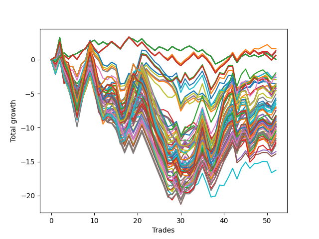

# Long HLT 605 
- Symbol: TSLA
- Date Range: 05/16/2022 - 05/17/2024
- Trading Period: 8:30-12:30
- Number of Trades: 52



| Id. | Name | Win Percent | Profit | Avg Profit / Trade | Avg Time / Trade | Std |      | Name | Win Percent | Profit | Avg Profit / Trade | Avg Time / Trade | Std |
| --- | ---- | ----------- | ------ | ------------------ | ---------------- | --- | ---- | ---- | ----------- | ------ | ------------------ | ---------------- | --- |
| | Sorted By <br> Profit | | | | | | | Sorted By <br> Win Percentage |||||
|0| TP-0.5 15m | 51.92 | 1.60 | 0.03 | 06:35 | 0.68 |     | TP-1.75 90m | 53.85 | -2.21 | -0.04 | 41:54 | 1.61 |
|1| TP-0.5 30m | 51.92 | 1.33 | 0.03 | 07:36 | 0.69 |     | TP-2.75 90m | 53.85 | -5.66 | -0.11 | 62:32 | 1.98 |
|2| TP-0.5 45m | 51.92 | 1.14 | 0.02 | 07:57 | 0.69 |     | TP-2.25 90m | 53.85 | -5.95 | -0.11 | 55:27 | 1.83 |
|3| TP-0.5 180m | 51.92 | 0.65 | 0.01 | 08:06 | 0.70 |     | TP-2.5 90m | 53.85 | -6.37 | -0.12 | 59:03 | 1.86 |
|4| TP-0.5 165m | 51.92 | 0.65 | 0.01 | 08:06 | 0.70 |     | TP-3 90m | 53.85 | -6.94 | -0.13 | 63:32 | 2.03 |
|5| TP-0.5 150m | 51.92 | 0.65 | 0.01 | 08:06 | 0.70 |     | TP-2.25 45m | 53.85 | -10.38 | -0.20 | 36:03 | 1.50 |
|6| TP-0.5 135m | 51.92 | 0.65 | 0.01 | 08:06 | 0.70 |     | TP-2.5 45m | 53.85 | -11.93 | -0.23 | 37:08 | 1.52 |
|7| TP-0.5 120m | 51.92 | 0.65 | 0.01 | 08:06 | 0.70 |     | TP-2.75 45m | 53.85 | -13.53 | -0.26 | 38:24 | 1.58 |
|8| TP-0.5 105m | 51.92 | 0.65 | 0.01 | 08:06 | 0.70 |     | TP-3 45m | 53.85 | -13.87 | -0.27 | 38:46 | 1.62 |
|9| TP-0.5 90m | 51.92 | 0.65 | 0.01 | 08:06 | 0.70 |     | TP-0.5 15m | 51.92 | 1.60 | 0.03 | 06:35 | 0.68 |
|10| TP-0.5 75m | 51.92 | 0.65 | 0.01 | 08:06 | 0.70 |     | TP-0.5 30m | 51.92 | 1.33 | 0.03 | 07:36 | 0.69 |
|11| TP-0.5 60m | 51.92 | 0.65 | 0.01 | 08:06 | 0.70 |     | TP-0.5 45m | 51.92 | 1.14 | 0.02 | 07:57 | 0.69 |
|12| TP-0.25 180m | 51.92 | 0.05 | 0.00 | 03:33 | 0.52 |     | TP-0.5 180m | 51.92 | 0.65 | 0.01 | 08:06 | 0.70 |
|13| TP-0.25 165m | 51.92 | 0.05 | 0.00 | 03:33 | 0.52 |     | TP-0.5 165m | 51.92 | 0.65 | 0.01 | 08:06 | 0.70 |
|14| TP-0.25 150m | 51.92 | 0.05 | 0.00 | 03:33 | 0.52 |     | TP-0.5 150m | 51.92 | 0.65 | 0.01 | 08:06 | 0.70 |
|15| TP-0.25 135m | 51.92 | 0.05 | 0.00 | 03:33 | 0.52 |     | TP-0.5 135m | 51.92 | 0.65 | 0.01 | 08:06 | 0.70 |
|16| TP-0.25 120m | 51.92 | 0.05 | 0.00 | 03:33 | 0.52 |     | TP-0.5 120m | 51.92 | 0.65 | 0.01 | 08:06 | 0.70 |
|17| TP-0.25 105m | 51.92 | 0.05 | 0.00 | 03:33 | 0.52 |     | TP-0.5 105m | 51.92 | 0.65 | 0.01 | 08:06 | 0.70 |
|18| TP-0.25 90m | 51.92 | 0.05 | 0.00 | 03:33 | 0.52 |     | TP-0.5 90m | 51.92 | 0.65 | 0.01 | 08:06 | 0.70 |
|19| TP-0.25 75m | 51.92 | 0.05 | 0.00 | 03:33 | 0.52 |     | TP-0.5 75m | 51.92 | 0.65 | 0.01 | 08:06 | 0.70 |
|20| TP-0.25 60m | 51.92 | 0.05 | 0.00 | 03:33 | 0.52 |     | TP-0.5 60m | 51.92 | 0.65 | 0.01 | 08:06 | 0.70 |
|21| TP-0.25 45m | 51.92 | 0.05 | 0.00 | 03:33 | 0.52 |     | TP-0.25 180m | 51.92 | 0.05 | 0.00 | 03:33 | 0.52 |
|22| TP-0.25 30m | 51.92 | 0.05 | 0.00 | 03:33 | 0.52 |     | TP-0.25 165m | 51.92 | 0.05 | 0.00 | 03:33 | 0.52 |
|23| TP-0.25 15m | 51.92 | 0.05 | 0.00 | 03:33 | 0.52 |     | TP-0.25 150m | 51.92 | 0.05 | 0.00 | 03:33 | 0.52 |
|24| TP-1.75 60m | 51.92 | -1.94 | -0.04 | 35:51 | 1.57 |     | TP-0.25 135m | 51.92 | 0.05 | 0.00 | 03:33 | 0.52 |
|25| TP-1.75 90m | 53.85 | -2.21 | -0.04 | 41:54 | 1.61 |     | TP-0.25 120m | 51.92 | 0.05 | 0.00 | 03:33 | 0.52 |
|26| TP-1.75 15m | 50.00 | -2.57 | -0.05 | 13:06 | 1.02 |     | TP-0.25 105m | 51.92 | 0.05 | 0.00 | 03:33 | 0.52 |
|27| TP-2.5 15m | 50.00 | -2.61 | -0.05 | 13:45 | 1.08 |     | TP-0.25 90m | 51.92 | 0.05 | 0.00 | 03:33 | 0.52 |
|28| TP-2 15m | 50.00 | -2.93 | -0.06 | 13:34 | 1.06 |     | TP-0.25 75m | 51.92 | 0.05 | 0.00 | 03:33 | 0.52 |
|29| TP-2.25 15m | 50.00 | -2.95 | -0.06 | 13:43 | 1.07 |     | TP-0.25 60m | 51.92 | 0.05 | 0.00 | 03:33 | 0.52 |
|30| TP-2.75 15m | 50.00 | -3.53 | -0.07 | 13:46 | 1.13 |     | TP-0.25 45m | 51.92 | 0.05 | 0.00 | 03:33 | 0.52 |
|31| TP-1.75 180m | 51.92 | -3.57 | -0.07 | 43:56 | 1.60 |     | TP-0.25 30m | 51.92 | 0.05 | 0.00 | 03:33 | 0.52 |
|32| TP-1.75 165m | 51.92 | -3.57 | -0.07 | 43:56 | 1.60 |     | TP-0.25 15m | 51.92 | 0.05 | 0.00 | 03:33 | 0.52 |
|33| TP-1.75 150m | 51.92 | -3.57 | -0.07 | 43:56 | 1.60 |     | TP-1.75 60m | 51.92 | -1.94 | -0.04 | 35:51 | 1.57 |
|34| TP-1.75 135m | 51.92 | -3.57 | -0.07 | 43:56 | 1.60 |     | TP-1.75 180m | 51.92 | -3.57 | -0.07 | 43:56 | 1.60 |
|35| TP-1.75 120m | 51.92 | -3.57 | -0.07 | 43:56 | 1.60 |     | TP-1.75 165m | 51.92 | -3.57 | -0.07 | 43:56 | 1.60 |
|36| TP-1.75 30m | 50.00 | -3.76 | -0.07 | 23:12 | 1.38 |     | TP-1.75 150m | 51.92 | -3.57 | -0.07 | 43:56 | 1.60 |
|37| TP-2.5 30m | 51.92 | -3.77 | -0.07 | 26:26 | 1.49 |     | TP-1.75 135m | 51.92 | -3.57 | -0.07 | 43:56 | 1.60 |
|38| TP-2 30m | 51.92 | -3.87 | -0.07 | 25:10 | 1.50 |     | TP-1.75 120m | 51.92 | -3.57 | -0.07 | 43:56 | 1.60 |
|39| TP-2.75 30m | 51.92 | -3.96 | -0.08 | 26:53 | 1.55 |     | TP-2.5 30m | 51.92 | -3.77 | -0.07 | 26:26 | 1.49 |
|40| TP-3 30m | 51.92 | -4.12 | -0.08 | 27:12 | 1.59 |     | TP-2 30m | 51.92 | -3.87 | -0.07 | 25:10 | 1.50 |
|41| TP-1.75 75m | 51.92 | -4.23 | -0.08 | 39:21 | 1.61 |     | TP-2.75 30m | 51.92 | -3.96 | -0.08 | 26:53 | 1.55 |
|42| TP-2 60m | 51.92 | -4.26 | -0.08 | 39:56 | 1.74 |     | TP-3 30m | 51.92 | -4.12 | -0.08 | 27:12 | 1.59 |
|43| TP-1.75 105m | 48.08 | -4.49 | -0.09 | 43:15 | 1.60 |     | TP-1.75 75m | 51.92 | -4.23 | -0.08 | 39:21 | 1.61 |
|44| TP-2.25 30m | 51.92 | -4.51 | -0.09 | 26:03 | 1.46 |     | TP-2 60m | 51.92 | -4.26 | -0.08 | 39:56 | 1.74 |
|45| TP-3 15m | 50.00 | -4.57 | -0.09 | 13:50 | 1.13 |     | TP-2.25 30m | 51.92 | -4.51 | -0.09 | 26:03 | 1.46 |
|46| TP-2 90m | 51.92 | -5.07 | -0.10 | 47:36 | 1.80 |     | TP-2 90m | 51.92 | -5.07 | -0.10 | 47:36 | 1.80 |
|47| TP-2.75 90m | 53.85 | -5.66 | -0.11 | 62:32 | 1.98 |     | TP-2 180m | 51.92 | -5.96 | -0.11 | 50:48 | 1.79 |
|48| TP-2.25 90m | 53.85 | -5.95 | -0.11 | 55:27 | 1.83 |     | TP-2 165m | 51.92 | -5.96 | -0.11 | 50:48 | 1.79 |
|49| TP-2 180m | 51.92 | -5.96 | -0.11 | 50:48 | 1.79 |     | TP-2 150m | 51.92 | -5.96 | -0.11 | 50:48 | 1.79 |
|50| TP-2 165m | 51.92 | -5.96 | -0.11 | 50:48 | 1.79 |     | TP-2 135m | 51.92 | -5.96 | -0.11 | 50:48 | 1.79 |
|51| TP-2 150m | 51.92 | -5.96 | -0.11 | 50:48 | 1.79 |     | TP-2 120m | 51.92 | -5.96 | -0.11 | 50:48 | 1.79 |
|52| TP-2 135m | 51.92 | -5.96 | -0.11 | 50:48 | 1.79 |     | TP-1.75 45m | 51.92 | -6.96 | -0.13 | 30:12 | 1.44 |
|53| TP-2 120m | 51.92 | -5.96 | -0.11 | 50:48 | 1.79 |     | TP-2 75m | 51.92 | -7.53 | -0.14 | 44:27 | 1.79 |
|54| TP-2.5 90m | 53.85 | -6.37 | -0.12 | 59:03 | 1.86 |     | TP-2.75 180m | 51.92 | -8.24 | -0.16 | 69:04 | 2.00 |
|55| TP-2 105m | 48.08 | -6.57 | -0.13 | 49:32 | 1.80 |     | TP-2.75 165m | 51.92 | -8.24 | -0.16 | 69:04 | 2.00 |
|56| TP-3 90m | 53.85 | -6.94 | -0.13 | 63:32 | 2.03 |     | TP-2.75 150m | 51.92 | -8.24 | -0.16 | 69:04 | 2.00 |
|57| TP-1.75 45m | 51.92 | -6.96 | -0.13 | 30:12 | 1.44 |     | TP-2.75 135m | 51.92 | -8.24 | -0.16 | 69:04 | 2.00 |
|58| TP-1.5 15m | 48.08 | -7.05 | -0.14 | 12:12 | 1.05 |     | TP-2.75 120m | 51.92 | -8.24 | -0.16 | 69:04 | 2.00 |
|59| TP-1 15m | 46.15 | -7.19 | -0.14 | 10:50 | 0.95 |     | TP-3 180m | 51.92 | -8.36 | -0.16 | 70:51 | 2.08 |
|60| TP-1.25 15m | 48.08 | -7.45 | -0.14 | 11:50 | 1.01 |     | TP-3 165m | 51.92 | -8.36 | -0.16 | 70:51 | 2.08 |
|61| TP-2 75m | 51.92 | -7.53 | -0.14 | 44:27 | 1.79 |     | TP-3 150m | 51.92 | -8.36 | -0.16 | 70:51 | 2.08 |
|62| TP-2.75 180m | 51.92 | -8.24 | -0.16 | 69:04 | 2.00 |     | TP-3 135m | 51.92 | -8.36 | -0.16 | 70:51 | 2.08 |
|63| TP-2.75 165m | 51.92 | -8.24 | -0.16 | 69:04 | 2.00 |     | TP-3 120m | 51.92 | -8.36 | -0.16 | 70:51 | 2.08 |
|64| TP-2.75 150m | 51.92 | -8.24 | -0.16 | 69:04 | 2.00 |     | TP-2.25 60m | 51.92 | -8.51 | -0.16 | 44:32 | 1.67 |
|65| TP-2.75 135m | 51.92 | -8.24 | -0.16 | 69:04 | 2.00 |     | TP-2.25 180m | 51.92 | -8.60 | -0.17 | 59:27 | 1.81 |
|66| TP-2.75 120m | 51.92 | -8.24 | -0.16 | 69:04 | 2.00 |     | TP-2.25 165m | 51.92 | -8.60 | -0.17 | 59:27 | 1.81 |
|67| TP-3 180m | 51.92 | -8.36 | -0.16 | 70:51 | 2.08 |     | TP-2.25 150m | 51.92 | -8.60 | -0.17 | 59:27 | 1.81 |
|68| TP-3 165m | 51.92 | -8.36 | -0.16 | 70:51 | 2.08 |     | TP-2.25 135m | 51.92 | -8.60 | -0.17 | 59:27 | 1.81 |
|69| TP-3 150m | 51.92 | -8.36 | -0.16 | 70:51 | 2.08 |     | TP-2.25 120m | 51.92 | -8.60 | -0.17 | 59:27 | 1.81 |
|70| TP-3 135m | 51.92 | -8.36 | -0.16 | 70:51 | 2.08 |     | TP-2 45m | 51.92 | -9.09 | -0.17 | 33:21 | 1.59 |
|71| TP-3 120m | 51.92 | -8.36 | -0.16 | 70:51 | 2.08 |     | TP-2.5 180m | 51.92 | -9.12 | -0.18 | 64:31 | 1.86 |
|72| TP-2.25 60m | 51.92 | -8.51 | -0.16 | 44:32 | 1.67 |     | TP-2.5 165m | 51.92 | -9.12 | -0.18 | 64:31 | 1.86 |
|73| TP-2.25 180m | 51.92 | -8.60 | -0.17 | 59:27 | 1.81 |     | TP-2.5 150m | 51.92 | -9.12 | -0.18 | 64:31 | 1.86 |
|74| TP-2.25 165m | 51.92 | -8.60 | -0.17 | 59:27 | 1.81 |     | TP-2.5 135m | 51.92 | -9.12 | -0.18 | 64:31 | 1.86 |
|75| TP-2.25 150m | 51.92 | -8.60 | -0.17 | 59:27 | 1.81 |     | TP-2.5 120m | 51.92 | -9.12 | -0.18 | 64:31 | 1.86 |
|76| TP-2.25 135m | 51.92 | -8.60 | -0.17 | 59:27 | 1.81 |     | TP-2.5 60m | 51.92 | -10.36 | -0.20 | 46:25 | 1.71 |
|77| TP-2.25 120m | 51.92 | -8.60 | -0.17 | 59:27 | 1.81 |     | TP-2.75 60m | 51.92 | -10.39 | -0.20 | 48:12 | 1.82 |
|78| TP-1 60m | 44.23 | -8.62 | -0.17 | 18:45 | 1.16 |     | TP-3 60m | 51.92 | -11.27 | -0.22 | 48:46 | 1.84 |
|79| TP-1.25 90m | 48.08 | -8.81 | -0.17 | 28:42 | 1.33 |     | TP-1.75 15m | 50.00 | -2.57 | -0.05 | 13:06 | 1.02 |
|80| TP-0.75 15m | 44.23 | -8.87 | -0.17 | 08:57 | 0.81 |     | TP-2.5 15m | 50.00 | -2.61 | -0.05 | 13:45 | 1.08 |
|81| TP-0.75 30m | 42.31 | -9.02 | -0.17 | 11:21 | 0.89 |     | TP-2 15m | 50.00 | -2.93 | -0.06 | 13:34 | 1.06 |
|82| TP-2 45m | 51.92 | -9.09 | -0.17 | 33:21 | 1.59 |     | TP-2.25 15m | 50.00 | -2.95 | -0.06 | 13:43 | 1.07 |
|83| TP-2.5 180m | 51.92 | -9.12 | -0.18 | 64:31 | 1.86 |     | TP-2.75 15m | 50.00 | -3.53 | -0.07 | 13:46 | 1.13 |
|84| TP-2.5 165m | 51.92 | -9.12 | -0.18 | 64:31 | 1.86 |     | TP-1.75 30m | 50.00 | -3.76 | -0.07 | 23:12 | 1.38 |
|85| TP-2.5 150m | 51.92 | -9.12 | -0.18 | 64:31 | 1.86 |     | TP-3 15m | 50.00 | -4.57 | -0.09 | 13:50 | 1.13 |
|86| TP-2.5 135m | 51.92 | -9.12 | -0.18 | 64:31 | 1.86 |     | TP-2.25 75m | 50.00 | -9.69 | -0.19 | 51:11 | 1.76 |
|87| TP-2.5 120m | 51.92 | -9.12 | -0.18 | 64:31 | 1.86 |     | TP-1.5 90m | 50.00 | -10.04 | -0.19 | 36:03 | 1.50 |
|88| TP-1 30m | 42.31 | -9.44 | -0.18 | 15:51 | 1.09 |     | TP-2.75 75m | 50.00 | -10.42 | -0.20 | 56:25 | 1.90 |
|89| TP-2.25 105m | 48.08 | -9.46 | -0.18 | 57:54 | 1.82 |     | TP-3 75m | 50.00 | -10.89 | -0.21 | 57:02 | 1.93 |
|90| TP-1 90m | 42.31 | -9.46 | -0.18 | 19:20 | 1.16 |     | TP-2.5 75m | 50.00 | -11.00 | -0.21 | 53:49 | 1.80 |
|91| TP-1 75m | 42.31 | -9.57 | -0.18 | 19:03 | 1.16 |     | TP-1.75 105m | 48.08 | -4.49 | -0.09 | 43:15 | 1.60 |
|92| TP-0.75 180m | 42.31 | -9.63 | -0.19 | 12:35 | 0.92 |     | TP-2 105m | 48.08 | -6.57 | -0.13 | 49:32 | 1.80 |
|93| TP-0.75 165m | 42.31 | -9.63 | -0.19 | 12:35 | 0.92 |     | TP-1.5 15m | 48.08 | -7.05 | -0.14 | 12:12 | 1.05 |
|94| TP-0.75 150m | 42.31 | -9.63 | -0.19 | 12:35 | 0.92 |     | TP-1.25 15m | 48.08 | -7.45 | -0.14 | 11:50 | 1.01 |
|95| TP-0.75 135m | 42.31 | -9.63 | -0.19 | 12:35 | 0.92 |     | TP-1.25 90m | 48.08 | -8.81 | -0.17 | 28:42 | 1.33 |
|96| TP-0.75 120m | 42.31 | -9.63 | -0.19 | 12:35 | 0.92 |     | TP-2.25 105m | 48.08 | -9.46 | -0.18 | 57:54 | 1.82 |
|97| TP-0.75 105m | 42.31 | -9.63 | -0.19 | 12:35 | 0.92 |     | TP-1.5 180m | 48.08 | -11.64 | -0.22 | 38:04 | 1.48 |
|98| TP-0.75 90m | 42.31 | -9.63 | -0.19 | 12:35 | 0.92 |     | TP-1.5 165m | 48.08 | -11.64 | -0.22 | 38:04 | 1.48 |
|99| TP-0.75 75m | 42.31 | -9.63 | -0.19 | 12:35 | 0.92 |     | TP-1.5 150m | 48.08 | -11.64 | -0.22 | 38:04 | 1.48 |
|100| TP-0.75 60m | 42.31 | -9.63 | -0.19 | 12:35 | 0.92 |     | TP-1.5 135m | 48.08 | -11.64 | -0.22 | 38:04 | 1.48 |
|101| TP-2.25 75m | 50.00 | -9.69 | -0.19 | 51:11 | 1.76 |     | TP-1.5 120m | 48.08 | -11.64 | -0.22 | 38:04 | 1.48 |
|102| TP-1 105m | 42.31 | -9.82 | -0.19 | 19:38 | 1.16 |     | TP-1 15m | 46.15 | -7.19 | -0.14 | 10:50 | 0.95 |
|103| TP-1 180m | 42.31 | -9.84 | -0.19 | 19:39 | 1.16 |     | TP-1.25 180m | 46.15 | -9.95 | -0.19 | 30:23 | 1.32 |
|104| TP-1 165m | 42.31 | -9.84 | -0.19 | 19:39 | 1.16 |     | TP-1.25 165m | 46.15 | -9.95 | -0.19 | 30:23 | 1.32 |
|105| TP-1 150m | 42.31 | -9.84 | -0.19 | 19:39 | 1.16 |     | TP-1.25 150m | 46.15 | -9.95 | -0.19 | 30:23 | 1.32 |
|106| TP-1 135m | 42.31 | -9.84 | -0.19 | 19:39 | 1.16 |     | TP-1.25 135m | 46.15 | -9.95 | -0.19 | 30:23 | 1.32 |
|107| TP-1 120m | 42.31 | -9.84 | -0.19 | 19:39 | 1.16 |     | TP-1.25 120m | 46.15 | -9.95 | -0.19 | 30:23 | 1.32 |
|108| TP-0.75 45m | 42.31 | -9.86 | -0.19 | 12:09 | 0.90 |     | TP-1.5 30m | 46.15 | -10.22 | -0.20 | 20:55 | 1.29 |
|109| TP-1.25 180m | 46.15 | -9.95 | -0.19 | 30:23 | 1.32 |     | TP-2.75 105m | 46.15 | -10.58 | -0.20 | 66:25 | 1.99 |
|110| TP-1.25 165m | 46.15 | -9.95 | -0.19 | 30:23 | 1.32 |     | TP-2.5 105m | 46.15 | -11.14 | -0.21 | 62:21 | 1.87 |
|111| TP-1.25 150m | 46.15 | -9.95 | -0.19 | 30:23 | 1.32 |     | TP-1.5 60m | 46.15 | -11.27 | -0.22 | 31:11 | 1.45 |
|112| TP-1.25 135m | 46.15 | -9.95 | -0.19 | 30:23 | 1.32 |     | TP-3 105m | 46.15 | -12.14 | -0.23 | 68:00 | 2.03 |
|113| TP-1.25 120m | 46.15 | -9.95 | -0.19 | 30:23 | 1.32 |     | TP-1.5 75m | 46.15 | -12.31 | -0.24 | 34:01 | 1.48 |
|114| TP-1.5 90m | 50.00 | -10.04 | -0.19 | 36:03 | 1.50 |     | TP-1.5 45m | 46.15 | -16.26 | -0.31 | 26:53 | 1.34 |
|115| TP-1.5 30m | 46.15 | -10.22 | -0.20 | 20:55 | 1.29 |     | TP-1 60m | 44.23 | -8.62 | -0.17 | 18:45 | 1.16 |
|116| TP-2.5 60m | 51.92 | -10.36 | -0.20 | 46:25 | 1.71 |     | TP-0.75 15m | 44.23 | -8.87 | -0.17 | 08:57 | 0.81 |
|117| TP-2.25 45m | 53.85 | -10.38 | -0.20 | 36:03 | 1.50 |     | TP-1.25 60m | 44.23 | -10.39 | -0.20 | 25:49 | 1.30 |
|118| TP-2.75 60m | 51.92 | -10.39 | -0.20 | 48:12 | 1.82 |     | TP-1.25 75m | 44.23 | -10.65 | -0.20 | 27:32 | 1.32 |
|119| TP-1.25 60m | 44.23 | -10.39 | -0.20 | 25:49 | 1.30 |     | TP-1.25 30m | 44.23 | -11.08 | -0.21 | 18:43 | 1.21 |
|120| TP-2.75 75m | 50.00 | -10.42 | -0.20 | 56:25 | 1.90 |     | TP-1.25 45m | 44.23 | -11.62 | -0.22 | 23:01 | 1.27 |
|121| TP-2.75 105m | 46.15 | -10.58 | -0.20 | 66:25 | 1.99 |     | TP-1.5 105m | 44.23 | -12.56 | -0.24 | 37:23 | 1.48 |
|122| TP-1.25 75m | 44.23 | -10.65 | -0.20 | 27:32 | 1.32 |     | TP-0.75 30m | 42.31 | -9.02 | -0.17 | 11:21 | 0.89 |
|123| TP-1.25 105m | 42.31 | -10.87 | -0.21 | 29:41 | 1.32 |     | TP-1 30m | 42.31 | -9.44 | -0.18 | 15:51 | 1.09 |
|124| TP-1 45m | 40.38 | -10.88 | -0.21 | 17:43 | 1.13 |     | TP-1 90m | 42.31 | -9.46 | -0.18 | 19:20 | 1.16 |
|125| TP-3 75m | 50.00 | -10.89 | -0.21 | 57:02 | 1.93 |     | TP-1 75m | 42.31 | -9.57 | -0.18 | 19:03 | 1.16 |
|126| TP-2.5 75m | 50.00 | -11.00 | -0.21 | 53:49 | 1.80 |     | TP-0.75 180m | 42.31 | -9.63 | -0.19 | 12:35 | 0.92 |
|127| TP-1.25 30m | 44.23 | -11.08 | -0.21 | 18:43 | 1.21 |     | TP-0.75 165m | 42.31 | -9.63 | -0.19 | 12:35 | 0.92 |
|128| TP-2.5 105m | 46.15 | -11.14 | -0.21 | 62:21 | 1.87 |     | TP-0.75 150m | 42.31 | -9.63 | -0.19 | 12:35 | 0.92 |
|129| TP-3 60m | 51.92 | -11.27 | -0.22 | 48:46 | 1.84 |     | TP-0.75 135m | 42.31 | -9.63 | -0.19 | 12:35 | 0.92 |
|130| TP-1.5 60m | 46.15 | -11.27 | -0.22 | 31:11 | 1.45 |     | TP-0.75 120m | 42.31 | -9.63 | -0.19 | 12:35 | 0.92 |
|131| TP-1.25 45m | 44.23 | -11.62 | -0.22 | 23:01 | 1.27 |     | TP-0.75 105m | 42.31 | -9.63 | -0.19 | 12:35 | 0.92 |
|132| TP-1.5 180m | 48.08 | -11.64 | -0.22 | 38:04 | 1.48 |     | TP-0.75 90m | 42.31 | -9.63 | -0.19 | 12:35 | 0.92 |
|133| TP-1.5 165m | 48.08 | -11.64 | -0.22 | 38:04 | 1.48 |     | TP-0.75 75m | 42.31 | -9.63 | -0.19 | 12:35 | 0.92 |
|134| TP-1.5 150m | 48.08 | -11.64 | -0.22 | 38:04 | 1.48 |     | TP-0.75 60m | 42.31 | -9.63 | -0.19 | 12:35 | 0.92 |
|135| TP-1.5 135m | 48.08 | -11.64 | -0.22 | 38:04 | 1.48 |     | TP-1 105m | 42.31 | -9.82 | -0.19 | 19:38 | 1.16 |
|136| TP-1.5 120m | 48.08 | -11.64 | -0.22 | 38:04 | 1.48 |     | TP-1 180m | 42.31 | -9.84 | -0.19 | 19:39 | 1.16 |
|137| TP-2.5 45m | 53.85 | -11.93 | -0.23 | 37:08 | 1.52 |     | TP-1 165m | 42.31 | -9.84 | -0.19 | 19:39 | 1.16 |
|138| TP-3 105m | 46.15 | -12.14 | -0.23 | 68:00 | 2.03 |     | TP-1 150m | 42.31 | -9.84 | -0.19 | 19:39 | 1.16 |
|139| TP-1.5 75m | 46.15 | -12.31 | -0.24 | 34:01 | 1.48 |     | TP-1 135m | 42.31 | -9.84 | -0.19 | 19:39 | 1.16 |
|140| TP-1.5 105m | 44.23 | -12.56 | -0.24 | 37:23 | 1.48 |     | TP-1 120m | 42.31 | -9.84 | -0.19 | 19:39 | 1.16 |
|141| TP-2.75 45m | 53.85 | -13.53 | -0.26 | 38:24 | 1.58 |     | TP-0.75 45m | 42.31 | -9.86 | -0.19 | 12:09 | 0.90 |
|142| TP-3 45m | 53.85 | -13.87 | -0.27 | 38:46 | 1.62 |     | TP-1.25 105m | 42.31 | -10.87 | -0.21 | 29:41 | 1.32 |
|143| TP-1.5 45m | 46.15 | -16.26 | -0.31 | 26:53 | 1.34 |     | TP-1 45m | 40.38 | -10.88 | -0.21 | 17:43 | 1.13 |

### Test TP-0.25 15m
* Take Profit of 0.25 Point
* 0.25 Stoploss
* Results:
```
Total Trades: 52
Percent Up: 51.92
Percent Down: 48.08
Total Points Moved Up: 0.05
Potential Profit: 25.00
Total Points Ups: 12.13 Count Ups: 27
Total Points Downs: -12.08 Count Downs: 25
```

<details><summary>Trades</summary>

<code>In: 2022-06-16 11:20:00		Out: 2022-06-16 11:23:00		Total Position Time: 03:00		Total Move Up: -0.29		Total to Date: -0.29</code> <br />
<code>In: 2022-06-16 11:55:00		Out: 2022-06-16 11:57:00		Total Position Time: 02:00		Total Move Up: 0.77		Total to Date: 0.48</code> <br />
<code>In: 2022-08-05 08:35:00		Out: 2022-08-05 08:37:00		Total Position Time: 02:00		Total Move Up: 0.52		Total to Date: 1.00</code> <br />
<code>In: 2022-08-08 11:45:00		Out: 2022-08-08 11:48:00		Total Position Time: 03:00		Total Move Up: -0.57		Total to Date: 0.43</code> <br />
<code>In: 2022-08-30 09:50:00		Out: 2022-08-30 09:53:00		Total Position Time: 03:00		Total Move Up: 0.24		Total to Date: 0.67</code> <br />
<code>In: 2022-08-30 10:05:00		Out: 2022-08-30 10:07:00		Total Position Time: 02:00		Total Move Up: 0.26		Total to Date: 0.93</code> <br />
<code>In: 2022-08-30 10:25:00		Out: 2022-08-30 10:28:00		Total Position Time: 03:00		Total Move Up: 0.42		Total to Date: 1.35</code> <br />
<code>In: 2022-09-20 11:00:00		Out: 2022-09-20 11:02:00		Total Position Time: 02:00		Total Move Up: 0.25		Total to Date: 1.60</code> <br />
<code>In: 2022-10-04 10:25:00		Out: 2022-10-04 10:27:00		Total Position Time: 02:00		Total Move Up: 0.95		Total to Date: 2.55</code> <br />
<code>In: 2022-11-04 08:55:00		Out: 2022-11-04 08:57:00		Total Position Time: 02:00		Total Move Up: 0.31		Total to Date: 2.86</code> <br />
<code>In: 2022-11-04 09:10:00		Out: 2022-11-04 09:13:00		Total Position Time: 03:00		Total Move Up: -0.66		Total to Date: 2.20</code> <br />
<code>In: 2022-11-04 09:50:00		Out: 2022-11-04 09:52:00		Total Position Time: 02:00		Total Move Up: 0.42		Total to Date: 2.62</code> <br />
<code>In: 2022-11-09 10:35:00		Out: 2022-11-09 10:40:00		Total Position Time: 05:00		Total Move Up: -0.36		Total to Date: 2.26</code> <br />
<code>In: 2022-11-28 11:15:00		Out: 2022-11-28 11:19:00		Total Position Time: 04:00		Total Move Up: 0.32		Total to Date: 2.58</code> <br />
<code>In: 2022-12-12 11:00:00		Out: 2022-12-12 11:02:00		Total Position Time: 02:00		Total Move Up: -0.48		Total to Date: 2.10</code> <br />
<code>In: 2023-02-16 12:25:00		Out: 2023-02-16 12:28:00		Total Position Time: 03:00		Total Move Up: -0.53		Total to Date: 1.57</code> <br />
<code>In: 2023-02-16 12:35:00		Out: 2023-02-16 12:37:00		Total Position Time: 02:00		Total Move Up: 0.92		Total to Date: 2.49</code> <br />
<code>In: 2023-03-15 10:05:00		Out: 2023-03-15 10:07:00		Total Position Time: 02:00		Total Move Up: 0.76		Total to Date: 3.25</code> <br />
<code>In: 2023-03-23 11:35:00		Out: 2023-03-23 11:39:00		Total Position Time: 04:00		Total Move Up: -0.25		Total to Date: 3.00</code> <br />
<code>In: 2023-05-23 09:40:00		Out: 2023-05-23 09:43:00		Total Position Time: 03:00		Total Move Up: -0.39		Total to Date: 2.61</code> <br />
<code>In: 2023-05-23 09:50:00		Out: 2023-05-23 09:52:00		Total Position Time: 02:00		Total Move Up: 0.47		Total to Date: 3.08</code> <br />
<code>In: 2023-07-27 12:05:00		Out: 2023-07-27 12:07:00		Total Position Time: 02:00		Total Move Up: -0.75		Total to Date: 2.33</code> <br />
<code>In: 2023-08-04 11:20:00		Out: 2023-08-04 11:22:00		Total Position Time: 02:00		Total Move Up: -0.47		Total to Date: 1.86</code> <br />
<code>In: 2023-08-04 11:30:00		Out: 2023-08-04 11:37:00		Total Position Time: 07:00		Total Move Up: -0.50		Total to Date: 1.36</code> <br />
<code>In: 2023-08-04 11:45:00		Out: 2023-08-04 11:52:00		Total Position Time: 07:00		Total Move Up: 0.54		Total to Date: 1.90</code> <br />
<code>In: 2023-08-04 12:00:00		Out: 2023-08-04 12:05:00		Total Position Time: 05:00		Total Move Up: -0.24		Total to Date: 1.66</code> <br />
<code>In: 2023-08-17 11:40:00		Out: 2023-08-17 11:45:00		Total Position Time: 05:00		Total Move Up: -0.34		Total to Date: 1.32</code> <br />
<code>In: 2023-09-08 10:15:00		Out: 2023-09-08 10:21:00		Total Position Time: 06:00		Total Move Up: 0.63		Total to Date: 1.95</code> <br />
<code>In: 2023-09-15 11:20:00		Out: 2023-09-15 11:22:00		Total Position Time: 02:00		Total Move Up: -0.39		Total to Date: 1.56</code> <br />
<code>In: 2023-09-22 11:05:00		Out: 2023-09-22 11:08:00		Total Position Time: 03:00		Total Move Up: -0.24		Total to Date: 1.32</code> <br />
<code>In: 2023-09-22 11:20:00		Out: 2023-09-22 11:22:00		Total Position Time: 02:00		Total Move Up: 0.43		Total to Date: 1.75</code> <br />
<code>In: 2023-09-26 10:45:00		Out: 2023-09-26 10:51:00		Total Position Time: 06:00		Total Move Up: 0.26		Total to Date: 2.01</code> <br />
<code>In: 2023-09-26 11:15:00		Out: 2023-09-26 11:20:00		Total Position Time: 05:00		Total Move Up: -0.38		Total to Date: 1.63</code> <br />
<code>In: 2023-09-29 10:55:00		Out: 2023-09-29 10:58:00		Total Position Time: 03:00		Total Move Up: -0.47		Total to Date: 1.16</code> <br />
<code>In: 2023-09-29 11:05:00		Out: 2023-09-29 11:13:00		Total Position Time: 08:00		Total Move Up: 0.30		Total to Date: 1.46</code> <br />
<code>In: 2023-10-12 10:35:00		Out: 2023-10-12 10:37:00		Total Position Time: 02:00		Total Move Up: -0.61		Total to Date: 0.85</code> <br />
<code>In: 2023-10-12 10:50:00		Out: 2023-10-12 10:52:00		Total Position Time: 02:00		Total Move Up: -0.35		Total to Date: 0.50</code> <br />
<code>In: 2023-10-12 11:10:00		Out: 2023-10-12 11:12:00		Total Position Time: 02:00		Total Move Up: -1.14		Total to Date: -0.64</code> <br />
<code>In: 2023-10-20 08:40:00		Out: 2023-10-20 08:42:00		Total Position Time: 02:00		Total Move Up: 0.29		Total to Date: -0.35</code> <br />
<code>In: 2023-11-06 10:25:00		Out: 2023-11-06 10:30:00		Total Position Time: 05:00		Total Move Up: 0.37		Total to Date: 0.02</code> <br />
<code>In: 2023-11-29 12:30:00		Out: 2023-11-29 12:32:00		Total Position Time: 02:00		Total Move Up: 0.41		Total to Date: 0.43</code> <br />
<code>In: 2023-12-05 11:10:00		Out: 2023-12-05 11:13:00		Total Position Time: 03:00		Total Move Up: 0.27		Total to Date: 0.70</code> <br />
<code>In: 2023-12-20 11:50:00		Out: 2023-12-20 11:52:00		Total Position Time: 02:00		Total Move Up: -1.11		Total to Date: -0.41</code> <br />
<code>In: 2023-12-20 12:10:00		Out: 2023-12-20 12:12:00		Total Position Time: 02:00		Total Move Up: 0.89		Total to Date: 0.48</code> <br />
<code>In: 2023-12-22 11:35:00		Out: 2023-12-22 11:38:00		Total Position Time: 03:00		Total Move Up: 0.34		Total to Date: 0.82</code> <br />
<code>In: 2023-12-28 10:55:00		Out: 2023-12-28 10:59:00		Total Position Time: 04:00		Total Move Up: -0.40		Total to Date: 0.42</code> <br />
<code>In: 2023-12-28 12:15:00		Out: 2023-12-28 12:19:00		Total Position Time: 04:00		Total Move Up: 0.28		Total to Date: 0.70</code> <br />
<code>In: 2024-02-27 10:05:00		Out: 2024-02-27 10:09:00		Total Position Time: 04:00		Total Move Up: -0.30		Total to Date: 0.40</code> <br />
<code>In: 2024-03-11 12:35:00		Out: 2024-03-11 12:41:00		Total Position Time: 06:00		Total Move Up: 0.26		Total to Date: 0.66</code> <br />
<code>In: 2024-04-19 11:50:00		Out: 2024-04-19 12:02:00		Total Position Time: 12:00		Total Move Up: 0.25		Total to Date: 0.91</code> <br />
<code>In: 2024-04-26 11:25:00		Out: 2024-04-26 11:32:00		Total Position Time: 07:00		Total Move Up: -0.42		Total to Date: 0.49</code> <br />
<code>In: 2024-04-26 11:45:00		Out: 2024-04-26 11:49:00		Total Position Time: 04:00		Total Move Up: -0.44		Total to Date: 0.05</code> <br />


</details>

### Test TP-0.5 15m
* Take Profit of 0.5 Point
* 0.5 Stoploss
* Results:
```
Total Trades: 52
Percent Up: 51.92
Percent Down: 48.08
Total Points Moved Up: 1.60
Potential Profit: 800.00
Total Points Ups: 17.59 Count Ups: 27
Total Points Downs: -15.99 Count Downs: 25
```

<details><summary>Trades</summary>

<code>In: 2022-06-16 11:20:00		Out: 2022-06-16 11:28:00		Total Position Time: 08:00		Total Move Up: -0.63		Total to Date: -0.63</code> <br />
<code>In: 2022-06-16 11:55:00		Out: 2022-06-16 11:57:00		Total Position Time: 02:00		Total Move Up: 0.77		Total to Date: 0.14</code> <br />
<code>In: 2022-08-05 08:35:00		Out: 2022-08-05 08:37:00		Total Position Time: 02:00		Total Move Up: 0.52		Total to Date: 0.66</code> <br />
<code>In: 2022-08-08 11:45:00		Out: 2022-08-08 11:48:00		Total Position Time: 03:00		Total Move Up: -0.57		Total to Date: 0.09</code> <br />
<code>In: 2022-08-30 09:50:00		Out: 2022-08-30 09:57:00		Total Position Time: 07:00		Total Move Up: 0.64		Total to Date: 0.73</code> <br />
<code>In: 2022-08-30 10:05:00		Out: 2022-08-30 10:11:00		Total Position Time: 06:00		Total Move Up: -0.67		Total to Date: 0.06</code> <br />
<code>In: 2022-08-30 10:25:00		Out: 2022-08-30 10:32:00		Total Position Time: 07:00		Total Move Up: 0.99		Total to Date: 1.05</code> <br />
<code>In: 2022-09-20 11:00:00		Out: 2022-09-20 11:14:00		Total Position Time: 14:00		Total Move Up: 0.69		Total to Date: 1.74</code> <br />
<code>In: 2022-10-04 10:25:00		Out: 2022-10-04 10:27:00		Total Position Time: 02:00		Total Move Up: 0.95		Total to Date: 2.69</code> <br />
<code>In: 2022-11-04 08:55:00		Out: 2022-11-04 09:00:00		Total Position Time: 05:00		Total Move Up: -1.04		Total to Date: 1.65</code> <br />
<code>In: 2022-11-04 09:10:00		Out: 2022-11-04 09:13:00		Total Position Time: 03:00		Total Move Up: -0.66		Total to Date: 0.99</code> <br />
<code>In: 2022-11-04 09:50:00		Out: 2022-11-04 09:55:00		Total Position Time: 05:00		Total Move Up: 0.57		Total to Date: 1.56</code> <br />
<code>In: 2022-11-09 10:35:00		Out: 2022-11-09 10:44:00		Total Position Time: 09:00		Total Move Up: 0.47		Total to Date: 2.03</code> <br />
<code>In: 2022-11-28 11:15:00		Out: 2022-11-28 11:26:00		Total Position Time: 11:00		Total Move Up: 0.67		Total to Date: 2.70</code> <br />
<code>In: 2022-12-12 11:00:00		Out: 2022-12-12 11:03:00		Total Position Time: 03:00		Total Move Up: -0.52		Total to Date: 2.18</code> <br />
<code>In: 2023-02-16 12:25:00		Out: 2023-02-16 12:28:00		Total Position Time: 03:00		Total Move Up: -0.53		Total to Date: 1.65</code> <br />
<code>In: 2023-02-16 12:35:00		Out: 2023-02-16 12:37:00		Total Position Time: 02:00		Total Move Up: 0.92		Total to Date: 2.57</code> <br />
<code>In: 2023-03-15 10:05:00		Out: 2023-03-15 10:07:00		Total Position Time: 02:00		Total Move Up: 0.76		Total to Date: 3.33</code> <br />
<code>In: 2023-03-23 11:35:00		Out: 2023-03-23 11:40:00		Total Position Time: 05:00		Total Move Up: -0.63		Total to Date: 2.70</code> <br />
<code>In: 2023-05-23 09:40:00		Out: 2023-05-23 09:48:00		Total Position Time: 08:00		Total Move Up: -0.72		Total to Date: 1.98</code> <br />
<code>In: 2023-05-23 09:50:00		Out: 2023-05-23 09:53:00		Total Position Time: 03:00		Total Move Up: 0.61		Total to Date: 2.59</code> <br />
<code>In: 2023-07-27 12:05:00		Out: 2023-07-27 12:07:00		Total Position Time: 02:00		Total Move Up: -0.75		Total to Date: 1.84</code> <br />
<code>In: 2023-08-04 11:20:00		Out: 2023-08-04 11:25:00		Total Position Time: 05:00		Total Move Up: -0.71		Total to Date: 1.13</code> <br />
<code>In: 2023-08-04 11:30:00		Out: 2023-08-04 11:39:00		Total Position Time: 09:00		Total Move Up: -0.56		Total to Date: 0.57</code> <br />
<code>In: 2023-08-04 11:45:00		Out: 2023-08-04 11:52:00		Total Position Time: 07:00		Total Move Up: 0.54		Total to Date: 1.11</code> <br />
<code>In: 2023-08-04 12:00:00		Out: 2023-08-04 12:06:00		Total Position Time: 06:00		Total Move Up: -0.64		Total to Date: 0.47</code> <br />
<code>In: 2023-08-17 11:40:00		Out: 2023-08-17 11:54:00		Total Position Time: 14:00		Total Move Up: -0.32		Total to Date: 0.15</code> <br />
<code>In: 2023-09-08 10:15:00		Out: 2023-09-08 10:21:00		Total Position Time: 06:00		Total Move Up: 0.63		Total to Date: 0.78</code> <br />
<code>In: 2023-09-15 11:20:00		Out: 2023-09-15 11:28:00		Total Position Time: 08:00		Total Move Up: -0.89		Total to Date: -0.11</code> <br />
<code>In: 2023-09-22 11:05:00		Out: 2023-09-22 11:11:00		Total Position Time: 06:00		Total Move Up: -0.52		Total to Date: -0.63</code> <br />
<code>In: 2023-09-22 11:20:00		Out: 2023-09-22 11:24:00		Total Position Time: 04:00		Total Move Up: 0.62		Total to Date: -0.01</code> <br />
<code>In: 2023-09-26 10:45:00		Out: 2023-09-26 10:52:00		Total Position Time: 07:00		Total Move Up: 0.49		Total to Date: 0.48</code> <br />
<code>In: 2023-09-26 11:15:00		Out: 2023-09-26 11:24:00		Total Position Time: 09:00		Total Move Up: 0.67		Total to Date: 1.15</code> <br />
<code>In: 2023-09-29 10:55:00		Out: 2023-09-29 10:59:00		Total Position Time: 04:00		Total Move Up: -0.78		Total to Date: 0.37</code> <br />
<code>In: 2023-09-29 11:05:00		Out: 2023-09-29 11:17:00		Total Position Time: 12:00		Total Move Up: 0.52		Total to Date: 0.89</code> <br />
<code>In: 2023-10-12 10:35:00		Out: 2023-10-12 10:37:00		Total Position Time: 02:00		Total Move Up: -0.61		Total to Date: 0.28</code> <br />
<code>In: 2023-10-12 10:50:00		Out: 2023-10-12 11:00:00		Total Position Time: 10:00		Total Move Up: -0.84		Total to Date: -0.56</code> <br />
<code>In: 2023-10-12 11:10:00		Out: 2023-10-12 11:12:00		Total Position Time: 02:00		Total Move Up: -1.14		Total to Date: -1.70</code> <br />
<code>In: 2023-10-20 08:40:00		Out: 2023-10-20 08:52:00		Total Position Time: 12:00		Total Move Up: 0.74		Total to Date: -0.96</code> <br />
<code>In: 2023-11-06 10:25:00		Out: 2023-11-06 10:36:00		Total Position Time: 11:00		Total Move Up: 0.50		Total to Date: -0.46</code> <br />
<code>In: 2023-11-29 12:30:00		Out: 2023-11-29 12:37:00		Total Position Time: 07:00		Total Move Up: 0.63		Total to Date: 0.17</code> <br />
<code>In: 2023-12-05 11:10:00		Out: 2023-12-05 11:16:00		Total Position Time: 06:00		Total Move Up: 0.94		Total to Date: 1.11</code> <br />
<code>In: 2023-12-20 11:50:00		Out: 2023-12-20 11:52:00		Total Position Time: 02:00		Total Move Up: -1.11		Total to Date: 0.00</code> <br />
<code>In: 2023-12-20 12:10:00		Out: 2023-12-20 12:12:00		Total Position Time: 02:00		Total Move Up: 0.89		Total to Date: 0.89</code> <br />
<code>In: 2023-12-22 11:35:00		Out: 2023-12-22 11:39:00		Total Position Time: 04:00		Total Move Up: 0.60		Total to Date: 1.49</code> <br />
<code>In: 2023-12-28 10:55:00		Out: 2023-12-28 11:01:00		Total Position Time: 06:00		Total Move Up: -0.48		Total to Date: 1.01</code> <br />
<code>In: 2023-12-28 12:15:00		Out: 2023-12-28 12:20:00		Total Position Time: 05:00		Total Move Up: 0.61		Total to Date: 1.62</code> <br />
<code>In: 2024-02-27 10:05:00		Out: 2024-02-27 10:19:00		Total Position Time: 14:00		Total Move Up: -0.05		Total to Date: 1.57</code> <br />
<code>In: 2024-03-11 12:35:00		Out: 2024-03-11 12:49:00		Total Position Time: 14:00		Total Move Up: 0.33		Total to Date: 1.90</code> <br />
<code>In: 2024-04-19 11:50:00		Out: 2024-04-19 12:04:00		Total Position Time: 14:00		Total Move Up: 0.32		Total to Date: 2.22</code> <br />
<code>In: 2024-04-26 11:25:00		Out: 2024-04-26 11:34:00		Total Position Time: 09:00		Total Move Up: -0.57		Total to Date: 1.65</code> <br />
<code>In: 2024-04-26 11:45:00		Out: 2024-04-26 11:59:00		Total Position Time: 14:00		Total Move Up: -0.05		Total to Date: 1.60</code> <br />


</details>

### Test TP-0.75 15m
* Take Profit of 0.75 Point
* 0.75 Stoploss
* Results:
```
Total Trades: 52
Percent Up: 44.23
Percent Down: 55.77
Total Points Moved Up: -8.87
Potential Profit: -4435.00
Total Points Ups: 15.23 Count Ups: 23
Total Points Downs: -24.10 Count Downs: 29
```

<details><summary>Trades</summary>

<code>In: 2022-06-16 11:20:00		Out: 2022-06-16 11:29:00		Total Position Time: 09:00		Total Move Up: -1.21		Total to Date: -1.21</code> <br />
<code>In: 2022-06-16 11:55:00		Out: 2022-06-16 11:57:00		Total Position Time: 02:00		Total Move Up: 0.77		Total to Date: -0.44</code> <br />
<code>In: 2022-08-05 08:35:00		Out: 2022-08-05 08:43:00		Total Position Time: 08:00		Total Move Up: -1.35		Total to Date: -1.79</code> <br />
<code>In: 2022-08-08 11:45:00		Out: 2022-08-08 11:51:00		Total Position Time: 06:00		Total Move Up: -0.95		Total to Date: -2.74</code> <br />
<code>In: 2022-08-30 09:50:00		Out: 2022-08-30 10:04:00		Total Position Time: 14:00		Total Move Up: 0.03		Total to Date: -2.71</code> <br />
<code>In: 2022-08-30 10:05:00		Out: 2022-08-30 10:12:00		Total Position Time: 07:00		Total Move Up: -0.85		Total to Date: -3.56</code> <br />
<code>In: 2022-08-30 10:25:00		Out: 2022-08-30 10:32:00		Total Position Time: 07:00		Total Move Up: 0.99		Total to Date: -2.57</code> <br />
<code>In: 2022-09-20 11:00:00		Out: 2022-09-20 11:14:00		Total Position Time: 14:00		Total Move Up: 0.69		Total to Date: -1.88</code> <br />
<code>In: 2022-10-04 10:25:00		Out: 2022-10-04 10:27:00		Total Position Time: 02:00		Total Move Up: 0.95		Total to Date: -0.93</code> <br />
<code>In: 2022-11-04 08:55:00		Out: 2022-11-04 09:00:00		Total Position Time: 05:00		Total Move Up: -1.04		Total to Date: -1.97</code> <br />
<code>In: 2022-11-04 09:10:00		Out: 2022-11-04 09:14:00		Total Position Time: 04:00		Total Move Up: -1.60		Total to Date: -3.57</code> <br />
<code>In: 2022-11-04 09:50:00		Out: 2022-11-04 10:00:00		Total Position Time: 10:00		Total Move Up: -1.09		Total to Date: -4.66</code> <br />
<code>In: 2022-11-09 10:35:00		Out: 2022-11-09 10:49:00		Total Position Time: 14:00		Total Move Up: -0.23		Total to Date: -4.89</code> <br />
<code>In: 2022-11-28 11:15:00		Out: 2022-11-28 11:29:00		Total Position Time: 14:00		Total Move Up: 0.60		Total to Date: -4.29</code> <br />
<code>In: 2022-12-12 11:00:00		Out: 2022-12-12 11:04:00		Total Position Time: 04:00		Total Move Up: -0.92		Total to Date: -5.21</code> <br />
<code>In: 2023-02-16 12:25:00		Out: 2023-02-16 12:29:00		Total Position Time: 04:00		Total Move Up: -1.28		Total to Date: -6.49</code> <br />
<code>In: 2023-02-16 12:35:00		Out: 2023-02-16 12:37:00		Total Position Time: 02:00		Total Move Up: 0.92		Total to Date: -5.57</code> <br />
<code>In: 2023-03-15 10:05:00		Out: 2023-03-15 10:07:00		Total Position Time: 02:00		Total Move Up: 0.76		Total to Date: -4.81</code> <br />
<code>In: 2023-03-23 11:35:00		Out: 2023-03-23 11:41:00		Total Position Time: 06:00		Total Move Up: -0.75		Total to Date: -5.56</code> <br />
<code>In: 2023-05-23 09:40:00		Out: 2023-05-23 09:54:00		Total Position Time: 14:00		Total Move Up: 0.46		Total to Date: -5.10</code> <br />
<code>In: 2023-05-23 09:50:00		Out: 2023-05-23 09:57:00		Total Position Time: 07:00		Total Move Up: 0.95		Total to Date: -4.15</code> <br />
<code>In: 2023-07-27 12:05:00		Out: 2023-07-27 12:07:00		Total Position Time: 02:00		Total Move Up: -0.75		Total to Date: -4.90</code> <br />
<code>In: 2023-08-04 11:20:00		Out: 2023-08-04 11:34:00		Total Position Time: 14:00		Total Move Up: -0.75		Total to Date: -5.65</code> <br />
<code>In: 2023-08-04 11:30:00		Out: 2023-08-04 11:40:00		Total Position Time: 10:00		Total Move Up: -0.76		Total to Date: -6.41</code> <br />
<code>In: 2023-08-04 11:45:00		Out: 2023-08-04 11:56:00		Total Position Time: 11:00		Total Move Up: -1.05		Total to Date: -7.46</code> <br />
<code>In: 2023-08-04 12:00:00		Out: 2023-08-04 12:10:00		Total Position Time: 10:00		Total Move Up: -0.83		Total to Date: -8.29</code> <br />
<code>In: 2023-08-17 11:40:00		Out: 2023-08-17 11:54:00		Total Position Time: 14:00		Total Move Up: -0.32		Total to Date: -8.61</code> <br />
<code>In: 2023-09-08 10:15:00		Out: 2023-09-08 10:27:00		Total Position Time: 12:00		Total Move Up: -1.10		Total to Date: -9.71</code> <br />
<code>In: 2023-09-15 11:20:00		Out: 2023-09-15 11:28:00		Total Position Time: 08:00		Total Move Up: -0.89		Total to Date: -10.60</code> <br />
<code>In: 2023-09-22 11:05:00		Out: 2023-09-22 11:12:00		Total Position Time: 07:00		Total Move Up: -0.85		Total to Date: -11.45</code> <br />
<code>In: 2023-09-22 11:20:00		Out: 2023-09-22 11:25:00		Total Position Time: 05:00		Total Move Up: 0.90		Total to Date: -10.55</code> <br />
<code>In: 2023-09-26 10:45:00		Out: 2023-09-26 10:59:00		Total Position Time: 14:00		Total Move Up: 0.45		Total to Date: -10.10</code> <br />
<code>In: 2023-09-26 11:15:00		Out: 2023-09-26 11:29:00		Total Position Time: 14:00		Total Move Up: 0.40		Total to Date: -9.70</code> <br />
<code>In: 2023-09-29 10:55:00		Out: 2023-09-29 10:59:00		Total Position Time: 04:00		Total Move Up: -0.78		Total to Date: -10.48</code> <br />
<code>In: 2023-09-29 11:05:00		Out: 2023-09-29 11:19:00		Total Position Time: 14:00		Total Move Up: 0.25		Total to Date: -10.23</code> <br />
<code>In: 2023-10-12 10:35:00		Out: 2023-10-12 10:40:00		Total Position Time: 05:00		Total Move Up: -0.78		Total to Date: -11.01</code> <br />
<code>In: 2023-10-12 10:50:00		Out: 2023-10-12 11:00:00		Total Position Time: 10:00		Total Move Up: -0.84		Total to Date: -11.85</code> <br />
<code>In: 2023-10-12 11:10:00		Out: 2023-10-12 11:12:00		Total Position Time: 02:00		Total Move Up: -1.14		Total to Date: -12.99</code> <br />
<code>In: 2023-10-20 08:40:00		Out: 2023-10-20 08:53:00		Total Position Time: 13:00		Total Move Up: 0.80		Total to Date: -12.19</code> <br />
<code>In: 2023-11-06 10:25:00		Out: 2023-11-06 10:38:00		Total Position Time: 13:00		Total Move Up: 1.00		Total to Date: -11.19</code> <br />
<code>In: 2023-11-29 12:30:00		Out: 2023-11-29 12:44:00		Total Position Time: 14:00		Total Move Up: 0.56		Total to Date: -10.63</code> <br />
<code>In: 2023-12-05 11:10:00		Out: 2023-12-05 11:16:00		Total Position Time: 06:00		Total Move Up: 0.94		Total to Date: -9.69</code> <br />
<code>In: 2023-12-20 11:50:00		Out: 2023-12-20 11:52:00		Total Position Time: 02:00		Total Move Up: -1.11		Total to Date: -10.80</code> <br />
<code>In: 2023-12-20 12:10:00		Out: 2023-12-20 12:12:00		Total Position Time: 02:00		Total Move Up: 0.89		Total to Date: -9.91</code> <br />
<code>In: 2023-12-22 11:35:00		Out: 2023-12-22 11:49:00		Total Position Time: 14:00		Total Move Up: 0.42		Total to Date: -9.49</code> <br />
<code>In: 2023-12-28 10:55:00		Out: 2023-12-28 11:09:00		Total Position Time: 14:00		Total Move Up: -0.06		Total to Date: -9.55</code> <br />
<code>In: 2023-12-28 12:15:00		Out: 2023-12-28 12:22:00		Total Position Time: 07:00		Total Move Up: 0.85		Total to Date: -8.70</code> <br />
<code>In: 2024-02-27 10:05:00		Out: 2024-02-27 10:19:00		Total Position Time: 14:00		Total Move Up: -0.05		Total to Date: -8.75</code> <br />
<code>In: 2024-03-11 12:35:00		Out: 2024-03-11 12:49:00		Total Position Time: 14:00		Total Move Up: 0.33		Total to Date: -8.42</code> <br />
<code>In: 2024-04-19 11:50:00		Out: 2024-04-19 12:04:00		Total Position Time: 14:00		Total Move Up: 0.32		Total to Date: -8.10</code> <br />
<code>In: 2024-04-26 11:25:00		Out: 2024-04-26 11:39:00		Total Position Time: 14:00		Total Move Up: -0.72		Total to Date: -8.82</code> <br />
<code>In: 2024-04-26 11:45:00		Out: 2024-04-26 11:59:00		Total Position Time: 14:00		Total Move Up: -0.05		Total to Date: -8.87</code> <br />


</details>

### Test TP-1 15m
* Take Profit of 1 Point
* 1 Stoploss
* Results:
```
Total Trades: 52
Percent Up: 46.15
Percent Down: 53.85
Total Points Moved Up: -7.19
Potential Profit: -3595.00
Total Points Ups: 18.31 Count Ups: 24
Total Points Downs: -25.50 Count Downs: 28
```

<details><summary>Trades</summary>

<code>In: 2022-06-16 11:20:00		Out: 2022-06-16 11:29:00		Total Position Time: 09:00		Total Move Up: -1.21		Total to Date: -1.21</code> <br />
<code>In: 2022-06-16 11:55:00		Out: 2022-06-16 12:02:00		Total Position Time: 07:00		Total Move Up: 1.49		Total to Date: 0.28</code> <br />
<code>In: 2022-08-05 08:35:00		Out: 2022-08-05 08:43:00		Total Position Time: 08:00		Total Move Up: -1.35		Total to Date: -1.07</code> <br />
<code>In: 2022-08-08 11:45:00		Out: 2022-08-08 11:52:00		Total Position Time: 07:00		Total Move Up: -1.58		Total to Date: -2.65</code> <br />
<code>In: 2022-08-30 09:50:00		Out: 2022-08-30 10:04:00		Total Position Time: 14:00		Total Move Up: 0.03		Total to Date: -2.62</code> <br />
<code>In: 2022-08-30 10:05:00		Out: 2022-08-30 10:14:00		Total Position Time: 09:00		Total Move Up: -1.35		Total to Date: -3.97</code> <br />
<code>In: 2022-08-30 10:25:00		Out: 2022-08-30 10:32:00		Total Position Time: 07:00		Total Move Up: 0.99		Total to Date: -2.98</code> <br />
<code>In: 2022-09-20 11:00:00		Out: 2022-09-20 11:14:00		Total Position Time: 14:00		Total Move Up: 0.69		Total to Date: -2.29</code> <br />
<code>In: 2022-10-04 10:25:00		Out: 2022-10-04 10:30:00		Total Position Time: 05:00		Total Move Up: 1.44		Total to Date: -0.85</code> <br />
<code>In: 2022-11-04 08:55:00		Out: 2022-11-04 09:03:00		Total Position Time: 08:00		Total Move Up: -1.13		Total to Date: -1.98</code> <br />
<code>In: 2022-11-04 09:10:00		Out: 2022-11-04 09:14:00		Total Position Time: 04:00		Total Move Up: -1.60		Total to Date: -3.58</code> <br />
<code>In: 2022-11-04 09:50:00		Out: 2022-11-04 10:00:00		Total Position Time: 10:00		Total Move Up: -1.09		Total to Date: -4.67</code> <br />
<code>In: 2022-11-09 10:35:00		Out: 2022-11-09 10:49:00		Total Position Time: 14:00		Total Move Up: -0.23		Total to Date: -4.90</code> <br />
<code>In: 2022-11-28 11:15:00		Out: 2022-11-28 11:29:00		Total Position Time: 14:00		Total Move Up: 0.60		Total to Date: -4.30</code> <br />
<code>In: 2022-12-12 11:00:00		Out: 2022-12-12 11:14:00		Total Position Time: 14:00		Total Move Up: -0.37		Total to Date: -4.67</code> <br />
<code>In: 2023-02-16 12:25:00		Out: 2023-02-16 12:29:00		Total Position Time: 04:00		Total Move Up: -1.28		Total to Date: -5.95</code> <br />
<code>In: 2023-02-16 12:35:00		Out: 2023-02-16 12:42:00		Total Position Time: 07:00		Total Move Up: -1.60		Total to Date: -7.55</code> <br />
<code>In: 2023-03-15 10:05:00		Out: 2023-03-15 10:12:00		Total Position Time: 07:00		Total Move Up: 1.16		Total to Date: -6.39</code> <br />
<code>In: 2023-03-23 11:35:00		Out: 2023-03-23 11:43:00		Total Position Time: 08:00		Total Move Up: -1.02		Total to Date: -7.41</code> <br />
<code>In: 2023-05-23 09:40:00		Out: 2023-05-23 09:54:00		Total Position Time: 14:00		Total Move Up: 0.46		Total to Date: -6.95</code> <br />
<code>In: 2023-05-23 09:50:00		Out: 2023-05-23 09:58:00		Total Position Time: 08:00		Total Move Up: 1.06		Total to Date: -5.89</code> <br />
<code>In: 2023-07-27 12:05:00		Out: 2023-07-27 12:19:00		Total Position Time: 14:00		Total Move Up: 0.82		Total to Date: -5.07</code> <br />
<code>In: 2023-08-04 11:20:00		Out: 2023-08-04 11:34:00		Total Position Time: 14:00		Total Move Up: -0.75		Total to Date: -5.82</code> <br />
<code>In: 2023-08-04 11:30:00		Out: 2023-08-04 11:44:00		Total Position Time: 14:00		Total Move Up: -0.55		Total to Date: -6.37</code> <br />
<code>In: 2023-08-04 11:45:00		Out: 2023-08-04 11:56:00		Total Position Time: 11:00		Total Move Up: -1.05		Total to Date: -7.42</code> <br />
<code>In: 2023-08-04 12:00:00		Out: 2023-08-04 12:14:00		Total Position Time: 14:00		Total Move Up: 0.07		Total to Date: -7.35</code> <br />
<code>In: 2023-08-17 11:40:00		Out: 2023-08-17 11:54:00		Total Position Time: 14:00		Total Move Up: -0.32		Total to Date: -7.67</code> <br />
<code>In: 2023-09-08 10:15:00		Out: 2023-09-08 10:27:00		Total Position Time: 12:00		Total Move Up: -1.10		Total to Date: -8.77</code> <br />
<code>In: 2023-09-15 11:20:00		Out: 2023-09-15 11:32:00		Total Position Time: 12:00		Total Move Up: -1.36		Total to Date: -10.13</code> <br />
<code>In: 2023-09-22 11:05:00		Out: 2023-09-22 11:13:00		Total Position Time: 08:00		Total Move Up: -1.08		Total to Date: -11.21</code> <br />
<code>In: 2023-09-22 11:20:00		Out: 2023-09-22 11:26:00		Total Position Time: 06:00		Total Move Up: 1.11		Total to Date: -10.10</code> <br />
<code>In: 2023-09-26 10:45:00		Out: 2023-09-26 10:59:00		Total Position Time: 14:00		Total Move Up: 0.45		Total to Date: -9.65</code> <br />
<code>In: 2023-09-26 11:15:00		Out: 2023-09-26 11:29:00		Total Position Time: 14:00		Total Move Up: 0.40		Total to Date: -9.25</code> <br />
<code>In: 2023-09-29 10:55:00		Out: 2023-09-29 11:09:00		Total Position Time: 14:00		Total Move Up: -0.61		Total to Date: -9.86</code> <br />
<code>In: 2023-09-29 11:05:00		Out: 2023-09-29 11:19:00		Total Position Time: 14:00		Total Move Up: 0.25		Total to Date: -9.61</code> <br />
<code>In: 2023-10-12 10:35:00		Out: 2023-10-12 10:49:00		Total Position Time: 14:00		Total Move Up: -0.69		Total to Date: -10.30</code> <br />
<code>In: 2023-10-12 10:50:00		Out: 2023-10-12 11:01:00		Total Position Time: 11:00		Total Move Up: -1.05		Total to Date: -11.35</code> <br />
<code>In: 2023-10-12 11:10:00		Out: 2023-10-12 11:12:00		Total Position Time: 02:00		Total Move Up: -1.14		Total to Date: -12.49</code> <br />
<code>In: 2023-10-20 08:40:00		Out: 2023-10-20 08:54:00		Total Position Time: 14:00		Total Move Up: 1.34		Total to Date: -11.15</code> <br />
<code>In: 2023-11-06 10:25:00		Out: 2023-11-06 10:39:00		Total Position Time: 14:00		Total Move Up: 0.93		Total to Date: -10.22</code> <br />
<code>In: 2023-11-29 12:30:00		Out: 2023-11-29 12:44:00		Total Position Time: 14:00		Total Move Up: 0.56		Total to Date: -9.66</code> <br />
<code>In: 2023-12-05 11:10:00		Out: 2023-12-05 11:18:00		Total Position Time: 08:00		Total Move Up: 1.02		Total to Date: -8.64</code> <br />
<code>In: 2023-12-20 11:50:00		Out: 2023-12-20 11:52:00		Total Position Time: 02:00		Total Move Up: -1.11		Total to Date: -9.75</code> <br />
<code>In: 2023-12-20 12:10:00		Out: 2023-12-20 12:16:00		Total Position Time: 06:00		Total Move Up: 1.60		Total to Date: -8.15</code> <br />
<code>In: 2023-12-22 11:35:00		Out: 2023-12-22 11:49:00		Total Position Time: 14:00		Total Move Up: 0.42		Total to Date: -7.73</code> <br />
<code>In: 2023-12-28 10:55:00		Out: 2023-12-28 11:09:00		Total Position Time: 14:00		Total Move Up: -0.06		Total to Date: -7.79</code> <br />
<code>In: 2023-12-28 12:15:00		Out: 2023-12-28 12:29:00		Total Position Time: 14:00		Total Move Up: 0.77		Total to Date: -7.02</code> <br />
<code>In: 2024-02-27 10:05:00		Out: 2024-02-27 10:19:00		Total Position Time: 14:00		Total Move Up: -0.05		Total to Date: -7.07</code> <br />
<code>In: 2024-03-11 12:35:00		Out: 2024-03-11 12:49:00		Total Position Time: 14:00		Total Move Up: 0.33		Total to Date: -6.74</code> <br />
<code>In: 2024-04-19 11:50:00		Out: 2024-04-19 12:04:00		Total Position Time: 14:00		Total Move Up: 0.32		Total to Date: -6.42</code> <br />
<code>In: 2024-04-26 11:25:00		Out: 2024-04-26 11:39:00		Total Position Time: 14:00		Total Move Up: -0.72		Total to Date: -7.14</code> <br />
<code>In: 2024-04-26 11:45:00		Out: 2024-04-26 11:59:00		Total Position Time: 14:00		Total Move Up: -0.05		Total to Date: -7.19</code> <br />


</details>

### Test TP-1.25 15m
* Take Profit of 1.25 Point
* 1.25 Stoploss
* Results:
```
Total Trades: 52
Percent Up: 48.08
Percent Down: 51.92
Total Points Moved Up: -7.45
Potential Profit: -3725.00
Total Points Ups: 18.80 Count Ups: 25
Total Points Downs: -26.25 Count Downs: 27
```

<details><summary>Trades</summary>

<code>In: 2022-06-16 11:20:00		Out: 2022-06-16 11:30:00		Total Position Time: 10:00		Total Move Up: -1.33		Total to Date: -1.33</code> <br />
<code>In: 2022-06-16 11:55:00		Out: 2022-06-16 12:02:00		Total Position Time: 07:00		Total Move Up: 1.49		Total to Date: 0.16</code> <br />
<code>In: 2022-08-05 08:35:00		Out: 2022-08-05 08:44:00		Total Position Time: 09:00		Total Move Up: -1.68		Total to Date: -1.52</code> <br />
<code>In: 2022-08-08 11:45:00		Out: 2022-08-08 11:52:00		Total Position Time: 07:00		Total Move Up: -1.58		Total to Date: -3.10</code> <br />
<code>In: 2022-08-30 09:50:00		Out: 2022-08-30 10:04:00		Total Position Time: 14:00		Total Move Up: 0.03		Total to Date: -3.07</code> <br />
<code>In: 2022-08-30 10:05:00		Out: 2022-08-30 10:14:00		Total Position Time: 09:00		Total Move Up: -1.35		Total to Date: -4.42</code> <br />
<code>In: 2022-08-30 10:25:00		Out: 2022-08-30 10:33:00		Total Position Time: 08:00		Total Move Up: 1.36		Total to Date: -3.06</code> <br />
<code>In: 2022-09-20 11:00:00		Out: 2022-09-20 11:14:00		Total Position Time: 14:00		Total Move Up: 0.69		Total to Date: -2.37</code> <br />
<code>In: 2022-10-04 10:25:00		Out: 2022-10-04 10:30:00		Total Position Time: 05:00		Total Move Up: 1.44		Total to Date: -0.93</code> <br />
<code>In: 2022-11-04 08:55:00		Out: 2022-11-04 09:04:00		Total Position Time: 09:00		Total Move Up: -1.90		Total to Date: -2.83</code> <br />
<code>In: 2022-11-04 09:10:00		Out: 2022-11-04 09:14:00		Total Position Time: 04:00		Total Move Up: -1.60		Total to Date: -4.43</code> <br />
<code>In: 2022-11-04 09:50:00		Out: 2022-11-04 10:04:00		Total Position Time: 14:00		Total Move Up: -1.44		Total to Date: -5.87</code> <br />
<code>In: 2022-11-09 10:35:00		Out: 2022-11-09 10:49:00		Total Position Time: 14:00		Total Move Up: -0.23		Total to Date: -6.10</code> <br />
<code>In: 2022-11-28 11:15:00		Out: 2022-11-28 11:29:00		Total Position Time: 14:00		Total Move Up: 0.60		Total to Date: -5.50</code> <br />
<code>In: 2022-12-12 11:00:00		Out: 2022-12-12 11:14:00		Total Position Time: 14:00		Total Move Up: -0.37		Total to Date: -5.87</code> <br />
<code>In: 2023-02-16 12:25:00		Out: 2023-02-16 12:29:00		Total Position Time: 04:00		Total Move Up: -1.28		Total to Date: -7.15</code> <br />
<code>In: 2023-02-16 12:35:00		Out: 2023-02-16 12:42:00		Total Position Time: 07:00		Total Move Up: -1.60		Total to Date: -8.75</code> <br />
<code>In: 2023-03-15 10:05:00		Out: 2023-03-15 10:15:00		Total Position Time: 10:00		Total Move Up: 1.26		Total to Date: -7.49</code> <br />
<code>In: 2023-03-23 11:35:00		Out: 2023-03-23 11:44:00		Total Position Time: 09:00		Total Move Up: -1.37		Total to Date: -8.86</code> <br />
<code>In: 2023-05-23 09:40:00		Out: 2023-05-23 09:54:00		Total Position Time: 14:00		Total Move Up: 0.46		Total to Date: -8.40</code> <br />
<code>In: 2023-05-23 09:50:00		Out: 2023-05-23 10:04:00		Total Position Time: 14:00		Total Move Up: 0.97		Total to Date: -7.43</code> <br />
<code>In: 2023-07-27 12:05:00		Out: 2023-07-27 12:19:00		Total Position Time: 14:00		Total Move Up: 0.82		Total to Date: -6.61</code> <br />
<code>In: 2023-08-04 11:20:00		Out: 2023-08-04 11:34:00		Total Position Time: 14:00		Total Move Up: -0.75		Total to Date: -7.36</code> <br />
<code>In: 2023-08-04 11:30:00		Out: 2023-08-04 11:44:00		Total Position Time: 14:00		Total Move Up: -0.55		Total to Date: -7.91</code> <br />
<code>In: 2023-08-04 11:45:00		Out: 2023-08-04 11:59:00		Total Position Time: 14:00		Total Move Up: -0.44		Total to Date: -8.35</code> <br />
<code>In: 2023-08-04 12:00:00		Out: 2023-08-04 12:14:00		Total Position Time: 14:00		Total Move Up: 0.07		Total to Date: -8.28</code> <br />
<code>In: 2023-08-17 11:40:00		Out: 2023-08-17 11:54:00		Total Position Time: 14:00		Total Move Up: -0.32		Total to Date: -8.60</code> <br />
<code>In: 2023-09-08 10:15:00		Out: 2023-09-08 10:29:00		Total Position Time: 14:00		Total Move Up: -0.63		Total to Date: -9.23</code> <br />
<code>In: 2023-09-15 11:20:00		Out: 2023-09-15 11:32:00		Total Position Time: 12:00		Total Move Up: -1.36		Total to Date: -10.59</code> <br />
<code>In: 2023-09-22 11:05:00		Out: 2023-09-22 11:14:00		Total Position Time: 09:00		Total Move Up: -1.26		Total to Date: -11.85</code> <br />
<code>In: 2023-09-22 11:20:00		Out: 2023-09-22 11:34:00		Total Position Time: 14:00		Total Move Up: 1.08		Total to Date: -10.77</code> <br />
<code>In: 2023-09-26 10:45:00		Out: 2023-09-26 10:59:00		Total Position Time: 14:00		Total Move Up: 0.45		Total to Date: -10.32</code> <br />
<code>In: 2023-09-26 11:15:00		Out: 2023-09-26 11:29:00		Total Position Time: 14:00		Total Move Up: 0.40		Total to Date: -9.92</code> <br />
<code>In: 2023-09-29 10:55:00		Out: 2023-09-29 11:09:00		Total Position Time: 14:00		Total Move Up: -0.61		Total to Date: -10.53</code> <br />
<code>In: 2023-09-29 11:05:00		Out: 2023-09-29 11:19:00		Total Position Time: 14:00		Total Move Up: 0.25		Total to Date: -10.28</code> <br />
<code>In: 2023-10-12 10:35:00		Out: 2023-10-12 10:49:00		Total Position Time: 14:00		Total Move Up: -0.69		Total to Date: -10.97</code> <br />
<code>In: 2023-10-12 10:50:00		Out: 2023-10-12 11:02:00		Total Position Time: 12:00		Total Move Up: -1.45		Total to Date: -12.42</code> <br />
<code>In: 2023-10-12 11:10:00		Out: 2023-10-12 11:24:00		Total Position Time: 14:00		Total Move Up: 0.44		Total to Date: -11.98</code> <br />
<code>In: 2023-10-20 08:40:00		Out: 2023-10-20 08:54:00		Total Position Time: 14:00		Total Move Up: 1.34		Total to Date: -10.64</code> <br />
<code>In: 2023-11-06 10:25:00		Out: 2023-11-06 10:39:00		Total Position Time: 14:00		Total Move Up: 0.93		Total to Date: -9.71</code> <br />
<code>In: 2023-11-29 12:30:00		Out: 2023-11-29 12:44:00		Total Position Time: 14:00		Total Move Up: 0.56		Total to Date: -9.15</code> <br />
<code>In: 2023-12-05 11:10:00		Out: 2023-12-05 11:24:00		Total Position Time: 14:00		Total Move Up: 0.72		Total to Date: -8.43</code> <br />
<code>In: 2023-12-20 11:50:00		Out: 2023-12-20 11:53:00		Total Position Time: 03:00		Total Move Up: -1.58		Total to Date: -10.01</code> <br />
<code>In: 2023-12-20 12:10:00		Out: 2023-12-20 12:16:00		Total Position Time: 06:00		Total Move Up: 1.60		Total to Date: -8.41</code> <br />
<code>In: 2023-12-22 11:35:00		Out: 2023-12-22 11:49:00		Total Position Time: 14:00		Total Move Up: 0.42		Total to Date: -7.99</code> <br />
<code>In: 2023-12-28 10:55:00		Out: 2023-12-28 11:09:00		Total Position Time: 14:00		Total Move Up: -0.06		Total to Date: -8.05</code> <br />
<code>In: 2023-12-28 12:15:00		Out: 2023-12-28 12:29:00		Total Position Time: 14:00		Total Move Up: 0.77		Total to Date: -7.28</code> <br />
<code>In: 2024-02-27 10:05:00		Out: 2024-02-27 10:19:00		Total Position Time: 14:00		Total Move Up: -0.05		Total to Date: -7.33</code> <br />
<code>In: 2024-03-11 12:35:00		Out: 2024-03-11 12:49:00		Total Position Time: 14:00		Total Move Up: 0.33		Total to Date: -7.00</code> <br />
<code>In: 2024-04-19 11:50:00		Out: 2024-04-19 12:04:00		Total Position Time: 14:00		Total Move Up: 0.32		Total to Date: -6.68</code> <br />
<code>In: 2024-04-26 11:25:00		Out: 2024-04-26 11:39:00		Total Position Time: 14:00		Total Move Up: -0.72		Total to Date: -7.40</code> <br />
<code>In: 2024-04-26 11:45:00		Out: 2024-04-26 11:59:00		Total Position Time: 14:00		Total Move Up: -0.05		Total to Date: -7.45</code> <br />


</details>

### Test TP-1.5 15m
* Take Profit of 1.5 Point
* 1.5 Stoploss
* Results:
```
Total Trades: 52
Percent Up: 48.08
Percent Down: 51.92
Total Points Moved Up: -7.05
Potential Profit: -3525.00
Total Points Ups: 19.62 Count Ups: 25
Total Points Downs: -26.67 Count Downs: 27
```

<details><summary>Trades</summary>

<code>In: 2022-06-16 11:20:00		Out: 2022-06-16 11:34:00		Total Position Time: 14:00		Total Move Up: -0.89		Total to Date: -0.89</code> <br />
<code>In: 2022-06-16 11:55:00		Out: 2022-06-16 12:02:00		Total Position Time: 07:00		Total Move Up: 1.49		Total to Date: 0.60</code> <br />
<code>In: 2022-08-05 08:35:00		Out: 2022-08-05 08:44:00		Total Position Time: 09:00		Total Move Up: -1.68		Total to Date: -1.08</code> <br />
<code>In: 2022-08-08 11:45:00		Out: 2022-08-08 11:52:00		Total Position Time: 07:00		Total Move Up: -1.58		Total to Date: -2.66</code> <br />
<code>In: 2022-08-30 09:50:00		Out: 2022-08-30 10:04:00		Total Position Time: 14:00		Total Move Up: 0.03		Total to Date: -2.63</code> <br />
<code>In: 2022-08-30 10:05:00		Out: 2022-08-30 10:15:00		Total Position Time: 10:00		Total Move Up: -1.74		Total to Date: -4.37</code> <br />
<code>In: 2022-08-30 10:25:00		Out: 2022-08-30 10:37:00		Total Position Time: 12:00		Total Move Up: 1.54		Total to Date: -2.83</code> <br />
<code>In: 2022-09-20 11:00:00		Out: 2022-09-20 11:14:00		Total Position Time: 14:00		Total Move Up: 0.69		Total to Date: -2.14</code> <br />
<code>In: 2022-10-04 10:25:00		Out: 2022-10-04 10:31:00		Total Position Time: 06:00		Total Move Up: 1.82		Total to Date: -0.32</code> <br />
<code>In: 2022-11-04 08:55:00		Out: 2022-11-04 09:04:00		Total Position Time: 09:00		Total Move Up: -1.90		Total to Date: -2.22</code> <br />
<code>In: 2022-11-04 09:10:00		Out: 2022-11-04 09:14:00		Total Position Time: 04:00		Total Move Up: -1.60		Total to Date: -3.82</code> <br />
<code>In: 2022-11-04 09:50:00		Out: 2022-11-04 10:04:00		Total Position Time: 14:00		Total Move Up: -1.44		Total to Date: -5.26</code> <br />
<code>In: 2022-11-09 10:35:00		Out: 2022-11-09 10:49:00		Total Position Time: 14:00		Total Move Up: -0.23		Total to Date: -5.49</code> <br />
<code>In: 2022-11-28 11:15:00		Out: 2022-11-28 11:29:00		Total Position Time: 14:00		Total Move Up: 0.60		Total to Date: -4.89</code> <br />
<code>In: 2022-12-12 11:00:00		Out: 2022-12-12 11:14:00		Total Position Time: 14:00		Total Move Up: -0.37		Total to Date: -5.26</code> <br />
<code>In: 2023-02-16 12:25:00		Out: 2023-02-16 12:30:00		Total Position Time: 05:00		Total Move Up: -1.81		Total to Date: -7.07</code> <br />
<code>In: 2023-02-16 12:35:00		Out: 2023-02-16 12:42:00		Total Position Time: 07:00		Total Move Up: -1.60		Total to Date: -8.67</code> <br />
<code>In: 2023-03-15 10:05:00		Out: 2023-03-15 10:17:00		Total Position Time: 12:00		Total Move Up: 1.52		Total to Date: -7.15</code> <br />
<code>In: 2023-03-23 11:35:00		Out: 2023-03-23 11:45:00		Total Position Time: 10:00		Total Move Up: -1.58		Total to Date: -8.73</code> <br />
<code>In: 2023-05-23 09:40:00		Out: 2023-05-23 09:54:00		Total Position Time: 14:00		Total Move Up: 0.46		Total to Date: -8.27</code> <br />
<code>In: 2023-05-23 09:50:00		Out: 2023-05-23 10:04:00		Total Position Time: 14:00		Total Move Up: 0.97		Total to Date: -7.30</code> <br />
<code>In: 2023-07-27 12:05:00		Out: 2023-07-27 12:19:00		Total Position Time: 14:00		Total Move Up: 0.82		Total to Date: -6.48</code> <br />
<code>In: 2023-08-04 11:20:00		Out: 2023-08-04 11:34:00		Total Position Time: 14:00		Total Move Up: -0.75		Total to Date: -7.23</code> <br />
<code>In: 2023-08-04 11:30:00		Out: 2023-08-04 11:44:00		Total Position Time: 14:00		Total Move Up: -0.55		Total to Date: -7.78</code> <br />
<code>In: 2023-08-04 11:45:00		Out: 2023-08-04 11:59:00		Total Position Time: 14:00		Total Move Up: -0.44		Total to Date: -8.22</code> <br />
<code>In: 2023-08-04 12:00:00		Out: 2023-08-04 12:14:00		Total Position Time: 14:00		Total Move Up: 0.07		Total to Date: -8.15</code> <br />
<code>In: 2023-08-17 11:40:00		Out: 2023-08-17 11:54:00		Total Position Time: 14:00		Total Move Up: -0.32		Total to Date: -8.47</code> <br />
<code>In: 2023-09-08 10:15:00		Out: 2023-09-08 10:29:00		Total Position Time: 14:00		Total Move Up: -0.63		Total to Date: -9.10</code> <br />
<code>In: 2023-09-15 11:20:00		Out: 2023-09-15 11:34:00		Total Position Time: 14:00		Total Move Up: -1.19		Total to Date: -10.29</code> <br />
<code>In: 2023-09-22 11:05:00		Out: 2023-09-22 11:15:00		Total Position Time: 10:00		Total Move Up: -1.61		Total to Date: -11.90</code> <br />
<code>In: 2023-09-22 11:20:00		Out: 2023-09-22 11:34:00		Total Position Time: 14:00		Total Move Up: 1.08		Total to Date: -10.82</code> <br />
<code>In: 2023-09-26 10:45:00		Out: 2023-09-26 10:59:00		Total Position Time: 14:00		Total Move Up: 0.45		Total to Date: -10.37</code> <br />
<code>In: 2023-09-26 11:15:00		Out: 2023-09-26 11:29:00		Total Position Time: 14:00		Total Move Up: 0.40		Total to Date: -9.97</code> <br />
<code>In: 2023-09-29 10:55:00		Out: 2023-09-29 11:09:00		Total Position Time: 14:00		Total Move Up: -0.61		Total to Date: -10.58</code> <br />
<code>In: 2023-09-29 11:05:00		Out: 2023-09-29 11:19:00		Total Position Time: 14:00		Total Move Up: 0.25		Total to Date: -10.33</code> <br />
<code>In: 2023-10-12 10:35:00		Out: 2023-10-12 10:49:00		Total Position Time: 14:00		Total Move Up: -0.69		Total to Date: -11.02</code> <br />
<code>In: 2023-10-12 10:50:00		Out: 2023-10-12 11:04:00		Total Position Time: 14:00		Total Move Up: -1.00		Total to Date: -12.02</code> <br />
<code>In: 2023-10-12 11:10:00		Out: 2023-10-12 11:24:00		Total Position Time: 14:00		Total Move Up: 0.44		Total to Date: -11.58</code> <br />
<code>In: 2023-10-20 08:40:00		Out: 2023-10-20 08:54:00		Total Position Time: 14:00		Total Move Up: 1.34		Total to Date: -10.24</code> <br />
<code>In: 2023-11-06 10:25:00		Out: 2023-11-06 10:39:00		Total Position Time: 14:00		Total Move Up: 0.93		Total to Date: -9.31</code> <br />
<code>In: 2023-11-29 12:30:00		Out: 2023-11-29 12:44:00		Total Position Time: 14:00		Total Move Up: 0.56		Total to Date: -8.75</code> <br />
<code>In: 2023-12-05 11:10:00		Out: 2023-12-05 11:24:00		Total Position Time: 14:00		Total Move Up: 0.72		Total to Date: -8.03</code> <br />
<code>In: 2023-12-20 11:50:00		Out: 2023-12-20 11:53:00		Total Position Time: 03:00		Total Move Up: -1.58		Total to Date: -9.61</code> <br />
<code>In: 2023-12-20 12:10:00		Out: 2023-12-20 12:16:00		Total Position Time: 06:00		Total Move Up: 1.60		Total to Date: -8.01</code> <br />
<code>In: 2023-12-22 11:35:00		Out: 2023-12-22 11:49:00		Total Position Time: 14:00		Total Move Up: 0.42		Total to Date: -7.59</code> <br />
<code>In: 2023-12-28 10:55:00		Out: 2023-12-28 11:09:00		Total Position Time: 14:00		Total Move Up: -0.06		Total to Date: -7.65</code> <br />
<code>In: 2023-12-28 12:15:00		Out: 2023-12-28 12:29:00		Total Position Time: 14:00		Total Move Up: 0.77		Total to Date: -6.88</code> <br />
<code>In: 2024-02-27 10:05:00		Out: 2024-02-27 10:19:00		Total Position Time: 14:00		Total Move Up: -0.05		Total to Date: -6.93</code> <br />
<code>In: 2024-03-11 12:35:00		Out: 2024-03-11 12:49:00		Total Position Time: 14:00		Total Move Up: 0.33		Total to Date: -6.60</code> <br />
<code>In: 2024-04-19 11:50:00		Out: 2024-04-19 12:04:00		Total Position Time: 14:00		Total Move Up: 0.32		Total to Date: -6.28</code> <br />
<code>In: 2024-04-26 11:25:00		Out: 2024-04-26 11:39:00		Total Position Time: 14:00		Total Move Up: -0.72		Total to Date: -7.00</code> <br />
<code>In: 2024-04-26 11:45:00		Out: 2024-04-26 11:59:00		Total Position Time: 14:00		Total Move Up: -0.05		Total to Date: -7.05</code> <br />


</details>

### Test TP-1.75 15m
* Take Profit of 1.75 Point
* 1.75 Stoploss
* Results:
```
Total Trades: 52
Percent Up: 50.00
Percent Down: 50.00
Total Points Moved Up: -2.57
Potential Profit: -1285.00
Total Points Ups: 20.52 Count Ups: 26
Total Points Downs: -23.09 Count Downs: 26
```

<details><summary>Trades</summary>

<code>In: 2022-06-16 11:20:00		Out: 2022-06-16 11:34:00		Total Position Time: 14:00		Total Move Up: -0.89		Total to Date: -0.89</code> <br />
<code>In: 2022-06-16 11:55:00		Out: 2022-06-16 12:04:00		Total Position Time: 09:00		Total Move Up: 1.92		Total to Date: 1.03</code> <br />
<code>In: 2022-08-05 08:35:00		Out: 2022-08-05 08:49:00		Total Position Time: 14:00		Total Move Up: -0.81		Total to Date: 0.22</code> <br />
<code>In: 2022-08-08 11:45:00		Out: 2022-08-08 11:53:00		Total Position Time: 08:00		Total Move Up: -1.78		Total to Date: -1.56</code> <br />
<code>In: 2022-08-30 09:50:00		Out: 2022-08-30 10:04:00		Total Position Time: 14:00		Total Move Up: 0.03		Total to Date: -1.53</code> <br />
<code>In: 2022-08-30 10:05:00		Out: 2022-08-30 10:19:00		Total Position Time: 14:00		Total Move Up: -1.48		Total to Date: -3.01</code> <br />
<code>In: 2022-08-30 10:25:00		Out: 2022-08-30 10:39:00		Total Position Time: 14:00		Total Move Up: 1.82		Total to Date: -1.19</code> <br />
<code>In: 2022-09-20 11:00:00		Out: 2022-09-20 11:14:00		Total Position Time: 14:00		Total Move Up: 0.69		Total to Date: -0.50</code> <br />
<code>In: 2022-10-04 10:25:00		Out: 2022-10-04 10:31:00		Total Position Time: 06:00		Total Move Up: 1.82		Total to Date: 1.32</code> <br />
<code>In: 2022-11-04 08:55:00		Out: 2022-11-04 09:04:00		Total Position Time: 09:00		Total Move Up: -1.90		Total to Date: -0.58</code> <br />
<code>In: 2022-11-04 09:10:00		Out: 2022-11-04 09:24:00		Total Position Time: 14:00		Total Move Up: -0.71		Total to Date: -1.29</code> <br />
<code>In: 2022-11-04 09:50:00		Out: 2022-11-04 10:04:00		Total Position Time: 14:00		Total Move Up: -1.44		Total to Date: -2.73</code> <br />
<code>In: 2022-11-09 10:35:00		Out: 2022-11-09 10:49:00		Total Position Time: 14:00		Total Move Up: -0.23		Total to Date: -2.96</code> <br />
<code>In: 2022-11-28 11:15:00		Out: 2022-11-28 11:29:00		Total Position Time: 14:00		Total Move Up: 0.60		Total to Date: -2.36</code> <br />
<code>In: 2022-12-12 11:00:00		Out: 2022-12-12 11:14:00		Total Position Time: 14:00		Total Move Up: -0.37		Total to Date: -2.73</code> <br />
<code>In: 2023-02-16 12:25:00		Out: 2023-02-16 12:30:00		Total Position Time: 05:00		Total Move Up: -1.81		Total to Date: -4.54</code> <br />
<code>In: 2023-02-16 12:35:00		Out: 2023-02-16 12:49:00		Total Position Time: 14:00		Total Move Up: 0.08		Total to Date: -4.46</code> <br />
<code>In: 2023-03-15 10:05:00		Out: 2023-03-15 10:19:00		Total Position Time: 14:00		Total Move Up: 1.50		Total to Date: -2.96</code> <br />
<code>In: 2023-03-23 11:35:00		Out: 2023-03-23 11:49:00		Total Position Time: 14:00		Total Move Up: -0.71		Total to Date: -3.67</code> <br />
<code>In: 2023-05-23 09:40:00		Out: 2023-05-23 09:54:00		Total Position Time: 14:00		Total Move Up: 0.46		Total to Date: -3.21</code> <br />
<code>In: 2023-05-23 09:50:00		Out: 2023-05-23 10:04:00		Total Position Time: 14:00		Total Move Up: 0.97		Total to Date: -2.24</code> <br />
<code>In: 2023-07-27 12:05:00		Out: 2023-07-27 12:19:00		Total Position Time: 14:00		Total Move Up: 0.82		Total to Date: -1.42</code> <br />
<code>In: 2023-08-04 11:20:00		Out: 2023-08-04 11:34:00		Total Position Time: 14:00		Total Move Up: -0.75		Total to Date: -2.17</code> <br />
<code>In: 2023-08-04 11:30:00		Out: 2023-08-04 11:44:00		Total Position Time: 14:00		Total Move Up: -0.55		Total to Date: -2.72</code> <br />
<code>In: 2023-08-04 11:45:00		Out: 2023-08-04 11:59:00		Total Position Time: 14:00		Total Move Up: -0.44		Total to Date: -3.16</code> <br />
<code>In: 2023-08-04 12:00:00		Out: 2023-08-04 12:14:00		Total Position Time: 14:00		Total Move Up: 0.07		Total to Date: -3.09</code> <br />
<code>In: 2023-08-17 11:40:00		Out: 2023-08-17 11:54:00		Total Position Time: 14:00		Total Move Up: -0.32		Total to Date: -3.41</code> <br />
<code>In: 2023-09-08 10:15:00		Out: 2023-09-08 10:29:00		Total Position Time: 14:00		Total Move Up: -0.63		Total to Date: -4.04</code> <br />
<code>In: 2023-09-15 11:20:00		Out: 2023-09-15 11:34:00		Total Position Time: 14:00		Total Move Up: -1.19		Total to Date: -5.23</code> <br />
<code>In: 2023-09-22 11:05:00		Out: 2023-09-22 11:17:00		Total Position Time: 12:00		Total Move Up: -1.96		Total to Date: -7.19</code> <br />
<code>In: 2023-09-22 11:20:00		Out: 2023-09-22 11:34:00		Total Position Time: 14:00		Total Move Up: 1.08		Total to Date: -6.11</code> <br />
<code>In: 2023-09-26 10:45:00		Out: 2023-09-26 10:59:00		Total Position Time: 14:00		Total Move Up: 0.45		Total to Date: -5.66</code> <br />
<code>In: 2023-09-26 11:15:00		Out: 2023-09-26 11:29:00		Total Position Time: 14:00		Total Move Up: 0.40		Total to Date: -5.26</code> <br />
<code>In: 2023-09-29 10:55:00		Out: 2023-09-29 11:09:00		Total Position Time: 14:00		Total Move Up: -0.61		Total to Date: -5.87</code> <br />
<code>In: 2023-09-29 11:05:00		Out: 2023-09-29 11:19:00		Total Position Time: 14:00		Total Move Up: 0.25		Total to Date: -5.62</code> <br />
<code>In: 2023-10-12 10:35:00		Out: 2023-10-12 10:49:00		Total Position Time: 14:00		Total Move Up: -0.69		Total to Date: -6.31</code> <br />
<code>In: 2023-10-12 10:50:00		Out: 2023-10-12 11:04:00		Total Position Time: 14:00		Total Move Up: -1.00		Total to Date: -7.31</code> <br />
<code>In: 2023-10-12 11:10:00		Out: 2023-10-12 11:24:00		Total Position Time: 14:00		Total Move Up: 0.44		Total to Date: -6.87</code> <br />
<code>In: 2023-10-20 08:40:00		Out: 2023-10-20 08:54:00		Total Position Time: 14:00		Total Move Up: 1.34		Total to Date: -5.53</code> <br />
<code>In: 2023-11-06 10:25:00		Out: 2023-11-06 10:39:00		Total Position Time: 14:00		Total Move Up: 0.93		Total to Date: -4.60</code> <br />
<code>In: 2023-11-29 12:30:00		Out: 2023-11-29 12:44:00		Total Position Time: 14:00		Total Move Up: 0.56		Total to Date: -4.04</code> <br />
<code>In: 2023-12-05 11:10:00		Out: 2023-12-05 11:24:00		Total Position Time: 14:00		Total Move Up: 0.72		Total to Date: -3.32</code> <br />
<code>In: 2023-12-20 11:50:00		Out: 2023-12-20 12:00:00		Total Position Time: 10:00		Total Move Up: -1.94		Total to Date: -5.26</code> <br />
<code>In: 2023-12-20 12:10:00		Out: 2023-12-20 12:17:00		Total Position Time: 07:00		Total Move Up: 1.73		Total to Date: -3.53</code> <br />
<code>In: 2023-12-22 11:35:00		Out: 2023-12-22 11:49:00		Total Position Time: 14:00		Total Move Up: 0.42		Total to Date: -3.11</code> <br />
<code>In: 2023-12-28 10:55:00		Out: 2023-12-28 11:09:00		Total Position Time: 14:00		Total Move Up: -0.06		Total to Date: -3.17</code> <br />
<code>In: 2023-12-28 12:15:00		Out: 2023-12-28 12:29:00		Total Position Time: 14:00		Total Move Up: 0.77		Total to Date: -2.40</code> <br />
<code>In: 2024-02-27 10:05:00		Out: 2024-02-27 10:19:00		Total Position Time: 14:00		Total Move Up: -0.05		Total to Date: -2.45</code> <br />
<code>In: 2024-03-11 12:35:00		Out: 2024-03-11 12:49:00		Total Position Time: 14:00		Total Move Up: 0.33		Total to Date: -2.12</code> <br />
<code>In: 2024-04-19 11:50:00		Out: 2024-04-19 12:04:00		Total Position Time: 14:00		Total Move Up: 0.32		Total to Date: -1.80</code> <br />
<code>In: 2024-04-26 11:25:00		Out: 2024-04-26 11:39:00		Total Position Time: 14:00		Total Move Up: -0.72		Total to Date: -2.52</code> <br />
<code>In: 2024-04-26 11:45:00		Out: 2024-04-26 11:59:00		Total Position Time: 14:00		Total Move Up: -0.05		Total to Date: -2.57</code> <br />


</details>

### Test TP-2 15m
* Take Profit of 2 Point
* 2 Stoploss
* Results:
```
Total Trades: 52
Percent Up: 50.00
Percent Down: 50.00
Total Points Moved Up: -2.93
Potential Profit: -1465.00
Total Points Ups: 20.34 Count Ups: 26
Total Points Downs: -23.27 Count Downs: 26
```

<details><summary>Trades</summary>

<code>In: 2022-06-16 11:20:00		Out: 2022-06-16 11:34:00		Total Position Time: 14:00		Total Move Up: -0.89		Total to Date: -0.89</code> <br />
<code>In: 2022-06-16 11:55:00		Out: 2022-06-16 12:09:00		Total Position Time: 14:00		Total Move Up: 1.20		Total to Date: 0.31</code> <br />
<code>In: 2022-08-05 08:35:00		Out: 2022-08-05 08:49:00		Total Position Time: 14:00		Total Move Up: -0.81		Total to Date: -0.50</code> <br />
<code>In: 2022-08-08 11:45:00		Out: 2022-08-08 11:59:00		Total Position Time: 14:00		Total Move Up: -0.51		Total to Date: -1.01</code> <br />
<code>In: 2022-08-30 09:50:00		Out: 2022-08-30 10:04:00		Total Position Time: 14:00		Total Move Up: 0.03		Total to Date: -0.98</code> <br />
<code>In: 2022-08-30 10:05:00		Out: 2022-08-30 10:19:00		Total Position Time: 14:00		Total Move Up: -1.48		Total to Date: -2.46</code> <br />
<code>In: 2022-08-30 10:25:00		Out: 2022-08-30 10:39:00		Total Position Time: 14:00		Total Move Up: 1.82		Total to Date: -0.64</code> <br />
<code>In: 2022-09-20 11:00:00		Out: 2022-09-20 11:14:00		Total Position Time: 14:00		Total Move Up: 0.69		Total to Date: 0.05</code> <br />
<code>In: 2022-10-04 10:25:00		Out: 2022-10-04 10:34:00		Total Position Time: 09:00		Total Move Up: 2.00		Total to Date: 2.05</code> <br />
<code>In: 2022-11-04 08:55:00		Out: 2022-11-04 09:09:00		Total Position Time: 14:00		Total Move Up: -1.47		Total to Date: 0.58</code> <br />
<code>In: 2022-11-04 09:10:00		Out: 2022-11-04 09:24:00		Total Position Time: 14:00		Total Move Up: -0.71		Total to Date: -0.13</code> <br />
<code>In: 2022-11-04 09:50:00		Out: 2022-11-04 10:04:00		Total Position Time: 14:00		Total Move Up: -1.44		Total to Date: -1.57</code> <br />
<code>In: 2022-11-09 10:35:00		Out: 2022-11-09 10:49:00		Total Position Time: 14:00		Total Move Up: -0.23		Total to Date: -1.80</code> <br />
<code>In: 2022-11-28 11:15:00		Out: 2022-11-28 11:29:00		Total Position Time: 14:00		Total Move Up: 0.60		Total to Date: -1.20</code> <br />
<code>In: 2022-12-12 11:00:00		Out: 2022-12-12 11:14:00		Total Position Time: 14:00		Total Move Up: -0.37		Total to Date: -1.57</code> <br />
<code>In: 2023-02-16 12:25:00		Out: 2023-02-16 12:31:00		Total Position Time: 06:00		Total Move Up: -2.83		Total to Date: -4.40</code> <br />
<code>In: 2023-02-16 12:35:00		Out: 2023-02-16 12:49:00		Total Position Time: 14:00		Total Move Up: 0.08		Total to Date: -4.32</code> <br />
<code>In: 2023-03-15 10:05:00		Out: 2023-03-15 10:19:00		Total Position Time: 14:00		Total Move Up: 1.50		Total to Date: -2.82</code> <br />
<code>In: 2023-03-23 11:35:00		Out: 2023-03-23 11:49:00		Total Position Time: 14:00		Total Move Up: -0.71		Total to Date: -3.53</code> <br />
<code>In: 2023-05-23 09:40:00		Out: 2023-05-23 09:54:00		Total Position Time: 14:00		Total Move Up: 0.46		Total to Date: -3.07</code> <br />
<code>In: 2023-05-23 09:50:00		Out: 2023-05-23 10:04:00		Total Position Time: 14:00		Total Move Up: 0.97		Total to Date: -2.10</code> <br />
<code>In: 2023-07-27 12:05:00		Out: 2023-07-27 12:19:00		Total Position Time: 14:00		Total Move Up: 0.82		Total to Date: -1.28</code> <br />
<code>In: 2023-08-04 11:20:00		Out: 2023-08-04 11:34:00		Total Position Time: 14:00		Total Move Up: -0.75		Total to Date: -2.03</code> <br />
<code>In: 2023-08-04 11:30:00		Out: 2023-08-04 11:44:00		Total Position Time: 14:00		Total Move Up: -0.55		Total to Date: -2.58</code> <br />
<code>In: 2023-08-04 11:45:00		Out: 2023-08-04 11:59:00		Total Position Time: 14:00		Total Move Up: -0.44		Total to Date: -3.02</code> <br />
<code>In: 2023-08-04 12:00:00		Out: 2023-08-04 12:14:00		Total Position Time: 14:00		Total Move Up: 0.07		Total to Date: -2.95</code> <br />
<code>In: 2023-08-17 11:40:00		Out: 2023-08-17 11:54:00		Total Position Time: 14:00		Total Move Up: -0.32		Total to Date: -3.27</code> <br />
<code>In: 2023-09-08 10:15:00		Out: 2023-09-08 10:29:00		Total Position Time: 14:00		Total Move Up: -0.63		Total to Date: -3.90</code> <br />
<code>In: 2023-09-15 11:20:00		Out: 2023-09-15 11:34:00		Total Position Time: 14:00		Total Move Up: -1.19		Total to Date: -5.09</code> <br />
<code>In: 2023-09-22 11:05:00		Out: 2023-09-22 11:18:00		Total Position Time: 13:00		Total Move Up: -2.16		Total to Date: -7.25</code> <br />
<code>In: 2023-09-22 11:20:00		Out: 2023-09-22 11:34:00		Total Position Time: 14:00		Total Move Up: 1.08		Total to Date: -6.17</code> <br />
<code>In: 2023-09-26 10:45:00		Out: 2023-09-26 10:59:00		Total Position Time: 14:00		Total Move Up: 0.45		Total to Date: -5.72</code> <br />
<code>In: 2023-09-26 11:15:00		Out: 2023-09-26 11:29:00		Total Position Time: 14:00		Total Move Up: 0.40		Total to Date: -5.32</code> <br />
<code>In: 2023-09-29 10:55:00		Out: 2023-09-29 11:09:00		Total Position Time: 14:00		Total Move Up: -0.61		Total to Date: -5.93</code> <br />
<code>In: 2023-09-29 11:05:00		Out: 2023-09-29 11:19:00		Total Position Time: 14:00		Total Move Up: 0.25		Total to Date: -5.68</code> <br />
<code>In: 2023-10-12 10:35:00		Out: 2023-10-12 10:49:00		Total Position Time: 14:00		Total Move Up: -0.69		Total to Date: -6.37</code> <br />
<code>In: 2023-10-12 10:50:00		Out: 2023-10-12 11:04:00		Total Position Time: 14:00		Total Move Up: -1.00		Total to Date: -7.37</code> <br />
<code>In: 2023-10-12 11:10:00		Out: 2023-10-12 11:24:00		Total Position Time: 14:00		Total Move Up: 0.44		Total to Date: -6.93</code> <br />
<code>In: 2023-10-20 08:40:00		Out: 2023-10-20 08:54:00		Total Position Time: 14:00		Total Move Up: 1.34		Total to Date: -5.59</code> <br />
<code>In: 2023-11-06 10:25:00		Out: 2023-11-06 10:39:00		Total Position Time: 14:00		Total Move Up: 0.93		Total to Date: -4.66</code> <br />
<code>In: 2023-11-29 12:30:00		Out: 2023-11-29 12:44:00		Total Position Time: 14:00		Total Move Up: 0.56		Total to Date: -4.10</code> <br />
<code>In: 2023-12-05 11:10:00		Out: 2023-12-05 11:24:00		Total Position Time: 14:00		Total Move Up: 0.72		Total to Date: -3.38</code> <br />
<code>In: 2023-12-20 11:50:00		Out: 2023-12-20 12:02:00		Total Position Time: 12:00		Total Move Up: -2.60		Total to Date: -5.98</code> <br />
<code>In: 2023-12-20 12:10:00		Out: 2023-12-20 12:18:00		Total Position Time: 08:00		Total Move Up: 2.09		Total to Date: -3.89</code> <br />
<code>In: 2023-12-22 11:35:00		Out: 2023-12-22 11:49:00		Total Position Time: 14:00		Total Move Up: 0.42		Total to Date: -3.47</code> <br />
<code>In: 2023-12-28 10:55:00		Out: 2023-12-28 11:09:00		Total Position Time: 14:00		Total Move Up: -0.06		Total to Date: -3.53</code> <br />
<code>In: 2023-12-28 12:15:00		Out: 2023-12-28 12:29:00		Total Position Time: 14:00		Total Move Up: 0.77		Total to Date: -2.76</code> <br />
<code>In: 2024-02-27 10:05:00		Out: 2024-02-27 10:19:00		Total Position Time: 14:00		Total Move Up: -0.05		Total to Date: -2.81</code> <br />
<code>In: 2024-03-11 12:35:00		Out: 2024-03-11 12:49:00		Total Position Time: 14:00		Total Move Up: 0.33		Total to Date: -2.48</code> <br />
<code>In: 2024-04-19 11:50:00		Out: 2024-04-19 12:04:00		Total Position Time: 14:00		Total Move Up: 0.32		Total to Date: -2.16</code> <br />
<code>In: 2024-04-26 11:25:00		Out: 2024-04-26 11:39:00		Total Position Time: 14:00		Total Move Up: -0.72		Total to Date: -2.88</code> <br />
<code>In: 2024-04-26 11:45:00		Out: 2024-04-26 11:59:00		Total Position Time: 14:00		Total Move Up: -0.05		Total to Date: -2.93</code> <br />


</details>

### Test TP-2.25 15m
* Take Profit of 2.25 Point
* 2.25 Stoploss
* Results:
```
Total Trades: 52
Percent Up: 50.00
Percent Down: 50.00
Total Points Moved Up: -2.95
Potential Profit: -1475.00
Total Points Ups: 20.42 Count Ups: 26
Total Points Downs: -23.37 Count Downs: 26
```

<details><summary>Trades</summary>

<code>In: 2022-06-16 11:20:00		Out: 2022-06-16 11:34:00		Total Position Time: 14:00		Total Move Up: -0.89		Total to Date: -0.89</code> <br />
<code>In: 2022-06-16 11:55:00		Out: 2022-06-16 12:09:00		Total Position Time: 14:00		Total Move Up: 1.20		Total to Date: 0.31</code> <br />
<code>In: 2022-08-05 08:35:00		Out: 2022-08-05 08:49:00		Total Position Time: 14:00		Total Move Up: -0.81		Total to Date: -0.50</code> <br />
<code>In: 2022-08-08 11:45:00		Out: 2022-08-08 11:59:00		Total Position Time: 14:00		Total Move Up: -0.51		Total to Date: -1.01</code> <br />
<code>In: 2022-08-30 09:50:00		Out: 2022-08-30 10:04:00		Total Position Time: 14:00		Total Move Up: 0.03		Total to Date: -0.98</code> <br />
<code>In: 2022-08-30 10:05:00		Out: 2022-08-30 10:19:00		Total Position Time: 14:00		Total Move Up: -1.48		Total to Date: -2.46</code> <br />
<code>In: 2022-08-30 10:25:00		Out: 2022-08-30 10:39:00		Total Position Time: 14:00		Total Move Up: 1.82		Total to Date: -0.64</code> <br />
<code>In: 2022-09-20 11:00:00		Out: 2022-09-20 11:14:00		Total Position Time: 14:00		Total Move Up: 0.69		Total to Date: 0.05</code> <br />
<code>In: 2022-10-04 10:25:00		Out: 2022-10-04 10:35:00		Total Position Time: 10:00		Total Move Up: 2.49		Total to Date: 2.54</code> <br />
<code>In: 2022-11-04 08:55:00		Out: 2022-11-04 09:09:00		Total Position Time: 14:00		Total Move Up: -1.47		Total to Date: 1.07</code> <br />
<code>In: 2022-11-04 09:10:00		Out: 2022-11-04 09:24:00		Total Position Time: 14:00		Total Move Up: -0.71		Total to Date: 0.36</code> <br />
<code>In: 2022-11-04 09:50:00		Out: 2022-11-04 10:04:00		Total Position Time: 14:00		Total Move Up: -1.44		Total to Date: -1.08</code> <br />
<code>In: 2022-11-09 10:35:00		Out: 2022-11-09 10:49:00		Total Position Time: 14:00		Total Move Up: -0.23		Total to Date: -1.31</code> <br />
<code>In: 2022-11-28 11:15:00		Out: 2022-11-28 11:29:00		Total Position Time: 14:00		Total Move Up: 0.60		Total to Date: -0.71</code> <br />
<code>In: 2022-12-12 11:00:00		Out: 2022-12-12 11:14:00		Total Position Time: 14:00		Total Move Up: -0.37		Total to Date: -1.08</code> <br />
<code>In: 2023-02-16 12:25:00		Out: 2023-02-16 12:31:00		Total Position Time: 06:00		Total Move Up: -2.83		Total to Date: -3.91</code> <br />
<code>In: 2023-02-16 12:35:00		Out: 2023-02-16 12:49:00		Total Position Time: 14:00		Total Move Up: 0.08		Total to Date: -3.83</code> <br />
<code>In: 2023-03-15 10:05:00		Out: 2023-03-15 10:19:00		Total Position Time: 14:00		Total Move Up: 1.50		Total to Date: -2.33</code> <br />
<code>In: 2023-03-23 11:35:00		Out: 2023-03-23 11:49:00		Total Position Time: 14:00		Total Move Up: -0.71		Total to Date: -3.04</code> <br />
<code>In: 2023-05-23 09:40:00		Out: 2023-05-23 09:54:00		Total Position Time: 14:00		Total Move Up: 0.46		Total to Date: -2.58</code> <br />
<code>In: 2023-05-23 09:50:00		Out: 2023-05-23 10:04:00		Total Position Time: 14:00		Total Move Up: 0.97		Total to Date: -1.61</code> <br />
<code>In: 2023-07-27 12:05:00		Out: 2023-07-27 12:19:00		Total Position Time: 14:00		Total Move Up: 0.82		Total to Date: -0.79</code> <br />
<code>In: 2023-08-04 11:20:00		Out: 2023-08-04 11:34:00		Total Position Time: 14:00		Total Move Up: -0.75		Total to Date: -1.54</code> <br />
<code>In: 2023-08-04 11:30:00		Out: 2023-08-04 11:44:00		Total Position Time: 14:00		Total Move Up: -0.55		Total to Date: -2.09</code> <br />
<code>In: 2023-08-04 11:45:00		Out: 2023-08-04 11:59:00		Total Position Time: 14:00		Total Move Up: -0.44		Total to Date: -2.53</code> <br />
<code>In: 2023-08-04 12:00:00		Out: 2023-08-04 12:14:00		Total Position Time: 14:00		Total Move Up: 0.07		Total to Date: -2.46</code> <br />
<code>In: 2023-08-17 11:40:00		Out: 2023-08-17 11:54:00		Total Position Time: 14:00		Total Move Up: -0.32		Total to Date: -2.78</code> <br />
<code>In: 2023-09-08 10:15:00		Out: 2023-09-08 10:29:00		Total Position Time: 14:00		Total Move Up: -0.63		Total to Date: -3.41</code> <br />
<code>In: 2023-09-15 11:20:00		Out: 2023-09-15 11:34:00		Total Position Time: 14:00		Total Move Up: -1.19		Total to Date: -4.60</code> <br />
<code>In: 2023-09-22 11:05:00		Out: 2023-09-22 11:19:00		Total Position Time: 14:00		Total Move Up: -2.26		Total to Date: -6.86</code> <br />
<code>In: 2023-09-22 11:20:00		Out: 2023-09-22 11:34:00		Total Position Time: 14:00		Total Move Up: 1.08		Total to Date: -5.78</code> <br />
<code>In: 2023-09-26 10:45:00		Out: 2023-09-26 10:59:00		Total Position Time: 14:00		Total Move Up: 0.45		Total to Date: -5.33</code> <br />
<code>In: 2023-09-26 11:15:00		Out: 2023-09-26 11:29:00		Total Position Time: 14:00		Total Move Up: 0.40		Total to Date: -4.93</code> <br />
<code>In: 2023-09-29 10:55:00		Out: 2023-09-29 11:09:00		Total Position Time: 14:00		Total Move Up: -0.61		Total to Date: -5.54</code> <br />
<code>In: 2023-09-29 11:05:00		Out: 2023-09-29 11:19:00		Total Position Time: 14:00		Total Move Up: 0.25		Total to Date: -5.29</code> <br />
<code>In: 2023-10-12 10:35:00		Out: 2023-10-12 10:49:00		Total Position Time: 14:00		Total Move Up: -0.69		Total to Date: -5.98</code> <br />
<code>In: 2023-10-12 10:50:00		Out: 2023-10-12 11:04:00		Total Position Time: 14:00		Total Move Up: -1.00		Total to Date: -6.98</code> <br />
<code>In: 2023-10-12 11:10:00		Out: 2023-10-12 11:24:00		Total Position Time: 14:00		Total Move Up: 0.44		Total to Date: -6.54</code> <br />
<code>In: 2023-10-20 08:40:00		Out: 2023-10-20 08:54:00		Total Position Time: 14:00		Total Move Up: 1.34		Total to Date: -5.20</code> <br />
<code>In: 2023-11-06 10:25:00		Out: 2023-11-06 10:39:00		Total Position Time: 14:00		Total Move Up: 0.93		Total to Date: -4.27</code> <br />
<code>In: 2023-11-29 12:30:00		Out: 2023-11-29 12:44:00		Total Position Time: 14:00		Total Move Up: 0.56		Total to Date: -3.71</code> <br />
<code>In: 2023-12-05 11:10:00		Out: 2023-12-05 11:24:00		Total Position Time: 14:00		Total Move Up: 0.72		Total to Date: -2.99</code> <br />
<code>In: 2023-12-20 11:50:00		Out: 2023-12-20 12:02:00		Total Position Time: 12:00		Total Move Up: -2.60		Total to Date: -5.59</code> <br />
<code>In: 2023-12-20 12:10:00		Out: 2023-12-20 12:24:00		Total Position Time: 14:00		Total Move Up: 1.68		Total to Date: -3.91</code> <br />
<code>In: 2023-12-22 11:35:00		Out: 2023-12-22 11:49:00		Total Position Time: 14:00		Total Move Up: 0.42		Total to Date: -3.49</code> <br />
<code>In: 2023-12-28 10:55:00		Out: 2023-12-28 11:09:00		Total Position Time: 14:00		Total Move Up: -0.06		Total to Date: -3.55</code> <br />
<code>In: 2023-12-28 12:15:00		Out: 2023-12-28 12:29:00		Total Position Time: 14:00		Total Move Up: 0.77		Total to Date: -2.78</code> <br />
<code>In: 2024-02-27 10:05:00		Out: 2024-02-27 10:19:00		Total Position Time: 14:00		Total Move Up: -0.05		Total to Date: -2.83</code> <br />
<code>In: 2024-03-11 12:35:00		Out: 2024-03-11 12:49:00		Total Position Time: 14:00		Total Move Up: 0.33		Total to Date: -2.50</code> <br />
<code>In: 2024-04-19 11:50:00		Out: 2024-04-19 12:04:00		Total Position Time: 14:00		Total Move Up: 0.32		Total to Date: -2.18</code> <br />
<code>In: 2024-04-26 11:25:00		Out: 2024-04-26 11:39:00		Total Position Time: 14:00		Total Move Up: -0.72		Total to Date: -2.90</code> <br />
<code>In: 2024-04-26 11:45:00		Out: 2024-04-26 11:59:00		Total Position Time: 14:00		Total Move Up: -0.05		Total to Date: -2.95</code> <br />


</details>

### Test TP-2.5 15m
* Take Profit of 2.5 Point
* 2.5 Stoploss
* Results:
```
Total Trades: 52
Percent Up: 50.00
Percent Down: 50.00
Total Points Moved Up: -2.61
Potential Profit: -1305.00
Total Points Ups: 20.76 Count Ups: 26
Total Points Downs: -23.37 Count Downs: 26
```

<details><summary>Trades</summary>

<code>In: 2022-06-16 11:20:00		Out: 2022-06-16 11:34:00		Total Position Time: 14:00		Total Move Up: -0.89		Total to Date: -0.89</code> <br />
<code>In: 2022-06-16 11:55:00		Out: 2022-06-16 12:09:00		Total Position Time: 14:00		Total Move Up: 1.20		Total to Date: 0.31</code> <br />
<code>In: 2022-08-05 08:35:00		Out: 2022-08-05 08:49:00		Total Position Time: 14:00		Total Move Up: -0.81		Total to Date: -0.50</code> <br />
<code>In: 2022-08-08 11:45:00		Out: 2022-08-08 11:59:00		Total Position Time: 14:00		Total Move Up: -0.51		Total to Date: -1.01</code> <br />
<code>In: 2022-08-30 09:50:00		Out: 2022-08-30 10:04:00		Total Position Time: 14:00		Total Move Up: 0.03		Total to Date: -0.98</code> <br />
<code>In: 2022-08-30 10:05:00		Out: 2022-08-30 10:19:00		Total Position Time: 14:00		Total Move Up: -1.48		Total to Date: -2.46</code> <br />
<code>In: 2022-08-30 10:25:00		Out: 2022-08-30 10:39:00		Total Position Time: 14:00		Total Move Up: 1.82		Total to Date: -0.64</code> <br />
<code>In: 2022-09-20 11:00:00		Out: 2022-09-20 11:14:00		Total Position Time: 14:00		Total Move Up: 0.69		Total to Date: 0.05</code> <br />
<code>In: 2022-10-04 10:25:00		Out: 2022-10-04 10:36:00		Total Position Time: 11:00		Total Move Up: 2.83		Total to Date: 2.88</code> <br />
<code>In: 2022-11-04 08:55:00		Out: 2022-11-04 09:09:00		Total Position Time: 14:00		Total Move Up: -1.47		Total to Date: 1.41</code> <br />
<code>In: 2022-11-04 09:10:00		Out: 2022-11-04 09:24:00		Total Position Time: 14:00		Total Move Up: -0.71		Total to Date: 0.70</code> <br />
<code>In: 2022-11-04 09:50:00		Out: 2022-11-04 10:04:00		Total Position Time: 14:00		Total Move Up: -1.44		Total to Date: -0.74</code> <br />
<code>In: 2022-11-09 10:35:00		Out: 2022-11-09 10:49:00		Total Position Time: 14:00		Total Move Up: -0.23		Total to Date: -0.97</code> <br />
<code>In: 2022-11-28 11:15:00		Out: 2022-11-28 11:29:00		Total Position Time: 14:00		Total Move Up: 0.60		Total to Date: -0.37</code> <br />
<code>In: 2022-12-12 11:00:00		Out: 2022-12-12 11:14:00		Total Position Time: 14:00		Total Move Up: -0.37		Total to Date: -0.74</code> <br />
<code>In: 2023-02-16 12:25:00		Out: 2023-02-16 12:31:00		Total Position Time: 06:00		Total Move Up: -2.83		Total to Date: -3.57</code> <br />
<code>In: 2023-02-16 12:35:00		Out: 2023-02-16 12:49:00		Total Position Time: 14:00		Total Move Up: 0.08		Total to Date: -3.49</code> <br />
<code>In: 2023-03-15 10:05:00		Out: 2023-03-15 10:19:00		Total Position Time: 14:00		Total Move Up: 1.50		Total to Date: -1.99</code> <br />
<code>In: 2023-03-23 11:35:00		Out: 2023-03-23 11:49:00		Total Position Time: 14:00		Total Move Up: -0.71		Total to Date: -2.70</code> <br />
<code>In: 2023-05-23 09:40:00		Out: 2023-05-23 09:54:00		Total Position Time: 14:00		Total Move Up: 0.46		Total to Date: -2.24</code> <br />
<code>In: 2023-05-23 09:50:00		Out: 2023-05-23 10:04:00		Total Position Time: 14:00		Total Move Up: 0.97		Total to Date: -1.27</code> <br />
<code>In: 2023-07-27 12:05:00		Out: 2023-07-27 12:19:00		Total Position Time: 14:00		Total Move Up: 0.82		Total to Date: -0.45</code> <br />
<code>In: 2023-08-04 11:20:00		Out: 2023-08-04 11:34:00		Total Position Time: 14:00		Total Move Up: -0.75		Total to Date: -1.20</code> <br />
<code>In: 2023-08-04 11:30:00		Out: 2023-08-04 11:44:00		Total Position Time: 14:00		Total Move Up: -0.55		Total to Date: -1.75</code> <br />
<code>In: 2023-08-04 11:45:00		Out: 2023-08-04 11:59:00		Total Position Time: 14:00		Total Move Up: -0.44		Total to Date: -2.19</code> <br />
<code>In: 2023-08-04 12:00:00		Out: 2023-08-04 12:14:00		Total Position Time: 14:00		Total Move Up: 0.07		Total to Date: -2.12</code> <br />
<code>In: 2023-08-17 11:40:00		Out: 2023-08-17 11:54:00		Total Position Time: 14:00		Total Move Up: -0.32		Total to Date: -2.44</code> <br />
<code>In: 2023-09-08 10:15:00		Out: 2023-09-08 10:29:00		Total Position Time: 14:00		Total Move Up: -0.63		Total to Date: -3.07</code> <br />
<code>In: 2023-09-15 11:20:00		Out: 2023-09-15 11:34:00		Total Position Time: 14:00		Total Move Up: -1.19		Total to Date: -4.26</code> <br />
<code>In: 2023-09-22 11:05:00		Out: 2023-09-22 11:19:00		Total Position Time: 14:00		Total Move Up: -2.26		Total to Date: -6.52</code> <br />
<code>In: 2023-09-22 11:20:00		Out: 2023-09-22 11:34:00		Total Position Time: 14:00		Total Move Up: 1.08		Total to Date: -5.44</code> <br />
<code>In: 2023-09-26 10:45:00		Out: 2023-09-26 10:59:00		Total Position Time: 14:00		Total Move Up: 0.45		Total to Date: -4.99</code> <br />
<code>In: 2023-09-26 11:15:00		Out: 2023-09-26 11:29:00		Total Position Time: 14:00		Total Move Up: 0.40		Total to Date: -4.59</code> <br />
<code>In: 2023-09-29 10:55:00		Out: 2023-09-29 11:09:00		Total Position Time: 14:00		Total Move Up: -0.61		Total to Date: -5.20</code> <br />
<code>In: 2023-09-29 11:05:00		Out: 2023-09-29 11:19:00		Total Position Time: 14:00		Total Move Up: 0.25		Total to Date: -4.95</code> <br />
<code>In: 2023-10-12 10:35:00		Out: 2023-10-12 10:49:00		Total Position Time: 14:00		Total Move Up: -0.69		Total to Date: -5.64</code> <br />
<code>In: 2023-10-12 10:50:00		Out: 2023-10-12 11:04:00		Total Position Time: 14:00		Total Move Up: -1.00		Total to Date: -6.64</code> <br />
<code>In: 2023-10-12 11:10:00		Out: 2023-10-12 11:24:00		Total Position Time: 14:00		Total Move Up: 0.44		Total to Date: -6.20</code> <br />
<code>In: 2023-10-20 08:40:00		Out: 2023-10-20 08:54:00		Total Position Time: 14:00		Total Move Up: 1.34		Total to Date: -4.86</code> <br />
<code>In: 2023-11-06 10:25:00		Out: 2023-11-06 10:39:00		Total Position Time: 14:00		Total Move Up: 0.93		Total to Date: -3.93</code> <br />
<code>In: 2023-11-29 12:30:00		Out: 2023-11-29 12:44:00		Total Position Time: 14:00		Total Move Up: 0.56		Total to Date: -3.37</code> <br />
<code>In: 2023-12-05 11:10:00		Out: 2023-12-05 11:24:00		Total Position Time: 14:00		Total Move Up: 0.72		Total to Date: -2.65</code> <br />
<code>In: 2023-12-20 11:50:00		Out: 2023-12-20 12:02:00		Total Position Time: 12:00		Total Move Up: -2.60		Total to Date: -5.25</code> <br />
<code>In: 2023-12-20 12:10:00		Out: 2023-12-20 12:24:00		Total Position Time: 14:00		Total Move Up: 1.68		Total to Date: -3.57</code> <br />
<code>In: 2023-12-22 11:35:00		Out: 2023-12-22 11:49:00		Total Position Time: 14:00		Total Move Up: 0.42		Total to Date: -3.15</code> <br />
<code>In: 2023-12-28 10:55:00		Out: 2023-12-28 11:09:00		Total Position Time: 14:00		Total Move Up: -0.06		Total to Date: -3.21</code> <br />
<code>In: 2023-12-28 12:15:00		Out: 2023-12-28 12:29:00		Total Position Time: 14:00		Total Move Up: 0.77		Total to Date: -2.44</code> <br />
<code>In: 2024-02-27 10:05:00		Out: 2024-02-27 10:19:00		Total Position Time: 14:00		Total Move Up: -0.05		Total to Date: -2.49</code> <br />
<code>In: 2024-03-11 12:35:00		Out: 2024-03-11 12:49:00		Total Position Time: 14:00		Total Move Up: 0.33		Total to Date: -2.16</code> <br />
<code>In: 2024-04-19 11:50:00		Out: 2024-04-19 12:04:00		Total Position Time: 14:00		Total Move Up: 0.32		Total to Date: -1.84</code> <br />
<code>In: 2024-04-26 11:25:00		Out: 2024-04-26 11:39:00		Total Position Time: 14:00		Total Move Up: -0.72		Total to Date: -2.56</code> <br />
<code>In: 2024-04-26 11:45:00		Out: 2024-04-26 11:59:00		Total Position Time: 14:00		Total Move Up: -0.05		Total to Date: -2.61</code> <br />


</details>

### Test TP-2.75 15m
* Take Profit of 2.75 Point
* 2.75 Stoploss
* Results:
```
Total Trades: 52
Percent Up: 50.00
Percent Down: 50.00
Total Points Moved Up: -3.53
Potential Profit: -1765.00
Total Points Ups: 20.76 Count Ups: 26
Total Points Downs: -24.29 Count Downs: 26
```

<details><summary>Trades</summary>

<code>In: 2022-06-16 11:20:00		Out: 2022-06-16 11:34:00		Total Position Time: 14:00		Total Move Up: -0.89		Total to Date: -0.89</code> <br />
<code>In: 2022-06-16 11:55:00		Out: 2022-06-16 12:09:00		Total Position Time: 14:00		Total Move Up: 1.20		Total to Date: 0.31</code> <br />
<code>In: 2022-08-05 08:35:00		Out: 2022-08-05 08:49:00		Total Position Time: 14:00		Total Move Up: -0.81		Total to Date: -0.50</code> <br />
<code>In: 2022-08-08 11:45:00		Out: 2022-08-08 11:59:00		Total Position Time: 14:00		Total Move Up: -0.51		Total to Date: -1.01</code> <br />
<code>In: 2022-08-30 09:50:00		Out: 2022-08-30 10:04:00		Total Position Time: 14:00		Total Move Up: 0.03		Total to Date: -0.98</code> <br />
<code>In: 2022-08-30 10:05:00		Out: 2022-08-30 10:19:00		Total Position Time: 14:00		Total Move Up: -1.48		Total to Date: -2.46</code> <br />
<code>In: 2022-08-30 10:25:00		Out: 2022-08-30 10:39:00		Total Position Time: 14:00		Total Move Up: 1.82		Total to Date: -0.64</code> <br />
<code>In: 2022-09-20 11:00:00		Out: 2022-09-20 11:14:00		Total Position Time: 14:00		Total Move Up: 0.69		Total to Date: 0.05</code> <br />
<code>In: 2022-10-04 10:25:00		Out: 2022-10-04 10:36:00		Total Position Time: 11:00		Total Move Up: 2.83		Total to Date: 2.88</code> <br />
<code>In: 2022-11-04 08:55:00		Out: 2022-11-04 09:09:00		Total Position Time: 14:00		Total Move Up: -1.47		Total to Date: 1.41</code> <br />
<code>In: 2022-11-04 09:10:00		Out: 2022-11-04 09:24:00		Total Position Time: 14:00		Total Move Up: -0.71		Total to Date: 0.70</code> <br />
<code>In: 2022-11-04 09:50:00		Out: 2022-11-04 10:04:00		Total Position Time: 14:00		Total Move Up: -1.44		Total to Date: -0.74</code> <br />
<code>In: 2022-11-09 10:35:00		Out: 2022-11-09 10:49:00		Total Position Time: 14:00		Total Move Up: -0.23		Total to Date: -0.97</code> <br />
<code>In: 2022-11-28 11:15:00		Out: 2022-11-28 11:29:00		Total Position Time: 14:00		Total Move Up: 0.60		Total to Date: -0.37</code> <br />
<code>In: 2022-12-12 11:00:00		Out: 2022-12-12 11:14:00		Total Position Time: 14:00		Total Move Up: -0.37		Total to Date: -0.74</code> <br />
<code>In: 2023-02-16 12:25:00		Out: 2023-02-16 12:31:00		Total Position Time: 06:00		Total Move Up: -2.83		Total to Date: -3.57</code> <br />
<code>In: 2023-02-16 12:35:00		Out: 2023-02-16 12:49:00		Total Position Time: 14:00		Total Move Up: 0.08		Total to Date: -3.49</code> <br />
<code>In: 2023-03-15 10:05:00		Out: 2023-03-15 10:19:00		Total Position Time: 14:00		Total Move Up: 1.50		Total to Date: -1.99</code> <br />
<code>In: 2023-03-23 11:35:00		Out: 2023-03-23 11:49:00		Total Position Time: 14:00		Total Move Up: -0.71		Total to Date: -2.70</code> <br />
<code>In: 2023-05-23 09:40:00		Out: 2023-05-23 09:54:00		Total Position Time: 14:00		Total Move Up: 0.46		Total to Date: -2.24</code> <br />
<code>In: 2023-05-23 09:50:00		Out: 2023-05-23 10:04:00		Total Position Time: 14:00		Total Move Up: 0.97		Total to Date: -1.27</code> <br />
<code>In: 2023-07-27 12:05:00		Out: 2023-07-27 12:19:00		Total Position Time: 14:00		Total Move Up: 0.82		Total to Date: -0.45</code> <br />
<code>In: 2023-08-04 11:20:00		Out: 2023-08-04 11:34:00		Total Position Time: 14:00		Total Move Up: -0.75		Total to Date: -1.20</code> <br />
<code>In: 2023-08-04 11:30:00		Out: 2023-08-04 11:44:00		Total Position Time: 14:00		Total Move Up: -0.55		Total to Date: -1.75</code> <br />
<code>In: 2023-08-04 11:45:00		Out: 2023-08-04 11:59:00		Total Position Time: 14:00		Total Move Up: -0.44		Total to Date: -2.19</code> <br />
<code>In: 2023-08-04 12:00:00		Out: 2023-08-04 12:14:00		Total Position Time: 14:00		Total Move Up: 0.07		Total to Date: -2.12</code> <br />
<code>In: 2023-08-17 11:40:00		Out: 2023-08-17 11:54:00		Total Position Time: 14:00		Total Move Up: -0.32		Total to Date: -2.44</code> <br />
<code>In: 2023-09-08 10:15:00		Out: 2023-09-08 10:29:00		Total Position Time: 14:00		Total Move Up: -0.63		Total to Date: -3.07</code> <br />
<code>In: 2023-09-15 11:20:00		Out: 2023-09-15 11:34:00		Total Position Time: 14:00		Total Move Up: -1.19		Total to Date: -4.26</code> <br />
<code>In: 2023-09-22 11:05:00		Out: 2023-09-22 11:19:00		Total Position Time: 14:00		Total Move Up: -2.26		Total to Date: -6.52</code> <br />
<code>In: 2023-09-22 11:20:00		Out: 2023-09-22 11:34:00		Total Position Time: 14:00		Total Move Up: 1.08		Total to Date: -5.44</code> <br />
<code>In: 2023-09-26 10:45:00		Out: 2023-09-26 10:59:00		Total Position Time: 14:00		Total Move Up: 0.45		Total to Date: -4.99</code> <br />
<code>In: 2023-09-26 11:15:00		Out: 2023-09-26 11:29:00		Total Position Time: 14:00		Total Move Up: 0.40		Total to Date: -4.59</code> <br />
<code>In: 2023-09-29 10:55:00		Out: 2023-09-29 11:09:00		Total Position Time: 14:00		Total Move Up: -0.61		Total to Date: -5.20</code> <br />
<code>In: 2023-09-29 11:05:00		Out: 2023-09-29 11:19:00		Total Position Time: 14:00		Total Move Up: 0.25		Total to Date: -4.95</code> <br />
<code>In: 2023-10-12 10:35:00		Out: 2023-10-12 10:49:00		Total Position Time: 14:00		Total Move Up: -0.69		Total to Date: -5.64</code> <br />
<code>In: 2023-10-12 10:50:00		Out: 2023-10-12 11:04:00		Total Position Time: 14:00		Total Move Up: -1.00		Total to Date: -6.64</code> <br />
<code>In: 2023-10-12 11:10:00		Out: 2023-10-12 11:24:00		Total Position Time: 14:00		Total Move Up: 0.44		Total to Date: -6.20</code> <br />
<code>In: 2023-10-20 08:40:00		Out: 2023-10-20 08:54:00		Total Position Time: 14:00		Total Move Up: 1.34		Total to Date: -4.86</code> <br />
<code>In: 2023-11-06 10:25:00		Out: 2023-11-06 10:39:00		Total Position Time: 14:00		Total Move Up: 0.93		Total to Date: -3.93</code> <br />
<code>In: 2023-11-29 12:30:00		Out: 2023-11-29 12:44:00		Total Position Time: 14:00		Total Move Up: 0.56		Total to Date: -3.37</code> <br />
<code>In: 2023-12-05 11:10:00		Out: 2023-12-05 11:24:00		Total Position Time: 14:00		Total Move Up: 0.72		Total to Date: -2.65</code> <br />
<code>In: 2023-12-20 11:50:00		Out: 2023-12-20 12:03:00		Total Position Time: 13:00		Total Move Up: -3.52		Total to Date: -6.17</code> <br />
<code>In: 2023-12-20 12:10:00		Out: 2023-12-20 12:24:00		Total Position Time: 14:00		Total Move Up: 1.68		Total to Date: -4.49</code> <br />
<code>In: 2023-12-22 11:35:00		Out: 2023-12-22 11:49:00		Total Position Time: 14:00		Total Move Up: 0.42		Total to Date: -4.07</code> <br />
<code>In: 2023-12-28 10:55:00		Out: 2023-12-28 11:09:00		Total Position Time: 14:00		Total Move Up: -0.06		Total to Date: -4.13</code> <br />
<code>In: 2023-12-28 12:15:00		Out: 2023-12-28 12:29:00		Total Position Time: 14:00		Total Move Up: 0.77		Total to Date: -3.36</code> <br />
<code>In: 2024-02-27 10:05:00		Out: 2024-02-27 10:19:00		Total Position Time: 14:00		Total Move Up: -0.05		Total to Date: -3.41</code> <br />
<code>In: 2024-03-11 12:35:00		Out: 2024-03-11 12:49:00		Total Position Time: 14:00		Total Move Up: 0.33		Total to Date: -3.08</code> <br />
<code>In: 2024-04-19 11:50:00		Out: 2024-04-19 12:04:00		Total Position Time: 14:00		Total Move Up: 0.32		Total to Date: -2.76</code> <br />
<code>In: 2024-04-26 11:25:00		Out: 2024-04-26 11:39:00		Total Position Time: 14:00		Total Move Up: -0.72		Total to Date: -3.48</code> <br />
<code>In: 2024-04-26 11:45:00		Out: 2024-04-26 11:59:00		Total Position Time: 14:00		Total Move Up: -0.05		Total to Date: -3.53</code> <br />


</details>

### Test TP-3 15m
* Take Profit of 3 Point
* 3 Stoploss
* Results:
```
Total Trades: 52
Percent Up: 50.00
Percent Down: 50.00
Total Points Moved Up: -4.57
Potential Profit: -2285.00
Total Points Ups: 20.16 Count Ups: 26
Total Points Downs: -24.73 Count Downs: 26
```

<details><summary>Trades</summary>

<code>In: 2022-06-16 11:20:00		Out: 2022-06-16 11:34:00		Total Position Time: 14:00		Total Move Up: -0.89		Total to Date: -0.89</code> <br />
<code>In: 2022-06-16 11:55:00		Out: 2022-06-16 12:09:00		Total Position Time: 14:00		Total Move Up: 1.20		Total to Date: 0.31</code> <br />
<code>In: 2022-08-05 08:35:00		Out: 2022-08-05 08:49:00		Total Position Time: 14:00		Total Move Up: -0.81		Total to Date: -0.50</code> <br />
<code>In: 2022-08-08 11:45:00		Out: 2022-08-08 11:59:00		Total Position Time: 14:00		Total Move Up: -0.51		Total to Date: -1.01</code> <br />
<code>In: 2022-08-30 09:50:00		Out: 2022-08-30 10:04:00		Total Position Time: 14:00		Total Move Up: 0.03		Total to Date: -0.98</code> <br />
<code>In: 2022-08-30 10:05:00		Out: 2022-08-30 10:19:00		Total Position Time: 14:00		Total Move Up: -1.48		Total to Date: -2.46</code> <br />
<code>In: 2022-08-30 10:25:00		Out: 2022-08-30 10:39:00		Total Position Time: 14:00		Total Move Up: 1.82		Total to Date: -0.64</code> <br />
<code>In: 2022-09-20 11:00:00		Out: 2022-09-20 11:14:00		Total Position Time: 14:00		Total Move Up: 0.69		Total to Date: 0.05</code> <br />
<code>In: 2022-10-04 10:25:00		Out: 2022-10-04 10:39:00		Total Position Time: 14:00		Total Move Up: 2.23		Total to Date: 2.28</code> <br />
<code>In: 2022-11-04 08:55:00		Out: 2022-11-04 09:09:00		Total Position Time: 14:00		Total Move Up: -1.47		Total to Date: 0.81</code> <br />
<code>In: 2022-11-04 09:10:00		Out: 2022-11-04 09:24:00		Total Position Time: 14:00		Total Move Up: -0.71		Total to Date: 0.10</code> <br />
<code>In: 2022-11-04 09:50:00		Out: 2022-11-04 10:04:00		Total Position Time: 14:00		Total Move Up: -1.44		Total to Date: -1.34</code> <br />
<code>In: 2022-11-09 10:35:00		Out: 2022-11-09 10:49:00		Total Position Time: 14:00		Total Move Up: -0.23		Total to Date: -1.57</code> <br />
<code>In: 2022-11-28 11:15:00		Out: 2022-11-28 11:29:00		Total Position Time: 14:00		Total Move Up: 0.60		Total to Date: -0.97</code> <br />
<code>In: 2022-12-12 11:00:00		Out: 2022-12-12 11:14:00		Total Position Time: 14:00		Total Move Up: -0.37		Total to Date: -1.34</code> <br />
<code>In: 2023-02-16 12:25:00		Out: 2023-02-16 12:32:00		Total Position Time: 07:00		Total Move Up: -3.27		Total to Date: -4.61</code> <br />
<code>In: 2023-02-16 12:35:00		Out: 2023-02-16 12:49:00		Total Position Time: 14:00		Total Move Up: 0.08		Total to Date: -4.53</code> <br />
<code>In: 2023-03-15 10:05:00		Out: 2023-03-15 10:19:00		Total Position Time: 14:00		Total Move Up: 1.50		Total to Date: -3.03</code> <br />
<code>In: 2023-03-23 11:35:00		Out: 2023-03-23 11:49:00		Total Position Time: 14:00		Total Move Up: -0.71		Total to Date: -3.74</code> <br />
<code>In: 2023-05-23 09:40:00		Out: 2023-05-23 09:54:00		Total Position Time: 14:00		Total Move Up: 0.46		Total to Date: -3.28</code> <br />
<code>In: 2023-05-23 09:50:00		Out: 2023-05-23 10:04:00		Total Position Time: 14:00		Total Move Up: 0.97		Total to Date: -2.31</code> <br />
<code>In: 2023-07-27 12:05:00		Out: 2023-07-27 12:19:00		Total Position Time: 14:00		Total Move Up: 0.82		Total to Date: -1.49</code> <br />
<code>In: 2023-08-04 11:20:00		Out: 2023-08-04 11:34:00		Total Position Time: 14:00		Total Move Up: -0.75		Total to Date: -2.24</code> <br />
<code>In: 2023-08-04 11:30:00		Out: 2023-08-04 11:44:00		Total Position Time: 14:00		Total Move Up: -0.55		Total to Date: -2.79</code> <br />
<code>In: 2023-08-04 11:45:00		Out: 2023-08-04 11:59:00		Total Position Time: 14:00		Total Move Up: -0.44		Total to Date: -3.23</code> <br />
<code>In: 2023-08-04 12:00:00		Out: 2023-08-04 12:14:00		Total Position Time: 14:00		Total Move Up: 0.07		Total to Date: -3.16</code> <br />
<code>In: 2023-08-17 11:40:00		Out: 2023-08-17 11:54:00		Total Position Time: 14:00		Total Move Up: -0.32		Total to Date: -3.48</code> <br />
<code>In: 2023-09-08 10:15:00		Out: 2023-09-08 10:29:00		Total Position Time: 14:00		Total Move Up: -0.63		Total to Date: -4.11</code> <br />
<code>In: 2023-09-15 11:20:00		Out: 2023-09-15 11:34:00		Total Position Time: 14:00		Total Move Up: -1.19		Total to Date: -5.30</code> <br />
<code>In: 2023-09-22 11:05:00		Out: 2023-09-22 11:19:00		Total Position Time: 14:00		Total Move Up: -2.26		Total to Date: -7.56</code> <br />
<code>In: 2023-09-22 11:20:00		Out: 2023-09-22 11:34:00		Total Position Time: 14:00		Total Move Up: 1.08		Total to Date: -6.48</code> <br />
<code>In: 2023-09-26 10:45:00		Out: 2023-09-26 10:59:00		Total Position Time: 14:00		Total Move Up: 0.45		Total to Date: -6.03</code> <br />
<code>In: 2023-09-26 11:15:00		Out: 2023-09-26 11:29:00		Total Position Time: 14:00		Total Move Up: 0.40		Total to Date: -5.63</code> <br />
<code>In: 2023-09-29 10:55:00		Out: 2023-09-29 11:09:00		Total Position Time: 14:00		Total Move Up: -0.61		Total to Date: -6.24</code> <br />
<code>In: 2023-09-29 11:05:00		Out: 2023-09-29 11:19:00		Total Position Time: 14:00		Total Move Up: 0.25		Total to Date: -5.99</code> <br />
<code>In: 2023-10-12 10:35:00		Out: 2023-10-12 10:49:00		Total Position Time: 14:00		Total Move Up: -0.69		Total to Date: -6.68</code> <br />
<code>In: 2023-10-12 10:50:00		Out: 2023-10-12 11:04:00		Total Position Time: 14:00		Total Move Up: -1.00		Total to Date: -7.68</code> <br />
<code>In: 2023-10-12 11:10:00		Out: 2023-10-12 11:24:00		Total Position Time: 14:00		Total Move Up: 0.44		Total to Date: -7.24</code> <br />
<code>In: 2023-10-20 08:40:00		Out: 2023-10-20 08:54:00		Total Position Time: 14:00		Total Move Up: 1.34		Total to Date: -5.90</code> <br />
<code>In: 2023-11-06 10:25:00		Out: 2023-11-06 10:39:00		Total Position Time: 14:00		Total Move Up: 0.93		Total to Date: -4.97</code> <br />
<code>In: 2023-11-29 12:30:00		Out: 2023-11-29 12:44:00		Total Position Time: 14:00		Total Move Up: 0.56		Total to Date: -4.41</code> <br />
<code>In: 2023-12-05 11:10:00		Out: 2023-12-05 11:24:00		Total Position Time: 14:00		Total Move Up: 0.72		Total to Date: -3.69</code> <br />
<code>In: 2023-12-20 11:50:00		Out: 2023-12-20 12:03:00		Total Position Time: 13:00		Total Move Up: -3.52		Total to Date: -7.21</code> <br />
<code>In: 2023-12-20 12:10:00		Out: 2023-12-20 12:24:00		Total Position Time: 14:00		Total Move Up: 1.68		Total to Date: -5.53</code> <br />
<code>In: 2023-12-22 11:35:00		Out: 2023-12-22 11:49:00		Total Position Time: 14:00		Total Move Up: 0.42		Total to Date: -5.11</code> <br />
<code>In: 2023-12-28 10:55:00		Out: 2023-12-28 11:09:00		Total Position Time: 14:00		Total Move Up: -0.06		Total to Date: -5.17</code> <br />
<code>In: 2023-12-28 12:15:00		Out: 2023-12-28 12:29:00		Total Position Time: 14:00		Total Move Up: 0.77		Total to Date: -4.40</code> <br />
<code>In: 2024-02-27 10:05:00		Out: 2024-02-27 10:19:00		Total Position Time: 14:00		Total Move Up: -0.05		Total to Date: -4.45</code> <br />
<code>In: 2024-03-11 12:35:00		Out: 2024-03-11 12:49:00		Total Position Time: 14:00		Total Move Up: 0.33		Total to Date: -4.12</code> <br />
<code>In: 2024-04-19 11:50:00		Out: 2024-04-19 12:04:00		Total Position Time: 14:00		Total Move Up: 0.32		Total to Date: -3.80</code> <br />
<code>In: 2024-04-26 11:25:00		Out: 2024-04-26 11:39:00		Total Position Time: 14:00		Total Move Up: -0.72		Total to Date: -4.52</code> <br />
<code>In: 2024-04-26 11:45:00		Out: 2024-04-26 11:59:00		Total Position Time: 14:00		Total Move Up: -0.05		Total to Date: -4.57</code> <br />


</details>

### Test TP-0.25 30m
* Take Profit of 0.25 Point
* 0.25 Stoploss
* Results:
```
Total Trades: 52
Percent Up: 51.92
Percent Down: 48.08
Total Points Moved Up: 0.05
Potential Profit: 25.00
Total Points Ups: 12.13 Count Ups: 27
Total Points Downs: -12.08 Count Downs: 25
```

<details><summary>Trades</summary>

<code>In: 2022-06-16 11:20:00		Out: 2022-06-16 11:23:00		Total Position Time: 03:00		Total Move Up: -0.29		Total to Date: -0.29</code> <br />
<code>In: 2022-06-16 11:55:00		Out: 2022-06-16 11:57:00		Total Position Time: 02:00		Total Move Up: 0.77		Total to Date: 0.48</code> <br />
<code>In: 2022-08-05 08:35:00		Out: 2022-08-05 08:37:00		Total Position Time: 02:00		Total Move Up: 0.52		Total to Date: 1.00</code> <br />
<code>In: 2022-08-08 11:45:00		Out: 2022-08-08 11:48:00		Total Position Time: 03:00		Total Move Up: -0.57		Total to Date: 0.43</code> <br />
<code>In: 2022-08-30 09:50:00		Out: 2022-08-30 09:53:00		Total Position Time: 03:00		Total Move Up: 0.24		Total to Date: 0.67</code> <br />
<code>In: 2022-08-30 10:05:00		Out: 2022-08-30 10:07:00		Total Position Time: 02:00		Total Move Up: 0.26		Total to Date: 0.93</code> <br />
<code>In: 2022-08-30 10:25:00		Out: 2022-08-30 10:28:00		Total Position Time: 03:00		Total Move Up: 0.42		Total to Date: 1.35</code> <br />
<code>In: 2022-09-20 11:00:00		Out: 2022-09-20 11:02:00		Total Position Time: 02:00		Total Move Up: 0.25		Total to Date: 1.60</code> <br />
<code>In: 2022-10-04 10:25:00		Out: 2022-10-04 10:27:00		Total Position Time: 02:00		Total Move Up: 0.95		Total to Date: 2.55</code> <br />
<code>In: 2022-11-04 08:55:00		Out: 2022-11-04 08:57:00		Total Position Time: 02:00		Total Move Up: 0.31		Total to Date: 2.86</code> <br />
<code>In: 2022-11-04 09:10:00		Out: 2022-11-04 09:13:00		Total Position Time: 03:00		Total Move Up: -0.66		Total to Date: 2.20</code> <br />
<code>In: 2022-11-04 09:50:00		Out: 2022-11-04 09:52:00		Total Position Time: 02:00		Total Move Up: 0.42		Total to Date: 2.62</code> <br />
<code>In: 2022-11-09 10:35:00		Out: 2022-11-09 10:40:00		Total Position Time: 05:00		Total Move Up: -0.36		Total to Date: 2.26</code> <br />
<code>In: 2022-11-28 11:15:00		Out: 2022-11-28 11:19:00		Total Position Time: 04:00		Total Move Up: 0.32		Total to Date: 2.58</code> <br />
<code>In: 2022-12-12 11:00:00		Out: 2022-12-12 11:02:00		Total Position Time: 02:00		Total Move Up: -0.48		Total to Date: 2.10</code> <br />
<code>In: 2023-02-16 12:25:00		Out: 2023-02-16 12:28:00		Total Position Time: 03:00		Total Move Up: -0.53		Total to Date: 1.57</code> <br />
<code>In: 2023-02-16 12:35:00		Out: 2023-02-16 12:37:00		Total Position Time: 02:00		Total Move Up: 0.92		Total to Date: 2.49</code> <br />
<code>In: 2023-03-15 10:05:00		Out: 2023-03-15 10:07:00		Total Position Time: 02:00		Total Move Up: 0.76		Total to Date: 3.25</code> <br />
<code>In: 2023-03-23 11:35:00		Out: 2023-03-23 11:39:00		Total Position Time: 04:00		Total Move Up: -0.25		Total to Date: 3.00</code> <br />
<code>In: 2023-05-23 09:40:00		Out: 2023-05-23 09:43:00		Total Position Time: 03:00		Total Move Up: -0.39		Total to Date: 2.61</code> <br />
<code>In: 2023-05-23 09:50:00		Out: 2023-05-23 09:52:00		Total Position Time: 02:00		Total Move Up: 0.47		Total to Date: 3.08</code> <br />
<code>In: 2023-07-27 12:05:00		Out: 2023-07-27 12:07:00		Total Position Time: 02:00		Total Move Up: -0.75		Total to Date: 2.33</code> <br />
<code>In: 2023-08-04 11:20:00		Out: 2023-08-04 11:22:00		Total Position Time: 02:00		Total Move Up: -0.47		Total to Date: 1.86</code> <br />
<code>In: 2023-08-04 11:30:00		Out: 2023-08-04 11:37:00		Total Position Time: 07:00		Total Move Up: -0.50		Total to Date: 1.36</code> <br />
<code>In: 2023-08-04 11:45:00		Out: 2023-08-04 11:52:00		Total Position Time: 07:00		Total Move Up: 0.54		Total to Date: 1.90</code> <br />
<code>In: 2023-08-04 12:00:00		Out: 2023-08-04 12:05:00		Total Position Time: 05:00		Total Move Up: -0.24		Total to Date: 1.66</code> <br />
<code>In: 2023-08-17 11:40:00		Out: 2023-08-17 11:45:00		Total Position Time: 05:00		Total Move Up: -0.34		Total to Date: 1.32</code> <br />
<code>In: 2023-09-08 10:15:00		Out: 2023-09-08 10:21:00		Total Position Time: 06:00		Total Move Up: 0.63		Total to Date: 1.95</code> <br />
<code>In: 2023-09-15 11:20:00		Out: 2023-09-15 11:22:00		Total Position Time: 02:00		Total Move Up: -0.39		Total to Date: 1.56</code> <br />
<code>In: 2023-09-22 11:05:00		Out: 2023-09-22 11:08:00		Total Position Time: 03:00		Total Move Up: -0.24		Total to Date: 1.32</code> <br />
<code>In: 2023-09-22 11:20:00		Out: 2023-09-22 11:22:00		Total Position Time: 02:00		Total Move Up: 0.43		Total to Date: 1.75</code> <br />
<code>In: 2023-09-26 10:45:00		Out: 2023-09-26 10:51:00		Total Position Time: 06:00		Total Move Up: 0.26		Total to Date: 2.01</code> <br />
<code>In: 2023-09-26 11:15:00		Out: 2023-09-26 11:20:00		Total Position Time: 05:00		Total Move Up: -0.38		Total to Date: 1.63</code> <br />
<code>In: 2023-09-29 10:55:00		Out: 2023-09-29 10:58:00		Total Position Time: 03:00		Total Move Up: -0.47		Total to Date: 1.16</code> <br />
<code>In: 2023-09-29 11:05:00		Out: 2023-09-29 11:13:00		Total Position Time: 08:00		Total Move Up: 0.30		Total to Date: 1.46</code> <br />
<code>In: 2023-10-12 10:35:00		Out: 2023-10-12 10:37:00		Total Position Time: 02:00		Total Move Up: -0.61		Total to Date: 0.85</code> <br />
<code>In: 2023-10-12 10:50:00		Out: 2023-10-12 10:52:00		Total Position Time: 02:00		Total Move Up: -0.35		Total to Date: 0.50</code> <br />
<code>In: 2023-10-12 11:10:00		Out: 2023-10-12 11:12:00		Total Position Time: 02:00		Total Move Up: -1.14		Total to Date: -0.64</code> <br />
<code>In: 2023-10-20 08:40:00		Out: 2023-10-20 08:42:00		Total Position Time: 02:00		Total Move Up: 0.29		Total to Date: -0.35</code> <br />
<code>In: 2023-11-06 10:25:00		Out: 2023-11-06 10:30:00		Total Position Time: 05:00		Total Move Up: 0.37		Total to Date: 0.02</code> <br />
<code>In: 2023-11-29 12:30:00		Out: 2023-11-29 12:32:00		Total Position Time: 02:00		Total Move Up: 0.41		Total to Date: 0.43</code> <br />
<code>In: 2023-12-05 11:10:00		Out: 2023-12-05 11:13:00		Total Position Time: 03:00		Total Move Up: 0.27		Total to Date: 0.70</code> <br />
<code>In: 2023-12-20 11:50:00		Out: 2023-12-20 11:52:00		Total Position Time: 02:00		Total Move Up: -1.11		Total to Date: -0.41</code> <br />
<code>In: 2023-12-20 12:10:00		Out: 2023-12-20 12:12:00		Total Position Time: 02:00		Total Move Up: 0.89		Total to Date: 0.48</code> <br />
<code>In: 2023-12-22 11:35:00		Out: 2023-12-22 11:38:00		Total Position Time: 03:00		Total Move Up: 0.34		Total to Date: 0.82</code> <br />
<code>In: 2023-12-28 10:55:00		Out: 2023-12-28 10:59:00		Total Position Time: 04:00		Total Move Up: -0.40		Total to Date: 0.42</code> <br />
<code>In: 2023-12-28 12:15:00		Out: 2023-12-28 12:19:00		Total Position Time: 04:00		Total Move Up: 0.28		Total to Date: 0.70</code> <br />
<code>In: 2024-02-27 10:05:00		Out: 2024-02-27 10:09:00		Total Position Time: 04:00		Total Move Up: -0.30		Total to Date: 0.40</code> <br />
<code>In: 2024-03-11 12:35:00		Out: 2024-03-11 12:41:00		Total Position Time: 06:00		Total Move Up: 0.26		Total to Date: 0.66</code> <br />
<code>In: 2024-04-19 11:50:00		Out: 2024-04-19 12:02:00		Total Position Time: 12:00		Total Move Up: 0.25		Total to Date: 0.91</code> <br />
<code>In: 2024-04-26 11:25:00		Out: 2024-04-26 11:32:00		Total Position Time: 07:00		Total Move Up: -0.42		Total to Date: 0.49</code> <br />
<code>In: 2024-04-26 11:45:00		Out: 2024-04-26 11:49:00		Total Position Time: 04:00		Total Move Up: -0.44		Total to Date: 0.05</code> <br />


</details>

### Test TP-0.5 30m
* Take Profit of 0.5 Point
* 0.5 Stoploss
* Results:
```
Total Trades: 52
Percent Up: 51.92
Percent Down: 48.08
Total Points Moved Up: 1.33
Potential Profit: 665.00
Total Points Ups: 17.91 Count Ups: 27
Total Points Downs: -16.58 Count Downs: 25
```

<details><summary>Trades</summary>

<code>In: 2022-06-16 11:20:00		Out: 2022-06-16 11:28:00		Total Position Time: 08:00		Total Move Up: -0.63		Total to Date: -0.63</code> <br />
<code>In: 2022-06-16 11:55:00		Out: 2022-06-16 11:57:00		Total Position Time: 02:00		Total Move Up: 0.77		Total to Date: 0.14</code> <br />
<code>In: 2022-08-05 08:35:00		Out: 2022-08-05 08:37:00		Total Position Time: 02:00		Total Move Up: 0.52		Total to Date: 0.66</code> <br />
<code>In: 2022-08-08 11:45:00		Out: 2022-08-08 11:48:00		Total Position Time: 03:00		Total Move Up: -0.57		Total to Date: 0.09</code> <br />
<code>In: 2022-08-30 09:50:00		Out: 2022-08-30 09:57:00		Total Position Time: 07:00		Total Move Up: 0.64		Total to Date: 0.73</code> <br />
<code>In: 2022-08-30 10:05:00		Out: 2022-08-30 10:11:00		Total Position Time: 06:00		Total Move Up: -0.67		Total to Date: 0.06</code> <br />
<code>In: 2022-08-30 10:25:00		Out: 2022-08-30 10:32:00		Total Position Time: 07:00		Total Move Up: 0.99		Total to Date: 1.05</code> <br />
<code>In: 2022-09-20 11:00:00		Out: 2022-09-20 11:14:00		Total Position Time: 14:00		Total Move Up: 0.69		Total to Date: 1.74</code> <br />
<code>In: 2022-10-04 10:25:00		Out: 2022-10-04 10:27:00		Total Position Time: 02:00		Total Move Up: 0.95		Total to Date: 2.69</code> <br />
<code>In: 2022-11-04 08:55:00		Out: 2022-11-04 09:00:00		Total Position Time: 05:00		Total Move Up: -1.04		Total to Date: 1.65</code> <br />
<code>In: 2022-11-04 09:10:00		Out: 2022-11-04 09:13:00		Total Position Time: 03:00		Total Move Up: -0.66		Total to Date: 0.99</code> <br />
<code>In: 2022-11-04 09:50:00		Out: 2022-11-04 09:55:00		Total Position Time: 05:00		Total Move Up: 0.57		Total to Date: 1.56</code> <br />
<code>In: 2022-11-09 10:35:00		Out: 2022-11-09 10:44:00		Total Position Time: 09:00		Total Move Up: 0.47		Total to Date: 2.03</code> <br />
<code>In: 2022-11-28 11:15:00		Out: 2022-11-28 11:26:00		Total Position Time: 11:00		Total Move Up: 0.67		Total to Date: 2.70</code> <br />
<code>In: 2022-12-12 11:00:00		Out: 2022-12-12 11:03:00		Total Position Time: 03:00		Total Move Up: -0.52		Total to Date: 2.18</code> <br />
<code>In: 2023-02-16 12:25:00		Out: 2023-02-16 12:28:00		Total Position Time: 03:00		Total Move Up: -0.53		Total to Date: 1.65</code> <br />
<code>In: 2023-02-16 12:35:00		Out: 2023-02-16 12:37:00		Total Position Time: 02:00		Total Move Up: 0.92		Total to Date: 2.57</code> <br />
<code>In: 2023-03-15 10:05:00		Out: 2023-03-15 10:07:00		Total Position Time: 02:00		Total Move Up: 0.76		Total to Date: 3.33</code> <br />
<code>In: 2023-03-23 11:35:00		Out: 2023-03-23 11:40:00		Total Position Time: 05:00		Total Move Up: -0.63		Total to Date: 2.70</code> <br />
<code>In: 2023-05-23 09:40:00		Out: 2023-05-23 09:48:00		Total Position Time: 08:00		Total Move Up: -0.72		Total to Date: 1.98</code> <br />
<code>In: 2023-05-23 09:50:00		Out: 2023-05-23 09:53:00		Total Position Time: 03:00		Total Move Up: 0.61		Total to Date: 2.59</code> <br />
<code>In: 2023-07-27 12:05:00		Out: 2023-07-27 12:07:00		Total Position Time: 02:00		Total Move Up: -0.75		Total to Date: 1.84</code> <br />
<code>In: 2023-08-04 11:20:00		Out: 2023-08-04 11:25:00		Total Position Time: 05:00		Total Move Up: -0.71		Total to Date: 1.13</code> <br />
<code>In: 2023-08-04 11:30:00		Out: 2023-08-04 11:39:00		Total Position Time: 09:00		Total Move Up: -0.56		Total to Date: 0.57</code> <br />
<code>In: 2023-08-04 11:45:00		Out: 2023-08-04 11:52:00		Total Position Time: 07:00		Total Move Up: 0.54		Total to Date: 1.11</code> <br />
<code>In: 2023-08-04 12:00:00		Out: 2023-08-04 12:06:00		Total Position Time: 06:00		Total Move Up: -0.64		Total to Date: 0.47</code> <br />
<code>In: 2023-08-17 11:40:00		Out: 2023-08-17 12:08:00		Total Position Time: 28:00		Total Move Up: -0.57		Total to Date: -0.10</code> <br />
<code>In: 2023-09-08 10:15:00		Out: 2023-09-08 10:21:00		Total Position Time: 06:00		Total Move Up: 0.63		Total to Date: 0.53</code> <br />
<code>In: 2023-09-15 11:20:00		Out: 2023-09-15 11:28:00		Total Position Time: 08:00		Total Move Up: -0.89		Total to Date: -0.36</code> <br />
<code>In: 2023-09-22 11:05:00		Out: 2023-09-22 11:11:00		Total Position Time: 06:00		Total Move Up: -0.52		Total to Date: -0.88</code> <br />
<code>In: 2023-09-22 11:20:00		Out: 2023-09-22 11:24:00		Total Position Time: 04:00		Total Move Up: 0.62		Total to Date: -0.26</code> <br />
<code>In: 2023-09-26 10:45:00		Out: 2023-09-26 10:52:00		Total Position Time: 07:00		Total Move Up: 0.49		Total to Date: 0.23</code> <br />
<code>In: 2023-09-26 11:15:00		Out: 2023-09-26 11:24:00		Total Position Time: 09:00		Total Move Up: 0.67		Total to Date: 0.90</code> <br />
<code>In: 2023-09-29 10:55:00		Out: 2023-09-29 10:59:00		Total Position Time: 04:00		Total Move Up: -0.78		Total to Date: 0.12</code> <br />
<code>In: 2023-09-29 11:05:00		Out: 2023-09-29 11:17:00		Total Position Time: 12:00		Total Move Up: 0.52		Total to Date: 0.64</code> <br />
<code>In: 2023-10-12 10:35:00		Out: 2023-10-12 10:37:00		Total Position Time: 02:00		Total Move Up: -0.61		Total to Date: 0.03</code> <br />
<code>In: 2023-10-12 10:50:00		Out: 2023-10-12 11:00:00		Total Position Time: 10:00		Total Move Up: -0.84		Total to Date: -0.81</code> <br />
<code>In: 2023-10-12 11:10:00		Out: 2023-10-12 11:12:00		Total Position Time: 02:00		Total Move Up: -1.14		Total to Date: -1.95</code> <br />
<code>In: 2023-10-20 08:40:00		Out: 2023-10-20 08:52:00		Total Position Time: 12:00		Total Move Up: 0.74		Total to Date: -1.21</code> <br />
<code>In: 2023-11-06 10:25:00		Out: 2023-11-06 10:36:00		Total Position Time: 11:00		Total Move Up: 0.50		Total to Date: -0.71</code> <br />
<code>In: 2023-11-29 12:30:00		Out: 2023-11-29 12:37:00		Total Position Time: 07:00		Total Move Up: 0.63		Total to Date: -0.08</code> <br />
<code>In: 2023-12-05 11:10:00		Out: 2023-12-05 11:16:00		Total Position Time: 06:00		Total Move Up: 0.94		Total to Date: 0.86</code> <br />
<code>In: 2023-12-20 11:50:00		Out: 2023-12-20 11:52:00		Total Position Time: 02:00		Total Move Up: -1.11		Total to Date: -0.25</code> <br />
<code>In: 2023-12-20 12:10:00		Out: 2023-12-20 12:12:00		Total Position Time: 02:00		Total Move Up: 0.89		Total to Date: 0.64</code> <br />
<code>In: 2023-12-22 11:35:00		Out: 2023-12-22 11:39:00		Total Position Time: 04:00		Total Move Up: 0.60		Total to Date: 1.24</code> <br />
<code>In: 2023-12-28 10:55:00		Out: 2023-12-28 11:01:00		Total Position Time: 06:00		Total Move Up: -0.48		Total to Date: 0.76</code> <br />
<code>In: 2023-12-28 12:15:00		Out: 2023-12-28 12:20:00		Total Position Time: 05:00		Total Move Up: 0.61		Total to Date: 1.37</code> <br />
<code>In: 2024-02-27 10:05:00		Out: 2024-02-27 10:34:00		Total Position Time: 29:00		Total Move Up: -0.42		Total to Date: 0.95</code> <br />
<code>In: 2024-03-11 12:35:00		Out: 2024-03-11 12:50:00		Total Position Time: 15:00		Total Move Up: 0.27		Total to Date: 1.22</code> <br />
<code>In: 2024-04-19 11:50:00		Out: 2024-04-19 12:19:00		Total Position Time: 29:00		Total Move Up: -0.02		Total to Date: 1.20</code> <br />
<code>In: 2024-04-26 11:25:00		Out: 2024-04-26 11:34:00		Total Position Time: 09:00		Total Move Up: -0.57		Total to Date: 0.63</code> <br />
<code>In: 2024-04-26 11:45:00		Out: 2024-04-26 12:07:00		Total Position Time: 22:00		Total Move Up: 0.70		Total to Date: 1.33</code> <br />


</details>

### Test TP-0.75 30m
* Take Profit of 0.75 Point
* 0.75 Stoploss
* Results:
```
Total Trades: 52
Percent Up: 42.31
Percent Down: 57.69
Total Points Moved Up: -9.02
Potential Profit: -4510.00
Total Points Ups: 18.21 Count Ups: 22
Total Points Downs: -27.23 Count Downs: 30
```

<details><summary>Trades</summary>

<code>In: 2022-06-16 11:20:00		Out: 2022-06-16 11:29:00		Total Position Time: 09:00		Total Move Up: -1.21		Total to Date: -1.21</code> <br />
<code>In: 2022-06-16 11:55:00		Out: 2022-06-16 11:57:00		Total Position Time: 02:00		Total Move Up: 0.77		Total to Date: -0.44</code> <br />
<code>In: 2022-08-05 08:35:00		Out: 2022-08-05 08:43:00		Total Position Time: 08:00		Total Move Up: -1.35		Total to Date: -1.79</code> <br />
<code>In: 2022-08-08 11:45:00		Out: 2022-08-08 11:51:00		Total Position Time: 06:00		Total Move Up: -0.95		Total to Date: -2.74</code> <br />
<code>In: 2022-08-30 09:50:00		Out: 2022-08-30 10:12:00		Total Position Time: 22:00		Total Move Up: -0.83		Total to Date: -3.57</code> <br />
<code>In: 2022-08-30 10:05:00		Out: 2022-08-30 10:12:00		Total Position Time: 07:00		Total Move Up: -0.85		Total to Date: -4.42</code> <br />
<code>In: 2022-08-30 10:25:00		Out: 2022-08-30 10:32:00		Total Position Time: 07:00		Total Move Up: 0.99		Total to Date: -3.43</code> <br />
<code>In: 2022-09-20 11:00:00		Out: 2022-09-20 11:15:00		Total Position Time: 15:00		Total Move Up: 0.91		Total to Date: -2.52</code> <br />
<code>In: 2022-10-04 10:25:00		Out: 2022-10-04 10:27:00		Total Position Time: 02:00		Total Move Up: 0.95		Total to Date: -1.57</code> <br />
<code>In: 2022-11-04 08:55:00		Out: 2022-11-04 09:00:00		Total Position Time: 05:00		Total Move Up: -1.04		Total to Date: -2.61</code> <br />
<code>In: 2022-11-04 09:10:00		Out: 2022-11-04 09:14:00		Total Position Time: 04:00		Total Move Up: -1.60		Total to Date: -4.21</code> <br />
<code>In: 2022-11-04 09:50:00		Out: 2022-11-04 10:00:00		Total Position Time: 10:00		Total Move Up: -1.09		Total to Date: -5.30</code> <br />
<code>In: 2022-11-09 10:35:00		Out: 2022-11-09 10:54:00		Total Position Time: 19:00		Total Move Up: -1.04		Total to Date: -6.34</code> <br />
<code>In: 2022-11-28 11:15:00		Out: 2022-11-28 11:34:00		Total Position Time: 19:00		Total Move Up: 0.79		Total to Date: -5.55</code> <br />
<code>In: 2022-12-12 11:00:00		Out: 2022-12-12 11:04:00		Total Position Time: 04:00		Total Move Up: -0.92		Total to Date: -6.47</code> <br />
<code>In: 2023-02-16 12:25:00		Out: 2023-02-16 12:29:00		Total Position Time: 04:00		Total Move Up: -1.28		Total to Date: -7.75</code> <br />
<code>In: 2023-02-16 12:35:00		Out: 2023-02-16 12:37:00		Total Position Time: 02:00		Total Move Up: 0.92		Total to Date: -6.83</code> <br />
<code>In: 2023-03-15 10:05:00		Out: 2023-03-15 10:07:00		Total Position Time: 02:00		Total Move Up: 0.76		Total to Date: -6.07</code> <br />
<code>In: 2023-03-23 11:35:00		Out: 2023-03-23 11:41:00		Total Position Time: 06:00		Total Move Up: -0.75		Total to Date: -6.82</code> <br />
<code>In: 2023-05-23 09:40:00		Out: 2023-05-23 09:57:00		Total Position Time: 17:00		Total Move Up: 0.75		Total to Date: -6.07</code> <br />
<code>In: 2023-05-23 09:50:00		Out: 2023-05-23 09:57:00		Total Position Time: 07:00		Total Move Up: 0.95		Total to Date: -5.12</code> <br />
<code>In: 2023-07-27 12:05:00		Out: 2023-07-27 12:07:00		Total Position Time: 02:00		Total Move Up: -0.75		Total to Date: -5.87</code> <br />
<code>In: 2023-08-04 11:20:00		Out: 2023-08-04 11:34:00		Total Position Time: 14:00		Total Move Up: -0.75		Total to Date: -6.62</code> <br />
<code>In: 2023-08-04 11:30:00		Out: 2023-08-04 11:40:00		Total Position Time: 10:00		Total Move Up: -0.76		Total to Date: -7.38</code> <br />
<code>In: 2023-08-04 11:45:00		Out: 2023-08-04 11:56:00		Total Position Time: 11:00		Total Move Up: -1.05		Total to Date: -8.43</code> <br />
<code>In: 2023-08-04 12:00:00		Out: 2023-08-04 12:10:00		Total Position Time: 10:00		Total Move Up: -0.83		Total to Date: -9.26</code> <br />
<code>In: 2023-08-17 11:40:00		Out: 2023-08-17 12:09:00		Total Position Time: 29:00		Total Move Up: -0.73		Total to Date: -9.99</code> <br />
<code>In: 2023-09-08 10:15:00		Out: 2023-09-08 10:27:00		Total Position Time: 12:00		Total Move Up: -1.10		Total to Date: -11.09</code> <br />
<code>In: 2023-09-15 11:20:00		Out: 2023-09-15 11:28:00		Total Position Time: 08:00		Total Move Up: -0.89		Total to Date: -11.98</code> <br />
<code>In: 2023-09-22 11:05:00		Out: 2023-09-22 11:12:00		Total Position Time: 07:00		Total Move Up: -0.85		Total to Date: -12.83</code> <br />
<code>In: 2023-09-22 11:20:00		Out: 2023-09-22 11:25:00		Total Position Time: 05:00		Total Move Up: 0.90		Total to Date: -11.93</code> <br />
<code>In: 2023-09-26 10:45:00		Out: 2023-09-26 11:12:00		Total Position Time: 27:00		Total Move Up: -0.80		Total to Date: -12.73</code> <br />
<code>In: 2023-09-26 11:15:00		Out: 2023-09-26 11:37:00		Total Position Time: 22:00		Total Move Up: 0.89		Total to Date: -11.84</code> <br />
<code>In: 2023-09-29 10:55:00		Out: 2023-09-29 10:59:00		Total Position Time: 04:00		Total Move Up: -0.78		Total to Date: -12.62</code> <br />
<code>In: 2023-09-29 11:05:00		Out: 2023-09-29 11:21:00		Total Position Time: 16:00		Total Move Up: 0.95		Total to Date: -11.67</code> <br />
<code>In: 2023-10-12 10:35:00		Out: 2023-10-12 10:40:00		Total Position Time: 05:00		Total Move Up: -0.78		Total to Date: -12.45</code> <br />
<code>In: 2023-10-12 10:50:00		Out: 2023-10-12 11:00:00		Total Position Time: 10:00		Total Move Up: -0.84		Total to Date: -13.29</code> <br />
<code>In: 2023-10-12 11:10:00		Out: 2023-10-12 11:12:00		Total Position Time: 02:00		Total Move Up: -1.14		Total to Date: -14.43</code> <br />
<code>In: 2023-10-20 08:40:00		Out: 2023-10-20 08:53:00		Total Position Time: 13:00		Total Move Up: 0.80		Total to Date: -13.63</code> <br />
<code>In: 2023-11-06 10:25:00		Out: 2023-11-06 10:38:00		Total Position Time: 13:00		Total Move Up: 1.00		Total to Date: -12.63</code> <br />
<code>In: 2023-11-29 12:30:00		Out: 2023-11-29 12:50:00		Total Position Time: 20:00		Total Move Up: 1.18		Total to Date: -11.45</code> <br />
<code>In: 2023-12-05 11:10:00		Out: 2023-12-05 11:16:00		Total Position Time: 06:00		Total Move Up: 0.94		Total to Date: -10.51</code> <br />
<code>In: 2023-12-20 11:50:00		Out: 2023-12-20 11:52:00		Total Position Time: 02:00		Total Move Up: -1.11		Total to Date: -11.62</code> <br />
<code>In: 2023-12-20 12:10:00		Out: 2023-12-20 12:12:00		Total Position Time: 02:00		Total Move Up: 0.89		Total to Date: -10.73</code> <br />
<code>In: 2023-12-22 11:35:00		Out: 2023-12-22 11:53:00		Total Position Time: 18:00		Total Move Up: 0.84		Total to Date: -9.89</code> <br />
<code>In: 2023-12-28 10:55:00		Out: 2023-12-28 11:24:00		Total Position Time: 29:00		Total Move Up: 0.17		Total to Date: -9.72</code> <br />
<code>In: 2023-12-28 12:15:00		Out: 2023-12-28 12:22:00		Total Position Time: 07:00		Total Move Up: 0.85		Total to Date: -8.87</code> <br />
<code>In: 2024-02-27 10:05:00		Out: 2024-02-27 10:34:00		Total Position Time: 29:00		Total Move Up: -0.42		Total to Date: -9.29</code> <br />
<code>In: 2024-03-11 12:35:00		Out: 2024-03-11 12:50:00		Total Position Time: 15:00		Total Move Up: 0.27		Total to Date: -9.02</code> <br />
<code>In: 2024-04-19 11:50:00		Out: 2024-04-19 12:19:00		Total Position Time: 29:00		Total Move Up: -0.02		Total to Date: -9.04</code> <br />
<code>In: 2024-04-26 11:25:00		Out: 2024-04-26 11:39:00		Total Position Time: 14:00		Total Move Up: -0.72		Total to Date: -9.76</code> <br />
<code>In: 2024-04-26 11:45:00		Out: 2024-04-26 12:08:00		Total Position Time: 23:00		Total Move Up: 0.74		Total to Date: -9.02</code> <br />


</details>

### Test TP-1 30m
* Take Profit of 1 Point
* 1 Stoploss
* Results:
```
Total Trades: 52
Percent Up: 42.31
Percent Down: 57.69
Total Points Moved Up: -9.44
Potential Profit: -4720.00
Total Points Ups: 22.08 Count Ups: 22
Total Points Downs: -31.52 Count Downs: 30
```

<details><summary>Trades</summary>

<code>In: 2022-06-16 11:20:00		Out: 2022-06-16 11:29:00		Total Position Time: 09:00		Total Move Up: -1.21		Total to Date: -1.21</code> <br />
<code>In: 2022-06-16 11:55:00		Out: 2022-06-16 12:02:00		Total Position Time: 07:00		Total Move Up: 1.49		Total to Date: 0.28</code> <br />
<code>In: 2022-08-05 08:35:00		Out: 2022-08-05 08:43:00		Total Position Time: 08:00		Total Move Up: -1.35		Total to Date: -1.07</code> <br />
<code>In: 2022-08-08 11:45:00		Out: 2022-08-08 11:52:00		Total Position Time: 07:00		Total Move Up: -1.58		Total to Date: -2.65</code> <br />
<code>In: 2022-08-30 09:50:00		Out: 2022-08-30 10:14:00		Total Position Time: 24:00		Total Move Up: -1.33		Total to Date: -3.98</code> <br />
<code>In: 2022-08-30 10:05:00		Out: 2022-08-30 10:14:00		Total Position Time: 09:00		Total Move Up: -1.35		Total to Date: -5.33</code> <br />
<code>In: 2022-08-30 10:25:00		Out: 2022-08-30 10:32:00		Total Position Time: 07:00		Total Move Up: 0.99		Total to Date: -4.34</code> <br />
<code>In: 2022-09-20 11:00:00		Out: 2022-09-20 11:21:00		Total Position Time: 21:00		Total Move Up: 1.18		Total to Date: -3.16</code> <br />
<code>In: 2022-10-04 10:25:00		Out: 2022-10-04 10:30:00		Total Position Time: 05:00		Total Move Up: 1.44		Total to Date: -1.72</code> <br />
<code>In: 2022-11-04 08:55:00		Out: 2022-11-04 09:03:00		Total Position Time: 08:00		Total Move Up: -1.13		Total to Date: -2.85</code> <br />
<code>In: 2022-11-04 09:10:00		Out: 2022-11-04 09:14:00		Total Position Time: 04:00		Total Move Up: -1.60		Total to Date: -4.45</code> <br />
<code>In: 2022-11-04 09:50:00		Out: 2022-11-04 10:00:00		Total Position Time: 10:00		Total Move Up: -1.09		Total to Date: -5.54</code> <br />
<code>In: 2022-11-09 10:35:00		Out: 2022-11-09 10:54:00		Total Position Time: 19:00		Total Move Up: -1.04		Total to Date: -6.58</code> <br />
<code>In: 2022-11-28 11:15:00		Out: 2022-11-28 11:39:00		Total Position Time: 24:00		Total Move Up: 1.17		Total to Date: -5.41</code> <br />
<code>In: 2022-12-12 11:00:00		Out: 2022-12-12 11:29:00		Total Position Time: 29:00		Total Move Up: 0.15		Total to Date: -5.26</code> <br />
<code>In: 2023-02-16 12:25:00		Out: 2023-02-16 12:29:00		Total Position Time: 04:00		Total Move Up: -1.28		Total to Date: -6.54</code> <br />
<code>In: 2023-02-16 12:35:00		Out: 2023-02-16 12:42:00		Total Position Time: 07:00		Total Move Up: -1.60		Total to Date: -8.14</code> <br />
<code>In: 2023-03-15 10:05:00		Out: 2023-03-15 10:12:00		Total Position Time: 07:00		Total Move Up: 1.16		Total to Date: -6.98</code> <br />
<code>In: 2023-03-23 11:35:00		Out: 2023-03-23 11:43:00		Total Position Time: 08:00		Total Move Up: -1.02		Total to Date: -8.00</code> <br />
<code>In: 2023-05-23 09:40:00		Out: 2023-05-23 10:08:00		Total Position Time: 28:00		Total Move Up: 1.27		Total to Date: -6.73</code> <br />
<code>In: 2023-05-23 09:50:00		Out: 2023-05-23 09:58:00		Total Position Time: 08:00		Total Move Up: 1.06		Total to Date: -5.67</code> <br />
<code>In: 2023-07-27 12:05:00		Out: 2023-07-27 12:34:00		Total Position Time: 29:00		Total Move Up: -0.13		Total to Date: -5.80</code> <br />
<code>In: 2023-08-04 11:20:00		Out: 2023-08-04 11:37:00		Total Position Time: 17:00		Total Move Up: -1.07		Total to Date: -6.87</code> <br />
<code>In: 2023-08-04 11:30:00		Out: 2023-08-04 11:56:00		Total Position Time: 26:00		Total Move Up: -1.42		Total to Date: -8.29</code> <br />
<code>In: 2023-08-04 11:45:00		Out: 2023-08-04 11:56:00		Total Position Time: 11:00		Total Move Up: -1.05		Total to Date: -9.34</code> <br />
<code>In: 2023-08-04 12:00:00		Out: 2023-08-04 12:28:00		Total Position Time: 28:00		Total Move Up: -1.02		Total to Date: -10.36</code> <br />
<code>In: 2023-08-17 11:40:00		Out: 2023-08-17 12:09:00		Total Position Time: 29:00		Total Move Up: -0.73		Total to Date: -11.09</code> <br />
<code>In: 2023-09-08 10:15:00		Out: 2023-09-08 10:27:00		Total Position Time: 12:00		Total Move Up: -1.10		Total to Date: -12.19</code> <br />
<code>In: 2023-09-15 11:20:00		Out: 2023-09-15 11:32:00		Total Position Time: 12:00		Total Move Up: -1.36		Total to Date: -13.55</code> <br />
<code>In: 2023-09-22 11:05:00		Out: 2023-09-22 11:13:00		Total Position Time: 08:00		Total Move Up: -1.08		Total to Date: -14.63</code> <br />
<code>In: 2023-09-22 11:20:00		Out: 2023-09-22 11:26:00		Total Position Time: 06:00		Total Move Up: 1.11		Total to Date: -13.52</code> <br />
<code>In: 2023-09-26 10:45:00		Out: 2023-09-26 11:14:00		Total Position Time: 29:00		Total Move Up: -0.99		Total to Date: -14.51</code> <br />
<code>In: 2023-09-26 11:15:00		Out: 2023-09-26 11:44:00		Total Position Time: 29:00		Total Move Up: 0.36		Total to Date: -14.15</code> <br />
<code>In: 2023-09-29 10:55:00		Out: 2023-09-29 11:24:00		Total Position Time: 29:00		Total Move Up: 0.86		Total to Date: -13.29</code> <br />
<code>In: 2023-09-29 11:05:00		Out: 2023-09-29 11:23:00		Total Position Time: 18:00		Total Move Up: 1.11		Total to Date: -12.18</code> <br />
<code>In: 2023-10-12 10:35:00		Out: 2023-10-12 10:53:00		Total Position Time: 18:00		Total Move Up: -0.97		Total to Date: -13.15</code> <br />
<code>In: 2023-10-12 10:50:00		Out: 2023-10-12 11:01:00		Total Position Time: 11:00		Total Move Up: -1.05		Total to Date: -14.20</code> <br />
<code>In: 2023-10-12 11:10:00		Out: 2023-10-12 11:12:00		Total Position Time: 02:00		Total Move Up: -1.14		Total to Date: -15.34</code> <br />
<code>In: 2023-10-20 08:40:00		Out: 2023-10-20 08:54:00		Total Position Time: 14:00		Total Move Up: 1.34		Total to Date: -14.00</code> <br />
<code>In: 2023-11-06 10:25:00		Out: 2023-11-06 10:54:00		Total Position Time: 29:00		Total Move Up: -0.16		Total to Date: -14.16</code> <br />
<code>In: 2023-11-29 12:30:00		Out: 2023-11-29 12:50:00		Total Position Time: 20:00		Total Move Up: 1.18		Total to Date: -12.98</code> <br />
<code>In: 2023-12-05 11:10:00		Out: 2023-12-05 11:18:00		Total Position Time: 08:00		Total Move Up: 1.02		Total to Date: -11.96</code> <br />
<code>In: 2023-12-20 11:50:00		Out: 2023-12-20 11:52:00		Total Position Time: 02:00		Total Move Up: -1.11		Total to Date: -13.07</code> <br />
<code>In: 2023-12-20 12:10:00		Out: 2023-12-20 12:16:00		Total Position Time: 06:00		Total Move Up: 1.60		Total to Date: -11.47</code> <br />
<code>In: 2023-12-22 11:35:00		Out: 2023-12-22 11:54:00		Total Position Time: 19:00		Total Move Up: 0.99		Total to Date: -10.48</code> <br />
<code>In: 2023-12-28 10:55:00		Out: 2023-12-28 11:24:00		Total Position Time: 29:00		Total Move Up: 0.17		Total to Date: -10.31</code> <br />
<code>In: 2023-12-28 12:15:00		Out: 2023-12-28 12:32:00		Total Position Time: 17:00		Total Move Up: 1.02		Total to Date: -9.29</code> <br />
<code>In: 2024-02-27 10:05:00		Out: 2024-02-27 10:34:00		Total Position Time: 29:00		Total Move Up: -0.42		Total to Date: -9.71</code> <br />
<code>In: 2024-03-11 12:35:00		Out: 2024-03-11 12:50:00		Total Position Time: 15:00		Total Move Up: 0.27		Total to Date: -9.44</code> <br />
<code>In: 2024-04-19 11:50:00		Out: 2024-04-19 12:19:00		Total Position Time: 29:00		Total Move Up: -0.02		Total to Date: -9.46</code> <br />
<code>In: 2024-04-26 11:25:00		Out: 2024-04-26 11:41:00		Total Position Time: 16:00		Total Move Up: -1.12		Total to Date: -10.58</code> <br />
<code>In: 2024-04-26 11:45:00		Out: 2024-04-26 12:10:00		Total Position Time: 25:00		Total Move Up: 1.14		Total to Date: -9.44</code> <br />


</details>

### Test TP-1.25 30m
* Take Profit of 1.25 Point
* 1.25 Stoploss
* Results:
```
Total Trades: 52
Percent Up: 44.23
Percent Down: 55.77
Total Points Moved Up: -11.08
Potential Profit: -5540.00
Total Points Ups: 23.11 Count Ups: 23
Total Points Downs: -34.19 Count Downs: 29
```

<details><summary>Trades</summary>

<code>In: 2022-06-16 11:20:00		Out: 2022-06-16 11:30:00		Total Position Time: 10:00		Total Move Up: -1.33		Total to Date: -1.33</code> <br />
<code>In: 2022-06-16 11:55:00		Out: 2022-06-16 12:02:00		Total Position Time: 07:00		Total Move Up: 1.49		Total to Date: 0.16</code> <br />
<code>In: 2022-08-05 08:35:00		Out: 2022-08-05 08:44:00		Total Position Time: 09:00		Total Move Up: -1.68		Total to Date: -1.52</code> <br />
<code>In: 2022-08-08 11:45:00		Out: 2022-08-08 11:52:00		Total Position Time: 07:00		Total Move Up: -1.58		Total to Date: -3.10</code> <br />
<code>In: 2022-08-30 09:50:00		Out: 2022-08-30 10:14:00		Total Position Time: 24:00		Total Move Up: -1.33		Total to Date: -4.43</code> <br />
<code>In: 2022-08-30 10:05:00		Out: 2022-08-30 10:14:00		Total Position Time: 09:00		Total Move Up: -1.35		Total to Date: -5.78</code> <br />
<code>In: 2022-08-30 10:25:00		Out: 2022-08-30 10:33:00		Total Position Time: 08:00		Total Move Up: 1.36		Total to Date: -4.42</code> <br />
<code>In: 2022-09-20 11:00:00		Out: 2022-09-20 11:22:00		Total Position Time: 22:00		Total Move Up: 1.84		Total to Date: -2.58</code> <br />
<code>In: 2022-10-04 10:25:00		Out: 2022-10-04 10:30:00		Total Position Time: 05:00		Total Move Up: 1.44		Total to Date: -1.14</code> <br />
<code>In: 2022-11-04 08:55:00		Out: 2022-11-04 09:04:00		Total Position Time: 09:00		Total Move Up: -1.90		Total to Date: -3.04</code> <br />
<code>In: 2022-11-04 09:10:00		Out: 2022-11-04 09:14:00		Total Position Time: 04:00		Total Move Up: -1.60		Total to Date: -4.64</code> <br />
<code>In: 2022-11-04 09:50:00		Out: 2022-11-04 10:04:00		Total Position Time: 14:00		Total Move Up: -1.44		Total to Date: -6.08</code> <br />
<code>In: 2022-11-09 10:35:00		Out: 2022-11-09 10:57:00		Total Position Time: 22:00		Total Move Up: -1.66		Total to Date: -7.74</code> <br />
<code>In: 2022-11-28 11:15:00		Out: 2022-11-28 11:44:00		Total Position Time: 29:00		Total Move Up: 1.01		Total to Date: -6.73</code> <br />
<code>In: 2022-12-12 11:00:00		Out: 2022-12-12 11:29:00		Total Position Time: 29:00		Total Move Up: 0.15		Total to Date: -6.58</code> <br />
<code>In: 2023-02-16 12:25:00		Out: 2023-02-16 12:29:00		Total Position Time: 04:00		Total Move Up: -1.28		Total to Date: -7.86</code> <br />
<code>In: 2023-02-16 12:35:00		Out: 2023-02-16 12:42:00		Total Position Time: 07:00		Total Move Up: -1.60		Total to Date: -9.46</code> <br />
<code>In: 2023-03-15 10:05:00		Out: 2023-03-15 10:15:00		Total Position Time: 10:00		Total Move Up: 1.26		Total to Date: -8.20</code> <br />
<code>In: 2023-03-23 11:35:00		Out: 2023-03-23 11:44:00		Total Position Time: 09:00		Total Move Up: -1.37		Total to Date: -9.57</code> <br />
<code>In: 2023-05-23 09:40:00		Out: 2023-05-23 10:08:00		Total Position Time: 28:00		Total Move Up: 1.27		Total to Date: -8.30</code> <br />
<code>In: 2023-05-23 09:50:00		Out: 2023-05-23 10:08:00		Total Position Time: 18:00		Total Move Up: 1.47		Total to Date: -6.83</code> <br />
<code>In: 2023-07-27 12:05:00		Out: 2023-07-27 12:34:00		Total Position Time: 29:00		Total Move Up: -0.13		Total to Date: -6.96</code> <br />
<code>In: 2023-08-04 11:20:00		Out: 2023-08-04 11:40:00		Total Position Time: 20:00		Total Move Up: -1.33		Total to Date: -8.29</code> <br />
<code>In: 2023-08-04 11:30:00		Out: 2023-08-04 11:56:00		Total Position Time: 26:00		Total Move Up: -1.42		Total to Date: -9.71</code> <br />
<code>In: 2023-08-04 11:45:00		Out: 2023-08-04 12:10:00		Total Position Time: 25:00		Total Move Up: -1.39		Total to Date: -11.10</code> <br />
<code>In: 2023-08-04 12:00:00		Out: 2023-08-04 12:29:00		Total Position Time: 29:00		Total Move Up: -0.91		Total to Date: -12.01</code> <br />
<code>In: 2023-08-17 11:40:00		Out: 2023-08-17 12:09:00		Total Position Time: 29:00		Total Move Up: -0.73		Total to Date: -12.74</code> <br />
<code>In: 2023-09-08 10:15:00		Out: 2023-09-08 10:44:00		Total Position Time: 29:00		Total Move Up: -0.05		Total to Date: -12.79</code> <br />
<code>In: 2023-09-15 11:20:00		Out: 2023-09-15 11:32:00		Total Position Time: 12:00		Total Move Up: -1.36		Total to Date: -14.15</code> <br />
<code>In: 2023-09-22 11:05:00		Out: 2023-09-22 11:14:00		Total Position Time: 09:00		Total Move Up: -1.26		Total to Date: -15.41</code> <br />
<code>In: 2023-09-22 11:20:00		Out: 2023-09-22 11:37:00		Total Position Time: 17:00		Total Move Up: 1.25		Total to Date: -14.16</code> <br />
<code>In: 2023-09-26 10:45:00		Out: 2023-09-26 11:14:00		Total Position Time: 29:00		Total Move Up: -0.99		Total to Date: -15.15</code> <br />
<code>In: 2023-09-26 11:15:00		Out: 2023-09-26 11:44:00		Total Position Time: 29:00		Total Move Up: 0.36		Total to Date: -14.79</code> <br />
<code>In: 2023-09-29 10:55:00		Out: 2023-09-29 11:24:00		Total Position Time: 29:00		Total Move Up: 0.86		Total to Date: -13.93</code> <br />
<code>In: 2023-09-29 11:05:00		Out: 2023-09-29 11:24:00		Total Position Time: 19:00		Total Move Up: 1.45		Total to Date: -12.48</code> <br />
<code>In: 2023-10-12 10:35:00		Out: 2023-10-12 11:00:00		Total Position Time: 25:00		Total Move Up: -1.43		Total to Date: -13.91</code> <br />
<code>In: 2023-10-12 10:50:00		Out: 2023-10-12 11:02:00		Total Position Time: 12:00		Total Move Up: -1.45		Total to Date: -15.36</code> <br />
<code>In: 2023-10-12 11:10:00		Out: 2023-10-12 11:35:00		Total Position Time: 25:00		Total Move Up: 1.32		Total to Date: -14.04</code> <br />
<code>In: 2023-10-20 08:40:00		Out: 2023-10-20 08:54:00		Total Position Time: 14:00		Total Move Up: 1.34		Total to Date: -12.70</code> <br />
<code>In: 2023-11-06 10:25:00		Out: 2023-11-06 10:54:00		Total Position Time: 29:00		Total Move Up: -0.16		Total to Date: -12.86</code> <br />
<code>In: 2023-11-29 12:30:00		Out: 2023-11-29 12:50:00		Total Position Time: 20:00		Total Move Up: 1.18		Total to Date: -11.68</code> <br />
<code>In: 2023-12-05 11:10:00		Out: 2023-12-05 11:39:00		Total Position Time: 29:00		Total Move Up: 0.04		Total to Date: -11.64</code> <br />
<code>In: 2023-12-20 11:50:00		Out: 2023-12-20 11:53:00		Total Position Time: 03:00		Total Move Up: -1.58		Total to Date: -13.22</code> <br />
<code>In: 2023-12-20 12:10:00		Out: 2023-12-20 12:16:00		Total Position Time: 06:00		Total Move Up: 1.60		Total to Date: -11.62</code> <br />
<code>In: 2023-12-22 11:35:00		Out: 2023-12-22 12:04:00		Total Position Time: 29:00		Total Move Up: 0.40		Total to Date: -11.22</code> <br />
<code>In: 2023-12-28 10:55:00		Out: 2023-12-28 11:24:00		Total Position Time: 29:00		Total Move Up: 0.17		Total to Date: -11.05</code> <br />
<code>In: 2023-12-28 12:15:00		Out: 2023-12-28 12:33:00		Total Position Time: 18:00		Total Move Up: 1.30		Total to Date: -9.75</code> <br />
<code>In: 2024-02-27 10:05:00		Out: 2024-02-27 10:34:00		Total Position Time: 29:00		Total Move Up: -0.42		Total to Date: -10.17</code> <br />
<code>In: 2024-03-11 12:35:00		Out: 2024-03-11 12:50:00		Total Position Time: 15:00		Total Move Up: 0.27		Total to Date: -9.90</code> <br />
<code>In: 2024-04-19 11:50:00		Out: 2024-04-19 12:19:00		Total Position Time: 29:00		Total Move Up: -0.02		Total to Date: -9.92</code> <br />
<code>In: 2024-04-26 11:25:00		Out: 2024-04-26 11:43:00		Total Position Time: 18:00		Total Move Up: -1.44		Total to Date: -11.36</code> <br />
<code>In: 2024-04-26 11:45:00		Out: 2024-04-26 12:14:00		Total Position Time: 29:00		Total Move Up: 0.28		Total to Date: -11.08</code> <br />


</details>

### Test TP-1.5 30m
* Take Profit of 1.5 Point
* 1.5 Stoploss
* Results:
```
Total Trades: 52
Percent Up: 46.15
Percent Down: 53.85
Total Points Moved Up: -10.22
Potential Profit: -5110.00
Total Points Ups: 24.53 Count Ups: 24
Total Points Downs: -34.75 Count Downs: 28
```

<details><summary>Trades</summary>

<code>In: 2022-06-16 11:20:00		Out: 2022-06-16 11:49:00		Total Position Time: 29:00		Total Move Up: -1.82		Total to Date: -1.82</code> <br />
<code>In: 2022-06-16 11:55:00		Out: 2022-06-16 12:02:00		Total Position Time: 07:00		Total Move Up: 1.49		Total to Date: -0.33</code> <br />
<code>In: 2022-08-05 08:35:00		Out: 2022-08-05 08:44:00		Total Position Time: 09:00		Total Move Up: -1.68		Total to Date: -2.01</code> <br />
<code>In: 2022-08-08 11:45:00		Out: 2022-08-08 11:52:00		Total Position Time: 07:00		Total Move Up: -1.58		Total to Date: -3.59</code> <br />
<code>In: 2022-08-30 09:50:00		Out: 2022-08-30 10:15:00		Total Position Time: 25:00		Total Move Up: -1.72		Total to Date: -5.31</code> <br />
<code>In: 2022-08-30 10:05:00		Out: 2022-08-30 10:15:00		Total Position Time: 10:00		Total Move Up: -1.74		Total to Date: -7.05</code> <br />
<code>In: 2022-08-30 10:25:00		Out: 2022-08-30 10:37:00		Total Position Time: 12:00		Total Move Up: 1.54		Total to Date: -5.51</code> <br />
<code>In: 2022-09-20 11:00:00		Out: 2022-09-20 11:22:00		Total Position Time: 22:00		Total Move Up: 1.84		Total to Date: -3.67</code> <br />
<code>In: 2022-10-04 10:25:00		Out: 2022-10-04 10:31:00		Total Position Time: 06:00		Total Move Up: 1.82		Total to Date: -1.85</code> <br />
<code>In: 2022-11-04 08:55:00		Out: 2022-11-04 09:04:00		Total Position Time: 09:00		Total Move Up: -1.90		Total to Date: -3.75</code> <br />
<code>In: 2022-11-04 09:10:00		Out: 2022-11-04 09:14:00		Total Position Time: 04:00		Total Move Up: -1.60		Total to Date: -5.35</code> <br />
<code>In: 2022-11-04 09:50:00		Out: 2022-11-04 10:10:00		Total Position Time: 20:00		Total Move Up: -2.20		Total to Date: -7.55</code> <br />
<code>In: 2022-11-09 10:35:00		Out: 2022-11-09 10:57:00		Total Position Time: 22:00		Total Move Up: -1.66		Total to Date: -9.21</code> <br />
<code>In: 2022-11-28 11:15:00		Out: 2022-11-28 11:44:00		Total Position Time: 29:00		Total Move Up: 1.01		Total to Date: -8.20</code> <br />
<code>In: 2022-12-12 11:00:00		Out: 2022-12-12 11:29:00		Total Position Time: 29:00		Total Move Up: 0.15		Total to Date: -8.05</code> <br />
<code>In: 2023-02-16 12:25:00		Out: 2023-02-16 12:30:00		Total Position Time: 05:00		Total Move Up: -1.81		Total to Date: -9.86</code> <br />
<code>In: 2023-02-16 12:35:00		Out: 2023-02-16 12:42:00		Total Position Time: 07:00		Total Move Up: -1.60		Total to Date: -11.46</code> <br />
<code>In: 2023-03-15 10:05:00		Out: 2023-03-15 10:17:00		Total Position Time: 12:00		Total Move Up: 1.52		Total to Date: -9.94</code> <br />
<code>In: 2023-03-23 11:35:00		Out: 2023-03-23 11:45:00		Total Position Time: 10:00		Total Move Up: -1.58		Total to Date: -11.52</code> <br />
<code>In: 2023-05-23 09:40:00		Out: 2023-05-23 10:09:00		Total Position Time: 29:00		Total Move Up: 1.39		Total to Date: -10.13</code> <br />
<code>In: 2023-05-23 09:50:00		Out: 2023-05-23 10:09:00		Total Position Time: 19:00		Total Move Up: 1.59		Total to Date: -8.54</code> <br />
<code>In: 2023-07-27 12:05:00		Out: 2023-07-27 12:34:00		Total Position Time: 29:00		Total Move Up: -0.13		Total to Date: -8.67</code> <br />
<code>In: 2023-08-04 11:20:00		Out: 2023-08-04 11:49:00		Total Position Time: 29:00		Total Move Up: -0.81		Total to Date: -9.48</code> <br />
<code>In: 2023-08-04 11:30:00		Out: 2023-08-04 11:59:00		Total Position Time: 29:00		Total Move Up: -0.81		Total to Date: -10.29</code> <br />
<code>In: 2023-08-04 11:45:00		Out: 2023-08-04 12:14:00		Total Position Time: 29:00		Total Move Up: -0.49		Total to Date: -10.78</code> <br />
<code>In: 2023-08-04 12:00:00		Out: 2023-08-04 12:29:00		Total Position Time: 29:00		Total Move Up: -0.91		Total to Date: -11.69</code> <br />
<code>In: 2023-08-17 11:40:00		Out: 2023-08-17 12:09:00		Total Position Time: 29:00		Total Move Up: -0.73		Total to Date: -12.42</code> <br />
<code>In: 2023-09-08 10:15:00		Out: 2023-09-08 10:44:00		Total Position Time: 29:00		Total Move Up: -0.05		Total to Date: -12.47</code> <br />
<code>In: 2023-09-15 11:20:00		Out: 2023-09-15 11:49:00		Total Position Time: 29:00		Total Move Up: 0.57		Total to Date: -11.90</code> <br />
<code>In: 2023-09-22 11:05:00		Out: 2023-09-22 11:15:00		Total Position Time: 10:00		Total Move Up: -1.61		Total to Date: -13.51</code> <br />
<code>In: 2023-09-22 11:20:00		Out: 2023-09-22 11:49:00		Total Position Time: 29:00		Total Move Up: 1.41		Total to Date: -12.10</code> <br />
<code>In: 2023-09-26 10:45:00		Out: 2023-09-26 11:14:00		Total Position Time: 29:00		Total Move Up: -0.99		Total to Date: -13.09</code> <br />
<code>In: 2023-09-26 11:15:00		Out: 2023-09-26 11:44:00		Total Position Time: 29:00		Total Move Up: 0.36		Total to Date: -12.73</code> <br />
<code>In: 2023-09-29 10:55:00		Out: 2023-09-29 11:24:00		Total Position Time: 29:00		Total Move Up: 0.86		Total to Date: -11.87</code> <br />
<code>In: 2023-09-29 11:05:00		Out: 2023-09-29 11:25:00		Total Position Time: 20:00		Total Move Up: 1.54		Total to Date: -10.33</code> <br />
<code>In: 2023-10-12 10:35:00		Out: 2023-10-12 11:01:00		Total Position Time: 26:00		Total Move Up: -1.64		Total to Date: -11.97</code> <br />
<code>In: 2023-10-12 10:50:00		Out: 2023-10-12 11:11:00		Total Position Time: 21:00		Total Move Up: -1.87		Total to Date: -13.84</code> <br />
<code>In: 2023-10-12 11:10:00		Out: 2023-10-12 11:39:00		Total Position Time: 29:00		Total Move Up: 1.02		Total to Date: -12.82</code> <br />
<code>In: 2023-10-20 08:40:00		Out: 2023-10-20 08:57:00		Total Position Time: 17:00		Total Move Up: 1.62		Total to Date: -11.20</code> <br />
<code>In: 2023-11-06 10:25:00		Out: 2023-11-06 10:54:00		Total Position Time: 29:00		Total Move Up: -0.16		Total to Date: -11.36</code> <br />
<code>In: 2023-11-29 12:30:00		Out: 2023-11-29 12:50:00		Total Position Time: 20:00		Total Move Up: 1.18		Total to Date: -10.18</code> <br />
<code>In: 2023-12-05 11:10:00		Out: 2023-12-05 11:39:00		Total Position Time: 29:00		Total Move Up: 0.04		Total to Date: -10.14</code> <br />
<code>In: 2023-12-20 11:50:00		Out: 2023-12-20 11:53:00		Total Position Time: 03:00		Total Move Up: -1.58		Total to Date: -11.72</code> <br />
<code>In: 2023-12-20 12:10:00		Out: 2023-12-20 12:16:00		Total Position Time: 06:00		Total Move Up: 1.60		Total to Date: -10.12</code> <br />
<code>In: 2023-12-22 11:35:00		Out: 2023-12-22 12:04:00		Total Position Time: 29:00		Total Move Up: 0.40		Total to Date: -9.72</code> <br />
<code>In: 2023-12-28 10:55:00		Out: 2023-12-28 11:24:00		Total Position Time: 29:00		Total Move Up: 0.17		Total to Date: -9.55</code> <br />
<code>In: 2023-12-28 12:15:00		Out: 2023-12-28 12:44:00		Total Position Time: 29:00		Total Move Up: 0.86		Total to Date: -8.69</code> <br />
<code>In: 2024-02-27 10:05:00		Out: 2024-02-27 10:34:00		Total Position Time: 29:00		Total Move Up: -0.42		Total to Date: -9.11</code> <br />
<code>In: 2024-03-11 12:35:00		Out: 2024-03-11 12:50:00		Total Position Time: 15:00		Total Move Up: 0.27		Total to Date: -8.84</code> <br />
<code>In: 2024-04-19 11:50:00		Out: 2024-04-19 12:19:00		Total Position Time: 29:00		Total Move Up: -0.02		Total to Date: -8.86</code> <br />
<code>In: 2024-04-26 11:25:00		Out: 2024-04-26 11:44:00		Total Position Time: 19:00		Total Move Up: -1.64		Total to Date: -10.50</code> <br />
<code>In: 2024-04-26 11:45:00		Out: 2024-04-26 12:14:00		Total Position Time: 29:00		Total Move Up: 0.28		Total to Date: -10.22</code> <br />


</details>

### Test TP-1.75 30m
* Take Profit of 1.75 Point
* 1.75 Stoploss
* Results:
```
Total Trades: 52
Percent Up: 50.00
Percent Down: 50.00
Total Points Moved Up: -3.76
Potential Profit: -1880.00
Total Points Ups: 28.62 Count Ups: 26
Total Points Downs: -32.38 Count Downs: 26
```

<details><summary>Trades</summary>

<code>In: 2022-06-16 11:20:00		Out: 2022-06-16 11:49:00		Total Position Time: 29:00		Total Move Up: -1.82		Total to Date: -1.82</code> <br />
<code>In: 2022-06-16 11:55:00		Out: 2022-06-16 12:04:00		Total Position Time: 09:00		Total Move Up: 1.92		Total to Date: 0.10</code> <br />
<code>In: 2022-08-05 08:35:00		Out: 2022-08-05 08:57:00		Total Position Time: 22:00		Total Move Up: -2.69		Total to Date: -2.59</code> <br />
<code>In: 2022-08-08 11:45:00		Out: 2022-08-08 11:53:00		Total Position Time: 08:00		Total Move Up: -1.78		Total to Date: -4.37</code> <br />
<code>In: 2022-08-30 09:50:00		Out: 2022-08-30 10:19:00		Total Position Time: 29:00		Total Move Up: -1.46		Total to Date: -5.83</code> <br />
<code>In: 2022-08-30 10:05:00		Out: 2022-08-30 10:20:00		Total Position Time: 15:00		Total Move Up: -1.83		Total to Date: -7.66</code> <br />
<code>In: 2022-08-30 10:25:00		Out: 2022-08-30 10:39:00		Total Position Time: 14:00		Total Move Up: 1.82		Total to Date: -5.84</code> <br />
<code>In: 2022-09-20 11:00:00		Out: 2022-09-20 11:22:00		Total Position Time: 22:00		Total Move Up: 1.84		Total to Date: -4.00</code> <br />
<code>In: 2022-10-04 10:25:00		Out: 2022-10-04 10:31:00		Total Position Time: 06:00		Total Move Up: 1.82		Total to Date: -2.18</code> <br />
<code>In: 2022-11-04 08:55:00		Out: 2022-11-04 09:04:00		Total Position Time: 09:00		Total Move Up: -1.90		Total to Date: -4.08</code> <br />
<code>In: 2022-11-04 09:10:00		Out: 2022-11-04 09:37:00		Total Position Time: 27:00		Total Move Up: -1.77		Total to Date: -5.85</code> <br />
<code>In: 2022-11-04 09:50:00		Out: 2022-11-04 10:10:00		Total Position Time: 20:00		Total Move Up: -2.20		Total to Date: -8.05</code> <br />
<code>In: 2022-11-09 10:35:00		Out: 2022-11-09 11:04:00		Total Position Time: 29:00		Total Move Up: -0.27		Total to Date: -8.32</code> <br />
<code>In: 2022-11-28 11:15:00		Out: 2022-11-28 11:44:00		Total Position Time: 29:00		Total Move Up: 1.01		Total to Date: -7.31</code> <br />
<code>In: 2022-12-12 11:00:00		Out: 2022-12-12 11:29:00		Total Position Time: 29:00		Total Move Up: 0.15		Total to Date: -7.16</code> <br />
<code>In: 2023-02-16 12:25:00		Out: 2023-02-16 12:30:00		Total Position Time: 05:00		Total Move Up: -1.81		Total to Date: -8.97</code> <br />
<code>In: 2023-02-16 12:35:00		Out: 2023-02-16 12:50:00		Total Position Time: 15:00		Total Move Up: 0.30		Total to Date: -8.67</code> <br />
<code>In: 2023-03-15 10:05:00		Out: 2023-03-15 10:27:00		Total Position Time: 22:00		Total Move Up: 1.83		Total to Date: -6.84</code> <br />
<code>In: 2023-03-23 11:35:00		Out: 2023-03-23 12:01:00		Total Position Time: 26:00		Total Move Up: 1.95		Total to Date: -4.89</code> <br />
<code>In: 2023-05-23 09:40:00		Out: 2023-05-23 10:09:00		Total Position Time: 29:00		Total Move Up: 1.39		Total to Date: -3.50</code> <br />
<code>In: 2023-05-23 09:50:00		Out: 2023-05-23 10:13:00		Total Position Time: 23:00		Total Move Up: 1.88		Total to Date: -1.62</code> <br />
<code>In: 2023-07-27 12:05:00		Out: 2023-07-27 12:34:00		Total Position Time: 29:00		Total Move Up: -0.13		Total to Date: -1.75</code> <br />
<code>In: 2023-08-04 11:20:00		Out: 2023-08-04 11:49:00		Total Position Time: 29:00		Total Move Up: -0.81		Total to Date: -2.56</code> <br />
<code>In: 2023-08-04 11:30:00		Out: 2023-08-04 11:59:00		Total Position Time: 29:00		Total Move Up: -0.81		Total to Date: -3.37</code> <br />
<code>In: 2023-08-04 11:45:00		Out: 2023-08-04 12:14:00		Total Position Time: 29:00		Total Move Up: -0.49		Total to Date: -3.86</code> <br />
<code>In: 2023-08-04 12:00:00		Out: 2023-08-04 12:29:00		Total Position Time: 29:00		Total Move Up: -0.91		Total to Date: -4.77</code> <br />
<code>In: 2023-08-17 11:40:00		Out: 2023-08-17 12:09:00		Total Position Time: 29:00		Total Move Up: -0.73		Total to Date: -5.50</code> <br />
<code>In: 2023-09-08 10:15:00		Out: 2023-09-08 10:44:00		Total Position Time: 29:00		Total Move Up: -0.05		Total to Date: -5.55</code> <br />
<code>In: 2023-09-15 11:20:00		Out: 2023-09-15 11:49:00		Total Position Time: 29:00		Total Move Up: 0.57		Total to Date: -4.98</code> <br />
<code>In: 2023-09-22 11:05:00		Out: 2023-09-22 11:17:00		Total Position Time: 12:00		Total Move Up: -1.96		Total to Date: -6.94</code> <br />
<code>In: 2023-09-22 11:20:00		Out: 2023-09-22 11:49:00		Total Position Time: 29:00		Total Move Up: 1.41		Total to Date: -5.53</code> <br />
<code>In: 2023-09-26 10:45:00		Out: 2023-09-26 11:14:00		Total Position Time: 29:00		Total Move Up: -0.99		Total to Date: -6.52</code> <br />
<code>In: 2023-09-26 11:15:00		Out: 2023-09-26 11:44:00		Total Position Time: 29:00		Total Move Up: 0.36		Total to Date: -6.16</code> <br />
<code>In: 2023-09-29 10:55:00		Out: 2023-09-29 11:24:00		Total Position Time: 29:00		Total Move Up: 0.86		Total to Date: -5.30</code> <br />
<code>In: 2023-09-29 11:05:00		Out: 2023-09-29 11:27:00		Total Position Time: 22:00		Total Move Up: 1.77		Total to Date: -3.53</code> <br />
<code>In: 2023-10-12 10:35:00		Out: 2023-10-12 11:02:00		Total Position Time: 27:00		Total Move Up: -2.04		Total to Date: -5.57</code> <br />
<code>In: 2023-10-12 10:50:00		Out: 2023-10-12 11:11:00		Total Position Time: 21:00		Total Move Up: -1.87		Total to Date: -7.44</code> <br />
<code>In: 2023-10-12 11:10:00		Out: 2023-10-12 11:39:00		Total Position Time: 29:00		Total Move Up: 1.02		Total to Date: -6.42</code> <br />
<code>In: 2023-10-20 08:40:00		Out: 2023-10-20 08:58:00		Total Position Time: 18:00		Total Move Up: 1.79		Total to Date: -4.63</code> <br />
<code>In: 2023-11-06 10:25:00		Out: 2023-11-06 10:54:00		Total Position Time: 29:00		Total Move Up: -0.16		Total to Date: -4.79</code> <br />
<code>In: 2023-11-29 12:30:00		Out: 2023-11-29 12:50:00		Total Position Time: 20:00		Total Move Up: 1.18		Total to Date: -3.61</code> <br />
<code>In: 2023-12-05 11:10:00		Out: 2023-12-05 11:39:00		Total Position Time: 29:00		Total Move Up: 0.04		Total to Date: -3.57</code> <br />
<code>In: 2023-12-20 11:50:00		Out: 2023-12-20 12:00:00		Total Position Time: 10:00		Total Move Up: -1.94		Total to Date: -5.51</code> <br />
<code>In: 2023-12-20 12:10:00		Out: 2023-12-20 12:17:00		Total Position Time: 07:00		Total Move Up: 1.73		Total to Date: -3.78</code> <br />
<code>In: 2023-12-22 11:35:00		Out: 2023-12-22 12:04:00		Total Position Time: 29:00		Total Move Up: 0.40		Total to Date: -3.38</code> <br />
<code>In: 2023-12-28 10:55:00		Out: 2023-12-28 11:24:00		Total Position Time: 29:00		Total Move Up: 0.17		Total to Date: -3.21</code> <br />
<code>In: 2023-12-28 12:15:00		Out: 2023-12-28 12:44:00		Total Position Time: 29:00		Total Move Up: 0.86		Total to Date: -2.35</code> <br />
<code>In: 2024-02-27 10:05:00		Out: 2024-02-27 10:34:00		Total Position Time: 29:00		Total Move Up: -0.42		Total to Date: -2.77</code> <br />
<code>In: 2024-03-11 12:35:00		Out: 2024-03-11 12:50:00		Total Position Time: 15:00		Total Move Up: 0.27		Total to Date: -2.50</code> <br />
<code>In: 2024-04-19 11:50:00		Out: 2024-04-19 12:19:00		Total Position Time: 29:00		Total Move Up: -0.02		Total to Date: -2.52</code> <br />
<code>In: 2024-04-26 11:25:00		Out: 2024-04-26 11:54:00		Total Position Time: 29:00		Total Move Up: -1.52		Total to Date: -4.04</code> <br />
<code>In: 2024-04-26 11:45:00		Out: 2024-04-26 12:14:00		Total Position Time: 29:00		Total Move Up: 0.28		Total to Date: -3.76</code> <br />


</details>

### Test TP-2 30m
* Take Profit of 2 Point
* 2 Stoploss
* Results:
```
Total Trades: 52
Percent Up: 51.92
Percent Down: 48.08
Total Points Moved Up: -3.87
Potential Profit: -1935.00
Total Points Ups: 30.50 Count Ups: 27
Total Points Downs: -34.37 Count Downs: 25
```

<details><summary>Trades</summary>

<code>In: 2022-06-16 11:20:00		Out: 2022-06-16 11:49:00		Total Position Time: 29:00		Total Move Up: -1.82		Total to Date: -1.82</code> <br />
<code>In: 2022-06-16 11:55:00		Out: 2022-06-16 12:21:00		Total Position Time: 26:00		Total Move Up: 2.05		Total to Date: 0.23</code> <br />
<code>In: 2022-08-05 08:35:00		Out: 2022-08-05 08:57:00		Total Position Time: 22:00		Total Move Up: -2.69		Total to Date: -2.46</code> <br />
<code>In: 2022-08-08 11:45:00		Out: 2022-08-08 12:14:00		Total Position Time: 29:00		Total Move Up: 1.39		Total to Date: -1.07</code> <br />
<code>In: 2022-08-30 09:50:00		Out: 2022-08-30 10:19:00		Total Position Time: 29:00		Total Move Up: -1.46		Total to Date: -2.53</code> <br />
<code>In: 2022-08-30 10:05:00		Out: 2022-08-30 10:21:00		Total Position Time: 16:00		Total Move Up: -1.98		Total to Date: -4.51</code> <br />
<code>In: 2022-08-30 10:25:00		Out: 2022-08-30 10:49:00		Total Position Time: 24:00		Total Move Up: 2.36		Total to Date: -2.15</code> <br />
<code>In: 2022-09-20 11:00:00		Out: 2022-09-20 11:29:00		Total Position Time: 29:00		Total Move Up: 1.92		Total to Date: -0.23</code> <br />
<code>In: 2022-10-04 10:25:00		Out: 2022-10-04 10:34:00		Total Position Time: 09:00		Total Move Up: 2.00		Total to Date: 1.77</code> <br />
<code>In: 2022-11-04 08:55:00		Out: 2022-11-04 09:14:00		Total Position Time: 19:00		Total Move Up: -2.50		Total to Date: -0.73</code> <br />
<code>In: 2022-11-04 09:10:00		Out: 2022-11-04 09:38:00		Total Position Time: 28:00		Total Move Up: -2.29		Total to Date: -3.02</code> <br />
<code>In: 2022-11-04 09:50:00		Out: 2022-11-04 10:10:00		Total Position Time: 20:00		Total Move Up: -2.20		Total to Date: -5.22</code> <br />
<code>In: 2022-11-09 10:35:00		Out: 2022-11-09 11:04:00		Total Position Time: 29:00		Total Move Up: -0.27		Total to Date: -5.49</code> <br />
<code>In: 2022-11-28 11:15:00		Out: 2022-11-28 11:44:00		Total Position Time: 29:00		Total Move Up: 1.01		Total to Date: -4.48</code> <br />
<code>In: 2022-12-12 11:00:00		Out: 2022-12-12 11:29:00		Total Position Time: 29:00		Total Move Up: 0.15		Total to Date: -4.33</code> <br />
<code>In: 2023-02-16 12:25:00		Out: 2023-02-16 12:31:00		Total Position Time: 06:00		Total Move Up: -2.83		Total to Date: -7.16</code> <br />
<code>In: 2023-02-16 12:35:00		Out: 2023-02-16 12:50:00		Total Position Time: 15:00		Total Move Up: 0.30		Total to Date: -6.86</code> <br />
<code>In: 2023-03-15 10:05:00		Out: 2023-03-15 10:28:00		Total Position Time: 23:00		Total Move Up: 2.08		Total to Date: -4.78</code> <br />
<code>In: 2023-03-23 11:35:00		Out: 2023-03-23 12:04:00		Total Position Time: 29:00		Total Move Up: 2.05		Total to Date: -2.73</code> <br />
<code>In: 2023-05-23 09:40:00		Out: 2023-05-23 10:09:00		Total Position Time: 29:00		Total Move Up: 1.39		Total to Date: -1.34</code> <br />
<code>In: 2023-05-23 09:50:00		Out: 2023-05-23 10:17:00		Total Position Time: 27:00		Total Move Up: 2.03		Total to Date: 0.69</code> <br />
<code>In: 2023-07-27 12:05:00		Out: 2023-07-27 12:34:00		Total Position Time: 29:00		Total Move Up: -0.13		Total to Date: 0.56</code> <br />
<code>In: 2023-08-04 11:20:00		Out: 2023-08-04 11:49:00		Total Position Time: 29:00		Total Move Up: -0.81		Total to Date: -0.25</code> <br />
<code>In: 2023-08-04 11:30:00		Out: 2023-08-04 11:59:00		Total Position Time: 29:00		Total Move Up: -0.81		Total to Date: -1.06</code> <br />
<code>In: 2023-08-04 11:45:00		Out: 2023-08-04 12:14:00		Total Position Time: 29:00		Total Move Up: -0.49		Total to Date: -1.55</code> <br />
<code>In: 2023-08-04 12:00:00		Out: 2023-08-04 12:29:00		Total Position Time: 29:00		Total Move Up: -0.91		Total to Date: -2.46</code> <br />
<code>In: 2023-08-17 11:40:00		Out: 2023-08-17 12:09:00		Total Position Time: 29:00		Total Move Up: -0.73		Total to Date: -3.19</code> <br />
<code>In: 2023-09-08 10:15:00		Out: 2023-09-08 10:44:00		Total Position Time: 29:00		Total Move Up: -0.05		Total to Date: -3.24</code> <br />
<code>In: 2023-09-15 11:20:00		Out: 2023-09-15 11:49:00		Total Position Time: 29:00		Total Move Up: 0.57		Total to Date: -2.67</code> <br />
<code>In: 2023-09-22 11:05:00		Out: 2023-09-22 11:18:00		Total Position Time: 13:00		Total Move Up: -2.16		Total to Date: -4.83</code> <br />
<code>In: 2023-09-22 11:20:00		Out: 2023-09-22 11:49:00		Total Position Time: 29:00		Total Move Up: 1.41		Total to Date: -3.42</code> <br />
<code>In: 2023-09-26 10:45:00		Out: 2023-09-26 11:14:00		Total Position Time: 29:00		Total Move Up: -0.99		Total to Date: -4.41</code> <br />
<code>In: 2023-09-26 11:15:00		Out: 2023-09-26 11:44:00		Total Position Time: 29:00		Total Move Up: 0.36		Total to Date: -4.05</code> <br />
<code>In: 2023-09-29 10:55:00		Out: 2023-09-29 11:24:00		Total Position Time: 29:00		Total Move Up: 0.86		Total to Date: -3.19</code> <br />
<code>In: 2023-09-29 11:05:00		Out: 2023-09-29 11:34:00		Total Position Time: 29:00		Total Move Up: 0.90		Total to Date: -2.29</code> <br />
<code>In: 2023-10-12 10:35:00		Out: 2023-10-12 11:02:00		Total Position Time: 27:00		Total Move Up: -2.04		Total to Date: -4.33</code> <br />
<code>In: 2023-10-12 10:50:00		Out: 2023-10-12 11:12:00		Total Position Time: 22:00		Total Move Up: -2.49		Total to Date: -6.82</code> <br />
<code>In: 2023-10-12 11:10:00		Out: 2023-10-12 11:39:00		Total Position Time: 29:00		Total Move Up: 1.02		Total to Date: -5.80</code> <br />
<code>In: 2023-10-20 08:40:00		Out: 2023-10-20 09:09:00		Total Position Time: 29:00		Total Move Up: 1.36		Total to Date: -4.44</code> <br />
<code>In: 2023-11-06 10:25:00		Out: 2023-11-06 10:54:00		Total Position Time: 29:00		Total Move Up: -0.16		Total to Date: -4.60</code> <br />
<code>In: 2023-11-29 12:30:00		Out: 2023-11-29 12:50:00		Total Position Time: 20:00		Total Move Up: 1.18		Total to Date: -3.42</code> <br />
<code>In: 2023-12-05 11:10:00		Out: 2023-12-05 11:39:00		Total Position Time: 29:00		Total Move Up: 0.04		Total to Date: -3.38</code> <br />
<code>In: 2023-12-20 11:50:00		Out: 2023-12-20 12:02:00		Total Position Time: 12:00		Total Move Up: -2.60		Total to Date: -5.98</code> <br />
<code>In: 2023-12-20 12:10:00		Out: 2023-12-20 12:18:00		Total Position Time: 08:00		Total Move Up: 2.09		Total to Date: -3.89</code> <br />
<code>In: 2023-12-22 11:35:00		Out: 2023-12-22 12:04:00		Total Position Time: 29:00		Total Move Up: 0.40		Total to Date: -3.49</code> <br />
<code>In: 2023-12-28 10:55:00		Out: 2023-12-28 11:24:00		Total Position Time: 29:00		Total Move Up: 0.17		Total to Date: -3.32</code> <br />
<code>In: 2023-12-28 12:15:00		Out: 2023-12-28 12:44:00		Total Position Time: 29:00		Total Move Up: 0.86		Total to Date: -2.46</code> <br />
<code>In: 2024-02-27 10:05:00		Out: 2024-02-27 10:34:00		Total Position Time: 29:00		Total Move Up: -0.42		Total to Date: -2.88</code> <br />
<code>In: 2024-03-11 12:35:00		Out: 2024-03-11 12:50:00		Total Position Time: 15:00		Total Move Up: 0.27		Total to Date: -2.61</code> <br />
<code>In: 2024-04-19 11:50:00		Out: 2024-04-19 12:19:00		Total Position Time: 29:00		Total Move Up: -0.02		Total to Date: -2.63</code> <br />
<code>In: 2024-04-26 11:25:00		Out: 2024-04-26 11:54:00		Total Position Time: 29:00		Total Move Up: -1.52		Total to Date: -4.15</code> <br />
<code>In: 2024-04-26 11:45:00		Out: 2024-04-26 12:14:00		Total Position Time: 29:00		Total Move Up: 0.28		Total to Date: -3.87</code> <br />


</details>

### Test TP-2.25 30m
* Take Profit of 2.25 Point
* 2.25 Stoploss
* Results:
```
Total Trades: 52
Percent Up: 51.92
Percent Down: 48.08
Total Points Moved Up: -4.51
Potential Profit: -2255.00
Total Points Ups: 28.77 Count Ups: 27
Total Points Downs: -33.28 Count Downs: 25
```

<details><summary>Trades</summary>

<code>In: 2022-06-16 11:20:00		Out: 2022-06-16 11:49:00		Total Position Time: 29:00		Total Move Up: -1.82		Total to Date: -1.82</code> <br />
<code>In: 2022-06-16 11:55:00		Out: 2022-06-16 12:24:00		Total Position Time: 29:00		Total Move Up: 1.92		Total to Date: 0.10</code> <br />
<code>In: 2022-08-05 08:35:00		Out: 2022-08-05 08:57:00		Total Position Time: 22:00		Total Move Up: -2.69		Total to Date: -2.59</code> <br />
<code>In: 2022-08-08 11:45:00		Out: 2022-08-08 12:14:00		Total Position Time: 29:00		Total Move Up: 1.39		Total to Date: -1.20</code> <br />
<code>In: 2022-08-30 09:50:00		Out: 2022-08-30 10:19:00		Total Position Time: 29:00		Total Move Up: -1.46		Total to Date: -2.66</code> <br />
<code>In: 2022-08-30 10:05:00		Out: 2022-08-30 10:22:00		Total Position Time: 17:00		Total Move Up: -2.36		Total to Date: -5.02</code> <br />
<code>In: 2022-08-30 10:25:00		Out: 2022-08-30 10:49:00		Total Position Time: 24:00		Total Move Up: 2.36		Total to Date: -2.66</code> <br />
<code>In: 2022-09-20 11:00:00		Out: 2022-09-20 11:29:00		Total Position Time: 29:00		Total Move Up: 1.92		Total to Date: -0.74</code> <br />
<code>In: 2022-10-04 10:25:00		Out: 2022-10-04 10:35:00		Total Position Time: 10:00		Total Move Up: 2.49		Total to Date: 1.75</code> <br />
<code>In: 2022-11-04 08:55:00		Out: 2022-11-04 09:14:00		Total Position Time: 19:00		Total Move Up: -2.50		Total to Date: -0.75</code> <br />
<code>In: 2022-11-04 09:10:00		Out: 2022-11-04 09:38:00		Total Position Time: 28:00		Total Move Up: -2.29		Total to Date: -3.04</code> <br />
<code>In: 2022-11-04 09:50:00		Out: 2022-11-04 10:19:00		Total Position Time: 29:00		Total Move Up: -1.08		Total to Date: -4.12</code> <br />
<code>In: 2022-11-09 10:35:00		Out: 2022-11-09 11:04:00		Total Position Time: 29:00		Total Move Up: -0.27		Total to Date: -4.39</code> <br />
<code>In: 2022-11-28 11:15:00		Out: 2022-11-28 11:44:00		Total Position Time: 29:00		Total Move Up: 1.01		Total to Date: -3.38</code> <br />
<code>In: 2022-12-12 11:00:00		Out: 2022-12-12 11:29:00		Total Position Time: 29:00		Total Move Up: 0.15		Total to Date: -3.23</code> <br />
<code>In: 2023-02-16 12:25:00		Out: 2023-02-16 12:31:00		Total Position Time: 06:00		Total Move Up: -2.83		Total to Date: -6.06</code> <br />
<code>In: 2023-02-16 12:35:00		Out: 2023-02-16 12:50:00		Total Position Time: 15:00		Total Move Up: 0.30		Total to Date: -5.76</code> <br />
<code>In: 2023-03-15 10:05:00		Out: 2023-03-15 10:34:00		Total Position Time: 29:00		Total Move Up: 1.41		Total to Date: -4.35</code> <br />
<code>In: 2023-03-23 11:35:00		Out: 2023-03-23 12:04:00		Total Position Time: 29:00		Total Move Up: 2.05		Total to Date: -2.30</code> <br />
<code>In: 2023-05-23 09:40:00		Out: 2023-05-23 10:09:00		Total Position Time: 29:00		Total Move Up: 1.39		Total to Date: -0.91</code> <br />
<code>In: 2023-05-23 09:50:00		Out: 2023-05-23 10:19:00		Total Position Time: 29:00		Total Move Up: 2.32		Total to Date: 1.41</code> <br />
<code>In: 2023-07-27 12:05:00		Out: 2023-07-27 12:34:00		Total Position Time: 29:00		Total Move Up: -0.13		Total to Date: 1.28</code> <br />
<code>In: 2023-08-04 11:20:00		Out: 2023-08-04 11:49:00		Total Position Time: 29:00		Total Move Up: -0.81		Total to Date: 0.47</code> <br />
<code>In: 2023-08-04 11:30:00		Out: 2023-08-04 11:59:00		Total Position Time: 29:00		Total Move Up: -0.81		Total to Date: -0.34</code> <br />
<code>In: 2023-08-04 11:45:00		Out: 2023-08-04 12:14:00		Total Position Time: 29:00		Total Move Up: -0.49		Total to Date: -0.83</code> <br />
<code>In: 2023-08-04 12:00:00		Out: 2023-08-04 12:29:00		Total Position Time: 29:00		Total Move Up: -0.91		Total to Date: -1.74</code> <br />
<code>In: 2023-08-17 11:40:00		Out: 2023-08-17 12:09:00		Total Position Time: 29:00		Total Move Up: -0.73		Total to Date: -2.47</code> <br />
<code>In: 2023-09-08 10:15:00		Out: 2023-09-08 10:44:00		Total Position Time: 29:00		Total Move Up: -0.05		Total to Date: -2.52</code> <br />
<code>In: 2023-09-15 11:20:00		Out: 2023-09-15 11:49:00		Total Position Time: 29:00		Total Move Up: 0.57		Total to Date: -1.95</code> <br />
<code>In: 2023-09-22 11:05:00		Out: 2023-09-22 11:19:00		Total Position Time: 14:00		Total Move Up: -2.26		Total to Date: -4.21</code> <br />
<code>In: 2023-09-22 11:20:00		Out: 2023-09-22 11:49:00		Total Position Time: 29:00		Total Move Up: 1.41		Total to Date: -2.80</code> <br />
<code>In: 2023-09-26 10:45:00		Out: 2023-09-26 11:14:00		Total Position Time: 29:00		Total Move Up: -0.99		Total to Date: -3.79</code> <br />
<code>In: 2023-09-26 11:15:00		Out: 2023-09-26 11:44:00		Total Position Time: 29:00		Total Move Up: 0.36		Total to Date: -3.43</code> <br />
<code>In: 2023-09-29 10:55:00		Out: 2023-09-29 11:24:00		Total Position Time: 29:00		Total Move Up: 0.86		Total to Date: -2.57</code> <br />
<code>In: 2023-09-29 11:05:00		Out: 2023-09-29 11:34:00		Total Position Time: 29:00		Total Move Up: 0.90		Total to Date: -1.67</code> <br />
<code>In: 2023-10-12 10:35:00		Out: 2023-10-12 11:04:00		Total Position Time: 29:00		Total Move Up: -1.59		Total to Date: -3.26</code> <br />
<code>In: 2023-10-12 10:50:00		Out: 2023-10-12 11:12:00		Total Position Time: 22:00		Total Move Up: -2.49		Total to Date: -5.75</code> <br />
<code>In: 2023-10-12 11:10:00		Out: 2023-10-12 11:39:00		Total Position Time: 29:00		Total Move Up: 1.02		Total to Date: -4.73</code> <br />
<code>In: 2023-10-20 08:40:00		Out: 2023-10-20 09:09:00		Total Position Time: 29:00		Total Move Up: 1.36		Total to Date: -3.37</code> <br />
<code>In: 2023-11-06 10:25:00		Out: 2023-11-06 10:54:00		Total Position Time: 29:00		Total Move Up: -0.16		Total to Date: -3.53</code> <br />
<code>In: 2023-11-29 12:30:00		Out: 2023-11-29 12:50:00		Total Position Time: 20:00		Total Move Up: 1.18		Total to Date: -2.35</code> <br />
<code>In: 2023-12-05 11:10:00		Out: 2023-12-05 11:39:00		Total Position Time: 29:00		Total Move Up: 0.04		Total to Date: -2.31</code> <br />
<code>In: 2023-12-20 11:50:00		Out: 2023-12-20 12:02:00		Total Position Time: 12:00		Total Move Up: -2.60		Total to Date: -4.91</code> <br />
<code>In: 2023-12-20 12:10:00		Out: 2023-12-20 12:39:00		Total Position Time: 29:00		Total Move Up: 0.38		Total to Date: -4.53</code> <br />
<code>In: 2023-12-22 11:35:00		Out: 2023-12-22 12:04:00		Total Position Time: 29:00		Total Move Up: 0.40		Total to Date: -4.13</code> <br />
<code>In: 2023-12-28 10:55:00		Out: 2023-12-28 11:24:00		Total Position Time: 29:00		Total Move Up: 0.17		Total to Date: -3.96</code> <br />
<code>In: 2023-12-28 12:15:00		Out: 2023-12-28 12:44:00		Total Position Time: 29:00		Total Move Up: 0.86		Total to Date: -3.10</code> <br />
<code>In: 2024-02-27 10:05:00		Out: 2024-02-27 10:34:00		Total Position Time: 29:00		Total Move Up: -0.42		Total to Date: -3.52</code> <br />
<code>In: 2024-03-11 12:35:00		Out: 2024-03-11 12:50:00		Total Position Time: 15:00		Total Move Up: 0.27		Total to Date: -3.25</code> <br />
<code>In: 2024-04-19 11:50:00		Out: 2024-04-19 12:19:00		Total Position Time: 29:00		Total Move Up: -0.02		Total to Date: -3.27</code> <br />
<code>In: 2024-04-26 11:25:00		Out: 2024-04-26 11:54:00		Total Position Time: 29:00		Total Move Up: -1.52		Total to Date: -4.79</code> <br />
<code>In: 2024-04-26 11:45:00		Out: 2024-04-26 12:14:00		Total Position Time: 29:00		Total Move Up: 0.28		Total to Date: -4.51</code> <br />


</details>

### Test TP-2.5 30m
* Take Profit of 2.5 Point
* 2.5 Stoploss
* Results:
```
Total Trades: 52
Percent Up: 51.92
Percent Down: 48.08
Total Points Moved Up: -3.77
Potential Profit: -1885.00
Total Points Ups: 29.26 Count Ups: 27
Total Points Downs: -33.03 Count Downs: 25
```

<details><summary>Trades</summary>

<code>In: 2022-06-16 11:20:00		Out: 2022-06-16 11:49:00		Total Position Time: 29:00		Total Move Up: -1.82		Total to Date: -1.82</code> <br />
<code>In: 2022-06-16 11:55:00		Out: 2022-06-16 12:24:00		Total Position Time: 29:00		Total Move Up: 1.92		Total to Date: 0.10</code> <br />
<code>In: 2022-08-05 08:35:00		Out: 2022-08-05 08:57:00		Total Position Time: 22:00		Total Move Up: -2.69		Total to Date: -2.59</code> <br />
<code>In: 2022-08-08 11:45:00		Out: 2022-08-08 12:14:00		Total Position Time: 29:00		Total Move Up: 1.39		Total to Date: -1.20</code> <br />
<code>In: 2022-08-30 09:50:00		Out: 2022-08-30 10:19:00		Total Position Time: 29:00		Total Move Up: -1.46		Total to Date: -2.66</code> <br />
<code>In: 2022-08-30 10:05:00		Out: 2022-08-30 10:23:00		Total Position Time: 18:00		Total Move Up: -2.56		Total to Date: -5.22</code> <br />
<code>In: 2022-08-30 10:25:00		Out: 2022-08-30 10:50:00		Total Position Time: 25:00		Total Move Up: 2.51		Total to Date: -2.71</code> <br />
<code>In: 2022-09-20 11:00:00		Out: 2022-09-20 11:29:00		Total Position Time: 29:00		Total Move Up: 1.92		Total to Date: -0.79</code> <br />
<code>In: 2022-10-04 10:25:00		Out: 2022-10-04 10:36:00		Total Position Time: 11:00		Total Move Up: 2.83		Total to Date: 2.04</code> <br />
<code>In: 2022-11-04 08:55:00		Out: 2022-11-04 09:14:00		Total Position Time: 19:00		Total Move Up: -2.50		Total to Date: -0.46</code> <br />
<code>In: 2022-11-04 09:10:00		Out: 2022-11-04 09:39:00		Total Position Time: 29:00		Total Move Up: -3.19		Total to Date: -3.65</code> <br />
<code>In: 2022-11-04 09:50:00		Out: 2022-11-04 10:19:00		Total Position Time: 29:00		Total Move Up: -1.08		Total to Date: -4.73</code> <br />
<code>In: 2022-11-09 10:35:00		Out: 2022-11-09 11:04:00		Total Position Time: 29:00		Total Move Up: -0.27		Total to Date: -5.00</code> <br />
<code>In: 2022-11-28 11:15:00		Out: 2022-11-28 11:44:00		Total Position Time: 29:00		Total Move Up: 1.01		Total to Date: -3.99</code> <br />
<code>In: 2022-12-12 11:00:00		Out: 2022-12-12 11:29:00		Total Position Time: 29:00		Total Move Up: 0.15		Total to Date: -3.84</code> <br />
<code>In: 2023-02-16 12:25:00		Out: 2023-02-16 12:31:00		Total Position Time: 06:00		Total Move Up: -2.83		Total to Date: -6.67</code> <br />
<code>In: 2023-02-16 12:35:00		Out: 2023-02-16 12:50:00		Total Position Time: 15:00		Total Move Up: 0.30		Total to Date: -6.37</code> <br />
<code>In: 2023-03-15 10:05:00		Out: 2023-03-15 10:34:00		Total Position Time: 29:00		Total Move Up: 1.41		Total to Date: -4.96</code> <br />
<code>In: 2023-03-23 11:35:00		Out: 2023-03-23 12:04:00		Total Position Time: 29:00		Total Move Up: 2.05		Total to Date: -2.91</code> <br />
<code>In: 2023-05-23 09:40:00		Out: 2023-05-23 10:09:00		Total Position Time: 29:00		Total Move Up: 1.39		Total to Date: -1.52</code> <br />
<code>In: 2023-05-23 09:50:00		Out: 2023-05-23 10:19:00		Total Position Time: 29:00		Total Move Up: 2.32		Total to Date: 0.80</code> <br />
<code>In: 2023-07-27 12:05:00		Out: 2023-07-27 12:34:00		Total Position Time: 29:00		Total Move Up: -0.13		Total to Date: 0.67</code> <br />
<code>In: 2023-08-04 11:20:00		Out: 2023-08-04 11:49:00		Total Position Time: 29:00		Total Move Up: -0.81		Total to Date: -0.14</code> <br />
<code>In: 2023-08-04 11:30:00		Out: 2023-08-04 11:59:00		Total Position Time: 29:00		Total Move Up: -0.81		Total to Date: -0.95</code> <br />
<code>In: 2023-08-04 11:45:00		Out: 2023-08-04 12:14:00		Total Position Time: 29:00		Total Move Up: -0.49		Total to Date: -1.44</code> <br />
<code>In: 2023-08-04 12:00:00		Out: 2023-08-04 12:29:00		Total Position Time: 29:00		Total Move Up: -0.91		Total to Date: -2.35</code> <br />
<code>In: 2023-08-17 11:40:00		Out: 2023-08-17 12:09:00		Total Position Time: 29:00		Total Move Up: -0.73		Total to Date: -3.08</code> <br />
<code>In: 2023-09-08 10:15:00		Out: 2023-09-08 10:44:00		Total Position Time: 29:00		Total Move Up: -0.05		Total to Date: -3.13</code> <br />
<code>In: 2023-09-15 11:20:00		Out: 2023-09-15 11:49:00		Total Position Time: 29:00		Total Move Up: 0.57		Total to Date: -2.56</code> <br />
<code>In: 2023-09-22 11:05:00		Out: 2023-09-22 11:34:00		Total Position Time: 29:00		Total Move Up: -0.82		Total to Date: -3.38</code> <br />
<code>In: 2023-09-22 11:20:00		Out: 2023-09-22 11:49:00		Total Position Time: 29:00		Total Move Up: 1.41		Total to Date: -1.97</code> <br />
<code>In: 2023-09-26 10:45:00		Out: 2023-09-26 11:14:00		Total Position Time: 29:00		Total Move Up: -0.99		Total to Date: -2.96</code> <br />
<code>In: 2023-09-26 11:15:00		Out: 2023-09-26 11:44:00		Total Position Time: 29:00		Total Move Up: 0.36		Total to Date: -2.60</code> <br />
<code>In: 2023-09-29 10:55:00		Out: 2023-09-29 11:24:00		Total Position Time: 29:00		Total Move Up: 0.86		Total to Date: -1.74</code> <br />
<code>In: 2023-09-29 11:05:00		Out: 2023-09-29 11:34:00		Total Position Time: 29:00		Total Move Up: 0.90		Total to Date: -0.84</code> <br />
<code>In: 2023-10-12 10:35:00		Out: 2023-10-12 11:04:00		Total Position Time: 29:00		Total Move Up: -1.59		Total to Date: -2.43</code> <br />
<code>In: 2023-10-12 10:50:00		Out: 2023-10-12 11:13:00		Total Position Time: 23:00		Total Move Up: -2.58		Total to Date: -5.01</code> <br />
<code>In: 2023-10-12 11:10:00		Out: 2023-10-12 11:39:00		Total Position Time: 29:00		Total Move Up: 1.02		Total to Date: -3.99</code> <br />
<code>In: 2023-10-20 08:40:00		Out: 2023-10-20 09:09:00		Total Position Time: 29:00		Total Move Up: 1.36		Total to Date: -2.63</code> <br />
<code>In: 2023-11-06 10:25:00		Out: 2023-11-06 10:54:00		Total Position Time: 29:00		Total Move Up: -0.16		Total to Date: -2.79</code> <br />
<code>In: 2023-11-29 12:30:00		Out: 2023-11-29 12:50:00		Total Position Time: 20:00		Total Move Up: 1.18		Total to Date: -1.61</code> <br />
<code>In: 2023-12-05 11:10:00		Out: 2023-12-05 11:39:00		Total Position Time: 29:00		Total Move Up: 0.04		Total to Date: -1.57</code> <br />
<code>In: 2023-12-20 11:50:00		Out: 2023-12-20 12:02:00		Total Position Time: 12:00		Total Move Up: -2.60		Total to Date: -4.17</code> <br />
<code>In: 2023-12-20 12:10:00		Out: 2023-12-20 12:39:00		Total Position Time: 29:00		Total Move Up: 0.38		Total to Date: -3.79</code> <br />
<code>In: 2023-12-22 11:35:00		Out: 2023-12-22 12:04:00		Total Position Time: 29:00		Total Move Up: 0.40		Total to Date: -3.39</code> <br />
<code>In: 2023-12-28 10:55:00		Out: 2023-12-28 11:24:00		Total Position Time: 29:00		Total Move Up: 0.17		Total to Date: -3.22</code> <br />
<code>In: 2023-12-28 12:15:00		Out: 2023-12-28 12:44:00		Total Position Time: 29:00		Total Move Up: 0.86		Total to Date: -2.36</code> <br />
<code>In: 2024-02-27 10:05:00		Out: 2024-02-27 10:34:00		Total Position Time: 29:00		Total Move Up: -0.42		Total to Date: -2.78</code> <br />
<code>In: 2024-03-11 12:35:00		Out: 2024-03-11 12:50:00		Total Position Time: 15:00		Total Move Up: 0.27		Total to Date: -2.51</code> <br />
<code>In: 2024-04-19 11:50:00		Out: 2024-04-19 12:19:00		Total Position Time: 29:00		Total Move Up: -0.02		Total to Date: -2.53</code> <br />
<code>In: 2024-04-26 11:25:00		Out: 2024-04-26 11:54:00		Total Position Time: 29:00		Total Move Up: -1.52		Total to Date: -4.05</code> <br />
<code>In: 2024-04-26 11:45:00		Out: 2024-04-26 12:14:00		Total Position Time: 29:00		Total Move Up: 0.28		Total to Date: -3.77</code> <br />


</details>

### Test TP-2.75 30m
* Take Profit of 2.75 Point
* 2.75 Stoploss
* Results:
```
Total Trades: 52
Percent Up: 51.92
Percent Down: 48.08
Total Points Moved Up: -3.96
Potential Profit: -1980.00
Total Points Ups: 29.72 Count Ups: 27
Total Points Downs: -33.68 Count Downs: 25
```

<details><summary>Trades</summary>

<code>In: 2022-06-16 11:20:00		Out: 2022-06-16 11:49:00		Total Position Time: 29:00		Total Move Up: -1.82		Total to Date: -1.82</code> <br />
<code>In: 2022-06-16 11:55:00		Out: 2022-06-16 12:24:00		Total Position Time: 29:00		Total Move Up: 1.92		Total to Date: 0.10</code> <br />
<code>In: 2022-08-05 08:35:00		Out: 2022-08-05 08:59:00		Total Position Time: 24:00		Total Move Up: -3.63		Total to Date: -3.53</code> <br />
<code>In: 2022-08-08 11:45:00		Out: 2022-08-08 12:14:00		Total Position Time: 29:00		Total Move Up: 1.39		Total to Date: -2.14</code> <br />
<code>In: 2022-08-30 09:50:00		Out: 2022-08-30 10:19:00		Total Position Time: 29:00		Total Move Up: -1.46		Total to Date: -3.60</code> <br />
<code>In: 2022-08-30 10:05:00		Out: 2022-08-30 10:24:00		Total Position Time: 19:00		Total Move Up: -2.87		Total to Date: -6.47</code> <br />
<code>In: 2022-08-30 10:25:00		Out: 2022-08-30 10:53:00		Total Position Time: 28:00		Total Move Up: 2.97		Total to Date: -3.50</code> <br />
<code>In: 2022-09-20 11:00:00		Out: 2022-09-20 11:29:00		Total Position Time: 29:00		Total Move Up: 1.92		Total to Date: -1.58</code> <br />
<code>In: 2022-10-04 10:25:00		Out: 2022-10-04 10:36:00		Total Position Time: 11:00		Total Move Up: 2.83		Total to Date: 1.25</code> <br />
<code>In: 2022-11-04 08:55:00		Out: 2022-11-04 09:24:00		Total Position Time: 29:00		Total Move Up: -1.61		Total to Date: -0.36</code> <br />
<code>In: 2022-11-04 09:10:00		Out: 2022-11-04 09:39:00		Total Position Time: 29:00		Total Move Up: -3.19		Total to Date: -3.55</code> <br />
<code>In: 2022-11-04 09:50:00		Out: 2022-11-04 10:19:00		Total Position Time: 29:00		Total Move Up: -1.08		Total to Date: -4.63</code> <br />
<code>In: 2022-11-09 10:35:00		Out: 2022-11-09 11:04:00		Total Position Time: 29:00		Total Move Up: -0.27		Total to Date: -4.90</code> <br />
<code>In: 2022-11-28 11:15:00		Out: 2022-11-28 11:44:00		Total Position Time: 29:00		Total Move Up: 1.01		Total to Date: -3.89</code> <br />
<code>In: 2022-12-12 11:00:00		Out: 2022-12-12 11:29:00		Total Position Time: 29:00		Total Move Up: 0.15		Total to Date: -3.74</code> <br />
<code>In: 2023-02-16 12:25:00		Out: 2023-02-16 12:31:00		Total Position Time: 06:00		Total Move Up: -2.83		Total to Date: -6.57</code> <br />
<code>In: 2023-02-16 12:35:00		Out: 2023-02-16 12:50:00		Total Position Time: 15:00		Total Move Up: 0.30		Total to Date: -6.27</code> <br />
<code>In: 2023-03-15 10:05:00		Out: 2023-03-15 10:34:00		Total Position Time: 29:00		Total Move Up: 1.41		Total to Date: -4.86</code> <br />
<code>In: 2023-03-23 11:35:00		Out: 2023-03-23 12:04:00		Total Position Time: 29:00		Total Move Up: 2.05		Total to Date: -2.81</code> <br />
<code>In: 2023-05-23 09:40:00		Out: 2023-05-23 10:09:00		Total Position Time: 29:00		Total Move Up: 1.39		Total to Date: -1.42</code> <br />
<code>In: 2023-05-23 09:50:00		Out: 2023-05-23 10:19:00		Total Position Time: 29:00		Total Move Up: 2.32		Total to Date: 0.90</code> <br />
<code>In: 2023-07-27 12:05:00		Out: 2023-07-27 12:34:00		Total Position Time: 29:00		Total Move Up: -0.13		Total to Date: 0.77</code> <br />
<code>In: 2023-08-04 11:20:00		Out: 2023-08-04 11:49:00		Total Position Time: 29:00		Total Move Up: -0.81		Total to Date: -0.04</code> <br />
<code>In: 2023-08-04 11:30:00		Out: 2023-08-04 11:59:00		Total Position Time: 29:00		Total Move Up: -0.81		Total to Date: -0.85</code> <br />
<code>In: 2023-08-04 11:45:00		Out: 2023-08-04 12:14:00		Total Position Time: 29:00		Total Move Up: -0.49		Total to Date: -1.34</code> <br />
<code>In: 2023-08-04 12:00:00		Out: 2023-08-04 12:29:00		Total Position Time: 29:00		Total Move Up: -0.91		Total to Date: -2.25</code> <br />
<code>In: 2023-08-17 11:40:00		Out: 2023-08-17 12:09:00		Total Position Time: 29:00		Total Move Up: -0.73		Total to Date: -2.98</code> <br />
<code>In: 2023-09-08 10:15:00		Out: 2023-09-08 10:44:00		Total Position Time: 29:00		Total Move Up: -0.05		Total to Date: -3.03</code> <br />
<code>In: 2023-09-15 11:20:00		Out: 2023-09-15 11:49:00		Total Position Time: 29:00		Total Move Up: 0.57		Total to Date: -2.46</code> <br />
<code>In: 2023-09-22 11:05:00		Out: 2023-09-22 11:34:00		Total Position Time: 29:00		Total Move Up: -0.82		Total to Date: -3.28</code> <br />
<code>In: 2023-09-22 11:20:00		Out: 2023-09-22 11:49:00		Total Position Time: 29:00		Total Move Up: 1.41		Total to Date: -1.87</code> <br />
<code>In: 2023-09-26 10:45:00		Out: 2023-09-26 11:14:00		Total Position Time: 29:00		Total Move Up: -0.99		Total to Date: -2.86</code> <br />
<code>In: 2023-09-26 11:15:00		Out: 2023-09-26 11:44:00		Total Position Time: 29:00		Total Move Up: 0.36		Total to Date: -2.50</code> <br />
<code>In: 2023-09-29 10:55:00		Out: 2023-09-29 11:24:00		Total Position Time: 29:00		Total Move Up: 0.86		Total to Date: -1.64</code> <br />
<code>In: 2023-09-29 11:05:00		Out: 2023-09-29 11:34:00		Total Position Time: 29:00		Total Move Up: 0.90		Total to Date: -0.74</code> <br />
<code>In: 2023-10-12 10:35:00		Out: 2023-10-12 11:04:00		Total Position Time: 29:00		Total Move Up: -1.59		Total to Date: -2.33</code> <br />
<code>In: 2023-10-12 10:50:00		Out: 2023-10-12 11:19:00		Total Position Time: 29:00		Total Move Up: -1.95		Total to Date: -4.28</code> <br />
<code>In: 2023-10-12 11:10:00		Out: 2023-10-12 11:39:00		Total Position Time: 29:00		Total Move Up: 1.02		Total to Date: -3.26</code> <br />
<code>In: 2023-10-20 08:40:00		Out: 2023-10-20 09:09:00		Total Position Time: 29:00		Total Move Up: 1.36		Total to Date: -1.90</code> <br />
<code>In: 2023-11-06 10:25:00		Out: 2023-11-06 10:54:00		Total Position Time: 29:00		Total Move Up: -0.16		Total to Date: -2.06</code> <br />
<code>In: 2023-11-29 12:30:00		Out: 2023-11-29 12:50:00		Total Position Time: 20:00		Total Move Up: 1.18		Total to Date: -0.88</code> <br />
<code>In: 2023-12-05 11:10:00		Out: 2023-12-05 11:39:00		Total Position Time: 29:00		Total Move Up: 0.04		Total to Date: -0.84</code> <br />
<code>In: 2023-12-20 11:50:00		Out: 2023-12-20 12:03:00		Total Position Time: 13:00		Total Move Up: -3.52		Total to Date: -4.36</code> <br />
<code>In: 2023-12-20 12:10:00		Out: 2023-12-20 12:39:00		Total Position Time: 29:00		Total Move Up: 0.38		Total to Date: -3.98</code> <br />
<code>In: 2023-12-22 11:35:00		Out: 2023-12-22 12:04:00		Total Position Time: 29:00		Total Move Up: 0.40		Total to Date: -3.58</code> <br />
<code>In: 2023-12-28 10:55:00		Out: 2023-12-28 11:24:00		Total Position Time: 29:00		Total Move Up: 0.17		Total to Date: -3.41</code> <br />
<code>In: 2023-12-28 12:15:00		Out: 2023-12-28 12:44:00		Total Position Time: 29:00		Total Move Up: 0.86		Total to Date: -2.55</code> <br />
<code>In: 2024-02-27 10:05:00		Out: 2024-02-27 10:34:00		Total Position Time: 29:00		Total Move Up: -0.42		Total to Date: -2.97</code> <br />
<code>In: 2024-03-11 12:35:00		Out: 2024-03-11 12:50:00		Total Position Time: 15:00		Total Move Up: 0.27		Total to Date: -2.70</code> <br />
<code>In: 2024-04-19 11:50:00		Out: 2024-04-19 12:19:00		Total Position Time: 29:00		Total Move Up: -0.02		Total to Date: -2.72</code> <br />
<code>In: 2024-04-26 11:25:00		Out: 2024-04-26 11:54:00		Total Position Time: 29:00		Total Move Up: -1.52		Total to Date: -4.24</code> <br />
<code>In: 2024-04-26 11:45:00		Out: 2024-04-26 12:14:00		Total Position Time: 29:00		Total Move Up: 0.28		Total to Date: -3.96</code> <br />


</details>

### Test TP-3 30m
* Take Profit of 3 Point
* 3 Stoploss
* Results:
```
Total Trades: 52
Percent Up: 51.92
Percent Down: 48.08
Total Points Moved Up: -4.12
Potential Profit: -2060.00
Total Points Ups: 30.18 Count Ups: 27
Total Points Downs: -34.30 Count Downs: 25
```

<details><summary>Trades</summary>

<code>In: 2022-06-16 11:20:00		Out: 2022-06-16 11:49:00		Total Position Time: 29:00		Total Move Up: -1.82		Total to Date: -1.82</code> <br />
<code>In: 2022-06-16 11:55:00		Out: 2022-06-16 12:24:00		Total Position Time: 29:00		Total Move Up: 1.92		Total to Date: 0.10</code> <br />
<code>In: 2022-08-05 08:35:00		Out: 2022-08-05 08:59:00		Total Position Time: 24:00		Total Move Up: -3.63		Total to Date: -3.53</code> <br />
<code>In: 2022-08-08 11:45:00		Out: 2022-08-08 12:14:00		Total Position Time: 29:00		Total Move Up: 1.39		Total to Date: -2.14</code> <br />
<code>In: 2022-08-30 09:50:00		Out: 2022-08-30 10:19:00		Total Position Time: 29:00		Total Move Up: -1.46		Total to Date: -3.60</code> <br />
<code>In: 2022-08-30 10:05:00		Out: 2022-08-30 10:26:00		Total Position Time: 21:00		Total Move Up: -3.05		Total to Date: -6.65</code> <br />
<code>In: 2022-08-30 10:25:00		Out: 2022-08-30 10:54:00		Total Position Time: 29:00		Total Move Up: 3.21		Total to Date: -3.44</code> <br />
<code>In: 2022-09-20 11:00:00		Out: 2022-09-20 11:29:00		Total Position Time: 29:00		Total Move Up: 1.92		Total to Date: -1.52</code> <br />
<code>In: 2022-10-04 10:25:00		Out: 2022-10-04 10:49:00		Total Position Time: 24:00		Total Move Up: 3.05		Total to Date: 1.53</code> <br />
<code>In: 2022-11-04 08:55:00		Out: 2022-11-04 09:24:00		Total Position Time: 29:00		Total Move Up: -1.61		Total to Date: -0.08</code> <br />
<code>In: 2022-11-04 09:10:00		Out: 2022-11-04 09:39:00		Total Position Time: 29:00		Total Move Up: -3.19		Total to Date: -3.27</code> <br />
<code>In: 2022-11-04 09:50:00		Out: 2022-11-04 10:19:00		Total Position Time: 29:00		Total Move Up: -1.08		Total to Date: -4.35</code> <br />
<code>In: 2022-11-09 10:35:00		Out: 2022-11-09 11:04:00		Total Position Time: 29:00		Total Move Up: -0.27		Total to Date: -4.62</code> <br />
<code>In: 2022-11-28 11:15:00		Out: 2022-11-28 11:44:00		Total Position Time: 29:00		Total Move Up: 1.01		Total to Date: -3.61</code> <br />
<code>In: 2022-12-12 11:00:00		Out: 2022-12-12 11:29:00		Total Position Time: 29:00		Total Move Up: 0.15		Total to Date: -3.46</code> <br />
<code>In: 2023-02-16 12:25:00		Out: 2023-02-16 12:32:00		Total Position Time: 07:00		Total Move Up: -3.27		Total to Date: -6.73</code> <br />
<code>In: 2023-02-16 12:35:00		Out: 2023-02-16 12:50:00		Total Position Time: 15:00		Total Move Up: 0.30		Total to Date: -6.43</code> <br />
<code>In: 2023-03-15 10:05:00		Out: 2023-03-15 10:34:00		Total Position Time: 29:00		Total Move Up: 1.41		Total to Date: -5.02</code> <br />
<code>In: 2023-03-23 11:35:00		Out: 2023-03-23 12:04:00		Total Position Time: 29:00		Total Move Up: 2.05		Total to Date: -2.97</code> <br />
<code>In: 2023-05-23 09:40:00		Out: 2023-05-23 10:09:00		Total Position Time: 29:00		Total Move Up: 1.39		Total to Date: -1.58</code> <br />
<code>In: 2023-05-23 09:50:00		Out: 2023-05-23 10:19:00		Total Position Time: 29:00		Total Move Up: 2.32		Total to Date: 0.74</code> <br />
<code>In: 2023-07-27 12:05:00		Out: 2023-07-27 12:34:00		Total Position Time: 29:00		Total Move Up: -0.13		Total to Date: 0.61</code> <br />
<code>In: 2023-08-04 11:20:00		Out: 2023-08-04 11:49:00		Total Position Time: 29:00		Total Move Up: -0.81		Total to Date: -0.20</code> <br />
<code>In: 2023-08-04 11:30:00		Out: 2023-08-04 11:59:00		Total Position Time: 29:00		Total Move Up: -0.81		Total to Date: -1.01</code> <br />
<code>In: 2023-08-04 11:45:00		Out: 2023-08-04 12:14:00		Total Position Time: 29:00		Total Move Up: -0.49		Total to Date: -1.50</code> <br />
<code>In: 2023-08-04 12:00:00		Out: 2023-08-04 12:29:00		Total Position Time: 29:00		Total Move Up: -0.91		Total to Date: -2.41</code> <br />
<code>In: 2023-08-17 11:40:00		Out: 2023-08-17 12:09:00		Total Position Time: 29:00		Total Move Up: -0.73		Total to Date: -3.14</code> <br />
<code>In: 2023-09-08 10:15:00		Out: 2023-09-08 10:44:00		Total Position Time: 29:00		Total Move Up: -0.05		Total to Date: -3.19</code> <br />
<code>In: 2023-09-15 11:20:00		Out: 2023-09-15 11:49:00		Total Position Time: 29:00		Total Move Up: 0.57		Total to Date: -2.62</code> <br />
<code>In: 2023-09-22 11:05:00		Out: 2023-09-22 11:34:00		Total Position Time: 29:00		Total Move Up: -0.82		Total to Date: -3.44</code> <br />
<code>In: 2023-09-22 11:20:00		Out: 2023-09-22 11:49:00		Total Position Time: 29:00		Total Move Up: 1.41		Total to Date: -2.03</code> <br />
<code>In: 2023-09-26 10:45:00		Out: 2023-09-26 11:14:00		Total Position Time: 29:00		Total Move Up: -0.99		Total to Date: -3.02</code> <br />
<code>In: 2023-09-26 11:15:00		Out: 2023-09-26 11:44:00		Total Position Time: 29:00		Total Move Up: 0.36		Total to Date: -2.66</code> <br />
<code>In: 2023-09-29 10:55:00		Out: 2023-09-29 11:24:00		Total Position Time: 29:00		Total Move Up: 0.86		Total to Date: -1.80</code> <br />
<code>In: 2023-09-29 11:05:00		Out: 2023-09-29 11:34:00		Total Position Time: 29:00		Total Move Up: 0.90		Total to Date: -0.90</code> <br />
<code>In: 2023-10-12 10:35:00		Out: 2023-10-12 11:04:00		Total Position Time: 29:00		Total Move Up: -1.59		Total to Date: -2.49</code> <br />
<code>In: 2023-10-12 10:50:00		Out: 2023-10-12 11:19:00		Total Position Time: 29:00		Total Move Up: -1.95		Total to Date: -4.44</code> <br />
<code>In: 2023-10-12 11:10:00		Out: 2023-10-12 11:39:00		Total Position Time: 29:00		Total Move Up: 1.02		Total to Date: -3.42</code> <br />
<code>In: 2023-10-20 08:40:00		Out: 2023-10-20 09:09:00		Total Position Time: 29:00		Total Move Up: 1.36		Total to Date: -2.06</code> <br />
<code>In: 2023-11-06 10:25:00		Out: 2023-11-06 10:54:00		Total Position Time: 29:00		Total Move Up: -0.16		Total to Date: -2.22</code> <br />
<code>In: 2023-11-29 12:30:00		Out: 2023-11-29 12:50:00		Total Position Time: 20:00		Total Move Up: 1.18		Total to Date: -1.04</code> <br />
<code>In: 2023-12-05 11:10:00		Out: 2023-12-05 11:39:00		Total Position Time: 29:00		Total Move Up: 0.04		Total to Date: -1.00</code> <br />
<code>In: 2023-12-20 11:50:00		Out: 2023-12-20 12:03:00		Total Position Time: 13:00		Total Move Up: -3.52		Total to Date: -4.52</code> <br />
<code>In: 2023-12-20 12:10:00		Out: 2023-12-20 12:39:00		Total Position Time: 29:00		Total Move Up: 0.38		Total to Date: -4.14</code> <br />
<code>In: 2023-12-22 11:35:00		Out: 2023-12-22 12:04:00		Total Position Time: 29:00		Total Move Up: 0.40		Total to Date: -3.74</code> <br />
<code>In: 2023-12-28 10:55:00		Out: 2023-12-28 11:24:00		Total Position Time: 29:00		Total Move Up: 0.17		Total to Date: -3.57</code> <br />
<code>In: 2023-12-28 12:15:00		Out: 2023-12-28 12:44:00		Total Position Time: 29:00		Total Move Up: 0.86		Total to Date: -2.71</code> <br />
<code>In: 2024-02-27 10:05:00		Out: 2024-02-27 10:34:00		Total Position Time: 29:00		Total Move Up: -0.42		Total to Date: -3.13</code> <br />
<code>In: 2024-03-11 12:35:00		Out: 2024-03-11 12:50:00		Total Position Time: 15:00		Total Move Up: 0.27		Total to Date: -2.86</code> <br />
<code>In: 2024-04-19 11:50:00		Out: 2024-04-19 12:19:00		Total Position Time: 29:00		Total Move Up: -0.02		Total to Date: -2.88</code> <br />
<code>In: 2024-04-26 11:25:00		Out: 2024-04-26 11:54:00		Total Position Time: 29:00		Total Move Up: -1.52		Total to Date: -4.40</code> <br />
<code>In: 2024-04-26 11:45:00		Out: 2024-04-26 12:14:00		Total Position Time: 29:00		Total Move Up: 0.28		Total to Date: -4.12</code> <br />


</details>

### Test TP-0.25 45m
* Take Profit of 0.25 Point
* 0.25 Stoploss
* Results:
```
Total Trades: 52
Percent Up: 51.92
Percent Down: 48.08
Total Points Moved Up: 0.05
Potential Profit: 25.00
Total Points Ups: 12.13 Count Ups: 27
Total Points Downs: -12.08 Count Downs: 25
```

<details><summary>Trades</summary>

<code>In: 2022-06-16 11:20:00		Out: 2022-06-16 11:23:00		Total Position Time: 03:00		Total Move Up: -0.29		Total to Date: -0.29</code> <br />
<code>In: 2022-06-16 11:55:00		Out: 2022-06-16 11:57:00		Total Position Time: 02:00		Total Move Up: 0.77		Total to Date: 0.48</code> <br />
<code>In: 2022-08-05 08:35:00		Out: 2022-08-05 08:37:00		Total Position Time: 02:00		Total Move Up: 0.52		Total to Date: 1.00</code> <br />
<code>In: 2022-08-08 11:45:00		Out: 2022-08-08 11:48:00		Total Position Time: 03:00		Total Move Up: -0.57		Total to Date: 0.43</code> <br />
<code>In: 2022-08-30 09:50:00		Out: 2022-08-30 09:53:00		Total Position Time: 03:00		Total Move Up: 0.24		Total to Date: 0.67</code> <br />
<code>In: 2022-08-30 10:05:00		Out: 2022-08-30 10:07:00		Total Position Time: 02:00		Total Move Up: 0.26		Total to Date: 0.93</code> <br />
<code>In: 2022-08-30 10:25:00		Out: 2022-08-30 10:28:00		Total Position Time: 03:00		Total Move Up: 0.42		Total to Date: 1.35</code> <br />
<code>In: 2022-09-20 11:00:00		Out: 2022-09-20 11:02:00		Total Position Time: 02:00		Total Move Up: 0.25		Total to Date: 1.60</code> <br />
<code>In: 2022-10-04 10:25:00		Out: 2022-10-04 10:27:00		Total Position Time: 02:00		Total Move Up: 0.95		Total to Date: 2.55</code> <br />
<code>In: 2022-11-04 08:55:00		Out: 2022-11-04 08:57:00		Total Position Time: 02:00		Total Move Up: 0.31		Total to Date: 2.86</code> <br />
<code>In: 2022-11-04 09:10:00		Out: 2022-11-04 09:13:00		Total Position Time: 03:00		Total Move Up: -0.66		Total to Date: 2.20</code> <br />
<code>In: 2022-11-04 09:50:00		Out: 2022-11-04 09:52:00		Total Position Time: 02:00		Total Move Up: 0.42		Total to Date: 2.62</code> <br />
<code>In: 2022-11-09 10:35:00		Out: 2022-11-09 10:40:00		Total Position Time: 05:00		Total Move Up: -0.36		Total to Date: 2.26</code> <br />
<code>In: 2022-11-28 11:15:00		Out: 2022-11-28 11:19:00		Total Position Time: 04:00		Total Move Up: 0.32		Total to Date: 2.58</code> <br />
<code>In: 2022-12-12 11:00:00		Out: 2022-12-12 11:02:00		Total Position Time: 02:00		Total Move Up: -0.48		Total to Date: 2.10</code> <br />
<code>In: 2023-02-16 12:25:00		Out: 2023-02-16 12:28:00		Total Position Time: 03:00		Total Move Up: -0.53		Total to Date: 1.57</code> <br />
<code>In: 2023-02-16 12:35:00		Out: 2023-02-16 12:37:00		Total Position Time: 02:00		Total Move Up: 0.92		Total to Date: 2.49</code> <br />
<code>In: 2023-03-15 10:05:00		Out: 2023-03-15 10:07:00		Total Position Time: 02:00		Total Move Up: 0.76		Total to Date: 3.25</code> <br />
<code>In: 2023-03-23 11:35:00		Out: 2023-03-23 11:39:00		Total Position Time: 04:00		Total Move Up: -0.25		Total to Date: 3.00</code> <br />
<code>In: 2023-05-23 09:40:00		Out: 2023-05-23 09:43:00		Total Position Time: 03:00		Total Move Up: -0.39		Total to Date: 2.61</code> <br />
<code>In: 2023-05-23 09:50:00		Out: 2023-05-23 09:52:00		Total Position Time: 02:00		Total Move Up: 0.47		Total to Date: 3.08</code> <br />
<code>In: 2023-07-27 12:05:00		Out: 2023-07-27 12:07:00		Total Position Time: 02:00		Total Move Up: -0.75		Total to Date: 2.33</code> <br />
<code>In: 2023-08-04 11:20:00		Out: 2023-08-04 11:22:00		Total Position Time: 02:00		Total Move Up: -0.47		Total to Date: 1.86</code> <br />
<code>In: 2023-08-04 11:30:00		Out: 2023-08-04 11:37:00		Total Position Time: 07:00		Total Move Up: -0.50		Total to Date: 1.36</code> <br />
<code>In: 2023-08-04 11:45:00		Out: 2023-08-04 11:52:00		Total Position Time: 07:00		Total Move Up: 0.54		Total to Date: 1.90</code> <br />
<code>In: 2023-08-04 12:00:00		Out: 2023-08-04 12:05:00		Total Position Time: 05:00		Total Move Up: -0.24		Total to Date: 1.66</code> <br />
<code>In: 2023-08-17 11:40:00		Out: 2023-08-17 11:45:00		Total Position Time: 05:00		Total Move Up: -0.34		Total to Date: 1.32</code> <br />
<code>In: 2023-09-08 10:15:00		Out: 2023-09-08 10:21:00		Total Position Time: 06:00		Total Move Up: 0.63		Total to Date: 1.95</code> <br />
<code>In: 2023-09-15 11:20:00		Out: 2023-09-15 11:22:00		Total Position Time: 02:00		Total Move Up: -0.39		Total to Date: 1.56</code> <br />
<code>In: 2023-09-22 11:05:00		Out: 2023-09-22 11:08:00		Total Position Time: 03:00		Total Move Up: -0.24		Total to Date: 1.32</code> <br />
<code>In: 2023-09-22 11:20:00		Out: 2023-09-22 11:22:00		Total Position Time: 02:00		Total Move Up: 0.43		Total to Date: 1.75</code> <br />
<code>In: 2023-09-26 10:45:00		Out: 2023-09-26 10:51:00		Total Position Time: 06:00		Total Move Up: 0.26		Total to Date: 2.01</code> <br />
<code>In: 2023-09-26 11:15:00		Out: 2023-09-26 11:20:00		Total Position Time: 05:00		Total Move Up: -0.38		Total to Date: 1.63</code> <br />
<code>In: 2023-09-29 10:55:00		Out: 2023-09-29 10:58:00		Total Position Time: 03:00		Total Move Up: -0.47		Total to Date: 1.16</code> <br />
<code>In: 2023-09-29 11:05:00		Out: 2023-09-29 11:13:00		Total Position Time: 08:00		Total Move Up: 0.30		Total to Date: 1.46</code> <br />
<code>In: 2023-10-12 10:35:00		Out: 2023-10-12 10:37:00		Total Position Time: 02:00		Total Move Up: -0.61		Total to Date: 0.85</code> <br />
<code>In: 2023-10-12 10:50:00		Out: 2023-10-12 10:52:00		Total Position Time: 02:00		Total Move Up: -0.35		Total to Date: 0.50</code> <br />
<code>In: 2023-10-12 11:10:00		Out: 2023-10-12 11:12:00		Total Position Time: 02:00		Total Move Up: -1.14		Total to Date: -0.64</code> <br />
<code>In: 2023-10-20 08:40:00		Out: 2023-10-20 08:42:00		Total Position Time: 02:00		Total Move Up: 0.29		Total to Date: -0.35</code> <br />
<code>In: 2023-11-06 10:25:00		Out: 2023-11-06 10:30:00		Total Position Time: 05:00		Total Move Up: 0.37		Total to Date: 0.02</code> <br />
<code>In: 2023-11-29 12:30:00		Out: 2023-11-29 12:32:00		Total Position Time: 02:00		Total Move Up: 0.41		Total to Date: 0.43</code> <br />
<code>In: 2023-12-05 11:10:00		Out: 2023-12-05 11:13:00		Total Position Time: 03:00		Total Move Up: 0.27		Total to Date: 0.70</code> <br />
<code>In: 2023-12-20 11:50:00		Out: 2023-12-20 11:52:00		Total Position Time: 02:00		Total Move Up: -1.11		Total to Date: -0.41</code> <br />
<code>In: 2023-12-20 12:10:00		Out: 2023-12-20 12:12:00		Total Position Time: 02:00		Total Move Up: 0.89		Total to Date: 0.48</code> <br />
<code>In: 2023-12-22 11:35:00		Out: 2023-12-22 11:38:00		Total Position Time: 03:00		Total Move Up: 0.34		Total to Date: 0.82</code> <br />
<code>In: 2023-12-28 10:55:00		Out: 2023-12-28 10:59:00		Total Position Time: 04:00		Total Move Up: -0.40		Total to Date: 0.42</code> <br />
<code>In: 2023-12-28 12:15:00		Out: 2023-12-28 12:19:00		Total Position Time: 04:00		Total Move Up: 0.28		Total to Date: 0.70</code> <br />
<code>In: 2024-02-27 10:05:00		Out: 2024-02-27 10:09:00		Total Position Time: 04:00		Total Move Up: -0.30		Total to Date: 0.40</code> <br />
<code>In: 2024-03-11 12:35:00		Out: 2024-03-11 12:41:00		Total Position Time: 06:00		Total Move Up: 0.26		Total to Date: 0.66</code> <br />
<code>In: 2024-04-19 11:50:00		Out: 2024-04-19 12:02:00		Total Position Time: 12:00		Total Move Up: 0.25		Total to Date: 0.91</code> <br />
<code>In: 2024-04-26 11:25:00		Out: 2024-04-26 11:32:00		Total Position Time: 07:00		Total Move Up: -0.42		Total to Date: 0.49</code> <br />
<code>In: 2024-04-26 11:45:00		Out: 2024-04-26 11:49:00		Total Position Time: 04:00		Total Move Up: -0.44		Total to Date: 0.05</code> <br />


</details>

### Test TP-0.5 45m
* Take Profit of 0.5 Point
* 0.5 Stoploss
* Results:
```
Total Trades: 52
Percent Up: 51.92
Percent Down: 48.08
Total Points Moved Up: 1.14
Potential Profit: 570.00
Total Points Ups: 17.91 Count Ups: 27
Total Points Downs: -16.77 Count Downs: 25
```

<details><summary>Trades</summary>

<code>In: 2022-06-16 11:20:00		Out: 2022-06-16 11:28:00		Total Position Time: 08:00		Total Move Up: -0.63		Total to Date: -0.63</code> <br />
<code>In: 2022-06-16 11:55:00		Out: 2022-06-16 11:57:00		Total Position Time: 02:00		Total Move Up: 0.77		Total to Date: 0.14</code> <br />
<code>In: 2022-08-05 08:35:00		Out: 2022-08-05 08:37:00		Total Position Time: 02:00		Total Move Up: 0.52		Total to Date: 0.66</code> <br />
<code>In: 2022-08-08 11:45:00		Out: 2022-08-08 11:48:00		Total Position Time: 03:00		Total Move Up: -0.57		Total to Date: 0.09</code> <br />
<code>In: 2022-08-30 09:50:00		Out: 2022-08-30 09:57:00		Total Position Time: 07:00		Total Move Up: 0.64		Total to Date: 0.73</code> <br />
<code>In: 2022-08-30 10:05:00		Out: 2022-08-30 10:11:00		Total Position Time: 06:00		Total Move Up: -0.67		Total to Date: 0.06</code> <br />
<code>In: 2022-08-30 10:25:00		Out: 2022-08-30 10:32:00		Total Position Time: 07:00		Total Move Up: 0.99		Total to Date: 1.05</code> <br />
<code>In: 2022-09-20 11:00:00		Out: 2022-09-20 11:14:00		Total Position Time: 14:00		Total Move Up: 0.69		Total to Date: 1.74</code> <br />
<code>In: 2022-10-04 10:25:00		Out: 2022-10-04 10:27:00		Total Position Time: 02:00		Total Move Up: 0.95		Total to Date: 2.69</code> <br />
<code>In: 2022-11-04 08:55:00		Out: 2022-11-04 09:00:00		Total Position Time: 05:00		Total Move Up: -1.04		Total to Date: 1.65</code> <br />
<code>In: 2022-11-04 09:10:00		Out: 2022-11-04 09:13:00		Total Position Time: 03:00		Total Move Up: -0.66		Total to Date: 0.99</code> <br />
<code>In: 2022-11-04 09:50:00		Out: 2022-11-04 09:55:00		Total Position Time: 05:00		Total Move Up: 0.57		Total to Date: 1.56</code> <br />
<code>In: 2022-11-09 10:35:00		Out: 2022-11-09 10:44:00		Total Position Time: 09:00		Total Move Up: 0.47		Total to Date: 2.03</code> <br />
<code>In: 2022-11-28 11:15:00		Out: 2022-11-28 11:26:00		Total Position Time: 11:00		Total Move Up: 0.67		Total to Date: 2.70</code> <br />
<code>In: 2022-12-12 11:00:00		Out: 2022-12-12 11:03:00		Total Position Time: 03:00		Total Move Up: -0.52		Total to Date: 2.18</code> <br />
<code>In: 2023-02-16 12:25:00		Out: 2023-02-16 12:28:00		Total Position Time: 03:00		Total Move Up: -0.53		Total to Date: 1.65</code> <br />
<code>In: 2023-02-16 12:35:00		Out: 2023-02-16 12:37:00		Total Position Time: 02:00		Total Move Up: 0.92		Total to Date: 2.57</code> <br />
<code>In: 2023-03-15 10:05:00		Out: 2023-03-15 10:07:00		Total Position Time: 02:00		Total Move Up: 0.76		Total to Date: 3.33</code> <br />
<code>In: 2023-03-23 11:35:00		Out: 2023-03-23 11:40:00		Total Position Time: 05:00		Total Move Up: -0.63		Total to Date: 2.70</code> <br />
<code>In: 2023-05-23 09:40:00		Out: 2023-05-23 09:48:00		Total Position Time: 08:00		Total Move Up: -0.72		Total to Date: 1.98</code> <br />
<code>In: 2023-05-23 09:50:00		Out: 2023-05-23 09:53:00		Total Position Time: 03:00		Total Move Up: 0.61		Total to Date: 2.59</code> <br />
<code>In: 2023-07-27 12:05:00		Out: 2023-07-27 12:07:00		Total Position Time: 02:00		Total Move Up: -0.75		Total to Date: 1.84</code> <br />
<code>In: 2023-08-04 11:20:00		Out: 2023-08-04 11:25:00		Total Position Time: 05:00		Total Move Up: -0.71		Total to Date: 1.13</code> <br />
<code>In: 2023-08-04 11:30:00		Out: 2023-08-04 11:39:00		Total Position Time: 09:00		Total Move Up: -0.56		Total to Date: 0.57</code> <br />
<code>In: 2023-08-04 11:45:00		Out: 2023-08-04 11:52:00		Total Position Time: 07:00		Total Move Up: 0.54		Total to Date: 1.11</code> <br />
<code>In: 2023-08-04 12:00:00		Out: 2023-08-04 12:06:00		Total Position Time: 06:00		Total Move Up: -0.64		Total to Date: 0.47</code> <br />
<code>In: 2023-08-17 11:40:00		Out: 2023-08-17 12:08:00		Total Position Time: 28:00		Total Move Up: -0.57		Total to Date: -0.10</code> <br />
<code>In: 2023-09-08 10:15:00		Out: 2023-09-08 10:21:00		Total Position Time: 06:00		Total Move Up: 0.63		Total to Date: 0.53</code> <br />
<code>In: 2023-09-15 11:20:00		Out: 2023-09-15 11:28:00		Total Position Time: 08:00		Total Move Up: -0.89		Total to Date: -0.36</code> <br />
<code>In: 2023-09-22 11:05:00		Out: 2023-09-22 11:11:00		Total Position Time: 06:00		Total Move Up: -0.52		Total to Date: -0.88</code> <br />
<code>In: 2023-09-22 11:20:00		Out: 2023-09-22 11:24:00		Total Position Time: 04:00		Total Move Up: 0.62		Total to Date: -0.26</code> <br />
<code>In: 2023-09-26 10:45:00		Out: 2023-09-26 10:52:00		Total Position Time: 07:00		Total Move Up: 0.49		Total to Date: 0.23</code> <br />
<code>In: 2023-09-26 11:15:00		Out: 2023-09-26 11:24:00		Total Position Time: 09:00		Total Move Up: 0.67		Total to Date: 0.90</code> <br />
<code>In: 2023-09-29 10:55:00		Out: 2023-09-29 10:59:00		Total Position Time: 04:00		Total Move Up: -0.78		Total to Date: 0.12</code> <br />
<code>In: 2023-09-29 11:05:00		Out: 2023-09-29 11:17:00		Total Position Time: 12:00		Total Move Up: 0.52		Total to Date: 0.64</code> <br />
<code>In: 2023-10-12 10:35:00		Out: 2023-10-12 10:37:00		Total Position Time: 02:00		Total Move Up: -0.61		Total to Date: 0.03</code> <br />
<code>In: 2023-10-12 10:50:00		Out: 2023-10-12 11:00:00		Total Position Time: 10:00		Total Move Up: -0.84		Total to Date: -0.81</code> <br />
<code>In: 2023-10-12 11:10:00		Out: 2023-10-12 11:12:00		Total Position Time: 02:00		Total Move Up: -1.14		Total to Date: -1.95</code> <br />
<code>In: 2023-10-20 08:40:00		Out: 2023-10-20 08:52:00		Total Position Time: 12:00		Total Move Up: 0.74		Total to Date: -1.21</code> <br />
<code>In: 2023-11-06 10:25:00		Out: 2023-11-06 10:36:00		Total Position Time: 11:00		Total Move Up: 0.50		Total to Date: -0.71</code> <br />
<code>In: 2023-11-29 12:30:00		Out: 2023-11-29 12:37:00		Total Position Time: 07:00		Total Move Up: 0.63		Total to Date: -0.08</code> <br />
<code>In: 2023-12-05 11:10:00		Out: 2023-12-05 11:16:00		Total Position Time: 06:00		Total Move Up: 0.94		Total to Date: 0.86</code> <br />
<code>In: 2023-12-20 11:50:00		Out: 2023-12-20 11:52:00		Total Position Time: 02:00		Total Move Up: -1.11		Total to Date: -0.25</code> <br />
<code>In: 2023-12-20 12:10:00		Out: 2023-12-20 12:12:00		Total Position Time: 02:00		Total Move Up: 0.89		Total to Date: 0.64</code> <br />
<code>In: 2023-12-22 11:35:00		Out: 2023-12-22 11:39:00		Total Position Time: 04:00		Total Move Up: 0.60		Total to Date: 1.24</code> <br />
<code>In: 2023-12-28 10:55:00		Out: 2023-12-28 11:01:00		Total Position Time: 06:00		Total Move Up: -0.48		Total to Date: 0.76</code> <br />
<code>In: 2023-12-28 12:15:00		Out: 2023-12-28 12:20:00		Total Position Time: 05:00		Total Move Up: 0.61		Total to Date: 1.37</code> <br />
<code>In: 2024-02-27 10:05:00		Out: 2024-02-27 10:37:00		Total Position Time: 32:00		Total Move Up: -0.58		Total to Date: 0.79</code> <br />
<code>In: 2024-03-11 12:35:00		Out: 2024-03-11 12:50:00		Total Position Time: 15:00		Total Move Up: 0.27		Total to Date: 1.06</code> <br />
<code>In: 2024-04-19 11:50:00		Out: 2024-04-19 12:34:00		Total Position Time: 44:00		Total Move Up: -0.05		Total to Date: 1.01</code> <br />
<code>In: 2024-04-26 11:25:00		Out: 2024-04-26 11:34:00		Total Position Time: 09:00		Total Move Up: -0.57		Total to Date: 0.44</code> <br />
<code>In: 2024-04-26 11:45:00		Out: 2024-04-26 12:07:00		Total Position Time: 22:00		Total Move Up: 0.70		Total to Date: 1.14</code> <br />


</details>

### Test TP-0.75 45m
* Take Profit of 0.75 Point
* 0.75 Stoploss
* Results:
```
Total Trades: 52
Percent Up: 42.31
Percent Down: 57.69
Total Points Moved Up: -9.86
Potential Profit: -4930.00
Total Points Ups: 18.12 Count Ups: 22
Total Points Downs: -27.98 Count Downs: 30
```

<details><summary>Trades</summary>

<code>In: 2022-06-16 11:20:00		Out: 2022-06-16 11:29:00		Total Position Time: 09:00		Total Move Up: -1.21		Total to Date: -1.21</code> <br />
<code>In: 2022-06-16 11:55:00		Out: 2022-06-16 11:57:00		Total Position Time: 02:00		Total Move Up: 0.77		Total to Date: -0.44</code> <br />
<code>In: 2022-08-05 08:35:00		Out: 2022-08-05 08:43:00		Total Position Time: 08:00		Total Move Up: -1.35		Total to Date: -1.79</code> <br />
<code>In: 2022-08-08 11:45:00		Out: 2022-08-08 11:51:00		Total Position Time: 06:00		Total Move Up: -0.95		Total to Date: -2.74</code> <br />
<code>In: 2022-08-30 09:50:00		Out: 2022-08-30 10:12:00		Total Position Time: 22:00		Total Move Up: -0.83		Total to Date: -3.57</code> <br />
<code>In: 2022-08-30 10:05:00		Out: 2022-08-30 10:12:00		Total Position Time: 07:00		Total Move Up: -0.85		Total to Date: -4.42</code> <br />
<code>In: 2022-08-30 10:25:00		Out: 2022-08-30 10:32:00		Total Position Time: 07:00		Total Move Up: 0.99		Total to Date: -3.43</code> <br />
<code>In: 2022-09-20 11:00:00		Out: 2022-09-20 11:15:00		Total Position Time: 15:00		Total Move Up: 0.91		Total to Date: -2.52</code> <br />
<code>In: 2022-10-04 10:25:00		Out: 2022-10-04 10:27:00		Total Position Time: 02:00		Total Move Up: 0.95		Total to Date: -1.57</code> <br />
<code>In: 2022-11-04 08:55:00		Out: 2022-11-04 09:00:00		Total Position Time: 05:00		Total Move Up: -1.04		Total to Date: -2.61</code> <br />
<code>In: 2022-11-04 09:10:00		Out: 2022-11-04 09:14:00		Total Position Time: 04:00		Total Move Up: -1.60		Total to Date: -4.21</code> <br />
<code>In: 2022-11-04 09:50:00		Out: 2022-11-04 10:00:00		Total Position Time: 10:00		Total Move Up: -1.09		Total to Date: -5.30</code> <br />
<code>In: 2022-11-09 10:35:00		Out: 2022-11-09 10:54:00		Total Position Time: 19:00		Total Move Up: -1.04		Total to Date: -6.34</code> <br />
<code>In: 2022-11-28 11:15:00		Out: 2022-11-28 11:34:00		Total Position Time: 19:00		Total Move Up: 0.79		Total to Date: -5.55</code> <br />
<code>In: 2022-12-12 11:00:00		Out: 2022-12-12 11:04:00		Total Position Time: 04:00		Total Move Up: -0.92		Total to Date: -6.47</code> <br />
<code>In: 2023-02-16 12:25:00		Out: 2023-02-16 12:29:00		Total Position Time: 04:00		Total Move Up: -1.28		Total to Date: -7.75</code> <br />
<code>In: 2023-02-16 12:35:00		Out: 2023-02-16 12:37:00		Total Position Time: 02:00		Total Move Up: 0.92		Total to Date: -6.83</code> <br />
<code>In: 2023-03-15 10:05:00		Out: 2023-03-15 10:07:00		Total Position Time: 02:00		Total Move Up: 0.76		Total to Date: -6.07</code> <br />
<code>In: 2023-03-23 11:35:00		Out: 2023-03-23 11:41:00		Total Position Time: 06:00		Total Move Up: -0.75		Total to Date: -6.82</code> <br />
<code>In: 2023-05-23 09:40:00		Out: 2023-05-23 09:57:00		Total Position Time: 17:00		Total Move Up: 0.75		Total to Date: -6.07</code> <br />
<code>In: 2023-05-23 09:50:00		Out: 2023-05-23 09:57:00		Total Position Time: 07:00		Total Move Up: 0.95		Total to Date: -5.12</code> <br />
<code>In: 2023-07-27 12:05:00		Out: 2023-07-27 12:07:00		Total Position Time: 02:00		Total Move Up: -0.75		Total to Date: -5.87</code> <br />
<code>In: 2023-08-04 11:20:00		Out: 2023-08-04 11:34:00		Total Position Time: 14:00		Total Move Up: -0.75		Total to Date: -6.62</code> <br />
<code>In: 2023-08-04 11:30:00		Out: 2023-08-04 11:40:00		Total Position Time: 10:00		Total Move Up: -0.76		Total to Date: -7.38</code> <br />
<code>In: 2023-08-04 11:45:00		Out: 2023-08-04 11:56:00		Total Position Time: 11:00		Total Move Up: -1.05		Total to Date: -8.43</code> <br />
<code>In: 2023-08-04 12:00:00		Out: 2023-08-04 12:10:00		Total Position Time: 10:00		Total Move Up: -0.83		Total to Date: -9.26</code> <br />
<code>In: 2023-08-17 11:40:00		Out: 2023-08-17 12:10:00		Total Position Time: 30:00		Total Move Up: -0.87		Total to Date: -10.13</code> <br />
<code>In: 2023-09-08 10:15:00		Out: 2023-09-08 10:27:00		Total Position Time: 12:00		Total Move Up: -1.10		Total to Date: -11.23</code> <br />
<code>In: 2023-09-15 11:20:00		Out: 2023-09-15 11:28:00		Total Position Time: 08:00		Total Move Up: -0.89		Total to Date: -12.12</code> <br />
<code>In: 2023-09-22 11:05:00		Out: 2023-09-22 11:12:00		Total Position Time: 07:00		Total Move Up: -0.85		Total to Date: -12.97</code> <br />
<code>In: 2023-09-22 11:20:00		Out: 2023-09-22 11:25:00		Total Position Time: 05:00		Total Move Up: 0.90		Total to Date: -12.07</code> <br />
<code>In: 2023-09-26 10:45:00		Out: 2023-09-26 11:12:00		Total Position Time: 27:00		Total Move Up: -0.80		Total to Date: -12.87</code> <br />
<code>In: 2023-09-26 11:15:00		Out: 2023-09-26 11:37:00		Total Position Time: 22:00		Total Move Up: 0.89		Total to Date: -11.98</code> <br />
<code>In: 2023-09-29 10:55:00		Out: 2023-09-29 10:59:00		Total Position Time: 04:00		Total Move Up: -0.78		Total to Date: -12.76</code> <br />
<code>In: 2023-09-29 11:05:00		Out: 2023-09-29 11:21:00		Total Position Time: 16:00		Total Move Up: 0.95		Total to Date: -11.81</code> <br />
<code>In: 2023-10-12 10:35:00		Out: 2023-10-12 10:40:00		Total Position Time: 05:00		Total Move Up: -0.78		Total to Date: -12.59</code> <br />
<code>In: 2023-10-12 10:50:00		Out: 2023-10-12 11:00:00		Total Position Time: 10:00		Total Move Up: -0.84		Total to Date: -13.43</code> <br />
<code>In: 2023-10-12 11:10:00		Out: 2023-10-12 11:12:00		Total Position Time: 02:00		Total Move Up: -1.14		Total to Date: -14.57</code> <br />
<code>In: 2023-10-20 08:40:00		Out: 2023-10-20 08:53:00		Total Position Time: 13:00		Total Move Up: 0.80		Total to Date: -13.77</code> <br />
<code>In: 2023-11-06 10:25:00		Out: 2023-11-06 10:38:00		Total Position Time: 13:00		Total Move Up: 1.00		Total to Date: -12.77</code> <br />
<code>In: 2023-11-29 12:30:00		Out: 2023-11-29 12:50:00		Total Position Time: 20:00		Total Move Up: 1.18		Total to Date: -11.59</code> <br />
<code>In: 2023-12-05 11:10:00		Out: 2023-12-05 11:16:00		Total Position Time: 06:00		Total Move Up: 0.94		Total to Date: -10.65</code> <br />
<code>In: 2023-12-20 11:50:00		Out: 2023-12-20 11:52:00		Total Position Time: 02:00		Total Move Up: -1.11		Total to Date: -11.76</code> <br />
<code>In: 2023-12-20 12:10:00		Out: 2023-12-20 12:12:00		Total Position Time: 02:00		Total Move Up: 0.89		Total to Date: -10.87</code> <br />
<code>In: 2023-12-22 11:35:00		Out: 2023-12-22 11:53:00		Total Position Time: 18:00		Total Move Up: 0.84		Total to Date: -10.03</code> <br />
<code>In: 2023-12-28 10:55:00		Out: 2023-12-28 11:34:00		Total Position Time: 39:00		Total Move Up: -1.00		Total to Date: -11.03</code> <br />
<code>In: 2023-12-28 12:15:00		Out: 2023-12-28 12:22:00		Total Position Time: 07:00		Total Move Up: 0.85		Total to Date: -10.18</code> <br />
<code>In: 2024-02-27 10:05:00		Out: 2024-02-27 10:49:00		Total Position Time: 44:00		Total Move Up: 0.08		Total to Date: -10.10</code> <br />
<code>In: 2024-03-11 12:35:00		Out: 2024-03-11 12:50:00		Total Position Time: 15:00		Total Move Up: 0.27		Total to Date: -9.83</code> <br />
<code>In: 2024-04-19 11:50:00		Out: 2024-04-19 12:34:00		Total Position Time: 44:00		Total Move Up: -0.05		Total to Date: -9.88</code> <br />
<code>In: 2024-04-26 11:25:00		Out: 2024-04-26 11:39:00		Total Position Time: 14:00		Total Move Up: -0.72		Total to Date: -10.60</code> <br />
<code>In: 2024-04-26 11:45:00		Out: 2024-04-26 12:08:00		Total Position Time: 23:00		Total Move Up: 0.74		Total to Date: -9.86</code> <br />


</details>

### Test TP-1 45m
* Take Profit of 1 Point
* 1 Stoploss
* Results:
```
Total Trades: 52
Percent Up: 40.38
Percent Down: 59.62
Total Points Moved Up: -10.88
Potential Profit: -5440.00
Total Points Ups: 22.88 Count Ups: 21
Total Points Downs: -33.76 Count Downs: 31
```

<details><summary>Trades</summary>

<code>In: 2022-06-16 11:20:00		Out: 2022-06-16 11:29:00		Total Position Time: 09:00		Total Move Up: -1.21		Total to Date: -1.21</code> <br />
<code>In: 2022-06-16 11:55:00		Out: 2022-06-16 12:02:00		Total Position Time: 07:00		Total Move Up: 1.49		Total to Date: 0.28</code> <br />
<code>In: 2022-08-05 08:35:00		Out: 2022-08-05 08:43:00		Total Position Time: 08:00		Total Move Up: -1.35		Total to Date: -1.07</code> <br />
<code>In: 2022-08-08 11:45:00		Out: 2022-08-08 11:52:00		Total Position Time: 07:00		Total Move Up: -1.58		Total to Date: -2.65</code> <br />
<code>In: 2022-08-30 09:50:00		Out: 2022-08-30 10:14:00		Total Position Time: 24:00		Total Move Up: -1.33		Total to Date: -3.98</code> <br />
<code>In: 2022-08-30 10:05:00		Out: 2022-08-30 10:14:00		Total Position Time: 09:00		Total Move Up: -1.35		Total to Date: -5.33</code> <br />
<code>In: 2022-08-30 10:25:00		Out: 2022-08-30 10:32:00		Total Position Time: 07:00		Total Move Up: 0.99		Total to Date: -4.34</code> <br />
<code>In: 2022-09-20 11:00:00		Out: 2022-09-20 11:21:00		Total Position Time: 21:00		Total Move Up: 1.18		Total to Date: -3.16</code> <br />
<code>In: 2022-10-04 10:25:00		Out: 2022-10-04 10:30:00		Total Position Time: 05:00		Total Move Up: 1.44		Total to Date: -1.72</code> <br />
<code>In: 2022-11-04 08:55:00		Out: 2022-11-04 09:03:00		Total Position Time: 08:00		Total Move Up: -1.13		Total to Date: -2.85</code> <br />
<code>In: 2022-11-04 09:10:00		Out: 2022-11-04 09:14:00		Total Position Time: 04:00		Total Move Up: -1.60		Total to Date: -4.45</code> <br />
<code>In: 2022-11-04 09:50:00		Out: 2022-11-04 10:00:00		Total Position Time: 10:00		Total Move Up: -1.09		Total to Date: -5.54</code> <br />
<code>In: 2022-11-09 10:35:00		Out: 2022-11-09 10:54:00		Total Position Time: 19:00		Total Move Up: -1.04		Total to Date: -6.58</code> <br />
<code>In: 2022-11-28 11:15:00		Out: 2022-11-28 11:39:00		Total Position Time: 24:00		Total Move Up: 1.17		Total to Date: -5.41</code> <br />
<code>In: 2022-12-12 11:00:00		Out: 2022-12-12 11:44:00		Total Position Time: 44:00		Total Move Up: -0.30		Total to Date: -5.71</code> <br />
<code>In: 2023-02-16 12:25:00		Out: 2023-02-16 12:29:00		Total Position Time: 04:00		Total Move Up: -1.28		Total to Date: -6.99</code> <br />
<code>In: 2023-02-16 12:35:00		Out: 2023-02-16 12:42:00		Total Position Time: 07:00		Total Move Up: -1.60		Total to Date: -8.59</code> <br />
<code>In: 2023-03-15 10:05:00		Out: 2023-03-15 10:12:00		Total Position Time: 07:00		Total Move Up: 1.16		Total to Date: -7.43</code> <br />
<code>In: 2023-03-23 11:35:00		Out: 2023-03-23 11:43:00		Total Position Time: 08:00		Total Move Up: -1.02		Total to Date: -8.45</code> <br />
<code>In: 2023-05-23 09:40:00		Out: 2023-05-23 10:08:00		Total Position Time: 28:00		Total Move Up: 1.27		Total to Date: -7.18</code> <br />
<code>In: 2023-05-23 09:50:00		Out: 2023-05-23 09:58:00		Total Position Time: 08:00		Total Move Up: 1.06		Total to Date: -6.12</code> <br />
<code>In: 2023-07-27 12:05:00		Out: 2023-07-27 12:46:00		Total Position Time: 41:00		Total Move Up: -1.09		Total to Date: -7.21</code> <br />
<code>In: 2023-08-04 11:20:00		Out: 2023-08-04 11:37:00		Total Position Time: 17:00		Total Move Up: -1.07		Total to Date: -8.28</code> <br />
<code>In: 2023-08-04 11:30:00		Out: 2023-08-04 11:56:00		Total Position Time: 26:00		Total Move Up: -1.42		Total to Date: -9.70</code> <br />
<code>In: 2023-08-04 11:45:00		Out: 2023-08-04 11:56:00		Total Position Time: 11:00		Total Move Up: -1.05		Total to Date: -10.75</code> <br />
<code>In: 2023-08-04 12:00:00		Out: 2023-08-04 12:28:00		Total Position Time: 28:00		Total Move Up: -1.02		Total to Date: -11.77</code> <br />
<code>In: 2023-08-17 11:40:00		Out: 2023-08-17 12:15:00		Total Position Time: 35:00		Total Move Up: -1.20		Total to Date: -12.97</code> <br />
<code>In: 2023-09-08 10:15:00		Out: 2023-09-08 10:27:00		Total Position Time: 12:00		Total Move Up: -1.10		Total to Date: -14.07</code> <br />
<code>In: 2023-09-15 11:20:00		Out: 2023-09-15 11:32:00		Total Position Time: 12:00		Total Move Up: -1.36		Total to Date: -15.43</code> <br />
<code>In: 2023-09-22 11:05:00		Out: 2023-09-22 11:13:00		Total Position Time: 08:00		Total Move Up: -1.08		Total to Date: -16.51</code> <br />
<code>In: 2023-09-22 11:20:00		Out: 2023-09-22 11:26:00		Total Position Time: 06:00		Total Move Up: 1.11		Total to Date: -15.40</code> <br />
<code>In: 2023-09-26 10:45:00		Out: 2023-09-26 11:14:00		Total Position Time: 29:00		Total Move Up: -0.99		Total to Date: -16.39</code> <br />
<code>In: 2023-09-26 11:15:00		Out: 2023-09-26 11:51:00		Total Position Time: 36:00		Total Move Up: 1.15		Total to Date: -15.24</code> <br />
<code>In: 2023-09-29 10:55:00		Out: 2023-09-29 11:26:00		Total Position Time: 31:00		Total Move Up: 1.11		Total to Date: -14.13</code> <br />
<code>In: 2023-09-29 11:05:00		Out: 2023-09-29 11:23:00		Total Position Time: 18:00		Total Move Up: 1.11		Total to Date: -13.02</code> <br />
<code>In: 2023-10-12 10:35:00		Out: 2023-10-12 10:53:00		Total Position Time: 18:00		Total Move Up: -0.97		Total to Date: -13.99</code> <br />
<code>In: 2023-10-12 10:50:00		Out: 2023-10-12 11:01:00		Total Position Time: 11:00		Total Move Up: -1.05		Total to Date: -15.04</code> <br />
<code>In: 2023-10-12 11:10:00		Out: 2023-10-12 11:12:00		Total Position Time: 02:00		Total Move Up: -1.14		Total to Date: -16.18</code> <br />
<code>In: 2023-10-20 08:40:00		Out: 2023-10-20 08:54:00		Total Position Time: 14:00		Total Move Up: 1.34		Total to Date: -14.84</code> <br />
<code>In: 2023-11-06 10:25:00		Out: 2023-11-06 11:09:00		Total Position Time: 44:00		Total Move Up: -0.06		Total to Date: -14.90</code> <br />
<code>In: 2023-11-29 12:30:00		Out: 2023-11-29 12:50:00		Total Position Time: 20:00		Total Move Up: 1.18		Total to Date: -13.72</code> <br />
<code>In: 2023-12-05 11:10:00		Out: 2023-12-05 11:18:00		Total Position Time: 08:00		Total Move Up: 1.02		Total to Date: -12.70</code> <br />
<code>In: 2023-12-20 11:50:00		Out: 2023-12-20 11:52:00		Total Position Time: 02:00		Total Move Up: -1.11		Total to Date: -13.81</code> <br />
<code>In: 2023-12-20 12:10:00		Out: 2023-12-20 12:16:00		Total Position Time: 06:00		Total Move Up: 1.60		Total to Date: -12.21</code> <br />
<code>In: 2023-12-22 11:35:00		Out: 2023-12-22 11:54:00		Total Position Time: 19:00		Total Move Up: 0.99		Total to Date: -11.22</code> <br />
<code>In: 2023-12-28 10:55:00		Out: 2023-12-28 11:34:00		Total Position Time: 39:00		Total Move Up: -1.00		Total to Date: -12.22</code> <br />
<code>In: 2023-12-28 12:15:00		Out: 2023-12-28 12:32:00		Total Position Time: 17:00		Total Move Up: 1.02		Total to Date: -11.20</code> <br />
<code>In: 2024-02-27 10:05:00		Out: 2024-02-27 10:49:00		Total Position Time: 44:00		Total Move Up: 0.08		Total to Date: -11.12</code> <br />
<code>In: 2024-03-11 12:35:00		Out: 2024-03-11 12:50:00		Total Position Time: 15:00		Total Move Up: 0.27		Total to Date: -10.85</code> <br />
<code>In: 2024-04-19 11:50:00		Out: 2024-04-19 12:34:00		Total Position Time: 44:00		Total Move Up: -0.05		Total to Date: -10.90</code> <br />
<code>In: 2024-04-26 11:25:00		Out: 2024-04-26 11:41:00		Total Position Time: 16:00		Total Move Up: -1.12		Total to Date: -12.02</code> <br />
<code>In: 2024-04-26 11:45:00		Out: 2024-04-26 12:10:00		Total Position Time: 25:00		Total Move Up: 1.14		Total to Date: -10.88</code> <br />


</details>

### Test TP-1.25 45m
* Take Profit of 1.25 Point
* 1.25 Stoploss
* Results:
```
Total Trades: 52
Percent Up: 44.23
Percent Down: 55.77
Total Points Moved Up: -11.62
Potential Profit: -5810.00
Total Points Ups: 25.05 Count Ups: 23
Total Points Downs: -36.67 Count Downs: 29
```

<details><summary>Trades</summary>

<code>In: 2022-06-16 11:20:00		Out: 2022-06-16 11:30:00		Total Position Time: 10:00		Total Move Up: -1.33		Total to Date: -1.33</code> <br />
<code>In: 2022-06-16 11:55:00		Out: 2022-06-16 12:02:00		Total Position Time: 07:00		Total Move Up: 1.49		Total to Date: 0.16</code> <br />
<code>In: 2022-08-05 08:35:00		Out: 2022-08-05 08:44:00		Total Position Time: 09:00		Total Move Up: -1.68		Total to Date: -1.52</code> <br />
<code>In: 2022-08-08 11:45:00		Out: 2022-08-08 11:52:00		Total Position Time: 07:00		Total Move Up: -1.58		Total to Date: -3.10</code> <br />
<code>In: 2022-08-30 09:50:00		Out: 2022-08-30 10:14:00		Total Position Time: 24:00		Total Move Up: -1.33		Total to Date: -4.43</code> <br />
<code>In: 2022-08-30 10:05:00		Out: 2022-08-30 10:14:00		Total Position Time: 09:00		Total Move Up: -1.35		Total to Date: -5.78</code> <br />
<code>In: 2022-08-30 10:25:00		Out: 2022-08-30 10:33:00		Total Position Time: 08:00		Total Move Up: 1.36		Total to Date: -4.42</code> <br />
<code>In: 2022-09-20 11:00:00		Out: 2022-09-20 11:22:00		Total Position Time: 22:00		Total Move Up: 1.84		Total to Date: -2.58</code> <br />
<code>In: 2022-10-04 10:25:00		Out: 2022-10-04 10:30:00		Total Position Time: 05:00		Total Move Up: 1.44		Total to Date: -1.14</code> <br />
<code>In: 2022-11-04 08:55:00		Out: 2022-11-04 09:04:00		Total Position Time: 09:00		Total Move Up: -1.90		Total to Date: -3.04</code> <br />
<code>In: 2022-11-04 09:10:00		Out: 2022-11-04 09:14:00		Total Position Time: 04:00		Total Move Up: -1.60		Total to Date: -4.64</code> <br />
<code>In: 2022-11-04 09:50:00		Out: 2022-11-04 10:04:00		Total Position Time: 14:00		Total Move Up: -1.44		Total to Date: -6.08</code> <br />
<code>In: 2022-11-09 10:35:00		Out: 2022-11-09 10:57:00		Total Position Time: 22:00		Total Move Up: -1.66		Total to Date: -7.74</code> <br />
<code>In: 2022-11-28 11:15:00		Out: 2022-11-28 11:59:00		Total Position Time: 44:00		Total Move Up: 0.54		Total to Date: -7.20</code> <br />
<code>In: 2022-12-12 11:00:00		Out: 2022-12-12 11:44:00		Total Position Time: 44:00		Total Move Up: -0.30		Total to Date: -7.50</code> <br />
<code>In: 2023-02-16 12:25:00		Out: 2023-02-16 12:29:00		Total Position Time: 04:00		Total Move Up: -1.28		Total to Date: -8.78</code> <br />
<code>In: 2023-02-16 12:35:00		Out: 2023-02-16 12:42:00		Total Position Time: 07:00		Total Move Up: -1.60		Total to Date: -10.38</code> <br />
<code>In: 2023-03-15 10:05:00		Out: 2023-03-15 10:15:00		Total Position Time: 10:00		Total Move Up: 1.26		Total to Date: -9.12</code> <br />
<code>In: 2023-03-23 11:35:00		Out: 2023-03-23 11:44:00		Total Position Time: 09:00		Total Move Up: -1.37		Total to Date: -10.49</code> <br />
<code>In: 2023-05-23 09:40:00		Out: 2023-05-23 10:08:00		Total Position Time: 28:00		Total Move Up: 1.27		Total to Date: -9.22</code> <br />
<code>In: 2023-05-23 09:50:00		Out: 2023-05-23 10:08:00		Total Position Time: 18:00		Total Move Up: 1.47		Total to Date: -7.75</code> <br />
<code>In: 2023-07-27 12:05:00		Out: 2023-07-27 12:47:00		Total Position Time: 42:00		Total Move Up: -1.29		Total to Date: -9.04</code> <br />
<code>In: 2023-08-04 11:20:00		Out: 2023-08-04 11:40:00		Total Position Time: 20:00		Total Move Up: -1.33		Total to Date: -10.37</code> <br />
<code>In: 2023-08-04 11:30:00		Out: 2023-08-04 11:56:00		Total Position Time: 26:00		Total Move Up: -1.42		Total to Date: -11.79</code> <br />
<code>In: 2023-08-04 11:45:00		Out: 2023-08-04 12:10:00		Total Position Time: 25:00		Total Move Up: -1.39		Total to Date: -13.18</code> <br />
<code>In: 2023-08-04 12:00:00		Out: 2023-08-04 12:44:00		Total Position Time: 44:00		Total Move Up: -1.34		Total to Date: -14.52</code> <br />
<code>In: 2023-08-17 11:40:00		Out: 2023-08-17 12:16:00		Total Position Time: 36:00		Total Move Up: -1.74		Total to Date: -16.26</code> <br />
<code>In: 2023-09-08 10:15:00		Out: 2023-09-08 10:59:00		Total Position Time: 44:00		Total Move Up: 0.27		Total to Date: -15.99</code> <br />
<code>In: 2023-09-15 11:20:00		Out: 2023-09-15 11:32:00		Total Position Time: 12:00		Total Move Up: -1.36		Total to Date: -17.35</code> <br />
<code>In: 2023-09-22 11:05:00		Out: 2023-09-22 11:14:00		Total Position Time: 09:00		Total Move Up: -1.26		Total to Date: -18.61</code> <br />
<code>In: 2023-09-22 11:20:00		Out: 2023-09-22 11:37:00		Total Position Time: 17:00		Total Move Up: 1.25		Total to Date: -17.36</code> <br />
<code>In: 2023-09-26 10:45:00		Out: 2023-09-26 11:29:00		Total Position Time: 44:00		Total Move Up: -0.18		Total to Date: -17.54</code> <br />
<code>In: 2023-09-26 11:15:00		Out: 2023-09-26 11:53:00		Total Position Time: 38:00		Total Move Up: 1.33		Total to Date: -16.21</code> <br />
<code>In: 2023-09-29 10:55:00		Out: 2023-09-29 11:39:00		Total Position Time: 44:00		Total Move Up: 0.43		Total to Date: -15.78</code> <br />
<code>In: 2023-09-29 11:05:00		Out: 2023-09-29 11:24:00		Total Position Time: 19:00		Total Move Up: 1.45		Total to Date: -14.33</code> <br />
<code>In: 2023-10-12 10:35:00		Out: 2023-10-12 11:00:00		Total Position Time: 25:00		Total Move Up: -1.43		Total to Date: -15.76</code> <br />
<code>In: 2023-10-12 10:50:00		Out: 2023-10-12 11:02:00		Total Position Time: 12:00		Total Move Up: -1.45		Total to Date: -17.21</code> <br />
<code>In: 2023-10-12 11:10:00		Out: 2023-10-12 11:35:00		Total Position Time: 25:00		Total Move Up: 1.32		Total to Date: -15.89</code> <br />
<code>In: 2023-10-20 08:40:00		Out: 2023-10-20 08:54:00		Total Position Time: 14:00		Total Move Up: 1.34		Total to Date: -14.55</code> <br />
<code>In: 2023-11-06 10:25:00		Out: 2023-11-06 11:09:00		Total Position Time: 44:00		Total Move Up: -0.06		Total to Date: -14.61</code> <br />
<code>In: 2023-11-29 12:30:00		Out: 2023-11-29 12:50:00		Total Position Time: 20:00		Total Move Up: 1.18		Total to Date: -13.43</code> <br />
<code>In: 2023-12-05 11:10:00		Out: 2023-12-05 11:53:00		Total Position Time: 43:00		Total Move Up: 1.27		Total to Date: -12.16</code> <br />
<code>In: 2023-12-20 11:50:00		Out: 2023-12-20 11:53:00		Total Position Time: 03:00		Total Move Up: -1.58		Total to Date: -13.74</code> <br />
<code>In: 2023-12-20 12:10:00		Out: 2023-12-20 12:16:00		Total Position Time: 06:00		Total Move Up: 1.60		Total to Date: -12.14</code> <br />
<code>In: 2023-12-22 11:35:00		Out: 2023-12-22 12:19:00		Total Position Time: 44:00		Total Move Up: 0.90		Total to Date: -11.24</code> <br />
<code>In: 2023-12-28 10:55:00		Out: 2023-12-28 11:39:00		Total Position Time: 44:00		Total Move Up: -0.93		Total to Date: -12.17</code> <br />
<code>In: 2023-12-28 12:15:00		Out: 2023-12-28 12:33:00		Total Position Time: 18:00		Total Move Up: 1.30		Total to Date: -10.87</code> <br />
<code>In: 2024-02-27 10:05:00		Out: 2024-02-27 10:49:00		Total Position Time: 44:00		Total Move Up: 0.08		Total to Date: -10.79</code> <br />
<code>In: 2024-03-11 12:35:00		Out: 2024-03-11 12:50:00		Total Position Time: 15:00		Total Move Up: 0.27		Total to Date: -10.52</code> <br />
<code>In: 2024-04-19 11:50:00		Out: 2024-04-19 12:34:00		Total Position Time: 44:00		Total Move Up: -0.05		Total to Date: -10.57</code> <br />
<code>In: 2024-04-26 11:25:00		Out: 2024-04-26 11:43:00		Total Position Time: 18:00		Total Move Up: -1.44		Total to Date: -12.01</code> <br />
<code>In: 2024-04-26 11:45:00		Out: 2024-04-26 12:29:00		Total Position Time: 44:00		Total Move Up: 0.39		Total to Date: -11.62</code> <br />


</details>

### Test TP-1.5 45m
* Take Profit of 1.5 Point
* 1.5 Stoploss
* Results:
```
Total Trades: 52
Percent Up: 46.15
Percent Down: 53.85
Total Points Moved Up: -16.26
Potential Profit: -8130.00
Total Points Ups: 23.85 Count Ups: 24
Total Points Downs: -40.11 Count Downs: 28
```

<details><summary>Trades</summary>

<code>In: 2022-06-16 11:20:00		Out: 2022-06-16 11:49:00		Total Position Time: 29:00		Total Move Up: -1.82		Total to Date: -1.82</code> <br />
<code>In: 2022-06-16 11:55:00		Out: 2022-06-16 12:02:00		Total Position Time: 07:00		Total Move Up: 1.49		Total to Date: -0.33</code> <br />
<code>In: 2022-08-05 08:35:00		Out: 2022-08-05 08:44:00		Total Position Time: 09:00		Total Move Up: -1.68		Total to Date: -2.01</code> <br />
<code>In: 2022-08-08 11:45:00		Out: 2022-08-08 11:52:00		Total Position Time: 07:00		Total Move Up: -1.58		Total to Date: -3.59</code> <br />
<code>In: 2022-08-30 09:50:00		Out: 2022-08-30 10:15:00		Total Position Time: 25:00		Total Move Up: -1.72		Total to Date: -5.31</code> <br />
<code>In: 2022-08-30 10:05:00		Out: 2022-08-30 10:15:00		Total Position Time: 10:00		Total Move Up: -1.74		Total to Date: -7.05</code> <br />
<code>In: 2022-08-30 10:25:00		Out: 2022-08-30 10:37:00		Total Position Time: 12:00		Total Move Up: 1.54		Total to Date: -5.51</code> <br />
<code>In: 2022-09-20 11:00:00		Out: 2022-09-20 11:22:00		Total Position Time: 22:00		Total Move Up: 1.84		Total to Date: -3.67</code> <br />
<code>In: 2022-10-04 10:25:00		Out: 2022-10-04 10:31:00		Total Position Time: 06:00		Total Move Up: 1.82		Total to Date: -1.85</code> <br />
<code>In: 2022-11-04 08:55:00		Out: 2022-11-04 09:04:00		Total Position Time: 09:00		Total Move Up: -1.90		Total to Date: -3.75</code> <br />
<code>In: 2022-11-04 09:10:00		Out: 2022-11-04 09:14:00		Total Position Time: 04:00		Total Move Up: -1.60		Total to Date: -5.35</code> <br />
<code>In: 2022-11-04 09:50:00		Out: 2022-11-04 10:10:00		Total Position Time: 20:00		Total Move Up: -2.20		Total to Date: -7.55</code> <br />
<code>In: 2022-11-09 10:35:00		Out: 2022-11-09 10:57:00		Total Position Time: 22:00		Total Move Up: -1.66		Total to Date: -9.21</code> <br />
<code>In: 2022-11-28 11:15:00		Out: 2022-11-28 11:59:00		Total Position Time: 44:00		Total Move Up: 0.54		Total to Date: -8.67</code> <br />
<code>In: 2022-12-12 11:00:00		Out: 2022-12-12 11:44:00		Total Position Time: 44:00		Total Move Up: -0.30		Total to Date: -8.97</code> <br />
<code>In: 2023-02-16 12:25:00		Out: 2023-02-16 12:30:00		Total Position Time: 05:00		Total Move Up: -1.81		Total to Date: -10.78</code> <br />
<code>In: 2023-02-16 12:35:00		Out: 2023-02-16 12:42:00		Total Position Time: 07:00		Total Move Up: -1.60		Total to Date: -12.38</code> <br />
<code>In: 2023-03-15 10:05:00		Out: 2023-03-15 10:17:00		Total Position Time: 12:00		Total Move Up: 1.52		Total to Date: -10.86</code> <br />
<code>In: 2023-03-23 11:35:00		Out: 2023-03-23 11:45:00		Total Position Time: 10:00		Total Move Up: -1.58		Total to Date: -12.44</code> <br />
<code>In: 2023-05-23 09:40:00		Out: 2023-05-23 10:10:00		Total Position Time: 30:00		Total Move Up: 1.52		Total to Date: -10.92</code> <br />
<code>In: 2023-05-23 09:50:00		Out: 2023-05-23 10:09:00		Total Position Time: 19:00		Total Move Up: 1.59		Total to Date: -9.33</code> <br />
<code>In: 2023-07-27 12:05:00		Out: 2023-07-27 12:48:00		Total Position Time: 43:00		Total Move Up: -1.57		Total to Date: -10.90</code> <br />
<code>In: 2023-08-04 11:20:00		Out: 2023-08-04 11:55:00		Total Position Time: 35:00		Total Move Up: -1.56		Total to Date: -12.46</code> <br />
<code>In: 2023-08-04 11:30:00		Out: 2023-08-04 12:06:00		Total Position Time: 36:00		Total Move Up: -1.57		Total to Date: -14.03</code> <br />
<code>In: 2023-08-04 11:45:00		Out: 2023-08-04 12:28:00		Total Position Time: 43:00		Total Move Up: -1.58		Total to Date: -15.61</code> <br />
<code>In: 2023-08-04 12:00:00		Out: 2023-08-04 12:44:00		Total Position Time: 44:00		Total Move Up: -1.34		Total to Date: -16.95</code> <br />
<code>In: 2023-08-17 11:40:00		Out: 2023-08-17 12:16:00		Total Position Time: 36:00		Total Move Up: -1.74		Total to Date: -18.69</code> <br />
<code>In: 2023-09-08 10:15:00		Out: 2023-09-08 10:59:00		Total Position Time: 44:00		Total Move Up: 0.27		Total to Date: -18.42</code> <br />
<code>In: 2023-09-15 11:20:00		Out: 2023-09-15 12:04:00		Total Position Time: 44:00		Total Move Up: 0.51		Total to Date: -17.91</code> <br />
<code>In: 2023-09-22 11:05:00		Out: 2023-09-22 11:15:00		Total Position Time: 10:00		Total Move Up: -1.61		Total to Date: -19.52</code> <br />
<code>In: 2023-09-22 11:20:00		Out: 2023-09-22 12:04:00		Total Position Time: 44:00		Total Move Up: 0.11		Total to Date: -19.41</code> <br />
<code>In: 2023-09-26 10:45:00		Out: 2023-09-26 11:29:00		Total Position Time: 44:00		Total Move Up: -0.18		Total to Date: -19.59</code> <br />
<code>In: 2023-09-26 11:15:00		Out: 2023-09-26 11:59:00		Total Position Time: 44:00		Total Move Up: 0.92		Total to Date: -18.67</code> <br />
<code>In: 2023-09-29 10:55:00		Out: 2023-09-29 11:39:00		Total Position Time: 44:00		Total Move Up: 0.43		Total to Date: -18.24</code> <br />
<code>In: 2023-09-29 11:05:00		Out: 2023-09-29 11:25:00		Total Position Time: 20:00		Total Move Up: 1.54		Total to Date: -16.70</code> <br />
<code>In: 2023-10-12 10:35:00		Out: 2023-10-12 11:01:00		Total Position Time: 26:00		Total Move Up: -1.64		Total to Date: -18.34</code> <br />
<code>In: 2023-10-12 10:50:00		Out: 2023-10-12 11:11:00		Total Position Time: 21:00		Total Move Up: -1.87		Total to Date: -20.21</code> <br />
<code>In: 2023-10-12 11:10:00		Out: 2023-10-12 11:54:00		Total Position Time: 44:00		Total Move Up: 0.14		Total to Date: -20.07</code> <br />
<code>In: 2023-10-20 08:40:00		Out: 2023-10-20 08:57:00		Total Position Time: 17:00		Total Move Up: 1.62		Total to Date: -18.45</code> <br />
<code>In: 2023-11-06 10:25:00		Out: 2023-11-06 11:09:00		Total Position Time: 44:00		Total Move Up: -0.06		Total to Date: -18.51</code> <br />
<code>In: 2023-11-29 12:30:00		Out: 2023-11-29 12:50:00		Total Position Time: 20:00		Total Move Up: 1.18		Total to Date: -17.33</code> <br />
<code>In: 2023-12-05 11:10:00		Out: 2023-12-05 11:54:00		Total Position Time: 44:00		Total Move Up: 1.35		Total to Date: -15.98</code> <br />
<code>In: 2023-12-20 11:50:00		Out: 2023-12-20 11:53:00		Total Position Time: 03:00		Total Move Up: -1.58		Total to Date: -17.56</code> <br />
<code>In: 2023-12-20 12:10:00		Out: 2023-12-20 12:16:00		Total Position Time: 06:00		Total Move Up: 1.60		Total to Date: -15.96</code> <br />
<code>In: 2023-12-22 11:35:00		Out: 2023-12-22 12:19:00		Total Position Time: 44:00		Total Move Up: 0.90		Total to Date: -15.06</code> <br />
<code>In: 2023-12-28 10:55:00		Out: 2023-12-28 11:39:00		Total Position Time: 44:00		Total Move Up: -0.93		Total to Date: -15.99</code> <br />
<code>In: 2023-12-28 12:15:00		Out: 2023-12-28 12:50:00		Total Position Time: 35:00		Total Move Up: 0.68		Total to Date: -15.31</code> <br />
<code>In: 2024-02-27 10:05:00		Out: 2024-02-27 10:49:00		Total Position Time: 44:00		Total Move Up: 0.08		Total to Date: -15.23</code> <br />
<code>In: 2024-03-11 12:35:00		Out: 2024-03-11 12:50:00		Total Position Time: 15:00		Total Move Up: 0.27		Total to Date: -14.96</code> <br />
<code>In: 2024-04-19 11:50:00		Out: 2024-04-19 12:34:00		Total Position Time: 44:00		Total Move Up: -0.05		Total to Date: -15.01</code> <br />
<code>In: 2024-04-26 11:25:00		Out: 2024-04-26 11:44:00		Total Position Time: 19:00		Total Move Up: -1.64		Total to Date: -16.65</code> <br />
<code>In: 2024-04-26 11:45:00		Out: 2024-04-26 12:29:00		Total Position Time: 44:00		Total Move Up: 0.39		Total to Date: -16.26</code> <br />


</details>

### Test TP-1.75 45m
* Take Profit of 1.75 Point
* 1.75 Stoploss
* Results:
```
Total Trades: 52
Percent Up: 51.92
Percent Down: 48.08
Total Points Moved Up: -6.96
Potential Profit: -3480.00
Total Points Ups: 29.23 Count Ups: 27
Total Points Downs: -36.19 Count Downs: 25
```

<details><summary>Trades</summary>

<code>In: 2022-06-16 11:20:00		Out: 2022-06-16 11:49:00		Total Position Time: 29:00		Total Move Up: -1.82		Total to Date: -1.82</code> <br />
<code>In: 2022-06-16 11:55:00		Out: 2022-06-16 12:04:00		Total Position Time: 09:00		Total Move Up: 1.92		Total to Date: 0.10</code> <br />
<code>In: 2022-08-05 08:35:00		Out: 2022-08-05 08:57:00		Total Position Time: 22:00		Total Move Up: -2.69		Total to Date: -2.59</code> <br />
<code>In: 2022-08-08 11:45:00		Out: 2022-08-08 11:53:00		Total Position Time: 08:00		Total Move Up: -1.78		Total to Date: -4.37</code> <br />
<code>In: 2022-08-30 09:50:00		Out: 2022-08-30 10:20:00		Total Position Time: 30:00		Total Move Up: -1.81		Total to Date: -6.18</code> <br />
<code>In: 2022-08-30 10:05:00		Out: 2022-08-30 10:20:00		Total Position Time: 15:00		Total Move Up: -1.83		Total to Date: -8.01</code> <br />
<code>In: 2022-08-30 10:25:00		Out: 2022-08-30 10:39:00		Total Position Time: 14:00		Total Move Up: 1.82		Total to Date: -6.19</code> <br />
<code>In: 2022-09-20 11:00:00		Out: 2022-09-20 11:22:00		Total Position Time: 22:00		Total Move Up: 1.84		Total to Date: -4.35</code> <br />
<code>In: 2022-10-04 10:25:00		Out: 2022-10-04 10:31:00		Total Position Time: 06:00		Total Move Up: 1.82		Total to Date: -2.53</code> <br />
<code>In: 2022-11-04 08:55:00		Out: 2022-11-04 09:04:00		Total Position Time: 09:00		Total Move Up: -1.90		Total to Date: -4.43</code> <br />
<code>In: 2022-11-04 09:10:00		Out: 2022-11-04 09:37:00		Total Position Time: 27:00		Total Move Up: -1.77		Total to Date: -6.20</code> <br />
<code>In: 2022-11-04 09:50:00		Out: 2022-11-04 10:10:00		Total Position Time: 20:00		Total Move Up: -2.20		Total to Date: -8.40</code> <br />
<code>In: 2022-11-09 10:35:00		Out: 2022-11-09 11:19:00		Total Position Time: 44:00		Total Move Up: 1.03		Total to Date: -7.37</code> <br />
<code>In: 2022-11-28 11:15:00		Out: 2022-11-28 11:59:00		Total Position Time: 44:00		Total Move Up: 0.54		Total to Date: -6.83</code> <br />
<code>In: 2022-12-12 11:00:00		Out: 2022-12-12 11:44:00		Total Position Time: 44:00		Total Move Up: -0.30		Total to Date: -7.13</code> <br />
<code>In: 2023-02-16 12:25:00		Out: 2023-02-16 12:30:00		Total Position Time: 05:00		Total Move Up: -1.81		Total to Date: -8.94</code> <br />
<code>In: 2023-02-16 12:35:00		Out: 2023-02-16 12:50:00		Total Position Time: 15:00		Total Move Up: 0.30		Total to Date: -8.64</code> <br />
<code>In: 2023-03-15 10:05:00		Out: 2023-03-15 10:27:00		Total Position Time: 22:00		Total Move Up: 1.83		Total to Date: -6.81</code> <br />
<code>In: 2023-03-23 11:35:00		Out: 2023-03-23 12:01:00		Total Position Time: 26:00		Total Move Up: 1.95		Total to Date: -4.86</code> <br />
<code>In: 2023-05-23 09:40:00		Out: 2023-05-23 10:14:00		Total Position Time: 34:00		Total Move Up: 1.78		Total to Date: -3.08</code> <br />
<code>In: 2023-05-23 09:50:00		Out: 2023-05-23 10:13:00		Total Position Time: 23:00		Total Move Up: 1.88		Total to Date: -1.20</code> <br />
<code>In: 2023-07-27 12:05:00		Out: 2023-07-27 12:49:00		Total Position Time: 44:00		Total Move Up: -1.50		Total to Date: -2.70</code> <br />
<code>In: 2023-08-04 11:20:00		Out: 2023-08-04 11:56:00		Total Position Time: 36:00		Total Move Up: -1.99		Total to Date: -4.69</code> <br />
<code>In: 2023-08-04 11:30:00		Out: 2023-08-04 12:14:00		Total Position Time: 44:00		Total Move Up: -0.86		Total to Date: -5.55</code> <br />
<code>In: 2023-08-04 11:45:00		Out: 2023-08-04 12:29:00		Total Position Time: 44:00		Total Move Up: -1.47		Total to Date: -7.02</code> <br />
<code>In: 2023-08-04 12:00:00		Out: 2023-08-04 12:44:00		Total Position Time: 44:00		Total Move Up: -1.34		Total to Date: -8.36</code> <br />
<code>In: 2023-08-17 11:40:00		Out: 2023-08-17 12:24:00		Total Position Time: 44:00		Total Move Up: -1.51		Total to Date: -9.87</code> <br />
<code>In: 2023-09-08 10:15:00		Out: 2023-09-08 10:59:00		Total Position Time: 44:00		Total Move Up: 0.27		Total to Date: -9.60</code> <br />
<code>In: 2023-09-15 11:20:00		Out: 2023-09-15 12:04:00		Total Position Time: 44:00		Total Move Up: 0.51		Total to Date: -9.09</code> <br />
<code>In: 2023-09-22 11:05:00		Out: 2023-09-22 11:17:00		Total Position Time: 12:00		Total Move Up: -1.96		Total to Date: -11.05</code> <br />
<code>In: 2023-09-22 11:20:00		Out: 2023-09-22 12:04:00		Total Position Time: 44:00		Total Move Up: 0.11		Total to Date: -10.94</code> <br />
<code>In: 2023-09-26 10:45:00		Out: 2023-09-26 11:29:00		Total Position Time: 44:00		Total Move Up: -0.18		Total to Date: -11.12</code> <br />
<code>In: 2023-09-26 11:15:00		Out: 2023-09-26 11:59:00		Total Position Time: 44:00		Total Move Up: 0.92		Total to Date: -10.20</code> <br />
<code>In: 2023-09-29 10:55:00		Out: 2023-09-29 11:39:00		Total Position Time: 44:00		Total Move Up: 0.43		Total to Date: -9.77</code> <br />
<code>In: 2023-09-29 11:05:00		Out: 2023-09-29 11:27:00		Total Position Time: 22:00		Total Move Up: 1.77		Total to Date: -8.00</code> <br />
<code>In: 2023-10-12 10:35:00		Out: 2023-10-12 11:02:00		Total Position Time: 27:00		Total Move Up: -2.04		Total to Date: -10.04</code> <br />
<code>In: 2023-10-12 10:50:00		Out: 2023-10-12 11:11:00		Total Position Time: 21:00		Total Move Up: -1.87		Total to Date: -11.91</code> <br />
<code>In: 2023-10-12 11:10:00		Out: 2023-10-12 11:54:00		Total Position Time: 44:00		Total Move Up: 0.14		Total to Date: -11.77</code> <br />
<code>In: 2023-10-20 08:40:00		Out: 2023-10-20 08:58:00		Total Position Time: 18:00		Total Move Up: 1.79		Total to Date: -9.98</code> <br />
<code>In: 2023-11-06 10:25:00		Out: 2023-11-06 11:09:00		Total Position Time: 44:00		Total Move Up: -0.06		Total to Date: -10.04</code> <br />
<code>In: 2023-11-29 12:30:00		Out: 2023-11-29 12:50:00		Total Position Time: 20:00		Total Move Up: 1.18		Total to Date: -8.86</code> <br />
<code>In: 2023-12-05 11:10:00		Out: 2023-12-05 11:54:00		Total Position Time: 44:00		Total Move Up: 1.35		Total to Date: -7.51</code> <br />
<code>In: 2023-12-20 11:50:00		Out: 2023-12-20 12:00:00		Total Position Time: 10:00		Total Move Up: -1.94		Total to Date: -9.45</code> <br />
<code>In: 2023-12-20 12:10:00		Out: 2023-12-20 12:17:00		Total Position Time: 07:00		Total Move Up: 1.73		Total to Date: -7.72</code> <br />
<code>In: 2023-12-22 11:35:00		Out: 2023-12-22 12:19:00		Total Position Time: 44:00		Total Move Up: 0.90		Total to Date: -6.82</code> <br />
<code>In: 2023-12-28 10:55:00		Out: 2023-12-28 11:39:00		Total Position Time: 44:00		Total Move Up: -0.93		Total to Date: -7.75</code> <br />
<code>In: 2023-12-28 12:15:00		Out: 2023-12-28 12:50:00		Total Position Time: 35:00		Total Move Up: 0.68		Total to Date: -7.07</code> <br />
<code>In: 2024-02-27 10:05:00		Out: 2024-02-27 10:49:00		Total Position Time: 44:00		Total Move Up: 0.08		Total to Date: -6.99</code> <br />
<code>In: 2024-03-11 12:35:00		Out: 2024-03-11 12:50:00		Total Position Time: 15:00		Total Move Up: 0.27		Total to Date: -6.72</code> <br />
<code>In: 2024-04-19 11:50:00		Out: 2024-04-19 12:34:00		Total Position Time: 44:00		Total Move Up: -0.05		Total to Date: -6.77</code> <br />
<code>In: 2024-04-26 11:25:00		Out: 2024-04-26 12:09:00		Total Position Time: 44:00		Total Move Up: -0.58		Total to Date: -7.35</code> <br />
<code>In: 2024-04-26 11:45:00		Out: 2024-04-26 12:29:00		Total Position Time: 44:00		Total Move Up: 0.39		Total to Date: -6.96</code> <br />


</details>

### Test TP-2 45m
* Take Profit of 2 Point
* 2 Stoploss
* Results:
```
Total Trades: 52
Percent Up: 51.92
Percent Down: 48.08
Total Points Moved Up: -9.09
Potential Profit: -4545.00
Total Points Ups: 30.26 Count Ups: 27
Total Points Downs: -39.35 Count Downs: 25
```

<details><summary>Trades</summary>

<code>In: 2022-06-16 11:20:00		Out: 2022-06-16 11:50:00		Total Position Time: 30:00		Total Move Up: -2.10		Total to Date: -2.10</code> <br />
<code>In: 2022-06-16 11:55:00		Out: 2022-06-16 12:21:00		Total Position Time: 26:00		Total Move Up: 2.05		Total to Date: -0.05</code> <br />
<code>In: 2022-08-05 08:35:00		Out: 2022-08-05 08:57:00		Total Position Time: 22:00		Total Move Up: -2.69		Total to Date: -2.74</code> <br />
<code>In: 2022-08-08 11:45:00		Out: 2022-08-08 12:29:00		Total Position Time: 44:00		Total Move Up: -0.36		Total to Date: -3.10</code> <br />
<code>In: 2022-08-30 09:50:00		Out: 2022-08-30 10:22:00		Total Position Time: 32:00		Total Move Up: -2.34		Total to Date: -5.44</code> <br />
<code>In: 2022-08-30 10:05:00		Out: 2022-08-30 10:21:00		Total Position Time: 16:00		Total Move Up: -1.98		Total to Date: -7.42</code> <br />
<code>In: 2022-08-30 10:25:00		Out: 2022-08-30 10:49:00		Total Position Time: 24:00		Total Move Up: 2.36		Total to Date: -5.06</code> <br />
<code>In: 2022-09-20 11:00:00		Out: 2022-09-20 11:44:00		Total Position Time: 44:00		Total Move Up: 0.57		Total to Date: -4.49</code> <br />
<code>In: 2022-10-04 10:25:00		Out: 2022-10-04 10:34:00		Total Position Time: 09:00		Total Move Up: 2.00		Total to Date: -2.49</code> <br />
<code>In: 2022-11-04 08:55:00		Out: 2022-11-04 09:14:00		Total Position Time: 19:00		Total Move Up: -2.50		Total to Date: -4.99</code> <br />
<code>In: 2022-11-04 09:10:00		Out: 2022-11-04 09:38:00		Total Position Time: 28:00		Total Move Up: -2.29		Total to Date: -7.28</code> <br />
<code>In: 2022-11-04 09:50:00		Out: 2022-11-04 10:10:00		Total Position Time: 20:00		Total Move Up: -2.20		Total to Date: -9.48</code> <br />
<code>In: 2022-11-09 10:35:00		Out: 2022-11-09 11:19:00		Total Position Time: 44:00		Total Move Up: 1.03		Total to Date: -8.45</code> <br />
<code>In: 2022-11-28 11:15:00		Out: 2022-11-28 11:59:00		Total Position Time: 44:00		Total Move Up: 0.54		Total to Date: -7.91</code> <br />
<code>In: 2022-12-12 11:00:00		Out: 2022-12-12 11:44:00		Total Position Time: 44:00		Total Move Up: -0.30		Total to Date: -8.21</code> <br />
<code>In: 2023-02-16 12:25:00		Out: 2023-02-16 12:31:00		Total Position Time: 06:00		Total Move Up: -2.83		Total to Date: -11.04</code> <br />
<code>In: 2023-02-16 12:35:00		Out: 2023-02-16 12:50:00		Total Position Time: 15:00		Total Move Up: 0.30		Total to Date: -10.74</code> <br />
<code>In: 2023-03-15 10:05:00		Out: 2023-03-15 10:28:00		Total Position Time: 23:00		Total Move Up: 2.08		Total to Date: -8.66</code> <br />
<code>In: 2023-03-23 11:35:00		Out: 2023-03-23 12:04:00		Total Position Time: 29:00		Total Move Up: 2.05		Total to Date: -6.61</code> <br />
<code>In: 2023-05-23 09:40:00		Out: 2023-05-23 10:18:00		Total Position Time: 38:00		Total Move Up: 2.03		Total to Date: -4.58</code> <br />
<code>In: 2023-05-23 09:50:00		Out: 2023-05-23 10:17:00		Total Position Time: 27:00		Total Move Up: 2.03		Total to Date: -2.55</code> <br />
<code>In: 2023-07-27 12:05:00		Out: 2023-07-27 12:49:00		Total Position Time: 44:00		Total Move Up: -1.50		Total to Date: -4.05</code> <br />
<code>In: 2023-08-04 11:20:00		Out: 2023-08-04 11:56:00		Total Position Time: 36:00		Total Move Up: -1.99		Total to Date: -6.04</code> <br />
<code>In: 2023-08-04 11:30:00		Out: 2023-08-04 12:14:00		Total Position Time: 44:00		Total Move Up: -0.86		Total to Date: -6.90</code> <br />
<code>In: 2023-08-04 11:45:00		Out: 2023-08-04 12:29:00		Total Position Time: 44:00		Total Move Up: -1.47		Total to Date: -8.37</code> <br />
<code>In: 2023-08-04 12:00:00		Out: 2023-08-04 12:44:00		Total Position Time: 44:00		Total Move Up: -1.34		Total to Date: -9.71</code> <br />
<code>In: 2023-08-17 11:40:00		Out: 2023-08-17 12:24:00		Total Position Time: 44:00		Total Move Up: -1.51		Total to Date: -11.22</code> <br />
<code>In: 2023-09-08 10:15:00		Out: 2023-09-08 10:59:00		Total Position Time: 44:00		Total Move Up: 0.27		Total to Date: -10.95</code> <br />
<code>In: 2023-09-15 11:20:00		Out: 2023-09-15 12:04:00		Total Position Time: 44:00		Total Move Up: 0.51		Total to Date: -10.44</code> <br />
<code>In: 2023-09-22 11:05:00		Out: 2023-09-22 11:18:00		Total Position Time: 13:00		Total Move Up: -2.16		Total to Date: -12.60</code> <br />
<code>In: 2023-09-22 11:20:00		Out: 2023-09-22 12:04:00		Total Position Time: 44:00		Total Move Up: 0.11		Total to Date: -12.49</code> <br />
<code>In: 2023-09-26 10:45:00		Out: 2023-09-26 11:29:00		Total Position Time: 44:00		Total Move Up: -0.18		Total to Date: -12.67</code> <br />
<code>In: 2023-09-26 11:15:00		Out: 2023-09-26 11:59:00		Total Position Time: 44:00		Total Move Up: 0.92		Total to Date: -11.75</code> <br />
<code>In: 2023-09-29 10:55:00		Out: 2023-09-29 11:39:00		Total Position Time: 44:00		Total Move Up: 0.43		Total to Date: -11.32</code> <br />
<code>In: 2023-09-29 11:05:00		Out: 2023-09-29 11:44:00		Total Position Time: 39:00		Total Move Up: 2.43		Total to Date: -8.89</code> <br />
<code>In: 2023-10-12 10:35:00		Out: 2023-10-12 11:02:00		Total Position Time: 27:00		Total Move Up: -2.04		Total to Date: -10.93</code> <br />
<code>In: 2023-10-12 10:50:00		Out: 2023-10-12 11:12:00		Total Position Time: 22:00		Total Move Up: -2.49		Total to Date: -13.42</code> <br />
<code>In: 2023-10-12 11:10:00		Out: 2023-10-12 11:54:00		Total Position Time: 44:00		Total Move Up: 0.14		Total to Date: -13.28</code> <br />
<code>In: 2023-10-20 08:40:00		Out: 2023-10-20 09:24:00		Total Position Time: 44:00		Total Move Up: 1.47		Total to Date: -11.81</code> <br />
<code>In: 2023-11-06 10:25:00		Out: 2023-11-06 11:09:00		Total Position Time: 44:00		Total Move Up: -0.06		Total to Date: -11.87</code> <br />
<code>In: 2023-11-29 12:30:00		Out: 2023-11-29 12:50:00		Total Position Time: 20:00		Total Move Up: 1.18		Total to Date: -10.69</code> <br />
<code>In: 2023-12-05 11:10:00		Out: 2023-12-05 11:54:00		Total Position Time: 44:00		Total Move Up: 1.35		Total to Date: -9.34</code> <br />
<code>In: 2023-12-20 11:50:00		Out: 2023-12-20 12:02:00		Total Position Time: 12:00		Total Move Up: -2.60		Total to Date: -11.94</code> <br />
<code>In: 2023-12-20 12:10:00		Out: 2023-12-20 12:18:00		Total Position Time: 08:00		Total Move Up: 2.09		Total to Date: -9.85</code> <br />
<code>In: 2023-12-22 11:35:00		Out: 2023-12-22 12:19:00		Total Position Time: 44:00		Total Move Up: 0.90		Total to Date: -8.95</code> <br />
<code>In: 2023-12-28 10:55:00		Out: 2023-12-28 11:39:00		Total Position Time: 44:00		Total Move Up: -0.93		Total to Date: -9.88</code> <br />
<code>In: 2023-12-28 12:15:00		Out: 2023-12-28 12:50:00		Total Position Time: 35:00		Total Move Up: 0.68		Total to Date: -9.20</code> <br />
<code>In: 2024-02-27 10:05:00		Out: 2024-02-27 10:49:00		Total Position Time: 44:00		Total Move Up: 0.08		Total to Date: -9.12</code> <br />
<code>In: 2024-03-11 12:35:00		Out: 2024-03-11 12:50:00		Total Position Time: 15:00		Total Move Up: 0.27		Total to Date: -8.85</code> <br />
<code>In: 2024-04-19 11:50:00		Out: 2024-04-19 12:34:00		Total Position Time: 44:00		Total Move Up: -0.05		Total to Date: -8.90</code> <br />
<code>In: 2024-04-26 11:25:00		Out: 2024-04-26 12:09:00		Total Position Time: 44:00		Total Move Up: -0.58		Total to Date: -9.48</code> <br />
<code>In: 2024-04-26 11:45:00		Out: 2024-04-26 12:29:00		Total Position Time: 44:00		Total Move Up: 0.39		Total to Date: -9.09</code> <br />


</details>

### Test TP-2.25 45m
* Take Profit of 2.25 Point
* 2.25 Stoploss
* Results:
```
Total Trades: 52
Percent Up: 53.85
Percent Down: 46.15
Total Points Moved Up: -10.38
Potential Profit: -5190.00
Total Points Ups: 26.30 Count Ups: 28
Total Points Downs: -36.68 Count Downs: 24
```

<details><summary>Trades</summary>

<code>In: 2022-06-16 11:20:00		Out: 2022-06-16 12:04:00		Total Position Time: 44:00		Total Move Up: 0.11		Total to Date: 0.11</code> <br />
<code>In: 2022-06-16 11:55:00		Out: 2022-06-16 12:27:00		Total Position Time: 32:00		Total Move Up: 2.42		Total to Date: 2.53</code> <br />
<code>In: 2022-08-05 08:35:00		Out: 2022-08-05 08:57:00		Total Position Time: 22:00		Total Move Up: -2.69		Total to Date: -0.16</code> <br />
<code>In: 2022-08-08 11:45:00		Out: 2022-08-08 12:29:00		Total Position Time: 44:00		Total Move Up: -0.36		Total to Date: -0.52</code> <br />
<code>In: 2022-08-30 09:50:00		Out: 2022-08-30 10:22:00		Total Position Time: 32:00		Total Move Up: -2.34		Total to Date: -2.86</code> <br />
<code>In: 2022-08-30 10:05:00		Out: 2022-08-30 10:22:00		Total Position Time: 17:00		Total Move Up: -2.36		Total to Date: -5.22</code> <br />
<code>In: 2022-08-30 10:25:00		Out: 2022-08-30 10:49:00		Total Position Time: 24:00		Total Move Up: 2.36		Total to Date: -2.86</code> <br />
<code>In: 2022-09-20 11:00:00		Out: 2022-09-20 11:44:00		Total Position Time: 44:00		Total Move Up: 0.57		Total to Date: -2.29</code> <br />
<code>In: 2022-10-04 10:25:00		Out: 2022-10-04 10:35:00		Total Position Time: 10:00		Total Move Up: 2.49		Total to Date: 0.20</code> <br />
<code>In: 2022-11-04 08:55:00		Out: 2022-11-04 09:14:00		Total Position Time: 19:00		Total Move Up: -2.50		Total to Date: -2.30</code> <br />
<code>In: 2022-11-04 09:10:00		Out: 2022-11-04 09:38:00		Total Position Time: 28:00		Total Move Up: -2.29		Total to Date: -4.59</code> <br />
<code>In: 2022-11-04 09:50:00		Out: 2022-11-04 10:34:00		Total Position Time: 44:00		Total Move Up: -1.09		Total to Date: -5.68</code> <br />
<code>In: 2022-11-09 10:35:00		Out: 2022-11-09 11:19:00		Total Position Time: 44:00		Total Move Up: 1.03		Total to Date: -4.65</code> <br />
<code>In: 2022-11-28 11:15:00		Out: 2022-11-28 11:59:00		Total Position Time: 44:00		Total Move Up: 0.54		Total to Date: -4.11</code> <br />
<code>In: 2022-12-12 11:00:00		Out: 2022-12-12 11:44:00		Total Position Time: 44:00		Total Move Up: -0.30		Total to Date: -4.41</code> <br />
<code>In: 2023-02-16 12:25:00		Out: 2023-02-16 12:31:00		Total Position Time: 06:00		Total Move Up: -2.83		Total to Date: -7.24</code> <br />
<code>In: 2023-02-16 12:35:00		Out: 2023-02-16 12:50:00		Total Position Time: 15:00		Total Move Up: 0.30		Total to Date: -6.94</code> <br />
<code>In: 2023-03-15 10:05:00		Out: 2023-03-15 10:49:00		Total Position Time: 44:00		Total Move Up: 0.53		Total to Date: -6.41</code> <br />
<code>In: 2023-03-23 11:35:00		Out: 2023-03-23 12:19:00		Total Position Time: 44:00		Total Move Up: 0.16		Total to Date: -6.25</code> <br />
<code>In: 2023-05-23 09:40:00		Out: 2023-05-23 10:24:00		Total Position Time: 44:00		Total Move Up: 1.79		Total to Date: -4.46</code> <br />
<code>In: 2023-05-23 09:50:00		Out: 2023-05-23 10:19:00		Total Position Time: 29:00		Total Move Up: 2.32		Total to Date: -2.14</code> <br />
<code>In: 2023-07-27 12:05:00		Out: 2023-07-27 12:49:00		Total Position Time: 44:00		Total Move Up: -1.50		Total to Date: -3.64</code> <br />
<code>In: 2023-08-04 11:20:00		Out: 2023-08-04 12:04:00		Total Position Time: 44:00		Total Move Up: -1.63		Total to Date: -5.27</code> <br />
<code>In: 2023-08-04 11:30:00		Out: 2023-08-04 12:14:00		Total Position Time: 44:00		Total Move Up: -0.86		Total to Date: -6.13</code> <br />
<code>In: 2023-08-04 11:45:00		Out: 2023-08-04 12:29:00		Total Position Time: 44:00		Total Move Up: -1.47		Total to Date: -7.60</code> <br />
<code>In: 2023-08-04 12:00:00		Out: 2023-08-04 12:44:00		Total Position Time: 44:00		Total Move Up: -1.34		Total to Date: -8.94</code> <br />
<code>In: 2023-08-17 11:40:00		Out: 2023-08-17 12:24:00		Total Position Time: 44:00		Total Move Up: -1.51		Total to Date: -10.45</code> <br />
<code>In: 2023-09-08 10:15:00		Out: 2023-09-08 10:59:00		Total Position Time: 44:00		Total Move Up: 0.27		Total to Date: -10.18</code> <br />
<code>In: 2023-09-15 11:20:00		Out: 2023-09-15 12:04:00		Total Position Time: 44:00		Total Move Up: 0.51		Total to Date: -9.67</code> <br />
<code>In: 2023-09-22 11:05:00		Out: 2023-09-22 11:19:00		Total Position Time: 14:00		Total Move Up: -2.26		Total to Date: -11.93</code> <br />
<code>In: 2023-09-22 11:20:00		Out: 2023-09-22 12:04:00		Total Position Time: 44:00		Total Move Up: 0.11		Total to Date: -11.82</code> <br />
<code>In: 2023-09-26 10:45:00		Out: 2023-09-26 11:29:00		Total Position Time: 44:00		Total Move Up: -0.18		Total to Date: -12.00</code> <br />
<code>In: 2023-09-26 11:15:00		Out: 2023-09-26 11:59:00		Total Position Time: 44:00		Total Move Up: 0.92		Total to Date: -11.08</code> <br />
<code>In: 2023-09-29 10:55:00		Out: 2023-09-29 11:39:00		Total Position Time: 44:00		Total Move Up: 0.43		Total to Date: -10.65</code> <br />
<code>In: 2023-09-29 11:05:00		Out: 2023-09-29 11:44:00		Total Position Time: 39:00		Total Move Up: 2.43		Total to Date: -8.22</code> <br />
<code>In: 2023-10-12 10:35:00		Out: 2023-10-12 11:11:00		Total Position Time: 36:00		Total Move Up: -2.46		Total to Date: -10.68</code> <br />
<code>In: 2023-10-12 10:50:00		Out: 2023-10-12 11:12:00		Total Position Time: 22:00		Total Move Up: -2.49		Total to Date: -13.17</code> <br />
<code>In: 2023-10-12 11:10:00		Out: 2023-10-12 11:54:00		Total Position Time: 44:00		Total Move Up: 0.14		Total to Date: -13.03</code> <br />
<code>In: 2023-10-20 08:40:00		Out: 2023-10-20 09:24:00		Total Position Time: 44:00		Total Move Up: 1.47		Total to Date: -11.56</code> <br />
<code>In: 2023-11-06 10:25:00		Out: 2023-11-06 11:09:00		Total Position Time: 44:00		Total Move Up: -0.06		Total to Date: -11.62</code> <br />
<code>In: 2023-11-29 12:30:00		Out: 2023-11-29 12:50:00		Total Position Time: 20:00		Total Move Up: 1.18		Total to Date: -10.44</code> <br />
<code>In: 2023-12-05 11:10:00		Out: 2023-12-05 11:54:00		Total Position Time: 44:00		Total Move Up: 1.35		Total to Date: -9.09</code> <br />
<code>In: 2023-12-20 11:50:00		Out: 2023-12-20 12:02:00		Total Position Time: 12:00		Total Move Up: -2.60		Total to Date: -11.69</code> <br />
<code>In: 2023-12-20 12:10:00		Out: 2023-12-20 12:50:00		Total Position Time: 40:00		Total Move Up: 0.55		Total to Date: -11.14</code> <br />
<code>In: 2023-12-22 11:35:00		Out: 2023-12-22 12:19:00		Total Position Time: 44:00		Total Move Up: 0.90		Total to Date: -10.24</code> <br />
<code>In: 2023-12-28 10:55:00		Out: 2023-12-28 11:39:00		Total Position Time: 44:00		Total Move Up: -0.93		Total to Date: -11.17</code> <br />
<code>In: 2023-12-28 12:15:00		Out: 2023-12-28 12:50:00		Total Position Time: 35:00		Total Move Up: 0.68		Total to Date: -10.49</code> <br />
<code>In: 2024-02-27 10:05:00		Out: 2024-02-27 10:49:00		Total Position Time: 44:00		Total Move Up: 0.08		Total to Date: -10.41</code> <br />
<code>In: 2024-03-11 12:35:00		Out: 2024-03-11 12:50:00		Total Position Time: 15:00		Total Move Up: 0.27		Total to Date: -10.14</code> <br />
<code>In: 2024-04-19 11:50:00		Out: 2024-04-19 12:34:00		Total Position Time: 44:00		Total Move Up: -0.05		Total to Date: -10.19</code> <br />
<code>In: 2024-04-26 11:25:00		Out: 2024-04-26 12:09:00		Total Position Time: 44:00		Total Move Up: -0.58		Total to Date: -10.77</code> <br />
<code>In: 2024-04-26 11:45:00		Out: 2024-04-26 12:29:00		Total Position Time: 44:00		Total Move Up: 0.39		Total to Date: -10.38</code> <br />


</details>

### Test TP-2.5 45m
* Take Profit of 2.5 Point
* 2.5 Stoploss
* Results:
```
Total Trades: 52
Percent Up: 53.85
Percent Down: 46.15
Total Points Moved Up: -11.93
Potential Profit: -5965.00
Total Points Ups: 24.99 Count Ups: 28
Total Points Downs: -36.92 Count Downs: 24
```

<details><summary>Trades</summary>

<code>In: 2022-06-16 11:20:00		Out: 2022-06-16 12:04:00		Total Position Time: 44:00		Total Move Up: 0.11		Total to Date: 0.11</code> <br />
<code>In: 2022-06-16 11:55:00		Out: 2022-06-16 12:29:00		Total Position Time: 34:00		Total Move Up: 2.50		Total to Date: 2.61</code> <br />
<code>In: 2022-08-05 08:35:00		Out: 2022-08-05 08:57:00		Total Position Time: 22:00		Total Move Up: -2.69		Total to Date: -0.08</code> <br />
<code>In: 2022-08-08 11:45:00		Out: 2022-08-08 12:29:00		Total Position Time: 44:00		Total Move Up: -0.36		Total to Date: -0.44</code> <br />
<code>In: 2022-08-30 09:50:00		Out: 2022-08-30 10:23:00		Total Position Time: 33:00		Total Move Up: -2.54		Total to Date: -2.98</code> <br />
<code>In: 2022-08-30 10:05:00		Out: 2022-08-30 10:23:00		Total Position Time: 18:00		Total Move Up: -2.56		Total to Date: -5.54</code> <br />
<code>In: 2022-08-30 10:25:00		Out: 2022-08-30 10:50:00		Total Position Time: 25:00		Total Move Up: 2.51		Total to Date: -3.03</code> <br />
<code>In: 2022-09-20 11:00:00		Out: 2022-09-20 11:44:00		Total Position Time: 44:00		Total Move Up: 0.57		Total to Date: -2.46</code> <br />
<code>In: 2022-10-04 10:25:00		Out: 2022-10-04 10:36:00		Total Position Time: 11:00		Total Move Up: 2.83		Total to Date: 0.37</code> <br />
<code>In: 2022-11-04 08:55:00		Out: 2022-11-04 09:14:00		Total Position Time: 19:00		Total Move Up: -2.50		Total to Date: -2.13</code> <br />
<code>In: 2022-11-04 09:10:00		Out: 2022-11-04 09:39:00		Total Position Time: 29:00		Total Move Up: -3.19		Total to Date: -5.32</code> <br />
<code>In: 2022-11-04 09:50:00		Out: 2022-11-04 10:34:00		Total Position Time: 44:00		Total Move Up: -1.09		Total to Date: -6.41</code> <br />
<code>In: 2022-11-09 10:35:00		Out: 2022-11-09 11:19:00		Total Position Time: 44:00		Total Move Up: 1.03		Total to Date: -5.38</code> <br />
<code>In: 2022-11-28 11:15:00		Out: 2022-11-28 11:59:00		Total Position Time: 44:00		Total Move Up: 0.54		Total to Date: -4.84</code> <br />
<code>In: 2022-12-12 11:00:00		Out: 2022-12-12 11:44:00		Total Position Time: 44:00		Total Move Up: -0.30		Total to Date: -5.14</code> <br />
<code>In: 2023-02-16 12:25:00		Out: 2023-02-16 12:31:00		Total Position Time: 06:00		Total Move Up: -2.83		Total to Date: -7.97</code> <br />
<code>In: 2023-02-16 12:35:00		Out: 2023-02-16 12:50:00		Total Position Time: 15:00		Total Move Up: 0.30		Total to Date: -7.67</code> <br />
<code>In: 2023-03-15 10:05:00		Out: 2023-03-15 10:49:00		Total Position Time: 44:00		Total Move Up: 0.53		Total to Date: -7.14</code> <br />
<code>In: 2023-03-23 11:35:00		Out: 2023-03-23 12:19:00		Total Position Time: 44:00		Total Move Up: 0.16		Total to Date: -6.98</code> <br />
<code>In: 2023-05-23 09:40:00		Out: 2023-05-23 10:24:00		Total Position Time: 44:00		Total Move Up: 1.79		Total to Date: -5.19</code> <br />
<code>In: 2023-05-23 09:50:00		Out: 2023-05-23 10:34:00		Total Position Time: 44:00		Total Move Up: 0.32		Total to Date: -4.87</code> <br />
<code>In: 2023-07-27 12:05:00		Out: 2023-07-27 12:49:00		Total Position Time: 44:00		Total Move Up: -1.50		Total to Date: -6.37</code> <br />
<code>In: 2023-08-04 11:20:00		Out: 2023-08-04 12:04:00		Total Position Time: 44:00		Total Move Up: -1.63		Total to Date: -8.00</code> <br />
<code>In: 2023-08-04 11:30:00		Out: 2023-08-04 12:14:00		Total Position Time: 44:00		Total Move Up: -0.86		Total to Date: -8.86</code> <br />
<code>In: 2023-08-04 11:45:00		Out: 2023-08-04 12:29:00		Total Position Time: 44:00		Total Move Up: -1.47		Total to Date: -10.33</code> <br />
<code>In: 2023-08-04 12:00:00		Out: 2023-08-04 12:44:00		Total Position Time: 44:00		Total Move Up: -1.34		Total to Date: -11.67</code> <br />
<code>In: 2023-08-17 11:40:00		Out: 2023-08-17 12:24:00		Total Position Time: 44:00		Total Move Up: -1.51		Total to Date: -13.18</code> <br />
<code>In: 2023-09-08 10:15:00		Out: 2023-09-08 10:59:00		Total Position Time: 44:00		Total Move Up: 0.27		Total to Date: -12.91</code> <br />
<code>In: 2023-09-15 11:20:00		Out: 2023-09-15 12:04:00		Total Position Time: 44:00		Total Move Up: 0.51		Total to Date: -12.40</code> <br />
<code>In: 2023-09-22 11:05:00		Out: 2023-09-22 11:49:00		Total Position Time: 44:00		Total Move Up: -0.49		Total to Date: -12.89</code> <br />
<code>In: 2023-09-22 11:20:00		Out: 2023-09-22 12:04:00		Total Position Time: 44:00		Total Move Up: 0.11		Total to Date: -12.78</code> <br />
<code>In: 2023-09-26 10:45:00		Out: 2023-09-26 11:29:00		Total Position Time: 44:00		Total Move Up: -0.18		Total to Date: -12.96</code> <br />
<code>In: 2023-09-26 11:15:00		Out: 2023-09-26 11:59:00		Total Position Time: 44:00		Total Move Up: 0.92		Total to Date: -12.04</code> <br />
<code>In: 2023-09-29 10:55:00		Out: 2023-09-29 11:39:00		Total Position Time: 44:00		Total Move Up: 0.43		Total to Date: -11.61</code> <br />
<code>In: 2023-09-29 11:05:00		Out: 2023-09-29 11:46:00		Total Position Time: 41:00		Total Move Up: 2.55		Total to Date: -9.06</code> <br />
<code>In: 2023-10-12 10:35:00		Out: 2023-10-12 11:12:00		Total Position Time: 37:00		Total Move Up: -3.08		Total to Date: -12.14</code> <br />
<code>In: 2023-10-12 10:50:00		Out: 2023-10-12 11:13:00		Total Position Time: 23:00		Total Move Up: -2.58		Total to Date: -14.72</code> <br />
<code>In: 2023-10-12 11:10:00		Out: 2023-10-12 11:54:00		Total Position Time: 44:00		Total Move Up: 0.14		Total to Date: -14.58</code> <br />
<code>In: 2023-10-20 08:40:00		Out: 2023-10-20 09:24:00		Total Position Time: 44:00		Total Move Up: 1.47		Total to Date: -13.11</code> <br />
<code>In: 2023-11-06 10:25:00		Out: 2023-11-06 11:09:00		Total Position Time: 44:00		Total Move Up: -0.06		Total to Date: -13.17</code> <br />
<code>In: 2023-11-29 12:30:00		Out: 2023-11-29 12:50:00		Total Position Time: 20:00		Total Move Up: 1.18		Total to Date: -11.99</code> <br />
<code>In: 2023-12-05 11:10:00		Out: 2023-12-05 11:54:00		Total Position Time: 44:00		Total Move Up: 1.35		Total to Date: -10.64</code> <br />
<code>In: 2023-12-20 11:50:00		Out: 2023-12-20 12:02:00		Total Position Time: 12:00		Total Move Up: -2.60		Total to Date: -13.24</code> <br />
<code>In: 2023-12-20 12:10:00		Out: 2023-12-20 12:50:00		Total Position Time: 40:00		Total Move Up: 0.55		Total to Date: -12.69</code> <br />
<code>In: 2023-12-22 11:35:00		Out: 2023-12-22 12:19:00		Total Position Time: 44:00		Total Move Up: 0.90		Total to Date: -11.79</code> <br />
<code>In: 2023-12-28 10:55:00		Out: 2023-12-28 11:39:00		Total Position Time: 44:00		Total Move Up: -0.93		Total to Date: -12.72</code> <br />
<code>In: 2023-12-28 12:15:00		Out: 2023-12-28 12:50:00		Total Position Time: 35:00		Total Move Up: 0.68		Total to Date: -12.04</code> <br />
<code>In: 2024-02-27 10:05:00		Out: 2024-02-27 10:49:00		Total Position Time: 44:00		Total Move Up: 0.08		Total to Date: -11.96</code> <br />
<code>In: 2024-03-11 12:35:00		Out: 2024-03-11 12:50:00		Total Position Time: 15:00		Total Move Up: 0.27		Total to Date: -11.69</code> <br />
<code>In: 2024-04-19 11:50:00		Out: 2024-04-19 12:34:00		Total Position Time: 44:00		Total Move Up: -0.05		Total to Date: -11.74</code> <br />
<code>In: 2024-04-26 11:25:00		Out: 2024-04-26 12:09:00		Total Position Time: 44:00		Total Move Up: -0.58		Total to Date: -12.32</code> <br />
<code>In: 2024-04-26 11:45:00		Out: 2024-04-26 12:29:00		Total Position Time: 44:00		Total Move Up: 0.39		Total to Date: -11.93</code> <br />


</details>

### Test TP-2.75 45m
* Take Profit of 2.75 Point
* 2.75 Stoploss
* Results:
```
Total Trades: 52
Percent Up: 53.85
Percent Down: 46.15
Total Points Moved Up: -13.53
Potential Profit: -6765.00
Total Points Ups: 24.27 Count Ups: 28
Total Points Downs: -37.80 Count Downs: 24
```

<details><summary>Trades</summary>

<code>In: 2022-06-16 11:20:00		Out: 2022-06-16 12:04:00		Total Position Time: 44:00		Total Move Up: 0.11		Total to Date: 0.11</code> <br />
<code>In: 2022-06-16 11:55:00		Out: 2022-06-16 12:39:00		Total Position Time: 44:00		Total Move Up: 1.88		Total to Date: 1.99</code> <br />
<code>In: 2022-08-05 08:35:00		Out: 2022-08-05 08:59:00		Total Position Time: 24:00		Total Move Up: -3.63		Total to Date: -1.64</code> <br />
<code>In: 2022-08-08 11:45:00		Out: 2022-08-08 12:29:00		Total Position Time: 44:00		Total Move Up: -0.36		Total to Date: -2.00</code> <br />
<code>In: 2022-08-30 09:50:00		Out: 2022-08-30 10:24:00		Total Position Time: 34:00		Total Move Up: -2.85		Total to Date: -4.85</code> <br />
<code>In: 2022-08-30 10:05:00		Out: 2022-08-30 10:24:00		Total Position Time: 19:00		Total Move Up: -2.87		Total to Date: -7.72</code> <br />
<code>In: 2022-08-30 10:25:00		Out: 2022-08-30 10:53:00		Total Position Time: 28:00		Total Move Up: 2.97		Total to Date: -4.75</code> <br />
<code>In: 2022-09-20 11:00:00		Out: 2022-09-20 11:44:00		Total Position Time: 44:00		Total Move Up: 0.57		Total to Date: -4.18</code> <br />
<code>In: 2022-10-04 10:25:00		Out: 2022-10-04 10:36:00		Total Position Time: 11:00		Total Move Up: 2.83		Total to Date: -1.35</code> <br />
<code>In: 2022-11-04 08:55:00		Out: 2022-11-04 09:38:00		Total Position Time: 43:00		Total Move Up: -3.19		Total to Date: -4.54</code> <br />
<code>In: 2022-11-04 09:10:00		Out: 2022-11-04 09:39:00		Total Position Time: 29:00		Total Move Up: -3.19		Total to Date: -7.73</code> <br />
<code>In: 2022-11-04 09:50:00		Out: 2022-11-04 10:34:00		Total Position Time: 44:00		Total Move Up: -1.09		Total to Date: -8.82</code> <br />
<code>In: 2022-11-09 10:35:00		Out: 2022-11-09 11:19:00		Total Position Time: 44:00		Total Move Up: 1.03		Total to Date: -7.79</code> <br />
<code>In: 2022-11-28 11:15:00		Out: 2022-11-28 11:59:00		Total Position Time: 44:00		Total Move Up: 0.54		Total to Date: -7.25</code> <br />
<code>In: 2022-12-12 11:00:00		Out: 2022-12-12 11:44:00		Total Position Time: 44:00		Total Move Up: -0.30		Total to Date: -7.55</code> <br />
<code>In: 2023-02-16 12:25:00		Out: 2023-02-16 12:31:00		Total Position Time: 06:00		Total Move Up: -2.83		Total to Date: -10.38</code> <br />
<code>In: 2023-02-16 12:35:00		Out: 2023-02-16 12:50:00		Total Position Time: 15:00		Total Move Up: 0.30		Total to Date: -10.08</code> <br />
<code>In: 2023-03-15 10:05:00		Out: 2023-03-15 10:49:00		Total Position Time: 44:00		Total Move Up: 0.53		Total to Date: -9.55</code> <br />
<code>In: 2023-03-23 11:35:00		Out: 2023-03-23 12:19:00		Total Position Time: 44:00		Total Move Up: 0.16		Total to Date: -9.39</code> <br />
<code>In: 2023-05-23 09:40:00		Out: 2023-05-23 10:24:00		Total Position Time: 44:00		Total Move Up: 1.79		Total to Date: -7.60</code> <br />
<code>In: 2023-05-23 09:50:00		Out: 2023-05-23 10:34:00		Total Position Time: 44:00		Total Move Up: 0.32		Total to Date: -7.28</code> <br />
<code>In: 2023-07-27 12:05:00		Out: 2023-07-27 12:49:00		Total Position Time: 44:00		Total Move Up: -1.50		Total to Date: -8.78</code> <br />
<code>In: 2023-08-04 11:20:00		Out: 2023-08-04 12:04:00		Total Position Time: 44:00		Total Move Up: -1.63		Total to Date: -10.41</code> <br />
<code>In: 2023-08-04 11:30:00		Out: 2023-08-04 12:14:00		Total Position Time: 44:00		Total Move Up: -0.86		Total to Date: -11.27</code> <br />
<code>In: 2023-08-04 11:45:00		Out: 2023-08-04 12:29:00		Total Position Time: 44:00		Total Move Up: -1.47		Total to Date: -12.74</code> <br />
<code>In: 2023-08-04 12:00:00		Out: 2023-08-04 12:44:00		Total Position Time: 44:00		Total Move Up: -1.34		Total to Date: -14.08</code> <br />
<code>In: 2023-08-17 11:40:00		Out: 2023-08-17 12:24:00		Total Position Time: 44:00		Total Move Up: -1.51		Total to Date: -15.59</code> <br />
<code>In: 2023-09-08 10:15:00		Out: 2023-09-08 10:59:00		Total Position Time: 44:00		Total Move Up: 0.27		Total to Date: -15.32</code> <br />
<code>In: 2023-09-15 11:20:00		Out: 2023-09-15 12:04:00		Total Position Time: 44:00		Total Move Up: 0.51		Total to Date: -14.81</code> <br />
<code>In: 2023-09-22 11:05:00		Out: 2023-09-22 11:49:00		Total Position Time: 44:00		Total Move Up: -0.49		Total to Date: -15.30</code> <br />
<code>In: 2023-09-22 11:20:00		Out: 2023-09-22 12:04:00		Total Position Time: 44:00		Total Move Up: 0.11		Total to Date: -15.19</code> <br />
<code>In: 2023-09-26 10:45:00		Out: 2023-09-26 11:29:00		Total Position Time: 44:00		Total Move Up: -0.18		Total to Date: -15.37</code> <br />
<code>In: 2023-09-26 11:15:00		Out: 2023-09-26 11:59:00		Total Position Time: 44:00		Total Move Up: 0.92		Total to Date: -14.45</code> <br />
<code>In: 2023-09-29 10:55:00		Out: 2023-09-29 11:39:00		Total Position Time: 44:00		Total Move Up: 0.43		Total to Date: -14.02</code> <br />
<code>In: 2023-09-29 11:05:00		Out: 2023-09-29 11:49:00		Total Position Time: 44:00		Total Move Up: 1.99		Total to Date: -12.03</code> <br />
<code>In: 2023-10-12 10:35:00		Out: 2023-10-12 11:12:00		Total Position Time: 37:00		Total Move Up: -3.08		Total to Date: -15.11</code> <br />
<code>In: 2023-10-12 10:50:00		Out: 2023-10-12 11:34:00		Total Position Time: 44:00		Total Move Up: -0.29		Total to Date: -15.40</code> <br />
<code>In: 2023-10-12 11:10:00		Out: 2023-10-12 11:54:00		Total Position Time: 44:00		Total Move Up: 0.14		Total to Date: -15.26</code> <br />
<code>In: 2023-10-20 08:40:00		Out: 2023-10-20 09:24:00		Total Position Time: 44:00		Total Move Up: 1.47		Total to Date: -13.79</code> <br />
<code>In: 2023-11-06 10:25:00		Out: 2023-11-06 11:09:00		Total Position Time: 44:00		Total Move Up: -0.06		Total to Date: -13.85</code> <br />
<code>In: 2023-11-29 12:30:00		Out: 2023-11-29 12:50:00		Total Position Time: 20:00		Total Move Up: 1.18		Total to Date: -12.67</code> <br />
<code>In: 2023-12-05 11:10:00		Out: 2023-12-05 11:54:00		Total Position Time: 44:00		Total Move Up: 1.35		Total to Date: -11.32</code> <br />
<code>In: 2023-12-20 11:50:00		Out: 2023-12-20 12:03:00		Total Position Time: 13:00		Total Move Up: -3.52		Total to Date: -14.84</code> <br />
<code>In: 2023-12-20 12:10:00		Out: 2023-12-20 12:50:00		Total Position Time: 40:00		Total Move Up: 0.55		Total to Date: -14.29</code> <br />
<code>In: 2023-12-22 11:35:00		Out: 2023-12-22 12:19:00		Total Position Time: 44:00		Total Move Up: 0.90		Total to Date: -13.39</code> <br />
<code>In: 2023-12-28 10:55:00		Out: 2023-12-28 11:39:00		Total Position Time: 44:00		Total Move Up: -0.93		Total to Date: -14.32</code> <br />
<code>In: 2023-12-28 12:15:00		Out: 2023-12-28 12:50:00		Total Position Time: 35:00		Total Move Up: 0.68		Total to Date: -13.64</code> <br />
<code>In: 2024-02-27 10:05:00		Out: 2024-02-27 10:49:00		Total Position Time: 44:00		Total Move Up: 0.08		Total to Date: -13.56</code> <br />
<code>In: 2024-03-11 12:35:00		Out: 2024-03-11 12:50:00		Total Position Time: 15:00		Total Move Up: 0.27		Total to Date: -13.29</code> <br />
<code>In: 2024-04-19 11:50:00		Out: 2024-04-19 12:34:00		Total Position Time: 44:00		Total Move Up: -0.05		Total to Date: -13.34</code> <br />
<code>In: 2024-04-26 11:25:00		Out: 2024-04-26 12:09:00		Total Position Time: 44:00		Total Move Up: -0.58		Total to Date: -13.92</code> <br />
<code>In: 2024-04-26 11:45:00		Out: 2024-04-26 12:29:00		Total Position Time: 44:00		Total Move Up: 0.39		Total to Date: -13.53</code> <br />


</details>

### Test TP-3 45m
* Take Profit of 3 Point
* 3 Stoploss
* Results:
```
Total Trades: 52
Percent Up: 53.85
Percent Down: 46.15
Total Points Moved Up: -13.87
Potential Profit: -6935.00
Total Points Ups: 24.73 Count Ups: 28
Total Points Downs: -38.60 Count Downs: 24
```

<details><summary>Trades</summary>

<code>In: 2022-06-16 11:20:00		Out: 2022-06-16 12:04:00		Total Position Time: 44:00		Total Move Up: 0.11		Total to Date: 0.11</code> <br />
<code>In: 2022-06-16 11:55:00		Out: 2022-06-16 12:39:00		Total Position Time: 44:00		Total Move Up: 1.88		Total to Date: 1.99</code> <br />
<code>In: 2022-08-05 08:35:00		Out: 2022-08-05 08:59:00		Total Position Time: 24:00		Total Move Up: -3.63		Total to Date: -1.64</code> <br />
<code>In: 2022-08-08 11:45:00		Out: 2022-08-08 12:29:00		Total Position Time: 44:00		Total Move Up: -0.36		Total to Date: -2.00</code> <br />
<code>In: 2022-08-30 09:50:00		Out: 2022-08-30 10:26:00		Total Position Time: 36:00		Total Move Up: -3.03		Total to Date: -5.03</code> <br />
<code>In: 2022-08-30 10:05:00		Out: 2022-08-30 10:26:00		Total Position Time: 21:00		Total Move Up: -3.05		Total to Date: -8.08</code> <br />
<code>In: 2022-08-30 10:25:00		Out: 2022-08-30 10:54:00		Total Position Time: 29:00		Total Move Up: 3.21		Total to Date: -4.87</code> <br />
<code>In: 2022-09-20 11:00:00		Out: 2022-09-20 11:44:00		Total Position Time: 44:00		Total Move Up: 0.57		Total to Date: -4.30</code> <br />
<code>In: 2022-10-04 10:25:00		Out: 2022-10-04 10:49:00		Total Position Time: 24:00		Total Move Up: 3.05		Total to Date: -1.25</code> <br />
<code>In: 2022-11-04 08:55:00		Out: 2022-11-04 09:38:00		Total Position Time: 43:00		Total Move Up: -3.19		Total to Date: -4.44</code> <br />
<code>In: 2022-11-04 09:10:00		Out: 2022-11-04 09:39:00		Total Position Time: 29:00		Total Move Up: -3.19		Total to Date: -7.63</code> <br />
<code>In: 2022-11-04 09:50:00		Out: 2022-11-04 10:34:00		Total Position Time: 44:00		Total Move Up: -1.09		Total to Date: -8.72</code> <br />
<code>In: 2022-11-09 10:35:00		Out: 2022-11-09 11:19:00		Total Position Time: 44:00		Total Move Up: 1.03		Total to Date: -7.69</code> <br />
<code>In: 2022-11-28 11:15:00		Out: 2022-11-28 11:59:00		Total Position Time: 44:00		Total Move Up: 0.54		Total to Date: -7.15</code> <br />
<code>In: 2022-12-12 11:00:00		Out: 2022-12-12 11:44:00		Total Position Time: 44:00		Total Move Up: -0.30		Total to Date: -7.45</code> <br />
<code>In: 2023-02-16 12:25:00		Out: 2023-02-16 12:32:00		Total Position Time: 07:00		Total Move Up: -3.27		Total to Date: -10.72</code> <br />
<code>In: 2023-02-16 12:35:00		Out: 2023-02-16 12:50:00		Total Position Time: 15:00		Total Move Up: 0.30		Total to Date: -10.42</code> <br />
<code>In: 2023-03-15 10:05:00		Out: 2023-03-15 10:49:00		Total Position Time: 44:00		Total Move Up: 0.53		Total to Date: -9.89</code> <br />
<code>In: 2023-03-23 11:35:00		Out: 2023-03-23 12:19:00		Total Position Time: 44:00		Total Move Up: 0.16		Total to Date: -9.73</code> <br />
<code>In: 2023-05-23 09:40:00		Out: 2023-05-23 10:24:00		Total Position Time: 44:00		Total Move Up: 1.79		Total to Date: -7.94</code> <br />
<code>In: 2023-05-23 09:50:00		Out: 2023-05-23 10:34:00		Total Position Time: 44:00		Total Move Up: 0.32		Total to Date: -7.62</code> <br />
<code>In: 2023-07-27 12:05:00		Out: 2023-07-27 12:49:00		Total Position Time: 44:00		Total Move Up: -1.50		Total to Date: -9.12</code> <br />
<code>In: 2023-08-04 11:20:00		Out: 2023-08-04 12:04:00		Total Position Time: 44:00		Total Move Up: -1.63		Total to Date: -10.75</code> <br />
<code>In: 2023-08-04 11:30:00		Out: 2023-08-04 12:14:00		Total Position Time: 44:00		Total Move Up: -0.86		Total to Date: -11.61</code> <br />
<code>In: 2023-08-04 11:45:00		Out: 2023-08-04 12:29:00		Total Position Time: 44:00		Total Move Up: -1.47		Total to Date: -13.08</code> <br />
<code>In: 2023-08-04 12:00:00		Out: 2023-08-04 12:44:00		Total Position Time: 44:00		Total Move Up: -1.34		Total to Date: -14.42</code> <br />
<code>In: 2023-08-17 11:40:00		Out: 2023-08-17 12:24:00		Total Position Time: 44:00		Total Move Up: -1.51		Total to Date: -15.93</code> <br />
<code>In: 2023-09-08 10:15:00		Out: 2023-09-08 10:59:00		Total Position Time: 44:00		Total Move Up: 0.27		Total to Date: -15.66</code> <br />
<code>In: 2023-09-15 11:20:00		Out: 2023-09-15 12:04:00		Total Position Time: 44:00		Total Move Up: 0.51		Total to Date: -15.15</code> <br />
<code>In: 2023-09-22 11:05:00		Out: 2023-09-22 11:49:00		Total Position Time: 44:00		Total Move Up: -0.49		Total to Date: -15.64</code> <br />
<code>In: 2023-09-22 11:20:00		Out: 2023-09-22 12:04:00		Total Position Time: 44:00		Total Move Up: 0.11		Total to Date: -15.53</code> <br />
<code>In: 2023-09-26 10:45:00		Out: 2023-09-26 11:29:00		Total Position Time: 44:00		Total Move Up: -0.18		Total to Date: -15.71</code> <br />
<code>In: 2023-09-26 11:15:00		Out: 2023-09-26 11:59:00		Total Position Time: 44:00		Total Move Up: 0.92		Total to Date: -14.79</code> <br />
<code>In: 2023-09-29 10:55:00		Out: 2023-09-29 11:39:00		Total Position Time: 44:00		Total Move Up: 0.43		Total to Date: -14.36</code> <br />
<code>In: 2023-09-29 11:05:00		Out: 2023-09-29 11:49:00		Total Position Time: 44:00		Total Move Up: 1.99		Total to Date: -12.37</code> <br />
<code>In: 2023-10-12 10:35:00		Out: 2023-10-12 11:12:00		Total Position Time: 37:00		Total Move Up: -3.08		Total to Date: -15.45</code> <br />
<code>In: 2023-10-12 10:50:00		Out: 2023-10-12 11:34:00		Total Position Time: 44:00		Total Move Up: -0.29		Total to Date: -15.74</code> <br />
<code>In: 2023-10-12 11:10:00		Out: 2023-10-12 11:54:00		Total Position Time: 44:00		Total Move Up: 0.14		Total to Date: -15.60</code> <br />
<code>In: 2023-10-20 08:40:00		Out: 2023-10-20 09:24:00		Total Position Time: 44:00		Total Move Up: 1.47		Total to Date: -14.13</code> <br />
<code>In: 2023-11-06 10:25:00		Out: 2023-11-06 11:09:00		Total Position Time: 44:00		Total Move Up: -0.06		Total to Date: -14.19</code> <br />
<code>In: 2023-11-29 12:30:00		Out: 2023-11-29 12:50:00		Total Position Time: 20:00		Total Move Up: 1.18		Total to Date: -13.01</code> <br />
<code>In: 2023-12-05 11:10:00		Out: 2023-12-05 11:54:00		Total Position Time: 44:00		Total Move Up: 1.35		Total to Date: -11.66</code> <br />
<code>In: 2023-12-20 11:50:00		Out: 2023-12-20 12:03:00		Total Position Time: 13:00		Total Move Up: -3.52		Total to Date: -15.18</code> <br />
<code>In: 2023-12-20 12:10:00		Out: 2023-12-20 12:50:00		Total Position Time: 40:00		Total Move Up: 0.55		Total to Date: -14.63</code> <br />
<code>In: 2023-12-22 11:35:00		Out: 2023-12-22 12:19:00		Total Position Time: 44:00		Total Move Up: 0.90		Total to Date: -13.73</code> <br />
<code>In: 2023-12-28 10:55:00		Out: 2023-12-28 11:39:00		Total Position Time: 44:00		Total Move Up: -0.93		Total to Date: -14.66</code> <br />
<code>In: 2023-12-28 12:15:00		Out: 2023-12-28 12:50:00		Total Position Time: 35:00		Total Move Up: 0.68		Total to Date: -13.98</code> <br />
<code>In: 2024-02-27 10:05:00		Out: 2024-02-27 10:49:00		Total Position Time: 44:00		Total Move Up: 0.08		Total to Date: -13.90</code> <br />
<code>In: 2024-03-11 12:35:00		Out: 2024-03-11 12:50:00		Total Position Time: 15:00		Total Move Up: 0.27		Total to Date: -13.63</code> <br />
<code>In: 2024-04-19 11:50:00		Out: 2024-04-19 12:34:00		Total Position Time: 44:00		Total Move Up: -0.05		Total to Date: -13.68</code> <br />
<code>In: 2024-04-26 11:25:00		Out: 2024-04-26 12:09:00		Total Position Time: 44:00		Total Move Up: -0.58		Total to Date: -14.26</code> <br />
<code>In: 2024-04-26 11:45:00		Out: 2024-04-26 12:29:00		Total Position Time: 44:00		Total Move Up: 0.39		Total to Date: -13.87</code> <br />


</details>

### Test TP-0.25 60m
* Take Profit of 0.25 Point
* 0.25 Stoploss
* Results:
```
Total Trades: 52
Percent Up: 51.92
Percent Down: 48.08
Total Points Moved Up: 0.05
Potential Profit: 25.00
Total Points Ups: 12.13 Count Ups: 27
Total Points Downs: -12.08 Count Downs: 25
```

<details><summary>Trades</summary>

<code>In: 2022-06-16 11:20:00		Out: 2022-06-16 11:23:00		Total Position Time: 03:00		Total Move Up: -0.29		Total to Date: -0.29</code> <br />
<code>In: 2022-06-16 11:55:00		Out: 2022-06-16 11:57:00		Total Position Time: 02:00		Total Move Up: 0.77		Total to Date: 0.48</code> <br />
<code>In: 2022-08-05 08:35:00		Out: 2022-08-05 08:37:00		Total Position Time: 02:00		Total Move Up: 0.52		Total to Date: 1.00</code> <br />
<code>In: 2022-08-08 11:45:00		Out: 2022-08-08 11:48:00		Total Position Time: 03:00		Total Move Up: -0.57		Total to Date: 0.43</code> <br />
<code>In: 2022-08-30 09:50:00		Out: 2022-08-30 09:53:00		Total Position Time: 03:00		Total Move Up: 0.24		Total to Date: 0.67</code> <br />
<code>In: 2022-08-30 10:05:00		Out: 2022-08-30 10:07:00		Total Position Time: 02:00		Total Move Up: 0.26		Total to Date: 0.93</code> <br />
<code>In: 2022-08-30 10:25:00		Out: 2022-08-30 10:28:00		Total Position Time: 03:00		Total Move Up: 0.42		Total to Date: 1.35</code> <br />
<code>In: 2022-09-20 11:00:00		Out: 2022-09-20 11:02:00		Total Position Time: 02:00		Total Move Up: 0.25		Total to Date: 1.60</code> <br />
<code>In: 2022-10-04 10:25:00		Out: 2022-10-04 10:27:00		Total Position Time: 02:00		Total Move Up: 0.95		Total to Date: 2.55</code> <br />
<code>In: 2022-11-04 08:55:00		Out: 2022-11-04 08:57:00		Total Position Time: 02:00		Total Move Up: 0.31		Total to Date: 2.86</code> <br />
<code>In: 2022-11-04 09:10:00		Out: 2022-11-04 09:13:00		Total Position Time: 03:00		Total Move Up: -0.66		Total to Date: 2.20</code> <br />
<code>In: 2022-11-04 09:50:00		Out: 2022-11-04 09:52:00		Total Position Time: 02:00		Total Move Up: 0.42		Total to Date: 2.62</code> <br />
<code>In: 2022-11-09 10:35:00		Out: 2022-11-09 10:40:00		Total Position Time: 05:00		Total Move Up: -0.36		Total to Date: 2.26</code> <br />
<code>In: 2022-11-28 11:15:00		Out: 2022-11-28 11:19:00		Total Position Time: 04:00		Total Move Up: 0.32		Total to Date: 2.58</code> <br />
<code>In: 2022-12-12 11:00:00		Out: 2022-12-12 11:02:00		Total Position Time: 02:00		Total Move Up: -0.48		Total to Date: 2.10</code> <br />
<code>In: 2023-02-16 12:25:00		Out: 2023-02-16 12:28:00		Total Position Time: 03:00		Total Move Up: -0.53		Total to Date: 1.57</code> <br />
<code>In: 2023-02-16 12:35:00		Out: 2023-02-16 12:37:00		Total Position Time: 02:00		Total Move Up: 0.92		Total to Date: 2.49</code> <br />
<code>In: 2023-03-15 10:05:00		Out: 2023-03-15 10:07:00		Total Position Time: 02:00		Total Move Up: 0.76		Total to Date: 3.25</code> <br />
<code>In: 2023-03-23 11:35:00		Out: 2023-03-23 11:39:00		Total Position Time: 04:00		Total Move Up: -0.25		Total to Date: 3.00</code> <br />
<code>In: 2023-05-23 09:40:00		Out: 2023-05-23 09:43:00		Total Position Time: 03:00		Total Move Up: -0.39		Total to Date: 2.61</code> <br />
<code>In: 2023-05-23 09:50:00		Out: 2023-05-23 09:52:00		Total Position Time: 02:00		Total Move Up: 0.47		Total to Date: 3.08</code> <br />
<code>In: 2023-07-27 12:05:00		Out: 2023-07-27 12:07:00		Total Position Time: 02:00		Total Move Up: -0.75		Total to Date: 2.33</code> <br />
<code>In: 2023-08-04 11:20:00		Out: 2023-08-04 11:22:00		Total Position Time: 02:00		Total Move Up: -0.47		Total to Date: 1.86</code> <br />
<code>In: 2023-08-04 11:30:00		Out: 2023-08-04 11:37:00		Total Position Time: 07:00		Total Move Up: -0.50		Total to Date: 1.36</code> <br />
<code>In: 2023-08-04 11:45:00		Out: 2023-08-04 11:52:00		Total Position Time: 07:00		Total Move Up: 0.54		Total to Date: 1.90</code> <br />
<code>In: 2023-08-04 12:00:00		Out: 2023-08-04 12:05:00		Total Position Time: 05:00		Total Move Up: -0.24		Total to Date: 1.66</code> <br />
<code>In: 2023-08-17 11:40:00		Out: 2023-08-17 11:45:00		Total Position Time: 05:00		Total Move Up: -0.34		Total to Date: 1.32</code> <br />
<code>In: 2023-09-08 10:15:00		Out: 2023-09-08 10:21:00		Total Position Time: 06:00		Total Move Up: 0.63		Total to Date: 1.95</code> <br />
<code>In: 2023-09-15 11:20:00		Out: 2023-09-15 11:22:00		Total Position Time: 02:00		Total Move Up: -0.39		Total to Date: 1.56</code> <br />
<code>In: 2023-09-22 11:05:00		Out: 2023-09-22 11:08:00		Total Position Time: 03:00		Total Move Up: -0.24		Total to Date: 1.32</code> <br />
<code>In: 2023-09-22 11:20:00		Out: 2023-09-22 11:22:00		Total Position Time: 02:00		Total Move Up: 0.43		Total to Date: 1.75</code> <br />
<code>In: 2023-09-26 10:45:00		Out: 2023-09-26 10:51:00		Total Position Time: 06:00		Total Move Up: 0.26		Total to Date: 2.01</code> <br />
<code>In: 2023-09-26 11:15:00		Out: 2023-09-26 11:20:00		Total Position Time: 05:00		Total Move Up: -0.38		Total to Date: 1.63</code> <br />
<code>In: 2023-09-29 10:55:00		Out: 2023-09-29 10:58:00		Total Position Time: 03:00		Total Move Up: -0.47		Total to Date: 1.16</code> <br />
<code>In: 2023-09-29 11:05:00		Out: 2023-09-29 11:13:00		Total Position Time: 08:00		Total Move Up: 0.30		Total to Date: 1.46</code> <br />
<code>In: 2023-10-12 10:35:00		Out: 2023-10-12 10:37:00		Total Position Time: 02:00		Total Move Up: -0.61		Total to Date: 0.85</code> <br />
<code>In: 2023-10-12 10:50:00		Out: 2023-10-12 10:52:00		Total Position Time: 02:00		Total Move Up: -0.35		Total to Date: 0.50</code> <br />
<code>In: 2023-10-12 11:10:00		Out: 2023-10-12 11:12:00		Total Position Time: 02:00		Total Move Up: -1.14		Total to Date: -0.64</code> <br />
<code>In: 2023-10-20 08:40:00		Out: 2023-10-20 08:42:00		Total Position Time: 02:00		Total Move Up: 0.29		Total to Date: -0.35</code> <br />
<code>In: 2023-11-06 10:25:00		Out: 2023-11-06 10:30:00		Total Position Time: 05:00		Total Move Up: 0.37		Total to Date: 0.02</code> <br />
<code>In: 2023-11-29 12:30:00		Out: 2023-11-29 12:32:00		Total Position Time: 02:00		Total Move Up: 0.41		Total to Date: 0.43</code> <br />
<code>In: 2023-12-05 11:10:00		Out: 2023-12-05 11:13:00		Total Position Time: 03:00		Total Move Up: 0.27		Total to Date: 0.70</code> <br />
<code>In: 2023-12-20 11:50:00		Out: 2023-12-20 11:52:00		Total Position Time: 02:00		Total Move Up: -1.11		Total to Date: -0.41</code> <br />
<code>In: 2023-12-20 12:10:00		Out: 2023-12-20 12:12:00		Total Position Time: 02:00		Total Move Up: 0.89		Total to Date: 0.48</code> <br />
<code>In: 2023-12-22 11:35:00		Out: 2023-12-22 11:38:00		Total Position Time: 03:00		Total Move Up: 0.34		Total to Date: 0.82</code> <br />
<code>In: 2023-12-28 10:55:00		Out: 2023-12-28 10:59:00		Total Position Time: 04:00		Total Move Up: -0.40		Total to Date: 0.42</code> <br />
<code>In: 2023-12-28 12:15:00		Out: 2023-12-28 12:19:00		Total Position Time: 04:00		Total Move Up: 0.28		Total to Date: 0.70</code> <br />
<code>In: 2024-02-27 10:05:00		Out: 2024-02-27 10:09:00		Total Position Time: 04:00		Total Move Up: -0.30		Total to Date: 0.40</code> <br />
<code>In: 2024-03-11 12:35:00		Out: 2024-03-11 12:41:00		Total Position Time: 06:00		Total Move Up: 0.26		Total to Date: 0.66</code> <br />
<code>In: 2024-04-19 11:50:00		Out: 2024-04-19 12:02:00		Total Position Time: 12:00		Total Move Up: 0.25		Total to Date: 0.91</code> <br />
<code>In: 2024-04-26 11:25:00		Out: 2024-04-26 11:32:00		Total Position Time: 07:00		Total Move Up: -0.42		Total to Date: 0.49</code> <br />
<code>In: 2024-04-26 11:45:00		Out: 2024-04-26 11:49:00		Total Position Time: 04:00		Total Move Up: -0.44		Total to Date: 0.05</code> <br />


</details>

### Test TP-0.5 60m
* Take Profit of 0.5 Point
* 0.5 Stoploss
* Results:
```
Total Trades: 52
Percent Up: 51.92
Percent Down: 48.08
Total Points Moved Up: 0.65
Potential Profit: 325.00
Total Points Ups: 17.91 Count Ups: 27
Total Points Downs: -17.26 Count Downs: 25
```

<details><summary>Trades</summary>

<code>In: 2022-06-16 11:20:00		Out: 2022-06-16 11:28:00		Total Position Time: 08:00		Total Move Up: -0.63		Total to Date: -0.63</code> <br />
<code>In: 2022-06-16 11:55:00		Out: 2022-06-16 11:57:00		Total Position Time: 02:00		Total Move Up: 0.77		Total to Date: 0.14</code> <br />
<code>In: 2022-08-05 08:35:00		Out: 2022-08-05 08:37:00		Total Position Time: 02:00		Total Move Up: 0.52		Total to Date: 0.66</code> <br />
<code>In: 2022-08-08 11:45:00		Out: 2022-08-08 11:48:00		Total Position Time: 03:00		Total Move Up: -0.57		Total to Date: 0.09</code> <br />
<code>In: 2022-08-30 09:50:00		Out: 2022-08-30 09:57:00		Total Position Time: 07:00		Total Move Up: 0.64		Total to Date: 0.73</code> <br />
<code>In: 2022-08-30 10:05:00		Out: 2022-08-30 10:11:00		Total Position Time: 06:00		Total Move Up: -0.67		Total to Date: 0.06</code> <br />
<code>In: 2022-08-30 10:25:00		Out: 2022-08-30 10:32:00		Total Position Time: 07:00		Total Move Up: 0.99		Total to Date: 1.05</code> <br />
<code>In: 2022-09-20 11:00:00		Out: 2022-09-20 11:14:00		Total Position Time: 14:00		Total Move Up: 0.69		Total to Date: 1.74</code> <br />
<code>In: 2022-10-04 10:25:00		Out: 2022-10-04 10:27:00		Total Position Time: 02:00		Total Move Up: 0.95		Total to Date: 2.69</code> <br />
<code>In: 2022-11-04 08:55:00		Out: 2022-11-04 09:00:00		Total Position Time: 05:00		Total Move Up: -1.04		Total to Date: 1.65</code> <br />
<code>In: 2022-11-04 09:10:00		Out: 2022-11-04 09:13:00		Total Position Time: 03:00		Total Move Up: -0.66		Total to Date: 0.99</code> <br />
<code>In: 2022-11-04 09:50:00		Out: 2022-11-04 09:55:00		Total Position Time: 05:00		Total Move Up: 0.57		Total to Date: 1.56</code> <br />
<code>In: 2022-11-09 10:35:00		Out: 2022-11-09 10:44:00		Total Position Time: 09:00		Total Move Up: 0.47		Total to Date: 2.03</code> <br />
<code>In: 2022-11-28 11:15:00		Out: 2022-11-28 11:26:00		Total Position Time: 11:00		Total Move Up: 0.67		Total to Date: 2.70</code> <br />
<code>In: 2022-12-12 11:00:00		Out: 2022-12-12 11:03:00		Total Position Time: 03:00		Total Move Up: -0.52		Total to Date: 2.18</code> <br />
<code>In: 2023-02-16 12:25:00		Out: 2023-02-16 12:28:00		Total Position Time: 03:00		Total Move Up: -0.53		Total to Date: 1.65</code> <br />
<code>In: 2023-02-16 12:35:00		Out: 2023-02-16 12:37:00		Total Position Time: 02:00		Total Move Up: 0.92		Total to Date: 2.57</code> <br />
<code>In: 2023-03-15 10:05:00		Out: 2023-03-15 10:07:00		Total Position Time: 02:00		Total Move Up: 0.76		Total to Date: 3.33</code> <br />
<code>In: 2023-03-23 11:35:00		Out: 2023-03-23 11:40:00		Total Position Time: 05:00		Total Move Up: -0.63		Total to Date: 2.70</code> <br />
<code>In: 2023-05-23 09:40:00		Out: 2023-05-23 09:48:00		Total Position Time: 08:00		Total Move Up: -0.72		Total to Date: 1.98</code> <br />
<code>In: 2023-05-23 09:50:00		Out: 2023-05-23 09:53:00		Total Position Time: 03:00		Total Move Up: 0.61		Total to Date: 2.59</code> <br />
<code>In: 2023-07-27 12:05:00		Out: 2023-07-27 12:07:00		Total Position Time: 02:00		Total Move Up: -0.75		Total to Date: 1.84</code> <br />
<code>In: 2023-08-04 11:20:00		Out: 2023-08-04 11:25:00		Total Position Time: 05:00		Total Move Up: -0.71		Total to Date: 1.13</code> <br />
<code>In: 2023-08-04 11:30:00		Out: 2023-08-04 11:39:00		Total Position Time: 09:00		Total Move Up: -0.56		Total to Date: 0.57</code> <br />
<code>In: 2023-08-04 11:45:00		Out: 2023-08-04 11:52:00		Total Position Time: 07:00		Total Move Up: 0.54		Total to Date: 1.11</code> <br />
<code>In: 2023-08-04 12:00:00		Out: 2023-08-04 12:06:00		Total Position Time: 06:00		Total Move Up: -0.64		Total to Date: 0.47</code> <br />
<code>In: 2023-08-17 11:40:00		Out: 2023-08-17 12:08:00		Total Position Time: 28:00		Total Move Up: -0.57		Total to Date: -0.10</code> <br />
<code>In: 2023-09-08 10:15:00		Out: 2023-09-08 10:21:00		Total Position Time: 06:00		Total Move Up: 0.63		Total to Date: 0.53</code> <br />
<code>In: 2023-09-15 11:20:00		Out: 2023-09-15 11:28:00		Total Position Time: 08:00		Total Move Up: -0.89		Total to Date: -0.36</code> <br />
<code>In: 2023-09-22 11:05:00		Out: 2023-09-22 11:11:00		Total Position Time: 06:00		Total Move Up: -0.52		Total to Date: -0.88</code> <br />
<code>In: 2023-09-22 11:20:00		Out: 2023-09-22 11:24:00		Total Position Time: 04:00		Total Move Up: 0.62		Total to Date: -0.26</code> <br />
<code>In: 2023-09-26 10:45:00		Out: 2023-09-26 10:52:00		Total Position Time: 07:00		Total Move Up: 0.49		Total to Date: 0.23</code> <br />
<code>In: 2023-09-26 11:15:00		Out: 2023-09-26 11:24:00		Total Position Time: 09:00		Total Move Up: 0.67		Total to Date: 0.90</code> <br />
<code>In: 2023-09-29 10:55:00		Out: 2023-09-29 10:59:00		Total Position Time: 04:00		Total Move Up: -0.78		Total to Date: 0.12</code> <br />
<code>In: 2023-09-29 11:05:00		Out: 2023-09-29 11:17:00		Total Position Time: 12:00		Total Move Up: 0.52		Total to Date: 0.64</code> <br />
<code>In: 2023-10-12 10:35:00		Out: 2023-10-12 10:37:00		Total Position Time: 02:00		Total Move Up: -0.61		Total to Date: 0.03</code> <br />
<code>In: 2023-10-12 10:50:00		Out: 2023-10-12 11:00:00		Total Position Time: 10:00		Total Move Up: -0.84		Total to Date: -0.81</code> <br />
<code>In: 2023-10-12 11:10:00		Out: 2023-10-12 11:12:00		Total Position Time: 02:00		Total Move Up: -1.14		Total to Date: -1.95</code> <br />
<code>In: 2023-10-20 08:40:00		Out: 2023-10-20 08:52:00		Total Position Time: 12:00		Total Move Up: 0.74		Total to Date: -1.21</code> <br />
<code>In: 2023-11-06 10:25:00		Out: 2023-11-06 10:36:00		Total Position Time: 11:00		Total Move Up: 0.50		Total to Date: -0.71</code> <br />
<code>In: 2023-11-29 12:30:00		Out: 2023-11-29 12:37:00		Total Position Time: 07:00		Total Move Up: 0.63		Total to Date: -0.08</code> <br />
<code>In: 2023-12-05 11:10:00		Out: 2023-12-05 11:16:00		Total Position Time: 06:00		Total Move Up: 0.94		Total to Date: 0.86</code> <br />
<code>In: 2023-12-20 11:50:00		Out: 2023-12-20 11:52:00		Total Position Time: 02:00		Total Move Up: -1.11		Total to Date: -0.25</code> <br />
<code>In: 2023-12-20 12:10:00		Out: 2023-12-20 12:12:00		Total Position Time: 02:00		Total Move Up: 0.89		Total to Date: 0.64</code> <br />
<code>In: 2023-12-22 11:35:00		Out: 2023-12-22 11:39:00		Total Position Time: 04:00		Total Move Up: 0.60		Total to Date: 1.24</code> <br />
<code>In: 2023-12-28 10:55:00		Out: 2023-12-28 11:01:00		Total Position Time: 06:00		Total Move Up: -0.48		Total to Date: 0.76</code> <br />
<code>In: 2023-12-28 12:15:00		Out: 2023-12-28 12:20:00		Total Position Time: 05:00		Total Move Up: 0.61		Total to Date: 1.37</code> <br />
<code>In: 2024-02-27 10:05:00		Out: 2024-02-27 10:37:00		Total Position Time: 32:00		Total Move Up: -0.58		Total to Date: 0.79</code> <br />
<code>In: 2024-03-11 12:35:00		Out: 2024-03-11 12:50:00		Total Position Time: 15:00		Total Move Up: 0.27		Total to Date: 1.06</code> <br />
<code>In: 2024-04-19 11:50:00		Out: 2024-04-19 12:42:00		Total Position Time: 52:00		Total Move Up: -0.54		Total to Date: 0.52</code> <br />
<code>In: 2024-04-26 11:25:00		Out: 2024-04-26 11:34:00		Total Position Time: 09:00		Total Move Up: -0.57		Total to Date: -0.05</code> <br />
<code>In: 2024-04-26 11:45:00		Out: 2024-04-26 12:07:00		Total Position Time: 22:00		Total Move Up: 0.70		Total to Date: 0.65</code> <br />


</details>

### Test TP-0.75 60m
* Take Profit of 0.75 Point
* 0.75 Stoploss
* Results:
```
Total Trades: 52
Percent Up: 42.31
Percent Down: 57.69
Total Points Moved Up: -9.63
Potential Profit: -4815.00
Total Points Ups: 19.04 Count Ups: 22
Total Points Downs: -28.67 Count Downs: 30
```

<details><summary>Trades</summary>

<code>In: 2022-06-16 11:20:00		Out: 2022-06-16 11:29:00		Total Position Time: 09:00		Total Move Up: -1.21		Total to Date: -1.21</code> <br />
<code>In: 2022-06-16 11:55:00		Out: 2022-06-16 11:57:00		Total Position Time: 02:00		Total Move Up: 0.77		Total to Date: -0.44</code> <br />
<code>In: 2022-08-05 08:35:00		Out: 2022-08-05 08:43:00		Total Position Time: 08:00		Total Move Up: -1.35		Total to Date: -1.79</code> <br />
<code>In: 2022-08-08 11:45:00		Out: 2022-08-08 11:51:00		Total Position Time: 06:00		Total Move Up: -0.95		Total to Date: -2.74</code> <br />
<code>In: 2022-08-30 09:50:00		Out: 2022-08-30 10:12:00		Total Position Time: 22:00		Total Move Up: -0.83		Total to Date: -3.57</code> <br />
<code>In: 2022-08-30 10:05:00		Out: 2022-08-30 10:12:00		Total Position Time: 07:00		Total Move Up: -0.85		Total to Date: -4.42</code> <br />
<code>In: 2022-08-30 10:25:00		Out: 2022-08-30 10:32:00		Total Position Time: 07:00		Total Move Up: 0.99		Total to Date: -3.43</code> <br />
<code>In: 2022-09-20 11:00:00		Out: 2022-09-20 11:15:00		Total Position Time: 15:00		Total Move Up: 0.91		Total to Date: -2.52</code> <br />
<code>In: 2022-10-04 10:25:00		Out: 2022-10-04 10:27:00		Total Position Time: 02:00		Total Move Up: 0.95		Total to Date: -1.57</code> <br />
<code>In: 2022-11-04 08:55:00		Out: 2022-11-04 09:00:00		Total Position Time: 05:00		Total Move Up: -1.04		Total to Date: -2.61</code> <br />
<code>In: 2022-11-04 09:10:00		Out: 2022-11-04 09:14:00		Total Position Time: 04:00		Total Move Up: -1.60		Total to Date: -4.21</code> <br />
<code>In: 2022-11-04 09:50:00		Out: 2022-11-04 10:00:00		Total Position Time: 10:00		Total Move Up: -1.09		Total to Date: -5.30</code> <br />
<code>In: 2022-11-09 10:35:00		Out: 2022-11-09 10:54:00		Total Position Time: 19:00		Total Move Up: -1.04		Total to Date: -6.34</code> <br />
<code>In: 2022-11-28 11:15:00		Out: 2022-11-28 11:34:00		Total Position Time: 19:00		Total Move Up: 0.79		Total to Date: -5.55</code> <br />
<code>In: 2022-12-12 11:00:00		Out: 2022-12-12 11:04:00		Total Position Time: 04:00		Total Move Up: -0.92		Total to Date: -6.47</code> <br />
<code>In: 2023-02-16 12:25:00		Out: 2023-02-16 12:29:00		Total Position Time: 04:00		Total Move Up: -1.28		Total to Date: -7.75</code> <br />
<code>In: 2023-02-16 12:35:00		Out: 2023-02-16 12:37:00		Total Position Time: 02:00		Total Move Up: 0.92		Total to Date: -6.83</code> <br />
<code>In: 2023-03-15 10:05:00		Out: 2023-03-15 10:07:00		Total Position Time: 02:00		Total Move Up: 0.76		Total to Date: -6.07</code> <br />
<code>In: 2023-03-23 11:35:00		Out: 2023-03-23 11:41:00		Total Position Time: 06:00		Total Move Up: -0.75		Total to Date: -6.82</code> <br />
<code>In: 2023-05-23 09:40:00		Out: 2023-05-23 09:57:00		Total Position Time: 17:00		Total Move Up: 0.75		Total to Date: -6.07</code> <br />
<code>In: 2023-05-23 09:50:00		Out: 2023-05-23 09:57:00		Total Position Time: 07:00		Total Move Up: 0.95		Total to Date: -5.12</code> <br />
<code>In: 2023-07-27 12:05:00		Out: 2023-07-27 12:07:00		Total Position Time: 02:00		Total Move Up: -0.75		Total to Date: -5.87</code> <br />
<code>In: 2023-08-04 11:20:00		Out: 2023-08-04 11:34:00		Total Position Time: 14:00		Total Move Up: -0.75		Total to Date: -6.62</code> <br />
<code>In: 2023-08-04 11:30:00		Out: 2023-08-04 11:40:00		Total Position Time: 10:00		Total Move Up: -0.76		Total to Date: -7.38</code> <br />
<code>In: 2023-08-04 11:45:00		Out: 2023-08-04 11:56:00		Total Position Time: 11:00		Total Move Up: -1.05		Total to Date: -8.43</code> <br />
<code>In: 2023-08-04 12:00:00		Out: 2023-08-04 12:10:00		Total Position Time: 10:00		Total Move Up: -0.83		Total to Date: -9.26</code> <br />
<code>In: 2023-08-17 11:40:00		Out: 2023-08-17 12:10:00		Total Position Time: 30:00		Total Move Up: -0.87		Total to Date: -10.13</code> <br />
<code>In: 2023-09-08 10:15:00		Out: 2023-09-08 10:27:00		Total Position Time: 12:00		Total Move Up: -1.10		Total to Date: -11.23</code> <br />
<code>In: 2023-09-15 11:20:00		Out: 2023-09-15 11:28:00		Total Position Time: 08:00		Total Move Up: -0.89		Total to Date: -12.12</code> <br />
<code>In: 2023-09-22 11:05:00		Out: 2023-09-22 11:12:00		Total Position Time: 07:00		Total Move Up: -0.85		Total to Date: -12.97</code> <br />
<code>In: 2023-09-22 11:20:00		Out: 2023-09-22 11:25:00		Total Position Time: 05:00		Total Move Up: 0.90		Total to Date: -12.07</code> <br />
<code>In: 2023-09-26 10:45:00		Out: 2023-09-26 11:12:00		Total Position Time: 27:00		Total Move Up: -0.80		Total to Date: -12.87</code> <br />
<code>In: 2023-09-26 11:15:00		Out: 2023-09-26 11:37:00		Total Position Time: 22:00		Total Move Up: 0.89		Total to Date: -11.98</code> <br />
<code>In: 2023-09-29 10:55:00		Out: 2023-09-29 10:59:00		Total Position Time: 04:00		Total Move Up: -0.78		Total to Date: -12.76</code> <br />
<code>In: 2023-09-29 11:05:00		Out: 2023-09-29 11:21:00		Total Position Time: 16:00		Total Move Up: 0.95		Total to Date: -11.81</code> <br />
<code>In: 2023-10-12 10:35:00		Out: 2023-10-12 10:40:00		Total Position Time: 05:00		Total Move Up: -0.78		Total to Date: -12.59</code> <br />
<code>In: 2023-10-12 10:50:00		Out: 2023-10-12 11:00:00		Total Position Time: 10:00		Total Move Up: -0.84		Total to Date: -13.43</code> <br />
<code>In: 2023-10-12 11:10:00		Out: 2023-10-12 11:12:00		Total Position Time: 02:00		Total Move Up: -1.14		Total to Date: -14.57</code> <br />
<code>In: 2023-10-20 08:40:00		Out: 2023-10-20 08:53:00		Total Position Time: 13:00		Total Move Up: 0.80		Total to Date: -13.77</code> <br />
<code>In: 2023-11-06 10:25:00		Out: 2023-11-06 10:38:00		Total Position Time: 13:00		Total Move Up: 1.00		Total to Date: -12.77</code> <br />
<code>In: 2023-11-29 12:30:00		Out: 2023-11-29 12:50:00		Total Position Time: 20:00		Total Move Up: 1.18		Total to Date: -11.59</code> <br />
<code>In: 2023-12-05 11:10:00		Out: 2023-12-05 11:16:00		Total Position Time: 06:00		Total Move Up: 0.94		Total to Date: -10.65</code> <br />
<code>In: 2023-12-20 11:50:00		Out: 2023-12-20 11:52:00		Total Position Time: 02:00		Total Move Up: -1.11		Total to Date: -11.76</code> <br />
<code>In: 2023-12-20 12:10:00		Out: 2023-12-20 12:12:00		Total Position Time: 02:00		Total Move Up: 0.89		Total to Date: -10.87</code> <br />
<code>In: 2023-12-22 11:35:00		Out: 2023-12-22 11:53:00		Total Position Time: 18:00		Total Move Up: 0.84		Total to Date: -10.03</code> <br />
<code>In: 2023-12-28 10:55:00		Out: 2023-12-28 11:34:00		Total Position Time: 39:00		Total Move Up: -1.00		Total to Date: -11.03</code> <br />
<code>In: 2023-12-28 12:15:00		Out: 2023-12-28 12:22:00		Total Position Time: 07:00		Total Move Up: 0.85		Total to Date: -10.18</code> <br />
<code>In: 2024-02-27 10:05:00		Out: 2024-02-27 10:59:00		Total Position Time: 54:00		Total Move Up: 1.00		Total to Date: -9.18</code> <br />
<code>In: 2024-03-11 12:35:00		Out: 2024-03-11 12:50:00		Total Position Time: 15:00		Total Move Up: 0.27		Total to Date: -8.91</code> <br />
<code>In: 2024-04-19 11:50:00		Out: 2024-04-19 12:47:00		Total Position Time: 57:00		Total Move Up: -0.74		Total to Date: -9.65</code> <br />
<code>In: 2024-04-26 11:25:00		Out: 2024-04-26 11:39:00		Total Position Time: 14:00		Total Move Up: -0.72		Total to Date: -10.37</code> <br />
<code>In: 2024-04-26 11:45:00		Out: 2024-04-26 12:08:00		Total Position Time: 23:00		Total Move Up: 0.74		Total to Date: -9.63</code> <br />


</details>

### Test TP-1 60m
* Take Profit of 1 Point
* 1 Stoploss
* Results:
```
Total Trades: 52
Percent Up: 44.23
Percent Down: 55.77
Total Points Moved Up: -8.62
Potential Profit: -4310.00
Total Points Ups: 25.36 Count Ups: 23
Total Points Downs: -33.98 Count Downs: 29
```

<details><summary>Trades</summary>

<code>In: 2022-06-16 11:20:00		Out: 2022-06-16 11:29:00		Total Position Time: 09:00		Total Move Up: -1.21		Total to Date: -1.21</code> <br />
<code>In: 2022-06-16 11:55:00		Out: 2022-06-16 12:02:00		Total Position Time: 07:00		Total Move Up: 1.49		Total to Date: 0.28</code> <br />
<code>In: 2022-08-05 08:35:00		Out: 2022-08-05 08:43:00		Total Position Time: 08:00		Total Move Up: -1.35		Total to Date: -1.07</code> <br />
<code>In: 2022-08-08 11:45:00		Out: 2022-08-08 11:52:00		Total Position Time: 07:00		Total Move Up: -1.58		Total to Date: -2.65</code> <br />
<code>In: 2022-08-30 09:50:00		Out: 2022-08-30 10:14:00		Total Position Time: 24:00		Total Move Up: -1.33		Total to Date: -3.98</code> <br />
<code>In: 2022-08-30 10:05:00		Out: 2022-08-30 10:14:00		Total Position Time: 09:00		Total Move Up: -1.35		Total to Date: -5.33</code> <br />
<code>In: 2022-08-30 10:25:00		Out: 2022-08-30 10:32:00		Total Position Time: 07:00		Total Move Up: 0.99		Total to Date: -4.34</code> <br />
<code>In: 2022-09-20 11:00:00		Out: 2022-09-20 11:21:00		Total Position Time: 21:00		Total Move Up: 1.18		Total to Date: -3.16</code> <br />
<code>In: 2022-10-04 10:25:00		Out: 2022-10-04 10:30:00		Total Position Time: 05:00		Total Move Up: 1.44		Total to Date: -1.72</code> <br />
<code>In: 2022-11-04 08:55:00		Out: 2022-11-04 09:03:00		Total Position Time: 08:00		Total Move Up: -1.13		Total to Date: -2.85</code> <br />
<code>In: 2022-11-04 09:10:00		Out: 2022-11-04 09:14:00		Total Position Time: 04:00		Total Move Up: -1.60		Total to Date: -4.45</code> <br />
<code>In: 2022-11-04 09:50:00		Out: 2022-11-04 10:00:00		Total Position Time: 10:00		Total Move Up: -1.09		Total to Date: -5.54</code> <br />
<code>In: 2022-11-09 10:35:00		Out: 2022-11-09 10:54:00		Total Position Time: 19:00		Total Move Up: -1.04		Total to Date: -6.58</code> <br />
<code>In: 2022-11-28 11:15:00		Out: 2022-11-28 11:39:00		Total Position Time: 24:00		Total Move Up: 1.17		Total to Date: -5.41</code> <br />
<code>In: 2022-12-12 11:00:00		Out: 2022-12-12 11:59:00		Total Position Time: 59:00		Total Move Up: 0.22		Total to Date: -5.19</code> <br />
<code>In: 2023-02-16 12:25:00		Out: 2023-02-16 12:29:00		Total Position Time: 04:00		Total Move Up: -1.28		Total to Date: -6.47</code> <br />
<code>In: 2023-02-16 12:35:00		Out: 2023-02-16 12:42:00		Total Position Time: 07:00		Total Move Up: -1.60		Total to Date: -8.07</code> <br />
<code>In: 2023-03-15 10:05:00		Out: 2023-03-15 10:12:00		Total Position Time: 07:00		Total Move Up: 1.16		Total to Date: -6.91</code> <br />
<code>In: 2023-03-23 11:35:00		Out: 2023-03-23 11:43:00		Total Position Time: 08:00		Total Move Up: -1.02		Total to Date: -7.93</code> <br />
<code>In: 2023-05-23 09:40:00		Out: 2023-05-23 10:08:00		Total Position Time: 28:00		Total Move Up: 1.27		Total to Date: -6.66</code> <br />
<code>In: 2023-05-23 09:50:00		Out: 2023-05-23 09:58:00		Total Position Time: 08:00		Total Move Up: 1.06		Total to Date: -5.60</code> <br />
<code>In: 2023-07-27 12:05:00		Out: 2023-07-27 12:46:00		Total Position Time: 41:00		Total Move Up: -1.09		Total to Date: -6.69</code> <br />
<code>In: 2023-08-04 11:20:00		Out: 2023-08-04 11:37:00		Total Position Time: 17:00		Total Move Up: -1.07		Total to Date: -7.76</code> <br />
<code>In: 2023-08-04 11:30:00		Out: 2023-08-04 11:56:00		Total Position Time: 26:00		Total Move Up: -1.42		Total to Date: -9.18</code> <br />
<code>In: 2023-08-04 11:45:00		Out: 2023-08-04 11:56:00		Total Position Time: 11:00		Total Move Up: -1.05		Total to Date: -10.23</code> <br />
<code>In: 2023-08-04 12:00:00		Out: 2023-08-04 12:28:00		Total Position Time: 28:00		Total Move Up: -1.02		Total to Date: -11.25</code> <br />
<code>In: 2023-08-17 11:40:00		Out: 2023-08-17 12:15:00		Total Position Time: 35:00		Total Move Up: -1.20		Total to Date: -12.45</code> <br />
<code>In: 2023-09-08 10:15:00		Out: 2023-09-08 10:27:00		Total Position Time: 12:00		Total Move Up: -1.10		Total to Date: -13.55</code> <br />
<code>In: 2023-09-15 11:20:00		Out: 2023-09-15 11:32:00		Total Position Time: 12:00		Total Move Up: -1.36		Total to Date: -14.91</code> <br />
<code>In: 2023-09-22 11:05:00		Out: 2023-09-22 11:13:00		Total Position Time: 08:00		Total Move Up: -1.08		Total to Date: -15.99</code> <br />
<code>In: 2023-09-22 11:20:00		Out: 2023-09-22 11:26:00		Total Position Time: 06:00		Total Move Up: 1.11		Total to Date: -14.88</code> <br />
<code>In: 2023-09-26 10:45:00		Out: 2023-09-26 11:14:00		Total Position Time: 29:00		Total Move Up: -0.99		Total to Date: -15.87</code> <br />
<code>In: 2023-09-26 11:15:00		Out: 2023-09-26 11:51:00		Total Position Time: 36:00		Total Move Up: 1.15		Total to Date: -14.72</code> <br />
<code>In: 2023-09-29 10:55:00		Out: 2023-09-29 11:26:00		Total Position Time: 31:00		Total Move Up: 1.11		Total to Date: -13.61</code> <br />
<code>In: 2023-09-29 11:05:00		Out: 2023-09-29 11:23:00		Total Position Time: 18:00		Total Move Up: 1.11		Total to Date: -12.50</code> <br />
<code>In: 2023-10-12 10:35:00		Out: 2023-10-12 10:53:00		Total Position Time: 18:00		Total Move Up: -0.97		Total to Date: -13.47</code> <br />
<code>In: 2023-10-12 10:50:00		Out: 2023-10-12 11:01:00		Total Position Time: 11:00		Total Move Up: -1.05		Total to Date: -14.52</code> <br />
<code>In: 2023-10-12 11:10:00		Out: 2023-10-12 11:12:00		Total Position Time: 02:00		Total Move Up: -1.14		Total to Date: -15.66</code> <br />
<code>In: 2023-10-20 08:40:00		Out: 2023-10-20 08:54:00		Total Position Time: 14:00		Total Move Up: 1.34		Total to Date: -14.32</code> <br />
<code>In: 2023-11-06 10:25:00		Out: 2023-11-06 11:21:00		Total Position Time: 56:00		Total Move Up: 1.08		Total to Date: -13.24</code> <br />
<code>In: 2023-11-29 12:30:00		Out: 2023-11-29 12:50:00		Total Position Time: 20:00		Total Move Up: 1.18		Total to Date: -12.06</code> <br />
<code>In: 2023-12-05 11:10:00		Out: 2023-12-05 11:18:00		Total Position Time: 08:00		Total Move Up: 1.02		Total to Date: -11.04</code> <br />
<code>In: 2023-12-20 11:50:00		Out: 2023-12-20 11:52:00		Total Position Time: 02:00		Total Move Up: -1.11		Total to Date: -12.15</code> <br />
<code>In: 2023-12-20 12:10:00		Out: 2023-12-20 12:16:00		Total Position Time: 06:00		Total Move Up: 1.60		Total to Date: -10.55</code> <br />
<code>In: 2023-12-22 11:35:00		Out: 2023-12-22 11:54:00		Total Position Time: 19:00		Total Move Up: 0.99		Total to Date: -9.56</code> <br />
<code>In: 2023-12-28 10:55:00		Out: 2023-12-28 11:34:00		Total Position Time: 39:00		Total Move Up: -1.00		Total to Date: -10.56</code> <br />
<code>In: 2023-12-28 12:15:00		Out: 2023-12-28 12:32:00		Total Position Time: 17:00		Total Move Up: 1.02		Total to Date: -9.54</code> <br />
<code>In: 2024-02-27 10:05:00		Out: 2024-02-27 11:00:00		Total Position Time: 55:00		Total Move Up: 1.26		Total to Date: -8.28</code> <br />
<code>In: 2024-03-11 12:35:00		Out: 2024-03-11 12:50:00		Total Position Time: 15:00		Total Move Up: 0.27		Total to Date: -8.01</code> <br />
<code>In: 2024-04-19 11:50:00		Out: 2024-04-19 12:49:00		Total Position Time: 59:00		Total Move Up: -0.63		Total to Date: -8.64</code> <br />
<code>In: 2024-04-26 11:25:00		Out: 2024-04-26 11:41:00		Total Position Time: 16:00		Total Move Up: -1.12		Total to Date: -9.76</code> <br />
<code>In: 2024-04-26 11:45:00		Out: 2024-04-26 12:10:00		Total Position Time: 25:00		Total Move Up: 1.14		Total to Date: -8.62</code> <br />


</details>

### Test TP-1.25 60m
* Take Profit of 1.25 Point
* 1.25 Stoploss
* Results:
```
Total Trades: 52
Percent Up: 44.23
Percent Down: 55.77
Total Points Moved Up: -10.39
Potential Profit: -5195.00
Total Points Ups: 27.27 Count Ups: 23
Total Points Downs: -37.66 Count Downs: 29
```

<details><summary>Trades</summary>

<code>In: 2022-06-16 11:20:00		Out: 2022-06-16 11:30:00		Total Position Time: 10:00		Total Move Up: -1.33		Total to Date: -1.33</code> <br />
<code>In: 2022-06-16 11:55:00		Out: 2022-06-16 12:02:00		Total Position Time: 07:00		Total Move Up: 1.49		Total to Date: 0.16</code> <br />
<code>In: 2022-08-05 08:35:00		Out: 2022-08-05 08:44:00		Total Position Time: 09:00		Total Move Up: -1.68		Total to Date: -1.52</code> <br />
<code>In: 2022-08-08 11:45:00		Out: 2022-08-08 11:52:00		Total Position Time: 07:00		Total Move Up: -1.58		Total to Date: -3.10</code> <br />
<code>In: 2022-08-30 09:50:00		Out: 2022-08-30 10:14:00		Total Position Time: 24:00		Total Move Up: -1.33		Total to Date: -4.43</code> <br />
<code>In: 2022-08-30 10:05:00		Out: 2022-08-30 10:14:00		Total Position Time: 09:00		Total Move Up: -1.35		Total to Date: -5.78</code> <br />
<code>In: 2022-08-30 10:25:00		Out: 2022-08-30 10:33:00		Total Position Time: 08:00		Total Move Up: 1.36		Total to Date: -4.42</code> <br />
<code>In: 2022-09-20 11:00:00		Out: 2022-09-20 11:22:00		Total Position Time: 22:00		Total Move Up: 1.84		Total to Date: -2.58</code> <br />
<code>In: 2022-10-04 10:25:00		Out: 2022-10-04 10:30:00		Total Position Time: 05:00		Total Move Up: 1.44		Total to Date: -1.14</code> <br />
<code>In: 2022-11-04 08:55:00		Out: 2022-11-04 09:04:00		Total Position Time: 09:00		Total Move Up: -1.90		Total to Date: -3.04</code> <br />
<code>In: 2022-11-04 09:10:00		Out: 2022-11-04 09:14:00		Total Position Time: 04:00		Total Move Up: -1.60		Total to Date: -4.64</code> <br />
<code>In: 2022-11-04 09:50:00		Out: 2022-11-04 10:04:00		Total Position Time: 14:00		Total Move Up: -1.44		Total to Date: -6.08</code> <br />
<code>In: 2022-11-09 10:35:00		Out: 2022-11-09 10:57:00		Total Position Time: 22:00		Total Move Up: -1.66		Total to Date: -7.74</code> <br />
<code>In: 2022-11-28 11:15:00		Out: 2022-11-28 12:14:00		Total Position Time: 59:00		Total Move Up: -0.11		Total to Date: -7.85</code> <br />
<code>In: 2022-12-12 11:00:00		Out: 2022-12-12 11:59:00		Total Position Time: 59:00		Total Move Up: 0.22		Total to Date: -7.63</code> <br />
<code>In: 2023-02-16 12:25:00		Out: 2023-02-16 12:29:00		Total Position Time: 04:00		Total Move Up: -1.28		Total to Date: -8.91</code> <br />
<code>In: 2023-02-16 12:35:00		Out: 2023-02-16 12:42:00		Total Position Time: 07:00		Total Move Up: -1.60		Total to Date: -10.51</code> <br />
<code>In: 2023-03-15 10:05:00		Out: 2023-03-15 10:15:00		Total Position Time: 10:00		Total Move Up: 1.26		Total to Date: -9.25</code> <br />
<code>In: 2023-03-23 11:35:00		Out: 2023-03-23 11:44:00		Total Position Time: 09:00		Total Move Up: -1.37		Total to Date: -10.62</code> <br />
<code>In: 2023-05-23 09:40:00		Out: 2023-05-23 10:08:00		Total Position Time: 28:00		Total Move Up: 1.27		Total to Date: -9.35</code> <br />
<code>In: 2023-05-23 09:50:00		Out: 2023-05-23 10:08:00		Total Position Time: 18:00		Total Move Up: 1.47		Total to Date: -7.88</code> <br />
<code>In: 2023-07-27 12:05:00		Out: 2023-07-27 12:47:00		Total Position Time: 42:00		Total Move Up: -1.29		Total to Date: -9.17</code> <br />
<code>In: 2023-08-04 11:20:00		Out: 2023-08-04 11:40:00		Total Position Time: 20:00		Total Move Up: -1.33		Total to Date: -10.50</code> <br />
<code>In: 2023-08-04 11:30:00		Out: 2023-08-04 11:56:00		Total Position Time: 26:00		Total Move Up: -1.42		Total to Date: -11.92</code> <br />
<code>In: 2023-08-04 11:45:00		Out: 2023-08-04 12:10:00		Total Position Time: 25:00		Total Move Up: -1.39		Total to Date: -13.31</code> <br />
<code>In: 2023-08-04 12:00:00		Out: 2023-08-04 12:44:00		Total Position Time: 44:00		Total Move Up: -1.34		Total to Date: -14.65</code> <br />
<code>In: 2023-08-17 11:40:00		Out: 2023-08-17 12:16:00		Total Position Time: 36:00		Total Move Up: -1.74		Total to Date: -16.39</code> <br />
<code>In: 2023-09-08 10:15:00		Out: 2023-09-08 11:14:00		Total Position Time: 59:00		Total Move Up: -0.18		Total to Date: -16.57</code> <br />
<code>In: 2023-09-15 11:20:00		Out: 2023-09-15 11:32:00		Total Position Time: 12:00		Total Move Up: -1.36		Total to Date: -17.93</code> <br />
<code>In: 2023-09-22 11:05:00		Out: 2023-09-22 11:14:00		Total Position Time: 09:00		Total Move Up: -1.26		Total to Date: -19.19</code> <br />
<code>In: 2023-09-22 11:20:00		Out: 2023-09-22 11:37:00		Total Position Time: 17:00		Total Move Up: 1.25		Total to Date: -17.94</code> <br />
<code>In: 2023-09-26 10:45:00		Out: 2023-09-26 11:44:00		Total Position Time: 59:00		Total Move Up: -0.22		Total to Date: -18.16</code> <br />
<code>In: 2023-09-26 11:15:00		Out: 2023-09-26 11:53:00		Total Position Time: 38:00		Total Move Up: 1.33		Total to Date: -16.83</code> <br />
<code>In: 2023-09-29 10:55:00		Out: 2023-09-29 11:43:00		Total Position Time: 48:00		Total Move Up: 1.27		Total to Date: -15.56</code> <br />
<code>In: 2023-09-29 11:05:00		Out: 2023-09-29 11:24:00		Total Position Time: 19:00		Total Move Up: 1.45		Total to Date: -14.11</code> <br />
<code>In: 2023-10-12 10:35:00		Out: 2023-10-12 11:00:00		Total Position Time: 25:00		Total Move Up: -1.43		Total to Date: -15.54</code> <br />
<code>In: 2023-10-12 10:50:00		Out: 2023-10-12 11:02:00		Total Position Time: 12:00		Total Move Up: -1.45		Total to Date: -16.99</code> <br />
<code>In: 2023-10-12 11:10:00		Out: 2023-10-12 11:35:00		Total Position Time: 25:00		Total Move Up: 1.32		Total to Date: -15.67</code> <br />
<code>In: 2023-10-20 08:40:00		Out: 2023-10-20 08:54:00		Total Position Time: 14:00		Total Move Up: 1.34		Total to Date: -14.33</code> <br />
<code>In: 2023-11-06 10:25:00		Out: 2023-11-06 11:24:00		Total Position Time: 59:00		Total Move Up: 1.27		Total to Date: -13.06</code> <br />
<code>In: 2023-11-29 12:30:00		Out: 2023-11-29 12:50:00		Total Position Time: 20:00		Total Move Up: 1.18		Total to Date: -11.88</code> <br />
<code>In: 2023-12-05 11:10:00		Out: 2023-12-05 11:53:00		Total Position Time: 43:00		Total Move Up: 1.27		Total to Date: -10.61</code> <br />
<code>In: 2023-12-20 11:50:00		Out: 2023-12-20 11:53:00		Total Position Time: 03:00		Total Move Up: -1.58		Total to Date: -12.19</code> <br />
<code>In: 2023-12-20 12:10:00		Out: 2023-12-20 12:16:00		Total Position Time: 06:00		Total Move Up: 1.60		Total to Date: -10.59</code> <br />
<code>In: 2023-12-22 11:35:00		Out: 2023-12-22 12:34:00		Total Position Time: 59:00		Total Move Up: 0.80		Total to Date: -9.79</code> <br />
<code>In: 2023-12-28 10:55:00		Out: 2023-12-28 11:46:00		Total Position Time: 51:00		Total Move Up: -1.37		Total to Date: -11.16</code> <br />
<code>In: 2023-12-28 12:15:00		Out: 2023-12-28 12:33:00		Total Position Time: 18:00		Total Move Up: 1.30		Total to Date: -9.86</code> <br />
<code>In: 2024-02-27 10:05:00		Out: 2024-02-27 11:04:00		Total Position Time: 59:00		Total Move Up: 0.38		Total to Date: -9.48</code> <br />
<code>In: 2024-03-11 12:35:00		Out: 2024-03-11 12:50:00		Total Position Time: 15:00		Total Move Up: 0.27		Total to Date: -9.21</code> <br />
<code>In: 2024-04-19 11:50:00		Out: 2024-04-19 12:49:00		Total Position Time: 59:00		Total Move Up: -0.63		Total to Date: -9.84</code> <br />
<code>In: 2024-04-26 11:25:00		Out: 2024-04-26 11:43:00		Total Position Time: 18:00		Total Move Up: -1.44		Total to Date: -11.28</code> <br />
<code>In: 2024-04-26 11:45:00		Out: 2024-04-26 12:44:00		Total Position Time: 59:00		Total Move Up: 0.89		Total to Date: -10.39</code> <br />


</details>

### Test TP-1.5 60m
* Take Profit of 1.5 Point
* 1.5 Stoploss
* Results:
```
Total Trades: 52
Percent Up: 46.15
Percent Down: 53.85
Total Points Moved Up: -11.27
Potential Profit: -5635.00
Total Points Ups: 30.08 Count Ups: 24
Total Points Downs: -41.35 Count Downs: 28
```

<details><summary>Trades</summary>

<code>In: 2022-06-16 11:20:00		Out: 2022-06-16 11:49:00		Total Position Time: 29:00		Total Move Up: -1.82		Total to Date: -1.82</code> <br />
<code>In: 2022-06-16 11:55:00		Out: 2022-06-16 12:02:00		Total Position Time: 07:00		Total Move Up: 1.49		Total to Date: -0.33</code> <br />
<code>In: 2022-08-05 08:35:00		Out: 2022-08-05 08:44:00		Total Position Time: 09:00		Total Move Up: -1.68		Total to Date: -2.01</code> <br />
<code>In: 2022-08-08 11:45:00		Out: 2022-08-08 11:52:00		Total Position Time: 07:00		Total Move Up: -1.58		Total to Date: -3.59</code> <br />
<code>In: 2022-08-30 09:50:00		Out: 2022-08-30 10:15:00		Total Position Time: 25:00		Total Move Up: -1.72		Total to Date: -5.31</code> <br />
<code>In: 2022-08-30 10:05:00		Out: 2022-08-30 10:15:00		Total Position Time: 10:00		Total Move Up: -1.74		Total to Date: -7.05</code> <br />
<code>In: 2022-08-30 10:25:00		Out: 2022-08-30 10:37:00		Total Position Time: 12:00		Total Move Up: 1.54		Total to Date: -5.51</code> <br />
<code>In: 2022-09-20 11:00:00		Out: 2022-09-20 11:22:00		Total Position Time: 22:00		Total Move Up: 1.84		Total to Date: -3.67</code> <br />
<code>In: 2022-10-04 10:25:00		Out: 2022-10-04 10:31:00		Total Position Time: 06:00		Total Move Up: 1.82		Total to Date: -1.85</code> <br />
<code>In: 2022-11-04 08:55:00		Out: 2022-11-04 09:04:00		Total Position Time: 09:00		Total Move Up: -1.90		Total to Date: -3.75</code> <br />
<code>In: 2022-11-04 09:10:00		Out: 2022-11-04 09:14:00		Total Position Time: 04:00		Total Move Up: -1.60		Total to Date: -5.35</code> <br />
<code>In: 2022-11-04 09:50:00		Out: 2022-11-04 10:10:00		Total Position Time: 20:00		Total Move Up: -2.20		Total to Date: -7.55</code> <br />
<code>In: 2022-11-09 10:35:00		Out: 2022-11-09 10:57:00		Total Position Time: 22:00		Total Move Up: -1.66		Total to Date: -9.21</code> <br />
<code>In: 2022-11-28 11:15:00		Out: 2022-11-28 12:14:00		Total Position Time: 59:00		Total Move Up: -0.11		Total to Date: -9.32</code> <br />
<code>In: 2022-12-12 11:00:00		Out: 2022-12-12 11:59:00		Total Position Time: 59:00		Total Move Up: 0.22		Total to Date: -9.10</code> <br />
<code>In: 2023-02-16 12:25:00		Out: 2023-02-16 12:30:00		Total Position Time: 05:00		Total Move Up: -1.81		Total to Date: -10.91</code> <br />
<code>In: 2023-02-16 12:35:00		Out: 2023-02-16 12:42:00		Total Position Time: 07:00		Total Move Up: -1.60		Total to Date: -12.51</code> <br />
<code>In: 2023-03-15 10:05:00		Out: 2023-03-15 10:17:00		Total Position Time: 12:00		Total Move Up: 1.52		Total to Date: -10.99</code> <br />
<code>In: 2023-03-23 11:35:00		Out: 2023-03-23 11:45:00		Total Position Time: 10:00		Total Move Up: -1.58		Total to Date: -12.57</code> <br />
<code>In: 2023-05-23 09:40:00		Out: 2023-05-23 10:10:00		Total Position Time: 30:00		Total Move Up: 1.52		Total to Date: -11.05</code> <br />
<code>In: 2023-05-23 09:50:00		Out: 2023-05-23 10:09:00		Total Position Time: 19:00		Total Move Up: 1.59		Total to Date: -9.46</code> <br />
<code>In: 2023-07-27 12:05:00		Out: 2023-07-27 12:48:00		Total Position Time: 43:00		Total Move Up: -1.57		Total to Date: -11.03</code> <br />
<code>In: 2023-08-04 11:20:00		Out: 2023-08-04 11:55:00		Total Position Time: 35:00		Total Move Up: -1.56		Total to Date: -12.59</code> <br />
<code>In: 2023-08-04 11:30:00		Out: 2023-08-04 12:06:00		Total Position Time: 36:00		Total Move Up: -1.57		Total to Date: -14.16</code> <br />
<code>In: 2023-08-04 11:45:00		Out: 2023-08-04 12:28:00		Total Position Time: 43:00		Total Move Up: -1.58		Total to Date: -15.74</code> <br />
<code>In: 2023-08-04 12:00:00		Out: 2023-08-04 12:49:00		Total Position Time: 49:00		Total Move Up: -1.52		Total to Date: -17.26</code> <br />
<code>In: 2023-08-17 11:40:00		Out: 2023-08-17 12:16:00		Total Position Time: 36:00		Total Move Up: -1.74		Total to Date: -19.00</code> <br />
<code>In: 2023-09-08 10:15:00		Out: 2023-09-08 11:14:00		Total Position Time: 59:00		Total Move Up: -0.18		Total to Date: -19.18</code> <br />
<code>In: 2023-09-15 11:20:00		Out: 2023-09-15 12:19:00		Total Position Time: 59:00		Total Move Up: 1.05		Total to Date: -18.13</code> <br />
<code>In: 2023-09-22 11:05:00		Out: 2023-09-22 11:15:00		Total Position Time: 10:00		Total Move Up: -1.61		Total to Date: -19.74</code> <br />
<code>In: 2023-09-22 11:20:00		Out: 2023-09-22 12:19:00		Total Position Time: 59:00		Total Move Up: 1.35		Total to Date: -18.39</code> <br />
<code>In: 2023-09-26 10:45:00		Out: 2023-09-26 11:44:00		Total Position Time: 59:00		Total Move Up: -0.22		Total to Date: -18.61</code> <br />
<code>In: 2023-09-26 11:15:00		Out: 2023-09-26 12:14:00		Total Position Time: 59:00		Total Move Up: 1.19		Total to Date: -17.42</code> <br />
<code>In: 2023-09-29 10:55:00		Out: 2023-09-29 11:44:00		Total Position Time: 49:00		Total Move Up: 1.84		Total to Date: -15.58</code> <br />
<code>In: 2023-09-29 11:05:00		Out: 2023-09-29 11:25:00		Total Position Time: 20:00		Total Move Up: 1.54		Total to Date: -14.04</code> <br />
<code>In: 2023-10-12 10:35:00		Out: 2023-10-12 11:01:00		Total Position Time: 26:00		Total Move Up: -1.64		Total to Date: -15.68</code> <br />
<code>In: 2023-10-12 10:50:00		Out: 2023-10-12 11:11:00		Total Position Time: 21:00		Total Move Up: -1.87		Total to Date: -17.55</code> <br />
<code>In: 2023-10-12 11:10:00		Out: 2023-10-12 12:09:00		Total Position Time: 59:00		Total Move Up: 1.16		Total to Date: -16.39</code> <br />
<code>In: 2023-10-20 08:40:00		Out: 2023-10-20 08:57:00		Total Position Time: 17:00		Total Move Up: 1.62		Total to Date: -14.77</code> <br />
<code>In: 2023-11-06 10:25:00		Out: 2023-11-06 11:24:00		Total Position Time: 59:00		Total Move Up: 1.27		Total to Date: -13.50</code> <br />
<code>In: 2023-11-29 12:30:00		Out: 2023-11-29 12:50:00		Total Position Time: 20:00		Total Move Up: 1.18		Total to Date: -12.32</code> <br />
<code>In: 2023-12-05 11:10:00		Out: 2023-12-05 11:58:00		Total Position Time: 48:00		Total Move Up: 1.72		Total to Date: -10.60</code> <br />
<code>In: 2023-12-20 11:50:00		Out: 2023-12-20 11:53:00		Total Position Time: 03:00		Total Move Up: -1.58		Total to Date: -12.18</code> <br />
<code>In: 2023-12-20 12:10:00		Out: 2023-12-20 12:16:00		Total Position Time: 06:00		Total Move Up: 1.60		Total to Date: -10.58</code> <br />
<code>In: 2023-12-22 11:35:00		Out: 2023-12-22 12:34:00		Total Position Time: 59:00		Total Move Up: 0.80		Total to Date: -9.78</code> <br />
<code>In: 2023-12-28 10:55:00		Out: 2023-12-28 11:54:00		Total Position Time: 59:00		Total Move Up: -1.44		Total to Date: -11.22</code> <br />
<code>In: 2023-12-28 12:15:00		Out: 2023-12-28 12:50:00		Total Position Time: 35:00		Total Move Up: 0.68		Total to Date: -10.54</code> <br />
<code>In: 2024-02-27 10:05:00		Out: 2024-02-27 11:04:00		Total Position Time: 59:00		Total Move Up: 0.38		Total to Date: -10.16</code> <br />
<code>In: 2024-03-11 12:35:00		Out: 2024-03-11 12:50:00		Total Position Time: 15:00		Total Move Up: 0.27		Total to Date: -9.89</code> <br />
<code>In: 2024-04-19 11:50:00		Out: 2024-04-19 12:49:00		Total Position Time: 59:00		Total Move Up: -0.63		Total to Date: -10.52</code> <br />
<code>In: 2024-04-26 11:25:00		Out: 2024-04-26 11:44:00		Total Position Time: 19:00		Total Move Up: -1.64		Total to Date: -12.16</code> <br />
<code>In: 2024-04-26 11:45:00		Out: 2024-04-26 12:44:00		Total Position Time: 59:00		Total Move Up: 0.89		Total to Date: -11.27</code> <br />


</details>

### Test TP-1.75 60m
* Take Profit of 1.75 Point
* 1.75 Stoploss
* Results:
```
Total Trades: 52
Percent Up: 51.92
Percent Down: 48.08
Total Points Moved Up: -1.94
Potential Profit: -970.00
Total Points Ups: 36.48 Count Ups: 27
Total Points Downs: -38.42 Count Downs: 25
```

<details><summary>Trades</summary>

<code>In: 2022-06-16 11:20:00		Out: 2022-06-16 11:49:00		Total Position Time: 29:00		Total Move Up: -1.82		Total to Date: -1.82</code> <br />
<code>In: 2022-06-16 11:55:00		Out: 2022-06-16 12:04:00		Total Position Time: 09:00		Total Move Up: 1.92		Total to Date: 0.10</code> <br />
<code>In: 2022-08-05 08:35:00		Out: 2022-08-05 08:57:00		Total Position Time: 22:00		Total Move Up: -2.69		Total to Date: -2.59</code> <br />
<code>In: 2022-08-08 11:45:00		Out: 2022-08-08 11:53:00		Total Position Time: 08:00		Total Move Up: -1.78		Total to Date: -4.37</code> <br />
<code>In: 2022-08-30 09:50:00		Out: 2022-08-30 10:20:00		Total Position Time: 30:00		Total Move Up: -1.81		Total to Date: -6.18</code> <br />
<code>In: 2022-08-30 10:05:00		Out: 2022-08-30 10:20:00		Total Position Time: 15:00		Total Move Up: -1.83		Total to Date: -8.01</code> <br />
<code>In: 2022-08-30 10:25:00		Out: 2022-08-30 10:39:00		Total Position Time: 14:00		Total Move Up: 1.82		Total to Date: -6.19</code> <br />
<code>In: 2022-09-20 11:00:00		Out: 2022-09-20 11:22:00		Total Position Time: 22:00		Total Move Up: 1.84		Total to Date: -4.35</code> <br />
<code>In: 2022-10-04 10:25:00		Out: 2022-10-04 10:31:00		Total Position Time: 06:00		Total Move Up: 1.82		Total to Date: -2.53</code> <br />
<code>In: 2022-11-04 08:55:00		Out: 2022-11-04 09:04:00		Total Position Time: 09:00		Total Move Up: -1.90		Total to Date: -4.43</code> <br />
<code>In: 2022-11-04 09:10:00		Out: 2022-11-04 09:37:00		Total Position Time: 27:00		Total Move Up: -1.77		Total to Date: -6.20</code> <br />
<code>In: 2022-11-04 09:50:00		Out: 2022-11-04 10:10:00		Total Position Time: 20:00		Total Move Up: -2.20		Total to Date: -8.40</code> <br />
<code>In: 2022-11-09 10:35:00		Out: 2022-11-09 11:29:00		Total Position Time: 54:00		Total Move Up: 1.93		Total to Date: -6.47</code> <br />
<code>In: 2022-11-28 11:15:00		Out: 2022-11-28 12:14:00		Total Position Time: 59:00		Total Move Up: -0.11		Total to Date: -6.58</code> <br />
<code>In: 2022-12-12 11:00:00		Out: 2022-12-12 11:59:00		Total Position Time: 59:00		Total Move Up: 0.22		Total to Date: -6.36</code> <br />
<code>In: 2023-02-16 12:25:00		Out: 2023-02-16 12:30:00		Total Position Time: 05:00		Total Move Up: -1.81		Total to Date: -8.17</code> <br />
<code>In: 2023-02-16 12:35:00		Out: 2023-02-16 12:50:00		Total Position Time: 15:00		Total Move Up: 0.30		Total to Date: -7.87</code> <br />
<code>In: 2023-03-15 10:05:00		Out: 2023-03-15 10:27:00		Total Position Time: 22:00		Total Move Up: 1.83		Total to Date: -6.04</code> <br />
<code>In: 2023-03-23 11:35:00		Out: 2023-03-23 12:01:00		Total Position Time: 26:00		Total Move Up: 1.95		Total to Date: -4.09</code> <br />
<code>In: 2023-05-23 09:40:00		Out: 2023-05-23 10:14:00		Total Position Time: 34:00		Total Move Up: 1.78		Total to Date: -2.31</code> <br />
<code>In: 2023-05-23 09:50:00		Out: 2023-05-23 10:13:00		Total Position Time: 23:00		Total Move Up: 1.88		Total to Date: -0.43</code> <br />
<code>In: 2023-07-27 12:05:00		Out: 2023-07-27 12:50:00		Total Position Time: 45:00		Total Move Up: -1.46		Total to Date: -1.89</code> <br />
<code>In: 2023-08-04 11:20:00		Out: 2023-08-04 11:56:00		Total Position Time: 36:00		Total Move Up: -1.99		Total to Date: -3.88</code> <br />
<code>In: 2023-08-04 11:30:00		Out: 2023-08-04 12:23:00		Total Position Time: 53:00		Total Move Up: -1.77		Total to Date: -5.65</code> <br />
<code>In: 2023-08-04 11:45:00		Out: 2023-08-04 12:44:00		Total Position Time: 59:00		Total Move Up: -1.90		Total to Date: -7.55</code> <br />
<code>In: 2023-08-04 12:00:00		Out: 2023-08-04 12:50:00		Total Position Time: 50:00		Total Move Up: -1.24		Total to Date: -8.79</code> <br />
<code>In: 2023-08-17 11:40:00		Out: 2023-08-17 12:39:00		Total Position Time: 59:00		Total Move Up: -1.35		Total to Date: -10.14</code> <br />
<code>In: 2023-09-08 10:15:00		Out: 2023-09-08 11:14:00		Total Position Time: 59:00		Total Move Up: -0.18		Total to Date: -10.32</code> <br />
<code>In: 2023-09-15 11:20:00		Out: 2023-09-15 12:19:00		Total Position Time: 59:00		Total Move Up: 1.05		Total to Date: -9.27</code> <br />
<code>In: 2023-09-22 11:05:00		Out: 2023-09-22 11:17:00		Total Position Time: 12:00		Total Move Up: -1.96		Total to Date: -11.23</code> <br />
<code>In: 2023-09-22 11:20:00		Out: 2023-09-22 12:19:00		Total Position Time: 59:00		Total Move Up: 1.35		Total to Date: -9.88</code> <br />
<code>In: 2023-09-26 10:45:00		Out: 2023-09-26 11:44:00		Total Position Time: 59:00		Total Move Up: -0.22		Total to Date: -10.10</code> <br />
<code>In: 2023-09-26 11:15:00		Out: 2023-09-26 12:14:00		Total Position Time: 59:00		Total Move Up: 1.19		Total to Date: -8.91</code> <br />
<code>In: 2023-09-29 10:55:00		Out: 2023-09-29 11:44:00		Total Position Time: 49:00		Total Move Up: 1.84		Total to Date: -7.07</code> <br />
<code>In: 2023-09-29 11:05:00		Out: 2023-09-29 11:27:00		Total Position Time: 22:00		Total Move Up: 1.77		Total to Date: -5.30</code> <br />
<code>In: 2023-10-12 10:35:00		Out: 2023-10-12 11:02:00		Total Position Time: 27:00		Total Move Up: -2.04		Total to Date: -7.34</code> <br />
<code>In: 2023-10-12 10:50:00		Out: 2023-10-12 11:11:00		Total Position Time: 21:00		Total Move Up: -1.87		Total to Date: -9.21</code> <br />
<code>In: 2023-10-12 11:10:00		Out: 2023-10-12 12:09:00		Total Position Time: 59:00		Total Move Up: 1.16		Total to Date: -8.05</code> <br />
<code>In: 2023-10-20 08:40:00		Out: 2023-10-20 08:58:00		Total Position Time: 18:00		Total Move Up: 1.79		Total to Date: -6.26</code> <br />
<code>In: 2023-11-06 10:25:00		Out: 2023-11-06 11:24:00		Total Position Time: 59:00		Total Move Up: 1.27		Total to Date: -4.99</code> <br />
<code>In: 2023-11-29 12:30:00		Out: 2023-11-29 12:50:00		Total Position Time: 20:00		Total Move Up: 1.18		Total to Date: -3.81</code> <br />
<code>In: 2023-12-05 11:10:00		Out: 2023-12-05 12:02:00		Total Position Time: 52:00		Total Move Up: 1.84		Total to Date: -1.97</code> <br />
<code>In: 2023-12-20 11:50:00		Out: 2023-12-20 12:00:00		Total Position Time: 10:00		Total Move Up: -1.94		Total to Date: -3.91</code> <br />
<code>In: 2023-12-20 12:10:00		Out: 2023-12-20 12:17:00		Total Position Time: 07:00		Total Move Up: 1.73		Total to Date: -2.18</code> <br />
<code>In: 2023-12-22 11:35:00		Out: 2023-12-22 12:34:00		Total Position Time: 59:00		Total Move Up: 0.80		Total to Date: -1.38</code> <br />
<code>In: 2023-12-28 10:55:00		Out: 2023-12-28 11:54:00		Total Position Time: 59:00		Total Move Up: -1.44		Total to Date: -2.82</code> <br />
<code>In: 2023-12-28 12:15:00		Out: 2023-12-28 12:50:00		Total Position Time: 35:00		Total Move Up: 0.68		Total to Date: -2.14</code> <br />
<code>In: 2024-02-27 10:05:00		Out: 2024-02-27 11:04:00		Total Position Time: 59:00		Total Move Up: 0.38		Total to Date: -1.76</code> <br />
<code>In: 2024-03-11 12:35:00		Out: 2024-03-11 12:50:00		Total Position Time: 15:00		Total Move Up: 0.27		Total to Date: -1.49</code> <br />
<code>In: 2024-04-19 11:50:00		Out: 2024-04-19 12:49:00		Total Position Time: 59:00		Total Move Up: -0.63		Total to Date: -2.12</code> <br />
<code>In: 2024-04-26 11:25:00		Out: 2024-04-26 12:24:00		Total Position Time: 59:00		Total Move Up: -0.71		Total to Date: -2.83</code> <br />
<code>In: 2024-04-26 11:45:00		Out: 2024-04-26 12:44:00		Total Position Time: 59:00		Total Move Up: 0.89		Total to Date: -1.94</code> <br />


</details>

### Test TP-2 60m
* Take Profit of 2 Point
* 2 Stoploss
* Results:
```
Total Trades: 52
Percent Up: 51.92
Percent Down: 48.08
Total Points Moved Up: -4.26
Potential Profit: -2130.00
Total Points Ups: 38.59 Count Ups: 27
Total Points Downs: -42.85 Count Downs: 25
```

<details><summary>Trades</summary>

<code>In: 2022-06-16 11:20:00		Out: 2022-06-16 11:50:00		Total Position Time: 30:00		Total Move Up: -2.10		Total to Date: -2.10</code> <br />
<code>In: 2022-06-16 11:55:00		Out: 2022-06-16 12:21:00		Total Position Time: 26:00		Total Move Up: 2.05		Total to Date: -0.05</code> <br />
<code>In: 2022-08-05 08:35:00		Out: 2022-08-05 08:57:00		Total Position Time: 22:00		Total Move Up: -2.69		Total to Date: -2.74</code> <br />
<code>In: 2022-08-08 11:45:00		Out: 2022-08-08 12:44:00		Total Position Time: 59:00		Total Move Up: -1.56		Total to Date: -4.30</code> <br />
<code>In: 2022-08-30 09:50:00		Out: 2022-08-30 10:22:00		Total Position Time: 32:00		Total Move Up: -2.34		Total to Date: -6.64</code> <br />
<code>In: 2022-08-30 10:05:00		Out: 2022-08-30 10:21:00		Total Position Time: 16:00		Total Move Up: -1.98		Total to Date: -8.62</code> <br />
<code>In: 2022-08-30 10:25:00		Out: 2022-08-30 10:49:00		Total Position Time: 24:00		Total Move Up: 2.36		Total to Date: -6.26</code> <br />
<code>In: 2022-09-20 11:00:00		Out: 2022-09-20 11:47:00		Total Position Time: 47:00		Total Move Up: 2.23		Total to Date: -4.03</code> <br />
<code>In: 2022-10-04 10:25:00		Out: 2022-10-04 10:34:00		Total Position Time: 09:00		Total Move Up: 2.00		Total to Date: -2.03</code> <br />
<code>In: 2022-11-04 08:55:00		Out: 2022-11-04 09:14:00		Total Position Time: 19:00		Total Move Up: -2.50		Total to Date: -4.53</code> <br />
<code>In: 2022-11-04 09:10:00		Out: 2022-11-04 09:38:00		Total Position Time: 28:00		Total Move Up: -2.29		Total to Date: -6.82</code> <br />
<code>In: 2022-11-04 09:50:00		Out: 2022-11-04 10:10:00		Total Position Time: 20:00		Total Move Up: -2.20		Total to Date: -9.02</code> <br />
<code>In: 2022-11-09 10:35:00		Out: 2022-11-09 11:34:00		Total Position Time: 59:00		Total Move Up: 0.61		Total to Date: -8.41</code> <br />
<code>In: 2022-11-28 11:15:00		Out: 2022-11-28 12:14:00		Total Position Time: 59:00		Total Move Up: -0.11		Total to Date: -8.52</code> <br />
<code>In: 2022-12-12 11:00:00		Out: 2022-12-12 11:59:00		Total Position Time: 59:00		Total Move Up: 0.22		Total to Date: -8.30</code> <br />
<code>In: 2023-02-16 12:25:00		Out: 2023-02-16 12:31:00		Total Position Time: 06:00		Total Move Up: -2.83		Total to Date: -11.13</code> <br />
<code>In: 2023-02-16 12:35:00		Out: 2023-02-16 12:50:00		Total Position Time: 15:00		Total Move Up: 0.30		Total to Date: -10.83</code> <br />
<code>In: 2023-03-15 10:05:00		Out: 2023-03-15 10:28:00		Total Position Time: 23:00		Total Move Up: 2.08		Total to Date: -8.75</code> <br />
<code>In: 2023-03-23 11:35:00		Out: 2023-03-23 12:04:00		Total Position Time: 29:00		Total Move Up: 2.05		Total to Date: -6.70</code> <br />
<code>In: 2023-05-23 09:40:00		Out: 2023-05-23 10:18:00		Total Position Time: 38:00		Total Move Up: 2.03		Total to Date: -4.67</code> <br />
<code>In: 2023-05-23 09:50:00		Out: 2023-05-23 10:17:00		Total Position Time: 27:00		Total Move Up: 2.03		Total to Date: -2.64</code> <br />
<code>In: 2023-07-27 12:05:00		Out: 2023-07-27 12:50:00		Total Position Time: 45:00		Total Move Up: -1.46		Total to Date: -4.10</code> <br />
<code>In: 2023-08-04 11:20:00		Out: 2023-08-04 11:56:00		Total Position Time: 36:00		Total Move Up: -1.99		Total to Date: -6.09</code> <br />
<code>In: 2023-08-04 11:30:00		Out: 2023-08-04 12:29:00		Total Position Time: 59:00		Total Move Up: -1.84		Total to Date: -7.93</code> <br />
<code>In: 2023-08-04 11:45:00		Out: 2023-08-04 12:44:00		Total Position Time: 59:00		Total Move Up: -1.90		Total to Date: -9.83</code> <br />
<code>In: 2023-08-04 12:00:00		Out: 2023-08-04 12:50:00		Total Position Time: 50:00		Total Move Up: -1.24		Total to Date: -11.07</code> <br />
<code>In: 2023-08-17 11:40:00		Out: 2023-08-17 12:39:00		Total Position Time: 59:00		Total Move Up: -1.35		Total to Date: -12.42</code> <br />
<code>In: 2023-09-08 10:15:00		Out: 2023-09-08 11:14:00		Total Position Time: 59:00		Total Move Up: -0.18		Total to Date: -12.60</code> <br />
<code>In: 2023-09-15 11:20:00		Out: 2023-09-15 12:19:00		Total Position Time: 59:00		Total Move Up: 1.05		Total to Date: -11.55</code> <br />
<code>In: 2023-09-22 11:05:00		Out: 2023-09-22 11:18:00		Total Position Time: 13:00		Total Move Up: -2.16		Total to Date: -13.71</code> <br />
<code>In: 2023-09-22 11:20:00		Out: 2023-09-22 12:19:00		Total Position Time: 59:00		Total Move Up: 1.35		Total to Date: -12.36</code> <br />
<code>In: 2023-09-26 10:45:00		Out: 2023-09-26 11:44:00		Total Position Time: 59:00		Total Move Up: -0.22		Total to Date: -12.58</code> <br />
<code>In: 2023-09-26 11:15:00		Out: 2023-09-26 12:14:00		Total Position Time: 59:00		Total Move Up: 1.19		Total to Date: -11.39</code> <br />
<code>In: 2023-09-29 10:55:00		Out: 2023-09-29 11:54:00		Total Position Time: 59:00		Total Move Up: 1.65		Total to Date: -9.74</code> <br />
<code>In: 2023-09-29 11:05:00		Out: 2023-09-29 11:44:00		Total Position Time: 39:00		Total Move Up: 2.43		Total to Date: -7.31</code> <br />
<code>In: 2023-10-12 10:35:00		Out: 2023-10-12 11:02:00		Total Position Time: 27:00		Total Move Up: -2.04		Total to Date: -9.35</code> <br />
<code>In: 2023-10-12 10:50:00		Out: 2023-10-12 11:12:00		Total Position Time: 22:00		Total Move Up: -2.49		Total to Date: -11.84</code> <br />
<code>In: 2023-10-12 11:10:00		Out: 2023-10-12 12:09:00		Total Position Time: 59:00		Total Move Up: 1.16		Total to Date: -10.68</code> <br />
<code>In: 2023-10-20 08:40:00		Out: 2023-10-20 09:32:00		Total Position Time: 52:00		Total Move Up: 2.12		Total to Date: -8.56</code> <br />
<code>In: 2023-11-06 10:25:00		Out: 2023-11-06 11:24:00		Total Position Time: 59:00		Total Move Up: 1.27		Total to Date: -7.29</code> <br />
<code>In: 2023-11-29 12:30:00		Out: 2023-11-29 12:50:00		Total Position Time: 20:00		Total Move Up: 1.18		Total to Date: -6.11</code> <br />
<code>In: 2023-12-05 11:10:00		Out: 2023-12-05 12:03:00		Total Position Time: 53:00		Total Move Up: 2.12		Total to Date: -3.99</code> <br />
<code>In: 2023-12-20 11:50:00		Out: 2023-12-20 12:02:00		Total Position Time: 12:00		Total Move Up: -2.60		Total to Date: -6.59</code> <br />
<code>In: 2023-12-20 12:10:00		Out: 2023-12-20 12:18:00		Total Position Time: 08:00		Total Move Up: 2.09		Total to Date: -4.50</code> <br />
<code>In: 2023-12-22 11:35:00		Out: 2023-12-22 12:34:00		Total Position Time: 59:00		Total Move Up: 0.80		Total to Date: -3.70</code> <br />
<code>In: 2023-12-28 10:55:00		Out: 2023-12-28 11:54:00		Total Position Time: 59:00		Total Move Up: -1.44		Total to Date: -5.14</code> <br />
<code>In: 2023-12-28 12:15:00		Out: 2023-12-28 12:50:00		Total Position Time: 35:00		Total Move Up: 0.68		Total to Date: -4.46</code> <br />
<code>In: 2024-02-27 10:05:00		Out: 2024-02-27 11:04:00		Total Position Time: 59:00		Total Move Up: 0.38		Total to Date: -4.08</code> <br />
<code>In: 2024-03-11 12:35:00		Out: 2024-03-11 12:50:00		Total Position Time: 15:00		Total Move Up: 0.27		Total to Date: -3.81</code> <br />
<code>In: 2024-04-19 11:50:00		Out: 2024-04-19 12:49:00		Total Position Time: 59:00		Total Move Up: -0.63		Total to Date: -4.44</code> <br />
<code>In: 2024-04-26 11:25:00		Out: 2024-04-26 12:24:00		Total Position Time: 59:00		Total Move Up: -0.71		Total to Date: -5.15</code> <br />
<code>In: 2024-04-26 11:45:00		Out: 2024-04-26 12:44:00		Total Position Time: 59:00		Total Move Up: 0.89		Total to Date: -4.26</code> <br />


</details>

### Test TP-2.25 60m
* Take Profit of 2.25 Point
* 2.25 Stoploss
* Results:
```
Total Trades: 52
Percent Up: 51.92
Percent Down: 48.08
Total Points Moved Up: -8.51
Potential Profit: -4255.00
Total Points Ups: 33.52 Count Ups: 27
Total Points Downs: -42.03 Count Downs: 25
```

<details><summary>Trades</summary>

<code>In: 2022-06-16 11:20:00		Out: 2022-06-16 12:19:00		Total Position Time: 59:00		Total Move Up: -0.84		Total to Date: -0.84</code> <br />
<code>In: 2022-06-16 11:55:00		Out: 2022-06-16 12:27:00		Total Position Time: 32:00		Total Move Up: 2.42		Total to Date: 1.58</code> <br />
<code>In: 2022-08-05 08:35:00		Out: 2022-08-05 08:57:00		Total Position Time: 22:00		Total Move Up: -2.69		Total to Date: -1.11</code> <br />
<code>In: 2022-08-08 11:45:00		Out: 2022-08-08 12:44:00		Total Position Time: 59:00		Total Move Up: -1.56		Total to Date: -2.67</code> <br />
<code>In: 2022-08-30 09:50:00		Out: 2022-08-30 10:22:00		Total Position Time: 32:00		Total Move Up: -2.34		Total to Date: -5.01</code> <br />
<code>In: 2022-08-30 10:05:00		Out: 2022-08-30 10:22:00		Total Position Time: 17:00		Total Move Up: -2.36		Total to Date: -7.37</code> <br />
<code>In: 2022-08-30 10:25:00		Out: 2022-08-30 10:49:00		Total Position Time: 24:00		Total Move Up: 2.36		Total to Date: -5.01</code> <br />
<code>In: 2022-09-20 11:00:00		Out: 2022-09-20 11:56:00		Total Position Time: 56:00		Total Move Up: 2.25		Total to Date: -2.76</code> <br />
<code>In: 2022-10-04 10:25:00		Out: 2022-10-04 10:35:00		Total Position Time: 10:00		Total Move Up: 2.49		Total to Date: -0.27</code> <br />
<code>In: 2022-11-04 08:55:00		Out: 2022-11-04 09:14:00		Total Position Time: 19:00		Total Move Up: -2.50		Total to Date: -2.77</code> <br />
<code>In: 2022-11-04 09:10:00		Out: 2022-11-04 09:38:00		Total Position Time: 28:00		Total Move Up: -2.29		Total to Date: -5.06</code> <br />
<code>In: 2022-11-04 09:50:00		Out: 2022-11-04 10:49:00		Total Position Time: 59:00		Total Move Up: -1.40		Total to Date: -6.46</code> <br />
<code>In: 2022-11-09 10:35:00		Out: 2022-11-09 11:34:00		Total Position Time: 59:00		Total Move Up: 0.61		Total to Date: -5.85</code> <br />
<code>In: 2022-11-28 11:15:00		Out: 2022-11-28 12:14:00		Total Position Time: 59:00		Total Move Up: -0.11		Total to Date: -5.96</code> <br />
<code>In: 2022-12-12 11:00:00		Out: 2022-12-12 11:59:00		Total Position Time: 59:00		Total Move Up: 0.22		Total to Date: -5.74</code> <br />
<code>In: 2023-02-16 12:25:00		Out: 2023-02-16 12:31:00		Total Position Time: 06:00		Total Move Up: -2.83		Total to Date: -8.57</code> <br />
<code>In: 2023-02-16 12:35:00		Out: 2023-02-16 12:50:00		Total Position Time: 15:00		Total Move Up: 0.30		Total to Date: -8.27</code> <br />
<code>In: 2023-03-15 10:05:00		Out: 2023-03-15 11:04:00		Total Position Time: 59:00		Total Move Up: 1.08		Total to Date: -7.19</code> <br />
<code>In: 2023-03-23 11:35:00		Out: 2023-03-23 12:34:00		Total Position Time: 59:00		Total Move Up: 0.43		Total to Date: -6.76</code> <br />
<code>In: 2023-05-23 09:40:00		Out: 2023-05-23 10:39:00		Total Position Time: 59:00		Total Move Up: 0.23		Total to Date: -6.53</code> <br />
<code>In: 2023-05-23 09:50:00		Out: 2023-05-23 10:19:00		Total Position Time: 29:00		Total Move Up: 2.32		Total to Date: -4.21</code> <br />
<code>In: 2023-07-27 12:05:00		Out: 2023-07-27 12:50:00		Total Position Time: 45:00		Total Move Up: -1.46		Total to Date: -5.67</code> <br />
<code>In: 2023-08-04 11:20:00		Out: 2023-08-04 12:10:00		Total Position Time: 50:00		Total Move Up: -2.33		Total to Date: -8.00</code> <br />
<code>In: 2023-08-04 11:30:00		Out: 2023-08-04 12:29:00		Total Position Time: 59:00		Total Move Up: -1.84		Total to Date: -9.84</code> <br />
<code>In: 2023-08-04 11:45:00		Out: 2023-08-04 12:44:00		Total Position Time: 59:00		Total Move Up: -1.90		Total to Date: -11.74</code> <br />
<code>In: 2023-08-04 12:00:00		Out: 2023-08-04 12:50:00		Total Position Time: 50:00		Total Move Up: -1.24		Total to Date: -12.98</code> <br />
<code>In: 2023-08-17 11:40:00		Out: 2023-08-17 12:39:00		Total Position Time: 59:00		Total Move Up: -1.35		Total to Date: -14.33</code> <br />
<code>In: 2023-09-08 10:15:00		Out: 2023-09-08 11:14:00		Total Position Time: 59:00		Total Move Up: -0.18		Total to Date: -14.51</code> <br />
<code>In: 2023-09-15 11:20:00		Out: 2023-09-15 12:19:00		Total Position Time: 59:00		Total Move Up: 1.05		Total to Date: -13.46</code> <br />
<code>In: 2023-09-22 11:05:00		Out: 2023-09-22 11:19:00		Total Position Time: 14:00		Total Move Up: -2.26		Total to Date: -15.72</code> <br />
<code>In: 2023-09-22 11:20:00		Out: 2023-09-22 12:19:00		Total Position Time: 59:00		Total Move Up: 1.35		Total to Date: -14.37</code> <br />
<code>In: 2023-09-26 10:45:00		Out: 2023-09-26 11:44:00		Total Position Time: 59:00		Total Move Up: -0.22		Total to Date: -14.59</code> <br />
<code>In: 2023-09-26 11:15:00		Out: 2023-09-26 12:14:00		Total Position Time: 59:00		Total Move Up: 1.19		Total to Date: -13.40</code> <br />
<code>In: 2023-09-29 10:55:00		Out: 2023-09-29 11:54:00		Total Position Time: 59:00		Total Move Up: 1.65		Total to Date: -11.75</code> <br />
<code>In: 2023-09-29 11:05:00		Out: 2023-09-29 11:44:00		Total Position Time: 39:00		Total Move Up: 2.43		Total to Date: -9.32</code> <br />
<code>In: 2023-10-12 10:35:00		Out: 2023-10-12 11:11:00		Total Position Time: 36:00		Total Move Up: -2.46		Total to Date: -11.78</code> <br />
<code>In: 2023-10-12 10:50:00		Out: 2023-10-12 11:12:00		Total Position Time: 22:00		Total Move Up: -2.49		Total to Date: -14.27</code> <br />
<code>In: 2023-10-12 11:10:00		Out: 2023-10-12 12:09:00		Total Position Time: 59:00		Total Move Up: 1.16		Total to Date: -13.11</code> <br />
<code>In: 2023-10-20 08:40:00		Out: 2023-10-20 09:35:00		Total Position Time: 55:00		Total Move Up: 2.26		Total to Date: -10.85</code> <br />
<code>In: 2023-11-06 10:25:00		Out: 2023-11-06 11:24:00		Total Position Time: 59:00		Total Move Up: 1.27		Total to Date: -9.58</code> <br />
<code>In: 2023-11-29 12:30:00		Out: 2023-11-29 12:50:00		Total Position Time: 20:00		Total Move Up: 1.18		Total to Date: -8.40</code> <br />
<code>In: 2023-12-05 11:10:00		Out: 2023-12-05 12:09:00		Total Position Time: 59:00		Total Move Up: 1.70		Total to Date: -6.70</code> <br />
<code>In: 2023-12-20 11:50:00		Out: 2023-12-20 12:02:00		Total Position Time: 12:00		Total Move Up: -2.60		Total to Date: -9.30</code> <br />
<code>In: 2023-12-20 12:10:00		Out: 2023-12-20 12:50:00		Total Position Time: 40:00		Total Move Up: 0.55		Total to Date: -8.75</code> <br />
<code>In: 2023-12-22 11:35:00		Out: 2023-12-22 12:34:00		Total Position Time: 59:00		Total Move Up: 0.80		Total to Date: -7.95</code> <br />
<code>In: 2023-12-28 10:55:00		Out: 2023-12-28 11:54:00		Total Position Time: 59:00		Total Move Up: -1.44		Total to Date: -9.39</code> <br />
<code>In: 2023-12-28 12:15:00		Out: 2023-12-28 12:50:00		Total Position Time: 35:00		Total Move Up: 0.68		Total to Date: -8.71</code> <br />
<code>In: 2024-02-27 10:05:00		Out: 2024-02-27 11:04:00		Total Position Time: 59:00		Total Move Up: 0.38		Total to Date: -8.33</code> <br />
<code>In: 2024-03-11 12:35:00		Out: 2024-03-11 12:50:00		Total Position Time: 15:00		Total Move Up: 0.27		Total to Date: -8.06</code> <br />
<code>In: 2024-04-19 11:50:00		Out: 2024-04-19 12:49:00		Total Position Time: 59:00		Total Move Up: -0.63		Total to Date: -8.69</code> <br />
<code>In: 2024-04-26 11:25:00		Out: 2024-04-26 12:24:00		Total Position Time: 59:00		Total Move Up: -0.71		Total to Date: -9.40</code> <br />
<code>In: 2024-04-26 11:45:00		Out: 2024-04-26 12:44:00		Total Position Time: 59:00		Total Move Up: 0.89		Total to Date: -8.51</code> <br />


</details>

### Test TP-2.5 60m
* Take Profit of 2.5 Point
* 2.5 Stoploss
* Results:
```
Total Trades: 52
Percent Up: 51.92
Percent Down: 48.08
Total Points Moved Up: -10.36
Potential Profit: -5180.00
Total Points Ups: 32.80 Count Ups: 27
Total Points Downs: -43.16 Count Downs: 25
```

<details><summary>Trades</summary>

<code>In: 2022-06-16 11:20:00		Out: 2022-06-16 12:19:00		Total Position Time: 59:00		Total Move Up: -0.84		Total to Date: -0.84</code> <br />
<code>In: 2022-06-16 11:55:00		Out: 2022-06-16 12:29:00		Total Position Time: 34:00		Total Move Up: 2.50		Total to Date: 1.66</code> <br />
<code>In: 2022-08-05 08:35:00		Out: 2022-08-05 08:57:00		Total Position Time: 22:00		Total Move Up: -2.69		Total to Date: -1.03</code> <br />
<code>In: 2022-08-08 11:45:00		Out: 2022-08-08 12:44:00		Total Position Time: 59:00		Total Move Up: -1.56		Total to Date: -2.59</code> <br />
<code>In: 2022-08-30 09:50:00		Out: 2022-08-30 10:23:00		Total Position Time: 33:00		Total Move Up: -2.54		Total to Date: -5.13</code> <br />
<code>In: 2022-08-30 10:05:00		Out: 2022-08-30 10:23:00		Total Position Time: 18:00		Total Move Up: -2.56		Total to Date: -7.69</code> <br />
<code>In: 2022-08-30 10:25:00		Out: 2022-08-30 10:50:00		Total Position Time: 25:00		Total Move Up: 2.51		Total to Date: -5.18</code> <br />
<code>In: 2022-09-20 11:00:00		Out: 2022-09-20 11:57:00		Total Position Time: 57:00		Total Move Up: 2.51		Total to Date: -2.67</code> <br />
<code>In: 2022-10-04 10:25:00		Out: 2022-10-04 10:36:00		Total Position Time: 11:00		Total Move Up: 2.83		Total to Date: 0.16</code> <br />
<code>In: 2022-11-04 08:55:00		Out: 2022-11-04 09:14:00		Total Position Time: 19:00		Total Move Up: -2.50		Total to Date: -2.34</code> <br />
<code>In: 2022-11-04 09:10:00		Out: 2022-11-04 09:39:00		Total Position Time: 29:00		Total Move Up: -3.19		Total to Date: -5.53</code> <br />
<code>In: 2022-11-04 09:50:00		Out: 2022-11-04 10:49:00		Total Position Time: 59:00		Total Move Up: -1.40		Total to Date: -6.93</code> <br />
<code>In: 2022-11-09 10:35:00		Out: 2022-11-09 11:34:00		Total Position Time: 59:00		Total Move Up: 0.61		Total to Date: -6.32</code> <br />
<code>In: 2022-11-28 11:15:00		Out: 2022-11-28 12:14:00		Total Position Time: 59:00		Total Move Up: -0.11		Total to Date: -6.43</code> <br />
<code>In: 2022-12-12 11:00:00		Out: 2022-12-12 11:59:00		Total Position Time: 59:00		Total Move Up: 0.22		Total to Date: -6.21</code> <br />
<code>In: 2023-02-16 12:25:00		Out: 2023-02-16 12:31:00		Total Position Time: 06:00		Total Move Up: -2.83		Total to Date: -9.04</code> <br />
<code>In: 2023-02-16 12:35:00		Out: 2023-02-16 12:50:00		Total Position Time: 15:00		Total Move Up: 0.30		Total to Date: -8.74</code> <br />
<code>In: 2023-03-15 10:05:00		Out: 2023-03-15 11:04:00		Total Position Time: 59:00		Total Move Up: 1.08		Total to Date: -7.66</code> <br />
<code>In: 2023-03-23 11:35:00		Out: 2023-03-23 12:34:00		Total Position Time: 59:00		Total Move Up: 0.43		Total to Date: -7.23</code> <br />
<code>In: 2023-05-23 09:40:00		Out: 2023-05-23 10:39:00		Total Position Time: 59:00		Total Move Up: 0.23		Total to Date: -7.00</code> <br />
<code>In: 2023-05-23 09:50:00		Out: 2023-05-23 10:49:00		Total Position Time: 59:00		Total Move Up: 0.33		Total to Date: -6.67</code> <br />
<code>In: 2023-07-27 12:05:00		Out: 2023-07-27 12:50:00		Total Position Time: 45:00		Total Move Up: -1.46		Total to Date: -8.13</code> <br />
<code>In: 2023-08-04 11:20:00		Out: 2023-08-04 12:19:00		Total Position Time: 59:00		Total Move Up: -1.92		Total to Date: -10.05</code> <br />
<code>In: 2023-08-04 11:30:00		Out: 2023-08-04 12:29:00		Total Position Time: 59:00		Total Move Up: -1.84		Total to Date: -11.89</code> <br />
<code>In: 2023-08-04 11:45:00		Out: 2023-08-04 12:44:00		Total Position Time: 59:00		Total Move Up: -1.90		Total to Date: -13.79</code> <br />
<code>In: 2023-08-04 12:00:00		Out: 2023-08-04 12:50:00		Total Position Time: 50:00		Total Move Up: -1.24		Total to Date: -15.03</code> <br />
<code>In: 2023-08-17 11:40:00		Out: 2023-08-17 12:39:00		Total Position Time: 59:00		Total Move Up: -1.35		Total to Date: -16.38</code> <br />
<code>In: 2023-09-08 10:15:00		Out: 2023-09-08 11:14:00		Total Position Time: 59:00		Total Move Up: -0.18		Total to Date: -16.56</code> <br />
<code>In: 2023-09-15 11:20:00		Out: 2023-09-15 12:19:00		Total Position Time: 59:00		Total Move Up: 1.05		Total to Date: -15.51</code> <br />
<code>In: 2023-09-22 11:05:00		Out: 2023-09-22 12:04:00		Total Position Time: 59:00		Total Move Up: -1.79		Total to Date: -17.30</code> <br />
<code>In: 2023-09-22 11:20:00		Out: 2023-09-22 12:19:00		Total Position Time: 59:00		Total Move Up: 1.35		Total to Date: -15.95</code> <br />
<code>In: 2023-09-26 10:45:00		Out: 2023-09-26 11:44:00		Total Position Time: 59:00		Total Move Up: -0.22		Total to Date: -16.17</code> <br />
<code>In: 2023-09-26 11:15:00		Out: 2023-09-26 12:14:00		Total Position Time: 59:00		Total Move Up: 1.19		Total to Date: -14.98</code> <br />
<code>In: 2023-09-29 10:55:00		Out: 2023-09-29 11:54:00		Total Position Time: 59:00		Total Move Up: 1.65		Total to Date: -13.33</code> <br />
<code>In: 2023-09-29 11:05:00		Out: 2023-09-29 11:46:00		Total Position Time: 41:00		Total Move Up: 2.55		Total to Date: -10.78</code> <br />
<code>In: 2023-10-12 10:35:00		Out: 2023-10-12 11:12:00		Total Position Time: 37:00		Total Move Up: -3.08		Total to Date: -13.86</code> <br />
<code>In: 2023-10-12 10:50:00		Out: 2023-10-12 11:13:00		Total Position Time: 23:00		Total Move Up: -2.58		Total to Date: -16.44</code> <br />
<code>In: 2023-10-12 11:10:00		Out: 2023-10-12 12:09:00		Total Position Time: 59:00		Total Move Up: 1.16		Total to Date: -15.28</code> <br />
<code>In: 2023-10-20 08:40:00		Out: 2023-10-20 09:37:00		Total Position Time: 57:00		Total Move Up: 2.58		Total to Date: -12.70</code> <br />
<code>In: 2023-11-06 10:25:00		Out: 2023-11-06 11:24:00		Total Position Time: 59:00		Total Move Up: 1.27		Total to Date: -11.43</code> <br />
<code>In: 2023-11-29 12:30:00		Out: 2023-11-29 12:50:00		Total Position Time: 20:00		Total Move Up: 1.18		Total to Date: -10.25</code> <br />
<code>In: 2023-12-05 11:10:00		Out: 2023-12-05 12:09:00		Total Position Time: 59:00		Total Move Up: 1.70		Total to Date: -8.55</code> <br />
<code>In: 2023-12-20 11:50:00		Out: 2023-12-20 12:02:00		Total Position Time: 12:00		Total Move Up: -2.60		Total to Date: -11.15</code> <br />
<code>In: 2023-12-20 12:10:00		Out: 2023-12-20 12:50:00		Total Position Time: 40:00		Total Move Up: 0.55		Total to Date: -10.60</code> <br />
<code>In: 2023-12-22 11:35:00		Out: 2023-12-22 12:34:00		Total Position Time: 59:00		Total Move Up: 0.80		Total to Date: -9.80</code> <br />
<code>In: 2023-12-28 10:55:00		Out: 2023-12-28 11:54:00		Total Position Time: 59:00		Total Move Up: -1.44		Total to Date: -11.24</code> <br />
<code>In: 2023-12-28 12:15:00		Out: 2023-12-28 12:50:00		Total Position Time: 35:00		Total Move Up: 0.68		Total to Date: -10.56</code> <br />
<code>In: 2024-02-27 10:05:00		Out: 2024-02-27 11:04:00		Total Position Time: 59:00		Total Move Up: 0.38		Total to Date: -10.18</code> <br />
<code>In: 2024-03-11 12:35:00		Out: 2024-03-11 12:50:00		Total Position Time: 15:00		Total Move Up: 0.27		Total to Date: -9.91</code> <br />
<code>In: 2024-04-19 11:50:00		Out: 2024-04-19 12:49:00		Total Position Time: 59:00		Total Move Up: -0.63		Total to Date: -10.54</code> <br />
<code>In: 2024-04-26 11:25:00		Out: 2024-04-26 12:24:00		Total Position Time: 59:00		Total Move Up: -0.71		Total to Date: -11.25</code> <br />
<code>In: 2024-04-26 11:45:00		Out: 2024-04-26 12:44:00		Total Position Time: 59:00		Total Move Up: 0.89		Total to Date: -10.36</code> <br />


</details>

### Test TP-2.75 60m
* Take Profit of 2.75 Point
* 2.75 Stoploss
* Results:
```
Total Trades: 52
Percent Up: 51.92
Percent Down: 48.08
Total Points Moved Up: -10.39
Potential Profit: -5195.00
Total Points Ups: 34.09 Count Ups: 27
Total Points Downs: -44.48 Count Downs: 25
```

<details><summary>Trades</summary>

<code>In: 2022-06-16 11:20:00		Out: 2022-06-16 12:19:00		Total Position Time: 59:00		Total Move Up: -0.84		Total to Date: -0.84</code> <br />
<code>In: 2022-06-16 11:55:00		Out: 2022-06-16 12:41:00		Total Position Time: 46:00		Total Move Up: 2.85		Total to Date: 2.01</code> <br />
<code>In: 2022-08-05 08:35:00		Out: 2022-08-05 08:59:00		Total Position Time: 24:00		Total Move Up: -3.63		Total to Date: -1.62</code> <br />
<code>In: 2022-08-08 11:45:00		Out: 2022-08-08 12:44:00		Total Position Time: 59:00		Total Move Up: -1.56		Total to Date: -3.18</code> <br />
<code>In: 2022-08-30 09:50:00		Out: 2022-08-30 10:24:00		Total Position Time: 34:00		Total Move Up: -2.85		Total to Date: -6.03</code> <br />
<code>In: 2022-08-30 10:05:00		Out: 2022-08-30 10:24:00		Total Position Time: 19:00		Total Move Up: -2.87		Total to Date: -8.90</code> <br />
<code>In: 2022-08-30 10:25:00		Out: 2022-08-30 10:53:00		Total Position Time: 28:00		Total Move Up: 2.97		Total to Date: -5.93</code> <br />
<code>In: 2022-09-20 11:00:00		Out: 2022-09-20 11:58:00		Total Position Time: 58:00		Total Move Up: 2.79		Total to Date: -3.14</code> <br />
<code>In: 2022-10-04 10:25:00		Out: 2022-10-04 10:36:00		Total Position Time: 11:00		Total Move Up: 2.83		Total to Date: -0.31</code> <br />
<code>In: 2022-11-04 08:55:00		Out: 2022-11-04 09:38:00		Total Position Time: 43:00		Total Move Up: -3.19		Total to Date: -3.50</code> <br />
<code>In: 2022-11-04 09:10:00		Out: 2022-11-04 09:39:00		Total Position Time: 29:00		Total Move Up: -3.19		Total to Date: -6.69</code> <br />
<code>In: 2022-11-04 09:50:00		Out: 2022-11-04 10:49:00		Total Position Time: 59:00		Total Move Up: -1.40		Total to Date: -8.09</code> <br />
<code>In: 2022-11-09 10:35:00		Out: 2022-11-09 11:34:00		Total Position Time: 59:00		Total Move Up: 0.61		Total to Date: -7.48</code> <br />
<code>In: 2022-11-28 11:15:00		Out: 2022-11-28 12:14:00		Total Position Time: 59:00		Total Move Up: -0.11		Total to Date: -7.59</code> <br />
<code>In: 2022-12-12 11:00:00		Out: 2022-12-12 11:59:00		Total Position Time: 59:00		Total Move Up: 0.22		Total to Date: -7.37</code> <br />
<code>In: 2023-02-16 12:25:00		Out: 2023-02-16 12:31:00		Total Position Time: 06:00		Total Move Up: -2.83		Total to Date: -10.20</code> <br />
<code>In: 2023-02-16 12:35:00		Out: 2023-02-16 12:50:00		Total Position Time: 15:00		Total Move Up: 0.30		Total to Date: -9.90</code> <br />
<code>In: 2023-03-15 10:05:00		Out: 2023-03-15 11:04:00		Total Position Time: 59:00		Total Move Up: 1.08		Total to Date: -8.82</code> <br />
<code>In: 2023-03-23 11:35:00		Out: 2023-03-23 12:34:00		Total Position Time: 59:00		Total Move Up: 0.43		Total to Date: -8.39</code> <br />
<code>In: 2023-05-23 09:40:00		Out: 2023-05-23 10:39:00		Total Position Time: 59:00		Total Move Up: 0.23		Total to Date: -8.16</code> <br />
<code>In: 2023-05-23 09:50:00		Out: 2023-05-23 10:49:00		Total Position Time: 59:00		Total Move Up: 0.33		Total to Date: -7.83</code> <br />
<code>In: 2023-07-27 12:05:00		Out: 2023-07-27 12:50:00		Total Position Time: 45:00		Total Move Up: -1.46		Total to Date: -9.29</code> <br />
<code>In: 2023-08-04 11:20:00		Out: 2023-08-04 12:19:00		Total Position Time: 59:00		Total Move Up: -1.92		Total to Date: -11.21</code> <br />
<code>In: 2023-08-04 11:30:00		Out: 2023-08-04 12:29:00		Total Position Time: 59:00		Total Move Up: -1.84		Total to Date: -13.05</code> <br />
<code>In: 2023-08-04 11:45:00		Out: 2023-08-04 12:44:00		Total Position Time: 59:00		Total Move Up: -1.90		Total to Date: -14.95</code> <br />
<code>In: 2023-08-04 12:00:00		Out: 2023-08-04 12:50:00		Total Position Time: 50:00		Total Move Up: -1.24		Total to Date: -16.19</code> <br />
<code>In: 2023-08-17 11:40:00		Out: 2023-08-17 12:39:00		Total Position Time: 59:00		Total Move Up: -1.35		Total to Date: -17.54</code> <br />
<code>In: 2023-09-08 10:15:00		Out: 2023-09-08 11:14:00		Total Position Time: 59:00		Total Move Up: -0.18		Total to Date: -17.72</code> <br />
<code>In: 2023-09-15 11:20:00		Out: 2023-09-15 12:19:00		Total Position Time: 59:00		Total Move Up: 1.05		Total to Date: -16.67</code> <br />
<code>In: 2023-09-22 11:05:00		Out: 2023-09-22 12:04:00		Total Position Time: 59:00		Total Move Up: -1.79		Total to Date: -18.46</code> <br />
<code>In: 2023-09-22 11:20:00		Out: 2023-09-22 12:19:00		Total Position Time: 59:00		Total Move Up: 1.35		Total to Date: -17.11</code> <br />
<code>In: 2023-09-26 10:45:00		Out: 2023-09-26 11:44:00		Total Position Time: 59:00		Total Move Up: -0.22		Total to Date: -17.33</code> <br />
<code>In: 2023-09-26 11:15:00		Out: 2023-09-26 12:14:00		Total Position Time: 59:00		Total Move Up: 1.19		Total to Date: -16.14</code> <br />
<code>In: 2023-09-29 10:55:00		Out: 2023-09-29 11:54:00		Total Position Time: 59:00		Total Move Up: 1.65		Total to Date: -14.49</code> <br />
<code>In: 2023-09-29 11:05:00		Out: 2023-09-29 11:56:00		Total Position Time: 51:00		Total Move Up: 3.11		Total to Date: -11.38</code> <br />
<code>In: 2023-10-12 10:35:00		Out: 2023-10-12 11:12:00		Total Position Time: 37:00		Total Move Up: -3.08		Total to Date: -14.46</code> <br />
<code>In: 2023-10-12 10:50:00		Out: 2023-10-12 11:49:00		Total Position Time: 59:00		Total Move Up: -0.73		Total to Date: -15.19</code> <br />
<code>In: 2023-10-12 11:10:00		Out: 2023-10-12 12:09:00		Total Position Time: 59:00		Total Move Up: 1.16		Total to Date: -14.03</code> <br />
<code>In: 2023-10-20 08:40:00		Out: 2023-10-20 09:39:00		Total Position Time: 59:00		Total Move Up: 2.22		Total to Date: -11.81</code> <br />
<code>In: 2023-11-06 10:25:00		Out: 2023-11-06 11:24:00		Total Position Time: 59:00		Total Move Up: 1.27		Total to Date: -10.54</code> <br />
<code>In: 2023-11-29 12:30:00		Out: 2023-11-29 12:50:00		Total Position Time: 20:00		Total Move Up: 1.18		Total to Date: -9.36</code> <br />
<code>In: 2023-12-05 11:10:00		Out: 2023-12-05 12:09:00		Total Position Time: 59:00		Total Move Up: 1.70		Total to Date: -7.66</code> <br />
<code>In: 2023-12-20 11:50:00		Out: 2023-12-20 12:03:00		Total Position Time: 13:00		Total Move Up: -3.52		Total to Date: -11.18</code> <br />
<code>In: 2023-12-20 12:10:00		Out: 2023-12-20 12:50:00		Total Position Time: 40:00		Total Move Up: 0.55		Total to Date: -10.63</code> <br />
<code>In: 2023-12-22 11:35:00		Out: 2023-12-22 12:34:00		Total Position Time: 59:00		Total Move Up: 0.80		Total to Date: -9.83</code> <br />
<code>In: 2023-12-28 10:55:00		Out: 2023-12-28 11:54:00		Total Position Time: 59:00		Total Move Up: -1.44		Total to Date: -11.27</code> <br />
<code>In: 2023-12-28 12:15:00		Out: 2023-12-28 12:50:00		Total Position Time: 35:00		Total Move Up: 0.68		Total to Date: -10.59</code> <br />
<code>In: 2024-02-27 10:05:00		Out: 2024-02-27 11:04:00		Total Position Time: 59:00		Total Move Up: 0.38		Total to Date: -10.21</code> <br />
<code>In: 2024-03-11 12:35:00		Out: 2024-03-11 12:50:00		Total Position Time: 15:00		Total Move Up: 0.27		Total to Date: -9.94</code> <br />
<code>In: 2024-04-19 11:50:00		Out: 2024-04-19 12:49:00		Total Position Time: 59:00		Total Move Up: -0.63		Total to Date: -10.57</code> <br />
<code>In: 2024-04-26 11:25:00		Out: 2024-04-26 12:24:00		Total Position Time: 59:00		Total Move Up: -0.71		Total to Date: -11.28</code> <br />
<code>In: 2024-04-26 11:45:00		Out: 2024-04-26 12:44:00		Total Position Time: 59:00		Total Move Up: 0.89		Total to Date: -10.39</code> <br />


</details>

### Test TP-3 60m
* Take Profit of 3 Point
* 3 Stoploss
* Results:
```
Total Trades: 52
Percent Up: 51.92
Percent Down: 48.08
Total Points Moved Up: -11.27
Potential Profit: -5635.00
Total Points Ups: 34.01 Count Ups: 27
Total Points Downs: -45.28 Count Downs: 25
```

<details><summary>Trades</summary>

<code>In: 2022-06-16 11:20:00		Out: 2022-06-16 12:19:00		Total Position Time: 59:00		Total Move Up: -0.84		Total to Date: -0.84</code> <br />
<code>In: 2022-06-16 11:55:00		Out: 2022-06-16 12:50:00		Total Position Time: 55:00		Total Move Up: 2.22		Total to Date: 1.38</code> <br />
<code>In: 2022-08-05 08:35:00		Out: 2022-08-05 08:59:00		Total Position Time: 24:00		Total Move Up: -3.63		Total to Date: -2.25</code> <br />
<code>In: 2022-08-08 11:45:00		Out: 2022-08-08 12:44:00		Total Position Time: 59:00		Total Move Up: -1.56		Total to Date: -3.81</code> <br />
<code>In: 2022-08-30 09:50:00		Out: 2022-08-30 10:26:00		Total Position Time: 36:00		Total Move Up: -3.03		Total to Date: -6.84</code> <br />
<code>In: 2022-08-30 10:05:00		Out: 2022-08-30 10:26:00		Total Position Time: 21:00		Total Move Up: -3.05		Total to Date: -9.89</code> <br />
<code>In: 2022-08-30 10:25:00		Out: 2022-08-30 10:54:00		Total Position Time: 29:00		Total Move Up: 3.21		Total to Date: -6.68</code> <br />
<code>In: 2022-09-20 11:00:00		Out: 2022-09-20 11:59:00		Total Position Time: 59:00		Total Move Up: 2.88		Total to Date: -3.80</code> <br />
<code>In: 2022-10-04 10:25:00		Out: 2022-10-04 10:49:00		Total Position Time: 24:00		Total Move Up: 3.05		Total to Date: -0.75</code> <br />
<code>In: 2022-11-04 08:55:00		Out: 2022-11-04 09:38:00		Total Position Time: 43:00		Total Move Up: -3.19		Total to Date: -3.94</code> <br />
<code>In: 2022-11-04 09:10:00		Out: 2022-11-04 09:39:00		Total Position Time: 29:00		Total Move Up: -3.19		Total to Date: -7.13</code> <br />
<code>In: 2022-11-04 09:50:00		Out: 2022-11-04 10:49:00		Total Position Time: 59:00		Total Move Up: -1.40		Total to Date: -8.53</code> <br />
<code>In: 2022-11-09 10:35:00		Out: 2022-11-09 11:34:00		Total Position Time: 59:00		Total Move Up: 0.61		Total to Date: -7.92</code> <br />
<code>In: 2022-11-28 11:15:00		Out: 2022-11-28 12:14:00		Total Position Time: 59:00		Total Move Up: -0.11		Total to Date: -8.03</code> <br />
<code>In: 2022-12-12 11:00:00		Out: 2022-12-12 11:59:00		Total Position Time: 59:00		Total Move Up: 0.22		Total to Date: -7.81</code> <br />
<code>In: 2023-02-16 12:25:00		Out: 2023-02-16 12:32:00		Total Position Time: 07:00		Total Move Up: -3.27		Total to Date: -11.08</code> <br />
<code>In: 2023-02-16 12:35:00		Out: 2023-02-16 12:50:00		Total Position Time: 15:00		Total Move Up: 0.30		Total to Date: -10.78</code> <br />
<code>In: 2023-03-15 10:05:00		Out: 2023-03-15 11:04:00		Total Position Time: 59:00		Total Move Up: 1.08		Total to Date: -9.70</code> <br />
<code>In: 2023-03-23 11:35:00		Out: 2023-03-23 12:34:00		Total Position Time: 59:00		Total Move Up: 0.43		Total to Date: -9.27</code> <br />
<code>In: 2023-05-23 09:40:00		Out: 2023-05-23 10:39:00		Total Position Time: 59:00		Total Move Up: 0.23		Total to Date: -9.04</code> <br />
<code>In: 2023-05-23 09:50:00		Out: 2023-05-23 10:49:00		Total Position Time: 59:00		Total Move Up: 0.33		Total to Date: -8.71</code> <br />
<code>In: 2023-07-27 12:05:00		Out: 2023-07-27 12:50:00		Total Position Time: 45:00		Total Move Up: -1.46		Total to Date: -10.17</code> <br />
<code>In: 2023-08-04 11:20:00		Out: 2023-08-04 12:19:00		Total Position Time: 59:00		Total Move Up: -1.92		Total to Date: -12.09</code> <br />
<code>In: 2023-08-04 11:30:00		Out: 2023-08-04 12:29:00		Total Position Time: 59:00		Total Move Up: -1.84		Total to Date: -13.93</code> <br />
<code>In: 2023-08-04 11:45:00		Out: 2023-08-04 12:44:00		Total Position Time: 59:00		Total Move Up: -1.90		Total to Date: -15.83</code> <br />
<code>In: 2023-08-04 12:00:00		Out: 2023-08-04 12:50:00		Total Position Time: 50:00		Total Move Up: -1.24		Total to Date: -17.07</code> <br />
<code>In: 2023-08-17 11:40:00		Out: 2023-08-17 12:39:00		Total Position Time: 59:00		Total Move Up: -1.35		Total to Date: -18.42</code> <br />
<code>In: 2023-09-08 10:15:00		Out: 2023-09-08 11:14:00		Total Position Time: 59:00		Total Move Up: -0.18		Total to Date: -18.60</code> <br />
<code>In: 2023-09-15 11:20:00		Out: 2023-09-15 12:19:00		Total Position Time: 59:00		Total Move Up: 1.05		Total to Date: -17.55</code> <br />
<code>In: 2023-09-22 11:05:00		Out: 2023-09-22 12:04:00		Total Position Time: 59:00		Total Move Up: -1.79		Total to Date: -19.34</code> <br />
<code>In: 2023-09-22 11:20:00		Out: 2023-09-22 12:19:00		Total Position Time: 59:00		Total Move Up: 1.35		Total to Date: -17.99</code> <br />
<code>In: 2023-09-26 10:45:00		Out: 2023-09-26 11:44:00		Total Position Time: 59:00		Total Move Up: -0.22		Total to Date: -18.21</code> <br />
<code>In: 2023-09-26 11:15:00		Out: 2023-09-26 12:14:00		Total Position Time: 59:00		Total Move Up: 1.19		Total to Date: -17.02</code> <br />
<code>In: 2023-09-29 10:55:00		Out: 2023-09-29 11:54:00		Total Position Time: 59:00		Total Move Up: 1.65		Total to Date: -15.37</code> <br />
<code>In: 2023-09-29 11:05:00		Out: 2023-09-29 11:56:00		Total Position Time: 51:00		Total Move Up: 3.11		Total to Date: -12.26</code> <br />
<code>In: 2023-10-12 10:35:00		Out: 2023-10-12 11:12:00		Total Position Time: 37:00		Total Move Up: -3.08		Total to Date: -15.34</code> <br />
<code>In: 2023-10-12 10:50:00		Out: 2023-10-12 11:49:00		Total Position Time: 59:00		Total Move Up: -0.73		Total to Date: -16.07</code> <br />
<code>In: 2023-10-12 11:10:00		Out: 2023-10-12 12:09:00		Total Position Time: 59:00		Total Move Up: 1.16		Total to Date: -14.91</code> <br />
<code>In: 2023-10-20 08:40:00		Out: 2023-10-20 09:39:00		Total Position Time: 59:00		Total Move Up: 2.22		Total to Date: -12.69</code> <br />
<code>In: 2023-11-06 10:25:00		Out: 2023-11-06 11:24:00		Total Position Time: 59:00		Total Move Up: 1.27		Total to Date: -11.42</code> <br />
<code>In: 2023-11-29 12:30:00		Out: 2023-11-29 12:50:00		Total Position Time: 20:00		Total Move Up: 1.18		Total to Date: -10.24</code> <br />
<code>In: 2023-12-05 11:10:00		Out: 2023-12-05 12:09:00		Total Position Time: 59:00		Total Move Up: 1.70		Total to Date: -8.54</code> <br />
<code>In: 2023-12-20 11:50:00		Out: 2023-12-20 12:03:00		Total Position Time: 13:00		Total Move Up: -3.52		Total to Date: -12.06</code> <br />
<code>In: 2023-12-20 12:10:00		Out: 2023-12-20 12:50:00		Total Position Time: 40:00		Total Move Up: 0.55		Total to Date: -11.51</code> <br />
<code>In: 2023-12-22 11:35:00		Out: 2023-12-22 12:34:00		Total Position Time: 59:00		Total Move Up: 0.80		Total to Date: -10.71</code> <br />
<code>In: 2023-12-28 10:55:00		Out: 2023-12-28 11:54:00		Total Position Time: 59:00		Total Move Up: -1.44		Total to Date: -12.15</code> <br />
<code>In: 2023-12-28 12:15:00		Out: 2023-12-28 12:50:00		Total Position Time: 35:00		Total Move Up: 0.68		Total to Date: -11.47</code> <br />
<code>In: 2024-02-27 10:05:00		Out: 2024-02-27 11:04:00		Total Position Time: 59:00		Total Move Up: 0.38		Total to Date: -11.09</code> <br />
<code>In: 2024-03-11 12:35:00		Out: 2024-03-11 12:50:00		Total Position Time: 15:00		Total Move Up: 0.27		Total to Date: -10.82</code> <br />
<code>In: 2024-04-19 11:50:00		Out: 2024-04-19 12:49:00		Total Position Time: 59:00		Total Move Up: -0.63		Total to Date: -11.45</code> <br />
<code>In: 2024-04-26 11:25:00		Out: 2024-04-26 12:24:00		Total Position Time: 59:00		Total Move Up: -0.71		Total to Date: -12.16</code> <br />
<code>In: 2024-04-26 11:45:00		Out: 2024-04-26 12:44:00		Total Position Time: 59:00		Total Move Up: 0.89		Total to Date: -11.27</code> <br />


</details>

### Test TP-0.25 75m
* Take Profit of 0.25 Point
* 0.25 Stoploss
* Results:
```
Total Trades: 52
Percent Up: 51.92
Percent Down: 48.08
Total Points Moved Up: 0.05
Potential Profit: 25.00
Total Points Ups: 12.13 Count Ups: 27
Total Points Downs: -12.08 Count Downs: 25
```

<details><summary>Trades</summary>

<code>In: 2022-06-16 11:20:00		Out: 2022-06-16 11:23:00		Total Position Time: 03:00		Total Move Up: -0.29		Total to Date: -0.29</code> <br />
<code>In: 2022-06-16 11:55:00		Out: 2022-06-16 11:57:00		Total Position Time: 02:00		Total Move Up: 0.77		Total to Date: 0.48</code> <br />
<code>In: 2022-08-05 08:35:00		Out: 2022-08-05 08:37:00		Total Position Time: 02:00		Total Move Up: 0.52		Total to Date: 1.00</code> <br />
<code>In: 2022-08-08 11:45:00		Out: 2022-08-08 11:48:00		Total Position Time: 03:00		Total Move Up: -0.57		Total to Date: 0.43</code> <br />
<code>In: 2022-08-30 09:50:00		Out: 2022-08-30 09:53:00		Total Position Time: 03:00		Total Move Up: 0.24		Total to Date: 0.67</code> <br />
<code>In: 2022-08-30 10:05:00		Out: 2022-08-30 10:07:00		Total Position Time: 02:00		Total Move Up: 0.26		Total to Date: 0.93</code> <br />
<code>In: 2022-08-30 10:25:00		Out: 2022-08-30 10:28:00		Total Position Time: 03:00		Total Move Up: 0.42		Total to Date: 1.35</code> <br />
<code>In: 2022-09-20 11:00:00		Out: 2022-09-20 11:02:00		Total Position Time: 02:00		Total Move Up: 0.25		Total to Date: 1.60</code> <br />
<code>In: 2022-10-04 10:25:00		Out: 2022-10-04 10:27:00		Total Position Time: 02:00		Total Move Up: 0.95		Total to Date: 2.55</code> <br />
<code>In: 2022-11-04 08:55:00		Out: 2022-11-04 08:57:00		Total Position Time: 02:00		Total Move Up: 0.31		Total to Date: 2.86</code> <br />
<code>In: 2022-11-04 09:10:00		Out: 2022-11-04 09:13:00		Total Position Time: 03:00		Total Move Up: -0.66		Total to Date: 2.20</code> <br />
<code>In: 2022-11-04 09:50:00		Out: 2022-11-04 09:52:00		Total Position Time: 02:00		Total Move Up: 0.42		Total to Date: 2.62</code> <br />
<code>In: 2022-11-09 10:35:00		Out: 2022-11-09 10:40:00		Total Position Time: 05:00		Total Move Up: -0.36		Total to Date: 2.26</code> <br />
<code>In: 2022-11-28 11:15:00		Out: 2022-11-28 11:19:00		Total Position Time: 04:00		Total Move Up: 0.32		Total to Date: 2.58</code> <br />
<code>In: 2022-12-12 11:00:00		Out: 2022-12-12 11:02:00		Total Position Time: 02:00		Total Move Up: -0.48		Total to Date: 2.10</code> <br />
<code>In: 2023-02-16 12:25:00		Out: 2023-02-16 12:28:00		Total Position Time: 03:00		Total Move Up: -0.53		Total to Date: 1.57</code> <br />
<code>In: 2023-02-16 12:35:00		Out: 2023-02-16 12:37:00		Total Position Time: 02:00		Total Move Up: 0.92		Total to Date: 2.49</code> <br />
<code>In: 2023-03-15 10:05:00		Out: 2023-03-15 10:07:00		Total Position Time: 02:00		Total Move Up: 0.76		Total to Date: 3.25</code> <br />
<code>In: 2023-03-23 11:35:00		Out: 2023-03-23 11:39:00		Total Position Time: 04:00		Total Move Up: -0.25		Total to Date: 3.00</code> <br />
<code>In: 2023-05-23 09:40:00		Out: 2023-05-23 09:43:00		Total Position Time: 03:00		Total Move Up: -0.39		Total to Date: 2.61</code> <br />
<code>In: 2023-05-23 09:50:00		Out: 2023-05-23 09:52:00		Total Position Time: 02:00		Total Move Up: 0.47		Total to Date: 3.08</code> <br />
<code>In: 2023-07-27 12:05:00		Out: 2023-07-27 12:07:00		Total Position Time: 02:00		Total Move Up: -0.75		Total to Date: 2.33</code> <br />
<code>In: 2023-08-04 11:20:00		Out: 2023-08-04 11:22:00		Total Position Time: 02:00		Total Move Up: -0.47		Total to Date: 1.86</code> <br />
<code>In: 2023-08-04 11:30:00		Out: 2023-08-04 11:37:00		Total Position Time: 07:00		Total Move Up: -0.50		Total to Date: 1.36</code> <br />
<code>In: 2023-08-04 11:45:00		Out: 2023-08-04 11:52:00		Total Position Time: 07:00		Total Move Up: 0.54		Total to Date: 1.90</code> <br />
<code>In: 2023-08-04 12:00:00		Out: 2023-08-04 12:05:00		Total Position Time: 05:00		Total Move Up: -0.24		Total to Date: 1.66</code> <br />
<code>In: 2023-08-17 11:40:00		Out: 2023-08-17 11:45:00		Total Position Time: 05:00		Total Move Up: -0.34		Total to Date: 1.32</code> <br />
<code>In: 2023-09-08 10:15:00		Out: 2023-09-08 10:21:00		Total Position Time: 06:00		Total Move Up: 0.63		Total to Date: 1.95</code> <br />
<code>In: 2023-09-15 11:20:00		Out: 2023-09-15 11:22:00		Total Position Time: 02:00		Total Move Up: -0.39		Total to Date: 1.56</code> <br />
<code>In: 2023-09-22 11:05:00		Out: 2023-09-22 11:08:00		Total Position Time: 03:00		Total Move Up: -0.24		Total to Date: 1.32</code> <br />
<code>In: 2023-09-22 11:20:00		Out: 2023-09-22 11:22:00		Total Position Time: 02:00		Total Move Up: 0.43		Total to Date: 1.75</code> <br />
<code>In: 2023-09-26 10:45:00		Out: 2023-09-26 10:51:00		Total Position Time: 06:00		Total Move Up: 0.26		Total to Date: 2.01</code> <br />
<code>In: 2023-09-26 11:15:00		Out: 2023-09-26 11:20:00		Total Position Time: 05:00		Total Move Up: -0.38		Total to Date: 1.63</code> <br />
<code>In: 2023-09-29 10:55:00		Out: 2023-09-29 10:58:00		Total Position Time: 03:00		Total Move Up: -0.47		Total to Date: 1.16</code> <br />
<code>In: 2023-09-29 11:05:00		Out: 2023-09-29 11:13:00		Total Position Time: 08:00		Total Move Up: 0.30		Total to Date: 1.46</code> <br />
<code>In: 2023-10-12 10:35:00		Out: 2023-10-12 10:37:00		Total Position Time: 02:00		Total Move Up: -0.61		Total to Date: 0.85</code> <br />
<code>In: 2023-10-12 10:50:00		Out: 2023-10-12 10:52:00		Total Position Time: 02:00		Total Move Up: -0.35		Total to Date: 0.50</code> <br />
<code>In: 2023-10-12 11:10:00		Out: 2023-10-12 11:12:00		Total Position Time: 02:00		Total Move Up: -1.14		Total to Date: -0.64</code> <br />
<code>In: 2023-10-20 08:40:00		Out: 2023-10-20 08:42:00		Total Position Time: 02:00		Total Move Up: 0.29		Total to Date: -0.35</code> <br />
<code>In: 2023-11-06 10:25:00		Out: 2023-11-06 10:30:00		Total Position Time: 05:00		Total Move Up: 0.37		Total to Date: 0.02</code> <br />
<code>In: 2023-11-29 12:30:00		Out: 2023-11-29 12:32:00		Total Position Time: 02:00		Total Move Up: 0.41		Total to Date: 0.43</code> <br />
<code>In: 2023-12-05 11:10:00		Out: 2023-12-05 11:13:00		Total Position Time: 03:00		Total Move Up: 0.27		Total to Date: 0.70</code> <br />
<code>In: 2023-12-20 11:50:00		Out: 2023-12-20 11:52:00		Total Position Time: 02:00		Total Move Up: -1.11		Total to Date: -0.41</code> <br />
<code>In: 2023-12-20 12:10:00		Out: 2023-12-20 12:12:00		Total Position Time: 02:00		Total Move Up: 0.89		Total to Date: 0.48</code> <br />
<code>In: 2023-12-22 11:35:00		Out: 2023-12-22 11:38:00		Total Position Time: 03:00		Total Move Up: 0.34		Total to Date: 0.82</code> <br />
<code>In: 2023-12-28 10:55:00		Out: 2023-12-28 10:59:00		Total Position Time: 04:00		Total Move Up: -0.40		Total to Date: 0.42</code> <br />
<code>In: 2023-12-28 12:15:00		Out: 2023-12-28 12:19:00		Total Position Time: 04:00		Total Move Up: 0.28		Total to Date: 0.70</code> <br />
<code>In: 2024-02-27 10:05:00		Out: 2024-02-27 10:09:00		Total Position Time: 04:00		Total Move Up: -0.30		Total to Date: 0.40</code> <br />
<code>In: 2024-03-11 12:35:00		Out: 2024-03-11 12:41:00		Total Position Time: 06:00		Total Move Up: 0.26		Total to Date: 0.66</code> <br />
<code>In: 2024-04-19 11:50:00		Out: 2024-04-19 12:02:00		Total Position Time: 12:00		Total Move Up: 0.25		Total to Date: 0.91</code> <br />
<code>In: 2024-04-26 11:25:00		Out: 2024-04-26 11:32:00		Total Position Time: 07:00		Total Move Up: -0.42		Total to Date: 0.49</code> <br />
<code>In: 2024-04-26 11:45:00		Out: 2024-04-26 11:49:00		Total Position Time: 04:00		Total Move Up: -0.44		Total to Date: 0.05</code> <br />


</details>

### Test TP-0.5 75m
* Take Profit of 0.5 Point
* 0.5 Stoploss
* Results:
```
Total Trades: 52
Percent Up: 51.92
Percent Down: 48.08
Total Points Moved Up: 0.65
Potential Profit: 325.00
Total Points Ups: 17.91 Count Ups: 27
Total Points Downs: -17.26 Count Downs: 25
```

<details><summary>Trades</summary>

<code>In: 2022-06-16 11:20:00		Out: 2022-06-16 11:28:00		Total Position Time: 08:00		Total Move Up: -0.63		Total to Date: -0.63</code> <br />
<code>In: 2022-06-16 11:55:00		Out: 2022-06-16 11:57:00		Total Position Time: 02:00		Total Move Up: 0.77		Total to Date: 0.14</code> <br />
<code>In: 2022-08-05 08:35:00		Out: 2022-08-05 08:37:00		Total Position Time: 02:00		Total Move Up: 0.52		Total to Date: 0.66</code> <br />
<code>In: 2022-08-08 11:45:00		Out: 2022-08-08 11:48:00		Total Position Time: 03:00		Total Move Up: -0.57		Total to Date: 0.09</code> <br />
<code>In: 2022-08-30 09:50:00		Out: 2022-08-30 09:57:00		Total Position Time: 07:00		Total Move Up: 0.64		Total to Date: 0.73</code> <br />
<code>In: 2022-08-30 10:05:00		Out: 2022-08-30 10:11:00		Total Position Time: 06:00		Total Move Up: -0.67		Total to Date: 0.06</code> <br />
<code>In: 2022-08-30 10:25:00		Out: 2022-08-30 10:32:00		Total Position Time: 07:00		Total Move Up: 0.99		Total to Date: 1.05</code> <br />
<code>In: 2022-09-20 11:00:00		Out: 2022-09-20 11:14:00		Total Position Time: 14:00		Total Move Up: 0.69		Total to Date: 1.74</code> <br />
<code>In: 2022-10-04 10:25:00		Out: 2022-10-04 10:27:00		Total Position Time: 02:00		Total Move Up: 0.95		Total to Date: 2.69</code> <br />
<code>In: 2022-11-04 08:55:00		Out: 2022-11-04 09:00:00		Total Position Time: 05:00		Total Move Up: -1.04		Total to Date: 1.65</code> <br />
<code>In: 2022-11-04 09:10:00		Out: 2022-11-04 09:13:00		Total Position Time: 03:00		Total Move Up: -0.66		Total to Date: 0.99</code> <br />
<code>In: 2022-11-04 09:50:00		Out: 2022-11-04 09:55:00		Total Position Time: 05:00		Total Move Up: 0.57		Total to Date: 1.56</code> <br />
<code>In: 2022-11-09 10:35:00		Out: 2022-11-09 10:44:00		Total Position Time: 09:00		Total Move Up: 0.47		Total to Date: 2.03</code> <br />
<code>In: 2022-11-28 11:15:00		Out: 2022-11-28 11:26:00		Total Position Time: 11:00		Total Move Up: 0.67		Total to Date: 2.70</code> <br />
<code>In: 2022-12-12 11:00:00		Out: 2022-12-12 11:03:00		Total Position Time: 03:00		Total Move Up: -0.52		Total to Date: 2.18</code> <br />
<code>In: 2023-02-16 12:25:00		Out: 2023-02-16 12:28:00		Total Position Time: 03:00		Total Move Up: -0.53		Total to Date: 1.65</code> <br />
<code>In: 2023-02-16 12:35:00		Out: 2023-02-16 12:37:00		Total Position Time: 02:00		Total Move Up: 0.92		Total to Date: 2.57</code> <br />
<code>In: 2023-03-15 10:05:00		Out: 2023-03-15 10:07:00		Total Position Time: 02:00		Total Move Up: 0.76		Total to Date: 3.33</code> <br />
<code>In: 2023-03-23 11:35:00		Out: 2023-03-23 11:40:00		Total Position Time: 05:00		Total Move Up: -0.63		Total to Date: 2.70</code> <br />
<code>In: 2023-05-23 09:40:00		Out: 2023-05-23 09:48:00		Total Position Time: 08:00		Total Move Up: -0.72		Total to Date: 1.98</code> <br />
<code>In: 2023-05-23 09:50:00		Out: 2023-05-23 09:53:00		Total Position Time: 03:00		Total Move Up: 0.61		Total to Date: 2.59</code> <br />
<code>In: 2023-07-27 12:05:00		Out: 2023-07-27 12:07:00		Total Position Time: 02:00		Total Move Up: -0.75		Total to Date: 1.84</code> <br />
<code>In: 2023-08-04 11:20:00		Out: 2023-08-04 11:25:00		Total Position Time: 05:00		Total Move Up: -0.71		Total to Date: 1.13</code> <br />
<code>In: 2023-08-04 11:30:00		Out: 2023-08-04 11:39:00		Total Position Time: 09:00		Total Move Up: -0.56		Total to Date: 0.57</code> <br />
<code>In: 2023-08-04 11:45:00		Out: 2023-08-04 11:52:00		Total Position Time: 07:00		Total Move Up: 0.54		Total to Date: 1.11</code> <br />
<code>In: 2023-08-04 12:00:00		Out: 2023-08-04 12:06:00		Total Position Time: 06:00		Total Move Up: -0.64		Total to Date: 0.47</code> <br />
<code>In: 2023-08-17 11:40:00		Out: 2023-08-17 12:08:00		Total Position Time: 28:00		Total Move Up: -0.57		Total to Date: -0.10</code> <br />
<code>In: 2023-09-08 10:15:00		Out: 2023-09-08 10:21:00		Total Position Time: 06:00		Total Move Up: 0.63		Total to Date: 0.53</code> <br />
<code>In: 2023-09-15 11:20:00		Out: 2023-09-15 11:28:00		Total Position Time: 08:00		Total Move Up: -0.89		Total to Date: -0.36</code> <br />
<code>In: 2023-09-22 11:05:00		Out: 2023-09-22 11:11:00		Total Position Time: 06:00		Total Move Up: -0.52		Total to Date: -0.88</code> <br />
<code>In: 2023-09-22 11:20:00		Out: 2023-09-22 11:24:00		Total Position Time: 04:00		Total Move Up: 0.62		Total to Date: -0.26</code> <br />
<code>In: 2023-09-26 10:45:00		Out: 2023-09-26 10:52:00		Total Position Time: 07:00		Total Move Up: 0.49		Total to Date: 0.23</code> <br />
<code>In: 2023-09-26 11:15:00		Out: 2023-09-26 11:24:00		Total Position Time: 09:00		Total Move Up: 0.67		Total to Date: 0.90</code> <br />
<code>In: 2023-09-29 10:55:00		Out: 2023-09-29 10:59:00		Total Position Time: 04:00		Total Move Up: -0.78		Total to Date: 0.12</code> <br />
<code>In: 2023-09-29 11:05:00		Out: 2023-09-29 11:17:00		Total Position Time: 12:00		Total Move Up: 0.52		Total to Date: 0.64</code> <br />
<code>In: 2023-10-12 10:35:00		Out: 2023-10-12 10:37:00		Total Position Time: 02:00		Total Move Up: -0.61		Total to Date: 0.03</code> <br />
<code>In: 2023-10-12 10:50:00		Out: 2023-10-12 11:00:00		Total Position Time: 10:00		Total Move Up: -0.84		Total to Date: -0.81</code> <br />
<code>In: 2023-10-12 11:10:00		Out: 2023-10-12 11:12:00		Total Position Time: 02:00		Total Move Up: -1.14		Total to Date: -1.95</code> <br />
<code>In: 2023-10-20 08:40:00		Out: 2023-10-20 08:52:00		Total Position Time: 12:00		Total Move Up: 0.74		Total to Date: -1.21</code> <br />
<code>In: 2023-11-06 10:25:00		Out: 2023-11-06 10:36:00		Total Position Time: 11:00		Total Move Up: 0.50		Total to Date: -0.71</code> <br />
<code>In: 2023-11-29 12:30:00		Out: 2023-11-29 12:37:00		Total Position Time: 07:00		Total Move Up: 0.63		Total to Date: -0.08</code> <br />
<code>In: 2023-12-05 11:10:00		Out: 2023-12-05 11:16:00		Total Position Time: 06:00		Total Move Up: 0.94		Total to Date: 0.86</code> <br />
<code>In: 2023-12-20 11:50:00		Out: 2023-12-20 11:52:00		Total Position Time: 02:00		Total Move Up: -1.11		Total to Date: -0.25</code> <br />
<code>In: 2023-12-20 12:10:00		Out: 2023-12-20 12:12:00		Total Position Time: 02:00		Total Move Up: 0.89		Total to Date: 0.64</code> <br />
<code>In: 2023-12-22 11:35:00		Out: 2023-12-22 11:39:00		Total Position Time: 04:00		Total Move Up: 0.60		Total to Date: 1.24</code> <br />
<code>In: 2023-12-28 10:55:00		Out: 2023-12-28 11:01:00		Total Position Time: 06:00		Total Move Up: -0.48		Total to Date: 0.76</code> <br />
<code>In: 2023-12-28 12:15:00		Out: 2023-12-28 12:20:00		Total Position Time: 05:00		Total Move Up: 0.61		Total to Date: 1.37</code> <br />
<code>In: 2024-02-27 10:05:00		Out: 2024-02-27 10:37:00		Total Position Time: 32:00		Total Move Up: -0.58		Total to Date: 0.79</code> <br />
<code>In: 2024-03-11 12:35:00		Out: 2024-03-11 12:50:00		Total Position Time: 15:00		Total Move Up: 0.27		Total to Date: 1.06</code> <br />
<code>In: 2024-04-19 11:50:00		Out: 2024-04-19 12:42:00		Total Position Time: 52:00		Total Move Up: -0.54		Total to Date: 0.52</code> <br />
<code>In: 2024-04-26 11:25:00		Out: 2024-04-26 11:34:00		Total Position Time: 09:00		Total Move Up: -0.57		Total to Date: -0.05</code> <br />
<code>In: 2024-04-26 11:45:00		Out: 2024-04-26 12:07:00		Total Position Time: 22:00		Total Move Up: 0.70		Total to Date: 0.65</code> <br />


</details>

### Test TP-0.75 75m
* Take Profit of 0.75 Point
* 0.75 Stoploss
* Results:
```
Total Trades: 52
Percent Up: 42.31
Percent Down: 57.69
Total Points Moved Up: -9.63
Potential Profit: -4815.00
Total Points Ups: 19.04 Count Ups: 22
Total Points Downs: -28.67 Count Downs: 30
```

<details><summary>Trades</summary>

<code>In: 2022-06-16 11:20:00		Out: 2022-06-16 11:29:00		Total Position Time: 09:00		Total Move Up: -1.21		Total to Date: -1.21</code> <br />
<code>In: 2022-06-16 11:55:00		Out: 2022-06-16 11:57:00		Total Position Time: 02:00		Total Move Up: 0.77		Total to Date: -0.44</code> <br />
<code>In: 2022-08-05 08:35:00		Out: 2022-08-05 08:43:00		Total Position Time: 08:00		Total Move Up: -1.35		Total to Date: -1.79</code> <br />
<code>In: 2022-08-08 11:45:00		Out: 2022-08-08 11:51:00		Total Position Time: 06:00		Total Move Up: -0.95		Total to Date: -2.74</code> <br />
<code>In: 2022-08-30 09:50:00		Out: 2022-08-30 10:12:00		Total Position Time: 22:00		Total Move Up: -0.83		Total to Date: -3.57</code> <br />
<code>In: 2022-08-30 10:05:00		Out: 2022-08-30 10:12:00		Total Position Time: 07:00		Total Move Up: -0.85		Total to Date: -4.42</code> <br />
<code>In: 2022-08-30 10:25:00		Out: 2022-08-30 10:32:00		Total Position Time: 07:00		Total Move Up: 0.99		Total to Date: -3.43</code> <br />
<code>In: 2022-09-20 11:00:00		Out: 2022-09-20 11:15:00		Total Position Time: 15:00		Total Move Up: 0.91		Total to Date: -2.52</code> <br />
<code>In: 2022-10-04 10:25:00		Out: 2022-10-04 10:27:00		Total Position Time: 02:00		Total Move Up: 0.95		Total to Date: -1.57</code> <br />
<code>In: 2022-11-04 08:55:00		Out: 2022-11-04 09:00:00		Total Position Time: 05:00		Total Move Up: -1.04		Total to Date: -2.61</code> <br />
<code>In: 2022-11-04 09:10:00		Out: 2022-11-04 09:14:00		Total Position Time: 04:00		Total Move Up: -1.60		Total to Date: -4.21</code> <br />
<code>In: 2022-11-04 09:50:00		Out: 2022-11-04 10:00:00		Total Position Time: 10:00		Total Move Up: -1.09		Total to Date: -5.30</code> <br />
<code>In: 2022-11-09 10:35:00		Out: 2022-11-09 10:54:00		Total Position Time: 19:00		Total Move Up: -1.04		Total to Date: -6.34</code> <br />
<code>In: 2022-11-28 11:15:00		Out: 2022-11-28 11:34:00		Total Position Time: 19:00		Total Move Up: 0.79		Total to Date: -5.55</code> <br />
<code>In: 2022-12-12 11:00:00		Out: 2022-12-12 11:04:00		Total Position Time: 04:00		Total Move Up: -0.92		Total to Date: -6.47</code> <br />
<code>In: 2023-02-16 12:25:00		Out: 2023-02-16 12:29:00		Total Position Time: 04:00		Total Move Up: -1.28		Total to Date: -7.75</code> <br />
<code>In: 2023-02-16 12:35:00		Out: 2023-02-16 12:37:00		Total Position Time: 02:00		Total Move Up: 0.92		Total to Date: -6.83</code> <br />
<code>In: 2023-03-15 10:05:00		Out: 2023-03-15 10:07:00		Total Position Time: 02:00		Total Move Up: 0.76		Total to Date: -6.07</code> <br />
<code>In: 2023-03-23 11:35:00		Out: 2023-03-23 11:41:00		Total Position Time: 06:00		Total Move Up: -0.75		Total to Date: -6.82</code> <br />
<code>In: 2023-05-23 09:40:00		Out: 2023-05-23 09:57:00		Total Position Time: 17:00		Total Move Up: 0.75		Total to Date: -6.07</code> <br />
<code>In: 2023-05-23 09:50:00		Out: 2023-05-23 09:57:00		Total Position Time: 07:00		Total Move Up: 0.95		Total to Date: -5.12</code> <br />
<code>In: 2023-07-27 12:05:00		Out: 2023-07-27 12:07:00		Total Position Time: 02:00		Total Move Up: -0.75		Total to Date: -5.87</code> <br />
<code>In: 2023-08-04 11:20:00		Out: 2023-08-04 11:34:00		Total Position Time: 14:00		Total Move Up: -0.75		Total to Date: -6.62</code> <br />
<code>In: 2023-08-04 11:30:00		Out: 2023-08-04 11:40:00		Total Position Time: 10:00		Total Move Up: -0.76		Total to Date: -7.38</code> <br />
<code>In: 2023-08-04 11:45:00		Out: 2023-08-04 11:56:00		Total Position Time: 11:00		Total Move Up: -1.05		Total to Date: -8.43</code> <br />
<code>In: 2023-08-04 12:00:00		Out: 2023-08-04 12:10:00		Total Position Time: 10:00		Total Move Up: -0.83		Total to Date: -9.26</code> <br />
<code>In: 2023-08-17 11:40:00		Out: 2023-08-17 12:10:00		Total Position Time: 30:00		Total Move Up: -0.87		Total to Date: -10.13</code> <br />
<code>In: 2023-09-08 10:15:00		Out: 2023-09-08 10:27:00		Total Position Time: 12:00		Total Move Up: -1.10		Total to Date: -11.23</code> <br />
<code>In: 2023-09-15 11:20:00		Out: 2023-09-15 11:28:00		Total Position Time: 08:00		Total Move Up: -0.89		Total to Date: -12.12</code> <br />
<code>In: 2023-09-22 11:05:00		Out: 2023-09-22 11:12:00		Total Position Time: 07:00		Total Move Up: -0.85		Total to Date: -12.97</code> <br />
<code>In: 2023-09-22 11:20:00		Out: 2023-09-22 11:25:00		Total Position Time: 05:00		Total Move Up: 0.90		Total to Date: -12.07</code> <br />
<code>In: 2023-09-26 10:45:00		Out: 2023-09-26 11:12:00		Total Position Time: 27:00		Total Move Up: -0.80		Total to Date: -12.87</code> <br />
<code>In: 2023-09-26 11:15:00		Out: 2023-09-26 11:37:00		Total Position Time: 22:00		Total Move Up: 0.89		Total to Date: -11.98</code> <br />
<code>In: 2023-09-29 10:55:00		Out: 2023-09-29 10:59:00		Total Position Time: 04:00		Total Move Up: -0.78		Total to Date: -12.76</code> <br />
<code>In: 2023-09-29 11:05:00		Out: 2023-09-29 11:21:00		Total Position Time: 16:00		Total Move Up: 0.95		Total to Date: -11.81</code> <br />
<code>In: 2023-10-12 10:35:00		Out: 2023-10-12 10:40:00		Total Position Time: 05:00		Total Move Up: -0.78		Total to Date: -12.59</code> <br />
<code>In: 2023-10-12 10:50:00		Out: 2023-10-12 11:00:00		Total Position Time: 10:00		Total Move Up: -0.84		Total to Date: -13.43</code> <br />
<code>In: 2023-10-12 11:10:00		Out: 2023-10-12 11:12:00		Total Position Time: 02:00		Total Move Up: -1.14		Total to Date: -14.57</code> <br />
<code>In: 2023-10-20 08:40:00		Out: 2023-10-20 08:53:00		Total Position Time: 13:00		Total Move Up: 0.80		Total to Date: -13.77</code> <br />
<code>In: 2023-11-06 10:25:00		Out: 2023-11-06 10:38:00		Total Position Time: 13:00		Total Move Up: 1.00		Total to Date: -12.77</code> <br />
<code>In: 2023-11-29 12:30:00		Out: 2023-11-29 12:50:00		Total Position Time: 20:00		Total Move Up: 1.18		Total to Date: -11.59</code> <br />
<code>In: 2023-12-05 11:10:00		Out: 2023-12-05 11:16:00		Total Position Time: 06:00		Total Move Up: 0.94		Total to Date: -10.65</code> <br />
<code>In: 2023-12-20 11:50:00		Out: 2023-12-20 11:52:00		Total Position Time: 02:00		Total Move Up: -1.11		Total to Date: -11.76</code> <br />
<code>In: 2023-12-20 12:10:00		Out: 2023-12-20 12:12:00		Total Position Time: 02:00		Total Move Up: 0.89		Total to Date: -10.87</code> <br />
<code>In: 2023-12-22 11:35:00		Out: 2023-12-22 11:53:00		Total Position Time: 18:00		Total Move Up: 0.84		Total to Date: -10.03</code> <br />
<code>In: 2023-12-28 10:55:00		Out: 2023-12-28 11:34:00		Total Position Time: 39:00		Total Move Up: -1.00		Total to Date: -11.03</code> <br />
<code>In: 2023-12-28 12:15:00		Out: 2023-12-28 12:22:00		Total Position Time: 07:00		Total Move Up: 0.85		Total to Date: -10.18</code> <br />
<code>In: 2024-02-27 10:05:00		Out: 2024-02-27 10:59:00		Total Position Time: 54:00		Total Move Up: 1.00		Total to Date: -9.18</code> <br />
<code>In: 2024-03-11 12:35:00		Out: 2024-03-11 12:50:00		Total Position Time: 15:00		Total Move Up: 0.27		Total to Date: -8.91</code> <br />
<code>In: 2024-04-19 11:50:00		Out: 2024-04-19 12:47:00		Total Position Time: 57:00		Total Move Up: -0.74		Total to Date: -9.65</code> <br />
<code>In: 2024-04-26 11:25:00		Out: 2024-04-26 11:39:00		Total Position Time: 14:00		Total Move Up: -0.72		Total to Date: -10.37</code> <br />
<code>In: 2024-04-26 11:45:00		Out: 2024-04-26 12:08:00		Total Position Time: 23:00		Total Move Up: 0.74		Total to Date: -9.63</code> <br />


</details>

### Test TP-1 75m
* Take Profit of 1 Point
* 1 Stoploss
* Results:
```
Total Trades: 52
Percent Up: 42.31
Percent Down: 57.69
Total Points Moved Up: -9.57
Potential Profit: -4785.00
Total Points Ups: 25.14 Count Ups: 22
Total Points Downs: -34.71 Count Downs: 30
```

<details><summary>Trades</summary>

<code>In: 2022-06-16 11:20:00		Out: 2022-06-16 11:29:00		Total Position Time: 09:00		Total Move Up: -1.21		Total to Date: -1.21</code> <br />
<code>In: 2022-06-16 11:55:00		Out: 2022-06-16 12:02:00		Total Position Time: 07:00		Total Move Up: 1.49		Total to Date: 0.28</code> <br />
<code>In: 2022-08-05 08:35:00		Out: 2022-08-05 08:43:00		Total Position Time: 08:00		Total Move Up: -1.35		Total to Date: -1.07</code> <br />
<code>In: 2022-08-08 11:45:00		Out: 2022-08-08 11:52:00		Total Position Time: 07:00		Total Move Up: -1.58		Total to Date: -2.65</code> <br />
<code>In: 2022-08-30 09:50:00		Out: 2022-08-30 10:14:00		Total Position Time: 24:00		Total Move Up: -1.33		Total to Date: -3.98</code> <br />
<code>In: 2022-08-30 10:05:00		Out: 2022-08-30 10:14:00		Total Position Time: 09:00		Total Move Up: -1.35		Total to Date: -5.33</code> <br />
<code>In: 2022-08-30 10:25:00		Out: 2022-08-30 10:32:00		Total Position Time: 07:00		Total Move Up: 0.99		Total to Date: -4.34</code> <br />
<code>In: 2022-09-20 11:00:00		Out: 2022-09-20 11:21:00		Total Position Time: 21:00		Total Move Up: 1.18		Total to Date: -3.16</code> <br />
<code>In: 2022-10-04 10:25:00		Out: 2022-10-04 10:30:00		Total Position Time: 05:00		Total Move Up: 1.44		Total to Date: -1.72</code> <br />
<code>In: 2022-11-04 08:55:00		Out: 2022-11-04 09:03:00		Total Position Time: 08:00		Total Move Up: -1.13		Total to Date: -2.85</code> <br />
<code>In: 2022-11-04 09:10:00		Out: 2022-11-04 09:14:00		Total Position Time: 04:00		Total Move Up: -1.60		Total to Date: -4.45</code> <br />
<code>In: 2022-11-04 09:50:00		Out: 2022-11-04 10:00:00		Total Position Time: 10:00		Total Move Up: -1.09		Total to Date: -5.54</code> <br />
<code>In: 2022-11-09 10:35:00		Out: 2022-11-09 10:54:00		Total Position Time: 19:00		Total Move Up: -1.04		Total to Date: -6.58</code> <br />
<code>In: 2022-11-28 11:15:00		Out: 2022-11-28 11:39:00		Total Position Time: 24:00		Total Move Up: 1.17		Total to Date: -5.41</code> <br />
<code>In: 2022-12-12 11:00:00		Out: 2022-12-12 12:14:00		Total Position Time: 74:00		Total Move Up: -0.74		Total to Date: -6.15</code> <br />
<code>In: 2023-02-16 12:25:00		Out: 2023-02-16 12:29:00		Total Position Time: 04:00		Total Move Up: -1.28		Total to Date: -7.43</code> <br />
<code>In: 2023-02-16 12:35:00		Out: 2023-02-16 12:42:00		Total Position Time: 07:00		Total Move Up: -1.60		Total to Date: -9.03</code> <br />
<code>In: 2023-03-15 10:05:00		Out: 2023-03-15 10:12:00		Total Position Time: 07:00		Total Move Up: 1.16		Total to Date: -7.87</code> <br />
<code>In: 2023-03-23 11:35:00		Out: 2023-03-23 11:43:00		Total Position Time: 08:00		Total Move Up: -1.02		Total to Date: -8.89</code> <br />
<code>In: 2023-05-23 09:40:00		Out: 2023-05-23 10:08:00		Total Position Time: 28:00		Total Move Up: 1.27		Total to Date: -7.62</code> <br />
<code>In: 2023-05-23 09:50:00		Out: 2023-05-23 09:58:00		Total Position Time: 08:00		Total Move Up: 1.06		Total to Date: -6.56</code> <br />
<code>In: 2023-07-27 12:05:00		Out: 2023-07-27 12:46:00		Total Position Time: 41:00		Total Move Up: -1.09		Total to Date: -7.65</code> <br />
<code>In: 2023-08-04 11:20:00		Out: 2023-08-04 11:37:00		Total Position Time: 17:00		Total Move Up: -1.07		Total to Date: -8.72</code> <br />
<code>In: 2023-08-04 11:30:00		Out: 2023-08-04 11:56:00		Total Position Time: 26:00		Total Move Up: -1.42		Total to Date: -10.14</code> <br />
<code>In: 2023-08-04 11:45:00		Out: 2023-08-04 11:56:00		Total Position Time: 11:00		Total Move Up: -1.05		Total to Date: -11.19</code> <br />
<code>In: 2023-08-04 12:00:00		Out: 2023-08-04 12:28:00		Total Position Time: 28:00		Total Move Up: -1.02		Total to Date: -12.21</code> <br />
<code>In: 2023-08-17 11:40:00		Out: 2023-08-17 12:15:00		Total Position Time: 35:00		Total Move Up: -1.20		Total to Date: -13.41</code> <br />
<code>In: 2023-09-08 10:15:00		Out: 2023-09-08 10:27:00		Total Position Time: 12:00		Total Move Up: -1.10		Total to Date: -14.51</code> <br />
<code>In: 2023-09-15 11:20:00		Out: 2023-09-15 11:32:00		Total Position Time: 12:00		Total Move Up: -1.36		Total to Date: -15.87</code> <br />
<code>In: 2023-09-22 11:05:00		Out: 2023-09-22 11:13:00		Total Position Time: 08:00		Total Move Up: -1.08		Total to Date: -16.95</code> <br />
<code>In: 2023-09-22 11:20:00		Out: 2023-09-22 11:26:00		Total Position Time: 06:00		Total Move Up: 1.11		Total to Date: -15.84</code> <br />
<code>In: 2023-09-26 10:45:00		Out: 2023-09-26 11:14:00		Total Position Time: 29:00		Total Move Up: -0.99		Total to Date: -16.83</code> <br />
<code>In: 2023-09-26 11:15:00		Out: 2023-09-26 11:51:00		Total Position Time: 36:00		Total Move Up: 1.15		Total to Date: -15.68</code> <br />
<code>In: 2023-09-29 10:55:00		Out: 2023-09-29 11:26:00		Total Position Time: 31:00		Total Move Up: 1.11		Total to Date: -14.57</code> <br />
<code>In: 2023-09-29 11:05:00		Out: 2023-09-29 11:23:00		Total Position Time: 18:00		Total Move Up: 1.11		Total to Date: -13.46</code> <br />
<code>In: 2023-10-12 10:35:00		Out: 2023-10-12 10:53:00		Total Position Time: 18:00		Total Move Up: -0.97		Total to Date: -14.43</code> <br />
<code>In: 2023-10-12 10:50:00		Out: 2023-10-12 11:01:00		Total Position Time: 11:00		Total Move Up: -1.05		Total to Date: -15.48</code> <br />
<code>In: 2023-10-12 11:10:00		Out: 2023-10-12 11:12:00		Total Position Time: 02:00		Total Move Up: -1.14		Total to Date: -16.62</code> <br />
<code>In: 2023-10-20 08:40:00		Out: 2023-10-20 08:54:00		Total Position Time: 14:00		Total Move Up: 1.34		Total to Date: -15.28</code> <br />
<code>In: 2023-11-06 10:25:00		Out: 2023-11-06 11:21:00		Total Position Time: 56:00		Total Move Up: 1.08		Total to Date: -14.20</code> <br />
<code>In: 2023-11-29 12:30:00		Out: 2023-11-29 12:50:00		Total Position Time: 20:00		Total Move Up: 1.18		Total to Date: -13.02</code> <br />
<code>In: 2023-12-05 11:10:00		Out: 2023-12-05 11:18:00		Total Position Time: 08:00		Total Move Up: 1.02		Total to Date: -12.00</code> <br />
<code>In: 2023-12-20 11:50:00		Out: 2023-12-20 11:52:00		Total Position Time: 02:00		Total Move Up: -1.11		Total to Date: -13.11</code> <br />
<code>In: 2023-12-20 12:10:00		Out: 2023-12-20 12:16:00		Total Position Time: 06:00		Total Move Up: 1.60		Total to Date: -11.51</code> <br />
<code>In: 2023-12-22 11:35:00		Out: 2023-12-22 11:54:00		Total Position Time: 19:00		Total Move Up: 0.99		Total to Date: -10.52</code> <br />
<code>In: 2023-12-28 10:55:00		Out: 2023-12-28 11:34:00		Total Position Time: 39:00		Total Move Up: -1.00		Total to Date: -11.52</code> <br />
<code>In: 2023-12-28 12:15:00		Out: 2023-12-28 12:32:00		Total Position Time: 17:00		Total Move Up: 1.02		Total to Date: -10.50</code> <br />
<code>In: 2024-02-27 10:05:00		Out: 2024-02-27 11:00:00		Total Position Time: 55:00		Total Move Up: 1.26		Total to Date: -9.24</code> <br />
<code>In: 2024-03-11 12:35:00		Out: 2024-03-11 12:50:00		Total Position Time: 15:00		Total Move Up: 0.27		Total to Date: -8.97</code> <br />
<code>In: 2024-04-19 11:50:00		Out: 2024-04-19 12:50:00		Total Position Time: 60:00		Total Move Up: -0.62		Total to Date: -9.59</code> <br />
<code>In: 2024-04-26 11:25:00		Out: 2024-04-26 11:41:00		Total Position Time: 16:00		Total Move Up: -1.12		Total to Date: -10.71</code> <br />
<code>In: 2024-04-26 11:45:00		Out: 2024-04-26 12:10:00		Total Position Time: 25:00		Total Move Up: 1.14		Total to Date: -9.57</code> <br />


</details>

### Test TP-1.25 75m
* Take Profit of 1.25 Point
* 1.25 Stoploss
* Results:
```
Total Trades: 52
Percent Up: 44.23
Percent Down: 55.77
Total Points Moved Up: -10.65
Potential Profit: -5325.00
Total Points Ups: 28.03 Count Ups: 23
Total Points Downs: -38.68 Count Downs: 29
```

<details><summary>Trades</summary>

<code>In: 2022-06-16 11:20:00		Out: 2022-06-16 11:30:00		Total Position Time: 10:00		Total Move Up: -1.33		Total to Date: -1.33</code> <br />
<code>In: 2022-06-16 11:55:00		Out: 2022-06-16 12:02:00		Total Position Time: 07:00		Total Move Up: 1.49		Total to Date: 0.16</code> <br />
<code>In: 2022-08-05 08:35:00		Out: 2022-08-05 08:44:00		Total Position Time: 09:00		Total Move Up: -1.68		Total to Date: -1.52</code> <br />
<code>In: 2022-08-08 11:45:00		Out: 2022-08-08 11:52:00		Total Position Time: 07:00		Total Move Up: -1.58		Total to Date: -3.10</code> <br />
<code>In: 2022-08-30 09:50:00		Out: 2022-08-30 10:14:00		Total Position Time: 24:00		Total Move Up: -1.33		Total to Date: -4.43</code> <br />
<code>In: 2022-08-30 10:05:00		Out: 2022-08-30 10:14:00		Total Position Time: 09:00		Total Move Up: -1.35		Total to Date: -5.78</code> <br />
<code>In: 2022-08-30 10:25:00		Out: 2022-08-30 10:33:00		Total Position Time: 08:00		Total Move Up: 1.36		Total to Date: -4.42</code> <br />
<code>In: 2022-09-20 11:00:00		Out: 2022-09-20 11:22:00		Total Position Time: 22:00		Total Move Up: 1.84		Total to Date: -2.58</code> <br />
<code>In: 2022-10-04 10:25:00		Out: 2022-10-04 10:30:00		Total Position Time: 05:00		Total Move Up: 1.44		Total to Date: -1.14</code> <br />
<code>In: 2022-11-04 08:55:00		Out: 2022-11-04 09:04:00		Total Position Time: 09:00		Total Move Up: -1.90		Total to Date: -3.04</code> <br />
<code>In: 2022-11-04 09:10:00		Out: 2022-11-04 09:14:00		Total Position Time: 04:00		Total Move Up: -1.60		Total to Date: -4.64</code> <br />
<code>In: 2022-11-04 09:50:00		Out: 2022-11-04 10:04:00		Total Position Time: 14:00		Total Move Up: -1.44		Total to Date: -6.08</code> <br />
<code>In: 2022-11-09 10:35:00		Out: 2022-11-09 10:57:00		Total Position Time: 22:00		Total Move Up: -1.66		Total to Date: -7.74</code> <br />
<code>In: 2022-11-28 11:15:00		Out: 2022-11-28 12:29:00		Total Position Time: 74:00		Total Move Up: -0.17		Total to Date: -7.91</code> <br />
<code>In: 2022-12-12 11:00:00		Out: 2022-12-12 12:14:00		Total Position Time: 74:00		Total Move Up: -0.74		Total to Date: -8.65</code> <br />
<code>In: 2023-02-16 12:25:00		Out: 2023-02-16 12:29:00		Total Position Time: 04:00		Total Move Up: -1.28		Total to Date: -9.93</code> <br />
<code>In: 2023-02-16 12:35:00		Out: 2023-02-16 12:42:00		Total Position Time: 07:00		Total Move Up: -1.60		Total to Date: -11.53</code> <br />
<code>In: 2023-03-15 10:05:00		Out: 2023-03-15 10:15:00		Total Position Time: 10:00		Total Move Up: 1.26		Total to Date: -10.27</code> <br />
<code>In: 2023-03-23 11:35:00		Out: 2023-03-23 11:44:00		Total Position Time: 09:00		Total Move Up: -1.37		Total to Date: -11.64</code> <br />
<code>In: 2023-05-23 09:40:00		Out: 2023-05-23 10:08:00		Total Position Time: 28:00		Total Move Up: 1.27		Total to Date: -10.37</code> <br />
<code>In: 2023-05-23 09:50:00		Out: 2023-05-23 10:08:00		Total Position Time: 18:00		Total Move Up: 1.47		Total to Date: -8.90</code> <br />
<code>In: 2023-07-27 12:05:00		Out: 2023-07-27 12:47:00		Total Position Time: 42:00		Total Move Up: -1.29		Total to Date: -10.19</code> <br />
<code>In: 2023-08-04 11:20:00		Out: 2023-08-04 11:40:00		Total Position Time: 20:00		Total Move Up: -1.33		Total to Date: -11.52</code> <br />
<code>In: 2023-08-04 11:30:00		Out: 2023-08-04 11:56:00		Total Position Time: 26:00		Total Move Up: -1.42		Total to Date: -12.94</code> <br />
<code>In: 2023-08-04 11:45:00		Out: 2023-08-04 12:10:00		Total Position Time: 25:00		Total Move Up: -1.39		Total to Date: -14.33</code> <br />
<code>In: 2023-08-04 12:00:00		Out: 2023-08-04 12:44:00		Total Position Time: 44:00		Total Move Up: -1.34		Total to Date: -15.67</code> <br />
<code>In: 2023-08-17 11:40:00		Out: 2023-08-17 12:16:00		Total Position Time: 36:00		Total Move Up: -1.74		Total to Date: -17.41</code> <br />
<code>In: 2023-09-08 10:15:00		Out: 2023-09-08 11:29:00		Total Position Time: 74:00		Total Move Up: -0.63		Total to Date: -18.04</code> <br />
<code>In: 2023-09-15 11:20:00		Out: 2023-09-15 11:32:00		Total Position Time: 12:00		Total Move Up: -1.36		Total to Date: -19.40</code> <br />
<code>In: 2023-09-22 11:05:00		Out: 2023-09-22 11:14:00		Total Position Time: 09:00		Total Move Up: -1.26		Total to Date: -20.66</code> <br />
<code>In: 2023-09-22 11:20:00		Out: 2023-09-22 11:37:00		Total Position Time: 17:00		Total Move Up: 1.25		Total to Date: -19.41</code> <br />
<code>In: 2023-09-26 10:45:00		Out: 2023-09-26 11:59:00		Total Position Time: 74:00		Total Move Up: 0.34		Total to Date: -19.07</code> <br />
<code>In: 2023-09-26 11:15:00		Out: 2023-09-26 11:53:00		Total Position Time: 38:00		Total Move Up: 1.33		Total to Date: -17.74</code> <br />
<code>In: 2023-09-29 10:55:00		Out: 2023-09-29 11:43:00		Total Position Time: 48:00		Total Move Up: 1.27		Total to Date: -16.47</code> <br />
<code>In: 2023-09-29 11:05:00		Out: 2023-09-29 11:24:00		Total Position Time: 19:00		Total Move Up: 1.45		Total to Date: -15.02</code> <br />
<code>In: 2023-10-12 10:35:00		Out: 2023-10-12 11:00:00		Total Position Time: 25:00		Total Move Up: -1.43		Total to Date: -16.45</code> <br />
<code>In: 2023-10-12 10:50:00		Out: 2023-10-12 11:02:00		Total Position Time: 12:00		Total Move Up: -1.45		Total to Date: -17.90</code> <br />
<code>In: 2023-10-12 11:10:00		Out: 2023-10-12 11:35:00		Total Position Time: 25:00		Total Move Up: 1.32		Total to Date: -16.58</code> <br />
<code>In: 2023-10-20 08:40:00		Out: 2023-10-20 08:54:00		Total Position Time: 14:00		Total Move Up: 1.34		Total to Date: -15.24</code> <br />
<code>In: 2023-11-06 10:25:00		Out: 2023-11-06 11:24:00		Total Position Time: 59:00		Total Move Up: 1.27		Total to Date: -13.97</code> <br />
<code>In: 2023-11-29 12:30:00		Out: 2023-11-29 12:50:00		Total Position Time: 20:00		Total Move Up: 1.18		Total to Date: -12.79</code> <br />
<code>In: 2023-12-05 11:10:00		Out: 2023-12-05 11:53:00		Total Position Time: 43:00		Total Move Up: 1.27		Total to Date: -11.52</code> <br />
<code>In: 2023-12-20 11:50:00		Out: 2023-12-20 11:53:00		Total Position Time: 03:00		Total Move Up: -1.58		Total to Date: -13.10</code> <br />
<code>In: 2023-12-20 12:10:00		Out: 2023-12-20 12:16:00		Total Position Time: 06:00		Total Move Up: 1.60		Total to Date: -11.50</code> <br />
<code>In: 2023-12-22 11:35:00		Out: 2023-12-22 12:49:00		Total Position Time: 74:00		Total Move Up: 0.18		Total to Date: -11.32</code> <br />
<code>In: 2023-12-28 10:55:00		Out: 2023-12-28 11:46:00		Total Position Time: 51:00		Total Move Up: -1.37		Total to Date: -12.69</code> <br />
<code>In: 2023-12-28 12:15:00		Out: 2023-12-28 12:33:00		Total Position Time: 18:00		Total Move Up: 1.30		Total to Date: -11.39</code> <br />
<code>In: 2024-02-27 10:05:00		Out: 2024-02-27 11:14:00		Total Position Time: 69:00		Total Move Up: 1.25		Total to Date: -10.14</code> <br />
<code>In: 2024-03-11 12:35:00		Out: 2024-03-11 12:50:00		Total Position Time: 15:00		Total Move Up: 0.27		Total to Date: -9.87</code> <br />
<code>In: 2024-04-19 11:50:00		Out: 2024-04-19 12:50:00		Total Position Time: 60:00		Total Move Up: -0.62		Total to Date: -10.49</code> <br />
<code>In: 2024-04-26 11:25:00		Out: 2024-04-26 11:43:00		Total Position Time: 18:00		Total Move Up: -1.44		Total to Date: -11.93</code> <br />
<code>In: 2024-04-26 11:45:00		Out: 2024-04-26 12:47:00		Total Position Time: 62:00		Total Move Up: 1.28		Total to Date: -10.65</code> <br />


</details>

### Test TP-1.5 75m
* Take Profit of 1.5 Point
* 1.5 Stoploss
* Results:
```
Total Trades: 52
Percent Up: 46.15
Percent Down: 53.85
Total Points Moved Up: -12.31
Potential Profit: -6155.00
Total Points Ups: 30.76 Count Ups: 24
Total Points Downs: -43.07 Count Downs: 28
```

<details><summary>Trades</summary>

<code>In: 2022-06-16 11:20:00		Out: 2022-06-16 11:49:00		Total Position Time: 29:00		Total Move Up: -1.82		Total to Date: -1.82</code> <br />
<code>In: 2022-06-16 11:55:00		Out: 2022-06-16 12:02:00		Total Position Time: 07:00		Total Move Up: 1.49		Total to Date: -0.33</code> <br />
<code>In: 2022-08-05 08:35:00		Out: 2022-08-05 08:44:00		Total Position Time: 09:00		Total Move Up: -1.68		Total to Date: -2.01</code> <br />
<code>In: 2022-08-08 11:45:00		Out: 2022-08-08 11:52:00		Total Position Time: 07:00		Total Move Up: -1.58		Total to Date: -3.59</code> <br />
<code>In: 2022-08-30 09:50:00		Out: 2022-08-30 10:15:00		Total Position Time: 25:00		Total Move Up: -1.72		Total to Date: -5.31</code> <br />
<code>In: 2022-08-30 10:05:00		Out: 2022-08-30 10:15:00		Total Position Time: 10:00		Total Move Up: -1.74		Total to Date: -7.05</code> <br />
<code>In: 2022-08-30 10:25:00		Out: 2022-08-30 10:37:00		Total Position Time: 12:00		Total Move Up: 1.54		Total to Date: -5.51</code> <br />
<code>In: 2022-09-20 11:00:00		Out: 2022-09-20 11:22:00		Total Position Time: 22:00		Total Move Up: 1.84		Total to Date: -3.67</code> <br />
<code>In: 2022-10-04 10:25:00		Out: 2022-10-04 10:31:00		Total Position Time: 06:00		Total Move Up: 1.82		Total to Date: -1.85</code> <br />
<code>In: 2022-11-04 08:55:00		Out: 2022-11-04 09:04:00		Total Position Time: 09:00		Total Move Up: -1.90		Total to Date: -3.75</code> <br />
<code>In: 2022-11-04 09:10:00		Out: 2022-11-04 09:14:00		Total Position Time: 04:00		Total Move Up: -1.60		Total to Date: -5.35</code> <br />
<code>In: 2022-11-04 09:50:00		Out: 2022-11-04 10:10:00		Total Position Time: 20:00		Total Move Up: -2.20		Total to Date: -7.55</code> <br />
<code>In: 2022-11-09 10:35:00		Out: 2022-11-09 10:57:00		Total Position Time: 22:00		Total Move Up: -1.66		Total to Date: -9.21</code> <br />
<code>In: 2022-11-28 11:15:00		Out: 2022-11-28 12:29:00		Total Position Time: 74:00		Total Move Up: -0.17		Total to Date: -9.38</code> <br />
<code>In: 2022-12-12 11:00:00		Out: 2022-12-12 12:14:00		Total Position Time: 74:00		Total Move Up: -0.74		Total to Date: -10.12</code> <br />
<code>In: 2023-02-16 12:25:00		Out: 2023-02-16 12:30:00		Total Position Time: 05:00		Total Move Up: -1.81		Total to Date: -11.93</code> <br />
<code>In: 2023-02-16 12:35:00		Out: 2023-02-16 12:42:00		Total Position Time: 07:00		Total Move Up: -1.60		Total to Date: -13.53</code> <br />
<code>In: 2023-03-15 10:05:00		Out: 2023-03-15 10:17:00		Total Position Time: 12:00		Total Move Up: 1.52		Total to Date: -12.01</code> <br />
<code>In: 2023-03-23 11:35:00		Out: 2023-03-23 11:45:00		Total Position Time: 10:00		Total Move Up: -1.58		Total to Date: -13.59</code> <br />
<code>In: 2023-05-23 09:40:00		Out: 2023-05-23 10:10:00		Total Position Time: 30:00		Total Move Up: 1.52		Total to Date: -12.07</code> <br />
<code>In: 2023-05-23 09:50:00		Out: 2023-05-23 10:09:00		Total Position Time: 19:00		Total Move Up: 1.59		Total to Date: -10.48</code> <br />
<code>In: 2023-07-27 12:05:00		Out: 2023-07-27 12:48:00		Total Position Time: 43:00		Total Move Up: -1.57		Total to Date: -12.05</code> <br />
<code>In: 2023-08-04 11:20:00		Out: 2023-08-04 11:55:00		Total Position Time: 35:00		Total Move Up: -1.56		Total to Date: -13.61</code> <br />
<code>In: 2023-08-04 11:30:00		Out: 2023-08-04 12:06:00		Total Position Time: 36:00		Total Move Up: -1.57		Total to Date: -15.18</code> <br />
<code>In: 2023-08-04 11:45:00		Out: 2023-08-04 12:28:00		Total Position Time: 43:00		Total Move Up: -1.58		Total to Date: -16.76</code> <br />
<code>In: 2023-08-04 12:00:00		Out: 2023-08-04 12:49:00		Total Position Time: 49:00		Total Move Up: -1.52		Total to Date: -18.28</code> <br />
<code>In: 2023-08-17 11:40:00		Out: 2023-08-17 12:16:00		Total Position Time: 36:00		Total Move Up: -1.74		Total to Date: -20.02</code> <br />
<code>In: 2023-09-08 10:15:00		Out: 2023-09-08 11:29:00		Total Position Time: 74:00		Total Move Up: -0.63		Total to Date: -20.65</code> <br />
<code>In: 2023-09-15 11:20:00		Out: 2023-09-15 12:34:00		Total Position Time: 74:00		Total Move Up: 0.97		Total to Date: -19.68</code> <br />
<code>In: 2023-09-22 11:05:00		Out: 2023-09-22 11:15:00		Total Position Time: 10:00		Total Move Up: -1.61		Total to Date: -21.29</code> <br />
<code>In: 2023-09-22 11:20:00		Out: 2023-09-22 12:24:00		Total Position Time: 64:00		Total Move Up: 1.53		Total to Date: -19.76</code> <br />
<code>In: 2023-09-26 10:45:00		Out: 2023-09-26 11:59:00		Total Position Time: 74:00		Total Move Up: 0.34		Total to Date: -19.42</code> <br />
<code>In: 2023-09-26 11:15:00		Out: 2023-09-26 12:29:00		Total Position Time: 74:00		Total Move Up: 0.56		Total to Date: -18.86</code> <br />
<code>In: 2023-09-29 10:55:00		Out: 2023-09-29 11:44:00		Total Position Time: 49:00		Total Move Up: 1.84		Total to Date: -17.02</code> <br />
<code>In: 2023-09-29 11:05:00		Out: 2023-09-29 11:25:00		Total Position Time: 20:00		Total Move Up: 1.54		Total to Date: -15.48</code> <br />
<code>In: 2023-10-12 10:35:00		Out: 2023-10-12 11:01:00		Total Position Time: 26:00		Total Move Up: -1.64		Total to Date: -17.12</code> <br />
<code>In: 2023-10-12 10:50:00		Out: 2023-10-12 11:11:00		Total Position Time: 21:00		Total Move Up: -1.87		Total to Date: -18.99</code> <br />
<code>In: 2023-10-12 11:10:00		Out: 2023-10-12 12:24:00		Total Position Time: 74:00		Total Move Up: 0.96		Total to Date: -18.03</code> <br />
<code>In: 2023-10-20 08:40:00		Out: 2023-10-20 08:57:00		Total Position Time: 17:00		Total Move Up: 1.62		Total to Date: -16.41</code> <br />
<code>In: 2023-11-06 10:25:00		Out: 2023-11-06 11:26:00		Total Position Time: 61:00		Total Move Up: 1.58		Total to Date: -14.83</code> <br />
<code>In: 2023-11-29 12:30:00		Out: 2023-11-29 12:50:00		Total Position Time: 20:00		Total Move Up: 1.18		Total to Date: -13.65</code> <br />
<code>In: 2023-12-05 11:10:00		Out: 2023-12-05 11:58:00		Total Position Time: 48:00		Total Move Up: 1.72		Total to Date: -11.93</code> <br />
<code>In: 2023-12-20 11:50:00		Out: 2023-12-20 11:53:00		Total Position Time: 03:00		Total Move Up: -1.58		Total to Date: -13.51</code> <br />
<code>In: 2023-12-20 12:10:00		Out: 2023-12-20 12:16:00		Total Position Time: 06:00		Total Move Up: 1.60		Total to Date: -11.91</code> <br />
<code>In: 2023-12-22 11:35:00		Out: 2023-12-22 12:49:00		Total Position Time: 74:00		Total Move Up: 0.18		Total to Date: -11.73</code> <br />
<code>In: 2023-12-28 10:55:00		Out: 2023-12-28 11:55:00		Total Position Time: 60:00		Total Move Up: -2.14		Total to Date: -13.87</code> <br />
<code>In: 2023-12-28 12:15:00		Out: 2023-12-28 12:50:00		Total Position Time: 35:00		Total Move Up: 0.68		Total to Date: -13.19</code> <br />
<code>In: 2024-02-27 10:05:00		Out: 2024-02-27 11:16:00		Total Position Time: 71:00		Total Move Up: 1.68		Total to Date: -11.51</code> <br />
<code>In: 2024-03-11 12:35:00		Out: 2024-03-11 12:50:00		Total Position Time: 15:00		Total Move Up: 0.27		Total to Date: -11.24</code> <br />
<code>In: 2024-04-19 11:50:00		Out: 2024-04-19 12:50:00		Total Position Time: 60:00		Total Move Up: -0.62		Total to Date: -11.86</code> <br />
<code>In: 2024-04-26 11:25:00		Out: 2024-04-26 11:44:00		Total Position Time: 19:00		Total Move Up: -1.64		Total to Date: -13.50</code> <br />
<code>In: 2024-04-26 11:45:00		Out: 2024-04-26 12:50:00		Total Position Time: 65:00		Total Move Up: 1.19		Total to Date: -12.31</code> <br />


</details>

### Test TP-1.75 75m
* Take Profit of 1.75 Point
* 1.75 Stoploss
* Results:
```
Total Trades: 52
Percent Up: 51.92
Percent Down: 48.08
Total Points Moved Up: -4.23
Potential Profit: -2115.00
Total Points Ups: 36.53 Count Ups: 27
Total Points Downs: -40.76 Count Downs: 25
```

<details><summary>Trades</summary>

<code>In: 2022-06-16 11:20:00		Out: 2022-06-16 11:49:00		Total Position Time: 29:00		Total Move Up: -1.82		Total to Date: -1.82</code> <br />
<code>In: 2022-06-16 11:55:00		Out: 2022-06-16 12:04:00		Total Position Time: 09:00		Total Move Up: 1.92		Total to Date: 0.10</code> <br />
<code>In: 2022-08-05 08:35:00		Out: 2022-08-05 08:57:00		Total Position Time: 22:00		Total Move Up: -2.69		Total to Date: -2.59</code> <br />
<code>In: 2022-08-08 11:45:00		Out: 2022-08-08 11:53:00		Total Position Time: 08:00		Total Move Up: -1.78		Total to Date: -4.37</code> <br />
<code>In: 2022-08-30 09:50:00		Out: 2022-08-30 10:20:00		Total Position Time: 30:00		Total Move Up: -1.81		Total to Date: -6.18</code> <br />
<code>In: 2022-08-30 10:05:00		Out: 2022-08-30 10:20:00		Total Position Time: 15:00		Total Move Up: -1.83		Total to Date: -8.01</code> <br />
<code>In: 2022-08-30 10:25:00		Out: 2022-08-30 10:39:00		Total Position Time: 14:00		Total Move Up: 1.82		Total to Date: -6.19</code> <br />
<code>In: 2022-09-20 11:00:00		Out: 2022-09-20 11:22:00		Total Position Time: 22:00		Total Move Up: 1.84		Total to Date: -4.35</code> <br />
<code>In: 2022-10-04 10:25:00		Out: 2022-10-04 10:31:00		Total Position Time: 06:00		Total Move Up: 1.82		Total to Date: -2.53</code> <br />
<code>In: 2022-11-04 08:55:00		Out: 2022-11-04 09:04:00		Total Position Time: 09:00		Total Move Up: -1.90		Total to Date: -4.43</code> <br />
<code>In: 2022-11-04 09:10:00		Out: 2022-11-04 09:37:00		Total Position Time: 27:00		Total Move Up: -1.77		Total to Date: -6.20</code> <br />
<code>In: 2022-11-04 09:50:00		Out: 2022-11-04 10:10:00		Total Position Time: 20:00		Total Move Up: -2.20		Total to Date: -8.40</code> <br />
<code>In: 2022-11-09 10:35:00		Out: 2022-11-09 11:29:00		Total Position Time: 54:00		Total Move Up: 1.93		Total to Date: -6.47</code> <br />
<code>In: 2022-11-28 11:15:00		Out: 2022-11-28 12:29:00		Total Position Time: 74:00		Total Move Up: -0.17		Total to Date: -6.64</code> <br />
<code>In: 2022-12-12 11:00:00		Out: 2022-12-12 12:14:00		Total Position Time: 74:00		Total Move Up: -0.74		Total to Date: -7.38</code> <br />
<code>In: 2023-02-16 12:25:00		Out: 2023-02-16 12:30:00		Total Position Time: 05:00		Total Move Up: -1.81		Total to Date: -9.19</code> <br />
<code>In: 2023-02-16 12:35:00		Out: 2023-02-16 12:50:00		Total Position Time: 15:00		Total Move Up: 0.30		Total to Date: -8.89</code> <br />
<code>In: 2023-03-15 10:05:00		Out: 2023-03-15 10:27:00		Total Position Time: 22:00		Total Move Up: 1.83		Total to Date: -7.06</code> <br />
<code>In: 2023-03-23 11:35:00		Out: 2023-03-23 12:01:00		Total Position Time: 26:00		Total Move Up: 1.95		Total to Date: -5.11</code> <br />
<code>In: 2023-05-23 09:40:00		Out: 2023-05-23 10:14:00		Total Position Time: 34:00		Total Move Up: 1.78		Total to Date: -3.33</code> <br />
<code>In: 2023-05-23 09:50:00		Out: 2023-05-23 10:13:00		Total Position Time: 23:00		Total Move Up: 1.88		Total to Date: -1.45</code> <br />
<code>In: 2023-07-27 12:05:00		Out: 2023-07-27 12:50:00		Total Position Time: 45:00		Total Move Up: -1.46		Total to Date: -2.91</code> <br />
<code>In: 2023-08-04 11:20:00		Out: 2023-08-04 11:56:00		Total Position Time: 36:00		Total Move Up: -1.99		Total to Date: -4.90</code> <br />
<code>In: 2023-08-04 11:30:00		Out: 2023-08-04 12:23:00		Total Position Time: 53:00		Total Move Up: -1.77		Total to Date: -6.67</code> <br />
<code>In: 2023-08-04 11:45:00		Out: 2023-08-04 12:44:00		Total Position Time: 59:00		Total Move Up: -1.90		Total to Date: -8.57</code> <br />
<code>In: 2023-08-04 12:00:00		Out: 2023-08-04 12:50:00		Total Position Time: 50:00		Total Move Up: -1.24		Total to Date: -9.81</code> <br />
<code>In: 2023-08-17 11:40:00		Out: 2023-08-17 12:43:00		Total Position Time: 63:00		Total Move Up: -1.79		Total to Date: -11.60</code> <br />
<code>In: 2023-09-08 10:15:00		Out: 2023-09-08 11:29:00		Total Position Time: 74:00		Total Move Up: -0.63		Total to Date: -12.23</code> <br />
<code>In: 2023-09-15 11:20:00		Out: 2023-09-15 12:34:00		Total Position Time: 74:00		Total Move Up: 0.97		Total to Date: -11.26</code> <br />
<code>In: 2023-09-22 11:05:00		Out: 2023-09-22 11:17:00		Total Position Time: 12:00		Total Move Up: -1.96		Total to Date: -13.22</code> <br />
<code>In: 2023-09-22 11:20:00		Out: 2023-09-22 12:34:00		Total Position Time: 74:00		Total Move Up: 0.63		Total to Date: -12.59</code> <br />
<code>In: 2023-09-26 10:45:00		Out: 2023-09-26 11:59:00		Total Position Time: 74:00		Total Move Up: 0.34		Total to Date: -12.25</code> <br />
<code>In: 2023-09-26 11:15:00		Out: 2023-09-26 12:29:00		Total Position Time: 74:00		Total Move Up: 0.56		Total to Date: -11.69</code> <br />
<code>In: 2023-09-29 10:55:00		Out: 2023-09-29 11:44:00		Total Position Time: 49:00		Total Move Up: 1.84		Total to Date: -9.85</code> <br />
<code>In: 2023-09-29 11:05:00		Out: 2023-09-29 11:27:00		Total Position Time: 22:00		Total Move Up: 1.77		Total to Date: -8.08</code> <br />
<code>In: 2023-10-12 10:35:00		Out: 2023-10-12 11:02:00		Total Position Time: 27:00		Total Move Up: -2.04		Total to Date: -10.12</code> <br />
<code>In: 2023-10-12 10:50:00		Out: 2023-10-12 11:11:00		Total Position Time: 21:00		Total Move Up: -1.87		Total to Date: -11.99</code> <br />
<code>In: 2023-10-12 11:10:00		Out: 2023-10-12 12:24:00		Total Position Time: 74:00		Total Move Up: 0.96		Total to Date: -11.03</code> <br />
<code>In: 2023-10-20 08:40:00		Out: 2023-10-20 08:58:00		Total Position Time: 18:00		Total Move Up: 1.79		Total to Date: -9.24</code> <br />
<code>In: 2023-11-06 10:25:00		Out: 2023-11-06 11:30:00		Total Position Time: 65:00		Total Move Up: 1.76		Total to Date: -7.48</code> <br />
<code>In: 2023-11-29 12:30:00		Out: 2023-11-29 12:50:00		Total Position Time: 20:00		Total Move Up: 1.18		Total to Date: -6.30</code> <br />
<code>In: 2023-12-05 11:10:00		Out: 2023-12-05 12:02:00		Total Position Time: 52:00		Total Move Up: 1.84		Total to Date: -4.46</code> <br />
<code>In: 2023-12-20 11:50:00		Out: 2023-12-20 12:00:00		Total Position Time: 10:00		Total Move Up: -1.94		Total to Date: -6.40</code> <br />
<code>In: 2023-12-20 12:10:00		Out: 2023-12-20 12:17:00		Total Position Time: 07:00		Total Move Up: 1.73		Total to Date: -4.67</code> <br />
<code>In: 2023-12-22 11:35:00		Out: 2023-12-22 12:49:00		Total Position Time: 74:00		Total Move Up: 0.18		Total to Date: -4.49</code> <br />
<code>In: 2023-12-28 10:55:00		Out: 2023-12-28 11:55:00		Total Position Time: 60:00		Total Move Up: -2.14		Total to Date: -6.63</code> <br />
<code>In: 2023-12-28 12:15:00		Out: 2023-12-28 12:50:00		Total Position Time: 35:00		Total Move Up: 0.68		Total to Date: -5.95</code> <br />
<code>In: 2024-02-27 10:05:00		Out: 2024-02-27 11:18:00		Total Position Time: 73:00		Total Move Up: 1.77		Total to Date: -4.18</code> <br />
<code>In: 2024-03-11 12:35:00		Out: 2024-03-11 12:50:00		Total Position Time: 15:00		Total Move Up: 0.27		Total to Date: -3.91</code> <br />
<code>In: 2024-04-19 11:50:00		Out: 2024-04-19 12:50:00		Total Position Time: 60:00		Total Move Up: -0.62		Total to Date: -4.53</code> <br />
<code>In: 2024-04-26 11:25:00		Out: 2024-04-26 12:39:00		Total Position Time: 74:00		Total Move Up: -0.89		Total to Date: -5.42</code> <br />
<code>In: 2024-04-26 11:45:00		Out: 2024-04-26 12:50:00		Total Position Time: 65:00		Total Move Up: 1.19		Total to Date: -4.23</code> <br />


</details>

### Test TP-2 75m
* Take Profit of 2 Point
* 2 Stoploss
* Results:
```
Total Trades: 52
Percent Up: 51.92
Percent Down: 48.08
Total Points Moved Up: -7.53
Potential Profit: -3765.00
Total Points Ups: 38.22 Count Ups: 27
Total Points Downs: -45.75 Count Downs: 25
```

<details><summary>Trades</summary>

<code>In: 2022-06-16 11:20:00		Out: 2022-06-16 11:50:00		Total Position Time: 30:00		Total Move Up: -2.10		Total to Date: -2.10</code> <br />
<code>In: 2022-06-16 11:55:00		Out: 2022-06-16 12:21:00		Total Position Time: 26:00		Total Move Up: 2.05		Total to Date: -0.05</code> <br />
<code>In: 2022-08-05 08:35:00		Out: 2022-08-05 08:57:00		Total Position Time: 22:00		Total Move Up: -2.69		Total to Date: -2.74</code> <br />
<code>In: 2022-08-08 11:45:00		Out: 2022-08-08 12:50:00		Total Position Time: 65:00		Total Move Up: -1.37		Total to Date: -4.11</code> <br />
<code>In: 2022-08-30 09:50:00		Out: 2022-08-30 10:22:00		Total Position Time: 32:00		Total Move Up: -2.34		Total to Date: -6.45</code> <br />
<code>In: 2022-08-30 10:05:00		Out: 2022-08-30 10:21:00		Total Position Time: 16:00		Total Move Up: -1.98		Total to Date: -8.43</code> <br />
<code>In: 2022-08-30 10:25:00		Out: 2022-08-30 10:49:00		Total Position Time: 24:00		Total Move Up: 2.36		Total to Date: -6.07</code> <br />
<code>In: 2022-09-20 11:00:00		Out: 2022-09-20 11:47:00		Total Position Time: 47:00		Total Move Up: 2.23		Total to Date: -3.84</code> <br />
<code>In: 2022-10-04 10:25:00		Out: 2022-10-04 10:34:00		Total Position Time: 09:00		Total Move Up: 2.00		Total to Date: -1.84</code> <br />
<code>In: 2022-11-04 08:55:00		Out: 2022-11-04 09:14:00		Total Position Time: 19:00		Total Move Up: -2.50		Total to Date: -4.34</code> <br />
<code>In: 2022-11-04 09:10:00		Out: 2022-11-04 09:38:00		Total Position Time: 28:00		Total Move Up: -2.29		Total to Date: -6.63</code> <br />
<code>In: 2022-11-04 09:50:00		Out: 2022-11-04 10:10:00		Total Position Time: 20:00		Total Move Up: -2.20		Total to Date: -8.83</code> <br />
<code>In: 2022-11-09 10:35:00		Out: 2022-11-09 11:49:00		Total Position Time: 74:00		Total Move Up: 0.14		Total to Date: -8.69</code> <br />
<code>In: 2022-11-28 11:15:00		Out: 2022-11-28 12:29:00		Total Position Time: 74:00		Total Move Up: -0.17		Total to Date: -8.86</code> <br />
<code>In: 2022-12-12 11:00:00		Out: 2022-12-12 12:14:00		Total Position Time: 74:00		Total Move Up: -0.74		Total to Date: -9.60</code> <br />
<code>In: 2023-02-16 12:25:00		Out: 2023-02-16 12:31:00		Total Position Time: 06:00		Total Move Up: -2.83		Total to Date: -12.43</code> <br />
<code>In: 2023-02-16 12:35:00		Out: 2023-02-16 12:50:00		Total Position Time: 15:00		Total Move Up: 0.30		Total to Date: -12.13</code> <br />
<code>In: 2023-03-15 10:05:00		Out: 2023-03-15 10:28:00		Total Position Time: 23:00		Total Move Up: 2.08		Total to Date: -10.05</code> <br />
<code>In: 2023-03-23 11:35:00		Out: 2023-03-23 12:04:00		Total Position Time: 29:00		Total Move Up: 2.05		Total to Date: -8.00</code> <br />
<code>In: 2023-05-23 09:40:00		Out: 2023-05-23 10:18:00		Total Position Time: 38:00		Total Move Up: 2.03		Total to Date: -5.97</code> <br />
<code>In: 2023-05-23 09:50:00		Out: 2023-05-23 10:17:00		Total Position Time: 27:00		Total Move Up: 2.03		Total to Date: -3.94</code> <br />
<code>In: 2023-07-27 12:05:00		Out: 2023-07-27 12:50:00		Total Position Time: 45:00		Total Move Up: -1.46		Total to Date: -5.40</code> <br />
<code>In: 2023-08-04 11:20:00		Out: 2023-08-04 11:56:00		Total Position Time: 36:00		Total Move Up: -1.99		Total to Date: -7.39</code> <br />
<code>In: 2023-08-04 11:30:00		Out: 2023-08-04 12:44:00		Total Position Time: 74:00		Total Move Up: -2.27		Total to Date: -9.66</code> <br />
<code>In: 2023-08-04 11:45:00		Out: 2023-08-04 12:47:00		Total Position Time: 62:00		Total Move Up: -2.00		Total to Date: -11.66</code> <br />
<code>In: 2023-08-04 12:00:00		Out: 2023-08-04 12:50:00		Total Position Time: 50:00		Total Move Up: -1.24		Total to Date: -12.90</code> <br />
<code>In: 2023-08-17 11:40:00		Out: 2023-08-17 12:46:00		Total Position Time: 66:00		Total Move Up: -2.01		Total to Date: -14.91</code> <br />
<code>In: 2023-09-08 10:15:00		Out: 2023-09-08 11:29:00		Total Position Time: 74:00		Total Move Up: -0.63		Total to Date: -15.54</code> <br />
<code>In: 2023-09-15 11:20:00		Out: 2023-09-15 12:34:00		Total Position Time: 74:00		Total Move Up: 0.97		Total to Date: -14.57</code> <br />
<code>In: 2023-09-22 11:05:00		Out: 2023-09-22 11:18:00		Total Position Time: 13:00		Total Move Up: -2.16		Total to Date: -16.73</code> <br />
<code>In: 2023-09-22 11:20:00		Out: 2023-09-22 12:34:00		Total Position Time: 74:00		Total Move Up: 0.63		Total to Date: -16.10</code> <br />
<code>In: 2023-09-26 10:45:00		Out: 2023-09-26 11:59:00		Total Position Time: 74:00		Total Move Up: 0.34		Total to Date: -15.76</code> <br />
<code>In: 2023-09-26 11:15:00		Out: 2023-09-26 12:29:00		Total Position Time: 74:00		Total Move Up: 0.56		Total to Date: -15.20</code> <br />
<code>In: 2023-09-29 10:55:00		Out: 2023-09-29 11:55:00		Total Position Time: 60:00		Total Move Up: 2.06		Total to Date: -13.14</code> <br />
<code>In: 2023-09-29 11:05:00		Out: 2023-09-29 11:44:00		Total Position Time: 39:00		Total Move Up: 2.43		Total to Date: -10.71</code> <br />
<code>In: 2023-10-12 10:35:00		Out: 2023-10-12 11:02:00		Total Position Time: 27:00		Total Move Up: -2.04		Total to Date: -12.75</code> <br />
<code>In: 2023-10-12 10:50:00		Out: 2023-10-12 11:12:00		Total Position Time: 22:00		Total Move Up: -2.49		Total to Date: -15.24</code> <br />
<code>In: 2023-10-12 11:10:00		Out: 2023-10-12 12:24:00		Total Position Time: 74:00		Total Move Up: 0.96		Total to Date: -14.28</code> <br />
<code>In: 2023-10-20 08:40:00		Out: 2023-10-20 09:32:00		Total Position Time: 52:00		Total Move Up: 2.12		Total to Date: -12.16</code> <br />
<code>In: 2023-11-06 10:25:00		Out: 2023-11-06 11:39:00		Total Position Time: 74:00		Total Move Up: 1.63		Total to Date: -10.53</code> <br />
<code>In: 2023-11-29 12:30:00		Out: 2023-11-29 12:50:00		Total Position Time: 20:00		Total Move Up: 1.18		Total to Date: -9.35</code> <br />
<code>In: 2023-12-05 11:10:00		Out: 2023-12-05 12:03:00		Total Position Time: 53:00		Total Move Up: 2.12		Total to Date: -7.23</code> <br />
<code>In: 2023-12-20 11:50:00		Out: 2023-12-20 12:02:00		Total Position Time: 12:00		Total Move Up: -2.60		Total to Date: -9.83</code> <br />
<code>In: 2023-12-20 12:10:00		Out: 2023-12-20 12:18:00		Total Position Time: 08:00		Total Move Up: 2.09		Total to Date: -7.74</code> <br />
<code>In: 2023-12-22 11:35:00		Out: 2023-12-22 12:49:00		Total Position Time: 74:00		Total Move Up: 0.18		Total to Date: -7.56</code> <br />
<code>In: 2023-12-28 10:55:00		Out: 2023-12-28 11:55:00		Total Position Time: 60:00		Total Move Up: -2.14		Total to Date: -9.70</code> <br />
<code>In: 2023-12-28 12:15:00		Out: 2023-12-28 12:50:00		Total Position Time: 35:00		Total Move Up: 0.68		Total to Date: -9.02</code> <br />
<code>In: 2024-02-27 10:05:00		Out: 2024-02-27 11:19:00		Total Position Time: 74:00		Total Move Up: 1.54		Total to Date: -7.48</code> <br />
<code>In: 2024-03-11 12:35:00		Out: 2024-03-11 12:50:00		Total Position Time: 15:00		Total Move Up: 0.27		Total to Date: -7.21</code> <br />
<code>In: 2024-04-19 11:50:00		Out: 2024-04-19 12:50:00		Total Position Time: 60:00		Total Move Up: -0.62		Total to Date: -7.83</code> <br />
<code>In: 2024-04-26 11:25:00		Out: 2024-04-26 12:39:00		Total Position Time: 74:00		Total Move Up: -0.89		Total to Date: -8.72</code> <br />
<code>In: 2024-04-26 11:45:00		Out: 2024-04-26 12:50:00		Total Position Time: 65:00		Total Move Up: 1.19		Total to Date: -7.53</code> <br />


</details>

### Test TP-2.25 75m
* Take Profit of 2.25 Point
* 2.25 Stoploss
* Results:
```
Total Trades: 52
Percent Up: 50.00
Percent Down: 50.00
Total Points Moved Up: -9.69
Potential Profit: -4845.00
Total Points Ups: 35.16 Count Ups: 26
Total Points Downs: -44.85 Count Downs: 26
```

<details><summary>Trades</summary>

<code>In: 2022-06-16 11:20:00		Out: 2022-06-16 12:34:00		Total Position Time: 74:00		Total Move Up: -0.03		Total to Date: -0.03</code> <br />
<code>In: 2022-06-16 11:55:00		Out: 2022-06-16 12:27:00		Total Position Time: 32:00		Total Move Up: 2.42		Total to Date: 2.39</code> <br />
<code>In: 2022-08-05 08:35:00		Out: 2022-08-05 08:57:00		Total Position Time: 22:00		Total Move Up: -2.69		Total to Date: -0.30</code> <br />
<code>In: 2022-08-08 11:45:00		Out: 2022-08-08 12:50:00		Total Position Time: 65:00		Total Move Up: -1.37		Total to Date: -1.67</code> <br />
<code>In: 2022-08-30 09:50:00		Out: 2022-08-30 10:22:00		Total Position Time: 32:00		Total Move Up: -2.34		Total to Date: -4.01</code> <br />
<code>In: 2022-08-30 10:05:00		Out: 2022-08-30 10:22:00		Total Position Time: 17:00		Total Move Up: -2.36		Total to Date: -6.37</code> <br />
<code>In: 2022-08-30 10:25:00		Out: 2022-08-30 10:49:00		Total Position Time: 24:00		Total Move Up: 2.36		Total to Date: -4.01</code> <br />
<code>In: 2022-09-20 11:00:00		Out: 2022-09-20 11:56:00		Total Position Time: 56:00		Total Move Up: 2.25		Total to Date: -1.76</code> <br />
<code>In: 2022-10-04 10:25:00		Out: 2022-10-04 10:35:00		Total Position Time: 10:00		Total Move Up: 2.49		Total to Date: 0.73</code> <br />
<code>In: 2022-11-04 08:55:00		Out: 2022-11-04 09:14:00		Total Position Time: 19:00		Total Move Up: -2.50		Total to Date: -1.77</code> <br />
<code>In: 2022-11-04 09:10:00		Out: 2022-11-04 09:38:00		Total Position Time: 28:00		Total Move Up: -2.29		Total to Date: -4.06</code> <br />
<code>In: 2022-11-04 09:50:00		Out: 2022-11-04 11:04:00		Total Position Time: 74:00		Total Move Up: -1.50		Total to Date: -5.56</code> <br />
<code>In: 2022-11-09 10:35:00		Out: 2022-11-09 11:49:00		Total Position Time: 74:00		Total Move Up: 0.14		Total to Date: -5.42</code> <br />
<code>In: 2022-11-28 11:15:00		Out: 2022-11-28 12:29:00		Total Position Time: 74:00		Total Move Up: -0.17		Total to Date: -5.59</code> <br />
<code>In: 2022-12-12 11:00:00		Out: 2022-12-12 12:14:00		Total Position Time: 74:00		Total Move Up: -0.74		Total to Date: -6.33</code> <br />
<code>In: 2023-02-16 12:25:00		Out: 2023-02-16 12:31:00		Total Position Time: 06:00		Total Move Up: -2.83		Total to Date: -9.16</code> <br />
<code>In: 2023-02-16 12:35:00		Out: 2023-02-16 12:50:00		Total Position Time: 15:00		Total Move Up: 0.30		Total to Date: -8.86</code> <br />
<code>In: 2023-03-15 10:05:00		Out: 2023-03-15 11:19:00		Total Position Time: 74:00		Total Move Up: 0.87		Total to Date: -7.99</code> <br />
<code>In: 2023-03-23 11:35:00		Out: 2023-03-23 12:48:00		Total Position Time: 73:00		Total Move Up: 2.69		Total to Date: -5.30</code> <br />
<code>In: 2023-05-23 09:40:00		Out: 2023-05-23 10:54:00		Total Position Time: 74:00		Total Move Up: -0.57		Total to Date: -5.87</code> <br />
<code>In: 2023-05-23 09:50:00		Out: 2023-05-23 10:19:00		Total Position Time: 29:00		Total Move Up: 2.32		Total to Date: -3.55</code> <br />
<code>In: 2023-07-27 12:05:00		Out: 2023-07-27 12:50:00		Total Position Time: 45:00		Total Move Up: -1.46		Total to Date: -5.01</code> <br />
<code>In: 2023-08-04 11:20:00		Out: 2023-08-04 12:10:00		Total Position Time: 50:00		Total Move Up: -2.33		Total to Date: -7.34</code> <br />
<code>In: 2023-08-04 11:30:00		Out: 2023-08-04 12:44:00		Total Position Time: 74:00		Total Move Up: -2.27		Total to Date: -9.61</code> <br />
<code>In: 2023-08-04 11:45:00		Out: 2023-08-04 12:50:00		Total Position Time: 65:00		Total Move Up: -1.80		Total to Date: -11.41</code> <br />
<code>In: 2023-08-04 12:00:00		Out: 2023-08-04 12:50:00		Total Position Time: 50:00		Total Move Up: -1.24		Total to Date: -12.65</code> <br />
<code>In: 2023-08-17 11:40:00		Out: 2023-08-17 12:50:00		Total Position Time: 70:00		Total Move Up: -2.24		Total to Date: -14.89</code> <br />
<code>In: 2023-09-08 10:15:00		Out: 2023-09-08 11:29:00		Total Position Time: 74:00		Total Move Up: -0.63		Total to Date: -15.52</code> <br />
<code>In: 2023-09-15 11:20:00		Out: 2023-09-15 12:34:00		Total Position Time: 74:00		Total Move Up: 0.97		Total to Date: -14.55</code> <br />
<code>In: 2023-09-22 11:05:00		Out: 2023-09-22 11:19:00		Total Position Time: 14:00		Total Move Up: -2.26		Total to Date: -16.81</code> <br />
<code>In: 2023-09-22 11:20:00		Out: 2023-09-22 12:34:00		Total Position Time: 74:00		Total Move Up: 0.63		Total to Date: -16.18</code> <br />
<code>In: 2023-09-26 10:45:00		Out: 2023-09-26 11:59:00		Total Position Time: 74:00		Total Move Up: 0.34		Total to Date: -15.84</code> <br />
<code>In: 2023-09-26 11:15:00		Out: 2023-09-26 12:29:00		Total Position Time: 74:00		Total Move Up: 0.56		Total to Date: -15.28</code> <br />
<code>In: 2023-09-29 10:55:00		Out: 2023-09-29 11:56:00		Total Position Time: 61:00		Total Move Up: 2.52		Total to Date: -12.76</code> <br />
<code>In: 2023-09-29 11:05:00		Out: 2023-09-29 11:44:00		Total Position Time: 39:00		Total Move Up: 2.43		Total to Date: -10.33</code> <br />
<code>In: 2023-10-12 10:35:00		Out: 2023-10-12 11:11:00		Total Position Time: 36:00		Total Move Up: -2.46		Total to Date: -12.79</code> <br />
<code>In: 2023-10-12 10:50:00		Out: 2023-10-12 11:12:00		Total Position Time: 22:00		Total Move Up: -2.49		Total to Date: -15.28</code> <br />
<code>In: 2023-10-12 11:10:00		Out: 2023-10-12 12:24:00		Total Position Time: 74:00		Total Move Up: 0.96		Total to Date: -14.32</code> <br />
<code>In: 2023-10-20 08:40:00		Out: 2023-10-20 09:35:00		Total Position Time: 55:00		Total Move Up: 2.26		Total to Date: -12.06</code> <br />
<code>In: 2023-11-06 10:25:00		Out: 2023-11-06 11:39:00		Total Position Time: 74:00		Total Move Up: 1.63		Total to Date: -10.43</code> <br />
<code>In: 2023-11-29 12:30:00		Out: 2023-11-29 12:50:00		Total Position Time: 20:00		Total Move Up: 1.18		Total to Date: -9.25</code> <br />
<code>In: 2023-12-05 11:10:00		Out: 2023-12-05 12:24:00		Total Position Time: 74:00		Total Move Up: 1.43		Total to Date: -7.82</code> <br />
<code>In: 2023-12-20 11:50:00		Out: 2023-12-20 12:02:00		Total Position Time: 12:00		Total Move Up: -2.60		Total to Date: -10.42</code> <br />
<code>In: 2023-12-20 12:10:00		Out: 2023-12-20 12:50:00		Total Position Time: 40:00		Total Move Up: 0.55		Total to Date: -9.87</code> <br />
<code>In: 2023-12-22 11:35:00		Out: 2023-12-22 12:49:00		Total Position Time: 74:00		Total Move Up: 0.18		Total to Date: -9.69</code> <br />
<code>In: 2023-12-28 10:55:00		Out: 2023-12-28 12:09:00		Total Position Time: 74:00		Total Move Up: -2.17		Total to Date: -11.86</code> <br />
<code>In: 2023-12-28 12:15:00		Out: 2023-12-28 12:50:00		Total Position Time: 35:00		Total Move Up: 0.68		Total to Date: -11.18</code> <br />
<code>In: 2024-02-27 10:05:00		Out: 2024-02-27 11:19:00		Total Position Time: 74:00		Total Move Up: 1.54		Total to Date: -9.64</code> <br />
<code>In: 2024-03-11 12:35:00		Out: 2024-03-11 12:50:00		Total Position Time: 15:00		Total Move Up: 0.27		Total to Date: -9.37</code> <br />
<code>In: 2024-04-19 11:50:00		Out: 2024-04-19 12:50:00		Total Position Time: 60:00		Total Move Up: -0.62		Total to Date: -9.99</code> <br />
<code>In: 2024-04-26 11:25:00		Out: 2024-04-26 12:39:00		Total Position Time: 74:00		Total Move Up: -0.89		Total to Date: -10.88</code> <br />
<code>In: 2024-04-26 11:45:00		Out: 2024-04-26 12:50:00		Total Position Time: 65:00		Total Move Up: 1.19		Total to Date: -9.69</code> <br />


</details>

### Test TP-2.5 75m
* Take Profit of 2.5 Point
* 2.5 Stoploss
* Results:
```
Total Trades: 52
Percent Up: 50.00
Percent Down: 50.00
Total Points Moved Up: -11.00
Potential Profit: -5500.00
Total Points Ups: 34.34 Count Ups: 26
Total Points Downs: -45.34 Count Downs: 26
```

<details><summary>Trades</summary>

<code>In: 2022-06-16 11:20:00		Out: 2022-06-16 12:34:00		Total Position Time: 74:00		Total Move Up: -0.03		Total to Date: -0.03</code> <br />
<code>In: 2022-06-16 11:55:00		Out: 2022-06-16 12:29:00		Total Position Time: 34:00		Total Move Up: 2.50		Total to Date: 2.47</code> <br />
<code>In: 2022-08-05 08:35:00		Out: 2022-08-05 08:57:00		Total Position Time: 22:00		Total Move Up: -2.69		Total to Date: -0.22</code> <br />
<code>In: 2022-08-08 11:45:00		Out: 2022-08-08 12:50:00		Total Position Time: 65:00		Total Move Up: -1.37		Total to Date: -1.59</code> <br />
<code>In: 2022-08-30 09:50:00		Out: 2022-08-30 10:23:00		Total Position Time: 33:00		Total Move Up: -2.54		Total to Date: -4.13</code> <br />
<code>In: 2022-08-30 10:05:00		Out: 2022-08-30 10:23:00		Total Position Time: 18:00		Total Move Up: -2.56		Total to Date: -6.69</code> <br />
<code>In: 2022-08-30 10:25:00		Out: 2022-08-30 10:50:00		Total Position Time: 25:00		Total Move Up: 2.51		Total to Date: -4.18</code> <br />
<code>In: 2022-09-20 11:00:00		Out: 2022-09-20 11:57:00		Total Position Time: 57:00		Total Move Up: 2.51		Total to Date: -1.67</code> <br />
<code>In: 2022-10-04 10:25:00		Out: 2022-10-04 10:36:00		Total Position Time: 11:00		Total Move Up: 2.83		Total to Date: 1.16</code> <br />
<code>In: 2022-11-04 08:55:00		Out: 2022-11-04 09:14:00		Total Position Time: 19:00		Total Move Up: -2.50		Total to Date: -1.34</code> <br />
<code>In: 2022-11-04 09:10:00		Out: 2022-11-04 09:39:00		Total Position Time: 29:00		Total Move Up: -3.19		Total to Date: -4.53</code> <br />
<code>In: 2022-11-04 09:50:00		Out: 2022-11-04 11:04:00		Total Position Time: 74:00		Total Move Up: -1.50		Total to Date: -6.03</code> <br />
<code>In: 2022-11-09 10:35:00		Out: 2022-11-09 11:49:00		Total Position Time: 74:00		Total Move Up: 0.14		Total to Date: -5.89</code> <br />
<code>In: 2022-11-28 11:15:00		Out: 2022-11-28 12:29:00		Total Position Time: 74:00		Total Move Up: -0.17		Total to Date: -6.06</code> <br />
<code>In: 2022-12-12 11:00:00		Out: 2022-12-12 12:14:00		Total Position Time: 74:00		Total Move Up: -0.74		Total to Date: -6.80</code> <br />
<code>In: 2023-02-16 12:25:00		Out: 2023-02-16 12:31:00		Total Position Time: 06:00		Total Move Up: -2.83		Total to Date: -9.63</code> <br />
<code>In: 2023-02-16 12:35:00		Out: 2023-02-16 12:50:00		Total Position Time: 15:00		Total Move Up: 0.30		Total to Date: -9.33</code> <br />
<code>In: 2023-03-15 10:05:00		Out: 2023-03-15 11:19:00		Total Position Time: 74:00		Total Move Up: 0.87		Total to Date: -8.46</code> <br />
<code>In: 2023-03-23 11:35:00		Out: 2023-03-23 12:48:00		Total Position Time: 73:00		Total Move Up: 2.69		Total to Date: -5.77</code> <br />
<code>In: 2023-05-23 09:40:00		Out: 2023-05-23 10:54:00		Total Position Time: 74:00		Total Move Up: -0.57		Total to Date: -6.34</code> <br />
<code>In: 2023-05-23 09:50:00		Out: 2023-05-23 11:04:00		Total Position Time: 74:00		Total Move Up: 0.23		Total to Date: -6.11</code> <br />
<code>In: 2023-07-27 12:05:00		Out: 2023-07-27 12:50:00		Total Position Time: 45:00		Total Move Up: -1.46		Total to Date: -7.57</code> <br />
<code>In: 2023-08-04 11:20:00		Out: 2023-08-04 12:28:00		Total Position Time: 68:00		Total Move Up: -2.52		Total to Date: -10.09</code> <br />
<code>In: 2023-08-04 11:30:00		Out: 2023-08-04 12:44:00		Total Position Time: 74:00		Total Move Up: -2.27		Total to Date: -12.36</code> <br />
<code>In: 2023-08-04 11:45:00		Out: 2023-08-04 12:50:00		Total Position Time: 65:00		Total Move Up: -1.80		Total to Date: -14.16</code> <br />
<code>In: 2023-08-04 12:00:00		Out: 2023-08-04 12:50:00		Total Position Time: 50:00		Total Move Up: -1.24		Total to Date: -15.40</code> <br />
<code>In: 2023-08-17 11:40:00		Out: 2023-08-17 12:50:00		Total Position Time: 70:00		Total Move Up: -2.24		Total to Date: -17.64</code> <br />
<code>In: 2023-09-08 10:15:00		Out: 2023-09-08 11:29:00		Total Position Time: 74:00		Total Move Up: -0.63		Total to Date: -18.27</code> <br />
<code>In: 2023-09-15 11:20:00		Out: 2023-09-15 12:34:00		Total Position Time: 74:00		Total Move Up: 0.97		Total to Date: -17.30</code> <br />
<code>In: 2023-09-22 11:05:00		Out: 2023-09-22 12:19:00		Total Position Time: 74:00		Total Move Up: -0.55		Total to Date: -17.85</code> <br />
<code>In: 2023-09-22 11:20:00		Out: 2023-09-22 12:34:00		Total Position Time: 74:00		Total Move Up: 0.63		Total to Date: -17.22</code> <br />
<code>In: 2023-09-26 10:45:00		Out: 2023-09-26 11:59:00		Total Position Time: 74:00		Total Move Up: 0.34		Total to Date: -16.88</code> <br />
<code>In: 2023-09-26 11:15:00		Out: 2023-09-26 12:29:00		Total Position Time: 74:00		Total Move Up: 0.56		Total to Date: -16.32</code> <br />
<code>In: 2023-09-29 10:55:00		Out: 2023-09-29 11:56:00		Total Position Time: 61:00		Total Move Up: 2.52		Total to Date: -13.80</code> <br />
<code>In: 2023-09-29 11:05:00		Out: 2023-09-29 11:46:00		Total Position Time: 41:00		Total Move Up: 2.55		Total to Date: -11.25</code> <br />
<code>In: 2023-10-12 10:35:00		Out: 2023-10-12 11:12:00		Total Position Time: 37:00		Total Move Up: -3.08		Total to Date: -14.33</code> <br />
<code>In: 2023-10-12 10:50:00		Out: 2023-10-12 11:13:00		Total Position Time: 23:00		Total Move Up: -2.58		Total to Date: -16.91</code> <br />
<code>In: 2023-10-12 11:10:00		Out: 2023-10-12 12:24:00		Total Position Time: 74:00		Total Move Up: 0.96		Total to Date: -15.95</code> <br />
<code>In: 2023-10-20 08:40:00		Out: 2023-10-20 09:37:00		Total Position Time: 57:00		Total Move Up: 2.58		Total to Date: -13.37</code> <br />
<code>In: 2023-11-06 10:25:00		Out: 2023-11-06 11:39:00		Total Position Time: 74:00		Total Move Up: 1.63		Total to Date: -11.74</code> <br />
<code>In: 2023-11-29 12:30:00		Out: 2023-11-29 12:50:00		Total Position Time: 20:00		Total Move Up: 1.18		Total to Date: -10.56</code> <br />
<code>In: 2023-12-05 11:10:00		Out: 2023-12-05 12:24:00		Total Position Time: 74:00		Total Move Up: 1.43		Total to Date: -9.13</code> <br />
<code>In: 2023-12-20 11:50:00		Out: 2023-12-20 12:02:00		Total Position Time: 12:00		Total Move Up: -2.60		Total to Date: -11.73</code> <br />
<code>In: 2023-12-20 12:10:00		Out: 2023-12-20 12:50:00		Total Position Time: 40:00		Total Move Up: 0.55		Total to Date: -11.18</code> <br />
<code>In: 2023-12-22 11:35:00		Out: 2023-12-22 12:49:00		Total Position Time: 74:00		Total Move Up: 0.18		Total to Date: -11.00</code> <br />
<code>In: 2023-12-28 10:55:00		Out: 2023-12-28 12:09:00		Total Position Time: 74:00		Total Move Up: -2.17		Total to Date: -13.17</code> <br />
<code>In: 2023-12-28 12:15:00		Out: 2023-12-28 12:50:00		Total Position Time: 35:00		Total Move Up: 0.68		Total to Date: -12.49</code> <br />
<code>In: 2024-02-27 10:05:00		Out: 2024-02-27 11:19:00		Total Position Time: 74:00		Total Move Up: 1.54		Total to Date: -10.95</code> <br />
<code>In: 2024-03-11 12:35:00		Out: 2024-03-11 12:50:00		Total Position Time: 15:00		Total Move Up: 0.27		Total to Date: -10.68</code> <br />
<code>In: 2024-04-19 11:50:00		Out: 2024-04-19 12:50:00		Total Position Time: 60:00		Total Move Up: -0.62		Total to Date: -11.30</code> <br />
<code>In: 2024-04-26 11:25:00		Out: 2024-04-26 12:39:00		Total Position Time: 74:00		Total Move Up: -0.89		Total to Date: -12.19</code> <br />
<code>In: 2024-04-26 11:45:00		Out: 2024-04-26 12:50:00		Total Position Time: 65:00		Total Move Up: 1.19		Total to Date: -11.00</code> <br />


</details>

### Test TP-2.75 75m
* Take Profit of 2.75 Point
* 2.75 Stoploss
* Results:
```
Total Trades: 52
Percent Up: 50.00
Percent Down: 50.00
Total Points Moved Up: -10.42
Potential Profit: -5210.00
Total Points Ups: 35.75 Count Ups: 26
Total Points Downs: -46.17 Count Downs: 26
```

<details><summary>Trades</summary>

<code>In: 2022-06-16 11:20:00		Out: 2022-06-16 12:34:00		Total Position Time: 74:00		Total Move Up: -0.03		Total to Date: -0.03</code> <br />
<code>In: 2022-06-16 11:55:00		Out: 2022-06-16 12:41:00		Total Position Time: 46:00		Total Move Up: 2.85		Total to Date: 2.82</code> <br />
<code>In: 2022-08-05 08:35:00		Out: 2022-08-05 08:59:00		Total Position Time: 24:00		Total Move Up: -3.63		Total to Date: -0.81</code> <br />
<code>In: 2022-08-08 11:45:00		Out: 2022-08-08 12:50:00		Total Position Time: 65:00		Total Move Up: -1.37		Total to Date: -2.18</code> <br />
<code>In: 2022-08-30 09:50:00		Out: 2022-08-30 10:24:00		Total Position Time: 34:00		Total Move Up: -2.85		Total to Date: -5.03</code> <br />
<code>In: 2022-08-30 10:05:00		Out: 2022-08-30 10:24:00		Total Position Time: 19:00		Total Move Up: -2.87		Total to Date: -7.90</code> <br />
<code>In: 2022-08-30 10:25:00		Out: 2022-08-30 10:53:00		Total Position Time: 28:00		Total Move Up: 2.97		Total to Date: -4.93</code> <br />
<code>In: 2022-09-20 11:00:00		Out: 2022-09-20 11:58:00		Total Position Time: 58:00		Total Move Up: 2.79		Total to Date: -2.14</code> <br />
<code>In: 2022-10-04 10:25:00		Out: 2022-10-04 10:36:00		Total Position Time: 11:00		Total Move Up: 2.83		Total to Date: 0.69</code> <br />
<code>In: 2022-11-04 08:55:00		Out: 2022-11-04 09:38:00		Total Position Time: 43:00		Total Move Up: -3.19		Total to Date: -2.50</code> <br />
<code>In: 2022-11-04 09:10:00		Out: 2022-11-04 09:39:00		Total Position Time: 29:00		Total Move Up: -3.19		Total to Date: -5.69</code> <br />
<code>In: 2022-11-04 09:50:00		Out: 2022-11-04 11:04:00		Total Position Time: 74:00		Total Move Up: -1.50		Total to Date: -7.19</code> <br />
<code>In: 2022-11-09 10:35:00		Out: 2022-11-09 11:49:00		Total Position Time: 74:00		Total Move Up: 0.14		Total to Date: -7.05</code> <br />
<code>In: 2022-11-28 11:15:00		Out: 2022-11-28 12:29:00		Total Position Time: 74:00		Total Move Up: -0.17		Total to Date: -7.22</code> <br />
<code>In: 2022-12-12 11:00:00		Out: 2022-12-12 12:14:00		Total Position Time: 74:00		Total Move Up: -0.74		Total to Date: -7.96</code> <br />
<code>In: 2023-02-16 12:25:00		Out: 2023-02-16 12:31:00		Total Position Time: 06:00		Total Move Up: -2.83		Total to Date: -10.79</code> <br />
<code>In: 2023-02-16 12:35:00		Out: 2023-02-16 12:50:00		Total Position Time: 15:00		Total Move Up: 0.30		Total to Date: -10.49</code> <br />
<code>In: 2023-03-15 10:05:00		Out: 2023-03-15 11:19:00		Total Position Time: 74:00		Total Move Up: 0.87		Total to Date: -9.62</code> <br />
<code>In: 2023-03-23 11:35:00		Out: 2023-03-23 12:49:00		Total Position Time: 74:00		Total Move Up: 2.18		Total to Date: -7.44</code> <br />
<code>In: 2023-05-23 09:40:00		Out: 2023-05-23 10:54:00		Total Position Time: 74:00		Total Move Up: -0.57		Total to Date: -8.01</code> <br />
<code>In: 2023-05-23 09:50:00		Out: 2023-05-23 11:04:00		Total Position Time: 74:00		Total Move Up: 0.23		Total to Date: -7.78</code> <br />
<code>In: 2023-07-27 12:05:00		Out: 2023-07-27 12:50:00		Total Position Time: 45:00		Total Move Up: -1.46		Total to Date: -9.24</code> <br />
<code>In: 2023-08-04 11:20:00		Out: 2023-08-04 12:34:00		Total Position Time: 74:00		Total Move Up: -2.00		Total to Date: -11.24</code> <br />
<code>In: 2023-08-04 11:30:00		Out: 2023-08-04 12:44:00		Total Position Time: 74:00		Total Move Up: -2.27		Total to Date: -13.51</code> <br />
<code>In: 2023-08-04 11:45:00		Out: 2023-08-04 12:50:00		Total Position Time: 65:00		Total Move Up: -1.80		Total to Date: -15.31</code> <br />
<code>In: 2023-08-04 12:00:00		Out: 2023-08-04 12:50:00		Total Position Time: 50:00		Total Move Up: -1.24		Total to Date: -16.55</code> <br />
<code>In: 2023-08-17 11:40:00		Out: 2023-08-17 12:50:00		Total Position Time: 70:00		Total Move Up: -2.24		Total to Date: -18.79</code> <br />
<code>In: 2023-09-08 10:15:00		Out: 2023-09-08 11:29:00		Total Position Time: 74:00		Total Move Up: -0.63		Total to Date: -19.42</code> <br />
<code>In: 2023-09-15 11:20:00		Out: 2023-09-15 12:34:00		Total Position Time: 74:00		Total Move Up: 0.97		Total to Date: -18.45</code> <br />
<code>In: 2023-09-22 11:05:00		Out: 2023-09-22 12:19:00		Total Position Time: 74:00		Total Move Up: -0.55		Total to Date: -19.00</code> <br />
<code>In: 2023-09-22 11:20:00		Out: 2023-09-22 12:34:00		Total Position Time: 74:00		Total Move Up: 0.63		Total to Date: -18.37</code> <br />
<code>In: 2023-09-26 10:45:00		Out: 2023-09-26 11:59:00		Total Position Time: 74:00		Total Move Up: 0.34		Total to Date: -18.03</code> <br />
<code>In: 2023-09-26 11:15:00		Out: 2023-09-26 12:29:00		Total Position Time: 74:00		Total Move Up: 0.56		Total to Date: -17.47</code> <br />
<code>In: 2023-09-29 10:55:00		Out: 2023-09-29 12:09:00		Total Position Time: 74:00		Total Move Up: 2.26		Total to Date: -15.21</code> <br />
<code>In: 2023-09-29 11:05:00		Out: 2023-09-29 11:56:00		Total Position Time: 51:00		Total Move Up: 3.11		Total to Date: -12.10</code> <br />
<code>In: 2023-10-12 10:35:00		Out: 2023-10-12 11:12:00		Total Position Time: 37:00		Total Move Up: -3.08		Total to Date: -15.18</code> <br />
<code>In: 2023-10-12 10:50:00		Out: 2023-10-12 12:04:00		Total Position Time: 74:00		Total Move Up: -0.76		Total to Date: -15.94</code> <br />
<code>In: 2023-10-12 11:10:00		Out: 2023-10-12 12:24:00		Total Position Time: 74:00		Total Move Up: 0.96		Total to Date: -14.98</code> <br />
<code>In: 2023-10-20 08:40:00		Out: 2023-10-20 09:46:00		Total Position Time: 66:00		Total Move Up: 3.11		Total to Date: -11.87</code> <br />
<code>In: 2023-11-06 10:25:00		Out: 2023-11-06 11:39:00		Total Position Time: 74:00		Total Move Up: 1.63		Total to Date: -10.24</code> <br />
<code>In: 2023-11-29 12:30:00		Out: 2023-11-29 12:50:00		Total Position Time: 20:00		Total Move Up: 1.18		Total to Date: -9.06</code> <br />
<code>In: 2023-12-05 11:10:00		Out: 2023-12-05 12:24:00		Total Position Time: 74:00		Total Move Up: 1.43		Total to Date: -7.63</code> <br />
<code>In: 2023-12-20 11:50:00		Out: 2023-12-20 12:03:00		Total Position Time: 13:00		Total Move Up: -3.52		Total to Date: -11.15</code> <br />
<code>In: 2023-12-20 12:10:00		Out: 2023-12-20 12:50:00		Total Position Time: 40:00		Total Move Up: 0.55		Total to Date: -10.60</code> <br />
<code>In: 2023-12-22 11:35:00		Out: 2023-12-22 12:49:00		Total Position Time: 74:00		Total Move Up: 0.18		Total to Date: -10.42</code> <br />
<code>In: 2023-12-28 10:55:00		Out: 2023-12-28 12:09:00		Total Position Time: 74:00		Total Move Up: -2.17		Total to Date: -12.59</code> <br />
<code>In: 2023-12-28 12:15:00		Out: 2023-12-28 12:50:00		Total Position Time: 35:00		Total Move Up: 0.68		Total to Date: -11.91</code> <br />
<code>In: 2024-02-27 10:05:00		Out: 2024-02-27 11:19:00		Total Position Time: 74:00		Total Move Up: 1.54		Total to Date: -10.37</code> <br />
<code>In: 2024-03-11 12:35:00		Out: 2024-03-11 12:50:00		Total Position Time: 15:00		Total Move Up: 0.27		Total to Date: -10.10</code> <br />
<code>In: 2024-04-19 11:50:00		Out: 2024-04-19 12:50:00		Total Position Time: 60:00		Total Move Up: -0.62		Total to Date: -10.72</code> <br />
<code>In: 2024-04-26 11:25:00		Out: 2024-04-26 12:39:00		Total Position Time: 74:00		Total Move Up: -0.89		Total to Date: -11.61</code> <br />
<code>In: 2024-04-26 11:45:00		Out: 2024-04-26 12:50:00		Total Position Time: 65:00		Total Move Up: 1.19		Total to Date: -10.42</code> <br />


</details>

### Test TP-3 75m
* Take Profit of 3 Point
* 3 Stoploss
* Results:
```
Total Trades: 52
Percent Up: 50.00
Percent Down: 50.00
Total Points Moved Up: -10.89
Potential Profit: -5445.00
Total Points Ups: 36.08 Count Ups: 26
Total Points Downs: -46.97 Count Downs: 26
```

<details><summary>Trades</summary>

<code>In: 2022-06-16 11:20:00		Out: 2022-06-16 12:34:00		Total Position Time: 74:00		Total Move Up: -0.03		Total to Date: -0.03</code> <br />
<code>In: 2022-06-16 11:55:00		Out: 2022-06-16 12:50:00		Total Position Time: 55:00		Total Move Up: 2.22		Total to Date: 2.19</code> <br />
<code>In: 2022-08-05 08:35:00		Out: 2022-08-05 08:59:00		Total Position Time: 24:00		Total Move Up: -3.63		Total to Date: -1.44</code> <br />
<code>In: 2022-08-08 11:45:00		Out: 2022-08-08 12:50:00		Total Position Time: 65:00		Total Move Up: -1.37		Total to Date: -2.81</code> <br />
<code>In: 2022-08-30 09:50:00		Out: 2022-08-30 10:26:00		Total Position Time: 36:00		Total Move Up: -3.03		Total to Date: -5.84</code> <br />
<code>In: 2022-08-30 10:05:00		Out: 2022-08-30 10:26:00		Total Position Time: 21:00		Total Move Up: -3.05		Total to Date: -8.89</code> <br />
<code>In: 2022-08-30 10:25:00		Out: 2022-08-30 10:54:00		Total Position Time: 29:00		Total Move Up: 3.21		Total to Date: -5.68</code> <br />
<code>In: 2022-09-20 11:00:00		Out: 2022-09-20 12:02:00		Total Position Time: 62:00		Total Move Up: 3.29		Total to Date: -2.39</code> <br />
<code>In: 2022-10-04 10:25:00		Out: 2022-10-04 10:49:00		Total Position Time: 24:00		Total Move Up: 3.05		Total to Date: 0.66</code> <br />
<code>In: 2022-11-04 08:55:00		Out: 2022-11-04 09:38:00		Total Position Time: 43:00		Total Move Up: -3.19		Total to Date: -2.53</code> <br />
<code>In: 2022-11-04 09:10:00		Out: 2022-11-04 09:39:00		Total Position Time: 29:00		Total Move Up: -3.19		Total to Date: -5.72</code> <br />
<code>In: 2022-11-04 09:50:00		Out: 2022-11-04 11:04:00		Total Position Time: 74:00		Total Move Up: -1.50		Total to Date: -7.22</code> <br />
<code>In: 2022-11-09 10:35:00		Out: 2022-11-09 11:49:00		Total Position Time: 74:00		Total Move Up: 0.14		Total to Date: -7.08</code> <br />
<code>In: 2022-11-28 11:15:00		Out: 2022-11-28 12:29:00		Total Position Time: 74:00		Total Move Up: -0.17		Total to Date: -7.25</code> <br />
<code>In: 2022-12-12 11:00:00		Out: 2022-12-12 12:14:00		Total Position Time: 74:00		Total Move Up: -0.74		Total to Date: -7.99</code> <br />
<code>In: 2023-02-16 12:25:00		Out: 2023-02-16 12:32:00		Total Position Time: 07:00		Total Move Up: -3.27		Total to Date: -11.26</code> <br />
<code>In: 2023-02-16 12:35:00		Out: 2023-02-16 12:50:00		Total Position Time: 15:00		Total Move Up: 0.30		Total to Date: -10.96</code> <br />
<code>In: 2023-03-15 10:05:00		Out: 2023-03-15 11:19:00		Total Position Time: 74:00		Total Move Up: 0.87		Total to Date: -10.09</code> <br />
<code>In: 2023-03-23 11:35:00		Out: 2023-03-23 12:49:00		Total Position Time: 74:00		Total Move Up: 2.18		Total to Date: -7.91</code> <br />
<code>In: 2023-05-23 09:40:00		Out: 2023-05-23 10:54:00		Total Position Time: 74:00		Total Move Up: -0.57		Total to Date: -8.48</code> <br />
<code>In: 2023-05-23 09:50:00		Out: 2023-05-23 11:04:00		Total Position Time: 74:00		Total Move Up: 0.23		Total to Date: -8.25</code> <br />
<code>In: 2023-07-27 12:05:00		Out: 2023-07-27 12:50:00		Total Position Time: 45:00		Total Move Up: -1.46		Total to Date: -9.71</code> <br />
<code>In: 2023-08-04 11:20:00		Out: 2023-08-04 12:34:00		Total Position Time: 74:00		Total Move Up: -2.00		Total to Date: -11.71</code> <br />
<code>In: 2023-08-04 11:30:00		Out: 2023-08-04 12:44:00		Total Position Time: 74:00		Total Move Up: -2.27		Total to Date: -13.98</code> <br />
<code>In: 2023-08-04 11:45:00		Out: 2023-08-04 12:50:00		Total Position Time: 65:00		Total Move Up: -1.80		Total to Date: -15.78</code> <br />
<code>In: 2023-08-04 12:00:00		Out: 2023-08-04 12:50:00		Total Position Time: 50:00		Total Move Up: -1.24		Total to Date: -17.02</code> <br />
<code>In: 2023-08-17 11:40:00		Out: 2023-08-17 12:50:00		Total Position Time: 70:00		Total Move Up: -2.24		Total to Date: -19.26</code> <br />
<code>In: 2023-09-08 10:15:00		Out: 2023-09-08 11:29:00		Total Position Time: 74:00		Total Move Up: -0.63		Total to Date: -19.89</code> <br />
<code>In: 2023-09-15 11:20:00		Out: 2023-09-15 12:34:00		Total Position Time: 74:00		Total Move Up: 0.97		Total to Date: -18.92</code> <br />
<code>In: 2023-09-22 11:05:00		Out: 2023-09-22 12:19:00		Total Position Time: 74:00		Total Move Up: -0.55		Total to Date: -19.47</code> <br />
<code>In: 2023-09-22 11:20:00		Out: 2023-09-22 12:34:00		Total Position Time: 74:00		Total Move Up: 0.63		Total to Date: -18.84</code> <br />
<code>In: 2023-09-26 10:45:00		Out: 2023-09-26 11:59:00		Total Position Time: 74:00		Total Move Up: 0.34		Total to Date: -18.50</code> <br />
<code>In: 2023-09-26 11:15:00		Out: 2023-09-26 12:29:00		Total Position Time: 74:00		Total Move Up: 0.56		Total to Date: -17.94</code> <br />
<code>In: 2023-09-29 10:55:00		Out: 2023-09-29 12:09:00		Total Position Time: 74:00		Total Move Up: 2.26		Total to Date: -15.68</code> <br />
<code>In: 2023-09-29 11:05:00		Out: 2023-09-29 11:56:00		Total Position Time: 51:00		Total Move Up: 3.11		Total to Date: -12.57</code> <br />
<code>In: 2023-10-12 10:35:00		Out: 2023-10-12 11:12:00		Total Position Time: 37:00		Total Move Up: -3.08		Total to Date: -15.65</code> <br />
<code>In: 2023-10-12 10:50:00		Out: 2023-10-12 12:04:00		Total Position Time: 74:00		Total Move Up: -0.76		Total to Date: -16.41</code> <br />
<code>In: 2023-10-12 11:10:00		Out: 2023-10-12 12:24:00		Total Position Time: 74:00		Total Move Up: 0.96		Total to Date: -15.45</code> <br />
<code>In: 2023-10-20 08:40:00		Out: 2023-10-20 09:46:00		Total Position Time: 66:00		Total Move Up: 3.11		Total to Date: -12.34</code> <br />
<code>In: 2023-11-06 10:25:00		Out: 2023-11-06 11:39:00		Total Position Time: 74:00		Total Move Up: 1.63		Total to Date: -10.71</code> <br />
<code>In: 2023-11-29 12:30:00		Out: 2023-11-29 12:50:00		Total Position Time: 20:00		Total Move Up: 1.18		Total to Date: -9.53</code> <br />
<code>In: 2023-12-05 11:10:00		Out: 2023-12-05 12:24:00		Total Position Time: 74:00		Total Move Up: 1.43		Total to Date: -8.10</code> <br />
<code>In: 2023-12-20 11:50:00		Out: 2023-12-20 12:03:00		Total Position Time: 13:00		Total Move Up: -3.52		Total to Date: -11.62</code> <br />
<code>In: 2023-12-20 12:10:00		Out: 2023-12-20 12:50:00		Total Position Time: 40:00		Total Move Up: 0.55		Total to Date: -11.07</code> <br />
<code>In: 2023-12-22 11:35:00		Out: 2023-12-22 12:49:00		Total Position Time: 74:00		Total Move Up: 0.18		Total to Date: -10.89</code> <br />
<code>In: 2023-12-28 10:55:00		Out: 2023-12-28 12:09:00		Total Position Time: 74:00		Total Move Up: -2.17		Total to Date: -13.06</code> <br />
<code>In: 2023-12-28 12:15:00		Out: 2023-12-28 12:50:00		Total Position Time: 35:00		Total Move Up: 0.68		Total to Date: -12.38</code> <br />
<code>In: 2024-02-27 10:05:00		Out: 2024-02-27 11:19:00		Total Position Time: 74:00		Total Move Up: 1.54		Total to Date: -10.84</code> <br />
<code>In: 2024-03-11 12:35:00		Out: 2024-03-11 12:50:00		Total Position Time: 15:00		Total Move Up: 0.27		Total to Date: -10.57</code> <br />
<code>In: 2024-04-19 11:50:00		Out: 2024-04-19 12:50:00		Total Position Time: 60:00		Total Move Up: -0.62		Total to Date: -11.19</code> <br />
<code>In: 2024-04-26 11:25:00		Out: 2024-04-26 12:39:00		Total Position Time: 74:00		Total Move Up: -0.89		Total to Date: -12.08</code> <br />
<code>In: 2024-04-26 11:45:00		Out: 2024-04-26 12:50:00		Total Position Time: 65:00		Total Move Up: 1.19		Total to Date: -10.89</code> <br />


</details>

### Test TP-0.25 90m
* Take Profit of 0.25 Point
* 0.25 Stoploss
* Results:
```
Total Trades: 52
Percent Up: 51.92
Percent Down: 48.08
Total Points Moved Up: 0.05
Potential Profit: 25.00
Total Points Ups: 12.13 Count Ups: 27
Total Points Downs: -12.08 Count Downs: 25
```

<details><summary>Trades</summary>

<code>In: 2022-06-16 11:20:00		Out: 2022-06-16 11:23:00		Total Position Time: 03:00		Total Move Up: -0.29		Total to Date: -0.29</code> <br />
<code>In: 2022-06-16 11:55:00		Out: 2022-06-16 11:57:00		Total Position Time: 02:00		Total Move Up: 0.77		Total to Date: 0.48</code> <br />
<code>In: 2022-08-05 08:35:00		Out: 2022-08-05 08:37:00		Total Position Time: 02:00		Total Move Up: 0.52		Total to Date: 1.00</code> <br />
<code>In: 2022-08-08 11:45:00		Out: 2022-08-08 11:48:00		Total Position Time: 03:00		Total Move Up: -0.57		Total to Date: 0.43</code> <br />
<code>In: 2022-08-30 09:50:00		Out: 2022-08-30 09:53:00		Total Position Time: 03:00		Total Move Up: 0.24		Total to Date: 0.67</code> <br />
<code>In: 2022-08-30 10:05:00		Out: 2022-08-30 10:07:00		Total Position Time: 02:00		Total Move Up: 0.26		Total to Date: 0.93</code> <br />
<code>In: 2022-08-30 10:25:00		Out: 2022-08-30 10:28:00		Total Position Time: 03:00		Total Move Up: 0.42		Total to Date: 1.35</code> <br />
<code>In: 2022-09-20 11:00:00		Out: 2022-09-20 11:02:00		Total Position Time: 02:00		Total Move Up: 0.25		Total to Date: 1.60</code> <br />
<code>In: 2022-10-04 10:25:00		Out: 2022-10-04 10:27:00		Total Position Time: 02:00		Total Move Up: 0.95		Total to Date: 2.55</code> <br />
<code>In: 2022-11-04 08:55:00		Out: 2022-11-04 08:57:00		Total Position Time: 02:00		Total Move Up: 0.31		Total to Date: 2.86</code> <br />
<code>In: 2022-11-04 09:10:00		Out: 2022-11-04 09:13:00		Total Position Time: 03:00		Total Move Up: -0.66		Total to Date: 2.20</code> <br />
<code>In: 2022-11-04 09:50:00		Out: 2022-11-04 09:52:00		Total Position Time: 02:00		Total Move Up: 0.42		Total to Date: 2.62</code> <br />
<code>In: 2022-11-09 10:35:00		Out: 2022-11-09 10:40:00		Total Position Time: 05:00		Total Move Up: -0.36		Total to Date: 2.26</code> <br />
<code>In: 2022-11-28 11:15:00		Out: 2022-11-28 11:19:00		Total Position Time: 04:00		Total Move Up: 0.32		Total to Date: 2.58</code> <br />
<code>In: 2022-12-12 11:00:00		Out: 2022-12-12 11:02:00		Total Position Time: 02:00		Total Move Up: -0.48		Total to Date: 2.10</code> <br />
<code>In: 2023-02-16 12:25:00		Out: 2023-02-16 12:28:00		Total Position Time: 03:00		Total Move Up: -0.53		Total to Date: 1.57</code> <br />
<code>In: 2023-02-16 12:35:00		Out: 2023-02-16 12:37:00		Total Position Time: 02:00		Total Move Up: 0.92		Total to Date: 2.49</code> <br />
<code>In: 2023-03-15 10:05:00		Out: 2023-03-15 10:07:00		Total Position Time: 02:00		Total Move Up: 0.76		Total to Date: 3.25</code> <br />
<code>In: 2023-03-23 11:35:00		Out: 2023-03-23 11:39:00		Total Position Time: 04:00		Total Move Up: -0.25		Total to Date: 3.00</code> <br />
<code>In: 2023-05-23 09:40:00		Out: 2023-05-23 09:43:00		Total Position Time: 03:00		Total Move Up: -0.39		Total to Date: 2.61</code> <br />
<code>In: 2023-05-23 09:50:00		Out: 2023-05-23 09:52:00		Total Position Time: 02:00		Total Move Up: 0.47		Total to Date: 3.08</code> <br />
<code>In: 2023-07-27 12:05:00		Out: 2023-07-27 12:07:00		Total Position Time: 02:00		Total Move Up: -0.75		Total to Date: 2.33</code> <br />
<code>In: 2023-08-04 11:20:00		Out: 2023-08-04 11:22:00		Total Position Time: 02:00		Total Move Up: -0.47		Total to Date: 1.86</code> <br />
<code>In: 2023-08-04 11:30:00		Out: 2023-08-04 11:37:00		Total Position Time: 07:00		Total Move Up: -0.50		Total to Date: 1.36</code> <br />
<code>In: 2023-08-04 11:45:00		Out: 2023-08-04 11:52:00		Total Position Time: 07:00		Total Move Up: 0.54		Total to Date: 1.90</code> <br />
<code>In: 2023-08-04 12:00:00		Out: 2023-08-04 12:05:00		Total Position Time: 05:00		Total Move Up: -0.24		Total to Date: 1.66</code> <br />
<code>In: 2023-08-17 11:40:00		Out: 2023-08-17 11:45:00		Total Position Time: 05:00		Total Move Up: -0.34		Total to Date: 1.32</code> <br />
<code>In: 2023-09-08 10:15:00		Out: 2023-09-08 10:21:00		Total Position Time: 06:00		Total Move Up: 0.63		Total to Date: 1.95</code> <br />
<code>In: 2023-09-15 11:20:00		Out: 2023-09-15 11:22:00		Total Position Time: 02:00		Total Move Up: -0.39		Total to Date: 1.56</code> <br />
<code>In: 2023-09-22 11:05:00		Out: 2023-09-22 11:08:00		Total Position Time: 03:00		Total Move Up: -0.24		Total to Date: 1.32</code> <br />
<code>In: 2023-09-22 11:20:00		Out: 2023-09-22 11:22:00		Total Position Time: 02:00		Total Move Up: 0.43		Total to Date: 1.75</code> <br />
<code>In: 2023-09-26 10:45:00		Out: 2023-09-26 10:51:00		Total Position Time: 06:00		Total Move Up: 0.26		Total to Date: 2.01</code> <br />
<code>In: 2023-09-26 11:15:00		Out: 2023-09-26 11:20:00		Total Position Time: 05:00		Total Move Up: -0.38		Total to Date: 1.63</code> <br />
<code>In: 2023-09-29 10:55:00		Out: 2023-09-29 10:58:00		Total Position Time: 03:00		Total Move Up: -0.47		Total to Date: 1.16</code> <br />
<code>In: 2023-09-29 11:05:00		Out: 2023-09-29 11:13:00		Total Position Time: 08:00		Total Move Up: 0.30		Total to Date: 1.46</code> <br />
<code>In: 2023-10-12 10:35:00		Out: 2023-10-12 10:37:00		Total Position Time: 02:00		Total Move Up: -0.61		Total to Date: 0.85</code> <br />
<code>In: 2023-10-12 10:50:00		Out: 2023-10-12 10:52:00		Total Position Time: 02:00		Total Move Up: -0.35		Total to Date: 0.50</code> <br />
<code>In: 2023-10-12 11:10:00		Out: 2023-10-12 11:12:00		Total Position Time: 02:00		Total Move Up: -1.14		Total to Date: -0.64</code> <br />
<code>In: 2023-10-20 08:40:00		Out: 2023-10-20 08:42:00		Total Position Time: 02:00		Total Move Up: 0.29		Total to Date: -0.35</code> <br />
<code>In: 2023-11-06 10:25:00		Out: 2023-11-06 10:30:00		Total Position Time: 05:00		Total Move Up: 0.37		Total to Date: 0.02</code> <br />
<code>In: 2023-11-29 12:30:00		Out: 2023-11-29 12:32:00		Total Position Time: 02:00		Total Move Up: 0.41		Total to Date: 0.43</code> <br />
<code>In: 2023-12-05 11:10:00		Out: 2023-12-05 11:13:00		Total Position Time: 03:00		Total Move Up: 0.27		Total to Date: 0.70</code> <br />
<code>In: 2023-12-20 11:50:00		Out: 2023-12-20 11:52:00		Total Position Time: 02:00		Total Move Up: -1.11		Total to Date: -0.41</code> <br />
<code>In: 2023-12-20 12:10:00		Out: 2023-12-20 12:12:00		Total Position Time: 02:00		Total Move Up: 0.89		Total to Date: 0.48</code> <br />
<code>In: 2023-12-22 11:35:00		Out: 2023-12-22 11:38:00		Total Position Time: 03:00		Total Move Up: 0.34		Total to Date: 0.82</code> <br />
<code>In: 2023-12-28 10:55:00		Out: 2023-12-28 10:59:00		Total Position Time: 04:00		Total Move Up: -0.40		Total to Date: 0.42</code> <br />
<code>In: 2023-12-28 12:15:00		Out: 2023-12-28 12:19:00		Total Position Time: 04:00		Total Move Up: 0.28		Total to Date: 0.70</code> <br />
<code>In: 2024-02-27 10:05:00		Out: 2024-02-27 10:09:00		Total Position Time: 04:00		Total Move Up: -0.30		Total to Date: 0.40</code> <br />
<code>In: 2024-03-11 12:35:00		Out: 2024-03-11 12:41:00		Total Position Time: 06:00		Total Move Up: 0.26		Total to Date: 0.66</code> <br />
<code>In: 2024-04-19 11:50:00		Out: 2024-04-19 12:02:00		Total Position Time: 12:00		Total Move Up: 0.25		Total to Date: 0.91</code> <br />
<code>In: 2024-04-26 11:25:00		Out: 2024-04-26 11:32:00		Total Position Time: 07:00		Total Move Up: -0.42		Total to Date: 0.49</code> <br />
<code>In: 2024-04-26 11:45:00		Out: 2024-04-26 11:49:00		Total Position Time: 04:00		Total Move Up: -0.44		Total to Date: 0.05</code> <br />


</details>

### Test TP-0.5 90m
* Take Profit of 0.5 Point
* 0.5 Stoploss
* Results:
```
Total Trades: 52
Percent Up: 51.92
Percent Down: 48.08
Total Points Moved Up: 0.65
Potential Profit: 325.00
Total Points Ups: 17.91 Count Ups: 27
Total Points Downs: -17.26 Count Downs: 25
```

<details><summary>Trades</summary>

<code>In: 2022-06-16 11:20:00		Out: 2022-06-16 11:28:00		Total Position Time: 08:00		Total Move Up: -0.63		Total to Date: -0.63</code> <br />
<code>In: 2022-06-16 11:55:00		Out: 2022-06-16 11:57:00		Total Position Time: 02:00		Total Move Up: 0.77		Total to Date: 0.14</code> <br />
<code>In: 2022-08-05 08:35:00		Out: 2022-08-05 08:37:00		Total Position Time: 02:00		Total Move Up: 0.52		Total to Date: 0.66</code> <br />
<code>In: 2022-08-08 11:45:00		Out: 2022-08-08 11:48:00		Total Position Time: 03:00		Total Move Up: -0.57		Total to Date: 0.09</code> <br />
<code>In: 2022-08-30 09:50:00		Out: 2022-08-30 09:57:00		Total Position Time: 07:00		Total Move Up: 0.64		Total to Date: 0.73</code> <br />
<code>In: 2022-08-30 10:05:00		Out: 2022-08-30 10:11:00		Total Position Time: 06:00		Total Move Up: -0.67		Total to Date: 0.06</code> <br />
<code>In: 2022-08-30 10:25:00		Out: 2022-08-30 10:32:00		Total Position Time: 07:00		Total Move Up: 0.99		Total to Date: 1.05</code> <br />
<code>In: 2022-09-20 11:00:00		Out: 2022-09-20 11:14:00		Total Position Time: 14:00		Total Move Up: 0.69		Total to Date: 1.74</code> <br />
<code>In: 2022-10-04 10:25:00		Out: 2022-10-04 10:27:00		Total Position Time: 02:00		Total Move Up: 0.95		Total to Date: 2.69</code> <br />
<code>In: 2022-11-04 08:55:00		Out: 2022-11-04 09:00:00		Total Position Time: 05:00		Total Move Up: -1.04		Total to Date: 1.65</code> <br />
<code>In: 2022-11-04 09:10:00		Out: 2022-11-04 09:13:00		Total Position Time: 03:00		Total Move Up: -0.66		Total to Date: 0.99</code> <br />
<code>In: 2022-11-04 09:50:00		Out: 2022-11-04 09:55:00		Total Position Time: 05:00		Total Move Up: 0.57		Total to Date: 1.56</code> <br />
<code>In: 2022-11-09 10:35:00		Out: 2022-11-09 10:44:00		Total Position Time: 09:00		Total Move Up: 0.47		Total to Date: 2.03</code> <br />
<code>In: 2022-11-28 11:15:00		Out: 2022-11-28 11:26:00		Total Position Time: 11:00		Total Move Up: 0.67		Total to Date: 2.70</code> <br />
<code>In: 2022-12-12 11:00:00		Out: 2022-12-12 11:03:00		Total Position Time: 03:00		Total Move Up: -0.52		Total to Date: 2.18</code> <br />
<code>In: 2023-02-16 12:25:00		Out: 2023-02-16 12:28:00		Total Position Time: 03:00		Total Move Up: -0.53		Total to Date: 1.65</code> <br />
<code>In: 2023-02-16 12:35:00		Out: 2023-02-16 12:37:00		Total Position Time: 02:00		Total Move Up: 0.92		Total to Date: 2.57</code> <br />
<code>In: 2023-03-15 10:05:00		Out: 2023-03-15 10:07:00		Total Position Time: 02:00		Total Move Up: 0.76		Total to Date: 3.33</code> <br />
<code>In: 2023-03-23 11:35:00		Out: 2023-03-23 11:40:00		Total Position Time: 05:00		Total Move Up: -0.63		Total to Date: 2.70</code> <br />
<code>In: 2023-05-23 09:40:00		Out: 2023-05-23 09:48:00		Total Position Time: 08:00		Total Move Up: -0.72		Total to Date: 1.98</code> <br />
<code>In: 2023-05-23 09:50:00		Out: 2023-05-23 09:53:00		Total Position Time: 03:00		Total Move Up: 0.61		Total to Date: 2.59</code> <br />
<code>In: 2023-07-27 12:05:00		Out: 2023-07-27 12:07:00		Total Position Time: 02:00		Total Move Up: -0.75		Total to Date: 1.84</code> <br />
<code>In: 2023-08-04 11:20:00		Out: 2023-08-04 11:25:00		Total Position Time: 05:00		Total Move Up: -0.71		Total to Date: 1.13</code> <br />
<code>In: 2023-08-04 11:30:00		Out: 2023-08-04 11:39:00		Total Position Time: 09:00		Total Move Up: -0.56		Total to Date: 0.57</code> <br />
<code>In: 2023-08-04 11:45:00		Out: 2023-08-04 11:52:00		Total Position Time: 07:00		Total Move Up: 0.54		Total to Date: 1.11</code> <br />
<code>In: 2023-08-04 12:00:00		Out: 2023-08-04 12:06:00		Total Position Time: 06:00		Total Move Up: -0.64		Total to Date: 0.47</code> <br />
<code>In: 2023-08-17 11:40:00		Out: 2023-08-17 12:08:00		Total Position Time: 28:00		Total Move Up: -0.57		Total to Date: -0.10</code> <br />
<code>In: 2023-09-08 10:15:00		Out: 2023-09-08 10:21:00		Total Position Time: 06:00		Total Move Up: 0.63		Total to Date: 0.53</code> <br />
<code>In: 2023-09-15 11:20:00		Out: 2023-09-15 11:28:00		Total Position Time: 08:00		Total Move Up: -0.89		Total to Date: -0.36</code> <br />
<code>In: 2023-09-22 11:05:00		Out: 2023-09-22 11:11:00		Total Position Time: 06:00		Total Move Up: -0.52		Total to Date: -0.88</code> <br />
<code>In: 2023-09-22 11:20:00		Out: 2023-09-22 11:24:00		Total Position Time: 04:00		Total Move Up: 0.62		Total to Date: -0.26</code> <br />
<code>In: 2023-09-26 10:45:00		Out: 2023-09-26 10:52:00		Total Position Time: 07:00		Total Move Up: 0.49		Total to Date: 0.23</code> <br />
<code>In: 2023-09-26 11:15:00		Out: 2023-09-26 11:24:00		Total Position Time: 09:00		Total Move Up: 0.67		Total to Date: 0.90</code> <br />
<code>In: 2023-09-29 10:55:00		Out: 2023-09-29 10:59:00		Total Position Time: 04:00		Total Move Up: -0.78		Total to Date: 0.12</code> <br />
<code>In: 2023-09-29 11:05:00		Out: 2023-09-29 11:17:00		Total Position Time: 12:00		Total Move Up: 0.52		Total to Date: 0.64</code> <br />
<code>In: 2023-10-12 10:35:00		Out: 2023-10-12 10:37:00		Total Position Time: 02:00		Total Move Up: -0.61		Total to Date: 0.03</code> <br />
<code>In: 2023-10-12 10:50:00		Out: 2023-10-12 11:00:00		Total Position Time: 10:00		Total Move Up: -0.84		Total to Date: -0.81</code> <br />
<code>In: 2023-10-12 11:10:00		Out: 2023-10-12 11:12:00		Total Position Time: 02:00		Total Move Up: -1.14		Total to Date: -1.95</code> <br />
<code>In: 2023-10-20 08:40:00		Out: 2023-10-20 08:52:00		Total Position Time: 12:00		Total Move Up: 0.74		Total to Date: -1.21</code> <br />
<code>In: 2023-11-06 10:25:00		Out: 2023-11-06 10:36:00		Total Position Time: 11:00		Total Move Up: 0.50		Total to Date: -0.71</code> <br />
<code>In: 2023-11-29 12:30:00		Out: 2023-11-29 12:37:00		Total Position Time: 07:00		Total Move Up: 0.63		Total to Date: -0.08</code> <br />
<code>In: 2023-12-05 11:10:00		Out: 2023-12-05 11:16:00		Total Position Time: 06:00		Total Move Up: 0.94		Total to Date: 0.86</code> <br />
<code>In: 2023-12-20 11:50:00		Out: 2023-12-20 11:52:00		Total Position Time: 02:00		Total Move Up: -1.11		Total to Date: -0.25</code> <br />
<code>In: 2023-12-20 12:10:00		Out: 2023-12-20 12:12:00		Total Position Time: 02:00		Total Move Up: 0.89		Total to Date: 0.64</code> <br />
<code>In: 2023-12-22 11:35:00		Out: 2023-12-22 11:39:00		Total Position Time: 04:00		Total Move Up: 0.60		Total to Date: 1.24</code> <br />
<code>In: 2023-12-28 10:55:00		Out: 2023-12-28 11:01:00		Total Position Time: 06:00		Total Move Up: -0.48		Total to Date: 0.76</code> <br />
<code>In: 2023-12-28 12:15:00		Out: 2023-12-28 12:20:00		Total Position Time: 05:00		Total Move Up: 0.61		Total to Date: 1.37</code> <br />
<code>In: 2024-02-27 10:05:00		Out: 2024-02-27 10:37:00		Total Position Time: 32:00		Total Move Up: -0.58		Total to Date: 0.79</code> <br />
<code>In: 2024-03-11 12:35:00		Out: 2024-03-11 12:50:00		Total Position Time: 15:00		Total Move Up: 0.27		Total to Date: 1.06</code> <br />
<code>In: 2024-04-19 11:50:00		Out: 2024-04-19 12:42:00		Total Position Time: 52:00		Total Move Up: -0.54		Total to Date: 0.52</code> <br />
<code>In: 2024-04-26 11:25:00		Out: 2024-04-26 11:34:00		Total Position Time: 09:00		Total Move Up: -0.57		Total to Date: -0.05</code> <br />
<code>In: 2024-04-26 11:45:00		Out: 2024-04-26 12:07:00		Total Position Time: 22:00		Total Move Up: 0.70		Total to Date: 0.65</code> <br />


</details>

### Test TP-0.75 90m
* Take Profit of 0.75 Point
* 0.75 Stoploss
* Results:
```
Total Trades: 52
Percent Up: 42.31
Percent Down: 57.69
Total Points Moved Up: -9.63
Potential Profit: -4815.00
Total Points Ups: 19.04 Count Ups: 22
Total Points Downs: -28.67 Count Downs: 30
```

<details><summary>Trades</summary>

<code>In: 2022-06-16 11:20:00		Out: 2022-06-16 11:29:00		Total Position Time: 09:00		Total Move Up: -1.21		Total to Date: -1.21</code> <br />
<code>In: 2022-06-16 11:55:00		Out: 2022-06-16 11:57:00		Total Position Time: 02:00		Total Move Up: 0.77		Total to Date: -0.44</code> <br />
<code>In: 2022-08-05 08:35:00		Out: 2022-08-05 08:43:00		Total Position Time: 08:00		Total Move Up: -1.35		Total to Date: -1.79</code> <br />
<code>In: 2022-08-08 11:45:00		Out: 2022-08-08 11:51:00		Total Position Time: 06:00		Total Move Up: -0.95		Total to Date: -2.74</code> <br />
<code>In: 2022-08-30 09:50:00		Out: 2022-08-30 10:12:00		Total Position Time: 22:00		Total Move Up: -0.83		Total to Date: -3.57</code> <br />
<code>In: 2022-08-30 10:05:00		Out: 2022-08-30 10:12:00		Total Position Time: 07:00		Total Move Up: -0.85		Total to Date: -4.42</code> <br />
<code>In: 2022-08-30 10:25:00		Out: 2022-08-30 10:32:00		Total Position Time: 07:00		Total Move Up: 0.99		Total to Date: -3.43</code> <br />
<code>In: 2022-09-20 11:00:00		Out: 2022-09-20 11:15:00		Total Position Time: 15:00		Total Move Up: 0.91		Total to Date: -2.52</code> <br />
<code>In: 2022-10-04 10:25:00		Out: 2022-10-04 10:27:00		Total Position Time: 02:00		Total Move Up: 0.95		Total to Date: -1.57</code> <br />
<code>In: 2022-11-04 08:55:00		Out: 2022-11-04 09:00:00		Total Position Time: 05:00		Total Move Up: -1.04		Total to Date: -2.61</code> <br />
<code>In: 2022-11-04 09:10:00		Out: 2022-11-04 09:14:00		Total Position Time: 04:00		Total Move Up: -1.60		Total to Date: -4.21</code> <br />
<code>In: 2022-11-04 09:50:00		Out: 2022-11-04 10:00:00		Total Position Time: 10:00		Total Move Up: -1.09		Total to Date: -5.30</code> <br />
<code>In: 2022-11-09 10:35:00		Out: 2022-11-09 10:54:00		Total Position Time: 19:00		Total Move Up: -1.04		Total to Date: -6.34</code> <br />
<code>In: 2022-11-28 11:15:00		Out: 2022-11-28 11:34:00		Total Position Time: 19:00		Total Move Up: 0.79		Total to Date: -5.55</code> <br />
<code>In: 2022-12-12 11:00:00		Out: 2022-12-12 11:04:00		Total Position Time: 04:00		Total Move Up: -0.92		Total to Date: -6.47</code> <br />
<code>In: 2023-02-16 12:25:00		Out: 2023-02-16 12:29:00		Total Position Time: 04:00		Total Move Up: -1.28		Total to Date: -7.75</code> <br />
<code>In: 2023-02-16 12:35:00		Out: 2023-02-16 12:37:00		Total Position Time: 02:00		Total Move Up: 0.92		Total to Date: -6.83</code> <br />
<code>In: 2023-03-15 10:05:00		Out: 2023-03-15 10:07:00		Total Position Time: 02:00		Total Move Up: 0.76		Total to Date: -6.07</code> <br />
<code>In: 2023-03-23 11:35:00		Out: 2023-03-23 11:41:00		Total Position Time: 06:00		Total Move Up: -0.75		Total to Date: -6.82</code> <br />
<code>In: 2023-05-23 09:40:00		Out: 2023-05-23 09:57:00		Total Position Time: 17:00		Total Move Up: 0.75		Total to Date: -6.07</code> <br />
<code>In: 2023-05-23 09:50:00		Out: 2023-05-23 09:57:00		Total Position Time: 07:00		Total Move Up: 0.95		Total to Date: -5.12</code> <br />
<code>In: 2023-07-27 12:05:00		Out: 2023-07-27 12:07:00		Total Position Time: 02:00		Total Move Up: -0.75		Total to Date: -5.87</code> <br />
<code>In: 2023-08-04 11:20:00		Out: 2023-08-04 11:34:00		Total Position Time: 14:00		Total Move Up: -0.75		Total to Date: -6.62</code> <br />
<code>In: 2023-08-04 11:30:00		Out: 2023-08-04 11:40:00		Total Position Time: 10:00		Total Move Up: -0.76		Total to Date: -7.38</code> <br />
<code>In: 2023-08-04 11:45:00		Out: 2023-08-04 11:56:00		Total Position Time: 11:00		Total Move Up: -1.05		Total to Date: -8.43</code> <br />
<code>In: 2023-08-04 12:00:00		Out: 2023-08-04 12:10:00		Total Position Time: 10:00		Total Move Up: -0.83		Total to Date: -9.26</code> <br />
<code>In: 2023-08-17 11:40:00		Out: 2023-08-17 12:10:00		Total Position Time: 30:00		Total Move Up: -0.87		Total to Date: -10.13</code> <br />
<code>In: 2023-09-08 10:15:00		Out: 2023-09-08 10:27:00		Total Position Time: 12:00		Total Move Up: -1.10		Total to Date: -11.23</code> <br />
<code>In: 2023-09-15 11:20:00		Out: 2023-09-15 11:28:00		Total Position Time: 08:00		Total Move Up: -0.89		Total to Date: -12.12</code> <br />
<code>In: 2023-09-22 11:05:00		Out: 2023-09-22 11:12:00		Total Position Time: 07:00		Total Move Up: -0.85		Total to Date: -12.97</code> <br />
<code>In: 2023-09-22 11:20:00		Out: 2023-09-22 11:25:00		Total Position Time: 05:00		Total Move Up: 0.90		Total to Date: -12.07</code> <br />
<code>In: 2023-09-26 10:45:00		Out: 2023-09-26 11:12:00		Total Position Time: 27:00		Total Move Up: -0.80		Total to Date: -12.87</code> <br />
<code>In: 2023-09-26 11:15:00		Out: 2023-09-26 11:37:00		Total Position Time: 22:00		Total Move Up: 0.89		Total to Date: -11.98</code> <br />
<code>In: 2023-09-29 10:55:00		Out: 2023-09-29 10:59:00		Total Position Time: 04:00		Total Move Up: -0.78		Total to Date: -12.76</code> <br />
<code>In: 2023-09-29 11:05:00		Out: 2023-09-29 11:21:00		Total Position Time: 16:00		Total Move Up: 0.95		Total to Date: -11.81</code> <br />
<code>In: 2023-10-12 10:35:00		Out: 2023-10-12 10:40:00		Total Position Time: 05:00		Total Move Up: -0.78		Total to Date: -12.59</code> <br />
<code>In: 2023-10-12 10:50:00		Out: 2023-10-12 11:00:00		Total Position Time: 10:00		Total Move Up: -0.84		Total to Date: -13.43</code> <br />
<code>In: 2023-10-12 11:10:00		Out: 2023-10-12 11:12:00		Total Position Time: 02:00		Total Move Up: -1.14		Total to Date: -14.57</code> <br />
<code>In: 2023-10-20 08:40:00		Out: 2023-10-20 08:53:00		Total Position Time: 13:00		Total Move Up: 0.80		Total to Date: -13.77</code> <br />
<code>In: 2023-11-06 10:25:00		Out: 2023-11-06 10:38:00		Total Position Time: 13:00		Total Move Up: 1.00		Total to Date: -12.77</code> <br />
<code>In: 2023-11-29 12:30:00		Out: 2023-11-29 12:50:00		Total Position Time: 20:00		Total Move Up: 1.18		Total to Date: -11.59</code> <br />
<code>In: 2023-12-05 11:10:00		Out: 2023-12-05 11:16:00		Total Position Time: 06:00		Total Move Up: 0.94		Total to Date: -10.65</code> <br />
<code>In: 2023-12-20 11:50:00		Out: 2023-12-20 11:52:00		Total Position Time: 02:00		Total Move Up: -1.11		Total to Date: -11.76</code> <br />
<code>In: 2023-12-20 12:10:00		Out: 2023-12-20 12:12:00		Total Position Time: 02:00		Total Move Up: 0.89		Total to Date: -10.87</code> <br />
<code>In: 2023-12-22 11:35:00		Out: 2023-12-22 11:53:00		Total Position Time: 18:00		Total Move Up: 0.84		Total to Date: -10.03</code> <br />
<code>In: 2023-12-28 10:55:00		Out: 2023-12-28 11:34:00		Total Position Time: 39:00		Total Move Up: -1.00		Total to Date: -11.03</code> <br />
<code>In: 2023-12-28 12:15:00		Out: 2023-12-28 12:22:00		Total Position Time: 07:00		Total Move Up: 0.85		Total to Date: -10.18</code> <br />
<code>In: 2024-02-27 10:05:00		Out: 2024-02-27 10:59:00		Total Position Time: 54:00		Total Move Up: 1.00		Total to Date: -9.18</code> <br />
<code>In: 2024-03-11 12:35:00		Out: 2024-03-11 12:50:00		Total Position Time: 15:00		Total Move Up: 0.27		Total to Date: -8.91</code> <br />
<code>In: 2024-04-19 11:50:00		Out: 2024-04-19 12:47:00		Total Position Time: 57:00		Total Move Up: -0.74		Total to Date: -9.65</code> <br />
<code>In: 2024-04-26 11:25:00		Out: 2024-04-26 11:39:00		Total Position Time: 14:00		Total Move Up: -0.72		Total to Date: -10.37</code> <br />
<code>In: 2024-04-26 11:45:00		Out: 2024-04-26 12:08:00		Total Position Time: 23:00		Total Move Up: 0.74		Total to Date: -9.63</code> <br />


</details>

### Test TP-1 90m
* Take Profit of 1 Point
* 1 Stoploss
* Results:
```
Total Trades: 52
Percent Up: 42.31
Percent Down: 57.69
Total Points Moved Up: -9.46
Potential Profit: -4730.00
Total Points Ups: 25.14 Count Ups: 22
Total Points Downs: -34.60 Count Downs: 30
```

<details><summary>Trades</summary>

<code>In: 2022-06-16 11:20:00		Out: 2022-06-16 11:29:00		Total Position Time: 09:00		Total Move Up: -1.21		Total to Date: -1.21</code> <br />
<code>In: 2022-06-16 11:55:00		Out: 2022-06-16 12:02:00		Total Position Time: 07:00		Total Move Up: 1.49		Total to Date: 0.28</code> <br />
<code>In: 2022-08-05 08:35:00		Out: 2022-08-05 08:43:00		Total Position Time: 08:00		Total Move Up: -1.35		Total to Date: -1.07</code> <br />
<code>In: 2022-08-08 11:45:00		Out: 2022-08-08 11:52:00		Total Position Time: 07:00		Total Move Up: -1.58		Total to Date: -2.65</code> <br />
<code>In: 2022-08-30 09:50:00		Out: 2022-08-30 10:14:00		Total Position Time: 24:00		Total Move Up: -1.33		Total to Date: -3.98</code> <br />
<code>In: 2022-08-30 10:05:00		Out: 2022-08-30 10:14:00		Total Position Time: 09:00		Total Move Up: -1.35		Total to Date: -5.33</code> <br />
<code>In: 2022-08-30 10:25:00		Out: 2022-08-30 10:32:00		Total Position Time: 07:00		Total Move Up: 0.99		Total to Date: -4.34</code> <br />
<code>In: 2022-09-20 11:00:00		Out: 2022-09-20 11:21:00		Total Position Time: 21:00		Total Move Up: 1.18		Total to Date: -3.16</code> <br />
<code>In: 2022-10-04 10:25:00		Out: 2022-10-04 10:30:00		Total Position Time: 05:00		Total Move Up: 1.44		Total to Date: -1.72</code> <br />
<code>In: 2022-11-04 08:55:00		Out: 2022-11-04 09:03:00		Total Position Time: 08:00		Total Move Up: -1.13		Total to Date: -2.85</code> <br />
<code>In: 2022-11-04 09:10:00		Out: 2022-11-04 09:14:00		Total Position Time: 04:00		Total Move Up: -1.60		Total to Date: -4.45</code> <br />
<code>In: 2022-11-04 09:50:00		Out: 2022-11-04 10:00:00		Total Position Time: 10:00		Total Move Up: -1.09		Total to Date: -5.54</code> <br />
<code>In: 2022-11-09 10:35:00		Out: 2022-11-09 10:54:00		Total Position Time: 19:00		Total Move Up: -1.04		Total to Date: -6.58</code> <br />
<code>In: 2022-11-28 11:15:00		Out: 2022-11-28 11:39:00		Total Position Time: 24:00		Total Move Up: 1.17		Total to Date: -5.41</code> <br />
<code>In: 2022-12-12 11:00:00		Out: 2022-12-12 12:29:00		Total Position Time: 89:00		Total Move Up: -0.63		Total to Date: -6.04</code> <br />
<code>In: 2023-02-16 12:25:00		Out: 2023-02-16 12:29:00		Total Position Time: 04:00		Total Move Up: -1.28		Total to Date: -7.32</code> <br />
<code>In: 2023-02-16 12:35:00		Out: 2023-02-16 12:42:00		Total Position Time: 07:00		Total Move Up: -1.60		Total to Date: -8.92</code> <br />
<code>In: 2023-03-15 10:05:00		Out: 2023-03-15 10:12:00		Total Position Time: 07:00		Total Move Up: 1.16		Total to Date: -7.76</code> <br />
<code>In: 2023-03-23 11:35:00		Out: 2023-03-23 11:43:00		Total Position Time: 08:00		Total Move Up: -1.02		Total to Date: -8.78</code> <br />
<code>In: 2023-05-23 09:40:00		Out: 2023-05-23 10:08:00		Total Position Time: 28:00		Total Move Up: 1.27		Total to Date: -7.51</code> <br />
<code>In: 2023-05-23 09:50:00		Out: 2023-05-23 09:58:00		Total Position Time: 08:00		Total Move Up: 1.06		Total to Date: -6.45</code> <br />
<code>In: 2023-07-27 12:05:00		Out: 2023-07-27 12:46:00		Total Position Time: 41:00		Total Move Up: -1.09		Total to Date: -7.54</code> <br />
<code>In: 2023-08-04 11:20:00		Out: 2023-08-04 11:37:00		Total Position Time: 17:00		Total Move Up: -1.07		Total to Date: -8.61</code> <br />
<code>In: 2023-08-04 11:30:00		Out: 2023-08-04 11:56:00		Total Position Time: 26:00		Total Move Up: -1.42		Total to Date: -10.03</code> <br />
<code>In: 2023-08-04 11:45:00		Out: 2023-08-04 11:56:00		Total Position Time: 11:00		Total Move Up: -1.05		Total to Date: -11.08</code> <br />
<code>In: 2023-08-04 12:00:00		Out: 2023-08-04 12:28:00		Total Position Time: 28:00		Total Move Up: -1.02		Total to Date: -12.10</code> <br />
<code>In: 2023-08-17 11:40:00		Out: 2023-08-17 12:15:00		Total Position Time: 35:00		Total Move Up: -1.20		Total to Date: -13.30</code> <br />
<code>In: 2023-09-08 10:15:00		Out: 2023-09-08 10:27:00		Total Position Time: 12:00		Total Move Up: -1.10		Total to Date: -14.40</code> <br />
<code>In: 2023-09-15 11:20:00		Out: 2023-09-15 11:32:00		Total Position Time: 12:00		Total Move Up: -1.36		Total to Date: -15.76</code> <br />
<code>In: 2023-09-22 11:05:00		Out: 2023-09-22 11:13:00		Total Position Time: 08:00		Total Move Up: -1.08		Total to Date: -16.84</code> <br />
<code>In: 2023-09-22 11:20:00		Out: 2023-09-22 11:26:00		Total Position Time: 06:00		Total Move Up: 1.11		Total to Date: -15.73</code> <br />
<code>In: 2023-09-26 10:45:00		Out: 2023-09-26 11:14:00		Total Position Time: 29:00		Total Move Up: -0.99		Total to Date: -16.72</code> <br />
<code>In: 2023-09-26 11:15:00		Out: 2023-09-26 11:51:00		Total Position Time: 36:00		Total Move Up: 1.15		Total to Date: -15.57</code> <br />
<code>In: 2023-09-29 10:55:00		Out: 2023-09-29 11:26:00		Total Position Time: 31:00		Total Move Up: 1.11		Total to Date: -14.46</code> <br />
<code>In: 2023-09-29 11:05:00		Out: 2023-09-29 11:23:00		Total Position Time: 18:00		Total Move Up: 1.11		Total to Date: -13.35</code> <br />
<code>In: 2023-10-12 10:35:00		Out: 2023-10-12 10:53:00		Total Position Time: 18:00		Total Move Up: -0.97		Total to Date: -14.32</code> <br />
<code>In: 2023-10-12 10:50:00		Out: 2023-10-12 11:01:00		Total Position Time: 11:00		Total Move Up: -1.05		Total to Date: -15.37</code> <br />
<code>In: 2023-10-12 11:10:00		Out: 2023-10-12 11:12:00		Total Position Time: 02:00		Total Move Up: -1.14		Total to Date: -16.51</code> <br />
<code>In: 2023-10-20 08:40:00		Out: 2023-10-20 08:54:00		Total Position Time: 14:00		Total Move Up: 1.34		Total to Date: -15.17</code> <br />
<code>In: 2023-11-06 10:25:00		Out: 2023-11-06 11:21:00		Total Position Time: 56:00		Total Move Up: 1.08		Total to Date: -14.09</code> <br />
<code>In: 2023-11-29 12:30:00		Out: 2023-11-29 12:50:00		Total Position Time: 20:00		Total Move Up: 1.18		Total to Date: -12.91</code> <br />
<code>In: 2023-12-05 11:10:00		Out: 2023-12-05 11:18:00		Total Position Time: 08:00		Total Move Up: 1.02		Total to Date: -11.89</code> <br />
<code>In: 2023-12-20 11:50:00		Out: 2023-12-20 11:52:00		Total Position Time: 02:00		Total Move Up: -1.11		Total to Date: -13.00</code> <br />
<code>In: 2023-12-20 12:10:00		Out: 2023-12-20 12:16:00		Total Position Time: 06:00		Total Move Up: 1.60		Total to Date: -11.40</code> <br />
<code>In: 2023-12-22 11:35:00		Out: 2023-12-22 11:54:00		Total Position Time: 19:00		Total Move Up: 0.99		Total to Date: -10.41</code> <br />
<code>In: 2023-12-28 10:55:00		Out: 2023-12-28 11:34:00		Total Position Time: 39:00		Total Move Up: -1.00		Total to Date: -11.41</code> <br />
<code>In: 2023-12-28 12:15:00		Out: 2023-12-28 12:32:00		Total Position Time: 17:00		Total Move Up: 1.02		Total to Date: -10.39</code> <br />
<code>In: 2024-02-27 10:05:00		Out: 2024-02-27 11:00:00		Total Position Time: 55:00		Total Move Up: 1.26		Total to Date: -9.13</code> <br />
<code>In: 2024-03-11 12:35:00		Out: 2024-03-11 12:50:00		Total Position Time: 15:00		Total Move Up: 0.27		Total to Date: -8.86</code> <br />
<code>In: 2024-04-19 11:50:00		Out: 2024-04-19 12:50:00		Total Position Time: 60:00		Total Move Up: -0.62		Total to Date: -9.48</code> <br />
<code>In: 2024-04-26 11:25:00		Out: 2024-04-26 11:41:00		Total Position Time: 16:00		Total Move Up: -1.12		Total to Date: -10.60</code> <br />
<code>In: 2024-04-26 11:45:00		Out: 2024-04-26 12:10:00		Total Position Time: 25:00		Total Move Up: 1.14		Total to Date: -9.46</code> <br />


</details>

### Test TP-1.25 90m
* Take Profit of 1.25 Point
* 1.25 Stoploss
* Results:
```
Total Trades: 52
Percent Up: 48.08
Percent Down: 51.92
Total Points Moved Up: -8.81
Potential Profit: -4405.00
Total Points Ups: 28.96 Count Ups: 25
Total Points Downs: -37.77 Count Downs: 27
```

<details><summary>Trades</summary>

<code>In: 2022-06-16 11:20:00		Out: 2022-06-16 11:30:00		Total Position Time: 10:00		Total Move Up: -1.33		Total to Date: -1.33</code> <br />
<code>In: 2022-06-16 11:55:00		Out: 2022-06-16 12:02:00		Total Position Time: 07:00		Total Move Up: 1.49		Total to Date: 0.16</code> <br />
<code>In: 2022-08-05 08:35:00		Out: 2022-08-05 08:44:00		Total Position Time: 09:00		Total Move Up: -1.68		Total to Date: -1.52</code> <br />
<code>In: 2022-08-08 11:45:00		Out: 2022-08-08 11:52:00		Total Position Time: 07:00		Total Move Up: -1.58		Total to Date: -3.10</code> <br />
<code>In: 2022-08-30 09:50:00		Out: 2022-08-30 10:14:00		Total Position Time: 24:00		Total Move Up: -1.33		Total to Date: -4.43</code> <br />
<code>In: 2022-08-30 10:05:00		Out: 2022-08-30 10:14:00		Total Position Time: 09:00		Total Move Up: -1.35		Total to Date: -5.78</code> <br />
<code>In: 2022-08-30 10:25:00		Out: 2022-08-30 10:33:00		Total Position Time: 08:00		Total Move Up: 1.36		Total to Date: -4.42</code> <br />
<code>In: 2022-09-20 11:00:00		Out: 2022-09-20 11:22:00		Total Position Time: 22:00		Total Move Up: 1.84		Total to Date: -2.58</code> <br />
<code>In: 2022-10-04 10:25:00		Out: 2022-10-04 10:30:00		Total Position Time: 05:00		Total Move Up: 1.44		Total to Date: -1.14</code> <br />
<code>In: 2022-11-04 08:55:00		Out: 2022-11-04 09:04:00		Total Position Time: 09:00		Total Move Up: -1.90		Total to Date: -3.04</code> <br />
<code>In: 2022-11-04 09:10:00		Out: 2022-11-04 09:14:00		Total Position Time: 04:00		Total Move Up: -1.60		Total to Date: -4.64</code> <br />
<code>In: 2022-11-04 09:50:00		Out: 2022-11-04 10:04:00		Total Position Time: 14:00		Total Move Up: -1.44		Total to Date: -6.08</code> <br />
<code>In: 2022-11-09 10:35:00		Out: 2022-11-09 10:57:00		Total Position Time: 22:00		Total Move Up: -1.66		Total to Date: -7.74</code> <br />
<code>In: 2022-11-28 11:15:00		Out: 2022-11-28 12:44:00		Total Position Time: 89:00		Total Move Up: 0.50		Total to Date: -7.24</code> <br />
<code>In: 2022-12-12 11:00:00		Out: 2022-12-12 12:29:00		Total Position Time: 89:00		Total Move Up: -0.63		Total to Date: -7.87</code> <br />
<code>In: 2023-02-16 12:25:00		Out: 2023-02-16 12:29:00		Total Position Time: 04:00		Total Move Up: -1.28		Total to Date: -9.15</code> <br />
<code>In: 2023-02-16 12:35:00		Out: 2023-02-16 12:42:00		Total Position Time: 07:00		Total Move Up: -1.60		Total to Date: -10.75</code> <br />
<code>In: 2023-03-15 10:05:00		Out: 2023-03-15 10:15:00		Total Position Time: 10:00		Total Move Up: 1.26		Total to Date: -9.49</code> <br />
<code>In: 2023-03-23 11:35:00		Out: 2023-03-23 11:44:00		Total Position Time: 09:00		Total Move Up: -1.37		Total to Date: -10.86</code> <br />
<code>In: 2023-05-23 09:40:00		Out: 2023-05-23 10:08:00		Total Position Time: 28:00		Total Move Up: 1.27		Total to Date: -9.59</code> <br />
<code>In: 2023-05-23 09:50:00		Out: 2023-05-23 10:08:00		Total Position Time: 18:00		Total Move Up: 1.47		Total to Date: -8.12</code> <br />
<code>In: 2023-07-27 12:05:00		Out: 2023-07-27 12:47:00		Total Position Time: 42:00		Total Move Up: -1.29		Total to Date: -9.41</code> <br />
<code>In: 2023-08-04 11:20:00		Out: 2023-08-04 11:40:00		Total Position Time: 20:00		Total Move Up: -1.33		Total to Date: -10.74</code> <br />
<code>In: 2023-08-04 11:30:00		Out: 2023-08-04 11:56:00		Total Position Time: 26:00		Total Move Up: -1.42		Total to Date: -12.16</code> <br />
<code>In: 2023-08-04 11:45:00		Out: 2023-08-04 12:10:00		Total Position Time: 25:00		Total Move Up: -1.39		Total to Date: -13.55</code> <br />
<code>In: 2023-08-04 12:00:00		Out: 2023-08-04 12:44:00		Total Position Time: 44:00		Total Move Up: -1.34		Total to Date: -14.89</code> <br />
<code>In: 2023-08-17 11:40:00		Out: 2023-08-17 12:16:00		Total Position Time: 36:00		Total Move Up: -1.74		Total to Date: -16.63</code> <br />
<code>In: 2023-09-08 10:15:00		Out: 2023-09-08 11:44:00		Total Position Time: 89:00		Total Move Up: 0.25		Total to Date: -16.38</code> <br />
<code>In: 2023-09-15 11:20:00		Out: 2023-09-15 11:32:00		Total Position Time: 12:00		Total Move Up: -1.36		Total to Date: -17.74</code> <br />
<code>In: 2023-09-22 11:05:00		Out: 2023-09-22 11:14:00		Total Position Time: 09:00		Total Move Up: -1.26		Total to Date: -19.00</code> <br />
<code>In: 2023-09-22 11:20:00		Out: 2023-09-22 11:37:00		Total Position Time: 17:00		Total Move Up: 1.25		Total to Date: -17.75</code> <br />
<code>In: 2023-09-26 10:45:00		Out: 2023-09-26 12:14:00		Total Position Time: 89:00		Total Move Up: 0.61		Total to Date: -17.14</code> <br />
<code>In: 2023-09-26 11:15:00		Out: 2023-09-26 11:53:00		Total Position Time: 38:00		Total Move Up: 1.33		Total to Date: -15.81</code> <br />
<code>In: 2023-09-29 10:55:00		Out: 2023-09-29 11:43:00		Total Position Time: 48:00		Total Move Up: 1.27		Total to Date: -14.54</code> <br />
<code>In: 2023-09-29 11:05:00		Out: 2023-09-29 11:24:00		Total Position Time: 19:00		Total Move Up: 1.45		Total to Date: -13.09</code> <br />
<code>In: 2023-10-12 10:35:00		Out: 2023-10-12 11:00:00		Total Position Time: 25:00		Total Move Up: -1.43		Total to Date: -14.52</code> <br />
<code>In: 2023-10-12 10:50:00		Out: 2023-10-12 11:02:00		Total Position Time: 12:00		Total Move Up: -1.45		Total to Date: -15.97</code> <br />
<code>In: 2023-10-12 11:10:00		Out: 2023-10-12 11:35:00		Total Position Time: 25:00		Total Move Up: 1.32		Total to Date: -14.65</code> <br />
<code>In: 2023-10-20 08:40:00		Out: 2023-10-20 08:54:00		Total Position Time: 14:00		Total Move Up: 1.34		Total to Date: -13.31</code> <br />
<code>In: 2023-11-06 10:25:00		Out: 2023-11-06 11:24:00		Total Position Time: 59:00		Total Move Up: 1.27		Total to Date: -12.04</code> <br />
<code>In: 2023-11-29 12:30:00		Out: 2023-11-29 12:50:00		Total Position Time: 20:00		Total Move Up: 1.18		Total to Date: -10.86</code> <br />
<code>In: 2023-12-05 11:10:00		Out: 2023-12-05 11:53:00		Total Position Time: 43:00		Total Move Up: 1.27		Total to Date: -9.59</code> <br />
<code>In: 2023-12-20 11:50:00		Out: 2023-12-20 11:53:00		Total Position Time: 03:00		Total Move Up: -1.58		Total to Date: -11.17</code> <br />
<code>In: 2023-12-20 12:10:00		Out: 2023-12-20 12:16:00		Total Position Time: 06:00		Total Move Up: 1.60		Total to Date: -9.57</code> <br />
<code>In: 2023-12-22 11:35:00		Out: 2023-12-22 12:50:00		Total Position Time: 75:00		Total Move Up: 0.09		Total to Date: -9.48</code> <br />
<code>In: 2023-12-28 10:55:00		Out: 2023-12-28 11:46:00		Total Position Time: 51:00		Total Move Up: -1.37		Total to Date: -10.85</code> <br />
<code>In: 2023-12-28 12:15:00		Out: 2023-12-28 12:33:00		Total Position Time: 18:00		Total Move Up: 1.30		Total to Date: -9.55</code> <br />
<code>In: 2024-02-27 10:05:00		Out: 2024-02-27 11:14:00		Total Position Time: 69:00		Total Move Up: 1.25		Total to Date: -8.30</code> <br />
<code>In: 2024-03-11 12:35:00		Out: 2024-03-11 12:50:00		Total Position Time: 15:00		Total Move Up: 0.27		Total to Date: -8.03</code> <br />
<code>In: 2024-04-19 11:50:00		Out: 2024-04-19 12:50:00		Total Position Time: 60:00		Total Move Up: -0.62		Total to Date: -8.65</code> <br />
<code>In: 2024-04-26 11:25:00		Out: 2024-04-26 11:43:00		Total Position Time: 18:00		Total Move Up: -1.44		Total to Date: -10.09</code> <br />
<code>In: 2024-04-26 11:45:00		Out: 2024-04-26 12:47:00		Total Position Time: 62:00		Total Move Up: 1.28		Total to Date: -8.81</code> <br />


</details>

### Test TP-1.5 90m
* Take Profit of 1.5 Point
* 1.5 Stoploss
* Results:
```
Total Trades: 52
Percent Up: 50.00
Percent Down: 50.00
Total Points Moved Up: -10.04
Potential Profit: -5020.00
Total Points Ups: 32.12 Count Ups: 26
Total Points Downs: -42.16 Count Downs: 26
```

<details><summary>Trades</summary>

<code>In: 2022-06-16 11:20:00		Out: 2022-06-16 11:49:00		Total Position Time: 29:00		Total Move Up: -1.82		Total to Date: -1.82</code> <br />
<code>In: 2022-06-16 11:55:00		Out: 2022-06-16 12:02:00		Total Position Time: 07:00		Total Move Up: 1.49		Total to Date: -0.33</code> <br />
<code>In: 2022-08-05 08:35:00		Out: 2022-08-05 08:44:00		Total Position Time: 09:00		Total Move Up: -1.68		Total to Date: -2.01</code> <br />
<code>In: 2022-08-08 11:45:00		Out: 2022-08-08 11:52:00		Total Position Time: 07:00		Total Move Up: -1.58		Total to Date: -3.59</code> <br />
<code>In: 2022-08-30 09:50:00		Out: 2022-08-30 10:15:00		Total Position Time: 25:00		Total Move Up: -1.72		Total to Date: -5.31</code> <br />
<code>In: 2022-08-30 10:05:00		Out: 2022-08-30 10:15:00		Total Position Time: 10:00		Total Move Up: -1.74		Total to Date: -7.05</code> <br />
<code>In: 2022-08-30 10:25:00		Out: 2022-08-30 10:37:00		Total Position Time: 12:00		Total Move Up: 1.54		Total to Date: -5.51</code> <br />
<code>In: 2022-09-20 11:00:00		Out: 2022-09-20 11:22:00		Total Position Time: 22:00		Total Move Up: 1.84		Total to Date: -3.67</code> <br />
<code>In: 2022-10-04 10:25:00		Out: 2022-10-04 10:31:00		Total Position Time: 06:00		Total Move Up: 1.82		Total to Date: -1.85</code> <br />
<code>In: 2022-11-04 08:55:00		Out: 2022-11-04 09:04:00		Total Position Time: 09:00		Total Move Up: -1.90		Total to Date: -3.75</code> <br />
<code>In: 2022-11-04 09:10:00		Out: 2022-11-04 09:14:00		Total Position Time: 04:00		Total Move Up: -1.60		Total to Date: -5.35</code> <br />
<code>In: 2022-11-04 09:50:00		Out: 2022-11-04 10:10:00		Total Position Time: 20:00		Total Move Up: -2.20		Total to Date: -7.55</code> <br />
<code>In: 2022-11-09 10:35:00		Out: 2022-11-09 10:57:00		Total Position Time: 22:00		Total Move Up: -1.66		Total to Date: -9.21</code> <br />
<code>In: 2022-11-28 11:15:00		Out: 2022-11-28 12:44:00		Total Position Time: 89:00		Total Move Up: 0.50		Total to Date: -8.71</code> <br />
<code>In: 2022-12-12 11:00:00		Out: 2022-12-12 12:29:00		Total Position Time: 89:00		Total Move Up: -0.63		Total to Date: -9.34</code> <br />
<code>In: 2023-02-16 12:25:00		Out: 2023-02-16 12:30:00		Total Position Time: 05:00		Total Move Up: -1.81		Total to Date: -11.15</code> <br />
<code>In: 2023-02-16 12:35:00		Out: 2023-02-16 12:42:00		Total Position Time: 07:00		Total Move Up: -1.60		Total to Date: -12.75</code> <br />
<code>In: 2023-03-15 10:05:00		Out: 2023-03-15 10:17:00		Total Position Time: 12:00		Total Move Up: 1.52		Total to Date: -11.23</code> <br />
<code>In: 2023-03-23 11:35:00		Out: 2023-03-23 11:45:00		Total Position Time: 10:00		Total Move Up: -1.58		Total to Date: -12.81</code> <br />
<code>In: 2023-05-23 09:40:00		Out: 2023-05-23 10:10:00		Total Position Time: 30:00		Total Move Up: 1.52		Total to Date: -11.29</code> <br />
<code>In: 2023-05-23 09:50:00		Out: 2023-05-23 10:09:00		Total Position Time: 19:00		Total Move Up: 1.59		Total to Date: -9.70</code> <br />
<code>In: 2023-07-27 12:05:00		Out: 2023-07-27 12:48:00		Total Position Time: 43:00		Total Move Up: -1.57		Total to Date: -11.27</code> <br />
<code>In: 2023-08-04 11:20:00		Out: 2023-08-04 11:55:00		Total Position Time: 35:00		Total Move Up: -1.56		Total to Date: -12.83</code> <br />
<code>In: 2023-08-04 11:30:00		Out: 2023-08-04 12:06:00		Total Position Time: 36:00		Total Move Up: -1.57		Total to Date: -14.40</code> <br />
<code>In: 2023-08-04 11:45:00		Out: 2023-08-04 12:28:00		Total Position Time: 43:00		Total Move Up: -1.58		Total to Date: -15.98</code> <br />
<code>In: 2023-08-04 12:00:00		Out: 2023-08-04 12:49:00		Total Position Time: 49:00		Total Move Up: -1.52		Total to Date: -17.50</code> <br />
<code>In: 2023-08-17 11:40:00		Out: 2023-08-17 12:16:00		Total Position Time: 36:00		Total Move Up: -1.74		Total to Date: -19.24</code> <br />
<code>In: 2023-09-08 10:15:00		Out: 2023-09-08 11:44:00		Total Position Time: 89:00		Total Move Up: 0.25		Total to Date: -18.99</code> <br />
<code>In: 2023-09-15 11:20:00		Out: 2023-09-15 12:49:00		Total Position Time: 89:00		Total Move Up: 0.80		Total to Date: -18.19</code> <br />
<code>In: 2023-09-22 11:05:00		Out: 2023-09-22 11:15:00		Total Position Time: 10:00		Total Move Up: -1.61		Total to Date: -19.80</code> <br />
<code>In: 2023-09-22 11:20:00		Out: 2023-09-22 12:24:00		Total Position Time: 64:00		Total Move Up: 1.53		Total to Date: -18.27</code> <br />
<code>In: 2023-09-26 10:45:00		Out: 2023-09-26 12:14:00		Total Position Time: 89:00		Total Move Up: 0.61		Total to Date: -17.66</code> <br />
<code>In: 2023-09-26 11:15:00		Out: 2023-09-26 12:44:00		Total Position Time: 89:00		Total Move Up: 0.87		Total to Date: -16.79</code> <br />
<code>In: 2023-09-29 10:55:00		Out: 2023-09-29 11:44:00		Total Position Time: 49:00		Total Move Up: 1.84		Total to Date: -14.95</code> <br />
<code>In: 2023-09-29 11:05:00		Out: 2023-09-29 11:25:00		Total Position Time: 20:00		Total Move Up: 1.54		Total to Date: -13.41</code> <br />
<code>In: 2023-10-12 10:35:00		Out: 2023-10-12 11:01:00		Total Position Time: 26:00		Total Move Up: -1.64		Total to Date: -15.05</code> <br />
<code>In: 2023-10-12 10:50:00		Out: 2023-10-12 11:11:00		Total Position Time: 21:00		Total Move Up: -1.87		Total to Date: -16.92</code> <br />
<code>In: 2023-10-12 11:10:00		Out: 2023-10-12 12:39:00		Total Position Time: 89:00		Total Move Up: 1.25		Total to Date: -15.67</code> <br />
<code>In: 2023-10-20 08:40:00		Out: 2023-10-20 08:57:00		Total Position Time: 17:00		Total Move Up: 1.62		Total to Date: -14.05</code> <br />
<code>In: 2023-11-06 10:25:00		Out: 2023-11-06 11:26:00		Total Position Time: 61:00		Total Move Up: 1.58		Total to Date: -12.47</code> <br />
<code>In: 2023-11-29 12:30:00		Out: 2023-11-29 12:50:00		Total Position Time: 20:00		Total Move Up: 1.18		Total to Date: -11.29</code> <br />
<code>In: 2023-12-05 11:10:00		Out: 2023-12-05 11:58:00		Total Position Time: 48:00		Total Move Up: 1.72		Total to Date: -9.57</code> <br />
<code>In: 2023-12-20 11:50:00		Out: 2023-12-20 11:53:00		Total Position Time: 03:00		Total Move Up: -1.58		Total to Date: -11.15</code> <br />
<code>In: 2023-12-20 12:10:00		Out: 2023-12-20 12:16:00		Total Position Time: 06:00		Total Move Up: 1.60		Total to Date: -9.55</code> <br />
<code>In: 2023-12-22 11:35:00		Out: 2023-12-22 12:50:00		Total Position Time: 75:00		Total Move Up: 0.09		Total to Date: -9.46</code> <br />
<code>In: 2023-12-28 10:55:00		Out: 2023-12-28 11:55:00		Total Position Time: 60:00		Total Move Up: -2.14		Total to Date: -11.60</code> <br />
<code>In: 2023-12-28 12:15:00		Out: 2023-12-28 12:50:00		Total Position Time: 35:00		Total Move Up: 0.68		Total to Date: -10.92</code> <br />
<code>In: 2024-02-27 10:05:00		Out: 2024-02-27 11:16:00		Total Position Time: 71:00		Total Move Up: 1.68		Total to Date: -9.24</code> <br />
<code>In: 2024-03-11 12:35:00		Out: 2024-03-11 12:50:00		Total Position Time: 15:00		Total Move Up: 0.27		Total to Date: -8.97</code> <br />
<code>In: 2024-04-19 11:50:00		Out: 2024-04-19 12:50:00		Total Position Time: 60:00		Total Move Up: -0.62		Total to Date: -9.59</code> <br />
<code>In: 2024-04-26 11:25:00		Out: 2024-04-26 11:44:00		Total Position Time: 19:00		Total Move Up: -1.64		Total to Date: -11.23</code> <br />
<code>In: 2024-04-26 11:45:00		Out: 2024-04-26 12:50:00		Total Position Time: 65:00		Total Move Up: 1.19		Total to Date: -10.04</code> <br />


</details>

### Test TP-1.75 90m
* Take Profit of 1.75 Point
* 1.75 Stoploss
* Results:
```
Total Trades: 52
Percent Up: 53.85
Percent Down: 46.15
Total Points Moved Up: -2.21
Potential Profit: -1105.00
Total Points Ups: 37.26 Count Ups: 28
Total Points Downs: -39.47 Count Downs: 24
```

<details><summary>Trades</summary>

<code>In: 2022-06-16 11:20:00		Out: 2022-06-16 11:49:00		Total Position Time: 29:00		Total Move Up: -1.82		Total to Date: -1.82</code> <br />
<code>In: 2022-06-16 11:55:00		Out: 2022-06-16 12:04:00		Total Position Time: 09:00		Total Move Up: 1.92		Total to Date: 0.10</code> <br />
<code>In: 2022-08-05 08:35:00		Out: 2022-08-05 08:57:00		Total Position Time: 22:00		Total Move Up: -2.69		Total to Date: -2.59</code> <br />
<code>In: 2022-08-08 11:45:00		Out: 2022-08-08 11:53:00		Total Position Time: 08:00		Total Move Up: -1.78		Total to Date: -4.37</code> <br />
<code>In: 2022-08-30 09:50:00		Out: 2022-08-30 10:20:00		Total Position Time: 30:00		Total Move Up: -1.81		Total to Date: -6.18</code> <br />
<code>In: 2022-08-30 10:05:00		Out: 2022-08-30 10:20:00		Total Position Time: 15:00		Total Move Up: -1.83		Total to Date: -8.01</code> <br />
<code>In: 2022-08-30 10:25:00		Out: 2022-08-30 10:39:00		Total Position Time: 14:00		Total Move Up: 1.82		Total to Date: -6.19</code> <br />
<code>In: 2022-09-20 11:00:00		Out: 2022-09-20 11:22:00		Total Position Time: 22:00		Total Move Up: 1.84		Total to Date: -4.35</code> <br />
<code>In: 2022-10-04 10:25:00		Out: 2022-10-04 10:31:00		Total Position Time: 06:00		Total Move Up: 1.82		Total to Date: -2.53</code> <br />
<code>In: 2022-11-04 08:55:00		Out: 2022-11-04 09:04:00		Total Position Time: 09:00		Total Move Up: -1.90		Total to Date: -4.43</code> <br />
<code>In: 2022-11-04 09:10:00		Out: 2022-11-04 09:37:00		Total Position Time: 27:00		Total Move Up: -1.77		Total to Date: -6.20</code> <br />
<code>In: 2022-11-04 09:50:00		Out: 2022-11-04 10:10:00		Total Position Time: 20:00		Total Move Up: -2.20		Total to Date: -8.40</code> <br />
<code>In: 2022-11-09 10:35:00		Out: 2022-11-09 11:29:00		Total Position Time: 54:00		Total Move Up: 1.93		Total to Date: -6.47</code> <br />
<code>In: 2022-11-28 11:15:00		Out: 2022-11-28 12:44:00		Total Position Time: 89:00		Total Move Up: 0.50		Total to Date: -5.97</code> <br />
<code>In: 2022-12-12 11:00:00		Out: 2022-12-12 12:29:00		Total Position Time: 89:00		Total Move Up: -0.63		Total to Date: -6.60</code> <br />
<code>In: 2023-02-16 12:25:00		Out: 2023-02-16 12:30:00		Total Position Time: 05:00		Total Move Up: -1.81		Total to Date: -8.41</code> <br />
<code>In: 2023-02-16 12:35:00		Out: 2023-02-16 12:50:00		Total Position Time: 15:00		Total Move Up: 0.30		Total to Date: -8.11</code> <br />
<code>In: 2023-03-15 10:05:00		Out: 2023-03-15 10:27:00		Total Position Time: 22:00		Total Move Up: 1.83		Total to Date: -6.28</code> <br />
<code>In: 2023-03-23 11:35:00		Out: 2023-03-23 12:01:00		Total Position Time: 26:00		Total Move Up: 1.95		Total to Date: -4.33</code> <br />
<code>In: 2023-05-23 09:40:00		Out: 2023-05-23 10:14:00		Total Position Time: 34:00		Total Move Up: 1.78		Total to Date: -2.55</code> <br />
<code>In: 2023-05-23 09:50:00		Out: 2023-05-23 10:13:00		Total Position Time: 23:00		Total Move Up: 1.88		Total to Date: -0.67</code> <br />
<code>In: 2023-07-27 12:05:00		Out: 2023-07-27 12:50:00		Total Position Time: 45:00		Total Move Up: -1.46		Total to Date: -2.13</code> <br />
<code>In: 2023-08-04 11:20:00		Out: 2023-08-04 11:56:00		Total Position Time: 36:00		Total Move Up: -1.99		Total to Date: -4.12</code> <br />
<code>In: 2023-08-04 11:30:00		Out: 2023-08-04 12:23:00		Total Position Time: 53:00		Total Move Up: -1.77		Total to Date: -5.89</code> <br />
<code>In: 2023-08-04 11:45:00		Out: 2023-08-04 12:44:00		Total Position Time: 59:00		Total Move Up: -1.90		Total to Date: -7.79</code> <br />
<code>In: 2023-08-04 12:00:00		Out: 2023-08-04 12:50:00		Total Position Time: 50:00		Total Move Up: -1.24		Total to Date: -9.03</code> <br />
<code>In: 2023-08-17 11:40:00		Out: 2023-08-17 12:43:00		Total Position Time: 63:00		Total Move Up: -1.79		Total to Date: -10.82</code> <br />
<code>In: 2023-09-08 10:15:00		Out: 2023-09-08 11:44:00		Total Position Time: 89:00		Total Move Up: 0.25		Total to Date: -10.57</code> <br />
<code>In: 2023-09-15 11:20:00		Out: 2023-09-15 12:49:00		Total Position Time: 89:00		Total Move Up: 0.80		Total to Date: -9.77</code> <br />
<code>In: 2023-09-22 11:05:00		Out: 2023-09-22 11:17:00		Total Position Time: 12:00		Total Move Up: -1.96		Total to Date: -11.73</code> <br />
<code>In: 2023-09-22 11:20:00		Out: 2023-09-22 12:49:00		Total Position Time: 89:00		Total Move Up: -0.38		Total to Date: -12.11</code> <br />
<code>In: 2023-09-26 10:45:00		Out: 2023-09-26 12:14:00		Total Position Time: 89:00		Total Move Up: 0.61		Total to Date: -11.50</code> <br />
<code>In: 2023-09-26 11:15:00		Out: 2023-09-26 12:44:00		Total Position Time: 89:00		Total Move Up: 0.87		Total to Date: -10.63</code> <br />
<code>In: 2023-09-29 10:55:00		Out: 2023-09-29 11:44:00		Total Position Time: 49:00		Total Move Up: 1.84		Total to Date: -8.79</code> <br />
<code>In: 2023-09-29 11:05:00		Out: 2023-09-29 11:27:00		Total Position Time: 22:00		Total Move Up: 1.77		Total to Date: -7.02</code> <br />
<code>In: 2023-10-12 10:35:00		Out: 2023-10-12 11:02:00		Total Position Time: 27:00		Total Move Up: -2.04		Total to Date: -9.06</code> <br />
<code>In: 2023-10-12 10:50:00		Out: 2023-10-12 11:11:00		Total Position Time: 21:00		Total Move Up: -1.87		Total to Date: -10.93</code> <br />
<code>In: 2023-10-12 11:10:00		Out: 2023-10-12 12:39:00		Total Position Time: 89:00		Total Move Up: 1.25		Total to Date: -9.68</code> <br />
<code>In: 2023-10-20 08:40:00		Out: 2023-10-20 08:58:00		Total Position Time: 18:00		Total Move Up: 1.79		Total to Date: -7.89</code> <br />
<code>In: 2023-11-06 10:25:00		Out: 2023-11-06 11:30:00		Total Position Time: 65:00		Total Move Up: 1.76		Total to Date: -6.13</code> <br />
<code>In: 2023-11-29 12:30:00		Out: 2023-11-29 12:50:00		Total Position Time: 20:00		Total Move Up: 1.18		Total to Date: -4.95</code> <br />
<code>In: 2023-12-05 11:10:00		Out: 2023-12-05 12:02:00		Total Position Time: 52:00		Total Move Up: 1.84		Total to Date: -3.11</code> <br />
<code>In: 2023-12-20 11:50:00		Out: 2023-12-20 12:00:00		Total Position Time: 10:00		Total Move Up: -1.94		Total to Date: -5.05</code> <br />
<code>In: 2023-12-20 12:10:00		Out: 2023-12-20 12:17:00		Total Position Time: 07:00		Total Move Up: 1.73		Total to Date: -3.32</code> <br />
<code>In: 2023-12-22 11:35:00		Out: 2023-12-22 12:50:00		Total Position Time: 75:00		Total Move Up: 0.09		Total to Date: -3.23</code> <br />
<code>In: 2023-12-28 10:55:00		Out: 2023-12-28 11:55:00		Total Position Time: 60:00		Total Move Up: -2.14		Total to Date: -5.37</code> <br />
<code>In: 2023-12-28 12:15:00		Out: 2023-12-28 12:50:00		Total Position Time: 35:00		Total Move Up: 0.68		Total to Date: -4.69</code> <br />
<code>In: 2024-02-27 10:05:00		Out: 2024-02-27 11:18:00		Total Position Time: 73:00		Total Move Up: 1.77		Total to Date: -2.92</code> <br />
<code>In: 2024-03-11 12:35:00		Out: 2024-03-11 12:50:00		Total Position Time: 15:00		Total Move Up: 0.27		Total to Date: -2.65</code> <br />
<code>In: 2024-04-19 11:50:00		Out: 2024-04-19 12:50:00		Total Position Time: 60:00		Total Move Up: -0.62		Total to Date: -3.27</code> <br />
<code>In: 2024-04-26 11:25:00		Out: 2024-04-26 12:50:00		Total Position Time: 85:00		Total Move Up: -0.13		Total to Date: -3.40</code> <br />
<code>In: 2024-04-26 11:45:00		Out: 2024-04-26 12:50:00		Total Position Time: 65:00		Total Move Up: 1.19		Total to Date: -2.21</code> <br />


</details>

### Test TP-2 90m
* Take Profit of 2 Point
* 2 Stoploss
* Results:
```
Total Trades: 52
Percent Up: 51.92
Percent Down: 48.08
Total Points Moved Up: -5.07
Potential Profit: -2535.00
Total Points Ups: 39.60 Count Ups: 27
Total Points Downs: -44.67 Count Downs: 25
```

<details><summary>Trades</summary>

<code>In: 2022-06-16 11:20:00		Out: 2022-06-16 11:50:00		Total Position Time: 30:00		Total Move Up: -2.10		Total to Date: -2.10</code> <br />
<code>In: 2022-06-16 11:55:00		Out: 2022-06-16 12:21:00		Total Position Time: 26:00		Total Move Up: 2.05		Total to Date: -0.05</code> <br />
<code>In: 2022-08-05 08:35:00		Out: 2022-08-05 08:57:00		Total Position Time: 22:00		Total Move Up: -2.69		Total to Date: -2.74</code> <br />
<code>In: 2022-08-08 11:45:00		Out: 2022-08-08 12:50:00		Total Position Time: 65:00		Total Move Up: -1.37		Total to Date: -4.11</code> <br />
<code>In: 2022-08-30 09:50:00		Out: 2022-08-30 10:22:00		Total Position Time: 32:00		Total Move Up: -2.34		Total to Date: -6.45</code> <br />
<code>In: 2022-08-30 10:05:00		Out: 2022-08-30 10:21:00		Total Position Time: 16:00		Total Move Up: -1.98		Total to Date: -8.43</code> <br />
<code>In: 2022-08-30 10:25:00		Out: 2022-08-30 10:49:00		Total Position Time: 24:00		Total Move Up: 2.36		Total to Date: -6.07</code> <br />
<code>In: 2022-09-20 11:00:00		Out: 2022-09-20 11:47:00		Total Position Time: 47:00		Total Move Up: 2.23		Total to Date: -3.84</code> <br />
<code>In: 2022-10-04 10:25:00		Out: 2022-10-04 10:34:00		Total Position Time: 09:00		Total Move Up: 2.00		Total to Date: -1.84</code> <br />
<code>In: 2022-11-04 08:55:00		Out: 2022-11-04 09:14:00		Total Position Time: 19:00		Total Move Up: -2.50		Total to Date: -4.34</code> <br />
<code>In: 2022-11-04 09:10:00		Out: 2022-11-04 09:38:00		Total Position Time: 28:00		Total Move Up: -2.29		Total to Date: -6.63</code> <br />
<code>In: 2022-11-04 09:50:00		Out: 2022-11-04 10:10:00		Total Position Time: 20:00		Total Move Up: -2.20		Total to Date: -8.83</code> <br />
<code>In: 2022-11-09 10:35:00		Out: 2022-11-09 12:04:00		Total Position Time: 89:00		Total Move Up: -0.21		Total to Date: -9.04</code> <br />
<code>In: 2022-11-28 11:15:00		Out: 2022-11-28 12:44:00		Total Position Time: 89:00		Total Move Up: 0.50		Total to Date: -8.54</code> <br />
<code>In: 2022-12-12 11:00:00		Out: 2022-12-12 12:29:00		Total Position Time: 89:00		Total Move Up: -0.63		Total to Date: -9.17</code> <br />
<code>In: 2023-02-16 12:25:00		Out: 2023-02-16 12:31:00		Total Position Time: 06:00		Total Move Up: -2.83		Total to Date: -12.00</code> <br />
<code>In: 2023-02-16 12:35:00		Out: 2023-02-16 12:50:00		Total Position Time: 15:00		Total Move Up: 0.30		Total to Date: -11.70</code> <br />
<code>In: 2023-03-15 10:05:00		Out: 2023-03-15 10:28:00		Total Position Time: 23:00		Total Move Up: 2.08		Total to Date: -9.62</code> <br />
<code>In: 2023-03-23 11:35:00		Out: 2023-03-23 12:04:00		Total Position Time: 29:00		Total Move Up: 2.05		Total to Date: -7.57</code> <br />
<code>In: 2023-05-23 09:40:00		Out: 2023-05-23 10:18:00		Total Position Time: 38:00		Total Move Up: 2.03		Total to Date: -5.54</code> <br />
<code>In: 2023-05-23 09:50:00		Out: 2023-05-23 10:17:00		Total Position Time: 27:00		Total Move Up: 2.03		Total to Date: -3.51</code> <br />
<code>In: 2023-07-27 12:05:00		Out: 2023-07-27 12:50:00		Total Position Time: 45:00		Total Move Up: -1.46		Total to Date: -4.97</code> <br />
<code>In: 2023-08-04 11:20:00		Out: 2023-08-04 11:56:00		Total Position Time: 36:00		Total Move Up: -1.99		Total to Date: -6.96</code> <br />
<code>In: 2023-08-04 11:30:00		Out: 2023-08-04 12:44:00		Total Position Time: 74:00		Total Move Up: -2.27		Total to Date: -9.23</code> <br />
<code>In: 2023-08-04 11:45:00		Out: 2023-08-04 12:47:00		Total Position Time: 62:00		Total Move Up: -2.00		Total to Date: -11.23</code> <br />
<code>In: 2023-08-04 12:00:00		Out: 2023-08-04 12:50:00		Total Position Time: 50:00		Total Move Up: -1.24		Total to Date: -12.47</code> <br />
<code>In: 2023-08-17 11:40:00		Out: 2023-08-17 12:46:00		Total Position Time: 66:00		Total Move Up: -2.01		Total to Date: -14.48</code> <br />
<code>In: 2023-09-08 10:15:00		Out: 2023-09-08 11:44:00		Total Position Time: 89:00		Total Move Up: 0.25		Total to Date: -14.23</code> <br />
<code>In: 2023-09-15 11:20:00		Out: 2023-09-15 12:49:00		Total Position Time: 89:00		Total Move Up: 0.80		Total to Date: -13.43</code> <br />
<code>In: 2023-09-22 11:05:00		Out: 2023-09-22 11:18:00		Total Position Time: 13:00		Total Move Up: -2.16		Total to Date: -15.59</code> <br />
<code>In: 2023-09-22 11:20:00		Out: 2023-09-22 12:49:00		Total Position Time: 89:00		Total Move Up: -0.38		Total to Date: -15.97</code> <br />
<code>In: 2023-09-26 10:45:00		Out: 2023-09-26 12:14:00		Total Position Time: 89:00		Total Move Up: 0.61		Total to Date: -15.36</code> <br />
<code>In: 2023-09-26 11:15:00		Out: 2023-09-26 12:44:00		Total Position Time: 89:00		Total Move Up: 0.87		Total to Date: -14.49</code> <br />
<code>In: 2023-09-29 10:55:00		Out: 2023-09-29 11:55:00		Total Position Time: 60:00		Total Move Up: 2.06		Total to Date: -12.43</code> <br />
<code>In: 2023-09-29 11:05:00		Out: 2023-09-29 11:44:00		Total Position Time: 39:00		Total Move Up: 2.43		Total to Date: -10.00</code> <br />
<code>In: 2023-10-12 10:35:00		Out: 2023-10-12 11:02:00		Total Position Time: 27:00		Total Move Up: -2.04		Total to Date: -12.04</code> <br />
<code>In: 2023-10-12 10:50:00		Out: 2023-10-12 11:12:00		Total Position Time: 22:00		Total Move Up: -2.49		Total to Date: -14.53</code> <br />
<code>In: 2023-10-12 11:10:00		Out: 2023-10-12 12:39:00		Total Position Time: 89:00		Total Move Up: 1.25		Total to Date: -13.28</code> <br />
<code>In: 2023-10-20 08:40:00		Out: 2023-10-20 09:32:00		Total Position Time: 52:00		Total Move Up: 2.12		Total to Date: -11.16</code> <br />
<code>In: 2023-11-06 10:25:00		Out: 2023-11-06 11:41:00		Total Position Time: 76:00		Total Move Up: 2.38		Total to Date: -8.78</code> <br />
<code>In: 2023-11-29 12:30:00		Out: 2023-11-29 12:50:00		Total Position Time: 20:00		Total Move Up: 1.18		Total to Date: -7.60</code> <br />
<code>In: 2023-12-05 11:10:00		Out: 2023-12-05 12:03:00		Total Position Time: 53:00		Total Move Up: 2.12		Total to Date: -5.48</code> <br />
<code>In: 2023-12-20 11:50:00		Out: 2023-12-20 12:02:00		Total Position Time: 12:00		Total Move Up: -2.60		Total to Date: -8.08</code> <br />
<code>In: 2023-12-20 12:10:00		Out: 2023-12-20 12:18:00		Total Position Time: 08:00		Total Move Up: 2.09		Total to Date: -5.99</code> <br />
<code>In: 2023-12-22 11:35:00		Out: 2023-12-22 12:50:00		Total Position Time: 75:00		Total Move Up: 0.09		Total to Date: -5.90</code> <br />
<code>In: 2023-12-28 10:55:00		Out: 2023-12-28 11:55:00		Total Position Time: 60:00		Total Move Up: -2.14		Total to Date: -8.04</code> <br />
<code>In: 2023-12-28 12:15:00		Out: 2023-12-28 12:50:00		Total Position Time: 35:00		Total Move Up: 0.68		Total to Date: -7.36</code> <br />
<code>In: 2024-02-27 10:05:00		Out: 2024-02-27 11:34:00		Total Position Time: 89:00		Total Move Up: 1.58		Total to Date: -5.78</code> <br />
<code>In: 2024-03-11 12:35:00		Out: 2024-03-11 12:50:00		Total Position Time: 15:00		Total Move Up: 0.27		Total to Date: -5.51</code> <br />
<code>In: 2024-04-19 11:50:00		Out: 2024-04-19 12:50:00		Total Position Time: 60:00		Total Move Up: -0.62		Total to Date: -6.13</code> <br />
<code>In: 2024-04-26 11:25:00		Out: 2024-04-26 12:50:00		Total Position Time: 85:00		Total Move Up: -0.13		Total to Date: -6.26</code> <br />
<code>In: 2024-04-26 11:45:00		Out: 2024-04-26 12:50:00		Total Position Time: 65:00		Total Move Up: 1.19		Total to Date: -5.07</code> <br />


</details>

### Test TP-2.25 90m
* Take Profit of 2.25 Point
* 2.25 Stoploss
* Results:
```
Total Trades: 52
Percent Up: 53.85
Percent Down: 46.15
Total Points Moved Up: -5.95
Potential Profit: -2975.00
Total Points Ups: 38.29 Count Ups: 28
Total Points Downs: -44.24 Count Downs: 24
```

<details><summary>Trades</summary>

<code>In: 2022-06-16 11:20:00		Out: 2022-06-16 12:49:00		Total Position Time: 89:00		Total Move Up: 0.28		Total to Date: 0.28</code> <br />
<code>In: 2022-06-16 11:55:00		Out: 2022-06-16 12:27:00		Total Position Time: 32:00		Total Move Up: 2.42		Total to Date: 2.70</code> <br />
<code>In: 2022-08-05 08:35:00		Out: 2022-08-05 08:57:00		Total Position Time: 22:00		Total Move Up: -2.69		Total to Date: 0.01</code> <br />
<code>In: 2022-08-08 11:45:00		Out: 2022-08-08 12:50:00		Total Position Time: 65:00		Total Move Up: -1.37		Total to Date: -1.36</code> <br />
<code>In: 2022-08-30 09:50:00		Out: 2022-08-30 10:22:00		Total Position Time: 32:00		Total Move Up: -2.34		Total to Date: -3.70</code> <br />
<code>In: 2022-08-30 10:05:00		Out: 2022-08-30 10:22:00		Total Position Time: 17:00		Total Move Up: -2.36		Total to Date: -6.06</code> <br />
<code>In: 2022-08-30 10:25:00		Out: 2022-08-30 10:49:00		Total Position Time: 24:00		Total Move Up: 2.36		Total to Date: -3.70</code> <br />
<code>In: 2022-09-20 11:00:00		Out: 2022-09-20 11:56:00		Total Position Time: 56:00		Total Move Up: 2.25		Total to Date: -1.45</code> <br />
<code>In: 2022-10-04 10:25:00		Out: 2022-10-04 10:35:00		Total Position Time: 10:00		Total Move Up: 2.49		Total to Date: 1.04</code> <br />
<code>In: 2022-11-04 08:55:00		Out: 2022-11-04 09:14:00		Total Position Time: 19:00		Total Move Up: -2.50		Total to Date: -1.46</code> <br />
<code>In: 2022-11-04 09:10:00		Out: 2022-11-04 09:38:00		Total Position Time: 28:00		Total Move Up: -2.29		Total to Date: -3.75</code> <br />
<code>In: 2022-11-04 09:50:00		Out: 2022-11-04 11:07:00		Total Position Time: 77:00		Total Move Up: -2.31		Total to Date: -6.06</code> <br />
<code>In: 2022-11-09 10:35:00		Out: 2022-11-09 12:04:00		Total Position Time: 89:00		Total Move Up: -0.21		Total to Date: -6.27</code> <br />
<code>In: 2022-11-28 11:15:00		Out: 2022-11-28 12:44:00		Total Position Time: 89:00		Total Move Up: 0.50		Total to Date: -5.77</code> <br />
<code>In: 2022-12-12 11:00:00		Out: 2022-12-12 12:29:00		Total Position Time: 89:00		Total Move Up: -0.63		Total to Date: -6.40</code> <br />
<code>In: 2023-02-16 12:25:00		Out: 2023-02-16 12:31:00		Total Position Time: 06:00		Total Move Up: -2.83		Total to Date: -9.23</code> <br />
<code>In: 2023-02-16 12:35:00		Out: 2023-02-16 12:50:00		Total Position Time: 15:00		Total Move Up: 0.30		Total to Date: -8.93</code> <br />
<code>In: 2023-03-15 10:05:00		Out: 2023-03-15 11:28:00		Total Position Time: 83:00		Total Move Up: 2.55		Total to Date: -6.38</code> <br />
<code>In: 2023-03-23 11:35:00		Out: 2023-03-23 12:48:00		Total Position Time: 73:00		Total Move Up: 2.69		Total to Date: -3.69</code> <br />
<code>In: 2023-05-23 09:40:00		Out: 2023-05-23 11:09:00		Total Position Time: 89:00		Total Move Up: 0.39		Total to Date: -3.30</code> <br />
<code>In: 2023-05-23 09:50:00		Out: 2023-05-23 10:19:00		Total Position Time: 29:00		Total Move Up: 2.32		Total to Date: -0.98</code> <br />
<code>In: 2023-07-27 12:05:00		Out: 2023-07-27 12:50:00		Total Position Time: 45:00		Total Move Up: -1.46		Total to Date: -2.44</code> <br />
<code>In: 2023-08-04 11:20:00		Out: 2023-08-04 12:10:00		Total Position Time: 50:00		Total Move Up: -2.33		Total to Date: -4.77</code> <br />
<code>In: 2023-08-04 11:30:00		Out: 2023-08-04 12:44:00		Total Position Time: 74:00		Total Move Up: -2.27		Total to Date: -7.04</code> <br />
<code>In: 2023-08-04 11:45:00		Out: 2023-08-04 12:50:00		Total Position Time: 65:00		Total Move Up: -1.80		Total to Date: -8.84</code> <br />
<code>In: 2023-08-04 12:00:00		Out: 2023-08-04 12:50:00		Total Position Time: 50:00		Total Move Up: -1.24		Total to Date: -10.08</code> <br />
<code>In: 2023-08-17 11:40:00		Out: 2023-08-17 12:50:00		Total Position Time: 70:00		Total Move Up: -2.24		Total to Date: -12.32</code> <br />
<code>In: 2023-09-08 10:15:00		Out: 2023-09-08 11:44:00		Total Position Time: 89:00		Total Move Up: 0.25		Total to Date: -12.07</code> <br />
<code>In: 2023-09-15 11:20:00		Out: 2023-09-15 12:49:00		Total Position Time: 89:00		Total Move Up: 0.80		Total to Date: -11.27</code> <br />
<code>In: 2023-09-22 11:05:00		Out: 2023-09-22 11:19:00		Total Position Time: 14:00		Total Move Up: -2.26		Total to Date: -13.53</code> <br />
<code>In: 2023-09-22 11:20:00		Out: 2023-09-22 12:49:00		Total Position Time: 89:00		Total Move Up: -0.38		Total to Date: -13.91</code> <br />
<code>In: 2023-09-26 10:45:00		Out: 2023-09-26 12:14:00		Total Position Time: 89:00		Total Move Up: 0.61		Total to Date: -13.30</code> <br />
<code>In: 2023-09-26 11:15:00		Out: 2023-09-26 12:44:00		Total Position Time: 89:00		Total Move Up: 0.87		Total to Date: -12.43</code> <br />
<code>In: 2023-09-29 10:55:00		Out: 2023-09-29 11:56:00		Total Position Time: 61:00		Total Move Up: 2.52		Total to Date: -9.91</code> <br />
<code>In: 2023-09-29 11:05:00		Out: 2023-09-29 11:44:00		Total Position Time: 39:00		Total Move Up: 2.43		Total to Date: -7.48</code> <br />
<code>In: 2023-10-12 10:35:00		Out: 2023-10-12 11:11:00		Total Position Time: 36:00		Total Move Up: -2.46		Total to Date: -9.94</code> <br />
<code>In: 2023-10-12 10:50:00		Out: 2023-10-12 11:12:00		Total Position Time: 22:00		Total Move Up: -2.49		Total to Date: -12.43</code> <br />
<code>In: 2023-10-12 11:10:00		Out: 2023-10-12 12:39:00		Total Position Time: 89:00		Total Move Up: 1.25		Total to Date: -11.18</code> <br />
<code>In: 2023-10-20 08:40:00		Out: 2023-10-20 09:35:00		Total Position Time: 55:00		Total Move Up: 2.26		Total to Date: -8.92</code> <br />
<code>In: 2023-11-06 10:25:00		Out: 2023-11-06 11:41:00		Total Position Time: 76:00		Total Move Up: 2.38		Total to Date: -6.54</code> <br />
<code>In: 2023-11-29 12:30:00		Out: 2023-11-29 12:50:00		Total Position Time: 20:00		Total Move Up: 1.18		Total to Date: -5.36</code> <br />
<code>In: 2023-12-05 11:10:00		Out: 2023-12-05 12:39:00		Total Position Time: 89:00		Total Move Up: 0.83		Total to Date: -4.53</code> <br />
<code>In: 2023-12-20 11:50:00		Out: 2023-12-20 12:02:00		Total Position Time: 12:00		Total Move Up: -2.60		Total to Date: -7.13</code> <br />
<code>In: 2023-12-20 12:10:00		Out: 2023-12-20 12:50:00		Total Position Time: 40:00		Total Move Up: 0.55		Total to Date: -6.58</code> <br />
<code>In: 2023-12-22 11:35:00		Out: 2023-12-22 12:50:00		Total Position Time: 75:00		Total Move Up: 0.09		Total to Date: -6.49</code> <br />
<code>In: 2023-12-28 10:55:00		Out: 2023-12-28 12:10:00		Total Position Time: 75:00		Total Move Up: -2.43		Total to Date: -8.92</code> <br />
<code>In: 2023-12-28 12:15:00		Out: 2023-12-28 12:50:00		Total Position Time: 35:00		Total Move Up: 0.68		Total to Date: -8.24</code> <br />
<code>In: 2024-02-27 10:05:00		Out: 2024-02-27 11:34:00		Total Position Time: 89:00		Total Move Up: 1.58		Total to Date: -6.66</code> <br />
<code>In: 2024-03-11 12:35:00		Out: 2024-03-11 12:50:00		Total Position Time: 15:00		Total Move Up: 0.27		Total to Date: -6.39</code> <br />
<code>In: 2024-04-19 11:50:00		Out: 2024-04-19 12:50:00		Total Position Time: 60:00		Total Move Up: -0.62		Total to Date: -7.01</code> <br />
<code>In: 2024-04-26 11:25:00		Out: 2024-04-26 12:50:00		Total Position Time: 85:00		Total Move Up: -0.13		Total to Date: -7.14</code> <br />
<code>In: 2024-04-26 11:45:00		Out: 2024-04-26 12:50:00		Total Position Time: 65:00		Total Move Up: 1.19		Total to Date: -5.95</code> <br />


</details>

### Test TP-2.5 90m
* Take Profit of 2.5 Point
* 2.5 Stoploss
* Results:
```
Total Trades: 52
Percent Up: 53.85
Percent Down: 46.15
Total Points Moved Up: -6.37
Potential Profit: -3185.00
Total Points Ups: 37.33 Count Ups: 28
Total Points Downs: -43.70 Count Downs: 24
```

<details><summary>Trades</summary>

<code>In: 2022-06-16 11:20:00		Out: 2022-06-16 12:49:00		Total Position Time: 89:00		Total Move Up: 0.28		Total to Date: 0.28</code> <br />
<code>In: 2022-06-16 11:55:00		Out: 2022-06-16 12:29:00		Total Position Time: 34:00		Total Move Up: 2.50		Total to Date: 2.78</code> <br />
<code>In: 2022-08-05 08:35:00		Out: 2022-08-05 08:57:00		Total Position Time: 22:00		Total Move Up: -2.69		Total to Date: 0.09</code> <br />
<code>In: 2022-08-08 11:45:00		Out: 2022-08-08 12:50:00		Total Position Time: 65:00		Total Move Up: -1.37		Total to Date: -1.28</code> <br />
<code>In: 2022-08-30 09:50:00		Out: 2022-08-30 10:23:00		Total Position Time: 33:00		Total Move Up: -2.54		Total to Date: -3.82</code> <br />
<code>In: 2022-08-30 10:05:00		Out: 2022-08-30 10:23:00		Total Position Time: 18:00		Total Move Up: -2.56		Total to Date: -6.38</code> <br />
<code>In: 2022-08-30 10:25:00		Out: 2022-08-30 10:50:00		Total Position Time: 25:00		Total Move Up: 2.51		Total to Date: -3.87</code> <br />
<code>In: 2022-09-20 11:00:00		Out: 2022-09-20 11:57:00		Total Position Time: 57:00		Total Move Up: 2.51		Total to Date: -1.36</code> <br />
<code>In: 2022-10-04 10:25:00		Out: 2022-10-04 10:36:00		Total Position Time: 11:00		Total Move Up: 2.83		Total to Date: 1.47</code> <br />
<code>In: 2022-11-04 08:55:00		Out: 2022-11-04 09:14:00		Total Position Time: 19:00		Total Move Up: -2.50		Total to Date: -1.03</code> <br />
<code>In: 2022-11-04 09:10:00		Out: 2022-11-04 09:39:00		Total Position Time: 29:00		Total Move Up: -3.19		Total to Date: -4.22</code> <br />
<code>In: 2022-11-04 09:50:00		Out: 2022-11-04 11:19:00		Total Position Time: 89:00		Total Move Up: 0.01		Total to Date: -4.21</code> <br />
<code>In: 2022-11-09 10:35:00		Out: 2022-11-09 12:04:00		Total Position Time: 89:00		Total Move Up: -0.21		Total to Date: -4.42</code> <br />
<code>In: 2022-11-28 11:15:00		Out: 2022-11-28 12:44:00		Total Position Time: 89:00		Total Move Up: 0.50		Total to Date: -3.92</code> <br />
<code>In: 2022-12-12 11:00:00		Out: 2022-12-12 12:29:00		Total Position Time: 89:00		Total Move Up: -0.63		Total to Date: -4.55</code> <br />
<code>In: 2023-02-16 12:25:00		Out: 2023-02-16 12:31:00		Total Position Time: 06:00		Total Move Up: -2.83		Total to Date: -7.38</code> <br />
<code>In: 2023-02-16 12:35:00		Out: 2023-02-16 12:50:00		Total Position Time: 15:00		Total Move Up: 0.30		Total to Date: -7.08</code> <br />
<code>In: 2023-03-15 10:05:00		Out: 2023-03-15 11:28:00		Total Position Time: 83:00		Total Move Up: 2.55		Total to Date: -4.53</code> <br />
<code>In: 2023-03-23 11:35:00		Out: 2023-03-23 12:48:00		Total Position Time: 73:00		Total Move Up: 2.69		Total to Date: -1.84</code> <br />
<code>In: 2023-05-23 09:40:00		Out: 2023-05-23 11:09:00		Total Position Time: 89:00		Total Move Up: 0.39		Total to Date: -1.45</code> <br />
<code>In: 2023-05-23 09:50:00		Out: 2023-05-23 11:19:00		Total Position Time: 89:00		Total Move Up: -0.28		Total to Date: -1.73</code> <br />
<code>In: 2023-07-27 12:05:00		Out: 2023-07-27 12:50:00		Total Position Time: 45:00		Total Move Up: -1.46		Total to Date: -3.19</code> <br />
<code>In: 2023-08-04 11:20:00		Out: 2023-08-04 12:28:00		Total Position Time: 68:00		Total Move Up: -2.52		Total to Date: -5.71</code> <br />
<code>In: 2023-08-04 11:30:00		Out: 2023-08-04 12:50:00		Total Position Time: 80:00		Total Move Up: -2.17		Total to Date: -7.88</code> <br />
<code>In: 2023-08-04 11:45:00		Out: 2023-08-04 12:50:00		Total Position Time: 65:00		Total Move Up: -1.80		Total to Date: -9.68</code> <br />
<code>In: 2023-08-04 12:00:00		Out: 2023-08-04 12:50:00		Total Position Time: 50:00		Total Move Up: -1.24		Total to Date: -10.92</code> <br />
<code>In: 2023-08-17 11:40:00		Out: 2023-08-17 12:50:00		Total Position Time: 70:00		Total Move Up: -2.24		Total to Date: -13.16</code> <br />
<code>In: 2023-09-08 10:15:00		Out: 2023-09-08 11:44:00		Total Position Time: 89:00		Total Move Up: 0.25		Total to Date: -12.91</code> <br />
<code>In: 2023-09-15 11:20:00		Out: 2023-09-15 12:49:00		Total Position Time: 89:00		Total Move Up: 0.80		Total to Date: -12.11</code> <br />
<code>In: 2023-09-22 11:05:00		Out: 2023-09-22 12:34:00		Total Position Time: 89:00		Total Move Up: -1.27		Total to Date: -13.38</code> <br />
<code>In: 2023-09-22 11:20:00		Out: 2023-09-22 12:49:00		Total Position Time: 89:00		Total Move Up: -0.38		Total to Date: -13.76</code> <br />
<code>In: 2023-09-26 10:45:00		Out: 2023-09-26 12:14:00		Total Position Time: 89:00		Total Move Up: 0.61		Total to Date: -13.15</code> <br />
<code>In: 2023-09-26 11:15:00		Out: 2023-09-26 12:44:00		Total Position Time: 89:00		Total Move Up: 0.87		Total to Date: -12.28</code> <br />
<code>In: 2023-09-29 10:55:00		Out: 2023-09-29 11:56:00		Total Position Time: 61:00		Total Move Up: 2.52		Total to Date: -9.76</code> <br />
<code>In: 2023-09-29 11:05:00		Out: 2023-09-29 11:46:00		Total Position Time: 41:00		Total Move Up: 2.55		Total to Date: -7.21</code> <br />
<code>In: 2023-10-12 10:35:00		Out: 2023-10-12 11:12:00		Total Position Time: 37:00		Total Move Up: -3.08		Total to Date: -10.29</code> <br />
<code>In: 2023-10-12 10:50:00		Out: 2023-10-12 11:13:00		Total Position Time: 23:00		Total Move Up: -2.58		Total to Date: -12.87</code> <br />
<code>In: 2023-10-12 11:10:00		Out: 2023-10-12 12:39:00		Total Position Time: 89:00		Total Move Up: 1.25		Total to Date: -11.62</code> <br />
<code>In: 2023-10-20 08:40:00		Out: 2023-10-20 09:37:00		Total Position Time: 57:00		Total Move Up: 2.58		Total to Date: -9.04</code> <br />
<code>In: 2023-11-06 10:25:00		Out: 2023-11-06 11:42:00		Total Position Time: 77:00		Total Move Up: 2.46		Total to Date: -6.58</code> <br />
<code>In: 2023-11-29 12:30:00		Out: 2023-11-29 12:50:00		Total Position Time: 20:00		Total Move Up: 1.18		Total to Date: -5.40</code> <br />
<code>In: 2023-12-05 11:10:00		Out: 2023-12-05 12:39:00		Total Position Time: 89:00		Total Move Up: 0.83		Total to Date: -4.57</code> <br />
<code>In: 2023-12-20 11:50:00		Out: 2023-12-20 12:02:00		Total Position Time: 12:00		Total Move Up: -2.60		Total to Date: -7.17</code> <br />
<code>In: 2023-12-20 12:10:00		Out: 2023-12-20 12:50:00		Total Position Time: 40:00		Total Move Up: 0.55		Total to Date: -6.62</code> <br />
<code>In: 2023-12-22 11:35:00		Out: 2023-12-22 12:50:00		Total Position Time: 75:00		Total Move Up: 0.09		Total to Date: -6.53</code> <br />
<code>In: 2023-12-28 10:55:00		Out: 2023-12-28 12:11:00		Total Position Time: 76:00		Total Move Up: -2.81		Total to Date: -9.34</code> <br />
<code>In: 2023-12-28 12:15:00		Out: 2023-12-28 12:50:00		Total Position Time: 35:00		Total Move Up: 0.68		Total to Date: -8.66</code> <br />
<code>In: 2024-02-27 10:05:00		Out: 2024-02-27 11:34:00		Total Position Time: 89:00		Total Move Up: 1.58		Total to Date: -7.08</code> <br />
<code>In: 2024-03-11 12:35:00		Out: 2024-03-11 12:50:00		Total Position Time: 15:00		Total Move Up: 0.27		Total to Date: -6.81</code> <br />
<code>In: 2024-04-19 11:50:00		Out: 2024-04-19 12:50:00		Total Position Time: 60:00		Total Move Up: -0.62		Total to Date: -7.43</code> <br />
<code>In: 2024-04-26 11:25:00		Out: 2024-04-26 12:50:00		Total Position Time: 85:00		Total Move Up: -0.13		Total to Date: -7.56</code> <br />
<code>In: 2024-04-26 11:45:00		Out: 2024-04-26 12:50:00		Total Position Time: 65:00		Total Move Up: 1.19		Total to Date: -6.37</code> <br />


</details>

### Test TP-2.75 90m
* Take Profit of 2.75 Point
* 2.75 Stoploss
* Results:
```
Total Trades: 52
Percent Up: 53.85
Percent Down: 46.15
Total Points Moved Up: -5.66
Potential Profit: -2830.00
Total Points Ups: 39.15 Count Ups: 28
Total Points Downs: -44.81 Count Downs: 24
```

<details><summary>Trades</summary>

<code>In: 2022-06-16 11:20:00		Out: 2022-06-16 12:49:00		Total Position Time: 89:00		Total Move Up: 0.28		Total to Date: 0.28</code> <br />
<code>In: 2022-06-16 11:55:00		Out: 2022-06-16 12:41:00		Total Position Time: 46:00		Total Move Up: 2.85		Total to Date: 3.13</code> <br />
<code>In: 2022-08-05 08:35:00		Out: 2022-08-05 08:59:00		Total Position Time: 24:00		Total Move Up: -3.63		Total to Date: -0.50</code> <br />
<code>In: 2022-08-08 11:45:00		Out: 2022-08-08 12:50:00		Total Position Time: 65:00		Total Move Up: -1.37		Total to Date: -1.87</code> <br />
<code>In: 2022-08-30 09:50:00		Out: 2022-08-30 10:24:00		Total Position Time: 34:00		Total Move Up: -2.85		Total to Date: -4.72</code> <br />
<code>In: 2022-08-30 10:05:00		Out: 2022-08-30 10:24:00		Total Position Time: 19:00		Total Move Up: -2.87		Total to Date: -7.59</code> <br />
<code>In: 2022-08-30 10:25:00		Out: 2022-08-30 10:53:00		Total Position Time: 28:00		Total Move Up: 2.97		Total to Date: -4.62</code> <br />
<code>In: 2022-09-20 11:00:00		Out: 2022-09-20 11:58:00		Total Position Time: 58:00		Total Move Up: 2.79		Total to Date: -1.83</code> <br />
<code>In: 2022-10-04 10:25:00		Out: 2022-10-04 10:36:00		Total Position Time: 11:00		Total Move Up: 2.83		Total to Date: 1.00</code> <br />
<code>In: 2022-11-04 08:55:00		Out: 2022-11-04 09:38:00		Total Position Time: 43:00		Total Move Up: -3.19		Total to Date: -2.19</code> <br />
<code>In: 2022-11-04 09:10:00		Out: 2022-11-04 09:39:00		Total Position Time: 29:00		Total Move Up: -3.19		Total to Date: -5.38</code> <br />
<code>In: 2022-11-04 09:50:00		Out: 2022-11-04 11:19:00		Total Position Time: 89:00		Total Move Up: 0.01		Total to Date: -5.37</code> <br />
<code>In: 2022-11-09 10:35:00		Out: 2022-11-09 12:04:00		Total Position Time: 89:00		Total Move Up: -0.21		Total to Date: -5.58</code> <br />
<code>In: 2022-11-28 11:15:00		Out: 2022-11-28 12:44:00		Total Position Time: 89:00		Total Move Up: 0.50		Total to Date: -5.08</code> <br />
<code>In: 2022-12-12 11:00:00		Out: 2022-12-12 12:29:00		Total Position Time: 89:00		Total Move Up: -0.63		Total to Date: -5.71</code> <br />
<code>In: 2023-02-16 12:25:00		Out: 2023-02-16 12:31:00		Total Position Time: 06:00		Total Move Up: -2.83		Total to Date: -8.54</code> <br />
<code>In: 2023-02-16 12:35:00		Out: 2023-02-16 12:50:00		Total Position Time: 15:00		Total Move Up: 0.30		Total to Date: -8.24</code> <br />
<code>In: 2023-03-15 10:05:00		Out: 2023-03-15 11:31:00		Total Position Time: 86:00		Total Move Up: 2.79		Total to Date: -5.45</code> <br />
<code>In: 2023-03-23 11:35:00		Out: 2023-03-23 12:50:00		Total Position Time: 75:00		Total Move Up: 2.12		Total to Date: -3.33</code> <br />
<code>In: 2023-05-23 09:40:00		Out: 2023-05-23 11:09:00		Total Position Time: 89:00		Total Move Up: 0.39		Total to Date: -2.94</code> <br />
<code>In: 2023-05-23 09:50:00		Out: 2023-05-23 11:19:00		Total Position Time: 89:00		Total Move Up: -0.28		Total to Date: -3.22</code> <br />
<code>In: 2023-07-27 12:05:00		Out: 2023-07-27 12:50:00		Total Position Time: 45:00		Total Move Up: -1.46		Total to Date: -4.68</code> <br />
<code>In: 2023-08-04 11:20:00		Out: 2023-08-04 12:44:00		Total Position Time: 84:00		Total Move Up: -2.84		Total to Date: -7.52</code> <br />
<code>In: 2023-08-04 11:30:00		Out: 2023-08-04 12:50:00		Total Position Time: 80:00		Total Move Up: -2.17		Total to Date: -9.69</code> <br />
<code>In: 2023-08-04 11:45:00		Out: 2023-08-04 12:50:00		Total Position Time: 65:00		Total Move Up: -1.80		Total to Date: -11.49</code> <br />
<code>In: 2023-08-04 12:00:00		Out: 2023-08-04 12:50:00		Total Position Time: 50:00		Total Move Up: -1.24		Total to Date: -12.73</code> <br />
<code>In: 2023-08-17 11:40:00		Out: 2023-08-17 12:50:00		Total Position Time: 70:00		Total Move Up: -2.24		Total to Date: -14.97</code> <br />
<code>In: 2023-09-08 10:15:00		Out: 2023-09-08 11:44:00		Total Position Time: 89:00		Total Move Up: 0.25		Total to Date: -14.72</code> <br />
<code>In: 2023-09-15 11:20:00		Out: 2023-09-15 12:49:00		Total Position Time: 89:00		Total Move Up: 0.80		Total to Date: -13.92</code> <br />
<code>In: 2023-09-22 11:05:00		Out: 2023-09-22 12:34:00		Total Position Time: 89:00		Total Move Up: -1.27		Total to Date: -15.19</code> <br />
<code>In: 2023-09-22 11:20:00		Out: 2023-09-22 12:49:00		Total Position Time: 89:00		Total Move Up: -0.38		Total to Date: -15.57</code> <br />
<code>In: 2023-09-26 10:45:00		Out: 2023-09-26 12:14:00		Total Position Time: 89:00		Total Move Up: 0.61		Total to Date: -14.96</code> <br />
<code>In: 2023-09-26 11:15:00		Out: 2023-09-26 12:44:00		Total Position Time: 89:00		Total Move Up: 0.87		Total to Date: -14.09</code> <br />
<code>In: 2023-09-29 10:55:00		Out: 2023-09-29 12:24:00		Total Position Time: 89:00		Total Move Up: 2.14		Total to Date: -11.95</code> <br />
<code>In: 2023-09-29 11:05:00		Out: 2023-09-29 11:56:00		Total Position Time: 51:00		Total Move Up: 3.11		Total to Date: -8.84</code> <br />
<code>In: 2023-10-12 10:35:00		Out: 2023-10-12 11:12:00		Total Position Time: 37:00		Total Move Up: -3.08		Total to Date: -11.92</code> <br />
<code>In: 2023-10-12 10:50:00		Out: 2023-10-12 12:19:00		Total Position Time: 89:00		Total Move Up: -0.20		Total to Date: -12.12</code> <br />
<code>In: 2023-10-12 11:10:00		Out: 2023-10-12 12:39:00		Total Position Time: 89:00		Total Move Up: 1.25		Total to Date: -10.87</code> <br />
<code>In: 2023-10-20 08:40:00		Out: 2023-10-20 09:46:00		Total Position Time: 66:00		Total Move Up: 3.11		Total to Date: -7.76</code> <br />
<code>In: 2023-11-06 10:25:00		Out: 2023-11-06 11:44:00		Total Position Time: 79:00		Total Move Up: 2.81		Total to Date: -4.95</code> <br />
<code>In: 2023-11-29 12:30:00		Out: 2023-11-29 12:50:00		Total Position Time: 20:00		Total Move Up: 1.18		Total to Date: -3.77</code> <br />
<code>In: 2023-12-05 11:10:00		Out: 2023-12-05 12:39:00		Total Position Time: 89:00		Total Move Up: 0.83		Total to Date: -2.94</code> <br />
<code>In: 2023-12-20 11:50:00		Out: 2023-12-20 12:03:00		Total Position Time: 13:00		Total Move Up: -3.52		Total to Date: -6.46</code> <br />
<code>In: 2023-12-20 12:10:00		Out: 2023-12-20 12:50:00		Total Position Time: 40:00		Total Move Up: 0.55		Total to Date: -5.91</code> <br />
<code>In: 2023-12-22 11:35:00		Out: 2023-12-22 12:50:00		Total Position Time: 75:00		Total Move Up: 0.09		Total to Date: -5.82</code> <br />
<code>In: 2023-12-28 10:55:00		Out: 2023-12-28 12:11:00		Total Position Time: 76:00		Total Move Up: -2.81		Total to Date: -8.63</code> <br />
<code>In: 2023-12-28 12:15:00		Out: 2023-12-28 12:50:00		Total Position Time: 35:00		Total Move Up: 0.68		Total to Date: -7.95</code> <br />
<code>In: 2024-02-27 10:05:00		Out: 2024-02-27 11:34:00		Total Position Time: 89:00		Total Move Up: 1.58		Total to Date: -6.37</code> <br />
<code>In: 2024-03-11 12:35:00		Out: 2024-03-11 12:50:00		Total Position Time: 15:00		Total Move Up: 0.27		Total to Date: -6.10</code> <br />
<code>In: 2024-04-19 11:50:00		Out: 2024-04-19 12:50:00		Total Position Time: 60:00		Total Move Up: -0.62		Total to Date: -6.72</code> <br />
<code>In: 2024-04-26 11:25:00		Out: 2024-04-26 12:50:00		Total Position Time: 85:00		Total Move Up: -0.13		Total to Date: -6.85</code> <br />
<code>In: 2024-04-26 11:45:00		Out: 2024-04-26 12:50:00		Total Position Time: 65:00		Total Move Up: 1.19		Total to Date: -5.66</code> <br />


</details>

### Test TP-3 90m
* Take Profit of 3 Point
* 3 Stoploss
* Results:
```
Total Trades: 52
Percent Up: 53.85
Percent Down: 46.15
Total Points Moved Up: -6.94
Potential Profit: -3470.00
Total Points Ups: 39.29 Count Ups: 28
Total Points Downs: -46.23 Count Downs: 24
```

<details><summary>Trades</summary>

<code>In: 2022-06-16 11:20:00		Out: 2022-06-16 12:49:00		Total Position Time: 89:00		Total Move Up: 0.28		Total to Date: 0.28</code> <br />
<code>In: 2022-06-16 11:55:00		Out: 2022-06-16 12:50:00		Total Position Time: 55:00		Total Move Up: 2.22		Total to Date: 2.50</code> <br />
<code>In: 2022-08-05 08:35:00		Out: 2022-08-05 08:59:00		Total Position Time: 24:00		Total Move Up: -3.63		Total to Date: -1.13</code> <br />
<code>In: 2022-08-08 11:45:00		Out: 2022-08-08 12:50:00		Total Position Time: 65:00		Total Move Up: -1.37		Total to Date: -2.50</code> <br />
<code>In: 2022-08-30 09:50:00		Out: 2022-08-30 10:26:00		Total Position Time: 36:00		Total Move Up: -3.03		Total to Date: -5.53</code> <br />
<code>In: 2022-08-30 10:05:00		Out: 2022-08-30 10:26:00		Total Position Time: 21:00		Total Move Up: -3.05		Total to Date: -8.58</code> <br />
<code>In: 2022-08-30 10:25:00		Out: 2022-08-30 10:54:00		Total Position Time: 29:00		Total Move Up: 3.21		Total to Date: -5.37</code> <br />
<code>In: 2022-09-20 11:00:00		Out: 2022-09-20 12:02:00		Total Position Time: 62:00		Total Move Up: 3.29		Total to Date: -2.08</code> <br />
<code>In: 2022-10-04 10:25:00		Out: 2022-10-04 10:49:00		Total Position Time: 24:00		Total Move Up: 3.05		Total to Date: 0.97</code> <br />
<code>In: 2022-11-04 08:55:00		Out: 2022-11-04 09:38:00		Total Position Time: 43:00		Total Move Up: -3.19		Total to Date: -2.22</code> <br />
<code>In: 2022-11-04 09:10:00		Out: 2022-11-04 09:39:00		Total Position Time: 29:00		Total Move Up: -3.19		Total to Date: -5.41</code> <br />
<code>In: 2022-11-04 09:50:00		Out: 2022-11-04 11:19:00		Total Position Time: 89:00		Total Move Up: 0.01		Total to Date: -5.40</code> <br />
<code>In: 2022-11-09 10:35:00		Out: 2022-11-09 12:04:00		Total Position Time: 89:00		Total Move Up: -0.21		Total to Date: -5.61</code> <br />
<code>In: 2022-11-28 11:15:00		Out: 2022-11-28 12:44:00		Total Position Time: 89:00		Total Move Up: 0.50		Total to Date: -5.11</code> <br />
<code>In: 2022-12-12 11:00:00		Out: 2022-12-12 12:29:00		Total Position Time: 89:00		Total Move Up: -0.63		Total to Date: -5.74</code> <br />
<code>In: 2023-02-16 12:25:00		Out: 2023-02-16 12:32:00		Total Position Time: 07:00		Total Move Up: -3.27		Total to Date: -9.01</code> <br />
<code>In: 2023-02-16 12:35:00		Out: 2023-02-16 12:50:00		Total Position Time: 15:00		Total Move Up: 0.30		Total to Date: -8.71</code> <br />
<code>In: 2023-03-15 10:05:00		Out: 2023-03-15 11:34:00		Total Position Time: 89:00		Total Move Up: 2.56		Total to Date: -6.15</code> <br />
<code>In: 2023-03-23 11:35:00		Out: 2023-03-23 12:50:00		Total Position Time: 75:00		Total Move Up: 2.12		Total to Date: -4.03</code> <br />
<code>In: 2023-05-23 09:40:00		Out: 2023-05-23 11:09:00		Total Position Time: 89:00		Total Move Up: 0.39		Total to Date: -3.64</code> <br />
<code>In: 2023-05-23 09:50:00		Out: 2023-05-23 11:19:00		Total Position Time: 89:00		Total Move Up: -0.28		Total to Date: -3.92</code> <br />
<code>In: 2023-07-27 12:05:00		Out: 2023-07-27 12:50:00		Total Position Time: 45:00		Total Move Up: -1.46		Total to Date: -5.38</code> <br />
<code>In: 2023-08-04 11:20:00		Out: 2023-08-04 12:49:00		Total Position Time: 89:00		Total Move Up: -3.02		Total to Date: -8.40</code> <br />
<code>In: 2023-08-04 11:30:00		Out: 2023-08-04 12:50:00		Total Position Time: 80:00		Total Move Up: -2.17		Total to Date: -10.57</code> <br />
<code>In: 2023-08-04 11:45:00		Out: 2023-08-04 12:50:00		Total Position Time: 65:00		Total Move Up: -1.80		Total to Date: -12.37</code> <br />
<code>In: 2023-08-04 12:00:00		Out: 2023-08-04 12:50:00		Total Position Time: 50:00		Total Move Up: -1.24		Total to Date: -13.61</code> <br />
<code>In: 2023-08-17 11:40:00		Out: 2023-08-17 12:50:00		Total Position Time: 70:00		Total Move Up: -2.24		Total to Date: -15.85</code> <br />
<code>In: 2023-09-08 10:15:00		Out: 2023-09-08 11:44:00		Total Position Time: 89:00		Total Move Up: 0.25		Total to Date: -15.60</code> <br />
<code>In: 2023-09-15 11:20:00		Out: 2023-09-15 12:49:00		Total Position Time: 89:00		Total Move Up: 0.80		Total to Date: -14.80</code> <br />
<code>In: 2023-09-22 11:05:00		Out: 2023-09-22 12:34:00		Total Position Time: 89:00		Total Move Up: -1.27		Total to Date: -16.07</code> <br />
<code>In: 2023-09-22 11:20:00		Out: 2023-09-22 12:49:00		Total Position Time: 89:00		Total Move Up: -0.38		Total to Date: -16.45</code> <br />
<code>In: 2023-09-26 10:45:00		Out: 2023-09-26 12:14:00		Total Position Time: 89:00		Total Move Up: 0.61		Total to Date: -15.84</code> <br />
<code>In: 2023-09-26 11:15:00		Out: 2023-09-26 12:44:00		Total Position Time: 89:00		Total Move Up: 0.87		Total to Date: -14.97</code> <br />
<code>In: 2023-09-29 10:55:00		Out: 2023-09-29 12:24:00		Total Position Time: 89:00		Total Move Up: 2.14		Total to Date: -12.83</code> <br />
<code>In: 2023-09-29 11:05:00		Out: 2023-09-29 11:56:00		Total Position Time: 51:00		Total Move Up: 3.11		Total to Date: -9.72</code> <br />
<code>In: 2023-10-12 10:35:00		Out: 2023-10-12 11:12:00		Total Position Time: 37:00		Total Move Up: -3.08		Total to Date: -12.80</code> <br />
<code>In: 2023-10-12 10:50:00		Out: 2023-10-12 12:19:00		Total Position Time: 89:00		Total Move Up: -0.20		Total to Date: -13.00</code> <br />
<code>In: 2023-10-12 11:10:00		Out: 2023-10-12 12:39:00		Total Position Time: 89:00		Total Move Up: 1.25		Total to Date: -11.75</code> <br />
<code>In: 2023-10-20 08:40:00		Out: 2023-10-20 09:46:00		Total Position Time: 66:00		Total Move Up: 3.11		Total to Date: -8.64</code> <br />
<code>In: 2023-11-06 10:25:00		Out: 2023-11-06 11:54:00		Total Position Time: 89:00		Total Move Up: 2.85		Total to Date: -5.79</code> <br />
<code>In: 2023-11-29 12:30:00		Out: 2023-11-29 12:50:00		Total Position Time: 20:00		Total Move Up: 1.18		Total to Date: -4.61</code> <br />
<code>In: 2023-12-05 11:10:00		Out: 2023-12-05 12:39:00		Total Position Time: 89:00		Total Move Up: 0.83		Total to Date: -3.78</code> <br />
<code>In: 2023-12-20 11:50:00		Out: 2023-12-20 12:03:00		Total Position Time: 13:00		Total Move Up: -3.52		Total to Date: -7.30</code> <br />
<code>In: 2023-12-20 12:10:00		Out: 2023-12-20 12:50:00		Total Position Time: 40:00		Total Move Up: 0.55		Total to Date: -6.75</code> <br />
<code>In: 2023-12-22 11:35:00		Out: 2023-12-22 12:50:00		Total Position Time: 75:00		Total Move Up: 0.09		Total to Date: -6.66</code> <br />
<code>In: 2023-12-28 10:55:00		Out: 2023-12-28 12:13:00		Total Position Time: 78:00		Total Move Up: -3.25		Total to Date: -9.91</code> <br />
<code>In: 2023-12-28 12:15:00		Out: 2023-12-28 12:50:00		Total Position Time: 35:00		Total Move Up: 0.68		Total to Date: -9.23</code> <br />
<code>In: 2024-02-27 10:05:00		Out: 2024-02-27 11:34:00		Total Position Time: 89:00		Total Move Up: 1.58		Total to Date: -7.65</code> <br />
<code>In: 2024-03-11 12:35:00		Out: 2024-03-11 12:50:00		Total Position Time: 15:00		Total Move Up: 0.27		Total to Date: -7.38</code> <br />
<code>In: 2024-04-19 11:50:00		Out: 2024-04-19 12:50:00		Total Position Time: 60:00		Total Move Up: -0.62		Total to Date: -8.00</code> <br />
<code>In: 2024-04-26 11:25:00		Out: 2024-04-26 12:50:00		Total Position Time: 85:00		Total Move Up: -0.13		Total to Date: -8.13</code> <br />
<code>In: 2024-04-26 11:45:00		Out: 2024-04-26 12:50:00		Total Position Time: 65:00		Total Move Up: 1.19		Total to Date: -6.94</code> <br />


</details>

### Test TP-0.25 105m
* Take Profit of 0.25 Point
* 0.25 Stoploss
* Results:
```
Total Trades: 52
Percent Up: 51.92
Percent Down: 48.08
Total Points Moved Up: 0.05
Potential Profit: 25.00
Total Points Ups: 12.13 Count Ups: 27
Total Points Downs: -12.08 Count Downs: 25
```

<details><summary>Trades</summary>

<code>In: 2022-06-16 11:20:00		Out: 2022-06-16 11:23:00		Total Position Time: 03:00		Total Move Up: -0.29		Total to Date: -0.29</code> <br />
<code>In: 2022-06-16 11:55:00		Out: 2022-06-16 11:57:00		Total Position Time: 02:00		Total Move Up: 0.77		Total to Date: 0.48</code> <br />
<code>In: 2022-08-05 08:35:00		Out: 2022-08-05 08:37:00		Total Position Time: 02:00		Total Move Up: 0.52		Total to Date: 1.00</code> <br />
<code>In: 2022-08-08 11:45:00		Out: 2022-08-08 11:48:00		Total Position Time: 03:00		Total Move Up: -0.57		Total to Date: 0.43</code> <br />
<code>In: 2022-08-30 09:50:00		Out: 2022-08-30 09:53:00		Total Position Time: 03:00		Total Move Up: 0.24		Total to Date: 0.67</code> <br />
<code>In: 2022-08-30 10:05:00		Out: 2022-08-30 10:07:00		Total Position Time: 02:00		Total Move Up: 0.26		Total to Date: 0.93</code> <br />
<code>In: 2022-08-30 10:25:00		Out: 2022-08-30 10:28:00		Total Position Time: 03:00		Total Move Up: 0.42		Total to Date: 1.35</code> <br />
<code>In: 2022-09-20 11:00:00		Out: 2022-09-20 11:02:00		Total Position Time: 02:00		Total Move Up: 0.25		Total to Date: 1.60</code> <br />
<code>In: 2022-10-04 10:25:00		Out: 2022-10-04 10:27:00		Total Position Time: 02:00		Total Move Up: 0.95		Total to Date: 2.55</code> <br />
<code>In: 2022-11-04 08:55:00		Out: 2022-11-04 08:57:00		Total Position Time: 02:00		Total Move Up: 0.31		Total to Date: 2.86</code> <br />
<code>In: 2022-11-04 09:10:00		Out: 2022-11-04 09:13:00		Total Position Time: 03:00		Total Move Up: -0.66		Total to Date: 2.20</code> <br />
<code>In: 2022-11-04 09:50:00		Out: 2022-11-04 09:52:00		Total Position Time: 02:00		Total Move Up: 0.42		Total to Date: 2.62</code> <br />
<code>In: 2022-11-09 10:35:00		Out: 2022-11-09 10:40:00		Total Position Time: 05:00		Total Move Up: -0.36		Total to Date: 2.26</code> <br />
<code>In: 2022-11-28 11:15:00		Out: 2022-11-28 11:19:00		Total Position Time: 04:00		Total Move Up: 0.32		Total to Date: 2.58</code> <br />
<code>In: 2022-12-12 11:00:00		Out: 2022-12-12 11:02:00		Total Position Time: 02:00		Total Move Up: -0.48		Total to Date: 2.10</code> <br />
<code>In: 2023-02-16 12:25:00		Out: 2023-02-16 12:28:00		Total Position Time: 03:00		Total Move Up: -0.53		Total to Date: 1.57</code> <br />
<code>In: 2023-02-16 12:35:00		Out: 2023-02-16 12:37:00		Total Position Time: 02:00		Total Move Up: 0.92		Total to Date: 2.49</code> <br />
<code>In: 2023-03-15 10:05:00		Out: 2023-03-15 10:07:00		Total Position Time: 02:00		Total Move Up: 0.76		Total to Date: 3.25</code> <br />
<code>In: 2023-03-23 11:35:00		Out: 2023-03-23 11:39:00		Total Position Time: 04:00		Total Move Up: -0.25		Total to Date: 3.00</code> <br />
<code>In: 2023-05-23 09:40:00		Out: 2023-05-23 09:43:00		Total Position Time: 03:00		Total Move Up: -0.39		Total to Date: 2.61</code> <br />
<code>In: 2023-05-23 09:50:00		Out: 2023-05-23 09:52:00		Total Position Time: 02:00		Total Move Up: 0.47		Total to Date: 3.08</code> <br />
<code>In: 2023-07-27 12:05:00		Out: 2023-07-27 12:07:00		Total Position Time: 02:00		Total Move Up: -0.75		Total to Date: 2.33</code> <br />
<code>In: 2023-08-04 11:20:00		Out: 2023-08-04 11:22:00		Total Position Time: 02:00		Total Move Up: -0.47		Total to Date: 1.86</code> <br />
<code>In: 2023-08-04 11:30:00		Out: 2023-08-04 11:37:00		Total Position Time: 07:00		Total Move Up: -0.50		Total to Date: 1.36</code> <br />
<code>In: 2023-08-04 11:45:00		Out: 2023-08-04 11:52:00		Total Position Time: 07:00		Total Move Up: 0.54		Total to Date: 1.90</code> <br />
<code>In: 2023-08-04 12:00:00		Out: 2023-08-04 12:05:00		Total Position Time: 05:00		Total Move Up: -0.24		Total to Date: 1.66</code> <br />
<code>In: 2023-08-17 11:40:00		Out: 2023-08-17 11:45:00		Total Position Time: 05:00		Total Move Up: -0.34		Total to Date: 1.32</code> <br />
<code>In: 2023-09-08 10:15:00		Out: 2023-09-08 10:21:00		Total Position Time: 06:00		Total Move Up: 0.63		Total to Date: 1.95</code> <br />
<code>In: 2023-09-15 11:20:00		Out: 2023-09-15 11:22:00		Total Position Time: 02:00		Total Move Up: -0.39		Total to Date: 1.56</code> <br />
<code>In: 2023-09-22 11:05:00		Out: 2023-09-22 11:08:00		Total Position Time: 03:00		Total Move Up: -0.24		Total to Date: 1.32</code> <br />
<code>In: 2023-09-22 11:20:00		Out: 2023-09-22 11:22:00		Total Position Time: 02:00		Total Move Up: 0.43		Total to Date: 1.75</code> <br />
<code>In: 2023-09-26 10:45:00		Out: 2023-09-26 10:51:00		Total Position Time: 06:00		Total Move Up: 0.26		Total to Date: 2.01</code> <br />
<code>In: 2023-09-26 11:15:00		Out: 2023-09-26 11:20:00		Total Position Time: 05:00		Total Move Up: -0.38		Total to Date: 1.63</code> <br />
<code>In: 2023-09-29 10:55:00		Out: 2023-09-29 10:58:00		Total Position Time: 03:00		Total Move Up: -0.47		Total to Date: 1.16</code> <br />
<code>In: 2023-09-29 11:05:00		Out: 2023-09-29 11:13:00		Total Position Time: 08:00		Total Move Up: 0.30		Total to Date: 1.46</code> <br />
<code>In: 2023-10-12 10:35:00		Out: 2023-10-12 10:37:00		Total Position Time: 02:00		Total Move Up: -0.61		Total to Date: 0.85</code> <br />
<code>In: 2023-10-12 10:50:00		Out: 2023-10-12 10:52:00		Total Position Time: 02:00		Total Move Up: -0.35		Total to Date: 0.50</code> <br />
<code>In: 2023-10-12 11:10:00		Out: 2023-10-12 11:12:00		Total Position Time: 02:00		Total Move Up: -1.14		Total to Date: -0.64</code> <br />
<code>In: 2023-10-20 08:40:00		Out: 2023-10-20 08:42:00		Total Position Time: 02:00		Total Move Up: 0.29		Total to Date: -0.35</code> <br />
<code>In: 2023-11-06 10:25:00		Out: 2023-11-06 10:30:00		Total Position Time: 05:00		Total Move Up: 0.37		Total to Date: 0.02</code> <br />
<code>In: 2023-11-29 12:30:00		Out: 2023-11-29 12:32:00		Total Position Time: 02:00		Total Move Up: 0.41		Total to Date: 0.43</code> <br />
<code>In: 2023-12-05 11:10:00		Out: 2023-12-05 11:13:00		Total Position Time: 03:00		Total Move Up: 0.27		Total to Date: 0.70</code> <br />
<code>In: 2023-12-20 11:50:00		Out: 2023-12-20 11:52:00		Total Position Time: 02:00		Total Move Up: -1.11		Total to Date: -0.41</code> <br />
<code>In: 2023-12-20 12:10:00		Out: 2023-12-20 12:12:00		Total Position Time: 02:00		Total Move Up: 0.89		Total to Date: 0.48</code> <br />
<code>In: 2023-12-22 11:35:00		Out: 2023-12-22 11:38:00		Total Position Time: 03:00		Total Move Up: 0.34		Total to Date: 0.82</code> <br />
<code>In: 2023-12-28 10:55:00		Out: 2023-12-28 10:59:00		Total Position Time: 04:00		Total Move Up: -0.40		Total to Date: 0.42</code> <br />
<code>In: 2023-12-28 12:15:00		Out: 2023-12-28 12:19:00		Total Position Time: 04:00		Total Move Up: 0.28		Total to Date: 0.70</code> <br />
<code>In: 2024-02-27 10:05:00		Out: 2024-02-27 10:09:00		Total Position Time: 04:00		Total Move Up: -0.30		Total to Date: 0.40</code> <br />
<code>In: 2024-03-11 12:35:00		Out: 2024-03-11 12:41:00		Total Position Time: 06:00		Total Move Up: 0.26		Total to Date: 0.66</code> <br />
<code>In: 2024-04-19 11:50:00		Out: 2024-04-19 12:02:00		Total Position Time: 12:00		Total Move Up: 0.25		Total to Date: 0.91</code> <br />
<code>In: 2024-04-26 11:25:00		Out: 2024-04-26 11:32:00		Total Position Time: 07:00		Total Move Up: -0.42		Total to Date: 0.49</code> <br />
<code>In: 2024-04-26 11:45:00		Out: 2024-04-26 11:49:00		Total Position Time: 04:00		Total Move Up: -0.44		Total to Date: 0.05</code> <br />


</details>

### Test TP-0.5 105m
* Take Profit of 0.5 Point
* 0.5 Stoploss
* Results:
```
Total Trades: 52
Percent Up: 51.92
Percent Down: 48.08
Total Points Moved Up: 0.65
Potential Profit: 325.00
Total Points Ups: 17.91 Count Ups: 27
Total Points Downs: -17.26 Count Downs: 25
```

<details><summary>Trades</summary>

<code>In: 2022-06-16 11:20:00		Out: 2022-06-16 11:28:00		Total Position Time: 08:00		Total Move Up: -0.63		Total to Date: -0.63</code> <br />
<code>In: 2022-06-16 11:55:00		Out: 2022-06-16 11:57:00		Total Position Time: 02:00		Total Move Up: 0.77		Total to Date: 0.14</code> <br />
<code>In: 2022-08-05 08:35:00		Out: 2022-08-05 08:37:00		Total Position Time: 02:00		Total Move Up: 0.52		Total to Date: 0.66</code> <br />
<code>In: 2022-08-08 11:45:00		Out: 2022-08-08 11:48:00		Total Position Time: 03:00		Total Move Up: -0.57		Total to Date: 0.09</code> <br />
<code>In: 2022-08-30 09:50:00		Out: 2022-08-30 09:57:00		Total Position Time: 07:00		Total Move Up: 0.64		Total to Date: 0.73</code> <br />
<code>In: 2022-08-30 10:05:00		Out: 2022-08-30 10:11:00		Total Position Time: 06:00		Total Move Up: -0.67		Total to Date: 0.06</code> <br />
<code>In: 2022-08-30 10:25:00		Out: 2022-08-30 10:32:00		Total Position Time: 07:00		Total Move Up: 0.99		Total to Date: 1.05</code> <br />
<code>In: 2022-09-20 11:00:00		Out: 2022-09-20 11:14:00		Total Position Time: 14:00		Total Move Up: 0.69		Total to Date: 1.74</code> <br />
<code>In: 2022-10-04 10:25:00		Out: 2022-10-04 10:27:00		Total Position Time: 02:00		Total Move Up: 0.95		Total to Date: 2.69</code> <br />
<code>In: 2022-11-04 08:55:00		Out: 2022-11-04 09:00:00		Total Position Time: 05:00		Total Move Up: -1.04		Total to Date: 1.65</code> <br />
<code>In: 2022-11-04 09:10:00		Out: 2022-11-04 09:13:00		Total Position Time: 03:00		Total Move Up: -0.66		Total to Date: 0.99</code> <br />
<code>In: 2022-11-04 09:50:00		Out: 2022-11-04 09:55:00		Total Position Time: 05:00		Total Move Up: 0.57		Total to Date: 1.56</code> <br />
<code>In: 2022-11-09 10:35:00		Out: 2022-11-09 10:44:00		Total Position Time: 09:00		Total Move Up: 0.47		Total to Date: 2.03</code> <br />
<code>In: 2022-11-28 11:15:00		Out: 2022-11-28 11:26:00		Total Position Time: 11:00		Total Move Up: 0.67		Total to Date: 2.70</code> <br />
<code>In: 2022-12-12 11:00:00		Out: 2022-12-12 11:03:00		Total Position Time: 03:00		Total Move Up: -0.52		Total to Date: 2.18</code> <br />
<code>In: 2023-02-16 12:25:00		Out: 2023-02-16 12:28:00		Total Position Time: 03:00		Total Move Up: -0.53		Total to Date: 1.65</code> <br />
<code>In: 2023-02-16 12:35:00		Out: 2023-02-16 12:37:00		Total Position Time: 02:00		Total Move Up: 0.92		Total to Date: 2.57</code> <br />
<code>In: 2023-03-15 10:05:00		Out: 2023-03-15 10:07:00		Total Position Time: 02:00		Total Move Up: 0.76		Total to Date: 3.33</code> <br />
<code>In: 2023-03-23 11:35:00		Out: 2023-03-23 11:40:00		Total Position Time: 05:00		Total Move Up: -0.63		Total to Date: 2.70</code> <br />
<code>In: 2023-05-23 09:40:00		Out: 2023-05-23 09:48:00		Total Position Time: 08:00		Total Move Up: -0.72		Total to Date: 1.98</code> <br />
<code>In: 2023-05-23 09:50:00		Out: 2023-05-23 09:53:00		Total Position Time: 03:00		Total Move Up: 0.61		Total to Date: 2.59</code> <br />
<code>In: 2023-07-27 12:05:00		Out: 2023-07-27 12:07:00		Total Position Time: 02:00		Total Move Up: -0.75		Total to Date: 1.84</code> <br />
<code>In: 2023-08-04 11:20:00		Out: 2023-08-04 11:25:00		Total Position Time: 05:00		Total Move Up: -0.71		Total to Date: 1.13</code> <br />
<code>In: 2023-08-04 11:30:00		Out: 2023-08-04 11:39:00		Total Position Time: 09:00		Total Move Up: -0.56		Total to Date: 0.57</code> <br />
<code>In: 2023-08-04 11:45:00		Out: 2023-08-04 11:52:00		Total Position Time: 07:00		Total Move Up: 0.54		Total to Date: 1.11</code> <br />
<code>In: 2023-08-04 12:00:00		Out: 2023-08-04 12:06:00		Total Position Time: 06:00		Total Move Up: -0.64		Total to Date: 0.47</code> <br />
<code>In: 2023-08-17 11:40:00		Out: 2023-08-17 12:08:00		Total Position Time: 28:00		Total Move Up: -0.57		Total to Date: -0.10</code> <br />
<code>In: 2023-09-08 10:15:00		Out: 2023-09-08 10:21:00		Total Position Time: 06:00		Total Move Up: 0.63		Total to Date: 0.53</code> <br />
<code>In: 2023-09-15 11:20:00		Out: 2023-09-15 11:28:00		Total Position Time: 08:00		Total Move Up: -0.89		Total to Date: -0.36</code> <br />
<code>In: 2023-09-22 11:05:00		Out: 2023-09-22 11:11:00		Total Position Time: 06:00		Total Move Up: -0.52		Total to Date: -0.88</code> <br />
<code>In: 2023-09-22 11:20:00		Out: 2023-09-22 11:24:00		Total Position Time: 04:00		Total Move Up: 0.62		Total to Date: -0.26</code> <br />
<code>In: 2023-09-26 10:45:00		Out: 2023-09-26 10:52:00		Total Position Time: 07:00		Total Move Up: 0.49		Total to Date: 0.23</code> <br />
<code>In: 2023-09-26 11:15:00		Out: 2023-09-26 11:24:00		Total Position Time: 09:00		Total Move Up: 0.67		Total to Date: 0.90</code> <br />
<code>In: 2023-09-29 10:55:00		Out: 2023-09-29 10:59:00		Total Position Time: 04:00		Total Move Up: -0.78		Total to Date: 0.12</code> <br />
<code>In: 2023-09-29 11:05:00		Out: 2023-09-29 11:17:00		Total Position Time: 12:00		Total Move Up: 0.52		Total to Date: 0.64</code> <br />
<code>In: 2023-10-12 10:35:00		Out: 2023-10-12 10:37:00		Total Position Time: 02:00		Total Move Up: -0.61		Total to Date: 0.03</code> <br />
<code>In: 2023-10-12 10:50:00		Out: 2023-10-12 11:00:00		Total Position Time: 10:00		Total Move Up: -0.84		Total to Date: -0.81</code> <br />
<code>In: 2023-10-12 11:10:00		Out: 2023-10-12 11:12:00		Total Position Time: 02:00		Total Move Up: -1.14		Total to Date: -1.95</code> <br />
<code>In: 2023-10-20 08:40:00		Out: 2023-10-20 08:52:00		Total Position Time: 12:00		Total Move Up: 0.74		Total to Date: -1.21</code> <br />
<code>In: 2023-11-06 10:25:00		Out: 2023-11-06 10:36:00		Total Position Time: 11:00		Total Move Up: 0.50		Total to Date: -0.71</code> <br />
<code>In: 2023-11-29 12:30:00		Out: 2023-11-29 12:37:00		Total Position Time: 07:00		Total Move Up: 0.63		Total to Date: -0.08</code> <br />
<code>In: 2023-12-05 11:10:00		Out: 2023-12-05 11:16:00		Total Position Time: 06:00		Total Move Up: 0.94		Total to Date: 0.86</code> <br />
<code>In: 2023-12-20 11:50:00		Out: 2023-12-20 11:52:00		Total Position Time: 02:00		Total Move Up: -1.11		Total to Date: -0.25</code> <br />
<code>In: 2023-12-20 12:10:00		Out: 2023-12-20 12:12:00		Total Position Time: 02:00		Total Move Up: 0.89		Total to Date: 0.64</code> <br />
<code>In: 2023-12-22 11:35:00		Out: 2023-12-22 11:39:00		Total Position Time: 04:00		Total Move Up: 0.60		Total to Date: 1.24</code> <br />
<code>In: 2023-12-28 10:55:00		Out: 2023-12-28 11:01:00		Total Position Time: 06:00		Total Move Up: -0.48		Total to Date: 0.76</code> <br />
<code>In: 2023-12-28 12:15:00		Out: 2023-12-28 12:20:00		Total Position Time: 05:00		Total Move Up: 0.61		Total to Date: 1.37</code> <br />
<code>In: 2024-02-27 10:05:00		Out: 2024-02-27 10:37:00		Total Position Time: 32:00		Total Move Up: -0.58		Total to Date: 0.79</code> <br />
<code>In: 2024-03-11 12:35:00		Out: 2024-03-11 12:50:00		Total Position Time: 15:00		Total Move Up: 0.27		Total to Date: 1.06</code> <br />
<code>In: 2024-04-19 11:50:00		Out: 2024-04-19 12:42:00		Total Position Time: 52:00		Total Move Up: -0.54		Total to Date: 0.52</code> <br />
<code>In: 2024-04-26 11:25:00		Out: 2024-04-26 11:34:00		Total Position Time: 09:00		Total Move Up: -0.57		Total to Date: -0.05</code> <br />
<code>In: 2024-04-26 11:45:00		Out: 2024-04-26 12:07:00		Total Position Time: 22:00		Total Move Up: 0.70		Total to Date: 0.65</code> <br />


</details>

### Test TP-0.75 105m
* Take Profit of 0.75 Point
* 0.75 Stoploss
* Results:
```
Total Trades: 52
Percent Up: 42.31
Percent Down: 57.69
Total Points Moved Up: -9.63
Potential Profit: -4815.00
Total Points Ups: 19.04 Count Ups: 22
Total Points Downs: -28.67 Count Downs: 30
```

<details><summary>Trades</summary>

<code>In: 2022-06-16 11:20:00		Out: 2022-06-16 11:29:00		Total Position Time: 09:00		Total Move Up: -1.21		Total to Date: -1.21</code> <br />
<code>In: 2022-06-16 11:55:00		Out: 2022-06-16 11:57:00		Total Position Time: 02:00		Total Move Up: 0.77		Total to Date: -0.44</code> <br />
<code>In: 2022-08-05 08:35:00		Out: 2022-08-05 08:43:00		Total Position Time: 08:00		Total Move Up: -1.35		Total to Date: -1.79</code> <br />
<code>In: 2022-08-08 11:45:00		Out: 2022-08-08 11:51:00		Total Position Time: 06:00		Total Move Up: -0.95		Total to Date: -2.74</code> <br />
<code>In: 2022-08-30 09:50:00		Out: 2022-08-30 10:12:00		Total Position Time: 22:00		Total Move Up: -0.83		Total to Date: -3.57</code> <br />
<code>In: 2022-08-30 10:05:00		Out: 2022-08-30 10:12:00		Total Position Time: 07:00		Total Move Up: -0.85		Total to Date: -4.42</code> <br />
<code>In: 2022-08-30 10:25:00		Out: 2022-08-30 10:32:00		Total Position Time: 07:00		Total Move Up: 0.99		Total to Date: -3.43</code> <br />
<code>In: 2022-09-20 11:00:00		Out: 2022-09-20 11:15:00		Total Position Time: 15:00		Total Move Up: 0.91		Total to Date: -2.52</code> <br />
<code>In: 2022-10-04 10:25:00		Out: 2022-10-04 10:27:00		Total Position Time: 02:00		Total Move Up: 0.95		Total to Date: -1.57</code> <br />
<code>In: 2022-11-04 08:55:00		Out: 2022-11-04 09:00:00		Total Position Time: 05:00		Total Move Up: -1.04		Total to Date: -2.61</code> <br />
<code>In: 2022-11-04 09:10:00		Out: 2022-11-04 09:14:00		Total Position Time: 04:00		Total Move Up: -1.60		Total to Date: -4.21</code> <br />
<code>In: 2022-11-04 09:50:00		Out: 2022-11-04 10:00:00		Total Position Time: 10:00		Total Move Up: -1.09		Total to Date: -5.30</code> <br />
<code>In: 2022-11-09 10:35:00		Out: 2022-11-09 10:54:00		Total Position Time: 19:00		Total Move Up: -1.04		Total to Date: -6.34</code> <br />
<code>In: 2022-11-28 11:15:00		Out: 2022-11-28 11:34:00		Total Position Time: 19:00		Total Move Up: 0.79		Total to Date: -5.55</code> <br />
<code>In: 2022-12-12 11:00:00		Out: 2022-12-12 11:04:00		Total Position Time: 04:00		Total Move Up: -0.92		Total to Date: -6.47</code> <br />
<code>In: 2023-02-16 12:25:00		Out: 2023-02-16 12:29:00		Total Position Time: 04:00		Total Move Up: -1.28		Total to Date: -7.75</code> <br />
<code>In: 2023-02-16 12:35:00		Out: 2023-02-16 12:37:00		Total Position Time: 02:00		Total Move Up: 0.92		Total to Date: -6.83</code> <br />
<code>In: 2023-03-15 10:05:00		Out: 2023-03-15 10:07:00		Total Position Time: 02:00		Total Move Up: 0.76		Total to Date: -6.07</code> <br />
<code>In: 2023-03-23 11:35:00		Out: 2023-03-23 11:41:00		Total Position Time: 06:00		Total Move Up: -0.75		Total to Date: -6.82</code> <br />
<code>In: 2023-05-23 09:40:00		Out: 2023-05-23 09:57:00		Total Position Time: 17:00		Total Move Up: 0.75		Total to Date: -6.07</code> <br />
<code>In: 2023-05-23 09:50:00		Out: 2023-05-23 09:57:00		Total Position Time: 07:00		Total Move Up: 0.95		Total to Date: -5.12</code> <br />
<code>In: 2023-07-27 12:05:00		Out: 2023-07-27 12:07:00		Total Position Time: 02:00		Total Move Up: -0.75		Total to Date: -5.87</code> <br />
<code>In: 2023-08-04 11:20:00		Out: 2023-08-04 11:34:00		Total Position Time: 14:00		Total Move Up: -0.75		Total to Date: -6.62</code> <br />
<code>In: 2023-08-04 11:30:00		Out: 2023-08-04 11:40:00		Total Position Time: 10:00		Total Move Up: -0.76		Total to Date: -7.38</code> <br />
<code>In: 2023-08-04 11:45:00		Out: 2023-08-04 11:56:00		Total Position Time: 11:00		Total Move Up: -1.05		Total to Date: -8.43</code> <br />
<code>In: 2023-08-04 12:00:00		Out: 2023-08-04 12:10:00		Total Position Time: 10:00		Total Move Up: -0.83		Total to Date: -9.26</code> <br />
<code>In: 2023-08-17 11:40:00		Out: 2023-08-17 12:10:00		Total Position Time: 30:00		Total Move Up: -0.87		Total to Date: -10.13</code> <br />
<code>In: 2023-09-08 10:15:00		Out: 2023-09-08 10:27:00		Total Position Time: 12:00		Total Move Up: -1.10		Total to Date: -11.23</code> <br />
<code>In: 2023-09-15 11:20:00		Out: 2023-09-15 11:28:00		Total Position Time: 08:00		Total Move Up: -0.89		Total to Date: -12.12</code> <br />
<code>In: 2023-09-22 11:05:00		Out: 2023-09-22 11:12:00		Total Position Time: 07:00		Total Move Up: -0.85		Total to Date: -12.97</code> <br />
<code>In: 2023-09-22 11:20:00		Out: 2023-09-22 11:25:00		Total Position Time: 05:00		Total Move Up: 0.90		Total to Date: -12.07</code> <br />
<code>In: 2023-09-26 10:45:00		Out: 2023-09-26 11:12:00		Total Position Time: 27:00		Total Move Up: -0.80		Total to Date: -12.87</code> <br />
<code>In: 2023-09-26 11:15:00		Out: 2023-09-26 11:37:00		Total Position Time: 22:00		Total Move Up: 0.89		Total to Date: -11.98</code> <br />
<code>In: 2023-09-29 10:55:00		Out: 2023-09-29 10:59:00		Total Position Time: 04:00		Total Move Up: -0.78		Total to Date: -12.76</code> <br />
<code>In: 2023-09-29 11:05:00		Out: 2023-09-29 11:21:00		Total Position Time: 16:00		Total Move Up: 0.95		Total to Date: -11.81</code> <br />
<code>In: 2023-10-12 10:35:00		Out: 2023-10-12 10:40:00		Total Position Time: 05:00		Total Move Up: -0.78		Total to Date: -12.59</code> <br />
<code>In: 2023-10-12 10:50:00		Out: 2023-10-12 11:00:00		Total Position Time: 10:00		Total Move Up: -0.84		Total to Date: -13.43</code> <br />
<code>In: 2023-10-12 11:10:00		Out: 2023-10-12 11:12:00		Total Position Time: 02:00		Total Move Up: -1.14		Total to Date: -14.57</code> <br />
<code>In: 2023-10-20 08:40:00		Out: 2023-10-20 08:53:00		Total Position Time: 13:00		Total Move Up: 0.80		Total to Date: -13.77</code> <br />
<code>In: 2023-11-06 10:25:00		Out: 2023-11-06 10:38:00		Total Position Time: 13:00		Total Move Up: 1.00		Total to Date: -12.77</code> <br />
<code>In: 2023-11-29 12:30:00		Out: 2023-11-29 12:50:00		Total Position Time: 20:00		Total Move Up: 1.18		Total to Date: -11.59</code> <br />
<code>In: 2023-12-05 11:10:00		Out: 2023-12-05 11:16:00		Total Position Time: 06:00		Total Move Up: 0.94		Total to Date: -10.65</code> <br />
<code>In: 2023-12-20 11:50:00		Out: 2023-12-20 11:52:00		Total Position Time: 02:00		Total Move Up: -1.11		Total to Date: -11.76</code> <br />
<code>In: 2023-12-20 12:10:00		Out: 2023-12-20 12:12:00		Total Position Time: 02:00		Total Move Up: 0.89		Total to Date: -10.87</code> <br />
<code>In: 2023-12-22 11:35:00		Out: 2023-12-22 11:53:00		Total Position Time: 18:00		Total Move Up: 0.84		Total to Date: -10.03</code> <br />
<code>In: 2023-12-28 10:55:00		Out: 2023-12-28 11:34:00		Total Position Time: 39:00		Total Move Up: -1.00		Total to Date: -11.03</code> <br />
<code>In: 2023-12-28 12:15:00		Out: 2023-12-28 12:22:00		Total Position Time: 07:00		Total Move Up: 0.85		Total to Date: -10.18</code> <br />
<code>In: 2024-02-27 10:05:00		Out: 2024-02-27 10:59:00		Total Position Time: 54:00		Total Move Up: 1.00		Total to Date: -9.18</code> <br />
<code>In: 2024-03-11 12:35:00		Out: 2024-03-11 12:50:00		Total Position Time: 15:00		Total Move Up: 0.27		Total to Date: -8.91</code> <br />
<code>In: 2024-04-19 11:50:00		Out: 2024-04-19 12:47:00		Total Position Time: 57:00		Total Move Up: -0.74		Total to Date: -9.65</code> <br />
<code>In: 2024-04-26 11:25:00		Out: 2024-04-26 11:39:00		Total Position Time: 14:00		Total Move Up: -0.72		Total to Date: -10.37</code> <br />
<code>In: 2024-04-26 11:45:00		Out: 2024-04-26 12:08:00		Total Position Time: 23:00		Total Move Up: 0.74		Total to Date: -9.63</code> <br />


</details>

### Test TP-1 105m
* Take Profit of 1 Point
* 1 Stoploss
* Results:
```
Total Trades: 52
Percent Up: 42.31
Percent Down: 57.69
Total Points Moved Up: -9.82
Potential Profit: -4910.00
Total Points Ups: 25.14 Count Ups: 22
Total Points Downs: -34.96 Count Downs: 30
```

<details><summary>Trades</summary>

<code>In: 2022-06-16 11:20:00		Out: 2022-06-16 11:29:00		Total Position Time: 09:00		Total Move Up: -1.21		Total to Date: -1.21</code> <br />
<code>In: 2022-06-16 11:55:00		Out: 2022-06-16 12:02:00		Total Position Time: 07:00		Total Move Up: 1.49		Total to Date: 0.28</code> <br />
<code>In: 2022-08-05 08:35:00		Out: 2022-08-05 08:43:00		Total Position Time: 08:00		Total Move Up: -1.35		Total to Date: -1.07</code> <br />
<code>In: 2022-08-08 11:45:00		Out: 2022-08-08 11:52:00		Total Position Time: 07:00		Total Move Up: -1.58		Total to Date: -2.65</code> <br />
<code>In: 2022-08-30 09:50:00		Out: 2022-08-30 10:14:00		Total Position Time: 24:00		Total Move Up: -1.33		Total to Date: -3.98</code> <br />
<code>In: 2022-08-30 10:05:00		Out: 2022-08-30 10:14:00		Total Position Time: 09:00		Total Move Up: -1.35		Total to Date: -5.33</code> <br />
<code>In: 2022-08-30 10:25:00		Out: 2022-08-30 10:32:00		Total Position Time: 07:00		Total Move Up: 0.99		Total to Date: -4.34</code> <br />
<code>In: 2022-09-20 11:00:00		Out: 2022-09-20 11:21:00		Total Position Time: 21:00		Total Move Up: 1.18		Total to Date: -3.16</code> <br />
<code>In: 2022-10-04 10:25:00		Out: 2022-10-04 10:30:00		Total Position Time: 05:00		Total Move Up: 1.44		Total to Date: -1.72</code> <br />
<code>In: 2022-11-04 08:55:00		Out: 2022-11-04 09:03:00		Total Position Time: 08:00		Total Move Up: -1.13		Total to Date: -2.85</code> <br />
<code>In: 2022-11-04 09:10:00		Out: 2022-11-04 09:14:00		Total Position Time: 04:00		Total Move Up: -1.60		Total to Date: -4.45</code> <br />
<code>In: 2022-11-04 09:50:00		Out: 2022-11-04 10:00:00		Total Position Time: 10:00		Total Move Up: -1.09		Total to Date: -5.54</code> <br />
<code>In: 2022-11-09 10:35:00		Out: 2022-11-09 10:54:00		Total Position Time: 19:00		Total Move Up: -1.04		Total to Date: -6.58</code> <br />
<code>In: 2022-11-28 11:15:00		Out: 2022-11-28 11:39:00		Total Position Time: 24:00		Total Move Up: 1.17		Total to Date: -5.41</code> <br />
<code>In: 2022-12-12 11:00:00		Out: 2022-12-12 12:44:00		Total Position Time: 104:00		Total Move Up: -0.99		Total to Date: -6.40</code> <br />
<code>In: 2023-02-16 12:25:00		Out: 2023-02-16 12:29:00		Total Position Time: 04:00		Total Move Up: -1.28		Total to Date: -7.68</code> <br />
<code>In: 2023-02-16 12:35:00		Out: 2023-02-16 12:42:00		Total Position Time: 07:00		Total Move Up: -1.60		Total to Date: -9.28</code> <br />
<code>In: 2023-03-15 10:05:00		Out: 2023-03-15 10:12:00		Total Position Time: 07:00		Total Move Up: 1.16		Total to Date: -8.12</code> <br />
<code>In: 2023-03-23 11:35:00		Out: 2023-03-23 11:43:00		Total Position Time: 08:00		Total Move Up: -1.02		Total to Date: -9.14</code> <br />
<code>In: 2023-05-23 09:40:00		Out: 2023-05-23 10:08:00		Total Position Time: 28:00		Total Move Up: 1.27		Total to Date: -7.87</code> <br />
<code>In: 2023-05-23 09:50:00		Out: 2023-05-23 09:58:00		Total Position Time: 08:00		Total Move Up: 1.06		Total to Date: -6.81</code> <br />
<code>In: 2023-07-27 12:05:00		Out: 2023-07-27 12:46:00		Total Position Time: 41:00		Total Move Up: -1.09		Total to Date: -7.90</code> <br />
<code>In: 2023-08-04 11:20:00		Out: 2023-08-04 11:37:00		Total Position Time: 17:00		Total Move Up: -1.07		Total to Date: -8.97</code> <br />
<code>In: 2023-08-04 11:30:00		Out: 2023-08-04 11:56:00		Total Position Time: 26:00		Total Move Up: -1.42		Total to Date: -10.39</code> <br />
<code>In: 2023-08-04 11:45:00		Out: 2023-08-04 11:56:00		Total Position Time: 11:00		Total Move Up: -1.05		Total to Date: -11.44</code> <br />
<code>In: 2023-08-04 12:00:00		Out: 2023-08-04 12:28:00		Total Position Time: 28:00		Total Move Up: -1.02		Total to Date: -12.46</code> <br />
<code>In: 2023-08-17 11:40:00		Out: 2023-08-17 12:15:00		Total Position Time: 35:00		Total Move Up: -1.20		Total to Date: -13.66</code> <br />
<code>In: 2023-09-08 10:15:00		Out: 2023-09-08 10:27:00		Total Position Time: 12:00		Total Move Up: -1.10		Total to Date: -14.76</code> <br />
<code>In: 2023-09-15 11:20:00		Out: 2023-09-15 11:32:00		Total Position Time: 12:00		Total Move Up: -1.36		Total to Date: -16.12</code> <br />
<code>In: 2023-09-22 11:05:00		Out: 2023-09-22 11:13:00		Total Position Time: 08:00		Total Move Up: -1.08		Total to Date: -17.20</code> <br />
<code>In: 2023-09-22 11:20:00		Out: 2023-09-22 11:26:00		Total Position Time: 06:00		Total Move Up: 1.11		Total to Date: -16.09</code> <br />
<code>In: 2023-09-26 10:45:00		Out: 2023-09-26 11:14:00		Total Position Time: 29:00		Total Move Up: -0.99		Total to Date: -17.08</code> <br />
<code>In: 2023-09-26 11:15:00		Out: 2023-09-26 11:51:00		Total Position Time: 36:00		Total Move Up: 1.15		Total to Date: -15.93</code> <br />
<code>In: 2023-09-29 10:55:00		Out: 2023-09-29 11:26:00		Total Position Time: 31:00		Total Move Up: 1.11		Total to Date: -14.82</code> <br />
<code>In: 2023-09-29 11:05:00		Out: 2023-09-29 11:23:00		Total Position Time: 18:00		Total Move Up: 1.11		Total to Date: -13.71</code> <br />
<code>In: 2023-10-12 10:35:00		Out: 2023-10-12 10:53:00		Total Position Time: 18:00		Total Move Up: -0.97		Total to Date: -14.68</code> <br />
<code>In: 2023-10-12 10:50:00		Out: 2023-10-12 11:01:00		Total Position Time: 11:00		Total Move Up: -1.05		Total to Date: -15.73</code> <br />
<code>In: 2023-10-12 11:10:00		Out: 2023-10-12 11:12:00		Total Position Time: 02:00		Total Move Up: -1.14		Total to Date: -16.87</code> <br />
<code>In: 2023-10-20 08:40:00		Out: 2023-10-20 08:54:00		Total Position Time: 14:00		Total Move Up: 1.34		Total to Date: -15.53</code> <br />
<code>In: 2023-11-06 10:25:00		Out: 2023-11-06 11:21:00		Total Position Time: 56:00		Total Move Up: 1.08		Total to Date: -14.45</code> <br />
<code>In: 2023-11-29 12:30:00		Out: 2023-11-29 12:50:00		Total Position Time: 20:00		Total Move Up: 1.18		Total to Date: -13.27</code> <br />
<code>In: 2023-12-05 11:10:00		Out: 2023-12-05 11:18:00		Total Position Time: 08:00		Total Move Up: 1.02		Total to Date: -12.25</code> <br />
<code>In: 2023-12-20 11:50:00		Out: 2023-12-20 11:52:00		Total Position Time: 02:00		Total Move Up: -1.11		Total to Date: -13.36</code> <br />
<code>In: 2023-12-20 12:10:00		Out: 2023-12-20 12:16:00		Total Position Time: 06:00		Total Move Up: 1.60		Total to Date: -11.76</code> <br />
<code>In: 2023-12-22 11:35:00		Out: 2023-12-22 11:54:00		Total Position Time: 19:00		Total Move Up: 0.99		Total to Date: -10.77</code> <br />
<code>In: 2023-12-28 10:55:00		Out: 2023-12-28 11:34:00		Total Position Time: 39:00		Total Move Up: -1.00		Total to Date: -11.77</code> <br />
<code>In: 2023-12-28 12:15:00		Out: 2023-12-28 12:32:00		Total Position Time: 17:00		Total Move Up: 1.02		Total to Date: -10.75</code> <br />
<code>In: 2024-02-27 10:05:00		Out: 2024-02-27 11:00:00		Total Position Time: 55:00		Total Move Up: 1.26		Total to Date: -9.49</code> <br />
<code>In: 2024-03-11 12:35:00		Out: 2024-03-11 12:50:00		Total Position Time: 15:00		Total Move Up: 0.27		Total to Date: -9.22</code> <br />
<code>In: 2024-04-19 11:50:00		Out: 2024-04-19 12:50:00		Total Position Time: 60:00		Total Move Up: -0.62		Total to Date: -9.84</code> <br />
<code>In: 2024-04-26 11:25:00		Out: 2024-04-26 11:41:00		Total Position Time: 16:00		Total Move Up: -1.12		Total to Date: -10.96</code> <br />
<code>In: 2024-04-26 11:45:00		Out: 2024-04-26 12:10:00		Total Position Time: 25:00		Total Move Up: 1.14		Total to Date: -9.82</code> <br />


</details>

### Test TP-1.25 105m
* Take Profit of 1.25 Point
* 1.25 Stoploss
* Results:
```
Total Trades: 52
Percent Up: 42.31
Percent Down: 57.69
Total Points Moved Up: -10.87
Potential Profit: -5435.00
Total Points Ups: 27.60 Count Ups: 22
Total Points Downs: -38.47 Count Downs: 30
```

<details><summary>Trades</summary>

<code>In: 2022-06-16 11:20:00		Out: 2022-06-16 11:30:00		Total Position Time: 10:00		Total Move Up: -1.33		Total to Date: -1.33</code> <br />
<code>In: 2022-06-16 11:55:00		Out: 2022-06-16 12:02:00		Total Position Time: 07:00		Total Move Up: 1.49		Total to Date: 0.16</code> <br />
<code>In: 2022-08-05 08:35:00		Out: 2022-08-05 08:44:00		Total Position Time: 09:00		Total Move Up: -1.68		Total to Date: -1.52</code> <br />
<code>In: 2022-08-08 11:45:00		Out: 2022-08-08 11:52:00		Total Position Time: 07:00		Total Move Up: -1.58		Total to Date: -3.10</code> <br />
<code>In: 2022-08-30 09:50:00		Out: 2022-08-30 10:14:00		Total Position Time: 24:00		Total Move Up: -1.33		Total to Date: -4.43</code> <br />
<code>In: 2022-08-30 10:05:00		Out: 2022-08-30 10:14:00		Total Position Time: 09:00		Total Move Up: -1.35		Total to Date: -5.78</code> <br />
<code>In: 2022-08-30 10:25:00		Out: 2022-08-30 10:33:00		Total Position Time: 08:00		Total Move Up: 1.36		Total to Date: -4.42</code> <br />
<code>In: 2022-09-20 11:00:00		Out: 2022-09-20 11:22:00		Total Position Time: 22:00		Total Move Up: 1.84		Total to Date: -2.58</code> <br />
<code>In: 2022-10-04 10:25:00		Out: 2022-10-04 10:30:00		Total Position Time: 05:00		Total Move Up: 1.44		Total to Date: -1.14</code> <br />
<code>In: 2022-11-04 08:55:00		Out: 2022-11-04 09:04:00		Total Position Time: 09:00		Total Move Up: -1.90		Total to Date: -3.04</code> <br />
<code>In: 2022-11-04 09:10:00		Out: 2022-11-04 09:14:00		Total Position Time: 04:00		Total Move Up: -1.60		Total to Date: -4.64</code> <br />
<code>In: 2022-11-04 09:50:00		Out: 2022-11-04 10:04:00		Total Position Time: 14:00		Total Move Up: -1.44		Total to Date: -6.08</code> <br />
<code>In: 2022-11-09 10:35:00		Out: 2022-11-09 10:57:00		Total Position Time: 22:00		Total Move Up: -1.66		Total to Date: -7.74</code> <br />
<code>In: 2022-11-28 11:15:00		Out: 2022-11-28 12:50:00		Total Position Time: 95:00		Total Move Up: -0.13		Total to Date: -7.87</code> <br />
<code>In: 2022-12-12 11:00:00		Out: 2022-12-12 12:44:00		Total Position Time: 104:00		Total Move Up: -0.99		Total to Date: -8.86</code> <br />
<code>In: 2023-02-16 12:25:00		Out: 2023-02-16 12:29:00		Total Position Time: 04:00		Total Move Up: -1.28		Total to Date: -10.14</code> <br />
<code>In: 2023-02-16 12:35:00		Out: 2023-02-16 12:42:00		Total Position Time: 07:00		Total Move Up: -1.60		Total to Date: -11.74</code> <br />
<code>In: 2023-03-15 10:05:00		Out: 2023-03-15 10:15:00		Total Position Time: 10:00		Total Move Up: 1.26		Total to Date: -10.48</code> <br />
<code>In: 2023-03-23 11:35:00		Out: 2023-03-23 11:44:00		Total Position Time: 09:00		Total Move Up: -1.37		Total to Date: -11.85</code> <br />
<code>In: 2023-05-23 09:40:00		Out: 2023-05-23 10:08:00		Total Position Time: 28:00		Total Move Up: 1.27		Total to Date: -10.58</code> <br />
<code>In: 2023-05-23 09:50:00		Out: 2023-05-23 10:08:00		Total Position Time: 18:00		Total Move Up: 1.47		Total to Date: -9.11</code> <br />
<code>In: 2023-07-27 12:05:00		Out: 2023-07-27 12:47:00		Total Position Time: 42:00		Total Move Up: -1.29		Total to Date: -10.40</code> <br />
<code>In: 2023-08-04 11:20:00		Out: 2023-08-04 11:40:00		Total Position Time: 20:00		Total Move Up: -1.33		Total to Date: -11.73</code> <br />
<code>In: 2023-08-04 11:30:00		Out: 2023-08-04 11:56:00		Total Position Time: 26:00		Total Move Up: -1.42		Total to Date: -13.15</code> <br />
<code>In: 2023-08-04 11:45:00		Out: 2023-08-04 12:10:00		Total Position Time: 25:00		Total Move Up: -1.39		Total to Date: -14.54</code> <br />
<code>In: 2023-08-04 12:00:00		Out: 2023-08-04 12:44:00		Total Position Time: 44:00		Total Move Up: -1.34		Total to Date: -15.88</code> <br />
<code>In: 2023-08-17 11:40:00		Out: 2023-08-17 12:16:00		Total Position Time: 36:00		Total Move Up: -1.74		Total to Date: -17.62</code> <br />
<code>In: 2023-09-08 10:15:00		Out: 2023-09-08 11:59:00		Total Position Time: 104:00		Total Move Up: -0.19		Total to Date: -17.81</code> <br />
<code>In: 2023-09-15 11:20:00		Out: 2023-09-15 11:32:00		Total Position Time: 12:00		Total Move Up: -1.36		Total to Date: -19.17</code> <br />
<code>In: 2023-09-22 11:05:00		Out: 2023-09-22 11:14:00		Total Position Time: 09:00		Total Move Up: -1.26		Total to Date: -20.43</code> <br />
<code>In: 2023-09-22 11:20:00		Out: 2023-09-22 11:37:00		Total Position Time: 17:00		Total Move Up: 1.25		Total to Date: -19.18</code> <br />
<code>In: 2023-09-26 10:45:00		Out: 2023-09-26 12:29:00		Total Position Time: 104:00		Total Move Up: -0.02		Total to Date: -19.20</code> <br />
<code>In: 2023-09-26 11:15:00		Out: 2023-09-26 11:53:00		Total Position Time: 38:00		Total Move Up: 1.33		Total to Date: -17.87</code> <br />
<code>In: 2023-09-29 10:55:00		Out: 2023-09-29 11:43:00		Total Position Time: 48:00		Total Move Up: 1.27		Total to Date: -16.60</code> <br />
<code>In: 2023-09-29 11:05:00		Out: 2023-09-29 11:24:00		Total Position Time: 19:00		Total Move Up: 1.45		Total to Date: -15.15</code> <br />
<code>In: 2023-10-12 10:35:00		Out: 2023-10-12 11:00:00		Total Position Time: 25:00		Total Move Up: -1.43		Total to Date: -16.58</code> <br />
<code>In: 2023-10-12 10:50:00		Out: 2023-10-12 11:02:00		Total Position Time: 12:00		Total Move Up: -1.45		Total to Date: -18.03</code> <br />
<code>In: 2023-10-12 11:10:00		Out: 2023-10-12 11:35:00		Total Position Time: 25:00		Total Move Up: 1.32		Total to Date: -16.71</code> <br />
<code>In: 2023-10-20 08:40:00		Out: 2023-10-20 08:54:00		Total Position Time: 14:00		Total Move Up: 1.34		Total to Date: -15.37</code> <br />
<code>In: 2023-11-06 10:25:00		Out: 2023-11-06 11:24:00		Total Position Time: 59:00		Total Move Up: 1.27		Total to Date: -14.10</code> <br />
<code>In: 2023-11-29 12:30:00		Out: 2023-11-29 12:50:00		Total Position Time: 20:00		Total Move Up: 1.18		Total to Date: -12.92</code> <br />
<code>In: 2023-12-05 11:10:00		Out: 2023-12-05 11:53:00		Total Position Time: 43:00		Total Move Up: 1.27		Total to Date: -11.65</code> <br />
<code>In: 2023-12-20 11:50:00		Out: 2023-12-20 11:53:00		Total Position Time: 03:00		Total Move Up: -1.58		Total to Date: -13.23</code> <br />
<code>In: 2023-12-20 12:10:00		Out: 2023-12-20 12:16:00		Total Position Time: 06:00		Total Move Up: 1.60		Total to Date: -11.63</code> <br />
<code>In: 2023-12-22 11:35:00		Out: 2023-12-22 12:50:00		Total Position Time: 75:00		Total Move Up: 0.09		Total to Date: -11.54</code> <br />
<code>In: 2023-12-28 10:55:00		Out: 2023-12-28 11:46:00		Total Position Time: 51:00		Total Move Up: -1.37		Total to Date: -12.91</code> <br />
<code>In: 2023-12-28 12:15:00		Out: 2023-12-28 12:33:00		Total Position Time: 18:00		Total Move Up: 1.30		Total to Date: -11.61</code> <br />
<code>In: 2024-02-27 10:05:00		Out: 2024-02-27 11:14:00		Total Position Time: 69:00		Total Move Up: 1.25		Total to Date: -10.36</code> <br />
<code>In: 2024-03-11 12:35:00		Out: 2024-03-11 12:50:00		Total Position Time: 15:00		Total Move Up: 0.27		Total to Date: -10.09</code> <br />
<code>In: 2024-04-19 11:50:00		Out: 2024-04-19 12:50:00		Total Position Time: 60:00		Total Move Up: -0.62		Total to Date: -10.71</code> <br />
<code>In: 2024-04-26 11:25:00		Out: 2024-04-26 11:43:00		Total Position Time: 18:00		Total Move Up: -1.44		Total to Date: -12.15</code> <br />
<code>In: 2024-04-26 11:45:00		Out: 2024-04-26 12:47:00		Total Position Time: 62:00		Total Move Up: 1.28		Total to Date: -10.87</code> <br />


</details>

### Test TP-1.5 105m
* Take Profit of 1.5 Point
* 1.5 Stoploss
* Results:
```
Total Trades: 52
Percent Up: 44.23
Percent Down: 55.77
Total Points Moved Up: -12.56
Potential Profit: -6280.00
Total Points Ups: 30.30 Count Ups: 23
Total Points Downs: -42.86 Count Downs: 29
```

<details><summary>Trades</summary>

<code>In: 2022-06-16 11:20:00		Out: 2022-06-16 11:49:00		Total Position Time: 29:00		Total Move Up: -1.82		Total to Date: -1.82</code> <br />
<code>In: 2022-06-16 11:55:00		Out: 2022-06-16 12:02:00		Total Position Time: 07:00		Total Move Up: 1.49		Total to Date: -0.33</code> <br />
<code>In: 2022-08-05 08:35:00		Out: 2022-08-05 08:44:00		Total Position Time: 09:00		Total Move Up: -1.68		Total to Date: -2.01</code> <br />
<code>In: 2022-08-08 11:45:00		Out: 2022-08-08 11:52:00		Total Position Time: 07:00		Total Move Up: -1.58		Total to Date: -3.59</code> <br />
<code>In: 2022-08-30 09:50:00		Out: 2022-08-30 10:15:00		Total Position Time: 25:00		Total Move Up: -1.72		Total to Date: -5.31</code> <br />
<code>In: 2022-08-30 10:05:00		Out: 2022-08-30 10:15:00		Total Position Time: 10:00		Total Move Up: -1.74		Total to Date: -7.05</code> <br />
<code>In: 2022-08-30 10:25:00		Out: 2022-08-30 10:37:00		Total Position Time: 12:00		Total Move Up: 1.54		Total to Date: -5.51</code> <br />
<code>In: 2022-09-20 11:00:00		Out: 2022-09-20 11:22:00		Total Position Time: 22:00		Total Move Up: 1.84		Total to Date: -3.67</code> <br />
<code>In: 2022-10-04 10:25:00		Out: 2022-10-04 10:31:00		Total Position Time: 06:00		Total Move Up: 1.82		Total to Date: -1.85</code> <br />
<code>In: 2022-11-04 08:55:00		Out: 2022-11-04 09:04:00		Total Position Time: 09:00		Total Move Up: -1.90		Total to Date: -3.75</code> <br />
<code>In: 2022-11-04 09:10:00		Out: 2022-11-04 09:14:00		Total Position Time: 04:00		Total Move Up: -1.60		Total to Date: -5.35</code> <br />
<code>In: 2022-11-04 09:50:00		Out: 2022-11-04 10:10:00		Total Position Time: 20:00		Total Move Up: -2.20		Total to Date: -7.55</code> <br />
<code>In: 2022-11-09 10:35:00		Out: 2022-11-09 10:57:00		Total Position Time: 22:00		Total Move Up: -1.66		Total to Date: -9.21</code> <br />
<code>In: 2022-11-28 11:15:00		Out: 2022-11-28 12:50:00		Total Position Time: 95:00		Total Move Up: -0.13		Total to Date: -9.34</code> <br />
<code>In: 2022-12-12 11:00:00		Out: 2022-12-12 12:44:00		Total Position Time: 104:00		Total Move Up: -0.99		Total to Date: -10.33</code> <br />
<code>In: 2023-02-16 12:25:00		Out: 2023-02-16 12:30:00		Total Position Time: 05:00		Total Move Up: -1.81		Total to Date: -12.14</code> <br />
<code>In: 2023-02-16 12:35:00		Out: 2023-02-16 12:42:00		Total Position Time: 07:00		Total Move Up: -1.60		Total to Date: -13.74</code> <br />
<code>In: 2023-03-15 10:05:00		Out: 2023-03-15 10:17:00		Total Position Time: 12:00		Total Move Up: 1.52		Total to Date: -12.22</code> <br />
<code>In: 2023-03-23 11:35:00		Out: 2023-03-23 11:45:00		Total Position Time: 10:00		Total Move Up: -1.58		Total to Date: -13.80</code> <br />
<code>In: 2023-05-23 09:40:00		Out: 2023-05-23 10:10:00		Total Position Time: 30:00		Total Move Up: 1.52		Total to Date: -12.28</code> <br />
<code>In: 2023-05-23 09:50:00		Out: 2023-05-23 10:09:00		Total Position Time: 19:00		Total Move Up: 1.59		Total to Date: -10.69</code> <br />
<code>In: 2023-07-27 12:05:00		Out: 2023-07-27 12:48:00		Total Position Time: 43:00		Total Move Up: -1.57		Total to Date: -12.26</code> <br />
<code>In: 2023-08-04 11:20:00		Out: 2023-08-04 11:55:00		Total Position Time: 35:00		Total Move Up: -1.56		Total to Date: -13.82</code> <br />
<code>In: 2023-08-04 11:30:00		Out: 2023-08-04 12:06:00		Total Position Time: 36:00		Total Move Up: -1.57		Total to Date: -15.39</code> <br />
<code>In: 2023-08-04 11:45:00		Out: 2023-08-04 12:28:00		Total Position Time: 43:00		Total Move Up: -1.58		Total to Date: -16.97</code> <br />
<code>In: 2023-08-04 12:00:00		Out: 2023-08-04 12:49:00		Total Position Time: 49:00		Total Move Up: -1.52		Total to Date: -18.49</code> <br />
<code>In: 2023-08-17 11:40:00		Out: 2023-08-17 12:16:00		Total Position Time: 36:00		Total Move Up: -1.74		Total to Date: -20.23</code> <br />
<code>In: 2023-09-08 10:15:00		Out: 2023-09-08 11:59:00		Total Position Time: 104:00		Total Move Up: -0.19		Total to Date: -20.42</code> <br />
<code>In: 2023-09-15 11:20:00		Out: 2023-09-15 12:50:00		Total Position Time: 90:00		Total Move Up: 0.77		Total to Date: -19.65</code> <br />
<code>In: 2023-09-22 11:05:00		Out: 2023-09-22 11:15:00		Total Position Time: 10:00		Total Move Up: -1.61		Total to Date: -21.26</code> <br />
<code>In: 2023-09-22 11:20:00		Out: 2023-09-22 12:24:00		Total Position Time: 64:00		Total Move Up: 1.53		Total to Date: -19.73</code> <br />
<code>In: 2023-09-26 10:45:00		Out: 2023-09-26 12:29:00		Total Position Time: 104:00		Total Move Up: -0.02		Total to Date: -19.75</code> <br />
<code>In: 2023-09-26 11:15:00		Out: 2023-09-26 12:50:00		Total Position Time: 95:00		Total Move Up: 0.62		Total to Date: -19.13</code> <br />
<code>In: 2023-09-29 10:55:00		Out: 2023-09-29 11:44:00		Total Position Time: 49:00		Total Move Up: 1.84		Total to Date: -17.29</code> <br />
<code>In: 2023-09-29 11:05:00		Out: 2023-09-29 11:25:00		Total Position Time: 20:00		Total Move Up: 1.54		Total to Date: -15.75</code> <br />
<code>In: 2023-10-12 10:35:00		Out: 2023-10-12 11:01:00		Total Position Time: 26:00		Total Move Up: -1.64		Total to Date: -17.39</code> <br />
<code>In: 2023-10-12 10:50:00		Out: 2023-10-12 11:11:00		Total Position Time: 21:00		Total Move Up: -1.87		Total to Date: -19.26</code> <br />
<code>In: 2023-10-12 11:10:00		Out: 2023-10-12 12:50:00		Total Position Time: 100:00		Total Move Up: 1.07		Total to Date: -18.19</code> <br />
<code>In: 2023-10-20 08:40:00		Out: 2023-10-20 08:57:00		Total Position Time: 17:00		Total Move Up: 1.62		Total to Date: -16.57</code> <br />
<code>In: 2023-11-06 10:25:00		Out: 2023-11-06 11:26:00		Total Position Time: 61:00		Total Move Up: 1.58		Total to Date: -14.99</code> <br />
<code>In: 2023-11-29 12:30:00		Out: 2023-11-29 12:50:00		Total Position Time: 20:00		Total Move Up: 1.18		Total to Date: -13.81</code> <br />
<code>In: 2023-12-05 11:10:00		Out: 2023-12-05 11:58:00		Total Position Time: 48:00		Total Move Up: 1.72		Total to Date: -12.09</code> <br />
<code>In: 2023-12-20 11:50:00		Out: 2023-12-20 11:53:00		Total Position Time: 03:00		Total Move Up: -1.58		Total to Date: -13.67</code> <br />
<code>In: 2023-12-20 12:10:00		Out: 2023-12-20 12:16:00		Total Position Time: 06:00		Total Move Up: 1.60		Total to Date: -12.07</code> <br />
<code>In: 2023-12-22 11:35:00		Out: 2023-12-22 12:50:00		Total Position Time: 75:00		Total Move Up: 0.09		Total to Date: -11.98</code> <br />
<code>In: 2023-12-28 10:55:00		Out: 2023-12-28 11:55:00		Total Position Time: 60:00		Total Move Up: -2.14		Total to Date: -14.12</code> <br />
<code>In: 2023-12-28 12:15:00		Out: 2023-12-28 12:50:00		Total Position Time: 35:00		Total Move Up: 0.68		Total to Date: -13.44</code> <br />
<code>In: 2024-02-27 10:05:00		Out: 2024-02-27 11:16:00		Total Position Time: 71:00		Total Move Up: 1.68		Total to Date: -11.76</code> <br />
<code>In: 2024-03-11 12:35:00		Out: 2024-03-11 12:50:00		Total Position Time: 15:00		Total Move Up: 0.27		Total to Date: -11.49</code> <br />
<code>In: 2024-04-19 11:50:00		Out: 2024-04-19 12:50:00		Total Position Time: 60:00		Total Move Up: -0.62		Total to Date: -12.11</code> <br />
<code>In: 2024-04-26 11:25:00		Out: 2024-04-26 11:44:00		Total Position Time: 19:00		Total Move Up: -1.64		Total to Date: -13.75</code> <br />
<code>In: 2024-04-26 11:45:00		Out: 2024-04-26 12:50:00		Total Position Time: 65:00		Total Move Up: 1.19		Total to Date: -12.56</code> <br />


</details>

### Test TP-1.75 105m
* Take Profit of 1.75 Point
* 1.75 Stoploss
* Results:
```
Total Trades: 52
Percent Up: 48.08
Percent Down: 51.92
Total Points Moved Up: -4.49
Potential Profit: -2245.00
Total Points Ups: 35.44 Count Ups: 25
Total Points Downs: -39.93 Count Downs: 27
```

<details><summary>Trades</summary>

<code>In: 2022-06-16 11:20:00		Out: 2022-06-16 11:49:00		Total Position Time: 29:00		Total Move Up: -1.82		Total to Date: -1.82</code> <br />
<code>In: 2022-06-16 11:55:00		Out: 2022-06-16 12:04:00		Total Position Time: 09:00		Total Move Up: 1.92		Total to Date: 0.10</code> <br />
<code>In: 2022-08-05 08:35:00		Out: 2022-08-05 08:57:00		Total Position Time: 22:00		Total Move Up: -2.69		Total to Date: -2.59</code> <br />
<code>In: 2022-08-08 11:45:00		Out: 2022-08-08 11:53:00		Total Position Time: 08:00		Total Move Up: -1.78		Total to Date: -4.37</code> <br />
<code>In: 2022-08-30 09:50:00		Out: 2022-08-30 10:20:00		Total Position Time: 30:00		Total Move Up: -1.81		Total to Date: -6.18</code> <br />
<code>In: 2022-08-30 10:05:00		Out: 2022-08-30 10:20:00		Total Position Time: 15:00		Total Move Up: -1.83		Total to Date: -8.01</code> <br />
<code>In: 2022-08-30 10:25:00		Out: 2022-08-30 10:39:00		Total Position Time: 14:00		Total Move Up: 1.82		Total to Date: -6.19</code> <br />
<code>In: 2022-09-20 11:00:00		Out: 2022-09-20 11:22:00		Total Position Time: 22:00		Total Move Up: 1.84		Total to Date: -4.35</code> <br />
<code>In: 2022-10-04 10:25:00		Out: 2022-10-04 10:31:00		Total Position Time: 06:00		Total Move Up: 1.82		Total to Date: -2.53</code> <br />
<code>In: 2022-11-04 08:55:00		Out: 2022-11-04 09:04:00		Total Position Time: 09:00		Total Move Up: -1.90		Total to Date: -4.43</code> <br />
<code>In: 2022-11-04 09:10:00		Out: 2022-11-04 09:37:00		Total Position Time: 27:00		Total Move Up: -1.77		Total to Date: -6.20</code> <br />
<code>In: 2022-11-04 09:50:00		Out: 2022-11-04 10:10:00		Total Position Time: 20:00		Total Move Up: -2.20		Total to Date: -8.40</code> <br />
<code>In: 2022-11-09 10:35:00		Out: 2022-11-09 11:29:00		Total Position Time: 54:00		Total Move Up: 1.93		Total to Date: -6.47</code> <br />
<code>In: 2022-11-28 11:15:00		Out: 2022-11-28 12:50:00		Total Position Time: 95:00		Total Move Up: -0.13		Total to Date: -6.60</code> <br />
<code>In: 2022-12-12 11:00:00		Out: 2022-12-12 12:44:00		Total Position Time: 104:00		Total Move Up: -0.99		Total to Date: -7.59</code> <br />
<code>In: 2023-02-16 12:25:00		Out: 2023-02-16 12:30:00		Total Position Time: 05:00		Total Move Up: -1.81		Total to Date: -9.40</code> <br />
<code>In: 2023-02-16 12:35:00		Out: 2023-02-16 12:50:00		Total Position Time: 15:00		Total Move Up: 0.30		Total to Date: -9.10</code> <br />
<code>In: 2023-03-15 10:05:00		Out: 2023-03-15 10:27:00		Total Position Time: 22:00		Total Move Up: 1.83		Total to Date: -7.27</code> <br />
<code>In: 2023-03-23 11:35:00		Out: 2023-03-23 12:01:00		Total Position Time: 26:00		Total Move Up: 1.95		Total to Date: -5.32</code> <br />
<code>In: 2023-05-23 09:40:00		Out: 2023-05-23 10:14:00		Total Position Time: 34:00		Total Move Up: 1.78		Total to Date: -3.54</code> <br />
<code>In: 2023-05-23 09:50:00		Out: 2023-05-23 10:13:00		Total Position Time: 23:00		Total Move Up: 1.88		Total to Date: -1.66</code> <br />
<code>In: 2023-07-27 12:05:00		Out: 2023-07-27 12:50:00		Total Position Time: 45:00		Total Move Up: -1.46		Total to Date: -3.12</code> <br />
<code>In: 2023-08-04 11:20:00		Out: 2023-08-04 11:56:00		Total Position Time: 36:00		Total Move Up: -1.99		Total to Date: -5.11</code> <br />
<code>In: 2023-08-04 11:30:00		Out: 2023-08-04 12:23:00		Total Position Time: 53:00		Total Move Up: -1.77		Total to Date: -6.88</code> <br />
<code>In: 2023-08-04 11:45:00		Out: 2023-08-04 12:44:00		Total Position Time: 59:00		Total Move Up: -1.90		Total to Date: -8.78</code> <br />
<code>In: 2023-08-04 12:00:00		Out: 2023-08-04 12:50:00		Total Position Time: 50:00		Total Move Up: -1.24		Total to Date: -10.02</code> <br />
<code>In: 2023-08-17 11:40:00		Out: 2023-08-17 12:43:00		Total Position Time: 63:00		Total Move Up: -1.79		Total to Date: -11.81</code> <br />
<code>In: 2023-09-08 10:15:00		Out: 2023-09-08 11:59:00		Total Position Time: 104:00		Total Move Up: -0.19		Total to Date: -12.00</code> <br />
<code>In: 2023-09-15 11:20:00		Out: 2023-09-15 12:50:00		Total Position Time: 90:00		Total Move Up: 0.77		Total to Date: -11.23</code> <br />
<code>In: 2023-09-22 11:05:00		Out: 2023-09-22 11:17:00		Total Position Time: 12:00		Total Move Up: -1.96		Total to Date: -13.19</code> <br />
<code>In: 2023-09-22 11:20:00		Out: 2023-09-22 12:50:00		Total Position Time: 90:00		Total Move Up: -0.14		Total to Date: -13.33</code> <br />
<code>In: 2023-09-26 10:45:00		Out: 2023-09-26 12:29:00		Total Position Time: 104:00		Total Move Up: -0.02		Total to Date: -13.35</code> <br />
<code>In: 2023-09-26 11:15:00		Out: 2023-09-26 12:50:00		Total Position Time: 95:00		Total Move Up: 0.62		Total to Date: -12.73</code> <br />
<code>In: 2023-09-29 10:55:00		Out: 2023-09-29 11:44:00		Total Position Time: 49:00		Total Move Up: 1.84		Total to Date: -10.89</code> <br />
<code>In: 2023-09-29 11:05:00		Out: 2023-09-29 11:27:00		Total Position Time: 22:00		Total Move Up: 1.77		Total to Date: -9.12</code> <br />
<code>In: 2023-10-12 10:35:00		Out: 2023-10-12 11:02:00		Total Position Time: 27:00		Total Move Up: -2.04		Total to Date: -11.16</code> <br />
<code>In: 2023-10-12 10:50:00		Out: 2023-10-12 11:11:00		Total Position Time: 21:00		Total Move Up: -1.87		Total to Date: -13.03</code> <br />
<code>In: 2023-10-12 11:10:00		Out: 2023-10-12 12:50:00		Total Position Time: 100:00		Total Move Up: 1.07		Total to Date: -11.96</code> <br />
<code>In: 2023-10-20 08:40:00		Out: 2023-10-20 08:58:00		Total Position Time: 18:00		Total Move Up: 1.79		Total to Date: -10.17</code> <br />
<code>In: 2023-11-06 10:25:00		Out: 2023-11-06 11:30:00		Total Position Time: 65:00		Total Move Up: 1.76		Total to Date: -8.41</code> <br />
<code>In: 2023-11-29 12:30:00		Out: 2023-11-29 12:50:00		Total Position Time: 20:00		Total Move Up: 1.18		Total to Date: -7.23</code> <br />
<code>In: 2023-12-05 11:10:00		Out: 2023-12-05 12:02:00		Total Position Time: 52:00		Total Move Up: 1.84		Total to Date: -5.39</code> <br />
<code>In: 2023-12-20 11:50:00		Out: 2023-12-20 12:00:00		Total Position Time: 10:00		Total Move Up: -1.94		Total to Date: -7.33</code> <br />
<code>In: 2023-12-20 12:10:00		Out: 2023-12-20 12:17:00		Total Position Time: 07:00		Total Move Up: 1.73		Total to Date: -5.60</code> <br />
<code>In: 2023-12-22 11:35:00		Out: 2023-12-22 12:50:00		Total Position Time: 75:00		Total Move Up: 0.09		Total to Date: -5.51</code> <br />
<code>In: 2023-12-28 10:55:00		Out: 2023-12-28 11:55:00		Total Position Time: 60:00		Total Move Up: -2.14		Total to Date: -7.65</code> <br />
<code>In: 2023-12-28 12:15:00		Out: 2023-12-28 12:50:00		Total Position Time: 35:00		Total Move Up: 0.68		Total to Date: -6.97</code> <br />
<code>In: 2024-02-27 10:05:00		Out: 2024-02-27 11:18:00		Total Position Time: 73:00		Total Move Up: 1.77		Total to Date: -5.20</code> <br />
<code>In: 2024-03-11 12:35:00		Out: 2024-03-11 12:50:00		Total Position Time: 15:00		Total Move Up: 0.27		Total to Date: -4.93</code> <br />
<code>In: 2024-04-19 11:50:00		Out: 2024-04-19 12:50:00		Total Position Time: 60:00		Total Move Up: -0.62		Total to Date: -5.55</code> <br />
<code>In: 2024-04-26 11:25:00		Out: 2024-04-26 12:50:00		Total Position Time: 85:00		Total Move Up: -0.13		Total to Date: -5.68</code> <br />
<code>In: 2024-04-26 11:45:00		Out: 2024-04-26 12:50:00		Total Position Time: 65:00		Total Move Up: 1.19		Total to Date: -4.49</code> <br />


</details>

### Test TP-2 105m
* Take Profit of 2 Point
* 2 Stoploss
* Results:
```
Total Trades: 52
Percent Up: 48.08
Percent Down: 51.92
Total Points Moved Up: -6.57
Potential Profit: -3285.00
Total Points Ups: 38.35 Count Ups: 25
Total Points Downs: -44.92 Count Downs: 27
```

<details><summary>Trades</summary>

<code>In: 2022-06-16 11:20:00		Out: 2022-06-16 11:50:00		Total Position Time: 30:00		Total Move Up: -2.10		Total to Date: -2.10</code> <br />
<code>In: 2022-06-16 11:55:00		Out: 2022-06-16 12:21:00		Total Position Time: 26:00		Total Move Up: 2.05		Total to Date: -0.05</code> <br />
<code>In: 2022-08-05 08:35:00		Out: 2022-08-05 08:57:00		Total Position Time: 22:00		Total Move Up: -2.69		Total to Date: -2.74</code> <br />
<code>In: 2022-08-08 11:45:00		Out: 2022-08-08 12:50:00		Total Position Time: 65:00		Total Move Up: -1.37		Total to Date: -4.11</code> <br />
<code>In: 2022-08-30 09:50:00		Out: 2022-08-30 10:22:00		Total Position Time: 32:00		Total Move Up: -2.34		Total to Date: -6.45</code> <br />
<code>In: 2022-08-30 10:05:00		Out: 2022-08-30 10:21:00		Total Position Time: 16:00		Total Move Up: -1.98		Total to Date: -8.43</code> <br />
<code>In: 2022-08-30 10:25:00		Out: 2022-08-30 10:49:00		Total Position Time: 24:00		Total Move Up: 2.36		Total to Date: -6.07</code> <br />
<code>In: 2022-09-20 11:00:00		Out: 2022-09-20 11:47:00		Total Position Time: 47:00		Total Move Up: 2.23		Total to Date: -3.84</code> <br />
<code>In: 2022-10-04 10:25:00		Out: 2022-10-04 10:34:00		Total Position Time: 09:00		Total Move Up: 2.00		Total to Date: -1.84</code> <br />
<code>In: 2022-11-04 08:55:00		Out: 2022-11-04 09:14:00		Total Position Time: 19:00		Total Move Up: -2.50		Total to Date: -4.34</code> <br />
<code>In: 2022-11-04 09:10:00		Out: 2022-11-04 09:38:00		Total Position Time: 28:00		Total Move Up: -2.29		Total to Date: -6.63</code> <br />
<code>In: 2022-11-04 09:50:00		Out: 2022-11-04 10:10:00		Total Position Time: 20:00		Total Move Up: -2.20		Total to Date: -8.83</code> <br />
<code>In: 2022-11-09 10:35:00		Out: 2022-11-09 12:19:00		Total Position Time: 104:00		Total Move Up: 0.60		Total to Date: -8.23</code> <br />
<code>In: 2022-11-28 11:15:00		Out: 2022-11-28 12:50:00		Total Position Time: 95:00		Total Move Up: -0.13		Total to Date: -8.36</code> <br />
<code>In: 2022-12-12 11:00:00		Out: 2022-12-12 12:44:00		Total Position Time: 104:00		Total Move Up: -0.99		Total to Date: -9.35</code> <br />
<code>In: 2023-02-16 12:25:00		Out: 2023-02-16 12:31:00		Total Position Time: 06:00		Total Move Up: -2.83		Total to Date: -12.18</code> <br />
<code>In: 2023-02-16 12:35:00		Out: 2023-02-16 12:50:00		Total Position Time: 15:00		Total Move Up: 0.30		Total to Date: -11.88</code> <br />
<code>In: 2023-03-15 10:05:00		Out: 2023-03-15 10:28:00		Total Position Time: 23:00		Total Move Up: 2.08		Total to Date: -9.80</code> <br />
<code>In: 2023-03-23 11:35:00		Out: 2023-03-23 12:04:00		Total Position Time: 29:00		Total Move Up: 2.05		Total to Date: -7.75</code> <br />
<code>In: 2023-05-23 09:40:00		Out: 2023-05-23 10:18:00		Total Position Time: 38:00		Total Move Up: 2.03		Total to Date: -5.72</code> <br />
<code>In: 2023-05-23 09:50:00		Out: 2023-05-23 10:17:00		Total Position Time: 27:00		Total Move Up: 2.03		Total to Date: -3.69</code> <br />
<code>In: 2023-07-27 12:05:00		Out: 2023-07-27 12:50:00		Total Position Time: 45:00		Total Move Up: -1.46		Total to Date: -5.15</code> <br />
<code>In: 2023-08-04 11:20:00		Out: 2023-08-04 11:56:00		Total Position Time: 36:00		Total Move Up: -1.99		Total to Date: -7.14</code> <br />
<code>In: 2023-08-04 11:30:00		Out: 2023-08-04 12:44:00		Total Position Time: 74:00		Total Move Up: -2.27		Total to Date: -9.41</code> <br />
<code>In: 2023-08-04 11:45:00		Out: 2023-08-04 12:47:00		Total Position Time: 62:00		Total Move Up: -2.00		Total to Date: -11.41</code> <br />
<code>In: 2023-08-04 12:00:00		Out: 2023-08-04 12:50:00		Total Position Time: 50:00		Total Move Up: -1.24		Total to Date: -12.65</code> <br />
<code>In: 2023-08-17 11:40:00		Out: 2023-08-17 12:46:00		Total Position Time: 66:00		Total Move Up: -2.01		Total to Date: -14.66</code> <br />
<code>In: 2023-09-08 10:15:00		Out: 2023-09-08 11:59:00		Total Position Time: 104:00		Total Move Up: -0.19		Total to Date: -14.85</code> <br />
<code>In: 2023-09-15 11:20:00		Out: 2023-09-15 12:50:00		Total Position Time: 90:00		Total Move Up: 0.77		Total to Date: -14.08</code> <br />
<code>In: 2023-09-22 11:05:00		Out: 2023-09-22 11:18:00		Total Position Time: 13:00		Total Move Up: -2.16		Total to Date: -16.24</code> <br />
<code>In: 2023-09-22 11:20:00		Out: 2023-09-22 12:50:00		Total Position Time: 90:00		Total Move Up: -0.14		Total to Date: -16.38</code> <br />
<code>In: 2023-09-26 10:45:00		Out: 2023-09-26 12:29:00		Total Position Time: 104:00		Total Move Up: -0.02		Total to Date: -16.40</code> <br />
<code>In: 2023-09-26 11:15:00		Out: 2023-09-26 12:50:00		Total Position Time: 95:00		Total Move Up: 0.62		Total to Date: -15.78</code> <br />
<code>In: 2023-09-29 10:55:00		Out: 2023-09-29 11:55:00		Total Position Time: 60:00		Total Move Up: 2.06		Total to Date: -13.72</code> <br />
<code>In: 2023-09-29 11:05:00		Out: 2023-09-29 11:44:00		Total Position Time: 39:00		Total Move Up: 2.43		Total to Date: -11.29</code> <br />
<code>In: 2023-10-12 10:35:00		Out: 2023-10-12 11:02:00		Total Position Time: 27:00		Total Move Up: -2.04		Total to Date: -13.33</code> <br />
<code>In: 2023-10-12 10:50:00		Out: 2023-10-12 11:12:00		Total Position Time: 22:00		Total Move Up: -2.49		Total to Date: -15.82</code> <br />
<code>In: 2023-10-12 11:10:00		Out: 2023-10-12 12:50:00		Total Position Time: 100:00		Total Move Up: 1.07		Total to Date: -14.75</code> <br />
<code>In: 2023-10-20 08:40:00		Out: 2023-10-20 09:32:00		Total Position Time: 52:00		Total Move Up: 2.12		Total to Date: -12.63</code> <br />
<code>In: 2023-11-06 10:25:00		Out: 2023-11-06 11:41:00		Total Position Time: 76:00		Total Move Up: 2.38		Total to Date: -10.25</code> <br />
<code>In: 2023-11-29 12:30:00		Out: 2023-11-29 12:50:00		Total Position Time: 20:00		Total Move Up: 1.18		Total to Date: -9.07</code> <br />
<code>In: 2023-12-05 11:10:00		Out: 2023-12-05 12:03:00		Total Position Time: 53:00		Total Move Up: 2.12		Total to Date: -6.95</code> <br />
<code>In: 2023-12-20 11:50:00		Out: 2023-12-20 12:02:00		Total Position Time: 12:00		Total Move Up: -2.60		Total to Date: -9.55</code> <br />
<code>In: 2023-12-20 12:10:00		Out: 2023-12-20 12:18:00		Total Position Time: 08:00		Total Move Up: 2.09		Total to Date: -7.46</code> <br />
<code>In: 2023-12-22 11:35:00		Out: 2023-12-22 12:50:00		Total Position Time: 75:00		Total Move Up: 0.09		Total to Date: -7.37</code> <br />
<code>In: 2023-12-28 10:55:00		Out: 2023-12-28 11:55:00		Total Position Time: 60:00		Total Move Up: -2.14		Total to Date: -9.51</code> <br />
<code>In: 2023-12-28 12:15:00		Out: 2023-12-28 12:50:00		Total Position Time: 35:00		Total Move Up: 0.68		Total to Date: -8.83</code> <br />
<code>In: 2024-02-27 10:05:00		Out: 2024-02-27 11:49:00		Total Position Time: 104:00		Total Move Up: 1.55		Total to Date: -7.28</code> <br />
<code>In: 2024-03-11 12:35:00		Out: 2024-03-11 12:50:00		Total Position Time: 15:00		Total Move Up: 0.27		Total to Date: -7.01</code> <br />
<code>In: 2024-04-19 11:50:00		Out: 2024-04-19 12:50:00		Total Position Time: 60:00		Total Move Up: -0.62		Total to Date: -7.63</code> <br />
<code>In: 2024-04-26 11:25:00		Out: 2024-04-26 12:50:00		Total Position Time: 85:00		Total Move Up: -0.13		Total to Date: -7.76</code> <br />
<code>In: 2024-04-26 11:45:00		Out: 2024-04-26 12:50:00		Total Position Time: 65:00		Total Move Up: 1.19		Total to Date: -6.57</code> <br />


</details>

### Test TP-2.25 105m
* Take Profit of 2.25 Point
* 2.25 Stoploss
* Results:
```
Total Trades: 52
Percent Up: 48.08
Percent Down: 51.92
Total Points Moved Up: -9.46
Potential Profit: -4730.00
Total Points Ups: 36.36 Count Ups: 25
Total Points Downs: -45.82 Count Downs: 27
```

<details><summary>Trades</summary>

<code>In: 2022-06-16 11:20:00		Out: 2022-06-16 12:50:00		Total Position Time: 90:00		Total Move Up: 0.41		Total to Date: 0.41</code> <br />
<code>In: 2022-06-16 11:55:00		Out: 2022-06-16 12:27:00		Total Position Time: 32:00		Total Move Up: 2.42		Total to Date: 2.83</code> <br />
<code>In: 2022-08-05 08:35:00		Out: 2022-08-05 08:57:00		Total Position Time: 22:00		Total Move Up: -2.69		Total to Date: 0.14</code> <br />
<code>In: 2022-08-08 11:45:00		Out: 2022-08-08 12:50:00		Total Position Time: 65:00		Total Move Up: -1.37		Total to Date: -1.23</code> <br />
<code>In: 2022-08-30 09:50:00		Out: 2022-08-30 10:22:00		Total Position Time: 32:00		Total Move Up: -2.34		Total to Date: -3.57</code> <br />
<code>In: 2022-08-30 10:05:00		Out: 2022-08-30 10:22:00		Total Position Time: 17:00		Total Move Up: -2.36		Total to Date: -5.93</code> <br />
<code>In: 2022-08-30 10:25:00		Out: 2022-08-30 10:49:00		Total Position Time: 24:00		Total Move Up: 2.36		Total to Date: -3.57</code> <br />
<code>In: 2022-09-20 11:00:00		Out: 2022-09-20 11:56:00		Total Position Time: 56:00		Total Move Up: 2.25		Total to Date: -1.32</code> <br />
<code>In: 2022-10-04 10:25:00		Out: 2022-10-04 10:35:00		Total Position Time: 10:00		Total Move Up: 2.49		Total to Date: 1.17</code> <br />
<code>In: 2022-11-04 08:55:00		Out: 2022-11-04 09:14:00		Total Position Time: 19:00		Total Move Up: -2.50		Total to Date: -1.33</code> <br />
<code>In: 2022-11-04 09:10:00		Out: 2022-11-04 09:38:00		Total Position Time: 28:00		Total Move Up: -2.29		Total to Date: -3.62</code> <br />
<code>In: 2022-11-04 09:50:00		Out: 2022-11-04 11:07:00		Total Position Time: 77:00		Total Move Up: -2.31		Total to Date: -5.93</code> <br />
<code>In: 2022-11-09 10:35:00		Out: 2022-11-09 12:19:00		Total Position Time: 104:00		Total Move Up: 0.60		Total to Date: -5.33</code> <br />
<code>In: 2022-11-28 11:15:00		Out: 2022-11-28 12:50:00		Total Position Time: 95:00		Total Move Up: -0.13		Total to Date: -5.46</code> <br />
<code>In: 2022-12-12 11:00:00		Out: 2022-12-12 12:44:00		Total Position Time: 104:00		Total Move Up: -0.99		Total to Date: -6.45</code> <br />
<code>In: 2023-02-16 12:25:00		Out: 2023-02-16 12:31:00		Total Position Time: 06:00		Total Move Up: -2.83		Total to Date: -9.28</code> <br />
<code>In: 2023-02-16 12:35:00		Out: 2023-02-16 12:50:00		Total Position Time: 15:00		Total Move Up: 0.30		Total to Date: -8.98</code> <br />
<code>In: 2023-03-15 10:05:00		Out: 2023-03-15 11:28:00		Total Position Time: 83:00		Total Move Up: 2.55		Total to Date: -6.43</code> <br />
<code>In: 2023-03-23 11:35:00		Out: 2023-03-23 12:48:00		Total Position Time: 73:00		Total Move Up: 2.69		Total to Date: -3.74</code> <br />
<code>In: 2023-05-23 09:40:00		Out: 2023-05-23 11:24:00		Total Position Time: 104:00		Total Move Up: -1.33		Total to Date: -5.07</code> <br />
<code>In: 2023-05-23 09:50:00		Out: 2023-05-23 10:19:00		Total Position Time: 29:00		Total Move Up: 2.32		Total to Date: -2.75</code> <br />
<code>In: 2023-07-27 12:05:00		Out: 2023-07-27 12:50:00		Total Position Time: 45:00		Total Move Up: -1.46		Total to Date: -4.21</code> <br />
<code>In: 2023-08-04 11:20:00		Out: 2023-08-04 12:10:00		Total Position Time: 50:00		Total Move Up: -2.33		Total to Date: -6.54</code> <br />
<code>In: 2023-08-04 11:30:00		Out: 2023-08-04 12:44:00		Total Position Time: 74:00		Total Move Up: -2.27		Total to Date: -8.81</code> <br />
<code>In: 2023-08-04 11:45:00		Out: 2023-08-04 12:50:00		Total Position Time: 65:00		Total Move Up: -1.80		Total to Date: -10.61</code> <br />
<code>In: 2023-08-04 12:00:00		Out: 2023-08-04 12:50:00		Total Position Time: 50:00		Total Move Up: -1.24		Total to Date: -11.85</code> <br />
<code>In: 2023-08-17 11:40:00		Out: 2023-08-17 12:50:00		Total Position Time: 70:00		Total Move Up: -2.24		Total to Date: -14.09</code> <br />
<code>In: 2023-09-08 10:15:00		Out: 2023-09-08 11:59:00		Total Position Time: 104:00		Total Move Up: -0.19		Total to Date: -14.28</code> <br />
<code>In: 2023-09-15 11:20:00		Out: 2023-09-15 12:50:00		Total Position Time: 90:00		Total Move Up: 0.77		Total to Date: -13.51</code> <br />
<code>In: 2023-09-22 11:05:00		Out: 2023-09-22 11:19:00		Total Position Time: 14:00		Total Move Up: -2.26		Total to Date: -15.77</code> <br />
<code>In: 2023-09-22 11:20:00		Out: 2023-09-22 12:50:00		Total Position Time: 90:00		Total Move Up: -0.14		Total to Date: -15.91</code> <br />
<code>In: 2023-09-26 10:45:00		Out: 2023-09-26 12:29:00		Total Position Time: 104:00		Total Move Up: -0.02		Total to Date: -15.93</code> <br />
<code>In: 2023-09-26 11:15:00		Out: 2023-09-26 12:50:00		Total Position Time: 95:00		Total Move Up: 0.62		Total to Date: -15.31</code> <br />
<code>In: 2023-09-29 10:55:00		Out: 2023-09-29 11:56:00		Total Position Time: 61:00		Total Move Up: 2.52		Total to Date: -12.79</code> <br />
<code>In: 2023-09-29 11:05:00		Out: 2023-09-29 11:44:00		Total Position Time: 39:00		Total Move Up: 2.43		Total to Date: -10.36</code> <br />
<code>In: 2023-10-12 10:35:00		Out: 2023-10-12 11:11:00		Total Position Time: 36:00		Total Move Up: -2.46		Total to Date: -12.82</code> <br />
<code>In: 2023-10-12 10:50:00		Out: 2023-10-12 11:12:00		Total Position Time: 22:00		Total Move Up: -2.49		Total to Date: -15.31</code> <br />
<code>In: 2023-10-12 11:10:00		Out: 2023-10-12 12:50:00		Total Position Time: 100:00		Total Move Up: 1.07		Total to Date: -14.24</code> <br />
<code>In: 2023-10-20 08:40:00		Out: 2023-10-20 09:35:00		Total Position Time: 55:00		Total Move Up: 2.26		Total to Date: -11.98</code> <br />
<code>In: 2023-11-06 10:25:00		Out: 2023-11-06 11:41:00		Total Position Time: 76:00		Total Move Up: 2.38		Total to Date: -9.60</code> <br />
<code>In: 2023-11-29 12:30:00		Out: 2023-11-29 12:50:00		Total Position Time: 20:00		Total Move Up: 1.18		Total to Date: -8.42</code> <br />
<code>In: 2023-12-05 11:10:00		Out: 2023-12-05 12:50:00		Total Position Time: 100:00		Total Move Up: 0.41		Total to Date: -8.01</code> <br />
<code>In: 2023-12-20 11:50:00		Out: 2023-12-20 12:02:00		Total Position Time: 12:00		Total Move Up: -2.60		Total to Date: -10.61</code> <br />
<code>In: 2023-12-20 12:10:00		Out: 2023-12-20 12:50:00		Total Position Time: 40:00		Total Move Up: 0.55		Total to Date: -10.06</code> <br />
<code>In: 2023-12-22 11:35:00		Out: 2023-12-22 12:50:00		Total Position Time: 75:00		Total Move Up: 0.09		Total to Date: -9.97</code> <br />
<code>In: 2023-12-28 10:55:00		Out: 2023-12-28 12:10:00		Total Position Time: 75:00		Total Move Up: -2.43		Total to Date: -12.40</code> <br />
<code>In: 2023-12-28 12:15:00		Out: 2023-12-28 12:50:00		Total Position Time: 35:00		Total Move Up: 0.68		Total to Date: -11.72</code> <br />
<code>In: 2024-02-27 10:05:00		Out: 2024-02-27 11:49:00		Total Position Time: 104:00		Total Move Up: 1.55		Total to Date: -10.17</code> <br />
<code>In: 2024-03-11 12:35:00		Out: 2024-03-11 12:50:00		Total Position Time: 15:00		Total Move Up: 0.27		Total to Date: -9.90</code> <br />
<code>In: 2024-04-19 11:50:00		Out: 2024-04-19 12:50:00		Total Position Time: 60:00		Total Move Up: -0.62		Total to Date: -10.52</code> <br />
<code>In: 2024-04-26 11:25:00		Out: 2024-04-26 12:50:00		Total Position Time: 85:00		Total Move Up: -0.13		Total to Date: -10.65</code> <br />
<code>In: 2024-04-26 11:45:00		Out: 2024-04-26 12:50:00		Total Position Time: 65:00		Total Move Up: 1.19		Total to Date: -9.46</code> <br />


</details>

### Test TP-2.5 105m
* Take Profit of 2.5 Point
* 2.5 Stoploss
* Results:
```
Total Trades: 52
Percent Up: 46.15
Percent Down: 53.85
Total Points Moved Up: -11.14
Potential Profit: -5570.00
Total Points Ups: 35.39 Count Ups: 24
Total Points Downs: -46.53 Count Downs: 28
```

<details><summary>Trades</summary>

<code>In: 2022-06-16 11:20:00		Out: 2022-06-16 12:50:00		Total Position Time: 90:00		Total Move Up: 0.41		Total to Date: 0.41</code> <br />
<code>In: 2022-06-16 11:55:00		Out: 2022-06-16 12:29:00		Total Position Time: 34:00		Total Move Up: 2.50		Total to Date: 2.91</code> <br />
<code>In: 2022-08-05 08:35:00		Out: 2022-08-05 08:57:00		Total Position Time: 22:00		Total Move Up: -2.69		Total to Date: 0.22</code> <br />
<code>In: 2022-08-08 11:45:00		Out: 2022-08-08 12:50:00		Total Position Time: 65:00		Total Move Up: -1.37		Total to Date: -1.15</code> <br />
<code>In: 2022-08-30 09:50:00		Out: 2022-08-30 10:23:00		Total Position Time: 33:00		Total Move Up: -2.54		Total to Date: -3.69</code> <br />
<code>In: 2022-08-30 10:05:00		Out: 2022-08-30 10:23:00		Total Position Time: 18:00		Total Move Up: -2.56		Total to Date: -6.25</code> <br />
<code>In: 2022-08-30 10:25:00		Out: 2022-08-30 10:50:00		Total Position Time: 25:00		Total Move Up: 2.51		Total to Date: -3.74</code> <br />
<code>In: 2022-09-20 11:00:00		Out: 2022-09-20 11:57:00		Total Position Time: 57:00		Total Move Up: 2.51		Total to Date: -1.23</code> <br />
<code>In: 2022-10-04 10:25:00		Out: 2022-10-04 10:36:00		Total Position Time: 11:00		Total Move Up: 2.83		Total to Date: 1.60</code> <br />
<code>In: 2022-11-04 08:55:00		Out: 2022-11-04 09:14:00		Total Position Time: 19:00		Total Move Up: -2.50		Total to Date: -0.90</code> <br />
<code>In: 2022-11-04 09:10:00		Out: 2022-11-04 09:39:00		Total Position Time: 29:00		Total Move Up: -3.19		Total to Date: -4.09</code> <br />
<code>In: 2022-11-04 09:50:00		Out: 2022-11-04 11:34:00		Total Position Time: 104:00		Total Move Up: -0.27		Total to Date: -4.36</code> <br />
<code>In: 2022-11-09 10:35:00		Out: 2022-11-09 12:19:00		Total Position Time: 104:00		Total Move Up: 0.60		Total to Date: -3.76</code> <br />
<code>In: 2022-11-28 11:15:00		Out: 2022-11-28 12:50:00		Total Position Time: 95:00		Total Move Up: -0.13		Total to Date: -3.89</code> <br />
<code>In: 2022-12-12 11:00:00		Out: 2022-12-12 12:44:00		Total Position Time: 104:00		Total Move Up: -0.99		Total to Date: -4.88</code> <br />
<code>In: 2023-02-16 12:25:00		Out: 2023-02-16 12:31:00		Total Position Time: 06:00		Total Move Up: -2.83		Total to Date: -7.71</code> <br />
<code>In: 2023-02-16 12:35:00		Out: 2023-02-16 12:50:00		Total Position Time: 15:00		Total Move Up: 0.30		Total to Date: -7.41</code> <br />
<code>In: 2023-03-15 10:05:00		Out: 2023-03-15 11:28:00		Total Position Time: 83:00		Total Move Up: 2.55		Total to Date: -4.86</code> <br />
<code>In: 2023-03-23 11:35:00		Out: 2023-03-23 12:48:00		Total Position Time: 73:00		Total Move Up: 2.69		Total to Date: -2.17</code> <br />
<code>In: 2023-05-23 09:40:00		Out: 2023-05-23 11:24:00		Total Position Time: 104:00		Total Move Up: -1.33		Total to Date: -3.50</code> <br />
<code>In: 2023-05-23 09:50:00		Out: 2023-05-23 11:34:00		Total Position Time: 104:00		Total Move Up: -0.25		Total to Date: -3.75</code> <br />
<code>In: 2023-07-27 12:05:00		Out: 2023-07-27 12:50:00		Total Position Time: 45:00		Total Move Up: -1.46		Total to Date: -5.21</code> <br />
<code>In: 2023-08-04 11:20:00		Out: 2023-08-04 12:28:00		Total Position Time: 68:00		Total Move Up: -2.52		Total to Date: -7.73</code> <br />
<code>In: 2023-08-04 11:30:00		Out: 2023-08-04 12:50:00		Total Position Time: 80:00		Total Move Up: -2.17		Total to Date: -9.90</code> <br />
<code>In: 2023-08-04 11:45:00		Out: 2023-08-04 12:50:00		Total Position Time: 65:00		Total Move Up: -1.80		Total to Date: -11.70</code> <br />
<code>In: 2023-08-04 12:00:00		Out: 2023-08-04 12:50:00		Total Position Time: 50:00		Total Move Up: -1.24		Total to Date: -12.94</code> <br />
<code>In: 2023-08-17 11:40:00		Out: 2023-08-17 12:50:00		Total Position Time: 70:00		Total Move Up: -2.24		Total to Date: -15.18</code> <br />
<code>In: 2023-09-08 10:15:00		Out: 2023-09-08 11:59:00		Total Position Time: 104:00		Total Move Up: -0.19		Total to Date: -15.37</code> <br />
<code>In: 2023-09-15 11:20:00		Out: 2023-09-15 12:50:00		Total Position Time: 90:00		Total Move Up: 0.77		Total to Date: -14.60</code> <br />
<code>In: 2023-09-22 11:05:00		Out: 2023-09-22 12:49:00		Total Position Time: 104:00		Total Move Up: -2.28		Total to Date: -16.88</code> <br />
<code>In: 2023-09-22 11:20:00		Out: 2023-09-22 12:50:00		Total Position Time: 90:00		Total Move Up: -0.14		Total to Date: -17.02</code> <br />
<code>In: 2023-09-26 10:45:00		Out: 2023-09-26 12:29:00		Total Position Time: 104:00		Total Move Up: -0.02		Total to Date: -17.04</code> <br />
<code>In: 2023-09-26 11:15:00		Out: 2023-09-26 12:50:00		Total Position Time: 95:00		Total Move Up: 0.62		Total to Date: -16.42</code> <br />
<code>In: 2023-09-29 10:55:00		Out: 2023-09-29 11:56:00		Total Position Time: 61:00		Total Move Up: 2.52		Total to Date: -13.90</code> <br />
<code>In: 2023-09-29 11:05:00		Out: 2023-09-29 11:46:00		Total Position Time: 41:00		Total Move Up: 2.55		Total to Date: -11.35</code> <br />
<code>In: 2023-10-12 10:35:00		Out: 2023-10-12 11:12:00		Total Position Time: 37:00		Total Move Up: -3.08		Total to Date: -14.43</code> <br />
<code>In: 2023-10-12 10:50:00		Out: 2023-10-12 11:13:00		Total Position Time: 23:00		Total Move Up: -2.58		Total to Date: -17.01</code> <br />
<code>In: 2023-10-12 11:10:00		Out: 2023-10-12 12:50:00		Total Position Time: 100:00		Total Move Up: 1.07		Total to Date: -15.94</code> <br />
<code>In: 2023-10-20 08:40:00		Out: 2023-10-20 09:37:00		Total Position Time: 57:00		Total Move Up: 2.58		Total to Date: -13.36</code> <br />
<code>In: 2023-11-06 10:25:00		Out: 2023-11-06 11:42:00		Total Position Time: 77:00		Total Move Up: 2.46		Total to Date: -10.90</code> <br />
<code>In: 2023-11-29 12:30:00		Out: 2023-11-29 12:50:00		Total Position Time: 20:00		Total Move Up: 1.18		Total to Date: -9.72</code> <br />
<code>In: 2023-12-05 11:10:00		Out: 2023-12-05 12:50:00		Total Position Time: 100:00		Total Move Up: 0.41		Total to Date: -9.31</code> <br />
<code>In: 2023-12-20 11:50:00		Out: 2023-12-20 12:02:00		Total Position Time: 12:00		Total Move Up: -2.60		Total to Date: -11.91</code> <br />
<code>In: 2023-12-20 12:10:00		Out: 2023-12-20 12:50:00		Total Position Time: 40:00		Total Move Up: 0.55		Total to Date: -11.36</code> <br />
<code>In: 2023-12-22 11:35:00		Out: 2023-12-22 12:50:00		Total Position Time: 75:00		Total Move Up: 0.09		Total to Date: -11.27</code> <br />
<code>In: 2023-12-28 10:55:00		Out: 2023-12-28 12:11:00		Total Position Time: 76:00		Total Move Up: -2.81		Total to Date: -14.08</code> <br />
<code>In: 2023-12-28 12:15:00		Out: 2023-12-28 12:50:00		Total Position Time: 35:00		Total Move Up: 0.68		Total to Date: -13.40</code> <br />
<code>In: 2024-02-27 10:05:00		Out: 2024-02-27 11:49:00		Total Position Time: 104:00		Total Move Up: 1.55		Total to Date: -11.85</code> <br />
<code>In: 2024-03-11 12:35:00		Out: 2024-03-11 12:50:00		Total Position Time: 15:00		Total Move Up: 0.27		Total to Date: -11.58</code> <br />
<code>In: 2024-04-19 11:50:00		Out: 2024-04-19 12:50:00		Total Position Time: 60:00		Total Move Up: -0.62		Total to Date: -12.20</code> <br />
<code>In: 2024-04-26 11:25:00		Out: 2024-04-26 12:50:00		Total Position Time: 85:00		Total Move Up: -0.13		Total to Date: -12.33</code> <br />
<code>In: 2024-04-26 11:45:00		Out: 2024-04-26 12:50:00		Total Position Time: 65:00		Total Move Up: 1.19		Total to Date: -11.14</code> <br />


</details>

### Test TP-2.75 105m
* Take Profit of 2.75 Point
* 2.75 Stoploss
* Results:
```
Total Trades: 52
Percent Up: 46.15
Percent Down: 53.85
Total Points Moved Up: -10.58
Potential Profit: -5290.00
Total Points Ups: 37.21 Count Ups: 24
Total Points Downs: -47.79 Count Downs: 28
```

<details><summary>Trades</summary>

<code>In: 2022-06-16 11:20:00		Out: 2022-06-16 12:50:00		Total Position Time: 90:00		Total Move Up: 0.41		Total to Date: 0.41</code> <br />
<code>In: 2022-06-16 11:55:00		Out: 2022-06-16 12:41:00		Total Position Time: 46:00		Total Move Up: 2.85		Total to Date: 3.26</code> <br />
<code>In: 2022-08-05 08:35:00		Out: 2022-08-05 08:59:00		Total Position Time: 24:00		Total Move Up: -3.63		Total to Date: -0.37</code> <br />
<code>In: 2022-08-08 11:45:00		Out: 2022-08-08 12:50:00		Total Position Time: 65:00		Total Move Up: -1.37		Total to Date: -1.74</code> <br />
<code>In: 2022-08-30 09:50:00		Out: 2022-08-30 10:24:00		Total Position Time: 34:00		Total Move Up: -2.85		Total to Date: -4.59</code> <br />
<code>In: 2022-08-30 10:05:00		Out: 2022-08-30 10:24:00		Total Position Time: 19:00		Total Move Up: -2.87		Total to Date: -7.46</code> <br />
<code>In: 2022-08-30 10:25:00		Out: 2022-08-30 10:53:00		Total Position Time: 28:00		Total Move Up: 2.97		Total to Date: -4.49</code> <br />
<code>In: 2022-09-20 11:00:00		Out: 2022-09-20 11:58:00		Total Position Time: 58:00		Total Move Up: 2.79		Total to Date: -1.70</code> <br />
<code>In: 2022-10-04 10:25:00		Out: 2022-10-04 10:36:00		Total Position Time: 11:00		Total Move Up: 2.83		Total to Date: 1.13</code> <br />
<code>In: 2022-11-04 08:55:00		Out: 2022-11-04 09:38:00		Total Position Time: 43:00		Total Move Up: -3.19		Total to Date: -2.06</code> <br />
<code>In: 2022-11-04 09:10:00		Out: 2022-11-04 09:39:00		Total Position Time: 29:00		Total Move Up: -3.19		Total to Date: -5.25</code> <br />
<code>In: 2022-11-04 09:50:00		Out: 2022-11-04 11:34:00		Total Position Time: 104:00		Total Move Up: -0.27		Total to Date: -5.52</code> <br />
<code>In: 2022-11-09 10:35:00		Out: 2022-11-09 12:19:00		Total Position Time: 104:00		Total Move Up: 0.60		Total to Date: -4.92</code> <br />
<code>In: 2022-11-28 11:15:00		Out: 2022-11-28 12:50:00		Total Position Time: 95:00		Total Move Up: -0.13		Total to Date: -5.05</code> <br />
<code>In: 2022-12-12 11:00:00		Out: 2022-12-12 12:44:00		Total Position Time: 104:00		Total Move Up: -0.99		Total to Date: -6.04</code> <br />
<code>In: 2023-02-16 12:25:00		Out: 2023-02-16 12:31:00		Total Position Time: 06:00		Total Move Up: -2.83		Total to Date: -8.87</code> <br />
<code>In: 2023-02-16 12:35:00		Out: 2023-02-16 12:50:00		Total Position Time: 15:00		Total Move Up: 0.30		Total to Date: -8.57</code> <br />
<code>In: 2023-03-15 10:05:00		Out: 2023-03-15 11:31:00		Total Position Time: 86:00		Total Move Up: 2.79		Total to Date: -5.78</code> <br />
<code>In: 2023-03-23 11:35:00		Out: 2023-03-23 12:50:00		Total Position Time: 75:00		Total Move Up: 2.12		Total to Date: -3.66</code> <br />
<code>In: 2023-05-23 09:40:00		Out: 2023-05-23 11:24:00		Total Position Time: 104:00		Total Move Up: -1.33		Total to Date: -4.99</code> <br />
<code>In: 2023-05-23 09:50:00		Out: 2023-05-23 11:34:00		Total Position Time: 104:00		Total Move Up: -0.25		Total to Date: -5.24</code> <br />
<code>In: 2023-07-27 12:05:00		Out: 2023-07-27 12:50:00		Total Position Time: 45:00		Total Move Up: -1.46		Total to Date: -6.70</code> <br />
<code>In: 2023-08-04 11:20:00		Out: 2023-08-04 12:44:00		Total Position Time: 84:00		Total Move Up: -2.84		Total to Date: -9.54</code> <br />
<code>In: 2023-08-04 11:30:00		Out: 2023-08-04 12:50:00		Total Position Time: 80:00		Total Move Up: -2.17		Total to Date: -11.71</code> <br />
<code>In: 2023-08-04 11:45:00		Out: 2023-08-04 12:50:00		Total Position Time: 65:00		Total Move Up: -1.80		Total to Date: -13.51</code> <br />
<code>In: 2023-08-04 12:00:00		Out: 2023-08-04 12:50:00		Total Position Time: 50:00		Total Move Up: -1.24		Total to Date: -14.75</code> <br />
<code>In: 2023-08-17 11:40:00		Out: 2023-08-17 12:50:00		Total Position Time: 70:00		Total Move Up: -2.24		Total to Date: -16.99</code> <br />
<code>In: 2023-09-08 10:15:00		Out: 2023-09-08 11:59:00		Total Position Time: 104:00		Total Move Up: -0.19		Total to Date: -17.18</code> <br />
<code>In: 2023-09-15 11:20:00		Out: 2023-09-15 12:50:00		Total Position Time: 90:00		Total Move Up: 0.77		Total to Date: -16.41</code> <br />
<code>In: 2023-09-22 11:05:00		Out: 2023-09-22 12:49:00		Total Position Time: 104:00		Total Move Up: -2.28		Total to Date: -18.69</code> <br />
<code>In: 2023-09-22 11:20:00		Out: 2023-09-22 12:50:00		Total Position Time: 90:00		Total Move Up: -0.14		Total to Date: -18.83</code> <br />
<code>In: 2023-09-26 10:45:00		Out: 2023-09-26 12:29:00		Total Position Time: 104:00		Total Move Up: -0.02		Total to Date: -18.85</code> <br />
<code>In: 2023-09-26 11:15:00		Out: 2023-09-26 12:50:00		Total Position Time: 95:00		Total Move Up: 0.62		Total to Date: -18.23</code> <br />
<code>In: 2023-09-29 10:55:00		Out: 2023-09-29 12:39:00		Total Position Time: 104:00		Total Move Up: 2.14		Total to Date: -16.09</code> <br />
<code>In: 2023-09-29 11:05:00		Out: 2023-09-29 11:56:00		Total Position Time: 51:00		Total Move Up: 3.11		Total to Date: -12.98</code> <br />
<code>In: 2023-10-12 10:35:00		Out: 2023-10-12 11:12:00		Total Position Time: 37:00		Total Move Up: -3.08		Total to Date: -16.06</code> <br />
<code>In: 2023-10-12 10:50:00		Out: 2023-10-12 12:34:00		Total Position Time: 104:00		Total Move Up: -0.35		Total to Date: -16.41</code> <br />
<code>In: 2023-10-12 11:10:00		Out: 2023-10-12 12:50:00		Total Position Time: 100:00		Total Move Up: 1.07		Total to Date: -15.34</code> <br />
<code>In: 2023-10-20 08:40:00		Out: 2023-10-20 09:46:00		Total Position Time: 66:00		Total Move Up: 3.11		Total to Date: -12.23</code> <br />
<code>In: 2023-11-06 10:25:00		Out: 2023-11-06 11:44:00		Total Position Time: 79:00		Total Move Up: 2.81		Total to Date: -9.42</code> <br />
<code>In: 2023-11-29 12:30:00		Out: 2023-11-29 12:50:00		Total Position Time: 20:00		Total Move Up: 1.18		Total to Date: -8.24</code> <br />
<code>In: 2023-12-05 11:10:00		Out: 2023-12-05 12:50:00		Total Position Time: 100:00		Total Move Up: 0.41		Total to Date: -7.83</code> <br />
<code>In: 2023-12-20 11:50:00		Out: 2023-12-20 12:03:00		Total Position Time: 13:00		Total Move Up: -3.52		Total to Date: -11.35</code> <br />
<code>In: 2023-12-20 12:10:00		Out: 2023-12-20 12:50:00		Total Position Time: 40:00		Total Move Up: 0.55		Total to Date: -10.80</code> <br />
<code>In: 2023-12-22 11:35:00		Out: 2023-12-22 12:50:00		Total Position Time: 75:00		Total Move Up: 0.09		Total to Date: -10.71</code> <br />
<code>In: 2023-12-28 10:55:00		Out: 2023-12-28 12:11:00		Total Position Time: 76:00		Total Move Up: -2.81		Total to Date: -13.52</code> <br />
<code>In: 2023-12-28 12:15:00		Out: 2023-12-28 12:50:00		Total Position Time: 35:00		Total Move Up: 0.68		Total to Date: -12.84</code> <br />
<code>In: 2024-02-27 10:05:00		Out: 2024-02-27 11:49:00		Total Position Time: 104:00		Total Move Up: 1.55		Total to Date: -11.29</code> <br />
<code>In: 2024-03-11 12:35:00		Out: 2024-03-11 12:50:00		Total Position Time: 15:00		Total Move Up: 0.27		Total to Date: -11.02</code> <br />
<code>In: 2024-04-19 11:50:00		Out: 2024-04-19 12:50:00		Total Position Time: 60:00		Total Move Up: -0.62		Total to Date: -11.64</code> <br />
<code>In: 2024-04-26 11:25:00		Out: 2024-04-26 12:50:00		Total Position Time: 85:00		Total Move Up: -0.13		Total to Date: -11.77</code> <br />
<code>In: 2024-04-26 11:45:00		Out: 2024-04-26 12:50:00		Total Position Time: 65:00		Total Move Up: 1.19		Total to Date: -10.58</code> <br />


</details>

### Test TP-3 105m
* Take Profit of 3 Point
* 3 Stoploss
* Results:
```
Total Trades: 52
Percent Up: 46.15
Percent Down: 53.85
Total Points Moved Up: -12.14
Potential Profit: -6070.00
Total Points Ups: 37.07 Count Ups: 24
Total Points Downs: -49.21 Count Downs: 28
```

<details><summary>Trades</summary>

<code>In: 2022-06-16 11:20:00		Out: 2022-06-16 12:50:00		Total Position Time: 90:00		Total Move Up: 0.41		Total to Date: 0.41</code> <br />
<code>In: 2022-06-16 11:55:00		Out: 2022-06-16 12:50:00		Total Position Time: 55:00		Total Move Up: 2.22		Total to Date: 2.63</code> <br />
<code>In: 2022-08-05 08:35:00		Out: 2022-08-05 08:59:00		Total Position Time: 24:00		Total Move Up: -3.63		Total to Date: -1.00</code> <br />
<code>In: 2022-08-08 11:45:00		Out: 2022-08-08 12:50:00		Total Position Time: 65:00		Total Move Up: -1.37		Total to Date: -2.37</code> <br />
<code>In: 2022-08-30 09:50:00		Out: 2022-08-30 10:26:00		Total Position Time: 36:00		Total Move Up: -3.03		Total to Date: -5.40</code> <br />
<code>In: 2022-08-30 10:05:00		Out: 2022-08-30 10:26:00		Total Position Time: 21:00		Total Move Up: -3.05		Total to Date: -8.45</code> <br />
<code>In: 2022-08-30 10:25:00		Out: 2022-08-30 10:54:00		Total Position Time: 29:00		Total Move Up: 3.21		Total to Date: -5.24</code> <br />
<code>In: 2022-09-20 11:00:00		Out: 2022-09-20 12:02:00		Total Position Time: 62:00		Total Move Up: 3.29		Total to Date: -1.95</code> <br />
<code>In: 2022-10-04 10:25:00		Out: 2022-10-04 10:49:00		Total Position Time: 24:00		Total Move Up: 3.05		Total to Date: 1.10</code> <br />
<code>In: 2022-11-04 08:55:00		Out: 2022-11-04 09:38:00		Total Position Time: 43:00		Total Move Up: -3.19		Total to Date: -2.09</code> <br />
<code>In: 2022-11-04 09:10:00		Out: 2022-11-04 09:39:00		Total Position Time: 29:00		Total Move Up: -3.19		Total to Date: -5.28</code> <br />
<code>In: 2022-11-04 09:50:00		Out: 2022-11-04 11:34:00		Total Position Time: 104:00		Total Move Up: -0.27		Total to Date: -5.55</code> <br />
<code>In: 2022-11-09 10:35:00		Out: 2022-11-09 12:19:00		Total Position Time: 104:00		Total Move Up: 0.60		Total to Date: -4.95</code> <br />
<code>In: 2022-11-28 11:15:00		Out: 2022-11-28 12:50:00		Total Position Time: 95:00		Total Move Up: -0.13		Total to Date: -5.08</code> <br />
<code>In: 2022-12-12 11:00:00		Out: 2022-12-12 12:44:00		Total Position Time: 104:00		Total Move Up: -0.99		Total to Date: -6.07</code> <br />
<code>In: 2023-02-16 12:25:00		Out: 2023-02-16 12:32:00		Total Position Time: 07:00		Total Move Up: -3.27		Total to Date: -9.34</code> <br />
<code>In: 2023-02-16 12:35:00		Out: 2023-02-16 12:50:00		Total Position Time: 15:00		Total Move Up: 0.30		Total to Date: -9.04</code> <br />
<code>In: 2023-03-15 10:05:00		Out: 2023-03-15 11:49:00		Total Position Time: 104:00		Total Move Up: 2.75		Total to Date: -6.29</code> <br />
<code>In: 2023-03-23 11:35:00		Out: 2023-03-23 12:50:00		Total Position Time: 75:00		Total Move Up: 2.12		Total to Date: -4.17</code> <br />
<code>In: 2023-05-23 09:40:00		Out: 2023-05-23 11:24:00		Total Position Time: 104:00		Total Move Up: -1.33		Total to Date: -5.50</code> <br />
<code>In: 2023-05-23 09:50:00		Out: 2023-05-23 11:34:00		Total Position Time: 104:00		Total Move Up: -0.25		Total to Date: -5.75</code> <br />
<code>In: 2023-07-27 12:05:00		Out: 2023-07-27 12:50:00		Total Position Time: 45:00		Total Move Up: -1.46		Total to Date: -7.21</code> <br />
<code>In: 2023-08-04 11:20:00		Out: 2023-08-04 12:49:00		Total Position Time: 89:00		Total Move Up: -3.02		Total to Date: -10.23</code> <br />
<code>In: 2023-08-04 11:30:00		Out: 2023-08-04 12:50:00		Total Position Time: 80:00		Total Move Up: -2.17		Total to Date: -12.40</code> <br />
<code>In: 2023-08-04 11:45:00		Out: 2023-08-04 12:50:00		Total Position Time: 65:00		Total Move Up: -1.80		Total to Date: -14.20</code> <br />
<code>In: 2023-08-04 12:00:00		Out: 2023-08-04 12:50:00		Total Position Time: 50:00		Total Move Up: -1.24		Total to Date: -15.44</code> <br />
<code>In: 2023-08-17 11:40:00		Out: 2023-08-17 12:50:00		Total Position Time: 70:00		Total Move Up: -2.24		Total to Date: -17.68</code> <br />
<code>In: 2023-09-08 10:15:00		Out: 2023-09-08 11:59:00		Total Position Time: 104:00		Total Move Up: -0.19		Total to Date: -17.87</code> <br />
<code>In: 2023-09-15 11:20:00		Out: 2023-09-15 12:50:00		Total Position Time: 90:00		Total Move Up: 0.77		Total to Date: -17.10</code> <br />
<code>In: 2023-09-22 11:05:00		Out: 2023-09-22 12:49:00		Total Position Time: 104:00		Total Move Up: -2.28		Total to Date: -19.38</code> <br />
<code>In: 2023-09-22 11:20:00		Out: 2023-09-22 12:50:00		Total Position Time: 90:00		Total Move Up: -0.14		Total to Date: -19.52</code> <br />
<code>In: 2023-09-26 10:45:00		Out: 2023-09-26 12:29:00		Total Position Time: 104:00		Total Move Up: -0.02		Total to Date: -19.54</code> <br />
<code>In: 2023-09-26 11:15:00		Out: 2023-09-26 12:50:00		Total Position Time: 95:00		Total Move Up: 0.62		Total to Date: -18.92</code> <br />
<code>In: 2023-09-29 10:55:00		Out: 2023-09-29 12:39:00		Total Position Time: 104:00		Total Move Up: 2.14		Total to Date: -16.78</code> <br />
<code>In: 2023-09-29 11:05:00		Out: 2023-09-29 11:56:00		Total Position Time: 51:00		Total Move Up: 3.11		Total to Date: -13.67</code> <br />
<code>In: 2023-10-12 10:35:00		Out: 2023-10-12 11:12:00		Total Position Time: 37:00		Total Move Up: -3.08		Total to Date: -16.75</code> <br />
<code>In: 2023-10-12 10:50:00		Out: 2023-10-12 12:34:00		Total Position Time: 104:00		Total Move Up: -0.35		Total to Date: -17.10</code> <br />
<code>In: 2023-10-12 11:10:00		Out: 2023-10-12 12:50:00		Total Position Time: 100:00		Total Move Up: 1.07		Total to Date: -16.03</code> <br />
<code>In: 2023-10-20 08:40:00		Out: 2023-10-20 09:46:00		Total Position Time: 66:00		Total Move Up: 3.11		Total to Date: -12.92</code> <br />
<code>In: 2023-11-06 10:25:00		Out: 2023-11-06 12:09:00		Total Position Time: 104:00		Total Move Up: 2.38		Total to Date: -10.54</code> <br />
<code>In: 2023-11-29 12:30:00		Out: 2023-11-29 12:50:00		Total Position Time: 20:00		Total Move Up: 1.18		Total to Date: -9.36</code> <br />
<code>In: 2023-12-05 11:10:00		Out: 2023-12-05 12:50:00		Total Position Time: 100:00		Total Move Up: 0.41		Total to Date: -8.95</code> <br />
<code>In: 2023-12-20 11:50:00		Out: 2023-12-20 12:03:00		Total Position Time: 13:00		Total Move Up: -3.52		Total to Date: -12.47</code> <br />
<code>In: 2023-12-20 12:10:00		Out: 2023-12-20 12:50:00		Total Position Time: 40:00		Total Move Up: 0.55		Total to Date: -11.92</code> <br />
<code>In: 2023-12-22 11:35:00		Out: 2023-12-22 12:50:00		Total Position Time: 75:00		Total Move Up: 0.09		Total to Date: -11.83</code> <br />
<code>In: 2023-12-28 10:55:00		Out: 2023-12-28 12:13:00		Total Position Time: 78:00		Total Move Up: -3.25		Total to Date: -15.08</code> <br />
<code>In: 2023-12-28 12:15:00		Out: 2023-12-28 12:50:00		Total Position Time: 35:00		Total Move Up: 0.68		Total to Date: -14.40</code> <br />
<code>In: 2024-02-27 10:05:00		Out: 2024-02-27 11:49:00		Total Position Time: 104:00		Total Move Up: 1.55		Total to Date: -12.85</code> <br />
<code>In: 2024-03-11 12:35:00		Out: 2024-03-11 12:50:00		Total Position Time: 15:00		Total Move Up: 0.27		Total to Date: -12.58</code> <br />
<code>In: 2024-04-19 11:50:00		Out: 2024-04-19 12:50:00		Total Position Time: 60:00		Total Move Up: -0.62		Total to Date: -13.20</code> <br />
<code>In: 2024-04-26 11:25:00		Out: 2024-04-26 12:50:00		Total Position Time: 85:00		Total Move Up: -0.13		Total to Date: -13.33</code> <br />
<code>In: 2024-04-26 11:45:00		Out: 2024-04-26 12:50:00		Total Position Time: 65:00		Total Move Up: 1.19		Total to Date: -12.14</code> <br />


</details>

### Test TP-0.25 120m
* Take Profit of 0.25 Point
* 0.25 Stoploss
* Results:
```
Total Trades: 52
Percent Up: 51.92
Percent Down: 48.08
Total Points Moved Up: 0.05
Potential Profit: 25.00
Total Points Ups: 12.13 Count Ups: 27
Total Points Downs: -12.08 Count Downs: 25
```

<details><summary>Trades</summary>

<code>In: 2022-06-16 11:20:00		Out: 2022-06-16 11:23:00		Total Position Time: 03:00		Total Move Up: -0.29		Total to Date: -0.29</code> <br />
<code>In: 2022-06-16 11:55:00		Out: 2022-06-16 11:57:00		Total Position Time: 02:00		Total Move Up: 0.77		Total to Date: 0.48</code> <br />
<code>In: 2022-08-05 08:35:00		Out: 2022-08-05 08:37:00		Total Position Time: 02:00		Total Move Up: 0.52		Total to Date: 1.00</code> <br />
<code>In: 2022-08-08 11:45:00		Out: 2022-08-08 11:48:00		Total Position Time: 03:00		Total Move Up: -0.57		Total to Date: 0.43</code> <br />
<code>In: 2022-08-30 09:50:00		Out: 2022-08-30 09:53:00		Total Position Time: 03:00		Total Move Up: 0.24		Total to Date: 0.67</code> <br />
<code>In: 2022-08-30 10:05:00		Out: 2022-08-30 10:07:00		Total Position Time: 02:00		Total Move Up: 0.26		Total to Date: 0.93</code> <br />
<code>In: 2022-08-30 10:25:00		Out: 2022-08-30 10:28:00		Total Position Time: 03:00		Total Move Up: 0.42		Total to Date: 1.35</code> <br />
<code>In: 2022-09-20 11:00:00		Out: 2022-09-20 11:02:00		Total Position Time: 02:00		Total Move Up: 0.25		Total to Date: 1.60</code> <br />
<code>In: 2022-10-04 10:25:00		Out: 2022-10-04 10:27:00		Total Position Time: 02:00		Total Move Up: 0.95		Total to Date: 2.55</code> <br />
<code>In: 2022-11-04 08:55:00		Out: 2022-11-04 08:57:00		Total Position Time: 02:00		Total Move Up: 0.31		Total to Date: 2.86</code> <br />
<code>In: 2022-11-04 09:10:00		Out: 2022-11-04 09:13:00		Total Position Time: 03:00		Total Move Up: -0.66		Total to Date: 2.20</code> <br />
<code>In: 2022-11-04 09:50:00		Out: 2022-11-04 09:52:00		Total Position Time: 02:00		Total Move Up: 0.42		Total to Date: 2.62</code> <br />
<code>In: 2022-11-09 10:35:00		Out: 2022-11-09 10:40:00		Total Position Time: 05:00		Total Move Up: -0.36		Total to Date: 2.26</code> <br />
<code>In: 2022-11-28 11:15:00		Out: 2022-11-28 11:19:00		Total Position Time: 04:00		Total Move Up: 0.32		Total to Date: 2.58</code> <br />
<code>In: 2022-12-12 11:00:00		Out: 2022-12-12 11:02:00		Total Position Time: 02:00		Total Move Up: -0.48		Total to Date: 2.10</code> <br />
<code>In: 2023-02-16 12:25:00		Out: 2023-02-16 12:28:00		Total Position Time: 03:00		Total Move Up: -0.53		Total to Date: 1.57</code> <br />
<code>In: 2023-02-16 12:35:00		Out: 2023-02-16 12:37:00		Total Position Time: 02:00		Total Move Up: 0.92		Total to Date: 2.49</code> <br />
<code>In: 2023-03-15 10:05:00		Out: 2023-03-15 10:07:00		Total Position Time: 02:00		Total Move Up: 0.76		Total to Date: 3.25</code> <br />
<code>In: 2023-03-23 11:35:00		Out: 2023-03-23 11:39:00		Total Position Time: 04:00		Total Move Up: -0.25		Total to Date: 3.00</code> <br />
<code>In: 2023-05-23 09:40:00		Out: 2023-05-23 09:43:00		Total Position Time: 03:00		Total Move Up: -0.39		Total to Date: 2.61</code> <br />
<code>In: 2023-05-23 09:50:00		Out: 2023-05-23 09:52:00		Total Position Time: 02:00		Total Move Up: 0.47		Total to Date: 3.08</code> <br />
<code>In: 2023-07-27 12:05:00		Out: 2023-07-27 12:07:00		Total Position Time: 02:00		Total Move Up: -0.75		Total to Date: 2.33</code> <br />
<code>In: 2023-08-04 11:20:00		Out: 2023-08-04 11:22:00		Total Position Time: 02:00		Total Move Up: -0.47		Total to Date: 1.86</code> <br />
<code>In: 2023-08-04 11:30:00		Out: 2023-08-04 11:37:00		Total Position Time: 07:00		Total Move Up: -0.50		Total to Date: 1.36</code> <br />
<code>In: 2023-08-04 11:45:00		Out: 2023-08-04 11:52:00		Total Position Time: 07:00		Total Move Up: 0.54		Total to Date: 1.90</code> <br />
<code>In: 2023-08-04 12:00:00		Out: 2023-08-04 12:05:00		Total Position Time: 05:00		Total Move Up: -0.24		Total to Date: 1.66</code> <br />
<code>In: 2023-08-17 11:40:00		Out: 2023-08-17 11:45:00		Total Position Time: 05:00		Total Move Up: -0.34		Total to Date: 1.32</code> <br />
<code>In: 2023-09-08 10:15:00		Out: 2023-09-08 10:21:00		Total Position Time: 06:00		Total Move Up: 0.63		Total to Date: 1.95</code> <br />
<code>In: 2023-09-15 11:20:00		Out: 2023-09-15 11:22:00		Total Position Time: 02:00		Total Move Up: -0.39		Total to Date: 1.56</code> <br />
<code>In: 2023-09-22 11:05:00		Out: 2023-09-22 11:08:00		Total Position Time: 03:00		Total Move Up: -0.24		Total to Date: 1.32</code> <br />
<code>In: 2023-09-22 11:20:00		Out: 2023-09-22 11:22:00		Total Position Time: 02:00		Total Move Up: 0.43		Total to Date: 1.75</code> <br />
<code>In: 2023-09-26 10:45:00		Out: 2023-09-26 10:51:00		Total Position Time: 06:00		Total Move Up: 0.26		Total to Date: 2.01</code> <br />
<code>In: 2023-09-26 11:15:00		Out: 2023-09-26 11:20:00		Total Position Time: 05:00		Total Move Up: -0.38		Total to Date: 1.63</code> <br />
<code>In: 2023-09-29 10:55:00		Out: 2023-09-29 10:58:00		Total Position Time: 03:00		Total Move Up: -0.47		Total to Date: 1.16</code> <br />
<code>In: 2023-09-29 11:05:00		Out: 2023-09-29 11:13:00		Total Position Time: 08:00		Total Move Up: 0.30		Total to Date: 1.46</code> <br />
<code>In: 2023-10-12 10:35:00		Out: 2023-10-12 10:37:00		Total Position Time: 02:00		Total Move Up: -0.61		Total to Date: 0.85</code> <br />
<code>In: 2023-10-12 10:50:00		Out: 2023-10-12 10:52:00		Total Position Time: 02:00		Total Move Up: -0.35		Total to Date: 0.50</code> <br />
<code>In: 2023-10-12 11:10:00		Out: 2023-10-12 11:12:00		Total Position Time: 02:00		Total Move Up: -1.14		Total to Date: -0.64</code> <br />
<code>In: 2023-10-20 08:40:00		Out: 2023-10-20 08:42:00		Total Position Time: 02:00		Total Move Up: 0.29		Total to Date: -0.35</code> <br />
<code>In: 2023-11-06 10:25:00		Out: 2023-11-06 10:30:00		Total Position Time: 05:00		Total Move Up: 0.37		Total to Date: 0.02</code> <br />
<code>In: 2023-11-29 12:30:00		Out: 2023-11-29 12:32:00		Total Position Time: 02:00		Total Move Up: 0.41		Total to Date: 0.43</code> <br />
<code>In: 2023-12-05 11:10:00		Out: 2023-12-05 11:13:00		Total Position Time: 03:00		Total Move Up: 0.27		Total to Date: 0.70</code> <br />
<code>In: 2023-12-20 11:50:00		Out: 2023-12-20 11:52:00		Total Position Time: 02:00		Total Move Up: -1.11		Total to Date: -0.41</code> <br />
<code>In: 2023-12-20 12:10:00		Out: 2023-12-20 12:12:00		Total Position Time: 02:00		Total Move Up: 0.89		Total to Date: 0.48</code> <br />
<code>In: 2023-12-22 11:35:00		Out: 2023-12-22 11:38:00		Total Position Time: 03:00		Total Move Up: 0.34		Total to Date: 0.82</code> <br />
<code>In: 2023-12-28 10:55:00		Out: 2023-12-28 10:59:00		Total Position Time: 04:00		Total Move Up: -0.40		Total to Date: 0.42</code> <br />
<code>In: 2023-12-28 12:15:00		Out: 2023-12-28 12:19:00		Total Position Time: 04:00		Total Move Up: 0.28		Total to Date: 0.70</code> <br />
<code>In: 2024-02-27 10:05:00		Out: 2024-02-27 10:09:00		Total Position Time: 04:00		Total Move Up: -0.30		Total to Date: 0.40</code> <br />
<code>In: 2024-03-11 12:35:00		Out: 2024-03-11 12:41:00		Total Position Time: 06:00		Total Move Up: 0.26		Total to Date: 0.66</code> <br />
<code>In: 2024-04-19 11:50:00		Out: 2024-04-19 12:02:00		Total Position Time: 12:00		Total Move Up: 0.25		Total to Date: 0.91</code> <br />
<code>In: 2024-04-26 11:25:00		Out: 2024-04-26 11:32:00		Total Position Time: 07:00		Total Move Up: -0.42		Total to Date: 0.49</code> <br />
<code>In: 2024-04-26 11:45:00		Out: 2024-04-26 11:49:00		Total Position Time: 04:00		Total Move Up: -0.44		Total to Date: 0.05</code> <br />


</details>

### Test TP-0.5 120m
* Take Profit of 0.5 Point
* 0.5 Stoploss
* Results:
```
Total Trades: 52
Percent Up: 51.92
Percent Down: 48.08
Total Points Moved Up: 0.65
Potential Profit: 325.00
Total Points Ups: 17.91 Count Ups: 27
Total Points Downs: -17.26 Count Downs: 25
```

<details><summary>Trades</summary>

<code>In: 2022-06-16 11:20:00		Out: 2022-06-16 11:28:00		Total Position Time: 08:00		Total Move Up: -0.63		Total to Date: -0.63</code> <br />
<code>In: 2022-06-16 11:55:00		Out: 2022-06-16 11:57:00		Total Position Time: 02:00		Total Move Up: 0.77		Total to Date: 0.14</code> <br />
<code>In: 2022-08-05 08:35:00		Out: 2022-08-05 08:37:00		Total Position Time: 02:00		Total Move Up: 0.52		Total to Date: 0.66</code> <br />
<code>In: 2022-08-08 11:45:00		Out: 2022-08-08 11:48:00		Total Position Time: 03:00		Total Move Up: -0.57		Total to Date: 0.09</code> <br />
<code>In: 2022-08-30 09:50:00		Out: 2022-08-30 09:57:00		Total Position Time: 07:00		Total Move Up: 0.64		Total to Date: 0.73</code> <br />
<code>In: 2022-08-30 10:05:00		Out: 2022-08-30 10:11:00		Total Position Time: 06:00		Total Move Up: -0.67		Total to Date: 0.06</code> <br />
<code>In: 2022-08-30 10:25:00		Out: 2022-08-30 10:32:00		Total Position Time: 07:00		Total Move Up: 0.99		Total to Date: 1.05</code> <br />
<code>In: 2022-09-20 11:00:00		Out: 2022-09-20 11:14:00		Total Position Time: 14:00		Total Move Up: 0.69		Total to Date: 1.74</code> <br />
<code>In: 2022-10-04 10:25:00		Out: 2022-10-04 10:27:00		Total Position Time: 02:00		Total Move Up: 0.95		Total to Date: 2.69</code> <br />
<code>In: 2022-11-04 08:55:00		Out: 2022-11-04 09:00:00		Total Position Time: 05:00		Total Move Up: -1.04		Total to Date: 1.65</code> <br />
<code>In: 2022-11-04 09:10:00		Out: 2022-11-04 09:13:00		Total Position Time: 03:00		Total Move Up: -0.66		Total to Date: 0.99</code> <br />
<code>In: 2022-11-04 09:50:00		Out: 2022-11-04 09:55:00		Total Position Time: 05:00		Total Move Up: 0.57		Total to Date: 1.56</code> <br />
<code>In: 2022-11-09 10:35:00		Out: 2022-11-09 10:44:00		Total Position Time: 09:00		Total Move Up: 0.47		Total to Date: 2.03</code> <br />
<code>In: 2022-11-28 11:15:00		Out: 2022-11-28 11:26:00		Total Position Time: 11:00		Total Move Up: 0.67		Total to Date: 2.70</code> <br />
<code>In: 2022-12-12 11:00:00		Out: 2022-12-12 11:03:00		Total Position Time: 03:00		Total Move Up: -0.52		Total to Date: 2.18</code> <br />
<code>In: 2023-02-16 12:25:00		Out: 2023-02-16 12:28:00		Total Position Time: 03:00		Total Move Up: -0.53		Total to Date: 1.65</code> <br />
<code>In: 2023-02-16 12:35:00		Out: 2023-02-16 12:37:00		Total Position Time: 02:00		Total Move Up: 0.92		Total to Date: 2.57</code> <br />
<code>In: 2023-03-15 10:05:00		Out: 2023-03-15 10:07:00		Total Position Time: 02:00		Total Move Up: 0.76		Total to Date: 3.33</code> <br />
<code>In: 2023-03-23 11:35:00		Out: 2023-03-23 11:40:00		Total Position Time: 05:00		Total Move Up: -0.63		Total to Date: 2.70</code> <br />
<code>In: 2023-05-23 09:40:00		Out: 2023-05-23 09:48:00		Total Position Time: 08:00		Total Move Up: -0.72		Total to Date: 1.98</code> <br />
<code>In: 2023-05-23 09:50:00		Out: 2023-05-23 09:53:00		Total Position Time: 03:00		Total Move Up: 0.61		Total to Date: 2.59</code> <br />
<code>In: 2023-07-27 12:05:00		Out: 2023-07-27 12:07:00		Total Position Time: 02:00		Total Move Up: -0.75		Total to Date: 1.84</code> <br />
<code>In: 2023-08-04 11:20:00		Out: 2023-08-04 11:25:00		Total Position Time: 05:00		Total Move Up: -0.71		Total to Date: 1.13</code> <br />
<code>In: 2023-08-04 11:30:00		Out: 2023-08-04 11:39:00		Total Position Time: 09:00		Total Move Up: -0.56		Total to Date: 0.57</code> <br />
<code>In: 2023-08-04 11:45:00		Out: 2023-08-04 11:52:00		Total Position Time: 07:00		Total Move Up: 0.54		Total to Date: 1.11</code> <br />
<code>In: 2023-08-04 12:00:00		Out: 2023-08-04 12:06:00		Total Position Time: 06:00		Total Move Up: -0.64		Total to Date: 0.47</code> <br />
<code>In: 2023-08-17 11:40:00		Out: 2023-08-17 12:08:00		Total Position Time: 28:00		Total Move Up: -0.57		Total to Date: -0.10</code> <br />
<code>In: 2023-09-08 10:15:00		Out: 2023-09-08 10:21:00		Total Position Time: 06:00		Total Move Up: 0.63		Total to Date: 0.53</code> <br />
<code>In: 2023-09-15 11:20:00		Out: 2023-09-15 11:28:00		Total Position Time: 08:00		Total Move Up: -0.89		Total to Date: -0.36</code> <br />
<code>In: 2023-09-22 11:05:00		Out: 2023-09-22 11:11:00		Total Position Time: 06:00		Total Move Up: -0.52		Total to Date: -0.88</code> <br />
<code>In: 2023-09-22 11:20:00		Out: 2023-09-22 11:24:00		Total Position Time: 04:00		Total Move Up: 0.62		Total to Date: -0.26</code> <br />
<code>In: 2023-09-26 10:45:00		Out: 2023-09-26 10:52:00		Total Position Time: 07:00		Total Move Up: 0.49		Total to Date: 0.23</code> <br />
<code>In: 2023-09-26 11:15:00		Out: 2023-09-26 11:24:00		Total Position Time: 09:00		Total Move Up: 0.67		Total to Date: 0.90</code> <br />
<code>In: 2023-09-29 10:55:00		Out: 2023-09-29 10:59:00		Total Position Time: 04:00		Total Move Up: -0.78		Total to Date: 0.12</code> <br />
<code>In: 2023-09-29 11:05:00		Out: 2023-09-29 11:17:00		Total Position Time: 12:00		Total Move Up: 0.52		Total to Date: 0.64</code> <br />
<code>In: 2023-10-12 10:35:00		Out: 2023-10-12 10:37:00		Total Position Time: 02:00		Total Move Up: -0.61		Total to Date: 0.03</code> <br />
<code>In: 2023-10-12 10:50:00		Out: 2023-10-12 11:00:00		Total Position Time: 10:00		Total Move Up: -0.84		Total to Date: -0.81</code> <br />
<code>In: 2023-10-12 11:10:00		Out: 2023-10-12 11:12:00		Total Position Time: 02:00		Total Move Up: -1.14		Total to Date: -1.95</code> <br />
<code>In: 2023-10-20 08:40:00		Out: 2023-10-20 08:52:00		Total Position Time: 12:00		Total Move Up: 0.74		Total to Date: -1.21</code> <br />
<code>In: 2023-11-06 10:25:00		Out: 2023-11-06 10:36:00		Total Position Time: 11:00		Total Move Up: 0.50		Total to Date: -0.71</code> <br />
<code>In: 2023-11-29 12:30:00		Out: 2023-11-29 12:37:00		Total Position Time: 07:00		Total Move Up: 0.63		Total to Date: -0.08</code> <br />
<code>In: 2023-12-05 11:10:00		Out: 2023-12-05 11:16:00		Total Position Time: 06:00		Total Move Up: 0.94		Total to Date: 0.86</code> <br />
<code>In: 2023-12-20 11:50:00		Out: 2023-12-20 11:52:00		Total Position Time: 02:00		Total Move Up: -1.11		Total to Date: -0.25</code> <br />
<code>In: 2023-12-20 12:10:00		Out: 2023-12-20 12:12:00		Total Position Time: 02:00		Total Move Up: 0.89		Total to Date: 0.64</code> <br />
<code>In: 2023-12-22 11:35:00		Out: 2023-12-22 11:39:00		Total Position Time: 04:00		Total Move Up: 0.60		Total to Date: 1.24</code> <br />
<code>In: 2023-12-28 10:55:00		Out: 2023-12-28 11:01:00		Total Position Time: 06:00		Total Move Up: -0.48		Total to Date: 0.76</code> <br />
<code>In: 2023-12-28 12:15:00		Out: 2023-12-28 12:20:00		Total Position Time: 05:00		Total Move Up: 0.61		Total to Date: 1.37</code> <br />
<code>In: 2024-02-27 10:05:00		Out: 2024-02-27 10:37:00		Total Position Time: 32:00		Total Move Up: -0.58		Total to Date: 0.79</code> <br />
<code>In: 2024-03-11 12:35:00		Out: 2024-03-11 12:50:00		Total Position Time: 15:00		Total Move Up: 0.27		Total to Date: 1.06</code> <br />
<code>In: 2024-04-19 11:50:00		Out: 2024-04-19 12:42:00		Total Position Time: 52:00		Total Move Up: -0.54		Total to Date: 0.52</code> <br />
<code>In: 2024-04-26 11:25:00		Out: 2024-04-26 11:34:00		Total Position Time: 09:00		Total Move Up: -0.57		Total to Date: -0.05</code> <br />
<code>In: 2024-04-26 11:45:00		Out: 2024-04-26 12:07:00		Total Position Time: 22:00		Total Move Up: 0.70		Total to Date: 0.65</code> <br />


</details>

### Test TP-0.75 120m
* Take Profit of 0.75 Point
* 0.75 Stoploss
* Results:
```
Total Trades: 52
Percent Up: 42.31
Percent Down: 57.69
Total Points Moved Up: -9.63
Potential Profit: -4815.00
Total Points Ups: 19.04 Count Ups: 22
Total Points Downs: -28.67 Count Downs: 30
```

<details><summary>Trades</summary>

<code>In: 2022-06-16 11:20:00		Out: 2022-06-16 11:29:00		Total Position Time: 09:00		Total Move Up: -1.21		Total to Date: -1.21</code> <br />
<code>In: 2022-06-16 11:55:00		Out: 2022-06-16 11:57:00		Total Position Time: 02:00		Total Move Up: 0.77		Total to Date: -0.44</code> <br />
<code>In: 2022-08-05 08:35:00		Out: 2022-08-05 08:43:00		Total Position Time: 08:00		Total Move Up: -1.35		Total to Date: -1.79</code> <br />
<code>In: 2022-08-08 11:45:00		Out: 2022-08-08 11:51:00		Total Position Time: 06:00		Total Move Up: -0.95		Total to Date: -2.74</code> <br />
<code>In: 2022-08-30 09:50:00		Out: 2022-08-30 10:12:00		Total Position Time: 22:00		Total Move Up: -0.83		Total to Date: -3.57</code> <br />
<code>In: 2022-08-30 10:05:00		Out: 2022-08-30 10:12:00		Total Position Time: 07:00		Total Move Up: -0.85		Total to Date: -4.42</code> <br />
<code>In: 2022-08-30 10:25:00		Out: 2022-08-30 10:32:00		Total Position Time: 07:00		Total Move Up: 0.99		Total to Date: -3.43</code> <br />
<code>In: 2022-09-20 11:00:00		Out: 2022-09-20 11:15:00		Total Position Time: 15:00		Total Move Up: 0.91		Total to Date: -2.52</code> <br />
<code>In: 2022-10-04 10:25:00		Out: 2022-10-04 10:27:00		Total Position Time: 02:00		Total Move Up: 0.95		Total to Date: -1.57</code> <br />
<code>In: 2022-11-04 08:55:00		Out: 2022-11-04 09:00:00		Total Position Time: 05:00		Total Move Up: -1.04		Total to Date: -2.61</code> <br />
<code>In: 2022-11-04 09:10:00		Out: 2022-11-04 09:14:00		Total Position Time: 04:00		Total Move Up: -1.60		Total to Date: -4.21</code> <br />
<code>In: 2022-11-04 09:50:00		Out: 2022-11-04 10:00:00		Total Position Time: 10:00		Total Move Up: -1.09		Total to Date: -5.30</code> <br />
<code>In: 2022-11-09 10:35:00		Out: 2022-11-09 10:54:00		Total Position Time: 19:00		Total Move Up: -1.04		Total to Date: -6.34</code> <br />
<code>In: 2022-11-28 11:15:00		Out: 2022-11-28 11:34:00		Total Position Time: 19:00		Total Move Up: 0.79		Total to Date: -5.55</code> <br />
<code>In: 2022-12-12 11:00:00		Out: 2022-12-12 11:04:00		Total Position Time: 04:00		Total Move Up: -0.92		Total to Date: -6.47</code> <br />
<code>In: 2023-02-16 12:25:00		Out: 2023-02-16 12:29:00		Total Position Time: 04:00		Total Move Up: -1.28		Total to Date: -7.75</code> <br />
<code>In: 2023-02-16 12:35:00		Out: 2023-02-16 12:37:00		Total Position Time: 02:00		Total Move Up: 0.92		Total to Date: -6.83</code> <br />
<code>In: 2023-03-15 10:05:00		Out: 2023-03-15 10:07:00		Total Position Time: 02:00		Total Move Up: 0.76		Total to Date: -6.07</code> <br />
<code>In: 2023-03-23 11:35:00		Out: 2023-03-23 11:41:00		Total Position Time: 06:00		Total Move Up: -0.75		Total to Date: -6.82</code> <br />
<code>In: 2023-05-23 09:40:00		Out: 2023-05-23 09:57:00		Total Position Time: 17:00		Total Move Up: 0.75		Total to Date: -6.07</code> <br />
<code>In: 2023-05-23 09:50:00		Out: 2023-05-23 09:57:00		Total Position Time: 07:00		Total Move Up: 0.95		Total to Date: -5.12</code> <br />
<code>In: 2023-07-27 12:05:00		Out: 2023-07-27 12:07:00		Total Position Time: 02:00		Total Move Up: -0.75		Total to Date: -5.87</code> <br />
<code>In: 2023-08-04 11:20:00		Out: 2023-08-04 11:34:00		Total Position Time: 14:00		Total Move Up: -0.75		Total to Date: -6.62</code> <br />
<code>In: 2023-08-04 11:30:00		Out: 2023-08-04 11:40:00		Total Position Time: 10:00		Total Move Up: -0.76		Total to Date: -7.38</code> <br />
<code>In: 2023-08-04 11:45:00		Out: 2023-08-04 11:56:00		Total Position Time: 11:00		Total Move Up: -1.05		Total to Date: -8.43</code> <br />
<code>In: 2023-08-04 12:00:00		Out: 2023-08-04 12:10:00		Total Position Time: 10:00		Total Move Up: -0.83		Total to Date: -9.26</code> <br />
<code>In: 2023-08-17 11:40:00		Out: 2023-08-17 12:10:00		Total Position Time: 30:00		Total Move Up: -0.87		Total to Date: -10.13</code> <br />
<code>In: 2023-09-08 10:15:00		Out: 2023-09-08 10:27:00		Total Position Time: 12:00		Total Move Up: -1.10		Total to Date: -11.23</code> <br />
<code>In: 2023-09-15 11:20:00		Out: 2023-09-15 11:28:00		Total Position Time: 08:00		Total Move Up: -0.89		Total to Date: -12.12</code> <br />
<code>In: 2023-09-22 11:05:00		Out: 2023-09-22 11:12:00		Total Position Time: 07:00		Total Move Up: -0.85		Total to Date: -12.97</code> <br />
<code>In: 2023-09-22 11:20:00		Out: 2023-09-22 11:25:00		Total Position Time: 05:00		Total Move Up: 0.90		Total to Date: -12.07</code> <br />
<code>In: 2023-09-26 10:45:00		Out: 2023-09-26 11:12:00		Total Position Time: 27:00		Total Move Up: -0.80		Total to Date: -12.87</code> <br />
<code>In: 2023-09-26 11:15:00		Out: 2023-09-26 11:37:00		Total Position Time: 22:00		Total Move Up: 0.89		Total to Date: -11.98</code> <br />
<code>In: 2023-09-29 10:55:00		Out: 2023-09-29 10:59:00		Total Position Time: 04:00		Total Move Up: -0.78		Total to Date: -12.76</code> <br />
<code>In: 2023-09-29 11:05:00		Out: 2023-09-29 11:21:00		Total Position Time: 16:00		Total Move Up: 0.95		Total to Date: -11.81</code> <br />
<code>In: 2023-10-12 10:35:00		Out: 2023-10-12 10:40:00		Total Position Time: 05:00		Total Move Up: -0.78		Total to Date: -12.59</code> <br />
<code>In: 2023-10-12 10:50:00		Out: 2023-10-12 11:00:00		Total Position Time: 10:00		Total Move Up: -0.84		Total to Date: -13.43</code> <br />
<code>In: 2023-10-12 11:10:00		Out: 2023-10-12 11:12:00		Total Position Time: 02:00		Total Move Up: -1.14		Total to Date: -14.57</code> <br />
<code>In: 2023-10-20 08:40:00		Out: 2023-10-20 08:53:00		Total Position Time: 13:00		Total Move Up: 0.80		Total to Date: -13.77</code> <br />
<code>In: 2023-11-06 10:25:00		Out: 2023-11-06 10:38:00		Total Position Time: 13:00		Total Move Up: 1.00		Total to Date: -12.77</code> <br />
<code>In: 2023-11-29 12:30:00		Out: 2023-11-29 12:50:00		Total Position Time: 20:00		Total Move Up: 1.18		Total to Date: -11.59</code> <br />
<code>In: 2023-12-05 11:10:00		Out: 2023-12-05 11:16:00		Total Position Time: 06:00		Total Move Up: 0.94		Total to Date: -10.65</code> <br />
<code>In: 2023-12-20 11:50:00		Out: 2023-12-20 11:52:00		Total Position Time: 02:00		Total Move Up: -1.11		Total to Date: -11.76</code> <br />
<code>In: 2023-12-20 12:10:00		Out: 2023-12-20 12:12:00		Total Position Time: 02:00		Total Move Up: 0.89		Total to Date: -10.87</code> <br />
<code>In: 2023-12-22 11:35:00		Out: 2023-12-22 11:53:00		Total Position Time: 18:00		Total Move Up: 0.84		Total to Date: -10.03</code> <br />
<code>In: 2023-12-28 10:55:00		Out: 2023-12-28 11:34:00		Total Position Time: 39:00		Total Move Up: -1.00		Total to Date: -11.03</code> <br />
<code>In: 2023-12-28 12:15:00		Out: 2023-12-28 12:22:00		Total Position Time: 07:00		Total Move Up: 0.85		Total to Date: -10.18</code> <br />
<code>In: 2024-02-27 10:05:00		Out: 2024-02-27 10:59:00		Total Position Time: 54:00		Total Move Up: 1.00		Total to Date: -9.18</code> <br />
<code>In: 2024-03-11 12:35:00		Out: 2024-03-11 12:50:00		Total Position Time: 15:00		Total Move Up: 0.27		Total to Date: -8.91</code> <br />
<code>In: 2024-04-19 11:50:00		Out: 2024-04-19 12:47:00		Total Position Time: 57:00		Total Move Up: -0.74		Total to Date: -9.65</code> <br />
<code>In: 2024-04-26 11:25:00		Out: 2024-04-26 11:39:00		Total Position Time: 14:00		Total Move Up: -0.72		Total to Date: -10.37</code> <br />
<code>In: 2024-04-26 11:45:00		Out: 2024-04-26 12:08:00		Total Position Time: 23:00		Total Move Up: 0.74		Total to Date: -9.63</code> <br />


</details>

### Test TP-1 120m
* Take Profit of 1 Point
* 1 Stoploss
* Results:
```
Total Trades: 52
Percent Up: 42.31
Percent Down: 57.69
Total Points Moved Up: -9.84
Potential Profit: -4920.00
Total Points Ups: 25.14 Count Ups: 22
Total Points Downs: -34.98 Count Downs: 30
```

<details><summary>Trades</summary>

<code>In: 2022-06-16 11:20:00		Out: 2022-06-16 11:29:00		Total Position Time: 09:00		Total Move Up: -1.21		Total to Date: -1.21</code> <br />
<code>In: 2022-06-16 11:55:00		Out: 2022-06-16 12:02:00		Total Position Time: 07:00		Total Move Up: 1.49		Total to Date: 0.28</code> <br />
<code>In: 2022-08-05 08:35:00		Out: 2022-08-05 08:43:00		Total Position Time: 08:00		Total Move Up: -1.35		Total to Date: -1.07</code> <br />
<code>In: 2022-08-08 11:45:00		Out: 2022-08-08 11:52:00		Total Position Time: 07:00		Total Move Up: -1.58		Total to Date: -2.65</code> <br />
<code>In: 2022-08-30 09:50:00		Out: 2022-08-30 10:14:00		Total Position Time: 24:00		Total Move Up: -1.33		Total to Date: -3.98</code> <br />
<code>In: 2022-08-30 10:05:00		Out: 2022-08-30 10:14:00		Total Position Time: 09:00		Total Move Up: -1.35		Total to Date: -5.33</code> <br />
<code>In: 2022-08-30 10:25:00		Out: 2022-08-30 10:32:00		Total Position Time: 07:00		Total Move Up: 0.99		Total to Date: -4.34</code> <br />
<code>In: 2022-09-20 11:00:00		Out: 2022-09-20 11:21:00		Total Position Time: 21:00		Total Move Up: 1.18		Total to Date: -3.16</code> <br />
<code>In: 2022-10-04 10:25:00		Out: 2022-10-04 10:30:00		Total Position Time: 05:00		Total Move Up: 1.44		Total to Date: -1.72</code> <br />
<code>In: 2022-11-04 08:55:00		Out: 2022-11-04 09:03:00		Total Position Time: 08:00		Total Move Up: -1.13		Total to Date: -2.85</code> <br />
<code>In: 2022-11-04 09:10:00		Out: 2022-11-04 09:14:00		Total Position Time: 04:00		Total Move Up: -1.60		Total to Date: -4.45</code> <br />
<code>In: 2022-11-04 09:50:00		Out: 2022-11-04 10:00:00		Total Position Time: 10:00		Total Move Up: -1.09		Total to Date: -5.54</code> <br />
<code>In: 2022-11-09 10:35:00		Out: 2022-11-09 10:54:00		Total Position Time: 19:00		Total Move Up: -1.04		Total to Date: -6.58</code> <br />
<code>In: 2022-11-28 11:15:00		Out: 2022-11-28 11:39:00		Total Position Time: 24:00		Total Move Up: 1.17		Total to Date: -5.41</code> <br />
<code>In: 2022-12-12 11:00:00		Out: 2022-12-12 12:45:00		Total Position Time: 105:00		Total Move Up: -1.01		Total to Date: -6.42</code> <br />
<code>In: 2023-02-16 12:25:00		Out: 2023-02-16 12:29:00		Total Position Time: 04:00		Total Move Up: -1.28		Total to Date: -7.70</code> <br />
<code>In: 2023-02-16 12:35:00		Out: 2023-02-16 12:42:00		Total Position Time: 07:00		Total Move Up: -1.60		Total to Date: -9.30</code> <br />
<code>In: 2023-03-15 10:05:00		Out: 2023-03-15 10:12:00		Total Position Time: 07:00		Total Move Up: 1.16		Total to Date: -8.14</code> <br />
<code>In: 2023-03-23 11:35:00		Out: 2023-03-23 11:43:00		Total Position Time: 08:00		Total Move Up: -1.02		Total to Date: -9.16</code> <br />
<code>In: 2023-05-23 09:40:00		Out: 2023-05-23 10:08:00		Total Position Time: 28:00		Total Move Up: 1.27		Total to Date: -7.89</code> <br />
<code>In: 2023-05-23 09:50:00		Out: 2023-05-23 09:58:00		Total Position Time: 08:00		Total Move Up: 1.06		Total to Date: -6.83</code> <br />
<code>In: 2023-07-27 12:05:00		Out: 2023-07-27 12:46:00		Total Position Time: 41:00		Total Move Up: -1.09		Total to Date: -7.92</code> <br />
<code>In: 2023-08-04 11:20:00		Out: 2023-08-04 11:37:00		Total Position Time: 17:00		Total Move Up: -1.07		Total to Date: -8.99</code> <br />
<code>In: 2023-08-04 11:30:00		Out: 2023-08-04 11:56:00		Total Position Time: 26:00		Total Move Up: -1.42		Total to Date: -10.41</code> <br />
<code>In: 2023-08-04 11:45:00		Out: 2023-08-04 11:56:00		Total Position Time: 11:00		Total Move Up: -1.05		Total to Date: -11.46</code> <br />
<code>In: 2023-08-04 12:00:00		Out: 2023-08-04 12:28:00		Total Position Time: 28:00		Total Move Up: -1.02		Total to Date: -12.48</code> <br />
<code>In: 2023-08-17 11:40:00		Out: 2023-08-17 12:15:00		Total Position Time: 35:00		Total Move Up: -1.20		Total to Date: -13.68</code> <br />
<code>In: 2023-09-08 10:15:00		Out: 2023-09-08 10:27:00		Total Position Time: 12:00		Total Move Up: -1.10		Total to Date: -14.78</code> <br />
<code>In: 2023-09-15 11:20:00		Out: 2023-09-15 11:32:00		Total Position Time: 12:00		Total Move Up: -1.36		Total to Date: -16.14</code> <br />
<code>In: 2023-09-22 11:05:00		Out: 2023-09-22 11:13:00		Total Position Time: 08:00		Total Move Up: -1.08		Total to Date: -17.22</code> <br />
<code>In: 2023-09-22 11:20:00		Out: 2023-09-22 11:26:00		Total Position Time: 06:00		Total Move Up: 1.11		Total to Date: -16.11</code> <br />
<code>In: 2023-09-26 10:45:00		Out: 2023-09-26 11:14:00		Total Position Time: 29:00		Total Move Up: -0.99		Total to Date: -17.10</code> <br />
<code>In: 2023-09-26 11:15:00		Out: 2023-09-26 11:51:00		Total Position Time: 36:00		Total Move Up: 1.15		Total to Date: -15.95</code> <br />
<code>In: 2023-09-29 10:55:00		Out: 2023-09-29 11:26:00		Total Position Time: 31:00		Total Move Up: 1.11		Total to Date: -14.84</code> <br />
<code>In: 2023-09-29 11:05:00		Out: 2023-09-29 11:23:00		Total Position Time: 18:00		Total Move Up: 1.11		Total to Date: -13.73</code> <br />
<code>In: 2023-10-12 10:35:00		Out: 2023-10-12 10:53:00		Total Position Time: 18:00		Total Move Up: -0.97		Total to Date: -14.70</code> <br />
<code>In: 2023-10-12 10:50:00		Out: 2023-10-12 11:01:00		Total Position Time: 11:00		Total Move Up: -1.05		Total to Date: -15.75</code> <br />
<code>In: 2023-10-12 11:10:00		Out: 2023-10-12 11:12:00		Total Position Time: 02:00		Total Move Up: -1.14		Total to Date: -16.89</code> <br />
<code>In: 2023-10-20 08:40:00		Out: 2023-10-20 08:54:00		Total Position Time: 14:00		Total Move Up: 1.34		Total to Date: -15.55</code> <br />
<code>In: 2023-11-06 10:25:00		Out: 2023-11-06 11:21:00		Total Position Time: 56:00		Total Move Up: 1.08		Total to Date: -14.47</code> <br />
<code>In: 2023-11-29 12:30:00		Out: 2023-11-29 12:50:00		Total Position Time: 20:00		Total Move Up: 1.18		Total to Date: -13.29</code> <br />
<code>In: 2023-12-05 11:10:00		Out: 2023-12-05 11:18:00		Total Position Time: 08:00		Total Move Up: 1.02		Total to Date: -12.27</code> <br />
<code>In: 2023-12-20 11:50:00		Out: 2023-12-20 11:52:00		Total Position Time: 02:00		Total Move Up: -1.11		Total to Date: -13.38</code> <br />
<code>In: 2023-12-20 12:10:00		Out: 2023-12-20 12:16:00		Total Position Time: 06:00		Total Move Up: 1.60		Total to Date: -11.78</code> <br />
<code>In: 2023-12-22 11:35:00		Out: 2023-12-22 11:54:00		Total Position Time: 19:00		Total Move Up: 0.99		Total to Date: -10.79</code> <br />
<code>In: 2023-12-28 10:55:00		Out: 2023-12-28 11:34:00		Total Position Time: 39:00		Total Move Up: -1.00		Total to Date: -11.79</code> <br />
<code>In: 2023-12-28 12:15:00		Out: 2023-12-28 12:32:00		Total Position Time: 17:00		Total Move Up: 1.02		Total to Date: -10.77</code> <br />
<code>In: 2024-02-27 10:05:00		Out: 2024-02-27 11:00:00		Total Position Time: 55:00		Total Move Up: 1.26		Total to Date: -9.51</code> <br />
<code>In: 2024-03-11 12:35:00		Out: 2024-03-11 12:50:00		Total Position Time: 15:00		Total Move Up: 0.27		Total to Date: -9.24</code> <br />
<code>In: 2024-04-19 11:50:00		Out: 2024-04-19 12:50:00		Total Position Time: 60:00		Total Move Up: -0.62		Total to Date: -9.86</code> <br />
<code>In: 2024-04-26 11:25:00		Out: 2024-04-26 11:41:00		Total Position Time: 16:00		Total Move Up: -1.12		Total to Date: -10.98</code> <br />
<code>In: 2024-04-26 11:45:00		Out: 2024-04-26 12:10:00		Total Position Time: 25:00		Total Move Up: 1.14		Total to Date: -9.84</code> <br />


</details>

### Test TP-1.25 120m
* Take Profit of 1.25 Point
* 1.25 Stoploss
* Results:
```
Total Trades: 52
Percent Up: 46.15
Percent Down: 53.85
Total Points Moved Up: -9.95
Potential Profit: -4975.00
Total Points Ups: 28.03 Count Ups: 24
Total Points Downs: -37.98 Count Downs: 28
```

<details><summary>Trades</summary>

<code>In: 2022-06-16 11:20:00		Out: 2022-06-16 11:30:00		Total Position Time: 10:00		Total Move Up: -1.33		Total to Date: -1.33</code> <br />
<code>In: 2022-06-16 11:55:00		Out: 2022-06-16 12:02:00		Total Position Time: 07:00		Total Move Up: 1.49		Total to Date: 0.16</code> <br />
<code>In: 2022-08-05 08:35:00		Out: 2022-08-05 08:44:00		Total Position Time: 09:00		Total Move Up: -1.68		Total to Date: -1.52</code> <br />
<code>In: 2022-08-08 11:45:00		Out: 2022-08-08 11:52:00		Total Position Time: 07:00		Total Move Up: -1.58		Total to Date: -3.10</code> <br />
<code>In: 2022-08-30 09:50:00		Out: 2022-08-30 10:14:00		Total Position Time: 24:00		Total Move Up: -1.33		Total to Date: -4.43</code> <br />
<code>In: 2022-08-30 10:05:00		Out: 2022-08-30 10:14:00		Total Position Time: 09:00		Total Move Up: -1.35		Total to Date: -5.78</code> <br />
<code>In: 2022-08-30 10:25:00		Out: 2022-08-30 10:33:00		Total Position Time: 08:00		Total Move Up: 1.36		Total to Date: -4.42</code> <br />
<code>In: 2022-09-20 11:00:00		Out: 2022-09-20 11:22:00		Total Position Time: 22:00		Total Move Up: 1.84		Total to Date: -2.58</code> <br />
<code>In: 2022-10-04 10:25:00		Out: 2022-10-04 10:30:00		Total Position Time: 05:00		Total Move Up: 1.44		Total to Date: -1.14</code> <br />
<code>In: 2022-11-04 08:55:00		Out: 2022-11-04 09:04:00		Total Position Time: 09:00		Total Move Up: -1.90		Total to Date: -3.04</code> <br />
<code>In: 2022-11-04 09:10:00		Out: 2022-11-04 09:14:00		Total Position Time: 04:00		Total Move Up: -1.60		Total to Date: -4.64</code> <br />
<code>In: 2022-11-04 09:50:00		Out: 2022-11-04 10:04:00		Total Position Time: 14:00		Total Move Up: -1.44		Total to Date: -6.08</code> <br />
<code>In: 2022-11-09 10:35:00		Out: 2022-11-09 10:57:00		Total Position Time: 22:00		Total Move Up: -1.66		Total to Date: -7.74</code> <br />
<code>In: 2022-11-28 11:15:00		Out: 2022-11-28 12:50:00		Total Position Time: 95:00		Total Move Up: -0.13		Total to Date: -7.87</code> <br />
<code>In: 2022-12-12 11:00:00		Out: 2022-12-12 12:50:00		Total Position Time: 110:00		Total Move Up: -0.71		Total to Date: -8.58</code> <br />
<code>In: 2023-02-16 12:25:00		Out: 2023-02-16 12:29:00		Total Position Time: 04:00		Total Move Up: -1.28		Total to Date: -9.86</code> <br />
<code>In: 2023-02-16 12:35:00		Out: 2023-02-16 12:42:00		Total Position Time: 07:00		Total Move Up: -1.60		Total to Date: -11.46</code> <br />
<code>In: 2023-03-15 10:05:00		Out: 2023-03-15 10:15:00		Total Position Time: 10:00		Total Move Up: 1.26		Total to Date: -10.20</code> <br />
<code>In: 2023-03-23 11:35:00		Out: 2023-03-23 11:44:00		Total Position Time: 09:00		Total Move Up: -1.37		Total to Date: -11.57</code> <br />
<code>In: 2023-05-23 09:40:00		Out: 2023-05-23 10:08:00		Total Position Time: 28:00		Total Move Up: 1.27		Total to Date: -10.30</code> <br />
<code>In: 2023-05-23 09:50:00		Out: 2023-05-23 10:08:00		Total Position Time: 18:00		Total Move Up: 1.47		Total to Date: -8.83</code> <br />
<code>In: 2023-07-27 12:05:00		Out: 2023-07-27 12:47:00		Total Position Time: 42:00		Total Move Up: -1.29		Total to Date: -10.12</code> <br />
<code>In: 2023-08-04 11:20:00		Out: 2023-08-04 11:40:00		Total Position Time: 20:00		Total Move Up: -1.33		Total to Date: -11.45</code> <br />
<code>In: 2023-08-04 11:30:00		Out: 2023-08-04 11:56:00		Total Position Time: 26:00		Total Move Up: -1.42		Total to Date: -12.87</code> <br />
<code>In: 2023-08-04 11:45:00		Out: 2023-08-04 12:10:00		Total Position Time: 25:00		Total Move Up: -1.39		Total to Date: -14.26</code> <br />
<code>In: 2023-08-04 12:00:00		Out: 2023-08-04 12:44:00		Total Position Time: 44:00		Total Move Up: -1.34		Total to Date: -15.60</code> <br />
<code>In: 2023-08-17 11:40:00		Out: 2023-08-17 12:16:00		Total Position Time: 36:00		Total Move Up: -1.74		Total to Date: -17.34</code> <br />
<code>In: 2023-09-08 10:15:00		Out: 2023-09-08 12:14:00		Total Position Time: 119:00		Total Move Up: 0.14		Total to Date: -17.20</code> <br />
<code>In: 2023-09-15 11:20:00		Out: 2023-09-15 11:32:00		Total Position Time: 12:00		Total Move Up: -1.36		Total to Date: -18.56</code> <br />
<code>In: 2023-09-22 11:05:00		Out: 2023-09-22 11:14:00		Total Position Time: 09:00		Total Move Up: -1.26		Total to Date: -19.82</code> <br />
<code>In: 2023-09-22 11:20:00		Out: 2023-09-22 11:37:00		Total Position Time: 17:00		Total Move Up: 1.25		Total to Date: -18.57</code> <br />
<code>In: 2023-09-26 10:45:00		Out: 2023-09-26 12:44:00		Total Position Time: 119:00		Total Move Up: 0.29		Total to Date: -18.28</code> <br />
<code>In: 2023-09-26 11:15:00		Out: 2023-09-26 11:53:00		Total Position Time: 38:00		Total Move Up: 1.33		Total to Date: -16.95</code> <br />
<code>In: 2023-09-29 10:55:00		Out: 2023-09-29 11:43:00		Total Position Time: 48:00		Total Move Up: 1.27		Total to Date: -15.68</code> <br />
<code>In: 2023-09-29 11:05:00		Out: 2023-09-29 11:24:00		Total Position Time: 19:00		Total Move Up: 1.45		Total to Date: -14.23</code> <br />
<code>In: 2023-10-12 10:35:00		Out: 2023-10-12 11:00:00		Total Position Time: 25:00		Total Move Up: -1.43		Total to Date: -15.66</code> <br />
<code>In: 2023-10-12 10:50:00		Out: 2023-10-12 11:02:00		Total Position Time: 12:00		Total Move Up: -1.45		Total to Date: -17.11</code> <br />
<code>In: 2023-10-12 11:10:00		Out: 2023-10-12 11:35:00		Total Position Time: 25:00		Total Move Up: 1.32		Total to Date: -15.79</code> <br />
<code>In: 2023-10-20 08:40:00		Out: 2023-10-20 08:54:00		Total Position Time: 14:00		Total Move Up: 1.34		Total to Date: -14.45</code> <br />
<code>In: 2023-11-06 10:25:00		Out: 2023-11-06 11:24:00		Total Position Time: 59:00		Total Move Up: 1.27		Total to Date: -13.18</code> <br />
<code>In: 2023-11-29 12:30:00		Out: 2023-11-29 12:50:00		Total Position Time: 20:00		Total Move Up: 1.18		Total to Date: -12.00</code> <br />
<code>In: 2023-12-05 11:10:00		Out: 2023-12-05 11:53:00		Total Position Time: 43:00		Total Move Up: 1.27		Total to Date: -10.73</code> <br />
<code>In: 2023-12-20 11:50:00		Out: 2023-12-20 11:53:00		Total Position Time: 03:00		Total Move Up: -1.58		Total to Date: -12.31</code> <br />
<code>In: 2023-12-20 12:10:00		Out: 2023-12-20 12:16:00		Total Position Time: 06:00		Total Move Up: 1.60		Total to Date: -10.71</code> <br />
<code>In: 2023-12-22 11:35:00		Out: 2023-12-22 12:50:00		Total Position Time: 75:00		Total Move Up: 0.09		Total to Date: -10.62</code> <br />
<code>In: 2023-12-28 10:55:00		Out: 2023-12-28 11:46:00		Total Position Time: 51:00		Total Move Up: -1.37		Total to Date: -11.99</code> <br />
<code>In: 2023-12-28 12:15:00		Out: 2023-12-28 12:33:00		Total Position Time: 18:00		Total Move Up: 1.30		Total to Date: -10.69</code> <br />
<code>In: 2024-02-27 10:05:00		Out: 2024-02-27 11:14:00		Total Position Time: 69:00		Total Move Up: 1.25		Total to Date: -9.44</code> <br />
<code>In: 2024-03-11 12:35:00		Out: 2024-03-11 12:50:00		Total Position Time: 15:00		Total Move Up: 0.27		Total to Date: -9.17</code> <br />
<code>In: 2024-04-19 11:50:00		Out: 2024-04-19 12:50:00		Total Position Time: 60:00		Total Move Up: -0.62		Total to Date: -9.79</code> <br />
<code>In: 2024-04-26 11:25:00		Out: 2024-04-26 11:43:00		Total Position Time: 18:00		Total Move Up: -1.44		Total to Date: -11.23</code> <br />
<code>In: 2024-04-26 11:45:00		Out: 2024-04-26 12:47:00		Total Position Time: 62:00		Total Move Up: 1.28		Total to Date: -9.95</code> <br />


</details>

### Test TP-1.5 120m
* Take Profit of 1.5 Point
* 1.5 Stoploss
* Results:
```
Total Trades: 52
Percent Up: 48.08
Percent Down: 51.92
Total Points Moved Up: -11.64
Potential Profit: -5820.00
Total Points Ups: 30.73 Count Ups: 25
Total Points Downs: -42.37 Count Downs: 27
```

<details><summary>Trades</summary>

<code>In: 2022-06-16 11:20:00		Out: 2022-06-16 11:49:00		Total Position Time: 29:00		Total Move Up: -1.82		Total to Date: -1.82</code> <br />
<code>In: 2022-06-16 11:55:00		Out: 2022-06-16 12:02:00		Total Position Time: 07:00		Total Move Up: 1.49		Total to Date: -0.33</code> <br />
<code>In: 2022-08-05 08:35:00		Out: 2022-08-05 08:44:00		Total Position Time: 09:00		Total Move Up: -1.68		Total to Date: -2.01</code> <br />
<code>In: 2022-08-08 11:45:00		Out: 2022-08-08 11:52:00		Total Position Time: 07:00		Total Move Up: -1.58		Total to Date: -3.59</code> <br />
<code>In: 2022-08-30 09:50:00		Out: 2022-08-30 10:15:00		Total Position Time: 25:00		Total Move Up: -1.72		Total to Date: -5.31</code> <br />
<code>In: 2022-08-30 10:05:00		Out: 2022-08-30 10:15:00		Total Position Time: 10:00		Total Move Up: -1.74		Total to Date: -7.05</code> <br />
<code>In: 2022-08-30 10:25:00		Out: 2022-08-30 10:37:00		Total Position Time: 12:00		Total Move Up: 1.54		Total to Date: -5.51</code> <br />
<code>In: 2022-09-20 11:00:00		Out: 2022-09-20 11:22:00		Total Position Time: 22:00		Total Move Up: 1.84		Total to Date: -3.67</code> <br />
<code>In: 2022-10-04 10:25:00		Out: 2022-10-04 10:31:00		Total Position Time: 06:00		Total Move Up: 1.82		Total to Date: -1.85</code> <br />
<code>In: 2022-11-04 08:55:00		Out: 2022-11-04 09:04:00		Total Position Time: 09:00		Total Move Up: -1.90		Total to Date: -3.75</code> <br />
<code>In: 2022-11-04 09:10:00		Out: 2022-11-04 09:14:00		Total Position Time: 04:00		Total Move Up: -1.60		Total to Date: -5.35</code> <br />
<code>In: 2022-11-04 09:50:00		Out: 2022-11-04 10:10:00		Total Position Time: 20:00		Total Move Up: -2.20		Total to Date: -7.55</code> <br />
<code>In: 2022-11-09 10:35:00		Out: 2022-11-09 10:57:00		Total Position Time: 22:00		Total Move Up: -1.66		Total to Date: -9.21</code> <br />
<code>In: 2022-11-28 11:15:00		Out: 2022-11-28 12:50:00		Total Position Time: 95:00		Total Move Up: -0.13		Total to Date: -9.34</code> <br />
<code>In: 2022-12-12 11:00:00		Out: 2022-12-12 12:50:00		Total Position Time: 110:00		Total Move Up: -0.71		Total to Date: -10.05</code> <br />
<code>In: 2023-02-16 12:25:00		Out: 2023-02-16 12:30:00		Total Position Time: 05:00		Total Move Up: -1.81		Total to Date: -11.86</code> <br />
<code>In: 2023-02-16 12:35:00		Out: 2023-02-16 12:42:00		Total Position Time: 07:00		Total Move Up: -1.60		Total to Date: -13.46</code> <br />
<code>In: 2023-03-15 10:05:00		Out: 2023-03-15 10:17:00		Total Position Time: 12:00		Total Move Up: 1.52		Total to Date: -11.94</code> <br />
<code>In: 2023-03-23 11:35:00		Out: 2023-03-23 11:45:00		Total Position Time: 10:00		Total Move Up: -1.58		Total to Date: -13.52</code> <br />
<code>In: 2023-05-23 09:40:00		Out: 2023-05-23 10:10:00		Total Position Time: 30:00		Total Move Up: 1.52		Total to Date: -12.00</code> <br />
<code>In: 2023-05-23 09:50:00		Out: 2023-05-23 10:09:00		Total Position Time: 19:00		Total Move Up: 1.59		Total to Date: -10.41</code> <br />
<code>In: 2023-07-27 12:05:00		Out: 2023-07-27 12:48:00		Total Position Time: 43:00		Total Move Up: -1.57		Total to Date: -11.98</code> <br />
<code>In: 2023-08-04 11:20:00		Out: 2023-08-04 11:55:00		Total Position Time: 35:00		Total Move Up: -1.56		Total to Date: -13.54</code> <br />
<code>In: 2023-08-04 11:30:00		Out: 2023-08-04 12:06:00		Total Position Time: 36:00		Total Move Up: -1.57		Total to Date: -15.11</code> <br />
<code>In: 2023-08-04 11:45:00		Out: 2023-08-04 12:28:00		Total Position Time: 43:00		Total Move Up: -1.58		Total to Date: -16.69</code> <br />
<code>In: 2023-08-04 12:00:00		Out: 2023-08-04 12:49:00		Total Position Time: 49:00		Total Move Up: -1.52		Total to Date: -18.21</code> <br />
<code>In: 2023-08-17 11:40:00		Out: 2023-08-17 12:16:00		Total Position Time: 36:00		Total Move Up: -1.74		Total to Date: -19.95</code> <br />
<code>In: 2023-09-08 10:15:00		Out: 2023-09-08 12:14:00		Total Position Time: 119:00		Total Move Up: 0.14		Total to Date: -19.81</code> <br />
<code>In: 2023-09-15 11:20:00		Out: 2023-09-15 12:50:00		Total Position Time: 90:00		Total Move Up: 0.77		Total to Date: -19.04</code> <br />
<code>In: 2023-09-22 11:05:00		Out: 2023-09-22 11:15:00		Total Position Time: 10:00		Total Move Up: -1.61		Total to Date: -20.65</code> <br />
<code>In: 2023-09-22 11:20:00		Out: 2023-09-22 12:24:00		Total Position Time: 64:00		Total Move Up: 1.53		Total to Date: -19.12</code> <br />
<code>In: 2023-09-26 10:45:00		Out: 2023-09-26 12:44:00		Total Position Time: 119:00		Total Move Up: 0.29		Total to Date: -18.83</code> <br />
<code>In: 2023-09-26 11:15:00		Out: 2023-09-26 12:50:00		Total Position Time: 95:00		Total Move Up: 0.62		Total to Date: -18.21</code> <br />
<code>In: 2023-09-29 10:55:00		Out: 2023-09-29 11:44:00		Total Position Time: 49:00		Total Move Up: 1.84		Total to Date: -16.37</code> <br />
<code>In: 2023-09-29 11:05:00		Out: 2023-09-29 11:25:00		Total Position Time: 20:00		Total Move Up: 1.54		Total to Date: -14.83</code> <br />
<code>In: 2023-10-12 10:35:00		Out: 2023-10-12 11:01:00		Total Position Time: 26:00		Total Move Up: -1.64		Total to Date: -16.47</code> <br />
<code>In: 2023-10-12 10:50:00		Out: 2023-10-12 11:11:00		Total Position Time: 21:00		Total Move Up: -1.87		Total to Date: -18.34</code> <br />
<code>In: 2023-10-12 11:10:00		Out: 2023-10-12 12:50:00		Total Position Time: 100:00		Total Move Up: 1.07		Total to Date: -17.27</code> <br />
<code>In: 2023-10-20 08:40:00		Out: 2023-10-20 08:57:00		Total Position Time: 17:00		Total Move Up: 1.62		Total to Date: -15.65</code> <br />
<code>In: 2023-11-06 10:25:00		Out: 2023-11-06 11:26:00		Total Position Time: 61:00		Total Move Up: 1.58		Total to Date: -14.07</code> <br />
<code>In: 2023-11-29 12:30:00		Out: 2023-11-29 12:50:00		Total Position Time: 20:00		Total Move Up: 1.18		Total to Date: -12.89</code> <br />
<code>In: 2023-12-05 11:10:00		Out: 2023-12-05 11:58:00		Total Position Time: 48:00		Total Move Up: 1.72		Total to Date: -11.17</code> <br />
<code>In: 2023-12-20 11:50:00		Out: 2023-12-20 11:53:00		Total Position Time: 03:00		Total Move Up: -1.58		Total to Date: -12.75</code> <br />
<code>In: 2023-12-20 12:10:00		Out: 2023-12-20 12:16:00		Total Position Time: 06:00		Total Move Up: 1.60		Total to Date: -11.15</code> <br />
<code>In: 2023-12-22 11:35:00		Out: 2023-12-22 12:50:00		Total Position Time: 75:00		Total Move Up: 0.09		Total to Date: -11.06</code> <br />
<code>In: 2023-12-28 10:55:00		Out: 2023-12-28 11:55:00		Total Position Time: 60:00		Total Move Up: -2.14		Total to Date: -13.20</code> <br />
<code>In: 2023-12-28 12:15:00		Out: 2023-12-28 12:50:00		Total Position Time: 35:00		Total Move Up: 0.68		Total to Date: -12.52</code> <br />
<code>In: 2024-02-27 10:05:00		Out: 2024-02-27 11:16:00		Total Position Time: 71:00		Total Move Up: 1.68		Total to Date: -10.84</code> <br />
<code>In: 2024-03-11 12:35:00		Out: 2024-03-11 12:50:00		Total Position Time: 15:00		Total Move Up: 0.27		Total to Date: -10.57</code> <br />
<code>In: 2024-04-19 11:50:00		Out: 2024-04-19 12:50:00		Total Position Time: 60:00		Total Move Up: -0.62		Total to Date: -11.19</code> <br />
<code>In: 2024-04-26 11:25:00		Out: 2024-04-26 11:44:00		Total Position Time: 19:00		Total Move Up: -1.64		Total to Date: -12.83</code> <br />
<code>In: 2024-04-26 11:45:00		Out: 2024-04-26 12:50:00		Total Position Time: 65:00		Total Move Up: 1.19		Total to Date: -11.64</code> <br />


</details>

### Test TP-1.75 120m
* Take Profit of 1.75 Point
* 1.75 Stoploss
* Results:
```
Total Trades: 52
Percent Up: 51.92
Percent Down: 48.08
Total Points Moved Up: -3.57
Potential Profit: -1785.00
Total Points Ups: 35.87 Count Ups: 27
Total Points Downs: -39.44 Count Downs: 25
```

<details><summary>Trades</summary>

<code>In: 2022-06-16 11:20:00		Out: 2022-06-16 11:49:00		Total Position Time: 29:00		Total Move Up: -1.82		Total to Date: -1.82</code> <br />
<code>In: 2022-06-16 11:55:00		Out: 2022-06-16 12:04:00		Total Position Time: 09:00		Total Move Up: 1.92		Total to Date: 0.10</code> <br />
<code>In: 2022-08-05 08:35:00		Out: 2022-08-05 08:57:00		Total Position Time: 22:00		Total Move Up: -2.69		Total to Date: -2.59</code> <br />
<code>In: 2022-08-08 11:45:00		Out: 2022-08-08 11:53:00		Total Position Time: 08:00		Total Move Up: -1.78		Total to Date: -4.37</code> <br />
<code>In: 2022-08-30 09:50:00		Out: 2022-08-30 10:20:00		Total Position Time: 30:00		Total Move Up: -1.81		Total to Date: -6.18</code> <br />
<code>In: 2022-08-30 10:05:00		Out: 2022-08-30 10:20:00		Total Position Time: 15:00		Total Move Up: -1.83		Total to Date: -8.01</code> <br />
<code>In: 2022-08-30 10:25:00		Out: 2022-08-30 10:39:00		Total Position Time: 14:00		Total Move Up: 1.82		Total to Date: -6.19</code> <br />
<code>In: 2022-09-20 11:00:00		Out: 2022-09-20 11:22:00		Total Position Time: 22:00		Total Move Up: 1.84		Total to Date: -4.35</code> <br />
<code>In: 2022-10-04 10:25:00		Out: 2022-10-04 10:31:00		Total Position Time: 06:00		Total Move Up: 1.82		Total to Date: -2.53</code> <br />
<code>In: 2022-11-04 08:55:00		Out: 2022-11-04 09:04:00		Total Position Time: 09:00		Total Move Up: -1.90		Total to Date: -4.43</code> <br />
<code>In: 2022-11-04 09:10:00		Out: 2022-11-04 09:37:00		Total Position Time: 27:00		Total Move Up: -1.77		Total to Date: -6.20</code> <br />
<code>In: 2022-11-04 09:50:00		Out: 2022-11-04 10:10:00		Total Position Time: 20:00		Total Move Up: -2.20		Total to Date: -8.40</code> <br />
<code>In: 2022-11-09 10:35:00		Out: 2022-11-09 11:29:00		Total Position Time: 54:00		Total Move Up: 1.93		Total to Date: -6.47</code> <br />
<code>In: 2022-11-28 11:15:00		Out: 2022-11-28 12:50:00		Total Position Time: 95:00		Total Move Up: -0.13		Total to Date: -6.60</code> <br />
<code>In: 2022-12-12 11:00:00		Out: 2022-12-12 12:50:00		Total Position Time: 110:00		Total Move Up: -0.71		Total to Date: -7.31</code> <br />
<code>In: 2023-02-16 12:25:00		Out: 2023-02-16 12:30:00		Total Position Time: 05:00		Total Move Up: -1.81		Total to Date: -9.12</code> <br />
<code>In: 2023-02-16 12:35:00		Out: 2023-02-16 12:50:00		Total Position Time: 15:00		Total Move Up: 0.30		Total to Date: -8.82</code> <br />
<code>In: 2023-03-15 10:05:00		Out: 2023-03-15 10:27:00		Total Position Time: 22:00		Total Move Up: 1.83		Total to Date: -6.99</code> <br />
<code>In: 2023-03-23 11:35:00		Out: 2023-03-23 12:01:00		Total Position Time: 26:00		Total Move Up: 1.95		Total to Date: -5.04</code> <br />
<code>In: 2023-05-23 09:40:00		Out: 2023-05-23 10:14:00		Total Position Time: 34:00		Total Move Up: 1.78		Total to Date: -3.26</code> <br />
<code>In: 2023-05-23 09:50:00		Out: 2023-05-23 10:13:00		Total Position Time: 23:00		Total Move Up: 1.88		Total to Date: -1.38</code> <br />
<code>In: 2023-07-27 12:05:00		Out: 2023-07-27 12:50:00		Total Position Time: 45:00		Total Move Up: -1.46		Total to Date: -2.84</code> <br />
<code>In: 2023-08-04 11:20:00		Out: 2023-08-04 11:56:00		Total Position Time: 36:00		Total Move Up: -1.99		Total to Date: -4.83</code> <br />
<code>In: 2023-08-04 11:30:00		Out: 2023-08-04 12:23:00		Total Position Time: 53:00		Total Move Up: -1.77		Total to Date: -6.60</code> <br />
<code>In: 2023-08-04 11:45:00		Out: 2023-08-04 12:44:00		Total Position Time: 59:00		Total Move Up: -1.90		Total to Date: -8.50</code> <br />
<code>In: 2023-08-04 12:00:00		Out: 2023-08-04 12:50:00		Total Position Time: 50:00		Total Move Up: -1.24		Total to Date: -9.74</code> <br />
<code>In: 2023-08-17 11:40:00		Out: 2023-08-17 12:43:00		Total Position Time: 63:00		Total Move Up: -1.79		Total to Date: -11.53</code> <br />
<code>In: 2023-09-08 10:15:00		Out: 2023-09-08 12:14:00		Total Position Time: 119:00		Total Move Up: 0.14		Total to Date: -11.39</code> <br />
<code>In: 2023-09-15 11:20:00		Out: 2023-09-15 12:50:00		Total Position Time: 90:00		Total Move Up: 0.77		Total to Date: -10.62</code> <br />
<code>In: 2023-09-22 11:05:00		Out: 2023-09-22 11:17:00		Total Position Time: 12:00		Total Move Up: -1.96		Total to Date: -12.58</code> <br />
<code>In: 2023-09-22 11:20:00		Out: 2023-09-22 12:50:00		Total Position Time: 90:00		Total Move Up: -0.14		Total to Date: -12.72</code> <br />
<code>In: 2023-09-26 10:45:00		Out: 2023-09-26 12:44:00		Total Position Time: 119:00		Total Move Up: 0.29		Total to Date: -12.43</code> <br />
<code>In: 2023-09-26 11:15:00		Out: 2023-09-26 12:50:00		Total Position Time: 95:00		Total Move Up: 0.62		Total to Date: -11.81</code> <br />
<code>In: 2023-09-29 10:55:00		Out: 2023-09-29 11:44:00		Total Position Time: 49:00		Total Move Up: 1.84		Total to Date: -9.97</code> <br />
<code>In: 2023-09-29 11:05:00		Out: 2023-09-29 11:27:00		Total Position Time: 22:00		Total Move Up: 1.77		Total to Date: -8.20</code> <br />
<code>In: 2023-10-12 10:35:00		Out: 2023-10-12 11:02:00		Total Position Time: 27:00		Total Move Up: -2.04		Total to Date: -10.24</code> <br />
<code>In: 2023-10-12 10:50:00		Out: 2023-10-12 11:11:00		Total Position Time: 21:00		Total Move Up: -1.87		Total to Date: -12.11</code> <br />
<code>In: 2023-10-12 11:10:00		Out: 2023-10-12 12:50:00		Total Position Time: 100:00		Total Move Up: 1.07		Total to Date: -11.04</code> <br />
<code>In: 2023-10-20 08:40:00		Out: 2023-10-20 08:58:00		Total Position Time: 18:00		Total Move Up: 1.79		Total to Date: -9.25</code> <br />
<code>In: 2023-11-06 10:25:00		Out: 2023-11-06 11:30:00		Total Position Time: 65:00		Total Move Up: 1.76		Total to Date: -7.49</code> <br />
<code>In: 2023-11-29 12:30:00		Out: 2023-11-29 12:50:00		Total Position Time: 20:00		Total Move Up: 1.18		Total to Date: -6.31</code> <br />
<code>In: 2023-12-05 11:10:00		Out: 2023-12-05 12:02:00		Total Position Time: 52:00		Total Move Up: 1.84		Total to Date: -4.47</code> <br />
<code>In: 2023-12-20 11:50:00		Out: 2023-12-20 12:00:00		Total Position Time: 10:00		Total Move Up: -1.94		Total to Date: -6.41</code> <br />
<code>In: 2023-12-20 12:10:00		Out: 2023-12-20 12:17:00		Total Position Time: 07:00		Total Move Up: 1.73		Total to Date: -4.68</code> <br />
<code>In: 2023-12-22 11:35:00		Out: 2023-12-22 12:50:00		Total Position Time: 75:00		Total Move Up: 0.09		Total to Date: -4.59</code> <br />
<code>In: 2023-12-28 10:55:00		Out: 2023-12-28 11:55:00		Total Position Time: 60:00		Total Move Up: -2.14		Total to Date: -6.73</code> <br />
<code>In: 2023-12-28 12:15:00		Out: 2023-12-28 12:50:00		Total Position Time: 35:00		Total Move Up: 0.68		Total to Date: -6.05</code> <br />
<code>In: 2024-02-27 10:05:00		Out: 2024-02-27 11:18:00		Total Position Time: 73:00		Total Move Up: 1.77		Total to Date: -4.28</code> <br />
<code>In: 2024-03-11 12:35:00		Out: 2024-03-11 12:50:00		Total Position Time: 15:00		Total Move Up: 0.27		Total to Date: -4.01</code> <br />
<code>In: 2024-04-19 11:50:00		Out: 2024-04-19 12:50:00		Total Position Time: 60:00		Total Move Up: -0.62		Total to Date: -4.63</code> <br />
<code>In: 2024-04-26 11:25:00		Out: 2024-04-26 12:50:00		Total Position Time: 85:00		Total Move Up: -0.13		Total to Date: -4.76</code> <br />
<code>In: 2024-04-26 11:45:00		Out: 2024-04-26 12:50:00		Total Position Time: 65:00		Total Move Up: 1.19		Total to Date: -3.57</code> <br />


</details>

### Test TP-2 120m
* Take Profit of 2 Point
* 2 Stoploss
* Results:
```
Total Trades: 52
Percent Up: 51.92
Percent Down: 48.08
Total Points Moved Up: -5.96
Potential Profit: -2980.00
Total Points Ups: 38.47 Count Ups: 27
Total Points Downs: -44.43 Count Downs: 25
```

<details><summary>Trades</summary>

<code>In: 2022-06-16 11:20:00		Out: 2022-06-16 11:50:00		Total Position Time: 30:00		Total Move Up: -2.10		Total to Date: -2.10</code> <br />
<code>In: 2022-06-16 11:55:00		Out: 2022-06-16 12:21:00		Total Position Time: 26:00		Total Move Up: 2.05		Total to Date: -0.05</code> <br />
<code>In: 2022-08-05 08:35:00		Out: 2022-08-05 08:57:00		Total Position Time: 22:00		Total Move Up: -2.69		Total to Date: -2.74</code> <br />
<code>In: 2022-08-08 11:45:00		Out: 2022-08-08 12:50:00		Total Position Time: 65:00		Total Move Up: -1.37		Total to Date: -4.11</code> <br />
<code>In: 2022-08-30 09:50:00		Out: 2022-08-30 10:22:00		Total Position Time: 32:00		Total Move Up: -2.34		Total to Date: -6.45</code> <br />
<code>In: 2022-08-30 10:05:00		Out: 2022-08-30 10:21:00		Total Position Time: 16:00		Total Move Up: -1.98		Total to Date: -8.43</code> <br />
<code>In: 2022-08-30 10:25:00		Out: 2022-08-30 10:49:00		Total Position Time: 24:00		Total Move Up: 2.36		Total to Date: -6.07</code> <br />
<code>In: 2022-09-20 11:00:00		Out: 2022-09-20 11:47:00		Total Position Time: 47:00		Total Move Up: 2.23		Total to Date: -3.84</code> <br />
<code>In: 2022-10-04 10:25:00		Out: 2022-10-04 10:34:00		Total Position Time: 09:00		Total Move Up: 2.00		Total to Date: -1.84</code> <br />
<code>In: 2022-11-04 08:55:00		Out: 2022-11-04 09:14:00		Total Position Time: 19:00		Total Move Up: -2.50		Total to Date: -4.34</code> <br />
<code>In: 2022-11-04 09:10:00		Out: 2022-11-04 09:38:00		Total Position Time: 28:00		Total Move Up: -2.29		Total to Date: -6.63</code> <br />
<code>In: 2022-11-04 09:50:00		Out: 2022-11-04 10:10:00		Total Position Time: 20:00		Total Move Up: -2.20		Total to Date: -8.83</code> <br />
<code>In: 2022-11-09 10:35:00		Out: 2022-11-09 12:34:00		Total Position Time: 119:00		Total Move Up: 0.84		Total to Date: -7.99</code> <br />
<code>In: 2022-11-28 11:15:00		Out: 2022-11-28 12:50:00		Total Position Time: 95:00		Total Move Up: -0.13		Total to Date: -8.12</code> <br />
<code>In: 2022-12-12 11:00:00		Out: 2022-12-12 12:50:00		Total Position Time: 110:00		Total Move Up: -0.71		Total to Date: -8.83</code> <br />
<code>In: 2023-02-16 12:25:00		Out: 2023-02-16 12:31:00		Total Position Time: 06:00		Total Move Up: -2.83		Total to Date: -11.66</code> <br />
<code>In: 2023-02-16 12:35:00		Out: 2023-02-16 12:50:00		Total Position Time: 15:00		Total Move Up: 0.30		Total to Date: -11.36</code> <br />
<code>In: 2023-03-15 10:05:00		Out: 2023-03-15 10:28:00		Total Position Time: 23:00		Total Move Up: 2.08		Total to Date: -9.28</code> <br />
<code>In: 2023-03-23 11:35:00		Out: 2023-03-23 12:04:00		Total Position Time: 29:00		Total Move Up: 2.05		Total to Date: -7.23</code> <br />
<code>In: 2023-05-23 09:40:00		Out: 2023-05-23 10:18:00		Total Position Time: 38:00		Total Move Up: 2.03		Total to Date: -5.20</code> <br />
<code>In: 2023-05-23 09:50:00		Out: 2023-05-23 10:17:00		Total Position Time: 27:00		Total Move Up: 2.03		Total to Date: -3.17</code> <br />
<code>In: 2023-07-27 12:05:00		Out: 2023-07-27 12:50:00		Total Position Time: 45:00		Total Move Up: -1.46		Total to Date: -4.63</code> <br />
<code>In: 2023-08-04 11:20:00		Out: 2023-08-04 11:56:00		Total Position Time: 36:00		Total Move Up: -1.99		Total to Date: -6.62</code> <br />
<code>In: 2023-08-04 11:30:00		Out: 2023-08-04 12:44:00		Total Position Time: 74:00		Total Move Up: -2.27		Total to Date: -8.89</code> <br />
<code>In: 2023-08-04 11:45:00		Out: 2023-08-04 12:47:00		Total Position Time: 62:00		Total Move Up: -2.00		Total to Date: -10.89</code> <br />
<code>In: 2023-08-04 12:00:00		Out: 2023-08-04 12:50:00		Total Position Time: 50:00		Total Move Up: -1.24		Total to Date: -12.13</code> <br />
<code>In: 2023-08-17 11:40:00		Out: 2023-08-17 12:46:00		Total Position Time: 66:00		Total Move Up: -2.01		Total to Date: -14.14</code> <br />
<code>In: 2023-09-08 10:15:00		Out: 2023-09-08 12:14:00		Total Position Time: 119:00		Total Move Up: 0.14		Total to Date: -14.00</code> <br />
<code>In: 2023-09-15 11:20:00		Out: 2023-09-15 12:50:00		Total Position Time: 90:00		Total Move Up: 0.77		Total to Date: -13.23</code> <br />
<code>In: 2023-09-22 11:05:00		Out: 2023-09-22 11:18:00		Total Position Time: 13:00		Total Move Up: -2.16		Total to Date: -15.39</code> <br />
<code>In: 2023-09-22 11:20:00		Out: 2023-09-22 12:50:00		Total Position Time: 90:00		Total Move Up: -0.14		Total to Date: -15.53</code> <br />
<code>In: 2023-09-26 10:45:00		Out: 2023-09-26 12:44:00		Total Position Time: 119:00		Total Move Up: 0.29		Total to Date: -15.24</code> <br />
<code>In: 2023-09-26 11:15:00		Out: 2023-09-26 12:50:00		Total Position Time: 95:00		Total Move Up: 0.62		Total to Date: -14.62</code> <br />
<code>In: 2023-09-29 10:55:00		Out: 2023-09-29 11:55:00		Total Position Time: 60:00		Total Move Up: 2.06		Total to Date: -12.56</code> <br />
<code>In: 2023-09-29 11:05:00		Out: 2023-09-29 11:44:00		Total Position Time: 39:00		Total Move Up: 2.43		Total to Date: -10.13</code> <br />
<code>In: 2023-10-12 10:35:00		Out: 2023-10-12 11:02:00		Total Position Time: 27:00		Total Move Up: -2.04		Total to Date: -12.17</code> <br />
<code>In: 2023-10-12 10:50:00		Out: 2023-10-12 11:12:00		Total Position Time: 22:00		Total Move Up: -2.49		Total to Date: -14.66</code> <br />
<code>In: 2023-10-12 11:10:00		Out: 2023-10-12 12:50:00		Total Position Time: 100:00		Total Move Up: 1.07		Total to Date: -13.59</code> <br />
<code>In: 2023-10-20 08:40:00		Out: 2023-10-20 09:32:00		Total Position Time: 52:00		Total Move Up: 2.12		Total to Date: -11.47</code> <br />
<code>In: 2023-11-06 10:25:00		Out: 2023-11-06 11:41:00		Total Position Time: 76:00		Total Move Up: 2.38		Total to Date: -9.09</code> <br />
<code>In: 2023-11-29 12:30:00		Out: 2023-11-29 12:50:00		Total Position Time: 20:00		Total Move Up: 1.18		Total to Date: -7.91</code> <br />
<code>In: 2023-12-05 11:10:00		Out: 2023-12-05 12:03:00		Total Position Time: 53:00		Total Move Up: 2.12		Total to Date: -5.79</code> <br />
<code>In: 2023-12-20 11:50:00		Out: 2023-12-20 12:02:00		Total Position Time: 12:00		Total Move Up: -2.60		Total to Date: -8.39</code> <br />
<code>In: 2023-12-20 12:10:00		Out: 2023-12-20 12:18:00		Total Position Time: 08:00		Total Move Up: 2.09		Total to Date: -6.30</code> <br />
<code>In: 2023-12-22 11:35:00		Out: 2023-12-22 12:50:00		Total Position Time: 75:00		Total Move Up: 0.09		Total to Date: -6.21</code> <br />
<code>In: 2023-12-28 10:55:00		Out: 2023-12-28 11:55:00		Total Position Time: 60:00		Total Move Up: -2.14		Total to Date: -8.35</code> <br />
<code>In: 2023-12-28 12:15:00		Out: 2023-12-28 12:50:00		Total Position Time: 35:00		Total Move Up: 0.68		Total to Date: -7.67</code> <br />
<code>In: 2024-02-27 10:05:00		Out: 2024-02-27 12:04:00		Total Position Time: 119:00		Total Move Up: 1.00		Total to Date: -6.67</code> <br />
<code>In: 2024-03-11 12:35:00		Out: 2024-03-11 12:50:00		Total Position Time: 15:00		Total Move Up: 0.27		Total to Date: -6.40</code> <br />
<code>In: 2024-04-19 11:50:00		Out: 2024-04-19 12:50:00		Total Position Time: 60:00		Total Move Up: -0.62		Total to Date: -7.02</code> <br />
<code>In: 2024-04-26 11:25:00		Out: 2024-04-26 12:50:00		Total Position Time: 85:00		Total Move Up: -0.13		Total to Date: -7.15</code> <br />
<code>In: 2024-04-26 11:45:00		Out: 2024-04-26 12:50:00		Total Position Time: 65:00		Total Move Up: 1.19		Total to Date: -5.96</code> <br />


</details>

### Test TP-2.25 120m
* Take Profit of 2.25 Point
* 2.25 Stoploss
* Results:
```
Total Trades: 52
Percent Up: 51.92
Percent Down: 48.08
Total Points Moved Up: -8.60
Potential Profit: -4300.00
Total Points Ups: 36.48 Count Ups: 27
Total Points Downs: -45.08 Count Downs: 25
```

<details><summary>Trades</summary>

<code>In: 2022-06-16 11:20:00		Out: 2022-06-16 12:50:00		Total Position Time: 90:00		Total Move Up: 0.41		Total to Date: 0.41</code> <br />
<code>In: 2022-06-16 11:55:00		Out: 2022-06-16 12:27:00		Total Position Time: 32:00		Total Move Up: 2.42		Total to Date: 2.83</code> <br />
<code>In: 2022-08-05 08:35:00		Out: 2022-08-05 08:57:00		Total Position Time: 22:00		Total Move Up: -2.69		Total to Date: 0.14</code> <br />
<code>In: 2022-08-08 11:45:00		Out: 2022-08-08 12:50:00		Total Position Time: 65:00		Total Move Up: -1.37		Total to Date: -1.23</code> <br />
<code>In: 2022-08-30 09:50:00		Out: 2022-08-30 10:22:00		Total Position Time: 32:00		Total Move Up: -2.34		Total to Date: -3.57</code> <br />
<code>In: 2022-08-30 10:05:00		Out: 2022-08-30 10:22:00		Total Position Time: 17:00		Total Move Up: -2.36		Total to Date: -5.93</code> <br />
<code>In: 2022-08-30 10:25:00		Out: 2022-08-30 10:49:00		Total Position Time: 24:00		Total Move Up: 2.36		Total to Date: -3.57</code> <br />
<code>In: 2022-09-20 11:00:00		Out: 2022-09-20 11:56:00		Total Position Time: 56:00		Total Move Up: 2.25		Total to Date: -1.32</code> <br />
<code>In: 2022-10-04 10:25:00		Out: 2022-10-04 10:35:00		Total Position Time: 10:00		Total Move Up: 2.49		Total to Date: 1.17</code> <br />
<code>In: 2022-11-04 08:55:00		Out: 2022-11-04 09:14:00		Total Position Time: 19:00		Total Move Up: -2.50		Total to Date: -1.33</code> <br />
<code>In: 2022-11-04 09:10:00		Out: 2022-11-04 09:38:00		Total Position Time: 28:00		Total Move Up: -2.29		Total to Date: -3.62</code> <br />
<code>In: 2022-11-04 09:50:00		Out: 2022-11-04 11:07:00		Total Position Time: 77:00		Total Move Up: -2.31		Total to Date: -5.93</code> <br />
<code>In: 2022-11-09 10:35:00		Out: 2022-11-09 12:34:00		Total Position Time: 119:00		Total Move Up: 0.84		Total to Date: -5.09</code> <br />
<code>In: 2022-11-28 11:15:00		Out: 2022-11-28 12:50:00		Total Position Time: 95:00		Total Move Up: -0.13		Total to Date: -5.22</code> <br />
<code>In: 2022-12-12 11:00:00		Out: 2022-12-12 12:50:00		Total Position Time: 110:00		Total Move Up: -0.71		Total to Date: -5.93</code> <br />
<code>In: 2023-02-16 12:25:00		Out: 2023-02-16 12:31:00		Total Position Time: 06:00		Total Move Up: -2.83		Total to Date: -8.76</code> <br />
<code>In: 2023-02-16 12:35:00		Out: 2023-02-16 12:50:00		Total Position Time: 15:00		Total Move Up: 0.30		Total to Date: -8.46</code> <br />
<code>In: 2023-03-15 10:05:00		Out: 2023-03-15 11:28:00		Total Position Time: 83:00		Total Move Up: 2.55		Total to Date: -5.91</code> <br />
<code>In: 2023-03-23 11:35:00		Out: 2023-03-23 12:48:00		Total Position Time: 73:00		Total Move Up: 2.69		Total to Date: -3.22</code> <br />
<code>In: 2023-05-23 09:40:00		Out: 2023-05-23 11:39:00		Total Position Time: 119:00		Total Move Up: -1.08		Total to Date: -4.30</code> <br />
<code>In: 2023-05-23 09:50:00		Out: 2023-05-23 10:19:00		Total Position Time: 29:00		Total Move Up: 2.32		Total to Date: -1.98</code> <br />
<code>In: 2023-07-27 12:05:00		Out: 2023-07-27 12:50:00		Total Position Time: 45:00		Total Move Up: -1.46		Total to Date: -3.44</code> <br />
<code>In: 2023-08-04 11:20:00		Out: 2023-08-04 12:10:00		Total Position Time: 50:00		Total Move Up: -2.33		Total to Date: -5.77</code> <br />
<code>In: 2023-08-04 11:30:00		Out: 2023-08-04 12:44:00		Total Position Time: 74:00		Total Move Up: -2.27		Total to Date: -8.04</code> <br />
<code>In: 2023-08-04 11:45:00		Out: 2023-08-04 12:50:00		Total Position Time: 65:00		Total Move Up: -1.80		Total to Date: -9.84</code> <br />
<code>In: 2023-08-04 12:00:00		Out: 2023-08-04 12:50:00		Total Position Time: 50:00		Total Move Up: -1.24		Total to Date: -11.08</code> <br />
<code>In: 2023-08-17 11:40:00		Out: 2023-08-17 12:50:00		Total Position Time: 70:00		Total Move Up: -2.24		Total to Date: -13.32</code> <br />
<code>In: 2023-09-08 10:15:00		Out: 2023-09-08 12:14:00		Total Position Time: 119:00		Total Move Up: 0.14		Total to Date: -13.18</code> <br />
<code>In: 2023-09-15 11:20:00		Out: 2023-09-15 12:50:00		Total Position Time: 90:00		Total Move Up: 0.77		Total to Date: -12.41</code> <br />
<code>In: 2023-09-22 11:05:00		Out: 2023-09-22 11:19:00		Total Position Time: 14:00		Total Move Up: -2.26		Total to Date: -14.67</code> <br />
<code>In: 2023-09-22 11:20:00		Out: 2023-09-22 12:50:00		Total Position Time: 90:00		Total Move Up: -0.14		Total to Date: -14.81</code> <br />
<code>In: 2023-09-26 10:45:00		Out: 2023-09-26 12:44:00		Total Position Time: 119:00		Total Move Up: 0.29		Total to Date: -14.52</code> <br />
<code>In: 2023-09-26 11:15:00		Out: 2023-09-26 12:50:00		Total Position Time: 95:00		Total Move Up: 0.62		Total to Date: -13.90</code> <br />
<code>In: 2023-09-29 10:55:00		Out: 2023-09-29 11:56:00		Total Position Time: 61:00		Total Move Up: 2.52		Total to Date: -11.38</code> <br />
<code>In: 2023-09-29 11:05:00		Out: 2023-09-29 11:44:00		Total Position Time: 39:00		Total Move Up: 2.43		Total to Date: -8.95</code> <br />
<code>In: 2023-10-12 10:35:00		Out: 2023-10-12 11:11:00		Total Position Time: 36:00		Total Move Up: -2.46		Total to Date: -11.41</code> <br />
<code>In: 2023-10-12 10:50:00		Out: 2023-10-12 11:12:00		Total Position Time: 22:00		Total Move Up: -2.49		Total to Date: -13.90</code> <br />
<code>In: 2023-10-12 11:10:00		Out: 2023-10-12 12:50:00		Total Position Time: 100:00		Total Move Up: 1.07		Total to Date: -12.83</code> <br />
<code>In: 2023-10-20 08:40:00		Out: 2023-10-20 09:35:00		Total Position Time: 55:00		Total Move Up: 2.26		Total to Date: -10.57</code> <br />
<code>In: 2023-11-06 10:25:00		Out: 2023-11-06 11:41:00		Total Position Time: 76:00		Total Move Up: 2.38		Total to Date: -8.19</code> <br />
<code>In: 2023-11-29 12:30:00		Out: 2023-11-29 12:50:00		Total Position Time: 20:00		Total Move Up: 1.18		Total to Date: -7.01</code> <br />
<code>In: 2023-12-05 11:10:00		Out: 2023-12-05 12:50:00		Total Position Time: 100:00		Total Move Up: 0.41		Total to Date: -6.60</code> <br />
<code>In: 2023-12-20 11:50:00		Out: 2023-12-20 12:02:00		Total Position Time: 12:00		Total Move Up: -2.60		Total to Date: -9.20</code> <br />
<code>In: 2023-12-20 12:10:00		Out: 2023-12-20 12:50:00		Total Position Time: 40:00		Total Move Up: 0.55		Total to Date: -8.65</code> <br />
<code>In: 2023-12-22 11:35:00		Out: 2023-12-22 12:50:00		Total Position Time: 75:00		Total Move Up: 0.09		Total to Date: -8.56</code> <br />
<code>In: 2023-12-28 10:55:00		Out: 2023-12-28 12:10:00		Total Position Time: 75:00		Total Move Up: -2.43		Total to Date: -10.99</code> <br />
<code>In: 2023-12-28 12:15:00		Out: 2023-12-28 12:50:00		Total Position Time: 35:00		Total Move Up: 0.68		Total to Date: -10.31</code> <br />
<code>In: 2024-02-27 10:05:00		Out: 2024-02-27 12:04:00		Total Position Time: 119:00		Total Move Up: 1.00		Total to Date: -9.31</code> <br />
<code>In: 2024-03-11 12:35:00		Out: 2024-03-11 12:50:00		Total Position Time: 15:00		Total Move Up: 0.27		Total to Date: -9.04</code> <br />
<code>In: 2024-04-19 11:50:00		Out: 2024-04-19 12:50:00		Total Position Time: 60:00		Total Move Up: -0.62		Total to Date: -9.66</code> <br />
<code>In: 2024-04-26 11:25:00		Out: 2024-04-26 12:50:00		Total Position Time: 85:00		Total Move Up: -0.13		Total to Date: -9.79</code> <br />
<code>In: 2024-04-26 11:45:00		Out: 2024-04-26 12:50:00		Total Position Time: 65:00		Total Move Up: 1.19		Total to Date: -8.60</code> <br />


</details>

### Test TP-2.5 120m
* Take Profit of 2.5 Point
* 2.5 Stoploss
* Results:
```
Total Trades: 52
Percent Up: 51.92
Percent Down: 48.08
Total Points Moved Up: -9.12
Potential Profit: -4560.00
Total Points Ups: 36.27 Count Ups: 27
Total Points Downs: -45.39 Count Downs: 25
```

<details><summary>Trades</summary>

<code>In: 2022-06-16 11:20:00		Out: 2022-06-16 12:50:00		Total Position Time: 90:00		Total Move Up: 0.41		Total to Date: 0.41</code> <br />
<code>In: 2022-06-16 11:55:00		Out: 2022-06-16 12:29:00		Total Position Time: 34:00		Total Move Up: 2.50		Total to Date: 2.91</code> <br />
<code>In: 2022-08-05 08:35:00		Out: 2022-08-05 08:57:00		Total Position Time: 22:00		Total Move Up: -2.69		Total to Date: 0.22</code> <br />
<code>In: 2022-08-08 11:45:00		Out: 2022-08-08 12:50:00		Total Position Time: 65:00		Total Move Up: -1.37		Total to Date: -1.15</code> <br />
<code>In: 2022-08-30 09:50:00		Out: 2022-08-30 10:23:00		Total Position Time: 33:00		Total Move Up: -2.54		Total to Date: -3.69</code> <br />
<code>In: 2022-08-30 10:05:00		Out: 2022-08-30 10:23:00		Total Position Time: 18:00		Total Move Up: -2.56		Total to Date: -6.25</code> <br />
<code>In: 2022-08-30 10:25:00		Out: 2022-08-30 10:50:00		Total Position Time: 25:00		Total Move Up: 2.51		Total to Date: -3.74</code> <br />
<code>In: 2022-09-20 11:00:00		Out: 2022-09-20 11:57:00		Total Position Time: 57:00		Total Move Up: 2.51		Total to Date: -1.23</code> <br />
<code>In: 2022-10-04 10:25:00		Out: 2022-10-04 10:36:00		Total Position Time: 11:00		Total Move Up: 2.83		Total to Date: 1.60</code> <br />
<code>In: 2022-11-04 08:55:00		Out: 2022-11-04 09:14:00		Total Position Time: 19:00		Total Move Up: -2.50		Total to Date: -0.90</code> <br />
<code>In: 2022-11-04 09:10:00		Out: 2022-11-04 09:39:00		Total Position Time: 29:00		Total Move Up: -3.19		Total to Date: -4.09</code> <br />
<code>In: 2022-11-04 09:50:00		Out: 2022-11-04 11:49:00		Total Position Time: 119:00		Total Move Up: 0.76		Total to Date: -3.33</code> <br />
<code>In: 2022-11-09 10:35:00		Out: 2022-11-09 12:34:00		Total Position Time: 119:00		Total Move Up: 0.84		Total to Date: -2.49</code> <br />
<code>In: 2022-11-28 11:15:00		Out: 2022-11-28 12:50:00		Total Position Time: 95:00		Total Move Up: -0.13		Total to Date: -2.62</code> <br />
<code>In: 2022-12-12 11:00:00		Out: 2022-12-12 12:50:00		Total Position Time: 110:00		Total Move Up: -0.71		Total to Date: -3.33</code> <br />
<code>In: 2023-02-16 12:25:00		Out: 2023-02-16 12:31:00		Total Position Time: 06:00		Total Move Up: -2.83		Total to Date: -6.16</code> <br />
<code>In: 2023-02-16 12:35:00		Out: 2023-02-16 12:50:00		Total Position Time: 15:00		Total Move Up: 0.30		Total to Date: -5.86</code> <br />
<code>In: 2023-03-15 10:05:00		Out: 2023-03-15 11:28:00		Total Position Time: 83:00		Total Move Up: 2.55		Total to Date: -3.31</code> <br />
<code>In: 2023-03-23 11:35:00		Out: 2023-03-23 12:48:00		Total Position Time: 73:00		Total Move Up: 2.69		Total to Date: -0.62</code> <br />
<code>In: 2023-05-23 09:40:00		Out: 2023-05-23 11:39:00		Total Position Time: 119:00		Total Move Up: -1.08		Total to Date: -1.70</code> <br />
<code>In: 2023-05-23 09:50:00		Out: 2023-05-23 11:49:00		Total Position Time: 119:00		Total Move Up: -0.36		Total to Date: -2.06</code> <br />
<code>In: 2023-07-27 12:05:00		Out: 2023-07-27 12:50:00		Total Position Time: 45:00		Total Move Up: -1.46		Total to Date: -3.52</code> <br />
<code>In: 2023-08-04 11:20:00		Out: 2023-08-04 12:28:00		Total Position Time: 68:00		Total Move Up: -2.52		Total to Date: -6.04</code> <br />
<code>In: 2023-08-04 11:30:00		Out: 2023-08-04 12:50:00		Total Position Time: 80:00		Total Move Up: -2.17		Total to Date: -8.21</code> <br />
<code>In: 2023-08-04 11:45:00		Out: 2023-08-04 12:50:00		Total Position Time: 65:00		Total Move Up: -1.80		Total to Date: -10.01</code> <br />
<code>In: 2023-08-04 12:00:00		Out: 2023-08-04 12:50:00		Total Position Time: 50:00		Total Move Up: -1.24		Total to Date: -11.25</code> <br />
<code>In: 2023-08-17 11:40:00		Out: 2023-08-17 12:50:00		Total Position Time: 70:00		Total Move Up: -2.24		Total to Date: -13.49</code> <br />
<code>In: 2023-09-08 10:15:00		Out: 2023-09-08 12:14:00		Total Position Time: 119:00		Total Move Up: 0.14		Total to Date: -13.35</code> <br />
<code>In: 2023-09-15 11:20:00		Out: 2023-09-15 12:50:00		Total Position Time: 90:00		Total Move Up: 0.77		Total to Date: -12.58</code> <br />
<code>In: 2023-09-22 11:05:00		Out: 2023-09-22 12:50:00		Total Position Time: 105:00		Total Move Up: -2.04		Total to Date: -14.62</code> <br />
<code>In: 2023-09-22 11:20:00		Out: 2023-09-22 12:50:00		Total Position Time: 90:00		Total Move Up: -0.14		Total to Date: -14.76</code> <br />
<code>In: 2023-09-26 10:45:00		Out: 2023-09-26 12:44:00		Total Position Time: 119:00		Total Move Up: 0.29		Total to Date: -14.47</code> <br />
<code>In: 2023-09-26 11:15:00		Out: 2023-09-26 12:50:00		Total Position Time: 95:00		Total Move Up: 0.62		Total to Date: -13.85</code> <br />
<code>In: 2023-09-29 10:55:00		Out: 2023-09-29 11:56:00		Total Position Time: 61:00		Total Move Up: 2.52		Total to Date: -11.33</code> <br />
<code>In: 2023-09-29 11:05:00		Out: 2023-09-29 11:46:00		Total Position Time: 41:00		Total Move Up: 2.55		Total to Date: -8.78</code> <br />
<code>In: 2023-10-12 10:35:00		Out: 2023-10-12 11:12:00		Total Position Time: 37:00		Total Move Up: -3.08		Total to Date: -11.86</code> <br />
<code>In: 2023-10-12 10:50:00		Out: 2023-10-12 11:13:00		Total Position Time: 23:00		Total Move Up: -2.58		Total to Date: -14.44</code> <br />
<code>In: 2023-10-12 11:10:00		Out: 2023-10-12 12:50:00		Total Position Time: 100:00		Total Move Up: 1.07		Total to Date: -13.37</code> <br />
<code>In: 2023-10-20 08:40:00		Out: 2023-10-20 09:37:00		Total Position Time: 57:00		Total Move Up: 2.58		Total to Date: -10.79</code> <br />
<code>In: 2023-11-06 10:25:00		Out: 2023-11-06 11:42:00		Total Position Time: 77:00		Total Move Up: 2.46		Total to Date: -8.33</code> <br />
<code>In: 2023-11-29 12:30:00		Out: 2023-11-29 12:50:00		Total Position Time: 20:00		Total Move Up: 1.18		Total to Date: -7.15</code> <br />
<code>In: 2023-12-05 11:10:00		Out: 2023-12-05 12:50:00		Total Position Time: 100:00		Total Move Up: 0.41		Total to Date: -6.74</code> <br />
<code>In: 2023-12-20 11:50:00		Out: 2023-12-20 12:02:00		Total Position Time: 12:00		Total Move Up: -2.60		Total to Date: -9.34</code> <br />
<code>In: 2023-12-20 12:10:00		Out: 2023-12-20 12:50:00		Total Position Time: 40:00		Total Move Up: 0.55		Total to Date: -8.79</code> <br />
<code>In: 2023-12-22 11:35:00		Out: 2023-12-22 12:50:00		Total Position Time: 75:00		Total Move Up: 0.09		Total to Date: -8.70</code> <br />
<code>In: 2023-12-28 10:55:00		Out: 2023-12-28 12:11:00		Total Position Time: 76:00		Total Move Up: -2.81		Total to Date: -11.51</code> <br />
<code>In: 2023-12-28 12:15:00		Out: 2023-12-28 12:50:00		Total Position Time: 35:00		Total Move Up: 0.68		Total to Date: -10.83</code> <br />
<code>In: 2024-02-27 10:05:00		Out: 2024-02-27 12:04:00		Total Position Time: 119:00		Total Move Up: 1.00		Total to Date: -9.83</code> <br />
<code>In: 2024-03-11 12:35:00		Out: 2024-03-11 12:50:00		Total Position Time: 15:00		Total Move Up: 0.27		Total to Date: -9.56</code> <br />
<code>In: 2024-04-19 11:50:00		Out: 2024-04-19 12:50:00		Total Position Time: 60:00		Total Move Up: -0.62		Total to Date: -10.18</code> <br />
<code>In: 2024-04-26 11:25:00		Out: 2024-04-26 12:50:00		Total Position Time: 85:00		Total Move Up: -0.13		Total to Date: -10.31</code> <br />
<code>In: 2024-04-26 11:45:00		Out: 2024-04-26 12:50:00		Total Position Time: 65:00		Total Move Up: 1.19		Total to Date: -9.12</code> <br />


</details>

### Test TP-2.75 120m
* Take Profit of 2.75 Point
* 2.75 Stoploss
* Results:
```
Total Trades: 52
Percent Up: 51.92
Percent Down: 48.08
Total Points Moved Up: -8.24
Potential Profit: -4120.00
Total Points Ups: 38.61 Count Ups: 27
Total Points Downs: -46.85 Count Downs: 25
```

<details><summary>Trades</summary>

<code>In: 2022-06-16 11:20:00		Out: 2022-06-16 12:50:00		Total Position Time: 90:00		Total Move Up: 0.41		Total to Date: 0.41</code> <br />
<code>In: 2022-06-16 11:55:00		Out: 2022-06-16 12:41:00		Total Position Time: 46:00		Total Move Up: 2.85		Total to Date: 3.26</code> <br />
<code>In: 2022-08-05 08:35:00		Out: 2022-08-05 08:59:00		Total Position Time: 24:00		Total Move Up: -3.63		Total to Date: -0.37</code> <br />
<code>In: 2022-08-08 11:45:00		Out: 2022-08-08 12:50:00		Total Position Time: 65:00		Total Move Up: -1.37		Total to Date: -1.74</code> <br />
<code>In: 2022-08-30 09:50:00		Out: 2022-08-30 10:24:00		Total Position Time: 34:00		Total Move Up: -2.85		Total to Date: -4.59</code> <br />
<code>In: 2022-08-30 10:05:00		Out: 2022-08-30 10:24:00		Total Position Time: 19:00		Total Move Up: -2.87		Total to Date: -7.46</code> <br />
<code>In: 2022-08-30 10:25:00		Out: 2022-08-30 10:53:00		Total Position Time: 28:00		Total Move Up: 2.97		Total to Date: -4.49</code> <br />
<code>In: 2022-09-20 11:00:00		Out: 2022-09-20 11:58:00		Total Position Time: 58:00		Total Move Up: 2.79		Total to Date: -1.70</code> <br />
<code>In: 2022-10-04 10:25:00		Out: 2022-10-04 10:36:00		Total Position Time: 11:00		Total Move Up: 2.83		Total to Date: 1.13</code> <br />
<code>In: 2022-11-04 08:55:00		Out: 2022-11-04 09:38:00		Total Position Time: 43:00		Total Move Up: -3.19		Total to Date: -2.06</code> <br />
<code>In: 2022-11-04 09:10:00		Out: 2022-11-04 09:39:00		Total Position Time: 29:00		Total Move Up: -3.19		Total to Date: -5.25</code> <br />
<code>In: 2022-11-04 09:50:00		Out: 2022-11-04 11:49:00		Total Position Time: 119:00		Total Move Up: 0.76		Total to Date: -4.49</code> <br />
<code>In: 2022-11-09 10:35:00		Out: 2022-11-09 12:34:00		Total Position Time: 119:00		Total Move Up: 0.84		Total to Date: -3.65</code> <br />
<code>In: 2022-11-28 11:15:00		Out: 2022-11-28 12:50:00		Total Position Time: 95:00		Total Move Up: -0.13		Total to Date: -3.78</code> <br />
<code>In: 2022-12-12 11:00:00		Out: 2022-12-12 12:50:00		Total Position Time: 110:00		Total Move Up: -0.71		Total to Date: -4.49</code> <br />
<code>In: 2023-02-16 12:25:00		Out: 2023-02-16 12:31:00		Total Position Time: 06:00		Total Move Up: -2.83		Total to Date: -7.32</code> <br />
<code>In: 2023-02-16 12:35:00		Out: 2023-02-16 12:50:00		Total Position Time: 15:00		Total Move Up: 0.30		Total to Date: -7.02</code> <br />
<code>In: 2023-03-15 10:05:00		Out: 2023-03-15 11:31:00		Total Position Time: 86:00		Total Move Up: 2.79		Total to Date: -4.23</code> <br />
<code>In: 2023-03-23 11:35:00		Out: 2023-03-23 12:50:00		Total Position Time: 75:00		Total Move Up: 2.12		Total to Date: -2.11</code> <br />
<code>In: 2023-05-23 09:40:00		Out: 2023-05-23 11:39:00		Total Position Time: 119:00		Total Move Up: -1.08		Total to Date: -3.19</code> <br />
<code>In: 2023-05-23 09:50:00		Out: 2023-05-23 11:49:00		Total Position Time: 119:00		Total Move Up: -0.36		Total to Date: -3.55</code> <br />
<code>In: 2023-07-27 12:05:00		Out: 2023-07-27 12:50:00		Total Position Time: 45:00		Total Move Up: -1.46		Total to Date: -5.01</code> <br />
<code>In: 2023-08-04 11:20:00		Out: 2023-08-04 12:44:00		Total Position Time: 84:00		Total Move Up: -2.84		Total to Date: -7.85</code> <br />
<code>In: 2023-08-04 11:30:00		Out: 2023-08-04 12:50:00		Total Position Time: 80:00		Total Move Up: -2.17		Total to Date: -10.02</code> <br />
<code>In: 2023-08-04 11:45:00		Out: 2023-08-04 12:50:00		Total Position Time: 65:00		Total Move Up: -1.80		Total to Date: -11.82</code> <br />
<code>In: 2023-08-04 12:00:00		Out: 2023-08-04 12:50:00		Total Position Time: 50:00		Total Move Up: -1.24		Total to Date: -13.06</code> <br />
<code>In: 2023-08-17 11:40:00		Out: 2023-08-17 12:50:00		Total Position Time: 70:00		Total Move Up: -2.24		Total to Date: -15.30</code> <br />
<code>In: 2023-09-08 10:15:00		Out: 2023-09-08 12:14:00		Total Position Time: 119:00		Total Move Up: 0.14		Total to Date: -15.16</code> <br />
<code>In: 2023-09-15 11:20:00		Out: 2023-09-15 12:50:00		Total Position Time: 90:00		Total Move Up: 0.77		Total to Date: -14.39</code> <br />
<code>In: 2023-09-22 11:05:00		Out: 2023-09-22 12:50:00		Total Position Time: 105:00		Total Move Up: -2.04		Total to Date: -16.43</code> <br />
<code>In: 2023-09-22 11:20:00		Out: 2023-09-22 12:50:00		Total Position Time: 90:00		Total Move Up: -0.14		Total to Date: -16.57</code> <br />
<code>In: 2023-09-26 10:45:00		Out: 2023-09-26 12:44:00		Total Position Time: 119:00		Total Move Up: 0.29		Total to Date: -16.28</code> <br />
<code>In: 2023-09-26 11:15:00		Out: 2023-09-26 12:50:00		Total Position Time: 95:00		Total Move Up: 0.62		Total to Date: -15.66</code> <br />
<code>In: 2023-09-29 10:55:00		Out: 2023-09-29 12:50:00		Total Position Time: 115:00		Total Move Up: 2.66		Total to Date: -13.00</code> <br />
<code>In: 2023-09-29 11:05:00		Out: 2023-09-29 11:56:00		Total Position Time: 51:00		Total Move Up: 3.11		Total to Date: -9.89</code> <br />
<code>In: 2023-10-12 10:35:00		Out: 2023-10-12 11:12:00		Total Position Time: 37:00		Total Move Up: -3.08		Total to Date: -12.97</code> <br />
<code>In: 2023-10-12 10:50:00		Out: 2023-10-12 12:49:00		Total Position Time: 119:00		Total Move Up: -0.55		Total to Date: -13.52</code> <br />
<code>In: 2023-10-12 11:10:00		Out: 2023-10-12 12:50:00		Total Position Time: 100:00		Total Move Up: 1.07		Total to Date: -12.45</code> <br />
<code>In: 2023-10-20 08:40:00		Out: 2023-10-20 09:46:00		Total Position Time: 66:00		Total Move Up: 3.11		Total to Date: -9.34</code> <br />
<code>In: 2023-11-06 10:25:00		Out: 2023-11-06 11:44:00		Total Position Time: 79:00		Total Move Up: 2.81		Total to Date: -6.53</code> <br />
<code>In: 2023-11-29 12:30:00		Out: 2023-11-29 12:50:00		Total Position Time: 20:00		Total Move Up: 1.18		Total to Date: -5.35</code> <br />
<code>In: 2023-12-05 11:10:00		Out: 2023-12-05 12:50:00		Total Position Time: 100:00		Total Move Up: 0.41		Total to Date: -4.94</code> <br />
<code>In: 2023-12-20 11:50:00		Out: 2023-12-20 12:03:00		Total Position Time: 13:00		Total Move Up: -3.52		Total to Date: -8.46</code> <br />
<code>In: 2023-12-20 12:10:00		Out: 2023-12-20 12:50:00		Total Position Time: 40:00		Total Move Up: 0.55		Total to Date: -7.91</code> <br />
<code>In: 2023-12-22 11:35:00		Out: 2023-12-22 12:50:00		Total Position Time: 75:00		Total Move Up: 0.09		Total to Date: -7.82</code> <br />
<code>In: 2023-12-28 10:55:00		Out: 2023-12-28 12:11:00		Total Position Time: 76:00		Total Move Up: -2.81		Total to Date: -10.63</code> <br />
<code>In: 2023-12-28 12:15:00		Out: 2023-12-28 12:50:00		Total Position Time: 35:00		Total Move Up: 0.68		Total to Date: -9.95</code> <br />
<code>In: 2024-02-27 10:05:00		Out: 2024-02-27 12:04:00		Total Position Time: 119:00		Total Move Up: 1.00		Total to Date: -8.95</code> <br />
<code>In: 2024-03-11 12:35:00		Out: 2024-03-11 12:50:00		Total Position Time: 15:00		Total Move Up: 0.27		Total to Date: -8.68</code> <br />
<code>In: 2024-04-19 11:50:00		Out: 2024-04-19 12:50:00		Total Position Time: 60:00		Total Move Up: -0.62		Total to Date: -9.30</code> <br />
<code>In: 2024-04-26 11:25:00		Out: 2024-04-26 12:50:00		Total Position Time: 85:00		Total Move Up: -0.13		Total to Date: -9.43</code> <br />
<code>In: 2024-04-26 11:45:00		Out: 2024-04-26 12:50:00		Total Position Time: 65:00		Total Move Up: 1.19		Total to Date: -8.24</code> <br />


</details>

### Test TP-3 120m
* Take Profit of 3 Point
* 3 Stoploss
* Results:
```
Total Trades: 52
Percent Up: 51.92
Percent Down: 48.08
Total Points Moved Up: -8.36
Potential Profit: -4180.00
Total Points Ups: 39.91 Count Ups: 27
Total Points Downs: -48.27 Count Downs: 25
```

<details><summary>Trades</summary>

<code>In: 2022-06-16 11:20:00		Out: 2022-06-16 12:50:00		Total Position Time: 90:00		Total Move Up: 0.41		Total to Date: 0.41</code> <br />
<code>In: 2022-06-16 11:55:00		Out: 2022-06-16 12:50:00		Total Position Time: 55:00		Total Move Up: 2.22		Total to Date: 2.63</code> <br />
<code>In: 2022-08-05 08:35:00		Out: 2022-08-05 08:59:00		Total Position Time: 24:00		Total Move Up: -3.63		Total to Date: -1.00</code> <br />
<code>In: 2022-08-08 11:45:00		Out: 2022-08-08 12:50:00		Total Position Time: 65:00		Total Move Up: -1.37		Total to Date: -2.37</code> <br />
<code>In: 2022-08-30 09:50:00		Out: 2022-08-30 10:26:00		Total Position Time: 36:00		Total Move Up: -3.03		Total to Date: -5.40</code> <br />
<code>In: 2022-08-30 10:05:00		Out: 2022-08-30 10:26:00		Total Position Time: 21:00		Total Move Up: -3.05		Total to Date: -8.45</code> <br />
<code>In: 2022-08-30 10:25:00		Out: 2022-08-30 10:54:00		Total Position Time: 29:00		Total Move Up: 3.21		Total to Date: -5.24</code> <br />
<code>In: 2022-09-20 11:00:00		Out: 2022-09-20 12:02:00		Total Position Time: 62:00		Total Move Up: 3.29		Total to Date: -1.95</code> <br />
<code>In: 2022-10-04 10:25:00		Out: 2022-10-04 10:49:00		Total Position Time: 24:00		Total Move Up: 3.05		Total to Date: 1.10</code> <br />
<code>In: 2022-11-04 08:55:00		Out: 2022-11-04 09:38:00		Total Position Time: 43:00		Total Move Up: -3.19		Total to Date: -2.09</code> <br />
<code>In: 2022-11-04 09:10:00		Out: 2022-11-04 09:39:00		Total Position Time: 29:00		Total Move Up: -3.19		Total to Date: -5.28</code> <br />
<code>In: 2022-11-04 09:50:00		Out: 2022-11-04 11:49:00		Total Position Time: 119:00		Total Move Up: 0.76		Total to Date: -4.52</code> <br />
<code>In: 2022-11-09 10:35:00		Out: 2022-11-09 12:34:00		Total Position Time: 119:00		Total Move Up: 0.84		Total to Date: -3.68</code> <br />
<code>In: 2022-11-28 11:15:00		Out: 2022-11-28 12:50:00		Total Position Time: 95:00		Total Move Up: -0.13		Total to Date: -3.81</code> <br />
<code>In: 2022-12-12 11:00:00		Out: 2022-12-12 12:50:00		Total Position Time: 110:00		Total Move Up: -0.71		Total to Date: -4.52</code> <br />
<code>In: 2023-02-16 12:25:00		Out: 2023-02-16 12:32:00		Total Position Time: 07:00		Total Move Up: -3.27		Total to Date: -7.79</code> <br />
<code>In: 2023-02-16 12:35:00		Out: 2023-02-16 12:50:00		Total Position Time: 15:00		Total Move Up: 0.30		Total to Date: -7.49</code> <br />
<code>In: 2023-03-15 10:05:00		Out: 2023-03-15 11:56:00		Total Position Time: 111:00		Total Move Up: 3.39		Total to Date: -4.10</code> <br />
<code>In: 2023-03-23 11:35:00		Out: 2023-03-23 12:50:00		Total Position Time: 75:00		Total Move Up: 2.12		Total to Date: -1.98</code> <br />
<code>In: 2023-05-23 09:40:00		Out: 2023-05-23 11:39:00		Total Position Time: 119:00		Total Move Up: -1.08		Total to Date: -3.06</code> <br />
<code>In: 2023-05-23 09:50:00		Out: 2023-05-23 11:49:00		Total Position Time: 119:00		Total Move Up: -0.36		Total to Date: -3.42</code> <br />
<code>In: 2023-07-27 12:05:00		Out: 2023-07-27 12:50:00		Total Position Time: 45:00		Total Move Up: -1.46		Total to Date: -4.88</code> <br />
<code>In: 2023-08-04 11:20:00		Out: 2023-08-04 12:49:00		Total Position Time: 89:00		Total Move Up: -3.02		Total to Date: -7.90</code> <br />
<code>In: 2023-08-04 11:30:00		Out: 2023-08-04 12:50:00		Total Position Time: 80:00		Total Move Up: -2.17		Total to Date: -10.07</code> <br />
<code>In: 2023-08-04 11:45:00		Out: 2023-08-04 12:50:00		Total Position Time: 65:00		Total Move Up: -1.80		Total to Date: -11.87</code> <br />
<code>In: 2023-08-04 12:00:00		Out: 2023-08-04 12:50:00		Total Position Time: 50:00		Total Move Up: -1.24		Total to Date: -13.11</code> <br />
<code>In: 2023-08-17 11:40:00		Out: 2023-08-17 12:50:00		Total Position Time: 70:00		Total Move Up: -2.24		Total to Date: -15.35</code> <br />
<code>In: 2023-09-08 10:15:00		Out: 2023-09-08 12:14:00		Total Position Time: 119:00		Total Move Up: 0.14		Total to Date: -15.21</code> <br />
<code>In: 2023-09-15 11:20:00		Out: 2023-09-15 12:50:00		Total Position Time: 90:00		Total Move Up: 0.77		Total to Date: -14.44</code> <br />
<code>In: 2023-09-22 11:05:00		Out: 2023-09-22 12:50:00		Total Position Time: 105:00		Total Move Up: -2.04		Total to Date: -16.48</code> <br />
<code>In: 2023-09-22 11:20:00		Out: 2023-09-22 12:50:00		Total Position Time: 90:00		Total Move Up: -0.14		Total to Date: -16.62</code> <br />
<code>In: 2023-09-26 10:45:00		Out: 2023-09-26 12:44:00		Total Position Time: 119:00		Total Move Up: 0.29		Total to Date: -16.33</code> <br />
<code>In: 2023-09-26 11:15:00		Out: 2023-09-26 12:50:00		Total Position Time: 95:00		Total Move Up: 0.62		Total to Date: -15.71</code> <br />
<code>In: 2023-09-29 10:55:00		Out: 2023-09-29 12:50:00		Total Position Time: 115:00		Total Move Up: 2.66		Total to Date: -13.05</code> <br />
<code>In: 2023-09-29 11:05:00		Out: 2023-09-29 11:56:00		Total Position Time: 51:00		Total Move Up: 3.11		Total to Date: -9.94</code> <br />
<code>In: 2023-10-12 10:35:00		Out: 2023-10-12 11:12:00		Total Position Time: 37:00		Total Move Up: -3.08		Total to Date: -13.02</code> <br />
<code>In: 2023-10-12 10:50:00		Out: 2023-10-12 12:49:00		Total Position Time: 119:00		Total Move Up: -0.55		Total to Date: -13.57</code> <br />
<code>In: 2023-10-12 11:10:00		Out: 2023-10-12 12:50:00		Total Position Time: 100:00		Total Move Up: 1.07		Total to Date: -12.50</code> <br />
<code>In: 2023-10-20 08:40:00		Out: 2023-10-20 09:46:00		Total Position Time: 66:00		Total Move Up: 3.11		Total to Date: -9.39</code> <br />
<code>In: 2023-11-06 10:25:00		Out: 2023-11-06 12:13:00		Total Position Time: 108:00		Total Move Up: 3.18		Total to Date: -6.21</code> <br />
<code>In: 2023-11-29 12:30:00		Out: 2023-11-29 12:50:00		Total Position Time: 20:00		Total Move Up: 1.18		Total to Date: -5.03</code> <br />
<code>In: 2023-12-05 11:10:00		Out: 2023-12-05 12:50:00		Total Position Time: 100:00		Total Move Up: 0.41		Total to Date: -4.62</code> <br />
<code>In: 2023-12-20 11:50:00		Out: 2023-12-20 12:03:00		Total Position Time: 13:00		Total Move Up: -3.52		Total to Date: -8.14</code> <br />
<code>In: 2023-12-20 12:10:00		Out: 2023-12-20 12:50:00		Total Position Time: 40:00		Total Move Up: 0.55		Total to Date: -7.59</code> <br />
<code>In: 2023-12-22 11:35:00		Out: 2023-12-22 12:50:00		Total Position Time: 75:00		Total Move Up: 0.09		Total to Date: -7.50</code> <br />
<code>In: 2023-12-28 10:55:00		Out: 2023-12-28 12:13:00		Total Position Time: 78:00		Total Move Up: -3.25		Total to Date: -10.75</code> <br />
<code>In: 2023-12-28 12:15:00		Out: 2023-12-28 12:50:00		Total Position Time: 35:00		Total Move Up: 0.68		Total to Date: -10.07</code> <br />
<code>In: 2024-02-27 10:05:00		Out: 2024-02-27 12:04:00		Total Position Time: 119:00		Total Move Up: 1.00		Total to Date: -9.07</code> <br />
<code>In: 2024-03-11 12:35:00		Out: 2024-03-11 12:50:00		Total Position Time: 15:00		Total Move Up: 0.27		Total to Date: -8.80</code> <br />
<code>In: 2024-04-19 11:50:00		Out: 2024-04-19 12:50:00		Total Position Time: 60:00		Total Move Up: -0.62		Total to Date: -9.42</code> <br />
<code>In: 2024-04-26 11:25:00		Out: 2024-04-26 12:50:00		Total Position Time: 85:00		Total Move Up: -0.13		Total to Date: -9.55</code> <br />
<code>In: 2024-04-26 11:45:00		Out: 2024-04-26 12:50:00		Total Position Time: 65:00		Total Move Up: 1.19		Total to Date: -8.36</code> <br />


</details>

### Test TP-0.25 135m
* Take Profit of 0.25 Point
* 0.25 Stoploss
* Results:
```
Total Trades: 52
Percent Up: 51.92
Percent Down: 48.08
Total Points Moved Up: 0.05
Potential Profit: 25.00
Total Points Ups: 12.13 Count Ups: 27
Total Points Downs: -12.08 Count Downs: 25
```

<details><summary>Trades</summary>

<code>In: 2022-06-16 11:20:00		Out: 2022-06-16 11:23:00		Total Position Time: 03:00		Total Move Up: -0.29		Total to Date: -0.29</code> <br />
<code>In: 2022-06-16 11:55:00		Out: 2022-06-16 11:57:00		Total Position Time: 02:00		Total Move Up: 0.77		Total to Date: 0.48</code> <br />
<code>In: 2022-08-05 08:35:00		Out: 2022-08-05 08:37:00		Total Position Time: 02:00		Total Move Up: 0.52		Total to Date: 1.00</code> <br />
<code>In: 2022-08-08 11:45:00		Out: 2022-08-08 11:48:00		Total Position Time: 03:00		Total Move Up: -0.57		Total to Date: 0.43</code> <br />
<code>In: 2022-08-30 09:50:00		Out: 2022-08-30 09:53:00		Total Position Time: 03:00		Total Move Up: 0.24		Total to Date: 0.67</code> <br />
<code>In: 2022-08-30 10:05:00		Out: 2022-08-30 10:07:00		Total Position Time: 02:00		Total Move Up: 0.26		Total to Date: 0.93</code> <br />
<code>In: 2022-08-30 10:25:00		Out: 2022-08-30 10:28:00		Total Position Time: 03:00		Total Move Up: 0.42		Total to Date: 1.35</code> <br />
<code>In: 2022-09-20 11:00:00		Out: 2022-09-20 11:02:00		Total Position Time: 02:00		Total Move Up: 0.25		Total to Date: 1.60</code> <br />
<code>In: 2022-10-04 10:25:00		Out: 2022-10-04 10:27:00		Total Position Time: 02:00		Total Move Up: 0.95		Total to Date: 2.55</code> <br />
<code>In: 2022-11-04 08:55:00		Out: 2022-11-04 08:57:00		Total Position Time: 02:00		Total Move Up: 0.31		Total to Date: 2.86</code> <br />
<code>In: 2022-11-04 09:10:00		Out: 2022-11-04 09:13:00		Total Position Time: 03:00		Total Move Up: -0.66		Total to Date: 2.20</code> <br />
<code>In: 2022-11-04 09:50:00		Out: 2022-11-04 09:52:00		Total Position Time: 02:00		Total Move Up: 0.42		Total to Date: 2.62</code> <br />
<code>In: 2022-11-09 10:35:00		Out: 2022-11-09 10:40:00		Total Position Time: 05:00		Total Move Up: -0.36		Total to Date: 2.26</code> <br />
<code>In: 2022-11-28 11:15:00		Out: 2022-11-28 11:19:00		Total Position Time: 04:00		Total Move Up: 0.32		Total to Date: 2.58</code> <br />
<code>In: 2022-12-12 11:00:00		Out: 2022-12-12 11:02:00		Total Position Time: 02:00		Total Move Up: -0.48		Total to Date: 2.10</code> <br />
<code>In: 2023-02-16 12:25:00		Out: 2023-02-16 12:28:00		Total Position Time: 03:00		Total Move Up: -0.53		Total to Date: 1.57</code> <br />
<code>In: 2023-02-16 12:35:00		Out: 2023-02-16 12:37:00		Total Position Time: 02:00		Total Move Up: 0.92		Total to Date: 2.49</code> <br />
<code>In: 2023-03-15 10:05:00		Out: 2023-03-15 10:07:00		Total Position Time: 02:00		Total Move Up: 0.76		Total to Date: 3.25</code> <br />
<code>In: 2023-03-23 11:35:00		Out: 2023-03-23 11:39:00		Total Position Time: 04:00		Total Move Up: -0.25		Total to Date: 3.00</code> <br />
<code>In: 2023-05-23 09:40:00		Out: 2023-05-23 09:43:00		Total Position Time: 03:00		Total Move Up: -0.39		Total to Date: 2.61</code> <br />
<code>In: 2023-05-23 09:50:00		Out: 2023-05-23 09:52:00		Total Position Time: 02:00		Total Move Up: 0.47		Total to Date: 3.08</code> <br />
<code>In: 2023-07-27 12:05:00		Out: 2023-07-27 12:07:00		Total Position Time: 02:00		Total Move Up: -0.75		Total to Date: 2.33</code> <br />
<code>In: 2023-08-04 11:20:00		Out: 2023-08-04 11:22:00		Total Position Time: 02:00		Total Move Up: -0.47		Total to Date: 1.86</code> <br />
<code>In: 2023-08-04 11:30:00		Out: 2023-08-04 11:37:00		Total Position Time: 07:00		Total Move Up: -0.50		Total to Date: 1.36</code> <br />
<code>In: 2023-08-04 11:45:00		Out: 2023-08-04 11:52:00		Total Position Time: 07:00		Total Move Up: 0.54		Total to Date: 1.90</code> <br />
<code>In: 2023-08-04 12:00:00		Out: 2023-08-04 12:05:00		Total Position Time: 05:00		Total Move Up: -0.24		Total to Date: 1.66</code> <br />
<code>In: 2023-08-17 11:40:00		Out: 2023-08-17 11:45:00		Total Position Time: 05:00		Total Move Up: -0.34		Total to Date: 1.32</code> <br />
<code>In: 2023-09-08 10:15:00		Out: 2023-09-08 10:21:00		Total Position Time: 06:00		Total Move Up: 0.63		Total to Date: 1.95</code> <br />
<code>In: 2023-09-15 11:20:00		Out: 2023-09-15 11:22:00		Total Position Time: 02:00		Total Move Up: -0.39		Total to Date: 1.56</code> <br />
<code>In: 2023-09-22 11:05:00		Out: 2023-09-22 11:08:00		Total Position Time: 03:00		Total Move Up: -0.24		Total to Date: 1.32</code> <br />
<code>In: 2023-09-22 11:20:00		Out: 2023-09-22 11:22:00		Total Position Time: 02:00		Total Move Up: 0.43		Total to Date: 1.75</code> <br />
<code>In: 2023-09-26 10:45:00		Out: 2023-09-26 10:51:00		Total Position Time: 06:00		Total Move Up: 0.26		Total to Date: 2.01</code> <br />
<code>In: 2023-09-26 11:15:00		Out: 2023-09-26 11:20:00		Total Position Time: 05:00		Total Move Up: -0.38		Total to Date: 1.63</code> <br />
<code>In: 2023-09-29 10:55:00		Out: 2023-09-29 10:58:00		Total Position Time: 03:00		Total Move Up: -0.47		Total to Date: 1.16</code> <br />
<code>In: 2023-09-29 11:05:00		Out: 2023-09-29 11:13:00		Total Position Time: 08:00		Total Move Up: 0.30		Total to Date: 1.46</code> <br />
<code>In: 2023-10-12 10:35:00		Out: 2023-10-12 10:37:00		Total Position Time: 02:00		Total Move Up: -0.61		Total to Date: 0.85</code> <br />
<code>In: 2023-10-12 10:50:00		Out: 2023-10-12 10:52:00		Total Position Time: 02:00		Total Move Up: -0.35		Total to Date: 0.50</code> <br />
<code>In: 2023-10-12 11:10:00		Out: 2023-10-12 11:12:00		Total Position Time: 02:00		Total Move Up: -1.14		Total to Date: -0.64</code> <br />
<code>In: 2023-10-20 08:40:00		Out: 2023-10-20 08:42:00		Total Position Time: 02:00		Total Move Up: 0.29		Total to Date: -0.35</code> <br />
<code>In: 2023-11-06 10:25:00		Out: 2023-11-06 10:30:00		Total Position Time: 05:00		Total Move Up: 0.37		Total to Date: 0.02</code> <br />
<code>In: 2023-11-29 12:30:00		Out: 2023-11-29 12:32:00		Total Position Time: 02:00		Total Move Up: 0.41		Total to Date: 0.43</code> <br />
<code>In: 2023-12-05 11:10:00		Out: 2023-12-05 11:13:00		Total Position Time: 03:00		Total Move Up: 0.27		Total to Date: 0.70</code> <br />
<code>In: 2023-12-20 11:50:00		Out: 2023-12-20 11:52:00		Total Position Time: 02:00		Total Move Up: -1.11		Total to Date: -0.41</code> <br />
<code>In: 2023-12-20 12:10:00		Out: 2023-12-20 12:12:00		Total Position Time: 02:00		Total Move Up: 0.89		Total to Date: 0.48</code> <br />
<code>In: 2023-12-22 11:35:00		Out: 2023-12-22 11:38:00		Total Position Time: 03:00		Total Move Up: 0.34		Total to Date: 0.82</code> <br />
<code>In: 2023-12-28 10:55:00		Out: 2023-12-28 10:59:00		Total Position Time: 04:00		Total Move Up: -0.40		Total to Date: 0.42</code> <br />
<code>In: 2023-12-28 12:15:00		Out: 2023-12-28 12:19:00		Total Position Time: 04:00		Total Move Up: 0.28		Total to Date: 0.70</code> <br />
<code>In: 2024-02-27 10:05:00		Out: 2024-02-27 10:09:00		Total Position Time: 04:00		Total Move Up: -0.30		Total to Date: 0.40</code> <br />
<code>In: 2024-03-11 12:35:00		Out: 2024-03-11 12:41:00		Total Position Time: 06:00		Total Move Up: 0.26		Total to Date: 0.66</code> <br />
<code>In: 2024-04-19 11:50:00		Out: 2024-04-19 12:02:00		Total Position Time: 12:00		Total Move Up: 0.25		Total to Date: 0.91</code> <br />
<code>In: 2024-04-26 11:25:00		Out: 2024-04-26 11:32:00		Total Position Time: 07:00		Total Move Up: -0.42		Total to Date: 0.49</code> <br />
<code>In: 2024-04-26 11:45:00		Out: 2024-04-26 11:49:00		Total Position Time: 04:00		Total Move Up: -0.44		Total to Date: 0.05</code> <br />


</details>

### Test TP-0.5 135m
* Take Profit of 0.5 Point
* 0.5 Stoploss
* Results:
```
Total Trades: 52
Percent Up: 51.92
Percent Down: 48.08
Total Points Moved Up: 0.65
Potential Profit: 325.00
Total Points Ups: 17.91 Count Ups: 27
Total Points Downs: -17.26 Count Downs: 25
```

<details><summary>Trades</summary>

<code>In: 2022-06-16 11:20:00		Out: 2022-06-16 11:28:00		Total Position Time: 08:00		Total Move Up: -0.63		Total to Date: -0.63</code> <br />
<code>In: 2022-06-16 11:55:00		Out: 2022-06-16 11:57:00		Total Position Time: 02:00		Total Move Up: 0.77		Total to Date: 0.14</code> <br />
<code>In: 2022-08-05 08:35:00		Out: 2022-08-05 08:37:00		Total Position Time: 02:00		Total Move Up: 0.52		Total to Date: 0.66</code> <br />
<code>In: 2022-08-08 11:45:00		Out: 2022-08-08 11:48:00		Total Position Time: 03:00		Total Move Up: -0.57		Total to Date: 0.09</code> <br />
<code>In: 2022-08-30 09:50:00		Out: 2022-08-30 09:57:00		Total Position Time: 07:00		Total Move Up: 0.64		Total to Date: 0.73</code> <br />
<code>In: 2022-08-30 10:05:00		Out: 2022-08-30 10:11:00		Total Position Time: 06:00		Total Move Up: -0.67		Total to Date: 0.06</code> <br />
<code>In: 2022-08-30 10:25:00		Out: 2022-08-30 10:32:00		Total Position Time: 07:00		Total Move Up: 0.99		Total to Date: 1.05</code> <br />
<code>In: 2022-09-20 11:00:00		Out: 2022-09-20 11:14:00		Total Position Time: 14:00		Total Move Up: 0.69		Total to Date: 1.74</code> <br />
<code>In: 2022-10-04 10:25:00		Out: 2022-10-04 10:27:00		Total Position Time: 02:00		Total Move Up: 0.95		Total to Date: 2.69</code> <br />
<code>In: 2022-11-04 08:55:00		Out: 2022-11-04 09:00:00		Total Position Time: 05:00		Total Move Up: -1.04		Total to Date: 1.65</code> <br />
<code>In: 2022-11-04 09:10:00		Out: 2022-11-04 09:13:00		Total Position Time: 03:00		Total Move Up: -0.66		Total to Date: 0.99</code> <br />
<code>In: 2022-11-04 09:50:00		Out: 2022-11-04 09:55:00		Total Position Time: 05:00		Total Move Up: 0.57		Total to Date: 1.56</code> <br />
<code>In: 2022-11-09 10:35:00		Out: 2022-11-09 10:44:00		Total Position Time: 09:00		Total Move Up: 0.47		Total to Date: 2.03</code> <br />
<code>In: 2022-11-28 11:15:00		Out: 2022-11-28 11:26:00		Total Position Time: 11:00		Total Move Up: 0.67		Total to Date: 2.70</code> <br />
<code>In: 2022-12-12 11:00:00		Out: 2022-12-12 11:03:00		Total Position Time: 03:00		Total Move Up: -0.52		Total to Date: 2.18</code> <br />
<code>In: 2023-02-16 12:25:00		Out: 2023-02-16 12:28:00		Total Position Time: 03:00		Total Move Up: -0.53		Total to Date: 1.65</code> <br />
<code>In: 2023-02-16 12:35:00		Out: 2023-02-16 12:37:00		Total Position Time: 02:00		Total Move Up: 0.92		Total to Date: 2.57</code> <br />
<code>In: 2023-03-15 10:05:00		Out: 2023-03-15 10:07:00		Total Position Time: 02:00		Total Move Up: 0.76		Total to Date: 3.33</code> <br />
<code>In: 2023-03-23 11:35:00		Out: 2023-03-23 11:40:00		Total Position Time: 05:00		Total Move Up: -0.63		Total to Date: 2.70</code> <br />
<code>In: 2023-05-23 09:40:00		Out: 2023-05-23 09:48:00		Total Position Time: 08:00		Total Move Up: -0.72		Total to Date: 1.98</code> <br />
<code>In: 2023-05-23 09:50:00		Out: 2023-05-23 09:53:00		Total Position Time: 03:00		Total Move Up: 0.61		Total to Date: 2.59</code> <br />
<code>In: 2023-07-27 12:05:00		Out: 2023-07-27 12:07:00		Total Position Time: 02:00		Total Move Up: -0.75		Total to Date: 1.84</code> <br />
<code>In: 2023-08-04 11:20:00		Out: 2023-08-04 11:25:00		Total Position Time: 05:00		Total Move Up: -0.71		Total to Date: 1.13</code> <br />
<code>In: 2023-08-04 11:30:00		Out: 2023-08-04 11:39:00		Total Position Time: 09:00		Total Move Up: -0.56		Total to Date: 0.57</code> <br />
<code>In: 2023-08-04 11:45:00		Out: 2023-08-04 11:52:00		Total Position Time: 07:00		Total Move Up: 0.54		Total to Date: 1.11</code> <br />
<code>In: 2023-08-04 12:00:00		Out: 2023-08-04 12:06:00		Total Position Time: 06:00		Total Move Up: -0.64		Total to Date: 0.47</code> <br />
<code>In: 2023-08-17 11:40:00		Out: 2023-08-17 12:08:00		Total Position Time: 28:00		Total Move Up: -0.57		Total to Date: -0.10</code> <br />
<code>In: 2023-09-08 10:15:00		Out: 2023-09-08 10:21:00		Total Position Time: 06:00		Total Move Up: 0.63		Total to Date: 0.53</code> <br />
<code>In: 2023-09-15 11:20:00		Out: 2023-09-15 11:28:00		Total Position Time: 08:00		Total Move Up: -0.89		Total to Date: -0.36</code> <br />
<code>In: 2023-09-22 11:05:00		Out: 2023-09-22 11:11:00		Total Position Time: 06:00		Total Move Up: -0.52		Total to Date: -0.88</code> <br />
<code>In: 2023-09-22 11:20:00		Out: 2023-09-22 11:24:00		Total Position Time: 04:00		Total Move Up: 0.62		Total to Date: -0.26</code> <br />
<code>In: 2023-09-26 10:45:00		Out: 2023-09-26 10:52:00		Total Position Time: 07:00		Total Move Up: 0.49		Total to Date: 0.23</code> <br />
<code>In: 2023-09-26 11:15:00		Out: 2023-09-26 11:24:00		Total Position Time: 09:00		Total Move Up: 0.67		Total to Date: 0.90</code> <br />
<code>In: 2023-09-29 10:55:00		Out: 2023-09-29 10:59:00		Total Position Time: 04:00		Total Move Up: -0.78		Total to Date: 0.12</code> <br />
<code>In: 2023-09-29 11:05:00		Out: 2023-09-29 11:17:00		Total Position Time: 12:00		Total Move Up: 0.52		Total to Date: 0.64</code> <br />
<code>In: 2023-10-12 10:35:00		Out: 2023-10-12 10:37:00		Total Position Time: 02:00		Total Move Up: -0.61		Total to Date: 0.03</code> <br />
<code>In: 2023-10-12 10:50:00		Out: 2023-10-12 11:00:00		Total Position Time: 10:00		Total Move Up: -0.84		Total to Date: -0.81</code> <br />
<code>In: 2023-10-12 11:10:00		Out: 2023-10-12 11:12:00		Total Position Time: 02:00		Total Move Up: -1.14		Total to Date: -1.95</code> <br />
<code>In: 2023-10-20 08:40:00		Out: 2023-10-20 08:52:00		Total Position Time: 12:00		Total Move Up: 0.74		Total to Date: -1.21</code> <br />
<code>In: 2023-11-06 10:25:00		Out: 2023-11-06 10:36:00		Total Position Time: 11:00		Total Move Up: 0.50		Total to Date: -0.71</code> <br />
<code>In: 2023-11-29 12:30:00		Out: 2023-11-29 12:37:00		Total Position Time: 07:00		Total Move Up: 0.63		Total to Date: -0.08</code> <br />
<code>In: 2023-12-05 11:10:00		Out: 2023-12-05 11:16:00		Total Position Time: 06:00		Total Move Up: 0.94		Total to Date: 0.86</code> <br />
<code>In: 2023-12-20 11:50:00		Out: 2023-12-20 11:52:00		Total Position Time: 02:00		Total Move Up: -1.11		Total to Date: -0.25</code> <br />
<code>In: 2023-12-20 12:10:00		Out: 2023-12-20 12:12:00		Total Position Time: 02:00		Total Move Up: 0.89		Total to Date: 0.64</code> <br />
<code>In: 2023-12-22 11:35:00		Out: 2023-12-22 11:39:00		Total Position Time: 04:00		Total Move Up: 0.60		Total to Date: 1.24</code> <br />
<code>In: 2023-12-28 10:55:00		Out: 2023-12-28 11:01:00		Total Position Time: 06:00		Total Move Up: -0.48		Total to Date: 0.76</code> <br />
<code>In: 2023-12-28 12:15:00		Out: 2023-12-28 12:20:00		Total Position Time: 05:00		Total Move Up: 0.61		Total to Date: 1.37</code> <br />
<code>In: 2024-02-27 10:05:00		Out: 2024-02-27 10:37:00		Total Position Time: 32:00		Total Move Up: -0.58		Total to Date: 0.79</code> <br />
<code>In: 2024-03-11 12:35:00		Out: 2024-03-11 12:50:00		Total Position Time: 15:00		Total Move Up: 0.27		Total to Date: 1.06</code> <br />
<code>In: 2024-04-19 11:50:00		Out: 2024-04-19 12:42:00		Total Position Time: 52:00		Total Move Up: -0.54		Total to Date: 0.52</code> <br />
<code>In: 2024-04-26 11:25:00		Out: 2024-04-26 11:34:00		Total Position Time: 09:00		Total Move Up: -0.57		Total to Date: -0.05</code> <br />
<code>In: 2024-04-26 11:45:00		Out: 2024-04-26 12:07:00		Total Position Time: 22:00		Total Move Up: 0.70		Total to Date: 0.65</code> <br />


</details>

### Test TP-0.75 135m
* Take Profit of 0.75 Point
* 0.75 Stoploss
* Results:
```
Total Trades: 52
Percent Up: 42.31
Percent Down: 57.69
Total Points Moved Up: -9.63
Potential Profit: -4815.00
Total Points Ups: 19.04 Count Ups: 22
Total Points Downs: -28.67 Count Downs: 30
```

<details><summary>Trades</summary>

<code>In: 2022-06-16 11:20:00		Out: 2022-06-16 11:29:00		Total Position Time: 09:00		Total Move Up: -1.21		Total to Date: -1.21</code> <br />
<code>In: 2022-06-16 11:55:00		Out: 2022-06-16 11:57:00		Total Position Time: 02:00		Total Move Up: 0.77		Total to Date: -0.44</code> <br />
<code>In: 2022-08-05 08:35:00		Out: 2022-08-05 08:43:00		Total Position Time: 08:00		Total Move Up: -1.35		Total to Date: -1.79</code> <br />
<code>In: 2022-08-08 11:45:00		Out: 2022-08-08 11:51:00		Total Position Time: 06:00		Total Move Up: -0.95		Total to Date: -2.74</code> <br />
<code>In: 2022-08-30 09:50:00		Out: 2022-08-30 10:12:00		Total Position Time: 22:00		Total Move Up: -0.83		Total to Date: -3.57</code> <br />
<code>In: 2022-08-30 10:05:00		Out: 2022-08-30 10:12:00		Total Position Time: 07:00		Total Move Up: -0.85		Total to Date: -4.42</code> <br />
<code>In: 2022-08-30 10:25:00		Out: 2022-08-30 10:32:00		Total Position Time: 07:00		Total Move Up: 0.99		Total to Date: -3.43</code> <br />
<code>In: 2022-09-20 11:00:00		Out: 2022-09-20 11:15:00		Total Position Time: 15:00		Total Move Up: 0.91		Total to Date: -2.52</code> <br />
<code>In: 2022-10-04 10:25:00		Out: 2022-10-04 10:27:00		Total Position Time: 02:00		Total Move Up: 0.95		Total to Date: -1.57</code> <br />
<code>In: 2022-11-04 08:55:00		Out: 2022-11-04 09:00:00		Total Position Time: 05:00		Total Move Up: -1.04		Total to Date: -2.61</code> <br />
<code>In: 2022-11-04 09:10:00		Out: 2022-11-04 09:14:00		Total Position Time: 04:00		Total Move Up: -1.60		Total to Date: -4.21</code> <br />
<code>In: 2022-11-04 09:50:00		Out: 2022-11-04 10:00:00		Total Position Time: 10:00		Total Move Up: -1.09		Total to Date: -5.30</code> <br />
<code>In: 2022-11-09 10:35:00		Out: 2022-11-09 10:54:00		Total Position Time: 19:00		Total Move Up: -1.04		Total to Date: -6.34</code> <br />
<code>In: 2022-11-28 11:15:00		Out: 2022-11-28 11:34:00		Total Position Time: 19:00		Total Move Up: 0.79		Total to Date: -5.55</code> <br />
<code>In: 2022-12-12 11:00:00		Out: 2022-12-12 11:04:00		Total Position Time: 04:00		Total Move Up: -0.92		Total to Date: -6.47</code> <br />
<code>In: 2023-02-16 12:25:00		Out: 2023-02-16 12:29:00		Total Position Time: 04:00		Total Move Up: -1.28		Total to Date: -7.75</code> <br />
<code>In: 2023-02-16 12:35:00		Out: 2023-02-16 12:37:00		Total Position Time: 02:00		Total Move Up: 0.92		Total to Date: -6.83</code> <br />
<code>In: 2023-03-15 10:05:00		Out: 2023-03-15 10:07:00		Total Position Time: 02:00		Total Move Up: 0.76		Total to Date: -6.07</code> <br />
<code>In: 2023-03-23 11:35:00		Out: 2023-03-23 11:41:00		Total Position Time: 06:00		Total Move Up: -0.75		Total to Date: -6.82</code> <br />
<code>In: 2023-05-23 09:40:00		Out: 2023-05-23 09:57:00		Total Position Time: 17:00		Total Move Up: 0.75		Total to Date: -6.07</code> <br />
<code>In: 2023-05-23 09:50:00		Out: 2023-05-23 09:57:00		Total Position Time: 07:00		Total Move Up: 0.95		Total to Date: -5.12</code> <br />
<code>In: 2023-07-27 12:05:00		Out: 2023-07-27 12:07:00		Total Position Time: 02:00		Total Move Up: -0.75		Total to Date: -5.87</code> <br />
<code>In: 2023-08-04 11:20:00		Out: 2023-08-04 11:34:00		Total Position Time: 14:00		Total Move Up: -0.75		Total to Date: -6.62</code> <br />
<code>In: 2023-08-04 11:30:00		Out: 2023-08-04 11:40:00		Total Position Time: 10:00		Total Move Up: -0.76		Total to Date: -7.38</code> <br />
<code>In: 2023-08-04 11:45:00		Out: 2023-08-04 11:56:00		Total Position Time: 11:00		Total Move Up: -1.05		Total to Date: -8.43</code> <br />
<code>In: 2023-08-04 12:00:00		Out: 2023-08-04 12:10:00		Total Position Time: 10:00		Total Move Up: -0.83		Total to Date: -9.26</code> <br />
<code>In: 2023-08-17 11:40:00		Out: 2023-08-17 12:10:00		Total Position Time: 30:00		Total Move Up: -0.87		Total to Date: -10.13</code> <br />
<code>In: 2023-09-08 10:15:00		Out: 2023-09-08 10:27:00		Total Position Time: 12:00		Total Move Up: -1.10		Total to Date: -11.23</code> <br />
<code>In: 2023-09-15 11:20:00		Out: 2023-09-15 11:28:00		Total Position Time: 08:00		Total Move Up: -0.89		Total to Date: -12.12</code> <br />
<code>In: 2023-09-22 11:05:00		Out: 2023-09-22 11:12:00		Total Position Time: 07:00		Total Move Up: -0.85		Total to Date: -12.97</code> <br />
<code>In: 2023-09-22 11:20:00		Out: 2023-09-22 11:25:00		Total Position Time: 05:00		Total Move Up: 0.90		Total to Date: -12.07</code> <br />
<code>In: 2023-09-26 10:45:00		Out: 2023-09-26 11:12:00		Total Position Time: 27:00		Total Move Up: -0.80		Total to Date: -12.87</code> <br />
<code>In: 2023-09-26 11:15:00		Out: 2023-09-26 11:37:00		Total Position Time: 22:00		Total Move Up: 0.89		Total to Date: -11.98</code> <br />
<code>In: 2023-09-29 10:55:00		Out: 2023-09-29 10:59:00		Total Position Time: 04:00		Total Move Up: -0.78		Total to Date: -12.76</code> <br />
<code>In: 2023-09-29 11:05:00		Out: 2023-09-29 11:21:00		Total Position Time: 16:00		Total Move Up: 0.95		Total to Date: -11.81</code> <br />
<code>In: 2023-10-12 10:35:00		Out: 2023-10-12 10:40:00		Total Position Time: 05:00		Total Move Up: -0.78		Total to Date: -12.59</code> <br />
<code>In: 2023-10-12 10:50:00		Out: 2023-10-12 11:00:00		Total Position Time: 10:00		Total Move Up: -0.84		Total to Date: -13.43</code> <br />
<code>In: 2023-10-12 11:10:00		Out: 2023-10-12 11:12:00		Total Position Time: 02:00		Total Move Up: -1.14		Total to Date: -14.57</code> <br />
<code>In: 2023-10-20 08:40:00		Out: 2023-10-20 08:53:00		Total Position Time: 13:00		Total Move Up: 0.80		Total to Date: -13.77</code> <br />
<code>In: 2023-11-06 10:25:00		Out: 2023-11-06 10:38:00		Total Position Time: 13:00		Total Move Up: 1.00		Total to Date: -12.77</code> <br />
<code>In: 2023-11-29 12:30:00		Out: 2023-11-29 12:50:00		Total Position Time: 20:00		Total Move Up: 1.18		Total to Date: -11.59</code> <br />
<code>In: 2023-12-05 11:10:00		Out: 2023-12-05 11:16:00		Total Position Time: 06:00		Total Move Up: 0.94		Total to Date: -10.65</code> <br />
<code>In: 2023-12-20 11:50:00		Out: 2023-12-20 11:52:00		Total Position Time: 02:00		Total Move Up: -1.11		Total to Date: -11.76</code> <br />
<code>In: 2023-12-20 12:10:00		Out: 2023-12-20 12:12:00		Total Position Time: 02:00		Total Move Up: 0.89		Total to Date: -10.87</code> <br />
<code>In: 2023-12-22 11:35:00		Out: 2023-12-22 11:53:00		Total Position Time: 18:00		Total Move Up: 0.84		Total to Date: -10.03</code> <br />
<code>In: 2023-12-28 10:55:00		Out: 2023-12-28 11:34:00		Total Position Time: 39:00		Total Move Up: -1.00		Total to Date: -11.03</code> <br />
<code>In: 2023-12-28 12:15:00		Out: 2023-12-28 12:22:00		Total Position Time: 07:00		Total Move Up: 0.85		Total to Date: -10.18</code> <br />
<code>In: 2024-02-27 10:05:00		Out: 2024-02-27 10:59:00		Total Position Time: 54:00		Total Move Up: 1.00		Total to Date: -9.18</code> <br />
<code>In: 2024-03-11 12:35:00		Out: 2024-03-11 12:50:00		Total Position Time: 15:00		Total Move Up: 0.27		Total to Date: -8.91</code> <br />
<code>In: 2024-04-19 11:50:00		Out: 2024-04-19 12:47:00		Total Position Time: 57:00		Total Move Up: -0.74		Total to Date: -9.65</code> <br />
<code>In: 2024-04-26 11:25:00		Out: 2024-04-26 11:39:00		Total Position Time: 14:00		Total Move Up: -0.72		Total to Date: -10.37</code> <br />
<code>In: 2024-04-26 11:45:00		Out: 2024-04-26 12:08:00		Total Position Time: 23:00		Total Move Up: 0.74		Total to Date: -9.63</code> <br />


</details>

### Test TP-1 135m
* Take Profit of 1 Point
* 1 Stoploss
* Results:
```
Total Trades: 52
Percent Up: 42.31
Percent Down: 57.69
Total Points Moved Up: -9.84
Potential Profit: -4920.00
Total Points Ups: 25.14 Count Ups: 22
Total Points Downs: -34.98 Count Downs: 30
```

<details><summary>Trades</summary>

<code>In: 2022-06-16 11:20:00		Out: 2022-06-16 11:29:00		Total Position Time: 09:00		Total Move Up: -1.21		Total to Date: -1.21</code> <br />
<code>In: 2022-06-16 11:55:00		Out: 2022-06-16 12:02:00		Total Position Time: 07:00		Total Move Up: 1.49		Total to Date: 0.28</code> <br />
<code>In: 2022-08-05 08:35:00		Out: 2022-08-05 08:43:00		Total Position Time: 08:00		Total Move Up: -1.35		Total to Date: -1.07</code> <br />
<code>In: 2022-08-08 11:45:00		Out: 2022-08-08 11:52:00		Total Position Time: 07:00		Total Move Up: -1.58		Total to Date: -2.65</code> <br />
<code>In: 2022-08-30 09:50:00		Out: 2022-08-30 10:14:00		Total Position Time: 24:00		Total Move Up: -1.33		Total to Date: -3.98</code> <br />
<code>In: 2022-08-30 10:05:00		Out: 2022-08-30 10:14:00		Total Position Time: 09:00		Total Move Up: -1.35		Total to Date: -5.33</code> <br />
<code>In: 2022-08-30 10:25:00		Out: 2022-08-30 10:32:00		Total Position Time: 07:00		Total Move Up: 0.99		Total to Date: -4.34</code> <br />
<code>In: 2022-09-20 11:00:00		Out: 2022-09-20 11:21:00		Total Position Time: 21:00		Total Move Up: 1.18		Total to Date: -3.16</code> <br />
<code>In: 2022-10-04 10:25:00		Out: 2022-10-04 10:30:00		Total Position Time: 05:00		Total Move Up: 1.44		Total to Date: -1.72</code> <br />
<code>In: 2022-11-04 08:55:00		Out: 2022-11-04 09:03:00		Total Position Time: 08:00		Total Move Up: -1.13		Total to Date: -2.85</code> <br />
<code>In: 2022-11-04 09:10:00		Out: 2022-11-04 09:14:00		Total Position Time: 04:00		Total Move Up: -1.60		Total to Date: -4.45</code> <br />
<code>In: 2022-11-04 09:50:00		Out: 2022-11-04 10:00:00		Total Position Time: 10:00		Total Move Up: -1.09		Total to Date: -5.54</code> <br />
<code>In: 2022-11-09 10:35:00		Out: 2022-11-09 10:54:00		Total Position Time: 19:00		Total Move Up: -1.04		Total to Date: -6.58</code> <br />
<code>In: 2022-11-28 11:15:00		Out: 2022-11-28 11:39:00		Total Position Time: 24:00		Total Move Up: 1.17		Total to Date: -5.41</code> <br />
<code>In: 2022-12-12 11:00:00		Out: 2022-12-12 12:45:00		Total Position Time: 105:00		Total Move Up: -1.01		Total to Date: -6.42</code> <br />
<code>In: 2023-02-16 12:25:00		Out: 2023-02-16 12:29:00		Total Position Time: 04:00		Total Move Up: -1.28		Total to Date: -7.70</code> <br />
<code>In: 2023-02-16 12:35:00		Out: 2023-02-16 12:42:00		Total Position Time: 07:00		Total Move Up: -1.60		Total to Date: -9.30</code> <br />
<code>In: 2023-03-15 10:05:00		Out: 2023-03-15 10:12:00		Total Position Time: 07:00		Total Move Up: 1.16		Total to Date: -8.14</code> <br />
<code>In: 2023-03-23 11:35:00		Out: 2023-03-23 11:43:00		Total Position Time: 08:00		Total Move Up: -1.02		Total to Date: -9.16</code> <br />
<code>In: 2023-05-23 09:40:00		Out: 2023-05-23 10:08:00		Total Position Time: 28:00		Total Move Up: 1.27		Total to Date: -7.89</code> <br />
<code>In: 2023-05-23 09:50:00		Out: 2023-05-23 09:58:00		Total Position Time: 08:00		Total Move Up: 1.06		Total to Date: -6.83</code> <br />
<code>In: 2023-07-27 12:05:00		Out: 2023-07-27 12:46:00		Total Position Time: 41:00		Total Move Up: -1.09		Total to Date: -7.92</code> <br />
<code>In: 2023-08-04 11:20:00		Out: 2023-08-04 11:37:00		Total Position Time: 17:00		Total Move Up: -1.07		Total to Date: -8.99</code> <br />
<code>In: 2023-08-04 11:30:00		Out: 2023-08-04 11:56:00		Total Position Time: 26:00		Total Move Up: -1.42		Total to Date: -10.41</code> <br />
<code>In: 2023-08-04 11:45:00		Out: 2023-08-04 11:56:00		Total Position Time: 11:00		Total Move Up: -1.05		Total to Date: -11.46</code> <br />
<code>In: 2023-08-04 12:00:00		Out: 2023-08-04 12:28:00		Total Position Time: 28:00		Total Move Up: -1.02		Total to Date: -12.48</code> <br />
<code>In: 2023-08-17 11:40:00		Out: 2023-08-17 12:15:00		Total Position Time: 35:00		Total Move Up: -1.20		Total to Date: -13.68</code> <br />
<code>In: 2023-09-08 10:15:00		Out: 2023-09-08 10:27:00		Total Position Time: 12:00		Total Move Up: -1.10		Total to Date: -14.78</code> <br />
<code>In: 2023-09-15 11:20:00		Out: 2023-09-15 11:32:00		Total Position Time: 12:00		Total Move Up: -1.36		Total to Date: -16.14</code> <br />
<code>In: 2023-09-22 11:05:00		Out: 2023-09-22 11:13:00		Total Position Time: 08:00		Total Move Up: -1.08		Total to Date: -17.22</code> <br />
<code>In: 2023-09-22 11:20:00		Out: 2023-09-22 11:26:00		Total Position Time: 06:00		Total Move Up: 1.11		Total to Date: -16.11</code> <br />
<code>In: 2023-09-26 10:45:00		Out: 2023-09-26 11:14:00		Total Position Time: 29:00		Total Move Up: -0.99		Total to Date: -17.10</code> <br />
<code>In: 2023-09-26 11:15:00		Out: 2023-09-26 11:51:00		Total Position Time: 36:00		Total Move Up: 1.15		Total to Date: -15.95</code> <br />
<code>In: 2023-09-29 10:55:00		Out: 2023-09-29 11:26:00		Total Position Time: 31:00		Total Move Up: 1.11		Total to Date: -14.84</code> <br />
<code>In: 2023-09-29 11:05:00		Out: 2023-09-29 11:23:00		Total Position Time: 18:00		Total Move Up: 1.11		Total to Date: -13.73</code> <br />
<code>In: 2023-10-12 10:35:00		Out: 2023-10-12 10:53:00		Total Position Time: 18:00		Total Move Up: -0.97		Total to Date: -14.70</code> <br />
<code>In: 2023-10-12 10:50:00		Out: 2023-10-12 11:01:00		Total Position Time: 11:00		Total Move Up: -1.05		Total to Date: -15.75</code> <br />
<code>In: 2023-10-12 11:10:00		Out: 2023-10-12 11:12:00		Total Position Time: 02:00		Total Move Up: -1.14		Total to Date: -16.89</code> <br />
<code>In: 2023-10-20 08:40:00		Out: 2023-10-20 08:54:00		Total Position Time: 14:00		Total Move Up: 1.34		Total to Date: -15.55</code> <br />
<code>In: 2023-11-06 10:25:00		Out: 2023-11-06 11:21:00		Total Position Time: 56:00		Total Move Up: 1.08		Total to Date: -14.47</code> <br />
<code>In: 2023-11-29 12:30:00		Out: 2023-11-29 12:50:00		Total Position Time: 20:00		Total Move Up: 1.18		Total to Date: -13.29</code> <br />
<code>In: 2023-12-05 11:10:00		Out: 2023-12-05 11:18:00		Total Position Time: 08:00		Total Move Up: 1.02		Total to Date: -12.27</code> <br />
<code>In: 2023-12-20 11:50:00		Out: 2023-12-20 11:52:00		Total Position Time: 02:00		Total Move Up: -1.11		Total to Date: -13.38</code> <br />
<code>In: 2023-12-20 12:10:00		Out: 2023-12-20 12:16:00		Total Position Time: 06:00		Total Move Up: 1.60		Total to Date: -11.78</code> <br />
<code>In: 2023-12-22 11:35:00		Out: 2023-12-22 11:54:00		Total Position Time: 19:00		Total Move Up: 0.99		Total to Date: -10.79</code> <br />
<code>In: 2023-12-28 10:55:00		Out: 2023-12-28 11:34:00		Total Position Time: 39:00		Total Move Up: -1.00		Total to Date: -11.79</code> <br />
<code>In: 2023-12-28 12:15:00		Out: 2023-12-28 12:32:00		Total Position Time: 17:00		Total Move Up: 1.02		Total to Date: -10.77</code> <br />
<code>In: 2024-02-27 10:05:00		Out: 2024-02-27 11:00:00		Total Position Time: 55:00		Total Move Up: 1.26		Total to Date: -9.51</code> <br />
<code>In: 2024-03-11 12:35:00		Out: 2024-03-11 12:50:00		Total Position Time: 15:00		Total Move Up: 0.27		Total to Date: -9.24</code> <br />
<code>In: 2024-04-19 11:50:00		Out: 2024-04-19 12:50:00		Total Position Time: 60:00		Total Move Up: -0.62		Total to Date: -9.86</code> <br />
<code>In: 2024-04-26 11:25:00		Out: 2024-04-26 11:41:00		Total Position Time: 16:00		Total Move Up: -1.12		Total to Date: -10.98</code> <br />
<code>In: 2024-04-26 11:45:00		Out: 2024-04-26 12:10:00		Total Position Time: 25:00		Total Move Up: 1.14		Total to Date: -9.84</code> <br />


</details>

### Test TP-1.25 135m
* Take Profit of 1.25 Point
* 1.25 Stoploss
* Results:
```
Total Trades: 52
Percent Up: 46.15
Percent Down: 53.85
Total Points Moved Up: -9.95
Potential Profit: -4975.00
Total Points Ups: 28.03 Count Ups: 24
Total Points Downs: -37.98 Count Downs: 28
```

<details><summary>Trades</summary>

<code>In: 2022-06-16 11:20:00		Out: 2022-06-16 11:30:00		Total Position Time: 10:00		Total Move Up: -1.33		Total to Date: -1.33</code> <br />
<code>In: 2022-06-16 11:55:00		Out: 2022-06-16 12:02:00		Total Position Time: 07:00		Total Move Up: 1.49		Total to Date: 0.16</code> <br />
<code>In: 2022-08-05 08:35:00		Out: 2022-08-05 08:44:00		Total Position Time: 09:00		Total Move Up: -1.68		Total to Date: -1.52</code> <br />
<code>In: 2022-08-08 11:45:00		Out: 2022-08-08 11:52:00		Total Position Time: 07:00		Total Move Up: -1.58		Total to Date: -3.10</code> <br />
<code>In: 2022-08-30 09:50:00		Out: 2022-08-30 10:14:00		Total Position Time: 24:00		Total Move Up: -1.33		Total to Date: -4.43</code> <br />
<code>In: 2022-08-30 10:05:00		Out: 2022-08-30 10:14:00		Total Position Time: 09:00		Total Move Up: -1.35		Total to Date: -5.78</code> <br />
<code>In: 2022-08-30 10:25:00		Out: 2022-08-30 10:33:00		Total Position Time: 08:00		Total Move Up: 1.36		Total to Date: -4.42</code> <br />
<code>In: 2022-09-20 11:00:00		Out: 2022-09-20 11:22:00		Total Position Time: 22:00		Total Move Up: 1.84		Total to Date: -2.58</code> <br />
<code>In: 2022-10-04 10:25:00		Out: 2022-10-04 10:30:00		Total Position Time: 05:00		Total Move Up: 1.44		Total to Date: -1.14</code> <br />
<code>In: 2022-11-04 08:55:00		Out: 2022-11-04 09:04:00		Total Position Time: 09:00		Total Move Up: -1.90		Total to Date: -3.04</code> <br />
<code>In: 2022-11-04 09:10:00		Out: 2022-11-04 09:14:00		Total Position Time: 04:00		Total Move Up: -1.60		Total to Date: -4.64</code> <br />
<code>In: 2022-11-04 09:50:00		Out: 2022-11-04 10:04:00		Total Position Time: 14:00		Total Move Up: -1.44		Total to Date: -6.08</code> <br />
<code>In: 2022-11-09 10:35:00		Out: 2022-11-09 10:57:00		Total Position Time: 22:00		Total Move Up: -1.66		Total to Date: -7.74</code> <br />
<code>In: 2022-11-28 11:15:00		Out: 2022-11-28 12:50:00		Total Position Time: 95:00		Total Move Up: -0.13		Total to Date: -7.87</code> <br />
<code>In: 2022-12-12 11:00:00		Out: 2022-12-12 12:50:00		Total Position Time: 110:00		Total Move Up: -0.71		Total to Date: -8.58</code> <br />
<code>In: 2023-02-16 12:25:00		Out: 2023-02-16 12:29:00		Total Position Time: 04:00		Total Move Up: -1.28		Total to Date: -9.86</code> <br />
<code>In: 2023-02-16 12:35:00		Out: 2023-02-16 12:42:00		Total Position Time: 07:00		Total Move Up: -1.60		Total to Date: -11.46</code> <br />
<code>In: 2023-03-15 10:05:00		Out: 2023-03-15 10:15:00		Total Position Time: 10:00		Total Move Up: 1.26		Total to Date: -10.20</code> <br />
<code>In: 2023-03-23 11:35:00		Out: 2023-03-23 11:44:00		Total Position Time: 09:00		Total Move Up: -1.37		Total to Date: -11.57</code> <br />
<code>In: 2023-05-23 09:40:00		Out: 2023-05-23 10:08:00		Total Position Time: 28:00		Total Move Up: 1.27		Total to Date: -10.30</code> <br />
<code>In: 2023-05-23 09:50:00		Out: 2023-05-23 10:08:00		Total Position Time: 18:00		Total Move Up: 1.47		Total to Date: -8.83</code> <br />
<code>In: 2023-07-27 12:05:00		Out: 2023-07-27 12:47:00		Total Position Time: 42:00		Total Move Up: -1.29		Total to Date: -10.12</code> <br />
<code>In: 2023-08-04 11:20:00		Out: 2023-08-04 11:40:00		Total Position Time: 20:00		Total Move Up: -1.33		Total to Date: -11.45</code> <br />
<code>In: 2023-08-04 11:30:00		Out: 2023-08-04 11:56:00		Total Position Time: 26:00		Total Move Up: -1.42		Total to Date: -12.87</code> <br />
<code>In: 2023-08-04 11:45:00		Out: 2023-08-04 12:10:00		Total Position Time: 25:00		Total Move Up: -1.39		Total to Date: -14.26</code> <br />
<code>In: 2023-08-04 12:00:00		Out: 2023-08-04 12:44:00		Total Position Time: 44:00		Total Move Up: -1.34		Total to Date: -15.60</code> <br />
<code>In: 2023-08-17 11:40:00		Out: 2023-08-17 12:16:00		Total Position Time: 36:00		Total Move Up: -1.74		Total to Date: -17.34</code> <br />
<code>In: 2023-09-08 10:15:00		Out: 2023-09-08 12:14:00		Total Position Time: 119:00		Total Move Up: 0.14		Total to Date: -17.20</code> <br />
<code>In: 2023-09-15 11:20:00		Out: 2023-09-15 11:32:00		Total Position Time: 12:00		Total Move Up: -1.36		Total to Date: -18.56</code> <br />
<code>In: 2023-09-22 11:05:00		Out: 2023-09-22 11:14:00		Total Position Time: 09:00		Total Move Up: -1.26		Total to Date: -19.82</code> <br />
<code>In: 2023-09-22 11:20:00		Out: 2023-09-22 11:37:00		Total Position Time: 17:00		Total Move Up: 1.25		Total to Date: -18.57</code> <br />
<code>In: 2023-09-26 10:45:00		Out: 2023-09-26 12:44:00		Total Position Time: 119:00		Total Move Up: 0.29		Total to Date: -18.28</code> <br />
<code>In: 2023-09-26 11:15:00		Out: 2023-09-26 11:53:00		Total Position Time: 38:00		Total Move Up: 1.33		Total to Date: -16.95</code> <br />
<code>In: 2023-09-29 10:55:00		Out: 2023-09-29 11:43:00		Total Position Time: 48:00		Total Move Up: 1.27		Total to Date: -15.68</code> <br />
<code>In: 2023-09-29 11:05:00		Out: 2023-09-29 11:24:00		Total Position Time: 19:00		Total Move Up: 1.45		Total to Date: -14.23</code> <br />
<code>In: 2023-10-12 10:35:00		Out: 2023-10-12 11:00:00		Total Position Time: 25:00		Total Move Up: -1.43		Total to Date: -15.66</code> <br />
<code>In: 2023-10-12 10:50:00		Out: 2023-10-12 11:02:00		Total Position Time: 12:00		Total Move Up: -1.45		Total to Date: -17.11</code> <br />
<code>In: 2023-10-12 11:10:00		Out: 2023-10-12 11:35:00		Total Position Time: 25:00		Total Move Up: 1.32		Total to Date: -15.79</code> <br />
<code>In: 2023-10-20 08:40:00		Out: 2023-10-20 08:54:00		Total Position Time: 14:00		Total Move Up: 1.34		Total to Date: -14.45</code> <br />
<code>In: 2023-11-06 10:25:00		Out: 2023-11-06 11:24:00		Total Position Time: 59:00		Total Move Up: 1.27		Total to Date: -13.18</code> <br />
<code>In: 2023-11-29 12:30:00		Out: 2023-11-29 12:50:00		Total Position Time: 20:00		Total Move Up: 1.18		Total to Date: -12.00</code> <br />
<code>In: 2023-12-05 11:10:00		Out: 2023-12-05 11:53:00		Total Position Time: 43:00		Total Move Up: 1.27		Total to Date: -10.73</code> <br />
<code>In: 2023-12-20 11:50:00		Out: 2023-12-20 11:53:00		Total Position Time: 03:00		Total Move Up: -1.58		Total to Date: -12.31</code> <br />
<code>In: 2023-12-20 12:10:00		Out: 2023-12-20 12:16:00		Total Position Time: 06:00		Total Move Up: 1.60		Total to Date: -10.71</code> <br />
<code>In: 2023-12-22 11:35:00		Out: 2023-12-22 12:50:00		Total Position Time: 75:00		Total Move Up: 0.09		Total to Date: -10.62</code> <br />
<code>In: 2023-12-28 10:55:00		Out: 2023-12-28 11:46:00		Total Position Time: 51:00		Total Move Up: -1.37		Total to Date: -11.99</code> <br />
<code>In: 2023-12-28 12:15:00		Out: 2023-12-28 12:33:00		Total Position Time: 18:00		Total Move Up: 1.30		Total to Date: -10.69</code> <br />
<code>In: 2024-02-27 10:05:00		Out: 2024-02-27 11:14:00		Total Position Time: 69:00		Total Move Up: 1.25		Total to Date: -9.44</code> <br />
<code>In: 2024-03-11 12:35:00		Out: 2024-03-11 12:50:00		Total Position Time: 15:00		Total Move Up: 0.27		Total to Date: -9.17</code> <br />
<code>In: 2024-04-19 11:50:00		Out: 2024-04-19 12:50:00		Total Position Time: 60:00		Total Move Up: -0.62		Total to Date: -9.79</code> <br />
<code>In: 2024-04-26 11:25:00		Out: 2024-04-26 11:43:00		Total Position Time: 18:00		Total Move Up: -1.44		Total to Date: -11.23</code> <br />
<code>In: 2024-04-26 11:45:00		Out: 2024-04-26 12:47:00		Total Position Time: 62:00		Total Move Up: 1.28		Total to Date: -9.95</code> <br />


</details>

### Test TP-1.5 135m
* Take Profit of 1.5 Point
* 1.5 Stoploss
* Results:
```
Total Trades: 52
Percent Up: 48.08
Percent Down: 51.92
Total Points Moved Up: -11.64
Potential Profit: -5820.00
Total Points Ups: 30.73 Count Ups: 25
Total Points Downs: -42.37 Count Downs: 27
```

<details><summary>Trades</summary>

<code>In: 2022-06-16 11:20:00		Out: 2022-06-16 11:49:00		Total Position Time: 29:00		Total Move Up: -1.82		Total to Date: -1.82</code> <br />
<code>In: 2022-06-16 11:55:00		Out: 2022-06-16 12:02:00		Total Position Time: 07:00		Total Move Up: 1.49		Total to Date: -0.33</code> <br />
<code>In: 2022-08-05 08:35:00		Out: 2022-08-05 08:44:00		Total Position Time: 09:00		Total Move Up: -1.68		Total to Date: -2.01</code> <br />
<code>In: 2022-08-08 11:45:00		Out: 2022-08-08 11:52:00		Total Position Time: 07:00		Total Move Up: -1.58		Total to Date: -3.59</code> <br />
<code>In: 2022-08-30 09:50:00		Out: 2022-08-30 10:15:00		Total Position Time: 25:00		Total Move Up: -1.72		Total to Date: -5.31</code> <br />
<code>In: 2022-08-30 10:05:00		Out: 2022-08-30 10:15:00		Total Position Time: 10:00		Total Move Up: -1.74		Total to Date: -7.05</code> <br />
<code>In: 2022-08-30 10:25:00		Out: 2022-08-30 10:37:00		Total Position Time: 12:00		Total Move Up: 1.54		Total to Date: -5.51</code> <br />
<code>In: 2022-09-20 11:00:00		Out: 2022-09-20 11:22:00		Total Position Time: 22:00		Total Move Up: 1.84		Total to Date: -3.67</code> <br />
<code>In: 2022-10-04 10:25:00		Out: 2022-10-04 10:31:00		Total Position Time: 06:00		Total Move Up: 1.82		Total to Date: -1.85</code> <br />
<code>In: 2022-11-04 08:55:00		Out: 2022-11-04 09:04:00		Total Position Time: 09:00		Total Move Up: -1.90		Total to Date: -3.75</code> <br />
<code>In: 2022-11-04 09:10:00		Out: 2022-11-04 09:14:00		Total Position Time: 04:00		Total Move Up: -1.60		Total to Date: -5.35</code> <br />
<code>In: 2022-11-04 09:50:00		Out: 2022-11-04 10:10:00		Total Position Time: 20:00		Total Move Up: -2.20		Total to Date: -7.55</code> <br />
<code>In: 2022-11-09 10:35:00		Out: 2022-11-09 10:57:00		Total Position Time: 22:00		Total Move Up: -1.66		Total to Date: -9.21</code> <br />
<code>In: 2022-11-28 11:15:00		Out: 2022-11-28 12:50:00		Total Position Time: 95:00		Total Move Up: -0.13		Total to Date: -9.34</code> <br />
<code>In: 2022-12-12 11:00:00		Out: 2022-12-12 12:50:00		Total Position Time: 110:00		Total Move Up: -0.71		Total to Date: -10.05</code> <br />
<code>In: 2023-02-16 12:25:00		Out: 2023-02-16 12:30:00		Total Position Time: 05:00		Total Move Up: -1.81		Total to Date: -11.86</code> <br />
<code>In: 2023-02-16 12:35:00		Out: 2023-02-16 12:42:00		Total Position Time: 07:00		Total Move Up: -1.60		Total to Date: -13.46</code> <br />
<code>In: 2023-03-15 10:05:00		Out: 2023-03-15 10:17:00		Total Position Time: 12:00		Total Move Up: 1.52		Total to Date: -11.94</code> <br />
<code>In: 2023-03-23 11:35:00		Out: 2023-03-23 11:45:00		Total Position Time: 10:00		Total Move Up: -1.58		Total to Date: -13.52</code> <br />
<code>In: 2023-05-23 09:40:00		Out: 2023-05-23 10:10:00		Total Position Time: 30:00		Total Move Up: 1.52		Total to Date: -12.00</code> <br />
<code>In: 2023-05-23 09:50:00		Out: 2023-05-23 10:09:00		Total Position Time: 19:00		Total Move Up: 1.59		Total to Date: -10.41</code> <br />
<code>In: 2023-07-27 12:05:00		Out: 2023-07-27 12:48:00		Total Position Time: 43:00		Total Move Up: -1.57		Total to Date: -11.98</code> <br />
<code>In: 2023-08-04 11:20:00		Out: 2023-08-04 11:55:00		Total Position Time: 35:00		Total Move Up: -1.56		Total to Date: -13.54</code> <br />
<code>In: 2023-08-04 11:30:00		Out: 2023-08-04 12:06:00		Total Position Time: 36:00		Total Move Up: -1.57		Total to Date: -15.11</code> <br />
<code>In: 2023-08-04 11:45:00		Out: 2023-08-04 12:28:00		Total Position Time: 43:00		Total Move Up: -1.58		Total to Date: -16.69</code> <br />
<code>In: 2023-08-04 12:00:00		Out: 2023-08-04 12:49:00		Total Position Time: 49:00		Total Move Up: -1.52		Total to Date: -18.21</code> <br />
<code>In: 2023-08-17 11:40:00		Out: 2023-08-17 12:16:00		Total Position Time: 36:00		Total Move Up: -1.74		Total to Date: -19.95</code> <br />
<code>In: 2023-09-08 10:15:00		Out: 2023-09-08 12:14:00		Total Position Time: 119:00		Total Move Up: 0.14		Total to Date: -19.81</code> <br />
<code>In: 2023-09-15 11:20:00		Out: 2023-09-15 12:50:00		Total Position Time: 90:00		Total Move Up: 0.77		Total to Date: -19.04</code> <br />
<code>In: 2023-09-22 11:05:00		Out: 2023-09-22 11:15:00		Total Position Time: 10:00		Total Move Up: -1.61		Total to Date: -20.65</code> <br />
<code>In: 2023-09-22 11:20:00		Out: 2023-09-22 12:24:00		Total Position Time: 64:00		Total Move Up: 1.53		Total to Date: -19.12</code> <br />
<code>In: 2023-09-26 10:45:00		Out: 2023-09-26 12:44:00		Total Position Time: 119:00		Total Move Up: 0.29		Total to Date: -18.83</code> <br />
<code>In: 2023-09-26 11:15:00		Out: 2023-09-26 12:50:00		Total Position Time: 95:00		Total Move Up: 0.62		Total to Date: -18.21</code> <br />
<code>In: 2023-09-29 10:55:00		Out: 2023-09-29 11:44:00		Total Position Time: 49:00		Total Move Up: 1.84		Total to Date: -16.37</code> <br />
<code>In: 2023-09-29 11:05:00		Out: 2023-09-29 11:25:00		Total Position Time: 20:00		Total Move Up: 1.54		Total to Date: -14.83</code> <br />
<code>In: 2023-10-12 10:35:00		Out: 2023-10-12 11:01:00		Total Position Time: 26:00		Total Move Up: -1.64		Total to Date: -16.47</code> <br />
<code>In: 2023-10-12 10:50:00		Out: 2023-10-12 11:11:00		Total Position Time: 21:00		Total Move Up: -1.87		Total to Date: -18.34</code> <br />
<code>In: 2023-10-12 11:10:00		Out: 2023-10-12 12:50:00		Total Position Time: 100:00		Total Move Up: 1.07		Total to Date: -17.27</code> <br />
<code>In: 2023-10-20 08:40:00		Out: 2023-10-20 08:57:00		Total Position Time: 17:00		Total Move Up: 1.62		Total to Date: -15.65</code> <br />
<code>In: 2023-11-06 10:25:00		Out: 2023-11-06 11:26:00		Total Position Time: 61:00		Total Move Up: 1.58		Total to Date: -14.07</code> <br />
<code>In: 2023-11-29 12:30:00		Out: 2023-11-29 12:50:00		Total Position Time: 20:00		Total Move Up: 1.18		Total to Date: -12.89</code> <br />
<code>In: 2023-12-05 11:10:00		Out: 2023-12-05 11:58:00		Total Position Time: 48:00		Total Move Up: 1.72		Total to Date: -11.17</code> <br />
<code>In: 2023-12-20 11:50:00		Out: 2023-12-20 11:53:00		Total Position Time: 03:00		Total Move Up: -1.58		Total to Date: -12.75</code> <br />
<code>In: 2023-12-20 12:10:00		Out: 2023-12-20 12:16:00		Total Position Time: 06:00		Total Move Up: 1.60		Total to Date: -11.15</code> <br />
<code>In: 2023-12-22 11:35:00		Out: 2023-12-22 12:50:00		Total Position Time: 75:00		Total Move Up: 0.09		Total to Date: -11.06</code> <br />
<code>In: 2023-12-28 10:55:00		Out: 2023-12-28 11:55:00		Total Position Time: 60:00		Total Move Up: -2.14		Total to Date: -13.20</code> <br />
<code>In: 2023-12-28 12:15:00		Out: 2023-12-28 12:50:00		Total Position Time: 35:00		Total Move Up: 0.68		Total to Date: -12.52</code> <br />
<code>In: 2024-02-27 10:05:00		Out: 2024-02-27 11:16:00		Total Position Time: 71:00		Total Move Up: 1.68		Total to Date: -10.84</code> <br />
<code>In: 2024-03-11 12:35:00		Out: 2024-03-11 12:50:00		Total Position Time: 15:00		Total Move Up: 0.27		Total to Date: -10.57</code> <br />
<code>In: 2024-04-19 11:50:00		Out: 2024-04-19 12:50:00		Total Position Time: 60:00		Total Move Up: -0.62		Total to Date: -11.19</code> <br />
<code>In: 2024-04-26 11:25:00		Out: 2024-04-26 11:44:00		Total Position Time: 19:00		Total Move Up: -1.64		Total to Date: -12.83</code> <br />
<code>In: 2024-04-26 11:45:00		Out: 2024-04-26 12:50:00		Total Position Time: 65:00		Total Move Up: 1.19		Total to Date: -11.64</code> <br />


</details>

### Test TP-1.75 135m
* Take Profit of 1.75 Point
* 1.75 Stoploss
* Results:
```
Total Trades: 52
Percent Up: 51.92
Percent Down: 48.08
Total Points Moved Up: -3.57
Potential Profit: -1785.00
Total Points Ups: 35.87 Count Ups: 27
Total Points Downs: -39.44 Count Downs: 25
```

<details><summary>Trades</summary>

<code>In: 2022-06-16 11:20:00		Out: 2022-06-16 11:49:00		Total Position Time: 29:00		Total Move Up: -1.82		Total to Date: -1.82</code> <br />
<code>In: 2022-06-16 11:55:00		Out: 2022-06-16 12:04:00		Total Position Time: 09:00		Total Move Up: 1.92		Total to Date: 0.10</code> <br />
<code>In: 2022-08-05 08:35:00		Out: 2022-08-05 08:57:00		Total Position Time: 22:00		Total Move Up: -2.69		Total to Date: -2.59</code> <br />
<code>In: 2022-08-08 11:45:00		Out: 2022-08-08 11:53:00		Total Position Time: 08:00		Total Move Up: -1.78		Total to Date: -4.37</code> <br />
<code>In: 2022-08-30 09:50:00		Out: 2022-08-30 10:20:00		Total Position Time: 30:00		Total Move Up: -1.81		Total to Date: -6.18</code> <br />
<code>In: 2022-08-30 10:05:00		Out: 2022-08-30 10:20:00		Total Position Time: 15:00		Total Move Up: -1.83		Total to Date: -8.01</code> <br />
<code>In: 2022-08-30 10:25:00		Out: 2022-08-30 10:39:00		Total Position Time: 14:00		Total Move Up: 1.82		Total to Date: -6.19</code> <br />
<code>In: 2022-09-20 11:00:00		Out: 2022-09-20 11:22:00		Total Position Time: 22:00		Total Move Up: 1.84		Total to Date: -4.35</code> <br />
<code>In: 2022-10-04 10:25:00		Out: 2022-10-04 10:31:00		Total Position Time: 06:00		Total Move Up: 1.82		Total to Date: -2.53</code> <br />
<code>In: 2022-11-04 08:55:00		Out: 2022-11-04 09:04:00		Total Position Time: 09:00		Total Move Up: -1.90		Total to Date: -4.43</code> <br />
<code>In: 2022-11-04 09:10:00		Out: 2022-11-04 09:37:00		Total Position Time: 27:00		Total Move Up: -1.77		Total to Date: -6.20</code> <br />
<code>In: 2022-11-04 09:50:00		Out: 2022-11-04 10:10:00		Total Position Time: 20:00		Total Move Up: -2.20		Total to Date: -8.40</code> <br />
<code>In: 2022-11-09 10:35:00		Out: 2022-11-09 11:29:00		Total Position Time: 54:00		Total Move Up: 1.93		Total to Date: -6.47</code> <br />
<code>In: 2022-11-28 11:15:00		Out: 2022-11-28 12:50:00		Total Position Time: 95:00		Total Move Up: -0.13		Total to Date: -6.60</code> <br />
<code>In: 2022-12-12 11:00:00		Out: 2022-12-12 12:50:00		Total Position Time: 110:00		Total Move Up: -0.71		Total to Date: -7.31</code> <br />
<code>In: 2023-02-16 12:25:00		Out: 2023-02-16 12:30:00		Total Position Time: 05:00		Total Move Up: -1.81		Total to Date: -9.12</code> <br />
<code>In: 2023-02-16 12:35:00		Out: 2023-02-16 12:50:00		Total Position Time: 15:00		Total Move Up: 0.30		Total to Date: -8.82</code> <br />
<code>In: 2023-03-15 10:05:00		Out: 2023-03-15 10:27:00		Total Position Time: 22:00		Total Move Up: 1.83		Total to Date: -6.99</code> <br />
<code>In: 2023-03-23 11:35:00		Out: 2023-03-23 12:01:00		Total Position Time: 26:00		Total Move Up: 1.95		Total to Date: -5.04</code> <br />
<code>In: 2023-05-23 09:40:00		Out: 2023-05-23 10:14:00		Total Position Time: 34:00		Total Move Up: 1.78		Total to Date: -3.26</code> <br />
<code>In: 2023-05-23 09:50:00		Out: 2023-05-23 10:13:00		Total Position Time: 23:00		Total Move Up: 1.88		Total to Date: -1.38</code> <br />
<code>In: 2023-07-27 12:05:00		Out: 2023-07-27 12:50:00		Total Position Time: 45:00		Total Move Up: -1.46		Total to Date: -2.84</code> <br />
<code>In: 2023-08-04 11:20:00		Out: 2023-08-04 11:56:00		Total Position Time: 36:00		Total Move Up: -1.99		Total to Date: -4.83</code> <br />
<code>In: 2023-08-04 11:30:00		Out: 2023-08-04 12:23:00		Total Position Time: 53:00		Total Move Up: -1.77		Total to Date: -6.60</code> <br />
<code>In: 2023-08-04 11:45:00		Out: 2023-08-04 12:44:00		Total Position Time: 59:00		Total Move Up: -1.90		Total to Date: -8.50</code> <br />
<code>In: 2023-08-04 12:00:00		Out: 2023-08-04 12:50:00		Total Position Time: 50:00		Total Move Up: -1.24		Total to Date: -9.74</code> <br />
<code>In: 2023-08-17 11:40:00		Out: 2023-08-17 12:43:00		Total Position Time: 63:00		Total Move Up: -1.79		Total to Date: -11.53</code> <br />
<code>In: 2023-09-08 10:15:00		Out: 2023-09-08 12:14:00		Total Position Time: 119:00		Total Move Up: 0.14		Total to Date: -11.39</code> <br />
<code>In: 2023-09-15 11:20:00		Out: 2023-09-15 12:50:00		Total Position Time: 90:00		Total Move Up: 0.77		Total to Date: -10.62</code> <br />
<code>In: 2023-09-22 11:05:00		Out: 2023-09-22 11:17:00		Total Position Time: 12:00		Total Move Up: -1.96		Total to Date: -12.58</code> <br />
<code>In: 2023-09-22 11:20:00		Out: 2023-09-22 12:50:00		Total Position Time: 90:00		Total Move Up: -0.14		Total to Date: -12.72</code> <br />
<code>In: 2023-09-26 10:45:00		Out: 2023-09-26 12:44:00		Total Position Time: 119:00		Total Move Up: 0.29		Total to Date: -12.43</code> <br />
<code>In: 2023-09-26 11:15:00		Out: 2023-09-26 12:50:00		Total Position Time: 95:00		Total Move Up: 0.62		Total to Date: -11.81</code> <br />
<code>In: 2023-09-29 10:55:00		Out: 2023-09-29 11:44:00		Total Position Time: 49:00		Total Move Up: 1.84		Total to Date: -9.97</code> <br />
<code>In: 2023-09-29 11:05:00		Out: 2023-09-29 11:27:00		Total Position Time: 22:00		Total Move Up: 1.77		Total to Date: -8.20</code> <br />
<code>In: 2023-10-12 10:35:00		Out: 2023-10-12 11:02:00		Total Position Time: 27:00		Total Move Up: -2.04		Total to Date: -10.24</code> <br />
<code>In: 2023-10-12 10:50:00		Out: 2023-10-12 11:11:00		Total Position Time: 21:00		Total Move Up: -1.87		Total to Date: -12.11</code> <br />
<code>In: 2023-10-12 11:10:00		Out: 2023-10-12 12:50:00		Total Position Time: 100:00		Total Move Up: 1.07		Total to Date: -11.04</code> <br />
<code>In: 2023-10-20 08:40:00		Out: 2023-10-20 08:58:00		Total Position Time: 18:00		Total Move Up: 1.79		Total to Date: -9.25</code> <br />
<code>In: 2023-11-06 10:25:00		Out: 2023-11-06 11:30:00		Total Position Time: 65:00		Total Move Up: 1.76		Total to Date: -7.49</code> <br />
<code>In: 2023-11-29 12:30:00		Out: 2023-11-29 12:50:00		Total Position Time: 20:00		Total Move Up: 1.18		Total to Date: -6.31</code> <br />
<code>In: 2023-12-05 11:10:00		Out: 2023-12-05 12:02:00		Total Position Time: 52:00		Total Move Up: 1.84		Total to Date: -4.47</code> <br />
<code>In: 2023-12-20 11:50:00		Out: 2023-12-20 12:00:00		Total Position Time: 10:00		Total Move Up: -1.94		Total to Date: -6.41</code> <br />
<code>In: 2023-12-20 12:10:00		Out: 2023-12-20 12:17:00		Total Position Time: 07:00		Total Move Up: 1.73		Total to Date: -4.68</code> <br />
<code>In: 2023-12-22 11:35:00		Out: 2023-12-22 12:50:00		Total Position Time: 75:00		Total Move Up: 0.09		Total to Date: -4.59</code> <br />
<code>In: 2023-12-28 10:55:00		Out: 2023-12-28 11:55:00		Total Position Time: 60:00		Total Move Up: -2.14		Total to Date: -6.73</code> <br />
<code>In: 2023-12-28 12:15:00		Out: 2023-12-28 12:50:00		Total Position Time: 35:00		Total Move Up: 0.68		Total to Date: -6.05</code> <br />
<code>In: 2024-02-27 10:05:00		Out: 2024-02-27 11:18:00		Total Position Time: 73:00		Total Move Up: 1.77		Total to Date: -4.28</code> <br />
<code>In: 2024-03-11 12:35:00		Out: 2024-03-11 12:50:00		Total Position Time: 15:00		Total Move Up: 0.27		Total to Date: -4.01</code> <br />
<code>In: 2024-04-19 11:50:00		Out: 2024-04-19 12:50:00		Total Position Time: 60:00		Total Move Up: -0.62		Total to Date: -4.63</code> <br />
<code>In: 2024-04-26 11:25:00		Out: 2024-04-26 12:50:00		Total Position Time: 85:00		Total Move Up: -0.13		Total to Date: -4.76</code> <br />
<code>In: 2024-04-26 11:45:00		Out: 2024-04-26 12:50:00		Total Position Time: 65:00		Total Move Up: 1.19		Total to Date: -3.57</code> <br />


</details>

### Test TP-2 135m
* Take Profit of 2 Point
* 2 Stoploss
* Results:
```
Total Trades: 52
Percent Up: 51.92
Percent Down: 48.08
Total Points Moved Up: -5.96
Potential Profit: -2980.00
Total Points Ups: 38.47 Count Ups: 27
Total Points Downs: -44.43 Count Downs: 25
```

<details><summary>Trades</summary>

<code>In: 2022-06-16 11:20:00		Out: 2022-06-16 11:50:00		Total Position Time: 30:00		Total Move Up: -2.10		Total to Date: -2.10</code> <br />
<code>In: 2022-06-16 11:55:00		Out: 2022-06-16 12:21:00		Total Position Time: 26:00		Total Move Up: 2.05		Total to Date: -0.05</code> <br />
<code>In: 2022-08-05 08:35:00		Out: 2022-08-05 08:57:00		Total Position Time: 22:00		Total Move Up: -2.69		Total to Date: -2.74</code> <br />
<code>In: 2022-08-08 11:45:00		Out: 2022-08-08 12:50:00		Total Position Time: 65:00		Total Move Up: -1.37		Total to Date: -4.11</code> <br />
<code>In: 2022-08-30 09:50:00		Out: 2022-08-30 10:22:00		Total Position Time: 32:00		Total Move Up: -2.34		Total to Date: -6.45</code> <br />
<code>In: 2022-08-30 10:05:00		Out: 2022-08-30 10:21:00		Total Position Time: 16:00		Total Move Up: -1.98		Total to Date: -8.43</code> <br />
<code>In: 2022-08-30 10:25:00		Out: 2022-08-30 10:49:00		Total Position Time: 24:00		Total Move Up: 2.36		Total to Date: -6.07</code> <br />
<code>In: 2022-09-20 11:00:00		Out: 2022-09-20 11:47:00		Total Position Time: 47:00		Total Move Up: 2.23		Total to Date: -3.84</code> <br />
<code>In: 2022-10-04 10:25:00		Out: 2022-10-04 10:34:00		Total Position Time: 09:00		Total Move Up: 2.00		Total to Date: -1.84</code> <br />
<code>In: 2022-11-04 08:55:00		Out: 2022-11-04 09:14:00		Total Position Time: 19:00		Total Move Up: -2.50		Total to Date: -4.34</code> <br />
<code>In: 2022-11-04 09:10:00		Out: 2022-11-04 09:38:00		Total Position Time: 28:00		Total Move Up: -2.29		Total to Date: -6.63</code> <br />
<code>In: 2022-11-04 09:50:00		Out: 2022-11-04 10:10:00		Total Position Time: 20:00		Total Move Up: -2.20		Total to Date: -8.83</code> <br />
<code>In: 2022-11-09 10:35:00		Out: 2022-11-09 12:34:00		Total Position Time: 119:00		Total Move Up: 0.84		Total to Date: -7.99</code> <br />
<code>In: 2022-11-28 11:15:00		Out: 2022-11-28 12:50:00		Total Position Time: 95:00		Total Move Up: -0.13		Total to Date: -8.12</code> <br />
<code>In: 2022-12-12 11:00:00		Out: 2022-12-12 12:50:00		Total Position Time: 110:00		Total Move Up: -0.71		Total to Date: -8.83</code> <br />
<code>In: 2023-02-16 12:25:00		Out: 2023-02-16 12:31:00		Total Position Time: 06:00		Total Move Up: -2.83		Total to Date: -11.66</code> <br />
<code>In: 2023-02-16 12:35:00		Out: 2023-02-16 12:50:00		Total Position Time: 15:00		Total Move Up: 0.30		Total to Date: -11.36</code> <br />
<code>In: 2023-03-15 10:05:00		Out: 2023-03-15 10:28:00		Total Position Time: 23:00		Total Move Up: 2.08		Total to Date: -9.28</code> <br />
<code>In: 2023-03-23 11:35:00		Out: 2023-03-23 12:04:00		Total Position Time: 29:00		Total Move Up: 2.05		Total to Date: -7.23</code> <br />
<code>In: 2023-05-23 09:40:00		Out: 2023-05-23 10:18:00		Total Position Time: 38:00		Total Move Up: 2.03		Total to Date: -5.20</code> <br />
<code>In: 2023-05-23 09:50:00		Out: 2023-05-23 10:17:00		Total Position Time: 27:00		Total Move Up: 2.03		Total to Date: -3.17</code> <br />
<code>In: 2023-07-27 12:05:00		Out: 2023-07-27 12:50:00		Total Position Time: 45:00		Total Move Up: -1.46		Total to Date: -4.63</code> <br />
<code>In: 2023-08-04 11:20:00		Out: 2023-08-04 11:56:00		Total Position Time: 36:00		Total Move Up: -1.99		Total to Date: -6.62</code> <br />
<code>In: 2023-08-04 11:30:00		Out: 2023-08-04 12:44:00		Total Position Time: 74:00		Total Move Up: -2.27		Total to Date: -8.89</code> <br />
<code>In: 2023-08-04 11:45:00		Out: 2023-08-04 12:47:00		Total Position Time: 62:00		Total Move Up: -2.00		Total to Date: -10.89</code> <br />
<code>In: 2023-08-04 12:00:00		Out: 2023-08-04 12:50:00		Total Position Time: 50:00		Total Move Up: -1.24		Total to Date: -12.13</code> <br />
<code>In: 2023-08-17 11:40:00		Out: 2023-08-17 12:46:00		Total Position Time: 66:00		Total Move Up: -2.01		Total to Date: -14.14</code> <br />
<code>In: 2023-09-08 10:15:00		Out: 2023-09-08 12:14:00		Total Position Time: 119:00		Total Move Up: 0.14		Total to Date: -14.00</code> <br />
<code>In: 2023-09-15 11:20:00		Out: 2023-09-15 12:50:00		Total Position Time: 90:00		Total Move Up: 0.77		Total to Date: -13.23</code> <br />
<code>In: 2023-09-22 11:05:00		Out: 2023-09-22 11:18:00		Total Position Time: 13:00		Total Move Up: -2.16		Total to Date: -15.39</code> <br />
<code>In: 2023-09-22 11:20:00		Out: 2023-09-22 12:50:00		Total Position Time: 90:00		Total Move Up: -0.14		Total to Date: -15.53</code> <br />
<code>In: 2023-09-26 10:45:00		Out: 2023-09-26 12:44:00		Total Position Time: 119:00		Total Move Up: 0.29		Total to Date: -15.24</code> <br />
<code>In: 2023-09-26 11:15:00		Out: 2023-09-26 12:50:00		Total Position Time: 95:00		Total Move Up: 0.62		Total to Date: -14.62</code> <br />
<code>In: 2023-09-29 10:55:00		Out: 2023-09-29 11:55:00		Total Position Time: 60:00		Total Move Up: 2.06		Total to Date: -12.56</code> <br />
<code>In: 2023-09-29 11:05:00		Out: 2023-09-29 11:44:00		Total Position Time: 39:00		Total Move Up: 2.43		Total to Date: -10.13</code> <br />
<code>In: 2023-10-12 10:35:00		Out: 2023-10-12 11:02:00		Total Position Time: 27:00		Total Move Up: -2.04		Total to Date: -12.17</code> <br />
<code>In: 2023-10-12 10:50:00		Out: 2023-10-12 11:12:00		Total Position Time: 22:00		Total Move Up: -2.49		Total to Date: -14.66</code> <br />
<code>In: 2023-10-12 11:10:00		Out: 2023-10-12 12:50:00		Total Position Time: 100:00		Total Move Up: 1.07		Total to Date: -13.59</code> <br />
<code>In: 2023-10-20 08:40:00		Out: 2023-10-20 09:32:00		Total Position Time: 52:00		Total Move Up: 2.12		Total to Date: -11.47</code> <br />
<code>In: 2023-11-06 10:25:00		Out: 2023-11-06 11:41:00		Total Position Time: 76:00		Total Move Up: 2.38		Total to Date: -9.09</code> <br />
<code>In: 2023-11-29 12:30:00		Out: 2023-11-29 12:50:00		Total Position Time: 20:00		Total Move Up: 1.18		Total to Date: -7.91</code> <br />
<code>In: 2023-12-05 11:10:00		Out: 2023-12-05 12:03:00		Total Position Time: 53:00		Total Move Up: 2.12		Total to Date: -5.79</code> <br />
<code>In: 2023-12-20 11:50:00		Out: 2023-12-20 12:02:00		Total Position Time: 12:00		Total Move Up: -2.60		Total to Date: -8.39</code> <br />
<code>In: 2023-12-20 12:10:00		Out: 2023-12-20 12:18:00		Total Position Time: 08:00		Total Move Up: 2.09		Total to Date: -6.30</code> <br />
<code>In: 2023-12-22 11:35:00		Out: 2023-12-22 12:50:00		Total Position Time: 75:00		Total Move Up: 0.09		Total to Date: -6.21</code> <br />
<code>In: 2023-12-28 10:55:00		Out: 2023-12-28 11:55:00		Total Position Time: 60:00		Total Move Up: -2.14		Total to Date: -8.35</code> <br />
<code>In: 2023-12-28 12:15:00		Out: 2023-12-28 12:50:00		Total Position Time: 35:00		Total Move Up: 0.68		Total to Date: -7.67</code> <br />
<code>In: 2024-02-27 10:05:00		Out: 2024-02-27 12:04:00		Total Position Time: 119:00		Total Move Up: 1.00		Total to Date: -6.67</code> <br />
<code>In: 2024-03-11 12:35:00		Out: 2024-03-11 12:50:00		Total Position Time: 15:00		Total Move Up: 0.27		Total to Date: -6.40</code> <br />
<code>In: 2024-04-19 11:50:00		Out: 2024-04-19 12:50:00		Total Position Time: 60:00		Total Move Up: -0.62		Total to Date: -7.02</code> <br />
<code>In: 2024-04-26 11:25:00		Out: 2024-04-26 12:50:00		Total Position Time: 85:00		Total Move Up: -0.13		Total to Date: -7.15</code> <br />
<code>In: 2024-04-26 11:45:00		Out: 2024-04-26 12:50:00		Total Position Time: 65:00		Total Move Up: 1.19		Total to Date: -5.96</code> <br />


</details>

### Test TP-2.25 135m
* Take Profit of 2.25 Point
* 2.25 Stoploss
* Results:
```
Total Trades: 52
Percent Up: 51.92
Percent Down: 48.08
Total Points Moved Up: -8.60
Potential Profit: -4300.00
Total Points Ups: 36.48 Count Ups: 27
Total Points Downs: -45.08 Count Downs: 25
```

<details><summary>Trades</summary>

<code>In: 2022-06-16 11:20:00		Out: 2022-06-16 12:50:00		Total Position Time: 90:00		Total Move Up: 0.41		Total to Date: 0.41</code> <br />
<code>In: 2022-06-16 11:55:00		Out: 2022-06-16 12:27:00		Total Position Time: 32:00		Total Move Up: 2.42		Total to Date: 2.83</code> <br />
<code>In: 2022-08-05 08:35:00		Out: 2022-08-05 08:57:00		Total Position Time: 22:00		Total Move Up: -2.69		Total to Date: 0.14</code> <br />
<code>In: 2022-08-08 11:45:00		Out: 2022-08-08 12:50:00		Total Position Time: 65:00		Total Move Up: -1.37		Total to Date: -1.23</code> <br />
<code>In: 2022-08-30 09:50:00		Out: 2022-08-30 10:22:00		Total Position Time: 32:00		Total Move Up: -2.34		Total to Date: -3.57</code> <br />
<code>In: 2022-08-30 10:05:00		Out: 2022-08-30 10:22:00		Total Position Time: 17:00		Total Move Up: -2.36		Total to Date: -5.93</code> <br />
<code>In: 2022-08-30 10:25:00		Out: 2022-08-30 10:49:00		Total Position Time: 24:00		Total Move Up: 2.36		Total to Date: -3.57</code> <br />
<code>In: 2022-09-20 11:00:00		Out: 2022-09-20 11:56:00		Total Position Time: 56:00		Total Move Up: 2.25		Total to Date: -1.32</code> <br />
<code>In: 2022-10-04 10:25:00		Out: 2022-10-04 10:35:00		Total Position Time: 10:00		Total Move Up: 2.49		Total to Date: 1.17</code> <br />
<code>In: 2022-11-04 08:55:00		Out: 2022-11-04 09:14:00		Total Position Time: 19:00		Total Move Up: -2.50		Total to Date: -1.33</code> <br />
<code>In: 2022-11-04 09:10:00		Out: 2022-11-04 09:38:00		Total Position Time: 28:00		Total Move Up: -2.29		Total to Date: -3.62</code> <br />
<code>In: 2022-11-04 09:50:00		Out: 2022-11-04 11:07:00		Total Position Time: 77:00		Total Move Up: -2.31		Total to Date: -5.93</code> <br />
<code>In: 2022-11-09 10:35:00		Out: 2022-11-09 12:34:00		Total Position Time: 119:00		Total Move Up: 0.84		Total to Date: -5.09</code> <br />
<code>In: 2022-11-28 11:15:00		Out: 2022-11-28 12:50:00		Total Position Time: 95:00		Total Move Up: -0.13		Total to Date: -5.22</code> <br />
<code>In: 2022-12-12 11:00:00		Out: 2022-12-12 12:50:00		Total Position Time: 110:00		Total Move Up: -0.71		Total to Date: -5.93</code> <br />
<code>In: 2023-02-16 12:25:00		Out: 2023-02-16 12:31:00		Total Position Time: 06:00		Total Move Up: -2.83		Total to Date: -8.76</code> <br />
<code>In: 2023-02-16 12:35:00		Out: 2023-02-16 12:50:00		Total Position Time: 15:00		Total Move Up: 0.30		Total to Date: -8.46</code> <br />
<code>In: 2023-03-15 10:05:00		Out: 2023-03-15 11:28:00		Total Position Time: 83:00		Total Move Up: 2.55		Total to Date: -5.91</code> <br />
<code>In: 2023-03-23 11:35:00		Out: 2023-03-23 12:48:00		Total Position Time: 73:00		Total Move Up: 2.69		Total to Date: -3.22</code> <br />
<code>In: 2023-05-23 09:40:00		Out: 2023-05-23 11:39:00		Total Position Time: 119:00		Total Move Up: -1.08		Total to Date: -4.30</code> <br />
<code>In: 2023-05-23 09:50:00		Out: 2023-05-23 10:19:00		Total Position Time: 29:00		Total Move Up: 2.32		Total to Date: -1.98</code> <br />
<code>In: 2023-07-27 12:05:00		Out: 2023-07-27 12:50:00		Total Position Time: 45:00		Total Move Up: -1.46		Total to Date: -3.44</code> <br />
<code>In: 2023-08-04 11:20:00		Out: 2023-08-04 12:10:00		Total Position Time: 50:00		Total Move Up: -2.33		Total to Date: -5.77</code> <br />
<code>In: 2023-08-04 11:30:00		Out: 2023-08-04 12:44:00		Total Position Time: 74:00		Total Move Up: -2.27		Total to Date: -8.04</code> <br />
<code>In: 2023-08-04 11:45:00		Out: 2023-08-04 12:50:00		Total Position Time: 65:00		Total Move Up: -1.80		Total to Date: -9.84</code> <br />
<code>In: 2023-08-04 12:00:00		Out: 2023-08-04 12:50:00		Total Position Time: 50:00		Total Move Up: -1.24		Total to Date: -11.08</code> <br />
<code>In: 2023-08-17 11:40:00		Out: 2023-08-17 12:50:00		Total Position Time: 70:00		Total Move Up: -2.24		Total to Date: -13.32</code> <br />
<code>In: 2023-09-08 10:15:00		Out: 2023-09-08 12:14:00		Total Position Time: 119:00		Total Move Up: 0.14		Total to Date: -13.18</code> <br />
<code>In: 2023-09-15 11:20:00		Out: 2023-09-15 12:50:00		Total Position Time: 90:00		Total Move Up: 0.77		Total to Date: -12.41</code> <br />
<code>In: 2023-09-22 11:05:00		Out: 2023-09-22 11:19:00		Total Position Time: 14:00		Total Move Up: -2.26		Total to Date: -14.67</code> <br />
<code>In: 2023-09-22 11:20:00		Out: 2023-09-22 12:50:00		Total Position Time: 90:00		Total Move Up: -0.14		Total to Date: -14.81</code> <br />
<code>In: 2023-09-26 10:45:00		Out: 2023-09-26 12:44:00		Total Position Time: 119:00		Total Move Up: 0.29		Total to Date: -14.52</code> <br />
<code>In: 2023-09-26 11:15:00		Out: 2023-09-26 12:50:00		Total Position Time: 95:00		Total Move Up: 0.62		Total to Date: -13.90</code> <br />
<code>In: 2023-09-29 10:55:00		Out: 2023-09-29 11:56:00		Total Position Time: 61:00		Total Move Up: 2.52		Total to Date: -11.38</code> <br />
<code>In: 2023-09-29 11:05:00		Out: 2023-09-29 11:44:00		Total Position Time: 39:00		Total Move Up: 2.43		Total to Date: -8.95</code> <br />
<code>In: 2023-10-12 10:35:00		Out: 2023-10-12 11:11:00		Total Position Time: 36:00		Total Move Up: -2.46		Total to Date: -11.41</code> <br />
<code>In: 2023-10-12 10:50:00		Out: 2023-10-12 11:12:00		Total Position Time: 22:00		Total Move Up: -2.49		Total to Date: -13.90</code> <br />
<code>In: 2023-10-12 11:10:00		Out: 2023-10-12 12:50:00		Total Position Time: 100:00		Total Move Up: 1.07		Total to Date: -12.83</code> <br />
<code>In: 2023-10-20 08:40:00		Out: 2023-10-20 09:35:00		Total Position Time: 55:00		Total Move Up: 2.26		Total to Date: -10.57</code> <br />
<code>In: 2023-11-06 10:25:00		Out: 2023-11-06 11:41:00		Total Position Time: 76:00		Total Move Up: 2.38		Total to Date: -8.19</code> <br />
<code>In: 2023-11-29 12:30:00		Out: 2023-11-29 12:50:00		Total Position Time: 20:00		Total Move Up: 1.18		Total to Date: -7.01</code> <br />
<code>In: 2023-12-05 11:10:00		Out: 2023-12-05 12:50:00		Total Position Time: 100:00		Total Move Up: 0.41		Total to Date: -6.60</code> <br />
<code>In: 2023-12-20 11:50:00		Out: 2023-12-20 12:02:00		Total Position Time: 12:00		Total Move Up: -2.60		Total to Date: -9.20</code> <br />
<code>In: 2023-12-20 12:10:00		Out: 2023-12-20 12:50:00		Total Position Time: 40:00		Total Move Up: 0.55		Total to Date: -8.65</code> <br />
<code>In: 2023-12-22 11:35:00		Out: 2023-12-22 12:50:00		Total Position Time: 75:00		Total Move Up: 0.09		Total to Date: -8.56</code> <br />
<code>In: 2023-12-28 10:55:00		Out: 2023-12-28 12:10:00		Total Position Time: 75:00		Total Move Up: -2.43		Total to Date: -10.99</code> <br />
<code>In: 2023-12-28 12:15:00		Out: 2023-12-28 12:50:00		Total Position Time: 35:00		Total Move Up: 0.68		Total to Date: -10.31</code> <br />
<code>In: 2024-02-27 10:05:00		Out: 2024-02-27 12:04:00		Total Position Time: 119:00		Total Move Up: 1.00		Total to Date: -9.31</code> <br />
<code>In: 2024-03-11 12:35:00		Out: 2024-03-11 12:50:00		Total Position Time: 15:00		Total Move Up: 0.27		Total to Date: -9.04</code> <br />
<code>In: 2024-04-19 11:50:00		Out: 2024-04-19 12:50:00		Total Position Time: 60:00		Total Move Up: -0.62		Total to Date: -9.66</code> <br />
<code>In: 2024-04-26 11:25:00		Out: 2024-04-26 12:50:00		Total Position Time: 85:00		Total Move Up: -0.13		Total to Date: -9.79</code> <br />
<code>In: 2024-04-26 11:45:00		Out: 2024-04-26 12:50:00		Total Position Time: 65:00		Total Move Up: 1.19		Total to Date: -8.60</code> <br />


</details>

### Test TP-2.5 135m
* Take Profit of 2.5 Point
* 2.5 Stoploss
* Results:
```
Total Trades: 52
Percent Up: 51.92
Percent Down: 48.08
Total Points Moved Up: -9.12
Potential Profit: -4560.00
Total Points Ups: 36.27 Count Ups: 27
Total Points Downs: -45.39 Count Downs: 25
```

<details><summary>Trades</summary>

<code>In: 2022-06-16 11:20:00		Out: 2022-06-16 12:50:00		Total Position Time: 90:00		Total Move Up: 0.41		Total to Date: 0.41</code> <br />
<code>In: 2022-06-16 11:55:00		Out: 2022-06-16 12:29:00		Total Position Time: 34:00		Total Move Up: 2.50		Total to Date: 2.91</code> <br />
<code>In: 2022-08-05 08:35:00		Out: 2022-08-05 08:57:00		Total Position Time: 22:00		Total Move Up: -2.69		Total to Date: 0.22</code> <br />
<code>In: 2022-08-08 11:45:00		Out: 2022-08-08 12:50:00		Total Position Time: 65:00		Total Move Up: -1.37		Total to Date: -1.15</code> <br />
<code>In: 2022-08-30 09:50:00		Out: 2022-08-30 10:23:00		Total Position Time: 33:00		Total Move Up: -2.54		Total to Date: -3.69</code> <br />
<code>In: 2022-08-30 10:05:00		Out: 2022-08-30 10:23:00		Total Position Time: 18:00		Total Move Up: -2.56		Total to Date: -6.25</code> <br />
<code>In: 2022-08-30 10:25:00		Out: 2022-08-30 10:50:00		Total Position Time: 25:00		Total Move Up: 2.51		Total to Date: -3.74</code> <br />
<code>In: 2022-09-20 11:00:00		Out: 2022-09-20 11:57:00		Total Position Time: 57:00		Total Move Up: 2.51		Total to Date: -1.23</code> <br />
<code>In: 2022-10-04 10:25:00		Out: 2022-10-04 10:36:00		Total Position Time: 11:00		Total Move Up: 2.83		Total to Date: 1.60</code> <br />
<code>In: 2022-11-04 08:55:00		Out: 2022-11-04 09:14:00		Total Position Time: 19:00		Total Move Up: -2.50		Total to Date: -0.90</code> <br />
<code>In: 2022-11-04 09:10:00		Out: 2022-11-04 09:39:00		Total Position Time: 29:00		Total Move Up: -3.19		Total to Date: -4.09</code> <br />
<code>In: 2022-11-04 09:50:00		Out: 2022-11-04 11:49:00		Total Position Time: 119:00		Total Move Up: 0.76		Total to Date: -3.33</code> <br />
<code>In: 2022-11-09 10:35:00		Out: 2022-11-09 12:34:00		Total Position Time: 119:00		Total Move Up: 0.84		Total to Date: -2.49</code> <br />
<code>In: 2022-11-28 11:15:00		Out: 2022-11-28 12:50:00		Total Position Time: 95:00		Total Move Up: -0.13		Total to Date: -2.62</code> <br />
<code>In: 2022-12-12 11:00:00		Out: 2022-12-12 12:50:00		Total Position Time: 110:00		Total Move Up: -0.71		Total to Date: -3.33</code> <br />
<code>In: 2023-02-16 12:25:00		Out: 2023-02-16 12:31:00		Total Position Time: 06:00		Total Move Up: -2.83		Total to Date: -6.16</code> <br />
<code>In: 2023-02-16 12:35:00		Out: 2023-02-16 12:50:00		Total Position Time: 15:00		Total Move Up: 0.30		Total to Date: -5.86</code> <br />
<code>In: 2023-03-15 10:05:00		Out: 2023-03-15 11:28:00		Total Position Time: 83:00		Total Move Up: 2.55		Total to Date: -3.31</code> <br />
<code>In: 2023-03-23 11:35:00		Out: 2023-03-23 12:48:00		Total Position Time: 73:00		Total Move Up: 2.69		Total to Date: -0.62</code> <br />
<code>In: 2023-05-23 09:40:00		Out: 2023-05-23 11:39:00		Total Position Time: 119:00		Total Move Up: -1.08		Total to Date: -1.70</code> <br />
<code>In: 2023-05-23 09:50:00		Out: 2023-05-23 11:49:00		Total Position Time: 119:00		Total Move Up: -0.36		Total to Date: -2.06</code> <br />
<code>In: 2023-07-27 12:05:00		Out: 2023-07-27 12:50:00		Total Position Time: 45:00		Total Move Up: -1.46		Total to Date: -3.52</code> <br />
<code>In: 2023-08-04 11:20:00		Out: 2023-08-04 12:28:00		Total Position Time: 68:00		Total Move Up: -2.52		Total to Date: -6.04</code> <br />
<code>In: 2023-08-04 11:30:00		Out: 2023-08-04 12:50:00		Total Position Time: 80:00		Total Move Up: -2.17		Total to Date: -8.21</code> <br />
<code>In: 2023-08-04 11:45:00		Out: 2023-08-04 12:50:00		Total Position Time: 65:00		Total Move Up: -1.80		Total to Date: -10.01</code> <br />
<code>In: 2023-08-04 12:00:00		Out: 2023-08-04 12:50:00		Total Position Time: 50:00		Total Move Up: -1.24		Total to Date: -11.25</code> <br />
<code>In: 2023-08-17 11:40:00		Out: 2023-08-17 12:50:00		Total Position Time: 70:00		Total Move Up: -2.24		Total to Date: -13.49</code> <br />
<code>In: 2023-09-08 10:15:00		Out: 2023-09-08 12:14:00		Total Position Time: 119:00		Total Move Up: 0.14		Total to Date: -13.35</code> <br />
<code>In: 2023-09-15 11:20:00		Out: 2023-09-15 12:50:00		Total Position Time: 90:00		Total Move Up: 0.77		Total to Date: -12.58</code> <br />
<code>In: 2023-09-22 11:05:00		Out: 2023-09-22 12:50:00		Total Position Time: 105:00		Total Move Up: -2.04		Total to Date: -14.62</code> <br />
<code>In: 2023-09-22 11:20:00		Out: 2023-09-22 12:50:00		Total Position Time: 90:00		Total Move Up: -0.14		Total to Date: -14.76</code> <br />
<code>In: 2023-09-26 10:45:00		Out: 2023-09-26 12:44:00		Total Position Time: 119:00		Total Move Up: 0.29		Total to Date: -14.47</code> <br />
<code>In: 2023-09-26 11:15:00		Out: 2023-09-26 12:50:00		Total Position Time: 95:00		Total Move Up: 0.62		Total to Date: -13.85</code> <br />
<code>In: 2023-09-29 10:55:00		Out: 2023-09-29 11:56:00		Total Position Time: 61:00		Total Move Up: 2.52		Total to Date: -11.33</code> <br />
<code>In: 2023-09-29 11:05:00		Out: 2023-09-29 11:46:00		Total Position Time: 41:00		Total Move Up: 2.55		Total to Date: -8.78</code> <br />
<code>In: 2023-10-12 10:35:00		Out: 2023-10-12 11:12:00		Total Position Time: 37:00		Total Move Up: -3.08		Total to Date: -11.86</code> <br />
<code>In: 2023-10-12 10:50:00		Out: 2023-10-12 11:13:00		Total Position Time: 23:00		Total Move Up: -2.58		Total to Date: -14.44</code> <br />
<code>In: 2023-10-12 11:10:00		Out: 2023-10-12 12:50:00		Total Position Time: 100:00		Total Move Up: 1.07		Total to Date: -13.37</code> <br />
<code>In: 2023-10-20 08:40:00		Out: 2023-10-20 09:37:00		Total Position Time: 57:00		Total Move Up: 2.58		Total to Date: -10.79</code> <br />
<code>In: 2023-11-06 10:25:00		Out: 2023-11-06 11:42:00		Total Position Time: 77:00		Total Move Up: 2.46		Total to Date: -8.33</code> <br />
<code>In: 2023-11-29 12:30:00		Out: 2023-11-29 12:50:00		Total Position Time: 20:00		Total Move Up: 1.18		Total to Date: -7.15</code> <br />
<code>In: 2023-12-05 11:10:00		Out: 2023-12-05 12:50:00		Total Position Time: 100:00		Total Move Up: 0.41		Total to Date: -6.74</code> <br />
<code>In: 2023-12-20 11:50:00		Out: 2023-12-20 12:02:00		Total Position Time: 12:00		Total Move Up: -2.60		Total to Date: -9.34</code> <br />
<code>In: 2023-12-20 12:10:00		Out: 2023-12-20 12:50:00		Total Position Time: 40:00		Total Move Up: 0.55		Total to Date: -8.79</code> <br />
<code>In: 2023-12-22 11:35:00		Out: 2023-12-22 12:50:00		Total Position Time: 75:00		Total Move Up: 0.09		Total to Date: -8.70</code> <br />
<code>In: 2023-12-28 10:55:00		Out: 2023-12-28 12:11:00		Total Position Time: 76:00		Total Move Up: -2.81		Total to Date: -11.51</code> <br />
<code>In: 2023-12-28 12:15:00		Out: 2023-12-28 12:50:00		Total Position Time: 35:00		Total Move Up: 0.68		Total to Date: -10.83</code> <br />
<code>In: 2024-02-27 10:05:00		Out: 2024-02-27 12:04:00		Total Position Time: 119:00		Total Move Up: 1.00		Total to Date: -9.83</code> <br />
<code>In: 2024-03-11 12:35:00		Out: 2024-03-11 12:50:00		Total Position Time: 15:00		Total Move Up: 0.27		Total to Date: -9.56</code> <br />
<code>In: 2024-04-19 11:50:00		Out: 2024-04-19 12:50:00		Total Position Time: 60:00		Total Move Up: -0.62		Total to Date: -10.18</code> <br />
<code>In: 2024-04-26 11:25:00		Out: 2024-04-26 12:50:00		Total Position Time: 85:00		Total Move Up: -0.13		Total to Date: -10.31</code> <br />
<code>In: 2024-04-26 11:45:00		Out: 2024-04-26 12:50:00		Total Position Time: 65:00		Total Move Up: 1.19		Total to Date: -9.12</code> <br />


</details>

### Test TP-2.75 135m
* Take Profit of 2.75 Point
* 2.75 Stoploss
* Results:
```
Total Trades: 52
Percent Up: 51.92
Percent Down: 48.08
Total Points Moved Up: -8.24
Potential Profit: -4120.00
Total Points Ups: 38.61 Count Ups: 27
Total Points Downs: -46.85 Count Downs: 25
```

<details><summary>Trades</summary>

<code>In: 2022-06-16 11:20:00		Out: 2022-06-16 12:50:00		Total Position Time: 90:00		Total Move Up: 0.41		Total to Date: 0.41</code> <br />
<code>In: 2022-06-16 11:55:00		Out: 2022-06-16 12:41:00		Total Position Time: 46:00		Total Move Up: 2.85		Total to Date: 3.26</code> <br />
<code>In: 2022-08-05 08:35:00		Out: 2022-08-05 08:59:00		Total Position Time: 24:00		Total Move Up: -3.63		Total to Date: -0.37</code> <br />
<code>In: 2022-08-08 11:45:00		Out: 2022-08-08 12:50:00		Total Position Time: 65:00		Total Move Up: -1.37		Total to Date: -1.74</code> <br />
<code>In: 2022-08-30 09:50:00		Out: 2022-08-30 10:24:00		Total Position Time: 34:00		Total Move Up: -2.85		Total to Date: -4.59</code> <br />
<code>In: 2022-08-30 10:05:00		Out: 2022-08-30 10:24:00		Total Position Time: 19:00		Total Move Up: -2.87		Total to Date: -7.46</code> <br />
<code>In: 2022-08-30 10:25:00		Out: 2022-08-30 10:53:00		Total Position Time: 28:00		Total Move Up: 2.97		Total to Date: -4.49</code> <br />
<code>In: 2022-09-20 11:00:00		Out: 2022-09-20 11:58:00		Total Position Time: 58:00		Total Move Up: 2.79		Total to Date: -1.70</code> <br />
<code>In: 2022-10-04 10:25:00		Out: 2022-10-04 10:36:00		Total Position Time: 11:00		Total Move Up: 2.83		Total to Date: 1.13</code> <br />
<code>In: 2022-11-04 08:55:00		Out: 2022-11-04 09:38:00		Total Position Time: 43:00		Total Move Up: -3.19		Total to Date: -2.06</code> <br />
<code>In: 2022-11-04 09:10:00		Out: 2022-11-04 09:39:00		Total Position Time: 29:00		Total Move Up: -3.19		Total to Date: -5.25</code> <br />
<code>In: 2022-11-04 09:50:00		Out: 2022-11-04 11:49:00		Total Position Time: 119:00		Total Move Up: 0.76		Total to Date: -4.49</code> <br />
<code>In: 2022-11-09 10:35:00		Out: 2022-11-09 12:34:00		Total Position Time: 119:00		Total Move Up: 0.84		Total to Date: -3.65</code> <br />
<code>In: 2022-11-28 11:15:00		Out: 2022-11-28 12:50:00		Total Position Time: 95:00		Total Move Up: -0.13		Total to Date: -3.78</code> <br />
<code>In: 2022-12-12 11:00:00		Out: 2022-12-12 12:50:00		Total Position Time: 110:00		Total Move Up: -0.71		Total to Date: -4.49</code> <br />
<code>In: 2023-02-16 12:25:00		Out: 2023-02-16 12:31:00		Total Position Time: 06:00		Total Move Up: -2.83		Total to Date: -7.32</code> <br />
<code>In: 2023-02-16 12:35:00		Out: 2023-02-16 12:50:00		Total Position Time: 15:00		Total Move Up: 0.30		Total to Date: -7.02</code> <br />
<code>In: 2023-03-15 10:05:00		Out: 2023-03-15 11:31:00		Total Position Time: 86:00		Total Move Up: 2.79		Total to Date: -4.23</code> <br />
<code>In: 2023-03-23 11:35:00		Out: 2023-03-23 12:50:00		Total Position Time: 75:00		Total Move Up: 2.12		Total to Date: -2.11</code> <br />
<code>In: 2023-05-23 09:40:00		Out: 2023-05-23 11:39:00		Total Position Time: 119:00		Total Move Up: -1.08		Total to Date: -3.19</code> <br />
<code>In: 2023-05-23 09:50:00		Out: 2023-05-23 11:49:00		Total Position Time: 119:00		Total Move Up: -0.36		Total to Date: -3.55</code> <br />
<code>In: 2023-07-27 12:05:00		Out: 2023-07-27 12:50:00		Total Position Time: 45:00		Total Move Up: -1.46		Total to Date: -5.01</code> <br />
<code>In: 2023-08-04 11:20:00		Out: 2023-08-04 12:44:00		Total Position Time: 84:00		Total Move Up: -2.84		Total to Date: -7.85</code> <br />
<code>In: 2023-08-04 11:30:00		Out: 2023-08-04 12:50:00		Total Position Time: 80:00		Total Move Up: -2.17		Total to Date: -10.02</code> <br />
<code>In: 2023-08-04 11:45:00		Out: 2023-08-04 12:50:00		Total Position Time: 65:00		Total Move Up: -1.80		Total to Date: -11.82</code> <br />
<code>In: 2023-08-04 12:00:00		Out: 2023-08-04 12:50:00		Total Position Time: 50:00		Total Move Up: -1.24		Total to Date: -13.06</code> <br />
<code>In: 2023-08-17 11:40:00		Out: 2023-08-17 12:50:00		Total Position Time: 70:00		Total Move Up: -2.24		Total to Date: -15.30</code> <br />
<code>In: 2023-09-08 10:15:00		Out: 2023-09-08 12:14:00		Total Position Time: 119:00		Total Move Up: 0.14		Total to Date: -15.16</code> <br />
<code>In: 2023-09-15 11:20:00		Out: 2023-09-15 12:50:00		Total Position Time: 90:00		Total Move Up: 0.77		Total to Date: -14.39</code> <br />
<code>In: 2023-09-22 11:05:00		Out: 2023-09-22 12:50:00		Total Position Time: 105:00		Total Move Up: -2.04		Total to Date: -16.43</code> <br />
<code>In: 2023-09-22 11:20:00		Out: 2023-09-22 12:50:00		Total Position Time: 90:00		Total Move Up: -0.14		Total to Date: -16.57</code> <br />
<code>In: 2023-09-26 10:45:00		Out: 2023-09-26 12:44:00		Total Position Time: 119:00		Total Move Up: 0.29		Total to Date: -16.28</code> <br />
<code>In: 2023-09-26 11:15:00		Out: 2023-09-26 12:50:00		Total Position Time: 95:00		Total Move Up: 0.62		Total to Date: -15.66</code> <br />
<code>In: 2023-09-29 10:55:00		Out: 2023-09-29 12:50:00		Total Position Time: 115:00		Total Move Up: 2.66		Total to Date: -13.00</code> <br />
<code>In: 2023-09-29 11:05:00		Out: 2023-09-29 11:56:00		Total Position Time: 51:00		Total Move Up: 3.11		Total to Date: -9.89</code> <br />
<code>In: 2023-10-12 10:35:00		Out: 2023-10-12 11:12:00		Total Position Time: 37:00		Total Move Up: -3.08		Total to Date: -12.97</code> <br />
<code>In: 2023-10-12 10:50:00		Out: 2023-10-12 12:49:00		Total Position Time: 119:00		Total Move Up: -0.55		Total to Date: -13.52</code> <br />
<code>In: 2023-10-12 11:10:00		Out: 2023-10-12 12:50:00		Total Position Time: 100:00		Total Move Up: 1.07		Total to Date: -12.45</code> <br />
<code>In: 2023-10-20 08:40:00		Out: 2023-10-20 09:46:00		Total Position Time: 66:00		Total Move Up: 3.11		Total to Date: -9.34</code> <br />
<code>In: 2023-11-06 10:25:00		Out: 2023-11-06 11:44:00		Total Position Time: 79:00		Total Move Up: 2.81		Total to Date: -6.53</code> <br />
<code>In: 2023-11-29 12:30:00		Out: 2023-11-29 12:50:00		Total Position Time: 20:00		Total Move Up: 1.18		Total to Date: -5.35</code> <br />
<code>In: 2023-12-05 11:10:00		Out: 2023-12-05 12:50:00		Total Position Time: 100:00		Total Move Up: 0.41		Total to Date: -4.94</code> <br />
<code>In: 2023-12-20 11:50:00		Out: 2023-12-20 12:03:00		Total Position Time: 13:00		Total Move Up: -3.52		Total to Date: -8.46</code> <br />
<code>In: 2023-12-20 12:10:00		Out: 2023-12-20 12:50:00		Total Position Time: 40:00		Total Move Up: 0.55		Total to Date: -7.91</code> <br />
<code>In: 2023-12-22 11:35:00		Out: 2023-12-22 12:50:00		Total Position Time: 75:00		Total Move Up: 0.09		Total to Date: -7.82</code> <br />
<code>In: 2023-12-28 10:55:00		Out: 2023-12-28 12:11:00		Total Position Time: 76:00		Total Move Up: -2.81		Total to Date: -10.63</code> <br />
<code>In: 2023-12-28 12:15:00		Out: 2023-12-28 12:50:00		Total Position Time: 35:00		Total Move Up: 0.68		Total to Date: -9.95</code> <br />
<code>In: 2024-02-27 10:05:00		Out: 2024-02-27 12:04:00		Total Position Time: 119:00		Total Move Up: 1.00		Total to Date: -8.95</code> <br />
<code>In: 2024-03-11 12:35:00		Out: 2024-03-11 12:50:00		Total Position Time: 15:00		Total Move Up: 0.27		Total to Date: -8.68</code> <br />
<code>In: 2024-04-19 11:50:00		Out: 2024-04-19 12:50:00		Total Position Time: 60:00		Total Move Up: -0.62		Total to Date: -9.30</code> <br />
<code>In: 2024-04-26 11:25:00		Out: 2024-04-26 12:50:00		Total Position Time: 85:00		Total Move Up: -0.13		Total to Date: -9.43</code> <br />
<code>In: 2024-04-26 11:45:00		Out: 2024-04-26 12:50:00		Total Position Time: 65:00		Total Move Up: 1.19		Total to Date: -8.24</code> <br />


</details>

### Test TP-3 135m
* Take Profit of 3 Point
* 3 Stoploss
* Results:
```
Total Trades: 52
Percent Up: 51.92
Percent Down: 48.08
Total Points Moved Up: -8.36
Potential Profit: -4180.00
Total Points Ups: 39.91 Count Ups: 27
Total Points Downs: -48.27 Count Downs: 25
```

<details><summary>Trades</summary>

<code>In: 2022-06-16 11:20:00		Out: 2022-06-16 12:50:00		Total Position Time: 90:00		Total Move Up: 0.41		Total to Date: 0.41</code> <br />
<code>In: 2022-06-16 11:55:00		Out: 2022-06-16 12:50:00		Total Position Time: 55:00		Total Move Up: 2.22		Total to Date: 2.63</code> <br />
<code>In: 2022-08-05 08:35:00		Out: 2022-08-05 08:59:00		Total Position Time: 24:00		Total Move Up: -3.63		Total to Date: -1.00</code> <br />
<code>In: 2022-08-08 11:45:00		Out: 2022-08-08 12:50:00		Total Position Time: 65:00		Total Move Up: -1.37		Total to Date: -2.37</code> <br />
<code>In: 2022-08-30 09:50:00		Out: 2022-08-30 10:26:00		Total Position Time: 36:00		Total Move Up: -3.03		Total to Date: -5.40</code> <br />
<code>In: 2022-08-30 10:05:00		Out: 2022-08-30 10:26:00		Total Position Time: 21:00		Total Move Up: -3.05		Total to Date: -8.45</code> <br />
<code>In: 2022-08-30 10:25:00		Out: 2022-08-30 10:54:00		Total Position Time: 29:00		Total Move Up: 3.21		Total to Date: -5.24</code> <br />
<code>In: 2022-09-20 11:00:00		Out: 2022-09-20 12:02:00		Total Position Time: 62:00		Total Move Up: 3.29		Total to Date: -1.95</code> <br />
<code>In: 2022-10-04 10:25:00		Out: 2022-10-04 10:49:00		Total Position Time: 24:00		Total Move Up: 3.05		Total to Date: 1.10</code> <br />
<code>In: 2022-11-04 08:55:00		Out: 2022-11-04 09:38:00		Total Position Time: 43:00		Total Move Up: -3.19		Total to Date: -2.09</code> <br />
<code>In: 2022-11-04 09:10:00		Out: 2022-11-04 09:39:00		Total Position Time: 29:00		Total Move Up: -3.19		Total to Date: -5.28</code> <br />
<code>In: 2022-11-04 09:50:00		Out: 2022-11-04 11:49:00		Total Position Time: 119:00		Total Move Up: 0.76		Total to Date: -4.52</code> <br />
<code>In: 2022-11-09 10:35:00		Out: 2022-11-09 12:34:00		Total Position Time: 119:00		Total Move Up: 0.84		Total to Date: -3.68</code> <br />
<code>In: 2022-11-28 11:15:00		Out: 2022-11-28 12:50:00		Total Position Time: 95:00		Total Move Up: -0.13		Total to Date: -3.81</code> <br />
<code>In: 2022-12-12 11:00:00		Out: 2022-12-12 12:50:00		Total Position Time: 110:00		Total Move Up: -0.71		Total to Date: -4.52</code> <br />
<code>In: 2023-02-16 12:25:00		Out: 2023-02-16 12:32:00		Total Position Time: 07:00		Total Move Up: -3.27		Total to Date: -7.79</code> <br />
<code>In: 2023-02-16 12:35:00		Out: 2023-02-16 12:50:00		Total Position Time: 15:00		Total Move Up: 0.30		Total to Date: -7.49</code> <br />
<code>In: 2023-03-15 10:05:00		Out: 2023-03-15 11:56:00		Total Position Time: 111:00		Total Move Up: 3.39		Total to Date: -4.10</code> <br />
<code>In: 2023-03-23 11:35:00		Out: 2023-03-23 12:50:00		Total Position Time: 75:00		Total Move Up: 2.12		Total to Date: -1.98</code> <br />
<code>In: 2023-05-23 09:40:00		Out: 2023-05-23 11:39:00		Total Position Time: 119:00		Total Move Up: -1.08		Total to Date: -3.06</code> <br />
<code>In: 2023-05-23 09:50:00		Out: 2023-05-23 11:49:00		Total Position Time: 119:00		Total Move Up: -0.36		Total to Date: -3.42</code> <br />
<code>In: 2023-07-27 12:05:00		Out: 2023-07-27 12:50:00		Total Position Time: 45:00		Total Move Up: -1.46		Total to Date: -4.88</code> <br />
<code>In: 2023-08-04 11:20:00		Out: 2023-08-04 12:49:00		Total Position Time: 89:00		Total Move Up: -3.02		Total to Date: -7.90</code> <br />
<code>In: 2023-08-04 11:30:00		Out: 2023-08-04 12:50:00		Total Position Time: 80:00		Total Move Up: -2.17		Total to Date: -10.07</code> <br />
<code>In: 2023-08-04 11:45:00		Out: 2023-08-04 12:50:00		Total Position Time: 65:00		Total Move Up: -1.80		Total to Date: -11.87</code> <br />
<code>In: 2023-08-04 12:00:00		Out: 2023-08-04 12:50:00		Total Position Time: 50:00		Total Move Up: -1.24		Total to Date: -13.11</code> <br />
<code>In: 2023-08-17 11:40:00		Out: 2023-08-17 12:50:00		Total Position Time: 70:00		Total Move Up: -2.24		Total to Date: -15.35</code> <br />
<code>In: 2023-09-08 10:15:00		Out: 2023-09-08 12:14:00		Total Position Time: 119:00		Total Move Up: 0.14		Total to Date: -15.21</code> <br />
<code>In: 2023-09-15 11:20:00		Out: 2023-09-15 12:50:00		Total Position Time: 90:00		Total Move Up: 0.77		Total to Date: -14.44</code> <br />
<code>In: 2023-09-22 11:05:00		Out: 2023-09-22 12:50:00		Total Position Time: 105:00		Total Move Up: -2.04		Total to Date: -16.48</code> <br />
<code>In: 2023-09-22 11:20:00		Out: 2023-09-22 12:50:00		Total Position Time: 90:00		Total Move Up: -0.14		Total to Date: -16.62</code> <br />
<code>In: 2023-09-26 10:45:00		Out: 2023-09-26 12:44:00		Total Position Time: 119:00		Total Move Up: 0.29		Total to Date: -16.33</code> <br />
<code>In: 2023-09-26 11:15:00		Out: 2023-09-26 12:50:00		Total Position Time: 95:00		Total Move Up: 0.62		Total to Date: -15.71</code> <br />
<code>In: 2023-09-29 10:55:00		Out: 2023-09-29 12:50:00		Total Position Time: 115:00		Total Move Up: 2.66		Total to Date: -13.05</code> <br />
<code>In: 2023-09-29 11:05:00		Out: 2023-09-29 11:56:00		Total Position Time: 51:00		Total Move Up: 3.11		Total to Date: -9.94</code> <br />
<code>In: 2023-10-12 10:35:00		Out: 2023-10-12 11:12:00		Total Position Time: 37:00		Total Move Up: -3.08		Total to Date: -13.02</code> <br />
<code>In: 2023-10-12 10:50:00		Out: 2023-10-12 12:49:00		Total Position Time: 119:00		Total Move Up: -0.55		Total to Date: -13.57</code> <br />
<code>In: 2023-10-12 11:10:00		Out: 2023-10-12 12:50:00		Total Position Time: 100:00		Total Move Up: 1.07		Total to Date: -12.50</code> <br />
<code>In: 2023-10-20 08:40:00		Out: 2023-10-20 09:46:00		Total Position Time: 66:00		Total Move Up: 3.11		Total to Date: -9.39</code> <br />
<code>In: 2023-11-06 10:25:00		Out: 2023-11-06 12:13:00		Total Position Time: 108:00		Total Move Up: 3.18		Total to Date: -6.21</code> <br />
<code>In: 2023-11-29 12:30:00		Out: 2023-11-29 12:50:00		Total Position Time: 20:00		Total Move Up: 1.18		Total to Date: -5.03</code> <br />
<code>In: 2023-12-05 11:10:00		Out: 2023-12-05 12:50:00		Total Position Time: 100:00		Total Move Up: 0.41		Total to Date: -4.62</code> <br />
<code>In: 2023-12-20 11:50:00		Out: 2023-12-20 12:03:00		Total Position Time: 13:00		Total Move Up: -3.52		Total to Date: -8.14</code> <br />
<code>In: 2023-12-20 12:10:00		Out: 2023-12-20 12:50:00		Total Position Time: 40:00		Total Move Up: 0.55		Total to Date: -7.59</code> <br />
<code>In: 2023-12-22 11:35:00		Out: 2023-12-22 12:50:00		Total Position Time: 75:00		Total Move Up: 0.09		Total to Date: -7.50</code> <br />
<code>In: 2023-12-28 10:55:00		Out: 2023-12-28 12:13:00		Total Position Time: 78:00		Total Move Up: -3.25		Total to Date: -10.75</code> <br />
<code>In: 2023-12-28 12:15:00		Out: 2023-12-28 12:50:00		Total Position Time: 35:00		Total Move Up: 0.68		Total to Date: -10.07</code> <br />
<code>In: 2024-02-27 10:05:00		Out: 2024-02-27 12:04:00		Total Position Time: 119:00		Total Move Up: 1.00		Total to Date: -9.07</code> <br />
<code>In: 2024-03-11 12:35:00		Out: 2024-03-11 12:50:00		Total Position Time: 15:00		Total Move Up: 0.27		Total to Date: -8.80</code> <br />
<code>In: 2024-04-19 11:50:00		Out: 2024-04-19 12:50:00		Total Position Time: 60:00		Total Move Up: -0.62		Total to Date: -9.42</code> <br />
<code>In: 2024-04-26 11:25:00		Out: 2024-04-26 12:50:00		Total Position Time: 85:00		Total Move Up: -0.13		Total to Date: -9.55</code> <br />
<code>In: 2024-04-26 11:45:00		Out: 2024-04-26 12:50:00		Total Position Time: 65:00		Total Move Up: 1.19		Total to Date: -8.36</code> <br />


</details>

### Test TP-0.25 150m
* Take Profit of 0.25 Point
* 0.25 Stoploss
* Results:
```
Total Trades: 52
Percent Up: 51.92
Percent Down: 48.08
Total Points Moved Up: 0.05
Potential Profit: 25.00
Total Points Ups: 12.13 Count Ups: 27
Total Points Downs: -12.08 Count Downs: 25
```

<details><summary>Trades</summary>

<code>In: 2022-06-16 11:20:00		Out: 2022-06-16 11:23:00		Total Position Time: 03:00		Total Move Up: -0.29		Total to Date: -0.29</code> <br />
<code>In: 2022-06-16 11:55:00		Out: 2022-06-16 11:57:00		Total Position Time: 02:00		Total Move Up: 0.77		Total to Date: 0.48</code> <br />
<code>In: 2022-08-05 08:35:00		Out: 2022-08-05 08:37:00		Total Position Time: 02:00		Total Move Up: 0.52		Total to Date: 1.00</code> <br />
<code>In: 2022-08-08 11:45:00		Out: 2022-08-08 11:48:00		Total Position Time: 03:00		Total Move Up: -0.57		Total to Date: 0.43</code> <br />
<code>In: 2022-08-30 09:50:00		Out: 2022-08-30 09:53:00		Total Position Time: 03:00		Total Move Up: 0.24		Total to Date: 0.67</code> <br />
<code>In: 2022-08-30 10:05:00		Out: 2022-08-30 10:07:00		Total Position Time: 02:00		Total Move Up: 0.26		Total to Date: 0.93</code> <br />
<code>In: 2022-08-30 10:25:00		Out: 2022-08-30 10:28:00		Total Position Time: 03:00		Total Move Up: 0.42		Total to Date: 1.35</code> <br />
<code>In: 2022-09-20 11:00:00		Out: 2022-09-20 11:02:00		Total Position Time: 02:00		Total Move Up: 0.25		Total to Date: 1.60</code> <br />
<code>In: 2022-10-04 10:25:00		Out: 2022-10-04 10:27:00		Total Position Time: 02:00		Total Move Up: 0.95		Total to Date: 2.55</code> <br />
<code>In: 2022-11-04 08:55:00		Out: 2022-11-04 08:57:00		Total Position Time: 02:00		Total Move Up: 0.31		Total to Date: 2.86</code> <br />
<code>In: 2022-11-04 09:10:00		Out: 2022-11-04 09:13:00		Total Position Time: 03:00		Total Move Up: -0.66		Total to Date: 2.20</code> <br />
<code>In: 2022-11-04 09:50:00		Out: 2022-11-04 09:52:00		Total Position Time: 02:00		Total Move Up: 0.42		Total to Date: 2.62</code> <br />
<code>In: 2022-11-09 10:35:00		Out: 2022-11-09 10:40:00		Total Position Time: 05:00		Total Move Up: -0.36		Total to Date: 2.26</code> <br />
<code>In: 2022-11-28 11:15:00		Out: 2022-11-28 11:19:00		Total Position Time: 04:00		Total Move Up: 0.32		Total to Date: 2.58</code> <br />
<code>In: 2022-12-12 11:00:00		Out: 2022-12-12 11:02:00		Total Position Time: 02:00		Total Move Up: -0.48		Total to Date: 2.10</code> <br />
<code>In: 2023-02-16 12:25:00		Out: 2023-02-16 12:28:00		Total Position Time: 03:00		Total Move Up: -0.53		Total to Date: 1.57</code> <br />
<code>In: 2023-02-16 12:35:00		Out: 2023-02-16 12:37:00		Total Position Time: 02:00		Total Move Up: 0.92		Total to Date: 2.49</code> <br />
<code>In: 2023-03-15 10:05:00		Out: 2023-03-15 10:07:00		Total Position Time: 02:00		Total Move Up: 0.76		Total to Date: 3.25</code> <br />
<code>In: 2023-03-23 11:35:00		Out: 2023-03-23 11:39:00		Total Position Time: 04:00		Total Move Up: -0.25		Total to Date: 3.00</code> <br />
<code>In: 2023-05-23 09:40:00		Out: 2023-05-23 09:43:00		Total Position Time: 03:00		Total Move Up: -0.39		Total to Date: 2.61</code> <br />
<code>In: 2023-05-23 09:50:00		Out: 2023-05-23 09:52:00		Total Position Time: 02:00		Total Move Up: 0.47		Total to Date: 3.08</code> <br />
<code>In: 2023-07-27 12:05:00		Out: 2023-07-27 12:07:00		Total Position Time: 02:00		Total Move Up: -0.75		Total to Date: 2.33</code> <br />
<code>In: 2023-08-04 11:20:00		Out: 2023-08-04 11:22:00		Total Position Time: 02:00		Total Move Up: -0.47		Total to Date: 1.86</code> <br />
<code>In: 2023-08-04 11:30:00		Out: 2023-08-04 11:37:00		Total Position Time: 07:00		Total Move Up: -0.50		Total to Date: 1.36</code> <br />
<code>In: 2023-08-04 11:45:00		Out: 2023-08-04 11:52:00		Total Position Time: 07:00		Total Move Up: 0.54		Total to Date: 1.90</code> <br />
<code>In: 2023-08-04 12:00:00		Out: 2023-08-04 12:05:00		Total Position Time: 05:00		Total Move Up: -0.24		Total to Date: 1.66</code> <br />
<code>In: 2023-08-17 11:40:00		Out: 2023-08-17 11:45:00		Total Position Time: 05:00		Total Move Up: -0.34		Total to Date: 1.32</code> <br />
<code>In: 2023-09-08 10:15:00		Out: 2023-09-08 10:21:00		Total Position Time: 06:00		Total Move Up: 0.63		Total to Date: 1.95</code> <br />
<code>In: 2023-09-15 11:20:00		Out: 2023-09-15 11:22:00		Total Position Time: 02:00		Total Move Up: -0.39		Total to Date: 1.56</code> <br />
<code>In: 2023-09-22 11:05:00		Out: 2023-09-22 11:08:00		Total Position Time: 03:00		Total Move Up: -0.24		Total to Date: 1.32</code> <br />
<code>In: 2023-09-22 11:20:00		Out: 2023-09-22 11:22:00		Total Position Time: 02:00		Total Move Up: 0.43		Total to Date: 1.75</code> <br />
<code>In: 2023-09-26 10:45:00		Out: 2023-09-26 10:51:00		Total Position Time: 06:00		Total Move Up: 0.26		Total to Date: 2.01</code> <br />
<code>In: 2023-09-26 11:15:00		Out: 2023-09-26 11:20:00		Total Position Time: 05:00		Total Move Up: -0.38		Total to Date: 1.63</code> <br />
<code>In: 2023-09-29 10:55:00		Out: 2023-09-29 10:58:00		Total Position Time: 03:00		Total Move Up: -0.47		Total to Date: 1.16</code> <br />
<code>In: 2023-09-29 11:05:00		Out: 2023-09-29 11:13:00		Total Position Time: 08:00		Total Move Up: 0.30		Total to Date: 1.46</code> <br />
<code>In: 2023-10-12 10:35:00		Out: 2023-10-12 10:37:00		Total Position Time: 02:00		Total Move Up: -0.61		Total to Date: 0.85</code> <br />
<code>In: 2023-10-12 10:50:00		Out: 2023-10-12 10:52:00		Total Position Time: 02:00		Total Move Up: -0.35		Total to Date: 0.50</code> <br />
<code>In: 2023-10-12 11:10:00		Out: 2023-10-12 11:12:00		Total Position Time: 02:00		Total Move Up: -1.14		Total to Date: -0.64</code> <br />
<code>In: 2023-10-20 08:40:00		Out: 2023-10-20 08:42:00		Total Position Time: 02:00		Total Move Up: 0.29		Total to Date: -0.35</code> <br />
<code>In: 2023-11-06 10:25:00		Out: 2023-11-06 10:30:00		Total Position Time: 05:00		Total Move Up: 0.37		Total to Date: 0.02</code> <br />
<code>In: 2023-11-29 12:30:00		Out: 2023-11-29 12:32:00		Total Position Time: 02:00		Total Move Up: 0.41		Total to Date: 0.43</code> <br />
<code>In: 2023-12-05 11:10:00		Out: 2023-12-05 11:13:00		Total Position Time: 03:00		Total Move Up: 0.27		Total to Date: 0.70</code> <br />
<code>In: 2023-12-20 11:50:00		Out: 2023-12-20 11:52:00		Total Position Time: 02:00		Total Move Up: -1.11		Total to Date: -0.41</code> <br />
<code>In: 2023-12-20 12:10:00		Out: 2023-12-20 12:12:00		Total Position Time: 02:00		Total Move Up: 0.89		Total to Date: 0.48</code> <br />
<code>In: 2023-12-22 11:35:00		Out: 2023-12-22 11:38:00		Total Position Time: 03:00		Total Move Up: 0.34		Total to Date: 0.82</code> <br />
<code>In: 2023-12-28 10:55:00		Out: 2023-12-28 10:59:00		Total Position Time: 04:00		Total Move Up: -0.40		Total to Date: 0.42</code> <br />
<code>In: 2023-12-28 12:15:00		Out: 2023-12-28 12:19:00		Total Position Time: 04:00		Total Move Up: 0.28		Total to Date: 0.70</code> <br />
<code>In: 2024-02-27 10:05:00		Out: 2024-02-27 10:09:00		Total Position Time: 04:00		Total Move Up: -0.30		Total to Date: 0.40</code> <br />
<code>In: 2024-03-11 12:35:00		Out: 2024-03-11 12:41:00		Total Position Time: 06:00		Total Move Up: 0.26		Total to Date: 0.66</code> <br />
<code>In: 2024-04-19 11:50:00		Out: 2024-04-19 12:02:00		Total Position Time: 12:00		Total Move Up: 0.25		Total to Date: 0.91</code> <br />
<code>In: 2024-04-26 11:25:00		Out: 2024-04-26 11:32:00		Total Position Time: 07:00		Total Move Up: -0.42		Total to Date: 0.49</code> <br />
<code>In: 2024-04-26 11:45:00		Out: 2024-04-26 11:49:00		Total Position Time: 04:00		Total Move Up: -0.44		Total to Date: 0.05</code> <br />


</details>

### Test TP-0.5 150m
* Take Profit of 0.5 Point
* 0.5 Stoploss
* Results:
```
Total Trades: 52
Percent Up: 51.92
Percent Down: 48.08
Total Points Moved Up: 0.65
Potential Profit: 325.00
Total Points Ups: 17.91 Count Ups: 27
Total Points Downs: -17.26 Count Downs: 25
```

<details><summary>Trades</summary>

<code>In: 2022-06-16 11:20:00		Out: 2022-06-16 11:28:00		Total Position Time: 08:00		Total Move Up: -0.63		Total to Date: -0.63</code> <br />
<code>In: 2022-06-16 11:55:00		Out: 2022-06-16 11:57:00		Total Position Time: 02:00		Total Move Up: 0.77		Total to Date: 0.14</code> <br />
<code>In: 2022-08-05 08:35:00		Out: 2022-08-05 08:37:00		Total Position Time: 02:00		Total Move Up: 0.52		Total to Date: 0.66</code> <br />
<code>In: 2022-08-08 11:45:00		Out: 2022-08-08 11:48:00		Total Position Time: 03:00		Total Move Up: -0.57		Total to Date: 0.09</code> <br />
<code>In: 2022-08-30 09:50:00		Out: 2022-08-30 09:57:00		Total Position Time: 07:00		Total Move Up: 0.64		Total to Date: 0.73</code> <br />
<code>In: 2022-08-30 10:05:00		Out: 2022-08-30 10:11:00		Total Position Time: 06:00		Total Move Up: -0.67		Total to Date: 0.06</code> <br />
<code>In: 2022-08-30 10:25:00		Out: 2022-08-30 10:32:00		Total Position Time: 07:00		Total Move Up: 0.99		Total to Date: 1.05</code> <br />
<code>In: 2022-09-20 11:00:00		Out: 2022-09-20 11:14:00		Total Position Time: 14:00		Total Move Up: 0.69		Total to Date: 1.74</code> <br />
<code>In: 2022-10-04 10:25:00		Out: 2022-10-04 10:27:00		Total Position Time: 02:00		Total Move Up: 0.95		Total to Date: 2.69</code> <br />
<code>In: 2022-11-04 08:55:00		Out: 2022-11-04 09:00:00		Total Position Time: 05:00		Total Move Up: -1.04		Total to Date: 1.65</code> <br />
<code>In: 2022-11-04 09:10:00		Out: 2022-11-04 09:13:00		Total Position Time: 03:00		Total Move Up: -0.66		Total to Date: 0.99</code> <br />
<code>In: 2022-11-04 09:50:00		Out: 2022-11-04 09:55:00		Total Position Time: 05:00		Total Move Up: 0.57		Total to Date: 1.56</code> <br />
<code>In: 2022-11-09 10:35:00		Out: 2022-11-09 10:44:00		Total Position Time: 09:00		Total Move Up: 0.47		Total to Date: 2.03</code> <br />
<code>In: 2022-11-28 11:15:00		Out: 2022-11-28 11:26:00		Total Position Time: 11:00		Total Move Up: 0.67		Total to Date: 2.70</code> <br />
<code>In: 2022-12-12 11:00:00		Out: 2022-12-12 11:03:00		Total Position Time: 03:00		Total Move Up: -0.52		Total to Date: 2.18</code> <br />
<code>In: 2023-02-16 12:25:00		Out: 2023-02-16 12:28:00		Total Position Time: 03:00		Total Move Up: -0.53		Total to Date: 1.65</code> <br />
<code>In: 2023-02-16 12:35:00		Out: 2023-02-16 12:37:00		Total Position Time: 02:00		Total Move Up: 0.92		Total to Date: 2.57</code> <br />
<code>In: 2023-03-15 10:05:00		Out: 2023-03-15 10:07:00		Total Position Time: 02:00		Total Move Up: 0.76		Total to Date: 3.33</code> <br />
<code>In: 2023-03-23 11:35:00		Out: 2023-03-23 11:40:00		Total Position Time: 05:00		Total Move Up: -0.63		Total to Date: 2.70</code> <br />
<code>In: 2023-05-23 09:40:00		Out: 2023-05-23 09:48:00		Total Position Time: 08:00		Total Move Up: -0.72		Total to Date: 1.98</code> <br />
<code>In: 2023-05-23 09:50:00		Out: 2023-05-23 09:53:00		Total Position Time: 03:00		Total Move Up: 0.61		Total to Date: 2.59</code> <br />
<code>In: 2023-07-27 12:05:00		Out: 2023-07-27 12:07:00		Total Position Time: 02:00		Total Move Up: -0.75		Total to Date: 1.84</code> <br />
<code>In: 2023-08-04 11:20:00		Out: 2023-08-04 11:25:00		Total Position Time: 05:00		Total Move Up: -0.71		Total to Date: 1.13</code> <br />
<code>In: 2023-08-04 11:30:00		Out: 2023-08-04 11:39:00		Total Position Time: 09:00		Total Move Up: -0.56		Total to Date: 0.57</code> <br />
<code>In: 2023-08-04 11:45:00		Out: 2023-08-04 11:52:00		Total Position Time: 07:00		Total Move Up: 0.54		Total to Date: 1.11</code> <br />
<code>In: 2023-08-04 12:00:00		Out: 2023-08-04 12:06:00		Total Position Time: 06:00		Total Move Up: -0.64		Total to Date: 0.47</code> <br />
<code>In: 2023-08-17 11:40:00		Out: 2023-08-17 12:08:00		Total Position Time: 28:00		Total Move Up: -0.57		Total to Date: -0.10</code> <br />
<code>In: 2023-09-08 10:15:00		Out: 2023-09-08 10:21:00		Total Position Time: 06:00		Total Move Up: 0.63		Total to Date: 0.53</code> <br />
<code>In: 2023-09-15 11:20:00		Out: 2023-09-15 11:28:00		Total Position Time: 08:00		Total Move Up: -0.89		Total to Date: -0.36</code> <br />
<code>In: 2023-09-22 11:05:00		Out: 2023-09-22 11:11:00		Total Position Time: 06:00		Total Move Up: -0.52		Total to Date: -0.88</code> <br />
<code>In: 2023-09-22 11:20:00		Out: 2023-09-22 11:24:00		Total Position Time: 04:00		Total Move Up: 0.62		Total to Date: -0.26</code> <br />
<code>In: 2023-09-26 10:45:00		Out: 2023-09-26 10:52:00		Total Position Time: 07:00		Total Move Up: 0.49		Total to Date: 0.23</code> <br />
<code>In: 2023-09-26 11:15:00		Out: 2023-09-26 11:24:00		Total Position Time: 09:00		Total Move Up: 0.67		Total to Date: 0.90</code> <br />
<code>In: 2023-09-29 10:55:00		Out: 2023-09-29 10:59:00		Total Position Time: 04:00		Total Move Up: -0.78		Total to Date: 0.12</code> <br />
<code>In: 2023-09-29 11:05:00		Out: 2023-09-29 11:17:00		Total Position Time: 12:00		Total Move Up: 0.52		Total to Date: 0.64</code> <br />
<code>In: 2023-10-12 10:35:00		Out: 2023-10-12 10:37:00		Total Position Time: 02:00		Total Move Up: -0.61		Total to Date: 0.03</code> <br />
<code>In: 2023-10-12 10:50:00		Out: 2023-10-12 11:00:00		Total Position Time: 10:00		Total Move Up: -0.84		Total to Date: -0.81</code> <br />
<code>In: 2023-10-12 11:10:00		Out: 2023-10-12 11:12:00		Total Position Time: 02:00		Total Move Up: -1.14		Total to Date: -1.95</code> <br />
<code>In: 2023-10-20 08:40:00		Out: 2023-10-20 08:52:00		Total Position Time: 12:00		Total Move Up: 0.74		Total to Date: -1.21</code> <br />
<code>In: 2023-11-06 10:25:00		Out: 2023-11-06 10:36:00		Total Position Time: 11:00		Total Move Up: 0.50		Total to Date: -0.71</code> <br />
<code>In: 2023-11-29 12:30:00		Out: 2023-11-29 12:37:00		Total Position Time: 07:00		Total Move Up: 0.63		Total to Date: -0.08</code> <br />
<code>In: 2023-12-05 11:10:00		Out: 2023-12-05 11:16:00		Total Position Time: 06:00		Total Move Up: 0.94		Total to Date: 0.86</code> <br />
<code>In: 2023-12-20 11:50:00		Out: 2023-12-20 11:52:00		Total Position Time: 02:00		Total Move Up: -1.11		Total to Date: -0.25</code> <br />
<code>In: 2023-12-20 12:10:00		Out: 2023-12-20 12:12:00		Total Position Time: 02:00		Total Move Up: 0.89		Total to Date: 0.64</code> <br />
<code>In: 2023-12-22 11:35:00		Out: 2023-12-22 11:39:00		Total Position Time: 04:00		Total Move Up: 0.60		Total to Date: 1.24</code> <br />
<code>In: 2023-12-28 10:55:00		Out: 2023-12-28 11:01:00		Total Position Time: 06:00		Total Move Up: -0.48		Total to Date: 0.76</code> <br />
<code>In: 2023-12-28 12:15:00		Out: 2023-12-28 12:20:00		Total Position Time: 05:00		Total Move Up: 0.61		Total to Date: 1.37</code> <br />
<code>In: 2024-02-27 10:05:00		Out: 2024-02-27 10:37:00		Total Position Time: 32:00		Total Move Up: -0.58		Total to Date: 0.79</code> <br />
<code>In: 2024-03-11 12:35:00		Out: 2024-03-11 12:50:00		Total Position Time: 15:00		Total Move Up: 0.27		Total to Date: 1.06</code> <br />
<code>In: 2024-04-19 11:50:00		Out: 2024-04-19 12:42:00		Total Position Time: 52:00		Total Move Up: -0.54		Total to Date: 0.52</code> <br />
<code>In: 2024-04-26 11:25:00		Out: 2024-04-26 11:34:00		Total Position Time: 09:00		Total Move Up: -0.57		Total to Date: -0.05</code> <br />
<code>In: 2024-04-26 11:45:00		Out: 2024-04-26 12:07:00		Total Position Time: 22:00		Total Move Up: 0.70		Total to Date: 0.65</code> <br />


</details>

### Test TP-0.75 150m
* Take Profit of 0.75 Point
* 0.75 Stoploss
* Results:
```
Total Trades: 52
Percent Up: 42.31
Percent Down: 57.69
Total Points Moved Up: -9.63
Potential Profit: -4815.00
Total Points Ups: 19.04 Count Ups: 22
Total Points Downs: -28.67 Count Downs: 30
```

<details><summary>Trades</summary>

<code>In: 2022-06-16 11:20:00		Out: 2022-06-16 11:29:00		Total Position Time: 09:00		Total Move Up: -1.21		Total to Date: -1.21</code> <br />
<code>In: 2022-06-16 11:55:00		Out: 2022-06-16 11:57:00		Total Position Time: 02:00		Total Move Up: 0.77		Total to Date: -0.44</code> <br />
<code>In: 2022-08-05 08:35:00		Out: 2022-08-05 08:43:00		Total Position Time: 08:00		Total Move Up: -1.35		Total to Date: -1.79</code> <br />
<code>In: 2022-08-08 11:45:00		Out: 2022-08-08 11:51:00		Total Position Time: 06:00		Total Move Up: -0.95		Total to Date: -2.74</code> <br />
<code>In: 2022-08-30 09:50:00		Out: 2022-08-30 10:12:00		Total Position Time: 22:00		Total Move Up: -0.83		Total to Date: -3.57</code> <br />
<code>In: 2022-08-30 10:05:00		Out: 2022-08-30 10:12:00		Total Position Time: 07:00		Total Move Up: -0.85		Total to Date: -4.42</code> <br />
<code>In: 2022-08-30 10:25:00		Out: 2022-08-30 10:32:00		Total Position Time: 07:00		Total Move Up: 0.99		Total to Date: -3.43</code> <br />
<code>In: 2022-09-20 11:00:00		Out: 2022-09-20 11:15:00		Total Position Time: 15:00		Total Move Up: 0.91		Total to Date: -2.52</code> <br />
<code>In: 2022-10-04 10:25:00		Out: 2022-10-04 10:27:00		Total Position Time: 02:00		Total Move Up: 0.95		Total to Date: -1.57</code> <br />
<code>In: 2022-11-04 08:55:00		Out: 2022-11-04 09:00:00		Total Position Time: 05:00		Total Move Up: -1.04		Total to Date: -2.61</code> <br />
<code>In: 2022-11-04 09:10:00		Out: 2022-11-04 09:14:00		Total Position Time: 04:00		Total Move Up: -1.60		Total to Date: -4.21</code> <br />
<code>In: 2022-11-04 09:50:00		Out: 2022-11-04 10:00:00		Total Position Time: 10:00		Total Move Up: -1.09		Total to Date: -5.30</code> <br />
<code>In: 2022-11-09 10:35:00		Out: 2022-11-09 10:54:00		Total Position Time: 19:00		Total Move Up: -1.04		Total to Date: -6.34</code> <br />
<code>In: 2022-11-28 11:15:00		Out: 2022-11-28 11:34:00		Total Position Time: 19:00		Total Move Up: 0.79		Total to Date: -5.55</code> <br />
<code>In: 2022-12-12 11:00:00		Out: 2022-12-12 11:04:00		Total Position Time: 04:00		Total Move Up: -0.92		Total to Date: -6.47</code> <br />
<code>In: 2023-02-16 12:25:00		Out: 2023-02-16 12:29:00		Total Position Time: 04:00		Total Move Up: -1.28		Total to Date: -7.75</code> <br />
<code>In: 2023-02-16 12:35:00		Out: 2023-02-16 12:37:00		Total Position Time: 02:00		Total Move Up: 0.92		Total to Date: -6.83</code> <br />
<code>In: 2023-03-15 10:05:00		Out: 2023-03-15 10:07:00		Total Position Time: 02:00		Total Move Up: 0.76		Total to Date: -6.07</code> <br />
<code>In: 2023-03-23 11:35:00		Out: 2023-03-23 11:41:00		Total Position Time: 06:00		Total Move Up: -0.75		Total to Date: -6.82</code> <br />
<code>In: 2023-05-23 09:40:00		Out: 2023-05-23 09:57:00		Total Position Time: 17:00		Total Move Up: 0.75		Total to Date: -6.07</code> <br />
<code>In: 2023-05-23 09:50:00		Out: 2023-05-23 09:57:00		Total Position Time: 07:00		Total Move Up: 0.95		Total to Date: -5.12</code> <br />
<code>In: 2023-07-27 12:05:00		Out: 2023-07-27 12:07:00		Total Position Time: 02:00		Total Move Up: -0.75		Total to Date: -5.87</code> <br />
<code>In: 2023-08-04 11:20:00		Out: 2023-08-04 11:34:00		Total Position Time: 14:00		Total Move Up: -0.75		Total to Date: -6.62</code> <br />
<code>In: 2023-08-04 11:30:00		Out: 2023-08-04 11:40:00		Total Position Time: 10:00		Total Move Up: -0.76		Total to Date: -7.38</code> <br />
<code>In: 2023-08-04 11:45:00		Out: 2023-08-04 11:56:00		Total Position Time: 11:00		Total Move Up: -1.05		Total to Date: -8.43</code> <br />
<code>In: 2023-08-04 12:00:00		Out: 2023-08-04 12:10:00		Total Position Time: 10:00		Total Move Up: -0.83		Total to Date: -9.26</code> <br />
<code>In: 2023-08-17 11:40:00		Out: 2023-08-17 12:10:00		Total Position Time: 30:00		Total Move Up: -0.87		Total to Date: -10.13</code> <br />
<code>In: 2023-09-08 10:15:00		Out: 2023-09-08 10:27:00		Total Position Time: 12:00		Total Move Up: -1.10		Total to Date: -11.23</code> <br />
<code>In: 2023-09-15 11:20:00		Out: 2023-09-15 11:28:00		Total Position Time: 08:00		Total Move Up: -0.89		Total to Date: -12.12</code> <br />
<code>In: 2023-09-22 11:05:00		Out: 2023-09-22 11:12:00		Total Position Time: 07:00		Total Move Up: -0.85		Total to Date: -12.97</code> <br />
<code>In: 2023-09-22 11:20:00		Out: 2023-09-22 11:25:00		Total Position Time: 05:00		Total Move Up: 0.90		Total to Date: -12.07</code> <br />
<code>In: 2023-09-26 10:45:00		Out: 2023-09-26 11:12:00		Total Position Time: 27:00		Total Move Up: -0.80		Total to Date: -12.87</code> <br />
<code>In: 2023-09-26 11:15:00		Out: 2023-09-26 11:37:00		Total Position Time: 22:00		Total Move Up: 0.89		Total to Date: -11.98</code> <br />
<code>In: 2023-09-29 10:55:00		Out: 2023-09-29 10:59:00		Total Position Time: 04:00		Total Move Up: -0.78		Total to Date: -12.76</code> <br />
<code>In: 2023-09-29 11:05:00		Out: 2023-09-29 11:21:00		Total Position Time: 16:00		Total Move Up: 0.95		Total to Date: -11.81</code> <br />
<code>In: 2023-10-12 10:35:00		Out: 2023-10-12 10:40:00		Total Position Time: 05:00		Total Move Up: -0.78		Total to Date: -12.59</code> <br />
<code>In: 2023-10-12 10:50:00		Out: 2023-10-12 11:00:00		Total Position Time: 10:00		Total Move Up: -0.84		Total to Date: -13.43</code> <br />
<code>In: 2023-10-12 11:10:00		Out: 2023-10-12 11:12:00		Total Position Time: 02:00		Total Move Up: -1.14		Total to Date: -14.57</code> <br />
<code>In: 2023-10-20 08:40:00		Out: 2023-10-20 08:53:00		Total Position Time: 13:00		Total Move Up: 0.80		Total to Date: -13.77</code> <br />
<code>In: 2023-11-06 10:25:00		Out: 2023-11-06 10:38:00		Total Position Time: 13:00		Total Move Up: 1.00		Total to Date: -12.77</code> <br />
<code>In: 2023-11-29 12:30:00		Out: 2023-11-29 12:50:00		Total Position Time: 20:00		Total Move Up: 1.18		Total to Date: -11.59</code> <br />
<code>In: 2023-12-05 11:10:00		Out: 2023-12-05 11:16:00		Total Position Time: 06:00		Total Move Up: 0.94		Total to Date: -10.65</code> <br />
<code>In: 2023-12-20 11:50:00		Out: 2023-12-20 11:52:00		Total Position Time: 02:00		Total Move Up: -1.11		Total to Date: -11.76</code> <br />
<code>In: 2023-12-20 12:10:00		Out: 2023-12-20 12:12:00		Total Position Time: 02:00		Total Move Up: 0.89		Total to Date: -10.87</code> <br />
<code>In: 2023-12-22 11:35:00		Out: 2023-12-22 11:53:00		Total Position Time: 18:00		Total Move Up: 0.84		Total to Date: -10.03</code> <br />
<code>In: 2023-12-28 10:55:00		Out: 2023-12-28 11:34:00		Total Position Time: 39:00		Total Move Up: -1.00		Total to Date: -11.03</code> <br />
<code>In: 2023-12-28 12:15:00		Out: 2023-12-28 12:22:00		Total Position Time: 07:00		Total Move Up: 0.85		Total to Date: -10.18</code> <br />
<code>In: 2024-02-27 10:05:00		Out: 2024-02-27 10:59:00		Total Position Time: 54:00		Total Move Up: 1.00		Total to Date: -9.18</code> <br />
<code>In: 2024-03-11 12:35:00		Out: 2024-03-11 12:50:00		Total Position Time: 15:00		Total Move Up: 0.27		Total to Date: -8.91</code> <br />
<code>In: 2024-04-19 11:50:00		Out: 2024-04-19 12:47:00		Total Position Time: 57:00		Total Move Up: -0.74		Total to Date: -9.65</code> <br />
<code>In: 2024-04-26 11:25:00		Out: 2024-04-26 11:39:00		Total Position Time: 14:00		Total Move Up: -0.72		Total to Date: -10.37</code> <br />
<code>In: 2024-04-26 11:45:00		Out: 2024-04-26 12:08:00		Total Position Time: 23:00		Total Move Up: 0.74		Total to Date: -9.63</code> <br />


</details>

### Test TP-1 150m
* Take Profit of 1 Point
* 1 Stoploss
* Results:
```
Total Trades: 52
Percent Up: 42.31
Percent Down: 57.69
Total Points Moved Up: -9.84
Potential Profit: -4920.00
Total Points Ups: 25.14 Count Ups: 22
Total Points Downs: -34.98 Count Downs: 30
```

<details><summary>Trades</summary>

<code>In: 2022-06-16 11:20:00		Out: 2022-06-16 11:29:00		Total Position Time: 09:00		Total Move Up: -1.21		Total to Date: -1.21</code> <br />
<code>In: 2022-06-16 11:55:00		Out: 2022-06-16 12:02:00		Total Position Time: 07:00		Total Move Up: 1.49		Total to Date: 0.28</code> <br />
<code>In: 2022-08-05 08:35:00		Out: 2022-08-05 08:43:00		Total Position Time: 08:00		Total Move Up: -1.35		Total to Date: -1.07</code> <br />
<code>In: 2022-08-08 11:45:00		Out: 2022-08-08 11:52:00		Total Position Time: 07:00		Total Move Up: -1.58		Total to Date: -2.65</code> <br />
<code>In: 2022-08-30 09:50:00		Out: 2022-08-30 10:14:00		Total Position Time: 24:00		Total Move Up: -1.33		Total to Date: -3.98</code> <br />
<code>In: 2022-08-30 10:05:00		Out: 2022-08-30 10:14:00		Total Position Time: 09:00		Total Move Up: -1.35		Total to Date: -5.33</code> <br />
<code>In: 2022-08-30 10:25:00		Out: 2022-08-30 10:32:00		Total Position Time: 07:00		Total Move Up: 0.99		Total to Date: -4.34</code> <br />
<code>In: 2022-09-20 11:00:00		Out: 2022-09-20 11:21:00		Total Position Time: 21:00		Total Move Up: 1.18		Total to Date: -3.16</code> <br />
<code>In: 2022-10-04 10:25:00		Out: 2022-10-04 10:30:00		Total Position Time: 05:00		Total Move Up: 1.44		Total to Date: -1.72</code> <br />
<code>In: 2022-11-04 08:55:00		Out: 2022-11-04 09:03:00		Total Position Time: 08:00		Total Move Up: -1.13		Total to Date: -2.85</code> <br />
<code>In: 2022-11-04 09:10:00		Out: 2022-11-04 09:14:00		Total Position Time: 04:00		Total Move Up: -1.60		Total to Date: -4.45</code> <br />
<code>In: 2022-11-04 09:50:00		Out: 2022-11-04 10:00:00		Total Position Time: 10:00		Total Move Up: -1.09		Total to Date: -5.54</code> <br />
<code>In: 2022-11-09 10:35:00		Out: 2022-11-09 10:54:00		Total Position Time: 19:00		Total Move Up: -1.04		Total to Date: -6.58</code> <br />
<code>In: 2022-11-28 11:15:00		Out: 2022-11-28 11:39:00		Total Position Time: 24:00		Total Move Up: 1.17		Total to Date: -5.41</code> <br />
<code>In: 2022-12-12 11:00:00		Out: 2022-12-12 12:45:00		Total Position Time: 105:00		Total Move Up: -1.01		Total to Date: -6.42</code> <br />
<code>In: 2023-02-16 12:25:00		Out: 2023-02-16 12:29:00		Total Position Time: 04:00		Total Move Up: -1.28		Total to Date: -7.70</code> <br />
<code>In: 2023-02-16 12:35:00		Out: 2023-02-16 12:42:00		Total Position Time: 07:00		Total Move Up: -1.60		Total to Date: -9.30</code> <br />
<code>In: 2023-03-15 10:05:00		Out: 2023-03-15 10:12:00		Total Position Time: 07:00		Total Move Up: 1.16		Total to Date: -8.14</code> <br />
<code>In: 2023-03-23 11:35:00		Out: 2023-03-23 11:43:00		Total Position Time: 08:00		Total Move Up: -1.02		Total to Date: -9.16</code> <br />
<code>In: 2023-05-23 09:40:00		Out: 2023-05-23 10:08:00		Total Position Time: 28:00		Total Move Up: 1.27		Total to Date: -7.89</code> <br />
<code>In: 2023-05-23 09:50:00		Out: 2023-05-23 09:58:00		Total Position Time: 08:00		Total Move Up: 1.06		Total to Date: -6.83</code> <br />
<code>In: 2023-07-27 12:05:00		Out: 2023-07-27 12:46:00		Total Position Time: 41:00		Total Move Up: -1.09		Total to Date: -7.92</code> <br />
<code>In: 2023-08-04 11:20:00		Out: 2023-08-04 11:37:00		Total Position Time: 17:00		Total Move Up: -1.07		Total to Date: -8.99</code> <br />
<code>In: 2023-08-04 11:30:00		Out: 2023-08-04 11:56:00		Total Position Time: 26:00		Total Move Up: -1.42		Total to Date: -10.41</code> <br />
<code>In: 2023-08-04 11:45:00		Out: 2023-08-04 11:56:00		Total Position Time: 11:00		Total Move Up: -1.05		Total to Date: -11.46</code> <br />
<code>In: 2023-08-04 12:00:00		Out: 2023-08-04 12:28:00		Total Position Time: 28:00		Total Move Up: -1.02		Total to Date: -12.48</code> <br />
<code>In: 2023-08-17 11:40:00		Out: 2023-08-17 12:15:00		Total Position Time: 35:00		Total Move Up: -1.20		Total to Date: -13.68</code> <br />
<code>In: 2023-09-08 10:15:00		Out: 2023-09-08 10:27:00		Total Position Time: 12:00		Total Move Up: -1.10		Total to Date: -14.78</code> <br />
<code>In: 2023-09-15 11:20:00		Out: 2023-09-15 11:32:00		Total Position Time: 12:00		Total Move Up: -1.36		Total to Date: -16.14</code> <br />
<code>In: 2023-09-22 11:05:00		Out: 2023-09-22 11:13:00		Total Position Time: 08:00		Total Move Up: -1.08		Total to Date: -17.22</code> <br />
<code>In: 2023-09-22 11:20:00		Out: 2023-09-22 11:26:00		Total Position Time: 06:00		Total Move Up: 1.11		Total to Date: -16.11</code> <br />
<code>In: 2023-09-26 10:45:00		Out: 2023-09-26 11:14:00		Total Position Time: 29:00		Total Move Up: -0.99		Total to Date: -17.10</code> <br />
<code>In: 2023-09-26 11:15:00		Out: 2023-09-26 11:51:00		Total Position Time: 36:00		Total Move Up: 1.15		Total to Date: -15.95</code> <br />
<code>In: 2023-09-29 10:55:00		Out: 2023-09-29 11:26:00		Total Position Time: 31:00		Total Move Up: 1.11		Total to Date: -14.84</code> <br />
<code>In: 2023-09-29 11:05:00		Out: 2023-09-29 11:23:00		Total Position Time: 18:00		Total Move Up: 1.11		Total to Date: -13.73</code> <br />
<code>In: 2023-10-12 10:35:00		Out: 2023-10-12 10:53:00		Total Position Time: 18:00		Total Move Up: -0.97		Total to Date: -14.70</code> <br />
<code>In: 2023-10-12 10:50:00		Out: 2023-10-12 11:01:00		Total Position Time: 11:00		Total Move Up: -1.05		Total to Date: -15.75</code> <br />
<code>In: 2023-10-12 11:10:00		Out: 2023-10-12 11:12:00		Total Position Time: 02:00		Total Move Up: -1.14		Total to Date: -16.89</code> <br />
<code>In: 2023-10-20 08:40:00		Out: 2023-10-20 08:54:00		Total Position Time: 14:00		Total Move Up: 1.34		Total to Date: -15.55</code> <br />
<code>In: 2023-11-06 10:25:00		Out: 2023-11-06 11:21:00		Total Position Time: 56:00		Total Move Up: 1.08		Total to Date: -14.47</code> <br />
<code>In: 2023-11-29 12:30:00		Out: 2023-11-29 12:50:00		Total Position Time: 20:00		Total Move Up: 1.18		Total to Date: -13.29</code> <br />
<code>In: 2023-12-05 11:10:00		Out: 2023-12-05 11:18:00		Total Position Time: 08:00		Total Move Up: 1.02		Total to Date: -12.27</code> <br />
<code>In: 2023-12-20 11:50:00		Out: 2023-12-20 11:52:00		Total Position Time: 02:00		Total Move Up: -1.11		Total to Date: -13.38</code> <br />
<code>In: 2023-12-20 12:10:00		Out: 2023-12-20 12:16:00		Total Position Time: 06:00		Total Move Up: 1.60		Total to Date: -11.78</code> <br />
<code>In: 2023-12-22 11:35:00		Out: 2023-12-22 11:54:00		Total Position Time: 19:00		Total Move Up: 0.99		Total to Date: -10.79</code> <br />
<code>In: 2023-12-28 10:55:00		Out: 2023-12-28 11:34:00		Total Position Time: 39:00		Total Move Up: -1.00		Total to Date: -11.79</code> <br />
<code>In: 2023-12-28 12:15:00		Out: 2023-12-28 12:32:00		Total Position Time: 17:00		Total Move Up: 1.02		Total to Date: -10.77</code> <br />
<code>In: 2024-02-27 10:05:00		Out: 2024-02-27 11:00:00		Total Position Time: 55:00		Total Move Up: 1.26		Total to Date: -9.51</code> <br />
<code>In: 2024-03-11 12:35:00		Out: 2024-03-11 12:50:00		Total Position Time: 15:00		Total Move Up: 0.27		Total to Date: -9.24</code> <br />
<code>In: 2024-04-19 11:50:00		Out: 2024-04-19 12:50:00		Total Position Time: 60:00		Total Move Up: -0.62		Total to Date: -9.86</code> <br />
<code>In: 2024-04-26 11:25:00		Out: 2024-04-26 11:41:00		Total Position Time: 16:00		Total Move Up: -1.12		Total to Date: -10.98</code> <br />
<code>In: 2024-04-26 11:45:00		Out: 2024-04-26 12:10:00		Total Position Time: 25:00		Total Move Up: 1.14		Total to Date: -9.84</code> <br />


</details>

### Test TP-1.25 150m
* Take Profit of 1.25 Point
* 1.25 Stoploss
* Results:
```
Total Trades: 52
Percent Up: 46.15
Percent Down: 53.85
Total Points Moved Up: -9.95
Potential Profit: -4975.00
Total Points Ups: 28.03 Count Ups: 24
Total Points Downs: -37.98 Count Downs: 28
```

<details><summary>Trades</summary>

<code>In: 2022-06-16 11:20:00		Out: 2022-06-16 11:30:00		Total Position Time: 10:00		Total Move Up: -1.33		Total to Date: -1.33</code> <br />
<code>In: 2022-06-16 11:55:00		Out: 2022-06-16 12:02:00		Total Position Time: 07:00		Total Move Up: 1.49		Total to Date: 0.16</code> <br />
<code>In: 2022-08-05 08:35:00		Out: 2022-08-05 08:44:00		Total Position Time: 09:00		Total Move Up: -1.68		Total to Date: -1.52</code> <br />
<code>In: 2022-08-08 11:45:00		Out: 2022-08-08 11:52:00		Total Position Time: 07:00		Total Move Up: -1.58		Total to Date: -3.10</code> <br />
<code>In: 2022-08-30 09:50:00		Out: 2022-08-30 10:14:00		Total Position Time: 24:00		Total Move Up: -1.33		Total to Date: -4.43</code> <br />
<code>In: 2022-08-30 10:05:00		Out: 2022-08-30 10:14:00		Total Position Time: 09:00		Total Move Up: -1.35		Total to Date: -5.78</code> <br />
<code>In: 2022-08-30 10:25:00		Out: 2022-08-30 10:33:00		Total Position Time: 08:00		Total Move Up: 1.36		Total to Date: -4.42</code> <br />
<code>In: 2022-09-20 11:00:00		Out: 2022-09-20 11:22:00		Total Position Time: 22:00		Total Move Up: 1.84		Total to Date: -2.58</code> <br />
<code>In: 2022-10-04 10:25:00		Out: 2022-10-04 10:30:00		Total Position Time: 05:00		Total Move Up: 1.44		Total to Date: -1.14</code> <br />
<code>In: 2022-11-04 08:55:00		Out: 2022-11-04 09:04:00		Total Position Time: 09:00		Total Move Up: -1.90		Total to Date: -3.04</code> <br />
<code>In: 2022-11-04 09:10:00		Out: 2022-11-04 09:14:00		Total Position Time: 04:00		Total Move Up: -1.60		Total to Date: -4.64</code> <br />
<code>In: 2022-11-04 09:50:00		Out: 2022-11-04 10:04:00		Total Position Time: 14:00		Total Move Up: -1.44		Total to Date: -6.08</code> <br />
<code>In: 2022-11-09 10:35:00		Out: 2022-11-09 10:57:00		Total Position Time: 22:00		Total Move Up: -1.66		Total to Date: -7.74</code> <br />
<code>In: 2022-11-28 11:15:00		Out: 2022-11-28 12:50:00		Total Position Time: 95:00		Total Move Up: -0.13		Total to Date: -7.87</code> <br />
<code>In: 2022-12-12 11:00:00		Out: 2022-12-12 12:50:00		Total Position Time: 110:00		Total Move Up: -0.71		Total to Date: -8.58</code> <br />
<code>In: 2023-02-16 12:25:00		Out: 2023-02-16 12:29:00		Total Position Time: 04:00		Total Move Up: -1.28		Total to Date: -9.86</code> <br />
<code>In: 2023-02-16 12:35:00		Out: 2023-02-16 12:42:00		Total Position Time: 07:00		Total Move Up: -1.60		Total to Date: -11.46</code> <br />
<code>In: 2023-03-15 10:05:00		Out: 2023-03-15 10:15:00		Total Position Time: 10:00		Total Move Up: 1.26		Total to Date: -10.20</code> <br />
<code>In: 2023-03-23 11:35:00		Out: 2023-03-23 11:44:00		Total Position Time: 09:00		Total Move Up: -1.37		Total to Date: -11.57</code> <br />
<code>In: 2023-05-23 09:40:00		Out: 2023-05-23 10:08:00		Total Position Time: 28:00		Total Move Up: 1.27		Total to Date: -10.30</code> <br />
<code>In: 2023-05-23 09:50:00		Out: 2023-05-23 10:08:00		Total Position Time: 18:00		Total Move Up: 1.47		Total to Date: -8.83</code> <br />
<code>In: 2023-07-27 12:05:00		Out: 2023-07-27 12:47:00		Total Position Time: 42:00		Total Move Up: -1.29		Total to Date: -10.12</code> <br />
<code>In: 2023-08-04 11:20:00		Out: 2023-08-04 11:40:00		Total Position Time: 20:00		Total Move Up: -1.33		Total to Date: -11.45</code> <br />
<code>In: 2023-08-04 11:30:00		Out: 2023-08-04 11:56:00		Total Position Time: 26:00		Total Move Up: -1.42		Total to Date: -12.87</code> <br />
<code>In: 2023-08-04 11:45:00		Out: 2023-08-04 12:10:00		Total Position Time: 25:00		Total Move Up: -1.39		Total to Date: -14.26</code> <br />
<code>In: 2023-08-04 12:00:00		Out: 2023-08-04 12:44:00		Total Position Time: 44:00		Total Move Up: -1.34		Total to Date: -15.60</code> <br />
<code>In: 2023-08-17 11:40:00		Out: 2023-08-17 12:16:00		Total Position Time: 36:00		Total Move Up: -1.74		Total to Date: -17.34</code> <br />
<code>In: 2023-09-08 10:15:00		Out: 2023-09-08 12:14:00		Total Position Time: 119:00		Total Move Up: 0.14		Total to Date: -17.20</code> <br />
<code>In: 2023-09-15 11:20:00		Out: 2023-09-15 11:32:00		Total Position Time: 12:00		Total Move Up: -1.36		Total to Date: -18.56</code> <br />
<code>In: 2023-09-22 11:05:00		Out: 2023-09-22 11:14:00		Total Position Time: 09:00		Total Move Up: -1.26		Total to Date: -19.82</code> <br />
<code>In: 2023-09-22 11:20:00		Out: 2023-09-22 11:37:00		Total Position Time: 17:00		Total Move Up: 1.25		Total to Date: -18.57</code> <br />
<code>In: 2023-09-26 10:45:00		Out: 2023-09-26 12:44:00		Total Position Time: 119:00		Total Move Up: 0.29		Total to Date: -18.28</code> <br />
<code>In: 2023-09-26 11:15:00		Out: 2023-09-26 11:53:00		Total Position Time: 38:00		Total Move Up: 1.33		Total to Date: -16.95</code> <br />
<code>In: 2023-09-29 10:55:00		Out: 2023-09-29 11:43:00		Total Position Time: 48:00		Total Move Up: 1.27		Total to Date: -15.68</code> <br />
<code>In: 2023-09-29 11:05:00		Out: 2023-09-29 11:24:00		Total Position Time: 19:00		Total Move Up: 1.45		Total to Date: -14.23</code> <br />
<code>In: 2023-10-12 10:35:00		Out: 2023-10-12 11:00:00		Total Position Time: 25:00		Total Move Up: -1.43		Total to Date: -15.66</code> <br />
<code>In: 2023-10-12 10:50:00		Out: 2023-10-12 11:02:00		Total Position Time: 12:00		Total Move Up: -1.45		Total to Date: -17.11</code> <br />
<code>In: 2023-10-12 11:10:00		Out: 2023-10-12 11:35:00		Total Position Time: 25:00		Total Move Up: 1.32		Total to Date: -15.79</code> <br />
<code>In: 2023-10-20 08:40:00		Out: 2023-10-20 08:54:00		Total Position Time: 14:00		Total Move Up: 1.34		Total to Date: -14.45</code> <br />
<code>In: 2023-11-06 10:25:00		Out: 2023-11-06 11:24:00		Total Position Time: 59:00		Total Move Up: 1.27		Total to Date: -13.18</code> <br />
<code>In: 2023-11-29 12:30:00		Out: 2023-11-29 12:50:00		Total Position Time: 20:00		Total Move Up: 1.18		Total to Date: -12.00</code> <br />
<code>In: 2023-12-05 11:10:00		Out: 2023-12-05 11:53:00		Total Position Time: 43:00		Total Move Up: 1.27		Total to Date: -10.73</code> <br />
<code>In: 2023-12-20 11:50:00		Out: 2023-12-20 11:53:00		Total Position Time: 03:00		Total Move Up: -1.58		Total to Date: -12.31</code> <br />
<code>In: 2023-12-20 12:10:00		Out: 2023-12-20 12:16:00		Total Position Time: 06:00		Total Move Up: 1.60		Total to Date: -10.71</code> <br />
<code>In: 2023-12-22 11:35:00		Out: 2023-12-22 12:50:00		Total Position Time: 75:00		Total Move Up: 0.09		Total to Date: -10.62</code> <br />
<code>In: 2023-12-28 10:55:00		Out: 2023-12-28 11:46:00		Total Position Time: 51:00		Total Move Up: -1.37		Total to Date: -11.99</code> <br />
<code>In: 2023-12-28 12:15:00		Out: 2023-12-28 12:33:00		Total Position Time: 18:00		Total Move Up: 1.30		Total to Date: -10.69</code> <br />
<code>In: 2024-02-27 10:05:00		Out: 2024-02-27 11:14:00		Total Position Time: 69:00		Total Move Up: 1.25		Total to Date: -9.44</code> <br />
<code>In: 2024-03-11 12:35:00		Out: 2024-03-11 12:50:00		Total Position Time: 15:00		Total Move Up: 0.27		Total to Date: -9.17</code> <br />
<code>In: 2024-04-19 11:50:00		Out: 2024-04-19 12:50:00		Total Position Time: 60:00		Total Move Up: -0.62		Total to Date: -9.79</code> <br />
<code>In: 2024-04-26 11:25:00		Out: 2024-04-26 11:43:00		Total Position Time: 18:00		Total Move Up: -1.44		Total to Date: -11.23</code> <br />
<code>In: 2024-04-26 11:45:00		Out: 2024-04-26 12:47:00		Total Position Time: 62:00		Total Move Up: 1.28		Total to Date: -9.95</code> <br />


</details>

### Test TP-1.5 150m
* Take Profit of 1.5 Point
* 1.5 Stoploss
* Results:
```
Total Trades: 52
Percent Up: 48.08
Percent Down: 51.92
Total Points Moved Up: -11.64
Potential Profit: -5820.00
Total Points Ups: 30.73 Count Ups: 25
Total Points Downs: -42.37 Count Downs: 27
```

<details><summary>Trades</summary>

<code>In: 2022-06-16 11:20:00		Out: 2022-06-16 11:49:00		Total Position Time: 29:00		Total Move Up: -1.82		Total to Date: -1.82</code> <br />
<code>In: 2022-06-16 11:55:00		Out: 2022-06-16 12:02:00		Total Position Time: 07:00		Total Move Up: 1.49		Total to Date: -0.33</code> <br />
<code>In: 2022-08-05 08:35:00		Out: 2022-08-05 08:44:00		Total Position Time: 09:00		Total Move Up: -1.68		Total to Date: -2.01</code> <br />
<code>In: 2022-08-08 11:45:00		Out: 2022-08-08 11:52:00		Total Position Time: 07:00		Total Move Up: -1.58		Total to Date: -3.59</code> <br />
<code>In: 2022-08-30 09:50:00		Out: 2022-08-30 10:15:00		Total Position Time: 25:00		Total Move Up: -1.72		Total to Date: -5.31</code> <br />
<code>In: 2022-08-30 10:05:00		Out: 2022-08-30 10:15:00		Total Position Time: 10:00		Total Move Up: -1.74		Total to Date: -7.05</code> <br />
<code>In: 2022-08-30 10:25:00		Out: 2022-08-30 10:37:00		Total Position Time: 12:00		Total Move Up: 1.54		Total to Date: -5.51</code> <br />
<code>In: 2022-09-20 11:00:00		Out: 2022-09-20 11:22:00		Total Position Time: 22:00		Total Move Up: 1.84		Total to Date: -3.67</code> <br />
<code>In: 2022-10-04 10:25:00		Out: 2022-10-04 10:31:00		Total Position Time: 06:00		Total Move Up: 1.82		Total to Date: -1.85</code> <br />
<code>In: 2022-11-04 08:55:00		Out: 2022-11-04 09:04:00		Total Position Time: 09:00		Total Move Up: -1.90		Total to Date: -3.75</code> <br />
<code>In: 2022-11-04 09:10:00		Out: 2022-11-04 09:14:00		Total Position Time: 04:00		Total Move Up: -1.60		Total to Date: -5.35</code> <br />
<code>In: 2022-11-04 09:50:00		Out: 2022-11-04 10:10:00		Total Position Time: 20:00		Total Move Up: -2.20		Total to Date: -7.55</code> <br />
<code>In: 2022-11-09 10:35:00		Out: 2022-11-09 10:57:00		Total Position Time: 22:00		Total Move Up: -1.66		Total to Date: -9.21</code> <br />
<code>In: 2022-11-28 11:15:00		Out: 2022-11-28 12:50:00		Total Position Time: 95:00		Total Move Up: -0.13		Total to Date: -9.34</code> <br />
<code>In: 2022-12-12 11:00:00		Out: 2022-12-12 12:50:00		Total Position Time: 110:00		Total Move Up: -0.71		Total to Date: -10.05</code> <br />
<code>In: 2023-02-16 12:25:00		Out: 2023-02-16 12:30:00		Total Position Time: 05:00		Total Move Up: -1.81		Total to Date: -11.86</code> <br />
<code>In: 2023-02-16 12:35:00		Out: 2023-02-16 12:42:00		Total Position Time: 07:00		Total Move Up: -1.60		Total to Date: -13.46</code> <br />
<code>In: 2023-03-15 10:05:00		Out: 2023-03-15 10:17:00		Total Position Time: 12:00		Total Move Up: 1.52		Total to Date: -11.94</code> <br />
<code>In: 2023-03-23 11:35:00		Out: 2023-03-23 11:45:00		Total Position Time: 10:00		Total Move Up: -1.58		Total to Date: -13.52</code> <br />
<code>In: 2023-05-23 09:40:00		Out: 2023-05-23 10:10:00		Total Position Time: 30:00		Total Move Up: 1.52		Total to Date: -12.00</code> <br />
<code>In: 2023-05-23 09:50:00		Out: 2023-05-23 10:09:00		Total Position Time: 19:00		Total Move Up: 1.59		Total to Date: -10.41</code> <br />
<code>In: 2023-07-27 12:05:00		Out: 2023-07-27 12:48:00		Total Position Time: 43:00		Total Move Up: -1.57		Total to Date: -11.98</code> <br />
<code>In: 2023-08-04 11:20:00		Out: 2023-08-04 11:55:00		Total Position Time: 35:00		Total Move Up: -1.56		Total to Date: -13.54</code> <br />
<code>In: 2023-08-04 11:30:00		Out: 2023-08-04 12:06:00		Total Position Time: 36:00		Total Move Up: -1.57		Total to Date: -15.11</code> <br />
<code>In: 2023-08-04 11:45:00		Out: 2023-08-04 12:28:00		Total Position Time: 43:00		Total Move Up: -1.58		Total to Date: -16.69</code> <br />
<code>In: 2023-08-04 12:00:00		Out: 2023-08-04 12:49:00		Total Position Time: 49:00		Total Move Up: -1.52		Total to Date: -18.21</code> <br />
<code>In: 2023-08-17 11:40:00		Out: 2023-08-17 12:16:00		Total Position Time: 36:00		Total Move Up: -1.74		Total to Date: -19.95</code> <br />
<code>In: 2023-09-08 10:15:00		Out: 2023-09-08 12:14:00		Total Position Time: 119:00		Total Move Up: 0.14		Total to Date: -19.81</code> <br />
<code>In: 2023-09-15 11:20:00		Out: 2023-09-15 12:50:00		Total Position Time: 90:00		Total Move Up: 0.77		Total to Date: -19.04</code> <br />
<code>In: 2023-09-22 11:05:00		Out: 2023-09-22 11:15:00		Total Position Time: 10:00		Total Move Up: -1.61		Total to Date: -20.65</code> <br />
<code>In: 2023-09-22 11:20:00		Out: 2023-09-22 12:24:00		Total Position Time: 64:00		Total Move Up: 1.53		Total to Date: -19.12</code> <br />
<code>In: 2023-09-26 10:45:00		Out: 2023-09-26 12:44:00		Total Position Time: 119:00		Total Move Up: 0.29		Total to Date: -18.83</code> <br />
<code>In: 2023-09-26 11:15:00		Out: 2023-09-26 12:50:00		Total Position Time: 95:00		Total Move Up: 0.62		Total to Date: -18.21</code> <br />
<code>In: 2023-09-29 10:55:00		Out: 2023-09-29 11:44:00		Total Position Time: 49:00		Total Move Up: 1.84		Total to Date: -16.37</code> <br />
<code>In: 2023-09-29 11:05:00		Out: 2023-09-29 11:25:00		Total Position Time: 20:00		Total Move Up: 1.54		Total to Date: -14.83</code> <br />
<code>In: 2023-10-12 10:35:00		Out: 2023-10-12 11:01:00		Total Position Time: 26:00		Total Move Up: -1.64		Total to Date: -16.47</code> <br />
<code>In: 2023-10-12 10:50:00		Out: 2023-10-12 11:11:00		Total Position Time: 21:00		Total Move Up: -1.87		Total to Date: -18.34</code> <br />
<code>In: 2023-10-12 11:10:00		Out: 2023-10-12 12:50:00		Total Position Time: 100:00		Total Move Up: 1.07		Total to Date: -17.27</code> <br />
<code>In: 2023-10-20 08:40:00		Out: 2023-10-20 08:57:00		Total Position Time: 17:00		Total Move Up: 1.62		Total to Date: -15.65</code> <br />
<code>In: 2023-11-06 10:25:00		Out: 2023-11-06 11:26:00		Total Position Time: 61:00		Total Move Up: 1.58		Total to Date: -14.07</code> <br />
<code>In: 2023-11-29 12:30:00		Out: 2023-11-29 12:50:00		Total Position Time: 20:00		Total Move Up: 1.18		Total to Date: -12.89</code> <br />
<code>In: 2023-12-05 11:10:00		Out: 2023-12-05 11:58:00		Total Position Time: 48:00		Total Move Up: 1.72		Total to Date: -11.17</code> <br />
<code>In: 2023-12-20 11:50:00		Out: 2023-12-20 11:53:00		Total Position Time: 03:00		Total Move Up: -1.58		Total to Date: -12.75</code> <br />
<code>In: 2023-12-20 12:10:00		Out: 2023-12-20 12:16:00		Total Position Time: 06:00		Total Move Up: 1.60		Total to Date: -11.15</code> <br />
<code>In: 2023-12-22 11:35:00		Out: 2023-12-22 12:50:00		Total Position Time: 75:00		Total Move Up: 0.09		Total to Date: -11.06</code> <br />
<code>In: 2023-12-28 10:55:00		Out: 2023-12-28 11:55:00		Total Position Time: 60:00		Total Move Up: -2.14		Total to Date: -13.20</code> <br />
<code>In: 2023-12-28 12:15:00		Out: 2023-12-28 12:50:00		Total Position Time: 35:00		Total Move Up: 0.68		Total to Date: -12.52</code> <br />
<code>In: 2024-02-27 10:05:00		Out: 2024-02-27 11:16:00		Total Position Time: 71:00		Total Move Up: 1.68		Total to Date: -10.84</code> <br />
<code>In: 2024-03-11 12:35:00		Out: 2024-03-11 12:50:00		Total Position Time: 15:00		Total Move Up: 0.27		Total to Date: -10.57</code> <br />
<code>In: 2024-04-19 11:50:00		Out: 2024-04-19 12:50:00		Total Position Time: 60:00		Total Move Up: -0.62		Total to Date: -11.19</code> <br />
<code>In: 2024-04-26 11:25:00		Out: 2024-04-26 11:44:00		Total Position Time: 19:00		Total Move Up: -1.64		Total to Date: -12.83</code> <br />
<code>In: 2024-04-26 11:45:00		Out: 2024-04-26 12:50:00		Total Position Time: 65:00		Total Move Up: 1.19		Total to Date: -11.64</code> <br />


</details>

### Test TP-1.75 150m
* Take Profit of 1.75 Point
* 1.75 Stoploss
* Results:
```
Total Trades: 52
Percent Up: 51.92
Percent Down: 48.08
Total Points Moved Up: -3.57
Potential Profit: -1785.00
Total Points Ups: 35.87 Count Ups: 27
Total Points Downs: -39.44 Count Downs: 25
```

<details><summary>Trades</summary>

<code>In: 2022-06-16 11:20:00		Out: 2022-06-16 11:49:00		Total Position Time: 29:00		Total Move Up: -1.82		Total to Date: -1.82</code> <br />
<code>In: 2022-06-16 11:55:00		Out: 2022-06-16 12:04:00		Total Position Time: 09:00		Total Move Up: 1.92		Total to Date: 0.10</code> <br />
<code>In: 2022-08-05 08:35:00		Out: 2022-08-05 08:57:00		Total Position Time: 22:00		Total Move Up: -2.69		Total to Date: -2.59</code> <br />
<code>In: 2022-08-08 11:45:00		Out: 2022-08-08 11:53:00		Total Position Time: 08:00		Total Move Up: -1.78		Total to Date: -4.37</code> <br />
<code>In: 2022-08-30 09:50:00		Out: 2022-08-30 10:20:00		Total Position Time: 30:00		Total Move Up: -1.81		Total to Date: -6.18</code> <br />
<code>In: 2022-08-30 10:05:00		Out: 2022-08-30 10:20:00		Total Position Time: 15:00		Total Move Up: -1.83		Total to Date: -8.01</code> <br />
<code>In: 2022-08-30 10:25:00		Out: 2022-08-30 10:39:00		Total Position Time: 14:00		Total Move Up: 1.82		Total to Date: -6.19</code> <br />
<code>In: 2022-09-20 11:00:00		Out: 2022-09-20 11:22:00		Total Position Time: 22:00		Total Move Up: 1.84		Total to Date: -4.35</code> <br />
<code>In: 2022-10-04 10:25:00		Out: 2022-10-04 10:31:00		Total Position Time: 06:00		Total Move Up: 1.82		Total to Date: -2.53</code> <br />
<code>In: 2022-11-04 08:55:00		Out: 2022-11-04 09:04:00		Total Position Time: 09:00		Total Move Up: -1.90		Total to Date: -4.43</code> <br />
<code>In: 2022-11-04 09:10:00		Out: 2022-11-04 09:37:00		Total Position Time: 27:00		Total Move Up: -1.77		Total to Date: -6.20</code> <br />
<code>In: 2022-11-04 09:50:00		Out: 2022-11-04 10:10:00		Total Position Time: 20:00		Total Move Up: -2.20		Total to Date: -8.40</code> <br />
<code>In: 2022-11-09 10:35:00		Out: 2022-11-09 11:29:00		Total Position Time: 54:00		Total Move Up: 1.93		Total to Date: -6.47</code> <br />
<code>In: 2022-11-28 11:15:00		Out: 2022-11-28 12:50:00		Total Position Time: 95:00		Total Move Up: -0.13		Total to Date: -6.60</code> <br />
<code>In: 2022-12-12 11:00:00		Out: 2022-12-12 12:50:00		Total Position Time: 110:00		Total Move Up: -0.71		Total to Date: -7.31</code> <br />
<code>In: 2023-02-16 12:25:00		Out: 2023-02-16 12:30:00		Total Position Time: 05:00		Total Move Up: -1.81		Total to Date: -9.12</code> <br />
<code>In: 2023-02-16 12:35:00		Out: 2023-02-16 12:50:00		Total Position Time: 15:00		Total Move Up: 0.30		Total to Date: -8.82</code> <br />
<code>In: 2023-03-15 10:05:00		Out: 2023-03-15 10:27:00		Total Position Time: 22:00		Total Move Up: 1.83		Total to Date: -6.99</code> <br />
<code>In: 2023-03-23 11:35:00		Out: 2023-03-23 12:01:00		Total Position Time: 26:00		Total Move Up: 1.95		Total to Date: -5.04</code> <br />
<code>In: 2023-05-23 09:40:00		Out: 2023-05-23 10:14:00		Total Position Time: 34:00		Total Move Up: 1.78		Total to Date: -3.26</code> <br />
<code>In: 2023-05-23 09:50:00		Out: 2023-05-23 10:13:00		Total Position Time: 23:00		Total Move Up: 1.88		Total to Date: -1.38</code> <br />
<code>In: 2023-07-27 12:05:00		Out: 2023-07-27 12:50:00		Total Position Time: 45:00		Total Move Up: -1.46		Total to Date: -2.84</code> <br />
<code>In: 2023-08-04 11:20:00		Out: 2023-08-04 11:56:00		Total Position Time: 36:00		Total Move Up: -1.99		Total to Date: -4.83</code> <br />
<code>In: 2023-08-04 11:30:00		Out: 2023-08-04 12:23:00		Total Position Time: 53:00		Total Move Up: -1.77		Total to Date: -6.60</code> <br />
<code>In: 2023-08-04 11:45:00		Out: 2023-08-04 12:44:00		Total Position Time: 59:00		Total Move Up: -1.90		Total to Date: -8.50</code> <br />
<code>In: 2023-08-04 12:00:00		Out: 2023-08-04 12:50:00		Total Position Time: 50:00		Total Move Up: -1.24		Total to Date: -9.74</code> <br />
<code>In: 2023-08-17 11:40:00		Out: 2023-08-17 12:43:00		Total Position Time: 63:00		Total Move Up: -1.79		Total to Date: -11.53</code> <br />
<code>In: 2023-09-08 10:15:00		Out: 2023-09-08 12:14:00		Total Position Time: 119:00		Total Move Up: 0.14		Total to Date: -11.39</code> <br />
<code>In: 2023-09-15 11:20:00		Out: 2023-09-15 12:50:00		Total Position Time: 90:00		Total Move Up: 0.77		Total to Date: -10.62</code> <br />
<code>In: 2023-09-22 11:05:00		Out: 2023-09-22 11:17:00		Total Position Time: 12:00		Total Move Up: -1.96		Total to Date: -12.58</code> <br />
<code>In: 2023-09-22 11:20:00		Out: 2023-09-22 12:50:00		Total Position Time: 90:00		Total Move Up: -0.14		Total to Date: -12.72</code> <br />
<code>In: 2023-09-26 10:45:00		Out: 2023-09-26 12:44:00		Total Position Time: 119:00		Total Move Up: 0.29		Total to Date: -12.43</code> <br />
<code>In: 2023-09-26 11:15:00		Out: 2023-09-26 12:50:00		Total Position Time: 95:00		Total Move Up: 0.62		Total to Date: -11.81</code> <br />
<code>In: 2023-09-29 10:55:00		Out: 2023-09-29 11:44:00		Total Position Time: 49:00		Total Move Up: 1.84		Total to Date: -9.97</code> <br />
<code>In: 2023-09-29 11:05:00		Out: 2023-09-29 11:27:00		Total Position Time: 22:00		Total Move Up: 1.77		Total to Date: -8.20</code> <br />
<code>In: 2023-10-12 10:35:00		Out: 2023-10-12 11:02:00		Total Position Time: 27:00		Total Move Up: -2.04		Total to Date: -10.24</code> <br />
<code>In: 2023-10-12 10:50:00		Out: 2023-10-12 11:11:00		Total Position Time: 21:00		Total Move Up: -1.87		Total to Date: -12.11</code> <br />
<code>In: 2023-10-12 11:10:00		Out: 2023-10-12 12:50:00		Total Position Time: 100:00		Total Move Up: 1.07		Total to Date: -11.04</code> <br />
<code>In: 2023-10-20 08:40:00		Out: 2023-10-20 08:58:00		Total Position Time: 18:00		Total Move Up: 1.79		Total to Date: -9.25</code> <br />
<code>In: 2023-11-06 10:25:00		Out: 2023-11-06 11:30:00		Total Position Time: 65:00		Total Move Up: 1.76		Total to Date: -7.49</code> <br />
<code>In: 2023-11-29 12:30:00		Out: 2023-11-29 12:50:00		Total Position Time: 20:00		Total Move Up: 1.18		Total to Date: -6.31</code> <br />
<code>In: 2023-12-05 11:10:00		Out: 2023-12-05 12:02:00		Total Position Time: 52:00		Total Move Up: 1.84		Total to Date: -4.47</code> <br />
<code>In: 2023-12-20 11:50:00		Out: 2023-12-20 12:00:00		Total Position Time: 10:00		Total Move Up: -1.94		Total to Date: -6.41</code> <br />
<code>In: 2023-12-20 12:10:00		Out: 2023-12-20 12:17:00		Total Position Time: 07:00		Total Move Up: 1.73		Total to Date: -4.68</code> <br />
<code>In: 2023-12-22 11:35:00		Out: 2023-12-22 12:50:00		Total Position Time: 75:00		Total Move Up: 0.09		Total to Date: -4.59</code> <br />
<code>In: 2023-12-28 10:55:00		Out: 2023-12-28 11:55:00		Total Position Time: 60:00		Total Move Up: -2.14		Total to Date: -6.73</code> <br />
<code>In: 2023-12-28 12:15:00		Out: 2023-12-28 12:50:00		Total Position Time: 35:00		Total Move Up: 0.68		Total to Date: -6.05</code> <br />
<code>In: 2024-02-27 10:05:00		Out: 2024-02-27 11:18:00		Total Position Time: 73:00		Total Move Up: 1.77		Total to Date: -4.28</code> <br />
<code>In: 2024-03-11 12:35:00		Out: 2024-03-11 12:50:00		Total Position Time: 15:00		Total Move Up: 0.27		Total to Date: -4.01</code> <br />
<code>In: 2024-04-19 11:50:00		Out: 2024-04-19 12:50:00		Total Position Time: 60:00		Total Move Up: -0.62		Total to Date: -4.63</code> <br />
<code>In: 2024-04-26 11:25:00		Out: 2024-04-26 12:50:00		Total Position Time: 85:00		Total Move Up: -0.13		Total to Date: -4.76</code> <br />
<code>In: 2024-04-26 11:45:00		Out: 2024-04-26 12:50:00		Total Position Time: 65:00		Total Move Up: 1.19		Total to Date: -3.57</code> <br />


</details>

### Test TP-2 150m
* Take Profit of 2 Point
* 2 Stoploss
* Results:
```
Total Trades: 52
Percent Up: 51.92
Percent Down: 48.08
Total Points Moved Up: -5.96
Potential Profit: -2980.00
Total Points Ups: 38.47 Count Ups: 27
Total Points Downs: -44.43 Count Downs: 25
```

<details><summary>Trades</summary>

<code>In: 2022-06-16 11:20:00		Out: 2022-06-16 11:50:00		Total Position Time: 30:00		Total Move Up: -2.10		Total to Date: -2.10</code> <br />
<code>In: 2022-06-16 11:55:00		Out: 2022-06-16 12:21:00		Total Position Time: 26:00		Total Move Up: 2.05		Total to Date: -0.05</code> <br />
<code>In: 2022-08-05 08:35:00		Out: 2022-08-05 08:57:00		Total Position Time: 22:00		Total Move Up: -2.69		Total to Date: -2.74</code> <br />
<code>In: 2022-08-08 11:45:00		Out: 2022-08-08 12:50:00		Total Position Time: 65:00		Total Move Up: -1.37		Total to Date: -4.11</code> <br />
<code>In: 2022-08-30 09:50:00		Out: 2022-08-30 10:22:00		Total Position Time: 32:00		Total Move Up: -2.34		Total to Date: -6.45</code> <br />
<code>In: 2022-08-30 10:05:00		Out: 2022-08-30 10:21:00		Total Position Time: 16:00		Total Move Up: -1.98		Total to Date: -8.43</code> <br />
<code>In: 2022-08-30 10:25:00		Out: 2022-08-30 10:49:00		Total Position Time: 24:00		Total Move Up: 2.36		Total to Date: -6.07</code> <br />
<code>In: 2022-09-20 11:00:00		Out: 2022-09-20 11:47:00		Total Position Time: 47:00		Total Move Up: 2.23		Total to Date: -3.84</code> <br />
<code>In: 2022-10-04 10:25:00		Out: 2022-10-04 10:34:00		Total Position Time: 09:00		Total Move Up: 2.00		Total to Date: -1.84</code> <br />
<code>In: 2022-11-04 08:55:00		Out: 2022-11-04 09:14:00		Total Position Time: 19:00		Total Move Up: -2.50		Total to Date: -4.34</code> <br />
<code>In: 2022-11-04 09:10:00		Out: 2022-11-04 09:38:00		Total Position Time: 28:00		Total Move Up: -2.29		Total to Date: -6.63</code> <br />
<code>In: 2022-11-04 09:50:00		Out: 2022-11-04 10:10:00		Total Position Time: 20:00		Total Move Up: -2.20		Total to Date: -8.83</code> <br />
<code>In: 2022-11-09 10:35:00		Out: 2022-11-09 12:34:00		Total Position Time: 119:00		Total Move Up: 0.84		Total to Date: -7.99</code> <br />
<code>In: 2022-11-28 11:15:00		Out: 2022-11-28 12:50:00		Total Position Time: 95:00		Total Move Up: -0.13		Total to Date: -8.12</code> <br />
<code>In: 2022-12-12 11:00:00		Out: 2022-12-12 12:50:00		Total Position Time: 110:00		Total Move Up: -0.71		Total to Date: -8.83</code> <br />
<code>In: 2023-02-16 12:25:00		Out: 2023-02-16 12:31:00		Total Position Time: 06:00		Total Move Up: -2.83		Total to Date: -11.66</code> <br />
<code>In: 2023-02-16 12:35:00		Out: 2023-02-16 12:50:00		Total Position Time: 15:00		Total Move Up: 0.30		Total to Date: -11.36</code> <br />
<code>In: 2023-03-15 10:05:00		Out: 2023-03-15 10:28:00		Total Position Time: 23:00		Total Move Up: 2.08		Total to Date: -9.28</code> <br />
<code>In: 2023-03-23 11:35:00		Out: 2023-03-23 12:04:00		Total Position Time: 29:00		Total Move Up: 2.05		Total to Date: -7.23</code> <br />
<code>In: 2023-05-23 09:40:00		Out: 2023-05-23 10:18:00		Total Position Time: 38:00		Total Move Up: 2.03		Total to Date: -5.20</code> <br />
<code>In: 2023-05-23 09:50:00		Out: 2023-05-23 10:17:00		Total Position Time: 27:00		Total Move Up: 2.03		Total to Date: -3.17</code> <br />
<code>In: 2023-07-27 12:05:00		Out: 2023-07-27 12:50:00		Total Position Time: 45:00		Total Move Up: -1.46		Total to Date: -4.63</code> <br />
<code>In: 2023-08-04 11:20:00		Out: 2023-08-04 11:56:00		Total Position Time: 36:00		Total Move Up: -1.99		Total to Date: -6.62</code> <br />
<code>In: 2023-08-04 11:30:00		Out: 2023-08-04 12:44:00		Total Position Time: 74:00		Total Move Up: -2.27		Total to Date: -8.89</code> <br />
<code>In: 2023-08-04 11:45:00		Out: 2023-08-04 12:47:00		Total Position Time: 62:00		Total Move Up: -2.00		Total to Date: -10.89</code> <br />
<code>In: 2023-08-04 12:00:00		Out: 2023-08-04 12:50:00		Total Position Time: 50:00		Total Move Up: -1.24		Total to Date: -12.13</code> <br />
<code>In: 2023-08-17 11:40:00		Out: 2023-08-17 12:46:00		Total Position Time: 66:00		Total Move Up: -2.01		Total to Date: -14.14</code> <br />
<code>In: 2023-09-08 10:15:00		Out: 2023-09-08 12:14:00		Total Position Time: 119:00		Total Move Up: 0.14		Total to Date: -14.00</code> <br />
<code>In: 2023-09-15 11:20:00		Out: 2023-09-15 12:50:00		Total Position Time: 90:00		Total Move Up: 0.77		Total to Date: -13.23</code> <br />
<code>In: 2023-09-22 11:05:00		Out: 2023-09-22 11:18:00		Total Position Time: 13:00		Total Move Up: -2.16		Total to Date: -15.39</code> <br />
<code>In: 2023-09-22 11:20:00		Out: 2023-09-22 12:50:00		Total Position Time: 90:00		Total Move Up: -0.14		Total to Date: -15.53</code> <br />
<code>In: 2023-09-26 10:45:00		Out: 2023-09-26 12:44:00		Total Position Time: 119:00		Total Move Up: 0.29		Total to Date: -15.24</code> <br />
<code>In: 2023-09-26 11:15:00		Out: 2023-09-26 12:50:00		Total Position Time: 95:00		Total Move Up: 0.62		Total to Date: -14.62</code> <br />
<code>In: 2023-09-29 10:55:00		Out: 2023-09-29 11:55:00		Total Position Time: 60:00		Total Move Up: 2.06		Total to Date: -12.56</code> <br />
<code>In: 2023-09-29 11:05:00		Out: 2023-09-29 11:44:00		Total Position Time: 39:00		Total Move Up: 2.43		Total to Date: -10.13</code> <br />
<code>In: 2023-10-12 10:35:00		Out: 2023-10-12 11:02:00		Total Position Time: 27:00		Total Move Up: -2.04		Total to Date: -12.17</code> <br />
<code>In: 2023-10-12 10:50:00		Out: 2023-10-12 11:12:00		Total Position Time: 22:00		Total Move Up: -2.49		Total to Date: -14.66</code> <br />
<code>In: 2023-10-12 11:10:00		Out: 2023-10-12 12:50:00		Total Position Time: 100:00		Total Move Up: 1.07		Total to Date: -13.59</code> <br />
<code>In: 2023-10-20 08:40:00		Out: 2023-10-20 09:32:00		Total Position Time: 52:00		Total Move Up: 2.12		Total to Date: -11.47</code> <br />
<code>In: 2023-11-06 10:25:00		Out: 2023-11-06 11:41:00		Total Position Time: 76:00		Total Move Up: 2.38		Total to Date: -9.09</code> <br />
<code>In: 2023-11-29 12:30:00		Out: 2023-11-29 12:50:00		Total Position Time: 20:00		Total Move Up: 1.18		Total to Date: -7.91</code> <br />
<code>In: 2023-12-05 11:10:00		Out: 2023-12-05 12:03:00		Total Position Time: 53:00		Total Move Up: 2.12		Total to Date: -5.79</code> <br />
<code>In: 2023-12-20 11:50:00		Out: 2023-12-20 12:02:00		Total Position Time: 12:00		Total Move Up: -2.60		Total to Date: -8.39</code> <br />
<code>In: 2023-12-20 12:10:00		Out: 2023-12-20 12:18:00		Total Position Time: 08:00		Total Move Up: 2.09		Total to Date: -6.30</code> <br />
<code>In: 2023-12-22 11:35:00		Out: 2023-12-22 12:50:00		Total Position Time: 75:00		Total Move Up: 0.09		Total to Date: -6.21</code> <br />
<code>In: 2023-12-28 10:55:00		Out: 2023-12-28 11:55:00		Total Position Time: 60:00		Total Move Up: -2.14		Total to Date: -8.35</code> <br />
<code>In: 2023-12-28 12:15:00		Out: 2023-12-28 12:50:00		Total Position Time: 35:00		Total Move Up: 0.68		Total to Date: -7.67</code> <br />
<code>In: 2024-02-27 10:05:00		Out: 2024-02-27 12:04:00		Total Position Time: 119:00		Total Move Up: 1.00		Total to Date: -6.67</code> <br />
<code>In: 2024-03-11 12:35:00		Out: 2024-03-11 12:50:00		Total Position Time: 15:00		Total Move Up: 0.27		Total to Date: -6.40</code> <br />
<code>In: 2024-04-19 11:50:00		Out: 2024-04-19 12:50:00		Total Position Time: 60:00		Total Move Up: -0.62		Total to Date: -7.02</code> <br />
<code>In: 2024-04-26 11:25:00		Out: 2024-04-26 12:50:00		Total Position Time: 85:00		Total Move Up: -0.13		Total to Date: -7.15</code> <br />
<code>In: 2024-04-26 11:45:00		Out: 2024-04-26 12:50:00		Total Position Time: 65:00		Total Move Up: 1.19		Total to Date: -5.96</code> <br />


</details>

### Test TP-2.25 150m
* Take Profit of 2.25 Point
* 2.25 Stoploss
* Results:
```
Total Trades: 52
Percent Up: 51.92
Percent Down: 48.08
Total Points Moved Up: -8.60
Potential Profit: -4300.00
Total Points Ups: 36.48 Count Ups: 27
Total Points Downs: -45.08 Count Downs: 25
```

<details><summary>Trades</summary>

<code>In: 2022-06-16 11:20:00		Out: 2022-06-16 12:50:00		Total Position Time: 90:00		Total Move Up: 0.41		Total to Date: 0.41</code> <br />
<code>In: 2022-06-16 11:55:00		Out: 2022-06-16 12:27:00		Total Position Time: 32:00		Total Move Up: 2.42		Total to Date: 2.83</code> <br />
<code>In: 2022-08-05 08:35:00		Out: 2022-08-05 08:57:00		Total Position Time: 22:00		Total Move Up: -2.69		Total to Date: 0.14</code> <br />
<code>In: 2022-08-08 11:45:00		Out: 2022-08-08 12:50:00		Total Position Time: 65:00		Total Move Up: -1.37		Total to Date: -1.23</code> <br />
<code>In: 2022-08-30 09:50:00		Out: 2022-08-30 10:22:00		Total Position Time: 32:00		Total Move Up: -2.34		Total to Date: -3.57</code> <br />
<code>In: 2022-08-30 10:05:00		Out: 2022-08-30 10:22:00		Total Position Time: 17:00		Total Move Up: -2.36		Total to Date: -5.93</code> <br />
<code>In: 2022-08-30 10:25:00		Out: 2022-08-30 10:49:00		Total Position Time: 24:00		Total Move Up: 2.36		Total to Date: -3.57</code> <br />
<code>In: 2022-09-20 11:00:00		Out: 2022-09-20 11:56:00		Total Position Time: 56:00		Total Move Up: 2.25		Total to Date: -1.32</code> <br />
<code>In: 2022-10-04 10:25:00		Out: 2022-10-04 10:35:00		Total Position Time: 10:00		Total Move Up: 2.49		Total to Date: 1.17</code> <br />
<code>In: 2022-11-04 08:55:00		Out: 2022-11-04 09:14:00		Total Position Time: 19:00		Total Move Up: -2.50		Total to Date: -1.33</code> <br />
<code>In: 2022-11-04 09:10:00		Out: 2022-11-04 09:38:00		Total Position Time: 28:00		Total Move Up: -2.29		Total to Date: -3.62</code> <br />
<code>In: 2022-11-04 09:50:00		Out: 2022-11-04 11:07:00		Total Position Time: 77:00		Total Move Up: -2.31		Total to Date: -5.93</code> <br />
<code>In: 2022-11-09 10:35:00		Out: 2022-11-09 12:34:00		Total Position Time: 119:00		Total Move Up: 0.84		Total to Date: -5.09</code> <br />
<code>In: 2022-11-28 11:15:00		Out: 2022-11-28 12:50:00		Total Position Time: 95:00		Total Move Up: -0.13		Total to Date: -5.22</code> <br />
<code>In: 2022-12-12 11:00:00		Out: 2022-12-12 12:50:00		Total Position Time: 110:00		Total Move Up: -0.71		Total to Date: -5.93</code> <br />
<code>In: 2023-02-16 12:25:00		Out: 2023-02-16 12:31:00		Total Position Time: 06:00		Total Move Up: -2.83		Total to Date: -8.76</code> <br />
<code>In: 2023-02-16 12:35:00		Out: 2023-02-16 12:50:00		Total Position Time: 15:00		Total Move Up: 0.30		Total to Date: -8.46</code> <br />
<code>In: 2023-03-15 10:05:00		Out: 2023-03-15 11:28:00		Total Position Time: 83:00		Total Move Up: 2.55		Total to Date: -5.91</code> <br />
<code>In: 2023-03-23 11:35:00		Out: 2023-03-23 12:48:00		Total Position Time: 73:00		Total Move Up: 2.69		Total to Date: -3.22</code> <br />
<code>In: 2023-05-23 09:40:00		Out: 2023-05-23 11:39:00		Total Position Time: 119:00		Total Move Up: -1.08		Total to Date: -4.30</code> <br />
<code>In: 2023-05-23 09:50:00		Out: 2023-05-23 10:19:00		Total Position Time: 29:00		Total Move Up: 2.32		Total to Date: -1.98</code> <br />
<code>In: 2023-07-27 12:05:00		Out: 2023-07-27 12:50:00		Total Position Time: 45:00		Total Move Up: -1.46		Total to Date: -3.44</code> <br />
<code>In: 2023-08-04 11:20:00		Out: 2023-08-04 12:10:00		Total Position Time: 50:00		Total Move Up: -2.33		Total to Date: -5.77</code> <br />
<code>In: 2023-08-04 11:30:00		Out: 2023-08-04 12:44:00		Total Position Time: 74:00		Total Move Up: -2.27		Total to Date: -8.04</code> <br />
<code>In: 2023-08-04 11:45:00		Out: 2023-08-04 12:50:00		Total Position Time: 65:00		Total Move Up: -1.80		Total to Date: -9.84</code> <br />
<code>In: 2023-08-04 12:00:00		Out: 2023-08-04 12:50:00		Total Position Time: 50:00		Total Move Up: -1.24		Total to Date: -11.08</code> <br />
<code>In: 2023-08-17 11:40:00		Out: 2023-08-17 12:50:00		Total Position Time: 70:00		Total Move Up: -2.24		Total to Date: -13.32</code> <br />
<code>In: 2023-09-08 10:15:00		Out: 2023-09-08 12:14:00		Total Position Time: 119:00		Total Move Up: 0.14		Total to Date: -13.18</code> <br />
<code>In: 2023-09-15 11:20:00		Out: 2023-09-15 12:50:00		Total Position Time: 90:00		Total Move Up: 0.77		Total to Date: -12.41</code> <br />
<code>In: 2023-09-22 11:05:00		Out: 2023-09-22 11:19:00		Total Position Time: 14:00		Total Move Up: -2.26		Total to Date: -14.67</code> <br />
<code>In: 2023-09-22 11:20:00		Out: 2023-09-22 12:50:00		Total Position Time: 90:00		Total Move Up: -0.14		Total to Date: -14.81</code> <br />
<code>In: 2023-09-26 10:45:00		Out: 2023-09-26 12:44:00		Total Position Time: 119:00		Total Move Up: 0.29		Total to Date: -14.52</code> <br />
<code>In: 2023-09-26 11:15:00		Out: 2023-09-26 12:50:00		Total Position Time: 95:00		Total Move Up: 0.62		Total to Date: -13.90</code> <br />
<code>In: 2023-09-29 10:55:00		Out: 2023-09-29 11:56:00		Total Position Time: 61:00		Total Move Up: 2.52		Total to Date: -11.38</code> <br />
<code>In: 2023-09-29 11:05:00		Out: 2023-09-29 11:44:00		Total Position Time: 39:00		Total Move Up: 2.43		Total to Date: -8.95</code> <br />
<code>In: 2023-10-12 10:35:00		Out: 2023-10-12 11:11:00		Total Position Time: 36:00		Total Move Up: -2.46		Total to Date: -11.41</code> <br />
<code>In: 2023-10-12 10:50:00		Out: 2023-10-12 11:12:00		Total Position Time: 22:00		Total Move Up: -2.49		Total to Date: -13.90</code> <br />
<code>In: 2023-10-12 11:10:00		Out: 2023-10-12 12:50:00		Total Position Time: 100:00		Total Move Up: 1.07		Total to Date: -12.83</code> <br />
<code>In: 2023-10-20 08:40:00		Out: 2023-10-20 09:35:00		Total Position Time: 55:00		Total Move Up: 2.26		Total to Date: -10.57</code> <br />
<code>In: 2023-11-06 10:25:00		Out: 2023-11-06 11:41:00		Total Position Time: 76:00		Total Move Up: 2.38		Total to Date: -8.19</code> <br />
<code>In: 2023-11-29 12:30:00		Out: 2023-11-29 12:50:00		Total Position Time: 20:00		Total Move Up: 1.18		Total to Date: -7.01</code> <br />
<code>In: 2023-12-05 11:10:00		Out: 2023-12-05 12:50:00		Total Position Time: 100:00		Total Move Up: 0.41		Total to Date: -6.60</code> <br />
<code>In: 2023-12-20 11:50:00		Out: 2023-12-20 12:02:00		Total Position Time: 12:00		Total Move Up: -2.60		Total to Date: -9.20</code> <br />
<code>In: 2023-12-20 12:10:00		Out: 2023-12-20 12:50:00		Total Position Time: 40:00		Total Move Up: 0.55		Total to Date: -8.65</code> <br />
<code>In: 2023-12-22 11:35:00		Out: 2023-12-22 12:50:00		Total Position Time: 75:00		Total Move Up: 0.09		Total to Date: -8.56</code> <br />
<code>In: 2023-12-28 10:55:00		Out: 2023-12-28 12:10:00		Total Position Time: 75:00		Total Move Up: -2.43		Total to Date: -10.99</code> <br />
<code>In: 2023-12-28 12:15:00		Out: 2023-12-28 12:50:00		Total Position Time: 35:00		Total Move Up: 0.68		Total to Date: -10.31</code> <br />
<code>In: 2024-02-27 10:05:00		Out: 2024-02-27 12:04:00		Total Position Time: 119:00		Total Move Up: 1.00		Total to Date: -9.31</code> <br />
<code>In: 2024-03-11 12:35:00		Out: 2024-03-11 12:50:00		Total Position Time: 15:00		Total Move Up: 0.27		Total to Date: -9.04</code> <br />
<code>In: 2024-04-19 11:50:00		Out: 2024-04-19 12:50:00		Total Position Time: 60:00		Total Move Up: -0.62		Total to Date: -9.66</code> <br />
<code>In: 2024-04-26 11:25:00		Out: 2024-04-26 12:50:00		Total Position Time: 85:00		Total Move Up: -0.13		Total to Date: -9.79</code> <br />
<code>In: 2024-04-26 11:45:00		Out: 2024-04-26 12:50:00		Total Position Time: 65:00		Total Move Up: 1.19		Total to Date: -8.60</code> <br />


</details>

### Test TP-2.5 150m
* Take Profit of 2.5 Point
* 2.5 Stoploss
* Results:
```
Total Trades: 52
Percent Up: 51.92
Percent Down: 48.08
Total Points Moved Up: -9.12
Potential Profit: -4560.00
Total Points Ups: 36.27 Count Ups: 27
Total Points Downs: -45.39 Count Downs: 25
```

<details><summary>Trades</summary>

<code>In: 2022-06-16 11:20:00		Out: 2022-06-16 12:50:00		Total Position Time: 90:00		Total Move Up: 0.41		Total to Date: 0.41</code> <br />
<code>In: 2022-06-16 11:55:00		Out: 2022-06-16 12:29:00		Total Position Time: 34:00		Total Move Up: 2.50		Total to Date: 2.91</code> <br />
<code>In: 2022-08-05 08:35:00		Out: 2022-08-05 08:57:00		Total Position Time: 22:00		Total Move Up: -2.69		Total to Date: 0.22</code> <br />
<code>In: 2022-08-08 11:45:00		Out: 2022-08-08 12:50:00		Total Position Time: 65:00		Total Move Up: -1.37		Total to Date: -1.15</code> <br />
<code>In: 2022-08-30 09:50:00		Out: 2022-08-30 10:23:00		Total Position Time: 33:00		Total Move Up: -2.54		Total to Date: -3.69</code> <br />
<code>In: 2022-08-30 10:05:00		Out: 2022-08-30 10:23:00		Total Position Time: 18:00		Total Move Up: -2.56		Total to Date: -6.25</code> <br />
<code>In: 2022-08-30 10:25:00		Out: 2022-08-30 10:50:00		Total Position Time: 25:00		Total Move Up: 2.51		Total to Date: -3.74</code> <br />
<code>In: 2022-09-20 11:00:00		Out: 2022-09-20 11:57:00		Total Position Time: 57:00		Total Move Up: 2.51		Total to Date: -1.23</code> <br />
<code>In: 2022-10-04 10:25:00		Out: 2022-10-04 10:36:00		Total Position Time: 11:00		Total Move Up: 2.83		Total to Date: 1.60</code> <br />
<code>In: 2022-11-04 08:55:00		Out: 2022-11-04 09:14:00		Total Position Time: 19:00		Total Move Up: -2.50		Total to Date: -0.90</code> <br />
<code>In: 2022-11-04 09:10:00		Out: 2022-11-04 09:39:00		Total Position Time: 29:00		Total Move Up: -3.19		Total to Date: -4.09</code> <br />
<code>In: 2022-11-04 09:50:00		Out: 2022-11-04 11:49:00		Total Position Time: 119:00		Total Move Up: 0.76		Total to Date: -3.33</code> <br />
<code>In: 2022-11-09 10:35:00		Out: 2022-11-09 12:34:00		Total Position Time: 119:00		Total Move Up: 0.84		Total to Date: -2.49</code> <br />
<code>In: 2022-11-28 11:15:00		Out: 2022-11-28 12:50:00		Total Position Time: 95:00		Total Move Up: -0.13		Total to Date: -2.62</code> <br />
<code>In: 2022-12-12 11:00:00		Out: 2022-12-12 12:50:00		Total Position Time: 110:00		Total Move Up: -0.71		Total to Date: -3.33</code> <br />
<code>In: 2023-02-16 12:25:00		Out: 2023-02-16 12:31:00		Total Position Time: 06:00		Total Move Up: -2.83		Total to Date: -6.16</code> <br />
<code>In: 2023-02-16 12:35:00		Out: 2023-02-16 12:50:00		Total Position Time: 15:00		Total Move Up: 0.30		Total to Date: -5.86</code> <br />
<code>In: 2023-03-15 10:05:00		Out: 2023-03-15 11:28:00		Total Position Time: 83:00		Total Move Up: 2.55		Total to Date: -3.31</code> <br />
<code>In: 2023-03-23 11:35:00		Out: 2023-03-23 12:48:00		Total Position Time: 73:00		Total Move Up: 2.69		Total to Date: -0.62</code> <br />
<code>In: 2023-05-23 09:40:00		Out: 2023-05-23 11:39:00		Total Position Time: 119:00		Total Move Up: -1.08		Total to Date: -1.70</code> <br />
<code>In: 2023-05-23 09:50:00		Out: 2023-05-23 11:49:00		Total Position Time: 119:00		Total Move Up: -0.36		Total to Date: -2.06</code> <br />
<code>In: 2023-07-27 12:05:00		Out: 2023-07-27 12:50:00		Total Position Time: 45:00		Total Move Up: -1.46		Total to Date: -3.52</code> <br />
<code>In: 2023-08-04 11:20:00		Out: 2023-08-04 12:28:00		Total Position Time: 68:00		Total Move Up: -2.52		Total to Date: -6.04</code> <br />
<code>In: 2023-08-04 11:30:00		Out: 2023-08-04 12:50:00		Total Position Time: 80:00		Total Move Up: -2.17		Total to Date: -8.21</code> <br />
<code>In: 2023-08-04 11:45:00		Out: 2023-08-04 12:50:00		Total Position Time: 65:00		Total Move Up: -1.80		Total to Date: -10.01</code> <br />
<code>In: 2023-08-04 12:00:00		Out: 2023-08-04 12:50:00		Total Position Time: 50:00		Total Move Up: -1.24		Total to Date: -11.25</code> <br />
<code>In: 2023-08-17 11:40:00		Out: 2023-08-17 12:50:00		Total Position Time: 70:00		Total Move Up: -2.24		Total to Date: -13.49</code> <br />
<code>In: 2023-09-08 10:15:00		Out: 2023-09-08 12:14:00		Total Position Time: 119:00		Total Move Up: 0.14		Total to Date: -13.35</code> <br />
<code>In: 2023-09-15 11:20:00		Out: 2023-09-15 12:50:00		Total Position Time: 90:00		Total Move Up: 0.77		Total to Date: -12.58</code> <br />
<code>In: 2023-09-22 11:05:00		Out: 2023-09-22 12:50:00		Total Position Time: 105:00		Total Move Up: -2.04		Total to Date: -14.62</code> <br />
<code>In: 2023-09-22 11:20:00		Out: 2023-09-22 12:50:00		Total Position Time: 90:00		Total Move Up: -0.14		Total to Date: -14.76</code> <br />
<code>In: 2023-09-26 10:45:00		Out: 2023-09-26 12:44:00		Total Position Time: 119:00		Total Move Up: 0.29		Total to Date: -14.47</code> <br />
<code>In: 2023-09-26 11:15:00		Out: 2023-09-26 12:50:00		Total Position Time: 95:00		Total Move Up: 0.62		Total to Date: -13.85</code> <br />
<code>In: 2023-09-29 10:55:00		Out: 2023-09-29 11:56:00		Total Position Time: 61:00		Total Move Up: 2.52		Total to Date: -11.33</code> <br />
<code>In: 2023-09-29 11:05:00		Out: 2023-09-29 11:46:00		Total Position Time: 41:00		Total Move Up: 2.55		Total to Date: -8.78</code> <br />
<code>In: 2023-10-12 10:35:00		Out: 2023-10-12 11:12:00		Total Position Time: 37:00		Total Move Up: -3.08		Total to Date: -11.86</code> <br />
<code>In: 2023-10-12 10:50:00		Out: 2023-10-12 11:13:00		Total Position Time: 23:00		Total Move Up: -2.58		Total to Date: -14.44</code> <br />
<code>In: 2023-10-12 11:10:00		Out: 2023-10-12 12:50:00		Total Position Time: 100:00		Total Move Up: 1.07		Total to Date: -13.37</code> <br />
<code>In: 2023-10-20 08:40:00		Out: 2023-10-20 09:37:00		Total Position Time: 57:00		Total Move Up: 2.58		Total to Date: -10.79</code> <br />
<code>In: 2023-11-06 10:25:00		Out: 2023-11-06 11:42:00		Total Position Time: 77:00		Total Move Up: 2.46		Total to Date: -8.33</code> <br />
<code>In: 2023-11-29 12:30:00		Out: 2023-11-29 12:50:00		Total Position Time: 20:00		Total Move Up: 1.18		Total to Date: -7.15</code> <br />
<code>In: 2023-12-05 11:10:00		Out: 2023-12-05 12:50:00		Total Position Time: 100:00		Total Move Up: 0.41		Total to Date: -6.74</code> <br />
<code>In: 2023-12-20 11:50:00		Out: 2023-12-20 12:02:00		Total Position Time: 12:00		Total Move Up: -2.60		Total to Date: -9.34</code> <br />
<code>In: 2023-12-20 12:10:00		Out: 2023-12-20 12:50:00		Total Position Time: 40:00		Total Move Up: 0.55		Total to Date: -8.79</code> <br />
<code>In: 2023-12-22 11:35:00		Out: 2023-12-22 12:50:00		Total Position Time: 75:00		Total Move Up: 0.09		Total to Date: -8.70</code> <br />
<code>In: 2023-12-28 10:55:00		Out: 2023-12-28 12:11:00		Total Position Time: 76:00		Total Move Up: -2.81		Total to Date: -11.51</code> <br />
<code>In: 2023-12-28 12:15:00		Out: 2023-12-28 12:50:00		Total Position Time: 35:00		Total Move Up: 0.68		Total to Date: -10.83</code> <br />
<code>In: 2024-02-27 10:05:00		Out: 2024-02-27 12:04:00		Total Position Time: 119:00		Total Move Up: 1.00		Total to Date: -9.83</code> <br />
<code>In: 2024-03-11 12:35:00		Out: 2024-03-11 12:50:00		Total Position Time: 15:00		Total Move Up: 0.27		Total to Date: -9.56</code> <br />
<code>In: 2024-04-19 11:50:00		Out: 2024-04-19 12:50:00		Total Position Time: 60:00		Total Move Up: -0.62		Total to Date: -10.18</code> <br />
<code>In: 2024-04-26 11:25:00		Out: 2024-04-26 12:50:00		Total Position Time: 85:00		Total Move Up: -0.13		Total to Date: -10.31</code> <br />
<code>In: 2024-04-26 11:45:00		Out: 2024-04-26 12:50:00		Total Position Time: 65:00		Total Move Up: 1.19		Total to Date: -9.12</code> <br />


</details>

### Test TP-2.75 150m
* Take Profit of 2.75 Point
* 2.75 Stoploss
* Results:
```
Total Trades: 52
Percent Up: 51.92
Percent Down: 48.08
Total Points Moved Up: -8.24
Potential Profit: -4120.00
Total Points Ups: 38.61 Count Ups: 27
Total Points Downs: -46.85 Count Downs: 25
```

<details><summary>Trades</summary>

<code>In: 2022-06-16 11:20:00		Out: 2022-06-16 12:50:00		Total Position Time: 90:00		Total Move Up: 0.41		Total to Date: 0.41</code> <br />
<code>In: 2022-06-16 11:55:00		Out: 2022-06-16 12:41:00		Total Position Time: 46:00		Total Move Up: 2.85		Total to Date: 3.26</code> <br />
<code>In: 2022-08-05 08:35:00		Out: 2022-08-05 08:59:00		Total Position Time: 24:00		Total Move Up: -3.63		Total to Date: -0.37</code> <br />
<code>In: 2022-08-08 11:45:00		Out: 2022-08-08 12:50:00		Total Position Time: 65:00		Total Move Up: -1.37		Total to Date: -1.74</code> <br />
<code>In: 2022-08-30 09:50:00		Out: 2022-08-30 10:24:00		Total Position Time: 34:00		Total Move Up: -2.85		Total to Date: -4.59</code> <br />
<code>In: 2022-08-30 10:05:00		Out: 2022-08-30 10:24:00		Total Position Time: 19:00		Total Move Up: -2.87		Total to Date: -7.46</code> <br />
<code>In: 2022-08-30 10:25:00		Out: 2022-08-30 10:53:00		Total Position Time: 28:00		Total Move Up: 2.97		Total to Date: -4.49</code> <br />
<code>In: 2022-09-20 11:00:00		Out: 2022-09-20 11:58:00		Total Position Time: 58:00		Total Move Up: 2.79		Total to Date: -1.70</code> <br />
<code>In: 2022-10-04 10:25:00		Out: 2022-10-04 10:36:00		Total Position Time: 11:00		Total Move Up: 2.83		Total to Date: 1.13</code> <br />
<code>In: 2022-11-04 08:55:00		Out: 2022-11-04 09:38:00		Total Position Time: 43:00		Total Move Up: -3.19		Total to Date: -2.06</code> <br />
<code>In: 2022-11-04 09:10:00		Out: 2022-11-04 09:39:00		Total Position Time: 29:00		Total Move Up: -3.19		Total to Date: -5.25</code> <br />
<code>In: 2022-11-04 09:50:00		Out: 2022-11-04 11:49:00		Total Position Time: 119:00		Total Move Up: 0.76		Total to Date: -4.49</code> <br />
<code>In: 2022-11-09 10:35:00		Out: 2022-11-09 12:34:00		Total Position Time: 119:00		Total Move Up: 0.84		Total to Date: -3.65</code> <br />
<code>In: 2022-11-28 11:15:00		Out: 2022-11-28 12:50:00		Total Position Time: 95:00		Total Move Up: -0.13		Total to Date: -3.78</code> <br />
<code>In: 2022-12-12 11:00:00		Out: 2022-12-12 12:50:00		Total Position Time: 110:00		Total Move Up: -0.71		Total to Date: -4.49</code> <br />
<code>In: 2023-02-16 12:25:00		Out: 2023-02-16 12:31:00		Total Position Time: 06:00		Total Move Up: -2.83		Total to Date: -7.32</code> <br />
<code>In: 2023-02-16 12:35:00		Out: 2023-02-16 12:50:00		Total Position Time: 15:00		Total Move Up: 0.30		Total to Date: -7.02</code> <br />
<code>In: 2023-03-15 10:05:00		Out: 2023-03-15 11:31:00		Total Position Time: 86:00		Total Move Up: 2.79		Total to Date: -4.23</code> <br />
<code>In: 2023-03-23 11:35:00		Out: 2023-03-23 12:50:00		Total Position Time: 75:00		Total Move Up: 2.12		Total to Date: -2.11</code> <br />
<code>In: 2023-05-23 09:40:00		Out: 2023-05-23 11:39:00		Total Position Time: 119:00		Total Move Up: -1.08		Total to Date: -3.19</code> <br />
<code>In: 2023-05-23 09:50:00		Out: 2023-05-23 11:49:00		Total Position Time: 119:00		Total Move Up: -0.36		Total to Date: -3.55</code> <br />
<code>In: 2023-07-27 12:05:00		Out: 2023-07-27 12:50:00		Total Position Time: 45:00		Total Move Up: -1.46		Total to Date: -5.01</code> <br />
<code>In: 2023-08-04 11:20:00		Out: 2023-08-04 12:44:00		Total Position Time: 84:00		Total Move Up: -2.84		Total to Date: -7.85</code> <br />
<code>In: 2023-08-04 11:30:00		Out: 2023-08-04 12:50:00		Total Position Time: 80:00		Total Move Up: -2.17		Total to Date: -10.02</code> <br />
<code>In: 2023-08-04 11:45:00		Out: 2023-08-04 12:50:00		Total Position Time: 65:00		Total Move Up: -1.80		Total to Date: -11.82</code> <br />
<code>In: 2023-08-04 12:00:00		Out: 2023-08-04 12:50:00		Total Position Time: 50:00		Total Move Up: -1.24		Total to Date: -13.06</code> <br />
<code>In: 2023-08-17 11:40:00		Out: 2023-08-17 12:50:00		Total Position Time: 70:00		Total Move Up: -2.24		Total to Date: -15.30</code> <br />
<code>In: 2023-09-08 10:15:00		Out: 2023-09-08 12:14:00		Total Position Time: 119:00		Total Move Up: 0.14		Total to Date: -15.16</code> <br />
<code>In: 2023-09-15 11:20:00		Out: 2023-09-15 12:50:00		Total Position Time: 90:00		Total Move Up: 0.77		Total to Date: -14.39</code> <br />
<code>In: 2023-09-22 11:05:00		Out: 2023-09-22 12:50:00		Total Position Time: 105:00		Total Move Up: -2.04		Total to Date: -16.43</code> <br />
<code>In: 2023-09-22 11:20:00		Out: 2023-09-22 12:50:00		Total Position Time: 90:00		Total Move Up: -0.14		Total to Date: -16.57</code> <br />
<code>In: 2023-09-26 10:45:00		Out: 2023-09-26 12:44:00		Total Position Time: 119:00		Total Move Up: 0.29		Total to Date: -16.28</code> <br />
<code>In: 2023-09-26 11:15:00		Out: 2023-09-26 12:50:00		Total Position Time: 95:00		Total Move Up: 0.62		Total to Date: -15.66</code> <br />
<code>In: 2023-09-29 10:55:00		Out: 2023-09-29 12:50:00		Total Position Time: 115:00		Total Move Up: 2.66		Total to Date: -13.00</code> <br />
<code>In: 2023-09-29 11:05:00		Out: 2023-09-29 11:56:00		Total Position Time: 51:00		Total Move Up: 3.11		Total to Date: -9.89</code> <br />
<code>In: 2023-10-12 10:35:00		Out: 2023-10-12 11:12:00		Total Position Time: 37:00		Total Move Up: -3.08		Total to Date: -12.97</code> <br />
<code>In: 2023-10-12 10:50:00		Out: 2023-10-12 12:49:00		Total Position Time: 119:00		Total Move Up: -0.55		Total to Date: -13.52</code> <br />
<code>In: 2023-10-12 11:10:00		Out: 2023-10-12 12:50:00		Total Position Time: 100:00		Total Move Up: 1.07		Total to Date: -12.45</code> <br />
<code>In: 2023-10-20 08:40:00		Out: 2023-10-20 09:46:00		Total Position Time: 66:00		Total Move Up: 3.11		Total to Date: -9.34</code> <br />
<code>In: 2023-11-06 10:25:00		Out: 2023-11-06 11:44:00		Total Position Time: 79:00		Total Move Up: 2.81		Total to Date: -6.53</code> <br />
<code>In: 2023-11-29 12:30:00		Out: 2023-11-29 12:50:00		Total Position Time: 20:00		Total Move Up: 1.18		Total to Date: -5.35</code> <br />
<code>In: 2023-12-05 11:10:00		Out: 2023-12-05 12:50:00		Total Position Time: 100:00		Total Move Up: 0.41		Total to Date: -4.94</code> <br />
<code>In: 2023-12-20 11:50:00		Out: 2023-12-20 12:03:00		Total Position Time: 13:00		Total Move Up: -3.52		Total to Date: -8.46</code> <br />
<code>In: 2023-12-20 12:10:00		Out: 2023-12-20 12:50:00		Total Position Time: 40:00		Total Move Up: 0.55		Total to Date: -7.91</code> <br />
<code>In: 2023-12-22 11:35:00		Out: 2023-12-22 12:50:00		Total Position Time: 75:00		Total Move Up: 0.09		Total to Date: -7.82</code> <br />
<code>In: 2023-12-28 10:55:00		Out: 2023-12-28 12:11:00		Total Position Time: 76:00		Total Move Up: -2.81		Total to Date: -10.63</code> <br />
<code>In: 2023-12-28 12:15:00		Out: 2023-12-28 12:50:00		Total Position Time: 35:00		Total Move Up: 0.68		Total to Date: -9.95</code> <br />
<code>In: 2024-02-27 10:05:00		Out: 2024-02-27 12:04:00		Total Position Time: 119:00		Total Move Up: 1.00		Total to Date: -8.95</code> <br />
<code>In: 2024-03-11 12:35:00		Out: 2024-03-11 12:50:00		Total Position Time: 15:00		Total Move Up: 0.27		Total to Date: -8.68</code> <br />
<code>In: 2024-04-19 11:50:00		Out: 2024-04-19 12:50:00		Total Position Time: 60:00		Total Move Up: -0.62		Total to Date: -9.30</code> <br />
<code>In: 2024-04-26 11:25:00		Out: 2024-04-26 12:50:00		Total Position Time: 85:00		Total Move Up: -0.13		Total to Date: -9.43</code> <br />
<code>In: 2024-04-26 11:45:00		Out: 2024-04-26 12:50:00		Total Position Time: 65:00		Total Move Up: 1.19		Total to Date: -8.24</code> <br />


</details>

### Test TP-3 150m
* Take Profit of 3 Point
* 3 Stoploss
* Results:
```
Total Trades: 52
Percent Up: 51.92
Percent Down: 48.08
Total Points Moved Up: -8.36
Potential Profit: -4180.00
Total Points Ups: 39.91 Count Ups: 27
Total Points Downs: -48.27 Count Downs: 25
```

<details><summary>Trades</summary>

<code>In: 2022-06-16 11:20:00		Out: 2022-06-16 12:50:00		Total Position Time: 90:00		Total Move Up: 0.41		Total to Date: 0.41</code> <br />
<code>In: 2022-06-16 11:55:00		Out: 2022-06-16 12:50:00		Total Position Time: 55:00		Total Move Up: 2.22		Total to Date: 2.63</code> <br />
<code>In: 2022-08-05 08:35:00		Out: 2022-08-05 08:59:00		Total Position Time: 24:00		Total Move Up: -3.63		Total to Date: -1.00</code> <br />
<code>In: 2022-08-08 11:45:00		Out: 2022-08-08 12:50:00		Total Position Time: 65:00		Total Move Up: -1.37		Total to Date: -2.37</code> <br />
<code>In: 2022-08-30 09:50:00		Out: 2022-08-30 10:26:00		Total Position Time: 36:00		Total Move Up: -3.03		Total to Date: -5.40</code> <br />
<code>In: 2022-08-30 10:05:00		Out: 2022-08-30 10:26:00		Total Position Time: 21:00		Total Move Up: -3.05		Total to Date: -8.45</code> <br />
<code>In: 2022-08-30 10:25:00		Out: 2022-08-30 10:54:00		Total Position Time: 29:00		Total Move Up: 3.21		Total to Date: -5.24</code> <br />
<code>In: 2022-09-20 11:00:00		Out: 2022-09-20 12:02:00		Total Position Time: 62:00		Total Move Up: 3.29		Total to Date: -1.95</code> <br />
<code>In: 2022-10-04 10:25:00		Out: 2022-10-04 10:49:00		Total Position Time: 24:00		Total Move Up: 3.05		Total to Date: 1.10</code> <br />
<code>In: 2022-11-04 08:55:00		Out: 2022-11-04 09:38:00		Total Position Time: 43:00		Total Move Up: -3.19		Total to Date: -2.09</code> <br />
<code>In: 2022-11-04 09:10:00		Out: 2022-11-04 09:39:00		Total Position Time: 29:00		Total Move Up: -3.19		Total to Date: -5.28</code> <br />
<code>In: 2022-11-04 09:50:00		Out: 2022-11-04 11:49:00		Total Position Time: 119:00		Total Move Up: 0.76		Total to Date: -4.52</code> <br />
<code>In: 2022-11-09 10:35:00		Out: 2022-11-09 12:34:00		Total Position Time: 119:00		Total Move Up: 0.84		Total to Date: -3.68</code> <br />
<code>In: 2022-11-28 11:15:00		Out: 2022-11-28 12:50:00		Total Position Time: 95:00		Total Move Up: -0.13		Total to Date: -3.81</code> <br />
<code>In: 2022-12-12 11:00:00		Out: 2022-12-12 12:50:00		Total Position Time: 110:00		Total Move Up: -0.71		Total to Date: -4.52</code> <br />
<code>In: 2023-02-16 12:25:00		Out: 2023-02-16 12:32:00		Total Position Time: 07:00		Total Move Up: -3.27		Total to Date: -7.79</code> <br />
<code>In: 2023-02-16 12:35:00		Out: 2023-02-16 12:50:00		Total Position Time: 15:00		Total Move Up: 0.30		Total to Date: -7.49</code> <br />
<code>In: 2023-03-15 10:05:00		Out: 2023-03-15 11:56:00		Total Position Time: 111:00		Total Move Up: 3.39		Total to Date: -4.10</code> <br />
<code>In: 2023-03-23 11:35:00		Out: 2023-03-23 12:50:00		Total Position Time: 75:00		Total Move Up: 2.12		Total to Date: -1.98</code> <br />
<code>In: 2023-05-23 09:40:00		Out: 2023-05-23 11:39:00		Total Position Time: 119:00		Total Move Up: -1.08		Total to Date: -3.06</code> <br />
<code>In: 2023-05-23 09:50:00		Out: 2023-05-23 11:49:00		Total Position Time: 119:00		Total Move Up: -0.36		Total to Date: -3.42</code> <br />
<code>In: 2023-07-27 12:05:00		Out: 2023-07-27 12:50:00		Total Position Time: 45:00		Total Move Up: -1.46		Total to Date: -4.88</code> <br />
<code>In: 2023-08-04 11:20:00		Out: 2023-08-04 12:49:00		Total Position Time: 89:00		Total Move Up: -3.02		Total to Date: -7.90</code> <br />
<code>In: 2023-08-04 11:30:00		Out: 2023-08-04 12:50:00		Total Position Time: 80:00		Total Move Up: -2.17		Total to Date: -10.07</code> <br />
<code>In: 2023-08-04 11:45:00		Out: 2023-08-04 12:50:00		Total Position Time: 65:00		Total Move Up: -1.80		Total to Date: -11.87</code> <br />
<code>In: 2023-08-04 12:00:00		Out: 2023-08-04 12:50:00		Total Position Time: 50:00		Total Move Up: -1.24		Total to Date: -13.11</code> <br />
<code>In: 2023-08-17 11:40:00		Out: 2023-08-17 12:50:00		Total Position Time: 70:00		Total Move Up: -2.24		Total to Date: -15.35</code> <br />
<code>In: 2023-09-08 10:15:00		Out: 2023-09-08 12:14:00		Total Position Time: 119:00		Total Move Up: 0.14		Total to Date: -15.21</code> <br />
<code>In: 2023-09-15 11:20:00		Out: 2023-09-15 12:50:00		Total Position Time: 90:00		Total Move Up: 0.77		Total to Date: -14.44</code> <br />
<code>In: 2023-09-22 11:05:00		Out: 2023-09-22 12:50:00		Total Position Time: 105:00		Total Move Up: -2.04		Total to Date: -16.48</code> <br />
<code>In: 2023-09-22 11:20:00		Out: 2023-09-22 12:50:00		Total Position Time: 90:00		Total Move Up: -0.14		Total to Date: -16.62</code> <br />
<code>In: 2023-09-26 10:45:00		Out: 2023-09-26 12:44:00		Total Position Time: 119:00		Total Move Up: 0.29		Total to Date: -16.33</code> <br />
<code>In: 2023-09-26 11:15:00		Out: 2023-09-26 12:50:00		Total Position Time: 95:00		Total Move Up: 0.62		Total to Date: -15.71</code> <br />
<code>In: 2023-09-29 10:55:00		Out: 2023-09-29 12:50:00		Total Position Time: 115:00		Total Move Up: 2.66		Total to Date: -13.05</code> <br />
<code>In: 2023-09-29 11:05:00		Out: 2023-09-29 11:56:00		Total Position Time: 51:00		Total Move Up: 3.11		Total to Date: -9.94</code> <br />
<code>In: 2023-10-12 10:35:00		Out: 2023-10-12 11:12:00		Total Position Time: 37:00		Total Move Up: -3.08		Total to Date: -13.02</code> <br />
<code>In: 2023-10-12 10:50:00		Out: 2023-10-12 12:49:00		Total Position Time: 119:00		Total Move Up: -0.55		Total to Date: -13.57</code> <br />
<code>In: 2023-10-12 11:10:00		Out: 2023-10-12 12:50:00		Total Position Time: 100:00		Total Move Up: 1.07		Total to Date: -12.50</code> <br />
<code>In: 2023-10-20 08:40:00		Out: 2023-10-20 09:46:00		Total Position Time: 66:00		Total Move Up: 3.11		Total to Date: -9.39</code> <br />
<code>In: 2023-11-06 10:25:00		Out: 2023-11-06 12:13:00		Total Position Time: 108:00		Total Move Up: 3.18		Total to Date: -6.21</code> <br />
<code>In: 2023-11-29 12:30:00		Out: 2023-11-29 12:50:00		Total Position Time: 20:00		Total Move Up: 1.18		Total to Date: -5.03</code> <br />
<code>In: 2023-12-05 11:10:00		Out: 2023-12-05 12:50:00		Total Position Time: 100:00		Total Move Up: 0.41		Total to Date: -4.62</code> <br />
<code>In: 2023-12-20 11:50:00		Out: 2023-12-20 12:03:00		Total Position Time: 13:00		Total Move Up: -3.52		Total to Date: -8.14</code> <br />
<code>In: 2023-12-20 12:10:00		Out: 2023-12-20 12:50:00		Total Position Time: 40:00		Total Move Up: 0.55		Total to Date: -7.59</code> <br />
<code>In: 2023-12-22 11:35:00		Out: 2023-12-22 12:50:00		Total Position Time: 75:00		Total Move Up: 0.09		Total to Date: -7.50</code> <br />
<code>In: 2023-12-28 10:55:00		Out: 2023-12-28 12:13:00		Total Position Time: 78:00		Total Move Up: -3.25		Total to Date: -10.75</code> <br />
<code>In: 2023-12-28 12:15:00		Out: 2023-12-28 12:50:00		Total Position Time: 35:00		Total Move Up: 0.68		Total to Date: -10.07</code> <br />
<code>In: 2024-02-27 10:05:00		Out: 2024-02-27 12:04:00		Total Position Time: 119:00		Total Move Up: 1.00		Total to Date: -9.07</code> <br />
<code>In: 2024-03-11 12:35:00		Out: 2024-03-11 12:50:00		Total Position Time: 15:00		Total Move Up: 0.27		Total to Date: -8.80</code> <br />
<code>In: 2024-04-19 11:50:00		Out: 2024-04-19 12:50:00		Total Position Time: 60:00		Total Move Up: -0.62		Total to Date: -9.42</code> <br />
<code>In: 2024-04-26 11:25:00		Out: 2024-04-26 12:50:00		Total Position Time: 85:00		Total Move Up: -0.13		Total to Date: -9.55</code> <br />
<code>In: 2024-04-26 11:45:00		Out: 2024-04-26 12:50:00		Total Position Time: 65:00		Total Move Up: 1.19		Total to Date: -8.36</code> <br />


</details>

### Test TP-0.25 165m
* Take Profit of 0.25 Point
* 0.25 Stoploss
* Results:
```
Total Trades: 52
Percent Up: 51.92
Percent Down: 48.08
Total Points Moved Up: 0.05
Potential Profit: 25.00
Total Points Ups: 12.13 Count Ups: 27
Total Points Downs: -12.08 Count Downs: 25
```

<details><summary>Trades</summary>

<code>In: 2022-06-16 11:20:00		Out: 2022-06-16 11:23:00		Total Position Time: 03:00		Total Move Up: -0.29		Total to Date: -0.29</code> <br />
<code>In: 2022-06-16 11:55:00		Out: 2022-06-16 11:57:00		Total Position Time: 02:00		Total Move Up: 0.77		Total to Date: 0.48</code> <br />
<code>In: 2022-08-05 08:35:00		Out: 2022-08-05 08:37:00		Total Position Time: 02:00		Total Move Up: 0.52		Total to Date: 1.00</code> <br />
<code>In: 2022-08-08 11:45:00		Out: 2022-08-08 11:48:00		Total Position Time: 03:00		Total Move Up: -0.57		Total to Date: 0.43</code> <br />
<code>In: 2022-08-30 09:50:00		Out: 2022-08-30 09:53:00		Total Position Time: 03:00		Total Move Up: 0.24		Total to Date: 0.67</code> <br />
<code>In: 2022-08-30 10:05:00		Out: 2022-08-30 10:07:00		Total Position Time: 02:00		Total Move Up: 0.26		Total to Date: 0.93</code> <br />
<code>In: 2022-08-30 10:25:00		Out: 2022-08-30 10:28:00		Total Position Time: 03:00		Total Move Up: 0.42		Total to Date: 1.35</code> <br />
<code>In: 2022-09-20 11:00:00		Out: 2022-09-20 11:02:00		Total Position Time: 02:00		Total Move Up: 0.25		Total to Date: 1.60</code> <br />
<code>In: 2022-10-04 10:25:00		Out: 2022-10-04 10:27:00		Total Position Time: 02:00		Total Move Up: 0.95		Total to Date: 2.55</code> <br />
<code>In: 2022-11-04 08:55:00		Out: 2022-11-04 08:57:00		Total Position Time: 02:00		Total Move Up: 0.31		Total to Date: 2.86</code> <br />
<code>In: 2022-11-04 09:10:00		Out: 2022-11-04 09:13:00		Total Position Time: 03:00		Total Move Up: -0.66		Total to Date: 2.20</code> <br />
<code>In: 2022-11-04 09:50:00		Out: 2022-11-04 09:52:00		Total Position Time: 02:00		Total Move Up: 0.42		Total to Date: 2.62</code> <br />
<code>In: 2022-11-09 10:35:00		Out: 2022-11-09 10:40:00		Total Position Time: 05:00		Total Move Up: -0.36		Total to Date: 2.26</code> <br />
<code>In: 2022-11-28 11:15:00		Out: 2022-11-28 11:19:00		Total Position Time: 04:00		Total Move Up: 0.32		Total to Date: 2.58</code> <br />
<code>In: 2022-12-12 11:00:00		Out: 2022-12-12 11:02:00		Total Position Time: 02:00		Total Move Up: -0.48		Total to Date: 2.10</code> <br />
<code>In: 2023-02-16 12:25:00		Out: 2023-02-16 12:28:00		Total Position Time: 03:00		Total Move Up: -0.53		Total to Date: 1.57</code> <br />
<code>In: 2023-02-16 12:35:00		Out: 2023-02-16 12:37:00		Total Position Time: 02:00		Total Move Up: 0.92		Total to Date: 2.49</code> <br />
<code>In: 2023-03-15 10:05:00		Out: 2023-03-15 10:07:00		Total Position Time: 02:00		Total Move Up: 0.76		Total to Date: 3.25</code> <br />
<code>In: 2023-03-23 11:35:00		Out: 2023-03-23 11:39:00		Total Position Time: 04:00		Total Move Up: -0.25		Total to Date: 3.00</code> <br />
<code>In: 2023-05-23 09:40:00		Out: 2023-05-23 09:43:00		Total Position Time: 03:00		Total Move Up: -0.39		Total to Date: 2.61</code> <br />
<code>In: 2023-05-23 09:50:00		Out: 2023-05-23 09:52:00		Total Position Time: 02:00		Total Move Up: 0.47		Total to Date: 3.08</code> <br />
<code>In: 2023-07-27 12:05:00		Out: 2023-07-27 12:07:00		Total Position Time: 02:00		Total Move Up: -0.75		Total to Date: 2.33</code> <br />
<code>In: 2023-08-04 11:20:00		Out: 2023-08-04 11:22:00		Total Position Time: 02:00		Total Move Up: -0.47		Total to Date: 1.86</code> <br />
<code>In: 2023-08-04 11:30:00		Out: 2023-08-04 11:37:00		Total Position Time: 07:00		Total Move Up: -0.50		Total to Date: 1.36</code> <br />
<code>In: 2023-08-04 11:45:00		Out: 2023-08-04 11:52:00		Total Position Time: 07:00		Total Move Up: 0.54		Total to Date: 1.90</code> <br />
<code>In: 2023-08-04 12:00:00		Out: 2023-08-04 12:05:00		Total Position Time: 05:00		Total Move Up: -0.24		Total to Date: 1.66</code> <br />
<code>In: 2023-08-17 11:40:00		Out: 2023-08-17 11:45:00		Total Position Time: 05:00		Total Move Up: -0.34		Total to Date: 1.32</code> <br />
<code>In: 2023-09-08 10:15:00		Out: 2023-09-08 10:21:00		Total Position Time: 06:00		Total Move Up: 0.63		Total to Date: 1.95</code> <br />
<code>In: 2023-09-15 11:20:00		Out: 2023-09-15 11:22:00		Total Position Time: 02:00		Total Move Up: -0.39		Total to Date: 1.56</code> <br />
<code>In: 2023-09-22 11:05:00		Out: 2023-09-22 11:08:00		Total Position Time: 03:00		Total Move Up: -0.24		Total to Date: 1.32</code> <br />
<code>In: 2023-09-22 11:20:00		Out: 2023-09-22 11:22:00		Total Position Time: 02:00		Total Move Up: 0.43		Total to Date: 1.75</code> <br />
<code>In: 2023-09-26 10:45:00		Out: 2023-09-26 10:51:00		Total Position Time: 06:00		Total Move Up: 0.26		Total to Date: 2.01</code> <br />
<code>In: 2023-09-26 11:15:00		Out: 2023-09-26 11:20:00		Total Position Time: 05:00		Total Move Up: -0.38		Total to Date: 1.63</code> <br />
<code>In: 2023-09-29 10:55:00		Out: 2023-09-29 10:58:00		Total Position Time: 03:00		Total Move Up: -0.47		Total to Date: 1.16</code> <br />
<code>In: 2023-09-29 11:05:00		Out: 2023-09-29 11:13:00		Total Position Time: 08:00		Total Move Up: 0.30		Total to Date: 1.46</code> <br />
<code>In: 2023-10-12 10:35:00		Out: 2023-10-12 10:37:00		Total Position Time: 02:00		Total Move Up: -0.61		Total to Date: 0.85</code> <br />
<code>In: 2023-10-12 10:50:00		Out: 2023-10-12 10:52:00		Total Position Time: 02:00		Total Move Up: -0.35		Total to Date: 0.50</code> <br />
<code>In: 2023-10-12 11:10:00		Out: 2023-10-12 11:12:00		Total Position Time: 02:00		Total Move Up: -1.14		Total to Date: -0.64</code> <br />
<code>In: 2023-10-20 08:40:00		Out: 2023-10-20 08:42:00		Total Position Time: 02:00		Total Move Up: 0.29		Total to Date: -0.35</code> <br />
<code>In: 2023-11-06 10:25:00		Out: 2023-11-06 10:30:00		Total Position Time: 05:00		Total Move Up: 0.37		Total to Date: 0.02</code> <br />
<code>In: 2023-11-29 12:30:00		Out: 2023-11-29 12:32:00		Total Position Time: 02:00		Total Move Up: 0.41		Total to Date: 0.43</code> <br />
<code>In: 2023-12-05 11:10:00		Out: 2023-12-05 11:13:00		Total Position Time: 03:00		Total Move Up: 0.27		Total to Date: 0.70</code> <br />
<code>In: 2023-12-20 11:50:00		Out: 2023-12-20 11:52:00		Total Position Time: 02:00		Total Move Up: -1.11		Total to Date: -0.41</code> <br />
<code>In: 2023-12-20 12:10:00		Out: 2023-12-20 12:12:00		Total Position Time: 02:00		Total Move Up: 0.89		Total to Date: 0.48</code> <br />
<code>In: 2023-12-22 11:35:00		Out: 2023-12-22 11:38:00		Total Position Time: 03:00		Total Move Up: 0.34		Total to Date: 0.82</code> <br />
<code>In: 2023-12-28 10:55:00		Out: 2023-12-28 10:59:00		Total Position Time: 04:00		Total Move Up: -0.40		Total to Date: 0.42</code> <br />
<code>In: 2023-12-28 12:15:00		Out: 2023-12-28 12:19:00		Total Position Time: 04:00		Total Move Up: 0.28		Total to Date: 0.70</code> <br />
<code>In: 2024-02-27 10:05:00		Out: 2024-02-27 10:09:00		Total Position Time: 04:00		Total Move Up: -0.30		Total to Date: 0.40</code> <br />
<code>In: 2024-03-11 12:35:00		Out: 2024-03-11 12:41:00		Total Position Time: 06:00		Total Move Up: 0.26		Total to Date: 0.66</code> <br />
<code>In: 2024-04-19 11:50:00		Out: 2024-04-19 12:02:00		Total Position Time: 12:00		Total Move Up: 0.25		Total to Date: 0.91</code> <br />
<code>In: 2024-04-26 11:25:00		Out: 2024-04-26 11:32:00		Total Position Time: 07:00		Total Move Up: -0.42		Total to Date: 0.49</code> <br />
<code>In: 2024-04-26 11:45:00		Out: 2024-04-26 11:49:00		Total Position Time: 04:00		Total Move Up: -0.44		Total to Date: 0.05</code> <br />


</details>

### Test TP-0.5 165m
* Take Profit of 0.5 Point
* 0.5 Stoploss
* Results:
```
Total Trades: 52
Percent Up: 51.92
Percent Down: 48.08
Total Points Moved Up: 0.65
Potential Profit: 325.00
Total Points Ups: 17.91 Count Ups: 27
Total Points Downs: -17.26 Count Downs: 25
```

<details><summary>Trades</summary>

<code>In: 2022-06-16 11:20:00		Out: 2022-06-16 11:28:00		Total Position Time: 08:00		Total Move Up: -0.63		Total to Date: -0.63</code> <br />
<code>In: 2022-06-16 11:55:00		Out: 2022-06-16 11:57:00		Total Position Time: 02:00		Total Move Up: 0.77		Total to Date: 0.14</code> <br />
<code>In: 2022-08-05 08:35:00		Out: 2022-08-05 08:37:00		Total Position Time: 02:00		Total Move Up: 0.52		Total to Date: 0.66</code> <br />
<code>In: 2022-08-08 11:45:00		Out: 2022-08-08 11:48:00		Total Position Time: 03:00		Total Move Up: -0.57		Total to Date: 0.09</code> <br />
<code>In: 2022-08-30 09:50:00		Out: 2022-08-30 09:57:00		Total Position Time: 07:00		Total Move Up: 0.64		Total to Date: 0.73</code> <br />
<code>In: 2022-08-30 10:05:00		Out: 2022-08-30 10:11:00		Total Position Time: 06:00		Total Move Up: -0.67		Total to Date: 0.06</code> <br />
<code>In: 2022-08-30 10:25:00		Out: 2022-08-30 10:32:00		Total Position Time: 07:00		Total Move Up: 0.99		Total to Date: 1.05</code> <br />
<code>In: 2022-09-20 11:00:00		Out: 2022-09-20 11:14:00		Total Position Time: 14:00		Total Move Up: 0.69		Total to Date: 1.74</code> <br />
<code>In: 2022-10-04 10:25:00		Out: 2022-10-04 10:27:00		Total Position Time: 02:00		Total Move Up: 0.95		Total to Date: 2.69</code> <br />
<code>In: 2022-11-04 08:55:00		Out: 2022-11-04 09:00:00		Total Position Time: 05:00		Total Move Up: -1.04		Total to Date: 1.65</code> <br />
<code>In: 2022-11-04 09:10:00		Out: 2022-11-04 09:13:00		Total Position Time: 03:00		Total Move Up: -0.66		Total to Date: 0.99</code> <br />
<code>In: 2022-11-04 09:50:00		Out: 2022-11-04 09:55:00		Total Position Time: 05:00		Total Move Up: 0.57		Total to Date: 1.56</code> <br />
<code>In: 2022-11-09 10:35:00		Out: 2022-11-09 10:44:00		Total Position Time: 09:00		Total Move Up: 0.47		Total to Date: 2.03</code> <br />
<code>In: 2022-11-28 11:15:00		Out: 2022-11-28 11:26:00		Total Position Time: 11:00		Total Move Up: 0.67		Total to Date: 2.70</code> <br />
<code>In: 2022-12-12 11:00:00		Out: 2022-12-12 11:03:00		Total Position Time: 03:00		Total Move Up: -0.52		Total to Date: 2.18</code> <br />
<code>In: 2023-02-16 12:25:00		Out: 2023-02-16 12:28:00		Total Position Time: 03:00		Total Move Up: -0.53		Total to Date: 1.65</code> <br />
<code>In: 2023-02-16 12:35:00		Out: 2023-02-16 12:37:00		Total Position Time: 02:00		Total Move Up: 0.92		Total to Date: 2.57</code> <br />
<code>In: 2023-03-15 10:05:00		Out: 2023-03-15 10:07:00		Total Position Time: 02:00		Total Move Up: 0.76		Total to Date: 3.33</code> <br />
<code>In: 2023-03-23 11:35:00		Out: 2023-03-23 11:40:00		Total Position Time: 05:00		Total Move Up: -0.63		Total to Date: 2.70</code> <br />
<code>In: 2023-05-23 09:40:00		Out: 2023-05-23 09:48:00		Total Position Time: 08:00		Total Move Up: -0.72		Total to Date: 1.98</code> <br />
<code>In: 2023-05-23 09:50:00		Out: 2023-05-23 09:53:00		Total Position Time: 03:00		Total Move Up: 0.61		Total to Date: 2.59</code> <br />
<code>In: 2023-07-27 12:05:00		Out: 2023-07-27 12:07:00		Total Position Time: 02:00		Total Move Up: -0.75		Total to Date: 1.84</code> <br />
<code>In: 2023-08-04 11:20:00		Out: 2023-08-04 11:25:00		Total Position Time: 05:00		Total Move Up: -0.71		Total to Date: 1.13</code> <br />
<code>In: 2023-08-04 11:30:00		Out: 2023-08-04 11:39:00		Total Position Time: 09:00		Total Move Up: -0.56		Total to Date: 0.57</code> <br />
<code>In: 2023-08-04 11:45:00		Out: 2023-08-04 11:52:00		Total Position Time: 07:00		Total Move Up: 0.54		Total to Date: 1.11</code> <br />
<code>In: 2023-08-04 12:00:00		Out: 2023-08-04 12:06:00		Total Position Time: 06:00		Total Move Up: -0.64		Total to Date: 0.47</code> <br />
<code>In: 2023-08-17 11:40:00		Out: 2023-08-17 12:08:00		Total Position Time: 28:00		Total Move Up: -0.57		Total to Date: -0.10</code> <br />
<code>In: 2023-09-08 10:15:00		Out: 2023-09-08 10:21:00		Total Position Time: 06:00		Total Move Up: 0.63		Total to Date: 0.53</code> <br />
<code>In: 2023-09-15 11:20:00		Out: 2023-09-15 11:28:00		Total Position Time: 08:00		Total Move Up: -0.89		Total to Date: -0.36</code> <br />
<code>In: 2023-09-22 11:05:00		Out: 2023-09-22 11:11:00		Total Position Time: 06:00		Total Move Up: -0.52		Total to Date: -0.88</code> <br />
<code>In: 2023-09-22 11:20:00		Out: 2023-09-22 11:24:00		Total Position Time: 04:00		Total Move Up: 0.62		Total to Date: -0.26</code> <br />
<code>In: 2023-09-26 10:45:00		Out: 2023-09-26 10:52:00		Total Position Time: 07:00		Total Move Up: 0.49		Total to Date: 0.23</code> <br />
<code>In: 2023-09-26 11:15:00		Out: 2023-09-26 11:24:00		Total Position Time: 09:00		Total Move Up: 0.67		Total to Date: 0.90</code> <br />
<code>In: 2023-09-29 10:55:00		Out: 2023-09-29 10:59:00		Total Position Time: 04:00		Total Move Up: -0.78		Total to Date: 0.12</code> <br />
<code>In: 2023-09-29 11:05:00		Out: 2023-09-29 11:17:00		Total Position Time: 12:00		Total Move Up: 0.52		Total to Date: 0.64</code> <br />
<code>In: 2023-10-12 10:35:00		Out: 2023-10-12 10:37:00		Total Position Time: 02:00		Total Move Up: -0.61		Total to Date: 0.03</code> <br />
<code>In: 2023-10-12 10:50:00		Out: 2023-10-12 11:00:00		Total Position Time: 10:00		Total Move Up: -0.84		Total to Date: -0.81</code> <br />
<code>In: 2023-10-12 11:10:00		Out: 2023-10-12 11:12:00		Total Position Time: 02:00		Total Move Up: -1.14		Total to Date: -1.95</code> <br />
<code>In: 2023-10-20 08:40:00		Out: 2023-10-20 08:52:00		Total Position Time: 12:00		Total Move Up: 0.74		Total to Date: -1.21</code> <br />
<code>In: 2023-11-06 10:25:00		Out: 2023-11-06 10:36:00		Total Position Time: 11:00		Total Move Up: 0.50		Total to Date: -0.71</code> <br />
<code>In: 2023-11-29 12:30:00		Out: 2023-11-29 12:37:00		Total Position Time: 07:00		Total Move Up: 0.63		Total to Date: -0.08</code> <br />
<code>In: 2023-12-05 11:10:00		Out: 2023-12-05 11:16:00		Total Position Time: 06:00		Total Move Up: 0.94		Total to Date: 0.86</code> <br />
<code>In: 2023-12-20 11:50:00		Out: 2023-12-20 11:52:00		Total Position Time: 02:00		Total Move Up: -1.11		Total to Date: -0.25</code> <br />
<code>In: 2023-12-20 12:10:00		Out: 2023-12-20 12:12:00		Total Position Time: 02:00		Total Move Up: 0.89		Total to Date: 0.64</code> <br />
<code>In: 2023-12-22 11:35:00		Out: 2023-12-22 11:39:00		Total Position Time: 04:00		Total Move Up: 0.60		Total to Date: 1.24</code> <br />
<code>In: 2023-12-28 10:55:00		Out: 2023-12-28 11:01:00		Total Position Time: 06:00		Total Move Up: -0.48		Total to Date: 0.76</code> <br />
<code>In: 2023-12-28 12:15:00		Out: 2023-12-28 12:20:00		Total Position Time: 05:00		Total Move Up: 0.61		Total to Date: 1.37</code> <br />
<code>In: 2024-02-27 10:05:00		Out: 2024-02-27 10:37:00		Total Position Time: 32:00		Total Move Up: -0.58		Total to Date: 0.79</code> <br />
<code>In: 2024-03-11 12:35:00		Out: 2024-03-11 12:50:00		Total Position Time: 15:00		Total Move Up: 0.27		Total to Date: 1.06</code> <br />
<code>In: 2024-04-19 11:50:00		Out: 2024-04-19 12:42:00		Total Position Time: 52:00		Total Move Up: -0.54		Total to Date: 0.52</code> <br />
<code>In: 2024-04-26 11:25:00		Out: 2024-04-26 11:34:00		Total Position Time: 09:00		Total Move Up: -0.57		Total to Date: -0.05</code> <br />
<code>In: 2024-04-26 11:45:00		Out: 2024-04-26 12:07:00		Total Position Time: 22:00		Total Move Up: 0.70		Total to Date: 0.65</code> <br />


</details>

### Test TP-0.75 165m
* Take Profit of 0.75 Point
* 0.75 Stoploss
* Results:
```
Total Trades: 52
Percent Up: 42.31
Percent Down: 57.69
Total Points Moved Up: -9.63
Potential Profit: -4815.00
Total Points Ups: 19.04 Count Ups: 22
Total Points Downs: -28.67 Count Downs: 30
```

<details><summary>Trades</summary>

<code>In: 2022-06-16 11:20:00		Out: 2022-06-16 11:29:00		Total Position Time: 09:00		Total Move Up: -1.21		Total to Date: -1.21</code> <br />
<code>In: 2022-06-16 11:55:00		Out: 2022-06-16 11:57:00		Total Position Time: 02:00		Total Move Up: 0.77		Total to Date: -0.44</code> <br />
<code>In: 2022-08-05 08:35:00		Out: 2022-08-05 08:43:00		Total Position Time: 08:00		Total Move Up: -1.35		Total to Date: -1.79</code> <br />
<code>In: 2022-08-08 11:45:00		Out: 2022-08-08 11:51:00		Total Position Time: 06:00		Total Move Up: -0.95		Total to Date: -2.74</code> <br />
<code>In: 2022-08-30 09:50:00		Out: 2022-08-30 10:12:00		Total Position Time: 22:00		Total Move Up: -0.83		Total to Date: -3.57</code> <br />
<code>In: 2022-08-30 10:05:00		Out: 2022-08-30 10:12:00		Total Position Time: 07:00		Total Move Up: -0.85		Total to Date: -4.42</code> <br />
<code>In: 2022-08-30 10:25:00		Out: 2022-08-30 10:32:00		Total Position Time: 07:00		Total Move Up: 0.99		Total to Date: -3.43</code> <br />
<code>In: 2022-09-20 11:00:00		Out: 2022-09-20 11:15:00		Total Position Time: 15:00		Total Move Up: 0.91		Total to Date: -2.52</code> <br />
<code>In: 2022-10-04 10:25:00		Out: 2022-10-04 10:27:00		Total Position Time: 02:00		Total Move Up: 0.95		Total to Date: -1.57</code> <br />
<code>In: 2022-11-04 08:55:00		Out: 2022-11-04 09:00:00		Total Position Time: 05:00		Total Move Up: -1.04		Total to Date: -2.61</code> <br />
<code>In: 2022-11-04 09:10:00		Out: 2022-11-04 09:14:00		Total Position Time: 04:00		Total Move Up: -1.60		Total to Date: -4.21</code> <br />
<code>In: 2022-11-04 09:50:00		Out: 2022-11-04 10:00:00		Total Position Time: 10:00		Total Move Up: -1.09		Total to Date: -5.30</code> <br />
<code>In: 2022-11-09 10:35:00		Out: 2022-11-09 10:54:00		Total Position Time: 19:00		Total Move Up: -1.04		Total to Date: -6.34</code> <br />
<code>In: 2022-11-28 11:15:00		Out: 2022-11-28 11:34:00		Total Position Time: 19:00		Total Move Up: 0.79		Total to Date: -5.55</code> <br />
<code>In: 2022-12-12 11:00:00		Out: 2022-12-12 11:04:00		Total Position Time: 04:00		Total Move Up: -0.92		Total to Date: -6.47</code> <br />
<code>In: 2023-02-16 12:25:00		Out: 2023-02-16 12:29:00		Total Position Time: 04:00		Total Move Up: -1.28		Total to Date: -7.75</code> <br />
<code>In: 2023-02-16 12:35:00		Out: 2023-02-16 12:37:00		Total Position Time: 02:00		Total Move Up: 0.92		Total to Date: -6.83</code> <br />
<code>In: 2023-03-15 10:05:00		Out: 2023-03-15 10:07:00		Total Position Time: 02:00		Total Move Up: 0.76		Total to Date: -6.07</code> <br />
<code>In: 2023-03-23 11:35:00		Out: 2023-03-23 11:41:00		Total Position Time: 06:00		Total Move Up: -0.75		Total to Date: -6.82</code> <br />
<code>In: 2023-05-23 09:40:00		Out: 2023-05-23 09:57:00		Total Position Time: 17:00		Total Move Up: 0.75		Total to Date: -6.07</code> <br />
<code>In: 2023-05-23 09:50:00		Out: 2023-05-23 09:57:00		Total Position Time: 07:00		Total Move Up: 0.95		Total to Date: -5.12</code> <br />
<code>In: 2023-07-27 12:05:00		Out: 2023-07-27 12:07:00		Total Position Time: 02:00		Total Move Up: -0.75		Total to Date: -5.87</code> <br />
<code>In: 2023-08-04 11:20:00		Out: 2023-08-04 11:34:00		Total Position Time: 14:00		Total Move Up: -0.75		Total to Date: -6.62</code> <br />
<code>In: 2023-08-04 11:30:00		Out: 2023-08-04 11:40:00		Total Position Time: 10:00		Total Move Up: -0.76		Total to Date: -7.38</code> <br />
<code>In: 2023-08-04 11:45:00		Out: 2023-08-04 11:56:00		Total Position Time: 11:00		Total Move Up: -1.05		Total to Date: -8.43</code> <br />
<code>In: 2023-08-04 12:00:00		Out: 2023-08-04 12:10:00		Total Position Time: 10:00		Total Move Up: -0.83		Total to Date: -9.26</code> <br />
<code>In: 2023-08-17 11:40:00		Out: 2023-08-17 12:10:00		Total Position Time: 30:00		Total Move Up: -0.87		Total to Date: -10.13</code> <br />
<code>In: 2023-09-08 10:15:00		Out: 2023-09-08 10:27:00		Total Position Time: 12:00		Total Move Up: -1.10		Total to Date: -11.23</code> <br />
<code>In: 2023-09-15 11:20:00		Out: 2023-09-15 11:28:00		Total Position Time: 08:00		Total Move Up: -0.89		Total to Date: -12.12</code> <br />
<code>In: 2023-09-22 11:05:00		Out: 2023-09-22 11:12:00		Total Position Time: 07:00		Total Move Up: -0.85		Total to Date: -12.97</code> <br />
<code>In: 2023-09-22 11:20:00		Out: 2023-09-22 11:25:00		Total Position Time: 05:00		Total Move Up: 0.90		Total to Date: -12.07</code> <br />
<code>In: 2023-09-26 10:45:00		Out: 2023-09-26 11:12:00		Total Position Time: 27:00		Total Move Up: -0.80		Total to Date: -12.87</code> <br />
<code>In: 2023-09-26 11:15:00		Out: 2023-09-26 11:37:00		Total Position Time: 22:00		Total Move Up: 0.89		Total to Date: -11.98</code> <br />
<code>In: 2023-09-29 10:55:00		Out: 2023-09-29 10:59:00		Total Position Time: 04:00		Total Move Up: -0.78		Total to Date: -12.76</code> <br />
<code>In: 2023-09-29 11:05:00		Out: 2023-09-29 11:21:00		Total Position Time: 16:00		Total Move Up: 0.95		Total to Date: -11.81</code> <br />
<code>In: 2023-10-12 10:35:00		Out: 2023-10-12 10:40:00		Total Position Time: 05:00		Total Move Up: -0.78		Total to Date: -12.59</code> <br />
<code>In: 2023-10-12 10:50:00		Out: 2023-10-12 11:00:00		Total Position Time: 10:00		Total Move Up: -0.84		Total to Date: -13.43</code> <br />
<code>In: 2023-10-12 11:10:00		Out: 2023-10-12 11:12:00		Total Position Time: 02:00		Total Move Up: -1.14		Total to Date: -14.57</code> <br />
<code>In: 2023-10-20 08:40:00		Out: 2023-10-20 08:53:00		Total Position Time: 13:00		Total Move Up: 0.80		Total to Date: -13.77</code> <br />
<code>In: 2023-11-06 10:25:00		Out: 2023-11-06 10:38:00		Total Position Time: 13:00		Total Move Up: 1.00		Total to Date: -12.77</code> <br />
<code>In: 2023-11-29 12:30:00		Out: 2023-11-29 12:50:00		Total Position Time: 20:00		Total Move Up: 1.18		Total to Date: -11.59</code> <br />
<code>In: 2023-12-05 11:10:00		Out: 2023-12-05 11:16:00		Total Position Time: 06:00		Total Move Up: 0.94		Total to Date: -10.65</code> <br />
<code>In: 2023-12-20 11:50:00		Out: 2023-12-20 11:52:00		Total Position Time: 02:00		Total Move Up: -1.11		Total to Date: -11.76</code> <br />
<code>In: 2023-12-20 12:10:00		Out: 2023-12-20 12:12:00		Total Position Time: 02:00		Total Move Up: 0.89		Total to Date: -10.87</code> <br />
<code>In: 2023-12-22 11:35:00		Out: 2023-12-22 11:53:00		Total Position Time: 18:00		Total Move Up: 0.84		Total to Date: -10.03</code> <br />
<code>In: 2023-12-28 10:55:00		Out: 2023-12-28 11:34:00		Total Position Time: 39:00		Total Move Up: -1.00		Total to Date: -11.03</code> <br />
<code>In: 2023-12-28 12:15:00		Out: 2023-12-28 12:22:00		Total Position Time: 07:00		Total Move Up: 0.85		Total to Date: -10.18</code> <br />
<code>In: 2024-02-27 10:05:00		Out: 2024-02-27 10:59:00		Total Position Time: 54:00		Total Move Up: 1.00		Total to Date: -9.18</code> <br />
<code>In: 2024-03-11 12:35:00		Out: 2024-03-11 12:50:00		Total Position Time: 15:00		Total Move Up: 0.27		Total to Date: -8.91</code> <br />
<code>In: 2024-04-19 11:50:00		Out: 2024-04-19 12:47:00		Total Position Time: 57:00		Total Move Up: -0.74		Total to Date: -9.65</code> <br />
<code>In: 2024-04-26 11:25:00		Out: 2024-04-26 11:39:00		Total Position Time: 14:00		Total Move Up: -0.72		Total to Date: -10.37</code> <br />
<code>In: 2024-04-26 11:45:00		Out: 2024-04-26 12:08:00		Total Position Time: 23:00		Total Move Up: 0.74		Total to Date: -9.63</code> <br />


</details>

### Test TP-1 165m
* Take Profit of 1 Point
* 1 Stoploss
* Results:
```
Total Trades: 52
Percent Up: 42.31
Percent Down: 57.69
Total Points Moved Up: -9.84
Potential Profit: -4920.00
Total Points Ups: 25.14 Count Ups: 22
Total Points Downs: -34.98 Count Downs: 30
```

<details><summary>Trades</summary>

<code>In: 2022-06-16 11:20:00		Out: 2022-06-16 11:29:00		Total Position Time: 09:00		Total Move Up: -1.21		Total to Date: -1.21</code> <br />
<code>In: 2022-06-16 11:55:00		Out: 2022-06-16 12:02:00		Total Position Time: 07:00		Total Move Up: 1.49		Total to Date: 0.28</code> <br />
<code>In: 2022-08-05 08:35:00		Out: 2022-08-05 08:43:00		Total Position Time: 08:00		Total Move Up: -1.35		Total to Date: -1.07</code> <br />
<code>In: 2022-08-08 11:45:00		Out: 2022-08-08 11:52:00		Total Position Time: 07:00		Total Move Up: -1.58		Total to Date: -2.65</code> <br />
<code>In: 2022-08-30 09:50:00		Out: 2022-08-30 10:14:00		Total Position Time: 24:00		Total Move Up: -1.33		Total to Date: -3.98</code> <br />
<code>In: 2022-08-30 10:05:00		Out: 2022-08-30 10:14:00		Total Position Time: 09:00		Total Move Up: -1.35		Total to Date: -5.33</code> <br />
<code>In: 2022-08-30 10:25:00		Out: 2022-08-30 10:32:00		Total Position Time: 07:00		Total Move Up: 0.99		Total to Date: -4.34</code> <br />
<code>In: 2022-09-20 11:00:00		Out: 2022-09-20 11:21:00		Total Position Time: 21:00		Total Move Up: 1.18		Total to Date: -3.16</code> <br />
<code>In: 2022-10-04 10:25:00		Out: 2022-10-04 10:30:00		Total Position Time: 05:00		Total Move Up: 1.44		Total to Date: -1.72</code> <br />
<code>In: 2022-11-04 08:55:00		Out: 2022-11-04 09:03:00		Total Position Time: 08:00		Total Move Up: -1.13		Total to Date: -2.85</code> <br />
<code>In: 2022-11-04 09:10:00		Out: 2022-11-04 09:14:00		Total Position Time: 04:00		Total Move Up: -1.60		Total to Date: -4.45</code> <br />
<code>In: 2022-11-04 09:50:00		Out: 2022-11-04 10:00:00		Total Position Time: 10:00		Total Move Up: -1.09		Total to Date: -5.54</code> <br />
<code>In: 2022-11-09 10:35:00		Out: 2022-11-09 10:54:00		Total Position Time: 19:00		Total Move Up: -1.04		Total to Date: -6.58</code> <br />
<code>In: 2022-11-28 11:15:00		Out: 2022-11-28 11:39:00		Total Position Time: 24:00		Total Move Up: 1.17		Total to Date: -5.41</code> <br />
<code>In: 2022-12-12 11:00:00		Out: 2022-12-12 12:45:00		Total Position Time: 105:00		Total Move Up: -1.01		Total to Date: -6.42</code> <br />
<code>In: 2023-02-16 12:25:00		Out: 2023-02-16 12:29:00		Total Position Time: 04:00		Total Move Up: -1.28		Total to Date: -7.70</code> <br />
<code>In: 2023-02-16 12:35:00		Out: 2023-02-16 12:42:00		Total Position Time: 07:00		Total Move Up: -1.60		Total to Date: -9.30</code> <br />
<code>In: 2023-03-15 10:05:00		Out: 2023-03-15 10:12:00		Total Position Time: 07:00		Total Move Up: 1.16		Total to Date: -8.14</code> <br />
<code>In: 2023-03-23 11:35:00		Out: 2023-03-23 11:43:00		Total Position Time: 08:00		Total Move Up: -1.02		Total to Date: -9.16</code> <br />
<code>In: 2023-05-23 09:40:00		Out: 2023-05-23 10:08:00		Total Position Time: 28:00		Total Move Up: 1.27		Total to Date: -7.89</code> <br />
<code>In: 2023-05-23 09:50:00		Out: 2023-05-23 09:58:00		Total Position Time: 08:00		Total Move Up: 1.06		Total to Date: -6.83</code> <br />
<code>In: 2023-07-27 12:05:00		Out: 2023-07-27 12:46:00		Total Position Time: 41:00		Total Move Up: -1.09		Total to Date: -7.92</code> <br />
<code>In: 2023-08-04 11:20:00		Out: 2023-08-04 11:37:00		Total Position Time: 17:00		Total Move Up: -1.07		Total to Date: -8.99</code> <br />
<code>In: 2023-08-04 11:30:00		Out: 2023-08-04 11:56:00		Total Position Time: 26:00		Total Move Up: -1.42		Total to Date: -10.41</code> <br />
<code>In: 2023-08-04 11:45:00		Out: 2023-08-04 11:56:00		Total Position Time: 11:00		Total Move Up: -1.05		Total to Date: -11.46</code> <br />
<code>In: 2023-08-04 12:00:00		Out: 2023-08-04 12:28:00		Total Position Time: 28:00		Total Move Up: -1.02		Total to Date: -12.48</code> <br />
<code>In: 2023-08-17 11:40:00		Out: 2023-08-17 12:15:00		Total Position Time: 35:00		Total Move Up: -1.20		Total to Date: -13.68</code> <br />
<code>In: 2023-09-08 10:15:00		Out: 2023-09-08 10:27:00		Total Position Time: 12:00		Total Move Up: -1.10		Total to Date: -14.78</code> <br />
<code>In: 2023-09-15 11:20:00		Out: 2023-09-15 11:32:00		Total Position Time: 12:00		Total Move Up: -1.36		Total to Date: -16.14</code> <br />
<code>In: 2023-09-22 11:05:00		Out: 2023-09-22 11:13:00		Total Position Time: 08:00		Total Move Up: -1.08		Total to Date: -17.22</code> <br />
<code>In: 2023-09-22 11:20:00		Out: 2023-09-22 11:26:00		Total Position Time: 06:00		Total Move Up: 1.11		Total to Date: -16.11</code> <br />
<code>In: 2023-09-26 10:45:00		Out: 2023-09-26 11:14:00		Total Position Time: 29:00		Total Move Up: -0.99		Total to Date: -17.10</code> <br />
<code>In: 2023-09-26 11:15:00		Out: 2023-09-26 11:51:00		Total Position Time: 36:00		Total Move Up: 1.15		Total to Date: -15.95</code> <br />
<code>In: 2023-09-29 10:55:00		Out: 2023-09-29 11:26:00		Total Position Time: 31:00		Total Move Up: 1.11		Total to Date: -14.84</code> <br />
<code>In: 2023-09-29 11:05:00		Out: 2023-09-29 11:23:00		Total Position Time: 18:00		Total Move Up: 1.11		Total to Date: -13.73</code> <br />
<code>In: 2023-10-12 10:35:00		Out: 2023-10-12 10:53:00		Total Position Time: 18:00		Total Move Up: -0.97		Total to Date: -14.70</code> <br />
<code>In: 2023-10-12 10:50:00		Out: 2023-10-12 11:01:00		Total Position Time: 11:00		Total Move Up: -1.05		Total to Date: -15.75</code> <br />
<code>In: 2023-10-12 11:10:00		Out: 2023-10-12 11:12:00		Total Position Time: 02:00		Total Move Up: -1.14		Total to Date: -16.89</code> <br />
<code>In: 2023-10-20 08:40:00		Out: 2023-10-20 08:54:00		Total Position Time: 14:00		Total Move Up: 1.34		Total to Date: -15.55</code> <br />
<code>In: 2023-11-06 10:25:00		Out: 2023-11-06 11:21:00		Total Position Time: 56:00		Total Move Up: 1.08		Total to Date: -14.47</code> <br />
<code>In: 2023-11-29 12:30:00		Out: 2023-11-29 12:50:00		Total Position Time: 20:00		Total Move Up: 1.18		Total to Date: -13.29</code> <br />
<code>In: 2023-12-05 11:10:00		Out: 2023-12-05 11:18:00		Total Position Time: 08:00		Total Move Up: 1.02		Total to Date: -12.27</code> <br />
<code>In: 2023-12-20 11:50:00		Out: 2023-12-20 11:52:00		Total Position Time: 02:00		Total Move Up: -1.11		Total to Date: -13.38</code> <br />
<code>In: 2023-12-20 12:10:00		Out: 2023-12-20 12:16:00		Total Position Time: 06:00		Total Move Up: 1.60		Total to Date: -11.78</code> <br />
<code>In: 2023-12-22 11:35:00		Out: 2023-12-22 11:54:00		Total Position Time: 19:00		Total Move Up: 0.99		Total to Date: -10.79</code> <br />
<code>In: 2023-12-28 10:55:00		Out: 2023-12-28 11:34:00		Total Position Time: 39:00		Total Move Up: -1.00		Total to Date: -11.79</code> <br />
<code>In: 2023-12-28 12:15:00		Out: 2023-12-28 12:32:00		Total Position Time: 17:00		Total Move Up: 1.02		Total to Date: -10.77</code> <br />
<code>In: 2024-02-27 10:05:00		Out: 2024-02-27 11:00:00		Total Position Time: 55:00		Total Move Up: 1.26		Total to Date: -9.51</code> <br />
<code>In: 2024-03-11 12:35:00		Out: 2024-03-11 12:50:00		Total Position Time: 15:00		Total Move Up: 0.27		Total to Date: -9.24</code> <br />
<code>In: 2024-04-19 11:50:00		Out: 2024-04-19 12:50:00		Total Position Time: 60:00		Total Move Up: -0.62		Total to Date: -9.86</code> <br />
<code>In: 2024-04-26 11:25:00		Out: 2024-04-26 11:41:00		Total Position Time: 16:00		Total Move Up: -1.12		Total to Date: -10.98</code> <br />
<code>In: 2024-04-26 11:45:00		Out: 2024-04-26 12:10:00		Total Position Time: 25:00		Total Move Up: 1.14		Total to Date: -9.84</code> <br />


</details>

### Test TP-1.25 165m
* Take Profit of 1.25 Point
* 1.25 Stoploss
* Results:
```
Total Trades: 52
Percent Up: 46.15
Percent Down: 53.85
Total Points Moved Up: -9.95
Potential Profit: -4975.00
Total Points Ups: 28.03 Count Ups: 24
Total Points Downs: -37.98 Count Downs: 28
```

<details><summary>Trades</summary>

<code>In: 2022-06-16 11:20:00		Out: 2022-06-16 11:30:00		Total Position Time: 10:00		Total Move Up: -1.33		Total to Date: -1.33</code> <br />
<code>In: 2022-06-16 11:55:00		Out: 2022-06-16 12:02:00		Total Position Time: 07:00		Total Move Up: 1.49		Total to Date: 0.16</code> <br />
<code>In: 2022-08-05 08:35:00		Out: 2022-08-05 08:44:00		Total Position Time: 09:00		Total Move Up: -1.68		Total to Date: -1.52</code> <br />
<code>In: 2022-08-08 11:45:00		Out: 2022-08-08 11:52:00		Total Position Time: 07:00		Total Move Up: -1.58		Total to Date: -3.10</code> <br />
<code>In: 2022-08-30 09:50:00		Out: 2022-08-30 10:14:00		Total Position Time: 24:00		Total Move Up: -1.33		Total to Date: -4.43</code> <br />
<code>In: 2022-08-30 10:05:00		Out: 2022-08-30 10:14:00		Total Position Time: 09:00		Total Move Up: -1.35		Total to Date: -5.78</code> <br />
<code>In: 2022-08-30 10:25:00		Out: 2022-08-30 10:33:00		Total Position Time: 08:00		Total Move Up: 1.36		Total to Date: -4.42</code> <br />
<code>In: 2022-09-20 11:00:00		Out: 2022-09-20 11:22:00		Total Position Time: 22:00		Total Move Up: 1.84		Total to Date: -2.58</code> <br />
<code>In: 2022-10-04 10:25:00		Out: 2022-10-04 10:30:00		Total Position Time: 05:00		Total Move Up: 1.44		Total to Date: -1.14</code> <br />
<code>In: 2022-11-04 08:55:00		Out: 2022-11-04 09:04:00		Total Position Time: 09:00		Total Move Up: -1.90		Total to Date: -3.04</code> <br />
<code>In: 2022-11-04 09:10:00		Out: 2022-11-04 09:14:00		Total Position Time: 04:00		Total Move Up: -1.60		Total to Date: -4.64</code> <br />
<code>In: 2022-11-04 09:50:00		Out: 2022-11-04 10:04:00		Total Position Time: 14:00		Total Move Up: -1.44		Total to Date: -6.08</code> <br />
<code>In: 2022-11-09 10:35:00		Out: 2022-11-09 10:57:00		Total Position Time: 22:00		Total Move Up: -1.66		Total to Date: -7.74</code> <br />
<code>In: 2022-11-28 11:15:00		Out: 2022-11-28 12:50:00		Total Position Time: 95:00		Total Move Up: -0.13		Total to Date: -7.87</code> <br />
<code>In: 2022-12-12 11:00:00		Out: 2022-12-12 12:50:00		Total Position Time: 110:00		Total Move Up: -0.71		Total to Date: -8.58</code> <br />
<code>In: 2023-02-16 12:25:00		Out: 2023-02-16 12:29:00		Total Position Time: 04:00		Total Move Up: -1.28		Total to Date: -9.86</code> <br />
<code>In: 2023-02-16 12:35:00		Out: 2023-02-16 12:42:00		Total Position Time: 07:00		Total Move Up: -1.60		Total to Date: -11.46</code> <br />
<code>In: 2023-03-15 10:05:00		Out: 2023-03-15 10:15:00		Total Position Time: 10:00		Total Move Up: 1.26		Total to Date: -10.20</code> <br />
<code>In: 2023-03-23 11:35:00		Out: 2023-03-23 11:44:00		Total Position Time: 09:00		Total Move Up: -1.37		Total to Date: -11.57</code> <br />
<code>In: 2023-05-23 09:40:00		Out: 2023-05-23 10:08:00		Total Position Time: 28:00		Total Move Up: 1.27		Total to Date: -10.30</code> <br />
<code>In: 2023-05-23 09:50:00		Out: 2023-05-23 10:08:00		Total Position Time: 18:00		Total Move Up: 1.47		Total to Date: -8.83</code> <br />
<code>In: 2023-07-27 12:05:00		Out: 2023-07-27 12:47:00		Total Position Time: 42:00		Total Move Up: -1.29		Total to Date: -10.12</code> <br />
<code>In: 2023-08-04 11:20:00		Out: 2023-08-04 11:40:00		Total Position Time: 20:00		Total Move Up: -1.33		Total to Date: -11.45</code> <br />
<code>In: 2023-08-04 11:30:00		Out: 2023-08-04 11:56:00		Total Position Time: 26:00		Total Move Up: -1.42		Total to Date: -12.87</code> <br />
<code>In: 2023-08-04 11:45:00		Out: 2023-08-04 12:10:00		Total Position Time: 25:00		Total Move Up: -1.39		Total to Date: -14.26</code> <br />
<code>In: 2023-08-04 12:00:00		Out: 2023-08-04 12:44:00		Total Position Time: 44:00		Total Move Up: -1.34		Total to Date: -15.60</code> <br />
<code>In: 2023-08-17 11:40:00		Out: 2023-08-17 12:16:00		Total Position Time: 36:00		Total Move Up: -1.74		Total to Date: -17.34</code> <br />
<code>In: 2023-09-08 10:15:00		Out: 2023-09-08 12:14:00		Total Position Time: 119:00		Total Move Up: 0.14		Total to Date: -17.20</code> <br />
<code>In: 2023-09-15 11:20:00		Out: 2023-09-15 11:32:00		Total Position Time: 12:00		Total Move Up: -1.36		Total to Date: -18.56</code> <br />
<code>In: 2023-09-22 11:05:00		Out: 2023-09-22 11:14:00		Total Position Time: 09:00		Total Move Up: -1.26		Total to Date: -19.82</code> <br />
<code>In: 2023-09-22 11:20:00		Out: 2023-09-22 11:37:00		Total Position Time: 17:00		Total Move Up: 1.25		Total to Date: -18.57</code> <br />
<code>In: 2023-09-26 10:45:00		Out: 2023-09-26 12:44:00		Total Position Time: 119:00		Total Move Up: 0.29		Total to Date: -18.28</code> <br />
<code>In: 2023-09-26 11:15:00		Out: 2023-09-26 11:53:00		Total Position Time: 38:00		Total Move Up: 1.33		Total to Date: -16.95</code> <br />
<code>In: 2023-09-29 10:55:00		Out: 2023-09-29 11:43:00		Total Position Time: 48:00		Total Move Up: 1.27		Total to Date: -15.68</code> <br />
<code>In: 2023-09-29 11:05:00		Out: 2023-09-29 11:24:00		Total Position Time: 19:00		Total Move Up: 1.45		Total to Date: -14.23</code> <br />
<code>In: 2023-10-12 10:35:00		Out: 2023-10-12 11:00:00		Total Position Time: 25:00		Total Move Up: -1.43		Total to Date: -15.66</code> <br />
<code>In: 2023-10-12 10:50:00		Out: 2023-10-12 11:02:00		Total Position Time: 12:00		Total Move Up: -1.45		Total to Date: -17.11</code> <br />
<code>In: 2023-10-12 11:10:00		Out: 2023-10-12 11:35:00		Total Position Time: 25:00		Total Move Up: 1.32		Total to Date: -15.79</code> <br />
<code>In: 2023-10-20 08:40:00		Out: 2023-10-20 08:54:00		Total Position Time: 14:00		Total Move Up: 1.34		Total to Date: -14.45</code> <br />
<code>In: 2023-11-06 10:25:00		Out: 2023-11-06 11:24:00		Total Position Time: 59:00		Total Move Up: 1.27		Total to Date: -13.18</code> <br />
<code>In: 2023-11-29 12:30:00		Out: 2023-11-29 12:50:00		Total Position Time: 20:00		Total Move Up: 1.18		Total to Date: -12.00</code> <br />
<code>In: 2023-12-05 11:10:00		Out: 2023-12-05 11:53:00		Total Position Time: 43:00		Total Move Up: 1.27		Total to Date: -10.73</code> <br />
<code>In: 2023-12-20 11:50:00		Out: 2023-12-20 11:53:00		Total Position Time: 03:00		Total Move Up: -1.58		Total to Date: -12.31</code> <br />
<code>In: 2023-12-20 12:10:00		Out: 2023-12-20 12:16:00		Total Position Time: 06:00		Total Move Up: 1.60		Total to Date: -10.71</code> <br />
<code>In: 2023-12-22 11:35:00		Out: 2023-12-22 12:50:00		Total Position Time: 75:00		Total Move Up: 0.09		Total to Date: -10.62</code> <br />
<code>In: 2023-12-28 10:55:00		Out: 2023-12-28 11:46:00		Total Position Time: 51:00		Total Move Up: -1.37		Total to Date: -11.99</code> <br />
<code>In: 2023-12-28 12:15:00		Out: 2023-12-28 12:33:00		Total Position Time: 18:00		Total Move Up: 1.30		Total to Date: -10.69</code> <br />
<code>In: 2024-02-27 10:05:00		Out: 2024-02-27 11:14:00		Total Position Time: 69:00		Total Move Up: 1.25		Total to Date: -9.44</code> <br />
<code>In: 2024-03-11 12:35:00		Out: 2024-03-11 12:50:00		Total Position Time: 15:00		Total Move Up: 0.27		Total to Date: -9.17</code> <br />
<code>In: 2024-04-19 11:50:00		Out: 2024-04-19 12:50:00		Total Position Time: 60:00		Total Move Up: -0.62		Total to Date: -9.79</code> <br />
<code>In: 2024-04-26 11:25:00		Out: 2024-04-26 11:43:00		Total Position Time: 18:00		Total Move Up: -1.44		Total to Date: -11.23</code> <br />
<code>In: 2024-04-26 11:45:00		Out: 2024-04-26 12:47:00		Total Position Time: 62:00		Total Move Up: 1.28		Total to Date: -9.95</code> <br />


</details>

### Test TP-1.5 165m
* Take Profit of 1.5 Point
* 1.5 Stoploss
* Results:
```
Total Trades: 52
Percent Up: 48.08
Percent Down: 51.92
Total Points Moved Up: -11.64
Potential Profit: -5820.00
Total Points Ups: 30.73 Count Ups: 25
Total Points Downs: -42.37 Count Downs: 27
```

<details><summary>Trades</summary>

<code>In: 2022-06-16 11:20:00		Out: 2022-06-16 11:49:00		Total Position Time: 29:00		Total Move Up: -1.82		Total to Date: -1.82</code> <br />
<code>In: 2022-06-16 11:55:00		Out: 2022-06-16 12:02:00		Total Position Time: 07:00		Total Move Up: 1.49		Total to Date: -0.33</code> <br />
<code>In: 2022-08-05 08:35:00		Out: 2022-08-05 08:44:00		Total Position Time: 09:00		Total Move Up: -1.68		Total to Date: -2.01</code> <br />
<code>In: 2022-08-08 11:45:00		Out: 2022-08-08 11:52:00		Total Position Time: 07:00		Total Move Up: -1.58		Total to Date: -3.59</code> <br />
<code>In: 2022-08-30 09:50:00		Out: 2022-08-30 10:15:00		Total Position Time: 25:00		Total Move Up: -1.72		Total to Date: -5.31</code> <br />
<code>In: 2022-08-30 10:05:00		Out: 2022-08-30 10:15:00		Total Position Time: 10:00		Total Move Up: -1.74		Total to Date: -7.05</code> <br />
<code>In: 2022-08-30 10:25:00		Out: 2022-08-30 10:37:00		Total Position Time: 12:00		Total Move Up: 1.54		Total to Date: -5.51</code> <br />
<code>In: 2022-09-20 11:00:00		Out: 2022-09-20 11:22:00		Total Position Time: 22:00		Total Move Up: 1.84		Total to Date: -3.67</code> <br />
<code>In: 2022-10-04 10:25:00		Out: 2022-10-04 10:31:00		Total Position Time: 06:00		Total Move Up: 1.82		Total to Date: -1.85</code> <br />
<code>In: 2022-11-04 08:55:00		Out: 2022-11-04 09:04:00		Total Position Time: 09:00		Total Move Up: -1.90		Total to Date: -3.75</code> <br />
<code>In: 2022-11-04 09:10:00		Out: 2022-11-04 09:14:00		Total Position Time: 04:00		Total Move Up: -1.60		Total to Date: -5.35</code> <br />
<code>In: 2022-11-04 09:50:00		Out: 2022-11-04 10:10:00		Total Position Time: 20:00		Total Move Up: -2.20		Total to Date: -7.55</code> <br />
<code>In: 2022-11-09 10:35:00		Out: 2022-11-09 10:57:00		Total Position Time: 22:00		Total Move Up: -1.66		Total to Date: -9.21</code> <br />
<code>In: 2022-11-28 11:15:00		Out: 2022-11-28 12:50:00		Total Position Time: 95:00		Total Move Up: -0.13		Total to Date: -9.34</code> <br />
<code>In: 2022-12-12 11:00:00		Out: 2022-12-12 12:50:00		Total Position Time: 110:00		Total Move Up: -0.71		Total to Date: -10.05</code> <br />
<code>In: 2023-02-16 12:25:00		Out: 2023-02-16 12:30:00		Total Position Time: 05:00		Total Move Up: -1.81		Total to Date: -11.86</code> <br />
<code>In: 2023-02-16 12:35:00		Out: 2023-02-16 12:42:00		Total Position Time: 07:00		Total Move Up: -1.60		Total to Date: -13.46</code> <br />
<code>In: 2023-03-15 10:05:00		Out: 2023-03-15 10:17:00		Total Position Time: 12:00		Total Move Up: 1.52		Total to Date: -11.94</code> <br />
<code>In: 2023-03-23 11:35:00		Out: 2023-03-23 11:45:00		Total Position Time: 10:00		Total Move Up: -1.58		Total to Date: -13.52</code> <br />
<code>In: 2023-05-23 09:40:00		Out: 2023-05-23 10:10:00		Total Position Time: 30:00		Total Move Up: 1.52		Total to Date: -12.00</code> <br />
<code>In: 2023-05-23 09:50:00		Out: 2023-05-23 10:09:00		Total Position Time: 19:00		Total Move Up: 1.59		Total to Date: -10.41</code> <br />
<code>In: 2023-07-27 12:05:00		Out: 2023-07-27 12:48:00		Total Position Time: 43:00		Total Move Up: -1.57		Total to Date: -11.98</code> <br />
<code>In: 2023-08-04 11:20:00		Out: 2023-08-04 11:55:00		Total Position Time: 35:00		Total Move Up: -1.56		Total to Date: -13.54</code> <br />
<code>In: 2023-08-04 11:30:00		Out: 2023-08-04 12:06:00		Total Position Time: 36:00		Total Move Up: -1.57		Total to Date: -15.11</code> <br />
<code>In: 2023-08-04 11:45:00		Out: 2023-08-04 12:28:00		Total Position Time: 43:00		Total Move Up: -1.58		Total to Date: -16.69</code> <br />
<code>In: 2023-08-04 12:00:00		Out: 2023-08-04 12:49:00		Total Position Time: 49:00		Total Move Up: -1.52		Total to Date: -18.21</code> <br />
<code>In: 2023-08-17 11:40:00		Out: 2023-08-17 12:16:00		Total Position Time: 36:00		Total Move Up: -1.74		Total to Date: -19.95</code> <br />
<code>In: 2023-09-08 10:15:00		Out: 2023-09-08 12:14:00		Total Position Time: 119:00		Total Move Up: 0.14		Total to Date: -19.81</code> <br />
<code>In: 2023-09-15 11:20:00		Out: 2023-09-15 12:50:00		Total Position Time: 90:00		Total Move Up: 0.77		Total to Date: -19.04</code> <br />
<code>In: 2023-09-22 11:05:00		Out: 2023-09-22 11:15:00		Total Position Time: 10:00		Total Move Up: -1.61		Total to Date: -20.65</code> <br />
<code>In: 2023-09-22 11:20:00		Out: 2023-09-22 12:24:00		Total Position Time: 64:00		Total Move Up: 1.53		Total to Date: -19.12</code> <br />
<code>In: 2023-09-26 10:45:00		Out: 2023-09-26 12:44:00		Total Position Time: 119:00		Total Move Up: 0.29		Total to Date: -18.83</code> <br />
<code>In: 2023-09-26 11:15:00		Out: 2023-09-26 12:50:00		Total Position Time: 95:00		Total Move Up: 0.62		Total to Date: -18.21</code> <br />
<code>In: 2023-09-29 10:55:00		Out: 2023-09-29 11:44:00		Total Position Time: 49:00		Total Move Up: 1.84		Total to Date: -16.37</code> <br />
<code>In: 2023-09-29 11:05:00		Out: 2023-09-29 11:25:00		Total Position Time: 20:00		Total Move Up: 1.54		Total to Date: -14.83</code> <br />
<code>In: 2023-10-12 10:35:00		Out: 2023-10-12 11:01:00		Total Position Time: 26:00		Total Move Up: -1.64		Total to Date: -16.47</code> <br />
<code>In: 2023-10-12 10:50:00		Out: 2023-10-12 11:11:00		Total Position Time: 21:00		Total Move Up: -1.87		Total to Date: -18.34</code> <br />
<code>In: 2023-10-12 11:10:00		Out: 2023-10-12 12:50:00		Total Position Time: 100:00		Total Move Up: 1.07		Total to Date: -17.27</code> <br />
<code>In: 2023-10-20 08:40:00		Out: 2023-10-20 08:57:00		Total Position Time: 17:00		Total Move Up: 1.62		Total to Date: -15.65</code> <br />
<code>In: 2023-11-06 10:25:00		Out: 2023-11-06 11:26:00		Total Position Time: 61:00		Total Move Up: 1.58		Total to Date: -14.07</code> <br />
<code>In: 2023-11-29 12:30:00		Out: 2023-11-29 12:50:00		Total Position Time: 20:00		Total Move Up: 1.18		Total to Date: -12.89</code> <br />
<code>In: 2023-12-05 11:10:00		Out: 2023-12-05 11:58:00		Total Position Time: 48:00		Total Move Up: 1.72		Total to Date: -11.17</code> <br />
<code>In: 2023-12-20 11:50:00		Out: 2023-12-20 11:53:00		Total Position Time: 03:00		Total Move Up: -1.58		Total to Date: -12.75</code> <br />
<code>In: 2023-12-20 12:10:00		Out: 2023-12-20 12:16:00		Total Position Time: 06:00		Total Move Up: 1.60		Total to Date: -11.15</code> <br />
<code>In: 2023-12-22 11:35:00		Out: 2023-12-22 12:50:00		Total Position Time: 75:00		Total Move Up: 0.09		Total to Date: -11.06</code> <br />
<code>In: 2023-12-28 10:55:00		Out: 2023-12-28 11:55:00		Total Position Time: 60:00		Total Move Up: -2.14		Total to Date: -13.20</code> <br />
<code>In: 2023-12-28 12:15:00		Out: 2023-12-28 12:50:00		Total Position Time: 35:00		Total Move Up: 0.68		Total to Date: -12.52</code> <br />
<code>In: 2024-02-27 10:05:00		Out: 2024-02-27 11:16:00		Total Position Time: 71:00		Total Move Up: 1.68		Total to Date: -10.84</code> <br />
<code>In: 2024-03-11 12:35:00		Out: 2024-03-11 12:50:00		Total Position Time: 15:00		Total Move Up: 0.27		Total to Date: -10.57</code> <br />
<code>In: 2024-04-19 11:50:00		Out: 2024-04-19 12:50:00		Total Position Time: 60:00		Total Move Up: -0.62		Total to Date: -11.19</code> <br />
<code>In: 2024-04-26 11:25:00		Out: 2024-04-26 11:44:00		Total Position Time: 19:00		Total Move Up: -1.64		Total to Date: -12.83</code> <br />
<code>In: 2024-04-26 11:45:00		Out: 2024-04-26 12:50:00		Total Position Time: 65:00		Total Move Up: 1.19		Total to Date: -11.64</code> <br />


</details>

### Test TP-1.75 165m
* Take Profit of 1.75 Point
* 1.75 Stoploss
* Results:
```
Total Trades: 52
Percent Up: 51.92
Percent Down: 48.08
Total Points Moved Up: -3.57
Potential Profit: -1785.00
Total Points Ups: 35.87 Count Ups: 27
Total Points Downs: -39.44 Count Downs: 25
```

<details><summary>Trades</summary>

<code>In: 2022-06-16 11:20:00		Out: 2022-06-16 11:49:00		Total Position Time: 29:00		Total Move Up: -1.82		Total to Date: -1.82</code> <br />
<code>In: 2022-06-16 11:55:00		Out: 2022-06-16 12:04:00		Total Position Time: 09:00		Total Move Up: 1.92		Total to Date: 0.10</code> <br />
<code>In: 2022-08-05 08:35:00		Out: 2022-08-05 08:57:00		Total Position Time: 22:00		Total Move Up: -2.69		Total to Date: -2.59</code> <br />
<code>In: 2022-08-08 11:45:00		Out: 2022-08-08 11:53:00		Total Position Time: 08:00		Total Move Up: -1.78		Total to Date: -4.37</code> <br />
<code>In: 2022-08-30 09:50:00		Out: 2022-08-30 10:20:00		Total Position Time: 30:00		Total Move Up: -1.81		Total to Date: -6.18</code> <br />
<code>In: 2022-08-30 10:05:00		Out: 2022-08-30 10:20:00		Total Position Time: 15:00		Total Move Up: -1.83		Total to Date: -8.01</code> <br />
<code>In: 2022-08-30 10:25:00		Out: 2022-08-30 10:39:00		Total Position Time: 14:00		Total Move Up: 1.82		Total to Date: -6.19</code> <br />
<code>In: 2022-09-20 11:00:00		Out: 2022-09-20 11:22:00		Total Position Time: 22:00		Total Move Up: 1.84		Total to Date: -4.35</code> <br />
<code>In: 2022-10-04 10:25:00		Out: 2022-10-04 10:31:00		Total Position Time: 06:00		Total Move Up: 1.82		Total to Date: -2.53</code> <br />
<code>In: 2022-11-04 08:55:00		Out: 2022-11-04 09:04:00		Total Position Time: 09:00		Total Move Up: -1.90		Total to Date: -4.43</code> <br />
<code>In: 2022-11-04 09:10:00		Out: 2022-11-04 09:37:00		Total Position Time: 27:00		Total Move Up: -1.77		Total to Date: -6.20</code> <br />
<code>In: 2022-11-04 09:50:00		Out: 2022-11-04 10:10:00		Total Position Time: 20:00		Total Move Up: -2.20		Total to Date: -8.40</code> <br />
<code>In: 2022-11-09 10:35:00		Out: 2022-11-09 11:29:00		Total Position Time: 54:00		Total Move Up: 1.93		Total to Date: -6.47</code> <br />
<code>In: 2022-11-28 11:15:00		Out: 2022-11-28 12:50:00		Total Position Time: 95:00		Total Move Up: -0.13		Total to Date: -6.60</code> <br />
<code>In: 2022-12-12 11:00:00		Out: 2022-12-12 12:50:00		Total Position Time: 110:00		Total Move Up: -0.71		Total to Date: -7.31</code> <br />
<code>In: 2023-02-16 12:25:00		Out: 2023-02-16 12:30:00		Total Position Time: 05:00		Total Move Up: -1.81		Total to Date: -9.12</code> <br />
<code>In: 2023-02-16 12:35:00		Out: 2023-02-16 12:50:00		Total Position Time: 15:00		Total Move Up: 0.30		Total to Date: -8.82</code> <br />
<code>In: 2023-03-15 10:05:00		Out: 2023-03-15 10:27:00		Total Position Time: 22:00		Total Move Up: 1.83		Total to Date: -6.99</code> <br />
<code>In: 2023-03-23 11:35:00		Out: 2023-03-23 12:01:00		Total Position Time: 26:00		Total Move Up: 1.95		Total to Date: -5.04</code> <br />
<code>In: 2023-05-23 09:40:00		Out: 2023-05-23 10:14:00		Total Position Time: 34:00		Total Move Up: 1.78		Total to Date: -3.26</code> <br />
<code>In: 2023-05-23 09:50:00		Out: 2023-05-23 10:13:00		Total Position Time: 23:00		Total Move Up: 1.88		Total to Date: -1.38</code> <br />
<code>In: 2023-07-27 12:05:00		Out: 2023-07-27 12:50:00		Total Position Time: 45:00		Total Move Up: -1.46		Total to Date: -2.84</code> <br />
<code>In: 2023-08-04 11:20:00		Out: 2023-08-04 11:56:00		Total Position Time: 36:00		Total Move Up: -1.99		Total to Date: -4.83</code> <br />
<code>In: 2023-08-04 11:30:00		Out: 2023-08-04 12:23:00		Total Position Time: 53:00		Total Move Up: -1.77		Total to Date: -6.60</code> <br />
<code>In: 2023-08-04 11:45:00		Out: 2023-08-04 12:44:00		Total Position Time: 59:00		Total Move Up: -1.90		Total to Date: -8.50</code> <br />
<code>In: 2023-08-04 12:00:00		Out: 2023-08-04 12:50:00		Total Position Time: 50:00		Total Move Up: -1.24		Total to Date: -9.74</code> <br />
<code>In: 2023-08-17 11:40:00		Out: 2023-08-17 12:43:00		Total Position Time: 63:00		Total Move Up: -1.79		Total to Date: -11.53</code> <br />
<code>In: 2023-09-08 10:15:00		Out: 2023-09-08 12:14:00		Total Position Time: 119:00		Total Move Up: 0.14		Total to Date: -11.39</code> <br />
<code>In: 2023-09-15 11:20:00		Out: 2023-09-15 12:50:00		Total Position Time: 90:00		Total Move Up: 0.77		Total to Date: -10.62</code> <br />
<code>In: 2023-09-22 11:05:00		Out: 2023-09-22 11:17:00		Total Position Time: 12:00		Total Move Up: -1.96		Total to Date: -12.58</code> <br />
<code>In: 2023-09-22 11:20:00		Out: 2023-09-22 12:50:00		Total Position Time: 90:00		Total Move Up: -0.14		Total to Date: -12.72</code> <br />
<code>In: 2023-09-26 10:45:00		Out: 2023-09-26 12:44:00		Total Position Time: 119:00		Total Move Up: 0.29		Total to Date: -12.43</code> <br />
<code>In: 2023-09-26 11:15:00		Out: 2023-09-26 12:50:00		Total Position Time: 95:00		Total Move Up: 0.62		Total to Date: -11.81</code> <br />
<code>In: 2023-09-29 10:55:00		Out: 2023-09-29 11:44:00		Total Position Time: 49:00		Total Move Up: 1.84		Total to Date: -9.97</code> <br />
<code>In: 2023-09-29 11:05:00		Out: 2023-09-29 11:27:00		Total Position Time: 22:00		Total Move Up: 1.77		Total to Date: -8.20</code> <br />
<code>In: 2023-10-12 10:35:00		Out: 2023-10-12 11:02:00		Total Position Time: 27:00		Total Move Up: -2.04		Total to Date: -10.24</code> <br />
<code>In: 2023-10-12 10:50:00		Out: 2023-10-12 11:11:00		Total Position Time: 21:00		Total Move Up: -1.87		Total to Date: -12.11</code> <br />
<code>In: 2023-10-12 11:10:00		Out: 2023-10-12 12:50:00		Total Position Time: 100:00		Total Move Up: 1.07		Total to Date: -11.04</code> <br />
<code>In: 2023-10-20 08:40:00		Out: 2023-10-20 08:58:00		Total Position Time: 18:00		Total Move Up: 1.79		Total to Date: -9.25</code> <br />
<code>In: 2023-11-06 10:25:00		Out: 2023-11-06 11:30:00		Total Position Time: 65:00		Total Move Up: 1.76		Total to Date: -7.49</code> <br />
<code>In: 2023-11-29 12:30:00		Out: 2023-11-29 12:50:00		Total Position Time: 20:00		Total Move Up: 1.18		Total to Date: -6.31</code> <br />
<code>In: 2023-12-05 11:10:00		Out: 2023-12-05 12:02:00		Total Position Time: 52:00		Total Move Up: 1.84		Total to Date: -4.47</code> <br />
<code>In: 2023-12-20 11:50:00		Out: 2023-12-20 12:00:00		Total Position Time: 10:00		Total Move Up: -1.94		Total to Date: -6.41</code> <br />
<code>In: 2023-12-20 12:10:00		Out: 2023-12-20 12:17:00		Total Position Time: 07:00		Total Move Up: 1.73		Total to Date: -4.68</code> <br />
<code>In: 2023-12-22 11:35:00		Out: 2023-12-22 12:50:00		Total Position Time: 75:00		Total Move Up: 0.09		Total to Date: -4.59</code> <br />
<code>In: 2023-12-28 10:55:00		Out: 2023-12-28 11:55:00		Total Position Time: 60:00		Total Move Up: -2.14		Total to Date: -6.73</code> <br />
<code>In: 2023-12-28 12:15:00		Out: 2023-12-28 12:50:00		Total Position Time: 35:00		Total Move Up: 0.68		Total to Date: -6.05</code> <br />
<code>In: 2024-02-27 10:05:00		Out: 2024-02-27 11:18:00		Total Position Time: 73:00		Total Move Up: 1.77		Total to Date: -4.28</code> <br />
<code>In: 2024-03-11 12:35:00		Out: 2024-03-11 12:50:00		Total Position Time: 15:00		Total Move Up: 0.27		Total to Date: -4.01</code> <br />
<code>In: 2024-04-19 11:50:00		Out: 2024-04-19 12:50:00		Total Position Time: 60:00		Total Move Up: -0.62		Total to Date: -4.63</code> <br />
<code>In: 2024-04-26 11:25:00		Out: 2024-04-26 12:50:00		Total Position Time: 85:00		Total Move Up: -0.13		Total to Date: -4.76</code> <br />
<code>In: 2024-04-26 11:45:00		Out: 2024-04-26 12:50:00		Total Position Time: 65:00		Total Move Up: 1.19		Total to Date: -3.57</code> <br />


</details>

### Test TP-2 165m
* Take Profit of 2 Point
* 2 Stoploss
* Results:
```
Total Trades: 52
Percent Up: 51.92
Percent Down: 48.08
Total Points Moved Up: -5.96
Potential Profit: -2980.00
Total Points Ups: 38.47 Count Ups: 27
Total Points Downs: -44.43 Count Downs: 25
```

<details><summary>Trades</summary>

<code>In: 2022-06-16 11:20:00		Out: 2022-06-16 11:50:00		Total Position Time: 30:00		Total Move Up: -2.10		Total to Date: -2.10</code> <br />
<code>In: 2022-06-16 11:55:00		Out: 2022-06-16 12:21:00		Total Position Time: 26:00		Total Move Up: 2.05		Total to Date: -0.05</code> <br />
<code>In: 2022-08-05 08:35:00		Out: 2022-08-05 08:57:00		Total Position Time: 22:00		Total Move Up: -2.69		Total to Date: -2.74</code> <br />
<code>In: 2022-08-08 11:45:00		Out: 2022-08-08 12:50:00		Total Position Time: 65:00		Total Move Up: -1.37		Total to Date: -4.11</code> <br />
<code>In: 2022-08-30 09:50:00		Out: 2022-08-30 10:22:00		Total Position Time: 32:00		Total Move Up: -2.34		Total to Date: -6.45</code> <br />
<code>In: 2022-08-30 10:05:00		Out: 2022-08-30 10:21:00		Total Position Time: 16:00		Total Move Up: -1.98		Total to Date: -8.43</code> <br />
<code>In: 2022-08-30 10:25:00		Out: 2022-08-30 10:49:00		Total Position Time: 24:00		Total Move Up: 2.36		Total to Date: -6.07</code> <br />
<code>In: 2022-09-20 11:00:00		Out: 2022-09-20 11:47:00		Total Position Time: 47:00		Total Move Up: 2.23		Total to Date: -3.84</code> <br />
<code>In: 2022-10-04 10:25:00		Out: 2022-10-04 10:34:00		Total Position Time: 09:00		Total Move Up: 2.00		Total to Date: -1.84</code> <br />
<code>In: 2022-11-04 08:55:00		Out: 2022-11-04 09:14:00		Total Position Time: 19:00		Total Move Up: -2.50		Total to Date: -4.34</code> <br />
<code>In: 2022-11-04 09:10:00		Out: 2022-11-04 09:38:00		Total Position Time: 28:00		Total Move Up: -2.29		Total to Date: -6.63</code> <br />
<code>In: 2022-11-04 09:50:00		Out: 2022-11-04 10:10:00		Total Position Time: 20:00		Total Move Up: -2.20		Total to Date: -8.83</code> <br />
<code>In: 2022-11-09 10:35:00		Out: 2022-11-09 12:34:00		Total Position Time: 119:00		Total Move Up: 0.84		Total to Date: -7.99</code> <br />
<code>In: 2022-11-28 11:15:00		Out: 2022-11-28 12:50:00		Total Position Time: 95:00		Total Move Up: -0.13		Total to Date: -8.12</code> <br />
<code>In: 2022-12-12 11:00:00		Out: 2022-12-12 12:50:00		Total Position Time: 110:00		Total Move Up: -0.71		Total to Date: -8.83</code> <br />
<code>In: 2023-02-16 12:25:00		Out: 2023-02-16 12:31:00		Total Position Time: 06:00		Total Move Up: -2.83		Total to Date: -11.66</code> <br />
<code>In: 2023-02-16 12:35:00		Out: 2023-02-16 12:50:00		Total Position Time: 15:00		Total Move Up: 0.30		Total to Date: -11.36</code> <br />
<code>In: 2023-03-15 10:05:00		Out: 2023-03-15 10:28:00		Total Position Time: 23:00		Total Move Up: 2.08		Total to Date: -9.28</code> <br />
<code>In: 2023-03-23 11:35:00		Out: 2023-03-23 12:04:00		Total Position Time: 29:00		Total Move Up: 2.05		Total to Date: -7.23</code> <br />
<code>In: 2023-05-23 09:40:00		Out: 2023-05-23 10:18:00		Total Position Time: 38:00		Total Move Up: 2.03		Total to Date: -5.20</code> <br />
<code>In: 2023-05-23 09:50:00		Out: 2023-05-23 10:17:00		Total Position Time: 27:00		Total Move Up: 2.03		Total to Date: -3.17</code> <br />
<code>In: 2023-07-27 12:05:00		Out: 2023-07-27 12:50:00		Total Position Time: 45:00		Total Move Up: -1.46		Total to Date: -4.63</code> <br />
<code>In: 2023-08-04 11:20:00		Out: 2023-08-04 11:56:00		Total Position Time: 36:00		Total Move Up: -1.99		Total to Date: -6.62</code> <br />
<code>In: 2023-08-04 11:30:00		Out: 2023-08-04 12:44:00		Total Position Time: 74:00		Total Move Up: -2.27		Total to Date: -8.89</code> <br />
<code>In: 2023-08-04 11:45:00		Out: 2023-08-04 12:47:00		Total Position Time: 62:00		Total Move Up: -2.00		Total to Date: -10.89</code> <br />
<code>In: 2023-08-04 12:00:00		Out: 2023-08-04 12:50:00		Total Position Time: 50:00		Total Move Up: -1.24		Total to Date: -12.13</code> <br />
<code>In: 2023-08-17 11:40:00		Out: 2023-08-17 12:46:00		Total Position Time: 66:00		Total Move Up: -2.01		Total to Date: -14.14</code> <br />
<code>In: 2023-09-08 10:15:00		Out: 2023-09-08 12:14:00		Total Position Time: 119:00		Total Move Up: 0.14		Total to Date: -14.00</code> <br />
<code>In: 2023-09-15 11:20:00		Out: 2023-09-15 12:50:00		Total Position Time: 90:00		Total Move Up: 0.77		Total to Date: -13.23</code> <br />
<code>In: 2023-09-22 11:05:00		Out: 2023-09-22 11:18:00		Total Position Time: 13:00		Total Move Up: -2.16		Total to Date: -15.39</code> <br />
<code>In: 2023-09-22 11:20:00		Out: 2023-09-22 12:50:00		Total Position Time: 90:00		Total Move Up: -0.14		Total to Date: -15.53</code> <br />
<code>In: 2023-09-26 10:45:00		Out: 2023-09-26 12:44:00		Total Position Time: 119:00		Total Move Up: 0.29		Total to Date: -15.24</code> <br />
<code>In: 2023-09-26 11:15:00		Out: 2023-09-26 12:50:00		Total Position Time: 95:00		Total Move Up: 0.62		Total to Date: -14.62</code> <br />
<code>In: 2023-09-29 10:55:00		Out: 2023-09-29 11:55:00		Total Position Time: 60:00		Total Move Up: 2.06		Total to Date: -12.56</code> <br />
<code>In: 2023-09-29 11:05:00		Out: 2023-09-29 11:44:00		Total Position Time: 39:00		Total Move Up: 2.43		Total to Date: -10.13</code> <br />
<code>In: 2023-10-12 10:35:00		Out: 2023-10-12 11:02:00		Total Position Time: 27:00		Total Move Up: -2.04		Total to Date: -12.17</code> <br />
<code>In: 2023-10-12 10:50:00		Out: 2023-10-12 11:12:00		Total Position Time: 22:00		Total Move Up: -2.49		Total to Date: -14.66</code> <br />
<code>In: 2023-10-12 11:10:00		Out: 2023-10-12 12:50:00		Total Position Time: 100:00		Total Move Up: 1.07		Total to Date: -13.59</code> <br />
<code>In: 2023-10-20 08:40:00		Out: 2023-10-20 09:32:00		Total Position Time: 52:00		Total Move Up: 2.12		Total to Date: -11.47</code> <br />
<code>In: 2023-11-06 10:25:00		Out: 2023-11-06 11:41:00		Total Position Time: 76:00		Total Move Up: 2.38		Total to Date: -9.09</code> <br />
<code>In: 2023-11-29 12:30:00		Out: 2023-11-29 12:50:00		Total Position Time: 20:00		Total Move Up: 1.18		Total to Date: -7.91</code> <br />
<code>In: 2023-12-05 11:10:00		Out: 2023-12-05 12:03:00		Total Position Time: 53:00		Total Move Up: 2.12		Total to Date: -5.79</code> <br />
<code>In: 2023-12-20 11:50:00		Out: 2023-12-20 12:02:00		Total Position Time: 12:00		Total Move Up: -2.60		Total to Date: -8.39</code> <br />
<code>In: 2023-12-20 12:10:00		Out: 2023-12-20 12:18:00		Total Position Time: 08:00		Total Move Up: 2.09		Total to Date: -6.30</code> <br />
<code>In: 2023-12-22 11:35:00		Out: 2023-12-22 12:50:00		Total Position Time: 75:00		Total Move Up: 0.09		Total to Date: -6.21</code> <br />
<code>In: 2023-12-28 10:55:00		Out: 2023-12-28 11:55:00		Total Position Time: 60:00		Total Move Up: -2.14		Total to Date: -8.35</code> <br />
<code>In: 2023-12-28 12:15:00		Out: 2023-12-28 12:50:00		Total Position Time: 35:00		Total Move Up: 0.68		Total to Date: -7.67</code> <br />
<code>In: 2024-02-27 10:05:00		Out: 2024-02-27 12:04:00		Total Position Time: 119:00		Total Move Up: 1.00		Total to Date: -6.67</code> <br />
<code>In: 2024-03-11 12:35:00		Out: 2024-03-11 12:50:00		Total Position Time: 15:00		Total Move Up: 0.27		Total to Date: -6.40</code> <br />
<code>In: 2024-04-19 11:50:00		Out: 2024-04-19 12:50:00		Total Position Time: 60:00		Total Move Up: -0.62		Total to Date: -7.02</code> <br />
<code>In: 2024-04-26 11:25:00		Out: 2024-04-26 12:50:00		Total Position Time: 85:00		Total Move Up: -0.13		Total to Date: -7.15</code> <br />
<code>In: 2024-04-26 11:45:00		Out: 2024-04-26 12:50:00		Total Position Time: 65:00		Total Move Up: 1.19		Total to Date: -5.96</code> <br />


</details>

### Test TP-2.25 165m
* Take Profit of 2.25 Point
* 2.25 Stoploss
* Results:
```
Total Trades: 52
Percent Up: 51.92
Percent Down: 48.08
Total Points Moved Up: -8.60
Potential Profit: -4300.00
Total Points Ups: 36.48 Count Ups: 27
Total Points Downs: -45.08 Count Downs: 25
```

<details><summary>Trades</summary>

<code>In: 2022-06-16 11:20:00		Out: 2022-06-16 12:50:00		Total Position Time: 90:00		Total Move Up: 0.41		Total to Date: 0.41</code> <br />
<code>In: 2022-06-16 11:55:00		Out: 2022-06-16 12:27:00		Total Position Time: 32:00		Total Move Up: 2.42		Total to Date: 2.83</code> <br />
<code>In: 2022-08-05 08:35:00		Out: 2022-08-05 08:57:00		Total Position Time: 22:00		Total Move Up: -2.69		Total to Date: 0.14</code> <br />
<code>In: 2022-08-08 11:45:00		Out: 2022-08-08 12:50:00		Total Position Time: 65:00		Total Move Up: -1.37		Total to Date: -1.23</code> <br />
<code>In: 2022-08-30 09:50:00		Out: 2022-08-30 10:22:00		Total Position Time: 32:00		Total Move Up: -2.34		Total to Date: -3.57</code> <br />
<code>In: 2022-08-30 10:05:00		Out: 2022-08-30 10:22:00		Total Position Time: 17:00		Total Move Up: -2.36		Total to Date: -5.93</code> <br />
<code>In: 2022-08-30 10:25:00		Out: 2022-08-30 10:49:00		Total Position Time: 24:00		Total Move Up: 2.36		Total to Date: -3.57</code> <br />
<code>In: 2022-09-20 11:00:00		Out: 2022-09-20 11:56:00		Total Position Time: 56:00		Total Move Up: 2.25		Total to Date: -1.32</code> <br />
<code>In: 2022-10-04 10:25:00		Out: 2022-10-04 10:35:00		Total Position Time: 10:00		Total Move Up: 2.49		Total to Date: 1.17</code> <br />
<code>In: 2022-11-04 08:55:00		Out: 2022-11-04 09:14:00		Total Position Time: 19:00		Total Move Up: -2.50		Total to Date: -1.33</code> <br />
<code>In: 2022-11-04 09:10:00		Out: 2022-11-04 09:38:00		Total Position Time: 28:00		Total Move Up: -2.29		Total to Date: -3.62</code> <br />
<code>In: 2022-11-04 09:50:00		Out: 2022-11-04 11:07:00		Total Position Time: 77:00		Total Move Up: -2.31		Total to Date: -5.93</code> <br />
<code>In: 2022-11-09 10:35:00		Out: 2022-11-09 12:34:00		Total Position Time: 119:00		Total Move Up: 0.84		Total to Date: -5.09</code> <br />
<code>In: 2022-11-28 11:15:00		Out: 2022-11-28 12:50:00		Total Position Time: 95:00		Total Move Up: -0.13		Total to Date: -5.22</code> <br />
<code>In: 2022-12-12 11:00:00		Out: 2022-12-12 12:50:00		Total Position Time: 110:00		Total Move Up: -0.71		Total to Date: -5.93</code> <br />
<code>In: 2023-02-16 12:25:00		Out: 2023-02-16 12:31:00		Total Position Time: 06:00		Total Move Up: -2.83		Total to Date: -8.76</code> <br />
<code>In: 2023-02-16 12:35:00		Out: 2023-02-16 12:50:00		Total Position Time: 15:00		Total Move Up: 0.30		Total to Date: -8.46</code> <br />
<code>In: 2023-03-15 10:05:00		Out: 2023-03-15 11:28:00		Total Position Time: 83:00		Total Move Up: 2.55		Total to Date: -5.91</code> <br />
<code>In: 2023-03-23 11:35:00		Out: 2023-03-23 12:48:00		Total Position Time: 73:00		Total Move Up: 2.69		Total to Date: -3.22</code> <br />
<code>In: 2023-05-23 09:40:00		Out: 2023-05-23 11:39:00		Total Position Time: 119:00		Total Move Up: -1.08		Total to Date: -4.30</code> <br />
<code>In: 2023-05-23 09:50:00		Out: 2023-05-23 10:19:00		Total Position Time: 29:00		Total Move Up: 2.32		Total to Date: -1.98</code> <br />
<code>In: 2023-07-27 12:05:00		Out: 2023-07-27 12:50:00		Total Position Time: 45:00		Total Move Up: -1.46		Total to Date: -3.44</code> <br />
<code>In: 2023-08-04 11:20:00		Out: 2023-08-04 12:10:00		Total Position Time: 50:00		Total Move Up: -2.33		Total to Date: -5.77</code> <br />
<code>In: 2023-08-04 11:30:00		Out: 2023-08-04 12:44:00		Total Position Time: 74:00		Total Move Up: -2.27		Total to Date: -8.04</code> <br />
<code>In: 2023-08-04 11:45:00		Out: 2023-08-04 12:50:00		Total Position Time: 65:00		Total Move Up: -1.80		Total to Date: -9.84</code> <br />
<code>In: 2023-08-04 12:00:00		Out: 2023-08-04 12:50:00		Total Position Time: 50:00		Total Move Up: -1.24		Total to Date: -11.08</code> <br />
<code>In: 2023-08-17 11:40:00		Out: 2023-08-17 12:50:00		Total Position Time: 70:00		Total Move Up: -2.24		Total to Date: -13.32</code> <br />
<code>In: 2023-09-08 10:15:00		Out: 2023-09-08 12:14:00		Total Position Time: 119:00		Total Move Up: 0.14		Total to Date: -13.18</code> <br />
<code>In: 2023-09-15 11:20:00		Out: 2023-09-15 12:50:00		Total Position Time: 90:00		Total Move Up: 0.77		Total to Date: -12.41</code> <br />
<code>In: 2023-09-22 11:05:00		Out: 2023-09-22 11:19:00		Total Position Time: 14:00		Total Move Up: -2.26		Total to Date: -14.67</code> <br />
<code>In: 2023-09-22 11:20:00		Out: 2023-09-22 12:50:00		Total Position Time: 90:00		Total Move Up: -0.14		Total to Date: -14.81</code> <br />
<code>In: 2023-09-26 10:45:00		Out: 2023-09-26 12:44:00		Total Position Time: 119:00		Total Move Up: 0.29		Total to Date: -14.52</code> <br />
<code>In: 2023-09-26 11:15:00		Out: 2023-09-26 12:50:00		Total Position Time: 95:00		Total Move Up: 0.62		Total to Date: -13.90</code> <br />
<code>In: 2023-09-29 10:55:00		Out: 2023-09-29 11:56:00		Total Position Time: 61:00		Total Move Up: 2.52		Total to Date: -11.38</code> <br />
<code>In: 2023-09-29 11:05:00		Out: 2023-09-29 11:44:00		Total Position Time: 39:00		Total Move Up: 2.43		Total to Date: -8.95</code> <br />
<code>In: 2023-10-12 10:35:00		Out: 2023-10-12 11:11:00		Total Position Time: 36:00		Total Move Up: -2.46		Total to Date: -11.41</code> <br />
<code>In: 2023-10-12 10:50:00		Out: 2023-10-12 11:12:00		Total Position Time: 22:00		Total Move Up: -2.49		Total to Date: -13.90</code> <br />
<code>In: 2023-10-12 11:10:00		Out: 2023-10-12 12:50:00		Total Position Time: 100:00		Total Move Up: 1.07		Total to Date: -12.83</code> <br />
<code>In: 2023-10-20 08:40:00		Out: 2023-10-20 09:35:00		Total Position Time: 55:00		Total Move Up: 2.26		Total to Date: -10.57</code> <br />
<code>In: 2023-11-06 10:25:00		Out: 2023-11-06 11:41:00		Total Position Time: 76:00		Total Move Up: 2.38		Total to Date: -8.19</code> <br />
<code>In: 2023-11-29 12:30:00		Out: 2023-11-29 12:50:00		Total Position Time: 20:00		Total Move Up: 1.18		Total to Date: -7.01</code> <br />
<code>In: 2023-12-05 11:10:00		Out: 2023-12-05 12:50:00		Total Position Time: 100:00		Total Move Up: 0.41		Total to Date: -6.60</code> <br />
<code>In: 2023-12-20 11:50:00		Out: 2023-12-20 12:02:00		Total Position Time: 12:00		Total Move Up: -2.60		Total to Date: -9.20</code> <br />
<code>In: 2023-12-20 12:10:00		Out: 2023-12-20 12:50:00		Total Position Time: 40:00		Total Move Up: 0.55		Total to Date: -8.65</code> <br />
<code>In: 2023-12-22 11:35:00		Out: 2023-12-22 12:50:00		Total Position Time: 75:00		Total Move Up: 0.09		Total to Date: -8.56</code> <br />
<code>In: 2023-12-28 10:55:00		Out: 2023-12-28 12:10:00		Total Position Time: 75:00		Total Move Up: -2.43		Total to Date: -10.99</code> <br />
<code>In: 2023-12-28 12:15:00		Out: 2023-12-28 12:50:00		Total Position Time: 35:00		Total Move Up: 0.68		Total to Date: -10.31</code> <br />
<code>In: 2024-02-27 10:05:00		Out: 2024-02-27 12:04:00		Total Position Time: 119:00		Total Move Up: 1.00		Total to Date: -9.31</code> <br />
<code>In: 2024-03-11 12:35:00		Out: 2024-03-11 12:50:00		Total Position Time: 15:00		Total Move Up: 0.27		Total to Date: -9.04</code> <br />
<code>In: 2024-04-19 11:50:00		Out: 2024-04-19 12:50:00		Total Position Time: 60:00		Total Move Up: -0.62		Total to Date: -9.66</code> <br />
<code>In: 2024-04-26 11:25:00		Out: 2024-04-26 12:50:00		Total Position Time: 85:00		Total Move Up: -0.13		Total to Date: -9.79</code> <br />
<code>In: 2024-04-26 11:45:00		Out: 2024-04-26 12:50:00		Total Position Time: 65:00		Total Move Up: 1.19		Total to Date: -8.60</code> <br />


</details>

### Test TP-2.5 165m
* Take Profit of 2.5 Point
* 2.5 Stoploss
* Results:
```
Total Trades: 52
Percent Up: 51.92
Percent Down: 48.08
Total Points Moved Up: -9.12
Potential Profit: -4560.00
Total Points Ups: 36.27 Count Ups: 27
Total Points Downs: -45.39 Count Downs: 25
```

<details><summary>Trades</summary>

<code>In: 2022-06-16 11:20:00		Out: 2022-06-16 12:50:00		Total Position Time: 90:00		Total Move Up: 0.41		Total to Date: 0.41</code> <br />
<code>In: 2022-06-16 11:55:00		Out: 2022-06-16 12:29:00		Total Position Time: 34:00		Total Move Up: 2.50		Total to Date: 2.91</code> <br />
<code>In: 2022-08-05 08:35:00		Out: 2022-08-05 08:57:00		Total Position Time: 22:00		Total Move Up: -2.69		Total to Date: 0.22</code> <br />
<code>In: 2022-08-08 11:45:00		Out: 2022-08-08 12:50:00		Total Position Time: 65:00		Total Move Up: -1.37		Total to Date: -1.15</code> <br />
<code>In: 2022-08-30 09:50:00		Out: 2022-08-30 10:23:00		Total Position Time: 33:00		Total Move Up: -2.54		Total to Date: -3.69</code> <br />
<code>In: 2022-08-30 10:05:00		Out: 2022-08-30 10:23:00		Total Position Time: 18:00		Total Move Up: -2.56		Total to Date: -6.25</code> <br />
<code>In: 2022-08-30 10:25:00		Out: 2022-08-30 10:50:00		Total Position Time: 25:00		Total Move Up: 2.51		Total to Date: -3.74</code> <br />
<code>In: 2022-09-20 11:00:00		Out: 2022-09-20 11:57:00		Total Position Time: 57:00		Total Move Up: 2.51		Total to Date: -1.23</code> <br />
<code>In: 2022-10-04 10:25:00		Out: 2022-10-04 10:36:00		Total Position Time: 11:00		Total Move Up: 2.83		Total to Date: 1.60</code> <br />
<code>In: 2022-11-04 08:55:00		Out: 2022-11-04 09:14:00		Total Position Time: 19:00		Total Move Up: -2.50		Total to Date: -0.90</code> <br />
<code>In: 2022-11-04 09:10:00		Out: 2022-11-04 09:39:00		Total Position Time: 29:00		Total Move Up: -3.19		Total to Date: -4.09</code> <br />
<code>In: 2022-11-04 09:50:00		Out: 2022-11-04 11:49:00		Total Position Time: 119:00		Total Move Up: 0.76		Total to Date: -3.33</code> <br />
<code>In: 2022-11-09 10:35:00		Out: 2022-11-09 12:34:00		Total Position Time: 119:00		Total Move Up: 0.84		Total to Date: -2.49</code> <br />
<code>In: 2022-11-28 11:15:00		Out: 2022-11-28 12:50:00		Total Position Time: 95:00		Total Move Up: -0.13		Total to Date: -2.62</code> <br />
<code>In: 2022-12-12 11:00:00		Out: 2022-12-12 12:50:00		Total Position Time: 110:00		Total Move Up: -0.71		Total to Date: -3.33</code> <br />
<code>In: 2023-02-16 12:25:00		Out: 2023-02-16 12:31:00		Total Position Time: 06:00		Total Move Up: -2.83		Total to Date: -6.16</code> <br />
<code>In: 2023-02-16 12:35:00		Out: 2023-02-16 12:50:00		Total Position Time: 15:00		Total Move Up: 0.30		Total to Date: -5.86</code> <br />
<code>In: 2023-03-15 10:05:00		Out: 2023-03-15 11:28:00		Total Position Time: 83:00		Total Move Up: 2.55		Total to Date: -3.31</code> <br />
<code>In: 2023-03-23 11:35:00		Out: 2023-03-23 12:48:00		Total Position Time: 73:00		Total Move Up: 2.69		Total to Date: -0.62</code> <br />
<code>In: 2023-05-23 09:40:00		Out: 2023-05-23 11:39:00		Total Position Time: 119:00		Total Move Up: -1.08		Total to Date: -1.70</code> <br />
<code>In: 2023-05-23 09:50:00		Out: 2023-05-23 11:49:00		Total Position Time: 119:00		Total Move Up: -0.36		Total to Date: -2.06</code> <br />
<code>In: 2023-07-27 12:05:00		Out: 2023-07-27 12:50:00		Total Position Time: 45:00		Total Move Up: -1.46		Total to Date: -3.52</code> <br />
<code>In: 2023-08-04 11:20:00		Out: 2023-08-04 12:28:00		Total Position Time: 68:00		Total Move Up: -2.52		Total to Date: -6.04</code> <br />
<code>In: 2023-08-04 11:30:00		Out: 2023-08-04 12:50:00		Total Position Time: 80:00		Total Move Up: -2.17		Total to Date: -8.21</code> <br />
<code>In: 2023-08-04 11:45:00		Out: 2023-08-04 12:50:00		Total Position Time: 65:00		Total Move Up: -1.80		Total to Date: -10.01</code> <br />
<code>In: 2023-08-04 12:00:00		Out: 2023-08-04 12:50:00		Total Position Time: 50:00		Total Move Up: -1.24		Total to Date: -11.25</code> <br />
<code>In: 2023-08-17 11:40:00		Out: 2023-08-17 12:50:00		Total Position Time: 70:00		Total Move Up: -2.24		Total to Date: -13.49</code> <br />
<code>In: 2023-09-08 10:15:00		Out: 2023-09-08 12:14:00		Total Position Time: 119:00		Total Move Up: 0.14		Total to Date: -13.35</code> <br />
<code>In: 2023-09-15 11:20:00		Out: 2023-09-15 12:50:00		Total Position Time: 90:00		Total Move Up: 0.77		Total to Date: -12.58</code> <br />
<code>In: 2023-09-22 11:05:00		Out: 2023-09-22 12:50:00		Total Position Time: 105:00		Total Move Up: -2.04		Total to Date: -14.62</code> <br />
<code>In: 2023-09-22 11:20:00		Out: 2023-09-22 12:50:00		Total Position Time: 90:00		Total Move Up: -0.14		Total to Date: -14.76</code> <br />
<code>In: 2023-09-26 10:45:00		Out: 2023-09-26 12:44:00		Total Position Time: 119:00		Total Move Up: 0.29		Total to Date: -14.47</code> <br />
<code>In: 2023-09-26 11:15:00		Out: 2023-09-26 12:50:00		Total Position Time: 95:00		Total Move Up: 0.62		Total to Date: -13.85</code> <br />
<code>In: 2023-09-29 10:55:00		Out: 2023-09-29 11:56:00		Total Position Time: 61:00		Total Move Up: 2.52		Total to Date: -11.33</code> <br />
<code>In: 2023-09-29 11:05:00		Out: 2023-09-29 11:46:00		Total Position Time: 41:00		Total Move Up: 2.55		Total to Date: -8.78</code> <br />
<code>In: 2023-10-12 10:35:00		Out: 2023-10-12 11:12:00		Total Position Time: 37:00		Total Move Up: -3.08		Total to Date: -11.86</code> <br />
<code>In: 2023-10-12 10:50:00		Out: 2023-10-12 11:13:00		Total Position Time: 23:00		Total Move Up: -2.58		Total to Date: -14.44</code> <br />
<code>In: 2023-10-12 11:10:00		Out: 2023-10-12 12:50:00		Total Position Time: 100:00		Total Move Up: 1.07		Total to Date: -13.37</code> <br />
<code>In: 2023-10-20 08:40:00		Out: 2023-10-20 09:37:00		Total Position Time: 57:00		Total Move Up: 2.58		Total to Date: -10.79</code> <br />
<code>In: 2023-11-06 10:25:00		Out: 2023-11-06 11:42:00		Total Position Time: 77:00		Total Move Up: 2.46		Total to Date: -8.33</code> <br />
<code>In: 2023-11-29 12:30:00		Out: 2023-11-29 12:50:00		Total Position Time: 20:00		Total Move Up: 1.18		Total to Date: -7.15</code> <br />
<code>In: 2023-12-05 11:10:00		Out: 2023-12-05 12:50:00		Total Position Time: 100:00		Total Move Up: 0.41		Total to Date: -6.74</code> <br />
<code>In: 2023-12-20 11:50:00		Out: 2023-12-20 12:02:00		Total Position Time: 12:00		Total Move Up: -2.60		Total to Date: -9.34</code> <br />
<code>In: 2023-12-20 12:10:00		Out: 2023-12-20 12:50:00		Total Position Time: 40:00		Total Move Up: 0.55		Total to Date: -8.79</code> <br />
<code>In: 2023-12-22 11:35:00		Out: 2023-12-22 12:50:00		Total Position Time: 75:00		Total Move Up: 0.09		Total to Date: -8.70</code> <br />
<code>In: 2023-12-28 10:55:00		Out: 2023-12-28 12:11:00		Total Position Time: 76:00		Total Move Up: -2.81		Total to Date: -11.51</code> <br />
<code>In: 2023-12-28 12:15:00		Out: 2023-12-28 12:50:00		Total Position Time: 35:00		Total Move Up: 0.68		Total to Date: -10.83</code> <br />
<code>In: 2024-02-27 10:05:00		Out: 2024-02-27 12:04:00		Total Position Time: 119:00		Total Move Up: 1.00		Total to Date: -9.83</code> <br />
<code>In: 2024-03-11 12:35:00		Out: 2024-03-11 12:50:00		Total Position Time: 15:00		Total Move Up: 0.27		Total to Date: -9.56</code> <br />
<code>In: 2024-04-19 11:50:00		Out: 2024-04-19 12:50:00		Total Position Time: 60:00		Total Move Up: -0.62		Total to Date: -10.18</code> <br />
<code>In: 2024-04-26 11:25:00		Out: 2024-04-26 12:50:00		Total Position Time: 85:00		Total Move Up: -0.13		Total to Date: -10.31</code> <br />
<code>In: 2024-04-26 11:45:00		Out: 2024-04-26 12:50:00		Total Position Time: 65:00		Total Move Up: 1.19		Total to Date: -9.12</code> <br />


</details>

### Test TP-2.75 165m
* Take Profit of 2.75 Point
* 2.75 Stoploss
* Results:
```
Total Trades: 52
Percent Up: 51.92
Percent Down: 48.08
Total Points Moved Up: -8.24
Potential Profit: -4120.00
Total Points Ups: 38.61 Count Ups: 27
Total Points Downs: -46.85 Count Downs: 25
```

<details><summary>Trades</summary>

<code>In: 2022-06-16 11:20:00		Out: 2022-06-16 12:50:00		Total Position Time: 90:00		Total Move Up: 0.41		Total to Date: 0.41</code> <br />
<code>In: 2022-06-16 11:55:00		Out: 2022-06-16 12:41:00		Total Position Time: 46:00		Total Move Up: 2.85		Total to Date: 3.26</code> <br />
<code>In: 2022-08-05 08:35:00		Out: 2022-08-05 08:59:00		Total Position Time: 24:00		Total Move Up: -3.63		Total to Date: -0.37</code> <br />
<code>In: 2022-08-08 11:45:00		Out: 2022-08-08 12:50:00		Total Position Time: 65:00		Total Move Up: -1.37		Total to Date: -1.74</code> <br />
<code>In: 2022-08-30 09:50:00		Out: 2022-08-30 10:24:00		Total Position Time: 34:00		Total Move Up: -2.85		Total to Date: -4.59</code> <br />
<code>In: 2022-08-30 10:05:00		Out: 2022-08-30 10:24:00		Total Position Time: 19:00		Total Move Up: -2.87		Total to Date: -7.46</code> <br />
<code>In: 2022-08-30 10:25:00		Out: 2022-08-30 10:53:00		Total Position Time: 28:00		Total Move Up: 2.97		Total to Date: -4.49</code> <br />
<code>In: 2022-09-20 11:00:00		Out: 2022-09-20 11:58:00		Total Position Time: 58:00		Total Move Up: 2.79		Total to Date: -1.70</code> <br />
<code>In: 2022-10-04 10:25:00		Out: 2022-10-04 10:36:00		Total Position Time: 11:00		Total Move Up: 2.83		Total to Date: 1.13</code> <br />
<code>In: 2022-11-04 08:55:00		Out: 2022-11-04 09:38:00		Total Position Time: 43:00		Total Move Up: -3.19		Total to Date: -2.06</code> <br />
<code>In: 2022-11-04 09:10:00		Out: 2022-11-04 09:39:00		Total Position Time: 29:00		Total Move Up: -3.19		Total to Date: -5.25</code> <br />
<code>In: 2022-11-04 09:50:00		Out: 2022-11-04 11:49:00		Total Position Time: 119:00		Total Move Up: 0.76		Total to Date: -4.49</code> <br />
<code>In: 2022-11-09 10:35:00		Out: 2022-11-09 12:34:00		Total Position Time: 119:00		Total Move Up: 0.84		Total to Date: -3.65</code> <br />
<code>In: 2022-11-28 11:15:00		Out: 2022-11-28 12:50:00		Total Position Time: 95:00		Total Move Up: -0.13		Total to Date: -3.78</code> <br />
<code>In: 2022-12-12 11:00:00		Out: 2022-12-12 12:50:00		Total Position Time: 110:00		Total Move Up: -0.71		Total to Date: -4.49</code> <br />
<code>In: 2023-02-16 12:25:00		Out: 2023-02-16 12:31:00		Total Position Time: 06:00		Total Move Up: -2.83		Total to Date: -7.32</code> <br />
<code>In: 2023-02-16 12:35:00		Out: 2023-02-16 12:50:00		Total Position Time: 15:00		Total Move Up: 0.30		Total to Date: -7.02</code> <br />
<code>In: 2023-03-15 10:05:00		Out: 2023-03-15 11:31:00		Total Position Time: 86:00		Total Move Up: 2.79		Total to Date: -4.23</code> <br />
<code>In: 2023-03-23 11:35:00		Out: 2023-03-23 12:50:00		Total Position Time: 75:00		Total Move Up: 2.12		Total to Date: -2.11</code> <br />
<code>In: 2023-05-23 09:40:00		Out: 2023-05-23 11:39:00		Total Position Time: 119:00		Total Move Up: -1.08		Total to Date: -3.19</code> <br />
<code>In: 2023-05-23 09:50:00		Out: 2023-05-23 11:49:00		Total Position Time: 119:00		Total Move Up: -0.36		Total to Date: -3.55</code> <br />
<code>In: 2023-07-27 12:05:00		Out: 2023-07-27 12:50:00		Total Position Time: 45:00		Total Move Up: -1.46		Total to Date: -5.01</code> <br />
<code>In: 2023-08-04 11:20:00		Out: 2023-08-04 12:44:00		Total Position Time: 84:00		Total Move Up: -2.84		Total to Date: -7.85</code> <br />
<code>In: 2023-08-04 11:30:00		Out: 2023-08-04 12:50:00		Total Position Time: 80:00		Total Move Up: -2.17		Total to Date: -10.02</code> <br />
<code>In: 2023-08-04 11:45:00		Out: 2023-08-04 12:50:00		Total Position Time: 65:00		Total Move Up: -1.80		Total to Date: -11.82</code> <br />
<code>In: 2023-08-04 12:00:00		Out: 2023-08-04 12:50:00		Total Position Time: 50:00		Total Move Up: -1.24		Total to Date: -13.06</code> <br />
<code>In: 2023-08-17 11:40:00		Out: 2023-08-17 12:50:00		Total Position Time: 70:00		Total Move Up: -2.24		Total to Date: -15.30</code> <br />
<code>In: 2023-09-08 10:15:00		Out: 2023-09-08 12:14:00		Total Position Time: 119:00		Total Move Up: 0.14		Total to Date: -15.16</code> <br />
<code>In: 2023-09-15 11:20:00		Out: 2023-09-15 12:50:00		Total Position Time: 90:00		Total Move Up: 0.77		Total to Date: -14.39</code> <br />
<code>In: 2023-09-22 11:05:00		Out: 2023-09-22 12:50:00		Total Position Time: 105:00		Total Move Up: -2.04		Total to Date: -16.43</code> <br />
<code>In: 2023-09-22 11:20:00		Out: 2023-09-22 12:50:00		Total Position Time: 90:00		Total Move Up: -0.14		Total to Date: -16.57</code> <br />
<code>In: 2023-09-26 10:45:00		Out: 2023-09-26 12:44:00		Total Position Time: 119:00		Total Move Up: 0.29		Total to Date: -16.28</code> <br />
<code>In: 2023-09-26 11:15:00		Out: 2023-09-26 12:50:00		Total Position Time: 95:00		Total Move Up: 0.62		Total to Date: -15.66</code> <br />
<code>In: 2023-09-29 10:55:00		Out: 2023-09-29 12:50:00		Total Position Time: 115:00		Total Move Up: 2.66		Total to Date: -13.00</code> <br />
<code>In: 2023-09-29 11:05:00		Out: 2023-09-29 11:56:00		Total Position Time: 51:00		Total Move Up: 3.11		Total to Date: -9.89</code> <br />
<code>In: 2023-10-12 10:35:00		Out: 2023-10-12 11:12:00		Total Position Time: 37:00		Total Move Up: -3.08		Total to Date: -12.97</code> <br />
<code>In: 2023-10-12 10:50:00		Out: 2023-10-12 12:49:00		Total Position Time: 119:00		Total Move Up: -0.55		Total to Date: -13.52</code> <br />
<code>In: 2023-10-12 11:10:00		Out: 2023-10-12 12:50:00		Total Position Time: 100:00		Total Move Up: 1.07		Total to Date: -12.45</code> <br />
<code>In: 2023-10-20 08:40:00		Out: 2023-10-20 09:46:00		Total Position Time: 66:00		Total Move Up: 3.11		Total to Date: -9.34</code> <br />
<code>In: 2023-11-06 10:25:00		Out: 2023-11-06 11:44:00		Total Position Time: 79:00		Total Move Up: 2.81		Total to Date: -6.53</code> <br />
<code>In: 2023-11-29 12:30:00		Out: 2023-11-29 12:50:00		Total Position Time: 20:00		Total Move Up: 1.18		Total to Date: -5.35</code> <br />
<code>In: 2023-12-05 11:10:00		Out: 2023-12-05 12:50:00		Total Position Time: 100:00		Total Move Up: 0.41		Total to Date: -4.94</code> <br />
<code>In: 2023-12-20 11:50:00		Out: 2023-12-20 12:03:00		Total Position Time: 13:00		Total Move Up: -3.52		Total to Date: -8.46</code> <br />
<code>In: 2023-12-20 12:10:00		Out: 2023-12-20 12:50:00		Total Position Time: 40:00		Total Move Up: 0.55		Total to Date: -7.91</code> <br />
<code>In: 2023-12-22 11:35:00		Out: 2023-12-22 12:50:00		Total Position Time: 75:00		Total Move Up: 0.09		Total to Date: -7.82</code> <br />
<code>In: 2023-12-28 10:55:00		Out: 2023-12-28 12:11:00		Total Position Time: 76:00		Total Move Up: -2.81		Total to Date: -10.63</code> <br />
<code>In: 2023-12-28 12:15:00		Out: 2023-12-28 12:50:00		Total Position Time: 35:00		Total Move Up: 0.68		Total to Date: -9.95</code> <br />
<code>In: 2024-02-27 10:05:00		Out: 2024-02-27 12:04:00		Total Position Time: 119:00		Total Move Up: 1.00		Total to Date: -8.95</code> <br />
<code>In: 2024-03-11 12:35:00		Out: 2024-03-11 12:50:00		Total Position Time: 15:00		Total Move Up: 0.27		Total to Date: -8.68</code> <br />
<code>In: 2024-04-19 11:50:00		Out: 2024-04-19 12:50:00		Total Position Time: 60:00		Total Move Up: -0.62		Total to Date: -9.30</code> <br />
<code>In: 2024-04-26 11:25:00		Out: 2024-04-26 12:50:00		Total Position Time: 85:00		Total Move Up: -0.13		Total to Date: -9.43</code> <br />
<code>In: 2024-04-26 11:45:00		Out: 2024-04-26 12:50:00		Total Position Time: 65:00		Total Move Up: 1.19		Total to Date: -8.24</code> <br />


</details>

### Test TP-3 165m
* Take Profit of 3 Point
* 3 Stoploss
* Results:
```
Total Trades: 52
Percent Up: 51.92
Percent Down: 48.08
Total Points Moved Up: -8.36
Potential Profit: -4180.00
Total Points Ups: 39.91 Count Ups: 27
Total Points Downs: -48.27 Count Downs: 25
```

<details><summary>Trades</summary>

<code>In: 2022-06-16 11:20:00		Out: 2022-06-16 12:50:00		Total Position Time: 90:00		Total Move Up: 0.41		Total to Date: 0.41</code> <br />
<code>In: 2022-06-16 11:55:00		Out: 2022-06-16 12:50:00		Total Position Time: 55:00		Total Move Up: 2.22		Total to Date: 2.63</code> <br />
<code>In: 2022-08-05 08:35:00		Out: 2022-08-05 08:59:00		Total Position Time: 24:00		Total Move Up: -3.63		Total to Date: -1.00</code> <br />
<code>In: 2022-08-08 11:45:00		Out: 2022-08-08 12:50:00		Total Position Time: 65:00		Total Move Up: -1.37		Total to Date: -2.37</code> <br />
<code>In: 2022-08-30 09:50:00		Out: 2022-08-30 10:26:00		Total Position Time: 36:00		Total Move Up: -3.03		Total to Date: -5.40</code> <br />
<code>In: 2022-08-30 10:05:00		Out: 2022-08-30 10:26:00		Total Position Time: 21:00		Total Move Up: -3.05		Total to Date: -8.45</code> <br />
<code>In: 2022-08-30 10:25:00		Out: 2022-08-30 10:54:00		Total Position Time: 29:00		Total Move Up: 3.21		Total to Date: -5.24</code> <br />
<code>In: 2022-09-20 11:00:00		Out: 2022-09-20 12:02:00		Total Position Time: 62:00		Total Move Up: 3.29		Total to Date: -1.95</code> <br />
<code>In: 2022-10-04 10:25:00		Out: 2022-10-04 10:49:00		Total Position Time: 24:00		Total Move Up: 3.05		Total to Date: 1.10</code> <br />
<code>In: 2022-11-04 08:55:00		Out: 2022-11-04 09:38:00		Total Position Time: 43:00		Total Move Up: -3.19		Total to Date: -2.09</code> <br />
<code>In: 2022-11-04 09:10:00		Out: 2022-11-04 09:39:00		Total Position Time: 29:00		Total Move Up: -3.19		Total to Date: -5.28</code> <br />
<code>In: 2022-11-04 09:50:00		Out: 2022-11-04 11:49:00		Total Position Time: 119:00		Total Move Up: 0.76		Total to Date: -4.52</code> <br />
<code>In: 2022-11-09 10:35:00		Out: 2022-11-09 12:34:00		Total Position Time: 119:00		Total Move Up: 0.84		Total to Date: -3.68</code> <br />
<code>In: 2022-11-28 11:15:00		Out: 2022-11-28 12:50:00		Total Position Time: 95:00		Total Move Up: -0.13		Total to Date: -3.81</code> <br />
<code>In: 2022-12-12 11:00:00		Out: 2022-12-12 12:50:00		Total Position Time: 110:00		Total Move Up: -0.71		Total to Date: -4.52</code> <br />
<code>In: 2023-02-16 12:25:00		Out: 2023-02-16 12:32:00		Total Position Time: 07:00		Total Move Up: -3.27		Total to Date: -7.79</code> <br />
<code>In: 2023-02-16 12:35:00		Out: 2023-02-16 12:50:00		Total Position Time: 15:00		Total Move Up: 0.30		Total to Date: -7.49</code> <br />
<code>In: 2023-03-15 10:05:00		Out: 2023-03-15 11:56:00		Total Position Time: 111:00		Total Move Up: 3.39		Total to Date: -4.10</code> <br />
<code>In: 2023-03-23 11:35:00		Out: 2023-03-23 12:50:00		Total Position Time: 75:00		Total Move Up: 2.12		Total to Date: -1.98</code> <br />
<code>In: 2023-05-23 09:40:00		Out: 2023-05-23 11:39:00		Total Position Time: 119:00		Total Move Up: -1.08		Total to Date: -3.06</code> <br />
<code>In: 2023-05-23 09:50:00		Out: 2023-05-23 11:49:00		Total Position Time: 119:00		Total Move Up: -0.36		Total to Date: -3.42</code> <br />
<code>In: 2023-07-27 12:05:00		Out: 2023-07-27 12:50:00		Total Position Time: 45:00		Total Move Up: -1.46		Total to Date: -4.88</code> <br />
<code>In: 2023-08-04 11:20:00		Out: 2023-08-04 12:49:00		Total Position Time: 89:00		Total Move Up: -3.02		Total to Date: -7.90</code> <br />
<code>In: 2023-08-04 11:30:00		Out: 2023-08-04 12:50:00		Total Position Time: 80:00		Total Move Up: -2.17		Total to Date: -10.07</code> <br />
<code>In: 2023-08-04 11:45:00		Out: 2023-08-04 12:50:00		Total Position Time: 65:00		Total Move Up: -1.80		Total to Date: -11.87</code> <br />
<code>In: 2023-08-04 12:00:00		Out: 2023-08-04 12:50:00		Total Position Time: 50:00		Total Move Up: -1.24		Total to Date: -13.11</code> <br />
<code>In: 2023-08-17 11:40:00		Out: 2023-08-17 12:50:00		Total Position Time: 70:00		Total Move Up: -2.24		Total to Date: -15.35</code> <br />
<code>In: 2023-09-08 10:15:00		Out: 2023-09-08 12:14:00		Total Position Time: 119:00		Total Move Up: 0.14		Total to Date: -15.21</code> <br />
<code>In: 2023-09-15 11:20:00		Out: 2023-09-15 12:50:00		Total Position Time: 90:00		Total Move Up: 0.77		Total to Date: -14.44</code> <br />
<code>In: 2023-09-22 11:05:00		Out: 2023-09-22 12:50:00		Total Position Time: 105:00		Total Move Up: -2.04		Total to Date: -16.48</code> <br />
<code>In: 2023-09-22 11:20:00		Out: 2023-09-22 12:50:00		Total Position Time: 90:00		Total Move Up: -0.14		Total to Date: -16.62</code> <br />
<code>In: 2023-09-26 10:45:00		Out: 2023-09-26 12:44:00		Total Position Time: 119:00		Total Move Up: 0.29		Total to Date: -16.33</code> <br />
<code>In: 2023-09-26 11:15:00		Out: 2023-09-26 12:50:00		Total Position Time: 95:00		Total Move Up: 0.62		Total to Date: -15.71</code> <br />
<code>In: 2023-09-29 10:55:00		Out: 2023-09-29 12:50:00		Total Position Time: 115:00		Total Move Up: 2.66		Total to Date: -13.05</code> <br />
<code>In: 2023-09-29 11:05:00		Out: 2023-09-29 11:56:00		Total Position Time: 51:00		Total Move Up: 3.11		Total to Date: -9.94</code> <br />
<code>In: 2023-10-12 10:35:00		Out: 2023-10-12 11:12:00		Total Position Time: 37:00		Total Move Up: -3.08		Total to Date: -13.02</code> <br />
<code>In: 2023-10-12 10:50:00		Out: 2023-10-12 12:49:00		Total Position Time: 119:00		Total Move Up: -0.55		Total to Date: -13.57</code> <br />
<code>In: 2023-10-12 11:10:00		Out: 2023-10-12 12:50:00		Total Position Time: 100:00		Total Move Up: 1.07		Total to Date: -12.50</code> <br />
<code>In: 2023-10-20 08:40:00		Out: 2023-10-20 09:46:00		Total Position Time: 66:00		Total Move Up: 3.11		Total to Date: -9.39</code> <br />
<code>In: 2023-11-06 10:25:00		Out: 2023-11-06 12:13:00		Total Position Time: 108:00		Total Move Up: 3.18		Total to Date: -6.21</code> <br />
<code>In: 2023-11-29 12:30:00		Out: 2023-11-29 12:50:00		Total Position Time: 20:00		Total Move Up: 1.18		Total to Date: -5.03</code> <br />
<code>In: 2023-12-05 11:10:00		Out: 2023-12-05 12:50:00		Total Position Time: 100:00		Total Move Up: 0.41		Total to Date: -4.62</code> <br />
<code>In: 2023-12-20 11:50:00		Out: 2023-12-20 12:03:00		Total Position Time: 13:00		Total Move Up: -3.52		Total to Date: -8.14</code> <br />
<code>In: 2023-12-20 12:10:00		Out: 2023-12-20 12:50:00		Total Position Time: 40:00		Total Move Up: 0.55		Total to Date: -7.59</code> <br />
<code>In: 2023-12-22 11:35:00		Out: 2023-12-22 12:50:00		Total Position Time: 75:00		Total Move Up: 0.09		Total to Date: -7.50</code> <br />
<code>In: 2023-12-28 10:55:00		Out: 2023-12-28 12:13:00		Total Position Time: 78:00		Total Move Up: -3.25		Total to Date: -10.75</code> <br />
<code>In: 2023-12-28 12:15:00		Out: 2023-12-28 12:50:00		Total Position Time: 35:00		Total Move Up: 0.68		Total to Date: -10.07</code> <br />
<code>In: 2024-02-27 10:05:00		Out: 2024-02-27 12:04:00		Total Position Time: 119:00		Total Move Up: 1.00		Total to Date: -9.07</code> <br />
<code>In: 2024-03-11 12:35:00		Out: 2024-03-11 12:50:00		Total Position Time: 15:00		Total Move Up: 0.27		Total to Date: -8.80</code> <br />
<code>In: 2024-04-19 11:50:00		Out: 2024-04-19 12:50:00		Total Position Time: 60:00		Total Move Up: -0.62		Total to Date: -9.42</code> <br />
<code>In: 2024-04-26 11:25:00		Out: 2024-04-26 12:50:00		Total Position Time: 85:00		Total Move Up: -0.13		Total to Date: -9.55</code> <br />
<code>In: 2024-04-26 11:45:00		Out: 2024-04-26 12:50:00		Total Position Time: 65:00		Total Move Up: 1.19		Total to Date: -8.36</code> <br />


</details>

### Test TP-0.25 180m
* Take Profit of 0.25 Point
* 0.25 Stoploss
* Results:
```
Total Trades: 52
Percent Up: 51.92
Percent Down: 48.08
Total Points Moved Up: 0.05
Potential Profit: 25.00
Total Points Ups: 12.13 Count Ups: 27
Total Points Downs: -12.08 Count Downs: 25
```

<details><summary>Trades</summary>

<code>In: 2022-06-16 11:20:00		Out: 2022-06-16 11:23:00		Total Position Time: 03:00		Total Move Up: -0.29		Total to Date: -0.29</code> <br />
<code>In: 2022-06-16 11:55:00		Out: 2022-06-16 11:57:00		Total Position Time: 02:00		Total Move Up: 0.77		Total to Date: 0.48</code> <br />
<code>In: 2022-08-05 08:35:00		Out: 2022-08-05 08:37:00		Total Position Time: 02:00		Total Move Up: 0.52		Total to Date: 1.00</code> <br />
<code>In: 2022-08-08 11:45:00		Out: 2022-08-08 11:48:00		Total Position Time: 03:00		Total Move Up: -0.57		Total to Date: 0.43</code> <br />
<code>In: 2022-08-30 09:50:00		Out: 2022-08-30 09:53:00		Total Position Time: 03:00		Total Move Up: 0.24		Total to Date: 0.67</code> <br />
<code>In: 2022-08-30 10:05:00		Out: 2022-08-30 10:07:00		Total Position Time: 02:00		Total Move Up: 0.26		Total to Date: 0.93</code> <br />
<code>In: 2022-08-30 10:25:00		Out: 2022-08-30 10:28:00		Total Position Time: 03:00		Total Move Up: 0.42		Total to Date: 1.35</code> <br />
<code>In: 2022-09-20 11:00:00		Out: 2022-09-20 11:02:00		Total Position Time: 02:00		Total Move Up: 0.25		Total to Date: 1.60</code> <br />
<code>In: 2022-10-04 10:25:00		Out: 2022-10-04 10:27:00		Total Position Time: 02:00		Total Move Up: 0.95		Total to Date: 2.55</code> <br />
<code>In: 2022-11-04 08:55:00		Out: 2022-11-04 08:57:00		Total Position Time: 02:00		Total Move Up: 0.31		Total to Date: 2.86</code> <br />
<code>In: 2022-11-04 09:10:00		Out: 2022-11-04 09:13:00		Total Position Time: 03:00		Total Move Up: -0.66		Total to Date: 2.20</code> <br />
<code>In: 2022-11-04 09:50:00		Out: 2022-11-04 09:52:00		Total Position Time: 02:00		Total Move Up: 0.42		Total to Date: 2.62</code> <br />
<code>In: 2022-11-09 10:35:00		Out: 2022-11-09 10:40:00		Total Position Time: 05:00		Total Move Up: -0.36		Total to Date: 2.26</code> <br />
<code>In: 2022-11-28 11:15:00		Out: 2022-11-28 11:19:00		Total Position Time: 04:00		Total Move Up: 0.32		Total to Date: 2.58</code> <br />
<code>In: 2022-12-12 11:00:00		Out: 2022-12-12 11:02:00		Total Position Time: 02:00		Total Move Up: -0.48		Total to Date: 2.10</code> <br />
<code>In: 2023-02-16 12:25:00		Out: 2023-02-16 12:28:00		Total Position Time: 03:00		Total Move Up: -0.53		Total to Date: 1.57</code> <br />
<code>In: 2023-02-16 12:35:00		Out: 2023-02-16 12:37:00		Total Position Time: 02:00		Total Move Up: 0.92		Total to Date: 2.49</code> <br />
<code>In: 2023-03-15 10:05:00		Out: 2023-03-15 10:07:00		Total Position Time: 02:00		Total Move Up: 0.76		Total to Date: 3.25</code> <br />
<code>In: 2023-03-23 11:35:00		Out: 2023-03-23 11:39:00		Total Position Time: 04:00		Total Move Up: -0.25		Total to Date: 3.00</code> <br />
<code>In: 2023-05-23 09:40:00		Out: 2023-05-23 09:43:00		Total Position Time: 03:00		Total Move Up: -0.39		Total to Date: 2.61</code> <br />
<code>In: 2023-05-23 09:50:00		Out: 2023-05-23 09:52:00		Total Position Time: 02:00		Total Move Up: 0.47		Total to Date: 3.08</code> <br />
<code>In: 2023-07-27 12:05:00		Out: 2023-07-27 12:07:00		Total Position Time: 02:00		Total Move Up: -0.75		Total to Date: 2.33</code> <br />
<code>In: 2023-08-04 11:20:00		Out: 2023-08-04 11:22:00		Total Position Time: 02:00		Total Move Up: -0.47		Total to Date: 1.86</code> <br />
<code>In: 2023-08-04 11:30:00		Out: 2023-08-04 11:37:00		Total Position Time: 07:00		Total Move Up: -0.50		Total to Date: 1.36</code> <br />
<code>In: 2023-08-04 11:45:00		Out: 2023-08-04 11:52:00		Total Position Time: 07:00		Total Move Up: 0.54		Total to Date: 1.90</code> <br />
<code>In: 2023-08-04 12:00:00		Out: 2023-08-04 12:05:00		Total Position Time: 05:00		Total Move Up: -0.24		Total to Date: 1.66</code> <br />
<code>In: 2023-08-17 11:40:00		Out: 2023-08-17 11:45:00		Total Position Time: 05:00		Total Move Up: -0.34		Total to Date: 1.32</code> <br />
<code>In: 2023-09-08 10:15:00		Out: 2023-09-08 10:21:00		Total Position Time: 06:00		Total Move Up: 0.63		Total to Date: 1.95</code> <br />
<code>In: 2023-09-15 11:20:00		Out: 2023-09-15 11:22:00		Total Position Time: 02:00		Total Move Up: -0.39		Total to Date: 1.56</code> <br />
<code>In: 2023-09-22 11:05:00		Out: 2023-09-22 11:08:00		Total Position Time: 03:00		Total Move Up: -0.24		Total to Date: 1.32</code> <br />
<code>In: 2023-09-22 11:20:00		Out: 2023-09-22 11:22:00		Total Position Time: 02:00		Total Move Up: 0.43		Total to Date: 1.75</code> <br />
<code>In: 2023-09-26 10:45:00		Out: 2023-09-26 10:51:00		Total Position Time: 06:00		Total Move Up: 0.26		Total to Date: 2.01</code> <br />
<code>In: 2023-09-26 11:15:00		Out: 2023-09-26 11:20:00		Total Position Time: 05:00		Total Move Up: -0.38		Total to Date: 1.63</code> <br />
<code>In: 2023-09-29 10:55:00		Out: 2023-09-29 10:58:00		Total Position Time: 03:00		Total Move Up: -0.47		Total to Date: 1.16</code> <br />
<code>In: 2023-09-29 11:05:00		Out: 2023-09-29 11:13:00		Total Position Time: 08:00		Total Move Up: 0.30		Total to Date: 1.46</code> <br />
<code>In: 2023-10-12 10:35:00		Out: 2023-10-12 10:37:00		Total Position Time: 02:00		Total Move Up: -0.61		Total to Date: 0.85</code> <br />
<code>In: 2023-10-12 10:50:00		Out: 2023-10-12 10:52:00		Total Position Time: 02:00		Total Move Up: -0.35		Total to Date: 0.50</code> <br />
<code>In: 2023-10-12 11:10:00		Out: 2023-10-12 11:12:00		Total Position Time: 02:00		Total Move Up: -1.14		Total to Date: -0.64</code> <br />
<code>In: 2023-10-20 08:40:00		Out: 2023-10-20 08:42:00		Total Position Time: 02:00		Total Move Up: 0.29		Total to Date: -0.35</code> <br />
<code>In: 2023-11-06 10:25:00		Out: 2023-11-06 10:30:00		Total Position Time: 05:00		Total Move Up: 0.37		Total to Date: 0.02</code> <br />
<code>In: 2023-11-29 12:30:00		Out: 2023-11-29 12:32:00		Total Position Time: 02:00		Total Move Up: 0.41		Total to Date: 0.43</code> <br />
<code>In: 2023-12-05 11:10:00		Out: 2023-12-05 11:13:00		Total Position Time: 03:00		Total Move Up: 0.27		Total to Date: 0.70</code> <br />
<code>In: 2023-12-20 11:50:00		Out: 2023-12-20 11:52:00		Total Position Time: 02:00		Total Move Up: -1.11		Total to Date: -0.41</code> <br />
<code>In: 2023-12-20 12:10:00		Out: 2023-12-20 12:12:00		Total Position Time: 02:00		Total Move Up: 0.89		Total to Date: 0.48</code> <br />
<code>In: 2023-12-22 11:35:00		Out: 2023-12-22 11:38:00		Total Position Time: 03:00		Total Move Up: 0.34		Total to Date: 0.82</code> <br />
<code>In: 2023-12-28 10:55:00		Out: 2023-12-28 10:59:00		Total Position Time: 04:00		Total Move Up: -0.40		Total to Date: 0.42</code> <br />
<code>In: 2023-12-28 12:15:00		Out: 2023-12-28 12:19:00		Total Position Time: 04:00		Total Move Up: 0.28		Total to Date: 0.70</code> <br />
<code>In: 2024-02-27 10:05:00		Out: 2024-02-27 10:09:00		Total Position Time: 04:00		Total Move Up: -0.30		Total to Date: 0.40</code> <br />
<code>In: 2024-03-11 12:35:00		Out: 2024-03-11 12:41:00		Total Position Time: 06:00		Total Move Up: 0.26		Total to Date: 0.66</code> <br />
<code>In: 2024-04-19 11:50:00		Out: 2024-04-19 12:02:00		Total Position Time: 12:00		Total Move Up: 0.25		Total to Date: 0.91</code> <br />
<code>In: 2024-04-26 11:25:00		Out: 2024-04-26 11:32:00		Total Position Time: 07:00		Total Move Up: -0.42		Total to Date: 0.49</code> <br />
<code>In: 2024-04-26 11:45:00		Out: 2024-04-26 11:49:00		Total Position Time: 04:00		Total Move Up: -0.44		Total to Date: 0.05</code> <br />


</details>

### Test TP-0.5 180m
* Take Profit of 0.5 Point
* 0.5 Stoploss
* Results:
```
Total Trades: 52
Percent Up: 51.92
Percent Down: 48.08
Total Points Moved Up: 0.65
Potential Profit: 325.00
Total Points Ups: 17.91 Count Ups: 27
Total Points Downs: -17.26 Count Downs: 25
```

<details><summary>Trades</summary>

<code>In: 2022-06-16 11:20:00		Out: 2022-06-16 11:28:00		Total Position Time: 08:00		Total Move Up: -0.63		Total to Date: -0.63</code> <br />
<code>In: 2022-06-16 11:55:00		Out: 2022-06-16 11:57:00		Total Position Time: 02:00		Total Move Up: 0.77		Total to Date: 0.14</code> <br />
<code>In: 2022-08-05 08:35:00		Out: 2022-08-05 08:37:00		Total Position Time: 02:00		Total Move Up: 0.52		Total to Date: 0.66</code> <br />
<code>In: 2022-08-08 11:45:00		Out: 2022-08-08 11:48:00		Total Position Time: 03:00		Total Move Up: -0.57		Total to Date: 0.09</code> <br />
<code>In: 2022-08-30 09:50:00		Out: 2022-08-30 09:57:00		Total Position Time: 07:00		Total Move Up: 0.64		Total to Date: 0.73</code> <br />
<code>In: 2022-08-30 10:05:00		Out: 2022-08-30 10:11:00		Total Position Time: 06:00		Total Move Up: -0.67		Total to Date: 0.06</code> <br />
<code>In: 2022-08-30 10:25:00		Out: 2022-08-30 10:32:00		Total Position Time: 07:00		Total Move Up: 0.99		Total to Date: 1.05</code> <br />
<code>In: 2022-09-20 11:00:00		Out: 2022-09-20 11:14:00		Total Position Time: 14:00		Total Move Up: 0.69		Total to Date: 1.74</code> <br />
<code>In: 2022-10-04 10:25:00		Out: 2022-10-04 10:27:00		Total Position Time: 02:00		Total Move Up: 0.95		Total to Date: 2.69</code> <br />
<code>In: 2022-11-04 08:55:00		Out: 2022-11-04 09:00:00		Total Position Time: 05:00		Total Move Up: -1.04		Total to Date: 1.65</code> <br />
<code>In: 2022-11-04 09:10:00		Out: 2022-11-04 09:13:00		Total Position Time: 03:00		Total Move Up: -0.66		Total to Date: 0.99</code> <br />
<code>In: 2022-11-04 09:50:00		Out: 2022-11-04 09:55:00		Total Position Time: 05:00		Total Move Up: 0.57		Total to Date: 1.56</code> <br />
<code>In: 2022-11-09 10:35:00		Out: 2022-11-09 10:44:00		Total Position Time: 09:00		Total Move Up: 0.47		Total to Date: 2.03</code> <br />
<code>In: 2022-11-28 11:15:00		Out: 2022-11-28 11:26:00		Total Position Time: 11:00		Total Move Up: 0.67		Total to Date: 2.70</code> <br />
<code>In: 2022-12-12 11:00:00		Out: 2022-12-12 11:03:00		Total Position Time: 03:00		Total Move Up: -0.52		Total to Date: 2.18</code> <br />
<code>In: 2023-02-16 12:25:00		Out: 2023-02-16 12:28:00		Total Position Time: 03:00		Total Move Up: -0.53		Total to Date: 1.65</code> <br />
<code>In: 2023-02-16 12:35:00		Out: 2023-02-16 12:37:00		Total Position Time: 02:00		Total Move Up: 0.92		Total to Date: 2.57</code> <br />
<code>In: 2023-03-15 10:05:00		Out: 2023-03-15 10:07:00		Total Position Time: 02:00		Total Move Up: 0.76		Total to Date: 3.33</code> <br />
<code>In: 2023-03-23 11:35:00		Out: 2023-03-23 11:40:00		Total Position Time: 05:00		Total Move Up: -0.63		Total to Date: 2.70</code> <br />
<code>In: 2023-05-23 09:40:00		Out: 2023-05-23 09:48:00		Total Position Time: 08:00		Total Move Up: -0.72		Total to Date: 1.98</code> <br />
<code>In: 2023-05-23 09:50:00		Out: 2023-05-23 09:53:00		Total Position Time: 03:00		Total Move Up: 0.61		Total to Date: 2.59</code> <br />
<code>In: 2023-07-27 12:05:00		Out: 2023-07-27 12:07:00		Total Position Time: 02:00		Total Move Up: -0.75		Total to Date: 1.84</code> <br />
<code>In: 2023-08-04 11:20:00		Out: 2023-08-04 11:25:00		Total Position Time: 05:00		Total Move Up: -0.71		Total to Date: 1.13</code> <br />
<code>In: 2023-08-04 11:30:00		Out: 2023-08-04 11:39:00		Total Position Time: 09:00		Total Move Up: -0.56		Total to Date: 0.57</code> <br />
<code>In: 2023-08-04 11:45:00		Out: 2023-08-04 11:52:00		Total Position Time: 07:00		Total Move Up: 0.54		Total to Date: 1.11</code> <br />
<code>In: 2023-08-04 12:00:00		Out: 2023-08-04 12:06:00		Total Position Time: 06:00		Total Move Up: -0.64		Total to Date: 0.47</code> <br />
<code>In: 2023-08-17 11:40:00		Out: 2023-08-17 12:08:00		Total Position Time: 28:00		Total Move Up: -0.57		Total to Date: -0.10</code> <br />
<code>In: 2023-09-08 10:15:00		Out: 2023-09-08 10:21:00		Total Position Time: 06:00		Total Move Up: 0.63		Total to Date: 0.53</code> <br />
<code>In: 2023-09-15 11:20:00		Out: 2023-09-15 11:28:00		Total Position Time: 08:00		Total Move Up: -0.89		Total to Date: -0.36</code> <br />
<code>In: 2023-09-22 11:05:00		Out: 2023-09-22 11:11:00		Total Position Time: 06:00		Total Move Up: -0.52		Total to Date: -0.88</code> <br />
<code>In: 2023-09-22 11:20:00		Out: 2023-09-22 11:24:00		Total Position Time: 04:00		Total Move Up: 0.62		Total to Date: -0.26</code> <br />
<code>In: 2023-09-26 10:45:00		Out: 2023-09-26 10:52:00		Total Position Time: 07:00		Total Move Up: 0.49		Total to Date: 0.23</code> <br />
<code>In: 2023-09-26 11:15:00		Out: 2023-09-26 11:24:00		Total Position Time: 09:00		Total Move Up: 0.67		Total to Date: 0.90</code> <br />
<code>In: 2023-09-29 10:55:00		Out: 2023-09-29 10:59:00		Total Position Time: 04:00		Total Move Up: -0.78		Total to Date: 0.12</code> <br />
<code>In: 2023-09-29 11:05:00		Out: 2023-09-29 11:17:00		Total Position Time: 12:00		Total Move Up: 0.52		Total to Date: 0.64</code> <br />
<code>In: 2023-10-12 10:35:00		Out: 2023-10-12 10:37:00		Total Position Time: 02:00		Total Move Up: -0.61		Total to Date: 0.03</code> <br />
<code>In: 2023-10-12 10:50:00		Out: 2023-10-12 11:00:00		Total Position Time: 10:00		Total Move Up: -0.84		Total to Date: -0.81</code> <br />
<code>In: 2023-10-12 11:10:00		Out: 2023-10-12 11:12:00		Total Position Time: 02:00		Total Move Up: -1.14		Total to Date: -1.95</code> <br />
<code>In: 2023-10-20 08:40:00		Out: 2023-10-20 08:52:00		Total Position Time: 12:00		Total Move Up: 0.74		Total to Date: -1.21</code> <br />
<code>In: 2023-11-06 10:25:00		Out: 2023-11-06 10:36:00		Total Position Time: 11:00		Total Move Up: 0.50		Total to Date: -0.71</code> <br />
<code>In: 2023-11-29 12:30:00		Out: 2023-11-29 12:37:00		Total Position Time: 07:00		Total Move Up: 0.63		Total to Date: -0.08</code> <br />
<code>In: 2023-12-05 11:10:00		Out: 2023-12-05 11:16:00		Total Position Time: 06:00		Total Move Up: 0.94		Total to Date: 0.86</code> <br />
<code>In: 2023-12-20 11:50:00		Out: 2023-12-20 11:52:00		Total Position Time: 02:00		Total Move Up: -1.11		Total to Date: -0.25</code> <br />
<code>In: 2023-12-20 12:10:00		Out: 2023-12-20 12:12:00		Total Position Time: 02:00		Total Move Up: 0.89		Total to Date: 0.64</code> <br />
<code>In: 2023-12-22 11:35:00		Out: 2023-12-22 11:39:00		Total Position Time: 04:00		Total Move Up: 0.60		Total to Date: 1.24</code> <br />
<code>In: 2023-12-28 10:55:00		Out: 2023-12-28 11:01:00		Total Position Time: 06:00		Total Move Up: -0.48		Total to Date: 0.76</code> <br />
<code>In: 2023-12-28 12:15:00		Out: 2023-12-28 12:20:00		Total Position Time: 05:00		Total Move Up: 0.61		Total to Date: 1.37</code> <br />
<code>In: 2024-02-27 10:05:00		Out: 2024-02-27 10:37:00		Total Position Time: 32:00		Total Move Up: -0.58		Total to Date: 0.79</code> <br />
<code>In: 2024-03-11 12:35:00		Out: 2024-03-11 12:50:00		Total Position Time: 15:00		Total Move Up: 0.27		Total to Date: 1.06</code> <br />
<code>In: 2024-04-19 11:50:00		Out: 2024-04-19 12:42:00		Total Position Time: 52:00		Total Move Up: -0.54		Total to Date: 0.52</code> <br />
<code>In: 2024-04-26 11:25:00		Out: 2024-04-26 11:34:00		Total Position Time: 09:00		Total Move Up: -0.57		Total to Date: -0.05</code> <br />
<code>In: 2024-04-26 11:45:00		Out: 2024-04-26 12:07:00		Total Position Time: 22:00		Total Move Up: 0.70		Total to Date: 0.65</code> <br />


</details>

### Test TP-0.75 180m
* Take Profit of 0.75 Point
* 0.75 Stoploss
* Results:
```
Total Trades: 52
Percent Up: 42.31
Percent Down: 57.69
Total Points Moved Up: -9.63
Potential Profit: -4815.00
Total Points Ups: 19.04 Count Ups: 22
Total Points Downs: -28.67 Count Downs: 30
```

<details><summary>Trades</summary>

<code>In: 2022-06-16 11:20:00		Out: 2022-06-16 11:29:00		Total Position Time: 09:00		Total Move Up: -1.21		Total to Date: -1.21</code> <br />
<code>In: 2022-06-16 11:55:00		Out: 2022-06-16 11:57:00		Total Position Time: 02:00		Total Move Up: 0.77		Total to Date: -0.44</code> <br />
<code>In: 2022-08-05 08:35:00		Out: 2022-08-05 08:43:00		Total Position Time: 08:00		Total Move Up: -1.35		Total to Date: -1.79</code> <br />
<code>In: 2022-08-08 11:45:00		Out: 2022-08-08 11:51:00		Total Position Time: 06:00		Total Move Up: -0.95		Total to Date: -2.74</code> <br />
<code>In: 2022-08-30 09:50:00		Out: 2022-08-30 10:12:00		Total Position Time: 22:00		Total Move Up: -0.83		Total to Date: -3.57</code> <br />
<code>In: 2022-08-30 10:05:00		Out: 2022-08-30 10:12:00		Total Position Time: 07:00		Total Move Up: -0.85		Total to Date: -4.42</code> <br />
<code>In: 2022-08-30 10:25:00		Out: 2022-08-30 10:32:00		Total Position Time: 07:00		Total Move Up: 0.99		Total to Date: -3.43</code> <br />
<code>In: 2022-09-20 11:00:00		Out: 2022-09-20 11:15:00		Total Position Time: 15:00		Total Move Up: 0.91		Total to Date: -2.52</code> <br />
<code>In: 2022-10-04 10:25:00		Out: 2022-10-04 10:27:00		Total Position Time: 02:00		Total Move Up: 0.95		Total to Date: -1.57</code> <br />
<code>In: 2022-11-04 08:55:00		Out: 2022-11-04 09:00:00		Total Position Time: 05:00		Total Move Up: -1.04		Total to Date: -2.61</code> <br />
<code>In: 2022-11-04 09:10:00		Out: 2022-11-04 09:14:00		Total Position Time: 04:00		Total Move Up: -1.60		Total to Date: -4.21</code> <br />
<code>In: 2022-11-04 09:50:00		Out: 2022-11-04 10:00:00		Total Position Time: 10:00		Total Move Up: -1.09		Total to Date: -5.30</code> <br />
<code>In: 2022-11-09 10:35:00		Out: 2022-11-09 10:54:00		Total Position Time: 19:00		Total Move Up: -1.04		Total to Date: -6.34</code> <br />
<code>In: 2022-11-28 11:15:00		Out: 2022-11-28 11:34:00		Total Position Time: 19:00		Total Move Up: 0.79		Total to Date: -5.55</code> <br />
<code>In: 2022-12-12 11:00:00		Out: 2022-12-12 11:04:00		Total Position Time: 04:00		Total Move Up: -0.92		Total to Date: -6.47</code> <br />
<code>In: 2023-02-16 12:25:00		Out: 2023-02-16 12:29:00		Total Position Time: 04:00		Total Move Up: -1.28		Total to Date: -7.75</code> <br />
<code>In: 2023-02-16 12:35:00		Out: 2023-02-16 12:37:00		Total Position Time: 02:00		Total Move Up: 0.92		Total to Date: -6.83</code> <br />
<code>In: 2023-03-15 10:05:00		Out: 2023-03-15 10:07:00		Total Position Time: 02:00		Total Move Up: 0.76		Total to Date: -6.07</code> <br />
<code>In: 2023-03-23 11:35:00		Out: 2023-03-23 11:41:00		Total Position Time: 06:00		Total Move Up: -0.75		Total to Date: -6.82</code> <br />
<code>In: 2023-05-23 09:40:00		Out: 2023-05-23 09:57:00		Total Position Time: 17:00		Total Move Up: 0.75		Total to Date: -6.07</code> <br />
<code>In: 2023-05-23 09:50:00		Out: 2023-05-23 09:57:00		Total Position Time: 07:00		Total Move Up: 0.95		Total to Date: -5.12</code> <br />
<code>In: 2023-07-27 12:05:00		Out: 2023-07-27 12:07:00		Total Position Time: 02:00		Total Move Up: -0.75		Total to Date: -5.87</code> <br />
<code>In: 2023-08-04 11:20:00		Out: 2023-08-04 11:34:00		Total Position Time: 14:00		Total Move Up: -0.75		Total to Date: -6.62</code> <br />
<code>In: 2023-08-04 11:30:00		Out: 2023-08-04 11:40:00		Total Position Time: 10:00		Total Move Up: -0.76		Total to Date: -7.38</code> <br />
<code>In: 2023-08-04 11:45:00		Out: 2023-08-04 11:56:00		Total Position Time: 11:00		Total Move Up: -1.05		Total to Date: -8.43</code> <br />
<code>In: 2023-08-04 12:00:00		Out: 2023-08-04 12:10:00		Total Position Time: 10:00		Total Move Up: -0.83		Total to Date: -9.26</code> <br />
<code>In: 2023-08-17 11:40:00		Out: 2023-08-17 12:10:00		Total Position Time: 30:00		Total Move Up: -0.87		Total to Date: -10.13</code> <br />
<code>In: 2023-09-08 10:15:00		Out: 2023-09-08 10:27:00		Total Position Time: 12:00		Total Move Up: -1.10		Total to Date: -11.23</code> <br />
<code>In: 2023-09-15 11:20:00		Out: 2023-09-15 11:28:00		Total Position Time: 08:00		Total Move Up: -0.89		Total to Date: -12.12</code> <br />
<code>In: 2023-09-22 11:05:00		Out: 2023-09-22 11:12:00		Total Position Time: 07:00		Total Move Up: -0.85		Total to Date: -12.97</code> <br />
<code>In: 2023-09-22 11:20:00		Out: 2023-09-22 11:25:00		Total Position Time: 05:00		Total Move Up: 0.90		Total to Date: -12.07</code> <br />
<code>In: 2023-09-26 10:45:00		Out: 2023-09-26 11:12:00		Total Position Time: 27:00		Total Move Up: -0.80		Total to Date: -12.87</code> <br />
<code>In: 2023-09-26 11:15:00		Out: 2023-09-26 11:37:00		Total Position Time: 22:00		Total Move Up: 0.89		Total to Date: -11.98</code> <br />
<code>In: 2023-09-29 10:55:00		Out: 2023-09-29 10:59:00		Total Position Time: 04:00		Total Move Up: -0.78		Total to Date: -12.76</code> <br />
<code>In: 2023-09-29 11:05:00		Out: 2023-09-29 11:21:00		Total Position Time: 16:00		Total Move Up: 0.95		Total to Date: -11.81</code> <br />
<code>In: 2023-10-12 10:35:00		Out: 2023-10-12 10:40:00		Total Position Time: 05:00		Total Move Up: -0.78		Total to Date: -12.59</code> <br />
<code>In: 2023-10-12 10:50:00		Out: 2023-10-12 11:00:00		Total Position Time: 10:00		Total Move Up: -0.84		Total to Date: -13.43</code> <br />
<code>In: 2023-10-12 11:10:00		Out: 2023-10-12 11:12:00		Total Position Time: 02:00		Total Move Up: -1.14		Total to Date: -14.57</code> <br />
<code>In: 2023-10-20 08:40:00		Out: 2023-10-20 08:53:00		Total Position Time: 13:00		Total Move Up: 0.80		Total to Date: -13.77</code> <br />
<code>In: 2023-11-06 10:25:00		Out: 2023-11-06 10:38:00		Total Position Time: 13:00		Total Move Up: 1.00		Total to Date: -12.77</code> <br />
<code>In: 2023-11-29 12:30:00		Out: 2023-11-29 12:50:00		Total Position Time: 20:00		Total Move Up: 1.18		Total to Date: -11.59</code> <br />
<code>In: 2023-12-05 11:10:00		Out: 2023-12-05 11:16:00		Total Position Time: 06:00		Total Move Up: 0.94		Total to Date: -10.65</code> <br />
<code>In: 2023-12-20 11:50:00		Out: 2023-12-20 11:52:00		Total Position Time: 02:00		Total Move Up: -1.11		Total to Date: -11.76</code> <br />
<code>In: 2023-12-20 12:10:00		Out: 2023-12-20 12:12:00		Total Position Time: 02:00		Total Move Up: 0.89		Total to Date: -10.87</code> <br />
<code>In: 2023-12-22 11:35:00		Out: 2023-12-22 11:53:00		Total Position Time: 18:00		Total Move Up: 0.84		Total to Date: -10.03</code> <br />
<code>In: 2023-12-28 10:55:00		Out: 2023-12-28 11:34:00		Total Position Time: 39:00		Total Move Up: -1.00		Total to Date: -11.03</code> <br />
<code>In: 2023-12-28 12:15:00		Out: 2023-12-28 12:22:00		Total Position Time: 07:00		Total Move Up: 0.85		Total to Date: -10.18</code> <br />
<code>In: 2024-02-27 10:05:00		Out: 2024-02-27 10:59:00		Total Position Time: 54:00		Total Move Up: 1.00		Total to Date: -9.18</code> <br />
<code>In: 2024-03-11 12:35:00		Out: 2024-03-11 12:50:00		Total Position Time: 15:00		Total Move Up: 0.27		Total to Date: -8.91</code> <br />
<code>In: 2024-04-19 11:50:00		Out: 2024-04-19 12:47:00		Total Position Time: 57:00		Total Move Up: -0.74		Total to Date: -9.65</code> <br />
<code>In: 2024-04-26 11:25:00		Out: 2024-04-26 11:39:00		Total Position Time: 14:00		Total Move Up: -0.72		Total to Date: -10.37</code> <br />
<code>In: 2024-04-26 11:45:00		Out: 2024-04-26 12:08:00		Total Position Time: 23:00		Total Move Up: 0.74		Total to Date: -9.63</code> <br />


</details>

### Test TP-1 180m
* Take Profit of 1 Point
* 1 Stoploss
* Results:
```
Total Trades: 52
Percent Up: 42.31
Percent Down: 57.69
Total Points Moved Up: -9.84
Potential Profit: -4920.00
Total Points Ups: 25.14 Count Ups: 22
Total Points Downs: -34.98 Count Downs: 30
```

<details><summary>Trades</summary>

<code>In: 2022-06-16 11:20:00		Out: 2022-06-16 11:29:00		Total Position Time: 09:00		Total Move Up: -1.21		Total to Date: -1.21</code> <br />
<code>In: 2022-06-16 11:55:00		Out: 2022-06-16 12:02:00		Total Position Time: 07:00		Total Move Up: 1.49		Total to Date: 0.28</code> <br />
<code>In: 2022-08-05 08:35:00		Out: 2022-08-05 08:43:00		Total Position Time: 08:00		Total Move Up: -1.35		Total to Date: -1.07</code> <br />
<code>In: 2022-08-08 11:45:00		Out: 2022-08-08 11:52:00		Total Position Time: 07:00		Total Move Up: -1.58		Total to Date: -2.65</code> <br />
<code>In: 2022-08-30 09:50:00		Out: 2022-08-30 10:14:00		Total Position Time: 24:00		Total Move Up: -1.33		Total to Date: -3.98</code> <br />
<code>In: 2022-08-30 10:05:00		Out: 2022-08-30 10:14:00		Total Position Time: 09:00		Total Move Up: -1.35		Total to Date: -5.33</code> <br />
<code>In: 2022-08-30 10:25:00		Out: 2022-08-30 10:32:00		Total Position Time: 07:00		Total Move Up: 0.99		Total to Date: -4.34</code> <br />
<code>In: 2022-09-20 11:00:00		Out: 2022-09-20 11:21:00		Total Position Time: 21:00		Total Move Up: 1.18		Total to Date: -3.16</code> <br />
<code>In: 2022-10-04 10:25:00		Out: 2022-10-04 10:30:00		Total Position Time: 05:00		Total Move Up: 1.44		Total to Date: -1.72</code> <br />
<code>In: 2022-11-04 08:55:00		Out: 2022-11-04 09:03:00		Total Position Time: 08:00		Total Move Up: -1.13		Total to Date: -2.85</code> <br />
<code>In: 2022-11-04 09:10:00		Out: 2022-11-04 09:14:00		Total Position Time: 04:00		Total Move Up: -1.60		Total to Date: -4.45</code> <br />
<code>In: 2022-11-04 09:50:00		Out: 2022-11-04 10:00:00		Total Position Time: 10:00		Total Move Up: -1.09		Total to Date: -5.54</code> <br />
<code>In: 2022-11-09 10:35:00		Out: 2022-11-09 10:54:00		Total Position Time: 19:00		Total Move Up: -1.04		Total to Date: -6.58</code> <br />
<code>In: 2022-11-28 11:15:00		Out: 2022-11-28 11:39:00		Total Position Time: 24:00		Total Move Up: 1.17		Total to Date: -5.41</code> <br />
<code>In: 2022-12-12 11:00:00		Out: 2022-12-12 12:45:00		Total Position Time: 105:00		Total Move Up: -1.01		Total to Date: -6.42</code> <br />
<code>In: 2023-02-16 12:25:00		Out: 2023-02-16 12:29:00		Total Position Time: 04:00		Total Move Up: -1.28		Total to Date: -7.70</code> <br />
<code>In: 2023-02-16 12:35:00		Out: 2023-02-16 12:42:00		Total Position Time: 07:00		Total Move Up: -1.60		Total to Date: -9.30</code> <br />
<code>In: 2023-03-15 10:05:00		Out: 2023-03-15 10:12:00		Total Position Time: 07:00		Total Move Up: 1.16		Total to Date: -8.14</code> <br />
<code>In: 2023-03-23 11:35:00		Out: 2023-03-23 11:43:00		Total Position Time: 08:00		Total Move Up: -1.02		Total to Date: -9.16</code> <br />
<code>In: 2023-05-23 09:40:00		Out: 2023-05-23 10:08:00		Total Position Time: 28:00		Total Move Up: 1.27		Total to Date: -7.89</code> <br />
<code>In: 2023-05-23 09:50:00		Out: 2023-05-23 09:58:00		Total Position Time: 08:00		Total Move Up: 1.06		Total to Date: -6.83</code> <br />
<code>In: 2023-07-27 12:05:00		Out: 2023-07-27 12:46:00		Total Position Time: 41:00		Total Move Up: -1.09		Total to Date: -7.92</code> <br />
<code>In: 2023-08-04 11:20:00		Out: 2023-08-04 11:37:00		Total Position Time: 17:00		Total Move Up: -1.07		Total to Date: -8.99</code> <br />
<code>In: 2023-08-04 11:30:00		Out: 2023-08-04 11:56:00		Total Position Time: 26:00		Total Move Up: -1.42		Total to Date: -10.41</code> <br />
<code>In: 2023-08-04 11:45:00		Out: 2023-08-04 11:56:00		Total Position Time: 11:00		Total Move Up: -1.05		Total to Date: -11.46</code> <br />
<code>In: 2023-08-04 12:00:00		Out: 2023-08-04 12:28:00		Total Position Time: 28:00		Total Move Up: -1.02		Total to Date: -12.48</code> <br />
<code>In: 2023-08-17 11:40:00		Out: 2023-08-17 12:15:00		Total Position Time: 35:00		Total Move Up: -1.20		Total to Date: -13.68</code> <br />
<code>In: 2023-09-08 10:15:00		Out: 2023-09-08 10:27:00		Total Position Time: 12:00		Total Move Up: -1.10		Total to Date: -14.78</code> <br />
<code>In: 2023-09-15 11:20:00		Out: 2023-09-15 11:32:00		Total Position Time: 12:00		Total Move Up: -1.36		Total to Date: -16.14</code> <br />
<code>In: 2023-09-22 11:05:00		Out: 2023-09-22 11:13:00		Total Position Time: 08:00		Total Move Up: -1.08		Total to Date: -17.22</code> <br />
<code>In: 2023-09-22 11:20:00		Out: 2023-09-22 11:26:00		Total Position Time: 06:00		Total Move Up: 1.11		Total to Date: -16.11</code> <br />
<code>In: 2023-09-26 10:45:00		Out: 2023-09-26 11:14:00		Total Position Time: 29:00		Total Move Up: -0.99		Total to Date: -17.10</code> <br />
<code>In: 2023-09-26 11:15:00		Out: 2023-09-26 11:51:00		Total Position Time: 36:00		Total Move Up: 1.15		Total to Date: -15.95</code> <br />
<code>In: 2023-09-29 10:55:00		Out: 2023-09-29 11:26:00		Total Position Time: 31:00		Total Move Up: 1.11		Total to Date: -14.84</code> <br />
<code>In: 2023-09-29 11:05:00		Out: 2023-09-29 11:23:00		Total Position Time: 18:00		Total Move Up: 1.11		Total to Date: -13.73</code> <br />
<code>In: 2023-10-12 10:35:00		Out: 2023-10-12 10:53:00		Total Position Time: 18:00		Total Move Up: -0.97		Total to Date: -14.70</code> <br />
<code>In: 2023-10-12 10:50:00		Out: 2023-10-12 11:01:00		Total Position Time: 11:00		Total Move Up: -1.05		Total to Date: -15.75</code> <br />
<code>In: 2023-10-12 11:10:00		Out: 2023-10-12 11:12:00		Total Position Time: 02:00		Total Move Up: -1.14		Total to Date: -16.89</code> <br />
<code>In: 2023-10-20 08:40:00		Out: 2023-10-20 08:54:00		Total Position Time: 14:00		Total Move Up: 1.34		Total to Date: -15.55</code> <br />
<code>In: 2023-11-06 10:25:00		Out: 2023-11-06 11:21:00		Total Position Time: 56:00		Total Move Up: 1.08		Total to Date: -14.47</code> <br />
<code>In: 2023-11-29 12:30:00		Out: 2023-11-29 12:50:00		Total Position Time: 20:00		Total Move Up: 1.18		Total to Date: -13.29</code> <br />
<code>In: 2023-12-05 11:10:00		Out: 2023-12-05 11:18:00		Total Position Time: 08:00		Total Move Up: 1.02		Total to Date: -12.27</code> <br />
<code>In: 2023-12-20 11:50:00		Out: 2023-12-20 11:52:00		Total Position Time: 02:00		Total Move Up: -1.11		Total to Date: -13.38</code> <br />
<code>In: 2023-12-20 12:10:00		Out: 2023-12-20 12:16:00		Total Position Time: 06:00		Total Move Up: 1.60		Total to Date: -11.78</code> <br />
<code>In: 2023-12-22 11:35:00		Out: 2023-12-22 11:54:00		Total Position Time: 19:00		Total Move Up: 0.99		Total to Date: -10.79</code> <br />
<code>In: 2023-12-28 10:55:00		Out: 2023-12-28 11:34:00		Total Position Time: 39:00		Total Move Up: -1.00		Total to Date: -11.79</code> <br />
<code>In: 2023-12-28 12:15:00		Out: 2023-12-28 12:32:00		Total Position Time: 17:00		Total Move Up: 1.02		Total to Date: -10.77</code> <br />
<code>In: 2024-02-27 10:05:00		Out: 2024-02-27 11:00:00		Total Position Time: 55:00		Total Move Up: 1.26		Total to Date: -9.51</code> <br />
<code>In: 2024-03-11 12:35:00		Out: 2024-03-11 12:50:00		Total Position Time: 15:00		Total Move Up: 0.27		Total to Date: -9.24</code> <br />
<code>In: 2024-04-19 11:50:00		Out: 2024-04-19 12:50:00		Total Position Time: 60:00		Total Move Up: -0.62		Total to Date: -9.86</code> <br />
<code>In: 2024-04-26 11:25:00		Out: 2024-04-26 11:41:00		Total Position Time: 16:00		Total Move Up: -1.12		Total to Date: -10.98</code> <br />
<code>In: 2024-04-26 11:45:00		Out: 2024-04-26 12:10:00		Total Position Time: 25:00		Total Move Up: 1.14		Total to Date: -9.84</code> <br />


</details>

### Test TP-1.25 180m
* Take Profit of 1.25 Point
* 1.25 Stoploss
* Results:
```
Total Trades: 52
Percent Up: 46.15
Percent Down: 53.85
Total Points Moved Up: -9.95
Potential Profit: -4975.00
Total Points Ups: 28.03 Count Ups: 24
Total Points Downs: -37.98 Count Downs: 28
```

<details><summary>Trades</summary>

<code>In: 2022-06-16 11:20:00		Out: 2022-06-16 11:30:00		Total Position Time: 10:00		Total Move Up: -1.33		Total to Date: -1.33</code> <br />
<code>In: 2022-06-16 11:55:00		Out: 2022-06-16 12:02:00		Total Position Time: 07:00		Total Move Up: 1.49		Total to Date: 0.16</code> <br />
<code>In: 2022-08-05 08:35:00		Out: 2022-08-05 08:44:00		Total Position Time: 09:00		Total Move Up: -1.68		Total to Date: -1.52</code> <br />
<code>In: 2022-08-08 11:45:00		Out: 2022-08-08 11:52:00		Total Position Time: 07:00		Total Move Up: -1.58		Total to Date: -3.10</code> <br />
<code>In: 2022-08-30 09:50:00		Out: 2022-08-30 10:14:00		Total Position Time: 24:00		Total Move Up: -1.33		Total to Date: -4.43</code> <br />
<code>In: 2022-08-30 10:05:00		Out: 2022-08-30 10:14:00		Total Position Time: 09:00		Total Move Up: -1.35		Total to Date: -5.78</code> <br />
<code>In: 2022-08-30 10:25:00		Out: 2022-08-30 10:33:00		Total Position Time: 08:00		Total Move Up: 1.36		Total to Date: -4.42</code> <br />
<code>In: 2022-09-20 11:00:00		Out: 2022-09-20 11:22:00		Total Position Time: 22:00		Total Move Up: 1.84		Total to Date: -2.58</code> <br />
<code>In: 2022-10-04 10:25:00		Out: 2022-10-04 10:30:00		Total Position Time: 05:00		Total Move Up: 1.44		Total to Date: -1.14</code> <br />
<code>In: 2022-11-04 08:55:00		Out: 2022-11-04 09:04:00		Total Position Time: 09:00		Total Move Up: -1.90		Total to Date: -3.04</code> <br />
<code>In: 2022-11-04 09:10:00		Out: 2022-11-04 09:14:00		Total Position Time: 04:00		Total Move Up: -1.60		Total to Date: -4.64</code> <br />
<code>In: 2022-11-04 09:50:00		Out: 2022-11-04 10:04:00		Total Position Time: 14:00		Total Move Up: -1.44		Total to Date: -6.08</code> <br />
<code>In: 2022-11-09 10:35:00		Out: 2022-11-09 10:57:00		Total Position Time: 22:00		Total Move Up: -1.66		Total to Date: -7.74</code> <br />
<code>In: 2022-11-28 11:15:00		Out: 2022-11-28 12:50:00		Total Position Time: 95:00		Total Move Up: -0.13		Total to Date: -7.87</code> <br />
<code>In: 2022-12-12 11:00:00		Out: 2022-12-12 12:50:00		Total Position Time: 110:00		Total Move Up: -0.71		Total to Date: -8.58</code> <br />
<code>In: 2023-02-16 12:25:00		Out: 2023-02-16 12:29:00		Total Position Time: 04:00		Total Move Up: -1.28		Total to Date: -9.86</code> <br />
<code>In: 2023-02-16 12:35:00		Out: 2023-02-16 12:42:00		Total Position Time: 07:00		Total Move Up: -1.60		Total to Date: -11.46</code> <br />
<code>In: 2023-03-15 10:05:00		Out: 2023-03-15 10:15:00		Total Position Time: 10:00		Total Move Up: 1.26		Total to Date: -10.20</code> <br />
<code>In: 2023-03-23 11:35:00		Out: 2023-03-23 11:44:00		Total Position Time: 09:00		Total Move Up: -1.37		Total to Date: -11.57</code> <br />
<code>In: 2023-05-23 09:40:00		Out: 2023-05-23 10:08:00		Total Position Time: 28:00		Total Move Up: 1.27		Total to Date: -10.30</code> <br />
<code>In: 2023-05-23 09:50:00		Out: 2023-05-23 10:08:00		Total Position Time: 18:00		Total Move Up: 1.47		Total to Date: -8.83</code> <br />
<code>In: 2023-07-27 12:05:00		Out: 2023-07-27 12:47:00		Total Position Time: 42:00		Total Move Up: -1.29		Total to Date: -10.12</code> <br />
<code>In: 2023-08-04 11:20:00		Out: 2023-08-04 11:40:00		Total Position Time: 20:00		Total Move Up: -1.33		Total to Date: -11.45</code> <br />
<code>In: 2023-08-04 11:30:00		Out: 2023-08-04 11:56:00		Total Position Time: 26:00		Total Move Up: -1.42		Total to Date: -12.87</code> <br />
<code>In: 2023-08-04 11:45:00		Out: 2023-08-04 12:10:00		Total Position Time: 25:00		Total Move Up: -1.39		Total to Date: -14.26</code> <br />
<code>In: 2023-08-04 12:00:00		Out: 2023-08-04 12:44:00		Total Position Time: 44:00		Total Move Up: -1.34		Total to Date: -15.60</code> <br />
<code>In: 2023-08-17 11:40:00		Out: 2023-08-17 12:16:00		Total Position Time: 36:00		Total Move Up: -1.74		Total to Date: -17.34</code> <br />
<code>In: 2023-09-08 10:15:00		Out: 2023-09-08 12:14:00		Total Position Time: 119:00		Total Move Up: 0.14		Total to Date: -17.20</code> <br />
<code>In: 2023-09-15 11:20:00		Out: 2023-09-15 11:32:00		Total Position Time: 12:00		Total Move Up: -1.36		Total to Date: -18.56</code> <br />
<code>In: 2023-09-22 11:05:00		Out: 2023-09-22 11:14:00		Total Position Time: 09:00		Total Move Up: -1.26		Total to Date: -19.82</code> <br />
<code>In: 2023-09-22 11:20:00		Out: 2023-09-22 11:37:00		Total Position Time: 17:00		Total Move Up: 1.25		Total to Date: -18.57</code> <br />
<code>In: 2023-09-26 10:45:00		Out: 2023-09-26 12:44:00		Total Position Time: 119:00		Total Move Up: 0.29		Total to Date: -18.28</code> <br />
<code>In: 2023-09-26 11:15:00		Out: 2023-09-26 11:53:00		Total Position Time: 38:00		Total Move Up: 1.33		Total to Date: -16.95</code> <br />
<code>In: 2023-09-29 10:55:00		Out: 2023-09-29 11:43:00		Total Position Time: 48:00		Total Move Up: 1.27		Total to Date: -15.68</code> <br />
<code>In: 2023-09-29 11:05:00		Out: 2023-09-29 11:24:00		Total Position Time: 19:00		Total Move Up: 1.45		Total to Date: -14.23</code> <br />
<code>In: 2023-10-12 10:35:00		Out: 2023-10-12 11:00:00		Total Position Time: 25:00		Total Move Up: -1.43		Total to Date: -15.66</code> <br />
<code>In: 2023-10-12 10:50:00		Out: 2023-10-12 11:02:00		Total Position Time: 12:00		Total Move Up: -1.45		Total to Date: -17.11</code> <br />
<code>In: 2023-10-12 11:10:00		Out: 2023-10-12 11:35:00		Total Position Time: 25:00		Total Move Up: 1.32		Total to Date: -15.79</code> <br />
<code>In: 2023-10-20 08:40:00		Out: 2023-10-20 08:54:00		Total Position Time: 14:00		Total Move Up: 1.34		Total to Date: -14.45</code> <br />
<code>In: 2023-11-06 10:25:00		Out: 2023-11-06 11:24:00		Total Position Time: 59:00		Total Move Up: 1.27		Total to Date: -13.18</code> <br />
<code>In: 2023-11-29 12:30:00		Out: 2023-11-29 12:50:00		Total Position Time: 20:00		Total Move Up: 1.18		Total to Date: -12.00</code> <br />
<code>In: 2023-12-05 11:10:00		Out: 2023-12-05 11:53:00		Total Position Time: 43:00		Total Move Up: 1.27		Total to Date: -10.73</code> <br />
<code>In: 2023-12-20 11:50:00		Out: 2023-12-20 11:53:00		Total Position Time: 03:00		Total Move Up: -1.58		Total to Date: -12.31</code> <br />
<code>In: 2023-12-20 12:10:00		Out: 2023-12-20 12:16:00		Total Position Time: 06:00		Total Move Up: 1.60		Total to Date: -10.71</code> <br />
<code>In: 2023-12-22 11:35:00		Out: 2023-12-22 12:50:00		Total Position Time: 75:00		Total Move Up: 0.09		Total to Date: -10.62</code> <br />
<code>In: 2023-12-28 10:55:00		Out: 2023-12-28 11:46:00		Total Position Time: 51:00		Total Move Up: -1.37		Total to Date: -11.99</code> <br />
<code>In: 2023-12-28 12:15:00		Out: 2023-12-28 12:33:00		Total Position Time: 18:00		Total Move Up: 1.30		Total to Date: -10.69</code> <br />
<code>In: 2024-02-27 10:05:00		Out: 2024-02-27 11:14:00		Total Position Time: 69:00		Total Move Up: 1.25		Total to Date: -9.44</code> <br />
<code>In: 2024-03-11 12:35:00		Out: 2024-03-11 12:50:00		Total Position Time: 15:00		Total Move Up: 0.27		Total to Date: -9.17</code> <br />
<code>In: 2024-04-19 11:50:00		Out: 2024-04-19 12:50:00		Total Position Time: 60:00		Total Move Up: -0.62		Total to Date: -9.79</code> <br />
<code>In: 2024-04-26 11:25:00		Out: 2024-04-26 11:43:00		Total Position Time: 18:00		Total Move Up: -1.44		Total to Date: -11.23</code> <br />
<code>In: 2024-04-26 11:45:00		Out: 2024-04-26 12:47:00		Total Position Time: 62:00		Total Move Up: 1.28		Total to Date: -9.95</code> <br />


</details>

### Test TP-1.5 180m
* Take Profit of 1.5 Point
* 1.5 Stoploss
* Results:
```
Total Trades: 52
Percent Up: 48.08
Percent Down: 51.92
Total Points Moved Up: -11.64
Potential Profit: -5820.00
Total Points Ups: 30.73 Count Ups: 25
Total Points Downs: -42.37 Count Downs: 27
```

<details><summary>Trades</summary>

<code>In: 2022-06-16 11:20:00		Out: 2022-06-16 11:49:00		Total Position Time: 29:00		Total Move Up: -1.82		Total to Date: -1.82</code> <br />
<code>In: 2022-06-16 11:55:00		Out: 2022-06-16 12:02:00		Total Position Time: 07:00		Total Move Up: 1.49		Total to Date: -0.33</code> <br />
<code>In: 2022-08-05 08:35:00		Out: 2022-08-05 08:44:00		Total Position Time: 09:00		Total Move Up: -1.68		Total to Date: -2.01</code> <br />
<code>In: 2022-08-08 11:45:00		Out: 2022-08-08 11:52:00		Total Position Time: 07:00		Total Move Up: -1.58		Total to Date: -3.59</code> <br />
<code>In: 2022-08-30 09:50:00		Out: 2022-08-30 10:15:00		Total Position Time: 25:00		Total Move Up: -1.72		Total to Date: -5.31</code> <br />
<code>In: 2022-08-30 10:05:00		Out: 2022-08-30 10:15:00		Total Position Time: 10:00		Total Move Up: -1.74		Total to Date: -7.05</code> <br />
<code>In: 2022-08-30 10:25:00		Out: 2022-08-30 10:37:00		Total Position Time: 12:00		Total Move Up: 1.54		Total to Date: -5.51</code> <br />
<code>In: 2022-09-20 11:00:00		Out: 2022-09-20 11:22:00		Total Position Time: 22:00		Total Move Up: 1.84		Total to Date: -3.67</code> <br />
<code>In: 2022-10-04 10:25:00		Out: 2022-10-04 10:31:00		Total Position Time: 06:00		Total Move Up: 1.82		Total to Date: -1.85</code> <br />
<code>In: 2022-11-04 08:55:00		Out: 2022-11-04 09:04:00		Total Position Time: 09:00		Total Move Up: -1.90		Total to Date: -3.75</code> <br />
<code>In: 2022-11-04 09:10:00		Out: 2022-11-04 09:14:00		Total Position Time: 04:00		Total Move Up: -1.60		Total to Date: -5.35</code> <br />
<code>In: 2022-11-04 09:50:00		Out: 2022-11-04 10:10:00		Total Position Time: 20:00		Total Move Up: -2.20		Total to Date: -7.55</code> <br />
<code>In: 2022-11-09 10:35:00		Out: 2022-11-09 10:57:00		Total Position Time: 22:00		Total Move Up: -1.66		Total to Date: -9.21</code> <br />
<code>In: 2022-11-28 11:15:00		Out: 2022-11-28 12:50:00		Total Position Time: 95:00		Total Move Up: -0.13		Total to Date: -9.34</code> <br />
<code>In: 2022-12-12 11:00:00		Out: 2022-12-12 12:50:00		Total Position Time: 110:00		Total Move Up: -0.71		Total to Date: -10.05</code> <br />
<code>In: 2023-02-16 12:25:00		Out: 2023-02-16 12:30:00		Total Position Time: 05:00		Total Move Up: -1.81		Total to Date: -11.86</code> <br />
<code>In: 2023-02-16 12:35:00		Out: 2023-02-16 12:42:00		Total Position Time: 07:00		Total Move Up: -1.60		Total to Date: -13.46</code> <br />
<code>In: 2023-03-15 10:05:00		Out: 2023-03-15 10:17:00		Total Position Time: 12:00		Total Move Up: 1.52		Total to Date: -11.94</code> <br />
<code>In: 2023-03-23 11:35:00		Out: 2023-03-23 11:45:00		Total Position Time: 10:00		Total Move Up: -1.58		Total to Date: -13.52</code> <br />
<code>In: 2023-05-23 09:40:00		Out: 2023-05-23 10:10:00		Total Position Time: 30:00		Total Move Up: 1.52		Total to Date: -12.00</code> <br />
<code>In: 2023-05-23 09:50:00		Out: 2023-05-23 10:09:00		Total Position Time: 19:00		Total Move Up: 1.59		Total to Date: -10.41</code> <br />
<code>In: 2023-07-27 12:05:00		Out: 2023-07-27 12:48:00		Total Position Time: 43:00		Total Move Up: -1.57		Total to Date: -11.98</code> <br />
<code>In: 2023-08-04 11:20:00		Out: 2023-08-04 11:55:00		Total Position Time: 35:00		Total Move Up: -1.56		Total to Date: -13.54</code> <br />
<code>In: 2023-08-04 11:30:00		Out: 2023-08-04 12:06:00		Total Position Time: 36:00		Total Move Up: -1.57		Total to Date: -15.11</code> <br />
<code>In: 2023-08-04 11:45:00		Out: 2023-08-04 12:28:00		Total Position Time: 43:00		Total Move Up: -1.58		Total to Date: -16.69</code> <br />
<code>In: 2023-08-04 12:00:00		Out: 2023-08-04 12:49:00		Total Position Time: 49:00		Total Move Up: -1.52		Total to Date: -18.21</code> <br />
<code>In: 2023-08-17 11:40:00		Out: 2023-08-17 12:16:00		Total Position Time: 36:00		Total Move Up: -1.74		Total to Date: -19.95</code> <br />
<code>In: 2023-09-08 10:15:00		Out: 2023-09-08 12:14:00		Total Position Time: 119:00		Total Move Up: 0.14		Total to Date: -19.81</code> <br />
<code>In: 2023-09-15 11:20:00		Out: 2023-09-15 12:50:00		Total Position Time: 90:00		Total Move Up: 0.77		Total to Date: -19.04</code> <br />
<code>In: 2023-09-22 11:05:00		Out: 2023-09-22 11:15:00		Total Position Time: 10:00		Total Move Up: -1.61		Total to Date: -20.65</code> <br />
<code>In: 2023-09-22 11:20:00		Out: 2023-09-22 12:24:00		Total Position Time: 64:00		Total Move Up: 1.53		Total to Date: -19.12</code> <br />
<code>In: 2023-09-26 10:45:00		Out: 2023-09-26 12:44:00		Total Position Time: 119:00		Total Move Up: 0.29		Total to Date: -18.83</code> <br />
<code>In: 2023-09-26 11:15:00		Out: 2023-09-26 12:50:00		Total Position Time: 95:00		Total Move Up: 0.62		Total to Date: -18.21</code> <br />
<code>In: 2023-09-29 10:55:00		Out: 2023-09-29 11:44:00		Total Position Time: 49:00		Total Move Up: 1.84		Total to Date: -16.37</code> <br />
<code>In: 2023-09-29 11:05:00		Out: 2023-09-29 11:25:00		Total Position Time: 20:00		Total Move Up: 1.54		Total to Date: -14.83</code> <br />
<code>In: 2023-10-12 10:35:00		Out: 2023-10-12 11:01:00		Total Position Time: 26:00		Total Move Up: -1.64		Total to Date: -16.47</code> <br />
<code>In: 2023-10-12 10:50:00		Out: 2023-10-12 11:11:00		Total Position Time: 21:00		Total Move Up: -1.87		Total to Date: -18.34</code> <br />
<code>In: 2023-10-12 11:10:00		Out: 2023-10-12 12:50:00		Total Position Time: 100:00		Total Move Up: 1.07		Total to Date: -17.27</code> <br />
<code>In: 2023-10-20 08:40:00		Out: 2023-10-20 08:57:00		Total Position Time: 17:00		Total Move Up: 1.62		Total to Date: -15.65</code> <br />
<code>In: 2023-11-06 10:25:00		Out: 2023-11-06 11:26:00		Total Position Time: 61:00		Total Move Up: 1.58		Total to Date: -14.07</code> <br />
<code>In: 2023-11-29 12:30:00		Out: 2023-11-29 12:50:00		Total Position Time: 20:00		Total Move Up: 1.18		Total to Date: -12.89</code> <br />
<code>In: 2023-12-05 11:10:00		Out: 2023-12-05 11:58:00		Total Position Time: 48:00		Total Move Up: 1.72		Total to Date: -11.17</code> <br />
<code>In: 2023-12-20 11:50:00		Out: 2023-12-20 11:53:00		Total Position Time: 03:00		Total Move Up: -1.58		Total to Date: -12.75</code> <br />
<code>In: 2023-12-20 12:10:00		Out: 2023-12-20 12:16:00		Total Position Time: 06:00		Total Move Up: 1.60		Total to Date: -11.15</code> <br />
<code>In: 2023-12-22 11:35:00		Out: 2023-12-22 12:50:00		Total Position Time: 75:00		Total Move Up: 0.09		Total to Date: -11.06</code> <br />
<code>In: 2023-12-28 10:55:00		Out: 2023-12-28 11:55:00		Total Position Time: 60:00		Total Move Up: -2.14		Total to Date: -13.20</code> <br />
<code>In: 2023-12-28 12:15:00		Out: 2023-12-28 12:50:00		Total Position Time: 35:00		Total Move Up: 0.68		Total to Date: -12.52</code> <br />
<code>In: 2024-02-27 10:05:00		Out: 2024-02-27 11:16:00		Total Position Time: 71:00		Total Move Up: 1.68		Total to Date: -10.84</code> <br />
<code>In: 2024-03-11 12:35:00		Out: 2024-03-11 12:50:00		Total Position Time: 15:00		Total Move Up: 0.27		Total to Date: -10.57</code> <br />
<code>In: 2024-04-19 11:50:00		Out: 2024-04-19 12:50:00		Total Position Time: 60:00		Total Move Up: -0.62		Total to Date: -11.19</code> <br />
<code>In: 2024-04-26 11:25:00		Out: 2024-04-26 11:44:00		Total Position Time: 19:00		Total Move Up: -1.64		Total to Date: -12.83</code> <br />
<code>In: 2024-04-26 11:45:00		Out: 2024-04-26 12:50:00		Total Position Time: 65:00		Total Move Up: 1.19		Total to Date: -11.64</code> <br />


</details>

### Test TP-1.75 180m
* Take Profit of 1.75 Point
* 1.75 Stoploss
* Results:
```
Total Trades: 52
Percent Up: 51.92
Percent Down: 48.08
Total Points Moved Up: -3.57
Potential Profit: -1785.00
Total Points Ups: 35.87 Count Ups: 27
Total Points Downs: -39.44 Count Downs: 25
```

<details><summary>Trades</summary>

<code>In: 2022-06-16 11:20:00		Out: 2022-06-16 11:49:00		Total Position Time: 29:00		Total Move Up: -1.82		Total to Date: -1.82</code> <br />
<code>In: 2022-06-16 11:55:00		Out: 2022-06-16 12:04:00		Total Position Time: 09:00		Total Move Up: 1.92		Total to Date: 0.10</code> <br />
<code>In: 2022-08-05 08:35:00		Out: 2022-08-05 08:57:00		Total Position Time: 22:00		Total Move Up: -2.69		Total to Date: -2.59</code> <br />
<code>In: 2022-08-08 11:45:00		Out: 2022-08-08 11:53:00		Total Position Time: 08:00		Total Move Up: -1.78		Total to Date: -4.37</code> <br />
<code>In: 2022-08-30 09:50:00		Out: 2022-08-30 10:20:00		Total Position Time: 30:00		Total Move Up: -1.81		Total to Date: -6.18</code> <br />
<code>In: 2022-08-30 10:05:00		Out: 2022-08-30 10:20:00		Total Position Time: 15:00		Total Move Up: -1.83		Total to Date: -8.01</code> <br />
<code>In: 2022-08-30 10:25:00		Out: 2022-08-30 10:39:00		Total Position Time: 14:00		Total Move Up: 1.82		Total to Date: -6.19</code> <br />
<code>In: 2022-09-20 11:00:00		Out: 2022-09-20 11:22:00		Total Position Time: 22:00		Total Move Up: 1.84		Total to Date: -4.35</code> <br />
<code>In: 2022-10-04 10:25:00		Out: 2022-10-04 10:31:00		Total Position Time: 06:00		Total Move Up: 1.82		Total to Date: -2.53</code> <br />
<code>In: 2022-11-04 08:55:00		Out: 2022-11-04 09:04:00		Total Position Time: 09:00		Total Move Up: -1.90		Total to Date: -4.43</code> <br />
<code>In: 2022-11-04 09:10:00		Out: 2022-11-04 09:37:00		Total Position Time: 27:00		Total Move Up: -1.77		Total to Date: -6.20</code> <br />
<code>In: 2022-11-04 09:50:00		Out: 2022-11-04 10:10:00		Total Position Time: 20:00		Total Move Up: -2.20		Total to Date: -8.40</code> <br />
<code>In: 2022-11-09 10:35:00		Out: 2022-11-09 11:29:00		Total Position Time: 54:00		Total Move Up: 1.93		Total to Date: -6.47</code> <br />
<code>In: 2022-11-28 11:15:00		Out: 2022-11-28 12:50:00		Total Position Time: 95:00		Total Move Up: -0.13		Total to Date: -6.60</code> <br />
<code>In: 2022-12-12 11:00:00		Out: 2022-12-12 12:50:00		Total Position Time: 110:00		Total Move Up: -0.71		Total to Date: -7.31</code> <br />
<code>In: 2023-02-16 12:25:00		Out: 2023-02-16 12:30:00		Total Position Time: 05:00		Total Move Up: -1.81		Total to Date: -9.12</code> <br />
<code>In: 2023-02-16 12:35:00		Out: 2023-02-16 12:50:00		Total Position Time: 15:00		Total Move Up: 0.30		Total to Date: -8.82</code> <br />
<code>In: 2023-03-15 10:05:00		Out: 2023-03-15 10:27:00		Total Position Time: 22:00		Total Move Up: 1.83		Total to Date: -6.99</code> <br />
<code>In: 2023-03-23 11:35:00		Out: 2023-03-23 12:01:00		Total Position Time: 26:00		Total Move Up: 1.95		Total to Date: -5.04</code> <br />
<code>In: 2023-05-23 09:40:00		Out: 2023-05-23 10:14:00		Total Position Time: 34:00		Total Move Up: 1.78		Total to Date: -3.26</code> <br />
<code>In: 2023-05-23 09:50:00		Out: 2023-05-23 10:13:00		Total Position Time: 23:00		Total Move Up: 1.88		Total to Date: -1.38</code> <br />
<code>In: 2023-07-27 12:05:00		Out: 2023-07-27 12:50:00		Total Position Time: 45:00		Total Move Up: -1.46		Total to Date: -2.84</code> <br />
<code>In: 2023-08-04 11:20:00		Out: 2023-08-04 11:56:00		Total Position Time: 36:00		Total Move Up: -1.99		Total to Date: -4.83</code> <br />
<code>In: 2023-08-04 11:30:00		Out: 2023-08-04 12:23:00		Total Position Time: 53:00		Total Move Up: -1.77		Total to Date: -6.60</code> <br />
<code>In: 2023-08-04 11:45:00		Out: 2023-08-04 12:44:00		Total Position Time: 59:00		Total Move Up: -1.90		Total to Date: -8.50</code> <br />
<code>In: 2023-08-04 12:00:00		Out: 2023-08-04 12:50:00		Total Position Time: 50:00		Total Move Up: -1.24		Total to Date: -9.74</code> <br />
<code>In: 2023-08-17 11:40:00		Out: 2023-08-17 12:43:00		Total Position Time: 63:00		Total Move Up: -1.79		Total to Date: -11.53</code> <br />
<code>In: 2023-09-08 10:15:00		Out: 2023-09-08 12:14:00		Total Position Time: 119:00		Total Move Up: 0.14		Total to Date: -11.39</code> <br />
<code>In: 2023-09-15 11:20:00		Out: 2023-09-15 12:50:00		Total Position Time: 90:00		Total Move Up: 0.77		Total to Date: -10.62</code> <br />
<code>In: 2023-09-22 11:05:00		Out: 2023-09-22 11:17:00		Total Position Time: 12:00		Total Move Up: -1.96		Total to Date: -12.58</code> <br />
<code>In: 2023-09-22 11:20:00		Out: 2023-09-22 12:50:00		Total Position Time: 90:00		Total Move Up: -0.14		Total to Date: -12.72</code> <br />
<code>In: 2023-09-26 10:45:00		Out: 2023-09-26 12:44:00		Total Position Time: 119:00		Total Move Up: 0.29		Total to Date: -12.43</code> <br />
<code>In: 2023-09-26 11:15:00		Out: 2023-09-26 12:50:00		Total Position Time: 95:00		Total Move Up: 0.62		Total to Date: -11.81</code> <br />
<code>In: 2023-09-29 10:55:00		Out: 2023-09-29 11:44:00		Total Position Time: 49:00		Total Move Up: 1.84		Total to Date: -9.97</code> <br />
<code>In: 2023-09-29 11:05:00		Out: 2023-09-29 11:27:00		Total Position Time: 22:00		Total Move Up: 1.77		Total to Date: -8.20</code> <br />
<code>In: 2023-10-12 10:35:00		Out: 2023-10-12 11:02:00		Total Position Time: 27:00		Total Move Up: -2.04		Total to Date: -10.24</code> <br />
<code>In: 2023-10-12 10:50:00		Out: 2023-10-12 11:11:00		Total Position Time: 21:00		Total Move Up: -1.87		Total to Date: -12.11</code> <br />
<code>In: 2023-10-12 11:10:00		Out: 2023-10-12 12:50:00		Total Position Time: 100:00		Total Move Up: 1.07		Total to Date: -11.04</code> <br />
<code>In: 2023-10-20 08:40:00		Out: 2023-10-20 08:58:00		Total Position Time: 18:00		Total Move Up: 1.79		Total to Date: -9.25</code> <br />
<code>In: 2023-11-06 10:25:00		Out: 2023-11-06 11:30:00		Total Position Time: 65:00		Total Move Up: 1.76		Total to Date: -7.49</code> <br />
<code>In: 2023-11-29 12:30:00		Out: 2023-11-29 12:50:00		Total Position Time: 20:00		Total Move Up: 1.18		Total to Date: -6.31</code> <br />
<code>In: 2023-12-05 11:10:00		Out: 2023-12-05 12:02:00		Total Position Time: 52:00		Total Move Up: 1.84		Total to Date: -4.47</code> <br />
<code>In: 2023-12-20 11:50:00		Out: 2023-12-20 12:00:00		Total Position Time: 10:00		Total Move Up: -1.94		Total to Date: -6.41</code> <br />
<code>In: 2023-12-20 12:10:00		Out: 2023-12-20 12:17:00		Total Position Time: 07:00		Total Move Up: 1.73		Total to Date: -4.68</code> <br />
<code>In: 2023-12-22 11:35:00		Out: 2023-12-22 12:50:00		Total Position Time: 75:00		Total Move Up: 0.09		Total to Date: -4.59</code> <br />
<code>In: 2023-12-28 10:55:00		Out: 2023-12-28 11:55:00		Total Position Time: 60:00		Total Move Up: -2.14		Total to Date: -6.73</code> <br />
<code>In: 2023-12-28 12:15:00		Out: 2023-12-28 12:50:00		Total Position Time: 35:00		Total Move Up: 0.68		Total to Date: -6.05</code> <br />
<code>In: 2024-02-27 10:05:00		Out: 2024-02-27 11:18:00		Total Position Time: 73:00		Total Move Up: 1.77		Total to Date: -4.28</code> <br />
<code>In: 2024-03-11 12:35:00		Out: 2024-03-11 12:50:00		Total Position Time: 15:00		Total Move Up: 0.27		Total to Date: -4.01</code> <br />
<code>In: 2024-04-19 11:50:00		Out: 2024-04-19 12:50:00		Total Position Time: 60:00		Total Move Up: -0.62		Total to Date: -4.63</code> <br />
<code>In: 2024-04-26 11:25:00		Out: 2024-04-26 12:50:00		Total Position Time: 85:00		Total Move Up: -0.13		Total to Date: -4.76</code> <br />
<code>In: 2024-04-26 11:45:00		Out: 2024-04-26 12:50:00		Total Position Time: 65:00		Total Move Up: 1.19		Total to Date: -3.57</code> <br />


</details>

### Test TP-2 180m
* Take Profit of 2 Point
* 2 Stoploss
* Results:
```
Total Trades: 52
Percent Up: 51.92
Percent Down: 48.08
Total Points Moved Up: -5.96
Potential Profit: -2980.00
Total Points Ups: 38.47 Count Ups: 27
Total Points Downs: -44.43 Count Downs: 25
```

<details><summary>Trades</summary>

<code>In: 2022-06-16 11:20:00		Out: 2022-06-16 11:50:00		Total Position Time: 30:00		Total Move Up: -2.10		Total to Date: -2.10</code> <br />
<code>In: 2022-06-16 11:55:00		Out: 2022-06-16 12:21:00		Total Position Time: 26:00		Total Move Up: 2.05		Total to Date: -0.05</code> <br />
<code>In: 2022-08-05 08:35:00		Out: 2022-08-05 08:57:00		Total Position Time: 22:00		Total Move Up: -2.69		Total to Date: -2.74</code> <br />
<code>In: 2022-08-08 11:45:00		Out: 2022-08-08 12:50:00		Total Position Time: 65:00		Total Move Up: -1.37		Total to Date: -4.11</code> <br />
<code>In: 2022-08-30 09:50:00		Out: 2022-08-30 10:22:00		Total Position Time: 32:00		Total Move Up: -2.34		Total to Date: -6.45</code> <br />
<code>In: 2022-08-30 10:05:00		Out: 2022-08-30 10:21:00		Total Position Time: 16:00		Total Move Up: -1.98		Total to Date: -8.43</code> <br />
<code>In: 2022-08-30 10:25:00		Out: 2022-08-30 10:49:00		Total Position Time: 24:00		Total Move Up: 2.36		Total to Date: -6.07</code> <br />
<code>In: 2022-09-20 11:00:00		Out: 2022-09-20 11:47:00		Total Position Time: 47:00		Total Move Up: 2.23		Total to Date: -3.84</code> <br />
<code>In: 2022-10-04 10:25:00		Out: 2022-10-04 10:34:00		Total Position Time: 09:00		Total Move Up: 2.00		Total to Date: -1.84</code> <br />
<code>In: 2022-11-04 08:55:00		Out: 2022-11-04 09:14:00		Total Position Time: 19:00		Total Move Up: -2.50		Total to Date: -4.34</code> <br />
<code>In: 2022-11-04 09:10:00		Out: 2022-11-04 09:38:00		Total Position Time: 28:00		Total Move Up: -2.29		Total to Date: -6.63</code> <br />
<code>In: 2022-11-04 09:50:00		Out: 2022-11-04 10:10:00		Total Position Time: 20:00		Total Move Up: -2.20		Total to Date: -8.83</code> <br />
<code>In: 2022-11-09 10:35:00		Out: 2022-11-09 12:34:00		Total Position Time: 119:00		Total Move Up: 0.84		Total to Date: -7.99</code> <br />
<code>In: 2022-11-28 11:15:00		Out: 2022-11-28 12:50:00		Total Position Time: 95:00		Total Move Up: -0.13		Total to Date: -8.12</code> <br />
<code>In: 2022-12-12 11:00:00		Out: 2022-12-12 12:50:00		Total Position Time: 110:00		Total Move Up: -0.71		Total to Date: -8.83</code> <br />
<code>In: 2023-02-16 12:25:00		Out: 2023-02-16 12:31:00		Total Position Time: 06:00		Total Move Up: -2.83		Total to Date: -11.66</code> <br />
<code>In: 2023-02-16 12:35:00		Out: 2023-02-16 12:50:00		Total Position Time: 15:00		Total Move Up: 0.30		Total to Date: -11.36</code> <br />
<code>In: 2023-03-15 10:05:00		Out: 2023-03-15 10:28:00		Total Position Time: 23:00		Total Move Up: 2.08		Total to Date: -9.28</code> <br />
<code>In: 2023-03-23 11:35:00		Out: 2023-03-23 12:04:00		Total Position Time: 29:00		Total Move Up: 2.05		Total to Date: -7.23</code> <br />
<code>In: 2023-05-23 09:40:00		Out: 2023-05-23 10:18:00		Total Position Time: 38:00		Total Move Up: 2.03		Total to Date: -5.20</code> <br />
<code>In: 2023-05-23 09:50:00		Out: 2023-05-23 10:17:00		Total Position Time: 27:00		Total Move Up: 2.03		Total to Date: -3.17</code> <br />
<code>In: 2023-07-27 12:05:00		Out: 2023-07-27 12:50:00		Total Position Time: 45:00		Total Move Up: -1.46		Total to Date: -4.63</code> <br />
<code>In: 2023-08-04 11:20:00		Out: 2023-08-04 11:56:00		Total Position Time: 36:00		Total Move Up: -1.99		Total to Date: -6.62</code> <br />
<code>In: 2023-08-04 11:30:00		Out: 2023-08-04 12:44:00		Total Position Time: 74:00		Total Move Up: -2.27		Total to Date: -8.89</code> <br />
<code>In: 2023-08-04 11:45:00		Out: 2023-08-04 12:47:00		Total Position Time: 62:00		Total Move Up: -2.00		Total to Date: -10.89</code> <br />
<code>In: 2023-08-04 12:00:00		Out: 2023-08-04 12:50:00		Total Position Time: 50:00		Total Move Up: -1.24		Total to Date: -12.13</code> <br />
<code>In: 2023-08-17 11:40:00		Out: 2023-08-17 12:46:00		Total Position Time: 66:00		Total Move Up: -2.01		Total to Date: -14.14</code> <br />
<code>In: 2023-09-08 10:15:00		Out: 2023-09-08 12:14:00		Total Position Time: 119:00		Total Move Up: 0.14		Total to Date: -14.00</code> <br />
<code>In: 2023-09-15 11:20:00		Out: 2023-09-15 12:50:00		Total Position Time: 90:00		Total Move Up: 0.77		Total to Date: -13.23</code> <br />
<code>In: 2023-09-22 11:05:00		Out: 2023-09-22 11:18:00		Total Position Time: 13:00		Total Move Up: -2.16		Total to Date: -15.39</code> <br />
<code>In: 2023-09-22 11:20:00		Out: 2023-09-22 12:50:00		Total Position Time: 90:00		Total Move Up: -0.14		Total to Date: -15.53</code> <br />
<code>In: 2023-09-26 10:45:00		Out: 2023-09-26 12:44:00		Total Position Time: 119:00		Total Move Up: 0.29		Total to Date: -15.24</code> <br />
<code>In: 2023-09-26 11:15:00		Out: 2023-09-26 12:50:00		Total Position Time: 95:00		Total Move Up: 0.62		Total to Date: -14.62</code> <br />
<code>In: 2023-09-29 10:55:00		Out: 2023-09-29 11:55:00		Total Position Time: 60:00		Total Move Up: 2.06		Total to Date: -12.56</code> <br />
<code>In: 2023-09-29 11:05:00		Out: 2023-09-29 11:44:00		Total Position Time: 39:00		Total Move Up: 2.43		Total to Date: -10.13</code> <br />
<code>In: 2023-10-12 10:35:00		Out: 2023-10-12 11:02:00		Total Position Time: 27:00		Total Move Up: -2.04		Total to Date: -12.17</code> <br />
<code>In: 2023-10-12 10:50:00		Out: 2023-10-12 11:12:00		Total Position Time: 22:00		Total Move Up: -2.49		Total to Date: -14.66</code> <br />
<code>In: 2023-10-12 11:10:00		Out: 2023-10-12 12:50:00		Total Position Time: 100:00		Total Move Up: 1.07		Total to Date: -13.59</code> <br />
<code>In: 2023-10-20 08:40:00		Out: 2023-10-20 09:32:00		Total Position Time: 52:00		Total Move Up: 2.12		Total to Date: -11.47</code> <br />
<code>In: 2023-11-06 10:25:00		Out: 2023-11-06 11:41:00		Total Position Time: 76:00		Total Move Up: 2.38		Total to Date: -9.09</code> <br />
<code>In: 2023-11-29 12:30:00		Out: 2023-11-29 12:50:00		Total Position Time: 20:00		Total Move Up: 1.18		Total to Date: -7.91</code> <br />
<code>In: 2023-12-05 11:10:00		Out: 2023-12-05 12:03:00		Total Position Time: 53:00		Total Move Up: 2.12		Total to Date: -5.79</code> <br />
<code>In: 2023-12-20 11:50:00		Out: 2023-12-20 12:02:00		Total Position Time: 12:00		Total Move Up: -2.60		Total to Date: -8.39</code> <br />
<code>In: 2023-12-20 12:10:00		Out: 2023-12-20 12:18:00		Total Position Time: 08:00		Total Move Up: 2.09		Total to Date: -6.30</code> <br />
<code>In: 2023-12-22 11:35:00		Out: 2023-12-22 12:50:00		Total Position Time: 75:00		Total Move Up: 0.09		Total to Date: -6.21</code> <br />
<code>In: 2023-12-28 10:55:00		Out: 2023-12-28 11:55:00		Total Position Time: 60:00		Total Move Up: -2.14		Total to Date: -8.35</code> <br />
<code>In: 2023-12-28 12:15:00		Out: 2023-12-28 12:50:00		Total Position Time: 35:00		Total Move Up: 0.68		Total to Date: -7.67</code> <br />
<code>In: 2024-02-27 10:05:00		Out: 2024-02-27 12:04:00		Total Position Time: 119:00		Total Move Up: 1.00		Total to Date: -6.67</code> <br />
<code>In: 2024-03-11 12:35:00		Out: 2024-03-11 12:50:00		Total Position Time: 15:00		Total Move Up: 0.27		Total to Date: -6.40</code> <br />
<code>In: 2024-04-19 11:50:00		Out: 2024-04-19 12:50:00		Total Position Time: 60:00		Total Move Up: -0.62		Total to Date: -7.02</code> <br />
<code>In: 2024-04-26 11:25:00		Out: 2024-04-26 12:50:00		Total Position Time: 85:00		Total Move Up: -0.13		Total to Date: -7.15</code> <br />
<code>In: 2024-04-26 11:45:00		Out: 2024-04-26 12:50:00		Total Position Time: 65:00		Total Move Up: 1.19		Total to Date: -5.96</code> <br />


</details>

### Test TP-2.25 180m
* Take Profit of 2.25 Point
* 2.25 Stoploss
* Results:
```
Total Trades: 52
Percent Up: 51.92
Percent Down: 48.08
Total Points Moved Up: -8.60
Potential Profit: -4300.00
Total Points Ups: 36.48 Count Ups: 27
Total Points Downs: -45.08 Count Downs: 25
```

<details><summary>Trades</summary>

<code>In: 2022-06-16 11:20:00		Out: 2022-06-16 12:50:00		Total Position Time: 90:00		Total Move Up: 0.41		Total to Date: 0.41</code> <br />
<code>In: 2022-06-16 11:55:00		Out: 2022-06-16 12:27:00		Total Position Time: 32:00		Total Move Up: 2.42		Total to Date: 2.83</code> <br />
<code>In: 2022-08-05 08:35:00		Out: 2022-08-05 08:57:00		Total Position Time: 22:00		Total Move Up: -2.69		Total to Date: 0.14</code> <br />
<code>In: 2022-08-08 11:45:00		Out: 2022-08-08 12:50:00		Total Position Time: 65:00		Total Move Up: -1.37		Total to Date: -1.23</code> <br />
<code>In: 2022-08-30 09:50:00		Out: 2022-08-30 10:22:00		Total Position Time: 32:00		Total Move Up: -2.34		Total to Date: -3.57</code> <br />
<code>In: 2022-08-30 10:05:00		Out: 2022-08-30 10:22:00		Total Position Time: 17:00		Total Move Up: -2.36		Total to Date: -5.93</code> <br />
<code>In: 2022-08-30 10:25:00		Out: 2022-08-30 10:49:00		Total Position Time: 24:00		Total Move Up: 2.36		Total to Date: -3.57</code> <br />
<code>In: 2022-09-20 11:00:00		Out: 2022-09-20 11:56:00		Total Position Time: 56:00		Total Move Up: 2.25		Total to Date: -1.32</code> <br />
<code>In: 2022-10-04 10:25:00		Out: 2022-10-04 10:35:00		Total Position Time: 10:00		Total Move Up: 2.49		Total to Date: 1.17</code> <br />
<code>In: 2022-11-04 08:55:00		Out: 2022-11-04 09:14:00		Total Position Time: 19:00		Total Move Up: -2.50		Total to Date: -1.33</code> <br />
<code>In: 2022-11-04 09:10:00		Out: 2022-11-04 09:38:00		Total Position Time: 28:00		Total Move Up: -2.29		Total to Date: -3.62</code> <br />
<code>In: 2022-11-04 09:50:00		Out: 2022-11-04 11:07:00		Total Position Time: 77:00		Total Move Up: -2.31		Total to Date: -5.93</code> <br />
<code>In: 2022-11-09 10:35:00		Out: 2022-11-09 12:34:00		Total Position Time: 119:00		Total Move Up: 0.84		Total to Date: -5.09</code> <br />
<code>In: 2022-11-28 11:15:00		Out: 2022-11-28 12:50:00		Total Position Time: 95:00		Total Move Up: -0.13		Total to Date: -5.22</code> <br />
<code>In: 2022-12-12 11:00:00		Out: 2022-12-12 12:50:00		Total Position Time: 110:00		Total Move Up: -0.71		Total to Date: -5.93</code> <br />
<code>In: 2023-02-16 12:25:00		Out: 2023-02-16 12:31:00		Total Position Time: 06:00		Total Move Up: -2.83		Total to Date: -8.76</code> <br />
<code>In: 2023-02-16 12:35:00		Out: 2023-02-16 12:50:00		Total Position Time: 15:00		Total Move Up: 0.30		Total to Date: -8.46</code> <br />
<code>In: 2023-03-15 10:05:00		Out: 2023-03-15 11:28:00		Total Position Time: 83:00		Total Move Up: 2.55		Total to Date: -5.91</code> <br />
<code>In: 2023-03-23 11:35:00		Out: 2023-03-23 12:48:00		Total Position Time: 73:00		Total Move Up: 2.69		Total to Date: -3.22</code> <br />
<code>In: 2023-05-23 09:40:00		Out: 2023-05-23 11:39:00		Total Position Time: 119:00		Total Move Up: -1.08		Total to Date: -4.30</code> <br />
<code>In: 2023-05-23 09:50:00		Out: 2023-05-23 10:19:00		Total Position Time: 29:00		Total Move Up: 2.32		Total to Date: -1.98</code> <br />
<code>In: 2023-07-27 12:05:00		Out: 2023-07-27 12:50:00		Total Position Time: 45:00		Total Move Up: -1.46		Total to Date: -3.44</code> <br />
<code>In: 2023-08-04 11:20:00		Out: 2023-08-04 12:10:00		Total Position Time: 50:00		Total Move Up: -2.33		Total to Date: -5.77</code> <br />
<code>In: 2023-08-04 11:30:00		Out: 2023-08-04 12:44:00		Total Position Time: 74:00		Total Move Up: -2.27		Total to Date: -8.04</code> <br />
<code>In: 2023-08-04 11:45:00		Out: 2023-08-04 12:50:00		Total Position Time: 65:00		Total Move Up: -1.80		Total to Date: -9.84</code> <br />
<code>In: 2023-08-04 12:00:00		Out: 2023-08-04 12:50:00		Total Position Time: 50:00		Total Move Up: -1.24		Total to Date: -11.08</code> <br />
<code>In: 2023-08-17 11:40:00		Out: 2023-08-17 12:50:00		Total Position Time: 70:00		Total Move Up: -2.24		Total to Date: -13.32</code> <br />
<code>In: 2023-09-08 10:15:00		Out: 2023-09-08 12:14:00		Total Position Time: 119:00		Total Move Up: 0.14		Total to Date: -13.18</code> <br />
<code>In: 2023-09-15 11:20:00		Out: 2023-09-15 12:50:00		Total Position Time: 90:00		Total Move Up: 0.77		Total to Date: -12.41</code> <br />
<code>In: 2023-09-22 11:05:00		Out: 2023-09-22 11:19:00		Total Position Time: 14:00		Total Move Up: -2.26		Total to Date: -14.67</code> <br />
<code>In: 2023-09-22 11:20:00		Out: 2023-09-22 12:50:00		Total Position Time: 90:00		Total Move Up: -0.14		Total to Date: -14.81</code> <br />
<code>In: 2023-09-26 10:45:00		Out: 2023-09-26 12:44:00		Total Position Time: 119:00		Total Move Up: 0.29		Total to Date: -14.52</code> <br />
<code>In: 2023-09-26 11:15:00		Out: 2023-09-26 12:50:00		Total Position Time: 95:00		Total Move Up: 0.62		Total to Date: -13.90</code> <br />
<code>In: 2023-09-29 10:55:00		Out: 2023-09-29 11:56:00		Total Position Time: 61:00		Total Move Up: 2.52		Total to Date: -11.38</code> <br />
<code>In: 2023-09-29 11:05:00		Out: 2023-09-29 11:44:00		Total Position Time: 39:00		Total Move Up: 2.43		Total to Date: -8.95</code> <br />
<code>In: 2023-10-12 10:35:00		Out: 2023-10-12 11:11:00		Total Position Time: 36:00		Total Move Up: -2.46		Total to Date: -11.41</code> <br />
<code>In: 2023-10-12 10:50:00		Out: 2023-10-12 11:12:00		Total Position Time: 22:00		Total Move Up: -2.49		Total to Date: -13.90</code> <br />
<code>In: 2023-10-12 11:10:00		Out: 2023-10-12 12:50:00		Total Position Time: 100:00		Total Move Up: 1.07		Total to Date: -12.83</code> <br />
<code>In: 2023-10-20 08:40:00		Out: 2023-10-20 09:35:00		Total Position Time: 55:00		Total Move Up: 2.26		Total to Date: -10.57</code> <br />
<code>In: 2023-11-06 10:25:00		Out: 2023-11-06 11:41:00		Total Position Time: 76:00		Total Move Up: 2.38		Total to Date: -8.19</code> <br />
<code>In: 2023-11-29 12:30:00		Out: 2023-11-29 12:50:00		Total Position Time: 20:00		Total Move Up: 1.18		Total to Date: -7.01</code> <br />
<code>In: 2023-12-05 11:10:00		Out: 2023-12-05 12:50:00		Total Position Time: 100:00		Total Move Up: 0.41		Total to Date: -6.60</code> <br />
<code>In: 2023-12-20 11:50:00		Out: 2023-12-20 12:02:00		Total Position Time: 12:00		Total Move Up: -2.60		Total to Date: -9.20</code> <br />
<code>In: 2023-12-20 12:10:00		Out: 2023-12-20 12:50:00		Total Position Time: 40:00		Total Move Up: 0.55		Total to Date: -8.65</code> <br />
<code>In: 2023-12-22 11:35:00		Out: 2023-12-22 12:50:00		Total Position Time: 75:00		Total Move Up: 0.09		Total to Date: -8.56</code> <br />
<code>In: 2023-12-28 10:55:00		Out: 2023-12-28 12:10:00		Total Position Time: 75:00		Total Move Up: -2.43		Total to Date: -10.99</code> <br />
<code>In: 2023-12-28 12:15:00		Out: 2023-12-28 12:50:00		Total Position Time: 35:00		Total Move Up: 0.68		Total to Date: -10.31</code> <br />
<code>In: 2024-02-27 10:05:00		Out: 2024-02-27 12:04:00		Total Position Time: 119:00		Total Move Up: 1.00		Total to Date: -9.31</code> <br />
<code>In: 2024-03-11 12:35:00		Out: 2024-03-11 12:50:00		Total Position Time: 15:00		Total Move Up: 0.27		Total to Date: -9.04</code> <br />
<code>In: 2024-04-19 11:50:00		Out: 2024-04-19 12:50:00		Total Position Time: 60:00		Total Move Up: -0.62		Total to Date: -9.66</code> <br />
<code>In: 2024-04-26 11:25:00		Out: 2024-04-26 12:50:00		Total Position Time: 85:00		Total Move Up: -0.13		Total to Date: -9.79</code> <br />
<code>In: 2024-04-26 11:45:00		Out: 2024-04-26 12:50:00		Total Position Time: 65:00		Total Move Up: 1.19		Total to Date: -8.60</code> <br />


</details>

### Test TP-2.5 180m
* Take Profit of 2.5 Point
* 2.5 Stoploss
* Results:
```
Total Trades: 52
Percent Up: 51.92
Percent Down: 48.08
Total Points Moved Up: -9.12
Potential Profit: -4560.00
Total Points Ups: 36.27 Count Ups: 27
Total Points Downs: -45.39 Count Downs: 25
```

<details><summary>Trades</summary>

<code>In: 2022-06-16 11:20:00		Out: 2022-06-16 12:50:00		Total Position Time: 90:00		Total Move Up: 0.41		Total to Date: 0.41</code> <br />
<code>In: 2022-06-16 11:55:00		Out: 2022-06-16 12:29:00		Total Position Time: 34:00		Total Move Up: 2.50		Total to Date: 2.91</code> <br />
<code>In: 2022-08-05 08:35:00		Out: 2022-08-05 08:57:00		Total Position Time: 22:00		Total Move Up: -2.69		Total to Date: 0.22</code> <br />
<code>In: 2022-08-08 11:45:00		Out: 2022-08-08 12:50:00		Total Position Time: 65:00		Total Move Up: -1.37		Total to Date: -1.15</code> <br />
<code>In: 2022-08-30 09:50:00		Out: 2022-08-30 10:23:00		Total Position Time: 33:00		Total Move Up: -2.54		Total to Date: -3.69</code> <br />
<code>In: 2022-08-30 10:05:00		Out: 2022-08-30 10:23:00		Total Position Time: 18:00		Total Move Up: -2.56		Total to Date: -6.25</code> <br />
<code>In: 2022-08-30 10:25:00		Out: 2022-08-30 10:50:00		Total Position Time: 25:00		Total Move Up: 2.51		Total to Date: -3.74</code> <br />
<code>In: 2022-09-20 11:00:00		Out: 2022-09-20 11:57:00		Total Position Time: 57:00		Total Move Up: 2.51		Total to Date: -1.23</code> <br />
<code>In: 2022-10-04 10:25:00		Out: 2022-10-04 10:36:00		Total Position Time: 11:00		Total Move Up: 2.83		Total to Date: 1.60</code> <br />
<code>In: 2022-11-04 08:55:00		Out: 2022-11-04 09:14:00		Total Position Time: 19:00		Total Move Up: -2.50		Total to Date: -0.90</code> <br />
<code>In: 2022-11-04 09:10:00		Out: 2022-11-04 09:39:00		Total Position Time: 29:00		Total Move Up: -3.19		Total to Date: -4.09</code> <br />
<code>In: 2022-11-04 09:50:00		Out: 2022-11-04 11:49:00		Total Position Time: 119:00		Total Move Up: 0.76		Total to Date: -3.33</code> <br />
<code>In: 2022-11-09 10:35:00		Out: 2022-11-09 12:34:00		Total Position Time: 119:00		Total Move Up: 0.84		Total to Date: -2.49</code> <br />
<code>In: 2022-11-28 11:15:00		Out: 2022-11-28 12:50:00		Total Position Time: 95:00		Total Move Up: -0.13		Total to Date: -2.62</code> <br />
<code>In: 2022-12-12 11:00:00		Out: 2022-12-12 12:50:00		Total Position Time: 110:00		Total Move Up: -0.71		Total to Date: -3.33</code> <br />
<code>In: 2023-02-16 12:25:00		Out: 2023-02-16 12:31:00		Total Position Time: 06:00		Total Move Up: -2.83		Total to Date: -6.16</code> <br />
<code>In: 2023-02-16 12:35:00		Out: 2023-02-16 12:50:00		Total Position Time: 15:00		Total Move Up: 0.30		Total to Date: -5.86</code> <br />
<code>In: 2023-03-15 10:05:00		Out: 2023-03-15 11:28:00		Total Position Time: 83:00		Total Move Up: 2.55		Total to Date: -3.31</code> <br />
<code>In: 2023-03-23 11:35:00		Out: 2023-03-23 12:48:00		Total Position Time: 73:00		Total Move Up: 2.69		Total to Date: -0.62</code> <br />
<code>In: 2023-05-23 09:40:00		Out: 2023-05-23 11:39:00		Total Position Time: 119:00		Total Move Up: -1.08		Total to Date: -1.70</code> <br />
<code>In: 2023-05-23 09:50:00		Out: 2023-05-23 11:49:00		Total Position Time: 119:00		Total Move Up: -0.36		Total to Date: -2.06</code> <br />
<code>In: 2023-07-27 12:05:00		Out: 2023-07-27 12:50:00		Total Position Time: 45:00		Total Move Up: -1.46		Total to Date: -3.52</code> <br />
<code>In: 2023-08-04 11:20:00		Out: 2023-08-04 12:28:00		Total Position Time: 68:00		Total Move Up: -2.52		Total to Date: -6.04</code> <br />
<code>In: 2023-08-04 11:30:00		Out: 2023-08-04 12:50:00		Total Position Time: 80:00		Total Move Up: -2.17		Total to Date: -8.21</code> <br />
<code>In: 2023-08-04 11:45:00		Out: 2023-08-04 12:50:00		Total Position Time: 65:00		Total Move Up: -1.80		Total to Date: -10.01</code> <br />
<code>In: 2023-08-04 12:00:00		Out: 2023-08-04 12:50:00		Total Position Time: 50:00		Total Move Up: -1.24		Total to Date: -11.25</code> <br />
<code>In: 2023-08-17 11:40:00		Out: 2023-08-17 12:50:00		Total Position Time: 70:00		Total Move Up: -2.24		Total to Date: -13.49</code> <br />
<code>In: 2023-09-08 10:15:00		Out: 2023-09-08 12:14:00		Total Position Time: 119:00		Total Move Up: 0.14		Total to Date: -13.35</code> <br />
<code>In: 2023-09-15 11:20:00		Out: 2023-09-15 12:50:00		Total Position Time: 90:00		Total Move Up: 0.77		Total to Date: -12.58</code> <br />
<code>In: 2023-09-22 11:05:00		Out: 2023-09-22 12:50:00		Total Position Time: 105:00		Total Move Up: -2.04		Total to Date: -14.62</code> <br />
<code>In: 2023-09-22 11:20:00		Out: 2023-09-22 12:50:00		Total Position Time: 90:00		Total Move Up: -0.14		Total to Date: -14.76</code> <br />
<code>In: 2023-09-26 10:45:00		Out: 2023-09-26 12:44:00		Total Position Time: 119:00		Total Move Up: 0.29		Total to Date: -14.47</code> <br />
<code>In: 2023-09-26 11:15:00		Out: 2023-09-26 12:50:00		Total Position Time: 95:00		Total Move Up: 0.62		Total to Date: -13.85</code> <br />
<code>In: 2023-09-29 10:55:00		Out: 2023-09-29 11:56:00		Total Position Time: 61:00		Total Move Up: 2.52		Total to Date: -11.33</code> <br />
<code>In: 2023-09-29 11:05:00		Out: 2023-09-29 11:46:00		Total Position Time: 41:00		Total Move Up: 2.55		Total to Date: -8.78</code> <br />
<code>In: 2023-10-12 10:35:00		Out: 2023-10-12 11:12:00		Total Position Time: 37:00		Total Move Up: -3.08		Total to Date: -11.86</code> <br />
<code>In: 2023-10-12 10:50:00		Out: 2023-10-12 11:13:00		Total Position Time: 23:00		Total Move Up: -2.58		Total to Date: -14.44</code> <br />
<code>In: 2023-10-12 11:10:00		Out: 2023-10-12 12:50:00		Total Position Time: 100:00		Total Move Up: 1.07		Total to Date: -13.37</code> <br />
<code>In: 2023-10-20 08:40:00		Out: 2023-10-20 09:37:00		Total Position Time: 57:00		Total Move Up: 2.58		Total to Date: -10.79</code> <br />
<code>In: 2023-11-06 10:25:00		Out: 2023-11-06 11:42:00		Total Position Time: 77:00		Total Move Up: 2.46		Total to Date: -8.33</code> <br />
<code>In: 2023-11-29 12:30:00		Out: 2023-11-29 12:50:00		Total Position Time: 20:00		Total Move Up: 1.18		Total to Date: -7.15</code> <br />
<code>In: 2023-12-05 11:10:00		Out: 2023-12-05 12:50:00		Total Position Time: 100:00		Total Move Up: 0.41		Total to Date: -6.74</code> <br />
<code>In: 2023-12-20 11:50:00		Out: 2023-12-20 12:02:00		Total Position Time: 12:00		Total Move Up: -2.60		Total to Date: -9.34</code> <br />
<code>In: 2023-12-20 12:10:00		Out: 2023-12-20 12:50:00		Total Position Time: 40:00		Total Move Up: 0.55		Total to Date: -8.79</code> <br />
<code>In: 2023-12-22 11:35:00		Out: 2023-12-22 12:50:00		Total Position Time: 75:00		Total Move Up: 0.09		Total to Date: -8.70</code> <br />
<code>In: 2023-12-28 10:55:00		Out: 2023-12-28 12:11:00		Total Position Time: 76:00		Total Move Up: -2.81		Total to Date: -11.51</code> <br />
<code>In: 2023-12-28 12:15:00		Out: 2023-12-28 12:50:00		Total Position Time: 35:00		Total Move Up: 0.68		Total to Date: -10.83</code> <br />
<code>In: 2024-02-27 10:05:00		Out: 2024-02-27 12:04:00		Total Position Time: 119:00		Total Move Up: 1.00		Total to Date: -9.83</code> <br />
<code>In: 2024-03-11 12:35:00		Out: 2024-03-11 12:50:00		Total Position Time: 15:00		Total Move Up: 0.27		Total to Date: -9.56</code> <br />
<code>In: 2024-04-19 11:50:00		Out: 2024-04-19 12:50:00		Total Position Time: 60:00		Total Move Up: -0.62		Total to Date: -10.18</code> <br />
<code>In: 2024-04-26 11:25:00		Out: 2024-04-26 12:50:00		Total Position Time: 85:00		Total Move Up: -0.13		Total to Date: -10.31</code> <br />
<code>In: 2024-04-26 11:45:00		Out: 2024-04-26 12:50:00		Total Position Time: 65:00		Total Move Up: 1.19		Total to Date: -9.12</code> <br />


</details>

### Test TP-2.75 180m
* Take Profit of 2.75 Point
* 2.75 Stoploss
* Results:
```
Total Trades: 52
Percent Up: 51.92
Percent Down: 48.08
Total Points Moved Up: -8.24
Potential Profit: -4120.00
Total Points Ups: 38.61 Count Ups: 27
Total Points Downs: -46.85 Count Downs: 25
```

<details><summary>Trades</summary>

<code>In: 2022-06-16 11:20:00		Out: 2022-06-16 12:50:00		Total Position Time: 90:00		Total Move Up: 0.41		Total to Date: 0.41</code> <br />
<code>In: 2022-06-16 11:55:00		Out: 2022-06-16 12:41:00		Total Position Time: 46:00		Total Move Up: 2.85		Total to Date: 3.26</code> <br />
<code>In: 2022-08-05 08:35:00		Out: 2022-08-05 08:59:00		Total Position Time: 24:00		Total Move Up: -3.63		Total to Date: -0.37</code> <br />
<code>In: 2022-08-08 11:45:00		Out: 2022-08-08 12:50:00		Total Position Time: 65:00		Total Move Up: -1.37		Total to Date: -1.74</code> <br />
<code>In: 2022-08-30 09:50:00		Out: 2022-08-30 10:24:00		Total Position Time: 34:00		Total Move Up: -2.85		Total to Date: -4.59</code> <br />
<code>In: 2022-08-30 10:05:00		Out: 2022-08-30 10:24:00		Total Position Time: 19:00		Total Move Up: -2.87		Total to Date: -7.46</code> <br />
<code>In: 2022-08-30 10:25:00		Out: 2022-08-30 10:53:00		Total Position Time: 28:00		Total Move Up: 2.97		Total to Date: -4.49</code> <br />
<code>In: 2022-09-20 11:00:00		Out: 2022-09-20 11:58:00		Total Position Time: 58:00		Total Move Up: 2.79		Total to Date: -1.70</code> <br />
<code>In: 2022-10-04 10:25:00		Out: 2022-10-04 10:36:00		Total Position Time: 11:00		Total Move Up: 2.83		Total to Date: 1.13</code> <br />
<code>In: 2022-11-04 08:55:00		Out: 2022-11-04 09:38:00		Total Position Time: 43:00		Total Move Up: -3.19		Total to Date: -2.06</code> <br />
<code>In: 2022-11-04 09:10:00		Out: 2022-11-04 09:39:00		Total Position Time: 29:00		Total Move Up: -3.19		Total to Date: -5.25</code> <br />
<code>In: 2022-11-04 09:50:00		Out: 2022-11-04 11:49:00		Total Position Time: 119:00		Total Move Up: 0.76		Total to Date: -4.49</code> <br />
<code>In: 2022-11-09 10:35:00		Out: 2022-11-09 12:34:00		Total Position Time: 119:00		Total Move Up: 0.84		Total to Date: -3.65</code> <br />
<code>In: 2022-11-28 11:15:00		Out: 2022-11-28 12:50:00		Total Position Time: 95:00		Total Move Up: -0.13		Total to Date: -3.78</code> <br />
<code>In: 2022-12-12 11:00:00		Out: 2022-12-12 12:50:00		Total Position Time: 110:00		Total Move Up: -0.71		Total to Date: -4.49</code> <br />
<code>In: 2023-02-16 12:25:00		Out: 2023-02-16 12:31:00		Total Position Time: 06:00		Total Move Up: -2.83		Total to Date: -7.32</code> <br />
<code>In: 2023-02-16 12:35:00		Out: 2023-02-16 12:50:00		Total Position Time: 15:00		Total Move Up: 0.30		Total to Date: -7.02</code> <br />
<code>In: 2023-03-15 10:05:00		Out: 2023-03-15 11:31:00		Total Position Time: 86:00		Total Move Up: 2.79		Total to Date: -4.23</code> <br />
<code>In: 2023-03-23 11:35:00		Out: 2023-03-23 12:50:00		Total Position Time: 75:00		Total Move Up: 2.12		Total to Date: -2.11</code> <br />
<code>In: 2023-05-23 09:40:00		Out: 2023-05-23 11:39:00		Total Position Time: 119:00		Total Move Up: -1.08		Total to Date: -3.19</code> <br />
<code>In: 2023-05-23 09:50:00		Out: 2023-05-23 11:49:00		Total Position Time: 119:00		Total Move Up: -0.36		Total to Date: -3.55</code> <br />
<code>In: 2023-07-27 12:05:00		Out: 2023-07-27 12:50:00		Total Position Time: 45:00		Total Move Up: -1.46		Total to Date: -5.01</code> <br />
<code>In: 2023-08-04 11:20:00		Out: 2023-08-04 12:44:00		Total Position Time: 84:00		Total Move Up: -2.84		Total to Date: -7.85</code> <br />
<code>In: 2023-08-04 11:30:00		Out: 2023-08-04 12:50:00		Total Position Time: 80:00		Total Move Up: -2.17		Total to Date: -10.02</code> <br />
<code>In: 2023-08-04 11:45:00		Out: 2023-08-04 12:50:00		Total Position Time: 65:00		Total Move Up: -1.80		Total to Date: -11.82</code> <br />
<code>In: 2023-08-04 12:00:00		Out: 2023-08-04 12:50:00		Total Position Time: 50:00		Total Move Up: -1.24		Total to Date: -13.06</code> <br />
<code>In: 2023-08-17 11:40:00		Out: 2023-08-17 12:50:00		Total Position Time: 70:00		Total Move Up: -2.24		Total to Date: -15.30</code> <br />
<code>In: 2023-09-08 10:15:00		Out: 2023-09-08 12:14:00		Total Position Time: 119:00		Total Move Up: 0.14		Total to Date: -15.16</code> <br />
<code>In: 2023-09-15 11:20:00		Out: 2023-09-15 12:50:00		Total Position Time: 90:00		Total Move Up: 0.77		Total to Date: -14.39</code> <br />
<code>In: 2023-09-22 11:05:00		Out: 2023-09-22 12:50:00		Total Position Time: 105:00		Total Move Up: -2.04		Total to Date: -16.43</code> <br />
<code>In: 2023-09-22 11:20:00		Out: 2023-09-22 12:50:00		Total Position Time: 90:00		Total Move Up: -0.14		Total to Date: -16.57</code> <br />
<code>In: 2023-09-26 10:45:00		Out: 2023-09-26 12:44:00		Total Position Time: 119:00		Total Move Up: 0.29		Total to Date: -16.28</code> <br />
<code>In: 2023-09-26 11:15:00		Out: 2023-09-26 12:50:00		Total Position Time: 95:00		Total Move Up: 0.62		Total to Date: -15.66</code> <br />
<code>In: 2023-09-29 10:55:00		Out: 2023-09-29 12:50:00		Total Position Time: 115:00		Total Move Up: 2.66		Total to Date: -13.00</code> <br />
<code>In: 2023-09-29 11:05:00		Out: 2023-09-29 11:56:00		Total Position Time: 51:00		Total Move Up: 3.11		Total to Date: -9.89</code> <br />
<code>In: 2023-10-12 10:35:00		Out: 2023-10-12 11:12:00		Total Position Time: 37:00		Total Move Up: -3.08		Total to Date: -12.97</code> <br />
<code>In: 2023-10-12 10:50:00		Out: 2023-10-12 12:49:00		Total Position Time: 119:00		Total Move Up: -0.55		Total to Date: -13.52</code> <br />
<code>In: 2023-10-12 11:10:00		Out: 2023-10-12 12:50:00		Total Position Time: 100:00		Total Move Up: 1.07		Total to Date: -12.45</code> <br />
<code>In: 2023-10-20 08:40:00		Out: 2023-10-20 09:46:00		Total Position Time: 66:00		Total Move Up: 3.11		Total to Date: -9.34</code> <br />
<code>In: 2023-11-06 10:25:00		Out: 2023-11-06 11:44:00		Total Position Time: 79:00		Total Move Up: 2.81		Total to Date: -6.53</code> <br />
<code>In: 2023-11-29 12:30:00		Out: 2023-11-29 12:50:00		Total Position Time: 20:00		Total Move Up: 1.18		Total to Date: -5.35</code> <br />
<code>In: 2023-12-05 11:10:00		Out: 2023-12-05 12:50:00		Total Position Time: 100:00		Total Move Up: 0.41		Total to Date: -4.94</code> <br />
<code>In: 2023-12-20 11:50:00		Out: 2023-12-20 12:03:00		Total Position Time: 13:00		Total Move Up: -3.52		Total to Date: -8.46</code> <br />
<code>In: 2023-12-20 12:10:00		Out: 2023-12-20 12:50:00		Total Position Time: 40:00		Total Move Up: 0.55		Total to Date: -7.91</code> <br />
<code>In: 2023-12-22 11:35:00		Out: 2023-12-22 12:50:00		Total Position Time: 75:00		Total Move Up: 0.09		Total to Date: -7.82</code> <br />
<code>In: 2023-12-28 10:55:00		Out: 2023-12-28 12:11:00		Total Position Time: 76:00		Total Move Up: -2.81		Total to Date: -10.63</code> <br />
<code>In: 2023-12-28 12:15:00		Out: 2023-12-28 12:50:00		Total Position Time: 35:00		Total Move Up: 0.68		Total to Date: -9.95</code> <br />
<code>In: 2024-02-27 10:05:00		Out: 2024-02-27 12:04:00		Total Position Time: 119:00		Total Move Up: 1.00		Total to Date: -8.95</code> <br />
<code>In: 2024-03-11 12:35:00		Out: 2024-03-11 12:50:00		Total Position Time: 15:00		Total Move Up: 0.27		Total to Date: -8.68</code> <br />
<code>In: 2024-04-19 11:50:00		Out: 2024-04-19 12:50:00		Total Position Time: 60:00		Total Move Up: -0.62		Total to Date: -9.30</code> <br />
<code>In: 2024-04-26 11:25:00		Out: 2024-04-26 12:50:00		Total Position Time: 85:00		Total Move Up: -0.13		Total to Date: -9.43</code> <br />
<code>In: 2024-04-26 11:45:00		Out: 2024-04-26 12:50:00		Total Position Time: 65:00		Total Move Up: 1.19		Total to Date: -8.24</code> <br />


</details>

### Test TP-3 180m
* Take Profit of 3 Point
* 3 Stoploss
* Results:
```
Total Trades: 52
Percent Up: 51.92
Percent Down: 48.08
Total Points Moved Up: -8.36
Potential Profit: -4180.00
Total Points Ups: 39.91 Count Ups: 27
Total Points Downs: -48.27 Count Downs: 25
```

<details><summary>Trades</summary>

<code>In: 2022-06-16 11:20:00		Out: 2022-06-16 12:50:00		Total Position Time: 90:00		Total Move Up: 0.41		Total to Date: 0.41</code> <br />
<code>In: 2022-06-16 11:55:00		Out: 2022-06-16 12:50:00		Total Position Time: 55:00		Total Move Up: 2.22		Total to Date: 2.63</code> <br />
<code>In: 2022-08-05 08:35:00		Out: 2022-08-05 08:59:00		Total Position Time: 24:00		Total Move Up: -3.63		Total to Date: -1.00</code> <br />
<code>In: 2022-08-08 11:45:00		Out: 2022-08-08 12:50:00		Total Position Time: 65:00		Total Move Up: -1.37		Total to Date: -2.37</code> <br />
<code>In: 2022-08-30 09:50:00		Out: 2022-08-30 10:26:00		Total Position Time: 36:00		Total Move Up: -3.03		Total to Date: -5.40</code> <br />
<code>In: 2022-08-30 10:05:00		Out: 2022-08-30 10:26:00		Total Position Time: 21:00		Total Move Up: -3.05		Total to Date: -8.45</code> <br />
<code>In: 2022-08-30 10:25:00		Out: 2022-08-30 10:54:00		Total Position Time: 29:00		Total Move Up: 3.21		Total to Date: -5.24</code> <br />
<code>In: 2022-09-20 11:00:00		Out: 2022-09-20 12:02:00		Total Position Time: 62:00		Total Move Up: 3.29		Total to Date: -1.95</code> <br />
<code>In: 2022-10-04 10:25:00		Out: 2022-10-04 10:49:00		Total Position Time: 24:00		Total Move Up: 3.05		Total to Date: 1.10</code> <br />
<code>In: 2022-11-04 08:55:00		Out: 2022-11-04 09:38:00		Total Position Time: 43:00		Total Move Up: -3.19		Total to Date: -2.09</code> <br />
<code>In: 2022-11-04 09:10:00		Out: 2022-11-04 09:39:00		Total Position Time: 29:00		Total Move Up: -3.19		Total to Date: -5.28</code> <br />
<code>In: 2022-11-04 09:50:00		Out: 2022-11-04 11:49:00		Total Position Time: 119:00		Total Move Up: 0.76		Total to Date: -4.52</code> <br />
<code>In: 2022-11-09 10:35:00		Out: 2022-11-09 12:34:00		Total Position Time: 119:00		Total Move Up: 0.84		Total to Date: -3.68</code> <br />
<code>In: 2022-11-28 11:15:00		Out: 2022-11-28 12:50:00		Total Position Time: 95:00		Total Move Up: -0.13		Total to Date: -3.81</code> <br />
<code>In: 2022-12-12 11:00:00		Out: 2022-12-12 12:50:00		Total Position Time: 110:00		Total Move Up: -0.71		Total to Date: -4.52</code> <br />
<code>In: 2023-02-16 12:25:00		Out: 2023-02-16 12:32:00		Total Position Time: 07:00		Total Move Up: -3.27		Total to Date: -7.79</code> <br />
<code>In: 2023-02-16 12:35:00		Out: 2023-02-16 12:50:00		Total Position Time: 15:00		Total Move Up: 0.30		Total to Date: -7.49</code> <br />
<code>In: 2023-03-15 10:05:00		Out: 2023-03-15 11:56:00		Total Position Time: 111:00		Total Move Up: 3.39		Total to Date: -4.10</code> <br />
<code>In: 2023-03-23 11:35:00		Out: 2023-03-23 12:50:00		Total Position Time: 75:00		Total Move Up: 2.12		Total to Date: -1.98</code> <br />
<code>In: 2023-05-23 09:40:00		Out: 2023-05-23 11:39:00		Total Position Time: 119:00		Total Move Up: -1.08		Total to Date: -3.06</code> <br />
<code>In: 2023-05-23 09:50:00		Out: 2023-05-23 11:49:00		Total Position Time: 119:00		Total Move Up: -0.36		Total to Date: -3.42</code> <br />
<code>In: 2023-07-27 12:05:00		Out: 2023-07-27 12:50:00		Total Position Time: 45:00		Total Move Up: -1.46		Total to Date: -4.88</code> <br />
<code>In: 2023-08-04 11:20:00		Out: 2023-08-04 12:49:00		Total Position Time: 89:00		Total Move Up: -3.02		Total to Date: -7.90</code> <br />
<code>In: 2023-08-04 11:30:00		Out: 2023-08-04 12:50:00		Total Position Time: 80:00		Total Move Up: -2.17		Total to Date: -10.07</code> <br />
<code>In: 2023-08-04 11:45:00		Out: 2023-08-04 12:50:00		Total Position Time: 65:00		Total Move Up: -1.80		Total to Date: -11.87</code> <br />
<code>In: 2023-08-04 12:00:00		Out: 2023-08-04 12:50:00		Total Position Time: 50:00		Total Move Up: -1.24		Total to Date: -13.11</code> <br />
<code>In: 2023-08-17 11:40:00		Out: 2023-08-17 12:50:00		Total Position Time: 70:00		Total Move Up: -2.24		Total to Date: -15.35</code> <br />
<code>In: 2023-09-08 10:15:00		Out: 2023-09-08 12:14:00		Total Position Time: 119:00		Total Move Up: 0.14		Total to Date: -15.21</code> <br />
<code>In: 2023-09-15 11:20:00		Out: 2023-09-15 12:50:00		Total Position Time: 90:00		Total Move Up: 0.77		Total to Date: -14.44</code> <br />
<code>In: 2023-09-22 11:05:00		Out: 2023-09-22 12:50:00		Total Position Time: 105:00		Total Move Up: -2.04		Total to Date: -16.48</code> <br />
<code>In: 2023-09-22 11:20:00		Out: 2023-09-22 12:50:00		Total Position Time: 90:00		Total Move Up: -0.14		Total to Date: -16.62</code> <br />
<code>In: 2023-09-26 10:45:00		Out: 2023-09-26 12:44:00		Total Position Time: 119:00		Total Move Up: 0.29		Total to Date: -16.33</code> <br />
<code>In: 2023-09-26 11:15:00		Out: 2023-09-26 12:50:00		Total Position Time: 95:00		Total Move Up: 0.62		Total to Date: -15.71</code> <br />
<code>In: 2023-09-29 10:55:00		Out: 2023-09-29 12:50:00		Total Position Time: 115:00		Total Move Up: 2.66		Total to Date: -13.05</code> <br />
<code>In: 2023-09-29 11:05:00		Out: 2023-09-29 11:56:00		Total Position Time: 51:00		Total Move Up: 3.11		Total to Date: -9.94</code> <br />
<code>In: 2023-10-12 10:35:00		Out: 2023-10-12 11:12:00		Total Position Time: 37:00		Total Move Up: -3.08		Total to Date: -13.02</code> <br />
<code>In: 2023-10-12 10:50:00		Out: 2023-10-12 12:49:00		Total Position Time: 119:00		Total Move Up: -0.55		Total to Date: -13.57</code> <br />
<code>In: 2023-10-12 11:10:00		Out: 2023-10-12 12:50:00		Total Position Time: 100:00		Total Move Up: 1.07		Total to Date: -12.50</code> <br />
<code>In: 2023-10-20 08:40:00		Out: 2023-10-20 09:46:00		Total Position Time: 66:00		Total Move Up: 3.11		Total to Date: -9.39</code> <br />
<code>In: 2023-11-06 10:25:00		Out: 2023-11-06 12:13:00		Total Position Time: 108:00		Total Move Up: 3.18		Total to Date: -6.21</code> <br />
<code>In: 2023-11-29 12:30:00		Out: 2023-11-29 12:50:00		Total Position Time: 20:00		Total Move Up: 1.18		Total to Date: -5.03</code> <br />
<code>In: 2023-12-05 11:10:00		Out: 2023-12-05 12:50:00		Total Position Time: 100:00		Total Move Up: 0.41		Total to Date: -4.62</code> <br />
<code>In: 2023-12-20 11:50:00		Out: 2023-12-20 12:03:00		Total Position Time: 13:00		Total Move Up: -3.52		Total to Date: -8.14</code> <br />
<code>In: 2023-12-20 12:10:00		Out: 2023-12-20 12:50:00		Total Position Time: 40:00		Total Move Up: 0.55		Total to Date: -7.59</code> <br />
<code>In: 2023-12-22 11:35:00		Out: 2023-12-22 12:50:00		Total Position Time: 75:00		Total Move Up: 0.09		Total to Date: -7.50</code> <br />
<code>In: 2023-12-28 10:55:00		Out: 2023-12-28 12:13:00		Total Position Time: 78:00		Total Move Up: -3.25		Total to Date: -10.75</code> <br />
<code>In: 2023-12-28 12:15:00		Out: 2023-12-28 12:50:00		Total Position Time: 35:00		Total Move Up: 0.68		Total to Date: -10.07</code> <br />
<code>In: 2024-02-27 10:05:00		Out: 2024-02-27 12:04:00		Total Position Time: 119:00		Total Move Up: 1.00		Total to Date: -9.07</code> <br />
<code>In: 2024-03-11 12:35:00		Out: 2024-03-11 12:50:00		Total Position Time: 15:00		Total Move Up: 0.27		Total to Date: -8.80</code> <br />
<code>In: 2024-04-19 11:50:00		Out: 2024-04-19 12:50:00		Total Position Time: 60:00		Total Move Up: -0.62		Total to Date: -9.42</code> <br />
<code>In: 2024-04-26 11:25:00		Out: 2024-04-26 12:50:00		Total Position Time: 85:00		Total Move Up: -0.13		Total to Date: -9.55</code> <br />
<code>In: 2024-04-26 11:45:00		Out: 2024-04-26 12:50:00		Total Position Time: 65:00		Total Move Up: 1.19		Total to Date: -8.36</code> <br />


</details>