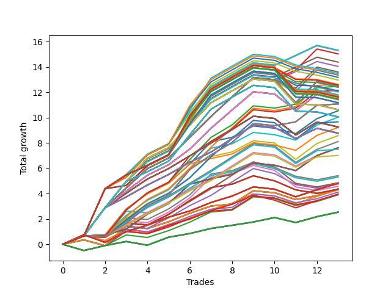

# Long HLT 606 
- Symbol: TSLA
- Date Range: 05/16/2022 - 05/17/2024
- Trading Period: 8:30-12:30
- Number of Trades: 13



| Id. | Name | Win Percent | Profit | Avg Profit / Trade | Avg Time / Trade | Std |      | Name | Win Percent | Profit | Avg Profit / Trade | Avg Time / Trade | Std |
| --- | ---- | ----------- | ------ | ------------------ | ---------------- | --- | ---- | ---- | ----------- | ------ | ------------------ | ---------------- | --- |
| | Sorted By <br> Profit | | | | | | | Sorted By <br> Win Percentage |||||
|0| TP-3 75m | 84.62 | 15.31 | 1.18 | 60:27 | 1.05 |     | TP-3 75m | 84.62 | 15.31 | 1.18 | 60:27 | 1.05 |
|1| TP-2.75 75m | 84.62 | 15.31 | 1.18 | 60:27 | 1.05 |     | TP-2.75 75m | 84.62 | 15.31 | 1.18 | 60:27 | 1.05 |
|2| TP-2.5 75m | 84.62 | 15.31 | 1.18 | 60:27 | 1.05 |     | TP-2.5 75m | 84.62 | 15.31 | 1.18 | 60:27 | 1.05 |
|3| TP-2.25 75m | 84.62 | 15.28 | 1.18 | 60:13 | 1.04 |     | TP-2.25 75m | 84.62 | 15.28 | 1.18 | 60:13 | 1.04 |
|4| TP-1.5 75m | 84.62 | 15.03 | 1.16 | 43:50 | 0.74 |     | TP-1.5 75m | 84.62 | 15.03 | 1.16 | 43:50 | 0.74 |
|5| TP-2 75m | 84.62 | 14.38 | 1.11 | 53:55 | 0.82 |     | TP-2 75m | 84.62 | 14.38 | 1.11 | 53:55 | 0.82 |
|6| TP-1.75 75m | 84.62 | 14.04 | 1.08 | 51:04 | 0.79 |     | TP-1.75 75m | 84.62 | 14.04 | 1.08 | 51:04 | 0.79 |
|7| TP-1.5 90m | 76.92 | 13.60 | 1.05 | 45:00 | 0.88 |     | TP-1.5 60m | 84.62 | 12.64 | 0.97 | 41:32 | 0.69 |
|8| TP-2.5 90m | 69.23 | 13.48 | 1.04 | 65:23 | 1.28 |     | TP-1.75 60m | 84.62 | 12.47 | 0.96 | 45:41 | 0.72 |
|9| TP-1.5 105m | 76.92 | 13.36 | 1.03 | 46:09 | 0.92 |     | TP-2 60m | 84.62 | 12.16 | 0.94 | 47:46 | 0.71 |
|10| TP-3 90m | 69.23 | 13.36 | 1.03 | 67:09 | 1.28 |     | TP-3 60m | 84.62 | 11.08 | 0.85 | 51:09 | 0.63 |
|11| TP-2.75 90m | 69.23 | 13.18 | 1.01 | 66:27 | 1.26 |     | TP-2.75 60m | 84.62 | 11.08 | 0.85 | 51:09 | 0.63 |
|12| TP-2.25 90m | 69.23 | 12.97 | 1.00 | 64:55 | 1.23 |     | TP-2.5 60m | 84.62 | 11.08 | 0.85 | 51:09 | 0.63 |
|13| TP-1.5 60m | 84.62 | 12.64 | 0.97 | 41:32 | 0.69 |     | TP-2.25 60m | 84.62 | 11.08 | 0.85 | 51:09 | 0.63 |
|14| TP-2.5 105m | 69.23 | 12.62 | 0.97 | 69:18 | 1.29 |     | TP-1.75 45m | 84.62 | 10.54 | 0.81 | 37:13 | 0.71 |
|15| TP-3 105m | 69.23 | 12.57 | 0.97 | 72:13 | 1.30 |     | TP-1.5 45m | 84.62 | 10.03 | 0.77 | 35:18 | 0.65 |
|16| TP-1.75 60m | 84.62 | 12.47 | 0.96 | 45:41 | 0.72 |     | TP-2 45m | 84.62 | 9.22 | 0.71 | 37:55 | 0.66 |
|17| TP-1.5 180m | 76.92 | 12.46 | 0.96 | 46:23 | 1.08 |     | TP-1.25 45m | 84.62 | 8.58 | 0.66 | 32:00 | 0.76 |
|18| TP-1.5 165m | 76.92 | 12.46 | 0.96 | 46:23 | 1.08 |     | TP-1 45m | 84.62 | 8.11 | 0.62 | 26:32 | 0.68 |
|19| TP-1.5 150m | 76.92 | 12.46 | 0.96 | 46:23 | 1.08 |     | TP-3 45m | 84.62 | 7.62 | 0.59 | 39:36 | 0.53 |
|20| TP-1.5 135m | 76.92 | 12.46 | 0.96 | 46:23 | 1.08 |     | TP-2.75 45m | 84.62 | 7.62 | 0.59 | 39:36 | 0.53 |
|21| TP-1.5 120m | 76.92 | 12.46 | 0.96 | 46:23 | 1.08 |     | TP-2.5 45m | 84.62 | 7.62 | 0.59 | 39:36 | 0.53 |
|22| TP-2.75 105m | 69.23 | 12.39 | 0.95 | 71:32 | 1.28 |     | TP-2.25 45m | 84.62 | 7.62 | 0.59 | 39:36 | 0.53 |
|23| TP-2 60m | 84.62 | 12.16 | 0.94 | 47:46 | 0.71 |     | TP-0.75 45m | 84.62 | 7.62 | 0.59 | 25:09 | 0.55 |
|24| TP-2.25 105m | 69.23 | 12.11 | 0.93 | 68:50 | 1.24 |     | TP-1.5 90m | 76.92 | 13.60 | 1.05 | 45:00 | 0.88 |
|25| TP-2 90m | 69.23 | 12.03 | 0.93 | 57:23 | 1.01 |     | TP-1.5 105m | 76.92 | 13.36 | 1.03 | 46:09 | 0.92 |
|26| TP-2 105m | 69.23 | 11.81 | 0.91 | 60:09 | 1.01 |     | TP-1.5 180m | 76.92 | 12.46 | 0.96 | 46:23 | 1.08 |
|27| TP-2.5 180m | 69.23 | 11.69 | 0.90 | 72:46 | 1.40 |     | TP-1.5 165m | 76.92 | 12.46 | 0.96 | 46:23 | 1.08 |
|28| TP-2.5 165m | 69.23 | 11.69 | 0.90 | 72:46 | 1.40 |     | TP-1.5 150m | 76.92 | 12.46 | 0.96 | 46:23 | 1.08 |
|29| TP-2.5 150m | 69.23 | 11.69 | 0.90 | 72:46 | 1.40 |     | TP-1.5 135m | 76.92 | 12.46 | 0.96 | 46:23 | 1.08 |
|30| TP-2.5 135m | 69.23 | 11.69 | 0.90 | 72:46 | 1.40 |     | TP-1.5 120m | 76.92 | 12.46 | 0.96 | 46:23 | 1.08 |
|31| TP-2.5 120m | 69.23 | 11.69 | 0.90 | 72:46 | 1.40 |     | TP-1.25 180m | 76.92 | 11.43 | 0.88 | 36:18 | 0.93 |
|32| TP-3 180m | 69.23 | 11.63 | 0.89 | 76:50 | 1.41 |     | TP-1.25 165m | 76.92 | 11.43 | 0.88 | 36:18 | 0.93 |
|33| TP-3 165m | 69.23 | 11.63 | 0.89 | 76:50 | 1.41 |     | TP-1.25 150m | 76.92 | 11.43 | 0.88 | 36:18 | 0.93 |
|34| TP-3 150m | 69.23 | 11.63 | 0.89 | 76:50 | 1.41 |     | TP-1.25 135m | 76.92 | 11.43 | 0.88 | 36:18 | 0.93 |
|35| TP-3 135m | 69.23 | 11.63 | 0.89 | 76:50 | 1.41 |     | TP-1.25 120m | 76.92 | 11.43 | 0.88 | 36:18 | 0.93 |
|36| TP-3 120m | 69.23 | 11.63 | 0.89 | 76:50 | 1.41 |     | TP-1.25 105m | 76.92 | 11.43 | 0.88 | 36:18 | 0.93 |
|37| TP-1.75 105m | 69.23 | 11.53 | 0.89 | 55:00 | 0.98 |     | TP-1.25 90m | 76.92 | 11.43 | 0.88 | 36:18 | 0.93 |
|38| TP-1.75 90m | 69.23 | 11.53 | 0.89 | 53:23 | 0.97 |     | TP-1.25 75m | 76.92 | 11.43 | 0.88 | 36:18 | 0.93 |
|39| TP-2.75 180m | 69.23 | 11.45 | 0.88 | 76:09 | 1.38 |     | TP-1.25 60m | 76.92 | 9.67 | 0.74 | 35:18 | 0.83 |
|40| TP-2.75 165m | 69.23 | 11.45 | 0.88 | 76:09 | 1.38 |     | TP-1 180m | 76.92 | 9.26 | 0.71 | 29:50 | 0.84 |
|41| TP-2.75 150m | 69.23 | 11.45 | 0.88 | 76:09 | 1.38 |     | TP-1 165m | 76.92 | 9.26 | 0.71 | 29:50 | 0.84 |
|42| TP-2.75 135m | 69.23 | 11.45 | 0.88 | 76:09 | 1.38 |     | TP-1 150m | 76.92 | 9.26 | 0.71 | 29:50 | 0.84 |
|43| TP-2.75 120m | 69.23 | 11.45 | 0.88 | 76:09 | 1.38 |     | TP-1 135m | 76.92 | 9.26 | 0.71 | 29:50 | 0.84 |
|44| TP-1.25 180m | 76.92 | 11.43 | 0.88 | 36:18 | 0.93 |     | TP-1 120m | 76.92 | 9.26 | 0.71 | 29:50 | 0.84 |
|45| TP-1.25 165m | 76.92 | 11.43 | 0.88 | 36:18 | 0.93 |     | TP-1 105m | 76.92 | 9.26 | 0.71 | 29:50 | 0.84 |
|46| TP-1.25 150m | 76.92 | 11.43 | 0.88 | 36:18 | 0.93 |     | TP-1 90m | 76.92 | 9.26 | 0.71 | 29:50 | 0.84 |
|47| TP-1.25 135m | 76.92 | 11.43 | 0.88 | 36:18 | 0.93 |     | TP-1 75m | 76.92 | 9.26 | 0.71 | 29:50 | 0.84 |
|48| TP-1.25 120m | 76.92 | 11.43 | 0.88 | 36:18 | 0.93 |     | TP-0.75 180m | 76.92 | 8.77 | 0.67 | 28:27 | 0.74 |
|49| TP-1.25 105m | 76.92 | 11.43 | 0.88 | 36:18 | 0.93 |     | TP-0.75 165m | 76.92 | 8.77 | 0.67 | 28:27 | 0.74 |
|50| TP-1.25 90m | 76.92 | 11.43 | 0.88 | 36:18 | 0.93 |     | TP-0.75 150m | 76.92 | 8.77 | 0.67 | 28:27 | 0.74 |
|51| TP-1.25 75m | 76.92 | 11.43 | 0.88 | 36:18 | 0.93 |     | TP-0.75 135m | 76.92 | 8.77 | 0.67 | 28:27 | 0.74 |
|52| TP-2.25 180m | 69.23 | 11.18 | 0.86 | 72:18 | 1.35 |     | TP-0.75 120m | 76.92 | 8.77 | 0.67 | 28:27 | 0.74 |
|53| TP-2.25 165m | 69.23 | 11.18 | 0.86 | 72:18 | 1.35 |     | TP-0.75 105m | 76.92 | 8.77 | 0.67 | 28:27 | 0.74 |
|54| TP-2.25 150m | 69.23 | 11.18 | 0.86 | 72:18 | 1.35 |     | TP-0.75 90m | 76.92 | 8.77 | 0.67 | 28:27 | 0.74 |
|55| TP-2.25 135m | 69.23 | 11.18 | 0.86 | 72:18 | 1.35 |     | TP-0.75 75m | 76.92 | 8.77 | 0.67 | 28:27 | 0.74 |
|56| TP-2.25 120m | 69.23 | 11.18 | 0.86 | 72:18 | 1.35 |     | TP-1 60m | 76.92 | 7.50 | 0.58 | 28:50 | 0.70 |
|57| TP-3 60m | 84.62 | 11.08 | 0.85 | 51:09 | 0.63 |     | TP-0.75 60m | 76.92 | 7.01 | 0.54 | 27:27 | 0.57 |
|58| TP-2.75 60m | 84.62 | 11.08 | 0.85 | 51:09 | 0.63 |     | TP-0.5 180m | 76.92 | 4.82 | 0.37 | 12:32 | 0.48 |
|59| TP-2.5 60m | 84.62 | 11.08 | 0.85 | 51:09 | 0.63 |     | TP-0.5 165m | 76.92 | 4.82 | 0.37 | 12:32 | 0.48 |
|60| TP-2.25 60m | 84.62 | 11.08 | 0.85 | 51:09 | 0.63 |     | TP-0.5 150m | 76.92 | 4.82 | 0.37 | 12:32 | 0.48 |
|61| TP-1.75 180m | 69.23 | 10.63 | 0.82 | 55:13 | 1.13 |     | TP-0.5 135m | 76.92 | 4.82 | 0.37 | 12:32 | 0.48 |
|62| TP-1.75 165m | 69.23 | 10.63 | 0.82 | 55:13 | 1.13 |     | TP-0.5 120m | 76.92 | 4.82 | 0.37 | 12:32 | 0.48 |
|63| TP-1.75 150m | 69.23 | 10.63 | 0.82 | 55:13 | 1.13 |     | TP-0.5 105m | 76.92 | 4.82 | 0.37 | 12:32 | 0.48 |
|64| TP-1.75 135m | 69.23 | 10.63 | 0.82 | 55:13 | 1.13 |     | TP-0.5 90m | 76.92 | 4.82 | 0.37 | 12:32 | 0.48 |
|65| TP-1.75 120m | 69.23 | 10.63 | 0.82 | 55:13 | 1.13 |     | TP-0.5 75m | 76.92 | 4.82 | 0.37 | 12:32 | 0.48 |
|66| TP-1.75 45m | 84.62 | 10.54 | 0.81 | 37:13 | 0.71 |     | TP-0.5 60m | 76.92 | 4.82 | 0.37 | 12:32 | 0.48 |
|67| TP-2 180m | 69.23 | 10.06 | 0.77 | 62:27 | 1.15 |     | TP-0.5 45m | 76.92 | 4.82 | 0.37 | 12:32 | 0.48 |
|68| TP-2 165m | 69.23 | 10.06 | 0.77 | 62:27 | 1.15 |     | TP-0.25 180m | 76.92 | 2.54 | 0.20 | 03:18 | 0.34 |
|69| TP-2 150m | 69.23 | 10.06 | 0.77 | 62:27 | 1.15 |     | TP-0.25 165m | 76.92 | 2.54 | 0.20 | 03:18 | 0.34 |
|70| TP-2 135m | 69.23 | 10.06 | 0.77 | 62:27 | 1.15 |     | TP-0.25 150m | 76.92 | 2.54 | 0.20 | 03:18 | 0.34 |
|71| TP-2 120m | 69.23 | 10.06 | 0.77 | 62:27 | 1.15 |     | TP-0.25 135m | 76.92 | 2.54 | 0.20 | 03:18 | 0.34 |
|72| TP-1.5 45m | 84.62 | 10.03 | 0.77 | 35:18 | 0.65 |     | TP-0.25 120m | 76.92 | 2.54 | 0.20 | 03:18 | 0.34 |
|73| TP-1.25 60m | 76.92 | 9.67 | 0.74 | 35:18 | 0.83 |     | TP-0.25 105m | 76.92 | 2.54 | 0.20 | 03:18 | 0.34 |
|74| TP-1 180m | 76.92 | 9.26 | 0.71 | 29:50 | 0.84 |     | TP-0.25 90m | 76.92 | 2.54 | 0.20 | 03:18 | 0.34 |
|75| TP-1 165m | 76.92 | 9.26 | 0.71 | 29:50 | 0.84 |     | TP-0.25 75m | 76.92 | 2.54 | 0.20 | 03:18 | 0.34 |
|76| TP-1 150m | 76.92 | 9.26 | 0.71 | 29:50 | 0.84 |     | TP-0.25 60m | 76.92 | 2.54 | 0.20 | 03:18 | 0.34 |
|77| TP-1 135m | 76.92 | 9.26 | 0.71 | 29:50 | 0.84 |     | TP-0.25 45m | 76.92 | 2.54 | 0.20 | 03:18 | 0.34 |
|78| TP-1 120m | 76.92 | 9.26 | 0.71 | 29:50 | 0.84 |     | TP-0.25 30m | 76.92 | 2.54 | 0.20 | 03:18 | 0.34 |
|79| TP-1 105m | 76.92 | 9.26 | 0.71 | 29:50 | 0.84 |     | TP-0.25 15m | 76.92 | 2.54 | 0.20 | 03:18 | 0.34 |
|80| TP-1 90m | 76.92 | 9.26 | 0.71 | 29:50 | 0.84 |     | TP-2.5 90m | 69.23 | 13.48 | 1.04 | 65:23 | 1.28 |
|81| TP-1 75m | 76.92 | 9.26 | 0.71 | 29:50 | 0.84 |     | TP-3 90m | 69.23 | 13.36 | 1.03 | 67:09 | 1.28 |
|82| TP-2 45m | 84.62 | 9.22 | 0.71 | 37:55 | 0.66 |     | TP-2.75 90m | 69.23 | 13.18 | 1.01 | 66:27 | 1.26 |
|83| TP-0.75 180m | 76.92 | 8.77 | 0.67 | 28:27 | 0.74 |     | TP-2.25 90m | 69.23 | 12.97 | 1.00 | 64:55 | 1.23 |
|84| TP-0.75 165m | 76.92 | 8.77 | 0.67 | 28:27 | 0.74 |     | TP-2.5 105m | 69.23 | 12.62 | 0.97 | 69:18 | 1.29 |
|85| TP-0.75 150m | 76.92 | 8.77 | 0.67 | 28:27 | 0.74 |     | TP-3 105m | 69.23 | 12.57 | 0.97 | 72:13 | 1.30 |
|86| TP-0.75 135m | 76.92 | 8.77 | 0.67 | 28:27 | 0.74 |     | TP-2.75 105m | 69.23 | 12.39 | 0.95 | 71:32 | 1.28 |
|87| TP-0.75 120m | 76.92 | 8.77 | 0.67 | 28:27 | 0.74 |     | TP-2.25 105m | 69.23 | 12.11 | 0.93 | 68:50 | 1.24 |
|88| TP-0.75 105m | 76.92 | 8.77 | 0.67 | 28:27 | 0.74 |     | TP-2 90m | 69.23 | 12.03 | 0.93 | 57:23 | 1.01 |
|89| TP-0.75 90m | 76.92 | 8.77 | 0.67 | 28:27 | 0.74 |     | TP-2 105m | 69.23 | 11.81 | 0.91 | 60:09 | 1.01 |
|90| TP-0.75 75m | 76.92 | 8.77 | 0.67 | 28:27 | 0.74 |     | TP-2.5 180m | 69.23 | 11.69 | 0.90 | 72:46 | 1.40 |
|91| TP-1.25 45m | 84.62 | 8.58 | 0.66 | 32:00 | 0.76 |     | TP-2.5 165m | 69.23 | 11.69 | 0.90 | 72:46 | 1.40 |
|92| TP-1 45m | 84.62 | 8.11 | 0.62 | 26:32 | 0.68 |     | TP-2.5 150m | 69.23 | 11.69 | 0.90 | 72:46 | 1.40 |
|93| TP-3 45m | 84.62 | 7.62 | 0.59 | 39:36 | 0.53 |     | TP-2.5 135m | 69.23 | 11.69 | 0.90 | 72:46 | 1.40 |
|94| TP-2.75 45m | 84.62 | 7.62 | 0.59 | 39:36 | 0.53 |     | TP-2.5 120m | 69.23 | 11.69 | 0.90 | 72:46 | 1.40 |
|95| TP-2.5 45m | 84.62 | 7.62 | 0.59 | 39:36 | 0.53 |     | TP-3 180m | 69.23 | 11.63 | 0.89 | 76:50 | 1.41 |
|96| TP-2.25 45m | 84.62 | 7.62 | 0.59 | 39:36 | 0.53 |     | TP-3 165m | 69.23 | 11.63 | 0.89 | 76:50 | 1.41 |
|97| TP-0.75 45m | 84.62 | 7.62 | 0.59 | 25:09 | 0.55 |     | TP-3 150m | 69.23 | 11.63 | 0.89 | 76:50 | 1.41 |
|98| TP-1 60m | 76.92 | 7.50 | 0.58 | 28:50 | 0.70 |     | TP-3 135m | 69.23 | 11.63 | 0.89 | 76:50 | 1.41 |
|99| TP-0.75 60m | 76.92 | 7.01 | 0.54 | 27:27 | 0.57 |     | TP-3 120m | 69.23 | 11.63 | 0.89 | 76:50 | 1.41 |
|100| TP-1.5 30m | 61.54 | 5.42 | 0.42 | 26:09 | 0.71 |     | TP-1.75 105m | 69.23 | 11.53 | 0.89 | 55:00 | 0.98 |
|101| TP-2 30m | 61.54 | 5.31 | 0.41 | 27:27 | 0.73 |     | TP-1.75 90m | 69.23 | 11.53 | 0.89 | 53:23 | 0.97 |
|102| TP-1.75 30m | 61.54 | 5.31 | 0.41 | 27:27 | 0.73 |     | TP-2.75 180m | 69.23 | 11.45 | 0.88 | 76:09 | 1.38 |
|103| TP-1 30m | 61.54 | 4.86 | 0.37 | 22:04 | 0.73 |     | TP-2.75 165m | 69.23 | 11.45 | 0.88 | 76:09 | 1.38 |
|104| TP-0.5 180m | 76.92 | 4.82 | 0.37 | 12:32 | 0.48 |     | TP-2.75 150m | 69.23 | 11.45 | 0.88 | 76:09 | 1.38 |
|105| TP-0.5 165m | 76.92 | 4.82 | 0.37 | 12:32 | 0.48 |     | TP-2.75 135m | 69.23 | 11.45 | 0.88 | 76:09 | 1.38 |
|106| TP-0.5 150m | 76.92 | 4.82 | 0.37 | 12:32 | 0.48 |     | TP-2.75 120m | 69.23 | 11.45 | 0.88 | 76:09 | 1.38 |
|107| TP-0.5 135m | 76.92 | 4.82 | 0.37 | 12:32 | 0.48 |     | TP-2.25 180m | 69.23 | 11.18 | 0.86 | 72:18 | 1.35 |
|108| TP-0.5 120m | 76.92 | 4.82 | 0.37 | 12:32 | 0.48 |     | TP-2.25 165m | 69.23 | 11.18 | 0.86 | 72:18 | 1.35 |
|109| TP-0.5 105m | 76.92 | 4.82 | 0.37 | 12:32 | 0.48 |     | TP-2.25 150m | 69.23 | 11.18 | 0.86 | 72:18 | 1.35 |
|110| TP-0.5 90m | 76.92 | 4.82 | 0.37 | 12:32 | 0.48 |     | TP-2.25 135m | 69.23 | 11.18 | 0.86 | 72:18 | 1.35 |
|111| TP-0.5 75m | 76.92 | 4.82 | 0.37 | 12:32 | 0.48 |     | TP-2.25 120m | 69.23 | 11.18 | 0.86 | 72:18 | 1.35 |
|112| TP-0.5 60m | 76.92 | 4.82 | 0.37 | 12:32 | 0.48 |     | TP-1.75 180m | 69.23 | 10.63 | 0.82 | 55:13 | 1.13 |
|113| TP-0.5 45m | 76.92 | 4.82 | 0.37 | 12:32 | 0.48 |     | TP-1.75 165m | 69.23 | 10.63 | 0.82 | 55:13 | 1.13 |
|114| TP-0.75 30m | 61.54 | 4.76 | 0.37 | 21:04 | 0.62 |     | TP-1.75 150m | 69.23 | 10.63 | 0.82 | 55:13 | 1.13 |
|115| TP-1.25 30m | 61.54 | 4.58 | 0.35 | 24:55 | 0.77 |     | TP-1.75 135m | 69.23 | 10.63 | 0.82 | 55:13 | 1.13 |
|116| TP-3 15m | 69.23 | 4.37 | 0.34 | 14:00 | 0.57 |     | TP-1.75 120m | 69.23 | 10.63 | 0.82 | 55:13 | 1.13 |
|117| TP-2.75 15m | 69.23 | 4.37 | 0.34 | 14:00 | 0.57 |     | TP-2 180m | 69.23 | 10.06 | 0.77 | 62:27 | 1.15 |
|118| TP-2.5 15m | 69.23 | 4.37 | 0.34 | 14:00 | 0.57 |     | TP-2 165m | 69.23 | 10.06 | 0.77 | 62:27 | 1.15 |
|119| TP-2.25 15m | 69.23 | 4.37 | 0.34 | 14:00 | 0.57 |     | TP-2 150m | 69.23 | 10.06 | 0.77 | 62:27 | 1.15 |
|120| TP-2 15m | 69.23 | 4.37 | 0.34 | 14:00 | 0.57 |     | TP-2 135m | 69.23 | 10.06 | 0.77 | 62:27 | 1.15 |
|121| TP-1.75 15m | 69.23 | 4.37 | 0.34 | 14:00 | 0.57 |     | TP-2 120m | 69.23 | 10.06 | 0.77 | 62:27 | 1.15 |
|122| TP-1.5 15m | 69.23 | 4.37 | 0.34 | 14:00 | 0.57 |     | TP-3 15m | 69.23 | 4.37 | 0.34 | 14:00 | 0.57 |
|123| TP-3 30m | 61.54 | 4.35 | 0.33 | 28:00 | 0.59 |     | TP-2.75 15m | 69.23 | 4.37 | 0.34 | 14:00 | 0.57 |
|124| TP-2.75 30m | 61.54 | 4.35 | 0.33 | 28:00 | 0.59 |     | TP-2.5 15m | 69.23 | 4.37 | 0.34 | 14:00 | 0.57 |
|125| TP-2.5 30m | 61.54 | 4.35 | 0.33 | 28:00 | 0.59 |     | TP-2.25 15m | 69.23 | 4.37 | 0.34 | 14:00 | 0.57 |
|126| TP-2.25 30m | 61.54 | 4.35 | 0.33 | 28:00 | 0.59 |     | TP-2 15m | 69.23 | 4.37 | 0.34 | 14:00 | 0.57 |
|127| TP-0.5 15m | 69.23 | 4.29 | 0.33 | 09:13 | 0.48 |     | TP-1.75 15m | 69.23 | 4.37 | 0.34 | 14:00 | 0.57 |
|128| TP-1.25 15m | 69.23 | 4.12 | 0.32 | 13:46 | 0.53 |     | TP-1.5 15m | 69.23 | 4.37 | 0.34 | 14:00 | 0.57 |
|129| TP-1 15m | 69.23 | 3.96 | 0.30 | 13:27 | 0.51 |     | TP-0.5 15m | 69.23 | 4.29 | 0.33 | 09:13 | 0.48 |
|130| TP-0.5 30m | 69.23 | 3.95 | 0.30 | 11:55 | 0.52 |     | TP-1.25 15m | 69.23 | 4.12 | 0.32 | 13:46 | 0.53 |
|131| TP-0.75 15m | 69.23 | 3.90 | 0.30 | 12:50 | 0.49 |     | TP-1 15m | 69.23 | 3.96 | 0.30 | 13:27 | 0.51 |
|132| TP-0.25 180m | 76.92 | 2.54 | 0.20 | 03:18 | 0.34 |     | TP-0.5 30m | 69.23 | 3.95 | 0.30 | 11:55 | 0.52 |
|133| TP-0.25 165m | 76.92 | 2.54 | 0.20 | 03:18 | 0.34 |     | TP-0.75 15m | 69.23 | 3.90 | 0.30 | 12:50 | 0.49 |
|134| TP-0.25 150m | 76.92 | 2.54 | 0.20 | 03:18 | 0.34 |     | TP-1.5 30m | 61.54 | 5.42 | 0.42 | 26:09 | 0.71 |
|135| TP-0.25 135m | 76.92 | 2.54 | 0.20 | 03:18 | 0.34 |     | TP-2 30m | 61.54 | 5.31 | 0.41 | 27:27 | 0.73 |
|136| TP-0.25 120m | 76.92 | 2.54 | 0.20 | 03:18 | 0.34 |     | TP-1.75 30m | 61.54 | 5.31 | 0.41 | 27:27 | 0.73 |
|137| TP-0.25 105m | 76.92 | 2.54 | 0.20 | 03:18 | 0.34 |     | TP-1 30m | 61.54 | 4.86 | 0.37 | 22:04 | 0.73 |
|138| TP-0.25 90m | 76.92 | 2.54 | 0.20 | 03:18 | 0.34 |     | TP-0.75 30m | 61.54 | 4.76 | 0.37 | 21:04 | 0.62 |
|139| TP-0.25 75m | 76.92 | 2.54 | 0.20 | 03:18 | 0.34 |     | TP-1.25 30m | 61.54 | 4.58 | 0.35 | 24:55 | 0.77 |
|140| TP-0.25 60m | 76.92 | 2.54 | 0.20 | 03:18 | 0.34 |     | TP-3 30m | 61.54 | 4.35 | 0.33 | 28:00 | 0.59 |
|141| TP-0.25 45m | 76.92 | 2.54 | 0.20 | 03:18 | 0.34 |     | TP-2.75 30m | 61.54 | 4.35 | 0.33 | 28:00 | 0.59 |
|142| TP-0.25 30m | 76.92 | 2.54 | 0.20 | 03:18 | 0.34 |     | TP-2.5 30m | 61.54 | 4.35 | 0.33 | 28:00 | 0.59 |
|143| TP-0.25 15m | 76.92 | 2.54 | 0.20 | 03:18 | 0.34 |     | TP-2.25 30m | 61.54 | 4.35 | 0.33 | 28:00 | 0.59 |

### Test TP-0.25 15m
* Take Profit of 0.25 Point
* 0.25 Stoploss
* Results:
```
Total Trades: 13
Percent Up: 76.92
Percent Down: 23.08
Total Points Moved Up: 2.54
Potential Profit: 1270.00
Total Points Ups: 3.71 Count Ups: 10
Total Points Downs: -1.17 Count Downs: 3
```

<details><summary>Trades</summary>

<code>In: 2022-10-11 12:25:00		Out: 2022-10-11 12:29:00		Total Position Time: 04:00		Total Move Up: -0.49		Total to Date: -0.49</code> <br />
<code>In: 2022-11-02 09:55:00		Out: 2022-11-02 09:59:00		Total Position Time: 04:00		Total Move Up: 0.39		Total to Date: -0.10</code> <br />
<code>In: 2023-03-24 08:40:00		Out: 2023-03-24 08:43:00		Total Position Time: 03:00		Total Move Up: 0.32		Total to Date: 0.22</code> <br />
<code>In: 2023-04-17 08:55:00		Out: 2023-04-17 08:58:00		Total Position Time: 03:00		Total Move Up: -0.29		Total to Date: -0.07</code> <br />
<code>In: 2023-04-20 12:30:00		Out: 2023-04-20 12:32:00		Total Position Time: 02:00		Total Move Up: 0.63		Total to Date: 0.56</code> <br />
<code>In: 2023-05-01 08:40:00		Out: 2023-05-01 08:43:00		Total Position Time: 03:00		Total Move Up: 0.29		Total to Date: 0.85</code> <br />
<code>In: 2023-08-08 09:00:00		Out: 2023-08-08 09:04:00		Total Position Time: 04:00		Total Move Up: 0.40		Total to Date: 1.25</code> <br />
<code>In: 2023-09-01 11:40:00		Out: 2023-09-01 11:43:00		Total Position Time: 03:00		Total Move Up: 0.25		Total to Date: 1.50</code> <br />
<code>In: 2023-09-01 11:45:00		Out: 2023-09-01 11:47:00		Total Position Time: 02:00		Total Move Up: 0.26		Total to Date: 1.76</code> <br />
<code>In: 2023-10-18 12:20:00		Out: 2023-10-18 12:23:00		Total Position Time: 03:00		Total Move Up: 0.35		Total to Date: 2.11</code> <br />
<code>In: 2023-11-30 08:45:00		Out: 2023-11-30 08:47:00		Total Position Time: 02:00		Total Move Up: -0.39		Total to Date: 1.72</code> <br />
<code>In: 2023-12-05 11:15:00		Out: 2023-12-05 11:17:00		Total Position Time: 02:00		Total Move Up: 0.46		Total to Date: 2.18</code> <br />
<code>In: 2023-12-22 11:45:00		Out: 2023-12-22 11:53:00		Total Position Time: 08:00		Total Move Up: 0.36		Total to Date: 2.54</code> <br />


</details>

### Test TP-0.5 15m
* Take Profit of 0.5 Point
* 0.5 Stoploss
* Results:
```
Total Trades: 13
Percent Up: 69.23
Percent Down: 30.77
Total Points Moved Up: 4.29
Potential Profit: 2145.00
Total Points Ups: 5.70 Count Ups: 9
Total Points Downs: -1.41 Count Downs: 4
```

<details><summary>Trades</summary>

<code>In: 2022-10-11 12:25:00		Out: 2022-10-11 12:37:00		Total Position Time: 12:00		Total Move Up: 0.76		Total to Date: 0.76</code> <br />
<code>In: 2022-11-02 09:55:00		Out: 2022-11-02 10:09:00		Total Position Time: 14:00		Total Move Up: -0.46		Total to Date: 0.30</code> <br />
<code>In: 2023-03-24 08:40:00		Out: 2023-03-24 08:46:00		Total Position Time: 06:00		Total Move Up: 0.85		Total to Date: 1.15</code> <br />
<code>In: 2023-04-17 08:55:00		Out: 2023-04-17 09:09:00		Total Position Time: 14:00		Total Move Up: -0.20		Total to Date: 0.95</code> <br />
<code>In: 2023-04-20 12:30:00		Out: 2023-04-20 12:32:00		Total Position Time: 02:00		Total Move Up: 0.63		Total to Date: 1.58</code> <br />
<code>In: 2023-05-01 08:40:00		Out: 2023-05-01 08:49:00		Total Position Time: 09:00		Total Move Up: 0.49		Total to Date: 2.07</code> <br />
<code>In: 2023-08-08 09:00:00		Out: 2023-08-08 09:06:00		Total Position Time: 06:00		Total Move Up: 0.67		Total to Date: 2.74</code> <br />
<code>In: 2023-09-01 11:40:00		Out: 2023-09-01 11:46:00		Total Position Time: 06:00		Total Move Up: 0.51		Total to Date: 3.25</code> <br />
<code>In: 2023-09-01 11:45:00		Out: 2023-09-01 11:58:00		Total Position Time: 13:00		Total Move Up: 0.72		Total to Date: 3.97</code> <br />
<code>In: 2023-10-18 12:20:00		Out: 2023-10-18 12:34:00		Total Position Time: 14:00		Total Move Up: -0.15		Total to Date: 3.82</code> <br />
<code>In: 2023-11-30 08:45:00		Out: 2023-11-30 08:57:00		Total Position Time: 12:00		Total Move Up: -0.60		Total to Date: 3.22</code> <br />
<code>In: 2023-12-05 11:15:00		Out: 2023-12-05 11:18:00		Total Position Time: 03:00		Total Move Up: 0.56		Total to Date: 3.78</code> <br />
<code>In: 2023-12-22 11:45:00		Out: 2023-12-22 11:54:00		Total Position Time: 09:00		Total Move Up: 0.51		Total to Date: 4.29</code> <br />


</details>

### Test TP-0.75 15m
* Take Profit of 0.75 Point
* 0.75 Stoploss
* Results:
```
Total Trades: 13
Percent Up: 69.23
Percent Down: 30.77
Total Points Moved Up: 3.90
Potential Profit: 1950.00
Total Points Ups: 5.25 Count Ups: 9
Total Points Downs: -1.35 Count Downs: 4
```

<details><summary>Trades</summary>

<code>In: 2022-10-11 12:25:00		Out: 2022-10-11 12:39:00		Total Position Time: 14:00		Total Move Up: 0.35		Total to Date: 0.35</code> <br />
<code>In: 2022-11-02 09:55:00		Out: 2022-11-02 10:09:00		Total Position Time: 14:00		Total Move Up: -0.46		Total to Date: -0.11</code> <br />
<code>In: 2023-03-24 08:40:00		Out: 2023-03-24 08:46:00		Total Position Time: 06:00		Total Move Up: 0.85		Total to Date: 0.74</code> <br />
<code>In: 2023-04-17 08:55:00		Out: 2023-04-17 09:09:00		Total Position Time: 14:00		Total Move Up: -0.20		Total to Date: 0.54</code> <br />
<code>In: 2023-04-20 12:30:00		Out: 2023-04-20 12:44:00		Total Position Time: 14:00		Total Move Up: 0.54		Total to Date: 1.08</code> <br />
<code>In: 2023-05-01 08:40:00		Out: 2023-05-01 08:54:00		Total Position Time: 14:00		Total Move Up: 0.67		Total to Date: 1.75</code> <br />
<code>In: 2023-08-08 09:00:00		Out: 2023-08-08 09:07:00		Total Position Time: 07:00		Total Move Up: 0.80		Total to Date: 2.55</code> <br />
<code>In: 2023-09-01 11:40:00		Out: 2023-09-01 11:54:00		Total Position Time: 14:00		Total Move Up: 0.15		Total to Date: 2.70</code> <br />
<code>In: 2023-09-01 11:45:00		Out: 2023-09-01 11:59:00		Total Position Time: 14:00		Total Move Up: 1.05		Total to Date: 3.75</code> <br />
<code>In: 2023-10-18 12:20:00		Out: 2023-10-18 12:34:00		Total Position Time: 14:00		Total Move Up: -0.15		Total to Date: 3.60</code> <br />
<code>In: 2023-11-30 08:45:00		Out: 2023-11-30 08:59:00		Total Position Time: 14:00		Total Move Up: -0.54		Total to Date: 3.06</code> <br />
<code>In: 2023-12-05 11:15:00		Out: 2023-12-05 11:29:00		Total Position Time: 14:00		Total Move Up: 0.32		Total to Date: 3.38</code> <br />
<code>In: 2023-12-22 11:45:00		Out: 2023-12-22 11:59:00		Total Position Time: 14:00		Total Move Up: 0.52		Total to Date: 3.90</code> <br />


</details>

### Test TP-1 15m
* Take Profit of 1 Point
* 1 Stoploss
* Results:
```
Total Trades: 13
Percent Up: 69.23
Percent Down: 30.77
Total Points Moved Up: 3.96
Potential Profit: 1980.00
Total Points Ups: 5.31 Count Ups: 9
Total Points Downs: -1.35 Count Downs: 4
```

<details><summary>Trades</summary>

<code>In: 2022-10-11 12:25:00		Out: 2022-10-11 12:39:00		Total Position Time: 14:00		Total Move Up: 0.35		Total to Date: 0.35</code> <br />
<code>In: 2022-11-02 09:55:00		Out: 2022-11-02 10:09:00		Total Position Time: 14:00		Total Move Up: -0.46		Total to Date: -0.11</code> <br />
<code>In: 2023-03-24 08:40:00		Out: 2023-03-24 08:47:00		Total Position Time: 07:00		Total Move Up: 1.14		Total to Date: 1.03</code> <br />
<code>In: 2023-04-17 08:55:00		Out: 2023-04-17 09:09:00		Total Position Time: 14:00		Total Move Up: -0.20		Total to Date: 0.83</code> <br />
<code>In: 2023-04-20 12:30:00		Out: 2023-04-20 12:44:00		Total Position Time: 14:00		Total Move Up: 0.54		Total to Date: 1.37</code> <br />
<code>In: 2023-05-01 08:40:00		Out: 2023-05-01 08:54:00		Total Position Time: 14:00		Total Move Up: 0.67		Total to Date: 2.04</code> <br />
<code>In: 2023-08-08 09:00:00		Out: 2023-08-08 09:14:00		Total Position Time: 14:00		Total Move Up: 0.57		Total to Date: 2.61</code> <br />
<code>In: 2023-09-01 11:40:00		Out: 2023-09-01 11:54:00		Total Position Time: 14:00		Total Move Up: 0.15		Total to Date: 2.76</code> <br />
<code>In: 2023-09-01 11:45:00		Out: 2023-09-01 11:59:00		Total Position Time: 14:00		Total Move Up: 1.05		Total to Date: 3.81</code> <br />
<code>In: 2023-10-18 12:20:00		Out: 2023-10-18 12:34:00		Total Position Time: 14:00		Total Move Up: -0.15		Total to Date: 3.66</code> <br />
<code>In: 2023-11-30 08:45:00		Out: 2023-11-30 08:59:00		Total Position Time: 14:00		Total Move Up: -0.54		Total to Date: 3.12</code> <br />
<code>In: 2023-12-05 11:15:00		Out: 2023-12-05 11:29:00		Total Position Time: 14:00		Total Move Up: 0.32		Total to Date: 3.44</code> <br />
<code>In: 2023-12-22 11:45:00		Out: 2023-12-22 11:59:00		Total Position Time: 14:00		Total Move Up: 0.52		Total to Date: 3.96</code> <br />


</details>

### Test TP-1.25 15m
* Take Profit of 1.25 Point
* 1.25 Stoploss
* Results:
```
Total Trades: 13
Percent Up: 69.23
Percent Down: 30.77
Total Points Moved Up: 4.12
Potential Profit: 2060.00
Total Points Ups: 5.47 Count Ups: 9
Total Points Downs: -1.35 Count Downs: 4
```

<details><summary>Trades</summary>

<code>In: 2022-10-11 12:25:00		Out: 2022-10-11 12:39:00		Total Position Time: 14:00		Total Move Up: 0.35		Total to Date: 0.35</code> <br />
<code>In: 2022-11-02 09:55:00		Out: 2022-11-02 10:09:00		Total Position Time: 14:00		Total Move Up: -0.46		Total to Date: -0.11</code> <br />
<code>In: 2023-03-24 08:40:00		Out: 2023-03-24 08:51:00		Total Position Time: 11:00		Total Move Up: 1.30		Total to Date: 1.19</code> <br />
<code>In: 2023-04-17 08:55:00		Out: 2023-04-17 09:09:00		Total Position Time: 14:00		Total Move Up: -0.20		Total to Date: 0.99</code> <br />
<code>In: 2023-04-20 12:30:00		Out: 2023-04-20 12:44:00		Total Position Time: 14:00		Total Move Up: 0.54		Total to Date: 1.53</code> <br />
<code>In: 2023-05-01 08:40:00		Out: 2023-05-01 08:54:00		Total Position Time: 14:00		Total Move Up: 0.67		Total to Date: 2.20</code> <br />
<code>In: 2023-08-08 09:00:00		Out: 2023-08-08 09:14:00		Total Position Time: 14:00		Total Move Up: 0.57		Total to Date: 2.77</code> <br />
<code>In: 2023-09-01 11:40:00		Out: 2023-09-01 11:54:00		Total Position Time: 14:00		Total Move Up: 0.15		Total to Date: 2.92</code> <br />
<code>In: 2023-09-01 11:45:00		Out: 2023-09-01 11:59:00		Total Position Time: 14:00		Total Move Up: 1.05		Total to Date: 3.97</code> <br />
<code>In: 2023-10-18 12:20:00		Out: 2023-10-18 12:34:00		Total Position Time: 14:00		Total Move Up: -0.15		Total to Date: 3.82</code> <br />
<code>In: 2023-11-30 08:45:00		Out: 2023-11-30 08:59:00		Total Position Time: 14:00		Total Move Up: -0.54		Total to Date: 3.28</code> <br />
<code>In: 2023-12-05 11:15:00		Out: 2023-12-05 11:29:00		Total Position Time: 14:00		Total Move Up: 0.32		Total to Date: 3.60</code> <br />
<code>In: 2023-12-22 11:45:00		Out: 2023-12-22 11:59:00		Total Position Time: 14:00		Total Move Up: 0.52		Total to Date: 4.12</code> <br />


</details>

### Test TP-1.5 15m
* Take Profit of 1.5 Point
* 1.5 Stoploss
* Results:
```
Total Trades: 13
Percent Up: 69.23
Percent Down: 30.77
Total Points Moved Up: 4.37
Potential Profit: 2185.00
Total Points Ups: 5.72 Count Ups: 9
Total Points Downs: -1.35 Count Downs: 4
```

<details><summary>Trades</summary>

<code>In: 2022-10-11 12:25:00		Out: 2022-10-11 12:39:00		Total Position Time: 14:00		Total Move Up: 0.35		Total to Date: 0.35</code> <br />
<code>In: 2022-11-02 09:55:00		Out: 2022-11-02 10:09:00		Total Position Time: 14:00		Total Move Up: -0.46		Total to Date: -0.11</code> <br />
<code>In: 2023-03-24 08:40:00		Out: 2023-03-24 08:54:00		Total Position Time: 14:00		Total Move Up: 1.55		Total to Date: 1.44</code> <br />
<code>In: 2023-04-17 08:55:00		Out: 2023-04-17 09:09:00		Total Position Time: 14:00		Total Move Up: -0.20		Total to Date: 1.24</code> <br />
<code>In: 2023-04-20 12:30:00		Out: 2023-04-20 12:44:00		Total Position Time: 14:00		Total Move Up: 0.54		Total to Date: 1.78</code> <br />
<code>In: 2023-05-01 08:40:00		Out: 2023-05-01 08:54:00		Total Position Time: 14:00		Total Move Up: 0.67		Total to Date: 2.45</code> <br />
<code>In: 2023-08-08 09:00:00		Out: 2023-08-08 09:14:00		Total Position Time: 14:00		Total Move Up: 0.57		Total to Date: 3.02</code> <br />
<code>In: 2023-09-01 11:40:00		Out: 2023-09-01 11:54:00		Total Position Time: 14:00		Total Move Up: 0.15		Total to Date: 3.17</code> <br />
<code>In: 2023-09-01 11:45:00		Out: 2023-09-01 11:59:00		Total Position Time: 14:00		Total Move Up: 1.05		Total to Date: 4.22</code> <br />
<code>In: 2023-10-18 12:20:00		Out: 2023-10-18 12:34:00		Total Position Time: 14:00		Total Move Up: -0.15		Total to Date: 4.07</code> <br />
<code>In: 2023-11-30 08:45:00		Out: 2023-11-30 08:59:00		Total Position Time: 14:00		Total Move Up: -0.54		Total to Date: 3.53</code> <br />
<code>In: 2023-12-05 11:15:00		Out: 2023-12-05 11:29:00		Total Position Time: 14:00		Total Move Up: 0.32		Total to Date: 3.85</code> <br />
<code>In: 2023-12-22 11:45:00		Out: 2023-12-22 11:59:00		Total Position Time: 14:00		Total Move Up: 0.52		Total to Date: 4.37</code> <br />


</details>

### Test TP-1.75 15m
* Take Profit of 1.75 Point
* 1.75 Stoploss
* Results:
```
Total Trades: 13
Percent Up: 69.23
Percent Down: 30.77
Total Points Moved Up: 4.37
Potential Profit: 2185.00
Total Points Ups: 5.72 Count Ups: 9
Total Points Downs: -1.35 Count Downs: 4
```

<details><summary>Trades</summary>

<code>In: 2022-10-11 12:25:00		Out: 2022-10-11 12:39:00		Total Position Time: 14:00		Total Move Up: 0.35		Total to Date: 0.35</code> <br />
<code>In: 2022-11-02 09:55:00		Out: 2022-11-02 10:09:00		Total Position Time: 14:00		Total Move Up: -0.46		Total to Date: -0.11</code> <br />
<code>In: 2023-03-24 08:40:00		Out: 2023-03-24 08:54:00		Total Position Time: 14:00		Total Move Up: 1.55		Total to Date: 1.44</code> <br />
<code>In: 2023-04-17 08:55:00		Out: 2023-04-17 09:09:00		Total Position Time: 14:00		Total Move Up: -0.20		Total to Date: 1.24</code> <br />
<code>In: 2023-04-20 12:30:00		Out: 2023-04-20 12:44:00		Total Position Time: 14:00		Total Move Up: 0.54		Total to Date: 1.78</code> <br />
<code>In: 2023-05-01 08:40:00		Out: 2023-05-01 08:54:00		Total Position Time: 14:00		Total Move Up: 0.67		Total to Date: 2.45</code> <br />
<code>In: 2023-08-08 09:00:00		Out: 2023-08-08 09:14:00		Total Position Time: 14:00		Total Move Up: 0.57		Total to Date: 3.02</code> <br />
<code>In: 2023-09-01 11:40:00		Out: 2023-09-01 11:54:00		Total Position Time: 14:00		Total Move Up: 0.15		Total to Date: 3.17</code> <br />
<code>In: 2023-09-01 11:45:00		Out: 2023-09-01 11:59:00		Total Position Time: 14:00		Total Move Up: 1.05		Total to Date: 4.22</code> <br />
<code>In: 2023-10-18 12:20:00		Out: 2023-10-18 12:34:00		Total Position Time: 14:00		Total Move Up: -0.15		Total to Date: 4.07</code> <br />
<code>In: 2023-11-30 08:45:00		Out: 2023-11-30 08:59:00		Total Position Time: 14:00		Total Move Up: -0.54		Total to Date: 3.53</code> <br />
<code>In: 2023-12-05 11:15:00		Out: 2023-12-05 11:29:00		Total Position Time: 14:00		Total Move Up: 0.32		Total to Date: 3.85</code> <br />
<code>In: 2023-12-22 11:45:00		Out: 2023-12-22 11:59:00		Total Position Time: 14:00		Total Move Up: 0.52		Total to Date: 4.37</code> <br />


</details>

### Test TP-2 15m
* Take Profit of 2 Point
* 2 Stoploss
* Results:
```
Total Trades: 13
Percent Up: 69.23
Percent Down: 30.77
Total Points Moved Up: 4.37
Potential Profit: 2185.00
Total Points Ups: 5.72 Count Ups: 9
Total Points Downs: -1.35 Count Downs: 4
```

<details><summary>Trades</summary>

<code>In: 2022-10-11 12:25:00		Out: 2022-10-11 12:39:00		Total Position Time: 14:00		Total Move Up: 0.35		Total to Date: 0.35</code> <br />
<code>In: 2022-11-02 09:55:00		Out: 2022-11-02 10:09:00		Total Position Time: 14:00		Total Move Up: -0.46		Total to Date: -0.11</code> <br />
<code>In: 2023-03-24 08:40:00		Out: 2023-03-24 08:54:00		Total Position Time: 14:00		Total Move Up: 1.55		Total to Date: 1.44</code> <br />
<code>In: 2023-04-17 08:55:00		Out: 2023-04-17 09:09:00		Total Position Time: 14:00		Total Move Up: -0.20		Total to Date: 1.24</code> <br />
<code>In: 2023-04-20 12:30:00		Out: 2023-04-20 12:44:00		Total Position Time: 14:00		Total Move Up: 0.54		Total to Date: 1.78</code> <br />
<code>In: 2023-05-01 08:40:00		Out: 2023-05-01 08:54:00		Total Position Time: 14:00		Total Move Up: 0.67		Total to Date: 2.45</code> <br />
<code>In: 2023-08-08 09:00:00		Out: 2023-08-08 09:14:00		Total Position Time: 14:00		Total Move Up: 0.57		Total to Date: 3.02</code> <br />
<code>In: 2023-09-01 11:40:00		Out: 2023-09-01 11:54:00		Total Position Time: 14:00		Total Move Up: 0.15		Total to Date: 3.17</code> <br />
<code>In: 2023-09-01 11:45:00		Out: 2023-09-01 11:59:00		Total Position Time: 14:00		Total Move Up: 1.05		Total to Date: 4.22</code> <br />
<code>In: 2023-10-18 12:20:00		Out: 2023-10-18 12:34:00		Total Position Time: 14:00		Total Move Up: -0.15		Total to Date: 4.07</code> <br />
<code>In: 2023-11-30 08:45:00		Out: 2023-11-30 08:59:00		Total Position Time: 14:00		Total Move Up: -0.54		Total to Date: 3.53</code> <br />
<code>In: 2023-12-05 11:15:00		Out: 2023-12-05 11:29:00		Total Position Time: 14:00		Total Move Up: 0.32		Total to Date: 3.85</code> <br />
<code>In: 2023-12-22 11:45:00		Out: 2023-12-22 11:59:00		Total Position Time: 14:00		Total Move Up: 0.52		Total to Date: 4.37</code> <br />


</details>

### Test TP-2.25 15m
* Take Profit of 2.25 Point
* 2.25 Stoploss
* Results:
```
Total Trades: 13
Percent Up: 69.23
Percent Down: 30.77
Total Points Moved Up: 4.37
Potential Profit: 2185.00
Total Points Ups: 5.72 Count Ups: 9
Total Points Downs: -1.35 Count Downs: 4
```

<details><summary>Trades</summary>

<code>In: 2022-10-11 12:25:00		Out: 2022-10-11 12:39:00		Total Position Time: 14:00		Total Move Up: 0.35		Total to Date: 0.35</code> <br />
<code>In: 2022-11-02 09:55:00		Out: 2022-11-02 10:09:00		Total Position Time: 14:00		Total Move Up: -0.46		Total to Date: -0.11</code> <br />
<code>In: 2023-03-24 08:40:00		Out: 2023-03-24 08:54:00		Total Position Time: 14:00		Total Move Up: 1.55		Total to Date: 1.44</code> <br />
<code>In: 2023-04-17 08:55:00		Out: 2023-04-17 09:09:00		Total Position Time: 14:00		Total Move Up: -0.20		Total to Date: 1.24</code> <br />
<code>In: 2023-04-20 12:30:00		Out: 2023-04-20 12:44:00		Total Position Time: 14:00		Total Move Up: 0.54		Total to Date: 1.78</code> <br />
<code>In: 2023-05-01 08:40:00		Out: 2023-05-01 08:54:00		Total Position Time: 14:00		Total Move Up: 0.67		Total to Date: 2.45</code> <br />
<code>In: 2023-08-08 09:00:00		Out: 2023-08-08 09:14:00		Total Position Time: 14:00		Total Move Up: 0.57		Total to Date: 3.02</code> <br />
<code>In: 2023-09-01 11:40:00		Out: 2023-09-01 11:54:00		Total Position Time: 14:00		Total Move Up: 0.15		Total to Date: 3.17</code> <br />
<code>In: 2023-09-01 11:45:00		Out: 2023-09-01 11:59:00		Total Position Time: 14:00		Total Move Up: 1.05		Total to Date: 4.22</code> <br />
<code>In: 2023-10-18 12:20:00		Out: 2023-10-18 12:34:00		Total Position Time: 14:00		Total Move Up: -0.15		Total to Date: 4.07</code> <br />
<code>In: 2023-11-30 08:45:00		Out: 2023-11-30 08:59:00		Total Position Time: 14:00		Total Move Up: -0.54		Total to Date: 3.53</code> <br />
<code>In: 2023-12-05 11:15:00		Out: 2023-12-05 11:29:00		Total Position Time: 14:00		Total Move Up: 0.32		Total to Date: 3.85</code> <br />
<code>In: 2023-12-22 11:45:00		Out: 2023-12-22 11:59:00		Total Position Time: 14:00		Total Move Up: 0.52		Total to Date: 4.37</code> <br />


</details>

### Test TP-2.5 15m
* Take Profit of 2.5 Point
* 2.5 Stoploss
* Results:
```
Total Trades: 13
Percent Up: 69.23
Percent Down: 30.77
Total Points Moved Up: 4.37
Potential Profit: 2185.00
Total Points Ups: 5.72 Count Ups: 9
Total Points Downs: -1.35 Count Downs: 4
```

<details><summary>Trades</summary>

<code>In: 2022-10-11 12:25:00		Out: 2022-10-11 12:39:00		Total Position Time: 14:00		Total Move Up: 0.35		Total to Date: 0.35</code> <br />
<code>In: 2022-11-02 09:55:00		Out: 2022-11-02 10:09:00		Total Position Time: 14:00		Total Move Up: -0.46		Total to Date: -0.11</code> <br />
<code>In: 2023-03-24 08:40:00		Out: 2023-03-24 08:54:00		Total Position Time: 14:00		Total Move Up: 1.55		Total to Date: 1.44</code> <br />
<code>In: 2023-04-17 08:55:00		Out: 2023-04-17 09:09:00		Total Position Time: 14:00		Total Move Up: -0.20		Total to Date: 1.24</code> <br />
<code>In: 2023-04-20 12:30:00		Out: 2023-04-20 12:44:00		Total Position Time: 14:00		Total Move Up: 0.54		Total to Date: 1.78</code> <br />
<code>In: 2023-05-01 08:40:00		Out: 2023-05-01 08:54:00		Total Position Time: 14:00		Total Move Up: 0.67		Total to Date: 2.45</code> <br />
<code>In: 2023-08-08 09:00:00		Out: 2023-08-08 09:14:00		Total Position Time: 14:00		Total Move Up: 0.57		Total to Date: 3.02</code> <br />
<code>In: 2023-09-01 11:40:00		Out: 2023-09-01 11:54:00		Total Position Time: 14:00		Total Move Up: 0.15		Total to Date: 3.17</code> <br />
<code>In: 2023-09-01 11:45:00		Out: 2023-09-01 11:59:00		Total Position Time: 14:00		Total Move Up: 1.05		Total to Date: 4.22</code> <br />
<code>In: 2023-10-18 12:20:00		Out: 2023-10-18 12:34:00		Total Position Time: 14:00		Total Move Up: -0.15		Total to Date: 4.07</code> <br />
<code>In: 2023-11-30 08:45:00		Out: 2023-11-30 08:59:00		Total Position Time: 14:00		Total Move Up: -0.54		Total to Date: 3.53</code> <br />
<code>In: 2023-12-05 11:15:00		Out: 2023-12-05 11:29:00		Total Position Time: 14:00		Total Move Up: 0.32		Total to Date: 3.85</code> <br />
<code>In: 2023-12-22 11:45:00		Out: 2023-12-22 11:59:00		Total Position Time: 14:00		Total Move Up: 0.52		Total to Date: 4.37</code> <br />


</details>

### Test TP-2.75 15m
* Take Profit of 2.75 Point
* 2.75 Stoploss
* Results:
```
Total Trades: 13
Percent Up: 69.23
Percent Down: 30.77
Total Points Moved Up: 4.37
Potential Profit: 2185.00
Total Points Ups: 5.72 Count Ups: 9
Total Points Downs: -1.35 Count Downs: 4
```

<details><summary>Trades</summary>

<code>In: 2022-10-11 12:25:00		Out: 2022-10-11 12:39:00		Total Position Time: 14:00		Total Move Up: 0.35		Total to Date: 0.35</code> <br />
<code>In: 2022-11-02 09:55:00		Out: 2022-11-02 10:09:00		Total Position Time: 14:00		Total Move Up: -0.46		Total to Date: -0.11</code> <br />
<code>In: 2023-03-24 08:40:00		Out: 2023-03-24 08:54:00		Total Position Time: 14:00		Total Move Up: 1.55		Total to Date: 1.44</code> <br />
<code>In: 2023-04-17 08:55:00		Out: 2023-04-17 09:09:00		Total Position Time: 14:00		Total Move Up: -0.20		Total to Date: 1.24</code> <br />
<code>In: 2023-04-20 12:30:00		Out: 2023-04-20 12:44:00		Total Position Time: 14:00		Total Move Up: 0.54		Total to Date: 1.78</code> <br />
<code>In: 2023-05-01 08:40:00		Out: 2023-05-01 08:54:00		Total Position Time: 14:00		Total Move Up: 0.67		Total to Date: 2.45</code> <br />
<code>In: 2023-08-08 09:00:00		Out: 2023-08-08 09:14:00		Total Position Time: 14:00		Total Move Up: 0.57		Total to Date: 3.02</code> <br />
<code>In: 2023-09-01 11:40:00		Out: 2023-09-01 11:54:00		Total Position Time: 14:00		Total Move Up: 0.15		Total to Date: 3.17</code> <br />
<code>In: 2023-09-01 11:45:00		Out: 2023-09-01 11:59:00		Total Position Time: 14:00		Total Move Up: 1.05		Total to Date: 4.22</code> <br />
<code>In: 2023-10-18 12:20:00		Out: 2023-10-18 12:34:00		Total Position Time: 14:00		Total Move Up: -0.15		Total to Date: 4.07</code> <br />
<code>In: 2023-11-30 08:45:00		Out: 2023-11-30 08:59:00		Total Position Time: 14:00		Total Move Up: -0.54		Total to Date: 3.53</code> <br />
<code>In: 2023-12-05 11:15:00		Out: 2023-12-05 11:29:00		Total Position Time: 14:00		Total Move Up: 0.32		Total to Date: 3.85</code> <br />
<code>In: 2023-12-22 11:45:00		Out: 2023-12-22 11:59:00		Total Position Time: 14:00		Total Move Up: 0.52		Total to Date: 4.37</code> <br />


</details>

### Test TP-3 15m
* Take Profit of 3 Point
* 3 Stoploss
* Results:
```
Total Trades: 13
Percent Up: 69.23
Percent Down: 30.77
Total Points Moved Up: 4.37
Potential Profit: 2185.00
Total Points Ups: 5.72 Count Ups: 9
Total Points Downs: -1.35 Count Downs: 4
```

<details><summary>Trades</summary>

<code>In: 2022-10-11 12:25:00		Out: 2022-10-11 12:39:00		Total Position Time: 14:00		Total Move Up: 0.35		Total to Date: 0.35</code> <br />
<code>In: 2022-11-02 09:55:00		Out: 2022-11-02 10:09:00		Total Position Time: 14:00		Total Move Up: -0.46		Total to Date: -0.11</code> <br />
<code>In: 2023-03-24 08:40:00		Out: 2023-03-24 08:54:00		Total Position Time: 14:00		Total Move Up: 1.55		Total to Date: 1.44</code> <br />
<code>In: 2023-04-17 08:55:00		Out: 2023-04-17 09:09:00		Total Position Time: 14:00		Total Move Up: -0.20		Total to Date: 1.24</code> <br />
<code>In: 2023-04-20 12:30:00		Out: 2023-04-20 12:44:00		Total Position Time: 14:00		Total Move Up: 0.54		Total to Date: 1.78</code> <br />
<code>In: 2023-05-01 08:40:00		Out: 2023-05-01 08:54:00		Total Position Time: 14:00		Total Move Up: 0.67		Total to Date: 2.45</code> <br />
<code>In: 2023-08-08 09:00:00		Out: 2023-08-08 09:14:00		Total Position Time: 14:00		Total Move Up: 0.57		Total to Date: 3.02</code> <br />
<code>In: 2023-09-01 11:40:00		Out: 2023-09-01 11:54:00		Total Position Time: 14:00		Total Move Up: 0.15		Total to Date: 3.17</code> <br />
<code>In: 2023-09-01 11:45:00		Out: 2023-09-01 11:59:00		Total Position Time: 14:00		Total Move Up: 1.05		Total to Date: 4.22</code> <br />
<code>In: 2023-10-18 12:20:00		Out: 2023-10-18 12:34:00		Total Position Time: 14:00		Total Move Up: -0.15		Total to Date: 4.07</code> <br />
<code>In: 2023-11-30 08:45:00		Out: 2023-11-30 08:59:00		Total Position Time: 14:00		Total Move Up: -0.54		Total to Date: 3.53</code> <br />
<code>In: 2023-12-05 11:15:00		Out: 2023-12-05 11:29:00		Total Position Time: 14:00		Total Move Up: 0.32		Total to Date: 3.85</code> <br />
<code>In: 2023-12-22 11:45:00		Out: 2023-12-22 11:59:00		Total Position Time: 14:00		Total Move Up: 0.52		Total to Date: 4.37</code> <br />


</details>

### Test TP-0.25 30m
* Take Profit of 0.25 Point
* 0.25 Stoploss
* Results:
```
Total Trades: 13
Percent Up: 76.92
Percent Down: 23.08
Total Points Moved Up: 2.54
Potential Profit: 1270.00
Total Points Ups: 3.71 Count Ups: 10
Total Points Downs: -1.17 Count Downs: 3
```

<details><summary>Trades</summary>

<code>In: 2022-10-11 12:25:00		Out: 2022-10-11 12:29:00		Total Position Time: 04:00		Total Move Up: -0.49		Total to Date: -0.49</code> <br />
<code>In: 2022-11-02 09:55:00		Out: 2022-11-02 09:59:00		Total Position Time: 04:00		Total Move Up: 0.39		Total to Date: -0.10</code> <br />
<code>In: 2023-03-24 08:40:00		Out: 2023-03-24 08:43:00		Total Position Time: 03:00		Total Move Up: 0.32		Total to Date: 0.22</code> <br />
<code>In: 2023-04-17 08:55:00		Out: 2023-04-17 08:58:00		Total Position Time: 03:00		Total Move Up: -0.29		Total to Date: -0.07</code> <br />
<code>In: 2023-04-20 12:30:00		Out: 2023-04-20 12:32:00		Total Position Time: 02:00		Total Move Up: 0.63		Total to Date: 0.56</code> <br />
<code>In: 2023-05-01 08:40:00		Out: 2023-05-01 08:43:00		Total Position Time: 03:00		Total Move Up: 0.29		Total to Date: 0.85</code> <br />
<code>In: 2023-08-08 09:00:00		Out: 2023-08-08 09:04:00		Total Position Time: 04:00		Total Move Up: 0.40		Total to Date: 1.25</code> <br />
<code>In: 2023-09-01 11:40:00		Out: 2023-09-01 11:43:00		Total Position Time: 03:00		Total Move Up: 0.25		Total to Date: 1.50</code> <br />
<code>In: 2023-09-01 11:45:00		Out: 2023-09-01 11:47:00		Total Position Time: 02:00		Total Move Up: 0.26		Total to Date: 1.76</code> <br />
<code>In: 2023-10-18 12:20:00		Out: 2023-10-18 12:23:00		Total Position Time: 03:00		Total Move Up: 0.35		Total to Date: 2.11</code> <br />
<code>In: 2023-11-30 08:45:00		Out: 2023-11-30 08:47:00		Total Position Time: 02:00		Total Move Up: -0.39		Total to Date: 1.72</code> <br />
<code>In: 2023-12-05 11:15:00		Out: 2023-12-05 11:17:00		Total Position Time: 02:00		Total Move Up: 0.46		Total to Date: 2.18</code> <br />
<code>In: 2023-12-22 11:45:00		Out: 2023-12-22 11:53:00		Total Position Time: 08:00		Total Move Up: 0.36		Total to Date: 2.54</code> <br />


</details>

### Test TP-0.5 30m
* Take Profit of 0.5 Point
* 0.5 Stoploss
* Results:
```
Total Trades: 13
Percent Up: 69.23
Percent Down: 30.77
Total Points Moved Up: 3.95
Potential Profit: 1975.00
Total Points Ups: 5.70 Count Ups: 9
Total Points Downs: -1.75 Count Downs: 4
```

<details><summary>Trades</summary>

<code>In: 2022-10-11 12:25:00		Out: 2022-10-11 12:37:00		Total Position Time: 12:00		Total Move Up: 0.76		Total to Date: 0.76</code> <br />
<code>In: 2022-11-02 09:55:00		Out: 2022-11-02 10:14:00		Total Position Time: 19:00		Total Move Up: -0.61		Total to Date: 0.15</code> <br />
<code>In: 2023-03-24 08:40:00		Out: 2023-03-24 08:46:00		Total Position Time: 06:00		Total Move Up: 0.85		Total to Date: 1.00</code> <br />
<code>In: 2023-04-17 08:55:00		Out: 2023-04-17 09:24:00		Total Position Time: 29:00		Total Move Up: -0.14		Total to Date: 0.86</code> <br />
<code>In: 2023-04-20 12:30:00		Out: 2023-04-20 12:32:00		Total Position Time: 02:00		Total Move Up: 0.63		Total to Date: 1.49</code> <br />
<code>In: 2023-05-01 08:40:00		Out: 2023-05-01 08:49:00		Total Position Time: 09:00		Total Move Up: 0.49		Total to Date: 1.98</code> <br />
<code>In: 2023-08-08 09:00:00		Out: 2023-08-08 09:06:00		Total Position Time: 06:00		Total Move Up: 0.67		Total to Date: 2.65</code> <br />
<code>In: 2023-09-01 11:40:00		Out: 2023-09-01 11:46:00		Total Position Time: 06:00		Total Move Up: 0.51		Total to Date: 3.16</code> <br />
<code>In: 2023-09-01 11:45:00		Out: 2023-09-01 11:58:00		Total Position Time: 13:00		Total Move Up: 0.72		Total to Date: 3.88</code> <br />
<code>In: 2023-10-18 12:20:00		Out: 2023-10-18 12:49:00		Total Position Time: 29:00		Total Move Up: -0.40		Total to Date: 3.48</code> <br />
<code>In: 2023-11-30 08:45:00		Out: 2023-11-30 08:57:00		Total Position Time: 12:00		Total Move Up: -0.60		Total to Date: 2.88</code> <br />
<code>In: 2023-12-05 11:15:00		Out: 2023-12-05 11:18:00		Total Position Time: 03:00		Total Move Up: 0.56		Total to Date: 3.44</code> <br />
<code>In: 2023-12-22 11:45:00		Out: 2023-12-22 11:54:00		Total Position Time: 09:00		Total Move Up: 0.51		Total to Date: 3.95</code> <br />


</details>

### Test TP-0.75 30m
* Take Profit of 0.75 Point
* 0.75 Stoploss
* Results:
```
Total Trades: 13
Percent Up: 61.54
Percent Down: 38.46
Total Points Moved Up: 4.76
Potential Profit: 2380.00
Total Points Ups: 6.56 Count Ups: 8
Total Points Downs: -1.80 Count Downs: 5
```

<details><summary>Trades</summary>

<code>In: 2022-10-11 12:25:00		Out: 2022-10-11 12:50:00		Total Position Time: 25:00		Total Move Up: 0.66		Total to Date: 0.66</code> <br />
<code>In: 2022-11-02 09:55:00		Out: 2022-11-02 10:24:00		Total Position Time: 29:00		Total Move Up: -0.11		Total to Date: 0.55</code> <br />
<code>In: 2023-03-24 08:40:00		Out: 2023-03-24 08:46:00		Total Position Time: 06:00		Total Move Up: 0.85		Total to Date: 1.40</code> <br />
<code>In: 2023-04-17 08:55:00		Out: 2023-04-17 09:24:00		Total Position Time: 29:00		Total Move Up: -0.14		Total to Date: 1.26</code> <br />
<code>In: 2023-04-20 12:30:00		Out: 2023-04-20 12:50:00		Total Position Time: 20:00		Total Move Up: 0.83		Total to Date: 2.09</code> <br />
<code>In: 2023-05-01 08:40:00		Out: 2023-05-01 09:03:00		Total Position Time: 23:00		Total Move Up: 0.97		Total to Date: 3.06</code> <br />
<code>In: 2023-08-08 09:00:00		Out: 2023-08-08 09:07:00		Total Position Time: 07:00		Total Move Up: 0.80		Total to Date: 3.86</code> <br />
<code>In: 2023-09-01 11:40:00		Out: 2023-09-01 11:59:00		Total Position Time: 19:00		Total Move Up: 1.07		Total to Date: 4.93</code> <br />
<code>In: 2023-09-01 11:45:00		Out: 2023-09-01 11:59:00		Total Position Time: 14:00		Total Move Up: 1.05		Total to Date: 5.98</code> <br />
<code>In: 2023-10-18 12:20:00		Out: 2023-10-18 12:49:00		Total Position Time: 29:00		Total Move Up: -0.40		Total to Date: 5.58</code> <br />
<code>In: 2023-11-30 08:45:00		Out: 2023-11-30 09:00:00		Total Position Time: 15:00		Total Move Up: -0.87		Total to Date: 4.71</code> <br />
<code>In: 2023-12-05 11:15:00		Out: 2023-12-05 11:44:00		Total Position Time: 29:00		Total Move Up: -0.28		Total to Date: 4.43</code> <br />
<code>In: 2023-12-22 11:45:00		Out: 2023-12-22 12:14:00		Total Position Time: 29:00		Total Move Up: 0.33		Total to Date: 4.76</code> <br />


</details>

### Test TP-1 30m
* Take Profit of 1 Point
* 1 Stoploss
* Results:
```
Total Trades: 13
Percent Up: 61.54
Percent Down: 38.46
Total Points Moved Up: 4.86
Potential Profit: 2430.00
Total Points Ups: 7.09 Count Ups: 8
Total Points Downs: -2.23 Count Downs: 5
```

<details><summary>Trades</summary>

<code>In: 2022-10-11 12:25:00		Out: 2022-10-11 12:50:00		Total Position Time: 25:00		Total Move Up: 0.66		Total to Date: 0.66</code> <br />
<code>In: 2022-11-02 09:55:00		Out: 2022-11-02 10:24:00		Total Position Time: 29:00		Total Move Up: -0.11		Total to Date: 0.55</code> <br />
<code>In: 2023-03-24 08:40:00		Out: 2023-03-24 08:47:00		Total Position Time: 07:00		Total Move Up: 1.14		Total to Date: 1.69</code> <br />
<code>In: 2023-04-17 08:55:00		Out: 2023-04-17 09:24:00		Total Position Time: 29:00		Total Move Up: -0.14		Total to Date: 1.55</code> <br />
<code>In: 2023-04-20 12:30:00		Out: 2023-04-20 12:50:00		Total Position Time: 20:00		Total Move Up: 0.83		Total to Date: 2.38</code> <br />
<code>In: 2023-05-01 08:40:00		Out: 2023-05-01 09:04:00		Total Position Time: 24:00		Total Move Up: 1.00		Total to Date: 3.38</code> <br />
<code>In: 2023-08-08 09:00:00		Out: 2023-08-08 09:17:00		Total Position Time: 17:00		Total Move Up: 1.01		Total to Date: 4.39</code> <br />
<code>In: 2023-09-01 11:40:00		Out: 2023-09-01 11:59:00		Total Position Time: 19:00		Total Move Up: 1.07		Total to Date: 5.46</code> <br />
<code>In: 2023-09-01 11:45:00		Out: 2023-09-01 11:59:00		Total Position Time: 14:00		Total Move Up: 1.05		Total to Date: 6.51</code> <br />
<code>In: 2023-10-18 12:20:00		Out: 2023-10-18 12:49:00		Total Position Time: 29:00		Total Move Up: -0.40		Total to Date: 6.11</code> <br />
<code>In: 2023-11-30 08:45:00		Out: 2023-11-30 09:01:00		Total Position Time: 16:00		Total Move Up: -1.30		Total to Date: 4.81</code> <br />
<code>In: 2023-12-05 11:15:00		Out: 2023-12-05 11:44:00		Total Position Time: 29:00		Total Move Up: -0.28		Total to Date: 4.53</code> <br />
<code>In: 2023-12-22 11:45:00		Out: 2023-12-22 12:14:00		Total Position Time: 29:00		Total Move Up: 0.33		Total to Date: 4.86</code> <br />


</details>

### Test TP-1.25 30m
* Take Profit of 1.25 Point
* 1.25 Stoploss
* Results:
```
Total Trades: 13
Percent Up: 61.54
Percent Down: 38.46
Total Points Moved Up: 4.58
Potential Profit: 2290.00
Total Points Ups: 6.81 Count Ups: 8
Total Points Downs: -2.23 Count Downs: 5
```

<details><summary>Trades</summary>

<code>In: 2022-10-11 12:25:00		Out: 2022-10-11 12:50:00		Total Position Time: 25:00		Total Move Up: 0.66		Total to Date: 0.66</code> <br />
<code>In: 2022-11-02 09:55:00		Out: 2022-11-02 10:24:00		Total Position Time: 29:00		Total Move Up: -0.11		Total to Date: 0.55</code> <br />
<code>In: 2023-03-24 08:40:00		Out: 2023-03-24 08:51:00		Total Position Time: 11:00		Total Move Up: 1.30		Total to Date: 1.85</code> <br />
<code>In: 2023-04-17 08:55:00		Out: 2023-04-17 09:24:00		Total Position Time: 29:00		Total Move Up: -0.14		Total to Date: 1.71</code> <br />
<code>In: 2023-04-20 12:30:00		Out: 2023-04-20 12:50:00		Total Position Time: 20:00		Total Move Up: 0.83		Total to Date: 2.54</code> <br />
<code>In: 2023-05-01 08:40:00		Out: 2023-05-01 09:09:00		Total Position Time: 29:00		Total Move Up: 1.11		Total to Date: 3.65</code> <br />
<code>In: 2023-08-08 09:00:00		Out: 2023-08-08 09:20:00		Total Position Time: 20:00		Total Move Up: 1.65		Total to Date: 5.30</code> <br />
<code>In: 2023-09-01 11:40:00		Out: 2023-09-01 12:09:00		Total Position Time: 29:00		Total Move Up: 0.27		Total to Date: 5.57</code> <br />
<code>In: 2023-09-01 11:45:00		Out: 2023-09-01 12:14:00		Total Position Time: 29:00		Total Move Up: 0.66		Total to Date: 6.23</code> <br />
<code>In: 2023-10-18 12:20:00		Out: 2023-10-18 12:49:00		Total Position Time: 29:00		Total Move Up: -0.40		Total to Date: 5.83</code> <br />
<code>In: 2023-11-30 08:45:00		Out: 2023-11-30 09:01:00		Total Position Time: 16:00		Total Move Up: -1.30		Total to Date: 4.53</code> <br />
<code>In: 2023-12-05 11:15:00		Out: 2023-12-05 11:44:00		Total Position Time: 29:00		Total Move Up: -0.28		Total to Date: 4.25</code> <br />
<code>In: 2023-12-22 11:45:00		Out: 2023-12-22 12:14:00		Total Position Time: 29:00		Total Move Up: 0.33		Total to Date: 4.58</code> <br />


</details>

### Test TP-1.5 30m
* Take Profit of 1.5 Point
* 1.5 Stoploss
* Results:
```
Total Trades: 13
Percent Up: 61.54
Percent Down: 38.46
Total Points Moved Up: 5.42
Potential Profit: 2710.00
Total Points Ups: 7.06 Count Ups: 8
Total Points Downs: -1.64 Count Downs: 5
```

<details><summary>Trades</summary>

<code>In: 2022-10-11 12:25:00		Out: 2022-10-11 12:50:00		Total Position Time: 25:00		Total Move Up: 0.66		Total to Date: 0.66</code> <br />
<code>In: 2022-11-02 09:55:00		Out: 2022-11-02 10:24:00		Total Position Time: 29:00		Total Move Up: -0.11		Total to Date: 0.55</code> <br />
<code>In: 2023-03-24 08:40:00		Out: 2023-03-24 08:54:00		Total Position Time: 14:00		Total Move Up: 1.55		Total to Date: 2.10</code> <br />
<code>In: 2023-04-17 08:55:00		Out: 2023-04-17 09:24:00		Total Position Time: 29:00		Total Move Up: -0.14		Total to Date: 1.96</code> <br />
<code>In: 2023-04-20 12:30:00		Out: 2023-04-20 12:50:00		Total Position Time: 20:00		Total Move Up: 0.83		Total to Date: 2.79</code> <br />
<code>In: 2023-05-01 08:40:00		Out: 2023-05-01 09:09:00		Total Position Time: 29:00		Total Move Up: 1.11		Total to Date: 3.90</code> <br />
<code>In: 2023-08-08 09:00:00		Out: 2023-08-08 09:20:00		Total Position Time: 20:00		Total Move Up: 1.65		Total to Date: 5.55</code> <br />
<code>In: 2023-09-01 11:40:00		Out: 2023-09-01 12:09:00		Total Position Time: 29:00		Total Move Up: 0.27		Total to Date: 5.82</code> <br />
<code>In: 2023-09-01 11:45:00		Out: 2023-09-01 12:14:00		Total Position Time: 29:00		Total Move Up: 0.66		Total to Date: 6.48</code> <br />
<code>In: 2023-10-18 12:20:00		Out: 2023-10-18 12:49:00		Total Position Time: 29:00		Total Move Up: -0.40		Total to Date: 6.08</code> <br />
<code>In: 2023-11-30 08:45:00		Out: 2023-11-30 09:14:00		Total Position Time: 29:00		Total Move Up: -0.71		Total to Date: 5.37</code> <br />
<code>In: 2023-12-05 11:15:00		Out: 2023-12-05 11:44:00		Total Position Time: 29:00		Total Move Up: -0.28		Total to Date: 5.09</code> <br />
<code>In: 2023-12-22 11:45:00		Out: 2023-12-22 12:14:00		Total Position Time: 29:00		Total Move Up: 0.33		Total to Date: 5.42</code> <br />


</details>

### Test TP-1.75 30m
* Take Profit of 1.75 Point
* 1.75 Stoploss
* Results:
```
Total Trades: 13
Percent Up: 61.54
Percent Down: 38.46
Total Points Moved Up: 5.31
Potential Profit: 2655.00
Total Points Ups: 6.95 Count Ups: 8
Total Points Downs: -1.64 Count Downs: 5
```

<details><summary>Trades</summary>

<code>In: 2022-10-11 12:25:00		Out: 2022-10-11 12:50:00		Total Position Time: 25:00		Total Move Up: 0.66		Total to Date: 0.66</code> <br />
<code>In: 2022-11-02 09:55:00		Out: 2022-11-02 10:24:00		Total Position Time: 29:00		Total Move Up: -0.11		Total to Date: 0.55</code> <br />
<code>In: 2023-03-24 08:40:00		Out: 2023-03-24 09:02:00		Total Position Time: 22:00		Total Move Up: 2.07		Total to Date: 2.62</code> <br />
<code>In: 2023-04-17 08:55:00		Out: 2023-04-17 09:24:00		Total Position Time: 29:00		Total Move Up: -0.14		Total to Date: 2.48</code> <br />
<code>In: 2023-04-20 12:30:00		Out: 2023-04-20 12:50:00		Total Position Time: 20:00		Total Move Up: 0.83		Total to Date: 3.31</code> <br />
<code>In: 2023-05-01 08:40:00		Out: 2023-05-01 09:09:00		Total Position Time: 29:00		Total Move Up: 1.11		Total to Date: 4.42</code> <br />
<code>In: 2023-08-08 09:00:00		Out: 2023-08-08 09:29:00		Total Position Time: 29:00		Total Move Up: 1.02		Total to Date: 5.44</code> <br />
<code>In: 2023-09-01 11:40:00		Out: 2023-09-01 12:09:00		Total Position Time: 29:00		Total Move Up: 0.27		Total to Date: 5.71</code> <br />
<code>In: 2023-09-01 11:45:00		Out: 2023-09-01 12:14:00		Total Position Time: 29:00		Total Move Up: 0.66		Total to Date: 6.37</code> <br />
<code>In: 2023-10-18 12:20:00		Out: 2023-10-18 12:49:00		Total Position Time: 29:00		Total Move Up: -0.40		Total to Date: 5.97</code> <br />
<code>In: 2023-11-30 08:45:00		Out: 2023-11-30 09:14:00		Total Position Time: 29:00		Total Move Up: -0.71		Total to Date: 5.26</code> <br />
<code>In: 2023-12-05 11:15:00		Out: 2023-12-05 11:44:00		Total Position Time: 29:00		Total Move Up: -0.28		Total to Date: 4.98</code> <br />
<code>In: 2023-12-22 11:45:00		Out: 2023-12-22 12:14:00		Total Position Time: 29:00		Total Move Up: 0.33		Total to Date: 5.31</code> <br />


</details>

### Test TP-2 30m
* Take Profit of 2 Point
* 2 Stoploss
* Results:
```
Total Trades: 13
Percent Up: 61.54
Percent Down: 38.46
Total Points Moved Up: 5.31
Potential Profit: 2655.00
Total Points Ups: 6.95 Count Ups: 8
Total Points Downs: -1.64 Count Downs: 5
```

<details><summary>Trades</summary>

<code>In: 2022-10-11 12:25:00		Out: 2022-10-11 12:50:00		Total Position Time: 25:00		Total Move Up: 0.66		Total to Date: 0.66</code> <br />
<code>In: 2022-11-02 09:55:00		Out: 2022-11-02 10:24:00		Total Position Time: 29:00		Total Move Up: -0.11		Total to Date: 0.55</code> <br />
<code>In: 2023-03-24 08:40:00		Out: 2023-03-24 09:02:00		Total Position Time: 22:00		Total Move Up: 2.07		Total to Date: 2.62</code> <br />
<code>In: 2023-04-17 08:55:00		Out: 2023-04-17 09:24:00		Total Position Time: 29:00		Total Move Up: -0.14		Total to Date: 2.48</code> <br />
<code>In: 2023-04-20 12:30:00		Out: 2023-04-20 12:50:00		Total Position Time: 20:00		Total Move Up: 0.83		Total to Date: 3.31</code> <br />
<code>In: 2023-05-01 08:40:00		Out: 2023-05-01 09:09:00		Total Position Time: 29:00		Total Move Up: 1.11		Total to Date: 4.42</code> <br />
<code>In: 2023-08-08 09:00:00		Out: 2023-08-08 09:29:00		Total Position Time: 29:00		Total Move Up: 1.02		Total to Date: 5.44</code> <br />
<code>In: 2023-09-01 11:40:00		Out: 2023-09-01 12:09:00		Total Position Time: 29:00		Total Move Up: 0.27		Total to Date: 5.71</code> <br />
<code>In: 2023-09-01 11:45:00		Out: 2023-09-01 12:14:00		Total Position Time: 29:00		Total Move Up: 0.66		Total to Date: 6.37</code> <br />
<code>In: 2023-10-18 12:20:00		Out: 2023-10-18 12:49:00		Total Position Time: 29:00		Total Move Up: -0.40		Total to Date: 5.97</code> <br />
<code>In: 2023-11-30 08:45:00		Out: 2023-11-30 09:14:00		Total Position Time: 29:00		Total Move Up: -0.71		Total to Date: 5.26</code> <br />
<code>In: 2023-12-05 11:15:00		Out: 2023-12-05 11:44:00		Total Position Time: 29:00		Total Move Up: -0.28		Total to Date: 4.98</code> <br />
<code>In: 2023-12-22 11:45:00		Out: 2023-12-22 12:14:00		Total Position Time: 29:00		Total Move Up: 0.33		Total to Date: 5.31</code> <br />


</details>

### Test TP-2.25 30m
* Take Profit of 2.25 Point
* 2.25 Stoploss
* Results:
```
Total Trades: 13
Percent Up: 61.54
Percent Down: 38.46
Total Points Moved Up: 4.35
Potential Profit: 2175.00
Total Points Ups: 5.99 Count Ups: 8
Total Points Downs: -1.64 Count Downs: 5
```

<details><summary>Trades</summary>

<code>In: 2022-10-11 12:25:00		Out: 2022-10-11 12:50:00		Total Position Time: 25:00		Total Move Up: 0.66		Total to Date: 0.66</code> <br />
<code>In: 2022-11-02 09:55:00		Out: 2022-11-02 10:24:00		Total Position Time: 29:00		Total Move Up: -0.11		Total to Date: 0.55</code> <br />
<code>In: 2023-03-24 08:40:00		Out: 2023-03-24 09:09:00		Total Position Time: 29:00		Total Move Up: 1.11		Total to Date: 1.66</code> <br />
<code>In: 2023-04-17 08:55:00		Out: 2023-04-17 09:24:00		Total Position Time: 29:00		Total Move Up: -0.14		Total to Date: 1.52</code> <br />
<code>In: 2023-04-20 12:30:00		Out: 2023-04-20 12:50:00		Total Position Time: 20:00		Total Move Up: 0.83		Total to Date: 2.35</code> <br />
<code>In: 2023-05-01 08:40:00		Out: 2023-05-01 09:09:00		Total Position Time: 29:00		Total Move Up: 1.11		Total to Date: 3.46</code> <br />
<code>In: 2023-08-08 09:00:00		Out: 2023-08-08 09:29:00		Total Position Time: 29:00		Total Move Up: 1.02		Total to Date: 4.48</code> <br />
<code>In: 2023-09-01 11:40:00		Out: 2023-09-01 12:09:00		Total Position Time: 29:00		Total Move Up: 0.27		Total to Date: 4.75</code> <br />
<code>In: 2023-09-01 11:45:00		Out: 2023-09-01 12:14:00		Total Position Time: 29:00		Total Move Up: 0.66		Total to Date: 5.41</code> <br />
<code>In: 2023-10-18 12:20:00		Out: 2023-10-18 12:49:00		Total Position Time: 29:00		Total Move Up: -0.40		Total to Date: 5.01</code> <br />
<code>In: 2023-11-30 08:45:00		Out: 2023-11-30 09:14:00		Total Position Time: 29:00		Total Move Up: -0.71		Total to Date: 4.30</code> <br />
<code>In: 2023-12-05 11:15:00		Out: 2023-12-05 11:44:00		Total Position Time: 29:00		Total Move Up: -0.28		Total to Date: 4.02</code> <br />
<code>In: 2023-12-22 11:45:00		Out: 2023-12-22 12:14:00		Total Position Time: 29:00		Total Move Up: 0.33		Total to Date: 4.35</code> <br />


</details>

### Test TP-2.5 30m
* Take Profit of 2.5 Point
* 2.5 Stoploss
* Results:
```
Total Trades: 13
Percent Up: 61.54
Percent Down: 38.46
Total Points Moved Up: 4.35
Potential Profit: 2175.00
Total Points Ups: 5.99 Count Ups: 8
Total Points Downs: -1.64 Count Downs: 5
```

<details><summary>Trades</summary>

<code>In: 2022-10-11 12:25:00		Out: 2022-10-11 12:50:00		Total Position Time: 25:00		Total Move Up: 0.66		Total to Date: 0.66</code> <br />
<code>In: 2022-11-02 09:55:00		Out: 2022-11-02 10:24:00		Total Position Time: 29:00		Total Move Up: -0.11		Total to Date: 0.55</code> <br />
<code>In: 2023-03-24 08:40:00		Out: 2023-03-24 09:09:00		Total Position Time: 29:00		Total Move Up: 1.11		Total to Date: 1.66</code> <br />
<code>In: 2023-04-17 08:55:00		Out: 2023-04-17 09:24:00		Total Position Time: 29:00		Total Move Up: -0.14		Total to Date: 1.52</code> <br />
<code>In: 2023-04-20 12:30:00		Out: 2023-04-20 12:50:00		Total Position Time: 20:00		Total Move Up: 0.83		Total to Date: 2.35</code> <br />
<code>In: 2023-05-01 08:40:00		Out: 2023-05-01 09:09:00		Total Position Time: 29:00		Total Move Up: 1.11		Total to Date: 3.46</code> <br />
<code>In: 2023-08-08 09:00:00		Out: 2023-08-08 09:29:00		Total Position Time: 29:00		Total Move Up: 1.02		Total to Date: 4.48</code> <br />
<code>In: 2023-09-01 11:40:00		Out: 2023-09-01 12:09:00		Total Position Time: 29:00		Total Move Up: 0.27		Total to Date: 4.75</code> <br />
<code>In: 2023-09-01 11:45:00		Out: 2023-09-01 12:14:00		Total Position Time: 29:00		Total Move Up: 0.66		Total to Date: 5.41</code> <br />
<code>In: 2023-10-18 12:20:00		Out: 2023-10-18 12:49:00		Total Position Time: 29:00		Total Move Up: -0.40		Total to Date: 5.01</code> <br />
<code>In: 2023-11-30 08:45:00		Out: 2023-11-30 09:14:00		Total Position Time: 29:00		Total Move Up: -0.71		Total to Date: 4.30</code> <br />
<code>In: 2023-12-05 11:15:00		Out: 2023-12-05 11:44:00		Total Position Time: 29:00		Total Move Up: -0.28		Total to Date: 4.02</code> <br />
<code>In: 2023-12-22 11:45:00		Out: 2023-12-22 12:14:00		Total Position Time: 29:00		Total Move Up: 0.33		Total to Date: 4.35</code> <br />


</details>

### Test TP-2.75 30m
* Take Profit of 2.75 Point
* 2.75 Stoploss
* Results:
```
Total Trades: 13
Percent Up: 61.54
Percent Down: 38.46
Total Points Moved Up: 4.35
Potential Profit: 2175.00
Total Points Ups: 5.99 Count Ups: 8
Total Points Downs: -1.64 Count Downs: 5
```

<details><summary>Trades</summary>

<code>In: 2022-10-11 12:25:00		Out: 2022-10-11 12:50:00		Total Position Time: 25:00		Total Move Up: 0.66		Total to Date: 0.66</code> <br />
<code>In: 2022-11-02 09:55:00		Out: 2022-11-02 10:24:00		Total Position Time: 29:00		Total Move Up: -0.11		Total to Date: 0.55</code> <br />
<code>In: 2023-03-24 08:40:00		Out: 2023-03-24 09:09:00		Total Position Time: 29:00		Total Move Up: 1.11		Total to Date: 1.66</code> <br />
<code>In: 2023-04-17 08:55:00		Out: 2023-04-17 09:24:00		Total Position Time: 29:00		Total Move Up: -0.14		Total to Date: 1.52</code> <br />
<code>In: 2023-04-20 12:30:00		Out: 2023-04-20 12:50:00		Total Position Time: 20:00		Total Move Up: 0.83		Total to Date: 2.35</code> <br />
<code>In: 2023-05-01 08:40:00		Out: 2023-05-01 09:09:00		Total Position Time: 29:00		Total Move Up: 1.11		Total to Date: 3.46</code> <br />
<code>In: 2023-08-08 09:00:00		Out: 2023-08-08 09:29:00		Total Position Time: 29:00		Total Move Up: 1.02		Total to Date: 4.48</code> <br />
<code>In: 2023-09-01 11:40:00		Out: 2023-09-01 12:09:00		Total Position Time: 29:00		Total Move Up: 0.27		Total to Date: 4.75</code> <br />
<code>In: 2023-09-01 11:45:00		Out: 2023-09-01 12:14:00		Total Position Time: 29:00		Total Move Up: 0.66		Total to Date: 5.41</code> <br />
<code>In: 2023-10-18 12:20:00		Out: 2023-10-18 12:49:00		Total Position Time: 29:00		Total Move Up: -0.40		Total to Date: 5.01</code> <br />
<code>In: 2023-11-30 08:45:00		Out: 2023-11-30 09:14:00		Total Position Time: 29:00		Total Move Up: -0.71		Total to Date: 4.30</code> <br />
<code>In: 2023-12-05 11:15:00		Out: 2023-12-05 11:44:00		Total Position Time: 29:00		Total Move Up: -0.28		Total to Date: 4.02</code> <br />
<code>In: 2023-12-22 11:45:00		Out: 2023-12-22 12:14:00		Total Position Time: 29:00		Total Move Up: 0.33		Total to Date: 4.35</code> <br />


</details>

### Test TP-3 30m
* Take Profit of 3 Point
* 3 Stoploss
* Results:
```
Total Trades: 13
Percent Up: 61.54
Percent Down: 38.46
Total Points Moved Up: 4.35
Potential Profit: 2175.00
Total Points Ups: 5.99 Count Ups: 8
Total Points Downs: -1.64 Count Downs: 5
```

<details><summary>Trades</summary>

<code>In: 2022-10-11 12:25:00		Out: 2022-10-11 12:50:00		Total Position Time: 25:00		Total Move Up: 0.66		Total to Date: 0.66</code> <br />
<code>In: 2022-11-02 09:55:00		Out: 2022-11-02 10:24:00		Total Position Time: 29:00		Total Move Up: -0.11		Total to Date: 0.55</code> <br />
<code>In: 2023-03-24 08:40:00		Out: 2023-03-24 09:09:00		Total Position Time: 29:00		Total Move Up: 1.11		Total to Date: 1.66</code> <br />
<code>In: 2023-04-17 08:55:00		Out: 2023-04-17 09:24:00		Total Position Time: 29:00		Total Move Up: -0.14		Total to Date: 1.52</code> <br />
<code>In: 2023-04-20 12:30:00		Out: 2023-04-20 12:50:00		Total Position Time: 20:00		Total Move Up: 0.83		Total to Date: 2.35</code> <br />
<code>In: 2023-05-01 08:40:00		Out: 2023-05-01 09:09:00		Total Position Time: 29:00		Total Move Up: 1.11		Total to Date: 3.46</code> <br />
<code>In: 2023-08-08 09:00:00		Out: 2023-08-08 09:29:00		Total Position Time: 29:00		Total Move Up: 1.02		Total to Date: 4.48</code> <br />
<code>In: 2023-09-01 11:40:00		Out: 2023-09-01 12:09:00		Total Position Time: 29:00		Total Move Up: 0.27		Total to Date: 4.75</code> <br />
<code>In: 2023-09-01 11:45:00		Out: 2023-09-01 12:14:00		Total Position Time: 29:00		Total Move Up: 0.66		Total to Date: 5.41</code> <br />
<code>In: 2023-10-18 12:20:00		Out: 2023-10-18 12:49:00		Total Position Time: 29:00		Total Move Up: -0.40		Total to Date: 5.01</code> <br />
<code>In: 2023-11-30 08:45:00		Out: 2023-11-30 09:14:00		Total Position Time: 29:00		Total Move Up: -0.71		Total to Date: 4.30</code> <br />
<code>In: 2023-12-05 11:15:00		Out: 2023-12-05 11:44:00		Total Position Time: 29:00		Total Move Up: -0.28		Total to Date: 4.02</code> <br />
<code>In: 2023-12-22 11:45:00		Out: 2023-12-22 12:14:00		Total Position Time: 29:00		Total Move Up: 0.33		Total to Date: 4.35</code> <br />


</details>

### Test TP-0.25 45m
* Take Profit of 0.25 Point
* 0.25 Stoploss
* Results:
```
Total Trades: 13
Percent Up: 76.92
Percent Down: 23.08
Total Points Moved Up: 2.54
Potential Profit: 1270.00
Total Points Ups: 3.71 Count Ups: 10
Total Points Downs: -1.17 Count Downs: 3
```

<details><summary>Trades</summary>

<code>In: 2022-10-11 12:25:00		Out: 2022-10-11 12:29:00		Total Position Time: 04:00		Total Move Up: -0.49		Total to Date: -0.49</code> <br />
<code>In: 2022-11-02 09:55:00		Out: 2022-11-02 09:59:00		Total Position Time: 04:00		Total Move Up: 0.39		Total to Date: -0.10</code> <br />
<code>In: 2023-03-24 08:40:00		Out: 2023-03-24 08:43:00		Total Position Time: 03:00		Total Move Up: 0.32		Total to Date: 0.22</code> <br />
<code>In: 2023-04-17 08:55:00		Out: 2023-04-17 08:58:00		Total Position Time: 03:00		Total Move Up: -0.29		Total to Date: -0.07</code> <br />
<code>In: 2023-04-20 12:30:00		Out: 2023-04-20 12:32:00		Total Position Time: 02:00		Total Move Up: 0.63		Total to Date: 0.56</code> <br />
<code>In: 2023-05-01 08:40:00		Out: 2023-05-01 08:43:00		Total Position Time: 03:00		Total Move Up: 0.29		Total to Date: 0.85</code> <br />
<code>In: 2023-08-08 09:00:00		Out: 2023-08-08 09:04:00		Total Position Time: 04:00		Total Move Up: 0.40		Total to Date: 1.25</code> <br />
<code>In: 2023-09-01 11:40:00		Out: 2023-09-01 11:43:00		Total Position Time: 03:00		Total Move Up: 0.25		Total to Date: 1.50</code> <br />
<code>In: 2023-09-01 11:45:00		Out: 2023-09-01 11:47:00		Total Position Time: 02:00		Total Move Up: 0.26		Total to Date: 1.76</code> <br />
<code>In: 2023-10-18 12:20:00		Out: 2023-10-18 12:23:00		Total Position Time: 03:00		Total Move Up: 0.35		Total to Date: 2.11</code> <br />
<code>In: 2023-11-30 08:45:00		Out: 2023-11-30 08:47:00		Total Position Time: 02:00		Total Move Up: -0.39		Total to Date: 1.72</code> <br />
<code>In: 2023-12-05 11:15:00		Out: 2023-12-05 11:17:00		Total Position Time: 02:00		Total Move Up: 0.46		Total to Date: 2.18</code> <br />
<code>In: 2023-12-22 11:45:00		Out: 2023-12-22 11:53:00		Total Position Time: 08:00		Total Move Up: 0.36		Total to Date: 2.54</code> <br />


</details>

### Test TP-0.5 45m
* Take Profit of 0.5 Point
* 0.5 Stoploss
* Results:
```
Total Trades: 13
Percent Up: 76.92
Percent Down: 23.08
Total Points Moved Up: 4.82
Potential Profit: 2410.00
Total Points Ups: 6.21 Count Ups: 10
Total Points Downs: -1.39 Count Downs: 3
```

<details><summary>Trades</summary>

<code>In: 2022-10-11 12:25:00		Out: 2022-10-11 12:37:00		Total Position Time: 12:00		Total Move Up: 0.76		Total to Date: 0.76</code> <br />
<code>In: 2022-11-02 09:55:00		Out: 2022-11-02 10:14:00		Total Position Time: 19:00		Total Move Up: -0.61		Total to Date: 0.15</code> <br />
<code>In: 2023-03-24 08:40:00		Out: 2023-03-24 08:46:00		Total Position Time: 06:00		Total Move Up: 0.85		Total to Date: 1.00</code> <br />
<code>In: 2023-04-17 08:55:00		Out: 2023-04-17 09:31:00		Total Position Time: 36:00		Total Move Up: 0.51		Total to Date: 1.51</code> <br />
<code>In: 2023-04-20 12:30:00		Out: 2023-04-20 12:32:00		Total Position Time: 02:00		Total Move Up: 0.63		Total to Date: 2.14</code> <br />
<code>In: 2023-05-01 08:40:00		Out: 2023-05-01 08:49:00		Total Position Time: 09:00		Total Move Up: 0.49		Total to Date: 2.63</code> <br />
<code>In: 2023-08-08 09:00:00		Out: 2023-08-08 09:06:00		Total Position Time: 06:00		Total Move Up: 0.67		Total to Date: 3.30</code> <br />
<code>In: 2023-09-01 11:40:00		Out: 2023-09-01 11:46:00		Total Position Time: 06:00		Total Move Up: 0.51		Total to Date: 3.81</code> <br />
<code>In: 2023-09-01 11:45:00		Out: 2023-09-01 11:58:00		Total Position Time: 13:00		Total Move Up: 0.72		Total to Date: 4.53</code> <br />
<code>In: 2023-10-18 12:20:00		Out: 2023-10-18 12:50:00		Total Position Time: 30:00		Total Move Up: -0.18		Total to Date: 4.35</code> <br />
<code>In: 2023-11-30 08:45:00		Out: 2023-11-30 08:57:00		Total Position Time: 12:00		Total Move Up: -0.60		Total to Date: 3.75</code> <br />
<code>In: 2023-12-05 11:15:00		Out: 2023-12-05 11:18:00		Total Position Time: 03:00		Total Move Up: 0.56		Total to Date: 4.31</code> <br />
<code>In: 2023-12-22 11:45:00		Out: 2023-12-22 11:54:00		Total Position Time: 09:00		Total Move Up: 0.51		Total to Date: 4.82</code> <br />


</details>

### Test TP-0.75 45m
* Take Profit of 0.75 Point
* 0.75 Stoploss
* Results:
```
Total Trades: 13
Percent Up: 84.62
Percent Down: 15.38
Total Points Moved Up: 7.62
Potential Profit: 3810.00
Total Points Ups: 8.67 Count Ups: 11
Total Points Downs: -1.05 Count Downs: 2
```

<details><summary>Trades</summary>

<code>In: 2022-10-11 12:25:00		Out: 2022-10-11 12:50:00		Total Position Time: 25:00		Total Move Up: 0.66		Total to Date: 0.66</code> <br />
<code>In: 2022-11-02 09:55:00		Out: 2022-11-02 10:39:00		Total Position Time: 44:00		Total Move Up: 0.07		Total to Date: 0.73</code> <br />
<code>In: 2023-03-24 08:40:00		Out: 2023-03-24 08:46:00		Total Position Time: 06:00		Total Move Up: 0.85		Total to Date: 1.58</code> <br />
<code>In: 2023-04-17 08:55:00		Out: 2023-04-17 09:37:00		Total Position Time: 42:00		Total Move Up: 0.94		Total to Date: 2.52</code> <br />
<code>In: 2023-04-20 12:30:00		Out: 2023-04-20 12:50:00		Total Position Time: 20:00		Total Move Up: 0.83		Total to Date: 3.35</code> <br />
<code>In: 2023-05-01 08:40:00		Out: 2023-05-01 09:03:00		Total Position Time: 23:00		Total Move Up: 0.97		Total to Date: 4.32</code> <br />
<code>In: 2023-08-08 09:00:00		Out: 2023-08-08 09:07:00		Total Position Time: 07:00		Total Move Up: 0.80		Total to Date: 5.12</code> <br />
<code>In: 2023-09-01 11:40:00		Out: 2023-09-01 11:59:00		Total Position Time: 19:00		Total Move Up: 1.07		Total to Date: 6.19</code> <br />
<code>In: 2023-09-01 11:45:00		Out: 2023-09-01 11:59:00		Total Position Time: 14:00		Total Move Up: 1.05		Total to Date: 7.24</code> <br />
<code>In: 2023-10-18 12:20:00		Out: 2023-10-18 12:50:00		Total Position Time: 30:00		Total Move Up: -0.18		Total to Date: 7.06</code> <br />
<code>In: 2023-11-30 08:45:00		Out: 2023-11-30 09:00:00		Total Position Time: 15:00		Total Move Up: -0.87		Total to Date: 6.19</code> <br />
<code>In: 2023-12-05 11:15:00		Out: 2023-12-05 11:53:00		Total Position Time: 38:00		Total Move Up: 0.81		Total to Date: 7.00</code> <br />
<code>In: 2023-12-22 11:45:00		Out: 2023-12-22 12:29:00		Total Position Time: 44:00		Total Move Up: 0.62		Total to Date: 7.62</code> <br />


</details>

### Test TP-1 45m
* Take Profit of 1 Point
* 1 Stoploss
* Results:
```
Total Trades: 13
Percent Up: 84.62
Percent Down: 15.38
Total Points Moved Up: 8.11
Potential Profit: 4055.00
Total Points Ups: 9.59 Count Ups: 11
Total Points Downs: -1.48 Count Downs: 2
```

<details><summary>Trades</summary>

<code>In: 2022-10-11 12:25:00		Out: 2022-10-11 12:50:00		Total Position Time: 25:00		Total Move Up: 0.66		Total to Date: 0.66</code> <br />
<code>In: 2022-11-02 09:55:00		Out: 2022-11-02 10:39:00		Total Position Time: 44:00		Total Move Up: 0.07		Total to Date: 0.73</code> <br />
<code>In: 2023-03-24 08:40:00		Out: 2023-03-24 08:47:00		Total Position Time: 07:00		Total Move Up: 1.14		Total to Date: 1.87</code> <br />
<code>In: 2023-04-17 08:55:00		Out: 2023-04-17 09:38:00		Total Position Time: 43:00		Total Move Up: 1.12		Total to Date: 2.99</code> <br />
<code>In: 2023-04-20 12:30:00		Out: 2023-04-20 12:50:00		Total Position Time: 20:00		Total Move Up: 0.83		Total to Date: 3.82</code> <br />
<code>In: 2023-05-01 08:40:00		Out: 2023-05-01 09:04:00		Total Position Time: 24:00		Total Move Up: 1.00		Total to Date: 4.82</code> <br />
<code>In: 2023-08-08 09:00:00		Out: 2023-08-08 09:17:00		Total Position Time: 17:00		Total Move Up: 1.01		Total to Date: 5.83</code> <br />
<code>In: 2023-09-01 11:40:00		Out: 2023-09-01 11:59:00		Total Position Time: 19:00		Total Move Up: 1.07		Total to Date: 6.90</code> <br />
<code>In: 2023-09-01 11:45:00		Out: 2023-09-01 11:59:00		Total Position Time: 14:00		Total Move Up: 1.05		Total to Date: 7.95</code> <br />
<code>In: 2023-10-18 12:20:00		Out: 2023-10-18 12:50:00		Total Position Time: 30:00		Total Move Up: -0.18		Total to Date: 7.77</code> <br />
<code>In: 2023-11-30 08:45:00		Out: 2023-11-30 09:01:00		Total Position Time: 16:00		Total Move Up: -1.30		Total to Date: 6.47</code> <br />
<code>In: 2023-12-05 11:15:00		Out: 2023-12-05 11:57:00		Total Position Time: 42:00		Total Move Up: 1.02		Total to Date: 7.49</code> <br />
<code>In: 2023-12-22 11:45:00		Out: 2023-12-22 12:29:00		Total Position Time: 44:00		Total Move Up: 0.62		Total to Date: 8.11</code> <br />


</details>

### Test TP-1.25 45m
* Take Profit of 1.25 Point
* 1.25 Stoploss
* Results:
```
Total Trades: 13
Percent Up: 84.62
Percent Down: 15.38
Total Points Moved Up: 8.58
Potential Profit: 4290.00
Total Points Ups: 10.06 Count Ups: 11
Total Points Downs: -1.48 Count Downs: 2
```

<details><summary>Trades</summary>

<code>In: 2022-10-11 12:25:00		Out: 2022-10-11 12:50:00		Total Position Time: 25:00		Total Move Up: 0.66		Total to Date: 0.66</code> <br />
<code>In: 2022-11-02 09:55:00		Out: 2022-11-02 10:39:00		Total Position Time: 44:00		Total Move Up: 0.07		Total to Date: 0.73</code> <br />
<code>In: 2023-03-24 08:40:00		Out: 2023-03-24 08:51:00		Total Position Time: 11:00		Total Move Up: 1.30		Total to Date: 2.03</code> <br />
<code>In: 2023-04-17 08:55:00		Out: 2023-04-17 09:39:00		Total Position Time: 44:00		Total Move Up: 1.19		Total to Date: 3.22</code> <br />
<code>In: 2023-04-20 12:30:00		Out: 2023-04-20 12:50:00		Total Position Time: 20:00		Total Move Up: 0.83		Total to Date: 4.05</code> <br />
<code>In: 2023-05-01 08:40:00		Out: 2023-05-01 09:11:00		Total Position Time: 31:00		Total Move Up: 1.23		Total to Date: 5.28</code> <br />
<code>In: 2023-08-08 09:00:00		Out: 2023-08-08 09:20:00		Total Position Time: 20:00		Total Move Up: 1.65		Total to Date: 6.93</code> <br />
<code>In: 2023-09-01 11:40:00		Out: 2023-09-01 12:24:00		Total Position Time: 44:00		Total Move Up: 0.36		Total to Date: 7.29</code> <br />
<code>In: 2023-09-01 11:45:00		Out: 2023-09-01 12:29:00		Total Position Time: 44:00		Total Move Up: 0.89		Total to Date: 8.18</code> <br />
<code>In: 2023-10-18 12:20:00		Out: 2023-10-18 12:50:00		Total Position Time: 30:00		Total Move Up: -0.18		Total to Date: 8.00</code> <br />
<code>In: 2023-11-30 08:45:00		Out: 2023-11-30 09:01:00		Total Position Time: 16:00		Total Move Up: -1.30		Total to Date: 6.70</code> <br />
<code>In: 2023-12-05 11:15:00		Out: 2023-12-05 11:58:00		Total Position Time: 43:00		Total Move Up: 1.26		Total to Date: 7.96</code> <br />
<code>In: 2023-12-22 11:45:00		Out: 2023-12-22 12:29:00		Total Position Time: 44:00		Total Move Up: 0.62		Total to Date: 8.58</code> <br />


</details>

### Test TP-1.5 45m
* Take Profit of 1.5 Point
* 1.5 Stoploss
* Results:
```
Total Trades: 13
Percent Up: 84.62
Percent Down: 15.38
Total Points Moved Up: 10.03
Potential Profit: 5015.00
Total Points Ups: 10.63 Count Ups: 11
Total Points Downs: -0.60 Count Downs: 2
```

<details><summary>Trades</summary>

<code>In: 2022-10-11 12:25:00		Out: 2022-10-11 12:50:00		Total Position Time: 25:00		Total Move Up: 0.66		Total to Date: 0.66</code> <br />
<code>In: 2022-11-02 09:55:00		Out: 2022-11-02 10:39:00		Total Position Time: 44:00		Total Move Up: 0.07		Total to Date: 0.73</code> <br />
<code>In: 2023-03-24 08:40:00		Out: 2023-03-24 08:54:00		Total Position Time: 14:00		Total Move Up: 1.55		Total to Date: 2.28</code> <br />
<code>In: 2023-04-17 08:55:00		Out: 2023-04-17 09:39:00		Total Position Time: 44:00		Total Move Up: 1.19		Total to Date: 3.47</code> <br />
<code>In: 2023-04-20 12:30:00		Out: 2023-04-20 12:50:00		Total Position Time: 20:00		Total Move Up: 0.83		Total to Date: 4.30</code> <br />
<code>In: 2023-05-01 08:40:00		Out: 2023-05-01 09:22:00		Total Position Time: 42:00		Total Move Up: 1.63		Total to Date: 5.93</code> <br />
<code>In: 2023-08-08 09:00:00		Out: 2023-08-08 09:20:00		Total Position Time: 20:00		Total Move Up: 1.65		Total to Date: 7.58</code> <br />
<code>In: 2023-09-01 11:40:00		Out: 2023-09-01 12:24:00		Total Position Time: 44:00		Total Move Up: 0.36		Total to Date: 7.94</code> <br />
<code>In: 2023-09-01 11:45:00		Out: 2023-09-01 12:29:00		Total Position Time: 44:00		Total Move Up: 0.89		Total to Date: 8.83</code> <br />
<code>In: 2023-10-18 12:20:00		Out: 2023-10-18 12:50:00		Total Position Time: 30:00		Total Move Up: -0.18		Total to Date: 8.65</code> <br />
<code>In: 2023-11-30 08:45:00		Out: 2023-11-30 09:29:00		Total Position Time: 44:00		Total Move Up: -0.42		Total to Date: 8.23</code> <br />
<code>In: 2023-12-05 11:15:00		Out: 2023-12-05 11:59:00		Total Position Time: 44:00		Total Move Up: 1.18		Total to Date: 9.41</code> <br />
<code>In: 2023-12-22 11:45:00		Out: 2023-12-22 12:29:00		Total Position Time: 44:00		Total Move Up: 0.62		Total to Date: 10.03</code> <br />


</details>

### Test TP-1.75 45m
* Take Profit of 1.75 Point
* 1.75 Stoploss
* Results:
```
Total Trades: 13
Percent Up: 84.62
Percent Down: 15.38
Total Points Moved Up: 10.54
Potential Profit: 5270.00
Total Points Ups: 11.14 Count Ups: 11
Total Points Downs: -0.60 Count Downs: 2
```

<details><summary>Trades</summary>

<code>In: 2022-10-11 12:25:00		Out: 2022-10-11 12:50:00		Total Position Time: 25:00		Total Move Up: 0.66		Total to Date: 0.66</code> <br />
<code>In: 2022-11-02 09:55:00		Out: 2022-11-02 10:39:00		Total Position Time: 44:00		Total Move Up: 0.07		Total to Date: 0.73</code> <br />
<code>In: 2023-03-24 08:40:00		Out: 2023-03-24 09:02:00		Total Position Time: 22:00		Total Move Up: 2.07		Total to Date: 2.80</code> <br />
<code>In: 2023-04-17 08:55:00		Out: 2023-04-17 09:39:00		Total Position Time: 44:00		Total Move Up: 1.19		Total to Date: 3.99</code> <br />
<code>In: 2023-04-20 12:30:00		Out: 2023-04-20 12:50:00		Total Position Time: 20:00		Total Move Up: 0.83		Total to Date: 4.82</code> <br />
<code>In: 2023-05-01 08:40:00		Out: 2023-05-01 09:24:00		Total Position Time: 44:00		Total Move Up: 1.52		Total to Date: 6.34</code> <br />
<code>In: 2023-08-08 09:00:00		Out: 2023-08-08 09:35:00		Total Position Time: 35:00		Total Move Up: 1.75		Total to Date: 8.09</code> <br />
<code>In: 2023-09-01 11:40:00		Out: 2023-09-01 12:24:00		Total Position Time: 44:00		Total Move Up: 0.36		Total to Date: 8.45</code> <br />
<code>In: 2023-09-01 11:45:00		Out: 2023-09-01 12:29:00		Total Position Time: 44:00		Total Move Up: 0.89		Total to Date: 9.34</code> <br />
<code>In: 2023-10-18 12:20:00		Out: 2023-10-18 12:50:00		Total Position Time: 30:00		Total Move Up: -0.18		Total to Date: 9.16</code> <br />
<code>In: 2023-11-30 08:45:00		Out: 2023-11-30 09:29:00		Total Position Time: 44:00		Total Move Up: -0.42		Total to Date: 8.74</code> <br />
<code>In: 2023-12-05 11:15:00		Out: 2023-12-05 11:59:00		Total Position Time: 44:00		Total Move Up: 1.18		Total to Date: 9.92</code> <br />
<code>In: 2023-12-22 11:45:00		Out: 2023-12-22 12:29:00		Total Position Time: 44:00		Total Move Up: 0.62		Total to Date: 10.54</code> <br />


</details>

### Test TP-2 45m
* Take Profit of 2 Point
* 2 Stoploss
* Results:
```
Total Trades: 13
Percent Up: 84.62
Percent Down: 15.38
Total Points Moved Up: 9.22
Potential Profit: 4610.00
Total Points Ups: 9.82 Count Ups: 11
Total Points Downs: -0.60 Count Downs: 2
```

<details><summary>Trades</summary>

<code>In: 2022-10-11 12:25:00		Out: 2022-10-11 12:50:00		Total Position Time: 25:00		Total Move Up: 0.66		Total to Date: 0.66</code> <br />
<code>In: 2022-11-02 09:55:00		Out: 2022-11-02 10:39:00		Total Position Time: 44:00		Total Move Up: 0.07		Total to Date: 0.73</code> <br />
<code>In: 2023-03-24 08:40:00		Out: 2023-03-24 09:02:00		Total Position Time: 22:00		Total Move Up: 2.07		Total to Date: 2.80</code> <br />
<code>In: 2023-04-17 08:55:00		Out: 2023-04-17 09:39:00		Total Position Time: 44:00		Total Move Up: 1.19		Total to Date: 3.99</code> <br />
<code>In: 2023-04-20 12:30:00		Out: 2023-04-20 12:50:00		Total Position Time: 20:00		Total Move Up: 0.83		Total to Date: 4.82</code> <br />
<code>In: 2023-05-01 08:40:00		Out: 2023-05-01 09:24:00		Total Position Time: 44:00		Total Move Up: 1.52		Total to Date: 6.34</code> <br />
<code>In: 2023-08-08 09:00:00		Out: 2023-08-08 09:44:00		Total Position Time: 44:00		Total Move Up: 0.43		Total to Date: 6.77</code> <br />
<code>In: 2023-09-01 11:40:00		Out: 2023-09-01 12:24:00		Total Position Time: 44:00		Total Move Up: 0.36		Total to Date: 7.13</code> <br />
<code>In: 2023-09-01 11:45:00		Out: 2023-09-01 12:29:00		Total Position Time: 44:00		Total Move Up: 0.89		Total to Date: 8.02</code> <br />
<code>In: 2023-10-18 12:20:00		Out: 2023-10-18 12:50:00		Total Position Time: 30:00		Total Move Up: -0.18		Total to Date: 7.84</code> <br />
<code>In: 2023-11-30 08:45:00		Out: 2023-11-30 09:29:00		Total Position Time: 44:00		Total Move Up: -0.42		Total to Date: 7.42</code> <br />
<code>In: 2023-12-05 11:15:00		Out: 2023-12-05 11:59:00		Total Position Time: 44:00		Total Move Up: 1.18		Total to Date: 8.60</code> <br />
<code>In: 2023-12-22 11:45:00		Out: 2023-12-22 12:29:00		Total Position Time: 44:00		Total Move Up: 0.62		Total to Date: 9.22</code> <br />


</details>

### Test TP-2.25 45m
* Take Profit of 2.25 Point
* 2.25 Stoploss
* Results:
```
Total Trades: 13
Percent Up: 84.62
Percent Down: 15.38
Total Points Moved Up: 7.62
Potential Profit: 3810.00
Total Points Ups: 8.22 Count Ups: 11
Total Points Downs: -0.60 Count Downs: 2
```

<details><summary>Trades</summary>

<code>In: 2022-10-11 12:25:00		Out: 2022-10-11 12:50:00		Total Position Time: 25:00		Total Move Up: 0.66		Total to Date: 0.66</code> <br />
<code>In: 2022-11-02 09:55:00		Out: 2022-11-02 10:39:00		Total Position Time: 44:00		Total Move Up: 0.07		Total to Date: 0.73</code> <br />
<code>In: 2023-03-24 08:40:00		Out: 2023-03-24 09:24:00		Total Position Time: 44:00		Total Move Up: 0.47		Total to Date: 1.20</code> <br />
<code>In: 2023-04-17 08:55:00		Out: 2023-04-17 09:39:00		Total Position Time: 44:00		Total Move Up: 1.19		Total to Date: 2.39</code> <br />
<code>In: 2023-04-20 12:30:00		Out: 2023-04-20 12:50:00		Total Position Time: 20:00		Total Move Up: 0.83		Total to Date: 3.22</code> <br />
<code>In: 2023-05-01 08:40:00		Out: 2023-05-01 09:24:00		Total Position Time: 44:00		Total Move Up: 1.52		Total to Date: 4.74</code> <br />
<code>In: 2023-08-08 09:00:00		Out: 2023-08-08 09:44:00		Total Position Time: 44:00		Total Move Up: 0.43		Total to Date: 5.17</code> <br />
<code>In: 2023-09-01 11:40:00		Out: 2023-09-01 12:24:00		Total Position Time: 44:00		Total Move Up: 0.36		Total to Date: 5.53</code> <br />
<code>In: 2023-09-01 11:45:00		Out: 2023-09-01 12:29:00		Total Position Time: 44:00		Total Move Up: 0.89		Total to Date: 6.42</code> <br />
<code>In: 2023-10-18 12:20:00		Out: 2023-10-18 12:50:00		Total Position Time: 30:00		Total Move Up: -0.18		Total to Date: 6.24</code> <br />
<code>In: 2023-11-30 08:45:00		Out: 2023-11-30 09:29:00		Total Position Time: 44:00		Total Move Up: -0.42		Total to Date: 5.82</code> <br />
<code>In: 2023-12-05 11:15:00		Out: 2023-12-05 11:59:00		Total Position Time: 44:00		Total Move Up: 1.18		Total to Date: 7.00</code> <br />
<code>In: 2023-12-22 11:45:00		Out: 2023-12-22 12:29:00		Total Position Time: 44:00		Total Move Up: 0.62		Total to Date: 7.62</code> <br />


</details>

### Test TP-2.5 45m
* Take Profit of 2.5 Point
* 2.5 Stoploss
* Results:
```
Total Trades: 13
Percent Up: 84.62
Percent Down: 15.38
Total Points Moved Up: 7.62
Potential Profit: 3810.00
Total Points Ups: 8.22 Count Ups: 11
Total Points Downs: -0.60 Count Downs: 2
```

<details><summary>Trades</summary>

<code>In: 2022-10-11 12:25:00		Out: 2022-10-11 12:50:00		Total Position Time: 25:00		Total Move Up: 0.66		Total to Date: 0.66</code> <br />
<code>In: 2022-11-02 09:55:00		Out: 2022-11-02 10:39:00		Total Position Time: 44:00		Total Move Up: 0.07		Total to Date: 0.73</code> <br />
<code>In: 2023-03-24 08:40:00		Out: 2023-03-24 09:24:00		Total Position Time: 44:00		Total Move Up: 0.47		Total to Date: 1.20</code> <br />
<code>In: 2023-04-17 08:55:00		Out: 2023-04-17 09:39:00		Total Position Time: 44:00		Total Move Up: 1.19		Total to Date: 2.39</code> <br />
<code>In: 2023-04-20 12:30:00		Out: 2023-04-20 12:50:00		Total Position Time: 20:00		Total Move Up: 0.83		Total to Date: 3.22</code> <br />
<code>In: 2023-05-01 08:40:00		Out: 2023-05-01 09:24:00		Total Position Time: 44:00		Total Move Up: 1.52		Total to Date: 4.74</code> <br />
<code>In: 2023-08-08 09:00:00		Out: 2023-08-08 09:44:00		Total Position Time: 44:00		Total Move Up: 0.43		Total to Date: 5.17</code> <br />
<code>In: 2023-09-01 11:40:00		Out: 2023-09-01 12:24:00		Total Position Time: 44:00		Total Move Up: 0.36		Total to Date: 5.53</code> <br />
<code>In: 2023-09-01 11:45:00		Out: 2023-09-01 12:29:00		Total Position Time: 44:00		Total Move Up: 0.89		Total to Date: 6.42</code> <br />
<code>In: 2023-10-18 12:20:00		Out: 2023-10-18 12:50:00		Total Position Time: 30:00		Total Move Up: -0.18		Total to Date: 6.24</code> <br />
<code>In: 2023-11-30 08:45:00		Out: 2023-11-30 09:29:00		Total Position Time: 44:00		Total Move Up: -0.42		Total to Date: 5.82</code> <br />
<code>In: 2023-12-05 11:15:00		Out: 2023-12-05 11:59:00		Total Position Time: 44:00		Total Move Up: 1.18		Total to Date: 7.00</code> <br />
<code>In: 2023-12-22 11:45:00		Out: 2023-12-22 12:29:00		Total Position Time: 44:00		Total Move Up: 0.62		Total to Date: 7.62</code> <br />


</details>

### Test TP-2.75 45m
* Take Profit of 2.75 Point
* 2.75 Stoploss
* Results:
```
Total Trades: 13
Percent Up: 84.62
Percent Down: 15.38
Total Points Moved Up: 7.62
Potential Profit: 3810.00
Total Points Ups: 8.22 Count Ups: 11
Total Points Downs: -0.60 Count Downs: 2
```

<details><summary>Trades</summary>

<code>In: 2022-10-11 12:25:00		Out: 2022-10-11 12:50:00		Total Position Time: 25:00		Total Move Up: 0.66		Total to Date: 0.66</code> <br />
<code>In: 2022-11-02 09:55:00		Out: 2022-11-02 10:39:00		Total Position Time: 44:00		Total Move Up: 0.07		Total to Date: 0.73</code> <br />
<code>In: 2023-03-24 08:40:00		Out: 2023-03-24 09:24:00		Total Position Time: 44:00		Total Move Up: 0.47		Total to Date: 1.20</code> <br />
<code>In: 2023-04-17 08:55:00		Out: 2023-04-17 09:39:00		Total Position Time: 44:00		Total Move Up: 1.19		Total to Date: 2.39</code> <br />
<code>In: 2023-04-20 12:30:00		Out: 2023-04-20 12:50:00		Total Position Time: 20:00		Total Move Up: 0.83		Total to Date: 3.22</code> <br />
<code>In: 2023-05-01 08:40:00		Out: 2023-05-01 09:24:00		Total Position Time: 44:00		Total Move Up: 1.52		Total to Date: 4.74</code> <br />
<code>In: 2023-08-08 09:00:00		Out: 2023-08-08 09:44:00		Total Position Time: 44:00		Total Move Up: 0.43		Total to Date: 5.17</code> <br />
<code>In: 2023-09-01 11:40:00		Out: 2023-09-01 12:24:00		Total Position Time: 44:00		Total Move Up: 0.36		Total to Date: 5.53</code> <br />
<code>In: 2023-09-01 11:45:00		Out: 2023-09-01 12:29:00		Total Position Time: 44:00		Total Move Up: 0.89		Total to Date: 6.42</code> <br />
<code>In: 2023-10-18 12:20:00		Out: 2023-10-18 12:50:00		Total Position Time: 30:00		Total Move Up: -0.18		Total to Date: 6.24</code> <br />
<code>In: 2023-11-30 08:45:00		Out: 2023-11-30 09:29:00		Total Position Time: 44:00		Total Move Up: -0.42		Total to Date: 5.82</code> <br />
<code>In: 2023-12-05 11:15:00		Out: 2023-12-05 11:59:00		Total Position Time: 44:00		Total Move Up: 1.18		Total to Date: 7.00</code> <br />
<code>In: 2023-12-22 11:45:00		Out: 2023-12-22 12:29:00		Total Position Time: 44:00		Total Move Up: 0.62		Total to Date: 7.62</code> <br />


</details>

### Test TP-3 45m
* Take Profit of 3 Point
* 3 Stoploss
* Results:
```
Total Trades: 13
Percent Up: 84.62
Percent Down: 15.38
Total Points Moved Up: 7.62
Potential Profit: 3810.00
Total Points Ups: 8.22 Count Ups: 11
Total Points Downs: -0.60 Count Downs: 2
```

<details><summary>Trades</summary>

<code>In: 2022-10-11 12:25:00		Out: 2022-10-11 12:50:00		Total Position Time: 25:00		Total Move Up: 0.66		Total to Date: 0.66</code> <br />
<code>In: 2022-11-02 09:55:00		Out: 2022-11-02 10:39:00		Total Position Time: 44:00		Total Move Up: 0.07		Total to Date: 0.73</code> <br />
<code>In: 2023-03-24 08:40:00		Out: 2023-03-24 09:24:00		Total Position Time: 44:00		Total Move Up: 0.47		Total to Date: 1.20</code> <br />
<code>In: 2023-04-17 08:55:00		Out: 2023-04-17 09:39:00		Total Position Time: 44:00		Total Move Up: 1.19		Total to Date: 2.39</code> <br />
<code>In: 2023-04-20 12:30:00		Out: 2023-04-20 12:50:00		Total Position Time: 20:00		Total Move Up: 0.83		Total to Date: 3.22</code> <br />
<code>In: 2023-05-01 08:40:00		Out: 2023-05-01 09:24:00		Total Position Time: 44:00		Total Move Up: 1.52		Total to Date: 4.74</code> <br />
<code>In: 2023-08-08 09:00:00		Out: 2023-08-08 09:44:00		Total Position Time: 44:00		Total Move Up: 0.43		Total to Date: 5.17</code> <br />
<code>In: 2023-09-01 11:40:00		Out: 2023-09-01 12:24:00		Total Position Time: 44:00		Total Move Up: 0.36		Total to Date: 5.53</code> <br />
<code>In: 2023-09-01 11:45:00		Out: 2023-09-01 12:29:00		Total Position Time: 44:00		Total Move Up: 0.89		Total to Date: 6.42</code> <br />
<code>In: 2023-10-18 12:20:00		Out: 2023-10-18 12:50:00		Total Position Time: 30:00		Total Move Up: -0.18		Total to Date: 6.24</code> <br />
<code>In: 2023-11-30 08:45:00		Out: 2023-11-30 09:29:00		Total Position Time: 44:00		Total Move Up: -0.42		Total to Date: 5.82</code> <br />
<code>In: 2023-12-05 11:15:00		Out: 2023-12-05 11:59:00		Total Position Time: 44:00		Total Move Up: 1.18		Total to Date: 7.00</code> <br />
<code>In: 2023-12-22 11:45:00		Out: 2023-12-22 12:29:00		Total Position Time: 44:00		Total Move Up: 0.62		Total to Date: 7.62</code> <br />


</details>

### Test TP-0.25 60m
* Take Profit of 0.25 Point
* 0.25 Stoploss
* Results:
```
Total Trades: 13
Percent Up: 76.92
Percent Down: 23.08
Total Points Moved Up: 2.54
Potential Profit: 1270.00
Total Points Ups: 3.71 Count Ups: 10
Total Points Downs: -1.17 Count Downs: 3
```

<details><summary>Trades</summary>

<code>In: 2022-10-11 12:25:00		Out: 2022-10-11 12:29:00		Total Position Time: 04:00		Total Move Up: -0.49		Total to Date: -0.49</code> <br />
<code>In: 2022-11-02 09:55:00		Out: 2022-11-02 09:59:00		Total Position Time: 04:00		Total Move Up: 0.39		Total to Date: -0.10</code> <br />
<code>In: 2023-03-24 08:40:00		Out: 2023-03-24 08:43:00		Total Position Time: 03:00		Total Move Up: 0.32		Total to Date: 0.22</code> <br />
<code>In: 2023-04-17 08:55:00		Out: 2023-04-17 08:58:00		Total Position Time: 03:00		Total Move Up: -0.29		Total to Date: -0.07</code> <br />
<code>In: 2023-04-20 12:30:00		Out: 2023-04-20 12:32:00		Total Position Time: 02:00		Total Move Up: 0.63		Total to Date: 0.56</code> <br />
<code>In: 2023-05-01 08:40:00		Out: 2023-05-01 08:43:00		Total Position Time: 03:00		Total Move Up: 0.29		Total to Date: 0.85</code> <br />
<code>In: 2023-08-08 09:00:00		Out: 2023-08-08 09:04:00		Total Position Time: 04:00		Total Move Up: 0.40		Total to Date: 1.25</code> <br />
<code>In: 2023-09-01 11:40:00		Out: 2023-09-01 11:43:00		Total Position Time: 03:00		Total Move Up: 0.25		Total to Date: 1.50</code> <br />
<code>In: 2023-09-01 11:45:00		Out: 2023-09-01 11:47:00		Total Position Time: 02:00		Total Move Up: 0.26		Total to Date: 1.76</code> <br />
<code>In: 2023-10-18 12:20:00		Out: 2023-10-18 12:23:00		Total Position Time: 03:00		Total Move Up: 0.35		Total to Date: 2.11</code> <br />
<code>In: 2023-11-30 08:45:00		Out: 2023-11-30 08:47:00		Total Position Time: 02:00		Total Move Up: -0.39		Total to Date: 1.72</code> <br />
<code>In: 2023-12-05 11:15:00		Out: 2023-12-05 11:17:00		Total Position Time: 02:00		Total Move Up: 0.46		Total to Date: 2.18</code> <br />
<code>In: 2023-12-22 11:45:00		Out: 2023-12-22 11:53:00		Total Position Time: 08:00		Total Move Up: 0.36		Total to Date: 2.54</code> <br />


</details>

### Test TP-0.5 60m
* Take Profit of 0.5 Point
* 0.5 Stoploss
* Results:
```
Total Trades: 13
Percent Up: 76.92
Percent Down: 23.08
Total Points Moved Up: 4.82
Potential Profit: 2410.00
Total Points Ups: 6.21 Count Ups: 10
Total Points Downs: -1.39 Count Downs: 3
```

<details><summary>Trades</summary>

<code>In: 2022-10-11 12:25:00		Out: 2022-10-11 12:37:00		Total Position Time: 12:00		Total Move Up: 0.76		Total to Date: 0.76</code> <br />
<code>In: 2022-11-02 09:55:00		Out: 2022-11-02 10:14:00		Total Position Time: 19:00		Total Move Up: -0.61		Total to Date: 0.15</code> <br />
<code>In: 2023-03-24 08:40:00		Out: 2023-03-24 08:46:00		Total Position Time: 06:00		Total Move Up: 0.85		Total to Date: 1.00</code> <br />
<code>In: 2023-04-17 08:55:00		Out: 2023-04-17 09:31:00		Total Position Time: 36:00		Total Move Up: 0.51		Total to Date: 1.51</code> <br />
<code>In: 2023-04-20 12:30:00		Out: 2023-04-20 12:32:00		Total Position Time: 02:00		Total Move Up: 0.63		Total to Date: 2.14</code> <br />
<code>In: 2023-05-01 08:40:00		Out: 2023-05-01 08:49:00		Total Position Time: 09:00		Total Move Up: 0.49		Total to Date: 2.63</code> <br />
<code>In: 2023-08-08 09:00:00		Out: 2023-08-08 09:06:00		Total Position Time: 06:00		Total Move Up: 0.67		Total to Date: 3.30</code> <br />
<code>In: 2023-09-01 11:40:00		Out: 2023-09-01 11:46:00		Total Position Time: 06:00		Total Move Up: 0.51		Total to Date: 3.81</code> <br />
<code>In: 2023-09-01 11:45:00		Out: 2023-09-01 11:58:00		Total Position Time: 13:00		Total Move Up: 0.72		Total to Date: 4.53</code> <br />
<code>In: 2023-10-18 12:20:00		Out: 2023-10-18 12:50:00		Total Position Time: 30:00		Total Move Up: -0.18		Total to Date: 4.35</code> <br />
<code>In: 2023-11-30 08:45:00		Out: 2023-11-30 08:57:00		Total Position Time: 12:00		Total Move Up: -0.60		Total to Date: 3.75</code> <br />
<code>In: 2023-12-05 11:15:00		Out: 2023-12-05 11:18:00		Total Position Time: 03:00		Total Move Up: 0.56		Total to Date: 4.31</code> <br />
<code>In: 2023-12-22 11:45:00		Out: 2023-12-22 11:54:00		Total Position Time: 09:00		Total Move Up: 0.51		Total to Date: 4.82</code> <br />


</details>

### Test TP-0.75 60m
* Take Profit of 0.75 Point
* 0.75 Stoploss
* Results:
```
Total Trades: 13
Percent Up: 76.92
Percent Down: 23.08
Total Points Moved Up: 7.01
Potential Profit: 3505.00
Total Points Ups: 8.09 Count Ups: 10
Total Points Downs: -1.08 Count Downs: 3
```

<details><summary>Trades</summary>

<code>In: 2022-10-11 12:25:00		Out: 2022-10-11 12:50:00		Total Position Time: 25:00		Total Move Up: 0.66		Total to Date: 0.66</code> <br />
<code>In: 2022-11-02 09:55:00		Out: 2022-11-02 10:54:00		Total Position Time: 59:00		Total Move Up: -0.03		Total to Date: 0.63</code> <br />
<code>In: 2023-03-24 08:40:00		Out: 2023-03-24 08:46:00		Total Position Time: 06:00		Total Move Up: 0.85		Total to Date: 1.48</code> <br />
<code>In: 2023-04-17 08:55:00		Out: 2023-04-17 09:37:00		Total Position Time: 42:00		Total Move Up: 0.94		Total to Date: 2.42</code> <br />
<code>In: 2023-04-20 12:30:00		Out: 2023-04-20 12:50:00		Total Position Time: 20:00		Total Move Up: 0.83		Total to Date: 3.25</code> <br />
<code>In: 2023-05-01 08:40:00		Out: 2023-05-01 09:03:00		Total Position Time: 23:00		Total Move Up: 0.97		Total to Date: 4.22</code> <br />
<code>In: 2023-08-08 09:00:00		Out: 2023-08-08 09:07:00		Total Position Time: 07:00		Total Move Up: 0.80		Total to Date: 5.02</code> <br />
<code>In: 2023-09-01 11:40:00		Out: 2023-09-01 11:59:00		Total Position Time: 19:00		Total Move Up: 1.07		Total to Date: 6.09</code> <br />
<code>In: 2023-09-01 11:45:00		Out: 2023-09-01 11:59:00		Total Position Time: 14:00		Total Move Up: 1.05		Total to Date: 7.14</code> <br />
<code>In: 2023-10-18 12:20:00		Out: 2023-10-18 12:50:00		Total Position Time: 30:00		Total Move Up: -0.18		Total to Date: 6.96</code> <br />
<code>In: 2023-11-30 08:45:00		Out: 2023-11-30 09:00:00		Total Position Time: 15:00		Total Move Up: -0.87		Total to Date: 6.09</code> <br />
<code>In: 2023-12-05 11:15:00		Out: 2023-12-05 11:53:00		Total Position Time: 38:00		Total Move Up: 0.81		Total to Date: 6.90</code> <br />
<code>In: 2023-12-22 11:45:00		Out: 2023-12-22 12:44:00		Total Position Time: 59:00		Total Move Up: 0.11		Total to Date: 7.01</code> <br />


</details>

### Test TP-1 60m
* Take Profit of 1 Point
* 1 Stoploss
* Results:
```
Total Trades: 13
Percent Up: 76.92
Percent Down: 23.08
Total Points Moved Up: 7.50
Potential Profit: 3750.00
Total Points Ups: 9.01 Count Ups: 10
Total Points Downs: -1.51 Count Downs: 3
```

<details><summary>Trades</summary>

<code>In: 2022-10-11 12:25:00		Out: 2022-10-11 12:50:00		Total Position Time: 25:00		Total Move Up: 0.66		Total to Date: 0.66</code> <br />
<code>In: 2022-11-02 09:55:00		Out: 2022-11-02 10:54:00		Total Position Time: 59:00		Total Move Up: -0.03		Total to Date: 0.63</code> <br />
<code>In: 2023-03-24 08:40:00		Out: 2023-03-24 08:47:00		Total Position Time: 07:00		Total Move Up: 1.14		Total to Date: 1.77</code> <br />
<code>In: 2023-04-17 08:55:00		Out: 2023-04-17 09:38:00		Total Position Time: 43:00		Total Move Up: 1.12		Total to Date: 2.89</code> <br />
<code>In: 2023-04-20 12:30:00		Out: 2023-04-20 12:50:00		Total Position Time: 20:00		Total Move Up: 0.83		Total to Date: 3.72</code> <br />
<code>In: 2023-05-01 08:40:00		Out: 2023-05-01 09:04:00		Total Position Time: 24:00		Total Move Up: 1.00		Total to Date: 4.72</code> <br />
<code>In: 2023-08-08 09:00:00		Out: 2023-08-08 09:17:00		Total Position Time: 17:00		Total Move Up: 1.01		Total to Date: 5.73</code> <br />
<code>In: 2023-09-01 11:40:00		Out: 2023-09-01 11:59:00		Total Position Time: 19:00		Total Move Up: 1.07		Total to Date: 6.80</code> <br />
<code>In: 2023-09-01 11:45:00		Out: 2023-09-01 11:59:00		Total Position Time: 14:00		Total Move Up: 1.05		Total to Date: 7.85</code> <br />
<code>In: 2023-10-18 12:20:00		Out: 2023-10-18 12:50:00		Total Position Time: 30:00		Total Move Up: -0.18		Total to Date: 7.67</code> <br />
<code>In: 2023-11-30 08:45:00		Out: 2023-11-30 09:01:00		Total Position Time: 16:00		Total Move Up: -1.30		Total to Date: 6.37</code> <br />
<code>In: 2023-12-05 11:15:00		Out: 2023-12-05 11:57:00		Total Position Time: 42:00		Total Move Up: 1.02		Total to Date: 7.39</code> <br />
<code>In: 2023-12-22 11:45:00		Out: 2023-12-22 12:44:00		Total Position Time: 59:00		Total Move Up: 0.11		Total to Date: 7.50</code> <br />


</details>

### Test TP-1.25 60m
* Take Profit of 1.25 Point
* 1.25 Stoploss
* Results:
```
Total Trades: 13
Percent Up: 76.92
Percent Down: 23.08
Total Points Moved Up: 9.67
Potential Profit: 4835.00
Total Points Ups: 11.18 Count Ups: 10
Total Points Downs: -1.51 Count Downs: 3
```

<details><summary>Trades</summary>

<code>In: 2022-10-11 12:25:00		Out: 2022-10-11 12:50:00		Total Position Time: 25:00		Total Move Up: 0.66		Total to Date: 0.66</code> <br />
<code>In: 2022-11-02 09:55:00		Out: 2022-11-02 10:54:00		Total Position Time: 59:00		Total Move Up: -0.03		Total to Date: 0.63</code> <br />
<code>In: 2023-03-24 08:40:00		Out: 2023-03-24 08:51:00		Total Position Time: 11:00		Total Move Up: 1.30		Total to Date: 1.93</code> <br />
<code>In: 2023-04-17 08:55:00		Out: 2023-04-17 09:41:00		Total Position Time: 46:00		Total Move Up: 1.26		Total to Date: 3.19</code> <br />
<code>In: 2023-04-20 12:30:00		Out: 2023-04-20 12:50:00		Total Position Time: 20:00		Total Move Up: 0.83		Total to Date: 4.02</code> <br />
<code>In: 2023-05-01 08:40:00		Out: 2023-05-01 09:11:00		Total Position Time: 31:00		Total Move Up: 1.23		Total to Date: 5.25</code> <br />
<code>In: 2023-08-08 09:00:00		Out: 2023-08-08 09:20:00		Total Position Time: 20:00		Total Move Up: 1.65		Total to Date: 6.90</code> <br />
<code>In: 2023-09-01 11:40:00		Out: 2023-09-01 12:32:00		Total Position Time: 52:00		Total Move Up: 1.45		Total to Date: 8.35</code> <br />
<code>In: 2023-09-01 11:45:00		Out: 2023-09-01 12:32:00		Total Position Time: 47:00		Total Move Up: 1.43		Total to Date: 9.78</code> <br />
<code>In: 2023-10-18 12:20:00		Out: 2023-10-18 12:50:00		Total Position Time: 30:00		Total Move Up: -0.18		Total to Date: 9.60</code> <br />
<code>In: 2023-11-30 08:45:00		Out: 2023-11-30 09:01:00		Total Position Time: 16:00		Total Move Up: -1.30		Total to Date: 8.30</code> <br />
<code>In: 2023-12-05 11:15:00		Out: 2023-12-05 11:58:00		Total Position Time: 43:00		Total Move Up: 1.26		Total to Date: 9.56</code> <br />
<code>In: 2023-12-22 11:45:00		Out: 2023-12-22 12:44:00		Total Position Time: 59:00		Total Move Up: 0.11		Total to Date: 9.67</code> <br />


</details>

### Test TP-1.5 60m
* Take Profit of 1.5 Point
* 1.5 Stoploss
* Results:
```
Total Trades: 13
Percent Up: 84.62
Percent Down: 15.38
Total Points Moved Up: 12.64
Potential Profit: 6320.00
Total Points Ups: 12.85 Count Ups: 11
Total Points Downs: -0.21 Count Downs: 2
```

<details><summary>Trades</summary>

<code>In: 2022-10-11 12:25:00		Out: 2022-10-11 12:50:00		Total Position Time: 25:00		Total Move Up: 0.66		Total to Date: 0.66</code> <br />
<code>In: 2022-11-02 09:55:00		Out: 2022-11-02 10:54:00		Total Position Time: 59:00		Total Move Up: -0.03		Total to Date: 0.63</code> <br />
<code>In: 2023-03-24 08:40:00		Out: 2023-03-24 08:54:00		Total Position Time: 14:00		Total Move Up: 1.55		Total to Date: 2.18</code> <br />
<code>In: 2023-04-17 08:55:00		Out: 2023-04-17 09:54:00		Total Position Time: 59:00		Total Move Up: 1.37		Total to Date: 3.55</code> <br />
<code>In: 2023-04-20 12:30:00		Out: 2023-04-20 12:50:00		Total Position Time: 20:00		Total Move Up: 0.83		Total to Date: 4.38</code> <br />
<code>In: 2023-05-01 08:40:00		Out: 2023-05-01 09:22:00		Total Position Time: 42:00		Total Move Up: 1.63		Total to Date: 6.01</code> <br />
<code>In: 2023-08-08 09:00:00		Out: 2023-08-08 09:20:00		Total Position Time: 20:00		Total Move Up: 1.65		Total to Date: 7.66</code> <br />
<code>In: 2023-09-01 11:40:00		Out: 2023-09-01 12:35:00		Total Position Time: 55:00		Total Move Up: 1.55		Total to Date: 9.21</code> <br />
<code>In: 2023-09-01 11:45:00		Out: 2023-09-01 12:35:00		Total Position Time: 50:00		Total Move Up: 1.53		Total to Date: 10.74</code> <br />
<code>In: 2023-10-18 12:20:00		Out: 2023-10-18 12:50:00		Total Position Time: 30:00		Total Move Up: -0.18		Total to Date: 10.56</code> <br />
<code>In: 2023-11-30 08:45:00		Out: 2023-11-30 09:44:00		Total Position Time: 59:00		Total Move Up: 0.31		Total to Date: 10.87</code> <br />
<code>In: 2023-12-05 11:15:00		Out: 2023-12-05 12:03:00		Total Position Time: 48:00		Total Move Up: 1.66		Total to Date: 12.53</code> <br />
<code>In: 2023-12-22 11:45:00		Out: 2023-12-22 12:44:00		Total Position Time: 59:00		Total Move Up: 0.11		Total to Date: 12.64</code> <br />


</details>

### Test TP-1.75 60m
* Take Profit of 1.75 Point
* 1.75 Stoploss
* Results:
```
Total Trades: 13
Percent Up: 84.62
Percent Down: 15.38
Total Points Moved Up: 12.47
Potential Profit: 6235.00
Total Points Ups: 12.68 Count Ups: 11
Total Points Downs: -0.21 Count Downs: 2
```

<details><summary>Trades</summary>

<code>In: 2022-10-11 12:25:00		Out: 2022-10-11 12:50:00		Total Position Time: 25:00		Total Move Up: 0.66		Total to Date: 0.66</code> <br />
<code>In: 2022-11-02 09:55:00		Out: 2022-11-02 10:54:00		Total Position Time: 59:00		Total Move Up: -0.03		Total to Date: 0.63</code> <br />
<code>In: 2023-03-24 08:40:00		Out: 2023-03-24 09:02:00		Total Position Time: 22:00		Total Move Up: 2.07		Total to Date: 2.70</code> <br />
<code>In: 2023-04-17 08:55:00		Out: 2023-04-17 09:54:00		Total Position Time: 59:00		Total Move Up: 1.37		Total to Date: 4.07</code> <br />
<code>In: 2023-04-20 12:30:00		Out: 2023-04-20 12:50:00		Total Position Time: 20:00		Total Move Up: 0.83		Total to Date: 4.90</code> <br />
<code>In: 2023-05-01 08:40:00		Out: 2023-05-01 09:29:00		Total Position Time: 49:00		Total Move Up: 1.79		Total to Date: 6.69</code> <br />
<code>In: 2023-08-08 09:00:00		Out: 2023-08-08 09:35:00		Total Position Time: 35:00		Total Move Up: 1.75		Total to Date: 8.44</code> <br />
<code>In: 2023-09-01 11:40:00		Out: 2023-09-01 12:39:00		Total Position Time: 59:00		Total Move Up: 0.99		Total to Date: 9.43</code> <br />
<code>In: 2023-09-01 11:45:00		Out: 2023-09-01 12:44:00		Total Position Time: 59:00		Total Move Up: 1.50		Total to Date: 10.93</code> <br />
<code>In: 2023-10-18 12:20:00		Out: 2023-10-18 12:50:00		Total Position Time: 30:00		Total Move Up: -0.18		Total to Date: 10.75</code> <br />
<code>In: 2023-11-30 08:45:00		Out: 2023-11-30 09:44:00		Total Position Time: 59:00		Total Move Up: 0.31		Total to Date: 11.06</code> <br />
<code>In: 2023-12-05 11:15:00		Out: 2023-12-05 12:14:00		Total Position Time: 59:00		Total Move Up: 1.30		Total to Date: 12.36</code> <br />
<code>In: 2023-12-22 11:45:00		Out: 2023-12-22 12:44:00		Total Position Time: 59:00		Total Move Up: 0.11		Total to Date: 12.47</code> <br />


</details>

### Test TP-2 60m
* Take Profit of 2 Point
* 2 Stoploss
* Results:
```
Total Trades: 13
Percent Up: 84.62
Percent Down: 15.38
Total Points Moved Up: 12.16
Potential Profit: 6080.00
Total Points Ups: 12.37 Count Ups: 11
Total Points Downs: -0.21 Count Downs: 2
```

<details><summary>Trades</summary>

<code>In: 2022-10-11 12:25:00		Out: 2022-10-11 12:50:00		Total Position Time: 25:00		Total Move Up: 0.66		Total to Date: 0.66</code> <br />
<code>In: 2022-11-02 09:55:00		Out: 2022-11-02 10:54:00		Total Position Time: 59:00		Total Move Up: -0.03		Total to Date: 0.63</code> <br />
<code>In: 2023-03-24 08:40:00		Out: 2023-03-24 09:02:00		Total Position Time: 22:00		Total Move Up: 2.07		Total to Date: 2.70</code> <br />
<code>In: 2023-04-17 08:55:00		Out: 2023-04-17 09:54:00		Total Position Time: 59:00		Total Move Up: 1.37		Total to Date: 4.07</code> <br />
<code>In: 2023-04-20 12:30:00		Out: 2023-04-20 12:50:00		Total Position Time: 20:00		Total Move Up: 0.83		Total to Date: 4.90</code> <br />
<code>In: 2023-05-01 08:40:00		Out: 2023-05-01 09:32:00		Total Position Time: 52:00		Total Move Up: 2.08		Total to Date: 6.98</code> <br />
<code>In: 2023-08-08 09:00:00		Out: 2023-08-08 09:59:00		Total Position Time: 59:00		Total Move Up: 1.15		Total to Date: 8.13</code> <br />
<code>In: 2023-09-01 11:40:00		Out: 2023-09-01 12:39:00		Total Position Time: 59:00		Total Move Up: 0.99		Total to Date: 9.12</code> <br />
<code>In: 2023-09-01 11:45:00		Out: 2023-09-01 12:44:00		Total Position Time: 59:00		Total Move Up: 1.50		Total to Date: 10.62</code> <br />
<code>In: 2023-10-18 12:20:00		Out: 2023-10-18 12:50:00		Total Position Time: 30:00		Total Move Up: -0.18		Total to Date: 10.44</code> <br />
<code>In: 2023-11-30 08:45:00		Out: 2023-11-30 09:44:00		Total Position Time: 59:00		Total Move Up: 0.31		Total to Date: 10.75</code> <br />
<code>In: 2023-12-05 11:15:00		Out: 2023-12-05 12:14:00		Total Position Time: 59:00		Total Move Up: 1.30		Total to Date: 12.05</code> <br />
<code>In: 2023-12-22 11:45:00		Out: 2023-12-22 12:44:00		Total Position Time: 59:00		Total Move Up: 0.11		Total to Date: 12.16</code> <br />


</details>

### Test TP-2.25 60m
* Take Profit of 2.25 Point
* 2.25 Stoploss
* Results:
```
Total Trades: 13
Percent Up: 84.62
Percent Down: 15.38
Total Points Moved Up: 11.08
Potential Profit: 5540.00
Total Points Ups: 11.29 Count Ups: 11
Total Points Downs: -0.21 Count Downs: 2
```

<details><summary>Trades</summary>

<code>In: 2022-10-11 12:25:00		Out: 2022-10-11 12:50:00		Total Position Time: 25:00		Total Move Up: 0.66		Total to Date: 0.66</code> <br />
<code>In: 2022-11-02 09:55:00		Out: 2022-11-02 10:54:00		Total Position Time: 59:00		Total Move Up: -0.03		Total to Date: 0.63</code> <br />
<code>In: 2023-03-24 08:40:00		Out: 2023-03-24 09:39:00		Total Position Time: 59:00		Total Move Up: 1.04		Total to Date: 1.67</code> <br />
<code>In: 2023-04-17 08:55:00		Out: 2023-04-17 09:54:00		Total Position Time: 59:00		Total Move Up: 1.37		Total to Date: 3.04</code> <br />
<code>In: 2023-04-20 12:30:00		Out: 2023-04-20 12:50:00		Total Position Time: 20:00		Total Move Up: 0.83		Total to Date: 3.87</code> <br />
<code>In: 2023-05-01 08:40:00		Out: 2023-05-01 09:39:00		Total Position Time: 59:00		Total Move Up: 2.03		Total to Date: 5.90</code> <br />
<code>In: 2023-08-08 09:00:00		Out: 2023-08-08 09:59:00		Total Position Time: 59:00		Total Move Up: 1.15		Total to Date: 7.05</code> <br />
<code>In: 2023-09-01 11:40:00		Out: 2023-09-01 12:39:00		Total Position Time: 59:00		Total Move Up: 0.99		Total to Date: 8.04</code> <br />
<code>In: 2023-09-01 11:45:00		Out: 2023-09-01 12:44:00		Total Position Time: 59:00		Total Move Up: 1.50		Total to Date: 9.54</code> <br />
<code>In: 2023-10-18 12:20:00		Out: 2023-10-18 12:50:00		Total Position Time: 30:00		Total Move Up: -0.18		Total to Date: 9.36</code> <br />
<code>In: 2023-11-30 08:45:00		Out: 2023-11-30 09:44:00		Total Position Time: 59:00		Total Move Up: 0.31		Total to Date: 9.67</code> <br />
<code>In: 2023-12-05 11:15:00		Out: 2023-12-05 12:14:00		Total Position Time: 59:00		Total Move Up: 1.30		Total to Date: 10.97</code> <br />
<code>In: 2023-12-22 11:45:00		Out: 2023-12-22 12:44:00		Total Position Time: 59:00		Total Move Up: 0.11		Total to Date: 11.08</code> <br />


</details>

### Test TP-2.5 60m
* Take Profit of 2.5 Point
* 2.5 Stoploss
* Results:
```
Total Trades: 13
Percent Up: 84.62
Percent Down: 15.38
Total Points Moved Up: 11.08
Potential Profit: 5540.00
Total Points Ups: 11.29 Count Ups: 11
Total Points Downs: -0.21 Count Downs: 2
```

<details><summary>Trades</summary>

<code>In: 2022-10-11 12:25:00		Out: 2022-10-11 12:50:00		Total Position Time: 25:00		Total Move Up: 0.66		Total to Date: 0.66</code> <br />
<code>In: 2022-11-02 09:55:00		Out: 2022-11-02 10:54:00		Total Position Time: 59:00		Total Move Up: -0.03		Total to Date: 0.63</code> <br />
<code>In: 2023-03-24 08:40:00		Out: 2023-03-24 09:39:00		Total Position Time: 59:00		Total Move Up: 1.04		Total to Date: 1.67</code> <br />
<code>In: 2023-04-17 08:55:00		Out: 2023-04-17 09:54:00		Total Position Time: 59:00		Total Move Up: 1.37		Total to Date: 3.04</code> <br />
<code>In: 2023-04-20 12:30:00		Out: 2023-04-20 12:50:00		Total Position Time: 20:00		Total Move Up: 0.83		Total to Date: 3.87</code> <br />
<code>In: 2023-05-01 08:40:00		Out: 2023-05-01 09:39:00		Total Position Time: 59:00		Total Move Up: 2.03		Total to Date: 5.90</code> <br />
<code>In: 2023-08-08 09:00:00		Out: 2023-08-08 09:59:00		Total Position Time: 59:00		Total Move Up: 1.15		Total to Date: 7.05</code> <br />
<code>In: 2023-09-01 11:40:00		Out: 2023-09-01 12:39:00		Total Position Time: 59:00		Total Move Up: 0.99		Total to Date: 8.04</code> <br />
<code>In: 2023-09-01 11:45:00		Out: 2023-09-01 12:44:00		Total Position Time: 59:00		Total Move Up: 1.50		Total to Date: 9.54</code> <br />
<code>In: 2023-10-18 12:20:00		Out: 2023-10-18 12:50:00		Total Position Time: 30:00		Total Move Up: -0.18		Total to Date: 9.36</code> <br />
<code>In: 2023-11-30 08:45:00		Out: 2023-11-30 09:44:00		Total Position Time: 59:00		Total Move Up: 0.31		Total to Date: 9.67</code> <br />
<code>In: 2023-12-05 11:15:00		Out: 2023-12-05 12:14:00		Total Position Time: 59:00		Total Move Up: 1.30		Total to Date: 10.97</code> <br />
<code>In: 2023-12-22 11:45:00		Out: 2023-12-22 12:44:00		Total Position Time: 59:00		Total Move Up: 0.11		Total to Date: 11.08</code> <br />


</details>

### Test TP-2.75 60m
* Take Profit of 2.75 Point
* 2.75 Stoploss
* Results:
```
Total Trades: 13
Percent Up: 84.62
Percent Down: 15.38
Total Points Moved Up: 11.08
Potential Profit: 5540.00
Total Points Ups: 11.29 Count Ups: 11
Total Points Downs: -0.21 Count Downs: 2
```

<details><summary>Trades</summary>

<code>In: 2022-10-11 12:25:00		Out: 2022-10-11 12:50:00		Total Position Time: 25:00		Total Move Up: 0.66		Total to Date: 0.66</code> <br />
<code>In: 2022-11-02 09:55:00		Out: 2022-11-02 10:54:00		Total Position Time: 59:00		Total Move Up: -0.03		Total to Date: 0.63</code> <br />
<code>In: 2023-03-24 08:40:00		Out: 2023-03-24 09:39:00		Total Position Time: 59:00		Total Move Up: 1.04		Total to Date: 1.67</code> <br />
<code>In: 2023-04-17 08:55:00		Out: 2023-04-17 09:54:00		Total Position Time: 59:00		Total Move Up: 1.37		Total to Date: 3.04</code> <br />
<code>In: 2023-04-20 12:30:00		Out: 2023-04-20 12:50:00		Total Position Time: 20:00		Total Move Up: 0.83		Total to Date: 3.87</code> <br />
<code>In: 2023-05-01 08:40:00		Out: 2023-05-01 09:39:00		Total Position Time: 59:00		Total Move Up: 2.03		Total to Date: 5.90</code> <br />
<code>In: 2023-08-08 09:00:00		Out: 2023-08-08 09:59:00		Total Position Time: 59:00		Total Move Up: 1.15		Total to Date: 7.05</code> <br />
<code>In: 2023-09-01 11:40:00		Out: 2023-09-01 12:39:00		Total Position Time: 59:00		Total Move Up: 0.99		Total to Date: 8.04</code> <br />
<code>In: 2023-09-01 11:45:00		Out: 2023-09-01 12:44:00		Total Position Time: 59:00		Total Move Up: 1.50		Total to Date: 9.54</code> <br />
<code>In: 2023-10-18 12:20:00		Out: 2023-10-18 12:50:00		Total Position Time: 30:00		Total Move Up: -0.18		Total to Date: 9.36</code> <br />
<code>In: 2023-11-30 08:45:00		Out: 2023-11-30 09:44:00		Total Position Time: 59:00		Total Move Up: 0.31		Total to Date: 9.67</code> <br />
<code>In: 2023-12-05 11:15:00		Out: 2023-12-05 12:14:00		Total Position Time: 59:00		Total Move Up: 1.30		Total to Date: 10.97</code> <br />
<code>In: 2023-12-22 11:45:00		Out: 2023-12-22 12:44:00		Total Position Time: 59:00		Total Move Up: 0.11		Total to Date: 11.08</code> <br />


</details>

### Test TP-3 60m
* Take Profit of 3 Point
* 3 Stoploss
* Results:
```
Total Trades: 13
Percent Up: 84.62
Percent Down: 15.38
Total Points Moved Up: 11.08
Potential Profit: 5540.00
Total Points Ups: 11.29 Count Ups: 11
Total Points Downs: -0.21 Count Downs: 2
```

<details><summary>Trades</summary>

<code>In: 2022-10-11 12:25:00		Out: 2022-10-11 12:50:00		Total Position Time: 25:00		Total Move Up: 0.66		Total to Date: 0.66</code> <br />
<code>In: 2022-11-02 09:55:00		Out: 2022-11-02 10:54:00		Total Position Time: 59:00		Total Move Up: -0.03		Total to Date: 0.63</code> <br />
<code>In: 2023-03-24 08:40:00		Out: 2023-03-24 09:39:00		Total Position Time: 59:00		Total Move Up: 1.04		Total to Date: 1.67</code> <br />
<code>In: 2023-04-17 08:55:00		Out: 2023-04-17 09:54:00		Total Position Time: 59:00		Total Move Up: 1.37		Total to Date: 3.04</code> <br />
<code>In: 2023-04-20 12:30:00		Out: 2023-04-20 12:50:00		Total Position Time: 20:00		Total Move Up: 0.83		Total to Date: 3.87</code> <br />
<code>In: 2023-05-01 08:40:00		Out: 2023-05-01 09:39:00		Total Position Time: 59:00		Total Move Up: 2.03		Total to Date: 5.90</code> <br />
<code>In: 2023-08-08 09:00:00		Out: 2023-08-08 09:59:00		Total Position Time: 59:00		Total Move Up: 1.15		Total to Date: 7.05</code> <br />
<code>In: 2023-09-01 11:40:00		Out: 2023-09-01 12:39:00		Total Position Time: 59:00		Total Move Up: 0.99		Total to Date: 8.04</code> <br />
<code>In: 2023-09-01 11:45:00		Out: 2023-09-01 12:44:00		Total Position Time: 59:00		Total Move Up: 1.50		Total to Date: 9.54</code> <br />
<code>In: 2023-10-18 12:20:00		Out: 2023-10-18 12:50:00		Total Position Time: 30:00		Total Move Up: -0.18		Total to Date: 9.36</code> <br />
<code>In: 2023-11-30 08:45:00		Out: 2023-11-30 09:44:00		Total Position Time: 59:00		Total Move Up: 0.31		Total to Date: 9.67</code> <br />
<code>In: 2023-12-05 11:15:00		Out: 2023-12-05 12:14:00		Total Position Time: 59:00		Total Move Up: 1.30		Total to Date: 10.97</code> <br />
<code>In: 2023-12-22 11:45:00		Out: 2023-12-22 12:44:00		Total Position Time: 59:00		Total Move Up: 0.11		Total to Date: 11.08</code> <br />


</details>

### Test TP-0.25 75m
* Take Profit of 0.25 Point
* 0.25 Stoploss
* Results:
```
Total Trades: 13
Percent Up: 76.92
Percent Down: 23.08
Total Points Moved Up: 2.54
Potential Profit: 1270.00
Total Points Ups: 3.71 Count Ups: 10
Total Points Downs: -1.17 Count Downs: 3
```

<details><summary>Trades</summary>

<code>In: 2022-10-11 12:25:00		Out: 2022-10-11 12:29:00		Total Position Time: 04:00		Total Move Up: -0.49		Total to Date: -0.49</code> <br />
<code>In: 2022-11-02 09:55:00		Out: 2022-11-02 09:59:00		Total Position Time: 04:00		Total Move Up: 0.39		Total to Date: -0.10</code> <br />
<code>In: 2023-03-24 08:40:00		Out: 2023-03-24 08:43:00		Total Position Time: 03:00		Total Move Up: 0.32		Total to Date: 0.22</code> <br />
<code>In: 2023-04-17 08:55:00		Out: 2023-04-17 08:58:00		Total Position Time: 03:00		Total Move Up: -0.29		Total to Date: -0.07</code> <br />
<code>In: 2023-04-20 12:30:00		Out: 2023-04-20 12:32:00		Total Position Time: 02:00		Total Move Up: 0.63		Total to Date: 0.56</code> <br />
<code>In: 2023-05-01 08:40:00		Out: 2023-05-01 08:43:00		Total Position Time: 03:00		Total Move Up: 0.29		Total to Date: 0.85</code> <br />
<code>In: 2023-08-08 09:00:00		Out: 2023-08-08 09:04:00		Total Position Time: 04:00		Total Move Up: 0.40		Total to Date: 1.25</code> <br />
<code>In: 2023-09-01 11:40:00		Out: 2023-09-01 11:43:00		Total Position Time: 03:00		Total Move Up: 0.25		Total to Date: 1.50</code> <br />
<code>In: 2023-09-01 11:45:00		Out: 2023-09-01 11:47:00		Total Position Time: 02:00		Total Move Up: 0.26		Total to Date: 1.76</code> <br />
<code>In: 2023-10-18 12:20:00		Out: 2023-10-18 12:23:00		Total Position Time: 03:00		Total Move Up: 0.35		Total to Date: 2.11</code> <br />
<code>In: 2023-11-30 08:45:00		Out: 2023-11-30 08:47:00		Total Position Time: 02:00		Total Move Up: -0.39		Total to Date: 1.72</code> <br />
<code>In: 2023-12-05 11:15:00		Out: 2023-12-05 11:17:00		Total Position Time: 02:00		Total Move Up: 0.46		Total to Date: 2.18</code> <br />
<code>In: 2023-12-22 11:45:00		Out: 2023-12-22 11:53:00		Total Position Time: 08:00		Total Move Up: 0.36		Total to Date: 2.54</code> <br />


</details>

### Test TP-0.5 75m
* Take Profit of 0.5 Point
* 0.5 Stoploss
* Results:
```
Total Trades: 13
Percent Up: 76.92
Percent Down: 23.08
Total Points Moved Up: 4.82
Potential Profit: 2410.00
Total Points Ups: 6.21 Count Ups: 10
Total Points Downs: -1.39 Count Downs: 3
```

<details><summary>Trades</summary>

<code>In: 2022-10-11 12:25:00		Out: 2022-10-11 12:37:00		Total Position Time: 12:00		Total Move Up: 0.76		Total to Date: 0.76</code> <br />
<code>In: 2022-11-02 09:55:00		Out: 2022-11-02 10:14:00		Total Position Time: 19:00		Total Move Up: -0.61		Total to Date: 0.15</code> <br />
<code>In: 2023-03-24 08:40:00		Out: 2023-03-24 08:46:00		Total Position Time: 06:00		Total Move Up: 0.85		Total to Date: 1.00</code> <br />
<code>In: 2023-04-17 08:55:00		Out: 2023-04-17 09:31:00		Total Position Time: 36:00		Total Move Up: 0.51		Total to Date: 1.51</code> <br />
<code>In: 2023-04-20 12:30:00		Out: 2023-04-20 12:32:00		Total Position Time: 02:00		Total Move Up: 0.63		Total to Date: 2.14</code> <br />
<code>In: 2023-05-01 08:40:00		Out: 2023-05-01 08:49:00		Total Position Time: 09:00		Total Move Up: 0.49		Total to Date: 2.63</code> <br />
<code>In: 2023-08-08 09:00:00		Out: 2023-08-08 09:06:00		Total Position Time: 06:00		Total Move Up: 0.67		Total to Date: 3.30</code> <br />
<code>In: 2023-09-01 11:40:00		Out: 2023-09-01 11:46:00		Total Position Time: 06:00		Total Move Up: 0.51		Total to Date: 3.81</code> <br />
<code>In: 2023-09-01 11:45:00		Out: 2023-09-01 11:58:00		Total Position Time: 13:00		Total Move Up: 0.72		Total to Date: 4.53</code> <br />
<code>In: 2023-10-18 12:20:00		Out: 2023-10-18 12:50:00		Total Position Time: 30:00		Total Move Up: -0.18		Total to Date: 4.35</code> <br />
<code>In: 2023-11-30 08:45:00		Out: 2023-11-30 08:57:00		Total Position Time: 12:00		Total Move Up: -0.60		Total to Date: 3.75</code> <br />
<code>In: 2023-12-05 11:15:00		Out: 2023-12-05 11:18:00		Total Position Time: 03:00		Total Move Up: 0.56		Total to Date: 4.31</code> <br />
<code>In: 2023-12-22 11:45:00		Out: 2023-12-22 11:54:00		Total Position Time: 09:00		Total Move Up: 0.51		Total to Date: 4.82</code> <br />


</details>

### Test TP-0.75 75m
* Take Profit of 0.75 Point
* 0.75 Stoploss
* Results:
```
Total Trades: 13
Percent Up: 76.92
Percent Down: 23.08
Total Points Moved Up: 8.77
Potential Profit: 4385.00
Total Points Ups: 10.21 Count Ups: 10
Total Points Downs: -1.44 Count Downs: 3
```

<details><summary>Trades</summary>

<code>In: 2022-10-11 12:25:00		Out: 2022-10-11 12:50:00		Total Position Time: 25:00		Total Move Up: 0.66		Total to Date: 0.66</code> <br />
<code>In: 2022-11-02 09:55:00		Out: 2022-11-02 11:01:00		Total Position Time: 66:00		Total Move Up: 2.23		Total to Date: 2.89</code> <br />
<code>In: 2023-03-24 08:40:00		Out: 2023-03-24 08:46:00		Total Position Time: 06:00		Total Move Up: 0.85		Total to Date: 3.74</code> <br />
<code>In: 2023-04-17 08:55:00		Out: 2023-04-17 09:37:00		Total Position Time: 42:00		Total Move Up: 0.94		Total to Date: 4.68</code> <br />
<code>In: 2023-04-20 12:30:00		Out: 2023-04-20 12:50:00		Total Position Time: 20:00		Total Move Up: 0.83		Total to Date: 5.51</code> <br />
<code>In: 2023-05-01 08:40:00		Out: 2023-05-01 09:03:00		Total Position Time: 23:00		Total Move Up: 0.97		Total to Date: 6.48</code> <br />
<code>In: 2023-08-08 09:00:00		Out: 2023-08-08 09:07:00		Total Position Time: 07:00		Total Move Up: 0.80		Total to Date: 7.28</code> <br />
<code>In: 2023-09-01 11:40:00		Out: 2023-09-01 11:59:00		Total Position Time: 19:00		Total Move Up: 1.07		Total to Date: 8.35</code> <br />
<code>In: 2023-09-01 11:45:00		Out: 2023-09-01 11:59:00		Total Position Time: 14:00		Total Move Up: 1.05		Total to Date: 9.40</code> <br />
<code>In: 2023-10-18 12:20:00		Out: 2023-10-18 12:50:00		Total Position Time: 30:00		Total Move Up: -0.18		Total to Date: 9.22</code> <br />
<code>In: 2023-11-30 08:45:00		Out: 2023-11-30 09:00:00		Total Position Time: 15:00		Total Move Up: -0.87		Total to Date: 8.35</code> <br />
<code>In: 2023-12-05 11:15:00		Out: 2023-12-05 11:53:00		Total Position Time: 38:00		Total Move Up: 0.81		Total to Date: 9.16</code> <br />
<code>In: 2023-12-22 11:45:00		Out: 2023-12-22 12:50:00		Total Position Time: 65:00		Total Move Up: -0.39		Total to Date: 8.77</code> <br />


</details>

### Test TP-1 75m
* Take Profit of 1 Point
* 1 Stoploss
* Results:
```
Total Trades: 13
Percent Up: 76.92
Percent Down: 23.08
Total Points Moved Up: 9.26
Potential Profit: 4630.00
Total Points Ups: 11.13 Count Ups: 10
Total Points Downs: -1.87 Count Downs: 3
```

<details><summary>Trades</summary>

<code>In: 2022-10-11 12:25:00		Out: 2022-10-11 12:50:00		Total Position Time: 25:00		Total Move Up: 0.66		Total to Date: 0.66</code> <br />
<code>In: 2022-11-02 09:55:00		Out: 2022-11-02 11:01:00		Total Position Time: 66:00		Total Move Up: 2.23		Total to Date: 2.89</code> <br />
<code>In: 2023-03-24 08:40:00		Out: 2023-03-24 08:47:00		Total Position Time: 07:00		Total Move Up: 1.14		Total to Date: 4.03</code> <br />
<code>In: 2023-04-17 08:55:00		Out: 2023-04-17 09:38:00		Total Position Time: 43:00		Total Move Up: 1.12		Total to Date: 5.15</code> <br />
<code>In: 2023-04-20 12:30:00		Out: 2023-04-20 12:50:00		Total Position Time: 20:00		Total Move Up: 0.83		Total to Date: 5.98</code> <br />
<code>In: 2023-05-01 08:40:00		Out: 2023-05-01 09:04:00		Total Position Time: 24:00		Total Move Up: 1.00		Total to Date: 6.98</code> <br />
<code>In: 2023-08-08 09:00:00		Out: 2023-08-08 09:17:00		Total Position Time: 17:00		Total Move Up: 1.01		Total to Date: 7.99</code> <br />
<code>In: 2023-09-01 11:40:00		Out: 2023-09-01 11:59:00		Total Position Time: 19:00		Total Move Up: 1.07		Total to Date: 9.06</code> <br />
<code>In: 2023-09-01 11:45:00		Out: 2023-09-01 11:59:00		Total Position Time: 14:00		Total Move Up: 1.05		Total to Date: 10.11</code> <br />
<code>In: 2023-10-18 12:20:00		Out: 2023-10-18 12:50:00		Total Position Time: 30:00		Total Move Up: -0.18		Total to Date: 9.93</code> <br />
<code>In: 2023-11-30 08:45:00		Out: 2023-11-30 09:01:00		Total Position Time: 16:00		Total Move Up: -1.30		Total to Date: 8.63</code> <br />
<code>In: 2023-12-05 11:15:00		Out: 2023-12-05 11:57:00		Total Position Time: 42:00		Total Move Up: 1.02		Total to Date: 9.65</code> <br />
<code>In: 2023-12-22 11:45:00		Out: 2023-12-22 12:50:00		Total Position Time: 65:00		Total Move Up: -0.39		Total to Date: 9.26</code> <br />


</details>

### Test TP-1.25 75m
* Take Profit of 1.25 Point
* 1.25 Stoploss
* Results:
```
Total Trades: 13
Percent Up: 76.92
Percent Down: 23.08
Total Points Moved Up: 11.43
Potential Profit: 5715.00
Total Points Ups: 13.30 Count Ups: 10
Total Points Downs: -1.87 Count Downs: 3
```

<details><summary>Trades</summary>

<code>In: 2022-10-11 12:25:00		Out: 2022-10-11 12:50:00		Total Position Time: 25:00		Total Move Up: 0.66		Total to Date: 0.66</code> <br />
<code>In: 2022-11-02 09:55:00		Out: 2022-11-02 11:01:00		Total Position Time: 66:00		Total Move Up: 2.23		Total to Date: 2.89</code> <br />
<code>In: 2023-03-24 08:40:00		Out: 2023-03-24 08:51:00		Total Position Time: 11:00		Total Move Up: 1.30		Total to Date: 4.19</code> <br />
<code>In: 2023-04-17 08:55:00		Out: 2023-04-17 09:41:00		Total Position Time: 46:00		Total Move Up: 1.26		Total to Date: 5.45</code> <br />
<code>In: 2023-04-20 12:30:00		Out: 2023-04-20 12:50:00		Total Position Time: 20:00		Total Move Up: 0.83		Total to Date: 6.28</code> <br />
<code>In: 2023-05-01 08:40:00		Out: 2023-05-01 09:11:00		Total Position Time: 31:00		Total Move Up: 1.23		Total to Date: 7.51</code> <br />
<code>In: 2023-08-08 09:00:00		Out: 2023-08-08 09:20:00		Total Position Time: 20:00		Total Move Up: 1.65		Total to Date: 9.16</code> <br />
<code>In: 2023-09-01 11:40:00		Out: 2023-09-01 12:32:00		Total Position Time: 52:00		Total Move Up: 1.45		Total to Date: 10.61</code> <br />
<code>In: 2023-09-01 11:45:00		Out: 2023-09-01 12:32:00		Total Position Time: 47:00		Total Move Up: 1.43		Total to Date: 12.04</code> <br />
<code>In: 2023-10-18 12:20:00		Out: 2023-10-18 12:50:00		Total Position Time: 30:00		Total Move Up: -0.18		Total to Date: 11.86</code> <br />
<code>In: 2023-11-30 08:45:00		Out: 2023-11-30 09:01:00		Total Position Time: 16:00		Total Move Up: -1.30		Total to Date: 10.56</code> <br />
<code>In: 2023-12-05 11:15:00		Out: 2023-12-05 11:58:00		Total Position Time: 43:00		Total Move Up: 1.26		Total to Date: 11.82</code> <br />
<code>In: 2023-12-22 11:45:00		Out: 2023-12-22 12:50:00		Total Position Time: 65:00		Total Move Up: -0.39		Total to Date: 11.43</code> <br />


</details>

### Test TP-1.5 75m
* Take Profit of 1.5 Point
* 1.5 Stoploss
* Results:
```
Total Trades: 13
Percent Up: 84.62
Percent Down: 15.38
Total Points Moved Up: 15.03
Potential Profit: 7515.00
Total Points Ups: 15.60 Count Ups: 11
Total Points Downs: -0.57 Count Downs: 2
```

<details><summary>Trades</summary>

<code>In: 2022-10-11 12:25:00		Out: 2022-10-11 12:50:00		Total Position Time: 25:00		Total Move Up: 0.66		Total to Date: 0.66</code> <br />
<code>In: 2022-11-02 09:55:00		Out: 2022-11-02 11:01:00		Total Position Time: 66:00		Total Move Up: 2.23		Total to Date: 2.89</code> <br />
<code>In: 2023-03-24 08:40:00		Out: 2023-03-24 08:54:00		Total Position Time: 14:00		Total Move Up: 1.55		Total to Date: 4.44</code> <br />
<code>In: 2023-04-17 08:55:00		Out: 2023-04-17 09:56:00		Total Position Time: 61:00		Total Move Up: 1.54		Total to Date: 5.98</code> <br />
<code>In: 2023-04-20 12:30:00		Out: 2023-04-20 12:50:00		Total Position Time: 20:00		Total Move Up: 0.83		Total to Date: 6.81</code> <br />
<code>In: 2023-05-01 08:40:00		Out: 2023-05-01 09:22:00		Total Position Time: 42:00		Total Move Up: 1.63		Total to Date: 8.44</code> <br />
<code>In: 2023-08-08 09:00:00		Out: 2023-08-08 09:20:00		Total Position Time: 20:00		Total Move Up: 1.65		Total to Date: 10.09</code> <br />
<code>In: 2023-09-01 11:40:00		Out: 2023-09-01 12:35:00		Total Position Time: 55:00		Total Move Up: 1.55		Total to Date: 11.64</code> <br />
<code>In: 2023-09-01 11:45:00		Out: 2023-09-01 12:35:00		Total Position Time: 50:00		Total Move Up: 1.53		Total to Date: 13.17</code> <br />
<code>In: 2023-10-18 12:20:00		Out: 2023-10-18 12:50:00		Total Position Time: 30:00		Total Move Up: -0.18		Total to Date: 12.99</code> <br />
<code>In: 2023-11-30 08:45:00		Out: 2023-11-30 09:59:00		Total Position Time: 74:00		Total Move Up: 0.77		Total to Date: 13.76</code> <br />
<code>In: 2023-12-05 11:15:00		Out: 2023-12-05 12:03:00		Total Position Time: 48:00		Total Move Up: 1.66		Total to Date: 15.42</code> <br />
<code>In: 2023-12-22 11:45:00		Out: 2023-12-22 12:50:00		Total Position Time: 65:00		Total Move Up: -0.39		Total to Date: 15.03</code> <br />


</details>

### Test TP-1.75 75m
* Take Profit of 1.75 Point
* 1.75 Stoploss
* Results:
```
Total Trades: 13
Percent Up: 84.62
Percent Down: 15.38
Total Points Moved Up: 14.04
Potential Profit: 7020.00
Total Points Ups: 14.61 Count Ups: 11
Total Points Downs: -0.57 Count Downs: 2
```

<details><summary>Trades</summary>

<code>In: 2022-10-11 12:25:00		Out: 2022-10-11 12:50:00		Total Position Time: 25:00		Total Move Up: 0.66		Total to Date: 0.66</code> <br />
<code>In: 2022-11-02 09:55:00		Out: 2022-11-02 11:01:00		Total Position Time: 66:00		Total Move Up: 2.23		Total to Date: 2.89</code> <br />
<code>In: 2023-03-24 08:40:00		Out: 2023-03-24 09:02:00		Total Position Time: 22:00		Total Move Up: 2.07		Total to Date: 4.96</code> <br />
<code>In: 2023-04-17 08:55:00		Out: 2023-04-17 10:04:00		Total Position Time: 69:00		Total Move Up: 1.84		Total to Date: 6.80</code> <br />
<code>In: 2023-04-20 12:30:00		Out: 2023-04-20 12:50:00		Total Position Time: 20:00		Total Move Up: 0.83		Total to Date: 7.63</code> <br />
<code>In: 2023-05-01 08:40:00		Out: 2023-05-01 09:29:00		Total Position Time: 49:00		Total Move Up: 1.79		Total to Date: 9.42</code> <br />
<code>In: 2023-08-08 09:00:00		Out: 2023-08-08 09:35:00		Total Position Time: 35:00		Total Move Up: 1.75		Total to Date: 11.17</code> <br />
<code>In: 2023-09-01 11:40:00		Out: 2023-09-01 12:50:00		Total Position Time: 70:00		Total Move Up: 0.95		Total to Date: 12.12</code> <br />
<code>In: 2023-09-01 11:45:00		Out: 2023-09-01 12:50:00		Total Position Time: 65:00		Total Move Up: 0.93		Total to Date: 13.05</code> <br />
<code>In: 2023-10-18 12:20:00		Out: 2023-10-18 12:50:00		Total Position Time: 30:00		Total Move Up: -0.18		Total to Date: 12.87</code> <br />
<code>In: 2023-11-30 08:45:00		Out: 2023-11-30 09:59:00		Total Position Time: 74:00		Total Move Up: 0.77		Total to Date: 13.64</code> <br />
<code>In: 2023-12-05 11:15:00		Out: 2023-12-05 12:29:00		Total Position Time: 74:00		Total Move Up: 0.79		Total to Date: 14.43</code> <br />
<code>In: 2023-12-22 11:45:00		Out: 2023-12-22 12:50:00		Total Position Time: 65:00		Total Move Up: -0.39		Total to Date: 14.04</code> <br />


</details>

### Test TP-2 75m
* Take Profit of 2 Point
* 2 Stoploss
* Results:
```
Total Trades: 13
Percent Up: 84.62
Percent Down: 15.38
Total Points Moved Up: 14.38
Potential Profit: 7190.00
Total Points Ups: 14.95 Count Ups: 11
Total Points Downs: -0.57 Count Downs: 2
```

<details><summary>Trades</summary>

<code>In: 2022-10-11 12:25:00		Out: 2022-10-11 12:50:00		Total Position Time: 25:00		Total Move Up: 0.66		Total to Date: 0.66</code> <br />
<code>In: 2022-11-02 09:55:00		Out: 2022-11-02 11:01:00		Total Position Time: 66:00		Total Move Up: 2.23		Total to Date: 2.89</code> <br />
<code>In: 2023-03-24 08:40:00		Out: 2023-03-24 09:02:00		Total Position Time: 22:00		Total Move Up: 2.07		Total to Date: 4.96</code> <br />
<code>In: 2023-04-17 08:55:00		Out: 2023-04-17 10:09:00		Total Position Time: 74:00		Total Move Up: 1.61		Total to Date: 6.57</code> <br />
<code>In: 2023-04-20 12:30:00		Out: 2023-04-20 12:50:00		Total Position Time: 20:00		Total Move Up: 0.83		Total to Date: 7.40</code> <br />
<code>In: 2023-05-01 08:40:00		Out: 2023-05-01 09:32:00		Total Position Time: 52:00		Total Move Up: 2.08		Total to Date: 9.48</code> <br />
<code>In: 2023-08-08 09:00:00		Out: 2023-08-08 10:04:00		Total Position Time: 64:00		Total Move Up: 2.03		Total to Date: 11.51</code> <br />
<code>In: 2023-09-01 11:40:00		Out: 2023-09-01 12:50:00		Total Position Time: 70:00		Total Move Up: 0.95		Total to Date: 12.46</code> <br />
<code>In: 2023-09-01 11:45:00		Out: 2023-09-01 12:50:00		Total Position Time: 65:00		Total Move Up: 0.93		Total to Date: 13.39</code> <br />
<code>In: 2023-10-18 12:20:00		Out: 2023-10-18 12:50:00		Total Position Time: 30:00		Total Move Up: -0.18		Total to Date: 13.21</code> <br />
<code>In: 2023-11-30 08:45:00		Out: 2023-11-30 09:59:00		Total Position Time: 74:00		Total Move Up: 0.77		Total to Date: 13.98</code> <br />
<code>In: 2023-12-05 11:15:00		Out: 2023-12-05 12:29:00		Total Position Time: 74:00		Total Move Up: 0.79		Total to Date: 14.77</code> <br />
<code>In: 2023-12-22 11:45:00		Out: 2023-12-22 12:50:00		Total Position Time: 65:00		Total Move Up: -0.39		Total to Date: 14.38</code> <br />


</details>

### Test TP-2.25 75m
* Take Profit of 2.25 Point
* 2.25 Stoploss
* Results:
```
Total Trades: 13
Percent Up: 84.62
Percent Down: 15.38
Total Points Moved Up: 15.28
Potential Profit: 7640.00
Total Points Ups: 15.85 Count Ups: 11
Total Points Downs: -0.57 Count Downs: 2
```

<details><summary>Trades</summary>

<code>In: 2022-10-11 12:25:00		Out: 2022-10-11 12:50:00		Total Position Time: 25:00		Total Move Up: 0.66		Total to Date: 0.66</code> <br />
<code>In: 2022-11-02 09:55:00		Out: 2022-11-02 11:02:00		Total Position Time: 67:00		Total Move Up: 3.73		Total to Date: 4.39</code> <br />
<code>In: 2023-03-24 08:40:00		Out: 2023-03-24 09:54:00		Total Position Time: 74:00		Total Move Up: 1.11		Total to Date: 5.50</code> <br />
<code>In: 2023-04-17 08:55:00		Out: 2023-04-17 10:09:00		Total Position Time: 74:00		Total Move Up: 1.61		Total to Date: 7.11</code> <br />
<code>In: 2023-04-20 12:30:00		Out: 2023-04-20 12:50:00		Total Position Time: 20:00		Total Move Up: 0.83		Total to Date: 7.94</code> <br />
<code>In: 2023-05-01 08:40:00		Out: 2023-05-01 09:51:00		Total Position Time: 71:00		Total Move Up: 2.41		Total to Date: 10.35</code> <br />
<code>In: 2023-08-08 09:00:00		Out: 2023-08-08 10:14:00		Total Position Time: 74:00		Total Move Up: 2.06		Total to Date: 12.41</code> <br />
<code>In: 2023-09-01 11:40:00		Out: 2023-09-01 12:50:00		Total Position Time: 70:00		Total Move Up: 0.95		Total to Date: 13.36</code> <br />
<code>In: 2023-09-01 11:45:00		Out: 2023-09-01 12:50:00		Total Position Time: 65:00		Total Move Up: 0.93		Total to Date: 14.29</code> <br />
<code>In: 2023-10-18 12:20:00		Out: 2023-10-18 12:50:00		Total Position Time: 30:00		Total Move Up: -0.18		Total to Date: 14.11</code> <br />
<code>In: 2023-11-30 08:45:00		Out: 2023-11-30 09:59:00		Total Position Time: 74:00		Total Move Up: 0.77		Total to Date: 14.88</code> <br />
<code>In: 2023-12-05 11:15:00		Out: 2023-12-05 12:29:00		Total Position Time: 74:00		Total Move Up: 0.79		Total to Date: 15.67</code> <br />
<code>In: 2023-12-22 11:45:00		Out: 2023-12-22 12:50:00		Total Position Time: 65:00		Total Move Up: -0.39		Total to Date: 15.28</code> <br />


</details>

### Test TP-2.5 75m
* Take Profit of 2.5 Point
* 2.5 Stoploss
* Results:
```
Total Trades: 13
Percent Up: 84.62
Percent Down: 15.38
Total Points Moved Up: 15.31
Potential Profit: 7655.00
Total Points Ups: 15.88 Count Ups: 11
Total Points Downs: -0.57 Count Downs: 2
```

<details><summary>Trades</summary>

<code>In: 2022-10-11 12:25:00		Out: 2022-10-11 12:50:00		Total Position Time: 25:00		Total Move Up: 0.66		Total to Date: 0.66</code> <br />
<code>In: 2022-11-02 09:55:00		Out: 2022-11-02 11:02:00		Total Position Time: 67:00		Total Move Up: 3.73		Total to Date: 4.39</code> <br />
<code>In: 2023-03-24 08:40:00		Out: 2023-03-24 09:54:00		Total Position Time: 74:00		Total Move Up: 1.11		Total to Date: 5.50</code> <br />
<code>In: 2023-04-17 08:55:00		Out: 2023-04-17 10:09:00		Total Position Time: 74:00		Total Move Up: 1.61		Total to Date: 7.11</code> <br />
<code>In: 2023-04-20 12:30:00		Out: 2023-04-20 12:50:00		Total Position Time: 20:00		Total Move Up: 0.83		Total to Date: 7.94</code> <br />
<code>In: 2023-05-01 08:40:00		Out: 2023-05-01 09:54:00		Total Position Time: 74:00		Total Move Up: 2.44		Total to Date: 10.38</code> <br />
<code>In: 2023-08-08 09:00:00		Out: 2023-08-08 10:14:00		Total Position Time: 74:00		Total Move Up: 2.06		Total to Date: 12.44</code> <br />
<code>In: 2023-09-01 11:40:00		Out: 2023-09-01 12:50:00		Total Position Time: 70:00		Total Move Up: 0.95		Total to Date: 13.39</code> <br />
<code>In: 2023-09-01 11:45:00		Out: 2023-09-01 12:50:00		Total Position Time: 65:00		Total Move Up: 0.93		Total to Date: 14.32</code> <br />
<code>In: 2023-10-18 12:20:00		Out: 2023-10-18 12:50:00		Total Position Time: 30:00		Total Move Up: -0.18		Total to Date: 14.14</code> <br />
<code>In: 2023-11-30 08:45:00		Out: 2023-11-30 09:59:00		Total Position Time: 74:00		Total Move Up: 0.77		Total to Date: 14.91</code> <br />
<code>In: 2023-12-05 11:15:00		Out: 2023-12-05 12:29:00		Total Position Time: 74:00		Total Move Up: 0.79		Total to Date: 15.70</code> <br />
<code>In: 2023-12-22 11:45:00		Out: 2023-12-22 12:50:00		Total Position Time: 65:00		Total Move Up: -0.39		Total to Date: 15.31</code> <br />


</details>

### Test TP-2.75 75m
* Take Profit of 2.75 Point
* 2.75 Stoploss
* Results:
```
Total Trades: 13
Percent Up: 84.62
Percent Down: 15.38
Total Points Moved Up: 15.31
Potential Profit: 7655.00
Total Points Ups: 15.88 Count Ups: 11
Total Points Downs: -0.57 Count Downs: 2
```

<details><summary>Trades</summary>

<code>In: 2022-10-11 12:25:00		Out: 2022-10-11 12:50:00		Total Position Time: 25:00		Total Move Up: 0.66		Total to Date: 0.66</code> <br />
<code>In: 2022-11-02 09:55:00		Out: 2022-11-02 11:02:00		Total Position Time: 67:00		Total Move Up: 3.73		Total to Date: 4.39</code> <br />
<code>In: 2023-03-24 08:40:00		Out: 2023-03-24 09:54:00		Total Position Time: 74:00		Total Move Up: 1.11		Total to Date: 5.50</code> <br />
<code>In: 2023-04-17 08:55:00		Out: 2023-04-17 10:09:00		Total Position Time: 74:00		Total Move Up: 1.61		Total to Date: 7.11</code> <br />
<code>In: 2023-04-20 12:30:00		Out: 2023-04-20 12:50:00		Total Position Time: 20:00		Total Move Up: 0.83		Total to Date: 7.94</code> <br />
<code>In: 2023-05-01 08:40:00		Out: 2023-05-01 09:54:00		Total Position Time: 74:00		Total Move Up: 2.44		Total to Date: 10.38</code> <br />
<code>In: 2023-08-08 09:00:00		Out: 2023-08-08 10:14:00		Total Position Time: 74:00		Total Move Up: 2.06		Total to Date: 12.44</code> <br />
<code>In: 2023-09-01 11:40:00		Out: 2023-09-01 12:50:00		Total Position Time: 70:00		Total Move Up: 0.95		Total to Date: 13.39</code> <br />
<code>In: 2023-09-01 11:45:00		Out: 2023-09-01 12:50:00		Total Position Time: 65:00		Total Move Up: 0.93		Total to Date: 14.32</code> <br />
<code>In: 2023-10-18 12:20:00		Out: 2023-10-18 12:50:00		Total Position Time: 30:00		Total Move Up: -0.18		Total to Date: 14.14</code> <br />
<code>In: 2023-11-30 08:45:00		Out: 2023-11-30 09:59:00		Total Position Time: 74:00		Total Move Up: 0.77		Total to Date: 14.91</code> <br />
<code>In: 2023-12-05 11:15:00		Out: 2023-12-05 12:29:00		Total Position Time: 74:00		Total Move Up: 0.79		Total to Date: 15.70</code> <br />
<code>In: 2023-12-22 11:45:00		Out: 2023-12-22 12:50:00		Total Position Time: 65:00		Total Move Up: -0.39		Total to Date: 15.31</code> <br />


</details>

### Test TP-3 75m
* Take Profit of 3 Point
* 3 Stoploss
* Results:
```
Total Trades: 13
Percent Up: 84.62
Percent Down: 15.38
Total Points Moved Up: 15.31
Potential Profit: 7655.00
Total Points Ups: 15.88 Count Ups: 11
Total Points Downs: -0.57 Count Downs: 2
```

<details><summary>Trades</summary>

<code>In: 2022-10-11 12:25:00		Out: 2022-10-11 12:50:00		Total Position Time: 25:00		Total Move Up: 0.66		Total to Date: 0.66</code> <br />
<code>In: 2022-11-02 09:55:00		Out: 2022-11-02 11:02:00		Total Position Time: 67:00		Total Move Up: 3.73		Total to Date: 4.39</code> <br />
<code>In: 2023-03-24 08:40:00		Out: 2023-03-24 09:54:00		Total Position Time: 74:00		Total Move Up: 1.11		Total to Date: 5.50</code> <br />
<code>In: 2023-04-17 08:55:00		Out: 2023-04-17 10:09:00		Total Position Time: 74:00		Total Move Up: 1.61		Total to Date: 7.11</code> <br />
<code>In: 2023-04-20 12:30:00		Out: 2023-04-20 12:50:00		Total Position Time: 20:00		Total Move Up: 0.83		Total to Date: 7.94</code> <br />
<code>In: 2023-05-01 08:40:00		Out: 2023-05-01 09:54:00		Total Position Time: 74:00		Total Move Up: 2.44		Total to Date: 10.38</code> <br />
<code>In: 2023-08-08 09:00:00		Out: 2023-08-08 10:14:00		Total Position Time: 74:00		Total Move Up: 2.06		Total to Date: 12.44</code> <br />
<code>In: 2023-09-01 11:40:00		Out: 2023-09-01 12:50:00		Total Position Time: 70:00		Total Move Up: 0.95		Total to Date: 13.39</code> <br />
<code>In: 2023-09-01 11:45:00		Out: 2023-09-01 12:50:00		Total Position Time: 65:00		Total Move Up: 0.93		Total to Date: 14.32</code> <br />
<code>In: 2023-10-18 12:20:00		Out: 2023-10-18 12:50:00		Total Position Time: 30:00		Total Move Up: -0.18		Total to Date: 14.14</code> <br />
<code>In: 2023-11-30 08:45:00		Out: 2023-11-30 09:59:00		Total Position Time: 74:00		Total Move Up: 0.77		Total to Date: 14.91</code> <br />
<code>In: 2023-12-05 11:15:00		Out: 2023-12-05 12:29:00		Total Position Time: 74:00		Total Move Up: 0.79		Total to Date: 15.70</code> <br />
<code>In: 2023-12-22 11:45:00		Out: 2023-12-22 12:50:00		Total Position Time: 65:00		Total Move Up: -0.39		Total to Date: 15.31</code> <br />


</details>

### Test TP-0.25 90m
* Take Profit of 0.25 Point
* 0.25 Stoploss
* Results:
```
Total Trades: 13
Percent Up: 76.92
Percent Down: 23.08
Total Points Moved Up: 2.54
Potential Profit: 1270.00
Total Points Ups: 3.71 Count Ups: 10
Total Points Downs: -1.17 Count Downs: 3
```

<details><summary>Trades</summary>

<code>In: 2022-10-11 12:25:00		Out: 2022-10-11 12:29:00		Total Position Time: 04:00		Total Move Up: -0.49		Total to Date: -0.49</code> <br />
<code>In: 2022-11-02 09:55:00		Out: 2022-11-02 09:59:00		Total Position Time: 04:00		Total Move Up: 0.39		Total to Date: -0.10</code> <br />
<code>In: 2023-03-24 08:40:00		Out: 2023-03-24 08:43:00		Total Position Time: 03:00		Total Move Up: 0.32		Total to Date: 0.22</code> <br />
<code>In: 2023-04-17 08:55:00		Out: 2023-04-17 08:58:00		Total Position Time: 03:00		Total Move Up: -0.29		Total to Date: -0.07</code> <br />
<code>In: 2023-04-20 12:30:00		Out: 2023-04-20 12:32:00		Total Position Time: 02:00		Total Move Up: 0.63		Total to Date: 0.56</code> <br />
<code>In: 2023-05-01 08:40:00		Out: 2023-05-01 08:43:00		Total Position Time: 03:00		Total Move Up: 0.29		Total to Date: 0.85</code> <br />
<code>In: 2023-08-08 09:00:00		Out: 2023-08-08 09:04:00		Total Position Time: 04:00		Total Move Up: 0.40		Total to Date: 1.25</code> <br />
<code>In: 2023-09-01 11:40:00		Out: 2023-09-01 11:43:00		Total Position Time: 03:00		Total Move Up: 0.25		Total to Date: 1.50</code> <br />
<code>In: 2023-09-01 11:45:00		Out: 2023-09-01 11:47:00		Total Position Time: 02:00		Total Move Up: 0.26		Total to Date: 1.76</code> <br />
<code>In: 2023-10-18 12:20:00		Out: 2023-10-18 12:23:00		Total Position Time: 03:00		Total Move Up: 0.35		Total to Date: 2.11</code> <br />
<code>In: 2023-11-30 08:45:00		Out: 2023-11-30 08:47:00		Total Position Time: 02:00		Total Move Up: -0.39		Total to Date: 1.72</code> <br />
<code>In: 2023-12-05 11:15:00		Out: 2023-12-05 11:17:00		Total Position Time: 02:00		Total Move Up: 0.46		Total to Date: 2.18</code> <br />
<code>In: 2023-12-22 11:45:00		Out: 2023-12-22 11:53:00		Total Position Time: 08:00		Total Move Up: 0.36		Total to Date: 2.54</code> <br />


</details>

### Test TP-0.5 90m
* Take Profit of 0.5 Point
* 0.5 Stoploss
* Results:
```
Total Trades: 13
Percent Up: 76.92
Percent Down: 23.08
Total Points Moved Up: 4.82
Potential Profit: 2410.00
Total Points Ups: 6.21 Count Ups: 10
Total Points Downs: -1.39 Count Downs: 3
```

<details><summary>Trades</summary>

<code>In: 2022-10-11 12:25:00		Out: 2022-10-11 12:37:00		Total Position Time: 12:00		Total Move Up: 0.76		Total to Date: 0.76</code> <br />
<code>In: 2022-11-02 09:55:00		Out: 2022-11-02 10:14:00		Total Position Time: 19:00		Total Move Up: -0.61		Total to Date: 0.15</code> <br />
<code>In: 2023-03-24 08:40:00		Out: 2023-03-24 08:46:00		Total Position Time: 06:00		Total Move Up: 0.85		Total to Date: 1.00</code> <br />
<code>In: 2023-04-17 08:55:00		Out: 2023-04-17 09:31:00		Total Position Time: 36:00		Total Move Up: 0.51		Total to Date: 1.51</code> <br />
<code>In: 2023-04-20 12:30:00		Out: 2023-04-20 12:32:00		Total Position Time: 02:00		Total Move Up: 0.63		Total to Date: 2.14</code> <br />
<code>In: 2023-05-01 08:40:00		Out: 2023-05-01 08:49:00		Total Position Time: 09:00		Total Move Up: 0.49		Total to Date: 2.63</code> <br />
<code>In: 2023-08-08 09:00:00		Out: 2023-08-08 09:06:00		Total Position Time: 06:00		Total Move Up: 0.67		Total to Date: 3.30</code> <br />
<code>In: 2023-09-01 11:40:00		Out: 2023-09-01 11:46:00		Total Position Time: 06:00		Total Move Up: 0.51		Total to Date: 3.81</code> <br />
<code>In: 2023-09-01 11:45:00		Out: 2023-09-01 11:58:00		Total Position Time: 13:00		Total Move Up: 0.72		Total to Date: 4.53</code> <br />
<code>In: 2023-10-18 12:20:00		Out: 2023-10-18 12:50:00		Total Position Time: 30:00		Total Move Up: -0.18		Total to Date: 4.35</code> <br />
<code>In: 2023-11-30 08:45:00		Out: 2023-11-30 08:57:00		Total Position Time: 12:00		Total Move Up: -0.60		Total to Date: 3.75</code> <br />
<code>In: 2023-12-05 11:15:00		Out: 2023-12-05 11:18:00		Total Position Time: 03:00		Total Move Up: 0.56		Total to Date: 4.31</code> <br />
<code>In: 2023-12-22 11:45:00		Out: 2023-12-22 11:54:00		Total Position Time: 09:00		Total Move Up: 0.51		Total to Date: 4.82</code> <br />


</details>

### Test TP-0.75 90m
* Take Profit of 0.75 Point
* 0.75 Stoploss
* Results:
```
Total Trades: 13
Percent Up: 76.92
Percent Down: 23.08
Total Points Moved Up: 8.77
Potential Profit: 4385.00
Total Points Ups: 10.21 Count Ups: 10
Total Points Downs: -1.44 Count Downs: 3
```

<details><summary>Trades</summary>

<code>In: 2022-10-11 12:25:00		Out: 2022-10-11 12:50:00		Total Position Time: 25:00		Total Move Up: 0.66		Total to Date: 0.66</code> <br />
<code>In: 2022-11-02 09:55:00		Out: 2022-11-02 11:01:00		Total Position Time: 66:00		Total Move Up: 2.23		Total to Date: 2.89</code> <br />
<code>In: 2023-03-24 08:40:00		Out: 2023-03-24 08:46:00		Total Position Time: 06:00		Total Move Up: 0.85		Total to Date: 3.74</code> <br />
<code>In: 2023-04-17 08:55:00		Out: 2023-04-17 09:37:00		Total Position Time: 42:00		Total Move Up: 0.94		Total to Date: 4.68</code> <br />
<code>In: 2023-04-20 12:30:00		Out: 2023-04-20 12:50:00		Total Position Time: 20:00		Total Move Up: 0.83		Total to Date: 5.51</code> <br />
<code>In: 2023-05-01 08:40:00		Out: 2023-05-01 09:03:00		Total Position Time: 23:00		Total Move Up: 0.97		Total to Date: 6.48</code> <br />
<code>In: 2023-08-08 09:00:00		Out: 2023-08-08 09:07:00		Total Position Time: 07:00		Total Move Up: 0.80		Total to Date: 7.28</code> <br />
<code>In: 2023-09-01 11:40:00		Out: 2023-09-01 11:59:00		Total Position Time: 19:00		Total Move Up: 1.07		Total to Date: 8.35</code> <br />
<code>In: 2023-09-01 11:45:00		Out: 2023-09-01 11:59:00		Total Position Time: 14:00		Total Move Up: 1.05		Total to Date: 9.40</code> <br />
<code>In: 2023-10-18 12:20:00		Out: 2023-10-18 12:50:00		Total Position Time: 30:00		Total Move Up: -0.18		Total to Date: 9.22</code> <br />
<code>In: 2023-11-30 08:45:00		Out: 2023-11-30 09:00:00		Total Position Time: 15:00		Total Move Up: -0.87		Total to Date: 8.35</code> <br />
<code>In: 2023-12-05 11:15:00		Out: 2023-12-05 11:53:00		Total Position Time: 38:00		Total Move Up: 0.81		Total to Date: 9.16</code> <br />
<code>In: 2023-12-22 11:45:00		Out: 2023-12-22 12:50:00		Total Position Time: 65:00		Total Move Up: -0.39		Total to Date: 8.77</code> <br />


</details>

### Test TP-1 90m
* Take Profit of 1 Point
* 1 Stoploss
* Results:
```
Total Trades: 13
Percent Up: 76.92
Percent Down: 23.08
Total Points Moved Up: 9.26
Potential Profit: 4630.00
Total Points Ups: 11.13 Count Ups: 10
Total Points Downs: -1.87 Count Downs: 3
```

<details><summary>Trades</summary>

<code>In: 2022-10-11 12:25:00		Out: 2022-10-11 12:50:00		Total Position Time: 25:00		Total Move Up: 0.66		Total to Date: 0.66</code> <br />
<code>In: 2022-11-02 09:55:00		Out: 2022-11-02 11:01:00		Total Position Time: 66:00		Total Move Up: 2.23		Total to Date: 2.89</code> <br />
<code>In: 2023-03-24 08:40:00		Out: 2023-03-24 08:47:00		Total Position Time: 07:00		Total Move Up: 1.14		Total to Date: 4.03</code> <br />
<code>In: 2023-04-17 08:55:00		Out: 2023-04-17 09:38:00		Total Position Time: 43:00		Total Move Up: 1.12		Total to Date: 5.15</code> <br />
<code>In: 2023-04-20 12:30:00		Out: 2023-04-20 12:50:00		Total Position Time: 20:00		Total Move Up: 0.83		Total to Date: 5.98</code> <br />
<code>In: 2023-05-01 08:40:00		Out: 2023-05-01 09:04:00		Total Position Time: 24:00		Total Move Up: 1.00		Total to Date: 6.98</code> <br />
<code>In: 2023-08-08 09:00:00		Out: 2023-08-08 09:17:00		Total Position Time: 17:00		Total Move Up: 1.01		Total to Date: 7.99</code> <br />
<code>In: 2023-09-01 11:40:00		Out: 2023-09-01 11:59:00		Total Position Time: 19:00		Total Move Up: 1.07		Total to Date: 9.06</code> <br />
<code>In: 2023-09-01 11:45:00		Out: 2023-09-01 11:59:00		Total Position Time: 14:00		Total Move Up: 1.05		Total to Date: 10.11</code> <br />
<code>In: 2023-10-18 12:20:00		Out: 2023-10-18 12:50:00		Total Position Time: 30:00		Total Move Up: -0.18		Total to Date: 9.93</code> <br />
<code>In: 2023-11-30 08:45:00		Out: 2023-11-30 09:01:00		Total Position Time: 16:00		Total Move Up: -1.30		Total to Date: 8.63</code> <br />
<code>In: 2023-12-05 11:15:00		Out: 2023-12-05 11:57:00		Total Position Time: 42:00		Total Move Up: 1.02		Total to Date: 9.65</code> <br />
<code>In: 2023-12-22 11:45:00		Out: 2023-12-22 12:50:00		Total Position Time: 65:00		Total Move Up: -0.39		Total to Date: 9.26</code> <br />


</details>

### Test TP-1.25 90m
* Take Profit of 1.25 Point
* 1.25 Stoploss
* Results:
```
Total Trades: 13
Percent Up: 76.92
Percent Down: 23.08
Total Points Moved Up: 11.43
Potential Profit: 5715.00
Total Points Ups: 13.30 Count Ups: 10
Total Points Downs: -1.87 Count Downs: 3
```

<details><summary>Trades</summary>

<code>In: 2022-10-11 12:25:00		Out: 2022-10-11 12:50:00		Total Position Time: 25:00		Total Move Up: 0.66		Total to Date: 0.66</code> <br />
<code>In: 2022-11-02 09:55:00		Out: 2022-11-02 11:01:00		Total Position Time: 66:00		Total Move Up: 2.23		Total to Date: 2.89</code> <br />
<code>In: 2023-03-24 08:40:00		Out: 2023-03-24 08:51:00		Total Position Time: 11:00		Total Move Up: 1.30		Total to Date: 4.19</code> <br />
<code>In: 2023-04-17 08:55:00		Out: 2023-04-17 09:41:00		Total Position Time: 46:00		Total Move Up: 1.26		Total to Date: 5.45</code> <br />
<code>In: 2023-04-20 12:30:00		Out: 2023-04-20 12:50:00		Total Position Time: 20:00		Total Move Up: 0.83		Total to Date: 6.28</code> <br />
<code>In: 2023-05-01 08:40:00		Out: 2023-05-01 09:11:00		Total Position Time: 31:00		Total Move Up: 1.23		Total to Date: 7.51</code> <br />
<code>In: 2023-08-08 09:00:00		Out: 2023-08-08 09:20:00		Total Position Time: 20:00		Total Move Up: 1.65		Total to Date: 9.16</code> <br />
<code>In: 2023-09-01 11:40:00		Out: 2023-09-01 12:32:00		Total Position Time: 52:00		Total Move Up: 1.45		Total to Date: 10.61</code> <br />
<code>In: 2023-09-01 11:45:00		Out: 2023-09-01 12:32:00		Total Position Time: 47:00		Total Move Up: 1.43		Total to Date: 12.04</code> <br />
<code>In: 2023-10-18 12:20:00		Out: 2023-10-18 12:50:00		Total Position Time: 30:00		Total Move Up: -0.18		Total to Date: 11.86</code> <br />
<code>In: 2023-11-30 08:45:00		Out: 2023-11-30 09:01:00		Total Position Time: 16:00		Total Move Up: -1.30		Total to Date: 10.56</code> <br />
<code>In: 2023-12-05 11:15:00		Out: 2023-12-05 11:58:00		Total Position Time: 43:00		Total Move Up: 1.26		Total to Date: 11.82</code> <br />
<code>In: 2023-12-22 11:45:00		Out: 2023-12-22 12:50:00		Total Position Time: 65:00		Total Move Up: -0.39		Total to Date: 11.43</code> <br />


</details>

### Test TP-1.5 90m
* Take Profit of 1.5 Point
* 1.5 Stoploss
* Results:
```
Total Trades: 13
Percent Up: 76.92
Percent Down: 23.08
Total Points Moved Up: 13.60
Potential Profit: 6800.00
Total Points Ups: 14.83 Count Ups: 10
Total Points Downs: -1.23 Count Downs: 3
```

<details><summary>Trades</summary>

<code>In: 2022-10-11 12:25:00		Out: 2022-10-11 12:50:00		Total Position Time: 25:00		Total Move Up: 0.66		Total to Date: 0.66</code> <br />
<code>In: 2022-11-02 09:55:00		Out: 2022-11-02 11:01:00		Total Position Time: 66:00		Total Move Up: 2.23		Total to Date: 2.89</code> <br />
<code>In: 2023-03-24 08:40:00		Out: 2023-03-24 08:54:00		Total Position Time: 14:00		Total Move Up: 1.55		Total to Date: 4.44</code> <br />
<code>In: 2023-04-17 08:55:00		Out: 2023-04-17 09:56:00		Total Position Time: 61:00		Total Move Up: 1.54		Total to Date: 5.98</code> <br />
<code>In: 2023-04-20 12:30:00		Out: 2023-04-20 12:50:00		Total Position Time: 20:00		Total Move Up: 0.83		Total to Date: 6.81</code> <br />
<code>In: 2023-05-01 08:40:00		Out: 2023-05-01 09:22:00		Total Position Time: 42:00		Total Move Up: 1.63		Total to Date: 8.44</code> <br />
<code>In: 2023-08-08 09:00:00		Out: 2023-08-08 09:20:00		Total Position Time: 20:00		Total Move Up: 1.65		Total to Date: 10.09</code> <br />
<code>In: 2023-09-01 11:40:00		Out: 2023-09-01 12:35:00		Total Position Time: 55:00		Total Move Up: 1.55		Total to Date: 11.64</code> <br />
<code>In: 2023-09-01 11:45:00		Out: 2023-09-01 12:35:00		Total Position Time: 50:00		Total Move Up: 1.53		Total to Date: 13.17</code> <br />
<code>In: 2023-10-18 12:20:00		Out: 2023-10-18 12:50:00		Total Position Time: 30:00		Total Move Up: -0.18		Total to Date: 12.99</code> <br />
<code>In: 2023-11-30 08:45:00		Out: 2023-11-30 10:14:00		Total Position Time: 89:00		Total Move Up: -0.66		Total to Date: 12.33</code> <br />
<code>In: 2023-12-05 11:15:00		Out: 2023-12-05 12:03:00		Total Position Time: 48:00		Total Move Up: 1.66		Total to Date: 13.99</code> <br />
<code>In: 2023-12-22 11:45:00		Out: 2023-12-22 12:50:00		Total Position Time: 65:00		Total Move Up: -0.39		Total to Date: 13.60</code> <br />


</details>

### Test TP-1.75 90m
* Take Profit of 1.75 Point
* 1.75 Stoploss
* Results:
```
Total Trades: 13
Percent Up: 69.23
Percent Down: 30.77
Total Points Moved Up: 11.53
Potential Profit: 5765.00
Total Points Ups: 13.05 Count Ups: 9
Total Points Downs: -1.52 Count Downs: 4
```

<details><summary>Trades</summary>

<code>In: 2022-10-11 12:25:00		Out: 2022-10-11 12:50:00		Total Position Time: 25:00		Total Move Up: 0.66		Total to Date: 0.66</code> <br />
<code>In: 2022-11-02 09:55:00		Out: 2022-11-02 11:01:00		Total Position Time: 66:00		Total Move Up: 2.23		Total to Date: 2.89</code> <br />
<code>In: 2023-03-24 08:40:00		Out: 2023-03-24 09:02:00		Total Position Time: 22:00		Total Move Up: 2.07		Total to Date: 4.96</code> <br />
<code>In: 2023-04-17 08:55:00		Out: 2023-04-17 10:04:00		Total Position Time: 69:00		Total Move Up: 1.84		Total to Date: 6.80</code> <br />
<code>In: 2023-04-20 12:30:00		Out: 2023-04-20 12:50:00		Total Position Time: 20:00		Total Move Up: 0.83		Total to Date: 7.63</code> <br />
<code>In: 2023-05-01 08:40:00		Out: 2023-05-01 09:29:00		Total Position Time: 49:00		Total Move Up: 1.79		Total to Date: 9.42</code> <br />
<code>In: 2023-08-08 09:00:00		Out: 2023-08-08 09:35:00		Total Position Time: 35:00		Total Move Up: 1.75		Total to Date: 11.17</code> <br />
<code>In: 2023-09-01 11:40:00		Out: 2023-09-01 12:50:00		Total Position Time: 70:00		Total Move Up: 0.95		Total to Date: 12.12</code> <br />
<code>In: 2023-09-01 11:45:00		Out: 2023-09-01 12:50:00		Total Position Time: 65:00		Total Move Up: 0.93		Total to Date: 13.05</code> <br />
<code>In: 2023-10-18 12:20:00		Out: 2023-10-18 12:50:00		Total Position Time: 30:00		Total Move Up: -0.18		Total to Date: 12.87</code> <br />
<code>In: 2023-11-30 08:45:00		Out: 2023-11-30 10:14:00		Total Position Time: 89:00		Total Move Up: -0.66		Total to Date: 12.21</code> <br />
<code>In: 2023-12-05 11:15:00		Out: 2023-12-05 12:44:00		Total Position Time: 89:00		Total Move Up: -0.29		Total to Date: 11.92</code> <br />
<code>In: 2023-12-22 11:45:00		Out: 2023-12-22 12:50:00		Total Position Time: 65:00		Total Move Up: -0.39		Total to Date: 11.53</code> <br />


</details>

### Test TP-2 90m
* Take Profit of 2 Point
* 2 Stoploss
* Results:
```
Total Trades: 13
Percent Up: 69.23
Percent Down: 30.77
Total Points Moved Up: 12.03
Potential Profit: 6015.00
Total Points Ups: 13.55 Count Ups: 9
Total Points Downs: -1.52 Count Downs: 4
```

<details><summary>Trades</summary>

<code>In: 2022-10-11 12:25:00		Out: 2022-10-11 12:50:00		Total Position Time: 25:00		Total Move Up: 0.66		Total to Date: 0.66</code> <br />
<code>In: 2022-11-02 09:55:00		Out: 2022-11-02 11:01:00		Total Position Time: 66:00		Total Move Up: 2.23		Total to Date: 2.89</code> <br />
<code>In: 2023-03-24 08:40:00		Out: 2023-03-24 09:02:00		Total Position Time: 22:00		Total Move Up: 2.07		Total to Date: 4.96</code> <br />
<code>In: 2023-04-17 08:55:00		Out: 2023-04-17 10:24:00		Total Position Time: 89:00		Total Move Up: 1.77		Total to Date: 6.73</code> <br />
<code>In: 2023-04-20 12:30:00		Out: 2023-04-20 12:50:00		Total Position Time: 20:00		Total Move Up: 0.83		Total to Date: 7.56</code> <br />
<code>In: 2023-05-01 08:40:00		Out: 2023-05-01 09:32:00		Total Position Time: 52:00		Total Move Up: 2.08		Total to Date: 9.64</code> <br />
<code>In: 2023-08-08 09:00:00		Out: 2023-08-08 10:04:00		Total Position Time: 64:00		Total Move Up: 2.03		Total to Date: 11.67</code> <br />
<code>In: 2023-09-01 11:40:00		Out: 2023-09-01 12:50:00		Total Position Time: 70:00		Total Move Up: 0.95		Total to Date: 12.62</code> <br />
<code>In: 2023-09-01 11:45:00		Out: 2023-09-01 12:50:00		Total Position Time: 65:00		Total Move Up: 0.93		Total to Date: 13.55</code> <br />
<code>In: 2023-10-18 12:20:00		Out: 2023-10-18 12:50:00		Total Position Time: 30:00		Total Move Up: -0.18		Total to Date: 13.37</code> <br />
<code>In: 2023-11-30 08:45:00		Out: 2023-11-30 10:14:00		Total Position Time: 89:00		Total Move Up: -0.66		Total to Date: 12.71</code> <br />
<code>In: 2023-12-05 11:15:00		Out: 2023-12-05 12:44:00		Total Position Time: 89:00		Total Move Up: -0.29		Total to Date: 12.42</code> <br />
<code>In: 2023-12-22 11:45:00		Out: 2023-12-22 12:50:00		Total Position Time: 65:00		Total Move Up: -0.39		Total to Date: 12.03</code> <br />


</details>

### Test TP-2.25 90m
* Take Profit of 2.25 Point
* 2.25 Stoploss
* Results:
```
Total Trades: 13
Percent Up: 69.23
Percent Down: 30.77
Total Points Moved Up: 12.97
Potential Profit: 6485.00
Total Points Ups: 14.49 Count Ups: 9
Total Points Downs: -1.52 Count Downs: 4
```

<details><summary>Trades</summary>

<code>In: 2022-10-11 12:25:00		Out: 2022-10-11 12:50:00		Total Position Time: 25:00		Total Move Up: 0.66		Total to Date: 0.66</code> <br />
<code>In: 2022-11-02 09:55:00		Out: 2022-11-02 11:02:00		Total Position Time: 67:00		Total Move Up: 3.73		Total to Date: 4.39</code> <br />
<code>In: 2023-03-24 08:40:00		Out: 2023-03-24 10:09:00		Total Position Time: 89:00		Total Move Up: 0.90		Total to Date: 5.29</code> <br />
<code>In: 2023-04-17 08:55:00		Out: 2023-04-17 10:24:00		Total Position Time: 89:00		Total Move Up: 1.77		Total to Date: 7.06</code> <br />
<code>In: 2023-04-20 12:30:00		Out: 2023-04-20 12:50:00		Total Position Time: 20:00		Total Move Up: 0.83		Total to Date: 7.89</code> <br />
<code>In: 2023-05-01 08:40:00		Out: 2023-05-01 09:51:00		Total Position Time: 71:00		Total Move Up: 2.41		Total to Date: 10.30</code> <br />
<code>In: 2023-08-08 09:00:00		Out: 2023-08-08 10:15:00		Total Position Time: 75:00		Total Move Up: 2.31		Total to Date: 12.61</code> <br />
<code>In: 2023-09-01 11:40:00		Out: 2023-09-01 12:50:00		Total Position Time: 70:00		Total Move Up: 0.95		Total to Date: 13.56</code> <br />
<code>In: 2023-09-01 11:45:00		Out: 2023-09-01 12:50:00		Total Position Time: 65:00		Total Move Up: 0.93		Total to Date: 14.49</code> <br />
<code>In: 2023-10-18 12:20:00		Out: 2023-10-18 12:50:00		Total Position Time: 30:00		Total Move Up: -0.18		Total to Date: 14.31</code> <br />
<code>In: 2023-11-30 08:45:00		Out: 2023-11-30 10:14:00		Total Position Time: 89:00		Total Move Up: -0.66		Total to Date: 13.65</code> <br />
<code>In: 2023-12-05 11:15:00		Out: 2023-12-05 12:44:00		Total Position Time: 89:00		Total Move Up: -0.29		Total to Date: 13.36</code> <br />
<code>In: 2023-12-22 11:45:00		Out: 2023-12-22 12:50:00		Total Position Time: 65:00		Total Move Up: -0.39		Total to Date: 12.97</code> <br />


</details>

### Test TP-2.5 90m
* Take Profit of 2.5 Point
* 2.5 Stoploss
* Results:
```
Total Trades: 13
Percent Up: 69.23
Percent Down: 30.77
Total Points Moved Up: 13.48
Potential Profit: 6740.00
Total Points Ups: 15.00 Count Ups: 9
Total Points Downs: -1.52 Count Downs: 4
```

<details><summary>Trades</summary>

<code>In: 2022-10-11 12:25:00		Out: 2022-10-11 12:50:00		Total Position Time: 25:00		Total Move Up: 0.66		Total to Date: 0.66</code> <br />
<code>In: 2022-11-02 09:55:00		Out: 2022-11-02 11:02:00		Total Position Time: 67:00		Total Move Up: 3.73		Total to Date: 4.39</code> <br />
<code>In: 2023-03-24 08:40:00		Out: 2023-03-24 10:09:00		Total Position Time: 89:00		Total Move Up: 0.90		Total to Date: 5.29</code> <br />
<code>In: 2023-04-17 08:55:00		Out: 2023-04-17 10:24:00		Total Position Time: 89:00		Total Move Up: 1.77		Total to Date: 7.06</code> <br />
<code>In: 2023-04-20 12:30:00		Out: 2023-04-20 12:50:00		Total Position Time: 20:00		Total Move Up: 0.83		Total to Date: 7.89</code> <br />
<code>In: 2023-05-01 08:40:00		Out: 2023-05-01 09:56:00		Total Position Time: 76:00		Total Move Up: 2.69		Total to Date: 10.58</code> <br />
<code>In: 2023-08-08 09:00:00		Out: 2023-08-08 10:16:00		Total Position Time: 76:00		Total Move Up: 2.54		Total to Date: 13.12</code> <br />
<code>In: 2023-09-01 11:40:00		Out: 2023-09-01 12:50:00		Total Position Time: 70:00		Total Move Up: 0.95		Total to Date: 14.07</code> <br />
<code>In: 2023-09-01 11:45:00		Out: 2023-09-01 12:50:00		Total Position Time: 65:00		Total Move Up: 0.93		Total to Date: 15.00</code> <br />
<code>In: 2023-10-18 12:20:00		Out: 2023-10-18 12:50:00		Total Position Time: 30:00		Total Move Up: -0.18		Total to Date: 14.82</code> <br />
<code>In: 2023-11-30 08:45:00		Out: 2023-11-30 10:14:00		Total Position Time: 89:00		Total Move Up: -0.66		Total to Date: 14.16</code> <br />
<code>In: 2023-12-05 11:15:00		Out: 2023-12-05 12:44:00		Total Position Time: 89:00		Total Move Up: -0.29		Total to Date: 13.87</code> <br />
<code>In: 2023-12-22 11:45:00		Out: 2023-12-22 12:50:00		Total Position Time: 65:00		Total Move Up: -0.39		Total to Date: 13.48</code> <br />


</details>

### Test TP-2.75 90m
* Take Profit of 2.75 Point
* 2.75 Stoploss
* Results:
```
Total Trades: 13
Percent Up: 69.23
Percent Down: 30.77
Total Points Moved Up: 13.18
Potential Profit: 6590.00
Total Points Ups: 14.70 Count Ups: 9
Total Points Downs: -1.52 Count Downs: 4
```

<details><summary>Trades</summary>

<code>In: 2022-10-11 12:25:00		Out: 2022-10-11 12:50:00		Total Position Time: 25:00		Total Move Up: 0.66		Total to Date: 0.66</code> <br />
<code>In: 2022-11-02 09:55:00		Out: 2022-11-02 11:02:00		Total Position Time: 67:00		Total Move Up: 3.73		Total to Date: 4.39</code> <br />
<code>In: 2023-03-24 08:40:00		Out: 2023-03-24 10:09:00		Total Position Time: 89:00		Total Move Up: 0.90		Total to Date: 5.29</code> <br />
<code>In: 2023-04-17 08:55:00		Out: 2023-04-17 10:24:00		Total Position Time: 89:00		Total Move Up: 1.77		Total to Date: 7.06</code> <br />
<code>In: 2023-04-20 12:30:00		Out: 2023-04-20 12:50:00		Total Position Time: 20:00		Total Move Up: 0.83		Total to Date: 7.89</code> <br />
<code>In: 2023-05-01 08:40:00		Out: 2023-05-01 09:57:00		Total Position Time: 77:00		Total Move Up: 2.89		Total to Date: 10.78</code> <br />
<code>In: 2023-08-08 09:00:00		Out: 2023-08-08 10:29:00		Total Position Time: 89:00		Total Move Up: 2.04		Total to Date: 12.82</code> <br />
<code>In: 2023-09-01 11:40:00		Out: 2023-09-01 12:50:00		Total Position Time: 70:00		Total Move Up: 0.95		Total to Date: 13.77</code> <br />
<code>In: 2023-09-01 11:45:00		Out: 2023-09-01 12:50:00		Total Position Time: 65:00		Total Move Up: 0.93		Total to Date: 14.70</code> <br />
<code>In: 2023-10-18 12:20:00		Out: 2023-10-18 12:50:00		Total Position Time: 30:00		Total Move Up: -0.18		Total to Date: 14.52</code> <br />
<code>In: 2023-11-30 08:45:00		Out: 2023-11-30 10:14:00		Total Position Time: 89:00		Total Move Up: -0.66		Total to Date: 13.86</code> <br />
<code>In: 2023-12-05 11:15:00		Out: 2023-12-05 12:44:00		Total Position Time: 89:00		Total Move Up: -0.29		Total to Date: 13.57</code> <br />
<code>In: 2023-12-22 11:45:00		Out: 2023-12-22 12:50:00		Total Position Time: 65:00		Total Move Up: -0.39		Total to Date: 13.18</code> <br />


</details>

### Test TP-3 90m
* Take Profit of 3 Point
* 3 Stoploss
* Results:
```
Total Trades: 13
Percent Up: 69.23
Percent Down: 30.77
Total Points Moved Up: 13.36
Potential Profit: 6680.00
Total Points Ups: 14.88 Count Ups: 9
Total Points Downs: -1.52 Count Downs: 4
```

<details><summary>Trades</summary>

<code>In: 2022-10-11 12:25:00		Out: 2022-10-11 12:50:00		Total Position Time: 25:00		Total Move Up: 0.66		Total to Date: 0.66</code> <br />
<code>In: 2022-11-02 09:55:00		Out: 2022-11-02 11:02:00		Total Position Time: 67:00		Total Move Up: 3.73		Total to Date: 4.39</code> <br />
<code>In: 2023-03-24 08:40:00		Out: 2023-03-24 10:09:00		Total Position Time: 89:00		Total Move Up: 0.90		Total to Date: 5.29</code> <br />
<code>In: 2023-04-17 08:55:00		Out: 2023-04-17 10:24:00		Total Position Time: 89:00		Total Move Up: 1.77		Total to Date: 7.06</code> <br />
<code>In: 2023-04-20 12:30:00		Out: 2023-04-20 12:50:00		Total Position Time: 20:00		Total Move Up: 0.83		Total to Date: 7.89</code> <br />
<code>In: 2023-05-01 08:40:00		Out: 2023-05-01 10:06:00		Total Position Time: 86:00		Total Move Up: 3.07		Total to Date: 10.96</code> <br />
<code>In: 2023-08-08 09:00:00		Out: 2023-08-08 10:29:00		Total Position Time: 89:00		Total Move Up: 2.04		Total to Date: 13.00</code> <br />
<code>In: 2023-09-01 11:40:00		Out: 2023-09-01 12:50:00		Total Position Time: 70:00		Total Move Up: 0.95		Total to Date: 13.95</code> <br />
<code>In: 2023-09-01 11:45:00		Out: 2023-09-01 12:50:00		Total Position Time: 65:00		Total Move Up: 0.93		Total to Date: 14.88</code> <br />
<code>In: 2023-10-18 12:20:00		Out: 2023-10-18 12:50:00		Total Position Time: 30:00		Total Move Up: -0.18		Total to Date: 14.70</code> <br />
<code>In: 2023-11-30 08:45:00		Out: 2023-11-30 10:14:00		Total Position Time: 89:00		Total Move Up: -0.66		Total to Date: 14.04</code> <br />
<code>In: 2023-12-05 11:15:00		Out: 2023-12-05 12:44:00		Total Position Time: 89:00		Total Move Up: -0.29		Total to Date: 13.75</code> <br />
<code>In: 2023-12-22 11:45:00		Out: 2023-12-22 12:50:00		Total Position Time: 65:00		Total Move Up: -0.39		Total to Date: 13.36</code> <br />


</details>

### Test TP-0.25 105m
* Take Profit of 0.25 Point
* 0.25 Stoploss
* Results:
```
Total Trades: 13
Percent Up: 76.92
Percent Down: 23.08
Total Points Moved Up: 2.54
Potential Profit: 1270.00
Total Points Ups: 3.71 Count Ups: 10
Total Points Downs: -1.17 Count Downs: 3
```

<details><summary>Trades</summary>

<code>In: 2022-10-11 12:25:00		Out: 2022-10-11 12:29:00		Total Position Time: 04:00		Total Move Up: -0.49		Total to Date: -0.49</code> <br />
<code>In: 2022-11-02 09:55:00		Out: 2022-11-02 09:59:00		Total Position Time: 04:00		Total Move Up: 0.39		Total to Date: -0.10</code> <br />
<code>In: 2023-03-24 08:40:00		Out: 2023-03-24 08:43:00		Total Position Time: 03:00		Total Move Up: 0.32		Total to Date: 0.22</code> <br />
<code>In: 2023-04-17 08:55:00		Out: 2023-04-17 08:58:00		Total Position Time: 03:00		Total Move Up: -0.29		Total to Date: -0.07</code> <br />
<code>In: 2023-04-20 12:30:00		Out: 2023-04-20 12:32:00		Total Position Time: 02:00		Total Move Up: 0.63		Total to Date: 0.56</code> <br />
<code>In: 2023-05-01 08:40:00		Out: 2023-05-01 08:43:00		Total Position Time: 03:00		Total Move Up: 0.29		Total to Date: 0.85</code> <br />
<code>In: 2023-08-08 09:00:00		Out: 2023-08-08 09:04:00		Total Position Time: 04:00		Total Move Up: 0.40		Total to Date: 1.25</code> <br />
<code>In: 2023-09-01 11:40:00		Out: 2023-09-01 11:43:00		Total Position Time: 03:00		Total Move Up: 0.25		Total to Date: 1.50</code> <br />
<code>In: 2023-09-01 11:45:00		Out: 2023-09-01 11:47:00		Total Position Time: 02:00		Total Move Up: 0.26		Total to Date: 1.76</code> <br />
<code>In: 2023-10-18 12:20:00		Out: 2023-10-18 12:23:00		Total Position Time: 03:00		Total Move Up: 0.35		Total to Date: 2.11</code> <br />
<code>In: 2023-11-30 08:45:00		Out: 2023-11-30 08:47:00		Total Position Time: 02:00		Total Move Up: -0.39		Total to Date: 1.72</code> <br />
<code>In: 2023-12-05 11:15:00		Out: 2023-12-05 11:17:00		Total Position Time: 02:00		Total Move Up: 0.46		Total to Date: 2.18</code> <br />
<code>In: 2023-12-22 11:45:00		Out: 2023-12-22 11:53:00		Total Position Time: 08:00		Total Move Up: 0.36		Total to Date: 2.54</code> <br />


</details>

### Test TP-0.5 105m
* Take Profit of 0.5 Point
* 0.5 Stoploss
* Results:
```
Total Trades: 13
Percent Up: 76.92
Percent Down: 23.08
Total Points Moved Up: 4.82
Potential Profit: 2410.00
Total Points Ups: 6.21 Count Ups: 10
Total Points Downs: -1.39 Count Downs: 3
```

<details><summary>Trades</summary>

<code>In: 2022-10-11 12:25:00		Out: 2022-10-11 12:37:00		Total Position Time: 12:00		Total Move Up: 0.76		Total to Date: 0.76</code> <br />
<code>In: 2022-11-02 09:55:00		Out: 2022-11-02 10:14:00		Total Position Time: 19:00		Total Move Up: -0.61		Total to Date: 0.15</code> <br />
<code>In: 2023-03-24 08:40:00		Out: 2023-03-24 08:46:00		Total Position Time: 06:00		Total Move Up: 0.85		Total to Date: 1.00</code> <br />
<code>In: 2023-04-17 08:55:00		Out: 2023-04-17 09:31:00		Total Position Time: 36:00		Total Move Up: 0.51		Total to Date: 1.51</code> <br />
<code>In: 2023-04-20 12:30:00		Out: 2023-04-20 12:32:00		Total Position Time: 02:00		Total Move Up: 0.63		Total to Date: 2.14</code> <br />
<code>In: 2023-05-01 08:40:00		Out: 2023-05-01 08:49:00		Total Position Time: 09:00		Total Move Up: 0.49		Total to Date: 2.63</code> <br />
<code>In: 2023-08-08 09:00:00		Out: 2023-08-08 09:06:00		Total Position Time: 06:00		Total Move Up: 0.67		Total to Date: 3.30</code> <br />
<code>In: 2023-09-01 11:40:00		Out: 2023-09-01 11:46:00		Total Position Time: 06:00		Total Move Up: 0.51		Total to Date: 3.81</code> <br />
<code>In: 2023-09-01 11:45:00		Out: 2023-09-01 11:58:00		Total Position Time: 13:00		Total Move Up: 0.72		Total to Date: 4.53</code> <br />
<code>In: 2023-10-18 12:20:00		Out: 2023-10-18 12:50:00		Total Position Time: 30:00		Total Move Up: -0.18		Total to Date: 4.35</code> <br />
<code>In: 2023-11-30 08:45:00		Out: 2023-11-30 08:57:00		Total Position Time: 12:00		Total Move Up: -0.60		Total to Date: 3.75</code> <br />
<code>In: 2023-12-05 11:15:00		Out: 2023-12-05 11:18:00		Total Position Time: 03:00		Total Move Up: 0.56		Total to Date: 4.31</code> <br />
<code>In: 2023-12-22 11:45:00		Out: 2023-12-22 11:54:00		Total Position Time: 09:00		Total Move Up: 0.51		Total to Date: 4.82</code> <br />


</details>

### Test TP-0.75 105m
* Take Profit of 0.75 Point
* 0.75 Stoploss
* Results:
```
Total Trades: 13
Percent Up: 76.92
Percent Down: 23.08
Total Points Moved Up: 8.77
Potential Profit: 4385.00
Total Points Ups: 10.21 Count Ups: 10
Total Points Downs: -1.44 Count Downs: 3
```

<details><summary>Trades</summary>

<code>In: 2022-10-11 12:25:00		Out: 2022-10-11 12:50:00		Total Position Time: 25:00		Total Move Up: 0.66		Total to Date: 0.66</code> <br />
<code>In: 2022-11-02 09:55:00		Out: 2022-11-02 11:01:00		Total Position Time: 66:00		Total Move Up: 2.23		Total to Date: 2.89</code> <br />
<code>In: 2023-03-24 08:40:00		Out: 2023-03-24 08:46:00		Total Position Time: 06:00		Total Move Up: 0.85		Total to Date: 3.74</code> <br />
<code>In: 2023-04-17 08:55:00		Out: 2023-04-17 09:37:00		Total Position Time: 42:00		Total Move Up: 0.94		Total to Date: 4.68</code> <br />
<code>In: 2023-04-20 12:30:00		Out: 2023-04-20 12:50:00		Total Position Time: 20:00		Total Move Up: 0.83		Total to Date: 5.51</code> <br />
<code>In: 2023-05-01 08:40:00		Out: 2023-05-01 09:03:00		Total Position Time: 23:00		Total Move Up: 0.97		Total to Date: 6.48</code> <br />
<code>In: 2023-08-08 09:00:00		Out: 2023-08-08 09:07:00		Total Position Time: 07:00		Total Move Up: 0.80		Total to Date: 7.28</code> <br />
<code>In: 2023-09-01 11:40:00		Out: 2023-09-01 11:59:00		Total Position Time: 19:00		Total Move Up: 1.07		Total to Date: 8.35</code> <br />
<code>In: 2023-09-01 11:45:00		Out: 2023-09-01 11:59:00		Total Position Time: 14:00		Total Move Up: 1.05		Total to Date: 9.40</code> <br />
<code>In: 2023-10-18 12:20:00		Out: 2023-10-18 12:50:00		Total Position Time: 30:00		Total Move Up: -0.18		Total to Date: 9.22</code> <br />
<code>In: 2023-11-30 08:45:00		Out: 2023-11-30 09:00:00		Total Position Time: 15:00		Total Move Up: -0.87		Total to Date: 8.35</code> <br />
<code>In: 2023-12-05 11:15:00		Out: 2023-12-05 11:53:00		Total Position Time: 38:00		Total Move Up: 0.81		Total to Date: 9.16</code> <br />
<code>In: 2023-12-22 11:45:00		Out: 2023-12-22 12:50:00		Total Position Time: 65:00		Total Move Up: -0.39		Total to Date: 8.77</code> <br />


</details>

### Test TP-1 105m
* Take Profit of 1 Point
* 1 Stoploss
* Results:
```
Total Trades: 13
Percent Up: 76.92
Percent Down: 23.08
Total Points Moved Up: 9.26
Potential Profit: 4630.00
Total Points Ups: 11.13 Count Ups: 10
Total Points Downs: -1.87 Count Downs: 3
```

<details><summary>Trades</summary>

<code>In: 2022-10-11 12:25:00		Out: 2022-10-11 12:50:00		Total Position Time: 25:00		Total Move Up: 0.66		Total to Date: 0.66</code> <br />
<code>In: 2022-11-02 09:55:00		Out: 2022-11-02 11:01:00		Total Position Time: 66:00		Total Move Up: 2.23		Total to Date: 2.89</code> <br />
<code>In: 2023-03-24 08:40:00		Out: 2023-03-24 08:47:00		Total Position Time: 07:00		Total Move Up: 1.14		Total to Date: 4.03</code> <br />
<code>In: 2023-04-17 08:55:00		Out: 2023-04-17 09:38:00		Total Position Time: 43:00		Total Move Up: 1.12		Total to Date: 5.15</code> <br />
<code>In: 2023-04-20 12:30:00		Out: 2023-04-20 12:50:00		Total Position Time: 20:00		Total Move Up: 0.83		Total to Date: 5.98</code> <br />
<code>In: 2023-05-01 08:40:00		Out: 2023-05-01 09:04:00		Total Position Time: 24:00		Total Move Up: 1.00		Total to Date: 6.98</code> <br />
<code>In: 2023-08-08 09:00:00		Out: 2023-08-08 09:17:00		Total Position Time: 17:00		Total Move Up: 1.01		Total to Date: 7.99</code> <br />
<code>In: 2023-09-01 11:40:00		Out: 2023-09-01 11:59:00		Total Position Time: 19:00		Total Move Up: 1.07		Total to Date: 9.06</code> <br />
<code>In: 2023-09-01 11:45:00		Out: 2023-09-01 11:59:00		Total Position Time: 14:00		Total Move Up: 1.05		Total to Date: 10.11</code> <br />
<code>In: 2023-10-18 12:20:00		Out: 2023-10-18 12:50:00		Total Position Time: 30:00		Total Move Up: -0.18		Total to Date: 9.93</code> <br />
<code>In: 2023-11-30 08:45:00		Out: 2023-11-30 09:01:00		Total Position Time: 16:00		Total Move Up: -1.30		Total to Date: 8.63</code> <br />
<code>In: 2023-12-05 11:15:00		Out: 2023-12-05 11:57:00		Total Position Time: 42:00		Total Move Up: 1.02		Total to Date: 9.65</code> <br />
<code>In: 2023-12-22 11:45:00		Out: 2023-12-22 12:50:00		Total Position Time: 65:00		Total Move Up: -0.39		Total to Date: 9.26</code> <br />


</details>

### Test TP-1.25 105m
* Take Profit of 1.25 Point
* 1.25 Stoploss
* Results:
```
Total Trades: 13
Percent Up: 76.92
Percent Down: 23.08
Total Points Moved Up: 11.43
Potential Profit: 5715.00
Total Points Ups: 13.30 Count Ups: 10
Total Points Downs: -1.87 Count Downs: 3
```

<details><summary>Trades</summary>

<code>In: 2022-10-11 12:25:00		Out: 2022-10-11 12:50:00		Total Position Time: 25:00		Total Move Up: 0.66		Total to Date: 0.66</code> <br />
<code>In: 2022-11-02 09:55:00		Out: 2022-11-02 11:01:00		Total Position Time: 66:00		Total Move Up: 2.23		Total to Date: 2.89</code> <br />
<code>In: 2023-03-24 08:40:00		Out: 2023-03-24 08:51:00		Total Position Time: 11:00		Total Move Up: 1.30		Total to Date: 4.19</code> <br />
<code>In: 2023-04-17 08:55:00		Out: 2023-04-17 09:41:00		Total Position Time: 46:00		Total Move Up: 1.26		Total to Date: 5.45</code> <br />
<code>In: 2023-04-20 12:30:00		Out: 2023-04-20 12:50:00		Total Position Time: 20:00		Total Move Up: 0.83		Total to Date: 6.28</code> <br />
<code>In: 2023-05-01 08:40:00		Out: 2023-05-01 09:11:00		Total Position Time: 31:00		Total Move Up: 1.23		Total to Date: 7.51</code> <br />
<code>In: 2023-08-08 09:00:00		Out: 2023-08-08 09:20:00		Total Position Time: 20:00		Total Move Up: 1.65		Total to Date: 9.16</code> <br />
<code>In: 2023-09-01 11:40:00		Out: 2023-09-01 12:32:00		Total Position Time: 52:00		Total Move Up: 1.45		Total to Date: 10.61</code> <br />
<code>In: 2023-09-01 11:45:00		Out: 2023-09-01 12:32:00		Total Position Time: 47:00		Total Move Up: 1.43		Total to Date: 12.04</code> <br />
<code>In: 2023-10-18 12:20:00		Out: 2023-10-18 12:50:00		Total Position Time: 30:00		Total Move Up: -0.18		Total to Date: 11.86</code> <br />
<code>In: 2023-11-30 08:45:00		Out: 2023-11-30 09:01:00		Total Position Time: 16:00		Total Move Up: -1.30		Total to Date: 10.56</code> <br />
<code>In: 2023-12-05 11:15:00		Out: 2023-12-05 11:58:00		Total Position Time: 43:00		Total Move Up: 1.26		Total to Date: 11.82</code> <br />
<code>In: 2023-12-22 11:45:00		Out: 2023-12-22 12:50:00		Total Position Time: 65:00		Total Move Up: -0.39		Total to Date: 11.43</code> <br />


</details>

### Test TP-1.5 105m
* Take Profit of 1.5 Point
* 1.5 Stoploss
* Results:
```
Total Trades: 13
Percent Up: 76.92
Percent Down: 23.08
Total Points Moved Up: 13.36
Potential Profit: 6680.00
Total Points Ups: 14.83 Count Ups: 10
Total Points Downs: -1.47 Count Downs: 3
```

<details><summary>Trades</summary>

<code>In: 2022-10-11 12:25:00		Out: 2022-10-11 12:50:00		Total Position Time: 25:00		Total Move Up: 0.66		Total to Date: 0.66</code> <br />
<code>In: 2022-11-02 09:55:00		Out: 2022-11-02 11:01:00		Total Position Time: 66:00		Total Move Up: 2.23		Total to Date: 2.89</code> <br />
<code>In: 2023-03-24 08:40:00		Out: 2023-03-24 08:54:00		Total Position Time: 14:00		Total Move Up: 1.55		Total to Date: 4.44</code> <br />
<code>In: 2023-04-17 08:55:00		Out: 2023-04-17 09:56:00		Total Position Time: 61:00		Total Move Up: 1.54		Total to Date: 5.98</code> <br />
<code>In: 2023-04-20 12:30:00		Out: 2023-04-20 12:50:00		Total Position Time: 20:00		Total Move Up: 0.83		Total to Date: 6.81</code> <br />
<code>In: 2023-05-01 08:40:00		Out: 2023-05-01 09:22:00		Total Position Time: 42:00		Total Move Up: 1.63		Total to Date: 8.44</code> <br />
<code>In: 2023-08-08 09:00:00		Out: 2023-08-08 09:20:00		Total Position Time: 20:00		Total Move Up: 1.65		Total to Date: 10.09</code> <br />
<code>In: 2023-09-01 11:40:00		Out: 2023-09-01 12:35:00		Total Position Time: 55:00		Total Move Up: 1.55		Total to Date: 11.64</code> <br />
<code>In: 2023-09-01 11:45:00		Out: 2023-09-01 12:35:00		Total Position Time: 50:00		Total Move Up: 1.53		Total to Date: 13.17</code> <br />
<code>In: 2023-10-18 12:20:00		Out: 2023-10-18 12:50:00		Total Position Time: 30:00		Total Move Up: -0.18		Total to Date: 12.99</code> <br />
<code>In: 2023-11-30 08:45:00		Out: 2023-11-30 10:29:00		Total Position Time: 104:00		Total Move Up: -0.90		Total to Date: 12.09</code> <br />
<code>In: 2023-12-05 11:15:00		Out: 2023-12-05 12:03:00		Total Position Time: 48:00		Total Move Up: 1.66		Total to Date: 13.75</code> <br />
<code>In: 2023-12-22 11:45:00		Out: 2023-12-22 12:50:00		Total Position Time: 65:00		Total Move Up: -0.39		Total to Date: 13.36</code> <br />


</details>

### Test TP-1.75 105m
* Take Profit of 1.75 Point
* 1.75 Stoploss
* Results:
```
Total Trades: 13
Percent Up: 69.23
Percent Down: 30.77
Total Points Moved Up: 11.53
Potential Profit: 5765.00
Total Points Ups: 13.05 Count Ups: 9
Total Points Downs: -1.52 Count Downs: 4
```

<details><summary>Trades</summary>

<code>In: 2022-10-11 12:25:00		Out: 2022-10-11 12:50:00		Total Position Time: 25:00		Total Move Up: 0.66		Total to Date: 0.66</code> <br />
<code>In: 2022-11-02 09:55:00		Out: 2022-11-02 11:01:00		Total Position Time: 66:00		Total Move Up: 2.23		Total to Date: 2.89</code> <br />
<code>In: 2023-03-24 08:40:00		Out: 2023-03-24 09:02:00		Total Position Time: 22:00		Total Move Up: 2.07		Total to Date: 4.96</code> <br />
<code>In: 2023-04-17 08:55:00		Out: 2023-04-17 10:04:00		Total Position Time: 69:00		Total Move Up: 1.84		Total to Date: 6.80</code> <br />
<code>In: 2023-04-20 12:30:00		Out: 2023-04-20 12:50:00		Total Position Time: 20:00		Total Move Up: 0.83		Total to Date: 7.63</code> <br />
<code>In: 2023-05-01 08:40:00		Out: 2023-05-01 09:29:00		Total Position Time: 49:00		Total Move Up: 1.79		Total to Date: 9.42</code> <br />
<code>In: 2023-08-08 09:00:00		Out: 2023-08-08 09:35:00		Total Position Time: 35:00		Total Move Up: 1.75		Total to Date: 11.17</code> <br />
<code>In: 2023-09-01 11:40:00		Out: 2023-09-01 12:50:00		Total Position Time: 70:00		Total Move Up: 0.95		Total to Date: 12.12</code> <br />
<code>In: 2023-09-01 11:45:00		Out: 2023-09-01 12:50:00		Total Position Time: 65:00		Total Move Up: 0.93		Total to Date: 13.05</code> <br />
<code>In: 2023-10-18 12:20:00		Out: 2023-10-18 12:50:00		Total Position Time: 30:00		Total Move Up: -0.18		Total to Date: 12.87</code> <br />
<code>In: 2023-11-30 08:45:00		Out: 2023-11-30 10:29:00		Total Position Time: 104:00		Total Move Up: -0.90		Total to Date: 11.97</code> <br />
<code>In: 2023-12-05 11:15:00		Out: 2023-12-05 12:50:00		Total Position Time: 95:00		Total Move Up: -0.05		Total to Date: 11.92</code> <br />
<code>In: 2023-12-22 11:45:00		Out: 2023-12-22 12:50:00		Total Position Time: 65:00		Total Move Up: -0.39		Total to Date: 11.53</code> <br />


</details>

### Test TP-2 105m
* Take Profit of 2 Point
* 2 Stoploss
* Results:
```
Total Trades: 13
Percent Up: 69.23
Percent Down: 30.77
Total Points Moved Up: 11.81
Potential Profit: 5905.00
Total Points Ups: 13.33 Count Ups: 9
Total Points Downs: -1.52 Count Downs: 4
```

<details><summary>Trades</summary>

<code>In: 2022-10-11 12:25:00		Out: 2022-10-11 12:50:00		Total Position Time: 25:00		Total Move Up: 0.66		Total to Date: 0.66</code> <br />
<code>In: 2022-11-02 09:55:00		Out: 2022-11-02 11:01:00		Total Position Time: 66:00		Total Move Up: 2.23		Total to Date: 2.89</code> <br />
<code>In: 2023-03-24 08:40:00		Out: 2023-03-24 09:02:00		Total Position Time: 22:00		Total Move Up: 2.07		Total to Date: 4.96</code> <br />
<code>In: 2023-04-17 08:55:00		Out: 2023-04-17 10:39:00		Total Position Time: 104:00		Total Move Up: 1.55		Total to Date: 6.51</code> <br />
<code>In: 2023-04-20 12:30:00		Out: 2023-04-20 12:50:00		Total Position Time: 20:00		Total Move Up: 0.83		Total to Date: 7.34</code> <br />
<code>In: 2023-05-01 08:40:00		Out: 2023-05-01 09:32:00		Total Position Time: 52:00		Total Move Up: 2.08		Total to Date: 9.42</code> <br />
<code>In: 2023-08-08 09:00:00		Out: 2023-08-08 10:04:00		Total Position Time: 64:00		Total Move Up: 2.03		Total to Date: 11.45</code> <br />
<code>In: 2023-09-01 11:40:00		Out: 2023-09-01 12:50:00		Total Position Time: 70:00		Total Move Up: 0.95		Total to Date: 12.40</code> <br />
<code>In: 2023-09-01 11:45:00		Out: 2023-09-01 12:50:00		Total Position Time: 65:00		Total Move Up: 0.93		Total to Date: 13.33</code> <br />
<code>In: 2023-10-18 12:20:00		Out: 2023-10-18 12:50:00		Total Position Time: 30:00		Total Move Up: -0.18		Total to Date: 13.15</code> <br />
<code>In: 2023-11-30 08:45:00		Out: 2023-11-30 10:29:00		Total Position Time: 104:00		Total Move Up: -0.90		Total to Date: 12.25</code> <br />
<code>In: 2023-12-05 11:15:00		Out: 2023-12-05 12:50:00		Total Position Time: 95:00		Total Move Up: -0.05		Total to Date: 12.20</code> <br />
<code>In: 2023-12-22 11:45:00		Out: 2023-12-22 12:50:00		Total Position Time: 65:00		Total Move Up: -0.39		Total to Date: 11.81</code> <br />


</details>

### Test TP-2.25 105m
* Take Profit of 2.25 Point
* 2.25 Stoploss
* Results:
```
Total Trades: 13
Percent Up: 69.23
Percent Down: 30.77
Total Points Moved Up: 12.11
Potential Profit: 6055.00
Total Points Ups: 13.63 Count Ups: 9
Total Points Downs: -1.52 Count Downs: 4
```

<details><summary>Trades</summary>

<code>In: 2022-10-11 12:25:00		Out: 2022-10-11 12:50:00		Total Position Time: 25:00		Total Move Up: 0.66		Total to Date: 0.66</code> <br />
<code>In: 2022-11-02 09:55:00		Out: 2022-11-02 11:02:00		Total Position Time: 67:00		Total Move Up: 3.73		Total to Date: 4.39</code> <br />
<code>In: 2023-03-24 08:40:00		Out: 2023-03-24 10:24:00		Total Position Time: 104:00		Total Move Up: 0.26		Total to Date: 4.65</code> <br />
<code>In: 2023-04-17 08:55:00		Out: 2023-04-17 10:39:00		Total Position Time: 104:00		Total Move Up: 1.55		Total to Date: 6.20</code> <br />
<code>In: 2023-04-20 12:30:00		Out: 2023-04-20 12:50:00		Total Position Time: 20:00		Total Move Up: 0.83		Total to Date: 7.03</code> <br />
<code>In: 2023-05-01 08:40:00		Out: 2023-05-01 09:51:00		Total Position Time: 71:00		Total Move Up: 2.41		Total to Date: 9.44</code> <br />
<code>In: 2023-08-08 09:00:00		Out: 2023-08-08 10:15:00		Total Position Time: 75:00		Total Move Up: 2.31		Total to Date: 11.75</code> <br />
<code>In: 2023-09-01 11:40:00		Out: 2023-09-01 12:50:00		Total Position Time: 70:00		Total Move Up: 0.95		Total to Date: 12.70</code> <br />
<code>In: 2023-09-01 11:45:00		Out: 2023-09-01 12:50:00		Total Position Time: 65:00		Total Move Up: 0.93		Total to Date: 13.63</code> <br />
<code>In: 2023-10-18 12:20:00		Out: 2023-10-18 12:50:00		Total Position Time: 30:00		Total Move Up: -0.18		Total to Date: 13.45</code> <br />
<code>In: 2023-11-30 08:45:00		Out: 2023-11-30 10:29:00		Total Position Time: 104:00		Total Move Up: -0.90		Total to Date: 12.55</code> <br />
<code>In: 2023-12-05 11:15:00		Out: 2023-12-05 12:50:00		Total Position Time: 95:00		Total Move Up: -0.05		Total to Date: 12.50</code> <br />
<code>In: 2023-12-22 11:45:00		Out: 2023-12-22 12:50:00		Total Position Time: 65:00		Total Move Up: -0.39		Total to Date: 12.11</code> <br />


</details>

### Test TP-2.5 105m
* Take Profit of 2.5 Point
* 2.5 Stoploss
* Results:
```
Total Trades: 13
Percent Up: 69.23
Percent Down: 30.77
Total Points Moved Up: 12.62
Potential Profit: 6310.00
Total Points Ups: 14.14 Count Ups: 9
Total Points Downs: -1.52 Count Downs: 4
```

<details><summary>Trades</summary>

<code>In: 2022-10-11 12:25:00		Out: 2022-10-11 12:50:00		Total Position Time: 25:00		Total Move Up: 0.66		Total to Date: 0.66</code> <br />
<code>In: 2022-11-02 09:55:00		Out: 2022-11-02 11:02:00		Total Position Time: 67:00		Total Move Up: 3.73		Total to Date: 4.39</code> <br />
<code>In: 2023-03-24 08:40:00		Out: 2023-03-24 10:24:00		Total Position Time: 104:00		Total Move Up: 0.26		Total to Date: 4.65</code> <br />
<code>In: 2023-04-17 08:55:00		Out: 2023-04-17 10:39:00		Total Position Time: 104:00		Total Move Up: 1.55		Total to Date: 6.20</code> <br />
<code>In: 2023-04-20 12:30:00		Out: 2023-04-20 12:50:00		Total Position Time: 20:00		Total Move Up: 0.83		Total to Date: 7.03</code> <br />
<code>In: 2023-05-01 08:40:00		Out: 2023-05-01 09:56:00		Total Position Time: 76:00		Total Move Up: 2.69		Total to Date: 9.72</code> <br />
<code>In: 2023-08-08 09:00:00		Out: 2023-08-08 10:16:00		Total Position Time: 76:00		Total Move Up: 2.54		Total to Date: 12.26</code> <br />
<code>In: 2023-09-01 11:40:00		Out: 2023-09-01 12:50:00		Total Position Time: 70:00		Total Move Up: 0.95		Total to Date: 13.21</code> <br />
<code>In: 2023-09-01 11:45:00		Out: 2023-09-01 12:50:00		Total Position Time: 65:00		Total Move Up: 0.93		Total to Date: 14.14</code> <br />
<code>In: 2023-10-18 12:20:00		Out: 2023-10-18 12:50:00		Total Position Time: 30:00		Total Move Up: -0.18		Total to Date: 13.96</code> <br />
<code>In: 2023-11-30 08:45:00		Out: 2023-11-30 10:29:00		Total Position Time: 104:00		Total Move Up: -0.90		Total to Date: 13.06</code> <br />
<code>In: 2023-12-05 11:15:00		Out: 2023-12-05 12:50:00		Total Position Time: 95:00		Total Move Up: -0.05		Total to Date: 13.01</code> <br />
<code>In: 2023-12-22 11:45:00		Out: 2023-12-22 12:50:00		Total Position Time: 65:00		Total Move Up: -0.39		Total to Date: 12.62</code> <br />


</details>

### Test TP-2.75 105m
* Take Profit of 2.75 Point
* 2.75 Stoploss
* Results:
```
Total Trades: 13
Percent Up: 69.23
Percent Down: 30.77
Total Points Moved Up: 12.39
Potential Profit: 6195.00
Total Points Ups: 13.91 Count Ups: 9
Total Points Downs: -1.52 Count Downs: 4
```

<details><summary>Trades</summary>

<code>In: 2022-10-11 12:25:00		Out: 2022-10-11 12:50:00		Total Position Time: 25:00		Total Move Up: 0.66		Total to Date: 0.66</code> <br />
<code>In: 2022-11-02 09:55:00		Out: 2022-11-02 11:02:00		Total Position Time: 67:00		Total Move Up: 3.73		Total to Date: 4.39</code> <br />
<code>In: 2023-03-24 08:40:00		Out: 2023-03-24 10:24:00		Total Position Time: 104:00		Total Move Up: 0.26		Total to Date: 4.65</code> <br />
<code>In: 2023-04-17 08:55:00		Out: 2023-04-17 10:39:00		Total Position Time: 104:00		Total Move Up: 1.55		Total to Date: 6.20</code> <br />
<code>In: 2023-04-20 12:30:00		Out: 2023-04-20 12:50:00		Total Position Time: 20:00		Total Move Up: 0.83		Total to Date: 7.03</code> <br />
<code>In: 2023-05-01 08:40:00		Out: 2023-05-01 09:57:00		Total Position Time: 77:00		Total Move Up: 2.89		Total to Date: 9.92</code> <br />
<code>In: 2023-08-08 09:00:00		Out: 2023-08-08 10:44:00		Total Position Time: 104:00		Total Move Up: 2.11		Total to Date: 12.03</code> <br />
<code>In: 2023-09-01 11:40:00		Out: 2023-09-01 12:50:00		Total Position Time: 70:00		Total Move Up: 0.95		Total to Date: 12.98</code> <br />
<code>In: 2023-09-01 11:45:00		Out: 2023-09-01 12:50:00		Total Position Time: 65:00		Total Move Up: 0.93		Total to Date: 13.91</code> <br />
<code>In: 2023-10-18 12:20:00		Out: 2023-10-18 12:50:00		Total Position Time: 30:00		Total Move Up: -0.18		Total to Date: 13.73</code> <br />
<code>In: 2023-11-30 08:45:00		Out: 2023-11-30 10:29:00		Total Position Time: 104:00		Total Move Up: -0.90		Total to Date: 12.83</code> <br />
<code>In: 2023-12-05 11:15:00		Out: 2023-12-05 12:50:00		Total Position Time: 95:00		Total Move Up: -0.05		Total to Date: 12.78</code> <br />
<code>In: 2023-12-22 11:45:00		Out: 2023-12-22 12:50:00		Total Position Time: 65:00		Total Move Up: -0.39		Total to Date: 12.39</code> <br />


</details>

### Test TP-3 105m
* Take Profit of 3 Point
* 3 Stoploss
* Results:
```
Total Trades: 13
Percent Up: 69.23
Percent Down: 30.77
Total Points Moved Up: 12.57
Potential Profit: 6285.00
Total Points Ups: 14.09 Count Ups: 9
Total Points Downs: -1.52 Count Downs: 4
```

<details><summary>Trades</summary>

<code>In: 2022-10-11 12:25:00		Out: 2022-10-11 12:50:00		Total Position Time: 25:00		Total Move Up: 0.66		Total to Date: 0.66</code> <br />
<code>In: 2022-11-02 09:55:00		Out: 2022-11-02 11:02:00		Total Position Time: 67:00		Total Move Up: 3.73		Total to Date: 4.39</code> <br />
<code>In: 2023-03-24 08:40:00		Out: 2023-03-24 10:24:00		Total Position Time: 104:00		Total Move Up: 0.26		Total to Date: 4.65</code> <br />
<code>In: 2023-04-17 08:55:00		Out: 2023-04-17 10:39:00		Total Position Time: 104:00		Total Move Up: 1.55		Total to Date: 6.20</code> <br />
<code>In: 2023-04-20 12:30:00		Out: 2023-04-20 12:50:00		Total Position Time: 20:00		Total Move Up: 0.83		Total to Date: 7.03</code> <br />
<code>In: 2023-05-01 08:40:00		Out: 2023-05-01 10:06:00		Total Position Time: 86:00		Total Move Up: 3.07		Total to Date: 10.10</code> <br />
<code>In: 2023-08-08 09:00:00		Out: 2023-08-08 10:44:00		Total Position Time: 104:00		Total Move Up: 2.11		Total to Date: 12.21</code> <br />
<code>In: 2023-09-01 11:40:00		Out: 2023-09-01 12:50:00		Total Position Time: 70:00		Total Move Up: 0.95		Total to Date: 13.16</code> <br />
<code>In: 2023-09-01 11:45:00		Out: 2023-09-01 12:50:00		Total Position Time: 65:00		Total Move Up: 0.93		Total to Date: 14.09</code> <br />
<code>In: 2023-10-18 12:20:00		Out: 2023-10-18 12:50:00		Total Position Time: 30:00		Total Move Up: -0.18		Total to Date: 13.91</code> <br />
<code>In: 2023-11-30 08:45:00		Out: 2023-11-30 10:29:00		Total Position Time: 104:00		Total Move Up: -0.90		Total to Date: 13.01</code> <br />
<code>In: 2023-12-05 11:15:00		Out: 2023-12-05 12:50:00		Total Position Time: 95:00		Total Move Up: -0.05		Total to Date: 12.96</code> <br />
<code>In: 2023-12-22 11:45:00		Out: 2023-12-22 12:50:00		Total Position Time: 65:00		Total Move Up: -0.39		Total to Date: 12.57</code> <br />


</details>

### Test TP-0.25 120m
* Take Profit of 0.25 Point
* 0.25 Stoploss
* Results:
```
Total Trades: 13
Percent Up: 76.92
Percent Down: 23.08
Total Points Moved Up: 2.54
Potential Profit: 1270.00
Total Points Ups: 3.71 Count Ups: 10
Total Points Downs: -1.17 Count Downs: 3
```

<details><summary>Trades</summary>

<code>In: 2022-10-11 12:25:00		Out: 2022-10-11 12:29:00		Total Position Time: 04:00		Total Move Up: -0.49		Total to Date: -0.49</code> <br />
<code>In: 2022-11-02 09:55:00		Out: 2022-11-02 09:59:00		Total Position Time: 04:00		Total Move Up: 0.39		Total to Date: -0.10</code> <br />
<code>In: 2023-03-24 08:40:00		Out: 2023-03-24 08:43:00		Total Position Time: 03:00		Total Move Up: 0.32		Total to Date: 0.22</code> <br />
<code>In: 2023-04-17 08:55:00		Out: 2023-04-17 08:58:00		Total Position Time: 03:00		Total Move Up: -0.29		Total to Date: -0.07</code> <br />
<code>In: 2023-04-20 12:30:00		Out: 2023-04-20 12:32:00		Total Position Time: 02:00		Total Move Up: 0.63		Total to Date: 0.56</code> <br />
<code>In: 2023-05-01 08:40:00		Out: 2023-05-01 08:43:00		Total Position Time: 03:00		Total Move Up: 0.29		Total to Date: 0.85</code> <br />
<code>In: 2023-08-08 09:00:00		Out: 2023-08-08 09:04:00		Total Position Time: 04:00		Total Move Up: 0.40		Total to Date: 1.25</code> <br />
<code>In: 2023-09-01 11:40:00		Out: 2023-09-01 11:43:00		Total Position Time: 03:00		Total Move Up: 0.25		Total to Date: 1.50</code> <br />
<code>In: 2023-09-01 11:45:00		Out: 2023-09-01 11:47:00		Total Position Time: 02:00		Total Move Up: 0.26		Total to Date: 1.76</code> <br />
<code>In: 2023-10-18 12:20:00		Out: 2023-10-18 12:23:00		Total Position Time: 03:00		Total Move Up: 0.35		Total to Date: 2.11</code> <br />
<code>In: 2023-11-30 08:45:00		Out: 2023-11-30 08:47:00		Total Position Time: 02:00		Total Move Up: -0.39		Total to Date: 1.72</code> <br />
<code>In: 2023-12-05 11:15:00		Out: 2023-12-05 11:17:00		Total Position Time: 02:00		Total Move Up: 0.46		Total to Date: 2.18</code> <br />
<code>In: 2023-12-22 11:45:00		Out: 2023-12-22 11:53:00		Total Position Time: 08:00		Total Move Up: 0.36		Total to Date: 2.54</code> <br />


</details>

### Test TP-0.5 120m
* Take Profit of 0.5 Point
* 0.5 Stoploss
* Results:
```
Total Trades: 13
Percent Up: 76.92
Percent Down: 23.08
Total Points Moved Up: 4.82
Potential Profit: 2410.00
Total Points Ups: 6.21 Count Ups: 10
Total Points Downs: -1.39 Count Downs: 3
```

<details><summary>Trades</summary>

<code>In: 2022-10-11 12:25:00		Out: 2022-10-11 12:37:00		Total Position Time: 12:00		Total Move Up: 0.76		Total to Date: 0.76</code> <br />
<code>In: 2022-11-02 09:55:00		Out: 2022-11-02 10:14:00		Total Position Time: 19:00		Total Move Up: -0.61		Total to Date: 0.15</code> <br />
<code>In: 2023-03-24 08:40:00		Out: 2023-03-24 08:46:00		Total Position Time: 06:00		Total Move Up: 0.85		Total to Date: 1.00</code> <br />
<code>In: 2023-04-17 08:55:00		Out: 2023-04-17 09:31:00		Total Position Time: 36:00		Total Move Up: 0.51		Total to Date: 1.51</code> <br />
<code>In: 2023-04-20 12:30:00		Out: 2023-04-20 12:32:00		Total Position Time: 02:00		Total Move Up: 0.63		Total to Date: 2.14</code> <br />
<code>In: 2023-05-01 08:40:00		Out: 2023-05-01 08:49:00		Total Position Time: 09:00		Total Move Up: 0.49		Total to Date: 2.63</code> <br />
<code>In: 2023-08-08 09:00:00		Out: 2023-08-08 09:06:00		Total Position Time: 06:00		Total Move Up: 0.67		Total to Date: 3.30</code> <br />
<code>In: 2023-09-01 11:40:00		Out: 2023-09-01 11:46:00		Total Position Time: 06:00		Total Move Up: 0.51		Total to Date: 3.81</code> <br />
<code>In: 2023-09-01 11:45:00		Out: 2023-09-01 11:58:00		Total Position Time: 13:00		Total Move Up: 0.72		Total to Date: 4.53</code> <br />
<code>In: 2023-10-18 12:20:00		Out: 2023-10-18 12:50:00		Total Position Time: 30:00		Total Move Up: -0.18		Total to Date: 4.35</code> <br />
<code>In: 2023-11-30 08:45:00		Out: 2023-11-30 08:57:00		Total Position Time: 12:00		Total Move Up: -0.60		Total to Date: 3.75</code> <br />
<code>In: 2023-12-05 11:15:00		Out: 2023-12-05 11:18:00		Total Position Time: 03:00		Total Move Up: 0.56		Total to Date: 4.31</code> <br />
<code>In: 2023-12-22 11:45:00		Out: 2023-12-22 11:54:00		Total Position Time: 09:00		Total Move Up: 0.51		Total to Date: 4.82</code> <br />


</details>

### Test TP-0.75 120m
* Take Profit of 0.75 Point
* 0.75 Stoploss
* Results:
```
Total Trades: 13
Percent Up: 76.92
Percent Down: 23.08
Total Points Moved Up: 8.77
Potential Profit: 4385.00
Total Points Ups: 10.21 Count Ups: 10
Total Points Downs: -1.44 Count Downs: 3
```

<details><summary>Trades</summary>

<code>In: 2022-10-11 12:25:00		Out: 2022-10-11 12:50:00		Total Position Time: 25:00		Total Move Up: 0.66		Total to Date: 0.66</code> <br />
<code>In: 2022-11-02 09:55:00		Out: 2022-11-02 11:01:00		Total Position Time: 66:00		Total Move Up: 2.23		Total to Date: 2.89</code> <br />
<code>In: 2023-03-24 08:40:00		Out: 2023-03-24 08:46:00		Total Position Time: 06:00		Total Move Up: 0.85		Total to Date: 3.74</code> <br />
<code>In: 2023-04-17 08:55:00		Out: 2023-04-17 09:37:00		Total Position Time: 42:00		Total Move Up: 0.94		Total to Date: 4.68</code> <br />
<code>In: 2023-04-20 12:30:00		Out: 2023-04-20 12:50:00		Total Position Time: 20:00		Total Move Up: 0.83		Total to Date: 5.51</code> <br />
<code>In: 2023-05-01 08:40:00		Out: 2023-05-01 09:03:00		Total Position Time: 23:00		Total Move Up: 0.97		Total to Date: 6.48</code> <br />
<code>In: 2023-08-08 09:00:00		Out: 2023-08-08 09:07:00		Total Position Time: 07:00		Total Move Up: 0.80		Total to Date: 7.28</code> <br />
<code>In: 2023-09-01 11:40:00		Out: 2023-09-01 11:59:00		Total Position Time: 19:00		Total Move Up: 1.07		Total to Date: 8.35</code> <br />
<code>In: 2023-09-01 11:45:00		Out: 2023-09-01 11:59:00		Total Position Time: 14:00		Total Move Up: 1.05		Total to Date: 9.40</code> <br />
<code>In: 2023-10-18 12:20:00		Out: 2023-10-18 12:50:00		Total Position Time: 30:00		Total Move Up: -0.18		Total to Date: 9.22</code> <br />
<code>In: 2023-11-30 08:45:00		Out: 2023-11-30 09:00:00		Total Position Time: 15:00		Total Move Up: -0.87		Total to Date: 8.35</code> <br />
<code>In: 2023-12-05 11:15:00		Out: 2023-12-05 11:53:00		Total Position Time: 38:00		Total Move Up: 0.81		Total to Date: 9.16</code> <br />
<code>In: 2023-12-22 11:45:00		Out: 2023-12-22 12:50:00		Total Position Time: 65:00		Total Move Up: -0.39		Total to Date: 8.77</code> <br />


</details>

### Test TP-1 120m
* Take Profit of 1 Point
* 1 Stoploss
* Results:
```
Total Trades: 13
Percent Up: 76.92
Percent Down: 23.08
Total Points Moved Up: 9.26
Potential Profit: 4630.00
Total Points Ups: 11.13 Count Ups: 10
Total Points Downs: -1.87 Count Downs: 3
```

<details><summary>Trades</summary>

<code>In: 2022-10-11 12:25:00		Out: 2022-10-11 12:50:00		Total Position Time: 25:00		Total Move Up: 0.66		Total to Date: 0.66</code> <br />
<code>In: 2022-11-02 09:55:00		Out: 2022-11-02 11:01:00		Total Position Time: 66:00		Total Move Up: 2.23		Total to Date: 2.89</code> <br />
<code>In: 2023-03-24 08:40:00		Out: 2023-03-24 08:47:00		Total Position Time: 07:00		Total Move Up: 1.14		Total to Date: 4.03</code> <br />
<code>In: 2023-04-17 08:55:00		Out: 2023-04-17 09:38:00		Total Position Time: 43:00		Total Move Up: 1.12		Total to Date: 5.15</code> <br />
<code>In: 2023-04-20 12:30:00		Out: 2023-04-20 12:50:00		Total Position Time: 20:00		Total Move Up: 0.83		Total to Date: 5.98</code> <br />
<code>In: 2023-05-01 08:40:00		Out: 2023-05-01 09:04:00		Total Position Time: 24:00		Total Move Up: 1.00		Total to Date: 6.98</code> <br />
<code>In: 2023-08-08 09:00:00		Out: 2023-08-08 09:17:00		Total Position Time: 17:00		Total Move Up: 1.01		Total to Date: 7.99</code> <br />
<code>In: 2023-09-01 11:40:00		Out: 2023-09-01 11:59:00		Total Position Time: 19:00		Total Move Up: 1.07		Total to Date: 9.06</code> <br />
<code>In: 2023-09-01 11:45:00		Out: 2023-09-01 11:59:00		Total Position Time: 14:00		Total Move Up: 1.05		Total to Date: 10.11</code> <br />
<code>In: 2023-10-18 12:20:00		Out: 2023-10-18 12:50:00		Total Position Time: 30:00		Total Move Up: -0.18		Total to Date: 9.93</code> <br />
<code>In: 2023-11-30 08:45:00		Out: 2023-11-30 09:01:00		Total Position Time: 16:00		Total Move Up: -1.30		Total to Date: 8.63</code> <br />
<code>In: 2023-12-05 11:15:00		Out: 2023-12-05 11:57:00		Total Position Time: 42:00		Total Move Up: 1.02		Total to Date: 9.65</code> <br />
<code>In: 2023-12-22 11:45:00		Out: 2023-12-22 12:50:00		Total Position Time: 65:00		Total Move Up: -0.39		Total to Date: 9.26</code> <br />


</details>

### Test TP-1.25 120m
* Take Profit of 1.25 Point
* 1.25 Stoploss
* Results:
```
Total Trades: 13
Percent Up: 76.92
Percent Down: 23.08
Total Points Moved Up: 11.43
Potential Profit: 5715.00
Total Points Ups: 13.30 Count Ups: 10
Total Points Downs: -1.87 Count Downs: 3
```

<details><summary>Trades</summary>

<code>In: 2022-10-11 12:25:00		Out: 2022-10-11 12:50:00		Total Position Time: 25:00		Total Move Up: 0.66		Total to Date: 0.66</code> <br />
<code>In: 2022-11-02 09:55:00		Out: 2022-11-02 11:01:00		Total Position Time: 66:00		Total Move Up: 2.23		Total to Date: 2.89</code> <br />
<code>In: 2023-03-24 08:40:00		Out: 2023-03-24 08:51:00		Total Position Time: 11:00		Total Move Up: 1.30		Total to Date: 4.19</code> <br />
<code>In: 2023-04-17 08:55:00		Out: 2023-04-17 09:41:00		Total Position Time: 46:00		Total Move Up: 1.26		Total to Date: 5.45</code> <br />
<code>In: 2023-04-20 12:30:00		Out: 2023-04-20 12:50:00		Total Position Time: 20:00		Total Move Up: 0.83		Total to Date: 6.28</code> <br />
<code>In: 2023-05-01 08:40:00		Out: 2023-05-01 09:11:00		Total Position Time: 31:00		Total Move Up: 1.23		Total to Date: 7.51</code> <br />
<code>In: 2023-08-08 09:00:00		Out: 2023-08-08 09:20:00		Total Position Time: 20:00		Total Move Up: 1.65		Total to Date: 9.16</code> <br />
<code>In: 2023-09-01 11:40:00		Out: 2023-09-01 12:32:00		Total Position Time: 52:00		Total Move Up: 1.45		Total to Date: 10.61</code> <br />
<code>In: 2023-09-01 11:45:00		Out: 2023-09-01 12:32:00		Total Position Time: 47:00		Total Move Up: 1.43		Total to Date: 12.04</code> <br />
<code>In: 2023-10-18 12:20:00		Out: 2023-10-18 12:50:00		Total Position Time: 30:00		Total Move Up: -0.18		Total to Date: 11.86</code> <br />
<code>In: 2023-11-30 08:45:00		Out: 2023-11-30 09:01:00		Total Position Time: 16:00		Total Move Up: -1.30		Total to Date: 10.56</code> <br />
<code>In: 2023-12-05 11:15:00		Out: 2023-12-05 11:58:00		Total Position Time: 43:00		Total Move Up: 1.26		Total to Date: 11.82</code> <br />
<code>In: 2023-12-22 11:45:00		Out: 2023-12-22 12:50:00		Total Position Time: 65:00		Total Move Up: -0.39		Total to Date: 11.43</code> <br />


</details>

### Test TP-1.5 120m
* Take Profit of 1.5 Point
* 1.5 Stoploss
* Results:
```
Total Trades: 13
Percent Up: 76.92
Percent Down: 23.08
Total Points Moved Up: 12.46
Potential Profit: 6230.00
Total Points Ups: 14.83 Count Ups: 10
Total Points Downs: -2.37 Count Downs: 3
```

<details><summary>Trades</summary>

<code>In: 2022-10-11 12:25:00		Out: 2022-10-11 12:50:00		Total Position Time: 25:00		Total Move Up: 0.66		Total to Date: 0.66</code> <br />
<code>In: 2022-11-02 09:55:00		Out: 2022-11-02 11:01:00		Total Position Time: 66:00		Total Move Up: 2.23		Total to Date: 2.89</code> <br />
<code>In: 2023-03-24 08:40:00		Out: 2023-03-24 08:54:00		Total Position Time: 14:00		Total Move Up: 1.55		Total to Date: 4.44</code> <br />
<code>In: 2023-04-17 08:55:00		Out: 2023-04-17 09:56:00		Total Position Time: 61:00		Total Move Up: 1.54		Total to Date: 5.98</code> <br />
<code>In: 2023-04-20 12:30:00		Out: 2023-04-20 12:50:00		Total Position Time: 20:00		Total Move Up: 0.83		Total to Date: 6.81</code> <br />
<code>In: 2023-05-01 08:40:00		Out: 2023-05-01 09:22:00		Total Position Time: 42:00		Total Move Up: 1.63		Total to Date: 8.44</code> <br />
<code>In: 2023-08-08 09:00:00		Out: 2023-08-08 09:20:00		Total Position Time: 20:00		Total Move Up: 1.65		Total to Date: 10.09</code> <br />
<code>In: 2023-09-01 11:40:00		Out: 2023-09-01 12:35:00		Total Position Time: 55:00		Total Move Up: 1.55		Total to Date: 11.64</code> <br />
<code>In: 2023-09-01 11:45:00		Out: 2023-09-01 12:35:00		Total Position Time: 50:00		Total Move Up: 1.53		Total to Date: 13.17</code> <br />
<code>In: 2023-10-18 12:20:00		Out: 2023-10-18 12:50:00		Total Position Time: 30:00		Total Move Up: -0.18		Total to Date: 12.99</code> <br />
<code>In: 2023-11-30 08:45:00		Out: 2023-11-30 10:32:00		Total Position Time: 107:00		Total Move Up: -1.80		Total to Date: 11.19</code> <br />
<code>In: 2023-12-05 11:15:00		Out: 2023-12-05 12:03:00		Total Position Time: 48:00		Total Move Up: 1.66		Total to Date: 12.85</code> <br />
<code>In: 2023-12-22 11:45:00		Out: 2023-12-22 12:50:00		Total Position Time: 65:00		Total Move Up: -0.39		Total to Date: 12.46</code> <br />


</details>

### Test TP-1.75 120m
* Take Profit of 1.75 Point
* 1.75 Stoploss
* Results:
```
Total Trades: 13
Percent Up: 69.23
Percent Down: 30.77
Total Points Moved Up: 10.63
Potential Profit: 5315.00
Total Points Ups: 13.05 Count Ups: 9
Total Points Downs: -2.42 Count Downs: 4
```

<details><summary>Trades</summary>

<code>In: 2022-10-11 12:25:00		Out: 2022-10-11 12:50:00		Total Position Time: 25:00		Total Move Up: 0.66		Total to Date: 0.66</code> <br />
<code>In: 2022-11-02 09:55:00		Out: 2022-11-02 11:01:00		Total Position Time: 66:00		Total Move Up: 2.23		Total to Date: 2.89</code> <br />
<code>In: 2023-03-24 08:40:00		Out: 2023-03-24 09:02:00		Total Position Time: 22:00		Total Move Up: 2.07		Total to Date: 4.96</code> <br />
<code>In: 2023-04-17 08:55:00		Out: 2023-04-17 10:04:00		Total Position Time: 69:00		Total Move Up: 1.84		Total to Date: 6.80</code> <br />
<code>In: 2023-04-20 12:30:00		Out: 2023-04-20 12:50:00		Total Position Time: 20:00		Total Move Up: 0.83		Total to Date: 7.63</code> <br />
<code>In: 2023-05-01 08:40:00		Out: 2023-05-01 09:29:00		Total Position Time: 49:00		Total Move Up: 1.79		Total to Date: 9.42</code> <br />
<code>In: 2023-08-08 09:00:00		Out: 2023-08-08 09:35:00		Total Position Time: 35:00		Total Move Up: 1.75		Total to Date: 11.17</code> <br />
<code>In: 2023-09-01 11:40:00		Out: 2023-09-01 12:50:00		Total Position Time: 70:00		Total Move Up: 0.95		Total to Date: 12.12</code> <br />
<code>In: 2023-09-01 11:45:00		Out: 2023-09-01 12:50:00		Total Position Time: 65:00		Total Move Up: 0.93		Total to Date: 13.05</code> <br />
<code>In: 2023-10-18 12:20:00		Out: 2023-10-18 12:50:00		Total Position Time: 30:00		Total Move Up: -0.18		Total to Date: 12.87</code> <br />
<code>In: 2023-11-30 08:45:00		Out: 2023-11-30 10:32:00		Total Position Time: 107:00		Total Move Up: -1.80		Total to Date: 11.07</code> <br />
<code>In: 2023-12-05 11:15:00		Out: 2023-12-05 12:50:00		Total Position Time: 95:00		Total Move Up: -0.05		Total to Date: 11.02</code> <br />
<code>In: 2023-12-22 11:45:00		Out: 2023-12-22 12:50:00		Total Position Time: 65:00		Total Move Up: -0.39		Total to Date: 10.63</code> <br />


</details>

### Test TP-2 120m
* Take Profit of 2 Point
* 2 Stoploss
* Results:
```
Total Trades: 13
Percent Up: 69.23
Percent Down: 30.77
Total Points Moved Up: 10.06
Potential Profit: 5030.00
Total Points Ups: 12.55 Count Ups: 9
Total Points Downs: -2.49 Count Downs: 4
```

<details><summary>Trades</summary>

<code>In: 2022-10-11 12:25:00		Out: 2022-10-11 12:50:00		Total Position Time: 25:00		Total Move Up: 0.66		Total to Date: 0.66</code> <br />
<code>In: 2022-11-02 09:55:00		Out: 2022-11-02 11:01:00		Total Position Time: 66:00		Total Move Up: 2.23		Total to Date: 2.89</code> <br />
<code>In: 2023-03-24 08:40:00		Out: 2023-03-24 09:02:00		Total Position Time: 22:00		Total Move Up: 2.07		Total to Date: 4.96</code> <br />
<code>In: 2023-04-17 08:55:00		Out: 2023-04-17 10:54:00		Total Position Time: 119:00		Total Move Up: 0.77		Total to Date: 5.73</code> <br />
<code>In: 2023-04-20 12:30:00		Out: 2023-04-20 12:50:00		Total Position Time: 20:00		Total Move Up: 0.83		Total to Date: 6.56</code> <br />
<code>In: 2023-05-01 08:40:00		Out: 2023-05-01 09:32:00		Total Position Time: 52:00		Total Move Up: 2.08		Total to Date: 8.64</code> <br />
<code>In: 2023-08-08 09:00:00		Out: 2023-08-08 10:04:00		Total Position Time: 64:00		Total Move Up: 2.03		Total to Date: 10.67</code> <br />
<code>In: 2023-09-01 11:40:00		Out: 2023-09-01 12:50:00		Total Position Time: 70:00		Total Move Up: 0.95		Total to Date: 11.62</code> <br />
<code>In: 2023-09-01 11:45:00		Out: 2023-09-01 12:50:00		Total Position Time: 65:00		Total Move Up: 0.93		Total to Date: 12.55</code> <br />
<code>In: 2023-10-18 12:20:00		Out: 2023-10-18 12:50:00		Total Position Time: 30:00		Total Move Up: -0.18		Total to Date: 12.37</code> <br />
<code>In: 2023-11-30 08:45:00		Out: 2023-11-30 10:44:00		Total Position Time: 119:00		Total Move Up: -1.87		Total to Date: 10.50</code> <br />
<code>In: 2023-12-05 11:15:00		Out: 2023-12-05 12:50:00		Total Position Time: 95:00		Total Move Up: -0.05		Total to Date: 10.45</code> <br />
<code>In: 2023-12-22 11:45:00		Out: 2023-12-22 12:50:00		Total Position Time: 65:00		Total Move Up: -0.39		Total to Date: 10.06</code> <br />


</details>

### Test TP-2.25 120m
* Take Profit of 2.25 Point
* 2.25 Stoploss
* Results:
```
Total Trades: 13
Percent Up: 69.23
Percent Down: 30.77
Total Points Moved Up: 11.18
Potential Profit: 5590.00
Total Points Ups: 13.67 Count Ups: 9
Total Points Downs: -2.49 Count Downs: 4
```

<details><summary>Trades</summary>

<code>In: 2022-10-11 12:25:00		Out: 2022-10-11 12:50:00		Total Position Time: 25:00		Total Move Up: 0.66		Total to Date: 0.66</code> <br />
<code>In: 2022-11-02 09:55:00		Out: 2022-11-02 11:02:00		Total Position Time: 67:00		Total Move Up: 3.73		Total to Date: 4.39</code> <br />
<code>In: 2023-03-24 08:40:00		Out: 2023-03-24 10:39:00		Total Position Time: 119:00		Total Move Up: 1.08		Total to Date: 5.47</code> <br />
<code>In: 2023-04-17 08:55:00		Out: 2023-04-17 10:54:00		Total Position Time: 119:00		Total Move Up: 0.77		Total to Date: 6.24</code> <br />
<code>In: 2023-04-20 12:30:00		Out: 2023-04-20 12:50:00		Total Position Time: 20:00		Total Move Up: 0.83		Total to Date: 7.07</code> <br />
<code>In: 2023-05-01 08:40:00		Out: 2023-05-01 09:51:00		Total Position Time: 71:00		Total Move Up: 2.41		Total to Date: 9.48</code> <br />
<code>In: 2023-08-08 09:00:00		Out: 2023-08-08 10:15:00		Total Position Time: 75:00		Total Move Up: 2.31		Total to Date: 11.79</code> <br />
<code>In: 2023-09-01 11:40:00		Out: 2023-09-01 12:50:00		Total Position Time: 70:00		Total Move Up: 0.95		Total to Date: 12.74</code> <br />
<code>In: 2023-09-01 11:45:00		Out: 2023-09-01 12:50:00		Total Position Time: 65:00		Total Move Up: 0.93		Total to Date: 13.67</code> <br />
<code>In: 2023-10-18 12:20:00		Out: 2023-10-18 12:50:00		Total Position Time: 30:00		Total Move Up: -0.18		Total to Date: 13.49</code> <br />
<code>In: 2023-11-30 08:45:00		Out: 2023-11-30 10:44:00		Total Position Time: 119:00		Total Move Up: -1.87		Total to Date: 11.62</code> <br />
<code>In: 2023-12-05 11:15:00		Out: 2023-12-05 12:50:00		Total Position Time: 95:00		Total Move Up: -0.05		Total to Date: 11.57</code> <br />
<code>In: 2023-12-22 11:45:00		Out: 2023-12-22 12:50:00		Total Position Time: 65:00		Total Move Up: -0.39		Total to Date: 11.18</code> <br />


</details>

### Test TP-2.5 120m
* Take Profit of 2.5 Point
* 2.5 Stoploss
* Results:
```
Total Trades: 13
Percent Up: 69.23
Percent Down: 30.77
Total Points Moved Up: 11.69
Potential Profit: 5845.00
Total Points Ups: 14.18 Count Ups: 9
Total Points Downs: -2.49 Count Downs: 4
```

<details><summary>Trades</summary>

<code>In: 2022-10-11 12:25:00		Out: 2022-10-11 12:50:00		Total Position Time: 25:00		Total Move Up: 0.66		Total to Date: 0.66</code> <br />
<code>In: 2022-11-02 09:55:00		Out: 2022-11-02 11:02:00		Total Position Time: 67:00		Total Move Up: 3.73		Total to Date: 4.39</code> <br />
<code>In: 2023-03-24 08:40:00		Out: 2023-03-24 10:39:00		Total Position Time: 119:00		Total Move Up: 1.08		Total to Date: 5.47</code> <br />
<code>In: 2023-04-17 08:55:00		Out: 2023-04-17 10:54:00		Total Position Time: 119:00		Total Move Up: 0.77		Total to Date: 6.24</code> <br />
<code>In: 2023-04-20 12:30:00		Out: 2023-04-20 12:50:00		Total Position Time: 20:00		Total Move Up: 0.83		Total to Date: 7.07</code> <br />
<code>In: 2023-05-01 08:40:00		Out: 2023-05-01 09:56:00		Total Position Time: 76:00		Total Move Up: 2.69		Total to Date: 9.76</code> <br />
<code>In: 2023-08-08 09:00:00		Out: 2023-08-08 10:16:00		Total Position Time: 76:00		Total Move Up: 2.54		Total to Date: 12.30</code> <br />
<code>In: 2023-09-01 11:40:00		Out: 2023-09-01 12:50:00		Total Position Time: 70:00		Total Move Up: 0.95		Total to Date: 13.25</code> <br />
<code>In: 2023-09-01 11:45:00		Out: 2023-09-01 12:50:00		Total Position Time: 65:00		Total Move Up: 0.93		Total to Date: 14.18</code> <br />
<code>In: 2023-10-18 12:20:00		Out: 2023-10-18 12:50:00		Total Position Time: 30:00		Total Move Up: -0.18		Total to Date: 14.00</code> <br />
<code>In: 2023-11-30 08:45:00		Out: 2023-11-30 10:44:00		Total Position Time: 119:00		Total Move Up: -1.87		Total to Date: 12.13</code> <br />
<code>In: 2023-12-05 11:15:00		Out: 2023-12-05 12:50:00		Total Position Time: 95:00		Total Move Up: -0.05		Total to Date: 12.08</code> <br />
<code>In: 2023-12-22 11:45:00		Out: 2023-12-22 12:50:00		Total Position Time: 65:00		Total Move Up: -0.39		Total to Date: 11.69</code> <br />


</details>

### Test TP-2.75 120m
* Take Profit of 2.75 Point
* 2.75 Stoploss
* Results:
```
Total Trades: 13
Percent Up: 69.23
Percent Down: 30.77
Total Points Moved Up: 11.45
Potential Profit: 5725.00
Total Points Ups: 13.94 Count Ups: 9
Total Points Downs: -2.49 Count Downs: 4
```

<details><summary>Trades</summary>

<code>In: 2022-10-11 12:25:00		Out: 2022-10-11 12:50:00		Total Position Time: 25:00		Total Move Up: 0.66		Total to Date: 0.66</code> <br />
<code>In: 2022-11-02 09:55:00		Out: 2022-11-02 11:02:00		Total Position Time: 67:00		Total Move Up: 3.73		Total to Date: 4.39</code> <br />
<code>In: 2023-03-24 08:40:00		Out: 2023-03-24 10:39:00		Total Position Time: 119:00		Total Move Up: 1.08		Total to Date: 5.47</code> <br />
<code>In: 2023-04-17 08:55:00		Out: 2023-04-17 10:54:00		Total Position Time: 119:00		Total Move Up: 0.77		Total to Date: 6.24</code> <br />
<code>In: 2023-04-20 12:30:00		Out: 2023-04-20 12:50:00		Total Position Time: 20:00		Total Move Up: 0.83		Total to Date: 7.07</code> <br />
<code>In: 2023-05-01 08:40:00		Out: 2023-05-01 09:57:00		Total Position Time: 77:00		Total Move Up: 2.89		Total to Date: 9.96</code> <br />
<code>In: 2023-08-08 09:00:00		Out: 2023-08-08 10:59:00		Total Position Time: 119:00		Total Move Up: 2.10		Total to Date: 12.06</code> <br />
<code>In: 2023-09-01 11:40:00		Out: 2023-09-01 12:50:00		Total Position Time: 70:00		Total Move Up: 0.95		Total to Date: 13.01</code> <br />
<code>In: 2023-09-01 11:45:00		Out: 2023-09-01 12:50:00		Total Position Time: 65:00		Total Move Up: 0.93		Total to Date: 13.94</code> <br />
<code>In: 2023-10-18 12:20:00		Out: 2023-10-18 12:50:00		Total Position Time: 30:00		Total Move Up: -0.18		Total to Date: 13.76</code> <br />
<code>In: 2023-11-30 08:45:00		Out: 2023-11-30 10:44:00		Total Position Time: 119:00		Total Move Up: -1.87		Total to Date: 11.89</code> <br />
<code>In: 2023-12-05 11:15:00		Out: 2023-12-05 12:50:00		Total Position Time: 95:00		Total Move Up: -0.05		Total to Date: 11.84</code> <br />
<code>In: 2023-12-22 11:45:00		Out: 2023-12-22 12:50:00		Total Position Time: 65:00		Total Move Up: -0.39		Total to Date: 11.45</code> <br />


</details>

### Test TP-3 120m
* Take Profit of 3 Point
* 3 Stoploss
* Results:
```
Total Trades: 13
Percent Up: 69.23
Percent Down: 30.77
Total Points Moved Up: 11.63
Potential Profit: 5815.00
Total Points Ups: 14.12 Count Ups: 9
Total Points Downs: -2.49 Count Downs: 4
```

<details><summary>Trades</summary>

<code>In: 2022-10-11 12:25:00		Out: 2022-10-11 12:50:00		Total Position Time: 25:00		Total Move Up: 0.66		Total to Date: 0.66</code> <br />
<code>In: 2022-11-02 09:55:00		Out: 2022-11-02 11:02:00		Total Position Time: 67:00		Total Move Up: 3.73		Total to Date: 4.39</code> <br />
<code>In: 2023-03-24 08:40:00		Out: 2023-03-24 10:39:00		Total Position Time: 119:00		Total Move Up: 1.08		Total to Date: 5.47</code> <br />
<code>In: 2023-04-17 08:55:00		Out: 2023-04-17 10:54:00		Total Position Time: 119:00		Total Move Up: 0.77		Total to Date: 6.24</code> <br />
<code>In: 2023-04-20 12:30:00		Out: 2023-04-20 12:50:00		Total Position Time: 20:00		Total Move Up: 0.83		Total to Date: 7.07</code> <br />
<code>In: 2023-05-01 08:40:00		Out: 2023-05-01 10:06:00		Total Position Time: 86:00		Total Move Up: 3.07		Total to Date: 10.14</code> <br />
<code>In: 2023-08-08 09:00:00		Out: 2023-08-08 10:59:00		Total Position Time: 119:00		Total Move Up: 2.10		Total to Date: 12.24</code> <br />
<code>In: 2023-09-01 11:40:00		Out: 2023-09-01 12:50:00		Total Position Time: 70:00		Total Move Up: 0.95		Total to Date: 13.19</code> <br />
<code>In: 2023-09-01 11:45:00		Out: 2023-09-01 12:50:00		Total Position Time: 65:00		Total Move Up: 0.93		Total to Date: 14.12</code> <br />
<code>In: 2023-10-18 12:20:00		Out: 2023-10-18 12:50:00		Total Position Time: 30:00		Total Move Up: -0.18		Total to Date: 13.94</code> <br />
<code>In: 2023-11-30 08:45:00		Out: 2023-11-30 10:44:00		Total Position Time: 119:00		Total Move Up: -1.87		Total to Date: 12.07</code> <br />
<code>In: 2023-12-05 11:15:00		Out: 2023-12-05 12:50:00		Total Position Time: 95:00		Total Move Up: -0.05		Total to Date: 12.02</code> <br />
<code>In: 2023-12-22 11:45:00		Out: 2023-12-22 12:50:00		Total Position Time: 65:00		Total Move Up: -0.39		Total to Date: 11.63</code> <br />


</details>

### Test TP-0.25 135m
* Take Profit of 0.25 Point
* 0.25 Stoploss
* Results:
```
Total Trades: 13
Percent Up: 76.92
Percent Down: 23.08
Total Points Moved Up: 2.54
Potential Profit: 1270.00
Total Points Ups: 3.71 Count Ups: 10
Total Points Downs: -1.17 Count Downs: 3
```

<details><summary>Trades</summary>

<code>In: 2022-10-11 12:25:00		Out: 2022-10-11 12:29:00		Total Position Time: 04:00		Total Move Up: -0.49		Total to Date: -0.49</code> <br />
<code>In: 2022-11-02 09:55:00		Out: 2022-11-02 09:59:00		Total Position Time: 04:00		Total Move Up: 0.39		Total to Date: -0.10</code> <br />
<code>In: 2023-03-24 08:40:00		Out: 2023-03-24 08:43:00		Total Position Time: 03:00		Total Move Up: 0.32		Total to Date: 0.22</code> <br />
<code>In: 2023-04-17 08:55:00		Out: 2023-04-17 08:58:00		Total Position Time: 03:00		Total Move Up: -0.29		Total to Date: -0.07</code> <br />
<code>In: 2023-04-20 12:30:00		Out: 2023-04-20 12:32:00		Total Position Time: 02:00		Total Move Up: 0.63		Total to Date: 0.56</code> <br />
<code>In: 2023-05-01 08:40:00		Out: 2023-05-01 08:43:00		Total Position Time: 03:00		Total Move Up: 0.29		Total to Date: 0.85</code> <br />
<code>In: 2023-08-08 09:00:00		Out: 2023-08-08 09:04:00		Total Position Time: 04:00		Total Move Up: 0.40		Total to Date: 1.25</code> <br />
<code>In: 2023-09-01 11:40:00		Out: 2023-09-01 11:43:00		Total Position Time: 03:00		Total Move Up: 0.25		Total to Date: 1.50</code> <br />
<code>In: 2023-09-01 11:45:00		Out: 2023-09-01 11:47:00		Total Position Time: 02:00		Total Move Up: 0.26		Total to Date: 1.76</code> <br />
<code>In: 2023-10-18 12:20:00		Out: 2023-10-18 12:23:00		Total Position Time: 03:00		Total Move Up: 0.35		Total to Date: 2.11</code> <br />
<code>In: 2023-11-30 08:45:00		Out: 2023-11-30 08:47:00		Total Position Time: 02:00		Total Move Up: -0.39		Total to Date: 1.72</code> <br />
<code>In: 2023-12-05 11:15:00		Out: 2023-12-05 11:17:00		Total Position Time: 02:00		Total Move Up: 0.46		Total to Date: 2.18</code> <br />
<code>In: 2023-12-22 11:45:00		Out: 2023-12-22 11:53:00		Total Position Time: 08:00		Total Move Up: 0.36		Total to Date: 2.54</code> <br />


</details>

### Test TP-0.5 135m
* Take Profit of 0.5 Point
* 0.5 Stoploss
* Results:
```
Total Trades: 13
Percent Up: 76.92
Percent Down: 23.08
Total Points Moved Up: 4.82
Potential Profit: 2410.00
Total Points Ups: 6.21 Count Ups: 10
Total Points Downs: -1.39 Count Downs: 3
```

<details><summary>Trades</summary>

<code>In: 2022-10-11 12:25:00		Out: 2022-10-11 12:37:00		Total Position Time: 12:00		Total Move Up: 0.76		Total to Date: 0.76</code> <br />
<code>In: 2022-11-02 09:55:00		Out: 2022-11-02 10:14:00		Total Position Time: 19:00		Total Move Up: -0.61		Total to Date: 0.15</code> <br />
<code>In: 2023-03-24 08:40:00		Out: 2023-03-24 08:46:00		Total Position Time: 06:00		Total Move Up: 0.85		Total to Date: 1.00</code> <br />
<code>In: 2023-04-17 08:55:00		Out: 2023-04-17 09:31:00		Total Position Time: 36:00		Total Move Up: 0.51		Total to Date: 1.51</code> <br />
<code>In: 2023-04-20 12:30:00		Out: 2023-04-20 12:32:00		Total Position Time: 02:00		Total Move Up: 0.63		Total to Date: 2.14</code> <br />
<code>In: 2023-05-01 08:40:00		Out: 2023-05-01 08:49:00		Total Position Time: 09:00		Total Move Up: 0.49		Total to Date: 2.63</code> <br />
<code>In: 2023-08-08 09:00:00		Out: 2023-08-08 09:06:00		Total Position Time: 06:00		Total Move Up: 0.67		Total to Date: 3.30</code> <br />
<code>In: 2023-09-01 11:40:00		Out: 2023-09-01 11:46:00		Total Position Time: 06:00		Total Move Up: 0.51		Total to Date: 3.81</code> <br />
<code>In: 2023-09-01 11:45:00		Out: 2023-09-01 11:58:00		Total Position Time: 13:00		Total Move Up: 0.72		Total to Date: 4.53</code> <br />
<code>In: 2023-10-18 12:20:00		Out: 2023-10-18 12:50:00		Total Position Time: 30:00		Total Move Up: -0.18		Total to Date: 4.35</code> <br />
<code>In: 2023-11-30 08:45:00		Out: 2023-11-30 08:57:00		Total Position Time: 12:00		Total Move Up: -0.60		Total to Date: 3.75</code> <br />
<code>In: 2023-12-05 11:15:00		Out: 2023-12-05 11:18:00		Total Position Time: 03:00		Total Move Up: 0.56		Total to Date: 4.31</code> <br />
<code>In: 2023-12-22 11:45:00		Out: 2023-12-22 11:54:00		Total Position Time: 09:00		Total Move Up: 0.51		Total to Date: 4.82</code> <br />


</details>

### Test TP-0.75 135m
* Take Profit of 0.75 Point
* 0.75 Stoploss
* Results:
```
Total Trades: 13
Percent Up: 76.92
Percent Down: 23.08
Total Points Moved Up: 8.77
Potential Profit: 4385.00
Total Points Ups: 10.21 Count Ups: 10
Total Points Downs: -1.44 Count Downs: 3
```

<details><summary>Trades</summary>

<code>In: 2022-10-11 12:25:00		Out: 2022-10-11 12:50:00		Total Position Time: 25:00		Total Move Up: 0.66		Total to Date: 0.66</code> <br />
<code>In: 2022-11-02 09:55:00		Out: 2022-11-02 11:01:00		Total Position Time: 66:00		Total Move Up: 2.23		Total to Date: 2.89</code> <br />
<code>In: 2023-03-24 08:40:00		Out: 2023-03-24 08:46:00		Total Position Time: 06:00		Total Move Up: 0.85		Total to Date: 3.74</code> <br />
<code>In: 2023-04-17 08:55:00		Out: 2023-04-17 09:37:00		Total Position Time: 42:00		Total Move Up: 0.94		Total to Date: 4.68</code> <br />
<code>In: 2023-04-20 12:30:00		Out: 2023-04-20 12:50:00		Total Position Time: 20:00		Total Move Up: 0.83		Total to Date: 5.51</code> <br />
<code>In: 2023-05-01 08:40:00		Out: 2023-05-01 09:03:00		Total Position Time: 23:00		Total Move Up: 0.97		Total to Date: 6.48</code> <br />
<code>In: 2023-08-08 09:00:00		Out: 2023-08-08 09:07:00		Total Position Time: 07:00		Total Move Up: 0.80		Total to Date: 7.28</code> <br />
<code>In: 2023-09-01 11:40:00		Out: 2023-09-01 11:59:00		Total Position Time: 19:00		Total Move Up: 1.07		Total to Date: 8.35</code> <br />
<code>In: 2023-09-01 11:45:00		Out: 2023-09-01 11:59:00		Total Position Time: 14:00		Total Move Up: 1.05		Total to Date: 9.40</code> <br />
<code>In: 2023-10-18 12:20:00		Out: 2023-10-18 12:50:00		Total Position Time: 30:00		Total Move Up: -0.18		Total to Date: 9.22</code> <br />
<code>In: 2023-11-30 08:45:00		Out: 2023-11-30 09:00:00		Total Position Time: 15:00		Total Move Up: -0.87		Total to Date: 8.35</code> <br />
<code>In: 2023-12-05 11:15:00		Out: 2023-12-05 11:53:00		Total Position Time: 38:00		Total Move Up: 0.81		Total to Date: 9.16</code> <br />
<code>In: 2023-12-22 11:45:00		Out: 2023-12-22 12:50:00		Total Position Time: 65:00		Total Move Up: -0.39		Total to Date: 8.77</code> <br />


</details>

### Test TP-1 135m
* Take Profit of 1 Point
* 1 Stoploss
* Results:
```
Total Trades: 13
Percent Up: 76.92
Percent Down: 23.08
Total Points Moved Up: 9.26
Potential Profit: 4630.00
Total Points Ups: 11.13 Count Ups: 10
Total Points Downs: -1.87 Count Downs: 3
```

<details><summary>Trades</summary>

<code>In: 2022-10-11 12:25:00		Out: 2022-10-11 12:50:00		Total Position Time: 25:00		Total Move Up: 0.66		Total to Date: 0.66</code> <br />
<code>In: 2022-11-02 09:55:00		Out: 2022-11-02 11:01:00		Total Position Time: 66:00		Total Move Up: 2.23		Total to Date: 2.89</code> <br />
<code>In: 2023-03-24 08:40:00		Out: 2023-03-24 08:47:00		Total Position Time: 07:00		Total Move Up: 1.14		Total to Date: 4.03</code> <br />
<code>In: 2023-04-17 08:55:00		Out: 2023-04-17 09:38:00		Total Position Time: 43:00		Total Move Up: 1.12		Total to Date: 5.15</code> <br />
<code>In: 2023-04-20 12:30:00		Out: 2023-04-20 12:50:00		Total Position Time: 20:00		Total Move Up: 0.83		Total to Date: 5.98</code> <br />
<code>In: 2023-05-01 08:40:00		Out: 2023-05-01 09:04:00		Total Position Time: 24:00		Total Move Up: 1.00		Total to Date: 6.98</code> <br />
<code>In: 2023-08-08 09:00:00		Out: 2023-08-08 09:17:00		Total Position Time: 17:00		Total Move Up: 1.01		Total to Date: 7.99</code> <br />
<code>In: 2023-09-01 11:40:00		Out: 2023-09-01 11:59:00		Total Position Time: 19:00		Total Move Up: 1.07		Total to Date: 9.06</code> <br />
<code>In: 2023-09-01 11:45:00		Out: 2023-09-01 11:59:00		Total Position Time: 14:00		Total Move Up: 1.05		Total to Date: 10.11</code> <br />
<code>In: 2023-10-18 12:20:00		Out: 2023-10-18 12:50:00		Total Position Time: 30:00		Total Move Up: -0.18		Total to Date: 9.93</code> <br />
<code>In: 2023-11-30 08:45:00		Out: 2023-11-30 09:01:00		Total Position Time: 16:00		Total Move Up: -1.30		Total to Date: 8.63</code> <br />
<code>In: 2023-12-05 11:15:00		Out: 2023-12-05 11:57:00		Total Position Time: 42:00		Total Move Up: 1.02		Total to Date: 9.65</code> <br />
<code>In: 2023-12-22 11:45:00		Out: 2023-12-22 12:50:00		Total Position Time: 65:00		Total Move Up: -0.39		Total to Date: 9.26</code> <br />


</details>

### Test TP-1.25 135m
* Take Profit of 1.25 Point
* 1.25 Stoploss
* Results:
```
Total Trades: 13
Percent Up: 76.92
Percent Down: 23.08
Total Points Moved Up: 11.43
Potential Profit: 5715.00
Total Points Ups: 13.30 Count Ups: 10
Total Points Downs: -1.87 Count Downs: 3
```

<details><summary>Trades</summary>

<code>In: 2022-10-11 12:25:00		Out: 2022-10-11 12:50:00		Total Position Time: 25:00		Total Move Up: 0.66		Total to Date: 0.66</code> <br />
<code>In: 2022-11-02 09:55:00		Out: 2022-11-02 11:01:00		Total Position Time: 66:00		Total Move Up: 2.23		Total to Date: 2.89</code> <br />
<code>In: 2023-03-24 08:40:00		Out: 2023-03-24 08:51:00		Total Position Time: 11:00		Total Move Up: 1.30		Total to Date: 4.19</code> <br />
<code>In: 2023-04-17 08:55:00		Out: 2023-04-17 09:41:00		Total Position Time: 46:00		Total Move Up: 1.26		Total to Date: 5.45</code> <br />
<code>In: 2023-04-20 12:30:00		Out: 2023-04-20 12:50:00		Total Position Time: 20:00		Total Move Up: 0.83		Total to Date: 6.28</code> <br />
<code>In: 2023-05-01 08:40:00		Out: 2023-05-01 09:11:00		Total Position Time: 31:00		Total Move Up: 1.23		Total to Date: 7.51</code> <br />
<code>In: 2023-08-08 09:00:00		Out: 2023-08-08 09:20:00		Total Position Time: 20:00		Total Move Up: 1.65		Total to Date: 9.16</code> <br />
<code>In: 2023-09-01 11:40:00		Out: 2023-09-01 12:32:00		Total Position Time: 52:00		Total Move Up: 1.45		Total to Date: 10.61</code> <br />
<code>In: 2023-09-01 11:45:00		Out: 2023-09-01 12:32:00		Total Position Time: 47:00		Total Move Up: 1.43		Total to Date: 12.04</code> <br />
<code>In: 2023-10-18 12:20:00		Out: 2023-10-18 12:50:00		Total Position Time: 30:00		Total Move Up: -0.18		Total to Date: 11.86</code> <br />
<code>In: 2023-11-30 08:45:00		Out: 2023-11-30 09:01:00		Total Position Time: 16:00		Total Move Up: -1.30		Total to Date: 10.56</code> <br />
<code>In: 2023-12-05 11:15:00		Out: 2023-12-05 11:58:00		Total Position Time: 43:00		Total Move Up: 1.26		Total to Date: 11.82</code> <br />
<code>In: 2023-12-22 11:45:00		Out: 2023-12-22 12:50:00		Total Position Time: 65:00		Total Move Up: -0.39		Total to Date: 11.43</code> <br />


</details>

### Test TP-1.5 135m
* Take Profit of 1.5 Point
* 1.5 Stoploss
* Results:
```
Total Trades: 13
Percent Up: 76.92
Percent Down: 23.08
Total Points Moved Up: 12.46
Potential Profit: 6230.00
Total Points Ups: 14.83 Count Ups: 10
Total Points Downs: -2.37 Count Downs: 3
```

<details><summary>Trades</summary>

<code>In: 2022-10-11 12:25:00		Out: 2022-10-11 12:50:00		Total Position Time: 25:00		Total Move Up: 0.66		Total to Date: 0.66</code> <br />
<code>In: 2022-11-02 09:55:00		Out: 2022-11-02 11:01:00		Total Position Time: 66:00		Total Move Up: 2.23		Total to Date: 2.89</code> <br />
<code>In: 2023-03-24 08:40:00		Out: 2023-03-24 08:54:00		Total Position Time: 14:00		Total Move Up: 1.55		Total to Date: 4.44</code> <br />
<code>In: 2023-04-17 08:55:00		Out: 2023-04-17 09:56:00		Total Position Time: 61:00		Total Move Up: 1.54		Total to Date: 5.98</code> <br />
<code>In: 2023-04-20 12:30:00		Out: 2023-04-20 12:50:00		Total Position Time: 20:00		Total Move Up: 0.83		Total to Date: 6.81</code> <br />
<code>In: 2023-05-01 08:40:00		Out: 2023-05-01 09:22:00		Total Position Time: 42:00		Total Move Up: 1.63		Total to Date: 8.44</code> <br />
<code>In: 2023-08-08 09:00:00		Out: 2023-08-08 09:20:00		Total Position Time: 20:00		Total Move Up: 1.65		Total to Date: 10.09</code> <br />
<code>In: 2023-09-01 11:40:00		Out: 2023-09-01 12:35:00		Total Position Time: 55:00		Total Move Up: 1.55		Total to Date: 11.64</code> <br />
<code>In: 2023-09-01 11:45:00		Out: 2023-09-01 12:35:00		Total Position Time: 50:00		Total Move Up: 1.53		Total to Date: 13.17</code> <br />
<code>In: 2023-10-18 12:20:00		Out: 2023-10-18 12:50:00		Total Position Time: 30:00		Total Move Up: -0.18		Total to Date: 12.99</code> <br />
<code>In: 2023-11-30 08:45:00		Out: 2023-11-30 10:32:00		Total Position Time: 107:00		Total Move Up: -1.80		Total to Date: 11.19</code> <br />
<code>In: 2023-12-05 11:15:00		Out: 2023-12-05 12:03:00		Total Position Time: 48:00		Total Move Up: 1.66		Total to Date: 12.85</code> <br />
<code>In: 2023-12-22 11:45:00		Out: 2023-12-22 12:50:00		Total Position Time: 65:00		Total Move Up: -0.39		Total to Date: 12.46</code> <br />


</details>

### Test TP-1.75 135m
* Take Profit of 1.75 Point
* 1.75 Stoploss
* Results:
```
Total Trades: 13
Percent Up: 69.23
Percent Down: 30.77
Total Points Moved Up: 10.63
Potential Profit: 5315.00
Total Points Ups: 13.05 Count Ups: 9
Total Points Downs: -2.42 Count Downs: 4
```

<details><summary>Trades</summary>

<code>In: 2022-10-11 12:25:00		Out: 2022-10-11 12:50:00		Total Position Time: 25:00		Total Move Up: 0.66		Total to Date: 0.66</code> <br />
<code>In: 2022-11-02 09:55:00		Out: 2022-11-02 11:01:00		Total Position Time: 66:00		Total Move Up: 2.23		Total to Date: 2.89</code> <br />
<code>In: 2023-03-24 08:40:00		Out: 2023-03-24 09:02:00		Total Position Time: 22:00		Total Move Up: 2.07		Total to Date: 4.96</code> <br />
<code>In: 2023-04-17 08:55:00		Out: 2023-04-17 10:04:00		Total Position Time: 69:00		Total Move Up: 1.84		Total to Date: 6.80</code> <br />
<code>In: 2023-04-20 12:30:00		Out: 2023-04-20 12:50:00		Total Position Time: 20:00		Total Move Up: 0.83		Total to Date: 7.63</code> <br />
<code>In: 2023-05-01 08:40:00		Out: 2023-05-01 09:29:00		Total Position Time: 49:00		Total Move Up: 1.79		Total to Date: 9.42</code> <br />
<code>In: 2023-08-08 09:00:00		Out: 2023-08-08 09:35:00		Total Position Time: 35:00		Total Move Up: 1.75		Total to Date: 11.17</code> <br />
<code>In: 2023-09-01 11:40:00		Out: 2023-09-01 12:50:00		Total Position Time: 70:00		Total Move Up: 0.95		Total to Date: 12.12</code> <br />
<code>In: 2023-09-01 11:45:00		Out: 2023-09-01 12:50:00		Total Position Time: 65:00		Total Move Up: 0.93		Total to Date: 13.05</code> <br />
<code>In: 2023-10-18 12:20:00		Out: 2023-10-18 12:50:00		Total Position Time: 30:00		Total Move Up: -0.18		Total to Date: 12.87</code> <br />
<code>In: 2023-11-30 08:45:00		Out: 2023-11-30 10:32:00		Total Position Time: 107:00		Total Move Up: -1.80		Total to Date: 11.07</code> <br />
<code>In: 2023-12-05 11:15:00		Out: 2023-12-05 12:50:00		Total Position Time: 95:00		Total Move Up: -0.05		Total to Date: 11.02</code> <br />
<code>In: 2023-12-22 11:45:00		Out: 2023-12-22 12:50:00		Total Position Time: 65:00		Total Move Up: -0.39		Total to Date: 10.63</code> <br />


</details>

### Test TP-2 135m
* Take Profit of 2 Point
* 2 Stoploss
* Results:
```
Total Trades: 13
Percent Up: 69.23
Percent Down: 30.77
Total Points Moved Up: 10.06
Potential Profit: 5030.00
Total Points Ups: 12.55 Count Ups: 9
Total Points Downs: -2.49 Count Downs: 4
```

<details><summary>Trades</summary>

<code>In: 2022-10-11 12:25:00		Out: 2022-10-11 12:50:00		Total Position Time: 25:00		Total Move Up: 0.66		Total to Date: 0.66</code> <br />
<code>In: 2022-11-02 09:55:00		Out: 2022-11-02 11:01:00		Total Position Time: 66:00		Total Move Up: 2.23		Total to Date: 2.89</code> <br />
<code>In: 2023-03-24 08:40:00		Out: 2023-03-24 09:02:00		Total Position Time: 22:00		Total Move Up: 2.07		Total to Date: 4.96</code> <br />
<code>In: 2023-04-17 08:55:00		Out: 2023-04-17 10:54:00		Total Position Time: 119:00		Total Move Up: 0.77		Total to Date: 5.73</code> <br />
<code>In: 2023-04-20 12:30:00		Out: 2023-04-20 12:50:00		Total Position Time: 20:00		Total Move Up: 0.83		Total to Date: 6.56</code> <br />
<code>In: 2023-05-01 08:40:00		Out: 2023-05-01 09:32:00		Total Position Time: 52:00		Total Move Up: 2.08		Total to Date: 8.64</code> <br />
<code>In: 2023-08-08 09:00:00		Out: 2023-08-08 10:04:00		Total Position Time: 64:00		Total Move Up: 2.03		Total to Date: 10.67</code> <br />
<code>In: 2023-09-01 11:40:00		Out: 2023-09-01 12:50:00		Total Position Time: 70:00		Total Move Up: 0.95		Total to Date: 11.62</code> <br />
<code>In: 2023-09-01 11:45:00		Out: 2023-09-01 12:50:00		Total Position Time: 65:00		Total Move Up: 0.93		Total to Date: 12.55</code> <br />
<code>In: 2023-10-18 12:20:00		Out: 2023-10-18 12:50:00		Total Position Time: 30:00		Total Move Up: -0.18		Total to Date: 12.37</code> <br />
<code>In: 2023-11-30 08:45:00		Out: 2023-11-30 10:44:00		Total Position Time: 119:00		Total Move Up: -1.87		Total to Date: 10.50</code> <br />
<code>In: 2023-12-05 11:15:00		Out: 2023-12-05 12:50:00		Total Position Time: 95:00		Total Move Up: -0.05		Total to Date: 10.45</code> <br />
<code>In: 2023-12-22 11:45:00		Out: 2023-12-22 12:50:00		Total Position Time: 65:00		Total Move Up: -0.39		Total to Date: 10.06</code> <br />


</details>

### Test TP-2.25 135m
* Take Profit of 2.25 Point
* 2.25 Stoploss
* Results:
```
Total Trades: 13
Percent Up: 69.23
Percent Down: 30.77
Total Points Moved Up: 11.18
Potential Profit: 5590.00
Total Points Ups: 13.67 Count Ups: 9
Total Points Downs: -2.49 Count Downs: 4
```

<details><summary>Trades</summary>

<code>In: 2022-10-11 12:25:00		Out: 2022-10-11 12:50:00		Total Position Time: 25:00		Total Move Up: 0.66		Total to Date: 0.66</code> <br />
<code>In: 2022-11-02 09:55:00		Out: 2022-11-02 11:02:00		Total Position Time: 67:00		Total Move Up: 3.73		Total to Date: 4.39</code> <br />
<code>In: 2023-03-24 08:40:00		Out: 2023-03-24 10:39:00		Total Position Time: 119:00		Total Move Up: 1.08		Total to Date: 5.47</code> <br />
<code>In: 2023-04-17 08:55:00		Out: 2023-04-17 10:54:00		Total Position Time: 119:00		Total Move Up: 0.77		Total to Date: 6.24</code> <br />
<code>In: 2023-04-20 12:30:00		Out: 2023-04-20 12:50:00		Total Position Time: 20:00		Total Move Up: 0.83		Total to Date: 7.07</code> <br />
<code>In: 2023-05-01 08:40:00		Out: 2023-05-01 09:51:00		Total Position Time: 71:00		Total Move Up: 2.41		Total to Date: 9.48</code> <br />
<code>In: 2023-08-08 09:00:00		Out: 2023-08-08 10:15:00		Total Position Time: 75:00		Total Move Up: 2.31		Total to Date: 11.79</code> <br />
<code>In: 2023-09-01 11:40:00		Out: 2023-09-01 12:50:00		Total Position Time: 70:00		Total Move Up: 0.95		Total to Date: 12.74</code> <br />
<code>In: 2023-09-01 11:45:00		Out: 2023-09-01 12:50:00		Total Position Time: 65:00		Total Move Up: 0.93		Total to Date: 13.67</code> <br />
<code>In: 2023-10-18 12:20:00		Out: 2023-10-18 12:50:00		Total Position Time: 30:00		Total Move Up: -0.18		Total to Date: 13.49</code> <br />
<code>In: 2023-11-30 08:45:00		Out: 2023-11-30 10:44:00		Total Position Time: 119:00		Total Move Up: -1.87		Total to Date: 11.62</code> <br />
<code>In: 2023-12-05 11:15:00		Out: 2023-12-05 12:50:00		Total Position Time: 95:00		Total Move Up: -0.05		Total to Date: 11.57</code> <br />
<code>In: 2023-12-22 11:45:00		Out: 2023-12-22 12:50:00		Total Position Time: 65:00		Total Move Up: -0.39		Total to Date: 11.18</code> <br />


</details>

### Test TP-2.5 135m
* Take Profit of 2.5 Point
* 2.5 Stoploss
* Results:
```
Total Trades: 13
Percent Up: 69.23
Percent Down: 30.77
Total Points Moved Up: 11.69
Potential Profit: 5845.00
Total Points Ups: 14.18 Count Ups: 9
Total Points Downs: -2.49 Count Downs: 4
```

<details><summary>Trades</summary>

<code>In: 2022-10-11 12:25:00		Out: 2022-10-11 12:50:00		Total Position Time: 25:00		Total Move Up: 0.66		Total to Date: 0.66</code> <br />
<code>In: 2022-11-02 09:55:00		Out: 2022-11-02 11:02:00		Total Position Time: 67:00		Total Move Up: 3.73		Total to Date: 4.39</code> <br />
<code>In: 2023-03-24 08:40:00		Out: 2023-03-24 10:39:00		Total Position Time: 119:00		Total Move Up: 1.08		Total to Date: 5.47</code> <br />
<code>In: 2023-04-17 08:55:00		Out: 2023-04-17 10:54:00		Total Position Time: 119:00		Total Move Up: 0.77		Total to Date: 6.24</code> <br />
<code>In: 2023-04-20 12:30:00		Out: 2023-04-20 12:50:00		Total Position Time: 20:00		Total Move Up: 0.83		Total to Date: 7.07</code> <br />
<code>In: 2023-05-01 08:40:00		Out: 2023-05-01 09:56:00		Total Position Time: 76:00		Total Move Up: 2.69		Total to Date: 9.76</code> <br />
<code>In: 2023-08-08 09:00:00		Out: 2023-08-08 10:16:00		Total Position Time: 76:00		Total Move Up: 2.54		Total to Date: 12.30</code> <br />
<code>In: 2023-09-01 11:40:00		Out: 2023-09-01 12:50:00		Total Position Time: 70:00		Total Move Up: 0.95		Total to Date: 13.25</code> <br />
<code>In: 2023-09-01 11:45:00		Out: 2023-09-01 12:50:00		Total Position Time: 65:00		Total Move Up: 0.93		Total to Date: 14.18</code> <br />
<code>In: 2023-10-18 12:20:00		Out: 2023-10-18 12:50:00		Total Position Time: 30:00		Total Move Up: -0.18		Total to Date: 14.00</code> <br />
<code>In: 2023-11-30 08:45:00		Out: 2023-11-30 10:44:00		Total Position Time: 119:00		Total Move Up: -1.87		Total to Date: 12.13</code> <br />
<code>In: 2023-12-05 11:15:00		Out: 2023-12-05 12:50:00		Total Position Time: 95:00		Total Move Up: -0.05		Total to Date: 12.08</code> <br />
<code>In: 2023-12-22 11:45:00		Out: 2023-12-22 12:50:00		Total Position Time: 65:00		Total Move Up: -0.39		Total to Date: 11.69</code> <br />


</details>

### Test TP-2.75 135m
* Take Profit of 2.75 Point
* 2.75 Stoploss
* Results:
```
Total Trades: 13
Percent Up: 69.23
Percent Down: 30.77
Total Points Moved Up: 11.45
Potential Profit: 5725.00
Total Points Ups: 13.94 Count Ups: 9
Total Points Downs: -2.49 Count Downs: 4
```

<details><summary>Trades</summary>

<code>In: 2022-10-11 12:25:00		Out: 2022-10-11 12:50:00		Total Position Time: 25:00		Total Move Up: 0.66		Total to Date: 0.66</code> <br />
<code>In: 2022-11-02 09:55:00		Out: 2022-11-02 11:02:00		Total Position Time: 67:00		Total Move Up: 3.73		Total to Date: 4.39</code> <br />
<code>In: 2023-03-24 08:40:00		Out: 2023-03-24 10:39:00		Total Position Time: 119:00		Total Move Up: 1.08		Total to Date: 5.47</code> <br />
<code>In: 2023-04-17 08:55:00		Out: 2023-04-17 10:54:00		Total Position Time: 119:00		Total Move Up: 0.77		Total to Date: 6.24</code> <br />
<code>In: 2023-04-20 12:30:00		Out: 2023-04-20 12:50:00		Total Position Time: 20:00		Total Move Up: 0.83		Total to Date: 7.07</code> <br />
<code>In: 2023-05-01 08:40:00		Out: 2023-05-01 09:57:00		Total Position Time: 77:00		Total Move Up: 2.89		Total to Date: 9.96</code> <br />
<code>In: 2023-08-08 09:00:00		Out: 2023-08-08 10:59:00		Total Position Time: 119:00		Total Move Up: 2.10		Total to Date: 12.06</code> <br />
<code>In: 2023-09-01 11:40:00		Out: 2023-09-01 12:50:00		Total Position Time: 70:00		Total Move Up: 0.95		Total to Date: 13.01</code> <br />
<code>In: 2023-09-01 11:45:00		Out: 2023-09-01 12:50:00		Total Position Time: 65:00		Total Move Up: 0.93		Total to Date: 13.94</code> <br />
<code>In: 2023-10-18 12:20:00		Out: 2023-10-18 12:50:00		Total Position Time: 30:00		Total Move Up: -0.18		Total to Date: 13.76</code> <br />
<code>In: 2023-11-30 08:45:00		Out: 2023-11-30 10:44:00		Total Position Time: 119:00		Total Move Up: -1.87		Total to Date: 11.89</code> <br />
<code>In: 2023-12-05 11:15:00		Out: 2023-12-05 12:50:00		Total Position Time: 95:00		Total Move Up: -0.05		Total to Date: 11.84</code> <br />
<code>In: 2023-12-22 11:45:00		Out: 2023-12-22 12:50:00		Total Position Time: 65:00		Total Move Up: -0.39		Total to Date: 11.45</code> <br />


</details>

### Test TP-3 135m
* Take Profit of 3 Point
* 3 Stoploss
* Results:
```
Total Trades: 13
Percent Up: 69.23
Percent Down: 30.77
Total Points Moved Up: 11.63
Potential Profit: 5815.00
Total Points Ups: 14.12 Count Ups: 9
Total Points Downs: -2.49 Count Downs: 4
```

<details><summary>Trades</summary>

<code>In: 2022-10-11 12:25:00		Out: 2022-10-11 12:50:00		Total Position Time: 25:00		Total Move Up: 0.66		Total to Date: 0.66</code> <br />
<code>In: 2022-11-02 09:55:00		Out: 2022-11-02 11:02:00		Total Position Time: 67:00		Total Move Up: 3.73		Total to Date: 4.39</code> <br />
<code>In: 2023-03-24 08:40:00		Out: 2023-03-24 10:39:00		Total Position Time: 119:00		Total Move Up: 1.08		Total to Date: 5.47</code> <br />
<code>In: 2023-04-17 08:55:00		Out: 2023-04-17 10:54:00		Total Position Time: 119:00		Total Move Up: 0.77		Total to Date: 6.24</code> <br />
<code>In: 2023-04-20 12:30:00		Out: 2023-04-20 12:50:00		Total Position Time: 20:00		Total Move Up: 0.83		Total to Date: 7.07</code> <br />
<code>In: 2023-05-01 08:40:00		Out: 2023-05-01 10:06:00		Total Position Time: 86:00		Total Move Up: 3.07		Total to Date: 10.14</code> <br />
<code>In: 2023-08-08 09:00:00		Out: 2023-08-08 10:59:00		Total Position Time: 119:00		Total Move Up: 2.10		Total to Date: 12.24</code> <br />
<code>In: 2023-09-01 11:40:00		Out: 2023-09-01 12:50:00		Total Position Time: 70:00		Total Move Up: 0.95		Total to Date: 13.19</code> <br />
<code>In: 2023-09-01 11:45:00		Out: 2023-09-01 12:50:00		Total Position Time: 65:00		Total Move Up: 0.93		Total to Date: 14.12</code> <br />
<code>In: 2023-10-18 12:20:00		Out: 2023-10-18 12:50:00		Total Position Time: 30:00		Total Move Up: -0.18		Total to Date: 13.94</code> <br />
<code>In: 2023-11-30 08:45:00		Out: 2023-11-30 10:44:00		Total Position Time: 119:00		Total Move Up: -1.87		Total to Date: 12.07</code> <br />
<code>In: 2023-12-05 11:15:00		Out: 2023-12-05 12:50:00		Total Position Time: 95:00		Total Move Up: -0.05		Total to Date: 12.02</code> <br />
<code>In: 2023-12-22 11:45:00		Out: 2023-12-22 12:50:00		Total Position Time: 65:00		Total Move Up: -0.39		Total to Date: 11.63</code> <br />


</details>

### Test TP-0.25 150m
* Take Profit of 0.25 Point
* 0.25 Stoploss
* Results:
```
Total Trades: 13
Percent Up: 76.92
Percent Down: 23.08
Total Points Moved Up: 2.54
Potential Profit: 1270.00
Total Points Ups: 3.71 Count Ups: 10
Total Points Downs: -1.17 Count Downs: 3
```

<details><summary>Trades</summary>

<code>In: 2022-10-11 12:25:00		Out: 2022-10-11 12:29:00		Total Position Time: 04:00		Total Move Up: -0.49		Total to Date: -0.49</code> <br />
<code>In: 2022-11-02 09:55:00		Out: 2022-11-02 09:59:00		Total Position Time: 04:00		Total Move Up: 0.39		Total to Date: -0.10</code> <br />
<code>In: 2023-03-24 08:40:00		Out: 2023-03-24 08:43:00		Total Position Time: 03:00		Total Move Up: 0.32		Total to Date: 0.22</code> <br />
<code>In: 2023-04-17 08:55:00		Out: 2023-04-17 08:58:00		Total Position Time: 03:00		Total Move Up: -0.29		Total to Date: -0.07</code> <br />
<code>In: 2023-04-20 12:30:00		Out: 2023-04-20 12:32:00		Total Position Time: 02:00		Total Move Up: 0.63		Total to Date: 0.56</code> <br />
<code>In: 2023-05-01 08:40:00		Out: 2023-05-01 08:43:00		Total Position Time: 03:00		Total Move Up: 0.29		Total to Date: 0.85</code> <br />
<code>In: 2023-08-08 09:00:00		Out: 2023-08-08 09:04:00		Total Position Time: 04:00		Total Move Up: 0.40		Total to Date: 1.25</code> <br />
<code>In: 2023-09-01 11:40:00		Out: 2023-09-01 11:43:00		Total Position Time: 03:00		Total Move Up: 0.25		Total to Date: 1.50</code> <br />
<code>In: 2023-09-01 11:45:00		Out: 2023-09-01 11:47:00		Total Position Time: 02:00		Total Move Up: 0.26		Total to Date: 1.76</code> <br />
<code>In: 2023-10-18 12:20:00		Out: 2023-10-18 12:23:00		Total Position Time: 03:00		Total Move Up: 0.35		Total to Date: 2.11</code> <br />
<code>In: 2023-11-30 08:45:00		Out: 2023-11-30 08:47:00		Total Position Time: 02:00		Total Move Up: -0.39		Total to Date: 1.72</code> <br />
<code>In: 2023-12-05 11:15:00		Out: 2023-12-05 11:17:00		Total Position Time: 02:00		Total Move Up: 0.46		Total to Date: 2.18</code> <br />
<code>In: 2023-12-22 11:45:00		Out: 2023-12-22 11:53:00		Total Position Time: 08:00		Total Move Up: 0.36		Total to Date: 2.54</code> <br />


</details>

### Test TP-0.5 150m
* Take Profit of 0.5 Point
* 0.5 Stoploss
* Results:
```
Total Trades: 13
Percent Up: 76.92
Percent Down: 23.08
Total Points Moved Up: 4.82
Potential Profit: 2410.00
Total Points Ups: 6.21 Count Ups: 10
Total Points Downs: -1.39 Count Downs: 3
```

<details><summary>Trades</summary>

<code>In: 2022-10-11 12:25:00		Out: 2022-10-11 12:37:00		Total Position Time: 12:00		Total Move Up: 0.76		Total to Date: 0.76</code> <br />
<code>In: 2022-11-02 09:55:00		Out: 2022-11-02 10:14:00		Total Position Time: 19:00		Total Move Up: -0.61		Total to Date: 0.15</code> <br />
<code>In: 2023-03-24 08:40:00		Out: 2023-03-24 08:46:00		Total Position Time: 06:00		Total Move Up: 0.85		Total to Date: 1.00</code> <br />
<code>In: 2023-04-17 08:55:00		Out: 2023-04-17 09:31:00		Total Position Time: 36:00		Total Move Up: 0.51		Total to Date: 1.51</code> <br />
<code>In: 2023-04-20 12:30:00		Out: 2023-04-20 12:32:00		Total Position Time: 02:00		Total Move Up: 0.63		Total to Date: 2.14</code> <br />
<code>In: 2023-05-01 08:40:00		Out: 2023-05-01 08:49:00		Total Position Time: 09:00		Total Move Up: 0.49		Total to Date: 2.63</code> <br />
<code>In: 2023-08-08 09:00:00		Out: 2023-08-08 09:06:00		Total Position Time: 06:00		Total Move Up: 0.67		Total to Date: 3.30</code> <br />
<code>In: 2023-09-01 11:40:00		Out: 2023-09-01 11:46:00		Total Position Time: 06:00		Total Move Up: 0.51		Total to Date: 3.81</code> <br />
<code>In: 2023-09-01 11:45:00		Out: 2023-09-01 11:58:00		Total Position Time: 13:00		Total Move Up: 0.72		Total to Date: 4.53</code> <br />
<code>In: 2023-10-18 12:20:00		Out: 2023-10-18 12:50:00		Total Position Time: 30:00		Total Move Up: -0.18		Total to Date: 4.35</code> <br />
<code>In: 2023-11-30 08:45:00		Out: 2023-11-30 08:57:00		Total Position Time: 12:00		Total Move Up: -0.60		Total to Date: 3.75</code> <br />
<code>In: 2023-12-05 11:15:00		Out: 2023-12-05 11:18:00		Total Position Time: 03:00		Total Move Up: 0.56		Total to Date: 4.31</code> <br />
<code>In: 2023-12-22 11:45:00		Out: 2023-12-22 11:54:00		Total Position Time: 09:00		Total Move Up: 0.51		Total to Date: 4.82</code> <br />


</details>

### Test TP-0.75 150m
* Take Profit of 0.75 Point
* 0.75 Stoploss
* Results:
```
Total Trades: 13
Percent Up: 76.92
Percent Down: 23.08
Total Points Moved Up: 8.77
Potential Profit: 4385.00
Total Points Ups: 10.21 Count Ups: 10
Total Points Downs: -1.44 Count Downs: 3
```

<details><summary>Trades</summary>

<code>In: 2022-10-11 12:25:00		Out: 2022-10-11 12:50:00		Total Position Time: 25:00		Total Move Up: 0.66		Total to Date: 0.66</code> <br />
<code>In: 2022-11-02 09:55:00		Out: 2022-11-02 11:01:00		Total Position Time: 66:00		Total Move Up: 2.23		Total to Date: 2.89</code> <br />
<code>In: 2023-03-24 08:40:00		Out: 2023-03-24 08:46:00		Total Position Time: 06:00		Total Move Up: 0.85		Total to Date: 3.74</code> <br />
<code>In: 2023-04-17 08:55:00		Out: 2023-04-17 09:37:00		Total Position Time: 42:00		Total Move Up: 0.94		Total to Date: 4.68</code> <br />
<code>In: 2023-04-20 12:30:00		Out: 2023-04-20 12:50:00		Total Position Time: 20:00		Total Move Up: 0.83		Total to Date: 5.51</code> <br />
<code>In: 2023-05-01 08:40:00		Out: 2023-05-01 09:03:00		Total Position Time: 23:00		Total Move Up: 0.97		Total to Date: 6.48</code> <br />
<code>In: 2023-08-08 09:00:00		Out: 2023-08-08 09:07:00		Total Position Time: 07:00		Total Move Up: 0.80		Total to Date: 7.28</code> <br />
<code>In: 2023-09-01 11:40:00		Out: 2023-09-01 11:59:00		Total Position Time: 19:00		Total Move Up: 1.07		Total to Date: 8.35</code> <br />
<code>In: 2023-09-01 11:45:00		Out: 2023-09-01 11:59:00		Total Position Time: 14:00		Total Move Up: 1.05		Total to Date: 9.40</code> <br />
<code>In: 2023-10-18 12:20:00		Out: 2023-10-18 12:50:00		Total Position Time: 30:00		Total Move Up: -0.18		Total to Date: 9.22</code> <br />
<code>In: 2023-11-30 08:45:00		Out: 2023-11-30 09:00:00		Total Position Time: 15:00		Total Move Up: -0.87		Total to Date: 8.35</code> <br />
<code>In: 2023-12-05 11:15:00		Out: 2023-12-05 11:53:00		Total Position Time: 38:00		Total Move Up: 0.81		Total to Date: 9.16</code> <br />
<code>In: 2023-12-22 11:45:00		Out: 2023-12-22 12:50:00		Total Position Time: 65:00		Total Move Up: -0.39		Total to Date: 8.77</code> <br />


</details>

### Test TP-1 150m
* Take Profit of 1 Point
* 1 Stoploss
* Results:
```
Total Trades: 13
Percent Up: 76.92
Percent Down: 23.08
Total Points Moved Up: 9.26
Potential Profit: 4630.00
Total Points Ups: 11.13 Count Ups: 10
Total Points Downs: -1.87 Count Downs: 3
```

<details><summary>Trades</summary>

<code>In: 2022-10-11 12:25:00		Out: 2022-10-11 12:50:00		Total Position Time: 25:00		Total Move Up: 0.66		Total to Date: 0.66</code> <br />
<code>In: 2022-11-02 09:55:00		Out: 2022-11-02 11:01:00		Total Position Time: 66:00		Total Move Up: 2.23		Total to Date: 2.89</code> <br />
<code>In: 2023-03-24 08:40:00		Out: 2023-03-24 08:47:00		Total Position Time: 07:00		Total Move Up: 1.14		Total to Date: 4.03</code> <br />
<code>In: 2023-04-17 08:55:00		Out: 2023-04-17 09:38:00		Total Position Time: 43:00		Total Move Up: 1.12		Total to Date: 5.15</code> <br />
<code>In: 2023-04-20 12:30:00		Out: 2023-04-20 12:50:00		Total Position Time: 20:00		Total Move Up: 0.83		Total to Date: 5.98</code> <br />
<code>In: 2023-05-01 08:40:00		Out: 2023-05-01 09:04:00		Total Position Time: 24:00		Total Move Up: 1.00		Total to Date: 6.98</code> <br />
<code>In: 2023-08-08 09:00:00		Out: 2023-08-08 09:17:00		Total Position Time: 17:00		Total Move Up: 1.01		Total to Date: 7.99</code> <br />
<code>In: 2023-09-01 11:40:00		Out: 2023-09-01 11:59:00		Total Position Time: 19:00		Total Move Up: 1.07		Total to Date: 9.06</code> <br />
<code>In: 2023-09-01 11:45:00		Out: 2023-09-01 11:59:00		Total Position Time: 14:00		Total Move Up: 1.05		Total to Date: 10.11</code> <br />
<code>In: 2023-10-18 12:20:00		Out: 2023-10-18 12:50:00		Total Position Time: 30:00		Total Move Up: -0.18		Total to Date: 9.93</code> <br />
<code>In: 2023-11-30 08:45:00		Out: 2023-11-30 09:01:00		Total Position Time: 16:00		Total Move Up: -1.30		Total to Date: 8.63</code> <br />
<code>In: 2023-12-05 11:15:00		Out: 2023-12-05 11:57:00		Total Position Time: 42:00		Total Move Up: 1.02		Total to Date: 9.65</code> <br />
<code>In: 2023-12-22 11:45:00		Out: 2023-12-22 12:50:00		Total Position Time: 65:00		Total Move Up: -0.39		Total to Date: 9.26</code> <br />


</details>

### Test TP-1.25 150m
* Take Profit of 1.25 Point
* 1.25 Stoploss
* Results:
```
Total Trades: 13
Percent Up: 76.92
Percent Down: 23.08
Total Points Moved Up: 11.43
Potential Profit: 5715.00
Total Points Ups: 13.30 Count Ups: 10
Total Points Downs: -1.87 Count Downs: 3
```

<details><summary>Trades</summary>

<code>In: 2022-10-11 12:25:00		Out: 2022-10-11 12:50:00		Total Position Time: 25:00		Total Move Up: 0.66		Total to Date: 0.66</code> <br />
<code>In: 2022-11-02 09:55:00		Out: 2022-11-02 11:01:00		Total Position Time: 66:00		Total Move Up: 2.23		Total to Date: 2.89</code> <br />
<code>In: 2023-03-24 08:40:00		Out: 2023-03-24 08:51:00		Total Position Time: 11:00		Total Move Up: 1.30		Total to Date: 4.19</code> <br />
<code>In: 2023-04-17 08:55:00		Out: 2023-04-17 09:41:00		Total Position Time: 46:00		Total Move Up: 1.26		Total to Date: 5.45</code> <br />
<code>In: 2023-04-20 12:30:00		Out: 2023-04-20 12:50:00		Total Position Time: 20:00		Total Move Up: 0.83		Total to Date: 6.28</code> <br />
<code>In: 2023-05-01 08:40:00		Out: 2023-05-01 09:11:00		Total Position Time: 31:00		Total Move Up: 1.23		Total to Date: 7.51</code> <br />
<code>In: 2023-08-08 09:00:00		Out: 2023-08-08 09:20:00		Total Position Time: 20:00		Total Move Up: 1.65		Total to Date: 9.16</code> <br />
<code>In: 2023-09-01 11:40:00		Out: 2023-09-01 12:32:00		Total Position Time: 52:00		Total Move Up: 1.45		Total to Date: 10.61</code> <br />
<code>In: 2023-09-01 11:45:00		Out: 2023-09-01 12:32:00		Total Position Time: 47:00		Total Move Up: 1.43		Total to Date: 12.04</code> <br />
<code>In: 2023-10-18 12:20:00		Out: 2023-10-18 12:50:00		Total Position Time: 30:00		Total Move Up: -0.18		Total to Date: 11.86</code> <br />
<code>In: 2023-11-30 08:45:00		Out: 2023-11-30 09:01:00		Total Position Time: 16:00		Total Move Up: -1.30		Total to Date: 10.56</code> <br />
<code>In: 2023-12-05 11:15:00		Out: 2023-12-05 11:58:00		Total Position Time: 43:00		Total Move Up: 1.26		Total to Date: 11.82</code> <br />
<code>In: 2023-12-22 11:45:00		Out: 2023-12-22 12:50:00		Total Position Time: 65:00		Total Move Up: -0.39		Total to Date: 11.43</code> <br />


</details>

### Test TP-1.5 150m
* Take Profit of 1.5 Point
* 1.5 Stoploss
* Results:
```
Total Trades: 13
Percent Up: 76.92
Percent Down: 23.08
Total Points Moved Up: 12.46
Potential Profit: 6230.00
Total Points Ups: 14.83 Count Ups: 10
Total Points Downs: -2.37 Count Downs: 3
```

<details><summary>Trades</summary>

<code>In: 2022-10-11 12:25:00		Out: 2022-10-11 12:50:00		Total Position Time: 25:00		Total Move Up: 0.66		Total to Date: 0.66</code> <br />
<code>In: 2022-11-02 09:55:00		Out: 2022-11-02 11:01:00		Total Position Time: 66:00		Total Move Up: 2.23		Total to Date: 2.89</code> <br />
<code>In: 2023-03-24 08:40:00		Out: 2023-03-24 08:54:00		Total Position Time: 14:00		Total Move Up: 1.55		Total to Date: 4.44</code> <br />
<code>In: 2023-04-17 08:55:00		Out: 2023-04-17 09:56:00		Total Position Time: 61:00		Total Move Up: 1.54		Total to Date: 5.98</code> <br />
<code>In: 2023-04-20 12:30:00		Out: 2023-04-20 12:50:00		Total Position Time: 20:00		Total Move Up: 0.83		Total to Date: 6.81</code> <br />
<code>In: 2023-05-01 08:40:00		Out: 2023-05-01 09:22:00		Total Position Time: 42:00		Total Move Up: 1.63		Total to Date: 8.44</code> <br />
<code>In: 2023-08-08 09:00:00		Out: 2023-08-08 09:20:00		Total Position Time: 20:00		Total Move Up: 1.65		Total to Date: 10.09</code> <br />
<code>In: 2023-09-01 11:40:00		Out: 2023-09-01 12:35:00		Total Position Time: 55:00		Total Move Up: 1.55		Total to Date: 11.64</code> <br />
<code>In: 2023-09-01 11:45:00		Out: 2023-09-01 12:35:00		Total Position Time: 50:00		Total Move Up: 1.53		Total to Date: 13.17</code> <br />
<code>In: 2023-10-18 12:20:00		Out: 2023-10-18 12:50:00		Total Position Time: 30:00		Total Move Up: -0.18		Total to Date: 12.99</code> <br />
<code>In: 2023-11-30 08:45:00		Out: 2023-11-30 10:32:00		Total Position Time: 107:00		Total Move Up: -1.80		Total to Date: 11.19</code> <br />
<code>In: 2023-12-05 11:15:00		Out: 2023-12-05 12:03:00		Total Position Time: 48:00		Total Move Up: 1.66		Total to Date: 12.85</code> <br />
<code>In: 2023-12-22 11:45:00		Out: 2023-12-22 12:50:00		Total Position Time: 65:00		Total Move Up: -0.39		Total to Date: 12.46</code> <br />


</details>

### Test TP-1.75 150m
* Take Profit of 1.75 Point
* 1.75 Stoploss
* Results:
```
Total Trades: 13
Percent Up: 69.23
Percent Down: 30.77
Total Points Moved Up: 10.63
Potential Profit: 5315.00
Total Points Ups: 13.05 Count Ups: 9
Total Points Downs: -2.42 Count Downs: 4
```

<details><summary>Trades</summary>

<code>In: 2022-10-11 12:25:00		Out: 2022-10-11 12:50:00		Total Position Time: 25:00		Total Move Up: 0.66		Total to Date: 0.66</code> <br />
<code>In: 2022-11-02 09:55:00		Out: 2022-11-02 11:01:00		Total Position Time: 66:00		Total Move Up: 2.23		Total to Date: 2.89</code> <br />
<code>In: 2023-03-24 08:40:00		Out: 2023-03-24 09:02:00		Total Position Time: 22:00		Total Move Up: 2.07		Total to Date: 4.96</code> <br />
<code>In: 2023-04-17 08:55:00		Out: 2023-04-17 10:04:00		Total Position Time: 69:00		Total Move Up: 1.84		Total to Date: 6.80</code> <br />
<code>In: 2023-04-20 12:30:00		Out: 2023-04-20 12:50:00		Total Position Time: 20:00		Total Move Up: 0.83		Total to Date: 7.63</code> <br />
<code>In: 2023-05-01 08:40:00		Out: 2023-05-01 09:29:00		Total Position Time: 49:00		Total Move Up: 1.79		Total to Date: 9.42</code> <br />
<code>In: 2023-08-08 09:00:00		Out: 2023-08-08 09:35:00		Total Position Time: 35:00		Total Move Up: 1.75		Total to Date: 11.17</code> <br />
<code>In: 2023-09-01 11:40:00		Out: 2023-09-01 12:50:00		Total Position Time: 70:00		Total Move Up: 0.95		Total to Date: 12.12</code> <br />
<code>In: 2023-09-01 11:45:00		Out: 2023-09-01 12:50:00		Total Position Time: 65:00		Total Move Up: 0.93		Total to Date: 13.05</code> <br />
<code>In: 2023-10-18 12:20:00		Out: 2023-10-18 12:50:00		Total Position Time: 30:00		Total Move Up: -0.18		Total to Date: 12.87</code> <br />
<code>In: 2023-11-30 08:45:00		Out: 2023-11-30 10:32:00		Total Position Time: 107:00		Total Move Up: -1.80		Total to Date: 11.07</code> <br />
<code>In: 2023-12-05 11:15:00		Out: 2023-12-05 12:50:00		Total Position Time: 95:00		Total Move Up: -0.05		Total to Date: 11.02</code> <br />
<code>In: 2023-12-22 11:45:00		Out: 2023-12-22 12:50:00		Total Position Time: 65:00		Total Move Up: -0.39		Total to Date: 10.63</code> <br />


</details>

### Test TP-2 150m
* Take Profit of 2 Point
* 2 Stoploss
* Results:
```
Total Trades: 13
Percent Up: 69.23
Percent Down: 30.77
Total Points Moved Up: 10.06
Potential Profit: 5030.00
Total Points Ups: 12.55 Count Ups: 9
Total Points Downs: -2.49 Count Downs: 4
```

<details><summary>Trades</summary>

<code>In: 2022-10-11 12:25:00		Out: 2022-10-11 12:50:00		Total Position Time: 25:00		Total Move Up: 0.66		Total to Date: 0.66</code> <br />
<code>In: 2022-11-02 09:55:00		Out: 2022-11-02 11:01:00		Total Position Time: 66:00		Total Move Up: 2.23		Total to Date: 2.89</code> <br />
<code>In: 2023-03-24 08:40:00		Out: 2023-03-24 09:02:00		Total Position Time: 22:00		Total Move Up: 2.07		Total to Date: 4.96</code> <br />
<code>In: 2023-04-17 08:55:00		Out: 2023-04-17 10:54:00		Total Position Time: 119:00		Total Move Up: 0.77		Total to Date: 5.73</code> <br />
<code>In: 2023-04-20 12:30:00		Out: 2023-04-20 12:50:00		Total Position Time: 20:00		Total Move Up: 0.83		Total to Date: 6.56</code> <br />
<code>In: 2023-05-01 08:40:00		Out: 2023-05-01 09:32:00		Total Position Time: 52:00		Total Move Up: 2.08		Total to Date: 8.64</code> <br />
<code>In: 2023-08-08 09:00:00		Out: 2023-08-08 10:04:00		Total Position Time: 64:00		Total Move Up: 2.03		Total to Date: 10.67</code> <br />
<code>In: 2023-09-01 11:40:00		Out: 2023-09-01 12:50:00		Total Position Time: 70:00		Total Move Up: 0.95		Total to Date: 11.62</code> <br />
<code>In: 2023-09-01 11:45:00		Out: 2023-09-01 12:50:00		Total Position Time: 65:00		Total Move Up: 0.93		Total to Date: 12.55</code> <br />
<code>In: 2023-10-18 12:20:00		Out: 2023-10-18 12:50:00		Total Position Time: 30:00		Total Move Up: -0.18		Total to Date: 12.37</code> <br />
<code>In: 2023-11-30 08:45:00		Out: 2023-11-30 10:44:00		Total Position Time: 119:00		Total Move Up: -1.87		Total to Date: 10.50</code> <br />
<code>In: 2023-12-05 11:15:00		Out: 2023-12-05 12:50:00		Total Position Time: 95:00		Total Move Up: -0.05		Total to Date: 10.45</code> <br />
<code>In: 2023-12-22 11:45:00		Out: 2023-12-22 12:50:00		Total Position Time: 65:00		Total Move Up: -0.39		Total to Date: 10.06</code> <br />


</details>

### Test TP-2.25 150m
* Take Profit of 2.25 Point
* 2.25 Stoploss
* Results:
```
Total Trades: 13
Percent Up: 69.23
Percent Down: 30.77
Total Points Moved Up: 11.18
Potential Profit: 5590.00
Total Points Ups: 13.67 Count Ups: 9
Total Points Downs: -2.49 Count Downs: 4
```

<details><summary>Trades</summary>

<code>In: 2022-10-11 12:25:00		Out: 2022-10-11 12:50:00		Total Position Time: 25:00		Total Move Up: 0.66		Total to Date: 0.66</code> <br />
<code>In: 2022-11-02 09:55:00		Out: 2022-11-02 11:02:00		Total Position Time: 67:00		Total Move Up: 3.73		Total to Date: 4.39</code> <br />
<code>In: 2023-03-24 08:40:00		Out: 2023-03-24 10:39:00		Total Position Time: 119:00		Total Move Up: 1.08		Total to Date: 5.47</code> <br />
<code>In: 2023-04-17 08:55:00		Out: 2023-04-17 10:54:00		Total Position Time: 119:00		Total Move Up: 0.77		Total to Date: 6.24</code> <br />
<code>In: 2023-04-20 12:30:00		Out: 2023-04-20 12:50:00		Total Position Time: 20:00		Total Move Up: 0.83		Total to Date: 7.07</code> <br />
<code>In: 2023-05-01 08:40:00		Out: 2023-05-01 09:51:00		Total Position Time: 71:00		Total Move Up: 2.41		Total to Date: 9.48</code> <br />
<code>In: 2023-08-08 09:00:00		Out: 2023-08-08 10:15:00		Total Position Time: 75:00		Total Move Up: 2.31		Total to Date: 11.79</code> <br />
<code>In: 2023-09-01 11:40:00		Out: 2023-09-01 12:50:00		Total Position Time: 70:00		Total Move Up: 0.95		Total to Date: 12.74</code> <br />
<code>In: 2023-09-01 11:45:00		Out: 2023-09-01 12:50:00		Total Position Time: 65:00		Total Move Up: 0.93		Total to Date: 13.67</code> <br />
<code>In: 2023-10-18 12:20:00		Out: 2023-10-18 12:50:00		Total Position Time: 30:00		Total Move Up: -0.18		Total to Date: 13.49</code> <br />
<code>In: 2023-11-30 08:45:00		Out: 2023-11-30 10:44:00		Total Position Time: 119:00		Total Move Up: -1.87		Total to Date: 11.62</code> <br />
<code>In: 2023-12-05 11:15:00		Out: 2023-12-05 12:50:00		Total Position Time: 95:00		Total Move Up: -0.05		Total to Date: 11.57</code> <br />
<code>In: 2023-12-22 11:45:00		Out: 2023-12-22 12:50:00		Total Position Time: 65:00		Total Move Up: -0.39		Total to Date: 11.18</code> <br />


</details>

### Test TP-2.5 150m
* Take Profit of 2.5 Point
* 2.5 Stoploss
* Results:
```
Total Trades: 13
Percent Up: 69.23
Percent Down: 30.77
Total Points Moved Up: 11.69
Potential Profit: 5845.00
Total Points Ups: 14.18 Count Ups: 9
Total Points Downs: -2.49 Count Downs: 4
```

<details><summary>Trades</summary>

<code>In: 2022-10-11 12:25:00		Out: 2022-10-11 12:50:00		Total Position Time: 25:00		Total Move Up: 0.66		Total to Date: 0.66</code> <br />
<code>In: 2022-11-02 09:55:00		Out: 2022-11-02 11:02:00		Total Position Time: 67:00		Total Move Up: 3.73		Total to Date: 4.39</code> <br />
<code>In: 2023-03-24 08:40:00		Out: 2023-03-24 10:39:00		Total Position Time: 119:00		Total Move Up: 1.08		Total to Date: 5.47</code> <br />
<code>In: 2023-04-17 08:55:00		Out: 2023-04-17 10:54:00		Total Position Time: 119:00		Total Move Up: 0.77		Total to Date: 6.24</code> <br />
<code>In: 2023-04-20 12:30:00		Out: 2023-04-20 12:50:00		Total Position Time: 20:00		Total Move Up: 0.83		Total to Date: 7.07</code> <br />
<code>In: 2023-05-01 08:40:00		Out: 2023-05-01 09:56:00		Total Position Time: 76:00		Total Move Up: 2.69		Total to Date: 9.76</code> <br />
<code>In: 2023-08-08 09:00:00		Out: 2023-08-08 10:16:00		Total Position Time: 76:00		Total Move Up: 2.54		Total to Date: 12.30</code> <br />
<code>In: 2023-09-01 11:40:00		Out: 2023-09-01 12:50:00		Total Position Time: 70:00		Total Move Up: 0.95		Total to Date: 13.25</code> <br />
<code>In: 2023-09-01 11:45:00		Out: 2023-09-01 12:50:00		Total Position Time: 65:00		Total Move Up: 0.93		Total to Date: 14.18</code> <br />
<code>In: 2023-10-18 12:20:00		Out: 2023-10-18 12:50:00		Total Position Time: 30:00		Total Move Up: -0.18		Total to Date: 14.00</code> <br />
<code>In: 2023-11-30 08:45:00		Out: 2023-11-30 10:44:00		Total Position Time: 119:00		Total Move Up: -1.87		Total to Date: 12.13</code> <br />
<code>In: 2023-12-05 11:15:00		Out: 2023-12-05 12:50:00		Total Position Time: 95:00		Total Move Up: -0.05		Total to Date: 12.08</code> <br />
<code>In: 2023-12-22 11:45:00		Out: 2023-12-22 12:50:00		Total Position Time: 65:00		Total Move Up: -0.39		Total to Date: 11.69</code> <br />


</details>

### Test TP-2.75 150m
* Take Profit of 2.75 Point
* 2.75 Stoploss
* Results:
```
Total Trades: 13
Percent Up: 69.23
Percent Down: 30.77
Total Points Moved Up: 11.45
Potential Profit: 5725.00
Total Points Ups: 13.94 Count Ups: 9
Total Points Downs: -2.49 Count Downs: 4
```

<details><summary>Trades</summary>

<code>In: 2022-10-11 12:25:00		Out: 2022-10-11 12:50:00		Total Position Time: 25:00		Total Move Up: 0.66		Total to Date: 0.66</code> <br />
<code>In: 2022-11-02 09:55:00		Out: 2022-11-02 11:02:00		Total Position Time: 67:00		Total Move Up: 3.73		Total to Date: 4.39</code> <br />
<code>In: 2023-03-24 08:40:00		Out: 2023-03-24 10:39:00		Total Position Time: 119:00		Total Move Up: 1.08		Total to Date: 5.47</code> <br />
<code>In: 2023-04-17 08:55:00		Out: 2023-04-17 10:54:00		Total Position Time: 119:00		Total Move Up: 0.77		Total to Date: 6.24</code> <br />
<code>In: 2023-04-20 12:30:00		Out: 2023-04-20 12:50:00		Total Position Time: 20:00		Total Move Up: 0.83		Total to Date: 7.07</code> <br />
<code>In: 2023-05-01 08:40:00		Out: 2023-05-01 09:57:00		Total Position Time: 77:00		Total Move Up: 2.89		Total to Date: 9.96</code> <br />
<code>In: 2023-08-08 09:00:00		Out: 2023-08-08 10:59:00		Total Position Time: 119:00		Total Move Up: 2.10		Total to Date: 12.06</code> <br />
<code>In: 2023-09-01 11:40:00		Out: 2023-09-01 12:50:00		Total Position Time: 70:00		Total Move Up: 0.95		Total to Date: 13.01</code> <br />
<code>In: 2023-09-01 11:45:00		Out: 2023-09-01 12:50:00		Total Position Time: 65:00		Total Move Up: 0.93		Total to Date: 13.94</code> <br />
<code>In: 2023-10-18 12:20:00		Out: 2023-10-18 12:50:00		Total Position Time: 30:00		Total Move Up: -0.18		Total to Date: 13.76</code> <br />
<code>In: 2023-11-30 08:45:00		Out: 2023-11-30 10:44:00		Total Position Time: 119:00		Total Move Up: -1.87		Total to Date: 11.89</code> <br />
<code>In: 2023-12-05 11:15:00		Out: 2023-12-05 12:50:00		Total Position Time: 95:00		Total Move Up: -0.05		Total to Date: 11.84</code> <br />
<code>In: 2023-12-22 11:45:00		Out: 2023-12-22 12:50:00		Total Position Time: 65:00		Total Move Up: -0.39		Total to Date: 11.45</code> <br />


</details>

### Test TP-3 150m
* Take Profit of 3 Point
* 3 Stoploss
* Results:
```
Total Trades: 13
Percent Up: 69.23
Percent Down: 30.77
Total Points Moved Up: 11.63
Potential Profit: 5815.00
Total Points Ups: 14.12 Count Ups: 9
Total Points Downs: -2.49 Count Downs: 4
```

<details><summary>Trades</summary>

<code>In: 2022-10-11 12:25:00		Out: 2022-10-11 12:50:00		Total Position Time: 25:00		Total Move Up: 0.66		Total to Date: 0.66</code> <br />
<code>In: 2022-11-02 09:55:00		Out: 2022-11-02 11:02:00		Total Position Time: 67:00		Total Move Up: 3.73		Total to Date: 4.39</code> <br />
<code>In: 2023-03-24 08:40:00		Out: 2023-03-24 10:39:00		Total Position Time: 119:00		Total Move Up: 1.08		Total to Date: 5.47</code> <br />
<code>In: 2023-04-17 08:55:00		Out: 2023-04-17 10:54:00		Total Position Time: 119:00		Total Move Up: 0.77		Total to Date: 6.24</code> <br />
<code>In: 2023-04-20 12:30:00		Out: 2023-04-20 12:50:00		Total Position Time: 20:00		Total Move Up: 0.83		Total to Date: 7.07</code> <br />
<code>In: 2023-05-01 08:40:00		Out: 2023-05-01 10:06:00		Total Position Time: 86:00		Total Move Up: 3.07		Total to Date: 10.14</code> <br />
<code>In: 2023-08-08 09:00:00		Out: 2023-08-08 10:59:00		Total Position Time: 119:00		Total Move Up: 2.10		Total to Date: 12.24</code> <br />
<code>In: 2023-09-01 11:40:00		Out: 2023-09-01 12:50:00		Total Position Time: 70:00		Total Move Up: 0.95		Total to Date: 13.19</code> <br />
<code>In: 2023-09-01 11:45:00		Out: 2023-09-01 12:50:00		Total Position Time: 65:00		Total Move Up: 0.93		Total to Date: 14.12</code> <br />
<code>In: 2023-10-18 12:20:00		Out: 2023-10-18 12:50:00		Total Position Time: 30:00		Total Move Up: -0.18		Total to Date: 13.94</code> <br />
<code>In: 2023-11-30 08:45:00		Out: 2023-11-30 10:44:00		Total Position Time: 119:00		Total Move Up: -1.87		Total to Date: 12.07</code> <br />
<code>In: 2023-12-05 11:15:00		Out: 2023-12-05 12:50:00		Total Position Time: 95:00		Total Move Up: -0.05		Total to Date: 12.02</code> <br />
<code>In: 2023-12-22 11:45:00		Out: 2023-12-22 12:50:00		Total Position Time: 65:00		Total Move Up: -0.39		Total to Date: 11.63</code> <br />


</details>

### Test TP-0.25 165m
* Take Profit of 0.25 Point
* 0.25 Stoploss
* Results:
```
Total Trades: 13
Percent Up: 76.92
Percent Down: 23.08
Total Points Moved Up: 2.54
Potential Profit: 1270.00
Total Points Ups: 3.71 Count Ups: 10
Total Points Downs: -1.17 Count Downs: 3
```

<details><summary>Trades</summary>

<code>In: 2022-10-11 12:25:00		Out: 2022-10-11 12:29:00		Total Position Time: 04:00		Total Move Up: -0.49		Total to Date: -0.49</code> <br />
<code>In: 2022-11-02 09:55:00		Out: 2022-11-02 09:59:00		Total Position Time: 04:00		Total Move Up: 0.39		Total to Date: -0.10</code> <br />
<code>In: 2023-03-24 08:40:00		Out: 2023-03-24 08:43:00		Total Position Time: 03:00		Total Move Up: 0.32		Total to Date: 0.22</code> <br />
<code>In: 2023-04-17 08:55:00		Out: 2023-04-17 08:58:00		Total Position Time: 03:00		Total Move Up: -0.29		Total to Date: -0.07</code> <br />
<code>In: 2023-04-20 12:30:00		Out: 2023-04-20 12:32:00		Total Position Time: 02:00		Total Move Up: 0.63		Total to Date: 0.56</code> <br />
<code>In: 2023-05-01 08:40:00		Out: 2023-05-01 08:43:00		Total Position Time: 03:00		Total Move Up: 0.29		Total to Date: 0.85</code> <br />
<code>In: 2023-08-08 09:00:00		Out: 2023-08-08 09:04:00		Total Position Time: 04:00		Total Move Up: 0.40		Total to Date: 1.25</code> <br />
<code>In: 2023-09-01 11:40:00		Out: 2023-09-01 11:43:00		Total Position Time: 03:00		Total Move Up: 0.25		Total to Date: 1.50</code> <br />
<code>In: 2023-09-01 11:45:00		Out: 2023-09-01 11:47:00		Total Position Time: 02:00		Total Move Up: 0.26		Total to Date: 1.76</code> <br />
<code>In: 2023-10-18 12:20:00		Out: 2023-10-18 12:23:00		Total Position Time: 03:00		Total Move Up: 0.35		Total to Date: 2.11</code> <br />
<code>In: 2023-11-30 08:45:00		Out: 2023-11-30 08:47:00		Total Position Time: 02:00		Total Move Up: -0.39		Total to Date: 1.72</code> <br />
<code>In: 2023-12-05 11:15:00		Out: 2023-12-05 11:17:00		Total Position Time: 02:00		Total Move Up: 0.46		Total to Date: 2.18</code> <br />
<code>In: 2023-12-22 11:45:00		Out: 2023-12-22 11:53:00		Total Position Time: 08:00		Total Move Up: 0.36		Total to Date: 2.54</code> <br />


</details>

### Test TP-0.5 165m
* Take Profit of 0.5 Point
* 0.5 Stoploss
* Results:
```
Total Trades: 13
Percent Up: 76.92
Percent Down: 23.08
Total Points Moved Up: 4.82
Potential Profit: 2410.00
Total Points Ups: 6.21 Count Ups: 10
Total Points Downs: -1.39 Count Downs: 3
```

<details><summary>Trades</summary>

<code>In: 2022-10-11 12:25:00		Out: 2022-10-11 12:37:00		Total Position Time: 12:00		Total Move Up: 0.76		Total to Date: 0.76</code> <br />
<code>In: 2022-11-02 09:55:00		Out: 2022-11-02 10:14:00		Total Position Time: 19:00		Total Move Up: -0.61		Total to Date: 0.15</code> <br />
<code>In: 2023-03-24 08:40:00		Out: 2023-03-24 08:46:00		Total Position Time: 06:00		Total Move Up: 0.85		Total to Date: 1.00</code> <br />
<code>In: 2023-04-17 08:55:00		Out: 2023-04-17 09:31:00		Total Position Time: 36:00		Total Move Up: 0.51		Total to Date: 1.51</code> <br />
<code>In: 2023-04-20 12:30:00		Out: 2023-04-20 12:32:00		Total Position Time: 02:00		Total Move Up: 0.63		Total to Date: 2.14</code> <br />
<code>In: 2023-05-01 08:40:00		Out: 2023-05-01 08:49:00		Total Position Time: 09:00		Total Move Up: 0.49		Total to Date: 2.63</code> <br />
<code>In: 2023-08-08 09:00:00		Out: 2023-08-08 09:06:00		Total Position Time: 06:00		Total Move Up: 0.67		Total to Date: 3.30</code> <br />
<code>In: 2023-09-01 11:40:00		Out: 2023-09-01 11:46:00		Total Position Time: 06:00		Total Move Up: 0.51		Total to Date: 3.81</code> <br />
<code>In: 2023-09-01 11:45:00		Out: 2023-09-01 11:58:00		Total Position Time: 13:00		Total Move Up: 0.72		Total to Date: 4.53</code> <br />
<code>In: 2023-10-18 12:20:00		Out: 2023-10-18 12:50:00		Total Position Time: 30:00		Total Move Up: -0.18		Total to Date: 4.35</code> <br />
<code>In: 2023-11-30 08:45:00		Out: 2023-11-30 08:57:00		Total Position Time: 12:00		Total Move Up: -0.60		Total to Date: 3.75</code> <br />
<code>In: 2023-12-05 11:15:00		Out: 2023-12-05 11:18:00		Total Position Time: 03:00		Total Move Up: 0.56		Total to Date: 4.31</code> <br />
<code>In: 2023-12-22 11:45:00		Out: 2023-12-22 11:54:00		Total Position Time: 09:00		Total Move Up: 0.51		Total to Date: 4.82</code> <br />


</details>

### Test TP-0.75 165m
* Take Profit of 0.75 Point
* 0.75 Stoploss
* Results:
```
Total Trades: 13
Percent Up: 76.92
Percent Down: 23.08
Total Points Moved Up: 8.77
Potential Profit: 4385.00
Total Points Ups: 10.21 Count Ups: 10
Total Points Downs: -1.44 Count Downs: 3
```

<details><summary>Trades</summary>

<code>In: 2022-10-11 12:25:00		Out: 2022-10-11 12:50:00		Total Position Time: 25:00		Total Move Up: 0.66		Total to Date: 0.66</code> <br />
<code>In: 2022-11-02 09:55:00		Out: 2022-11-02 11:01:00		Total Position Time: 66:00		Total Move Up: 2.23		Total to Date: 2.89</code> <br />
<code>In: 2023-03-24 08:40:00		Out: 2023-03-24 08:46:00		Total Position Time: 06:00		Total Move Up: 0.85		Total to Date: 3.74</code> <br />
<code>In: 2023-04-17 08:55:00		Out: 2023-04-17 09:37:00		Total Position Time: 42:00		Total Move Up: 0.94		Total to Date: 4.68</code> <br />
<code>In: 2023-04-20 12:30:00		Out: 2023-04-20 12:50:00		Total Position Time: 20:00		Total Move Up: 0.83		Total to Date: 5.51</code> <br />
<code>In: 2023-05-01 08:40:00		Out: 2023-05-01 09:03:00		Total Position Time: 23:00		Total Move Up: 0.97		Total to Date: 6.48</code> <br />
<code>In: 2023-08-08 09:00:00		Out: 2023-08-08 09:07:00		Total Position Time: 07:00		Total Move Up: 0.80		Total to Date: 7.28</code> <br />
<code>In: 2023-09-01 11:40:00		Out: 2023-09-01 11:59:00		Total Position Time: 19:00		Total Move Up: 1.07		Total to Date: 8.35</code> <br />
<code>In: 2023-09-01 11:45:00		Out: 2023-09-01 11:59:00		Total Position Time: 14:00		Total Move Up: 1.05		Total to Date: 9.40</code> <br />
<code>In: 2023-10-18 12:20:00		Out: 2023-10-18 12:50:00		Total Position Time: 30:00		Total Move Up: -0.18		Total to Date: 9.22</code> <br />
<code>In: 2023-11-30 08:45:00		Out: 2023-11-30 09:00:00		Total Position Time: 15:00		Total Move Up: -0.87		Total to Date: 8.35</code> <br />
<code>In: 2023-12-05 11:15:00		Out: 2023-12-05 11:53:00		Total Position Time: 38:00		Total Move Up: 0.81		Total to Date: 9.16</code> <br />
<code>In: 2023-12-22 11:45:00		Out: 2023-12-22 12:50:00		Total Position Time: 65:00		Total Move Up: -0.39		Total to Date: 8.77</code> <br />


</details>

### Test TP-1 165m
* Take Profit of 1 Point
* 1 Stoploss
* Results:
```
Total Trades: 13
Percent Up: 76.92
Percent Down: 23.08
Total Points Moved Up: 9.26
Potential Profit: 4630.00
Total Points Ups: 11.13 Count Ups: 10
Total Points Downs: -1.87 Count Downs: 3
```

<details><summary>Trades</summary>

<code>In: 2022-10-11 12:25:00		Out: 2022-10-11 12:50:00		Total Position Time: 25:00		Total Move Up: 0.66		Total to Date: 0.66</code> <br />
<code>In: 2022-11-02 09:55:00		Out: 2022-11-02 11:01:00		Total Position Time: 66:00		Total Move Up: 2.23		Total to Date: 2.89</code> <br />
<code>In: 2023-03-24 08:40:00		Out: 2023-03-24 08:47:00		Total Position Time: 07:00		Total Move Up: 1.14		Total to Date: 4.03</code> <br />
<code>In: 2023-04-17 08:55:00		Out: 2023-04-17 09:38:00		Total Position Time: 43:00		Total Move Up: 1.12		Total to Date: 5.15</code> <br />
<code>In: 2023-04-20 12:30:00		Out: 2023-04-20 12:50:00		Total Position Time: 20:00		Total Move Up: 0.83		Total to Date: 5.98</code> <br />
<code>In: 2023-05-01 08:40:00		Out: 2023-05-01 09:04:00		Total Position Time: 24:00		Total Move Up: 1.00		Total to Date: 6.98</code> <br />
<code>In: 2023-08-08 09:00:00		Out: 2023-08-08 09:17:00		Total Position Time: 17:00		Total Move Up: 1.01		Total to Date: 7.99</code> <br />
<code>In: 2023-09-01 11:40:00		Out: 2023-09-01 11:59:00		Total Position Time: 19:00		Total Move Up: 1.07		Total to Date: 9.06</code> <br />
<code>In: 2023-09-01 11:45:00		Out: 2023-09-01 11:59:00		Total Position Time: 14:00		Total Move Up: 1.05		Total to Date: 10.11</code> <br />
<code>In: 2023-10-18 12:20:00		Out: 2023-10-18 12:50:00		Total Position Time: 30:00		Total Move Up: -0.18		Total to Date: 9.93</code> <br />
<code>In: 2023-11-30 08:45:00		Out: 2023-11-30 09:01:00		Total Position Time: 16:00		Total Move Up: -1.30		Total to Date: 8.63</code> <br />
<code>In: 2023-12-05 11:15:00		Out: 2023-12-05 11:57:00		Total Position Time: 42:00		Total Move Up: 1.02		Total to Date: 9.65</code> <br />
<code>In: 2023-12-22 11:45:00		Out: 2023-12-22 12:50:00		Total Position Time: 65:00		Total Move Up: -0.39		Total to Date: 9.26</code> <br />


</details>

### Test TP-1.25 165m
* Take Profit of 1.25 Point
* 1.25 Stoploss
* Results:
```
Total Trades: 13
Percent Up: 76.92
Percent Down: 23.08
Total Points Moved Up: 11.43
Potential Profit: 5715.00
Total Points Ups: 13.30 Count Ups: 10
Total Points Downs: -1.87 Count Downs: 3
```

<details><summary>Trades</summary>

<code>In: 2022-10-11 12:25:00		Out: 2022-10-11 12:50:00		Total Position Time: 25:00		Total Move Up: 0.66		Total to Date: 0.66</code> <br />
<code>In: 2022-11-02 09:55:00		Out: 2022-11-02 11:01:00		Total Position Time: 66:00		Total Move Up: 2.23		Total to Date: 2.89</code> <br />
<code>In: 2023-03-24 08:40:00		Out: 2023-03-24 08:51:00		Total Position Time: 11:00		Total Move Up: 1.30		Total to Date: 4.19</code> <br />
<code>In: 2023-04-17 08:55:00		Out: 2023-04-17 09:41:00		Total Position Time: 46:00		Total Move Up: 1.26		Total to Date: 5.45</code> <br />
<code>In: 2023-04-20 12:30:00		Out: 2023-04-20 12:50:00		Total Position Time: 20:00		Total Move Up: 0.83		Total to Date: 6.28</code> <br />
<code>In: 2023-05-01 08:40:00		Out: 2023-05-01 09:11:00		Total Position Time: 31:00		Total Move Up: 1.23		Total to Date: 7.51</code> <br />
<code>In: 2023-08-08 09:00:00		Out: 2023-08-08 09:20:00		Total Position Time: 20:00		Total Move Up: 1.65		Total to Date: 9.16</code> <br />
<code>In: 2023-09-01 11:40:00		Out: 2023-09-01 12:32:00		Total Position Time: 52:00		Total Move Up: 1.45		Total to Date: 10.61</code> <br />
<code>In: 2023-09-01 11:45:00		Out: 2023-09-01 12:32:00		Total Position Time: 47:00		Total Move Up: 1.43		Total to Date: 12.04</code> <br />
<code>In: 2023-10-18 12:20:00		Out: 2023-10-18 12:50:00		Total Position Time: 30:00		Total Move Up: -0.18		Total to Date: 11.86</code> <br />
<code>In: 2023-11-30 08:45:00		Out: 2023-11-30 09:01:00		Total Position Time: 16:00		Total Move Up: -1.30		Total to Date: 10.56</code> <br />
<code>In: 2023-12-05 11:15:00		Out: 2023-12-05 11:58:00		Total Position Time: 43:00		Total Move Up: 1.26		Total to Date: 11.82</code> <br />
<code>In: 2023-12-22 11:45:00		Out: 2023-12-22 12:50:00		Total Position Time: 65:00		Total Move Up: -0.39		Total to Date: 11.43</code> <br />


</details>

### Test TP-1.5 165m
* Take Profit of 1.5 Point
* 1.5 Stoploss
* Results:
```
Total Trades: 13
Percent Up: 76.92
Percent Down: 23.08
Total Points Moved Up: 12.46
Potential Profit: 6230.00
Total Points Ups: 14.83 Count Ups: 10
Total Points Downs: -2.37 Count Downs: 3
```

<details><summary>Trades</summary>

<code>In: 2022-10-11 12:25:00		Out: 2022-10-11 12:50:00		Total Position Time: 25:00		Total Move Up: 0.66		Total to Date: 0.66</code> <br />
<code>In: 2022-11-02 09:55:00		Out: 2022-11-02 11:01:00		Total Position Time: 66:00		Total Move Up: 2.23		Total to Date: 2.89</code> <br />
<code>In: 2023-03-24 08:40:00		Out: 2023-03-24 08:54:00		Total Position Time: 14:00		Total Move Up: 1.55		Total to Date: 4.44</code> <br />
<code>In: 2023-04-17 08:55:00		Out: 2023-04-17 09:56:00		Total Position Time: 61:00		Total Move Up: 1.54		Total to Date: 5.98</code> <br />
<code>In: 2023-04-20 12:30:00		Out: 2023-04-20 12:50:00		Total Position Time: 20:00		Total Move Up: 0.83		Total to Date: 6.81</code> <br />
<code>In: 2023-05-01 08:40:00		Out: 2023-05-01 09:22:00		Total Position Time: 42:00		Total Move Up: 1.63		Total to Date: 8.44</code> <br />
<code>In: 2023-08-08 09:00:00		Out: 2023-08-08 09:20:00		Total Position Time: 20:00		Total Move Up: 1.65		Total to Date: 10.09</code> <br />
<code>In: 2023-09-01 11:40:00		Out: 2023-09-01 12:35:00		Total Position Time: 55:00		Total Move Up: 1.55		Total to Date: 11.64</code> <br />
<code>In: 2023-09-01 11:45:00		Out: 2023-09-01 12:35:00		Total Position Time: 50:00		Total Move Up: 1.53		Total to Date: 13.17</code> <br />
<code>In: 2023-10-18 12:20:00		Out: 2023-10-18 12:50:00		Total Position Time: 30:00		Total Move Up: -0.18		Total to Date: 12.99</code> <br />
<code>In: 2023-11-30 08:45:00		Out: 2023-11-30 10:32:00		Total Position Time: 107:00		Total Move Up: -1.80		Total to Date: 11.19</code> <br />
<code>In: 2023-12-05 11:15:00		Out: 2023-12-05 12:03:00		Total Position Time: 48:00		Total Move Up: 1.66		Total to Date: 12.85</code> <br />
<code>In: 2023-12-22 11:45:00		Out: 2023-12-22 12:50:00		Total Position Time: 65:00		Total Move Up: -0.39		Total to Date: 12.46</code> <br />


</details>

### Test TP-1.75 165m
* Take Profit of 1.75 Point
* 1.75 Stoploss
* Results:
```
Total Trades: 13
Percent Up: 69.23
Percent Down: 30.77
Total Points Moved Up: 10.63
Potential Profit: 5315.00
Total Points Ups: 13.05 Count Ups: 9
Total Points Downs: -2.42 Count Downs: 4
```

<details><summary>Trades</summary>

<code>In: 2022-10-11 12:25:00		Out: 2022-10-11 12:50:00		Total Position Time: 25:00		Total Move Up: 0.66		Total to Date: 0.66</code> <br />
<code>In: 2022-11-02 09:55:00		Out: 2022-11-02 11:01:00		Total Position Time: 66:00		Total Move Up: 2.23		Total to Date: 2.89</code> <br />
<code>In: 2023-03-24 08:40:00		Out: 2023-03-24 09:02:00		Total Position Time: 22:00		Total Move Up: 2.07		Total to Date: 4.96</code> <br />
<code>In: 2023-04-17 08:55:00		Out: 2023-04-17 10:04:00		Total Position Time: 69:00		Total Move Up: 1.84		Total to Date: 6.80</code> <br />
<code>In: 2023-04-20 12:30:00		Out: 2023-04-20 12:50:00		Total Position Time: 20:00		Total Move Up: 0.83		Total to Date: 7.63</code> <br />
<code>In: 2023-05-01 08:40:00		Out: 2023-05-01 09:29:00		Total Position Time: 49:00		Total Move Up: 1.79		Total to Date: 9.42</code> <br />
<code>In: 2023-08-08 09:00:00		Out: 2023-08-08 09:35:00		Total Position Time: 35:00		Total Move Up: 1.75		Total to Date: 11.17</code> <br />
<code>In: 2023-09-01 11:40:00		Out: 2023-09-01 12:50:00		Total Position Time: 70:00		Total Move Up: 0.95		Total to Date: 12.12</code> <br />
<code>In: 2023-09-01 11:45:00		Out: 2023-09-01 12:50:00		Total Position Time: 65:00		Total Move Up: 0.93		Total to Date: 13.05</code> <br />
<code>In: 2023-10-18 12:20:00		Out: 2023-10-18 12:50:00		Total Position Time: 30:00		Total Move Up: -0.18		Total to Date: 12.87</code> <br />
<code>In: 2023-11-30 08:45:00		Out: 2023-11-30 10:32:00		Total Position Time: 107:00		Total Move Up: -1.80		Total to Date: 11.07</code> <br />
<code>In: 2023-12-05 11:15:00		Out: 2023-12-05 12:50:00		Total Position Time: 95:00		Total Move Up: -0.05		Total to Date: 11.02</code> <br />
<code>In: 2023-12-22 11:45:00		Out: 2023-12-22 12:50:00		Total Position Time: 65:00		Total Move Up: -0.39		Total to Date: 10.63</code> <br />


</details>

### Test TP-2 165m
* Take Profit of 2 Point
* 2 Stoploss
* Results:
```
Total Trades: 13
Percent Up: 69.23
Percent Down: 30.77
Total Points Moved Up: 10.06
Potential Profit: 5030.00
Total Points Ups: 12.55 Count Ups: 9
Total Points Downs: -2.49 Count Downs: 4
```

<details><summary>Trades</summary>

<code>In: 2022-10-11 12:25:00		Out: 2022-10-11 12:50:00		Total Position Time: 25:00		Total Move Up: 0.66		Total to Date: 0.66</code> <br />
<code>In: 2022-11-02 09:55:00		Out: 2022-11-02 11:01:00		Total Position Time: 66:00		Total Move Up: 2.23		Total to Date: 2.89</code> <br />
<code>In: 2023-03-24 08:40:00		Out: 2023-03-24 09:02:00		Total Position Time: 22:00		Total Move Up: 2.07		Total to Date: 4.96</code> <br />
<code>In: 2023-04-17 08:55:00		Out: 2023-04-17 10:54:00		Total Position Time: 119:00		Total Move Up: 0.77		Total to Date: 5.73</code> <br />
<code>In: 2023-04-20 12:30:00		Out: 2023-04-20 12:50:00		Total Position Time: 20:00		Total Move Up: 0.83		Total to Date: 6.56</code> <br />
<code>In: 2023-05-01 08:40:00		Out: 2023-05-01 09:32:00		Total Position Time: 52:00		Total Move Up: 2.08		Total to Date: 8.64</code> <br />
<code>In: 2023-08-08 09:00:00		Out: 2023-08-08 10:04:00		Total Position Time: 64:00		Total Move Up: 2.03		Total to Date: 10.67</code> <br />
<code>In: 2023-09-01 11:40:00		Out: 2023-09-01 12:50:00		Total Position Time: 70:00		Total Move Up: 0.95		Total to Date: 11.62</code> <br />
<code>In: 2023-09-01 11:45:00		Out: 2023-09-01 12:50:00		Total Position Time: 65:00		Total Move Up: 0.93		Total to Date: 12.55</code> <br />
<code>In: 2023-10-18 12:20:00		Out: 2023-10-18 12:50:00		Total Position Time: 30:00		Total Move Up: -0.18		Total to Date: 12.37</code> <br />
<code>In: 2023-11-30 08:45:00		Out: 2023-11-30 10:44:00		Total Position Time: 119:00		Total Move Up: -1.87		Total to Date: 10.50</code> <br />
<code>In: 2023-12-05 11:15:00		Out: 2023-12-05 12:50:00		Total Position Time: 95:00		Total Move Up: -0.05		Total to Date: 10.45</code> <br />
<code>In: 2023-12-22 11:45:00		Out: 2023-12-22 12:50:00		Total Position Time: 65:00		Total Move Up: -0.39		Total to Date: 10.06</code> <br />


</details>

### Test TP-2.25 165m
* Take Profit of 2.25 Point
* 2.25 Stoploss
* Results:
```
Total Trades: 13
Percent Up: 69.23
Percent Down: 30.77
Total Points Moved Up: 11.18
Potential Profit: 5590.00
Total Points Ups: 13.67 Count Ups: 9
Total Points Downs: -2.49 Count Downs: 4
```

<details><summary>Trades</summary>

<code>In: 2022-10-11 12:25:00		Out: 2022-10-11 12:50:00		Total Position Time: 25:00		Total Move Up: 0.66		Total to Date: 0.66</code> <br />
<code>In: 2022-11-02 09:55:00		Out: 2022-11-02 11:02:00		Total Position Time: 67:00		Total Move Up: 3.73		Total to Date: 4.39</code> <br />
<code>In: 2023-03-24 08:40:00		Out: 2023-03-24 10:39:00		Total Position Time: 119:00		Total Move Up: 1.08		Total to Date: 5.47</code> <br />
<code>In: 2023-04-17 08:55:00		Out: 2023-04-17 10:54:00		Total Position Time: 119:00		Total Move Up: 0.77		Total to Date: 6.24</code> <br />
<code>In: 2023-04-20 12:30:00		Out: 2023-04-20 12:50:00		Total Position Time: 20:00		Total Move Up: 0.83		Total to Date: 7.07</code> <br />
<code>In: 2023-05-01 08:40:00		Out: 2023-05-01 09:51:00		Total Position Time: 71:00		Total Move Up: 2.41		Total to Date: 9.48</code> <br />
<code>In: 2023-08-08 09:00:00		Out: 2023-08-08 10:15:00		Total Position Time: 75:00		Total Move Up: 2.31		Total to Date: 11.79</code> <br />
<code>In: 2023-09-01 11:40:00		Out: 2023-09-01 12:50:00		Total Position Time: 70:00		Total Move Up: 0.95		Total to Date: 12.74</code> <br />
<code>In: 2023-09-01 11:45:00		Out: 2023-09-01 12:50:00		Total Position Time: 65:00		Total Move Up: 0.93		Total to Date: 13.67</code> <br />
<code>In: 2023-10-18 12:20:00		Out: 2023-10-18 12:50:00		Total Position Time: 30:00		Total Move Up: -0.18		Total to Date: 13.49</code> <br />
<code>In: 2023-11-30 08:45:00		Out: 2023-11-30 10:44:00		Total Position Time: 119:00		Total Move Up: -1.87		Total to Date: 11.62</code> <br />
<code>In: 2023-12-05 11:15:00		Out: 2023-12-05 12:50:00		Total Position Time: 95:00		Total Move Up: -0.05		Total to Date: 11.57</code> <br />
<code>In: 2023-12-22 11:45:00		Out: 2023-12-22 12:50:00		Total Position Time: 65:00		Total Move Up: -0.39		Total to Date: 11.18</code> <br />


</details>

### Test TP-2.5 165m
* Take Profit of 2.5 Point
* 2.5 Stoploss
* Results:
```
Total Trades: 13
Percent Up: 69.23
Percent Down: 30.77
Total Points Moved Up: 11.69
Potential Profit: 5845.00
Total Points Ups: 14.18 Count Ups: 9
Total Points Downs: -2.49 Count Downs: 4
```

<details><summary>Trades</summary>

<code>In: 2022-10-11 12:25:00		Out: 2022-10-11 12:50:00		Total Position Time: 25:00		Total Move Up: 0.66		Total to Date: 0.66</code> <br />
<code>In: 2022-11-02 09:55:00		Out: 2022-11-02 11:02:00		Total Position Time: 67:00		Total Move Up: 3.73		Total to Date: 4.39</code> <br />
<code>In: 2023-03-24 08:40:00		Out: 2023-03-24 10:39:00		Total Position Time: 119:00		Total Move Up: 1.08		Total to Date: 5.47</code> <br />
<code>In: 2023-04-17 08:55:00		Out: 2023-04-17 10:54:00		Total Position Time: 119:00		Total Move Up: 0.77		Total to Date: 6.24</code> <br />
<code>In: 2023-04-20 12:30:00		Out: 2023-04-20 12:50:00		Total Position Time: 20:00		Total Move Up: 0.83		Total to Date: 7.07</code> <br />
<code>In: 2023-05-01 08:40:00		Out: 2023-05-01 09:56:00		Total Position Time: 76:00		Total Move Up: 2.69		Total to Date: 9.76</code> <br />
<code>In: 2023-08-08 09:00:00		Out: 2023-08-08 10:16:00		Total Position Time: 76:00		Total Move Up: 2.54		Total to Date: 12.30</code> <br />
<code>In: 2023-09-01 11:40:00		Out: 2023-09-01 12:50:00		Total Position Time: 70:00		Total Move Up: 0.95		Total to Date: 13.25</code> <br />
<code>In: 2023-09-01 11:45:00		Out: 2023-09-01 12:50:00		Total Position Time: 65:00		Total Move Up: 0.93		Total to Date: 14.18</code> <br />
<code>In: 2023-10-18 12:20:00		Out: 2023-10-18 12:50:00		Total Position Time: 30:00		Total Move Up: -0.18		Total to Date: 14.00</code> <br />
<code>In: 2023-11-30 08:45:00		Out: 2023-11-30 10:44:00		Total Position Time: 119:00		Total Move Up: -1.87		Total to Date: 12.13</code> <br />
<code>In: 2023-12-05 11:15:00		Out: 2023-12-05 12:50:00		Total Position Time: 95:00		Total Move Up: -0.05		Total to Date: 12.08</code> <br />
<code>In: 2023-12-22 11:45:00		Out: 2023-12-22 12:50:00		Total Position Time: 65:00		Total Move Up: -0.39		Total to Date: 11.69</code> <br />


</details>

### Test TP-2.75 165m
* Take Profit of 2.75 Point
* 2.75 Stoploss
* Results:
```
Total Trades: 13
Percent Up: 69.23
Percent Down: 30.77
Total Points Moved Up: 11.45
Potential Profit: 5725.00
Total Points Ups: 13.94 Count Ups: 9
Total Points Downs: -2.49 Count Downs: 4
```

<details><summary>Trades</summary>

<code>In: 2022-10-11 12:25:00		Out: 2022-10-11 12:50:00		Total Position Time: 25:00		Total Move Up: 0.66		Total to Date: 0.66</code> <br />
<code>In: 2022-11-02 09:55:00		Out: 2022-11-02 11:02:00		Total Position Time: 67:00		Total Move Up: 3.73		Total to Date: 4.39</code> <br />
<code>In: 2023-03-24 08:40:00		Out: 2023-03-24 10:39:00		Total Position Time: 119:00		Total Move Up: 1.08		Total to Date: 5.47</code> <br />
<code>In: 2023-04-17 08:55:00		Out: 2023-04-17 10:54:00		Total Position Time: 119:00		Total Move Up: 0.77		Total to Date: 6.24</code> <br />
<code>In: 2023-04-20 12:30:00		Out: 2023-04-20 12:50:00		Total Position Time: 20:00		Total Move Up: 0.83		Total to Date: 7.07</code> <br />
<code>In: 2023-05-01 08:40:00		Out: 2023-05-01 09:57:00		Total Position Time: 77:00		Total Move Up: 2.89		Total to Date: 9.96</code> <br />
<code>In: 2023-08-08 09:00:00		Out: 2023-08-08 10:59:00		Total Position Time: 119:00		Total Move Up: 2.10		Total to Date: 12.06</code> <br />
<code>In: 2023-09-01 11:40:00		Out: 2023-09-01 12:50:00		Total Position Time: 70:00		Total Move Up: 0.95		Total to Date: 13.01</code> <br />
<code>In: 2023-09-01 11:45:00		Out: 2023-09-01 12:50:00		Total Position Time: 65:00		Total Move Up: 0.93		Total to Date: 13.94</code> <br />
<code>In: 2023-10-18 12:20:00		Out: 2023-10-18 12:50:00		Total Position Time: 30:00		Total Move Up: -0.18		Total to Date: 13.76</code> <br />
<code>In: 2023-11-30 08:45:00		Out: 2023-11-30 10:44:00		Total Position Time: 119:00		Total Move Up: -1.87		Total to Date: 11.89</code> <br />
<code>In: 2023-12-05 11:15:00		Out: 2023-12-05 12:50:00		Total Position Time: 95:00		Total Move Up: -0.05		Total to Date: 11.84</code> <br />
<code>In: 2023-12-22 11:45:00		Out: 2023-12-22 12:50:00		Total Position Time: 65:00		Total Move Up: -0.39		Total to Date: 11.45</code> <br />


</details>

### Test TP-3 165m
* Take Profit of 3 Point
* 3 Stoploss
* Results:
```
Total Trades: 13
Percent Up: 69.23
Percent Down: 30.77
Total Points Moved Up: 11.63
Potential Profit: 5815.00
Total Points Ups: 14.12 Count Ups: 9
Total Points Downs: -2.49 Count Downs: 4
```

<details><summary>Trades</summary>

<code>In: 2022-10-11 12:25:00		Out: 2022-10-11 12:50:00		Total Position Time: 25:00		Total Move Up: 0.66		Total to Date: 0.66</code> <br />
<code>In: 2022-11-02 09:55:00		Out: 2022-11-02 11:02:00		Total Position Time: 67:00		Total Move Up: 3.73		Total to Date: 4.39</code> <br />
<code>In: 2023-03-24 08:40:00		Out: 2023-03-24 10:39:00		Total Position Time: 119:00		Total Move Up: 1.08		Total to Date: 5.47</code> <br />
<code>In: 2023-04-17 08:55:00		Out: 2023-04-17 10:54:00		Total Position Time: 119:00		Total Move Up: 0.77		Total to Date: 6.24</code> <br />
<code>In: 2023-04-20 12:30:00		Out: 2023-04-20 12:50:00		Total Position Time: 20:00		Total Move Up: 0.83		Total to Date: 7.07</code> <br />
<code>In: 2023-05-01 08:40:00		Out: 2023-05-01 10:06:00		Total Position Time: 86:00		Total Move Up: 3.07		Total to Date: 10.14</code> <br />
<code>In: 2023-08-08 09:00:00		Out: 2023-08-08 10:59:00		Total Position Time: 119:00		Total Move Up: 2.10		Total to Date: 12.24</code> <br />
<code>In: 2023-09-01 11:40:00		Out: 2023-09-01 12:50:00		Total Position Time: 70:00		Total Move Up: 0.95		Total to Date: 13.19</code> <br />
<code>In: 2023-09-01 11:45:00		Out: 2023-09-01 12:50:00		Total Position Time: 65:00		Total Move Up: 0.93		Total to Date: 14.12</code> <br />
<code>In: 2023-10-18 12:20:00		Out: 2023-10-18 12:50:00		Total Position Time: 30:00		Total Move Up: -0.18		Total to Date: 13.94</code> <br />
<code>In: 2023-11-30 08:45:00		Out: 2023-11-30 10:44:00		Total Position Time: 119:00		Total Move Up: -1.87		Total to Date: 12.07</code> <br />
<code>In: 2023-12-05 11:15:00		Out: 2023-12-05 12:50:00		Total Position Time: 95:00		Total Move Up: -0.05		Total to Date: 12.02</code> <br />
<code>In: 2023-12-22 11:45:00		Out: 2023-12-22 12:50:00		Total Position Time: 65:00		Total Move Up: -0.39		Total to Date: 11.63</code> <br />


</details>

### Test TP-0.25 180m
* Take Profit of 0.25 Point
* 0.25 Stoploss
* Results:
```
Total Trades: 13
Percent Up: 76.92
Percent Down: 23.08
Total Points Moved Up: 2.54
Potential Profit: 1270.00
Total Points Ups: 3.71 Count Ups: 10
Total Points Downs: -1.17 Count Downs: 3
```

<details><summary>Trades</summary>

<code>In: 2022-10-11 12:25:00		Out: 2022-10-11 12:29:00		Total Position Time: 04:00		Total Move Up: -0.49		Total to Date: -0.49</code> <br />
<code>In: 2022-11-02 09:55:00		Out: 2022-11-02 09:59:00		Total Position Time: 04:00		Total Move Up: 0.39		Total to Date: -0.10</code> <br />
<code>In: 2023-03-24 08:40:00		Out: 2023-03-24 08:43:00		Total Position Time: 03:00		Total Move Up: 0.32		Total to Date: 0.22</code> <br />
<code>In: 2023-04-17 08:55:00		Out: 2023-04-17 08:58:00		Total Position Time: 03:00		Total Move Up: -0.29		Total to Date: -0.07</code> <br />
<code>In: 2023-04-20 12:30:00		Out: 2023-04-20 12:32:00		Total Position Time: 02:00		Total Move Up: 0.63		Total to Date: 0.56</code> <br />
<code>In: 2023-05-01 08:40:00		Out: 2023-05-01 08:43:00		Total Position Time: 03:00		Total Move Up: 0.29		Total to Date: 0.85</code> <br />
<code>In: 2023-08-08 09:00:00		Out: 2023-08-08 09:04:00		Total Position Time: 04:00		Total Move Up: 0.40		Total to Date: 1.25</code> <br />
<code>In: 2023-09-01 11:40:00		Out: 2023-09-01 11:43:00		Total Position Time: 03:00		Total Move Up: 0.25		Total to Date: 1.50</code> <br />
<code>In: 2023-09-01 11:45:00		Out: 2023-09-01 11:47:00		Total Position Time: 02:00		Total Move Up: 0.26		Total to Date: 1.76</code> <br />
<code>In: 2023-10-18 12:20:00		Out: 2023-10-18 12:23:00		Total Position Time: 03:00		Total Move Up: 0.35		Total to Date: 2.11</code> <br />
<code>In: 2023-11-30 08:45:00		Out: 2023-11-30 08:47:00		Total Position Time: 02:00		Total Move Up: -0.39		Total to Date: 1.72</code> <br />
<code>In: 2023-12-05 11:15:00		Out: 2023-12-05 11:17:00		Total Position Time: 02:00		Total Move Up: 0.46		Total to Date: 2.18</code> <br />
<code>In: 2023-12-22 11:45:00		Out: 2023-12-22 11:53:00		Total Position Time: 08:00		Total Move Up: 0.36		Total to Date: 2.54</code> <br />


</details>

### Test TP-0.5 180m
* Take Profit of 0.5 Point
* 0.5 Stoploss
* Results:
```
Total Trades: 13
Percent Up: 76.92
Percent Down: 23.08
Total Points Moved Up: 4.82
Potential Profit: 2410.00
Total Points Ups: 6.21 Count Ups: 10
Total Points Downs: -1.39 Count Downs: 3
```

<details><summary>Trades</summary>

<code>In: 2022-10-11 12:25:00		Out: 2022-10-11 12:37:00		Total Position Time: 12:00		Total Move Up: 0.76		Total to Date: 0.76</code> <br />
<code>In: 2022-11-02 09:55:00		Out: 2022-11-02 10:14:00		Total Position Time: 19:00		Total Move Up: -0.61		Total to Date: 0.15</code> <br />
<code>In: 2023-03-24 08:40:00		Out: 2023-03-24 08:46:00		Total Position Time: 06:00		Total Move Up: 0.85		Total to Date: 1.00</code> <br />
<code>In: 2023-04-17 08:55:00		Out: 2023-04-17 09:31:00		Total Position Time: 36:00		Total Move Up: 0.51		Total to Date: 1.51</code> <br />
<code>In: 2023-04-20 12:30:00		Out: 2023-04-20 12:32:00		Total Position Time: 02:00		Total Move Up: 0.63		Total to Date: 2.14</code> <br />
<code>In: 2023-05-01 08:40:00		Out: 2023-05-01 08:49:00		Total Position Time: 09:00		Total Move Up: 0.49		Total to Date: 2.63</code> <br />
<code>In: 2023-08-08 09:00:00		Out: 2023-08-08 09:06:00		Total Position Time: 06:00		Total Move Up: 0.67		Total to Date: 3.30</code> <br />
<code>In: 2023-09-01 11:40:00		Out: 2023-09-01 11:46:00		Total Position Time: 06:00		Total Move Up: 0.51		Total to Date: 3.81</code> <br />
<code>In: 2023-09-01 11:45:00		Out: 2023-09-01 11:58:00		Total Position Time: 13:00		Total Move Up: 0.72		Total to Date: 4.53</code> <br />
<code>In: 2023-10-18 12:20:00		Out: 2023-10-18 12:50:00		Total Position Time: 30:00		Total Move Up: -0.18		Total to Date: 4.35</code> <br />
<code>In: 2023-11-30 08:45:00		Out: 2023-11-30 08:57:00		Total Position Time: 12:00		Total Move Up: -0.60		Total to Date: 3.75</code> <br />
<code>In: 2023-12-05 11:15:00		Out: 2023-12-05 11:18:00		Total Position Time: 03:00		Total Move Up: 0.56		Total to Date: 4.31</code> <br />
<code>In: 2023-12-22 11:45:00		Out: 2023-12-22 11:54:00		Total Position Time: 09:00		Total Move Up: 0.51		Total to Date: 4.82</code> <br />


</details>

### Test TP-0.75 180m
* Take Profit of 0.75 Point
* 0.75 Stoploss
* Results:
```
Total Trades: 13
Percent Up: 76.92
Percent Down: 23.08
Total Points Moved Up: 8.77
Potential Profit: 4385.00
Total Points Ups: 10.21 Count Ups: 10
Total Points Downs: -1.44 Count Downs: 3
```

<details><summary>Trades</summary>

<code>In: 2022-10-11 12:25:00		Out: 2022-10-11 12:50:00		Total Position Time: 25:00		Total Move Up: 0.66		Total to Date: 0.66</code> <br />
<code>In: 2022-11-02 09:55:00		Out: 2022-11-02 11:01:00		Total Position Time: 66:00		Total Move Up: 2.23		Total to Date: 2.89</code> <br />
<code>In: 2023-03-24 08:40:00		Out: 2023-03-24 08:46:00		Total Position Time: 06:00		Total Move Up: 0.85		Total to Date: 3.74</code> <br />
<code>In: 2023-04-17 08:55:00		Out: 2023-04-17 09:37:00		Total Position Time: 42:00		Total Move Up: 0.94		Total to Date: 4.68</code> <br />
<code>In: 2023-04-20 12:30:00		Out: 2023-04-20 12:50:00		Total Position Time: 20:00		Total Move Up: 0.83		Total to Date: 5.51</code> <br />
<code>In: 2023-05-01 08:40:00		Out: 2023-05-01 09:03:00		Total Position Time: 23:00		Total Move Up: 0.97		Total to Date: 6.48</code> <br />
<code>In: 2023-08-08 09:00:00		Out: 2023-08-08 09:07:00		Total Position Time: 07:00		Total Move Up: 0.80		Total to Date: 7.28</code> <br />
<code>In: 2023-09-01 11:40:00		Out: 2023-09-01 11:59:00		Total Position Time: 19:00		Total Move Up: 1.07		Total to Date: 8.35</code> <br />
<code>In: 2023-09-01 11:45:00		Out: 2023-09-01 11:59:00		Total Position Time: 14:00		Total Move Up: 1.05		Total to Date: 9.40</code> <br />
<code>In: 2023-10-18 12:20:00		Out: 2023-10-18 12:50:00		Total Position Time: 30:00		Total Move Up: -0.18		Total to Date: 9.22</code> <br />
<code>In: 2023-11-30 08:45:00		Out: 2023-11-30 09:00:00		Total Position Time: 15:00		Total Move Up: -0.87		Total to Date: 8.35</code> <br />
<code>In: 2023-12-05 11:15:00		Out: 2023-12-05 11:53:00		Total Position Time: 38:00		Total Move Up: 0.81		Total to Date: 9.16</code> <br />
<code>In: 2023-12-22 11:45:00		Out: 2023-12-22 12:50:00		Total Position Time: 65:00		Total Move Up: -0.39		Total to Date: 8.77</code> <br />


</details>

### Test TP-1 180m
* Take Profit of 1 Point
* 1 Stoploss
* Results:
```
Total Trades: 13
Percent Up: 76.92
Percent Down: 23.08
Total Points Moved Up: 9.26
Potential Profit: 4630.00
Total Points Ups: 11.13 Count Ups: 10
Total Points Downs: -1.87 Count Downs: 3
```

<details><summary>Trades</summary>

<code>In: 2022-10-11 12:25:00		Out: 2022-10-11 12:50:00		Total Position Time: 25:00		Total Move Up: 0.66		Total to Date: 0.66</code> <br />
<code>In: 2022-11-02 09:55:00		Out: 2022-11-02 11:01:00		Total Position Time: 66:00		Total Move Up: 2.23		Total to Date: 2.89</code> <br />
<code>In: 2023-03-24 08:40:00		Out: 2023-03-24 08:47:00		Total Position Time: 07:00		Total Move Up: 1.14		Total to Date: 4.03</code> <br />
<code>In: 2023-04-17 08:55:00		Out: 2023-04-17 09:38:00		Total Position Time: 43:00		Total Move Up: 1.12		Total to Date: 5.15</code> <br />
<code>In: 2023-04-20 12:30:00		Out: 2023-04-20 12:50:00		Total Position Time: 20:00		Total Move Up: 0.83		Total to Date: 5.98</code> <br />
<code>In: 2023-05-01 08:40:00		Out: 2023-05-01 09:04:00		Total Position Time: 24:00		Total Move Up: 1.00		Total to Date: 6.98</code> <br />
<code>In: 2023-08-08 09:00:00		Out: 2023-08-08 09:17:00		Total Position Time: 17:00		Total Move Up: 1.01		Total to Date: 7.99</code> <br />
<code>In: 2023-09-01 11:40:00		Out: 2023-09-01 11:59:00		Total Position Time: 19:00		Total Move Up: 1.07		Total to Date: 9.06</code> <br />
<code>In: 2023-09-01 11:45:00		Out: 2023-09-01 11:59:00		Total Position Time: 14:00		Total Move Up: 1.05		Total to Date: 10.11</code> <br />
<code>In: 2023-10-18 12:20:00		Out: 2023-10-18 12:50:00		Total Position Time: 30:00		Total Move Up: -0.18		Total to Date: 9.93</code> <br />
<code>In: 2023-11-30 08:45:00		Out: 2023-11-30 09:01:00		Total Position Time: 16:00		Total Move Up: -1.30		Total to Date: 8.63</code> <br />
<code>In: 2023-12-05 11:15:00		Out: 2023-12-05 11:57:00		Total Position Time: 42:00		Total Move Up: 1.02		Total to Date: 9.65</code> <br />
<code>In: 2023-12-22 11:45:00		Out: 2023-12-22 12:50:00		Total Position Time: 65:00		Total Move Up: -0.39		Total to Date: 9.26</code> <br />


</details>

### Test TP-1.25 180m
* Take Profit of 1.25 Point
* 1.25 Stoploss
* Results:
```
Total Trades: 13
Percent Up: 76.92
Percent Down: 23.08
Total Points Moved Up: 11.43
Potential Profit: 5715.00
Total Points Ups: 13.30 Count Ups: 10
Total Points Downs: -1.87 Count Downs: 3
```

<details><summary>Trades</summary>

<code>In: 2022-10-11 12:25:00		Out: 2022-10-11 12:50:00		Total Position Time: 25:00		Total Move Up: 0.66		Total to Date: 0.66</code> <br />
<code>In: 2022-11-02 09:55:00		Out: 2022-11-02 11:01:00		Total Position Time: 66:00		Total Move Up: 2.23		Total to Date: 2.89</code> <br />
<code>In: 2023-03-24 08:40:00		Out: 2023-03-24 08:51:00		Total Position Time: 11:00		Total Move Up: 1.30		Total to Date: 4.19</code> <br />
<code>In: 2023-04-17 08:55:00		Out: 2023-04-17 09:41:00		Total Position Time: 46:00		Total Move Up: 1.26		Total to Date: 5.45</code> <br />
<code>In: 2023-04-20 12:30:00		Out: 2023-04-20 12:50:00		Total Position Time: 20:00		Total Move Up: 0.83		Total to Date: 6.28</code> <br />
<code>In: 2023-05-01 08:40:00		Out: 2023-05-01 09:11:00		Total Position Time: 31:00		Total Move Up: 1.23		Total to Date: 7.51</code> <br />
<code>In: 2023-08-08 09:00:00		Out: 2023-08-08 09:20:00		Total Position Time: 20:00		Total Move Up: 1.65		Total to Date: 9.16</code> <br />
<code>In: 2023-09-01 11:40:00		Out: 2023-09-01 12:32:00		Total Position Time: 52:00		Total Move Up: 1.45		Total to Date: 10.61</code> <br />
<code>In: 2023-09-01 11:45:00		Out: 2023-09-01 12:32:00		Total Position Time: 47:00		Total Move Up: 1.43		Total to Date: 12.04</code> <br />
<code>In: 2023-10-18 12:20:00		Out: 2023-10-18 12:50:00		Total Position Time: 30:00		Total Move Up: -0.18		Total to Date: 11.86</code> <br />
<code>In: 2023-11-30 08:45:00		Out: 2023-11-30 09:01:00		Total Position Time: 16:00		Total Move Up: -1.30		Total to Date: 10.56</code> <br />
<code>In: 2023-12-05 11:15:00		Out: 2023-12-05 11:58:00		Total Position Time: 43:00		Total Move Up: 1.26		Total to Date: 11.82</code> <br />
<code>In: 2023-12-22 11:45:00		Out: 2023-12-22 12:50:00		Total Position Time: 65:00		Total Move Up: -0.39		Total to Date: 11.43</code> <br />


</details>

### Test TP-1.5 180m
* Take Profit of 1.5 Point
* 1.5 Stoploss
* Results:
```
Total Trades: 13
Percent Up: 76.92
Percent Down: 23.08
Total Points Moved Up: 12.46
Potential Profit: 6230.00
Total Points Ups: 14.83 Count Ups: 10
Total Points Downs: -2.37 Count Downs: 3
```

<details><summary>Trades</summary>

<code>In: 2022-10-11 12:25:00		Out: 2022-10-11 12:50:00		Total Position Time: 25:00		Total Move Up: 0.66		Total to Date: 0.66</code> <br />
<code>In: 2022-11-02 09:55:00		Out: 2022-11-02 11:01:00		Total Position Time: 66:00		Total Move Up: 2.23		Total to Date: 2.89</code> <br />
<code>In: 2023-03-24 08:40:00		Out: 2023-03-24 08:54:00		Total Position Time: 14:00		Total Move Up: 1.55		Total to Date: 4.44</code> <br />
<code>In: 2023-04-17 08:55:00		Out: 2023-04-17 09:56:00		Total Position Time: 61:00		Total Move Up: 1.54		Total to Date: 5.98</code> <br />
<code>In: 2023-04-20 12:30:00		Out: 2023-04-20 12:50:00		Total Position Time: 20:00		Total Move Up: 0.83		Total to Date: 6.81</code> <br />
<code>In: 2023-05-01 08:40:00		Out: 2023-05-01 09:22:00		Total Position Time: 42:00		Total Move Up: 1.63		Total to Date: 8.44</code> <br />
<code>In: 2023-08-08 09:00:00		Out: 2023-08-08 09:20:00		Total Position Time: 20:00		Total Move Up: 1.65		Total to Date: 10.09</code> <br />
<code>In: 2023-09-01 11:40:00		Out: 2023-09-01 12:35:00		Total Position Time: 55:00		Total Move Up: 1.55		Total to Date: 11.64</code> <br />
<code>In: 2023-09-01 11:45:00		Out: 2023-09-01 12:35:00		Total Position Time: 50:00		Total Move Up: 1.53		Total to Date: 13.17</code> <br />
<code>In: 2023-10-18 12:20:00		Out: 2023-10-18 12:50:00		Total Position Time: 30:00		Total Move Up: -0.18		Total to Date: 12.99</code> <br />
<code>In: 2023-11-30 08:45:00		Out: 2023-11-30 10:32:00		Total Position Time: 107:00		Total Move Up: -1.80		Total to Date: 11.19</code> <br />
<code>In: 2023-12-05 11:15:00		Out: 2023-12-05 12:03:00		Total Position Time: 48:00		Total Move Up: 1.66		Total to Date: 12.85</code> <br />
<code>In: 2023-12-22 11:45:00		Out: 2023-12-22 12:50:00		Total Position Time: 65:00		Total Move Up: -0.39		Total to Date: 12.46</code> <br />


</details>

### Test TP-1.75 180m
* Take Profit of 1.75 Point
* 1.75 Stoploss
* Results:
```
Total Trades: 13
Percent Up: 69.23
Percent Down: 30.77
Total Points Moved Up: 10.63
Potential Profit: 5315.00
Total Points Ups: 13.05 Count Ups: 9
Total Points Downs: -2.42 Count Downs: 4
```

<details><summary>Trades</summary>

<code>In: 2022-10-11 12:25:00		Out: 2022-10-11 12:50:00		Total Position Time: 25:00		Total Move Up: 0.66		Total to Date: 0.66</code> <br />
<code>In: 2022-11-02 09:55:00		Out: 2022-11-02 11:01:00		Total Position Time: 66:00		Total Move Up: 2.23		Total to Date: 2.89</code> <br />
<code>In: 2023-03-24 08:40:00		Out: 2023-03-24 09:02:00		Total Position Time: 22:00		Total Move Up: 2.07		Total to Date: 4.96</code> <br />
<code>In: 2023-04-17 08:55:00		Out: 2023-04-17 10:04:00		Total Position Time: 69:00		Total Move Up: 1.84		Total to Date: 6.80</code> <br />
<code>In: 2023-04-20 12:30:00		Out: 2023-04-20 12:50:00		Total Position Time: 20:00		Total Move Up: 0.83		Total to Date: 7.63</code> <br />
<code>In: 2023-05-01 08:40:00		Out: 2023-05-01 09:29:00		Total Position Time: 49:00		Total Move Up: 1.79		Total to Date: 9.42</code> <br />
<code>In: 2023-08-08 09:00:00		Out: 2023-08-08 09:35:00		Total Position Time: 35:00		Total Move Up: 1.75		Total to Date: 11.17</code> <br />
<code>In: 2023-09-01 11:40:00		Out: 2023-09-01 12:50:00		Total Position Time: 70:00		Total Move Up: 0.95		Total to Date: 12.12</code> <br />
<code>In: 2023-09-01 11:45:00		Out: 2023-09-01 12:50:00		Total Position Time: 65:00		Total Move Up: 0.93		Total to Date: 13.05</code> <br />
<code>In: 2023-10-18 12:20:00		Out: 2023-10-18 12:50:00		Total Position Time: 30:00		Total Move Up: -0.18		Total to Date: 12.87</code> <br />
<code>In: 2023-11-30 08:45:00		Out: 2023-11-30 10:32:00		Total Position Time: 107:00		Total Move Up: -1.80		Total to Date: 11.07</code> <br />
<code>In: 2023-12-05 11:15:00		Out: 2023-12-05 12:50:00		Total Position Time: 95:00		Total Move Up: -0.05		Total to Date: 11.02</code> <br />
<code>In: 2023-12-22 11:45:00		Out: 2023-12-22 12:50:00		Total Position Time: 65:00		Total Move Up: -0.39		Total to Date: 10.63</code> <br />


</details>

### Test TP-2 180m
* Take Profit of 2 Point
* 2 Stoploss
* Results:
```
Total Trades: 13
Percent Up: 69.23
Percent Down: 30.77
Total Points Moved Up: 10.06
Potential Profit: 5030.00
Total Points Ups: 12.55 Count Ups: 9
Total Points Downs: -2.49 Count Downs: 4
```

<details><summary>Trades</summary>

<code>In: 2022-10-11 12:25:00		Out: 2022-10-11 12:50:00		Total Position Time: 25:00		Total Move Up: 0.66		Total to Date: 0.66</code> <br />
<code>In: 2022-11-02 09:55:00		Out: 2022-11-02 11:01:00		Total Position Time: 66:00		Total Move Up: 2.23		Total to Date: 2.89</code> <br />
<code>In: 2023-03-24 08:40:00		Out: 2023-03-24 09:02:00		Total Position Time: 22:00		Total Move Up: 2.07		Total to Date: 4.96</code> <br />
<code>In: 2023-04-17 08:55:00		Out: 2023-04-17 10:54:00		Total Position Time: 119:00		Total Move Up: 0.77		Total to Date: 5.73</code> <br />
<code>In: 2023-04-20 12:30:00		Out: 2023-04-20 12:50:00		Total Position Time: 20:00		Total Move Up: 0.83		Total to Date: 6.56</code> <br />
<code>In: 2023-05-01 08:40:00		Out: 2023-05-01 09:32:00		Total Position Time: 52:00		Total Move Up: 2.08		Total to Date: 8.64</code> <br />
<code>In: 2023-08-08 09:00:00		Out: 2023-08-08 10:04:00		Total Position Time: 64:00		Total Move Up: 2.03		Total to Date: 10.67</code> <br />
<code>In: 2023-09-01 11:40:00		Out: 2023-09-01 12:50:00		Total Position Time: 70:00		Total Move Up: 0.95		Total to Date: 11.62</code> <br />
<code>In: 2023-09-01 11:45:00		Out: 2023-09-01 12:50:00		Total Position Time: 65:00		Total Move Up: 0.93		Total to Date: 12.55</code> <br />
<code>In: 2023-10-18 12:20:00		Out: 2023-10-18 12:50:00		Total Position Time: 30:00		Total Move Up: -0.18		Total to Date: 12.37</code> <br />
<code>In: 2023-11-30 08:45:00		Out: 2023-11-30 10:44:00		Total Position Time: 119:00		Total Move Up: -1.87		Total to Date: 10.50</code> <br />
<code>In: 2023-12-05 11:15:00		Out: 2023-12-05 12:50:00		Total Position Time: 95:00		Total Move Up: -0.05		Total to Date: 10.45</code> <br />
<code>In: 2023-12-22 11:45:00		Out: 2023-12-22 12:50:00		Total Position Time: 65:00		Total Move Up: -0.39		Total to Date: 10.06</code> <br />


</details>

### Test TP-2.25 180m
* Take Profit of 2.25 Point
* 2.25 Stoploss
* Results:
```
Total Trades: 13
Percent Up: 69.23
Percent Down: 30.77
Total Points Moved Up: 11.18
Potential Profit: 5590.00
Total Points Ups: 13.67 Count Ups: 9
Total Points Downs: -2.49 Count Downs: 4
```

<details><summary>Trades</summary>

<code>In: 2022-10-11 12:25:00		Out: 2022-10-11 12:50:00		Total Position Time: 25:00		Total Move Up: 0.66		Total to Date: 0.66</code> <br />
<code>In: 2022-11-02 09:55:00		Out: 2022-11-02 11:02:00		Total Position Time: 67:00		Total Move Up: 3.73		Total to Date: 4.39</code> <br />
<code>In: 2023-03-24 08:40:00		Out: 2023-03-24 10:39:00		Total Position Time: 119:00		Total Move Up: 1.08		Total to Date: 5.47</code> <br />
<code>In: 2023-04-17 08:55:00		Out: 2023-04-17 10:54:00		Total Position Time: 119:00		Total Move Up: 0.77		Total to Date: 6.24</code> <br />
<code>In: 2023-04-20 12:30:00		Out: 2023-04-20 12:50:00		Total Position Time: 20:00		Total Move Up: 0.83		Total to Date: 7.07</code> <br />
<code>In: 2023-05-01 08:40:00		Out: 2023-05-01 09:51:00		Total Position Time: 71:00		Total Move Up: 2.41		Total to Date: 9.48</code> <br />
<code>In: 2023-08-08 09:00:00		Out: 2023-08-08 10:15:00		Total Position Time: 75:00		Total Move Up: 2.31		Total to Date: 11.79</code> <br />
<code>In: 2023-09-01 11:40:00		Out: 2023-09-01 12:50:00		Total Position Time: 70:00		Total Move Up: 0.95		Total to Date: 12.74</code> <br />
<code>In: 2023-09-01 11:45:00		Out: 2023-09-01 12:50:00		Total Position Time: 65:00		Total Move Up: 0.93		Total to Date: 13.67</code> <br />
<code>In: 2023-10-18 12:20:00		Out: 2023-10-18 12:50:00		Total Position Time: 30:00		Total Move Up: -0.18		Total to Date: 13.49</code> <br />
<code>In: 2023-11-30 08:45:00		Out: 2023-11-30 10:44:00		Total Position Time: 119:00		Total Move Up: -1.87		Total to Date: 11.62</code> <br />
<code>In: 2023-12-05 11:15:00		Out: 2023-12-05 12:50:00		Total Position Time: 95:00		Total Move Up: -0.05		Total to Date: 11.57</code> <br />
<code>In: 2023-12-22 11:45:00		Out: 2023-12-22 12:50:00		Total Position Time: 65:00		Total Move Up: -0.39		Total to Date: 11.18</code> <br />


</details>

### Test TP-2.5 180m
* Take Profit of 2.5 Point
* 2.5 Stoploss
* Results:
```
Total Trades: 13
Percent Up: 69.23
Percent Down: 30.77
Total Points Moved Up: 11.69
Potential Profit: 5845.00
Total Points Ups: 14.18 Count Ups: 9
Total Points Downs: -2.49 Count Downs: 4
```

<details><summary>Trades</summary>

<code>In: 2022-10-11 12:25:00		Out: 2022-10-11 12:50:00		Total Position Time: 25:00		Total Move Up: 0.66		Total to Date: 0.66</code> <br />
<code>In: 2022-11-02 09:55:00		Out: 2022-11-02 11:02:00		Total Position Time: 67:00		Total Move Up: 3.73		Total to Date: 4.39</code> <br />
<code>In: 2023-03-24 08:40:00		Out: 2023-03-24 10:39:00		Total Position Time: 119:00		Total Move Up: 1.08		Total to Date: 5.47</code> <br />
<code>In: 2023-04-17 08:55:00		Out: 2023-04-17 10:54:00		Total Position Time: 119:00		Total Move Up: 0.77		Total to Date: 6.24</code> <br />
<code>In: 2023-04-20 12:30:00		Out: 2023-04-20 12:50:00		Total Position Time: 20:00		Total Move Up: 0.83		Total to Date: 7.07</code> <br />
<code>In: 2023-05-01 08:40:00		Out: 2023-05-01 09:56:00		Total Position Time: 76:00		Total Move Up: 2.69		Total to Date: 9.76</code> <br />
<code>In: 2023-08-08 09:00:00		Out: 2023-08-08 10:16:00		Total Position Time: 76:00		Total Move Up: 2.54		Total to Date: 12.30</code> <br />
<code>In: 2023-09-01 11:40:00		Out: 2023-09-01 12:50:00		Total Position Time: 70:00		Total Move Up: 0.95		Total to Date: 13.25</code> <br />
<code>In: 2023-09-01 11:45:00		Out: 2023-09-01 12:50:00		Total Position Time: 65:00		Total Move Up: 0.93		Total to Date: 14.18</code> <br />
<code>In: 2023-10-18 12:20:00		Out: 2023-10-18 12:50:00		Total Position Time: 30:00		Total Move Up: -0.18		Total to Date: 14.00</code> <br />
<code>In: 2023-11-30 08:45:00		Out: 2023-11-30 10:44:00		Total Position Time: 119:00		Total Move Up: -1.87		Total to Date: 12.13</code> <br />
<code>In: 2023-12-05 11:15:00		Out: 2023-12-05 12:50:00		Total Position Time: 95:00		Total Move Up: -0.05		Total to Date: 12.08</code> <br />
<code>In: 2023-12-22 11:45:00		Out: 2023-12-22 12:50:00		Total Position Time: 65:00		Total Move Up: -0.39		Total to Date: 11.69</code> <br />


</details>

### Test TP-2.75 180m
* Take Profit of 2.75 Point
* 2.75 Stoploss
* Results:
```
Total Trades: 13
Percent Up: 69.23
Percent Down: 30.77
Total Points Moved Up: 11.45
Potential Profit: 5725.00
Total Points Ups: 13.94 Count Ups: 9
Total Points Downs: -2.49 Count Downs: 4
```

<details><summary>Trades</summary>

<code>In: 2022-10-11 12:25:00		Out: 2022-10-11 12:50:00		Total Position Time: 25:00		Total Move Up: 0.66		Total to Date: 0.66</code> <br />
<code>In: 2022-11-02 09:55:00		Out: 2022-11-02 11:02:00		Total Position Time: 67:00		Total Move Up: 3.73		Total to Date: 4.39</code> <br />
<code>In: 2023-03-24 08:40:00		Out: 2023-03-24 10:39:00		Total Position Time: 119:00		Total Move Up: 1.08		Total to Date: 5.47</code> <br />
<code>In: 2023-04-17 08:55:00		Out: 2023-04-17 10:54:00		Total Position Time: 119:00		Total Move Up: 0.77		Total to Date: 6.24</code> <br />
<code>In: 2023-04-20 12:30:00		Out: 2023-04-20 12:50:00		Total Position Time: 20:00		Total Move Up: 0.83		Total to Date: 7.07</code> <br />
<code>In: 2023-05-01 08:40:00		Out: 2023-05-01 09:57:00		Total Position Time: 77:00		Total Move Up: 2.89		Total to Date: 9.96</code> <br />
<code>In: 2023-08-08 09:00:00		Out: 2023-08-08 10:59:00		Total Position Time: 119:00		Total Move Up: 2.10		Total to Date: 12.06</code> <br />
<code>In: 2023-09-01 11:40:00		Out: 2023-09-01 12:50:00		Total Position Time: 70:00		Total Move Up: 0.95		Total to Date: 13.01</code> <br />
<code>In: 2023-09-01 11:45:00		Out: 2023-09-01 12:50:00		Total Position Time: 65:00		Total Move Up: 0.93		Total to Date: 13.94</code> <br />
<code>In: 2023-10-18 12:20:00		Out: 2023-10-18 12:50:00		Total Position Time: 30:00		Total Move Up: -0.18		Total to Date: 13.76</code> <br />
<code>In: 2023-11-30 08:45:00		Out: 2023-11-30 10:44:00		Total Position Time: 119:00		Total Move Up: -1.87		Total to Date: 11.89</code> <br />
<code>In: 2023-12-05 11:15:00		Out: 2023-12-05 12:50:00		Total Position Time: 95:00		Total Move Up: -0.05		Total to Date: 11.84</code> <br />
<code>In: 2023-12-22 11:45:00		Out: 2023-12-22 12:50:00		Total Position Time: 65:00		Total Move Up: -0.39		Total to Date: 11.45</code> <br />


</details>

### Test TP-3 180m
* Take Profit of 3 Point
* 3 Stoploss
* Results:
```
Total Trades: 13
Percent Up: 69.23
Percent Down: 30.77
Total Points Moved Up: 11.63
Potential Profit: 5815.00
Total Points Ups: 14.12 Count Ups: 9
Total Points Downs: -2.49 Count Downs: 4
```

<details><summary>Trades</summary>

<code>In: 2022-10-11 12:25:00		Out: 2022-10-11 12:50:00		Total Position Time: 25:00		Total Move Up: 0.66		Total to Date: 0.66</code> <br />
<code>In: 2022-11-02 09:55:00		Out: 2022-11-02 11:02:00		Total Position Time: 67:00		Total Move Up: 3.73		Total to Date: 4.39</code> <br />
<code>In: 2023-03-24 08:40:00		Out: 2023-03-24 10:39:00		Total Position Time: 119:00		Total Move Up: 1.08		Total to Date: 5.47</code> <br />
<code>In: 2023-04-17 08:55:00		Out: 2023-04-17 10:54:00		Total Position Time: 119:00		Total Move Up: 0.77		Total to Date: 6.24</code> <br />
<code>In: 2023-04-20 12:30:00		Out: 2023-04-20 12:50:00		Total Position Time: 20:00		Total Move Up: 0.83		Total to Date: 7.07</code> <br />
<code>In: 2023-05-01 08:40:00		Out: 2023-05-01 10:06:00		Total Position Time: 86:00		Total Move Up: 3.07		Total to Date: 10.14</code> <br />
<code>In: 2023-08-08 09:00:00		Out: 2023-08-08 10:59:00		Total Position Time: 119:00		Total Move Up: 2.10		Total to Date: 12.24</code> <br />
<code>In: 2023-09-01 11:40:00		Out: 2023-09-01 12:50:00		Total Position Time: 70:00		Total Move Up: 0.95		Total to Date: 13.19</code> <br />
<code>In: 2023-09-01 11:45:00		Out: 2023-09-01 12:50:00		Total Position Time: 65:00		Total Move Up: 0.93		Total to Date: 14.12</code> <br />
<code>In: 2023-10-18 12:20:00		Out: 2023-10-18 12:50:00		Total Position Time: 30:00		Total Move Up: -0.18		Total to Date: 13.94</code> <br />
<code>In: 2023-11-30 08:45:00		Out: 2023-11-30 10:44:00		Total Position Time: 119:00		Total Move Up: -1.87		Total to Date: 12.07</code> <br />
<code>In: 2023-12-05 11:15:00		Out: 2023-12-05 12:50:00		Total Position Time: 95:00		Total Move Up: -0.05		Total to Date: 12.02</code> <br />
<code>In: 2023-12-22 11:45:00		Out: 2023-12-22 12:50:00		Total Position Time: 65:00		Total Move Up: -0.39		Total to Date: 11.63</code> <br />


</details>