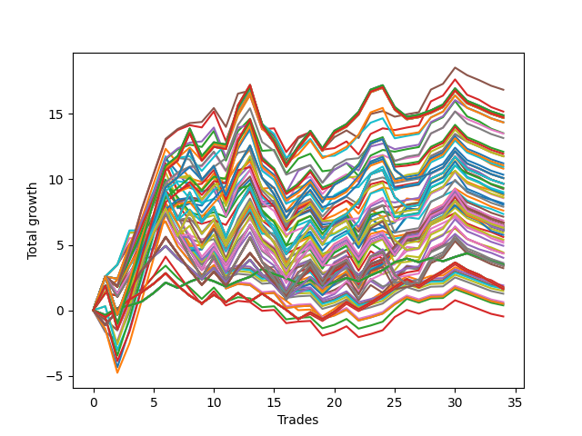

# Long HLT 613 
- Symbol: TSLA
- Date Range: 05/16/2022 - 05/17/2024
- Trading Period: 8:30-12:30
- Number of Trades: 34



| Id. | Name | Win Percent | Profit | Avg Profit / Trade | Avg Time / Trade | Std |      | Name | Win Percent | Profit | Avg Profit / Trade | Avg Time / Trade | Std |
| --- | ---- | ----------- | ------ | ------------------ | ---------------- | --- | ---- | ---- | ----------- | ------ | ------------------ | ---------------- | --- |
| | Sorted By <br> Profit | | | | | | | Sorted By <br> Win Percentage |||||
|0| TP-2.5 60m | 64.71 | 16.85 | 0.50 | 44:14 | 1.41 |     | TP-2.5 90m | 67.65 | 14.36 | 0.42 | 57:00 | 1.50 |
|1| TP-2.5 45m | 64.71 | 15.18 | 0.45 | 36:40 | 1.45 |     | TP-2.5 60m | 64.71 | 16.85 | 0.50 | 44:14 | 1.41 |
|2| TP-2.75 180m | 61.76 | 14.89 | 0.44 | 71:01 | 1.66 |     | TP-2.5 45m | 64.71 | 15.18 | 0.45 | 36:40 | 1.45 |
|3| TP-2.75 165m | 61.76 | 14.89 | 0.44 | 71:01 | 1.66 |     | TP-2.25 60m | 64.71 | 14.37 | 0.42 | 43:28 | 1.36 |
|4| TP-2.75 150m | 61.76 | 14.89 | 0.44 | 71:01 | 1.66 |     | TP-2.5 105m | 64.71 | 14.35 | 0.42 | 61:54 | 1.53 |
|5| TP-2.75 135m | 61.76 | 14.89 | 0.44 | 71:01 | 1.66 |     | TP-2.25 45m | 64.71 | 13.53 | 0.40 | 36:21 | 1.36 |
|6| TP-2.75 120m | 61.76 | 14.89 | 0.44 | 71:01 | 1.66 |     | TP-2.5 75m | 64.71 | 13.16 | 0.39 | 51:19 | 1.53 |
|7| TP-3 180m | 61.76 | 14.74 | 0.43 | 73:10 | 1.73 |     | TP-2.75 75m | 64.71 | 11.77 | 0.35 | 54:49 | 1.55 |
|8| TP-3 165m | 61.76 | 14.74 | 0.43 | 73:10 | 1.73 |     | TP-2.75 90m | 64.71 | 11.23 | 0.33 | 60:56 | 1.55 |
|9| TP-3 150m | 61.76 | 14.74 | 0.43 | 73:10 | 1.73 |     | TP-3 90m | 64.71 | 11.08 | 0.33 | 63:05 | 1.63 |
|10| TP-3 135m | 61.76 | 14.74 | 0.43 | 73:10 | 1.73 |     | TP-3 75m | 64.71 | 10.95 | 0.32 | 56:37 | 1.60 |
|11| TP-3 120m | 61.76 | 14.74 | 0.43 | 73:10 | 1.73 |     | TP-2.25 105m | 64.71 | 10.36 | 0.30 | 59:14 | 1.53 |
|12| TP-2.5 180m | 61.76 | 14.70 | 0.43 | 66:12 | 1.62 |     | TP-2.25 90m | 64.71 | 8.62 | 0.25 | 55:05 | 1.51 |
|13| TP-2.5 165m | 61.76 | 14.70 | 0.43 | 66:12 | 1.62 |     | TP-2.75 180m | 61.76 | 14.89 | 0.44 | 71:01 | 1.66 |
|14| TP-2.5 150m | 61.76 | 14.70 | 0.43 | 66:12 | 1.62 |     | TP-2.75 165m | 61.76 | 14.89 | 0.44 | 71:01 | 1.66 |
|15| TP-2.5 135m | 61.76 | 14.70 | 0.43 | 66:12 | 1.62 |     | TP-2.75 150m | 61.76 | 14.89 | 0.44 | 71:01 | 1.66 |
|16| TP-2.5 120m | 61.76 | 14.70 | 0.43 | 66:12 | 1.62 |     | TP-2.75 135m | 61.76 | 14.89 | 0.44 | 71:01 | 1.66 |
|17| TP-2.25 60m | 64.71 | 14.37 | 0.42 | 43:28 | 1.36 |     | TP-2.75 120m | 61.76 | 14.89 | 0.44 | 71:01 | 1.66 |
|18| TP-2.5 90m | 67.65 | 14.36 | 0.42 | 57:00 | 1.50 |     | TP-3 180m | 61.76 | 14.74 | 0.43 | 73:10 | 1.73 |
|19| TP-2.5 105m | 64.71 | 14.35 | 0.42 | 61:54 | 1.53 |     | TP-3 165m | 61.76 | 14.74 | 0.43 | 73:10 | 1.73 |
|20| TP-2.25 45m | 64.71 | 13.53 | 0.40 | 36:21 | 1.36 |     | TP-3 150m | 61.76 | 14.74 | 0.43 | 73:10 | 1.73 |
|21| TP-2.75 60m | 61.76 | 13.50 | 0.40 | 47:17 | 1.47 |     | TP-3 135m | 61.76 | 14.74 | 0.43 | 73:10 | 1.73 |
|22| TP-2.5 75m | 64.71 | 13.16 | 0.39 | 51:19 | 1.53 |     | TP-3 120m | 61.76 | 14.74 | 0.43 | 73:10 | 1.73 |
|23| TP-2.75 105m | 61.76 | 12.11 | 0.36 | 66:17 | 1.56 |     | TP-2.5 180m | 61.76 | 14.70 | 0.43 | 66:12 | 1.62 |
|24| TP-3 105m | 61.76 | 11.96 | 0.35 | 68:26 | 1.64 |     | TP-2.5 165m | 61.76 | 14.70 | 0.43 | 66:12 | 1.62 |
|25| TP-3 60m | 61.76 | 11.78 | 0.35 | 48:30 | 1.46 |     | TP-2.5 150m | 61.76 | 14.70 | 0.43 | 66:12 | 1.62 |
|26| TP-2.75 75m | 64.71 | 11.77 | 0.35 | 54:49 | 1.55 |     | TP-2.5 135m | 61.76 | 14.70 | 0.43 | 66:12 | 1.62 |
|27| TP-2 60m | 61.76 | 11.77 | 0.35 | 41:51 | 1.40 |     | TP-2.5 120m | 61.76 | 14.70 | 0.43 | 66:12 | 1.62 |
|28| TP-2.75 90m | 64.71 | 11.23 | 0.33 | 60:56 | 1.55 |     | TP-2.75 60m | 61.76 | 13.50 | 0.40 | 47:17 | 1.47 |
|29| TP-3 90m | 64.71 | 11.08 | 0.33 | 63:05 | 1.63 |     | TP-2.75 105m | 61.76 | 12.11 | 0.36 | 66:17 | 1.56 |
|30| TP-3 75m | 64.71 | 10.95 | 0.32 | 56:37 | 1.60 |     | TP-3 105m | 61.76 | 11.96 | 0.35 | 68:26 | 1.64 |
|31| TP-2 45m | 61.76 | 10.82 | 0.32 | 35:10 | 1.39 |     | TP-3 60m | 61.76 | 11.78 | 0.35 | 48:30 | 1.46 |
|32| TP-2.25 105m | 64.71 | 10.36 | 0.30 | 59:14 | 1.53 |     | TP-2 60m | 61.76 | 11.77 | 0.35 | 41:51 | 1.40 |
|33| TP-2.25 180m | 61.76 | 10.10 | 0.30 | 63:01 | 1.64 |     | TP-2 45m | 61.76 | 10.82 | 0.32 | 35:10 | 1.39 |
|34| TP-2.25 165m | 61.76 | 10.10 | 0.30 | 63:01 | 1.64 |     | TP-2.25 180m | 61.76 | 10.10 | 0.30 | 63:01 | 1.64 |
|35| TP-2.25 150m | 61.76 | 10.10 | 0.30 | 63:01 | 1.64 |     | TP-2.25 165m | 61.76 | 10.10 | 0.30 | 63:01 | 1.64 |
|36| TP-2.25 135m | 61.76 | 10.10 | 0.30 | 63:01 | 1.64 |     | TP-2.25 150m | 61.76 | 10.10 | 0.30 | 63:01 | 1.64 |
|37| TP-2.25 120m | 61.76 | 10.10 | 0.30 | 63:01 | 1.64 |     | TP-2.25 135m | 61.76 | 10.10 | 0.30 | 63:01 | 1.64 |
|38| TP-2 180m | 58.82 | 9.68 | 0.28 | 58:03 | 1.68 |     | TP-2.25 120m | 61.76 | 10.10 | 0.30 | 63:01 | 1.64 |
|39| TP-2 165m | 58.82 | 9.68 | 0.28 | 58:03 | 1.68 |     | TP-2.75 45m | 61.76 | 9.65 | 0.28 | 38:52 | 1.39 |
|40| TP-2 150m | 58.82 | 9.68 | 0.28 | 58:03 | 1.68 |     | TP-1.75 60m | 61.76 | 9.36 | 0.28 | 38:45 | 1.35 |
|41| TP-2 135m | 58.82 | 9.68 | 0.28 | 58:03 | 1.68 |     | TP-3 45m | 61.76 | 9.27 | 0.27 | 39:22 | 1.33 |
|42| TP-2 120m | 58.82 | 9.68 | 0.28 | 58:03 | 1.68 |     | TP-2 105m | 61.76 | 9.03 | 0.27 | 55:10 | 1.57 |
|43| TP-2.75 45m | 61.76 | 9.65 | 0.28 | 38:52 | 1.39 |     | TP-1.75 45m | 61.76 | 8.91 | 0.26 | 33:03 | 1.33 |
|44| TP-1.75 60m | 61.76 | 9.36 | 0.28 | 38:45 | 1.35 |     | TP-2.25 75m | 61.76 | 8.57 | 0.25 | 50:07 | 1.51 |
|45| TP-3 45m | 61.76 | 9.27 | 0.27 | 39:22 | 1.33 |     | TP-2 90m | 61.76 | 7.91 | 0.23 | 51:54 | 1.57 |
|46| TP-2 105m | 61.76 | 9.03 | 0.27 | 55:10 | 1.57 |     | TP-1 45m | 61.76 | 6.31 | 0.19 | 22:47 | 1.01 |
|47| TP-1.75 45m | 61.76 | 8.91 | 0.26 | 33:03 | 1.33 |     | TP-2 180m | 58.82 | 9.68 | 0.28 | 58:03 | 1.68 |
|48| TP-1.25 45m | 58.82 | 8.83 | 0.26 | 28:28 | 1.19 |     | TP-2 165m | 58.82 | 9.68 | 0.28 | 58:03 | 1.68 |
|49| TP-2.5 30m | 52.94 | 8.79 | 0.26 | 26:45 | 1.29 |     | TP-2 150m | 58.82 | 9.68 | 0.28 | 58:03 | 1.68 |
|50| TP-2.25 90m | 64.71 | 8.62 | 0.25 | 55:05 | 1.51 |     | TP-2 135m | 58.82 | 9.68 | 0.28 | 58:03 | 1.68 |
|51| TP-2.25 75m | 61.76 | 8.57 | 0.25 | 50:07 | 1.51 |     | TP-2 120m | 58.82 | 9.68 | 0.28 | 58:03 | 1.68 |
|52| TP-1.25 60m | 58.82 | 8.17 | 0.24 | 31:47 | 1.23 |     | TP-1.25 45m | 58.82 | 8.83 | 0.26 | 28:28 | 1.19 |
|53| TP-2.25 30m | 52.94 | 8.06 | 0.24 | 26:42 | 1.25 |     | TP-1.25 60m | 58.82 | 8.17 | 0.24 | 31:47 | 1.23 |
|54| TP-2 90m | 61.76 | 7.91 | 0.23 | 51:54 | 1.57 |     | TP-1.5 60m | 58.82 | 7.62 | 0.22 | 35:07 | 1.28 |
|55| TP-1.5 60m | 58.82 | 7.62 | 0.22 | 35:07 | 1.28 |     | TP-2 75m | 58.82 | 7.15 | 0.21 | 47:52 | 1.56 |
|56| TP-2 30m | 52.94 | 7.36 | 0.22 | 26:05 | 1.30 |     | TP-1 180m | 58.82 | 6.69 | 0.20 | 27:19 | 1.05 |
|57| TP-2 75m | 58.82 | 7.15 | 0.21 | 47:52 | 1.56 |     | TP-1 165m | 58.82 | 6.69 | 0.20 | 27:19 | 1.05 |
|58| TP-1.25 105m | 55.88 | 6.86 | 0.20 | 36:22 | 1.29 |     | TP-1 150m | 58.82 | 6.69 | 0.20 | 27:19 | 1.05 |
|59| TP-1 180m | 58.82 | 6.69 | 0.20 | 27:19 | 1.05 |     | TP-1 135m | 58.82 | 6.69 | 0.20 | 27:19 | 1.05 |
|60| TP-1 165m | 58.82 | 6.69 | 0.20 | 27:19 | 1.05 |     | TP-1 120m | 58.82 | 6.69 | 0.20 | 27:19 | 1.05 |
|61| TP-1 150m | 58.82 | 6.69 | 0.20 | 27:19 | 1.05 |     | TP-1 105m | 58.82 | 6.69 | 0.20 | 27:19 | 1.05 |
|62| TP-1 135m | 58.82 | 6.69 | 0.20 | 27:19 | 1.05 |     | TP-1.5 45m | 58.82 | 6.69 | 0.20 | 30:21 | 1.27 |
|63| TP-1 120m | 58.82 | 6.69 | 0.20 | 27:19 | 1.05 |     | TP-1 90m | 58.82 | 6.50 | 0.19 | 27:15 | 1.04 |
|64| TP-1 105m | 58.82 | 6.69 | 0.20 | 27:19 | 1.05 |     | TP-1 60m | 58.82 | 6.22 | 0.18 | 25:01 | 1.03 |
|65| TP-1.5 45m | 58.82 | 6.69 | 0.20 | 30:21 | 1.27 |     | TP-1 75m | 58.82 | 6.15 | 0.18 | 26:30 | 1.04 |
|66| TP-1.25 90m | 55.88 | 6.67 | 0.20 | 35:30 | 1.29 |     | TP-0.75 180m | 58.82 | 6.11 | 0.18 | 22:14 | 0.89 |
|67| TP-1 90m | 58.82 | 6.50 | 0.19 | 27:15 | 1.04 |     | TP-0.75 165m | 58.82 | 6.11 | 0.18 | 22:14 | 0.89 |
|68| TP-1.25 180m | 55.88 | 6.46 | 0.19 | 37:01 | 1.31 |     | TP-0.75 150m | 58.82 | 6.11 | 0.18 | 22:14 | 0.89 |
|69| TP-1.25 165m | 55.88 | 6.46 | 0.19 | 37:01 | 1.31 |     | TP-0.75 135m | 58.82 | 6.11 | 0.18 | 22:14 | 0.89 |
|70| TP-1.25 150m | 55.88 | 6.46 | 0.19 | 37:01 | 1.31 |     | TP-0.75 120m | 58.82 | 6.11 | 0.18 | 22:14 | 0.89 |
|71| TP-1.25 135m | 55.88 | 6.46 | 0.19 | 37:01 | 1.31 |     | TP-0.75 105m | 58.82 | 6.11 | 0.18 | 22:14 | 0.89 |
|72| TP-1.25 120m | 55.88 | 6.46 | 0.19 | 37:01 | 1.31 |     | TP-0.75 90m | 58.82 | 6.11 | 0.18 | 22:14 | 0.89 |
|73| TP-1.25 75m | 55.88 | 6.40 | 0.19 | 34:17 | 1.28 |     | TP-0.75 60m | 58.82 | 5.93 | 0.17 | 20:24 | 0.87 |
|74| TP-1 45m | 61.76 | 6.31 | 0.19 | 22:47 | 1.01 |     | TP-0.75 75m | 58.82 | 5.76 | 0.17 | 21:28 | 0.88 |
|75| TP-1.75 180m | 55.88 | 6.31 | 0.19 | 50:22 | 1.60 |     | TP-1.75 105m | 58.82 | 5.40 | 0.16 | 48:19 | 1.54 |
|76| TP-1.75 165m | 55.88 | 6.31 | 0.19 | 50:22 | 1.60 |     | TP-0.75 45m | 58.82 | 5.16 | 0.15 | 18:56 | 0.87 |
|77| TP-1.75 150m | 55.88 | 6.31 | 0.19 | 50:22 | 1.60 |     | TP-1.75 90m | 58.82 | 4.35 | 0.13 | 46:07 | 1.53 |
|78| TP-1.75 135m | 55.88 | 6.31 | 0.19 | 50:22 | 1.60 |     | TP-0.25 180m | 58.82 | 3.50 | 0.10 | 04:28 | 0.39 |
|79| TP-1.75 120m | 55.88 | 6.31 | 0.19 | 50:22 | 1.60 |     | TP-0.25 165m | 58.82 | 3.50 | 0.10 | 04:28 | 0.39 |
|80| TP-1 60m | 58.82 | 6.22 | 0.18 | 25:01 | 1.03 |     | TP-0.25 150m | 58.82 | 3.50 | 0.10 | 04:28 | 0.39 |
|81| TP-2.75 30m | 52.94 | 6.20 | 0.18 | 27:51 | 1.19 |     | TP-0.25 135m | 58.82 | 3.50 | 0.10 | 04:28 | 0.39 |
|82| TP-1 75m | 58.82 | 6.15 | 0.18 | 26:30 | 1.04 |     | TP-0.25 120m | 58.82 | 3.50 | 0.10 | 04:28 | 0.39 |
|83| TP-0.75 180m | 58.82 | 6.11 | 0.18 | 22:14 | 0.89 |     | TP-0.25 105m | 58.82 | 3.50 | 0.10 | 04:28 | 0.39 |
|84| TP-0.75 165m | 58.82 | 6.11 | 0.18 | 22:14 | 0.89 |     | TP-0.25 90m | 58.82 | 3.50 | 0.10 | 04:28 | 0.39 |
|85| TP-0.75 150m | 58.82 | 6.11 | 0.18 | 22:14 | 0.89 |     | TP-0.25 75m | 58.82 | 3.50 | 0.10 | 04:28 | 0.39 |
|86| TP-0.75 135m | 58.82 | 6.11 | 0.18 | 22:14 | 0.89 |     | TP-0.25 60m | 58.82 | 3.50 | 0.10 | 04:28 | 0.39 |
|87| TP-0.75 120m | 58.82 | 6.11 | 0.18 | 22:14 | 0.89 |     | TP-0.25 45m | 58.82 | 3.50 | 0.10 | 04:28 | 0.39 |
|88| TP-0.75 105m | 58.82 | 6.11 | 0.18 | 22:14 | 0.89 |     | TP-0.25 30m | 58.82 | 3.50 | 0.10 | 04:28 | 0.39 |
|89| TP-0.75 90m | 58.82 | 6.11 | 0.18 | 22:14 | 0.89 |     | TP-0.25 15m | 58.82 | 3.50 | 0.10 | 04:28 | 0.39 |
|90| TP-0.75 60m | 58.82 | 5.93 | 0.17 | 20:24 | 0.87 |     | TP-1.25 15m | 58.82 | 1.90 | 0.06 | 13:10 | 0.89 |
|91| TP-0.75 75m | 58.82 | 5.76 | 0.17 | 21:28 | 0.88 |     | TP-1.5 15m | 58.82 | 1.74 | 0.05 | 13:19 | 0.90 |
|92| TP-3 30m | 52.94 | 5.60 | 0.16 | 27:58 | 1.16 |     | TP-2.5 15m | 58.82 | 1.65 | 0.05 | 13:56 | 0.96 |
|93| TP-1.75 105m | 58.82 | 5.40 | 0.16 | 48:19 | 1.54 |     | TP-2.25 15m | 58.82 | 1.48 | 0.04 | 13:54 | 0.95 |
|94| TP-1.25 30m | 52.94 | 5.29 | 0.16 | 22:42 | 1.11 |     | TP-2 15m | 58.82 | 1.27 | 0.04 | 13:51 | 0.96 |
|95| TP-0.75 45m | 58.82 | 5.16 | 0.15 | 18:56 | 0.87 |     | TP-1.75 15m | 58.82 | 0.63 | 0.02 | 13:42 | 0.95 |
|96| TP-1.75 75m | 55.88 | 4.93 | 0.14 | 43:31 | 1.53 |     | TP-3 15m | 58.82 | 0.50 | 0.01 | 14:00 | 0.89 |
|97| TP-1.75 30m | 52.94 | 4.42 | 0.13 | 25:17 | 1.29 |     | TP-2.75 15m | 58.82 | 0.50 | 0.01 | 14:00 | 0.89 |
|98| TP-1.75 90m | 58.82 | 4.35 | 0.13 | 46:07 | 1.53 |     | TP-1.25 105m | 55.88 | 6.86 | 0.20 | 36:22 | 1.29 |
|99| TP-1.5 75m | 55.88 | 4.35 | 0.13 | 38:54 | 1.38 |     | TP-1.25 90m | 55.88 | 6.67 | 0.20 | 35:30 | 1.29 |
|100| TP-0.75 30m | 52.94 | 4.01 | 0.12 | 16:17 | 0.87 |     | TP-1.25 180m | 55.88 | 6.46 | 0.19 | 37:01 | 1.31 |
|101| TP-1.5 105m | 55.88 | 3.62 | 0.11 | 42:47 | 1.38 |     | TP-1.25 165m | 55.88 | 6.46 | 0.19 | 37:01 | 1.31 |
|102| TP-1 30m | 52.94 | 3.53 | 0.10 | 18:56 | 0.99 |     | TP-1.25 150m | 55.88 | 6.46 | 0.19 | 37:01 | 1.31 |
|103| TP-0.25 180m | 58.82 | 3.50 | 0.10 | 04:28 | 0.39 |     | TP-1.25 135m | 55.88 | 6.46 | 0.19 | 37:01 | 1.31 |
|104| TP-0.25 165m | 58.82 | 3.50 | 0.10 | 04:28 | 0.39 |     | TP-1.25 120m | 55.88 | 6.46 | 0.19 | 37:01 | 1.31 |
|105| TP-0.25 150m | 58.82 | 3.50 | 0.10 | 04:28 | 0.39 |     | TP-1.25 75m | 55.88 | 6.40 | 0.19 | 34:17 | 1.28 |
|106| TP-0.25 135m | 58.82 | 3.50 | 0.10 | 04:28 | 0.39 |     | TP-1.75 180m | 55.88 | 6.31 | 0.19 | 50:22 | 1.60 |
|107| TP-0.25 120m | 58.82 | 3.50 | 0.10 | 04:28 | 0.39 |     | TP-1.75 165m | 55.88 | 6.31 | 0.19 | 50:22 | 1.60 |
|108| TP-0.25 105m | 58.82 | 3.50 | 0.10 | 04:28 | 0.39 |     | TP-1.75 150m | 55.88 | 6.31 | 0.19 | 50:22 | 1.60 |
|109| TP-0.25 90m | 58.82 | 3.50 | 0.10 | 04:28 | 0.39 |     | TP-1.75 135m | 55.88 | 6.31 | 0.19 | 50:22 | 1.60 |
|110| TP-0.25 75m | 58.82 | 3.50 | 0.10 | 04:28 | 0.39 |     | TP-1.75 120m | 55.88 | 6.31 | 0.19 | 50:22 | 1.60 |
|111| TP-0.25 60m | 58.82 | 3.50 | 0.10 | 04:28 | 0.39 |     | TP-1.75 75m | 55.88 | 4.93 | 0.14 | 43:31 | 1.53 |
|112| TP-0.25 45m | 58.82 | 3.50 | 0.10 | 04:28 | 0.39 |     | TP-1.5 75m | 55.88 | 4.35 | 0.13 | 38:54 | 1.38 |
|113| TP-0.25 30m | 58.82 | 3.50 | 0.10 | 04:28 | 0.39 |     | TP-1.5 105m | 55.88 | 3.62 | 0.11 | 42:47 | 1.38 |
|114| TP-0.25 15m | 58.82 | 3.50 | 0.10 | 04:28 | 0.39 |     | TP-1.5 90m | 55.88 | 3.22 | 0.09 | 41:01 | 1.37 |
|115| TP-1.5 30m | 52.94 | 3.49 | 0.10 | 23:42 | 1.18 |     | TP-0.5 15m | 55.88 | 1.73 | 0.05 | 08:12 | 0.57 |
|116| TP-1.5 180m | 52.94 | 3.41 | 0.10 | 44:33 | 1.41 |     | TP-0.75 15m | 55.88 | 0.38 | 0.01 | 10:49 | 0.70 |
|117| TP-1.5 165m | 52.94 | 3.41 | 0.10 | 44:33 | 1.41 |     | TP-1 15m | 55.88 | -0.47 | -0.01 | 12:00 | 0.79 |
|118| TP-1.5 150m | 52.94 | 3.41 | 0.10 | 44:33 | 1.41 |     | TP-2.5 30m | 52.94 | 8.79 | 0.26 | 26:45 | 1.29 |
|119| TP-1.5 135m | 52.94 | 3.41 | 0.10 | 44:33 | 1.41 |     | TP-2.25 30m | 52.94 | 8.06 | 0.24 | 26:42 | 1.25 |
|120| TP-1.5 120m | 52.94 | 3.41 | 0.10 | 44:33 | 1.41 |     | TP-2 30m | 52.94 | 7.36 | 0.22 | 26:05 | 1.30 |
|121| TP-1.5 90m | 55.88 | 3.22 | 0.09 | 41:01 | 1.37 |     | TP-2.75 30m | 52.94 | 6.20 | 0.18 | 27:51 | 1.19 |
|122| TP-1.25 15m | 58.82 | 1.90 | 0.06 | 13:10 | 0.89 |     | TP-3 30m | 52.94 | 5.60 | 0.16 | 27:58 | 1.16 |
|123| TP-0.5 30m | 52.94 | 1.78 | 0.05 | 10:10 | 0.61 |     | TP-1.25 30m | 52.94 | 5.29 | 0.16 | 22:42 | 1.11 |
|124| TP-1.5 15m | 58.82 | 1.74 | 0.05 | 13:19 | 0.90 |     | TP-1.75 30m | 52.94 | 4.42 | 0.13 | 25:17 | 1.29 |
|125| TP-0.5 15m | 55.88 | 1.73 | 0.05 | 08:12 | 0.57 |     | TP-0.75 30m | 52.94 | 4.01 | 0.12 | 16:17 | 0.87 |
|126| TP-2.5 15m | 58.82 | 1.65 | 0.05 | 13:56 | 0.96 |     | TP-1 30m | 52.94 | 3.53 | 0.10 | 18:56 | 0.99 |
|127| TP-0.5 180m | 52.94 | 1.63 | 0.05 | 10:22 | 0.62 |     | TP-1.5 30m | 52.94 | 3.49 | 0.10 | 23:42 | 1.18 |
|128| TP-0.5 165m | 52.94 | 1.63 | 0.05 | 10:22 | 0.62 |     | TP-1.5 180m | 52.94 | 3.41 | 0.10 | 44:33 | 1.41 |
|129| TP-0.5 150m | 52.94 | 1.63 | 0.05 | 10:22 | 0.62 |     | TP-1.5 165m | 52.94 | 3.41 | 0.10 | 44:33 | 1.41 |
|130| TP-0.5 135m | 52.94 | 1.63 | 0.05 | 10:22 | 0.62 |     | TP-1.5 150m | 52.94 | 3.41 | 0.10 | 44:33 | 1.41 |
|131| TP-0.5 120m | 52.94 | 1.63 | 0.05 | 10:22 | 0.62 |     | TP-1.5 135m | 52.94 | 3.41 | 0.10 | 44:33 | 1.41 |
|132| TP-0.5 105m | 52.94 | 1.63 | 0.05 | 10:22 | 0.62 |     | TP-1.5 120m | 52.94 | 3.41 | 0.10 | 44:33 | 1.41 |
|133| TP-0.5 90m | 52.94 | 1.63 | 0.05 | 10:22 | 0.62 |     | TP-0.5 30m | 52.94 | 1.78 | 0.05 | 10:10 | 0.61 |
|134| TP-0.5 75m | 52.94 | 1.63 | 0.05 | 10:22 | 0.62 |     | TP-0.5 180m | 52.94 | 1.63 | 0.05 | 10:22 | 0.62 |
|135| TP-0.5 60m | 52.94 | 1.63 | 0.05 | 10:22 | 0.62 |     | TP-0.5 165m | 52.94 | 1.63 | 0.05 | 10:22 | 0.62 |
|136| TP-0.5 45m | 52.94 | 1.63 | 0.05 | 10:22 | 0.62 |     | TP-0.5 150m | 52.94 | 1.63 | 0.05 | 10:22 | 0.62 |
|137| TP-2.25 15m | 58.82 | 1.48 | 0.04 | 13:54 | 0.95 |     | TP-0.5 135m | 52.94 | 1.63 | 0.05 | 10:22 | 0.62 |
|138| TP-2 15m | 58.82 | 1.27 | 0.04 | 13:51 | 0.96 |     | TP-0.5 120m | 52.94 | 1.63 | 0.05 | 10:22 | 0.62 |
|139| TP-1.75 15m | 58.82 | 0.63 | 0.02 | 13:42 | 0.95 |     | TP-0.5 105m | 52.94 | 1.63 | 0.05 | 10:22 | 0.62 |
|140| TP-3 15m | 58.82 | 0.50 | 0.01 | 14:00 | 0.89 |     | TP-0.5 90m | 52.94 | 1.63 | 0.05 | 10:22 | 0.62 |
|141| TP-2.75 15m | 58.82 | 0.50 | 0.01 | 14:00 | 0.89 |     | TP-0.5 75m | 52.94 | 1.63 | 0.05 | 10:22 | 0.62 |
|142| TP-0.75 15m | 55.88 | 0.38 | 0.01 | 10:49 | 0.70 |     | TP-0.5 60m | 52.94 | 1.63 | 0.05 | 10:22 | 0.62 |
|143| TP-1 15m | 55.88 | -0.47 | -0.01 | 12:00 | 0.79 |     | TP-0.5 45m | 52.94 | 1.63 | 0.05 | 10:22 | 0.62 |

### Test TP-0.25 15m
* Take Profit of 0.25 Point
* 0.25 Stoploss
* Results:
```
Total Trades: 34
Percent Up: 58.82
Percent Down: 41.18
Total Points Moved Up: 3.50
Potential Profit: 1750.00
Total Points Ups: 8.24 Count Ups: 20
Total Points Downs: -4.74 Count Downs: 14
```

<details><summary>Trades</summary>

<code>In: 2022-05-20 10:35:00		Out: 2022-05-20 10:37:00		Total Position Time: 02:00		Total Move Up: -0.36		Total to Date: -0.36</code> <br />
<code>In: 2022-05-24 10:40:00		Out: 2022-05-24 10:42:00		Total Position Time: 02:00		Total Move Up: 0.52		Total to Date: 0.16</code> <br />
<code>In: 2022-05-24 12:25:00		Out: 2022-05-24 12:28:00		Total Position Time: 03:00		Total Move Up: 0.21		Total to Date: 0.37</code> <br />
<code>In: 2022-06-10 10:20:00		Out: 2022-06-10 10:27:00		Total Position Time: 07:00		Total Move Up: 0.29		Total to Date: 0.66</code> <br />
<code>In: 2022-08-01 11:00:00		Out: 2022-08-01 11:04:00		Total Position Time: 04:00		Total Move Up: 0.66		Total to Date: 1.32</code> <br />
<code>In: 2022-08-05 09:45:00		Out: 2022-08-05 09:47:00		Total Position Time: 02:00		Total Move Up: 0.80		Total to Date: 2.12</code> <br />
<code>In: 2022-08-05 12:10:00		Out: 2022-08-05 12:13:00		Total Position Time: 03:00		Total Move Up: -0.40		Total to Date: 1.72</code> <br />
<code>In: 2022-09-01 08:35:00		Out: 2022-09-01 08:37:00		Total Position Time: 02:00		Total Move Up: 0.46		Total to Date: 2.18</code> <br />
<code>In: 2022-09-02 10:45:00		Out: 2022-09-02 10:47:00		Total Position Time: 02:00		Total Move Up: 0.35		Total to Date: 2.53</code> <br />
<code>In: 2022-09-23 12:05:00		Out: 2022-09-23 12:07:00		Total Position Time: 02:00		Total Move Up: -0.31		Total to Date: 2.22</code> <br />
<code>In: 2022-09-29 11:10:00		Out: 2022-09-29 11:12:00		Total Position Time: 02:00		Total Move Up: -0.40		Total to Date: 1.82</code> <br />
<code>In: 2022-10-05 08:40:00		Out: 2022-10-05 08:42:00		Total Position Time: 02:00		Total Move Up: 0.41		Total to Date: 2.23</code> <br />
<code>In: 2022-10-20 11:35:00		Out: 2022-10-20 11:37:00		Total Position Time: 02:00		Total Move Up: 0.33		Total to Date: 2.56</code> <br />
<code>In: 2022-11-09 08:45:00		Out: 2022-11-09 08:48:00		Total Position Time: 03:00		Total Move Up: 0.60		Total to Date: 3.16</code> <br />
<code>In: 2022-12-20 09:50:00		Out: 2022-12-20 09:58:00		Total Position Time: 08:00		Total Move Up: -0.39		Total to Date: 2.77</code> <br />
<code>In: 2022-12-20 12:30:00		Out: 2022-12-20 12:33:00		Total Position Time: 03:00		Total Move Up: -0.31		Total to Date: 2.46</code> <br />
<code>In: 2023-03-17 08:35:00		Out: 2023-03-17 08:40:00		Total Position Time: 05:00		Total Move Up: -0.40		Total to Date: 2.06</code> <br />
<code>In: 2023-05-09 09:35:00		Out: 2023-05-09 09:46:00		Total Position Time: 11:00		Total Move Up: 0.26		Total to Date: 2.32</code> <br />
<code>In: 2023-08-04 12:15:00		Out: 2023-08-04 12:19:00		Total Position Time: 04:00		Total Move Up: -0.52		Total to Date: 1.80</code> <br />
<code>In: 2023-08-16 09:35:00		Out: 2023-08-16 09:40:00		Total Position Time: 05:00		Total Move Up: 0.36		Total to Date: 2.16</code> <br />
<code>In: 2023-09-21 12:25:00		Out: 2023-09-21 12:32:00		Total Position Time: 07:00		Total Move Up: 0.32		Total to Date: 2.48</code> <br />
<code>In: 2023-10-02 11:15:00		Out: 2023-10-02 11:17:00		Total Position Time: 02:00		Total Move Up: -0.27		Total to Date: 2.21</code> <br />
<code>In: 2023-10-11 10:55:00		Out: 2023-10-11 11:01:00		Total Position Time: 06:00		Total Move Up: 0.46		Total to Date: 2.67</code> <br />
<code>In: 2023-10-12 11:25:00		Out: 2023-10-12 11:28:00		Total Position Time: 03:00		Total Move Up: 0.40		Total to Date: 3.07</code> <br />
<code>In: 2023-10-13 09:20:00		Out: 2023-10-13 09:22:00		Total Position Time: 02:00		Total Move Up: 0.61		Total to Date: 3.68</code> <br />
<code>In: 2024-01-02 10:15:00		Out: 2024-01-02 10:18:00		Total Position Time: 03:00		Total Move Up: 0.27		Total to Date: 3.95</code> <br />
<code>In: 2024-02-13 12:10:00		Out: 2024-02-13 12:18:00		Total Position Time: 08:00		Total Move Up: -0.27		Total to Date: 3.68</code> <br />
<code>In: 2024-02-27 10:40:00		Out: 2024-02-27 10:49:00		Total Position Time: 09:00		Total Move Up: 0.32		Total to Date: 4.00</code> <br />
<code>In: 2024-03-14 12:25:00		Out: 2024-03-14 12:35:00		Total Position Time: 10:00		Total Move Up: -0.25		Total to Date: 3.75</code> <br />
<code>In: 2024-04-10 12:10:00		Out: 2024-04-10 12:15:00		Total Position Time: 05:00		Total Move Up: 0.33		Total to Date: 4.08</code> <br />
<code>In: 2024-04-15 11:35:00		Out: 2024-04-15 11:38:00		Total Position Time: 03:00		Total Move Up: 0.28		Total to Date: 4.36</code> <br />
<code>In: 2024-04-15 12:35:00		Out: 2024-04-15 12:47:00		Total Position Time: 12:00		Total Move Up: -0.29		Total to Date: 4.07</code> <br />
<code>In: 2024-05-09 11:40:00		Out: 2024-05-09 11:42:00		Total Position Time: 02:00		Total Move Up: -0.31		Total to Date: 3.76</code> <br />
<code>In: 2024-05-09 12:05:00		Out: 2024-05-09 12:11:00		Total Position Time: 06:00		Total Move Up: -0.26		Total to Date: 3.50</code> <br />


</details>

### Test TP-0.5 15m
* Take Profit of 0.5 Point
* 0.5 Stoploss
* Results:
```
Total Trades: 34
Percent Up: 55.88
Percent Down: 44.12
Total Points Moved Up: 1.73
Potential Profit: 865.00
Total Points Ups: 10.02 Count Ups: 19
Total Points Downs: -8.29 Count Downs: 15
```

<details><summary>Trades</summary>

<code>In: 2022-05-20 10:35:00		Out: 2022-05-20 10:40:00		Total Position Time: 05:00		Total Move Up: -0.52		Total to Date: -0.52</code> <br />
<code>In: 2022-05-24 10:40:00		Out: 2022-05-24 10:50:00		Total Position Time: 10:00		Total Move Up: 0.60		Total to Date: 0.08</code> <br />
<code>In: 2022-05-24 12:25:00		Out: 2022-05-24 12:34:00		Total Position Time: 09:00		Total Move Up: 0.74		Total to Date: 0.82</code> <br />
<code>In: 2022-06-10 10:20:00		Out: 2022-06-10 10:30:00		Total Position Time: 10:00		Total Move Up: 0.55		Total to Date: 1.37</code> <br />
<code>In: 2022-08-01 11:00:00		Out: 2022-08-01 11:04:00		Total Position Time: 04:00		Total Move Up: 0.66		Total to Date: 2.03</code> <br />
<code>In: 2022-08-05 09:45:00		Out: 2022-08-05 09:47:00		Total Position Time: 02:00		Total Move Up: 0.80		Total to Date: 2.83</code> <br />
<code>In: 2022-08-05 12:10:00		Out: 2022-08-05 12:15:00		Total Position Time: 05:00		Total Move Up: -0.94		Total to Date: 1.89</code> <br />
<code>In: 2022-09-01 08:35:00		Out: 2022-09-01 08:41:00		Total Position Time: 06:00		Total Move Up: -0.77		Total to Date: 1.12</code> <br />
<code>In: 2022-09-02 10:45:00		Out: 2022-09-02 10:49:00		Total Position Time: 04:00		Total Move Up: -0.58		Total to Date: 0.54</code> <br />
<code>In: 2022-09-23 12:05:00		Out: 2022-09-23 12:08:00		Total Position Time: 03:00		Total Move Up: 0.65		Total to Date: 1.19</code> <br />
<code>In: 2022-09-29 11:10:00		Out: 2022-09-29 11:14:00		Total Position Time: 04:00		Total Move Up: -0.57		Total to Date: 0.62</code> <br />
<code>In: 2022-10-05 08:40:00		Out: 2022-10-05 08:46:00		Total Position Time: 06:00		Total Move Up: 0.70		Total to Date: 1.32</code> <br />
<code>In: 2022-10-20 11:35:00		Out: 2022-10-20 11:46:00		Total Position Time: 11:00		Total Move Up: -0.64		Total to Date: 0.68</code> <br />
<code>In: 2022-11-09 08:45:00		Out: 2022-11-09 08:48:00		Total Position Time: 03:00		Total Move Up: 0.60		Total to Date: 1.28</code> <br />
<code>In: 2022-12-20 09:50:00		Out: 2022-12-20 10:04:00		Total Position Time: 14:00		Total Move Up: 0.07		Total to Date: 1.35</code> <br />
<code>In: 2022-12-20 12:30:00		Out: 2022-12-20 12:38:00		Total Position Time: 08:00		Total Move Up: -0.62		Total to Date: 0.73</code> <br />
<code>In: 2023-03-17 08:35:00		Out: 2023-03-17 08:44:00		Total Position Time: 09:00		Total Move Up: -0.72		Total to Date: 0.01</code> <br />
<code>In: 2023-05-09 09:35:00		Out: 2023-05-09 09:49:00		Total Position Time: 14:00		Total Move Up: 0.05		Total to Date: 0.06</code> <br />
<code>In: 2023-08-04 12:15:00		Out: 2023-08-04 12:19:00		Total Position Time: 04:00		Total Move Up: -0.52		Total to Date: -0.46</code> <br />
<code>In: 2023-08-16 09:35:00		Out: 2023-08-16 09:42:00		Total Position Time: 07:00		Total Move Up: 0.58		Total to Date: 0.12</code> <br />
<code>In: 2023-09-21 12:25:00		Out: 2023-09-21 12:37:00		Total Position Time: 12:00		Total Move Up: 0.73		Total to Date: 0.85</code> <br />
<code>In: 2023-10-02 11:15:00		Out: 2023-10-02 11:18:00		Total Position Time: 03:00		Total Move Up: -0.56		Total to Date: 0.29</code> <br />
<code>In: 2023-10-11 10:55:00		Out: 2023-10-11 11:03:00		Total Position Time: 08:00		Total Move Up: 0.52		Total to Date: 0.81</code> <br />
<code>In: 2023-10-12 11:25:00		Out: 2023-10-12 11:35:00		Total Position Time: 10:00		Total Move Up: 0.59		Total to Date: 1.40</code> <br />
<code>In: 2023-10-13 09:20:00		Out: 2023-10-13 09:22:00		Total Position Time: 02:00		Total Move Up: 0.61		Total to Date: 2.01</code> <br />
<code>In: 2024-01-02 10:15:00		Out: 2024-01-02 10:19:00		Total Position Time: 04:00		Total Move Up: 0.59		Total to Date: 2.60</code> <br />
<code>In: 2024-02-13 12:10:00		Out: 2024-02-13 12:24:00		Total Position Time: 14:00		Total Move Up: -0.29		Total to Date: 2.31</code> <br />
<code>In: 2024-02-27 10:40:00		Out: 2024-02-27 10:54:00		Total Position Time: 14:00		Total Move Up: 0.32		Total to Date: 2.63</code> <br />
<code>In: 2024-03-14 12:25:00		Out: 2024-03-14 12:39:00		Total Position Time: 14:00		Total Move Up: 0.03		Total to Date: 2.66</code> <br />
<code>In: 2024-04-10 12:10:00		Out: 2024-04-10 12:20:00		Total Position Time: 10:00		Total Move Up: 0.63		Total to Date: 3.29</code> <br />
<code>In: 2024-04-15 11:35:00		Out: 2024-04-15 11:49:00		Total Position Time: 14:00		Total Move Up: -0.34		Total to Date: 2.95</code> <br />
<code>In: 2024-04-15 12:35:00		Out: 2024-04-15 12:49:00		Total Position Time: 14:00		Total Move Up: -0.35		Total to Date: 2.60</code> <br />
<code>In: 2024-05-09 11:40:00		Out: 2024-05-09 11:54:00		Total Position Time: 14:00		Total Move Up: -0.35		Total to Date: 2.25</code> <br />
<code>In: 2024-05-09 12:05:00		Out: 2024-05-09 12:13:00		Total Position Time: 08:00		Total Move Up: -0.52		Total to Date: 1.73</code> <br />


</details>

### Test TP-0.75 15m
* Take Profit of 0.75 Point
* 0.75 Stoploss
* Results:
```
Total Trades: 34
Percent Up: 55.88
Percent Down: 44.12
Total Points Moved Up: 0.38
Potential Profit: 190.00
Total Points Ups: 10.01 Count Ups: 19
Total Points Downs: -9.63 Count Downs: 15
```

<details><summary>Trades</summary>

<code>In: 2022-05-20 10:35:00		Out: 2022-05-20 10:41:00		Total Position Time: 06:00		Total Move Up: -1.12		Total to Date: -1.12</code> <br />
<code>In: 2022-05-24 10:40:00		Out: 2022-05-24 10:52:00		Total Position Time: 12:00		Total Move Up: 1.08		Total to Date: -0.04</code> <br />
<code>In: 2022-05-24 12:25:00		Out: 2022-05-24 12:36:00		Total Position Time: 11:00		Total Move Up: 1.56		Total to Date: 1.52</code> <br />
<code>In: 2022-06-10 10:20:00		Out: 2022-06-10 10:34:00		Total Position Time: 14:00		Total Move Up: 0.01		Total to Date: 1.53</code> <br />
<code>In: 2022-08-01 11:00:00		Out: 2022-08-01 11:07:00		Total Position Time: 07:00		Total Move Up: 1.08		Total to Date: 2.61</code> <br />
<code>In: 2022-08-05 09:45:00		Out: 2022-08-05 09:47:00		Total Position Time: 02:00		Total Move Up: 0.80		Total to Date: 3.41</code> <br />
<code>In: 2022-08-05 12:10:00		Out: 2022-08-05 12:15:00		Total Position Time: 05:00		Total Move Up: -0.94		Total to Date: 2.47</code> <br />
<code>In: 2022-09-01 08:35:00		Out: 2022-09-01 08:42:00		Total Position Time: 07:00		Total Move Up: -0.73		Total to Date: 1.74</code> <br />
<code>In: 2022-09-02 10:45:00		Out: 2022-09-02 10:50:00		Total Position Time: 05:00		Total Move Up: -0.87		Total to Date: 0.87</code> <br />
<code>In: 2022-09-23 12:05:00		Out: 2022-09-23 12:09:00		Total Position Time: 04:00		Total Move Up: 0.87		Total to Date: 1.74</code> <br />
<code>In: 2022-09-29 11:10:00		Out: 2022-09-29 11:16:00		Total Position Time: 06:00		Total Move Up: -1.09		Total to Date: 0.65</code> <br />
<code>In: 2022-10-05 08:40:00		Out: 2022-10-05 08:54:00		Total Position Time: 14:00		Total Move Up: 0.35		Total to Date: 1.00</code> <br />
<code>In: 2022-10-20 11:35:00		Out: 2022-10-20 11:49:00		Total Position Time: 14:00		Total Move Up: -0.09		Total to Date: 0.91</code> <br />
<code>In: 2022-11-09 08:45:00		Out: 2022-11-09 08:59:00		Total Position Time: 14:00		Total Move Up: -0.67		Total to Date: 0.24</code> <br />
<code>In: 2022-12-20 09:50:00		Out: 2022-12-20 10:04:00		Total Position Time: 14:00		Total Move Up: 0.07		Total to Date: 0.31</code> <br />
<code>In: 2022-12-20 12:30:00		Out: 2022-12-20 12:41:00		Total Position Time: 11:00		Total Move Up: -1.00		Total to Date: -0.69</code> <br />
<code>In: 2023-03-17 08:35:00		Out: 2023-03-17 08:49:00		Total Position Time: 14:00		Total Move Up: 0.12		Total to Date: -0.57</code> <br />
<code>In: 2023-05-09 09:35:00		Out: 2023-05-09 09:49:00		Total Position Time: 14:00		Total Move Up: 0.05		Total to Date: -0.52</code> <br />
<code>In: 2023-08-04 12:15:00		Out: 2023-08-04 12:22:00		Total Position Time: 07:00		Total Move Up: -0.85		Total to Date: -1.37</code> <br />
<code>In: 2023-08-16 09:35:00		Out: 2023-08-16 09:49:00		Total Position Time: 14:00		Total Move Up: 0.27		Total to Date: -1.10</code> <br />
<code>In: 2023-09-21 12:25:00		Out: 2023-09-21 12:39:00		Total Position Time: 14:00		Total Move Up: 0.44		Total to Date: -0.66</code> <br />
<code>In: 2023-10-02 11:15:00		Out: 2023-10-02 11:21:00		Total Position Time: 06:00		Total Move Up: -0.74		Total to Date: -1.40</code> <br />
<code>In: 2023-10-11 10:55:00		Out: 2023-10-11 11:09:00		Total Position Time: 14:00		Total Move Up: 0.24		Total to Date: -1.16</code> <br />
<code>In: 2023-10-12 11:25:00		Out: 2023-10-12 11:39:00		Total Position Time: 14:00		Total Move Up: 0.29		Total to Date: -0.87</code> <br />
<code>In: 2023-10-13 09:20:00		Out: 2023-10-13 09:23:00		Total Position Time: 03:00		Total Move Up: 0.91		Total to Date: 0.04</code> <br />
<code>In: 2024-01-02 10:15:00		Out: 2024-01-02 10:25:00		Total Position Time: 10:00		Total Move Up: 0.84		Total to Date: 0.88</code> <br />
<code>In: 2024-02-13 12:10:00		Out: 2024-02-13 12:24:00		Total Position Time: 14:00		Total Move Up: -0.29		Total to Date: 0.59</code> <br />
<code>In: 2024-02-27 10:40:00		Out: 2024-02-27 10:54:00		Total Position Time: 14:00		Total Move Up: 0.32		Total to Date: 0.91</code> <br />
<code>In: 2024-03-14 12:25:00		Out: 2024-03-14 12:39:00		Total Position Time: 14:00		Total Move Up: 0.03		Total to Date: 0.94</code> <br />
<code>In: 2024-04-10 12:10:00		Out: 2024-04-10 12:24:00		Total Position Time: 14:00		Total Move Up: 0.68		Total to Date: 1.62</code> <br />
<code>In: 2024-04-15 11:35:00		Out: 2024-04-15 11:49:00		Total Position Time: 14:00		Total Move Up: -0.34		Total to Date: 1.28</code> <br />
<code>In: 2024-04-15 12:35:00		Out: 2024-04-15 12:49:00		Total Position Time: 14:00		Total Move Up: -0.35		Total to Date: 0.93</code> <br />
<code>In: 2024-05-09 11:40:00		Out: 2024-05-09 11:54:00		Total Position Time: 14:00		Total Move Up: -0.35		Total to Date: 0.58</code> <br />
<code>In: 2024-05-09 12:05:00		Out: 2024-05-09 12:19:00		Total Position Time: 14:00		Total Move Up: -0.20		Total to Date: 0.38</code> <br />


</details>

### Test TP-1 15m
* Take Profit of 1 Point
* 1 Stoploss
* Results:
```
Total Trades: 34
Percent Up: 55.88
Percent Down: 44.12
Total Points Moved Up: -0.47
Potential Profit: -235.00
Total Points Ups: 10.64 Count Ups: 19
Total Points Downs: -11.11 Count Downs: 15
```

<details><summary>Trades</summary>

<code>In: 2022-05-20 10:35:00		Out: 2022-05-20 10:41:00		Total Position Time: 06:00		Total Move Up: -1.12		Total to Date: -1.12</code> <br />
<code>In: 2022-05-24 10:40:00		Out: 2022-05-24 10:52:00		Total Position Time: 12:00		Total Move Up: 1.08		Total to Date: -0.04</code> <br />
<code>In: 2022-05-24 12:25:00		Out: 2022-05-24 12:36:00		Total Position Time: 11:00		Total Move Up: 1.56		Total to Date: 1.52</code> <br />
<code>In: 2022-06-10 10:20:00		Out: 2022-06-10 10:34:00		Total Position Time: 14:00		Total Move Up: 0.01		Total to Date: 1.53</code> <br />
<code>In: 2022-08-01 11:00:00		Out: 2022-08-01 11:07:00		Total Position Time: 07:00		Total Move Up: 1.08		Total to Date: 2.61</code> <br />
<code>In: 2022-08-05 09:45:00		Out: 2022-08-05 09:50:00		Total Position Time: 05:00		Total Move Up: 1.49		Total to Date: 4.10</code> <br />
<code>In: 2022-08-05 12:10:00		Out: 2022-08-05 12:20:00		Total Position Time: 10:00		Total Move Up: -1.28		Total to Date: 2.82</code> <br />
<code>In: 2022-09-01 08:35:00		Out: 2022-09-01 08:44:00		Total Position Time: 09:00		Total Move Up: -1.25		Total to Date: 1.57</code> <br />
<code>In: 2022-09-02 10:45:00		Out: 2022-09-02 10:52:00		Total Position Time: 07:00		Total Move Up: -1.12		Total to Date: 0.45</code> <br />
<code>In: 2022-09-23 12:05:00		Out: 2022-09-23 12:12:00		Total Position Time: 07:00		Total Move Up: 1.01		Total to Date: 1.46</code> <br />
<code>In: 2022-09-29 11:10:00		Out: 2022-09-29 11:16:00		Total Position Time: 06:00		Total Move Up: -1.09		Total to Date: 0.37</code> <br />
<code>In: 2022-10-05 08:40:00		Out: 2022-10-05 08:54:00		Total Position Time: 14:00		Total Move Up: 0.35		Total to Date: 0.72</code> <br />
<code>In: 2022-10-20 11:35:00		Out: 2022-10-20 11:49:00		Total Position Time: 14:00		Total Move Up: -0.09		Total to Date: 0.63</code> <br />
<code>In: 2022-11-09 08:45:00		Out: 2022-11-09 08:59:00		Total Position Time: 14:00		Total Move Up: -0.67		Total to Date: -0.04</code> <br />
<code>In: 2022-12-20 09:50:00		Out: 2022-12-20 10:04:00		Total Position Time: 14:00		Total Move Up: 0.07		Total to Date: 0.03</code> <br />
<code>In: 2022-12-20 12:30:00		Out: 2022-12-20 12:42:00		Total Position Time: 12:00		Total Move Up: -1.01		Total to Date: -0.98</code> <br />
<code>In: 2023-03-17 08:35:00		Out: 2023-03-17 08:49:00		Total Position Time: 14:00		Total Move Up: 0.12		Total to Date: -0.86</code> <br />
<code>In: 2023-05-09 09:35:00		Out: 2023-05-09 09:49:00		Total Position Time: 14:00		Total Move Up: 0.05		Total to Date: -0.81</code> <br />
<code>In: 2023-08-04 12:15:00		Out: 2023-08-04 12:28:00		Total Position Time: 13:00		Total Move Up: -1.12		Total to Date: -1.93</code> <br />
<code>In: 2023-08-16 09:35:00		Out: 2023-08-16 09:49:00		Total Position Time: 14:00		Total Move Up: 0.27		Total to Date: -1.66</code> <br />
<code>In: 2023-09-21 12:25:00		Out: 2023-09-21 12:39:00		Total Position Time: 14:00		Total Move Up: 0.44		Total to Date: -1.22</code> <br />
<code>In: 2023-10-02 11:15:00		Out: 2023-10-02 11:29:00		Total Position Time: 14:00		Total Move Up: -0.83		Total to Date: -2.05</code> <br />
<code>In: 2023-10-11 10:55:00		Out: 2023-10-11 11:09:00		Total Position Time: 14:00		Total Move Up: 0.24		Total to Date: -1.81</code> <br />
<code>In: 2023-10-12 11:25:00		Out: 2023-10-12 11:39:00		Total Position Time: 14:00		Total Move Up: 0.29		Total to Date: -1.52</code> <br />
<code>In: 2023-10-13 09:20:00		Out: 2023-10-13 09:29:00		Total Position Time: 09:00		Total Move Up: 1.01		Total to Date: -0.51</code> <br />
<code>In: 2024-01-02 10:15:00		Out: 2024-01-02 10:29:00		Total Position Time: 14:00		Total Move Up: 0.54		Total to Date: 0.03</code> <br />
<code>In: 2024-02-13 12:10:00		Out: 2024-02-13 12:24:00		Total Position Time: 14:00		Total Move Up: -0.29		Total to Date: -0.26</code> <br />
<code>In: 2024-02-27 10:40:00		Out: 2024-02-27 10:54:00		Total Position Time: 14:00		Total Move Up: 0.32		Total to Date: 0.06</code> <br />
<code>In: 2024-03-14 12:25:00		Out: 2024-03-14 12:39:00		Total Position Time: 14:00		Total Move Up: 0.03		Total to Date: 0.09</code> <br />
<code>In: 2024-04-10 12:10:00		Out: 2024-04-10 12:24:00		Total Position Time: 14:00		Total Move Up: 0.68		Total to Date: 0.77</code> <br />
<code>In: 2024-04-15 11:35:00		Out: 2024-04-15 11:49:00		Total Position Time: 14:00		Total Move Up: -0.34		Total to Date: 0.43</code> <br />
<code>In: 2024-04-15 12:35:00		Out: 2024-04-15 12:49:00		Total Position Time: 14:00		Total Move Up: -0.35		Total to Date: 0.08</code> <br />
<code>In: 2024-05-09 11:40:00		Out: 2024-05-09 11:54:00		Total Position Time: 14:00		Total Move Up: -0.35		Total to Date: -0.27</code> <br />
<code>In: 2024-05-09 12:05:00		Out: 2024-05-09 12:19:00		Total Position Time: 14:00		Total Move Up: -0.20		Total to Date: -0.47</code> <br />


</details>

### Test TP-1.25 15m
* Take Profit of 1.25 Point
* 1.25 Stoploss
* Results:
```
Total Trades: 34
Percent Up: 58.82
Percent Down: 41.18
Total Points Moved Up: 1.90
Potential Profit: 950.00
Total Points Ups: 12.52 Count Ups: 20
Total Points Downs: -10.62 Count Downs: 14
```

<details><summary>Trades</summary>

<code>In: 2022-05-20 10:35:00		Out: 2022-05-20 10:47:00		Total Position Time: 12:00		Total Move Up: 2.58		Total to Date: 2.58</code> <br />
<code>In: 2022-05-24 10:40:00		Out: 2022-05-24 10:54:00		Total Position Time: 14:00		Total Move Up: 0.91		Total to Date: 3.49</code> <br />
<code>In: 2022-05-24 12:25:00		Out: 2022-05-24 12:36:00		Total Position Time: 11:00		Total Move Up: 1.56		Total to Date: 5.05</code> <br />
<code>In: 2022-06-10 10:20:00		Out: 2022-06-10 10:34:00		Total Position Time: 14:00		Total Move Up: 0.01		Total to Date: 5.06</code> <br />
<code>In: 2022-08-01 11:00:00		Out: 2022-08-01 11:14:00		Total Position Time: 14:00		Total Move Up: 1.11		Total to Date: 6.17</code> <br />
<code>In: 2022-08-05 09:45:00		Out: 2022-08-05 09:50:00		Total Position Time: 05:00		Total Move Up: 1.49		Total to Date: 7.66</code> <br />
<code>In: 2022-08-05 12:10:00		Out: 2022-08-05 12:21:00		Total Position Time: 11:00		Total Move Up: -1.58		Total to Date: 6.08</code> <br />
<code>In: 2022-09-01 08:35:00		Out: 2022-09-01 08:45:00		Total Position Time: 10:00		Total Move Up: -1.46		Total to Date: 4.62</code> <br />
<code>In: 2022-09-02 10:45:00		Out: 2022-09-02 10:59:00		Total Position Time: 14:00		Total Move Up: -1.07		Total to Date: 3.55</code> <br />
<code>In: 2022-09-23 12:05:00		Out: 2022-09-23 12:19:00		Total Position Time: 14:00		Total Move Up: 0.75		Total to Date: 4.30</code> <br />
<code>In: 2022-09-29 11:10:00		Out: 2022-09-29 11:17:00		Total Position Time: 07:00		Total Move Up: -1.23		Total to Date: 3.07</code> <br />
<code>In: 2022-10-05 08:40:00		Out: 2022-10-05 08:54:00		Total Position Time: 14:00		Total Move Up: 0.35		Total to Date: 3.42</code> <br />
<code>In: 2022-10-20 11:35:00		Out: 2022-10-20 11:49:00		Total Position Time: 14:00		Total Move Up: -0.09		Total to Date: 3.33</code> <br />
<code>In: 2022-11-09 08:45:00		Out: 2022-11-09 08:59:00		Total Position Time: 14:00		Total Move Up: -0.67		Total to Date: 2.66</code> <br />
<code>In: 2022-12-20 09:50:00		Out: 2022-12-20 10:04:00		Total Position Time: 14:00		Total Move Up: 0.07		Total to Date: 2.73</code> <br />
<code>In: 2022-12-20 12:30:00		Out: 2022-12-20 12:44:00		Total Position Time: 14:00		Total Move Up: -1.15		Total to Date: 1.58</code> <br />
<code>In: 2023-03-17 08:35:00		Out: 2023-03-17 08:49:00		Total Position Time: 14:00		Total Move Up: 0.12		Total to Date: 1.70</code> <br />
<code>In: 2023-05-09 09:35:00		Out: 2023-05-09 09:49:00		Total Position Time: 14:00		Total Move Up: 0.05		Total to Date: 1.75</code> <br />
<code>In: 2023-08-04 12:15:00		Out: 2023-08-04 12:29:00		Total Position Time: 14:00		Total Move Up: -1.01		Total to Date: 0.74</code> <br />
<code>In: 2023-08-16 09:35:00		Out: 2023-08-16 09:49:00		Total Position Time: 14:00		Total Move Up: 0.27		Total to Date: 1.01</code> <br />
<code>In: 2023-09-21 12:25:00		Out: 2023-09-21 12:39:00		Total Position Time: 14:00		Total Move Up: 0.44		Total to Date: 1.45</code> <br />
<code>In: 2023-10-02 11:15:00		Out: 2023-10-02 11:29:00		Total Position Time: 14:00		Total Move Up: -0.83		Total to Date: 0.62</code> <br />
<code>In: 2023-10-11 10:55:00		Out: 2023-10-11 11:09:00		Total Position Time: 14:00		Total Move Up: 0.24		Total to Date: 0.86</code> <br />
<code>In: 2023-10-12 11:25:00		Out: 2023-10-12 11:39:00		Total Position Time: 14:00		Total Move Up: 0.29		Total to Date: 1.15</code> <br />
<code>In: 2023-10-13 09:20:00		Out: 2023-10-13 09:34:00		Total Position Time: 14:00		Total Move Up: 0.71		Total to Date: 1.86</code> <br />
<code>In: 2024-01-02 10:15:00		Out: 2024-01-02 10:29:00		Total Position Time: 14:00		Total Move Up: 0.54		Total to Date: 2.40</code> <br />
<code>In: 2024-02-13 12:10:00		Out: 2024-02-13 12:24:00		Total Position Time: 14:00		Total Move Up: -0.29		Total to Date: 2.11</code> <br />
<code>In: 2024-02-27 10:40:00		Out: 2024-02-27 10:54:00		Total Position Time: 14:00		Total Move Up: 0.32		Total to Date: 2.43</code> <br />
<code>In: 2024-03-14 12:25:00		Out: 2024-03-14 12:39:00		Total Position Time: 14:00		Total Move Up: 0.03		Total to Date: 2.46</code> <br />
<code>In: 2024-04-10 12:10:00		Out: 2024-04-10 12:24:00		Total Position Time: 14:00		Total Move Up: 0.68		Total to Date: 3.14</code> <br />
<code>In: 2024-04-15 11:35:00		Out: 2024-04-15 11:49:00		Total Position Time: 14:00		Total Move Up: -0.34		Total to Date: 2.80</code> <br />
<code>In: 2024-04-15 12:35:00		Out: 2024-04-15 12:49:00		Total Position Time: 14:00		Total Move Up: -0.35		Total to Date: 2.45</code> <br />
<code>In: 2024-05-09 11:40:00		Out: 2024-05-09 11:54:00		Total Position Time: 14:00		Total Move Up: -0.35		Total to Date: 2.10</code> <br />
<code>In: 2024-05-09 12:05:00		Out: 2024-05-09 12:19:00		Total Position Time: 14:00		Total Move Up: -0.20		Total to Date: 1.90</code> <br />


</details>

### Test TP-1.5 15m
* Take Profit of 1.5 Point
* 1.5 Stoploss
* Results:
```
Total Trades: 34
Percent Up: 58.82
Percent Down: 41.18
Total Points Moved Up: 1.74
Potential Profit: 870.00
Total Points Ups: 12.52 Count Ups: 20
Total Points Downs: -10.78 Count Downs: 14
```

<details><summary>Trades</summary>

<code>In: 2022-05-20 10:35:00		Out: 2022-05-20 10:47:00		Total Position Time: 12:00		Total Move Up: 2.58		Total to Date: 2.58</code> <br />
<code>In: 2022-05-24 10:40:00		Out: 2022-05-24 10:54:00		Total Position Time: 14:00		Total Move Up: 0.91		Total to Date: 3.49</code> <br />
<code>In: 2022-05-24 12:25:00		Out: 2022-05-24 12:36:00		Total Position Time: 11:00		Total Move Up: 1.56		Total to Date: 5.05</code> <br />
<code>In: 2022-06-10 10:20:00		Out: 2022-06-10 10:34:00		Total Position Time: 14:00		Total Move Up: 0.01		Total to Date: 5.06</code> <br />
<code>In: 2022-08-01 11:00:00		Out: 2022-08-01 11:14:00		Total Position Time: 14:00		Total Move Up: 1.11		Total to Date: 6.17</code> <br />
<code>In: 2022-08-05 09:45:00		Out: 2022-08-05 09:50:00		Total Position Time: 05:00		Total Move Up: 1.49		Total to Date: 7.66</code> <br />
<code>In: 2022-08-05 12:10:00		Out: 2022-08-05 12:21:00		Total Position Time: 11:00		Total Move Up: -1.58		Total to Date: 6.08</code> <br />
<code>In: 2022-09-01 08:35:00		Out: 2022-09-01 08:49:00		Total Position Time: 14:00		Total Move Up: -1.12		Total to Date: 4.96</code> <br />
<code>In: 2022-09-02 10:45:00		Out: 2022-09-02 10:59:00		Total Position Time: 14:00		Total Move Up: -1.07		Total to Date: 3.89</code> <br />
<code>In: 2022-09-23 12:05:00		Out: 2022-09-23 12:19:00		Total Position Time: 14:00		Total Move Up: 0.75		Total to Date: 4.64</code> <br />
<code>In: 2022-09-29 11:10:00		Out: 2022-09-29 11:18:00		Total Position Time: 08:00		Total Move Up: -1.73		Total to Date: 2.91</code> <br />
<code>In: 2022-10-05 08:40:00		Out: 2022-10-05 08:54:00		Total Position Time: 14:00		Total Move Up: 0.35		Total to Date: 3.26</code> <br />
<code>In: 2022-10-20 11:35:00		Out: 2022-10-20 11:49:00		Total Position Time: 14:00		Total Move Up: -0.09		Total to Date: 3.17</code> <br />
<code>In: 2022-11-09 08:45:00		Out: 2022-11-09 08:59:00		Total Position Time: 14:00		Total Move Up: -0.67		Total to Date: 2.50</code> <br />
<code>In: 2022-12-20 09:50:00		Out: 2022-12-20 10:04:00		Total Position Time: 14:00		Total Move Up: 0.07		Total to Date: 2.57</code> <br />
<code>In: 2022-12-20 12:30:00		Out: 2022-12-20 12:44:00		Total Position Time: 14:00		Total Move Up: -1.15		Total to Date: 1.42</code> <br />
<code>In: 2023-03-17 08:35:00		Out: 2023-03-17 08:49:00		Total Position Time: 14:00		Total Move Up: 0.12		Total to Date: 1.54</code> <br />
<code>In: 2023-05-09 09:35:00		Out: 2023-05-09 09:49:00		Total Position Time: 14:00		Total Move Up: 0.05		Total to Date: 1.59</code> <br />
<code>In: 2023-08-04 12:15:00		Out: 2023-08-04 12:29:00		Total Position Time: 14:00		Total Move Up: -1.01		Total to Date: 0.58</code> <br />
<code>In: 2023-08-16 09:35:00		Out: 2023-08-16 09:49:00		Total Position Time: 14:00		Total Move Up: 0.27		Total to Date: 0.85</code> <br />
<code>In: 2023-09-21 12:25:00		Out: 2023-09-21 12:39:00		Total Position Time: 14:00		Total Move Up: 0.44		Total to Date: 1.29</code> <br />
<code>In: 2023-10-02 11:15:00		Out: 2023-10-02 11:29:00		Total Position Time: 14:00		Total Move Up: -0.83		Total to Date: 0.46</code> <br />
<code>In: 2023-10-11 10:55:00		Out: 2023-10-11 11:09:00		Total Position Time: 14:00		Total Move Up: 0.24		Total to Date: 0.70</code> <br />
<code>In: 2023-10-12 11:25:00		Out: 2023-10-12 11:39:00		Total Position Time: 14:00		Total Move Up: 0.29		Total to Date: 0.99</code> <br />
<code>In: 2023-10-13 09:20:00		Out: 2023-10-13 09:34:00		Total Position Time: 14:00		Total Move Up: 0.71		Total to Date: 1.70</code> <br />
<code>In: 2024-01-02 10:15:00		Out: 2024-01-02 10:29:00		Total Position Time: 14:00		Total Move Up: 0.54		Total to Date: 2.24</code> <br />
<code>In: 2024-02-13 12:10:00		Out: 2024-02-13 12:24:00		Total Position Time: 14:00		Total Move Up: -0.29		Total to Date: 1.95</code> <br />
<code>In: 2024-02-27 10:40:00		Out: 2024-02-27 10:54:00		Total Position Time: 14:00		Total Move Up: 0.32		Total to Date: 2.27</code> <br />
<code>In: 2024-03-14 12:25:00		Out: 2024-03-14 12:39:00		Total Position Time: 14:00		Total Move Up: 0.03		Total to Date: 2.30</code> <br />
<code>In: 2024-04-10 12:10:00		Out: 2024-04-10 12:24:00		Total Position Time: 14:00		Total Move Up: 0.68		Total to Date: 2.98</code> <br />
<code>In: 2024-04-15 11:35:00		Out: 2024-04-15 11:49:00		Total Position Time: 14:00		Total Move Up: -0.34		Total to Date: 2.64</code> <br />
<code>In: 2024-04-15 12:35:00		Out: 2024-04-15 12:49:00		Total Position Time: 14:00		Total Move Up: -0.35		Total to Date: 2.29</code> <br />
<code>In: 2024-05-09 11:40:00		Out: 2024-05-09 11:54:00		Total Position Time: 14:00		Total Move Up: -0.35		Total to Date: 1.94</code> <br />
<code>In: 2024-05-09 12:05:00		Out: 2024-05-09 12:19:00		Total Position Time: 14:00		Total Move Up: -0.20		Total to Date: 1.74</code> <br />


</details>

### Test TP-1.75 15m
* Take Profit of 1.75 Point
* 1.75 Stoploss
* Results:
```
Total Trades: 34
Percent Up: 58.82
Percent Down: 41.18
Total Points Moved Up: 0.63
Potential Profit: 315.00
Total Points Ups: 12.21 Count Ups: 20
Total Points Downs: -11.58 Count Downs: 14
```

<details><summary>Trades</summary>

<code>In: 2022-05-20 10:35:00		Out: 2022-05-20 10:47:00		Total Position Time: 12:00		Total Move Up: 2.58		Total to Date: 2.58</code> <br />
<code>In: 2022-05-24 10:40:00		Out: 2022-05-24 10:54:00		Total Position Time: 14:00		Total Move Up: 0.91		Total to Date: 3.49</code> <br />
<code>In: 2022-05-24 12:25:00		Out: 2022-05-24 12:37:00		Total Position Time: 12:00		Total Move Up: 2.02		Total to Date: 5.51</code> <br />
<code>In: 2022-06-10 10:20:00		Out: 2022-06-10 10:34:00		Total Position Time: 14:00		Total Move Up: 0.01		Total to Date: 5.52</code> <br />
<code>In: 2022-08-01 11:00:00		Out: 2022-08-01 11:14:00		Total Position Time: 14:00		Total Move Up: 1.11		Total to Date: 6.63</code> <br />
<code>In: 2022-08-05 09:45:00		Out: 2022-08-05 09:59:00		Total Position Time: 14:00		Total Move Up: 0.72		Total to Date: 7.35</code> <br />
<code>In: 2022-08-05 12:10:00		Out: 2022-08-05 12:22:00		Total Position Time: 12:00		Total Move Up: -2.11		Total to Date: 5.24</code> <br />
<code>In: 2022-09-01 08:35:00		Out: 2022-09-01 08:49:00		Total Position Time: 14:00		Total Move Up: -1.12		Total to Date: 4.12</code> <br />
<code>In: 2022-09-02 10:45:00		Out: 2022-09-02 10:59:00		Total Position Time: 14:00		Total Move Up: -1.07		Total to Date: 3.05</code> <br />
<code>In: 2022-09-23 12:05:00		Out: 2022-09-23 12:19:00		Total Position Time: 14:00		Total Move Up: 0.75		Total to Date: 3.80</code> <br />
<code>In: 2022-09-29 11:10:00		Out: 2022-09-29 11:20:00		Total Position Time: 10:00		Total Move Up: -2.00		Total to Date: 1.80</code> <br />
<code>In: 2022-10-05 08:40:00		Out: 2022-10-05 08:54:00		Total Position Time: 14:00		Total Move Up: 0.35		Total to Date: 2.15</code> <br />
<code>In: 2022-10-20 11:35:00		Out: 2022-10-20 11:49:00		Total Position Time: 14:00		Total Move Up: -0.09		Total to Date: 2.06</code> <br />
<code>In: 2022-11-09 08:45:00		Out: 2022-11-09 08:59:00		Total Position Time: 14:00		Total Move Up: -0.67		Total to Date: 1.39</code> <br />
<code>In: 2022-12-20 09:50:00		Out: 2022-12-20 10:04:00		Total Position Time: 14:00		Total Move Up: 0.07		Total to Date: 1.46</code> <br />
<code>In: 2022-12-20 12:30:00		Out: 2022-12-20 12:44:00		Total Position Time: 14:00		Total Move Up: -1.15		Total to Date: 0.31</code> <br />
<code>In: 2023-03-17 08:35:00		Out: 2023-03-17 08:49:00		Total Position Time: 14:00		Total Move Up: 0.12		Total to Date: 0.43</code> <br />
<code>In: 2023-05-09 09:35:00		Out: 2023-05-09 09:49:00		Total Position Time: 14:00		Total Move Up: 0.05		Total to Date: 0.48</code> <br />
<code>In: 2023-08-04 12:15:00		Out: 2023-08-04 12:29:00		Total Position Time: 14:00		Total Move Up: -1.01		Total to Date: -0.53</code> <br />
<code>In: 2023-08-16 09:35:00		Out: 2023-08-16 09:49:00		Total Position Time: 14:00		Total Move Up: 0.27		Total to Date: -0.26</code> <br />
<code>In: 2023-09-21 12:25:00		Out: 2023-09-21 12:39:00		Total Position Time: 14:00		Total Move Up: 0.44		Total to Date: 0.18</code> <br />
<code>In: 2023-10-02 11:15:00		Out: 2023-10-02 11:29:00		Total Position Time: 14:00		Total Move Up: -0.83		Total to Date: -0.65</code> <br />
<code>In: 2023-10-11 10:55:00		Out: 2023-10-11 11:09:00		Total Position Time: 14:00		Total Move Up: 0.24		Total to Date: -0.41</code> <br />
<code>In: 2023-10-12 11:25:00		Out: 2023-10-12 11:39:00		Total Position Time: 14:00		Total Move Up: 0.29		Total to Date: -0.12</code> <br />
<code>In: 2023-10-13 09:20:00		Out: 2023-10-13 09:34:00		Total Position Time: 14:00		Total Move Up: 0.71		Total to Date: 0.59</code> <br />
<code>In: 2024-01-02 10:15:00		Out: 2024-01-02 10:29:00		Total Position Time: 14:00		Total Move Up: 0.54		Total to Date: 1.13</code> <br />
<code>In: 2024-02-13 12:10:00		Out: 2024-02-13 12:24:00		Total Position Time: 14:00		Total Move Up: -0.29		Total to Date: 0.84</code> <br />
<code>In: 2024-02-27 10:40:00		Out: 2024-02-27 10:54:00		Total Position Time: 14:00		Total Move Up: 0.32		Total to Date: 1.16</code> <br />
<code>In: 2024-03-14 12:25:00		Out: 2024-03-14 12:39:00		Total Position Time: 14:00		Total Move Up: 0.03		Total to Date: 1.19</code> <br />
<code>In: 2024-04-10 12:10:00		Out: 2024-04-10 12:24:00		Total Position Time: 14:00		Total Move Up: 0.68		Total to Date: 1.87</code> <br />
<code>In: 2024-04-15 11:35:00		Out: 2024-04-15 11:49:00		Total Position Time: 14:00		Total Move Up: -0.34		Total to Date: 1.53</code> <br />
<code>In: 2024-04-15 12:35:00		Out: 2024-04-15 12:49:00		Total Position Time: 14:00		Total Move Up: -0.35		Total to Date: 1.18</code> <br />
<code>In: 2024-05-09 11:40:00		Out: 2024-05-09 11:54:00		Total Position Time: 14:00		Total Move Up: -0.35		Total to Date: 0.83</code> <br />
<code>In: 2024-05-09 12:05:00		Out: 2024-05-09 12:19:00		Total Position Time: 14:00		Total Move Up: -0.20		Total to Date: 0.63</code> <br />


</details>

### Test TP-2 15m
* Take Profit of 2 Point
* 2 Stoploss
* Results:
```
Total Trades: 34
Percent Up: 58.82
Percent Down: 41.18
Total Points Moved Up: 1.27
Potential Profit: 635.00
Total Points Ups: 12.63 Count Ups: 20
Total Points Downs: -11.36 Count Downs: 14
```

<details><summary>Trades</summary>

<code>In: 2022-05-20 10:35:00		Out: 2022-05-20 10:47:00		Total Position Time: 12:00		Total Move Up: 2.58		Total to Date: 2.58</code> <br />
<code>In: 2022-05-24 10:40:00		Out: 2022-05-24 10:54:00		Total Position Time: 14:00		Total Move Up: 0.91		Total to Date: 3.49</code> <br />
<code>In: 2022-05-24 12:25:00		Out: 2022-05-24 12:38:00		Total Position Time: 13:00		Total Move Up: 2.44		Total to Date: 5.93</code> <br />
<code>In: 2022-06-10 10:20:00		Out: 2022-06-10 10:34:00		Total Position Time: 14:00		Total Move Up: 0.01		Total to Date: 5.94</code> <br />
<code>In: 2022-08-01 11:00:00		Out: 2022-08-01 11:14:00		Total Position Time: 14:00		Total Move Up: 1.11		Total to Date: 7.05</code> <br />
<code>In: 2022-08-05 09:45:00		Out: 2022-08-05 09:59:00		Total Position Time: 14:00		Total Move Up: 0.72		Total to Date: 7.77</code> <br />
<code>In: 2022-08-05 12:10:00		Out: 2022-08-05 12:22:00		Total Position Time: 12:00		Total Move Up: -2.11		Total to Date: 5.66</code> <br />
<code>In: 2022-09-01 08:35:00		Out: 2022-09-01 08:49:00		Total Position Time: 14:00		Total Move Up: -1.12		Total to Date: 4.54</code> <br />
<code>In: 2022-09-02 10:45:00		Out: 2022-09-02 10:59:00		Total Position Time: 14:00		Total Move Up: -1.07		Total to Date: 3.47</code> <br />
<code>In: 2022-09-23 12:05:00		Out: 2022-09-23 12:19:00		Total Position Time: 14:00		Total Move Up: 0.75		Total to Date: 4.22</code> <br />
<code>In: 2022-09-29 11:10:00		Out: 2022-09-29 11:24:00		Total Position Time: 14:00		Total Move Up: -1.78		Total to Date: 2.44</code> <br />
<code>In: 2022-10-05 08:40:00		Out: 2022-10-05 08:54:00		Total Position Time: 14:00		Total Move Up: 0.35		Total to Date: 2.79</code> <br />
<code>In: 2022-10-20 11:35:00		Out: 2022-10-20 11:49:00		Total Position Time: 14:00		Total Move Up: -0.09		Total to Date: 2.70</code> <br />
<code>In: 2022-11-09 08:45:00		Out: 2022-11-09 08:59:00		Total Position Time: 14:00		Total Move Up: -0.67		Total to Date: 2.03</code> <br />
<code>In: 2022-12-20 09:50:00		Out: 2022-12-20 10:04:00		Total Position Time: 14:00		Total Move Up: 0.07		Total to Date: 2.10</code> <br />
<code>In: 2022-12-20 12:30:00		Out: 2022-12-20 12:44:00		Total Position Time: 14:00		Total Move Up: -1.15		Total to Date: 0.95</code> <br />
<code>In: 2023-03-17 08:35:00		Out: 2023-03-17 08:49:00		Total Position Time: 14:00		Total Move Up: 0.12		Total to Date: 1.07</code> <br />
<code>In: 2023-05-09 09:35:00		Out: 2023-05-09 09:49:00		Total Position Time: 14:00		Total Move Up: 0.05		Total to Date: 1.12</code> <br />
<code>In: 2023-08-04 12:15:00		Out: 2023-08-04 12:29:00		Total Position Time: 14:00		Total Move Up: -1.01		Total to Date: 0.11</code> <br />
<code>In: 2023-08-16 09:35:00		Out: 2023-08-16 09:49:00		Total Position Time: 14:00		Total Move Up: 0.27		Total to Date: 0.38</code> <br />
<code>In: 2023-09-21 12:25:00		Out: 2023-09-21 12:39:00		Total Position Time: 14:00		Total Move Up: 0.44		Total to Date: 0.82</code> <br />
<code>In: 2023-10-02 11:15:00		Out: 2023-10-02 11:29:00		Total Position Time: 14:00		Total Move Up: -0.83		Total to Date: -0.01</code> <br />
<code>In: 2023-10-11 10:55:00		Out: 2023-10-11 11:09:00		Total Position Time: 14:00		Total Move Up: 0.24		Total to Date: 0.23</code> <br />
<code>In: 2023-10-12 11:25:00		Out: 2023-10-12 11:39:00		Total Position Time: 14:00		Total Move Up: 0.29		Total to Date: 0.52</code> <br />
<code>In: 2023-10-13 09:20:00		Out: 2023-10-13 09:34:00		Total Position Time: 14:00		Total Move Up: 0.71		Total to Date: 1.23</code> <br />
<code>In: 2024-01-02 10:15:00		Out: 2024-01-02 10:29:00		Total Position Time: 14:00		Total Move Up: 0.54		Total to Date: 1.77</code> <br />
<code>In: 2024-02-13 12:10:00		Out: 2024-02-13 12:24:00		Total Position Time: 14:00		Total Move Up: -0.29		Total to Date: 1.48</code> <br />
<code>In: 2024-02-27 10:40:00		Out: 2024-02-27 10:54:00		Total Position Time: 14:00		Total Move Up: 0.32		Total to Date: 1.80</code> <br />
<code>In: 2024-03-14 12:25:00		Out: 2024-03-14 12:39:00		Total Position Time: 14:00		Total Move Up: 0.03		Total to Date: 1.83</code> <br />
<code>In: 2024-04-10 12:10:00		Out: 2024-04-10 12:24:00		Total Position Time: 14:00		Total Move Up: 0.68		Total to Date: 2.51</code> <br />
<code>In: 2024-04-15 11:35:00		Out: 2024-04-15 11:49:00		Total Position Time: 14:00		Total Move Up: -0.34		Total to Date: 2.17</code> <br />
<code>In: 2024-04-15 12:35:00		Out: 2024-04-15 12:49:00		Total Position Time: 14:00		Total Move Up: -0.35		Total to Date: 1.82</code> <br />
<code>In: 2024-05-09 11:40:00		Out: 2024-05-09 11:54:00		Total Position Time: 14:00		Total Move Up: -0.35		Total to Date: 1.47</code> <br />
<code>In: 2024-05-09 12:05:00		Out: 2024-05-09 12:19:00		Total Position Time: 14:00		Total Move Up: -0.20		Total to Date: 1.27</code> <br />


</details>

### Test TP-2.25 15m
* Take Profit of 2.25 Point
* 2.25 Stoploss
* Results:
```
Total Trades: 34
Percent Up: 58.82
Percent Down: 41.18
Total Points Moved Up: 1.48
Potential Profit: 740.00
Total Points Ups: 12.63 Count Ups: 20
Total Points Downs: -11.15 Count Downs: 14
```

<details><summary>Trades</summary>

<code>In: 2022-05-20 10:35:00		Out: 2022-05-20 10:47:00		Total Position Time: 12:00		Total Move Up: 2.58		Total to Date: 2.58</code> <br />
<code>In: 2022-05-24 10:40:00		Out: 2022-05-24 10:54:00		Total Position Time: 14:00		Total Move Up: 0.91		Total to Date: 3.49</code> <br />
<code>In: 2022-05-24 12:25:00		Out: 2022-05-24 12:38:00		Total Position Time: 13:00		Total Move Up: 2.44		Total to Date: 5.93</code> <br />
<code>In: 2022-06-10 10:20:00		Out: 2022-06-10 10:34:00		Total Position Time: 14:00		Total Move Up: 0.01		Total to Date: 5.94</code> <br />
<code>In: 2022-08-01 11:00:00		Out: 2022-08-01 11:14:00		Total Position Time: 14:00		Total Move Up: 1.11		Total to Date: 7.05</code> <br />
<code>In: 2022-08-05 09:45:00		Out: 2022-08-05 09:59:00		Total Position Time: 14:00		Total Move Up: 0.72		Total to Date: 7.77</code> <br />
<code>In: 2022-08-05 12:10:00		Out: 2022-08-05 12:24:00		Total Position Time: 14:00		Total Move Up: -1.90		Total to Date: 5.87</code> <br />
<code>In: 2022-09-01 08:35:00		Out: 2022-09-01 08:49:00		Total Position Time: 14:00		Total Move Up: -1.12		Total to Date: 4.75</code> <br />
<code>In: 2022-09-02 10:45:00		Out: 2022-09-02 10:59:00		Total Position Time: 14:00		Total Move Up: -1.07		Total to Date: 3.68</code> <br />
<code>In: 2022-09-23 12:05:00		Out: 2022-09-23 12:19:00		Total Position Time: 14:00		Total Move Up: 0.75		Total to Date: 4.43</code> <br />
<code>In: 2022-09-29 11:10:00		Out: 2022-09-29 11:24:00		Total Position Time: 14:00		Total Move Up: -1.78		Total to Date: 2.65</code> <br />
<code>In: 2022-10-05 08:40:00		Out: 2022-10-05 08:54:00		Total Position Time: 14:00		Total Move Up: 0.35		Total to Date: 3.00</code> <br />
<code>In: 2022-10-20 11:35:00		Out: 2022-10-20 11:49:00		Total Position Time: 14:00		Total Move Up: -0.09		Total to Date: 2.91</code> <br />
<code>In: 2022-11-09 08:45:00		Out: 2022-11-09 08:59:00		Total Position Time: 14:00		Total Move Up: -0.67		Total to Date: 2.24</code> <br />
<code>In: 2022-12-20 09:50:00		Out: 2022-12-20 10:04:00		Total Position Time: 14:00		Total Move Up: 0.07		Total to Date: 2.31</code> <br />
<code>In: 2022-12-20 12:30:00		Out: 2022-12-20 12:44:00		Total Position Time: 14:00		Total Move Up: -1.15		Total to Date: 1.16</code> <br />
<code>In: 2023-03-17 08:35:00		Out: 2023-03-17 08:49:00		Total Position Time: 14:00		Total Move Up: 0.12		Total to Date: 1.28</code> <br />
<code>In: 2023-05-09 09:35:00		Out: 2023-05-09 09:49:00		Total Position Time: 14:00		Total Move Up: 0.05		Total to Date: 1.33</code> <br />
<code>In: 2023-08-04 12:15:00		Out: 2023-08-04 12:29:00		Total Position Time: 14:00		Total Move Up: -1.01		Total to Date: 0.32</code> <br />
<code>In: 2023-08-16 09:35:00		Out: 2023-08-16 09:49:00		Total Position Time: 14:00		Total Move Up: 0.27		Total to Date: 0.59</code> <br />
<code>In: 2023-09-21 12:25:00		Out: 2023-09-21 12:39:00		Total Position Time: 14:00		Total Move Up: 0.44		Total to Date: 1.03</code> <br />
<code>In: 2023-10-02 11:15:00		Out: 2023-10-02 11:29:00		Total Position Time: 14:00		Total Move Up: -0.83		Total to Date: 0.20</code> <br />
<code>In: 2023-10-11 10:55:00		Out: 2023-10-11 11:09:00		Total Position Time: 14:00		Total Move Up: 0.24		Total to Date: 0.44</code> <br />
<code>In: 2023-10-12 11:25:00		Out: 2023-10-12 11:39:00		Total Position Time: 14:00		Total Move Up: 0.29		Total to Date: 0.73</code> <br />
<code>In: 2023-10-13 09:20:00		Out: 2023-10-13 09:34:00		Total Position Time: 14:00		Total Move Up: 0.71		Total to Date: 1.44</code> <br />
<code>In: 2024-01-02 10:15:00		Out: 2024-01-02 10:29:00		Total Position Time: 14:00		Total Move Up: 0.54		Total to Date: 1.98</code> <br />
<code>In: 2024-02-13 12:10:00		Out: 2024-02-13 12:24:00		Total Position Time: 14:00		Total Move Up: -0.29		Total to Date: 1.69</code> <br />
<code>In: 2024-02-27 10:40:00		Out: 2024-02-27 10:54:00		Total Position Time: 14:00		Total Move Up: 0.32		Total to Date: 2.01</code> <br />
<code>In: 2024-03-14 12:25:00		Out: 2024-03-14 12:39:00		Total Position Time: 14:00		Total Move Up: 0.03		Total to Date: 2.04</code> <br />
<code>In: 2024-04-10 12:10:00		Out: 2024-04-10 12:24:00		Total Position Time: 14:00		Total Move Up: 0.68		Total to Date: 2.72</code> <br />
<code>In: 2024-04-15 11:35:00		Out: 2024-04-15 11:49:00		Total Position Time: 14:00		Total Move Up: -0.34		Total to Date: 2.38</code> <br />
<code>In: 2024-04-15 12:35:00		Out: 2024-04-15 12:49:00		Total Position Time: 14:00		Total Move Up: -0.35		Total to Date: 2.03</code> <br />
<code>In: 2024-05-09 11:40:00		Out: 2024-05-09 11:54:00		Total Position Time: 14:00		Total Move Up: -0.35		Total to Date: 1.68</code> <br />
<code>In: 2024-05-09 12:05:00		Out: 2024-05-09 12:19:00		Total Position Time: 14:00		Total Move Up: -0.20		Total to Date: 1.48</code> <br />


</details>

### Test TP-2.5 15m
* Take Profit of 2.5 Point
* 2.5 Stoploss
* Results:
```
Total Trades: 34
Percent Up: 58.82
Percent Down: 41.18
Total Points Moved Up: 1.65
Potential Profit: 825.00
Total Points Ups: 12.80 Count Ups: 20
Total Points Downs: -11.15 Count Downs: 14
```

<details><summary>Trades</summary>

<code>In: 2022-05-20 10:35:00		Out: 2022-05-20 10:47:00		Total Position Time: 12:00		Total Move Up: 2.58		Total to Date: 2.58</code> <br />
<code>In: 2022-05-24 10:40:00		Out: 2022-05-24 10:54:00		Total Position Time: 14:00		Total Move Up: 0.91		Total to Date: 3.49</code> <br />
<code>In: 2022-05-24 12:25:00		Out: 2022-05-24 12:39:00		Total Position Time: 14:00		Total Move Up: 2.61		Total to Date: 6.10</code> <br />
<code>In: 2022-06-10 10:20:00		Out: 2022-06-10 10:34:00		Total Position Time: 14:00		Total Move Up: 0.01		Total to Date: 6.11</code> <br />
<code>In: 2022-08-01 11:00:00		Out: 2022-08-01 11:14:00		Total Position Time: 14:00		Total Move Up: 1.11		Total to Date: 7.22</code> <br />
<code>In: 2022-08-05 09:45:00		Out: 2022-08-05 09:59:00		Total Position Time: 14:00		Total Move Up: 0.72		Total to Date: 7.94</code> <br />
<code>In: 2022-08-05 12:10:00		Out: 2022-08-05 12:24:00		Total Position Time: 14:00		Total Move Up: -1.90		Total to Date: 6.04</code> <br />
<code>In: 2022-09-01 08:35:00		Out: 2022-09-01 08:49:00		Total Position Time: 14:00		Total Move Up: -1.12		Total to Date: 4.92</code> <br />
<code>In: 2022-09-02 10:45:00		Out: 2022-09-02 10:59:00		Total Position Time: 14:00		Total Move Up: -1.07		Total to Date: 3.85</code> <br />
<code>In: 2022-09-23 12:05:00		Out: 2022-09-23 12:19:00		Total Position Time: 14:00		Total Move Up: 0.75		Total to Date: 4.60</code> <br />
<code>In: 2022-09-29 11:10:00		Out: 2022-09-29 11:24:00		Total Position Time: 14:00		Total Move Up: -1.78		Total to Date: 2.82</code> <br />
<code>In: 2022-10-05 08:40:00		Out: 2022-10-05 08:54:00		Total Position Time: 14:00		Total Move Up: 0.35		Total to Date: 3.17</code> <br />
<code>In: 2022-10-20 11:35:00		Out: 2022-10-20 11:49:00		Total Position Time: 14:00		Total Move Up: -0.09		Total to Date: 3.08</code> <br />
<code>In: 2022-11-09 08:45:00		Out: 2022-11-09 08:59:00		Total Position Time: 14:00		Total Move Up: -0.67		Total to Date: 2.41</code> <br />
<code>In: 2022-12-20 09:50:00		Out: 2022-12-20 10:04:00		Total Position Time: 14:00		Total Move Up: 0.07		Total to Date: 2.48</code> <br />
<code>In: 2022-12-20 12:30:00		Out: 2022-12-20 12:44:00		Total Position Time: 14:00		Total Move Up: -1.15		Total to Date: 1.33</code> <br />
<code>In: 2023-03-17 08:35:00		Out: 2023-03-17 08:49:00		Total Position Time: 14:00		Total Move Up: 0.12		Total to Date: 1.45</code> <br />
<code>In: 2023-05-09 09:35:00		Out: 2023-05-09 09:49:00		Total Position Time: 14:00		Total Move Up: 0.05		Total to Date: 1.50</code> <br />
<code>In: 2023-08-04 12:15:00		Out: 2023-08-04 12:29:00		Total Position Time: 14:00		Total Move Up: -1.01		Total to Date: 0.49</code> <br />
<code>In: 2023-08-16 09:35:00		Out: 2023-08-16 09:49:00		Total Position Time: 14:00		Total Move Up: 0.27		Total to Date: 0.76</code> <br />
<code>In: 2023-09-21 12:25:00		Out: 2023-09-21 12:39:00		Total Position Time: 14:00		Total Move Up: 0.44		Total to Date: 1.20</code> <br />
<code>In: 2023-10-02 11:15:00		Out: 2023-10-02 11:29:00		Total Position Time: 14:00		Total Move Up: -0.83		Total to Date: 0.37</code> <br />
<code>In: 2023-10-11 10:55:00		Out: 2023-10-11 11:09:00		Total Position Time: 14:00		Total Move Up: 0.24		Total to Date: 0.61</code> <br />
<code>In: 2023-10-12 11:25:00		Out: 2023-10-12 11:39:00		Total Position Time: 14:00		Total Move Up: 0.29		Total to Date: 0.90</code> <br />
<code>In: 2023-10-13 09:20:00		Out: 2023-10-13 09:34:00		Total Position Time: 14:00		Total Move Up: 0.71		Total to Date: 1.61</code> <br />
<code>In: 2024-01-02 10:15:00		Out: 2024-01-02 10:29:00		Total Position Time: 14:00		Total Move Up: 0.54		Total to Date: 2.15</code> <br />
<code>In: 2024-02-13 12:10:00		Out: 2024-02-13 12:24:00		Total Position Time: 14:00		Total Move Up: -0.29		Total to Date: 1.86</code> <br />
<code>In: 2024-02-27 10:40:00		Out: 2024-02-27 10:54:00		Total Position Time: 14:00		Total Move Up: 0.32		Total to Date: 2.18</code> <br />
<code>In: 2024-03-14 12:25:00		Out: 2024-03-14 12:39:00		Total Position Time: 14:00		Total Move Up: 0.03		Total to Date: 2.21</code> <br />
<code>In: 2024-04-10 12:10:00		Out: 2024-04-10 12:24:00		Total Position Time: 14:00		Total Move Up: 0.68		Total to Date: 2.89</code> <br />
<code>In: 2024-04-15 11:35:00		Out: 2024-04-15 11:49:00		Total Position Time: 14:00		Total Move Up: -0.34		Total to Date: 2.55</code> <br />
<code>In: 2024-04-15 12:35:00		Out: 2024-04-15 12:49:00		Total Position Time: 14:00		Total Move Up: -0.35		Total to Date: 2.20</code> <br />
<code>In: 2024-05-09 11:40:00		Out: 2024-05-09 11:54:00		Total Position Time: 14:00		Total Move Up: -0.35		Total to Date: 1.85</code> <br />
<code>In: 2024-05-09 12:05:00		Out: 2024-05-09 12:19:00		Total Position Time: 14:00		Total Move Up: -0.20		Total to Date: 1.65</code> <br />


</details>

### Test TP-2.75 15m
* Take Profit of 2.75 Point
* 2.75 Stoploss
* Results:
```
Total Trades: 34
Percent Up: 58.82
Percent Down: 41.18
Total Points Moved Up: 0.50
Potential Profit: 250.00
Total Points Ups: 11.65 Count Ups: 20
Total Points Downs: -11.15 Count Downs: 14
```

<details><summary>Trades</summary>

<code>In: 2022-05-20 10:35:00		Out: 2022-05-20 10:49:00		Total Position Time: 14:00		Total Move Up: 1.43		Total to Date: 1.43</code> <br />
<code>In: 2022-05-24 10:40:00		Out: 2022-05-24 10:54:00		Total Position Time: 14:00		Total Move Up: 0.91		Total to Date: 2.34</code> <br />
<code>In: 2022-05-24 12:25:00		Out: 2022-05-24 12:39:00		Total Position Time: 14:00		Total Move Up: 2.61		Total to Date: 4.95</code> <br />
<code>In: 2022-06-10 10:20:00		Out: 2022-06-10 10:34:00		Total Position Time: 14:00		Total Move Up: 0.01		Total to Date: 4.96</code> <br />
<code>In: 2022-08-01 11:00:00		Out: 2022-08-01 11:14:00		Total Position Time: 14:00		Total Move Up: 1.11		Total to Date: 6.07</code> <br />
<code>In: 2022-08-05 09:45:00		Out: 2022-08-05 09:59:00		Total Position Time: 14:00		Total Move Up: 0.72		Total to Date: 6.79</code> <br />
<code>In: 2022-08-05 12:10:00		Out: 2022-08-05 12:24:00		Total Position Time: 14:00		Total Move Up: -1.90		Total to Date: 4.89</code> <br />
<code>In: 2022-09-01 08:35:00		Out: 2022-09-01 08:49:00		Total Position Time: 14:00		Total Move Up: -1.12		Total to Date: 3.77</code> <br />
<code>In: 2022-09-02 10:45:00		Out: 2022-09-02 10:59:00		Total Position Time: 14:00		Total Move Up: -1.07		Total to Date: 2.70</code> <br />
<code>In: 2022-09-23 12:05:00		Out: 2022-09-23 12:19:00		Total Position Time: 14:00		Total Move Up: 0.75		Total to Date: 3.45</code> <br />
<code>In: 2022-09-29 11:10:00		Out: 2022-09-29 11:24:00		Total Position Time: 14:00		Total Move Up: -1.78		Total to Date: 1.67</code> <br />
<code>In: 2022-10-05 08:40:00		Out: 2022-10-05 08:54:00		Total Position Time: 14:00		Total Move Up: 0.35		Total to Date: 2.02</code> <br />
<code>In: 2022-10-20 11:35:00		Out: 2022-10-20 11:49:00		Total Position Time: 14:00		Total Move Up: -0.09		Total to Date: 1.93</code> <br />
<code>In: 2022-11-09 08:45:00		Out: 2022-11-09 08:59:00		Total Position Time: 14:00		Total Move Up: -0.67		Total to Date: 1.26</code> <br />
<code>In: 2022-12-20 09:50:00		Out: 2022-12-20 10:04:00		Total Position Time: 14:00		Total Move Up: 0.07		Total to Date: 1.33</code> <br />
<code>In: 2022-12-20 12:30:00		Out: 2022-12-20 12:44:00		Total Position Time: 14:00		Total Move Up: -1.15		Total to Date: 0.18</code> <br />
<code>In: 2023-03-17 08:35:00		Out: 2023-03-17 08:49:00		Total Position Time: 14:00		Total Move Up: 0.12		Total to Date: 0.30</code> <br />
<code>In: 2023-05-09 09:35:00		Out: 2023-05-09 09:49:00		Total Position Time: 14:00		Total Move Up: 0.05		Total to Date: 0.35</code> <br />
<code>In: 2023-08-04 12:15:00		Out: 2023-08-04 12:29:00		Total Position Time: 14:00		Total Move Up: -1.01		Total to Date: -0.66</code> <br />
<code>In: 2023-08-16 09:35:00		Out: 2023-08-16 09:49:00		Total Position Time: 14:00		Total Move Up: 0.27		Total to Date: -0.39</code> <br />
<code>In: 2023-09-21 12:25:00		Out: 2023-09-21 12:39:00		Total Position Time: 14:00		Total Move Up: 0.44		Total to Date: 0.05</code> <br />
<code>In: 2023-10-02 11:15:00		Out: 2023-10-02 11:29:00		Total Position Time: 14:00		Total Move Up: -0.83		Total to Date: -0.78</code> <br />
<code>In: 2023-10-11 10:55:00		Out: 2023-10-11 11:09:00		Total Position Time: 14:00		Total Move Up: 0.24		Total to Date: -0.54</code> <br />
<code>In: 2023-10-12 11:25:00		Out: 2023-10-12 11:39:00		Total Position Time: 14:00		Total Move Up: 0.29		Total to Date: -0.25</code> <br />
<code>In: 2023-10-13 09:20:00		Out: 2023-10-13 09:34:00		Total Position Time: 14:00		Total Move Up: 0.71		Total to Date: 0.46</code> <br />
<code>In: 2024-01-02 10:15:00		Out: 2024-01-02 10:29:00		Total Position Time: 14:00		Total Move Up: 0.54		Total to Date: 1.00</code> <br />
<code>In: 2024-02-13 12:10:00		Out: 2024-02-13 12:24:00		Total Position Time: 14:00		Total Move Up: -0.29		Total to Date: 0.71</code> <br />
<code>In: 2024-02-27 10:40:00		Out: 2024-02-27 10:54:00		Total Position Time: 14:00		Total Move Up: 0.32		Total to Date: 1.03</code> <br />
<code>In: 2024-03-14 12:25:00		Out: 2024-03-14 12:39:00		Total Position Time: 14:00		Total Move Up: 0.03		Total to Date: 1.06</code> <br />
<code>In: 2024-04-10 12:10:00		Out: 2024-04-10 12:24:00		Total Position Time: 14:00		Total Move Up: 0.68		Total to Date: 1.74</code> <br />
<code>In: 2024-04-15 11:35:00		Out: 2024-04-15 11:49:00		Total Position Time: 14:00		Total Move Up: -0.34		Total to Date: 1.40</code> <br />
<code>In: 2024-04-15 12:35:00		Out: 2024-04-15 12:49:00		Total Position Time: 14:00		Total Move Up: -0.35		Total to Date: 1.05</code> <br />
<code>In: 2024-05-09 11:40:00		Out: 2024-05-09 11:54:00		Total Position Time: 14:00		Total Move Up: -0.35		Total to Date: 0.70</code> <br />
<code>In: 2024-05-09 12:05:00		Out: 2024-05-09 12:19:00		Total Position Time: 14:00		Total Move Up: -0.20		Total to Date: 0.50</code> <br />


</details>

### Test TP-3 15m
* Take Profit of 3 Point
* 3 Stoploss
* Results:
```
Total Trades: 34
Percent Up: 58.82
Percent Down: 41.18
Total Points Moved Up: 0.50
Potential Profit: 250.00
Total Points Ups: 11.65 Count Ups: 20
Total Points Downs: -11.15 Count Downs: 14
```

<details><summary>Trades</summary>

<code>In: 2022-05-20 10:35:00		Out: 2022-05-20 10:49:00		Total Position Time: 14:00		Total Move Up: 1.43		Total to Date: 1.43</code> <br />
<code>In: 2022-05-24 10:40:00		Out: 2022-05-24 10:54:00		Total Position Time: 14:00		Total Move Up: 0.91		Total to Date: 2.34</code> <br />
<code>In: 2022-05-24 12:25:00		Out: 2022-05-24 12:39:00		Total Position Time: 14:00		Total Move Up: 2.61		Total to Date: 4.95</code> <br />
<code>In: 2022-06-10 10:20:00		Out: 2022-06-10 10:34:00		Total Position Time: 14:00		Total Move Up: 0.01		Total to Date: 4.96</code> <br />
<code>In: 2022-08-01 11:00:00		Out: 2022-08-01 11:14:00		Total Position Time: 14:00		Total Move Up: 1.11		Total to Date: 6.07</code> <br />
<code>In: 2022-08-05 09:45:00		Out: 2022-08-05 09:59:00		Total Position Time: 14:00		Total Move Up: 0.72		Total to Date: 6.79</code> <br />
<code>In: 2022-08-05 12:10:00		Out: 2022-08-05 12:24:00		Total Position Time: 14:00		Total Move Up: -1.90		Total to Date: 4.89</code> <br />
<code>In: 2022-09-01 08:35:00		Out: 2022-09-01 08:49:00		Total Position Time: 14:00		Total Move Up: -1.12		Total to Date: 3.77</code> <br />
<code>In: 2022-09-02 10:45:00		Out: 2022-09-02 10:59:00		Total Position Time: 14:00		Total Move Up: -1.07		Total to Date: 2.70</code> <br />
<code>In: 2022-09-23 12:05:00		Out: 2022-09-23 12:19:00		Total Position Time: 14:00		Total Move Up: 0.75		Total to Date: 3.45</code> <br />
<code>In: 2022-09-29 11:10:00		Out: 2022-09-29 11:24:00		Total Position Time: 14:00		Total Move Up: -1.78		Total to Date: 1.67</code> <br />
<code>In: 2022-10-05 08:40:00		Out: 2022-10-05 08:54:00		Total Position Time: 14:00		Total Move Up: 0.35		Total to Date: 2.02</code> <br />
<code>In: 2022-10-20 11:35:00		Out: 2022-10-20 11:49:00		Total Position Time: 14:00		Total Move Up: -0.09		Total to Date: 1.93</code> <br />
<code>In: 2022-11-09 08:45:00		Out: 2022-11-09 08:59:00		Total Position Time: 14:00		Total Move Up: -0.67		Total to Date: 1.26</code> <br />
<code>In: 2022-12-20 09:50:00		Out: 2022-12-20 10:04:00		Total Position Time: 14:00		Total Move Up: 0.07		Total to Date: 1.33</code> <br />
<code>In: 2022-12-20 12:30:00		Out: 2022-12-20 12:44:00		Total Position Time: 14:00		Total Move Up: -1.15		Total to Date: 0.18</code> <br />
<code>In: 2023-03-17 08:35:00		Out: 2023-03-17 08:49:00		Total Position Time: 14:00		Total Move Up: 0.12		Total to Date: 0.30</code> <br />
<code>In: 2023-05-09 09:35:00		Out: 2023-05-09 09:49:00		Total Position Time: 14:00		Total Move Up: 0.05		Total to Date: 0.35</code> <br />
<code>In: 2023-08-04 12:15:00		Out: 2023-08-04 12:29:00		Total Position Time: 14:00		Total Move Up: -1.01		Total to Date: -0.66</code> <br />
<code>In: 2023-08-16 09:35:00		Out: 2023-08-16 09:49:00		Total Position Time: 14:00		Total Move Up: 0.27		Total to Date: -0.39</code> <br />
<code>In: 2023-09-21 12:25:00		Out: 2023-09-21 12:39:00		Total Position Time: 14:00		Total Move Up: 0.44		Total to Date: 0.05</code> <br />
<code>In: 2023-10-02 11:15:00		Out: 2023-10-02 11:29:00		Total Position Time: 14:00		Total Move Up: -0.83		Total to Date: -0.78</code> <br />
<code>In: 2023-10-11 10:55:00		Out: 2023-10-11 11:09:00		Total Position Time: 14:00		Total Move Up: 0.24		Total to Date: -0.54</code> <br />
<code>In: 2023-10-12 11:25:00		Out: 2023-10-12 11:39:00		Total Position Time: 14:00		Total Move Up: 0.29		Total to Date: -0.25</code> <br />
<code>In: 2023-10-13 09:20:00		Out: 2023-10-13 09:34:00		Total Position Time: 14:00		Total Move Up: 0.71		Total to Date: 0.46</code> <br />
<code>In: 2024-01-02 10:15:00		Out: 2024-01-02 10:29:00		Total Position Time: 14:00		Total Move Up: 0.54		Total to Date: 1.00</code> <br />
<code>In: 2024-02-13 12:10:00		Out: 2024-02-13 12:24:00		Total Position Time: 14:00		Total Move Up: -0.29		Total to Date: 0.71</code> <br />
<code>In: 2024-02-27 10:40:00		Out: 2024-02-27 10:54:00		Total Position Time: 14:00		Total Move Up: 0.32		Total to Date: 1.03</code> <br />
<code>In: 2024-03-14 12:25:00		Out: 2024-03-14 12:39:00		Total Position Time: 14:00		Total Move Up: 0.03		Total to Date: 1.06</code> <br />
<code>In: 2024-04-10 12:10:00		Out: 2024-04-10 12:24:00		Total Position Time: 14:00		Total Move Up: 0.68		Total to Date: 1.74</code> <br />
<code>In: 2024-04-15 11:35:00		Out: 2024-04-15 11:49:00		Total Position Time: 14:00		Total Move Up: -0.34		Total to Date: 1.40</code> <br />
<code>In: 2024-04-15 12:35:00		Out: 2024-04-15 12:49:00		Total Position Time: 14:00		Total Move Up: -0.35		Total to Date: 1.05</code> <br />
<code>In: 2024-05-09 11:40:00		Out: 2024-05-09 11:54:00		Total Position Time: 14:00		Total Move Up: -0.35		Total to Date: 0.70</code> <br />
<code>In: 2024-05-09 12:05:00		Out: 2024-05-09 12:19:00		Total Position Time: 14:00		Total Move Up: -0.20		Total to Date: 0.50</code> <br />


</details>

### Test TP-0.25 30m
* Take Profit of 0.25 Point
* 0.25 Stoploss
* Results:
```
Total Trades: 34
Percent Up: 58.82
Percent Down: 41.18
Total Points Moved Up: 3.50
Potential Profit: 1750.00
Total Points Ups: 8.24 Count Ups: 20
Total Points Downs: -4.74 Count Downs: 14
```

<details><summary>Trades</summary>

<code>In: 2022-05-20 10:35:00		Out: 2022-05-20 10:37:00		Total Position Time: 02:00		Total Move Up: -0.36		Total to Date: -0.36</code> <br />
<code>In: 2022-05-24 10:40:00		Out: 2022-05-24 10:42:00		Total Position Time: 02:00		Total Move Up: 0.52		Total to Date: 0.16</code> <br />
<code>In: 2022-05-24 12:25:00		Out: 2022-05-24 12:28:00		Total Position Time: 03:00		Total Move Up: 0.21		Total to Date: 0.37</code> <br />
<code>In: 2022-06-10 10:20:00		Out: 2022-06-10 10:27:00		Total Position Time: 07:00		Total Move Up: 0.29		Total to Date: 0.66</code> <br />
<code>In: 2022-08-01 11:00:00		Out: 2022-08-01 11:04:00		Total Position Time: 04:00		Total Move Up: 0.66		Total to Date: 1.32</code> <br />
<code>In: 2022-08-05 09:45:00		Out: 2022-08-05 09:47:00		Total Position Time: 02:00		Total Move Up: 0.80		Total to Date: 2.12</code> <br />
<code>In: 2022-08-05 12:10:00		Out: 2022-08-05 12:13:00		Total Position Time: 03:00		Total Move Up: -0.40		Total to Date: 1.72</code> <br />
<code>In: 2022-09-01 08:35:00		Out: 2022-09-01 08:37:00		Total Position Time: 02:00		Total Move Up: 0.46		Total to Date: 2.18</code> <br />
<code>In: 2022-09-02 10:45:00		Out: 2022-09-02 10:47:00		Total Position Time: 02:00		Total Move Up: 0.35		Total to Date: 2.53</code> <br />
<code>In: 2022-09-23 12:05:00		Out: 2022-09-23 12:07:00		Total Position Time: 02:00		Total Move Up: -0.31		Total to Date: 2.22</code> <br />
<code>In: 2022-09-29 11:10:00		Out: 2022-09-29 11:12:00		Total Position Time: 02:00		Total Move Up: -0.40		Total to Date: 1.82</code> <br />
<code>In: 2022-10-05 08:40:00		Out: 2022-10-05 08:42:00		Total Position Time: 02:00		Total Move Up: 0.41		Total to Date: 2.23</code> <br />
<code>In: 2022-10-20 11:35:00		Out: 2022-10-20 11:37:00		Total Position Time: 02:00		Total Move Up: 0.33		Total to Date: 2.56</code> <br />
<code>In: 2022-11-09 08:45:00		Out: 2022-11-09 08:48:00		Total Position Time: 03:00		Total Move Up: 0.60		Total to Date: 3.16</code> <br />
<code>In: 2022-12-20 09:50:00		Out: 2022-12-20 09:58:00		Total Position Time: 08:00		Total Move Up: -0.39		Total to Date: 2.77</code> <br />
<code>In: 2022-12-20 12:30:00		Out: 2022-12-20 12:33:00		Total Position Time: 03:00		Total Move Up: -0.31		Total to Date: 2.46</code> <br />
<code>In: 2023-03-17 08:35:00		Out: 2023-03-17 08:40:00		Total Position Time: 05:00		Total Move Up: -0.40		Total to Date: 2.06</code> <br />
<code>In: 2023-05-09 09:35:00		Out: 2023-05-09 09:46:00		Total Position Time: 11:00		Total Move Up: 0.26		Total to Date: 2.32</code> <br />
<code>In: 2023-08-04 12:15:00		Out: 2023-08-04 12:19:00		Total Position Time: 04:00		Total Move Up: -0.52		Total to Date: 1.80</code> <br />
<code>In: 2023-08-16 09:35:00		Out: 2023-08-16 09:40:00		Total Position Time: 05:00		Total Move Up: 0.36		Total to Date: 2.16</code> <br />
<code>In: 2023-09-21 12:25:00		Out: 2023-09-21 12:32:00		Total Position Time: 07:00		Total Move Up: 0.32		Total to Date: 2.48</code> <br />
<code>In: 2023-10-02 11:15:00		Out: 2023-10-02 11:17:00		Total Position Time: 02:00		Total Move Up: -0.27		Total to Date: 2.21</code> <br />
<code>In: 2023-10-11 10:55:00		Out: 2023-10-11 11:01:00		Total Position Time: 06:00		Total Move Up: 0.46		Total to Date: 2.67</code> <br />
<code>In: 2023-10-12 11:25:00		Out: 2023-10-12 11:28:00		Total Position Time: 03:00		Total Move Up: 0.40		Total to Date: 3.07</code> <br />
<code>In: 2023-10-13 09:20:00		Out: 2023-10-13 09:22:00		Total Position Time: 02:00		Total Move Up: 0.61		Total to Date: 3.68</code> <br />
<code>In: 2024-01-02 10:15:00		Out: 2024-01-02 10:18:00		Total Position Time: 03:00		Total Move Up: 0.27		Total to Date: 3.95</code> <br />
<code>In: 2024-02-13 12:10:00		Out: 2024-02-13 12:18:00		Total Position Time: 08:00		Total Move Up: -0.27		Total to Date: 3.68</code> <br />
<code>In: 2024-02-27 10:40:00		Out: 2024-02-27 10:49:00		Total Position Time: 09:00		Total Move Up: 0.32		Total to Date: 4.00</code> <br />
<code>In: 2024-03-14 12:25:00		Out: 2024-03-14 12:35:00		Total Position Time: 10:00		Total Move Up: -0.25		Total to Date: 3.75</code> <br />
<code>In: 2024-04-10 12:10:00		Out: 2024-04-10 12:15:00		Total Position Time: 05:00		Total Move Up: 0.33		Total to Date: 4.08</code> <br />
<code>In: 2024-04-15 11:35:00		Out: 2024-04-15 11:38:00		Total Position Time: 03:00		Total Move Up: 0.28		Total to Date: 4.36</code> <br />
<code>In: 2024-04-15 12:35:00		Out: 2024-04-15 12:47:00		Total Position Time: 12:00		Total Move Up: -0.29		Total to Date: 4.07</code> <br />
<code>In: 2024-05-09 11:40:00		Out: 2024-05-09 11:42:00		Total Position Time: 02:00		Total Move Up: -0.31		Total to Date: 3.76</code> <br />
<code>In: 2024-05-09 12:05:00		Out: 2024-05-09 12:11:00		Total Position Time: 06:00		Total Move Up: -0.26		Total to Date: 3.50</code> <br />


</details>

### Test TP-0.5 30m
* Take Profit of 0.5 Point
* 0.5 Stoploss
* Results:
```
Total Trades: 34
Percent Up: 52.94
Percent Down: 47.06
Total Points Moved Up: 1.78
Potential Profit: 890.00
Total Points Ups: 11.08 Count Ups: 18
Total Points Downs: -9.30 Count Downs: 16
```

<details><summary>Trades</summary>

<code>In: 2022-05-20 10:35:00		Out: 2022-05-20 10:40:00		Total Position Time: 05:00		Total Move Up: -0.52		Total to Date: -0.52</code> <br />
<code>In: 2022-05-24 10:40:00		Out: 2022-05-24 10:50:00		Total Position Time: 10:00		Total Move Up: 0.60		Total to Date: 0.08</code> <br />
<code>In: 2022-05-24 12:25:00		Out: 2022-05-24 12:34:00		Total Position Time: 09:00		Total Move Up: 0.74		Total to Date: 0.82</code> <br />
<code>In: 2022-06-10 10:20:00		Out: 2022-06-10 10:30:00		Total Position Time: 10:00		Total Move Up: 0.55		Total to Date: 1.37</code> <br />
<code>In: 2022-08-01 11:00:00		Out: 2022-08-01 11:04:00		Total Position Time: 04:00		Total Move Up: 0.66		Total to Date: 2.03</code> <br />
<code>In: 2022-08-05 09:45:00		Out: 2022-08-05 09:47:00		Total Position Time: 02:00		Total Move Up: 0.80		Total to Date: 2.83</code> <br />
<code>In: 2022-08-05 12:10:00		Out: 2022-08-05 12:15:00		Total Position Time: 05:00		Total Move Up: -0.94		Total to Date: 1.89</code> <br />
<code>In: 2022-09-01 08:35:00		Out: 2022-09-01 08:41:00		Total Position Time: 06:00		Total Move Up: -0.77		Total to Date: 1.12</code> <br />
<code>In: 2022-09-02 10:45:00		Out: 2022-09-02 10:49:00		Total Position Time: 04:00		Total Move Up: -0.58		Total to Date: 0.54</code> <br />
<code>In: 2022-09-23 12:05:00		Out: 2022-09-23 12:08:00		Total Position Time: 03:00		Total Move Up: 0.65		Total to Date: 1.19</code> <br />
<code>In: 2022-09-29 11:10:00		Out: 2022-09-29 11:14:00		Total Position Time: 04:00		Total Move Up: -0.57		Total to Date: 0.62</code> <br />
<code>In: 2022-10-05 08:40:00		Out: 2022-10-05 08:46:00		Total Position Time: 06:00		Total Move Up: 0.70		Total to Date: 1.32</code> <br />
<code>In: 2022-10-20 11:35:00		Out: 2022-10-20 11:46:00		Total Position Time: 11:00		Total Move Up: -0.64		Total to Date: 0.68</code> <br />
<code>In: 2022-11-09 08:45:00		Out: 2022-11-09 08:48:00		Total Position Time: 03:00		Total Move Up: 0.60		Total to Date: 1.28</code> <br />
<code>In: 2022-12-20 09:50:00		Out: 2022-12-20 10:12:00		Total Position Time: 22:00		Total Move Up: -0.62		Total to Date: 0.66</code> <br />
<code>In: 2022-12-20 12:30:00		Out: 2022-12-20 12:38:00		Total Position Time: 08:00		Total Move Up: -0.62		Total to Date: 0.04</code> <br />
<code>In: 2023-03-17 08:35:00		Out: 2023-03-17 08:44:00		Total Position Time: 09:00		Total Move Up: -0.72		Total to Date: -0.68</code> <br />
<code>In: 2023-05-09 09:35:00		Out: 2023-05-09 10:04:00		Total Position Time: 29:00		Total Move Up: 0.39		Total to Date: -0.29</code> <br />
<code>In: 2023-08-04 12:15:00		Out: 2023-08-04 12:19:00		Total Position Time: 04:00		Total Move Up: -0.52		Total to Date: -0.81</code> <br />
<code>In: 2023-08-16 09:35:00		Out: 2023-08-16 09:42:00		Total Position Time: 07:00		Total Move Up: 0.58		Total to Date: -0.23</code> <br />
<code>In: 2023-09-21 12:25:00		Out: 2023-09-21 12:37:00		Total Position Time: 12:00		Total Move Up: 0.73		Total to Date: 0.50</code> <br />
<code>In: 2023-10-02 11:15:00		Out: 2023-10-02 11:18:00		Total Position Time: 03:00		Total Move Up: -0.56		Total to Date: -0.06</code> <br />
<code>In: 2023-10-11 10:55:00		Out: 2023-10-11 11:03:00		Total Position Time: 08:00		Total Move Up: 0.52		Total to Date: 0.46</code> <br />
<code>In: 2023-10-12 11:25:00		Out: 2023-10-12 11:35:00		Total Position Time: 10:00		Total Move Up: 0.59		Total to Date: 1.05</code> <br />
<code>In: 2023-10-13 09:20:00		Out: 2023-10-13 09:22:00		Total Position Time: 02:00		Total Move Up: 0.61		Total to Date: 1.66</code> <br />
<code>In: 2024-01-02 10:15:00		Out: 2024-01-02 10:19:00		Total Position Time: 04:00		Total Move Up: 0.59		Total to Date: 2.25</code> <br />
<code>In: 2024-02-13 12:10:00		Out: 2024-02-13 12:26:00		Total Position Time: 16:00		Total Move Up: -0.51		Total to Date: 1.74</code> <br />
<code>In: 2024-02-27 10:40:00		Out: 2024-02-27 10:58:00		Total Position Time: 18:00		Total Move Up: 0.61		Total to Date: 2.35</code> <br />
<code>In: 2024-03-14 12:25:00		Out: 2024-03-14 12:49:00		Total Position Time: 24:00		Total Move Up: 0.53		Total to Date: 2.88</code> <br />
<code>In: 2024-04-10 12:10:00		Out: 2024-04-10 12:20:00		Total Position Time: 10:00		Total Move Up: 0.63		Total to Date: 3.51</code> <br />
<code>In: 2024-04-15 11:35:00		Out: 2024-04-15 12:01:00		Total Position Time: 26:00		Total Move Up: -0.56		Total to Date: 2.95</code> <br />
<code>In: 2024-04-15 12:35:00		Out: 2024-04-15 12:50:00		Total Position Time: 15:00		Total Move Up: -0.38		Total to Date: 2.57</code> <br />
<code>In: 2024-05-09 11:40:00		Out: 2024-05-09 12:09:00		Total Position Time: 29:00		Total Move Up: -0.27		Total to Date: 2.30</code> <br />
<code>In: 2024-05-09 12:05:00		Out: 2024-05-09 12:13:00		Total Position Time: 08:00		Total Move Up: -0.52		Total to Date: 1.78</code> <br />


</details>

### Test TP-0.75 30m
* Take Profit of 0.75 Point
* 0.75 Stoploss
* Results:
```
Total Trades: 34
Percent Up: 52.94
Percent Down: 47.06
Total Points Moved Up: 4.01
Potential Profit: 2005.00
Total Points Ups: 15.83 Count Ups: 18
Total Points Downs: -11.82 Count Downs: 16
```

<details><summary>Trades</summary>

<code>In: 2022-05-20 10:35:00		Out: 2022-05-20 10:41:00		Total Position Time: 06:00		Total Move Up: -1.12		Total to Date: -1.12</code> <br />
<code>In: 2022-05-24 10:40:00		Out: 2022-05-24 10:52:00		Total Position Time: 12:00		Total Move Up: 1.08		Total to Date: -0.04</code> <br />
<code>In: 2022-05-24 12:25:00		Out: 2022-05-24 12:36:00		Total Position Time: 11:00		Total Move Up: 1.56		Total to Date: 1.52</code> <br />
<code>In: 2022-06-10 10:20:00		Out: 2022-06-10 10:37:00		Total Position Time: 17:00		Total Move Up: 1.51		Total to Date: 3.03</code> <br />
<code>In: 2022-08-01 11:00:00		Out: 2022-08-01 11:07:00		Total Position Time: 07:00		Total Move Up: 1.08		Total to Date: 4.11</code> <br />
<code>In: 2022-08-05 09:45:00		Out: 2022-08-05 09:47:00		Total Position Time: 02:00		Total Move Up: 0.80		Total to Date: 4.91</code> <br />
<code>In: 2022-08-05 12:10:00		Out: 2022-08-05 12:15:00		Total Position Time: 05:00		Total Move Up: -0.94		Total to Date: 3.97</code> <br />
<code>In: 2022-09-01 08:35:00		Out: 2022-09-01 08:42:00		Total Position Time: 07:00		Total Move Up: -0.73		Total to Date: 3.24</code> <br />
<code>In: 2022-09-02 10:45:00		Out: 2022-09-02 10:50:00		Total Position Time: 05:00		Total Move Up: -0.87		Total to Date: 2.37</code> <br />
<code>In: 2022-09-23 12:05:00		Out: 2022-09-23 12:09:00		Total Position Time: 04:00		Total Move Up: 0.87		Total to Date: 3.24</code> <br />
<code>In: 2022-09-29 11:10:00		Out: 2022-09-29 11:16:00		Total Position Time: 06:00		Total Move Up: -1.09		Total to Date: 2.15</code> <br />
<code>In: 2022-10-05 08:40:00		Out: 2022-10-05 08:58:00		Total Position Time: 18:00		Total Move Up: 0.88		Total to Date: 3.03</code> <br />
<code>In: 2022-10-20 11:35:00		Out: 2022-10-20 11:58:00		Total Position Time: 23:00		Total Move Up: 0.83		Total to Date: 3.86</code> <br />
<code>In: 2022-11-09 08:45:00		Out: 2022-11-09 09:06:00		Total Position Time: 21:00		Total Move Up: -1.13		Total to Date: 2.73</code> <br />
<code>In: 2022-12-20 09:50:00		Out: 2022-12-20 10:13:00		Total Position Time: 23:00		Total Move Up: -0.81		Total to Date: 1.92</code> <br />
<code>In: 2022-12-20 12:30:00		Out: 2022-12-20 12:41:00		Total Position Time: 11:00		Total Move Up: -1.00		Total to Date: 0.92</code> <br />
<code>In: 2023-03-17 08:35:00		Out: 2023-03-17 09:04:00		Total Position Time: 29:00		Total Move Up: 0.41		Total to Date: 1.33</code> <br />
<code>In: 2023-05-09 09:35:00		Out: 2023-05-09 10:04:00		Total Position Time: 29:00		Total Move Up: 0.39		Total to Date: 1.72</code> <br />
<code>In: 2023-08-04 12:15:00		Out: 2023-08-04 12:22:00		Total Position Time: 07:00		Total Move Up: -0.85		Total to Date: 0.87</code> <br />
<code>In: 2023-08-16 09:35:00		Out: 2023-08-16 10:04:00		Total Position Time: 29:00		Total Move Up: 0.37		Total to Date: 1.24</code> <br />
<code>In: 2023-09-21 12:25:00		Out: 2023-09-21 12:48:00		Total Position Time: 23:00		Total Move Up: 0.89		Total to Date: 2.13</code> <br />
<code>In: 2023-10-02 11:15:00		Out: 2023-10-02 11:21:00		Total Position Time: 06:00		Total Move Up: -0.74		Total to Date: 1.39</code> <br />
<code>In: 2023-10-11 10:55:00		Out: 2023-10-11 11:16:00		Total Position Time: 21:00		Total Move Up: 0.86		Total to Date: 2.25</code> <br />
<code>In: 2023-10-12 11:25:00		Out: 2023-10-12 11:54:00		Total Position Time: 29:00		Total Move Up: -0.59		Total to Date: 1.66</code> <br />
<code>In: 2023-10-13 09:20:00		Out: 2023-10-13 09:23:00		Total Position Time: 03:00		Total Move Up: 0.91		Total to Date: 2.57</code> <br />
<code>In: 2024-01-02 10:15:00		Out: 2024-01-02 10:25:00		Total Position Time: 10:00		Total Move Up: 0.84		Total to Date: 3.41</code> <br />
<code>In: 2024-02-13 12:10:00		Out: 2024-02-13 12:39:00		Total Position Time: 29:00		Total Move Up: -0.12		Total to Date: 3.29</code> <br />
<code>In: 2024-02-27 10:40:00		Out: 2024-02-27 10:59:00		Total Position Time: 19:00		Total Move Up: 1.24		Total to Date: 4.53</code> <br />
<code>In: 2024-03-14 12:25:00		Out: 2024-03-14 12:50:00		Total Position Time: 25:00		Total Move Up: 0.44		Total to Date: 4.97</code> <br />
<code>In: 2024-04-10 12:10:00		Out: 2024-04-10 12:25:00		Total Position Time: 15:00		Total Move Up: 0.87		Total to Date: 5.84</code> <br />
<code>In: 2024-04-15 11:35:00		Out: 2024-04-15 12:04:00		Total Position Time: 29:00		Total Move Up: -0.80		Total to Date: 5.04</code> <br />
<code>In: 2024-04-15 12:35:00		Out: 2024-04-15 12:50:00		Total Position Time: 15:00		Total Move Up: -0.38		Total to Date: 4.66</code> <br />
<code>In: 2024-05-09 11:40:00		Out: 2024-05-09 12:09:00		Total Position Time: 29:00		Total Move Up: -0.27		Total to Date: 4.39</code> <br />
<code>In: 2024-05-09 12:05:00		Out: 2024-05-09 12:34:00		Total Position Time: 29:00		Total Move Up: -0.38		Total to Date: 4.01</code> <br />


</details>

### Test TP-1 30m
* Take Profit of 1 Point
* 1 Stoploss
* Results:
```
Total Trades: 34
Percent Up: 52.94
Percent Down: 47.06
Total Points Moved Up: 3.53
Potential Profit: 1765.00
Total Points Ups: 17.21 Count Ups: 18
Total Points Downs: -13.68 Count Downs: 16
```

<details><summary>Trades</summary>

<code>In: 2022-05-20 10:35:00		Out: 2022-05-20 10:41:00		Total Position Time: 06:00		Total Move Up: -1.12		Total to Date: -1.12</code> <br />
<code>In: 2022-05-24 10:40:00		Out: 2022-05-24 10:52:00		Total Position Time: 12:00		Total Move Up: 1.08		Total to Date: -0.04</code> <br />
<code>In: 2022-05-24 12:25:00		Out: 2022-05-24 12:36:00		Total Position Time: 11:00		Total Move Up: 1.56		Total to Date: 1.52</code> <br />
<code>In: 2022-06-10 10:20:00		Out: 2022-06-10 10:37:00		Total Position Time: 17:00		Total Move Up: 1.51		Total to Date: 3.03</code> <br />
<code>In: 2022-08-01 11:00:00		Out: 2022-08-01 11:07:00		Total Position Time: 07:00		Total Move Up: 1.08		Total to Date: 4.11</code> <br />
<code>In: 2022-08-05 09:45:00		Out: 2022-08-05 09:50:00		Total Position Time: 05:00		Total Move Up: 1.49		Total to Date: 5.60</code> <br />
<code>In: 2022-08-05 12:10:00		Out: 2022-08-05 12:20:00		Total Position Time: 10:00		Total Move Up: -1.28		Total to Date: 4.32</code> <br />
<code>In: 2022-09-01 08:35:00		Out: 2022-09-01 08:44:00		Total Position Time: 09:00		Total Move Up: -1.25		Total to Date: 3.07</code> <br />
<code>In: 2022-09-02 10:45:00		Out: 2022-09-02 10:52:00		Total Position Time: 07:00		Total Move Up: -1.12		Total to Date: 1.95</code> <br />
<code>In: 2022-09-23 12:05:00		Out: 2022-09-23 12:12:00		Total Position Time: 07:00		Total Move Up: 1.01		Total to Date: 2.96</code> <br />
<code>In: 2022-09-29 11:10:00		Out: 2022-09-29 11:16:00		Total Position Time: 06:00		Total Move Up: -1.09		Total to Date: 1.87</code> <br />
<code>In: 2022-10-05 08:40:00		Out: 2022-10-05 08:59:00		Total Position Time: 19:00		Total Move Up: 1.42		Total to Date: 3.29</code> <br />
<code>In: 2022-10-20 11:35:00		Out: 2022-10-20 12:04:00		Total Position Time: 29:00		Total Move Up: 1.08		Total to Date: 4.37</code> <br />
<code>In: 2022-11-09 08:45:00		Out: 2022-11-09 09:06:00		Total Position Time: 21:00		Total Move Up: -1.13		Total to Date: 3.24</code> <br />
<code>In: 2022-12-20 09:50:00		Out: 2022-12-20 10:19:00		Total Position Time: 29:00		Total Move Up: -0.72		Total to Date: 2.52</code> <br />
<code>In: 2022-12-20 12:30:00		Out: 2022-12-20 12:42:00		Total Position Time: 12:00		Total Move Up: -1.01		Total to Date: 1.51</code> <br />
<code>In: 2023-03-17 08:35:00		Out: 2023-03-17 09:04:00		Total Position Time: 29:00		Total Move Up: 0.41		Total to Date: 1.92</code> <br />
<code>In: 2023-05-09 09:35:00		Out: 2023-05-09 10:04:00		Total Position Time: 29:00		Total Move Up: 0.39		Total to Date: 2.31</code> <br />
<code>In: 2023-08-04 12:15:00		Out: 2023-08-04 12:28:00		Total Position Time: 13:00		Total Move Up: -1.12		Total to Date: 1.19</code> <br />
<code>In: 2023-08-16 09:35:00		Out: 2023-08-16 10:04:00		Total Position Time: 29:00		Total Move Up: 0.37		Total to Date: 1.56</code> <br />
<code>In: 2023-09-21 12:25:00		Out: 2023-09-21 12:50:00		Total Position Time: 25:00		Total Move Up: 0.51		Total to Date: 2.07</code> <br />
<code>In: 2023-10-02 11:15:00		Out: 2023-10-02 11:39:00		Total Position Time: 24:00		Total Move Up: -1.30		Total to Date: 0.77</code> <br />
<code>In: 2023-10-11 10:55:00		Out: 2023-10-11 11:22:00		Total Position Time: 27:00		Total Move Up: 1.16		Total to Date: 1.93</code> <br />
<code>In: 2023-10-12 11:25:00		Out: 2023-10-12 11:54:00		Total Position Time: 29:00		Total Move Up: -0.59		Total to Date: 1.34</code> <br />
<code>In: 2023-10-13 09:20:00		Out: 2023-10-13 09:29:00		Total Position Time: 09:00		Total Move Up: 1.01		Total to Date: 2.35</code> <br />
<code>In: 2024-01-02 10:15:00		Out: 2024-01-02 10:34:00		Total Position Time: 19:00		Total Move Up: 1.00		Total to Date: 3.35</code> <br />
<code>In: 2024-02-13 12:10:00		Out: 2024-02-13 12:39:00		Total Position Time: 29:00		Total Move Up: -0.12		Total to Date: 3.23</code> <br />
<code>In: 2024-02-27 10:40:00		Out: 2024-02-27 10:59:00		Total Position Time: 19:00		Total Move Up: 1.24		Total to Date: 4.47</code> <br />
<code>In: 2024-03-14 12:25:00		Out: 2024-03-14 12:50:00		Total Position Time: 25:00		Total Move Up: 0.44		Total to Date: 4.91</code> <br />
<code>In: 2024-04-10 12:10:00		Out: 2024-04-10 12:39:00		Total Position Time: 29:00		Total Move Up: 0.45		Total to Date: 5.36</code> <br />
<code>In: 2024-04-15 11:35:00		Out: 2024-04-15 12:04:00		Total Position Time: 29:00		Total Move Up: -0.80		Total to Date: 4.56</code> <br />
<code>In: 2024-04-15 12:35:00		Out: 2024-04-15 12:50:00		Total Position Time: 15:00		Total Move Up: -0.38		Total to Date: 4.18</code> <br />
<code>In: 2024-05-09 11:40:00		Out: 2024-05-09 12:09:00		Total Position Time: 29:00		Total Move Up: -0.27		Total to Date: 3.91</code> <br />
<code>In: 2024-05-09 12:05:00		Out: 2024-05-09 12:34:00		Total Position Time: 29:00		Total Move Up: -0.38		Total to Date: 3.53</code> <br />


</details>

### Test TP-1.25 30m
* Take Profit of 1.25 Point
* 1.25 Stoploss
* Results:
```
Total Trades: 34
Percent Up: 52.94
Percent Down: 47.06
Total Points Moved Up: 5.29
Potential Profit: 2645.00
Total Points Ups: 18.77 Count Ups: 18
Total Points Downs: -13.48 Count Downs: 16
```

<details><summary>Trades</summary>

<code>In: 2022-05-20 10:35:00		Out: 2022-05-20 10:47:00		Total Position Time: 12:00		Total Move Up: 2.58		Total to Date: 2.58</code> <br />
<code>In: 2022-05-24 10:40:00		Out: 2022-05-24 11:09:00		Total Position Time: 29:00		Total Move Up: -0.17		Total to Date: 2.41</code> <br />
<code>In: 2022-05-24 12:25:00		Out: 2022-05-24 12:36:00		Total Position Time: 11:00		Total Move Up: 1.56		Total to Date: 3.97</code> <br />
<code>In: 2022-06-10 10:20:00		Out: 2022-06-10 10:37:00		Total Position Time: 17:00		Total Move Up: 1.51		Total to Date: 5.48</code> <br />
<code>In: 2022-08-01 11:00:00		Out: 2022-08-01 11:15:00		Total Position Time: 15:00		Total Move Up: 1.78		Total to Date: 7.26</code> <br />
<code>In: 2022-08-05 09:45:00		Out: 2022-08-05 09:50:00		Total Position Time: 05:00		Total Move Up: 1.49		Total to Date: 8.75</code> <br />
<code>In: 2022-08-05 12:10:00		Out: 2022-08-05 12:21:00		Total Position Time: 11:00		Total Move Up: -1.58		Total to Date: 7.17</code> <br />
<code>In: 2022-09-01 08:35:00		Out: 2022-09-01 08:45:00		Total Position Time: 10:00		Total Move Up: -1.46		Total to Date: 5.71</code> <br />
<code>In: 2022-09-02 10:45:00		Out: 2022-09-02 11:14:00		Total Position Time: 29:00		Total Move Up: -0.29		Total to Date: 5.42</code> <br />
<code>In: 2022-09-23 12:05:00		Out: 2022-09-23 12:34:00		Total Position Time: 29:00		Total Move Up: 0.28		Total to Date: 5.70</code> <br />
<code>In: 2022-09-29 11:10:00		Out: 2022-09-29 11:17:00		Total Position Time: 07:00		Total Move Up: -1.23		Total to Date: 4.47</code> <br />
<code>In: 2022-10-05 08:40:00		Out: 2022-10-05 08:59:00		Total Position Time: 19:00		Total Move Up: 1.42		Total to Date: 5.89</code> <br />
<code>In: 2022-10-20 11:35:00		Out: 2022-10-20 12:04:00		Total Position Time: 29:00		Total Move Up: 1.08		Total to Date: 6.97</code> <br />
<code>In: 2022-11-09 08:45:00		Out: 2022-11-09 09:08:00		Total Position Time: 23:00		Total Move Up: -1.46		Total to Date: 5.51</code> <br />
<code>In: 2022-12-20 09:50:00		Out: 2022-12-20 10:19:00		Total Position Time: 29:00		Total Move Up: -0.72		Total to Date: 4.79</code> <br />
<code>In: 2022-12-20 12:30:00		Out: 2022-12-20 12:45:00		Total Position Time: 15:00		Total Move Up: -1.29		Total to Date: 3.50</code> <br />
<code>In: 2023-03-17 08:35:00		Out: 2023-03-17 09:04:00		Total Position Time: 29:00		Total Move Up: 0.41		Total to Date: 3.91</code> <br />
<code>In: 2023-05-09 09:35:00		Out: 2023-05-09 10:04:00		Total Position Time: 29:00		Total Move Up: 0.39		Total to Date: 4.30</code> <br />
<code>In: 2023-08-04 12:15:00		Out: 2023-08-04 12:44:00		Total Position Time: 29:00		Total Move Up: -1.44		Total to Date: 2.86</code> <br />
<code>In: 2023-08-16 09:35:00		Out: 2023-08-16 10:04:00		Total Position Time: 29:00		Total Move Up: 0.37		Total to Date: 3.23</code> <br />
<code>In: 2023-09-21 12:25:00		Out: 2023-09-21 12:50:00		Total Position Time: 25:00		Total Move Up: 0.51		Total to Date: 3.74</code> <br />
<code>In: 2023-10-02 11:15:00		Out: 2023-10-02 11:39:00		Total Position Time: 24:00		Total Move Up: -1.30		Total to Date: 2.44</code> <br />
<code>In: 2023-10-11 10:55:00		Out: 2023-10-11 11:23:00		Total Position Time: 28:00		Total Move Up: 1.35		Total to Date: 3.79</code> <br />
<code>In: 2023-10-12 11:25:00		Out: 2023-10-12 11:54:00		Total Position Time: 29:00		Total Move Up: -0.59		Total to Date: 3.20</code> <br />
<code>In: 2023-10-13 09:20:00		Out: 2023-10-13 09:49:00		Total Position Time: 29:00		Total Move Up: 0.31		Total to Date: 3.51</code> <br />
<code>In: 2024-01-02 10:15:00		Out: 2024-01-02 10:41:00		Total Position Time: 26:00		Total Move Up: 1.34		Total to Date: 4.85</code> <br />
<code>In: 2024-02-13 12:10:00		Out: 2024-02-13 12:39:00		Total Position Time: 29:00		Total Move Up: -0.12		Total to Date: 4.73</code> <br />
<code>In: 2024-02-27 10:40:00		Out: 2024-02-27 11:00:00		Total Position Time: 20:00		Total Move Up: 1.50		Total to Date: 6.23</code> <br />
<code>In: 2024-03-14 12:25:00		Out: 2024-03-14 12:50:00		Total Position Time: 25:00		Total Move Up: 0.44		Total to Date: 6.67</code> <br />
<code>In: 2024-04-10 12:10:00		Out: 2024-04-10 12:39:00		Total Position Time: 29:00		Total Move Up: 0.45		Total to Date: 7.12</code> <br />
<code>In: 2024-04-15 11:35:00		Out: 2024-04-15 12:04:00		Total Position Time: 29:00		Total Move Up: -0.80		Total to Date: 6.32</code> <br />
<code>In: 2024-04-15 12:35:00		Out: 2024-04-15 12:50:00		Total Position Time: 15:00		Total Move Up: -0.38		Total to Date: 5.94</code> <br />
<code>In: 2024-05-09 11:40:00		Out: 2024-05-09 12:09:00		Total Position Time: 29:00		Total Move Up: -0.27		Total to Date: 5.67</code> <br />
<code>In: 2024-05-09 12:05:00		Out: 2024-05-09 12:34:00		Total Position Time: 29:00		Total Move Up: -0.38		Total to Date: 5.29</code> <br />


</details>

### Test TP-1.5 30m
* Take Profit of 1.5 Point
* 1.5 Stoploss
* Results:
```
Total Trades: 34
Percent Up: 52.94
Percent Down: 47.06
Total Points Moved Up: 3.49
Potential Profit: 1745.00
Total Points Ups: 18.68 Count Ups: 18
Total Points Downs: -15.19 Count Downs: 16
```

<details><summary>Trades</summary>

<code>In: 2022-05-20 10:35:00		Out: 2022-05-20 10:47:00		Total Position Time: 12:00		Total Move Up: 2.58		Total to Date: 2.58</code> <br />
<code>In: 2022-05-24 10:40:00		Out: 2022-05-24 11:09:00		Total Position Time: 29:00		Total Move Up: -0.17		Total to Date: 2.41</code> <br />
<code>In: 2022-05-24 12:25:00		Out: 2022-05-24 12:36:00		Total Position Time: 11:00		Total Move Up: 1.56		Total to Date: 3.97</code> <br />
<code>In: 2022-06-10 10:20:00		Out: 2022-06-10 10:37:00		Total Position Time: 17:00		Total Move Up: 1.51		Total to Date: 5.48</code> <br />
<code>In: 2022-08-01 11:00:00		Out: 2022-08-01 11:15:00		Total Position Time: 15:00		Total Move Up: 1.78		Total to Date: 7.26</code> <br />
<code>In: 2022-08-05 09:45:00		Out: 2022-08-05 09:50:00		Total Position Time: 05:00		Total Move Up: 1.49		Total to Date: 8.75</code> <br />
<code>In: 2022-08-05 12:10:00		Out: 2022-08-05 12:21:00		Total Position Time: 11:00		Total Move Up: -1.58		Total to Date: 7.17</code> <br />
<code>In: 2022-09-01 08:35:00		Out: 2022-09-01 08:58:00		Total Position Time: 23:00		Total Move Up: -1.72		Total to Date: 5.45</code> <br />
<code>In: 2022-09-02 10:45:00		Out: 2022-09-02 11:14:00		Total Position Time: 29:00		Total Move Up: -0.29		Total to Date: 5.16</code> <br />
<code>In: 2022-09-23 12:05:00		Out: 2022-09-23 12:34:00		Total Position Time: 29:00		Total Move Up: 0.28		Total to Date: 5.44</code> <br />
<code>In: 2022-09-29 11:10:00		Out: 2022-09-29 11:18:00		Total Position Time: 08:00		Total Move Up: -1.73		Total to Date: 3.71</code> <br />
<code>In: 2022-10-05 08:40:00		Out: 2022-10-05 09:02:00		Total Position Time: 22:00		Total Move Up: 1.61		Total to Date: 5.32</code> <br />
<code>In: 2022-10-20 11:35:00		Out: 2022-10-20 12:04:00		Total Position Time: 29:00		Total Move Up: 1.08		Total to Date: 6.40</code> <br />
<code>In: 2022-11-09 08:45:00		Out: 2022-11-09 09:09:00		Total Position Time: 24:00		Total Move Up: -1.87		Total to Date: 4.53</code> <br />
<code>In: 2022-12-20 09:50:00		Out: 2022-12-20 10:19:00		Total Position Time: 29:00		Total Move Up: -0.72		Total to Date: 3.81</code> <br />
<code>In: 2022-12-20 12:30:00		Out: 2022-12-20 12:47:00		Total Position Time: 17:00		Total Move Up: -1.61		Total to Date: 2.20</code> <br />
<code>In: 2023-03-17 08:35:00		Out: 2023-03-17 09:04:00		Total Position Time: 29:00		Total Move Up: 0.41		Total to Date: 2.61</code> <br />
<code>In: 2023-05-09 09:35:00		Out: 2023-05-09 10:04:00		Total Position Time: 29:00		Total Move Up: 0.39		Total to Date: 3.00</code> <br />
<code>In: 2023-08-04 12:15:00		Out: 2023-08-04 12:44:00		Total Position Time: 29:00		Total Move Up: -1.44		Total to Date: 1.56</code> <br />
<code>In: 2023-08-16 09:35:00		Out: 2023-08-16 10:04:00		Total Position Time: 29:00		Total Move Up: 0.37		Total to Date: 1.93</code> <br />
<code>In: 2023-09-21 12:25:00		Out: 2023-09-21 12:50:00		Total Position Time: 25:00		Total Move Up: 0.51		Total to Date: 2.44</code> <br />
<code>In: 2023-10-02 11:15:00		Out: 2023-10-02 11:40:00		Total Position Time: 25:00		Total Move Up: -1.52		Total to Date: 0.92</code> <br />
<code>In: 2023-10-11 10:55:00		Out: 2023-10-11 11:24:00		Total Position Time: 29:00		Total Move Up: 1.49		Total to Date: 2.41</code> <br />
<code>In: 2023-10-12 11:25:00		Out: 2023-10-12 11:54:00		Total Position Time: 29:00		Total Move Up: -0.59		Total to Date: 1.82</code> <br />
<code>In: 2023-10-13 09:20:00		Out: 2023-10-13 09:49:00		Total Position Time: 29:00		Total Move Up: 0.31		Total to Date: 2.13</code> <br />
<code>In: 2024-01-02 10:15:00		Out: 2024-01-02 10:44:00		Total Position Time: 29:00		Total Move Up: 1.11		Total to Date: 3.24</code> <br />
<code>In: 2024-02-13 12:10:00		Out: 2024-02-13 12:39:00		Total Position Time: 29:00		Total Move Up: -0.12		Total to Date: 3.12</code> <br />
<code>In: 2024-02-27 10:40:00		Out: 2024-02-27 11:09:00		Total Position Time: 29:00		Total Move Up: 1.31		Total to Date: 4.43</code> <br />
<code>In: 2024-03-14 12:25:00		Out: 2024-03-14 12:50:00		Total Position Time: 25:00		Total Move Up: 0.44		Total to Date: 4.87</code> <br />
<code>In: 2024-04-10 12:10:00		Out: 2024-04-10 12:39:00		Total Position Time: 29:00		Total Move Up: 0.45		Total to Date: 5.32</code> <br />
<code>In: 2024-04-15 11:35:00		Out: 2024-04-15 12:04:00		Total Position Time: 29:00		Total Move Up: -0.80		Total to Date: 4.52</code> <br />
<code>In: 2024-04-15 12:35:00		Out: 2024-04-15 12:50:00		Total Position Time: 15:00		Total Move Up: -0.38		Total to Date: 4.14</code> <br />
<code>In: 2024-05-09 11:40:00		Out: 2024-05-09 12:09:00		Total Position Time: 29:00		Total Move Up: -0.27		Total to Date: 3.87</code> <br />
<code>In: 2024-05-09 12:05:00		Out: 2024-05-09 12:34:00		Total Position Time: 29:00		Total Move Up: -0.38		Total to Date: 3.49</code> <br />


</details>

### Test TP-1.75 30m
* Take Profit of 1.75 Point
* 1.75 Stoploss
* Results:
```
Total Trades: 34
Percent Up: 52.94
Percent Down: 47.06
Total Points Moved Up: 4.42
Potential Profit: 2210.00
Total Points Ups: 20.35 Count Ups: 18
Total Points Downs: -15.93 Count Downs: 16
```

<details><summary>Trades</summary>

<code>In: 2022-05-20 10:35:00		Out: 2022-05-20 10:47:00		Total Position Time: 12:00		Total Move Up: 2.58		Total to Date: 2.58</code> <br />
<code>In: 2022-05-24 10:40:00		Out: 2022-05-24 11:09:00		Total Position Time: 29:00		Total Move Up: -0.17		Total to Date: 2.41</code> <br />
<code>In: 2022-05-24 12:25:00		Out: 2022-05-24 12:37:00		Total Position Time: 12:00		Total Move Up: 2.02		Total to Date: 4.43</code> <br />
<code>In: 2022-06-10 10:20:00		Out: 2022-06-10 10:47:00		Total Position Time: 27:00		Total Move Up: 2.09		Total to Date: 6.52</code> <br />
<code>In: 2022-08-01 11:00:00		Out: 2022-08-01 11:16:00		Total Position Time: 16:00		Total Move Up: 2.16		Total to Date: 8.68</code> <br />
<code>In: 2022-08-05 09:45:00		Out: 2022-08-05 10:12:00		Total Position Time: 27:00		Total Move Up: 1.85		Total to Date: 10.53</code> <br />
<code>In: 2022-08-05 12:10:00		Out: 2022-08-05 12:22:00		Total Position Time: 12:00		Total Move Up: -2.11		Total to Date: 8.42</code> <br />
<code>In: 2022-09-01 08:35:00		Out: 2022-09-01 09:04:00		Total Position Time: 29:00		Total Move Up: -1.14		Total to Date: 7.28</code> <br />
<code>In: 2022-09-02 10:45:00		Out: 2022-09-02 11:14:00		Total Position Time: 29:00		Total Move Up: -0.29		Total to Date: 6.99</code> <br />
<code>In: 2022-09-23 12:05:00		Out: 2022-09-23 12:34:00		Total Position Time: 29:00		Total Move Up: 0.28		Total to Date: 7.27</code> <br />
<code>In: 2022-09-29 11:10:00		Out: 2022-09-29 11:20:00		Total Position Time: 10:00		Total Move Up: -2.00		Total to Date: 5.27</code> <br />
<code>In: 2022-10-05 08:40:00		Out: 2022-10-05 09:09:00		Total Position Time: 29:00		Total Move Up: 1.50		Total to Date: 6.77</code> <br />
<code>In: 2022-10-20 11:35:00		Out: 2022-10-20 12:04:00		Total Position Time: 29:00		Total Move Up: 1.08		Total to Date: 7.85</code> <br />
<code>In: 2022-11-09 08:45:00		Out: 2022-11-09 09:09:00		Total Position Time: 24:00		Total Move Up: -1.87		Total to Date: 5.98</code> <br />
<code>In: 2022-12-20 09:50:00		Out: 2022-12-20 10:19:00		Total Position Time: 29:00		Total Move Up: -0.72		Total to Date: 5.26</code> <br />
<code>In: 2022-12-20 12:30:00		Out: 2022-12-20 12:50:00		Total Position Time: 20:00		Total Move Up: -1.81		Total to Date: 3.45</code> <br />
<code>In: 2023-03-17 08:35:00		Out: 2023-03-17 09:04:00		Total Position Time: 29:00		Total Move Up: 0.41		Total to Date: 3.86</code> <br />
<code>In: 2023-05-09 09:35:00		Out: 2023-05-09 10:04:00		Total Position Time: 29:00		Total Move Up: 0.39		Total to Date: 4.25</code> <br />
<code>In: 2023-08-04 12:15:00		Out: 2023-08-04 12:44:00		Total Position Time: 29:00		Total Move Up: -1.44		Total to Date: 2.81</code> <br />
<code>In: 2023-08-16 09:35:00		Out: 2023-08-16 10:04:00		Total Position Time: 29:00		Total Move Up: 0.37		Total to Date: 3.18</code> <br />
<code>In: 2023-09-21 12:25:00		Out: 2023-09-21 12:50:00		Total Position Time: 25:00		Total Move Up: 0.51		Total to Date: 3.69</code> <br />
<code>In: 2023-10-02 11:15:00		Out: 2023-10-02 11:41:00		Total Position Time: 26:00		Total Move Up: -1.84		Total to Date: 1.85</code> <br />
<code>In: 2023-10-11 10:55:00		Out: 2023-10-11 11:24:00		Total Position Time: 29:00		Total Move Up: 1.49		Total to Date: 3.34</code> <br />
<code>In: 2023-10-12 11:25:00		Out: 2023-10-12 11:54:00		Total Position Time: 29:00		Total Move Up: -0.59		Total to Date: 2.75</code> <br />
<code>In: 2023-10-13 09:20:00		Out: 2023-10-13 09:49:00		Total Position Time: 29:00		Total Move Up: 0.31		Total to Date: 3.06</code> <br />
<code>In: 2024-01-02 10:15:00		Out: 2024-01-02 10:44:00		Total Position Time: 29:00		Total Move Up: 1.11		Total to Date: 4.17</code> <br />
<code>In: 2024-02-13 12:10:00		Out: 2024-02-13 12:39:00		Total Position Time: 29:00		Total Move Up: -0.12		Total to Date: 4.05</code> <br />
<code>In: 2024-02-27 10:40:00		Out: 2024-02-27 11:09:00		Total Position Time: 29:00		Total Move Up: 1.31		Total to Date: 5.36</code> <br />
<code>In: 2024-03-14 12:25:00		Out: 2024-03-14 12:50:00		Total Position Time: 25:00		Total Move Up: 0.44		Total to Date: 5.80</code> <br />
<code>In: 2024-04-10 12:10:00		Out: 2024-04-10 12:39:00		Total Position Time: 29:00		Total Move Up: 0.45		Total to Date: 6.25</code> <br />
<code>In: 2024-04-15 11:35:00		Out: 2024-04-15 12:04:00		Total Position Time: 29:00		Total Move Up: -0.80		Total to Date: 5.45</code> <br />
<code>In: 2024-04-15 12:35:00		Out: 2024-04-15 12:50:00		Total Position Time: 15:00		Total Move Up: -0.38		Total to Date: 5.07</code> <br />
<code>In: 2024-05-09 11:40:00		Out: 2024-05-09 12:09:00		Total Position Time: 29:00		Total Move Up: -0.27		Total to Date: 4.80</code> <br />
<code>In: 2024-05-09 12:05:00		Out: 2024-05-09 12:34:00		Total Position Time: 29:00		Total Move Up: -0.38		Total to Date: 4.42</code> <br />


</details>

### Test TP-2 30m
* Take Profit of 2 Point
* 2 Stoploss
* Results:
```
Total Trades: 34
Percent Up: 52.94
Percent Down: 47.06
Total Points Moved Up: 7.36
Potential Profit: 3680.00
Total Points Ups: 21.59 Count Ups: 18
Total Points Downs: -14.23 Count Downs: 16
```

<details><summary>Trades</summary>

<code>In: 2022-05-20 10:35:00		Out: 2022-05-20 10:47:00		Total Position Time: 12:00		Total Move Up: 2.58		Total to Date: 2.58</code> <br />
<code>In: 2022-05-24 10:40:00		Out: 2022-05-24 11:09:00		Total Position Time: 29:00		Total Move Up: -0.17		Total to Date: 2.41</code> <br />
<code>In: 2022-05-24 12:25:00		Out: 2022-05-24 12:38:00		Total Position Time: 13:00		Total Move Up: 2.44		Total to Date: 4.85</code> <br />
<code>In: 2022-06-10 10:20:00		Out: 2022-06-10 10:47:00		Total Position Time: 27:00		Total Move Up: 2.09		Total to Date: 6.94</code> <br />
<code>In: 2022-08-01 11:00:00		Out: 2022-08-01 11:16:00		Total Position Time: 16:00		Total Move Up: 2.16		Total to Date: 9.10</code> <br />
<code>In: 2022-08-05 09:45:00		Out: 2022-08-05 10:13:00		Total Position Time: 28:00		Total Move Up: 2.67		Total to Date: 11.77</code> <br />
<code>In: 2022-08-05 12:10:00		Out: 2022-08-05 12:22:00		Total Position Time: 12:00		Total Move Up: -2.11		Total to Date: 9.66</code> <br />
<code>In: 2022-09-01 08:35:00		Out: 2022-09-01 09:04:00		Total Position Time: 29:00		Total Move Up: -1.14		Total to Date: 8.52</code> <br />
<code>In: 2022-09-02 10:45:00		Out: 2022-09-02 11:14:00		Total Position Time: 29:00		Total Move Up: -0.29		Total to Date: 8.23</code> <br />
<code>In: 2022-09-23 12:05:00		Out: 2022-09-23 12:34:00		Total Position Time: 29:00		Total Move Up: 0.28		Total to Date: 8.51</code> <br />
<code>In: 2022-09-29 11:10:00		Out: 2022-09-29 11:39:00		Total Position Time: 29:00		Total Move Up: -0.37		Total to Date: 8.14</code> <br />
<code>In: 2022-10-05 08:40:00		Out: 2022-10-05 09:09:00		Total Position Time: 29:00		Total Move Up: 1.50		Total to Date: 9.64</code> <br />
<code>In: 2022-10-20 11:35:00		Out: 2022-10-20 12:04:00		Total Position Time: 29:00		Total Move Up: 1.08		Total to Date: 10.72</code> <br />
<code>In: 2022-11-09 08:45:00		Out: 2022-11-09 09:12:00		Total Position Time: 27:00		Total Move Up: -2.09		Total to Date: 8.63</code> <br />
<code>In: 2022-12-20 09:50:00		Out: 2022-12-20 10:19:00		Total Position Time: 29:00		Total Move Up: -0.72		Total to Date: 7.91</code> <br />
<code>In: 2022-12-20 12:30:00		Out: 2022-12-20 12:50:00		Total Position Time: 20:00		Total Move Up: -1.81		Total to Date: 6.10</code> <br />
<code>In: 2023-03-17 08:35:00		Out: 2023-03-17 09:04:00		Total Position Time: 29:00		Total Move Up: 0.41		Total to Date: 6.51</code> <br />
<code>In: 2023-05-09 09:35:00		Out: 2023-05-09 10:04:00		Total Position Time: 29:00		Total Move Up: 0.39		Total to Date: 6.90</code> <br />
<code>In: 2023-08-04 12:15:00		Out: 2023-08-04 12:44:00		Total Position Time: 29:00		Total Move Up: -1.44		Total to Date: 5.46</code> <br />
<code>In: 2023-08-16 09:35:00		Out: 2023-08-16 10:04:00		Total Position Time: 29:00		Total Move Up: 0.37		Total to Date: 5.83</code> <br />
<code>In: 2023-09-21 12:25:00		Out: 2023-09-21 12:50:00		Total Position Time: 25:00		Total Move Up: 0.51		Total to Date: 6.34</code> <br />
<code>In: 2023-10-02 11:15:00		Out: 2023-10-02 11:44:00		Total Position Time: 29:00		Total Move Up: -1.55		Total to Date: 4.79</code> <br />
<code>In: 2023-10-11 10:55:00		Out: 2023-10-11 11:24:00		Total Position Time: 29:00		Total Move Up: 1.49		Total to Date: 6.28</code> <br />
<code>In: 2023-10-12 11:25:00		Out: 2023-10-12 11:54:00		Total Position Time: 29:00		Total Move Up: -0.59		Total to Date: 5.69</code> <br />
<code>In: 2023-10-13 09:20:00		Out: 2023-10-13 09:49:00		Total Position Time: 29:00		Total Move Up: 0.31		Total to Date: 6.00</code> <br />
<code>In: 2024-01-02 10:15:00		Out: 2024-01-02 10:44:00		Total Position Time: 29:00		Total Move Up: 1.11		Total to Date: 7.11</code> <br />
<code>In: 2024-02-13 12:10:00		Out: 2024-02-13 12:39:00		Total Position Time: 29:00		Total Move Up: -0.12		Total to Date: 6.99</code> <br />
<code>In: 2024-02-27 10:40:00		Out: 2024-02-27 11:09:00		Total Position Time: 29:00		Total Move Up: 1.31		Total to Date: 8.30</code> <br />
<code>In: 2024-03-14 12:25:00		Out: 2024-03-14 12:50:00		Total Position Time: 25:00		Total Move Up: 0.44		Total to Date: 8.74</code> <br />
<code>In: 2024-04-10 12:10:00		Out: 2024-04-10 12:39:00		Total Position Time: 29:00		Total Move Up: 0.45		Total to Date: 9.19</code> <br />
<code>In: 2024-04-15 11:35:00		Out: 2024-04-15 12:04:00		Total Position Time: 29:00		Total Move Up: -0.80		Total to Date: 8.39</code> <br />
<code>In: 2024-04-15 12:35:00		Out: 2024-04-15 12:50:00		Total Position Time: 15:00		Total Move Up: -0.38		Total to Date: 8.01</code> <br />
<code>In: 2024-05-09 11:40:00		Out: 2024-05-09 12:09:00		Total Position Time: 29:00		Total Move Up: -0.27		Total to Date: 7.74</code> <br />
<code>In: 2024-05-09 12:05:00		Out: 2024-05-09 12:34:00		Total Position Time: 29:00		Total Move Up: -0.38		Total to Date: 7.36</code> <br />


</details>

### Test TP-2.25 30m
* Take Profit of 2.25 Point
* 2.25 Stoploss
* Results:
```
Total Trades: 34
Percent Up: 52.94
Percent Down: 47.06
Total Points Moved Up: 8.06
Potential Profit: 4030.00
Total Points Ups: 21.43 Count Ups: 18
Total Points Downs: -13.37 Count Downs: 16
```

<details><summary>Trades</summary>

<code>In: 2022-05-20 10:35:00		Out: 2022-05-20 10:47:00		Total Position Time: 12:00		Total Move Up: 2.58		Total to Date: 2.58</code> <br />
<code>In: 2022-05-24 10:40:00		Out: 2022-05-24 11:09:00		Total Position Time: 29:00		Total Move Up: -0.17		Total to Date: 2.41</code> <br />
<code>In: 2022-05-24 12:25:00		Out: 2022-05-24 12:38:00		Total Position Time: 13:00		Total Move Up: 2.44		Total to Date: 4.85</code> <br />
<code>In: 2022-06-10 10:20:00		Out: 2022-06-10 10:49:00		Total Position Time: 29:00		Total Move Up: 1.93		Total to Date: 6.78</code> <br />
<code>In: 2022-08-01 11:00:00		Out: 2022-08-01 11:16:00		Total Position Time: 16:00		Total Move Up: 2.16		Total to Date: 8.94</code> <br />
<code>In: 2022-08-05 09:45:00		Out: 2022-08-05 10:13:00		Total Position Time: 28:00		Total Move Up: 2.67		Total to Date: 11.61</code> <br />
<code>In: 2022-08-05 12:10:00		Out: 2022-08-05 12:39:00		Total Position Time: 29:00		Total Move Up: -1.11		Total to Date: 10.50</code> <br />
<code>In: 2022-09-01 08:35:00		Out: 2022-09-01 09:04:00		Total Position Time: 29:00		Total Move Up: -1.14		Total to Date: 9.36</code> <br />
<code>In: 2022-09-02 10:45:00		Out: 2022-09-02 11:14:00		Total Position Time: 29:00		Total Move Up: -0.29		Total to Date: 9.07</code> <br />
<code>In: 2022-09-23 12:05:00		Out: 2022-09-23 12:34:00		Total Position Time: 29:00		Total Move Up: 0.28		Total to Date: 9.35</code> <br />
<code>In: 2022-09-29 11:10:00		Out: 2022-09-29 11:39:00		Total Position Time: 29:00		Total Move Up: -0.37		Total to Date: 8.98</code> <br />
<code>In: 2022-10-05 08:40:00		Out: 2022-10-05 09:09:00		Total Position Time: 29:00		Total Move Up: 1.50		Total to Date: 10.48</code> <br />
<code>In: 2022-10-20 11:35:00		Out: 2022-10-20 12:04:00		Total Position Time: 29:00		Total Move Up: 1.08		Total to Date: 11.56</code> <br />
<code>In: 2022-11-09 08:45:00		Out: 2022-11-09 09:14:00		Total Position Time: 29:00		Total Move Up: -2.23		Total to Date: 9.33</code> <br />
<code>In: 2022-12-20 09:50:00		Out: 2022-12-20 10:19:00		Total Position Time: 29:00		Total Move Up: -0.72		Total to Date: 8.61</code> <br />
<code>In: 2022-12-20 12:30:00		Out: 2022-12-20 12:50:00		Total Position Time: 20:00		Total Move Up: -1.81		Total to Date: 6.80</code> <br />
<code>In: 2023-03-17 08:35:00		Out: 2023-03-17 09:04:00		Total Position Time: 29:00		Total Move Up: 0.41		Total to Date: 7.21</code> <br />
<code>In: 2023-05-09 09:35:00		Out: 2023-05-09 10:04:00		Total Position Time: 29:00		Total Move Up: 0.39		Total to Date: 7.60</code> <br />
<code>In: 2023-08-04 12:15:00		Out: 2023-08-04 12:44:00		Total Position Time: 29:00		Total Move Up: -1.44		Total to Date: 6.16</code> <br />
<code>In: 2023-08-16 09:35:00		Out: 2023-08-16 10:04:00		Total Position Time: 29:00		Total Move Up: 0.37		Total to Date: 6.53</code> <br />
<code>In: 2023-09-21 12:25:00		Out: 2023-09-21 12:50:00		Total Position Time: 25:00		Total Move Up: 0.51		Total to Date: 7.04</code> <br />
<code>In: 2023-10-02 11:15:00		Out: 2023-10-02 11:44:00		Total Position Time: 29:00		Total Move Up: -1.55		Total to Date: 5.49</code> <br />
<code>In: 2023-10-11 10:55:00		Out: 2023-10-11 11:24:00		Total Position Time: 29:00		Total Move Up: 1.49		Total to Date: 6.98</code> <br />
<code>In: 2023-10-12 11:25:00		Out: 2023-10-12 11:54:00		Total Position Time: 29:00		Total Move Up: -0.59		Total to Date: 6.39</code> <br />
<code>In: 2023-10-13 09:20:00		Out: 2023-10-13 09:49:00		Total Position Time: 29:00		Total Move Up: 0.31		Total to Date: 6.70</code> <br />
<code>In: 2024-01-02 10:15:00		Out: 2024-01-02 10:44:00		Total Position Time: 29:00		Total Move Up: 1.11		Total to Date: 7.81</code> <br />
<code>In: 2024-02-13 12:10:00		Out: 2024-02-13 12:39:00		Total Position Time: 29:00		Total Move Up: -0.12		Total to Date: 7.69</code> <br />
<code>In: 2024-02-27 10:40:00		Out: 2024-02-27 11:09:00		Total Position Time: 29:00		Total Move Up: 1.31		Total to Date: 9.00</code> <br />
<code>In: 2024-03-14 12:25:00		Out: 2024-03-14 12:50:00		Total Position Time: 25:00		Total Move Up: 0.44		Total to Date: 9.44</code> <br />
<code>In: 2024-04-10 12:10:00		Out: 2024-04-10 12:39:00		Total Position Time: 29:00		Total Move Up: 0.45		Total to Date: 9.89</code> <br />
<code>In: 2024-04-15 11:35:00		Out: 2024-04-15 12:04:00		Total Position Time: 29:00		Total Move Up: -0.80		Total to Date: 9.09</code> <br />
<code>In: 2024-04-15 12:35:00		Out: 2024-04-15 12:50:00		Total Position Time: 15:00		Total Move Up: -0.38		Total to Date: 8.71</code> <br />
<code>In: 2024-05-09 11:40:00		Out: 2024-05-09 12:09:00		Total Position Time: 29:00		Total Move Up: -0.27		Total to Date: 8.44</code> <br />
<code>In: 2024-05-09 12:05:00		Out: 2024-05-09 12:34:00		Total Position Time: 29:00		Total Move Up: -0.38		Total to Date: 8.06</code> <br />


</details>

### Test TP-2.5 30m
* Take Profit of 2.5 Point
* 2.5 Stoploss
* Results:
```
Total Trades: 34
Percent Up: 52.94
Percent Down: 47.06
Total Points Moved Up: 8.79
Potential Profit: 4395.00
Total Points Ups: 22.16 Count Ups: 18
Total Points Downs: -13.37 Count Downs: 16
```

<details><summary>Trades</summary>

<code>In: 2022-05-20 10:35:00		Out: 2022-05-20 10:47:00		Total Position Time: 12:00		Total Move Up: 2.58		Total to Date: 2.58</code> <br />
<code>In: 2022-05-24 10:40:00		Out: 2022-05-24 11:09:00		Total Position Time: 29:00		Total Move Up: -0.17		Total to Date: 2.41</code> <br />
<code>In: 2022-05-24 12:25:00		Out: 2022-05-24 12:39:00		Total Position Time: 14:00		Total Move Up: 2.61		Total to Date: 5.02</code> <br />
<code>In: 2022-06-10 10:20:00		Out: 2022-06-10 10:49:00		Total Position Time: 29:00		Total Move Up: 1.93		Total to Date: 6.95</code> <br />
<code>In: 2022-08-01 11:00:00		Out: 2022-08-01 11:17:00		Total Position Time: 17:00		Total Move Up: 2.72		Total to Date: 9.67</code> <br />
<code>In: 2022-08-05 09:45:00		Out: 2022-08-05 10:13:00		Total Position Time: 28:00		Total Move Up: 2.67		Total to Date: 12.34</code> <br />
<code>In: 2022-08-05 12:10:00		Out: 2022-08-05 12:39:00		Total Position Time: 29:00		Total Move Up: -1.11		Total to Date: 11.23</code> <br />
<code>In: 2022-09-01 08:35:00		Out: 2022-09-01 09:04:00		Total Position Time: 29:00		Total Move Up: -1.14		Total to Date: 10.09</code> <br />
<code>In: 2022-09-02 10:45:00		Out: 2022-09-02 11:14:00		Total Position Time: 29:00		Total Move Up: -0.29		Total to Date: 9.80</code> <br />
<code>In: 2022-09-23 12:05:00		Out: 2022-09-23 12:34:00		Total Position Time: 29:00		Total Move Up: 0.28		Total to Date: 10.08</code> <br />
<code>In: 2022-09-29 11:10:00		Out: 2022-09-29 11:39:00		Total Position Time: 29:00		Total Move Up: -0.37		Total to Date: 9.71</code> <br />
<code>In: 2022-10-05 08:40:00		Out: 2022-10-05 09:09:00		Total Position Time: 29:00		Total Move Up: 1.50		Total to Date: 11.21</code> <br />
<code>In: 2022-10-20 11:35:00		Out: 2022-10-20 12:04:00		Total Position Time: 29:00		Total Move Up: 1.08		Total to Date: 12.29</code> <br />
<code>In: 2022-11-09 08:45:00		Out: 2022-11-09 09:14:00		Total Position Time: 29:00		Total Move Up: -2.23		Total to Date: 10.06</code> <br />
<code>In: 2022-12-20 09:50:00		Out: 2022-12-20 10:19:00		Total Position Time: 29:00		Total Move Up: -0.72		Total to Date: 9.34</code> <br />
<code>In: 2022-12-20 12:30:00		Out: 2022-12-20 12:50:00		Total Position Time: 20:00		Total Move Up: -1.81		Total to Date: 7.53</code> <br />
<code>In: 2023-03-17 08:35:00		Out: 2023-03-17 09:04:00		Total Position Time: 29:00		Total Move Up: 0.41		Total to Date: 7.94</code> <br />
<code>In: 2023-05-09 09:35:00		Out: 2023-05-09 10:04:00		Total Position Time: 29:00		Total Move Up: 0.39		Total to Date: 8.33</code> <br />
<code>In: 2023-08-04 12:15:00		Out: 2023-08-04 12:44:00		Total Position Time: 29:00		Total Move Up: -1.44		Total to Date: 6.89</code> <br />
<code>In: 2023-08-16 09:35:00		Out: 2023-08-16 10:04:00		Total Position Time: 29:00		Total Move Up: 0.37		Total to Date: 7.26</code> <br />
<code>In: 2023-09-21 12:25:00		Out: 2023-09-21 12:50:00		Total Position Time: 25:00		Total Move Up: 0.51		Total to Date: 7.77</code> <br />
<code>In: 2023-10-02 11:15:00		Out: 2023-10-02 11:44:00		Total Position Time: 29:00		Total Move Up: -1.55		Total to Date: 6.22</code> <br />
<code>In: 2023-10-11 10:55:00		Out: 2023-10-11 11:24:00		Total Position Time: 29:00		Total Move Up: 1.49		Total to Date: 7.71</code> <br />
<code>In: 2023-10-12 11:25:00		Out: 2023-10-12 11:54:00		Total Position Time: 29:00		Total Move Up: -0.59		Total to Date: 7.12</code> <br />
<code>In: 2023-10-13 09:20:00		Out: 2023-10-13 09:49:00		Total Position Time: 29:00		Total Move Up: 0.31		Total to Date: 7.43</code> <br />
<code>In: 2024-01-02 10:15:00		Out: 2024-01-02 10:44:00		Total Position Time: 29:00		Total Move Up: 1.11		Total to Date: 8.54</code> <br />
<code>In: 2024-02-13 12:10:00		Out: 2024-02-13 12:39:00		Total Position Time: 29:00		Total Move Up: -0.12		Total to Date: 8.42</code> <br />
<code>In: 2024-02-27 10:40:00		Out: 2024-02-27 11:09:00		Total Position Time: 29:00		Total Move Up: 1.31		Total to Date: 9.73</code> <br />
<code>In: 2024-03-14 12:25:00		Out: 2024-03-14 12:50:00		Total Position Time: 25:00		Total Move Up: 0.44		Total to Date: 10.17</code> <br />
<code>In: 2024-04-10 12:10:00		Out: 2024-04-10 12:39:00		Total Position Time: 29:00		Total Move Up: 0.45		Total to Date: 10.62</code> <br />
<code>In: 2024-04-15 11:35:00		Out: 2024-04-15 12:04:00		Total Position Time: 29:00		Total Move Up: -0.80		Total to Date: 9.82</code> <br />
<code>In: 2024-04-15 12:35:00		Out: 2024-04-15 12:50:00		Total Position Time: 15:00		Total Move Up: -0.38		Total to Date: 9.44</code> <br />
<code>In: 2024-05-09 11:40:00		Out: 2024-05-09 12:09:00		Total Position Time: 29:00		Total Move Up: -0.27		Total to Date: 9.17</code> <br />
<code>In: 2024-05-09 12:05:00		Out: 2024-05-09 12:34:00		Total Position Time: 29:00		Total Move Up: -0.38		Total to Date: 8.79</code> <br />


</details>

### Test TP-2.75 30m
* Take Profit of 2.75 Point
* 2.75 Stoploss
* Results:
```
Total Trades: 34
Percent Up: 52.94
Percent Down: 47.06
Total Points Moved Up: 6.20
Potential Profit: 3100.00
Total Points Ups: 19.57 Count Ups: 18
Total Points Downs: -13.37 Count Downs: 16
```

<details><summary>Trades</summary>

<code>In: 2022-05-20 10:35:00		Out: 2022-05-20 11:04:00		Total Position Time: 29:00		Total Move Up: 1.30		Total to Date: 1.30</code> <br />
<code>In: 2022-05-24 10:40:00		Out: 2022-05-24 11:09:00		Total Position Time: 29:00		Total Move Up: -0.17		Total to Date: 1.13</code> <br />
<code>In: 2022-05-24 12:25:00		Out: 2022-05-24 12:46:00		Total Position Time: 21:00		Total Move Up: 2.84		Total to Date: 3.97</code> <br />
<code>In: 2022-06-10 10:20:00		Out: 2022-06-10 10:49:00		Total Position Time: 29:00		Total Move Up: 1.93		Total to Date: 5.90</code> <br />
<code>In: 2022-08-01 11:00:00		Out: 2022-08-01 11:29:00		Total Position Time: 29:00		Total Move Up: 1.11		Total to Date: 7.01</code> <br />
<code>In: 2022-08-05 09:45:00		Out: 2022-08-05 10:14:00		Total Position Time: 29:00		Total Move Up: 2.74		Total to Date: 9.75</code> <br />
<code>In: 2022-08-05 12:10:00		Out: 2022-08-05 12:39:00		Total Position Time: 29:00		Total Move Up: -1.11		Total to Date: 8.64</code> <br />
<code>In: 2022-09-01 08:35:00		Out: 2022-09-01 09:04:00		Total Position Time: 29:00		Total Move Up: -1.14		Total to Date: 7.50</code> <br />
<code>In: 2022-09-02 10:45:00		Out: 2022-09-02 11:14:00		Total Position Time: 29:00		Total Move Up: -0.29		Total to Date: 7.21</code> <br />
<code>In: 2022-09-23 12:05:00		Out: 2022-09-23 12:34:00		Total Position Time: 29:00		Total Move Up: 0.28		Total to Date: 7.49</code> <br />
<code>In: 2022-09-29 11:10:00		Out: 2022-09-29 11:39:00		Total Position Time: 29:00		Total Move Up: -0.37		Total to Date: 7.12</code> <br />
<code>In: 2022-10-05 08:40:00		Out: 2022-10-05 09:09:00		Total Position Time: 29:00		Total Move Up: 1.50		Total to Date: 8.62</code> <br />
<code>In: 2022-10-20 11:35:00		Out: 2022-10-20 12:04:00		Total Position Time: 29:00		Total Move Up: 1.08		Total to Date: 9.70</code> <br />
<code>In: 2022-11-09 08:45:00		Out: 2022-11-09 09:14:00		Total Position Time: 29:00		Total Move Up: -2.23		Total to Date: 7.47</code> <br />
<code>In: 2022-12-20 09:50:00		Out: 2022-12-20 10:19:00		Total Position Time: 29:00		Total Move Up: -0.72		Total to Date: 6.75</code> <br />
<code>In: 2022-12-20 12:30:00		Out: 2022-12-20 12:50:00		Total Position Time: 20:00		Total Move Up: -1.81		Total to Date: 4.94</code> <br />
<code>In: 2023-03-17 08:35:00		Out: 2023-03-17 09:04:00		Total Position Time: 29:00		Total Move Up: 0.41		Total to Date: 5.35</code> <br />
<code>In: 2023-05-09 09:35:00		Out: 2023-05-09 10:04:00		Total Position Time: 29:00		Total Move Up: 0.39		Total to Date: 5.74</code> <br />
<code>In: 2023-08-04 12:15:00		Out: 2023-08-04 12:44:00		Total Position Time: 29:00		Total Move Up: -1.44		Total to Date: 4.30</code> <br />
<code>In: 2023-08-16 09:35:00		Out: 2023-08-16 10:04:00		Total Position Time: 29:00		Total Move Up: 0.37		Total to Date: 4.67</code> <br />
<code>In: 2023-09-21 12:25:00		Out: 2023-09-21 12:50:00		Total Position Time: 25:00		Total Move Up: 0.51		Total to Date: 5.18</code> <br />
<code>In: 2023-10-02 11:15:00		Out: 2023-10-02 11:44:00		Total Position Time: 29:00		Total Move Up: -1.55		Total to Date: 3.63</code> <br />
<code>In: 2023-10-11 10:55:00		Out: 2023-10-11 11:24:00		Total Position Time: 29:00		Total Move Up: 1.49		Total to Date: 5.12</code> <br />
<code>In: 2023-10-12 11:25:00		Out: 2023-10-12 11:54:00		Total Position Time: 29:00		Total Move Up: -0.59		Total to Date: 4.53</code> <br />
<code>In: 2023-10-13 09:20:00		Out: 2023-10-13 09:49:00		Total Position Time: 29:00		Total Move Up: 0.31		Total to Date: 4.84</code> <br />
<code>In: 2024-01-02 10:15:00		Out: 2024-01-02 10:44:00		Total Position Time: 29:00		Total Move Up: 1.11		Total to Date: 5.95</code> <br />
<code>In: 2024-02-13 12:10:00		Out: 2024-02-13 12:39:00		Total Position Time: 29:00		Total Move Up: -0.12		Total to Date: 5.83</code> <br />
<code>In: 2024-02-27 10:40:00		Out: 2024-02-27 11:09:00		Total Position Time: 29:00		Total Move Up: 1.31		Total to Date: 7.14</code> <br />
<code>In: 2024-03-14 12:25:00		Out: 2024-03-14 12:50:00		Total Position Time: 25:00		Total Move Up: 0.44		Total to Date: 7.58</code> <br />
<code>In: 2024-04-10 12:10:00		Out: 2024-04-10 12:39:00		Total Position Time: 29:00		Total Move Up: 0.45		Total to Date: 8.03</code> <br />
<code>In: 2024-04-15 11:35:00		Out: 2024-04-15 12:04:00		Total Position Time: 29:00		Total Move Up: -0.80		Total to Date: 7.23</code> <br />
<code>In: 2024-04-15 12:35:00		Out: 2024-04-15 12:50:00		Total Position Time: 15:00		Total Move Up: -0.38		Total to Date: 6.85</code> <br />
<code>In: 2024-05-09 11:40:00		Out: 2024-05-09 12:09:00		Total Position Time: 29:00		Total Move Up: -0.27		Total to Date: 6.58</code> <br />
<code>In: 2024-05-09 12:05:00		Out: 2024-05-09 12:34:00		Total Position Time: 29:00		Total Move Up: -0.38		Total to Date: 6.20</code> <br />


</details>

### Test TP-3 30m
* Take Profit of 3 Point
* 3 Stoploss
* Results:
```
Total Trades: 34
Percent Up: 52.94
Percent Down: 47.06
Total Points Moved Up: 5.60
Potential Profit: 2800.00
Total Points Ups: 18.97 Count Ups: 18
Total Points Downs: -13.37 Count Downs: 16
```

<details><summary>Trades</summary>

<code>In: 2022-05-20 10:35:00		Out: 2022-05-20 11:04:00		Total Position Time: 29:00		Total Move Up: 1.30		Total to Date: 1.30</code> <br />
<code>In: 2022-05-24 10:40:00		Out: 2022-05-24 11:09:00		Total Position Time: 29:00		Total Move Up: -0.17		Total to Date: 1.13</code> <br />
<code>In: 2022-05-24 12:25:00		Out: 2022-05-24 12:50:00		Total Position Time: 25:00		Total Move Up: 2.24		Total to Date: 3.37</code> <br />
<code>In: 2022-06-10 10:20:00		Out: 2022-06-10 10:49:00		Total Position Time: 29:00		Total Move Up: 1.93		Total to Date: 5.30</code> <br />
<code>In: 2022-08-01 11:00:00		Out: 2022-08-01 11:29:00		Total Position Time: 29:00		Total Move Up: 1.11		Total to Date: 6.41</code> <br />
<code>In: 2022-08-05 09:45:00		Out: 2022-08-05 10:14:00		Total Position Time: 29:00		Total Move Up: 2.74		Total to Date: 9.15</code> <br />
<code>In: 2022-08-05 12:10:00		Out: 2022-08-05 12:39:00		Total Position Time: 29:00		Total Move Up: -1.11		Total to Date: 8.04</code> <br />
<code>In: 2022-09-01 08:35:00		Out: 2022-09-01 09:04:00		Total Position Time: 29:00		Total Move Up: -1.14		Total to Date: 6.90</code> <br />
<code>In: 2022-09-02 10:45:00		Out: 2022-09-02 11:14:00		Total Position Time: 29:00		Total Move Up: -0.29		Total to Date: 6.61</code> <br />
<code>In: 2022-09-23 12:05:00		Out: 2022-09-23 12:34:00		Total Position Time: 29:00		Total Move Up: 0.28		Total to Date: 6.89</code> <br />
<code>In: 2022-09-29 11:10:00		Out: 2022-09-29 11:39:00		Total Position Time: 29:00		Total Move Up: -0.37		Total to Date: 6.52</code> <br />
<code>In: 2022-10-05 08:40:00		Out: 2022-10-05 09:09:00		Total Position Time: 29:00		Total Move Up: 1.50		Total to Date: 8.02</code> <br />
<code>In: 2022-10-20 11:35:00		Out: 2022-10-20 12:04:00		Total Position Time: 29:00		Total Move Up: 1.08		Total to Date: 9.10</code> <br />
<code>In: 2022-11-09 08:45:00		Out: 2022-11-09 09:14:00		Total Position Time: 29:00		Total Move Up: -2.23		Total to Date: 6.87</code> <br />
<code>In: 2022-12-20 09:50:00		Out: 2022-12-20 10:19:00		Total Position Time: 29:00		Total Move Up: -0.72		Total to Date: 6.15</code> <br />
<code>In: 2022-12-20 12:30:00		Out: 2022-12-20 12:50:00		Total Position Time: 20:00		Total Move Up: -1.81		Total to Date: 4.34</code> <br />
<code>In: 2023-03-17 08:35:00		Out: 2023-03-17 09:04:00		Total Position Time: 29:00		Total Move Up: 0.41		Total to Date: 4.75</code> <br />
<code>In: 2023-05-09 09:35:00		Out: 2023-05-09 10:04:00		Total Position Time: 29:00		Total Move Up: 0.39		Total to Date: 5.14</code> <br />
<code>In: 2023-08-04 12:15:00		Out: 2023-08-04 12:44:00		Total Position Time: 29:00		Total Move Up: -1.44		Total to Date: 3.70</code> <br />
<code>In: 2023-08-16 09:35:00		Out: 2023-08-16 10:04:00		Total Position Time: 29:00		Total Move Up: 0.37		Total to Date: 4.07</code> <br />
<code>In: 2023-09-21 12:25:00		Out: 2023-09-21 12:50:00		Total Position Time: 25:00		Total Move Up: 0.51		Total to Date: 4.58</code> <br />
<code>In: 2023-10-02 11:15:00		Out: 2023-10-02 11:44:00		Total Position Time: 29:00		Total Move Up: -1.55		Total to Date: 3.03</code> <br />
<code>In: 2023-10-11 10:55:00		Out: 2023-10-11 11:24:00		Total Position Time: 29:00		Total Move Up: 1.49		Total to Date: 4.52</code> <br />
<code>In: 2023-10-12 11:25:00		Out: 2023-10-12 11:54:00		Total Position Time: 29:00		Total Move Up: -0.59		Total to Date: 3.93</code> <br />
<code>In: 2023-10-13 09:20:00		Out: 2023-10-13 09:49:00		Total Position Time: 29:00		Total Move Up: 0.31		Total to Date: 4.24</code> <br />
<code>In: 2024-01-02 10:15:00		Out: 2024-01-02 10:44:00		Total Position Time: 29:00		Total Move Up: 1.11		Total to Date: 5.35</code> <br />
<code>In: 2024-02-13 12:10:00		Out: 2024-02-13 12:39:00		Total Position Time: 29:00		Total Move Up: -0.12		Total to Date: 5.23</code> <br />
<code>In: 2024-02-27 10:40:00		Out: 2024-02-27 11:09:00		Total Position Time: 29:00		Total Move Up: 1.31		Total to Date: 6.54</code> <br />
<code>In: 2024-03-14 12:25:00		Out: 2024-03-14 12:50:00		Total Position Time: 25:00		Total Move Up: 0.44		Total to Date: 6.98</code> <br />
<code>In: 2024-04-10 12:10:00		Out: 2024-04-10 12:39:00		Total Position Time: 29:00		Total Move Up: 0.45		Total to Date: 7.43</code> <br />
<code>In: 2024-04-15 11:35:00		Out: 2024-04-15 12:04:00		Total Position Time: 29:00		Total Move Up: -0.80		Total to Date: 6.63</code> <br />
<code>In: 2024-04-15 12:35:00		Out: 2024-04-15 12:50:00		Total Position Time: 15:00		Total Move Up: -0.38		Total to Date: 6.25</code> <br />
<code>In: 2024-05-09 11:40:00		Out: 2024-05-09 12:09:00		Total Position Time: 29:00		Total Move Up: -0.27		Total to Date: 5.98</code> <br />
<code>In: 2024-05-09 12:05:00		Out: 2024-05-09 12:34:00		Total Position Time: 29:00		Total Move Up: -0.38		Total to Date: 5.60</code> <br />


</details>

### Test TP-0.25 45m
* Take Profit of 0.25 Point
* 0.25 Stoploss
* Results:
```
Total Trades: 34
Percent Up: 58.82
Percent Down: 41.18
Total Points Moved Up: 3.50
Potential Profit: 1750.00
Total Points Ups: 8.24 Count Ups: 20
Total Points Downs: -4.74 Count Downs: 14
```

<details><summary>Trades</summary>

<code>In: 2022-05-20 10:35:00		Out: 2022-05-20 10:37:00		Total Position Time: 02:00		Total Move Up: -0.36		Total to Date: -0.36</code> <br />
<code>In: 2022-05-24 10:40:00		Out: 2022-05-24 10:42:00		Total Position Time: 02:00		Total Move Up: 0.52		Total to Date: 0.16</code> <br />
<code>In: 2022-05-24 12:25:00		Out: 2022-05-24 12:28:00		Total Position Time: 03:00		Total Move Up: 0.21		Total to Date: 0.37</code> <br />
<code>In: 2022-06-10 10:20:00		Out: 2022-06-10 10:27:00		Total Position Time: 07:00		Total Move Up: 0.29		Total to Date: 0.66</code> <br />
<code>In: 2022-08-01 11:00:00		Out: 2022-08-01 11:04:00		Total Position Time: 04:00		Total Move Up: 0.66		Total to Date: 1.32</code> <br />
<code>In: 2022-08-05 09:45:00		Out: 2022-08-05 09:47:00		Total Position Time: 02:00		Total Move Up: 0.80		Total to Date: 2.12</code> <br />
<code>In: 2022-08-05 12:10:00		Out: 2022-08-05 12:13:00		Total Position Time: 03:00		Total Move Up: -0.40		Total to Date: 1.72</code> <br />
<code>In: 2022-09-01 08:35:00		Out: 2022-09-01 08:37:00		Total Position Time: 02:00		Total Move Up: 0.46		Total to Date: 2.18</code> <br />
<code>In: 2022-09-02 10:45:00		Out: 2022-09-02 10:47:00		Total Position Time: 02:00		Total Move Up: 0.35		Total to Date: 2.53</code> <br />
<code>In: 2022-09-23 12:05:00		Out: 2022-09-23 12:07:00		Total Position Time: 02:00		Total Move Up: -0.31		Total to Date: 2.22</code> <br />
<code>In: 2022-09-29 11:10:00		Out: 2022-09-29 11:12:00		Total Position Time: 02:00		Total Move Up: -0.40		Total to Date: 1.82</code> <br />
<code>In: 2022-10-05 08:40:00		Out: 2022-10-05 08:42:00		Total Position Time: 02:00		Total Move Up: 0.41		Total to Date: 2.23</code> <br />
<code>In: 2022-10-20 11:35:00		Out: 2022-10-20 11:37:00		Total Position Time: 02:00		Total Move Up: 0.33		Total to Date: 2.56</code> <br />
<code>In: 2022-11-09 08:45:00		Out: 2022-11-09 08:48:00		Total Position Time: 03:00		Total Move Up: 0.60		Total to Date: 3.16</code> <br />
<code>In: 2022-12-20 09:50:00		Out: 2022-12-20 09:58:00		Total Position Time: 08:00		Total Move Up: -0.39		Total to Date: 2.77</code> <br />
<code>In: 2022-12-20 12:30:00		Out: 2022-12-20 12:33:00		Total Position Time: 03:00		Total Move Up: -0.31		Total to Date: 2.46</code> <br />
<code>In: 2023-03-17 08:35:00		Out: 2023-03-17 08:40:00		Total Position Time: 05:00		Total Move Up: -0.40		Total to Date: 2.06</code> <br />
<code>In: 2023-05-09 09:35:00		Out: 2023-05-09 09:46:00		Total Position Time: 11:00		Total Move Up: 0.26		Total to Date: 2.32</code> <br />
<code>In: 2023-08-04 12:15:00		Out: 2023-08-04 12:19:00		Total Position Time: 04:00		Total Move Up: -0.52		Total to Date: 1.80</code> <br />
<code>In: 2023-08-16 09:35:00		Out: 2023-08-16 09:40:00		Total Position Time: 05:00		Total Move Up: 0.36		Total to Date: 2.16</code> <br />
<code>In: 2023-09-21 12:25:00		Out: 2023-09-21 12:32:00		Total Position Time: 07:00		Total Move Up: 0.32		Total to Date: 2.48</code> <br />
<code>In: 2023-10-02 11:15:00		Out: 2023-10-02 11:17:00		Total Position Time: 02:00		Total Move Up: -0.27		Total to Date: 2.21</code> <br />
<code>In: 2023-10-11 10:55:00		Out: 2023-10-11 11:01:00		Total Position Time: 06:00		Total Move Up: 0.46		Total to Date: 2.67</code> <br />
<code>In: 2023-10-12 11:25:00		Out: 2023-10-12 11:28:00		Total Position Time: 03:00		Total Move Up: 0.40		Total to Date: 3.07</code> <br />
<code>In: 2023-10-13 09:20:00		Out: 2023-10-13 09:22:00		Total Position Time: 02:00		Total Move Up: 0.61		Total to Date: 3.68</code> <br />
<code>In: 2024-01-02 10:15:00		Out: 2024-01-02 10:18:00		Total Position Time: 03:00		Total Move Up: 0.27		Total to Date: 3.95</code> <br />
<code>In: 2024-02-13 12:10:00		Out: 2024-02-13 12:18:00		Total Position Time: 08:00		Total Move Up: -0.27		Total to Date: 3.68</code> <br />
<code>In: 2024-02-27 10:40:00		Out: 2024-02-27 10:49:00		Total Position Time: 09:00		Total Move Up: 0.32		Total to Date: 4.00</code> <br />
<code>In: 2024-03-14 12:25:00		Out: 2024-03-14 12:35:00		Total Position Time: 10:00		Total Move Up: -0.25		Total to Date: 3.75</code> <br />
<code>In: 2024-04-10 12:10:00		Out: 2024-04-10 12:15:00		Total Position Time: 05:00		Total Move Up: 0.33		Total to Date: 4.08</code> <br />
<code>In: 2024-04-15 11:35:00		Out: 2024-04-15 11:38:00		Total Position Time: 03:00		Total Move Up: 0.28		Total to Date: 4.36</code> <br />
<code>In: 2024-04-15 12:35:00		Out: 2024-04-15 12:47:00		Total Position Time: 12:00		Total Move Up: -0.29		Total to Date: 4.07</code> <br />
<code>In: 2024-05-09 11:40:00		Out: 2024-05-09 11:42:00		Total Position Time: 02:00		Total Move Up: -0.31		Total to Date: 3.76</code> <br />
<code>In: 2024-05-09 12:05:00		Out: 2024-05-09 12:11:00		Total Position Time: 06:00		Total Move Up: -0.26		Total to Date: 3.50</code> <br />


</details>

### Test TP-0.5 45m
* Take Profit of 0.5 Point
* 0.5 Stoploss
* Results:
```
Total Trades: 34
Percent Up: 52.94
Percent Down: 47.06
Total Points Moved Up: 1.63
Potential Profit: 815.00
Total Points Ups: 11.22 Count Ups: 18
Total Points Downs: -9.59 Count Downs: 16
```

<details><summary>Trades</summary>

<code>In: 2022-05-20 10:35:00		Out: 2022-05-20 10:40:00		Total Position Time: 05:00		Total Move Up: -0.52		Total to Date: -0.52</code> <br />
<code>In: 2022-05-24 10:40:00		Out: 2022-05-24 10:50:00		Total Position Time: 10:00		Total Move Up: 0.60		Total to Date: 0.08</code> <br />
<code>In: 2022-05-24 12:25:00		Out: 2022-05-24 12:34:00		Total Position Time: 09:00		Total Move Up: 0.74		Total to Date: 0.82</code> <br />
<code>In: 2022-06-10 10:20:00		Out: 2022-06-10 10:30:00		Total Position Time: 10:00		Total Move Up: 0.55		Total to Date: 1.37</code> <br />
<code>In: 2022-08-01 11:00:00		Out: 2022-08-01 11:04:00		Total Position Time: 04:00		Total Move Up: 0.66		Total to Date: 2.03</code> <br />
<code>In: 2022-08-05 09:45:00		Out: 2022-08-05 09:47:00		Total Position Time: 02:00		Total Move Up: 0.80		Total to Date: 2.83</code> <br />
<code>In: 2022-08-05 12:10:00		Out: 2022-08-05 12:15:00		Total Position Time: 05:00		Total Move Up: -0.94		Total to Date: 1.89</code> <br />
<code>In: 2022-09-01 08:35:00		Out: 2022-09-01 08:41:00		Total Position Time: 06:00		Total Move Up: -0.77		Total to Date: 1.12</code> <br />
<code>In: 2022-09-02 10:45:00		Out: 2022-09-02 10:49:00		Total Position Time: 04:00		Total Move Up: -0.58		Total to Date: 0.54</code> <br />
<code>In: 2022-09-23 12:05:00		Out: 2022-09-23 12:08:00		Total Position Time: 03:00		Total Move Up: 0.65		Total to Date: 1.19</code> <br />
<code>In: 2022-09-29 11:10:00		Out: 2022-09-29 11:14:00		Total Position Time: 04:00		Total Move Up: -0.57		Total to Date: 0.62</code> <br />
<code>In: 2022-10-05 08:40:00		Out: 2022-10-05 08:46:00		Total Position Time: 06:00		Total Move Up: 0.70		Total to Date: 1.32</code> <br />
<code>In: 2022-10-20 11:35:00		Out: 2022-10-20 11:46:00		Total Position Time: 11:00		Total Move Up: -0.64		Total to Date: 0.68</code> <br />
<code>In: 2022-11-09 08:45:00		Out: 2022-11-09 08:48:00		Total Position Time: 03:00		Total Move Up: 0.60		Total to Date: 1.28</code> <br />
<code>In: 2022-12-20 09:50:00		Out: 2022-12-20 10:12:00		Total Position Time: 22:00		Total Move Up: -0.62		Total to Date: 0.66</code> <br />
<code>In: 2022-12-20 12:30:00		Out: 2022-12-20 12:38:00		Total Position Time: 08:00		Total Move Up: -0.62		Total to Date: 0.04</code> <br />
<code>In: 2023-03-17 08:35:00		Out: 2023-03-17 08:44:00		Total Position Time: 09:00		Total Move Up: -0.72		Total to Date: -0.68</code> <br />
<code>In: 2023-05-09 09:35:00		Out: 2023-05-09 10:08:00		Total Position Time: 33:00		Total Move Up: 0.53		Total to Date: -0.15</code> <br />
<code>In: 2023-08-04 12:15:00		Out: 2023-08-04 12:19:00		Total Position Time: 04:00		Total Move Up: -0.52		Total to Date: -0.67</code> <br />
<code>In: 2023-08-16 09:35:00		Out: 2023-08-16 09:42:00		Total Position Time: 07:00		Total Move Up: 0.58		Total to Date: -0.09</code> <br />
<code>In: 2023-09-21 12:25:00		Out: 2023-09-21 12:37:00		Total Position Time: 12:00		Total Move Up: 0.73		Total to Date: 0.64</code> <br />
<code>In: 2023-10-02 11:15:00		Out: 2023-10-02 11:18:00		Total Position Time: 03:00		Total Move Up: -0.56		Total to Date: 0.08</code> <br />
<code>In: 2023-10-11 10:55:00		Out: 2023-10-11 11:03:00		Total Position Time: 08:00		Total Move Up: 0.52		Total to Date: 0.60</code> <br />
<code>In: 2023-10-12 11:25:00		Out: 2023-10-12 11:35:00		Total Position Time: 10:00		Total Move Up: 0.59		Total to Date: 1.19</code> <br />
<code>In: 2023-10-13 09:20:00		Out: 2023-10-13 09:22:00		Total Position Time: 02:00		Total Move Up: 0.61		Total to Date: 1.80</code> <br />
<code>In: 2024-01-02 10:15:00		Out: 2024-01-02 10:19:00		Total Position Time: 04:00		Total Move Up: 0.59		Total to Date: 2.39</code> <br />
<code>In: 2024-02-13 12:10:00		Out: 2024-02-13 12:26:00		Total Position Time: 16:00		Total Move Up: -0.51		Total to Date: 1.88</code> <br />
<code>In: 2024-02-27 10:40:00		Out: 2024-02-27 10:58:00		Total Position Time: 18:00		Total Move Up: 0.61		Total to Date: 2.49</code> <br />
<code>In: 2024-03-14 12:25:00		Out: 2024-03-14 12:49:00		Total Position Time: 24:00		Total Move Up: 0.53		Total to Date: 3.02</code> <br />
<code>In: 2024-04-10 12:10:00		Out: 2024-04-10 12:20:00		Total Position Time: 10:00		Total Move Up: 0.63		Total to Date: 3.65</code> <br />
<code>In: 2024-04-15 11:35:00		Out: 2024-04-15 12:01:00		Total Position Time: 26:00		Total Move Up: -0.56		Total to Date: 3.09</code> <br />
<code>In: 2024-04-15 12:35:00		Out: 2024-04-15 12:50:00		Total Position Time: 15:00		Total Move Up: -0.38		Total to Date: 2.71</code> <br />
<code>In: 2024-05-09 11:40:00		Out: 2024-05-09 12:12:00		Total Position Time: 32:00		Total Move Up: -0.56		Total to Date: 2.15</code> <br />
<code>In: 2024-05-09 12:05:00		Out: 2024-05-09 12:13:00		Total Position Time: 08:00		Total Move Up: -0.52		Total to Date: 1.63</code> <br />


</details>

### Test TP-0.75 45m
* Take Profit of 0.75 Point
* 0.75 Stoploss
* Results:
```
Total Trades: 34
Percent Up: 58.82
Percent Down: 41.18
Total Points Moved Up: 5.16
Potential Profit: 2580.00
Total Points Ups: 16.52 Count Ups: 20
Total Points Downs: -11.36 Count Downs: 14
```

<details><summary>Trades</summary>

<code>In: 2022-05-20 10:35:00		Out: 2022-05-20 10:41:00		Total Position Time: 06:00		Total Move Up: -1.12		Total to Date: -1.12</code> <br />
<code>In: 2022-05-24 10:40:00		Out: 2022-05-24 10:52:00		Total Position Time: 12:00		Total Move Up: 1.08		Total to Date: -0.04</code> <br />
<code>In: 2022-05-24 12:25:00		Out: 2022-05-24 12:36:00		Total Position Time: 11:00		Total Move Up: 1.56		Total to Date: 1.52</code> <br />
<code>In: 2022-06-10 10:20:00		Out: 2022-06-10 10:37:00		Total Position Time: 17:00		Total Move Up: 1.51		Total to Date: 3.03</code> <br />
<code>In: 2022-08-01 11:00:00		Out: 2022-08-01 11:07:00		Total Position Time: 07:00		Total Move Up: 1.08		Total to Date: 4.11</code> <br />
<code>In: 2022-08-05 09:45:00		Out: 2022-08-05 09:47:00		Total Position Time: 02:00		Total Move Up: 0.80		Total to Date: 4.91</code> <br />
<code>In: 2022-08-05 12:10:00		Out: 2022-08-05 12:15:00		Total Position Time: 05:00		Total Move Up: -0.94		Total to Date: 3.97</code> <br />
<code>In: 2022-09-01 08:35:00		Out: 2022-09-01 08:42:00		Total Position Time: 07:00		Total Move Up: -0.73		Total to Date: 3.24</code> <br />
<code>In: 2022-09-02 10:45:00		Out: 2022-09-02 10:50:00		Total Position Time: 05:00		Total Move Up: -0.87		Total to Date: 2.37</code> <br />
<code>In: 2022-09-23 12:05:00		Out: 2022-09-23 12:09:00		Total Position Time: 04:00		Total Move Up: 0.87		Total to Date: 3.24</code> <br />
<code>In: 2022-09-29 11:10:00		Out: 2022-09-29 11:16:00		Total Position Time: 06:00		Total Move Up: -1.09		Total to Date: 2.15</code> <br />
<code>In: 2022-10-05 08:40:00		Out: 2022-10-05 08:58:00		Total Position Time: 18:00		Total Move Up: 0.88		Total to Date: 3.03</code> <br />
<code>In: 2022-10-20 11:35:00		Out: 2022-10-20 11:58:00		Total Position Time: 23:00		Total Move Up: 0.83		Total to Date: 3.86</code> <br />
<code>In: 2022-11-09 08:45:00		Out: 2022-11-09 09:06:00		Total Position Time: 21:00		Total Move Up: -1.13		Total to Date: 2.73</code> <br />
<code>In: 2022-12-20 09:50:00		Out: 2022-12-20 10:13:00		Total Position Time: 23:00		Total Move Up: -0.81		Total to Date: 1.92</code> <br />
<code>In: 2022-12-20 12:30:00		Out: 2022-12-20 12:41:00		Total Position Time: 11:00		Total Move Up: -1.00		Total to Date: 0.92</code> <br />
<code>In: 2023-03-17 08:35:00		Out: 2023-03-17 09:08:00		Total Position Time: 33:00		Total Move Up: 0.78		Total to Date: 1.70</code> <br />
<code>In: 2023-05-09 09:35:00		Out: 2023-05-09 10:19:00		Total Position Time: 44:00		Total Move Up: 0.37		Total to Date: 2.07</code> <br />
<code>In: 2023-08-04 12:15:00		Out: 2023-08-04 12:22:00		Total Position Time: 07:00		Total Move Up: -0.85		Total to Date: 1.22</code> <br />
<code>In: 2023-08-16 09:35:00		Out: 2023-08-16 10:19:00		Total Position Time: 44:00		Total Move Up: 0.12		Total to Date: 1.34</code> <br />
<code>In: 2023-09-21 12:25:00		Out: 2023-09-21 12:48:00		Total Position Time: 23:00		Total Move Up: 0.89		Total to Date: 2.23</code> <br />
<code>In: 2023-10-02 11:15:00		Out: 2023-10-02 11:21:00		Total Position Time: 06:00		Total Move Up: -0.74		Total to Date: 1.49</code> <br />
<code>In: 2023-10-11 10:55:00		Out: 2023-10-11 11:16:00		Total Position Time: 21:00		Total Move Up: 0.86		Total to Date: 2.35</code> <br />
<code>In: 2023-10-12 11:25:00		Out: 2023-10-12 12:09:00		Total Position Time: 44:00		Total Move Up: 0.43		Total to Date: 2.78</code> <br />
<code>In: 2023-10-13 09:20:00		Out: 2023-10-13 09:23:00		Total Position Time: 03:00		Total Move Up: 0.91		Total to Date: 3.69</code> <br />
<code>In: 2024-01-02 10:15:00		Out: 2024-01-02 10:25:00		Total Position Time: 10:00		Total Move Up: 0.84		Total to Date: 4.53</code> <br />
<code>In: 2024-02-13 12:10:00		Out: 2024-02-13 12:50:00		Total Position Time: 40:00		Total Move Up: 0.16		Total to Date: 4.69</code> <br />
<code>In: 2024-02-27 10:40:00		Out: 2024-02-27 10:59:00		Total Position Time: 19:00		Total Move Up: 1.24		Total to Date: 5.93</code> <br />
<code>In: 2024-03-14 12:25:00		Out: 2024-03-14 12:50:00		Total Position Time: 25:00		Total Move Up: 0.44		Total to Date: 6.37</code> <br />
<code>In: 2024-04-10 12:10:00		Out: 2024-04-10 12:25:00		Total Position Time: 15:00		Total Move Up: 0.87		Total to Date: 7.24</code> <br />
<code>In: 2024-04-15 11:35:00		Out: 2024-04-15 12:04:00		Total Position Time: 29:00		Total Move Up: -0.80		Total to Date: 6.44</code> <br />
<code>In: 2024-04-15 12:35:00		Out: 2024-04-15 12:50:00		Total Position Time: 15:00		Total Move Up: -0.38		Total to Date: 6.06</code> <br />
<code>In: 2024-05-09 11:40:00		Out: 2024-05-09 12:24:00		Total Position Time: 44:00		Total Move Up: -0.56		Total to Date: 5.50</code> <br />
<code>In: 2024-05-09 12:05:00		Out: 2024-05-09 12:49:00		Total Position Time: 44:00		Total Move Up: -0.34		Total to Date: 5.16</code> <br />


</details>

### Test TP-1 45m
* Take Profit of 1 Point
* 1 Stoploss
* Results:
```
Total Trades: 34
Percent Up: 61.76
Percent Down: 38.24
Total Points Moved Up: 6.31
Potential Profit: 3155.00
Total Points Ups: 19.05 Count Ups: 21
Total Points Downs: -12.74 Count Downs: 13
```

<details><summary>Trades</summary>

<code>In: 2022-05-20 10:35:00		Out: 2022-05-20 10:41:00		Total Position Time: 06:00		Total Move Up: -1.12		Total to Date: -1.12</code> <br />
<code>In: 2022-05-24 10:40:00		Out: 2022-05-24 10:52:00		Total Position Time: 12:00		Total Move Up: 1.08		Total to Date: -0.04</code> <br />
<code>In: 2022-05-24 12:25:00		Out: 2022-05-24 12:36:00		Total Position Time: 11:00		Total Move Up: 1.56		Total to Date: 1.52</code> <br />
<code>In: 2022-06-10 10:20:00		Out: 2022-06-10 10:37:00		Total Position Time: 17:00		Total Move Up: 1.51		Total to Date: 3.03</code> <br />
<code>In: 2022-08-01 11:00:00		Out: 2022-08-01 11:07:00		Total Position Time: 07:00		Total Move Up: 1.08		Total to Date: 4.11</code> <br />
<code>In: 2022-08-05 09:45:00		Out: 2022-08-05 09:50:00		Total Position Time: 05:00		Total Move Up: 1.49		Total to Date: 5.60</code> <br />
<code>In: 2022-08-05 12:10:00		Out: 2022-08-05 12:20:00		Total Position Time: 10:00		Total Move Up: -1.28		Total to Date: 4.32</code> <br />
<code>In: 2022-09-01 08:35:00		Out: 2022-09-01 08:44:00		Total Position Time: 09:00		Total Move Up: -1.25		Total to Date: 3.07</code> <br />
<code>In: 2022-09-02 10:45:00		Out: 2022-09-02 10:52:00		Total Position Time: 07:00		Total Move Up: -1.12		Total to Date: 1.95</code> <br />
<code>In: 2022-09-23 12:05:00		Out: 2022-09-23 12:12:00		Total Position Time: 07:00		Total Move Up: 1.01		Total to Date: 2.96</code> <br />
<code>In: 2022-09-29 11:10:00		Out: 2022-09-29 11:16:00		Total Position Time: 06:00		Total Move Up: -1.09		Total to Date: 1.87</code> <br />
<code>In: 2022-10-05 08:40:00		Out: 2022-10-05 08:59:00		Total Position Time: 19:00		Total Move Up: 1.42		Total to Date: 3.29</code> <br />
<code>In: 2022-10-20 11:35:00		Out: 2022-10-20 12:04:00		Total Position Time: 29:00		Total Move Up: 1.08		Total to Date: 4.37</code> <br />
<code>In: 2022-11-09 08:45:00		Out: 2022-11-09 09:06:00		Total Position Time: 21:00		Total Move Up: -1.13		Total to Date: 3.24</code> <br />
<code>In: 2022-12-20 09:50:00		Out: 2022-12-20 10:34:00		Total Position Time: 44:00		Total Move Up: 0.07		Total to Date: 3.31</code> <br />
<code>In: 2022-12-20 12:30:00		Out: 2022-12-20 12:42:00		Total Position Time: 12:00		Total Move Up: -1.01		Total to Date: 2.30</code> <br />
<code>In: 2023-03-17 08:35:00		Out: 2023-03-17 09:13:00		Total Position Time: 38:00		Total Move Up: 1.19		Total to Date: 3.49</code> <br />
<code>In: 2023-05-09 09:35:00		Out: 2023-05-09 10:19:00		Total Position Time: 44:00		Total Move Up: 0.37		Total to Date: 3.86</code> <br />
<code>In: 2023-08-04 12:15:00		Out: 2023-08-04 12:28:00		Total Position Time: 13:00		Total Move Up: -1.12		Total to Date: 2.74</code> <br />
<code>In: 2023-08-16 09:35:00		Out: 2023-08-16 10:19:00		Total Position Time: 44:00		Total Move Up: 0.12		Total to Date: 2.86</code> <br />
<code>In: 2023-09-21 12:25:00		Out: 2023-09-21 12:50:00		Total Position Time: 25:00		Total Move Up: 0.51		Total to Date: 3.37</code> <br />
<code>In: 2023-10-02 11:15:00		Out: 2023-10-02 11:39:00		Total Position Time: 24:00		Total Move Up: -1.30		Total to Date: 2.07</code> <br />
<code>In: 2023-10-11 10:55:00		Out: 2023-10-11 11:22:00		Total Position Time: 27:00		Total Move Up: 1.16		Total to Date: 3.23</code> <br />
<code>In: 2023-10-12 11:25:00		Out: 2023-10-12 12:09:00		Total Position Time: 44:00		Total Move Up: 0.43		Total to Date: 3.66</code> <br />
<code>In: 2023-10-13 09:20:00		Out: 2023-10-13 09:29:00		Total Position Time: 09:00		Total Move Up: 1.01		Total to Date: 4.67</code> <br />
<code>In: 2024-01-02 10:15:00		Out: 2024-01-02 10:34:00		Total Position Time: 19:00		Total Move Up: 1.00		Total to Date: 5.67</code> <br />
<code>In: 2024-02-13 12:10:00		Out: 2024-02-13 12:50:00		Total Position Time: 40:00		Total Move Up: 0.16		Total to Date: 5.83</code> <br />
<code>In: 2024-02-27 10:40:00		Out: 2024-02-27 10:59:00		Total Position Time: 19:00		Total Move Up: 1.24		Total to Date: 7.07</code> <br />
<code>In: 2024-03-14 12:25:00		Out: 2024-03-14 12:50:00		Total Position Time: 25:00		Total Move Up: 0.44		Total to Date: 7.51</code> <br />
<code>In: 2024-04-10 12:10:00		Out: 2024-04-10 12:47:00		Total Position Time: 37:00		Total Move Up: 1.12		Total to Date: 8.63</code> <br />
<code>In: 2024-04-15 11:35:00		Out: 2024-04-15 12:17:00		Total Position Time: 42:00		Total Move Up: -1.04		Total to Date: 7.59</code> <br />
<code>In: 2024-04-15 12:35:00		Out: 2024-04-15 12:50:00		Total Position Time: 15:00		Total Move Up: -0.38		Total to Date: 7.21</code> <br />
<code>In: 2024-05-09 11:40:00		Out: 2024-05-09 12:24:00		Total Position Time: 44:00		Total Move Up: -0.56		Total to Date: 6.65</code> <br />
<code>In: 2024-05-09 12:05:00		Out: 2024-05-09 12:49:00		Total Position Time: 44:00		Total Move Up: -0.34		Total to Date: 6.31</code> <br />


</details>

### Test TP-1.25 45m
* Take Profit of 1.25 Point
* 1.25 Stoploss
* Results:
```
Total Trades: 34
Percent Up: 58.82
Percent Down: 41.18
Total Points Moved Up: 8.83
Potential Profit: 4415.00
Total Points Ups: 22.28 Count Ups: 20
Total Points Downs: -13.45 Count Downs: 14
```

<details><summary>Trades</summary>

<code>In: 2022-05-20 10:35:00		Out: 2022-05-20 10:47:00		Total Position Time: 12:00		Total Move Up: 2.58		Total to Date: 2.58</code> <br />
<code>In: 2022-05-24 10:40:00		Out: 2022-05-24 11:24:00		Total Position Time: 44:00		Total Move Up: -0.79		Total to Date: 1.79</code> <br />
<code>In: 2022-05-24 12:25:00		Out: 2022-05-24 12:36:00		Total Position Time: 11:00		Total Move Up: 1.56		Total to Date: 3.35</code> <br />
<code>In: 2022-06-10 10:20:00		Out: 2022-06-10 10:37:00		Total Position Time: 17:00		Total Move Up: 1.51		Total to Date: 4.86</code> <br />
<code>In: 2022-08-01 11:00:00		Out: 2022-08-01 11:15:00		Total Position Time: 15:00		Total Move Up: 1.78		Total to Date: 6.64</code> <br />
<code>In: 2022-08-05 09:45:00		Out: 2022-08-05 09:50:00		Total Position Time: 05:00		Total Move Up: 1.49		Total to Date: 8.13</code> <br />
<code>In: 2022-08-05 12:10:00		Out: 2022-08-05 12:21:00		Total Position Time: 11:00		Total Move Up: -1.58		Total to Date: 6.55</code> <br />
<code>In: 2022-09-01 08:35:00		Out: 2022-09-01 08:45:00		Total Position Time: 10:00		Total Move Up: -1.46		Total to Date: 5.09</code> <br />
<code>In: 2022-09-02 10:45:00		Out: 2022-09-02 11:29:00		Total Position Time: 44:00		Total Move Up: -0.17		Total to Date: 4.92</code> <br />
<code>In: 2022-09-23 12:05:00		Out: 2022-09-23 12:45:00		Total Position Time: 40:00		Total Move Up: 1.56		Total to Date: 6.48</code> <br />
<code>In: 2022-09-29 11:10:00		Out: 2022-09-29 11:17:00		Total Position Time: 07:00		Total Move Up: -1.23		Total to Date: 5.25</code> <br />
<code>In: 2022-10-05 08:40:00		Out: 2022-10-05 08:59:00		Total Position Time: 19:00		Total Move Up: 1.42		Total to Date: 6.67</code> <br />
<code>In: 2022-10-20 11:35:00		Out: 2022-10-20 12:07:00		Total Position Time: 32:00		Total Move Up: 1.61		Total to Date: 8.28</code> <br />
<code>In: 2022-11-09 08:45:00		Out: 2022-11-09 09:08:00		Total Position Time: 23:00		Total Move Up: -1.46		Total to Date: 6.82</code> <br />
<code>In: 2022-12-20 09:50:00		Out: 2022-12-20 10:34:00		Total Position Time: 44:00		Total Move Up: 0.07		Total to Date: 6.89</code> <br />
<code>In: 2022-12-20 12:30:00		Out: 2022-12-20 12:45:00		Total Position Time: 15:00		Total Move Up: -1.29		Total to Date: 5.60</code> <br />
<code>In: 2023-03-17 08:35:00		Out: 2023-03-17 09:15:00		Total Position Time: 40:00		Total Move Up: 1.24		Total to Date: 6.84</code> <br />
<code>In: 2023-05-09 09:35:00		Out: 2023-05-09 10:19:00		Total Position Time: 44:00		Total Move Up: 0.37		Total to Date: 7.21</code> <br />
<code>In: 2023-08-04 12:15:00		Out: 2023-08-04 12:44:00		Total Position Time: 29:00		Total Move Up: -1.44		Total to Date: 5.77</code> <br />
<code>In: 2023-08-16 09:35:00		Out: 2023-08-16 10:19:00		Total Position Time: 44:00		Total Move Up: 0.12		Total to Date: 5.89</code> <br />
<code>In: 2023-09-21 12:25:00		Out: 2023-09-21 12:50:00		Total Position Time: 25:00		Total Move Up: 0.51		Total to Date: 6.40</code> <br />
<code>In: 2023-10-02 11:15:00		Out: 2023-10-02 11:39:00		Total Position Time: 24:00		Total Move Up: -1.30		Total to Date: 5.10</code> <br />
<code>In: 2023-10-11 10:55:00		Out: 2023-10-11 11:23:00		Total Position Time: 28:00		Total Move Up: 1.35		Total to Date: 6.45</code> <br />
<code>In: 2023-10-12 11:25:00		Out: 2023-10-12 12:09:00		Total Position Time: 44:00		Total Move Up: 0.43		Total to Date: 6.88</code> <br />
<code>In: 2023-10-13 09:20:00		Out: 2023-10-13 10:04:00		Total Position Time: 44:00		Total Move Up: -0.13		Total to Date: 6.75</code> <br />
<code>In: 2024-01-02 10:15:00		Out: 2024-01-02 10:41:00		Total Position Time: 26:00		Total Move Up: 1.34		Total to Date: 8.09</code> <br />
<code>In: 2024-02-13 12:10:00		Out: 2024-02-13 12:50:00		Total Position Time: 40:00		Total Move Up: 0.16		Total to Date: 8.25</code> <br />
<code>In: 2024-02-27 10:40:00		Out: 2024-02-27 11:00:00		Total Position Time: 20:00		Total Move Up: 1.50		Total to Date: 9.75</code> <br />
<code>In: 2024-03-14 12:25:00		Out: 2024-03-14 12:50:00		Total Position Time: 25:00		Total Move Up: 0.44		Total to Date: 10.19</code> <br />
<code>In: 2024-04-10 12:10:00		Out: 2024-04-10 12:50:00		Total Position Time: 40:00		Total Move Up: 1.24		Total to Date: 11.43</code> <br />
<code>In: 2024-04-15 11:35:00		Out: 2024-04-15 12:18:00		Total Position Time: 43:00		Total Move Up: -1.32		Total to Date: 10.11</code> <br />
<code>In: 2024-04-15 12:35:00		Out: 2024-04-15 12:50:00		Total Position Time: 15:00		Total Move Up: -0.38		Total to Date: 9.73</code> <br />
<code>In: 2024-05-09 11:40:00		Out: 2024-05-09 12:24:00		Total Position Time: 44:00		Total Move Up: -0.56		Total to Date: 9.17</code> <br />
<code>In: 2024-05-09 12:05:00		Out: 2024-05-09 12:49:00		Total Position Time: 44:00		Total Move Up: -0.34		Total to Date: 8.83</code> <br />


</details>

### Test TP-1.5 45m
* Take Profit of 1.5 Point
* 1.5 Stoploss
* Results:
```
Total Trades: 34
Percent Up: 58.82
Percent Down: 41.18
Total Points Moved Up: 6.69
Potential Profit: 3345.00
Total Points Ups: 21.81 Count Ups: 20
Total Points Downs: -15.12 Count Downs: 14
```

<details><summary>Trades</summary>

<code>In: 2022-05-20 10:35:00		Out: 2022-05-20 10:47:00		Total Position Time: 12:00		Total Move Up: 2.58		Total to Date: 2.58</code> <br />
<code>In: 2022-05-24 10:40:00		Out: 2022-05-24 11:24:00		Total Position Time: 44:00		Total Move Up: -0.79		Total to Date: 1.79</code> <br />
<code>In: 2022-05-24 12:25:00		Out: 2022-05-24 12:36:00		Total Position Time: 11:00		Total Move Up: 1.56		Total to Date: 3.35</code> <br />
<code>In: 2022-06-10 10:20:00		Out: 2022-06-10 10:37:00		Total Position Time: 17:00		Total Move Up: 1.51		Total to Date: 4.86</code> <br />
<code>In: 2022-08-01 11:00:00		Out: 2022-08-01 11:15:00		Total Position Time: 15:00		Total Move Up: 1.78		Total to Date: 6.64</code> <br />
<code>In: 2022-08-05 09:45:00		Out: 2022-08-05 09:50:00		Total Position Time: 05:00		Total Move Up: 1.49		Total to Date: 8.13</code> <br />
<code>In: 2022-08-05 12:10:00		Out: 2022-08-05 12:21:00		Total Position Time: 11:00		Total Move Up: -1.58		Total to Date: 6.55</code> <br />
<code>In: 2022-09-01 08:35:00		Out: 2022-09-01 08:58:00		Total Position Time: 23:00		Total Move Up: -1.72		Total to Date: 4.83</code> <br />
<code>In: 2022-09-02 10:45:00		Out: 2022-09-02 11:29:00		Total Position Time: 44:00		Total Move Up: -0.17		Total to Date: 4.66</code> <br />
<code>In: 2022-09-23 12:05:00		Out: 2022-09-23 12:45:00		Total Position Time: 40:00		Total Move Up: 1.56		Total to Date: 6.22</code> <br />
<code>In: 2022-09-29 11:10:00		Out: 2022-09-29 11:18:00		Total Position Time: 08:00		Total Move Up: -1.73		Total to Date: 4.49</code> <br />
<code>In: 2022-10-05 08:40:00		Out: 2022-10-05 09:02:00		Total Position Time: 22:00		Total Move Up: 1.61		Total to Date: 6.10</code> <br />
<code>In: 2022-10-20 11:35:00		Out: 2022-10-20 12:07:00		Total Position Time: 32:00		Total Move Up: 1.61		Total to Date: 7.71</code> <br />
<code>In: 2022-11-09 08:45:00		Out: 2022-11-09 09:09:00		Total Position Time: 24:00		Total Move Up: -1.87		Total to Date: 5.84</code> <br />
<code>In: 2022-12-20 09:50:00		Out: 2022-12-20 10:34:00		Total Position Time: 44:00		Total Move Up: 0.07		Total to Date: 5.91</code> <br />
<code>In: 2022-12-20 12:30:00		Out: 2022-12-20 12:47:00		Total Position Time: 17:00		Total Move Up: -1.61		Total to Date: 4.30</code> <br />
<code>In: 2023-03-17 08:35:00		Out: 2023-03-17 09:19:00		Total Position Time: 44:00		Total Move Up: 1.15		Total to Date: 5.45</code> <br />
<code>In: 2023-05-09 09:35:00		Out: 2023-05-09 10:19:00		Total Position Time: 44:00		Total Move Up: 0.37		Total to Date: 5.82</code> <br />
<code>In: 2023-08-04 12:15:00		Out: 2023-08-04 12:47:00		Total Position Time: 32:00		Total Move Up: -1.54		Total to Date: 4.28</code> <br />
<code>In: 2023-08-16 09:35:00		Out: 2023-08-16 10:19:00		Total Position Time: 44:00		Total Move Up: 0.12		Total to Date: 4.40</code> <br />
<code>In: 2023-09-21 12:25:00		Out: 2023-09-21 12:50:00		Total Position Time: 25:00		Total Move Up: 0.51		Total to Date: 4.91</code> <br />
<code>In: 2023-10-02 11:15:00		Out: 2023-10-02 11:40:00		Total Position Time: 25:00		Total Move Up: -1.52		Total to Date: 3.39</code> <br />
<code>In: 2023-10-11 10:55:00		Out: 2023-10-11 11:25:00		Total Position Time: 30:00		Total Move Up: 1.78		Total to Date: 5.17</code> <br />
<code>In: 2023-10-12 11:25:00		Out: 2023-10-12 12:09:00		Total Position Time: 44:00		Total Move Up: 0.43		Total to Date: 5.60</code> <br />
<code>In: 2023-10-13 09:20:00		Out: 2023-10-13 10:04:00		Total Position Time: 44:00		Total Move Up: -0.13		Total to Date: 5.47</code> <br />
<code>In: 2024-01-02 10:15:00		Out: 2024-01-02 10:59:00		Total Position Time: 44:00		Total Move Up: 0.19		Total to Date: 5.66</code> <br />
<code>In: 2024-02-13 12:10:00		Out: 2024-02-13 12:50:00		Total Position Time: 40:00		Total Move Up: 0.16		Total to Date: 5.82</code> <br />
<code>In: 2024-02-27 10:40:00		Out: 2024-02-27 11:15:00		Total Position Time: 35:00		Total Move Up: 1.65		Total to Date: 7.47</code> <br />
<code>In: 2024-03-14 12:25:00		Out: 2024-03-14 12:50:00		Total Position Time: 25:00		Total Move Up: 0.44		Total to Date: 7.91</code> <br />
<code>In: 2024-04-10 12:10:00		Out: 2024-04-10 12:50:00		Total Position Time: 40:00		Total Move Up: 1.24		Total to Date: 9.15</code> <br />
<code>In: 2024-04-15 11:35:00		Out: 2024-04-15 12:19:00		Total Position Time: 44:00		Total Move Up: -1.18		Total to Date: 7.97</code> <br />
<code>In: 2024-04-15 12:35:00		Out: 2024-04-15 12:50:00		Total Position Time: 15:00		Total Move Up: -0.38		Total to Date: 7.59</code> <br />
<code>In: 2024-05-09 11:40:00		Out: 2024-05-09 12:24:00		Total Position Time: 44:00		Total Move Up: -0.56		Total to Date: 7.03</code> <br />
<code>In: 2024-05-09 12:05:00		Out: 2024-05-09 12:49:00		Total Position Time: 44:00		Total Move Up: -0.34		Total to Date: 6.69</code> <br />


</details>

### Test TP-1.75 45m
* Take Profit of 1.75 Point
* 1.75 Stoploss
* Results:
```
Total Trades: 34
Percent Up: 61.76
Percent Down: 38.24
Total Points Moved Up: 8.91
Potential Profit: 4455.00
Total Points Ups: 23.43 Count Ups: 21
Total Points Downs: -14.52 Count Downs: 13
```

<details><summary>Trades</summary>

<code>In: 2022-05-20 10:35:00		Out: 2022-05-20 10:47:00		Total Position Time: 12:00		Total Move Up: 2.58		Total to Date: 2.58</code> <br />
<code>In: 2022-05-24 10:40:00		Out: 2022-05-24 11:24:00		Total Position Time: 44:00		Total Move Up: -0.79		Total to Date: 1.79</code> <br />
<code>In: 2022-05-24 12:25:00		Out: 2022-05-24 12:37:00		Total Position Time: 12:00		Total Move Up: 2.02		Total to Date: 3.81</code> <br />
<code>In: 2022-06-10 10:20:00		Out: 2022-06-10 10:47:00		Total Position Time: 27:00		Total Move Up: 2.09		Total to Date: 5.90</code> <br />
<code>In: 2022-08-01 11:00:00		Out: 2022-08-01 11:16:00		Total Position Time: 16:00		Total Move Up: 2.16		Total to Date: 8.06</code> <br />
<code>In: 2022-08-05 09:45:00		Out: 2022-08-05 10:12:00		Total Position Time: 27:00		Total Move Up: 1.85		Total to Date: 9.91</code> <br />
<code>In: 2022-08-05 12:10:00		Out: 2022-08-05 12:22:00		Total Position Time: 12:00		Total Move Up: -2.11		Total to Date: 7.80</code> <br />
<code>In: 2022-09-01 08:35:00		Out: 2022-09-01 09:19:00		Total Position Time: 44:00		Total Move Up: 0.37		Total to Date: 8.17</code> <br />
<code>In: 2022-09-02 10:45:00		Out: 2022-09-02 11:29:00		Total Position Time: 44:00		Total Move Up: -0.17		Total to Date: 8.00</code> <br />
<code>In: 2022-09-23 12:05:00		Out: 2022-09-23 12:49:00		Total Position Time: 44:00		Total Move Up: 1.22		Total to Date: 9.22</code> <br />
<code>In: 2022-09-29 11:10:00		Out: 2022-09-29 11:20:00		Total Position Time: 10:00		Total Move Up: -2.00		Total to Date: 7.22</code> <br />
<code>In: 2022-10-05 08:40:00		Out: 2022-10-05 09:12:00		Total Position Time: 32:00		Total Move Up: 1.82		Total to Date: 9.04</code> <br />
<code>In: 2022-10-20 11:35:00		Out: 2022-10-20 12:19:00		Total Position Time: 44:00		Total Move Up: 0.94		Total to Date: 9.98</code> <br />
<code>In: 2022-11-09 08:45:00		Out: 2022-11-09 09:09:00		Total Position Time: 24:00		Total Move Up: -1.87		Total to Date: 8.11</code> <br />
<code>In: 2022-12-20 09:50:00		Out: 2022-12-20 10:34:00		Total Position Time: 44:00		Total Move Up: 0.07		Total to Date: 8.18</code> <br />
<code>In: 2022-12-20 12:30:00		Out: 2022-12-20 12:50:00		Total Position Time: 20:00		Total Move Up: -1.81		Total to Date: 6.37</code> <br />
<code>In: 2023-03-17 08:35:00		Out: 2023-03-17 09:19:00		Total Position Time: 44:00		Total Move Up: 1.15		Total to Date: 7.52</code> <br />
<code>In: 2023-05-09 09:35:00		Out: 2023-05-09 10:19:00		Total Position Time: 44:00		Total Move Up: 0.37		Total to Date: 7.89</code> <br />
<code>In: 2023-08-04 12:15:00		Out: 2023-08-04 12:50:00		Total Position Time: 35:00		Total Move Up: -1.34		Total to Date: 6.55</code> <br />
<code>In: 2023-08-16 09:35:00		Out: 2023-08-16 10:19:00		Total Position Time: 44:00		Total Move Up: 0.12		Total to Date: 6.67</code> <br />
<code>In: 2023-09-21 12:25:00		Out: 2023-09-21 12:50:00		Total Position Time: 25:00		Total Move Up: 0.51		Total to Date: 7.18</code> <br />
<code>In: 2023-10-02 11:15:00		Out: 2023-10-02 11:41:00		Total Position Time: 26:00		Total Move Up: -1.84		Total to Date: 5.34</code> <br />
<code>In: 2023-10-11 10:55:00		Out: 2023-10-11 11:25:00		Total Position Time: 30:00		Total Move Up: 1.78		Total to Date: 7.12</code> <br />
<code>In: 2023-10-12 11:25:00		Out: 2023-10-12 12:09:00		Total Position Time: 44:00		Total Move Up: 0.43		Total to Date: 7.55</code> <br />
<code>In: 2023-10-13 09:20:00		Out: 2023-10-13 10:04:00		Total Position Time: 44:00		Total Move Up: -0.13		Total to Date: 7.42</code> <br />
<code>In: 2024-01-02 10:15:00		Out: 2024-01-02 10:59:00		Total Position Time: 44:00		Total Move Up: 0.19		Total to Date: 7.61</code> <br />
<code>In: 2024-02-13 12:10:00		Out: 2024-02-13 12:50:00		Total Position Time: 40:00		Total Move Up: 0.16		Total to Date: 7.77</code> <br />
<code>In: 2024-02-27 10:40:00		Out: 2024-02-27 11:16:00		Total Position Time: 36:00		Total Move Up: 1.92		Total to Date: 9.69</code> <br />
<code>In: 2024-03-14 12:25:00		Out: 2024-03-14 12:50:00		Total Position Time: 25:00		Total Move Up: 0.44		Total to Date: 10.13</code> <br />
<code>In: 2024-04-10 12:10:00		Out: 2024-04-10 12:50:00		Total Position Time: 40:00		Total Move Up: 1.24		Total to Date: 11.37</code> <br />
<code>In: 2024-04-15 11:35:00		Out: 2024-04-15 12:19:00		Total Position Time: 44:00		Total Move Up: -1.18		Total to Date: 10.19</code> <br />
<code>In: 2024-04-15 12:35:00		Out: 2024-04-15 12:50:00		Total Position Time: 15:00		Total Move Up: -0.38		Total to Date: 9.81</code> <br />
<code>In: 2024-05-09 11:40:00		Out: 2024-05-09 12:24:00		Total Position Time: 44:00		Total Move Up: -0.56		Total to Date: 9.25</code> <br />
<code>In: 2024-05-09 12:05:00		Out: 2024-05-09 12:49:00		Total Position Time: 44:00		Total Move Up: -0.34		Total to Date: 8.91</code> <br />


</details>

### Test TP-2 45m
* Take Profit of 2 Point
* 2 Stoploss
* Results:
```
Total Trades: 34
Percent Up: 61.76
Percent Down: 38.24
Total Points Moved Up: 10.82
Potential Profit: 5410.00
Total Points Ups: 24.98 Count Ups: 21
Total Points Downs: -14.16 Count Downs: 13
```

<details><summary>Trades</summary>

<code>In: 2022-05-20 10:35:00		Out: 2022-05-20 10:47:00		Total Position Time: 12:00		Total Move Up: 2.58		Total to Date: 2.58</code> <br />
<code>In: 2022-05-24 10:40:00		Out: 2022-05-24 11:24:00		Total Position Time: 44:00		Total Move Up: -0.79		Total to Date: 1.79</code> <br />
<code>In: 2022-05-24 12:25:00		Out: 2022-05-24 12:38:00		Total Position Time: 13:00		Total Move Up: 2.44		Total to Date: 4.23</code> <br />
<code>In: 2022-06-10 10:20:00		Out: 2022-06-10 10:47:00		Total Position Time: 27:00		Total Move Up: 2.09		Total to Date: 6.32</code> <br />
<code>In: 2022-08-01 11:00:00		Out: 2022-08-01 11:16:00		Total Position Time: 16:00		Total Move Up: 2.16		Total to Date: 8.48</code> <br />
<code>In: 2022-08-05 09:45:00		Out: 2022-08-05 10:13:00		Total Position Time: 28:00		Total Move Up: 2.67		Total to Date: 11.15</code> <br />
<code>In: 2022-08-05 12:10:00		Out: 2022-08-05 12:22:00		Total Position Time: 12:00		Total Move Up: -2.11		Total to Date: 9.04</code> <br />
<code>In: 2022-09-01 08:35:00		Out: 2022-09-01 09:19:00		Total Position Time: 44:00		Total Move Up: 0.37		Total to Date: 9.41</code> <br />
<code>In: 2022-09-02 10:45:00		Out: 2022-09-02 11:29:00		Total Position Time: 44:00		Total Move Up: -0.17		Total to Date: 9.24</code> <br />
<code>In: 2022-09-23 12:05:00		Out: 2022-09-23 12:49:00		Total Position Time: 44:00		Total Move Up: 1.22		Total to Date: 10.46</code> <br />
<code>In: 2022-09-29 11:10:00		Out: 2022-09-29 11:52:00		Total Position Time: 42:00		Total Move Up: -2.26		Total to Date: 8.20</code> <br />
<code>In: 2022-10-05 08:40:00		Out: 2022-10-05 09:13:00		Total Position Time: 33:00		Total Move Up: 2.25		Total to Date: 10.45</code> <br />
<code>In: 2022-10-20 11:35:00		Out: 2022-10-20 12:19:00		Total Position Time: 44:00		Total Move Up: 0.94		Total to Date: 11.39</code> <br />
<code>In: 2022-11-09 08:45:00		Out: 2022-11-09 09:12:00		Total Position Time: 27:00		Total Move Up: -2.09		Total to Date: 9.30</code> <br />
<code>In: 2022-12-20 09:50:00		Out: 2022-12-20 10:34:00		Total Position Time: 44:00		Total Move Up: 0.07		Total to Date: 9.37</code> <br />
<code>In: 2022-12-20 12:30:00		Out: 2022-12-20 12:50:00		Total Position Time: 20:00		Total Move Up: -1.81		Total to Date: 7.56</code> <br />
<code>In: 2023-03-17 08:35:00		Out: 2023-03-17 09:19:00		Total Position Time: 44:00		Total Move Up: 1.15		Total to Date: 8.71</code> <br />
<code>In: 2023-05-09 09:35:00		Out: 2023-05-09 10:19:00		Total Position Time: 44:00		Total Move Up: 0.37		Total to Date: 9.08</code> <br />
<code>In: 2023-08-04 12:15:00		Out: 2023-08-04 12:50:00		Total Position Time: 35:00		Total Move Up: -1.34		Total to Date: 7.74</code> <br />
<code>In: 2023-08-16 09:35:00		Out: 2023-08-16 10:19:00		Total Position Time: 44:00		Total Move Up: 0.12		Total to Date: 7.86</code> <br />
<code>In: 2023-09-21 12:25:00		Out: 2023-09-21 12:50:00		Total Position Time: 25:00		Total Move Up: 0.51		Total to Date: 8.37</code> <br />
<code>In: 2023-10-02 11:15:00		Out: 2023-10-02 11:59:00		Total Position Time: 44:00		Total Move Up: -1.00		Total to Date: 7.37</code> <br />
<code>In: 2023-10-11 10:55:00		Out: 2023-10-11 11:39:00		Total Position Time: 44:00		Total Move Up: 1.57		Total to Date: 8.94</code> <br />
<code>In: 2023-10-12 11:25:00		Out: 2023-10-12 12:09:00		Total Position Time: 44:00		Total Move Up: 0.43		Total to Date: 9.37</code> <br />
<code>In: 2023-10-13 09:20:00		Out: 2023-10-13 10:04:00		Total Position Time: 44:00		Total Move Up: -0.13		Total to Date: 9.24</code> <br />
<code>In: 2024-01-02 10:15:00		Out: 2024-01-02 10:59:00		Total Position Time: 44:00		Total Move Up: 0.19		Total to Date: 9.43</code> <br />
<code>In: 2024-02-13 12:10:00		Out: 2024-02-13 12:50:00		Total Position Time: 40:00		Total Move Up: 0.16		Total to Date: 9.59</code> <br />
<code>In: 2024-02-27 10:40:00		Out: 2024-02-27 11:18:00		Total Position Time: 38:00		Total Move Up: 2.01		Total to Date: 11.60</code> <br />
<code>In: 2024-03-14 12:25:00		Out: 2024-03-14 12:50:00		Total Position Time: 25:00		Total Move Up: 0.44		Total to Date: 12.04</code> <br />
<code>In: 2024-04-10 12:10:00		Out: 2024-04-10 12:50:00		Total Position Time: 40:00		Total Move Up: 1.24		Total to Date: 13.28</code> <br />
<code>In: 2024-04-15 11:35:00		Out: 2024-04-15 12:19:00		Total Position Time: 44:00		Total Move Up: -1.18		Total to Date: 12.10</code> <br />
<code>In: 2024-04-15 12:35:00		Out: 2024-04-15 12:50:00		Total Position Time: 15:00		Total Move Up: -0.38		Total to Date: 11.72</code> <br />
<code>In: 2024-05-09 11:40:00		Out: 2024-05-09 12:24:00		Total Position Time: 44:00		Total Move Up: -0.56		Total to Date: 11.16</code> <br />
<code>In: 2024-05-09 12:05:00		Out: 2024-05-09 12:49:00		Total Position Time: 44:00		Total Move Up: -0.34		Total to Date: 10.82</code> <br />


</details>

### Test TP-2.25 45m
* Take Profit of 2.25 Point
* 2.25 Stoploss
* Results:
```
Total Trades: 34
Percent Up: 64.71
Percent Down: 35.29
Total Points Moved Up: 13.53
Potential Profit: 6765.00
Total Points Ups: 25.94 Count Ups: 22
Total Points Downs: -12.41 Count Downs: 12
```

<details><summary>Trades</summary>

<code>In: 2022-05-20 10:35:00		Out: 2022-05-20 10:47:00		Total Position Time: 12:00		Total Move Up: 2.58		Total to Date: 2.58</code> <br />
<code>In: 2022-05-24 10:40:00		Out: 2022-05-24 11:24:00		Total Position Time: 44:00		Total Move Up: -0.79		Total to Date: 1.79</code> <br />
<code>In: 2022-05-24 12:25:00		Out: 2022-05-24 12:38:00		Total Position Time: 13:00		Total Move Up: 2.44		Total to Date: 4.23</code> <br />
<code>In: 2022-06-10 10:20:00		Out: 2022-06-10 10:50:00		Total Position Time: 30:00		Total Move Up: 2.47		Total to Date: 6.70</code> <br />
<code>In: 2022-08-01 11:00:00		Out: 2022-08-01 11:16:00		Total Position Time: 16:00		Total Move Up: 2.16		Total to Date: 8.86</code> <br />
<code>In: 2022-08-05 09:45:00		Out: 2022-08-05 10:13:00		Total Position Time: 28:00		Total Move Up: 2.67		Total to Date: 11.53</code> <br />
<code>In: 2022-08-05 12:10:00		Out: 2022-08-05 12:50:00		Total Position Time: 40:00		Total Move Up: 0.75		Total to Date: 12.28</code> <br />
<code>In: 2022-09-01 08:35:00		Out: 2022-09-01 09:19:00		Total Position Time: 44:00		Total Move Up: 0.37		Total to Date: 12.65</code> <br />
<code>In: 2022-09-02 10:45:00		Out: 2022-09-02 11:29:00		Total Position Time: 44:00		Total Move Up: -0.17		Total to Date: 12.48</code> <br />
<code>In: 2022-09-23 12:05:00		Out: 2022-09-23 12:49:00		Total Position Time: 44:00		Total Move Up: 1.22		Total to Date: 13.70</code> <br />
<code>In: 2022-09-29 11:10:00		Out: 2022-09-29 11:52:00		Total Position Time: 42:00		Total Move Up: -2.26		Total to Date: 11.44</code> <br />
<code>In: 2022-10-05 08:40:00		Out: 2022-10-05 09:13:00		Total Position Time: 33:00		Total Move Up: 2.25		Total to Date: 13.69</code> <br />
<code>In: 2022-10-20 11:35:00		Out: 2022-10-20 12:19:00		Total Position Time: 44:00		Total Move Up: 0.94		Total to Date: 14.63</code> <br />
<code>In: 2022-11-09 08:45:00		Out: 2022-11-09 09:15:00		Total Position Time: 30:00		Total Move Up: -2.45		Total to Date: 12.18</code> <br />
<code>In: 2022-12-20 09:50:00		Out: 2022-12-20 10:34:00		Total Position Time: 44:00		Total Move Up: 0.07		Total to Date: 12.25</code> <br />
<code>In: 2022-12-20 12:30:00		Out: 2022-12-20 12:50:00		Total Position Time: 20:00		Total Move Up: -1.81		Total to Date: 10.44</code> <br />
<code>In: 2023-03-17 08:35:00		Out: 2023-03-17 09:19:00		Total Position Time: 44:00		Total Move Up: 1.15		Total to Date: 11.59</code> <br />
<code>In: 2023-05-09 09:35:00		Out: 2023-05-09 10:19:00		Total Position Time: 44:00		Total Move Up: 0.37		Total to Date: 11.96</code> <br />
<code>In: 2023-08-04 12:15:00		Out: 2023-08-04 12:50:00		Total Position Time: 35:00		Total Move Up: -1.34		Total to Date: 10.62</code> <br />
<code>In: 2023-08-16 09:35:00		Out: 2023-08-16 10:19:00		Total Position Time: 44:00		Total Move Up: 0.12		Total to Date: 10.74</code> <br />
<code>In: 2023-09-21 12:25:00		Out: 2023-09-21 12:50:00		Total Position Time: 25:00		Total Move Up: 0.51		Total to Date: 11.25</code> <br />
<code>In: 2023-10-02 11:15:00		Out: 2023-10-02 11:59:00		Total Position Time: 44:00		Total Move Up: -1.00		Total to Date: 10.25</code> <br />
<code>In: 2023-10-11 10:55:00		Out: 2023-10-11 11:39:00		Total Position Time: 44:00		Total Move Up: 1.57		Total to Date: 11.82</code> <br />
<code>In: 2023-10-12 11:25:00		Out: 2023-10-12 12:09:00		Total Position Time: 44:00		Total Move Up: 0.43		Total to Date: 12.25</code> <br />
<code>In: 2023-10-13 09:20:00		Out: 2023-10-13 10:04:00		Total Position Time: 44:00		Total Move Up: -0.13		Total to Date: 12.12</code> <br />
<code>In: 2024-01-02 10:15:00		Out: 2024-01-02 10:59:00		Total Position Time: 44:00		Total Move Up: 0.19		Total to Date: 12.31</code> <br />
<code>In: 2024-02-13 12:10:00		Out: 2024-02-13 12:50:00		Total Position Time: 40:00		Total Move Up: 0.16		Total to Date: 12.47</code> <br />
<code>In: 2024-02-27 10:40:00		Out: 2024-02-27 11:24:00		Total Position Time: 44:00		Total Move Up: 1.84		Total to Date: 14.31</code> <br />
<code>In: 2024-03-14 12:25:00		Out: 2024-03-14 12:50:00		Total Position Time: 25:00		Total Move Up: 0.44		Total to Date: 14.75</code> <br />
<code>In: 2024-04-10 12:10:00		Out: 2024-04-10 12:50:00		Total Position Time: 40:00		Total Move Up: 1.24		Total to Date: 15.99</code> <br />
<code>In: 2024-04-15 11:35:00		Out: 2024-04-15 12:19:00		Total Position Time: 44:00		Total Move Up: -1.18		Total to Date: 14.81</code> <br />
<code>In: 2024-04-15 12:35:00		Out: 2024-04-15 12:50:00		Total Position Time: 15:00		Total Move Up: -0.38		Total to Date: 14.43</code> <br />
<code>In: 2024-05-09 11:40:00		Out: 2024-05-09 12:24:00		Total Position Time: 44:00		Total Move Up: -0.56		Total to Date: 13.87</code> <br />
<code>In: 2024-05-09 12:05:00		Out: 2024-05-09 12:49:00		Total Position Time: 44:00		Total Move Up: -0.34		Total to Date: 13.53</code> <br />


</details>

### Test TP-2.5 45m
* Take Profit of 2.5 Point
* 2.5 Stoploss
* Results:
```
Total Trades: 34
Percent Up: 64.71
Percent Down: 35.29
Total Points Moved Up: 15.18
Potential Profit: 7590.00
Total Points Ups: 27.72 Count Ups: 22
Total Points Downs: -12.54 Count Downs: 12
```

<details><summary>Trades</summary>

<code>In: 2022-05-20 10:35:00		Out: 2022-05-20 10:47:00		Total Position Time: 12:00		Total Move Up: 2.58		Total to Date: 2.58</code> <br />
<code>In: 2022-05-24 10:40:00		Out: 2022-05-24 11:24:00		Total Position Time: 44:00		Total Move Up: -0.79		Total to Date: 1.79</code> <br />
<code>In: 2022-05-24 12:25:00		Out: 2022-05-24 12:39:00		Total Position Time: 14:00		Total Move Up: 2.61		Total to Date: 4.40</code> <br />
<code>In: 2022-06-10 10:20:00		Out: 2022-06-10 10:51:00		Total Position Time: 31:00		Total Move Up: 3.23		Total to Date: 7.63</code> <br />
<code>In: 2022-08-01 11:00:00		Out: 2022-08-01 11:17:00		Total Position Time: 17:00		Total Move Up: 2.72		Total to Date: 10.35</code> <br />
<code>In: 2022-08-05 09:45:00		Out: 2022-08-05 10:13:00		Total Position Time: 28:00		Total Move Up: 2.67		Total to Date: 13.02</code> <br />
<code>In: 2022-08-05 12:10:00		Out: 2022-08-05 12:50:00		Total Position Time: 40:00		Total Move Up: 0.75		Total to Date: 13.77</code> <br />
<code>In: 2022-09-01 08:35:00		Out: 2022-09-01 09:19:00		Total Position Time: 44:00		Total Move Up: 0.37		Total to Date: 14.14</code> <br />
<code>In: 2022-09-02 10:45:00		Out: 2022-09-02 11:29:00		Total Position Time: 44:00		Total Move Up: -0.17		Total to Date: 13.97</code> <br />
<code>In: 2022-09-23 12:05:00		Out: 2022-09-23 12:49:00		Total Position Time: 44:00		Total Move Up: 1.22		Total to Date: 15.19</code> <br />
<code>In: 2022-09-29 11:10:00		Out: 2022-09-29 11:54:00		Total Position Time: 44:00		Total Move Up: -2.27		Total to Date: 12.92</code> <br />
<code>In: 2022-10-05 08:40:00		Out: 2022-10-05 09:18:00		Total Position Time: 38:00		Total Move Up: 2.54		Total to Date: 15.46</code> <br />
<code>In: 2022-10-20 11:35:00		Out: 2022-10-20 12:19:00		Total Position Time: 44:00		Total Move Up: 0.94		Total to Date: 16.40</code> <br />
<code>In: 2022-11-09 08:45:00		Out: 2022-11-09 09:16:00		Total Position Time: 31:00		Total Move Up: -2.57		Total to Date: 13.83</code> <br />
<code>In: 2022-12-20 09:50:00		Out: 2022-12-20 10:34:00		Total Position Time: 44:00		Total Move Up: 0.07		Total to Date: 13.90</code> <br />
<code>In: 2022-12-20 12:30:00		Out: 2022-12-20 12:50:00		Total Position Time: 20:00		Total Move Up: -1.81		Total to Date: 12.09</code> <br />
<code>In: 2023-03-17 08:35:00		Out: 2023-03-17 09:19:00		Total Position Time: 44:00		Total Move Up: 1.15		Total to Date: 13.24</code> <br />
<code>In: 2023-05-09 09:35:00		Out: 2023-05-09 10:19:00		Total Position Time: 44:00		Total Move Up: 0.37		Total to Date: 13.61</code> <br />
<code>In: 2023-08-04 12:15:00		Out: 2023-08-04 12:50:00		Total Position Time: 35:00		Total Move Up: -1.34		Total to Date: 12.27</code> <br />
<code>In: 2023-08-16 09:35:00		Out: 2023-08-16 10:19:00		Total Position Time: 44:00		Total Move Up: 0.12		Total to Date: 12.39</code> <br />
<code>In: 2023-09-21 12:25:00		Out: 2023-09-21 12:50:00		Total Position Time: 25:00		Total Move Up: 0.51		Total to Date: 12.90</code> <br />
<code>In: 2023-10-02 11:15:00		Out: 2023-10-02 11:59:00		Total Position Time: 44:00		Total Move Up: -1.00		Total to Date: 11.90</code> <br />
<code>In: 2023-10-11 10:55:00		Out: 2023-10-11 11:39:00		Total Position Time: 44:00		Total Move Up: 1.57		Total to Date: 13.47</code> <br />
<code>In: 2023-10-12 11:25:00		Out: 2023-10-12 12:09:00		Total Position Time: 44:00		Total Move Up: 0.43		Total to Date: 13.90</code> <br />
<code>In: 2023-10-13 09:20:00		Out: 2023-10-13 10:04:00		Total Position Time: 44:00		Total Move Up: -0.13		Total to Date: 13.77</code> <br />
<code>In: 2024-01-02 10:15:00		Out: 2024-01-02 10:59:00		Total Position Time: 44:00		Total Move Up: 0.19		Total to Date: 13.96</code> <br />
<code>In: 2024-02-13 12:10:00		Out: 2024-02-13 12:50:00		Total Position Time: 40:00		Total Move Up: 0.16		Total to Date: 14.12</code> <br />
<code>In: 2024-02-27 10:40:00		Out: 2024-02-27 11:24:00		Total Position Time: 44:00		Total Move Up: 1.84		Total to Date: 15.96</code> <br />
<code>In: 2024-03-14 12:25:00		Out: 2024-03-14 12:50:00		Total Position Time: 25:00		Total Move Up: 0.44		Total to Date: 16.40</code> <br />
<code>In: 2024-04-10 12:10:00		Out: 2024-04-10 12:50:00		Total Position Time: 40:00		Total Move Up: 1.24		Total to Date: 17.64</code> <br />
<code>In: 2024-04-15 11:35:00		Out: 2024-04-15 12:19:00		Total Position Time: 44:00		Total Move Up: -1.18		Total to Date: 16.46</code> <br />
<code>In: 2024-04-15 12:35:00		Out: 2024-04-15 12:50:00		Total Position Time: 15:00		Total Move Up: -0.38		Total to Date: 16.08</code> <br />
<code>In: 2024-05-09 11:40:00		Out: 2024-05-09 12:24:00		Total Position Time: 44:00		Total Move Up: -0.56		Total to Date: 15.52</code> <br />
<code>In: 2024-05-09 12:05:00		Out: 2024-05-09 12:49:00		Total Position Time: 44:00		Total Move Up: -0.34		Total to Date: 15.18</code> <br />


</details>

### Test TP-2.75 45m
* Take Profit of 2.75 Point
* 2.75 Stoploss
* Results:
```
Total Trades: 34
Percent Up: 61.76
Percent Down: 38.24
Total Points Moved Up: 9.65
Potential Profit: 4825.00
Total Points Ups: 23.15 Count Ups: 21
Total Points Downs: -13.50 Count Downs: 13
```

<details><summary>Trades</summary>

<code>In: 2022-05-20 10:35:00		Out: 2022-05-20 11:19:00		Total Position Time: 44:00		Total Move Up: -0.73		Total to Date: -0.73</code> <br />
<code>In: 2022-05-24 10:40:00		Out: 2022-05-24 11:24:00		Total Position Time: 44:00		Total Move Up: -0.79		Total to Date: -1.52</code> <br />
<code>In: 2022-05-24 12:25:00		Out: 2022-05-24 12:46:00		Total Position Time: 21:00		Total Move Up: 2.84		Total to Date: 1.32</code> <br />
<code>In: 2022-06-10 10:20:00		Out: 2022-06-10 10:51:00		Total Position Time: 31:00		Total Move Up: 3.23		Total to Date: 4.55</code> <br />
<code>In: 2022-08-01 11:00:00		Out: 2022-08-01 11:44:00		Total Position Time: 44:00		Total Move Up: 0.15		Total to Date: 4.70</code> <br />
<code>In: 2022-08-05 09:45:00		Out: 2022-08-05 10:14:00		Total Position Time: 29:00		Total Move Up: 2.74		Total to Date: 7.44</code> <br />
<code>In: 2022-08-05 12:10:00		Out: 2022-08-05 12:50:00		Total Position Time: 40:00		Total Move Up: 0.75		Total to Date: 8.19</code> <br />
<code>In: 2022-09-01 08:35:00		Out: 2022-09-01 09:19:00		Total Position Time: 44:00		Total Move Up: 0.37		Total to Date: 8.56</code> <br />
<code>In: 2022-09-02 10:45:00		Out: 2022-09-02 11:29:00		Total Position Time: 44:00		Total Move Up: -0.17		Total to Date: 8.39</code> <br />
<code>In: 2022-09-23 12:05:00		Out: 2022-09-23 12:49:00		Total Position Time: 44:00		Total Move Up: 1.22		Total to Date: 9.61</code> <br />
<code>In: 2022-09-29 11:10:00		Out: 2022-09-29 11:54:00		Total Position Time: 44:00		Total Move Up: -2.27		Total to Date: 7.34</code> <br />
<code>In: 2022-10-05 08:40:00		Out: 2022-10-05 09:19:00		Total Position Time: 39:00		Total Move Up: 2.82		Total to Date: 10.16</code> <br />
<code>In: 2022-10-20 11:35:00		Out: 2022-10-20 12:19:00		Total Position Time: 44:00		Total Move Up: 0.94		Total to Date: 11.10</code> <br />
<code>In: 2022-11-09 08:45:00		Out: 2022-11-09 09:23:00		Total Position Time: 38:00		Total Move Up: -2.80		Total to Date: 8.30</code> <br />
<code>In: 2022-12-20 09:50:00		Out: 2022-12-20 10:34:00		Total Position Time: 44:00		Total Move Up: 0.07		Total to Date: 8.37</code> <br />
<code>In: 2022-12-20 12:30:00		Out: 2022-12-20 12:50:00		Total Position Time: 20:00		Total Move Up: -1.81		Total to Date: 6.56</code> <br />
<code>In: 2023-03-17 08:35:00		Out: 2023-03-17 09:19:00		Total Position Time: 44:00		Total Move Up: 1.15		Total to Date: 7.71</code> <br />
<code>In: 2023-05-09 09:35:00		Out: 2023-05-09 10:19:00		Total Position Time: 44:00		Total Move Up: 0.37		Total to Date: 8.08</code> <br />
<code>In: 2023-08-04 12:15:00		Out: 2023-08-04 12:50:00		Total Position Time: 35:00		Total Move Up: -1.34		Total to Date: 6.74</code> <br />
<code>In: 2023-08-16 09:35:00		Out: 2023-08-16 10:19:00		Total Position Time: 44:00		Total Move Up: 0.12		Total to Date: 6.86</code> <br />
<code>In: 2023-09-21 12:25:00		Out: 2023-09-21 12:50:00		Total Position Time: 25:00		Total Move Up: 0.51		Total to Date: 7.37</code> <br />
<code>In: 2023-10-02 11:15:00		Out: 2023-10-02 11:59:00		Total Position Time: 44:00		Total Move Up: -1.00		Total to Date: 6.37</code> <br />
<code>In: 2023-10-11 10:55:00		Out: 2023-10-11 11:39:00		Total Position Time: 44:00		Total Move Up: 1.57		Total to Date: 7.94</code> <br />
<code>In: 2023-10-12 11:25:00		Out: 2023-10-12 12:09:00		Total Position Time: 44:00		Total Move Up: 0.43		Total to Date: 8.37</code> <br />
<code>In: 2023-10-13 09:20:00		Out: 2023-10-13 10:04:00		Total Position Time: 44:00		Total Move Up: -0.13		Total to Date: 8.24</code> <br />
<code>In: 2024-01-02 10:15:00		Out: 2024-01-02 10:59:00		Total Position Time: 44:00		Total Move Up: 0.19		Total to Date: 8.43</code> <br />
<code>In: 2024-02-13 12:10:00		Out: 2024-02-13 12:50:00		Total Position Time: 40:00		Total Move Up: 0.16		Total to Date: 8.59</code> <br />
<code>In: 2024-02-27 10:40:00		Out: 2024-02-27 11:24:00		Total Position Time: 44:00		Total Move Up: 1.84		Total to Date: 10.43</code> <br />
<code>In: 2024-03-14 12:25:00		Out: 2024-03-14 12:50:00		Total Position Time: 25:00		Total Move Up: 0.44		Total to Date: 10.87</code> <br />
<code>In: 2024-04-10 12:10:00		Out: 2024-04-10 12:50:00		Total Position Time: 40:00		Total Move Up: 1.24		Total to Date: 12.11</code> <br />
<code>In: 2024-04-15 11:35:00		Out: 2024-04-15 12:19:00		Total Position Time: 44:00		Total Move Up: -1.18		Total to Date: 10.93</code> <br />
<code>In: 2024-04-15 12:35:00		Out: 2024-04-15 12:50:00		Total Position Time: 15:00		Total Move Up: -0.38		Total to Date: 10.55</code> <br />
<code>In: 2024-05-09 11:40:00		Out: 2024-05-09 12:24:00		Total Position Time: 44:00		Total Move Up: -0.56		Total to Date: 9.99</code> <br />
<code>In: 2024-05-09 12:05:00		Out: 2024-05-09 12:49:00		Total Position Time: 44:00		Total Move Up: -0.34		Total to Date: 9.65</code> <br />


</details>

### Test TP-3 45m
* Take Profit of 3 Point
* 3 Stoploss
* Results:
```
Total Trades: 34
Percent Up: 61.76
Percent Down: 38.24
Total Points Moved Up: 9.27
Potential Profit: 4635.00
Total Points Ups: 22.27 Count Ups: 21
Total Points Downs: -13.00 Count Downs: 13
```

<details><summary>Trades</summary>

<code>In: 2022-05-20 10:35:00		Out: 2022-05-20 11:19:00		Total Position Time: 44:00		Total Move Up: -0.73		Total to Date: -0.73</code> <br />
<code>In: 2022-05-24 10:40:00		Out: 2022-05-24 11:24:00		Total Position Time: 44:00		Total Move Up: -0.79		Total to Date: -1.52</code> <br />
<code>In: 2022-05-24 12:25:00		Out: 2022-05-24 12:50:00		Total Position Time: 25:00		Total Move Up: 2.24		Total to Date: 0.72</code> <br />
<code>In: 2022-06-10 10:20:00		Out: 2022-06-10 10:51:00		Total Position Time: 31:00		Total Move Up: 3.23		Total to Date: 3.95</code> <br />
<code>In: 2022-08-01 11:00:00		Out: 2022-08-01 11:44:00		Total Position Time: 44:00		Total Move Up: 0.15		Total to Date: 4.10</code> <br />
<code>In: 2022-08-05 09:45:00		Out: 2022-08-05 10:16:00		Total Position Time: 31:00		Total Move Up: 3.42		Total to Date: 7.52</code> <br />
<code>In: 2022-08-05 12:10:00		Out: 2022-08-05 12:50:00		Total Position Time: 40:00		Total Move Up: 0.75		Total to Date: 8.27</code> <br />
<code>In: 2022-09-01 08:35:00		Out: 2022-09-01 09:19:00		Total Position Time: 44:00		Total Move Up: 0.37		Total to Date: 8.64</code> <br />
<code>In: 2022-09-02 10:45:00		Out: 2022-09-02 11:29:00		Total Position Time: 44:00		Total Move Up: -0.17		Total to Date: 8.47</code> <br />
<code>In: 2022-09-23 12:05:00		Out: 2022-09-23 12:49:00		Total Position Time: 44:00		Total Move Up: 1.22		Total to Date: 9.69</code> <br />
<code>In: 2022-09-29 11:10:00		Out: 2022-09-29 11:54:00		Total Position Time: 44:00		Total Move Up: -2.27		Total to Date: 7.42</code> <br />
<code>In: 2022-10-05 08:40:00		Out: 2022-10-05 09:24:00		Total Position Time: 44:00		Total Move Up: 1.86		Total to Date: 9.28</code> <br />
<code>In: 2022-10-20 11:35:00		Out: 2022-10-20 12:19:00		Total Position Time: 44:00		Total Move Up: 0.94		Total to Date: 10.22</code> <br />
<code>In: 2022-11-09 08:45:00		Out: 2022-11-09 09:29:00		Total Position Time: 44:00		Total Move Up: -2.30		Total to Date: 7.92</code> <br />
<code>In: 2022-12-20 09:50:00		Out: 2022-12-20 10:34:00		Total Position Time: 44:00		Total Move Up: 0.07		Total to Date: 7.99</code> <br />
<code>In: 2022-12-20 12:30:00		Out: 2022-12-20 12:50:00		Total Position Time: 20:00		Total Move Up: -1.81		Total to Date: 6.18</code> <br />
<code>In: 2023-03-17 08:35:00		Out: 2023-03-17 09:19:00		Total Position Time: 44:00		Total Move Up: 1.15		Total to Date: 7.33</code> <br />
<code>In: 2023-05-09 09:35:00		Out: 2023-05-09 10:19:00		Total Position Time: 44:00		Total Move Up: 0.37		Total to Date: 7.70</code> <br />
<code>In: 2023-08-04 12:15:00		Out: 2023-08-04 12:50:00		Total Position Time: 35:00		Total Move Up: -1.34		Total to Date: 6.36</code> <br />
<code>In: 2023-08-16 09:35:00		Out: 2023-08-16 10:19:00		Total Position Time: 44:00		Total Move Up: 0.12		Total to Date: 6.48</code> <br />
<code>In: 2023-09-21 12:25:00		Out: 2023-09-21 12:50:00		Total Position Time: 25:00		Total Move Up: 0.51		Total to Date: 6.99</code> <br />
<code>In: 2023-10-02 11:15:00		Out: 2023-10-02 11:59:00		Total Position Time: 44:00		Total Move Up: -1.00		Total to Date: 5.99</code> <br />
<code>In: 2023-10-11 10:55:00		Out: 2023-10-11 11:39:00		Total Position Time: 44:00		Total Move Up: 1.57		Total to Date: 7.56</code> <br />
<code>In: 2023-10-12 11:25:00		Out: 2023-10-12 12:09:00		Total Position Time: 44:00		Total Move Up: 0.43		Total to Date: 7.99</code> <br />
<code>In: 2023-10-13 09:20:00		Out: 2023-10-13 10:04:00		Total Position Time: 44:00		Total Move Up: -0.13		Total to Date: 7.86</code> <br />
<code>In: 2024-01-02 10:15:00		Out: 2024-01-02 10:59:00		Total Position Time: 44:00		Total Move Up: 0.19		Total to Date: 8.05</code> <br />
<code>In: 2024-02-13 12:10:00		Out: 2024-02-13 12:50:00		Total Position Time: 40:00		Total Move Up: 0.16		Total to Date: 8.21</code> <br />
<code>In: 2024-02-27 10:40:00		Out: 2024-02-27 11:24:00		Total Position Time: 44:00		Total Move Up: 1.84		Total to Date: 10.05</code> <br />
<code>In: 2024-03-14 12:25:00		Out: 2024-03-14 12:50:00		Total Position Time: 25:00		Total Move Up: 0.44		Total to Date: 10.49</code> <br />
<code>In: 2024-04-10 12:10:00		Out: 2024-04-10 12:50:00		Total Position Time: 40:00		Total Move Up: 1.24		Total to Date: 11.73</code> <br />
<code>In: 2024-04-15 11:35:00		Out: 2024-04-15 12:19:00		Total Position Time: 44:00		Total Move Up: -1.18		Total to Date: 10.55</code> <br />
<code>In: 2024-04-15 12:35:00		Out: 2024-04-15 12:50:00		Total Position Time: 15:00		Total Move Up: -0.38		Total to Date: 10.17</code> <br />
<code>In: 2024-05-09 11:40:00		Out: 2024-05-09 12:24:00		Total Position Time: 44:00		Total Move Up: -0.56		Total to Date: 9.61</code> <br />
<code>In: 2024-05-09 12:05:00		Out: 2024-05-09 12:49:00		Total Position Time: 44:00		Total Move Up: -0.34		Total to Date: 9.27</code> <br />


</details>

### Test TP-0.25 60m
* Take Profit of 0.25 Point
* 0.25 Stoploss
* Results:
```
Total Trades: 34
Percent Up: 58.82
Percent Down: 41.18
Total Points Moved Up: 3.50
Potential Profit: 1750.00
Total Points Ups: 8.24 Count Ups: 20
Total Points Downs: -4.74 Count Downs: 14
```

<details><summary>Trades</summary>

<code>In: 2022-05-20 10:35:00		Out: 2022-05-20 10:37:00		Total Position Time: 02:00		Total Move Up: -0.36		Total to Date: -0.36</code> <br />
<code>In: 2022-05-24 10:40:00		Out: 2022-05-24 10:42:00		Total Position Time: 02:00		Total Move Up: 0.52		Total to Date: 0.16</code> <br />
<code>In: 2022-05-24 12:25:00		Out: 2022-05-24 12:28:00		Total Position Time: 03:00		Total Move Up: 0.21		Total to Date: 0.37</code> <br />
<code>In: 2022-06-10 10:20:00		Out: 2022-06-10 10:27:00		Total Position Time: 07:00		Total Move Up: 0.29		Total to Date: 0.66</code> <br />
<code>In: 2022-08-01 11:00:00		Out: 2022-08-01 11:04:00		Total Position Time: 04:00		Total Move Up: 0.66		Total to Date: 1.32</code> <br />
<code>In: 2022-08-05 09:45:00		Out: 2022-08-05 09:47:00		Total Position Time: 02:00		Total Move Up: 0.80		Total to Date: 2.12</code> <br />
<code>In: 2022-08-05 12:10:00		Out: 2022-08-05 12:13:00		Total Position Time: 03:00		Total Move Up: -0.40		Total to Date: 1.72</code> <br />
<code>In: 2022-09-01 08:35:00		Out: 2022-09-01 08:37:00		Total Position Time: 02:00		Total Move Up: 0.46		Total to Date: 2.18</code> <br />
<code>In: 2022-09-02 10:45:00		Out: 2022-09-02 10:47:00		Total Position Time: 02:00		Total Move Up: 0.35		Total to Date: 2.53</code> <br />
<code>In: 2022-09-23 12:05:00		Out: 2022-09-23 12:07:00		Total Position Time: 02:00		Total Move Up: -0.31		Total to Date: 2.22</code> <br />
<code>In: 2022-09-29 11:10:00		Out: 2022-09-29 11:12:00		Total Position Time: 02:00		Total Move Up: -0.40		Total to Date: 1.82</code> <br />
<code>In: 2022-10-05 08:40:00		Out: 2022-10-05 08:42:00		Total Position Time: 02:00		Total Move Up: 0.41		Total to Date: 2.23</code> <br />
<code>In: 2022-10-20 11:35:00		Out: 2022-10-20 11:37:00		Total Position Time: 02:00		Total Move Up: 0.33		Total to Date: 2.56</code> <br />
<code>In: 2022-11-09 08:45:00		Out: 2022-11-09 08:48:00		Total Position Time: 03:00		Total Move Up: 0.60		Total to Date: 3.16</code> <br />
<code>In: 2022-12-20 09:50:00		Out: 2022-12-20 09:58:00		Total Position Time: 08:00		Total Move Up: -0.39		Total to Date: 2.77</code> <br />
<code>In: 2022-12-20 12:30:00		Out: 2022-12-20 12:33:00		Total Position Time: 03:00		Total Move Up: -0.31		Total to Date: 2.46</code> <br />
<code>In: 2023-03-17 08:35:00		Out: 2023-03-17 08:40:00		Total Position Time: 05:00		Total Move Up: -0.40		Total to Date: 2.06</code> <br />
<code>In: 2023-05-09 09:35:00		Out: 2023-05-09 09:46:00		Total Position Time: 11:00		Total Move Up: 0.26		Total to Date: 2.32</code> <br />
<code>In: 2023-08-04 12:15:00		Out: 2023-08-04 12:19:00		Total Position Time: 04:00		Total Move Up: -0.52		Total to Date: 1.80</code> <br />
<code>In: 2023-08-16 09:35:00		Out: 2023-08-16 09:40:00		Total Position Time: 05:00		Total Move Up: 0.36		Total to Date: 2.16</code> <br />
<code>In: 2023-09-21 12:25:00		Out: 2023-09-21 12:32:00		Total Position Time: 07:00		Total Move Up: 0.32		Total to Date: 2.48</code> <br />
<code>In: 2023-10-02 11:15:00		Out: 2023-10-02 11:17:00		Total Position Time: 02:00		Total Move Up: -0.27		Total to Date: 2.21</code> <br />
<code>In: 2023-10-11 10:55:00		Out: 2023-10-11 11:01:00		Total Position Time: 06:00		Total Move Up: 0.46		Total to Date: 2.67</code> <br />
<code>In: 2023-10-12 11:25:00		Out: 2023-10-12 11:28:00		Total Position Time: 03:00		Total Move Up: 0.40		Total to Date: 3.07</code> <br />
<code>In: 2023-10-13 09:20:00		Out: 2023-10-13 09:22:00		Total Position Time: 02:00		Total Move Up: 0.61		Total to Date: 3.68</code> <br />
<code>In: 2024-01-02 10:15:00		Out: 2024-01-02 10:18:00		Total Position Time: 03:00		Total Move Up: 0.27		Total to Date: 3.95</code> <br />
<code>In: 2024-02-13 12:10:00		Out: 2024-02-13 12:18:00		Total Position Time: 08:00		Total Move Up: -0.27		Total to Date: 3.68</code> <br />
<code>In: 2024-02-27 10:40:00		Out: 2024-02-27 10:49:00		Total Position Time: 09:00		Total Move Up: 0.32		Total to Date: 4.00</code> <br />
<code>In: 2024-03-14 12:25:00		Out: 2024-03-14 12:35:00		Total Position Time: 10:00		Total Move Up: -0.25		Total to Date: 3.75</code> <br />
<code>In: 2024-04-10 12:10:00		Out: 2024-04-10 12:15:00		Total Position Time: 05:00		Total Move Up: 0.33		Total to Date: 4.08</code> <br />
<code>In: 2024-04-15 11:35:00		Out: 2024-04-15 11:38:00		Total Position Time: 03:00		Total Move Up: 0.28		Total to Date: 4.36</code> <br />
<code>In: 2024-04-15 12:35:00		Out: 2024-04-15 12:47:00		Total Position Time: 12:00		Total Move Up: -0.29		Total to Date: 4.07</code> <br />
<code>In: 2024-05-09 11:40:00		Out: 2024-05-09 11:42:00		Total Position Time: 02:00		Total Move Up: -0.31		Total to Date: 3.76</code> <br />
<code>In: 2024-05-09 12:05:00		Out: 2024-05-09 12:11:00		Total Position Time: 06:00		Total Move Up: -0.26		Total to Date: 3.50</code> <br />


</details>

### Test TP-0.5 60m
* Take Profit of 0.5 Point
* 0.5 Stoploss
* Results:
```
Total Trades: 34
Percent Up: 52.94
Percent Down: 47.06
Total Points Moved Up: 1.63
Potential Profit: 815.00
Total Points Ups: 11.22 Count Ups: 18
Total Points Downs: -9.59 Count Downs: 16
```

<details><summary>Trades</summary>

<code>In: 2022-05-20 10:35:00		Out: 2022-05-20 10:40:00		Total Position Time: 05:00		Total Move Up: -0.52		Total to Date: -0.52</code> <br />
<code>In: 2022-05-24 10:40:00		Out: 2022-05-24 10:50:00		Total Position Time: 10:00		Total Move Up: 0.60		Total to Date: 0.08</code> <br />
<code>In: 2022-05-24 12:25:00		Out: 2022-05-24 12:34:00		Total Position Time: 09:00		Total Move Up: 0.74		Total to Date: 0.82</code> <br />
<code>In: 2022-06-10 10:20:00		Out: 2022-06-10 10:30:00		Total Position Time: 10:00		Total Move Up: 0.55		Total to Date: 1.37</code> <br />
<code>In: 2022-08-01 11:00:00		Out: 2022-08-01 11:04:00		Total Position Time: 04:00		Total Move Up: 0.66		Total to Date: 2.03</code> <br />
<code>In: 2022-08-05 09:45:00		Out: 2022-08-05 09:47:00		Total Position Time: 02:00		Total Move Up: 0.80		Total to Date: 2.83</code> <br />
<code>In: 2022-08-05 12:10:00		Out: 2022-08-05 12:15:00		Total Position Time: 05:00		Total Move Up: -0.94		Total to Date: 1.89</code> <br />
<code>In: 2022-09-01 08:35:00		Out: 2022-09-01 08:41:00		Total Position Time: 06:00		Total Move Up: -0.77		Total to Date: 1.12</code> <br />
<code>In: 2022-09-02 10:45:00		Out: 2022-09-02 10:49:00		Total Position Time: 04:00		Total Move Up: -0.58		Total to Date: 0.54</code> <br />
<code>In: 2022-09-23 12:05:00		Out: 2022-09-23 12:08:00		Total Position Time: 03:00		Total Move Up: 0.65		Total to Date: 1.19</code> <br />
<code>In: 2022-09-29 11:10:00		Out: 2022-09-29 11:14:00		Total Position Time: 04:00		Total Move Up: -0.57		Total to Date: 0.62</code> <br />
<code>In: 2022-10-05 08:40:00		Out: 2022-10-05 08:46:00		Total Position Time: 06:00		Total Move Up: 0.70		Total to Date: 1.32</code> <br />
<code>In: 2022-10-20 11:35:00		Out: 2022-10-20 11:46:00		Total Position Time: 11:00		Total Move Up: -0.64		Total to Date: 0.68</code> <br />
<code>In: 2022-11-09 08:45:00		Out: 2022-11-09 08:48:00		Total Position Time: 03:00		Total Move Up: 0.60		Total to Date: 1.28</code> <br />
<code>In: 2022-12-20 09:50:00		Out: 2022-12-20 10:12:00		Total Position Time: 22:00		Total Move Up: -0.62		Total to Date: 0.66</code> <br />
<code>In: 2022-12-20 12:30:00		Out: 2022-12-20 12:38:00		Total Position Time: 08:00		Total Move Up: -0.62		Total to Date: 0.04</code> <br />
<code>In: 2023-03-17 08:35:00		Out: 2023-03-17 08:44:00		Total Position Time: 09:00		Total Move Up: -0.72		Total to Date: -0.68</code> <br />
<code>In: 2023-05-09 09:35:00		Out: 2023-05-09 10:08:00		Total Position Time: 33:00		Total Move Up: 0.53		Total to Date: -0.15</code> <br />
<code>In: 2023-08-04 12:15:00		Out: 2023-08-04 12:19:00		Total Position Time: 04:00		Total Move Up: -0.52		Total to Date: -0.67</code> <br />
<code>In: 2023-08-16 09:35:00		Out: 2023-08-16 09:42:00		Total Position Time: 07:00		Total Move Up: 0.58		Total to Date: -0.09</code> <br />
<code>In: 2023-09-21 12:25:00		Out: 2023-09-21 12:37:00		Total Position Time: 12:00		Total Move Up: 0.73		Total to Date: 0.64</code> <br />
<code>In: 2023-10-02 11:15:00		Out: 2023-10-02 11:18:00		Total Position Time: 03:00		Total Move Up: -0.56		Total to Date: 0.08</code> <br />
<code>In: 2023-10-11 10:55:00		Out: 2023-10-11 11:03:00		Total Position Time: 08:00		Total Move Up: 0.52		Total to Date: 0.60</code> <br />
<code>In: 2023-10-12 11:25:00		Out: 2023-10-12 11:35:00		Total Position Time: 10:00		Total Move Up: 0.59		Total to Date: 1.19</code> <br />
<code>In: 2023-10-13 09:20:00		Out: 2023-10-13 09:22:00		Total Position Time: 02:00		Total Move Up: 0.61		Total to Date: 1.80</code> <br />
<code>In: 2024-01-02 10:15:00		Out: 2024-01-02 10:19:00		Total Position Time: 04:00		Total Move Up: 0.59		Total to Date: 2.39</code> <br />
<code>In: 2024-02-13 12:10:00		Out: 2024-02-13 12:26:00		Total Position Time: 16:00		Total Move Up: -0.51		Total to Date: 1.88</code> <br />
<code>In: 2024-02-27 10:40:00		Out: 2024-02-27 10:58:00		Total Position Time: 18:00		Total Move Up: 0.61		Total to Date: 2.49</code> <br />
<code>In: 2024-03-14 12:25:00		Out: 2024-03-14 12:49:00		Total Position Time: 24:00		Total Move Up: 0.53		Total to Date: 3.02</code> <br />
<code>In: 2024-04-10 12:10:00		Out: 2024-04-10 12:20:00		Total Position Time: 10:00		Total Move Up: 0.63		Total to Date: 3.65</code> <br />
<code>In: 2024-04-15 11:35:00		Out: 2024-04-15 12:01:00		Total Position Time: 26:00		Total Move Up: -0.56		Total to Date: 3.09</code> <br />
<code>In: 2024-04-15 12:35:00		Out: 2024-04-15 12:50:00		Total Position Time: 15:00		Total Move Up: -0.38		Total to Date: 2.71</code> <br />
<code>In: 2024-05-09 11:40:00		Out: 2024-05-09 12:12:00		Total Position Time: 32:00		Total Move Up: -0.56		Total to Date: 2.15</code> <br />
<code>In: 2024-05-09 12:05:00		Out: 2024-05-09 12:13:00		Total Position Time: 08:00		Total Move Up: -0.52		Total to Date: 1.63</code> <br />


</details>

### Test TP-0.75 60m
* Take Profit of 0.75 Point
* 0.75 Stoploss
* Results:
```
Total Trades: 34
Percent Up: 58.82
Percent Down: 41.18
Total Points Moved Up: 5.93
Potential Profit: 2965.00
Total Points Ups: 17.12 Count Ups: 20
Total Points Downs: -11.19 Count Downs: 14
```

<details><summary>Trades</summary>

<code>In: 2022-05-20 10:35:00		Out: 2022-05-20 10:41:00		Total Position Time: 06:00		Total Move Up: -1.12		Total to Date: -1.12</code> <br />
<code>In: 2022-05-24 10:40:00		Out: 2022-05-24 10:52:00		Total Position Time: 12:00		Total Move Up: 1.08		Total to Date: -0.04</code> <br />
<code>In: 2022-05-24 12:25:00		Out: 2022-05-24 12:36:00		Total Position Time: 11:00		Total Move Up: 1.56		Total to Date: 1.52</code> <br />
<code>In: 2022-06-10 10:20:00		Out: 2022-06-10 10:37:00		Total Position Time: 17:00		Total Move Up: 1.51		Total to Date: 3.03</code> <br />
<code>In: 2022-08-01 11:00:00		Out: 2022-08-01 11:07:00		Total Position Time: 07:00		Total Move Up: 1.08		Total to Date: 4.11</code> <br />
<code>In: 2022-08-05 09:45:00		Out: 2022-08-05 09:47:00		Total Position Time: 02:00		Total Move Up: 0.80		Total to Date: 4.91</code> <br />
<code>In: 2022-08-05 12:10:00		Out: 2022-08-05 12:15:00		Total Position Time: 05:00		Total Move Up: -0.94		Total to Date: 3.97</code> <br />
<code>In: 2022-09-01 08:35:00		Out: 2022-09-01 08:42:00		Total Position Time: 07:00		Total Move Up: -0.73		Total to Date: 3.24</code> <br />
<code>In: 2022-09-02 10:45:00		Out: 2022-09-02 10:50:00		Total Position Time: 05:00		Total Move Up: -0.87		Total to Date: 2.37</code> <br />
<code>In: 2022-09-23 12:05:00		Out: 2022-09-23 12:09:00		Total Position Time: 04:00		Total Move Up: 0.87		Total to Date: 3.24</code> <br />
<code>In: 2022-09-29 11:10:00		Out: 2022-09-29 11:16:00		Total Position Time: 06:00		Total Move Up: -1.09		Total to Date: 2.15</code> <br />
<code>In: 2022-10-05 08:40:00		Out: 2022-10-05 08:58:00		Total Position Time: 18:00		Total Move Up: 0.88		Total to Date: 3.03</code> <br />
<code>In: 2022-10-20 11:35:00		Out: 2022-10-20 11:58:00		Total Position Time: 23:00		Total Move Up: 0.83		Total to Date: 3.86</code> <br />
<code>In: 2022-11-09 08:45:00		Out: 2022-11-09 09:06:00		Total Position Time: 21:00		Total Move Up: -1.13		Total to Date: 2.73</code> <br />
<code>In: 2022-12-20 09:50:00		Out: 2022-12-20 10:13:00		Total Position Time: 23:00		Total Move Up: -0.81		Total to Date: 1.92</code> <br />
<code>In: 2022-12-20 12:30:00		Out: 2022-12-20 12:41:00		Total Position Time: 11:00		Total Move Up: -1.00		Total to Date: 0.92</code> <br />
<code>In: 2023-03-17 08:35:00		Out: 2023-03-17 09:08:00		Total Position Time: 33:00		Total Move Up: 0.78		Total to Date: 1.70</code> <br />
<code>In: 2023-05-09 09:35:00		Out: 2023-05-09 10:34:00		Total Position Time: 59:00		Total Move Up: 0.43		Total to Date: 2.13</code> <br />
<code>In: 2023-08-04 12:15:00		Out: 2023-08-04 12:22:00		Total Position Time: 07:00		Total Move Up: -0.85		Total to Date: 1.28</code> <br />
<code>In: 2023-08-16 09:35:00		Out: 2023-08-16 10:23:00		Total Position Time: 48:00		Total Move Up: 0.86		Total to Date: 2.14</code> <br />
<code>In: 2023-09-21 12:25:00		Out: 2023-09-21 12:48:00		Total Position Time: 23:00		Total Move Up: 0.89		Total to Date: 3.03</code> <br />
<code>In: 2023-10-02 11:15:00		Out: 2023-10-02 11:21:00		Total Position Time: 06:00		Total Move Up: -0.74		Total to Date: 2.29</code> <br />
<code>In: 2023-10-11 10:55:00		Out: 2023-10-11 11:16:00		Total Position Time: 21:00		Total Move Up: 0.86		Total to Date: 3.15</code> <br />
<code>In: 2023-10-12 11:25:00		Out: 2023-10-12 12:24:00		Total Position Time: 59:00		Total Move Up: 0.23		Total to Date: 3.38</code> <br />
<code>In: 2023-10-13 09:20:00		Out: 2023-10-13 09:23:00		Total Position Time: 03:00		Total Move Up: 0.91		Total to Date: 4.29</code> <br />
<code>In: 2024-01-02 10:15:00		Out: 2024-01-02 10:25:00		Total Position Time: 10:00		Total Move Up: 0.84		Total to Date: 5.13</code> <br />
<code>In: 2024-02-13 12:10:00		Out: 2024-02-13 12:50:00		Total Position Time: 40:00		Total Move Up: 0.16		Total to Date: 5.29</code> <br />
<code>In: 2024-02-27 10:40:00		Out: 2024-02-27 10:59:00		Total Position Time: 19:00		Total Move Up: 1.24		Total to Date: 6.53</code> <br />
<code>In: 2024-03-14 12:25:00		Out: 2024-03-14 12:50:00		Total Position Time: 25:00		Total Move Up: 0.44		Total to Date: 6.97</code> <br />
<code>In: 2024-04-10 12:10:00		Out: 2024-04-10 12:25:00		Total Position Time: 15:00		Total Move Up: 0.87		Total to Date: 7.84</code> <br />
<code>In: 2024-04-15 11:35:00		Out: 2024-04-15 12:04:00		Total Position Time: 29:00		Total Move Up: -0.80		Total to Date: 7.04</code> <br />
<code>In: 2024-04-15 12:35:00		Out: 2024-04-15 12:50:00		Total Position Time: 15:00		Total Move Up: -0.38		Total to Date: 6.66</code> <br />
<code>In: 2024-05-09 11:40:00		Out: 2024-05-09 12:39:00		Total Position Time: 59:00		Total Move Up: -0.43		Total to Date: 6.23</code> <br />
<code>In: 2024-05-09 12:05:00		Out: 2024-05-09 12:50:00		Total Position Time: 45:00		Total Move Up: -0.30		Total to Date: 5.93</code> <br />


</details>

### Test TP-1 60m
* Take Profit of 1 Point
* 1 Stoploss
* Results:
```
Total Trades: 34
Percent Up: 58.82
Percent Down: 41.18
Total Points Moved Up: 6.22
Potential Profit: 3110.00
Total Points Ups: 19.72 Count Ups: 20
Total Points Downs: -13.50 Count Downs: 14
```

<details><summary>Trades</summary>

<code>In: 2022-05-20 10:35:00		Out: 2022-05-20 10:41:00		Total Position Time: 06:00		Total Move Up: -1.12		Total to Date: -1.12</code> <br />
<code>In: 2022-05-24 10:40:00		Out: 2022-05-24 10:52:00		Total Position Time: 12:00		Total Move Up: 1.08		Total to Date: -0.04</code> <br />
<code>In: 2022-05-24 12:25:00		Out: 2022-05-24 12:36:00		Total Position Time: 11:00		Total Move Up: 1.56		Total to Date: 1.52</code> <br />
<code>In: 2022-06-10 10:20:00		Out: 2022-06-10 10:37:00		Total Position Time: 17:00		Total Move Up: 1.51		Total to Date: 3.03</code> <br />
<code>In: 2022-08-01 11:00:00		Out: 2022-08-01 11:07:00		Total Position Time: 07:00		Total Move Up: 1.08		Total to Date: 4.11</code> <br />
<code>In: 2022-08-05 09:45:00		Out: 2022-08-05 09:50:00		Total Position Time: 05:00		Total Move Up: 1.49		Total to Date: 5.60</code> <br />
<code>In: 2022-08-05 12:10:00		Out: 2022-08-05 12:20:00		Total Position Time: 10:00		Total Move Up: -1.28		Total to Date: 4.32</code> <br />
<code>In: 2022-09-01 08:35:00		Out: 2022-09-01 08:44:00		Total Position Time: 09:00		Total Move Up: -1.25		Total to Date: 3.07</code> <br />
<code>In: 2022-09-02 10:45:00		Out: 2022-09-02 10:52:00		Total Position Time: 07:00		Total Move Up: -1.12		Total to Date: 1.95</code> <br />
<code>In: 2022-09-23 12:05:00		Out: 2022-09-23 12:12:00		Total Position Time: 07:00		Total Move Up: 1.01		Total to Date: 2.96</code> <br />
<code>In: 2022-09-29 11:10:00		Out: 2022-09-29 11:16:00		Total Position Time: 06:00		Total Move Up: -1.09		Total to Date: 1.87</code> <br />
<code>In: 2022-10-05 08:40:00		Out: 2022-10-05 08:59:00		Total Position Time: 19:00		Total Move Up: 1.42		Total to Date: 3.29</code> <br />
<code>In: 2022-10-20 11:35:00		Out: 2022-10-20 12:04:00		Total Position Time: 29:00		Total Move Up: 1.08		Total to Date: 4.37</code> <br />
<code>In: 2022-11-09 08:45:00		Out: 2022-11-09 09:06:00		Total Position Time: 21:00		Total Move Up: -1.13		Total to Date: 3.24</code> <br />
<code>In: 2022-12-20 09:50:00		Out: 2022-12-20 10:49:00		Total Position Time: 59:00		Total Move Up: -0.93		Total to Date: 2.31</code> <br />
<code>In: 2022-12-20 12:30:00		Out: 2022-12-20 12:42:00		Total Position Time: 12:00		Total Move Up: -1.01		Total to Date: 1.30</code> <br />
<code>In: 2023-03-17 08:35:00		Out: 2023-03-17 09:13:00		Total Position Time: 38:00		Total Move Up: 1.19		Total to Date: 2.49</code> <br />
<code>In: 2023-05-09 09:35:00		Out: 2023-05-09 10:34:00		Total Position Time: 59:00		Total Move Up: 0.43		Total to Date: 2.92</code> <br />
<code>In: 2023-08-04 12:15:00		Out: 2023-08-04 12:28:00		Total Position Time: 13:00		Total Move Up: -1.12		Total to Date: 1.80</code> <br />
<code>In: 2023-08-16 09:35:00		Out: 2023-08-16 10:34:00		Total Position Time: 59:00		Total Move Up: 1.00		Total to Date: 2.80</code> <br />
<code>In: 2023-09-21 12:25:00		Out: 2023-09-21 12:50:00		Total Position Time: 25:00		Total Move Up: 0.51		Total to Date: 3.31</code> <br />
<code>In: 2023-10-02 11:15:00		Out: 2023-10-02 11:39:00		Total Position Time: 24:00		Total Move Up: -1.30		Total to Date: 2.01</code> <br />
<code>In: 2023-10-11 10:55:00		Out: 2023-10-11 11:22:00		Total Position Time: 27:00		Total Move Up: 1.16		Total to Date: 3.17</code> <br />
<code>In: 2023-10-12 11:25:00		Out: 2023-10-12 12:24:00		Total Position Time: 59:00		Total Move Up: 0.23		Total to Date: 3.40</code> <br />
<code>In: 2023-10-13 09:20:00		Out: 2023-10-13 09:29:00		Total Position Time: 09:00		Total Move Up: 1.01		Total to Date: 4.41</code> <br />
<code>In: 2024-01-02 10:15:00		Out: 2024-01-02 10:34:00		Total Position Time: 19:00		Total Move Up: 1.00		Total to Date: 5.41</code> <br />
<code>In: 2024-02-13 12:10:00		Out: 2024-02-13 12:50:00		Total Position Time: 40:00		Total Move Up: 0.16		Total to Date: 5.57</code> <br />
<code>In: 2024-02-27 10:40:00		Out: 2024-02-27 10:59:00		Total Position Time: 19:00		Total Move Up: 1.24		Total to Date: 6.81</code> <br />
<code>In: 2024-03-14 12:25:00		Out: 2024-03-14 12:50:00		Total Position Time: 25:00		Total Move Up: 0.44		Total to Date: 7.25</code> <br />
<code>In: 2024-04-10 12:10:00		Out: 2024-04-10 12:47:00		Total Position Time: 37:00		Total Move Up: 1.12		Total to Date: 8.37</code> <br />
<code>In: 2024-04-15 11:35:00		Out: 2024-04-15 12:17:00		Total Position Time: 42:00		Total Move Up: -1.04		Total to Date: 7.33</code> <br />
<code>In: 2024-04-15 12:35:00		Out: 2024-04-15 12:50:00		Total Position Time: 15:00		Total Move Up: -0.38		Total to Date: 6.95</code> <br />
<code>In: 2024-05-09 11:40:00		Out: 2024-05-09 12:39:00		Total Position Time: 59:00		Total Move Up: -0.43		Total to Date: 6.52</code> <br />
<code>In: 2024-05-09 12:05:00		Out: 2024-05-09 12:50:00		Total Position Time: 45:00		Total Move Up: -0.30		Total to Date: 6.22</code> <br />


</details>

### Test TP-1.25 60m
* Take Profit of 1.25 Point
* 1.25 Stoploss
* Results:
```
Total Trades: 34
Percent Up: 58.82
Percent Down: 41.18
Total Points Moved Up: 8.17
Potential Profit: 4085.00
Total Points Ups: 23.04 Count Ups: 20
Total Points Downs: -14.87 Count Downs: 14
```

<details><summary>Trades</summary>

<code>In: 2022-05-20 10:35:00		Out: 2022-05-20 10:47:00		Total Position Time: 12:00		Total Move Up: 2.58		Total to Date: 2.58</code> <br />
<code>In: 2022-05-24 10:40:00		Out: 2022-05-24 11:31:00		Total Position Time: 51:00		Total Move Up: -1.32		Total to Date: 1.26</code> <br />
<code>In: 2022-05-24 12:25:00		Out: 2022-05-24 12:36:00		Total Position Time: 11:00		Total Move Up: 1.56		Total to Date: 2.82</code> <br />
<code>In: 2022-06-10 10:20:00		Out: 2022-06-10 10:37:00		Total Position Time: 17:00		Total Move Up: 1.51		Total to Date: 4.33</code> <br />
<code>In: 2022-08-01 11:00:00		Out: 2022-08-01 11:15:00		Total Position Time: 15:00		Total Move Up: 1.78		Total to Date: 6.11</code> <br />
<code>In: 2022-08-05 09:45:00		Out: 2022-08-05 09:50:00		Total Position Time: 05:00		Total Move Up: 1.49		Total to Date: 7.60</code> <br />
<code>In: 2022-08-05 12:10:00		Out: 2022-08-05 12:21:00		Total Position Time: 11:00		Total Move Up: -1.58		Total to Date: 6.02</code> <br />
<code>In: 2022-09-01 08:35:00		Out: 2022-09-01 08:45:00		Total Position Time: 10:00		Total Move Up: -1.46		Total to Date: 4.56</code> <br />
<code>In: 2022-09-02 10:45:00		Out: 2022-09-02 11:44:00		Total Position Time: 59:00		Total Move Up: 0.09		Total to Date: 4.65</code> <br />
<code>In: 2022-09-23 12:05:00		Out: 2022-09-23 12:45:00		Total Position Time: 40:00		Total Move Up: 1.56		Total to Date: 6.21</code> <br />
<code>In: 2022-09-29 11:10:00		Out: 2022-09-29 11:17:00		Total Position Time: 07:00		Total Move Up: -1.23		Total to Date: 4.98</code> <br />
<code>In: 2022-10-05 08:40:00		Out: 2022-10-05 08:59:00		Total Position Time: 19:00		Total Move Up: 1.42		Total to Date: 6.40</code> <br />
<code>In: 2022-10-20 11:35:00		Out: 2022-10-20 12:07:00		Total Position Time: 32:00		Total Move Up: 1.61		Total to Date: 8.01</code> <br />
<code>In: 2022-11-09 08:45:00		Out: 2022-11-09 09:08:00		Total Position Time: 23:00		Total Move Up: -1.46		Total to Date: 6.55</code> <br />
<code>In: 2022-12-20 09:50:00		Out: 2022-12-20 10:49:00		Total Position Time: 59:00		Total Move Up: -0.93		Total to Date: 5.62</code> <br />
<code>In: 2022-12-20 12:30:00		Out: 2022-12-20 12:45:00		Total Position Time: 15:00		Total Move Up: -1.29		Total to Date: 4.33</code> <br />
<code>In: 2023-03-17 08:35:00		Out: 2023-03-17 09:15:00		Total Position Time: 40:00		Total Move Up: 1.24		Total to Date: 5.57</code> <br />
<code>In: 2023-05-09 09:35:00		Out: 2023-05-09 10:34:00		Total Position Time: 59:00		Total Move Up: 0.43		Total to Date: 6.00</code> <br />
<code>In: 2023-08-04 12:15:00		Out: 2023-08-04 12:44:00		Total Position Time: 29:00		Total Move Up: -1.44		Total to Date: 4.56</code> <br />
<code>In: 2023-08-16 09:35:00		Out: 2023-08-16 10:34:00		Total Position Time: 59:00		Total Move Up: 1.00		Total to Date: 5.56</code> <br />
<code>In: 2023-09-21 12:25:00		Out: 2023-09-21 12:50:00		Total Position Time: 25:00		Total Move Up: 0.51		Total to Date: 6.07</code> <br />
<code>In: 2023-10-02 11:15:00		Out: 2023-10-02 11:39:00		Total Position Time: 24:00		Total Move Up: -1.30		Total to Date: 4.77</code> <br />
<code>In: 2023-10-11 10:55:00		Out: 2023-10-11 11:23:00		Total Position Time: 28:00		Total Move Up: 1.35		Total to Date: 6.12</code> <br />
<code>In: 2023-10-12 11:25:00		Out: 2023-10-12 12:24:00		Total Position Time: 59:00		Total Move Up: 0.23		Total to Date: 6.35</code> <br />
<code>In: 2023-10-13 09:20:00		Out: 2023-10-13 10:19:00		Total Position Time: 59:00		Total Move Up: -0.43		Total to Date: 5.92</code> <br />
<code>In: 2024-01-02 10:15:00		Out: 2024-01-02 10:41:00		Total Position Time: 26:00		Total Move Up: 1.34		Total to Date: 7.26</code> <br />
<code>In: 2024-02-13 12:10:00		Out: 2024-02-13 12:50:00		Total Position Time: 40:00		Total Move Up: 0.16		Total to Date: 7.42</code> <br />
<code>In: 2024-02-27 10:40:00		Out: 2024-02-27 11:00:00		Total Position Time: 20:00		Total Move Up: 1.50		Total to Date: 8.92</code> <br />
<code>In: 2024-03-14 12:25:00		Out: 2024-03-14 12:50:00		Total Position Time: 25:00		Total Move Up: 0.44		Total to Date: 9.36</code> <br />
<code>In: 2024-04-10 12:10:00		Out: 2024-04-10 12:50:00		Total Position Time: 40:00		Total Move Up: 1.24		Total to Date: 10.60</code> <br />
<code>In: 2024-04-15 11:35:00		Out: 2024-04-15 12:18:00		Total Position Time: 43:00		Total Move Up: -1.32		Total to Date: 9.28</code> <br />
<code>In: 2024-04-15 12:35:00		Out: 2024-04-15 12:50:00		Total Position Time: 15:00		Total Move Up: -0.38		Total to Date: 8.90</code> <br />
<code>In: 2024-05-09 11:40:00		Out: 2024-05-09 12:39:00		Total Position Time: 59:00		Total Move Up: -0.43		Total to Date: 8.47</code> <br />
<code>In: 2024-05-09 12:05:00		Out: 2024-05-09 12:50:00		Total Position Time: 45:00		Total Move Up: -0.30		Total to Date: 8.17</code> <br />


</details>

### Test TP-1.5 60m
* Take Profit of 1.5 Point
* 1.5 Stoploss
* Results:
```
Total Trades: 34
Percent Up: 58.82
Percent Down: 41.18
Total Points Moved Up: 7.62
Potential Profit: 3810.00
Total Points Ups: 22.95 Count Ups: 20
Total Points Downs: -15.33 Count Downs: 14
```

<details><summary>Trades</summary>

<code>In: 2022-05-20 10:35:00		Out: 2022-05-20 10:47:00		Total Position Time: 12:00		Total Move Up: 2.58		Total to Date: 2.58</code> <br />
<code>In: 2022-05-24 10:40:00		Out: 2022-05-24 11:39:00		Total Position Time: 59:00		Total Move Up: -0.71		Total to Date: 1.87</code> <br />
<code>In: 2022-05-24 12:25:00		Out: 2022-05-24 12:36:00		Total Position Time: 11:00		Total Move Up: 1.56		Total to Date: 3.43</code> <br />
<code>In: 2022-06-10 10:20:00		Out: 2022-06-10 10:37:00		Total Position Time: 17:00		Total Move Up: 1.51		Total to Date: 4.94</code> <br />
<code>In: 2022-08-01 11:00:00		Out: 2022-08-01 11:15:00		Total Position Time: 15:00		Total Move Up: 1.78		Total to Date: 6.72</code> <br />
<code>In: 2022-08-05 09:45:00		Out: 2022-08-05 09:50:00		Total Position Time: 05:00		Total Move Up: 1.49		Total to Date: 8.21</code> <br />
<code>In: 2022-08-05 12:10:00		Out: 2022-08-05 12:21:00		Total Position Time: 11:00		Total Move Up: -1.58		Total to Date: 6.63</code> <br />
<code>In: 2022-09-01 08:35:00		Out: 2022-09-01 08:58:00		Total Position Time: 23:00		Total Move Up: -1.72		Total to Date: 4.91</code> <br />
<code>In: 2022-09-02 10:45:00		Out: 2022-09-02 11:44:00		Total Position Time: 59:00		Total Move Up: 0.09		Total to Date: 5.00</code> <br />
<code>In: 2022-09-23 12:05:00		Out: 2022-09-23 12:45:00		Total Position Time: 40:00		Total Move Up: 1.56		Total to Date: 6.56</code> <br />
<code>In: 2022-09-29 11:10:00		Out: 2022-09-29 11:18:00		Total Position Time: 08:00		Total Move Up: -1.73		Total to Date: 4.83</code> <br />
<code>In: 2022-10-05 08:40:00		Out: 2022-10-05 09:02:00		Total Position Time: 22:00		Total Move Up: 1.61		Total to Date: 6.44</code> <br />
<code>In: 2022-10-20 11:35:00		Out: 2022-10-20 12:07:00		Total Position Time: 32:00		Total Move Up: 1.61		Total to Date: 8.05</code> <br />
<code>In: 2022-11-09 08:45:00		Out: 2022-11-09 09:09:00		Total Position Time: 24:00		Total Move Up: -1.87		Total to Date: 6.18</code> <br />
<code>In: 2022-12-20 09:50:00		Out: 2022-12-20 10:49:00		Total Position Time: 59:00		Total Move Up: -0.93		Total to Date: 5.25</code> <br />
<code>In: 2022-12-20 12:30:00		Out: 2022-12-20 12:47:00		Total Position Time: 17:00		Total Move Up: -1.61		Total to Date: 3.64</code> <br />
<code>In: 2023-03-17 08:35:00		Out: 2023-03-17 09:30:00		Total Position Time: 55:00		Total Move Up: 1.54		Total to Date: 5.18</code> <br />
<code>In: 2023-05-09 09:35:00		Out: 2023-05-09 10:34:00		Total Position Time: 59:00		Total Move Up: 0.43		Total to Date: 5.61</code> <br />
<code>In: 2023-08-04 12:15:00		Out: 2023-08-04 12:47:00		Total Position Time: 32:00		Total Move Up: -1.54		Total to Date: 4.07</code> <br />
<code>In: 2023-08-16 09:35:00		Out: 2023-08-16 10:34:00		Total Position Time: 59:00		Total Move Up: 1.00		Total to Date: 5.07</code> <br />
<code>In: 2023-09-21 12:25:00		Out: 2023-09-21 12:50:00		Total Position Time: 25:00		Total Move Up: 0.51		Total to Date: 5.58</code> <br />
<code>In: 2023-10-02 11:15:00		Out: 2023-10-02 11:40:00		Total Position Time: 25:00		Total Move Up: -1.52		Total to Date: 4.06</code> <br />
<code>In: 2023-10-11 10:55:00		Out: 2023-10-11 11:25:00		Total Position Time: 30:00		Total Move Up: 1.78		Total to Date: 5.84</code> <br />
<code>In: 2023-10-12 11:25:00		Out: 2023-10-12 12:24:00		Total Position Time: 59:00		Total Move Up: 0.23		Total to Date: 6.07</code> <br />
<code>In: 2023-10-13 09:20:00		Out: 2023-10-13 10:19:00		Total Position Time: 59:00		Total Move Up: -0.43		Total to Date: 5.64</code> <br />
<code>In: 2024-01-02 10:15:00		Out: 2024-01-02 11:14:00		Total Position Time: 59:00		Total Move Up: 0.18		Total to Date: 5.82</code> <br />
<code>In: 2024-02-13 12:10:00		Out: 2024-02-13 12:50:00		Total Position Time: 40:00		Total Move Up: 0.16		Total to Date: 5.98</code> <br />
<code>In: 2024-02-27 10:40:00		Out: 2024-02-27 11:15:00		Total Position Time: 35:00		Total Move Up: 1.65		Total to Date: 7.63</code> <br />
<code>In: 2024-03-14 12:25:00		Out: 2024-03-14 12:50:00		Total Position Time: 25:00		Total Move Up: 0.44		Total to Date: 8.07</code> <br />
<code>In: 2024-04-10 12:10:00		Out: 2024-04-10 12:50:00		Total Position Time: 40:00		Total Move Up: 1.24		Total to Date: 9.31</code> <br />
<code>In: 2024-04-15 11:35:00		Out: 2024-04-15 12:34:00		Total Position Time: 59:00		Total Move Up: -0.58		Total to Date: 8.73</code> <br />
<code>In: 2024-04-15 12:35:00		Out: 2024-04-15 12:50:00		Total Position Time: 15:00		Total Move Up: -0.38		Total to Date: 8.35</code> <br />
<code>In: 2024-05-09 11:40:00		Out: 2024-05-09 12:39:00		Total Position Time: 59:00		Total Move Up: -0.43		Total to Date: 7.92</code> <br />
<code>In: 2024-05-09 12:05:00		Out: 2024-05-09 12:50:00		Total Position Time: 45:00		Total Move Up: -0.30		Total to Date: 7.62</code> <br />


</details>

### Test TP-1.75 60m
* Take Profit of 1.75 Point
* 1.75 Stoploss
* Results:
```
Total Trades: 34
Percent Up: 61.76
Percent Down: 38.24
Total Points Moved Up: 9.36
Potential Profit: 4680.00
Total Points Ups: 24.09 Count Ups: 21
Total Points Downs: -14.73 Count Downs: 13
```

<details><summary>Trades</summary>

<code>In: 2022-05-20 10:35:00		Out: 2022-05-20 10:47:00		Total Position Time: 12:00		Total Move Up: 2.58		Total to Date: 2.58</code> <br />
<code>In: 2022-05-24 10:40:00		Out: 2022-05-24 11:39:00		Total Position Time: 59:00		Total Move Up: -0.71		Total to Date: 1.87</code> <br />
<code>In: 2022-05-24 12:25:00		Out: 2022-05-24 12:37:00		Total Position Time: 12:00		Total Move Up: 2.02		Total to Date: 3.89</code> <br />
<code>In: 2022-06-10 10:20:00		Out: 2022-06-10 10:47:00		Total Position Time: 27:00		Total Move Up: 2.09		Total to Date: 5.98</code> <br />
<code>In: 2022-08-01 11:00:00		Out: 2022-08-01 11:16:00		Total Position Time: 16:00		Total Move Up: 2.16		Total to Date: 8.14</code> <br />
<code>In: 2022-08-05 09:45:00		Out: 2022-08-05 10:12:00		Total Position Time: 27:00		Total Move Up: 1.85		Total to Date: 9.99</code> <br />
<code>In: 2022-08-05 12:10:00		Out: 2022-08-05 12:22:00		Total Position Time: 12:00		Total Move Up: -2.11		Total to Date: 7.88</code> <br />
<code>In: 2022-09-01 08:35:00		Out: 2022-09-01 09:34:00		Total Position Time: 59:00		Total Move Up: 0.45		Total to Date: 8.33</code> <br />
<code>In: 2022-09-02 10:45:00		Out: 2022-09-02 11:44:00		Total Position Time: 59:00		Total Move Up: 0.09		Total to Date: 8.42</code> <br />
<code>In: 2022-09-23 12:05:00		Out: 2022-09-23 12:50:00		Total Position Time: 45:00		Total Move Up: 1.06		Total to Date: 9.48</code> <br />
<code>In: 2022-09-29 11:10:00		Out: 2022-09-29 11:20:00		Total Position Time: 10:00		Total Move Up: -2.00		Total to Date: 7.48</code> <br />
<code>In: 2022-10-05 08:40:00		Out: 2022-10-05 09:12:00		Total Position Time: 32:00		Total Move Up: 1.82		Total to Date: 9.30</code> <br />
<code>In: 2022-10-20 11:35:00		Out: 2022-10-20 12:34:00		Total Position Time: 59:00		Total Move Up: 0.23		Total to Date: 9.53</code> <br />
<code>In: 2022-11-09 08:45:00		Out: 2022-11-09 09:09:00		Total Position Time: 24:00		Total Move Up: -1.87		Total to Date: 7.66</code> <br />
<code>In: 2022-12-20 09:50:00		Out: 2022-12-20 10:49:00		Total Position Time: 59:00		Total Move Up: -0.93		Total to Date: 6.73</code> <br />
<code>In: 2022-12-20 12:30:00		Out: 2022-12-20 12:50:00		Total Position Time: 20:00		Total Move Up: -1.81		Total to Date: 4.92</code> <br />
<code>In: 2023-03-17 08:35:00		Out: 2023-03-17 09:31:00		Total Position Time: 56:00		Total Move Up: 1.85		Total to Date: 6.77</code> <br />
<code>In: 2023-05-09 09:35:00		Out: 2023-05-09 10:34:00		Total Position Time: 59:00		Total Move Up: 0.43		Total to Date: 7.20</code> <br />
<code>In: 2023-08-04 12:15:00		Out: 2023-08-04 12:50:00		Total Position Time: 35:00		Total Move Up: -1.34		Total to Date: 5.86</code> <br />
<code>In: 2023-08-16 09:35:00		Out: 2023-08-16 10:34:00		Total Position Time: 59:00		Total Move Up: 1.00		Total to Date: 6.86</code> <br />
<code>In: 2023-09-21 12:25:00		Out: 2023-09-21 12:50:00		Total Position Time: 25:00		Total Move Up: 0.51		Total to Date: 7.37</code> <br />
<code>In: 2023-10-02 11:15:00		Out: 2023-10-02 11:41:00		Total Position Time: 26:00		Total Move Up: -1.84		Total to Date: 5.53</code> <br />
<code>In: 2023-10-11 10:55:00		Out: 2023-10-11 11:25:00		Total Position Time: 30:00		Total Move Up: 1.78		Total to Date: 7.31</code> <br />
<code>In: 2023-10-12 11:25:00		Out: 2023-10-12 12:24:00		Total Position Time: 59:00		Total Move Up: 0.23		Total to Date: 7.54</code> <br />
<code>In: 2023-10-13 09:20:00		Out: 2023-10-13 10:19:00		Total Position Time: 59:00		Total Move Up: -0.43		Total to Date: 7.11</code> <br />
<code>In: 2024-01-02 10:15:00		Out: 2024-01-02 11:14:00		Total Position Time: 59:00		Total Move Up: 0.18		Total to Date: 7.29</code> <br />
<code>In: 2024-02-13 12:10:00		Out: 2024-02-13 12:50:00		Total Position Time: 40:00		Total Move Up: 0.16		Total to Date: 7.45</code> <br />
<code>In: 2024-02-27 10:40:00		Out: 2024-02-27 11:16:00		Total Position Time: 36:00		Total Move Up: 1.92		Total to Date: 9.37</code> <br />
<code>In: 2024-03-14 12:25:00		Out: 2024-03-14 12:50:00		Total Position Time: 25:00		Total Move Up: 0.44		Total to Date: 9.81</code> <br />
<code>In: 2024-04-10 12:10:00		Out: 2024-04-10 12:50:00		Total Position Time: 40:00		Total Move Up: 1.24		Total to Date: 11.05</code> <br />
<code>In: 2024-04-15 11:35:00		Out: 2024-04-15 12:34:00		Total Position Time: 59:00		Total Move Up: -0.58		Total to Date: 10.47</code> <br />
<code>In: 2024-04-15 12:35:00		Out: 2024-04-15 12:50:00		Total Position Time: 15:00		Total Move Up: -0.38		Total to Date: 10.09</code> <br />
<code>In: 2024-05-09 11:40:00		Out: 2024-05-09 12:39:00		Total Position Time: 59:00		Total Move Up: -0.43		Total to Date: 9.66</code> <br />
<code>In: 2024-05-09 12:05:00		Out: 2024-05-09 12:50:00		Total Position Time: 45:00		Total Move Up: -0.30		Total to Date: 9.36</code> <br />


</details>

### Test TP-2 60m
* Take Profit of 2 Point
* 2 Stoploss
* Results:
```
Total Trades: 34
Percent Up: 61.76
Percent Down: 38.24
Total Points Moved Up: 11.77
Potential Profit: 5885.00
Total Points Ups: 25.72 Count Ups: 21
Total Points Downs: -13.95 Count Downs: 13
```

<details><summary>Trades</summary>

<code>In: 2022-05-20 10:35:00		Out: 2022-05-20 10:47:00		Total Position Time: 12:00		Total Move Up: 2.58		Total to Date: 2.58</code> <br />
<code>In: 2022-05-24 10:40:00		Out: 2022-05-24 11:39:00		Total Position Time: 59:00		Total Move Up: -0.71		Total to Date: 1.87</code> <br />
<code>In: 2022-05-24 12:25:00		Out: 2022-05-24 12:38:00		Total Position Time: 13:00		Total Move Up: 2.44		Total to Date: 4.31</code> <br />
<code>In: 2022-06-10 10:20:00		Out: 2022-06-10 10:47:00		Total Position Time: 27:00		Total Move Up: 2.09		Total to Date: 6.40</code> <br />
<code>In: 2022-08-01 11:00:00		Out: 2022-08-01 11:16:00		Total Position Time: 16:00		Total Move Up: 2.16		Total to Date: 8.56</code> <br />
<code>In: 2022-08-05 09:45:00		Out: 2022-08-05 10:13:00		Total Position Time: 28:00		Total Move Up: 2.67		Total to Date: 11.23</code> <br />
<code>In: 2022-08-05 12:10:00		Out: 2022-08-05 12:22:00		Total Position Time: 12:00		Total Move Up: -2.11		Total to Date: 9.12</code> <br />
<code>In: 2022-09-01 08:35:00		Out: 2022-09-01 09:34:00		Total Position Time: 59:00		Total Move Up: 0.45		Total to Date: 9.57</code> <br />
<code>In: 2022-09-02 10:45:00		Out: 2022-09-02 11:44:00		Total Position Time: 59:00		Total Move Up: 0.09		Total to Date: 9.66</code> <br />
<code>In: 2022-09-23 12:05:00		Out: 2022-09-23 12:50:00		Total Position Time: 45:00		Total Move Up: 1.06		Total to Date: 10.72</code> <br />
<code>In: 2022-09-29 11:10:00		Out: 2022-09-29 11:52:00		Total Position Time: 42:00		Total Move Up: -2.26		Total to Date: 8.46</code> <br />
<code>In: 2022-10-05 08:40:00		Out: 2022-10-05 09:13:00		Total Position Time: 33:00		Total Move Up: 2.25		Total to Date: 10.71</code> <br />
<code>In: 2022-10-20 11:35:00		Out: 2022-10-20 12:34:00		Total Position Time: 59:00		Total Move Up: 0.23		Total to Date: 10.94</code> <br />
<code>In: 2022-11-09 08:45:00		Out: 2022-11-09 09:12:00		Total Position Time: 27:00		Total Move Up: -2.09		Total to Date: 8.85</code> <br />
<code>In: 2022-12-20 09:50:00		Out: 2022-12-20 10:49:00		Total Position Time: 59:00		Total Move Up: -0.93		Total to Date: 7.92</code> <br />
<code>In: 2022-12-20 12:30:00		Out: 2022-12-20 12:50:00		Total Position Time: 20:00		Total Move Up: -1.81		Total to Date: 6.11</code> <br />
<code>In: 2023-03-17 08:35:00		Out: 2023-03-17 09:34:00		Total Position Time: 59:00		Total Move Up: 1.67		Total to Date: 7.78</code> <br />
<code>In: 2023-05-09 09:35:00		Out: 2023-05-09 10:34:00		Total Position Time: 59:00		Total Move Up: 0.43		Total to Date: 8.21</code> <br />
<code>In: 2023-08-04 12:15:00		Out: 2023-08-04 12:50:00		Total Position Time: 35:00		Total Move Up: -1.34		Total to Date: 6.87</code> <br />
<code>In: 2023-08-16 09:35:00		Out: 2023-08-16 10:34:00		Total Position Time: 59:00		Total Move Up: 1.00		Total to Date: 7.87</code> <br />
<code>In: 2023-09-21 12:25:00		Out: 2023-09-21 12:50:00		Total Position Time: 25:00		Total Move Up: 0.51		Total to Date: 8.38</code> <br />
<code>In: 2023-10-02 11:15:00		Out: 2023-10-02 12:14:00		Total Position Time: 59:00		Total Move Up: -0.58		Total to Date: 7.80</code> <br />
<code>In: 2023-10-11 10:55:00		Out: 2023-10-11 11:54:00		Total Position Time: 59:00		Total Move Up: 1.83		Total to Date: 9.63</code> <br />
<code>In: 2023-10-12 11:25:00		Out: 2023-10-12 12:24:00		Total Position Time: 59:00		Total Move Up: 0.23		Total to Date: 9.86</code> <br />
<code>In: 2023-10-13 09:20:00		Out: 2023-10-13 10:19:00		Total Position Time: 59:00		Total Move Up: -0.43		Total to Date: 9.43</code> <br />
<code>In: 2024-01-02 10:15:00		Out: 2024-01-02 11:14:00		Total Position Time: 59:00		Total Move Up: 0.18		Total to Date: 9.61</code> <br />
<code>In: 2024-02-13 12:10:00		Out: 2024-02-13 12:50:00		Total Position Time: 40:00		Total Move Up: 0.16		Total to Date: 9.77</code> <br />
<code>In: 2024-02-27 10:40:00		Out: 2024-02-27 11:18:00		Total Position Time: 38:00		Total Move Up: 2.01		Total to Date: 11.78</code> <br />
<code>In: 2024-03-14 12:25:00		Out: 2024-03-14 12:50:00		Total Position Time: 25:00		Total Move Up: 0.44		Total to Date: 12.22</code> <br />
<code>In: 2024-04-10 12:10:00		Out: 2024-04-10 12:50:00		Total Position Time: 40:00		Total Move Up: 1.24		Total to Date: 13.46</code> <br />
<code>In: 2024-04-15 11:35:00		Out: 2024-04-15 12:34:00		Total Position Time: 59:00		Total Move Up: -0.58		Total to Date: 12.88</code> <br />
<code>In: 2024-04-15 12:35:00		Out: 2024-04-15 12:50:00		Total Position Time: 15:00		Total Move Up: -0.38		Total to Date: 12.50</code> <br />
<code>In: 2024-05-09 11:40:00		Out: 2024-05-09 12:39:00		Total Position Time: 59:00		Total Move Up: -0.43		Total to Date: 12.07</code> <br />
<code>In: 2024-05-09 12:05:00		Out: 2024-05-09 12:50:00		Total Position Time: 45:00		Total Move Up: -0.30		Total to Date: 11.77</code> <br />


</details>

### Test TP-2.25 60m
* Take Profit of 2.25 Point
* 2.25 Stoploss
* Results:
```
Total Trades: 34
Percent Up: 64.71
Percent Down: 35.29
Total Points Moved Up: 14.37
Potential Profit: 7185.00
Total Points Ups: 26.57 Count Ups: 22
Total Points Downs: -12.20 Count Downs: 12
```

<details><summary>Trades</summary>

<code>In: 2022-05-20 10:35:00		Out: 2022-05-20 10:47:00		Total Position Time: 12:00		Total Move Up: 2.58		Total to Date: 2.58</code> <br />
<code>In: 2022-05-24 10:40:00		Out: 2022-05-24 11:39:00		Total Position Time: 59:00		Total Move Up: -0.71		Total to Date: 1.87</code> <br />
<code>In: 2022-05-24 12:25:00		Out: 2022-05-24 12:38:00		Total Position Time: 13:00		Total Move Up: 2.44		Total to Date: 4.31</code> <br />
<code>In: 2022-06-10 10:20:00		Out: 2022-06-10 10:50:00		Total Position Time: 30:00		Total Move Up: 2.47		Total to Date: 6.78</code> <br />
<code>In: 2022-08-01 11:00:00		Out: 2022-08-01 11:16:00		Total Position Time: 16:00		Total Move Up: 2.16		Total to Date: 8.94</code> <br />
<code>In: 2022-08-05 09:45:00		Out: 2022-08-05 10:13:00		Total Position Time: 28:00		Total Move Up: 2.67		Total to Date: 11.61</code> <br />
<code>In: 2022-08-05 12:10:00		Out: 2022-08-05 12:50:00		Total Position Time: 40:00		Total Move Up: 0.75		Total to Date: 12.36</code> <br />
<code>In: 2022-09-01 08:35:00		Out: 2022-09-01 09:34:00		Total Position Time: 59:00		Total Move Up: 0.45		Total to Date: 12.81</code> <br />
<code>In: 2022-09-02 10:45:00		Out: 2022-09-02 11:44:00		Total Position Time: 59:00		Total Move Up: 0.09		Total to Date: 12.90</code> <br />
<code>In: 2022-09-23 12:05:00		Out: 2022-09-23 12:50:00		Total Position Time: 45:00		Total Move Up: 1.06		Total to Date: 13.96</code> <br />
<code>In: 2022-09-29 11:10:00		Out: 2022-09-29 11:52:00		Total Position Time: 42:00		Total Move Up: -2.26		Total to Date: 11.70</code> <br />
<code>In: 2022-10-05 08:40:00		Out: 2022-10-05 09:13:00		Total Position Time: 33:00		Total Move Up: 2.25		Total to Date: 13.95</code> <br />
<code>In: 2022-10-20 11:35:00		Out: 2022-10-20 12:34:00		Total Position Time: 59:00		Total Move Up: 0.23		Total to Date: 14.18</code> <br />
<code>In: 2022-11-09 08:45:00		Out: 2022-11-09 09:15:00		Total Position Time: 30:00		Total Move Up: -2.45		Total to Date: 11.73</code> <br />
<code>In: 2022-12-20 09:50:00		Out: 2022-12-20 10:49:00		Total Position Time: 59:00		Total Move Up: -0.93		Total to Date: 10.80</code> <br />
<code>In: 2022-12-20 12:30:00		Out: 2022-12-20 12:50:00		Total Position Time: 20:00		Total Move Up: -1.81		Total to Date: 8.99</code> <br />
<code>In: 2023-03-17 08:35:00		Out: 2023-03-17 09:34:00		Total Position Time: 59:00		Total Move Up: 1.67		Total to Date: 10.66</code> <br />
<code>In: 2023-05-09 09:35:00		Out: 2023-05-09 10:34:00		Total Position Time: 59:00		Total Move Up: 0.43		Total to Date: 11.09</code> <br />
<code>In: 2023-08-04 12:15:00		Out: 2023-08-04 12:50:00		Total Position Time: 35:00		Total Move Up: -1.34		Total to Date: 9.75</code> <br />
<code>In: 2023-08-16 09:35:00		Out: 2023-08-16 10:34:00		Total Position Time: 59:00		Total Move Up: 1.00		Total to Date: 10.75</code> <br />
<code>In: 2023-09-21 12:25:00		Out: 2023-09-21 12:50:00		Total Position Time: 25:00		Total Move Up: 0.51		Total to Date: 11.26</code> <br />
<code>In: 2023-10-02 11:15:00		Out: 2023-10-02 12:14:00		Total Position Time: 59:00		Total Move Up: -0.58		Total to Date: 10.68</code> <br />
<code>In: 2023-10-11 10:55:00		Out: 2023-10-11 11:54:00		Total Position Time: 59:00		Total Move Up: 1.83		Total to Date: 12.51</code> <br />
<code>In: 2023-10-12 11:25:00		Out: 2023-10-12 12:24:00		Total Position Time: 59:00		Total Move Up: 0.23		Total to Date: 12.74</code> <br />
<code>In: 2023-10-13 09:20:00		Out: 2023-10-13 10:19:00		Total Position Time: 59:00		Total Move Up: -0.43		Total to Date: 12.31</code> <br />
<code>In: 2024-01-02 10:15:00		Out: 2024-01-02 11:14:00		Total Position Time: 59:00		Total Move Up: 0.18		Total to Date: 12.49</code> <br />
<code>In: 2024-02-13 12:10:00		Out: 2024-02-13 12:50:00		Total Position Time: 40:00		Total Move Up: 0.16		Total to Date: 12.65</code> <br />
<code>In: 2024-02-27 10:40:00		Out: 2024-02-27 11:39:00		Total Position Time: 59:00		Total Move Up: 1.73		Total to Date: 14.38</code> <br />
<code>In: 2024-03-14 12:25:00		Out: 2024-03-14 12:50:00		Total Position Time: 25:00		Total Move Up: 0.44		Total to Date: 14.82</code> <br />
<code>In: 2024-04-10 12:10:00		Out: 2024-04-10 12:50:00		Total Position Time: 40:00		Total Move Up: 1.24		Total to Date: 16.06</code> <br />
<code>In: 2024-04-15 11:35:00		Out: 2024-04-15 12:34:00		Total Position Time: 59:00		Total Move Up: -0.58		Total to Date: 15.48</code> <br />
<code>In: 2024-04-15 12:35:00		Out: 2024-04-15 12:50:00		Total Position Time: 15:00		Total Move Up: -0.38		Total to Date: 15.10</code> <br />
<code>In: 2024-05-09 11:40:00		Out: 2024-05-09 12:39:00		Total Position Time: 59:00		Total Move Up: -0.43		Total to Date: 14.67</code> <br />
<code>In: 2024-05-09 12:05:00		Out: 2024-05-09 12:50:00		Total Position Time: 45:00		Total Move Up: -0.30		Total to Date: 14.37</code> <br />


</details>

### Test TP-2.5 60m
* Take Profit of 2.5 Point
* 2.5 Stoploss
* Results:
```
Total Trades: 34
Percent Up: 64.71
Percent Down: 35.29
Total Points Moved Up: 16.85
Potential Profit: 8425.00
Total Points Ups: 28.35 Count Ups: 22
Total Points Downs: -11.50 Count Downs: 12
```

<details><summary>Trades</summary>

<code>In: 2022-05-20 10:35:00		Out: 2022-05-20 10:47:00		Total Position Time: 12:00		Total Move Up: 2.58		Total to Date: 2.58</code> <br />
<code>In: 2022-05-24 10:40:00		Out: 2022-05-24 11:39:00		Total Position Time: 59:00		Total Move Up: -0.71		Total to Date: 1.87</code> <br />
<code>In: 2022-05-24 12:25:00		Out: 2022-05-24 12:39:00		Total Position Time: 14:00		Total Move Up: 2.61		Total to Date: 4.48</code> <br />
<code>In: 2022-06-10 10:20:00		Out: 2022-06-10 10:51:00		Total Position Time: 31:00		Total Move Up: 3.23		Total to Date: 7.71</code> <br />
<code>In: 2022-08-01 11:00:00		Out: 2022-08-01 11:17:00		Total Position Time: 17:00		Total Move Up: 2.72		Total to Date: 10.43</code> <br />
<code>In: 2022-08-05 09:45:00		Out: 2022-08-05 10:13:00		Total Position Time: 28:00		Total Move Up: 2.67		Total to Date: 13.10</code> <br />
<code>In: 2022-08-05 12:10:00		Out: 2022-08-05 12:50:00		Total Position Time: 40:00		Total Move Up: 0.75		Total to Date: 13.85</code> <br />
<code>In: 2022-09-01 08:35:00		Out: 2022-09-01 09:34:00		Total Position Time: 59:00		Total Move Up: 0.45		Total to Date: 14.30</code> <br />
<code>In: 2022-09-02 10:45:00		Out: 2022-09-02 11:44:00		Total Position Time: 59:00		Total Move Up: 0.09		Total to Date: 14.39</code> <br />
<code>In: 2022-09-23 12:05:00		Out: 2022-09-23 12:50:00		Total Position Time: 45:00		Total Move Up: 1.06		Total to Date: 15.45</code> <br />
<code>In: 2022-09-29 11:10:00		Out: 2022-09-29 12:09:00		Total Position Time: 59:00		Total Move Up: -1.44		Total to Date: 14.01</code> <br />
<code>In: 2022-10-05 08:40:00		Out: 2022-10-05 09:18:00		Total Position Time: 38:00		Total Move Up: 2.54		Total to Date: 16.55</code> <br />
<code>In: 2022-10-20 11:35:00		Out: 2022-10-20 12:34:00		Total Position Time: 59:00		Total Move Up: 0.23		Total to Date: 16.78</code> <br />
<code>In: 2022-11-09 08:45:00		Out: 2022-11-09 09:16:00		Total Position Time: 31:00		Total Move Up: -2.57		Total to Date: 14.21</code> <br />
<code>In: 2022-12-20 09:50:00		Out: 2022-12-20 10:49:00		Total Position Time: 59:00		Total Move Up: -0.93		Total to Date: 13.28</code> <br />
<code>In: 2022-12-20 12:30:00		Out: 2022-12-20 12:50:00		Total Position Time: 20:00		Total Move Up: -1.81		Total to Date: 11.47</code> <br />
<code>In: 2023-03-17 08:35:00		Out: 2023-03-17 09:34:00		Total Position Time: 59:00		Total Move Up: 1.67		Total to Date: 13.14</code> <br />
<code>In: 2023-05-09 09:35:00		Out: 2023-05-09 10:34:00		Total Position Time: 59:00		Total Move Up: 0.43		Total to Date: 13.57</code> <br />
<code>In: 2023-08-04 12:15:00		Out: 2023-08-04 12:50:00		Total Position Time: 35:00		Total Move Up: -1.34		Total to Date: 12.23</code> <br />
<code>In: 2023-08-16 09:35:00		Out: 2023-08-16 10:34:00		Total Position Time: 59:00		Total Move Up: 1.00		Total to Date: 13.23</code> <br />
<code>In: 2023-09-21 12:25:00		Out: 2023-09-21 12:50:00		Total Position Time: 25:00		Total Move Up: 0.51		Total to Date: 13.74</code> <br />
<code>In: 2023-10-02 11:15:00		Out: 2023-10-02 12:14:00		Total Position Time: 59:00		Total Move Up: -0.58		Total to Date: 13.16</code> <br />
<code>In: 2023-10-11 10:55:00		Out: 2023-10-11 11:54:00		Total Position Time: 59:00		Total Move Up: 1.83		Total to Date: 14.99</code> <br />
<code>In: 2023-10-12 11:25:00		Out: 2023-10-12 12:24:00		Total Position Time: 59:00		Total Move Up: 0.23		Total to Date: 15.22</code> <br />
<code>In: 2023-10-13 09:20:00		Out: 2023-10-13 10:19:00		Total Position Time: 59:00		Total Move Up: -0.43		Total to Date: 14.79</code> <br />
<code>In: 2024-01-02 10:15:00		Out: 2024-01-02 11:14:00		Total Position Time: 59:00		Total Move Up: 0.18		Total to Date: 14.97</code> <br />
<code>In: 2024-02-13 12:10:00		Out: 2024-02-13 12:50:00		Total Position Time: 40:00		Total Move Up: 0.16		Total to Date: 15.13</code> <br />
<code>In: 2024-02-27 10:40:00		Out: 2024-02-27 11:39:00		Total Position Time: 59:00		Total Move Up: 1.73		Total to Date: 16.86</code> <br />
<code>In: 2024-03-14 12:25:00		Out: 2024-03-14 12:50:00		Total Position Time: 25:00		Total Move Up: 0.44		Total to Date: 17.30</code> <br />
<code>In: 2024-04-10 12:10:00		Out: 2024-04-10 12:50:00		Total Position Time: 40:00		Total Move Up: 1.24		Total to Date: 18.54</code> <br />
<code>In: 2024-04-15 11:35:00		Out: 2024-04-15 12:34:00		Total Position Time: 59:00		Total Move Up: -0.58		Total to Date: 17.96</code> <br />
<code>In: 2024-04-15 12:35:00		Out: 2024-04-15 12:50:00		Total Position Time: 15:00		Total Move Up: -0.38		Total to Date: 17.58</code> <br />
<code>In: 2024-05-09 11:40:00		Out: 2024-05-09 12:39:00		Total Position Time: 59:00		Total Move Up: -0.43		Total to Date: 17.15</code> <br />
<code>In: 2024-05-09 12:05:00		Out: 2024-05-09 12:50:00		Total Position Time: 45:00		Total Move Up: -0.30		Total to Date: 16.85</code> <br />


</details>

### Test TP-2.75 60m
* Take Profit of 2.75 Point
* 2.75 Stoploss
* Results:
```
Total Trades: 34
Percent Up: 61.76
Percent Down: 38.24
Total Points Moved Up: 13.50
Potential Profit: 6750.00
Total Points Ups: 26.88 Count Ups: 21
Total Points Downs: -13.38 Count Downs: 13
```

<details><summary>Trades</summary>

<code>In: 2022-05-20 10:35:00		Out: 2022-05-20 11:34:00		Total Position Time: 59:00		Total Move Up: -1.65		Total to Date: -1.65</code> <br />
<code>In: 2022-05-24 10:40:00		Out: 2022-05-24 11:39:00		Total Position Time: 59:00		Total Move Up: -0.71		Total to Date: -2.36</code> <br />
<code>In: 2022-05-24 12:25:00		Out: 2022-05-24 12:46:00		Total Position Time: 21:00		Total Move Up: 2.84		Total to Date: 0.48</code> <br />
<code>In: 2022-06-10 10:20:00		Out: 2022-06-10 10:51:00		Total Position Time: 31:00		Total Move Up: 3.23		Total to Date: 3.71</code> <br />
<code>In: 2022-08-01 11:00:00		Out: 2022-08-01 11:58:00		Total Position Time: 58:00		Total Move Up: 3.25		Total to Date: 6.96</code> <br />
<code>In: 2022-08-05 09:45:00		Out: 2022-08-05 10:14:00		Total Position Time: 29:00		Total Move Up: 2.74		Total to Date: 9.70</code> <br />
<code>In: 2022-08-05 12:10:00		Out: 2022-08-05 12:50:00		Total Position Time: 40:00		Total Move Up: 0.75		Total to Date: 10.45</code> <br />
<code>In: 2022-09-01 08:35:00		Out: 2022-09-01 09:34:00		Total Position Time: 59:00		Total Move Up: 0.45		Total to Date: 10.90</code> <br />
<code>In: 2022-09-02 10:45:00		Out: 2022-09-02 11:44:00		Total Position Time: 59:00		Total Move Up: 0.09		Total to Date: 10.99</code> <br />
<code>In: 2022-09-23 12:05:00		Out: 2022-09-23 12:50:00		Total Position Time: 45:00		Total Move Up: 1.06		Total to Date: 12.05</code> <br />
<code>In: 2022-09-29 11:10:00		Out: 2022-09-29 12:09:00		Total Position Time: 59:00		Total Move Up: -1.44		Total to Date: 10.61</code> <br />
<code>In: 2022-10-05 08:40:00		Out: 2022-10-05 09:19:00		Total Position Time: 39:00		Total Move Up: 2.82		Total to Date: 13.43</code> <br />
<code>In: 2022-10-20 11:35:00		Out: 2022-10-20 12:34:00		Total Position Time: 59:00		Total Move Up: 0.23		Total to Date: 13.66</code> <br />
<code>In: 2022-11-09 08:45:00		Out: 2022-11-09 09:23:00		Total Position Time: 38:00		Total Move Up: -2.80		Total to Date: 10.86</code> <br />
<code>In: 2022-12-20 09:50:00		Out: 2022-12-20 10:49:00		Total Position Time: 59:00		Total Move Up: -0.93		Total to Date: 9.93</code> <br />
<code>In: 2022-12-20 12:30:00		Out: 2022-12-20 12:50:00		Total Position Time: 20:00		Total Move Up: -1.81		Total to Date: 8.12</code> <br />
<code>In: 2023-03-17 08:35:00		Out: 2023-03-17 09:34:00		Total Position Time: 59:00		Total Move Up: 1.67		Total to Date: 9.79</code> <br />
<code>In: 2023-05-09 09:35:00		Out: 2023-05-09 10:34:00		Total Position Time: 59:00		Total Move Up: 0.43		Total to Date: 10.22</code> <br />
<code>In: 2023-08-04 12:15:00		Out: 2023-08-04 12:50:00		Total Position Time: 35:00		Total Move Up: -1.34		Total to Date: 8.88</code> <br />
<code>In: 2023-08-16 09:35:00		Out: 2023-08-16 10:34:00		Total Position Time: 59:00		Total Move Up: 1.00		Total to Date: 9.88</code> <br />
<code>In: 2023-09-21 12:25:00		Out: 2023-09-21 12:50:00		Total Position Time: 25:00		Total Move Up: 0.51		Total to Date: 10.39</code> <br />
<code>In: 2023-10-02 11:15:00		Out: 2023-10-02 12:14:00		Total Position Time: 59:00		Total Move Up: -0.58		Total to Date: 9.81</code> <br />
<code>In: 2023-10-11 10:55:00		Out: 2023-10-11 11:54:00		Total Position Time: 59:00		Total Move Up: 1.83		Total to Date: 11.64</code> <br />
<code>In: 2023-10-12 11:25:00		Out: 2023-10-12 12:24:00		Total Position Time: 59:00		Total Move Up: 0.23		Total to Date: 11.87</code> <br />
<code>In: 2023-10-13 09:20:00		Out: 2023-10-13 10:19:00		Total Position Time: 59:00		Total Move Up: -0.43		Total to Date: 11.44</code> <br />
<code>In: 2024-01-02 10:15:00		Out: 2024-01-02 11:14:00		Total Position Time: 59:00		Total Move Up: 0.18		Total to Date: 11.62</code> <br />
<code>In: 2024-02-13 12:10:00		Out: 2024-02-13 12:50:00		Total Position Time: 40:00		Total Move Up: 0.16		Total to Date: 11.78</code> <br />
<code>In: 2024-02-27 10:40:00		Out: 2024-02-27 11:39:00		Total Position Time: 59:00		Total Move Up: 1.73		Total to Date: 13.51</code> <br />
<code>In: 2024-03-14 12:25:00		Out: 2024-03-14 12:50:00		Total Position Time: 25:00		Total Move Up: 0.44		Total to Date: 13.95</code> <br />
<code>In: 2024-04-10 12:10:00		Out: 2024-04-10 12:50:00		Total Position Time: 40:00		Total Move Up: 1.24		Total to Date: 15.19</code> <br />
<code>In: 2024-04-15 11:35:00		Out: 2024-04-15 12:34:00		Total Position Time: 59:00		Total Move Up: -0.58		Total to Date: 14.61</code> <br />
<code>In: 2024-04-15 12:35:00		Out: 2024-04-15 12:50:00		Total Position Time: 15:00		Total Move Up: -0.38		Total to Date: 14.23</code> <br />
<code>In: 2024-05-09 11:40:00		Out: 2024-05-09 12:39:00		Total Position Time: 59:00		Total Move Up: -0.43		Total to Date: 13.80</code> <br />
<code>In: 2024-05-09 12:05:00		Out: 2024-05-09 12:50:00		Total Position Time: 45:00		Total Move Up: -0.30		Total to Date: 13.50</code> <br />


</details>

### Test TP-3 60m
* Take Profit of 3 Point
* 3 Stoploss
* Results:
```
Total Trades: 34
Percent Up: 61.76
Percent Down: 38.24
Total Points Moved Up: 11.78
Potential Profit: 5890.00
Total Points Ups: 25.48 Count Ups: 21
Total Points Downs: -13.70 Count Downs: 13
```

<details><summary>Trades</summary>

<code>In: 2022-05-20 10:35:00		Out: 2022-05-20 11:34:00		Total Position Time: 59:00		Total Move Up: -1.65		Total to Date: -1.65</code> <br />
<code>In: 2022-05-24 10:40:00		Out: 2022-05-24 11:39:00		Total Position Time: 59:00		Total Move Up: -0.71		Total to Date: -2.36</code> <br />
<code>In: 2022-05-24 12:25:00		Out: 2022-05-24 12:50:00		Total Position Time: 25:00		Total Move Up: 2.24		Total to Date: -0.12</code> <br />
<code>In: 2022-06-10 10:20:00		Out: 2022-06-10 10:51:00		Total Position Time: 31:00		Total Move Up: 3.23		Total to Date: 3.11</code> <br />
<code>In: 2022-08-01 11:00:00		Out: 2022-08-01 11:58:00		Total Position Time: 58:00		Total Move Up: 3.25		Total to Date: 6.36</code> <br />
<code>In: 2022-08-05 09:45:00		Out: 2022-08-05 10:16:00		Total Position Time: 31:00		Total Move Up: 3.42		Total to Date: 9.78</code> <br />
<code>In: 2022-08-05 12:10:00		Out: 2022-08-05 12:50:00		Total Position Time: 40:00		Total Move Up: 0.75		Total to Date: 10.53</code> <br />
<code>In: 2022-09-01 08:35:00		Out: 2022-09-01 09:34:00		Total Position Time: 59:00		Total Move Up: 0.45		Total to Date: 10.98</code> <br />
<code>In: 2022-09-02 10:45:00		Out: 2022-09-02 11:44:00		Total Position Time: 59:00		Total Move Up: 0.09		Total to Date: 11.07</code> <br />
<code>In: 2022-09-23 12:05:00		Out: 2022-09-23 12:50:00		Total Position Time: 45:00		Total Move Up: 1.06		Total to Date: 12.13</code> <br />
<code>In: 2022-09-29 11:10:00		Out: 2022-09-29 12:09:00		Total Position Time: 59:00		Total Move Up: -1.44		Total to Date: 10.69</code> <br />
<code>In: 2022-10-05 08:40:00		Out: 2022-10-05 09:39:00		Total Position Time: 59:00		Total Move Up: 1.34		Total to Date: 12.03</code> <br />
<code>In: 2022-10-20 11:35:00		Out: 2022-10-20 12:34:00		Total Position Time: 59:00		Total Move Up: 0.23		Total to Date: 12.26</code> <br />
<code>In: 2022-11-09 08:45:00		Out: 2022-11-09 09:38:00		Total Position Time: 53:00		Total Move Up: -3.12		Total to Date: 9.14</code> <br />
<code>In: 2022-12-20 09:50:00		Out: 2022-12-20 10:49:00		Total Position Time: 59:00		Total Move Up: -0.93		Total to Date: 8.21</code> <br />
<code>In: 2022-12-20 12:30:00		Out: 2022-12-20 12:50:00		Total Position Time: 20:00		Total Move Up: -1.81		Total to Date: 6.40</code> <br />
<code>In: 2023-03-17 08:35:00		Out: 2023-03-17 09:34:00		Total Position Time: 59:00		Total Move Up: 1.67		Total to Date: 8.07</code> <br />
<code>In: 2023-05-09 09:35:00		Out: 2023-05-09 10:34:00		Total Position Time: 59:00		Total Move Up: 0.43		Total to Date: 8.50</code> <br />
<code>In: 2023-08-04 12:15:00		Out: 2023-08-04 12:50:00		Total Position Time: 35:00		Total Move Up: -1.34		Total to Date: 7.16</code> <br />
<code>In: 2023-08-16 09:35:00		Out: 2023-08-16 10:34:00		Total Position Time: 59:00		Total Move Up: 1.00		Total to Date: 8.16</code> <br />
<code>In: 2023-09-21 12:25:00		Out: 2023-09-21 12:50:00		Total Position Time: 25:00		Total Move Up: 0.51		Total to Date: 8.67</code> <br />
<code>In: 2023-10-02 11:15:00		Out: 2023-10-02 12:14:00		Total Position Time: 59:00		Total Move Up: -0.58		Total to Date: 8.09</code> <br />
<code>In: 2023-10-11 10:55:00		Out: 2023-10-11 11:54:00		Total Position Time: 59:00		Total Move Up: 1.83		Total to Date: 9.92</code> <br />
<code>In: 2023-10-12 11:25:00		Out: 2023-10-12 12:24:00		Total Position Time: 59:00		Total Move Up: 0.23		Total to Date: 10.15</code> <br />
<code>In: 2023-10-13 09:20:00		Out: 2023-10-13 10:19:00		Total Position Time: 59:00		Total Move Up: -0.43		Total to Date: 9.72</code> <br />
<code>In: 2024-01-02 10:15:00		Out: 2024-01-02 11:14:00		Total Position Time: 59:00		Total Move Up: 0.18		Total to Date: 9.90</code> <br />
<code>In: 2024-02-13 12:10:00		Out: 2024-02-13 12:50:00		Total Position Time: 40:00		Total Move Up: 0.16		Total to Date: 10.06</code> <br />
<code>In: 2024-02-27 10:40:00		Out: 2024-02-27 11:39:00		Total Position Time: 59:00		Total Move Up: 1.73		Total to Date: 11.79</code> <br />
<code>In: 2024-03-14 12:25:00		Out: 2024-03-14 12:50:00		Total Position Time: 25:00		Total Move Up: 0.44		Total to Date: 12.23</code> <br />
<code>In: 2024-04-10 12:10:00		Out: 2024-04-10 12:50:00		Total Position Time: 40:00		Total Move Up: 1.24		Total to Date: 13.47</code> <br />
<code>In: 2024-04-15 11:35:00		Out: 2024-04-15 12:34:00		Total Position Time: 59:00		Total Move Up: -0.58		Total to Date: 12.89</code> <br />
<code>In: 2024-04-15 12:35:00		Out: 2024-04-15 12:50:00		Total Position Time: 15:00		Total Move Up: -0.38		Total to Date: 12.51</code> <br />
<code>In: 2024-05-09 11:40:00		Out: 2024-05-09 12:39:00		Total Position Time: 59:00		Total Move Up: -0.43		Total to Date: 12.08</code> <br />
<code>In: 2024-05-09 12:05:00		Out: 2024-05-09 12:50:00		Total Position Time: 45:00		Total Move Up: -0.30		Total to Date: 11.78</code> <br />


</details>

### Test TP-0.25 75m
* Take Profit of 0.25 Point
* 0.25 Stoploss
* Results:
```
Total Trades: 34
Percent Up: 58.82
Percent Down: 41.18
Total Points Moved Up: 3.50
Potential Profit: 1750.00
Total Points Ups: 8.24 Count Ups: 20
Total Points Downs: -4.74 Count Downs: 14
```

<details><summary>Trades</summary>

<code>In: 2022-05-20 10:35:00		Out: 2022-05-20 10:37:00		Total Position Time: 02:00		Total Move Up: -0.36		Total to Date: -0.36</code> <br />
<code>In: 2022-05-24 10:40:00		Out: 2022-05-24 10:42:00		Total Position Time: 02:00		Total Move Up: 0.52		Total to Date: 0.16</code> <br />
<code>In: 2022-05-24 12:25:00		Out: 2022-05-24 12:28:00		Total Position Time: 03:00		Total Move Up: 0.21		Total to Date: 0.37</code> <br />
<code>In: 2022-06-10 10:20:00		Out: 2022-06-10 10:27:00		Total Position Time: 07:00		Total Move Up: 0.29		Total to Date: 0.66</code> <br />
<code>In: 2022-08-01 11:00:00		Out: 2022-08-01 11:04:00		Total Position Time: 04:00		Total Move Up: 0.66		Total to Date: 1.32</code> <br />
<code>In: 2022-08-05 09:45:00		Out: 2022-08-05 09:47:00		Total Position Time: 02:00		Total Move Up: 0.80		Total to Date: 2.12</code> <br />
<code>In: 2022-08-05 12:10:00		Out: 2022-08-05 12:13:00		Total Position Time: 03:00		Total Move Up: -0.40		Total to Date: 1.72</code> <br />
<code>In: 2022-09-01 08:35:00		Out: 2022-09-01 08:37:00		Total Position Time: 02:00		Total Move Up: 0.46		Total to Date: 2.18</code> <br />
<code>In: 2022-09-02 10:45:00		Out: 2022-09-02 10:47:00		Total Position Time: 02:00		Total Move Up: 0.35		Total to Date: 2.53</code> <br />
<code>In: 2022-09-23 12:05:00		Out: 2022-09-23 12:07:00		Total Position Time: 02:00		Total Move Up: -0.31		Total to Date: 2.22</code> <br />
<code>In: 2022-09-29 11:10:00		Out: 2022-09-29 11:12:00		Total Position Time: 02:00		Total Move Up: -0.40		Total to Date: 1.82</code> <br />
<code>In: 2022-10-05 08:40:00		Out: 2022-10-05 08:42:00		Total Position Time: 02:00		Total Move Up: 0.41		Total to Date: 2.23</code> <br />
<code>In: 2022-10-20 11:35:00		Out: 2022-10-20 11:37:00		Total Position Time: 02:00		Total Move Up: 0.33		Total to Date: 2.56</code> <br />
<code>In: 2022-11-09 08:45:00		Out: 2022-11-09 08:48:00		Total Position Time: 03:00		Total Move Up: 0.60		Total to Date: 3.16</code> <br />
<code>In: 2022-12-20 09:50:00		Out: 2022-12-20 09:58:00		Total Position Time: 08:00		Total Move Up: -0.39		Total to Date: 2.77</code> <br />
<code>In: 2022-12-20 12:30:00		Out: 2022-12-20 12:33:00		Total Position Time: 03:00		Total Move Up: -0.31		Total to Date: 2.46</code> <br />
<code>In: 2023-03-17 08:35:00		Out: 2023-03-17 08:40:00		Total Position Time: 05:00		Total Move Up: -0.40		Total to Date: 2.06</code> <br />
<code>In: 2023-05-09 09:35:00		Out: 2023-05-09 09:46:00		Total Position Time: 11:00		Total Move Up: 0.26		Total to Date: 2.32</code> <br />
<code>In: 2023-08-04 12:15:00		Out: 2023-08-04 12:19:00		Total Position Time: 04:00		Total Move Up: -0.52		Total to Date: 1.80</code> <br />
<code>In: 2023-08-16 09:35:00		Out: 2023-08-16 09:40:00		Total Position Time: 05:00		Total Move Up: 0.36		Total to Date: 2.16</code> <br />
<code>In: 2023-09-21 12:25:00		Out: 2023-09-21 12:32:00		Total Position Time: 07:00		Total Move Up: 0.32		Total to Date: 2.48</code> <br />
<code>In: 2023-10-02 11:15:00		Out: 2023-10-02 11:17:00		Total Position Time: 02:00		Total Move Up: -0.27		Total to Date: 2.21</code> <br />
<code>In: 2023-10-11 10:55:00		Out: 2023-10-11 11:01:00		Total Position Time: 06:00		Total Move Up: 0.46		Total to Date: 2.67</code> <br />
<code>In: 2023-10-12 11:25:00		Out: 2023-10-12 11:28:00		Total Position Time: 03:00		Total Move Up: 0.40		Total to Date: 3.07</code> <br />
<code>In: 2023-10-13 09:20:00		Out: 2023-10-13 09:22:00		Total Position Time: 02:00		Total Move Up: 0.61		Total to Date: 3.68</code> <br />
<code>In: 2024-01-02 10:15:00		Out: 2024-01-02 10:18:00		Total Position Time: 03:00		Total Move Up: 0.27		Total to Date: 3.95</code> <br />
<code>In: 2024-02-13 12:10:00		Out: 2024-02-13 12:18:00		Total Position Time: 08:00		Total Move Up: -0.27		Total to Date: 3.68</code> <br />
<code>In: 2024-02-27 10:40:00		Out: 2024-02-27 10:49:00		Total Position Time: 09:00		Total Move Up: 0.32		Total to Date: 4.00</code> <br />
<code>In: 2024-03-14 12:25:00		Out: 2024-03-14 12:35:00		Total Position Time: 10:00		Total Move Up: -0.25		Total to Date: 3.75</code> <br />
<code>In: 2024-04-10 12:10:00		Out: 2024-04-10 12:15:00		Total Position Time: 05:00		Total Move Up: 0.33		Total to Date: 4.08</code> <br />
<code>In: 2024-04-15 11:35:00		Out: 2024-04-15 11:38:00		Total Position Time: 03:00		Total Move Up: 0.28		Total to Date: 4.36</code> <br />
<code>In: 2024-04-15 12:35:00		Out: 2024-04-15 12:47:00		Total Position Time: 12:00		Total Move Up: -0.29		Total to Date: 4.07</code> <br />
<code>In: 2024-05-09 11:40:00		Out: 2024-05-09 11:42:00		Total Position Time: 02:00		Total Move Up: -0.31		Total to Date: 3.76</code> <br />
<code>In: 2024-05-09 12:05:00		Out: 2024-05-09 12:11:00		Total Position Time: 06:00		Total Move Up: -0.26		Total to Date: 3.50</code> <br />


</details>

### Test TP-0.5 75m
* Take Profit of 0.5 Point
* 0.5 Stoploss
* Results:
```
Total Trades: 34
Percent Up: 52.94
Percent Down: 47.06
Total Points Moved Up: 1.63
Potential Profit: 815.00
Total Points Ups: 11.22 Count Ups: 18
Total Points Downs: -9.59 Count Downs: 16
```

<details><summary>Trades</summary>

<code>In: 2022-05-20 10:35:00		Out: 2022-05-20 10:40:00		Total Position Time: 05:00		Total Move Up: -0.52		Total to Date: -0.52</code> <br />
<code>In: 2022-05-24 10:40:00		Out: 2022-05-24 10:50:00		Total Position Time: 10:00		Total Move Up: 0.60		Total to Date: 0.08</code> <br />
<code>In: 2022-05-24 12:25:00		Out: 2022-05-24 12:34:00		Total Position Time: 09:00		Total Move Up: 0.74		Total to Date: 0.82</code> <br />
<code>In: 2022-06-10 10:20:00		Out: 2022-06-10 10:30:00		Total Position Time: 10:00		Total Move Up: 0.55		Total to Date: 1.37</code> <br />
<code>In: 2022-08-01 11:00:00		Out: 2022-08-01 11:04:00		Total Position Time: 04:00		Total Move Up: 0.66		Total to Date: 2.03</code> <br />
<code>In: 2022-08-05 09:45:00		Out: 2022-08-05 09:47:00		Total Position Time: 02:00		Total Move Up: 0.80		Total to Date: 2.83</code> <br />
<code>In: 2022-08-05 12:10:00		Out: 2022-08-05 12:15:00		Total Position Time: 05:00		Total Move Up: -0.94		Total to Date: 1.89</code> <br />
<code>In: 2022-09-01 08:35:00		Out: 2022-09-01 08:41:00		Total Position Time: 06:00		Total Move Up: -0.77		Total to Date: 1.12</code> <br />
<code>In: 2022-09-02 10:45:00		Out: 2022-09-02 10:49:00		Total Position Time: 04:00		Total Move Up: -0.58		Total to Date: 0.54</code> <br />
<code>In: 2022-09-23 12:05:00		Out: 2022-09-23 12:08:00		Total Position Time: 03:00		Total Move Up: 0.65		Total to Date: 1.19</code> <br />
<code>In: 2022-09-29 11:10:00		Out: 2022-09-29 11:14:00		Total Position Time: 04:00		Total Move Up: -0.57		Total to Date: 0.62</code> <br />
<code>In: 2022-10-05 08:40:00		Out: 2022-10-05 08:46:00		Total Position Time: 06:00		Total Move Up: 0.70		Total to Date: 1.32</code> <br />
<code>In: 2022-10-20 11:35:00		Out: 2022-10-20 11:46:00		Total Position Time: 11:00		Total Move Up: -0.64		Total to Date: 0.68</code> <br />
<code>In: 2022-11-09 08:45:00		Out: 2022-11-09 08:48:00		Total Position Time: 03:00		Total Move Up: 0.60		Total to Date: 1.28</code> <br />
<code>In: 2022-12-20 09:50:00		Out: 2022-12-20 10:12:00		Total Position Time: 22:00		Total Move Up: -0.62		Total to Date: 0.66</code> <br />
<code>In: 2022-12-20 12:30:00		Out: 2022-12-20 12:38:00		Total Position Time: 08:00		Total Move Up: -0.62		Total to Date: 0.04</code> <br />
<code>In: 2023-03-17 08:35:00		Out: 2023-03-17 08:44:00		Total Position Time: 09:00		Total Move Up: -0.72		Total to Date: -0.68</code> <br />
<code>In: 2023-05-09 09:35:00		Out: 2023-05-09 10:08:00		Total Position Time: 33:00		Total Move Up: 0.53		Total to Date: -0.15</code> <br />
<code>In: 2023-08-04 12:15:00		Out: 2023-08-04 12:19:00		Total Position Time: 04:00		Total Move Up: -0.52		Total to Date: -0.67</code> <br />
<code>In: 2023-08-16 09:35:00		Out: 2023-08-16 09:42:00		Total Position Time: 07:00		Total Move Up: 0.58		Total to Date: -0.09</code> <br />
<code>In: 2023-09-21 12:25:00		Out: 2023-09-21 12:37:00		Total Position Time: 12:00		Total Move Up: 0.73		Total to Date: 0.64</code> <br />
<code>In: 2023-10-02 11:15:00		Out: 2023-10-02 11:18:00		Total Position Time: 03:00		Total Move Up: -0.56		Total to Date: 0.08</code> <br />
<code>In: 2023-10-11 10:55:00		Out: 2023-10-11 11:03:00		Total Position Time: 08:00		Total Move Up: 0.52		Total to Date: 0.60</code> <br />
<code>In: 2023-10-12 11:25:00		Out: 2023-10-12 11:35:00		Total Position Time: 10:00		Total Move Up: 0.59		Total to Date: 1.19</code> <br />
<code>In: 2023-10-13 09:20:00		Out: 2023-10-13 09:22:00		Total Position Time: 02:00		Total Move Up: 0.61		Total to Date: 1.80</code> <br />
<code>In: 2024-01-02 10:15:00		Out: 2024-01-02 10:19:00		Total Position Time: 04:00		Total Move Up: 0.59		Total to Date: 2.39</code> <br />
<code>In: 2024-02-13 12:10:00		Out: 2024-02-13 12:26:00		Total Position Time: 16:00		Total Move Up: -0.51		Total to Date: 1.88</code> <br />
<code>In: 2024-02-27 10:40:00		Out: 2024-02-27 10:58:00		Total Position Time: 18:00		Total Move Up: 0.61		Total to Date: 2.49</code> <br />
<code>In: 2024-03-14 12:25:00		Out: 2024-03-14 12:49:00		Total Position Time: 24:00		Total Move Up: 0.53		Total to Date: 3.02</code> <br />
<code>In: 2024-04-10 12:10:00		Out: 2024-04-10 12:20:00		Total Position Time: 10:00		Total Move Up: 0.63		Total to Date: 3.65</code> <br />
<code>In: 2024-04-15 11:35:00		Out: 2024-04-15 12:01:00		Total Position Time: 26:00		Total Move Up: -0.56		Total to Date: 3.09</code> <br />
<code>In: 2024-04-15 12:35:00		Out: 2024-04-15 12:50:00		Total Position Time: 15:00		Total Move Up: -0.38		Total to Date: 2.71</code> <br />
<code>In: 2024-05-09 11:40:00		Out: 2024-05-09 12:12:00		Total Position Time: 32:00		Total Move Up: -0.56		Total to Date: 2.15</code> <br />
<code>In: 2024-05-09 12:05:00		Out: 2024-05-09 12:13:00		Total Position Time: 08:00		Total Move Up: -0.52		Total to Date: 1.63</code> <br />


</details>

### Test TP-0.75 75m
* Take Profit of 0.75 Point
* 0.75 Stoploss
* Results:
```
Total Trades: 34
Percent Up: 58.82
Percent Down: 41.18
Total Points Moved Up: 5.76
Potential Profit: 2880.00
Total Points Ups: 17.29 Count Ups: 20
Total Points Downs: -11.53 Count Downs: 14
```

<details><summary>Trades</summary>

<code>In: 2022-05-20 10:35:00		Out: 2022-05-20 10:41:00		Total Position Time: 06:00		Total Move Up: -1.12		Total to Date: -1.12</code> <br />
<code>In: 2022-05-24 10:40:00		Out: 2022-05-24 10:52:00		Total Position Time: 12:00		Total Move Up: 1.08		Total to Date: -0.04</code> <br />
<code>In: 2022-05-24 12:25:00		Out: 2022-05-24 12:36:00		Total Position Time: 11:00		Total Move Up: 1.56		Total to Date: 1.52</code> <br />
<code>In: 2022-06-10 10:20:00		Out: 2022-06-10 10:37:00		Total Position Time: 17:00		Total Move Up: 1.51		Total to Date: 3.03</code> <br />
<code>In: 2022-08-01 11:00:00		Out: 2022-08-01 11:07:00		Total Position Time: 07:00		Total Move Up: 1.08		Total to Date: 4.11</code> <br />
<code>In: 2022-08-05 09:45:00		Out: 2022-08-05 09:47:00		Total Position Time: 02:00		Total Move Up: 0.80		Total to Date: 4.91</code> <br />
<code>In: 2022-08-05 12:10:00		Out: 2022-08-05 12:15:00		Total Position Time: 05:00		Total Move Up: -0.94		Total to Date: 3.97</code> <br />
<code>In: 2022-09-01 08:35:00		Out: 2022-09-01 08:42:00		Total Position Time: 07:00		Total Move Up: -0.73		Total to Date: 3.24</code> <br />
<code>In: 2022-09-02 10:45:00		Out: 2022-09-02 10:50:00		Total Position Time: 05:00		Total Move Up: -0.87		Total to Date: 2.37</code> <br />
<code>In: 2022-09-23 12:05:00		Out: 2022-09-23 12:09:00		Total Position Time: 04:00		Total Move Up: 0.87		Total to Date: 3.24</code> <br />
<code>In: 2022-09-29 11:10:00		Out: 2022-09-29 11:16:00		Total Position Time: 06:00		Total Move Up: -1.09		Total to Date: 2.15</code> <br />
<code>In: 2022-10-05 08:40:00		Out: 2022-10-05 08:58:00		Total Position Time: 18:00		Total Move Up: 0.88		Total to Date: 3.03</code> <br />
<code>In: 2022-10-20 11:35:00		Out: 2022-10-20 11:58:00		Total Position Time: 23:00		Total Move Up: 0.83		Total to Date: 3.86</code> <br />
<code>In: 2022-11-09 08:45:00		Out: 2022-11-09 09:06:00		Total Position Time: 21:00		Total Move Up: -1.13		Total to Date: 2.73</code> <br />
<code>In: 2022-12-20 09:50:00		Out: 2022-12-20 10:13:00		Total Position Time: 23:00		Total Move Up: -0.81		Total to Date: 1.92</code> <br />
<code>In: 2022-12-20 12:30:00		Out: 2022-12-20 12:41:00		Total Position Time: 11:00		Total Move Up: -1.00		Total to Date: 0.92</code> <br />
<code>In: 2023-03-17 08:35:00		Out: 2023-03-17 09:08:00		Total Position Time: 33:00		Total Move Up: 0.78		Total to Date: 1.70</code> <br />
<code>In: 2023-05-09 09:35:00		Out: 2023-05-09 10:49:00		Total Position Time: 74:00		Total Move Up: 0.31		Total to Date: 2.01</code> <br />
<code>In: 2023-08-04 12:15:00		Out: 2023-08-04 12:22:00		Total Position Time: 07:00		Total Move Up: -0.85		Total to Date: 1.16</code> <br />
<code>In: 2023-08-16 09:35:00		Out: 2023-08-16 10:23:00		Total Position Time: 48:00		Total Move Up: 0.86		Total to Date: 2.02</code> <br />
<code>In: 2023-09-21 12:25:00		Out: 2023-09-21 12:48:00		Total Position Time: 23:00		Total Move Up: 0.89		Total to Date: 2.91</code> <br />
<code>In: 2023-10-02 11:15:00		Out: 2023-10-02 11:21:00		Total Position Time: 06:00		Total Move Up: -0.74		Total to Date: 2.17</code> <br />
<code>In: 2023-10-11 10:55:00		Out: 2023-10-11 11:16:00		Total Position Time: 21:00		Total Move Up: 0.86		Total to Date: 3.03</code> <br />
<code>In: 2023-10-12 11:25:00		Out: 2023-10-12 12:39:00		Total Position Time: 74:00		Total Move Up: 0.52		Total to Date: 3.55</code> <br />
<code>In: 2023-10-13 09:20:00		Out: 2023-10-13 09:23:00		Total Position Time: 03:00		Total Move Up: 0.91		Total to Date: 4.46</code> <br />
<code>In: 2024-01-02 10:15:00		Out: 2024-01-02 10:25:00		Total Position Time: 10:00		Total Move Up: 0.84		Total to Date: 5.30</code> <br />
<code>In: 2024-02-13 12:10:00		Out: 2024-02-13 12:50:00		Total Position Time: 40:00		Total Move Up: 0.16		Total to Date: 5.46</code> <br />
<code>In: 2024-02-27 10:40:00		Out: 2024-02-27 10:59:00		Total Position Time: 19:00		Total Move Up: 1.24		Total to Date: 6.70</code> <br />
<code>In: 2024-03-14 12:25:00		Out: 2024-03-14 12:50:00		Total Position Time: 25:00		Total Move Up: 0.44		Total to Date: 7.14</code> <br />
<code>In: 2024-04-10 12:10:00		Out: 2024-04-10 12:25:00		Total Position Time: 15:00		Total Move Up: 0.87		Total to Date: 8.01</code> <br />
<code>In: 2024-04-15 11:35:00		Out: 2024-04-15 12:04:00		Total Position Time: 29:00		Total Move Up: -0.80		Total to Date: 7.21</code> <br />
<code>In: 2024-04-15 12:35:00		Out: 2024-04-15 12:50:00		Total Position Time: 15:00		Total Move Up: -0.38		Total to Date: 6.83</code> <br />
<code>In: 2024-05-09 11:40:00		Out: 2024-05-09 12:45:00		Total Position Time: 65:00		Total Move Up: -0.77		Total to Date: 6.06</code> <br />
<code>In: 2024-05-09 12:05:00		Out: 2024-05-09 12:50:00		Total Position Time: 45:00		Total Move Up: -0.30		Total to Date: 5.76</code> <br />


</details>

### Test TP-1 75m
* Take Profit of 1 Point
* 1 Stoploss
* Results:
```
Total Trades: 34
Percent Up: 58.82
Percent Down: 41.18
Total Points Moved Up: 6.15
Potential Profit: 3075.00
Total Points Ups: 19.89 Count Ups: 20
Total Points Downs: -13.74 Count Downs: 14
```

<details><summary>Trades</summary>

<code>In: 2022-05-20 10:35:00		Out: 2022-05-20 10:41:00		Total Position Time: 06:00		Total Move Up: -1.12		Total to Date: -1.12</code> <br />
<code>In: 2022-05-24 10:40:00		Out: 2022-05-24 10:52:00		Total Position Time: 12:00		Total Move Up: 1.08		Total to Date: -0.04</code> <br />
<code>In: 2022-05-24 12:25:00		Out: 2022-05-24 12:36:00		Total Position Time: 11:00		Total Move Up: 1.56		Total to Date: 1.52</code> <br />
<code>In: 2022-06-10 10:20:00		Out: 2022-06-10 10:37:00		Total Position Time: 17:00		Total Move Up: 1.51		Total to Date: 3.03</code> <br />
<code>In: 2022-08-01 11:00:00		Out: 2022-08-01 11:07:00		Total Position Time: 07:00		Total Move Up: 1.08		Total to Date: 4.11</code> <br />
<code>In: 2022-08-05 09:45:00		Out: 2022-08-05 09:50:00		Total Position Time: 05:00		Total Move Up: 1.49		Total to Date: 5.60</code> <br />
<code>In: 2022-08-05 12:10:00		Out: 2022-08-05 12:20:00		Total Position Time: 10:00		Total Move Up: -1.28		Total to Date: 4.32</code> <br />
<code>In: 2022-09-01 08:35:00		Out: 2022-09-01 08:44:00		Total Position Time: 09:00		Total Move Up: -1.25		Total to Date: 3.07</code> <br />
<code>In: 2022-09-02 10:45:00		Out: 2022-09-02 10:52:00		Total Position Time: 07:00		Total Move Up: -1.12		Total to Date: 1.95</code> <br />
<code>In: 2022-09-23 12:05:00		Out: 2022-09-23 12:12:00		Total Position Time: 07:00		Total Move Up: 1.01		Total to Date: 2.96</code> <br />
<code>In: 2022-09-29 11:10:00		Out: 2022-09-29 11:16:00		Total Position Time: 06:00		Total Move Up: -1.09		Total to Date: 1.87</code> <br />
<code>In: 2022-10-05 08:40:00		Out: 2022-10-05 08:59:00		Total Position Time: 19:00		Total Move Up: 1.42		Total to Date: 3.29</code> <br />
<code>In: 2022-10-20 11:35:00		Out: 2022-10-20 12:04:00		Total Position Time: 29:00		Total Move Up: 1.08		Total to Date: 4.37</code> <br />
<code>In: 2022-11-09 08:45:00		Out: 2022-11-09 09:06:00		Total Position Time: 21:00		Total Move Up: -1.13		Total to Date: 3.24</code> <br />
<code>In: 2022-12-20 09:50:00		Out: 2022-12-20 10:58:00		Total Position Time: 68:00		Total Move Up: -1.17		Total to Date: 2.07</code> <br />
<code>In: 2022-12-20 12:30:00		Out: 2022-12-20 12:42:00		Total Position Time: 12:00		Total Move Up: -1.01		Total to Date: 1.06</code> <br />
<code>In: 2023-03-17 08:35:00		Out: 2023-03-17 09:13:00		Total Position Time: 38:00		Total Move Up: 1.19		Total to Date: 2.25</code> <br />
<code>In: 2023-05-09 09:35:00		Out: 2023-05-09 10:49:00		Total Position Time: 74:00		Total Move Up: 0.31		Total to Date: 2.56</code> <br />
<code>In: 2023-08-04 12:15:00		Out: 2023-08-04 12:28:00		Total Position Time: 13:00		Total Move Up: -1.12		Total to Date: 1.44</code> <br />
<code>In: 2023-08-16 09:35:00		Out: 2023-08-16 10:34:00		Total Position Time: 59:00		Total Move Up: 1.00		Total to Date: 2.44</code> <br />
<code>In: 2023-09-21 12:25:00		Out: 2023-09-21 12:50:00		Total Position Time: 25:00		Total Move Up: 0.51		Total to Date: 2.95</code> <br />
<code>In: 2023-10-02 11:15:00		Out: 2023-10-02 11:39:00		Total Position Time: 24:00		Total Move Up: -1.30		Total to Date: 1.65</code> <br />
<code>In: 2023-10-11 10:55:00		Out: 2023-10-11 11:22:00		Total Position Time: 27:00		Total Move Up: 1.16		Total to Date: 2.81</code> <br />
<code>In: 2023-10-12 11:25:00		Out: 2023-10-12 12:39:00		Total Position Time: 74:00		Total Move Up: 0.52		Total to Date: 3.33</code> <br />
<code>In: 2023-10-13 09:20:00		Out: 2023-10-13 09:29:00		Total Position Time: 09:00		Total Move Up: 1.01		Total to Date: 4.34</code> <br />
<code>In: 2024-01-02 10:15:00		Out: 2024-01-02 10:34:00		Total Position Time: 19:00		Total Move Up: 1.00		Total to Date: 5.34</code> <br />
<code>In: 2024-02-13 12:10:00		Out: 2024-02-13 12:50:00		Total Position Time: 40:00		Total Move Up: 0.16		Total to Date: 5.50</code> <br />
<code>In: 2024-02-27 10:40:00		Out: 2024-02-27 10:59:00		Total Position Time: 19:00		Total Move Up: 1.24		Total to Date: 6.74</code> <br />
<code>In: 2024-03-14 12:25:00		Out: 2024-03-14 12:50:00		Total Position Time: 25:00		Total Move Up: 0.44		Total to Date: 7.18</code> <br />
<code>In: 2024-04-10 12:10:00		Out: 2024-04-10 12:47:00		Total Position Time: 37:00		Total Move Up: 1.12		Total to Date: 8.30</code> <br />
<code>In: 2024-04-15 11:35:00		Out: 2024-04-15 12:17:00		Total Position Time: 42:00		Total Move Up: -1.04		Total to Date: 7.26</code> <br />
<code>In: 2024-04-15 12:35:00		Out: 2024-04-15 12:50:00		Total Position Time: 15:00		Total Move Up: -0.38		Total to Date: 6.88</code> <br />
<code>In: 2024-05-09 11:40:00		Out: 2024-05-09 12:50:00		Total Position Time: 70:00		Total Move Up: -0.43		Total to Date: 6.45</code> <br />
<code>In: 2024-05-09 12:05:00		Out: 2024-05-09 12:50:00		Total Position Time: 45:00		Total Move Up: -0.30		Total to Date: 6.15</code> <br />


</details>

### Test TP-1.25 75m
* Take Profit of 1.25 Point
* 1.25 Stoploss
* Results:
```
Total Trades: 34
Percent Up: 55.88
Percent Down: 44.12
Total Points Moved Up: 6.40
Potential Profit: 3200.00
Total Points Ups: 23.35 Count Ups: 19
Total Points Downs: -16.95 Count Downs: 15
```

<details><summary>Trades</summary>

<code>In: 2022-05-20 10:35:00		Out: 2022-05-20 10:47:00		Total Position Time: 12:00		Total Move Up: 2.58		Total to Date: 2.58</code> <br />
<code>In: 2022-05-24 10:40:00		Out: 2022-05-24 11:31:00		Total Position Time: 51:00		Total Move Up: -1.32		Total to Date: 1.26</code> <br />
<code>In: 2022-05-24 12:25:00		Out: 2022-05-24 12:36:00		Total Position Time: 11:00		Total Move Up: 1.56		Total to Date: 2.82</code> <br />
<code>In: 2022-06-10 10:20:00		Out: 2022-06-10 10:37:00		Total Position Time: 17:00		Total Move Up: 1.51		Total to Date: 4.33</code> <br />
<code>In: 2022-08-01 11:00:00		Out: 2022-08-01 11:15:00		Total Position Time: 15:00		Total Move Up: 1.78		Total to Date: 6.11</code> <br />
<code>In: 2022-08-05 09:45:00		Out: 2022-08-05 09:50:00		Total Position Time: 05:00		Total Move Up: 1.49		Total to Date: 7.60</code> <br />
<code>In: 2022-08-05 12:10:00		Out: 2022-08-05 12:21:00		Total Position Time: 11:00		Total Move Up: -1.58		Total to Date: 6.02</code> <br />
<code>In: 2022-09-01 08:35:00		Out: 2022-09-01 08:45:00		Total Position Time: 10:00		Total Move Up: -1.46		Total to Date: 4.56</code> <br />
<code>In: 2022-09-02 10:45:00		Out: 2022-09-02 11:56:00		Total Position Time: 71:00		Total Move Up: -1.40		Total to Date: 3.16</code> <br />
<code>In: 2022-09-23 12:05:00		Out: 2022-09-23 12:45:00		Total Position Time: 40:00		Total Move Up: 1.56		Total to Date: 4.72</code> <br />
<code>In: 2022-09-29 11:10:00		Out: 2022-09-29 11:17:00		Total Position Time: 07:00		Total Move Up: -1.23		Total to Date: 3.49</code> <br />
<code>In: 2022-10-05 08:40:00		Out: 2022-10-05 08:59:00		Total Position Time: 19:00		Total Move Up: 1.42		Total to Date: 4.91</code> <br />
<code>In: 2022-10-20 11:35:00		Out: 2022-10-20 12:07:00		Total Position Time: 32:00		Total Move Up: 1.61		Total to Date: 6.52</code> <br />
<code>In: 2022-11-09 08:45:00		Out: 2022-11-09 09:08:00		Total Position Time: 23:00		Total Move Up: -1.46		Total to Date: 5.06</code> <br />
<code>In: 2022-12-20 09:50:00		Out: 2022-12-20 11:04:00		Total Position Time: 74:00		Total Move Up: -0.69		Total to Date: 4.37</code> <br />
<code>In: 2022-12-20 12:30:00		Out: 2022-12-20 12:45:00		Total Position Time: 15:00		Total Move Up: -1.29		Total to Date: 3.08</code> <br />
<code>In: 2023-03-17 08:35:00		Out: 2023-03-17 09:15:00		Total Position Time: 40:00		Total Move Up: 1.24		Total to Date: 4.32</code> <br />
<code>In: 2023-05-09 09:35:00		Out: 2023-05-09 10:49:00		Total Position Time: 74:00		Total Move Up: 0.31		Total to Date: 4.63</code> <br />
<code>In: 2023-08-04 12:15:00		Out: 2023-08-04 12:44:00		Total Position Time: 29:00		Total Move Up: -1.44		Total to Date: 3.19</code> <br />
<code>In: 2023-08-16 09:35:00		Out: 2023-08-16 10:43:00		Total Position Time: 68:00		Total Move Up: 1.23		Total to Date: 4.42</code> <br />
<code>In: 2023-09-21 12:25:00		Out: 2023-09-21 12:50:00		Total Position Time: 25:00		Total Move Up: 0.51		Total to Date: 4.93</code> <br />
<code>In: 2023-10-02 11:15:00		Out: 2023-10-02 11:39:00		Total Position Time: 24:00		Total Move Up: -1.30		Total to Date: 3.63</code> <br />
<code>In: 2023-10-11 10:55:00		Out: 2023-10-11 11:23:00		Total Position Time: 28:00		Total Move Up: 1.35		Total to Date: 4.98</code> <br />
<code>In: 2023-10-12 11:25:00		Out: 2023-10-12 12:39:00		Total Position Time: 74:00		Total Move Up: 0.52		Total to Date: 5.50</code> <br />
<code>In: 2023-10-13 09:20:00		Out: 2023-10-13 10:27:00		Total Position Time: 67:00		Total Move Up: -1.35		Total to Date: 4.15</code> <br />
<code>In: 2024-01-02 10:15:00		Out: 2024-01-02 10:41:00		Total Position Time: 26:00		Total Move Up: 1.34		Total to Date: 5.49</code> <br />
<code>In: 2024-02-13 12:10:00		Out: 2024-02-13 12:50:00		Total Position Time: 40:00		Total Move Up: 0.16		Total to Date: 5.65</code> <br />
<code>In: 2024-02-27 10:40:00		Out: 2024-02-27 11:00:00		Total Position Time: 20:00		Total Move Up: 1.50		Total to Date: 7.15</code> <br />
<code>In: 2024-03-14 12:25:00		Out: 2024-03-14 12:50:00		Total Position Time: 25:00		Total Move Up: 0.44		Total to Date: 7.59</code> <br />
<code>In: 2024-04-10 12:10:00		Out: 2024-04-10 12:50:00		Total Position Time: 40:00		Total Move Up: 1.24		Total to Date: 8.83</code> <br />
<code>In: 2024-04-15 11:35:00		Out: 2024-04-15 12:18:00		Total Position Time: 43:00		Total Move Up: -1.32		Total to Date: 7.51</code> <br />
<code>In: 2024-04-15 12:35:00		Out: 2024-04-15 12:50:00		Total Position Time: 15:00		Total Move Up: -0.38		Total to Date: 7.13</code> <br />
<code>In: 2024-05-09 11:40:00		Out: 2024-05-09 12:50:00		Total Position Time: 70:00		Total Move Up: -0.43		Total to Date: 6.70</code> <br />
<code>In: 2024-05-09 12:05:00		Out: 2024-05-09 12:50:00		Total Position Time: 45:00		Total Move Up: -0.30		Total to Date: 6.40</code> <br />


</details>

### Test TP-1.5 75m
* Take Profit of 1.5 Point
* 1.5 Stoploss
* Results:
```
Total Trades: 34
Percent Up: 55.88
Percent Down: 44.12
Total Points Moved Up: 4.35
Potential Profit: 2175.00
Total Points Ups: 23.46 Count Ups: 19
Total Points Downs: -19.11 Count Downs: 15
```

<details><summary>Trades</summary>

<code>In: 2022-05-20 10:35:00		Out: 2022-05-20 10:47:00		Total Position Time: 12:00		Total Move Up: 2.58		Total to Date: 2.58</code> <br />
<code>In: 2022-05-24 10:40:00		Out: 2022-05-24 11:43:00		Total Position Time: 63:00		Total Move Up: -1.54		Total to Date: 1.04</code> <br />
<code>In: 2022-05-24 12:25:00		Out: 2022-05-24 12:36:00		Total Position Time: 11:00		Total Move Up: 1.56		Total to Date: 2.60</code> <br />
<code>In: 2022-06-10 10:20:00		Out: 2022-06-10 10:37:00		Total Position Time: 17:00		Total Move Up: 1.51		Total to Date: 4.11</code> <br />
<code>In: 2022-08-01 11:00:00		Out: 2022-08-01 11:15:00		Total Position Time: 15:00		Total Move Up: 1.78		Total to Date: 5.89</code> <br />
<code>In: 2022-08-05 09:45:00		Out: 2022-08-05 09:50:00		Total Position Time: 05:00		Total Move Up: 1.49		Total to Date: 7.38</code> <br />
<code>In: 2022-08-05 12:10:00		Out: 2022-08-05 12:21:00		Total Position Time: 11:00		Total Move Up: -1.58		Total to Date: 5.80</code> <br />
<code>In: 2022-09-01 08:35:00		Out: 2022-09-01 08:58:00		Total Position Time: 23:00		Total Move Up: -1.72		Total to Date: 4.08</code> <br />
<code>In: 2022-09-02 10:45:00		Out: 2022-09-02 11:57:00		Total Position Time: 72:00		Total Move Up: -1.56		Total to Date: 2.52</code> <br />
<code>In: 2022-09-23 12:05:00		Out: 2022-09-23 12:45:00		Total Position Time: 40:00		Total Move Up: 1.56		Total to Date: 4.08</code> <br />
<code>In: 2022-09-29 11:10:00		Out: 2022-09-29 11:18:00		Total Position Time: 08:00		Total Move Up: -1.73		Total to Date: 2.35</code> <br />
<code>In: 2022-10-05 08:40:00		Out: 2022-10-05 09:02:00		Total Position Time: 22:00		Total Move Up: 1.61		Total to Date: 3.96</code> <br />
<code>In: 2022-10-20 11:35:00		Out: 2022-10-20 12:07:00		Total Position Time: 32:00		Total Move Up: 1.61		Total to Date: 5.57</code> <br />
<code>In: 2022-11-09 08:45:00		Out: 2022-11-09 09:09:00		Total Position Time: 24:00		Total Move Up: -1.87		Total to Date: 3.70</code> <br />
<code>In: 2022-12-20 09:50:00		Out: 2022-12-20 11:04:00		Total Position Time: 74:00		Total Move Up: -0.69		Total to Date: 3.01</code> <br />
<code>In: 2022-12-20 12:30:00		Out: 2022-12-20 12:47:00		Total Position Time: 17:00		Total Move Up: -1.61		Total to Date: 1.40</code> <br />
<code>In: 2023-03-17 08:35:00		Out: 2023-03-17 09:30:00		Total Position Time: 55:00		Total Move Up: 1.54		Total to Date: 2.94</code> <br />
<code>In: 2023-05-09 09:35:00		Out: 2023-05-09 10:49:00		Total Position Time: 74:00		Total Move Up: 0.31		Total to Date: 3.25</code> <br />
<code>In: 2023-08-04 12:15:00		Out: 2023-08-04 12:47:00		Total Position Time: 32:00		Total Move Up: -1.54		Total to Date: 1.71</code> <br />
<code>In: 2023-08-16 09:35:00		Out: 2023-08-16 10:49:00		Total Position Time: 74:00		Total Move Up: 1.27		Total to Date: 2.98</code> <br />
<code>In: 2023-09-21 12:25:00		Out: 2023-09-21 12:50:00		Total Position Time: 25:00		Total Move Up: 0.51		Total to Date: 3.49</code> <br />
<code>In: 2023-10-02 11:15:00		Out: 2023-10-02 11:40:00		Total Position Time: 25:00		Total Move Up: -1.52		Total to Date: 1.97</code> <br />
<code>In: 2023-10-11 10:55:00		Out: 2023-10-11 11:25:00		Total Position Time: 30:00		Total Move Up: 1.78		Total to Date: 3.75</code> <br />
<code>In: 2023-10-12 11:25:00		Out: 2023-10-12 12:39:00		Total Position Time: 74:00		Total Move Up: 0.52		Total to Date: 4.27</code> <br />
<code>In: 2023-10-13 09:20:00		Out: 2023-10-13 10:30:00		Total Position Time: 70:00		Total Move Up: -1.72		Total to Date: 2.55</code> <br />
<code>In: 2024-01-02 10:15:00		Out: 2024-01-02 11:29:00		Total Position Time: 74:00		Total Move Up: 0.34		Total to Date: 2.89</code> <br />
<code>In: 2024-02-13 12:10:00		Out: 2024-02-13 12:50:00		Total Position Time: 40:00		Total Move Up: 0.16		Total to Date: 3.05</code> <br />
<code>In: 2024-02-27 10:40:00		Out: 2024-02-27 11:15:00		Total Position Time: 35:00		Total Move Up: 1.65		Total to Date: 4.70</code> <br />
<code>In: 2024-03-14 12:25:00		Out: 2024-03-14 12:50:00		Total Position Time: 25:00		Total Move Up: 0.44		Total to Date: 5.14</code> <br />
<code>In: 2024-04-10 12:10:00		Out: 2024-04-10 12:50:00		Total Position Time: 40:00		Total Move Up: 1.24		Total to Date: 6.38</code> <br />
<code>In: 2024-04-15 11:35:00		Out: 2024-04-15 12:49:00		Total Position Time: 74:00		Total Move Up: -0.92		Total to Date: 5.46</code> <br />
<code>In: 2024-04-15 12:35:00		Out: 2024-04-15 12:50:00		Total Position Time: 15:00		Total Move Up: -0.38		Total to Date: 5.08</code> <br />
<code>In: 2024-05-09 11:40:00		Out: 2024-05-09 12:50:00		Total Position Time: 70:00		Total Move Up: -0.43		Total to Date: 4.65</code> <br />
<code>In: 2024-05-09 12:05:00		Out: 2024-05-09 12:50:00		Total Position Time: 45:00		Total Move Up: -0.30		Total to Date: 4.35</code> <br />


</details>

### Test TP-1.75 75m
* Take Profit of 1.75 Point
* 1.75 Stoploss
* Results:
```
Total Trades: 34
Percent Up: 55.88
Percent Down: 44.12
Total Points Moved Up: 4.93
Potential Profit: 2465.00
Total Points Ups: 25.19 Count Ups: 19
Total Points Downs: -20.26 Count Downs: 15
```

<details><summary>Trades</summary>

<code>In: 2022-05-20 10:35:00		Out: 2022-05-20 10:47:00		Total Position Time: 12:00		Total Move Up: 2.58		Total to Date: 2.58</code> <br />
<code>In: 2022-05-24 10:40:00		Out: 2022-05-24 11:44:00		Total Position Time: 64:00		Total Move Up: -2.92		Total to Date: -0.34</code> <br />
<code>In: 2022-05-24 12:25:00		Out: 2022-05-24 12:37:00		Total Position Time: 12:00		Total Move Up: 2.02		Total to Date: 1.68</code> <br />
<code>In: 2022-06-10 10:20:00		Out: 2022-06-10 10:47:00		Total Position Time: 27:00		Total Move Up: 2.09		Total to Date: 3.77</code> <br />
<code>In: 2022-08-01 11:00:00		Out: 2022-08-01 11:16:00		Total Position Time: 16:00		Total Move Up: 2.16		Total to Date: 5.93</code> <br />
<code>In: 2022-08-05 09:45:00		Out: 2022-08-05 10:12:00		Total Position Time: 27:00		Total Move Up: 1.85		Total to Date: 7.78</code> <br />
<code>In: 2022-08-05 12:10:00		Out: 2022-08-05 12:22:00		Total Position Time: 12:00		Total Move Up: -2.11		Total to Date: 5.67</code> <br />
<code>In: 2022-09-01 08:35:00		Out: 2022-09-01 09:49:00		Total Position Time: 74:00		Total Move Up: -0.12		Total to Date: 5.55</code> <br />
<code>In: 2022-09-02 10:45:00		Out: 2022-09-02 11:58:00		Total Position Time: 73:00		Total Move Up: -1.73		Total to Date: 3.82</code> <br />
<code>In: 2022-09-23 12:05:00		Out: 2022-09-23 12:50:00		Total Position Time: 45:00		Total Move Up: 1.06		Total to Date: 4.88</code> <br />
<code>In: 2022-09-29 11:10:00		Out: 2022-09-29 11:20:00		Total Position Time: 10:00		Total Move Up: -2.00		Total to Date: 2.88</code> <br />
<code>In: 2022-10-05 08:40:00		Out: 2022-10-05 09:12:00		Total Position Time: 32:00		Total Move Up: 1.82		Total to Date: 4.70</code> <br />
<code>In: 2022-10-20 11:35:00		Out: 2022-10-20 12:49:00		Total Position Time: 74:00		Total Move Up: 1.27		Total to Date: 5.97</code> <br />
<code>In: 2022-11-09 08:45:00		Out: 2022-11-09 09:09:00		Total Position Time: 24:00		Total Move Up: -1.87		Total to Date: 4.10</code> <br />
<code>In: 2022-12-20 09:50:00		Out: 2022-12-20 11:04:00		Total Position Time: 74:00		Total Move Up: -0.69		Total to Date: 3.41</code> <br />
<code>In: 2022-12-20 12:30:00		Out: 2022-12-20 12:50:00		Total Position Time: 20:00		Total Move Up: -1.81		Total to Date: 1.60</code> <br />
<code>In: 2023-03-17 08:35:00		Out: 2023-03-17 09:31:00		Total Position Time: 56:00		Total Move Up: 1.85		Total to Date: 3.45</code> <br />
<code>In: 2023-05-09 09:35:00		Out: 2023-05-09 10:49:00		Total Position Time: 74:00		Total Move Up: 0.31		Total to Date: 3.76</code> <br />
<code>In: 2023-08-04 12:15:00		Out: 2023-08-04 12:50:00		Total Position Time: 35:00		Total Move Up: -1.34		Total to Date: 2.42</code> <br />
<code>In: 2023-08-16 09:35:00		Out: 2023-08-16 10:49:00		Total Position Time: 74:00		Total Move Up: 1.27		Total to Date: 3.69</code> <br />
<code>In: 2023-09-21 12:25:00		Out: 2023-09-21 12:50:00		Total Position Time: 25:00		Total Move Up: 0.51		Total to Date: 4.20</code> <br />
<code>In: 2023-10-02 11:15:00		Out: 2023-10-02 11:41:00		Total Position Time: 26:00		Total Move Up: -1.84		Total to Date: 2.36</code> <br />
<code>In: 2023-10-11 10:55:00		Out: 2023-10-11 11:25:00		Total Position Time: 30:00		Total Move Up: 1.78		Total to Date: 4.14</code> <br />
<code>In: 2023-10-12 11:25:00		Out: 2023-10-12 12:39:00		Total Position Time: 74:00		Total Move Up: 0.52		Total to Date: 4.66</code> <br />
<code>In: 2023-10-13 09:20:00		Out: 2023-10-13 10:31:00		Total Position Time: 71:00		Total Move Up: -1.80		Total to Date: 2.86</code> <br />
<code>In: 2024-01-02 10:15:00		Out: 2024-01-02 11:29:00		Total Position Time: 74:00		Total Move Up: 0.34		Total to Date: 3.20</code> <br />
<code>In: 2024-02-13 12:10:00		Out: 2024-02-13 12:50:00		Total Position Time: 40:00		Total Move Up: 0.16		Total to Date: 3.36</code> <br />
<code>In: 2024-02-27 10:40:00		Out: 2024-02-27 11:16:00		Total Position Time: 36:00		Total Move Up: 1.92		Total to Date: 5.28</code> <br />
<code>In: 2024-03-14 12:25:00		Out: 2024-03-14 12:50:00		Total Position Time: 25:00		Total Move Up: 0.44		Total to Date: 5.72</code> <br />
<code>In: 2024-04-10 12:10:00		Out: 2024-04-10 12:50:00		Total Position Time: 40:00		Total Move Up: 1.24		Total to Date: 6.96</code> <br />
<code>In: 2024-04-15 11:35:00		Out: 2024-04-15 12:49:00		Total Position Time: 74:00		Total Move Up: -0.92		Total to Date: 6.04</code> <br />
<code>In: 2024-04-15 12:35:00		Out: 2024-04-15 12:50:00		Total Position Time: 15:00		Total Move Up: -0.38		Total to Date: 5.66</code> <br />
<code>In: 2024-05-09 11:40:00		Out: 2024-05-09 12:50:00		Total Position Time: 70:00		Total Move Up: -0.43		Total to Date: 5.23</code> <br />
<code>In: 2024-05-09 12:05:00		Out: 2024-05-09 12:50:00		Total Position Time: 45:00		Total Move Up: -0.30		Total to Date: 4.93</code> <br />


</details>

### Test TP-2 75m
* Take Profit of 2 Point
* 2 Stoploss
* Results:
```
Total Trades: 34
Percent Up: 58.82
Percent Down: 41.18
Total Points Moved Up: 7.15
Potential Profit: 3575.00
Total Points Ups: 25.95 Count Ups: 20
Total Points Downs: -18.80 Count Downs: 14
```

<details><summary>Trades</summary>

<code>In: 2022-05-20 10:35:00		Out: 2022-05-20 10:47:00		Total Position Time: 12:00		Total Move Up: 2.58		Total to Date: 2.58</code> <br />
<code>In: 2022-05-24 10:40:00		Out: 2022-05-24 11:44:00		Total Position Time: 64:00		Total Move Up: -2.92		Total to Date: -0.34</code> <br />
<code>In: 2022-05-24 12:25:00		Out: 2022-05-24 12:38:00		Total Position Time: 13:00		Total Move Up: 2.44		Total to Date: 2.10</code> <br />
<code>In: 2022-06-10 10:20:00		Out: 2022-06-10 10:47:00		Total Position Time: 27:00		Total Move Up: 2.09		Total to Date: 4.19</code> <br />
<code>In: 2022-08-01 11:00:00		Out: 2022-08-01 11:16:00		Total Position Time: 16:00		Total Move Up: 2.16		Total to Date: 6.35</code> <br />
<code>In: 2022-08-05 09:45:00		Out: 2022-08-05 10:13:00		Total Position Time: 28:00		Total Move Up: 2.67		Total to Date: 9.02</code> <br />
<code>In: 2022-08-05 12:10:00		Out: 2022-08-05 12:22:00		Total Position Time: 12:00		Total Move Up: -2.11		Total to Date: 6.91</code> <br />
<code>In: 2022-09-01 08:35:00		Out: 2022-09-01 09:49:00		Total Position Time: 74:00		Total Move Up: -0.12		Total to Date: 6.79</code> <br />
<code>In: 2022-09-02 10:45:00		Out: 2022-09-02 11:59:00		Total Position Time: 74:00		Total Move Up: -1.63		Total to Date: 5.16</code> <br />
<code>In: 2022-09-23 12:05:00		Out: 2022-09-23 12:50:00		Total Position Time: 45:00		Total Move Up: 1.06		Total to Date: 6.22</code> <br />
<code>In: 2022-09-29 11:10:00		Out: 2022-09-29 11:52:00		Total Position Time: 42:00		Total Move Up: -2.26		Total to Date: 3.96</code> <br />
<code>In: 2022-10-05 08:40:00		Out: 2022-10-05 09:13:00		Total Position Time: 33:00		Total Move Up: 2.25		Total to Date: 6.21</code> <br />
<code>In: 2022-10-20 11:35:00		Out: 2022-10-20 12:49:00		Total Position Time: 74:00		Total Move Up: 1.27		Total to Date: 7.48</code> <br />
<code>In: 2022-11-09 08:45:00		Out: 2022-11-09 09:12:00		Total Position Time: 27:00		Total Move Up: -2.09		Total to Date: 5.39</code> <br />
<code>In: 2022-12-20 09:50:00		Out: 2022-12-20 11:04:00		Total Position Time: 74:00		Total Move Up: -0.69		Total to Date: 4.70</code> <br />
<code>In: 2022-12-20 12:30:00		Out: 2022-12-20 12:50:00		Total Position Time: 20:00		Total Move Up: -1.81		Total to Date: 2.89</code> <br />
<code>In: 2023-03-17 08:35:00		Out: 2023-03-17 09:49:00		Total Position Time: 74:00		Total Move Up: 0.41		Total to Date: 3.30</code> <br />
<code>In: 2023-05-09 09:35:00		Out: 2023-05-09 10:49:00		Total Position Time: 74:00		Total Move Up: 0.31		Total to Date: 3.61</code> <br />
<code>In: 2023-08-04 12:15:00		Out: 2023-08-04 12:50:00		Total Position Time: 35:00		Total Move Up: -1.34		Total to Date: 2.27</code> <br />
<code>In: 2023-08-16 09:35:00		Out: 2023-08-16 10:49:00		Total Position Time: 74:00		Total Move Up: 1.27		Total to Date: 3.54</code> <br />
<code>In: 2023-09-21 12:25:00		Out: 2023-09-21 12:50:00		Total Position Time: 25:00		Total Move Up: 0.51		Total to Date: 4.05</code> <br />
<code>In: 2023-10-02 11:15:00		Out: 2023-10-02 12:29:00		Total Position Time: 74:00		Total Move Up: 0.10		Total to Date: 4.15</code> <br />
<code>In: 2023-10-11 10:55:00		Out: 2023-10-11 12:03:00		Total Position Time: 68:00		Total Move Up: 2.12		Total to Date: 6.27</code> <br />
<code>In: 2023-10-12 11:25:00		Out: 2023-10-12 12:39:00		Total Position Time: 74:00		Total Move Up: 0.52		Total to Date: 6.79</code> <br />
<code>In: 2023-10-13 09:20:00		Out: 2023-10-13 10:34:00		Total Position Time: 74:00		Total Move Up: -1.80		Total to Date: 4.99</code> <br />
<code>In: 2024-01-02 10:15:00		Out: 2024-01-02 11:29:00		Total Position Time: 74:00		Total Move Up: 0.34		Total to Date: 5.33</code> <br />
<code>In: 2024-02-13 12:10:00		Out: 2024-02-13 12:50:00		Total Position Time: 40:00		Total Move Up: 0.16		Total to Date: 5.49</code> <br />
<code>In: 2024-02-27 10:40:00		Out: 2024-02-27 11:18:00		Total Position Time: 38:00		Total Move Up: 2.01		Total to Date: 7.50</code> <br />
<code>In: 2024-03-14 12:25:00		Out: 2024-03-14 12:50:00		Total Position Time: 25:00		Total Move Up: 0.44		Total to Date: 7.94</code> <br />
<code>In: 2024-04-10 12:10:00		Out: 2024-04-10 12:50:00		Total Position Time: 40:00		Total Move Up: 1.24		Total to Date: 9.18</code> <br />
<code>In: 2024-04-15 11:35:00		Out: 2024-04-15 12:49:00		Total Position Time: 74:00		Total Move Up: -0.92		Total to Date: 8.26</code> <br />
<code>In: 2024-04-15 12:35:00		Out: 2024-04-15 12:50:00		Total Position Time: 15:00		Total Move Up: -0.38		Total to Date: 7.88</code> <br />
<code>In: 2024-05-09 11:40:00		Out: 2024-05-09 12:50:00		Total Position Time: 70:00		Total Move Up: -0.43		Total to Date: 7.45</code> <br />
<code>In: 2024-05-09 12:05:00		Out: 2024-05-09 12:50:00		Total Position Time: 45:00		Total Move Up: -0.30		Total to Date: 7.15</code> <br />


</details>

### Test TP-2.25 75m
* Take Profit of 2.25 Point
* 2.25 Stoploss
* Results:
```
Total Trades: 34
Percent Up: 61.76
Percent Down: 38.24
Total Points Moved Up: 8.57
Potential Profit: 4285.00
Total Points Ups: 25.62 Count Ups: 21
Total Points Downs: -17.05 Count Downs: 13
```

<details><summary>Trades</summary>

<code>In: 2022-05-20 10:35:00		Out: 2022-05-20 10:47:00		Total Position Time: 12:00		Total Move Up: 2.58		Total to Date: 2.58</code> <br />
<code>In: 2022-05-24 10:40:00		Out: 2022-05-24 11:44:00		Total Position Time: 64:00		Total Move Up: -2.92		Total to Date: -0.34</code> <br />
<code>In: 2022-05-24 12:25:00		Out: 2022-05-24 12:38:00		Total Position Time: 13:00		Total Move Up: 2.44		Total to Date: 2.10</code> <br />
<code>In: 2022-06-10 10:20:00		Out: 2022-06-10 10:50:00		Total Position Time: 30:00		Total Move Up: 2.47		Total to Date: 4.57</code> <br />
<code>In: 2022-08-01 11:00:00		Out: 2022-08-01 11:16:00		Total Position Time: 16:00		Total Move Up: 2.16		Total to Date: 6.73</code> <br />
<code>In: 2022-08-05 09:45:00		Out: 2022-08-05 10:13:00		Total Position Time: 28:00		Total Move Up: 2.67		Total to Date: 9.40</code> <br />
<code>In: 2022-08-05 12:10:00		Out: 2022-08-05 12:50:00		Total Position Time: 40:00		Total Move Up: 0.75		Total to Date: 10.15</code> <br />
<code>In: 2022-09-01 08:35:00		Out: 2022-09-01 09:49:00		Total Position Time: 74:00		Total Move Up: -0.12		Total to Date: 10.03</code> <br />
<code>In: 2022-09-02 10:45:00		Out: 2022-09-02 11:59:00		Total Position Time: 74:00		Total Move Up: -1.63		Total to Date: 8.40</code> <br />
<code>In: 2022-09-23 12:05:00		Out: 2022-09-23 12:50:00		Total Position Time: 45:00		Total Move Up: 1.06		Total to Date: 9.46</code> <br />
<code>In: 2022-09-29 11:10:00		Out: 2022-09-29 11:52:00		Total Position Time: 42:00		Total Move Up: -2.26		Total to Date: 7.20</code> <br />
<code>In: 2022-10-05 08:40:00		Out: 2022-10-05 09:13:00		Total Position Time: 33:00		Total Move Up: 2.25		Total to Date: 9.45</code> <br />
<code>In: 2022-10-20 11:35:00		Out: 2022-10-20 12:49:00		Total Position Time: 74:00		Total Move Up: 1.27		Total to Date: 10.72</code> <br />
<code>In: 2022-11-09 08:45:00		Out: 2022-11-09 09:15:00		Total Position Time: 30:00		Total Move Up: -2.45		Total to Date: 8.27</code> <br />
<code>In: 2022-12-20 09:50:00		Out: 2022-12-20 11:04:00		Total Position Time: 74:00		Total Move Up: -0.69		Total to Date: 7.58</code> <br />
<code>In: 2022-12-20 12:30:00		Out: 2022-12-20 12:50:00		Total Position Time: 20:00		Total Move Up: -1.81		Total to Date: 5.77</code> <br />
<code>In: 2023-03-17 08:35:00		Out: 2023-03-17 09:49:00		Total Position Time: 74:00		Total Move Up: 0.41		Total to Date: 6.18</code> <br />
<code>In: 2023-05-09 09:35:00		Out: 2023-05-09 10:49:00		Total Position Time: 74:00		Total Move Up: 0.31		Total to Date: 6.49</code> <br />
<code>In: 2023-08-04 12:15:00		Out: 2023-08-04 12:50:00		Total Position Time: 35:00		Total Move Up: -1.34		Total to Date: 5.15</code> <br />
<code>In: 2023-08-16 09:35:00		Out: 2023-08-16 10:49:00		Total Position Time: 74:00		Total Move Up: 1.27		Total to Date: 6.42</code> <br />
<code>In: 2023-09-21 12:25:00		Out: 2023-09-21 12:50:00		Total Position Time: 25:00		Total Move Up: 0.51		Total to Date: 6.93</code> <br />
<code>In: 2023-10-02 11:15:00		Out: 2023-10-02 12:29:00		Total Position Time: 74:00		Total Move Up: 0.10		Total to Date: 7.03</code> <br />
<code>In: 2023-10-11 10:55:00		Out: 2023-10-11 12:09:00		Total Position Time: 74:00		Total Move Up: 1.05		Total to Date: 8.08</code> <br />
<code>In: 2023-10-12 11:25:00		Out: 2023-10-12 12:39:00		Total Position Time: 74:00		Total Move Up: 0.52		Total to Date: 8.60</code> <br />
<code>In: 2023-10-13 09:20:00		Out: 2023-10-13 10:34:00		Total Position Time: 74:00		Total Move Up: -1.80		Total to Date: 6.80</code> <br />
<code>In: 2024-01-02 10:15:00		Out: 2024-01-02 11:29:00		Total Position Time: 74:00		Total Move Up: 0.34		Total to Date: 7.14</code> <br />
<code>In: 2024-02-13 12:10:00		Out: 2024-02-13 12:50:00		Total Position Time: 40:00		Total Move Up: 0.16		Total to Date: 7.30</code> <br />
<code>In: 2024-02-27 10:40:00		Out: 2024-02-27 11:54:00		Total Position Time: 74:00		Total Move Up: 1.62		Total to Date: 8.92</code> <br />
<code>In: 2024-03-14 12:25:00		Out: 2024-03-14 12:50:00		Total Position Time: 25:00		Total Move Up: 0.44		Total to Date: 9.36</code> <br />
<code>In: 2024-04-10 12:10:00		Out: 2024-04-10 12:50:00		Total Position Time: 40:00		Total Move Up: 1.24		Total to Date: 10.60</code> <br />
<code>In: 2024-04-15 11:35:00		Out: 2024-04-15 12:49:00		Total Position Time: 74:00		Total Move Up: -0.92		Total to Date: 9.68</code> <br />
<code>In: 2024-04-15 12:35:00		Out: 2024-04-15 12:50:00		Total Position Time: 15:00		Total Move Up: -0.38		Total to Date: 9.30</code> <br />
<code>In: 2024-05-09 11:40:00		Out: 2024-05-09 12:50:00		Total Position Time: 70:00		Total Move Up: -0.43		Total to Date: 8.87</code> <br />
<code>In: 2024-05-09 12:05:00		Out: 2024-05-09 12:50:00		Total Position Time: 45:00		Total Move Up: -0.30		Total to Date: 8.57</code> <br />


</details>

### Test TP-2.5 75m
* Take Profit of 2.5 Point
* 2.5 Stoploss
* Results:
```
Total Trades: 34
Percent Up: 64.71
Percent Down: 35.29
Total Points Moved Up: 13.16
Potential Profit: 6580.00
Total Points Ups: 28.07 Count Ups: 22
Total Points Downs: -14.91 Count Downs: 12
```

<details><summary>Trades</summary>

<code>In: 2022-05-20 10:35:00		Out: 2022-05-20 10:47:00		Total Position Time: 12:00		Total Move Up: 2.58		Total to Date: 2.58</code> <br />
<code>In: 2022-05-24 10:40:00		Out: 2022-05-24 11:44:00		Total Position Time: 64:00		Total Move Up: -2.92		Total to Date: -0.34</code> <br />
<code>In: 2022-05-24 12:25:00		Out: 2022-05-24 12:39:00		Total Position Time: 14:00		Total Move Up: 2.61		Total to Date: 2.27</code> <br />
<code>In: 2022-06-10 10:20:00		Out: 2022-06-10 10:51:00		Total Position Time: 31:00		Total Move Up: 3.23		Total to Date: 5.50</code> <br />
<code>In: 2022-08-01 11:00:00		Out: 2022-08-01 11:17:00		Total Position Time: 17:00		Total Move Up: 2.72		Total to Date: 8.22</code> <br />
<code>In: 2022-08-05 09:45:00		Out: 2022-08-05 10:13:00		Total Position Time: 28:00		Total Move Up: 2.67		Total to Date: 10.89</code> <br />
<code>In: 2022-08-05 12:10:00		Out: 2022-08-05 12:50:00		Total Position Time: 40:00		Total Move Up: 0.75		Total to Date: 11.64</code> <br />
<code>In: 2022-09-01 08:35:00		Out: 2022-09-01 09:49:00		Total Position Time: 74:00		Total Move Up: -0.12		Total to Date: 11.52</code> <br />
<code>In: 2022-09-02 10:45:00		Out: 2022-09-02 11:59:00		Total Position Time: 74:00		Total Move Up: -1.63		Total to Date: 9.89</code> <br />
<code>In: 2022-09-23 12:05:00		Out: 2022-09-23 12:50:00		Total Position Time: 45:00		Total Move Up: 1.06		Total to Date: 10.95</code> <br />
<code>In: 2022-09-29 11:10:00		Out: 2022-09-29 12:24:00		Total Position Time: 74:00		Total Move Up: 0.67		Total to Date: 11.62</code> <br />
<code>In: 2022-10-05 08:40:00		Out: 2022-10-05 09:18:00		Total Position Time: 38:00		Total Move Up: 2.54		Total to Date: 14.16</code> <br />
<code>In: 2022-10-20 11:35:00		Out: 2022-10-20 12:49:00		Total Position Time: 74:00		Total Move Up: 1.27		Total to Date: 15.43</code> <br />
<code>In: 2022-11-09 08:45:00		Out: 2022-11-09 09:16:00		Total Position Time: 31:00		Total Move Up: -2.57		Total to Date: 12.86</code> <br />
<code>In: 2022-12-20 09:50:00		Out: 2022-12-20 11:04:00		Total Position Time: 74:00		Total Move Up: -0.69		Total to Date: 12.17</code> <br />
<code>In: 2022-12-20 12:30:00		Out: 2022-12-20 12:50:00		Total Position Time: 20:00		Total Move Up: -1.81		Total to Date: 10.36</code> <br />
<code>In: 2023-03-17 08:35:00		Out: 2023-03-17 09:49:00		Total Position Time: 74:00		Total Move Up: 0.41		Total to Date: 10.77</code> <br />
<code>In: 2023-05-09 09:35:00		Out: 2023-05-09 10:49:00		Total Position Time: 74:00		Total Move Up: 0.31		Total to Date: 11.08</code> <br />
<code>In: 2023-08-04 12:15:00		Out: 2023-08-04 12:50:00		Total Position Time: 35:00		Total Move Up: -1.34		Total to Date: 9.74</code> <br />
<code>In: 2023-08-16 09:35:00		Out: 2023-08-16 10:49:00		Total Position Time: 74:00		Total Move Up: 1.27		Total to Date: 11.01</code> <br />
<code>In: 2023-09-21 12:25:00		Out: 2023-09-21 12:50:00		Total Position Time: 25:00		Total Move Up: 0.51		Total to Date: 11.52</code> <br />
<code>In: 2023-10-02 11:15:00		Out: 2023-10-02 12:29:00		Total Position Time: 74:00		Total Move Up: 0.10		Total to Date: 11.62</code> <br />
<code>In: 2023-10-11 10:55:00		Out: 2023-10-11 12:09:00		Total Position Time: 74:00		Total Move Up: 1.05		Total to Date: 12.67</code> <br />
<code>In: 2023-10-12 11:25:00		Out: 2023-10-12 12:39:00		Total Position Time: 74:00		Total Move Up: 0.52		Total to Date: 13.19</code> <br />
<code>In: 2023-10-13 09:20:00		Out: 2023-10-13 10:34:00		Total Position Time: 74:00		Total Move Up: -1.80		Total to Date: 11.39</code> <br />
<code>In: 2024-01-02 10:15:00		Out: 2024-01-02 11:29:00		Total Position Time: 74:00		Total Move Up: 0.34		Total to Date: 11.73</code> <br />
<code>In: 2024-02-13 12:10:00		Out: 2024-02-13 12:50:00		Total Position Time: 40:00		Total Move Up: 0.16		Total to Date: 11.89</code> <br />
<code>In: 2024-02-27 10:40:00		Out: 2024-02-27 11:54:00		Total Position Time: 74:00		Total Move Up: 1.62		Total to Date: 13.51</code> <br />
<code>In: 2024-03-14 12:25:00		Out: 2024-03-14 12:50:00		Total Position Time: 25:00		Total Move Up: 0.44		Total to Date: 13.95</code> <br />
<code>In: 2024-04-10 12:10:00		Out: 2024-04-10 12:50:00		Total Position Time: 40:00		Total Move Up: 1.24		Total to Date: 15.19</code> <br />
<code>In: 2024-04-15 11:35:00		Out: 2024-04-15 12:49:00		Total Position Time: 74:00		Total Move Up: -0.92		Total to Date: 14.27</code> <br />
<code>In: 2024-04-15 12:35:00		Out: 2024-04-15 12:50:00		Total Position Time: 15:00		Total Move Up: -0.38		Total to Date: 13.89</code> <br />
<code>In: 2024-05-09 11:40:00		Out: 2024-05-09 12:50:00		Total Position Time: 70:00		Total Move Up: -0.43		Total to Date: 13.46</code> <br />
<code>In: 2024-05-09 12:05:00		Out: 2024-05-09 12:50:00		Total Position Time: 45:00		Total Move Up: -0.30		Total to Date: 13.16</code> <br />


</details>

### Test TP-2.75 75m
* Take Profit of 2.75 Point
* 2.75 Stoploss
* Results:
```
Total Trades: 34
Percent Up: 64.71
Percent Down: 35.29
Total Points Moved Up: 11.77
Potential Profit: 5885.00
Total Points Ups: 26.91 Count Ups: 22
Total Points Downs: -15.14 Count Downs: 12
```

<details><summary>Trades</summary>

<code>In: 2022-05-20 10:35:00		Out: 2022-05-20 11:49:00		Total Position Time: 74:00		Total Move Up: 0.31		Total to Date: 0.31</code> <br />
<code>In: 2022-05-24 10:40:00		Out: 2022-05-24 11:44:00		Total Position Time: 64:00		Total Move Up: -2.92		Total to Date: -2.61</code> <br />
<code>In: 2022-05-24 12:25:00		Out: 2022-05-24 12:46:00		Total Position Time: 21:00		Total Move Up: 2.84		Total to Date: 0.23</code> <br />
<code>In: 2022-06-10 10:20:00		Out: 2022-06-10 10:51:00		Total Position Time: 31:00		Total Move Up: 3.23		Total to Date: 3.46</code> <br />
<code>In: 2022-08-01 11:00:00		Out: 2022-08-01 11:58:00		Total Position Time: 58:00		Total Move Up: 3.25		Total to Date: 6.71</code> <br />
<code>In: 2022-08-05 09:45:00		Out: 2022-08-05 10:14:00		Total Position Time: 29:00		Total Move Up: 2.74		Total to Date: 9.45</code> <br />
<code>In: 2022-08-05 12:10:00		Out: 2022-08-05 12:50:00		Total Position Time: 40:00		Total Move Up: 0.75		Total to Date: 10.20</code> <br />
<code>In: 2022-09-01 08:35:00		Out: 2022-09-01 09:49:00		Total Position Time: 74:00		Total Move Up: -0.12		Total to Date: 10.08</code> <br />
<code>In: 2022-09-02 10:45:00		Out: 2022-09-02 11:59:00		Total Position Time: 74:00		Total Move Up: -1.63		Total to Date: 8.45</code> <br />
<code>In: 2022-09-23 12:05:00		Out: 2022-09-23 12:50:00		Total Position Time: 45:00		Total Move Up: 1.06		Total to Date: 9.51</code> <br />
<code>In: 2022-09-29 11:10:00		Out: 2022-09-29 12:24:00		Total Position Time: 74:00		Total Move Up: 0.67		Total to Date: 10.18</code> <br />
<code>In: 2022-10-05 08:40:00		Out: 2022-10-05 09:19:00		Total Position Time: 39:00		Total Move Up: 2.82		Total to Date: 13.00</code> <br />
<code>In: 2022-10-20 11:35:00		Out: 2022-10-20 12:49:00		Total Position Time: 74:00		Total Move Up: 1.27		Total to Date: 14.27</code> <br />
<code>In: 2022-11-09 08:45:00		Out: 2022-11-09 09:23:00		Total Position Time: 38:00		Total Move Up: -2.80		Total to Date: 11.47</code> <br />
<code>In: 2022-12-20 09:50:00		Out: 2022-12-20 11:04:00		Total Position Time: 74:00		Total Move Up: -0.69		Total to Date: 10.78</code> <br />
<code>In: 2022-12-20 12:30:00		Out: 2022-12-20 12:50:00		Total Position Time: 20:00		Total Move Up: -1.81		Total to Date: 8.97</code> <br />
<code>In: 2023-03-17 08:35:00		Out: 2023-03-17 09:49:00		Total Position Time: 74:00		Total Move Up: 0.41		Total to Date: 9.38</code> <br />
<code>In: 2023-05-09 09:35:00		Out: 2023-05-09 10:49:00		Total Position Time: 74:00		Total Move Up: 0.31		Total to Date: 9.69</code> <br />
<code>In: 2023-08-04 12:15:00		Out: 2023-08-04 12:50:00		Total Position Time: 35:00		Total Move Up: -1.34		Total to Date: 8.35</code> <br />
<code>In: 2023-08-16 09:35:00		Out: 2023-08-16 10:49:00		Total Position Time: 74:00		Total Move Up: 1.27		Total to Date: 9.62</code> <br />
<code>In: 2023-09-21 12:25:00		Out: 2023-09-21 12:50:00		Total Position Time: 25:00		Total Move Up: 0.51		Total to Date: 10.13</code> <br />
<code>In: 2023-10-02 11:15:00		Out: 2023-10-02 12:29:00		Total Position Time: 74:00		Total Move Up: 0.10		Total to Date: 10.23</code> <br />
<code>In: 2023-10-11 10:55:00		Out: 2023-10-11 12:09:00		Total Position Time: 74:00		Total Move Up: 1.05		Total to Date: 11.28</code> <br />
<code>In: 2023-10-12 11:25:00		Out: 2023-10-12 12:39:00		Total Position Time: 74:00		Total Move Up: 0.52		Total to Date: 11.80</code> <br />
<code>In: 2023-10-13 09:20:00		Out: 2023-10-13 10:34:00		Total Position Time: 74:00		Total Move Up: -1.80		Total to Date: 10.00</code> <br />
<code>In: 2024-01-02 10:15:00		Out: 2024-01-02 11:29:00		Total Position Time: 74:00		Total Move Up: 0.34		Total to Date: 10.34</code> <br />
<code>In: 2024-02-13 12:10:00		Out: 2024-02-13 12:50:00		Total Position Time: 40:00		Total Move Up: 0.16		Total to Date: 10.50</code> <br />
<code>In: 2024-02-27 10:40:00		Out: 2024-02-27 11:54:00		Total Position Time: 74:00		Total Move Up: 1.62		Total to Date: 12.12</code> <br />
<code>In: 2024-03-14 12:25:00		Out: 2024-03-14 12:50:00		Total Position Time: 25:00		Total Move Up: 0.44		Total to Date: 12.56</code> <br />
<code>In: 2024-04-10 12:10:00		Out: 2024-04-10 12:50:00		Total Position Time: 40:00		Total Move Up: 1.24		Total to Date: 13.80</code> <br />
<code>In: 2024-04-15 11:35:00		Out: 2024-04-15 12:49:00		Total Position Time: 74:00		Total Move Up: -0.92		Total to Date: 12.88</code> <br />
<code>In: 2024-04-15 12:35:00		Out: 2024-04-15 12:50:00		Total Position Time: 15:00		Total Move Up: -0.38		Total to Date: 12.50</code> <br />
<code>In: 2024-05-09 11:40:00		Out: 2024-05-09 12:50:00		Total Position Time: 70:00		Total Move Up: -0.43		Total to Date: 12.07</code> <br />
<code>In: 2024-05-09 12:05:00		Out: 2024-05-09 12:50:00		Total Position Time: 45:00		Total Move Up: -0.30		Total to Date: 11.77</code> <br />


</details>

### Test TP-3 75m
* Take Profit of 3 Point
* 3 Stoploss
* Results:
```
Total Trades: 34
Percent Up: 64.71
Percent Down: 35.29
Total Points Moved Up: 10.95
Potential Profit: 5475.00
Total Points Ups: 26.83 Count Ups: 22
Total Points Downs: -15.88 Count Downs: 12
```

<details><summary>Trades</summary>

<code>In: 2022-05-20 10:35:00		Out: 2022-05-20 11:49:00		Total Position Time: 74:00		Total Move Up: 0.31		Total to Date: 0.31</code> <br />
<code>In: 2022-05-24 10:40:00		Out: 2022-05-24 11:49:00		Total Position Time: 69:00		Total Move Up: -3.34		Total to Date: -3.03</code> <br />
<code>In: 2022-05-24 12:25:00		Out: 2022-05-24 12:50:00		Total Position Time: 25:00		Total Move Up: 2.24		Total to Date: -0.79</code> <br />
<code>In: 2022-06-10 10:20:00		Out: 2022-06-10 10:51:00		Total Position Time: 31:00		Total Move Up: 3.23		Total to Date: 2.44</code> <br />
<code>In: 2022-08-01 11:00:00		Out: 2022-08-01 11:58:00		Total Position Time: 58:00		Total Move Up: 3.25		Total to Date: 5.69</code> <br />
<code>In: 2022-08-05 09:45:00		Out: 2022-08-05 10:16:00		Total Position Time: 31:00		Total Move Up: 3.42		Total to Date: 9.11</code> <br />
<code>In: 2022-08-05 12:10:00		Out: 2022-08-05 12:50:00		Total Position Time: 40:00		Total Move Up: 0.75		Total to Date: 9.86</code> <br />
<code>In: 2022-09-01 08:35:00		Out: 2022-09-01 09:49:00		Total Position Time: 74:00		Total Move Up: -0.12		Total to Date: 9.74</code> <br />
<code>In: 2022-09-02 10:45:00		Out: 2022-09-02 11:59:00		Total Position Time: 74:00		Total Move Up: -1.63		Total to Date: 8.11</code> <br />
<code>In: 2022-09-23 12:05:00		Out: 2022-09-23 12:50:00		Total Position Time: 45:00		Total Move Up: 1.06		Total to Date: 9.17</code> <br />
<code>In: 2022-09-29 11:10:00		Out: 2022-09-29 12:24:00		Total Position Time: 74:00		Total Move Up: 0.67		Total to Date: 9.84</code> <br />
<code>In: 2022-10-05 08:40:00		Out: 2022-10-05 09:54:00		Total Position Time: 74:00		Total Move Up: 2.66		Total to Date: 12.50</code> <br />
<code>In: 2022-10-20 11:35:00		Out: 2022-10-20 12:49:00		Total Position Time: 74:00		Total Move Up: 1.27		Total to Date: 13.77</code> <br />
<code>In: 2022-11-09 08:45:00		Out: 2022-11-09 09:38:00		Total Position Time: 53:00		Total Move Up: -3.12		Total to Date: 10.65</code> <br />
<code>In: 2022-12-20 09:50:00		Out: 2022-12-20 11:04:00		Total Position Time: 74:00		Total Move Up: -0.69		Total to Date: 9.96</code> <br />
<code>In: 2022-12-20 12:30:00		Out: 2022-12-20 12:50:00		Total Position Time: 20:00		Total Move Up: -1.81		Total to Date: 8.15</code> <br />
<code>In: 2023-03-17 08:35:00		Out: 2023-03-17 09:49:00		Total Position Time: 74:00		Total Move Up: 0.41		Total to Date: 8.56</code> <br />
<code>In: 2023-05-09 09:35:00		Out: 2023-05-09 10:49:00		Total Position Time: 74:00		Total Move Up: 0.31		Total to Date: 8.87</code> <br />
<code>In: 2023-08-04 12:15:00		Out: 2023-08-04 12:50:00		Total Position Time: 35:00		Total Move Up: -1.34		Total to Date: 7.53</code> <br />
<code>In: 2023-08-16 09:35:00		Out: 2023-08-16 10:49:00		Total Position Time: 74:00		Total Move Up: 1.27		Total to Date: 8.80</code> <br />
<code>In: 2023-09-21 12:25:00		Out: 2023-09-21 12:50:00		Total Position Time: 25:00		Total Move Up: 0.51		Total to Date: 9.31</code> <br />
<code>In: 2023-10-02 11:15:00		Out: 2023-10-02 12:29:00		Total Position Time: 74:00		Total Move Up: 0.10		Total to Date: 9.41</code> <br />
<code>In: 2023-10-11 10:55:00		Out: 2023-10-11 12:09:00		Total Position Time: 74:00		Total Move Up: 1.05		Total to Date: 10.46</code> <br />
<code>In: 2023-10-12 11:25:00		Out: 2023-10-12 12:39:00		Total Position Time: 74:00		Total Move Up: 0.52		Total to Date: 10.98</code> <br />
<code>In: 2023-10-13 09:20:00		Out: 2023-10-13 10:34:00		Total Position Time: 74:00		Total Move Up: -1.80		Total to Date: 9.18</code> <br />
<code>In: 2024-01-02 10:15:00		Out: 2024-01-02 11:29:00		Total Position Time: 74:00		Total Move Up: 0.34		Total to Date: 9.52</code> <br />
<code>In: 2024-02-13 12:10:00		Out: 2024-02-13 12:50:00		Total Position Time: 40:00		Total Move Up: 0.16		Total to Date: 9.68</code> <br />
<code>In: 2024-02-27 10:40:00		Out: 2024-02-27 11:54:00		Total Position Time: 74:00		Total Move Up: 1.62		Total to Date: 11.30</code> <br />
<code>In: 2024-03-14 12:25:00		Out: 2024-03-14 12:50:00		Total Position Time: 25:00		Total Move Up: 0.44		Total to Date: 11.74</code> <br />
<code>In: 2024-04-10 12:10:00		Out: 2024-04-10 12:50:00		Total Position Time: 40:00		Total Move Up: 1.24		Total to Date: 12.98</code> <br />
<code>In: 2024-04-15 11:35:00		Out: 2024-04-15 12:49:00		Total Position Time: 74:00		Total Move Up: -0.92		Total to Date: 12.06</code> <br />
<code>In: 2024-04-15 12:35:00		Out: 2024-04-15 12:50:00		Total Position Time: 15:00		Total Move Up: -0.38		Total to Date: 11.68</code> <br />
<code>In: 2024-05-09 11:40:00		Out: 2024-05-09 12:50:00		Total Position Time: 70:00		Total Move Up: -0.43		Total to Date: 11.25</code> <br />
<code>In: 2024-05-09 12:05:00		Out: 2024-05-09 12:50:00		Total Position Time: 45:00		Total Move Up: -0.30		Total to Date: 10.95</code> <br />


</details>

### Test TP-0.25 90m
* Take Profit of 0.25 Point
* 0.25 Stoploss
* Results:
```
Total Trades: 34
Percent Up: 58.82
Percent Down: 41.18
Total Points Moved Up: 3.50
Potential Profit: 1750.00
Total Points Ups: 8.24 Count Ups: 20
Total Points Downs: -4.74 Count Downs: 14
```

<details><summary>Trades</summary>

<code>In: 2022-05-20 10:35:00		Out: 2022-05-20 10:37:00		Total Position Time: 02:00		Total Move Up: -0.36		Total to Date: -0.36</code> <br />
<code>In: 2022-05-24 10:40:00		Out: 2022-05-24 10:42:00		Total Position Time: 02:00		Total Move Up: 0.52		Total to Date: 0.16</code> <br />
<code>In: 2022-05-24 12:25:00		Out: 2022-05-24 12:28:00		Total Position Time: 03:00		Total Move Up: 0.21		Total to Date: 0.37</code> <br />
<code>In: 2022-06-10 10:20:00		Out: 2022-06-10 10:27:00		Total Position Time: 07:00		Total Move Up: 0.29		Total to Date: 0.66</code> <br />
<code>In: 2022-08-01 11:00:00		Out: 2022-08-01 11:04:00		Total Position Time: 04:00		Total Move Up: 0.66		Total to Date: 1.32</code> <br />
<code>In: 2022-08-05 09:45:00		Out: 2022-08-05 09:47:00		Total Position Time: 02:00		Total Move Up: 0.80		Total to Date: 2.12</code> <br />
<code>In: 2022-08-05 12:10:00		Out: 2022-08-05 12:13:00		Total Position Time: 03:00		Total Move Up: -0.40		Total to Date: 1.72</code> <br />
<code>In: 2022-09-01 08:35:00		Out: 2022-09-01 08:37:00		Total Position Time: 02:00		Total Move Up: 0.46		Total to Date: 2.18</code> <br />
<code>In: 2022-09-02 10:45:00		Out: 2022-09-02 10:47:00		Total Position Time: 02:00		Total Move Up: 0.35		Total to Date: 2.53</code> <br />
<code>In: 2022-09-23 12:05:00		Out: 2022-09-23 12:07:00		Total Position Time: 02:00		Total Move Up: -0.31		Total to Date: 2.22</code> <br />
<code>In: 2022-09-29 11:10:00		Out: 2022-09-29 11:12:00		Total Position Time: 02:00		Total Move Up: -0.40		Total to Date: 1.82</code> <br />
<code>In: 2022-10-05 08:40:00		Out: 2022-10-05 08:42:00		Total Position Time: 02:00		Total Move Up: 0.41		Total to Date: 2.23</code> <br />
<code>In: 2022-10-20 11:35:00		Out: 2022-10-20 11:37:00		Total Position Time: 02:00		Total Move Up: 0.33		Total to Date: 2.56</code> <br />
<code>In: 2022-11-09 08:45:00		Out: 2022-11-09 08:48:00		Total Position Time: 03:00		Total Move Up: 0.60		Total to Date: 3.16</code> <br />
<code>In: 2022-12-20 09:50:00		Out: 2022-12-20 09:58:00		Total Position Time: 08:00		Total Move Up: -0.39		Total to Date: 2.77</code> <br />
<code>In: 2022-12-20 12:30:00		Out: 2022-12-20 12:33:00		Total Position Time: 03:00		Total Move Up: -0.31		Total to Date: 2.46</code> <br />
<code>In: 2023-03-17 08:35:00		Out: 2023-03-17 08:40:00		Total Position Time: 05:00		Total Move Up: -0.40		Total to Date: 2.06</code> <br />
<code>In: 2023-05-09 09:35:00		Out: 2023-05-09 09:46:00		Total Position Time: 11:00		Total Move Up: 0.26		Total to Date: 2.32</code> <br />
<code>In: 2023-08-04 12:15:00		Out: 2023-08-04 12:19:00		Total Position Time: 04:00		Total Move Up: -0.52		Total to Date: 1.80</code> <br />
<code>In: 2023-08-16 09:35:00		Out: 2023-08-16 09:40:00		Total Position Time: 05:00		Total Move Up: 0.36		Total to Date: 2.16</code> <br />
<code>In: 2023-09-21 12:25:00		Out: 2023-09-21 12:32:00		Total Position Time: 07:00		Total Move Up: 0.32		Total to Date: 2.48</code> <br />
<code>In: 2023-10-02 11:15:00		Out: 2023-10-02 11:17:00		Total Position Time: 02:00		Total Move Up: -0.27		Total to Date: 2.21</code> <br />
<code>In: 2023-10-11 10:55:00		Out: 2023-10-11 11:01:00		Total Position Time: 06:00		Total Move Up: 0.46		Total to Date: 2.67</code> <br />
<code>In: 2023-10-12 11:25:00		Out: 2023-10-12 11:28:00		Total Position Time: 03:00		Total Move Up: 0.40		Total to Date: 3.07</code> <br />
<code>In: 2023-10-13 09:20:00		Out: 2023-10-13 09:22:00		Total Position Time: 02:00		Total Move Up: 0.61		Total to Date: 3.68</code> <br />
<code>In: 2024-01-02 10:15:00		Out: 2024-01-02 10:18:00		Total Position Time: 03:00		Total Move Up: 0.27		Total to Date: 3.95</code> <br />
<code>In: 2024-02-13 12:10:00		Out: 2024-02-13 12:18:00		Total Position Time: 08:00		Total Move Up: -0.27		Total to Date: 3.68</code> <br />
<code>In: 2024-02-27 10:40:00		Out: 2024-02-27 10:49:00		Total Position Time: 09:00		Total Move Up: 0.32		Total to Date: 4.00</code> <br />
<code>In: 2024-03-14 12:25:00		Out: 2024-03-14 12:35:00		Total Position Time: 10:00		Total Move Up: -0.25		Total to Date: 3.75</code> <br />
<code>In: 2024-04-10 12:10:00		Out: 2024-04-10 12:15:00		Total Position Time: 05:00		Total Move Up: 0.33		Total to Date: 4.08</code> <br />
<code>In: 2024-04-15 11:35:00		Out: 2024-04-15 11:38:00		Total Position Time: 03:00		Total Move Up: 0.28		Total to Date: 4.36</code> <br />
<code>In: 2024-04-15 12:35:00		Out: 2024-04-15 12:47:00		Total Position Time: 12:00		Total Move Up: -0.29		Total to Date: 4.07</code> <br />
<code>In: 2024-05-09 11:40:00		Out: 2024-05-09 11:42:00		Total Position Time: 02:00		Total Move Up: -0.31		Total to Date: 3.76</code> <br />
<code>In: 2024-05-09 12:05:00		Out: 2024-05-09 12:11:00		Total Position Time: 06:00		Total Move Up: -0.26		Total to Date: 3.50</code> <br />


</details>

### Test TP-0.5 90m
* Take Profit of 0.5 Point
* 0.5 Stoploss
* Results:
```
Total Trades: 34
Percent Up: 52.94
Percent Down: 47.06
Total Points Moved Up: 1.63
Potential Profit: 815.00
Total Points Ups: 11.22 Count Ups: 18
Total Points Downs: -9.59 Count Downs: 16
```

<details><summary>Trades</summary>

<code>In: 2022-05-20 10:35:00		Out: 2022-05-20 10:40:00		Total Position Time: 05:00		Total Move Up: -0.52		Total to Date: -0.52</code> <br />
<code>In: 2022-05-24 10:40:00		Out: 2022-05-24 10:50:00		Total Position Time: 10:00		Total Move Up: 0.60		Total to Date: 0.08</code> <br />
<code>In: 2022-05-24 12:25:00		Out: 2022-05-24 12:34:00		Total Position Time: 09:00		Total Move Up: 0.74		Total to Date: 0.82</code> <br />
<code>In: 2022-06-10 10:20:00		Out: 2022-06-10 10:30:00		Total Position Time: 10:00		Total Move Up: 0.55		Total to Date: 1.37</code> <br />
<code>In: 2022-08-01 11:00:00		Out: 2022-08-01 11:04:00		Total Position Time: 04:00		Total Move Up: 0.66		Total to Date: 2.03</code> <br />
<code>In: 2022-08-05 09:45:00		Out: 2022-08-05 09:47:00		Total Position Time: 02:00		Total Move Up: 0.80		Total to Date: 2.83</code> <br />
<code>In: 2022-08-05 12:10:00		Out: 2022-08-05 12:15:00		Total Position Time: 05:00		Total Move Up: -0.94		Total to Date: 1.89</code> <br />
<code>In: 2022-09-01 08:35:00		Out: 2022-09-01 08:41:00		Total Position Time: 06:00		Total Move Up: -0.77		Total to Date: 1.12</code> <br />
<code>In: 2022-09-02 10:45:00		Out: 2022-09-02 10:49:00		Total Position Time: 04:00		Total Move Up: -0.58		Total to Date: 0.54</code> <br />
<code>In: 2022-09-23 12:05:00		Out: 2022-09-23 12:08:00		Total Position Time: 03:00		Total Move Up: 0.65		Total to Date: 1.19</code> <br />
<code>In: 2022-09-29 11:10:00		Out: 2022-09-29 11:14:00		Total Position Time: 04:00		Total Move Up: -0.57		Total to Date: 0.62</code> <br />
<code>In: 2022-10-05 08:40:00		Out: 2022-10-05 08:46:00		Total Position Time: 06:00		Total Move Up: 0.70		Total to Date: 1.32</code> <br />
<code>In: 2022-10-20 11:35:00		Out: 2022-10-20 11:46:00		Total Position Time: 11:00		Total Move Up: -0.64		Total to Date: 0.68</code> <br />
<code>In: 2022-11-09 08:45:00		Out: 2022-11-09 08:48:00		Total Position Time: 03:00		Total Move Up: 0.60		Total to Date: 1.28</code> <br />
<code>In: 2022-12-20 09:50:00		Out: 2022-12-20 10:12:00		Total Position Time: 22:00		Total Move Up: -0.62		Total to Date: 0.66</code> <br />
<code>In: 2022-12-20 12:30:00		Out: 2022-12-20 12:38:00		Total Position Time: 08:00		Total Move Up: -0.62		Total to Date: 0.04</code> <br />
<code>In: 2023-03-17 08:35:00		Out: 2023-03-17 08:44:00		Total Position Time: 09:00		Total Move Up: -0.72		Total to Date: -0.68</code> <br />
<code>In: 2023-05-09 09:35:00		Out: 2023-05-09 10:08:00		Total Position Time: 33:00		Total Move Up: 0.53		Total to Date: -0.15</code> <br />
<code>In: 2023-08-04 12:15:00		Out: 2023-08-04 12:19:00		Total Position Time: 04:00		Total Move Up: -0.52		Total to Date: -0.67</code> <br />
<code>In: 2023-08-16 09:35:00		Out: 2023-08-16 09:42:00		Total Position Time: 07:00		Total Move Up: 0.58		Total to Date: -0.09</code> <br />
<code>In: 2023-09-21 12:25:00		Out: 2023-09-21 12:37:00		Total Position Time: 12:00		Total Move Up: 0.73		Total to Date: 0.64</code> <br />
<code>In: 2023-10-02 11:15:00		Out: 2023-10-02 11:18:00		Total Position Time: 03:00		Total Move Up: -0.56		Total to Date: 0.08</code> <br />
<code>In: 2023-10-11 10:55:00		Out: 2023-10-11 11:03:00		Total Position Time: 08:00		Total Move Up: 0.52		Total to Date: 0.60</code> <br />
<code>In: 2023-10-12 11:25:00		Out: 2023-10-12 11:35:00		Total Position Time: 10:00		Total Move Up: 0.59		Total to Date: 1.19</code> <br />
<code>In: 2023-10-13 09:20:00		Out: 2023-10-13 09:22:00		Total Position Time: 02:00		Total Move Up: 0.61		Total to Date: 1.80</code> <br />
<code>In: 2024-01-02 10:15:00		Out: 2024-01-02 10:19:00		Total Position Time: 04:00		Total Move Up: 0.59		Total to Date: 2.39</code> <br />
<code>In: 2024-02-13 12:10:00		Out: 2024-02-13 12:26:00		Total Position Time: 16:00		Total Move Up: -0.51		Total to Date: 1.88</code> <br />
<code>In: 2024-02-27 10:40:00		Out: 2024-02-27 10:58:00		Total Position Time: 18:00		Total Move Up: 0.61		Total to Date: 2.49</code> <br />
<code>In: 2024-03-14 12:25:00		Out: 2024-03-14 12:49:00		Total Position Time: 24:00		Total Move Up: 0.53		Total to Date: 3.02</code> <br />
<code>In: 2024-04-10 12:10:00		Out: 2024-04-10 12:20:00		Total Position Time: 10:00		Total Move Up: 0.63		Total to Date: 3.65</code> <br />
<code>In: 2024-04-15 11:35:00		Out: 2024-04-15 12:01:00		Total Position Time: 26:00		Total Move Up: -0.56		Total to Date: 3.09</code> <br />
<code>In: 2024-04-15 12:35:00		Out: 2024-04-15 12:50:00		Total Position Time: 15:00		Total Move Up: -0.38		Total to Date: 2.71</code> <br />
<code>In: 2024-05-09 11:40:00		Out: 2024-05-09 12:12:00		Total Position Time: 32:00		Total Move Up: -0.56		Total to Date: 2.15</code> <br />
<code>In: 2024-05-09 12:05:00		Out: 2024-05-09 12:13:00		Total Position Time: 08:00		Total Move Up: -0.52		Total to Date: 1.63</code> <br />


</details>

### Test TP-0.75 90m
* Take Profit of 0.75 Point
* 0.75 Stoploss
* Results:
```
Total Trades: 34
Percent Up: 58.82
Percent Down: 41.18
Total Points Moved Up: 6.11
Potential Profit: 3055.00
Total Points Ups: 17.64 Count Ups: 20
Total Points Downs: -11.53 Count Downs: 14
```

<details><summary>Trades</summary>

<code>In: 2022-05-20 10:35:00		Out: 2022-05-20 10:41:00		Total Position Time: 06:00		Total Move Up: -1.12		Total to Date: -1.12</code> <br />
<code>In: 2022-05-24 10:40:00		Out: 2022-05-24 10:52:00		Total Position Time: 12:00		Total Move Up: 1.08		Total to Date: -0.04</code> <br />
<code>In: 2022-05-24 12:25:00		Out: 2022-05-24 12:36:00		Total Position Time: 11:00		Total Move Up: 1.56		Total to Date: 1.52</code> <br />
<code>In: 2022-06-10 10:20:00		Out: 2022-06-10 10:37:00		Total Position Time: 17:00		Total Move Up: 1.51		Total to Date: 3.03</code> <br />
<code>In: 2022-08-01 11:00:00		Out: 2022-08-01 11:07:00		Total Position Time: 07:00		Total Move Up: 1.08		Total to Date: 4.11</code> <br />
<code>In: 2022-08-05 09:45:00		Out: 2022-08-05 09:47:00		Total Position Time: 02:00		Total Move Up: 0.80		Total to Date: 4.91</code> <br />
<code>In: 2022-08-05 12:10:00		Out: 2022-08-05 12:15:00		Total Position Time: 05:00		Total Move Up: -0.94		Total to Date: 3.97</code> <br />
<code>In: 2022-09-01 08:35:00		Out: 2022-09-01 08:42:00		Total Position Time: 07:00		Total Move Up: -0.73		Total to Date: 3.24</code> <br />
<code>In: 2022-09-02 10:45:00		Out: 2022-09-02 10:50:00		Total Position Time: 05:00		Total Move Up: -0.87		Total to Date: 2.37</code> <br />
<code>In: 2022-09-23 12:05:00		Out: 2022-09-23 12:09:00		Total Position Time: 04:00		Total Move Up: 0.87		Total to Date: 3.24</code> <br />
<code>In: 2022-09-29 11:10:00		Out: 2022-09-29 11:16:00		Total Position Time: 06:00		Total Move Up: -1.09		Total to Date: 2.15</code> <br />
<code>In: 2022-10-05 08:40:00		Out: 2022-10-05 08:58:00		Total Position Time: 18:00		Total Move Up: 0.88		Total to Date: 3.03</code> <br />
<code>In: 2022-10-20 11:35:00		Out: 2022-10-20 11:58:00		Total Position Time: 23:00		Total Move Up: 0.83		Total to Date: 3.86</code> <br />
<code>In: 2022-11-09 08:45:00		Out: 2022-11-09 09:06:00		Total Position Time: 21:00		Total Move Up: -1.13		Total to Date: 2.73</code> <br />
<code>In: 2022-12-20 09:50:00		Out: 2022-12-20 10:13:00		Total Position Time: 23:00		Total Move Up: -0.81		Total to Date: 1.92</code> <br />
<code>In: 2022-12-20 12:30:00		Out: 2022-12-20 12:41:00		Total Position Time: 11:00		Total Move Up: -1.00		Total to Date: 0.92</code> <br />
<code>In: 2023-03-17 08:35:00		Out: 2023-03-17 09:08:00		Total Position Time: 33:00		Total Move Up: 0.78		Total to Date: 1.70</code> <br />
<code>In: 2023-05-09 09:35:00		Out: 2023-05-09 11:04:00		Total Position Time: 89:00		Total Move Up: 0.84		Total to Date: 2.54</code> <br />
<code>In: 2023-08-04 12:15:00		Out: 2023-08-04 12:22:00		Total Position Time: 07:00		Total Move Up: -0.85		Total to Date: 1.69</code> <br />
<code>In: 2023-08-16 09:35:00		Out: 2023-08-16 10:23:00		Total Position Time: 48:00		Total Move Up: 0.86		Total to Date: 2.55</code> <br />
<code>In: 2023-09-21 12:25:00		Out: 2023-09-21 12:48:00		Total Position Time: 23:00		Total Move Up: 0.89		Total to Date: 3.44</code> <br />
<code>In: 2023-10-02 11:15:00		Out: 2023-10-02 11:21:00		Total Position Time: 06:00		Total Move Up: -0.74		Total to Date: 2.70</code> <br />
<code>In: 2023-10-11 10:55:00		Out: 2023-10-11 11:16:00		Total Position Time: 21:00		Total Move Up: 0.86		Total to Date: 3.56</code> <br />
<code>In: 2023-10-12 11:25:00		Out: 2023-10-12 12:50:00		Total Position Time: 85:00		Total Move Up: 0.34		Total to Date: 3.90</code> <br />
<code>In: 2023-10-13 09:20:00		Out: 2023-10-13 09:23:00		Total Position Time: 03:00		Total Move Up: 0.91		Total to Date: 4.81</code> <br />
<code>In: 2024-01-02 10:15:00		Out: 2024-01-02 10:25:00		Total Position Time: 10:00		Total Move Up: 0.84		Total to Date: 5.65</code> <br />
<code>In: 2024-02-13 12:10:00		Out: 2024-02-13 12:50:00		Total Position Time: 40:00		Total Move Up: 0.16		Total to Date: 5.81</code> <br />
<code>In: 2024-02-27 10:40:00		Out: 2024-02-27 10:59:00		Total Position Time: 19:00		Total Move Up: 1.24		Total to Date: 7.05</code> <br />
<code>In: 2024-03-14 12:25:00		Out: 2024-03-14 12:50:00		Total Position Time: 25:00		Total Move Up: 0.44		Total to Date: 7.49</code> <br />
<code>In: 2024-04-10 12:10:00		Out: 2024-04-10 12:25:00		Total Position Time: 15:00		Total Move Up: 0.87		Total to Date: 8.36</code> <br />
<code>In: 2024-04-15 11:35:00		Out: 2024-04-15 12:04:00		Total Position Time: 29:00		Total Move Up: -0.80		Total to Date: 7.56</code> <br />
<code>In: 2024-04-15 12:35:00		Out: 2024-04-15 12:50:00		Total Position Time: 15:00		Total Move Up: -0.38		Total to Date: 7.18</code> <br />
<code>In: 2024-05-09 11:40:00		Out: 2024-05-09 12:45:00		Total Position Time: 65:00		Total Move Up: -0.77		Total to Date: 6.41</code> <br />
<code>In: 2024-05-09 12:05:00		Out: 2024-05-09 12:50:00		Total Position Time: 45:00		Total Move Up: -0.30		Total to Date: 6.11</code> <br />


</details>

### Test TP-1 90m
* Take Profit of 1 Point
* 1 Stoploss
* Results:
```
Total Trades: 34
Percent Up: 58.82
Percent Down: 41.18
Total Points Moved Up: 6.50
Potential Profit: 3250.00
Total Points Ups: 20.24 Count Ups: 20
Total Points Downs: -13.74 Count Downs: 14
```

<details><summary>Trades</summary>

<code>In: 2022-05-20 10:35:00		Out: 2022-05-20 10:41:00		Total Position Time: 06:00		Total Move Up: -1.12		Total to Date: -1.12</code> <br />
<code>In: 2022-05-24 10:40:00		Out: 2022-05-24 10:52:00		Total Position Time: 12:00		Total Move Up: 1.08		Total to Date: -0.04</code> <br />
<code>In: 2022-05-24 12:25:00		Out: 2022-05-24 12:36:00		Total Position Time: 11:00		Total Move Up: 1.56		Total to Date: 1.52</code> <br />
<code>In: 2022-06-10 10:20:00		Out: 2022-06-10 10:37:00		Total Position Time: 17:00		Total Move Up: 1.51		Total to Date: 3.03</code> <br />
<code>In: 2022-08-01 11:00:00		Out: 2022-08-01 11:07:00		Total Position Time: 07:00		Total Move Up: 1.08		Total to Date: 4.11</code> <br />
<code>In: 2022-08-05 09:45:00		Out: 2022-08-05 09:50:00		Total Position Time: 05:00		Total Move Up: 1.49		Total to Date: 5.60</code> <br />
<code>In: 2022-08-05 12:10:00		Out: 2022-08-05 12:20:00		Total Position Time: 10:00		Total Move Up: -1.28		Total to Date: 4.32</code> <br />
<code>In: 2022-09-01 08:35:00		Out: 2022-09-01 08:44:00		Total Position Time: 09:00		Total Move Up: -1.25		Total to Date: 3.07</code> <br />
<code>In: 2022-09-02 10:45:00		Out: 2022-09-02 10:52:00		Total Position Time: 07:00		Total Move Up: -1.12		Total to Date: 1.95</code> <br />
<code>In: 2022-09-23 12:05:00		Out: 2022-09-23 12:12:00		Total Position Time: 07:00		Total Move Up: 1.01		Total to Date: 2.96</code> <br />
<code>In: 2022-09-29 11:10:00		Out: 2022-09-29 11:16:00		Total Position Time: 06:00		Total Move Up: -1.09		Total to Date: 1.87</code> <br />
<code>In: 2022-10-05 08:40:00		Out: 2022-10-05 08:59:00		Total Position Time: 19:00		Total Move Up: 1.42		Total to Date: 3.29</code> <br />
<code>In: 2022-10-20 11:35:00		Out: 2022-10-20 12:04:00		Total Position Time: 29:00		Total Move Up: 1.08		Total to Date: 4.37</code> <br />
<code>In: 2022-11-09 08:45:00		Out: 2022-11-09 09:06:00		Total Position Time: 21:00		Total Move Up: -1.13		Total to Date: 3.24</code> <br />
<code>In: 2022-12-20 09:50:00		Out: 2022-12-20 10:58:00		Total Position Time: 68:00		Total Move Up: -1.17		Total to Date: 2.07</code> <br />
<code>In: 2022-12-20 12:30:00		Out: 2022-12-20 12:42:00		Total Position Time: 12:00		Total Move Up: -1.01		Total to Date: 1.06</code> <br />
<code>In: 2023-03-17 08:35:00		Out: 2023-03-17 09:13:00		Total Position Time: 38:00		Total Move Up: 1.19		Total to Date: 2.25</code> <br />
<code>In: 2023-05-09 09:35:00		Out: 2023-05-09 11:04:00		Total Position Time: 89:00		Total Move Up: 0.84		Total to Date: 3.09</code> <br />
<code>In: 2023-08-04 12:15:00		Out: 2023-08-04 12:28:00		Total Position Time: 13:00		Total Move Up: -1.12		Total to Date: 1.97</code> <br />
<code>In: 2023-08-16 09:35:00		Out: 2023-08-16 10:34:00		Total Position Time: 59:00		Total Move Up: 1.00		Total to Date: 2.97</code> <br />
<code>In: 2023-09-21 12:25:00		Out: 2023-09-21 12:50:00		Total Position Time: 25:00		Total Move Up: 0.51		Total to Date: 3.48</code> <br />
<code>In: 2023-10-02 11:15:00		Out: 2023-10-02 11:39:00		Total Position Time: 24:00		Total Move Up: -1.30		Total to Date: 2.18</code> <br />
<code>In: 2023-10-11 10:55:00		Out: 2023-10-11 11:22:00		Total Position Time: 27:00		Total Move Up: 1.16		Total to Date: 3.34</code> <br />
<code>In: 2023-10-12 11:25:00		Out: 2023-10-12 12:50:00		Total Position Time: 85:00		Total Move Up: 0.34		Total to Date: 3.68</code> <br />
<code>In: 2023-10-13 09:20:00		Out: 2023-10-13 09:29:00		Total Position Time: 09:00		Total Move Up: 1.01		Total to Date: 4.69</code> <br />
<code>In: 2024-01-02 10:15:00		Out: 2024-01-02 10:34:00		Total Position Time: 19:00		Total Move Up: 1.00		Total to Date: 5.69</code> <br />
<code>In: 2024-02-13 12:10:00		Out: 2024-02-13 12:50:00		Total Position Time: 40:00		Total Move Up: 0.16		Total to Date: 5.85</code> <br />
<code>In: 2024-02-27 10:40:00		Out: 2024-02-27 10:59:00		Total Position Time: 19:00		Total Move Up: 1.24		Total to Date: 7.09</code> <br />
<code>In: 2024-03-14 12:25:00		Out: 2024-03-14 12:50:00		Total Position Time: 25:00		Total Move Up: 0.44		Total to Date: 7.53</code> <br />
<code>In: 2024-04-10 12:10:00		Out: 2024-04-10 12:47:00		Total Position Time: 37:00		Total Move Up: 1.12		Total to Date: 8.65</code> <br />
<code>In: 2024-04-15 11:35:00		Out: 2024-04-15 12:17:00		Total Position Time: 42:00		Total Move Up: -1.04		Total to Date: 7.61</code> <br />
<code>In: 2024-04-15 12:35:00		Out: 2024-04-15 12:50:00		Total Position Time: 15:00		Total Move Up: -0.38		Total to Date: 7.23</code> <br />
<code>In: 2024-05-09 11:40:00		Out: 2024-05-09 12:50:00		Total Position Time: 70:00		Total Move Up: -0.43		Total to Date: 6.80</code> <br />
<code>In: 2024-05-09 12:05:00		Out: 2024-05-09 12:50:00		Total Position Time: 45:00		Total Move Up: -0.30		Total to Date: 6.50</code> <br />


</details>

### Test TP-1.25 90m
* Take Profit of 1.25 Point
* 1.25 Stoploss
* Results:
```
Total Trades: 34
Percent Up: 55.88
Percent Down: 44.12
Total Points Moved Up: 6.67
Potential Profit: 3335.00
Total Points Ups: 23.70 Count Ups: 19
Total Points Downs: -17.03 Count Downs: 15
```

<details><summary>Trades</summary>

<code>In: 2022-05-20 10:35:00		Out: 2022-05-20 10:47:00		Total Position Time: 12:00		Total Move Up: 2.58		Total to Date: 2.58</code> <br />
<code>In: 2022-05-24 10:40:00		Out: 2022-05-24 11:31:00		Total Position Time: 51:00		Total Move Up: -1.32		Total to Date: 1.26</code> <br />
<code>In: 2022-05-24 12:25:00		Out: 2022-05-24 12:36:00		Total Position Time: 11:00		Total Move Up: 1.56		Total to Date: 2.82</code> <br />
<code>In: 2022-06-10 10:20:00		Out: 2022-06-10 10:37:00		Total Position Time: 17:00		Total Move Up: 1.51		Total to Date: 4.33</code> <br />
<code>In: 2022-08-01 11:00:00		Out: 2022-08-01 11:15:00		Total Position Time: 15:00		Total Move Up: 1.78		Total to Date: 6.11</code> <br />
<code>In: 2022-08-05 09:45:00		Out: 2022-08-05 09:50:00		Total Position Time: 05:00		Total Move Up: 1.49		Total to Date: 7.60</code> <br />
<code>In: 2022-08-05 12:10:00		Out: 2022-08-05 12:21:00		Total Position Time: 11:00		Total Move Up: -1.58		Total to Date: 6.02</code> <br />
<code>In: 2022-09-01 08:35:00		Out: 2022-09-01 08:45:00		Total Position Time: 10:00		Total Move Up: -1.46		Total to Date: 4.56</code> <br />
<code>In: 2022-09-02 10:45:00		Out: 2022-09-02 11:56:00		Total Position Time: 71:00		Total Move Up: -1.40		Total to Date: 3.16</code> <br />
<code>In: 2022-09-23 12:05:00		Out: 2022-09-23 12:45:00		Total Position Time: 40:00		Total Move Up: 1.56		Total to Date: 4.72</code> <br />
<code>In: 2022-09-29 11:10:00		Out: 2022-09-29 11:17:00		Total Position Time: 07:00		Total Move Up: -1.23		Total to Date: 3.49</code> <br />
<code>In: 2022-10-05 08:40:00		Out: 2022-10-05 08:59:00		Total Position Time: 19:00		Total Move Up: 1.42		Total to Date: 4.91</code> <br />
<code>In: 2022-10-20 11:35:00		Out: 2022-10-20 12:07:00		Total Position Time: 32:00		Total Move Up: 1.61		Total to Date: 6.52</code> <br />
<code>In: 2022-11-09 08:45:00		Out: 2022-11-09 09:08:00		Total Position Time: 23:00		Total Move Up: -1.46		Total to Date: 5.06</code> <br />
<code>In: 2022-12-20 09:50:00		Out: 2022-12-20 11:19:00		Total Position Time: 89:00		Total Move Up: -0.77		Total to Date: 4.29</code> <br />
<code>In: 2022-12-20 12:30:00		Out: 2022-12-20 12:45:00		Total Position Time: 15:00		Total Move Up: -1.29		Total to Date: 3.00</code> <br />
<code>In: 2023-03-17 08:35:00		Out: 2023-03-17 09:15:00		Total Position Time: 40:00		Total Move Up: 1.24		Total to Date: 4.24</code> <br />
<code>In: 2023-05-09 09:35:00		Out: 2023-05-09 11:04:00		Total Position Time: 89:00		Total Move Up: 0.84		Total to Date: 5.08</code> <br />
<code>In: 2023-08-04 12:15:00		Out: 2023-08-04 12:44:00		Total Position Time: 29:00		Total Move Up: -1.44		Total to Date: 3.64</code> <br />
<code>In: 2023-08-16 09:35:00		Out: 2023-08-16 10:43:00		Total Position Time: 68:00		Total Move Up: 1.23		Total to Date: 4.87</code> <br />
<code>In: 2023-09-21 12:25:00		Out: 2023-09-21 12:50:00		Total Position Time: 25:00		Total Move Up: 0.51		Total to Date: 5.38</code> <br />
<code>In: 2023-10-02 11:15:00		Out: 2023-10-02 11:39:00		Total Position Time: 24:00		Total Move Up: -1.30		Total to Date: 4.08</code> <br />
<code>In: 2023-10-11 10:55:00		Out: 2023-10-11 11:23:00		Total Position Time: 28:00		Total Move Up: 1.35		Total to Date: 5.43</code> <br />
<code>In: 2023-10-12 11:25:00		Out: 2023-10-12 12:50:00		Total Position Time: 85:00		Total Move Up: 0.34		Total to Date: 5.77</code> <br />
<code>In: 2023-10-13 09:20:00		Out: 2023-10-13 10:27:00		Total Position Time: 67:00		Total Move Up: -1.35		Total to Date: 4.42</code> <br />
<code>In: 2024-01-02 10:15:00		Out: 2024-01-02 10:41:00		Total Position Time: 26:00		Total Move Up: 1.34		Total to Date: 5.76</code> <br />
<code>In: 2024-02-13 12:10:00		Out: 2024-02-13 12:50:00		Total Position Time: 40:00		Total Move Up: 0.16		Total to Date: 5.92</code> <br />
<code>In: 2024-02-27 10:40:00		Out: 2024-02-27 11:00:00		Total Position Time: 20:00		Total Move Up: 1.50		Total to Date: 7.42</code> <br />
<code>In: 2024-03-14 12:25:00		Out: 2024-03-14 12:50:00		Total Position Time: 25:00		Total Move Up: 0.44		Total to Date: 7.86</code> <br />
<code>In: 2024-04-10 12:10:00		Out: 2024-04-10 12:50:00		Total Position Time: 40:00		Total Move Up: 1.24		Total to Date: 9.10</code> <br />
<code>In: 2024-04-15 11:35:00		Out: 2024-04-15 12:18:00		Total Position Time: 43:00		Total Move Up: -1.32		Total to Date: 7.78</code> <br />
<code>In: 2024-04-15 12:35:00		Out: 2024-04-15 12:50:00		Total Position Time: 15:00		Total Move Up: -0.38		Total to Date: 7.40</code> <br />
<code>In: 2024-05-09 11:40:00		Out: 2024-05-09 12:50:00		Total Position Time: 70:00		Total Move Up: -0.43		Total to Date: 6.97</code> <br />
<code>In: 2024-05-09 12:05:00		Out: 2024-05-09 12:50:00		Total Position Time: 45:00		Total Move Up: -0.30		Total to Date: 6.67</code> <br />


</details>

### Test TP-1.5 90m
* Take Profit of 1.5 Point
* 1.5 Stoploss
* Results:
```
Total Trades: 34
Percent Up: 55.88
Percent Down: 44.12
Total Points Moved Up: 3.22
Potential Profit: 1610.00
Total Points Ups: 22.44 Count Ups: 19
Total Points Downs: -19.22 Count Downs: 15
```

<details><summary>Trades</summary>

<code>In: 2022-05-20 10:35:00		Out: 2022-05-20 10:47:00		Total Position Time: 12:00		Total Move Up: 2.58		Total to Date: 2.58</code> <br />
<code>In: 2022-05-24 10:40:00		Out: 2022-05-24 11:43:00		Total Position Time: 63:00		Total Move Up: -1.54		Total to Date: 1.04</code> <br />
<code>In: 2022-05-24 12:25:00		Out: 2022-05-24 12:36:00		Total Position Time: 11:00		Total Move Up: 1.56		Total to Date: 2.60</code> <br />
<code>In: 2022-06-10 10:20:00		Out: 2022-06-10 10:37:00		Total Position Time: 17:00		Total Move Up: 1.51		Total to Date: 4.11</code> <br />
<code>In: 2022-08-01 11:00:00		Out: 2022-08-01 11:15:00		Total Position Time: 15:00		Total Move Up: 1.78		Total to Date: 5.89</code> <br />
<code>In: 2022-08-05 09:45:00		Out: 2022-08-05 09:50:00		Total Position Time: 05:00		Total Move Up: 1.49		Total to Date: 7.38</code> <br />
<code>In: 2022-08-05 12:10:00		Out: 2022-08-05 12:21:00		Total Position Time: 11:00		Total Move Up: -1.58		Total to Date: 5.80</code> <br />
<code>In: 2022-09-01 08:35:00		Out: 2022-09-01 08:58:00		Total Position Time: 23:00		Total Move Up: -1.72		Total to Date: 4.08</code> <br />
<code>In: 2022-09-02 10:45:00		Out: 2022-09-02 11:57:00		Total Position Time: 72:00		Total Move Up: -1.56		Total to Date: 2.52</code> <br />
<code>In: 2022-09-23 12:05:00		Out: 2022-09-23 12:45:00		Total Position Time: 40:00		Total Move Up: 1.56		Total to Date: 4.08</code> <br />
<code>In: 2022-09-29 11:10:00		Out: 2022-09-29 11:18:00		Total Position Time: 08:00		Total Move Up: -1.73		Total to Date: 2.35</code> <br />
<code>In: 2022-10-05 08:40:00		Out: 2022-10-05 09:02:00		Total Position Time: 22:00		Total Move Up: 1.61		Total to Date: 3.96</code> <br />
<code>In: 2022-10-20 11:35:00		Out: 2022-10-20 12:07:00		Total Position Time: 32:00		Total Move Up: 1.61		Total to Date: 5.57</code> <br />
<code>In: 2022-11-09 08:45:00		Out: 2022-11-09 09:09:00		Total Position Time: 24:00		Total Move Up: -1.87		Total to Date: 3.70</code> <br />
<code>In: 2022-12-20 09:50:00		Out: 2022-12-20 11:19:00		Total Position Time: 89:00		Total Move Up: -0.77		Total to Date: 2.93</code> <br />
<code>In: 2022-12-20 12:30:00		Out: 2022-12-20 12:47:00		Total Position Time: 17:00		Total Move Up: -1.61		Total to Date: 1.32</code> <br />
<code>In: 2023-03-17 08:35:00		Out: 2023-03-17 09:30:00		Total Position Time: 55:00		Total Move Up: 1.54		Total to Date: 2.86</code> <br />
<code>In: 2023-05-09 09:35:00		Out: 2023-05-09 11:04:00		Total Position Time: 89:00		Total Move Up: 0.84		Total to Date: 3.70</code> <br />
<code>In: 2023-08-04 12:15:00		Out: 2023-08-04 12:47:00		Total Position Time: 32:00		Total Move Up: -1.54		Total to Date: 2.16</code> <br />
<code>In: 2023-08-16 09:35:00		Out: 2023-08-16 11:04:00		Total Position Time: 89:00		Total Move Up: 0.06		Total to Date: 2.22</code> <br />
<code>In: 2023-09-21 12:25:00		Out: 2023-09-21 12:50:00		Total Position Time: 25:00		Total Move Up: 0.51		Total to Date: 2.73</code> <br />
<code>In: 2023-10-02 11:15:00		Out: 2023-10-02 11:40:00		Total Position Time: 25:00		Total Move Up: -1.52		Total to Date: 1.21</code> <br />
<code>In: 2023-10-11 10:55:00		Out: 2023-10-11 11:25:00		Total Position Time: 30:00		Total Move Up: 1.78		Total to Date: 2.99</code> <br />
<code>In: 2023-10-12 11:25:00		Out: 2023-10-12 12:50:00		Total Position Time: 85:00		Total Move Up: 0.34		Total to Date: 3.33</code> <br />
<code>In: 2023-10-13 09:20:00		Out: 2023-10-13 10:30:00		Total Position Time: 70:00		Total Move Up: -1.72		Total to Date: 1.61</code> <br />
<code>In: 2024-01-02 10:15:00		Out: 2024-01-02 11:44:00		Total Position Time: 89:00		Total Move Up: 0.18		Total to Date: 1.79</code> <br />
<code>In: 2024-02-13 12:10:00		Out: 2024-02-13 12:50:00		Total Position Time: 40:00		Total Move Up: 0.16		Total to Date: 1.95</code> <br />
<code>In: 2024-02-27 10:40:00		Out: 2024-02-27 11:15:00		Total Position Time: 35:00		Total Move Up: 1.65		Total to Date: 3.60</code> <br />
<code>In: 2024-03-14 12:25:00		Out: 2024-03-14 12:50:00		Total Position Time: 25:00		Total Move Up: 0.44		Total to Date: 4.04</code> <br />
<code>In: 2024-04-10 12:10:00		Out: 2024-04-10 12:50:00		Total Position Time: 40:00		Total Move Up: 1.24		Total to Date: 5.28</code> <br />
<code>In: 2024-04-15 11:35:00		Out: 2024-04-15 12:50:00		Total Position Time: 75:00		Total Move Up: -0.95		Total to Date: 4.33</code> <br />
<code>In: 2024-04-15 12:35:00		Out: 2024-04-15 12:50:00		Total Position Time: 15:00		Total Move Up: -0.38		Total to Date: 3.95</code> <br />
<code>In: 2024-05-09 11:40:00		Out: 2024-05-09 12:50:00		Total Position Time: 70:00		Total Move Up: -0.43		Total to Date: 3.52</code> <br />
<code>In: 2024-05-09 12:05:00		Out: 2024-05-09 12:50:00		Total Position Time: 45:00		Total Move Up: -0.30		Total to Date: 3.22</code> <br />


</details>

### Test TP-1.75 90m
* Take Profit of 1.75 Point
* 1.75 Stoploss
* Results:
```
Total Trades: 34
Percent Up: 58.82
Percent Down: 41.18
Total Points Moved Up: 4.35
Potential Profit: 2175.00
Total Points Ups: 24.60 Count Ups: 20
Total Points Downs: -20.25 Count Downs: 14
```

<details><summary>Trades</summary>

<code>In: 2022-05-20 10:35:00		Out: 2022-05-20 10:47:00		Total Position Time: 12:00		Total Move Up: 2.58		Total to Date: 2.58</code> <br />
<code>In: 2022-05-24 10:40:00		Out: 2022-05-24 11:44:00		Total Position Time: 64:00		Total Move Up: -2.92		Total to Date: -0.34</code> <br />
<code>In: 2022-05-24 12:25:00		Out: 2022-05-24 12:37:00		Total Position Time: 12:00		Total Move Up: 2.02		Total to Date: 1.68</code> <br />
<code>In: 2022-06-10 10:20:00		Out: 2022-06-10 10:47:00		Total Position Time: 27:00		Total Move Up: 2.09		Total to Date: 3.77</code> <br />
<code>In: 2022-08-01 11:00:00		Out: 2022-08-01 11:16:00		Total Position Time: 16:00		Total Move Up: 2.16		Total to Date: 5.93</code> <br />
<code>In: 2022-08-05 09:45:00		Out: 2022-08-05 10:12:00		Total Position Time: 27:00		Total Move Up: 1.85		Total to Date: 7.78</code> <br />
<code>In: 2022-08-05 12:10:00		Out: 2022-08-05 12:22:00		Total Position Time: 12:00		Total Move Up: -2.11		Total to Date: 5.67</code> <br />
<code>In: 2022-09-01 08:35:00		Out: 2022-09-01 10:04:00		Total Position Time: 89:00		Total Move Up: 0.14		Total to Date: 5.81</code> <br />
<code>In: 2022-09-02 10:45:00		Out: 2022-09-02 11:58:00		Total Position Time: 73:00		Total Move Up: -1.73		Total to Date: 4.08</code> <br />
<code>In: 2022-09-23 12:05:00		Out: 2022-09-23 12:50:00		Total Position Time: 45:00		Total Move Up: 1.06		Total to Date: 5.14</code> <br />
<code>In: 2022-09-29 11:10:00		Out: 2022-09-29 11:20:00		Total Position Time: 10:00		Total Move Up: -2.00		Total to Date: 3.14</code> <br />
<code>In: 2022-10-05 08:40:00		Out: 2022-10-05 09:12:00		Total Position Time: 32:00		Total Move Up: 1.82		Total to Date: 4.96</code> <br />
<code>In: 2022-10-20 11:35:00		Out: 2022-10-20 12:50:00		Total Position Time: 75:00		Total Move Up: 1.56		Total to Date: 6.52</code> <br />
<code>In: 2022-11-09 08:45:00		Out: 2022-11-09 09:09:00		Total Position Time: 24:00		Total Move Up: -1.87		Total to Date: 4.65</code> <br />
<code>In: 2022-12-20 09:50:00		Out: 2022-12-20 11:19:00		Total Position Time: 89:00		Total Move Up: -0.77		Total to Date: 3.88</code> <br />
<code>In: 2022-12-20 12:30:00		Out: 2022-12-20 12:50:00		Total Position Time: 20:00		Total Move Up: -1.81		Total to Date: 2.07</code> <br />
<code>In: 2023-03-17 08:35:00		Out: 2023-03-17 09:31:00		Total Position Time: 56:00		Total Move Up: 1.85		Total to Date: 3.92</code> <br />
<code>In: 2023-05-09 09:35:00		Out: 2023-05-09 11:04:00		Total Position Time: 89:00		Total Move Up: 0.84		Total to Date: 4.76</code> <br />
<code>In: 2023-08-04 12:15:00		Out: 2023-08-04 12:50:00		Total Position Time: 35:00		Total Move Up: -1.34		Total to Date: 3.42</code> <br />
<code>In: 2023-08-16 09:35:00		Out: 2023-08-16 11:04:00		Total Position Time: 89:00		Total Move Up: 0.06		Total to Date: 3.48</code> <br />
<code>In: 2023-09-21 12:25:00		Out: 2023-09-21 12:50:00		Total Position Time: 25:00		Total Move Up: 0.51		Total to Date: 3.99</code> <br />
<code>In: 2023-10-02 11:15:00		Out: 2023-10-02 11:41:00		Total Position Time: 26:00		Total Move Up: -1.84		Total to Date: 2.15</code> <br />
<code>In: 2023-10-11 10:55:00		Out: 2023-10-11 11:25:00		Total Position Time: 30:00		Total Move Up: 1.78		Total to Date: 3.93</code> <br />
<code>In: 2023-10-12 11:25:00		Out: 2023-10-12 12:50:00		Total Position Time: 85:00		Total Move Up: 0.34		Total to Date: 4.27</code> <br />
<code>In: 2023-10-13 09:20:00		Out: 2023-10-13 10:31:00		Total Position Time: 71:00		Total Move Up: -1.80		Total to Date: 2.47</code> <br />
<code>In: 2024-01-02 10:15:00		Out: 2024-01-02 11:44:00		Total Position Time: 89:00		Total Move Up: 0.18		Total to Date: 2.65</code> <br />
<code>In: 2024-02-13 12:10:00		Out: 2024-02-13 12:50:00		Total Position Time: 40:00		Total Move Up: 0.16		Total to Date: 2.81</code> <br />
<code>In: 2024-02-27 10:40:00		Out: 2024-02-27 11:16:00		Total Position Time: 36:00		Total Move Up: 1.92		Total to Date: 4.73</code> <br />
<code>In: 2024-03-14 12:25:00		Out: 2024-03-14 12:50:00		Total Position Time: 25:00		Total Move Up: 0.44		Total to Date: 5.17</code> <br />
<code>In: 2024-04-10 12:10:00		Out: 2024-04-10 12:50:00		Total Position Time: 40:00		Total Move Up: 1.24		Total to Date: 6.41</code> <br />
<code>In: 2024-04-15 11:35:00		Out: 2024-04-15 12:50:00		Total Position Time: 75:00		Total Move Up: -0.95		Total to Date: 5.46</code> <br />
<code>In: 2024-04-15 12:35:00		Out: 2024-04-15 12:50:00		Total Position Time: 15:00		Total Move Up: -0.38		Total to Date: 5.08</code> <br />
<code>In: 2024-05-09 11:40:00		Out: 2024-05-09 12:50:00		Total Position Time: 70:00		Total Move Up: -0.43		Total to Date: 4.65</code> <br />
<code>In: 2024-05-09 12:05:00		Out: 2024-05-09 12:50:00		Total Position Time: 45:00		Total Move Up: -0.30		Total to Date: 4.35</code> <br />


</details>

### Test TP-2 90m
* Take Profit of 2 Point
* 2 Stoploss
* Results:
```
Total Trades: 34
Percent Up: 61.76
Percent Down: 38.24
Total Points Moved Up: 7.91
Potential Profit: 3955.00
Total Points Ups: 26.50 Count Ups: 21
Total Points Downs: -18.59 Count Downs: 13
```

<details><summary>Trades</summary>

<code>In: 2022-05-20 10:35:00		Out: 2022-05-20 10:47:00		Total Position Time: 12:00		Total Move Up: 2.58		Total to Date: 2.58</code> <br />
<code>In: 2022-05-24 10:40:00		Out: 2022-05-24 11:44:00		Total Position Time: 64:00		Total Move Up: -2.92		Total to Date: -0.34</code> <br />
<code>In: 2022-05-24 12:25:00		Out: 2022-05-24 12:38:00		Total Position Time: 13:00		Total Move Up: 2.44		Total to Date: 2.10</code> <br />
<code>In: 2022-06-10 10:20:00		Out: 2022-06-10 10:47:00		Total Position Time: 27:00		Total Move Up: 2.09		Total to Date: 4.19</code> <br />
<code>In: 2022-08-01 11:00:00		Out: 2022-08-01 11:16:00		Total Position Time: 16:00		Total Move Up: 2.16		Total to Date: 6.35</code> <br />
<code>In: 2022-08-05 09:45:00		Out: 2022-08-05 10:13:00		Total Position Time: 28:00		Total Move Up: 2.67		Total to Date: 9.02</code> <br />
<code>In: 2022-08-05 12:10:00		Out: 2022-08-05 12:22:00		Total Position Time: 12:00		Total Move Up: -2.11		Total to Date: 6.91</code> <br />
<code>In: 2022-09-01 08:35:00		Out: 2022-09-01 10:04:00		Total Position Time: 89:00		Total Move Up: 0.14		Total to Date: 7.05</code> <br />
<code>In: 2022-09-02 10:45:00		Out: 2022-09-02 12:14:00		Total Position Time: 89:00		Total Move Up: -1.13		Total to Date: 5.92</code> <br />
<code>In: 2022-09-23 12:05:00		Out: 2022-09-23 12:50:00		Total Position Time: 45:00		Total Move Up: 1.06		Total to Date: 6.98</code> <br />
<code>In: 2022-09-29 11:10:00		Out: 2022-09-29 11:52:00		Total Position Time: 42:00		Total Move Up: -2.26		Total to Date: 4.72</code> <br />
<code>In: 2022-10-05 08:40:00		Out: 2022-10-05 09:13:00		Total Position Time: 33:00		Total Move Up: 2.25		Total to Date: 6.97</code> <br />
<code>In: 2022-10-20 11:35:00		Out: 2022-10-20 12:50:00		Total Position Time: 75:00		Total Move Up: 1.56		Total to Date: 8.53</code> <br />
<code>In: 2022-11-09 08:45:00		Out: 2022-11-09 09:12:00		Total Position Time: 27:00		Total Move Up: -2.09		Total to Date: 6.44</code> <br />
<code>In: 2022-12-20 09:50:00		Out: 2022-12-20 11:19:00		Total Position Time: 89:00		Total Move Up: -0.77		Total to Date: 5.67</code> <br />
<code>In: 2022-12-20 12:30:00		Out: 2022-12-20 12:50:00		Total Position Time: 20:00		Total Move Up: -1.81		Total to Date: 3.86</code> <br />
<code>In: 2023-03-17 08:35:00		Out: 2023-03-17 10:04:00		Total Position Time: 89:00		Total Move Up: 0.59		Total to Date: 4.45</code> <br />
<code>In: 2023-05-09 09:35:00		Out: 2023-05-09 11:04:00		Total Position Time: 89:00		Total Move Up: 0.84		Total to Date: 5.29</code> <br />
<code>In: 2023-08-04 12:15:00		Out: 2023-08-04 12:50:00		Total Position Time: 35:00		Total Move Up: -1.34		Total to Date: 3.95</code> <br />
<code>In: 2023-08-16 09:35:00		Out: 2023-08-16 11:04:00		Total Position Time: 89:00		Total Move Up: 0.06		Total to Date: 4.01</code> <br />
<code>In: 2023-09-21 12:25:00		Out: 2023-09-21 12:50:00		Total Position Time: 25:00		Total Move Up: 0.51		Total to Date: 4.52</code> <br />
<code>In: 2023-10-02 11:15:00		Out: 2023-10-02 12:44:00		Total Position Time: 89:00		Total Move Up: 1.06		Total to Date: 5.58</code> <br />
<code>In: 2023-10-11 10:55:00		Out: 2023-10-11 12:03:00		Total Position Time: 68:00		Total Move Up: 2.12		Total to Date: 7.70</code> <br />
<code>In: 2023-10-12 11:25:00		Out: 2023-10-12 12:50:00		Total Position Time: 85:00		Total Move Up: 0.34		Total to Date: 8.04</code> <br />
<code>In: 2023-10-13 09:20:00		Out: 2023-10-13 10:38:00		Total Position Time: 78:00		Total Move Up: -2.10		Total to Date: 5.94</code> <br />
<code>In: 2024-01-02 10:15:00		Out: 2024-01-02 11:44:00		Total Position Time: 89:00		Total Move Up: 0.18		Total to Date: 6.12</code> <br />
<code>In: 2024-02-13 12:10:00		Out: 2024-02-13 12:50:00		Total Position Time: 40:00		Total Move Up: 0.16		Total to Date: 6.28</code> <br />
<code>In: 2024-02-27 10:40:00		Out: 2024-02-27 11:18:00		Total Position Time: 38:00		Total Move Up: 2.01		Total to Date: 8.29</code> <br />
<code>In: 2024-03-14 12:25:00		Out: 2024-03-14 12:50:00		Total Position Time: 25:00		Total Move Up: 0.44		Total to Date: 8.73</code> <br />
<code>In: 2024-04-10 12:10:00		Out: 2024-04-10 12:50:00		Total Position Time: 40:00		Total Move Up: 1.24		Total to Date: 9.97</code> <br />
<code>In: 2024-04-15 11:35:00		Out: 2024-04-15 12:50:00		Total Position Time: 75:00		Total Move Up: -0.95		Total to Date: 9.02</code> <br />
<code>In: 2024-04-15 12:35:00		Out: 2024-04-15 12:50:00		Total Position Time: 15:00		Total Move Up: -0.38		Total to Date: 8.64</code> <br />
<code>In: 2024-05-09 11:40:00		Out: 2024-05-09 12:50:00		Total Position Time: 70:00		Total Move Up: -0.43		Total to Date: 8.21</code> <br />
<code>In: 2024-05-09 12:05:00		Out: 2024-05-09 12:50:00		Total Position Time: 45:00		Total Move Up: -0.30		Total to Date: 7.91</code> <br />


</details>

### Test TP-2.25 90m
* Take Profit of 2.25 Point
* 2.25 Stoploss
* Results:
```
Total Trades: 34
Percent Up: 64.71
Percent Down: 35.29
Total Points Moved Up: 8.62
Potential Profit: 4310.00
Total Points Ups: 25.71 Count Ups: 22
Total Points Downs: -17.09 Count Downs: 12
```

<details><summary>Trades</summary>

<code>In: 2022-05-20 10:35:00		Out: 2022-05-20 10:47:00		Total Position Time: 12:00		Total Move Up: 2.58		Total to Date: 2.58</code> <br />
<code>In: 2022-05-24 10:40:00		Out: 2022-05-24 11:44:00		Total Position Time: 64:00		Total Move Up: -2.92		Total to Date: -0.34</code> <br />
<code>In: 2022-05-24 12:25:00		Out: 2022-05-24 12:38:00		Total Position Time: 13:00		Total Move Up: 2.44		Total to Date: 2.10</code> <br />
<code>In: 2022-06-10 10:20:00		Out: 2022-06-10 10:50:00		Total Position Time: 30:00		Total Move Up: 2.47		Total to Date: 4.57</code> <br />
<code>In: 2022-08-01 11:00:00		Out: 2022-08-01 11:16:00		Total Position Time: 16:00		Total Move Up: 2.16		Total to Date: 6.73</code> <br />
<code>In: 2022-08-05 09:45:00		Out: 2022-08-05 10:13:00		Total Position Time: 28:00		Total Move Up: 2.67		Total to Date: 9.40</code> <br />
<code>In: 2022-08-05 12:10:00		Out: 2022-08-05 12:50:00		Total Position Time: 40:00		Total Move Up: 0.75		Total to Date: 10.15</code> <br />
<code>In: 2022-09-01 08:35:00		Out: 2022-09-01 10:04:00		Total Position Time: 89:00		Total Move Up: 0.14		Total to Date: 10.29</code> <br />
<code>In: 2022-09-02 10:45:00		Out: 2022-09-02 12:14:00		Total Position Time: 89:00		Total Move Up: -1.13		Total to Date: 9.16</code> <br />
<code>In: 2022-09-23 12:05:00		Out: 2022-09-23 12:50:00		Total Position Time: 45:00		Total Move Up: 1.06		Total to Date: 10.22</code> <br />
<code>In: 2022-09-29 11:10:00		Out: 2022-09-29 11:52:00		Total Position Time: 42:00		Total Move Up: -2.26		Total to Date: 7.96</code> <br />
<code>In: 2022-10-05 08:40:00		Out: 2022-10-05 09:13:00		Total Position Time: 33:00		Total Move Up: 2.25		Total to Date: 10.21</code> <br />
<code>In: 2022-10-20 11:35:00		Out: 2022-10-20 12:50:00		Total Position Time: 75:00		Total Move Up: 1.56		Total to Date: 11.77</code> <br />
<code>In: 2022-11-09 08:45:00		Out: 2022-11-09 09:15:00		Total Position Time: 30:00		Total Move Up: -2.45		Total to Date: 9.32</code> <br />
<code>In: 2022-12-20 09:50:00		Out: 2022-12-20 11:19:00		Total Position Time: 89:00		Total Move Up: -0.77		Total to Date: 8.55</code> <br />
<code>In: 2022-12-20 12:30:00		Out: 2022-12-20 12:50:00		Total Position Time: 20:00		Total Move Up: -1.81		Total to Date: 6.74</code> <br />
<code>In: 2023-03-17 08:35:00		Out: 2023-03-17 10:04:00		Total Position Time: 89:00		Total Move Up: 0.59		Total to Date: 7.33</code> <br />
<code>In: 2023-05-09 09:35:00		Out: 2023-05-09 11:04:00		Total Position Time: 89:00		Total Move Up: 0.84		Total to Date: 8.17</code> <br />
<code>In: 2023-08-04 12:15:00		Out: 2023-08-04 12:50:00		Total Position Time: 35:00		Total Move Up: -1.34		Total to Date: 6.83</code> <br />
<code>In: 2023-08-16 09:35:00		Out: 2023-08-16 11:04:00		Total Position Time: 89:00		Total Move Up: 0.06		Total to Date: 6.89</code> <br />
<code>In: 2023-09-21 12:25:00		Out: 2023-09-21 12:50:00		Total Position Time: 25:00		Total Move Up: 0.51		Total to Date: 7.40</code> <br />
<code>In: 2023-10-02 11:15:00		Out: 2023-10-02 12:44:00		Total Position Time: 89:00		Total Move Up: 1.06		Total to Date: 8.46</code> <br />
<code>In: 2023-10-11 10:55:00		Out: 2023-10-11 12:24:00		Total Position Time: 89:00		Total Move Up: 0.95		Total to Date: 9.41</code> <br />
<code>In: 2023-10-12 11:25:00		Out: 2023-10-12 12:50:00		Total Position Time: 85:00		Total Move Up: 0.34		Total to Date: 9.75</code> <br />
<code>In: 2023-10-13 09:20:00		Out: 2023-10-13 10:40:00		Total Position Time: 80:00		Total Move Up: -2.35		Total to Date: 7.40</code> <br />
<code>In: 2024-01-02 10:15:00		Out: 2024-01-02 11:44:00		Total Position Time: 89:00		Total Move Up: 0.18		Total to Date: 7.58</code> <br />
<code>In: 2024-02-13 12:10:00		Out: 2024-02-13 12:50:00		Total Position Time: 40:00		Total Move Up: 0.16		Total to Date: 7.74</code> <br />
<code>In: 2024-02-27 10:40:00		Out: 2024-02-27 12:09:00		Total Position Time: 89:00		Total Move Up: 1.26		Total to Date: 9.00</code> <br />
<code>In: 2024-03-14 12:25:00		Out: 2024-03-14 12:50:00		Total Position Time: 25:00		Total Move Up: 0.44		Total to Date: 9.44</code> <br />
<code>In: 2024-04-10 12:10:00		Out: 2024-04-10 12:50:00		Total Position Time: 40:00		Total Move Up: 1.24		Total to Date: 10.68</code> <br />
<code>In: 2024-04-15 11:35:00		Out: 2024-04-15 12:50:00		Total Position Time: 75:00		Total Move Up: -0.95		Total to Date: 9.73</code> <br />
<code>In: 2024-04-15 12:35:00		Out: 2024-04-15 12:50:00		Total Position Time: 15:00		Total Move Up: -0.38		Total to Date: 9.35</code> <br />
<code>In: 2024-05-09 11:40:00		Out: 2024-05-09 12:50:00		Total Position Time: 70:00		Total Move Up: -0.43		Total to Date: 8.92</code> <br />
<code>In: 2024-05-09 12:05:00		Out: 2024-05-09 12:50:00		Total Position Time: 45:00		Total Move Up: -0.30		Total to Date: 8.62</code> <br />


</details>

### Test TP-2.5 90m
* Take Profit of 2.5 Point
* 2.5 Stoploss
* Results:
```
Total Trades: 34
Percent Up: 67.65
Percent Down: 32.35
Total Points Moved Up: 14.36
Potential Profit: 7180.00
Total Points Ups: 28.49 Count Ups: 23
Total Points Downs: -14.13 Count Downs: 11
```

<details><summary>Trades</summary>

<code>In: 2022-05-20 10:35:00		Out: 2022-05-20 10:47:00		Total Position Time: 12:00		Total Move Up: 2.58		Total to Date: 2.58</code> <br />
<code>In: 2022-05-24 10:40:00		Out: 2022-05-24 11:44:00		Total Position Time: 64:00		Total Move Up: -2.92		Total to Date: -0.34</code> <br />
<code>In: 2022-05-24 12:25:00		Out: 2022-05-24 12:39:00		Total Position Time: 14:00		Total Move Up: 2.61		Total to Date: 2.27</code> <br />
<code>In: 2022-06-10 10:20:00		Out: 2022-06-10 10:51:00		Total Position Time: 31:00		Total Move Up: 3.23		Total to Date: 5.50</code> <br />
<code>In: 2022-08-01 11:00:00		Out: 2022-08-01 11:17:00		Total Position Time: 17:00		Total Move Up: 2.72		Total to Date: 8.22</code> <br />
<code>In: 2022-08-05 09:45:00		Out: 2022-08-05 10:13:00		Total Position Time: 28:00		Total Move Up: 2.67		Total to Date: 10.89</code> <br />
<code>In: 2022-08-05 12:10:00		Out: 2022-08-05 12:50:00		Total Position Time: 40:00		Total Move Up: 0.75		Total to Date: 11.64</code> <br />
<code>In: 2022-09-01 08:35:00		Out: 2022-09-01 10:04:00		Total Position Time: 89:00		Total Move Up: 0.14		Total to Date: 11.78</code> <br />
<code>In: 2022-09-02 10:45:00		Out: 2022-09-02 12:14:00		Total Position Time: 89:00		Total Move Up: -1.13		Total to Date: 10.65</code> <br />
<code>In: 2022-09-23 12:05:00		Out: 2022-09-23 12:50:00		Total Position Time: 45:00		Total Move Up: 1.06		Total to Date: 11.71</code> <br />
<code>In: 2022-09-29 11:10:00		Out: 2022-09-29 12:39:00		Total Position Time: 89:00		Total Move Up: 1.00		Total to Date: 12.71</code> <br />
<code>In: 2022-10-05 08:40:00		Out: 2022-10-05 09:18:00		Total Position Time: 38:00		Total Move Up: 2.54		Total to Date: 15.25</code> <br />
<code>In: 2022-10-20 11:35:00		Out: 2022-10-20 12:50:00		Total Position Time: 75:00		Total Move Up: 1.56		Total to Date: 16.81</code> <br />
<code>In: 2022-11-09 08:45:00		Out: 2022-11-09 09:16:00		Total Position Time: 31:00		Total Move Up: -2.57		Total to Date: 14.24</code> <br />
<code>In: 2022-12-20 09:50:00		Out: 2022-12-20 11:19:00		Total Position Time: 89:00		Total Move Up: -0.77		Total to Date: 13.47</code> <br />
<code>In: 2022-12-20 12:30:00		Out: 2022-12-20 12:50:00		Total Position Time: 20:00		Total Move Up: -1.81		Total to Date: 11.66</code> <br />
<code>In: 2023-03-17 08:35:00		Out: 2023-03-17 10:04:00		Total Position Time: 89:00		Total Move Up: 0.59		Total to Date: 12.25</code> <br />
<code>In: 2023-05-09 09:35:00		Out: 2023-05-09 11:04:00		Total Position Time: 89:00		Total Move Up: 0.84		Total to Date: 13.09</code> <br />
<code>In: 2023-08-04 12:15:00		Out: 2023-08-04 12:50:00		Total Position Time: 35:00		Total Move Up: -1.34		Total to Date: 11.75</code> <br />
<code>In: 2023-08-16 09:35:00		Out: 2023-08-16 11:04:00		Total Position Time: 89:00		Total Move Up: 0.06		Total to Date: 11.81</code> <br />
<code>In: 2023-09-21 12:25:00		Out: 2023-09-21 12:50:00		Total Position Time: 25:00		Total Move Up: 0.51		Total to Date: 12.32</code> <br />
<code>In: 2023-10-02 11:15:00		Out: 2023-10-02 12:44:00		Total Position Time: 89:00		Total Move Up: 1.06		Total to Date: 13.38</code> <br />
<code>In: 2023-10-11 10:55:00		Out: 2023-10-11 12:24:00		Total Position Time: 89:00		Total Move Up: 0.95		Total to Date: 14.33</code> <br />
<code>In: 2023-10-12 11:25:00		Out: 2023-10-12 12:50:00		Total Position Time: 85:00		Total Move Up: 0.34		Total to Date: 14.67</code> <br />
<code>In: 2023-10-13 09:20:00		Out: 2023-10-13 10:49:00		Total Position Time: 89:00		Total Move Up: -1.53		Total to Date: 13.14</code> <br />
<code>In: 2024-01-02 10:15:00		Out: 2024-01-02 11:44:00		Total Position Time: 89:00		Total Move Up: 0.18		Total to Date: 13.32</code> <br />
<code>In: 2024-02-13 12:10:00		Out: 2024-02-13 12:50:00		Total Position Time: 40:00		Total Move Up: 0.16		Total to Date: 13.48</code> <br />
<code>In: 2024-02-27 10:40:00		Out: 2024-02-27 12:09:00		Total Position Time: 89:00		Total Move Up: 1.26		Total to Date: 14.74</code> <br />
<code>In: 2024-03-14 12:25:00		Out: 2024-03-14 12:50:00		Total Position Time: 25:00		Total Move Up: 0.44		Total to Date: 15.18</code> <br />
<code>In: 2024-04-10 12:10:00		Out: 2024-04-10 12:50:00		Total Position Time: 40:00		Total Move Up: 1.24		Total to Date: 16.42</code> <br />
<code>In: 2024-04-15 11:35:00		Out: 2024-04-15 12:50:00		Total Position Time: 75:00		Total Move Up: -0.95		Total to Date: 15.47</code> <br />
<code>In: 2024-04-15 12:35:00		Out: 2024-04-15 12:50:00		Total Position Time: 15:00		Total Move Up: -0.38		Total to Date: 15.09</code> <br />
<code>In: 2024-05-09 11:40:00		Out: 2024-05-09 12:50:00		Total Position Time: 70:00		Total Move Up: -0.43		Total to Date: 14.66</code> <br />
<code>In: 2024-05-09 12:05:00		Out: 2024-05-09 12:50:00		Total Position Time: 45:00		Total Move Up: -0.30		Total to Date: 14.36</code> <br />


</details>

### Test TP-2.75 90m
* Take Profit of 2.75 Point
* 2.75 Stoploss
* Results:
```
Total Trades: 34
Percent Up: 64.71
Percent Down: 35.29
Total Points Moved Up: 11.23
Potential Profit: 5615.00
Total Points Ups: 27.02 Count Ups: 22
Total Points Downs: -15.79 Count Downs: 12
```

<details><summary>Trades</summary>

<code>In: 2022-05-20 10:35:00		Out: 2022-05-20 12:04:00		Total Position Time: 89:00		Total Move Up: -1.43		Total to Date: -1.43</code> <br />
<code>In: 2022-05-24 10:40:00		Out: 2022-05-24 11:44:00		Total Position Time: 64:00		Total Move Up: -2.92		Total to Date: -4.35</code> <br />
<code>In: 2022-05-24 12:25:00		Out: 2022-05-24 12:46:00		Total Position Time: 21:00		Total Move Up: 2.84		Total to Date: -1.51</code> <br />
<code>In: 2022-06-10 10:20:00		Out: 2022-06-10 10:51:00		Total Position Time: 31:00		Total Move Up: 3.23		Total to Date: 1.72</code> <br />
<code>In: 2022-08-01 11:00:00		Out: 2022-08-01 11:58:00		Total Position Time: 58:00		Total Move Up: 3.25		Total to Date: 4.97</code> <br />
<code>In: 2022-08-05 09:45:00		Out: 2022-08-05 10:14:00		Total Position Time: 29:00		Total Move Up: 2.74		Total to Date: 7.71</code> <br />
<code>In: 2022-08-05 12:10:00		Out: 2022-08-05 12:50:00		Total Position Time: 40:00		Total Move Up: 0.75		Total to Date: 8.46</code> <br />
<code>In: 2022-09-01 08:35:00		Out: 2022-09-01 10:04:00		Total Position Time: 89:00		Total Move Up: 0.14		Total to Date: 8.60</code> <br />
<code>In: 2022-09-02 10:45:00		Out: 2022-09-02 12:14:00		Total Position Time: 89:00		Total Move Up: -1.13		Total to Date: 7.47</code> <br />
<code>In: 2022-09-23 12:05:00		Out: 2022-09-23 12:50:00		Total Position Time: 45:00		Total Move Up: 1.06		Total to Date: 8.53</code> <br />
<code>In: 2022-09-29 11:10:00		Out: 2022-09-29 12:39:00		Total Position Time: 89:00		Total Move Up: 1.00		Total to Date: 9.53</code> <br />
<code>In: 2022-10-05 08:40:00		Out: 2022-10-05 09:19:00		Total Position Time: 39:00		Total Move Up: 2.82		Total to Date: 12.35</code> <br />
<code>In: 2022-10-20 11:35:00		Out: 2022-10-20 12:50:00		Total Position Time: 75:00		Total Move Up: 1.56		Total to Date: 13.91</code> <br />
<code>In: 2022-11-09 08:45:00		Out: 2022-11-09 09:23:00		Total Position Time: 38:00		Total Move Up: -2.80		Total to Date: 11.11</code> <br />
<code>In: 2022-12-20 09:50:00		Out: 2022-12-20 11:19:00		Total Position Time: 89:00		Total Move Up: -0.77		Total to Date: 10.34</code> <br />
<code>In: 2022-12-20 12:30:00		Out: 2022-12-20 12:50:00		Total Position Time: 20:00		Total Move Up: -1.81		Total to Date: 8.53</code> <br />
<code>In: 2023-03-17 08:35:00		Out: 2023-03-17 10:04:00		Total Position Time: 89:00		Total Move Up: 0.59		Total to Date: 9.12</code> <br />
<code>In: 2023-05-09 09:35:00		Out: 2023-05-09 11:04:00		Total Position Time: 89:00		Total Move Up: 0.84		Total to Date: 9.96</code> <br />
<code>In: 2023-08-04 12:15:00		Out: 2023-08-04 12:50:00		Total Position Time: 35:00		Total Move Up: -1.34		Total to Date: 8.62</code> <br />
<code>In: 2023-08-16 09:35:00		Out: 2023-08-16 11:04:00		Total Position Time: 89:00		Total Move Up: 0.06		Total to Date: 8.68</code> <br />
<code>In: 2023-09-21 12:25:00		Out: 2023-09-21 12:50:00		Total Position Time: 25:00		Total Move Up: 0.51		Total to Date: 9.19</code> <br />
<code>In: 2023-10-02 11:15:00		Out: 2023-10-02 12:44:00		Total Position Time: 89:00		Total Move Up: 1.06		Total to Date: 10.25</code> <br />
<code>In: 2023-10-11 10:55:00		Out: 2023-10-11 12:24:00		Total Position Time: 89:00		Total Move Up: 0.95		Total to Date: 11.20</code> <br />
<code>In: 2023-10-12 11:25:00		Out: 2023-10-12 12:50:00		Total Position Time: 85:00		Total Move Up: 0.34		Total to Date: 11.54</code> <br />
<code>In: 2023-10-13 09:20:00		Out: 2023-10-13 10:49:00		Total Position Time: 89:00		Total Move Up: -1.53		Total to Date: 10.01</code> <br />
<code>In: 2024-01-02 10:15:00		Out: 2024-01-02 11:44:00		Total Position Time: 89:00		Total Move Up: 0.18		Total to Date: 10.19</code> <br />
<code>In: 2024-02-13 12:10:00		Out: 2024-02-13 12:50:00		Total Position Time: 40:00		Total Move Up: 0.16		Total to Date: 10.35</code> <br />
<code>In: 2024-02-27 10:40:00		Out: 2024-02-27 12:09:00		Total Position Time: 89:00		Total Move Up: 1.26		Total to Date: 11.61</code> <br />
<code>In: 2024-03-14 12:25:00		Out: 2024-03-14 12:50:00		Total Position Time: 25:00		Total Move Up: 0.44		Total to Date: 12.05</code> <br />
<code>In: 2024-04-10 12:10:00		Out: 2024-04-10 12:50:00		Total Position Time: 40:00		Total Move Up: 1.24		Total to Date: 13.29</code> <br />
<code>In: 2024-04-15 11:35:00		Out: 2024-04-15 12:50:00		Total Position Time: 75:00		Total Move Up: -0.95		Total to Date: 12.34</code> <br />
<code>In: 2024-04-15 12:35:00		Out: 2024-04-15 12:50:00		Total Position Time: 15:00		Total Move Up: -0.38		Total to Date: 11.96</code> <br />
<code>In: 2024-05-09 11:40:00		Out: 2024-05-09 12:50:00		Total Position Time: 70:00		Total Move Up: -0.43		Total to Date: 11.53</code> <br />
<code>In: 2024-05-09 12:05:00		Out: 2024-05-09 12:50:00		Total Position Time: 45:00		Total Move Up: -0.30		Total to Date: 11.23</code> <br />


</details>

### Test TP-3 90m
* Take Profit of 3 Point
* 3 Stoploss
* Results:
```
Total Trades: 34
Percent Up: 64.71
Percent Down: 35.29
Total Points Moved Up: 11.08
Potential Profit: 5540.00
Total Points Ups: 27.61 Count Ups: 22
Total Points Downs: -16.53 Count Downs: 12
```

<details><summary>Trades</summary>

<code>In: 2022-05-20 10:35:00		Out: 2022-05-20 12:04:00		Total Position Time: 89:00		Total Move Up: -1.43		Total to Date: -1.43</code> <br />
<code>In: 2022-05-24 10:40:00		Out: 2022-05-24 11:49:00		Total Position Time: 69:00		Total Move Up: -3.34		Total to Date: -4.77</code> <br />
<code>In: 2022-05-24 12:25:00		Out: 2022-05-24 12:50:00		Total Position Time: 25:00		Total Move Up: 2.24		Total to Date: -2.53</code> <br />
<code>In: 2022-06-10 10:20:00		Out: 2022-06-10 10:51:00		Total Position Time: 31:00		Total Move Up: 3.23		Total to Date: 0.70</code> <br />
<code>In: 2022-08-01 11:00:00		Out: 2022-08-01 11:58:00		Total Position Time: 58:00		Total Move Up: 3.25		Total to Date: 3.95</code> <br />
<code>In: 2022-08-05 09:45:00		Out: 2022-08-05 10:16:00		Total Position Time: 31:00		Total Move Up: 3.42		Total to Date: 7.37</code> <br />
<code>In: 2022-08-05 12:10:00		Out: 2022-08-05 12:50:00		Total Position Time: 40:00		Total Move Up: 0.75		Total to Date: 8.12</code> <br />
<code>In: 2022-09-01 08:35:00		Out: 2022-09-01 10:04:00		Total Position Time: 89:00		Total Move Up: 0.14		Total to Date: 8.26</code> <br />
<code>In: 2022-09-02 10:45:00		Out: 2022-09-02 12:14:00		Total Position Time: 89:00		Total Move Up: -1.13		Total to Date: 7.13</code> <br />
<code>In: 2022-09-23 12:05:00		Out: 2022-09-23 12:50:00		Total Position Time: 45:00		Total Move Up: 1.06		Total to Date: 8.19</code> <br />
<code>In: 2022-09-29 11:10:00		Out: 2022-09-29 12:39:00		Total Position Time: 89:00		Total Move Up: 1.00		Total to Date: 9.19</code> <br />
<code>In: 2022-10-05 08:40:00		Out: 2022-10-05 10:06:00		Total Position Time: 86:00		Total Move Up: 3.33		Total to Date: 12.52</code> <br />
<code>In: 2022-10-20 11:35:00		Out: 2022-10-20 12:50:00		Total Position Time: 75:00		Total Move Up: 1.56		Total to Date: 14.08</code> <br />
<code>In: 2022-11-09 08:45:00		Out: 2022-11-09 09:38:00		Total Position Time: 53:00		Total Move Up: -3.12		Total to Date: 10.96</code> <br />
<code>In: 2022-12-20 09:50:00		Out: 2022-12-20 11:19:00		Total Position Time: 89:00		Total Move Up: -0.77		Total to Date: 10.19</code> <br />
<code>In: 2022-12-20 12:30:00		Out: 2022-12-20 12:50:00		Total Position Time: 20:00		Total Move Up: -1.81		Total to Date: 8.38</code> <br />
<code>In: 2023-03-17 08:35:00		Out: 2023-03-17 10:04:00		Total Position Time: 89:00		Total Move Up: 0.59		Total to Date: 8.97</code> <br />
<code>In: 2023-05-09 09:35:00		Out: 2023-05-09 11:04:00		Total Position Time: 89:00		Total Move Up: 0.84		Total to Date: 9.81</code> <br />
<code>In: 2023-08-04 12:15:00		Out: 2023-08-04 12:50:00		Total Position Time: 35:00		Total Move Up: -1.34		Total to Date: 8.47</code> <br />
<code>In: 2023-08-16 09:35:00		Out: 2023-08-16 11:04:00		Total Position Time: 89:00		Total Move Up: 0.06		Total to Date: 8.53</code> <br />
<code>In: 2023-09-21 12:25:00		Out: 2023-09-21 12:50:00		Total Position Time: 25:00		Total Move Up: 0.51		Total to Date: 9.04</code> <br />
<code>In: 2023-10-02 11:15:00		Out: 2023-10-02 12:44:00		Total Position Time: 89:00		Total Move Up: 1.06		Total to Date: 10.10</code> <br />
<code>In: 2023-10-11 10:55:00		Out: 2023-10-11 12:24:00		Total Position Time: 89:00		Total Move Up: 0.95		Total to Date: 11.05</code> <br />
<code>In: 2023-10-12 11:25:00		Out: 2023-10-12 12:50:00		Total Position Time: 85:00		Total Move Up: 0.34		Total to Date: 11.39</code> <br />
<code>In: 2023-10-13 09:20:00		Out: 2023-10-13 10:49:00		Total Position Time: 89:00		Total Move Up: -1.53		Total to Date: 9.86</code> <br />
<code>In: 2024-01-02 10:15:00		Out: 2024-01-02 11:44:00		Total Position Time: 89:00		Total Move Up: 0.18		Total to Date: 10.04</code> <br />
<code>In: 2024-02-13 12:10:00		Out: 2024-02-13 12:50:00		Total Position Time: 40:00		Total Move Up: 0.16		Total to Date: 10.20</code> <br />
<code>In: 2024-02-27 10:40:00		Out: 2024-02-27 12:09:00		Total Position Time: 89:00		Total Move Up: 1.26		Total to Date: 11.46</code> <br />
<code>In: 2024-03-14 12:25:00		Out: 2024-03-14 12:50:00		Total Position Time: 25:00		Total Move Up: 0.44		Total to Date: 11.90</code> <br />
<code>In: 2024-04-10 12:10:00		Out: 2024-04-10 12:50:00		Total Position Time: 40:00		Total Move Up: 1.24		Total to Date: 13.14</code> <br />
<code>In: 2024-04-15 11:35:00		Out: 2024-04-15 12:50:00		Total Position Time: 75:00		Total Move Up: -0.95		Total to Date: 12.19</code> <br />
<code>In: 2024-04-15 12:35:00		Out: 2024-04-15 12:50:00		Total Position Time: 15:00		Total Move Up: -0.38		Total to Date: 11.81</code> <br />
<code>In: 2024-05-09 11:40:00		Out: 2024-05-09 12:50:00		Total Position Time: 70:00		Total Move Up: -0.43		Total to Date: 11.38</code> <br />
<code>In: 2024-05-09 12:05:00		Out: 2024-05-09 12:50:00		Total Position Time: 45:00		Total Move Up: -0.30		Total to Date: 11.08</code> <br />


</details>

### Test TP-0.25 105m
* Take Profit of 0.25 Point
* 0.25 Stoploss
* Results:
```
Total Trades: 34
Percent Up: 58.82
Percent Down: 41.18
Total Points Moved Up: 3.50
Potential Profit: 1750.00
Total Points Ups: 8.24 Count Ups: 20
Total Points Downs: -4.74 Count Downs: 14
```

<details><summary>Trades</summary>

<code>In: 2022-05-20 10:35:00		Out: 2022-05-20 10:37:00		Total Position Time: 02:00		Total Move Up: -0.36		Total to Date: -0.36</code> <br />
<code>In: 2022-05-24 10:40:00		Out: 2022-05-24 10:42:00		Total Position Time: 02:00		Total Move Up: 0.52		Total to Date: 0.16</code> <br />
<code>In: 2022-05-24 12:25:00		Out: 2022-05-24 12:28:00		Total Position Time: 03:00		Total Move Up: 0.21		Total to Date: 0.37</code> <br />
<code>In: 2022-06-10 10:20:00		Out: 2022-06-10 10:27:00		Total Position Time: 07:00		Total Move Up: 0.29		Total to Date: 0.66</code> <br />
<code>In: 2022-08-01 11:00:00		Out: 2022-08-01 11:04:00		Total Position Time: 04:00		Total Move Up: 0.66		Total to Date: 1.32</code> <br />
<code>In: 2022-08-05 09:45:00		Out: 2022-08-05 09:47:00		Total Position Time: 02:00		Total Move Up: 0.80		Total to Date: 2.12</code> <br />
<code>In: 2022-08-05 12:10:00		Out: 2022-08-05 12:13:00		Total Position Time: 03:00		Total Move Up: -0.40		Total to Date: 1.72</code> <br />
<code>In: 2022-09-01 08:35:00		Out: 2022-09-01 08:37:00		Total Position Time: 02:00		Total Move Up: 0.46		Total to Date: 2.18</code> <br />
<code>In: 2022-09-02 10:45:00		Out: 2022-09-02 10:47:00		Total Position Time: 02:00		Total Move Up: 0.35		Total to Date: 2.53</code> <br />
<code>In: 2022-09-23 12:05:00		Out: 2022-09-23 12:07:00		Total Position Time: 02:00		Total Move Up: -0.31		Total to Date: 2.22</code> <br />
<code>In: 2022-09-29 11:10:00		Out: 2022-09-29 11:12:00		Total Position Time: 02:00		Total Move Up: -0.40		Total to Date: 1.82</code> <br />
<code>In: 2022-10-05 08:40:00		Out: 2022-10-05 08:42:00		Total Position Time: 02:00		Total Move Up: 0.41		Total to Date: 2.23</code> <br />
<code>In: 2022-10-20 11:35:00		Out: 2022-10-20 11:37:00		Total Position Time: 02:00		Total Move Up: 0.33		Total to Date: 2.56</code> <br />
<code>In: 2022-11-09 08:45:00		Out: 2022-11-09 08:48:00		Total Position Time: 03:00		Total Move Up: 0.60		Total to Date: 3.16</code> <br />
<code>In: 2022-12-20 09:50:00		Out: 2022-12-20 09:58:00		Total Position Time: 08:00		Total Move Up: -0.39		Total to Date: 2.77</code> <br />
<code>In: 2022-12-20 12:30:00		Out: 2022-12-20 12:33:00		Total Position Time: 03:00		Total Move Up: -0.31		Total to Date: 2.46</code> <br />
<code>In: 2023-03-17 08:35:00		Out: 2023-03-17 08:40:00		Total Position Time: 05:00		Total Move Up: -0.40		Total to Date: 2.06</code> <br />
<code>In: 2023-05-09 09:35:00		Out: 2023-05-09 09:46:00		Total Position Time: 11:00		Total Move Up: 0.26		Total to Date: 2.32</code> <br />
<code>In: 2023-08-04 12:15:00		Out: 2023-08-04 12:19:00		Total Position Time: 04:00		Total Move Up: -0.52		Total to Date: 1.80</code> <br />
<code>In: 2023-08-16 09:35:00		Out: 2023-08-16 09:40:00		Total Position Time: 05:00		Total Move Up: 0.36		Total to Date: 2.16</code> <br />
<code>In: 2023-09-21 12:25:00		Out: 2023-09-21 12:32:00		Total Position Time: 07:00		Total Move Up: 0.32		Total to Date: 2.48</code> <br />
<code>In: 2023-10-02 11:15:00		Out: 2023-10-02 11:17:00		Total Position Time: 02:00		Total Move Up: -0.27		Total to Date: 2.21</code> <br />
<code>In: 2023-10-11 10:55:00		Out: 2023-10-11 11:01:00		Total Position Time: 06:00		Total Move Up: 0.46		Total to Date: 2.67</code> <br />
<code>In: 2023-10-12 11:25:00		Out: 2023-10-12 11:28:00		Total Position Time: 03:00		Total Move Up: 0.40		Total to Date: 3.07</code> <br />
<code>In: 2023-10-13 09:20:00		Out: 2023-10-13 09:22:00		Total Position Time: 02:00		Total Move Up: 0.61		Total to Date: 3.68</code> <br />
<code>In: 2024-01-02 10:15:00		Out: 2024-01-02 10:18:00		Total Position Time: 03:00		Total Move Up: 0.27		Total to Date: 3.95</code> <br />
<code>In: 2024-02-13 12:10:00		Out: 2024-02-13 12:18:00		Total Position Time: 08:00		Total Move Up: -0.27		Total to Date: 3.68</code> <br />
<code>In: 2024-02-27 10:40:00		Out: 2024-02-27 10:49:00		Total Position Time: 09:00		Total Move Up: 0.32		Total to Date: 4.00</code> <br />
<code>In: 2024-03-14 12:25:00		Out: 2024-03-14 12:35:00		Total Position Time: 10:00		Total Move Up: -0.25		Total to Date: 3.75</code> <br />
<code>In: 2024-04-10 12:10:00		Out: 2024-04-10 12:15:00		Total Position Time: 05:00		Total Move Up: 0.33		Total to Date: 4.08</code> <br />
<code>In: 2024-04-15 11:35:00		Out: 2024-04-15 11:38:00		Total Position Time: 03:00		Total Move Up: 0.28		Total to Date: 4.36</code> <br />
<code>In: 2024-04-15 12:35:00		Out: 2024-04-15 12:47:00		Total Position Time: 12:00		Total Move Up: -0.29		Total to Date: 4.07</code> <br />
<code>In: 2024-05-09 11:40:00		Out: 2024-05-09 11:42:00		Total Position Time: 02:00		Total Move Up: -0.31		Total to Date: 3.76</code> <br />
<code>In: 2024-05-09 12:05:00		Out: 2024-05-09 12:11:00		Total Position Time: 06:00		Total Move Up: -0.26		Total to Date: 3.50</code> <br />


</details>

### Test TP-0.5 105m
* Take Profit of 0.5 Point
* 0.5 Stoploss
* Results:
```
Total Trades: 34
Percent Up: 52.94
Percent Down: 47.06
Total Points Moved Up: 1.63
Potential Profit: 815.00
Total Points Ups: 11.22 Count Ups: 18
Total Points Downs: -9.59 Count Downs: 16
```

<details><summary>Trades</summary>

<code>In: 2022-05-20 10:35:00		Out: 2022-05-20 10:40:00		Total Position Time: 05:00		Total Move Up: -0.52		Total to Date: -0.52</code> <br />
<code>In: 2022-05-24 10:40:00		Out: 2022-05-24 10:50:00		Total Position Time: 10:00		Total Move Up: 0.60		Total to Date: 0.08</code> <br />
<code>In: 2022-05-24 12:25:00		Out: 2022-05-24 12:34:00		Total Position Time: 09:00		Total Move Up: 0.74		Total to Date: 0.82</code> <br />
<code>In: 2022-06-10 10:20:00		Out: 2022-06-10 10:30:00		Total Position Time: 10:00		Total Move Up: 0.55		Total to Date: 1.37</code> <br />
<code>In: 2022-08-01 11:00:00		Out: 2022-08-01 11:04:00		Total Position Time: 04:00		Total Move Up: 0.66		Total to Date: 2.03</code> <br />
<code>In: 2022-08-05 09:45:00		Out: 2022-08-05 09:47:00		Total Position Time: 02:00		Total Move Up: 0.80		Total to Date: 2.83</code> <br />
<code>In: 2022-08-05 12:10:00		Out: 2022-08-05 12:15:00		Total Position Time: 05:00		Total Move Up: -0.94		Total to Date: 1.89</code> <br />
<code>In: 2022-09-01 08:35:00		Out: 2022-09-01 08:41:00		Total Position Time: 06:00		Total Move Up: -0.77		Total to Date: 1.12</code> <br />
<code>In: 2022-09-02 10:45:00		Out: 2022-09-02 10:49:00		Total Position Time: 04:00		Total Move Up: -0.58		Total to Date: 0.54</code> <br />
<code>In: 2022-09-23 12:05:00		Out: 2022-09-23 12:08:00		Total Position Time: 03:00		Total Move Up: 0.65		Total to Date: 1.19</code> <br />
<code>In: 2022-09-29 11:10:00		Out: 2022-09-29 11:14:00		Total Position Time: 04:00		Total Move Up: -0.57		Total to Date: 0.62</code> <br />
<code>In: 2022-10-05 08:40:00		Out: 2022-10-05 08:46:00		Total Position Time: 06:00		Total Move Up: 0.70		Total to Date: 1.32</code> <br />
<code>In: 2022-10-20 11:35:00		Out: 2022-10-20 11:46:00		Total Position Time: 11:00		Total Move Up: -0.64		Total to Date: 0.68</code> <br />
<code>In: 2022-11-09 08:45:00		Out: 2022-11-09 08:48:00		Total Position Time: 03:00		Total Move Up: 0.60		Total to Date: 1.28</code> <br />
<code>In: 2022-12-20 09:50:00		Out: 2022-12-20 10:12:00		Total Position Time: 22:00		Total Move Up: -0.62		Total to Date: 0.66</code> <br />
<code>In: 2022-12-20 12:30:00		Out: 2022-12-20 12:38:00		Total Position Time: 08:00		Total Move Up: -0.62		Total to Date: 0.04</code> <br />
<code>In: 2023-03-17 08:35:00		Out: 2023-03-17 08:44:00		Total Position Time: 09:00		Total Move Up: -0.72		Total to Date: -0.68</code> <br />
<code>In: 2023-05-09 09:35:00		Out: 2023-05-09 10:08:00		Total Position Time: 33:00		Total Move Up: 0.53		Total to Date: -0.15</code> <br />
<code>In: 2023-08-04 12:15:00		Out: 2023-08-04 12:19:00		Total Position Time: 04:00		Total Move Up: -0.52		Total to Date: -0.67</code> <br />
<code>In: 2023-08-16 09:35:00		Out: 2023-08-16 09:42:00		Total Position Time: 07:00		Total Move Up: 0.58		Total to Date: -0.09</code> <br />
<code>In: 2023-09-21 12:25:00		Out: 2023-09-21 12:37:00		Total Position Time: 12:00		Total Move Up: 0.73		Total to Date: 0.64</code> <br />
<code>In: 2023-10-02 11:15:00		Out: 2023-10-02 11:18:00		Total Position Time: 03:00		Total Move Up: -0.56		Total to Date: 0.08</code> <br />
<code>In: 2023-10-11 10:55:00		Out: 2023-10-11 11:03:00		Total Position Time: 08:00		Total Move Up: 0.52		Total to Date: 0.60</code> <br />
<code>In: 2023-10-12 11:25:00		Out: 2023-10-12 11:35:00		Total Position Time: 10:00		Total Move Up: 0.59		Total to Date: 1.19</code> <br />
<code>In: 2023-10-13 09:20:00		Out: 2023-10-13 09:22:00		Total Position Time: 02:00		Total Move Up: 0.61		Total to Date: 1.80</code> <br />
<code>In: 2024-01-02 10:15:00		Out: 2024-01-02 10:19:00		Total Position Time: 04:00		Total Move Up: 0.59		Total to Date: 2.39</code> <br />
<code>In: 2024-02-13 12:10:00		Out: 2024-02-13 12:26:00		Total Position Time: 16:00		Total Move Up: -0.51		Total to Date: 1.88</code> <br />
<code>In: 2024-02-27 10:40:00		Out: 2024-02-27 10:58:00		Total Position Time: 18:00		Total Move Up: 0.61		Total to Date: 2.49</code> <br />
<code>In: 2024-03-14 12:25:00		Out: 2024-03-14 12:49:00		Total Position Time: 24:00		Total Move Up: 0.53		Total to Date: 3.02</code> <br />
<code>In: 2024-04-10 12:10:00		Out: 2024-04-10 12:20:00		Total Position Time: 10:00		Total Move Up: 0.63		Total to Date: 3.65</code> <br />
<code>In: 2024-04-15 11:35:00		Out: 2024-04-15 12:01:00		Total Position Time: 26:00		Total Move Up: -0.56		Total to Date: 3.09</code> <br />
<code>In: 2024-04-15 12:35:00		Out: 2024-04-15 12:50:00		Total Position Time: 15:00		Total Move Up: -0.38		Total to Date: 2.71</code> <br />
<code>In: 2024-05-09 11:40:00		Out: 2024-05-09 12:12:00		Total Position Time: 32:00		Total Move Up: -0.56		Total to Date: 2.15</code> <br />
<code>In: 2024-05-09 12:05:00		Out: 2024-05-09 12:13:00		Total Position Time: 08:00		Total Move Up: -0.52		Total to Date: 1.63</code> <br />


</details>

### Test TP-0.75 105m
* Take Profit of 0.75 Point
* 0.75 Stoploss
* Results:
```
Total Trades: 34
Percent Up: 58.82
Percent Down: 41.18
Total Points Moved Up: 6.11
Potential Profit: 3055.00
Total Points Ups: 17.64 Count Ups: 20
Total Points Downs: -11.53 Count Downs: 14
```

<details><summary>Trades</summary>

<code>In: 2022-05-20 10:35:00		Out: 2022-05-20 10:41:00		Total Position Time: 06:00		Total Move Up: -1.12		Total to Date: -1.12</code> <br />
<code>In: 2022-05-24 10:40:00		Out: 2022-05-24 10:52:00		Total Position Time: 12:00		Total Move Up: 1.08		Total to Date: -0.04</code> <br />
<code>In: 2022-05-24 12:25:00		Out: 2022-05-24 12:36:00		Total Position Time: 11:00		Total Move Up: 1.56		Total to Date: 1.52</code> <br />
<code>In: 2022-06-10 10:20:00		Out: 2022-06-10 10:37:00		Total Position Time: 17:00		Total Move Up: 1.51		Total to Date: 3.03</code> <br />
<code>In: 2022-08-01 11:00:00		Out: 2022-08-01 11:07:00		Total Position Time: 07:00		Total Move Up: 1.08		Total to Date: 4.11</code> <br />
<code>In: 2022-08-05 09:45:00		Out: 2022-08-05 09:47:00		Total Position Time: 02:00		Total Move Up: 0.80		Total to Date: 4.91</code> <br />
<code>In: 2022-08-05 12:10:00		Out: 2022-08-05 12:15:00		Total Position Time: 05:00		Total Move Up: -0.94		Total to Date: 3.97</code> <br />
<code>In: 2022-09-01 08:35:00		Out: 2022-09-01 08:42:00		Total Position Time: 07:00		Total Move Up: -0.73		Total to Date: 3.24</code> <br />
<code>In: 2022-09-02 10:45:00		Out: 2022-09-02 10:50:00		Total Position Time: 05:00		Total Move Up: -0.87		Total to Date: 2.37</code> <br />
<code>In: 2022-09-23 12:05:00		Out: 2022-09-23 12:09:00		Total Position Time: 04:00		Total Move Up: 0.87		Total to Date: 3.24</code> <br />
<code>In: 2022-09-29 11:10:00		Out: 2022-09-29 11:16:00		Total Position Time: 06:00		Total Move Up: -1.09		Total to Date: 2.15</code> <br />
<code>In: 2022-10-05 08:40:00		Out: 2022-10-05 08:58:00		Total Position Time: 18:00		Total Move Up: 0.88		Total to Date: 3.03</code> <br />
<code>In: 2022-10-20 11:35:00		Out: 2022-10-20 11:58:00		Total Position Time: 23:00		Total Move Up: 0.83		Total to Date: 3.86</code> <br />
<code>In: 2022-11-09 08:45:00		Out: 2022-11-09 09:06:00		Total Position Time: 21:00		Total Move Up: -1.13		Total to Date: 2.73</code> <br />
<code>In: 2022-12-20 09:50:00		Out: 2022-12-20 10:13:00		Total Position Time: 23:00		Total Move Up: -0.81		Total to Date: 1.92</code> <br />
<code>In: 2022-12-20 12:30:00		Out: 2022-12-20 12:41:00		Total Position Time: 11:00		Total Move Up: -1.00		Total to Date: 0.92</code> <br />
<code>In: 2023-03-17 08:35:00		Out: 2023-03-17 09:08:00		Total Position Time: 33:00		Total Move Up: 0.78		Total to Date: 1.70</code> <br />
<code>In: 2023-05-09 09:35:00		Out: 2023-05-09 11:04:00		Total Position Time: 89:00		Total Move Up: 0.84		Total to Date: 2.54</code> <br />
<code>In: 2023-08-04 12:15:00		Out: 2023-08-04 12:22:00		Total Position Time: 07:00		Total Move Up: -0.85		Total to Date: 1.69</code> <br />
<code>In: 2023-08-16 09:35:00		Out: 2023-08-16 10:23:00		Total Position Time: 48:00		Total Move Up: 0.86		Total to Date: 2.55</code> <br />
<code>In: 2023-09-21 12:25:00		Out: 2023-09-21 12:48:00		Total Position Time: 23:00		Total Move Up: 0.89		Total to Date: 3.44</code> <br />
<code>In: 2023-10-02 11:15:00		Out: 2023-10-02 11:21:00		Total Position Time: 06:00		Total Move Up: -0.74		Total to Date: 2.70</code> <br />
<code>In: 2023-10-11 10:55:00		Out: 2023-10-11 11:16:00		Total Position Time: 21:00		Total Move Up: 0.86		Total to Date: 3.56</code> <br />
<code>In: 2023-10-12 11:25:00		Out: 2023-10-12 12:50:00		Total Position Time: 85:00		Total Move Up: 0.34		Total to Date: 3.90</code> <br />
<code>In: 2023-10-13 09:20:00		Out: 2023-10-13 09:23:00		Total Position Time: 03:00		Total Move Up: 0.91		Total to Date: 4.81</code> <br />
<code>In: 2024-01-02 10:15:00		Out: 2024-01-02 10:25:00		Total Position Time: 10:00		Total Move Up: 0.84		Total to Date: 5.65</code> <br />
<code>In: 2024-02-13 12:10:00		Out: 2024-02-13 12:50:00		Total Position Time: 40:00		Total Move Up: 0.16		Total to Date: 5.81</code> <br />
<code>In: 2024-02-27 10:40:00		Out: 2024-02-27 10:59:00		Total Position Time: 19:00		Total Move Up: 1.24		Total to Date: 7.05</code> <br />
<code>In: 2024-03-14 12:25:00		Out: 2024-03-14 12:50:00		Total Position Time: 25:00		Total Move Up: 0.44		Total to Date: 7.49</code> <br />
<code>In: 2024-04-10 12:10:00		Out: 2024-04-10 12:25:00		Total Position Time: 15:00		Total Move Up: 0.87		Total to Date: 8.36</code> <br />
<code>In: 2024-04-15 11:35:00		Out: 2024-04-15 12:04:00		Total Position Time: 29:00		Total Move Up: -0.80		Total to Date: 7.56</code> <br />
<code>In: 2024-04-15 12:35:00		Out: 2024-04-15 12:50:00		Total Position Time: 15:00		Total Move Up: -0.38		Total to Date: 7.18</code> <br />
<code>In: 2024-05-09 11:40:00		Out: 2024-05-09 12:45:00		Total Position Time: 65:00		Total Move Up: -0.77		Total to Date: 6.41</code> <br />
<code>In: 2024-05-09 12:05:00		Out: 2024-05-09 12:50:00		Total Position Time: 45:00		Total Move Up: -0.30		Total to Date: 6.11</code> <br />


</details>

### Test TP-1 105m
* Take Profit of 1 Point
* 1 Stoploss
* Results:
```
Total Trades: 34
Percent Up: 58.82
Percent Down: 41.18
Total Points Moved Up: 6.69
Potential Profit: 3345.00
Total Points Ups: 20.43 Count Ups: 20
Total Points Downs: -13.74 Count Downs: 14
```

<details><summary>Trades</summary>

<code>In: 2022-05-20 10:35:00		Out: 2022-05-20 10:41:00		Total Position Time: 06:00		Total Move Up: -1.12		Total to Date: -1.12</code> <br />
<code>In: 2022-05-24 10:40:00		Out: 2022-05-24 10:52:00		Total Position Time: 12:00		Total Move Up: 1.08		Total to Date: -0.04</code> <br />
<code>In: 2022-05-24 12:25:00		Out: 2022-05-24 12:36:00		Total Position Time: 11:00		Total Move Up: 1.56		Total to Date: 1.52</code> <br />
<code>In: 2022-06-10 10:20:00		Out: 2022-06-10 10:37:00		Total Position Time: 17:00		Total Move Up: 1.51		Total to Date: 3.03</code> <br />
<code>In: 2022-08-01 11:00:00		Out: 2022-08-01 11:07:00		Total Position Time: 07:00		Total Move Up: 1.08		Total to Date: 4.11</code> <br />
<code>In: 2022-08-05 09:45:00		Out: 2022-08-05 09:50:00		Total Position Time: 05:00		Total Move Up: 1.49		Total to Date: 5.60</code> <br />
<code>In: 2022-08-05 12:10:00		Out: 2022-08-05 12:20:00		Total Position Time: 10:00		Total Move Up: -1.28		Total to Date: 4.32</code> <br />
<code>In: 2022-09-01 08:35:00		Out: 2022-09-01 08:44:00		Total Position Time: 09:00		Total Move Up: -1.25		Total to Date: 3.07</code> <br />
<code>In: 2022-09-02 10:45:00		Out: 2022-09-02 10:52:00		Total Position Time: 07:00		Total Move Up: -1.12		Total to Date: 1.95</code> <br />
<code>In: 2022-09-23 12:05:00		Out: 2022-09-23 12:12:00		Total Position Time: 07:00		Total Move Up: 1.01		Total to Date: 2.96</code> <br />
<code>In: 2022-09-29 11:10:00		Out: 2022-09-29 11:16:00		Total Position Time: 06:00		Total Move Up: -1.09		Total to Date: 1.87</code> <br />
<code>In: 2022-10-05 08:40:00		Out: 2022-10-05 08:59:00		Total Position Time: 19:00		Total Move Up: 1.42		Total to Date: 3.29</code> <br />
<code>In: 2022-10-20 11:35:00		Out: 2022-10-20 12:04:00		Total Position Time: 29:00		Total Move Up: 1.08		Total to Date: 4.37</code> <br />
<code>In: 2022-11-09 08:45:00		Out: 2022-11-09 09:06:00		Total Position Time: 21:00		Total Move Up: -1.13		Total to Date: 3.24</code> <br />
<code>In: 2022-12-20 09:50:00		Out: 2022-12-20 10:58:00		Total Position Time: 68:00		Total Move Up: -1.17		Total to Date: 2.07</code> <br />
<code>In: 2022-12-20 12:30:00		Out: 2022-12-20 12:42:00		Total Position Time: 12:00		Total Move Up: -1.01		Total to Date: 1.06</code> <br />
<code>In: 2023-03-17 08:35:00		Out: 2023-03-17 09:13:00		Total Position Time: 38:00		Total Move Up: 1.19		Total to Date: 2.25</code> <br />
<code>In: 2023-05-09 09:35:00		Out: 2023-05-09 11:06:00		Total Position Time: 91:00		Total Move Up: 1.03		Total to Date: 3.28</code> <br />
<code>In: 2023-08-04 12:15:00		Out: 2023-08-04 12:28:00		Total Position Time: 13:00		Total Move Up: -1.12		Total to Date: 2.16</code> <br />
<code>In: 2023-08-16 09:35:00		Out: 2023-08-16 10:34:00		Total Position Time: 59:00		Total Move Up: 1.00		Total to Date: 3.16</code> <br />
<code>In: 2023-09-21 12:25:00		Out: 2023-09-21 12:50:00		Total Position Time: 25:00		Total Move Up: 0.51		Total to Date: 3.67</code> <br />
<code>In: 2023-10-02 11:15:00		Out: 2023-10-02 11:39:00		Total Position Time: 24:00		Total Move Up: -1.30		Total to Date: 2.37</code> <br />
<code>In: 2023-10-11 10:55:00		Out: 2023-10-11 11:22:00		Total Position Time: 27:00		Total Move Up: 1.16		Total to Date: 3.53</code> <br />
<code>In: 2023-10-12 11:25:00		Out: 2023-10-12 12:50:00		Total Position Time: 85:00		Total Move Up: 0.34		Total to Date: 3.87</code> <br />
<code>In: 2023-10-13 09:20:00		Out: 2023-10-13 09:29:00		Total Position Time: 09:00		Total Move Up: 1.01		Total to Date: 4.88</code> <br />
<code>In: 2024-01-02 10:15:00		Out: 2024-01-02 10:34:00		Total Position Time: 19:00		Total Move Up: 1.00		Total to Date: 5.88</code> <br />
<code>In: 2024-02-13 12:10:00		Out: 2024-02-13 12:50:00		Total Position Time: 40:00		Total Move Up: 0.16		Total to Date: 6.04</code> <br />
<code>In: 2024-02-27 10:40:00		Out: 2024-02-27 10:59:00		Total Position Time: 19:00		Total Move Up: 1.24		Total to Date: 7.28</code> <br />
<code>In: 2024-03-14 12:25:00		Out: 2024-03-14 12:50:00		Total Position Time: 25:00		Total Move Up: 0.44		Total to Date: 7.72</code> <br />
<code>In: 2024-04-10 12:10:00		Out: 2024-04-10 12:47:00		Total Position Time: 37:00		Total Move Up: 1.12		Total to Date: 8.84</code> <br />
<code>In: 2024-04-15 11:35:00		Out: 2024-04-15 12:17:00		Total Position Time: 42:00		Total Move Up: -1.04		Total to Date: 7.80</code> <br />
<code>In: 2024-04-15 12:35:00		Out: 2024-04-15 12:50:00		Total Position Time: 15:00		Total Move Up: -0.38		Total to Date: 7.42</code> <br />
<code>In: 2024-05-09 11:40:00		Out: 2024-05-09 12:50:00		Total Position Time: 70:00		Total Move Up: -0.43		Total to Date: 6.99</code> <br />
<code>In: 2024-05-09 12:05:00		Out: 2024-05-09 12:50:00		Total Position Time: 45:00		Total Move Up: -0.30		Total to Date: 6.69</code> <br />


</details>

### Test TP-1.25 105m
* Take Profit of 1.25 Point
* 1.25 Stoploss
* Results:
```
Total Trades: 34
Percent Up: 55.88
Percent Down: 44.12
Total Points Moved Up: 6.86
Potential Profit: 3430.00
Total Points Ups: 23.91 Count Ups: 19
Total Points Downs: -17.05 Count Downs: 15
```

<details><summary>Trades</summary>

<code>In: 2022-05-20 10:35:00		Out: 2022-05-20 10:47:00		Total Position Time: 12:00		Total Move Up: 2.58		Total to Date: 2.58</code> <br />
<code>In: 2022-05-24 10:40:00		Out: 2022-05-24 11:31:00		Total Position Time: 51:00		Total Move Up: -1.32		Total to Date: 1.26</code> <br />
<code>In: 2022-05-24 12:25:00		Out: 2022-05-24 12:36:00		Total Position Time: 11:00		Total Move Up: 1.56		Total to Date: 2.82</code> <br />
<code>In: 2022-06-10 10:20:00		Out: 2022-06-10 10:37:00		Total Position Time: 17:00		Total Move Up: 1.51		Total to Date: 4.33</code> <br />
<code>In: 2022-08-01 11:00:00		Out: 2022-08-01 11:15:00		Total Position Time: 15:00		Total Move Up: 1.78		Total to Date: 6.11</code> <br />
<code>In: 2022-08-05 09:45:00		Out: 2022-08-05 09:50:00		Total Position Time: 05:00		Total Move Up: 1.49		Total to Date: 7.60</code> <br />
<code>In: 2022-08-05 12:10:00		Out: 2022-08-05 12:21:00		Total Position Time: 11:00		Total Move Up: -1.58		Total to Date: 6.02</code> <br />
<code>In: 2022-09-01 08:35:00		Out: 2022-09-01 08:45:00		Total Position Time: 10:00		Total Move Up: -1.46		Total to Date: 4.56</code> <br />
<code>In: 2022-09-02 10:45:00		Out: 2022-09-02 11:56:00		Total Position Time: 71:00		Total Move Up: -1.40		Total to Date: 3.16</code> <br />
<code>In: 2022-09-23 12:05:00		Out: 2022-09-23 12:45:00		Total Position Time: 40:00		Total Move Up: 1.56		Total to Date: 4.72</code> <br />
<code>In: 2022-09-29 11:10:00		Out: 2022-09-29 11:17:00		Total Position Time: 07:00		Total Move Up: -1.23		Total to Date: 3.49</code> <br />
<code>In: 2022-10-05 08:40:00		Out: 2022-10-05 08:59:00		Total Position Time: 19:00		Total Move Up: 1.42		Total to Date: 4.91</code> <br />
<code>In: 2022-10-20 11:35:00		Out: 2022-10-20 12:07:00		Total Position Time: 32:00		Total Move Up: 1.61		Total to Date: 6.52</code> <br />
<code>In: 2022-11-09 08:45:00		Out: 2022-11-09 09:08:00		Total Position Time: 23:00		Total Move Up: -1.46		Total to Date: 5.06</code> <br />
<code>In: 2022-12-20 09:50:00		Out: 2022-12-20 11:34:00		Total Position Time: 104:00		Total Move Up: -0.79		Total to Date: 4.27</code> <br />
<code>In: 2022-12-20 12:30:00		Out: 2022-12-20 12:45:00		Total Position Time: 15:00		Total Move Up: -1.29		Total to Date: 2.98</code> <br />
<code>In: 2023-03-17 08:35:00		Out: 2023-03-17 09:15:00		Total Position Time: 40:00		Total Move Up: 1.24		Total to Date: 4.22</code> <br />
<code>In: 2023-05-09 09:35:00		Out: 2023-05-09 11:19:00		Total Position Time: 104:00		Total Move Up: 1.05		Total to Date: 5.27</code> <br />
<code>In: 2023-08-04 12:15:00		Out: 2023-08-04 12:44:00		Total Position Time: 29:00		Total Move Up: -1.44		Total to Date: 3.83</code> <br />
<code>In: 2023-08-16 09:35:00		Out: 2023-08-16 10:43:00		Total Position Time: 68:00		Total Move Up: 1.23		Total to Date: 5.06</code> <br />
<code>In: 2023-09-21 12:25:00		Out: 2023-09-21 12:50:00		Total Position Time: 25:00		Total Move Up: 0.51		Total to Date: 5.57</code> <br />
<code>In: 2023-10-02 11:15:00		Out: 2023-10-02 11:39:00		Total Position Time: 24:00		Total Move Up: -1.30		Total to Date: 4.27</code> <br />
<code>In: 2023-10-11 10:55:00		Out: 2023-10-11 11:23:00		Total Position Time: 28:00		Total Move Up: 1.35		Total to Date: 5.62</code> <br />
<code>In: 2023-10-12 11:25:00		Out: 2023-10-12 12:50:00		Total Position Time: 85:00		Total Move Up: 0.34		Total to Date: 5.96</code> <br />
<code>In: 2023-10-13 09:20:00		Out: 2023-10-13 10:27:00		Total Position Time: 67:00		Total Move Up: -1.35		Total to Date: 4.61</code> <br />
<code>In: 2024-01-02 10:15:00		Out: 2024-01-02 10:41:00		Total Position Time: 26:00		Total Move Up: 1.34		Total to Date: 5.95</code> <br />
<code>In: 2024-02-13 12:10:00		Out: 2024-02-13 12:50:00		Total Position Time: 40:00		Total Move Up: 0.16		Total to Date: 6.11</code> <br />
<code>In: 2024-02-27 10:40:00		Out: 2024-02-27 11:00:00		Total Position Time: 20:00		Total Move Up: 1.50		Total to Date: 7.61</code> <br />
<code>In: 2024-03-14 12:25:00		Out: 2024-03-14 12:50:00		Total Position Time: 25:00		Total Move Up: 0.44		Total to Date: 8.05</code> <br />
<code>In: 2024-04-10 12:10:00		Out: 2024-04-10 12:50:00		Total Position Time: 40:00		Total Move Up: 1.24		Total to Date: 9.29</code> <br />
<code>In: 2024-04-15 11:35:00		Out: 2024-04-15 12:18:00		Total Position Time: 43:00		Total Move Up: -1.32		Total to Date: 7.97</code> <br />
<code>In: 2024-04-15 12:35:00		Out: 2024-04-15 12:50:00		Total Position Time: 15:00		Total Move Up: -0.38		Total to Date: 7.59</code> <br />
<code>In: 2024-05-09 11:40:00		Out: 2024-05-09 12:50:00		Total Position Time: 70:00		Total Move Up: -0.43		Total to Date: 7.16</code> <br />
<code>In: 2024-05-09 12:05:00		Out: 2024-05-09 12:50:00		Total Position Time: 45:00		Total Move Up: -0.30		Total to Date: 6.86</code> <br />


</details>

### Test TP-1.5 105m
* Take Profit of 1.5 Point
* 1.5 Stoploss
* Results:
```
Total Trades: 34
Percent Up: 55.88
Percent Down: 44.12
Total Points Moved Up: 3.62
Potential Profit: 1810.00
Total Points Ups: 22.86 Count Ups: 19
Total Points Downs: -19.24 Count Downs: 15
```

<details><summary>Trades</summary>

<code>In: 2022-05-20 10:35:00		Out: 2022-05-20 10:47:00		Total Position Time: 12:00		Total Move Up: 2.58		Total to Date: 2.58</code> <br />
<code>In: 2022-05-24 10:40:00		Out: 2022-05-24 11:43:00		Total Position Time: 63:00		Total Move Up: -1.54		Total to Date: 1.04</code> <br />
<code>In: 2022-05-24 12:25:00		Out: 2022-05-24 12:36:00		Total Position Time: 11:00		Total Move Up: 1.56		Total to Date: 2.60</code> <br />
<code>In: 2022-06-10 10:20:00		Out: 2022-06-10 10:37:00		Total Position Time: 17:00		Total Move Up: 1.51		Total to Date: 4.11</code> <br />
<code>In: 2022-08-01 11:00:00		Out: 2022-08-01 11:15:00		Total Position Time: 15:00		Total Move Up: 1.78		Total to Date: 5.89</code> <br />
<code>In: 2022-08-05 09:45:00		Out: 2022-08-05 09:50:00		Total Position Time: 05:00		Total Move Up: 1.49		Total to Date: 7.38</code> <br />
<code>In: 2022-08-05 12:10:00		Out: 2022-08-05 12:21:00		Total Position Time: 11:00		Total Move Up: -1.58		Total to Date: 5.80</code> <br />
<code>In: 2022-09-01 08:35:00		Out: 2022-09-01 08:58:00		Total Position Time: 23:00		Total Move Up: -1.72		Total to Date: 4.08</code> <br />
<code>In: 2022-09-02 10:45:00		Out: 2022-09-02 11:57:00		Total Position Time: 72:00		Total Move Up: -1.56		Total to Date: 2.52</code> <br />
<code>In: 2022-09-23 12:05:00		Out: 2022-09-23 12:45:00		Total Position Time: 40:00		Total Move Up: 1.56		Total to Date: 4.08</code> <br />
<code>In: 2022-09-29 11:10:00		Out: 2022-09-29 11:18:00		Total Position Time: 08:00		Total Move Up: -1.73		Total to Date: 2.35</code> <br />
<code>In: 2022-10-05 08:40:00		Out: 2022-10-05 09:02:00		Total Position Time: 22:00		Total Move Up: 1.61		Total to Date: 3.96</code> <br />
<code>In: 2022-10-20 11:35:00		Out: 2022-10-20 12:07:00		Total Position Time: 32:00		Total Move Up: 1.61		Total to Date: 5.57</code> <br />
<code>In: 2022-11-09 08:45:00		Out: 2022-11-09 09:09:00		Total Position Time: 24:00		Total Move Up: -1.87		Total to Date: 3.70</code> <br />
<code>In: 2022-12-20 09:50:00		Out: 2022-12-20 11:34:00		Total Position Time: 104:00		Total Move Up: -0.79		Total to Date: 2.91</code> <br />
<code>In: 2022-12-20 12:30:00		Out: 2022-12-20 12:47:00		Total Position Time: 17:00		Total Move Up: -1.61		Total to Date: 1.30</code> <br />
<code>In: 2023-03-17 08:35:00		Out: 2023-03-17 09:30:00		Total Position Time: 55:00		Total Move Up: 1.54		Total to Date: 2.84</code> <br />
<code>In: 2023-05-09 09:35:00		Out: 2023-05-09 11:19:00		Total Position Time: 104:00		Total Move Up: 1.05		Total to Date: 3.89</code> <br />
<code>In: 2023-08-04 12:15:00		Out: 2023-08-04 12:47:00		Total Position Time: 32:00		Total Move Up: -1.54		Total to Date: 2.35</code> <br />
<code>In: 2023-08-16 09:35:00		Out: 2023-08-16 11:19:00		Total Position Time: 104:00		Total Move Up: 0.36		Total to Date: 2.71</code> <br />
<code>In: 2023-09-21 12:25:00		Out: 2023-09-21 12:50:00		Total Position Time: 25:00		Total Move Up: 0.51		Total to Date: 3.22</code> <br />
<code>In: 2023-10-02 11:15:00		Out: 2023-10-02 11:40:00		Total Position Time: 25:00		Total Move Up: -1.52		Total to Date: 1.70</code> <br />
<code>In: 2023-10-11 10:55:00		Out: 2023-10-11 11:25:00		Total Position Time: 30:00		Total Move Up: 1.78		Total to Date: 3.48</code> <br />
<code>In: 2023-10-12 11:25:00		Out: 2023-10-12 12:50:00		Total Position Time: 85:00		Total Move Up: 0.34		Total to Date: 3.82</code> <br />
<code>In: 2023-10-13 09:20:00		Out: 2023-10-13 10:30:00		Total Position Time: 70:00		Total Move Up: -1.72		Total to Date: 2.10</code> <br />
<code>In: 2024-01-02 10:15:00		Out: 2024-01-02 11:59:00		Total Position Time: 104:00		Total Move Up: 0.09		Total to Date: 2.19</code> <br />
<code>In: 2024-02-13 12:10:00		Out: 2024-02-13 12:50:00		Total Position Time: 40:00		Total Move Up: 0.16		Total to Date: 2.35</code> <br />
<code>In: 2024-02-27 10:40:00		Out: 2024-02-27 11:15:00		Total Position Time: 35:00		Total Move Up: 1.65		Total to Date: 4.00</code> <br />
<code>In: 2024-03-14 12:25:00		Out: 2024-03-14 12:50:00		Total Position Time: 25:00		Total Move Up: 0.44		Total to Date: 4.44</code> <br />
<code>In: 2024-04-10 12:10:00		Out: 2024-04-10 12:50:00		Total Position Time: 40:00		Total Move Up: 1.24		Total to Date: 5.68</code> <br />
<code>In: 2024-04-15 11:35:00		Out: 2024-04-15 12:50:00		Total Position Time: 75:00		Total Move Up: -0.95		Total to Date: 4.73</code> <br />
<code>In: 2024-04-15 12:35:00		Out: 2024-04-15 12:50:00		Total Position Time: 15:00		Total Move Up: -0.38		Total to Date: 4.35</code> <br />
<code>In: 2024-05-09 11:40:00		Out: 2024-05-09 12:50:00		Total Position Time: 70:00		Total Move Up: -0.43		Total to Date: 3.92</code> <br />
<code>In: 2024-05-09 12:05:00		Out: 2024-05-09 12:50:00		Total Position Time: 45:00		Total Move Up: -0.30		Total to Date: 3.62</code> <br />


</details>

### Test TP-1.75 105m
* Take Profit of 1.75 Point
* 1.75 Stoploss
* Results:
```
Total Trades: 34
Percent Up: 58.82
Percent Down: 41.18
Total Points Moved Up: 5.40
Potential Profit: 2700.00
Total Points Ups: 25.67 Count Ups: 20
Total Points Downs: -20.27 Count Downs: 14
```

<details><summary>Trades</summary>

<code>In: 2022-05-20 10:35:00		Out: 2022-05-20 10:47:00		Total Position Time: 12:00		Total Move Up: 2.58		Total to Date: 2.58</code> <br />
<code>In: 2022-05-24 10:40:00		Out: 2022-05-24 11:44:00		Total Position Time: 64:00		Total Move Up: -2.92		Total to Date: -0.34</code> <br />
<code>In: 2022-05-24 12:25:00		Out: 2022-05-24 12:37:00		Total Position Time: 12:00		Total Move Up: 2.02		Total to Date: 1.68</code> <br />
<code>In: 2022-06-10 10:20:00		Out: 2022-06-10 10:47:00		Total Position Time: 27:00		Total Move Up: 2.09		Total to Date: 3.77</code> <br />
<code>In: 2022-08-01 11:00:00		Out: 2022-08-01 11:16:00		Total Position Time: 16:00		Total Move Up: 2.16		Total to Date: 5.93</code> <br />
<code>In: 2022-08-05 09:45:00		Out: 2022-08-05 10:12:00		Total Position Time: 27:00		Total Move Up: 1.85		Total to Date: 7.78</code> <br />
<code>In: 2022-08-05 12:10:00		Out: 2022-08-05 12:22:00		Total Position Time: 12:00		Total Move Up: -2.11		Total to Date: 5.67</code> <br />
<code>In: 2022-09-01 08:35:00		Out: 2022-09-01 10:19:00		Total Position Time: 104:00		Total Move Up: 0.79		Total to Date: 6.46</code> <br />
<code>In: 2022-09-02 10:45:00		Out: 2022-09-02 11:58:00		Total Position Time: 73:00		Total Move Up: -1.73		Total to Date: 4.73</code> <br />
<code>In: 2022-09-23 12:05:00		Out: 2022-09-23 12:50:00		Total Position Time: 45:00		Total Move Up: 1.06		Total to Date: 5.79</code> <br />
<code>In: 2022-09-29 11:10:00		Out: 2022-09-29 11:20:00		Total Position Time: 10:00		Total Move Up: -2.00		Total to Date: 3.79</code> <br />
<code>In: 2022-10-05 08:40:00		Out: 2022-10-05 09:12:00		Total Position Time: 32:00		Total Move Up: 1.82		Total to Date: 5.61</code> <br />
<code>In: 2022-10-20 11:35:00		Out: 2022-10-20 12:50:00		Total Position Time: 75:00		Total Move Up: 1.56		Total to Date: 7.17</code> <br />
<code>In: 2022-11-09 08:45:00		Out: 2022-11-09 09:09:00		Total Position Time: 24:00		Total Move Up: -1.87		Total to Date: 5.30</code> <br />
<code>In: 2022-12-20 09:50:00		Out: 2022-12-20 11:34:00		Total Position Time: 104:00		Total Move Up: -0.79		Total to Date: 4.51</code> <br />
<code>In: 2022-12-20 12:30:00		Out: 2022-12-20 12:50:00		Total Position Time: 20:00		Total Move Up: -1.81		Total to Date: 2.70</code> <br />
<code>In: 2023-03-17 08:35:00		Out: 2023-03-17 09:31:00		Total Position Time: 56:00		Total Move Up: 1.85		Total to Date: 4.55</code> <br />
<code>In: 2023-05-09 09:35:00		Out: 2023-05-09 11:19:00		Total Position Time: 104:00		Total Move Up: 1.05		Total to Date: 5.60</code> <br />
<code>In: 2023-08-04 12:15:00		Out: 2023-08-04 12:50:00		Total Position Time: 35:00		Total Move Up: -1.34		Total to Date: 4.26</code> <br />
<code>In: 2023-08-16 09:35:00		Out: 2023-08-16 11:19:00		Total Position Time: 104:00		Total Move Up: 0.36		Total to Date: 4.62</code> <br />
<code>In: 2023-09-21 12:25:00		Out: 2023-09-21 12:50:00		Total Position Time: 25:00		Total Move Up: 0.51		Total to Date: 5.13</code> <br />
<code>In: 2023-10-02 11:15:00		Out: 2023-10-02 11:41:00		Total Position Time: 26:00		Total Move Up: -1.84		Total to Date: 3.29</code> <br />
<code>In: 2023-10-11 10:55:00		Out: 2023-10-11 11:25:00		Total Position Time: 30:00		Total Move Up: 1.78		Total to Date: 5.07</code> <br />
<code>In: 2023-10-12 11:25:00		Out: 2023-10-12 12:50:00		Total Position Time: 85:00		Total Move Up: 0.34		Total to Date: 5.41</code> <br />
<code>In: 2023-10-13 09:20:00		Out: 2023-10-13 10:31:00		Total Position Time: 71:00		Total Move Up: -1.80		Total to Date: 3.61</code> <br />
<code>In: 2024-01-02 10:15:00		Out: 2024-01-02 11:59:00		Total Position Time: 104:00		Total Move Up: 0.09		Total to Date: 3.70</code> <br />
<code>In: 2024-02-13 12:10:00		Out: 2024-02-13 12:50:00		Total Position Time: 40:00		Total Move Up: 0.16		Total to Date: 3.86</code> <br />
<code>In: 2024-02-27 10:40:00		Out: 2024-02-27 11:16:00		Total Position Time: 36:00		Total Move Up: 1.92		Total to Date: 5.78</code> <br />
<code>In: 2024-03-14 12:25:00		Out: 2024-03-14 12:50:00		Total Position Time: 25:00		Total Move Up: 0.44		Total to Date: 6.22</code> <br />
<code>In: 2024-04-10 12:10:00		Out: 2024-04-10 12:50:00		Total Position Time: 40:00		Total Move Up: 1.24		Total to Date: 7.46</code> <br />
<code>In: 2024-04-15 11:35:00		Out: 2024-04-15 12:50:00		Total Position Time: 75:00		Total Move Up: -0.95		Total to Date: 6.51</code> <br />
<code>In: 2024-04-15 12:35:00		Out: 2024-04-15 12:50:00		Total Position Time: 15:00		Total Move Up: -0.38		Total to Date: 6.13</code> <br />
<code>In: 2024-05-09 11:40:00		Out: 2024-05-09 12:50:00		Total Position Time: 70:00		Total Move Up: -0.43		Total to Date: 5.70</code> <br />
<code>In: 2024-05-09 12:05:00		Out: 2024-05-09 12:50:00		Total Position Time: 45:00		Total Move Up: -0.30		Total to Date: 5.40</code> <br />


</details>

### Test TP-2 105m
* Take Profit of 2 Point
* 2 Stoploss
* Results:
```
Total Trades: 34
Percent Up: 61.76
Percent Down: 38.24
Total Points Moved Up: 9.03
Potential Profit: 4515.00
Total Points Ups: 27.50 Count Ups: 21
Total Points Downs: -18.47 Count Downs: 13
```

<details><summary>Trades</summary>

<code>In: 2022-05-20 10:35:00		Out: 2022-05-20 10:47:00		Total Position Time: 12:00		Total Move Up: 2.58		Total to Date: 2.58</code> <br />
<code>In: 2022-05-24 10:40:00		Out: 2022-05-24 11:44:00		Total Position Time: 64:00		Total Move Up: -2.92		Total to Date: -0.34</code> <br />
<code>In: 2022-05-24 12:25:00		Out: 2022-05-24 12:38:00		Total Position Time: 13:00		Total Move Up: 2.44		Total to Date: 2.10</code> <br />
<code>In: 2022-06-10 10:20:00		Out: 2022-06-10 10:47:00		Total Position Time: 27:00		Total Move Up: 2.09		Total to Date: 4.19</code> <br />
<code>In: 2022-08-01 11:00:00		Out: 2022-08-01 11:16:00		Total Position Time: 16:00		Total Move Up: 2.16		Total to Date: 6.35</code> <br />
<code>In: 2022-08-05 09:45:00		Out: 2022-08-05 10:13:00		Total Position Time: 28:00		Total Move Up: 2.67		Total to Date: 9.02</code> <br />
<code>In: 2022-08-05 12:10:00		Out: 2022-08-05 12:22:00		Total Position Time: 12:00		Total Move Up: -2.11		Total to Date: 6.91</code> <br />
<code>In: 2022-09-01 08:35:00		Out: 2022-09-01 10:19:00		Total Position Time: 104:00		Total Move Up: 0.79		Total to Date: 7.70</code> <br />
<code>In: 2022-09-02 10:45:00		Out: 2022-09-02 12:29:00		Total Position Time: 104:00		Total Move Up: -0.99		Total to Date: 6.71</code> <br />
<code>In: 2022-09-23 12:05:00		Out: 2022-09-23 12:50:00		Total Position Time: 45:00		Total Move Up: 1.06		Total to Date: 7.77</code> <br />
<code>In: 2022-09-29 11:10:00		Out: 2022-09-29 11:52:00		Total Position Time: 42:00		Total Move Up: -2.26		Total to Date: 5.51</code> <br />
<code>In: 2022-10-05 08:40:00		Out: 2022-10-05 09:13:00		Total Position Time: 33:00		Total Move Up: 2.25		Total to Date: 7.76</code> <br />
<code>In: 2022-10-20 11:35:00		Out: 2022-10-20 12:50:00		Total Position Time: 75:00		Total Move Up: 1.56		Total to Date: 9.32</code> <br />
<code>In: 2022-11-09 08:45:00		Out: 2022-11-09 09:12:00		Total Position Time: 27:00		Total Move Up: -2.09		Total to Date: 7.23</code> <br />
<code>In: 2022-12-20 09:50:00		Out: 2022-12-20 11:34:00		Total Position Time: 104:00		Total Move Up: -0.79		Total to Date: 6.44</code> <br />
<code>In: 2022-12-20 12:30:00		Out: 2022-12-20 12:50:00		Total Position Time: 20:00		Total Move Up: -1.81		Total to Date: 4.63</code> <br />
<code>In: 2023-03-17 08:35:00		Out: 2023-03-17 10:19:00		Total Position Time: 104:00		Total Move Up: 0.65		Total to Date: 5.28</code> <br />
<code>In: 2023-05-09 09:35:00		Out: 2023-05-09 11:19:00		Total Position Time: 104:00		Total Move Up: 1.05		Total to Date: 6.33</code> <br />
<code>In: 2023-08-04 12:15:00		Out: 2023-08-04 12:50:00		Total Position Time: 35:00		Total Move Up: -1.34		Total to Date: 4.99</code> <br />
<code>In: 2023-08-16 09:35:00		Out: 2023-08-16 11:19:00		Total Position Time: 104:00		Total Move Up: 0.36		Total to Date: 5.35</code> <br />
<code>In: 2023-09-21 12:25:00		Out: 2023-09-21 12:50:00		Total Position Time: 25:00		Total Move Up: 0.51		Total to Date: 5.86</code> <br />
<code>In: 2023-10-02 11:15:00		Out: 2023-10-02 12:50:00		Total Position Time: 95:00		Total Move Up: 0.93		Total to Date: 6.79</code> <br />
<code>In: 2023-10-11 10:55:00		Out: 2023-10-11 12:03:00		Total Position Time: 68:00		Total Move Up: 2.12		Total to Date: 8.91</code> <br />
<code>In: 2023-10-12 11:25:00		Out: 2023-10-12 12:50:00		Total Position Time: 85:00		Total Move Up: 0.34		Total to Date: 9.25</code> <br />
<code>In: 2023-10-13 09:20:00		Out: 2023-10-13 10:38:00		Total Position Time: 78:00		Total Move Up: -2.10		Total to Date: 7.15</code> <br />
<code>In: 2024-01-02 10:15:00		Out: 2024-01-02 11:59:00		Total Position Time: 104:00		Total Move Up: 0.09		Total to Date: 7.24</code> <br />
<code>In: 2024-02-13 12:10:00		Out: 2024-02-13 12:50:00		Total Position Time: 40:00		Total Move Up: 0.16		Total to Date: 7.40</code> <br />
<code>In: 2024-02-27 10:40:00		Out: 2024-02-27 11:18:00		Total Position Time: 38:00		Total Move Up: 2.01		Total to Date: 9.41</code> <br />
<code>In: 2024-03-14 12:25:00		Out: 2024-03-14 12:50:00		Total Position Time: 25:00		Total Move Up: 0.44		Total to Date: 9.85</code> <br />
<code>In: 2024-04-10 12:10:00		Out: 2024-04-10 12:50:00		Total Position Time: 40:00		Total Move Up: 1.24		Total to Date: 11.09</code> <br />
<code>In: 2024-04-15 11:35:00		Out: 2024-04-15 12:50:00		Total Position Time: 75:00		Total Move Up: -0.95		Total to Date: 10.14</code> <br />
<code>In: 2024-04-15 12:35:00		Out: 2024-04-15 12:50:00		Total Position Time: 15:00		Total Move Up: -0.38		Total to Date: 9.76</code> <br />
<code>In: 2024-05-09 11:40:00		Out: 2024-05-09 12:50:00		Total Position Time: 70:00		Total Move Up: -0.43		Total to Date: 9.33</code> <br />
<code>In: 2024-05-09 12:05:00		Out: 2024-05-09 12:50:00		Total Position Time: 45:00		Total Move Up: -0.30		Total to Date: 9.03</code> <br />


</details>

### Test TP-2.25 105m
* Take Profit of 2.25 Point
* 2.25 Stoploss
* Results:
```
Total Trades: 34
Percent Up: 64.71
Percent Down: 35.29
Total Points Moved Up: 10.36
Potential Profit: 5180.00
Total Points Ups: 27.33 Count Ups: 22
Total Points Downs: -16.97 Count Downs: 12
```

<details><summary>Trades</summary>

<code>In: 2022-05-20 10:35:00		Out: 2022-05-20 10:47:00		Total Position Time: 12:00		Total Move Up: 2.58		Total to Date: 2.58</code> <br />
<code>In: 2022-05-24 10:40:00		Out: 2022-05-24 11:44:00		Total Position Time: 64:00		Total Move Up: -2.92		Total to Date: -0.34</code> <br />
<code>In: 2022-05-24 12:25:00		Out: 2022-05-24 12:38:00		Total Position Time: 13:00		Total Move Up: 2.44		Total to Date: 2.10</code> <br />
<code>In: 2022-06-10 10:20:00		Out: 2022-06-10 10:50:00		Total Position Time: 30:00		Total Move Up: 2.47		Total to Date: 4.57</code> <br />
<code>In: 2022-08-01 11:00:00		Out: 2022-08-01 11:16:00		Total Position Time: 16:00		Total Move Up: 2.16		Total to Date: 6.73</code> <br />
<code>In: 2022-08-05 09:45:00		Out: 2022-08-05 10:13:00		Total Position Time: 28:00		Total Move Up: 2.67		Total to Date: 9.40</code> <br />
<code>In: 2022-08-05 12:10:00		Out: 2022-08-05 12:50:00		Total Position Time: 40:00		Total Move Up: 0.75		Total to Date: 10.15</code> <br />
<code>In: 2022-09-01 08:35:00		Out: 2022-09-01 10:19:00		Total Position Time: 104:00		Total Move Up: 0.79		Total to Date: 10.94</code> <br />
<code>In: 2022-09-02 10:45:00		Out: 2022-09-02 12:29:00		Total Position Time: 104:00		Total Move Up: -0.99		Total to Date: 9.95</code> <br />
<code>In: 2022-09-23 12:05:00		Out: 2022-09-23 12:50:00		Total Position Time: 45:00		Total Move Up: 1.06		Total to Date: 11.01</code> <br />
<code>In: 2022-09-29 11:10:00		Out: 2022-09-29 11:52:00		Total Position Time: 42:00		Total Move Up: -2.26		Total to Date: 8.75</code> <br />
<code>In: 2022-10-05 08:40:00		Out: 2022-10-05 09:13:00		Total Position Time: 33:00		Total Move Up: 2.25		Total to Date: 11.00</code> <br />
<code>In: 2022-10-20 11:35:00		Out: 2022-10-20 12:50:00		Total Position Time: 75:00		Total Move Up: 1.56		Total to Date: 12.56</code> <br />
<code>In: 2022-11-09 08:45:00		Out: 2022-11-09 09:15:00		Total Position Time: 30:00		Total Move Up: -2.45		Total to Date: 10.11</code> <br />
<code>In: 2022-12-20 09:50:00		Out: 2022-12-20 11:34:00		Total Position Time: 104:00		Total Move Up: -0.79		Total to Date: 9.32</code> <br />
<code>In: 2022-12-20 12:30:00		Out: 2022-12-20 12:50:00		Total Position Time: 20:00		Total Move Up: -1.81		Total to Date: 7.51</code> <br />
<code>In: 2023-03-17 08:35:00		Out: 2023-03-17 10:19:00		Total Position Time: 104:00		Total Move Up: 0.65		Total to Date: 8.16</code> <br />
<code>In: 2023-05-09 09:35:00		Out: 2023-05-09 11:19:00		Total Position Time: 104:00		Total Move Up: 1.05		Total to Date: 9.21</code> <br />
<code>In: 2023-08-04 12:15:00		Out: 2023-08-04 12:50:00		Total Position Time: 35:00		Total Move Up: -1.34		Total to Date: 7.87</code> <br />
<code>In: 2023-08-16 09:35:00		Out: 2023-08-16 11:19:00		Total Position Time: 104:00		Total Move Up: 0.36		Total to Date: 8.23</code> <br />
<code>In: 2023-09-21 12:25:00		Out: 2023-09-21 12:50:00		Total Position Time: 25:00		Total Move Up: 0.51		Total to Date: 8.74</code> <br />
<code>In: 2023-10-02 11:15:00		Out: 2023-10-02 12:50:00		Total Position Time: 95:00		Total Move Up: 0.93		Total to Date: 9.67</code> <br />
<code>In: 2023-10-11 10:55:00		Out: 2023-10-11 12:39:00		Total Position Time: 104:00		Total Move Up: 1.70		Total to Date: 11.37</code> <br />
<code>In: 2023-10-12 11:25:00		Out: 2023-10-12 12:50:00		Total Position Time: 85:00		Total Move Up: 0.34		Total to Date: 11.71</code> <br />
<code>In: 2023-10-13 09:20:00		Out: 2023-10-13 10:40:00		Total Position Time: 80:00		Total Move Up: -2.35		Total to Date: 9.36</code> <br />
<code>In: 2024-01-02 10:15:00		Out: 2024-01-02 11:59:00		Total Position Time: 104:00		Total Move Up: 0.09		Total to Date: 9.45</code> <br />
<code>In: 2024-02-13 12:10:00		Out: 2024-02-13 12:50:00		Total Position Time: 40:00		Total Move Up: 0.16		Total to Date: 9.61</code> <br />
<code>In: 2024-02-27 10:40:00		Out: 2024-02-27 12:24:00		Total Position Time: 104:00		Total Move Up: 1.13		Total to Date: 10.74</code> <br />
<code>In: 2024-03-14 12:25:00		Out: 2024-03-14 12:50:00		Total Position Time: 25:00		Total Move Up: 0.44		Total to Date: 11.18</code> <br />
<code>In: 2024-04-10 12:10:00		Out: 2024-04-10 12:50:00		Total Position Time: 40:00		Total Move Up: 1.24		Total to Date: 12.42</code> <br />
<code>In: 2024-04-15 11:35:00		Out: 2024-04-15 12:50:00		Total Position Time: 75:00		Total Move Up: -0.95		Total to Date: 11.47</code> <br />
<code>In: 2024-04-15 12:35:00		Out: 2024-04-15 12:50:00		Total Position Time: 15:00		Total Move Up: -0.38		Total to Date: 11.09</code> <br />
<code>In: 2024-05-09 11:40:00		Out: 2024-05-09 12:50:00		Total Position Time: 70:00		Total Move Up: -0.43		Total to Date: 10.66</code> <br />
<code>In: 2024-05-09 12:05:00		Out: 2024-05-09 12:50:00		Total Position Time: 45:00		Total Move Up: -0.30		Total to Date: 10.36</code> <br />


</details>

### Test TP-2.5 105m
* Take Profit of 2.5 Point
* 2.5 Stoploss
* Results:
```
Total Trades: 34
Percent Up: 64.71
Percent Down: 35.29
Total Points Moved Up: 14.35
Potential Profit: 7175.00
Total Points Ups: 29.11 Count Ups: 22
Total Points Downs: -14.76 Count Downs: 12
```

<details><summary>Trades</summary>

<code>In: 2022-05-20 10:35:00		Out: 2022-05-20 10:47:00		Total Position Time: 12:00		Total Move Up: 2.58		Total to Date: 2.58</code> <br />
<code>In: 2022-05-24 10:40:00		Out: 2022-05-24 11:44:00		Total Position Time: 64:00		Total Move Up: -2.92		Total to Date: -0.34</code> <br />
<code>In: 2022-05-24 12:25:00		Out: 2022-05-24 12:39:00		Total Position Time: 14:00		Total Move Up: 2.61		Total to Date: 2.27</code> <br />
<code>In: 2022-06-10 10:20:00		Out: 2022-06-10 10:51:00		Total Position Time: 31:00		Total Move Up: 3.23		Total to Date: 5.50</code> <br />
<code>In: 2022-08-01 11:00:00		Out: 2022-08-01 11:17:00		Total Position Time: 17:00		Total Move Up: 2.72		Total to Date: 8.22</code> <br />
<code>In: 2022-08-05 09:45:00		Out: 2022-08-05 10:13:00		Total Position Time: 28:00		Total Move Up: 2.67		Total to Date: 10.89</code> <br />
<code>In: 2022-08-05 12:10:00		Out: 2022-08-05 12:50:00		Total Position Time: 40:00		Total Move Up: 0.75		Total to Date: 11.64</code> <br />
<code>In: 2022-09-01 08:35:00		Out: 2022-09-01 10:19:00		Total Position Time: 104:00		Total Move Up: 0.79		Total to Date: 12.43</code> <br />
<code>In: 2022-09-02 10:45:00		Out: 2022-09-02 12:29:00		Total Position Time: 104:00		Total Move Up: -0.99		Total to Date: 11.44</code> <br />
<code>In: 2022-09-23 12:05:00		Out: 2022-09-23 12:50:00		Total Position Time: 45:00		Total Move Up: 1.06		Total to Date: 12.50</code> <br />
<code>In: 2022-09-29 11:10:00		Out: 2022-09-29 12:50:00		Total Position Time: 100:00		Total Move Up: -0.17		Total to Date: 12.33</code> <br />
<code>In: 2022-10-05 08:40:00		Out: 2022-10-05 09:18:00		Total Position Time: 38:00		Total Move Up: 2.54		Total to Date: 14.87</code> <br />
<code>In: 2022-10-20 11:35:00		Out: 2022-10-20 12:50:00		Total Position Time: 75:00		Total Move Up: 1.56		Total to Date: 16.43</code> <br />
<code>In: 2022-11-09 08:45:00		Out: 2022-11-09 09:16:00		Total Position Time: 31:00		Total Move Up: -2.57		Total to Date: 13.86</code> <br />
<code>In: 2022-12-20 09:50:00		Out: 2022-12-20 11:34:00		Total Position Time: 104:00		Total Move Up: -0.79		Total to Date: 13.07</code> <br />
<code>In: 2022-12-20 12:30:00		Out: 2022-12-20 12:50:00		Total Position Time: 20:00		Total Move Up: -1.81		Total to Date: 11.26</code> <br />
<code>In: 2023-03-17 08:35:00		Out: 2023-03-17 10:19:00		Total Position Time: 104:00		Total Move Up: 0.65		Total to Date: 11.91</code> <br />
<code>In: 2023-05-09 09:35:00		Out: 2023-05-09 11:19:00		Total Position Time: 104:00		Total Move Up: 1.05		Total to Date: 12.96</code> <br />
<code>In: 2023-08-04 12:15:00		Out: 2023-08-04 12:50:00		Total Position Time: 35:00		Total Move Up: -1.34		Total to Date: 11.62</code> <br />
<code>In: 2023-08-16 09:35:00		Out: 2023-08-16 11:19:00		Total Position Time: 104:00		Total Move Up: 0.36		Total to Date: 11.98</code> <br />
<code>In: 2023-09-21 12:25:00		Out: 2023-09-21 12:50:00		Total Position Time: 25:00		Total Move Up: 0.51		Total to Date: 12.49</code> <br />
<code>In: 2023-10-02 11:15:00		Out: 2023-10-02 12:50:00		Total Position Time: 95:00		Total Move Up: 0.93		Total to Date: 13.42</code> <br />
<code>In: 2023-10-11 10:55:00		Out: 2023-10-11 12:39:00		Total Position Time: 104:00		Total Move Up: 1.70		Total to Date: 15.12</code> <br />
<code>In: 2023-10-12 11:25:00		Out: 2023-10-12 12:50:00		Total Position Time: 85:00		Total Move Up: 0.34		Total to Date: 15.46</code> <br />
<code>In: 2023-10-13 09:20:00		Out: 2023-10-13 11:04:00		Total Position Time: 104:00		Total Move Up: -2.11		Total to Date: 13.35</code> <br />
<code>In: 2024-01-02 10:15:00		Out: 2024-01-02 11:59:00		Total Position Time: 104:00		Total Move Up: 0.09		Total to Date: 13.44</code> <br />
<code>In: 2024-02-13 12:10:00		Out: 2024-02-13 12:50:00		Total Position Time: 40:00		Total Move Up: 0.16		Total to Date: 13.60</code> <br />
<code>In: 2024-02-27 10:40:00		Out: 2024-02-27 12:24:00		Total Position Time: 104:00		Total Move Up: 1.13		Total to Date: 14.73</code> <br />
<code>In: 2024-03-14 12:25:00		Out: 2024-03-14 12:50:00		Total Position Time: 25:00		Total Move Up: 0.44		Total to Date: 15.17</code> <br />
<code>In: 2024-04-10 12:10:00		Out: 2024-04-10 12:50:00		Total Position Time: 40:00		Total Move Up: 1.24		Total to Date: 16.41</code> <br />
<code>In: 2024-04-15 11:35:00		Out: 2024-04-15 12:50:00		Total Position Time: 75:00		Total Move Up: -0.95		Total to Date: 15.46</code> <br />
<code>In: 2024-04-15 12:35:00		Out: 2024-04-15 12:50:00		Total Position Time: 15:00		Total Move Up: -0.38		Total to Date: 15.08</code> <br />
<code>In: 2024-05-09 11:40:00		Out: 2024-05-09 12:50:00		Total Position Time: 70:00		Total Move Up: -0.43		Total to Date: 14.65</code> <br />
<code>In: 2024-05-09 12:05:00		Out: 2024-05-09 12:50:00		Total Position Time: 45:00		Total Move Up: -0.30		Total to Date: 14.35</code> <br />


</details>

### Test TP-2.75 105m
* Take Profit of 2.75 Point
* 2.75 Stoploss
* Results:
```
Total Trades: 34
Percent Up: 61.76
Percent Down: 38.24
Total Points Moved Up: 12.11
Potential Profit: 6055.00
Total Points Ups: 27.64 Count Ups: 21
Total Points Downs: -15.53 Count Downs: 13
```

<details><summary>Trades</summary>

<code>In: 2022-05-20 10:35:00		Out: 2022-05-20 12:19:00		Total Position Time: 104:00		Total Move Up: -0.54		Total to Date: -0.54</code> <br />
<code>In: 2022-05-24 10:40:00		Out: 2022-05-24 11:44:00		Total Position Time: 64:00		Total Move Up: -2.92		Total to Date: -3.46</code> <br />
<code>In: 2022-05-24 12:25:00		Out: 2022-05-24 12:46:00		Total Position Time: 21:00		Total Move Up: 2.84		Total to Date: -0.62</code> <br />
<code>In: 2022-06-10 10:20:00		Out: 2022-06-10 10:51:00		Total Position Time: 31:00		Total Move Up: 3.23		Total to Date: 2.61</code> <br />
<code>In: 2022-08-01 11:00:00		Out: 2022-08-01 11:58:00		Total Position Time: 58:00		Total Move Up: 3.25		Total to Date: 5.86</code> <br />
<code>In: 2022-08-05 09:45:00		Out: 2022-08-05 10:14:00		Total Position Time: 29:00		Total Move Up: 2.74		Total to Date: 8.60</code> <br />
<code>In: 2022-08-05 12:10:00		Out: 2022-08-05 12:50:00		Total Position Time: 40:00		Total Move Up: 0.75		Total to Date: 9.35</code> <br />
<code>In: 2022-09-01 08:35:00		Out: 2022-09-01 10:19:00		Total Position Time: 104:00		Total Move Up: 0.79		Total to Date: 10.14</code> <br />
<code>In: 2022-09-02 10:45:00		Out: 2022-09-02 12:29:00		Total Position Time: 104:00		Total Move Up: -0.99		Total to Date: 9.15</code> <br />
<code>In: 2022-09-23 12:05:00		Out: 2022-09-23 12:50:00		Total Position Time: 45:00		Total Move Up: 1.06		Total to Date: 10.21</code> <br />
<code>In: 2022-09-29 11:10:00		Out: 2022-09-29 12:50:00		Total Position Time: 100:00		Total Move Up: -0.17		Total to Date: 10.04</code> <br />
<code>In: 2022-10-05 08:40:00		Out: 2022-10-05 09:19:00		Total Position Time: 39:00		Total Move Up: 2.82		Total to Date: 12.86</code> <br />
<code>In: 2022-10-20 11:35:00		Out: 2022-10-20 12:50:00		Total Position Time: 75:00		Total Move Up: 1.56		Total to Date: 14.42</code> <br />
<code>In: 2022-11-09 08:45:00		Out: 2022-11-09 09:23:00		Total Position Time: 38:00		Total Move Up: -2.80		Total to Date: 11.62</code> <br />
<code>In: 2022-12-20 09:50:00		Out: 2022-12-20 11:34:00		Total Position Time: 104:00		Total Move Up: -0.79		Total to Date: 10.83</code> <br />
<code>In: 2022-12-20 12:30:00		Out: 2022-12-20 12:50:00		Total Position Time: 20:00		Total Move Up: -1.81		Total to Date: 9.02</code> <br />
<code>In: 2023-03-17 08:35:00		Out: 2023-03-17 10:19:00		Total Position Time: 104:00		Total Move Up: 0.65		Total to Date: 9.67</code> <br />
<code>In: 2023-05-09 09:35:00		Out: 2023-05-09 11:19:00		Total Position Time: 104:00		Total Move Up: 1.05		Total to Date: 10.72</code> <br />
<code>In: 2023-08-04 12:15:00		Out: 2023-08-04 12:50:00		Total Position Time: 35:00		Total Move Up: -1.34		Total to Date: 9.38</code> <br />
<code>In: 2023-08-16 09:35:00		Out: 2023-08-16 11:19:00		Total Position Time: 104:00		Total Move Up: 0.36		Total to Date: 9.74</code> <br />
<code>In: 2023-09-21 12:25:00		Out: 2023-09-21 12:50:00		Total Position Time: 25:00		Total Move Up: 0.51		Total to Date: 10.25</code> <br />
<code>In: 2023-10-02 11:15:00		Out: 2023-10-02 12:50:00		Total Position Time: 95:00		Total Move Up: 0.93		Total to Date: 11.18</code> <br />
<code>In: 2023-10-11 10:55:00		Out: 2023-10-11 12:39:00		Total Position Time: 104:00		Total Move Up: 1.70		Total to Date: 12.88</code> <br />
<code>In: 2023-10-12 11:25:00		Out: 2023-10-12 12:50:00		Total Position Time: 85:00		Total Move Up: 0.34		Total to Date: 13.22</code> <br />
<code>In: 2023-10-13 09:20:00		Out: 2023-10-13 11:04:00		Total Position Time: 104:00		Total Move Up: -2.11		Total to Date: 11.11</code> <br />
<code>In: 2024-01-02 10:15:00		Out: 2024-01-02 11:59:00		Total Position Time: 104:00		Total Move Up: 0.09		Total to Date: 11.20</code> <br />
<code>In: 2024-02-13 12:10:00		Out: 2024-02-13 12:50:00		Total Position Time: 40:00		Total Move Up: 0.16		Total to Date: 11.36</code> <br />
<code>In: 2024-02-27 10:40:00		Out: 2024-02-27 12:24:00		Total Position Time: 104:00		Total Move Up: 1.13		Total to Date: 12.49</code> <br />
<code>In: 2024-03-14 12:25:00		Out: 2024-03-14 12:50:00		Total Position Time: 25:00		Total Move Up: 0.44		Total to Date: 12.93</code> <br />
<code>In: 2024-04-10 12:10:00		Out: 2024-04-10 12:50:00		Total Position Time: 40:00		Total Move Up: 1.24		Total to Date: 14.17</code> <br />
<code>In: 2024-04-15 11:35:00		Out: 2024-04-15 12:50:00		Total Position Time: 75:00		Total Move Up: -0.95		Total to Date: 13.22</code> <br />
<code>In: 2024-04-15 12:35:00		Out: 2024-04-15 12:50:00		Total Position Time: 15:00		Total Move Up: -0.38		Total to Date: 12.84</code> <br />
<code>In: 2024-05-09 11:40:00		Out: 2024-05-09 12:50:00		Total Position Time: 70:00		Total Move Up: -0.43		Total to Date: 12.41</code> <br />
<code>In: 2024-05-09 12:05:00		Out: 2024-05-09 12:50:00		Total Position Time: 45:00		Total Move Up: -0.30		Total to Date: 12.11</code> <br />


</details>

### Test TP-3 105m
* Take Profit of 3 Point
* 3 Stoploss
* Results:
```
Total Trades: 34
Percent Up: 61.76
Percent Down: 38.24
Total Points Moved Up: 11.96
Potential Profit: 5980.00
Total Points Ups: 28.23 Count Ups: 21
Total Points Downs: -16.27 Count Downs: 13
```

<details><summary>Trades</summary>

<code>In: 2022-05-20 10:35:00		Out: 2022-05-20 12:19:00		Total Position Time: 104:00		Total Move Up: -0.54		Total to Date: -0.54</code> <br />
<code>In: 2022-05-24 10:40:00		Out: 2022-05-24 11:49:00		Total Position Time: 69:00		Total Move Up: -3.34		Total to Date: -3.88</code> <br />
<code>In: 2022-05-24 12:25:00		Out: 2022-05-24 12:50:00		Total Position Time: 25:00		Total Move Up: 2.24		Total to Date: -1.64</code> <br />
<code>In: 2022-06-10 10:20:00		Out: 2022-06-10 10:51:00		Total Position Time: 31:00		Total Move Up: 3.23		Total to Date: 1.59</code> <br />
<code>In: 2022-08-01 11:00:00		Out: 2022-08-01 11:58:00		Total Position Time: 58:00		Total Move Up: 3.25		Total to Date: 4.84</code> <br />
<code>In: 2022-08-05 09:45:00		Out: 2022-08-05 10:16:00		Total Position Time: 31:00		Total Move Up: 3.42		Total to Date: 8.26</code> <br />
<code>In: 2022-08-05 12:10:00		Out: 2022-08-05 12:50:00		Total Position Time: 40:00		Total Move Up: 0.75		Total to Date: 9.01</code> <br />
<code>In: 2022-09-01 08:35:00		Out: 2022-09-01 10:19:00		Total Position Time: 104:00		Total Move Up: 0.79		Total to Date: 9.80</code> <br />
<code>In: 2022-09-02 10:45:00		Out: 2022-09-02 12:29:00		Total Position Time: 104:00		Total Move Up: -0.99		Total to Date: 8.81</code> <br />
<code>In: 2022-09-23 12:05:00		Out: 2022-09-23 12:50:00		Total Position Time: 45:00		Total Move Up: 1.06		Total to Date: 9.87</code> <br />
<code>In: 2022-09-29 11:10:00		Out: 2022-09-29 12:50:00		Total Position Time: 100:00		Total Move Up: -0.17		Total to Date: 9.70</code> <br />
<code>In: 2022-10-05 08:40:00		Out: 2022-10-05 10:06:00		Total Position Time: 86:00		Total Move Up: 3.33		Total to Date: 13.03</code> <br />
<code>In: 2022-10-20 11:35:00		Out: 2022-10-20 12:50:00		Total Position Time: 75:00		Total Move Up: 1.56		Total to Date: 14.59</code> <br />
<code>In: 2022-11-09 08:45:00		Out: 2022-11-09 09:38:00		Total Position Time: 53:00		Total Move Up: -3.12		Total to Date: 11.47</code> <br />
<code>In: 2022-12-20 09:50:00		Out: 2022-12-20 11:34:00		Total Position Time: 104:00		Total Move Up: -0.79		Total to Date: 10.68</code> <br />
<code>In: 2022-12-20 12:30:00		Out: 2022-12-20 12:50:00		Total Position Time: 20:00		Total Move Up: -1.81		Total to Date: 8.87</code> <br />
<code>In: 2023-03-17 08:35:00		Out: 2023-03-17 10:19:00		Total Position Time: 104:00		Total Move Up: 0.65		Total to Date: 9.52</code> <br />
<code>In: 2023-05-09 09:35:00		Out: 2023-05-09 11:19:00		Total Position Time: 104:00		Total Move Up: 1.05		Total to Date: 10.57</code> <br />
<code>In: 2023-08-04 12:15:00		Out: 2023-08-04 12:50:00		Total Position Time: 35:00		Total Move Up: -1.34		Total to Date: 9.23</code> <br />
<code>In: 2023-08-16 09:35:00		Out: 2023-08-16 11:19:00		Total Position Time: 104:00		Total Move Up: 0.36		Total to Date: 9.59</code> <br />
<code>In: 2023-09-21 12:25:00		Out: 2023-09-21 12:50:00		Total Position Time: 25:00		Total Move Up: 0.51		Total to Date: 10.10</code> <br />
<code>In: 2023-10-02 11:15:00		Out: 2023-10-02 12:50:00		Total Position Time: 95:00		Total Move Up: 0.93		Total to Date: 11.03</code> <br />
<code>In: 2023-10-11 10:55:00		Out: 2023-10-11 12:39:00		Total Position Time: 104:00		Total Move Up: 1.70		Total to Date: 12.73</code> <br />
<code>In: 2023-10-12 11:25:00		Out: 2023-10-12 12:50:00		Total Position Time: 85:00		Total Move Up: 0.34		Total to Date: 13.07</code> <br />
<code>In: 2023-10-13 09:20:00		Out: 2023-10-13 11:04:00		Total Position Time: 104:00		Total Move Up: -2.11		Total to Date: 10.96</code> <br />
<code>In: 2024-01-02 10:15:00		Out: 2024-01-02 11:59:00		Total Position Time: 104:00		Total Move Up: 0.09		Total to Date: 11.05</code> <br />
<code>In: 2024-02-13 12:10:00		Out: 2024-02-13 12:50:00		Total Position Time: 40:00		Total Move Up: 0.16		Total to Date: 11.21</code> <br />
<code>In: 2024-02-27 10:40:00		Out: 2024-02-27 12:24:00		Total Position Time: 104:00		Total Move Up: 1.13		Total to Date: 12.34</code> <br />
<code>In: 2024-03-14 12:25:00		Out: 2024-03-14 12:50:00		Total Position Time: 25:00		Total Move Up: 0.44		Total to Date: 12.78</code> <br />
<code>In: 2024-04-10 12:10:00		Out: 2024-04-10 12:50:00		Total Position Time: 40:00		Total Move Up: 1.24		Total to Date: 14.02</code> <br />
<code>In: 2024-04-15 11:35:00		Out: 2024-04-15 12:50:00		Total Position Time: 75:00		Total Move Up: -0.95		Total to Date: 13.07</code> <br />
<code>In: 2024-04-15 12:35:00		Out: 2024-04-15 12:50:00		Total Position Time: 15:00		Total Move Up: -0.38		Total to Date: 12.69</code> <br />
<code>In: 2024-05-09 11:40:00		Out: 2024-05-09 12:50:00		Total Position Time: 70:00		Total Move Up: -0.43		Total to Date: 12.26</code> <br />
<code>In: 2024-05-09 12:05:00		Out: 2024-05-09 12:50:00		Total Position Time: 45:00		Total Move Up: -0.30		Total to Date: 11.96</code> <br />


</details>

### Test TP-0.25 120m
* Take Profit of 0.25 Point
* 0.25 Stoploss
* Results:
```
Total Trades: 34
Percent Up: 58.82
Percent Down: 41.18
Total Points Moved Up: 3.50
Potential Profit: 1750.00
Total Points Ups: 8.24 Count Ups: 20
Total Points Downs: -4.74 Count Downs: 14
```

<details><summary>Trades</summary>

<code>In: 2022-05-20 10:35:00		Out: 2022-05-20 10:37:00		Total Position Time: 02:00		Total Move Up: -0.36		Total to Date: -0.36</code> <br />
<code>In: 2022-05-24 10:40:00		Out: 2022-05-24 10:42:00		Total Position Time: 02:00		Total Move Up: 0.52		Total to Date: 0.16</code> <br />
<code>In: 2022-05-24 12:25:00		Out: 2022-05-24 12:28:00		Total Position Time: 03:00		Total Move Up: 0.21		Total to Date: 0.37</code> <br />
<code>In: 2022-06-10 10:20:00		Out: 2022-06-10 10:27:00		Total Position Time: 07:00		Total Move Up: 0.29		Total to Date: 0.66</code> <br />
<code>In: 2022-08-01 11:00:00		Out: 2022-08-01 11:04:00		Total Position Time: 04:00		Total Move Up: 0.66		Total to Date: 1.32</code> <br />
<code>In: 2022-08-05 09:45:00		Out: 2022-08-05 09:47:00		Total Position Time: 02:00		Total Move Up: 0.80		Total to Date: 2.12</code> <br />
<code>In: 2022-08-05 12:10:00		Out: 2022-08-05 12:13:00		Total Position Time: 03:00		Total Move Up: -0.40		Total to Date: 1.72</code> <br />
<code>In: 2022-09-01 08:35:00		Out: 2022-09-01 08:37:00		Total Position Time: 02:00		Total Move Up: 0.46		Total to Date: 2.18</code> <br />
<code>In: 2022-09-02 10:45:00		Out: 2022-09-02 10:47:00		Total Position Time: 02:00		Total Move Up: 0.35		Total to Date: 2.53</code> <br />
<code>In: 2022-09-23 12:05:00		Out: 2022-09-23 12:07:00		Total Position Time: 02:00		Total Move Up: -0.31		Total to Date: 2.22</code> <br />
<code>In: 2022-09-29 11:10:00		Out: 2022-09-29 11:12:00		Total Position Time: 02:00		Total Move Up: -0.40		Total to Date: 1.82</code> <br />
<code>In: 2022-10-05 08:40:00		Out: 2022-10-05 08:42:00		Total Position Time: 02:00		Total Move Up: 0.41		Total to Date: 2.23</code> <br />
<code>In: 2022-10-20 11:35:00		Out: 2022-10-20 11:37:00		Total Position Time: 02:00		Total Move Up: 0.33		Total to Date: 2.56</code> <br />
<code>In: 2022-11-09 08:45:00		Out: 2022-11-09 08:48:00		Total Position Time: 03:00		Total Move Up: 0.60		Total to Date: 3.16</code> <br />
<code>In: 2022-12-20 09:50:00		Out: 2022-12-20 09:58:00		Total Position Time: 08:00		Total Move Up: -0.39		Total to Date: 2.77</code> <br />
<code>In: 2022-12-20 12:30:00		Out: 2022-12-20 12:33:00		Total Position Time: 03:00		Total Move Up: -0.31		Total to Date: 2.46</code> <br />
<code>In: 2023-03-17 08:35:00		Out: 2023-03-17 08:40:00		Total Position Time: 05:00		Total Move Up: -0.40		Total to Date: 2.06</code> <br />
<code>In: 2023-05-09 09:35:00		Out: 2023-05-09 09:46:00		Total Position Time: 11:00		Total Move Up: 0.26		Total to Date: 2.32</code> <br />
<code>In: 2023-08-04 12:15:00		Out: 2023-08-04 12:19:00		Total Position Time: 04:00		Total Move Up: -0.52		Total to Date: 1.80</code> <br />
<code>In: 2023-08-16 09:35:00		Out: 2023-08-16 09:40:00		Total Position Time: 05:00		Total Move Up: 0.36		Total to Date: 2.16</code> <br />
<code>In: 2023-09-21 12:25:00		Out: 2023-09-21 12:32:00		Total Position Time: 07:00		Total Move Up: 0.32		Total to Date: 2.48</code> <br />
<code>In: 2023-10-02 11:15:00		Out: 2023-10-02 11:17:00		Total Position Time: 02:00		Total Move Up: -0.27		Total to Date: 2.21</code> <br />
<code>In: 2023-10-11 10:55:00		Out: 2023-10-11 11:01:00		Total Position Time: 06:00		Total Move Up: 0.46		Total to Date: 2.67</code> <br />
<code>In: 2023-10-12 11:25:00		Out: 2023-10-12 11:28:00		Total Position Time: 03:00		Total Move Up: 0.40		Total to Date: 3.07</code> <br />
<code>In: 2023-10-13 09:20:00		Out: 2023-10-13 09:22:00		Total Position Time: 02:00		Total Move Up: 0.61		Total to Date: 3.68</code> <br />
<code>In: 2024-01-02 10:15:00		Out: 2024-01-02 10:18:00		Total Position Time: 03:00		Total Move Up: 0.27		Total to Date: 3.95</code> <br />
<code>In: 2024-02-13 12:10:00		Out: 2024-02-13 12:18:00		Total Position Time: 08:00		Total Move Up: -0.27		Total to Date: 3.68</code> <br />
<code>In: 2024-02-27 10:40:00		Out: 2024-02-27 10:49:00		Total Position Time: 09:00		Total Move Up: 0.32		Total to Date: 4.00</code> <br />
<code>In: 2024-03-14 12:25:00		Out: 2024-03-14 12:35:00		Total Position Time: 10:00		Total Move Up: -0.25		Total to Date: 3.75</code> <br />
<code>In: 2024-04-10 12:10:00		Out: 2024-04-10 12:15:00		Total Position Time: 05:00		Total Move Up: 0.33		Total to Date: 4.08</code> <br />
<code>In: 2024-04-15 11:35:00		Out: 2024-04-15 11:38:00		Total Position Time: 03:00		Total Move Up: 0.28		Total to Date: 4.36</code> <br />
<code>In: 2024-04-15 12:35:00		Out: 2024-04-15 12:47:00		Total Position Time: 12:00		Total Move Up: -0.29		Total to Date: 4.07</code> <br />
<code>In: 2024-05-09 11:40:00		Out: 2024-05-09 11:42:00		Total Position Time: 02:00		Total Move Up: -0.31		Total to Date: 3.76</code> <br />
<code>In: 2024-05-09 12:05:00		Out: 2024-05-09 12:11:00		Total Position Time: 06:00		Total Move Up: -0.26		Total to Date: 3.50</code> <br />


</details>

### Test TP-0.5 120m
* Take Profit of 0.5 Point
* 0.5 Stoploss
* Results:
```
Total Trades: 34
Percent Up: 52.94
Percent Down: 47.06
Total Points Moved Up: 1.63
Potential Profit: 815.00
Total Points Ups: 11.22 Count Ups: 18
Total Points Downs: -9.59 Count Downs: 16
```

<details><summary>Trades</summary>

<code>In: 2022-05-20 10:35:00		Out: 2022-05-20 10:40:00		Total Position Time: 05:00		Total Move Up: -0.52		Total to Date: -0.52</code> <br />
<code>In: 2022-05-24 10:40:00		Out: 2022-05-24 10:50:00		Total Position Time: 10:00		Total Move Up: 0.60		Total to Date: 0.08</code> <br />
<code>In: 2022-05-24 12:25:00		Out: 2022-05-24 12:34:00		Total Position Time: 09:00		Total Move Up: 0.74		Total to Date: 0.82</code> <br />
<code>In: 2022-06-10 10:20:00		Out: 2022-06-10 10:30:00		Total Position Time: 10:00		Total Move Up: 0.55		Total to Date: 1.37</code> <br />
<code>In: 2022-08-01 11:00:00		Out: 2022-08-01 11:04:00		Total Position Time: 04:00		Total Move Up: 0.66		Total to Date: 2.03</code> <br />
<code>In: 2022-08-05 09:45:00		Out: 2022-08-05 09:47:00		Total Position Time: 02:00		Total Move Up: 0.80		Total to Date: 2.83</code> <br />
<code>In: 2022-08-05 12:10:00		Out: 2022-08-05 12:15:00		Total Position Time: 05:00		Total Move Up: -0.94		Total to Date: 1.89</code> <br />
<code>In: 2022-09-01 08:35:00		Out: 2022-09-01 08:41:00		Total Position Time: 06:00		Total Move Up: -0.77		Total to Date: 1.12</code> <br />
<code>In: 2022-09-02 10:45:00		Out: 2022-09-02 10:49:00		Total Position Time: 04:00		Total Move Up: -0.58		Total to Date: 0.54</code> <br />
<code>In: 2022-09-23 12:05:00		Out: 2022-09-23 12:08:00		Total Position Time: 03:00		Total Move Up: 0.65		Total to Date: 1.19</code> <br />
<code>In: 2022-09-29 11:10:00		Out: 2022-09-29 11:14:00		Total Position Time: 04:00		Total Move Up: -0.57		Total to Date: 0.62</code> <br />
<code>In: 2022-10-05 08:40:00		Out: 2022-10-05 08:46:00		Total Position Time: 06:00		Total Move Up: 0.70		Total to Date: 1.32</code> <br />
<code>In: 2022-10-20 11:35:00		Out: 2022-10-20 11:46:00		Total Position Time: 11:00		Total Move Up: -0.64		Total to Date: 0.68</code> <br />
<code>In: 2022-11-09 08:45:00		Out: 2022-11-09 08:48:00		Total Position Time: 03:00		Total Move Up: 0.60		Total to Date: 1.28</code> <br />
<code>In: 2022-12-20 09:50:00		Out: 2022-12-20 10:12:00		Total Position Time: 22:00		Total Move Up: -0.62		Total to Date: 0.66</code> <br />
<code>In: 2022-12-20 12:30:00		Out: 2022-12-20 12:38:00		Total Position Time: 08:00		Total Move Up: -0.62		Total to Date: 0.04</code> <br />
<code>In: 2023-03-17 08:35:00		Out: 2023-03-17 08:44:00		Total Position Time: 09:00		Total Move Up: -0.72		Total to Date: -0.68</code> <br />
<code>In: 2023-05-09 09:35:00		Out: 2023-05-09 10:08:00		Total Position Time: 33:00		Total Move Up: 0.53		Total to Date: -0.15</code> <br />
<code>In: 2023-08-04 12:15:00		Out: 2023-08-04 12:19:00		Total Position Time: 04:00		Total Move Up: -0.52		Total to Date: -0.67</code> <br />
<code>In: 2023-08-16 09:35:00		Out: 2023-08-16 09:42:00		Total Position Time: 07:00		Total Move Up: 0.58		Total to Date: -0.09</code> <br />
<code>In: 2023-09-21 12:25:00		Out: 2023-09-21 12:37:00		Total Position Time: 12:00		Total Move Up: 0.73		Total to Date: 0.64</code> <br />
<code>In: 2023-10-02 11:15:00		Out: 2023-10-02 11:18:00		Total Position Time: 03:00		Total Move Up: -0.56		Total to Date: 0.08</code> <br />
<code>In: 2023-10-11 10:55:00		Out: 2023-10-11 11:03:00		Total Position Time: 08:00		Total Move Up: 0.52		Total to Date: 0.60</code> <br />
<code>In: 2023-10-12 11:25:00		Out: 2023-10-12 11:35:00		Total Position Time: 10:00		Total Move Up: 0.59		Total to Date: 1.19</code> <br />
<code>In: 2023-10-13 09:20:00		Out: 2023-10-13 09:22:00		Total Position Time: 02:00		Total Move Up: 0.61		Total to Date: 1.80</code> <br />
<code>In: 2024-01-02 10:15:00		Out: 2024-01-02 10:19:00		Total Position Time: 04:00		Total Move Up: 0.59		Total to Date: 2.39</code> <br />
<code>In: 2024-02-13 12:10:00		Out: 2024-02-13 12:26:00		Total Position Time: 16:00		Total Move Up: -0.51		Total to Date: 1.88</code> <br />
<code>In: 2024-02-27 10:40:00		Out: 2024-02-27 10:58:00		Total Position Time: 18:00		Total Move Up: 0.61		Total to Date: 2.49</code> <br />
<code>In: 2024-03-14 12:25:00		Out: 2024-03-14 12:49:00		Total Position Time: 24:00		Total Move Up: 0.53		Total to Date: 3.02</code> <br />
<code>In: 2024-04-10 12:10:00		Out: 2024-04-10 12:20:00		Total Position Time: 10:00		Total Move Up: 0.63		Total to Date: 3.65</code> <br />
<code>In: 2024-04-15 11:35:00		Out: 2024-04-15 12:01:00		Total Position Time: 26:00		Total Move Up: -0.56		Total to Date: 3.09</code> <br />
<code>In: 2024-04-15 12:35:00		Out: 2024-04-15 12:50:00		Total Position Time: 15:00		Total Move Up: -0.38		Total to Date: 2.71</code> <br />
<code>In: 2024-05-09 11:40:00		Out: 2024-05-09 12:12:00		Total Position Time: 32:00		Total Move Up: -0.56		Total to Date: 2.15</code> <br />
<code>In: 2024-05-09 12:05:00		Out: 2024-05-09 12:13:00		Total Position Time: 08:00		Total Move Up: -0.52		Total to Date: 1.63</code> <br />


</details>

### Test TP-0.75 120m
* Take Profit of 0.75 Point
* 0.75 Stoploss
* Results:
```
Total Trades: 34
Percent Up: 58.82
Percent Down: 41.18
Total Points Moved Up: 6.11
Potential Profit: 3055.00
Total Points Ups: 17.64 Count Ups: 20
Total Points Downs: -11.53 Count Downs: 14
```

<details><summary>Trades</summary>

<code>In: 2022-05-20 10:35:00		Out: 2022-05-20 10:41:00		Total Position Time: 06:00		Total Move Up: -1.12		Total to Date: -1.12</code> <br />
<code>In: 2022-05-24 10:40:00		Out: 2022-05-24 10:52:00		Total Position Time: 12:00		Total Move Up: 1.08		Total to Date: -0.04</code> <br />
<code>In: 2022-05-24 12:25:00		Out: 2022-05-24 12:36:00		Total Position Time: 11:00		Total Move Up: 1.56		Total to Date: 1.52</code> <br />
<code>In: 2022-06-10 10:20:00		Out: 2022-06-10 10:37:00		Total Position Time: 17:00		Total Move Up: 1.51		Total to Date: 3.03</code> <br />
<code>In: 2022-08-01 11:00:00		Out: 2022-08-01 11:07:00		Total Position Time: 07:00		Total Move Up: 1.08		Total to Date: 4.11</code> <br />
<code>In: 2022-08-05 09:45:00		Out: 2022-08-05 09:47:00		Total Position Time: 02:00		Total Move Up: 0.80		Total to Date: 4.91</code> <br />
<code>In: 2022-08-05 12:10:00		Out: 2022-08-05 12:15:00		Total Position Time: 05:00		Total Move Up: -0.94		Total to Date: 3.97</code> <br />
<code>In: 2022-09-01 08:35:00		Out: 2022-09-01 08:42:00		Total Position Time: 07:00		Total Move Up: -0.73		Total to Date: 3.24</code> <br />
<code>In: 2022-09-02 10:45:00		Out: 2022-09-02 10:50:00		Total Position Time: 05:00		Total Move Up: -0.87		Total to Date: 2.37</code> <br />
<code>In: 2022-09-23 12:05:00		Out: 2022-09-23 12:09:00		Total Position Time: 04:00		Total Move Up: 0.87		Total to Date: 3.24</code> <br />
<code>In: 2022-09-29 11:10:00		Out: 2022-09-29 11:16:00		Total Position Time: 06:00		Total Move Up: -1.09		Total to Date: 2.15</code> <br />
<code>In: 2022-10-05 08:40:00		Out: 2022-10-05 08:58:00		Total Position Time: 18:00		Total Move Up: 0.88		Total to Date: 3.03</code> <br />
<code>In: 2022-10-20 11:35:00		Out: 2022-10-20 11:58:00		Total Position Time: 23:00		Total Move Up: 0.83		Total to Date: 3.86</code> <br />
<code>In: 2022-11-09 08:45:00		Out: 2022-11-09 09:06:00		Total Position Time: 21:00		Total Move Up: -1.13		Total to Date: 2.73</code> <br />
<code>In: 2022-12-20 09:50:00		Out: 2022-12-20 10:13:00		Total Position Time: 23:00		Total Move Up: -0.81		Total to Date: 1.92</code> <br />
<code>In: 2022-12-20 12:30:00		Out: 2022-12-20 12:41:00		Total Position Time: 11:00		Total Move Up: -1.00		Total to Date: 0.92</code> <br />
<code>In: 2023-03-17 08:35:00		Out: 2023-03-17 09:08:00		Total Position Time: 33:00		Total Move Up: 0.78		Total to Date: 1.70</code> <br />
<code>In: 2023-05-09 09:35:00		Out: 2023-05-09 11:04:00		Total Position Time: 89:00		Total Move Up: 0.84		Total to Date: 2.54</code> <br />
<code>In: 2023-08-04 12:15:00		Out: 2023-08-04 12:22:00		Total Position Time: 07:00		Total Move Up: -0.85		Total to Date: 1.69</code> <br />
<code>In: 2023-08-16 09:35:00		Out: 2023-08-16 10:23:00		Total Position Time: 48:00		Total Move Up: 0.86		Total to Date: 2.55</code> <br />
<code>In: 2023-09-21 12:25:00		Out: 2023-09-21 12:48:00		Total Position Time: 23:00		Total Move Up: 0.89		Total to Date: 3.44</code> <br />
<code>In: 2023-10-02 11:15:00		Out: 2023-10-02 11:21:00		Total Position Time: 06:00		Total Move Up: -0.74		Total to Date: 2.70</code> <br />
<code>In: 2023-10-11 10:55:00		Out: 2023-10-11 11:16:00		Total Position Time: 21:00		Total Move Up: 0.86		Total to Date: 3.56</code> <br />
<code>In: 2023-10-12 11:25:00		Out: 2023-10-12 12:50:00		Total Position Time: 85:00		Total Move Up: 0.34		Total to Date: 3.90</code> <br />
<code>In: 2023-10-13 09:20:00		Out: 2023-10-13 09:23:00		Total Position Time: 03:00		Total Move Up: 0.91		Total to Date: 4.81</code> <br />
<code>In: 2024-01-02 10:15:00		Out: 2024-01-02 10:25:00		Total Position Time: 10:00		Total Move Up: 0.84		Total to Date: 5.65</code> <br />
<code>In: 2024-02-13 12:10:00		Out: 2024-02-13 12:50:00		Total Position Time: 40:00		Total Move Up: 0.16		Total to Date: 5.81</code> <br />
<code>In: 2024-02-27 10:40:00		Out: 2024-02-27 10:59:00		Total Position Time: 19:00		Total Move Up: 1.24		Total to Date: 7.05</code> <br />
<code>In: 2024-03-14 12:25:00		Out: 2024-03-14 12:50:00		Total Position Time: 25:00		Total Move Up: 0.44		Total to Date: 7.49</code> <br />
<code>In: 2024-04-10 12:10:00		Out: 2024-04-10 12:25:00		Total Position Time: 15:00		Total Move Up: 0.87		Total to Date: 8.36</code> <br />
<code>In: 2024-04-15 11:35:00		Out: 2024-04-15 12:04:00		Total Position Time: 29:00		Total Move Up: -0.80		Total to Date: 7.56</code> <br />
<code>In: 2024-04-15 12:35:00		Out: 2024-04-15 12:50:00		Total Position Time: 15:00		Total Move Up: -0.38		Total to Date: 7.18</code> <br />
<code>In: 2024-05-09 11:40:00		Out: 2024-05-09 12:45:00		Total Position Time: 65:00		Total Move Up: -0.77		Total to Date: 6.41</code> <br />
<code>In: 2024-05-09 12:05:00		Out: 2024-05-09 12:50:00		Total Position Time: 45:00		Total Move Up: -0.30		Total to Date: 6.11</code> <br />


</details>

### Test TP-1 120m
* Take Profit of 1 Point
* 1 Stoploss
* Results:
```
Total Trades: 34
Percent Up: 58.82
Percent Down: 41.18
Total Points Moved Up: 6.69
Potential Profit: 3345.00
Total Points Ups: 20.43 Count Ups: 20
Total Points Downs: -13.74 Count Downs: 14
```

<details><summary>Trades</summary>

<code>In: 2022-05-20 10:35:00		Out: 2022-05-20 10:41:00		Total Position Time: 06:00		Total Move Up: -1.12		Total to Date: -1.12</code> <br />
<code>In: 2022-05-24 10:40:00		Out: 2022-05-24 10:52:00		Total Position Time: 12:00		Total Move Up: 1.08		Total to Date: -0.04</code> <br />
<code>In: 2022-05-24 12:25:00		Out: 2022-05-24 12:36:00		Total Position Time: 11:00		Total Move Up: 1.56		Total to Date: 1.52</code> <br />
<code>In: 2022-06-10 10:20:00		Out: 2022-06-10 10:37:00		Total Position Time: 17:00		Total Move Up: 1.51		Total to Date: 3.03</code> <br />
<code>In: 2022-08-01 11:00:00		Out: 2022-08-01 11:07:00		Total Position Time: 07:00		Total Move Up: 1.08		Total to Date: 4.11</code> <br />
<code>In: 2022-08-05 09:45:00		Out: 2022-08-05 09:50:00		Total Position Time: 05:00		Total Move Up: 1.49		Total to Date: 5.60</code> <br />
<code>In: 2022-08-05 12:10:00		Out: 2022-08-05 12:20:00		Total Position Time: 10:00		Total Move Up: -1.28		Total to Date: 4.32</code> <br />
<code>In: 2022-09-01 08:35:00		Out: 2022-09-01 08:44:00		Total Position Time: 09:00		Total Move Up: -1.25		Total to Date: 3.07</code> <br />
<code>In: 2022-09-02 10:45:00		Out: 2022-09-02 10:52:00		Total Position Time: 07:00		Total Move Up: -1.12		Total to Date: 1.95</code> <br />
<code>In: 2022-09-23 12:05:00		Out: 2022-09-23 12:12:00		Total Position Time: 07:00		Total Move Up: 1.01		Total to Date: 2.96</code> <br />
<code>In: 2022-09-29 11:10:00		Out: 2022-09-29 11:16:00		Total Position Time: 06:00		Total Move Up: -1.09		Total to Date: 1.87</code> <br />
<code>In: 2022-10-05 08:40:00		Out: 2022-10-05 08:59:00		Total Position Time: 19:00		Total Move Up: 1.42		Total to Date: 3.29</code> <br />
<code>In: 2022-10-20 11:35:00		Out: 2022-10-20 12:04:00		Total Position Time: 29:00		Total Move Up: 1.08		Total to Date: 4.37</code> <br />
<code>In: 2022-11-09 08:45:00		Out: 2022-11-09 09:06:00		Total Position Time: 21:00		Total Move Up: -1.13		Total to Date: 3.24</code> <br />
<code>In: 2022-12-20 09:50:00		Out: 2022-12-20 10:58:00		Total Position Time: 68:00		Total Move Up: -1.17		Total to Date: 2.07</code> <br />
<code>In: 2022-12-20 12:30:00		Out: 2022-12-20 12:42:00		Total Position Time: 12:00		Total Move Up: -1.01		Total to Date: 1.06</code> <br />
<code>In: 2023-03-17 08:35:00		Out: 2023-03-17 09:13:00		Total Position Time: 38:00		Total Move Up: 1.19		Total to Date: 2.25</code> <br />
<code>In: 2023-05-09 09:35:00		Out: 2023-05-09 11:06:00		Total Position Time: 91:00		Total Move Up: 1.03		Total to Date: 3.28</code> <br />
<code>In: 2023-08-04 12:15:00		Out: 2023-08-04 12:28:00		Total Position Time: 13:00		Total Move Up: -1.12		Total to Date: 2.16</code> <br />
<code>In: 2023-08-16 09:35:00		Out: 2023-08-16 10:34:00		Total Position Time: 59:00		Total Move Up: 1.00		Total to Date: 3.16</code> <br />
<code>In: 2023-09-21 12:25:00		Out: 2023-09-21 12:50:00		Total Position Time: 25:00		Total Move Up: 0.51		Total to Date: 3.67</code> <br />
<code>In: 2023-10-02 11:15:00		Out: 2023-10-02 11:39:00		Total Position Time: 24:00		Total Move Up: -1.30		Total to Date: 2.37</code> <br />
<code>In: 2023-10-11 10:55:00		Out: 2023-10-11 11:22:00		Total Position Time: 27:00		Total Move Up: 1.16		Total to Date: 3.53</code> <br />
<code>In: 2023-10-12 11:25:00		Out: 2023-10-12 12:50:00		Total Position Time: 85:00		Total Move Up: 0.34		Total to Date: 3.87</code> <br />
<code>In: 2023-10-13 09:20:00		Out: 2023-10-13 09:29:00		Total Position Time: 09:00		Total Move Up: 1.01		Total to Date: 4.88</code> <br />
<code>In: 2024-01-02 10:15:00		Out: 2024-01-02 10:34:00		Total Position Time: 19:00		Total Move Up: 1.00		Total to Date: 5.88</code> <br />
<code>In: 2024-02-13 12:10:00		Out: 2024-02-13 12:50:00		Total Position Time: 40:00		Total Move Up: 0.16		Total to Date: 6.04</code> <br />
<code>In: 2024-02-27 10:40:00		Out: 2024-02-27 10:59:00		Total Position Time: 19:00		Total Move Up: 1.24		Total to Date: 7.28</code> <br />
<code>In: 2024-03-14 12:25:00		Out: 2024-03-14 12:50:00		Total Position Time: 25:00		Total Move Up: 0.44		Total to Date: 7.72</code> <br />
<code>In: 2024-04-10 12:10:00		Out: 2024-04-10 12:47:00		Total Position Time: 37:00		Total Move Up: 1.12		Total to Date: 8.84</code> <br />
<code>In: 2024-04-15 11:35:00		Out: 2024-04-15 12:17:00		Total Position Time: 42:00		Total Move Up: -1.04		Total to Date: 7.80</code> <br />
<code>In: 2024-04-15 12:35:00		Out: 2024-04-15 12:50:00		Total Position Time: 15:00		Total Move Up: -0.38		Total to Date: 7.42</code> <br />
<code>In: 2024-05-09 11:40:00		Out: 2024-05-09 12:50:00		Total Position Time: 70:00		Total Move Up: -0.43		Total to Date: 6.99</code> <br />
<code>In: 2024-05-09 12:05:00		Out: 2024-05-09 12:50:00		Total Position Time: 45:00		Total Move Up: -0.30		Total to Date: 6.69</code> <br />


</details>

### Test TP-1.25 120m
* Take Profit of 1.25 Point
* 1.25 Stoploss
* Results:
```
Total Trades: 34
Percent Up: 55.88
Percent Down: 44.12
Total Points Moved Up: 6.46
Potential Profit: 3230.00
Total Points Ups: 24.03 Count Ups: 19
Total Points Downs: -17.57 Count Downs: 15
```

<details><summary>Trades</summary>

<code>In: 2022-05-20 10:35:00		Out: 2022-05-20 10:47:00		Total Position Time: 12:00		Total Move Up: 2.58		Total to Date: 2.58</code> <br />
<code>In: 2022-05-24 10:40:00		Out: 2022-05-24 11:31:00		Total Position Time: 51:00		Total Move Up: -1.32		Total to Date: 1.26</code> <br />
<code>In: 2022-05-24 12:25:00		Out: 2022-05-24 12:36:00		Total Position Time: 11:00		Total Move Up: 1.56		Total to Date: 2.82</code> <br />
<code>In: 2022-06-10 10:20:00		Out: 2022-06-10 10:37:00		Total Position Time: 17:00		Total Move Up: 1.51		Total to Date: 4.33</code> <br />
<code>In: 2022-08-01 11:00:00		Out: 2022-08-01 11:15:00		Total Position Time: 15:00		Total Move Up: 1.78		Total to Date: 6.11</code> <br />
<code>In: 2022-08-05 09:45:00		Out: 2022-08-05 09:50:00		Total Position Time: 05:00		Total Move Up: 1.49		Total to Date: 7.60</code> <br />
<code>In: 2022-08-05 12:10:00		Out: 2022-08-05 12:21:00		Total Position Time: 11:00		Total Move Up: -1.58		Total to Date: 6.02</code> <br />
<code>In: 2022-09-01 08:35:00		Out: 2022-09-01 08:45:00		Total Position Time: 10:00		Total Move Up: -1.46		Total to Date: 4.56</code> <br />
<code>In: 2022-09-02 10:45:00		Out: 2022-09-02 11:56:00		Total Position Time: 71:00		Total Move Up: -1.40		Total to Date: 3.16</code> <br />
<code>In: 2022-09-23 12:05:00		Out: 2022-09-23 12:45:00		Total Position Time: 40:00		Total Move Up: 1.56		Total to Date: 4.72</code> <br />
<code>In: 2022-09-29 11:10:00		Out: 2022-09-29 11:17:00		Total Position Time: 07:00		Total Move Up: -1.23		Total to Date: 3.49</code> <br />
<code>In: 2022-10-05 08:40:00		Out: 2022-10-05 08:59:00		Total Position Time: 19:00		Total Move Up: 1.42		Total to Date: 4.91</code> <br />
<code>In: 2022-10-20 11:35:00		Out: 2022-10-20 12:07:00		Total Position Time: 32:00		Total Move Up: 1.61		Total to Date: 6.52</code> <br />
<code>In: 2022-11-09 08:45:00		Out: 2022-11-09 09:08:00		Total Position Time: 23:00		Total Move Up: -1.46		Total to Date: 5.06</code> <br />
<code>In: 2022-12-20 09:50:00		Out: 2022-12-20 11:41:00		Total Position Time: 111:00		Total Move Up: -1.31		Total to Date: 3.75</code> <br />
<code>In: 2022-12-20 12:30:00		Out: 2022-12-20 12:45:00		Total Position Time: 15:00		Total Move Up: -1.29		Total to Date: 2.46</code> <br />
<code>In: 2023-03-17 08:35:00		Out: 2023-03-17 09:15:00		Total Position Time: 40:00		Total Move Up: 1.24		Total to Date: 3.70</code> <br />
<code>In: 2023-05-09 09:35:00		Out: 2023-05-09 11:34:00		Total Position Time: 119:00		Total Move Up: 1.17		Total to Date: 4.87</code> <br />
<code>In: 2023-08-04 12:15:00		Out: 2023-08-04 12:44:00		Total Position Time: 29:00		Total Move Up: -1.44		Total to Date: 3.43</code> <br />
<code>In: 2023-08-16 09:35:00		Out: 2023-08-16 10:43:00		Total Position Time: 68:00		Total Move Up: 1.23		Total to Date: 4.66</code> <br />
<code>In: 2023-09-21 12:25:00		Out: 2023-09-21 12:50:00		Total Position Time: 25:00		Total Move Up: 0.51		Total to Date: 5.17</code> <br />
<code>In: 2023-10-02 11:15:00		Out: 2023-10-02 11:39:00		Total Position Time: 24:00		Total Move Up: -1.30		Total to Date: 3.87</code> <br />
<code>In: 2023-10-11 10:55:00		Out: 2023-10-11 11:23:00		Total Position Time: 28:00		Total Move Up: 1.35		Total to Date: 5.22</code> <br />
<code>In: 2023-10-12 11:25:00		Out: 2023-10-12 12:50:00		Total Position Time: 85:00		Total Move Up: 0.34		Total to Date: 5.56</code> <br />
<code>In: 2023-10-13 09:20:00		Out: 2023-10-13 10:27:00		Total Position Time: 67:00		Total Move Up: -1.35		Total to Date: 4.21</code> <br />
<code>In: 2024-01-02 10:15:00		Out: 2024-01-02 10:41:00		Total Position Time: 26:00		Total Move Up: 1.34		Total to Date: 5.55</code> <br />
<code>In: 2024-02-13 12:10:00		Out: 2024-02-13 12:50:00		Total Position Time: 40:00		Total Move Up: 0.16		Total to Date: 5.71</code> <br />
<code>In: 2024-02-27 10:40:00		Out: 2024-02-27 11:00:00		Total Position Time: 20:00		Total Move Up: 1.50		Total to Date: 7.21</code> <br />
<code>In: 2024-03-14 12:25:00		Out: 2024-03-14 12:50:00		Total Position Time: 25:00		Total Move Up: 0.44		Total to Date: 7.65</code> <br />
<code>In: 2024-04-10 12:10:00		Out: 2024-04-10 12:50:00		Total Position Time: 40:00		Total Move Up: 1.24		Total to Date: 8.89</code> <br />
<code>In: 2024-04-15 11:35:00		Out: 2024-04-15 12:18:00		Total Position Time: 43:00		Total Move Up: -1.32		Total to Date: 7.57</code> <br />
<code>In: 2024-04-15 12:35:00		Out: 2024-04-15 12:50:00		Total Position Time: 15:00		Total Move Up: -0.38		Total to Date: 7.19</code> <br />
<code>In: 2024-05-09 11:40:00		Out: 2024-05-09 12:50:00		Total Position Time: 70:00		Total Move Up: -0.43		Total to Date: 6.76</code> <br />
<code>In: 2024-05-09 12:05:00		Out: 2024-05-09 12:50:00		Total Position Time: 45:00		Total Move Up: -0.30		Total to Date: 6.46</code> <br />


</details>

### Test TP-1.5 120m
* Take Profit of 1.5 Point
* 1.5 Stoploss
* Results:
```
Total Trades: 34
Percent Up: 52.94
Percent Down: 47.06
Total Points Moved Up: 3.41
Potential Profit: 1705.00
Total Points Ups: 23.87 Count Ups: 18
Total Points Downs: -20.46 Count Downs: 16
```

<details><summary>Trades</summary>

<code>In: 2022-05-20 10:35:00		Out: 2022-05-20 10:47:00		Total Position Time: 12:00		Total Move Up: 2.58		Total to Date: 2.58</code> <br />
<code>In: 2022-05-24 10:40:00		Out: 2022-05-24 11:43:00		Total Position Time: 63:00		Total Move Up: -1.54		Total to Date: 1.04</code> <br />
<code>In: 2022-05-24 12:25:00		Out: 2022-05-24 12:36:00		Total Position Time: 11:00		Total Move Up: 1.56		Total to Date: 2.60</code> <br />
<code>In: 2022-06-10 10:20:00		Out: 2022-06-10 10:37:00		Total Position Time: 17:00		Total Move Up: 1.51		Total to Date: 4.11</code> <br />
<code>In: 2022-08-01 11:00:00		Out: 2022-08-01 11:15:00		Total Position Time: 15:00		Total Move Up: 1.78		Total to Date: 5.89</code> <br />
<code>In: 2022-08-05 09:45:00		Out: 2022-08-05 09:50:00		Total Position Time: 05:00		Total Move Up: 1.49		Total to Date: 7.38</code> <br />
<code>In: 2022-08-05 12:10:00		Out: 2022-08-05 12:21:00		Total Position Time: 11:00		Total Move Up: -1.58		Total to Date: 5.80</code> <br />
<code>In: 2022-09-01 08:35:00		Out: 2022-09-01 08:58:00		Total Position Time: 23:00		Total Move Up: -1.72		Total to Date: 4.08</code> <br />
<code>In: 2022-09-02 10:45:00		Out: 2022-09-02 11:57:00		Total Position Time: 72:00		Total Move Up: -1.56		Total to Date: 2.52</code> <br />
<code>In: 2022-09-23 12:05:00		Out: 2022-09-23 12:45:00		Total Position Time: 40:00		Total Move Up: 1.56		Total to Date: 4.08</code> <br />
<code>In: 2022-09-29 11:10:00		Out: 2022-09-29 11:18:00		Total Position Time: 08:00		Total Move Up: -1.73		Total to Date: 2.35</code> <br />
<code>In: 2022-10-05 08:40:00		Out: 2022-10-05 09:02:00		Total Position Time: 22:00		Total Move Up: 1.61		Total to Date: 3.96</code> <br />
<code>In: 2022-10-20 11:35:00		Out: 2022-10-20 12:07:00		Total Position Time: 32:00		Total Move Up: 1.61		Total to Date: 5.57</code> <br />
<code>In: 2022-11-09 08:45:00		Out: 2022-11-09 09:09:00		Total Position Time: 24:00		Total Move Up: -1.87		Total to Date: 3.70</code> <br />
<code>In: 2022-12-20 09:50:00		Out: 2022-12-20 11:49:00		Total Position Time: 119:00		Total Move Up: -1.27		Total to Date: 2.43</code> <br />
<code>In: 2022-12-20 12:30:00		Out: 2022-12-20 12:47:00		Total Position Time: 17:00		Total Move Up: -1.61		Total to Date: 0.82</code> <br />
<code>In: 2023-03-17 08:35:00		Out: 2023-03-17 09:30:00		Total Position Time: 55:00		Total Move Up: 1.54		Total to Date: 2.36</code> <br />
<code>In: 2023-05-09 09:35:00		Out: 2023-05-09 11:34:00		Total Position Time: 119:00		Total Move Up: 1.17		Total to Date: 3.53</code> <br />
<code>In: 2023-08-04 12:15:00		Out: 2023-08-04 12:47:00		Total Position Time: 32:00		Total Move Up: -1.54		Total to Date: 1.99</code> <br />
<code>In: 2023-08-16 09:35:00		Out: 2023-08-16 11:34:00		Total Position Time: 119:00		Total Move Up: 1.34		Total to Date: 3.33</code> <br />
<code>In: 2023-09-21 12:25:00		Out: 2023-09-21 12:50:00		Total Position Time: 25:00		Total Move Up: 0.51		Total to Date: 3.84</code> <br />
<code>In: 2023-10-02 11:15:00		Out: 2023-10-02 11:40:00		Total Position Time: 25:00		Total Move Up: -1.52		Total to Date: 2.32</code> <br />
<code>In: 2023-10-11 10:55:00		Out: 2023-10-11 11:25:00		Total Position Time: 30:00		Total Move Up: 1.78		Total to Date: 4.10</code> <br />
<code>In: 2023-10-12 11:25:00		Out: 2023-10-12 12:50:00		Total Position Time: 85:00		Total Move Up: 0.34		Total to Date: 4.44</code> <br />
<code>In: 2023-10-13 09:20:00		Out: 2023-10-13 10:30:00		Total Position Time: 70:00		Total Move Up: -1.72		Total to Date: 2.72</code> <br />
<code>In: 2024-01-02 10:15:00		Out: 2024-01-02 12:14:00		Total Position Time: 119:00		Total Move Up: -0.74		Total to Date: 1.98</code> <br />
<code>In: 2024-02-13 12:10:00		Out: 2024-02-13 12:50:00		Total Position Time: 40:00		Total Move Up: 0.16		Total to Date: 2.14</code> <br />
<code>In: 2024-02-27 10:40:00		Out: 2024-02-27 11:15:00		Total Position Time: 35:00		Total Move Up: 1.65		Total to Date: 3.79</code> <br />
<code>In: 2024-03-14 12:25:00		Out: 2024-03-14 12:50:00		Total Position Time: 25:00		Total Move Up: 0.44		Total to Date: 4.23</code> <br />
<code>In: 2024-04-10 12:10:00		Out: 2024-04-10 12:50:00		Total Position Time: 40:00		Total Move Up: 1.24		Total to Date: 5.47</code> <br />
<code>In: 2024-04-15 11:35:00		Out: 2024-04-15 12:50:00		Total Position Time: 75:00		Total Move Up: -0.95		Total to Date: 4.52</code> <br />
<code>In: 2024-04-15 12:35:00		Out: 2024-04-15 12:50:00		Total Position Time: 15:00		Total Move Up: -0.38		Total to Date: 4.14</code> <br />
<code>In: 2024-05-09 11:40:00		Out: 2024-05-09 12:50:00		Total Position Time: 70:00		Total Move Up: -0.43		Total to Date: 3.71</code> <br />
<code>In: 2024-05-09 12:05:00		Out: 2024-05-09 12:50:00		Total Position Time: 45:00		Total Move Up: -0.30		Total to Date: 3.41</code> <br />


</details>

### Test TP-1.75 120m
* Take Profit of 1.75 Point
* 1.75 Stoploss
* Results:
```
Total Trades: 34
Percent Up: 55.88
Percent Down: 44.12
Total Points Moved Up: 6.31
Potential Profit: 3155.00
Total Points Ups: 27.80 Count Ups: 19
Total Points Downs: -21.49 Count Downs: 15
```

<details><summary>Trades</summary>

<code>In: 2022-05-20 10:35:00		Out: 2022-05-20 10:47:00		Total Position Time: 12:00		Total Move Up: 2.58		Total to Date: 2.58</code> <br />
<code>In: 2022-05-24 10:40:00		Out: 2022-05-24 11:44:00		Total Position Time: 64:00		Total Move Up: -2.92		Total to Date: -0.34</code> <br />
<code>In: 2022-05-24 12:25:00		Out: 2022-05-24 12:37:00		Total Position Time: 12:00		Total Move Up: 2.02		Total to Date: 1.68</code> <br />
<code>In: 2022-06-10 10:20:00		Out: 2022-06-10 10:47:00		Total Position Time: 27:00		Total Move Up: 2.09		Total to Date: 3.77</code> <br />
<code>In: 2022-08-01 11:00:00		Out: 2022-08-01 11:16:00		Total Position Time: 16:00		Total Move Up: 2.16		Total to Date: 5.93</code> <br />
<code>In: 2022-08-05 09:45:00		Out: 2022-08-05 10:12:00		Total Position Time: 27:00		Total Move Up: 1.85		Total to Date: 7.78</code> <br />
<code>In: 2022-08-05 12:10:00		Out: 2022-08-05 12:22:00		Total Position Time: 12:00		Total Move Up: -2.11		Total to Date: 5.67</code> <br />
<code>In: 2022-09-01 08:35:00		Out: 2022-09-01 10:29:00		Total Position Time: 114:00		Total Move Up: 1.91		Total to Date: 7.58</code> <br />
<code>In: 2022-09-02 10:45:00		Out: 2022-09-02 11:58:00		Total Position Time: 73:00		Total Move Up: -1.73		Total to Date: 5.85</code> <br />
<code>In: 2022-09-23 12:05:00		Out: 2022-09-23 12:50:00		Total Position Time: 45:00		Total Move Up: 1.06		Total to Date: 6.91</code> <br />
<code>In: 2022-09-29 11:10:00		Out: 2022-09-29 11:20:00		Total Position Time: 10:00		Total Move Up: -2.00		Total to Date: 4.91</code> <br />
<code>In: 2022-10-05 08:40:00		Out: 2022-10-05 09:12:00		Total Position Time: 32:00		Total Move Up: 1.82		Total to Date: 6.73</code> <br />
<code>In: 2022-10-20 11:35:00		Out: 2022-10-20 12:50:00		Total Position Time: 75:00		Total Move Up: 1.56		Total to Date: 8.29</code> <br />
<code>In: 2022-11-09 08:45:00		Out: 2022-11-09 09:09:00		Total Position Time: 24:00		Total Move Up: -1.87		Total to Date: 6.42</code> <br />
<code>In: 2022-12-20 09:50:00		Out: 2022-12-20 11:49:00		Total Position Time: 119:00		Total Move Up: -1.27		Total to Date: 5.15</code> <br />
<code>In: 2022-12-20 12:30:00		Out: 2022-12-20 12:50:00		Total Position Time: 20:00		Total Move Up: -1.81		Total to Date: 3.34</code> <br />
<code>In: 2023-03-17 08:35:00		Out: 2023-03-17 09:31:00		Total Position Time: 56:00		Total Move Up: 1.85		Total to Date: 5.19</code> <br />
<code>In: 2023-05-09 09:35:00		Out: 2023-05-09 11:34:00		Total Position Time: 119:00		Total Move Up: 1.17		Total to Date: 6.36</code> <br />
<code>In: 2023-08-04 12:15:00		Out: 2023-08-04 12:50:00		Total Position Time: 35:00		Total Move Up: -1.34		Total to Date: 5.02</code> <br />
<code>In: 2023-08-16 09:35:00		Out: 2023-08-16 11:34:00		Total Position Time: 119:00		Total Move Up: 1.34		Total to Date: 6.36</code> <br />
<code>In: 2023-09-21 12:25:00		Out: 2023-09-21 12:50:00		Total Position Time: 25:00		Total Move Up: 0.51		Total to Date: 6.87</code> <br />
<code>In: 2023-10-02 11:15:00		Out: 2023-10-02 11:41:00		Total Position Time: 26:00		Total Move Up: -1.84		Total to Date: 5.03</code> <br />
<code>In: 2023-10-11 10:55:00		Out: 2023-10-11 11:25:00		Total Position Time: 30:00		Total Move Up: 1.78		Total to Date: 6.81</code> <br />
<code>In: 2023-10-12 11:25:00		Out: 2023-10-12 12:50:00		Total Position Time: 85:00		Total Move Up: 0.34		Total to Date: 7.15</code> <br />
<code>In: 2023-10-13 09:20:00		Out: 2023-10-13 10:31:00		Total Position Time: 71:00		Total Move Up: -1.80		Total to Date: 5.35</code> <br />
<code>In: 2024-01-02 10:15:00		Out: 2024-01-02 12:14:00		Total Position Time: 119:00		Total Move Up: -0.74		Total to Date: 4.61</code> <br />
<code>In: 2024-02-13 12:10:00		Out: 2024-02-13 12:50:00		Total Position Time: 40:00		Total Move Up: 0.16		Total to Date: 4.77</code> <br />
<code>In: 2024-02-27 10:40:00		Out: 2024-02-27 11:16:00		Total Position Time: 36:00		Total Move Up: 1.92		Total to Date: 6.69</code> <br />
<code>In: 2024-03-14 12:25:00		Out: 2024-03-14 12:50:00		Total Position Time: 25:00		Total Move Up: 0.44		Total to Date: 7.13</code> <br />
<code>In: 2024-04-10 12:10:00		Out: 2024-04-10 12:50:00		Total Position Time: 40:00		Total Move Up: 1.24		Total to Date: 8.37</code> <br />
<code>In: 2024-04-15 11:35:00		Out: 2024-04-15 12:50:00		Total Position Time: 75:00		Total Move Up: -0.95		Total to Date: 7.42</code> <br />
<code>In: 2024-04-15 12:35:00		Out: 2024-04-15 12:50:00		Total Position Time: 15:00		Total Move Up: -0.38		Total to Date: 7.04</code> <br />
<code>In: 2024-05-09 11:40:00		Out: 2024-05-09 12:50:00		Total Position Time: 70:00		Total Move Up: -0.43		Total to Date: 6.61</code> <br />
<code>In: 2024-05-09 12:05:00		Out: 2024-05-09 12:50:00		Total Position Time: 45:00		Total Move Up: -0.30		Total to Date: 6.31</code> <br />


</details>

### Test TP-2 120m
* Take Profit of 2 Point
* 2 Stoploss
* Results:
```
Total Trades: 34
Percent Up: 58.82
Percent Down: 41.18
Total Points Moved Up: 9.68
Potential Profit: 4840.00
Total Points Ups: 30.55 Count Ups: 20
Total Points Downs: -20.87 Count Downs: 14
```

<details><summary>Trades</summary>

<code>In: 2022-05-20 10:35:00		Out: 2022-05-20 10:47:00		Total Position Time: 12:00		Total Move Up: 2.58		Total to Date: 2.58</code> <br />
<code>In: 2022-05-24 10:40:00		Out: 2022-05-24 11:44:00		Total Position Time: 64:00		Total Move Up: -2.92		Total to Date: -0.34</code> <br />
<code>In: 2022-05-24 12:25:00		Out: 2022-05-24 12:38:00		Total Position Time: 13:00		Total Move Up: 2.44		Total to Date: 2.10</code> <br />
<code>In: 2022-06-10 10:20:00		Out: 2022-06-10 10:47:00		Total Position Time: 27:00		Total Move Up: 2.09		Total to Date: 4.19</code> <br />
<code>In: 2022-08-01 11:00:00		Out: 2022-08-01 11:16:00		Total Position Time: 16:00		Total Move Up: 2.16		Total to Date: 6.35</code> <br />
<code>In: 2022-08-05 09:45:00		Out: 2022-08-05 10:13:00		Total Position Time: 28:00		Total Move Up: 2.67		Total to Date: 9.02</code> <br />
<code>In: 2022-08-05 12:10:00		Out: 2022-08-05 12:22:00		Total Position Time: 12:00		Total Move Up: -2.11		Total to Date: 6.91</code> <br />
<code>In: 2022-09-01 08:35:00		Out: 2022-09-01 10:34:00		Total Position Time: 119:00		Total Move Up: 2.10		Total to Date: 9.01</code> <br />
<code>In: 2022-09-02 10:45:00		Out: 2022-09-02 12:37:00		Total Position Time: 112:00		Total Move Up: -2.17		Total to Date: 6.84</code> <br />
<code>In: 2022-09-23 12:05:00		Out: 2022-09-23 12:50:00		Total Position Time: 45:00		Total Move Up: 1.06		Total to Date: 7.90</code> <br />
<code>In: 2022-09-29 11:10:00		Out: 2022-09-29 11:52:00		Total Position Time: 42:00		Total Move Up: -2.26		Total to Date: 5.64</code> <br />
<code>In: 2022-10-05 08:40:00		Out: 2022-10-05 09:13:00		Total Position Time: 33:00		Total Move Up: 2.25		Total to Date: 7.89</code> <br />
<code>In: 2022-10-20 11:35:00		Out: 2022-10-20 12:50:00		Total Position Time: 75:00		Total Move Up: 1.56		Total to Date: 9.45</code> <br />
<code>In: 2022-11-09 08:45:00		Out: 2022-11-09 09:12:00		Total Position Time: 27:00		Total Move Up: -2.09		Total to Date: 7.36</code> <br />
<code>In: 2022-12-20 09:50:00		Out: 2022-12-20 11:49:00		Total Position Time: 119:00		Total Move Up: -1.27		Total to Date: 6.09</code> <br />
<code>In: 2022-12-20 12:30:00		Out: 2022-12-20 12:50:00		Total Position Time: 20:00		Total Move Up: -1.81		Total to Date: 4.28</code> <br />
<code>In: 2023-03-17 08:35:00		Out: 2023-03-17 10:34:00		Total Position Time: 119:00		Total Move Up: 1.38		Total to Date: 5.66</code> <br />
<code>In: 2023-05-09 09:35:00		Out: 2023-05-09 11:34:00		Total Position Time: 119:00		Total Move Up: 1.17		Total to Date: 6.83</code> <br />
<code>In: 2023-08-04 12:15:00		Out: 2023-08-04 12:50:00		Total Position Time: 35:00		Total Move Up: -1.34		Total to Date: 5.49</code> <br />
<code>In: 2023-08-16 09:35:00		Out: 2023-08-16 11:34:00		Total Position Time: 119:00		Total Move Up: 1.34		Total to Date: 6.83</code> <br />
<code>In: 2023-09-21 12:25:00		Out: 2023-09-21 12:50:00		Total Position Time: 25:00		Total Move Up: 0.51		Total to Date: 7.34</code> <br />
<code>In: 2023-10-02 11:15:00		Out: 2023-10-02 12:50:00		Total Position Time: 95:00		Total Move Up: 0.93		Total to Date: 8.27</code> <br />
<code>In: 2023-10-11 10:55:00		Out: 2023-10-11 12:03:00		Total Position Time: 68:00		Total Move Up: 2.12		Total to Date: 10.39</code> <br />
<code>In: 2023-10-12 11:25:00		Out: 2023-10-12 12:50:00		Total Position Time: 85:00		Total Move Up: 0.34		Total to Date: 10.73</code> <br />
<code>In: 2023-10-13 09:20:00		Out: 2023-10-13 10:38:00		Total Position Time: 78:00		Total Move Up: -2.10		Total to Date: 8.63</code> <br />
<code>In: 2024-01-02 10:15:00		Out: 2024-01-02 12:14:00		Total Position Time: 119:00		Total Move Up: -0.74		Total to Date: 7.89</code> <br />
<code>In: 2024-02-13 12:10:00		Out: 2024-02-13 12:50:00		Total Position Time: 40:00		Total Move Up: 0.16		Total to Date: 8.05</code> <br />
<code>In: 2024-02-27 10:40:00		Out: 2024-02-27 11:18:00		Total Position Time: 38:00		Total Move Up: 2.01		Total to Date: 10.06</code> <br />
<code>In: 2024-03-14 12:25:00		Out: 2024-03-14 12:50:00		Total Position Time: 25:00		Total Move Up: 0.44		Total to Date: 10.50</code> <br />
<code>In: 2024-04-10 12:10:00		Out: 2024-04-10 12:50:00		Total Position Time: 40:00		Total Move Up: 1.24		Total to Date: 11.74</code> <br />
<code>In: 2024-04-15 11:35:00		Out: 2024-04-15 12:50:00		Total Position Time: 75:00		Total Move Up: -0.95		Total to Date: 10.79</code> <br />
<code>In: 2024-04-15 12:35:00		Out: 2024-04-15 12:50:00		Total Position Time: 15:00		Total Move Up: -0.38		Total to Date: 10.41</code> <br />
<code>In: 2024-05-09 11:40:00		Out: 2024-05-09 12:50:00		Total Position Time: 70:00		Total Move Up: -0.43		Total to Date: 9.98</code> <br />
<code>In: 2024-05-09 12:05:00		Out: 2024-05-09 12:50:00		Total Position Time: 45:00		Total Move Up: -0.30		Total to Date: 9.68</code> <br />


</details>

### Test TP-2.25 120m
* Take Profit of 2.25 Point
* 2.25 Stoploss
* Results:
```
Total Trades: 34
Percent Up: 61.76
Percent Down: 38.24
Total Points Moved Up: 10.10
Potential Profit: 5050.00
Total Points Ups: 29.58 Count Ups: 21
Total Points Downs: -19.48 Count Downs: 13
```

<details><summary>Trades</summary>

<code>In: 2022-05-20 10:35:00		Out: 2022-05-20 10:47:00		Total Position Time: 12:00		Total Move Up: 2.58		Total to Date: 2.58</code> <br />
<code>In: 2022-05-24 10:40:00		Out: 2022-05-24 11:44:00		Total Position Time: 64:00		Total Move Up: -2.92		Total to Date: -0.34</code> <br />
<code>In: 2022-05-24 12:25:00		Out: 2022-05-24 12:38:00		Total Position Time: 13:00		Total Move Up: 2.44		Total to Date: 2.10</code> <br />
<code>In: 2022-06-10 10:20:00		Out: 2022-06-10 10:50:00		Total Position Time: 30:00		Total Move Up: 2.47		Total to Date: 4.57</code> <br />
<code>In: 2022-08-01 11:00:00		Out: 2022-08-01 11:16:00		Total Position Time: 16:00		Total Move Up: 2.16		Total to Date: 6.73</code> <br />
<code>In: 2022-08-05 09:45:00		Out: 2022-08-05 10:13:00		Total Position Time: 28:00		Total Move Up: 2.67		Total to Date: 9.40</code> <br />
<code>In: 2022-08-05 12:10:00		Out: 2022-08-05 12:50:00		Total Position Time: 40:00		Total Move Up: 0.75		Total to Date: 10.15</code> <br />
<code>In: 2022-09-01 08:35:00		Out: 2022-09-01 10:34:00		Total Position Time: 119:00		Total Move Up: 2.10		Total to Date: 12.25</code> <br />
<code>In: 2022-09-02 10:45:00		Out: 2022-09-02 12:42:00		Total Position Time: 117:00		Total Move Up: -2.28		Total to Date: 9.97</code> <br />
<code>In: 2022-09-23 12:05:00		Out: 2022-09-23 12:50:00		Total Position Time: 45:00		Total Move Up: 1.06		Total to Date: 11.03</code> <br />
<code>In: 2022-09-29 11:10:00		Out: 2022-09-29 11:52:00		Total Position Time: 42:00		Total Move Up: -2.26		Total to Date: 8.77</code> <br />
<code>In: 2022-10-05 08:40:00		Out: 2022-10-05 09:13:00		Total Position Time: 33:00		Total Move Up: 2.25		Total to Date: 11.02</code> <br />
<code>In: 2022-10-20 11:35:00		Out: 2022-10-20 12:50:00		Total Position Time: 75:00		Total Move Up: 1.56		Total to Date: 12.58</code> <br />
<code>In: 2022-11-09 08:45:00		Out: 2022-11-09 09:15:00		Total Position Time: 30:00		Total Move Up: -2.45		Total to Date: 10.13</code> <br />
<code>In: 2022-12-20 09:50:00		Out: 2022-12-20 11:49:00		Total Position Time: 119:00		Total Move Up: -1.27		Total to Date: 8.86</code> <br />
<code>In: 2022-12-20 12:30:00		Out: 2022-12-20 12:50:00		Total Position Time: 20:00		Total Move Up: -1.81		Total to Date: 7.05</code> <br />
<code>In: 2023-03-17 08:35:00		Out: 2023-03-17 10:34:00		Total Position Time: 119:00		Total Move Up: 1.38		Total to Date: 8.43</code> <br />
<code>In: 2023-05-09 09:35:00		Out: 2023-05-09 11:34:00		Total Position Time: 119:00		Total Move Up: 1.17		Total to Date: 9.60</code> <br />
<code>In: 2023-08-04 12:15:00		Out: 2023-08-04 12:50:00		Total Position Time: 35:00		Total Move Up: -1.34		Total to Date: 8.26</code> <br />
<code>In: 2023-08-16 09:35:00		Out: 2023-08-16 11:34:00		Total Position Time: 119:00		Total Move Up: 1.34		Total to Date: 9.60</code> <br />
<code>In: 2023-09-21 12:25:00		Out: 2023-09-21 12:50:00		Total Position Time: 25:00		Total Move Up: 0.51		Total to Date: 10.11</code> <br />
<code>In: 2023-10-02 11:15:00		Out: 2023-10-02 12:50:00		Total Position Time: 95:00		Total Move Up: 0.93		Total to Date: 11.04</code> <br />
<code>In: 2023-10-11 10:55:00		Out: 2023-10-11 12:50:00		Total Position Time: 115:00		Total Move Up: 1.70		Total to Date: 12.74</code> <br />
<code>In: 2023-10-12 11:25:00		Out: 2023-10-12 12:50:00		Total Position Time: 85:00		Total Move Up: 0.34		Total to Date: 13.08</code> <br />
<code>In: 2023-10-13 09:20:00		Out: 2023-10-13 10:40:00		Total Position Time: 80:00		Total Move Up: -2.35		Total to Date: 10.73</code> <br />
<code>In: 2024-01-02 10:15:00		Out: 2024-01-02 12:14:00		Total Position Time: 119:00		Total Move Up: -0.74		Total to Date: 9.99</code> <br />
<code>In: 2024-02-13 12:10:00		Out: 2024-02-13 12:50:00		Total Position Time: 40:00		Total Move Up: 0.16		Total to Date: 10.15</code> <br />
<code>In: 2024-02-27 10:40:00		Out: 2024-02-27 12:39:00		Total Position Time: 119:00		Total Move Up: 0.33		Total to Date: 10.48</code> <br />
<code>In: 2024-03-14 12:25:00		Out: 2024-03-14 12:50:00		Total Position Time: 25:00		Total Move Up: 0.44		Total to Date: 10.92</code> <br />
<code>In: 2024-04-10 12:10:00		Out: 2024-04-10 12:50:00		Total Position Time: 40:00		Total Move Up: 1.24		Total to Date: 12.16</code> <br />
<code>In: 2024-04-15 11:35:00		Out: 2024-04-15 12:50:00		Total Position Time: 75:00		Total Move Up: -0.95		Total to Date: 11.21</code> <br />
<code>In: 2024-04-15 12:35:00		Out: 2024-04-15 12:50:00		Total Position Time: 15:00		Total Move Up: -0.38		Total to Date: 10.83</code> <br />
<code>In: 2024-05-09 11:40:00		Out: 2024-05-09 12:50:00		Total Position Time: 70:00		Total Move Up: -0.43		Total to Date: 10.40</code> <br />
<code>In: 2024-05-09 12:05:00		Out: 2024-05-09 12:50:00		Total Position Time: 45:00		Total Move Up: -0.30		Total to Date: 10.10</code> <br />


</details>

### Test TP-2.5 120m
* Take Profit of 2.5 Point
* 2.5 Stoploss
* Results:
```
Total Trades: 34
Percent Up: 61.76
Percent Down: 38.24
Total Points Moved Up: 14.70
Potential Profit: 7350.00
Total Points Ups: 31.36 Count Ups: 21
Total Points Downs: -16.66 Count Downs: 13
```

<details><summary>Trades</summary>

<code>In: 2022-05-20 10:35:00		Out: 2022-05-20 10:47:00		Total Position Time: 12:00		Total Move Up: 2.58		Total to Date: 2.58</code> <br />
<code>In: 2022-05-24 10:40:00		Out: 2022-05-24 11:44:00		Total Position Time: 64:00		Total Move Up: -2.92		Total to Date: -0.34</code> <br />
<code>In: 2022-05-24 12:25:00		Out: 2022-05-24 12:39:00		Total Position Time: 14:00		Total Move Up: 2.61		Total to Date: 2.27</code> <br />
<code>In: 2022-06-10 10:20:00		Out: 2022-06-10 10:51:00		Total Position Time: 31:00		Total Move Up: 3.23		Total to Date: 5.50</code> <br />
<code>In: 2022-08-01 11:00:00		Out: 2022-08-01 11:17:00		Total Position Time: 17:00		Total Move Up: 2.72		Total to Date: 8.22</code> <br />
<code>In: 2022-08-05 09:45:00		Out: 2022-08-05 10:13:00		Total Position Time: 28:00		Total Move Up: 2.67		Total to Date: 10.89</code> <br />
<code>In: 2022-08-05 12:10:00		Out: 2022-08-05 12:50:00		Total Position Time: 40:00		Total Move Up: 0.75		Total to Date: 11.64</code> <br />
<code>In: 2022-09-01 08:35:00		Out: 2022-09-01 10:34:00		Total Position Time: 119:00		Total Move Up: 2.10		Total to Date: 13.74</code> <br />
<code>In: 2022-09-02 10:45:00		Out: 2022-09-02 12:44:00		Total Position Time: 119:00		Total Move Up: -2.11		Total to Date: 11.63</code> <br />
<code>In: 2022-09-23 12:05:00		Out: 2022-09-23 12:50:00		Total Position Time: 45:00		Total Move Up: 1.06		Total to Date: 12.69</code> <br />
<code>In: 2022-09-29 11:10:00		Out: 2022-09-29 12:50:00		Total Position Time: 100:00		Total Move Up: -0.17		Total to Date: 12.52</code> <br />
<code>In: 2022-10-05 08:40:00		Out: 2022-10-05 09:18:00		Total Position Time: 38:00		Total Move Up: 2.54		Total to Date: 15.06</code> <br />
<code>In: 2022-10-20 11:35:00		Out: 2022-10-20 12:50:00		Total Position Time: 75:00		Total Move Up: 1.56		Total to Date: 16.62</code> <br />
<code>In: 2022-11-09 08:45:00		Out: 2022-11-09 09:16:00		Total Position Time: 31:00		Total Move Up: -2.57		Total to Date: 14.05</code> <br />
<code>In: 2022-12-20 09:50:00		Out: 2022-12-20 11:49:00		Total Position Time: 119:00		Total Move Up: -1.27		Total to Date: 12.78</code> <br />
<code>In: 2022-12-20 12:30:00		Out: 2022-12-20 12:50:00		Total Position Time: 20:00		Total Move Up: -1.81		Total to Date: 10.97</code> <br />
<code>In: 2023-03-17 08:35:00		Out: 2023-03-17 10:34:00		Total Position Time: 119:00		Total Move Up: 1.38		Total to Date: 12.35</code> <br />
<code>In: 2023-05-09 09:35:00		Out: 2023-05-09 11:34:00		Total Position Time: 119:00		Total Move Up: 1.17		Total to Date: 13.52</code> <br />
<code>In: 2023-08-04 12:15:00		Out: 2023-08-04 12:50:00		Total Position Time: 35:00		Total Move Up: -1.34		Total to Date: 12.18</code> <br />
<code>In: 2023-08-16 09:35:00		Out: 2023-08-16 11:34:00		Total Position Time: 119:00		Total Move Up: 1.34		Total to Date: 13.52</code> <br />
<code>In: 2023-09-21 12:25:00		Out: 2023-09-21 12:50:00		Total Position Time: 25:00		Total Move Up: 0.51		Total to Date: 14.03</code> <br />
<code>In: 2023-10-02 11:15:00		Out: 2023-10-02 12:50:00		Total Position Time: 95:00		Total Move Up: 0.93		Total to Date: 14.96</code> <br />
<code>In: 2023-10-11 10:55:00		Out: 2023-10-11 12:50:00		Total Position Time: 115:00		Total Move Up: 1.70		Total to Date: 16.66</code> <br />
<code>In: 2023-10-12 11:25:00		Out: 2023-10-12 12:50:00		Total Position Time: 85:00		Total Move Up: 0.34		Total to Date: 17.00</code> <br />
<code>In: 2023-10-13 09:20:00		Out: 2023-10-13 11:19:00		Total Position Time: 119:00		Total Move Up: -1.67		Total to Date: 15.33</code> <br />
<code>In: 2024-01-02 10:15:00		Out: 2024-01-02 12:14:00		Total Position Time: 119:00		Total Move Up: -0.74		Total to Date: 14.59</code> <br />
<code>In: 2024-02-13 12:10:00		Out: 2024-02-13 12:50:00		Total Position Time: 40:00		Total Move Up: 0.16		Total to Date: 14.75</code> <br />
<code>In: 2024-02-27 10:40:00		Out: 2024-02-27 12:39:00		Total Position Time: 119:00		Total Move Up: 0.33		Total to Date: 15.08</code> <br />
<code>In: 2024-03-14 12:25:00		Out: 2024-03-14 12:50:00		Total Position Time: 25:00		Total Move Up: 0.44		Total to Date: 15.52</code> <br />
<code>In: 2024-04-10 12:10:00		Out: 2024-04-10 12:50:00		Total Position Time: 40:00		Total Move Up: 1.24		Total to Date: 16.76</code> <br />
<code>In: 2024-04-15 11:35:00		Out: 2024-04-15 12:50:00		Total Position Time: 75:00		Total Move Up: -0.95		Total to Date: 15.81</code> <br />
<code>In: 2024-04-15 12:35:00		Out: 2024-04-15 12:50:00		Total Position Time: 15:00		Total Move Up: -0.38		Total to Date: 15.43</code> <br />
<code>In: 2024-05-09 11:40:00		Out: 2024-05-09 12:50:00		Total Position Time: 70:00		Total Move Up: -0.43		Total to Date: 15.00</code> <br />
<code>In: 2024-05-09 12:05:00		Out: 2024-05-09 12:50:00		Total Position Time: 45:00		Total Move Up: -0.30		Total to Date: 14.70</code> <br />


</details>

### Test TP-2.75 120m
* Take Profit of 2.75 Point
* 2.75 Stoploss
* Results:
```
Total Trades: 34
Percent Up: 61.76
Percent Down: 38.24
Total Points Moved Up: 14.89
Potential Profit: 7445.00
Total Points Ups: 31.78 Count Ups: 21
Total Points Downs: -16.89 Count Downs: 13
```

<details><summary>Trades</summary>

<code>In: 2022-05-20 10:35:00		Out: 2022-05-20 12:34:00		Total Position Time: 119:00		Total Move Up: 1.89		Total to Date: 1.89</code> <br />
<code>In: 2022-05-24 10:40:00		Out: 2022-05-24 11:44:00		Total Position Time: 64:00		Total Move Up: -2.92		Total to Date: -1.03</code> <br />
<code>In: 2022-05-24 12:25:00		Out: 2022-05-24 12:46:00		Total Position Time: 21:00		Total Move Up: 2.84		Total to Date: 1.81</code> <br />
<code>In: 2022-06-10 10:20:00		Out: 2022-06-10 10:51:00		Total Position Time: 31:00		Total Move Up: 3.23		Total to Date: 5.04</code> <br />
<code>In: 2022-08-01 11:00:00		Out: 2022-08-01 11:58:00		Total Position Time: 58:00		Total Move Up: 3.25		Total to Date: 8.29</code> <br />
<code>In: 2022-08-05 09:45:00		Out: 2022-08-05 10:14:00		Total Position Time: 29:00		Total Move Up: 2.74		Total to Date: 11.03</code> <br />
<code>In: 2022-08-05 12:10:00		Out: 2022-08-05 12:50:00		Total Position Time: 40:00		Total Move Up: 0.75		Total to Date: 11.78</code> <br />
<code>In: 2022-09-01 08:35:00		Out: 2022-09-01 10:34:00		Total Position Time: 119:00		Total Move Up: 2.10		Total to Date: 13.88</code> <br />
<code>In: 2022-09-02 10:45:00		Out: 2022-09-02 12:44:00		Total Position Time: 119:00		Total Move Up: -2.11		Total to Date: 11.77</code> <br />
<code>In: 2022-09-23 12:05:00		Out: 2022-09-23 12:50:00		Total Position Time: 45:00		Total Move Up: 1.06		Total to Date: 12.83</code> <br />
<code>In: 2022-09-29 11:10:00		Out: 2022-09-29 12:50:00		Total Position Time: 100:00		Total Move Up: -0.17		Total to Date: 12.66</code> <br />
<code>In: 2022-10-05 08:40:00		Out: 2022-10-05 09:19:00		Total Position Time: 39:00		Total Move Up: 2.82		Total to Date: 15.48</code> <br />
<code>In: 2022-10-20 11:35:00		Out: 2022-10-20 12:50:00		Total Position Time: 75:00		Total Move Up: 1.56		Total to Date: 17.04</code> <br />
<code>In: 2022-11-09 08:45:00		Out: 2022-11-09 09:23:00		Total Position Time: 38:00		Total Move Up: -2.80		Total to Date: 14.24</code> <br />
<code>In: 2022-12-20 09:50:00		Out: 2022-12-20 11:49:00		Total Position Time: 119:00		Total Move Up: -1.27		Total to Date: 12.97</code> <br />
<code>In: 2022-12-20 12:30:00		Out: 2022-12-20 12:50:00		Total Position Time: 20:00		Total Move Up: -1.81		Total to Date: 11.16</code> <br />
<code>In: 2023-03-17 08:35:00		Out: 2023-03-17 10:34:00		Total Position Time: 119:00		Total Move Up: 1.38		Total to Date: 12.54</code> <br />
<code>In: 2023-05-09 09:35:00		Out: 2023-05-09 11:34:00		Total Position Time: 119:00		Total Move Up: 1.17		Total to Date: 13.71</code> <br />
<code>In: 2023-08-04 12:15:00		Out: 2023-08-04 12:50:00		Total Position Time: 35:00		Total Move Up: -1.34		Total to Date: 12.37</code> <br />
<code>In: 2023-08-16 09:35:00		Out: 2023-08-16 11:34:00		Total Position Time: 119:00		Total Move Up: 1.34		Total to Date: 13.71</code> <br />
<code>In: 2023-09-21 12:25:00		Out: 2023-09-21 12:50:00		Total Position Time: 25:00		Total Move Up: 0.51		Total to Date: 14.22</code> <br />
<code>In: 2023-10-02 11:15:00		Out: 2023-10-02 12:50:00		Total Position Time: 95:00		Total Move Up: 0.93		Total to Date: 15.15</code> <br />
<code>In: 2023-10-11 10:55:00		Out: 2023-10-11 12:50:00		Total Position Time: 115:00		Total Move Up: 1.70		Total to Date: 16.85</code> <br />
<code>In: 2023-10-12 11:25:00		Out: 2023-10-12 12:50:00		Total Position Time: 85:00		Total Move Up: 0.34		Total to Date: 17.19</code> <br />
<code>In: 2023-10-13 09:20:00		Out: 2023-10-13 11:19:00		Total Position Time: 119:00		Total Move Up: -1.67		Total to Date: 15.52</code> <br />
<code>In: 2024-01-02 10:15:00		Out: 2024-01-02 12:14:00		Total Position Time: 119:00		Total Move Up: -0.74		Total to Date: 14.78</code> <br />
<code>In: 2024-02-13 12:10:00		Out: 2024-02-13 12:50:00		Total Position Time: 40:00		Total Move Up: 0.16		Total to Date: 14.94</code> <br />
<code>In: 2024-02-27 10:40:00		Out: 2024-02-27 12:39:00		Total Position Time: 119:00		Total Move Up: 0.33		Total to Date: 15.27</code> <br />
<code>In: 2024-03-14 12:25:00		Out: 2024-03-14 12:50:00		Total Position Time: 25:00		Total Move Up: 0.44		Total to Date: 15.71</code> <br />
<code>In: 2024-04-10 12:10:00		Out: 2024-04-10 12:50:00		Total Position Time: 40:00		Total Move Up: 1.24		Total to Date: 16.95</code> <br />
<code>In: 2024-04-15 11:35:00		Out: 2024-04-15 12:50:00		Total Position Time: 75:00		Total Move Up: -0.95		Total to Date: 16.00</code> <br />
<code>In: 2024-04-15 12:35:00		Out: 2024-04-15 12:50:00		Total Position Time: 15:00		Total Move Up: -0.38		Total to Date: 15.62</code> <br />
<code>In: 2024-05-09 11:40:00		Out: 2024-05-09 12:50:00		Total Position Time: 70:00		Total Move Up: -0.43		Total to Date: 15.19</code> <br />
<code>In: 2024-05-09 12:05:00		Out: 2024-05-09 12:50:00		Total Position Time: 45:00		Total Move Up: -0.30		Total to Date: 14.89</code> <br />


</details>

### Test TP-3 120m
* Take Profit of 3 Point
* 3 Stoploss
* Results:
```
Total Trades: 34
Percent Up: 61.76
Percent Down: 38.24
Total Points Moved Up: 14.74
Potential Profit: 7370.00
Total Points Ups: 32.37 Count Ups: 21
Total Points Downs: -17.63 Count Downs: 13
```

<details><summary>Trades</summary>

<code>In: 2022-05-20 10:35:00		Out: 2022-05-20 12:34:00		Total Position Time: 119:00		Total Move Up: 1.89		Total to Date: 1.89</code> <br />
<code>In: 2022-05-24 10:40:00		Out: 2022-05-24 11:49:00		Total Position Time: 69:00		Total Move Up: -3.34		Total to Date: -1.45</code> <br />
<code>In: 2022-05-24 12:25:00		Out: 2022-05-24 12:50:00		Total Position Time: 25:00		Total Move Up: 2.24		Total to Date: 0.79</code> <br />
<code>In: 2022-06-10 10:20:00		Out: 2022-06-10 10:51:00		Total Position Time: 31:00		Total Move Up: 3.23		Total to Date: 4.02</code> <br />
<code>In: 2022-08-01 11:00:00		Out: 2022-08-01 11:58:00		Total Position Time: 58:00		Total Move Up: 3.25		Total to Date: 7.27</code> <br />
<code>In: 2022-08-05 09:45:00		Out: 2022-08-05 10:16:00		Total Position Time: 31:00		Total Move Up: 3.42		Total to Date: 10.69</code> <br />
<code>In: 2022-08-05 12:10:00		Out: 2022-08-05 12:50:00		Total Position Time: 40:00		Total Move Up: 0.75		Total to Date: 11.44</code> <br />
<code>In: 2022-09-01 08:35:00		Out: 2022-09-01 10:34:00		Total Position Time: 119:00		Total Move Up: 2.10		Total to Date: 13.54</code> <br />
<code>In: 2022-09-02 10:45:00		Out: 2022-09-02 12:44:00		Total Position Time: 119:00		Total Move Up: -2.11		Total to Date: 11.43</code> <br />
<code>In: 2022-09-23 12:05:00		Out: 2022-09-23 12:50:00		Total Position Time: 45:00		Total Move Up: 1.06		Total to Date: 12.49</code> <br />
<code>In: 2022-09-29 11:10:00		Out: 2022-09-29 12:50:00		Total Position Time: 100:00		Total Move Up: -0.17		Total to Date: 12.32</code> <br />
<code>In: 2022-10-05 08:40:00		Out: 2022-10-05 10:06:00		Total Position Time: 86:00		Total Move Up: 3.33		Total to Date: 15.65</code> <br />
<code>In: 2022-10-20 11:35:00		Out: 2022-10-20 12:50:00		Total Position Time: 75:00		Total Move Up: 1.56		Total to Date: 17.21</code> <br />
<code>In: 2022-11-09 08:45:00		Out: 2022-11-09 09:38:00		Total Position Time: 53:00		Total Move Up: -3.12		Total to Date: 14.09</code> <br />
<code>In: 2022-12-20 09:50:00		Out: 2022-12-20 11:49:00		Total Position Time: 119:00		Total Move Up: -1.27		Total to Date: 12.82</code> <br />
<code>In: 2022-12-20 12:30:00		Out: 2022-12-20 12:50:00		Total Position Time: 20:00		Total Move Up: -1.81		Total to Date: 11.01</code> <br />
<code>In: 2023-03-17 08:35:00		Out: 2023-03-17 10:34:00		Total Position Time: 119:00		Total Move Up: 1.38		Total to Date: 12.39</code> <br />
<code>In: 2023-05-09 09:35:00		Out: 2023-05-09 11:34:00		Total Position Time: 119:00		Total Move Up: 1.17		Total to Date: 13.56</code> <br />
<code>In: 2023-08-04 12:15:00		Out: 2023-08-04 12:50:00		Total Position Time: 35:00		Total Move Up: -1.34		Total to Date: 12.22</code> <br />
<code>In: 2023-08-16 09:35:00		Out: 2023-08-16 11:34:00		Total Position Time: 119:00		Total Move Up: 1.34		Total to Date: 13.56</code> <br />
<code>In: 2023-09-21 12:25:00		Out: 2023-09-21 12:50:00		Total Position Time: 25:00		Total Move Up: 0.51		Total to Date: 14.07</code> <br />
<code>In: 2023-10-02 11:15:00		Out: 2023-10-02 12:50:00		Total Position Time: 95:00		Total Move Up: 0.93		Total to Date: 15.00</code> <br />
<code>In: 2023-10-11 10:55:00		Out: 2023-10-11 12:50:00		Total Position Time: 115:00		Total Move Up: 1.70		Total to Date: 16.70</code> <br />
<code>In: 2023-10-12 11:25:00		Out: 2023-10-12 12:50:00		Total Position Time: 85:00		Total Move Up: 0.34		Total to Date: 17.04</code> <br />
<code>In: 2023-10-13 09:20:00		Out: 2023-10-13 11:19:00		Total Position Time: 119:00		Total Move Up: -1.67		Total to Date: 15.37</code> <br />
<code>In: 2024-01-02 10:15:00		Out: 2024-01-02 12:14:00		Total Position Time: 119:00		Total Move Up: -0.74		Total to Date: 14.63</code> <br />
<code>In: 2024-02-13 12:10:00		Out: 2024-02-13 12:50:00		Total Position Time: 40:00		Total Move Up: 0.16		Total to Date: 14.79</code> <br />
<code>In: 2024-02-27 10:40:00		Out: 2024-02-27 12:39:00		Total Position Time: 119:00		Total Move Up: 0.33		Total to Date: 15.12</code> <br />
<code>In: 2024-03-14 12:25:00		Out: 2024-03-14 12:50:00		Total Position Time: 25:00		Total Move Up: 0.44		Total to Date: 15.56</code> <br />
<code>In: 2024-04-10 12:10:00		Out: 2024-04-10 12:50:00		Total Position Time: 40:00		Total Move Up: 1.24		Total to Date: 16.80</code> <br />
<code>In: 2024-04-15 11:35:00		Out: 2024-04-15 12:50:00		Total Position Time: 75:00		Total Move Up: -0.95		Total to Date: 15.85</code> <br />
<code>In: 2024-04-15 12:35:00		Out: 2024-04-15 12:50:00		Total Position Time: 15:00		Total Move Up: -0.38		Total to Date: 15.47</code> <br />
<code>In: 2024-05-09 11:40:00		Out: 2024-05-09 12:50:00		Total Position Time: 70:00		Total Move Up: -0.43		Total to Date: 15.04</code> <br />
<code>In: 2024-05-09 12:05:00		Out: 2024-05-09 12:50:00		Total Position Time: 45:00		Total Move Up: -0.30		Total to Date: 14.74</code> <br />


</details>

### Test TP-0.25 135m
* Take Profit of 0.25 Point
* 0.25 Stoploss
* Results:
```
Total Trades: 34
Percent Up: 58.82
Percent Down: 41.18
Total Points Moved Up: 3.50
Potential Profit: 1750.00
Total Points Ups: 8.24 Count Ups: 20
Total Points Downs: -4.74 Count Downs: 14
```

<details><summary>Trades</summary>

<code>In: 2022-05-20 10:35:00		Out: 2022-05-20 10:37:00		Total Position Time: 02:00		Total Move Up: -0.36		Total to Date: -0.36</code> <br />
<code>In: 2022-05-24 10:40:00		Out: 2022-05-24 10:42:00		Total Position Time: 02:00		Total Move Up: 0.52		Total to Date: 0.16</code> <br />
<code>In: 2022-05-24 12:25:00		Out: 2022-05-24 12:28:00		Total Position Time: 03:00		Total Move Up: 0.21		Total to Date: 0.37</code> <br />
<code>In: 2022-06-10 10:20:00		Out: 2022-06-10 10:27:00		Total Position Time: 07:00		Total Move Up: 0.29		Total to Date: 0.66</code> <br />
<code>In: 2022-08-01 11:00:00		Out: 2022-08-01 11:04:00		Total Position Time: 04:00		Total Move Up: 0.66		Total to Date: 1.32</code> <br />
<code>In: 2022-08-05 09:45:00		Out: 2022-08-05 09:47:00		Total Position Time: 02:00		Total Move Up: 0.80		Total to Date: 2.12</code> <br />
<code>In: 2022-08-05 12:10:00		Out: 2022-08-05 12:13:00		Total Position Time: 03:00		Total Move Up: -0.40		Total to Date: 1.72</code> <br />
<code>In: 2022-09-01 08:35:00		Out: 2022-09-01 08:37:00		Total Position Time: 02:00		Total Move Up: 0.46		Total to Date: 2.18</code> <br />
<code>In: 2022-09-02 10:45:00		Out: 2022-09-02 10:47:00		Total Position Time: 02:00		Total Move Up: 0.35		Total to Date: 2.53</code> <br />
<code>In: 2022-09-23 12:05:00		Out: 2022-09-23 12:07:00		Total Position Time: 02:00		Total Move Up: -0.31		Total to Date: 2.22</code> <br />
<code>In: 2022-09-29 11:10:00		Out: 2022-09-29 11:12:00		Total Position Time: 02:00		Total Move Up: -0.40		Total to Date: 1.82</code> <br />
<code>In: 2022-10-05 08:40:00		Out: 2022-10-05 08:42:00		Total Position Time: 02:00		Total Move Up: 0.41		Total to Date: 2.23</code> <br />
<code>In: 2022-10-20 11:35:00		Out: 2022-10-20 11:37:00		Total Position Time: 02:00		Total Move Up: 0.33		Total to Date: 2.56</code> <br />
<code>In: 2022-11-09 08:45:00		Out: 2022-11-09 08:48:00		Total Position Time: 03:00		Total Move Up: 0.60		Total to Date: 3.16</code> <br />
<code>In: 2022-12-20 09:50:00		Out: 2022-12-20 09:58:00		Total Position Time: 08:00		Total Move Up: -0.39		Total to Date: 2.77</code> <br />
<code>In: 2022-12-20 12:30:00		Out: 2022-12-20 12:33:00		Total Position Time: 03:00		Total Move Up: -0.31		Total to Date: 2.46</code> <br />
<code>In: 2023-03-17 08:35:00		Out: 2023-03-17 08:40:00		Total Position Time: 05:00		Total Move Up: -0.40		Total to Date: 2.06</code> <br />
<code>In: 2023-05-09 09:35:00		Out: 2023-05-09 09:46:00		Total Position Time: 11:00		Total Move Up: 0.26		Total to Date: 2.32</code> <br />
<code>In: 2023-08-04 12:15:00		Out: 2023-08-04 12:19:00		Total Position Time: 04:00		Total Move Up: -0.52		Total to Date: 1.80</code> <br />
<code>In: 2023-08-16 09:35:00		Out: 2023-08-16 09:40:00		Total Position Time: 05:00		Total Move Up: 0.36		Total to Date: 2.16</code> <br />
<code>In: 2023-09-21 12:25:00		Out: 2023-09-21 12:32:00		Total Position Time: 07:00		Total Move Up: 0.32		Total to Date: 2.48</code> <br />
<code>In: 2023-10-02 11:15:00		Out: 2023-10-02 11:17:00		Total Position Time: 02:00		Total Move Up: -0.27		Total to Date: 2.21</code> <br />
<code>In: 2023-10-11 10:55:00		Out: 2023-10-11 11:01:00		Total Position Time: 06:00		Total Move Up: 0.46		Total to Date: 2.67</code> <br />
<code>In: 2023-10-12 11:25:00		Out: 2023-10-12 11:28:00		Total Position Time: 03:00		Total Move Up: 0.40		Total to Date: 3.07</code> <br />
<code>In: 2023-10-13 09:20:00		Out: 2023-10-13 09:22:00		Total Position Time: 02:00		Total Move Up: 0.61		Total to Date: 3.68</code> <br />
<code>In: 2024-01-02 10:15:00		Out: 2024-01-02 10:18:00		Total Position Time: 03:00		Total Move Up: 0.27		Total to Date: 3.95</code> <br />
<code>In: 2024-02-13 12:10:00		Out: 2024-02-13 12:18:00		Total Position Time: 08:00		Total Move Up: -0.27		Total to Date: 3.68</code> <br />
<code>In: 2024-02-27 10:40:00		Out: 2024-02-27 10:49:00		Total Position Time: 09:00		Total Move Up: 0.32		Total to Date: 4.00</code> <br />
<code>In: 2024-03-14 12:25:00		Out: 2024-03-14 12:35:00		Total Position Time: 10:00		Total Move Up: -0.25		Total to Date: 3.75</code> <br />
<code>In: 2024-04-10 12:10:00		Out: 2024-04-10 12:15:00		Total Position Time: 05:00		Total Move Up: 0.33		Total to Date: 4.08</code> <br />
<code>In: 2024-04-15 11:35:00		Out: 2024-04-15 11:38:00		Total Position Time: 03:00		Total Move Up: 0.28		Total to Date: 4.36</code> <br />
<code>In: 2024-04-15 12:35:00		Out: 2024-04-15 12:47:00		Total Position Time: 12:00		Total Move Up: -0.29		Total to Date: 4.07</code> <br />
<code>In: 2024-05-09 11:40:00		Out: 2024-05-09 11:42:00		Total Position Time: 02:00		Total Move Up: -0.31		Total to Date: 3.76</code> <br />
<code>In: 2024-05-09 12:05:00		Out: 2024-05-09 12:11:00		Total Position Time: 06:00		Total Move Up: -0.26		Total to Date: 3.50</code> <br />


</details>

### Test TP-0.5 135m
* Take Profit of 0.5 Point
* 0.5 Stoploss
* Results:
```
Total Trades: 34
Percent Up: 52.94
Percent Down: 47.06
Total Points Moved Up: 1.63
Potential Profit: 815.00
Total Points Ups: 11.22 Count Ups: 18
Total Points Downs: -9.59 Count Downs: 16
```

<details><summary>Trades</summary>

<code>In: 2022-05-20 10:35:00		Out: 2022-05-20 10:40:00		Total Position Time: 05:00		Total Move Up: -0.52		Total to Date: -0.52</code> <br />
<code>In: 2022-05-24 10:40:00		Out: 2022-05-24 10:50:00		Total Position Time: 10:00		Total Move Up: 0.60		Total to Date: 0.08</code> <br />
<code>In: 2022-05-24 12:25:00		Out: 2022-05-24 12:34:00		Total Position Time: 09:00		Total Move Up: 0.74		Total to Date: 0.82</code> <br />
<code>In: 2022-06-10 10:20:00		Out: 2022-06-10 10:30:00		Total Position Time: 10:00		Total Move Up: 0.55		Total to Date: 1.37</code> <br />
<code>In: 2022-08-01 11:00:00		Out: 2022-08-01 11:04:00		Total Position Time: 04:00		Total Move Up: 0.66		Total to Date: 2.03</code> <br />
<code>In: 2022-08-05 09:45:00		Out: 2022-08-05 09:47:00		Total Position Time: 02:00		Total Move Up: 0.80		Total to Date: 2.83</code> <br />
<code>In: 2022-08-05 12:10:00		Out: 2022-08-05 12:15:00		Total Position Time: 05:00		Total Move Up: -0.94		Total to Date: 1.89</code> <br />
<code>In: 2022-09-01 08:35:00		Out: 2022-09-01 08:41:00		Total Position Time: 06:00		Total Move Up: -0.77		Total to Date: 1.12</code> <br />
<code>In: 2022-09-02 10:45:00		Out: 2022-09-02 10:49:00		Total Position Time: 04:00		Total Move Up: -0.58		Total to Date: 0.54</code> <br />
<code>In: 2022-09-23 12:05:00		Out: 2022-09-23 12:08:00		Total Position Time: 03:00		Total Move Up: 0.65		Total to Date: 1.19</code> <br />
<code>In: 2022-09-29 11:10:00		Out: 2022-09-29 11:14:00		Total Position Time: 04:00		Total Move Up: -0.57		Total to Date: 0.62</code> <br />
<code>In: 2022-10-05 08:40:00		Out: 2022-10-05 08:46:00		Total Position Time: 06:00		Total Move Up: 0.70		Total to Date: 1.32</code> <br />
<code>In: 2022-10-20 11:35:00		Out: 2022-10-20 11:46:00		Total Position Time: 11:00		Total Move Up: -0.64		Total to Date: 0.68</code> <br />
<code>In: 2022-11-09 08:45:00		Out: 2022-11-09 08:48:00		Total Position Time: 03:00		Total Move Up: 0.60		Total to Date: 1.28</code> <br />
<code>In: 2022-12-20 09:50:00		Out: 2022-12-20 10:12:00		Total Position Time: 22:00		Total Move Up: -0.62		Total to Date: 0.66</code> <br />
<code>In: 2022-12-20 12:30:00		Out: 2022-12-20 12:38:00		Total Position Time: 08:00		Total Move Up: -0.62		Total to Date: 0.04</code> <br />
<code>In: 2023-03-17 08:35:00		Out: 2023-03-17 08:44:00		Total Position Time: 09:00		Total Move Up: -0.72		Total to Date: -0.68</code> <br />
<code>In: 2023-05-09 09:35:00		Out: 2023-05-09 10:08:00		Total Position Time: 33:00		Total Move Up: 0.53		Total to Date: -0.15</code> <br />
<code>In: 2023-08-04 12:15:00		Out: 2023-08-04 12:19:00		Total Position Time: 04:00		Total Move Up: -0.52		Total to Date: -0.67</code> <br />
<code>In: 2023-08-16 09:35:00		Out: 2023-08-16 09:42:00		Total Position Time: 07:00		Total Move Up: 0.58		Total to Date: -0.09</code> <br />
<code>In: 2023-09-21 12:25:00		Out: 2023-09-21 12:37:00		Total Position Time: 12:00		Total Move Up: 0.73		Total to Date: 0.64</code> <br />
<code>In: 2023-10-02 11:15:00		Out: 2023-10-02 11:18:00		Total Position Time: 03:00		Total Move Up: -0.56		Total to Date: 0.08</code> <br />
<code>In: 2023-10-11 10:55:00		Out: 2023-10-11 11:03:00		Total Position Time: 08:00		Total Move Up: 0.52		Total to Date: 0.60</code> <br />
<code>In: 2023-10-12 11:25:00		Out: 2023-10-12 11:35:00		Total Position Time: 10:00		Total Move Up: 0.59		Total to Date: 1.19</code> <br />
<code>In: 2023-10-13 09:20:00		Out: 2023-10-13 09:22:00		Total Position Time: 02:00		Total Move Up: 0.61		Total to Date: 1.80</code> <br />
<code>In: 2024-01-02 10:15:00		Out: 2024-01-02 10:19:00		Total Position Time: 04:00		Total Move Up: 0.59		Total to Date: 2.39</code> <br />
<code>In: 2024-02-13 12:10:00		Out: 2024-02-13 12:26:00		Total Position Time: 16:00		Total Move Up: -0.51		Total to Date: 1.88</code> <br />
<code>In: 2024-02-27 10:40:00		Out: 2024-02-27 10:58:00		Total Position Time: 18:00		Total Move Up: 0.61		Total to Date: 2.49</code> <br />
<code>In: 2024-03-14 12:25:00		Out: 2024-03-14 12:49:00		Total Position Time: 24:00		Total Move Up: 0.53		Total to Date: 3.02</code> <br />
<code>In: 2024-04-10 12:10:00		Out: 2024-04-10 12:20:00		Total Position Time: 10:00		Total Move Up: 0.63		Total to Date: 3.65</code> <br />
<code>In: 2024-04-15 11:35:00		Out: 2024-04-15 12:01:00		Total Position Time: 26:00		Total Move Up: -0.56		Total to Date: 3.09</code> <br />
<code>In: 2024-04-15 12:35:00		Out: 2024-04-15 12:50:00		Total Position Time: 15:00		Total Move Up: -0.38		Total to Date: 2.71</code> <br />
<code>In: 2024-05-09 11:40:00		Out: 2024-05-09 12:12:00		Total Position Time: 32:00		Total Move Up: -0.56		Total to Date: 2.15</code> <br />
<code>In: 2024-05-09 12:05:00		Out: 2024-05-09 12:13:00		Total Position Time: 08:00		Total Move Up: -0.52		Total to Date: 1.63</code> <br />


</details>

### Test TP-0.75 135m
* Take Profit of 0.75 Point
* 0.75 Stoploss
* Results:
```
Total Trades: 34
Percent Up: 58.82
Percent Down: 41.18
Total Points Moved Up: 6.11
Potential Profit: 3055.00
Total Points Ups: 17.64 Count Ups: 20
Total Points Downs: -11.53 Count Downs: 14
```

<details><summary>Trades</summary>

<code>In: 2022-05-20 10:35:00		Out: 2022-05-20 10:41:00		Total Position Time: 06:00		Total Move Up: -1.12		Total to Date: -1.12</code> <br />
<code>In: 2022-05-24 10:40:00		Out: 2022-05-24 10:52:00		Total Position Time: 12:00		Total Move Up: 1.08		Total to Date: -0.04</code> <br />
<code>In: 2022-05-24 12:25:00		Out: 2022-05-24 12:36:00		Total Position Time: 11:00		Total Move Up: 1.56		Total to Date: 1.52</code> <br />
<code>In: 2022-06-10 10:20:00		Out: 2022-06-10 10:37:00		Total Position Time: 17:00		Total Move Up: 1.51		Total to Date: 3.03</code> <br />
<code>In: 2022-08-01 11:00:00		Out: 2022-08-01 11:07:00		Total Position Time: 07:00		Total Move Up: 1.08		Total to Date: 4.11</code> <br />
<code>In: 2022-08-05 09:45:00		Out: 2022-08-05 09:47:00		Total Position Time: 02:00		Total Move Up: 0.80		Total to Date: 4.91</code> <br />
<code>In: 2022-08-05 12:10:00		Out: 2022-08-05 12:15:00		Total Position Time: 05:00		Total Move Up: -0.94		Total to Date: 3.97</code> <br />
<code>In: 2022-09-01 08:35:00		Out: 2022-09-01 08:42:00		Total Position Time: 07:00		Total Move Up: -0.73		Total to Date: 3.24</code> <br />
<code>In: 2022-09-02 10:45:00		Out: 2022-09-02 10:50:00		Total Position Time: 05:00		Total Move Up: -0.87		Total to Date: 2.37</code> <br />
<code>In: 2022-09-23 12:05:00		Out: 2022-09-23 12:09:00		Total Position Time: 04:00		Total Move Up: 0.87		Total to Date: 3.24</code> <br />
<code>In: 2022-09-29 11:10:00		Out: 2022-09-29 11:16:00		Total Position Time: 06:00		Total Move Up: -1.09		Total to Date: 2.15</code> <br />
<code>In: 2022-10-05 08:40:00		Out: 2022-10-05 08:58:00		Total Position Time: 18:00		Total Move Up: 0.88		Total to Date: 3.03</code> <br />
<code>In: 2022-10-20 11:35:00		Out: 2022-10-20 11:58:00		Total Position Time: 23:00		Total Move Up: 0.83		Total to Date: 3.86</code> <br />
<code>In: 2022-11-09 08:45:00		Out: 2022-11-09 09:06:00		Total Position Time: 21:00		Total Move Up: -1.13		Total to Date: 2.73</code> <br />
<code>In: 2022-12-20 09:50:00		Out: 2022-12-20 10:13:00		Total Position Time: 23:00		Total Move Up: -0.81		Total to Date: 1.92</code> <br />
<code>In: 2022-12-20 12:30:00		Out: 2022-12-20 12:41:00		Total Position Time: 11:00		Total Move Up: -1.00		Total to Date: 0.92</code> <br />
<code>In: 2023-03-17 08:35:00		Out: 2023-03-17 09:08:00		Total Position Time: 33:00		Total Move Up: 0.78		Total to Date: 1.70</code> <br />
<code>In: 2023-05-09 09:35:00		Out: 2023-05-09 11:04:00		Total Position Time: 89:00		Total Move Up: 0.84		Total to Date: 2.54</code> <br />
<code>In: 2023-08-04 12:15:00		Out: 2023-08-04 12:22:00		Total Position Time: 07:00		Total Move Up: -0.85		Total to Date: 1.69</code> <br />
<code>In: 2023-08-16 09:35:00		Out: 2023-08-16 10:23:00		Total Position Time: 48:00		Total Move Up: 0.86		Total to Date: 2.55</code> <br />
<code>In: 2023-09-21 12:25:00		Out: 2023-09-21 12:48:00		Total Position Time: 23:00		Total Move Up: 0.89		Total to Date: 3.44</code> <br />
<code>In: 2023-10-02 11:15:00		Out: 2023-10-02 11:21:00		Total Position Time: 06:00		Total Move Up: -0.74		Total to Date: 2.70</code> <br />
<code>In: 2023-10-11 10:55:00		Out: 2023-10-11 11:16:00		Total Position Time: 21:00		Total Move Up: 0.86		Total to Date: 3.56</code> <br />
<code>In: 2023-10-12 11:25:00		Out: 2023-10-12 12:50:00		Total Position Time: 85:00		Total Move Up: 0.34		Total to Date: 3.90</code> <br />
<code>In: 2023-10-13 09:20:00		Out: 2023-10-13 09:23:00		Total Position Time: 03:00		Total Move Up: 0.91		Total to Date: 4.81</code> <br />
<code>In: 2024-01-02 10:15:00		Out: 2024-01-02 10:25:00		Total Position Time: 10:00		Total Move Up: 0.84		Total to Date: 5.65</code> <br />
<code>In: 2024-02-13 12:10:00		Out: 2024-02-13 12:50:00		Total Position Time: 40:00		Total Move Up: 0.16		Total to Date: 5.81</code> <br />
<code>In: 2024-02-27 10:40:00		Out: 2024-02-27 10:59:00		Total Position Time: 19:00		Total Move Up: 1.24		Total to Date: 7.05</code> <br />
<code>In: 2024-03-14 12:25:00		Out: 2024-03-14 12:50:00		Total Position Time: 25:00		Total Move Up: 0.44		Total to Date: 7.49</code> <br />
<code>In: 2024-04-10 12:10:00		Out: 2024-04-10 12:25:00		Total Position Time: 15:00		Total Move Up: 0.87		Total to Date: 8.36</code> <br />
<code>In: 2024-04-15 11:35:00		Out: 2024-04-15 12:04:00		Total Position Time: 29:00		Total Move Up: -0.80		Total to Date: 7.56</code> <br />
<code>In: 2024-04-15 12:35:00		Out: 2024-04-15 12:50:00		Total Position Time: 15:00		Total Move Up: -0.38		Total to Date: 7.18</code> <br />
<code>In: 2024-05-09 11:40:00		Out: 2024-05-09 12:45:00		Total Position Time: 65:00		Total Move Up: -0.77		Total to Date: 6.41</code> <br />
<code>In: 2024-05-09 12:05:00		Out: 2024-05-09 12:50:00		Total Position Time: 45:00		Total Move Up: -0.30		Total to Date: 6.11</code> <br />


</details>

### Test TP-1 135m
* Take Profit of 1 Point
* 1 Stoploss
* Results:
```
Total Trades: 34
Percent Up: 58.82
Percent Down: 41.18
Total Points Moved Up: 6.69
Potential Profit: 3345.00
Total Points Ups: 20.43 Count Ups: 20
Total Points Downs: -13.74 Count Downs: 14
```

<details><summary>Trades</summary>

<code>In: 2022-05-20 10:35:00		Out: 2022-05-20 10:41:00		Total Position Time: 06:00		Total Move Up: -1.12		Total to Date: -1.12</code> <br />
<code>In: 2022-05-24 10:40:00		Out: 2022-05-24 10:52:00		Total Position Time: 12:00		Total Move Up: 1.08		Total to Date: -0.04</code> <br />
<code>In: 2022-05-24 12:25:00		Out: 2022-05-24 12:36:00		Total Position Time: 11:00		Total Move Up: 1.56		Total to Date: 1.52</code> <br />
<code>In: 2022-06-10 10:20:00		Out: 2022-06-10 10:37:00		Total Position Time: 17:00		Total Move Up: 1.51		Total to Date: 3.03</code> <br />
<code>In: 2022-08-01 11:00:00		Out: 2022-08-01 11:07:00		Total Position Time: 07:00		Total Move Up: 1.08		Total to Date: 4.11</code> <br />
<code>In: 2022-08-05 09:45:00		Out: 2022-08-05 09:50:00		Total Position Time: 05:00		Total Move Up: 1.49		Total to Date: 5.60</code> <br />
<code>In: 2022-08-05 12:10:00		Out: 2022-08-05 12:20:00		Total Position Time: 10:00		Total Move Up: -1.28		Total to Date: 4.32</code> <br />
<code>In: 2022-09-01 08:35:00		Out: 2022-09-01 08:44:00		Total Position Time: 09:00		Total Move Up: -1.25		Total to Date: 3.07</code> <br />
<code>In: 2022-09-02 10:45:00		Out: 2022-09-02 10:52:00		Total Position Time: 07:00		Total Move Up: -1.12		Total to Date: 1.95</code> <br />
<code>In: 2022-09-23 12:05:00		Out: 2022-09-23 12:12:00		Total Position Time: 07:00		Total Move Up: 1.01		Total to Date: 2.96</code> <br />
<code>In: 2022-09-29 11:10:00		Out: 2022-09-29 11:16:00		Total Position Time: 06:00		Total Move Up: -1.09		Total to Date: 1.87</code> <br />
<code>In: 2022-10-05 08:40:00		Out: 2022-10-05 08:59:00		Total Position Time: 19:00		Total Move Up: 1.42		Total to Date: 3.29</code> <br />
<code>In: 2022-10-20 11:35:00		Out: 2022-10-20 12:04:00		Total Position Time: 29:00		Total Move Up: 1.08		Total to Date: 4.37</code> <br />
<code>In: 2022-11-09 08:45:00		Out: 2022-11-09 09:06:00		Total Position Time: 21:00		Total Move Up: -1.13		Total to Date: 3.24</code> <br />
<code>In: 2022-12-20 09:50:00		Out: 2022-12-20 10:58:00		Total Position Time: 68:00		Total Move Up: -1.17		Total to Date: 2.07</code> <br />
<code>In: 2022-12-20 12:30:00		Out: 2022-12-20 12:42:00		Total Position Time: 12:00		Total Move Up: -1.01		Total to Date: 1.06</code> <br />
<code>In: 2023-03-17 08:35:00		Out: 2023-03-17 09:13:00		Total Position Time: 38:00		Total Move Up: 1.19		Total to Date: 2.25</code> <br />
<code>In: 2023-05-09 09:35:00		Out: 2023-05-09 11:06:00		Total Position Time: 91:00		Total Move Up: 1.03		Total to Date: 3.28</code> <br />
<code>In: 2023-08-04 12:15:00		Out: 2023-08-04 12:28:00		Total Position Time: 13:00		Total Move Up: -1.12		Total to Date: 2.16</code> <br />
<code>In: 2023-08-16 09:35:00		Out: 2023-08-16 10:34:00		Total Position Time: 59:00		Total Move Up: 1.00		Total to Date: 3.16</code> <br />
<code>In: 2023-09-21 12:25:00		Out: 2023-09-21 12:50:00		Total Position Time: 25:00		Total Move Up: 0.51		Total to Date: 3.67</code> <br />
<code>In: 2023-10-02 11:15:00		Out: 2023-10-02 11:39:00		Total Position Time: 24:00		Total Move Up: -1.30		Total to Date: 2.37</code> <br />
<code>In: 2023-10-11 10:55:00		Out: 2023-10-11 11:22:00		Total Position Time: 27:00		Total Move Up: 1.16		Total to Date: 3.53</code> <br />
<code>In: 2023-10-12 11:25:00		Out: 2023-10-12 12:50:00		Total Position Time: 85:00		Total Move Up: 0.34		Total to Date: 3.87</code> <br />
<code>In: 2023-10-13 09:20:00		Out: 2023-10-13 09:29:00		Total Position Time: 09:00		Total Move Up: 1.01		Total to Date: 4.88</code> <br />
<code>In: 2024-01-02 10:15:00		Out: 2024-01-02 10:34:00		Total Position Time: 19:00		Total Move Up: 1.00		Total to Date: 5.88</code> <br />
<code>In: 2024-02-13 12:10:00		Out: 2024-02-13 12:50:00		Total Position Time: 40:00		Total Move Up: 0.16		Total to Date: 6.04</code> <br />
<code>In: 2024-02-27 10:40:00		Out: 2024-02-27 10:59:00		Total Position Time: 19:00		Total Move Up: 1.24		Total to Date: 7.28</code> <br />
<code>In: 2024-03-14 12:25:00		Out: 2024-03-14 12:50:00		Total Position Time: 25:00		Total Move Up: 0.44		Total to Date: 7.72</code> <br />
<code>In: 2024-04-10 12:10:00		Out: 2024-04-10 12:47:00		Total Position Time: 37:00		Total Move Up: 1.12		Total to Date: 8.84</code> <br />
<code>In: 2024-04-15 11:35:00		Out: 2024-04-15 12:17:00		Total Position Time: 42:00		Total Move Up: -1.04		Total to Date: 7.80</code> <br />
<code>In: 2024-04-15 12:35:00		Out: 2024-04-15 12:50:00		Total Position Time: 15:00		Total Move Up: -0.38		Total to Date: 7.42</code> <br />
<code>In: 2024-05-09 11:40:00		Out: 2024-05-09 12:50:00		Total Position Time: 70:00		Total Move Up: -0.43		Total to Date: 6.99</code> <br />
<code>In: 2024-05-09 12:05:00		Out: 2024-05-09 12:50:00		Total Position Time: 45:00		Total Move Up: -0.30		Total to Date: 6.69</code> <br />


</details>

### Test TP-1.25 135m
* Take Profit of 1.25 Point
* 1.25 Stoploss
* Results:
```
Total Trades: 34
Percent Up: 55.88
Percent Down: 44.12
Total Points Moved Up: 6.46
Potential Profit: 3230.00
Total Points Ups: 24.03 Count Ups: 19
Total Points Downs: -17.57 Count Downs: 15
```

<details><summary>Trades</summary>

<code>In: 2022-05-20 10:35:00		Out: 2022-05-20 10:47:00		Total Position Time: 12:00		Total Move Up: 2.58		Total to Date: 2.58</code> <br />
<code>In: 2022-05-24 10:40:00		Out: 2022-05-24 11:31:00		Total Position Time: 51:00		Total Move Up: -1.32		Total to Date: 1.26</code> <br />
<code>In: 2022-05-24 12:25:00		Out: 2022-05-24 12:36:00		Total Position Time: 11:00		Total Move Up: 1.56		Total to Date: 2.82</code> <br />
<code>In: 2022-06-10 10:20:00		Out: 2022-06-10 10:37:00		Total Position Time: 17:00		Total Move Up: 1.51		Total to Date: 4.33</code> <br />
<code>In: 2022-08-01 11:00:00		Out: 2022-08-01 11:15:00		Total Position Time: 15:00		Total Move Up: 1.78		Total to Date: 6.11</code> <br />
<code>In: 2022-08-05 09:45:00		Out: 2022-08-05 09:50:00		Total Position Time: 05:00		Total Move Up: 1.49		Total to Date: 7.60</code> <br />
<code>In: 2022-08-05 12:10:00		Out: 2022-08-05 12:21:00		Total Position Time: 11:00		Total Move Up: -1.58		Total to Date: 6.02</code> <br />
<code>In: 2022-09-01 08:35:00		Out: 2022-09-01 08:45:00		Total Position Time: 10:00		Total Move Up: -1.46		Total to Date: 4.56</code> <br />
<code>In: 2022-09-02 10:45:00		Out: 2022-09-02 11:56:00		Total Position Time: 71:00		Total Move Up: -1.40		Total to Date: 3.16</code> <br />
<code>In: 2022-09-23 12:05:00		Out: 2022-09-23 12:45:00		Total Position Time: 40:00		Total Move Up: 1.56		Total to Date: 4.72</code> <br />
<code>In: 2022-09-29 11:10:00		Out: 2022-09-29 11:17:00		Total Position Time: 07:00		Total Move Up: -1.23		Total to Date: 3.49</code> <br />
<code>In: 2022-10-05 08:40:00		Out: 2022-10-05 08:59:00		Total Position Time: 19:00		Total Move Up: 1.42		Total to Date: 4.91</code> <br />
<code>In: 2022-10-20 11:35:00		Out: 2022-10-20 12:07:00		Total Position Time: 32:00		Total Move Up: 1.61		Total to Date: 6.52</code> <br />
<code>In: 2022-11-09 08:45:00		Out: 2022-11-09 09:08:00		Total Position Time: 23:00		Total Move Up: -1.46		Total to Date: 5.06</code> <br />
<code>In: 2022-12-20 09:50:00		Out: 2022-12-20 11:41:00		Total Position Time: 111:00		Total Move Up: -1.31		Total to Date: 3.75</code> <br />
<code>In: 2022-12-20 12:30:00		Out: 2022-12-20 12:45:00		Total Position Time: 15:00		Total Move Up: -1.29		Total to Date: 2.46</code> <br />
<code>In: 2023-03-17 08:35:00		Out: 2023-03-17 09:15:00		Total Position Time: 40:00		Total Move Up: 1.24		Total to Date: 3.70</code> <br />
<code>In: 2023-05-09 09:35:00		Out: 2023-05-09 11:34:00		Total Position Time: 119:00		Total Move Up: 1.17		Total to Date: 4.87</code> <br />
<code>In: 2023-08-04 12:15:00		Out: 2023-08-04 12:44:00		Total Position Time: 29:00		Total Move Up: -1.44		Total to Date: 3.43</code> <br />
<code>In: 2023-08-16 09:35:00		Out: 2023-08-16 10:43:00		Total Position Time: 68:00		Total Move Up: 1.23		Total to Date: 4.66</code> <br />
<code>In: 2023-09-21 12:25:00		Out: 2023-09-21 12:50:00		Total Position Time: 25:00		Total Move Up: 0.51		Total to Date: 5.17</code> <br />
<code>In: 2023-10-02 11:15:00		Out: 2023-10-02 11:39:00		Total Position Time: 24:00		Total Move Up: -1.30		Total to Date: 3.87</code> <br />
<code>In: 2023-10-11 10:55:00		Out: 2023-10-11 11:23:00		Total Position Time: 28:00		Total Move Up: 1.35		Total to Date: 5.22</code> <br />
<code>In: 2023-10-12 11:25:00		Out: 2023-10-12 12:50:00		Total Position Time: 85:00		Total Move Up: 0.34		Total to Date: 5.56</code> <br />
<code>In: 2023-10-13 09:20:00		Out: 2023-10-13 10:27:00		Total Position Time: 67:00		Total Move Up: -1.35		Total to Date: 4.21</code> <br />
<code>In: 2024-01-02 10:15:00		Out: 2024-01-02 10:41:00		Total Position Time: 26:00		Total Move Up: 1.34		Total to Date: 5.55</code> <br />
<code>In: 2024-02-13 12:10:00		Out: 2024-02-13 12:50:00		Total Position Time: 40:00		Total Move Up: 0.16		Total to Date: 5.71</code> <br />
<code>In: 2024-02-27 10:40:00		Out: 2024-02-27 11:00:00		Total Position Time: 20:00		Total Move Up: 1.50		Total to Date: 7.21</code> <br />
<code>In: 2024-03-14 12:25:00		Out: 2024-03-14 12:50:00		Total Position Time: 25:00		Total Move Up: 0.44		Total to Date: 7.65</code> <br />
<code>In: 2024-04-10 12:10:00		Out: 2024-04-10 12:50:00		Total Position Time: 40:00		Total Move Up: 1.24		Total to Date: 8.89</code> <br />
<code>In: 2024-04-15 11:35:00		Out: 2024-04-15 12:18:00		Total Position Time: 43:00		Total Move Up: -1.32		Total to Date: 7.57</code> <br />
<code>In: 2024-04-15 12:35:00		Out: 2024-04-15 12:50:00		Total Position Time: 15:00		Total Move Up: -0.38		Total to Date: 7.19</code> <br />
<code>In: 2024-05-09 11:40:00		Out: 2024-05-09 12:50:00		Total Position Time: 70:00		Total Move Up: -0.43		Total to Date: 6.76</code> <br />
<code>In: 2024-05-09 12:05:00		Out: 2024-05-09 12:50:00		Total Position Time: 45:00		Total Move Up: -0.30		Total to Date: 6.46</code> <br />


</details>

### Test TP-1.5 135m
* Take Profit of 1.5 Point
* 1.5 Stoploss
* Results:
```
Total Trades: 34
Percent Up: 52.94
Percent Down: 47.06
Total Points Moved Up: 3.41
Potential Profit: 1705.00
Total Points Ups: 23.87 Count Ups: 18
Total Points Downs: -20.46 Count Downs: 16
```

<details><summary>Trades</summary>

<code>In: 2022-05-20 10:35:00		Out: 2022-05-20 10:47:00		Total Position Time: 12:00		Total Move Up: 2.58		Total to Date: 2.58</code> <br />
<code>In: 2022-05-24 10:40:00		Out: 2022-05-24 11:43:00		Total Position Time: 63:00		Total Move Up: -1.54		Total to Date: 1.04</code> <br />
<code>In: 2022-05-24 12:25:00		Out: 2022-05-24 12:36:00		Total Position Time: 11:00		Total Move Up: 1.56		Total to Date: 2.60</code> <br />
<code>In: 2022-06-10 10:20:00		Out: 2022-06-10 10:37:00		Total Position Time: 17:00		Total Move Up: 1.51		Total to Date: 4.11</code> <br />
<code>In: 2022-08-01 11:00:00		Out: 2022-08-01 11:15:00		Total Position Time: 15:00		Total Move Up: 1.78		Total to Date: 5.89</code> <br />
<code>In: 2022-08-05 09:45:00		Out: 2022-08-05 09:50:00		Total Position Time: 05:00		Total Move Up: 1.49		Total to Date: 7.38</code> <br />
<code>In: 2022-08-05 12:10:00		Out: 2022-08-05 12:21:00		Total Position Time: 11:00		Total Move Up: -1.58		Total to Date: 5.80</code> <br />
<code>In: 2022-09-01 08:35:00		Out: 2022-09-01 08:58:00		Total Position Time: 23:00		Total Move Up: -1.72		Total to Date: 4.08</code> <br />
<code>In: 2022-09-02 10:45:00		Out: 2022-09-02 11:57:00		Total Position Time: 72:00		Total Move Up: -1.56		Total to Date: 2.52</code> <br />
<code>In: 2022-09-23 12:05:00		Out: 2022-09-23 12:45:00		Total Position Time: 40:00		Total Move Up: 1.56		Total to Date: 4.08</code> <br />
<code>In: 2022-09-29 11:10:00		Out: 2022-09-29 11:18:00		Total Position Time: 08:00		Total Move Up: -1.73		Total to Date: 2.35</code> <br />
<code>In: 2022-10-05 08:40:00		Out: 2022-10-05 09:02:00		Total Position Time: 22:00		Total Move Up: 1.61		Total to Date: 3.96</code> <br />
<code>In: 2022-10-20 11:35:00		Out: 2022-10-20 12:07:00		Total Position Time: 32:00		Total Move Up: 1.61		Total to Date: 5.57</code> <br />
<code>In: 2022-11-09 08:45:00		Out: 2022-11-09 09:09:00		Total Position Time: 24:00		Total Move Up: -1.87		Total to Date: 3.70</code> <br />
<code>In: 2022-12-20 09:50:00		Out: 2022-12-20 11:49:00		Total Position Time: 119:00		Total Move Up: -1.27		Total to Date: 2.43</code> <br />
<code>In: 2022-12-20 12:30:00		Out: 2022-12-20 12:47:00		Total Position Time: 17:00		Total Move Up: -1.61		Total to Date: 0.82</code> <br />
<code>In: 2023-03-17 08:35:00		Out: 2023-03-17 09:30:00		Total Position Time: 55:00		Total Move Up: 1.54		Total to Date: 2.36</code> <br />
<code>In: 2023-05-09 09:35:00		Out: 2023-05-09 11:34:00		Total Position Time: 119:00		Total Move Up: 1.17		Total to Date: 3.53</code> <br />
<code>In: 2023-08-04 12:15:00		Out: 2023-08-04 12:47:00		Total Position Time: 32:00		Total Move Up: -1.54		Total to Date: 1.99</code> <br />
<code>In: 2023-08-16 09:35:00		Out: 2023-08-16 11:34:00		Total Position Time: 119:00		Total Move Up: 1.34		Total to Date: 3.33</code> <br />
<code>In: 2023-09-21 12:25:00		Out: 2023-09-21 12:50:00		Total Position Time: 25:00		Total Move Up: 0.51		Total to Date: 3.84</code> <br />
<code>In: 2023-10-02 11:15:00		Out: 2023-10-02 11:40:00		Total Position Time: 25:00		Total Move Up: -1.52		Total to Date: 2.32</code> <br />
<code>In: 2023-10-11 10:55:00		Out: 2023-10-11 11:25:00		Total Position Time: 30:00		Total Move Up: 1.78		Total to Date: 4.10</code> <br />
<code>In: 2023-10-12 11:25:00		Out: 2023-10-12 12:50:00		Total Position Time: 85:00		Total Move Up: 0.34		Total to Date: 4.44</code> <br />
<code>In: 2023-10-13 09:20:00		Out: 2023-10-13 10:30:00		Total Position Time: 70:00		Total Move Up: -1.72		Total to Date: 2.72</code> <br />
<code>In: 2024-01-02 10:15:00		Out: 2024-01-02 12:14:00		Total Position Time: 119:00		Total Move Up: -0.74		Total to Date: 1.98</code> <br />
<code>In: 2024-02-13 12:10:00		Out: 2024-02-13 12:50:00		Total Position Time: 40:00		Total Move Up: 0.16		Total to Date: 2.14</code> <br />
<code>In: 2024-02-27 10:40:00		Out: 2024-02-27 11:15:00		Total Position Time: 35:00		Total Move Up: 1.65		Total to Date: 3.79</code> <br />
<code>In: 2024-03-14 12:25:00		Out: 2024-03-14 12:50:00		Total Position Time: 25:00		Total Move Up: 0.44		Total to Date: 4.23</code> <br />
<code>In: 2024-04-10 12:10:00		Out: 2024-04-10 12:50:00		Total Position Time: 40:00		Total Move Up: 1.24		Total to Date: 5.47</code> <br />
<code>In: 2024-04-15 11:35:00		Out: 2024-04-15 12:50:00		Total Position Time: 75:00		Total Move Up: -0.95		Total to Date: 4.52</code> <br />
<code>In: 2024-04-15 12:35:00		Out: 2024-04-15 12:50:00		Total Position Time: 15:00		Total Move Up: -0.38		Total to Date: 4.14</code> <br />
<code>In: 2024-05-09 11:40:00		Out: 2024-05-09 12:50:00		Total Position Time: 70:00		Total Move Up: -0.43		Total to Date: 3.71</code> <br />
<code>In: 2024-05-09 12:05:00		Out: 2024-05-09 12:50:00		Total Position Time: 45:00		Total Move Up: -0.30		Total to Date: 3.41</code> <br />


</details>

### Test TP-1.75 135m
* Take Profit of 1.75 Point
* 1.75 Stoploss
* Results:
```
Total Trades: 34
Percent Up: 55.88
Percent Down: 44.12
Total Points Moved Up: 6.31
Potential Profit: 3155.00
Total Points Ups: 27.80 Count Ups: 19
Total Points Downs: -21.49 Count Downs: 15
```

<details><summary>Trades</summary>

<code>In: 2022-05-20 10:35:00		Out: 2022-05-20 10:47:00		Total Position Time: 12:00		Total Move Up: 2.58		Total to Date: 2.58</code> <br />
<code>In: 2022-05-24 10:40:00		Out: 2022-05-24 11:44:00		Total Position Time: 64:00		Total Move Up: -2.92		Total to Date: -0.34</code> <br />
<code>In: 2022-05-24 12:25:00		Out: 2022-05-24 12:37:00		Total Position Time: 12:00		Total Move Up: 2.02		Total to Date: 1.68</code> <br />
<code>In: 2022-06-10 10:20:00		Out: 2022-06-10 10:47:00		Total Position Time: 27:00		Total Move Up: 2.09		Total to Date: 3.77</code> <br />
<code>In: 2022-08-01 11:00:00		Out: 2022-08-01 11:16:00		Total Position Time: 16:00		Total Move Up: 2.16		Total to Date: 5.93</code> <br />
<code>In: 2022-08-05 09:45:00		Out: 2022-08-05 10:12:00		Total Position Time: 27:00		Total Move Up: 1.85		Total to Date: 7.78</code> <br />
<code>In: 2022-08-05 12:10:00		Out: 2022-08-05 12:22:00		Total Position Time: 12:00		Total Move Up: -2.11		Total to Date: 5.67</code> <br />
<code>In: 2022-09-01 08:35:00		Out: 2022-09-01 10:29:00		Total Position Time: 114:00		Total Move Up: 1.91		Total to Date: 7.58</code> <br />
<code>In: 2022-09-02 10:45:00		Out: 2022-09-02 11:58:00		Total Position Time: 73:00		Total Move Up: -1.73		Total to Date: 5.85</code> <br />
<code>In: 2022-09-23 12:05:00		Out: 2022-09-23 12:50:00		Total Position Time: 45:00		Total Move Up: 1.06		Total to Date: 6.91</code> <br />
<code>In: 2022-09-29 11:10:00		Out: 2022-09-29 11:20:00		Total Position Time: 10:00		Total Move Up: -2.00		Total to Date: 4.91</code> <br />
<code>In: 2022-10-05 08:40:00		Out: 2022-10-05 09:12:00		Total Position Time: 32:00		Total Move Up: 1.82		Total to Date: 6.73</code> <br />
<code>In: 2022-10-20 11:35:00		Out: 2022-10-20 12:50:00		Total Position Time: 75:00		Total Move Up: 1.56		Total to Date: 8.29</code> <br />
<code>In: 2022-11-09 08:45:00		Out: 2022-11-09 09:09:00		Total Position Time: 24:00		Total Move Up: -1.87		Total to Date: 6.42</code> <br />
<code>In: 2022-12-20 09:50:00		Out: 2022-12-20 11:49:00		Total Position Time: 119:00		Total Move Up: -1.27		Total to Date: 5.15</code> <br />
<code>In: 2022-12-20 12:30:00		Out: 2022-12-20 12:50:00		Total Position Time: 20:00		Total Move Up: -1.81		Total to Date: 3.34</code> <br />
<code>In: 2023-03-17 08:35:00		Out: 2023-03-17 09:31:00		Total Position Time: 56:00		Total Move Up: 1.85		Total to Date: 5.19</code> <br />
<code>In: 2023-05-09 09:35:00		Out: 2023-05-09 11:34:00		Total Position Time: 119:00		Total Move Up: 1.17		Total to Date: 6.36</code> <br />
<code>In: 2023-08-04 12:15:00		Out: 2023-08-04 12:50:00		Total Position Time: 35:00		Total Move Up: -1.34		Total to Date: 5.02</code> <br />
<code>In: 2023-08-16 09:35:00		Out: 2023-08-16 11:34:00		Total Position Time: 119:00		Total Move Up: 1.34		Total to Date: 6.36</code> <br />
<code>In: 2023-09-21 12:25:00		Out: 2023-09-21 12:50:00		Total Position Time: 25:00		Total Move Up: 0.51		Total to Date: 6.87</code> <br />
<code>In: 2023-10-02 11:15:00		Out: 2023-10-02 11:41:00		Total Position Time: 26:00		Total Move Up: -1.84		Total to Date: 5.03</code> <br />
<code>In: 2023-10-11 10:55:00		Out: 2023-10-11 11:25:00		Total Position Time: 30:00		Total Move Up: 1.78		Total to Date: 6.81</code> <br />
<code>In: 2023-10-12 11:25:00		Out: 2023-10-12 12:50:00		Total Position Time: 85:00		Total Move Up: 0.34		Total to Date: 7.15</code> <br />
<code>In: 2023-10-13 09:20:00		Out: 2023-10-13 10:31:00		Total Position Time: 71:00		Total Move Up: -1.80		Total to Date: 5.35</code> <br />
<code>In: 2024-01-02 10:15:00		Out: 2024-01-02 12:14:00		Total Position Time: 119:00		Total Move Up: -0.74		Total to Date: 4.61</code> <br />
<code>In: 2024-02-13 12:10:00		Out: 2024-02-13 12:50:00		Total Position Time: 40:00		Total Move Up: 0.16		Total to Date: 4.77</code> <br />
<code>In: 2024-02-27 10:40:00		Out: 2024-02-27 11:16:00		Total Position Time: 36:00		Total Move Up: 1.92		Total to Date: 6.69</code> <br />
<code>In: 2024-03-14 12:25:00		Out: 2024-03-14 12:50:00		Total Position Time: 25:00		Total Move Up: 0.44		Total to Date: 7.13</code> <br />
<code>In: 2024-04-10 12:10:00		Out: 2024-04-10 12:50:00		Total Position Time: 40:00		Total Move Up: 1.24		Total to Date: 8.37</code> <br />
<code>In: 2024-04-15 11:35:00		Out: 2024-04-15 12:50:00		Total Position Time: 75:00		Total Move Up: -0.95		Total to Date: 7.42</code> <br />
<code>In: 2024-04-15 12:35:00		Out: 2024-04-15 12:50:00		Total Position Time: 15:00		Total Move Up: -0.38		Total to Date: 7.04</code> <br />
<code>In: 2024-05-09 11:40:00		Out: 2024-05-09 12:50:00		Total Position Time: 70:00		Total Move Up: -0.43		Total to Date: 6.61</code> <br />
<code>In: 2024-05-09 12:05:00		Out: 2024-05-09 12:50:00		Total Position Time: 45:00		Total Move Up: -0.30		Total to Date: 6.31</code> <br />


</details>

### Test TP-2 135m
* Take Profit of 2 Point
* 2 Stoploss
* Results:
```
Total Trades: 34
Percent Up: 58.82
Percent Down: 41.18
Total Points Moved Up: 9.68
Potential Profit: 4840.00
Total Points Ups: 30.55 Count Ups: 20
Total Points Downs: -20.87 Count Downs: 14
```

<details><summary>Trades</summary>

<code>In: 2022-05-20 10:35:00		Out: 2022-05-20 10:47:00		Total Position Time: 12:00		Total Move Up: 2.58		Total to Date: 2.58</code> <br />
<code>In: 2022-05-24 10:40:00		Out: 2022-05-24 11:44:00		Total Position Time: 64:00		Total Move Up: -2.92		Total to Date: -0.34</code> <br />
<code>In: 2022-05-24 12:25:00		Out: 2022-05-24 12:38:00		Total Position Time: 13:00		Total Move Up: 2.44		Total to Date: 2.10</code> <br />
<code>In: 2022-06-10 10:20:00		Out: 2022-06-10 10:47:00		Total Position Time: 27:00		Total Move Up: 2.09		Total to Date: 4.19</code> <br />
<code>In: 2022-08-01 11:00:00		Out: 2022-08-01 11:16:00		Total Position Time: 16:00		Total Move Up: 2.16		Total to Date: 6.35</code> <br />
<code>In: 2022-08-05 09:45:00		Out: 2022-08-05 10:13:00		Total Position Time: 28:00		Total Move Up: 2.67		Total to Date: 9.02</code> <br />
<code>In: 2022-08-05 12:10:00		Out: 2022-08-05 12:22:00		Total Position Time: 12:00		Total Move Up: -2.11		Total to Date: 6.91</code> <br />
<code>In: 2022-09-01 08:35:00		Out: 2022-09-01 10:34:00		Total Position Time: 119:00		Total Move Up: 2.10		Total to Date: 9.01</code> <br />
<code>In: 2022-09-02 10:45:00		Out: 2022-09-02 12:37:00		Total Position Time: 112:00		Total Move Up: -2.17		Total to Date: 6.84</code> <br />
<code>In: 2022-09-23 12:05:00		Out: 2022-09-23 12:50:00		Total Position Time: 45:00		Total Move Up: 1.06		Total to Date: 7.90</code> <br />
<code>In: 2022-09-29 11:10:00		Out: 2022-09-29 11:52:00		Total Position Time: 42:00		Total Move Up: -2.26		Total to Date: 5.64</code> <br />
<code>In: 2022-10-05 08:40:00		Out: 2022-10-05 09:13:00		Total Position Time: 33:00		Total Move Up: 2.25		Total to Date: 7.89</code> <br />
<code>In: 2022-10-20 11:35:00		Out: 2022-10-20 12:50:00		Total Position Time: 75:00		Total Move Up: 1.56		Total to Date: 9.45</code> <br />
<code>In: 2022-11-09 08:45:00		Out: 2022-11-09 09:12:00		Total Position Time: 27:00		Total Move Up: -2.09		Total to Date: 7.36</code> <br />
<code>In: 2022-12-20 09:50:00		Out: 2022-12-20 11:49:00		Total Position Time: 119:00		Total Move Up: -1.27		Total to Date: 6.09</code> <br />
<code>In: 2022-12-20 12:30:00		Out: 2022-12-20 12:50:00		Total Position Time: 20:00		Total Move Up: -1.81		Total to Date: 4.28</code> <br />
<code>In: 2023-03-17 08:35:00		Out: 2023-03-17 10:34:00		Total Position Time: 119:00		Total Move Up: 1.38		Total to Date: 5.66</code> <br />
<code>In: 2023-05-09 09:35:00		Out: 2023-05-09 11:34:00		Total Position Time: 119:00		Total Move Up: 1.17		Total to Date: 6.83</code> <br />
<code>In: 2023-08-04 12:15:00		Out: 2023-08-04 12:50:00		Total Position Time: 35:00		Total Move Up: -1.34		Total to Date: 5.49</code> <br />
<code>In: 2023-08-16 09:35:00		Out: 2023-08-16 11:34:00		Total Position Time: 119:00		Total Move Up: 1.34		Total to Date: 6.83</code> <br />
<code>In: 2023-09-21 12:25:00		Out: 2023-09-21 12:50:00		Total Position Time: 25:00		Total Move Up: 0.51		Total to Date: 7.34</code> <br />
<code>In: 2023-10-02 11:15:00		Out: 2023-10-02 12:50:00		Total Position Time: 95:00		Total Move Up: 0.93		Total to Date: 8.27</code> <br />
<code>In: 2023-10-11 10:55:00		Out: 2023-10-11 12:03:00		Total Position Time: 68:00		Total Move Up: 2.12		Total to Date: 10.39</code> <br />
<code>In: 2023-10-12 11:25:00		Out: 2023-10-12 12:50:00		Total Position Time: 85:00		Total Move Up: 0.34		Total to Date: 10.73</code> <br />
<code>In: 2023-10-13 09:20:00		Out: 2023-10-13 10:38:00		Total Position Time: 78:00		Total Move Up: -2.10		Total to Date: 8.63</code> <br />
<code>In: 2024-01-02 10:15:00		Out: 2024-01-02 12:14:00		Total Position Time: 119:00		Total Move Up: -0.74		Total to Date: 7.89</code> <br />
<code>In: 2024-02-13 12:10:00		Out: 2024-02-13 12:50:00		Total Position Time: 40:00		Total Move Up: 0.16		Total to Date: 8.05</code> <br />
<code>In: 2024-02-27 10:40:00		Out: 2024-02-27 11:18:00		Total Position Time: 38:00		Total Move Up: 2.01		Total to Date: 10.06</code> <br />
<code>In: 2024-03-14 12:25:00		Out: 2024-03-14 12:50:00		Total Position Time: 25:00		Total Move Up: 0.44		Total to Date: 10.50</code> <br />
<code>In: 2024-04-10 12:10:00		Out: 2024-04-10 12:50:00		Total Position Time: 40:00		Total Move Up: 1.24		Total to Date: 11.74</code> <br />
<code>In: 2024-04-15 11:35:00		Out: 2024-04-15 12:50:00		Total Position Time: 75:00		Total Move Up: -0.95		Total to Date: 10.79</code> <br />
<code>In: 2024-04-15 12:35:00		Out: 2024-04-15 12:50:00		Total Position Time: 15:00		Total Move Up: -0.38		Total to Date: 10.41</code> <br />
<code>In: 2024-05-09 11:40:00		Out: 2024-05-09 12:50:00		Total Position Time: 70:00		Total Move Up: -0.43		Total to Date: 9.98</code> <br />
<code>In: 2024-05-09 12:05:00		Out: 2024-05-09 12:50:00		Total Position Time: 45:00		Total Move Up: -0.30		Total to Date: 9.68</code> <br />


</details>

### Test TP-2.25 135m
* Take Profit of 2.25 Point
* 2.25 Stoploss
* Results:
```
Total Trades: 34
Percent Up: 61.76
Percent Down: 38.24
Total Points Moved Up: 10.10
Potential Profit: 5050.00
Total Points Ups: 29.58 Count Ups: 21
Total Points Downs: -19.48 Count Downs: 13
```

<details><summary>Trades</summary>

<code>In: 2022-05-20 10:35:00		Out: 2022-05-20 10:47:00		Total Position Time: 12:00		Total Move Up: 2.58		Total to Date: 2.58</code> <br />
<code>In: 2022-05-24 10:40:00		Out: 2022-05-24 11:44:00		Total Position Time: 64:00		Total Move Up: -2.92		Total to Date: -0.34</code> <br />
<code>In: 2022-05-24 12:25:00		Out: 2022-05-24 12:38:00		Total Position Time: 13:00		Total Move Up: 2.44		Total to Date: 2.10</code> <br />
<code>In: 2022-06-10 10:20:00		Out: 2022-06-10 10:50:00		Total Position Time: 30:00		Total Move Up: 2.47		Total to Date: 4.57</code> <br />
<code>In: 2022-08-01 11:00:00		Out: 2022-08-01 11:16:00		Total Position Time: 16:00		Total Move Up: 2.16		Total to Date: 6.73</code> <br />
<code>In: 2022-08-05 09:45:00		Out: 2022-08-05 10:13:00		Total Position Time: 28:00		Total Move Up: 2.67		Total to Date: 9.40</code> <br />
<code>In: 2022-08-05 12:10:00		Out: 2022-08-05 12:50:00		Total Position Time: 40:00		Total Move Up: 0.75		Total to Date: 10.15</code> <br />
<code>In: 2022-09-01 08:35:00		Out: 2022-09-01 10:34:00		Total Position Time: 119:00		Total Move Up: 2.10		Total to Date: 12.25</code> <br />
<code>In: 2022-09-02 10:45:00		Out: 2022-09-02 12:42:00		Total Position Time: 117:00		Total Move Up: -2.28		Total to Date: 9.97</code> <br />
<code>In: 2022-09-23 12:05:00		Out: 2022-09-23 12:50:00		Total Position Time: 45:00		Total Move Up: 1.06		Total to Date: 11.03</code> <br />
<code>In: 2022-09-29 11:10:00		Out: 2022-09-29 11:52:00		Total Position Time: 42:00		Total Move Up: -2.26		Total to Date: 8.77</code> <br />
<code>In: 2022-10-05 08:40:00		Out: 2022-10-05 09:13:00		Total Position Time: 33:00		Total Move Up: 2.25		Total to Date: 11.02</code> <br />
<code>In: 2022-10-20 11:35:00		Out: 2022-10-20 12:50:00		Total Position Time: 75:00		Total Move Up: 1.56		Total to Date: 12.58</code> <br />
<code>In: 2022-11-09 08:45:00		Out: 2022-11-09 09:15:00		Total Position Time: 30:00		Total Move Up: -2.45		Total to Date: 10.13</code> <br />
<code>In: 2022-12-20 09:50:00		Out: 2022-12-20 11:49:00		Total Position Time: 119:00		Total Move Up: -1.27		Total to Date: 8.86</code> <br />
<code>In: 2022-12-20 12:30:00		Out: 2022-12-20 12:50:00		Total Position Time: 20:00		Total Move Up: -1.81		Total to Date: 7.05</code> <br />
<code>In: 2023-03-17 08:35:00		Out: 2023-03-17 10:34:00		Total Position Time: 119:00		Total Move Up: 1.38		Total to Date: 8.43</code> <br />
<code>In: 2023-05-09 09:35:00		Out: 2023-05-09 11:34:00		Total Position Time: 119:00		Total Move Up: 1.17		Total to Date: 9.60</code> <br />
<code>In: 2023-08-04 12:15:00		Out: 2023-08-04 12:50:00		Total Position Time: 35:00		Total Move Up: -1.34		Total to Date: 8.26</code> <br />
<code>In: 2023-08-16 09:35:00		Out: 2023-08-16 11:34:00		Total Position Time: 119:00		Total Move Up: 1.34		Total to Date: 9.60</code> <br />
<code>In: 2023-09-21 12:25:00		Out: 2023-09-21 12:50:00		Total Position Time: 25:00		Total Move Up: 0.51		Total to Date: 10.11</code> <br />
<code>In: 2023-10-02 11:15:00		Out: 2023-10-02 12:50:00		Total Position Time: 95:00		Total Move Up: 0.93		Total to Date: 11.04</code> <br />
<code>In: 2023-10-11 10:55:00		Out: 2023-10-11 12:50:00		Total Position Time: 115:00		Total Move Up: 1.70		Total to Date: 12.74</code> <br />
<code>In: 2023-10-12 11:25:00		Out: 2023-10-12 12:50:00		Total Position Time: 85:00		Total Move Up: 0.34		Total to Date: 13.08</code> <br />
<code>In: 2023-10-13 09:20:00		Out: 2023-10-13 10:40:00		Total Position Time: 80:00		Total Move Up: -2.35		Total to Date: 10.73</code> <br />
<code>In: 2024-01-02 10:15:00		Out: 2024-01-02 12:14:00		Total Position Time: 119:00		Total Move Up: -0.74		Total to Date: 9.99</code> <br />
<code>In: 2024-02-13 12:10:00		Out: 2024-02-13 12:50:00		Total Position Time: 40:00		Total Move Up: 0.16		Total to Date: 10.15</code> <br />
<code>In: 2024-02-27 10:40:00		Out: 2024-02-27 12:39:00		Total Position Time: 119:00		Total Move Up: 0.33		Total to Date: 10.48</code> <br />
<code>In: 2024-03-14 12:25:00		Out: 2024-03-14 12:50:00		Total Position Time: 25:00		Total Move Up: 0.44		Total to Date: 10.92</code> <br />
<code>In: 2024-04-10 12:10:00		Out: 2024-04-10 12:50:00		Total Position Time: 40:00		Total Move Up: 1.24		Total to Date: 12.16</code> <br />
<code>In: 2024-04-15 11:35:00		Out: 2024-04-15 12:50:00		Total Position Time: 75:00		Total Move Up: -0.95		Total to Date: 11.21</code> <br />
<code>In: 2024-04-15 12:35:00		Out: 2024-04-15 12:50:00		Total Position Time: 15:00		Total Move Up: -0.38		Total to Date: 10.83</code> <br />
<code>In: 2024-05-09 11:40:00		Out: 2024-05-09 12:50:00		Total Position Time: 70:00		Total Move Up: -0.43		Total to Date: 10.40</code> <br />
<code>In: 2024-05-09 12:05:00		Out: 2024-05-09 12:50:00		Total Position Time: 45:00		Total Move Up: -0.30		Total to Date: 10.10</code> <br />


</details>

### Test TP-2.5 135m
* Take Profit of 2.5 Point
* 2.5 Stoploss
* Results:
```
Total Trades: 34
Percent Up: 61.76
Percent Down: 38.24
Total Points Moved Up: 14.70
Potential Profit: 7350.00
Total Points Ups: 31.36 Count Ups: 21
Total Points Downs: -16.66 Count Downs: 13
```

<details><summary>Trades</summary>

<code>In: 2022-05-20 10:35:00		Out: 2022-05-20 10:47:00		Total Position Time: 12:00		Total Move Up: 2.58		Total to Date: 2.58</code> <br />
<code>In: 2022-05-24 10:40:00		Out: 2022-05-24 11:44:00		Total Position Time: 64:00		Total Move Up: -2.92		Total to Date: -0.34</code> <br />
<code>In: 2022-05-24 12:25:00		Out: 2022-05-24 12:39:00		Total Position Time: 14:00		Total Move Up: 2.61		Total to Date: 2.27</code> <br />
<code>In: 2022-06-10 10:20:00		Out: 2022-06-10 10:51:00		Total Position Time: 31:00		Total Move Up: 3.23		Total to Date: 5.50</code> <br />
<code>In: 2022-08-01 11:00:00		Out: 2022-08-01 11:17:00		Total Position Time: 17:00		Total Move Up: 2.72		Total to Date: 8.22</code> <br />
<code>In: 2022-08-05 09:45:00		Out: 2022-08-05 10:13:00		Total Position Time: 28:00		Total Move Up: 2.67		Total to Date: 10.89</code> <br />
<code>In: 2022-08-05 12:10:00		Out: 2022-08-05 12:50:00		Total Position Time: 40:00		Total Move Up: 0.75		Total to Date: 11.64</code> <br />
<code>In: 2022-09-01 08:35:00		Out: 2022-09-01 10:34:00		Total Position Time: 119:00		Total Move Up: 2.10		Total to Date: 13.74</code> <br />
<code>In: 2022-09-02 10:45:00		Out: 2022-09-02 12:44:00		Total Position Time: 119:00		Total Move Up: -2.11		Total to Date: 11.63</code> <br />
<code>In: 2022-09-23 12:05:00		Out: 2022-09-23 12:50:00		Total Position Time: 45:00		Total Move Up: 1.06		Total to Date: 12.69</code> <br />
<code>In: 2022-09-29 11:10:00		Out: 2022-09-29 12:50:00		Total Position Time: 100:00		Total Move Up: -0.17		Total to Date: 12.52</code> <br />
<code>In: 2022-10-05 08:40:00		Out: 2022-10-05 09:18:00		Total Position Time: 38:00		Total Move Up: 2.54		Total to Date: 15.06</code> <br />
<code>In: 2022-10-20 11:35:00		Out: 2022-10-20 12:50:00		Total Position Time: 75:00		Total Move Up: 1.56		Total to Date: 16.62</code> <br />
<code>In: 2022-11-09 08:45:00		Out: 2022-11-09 09:16:00		Total Position Time: 31:00		Total Move Up: -2.57		Total to Date: 14.05</code> <br />
<code>In: 2022-12-20 09:50:00		Out: 2022-12-20 11:49:00		Total Position Time: 119:00		Total Move Up: -1.27		Total to Date: 12.78</code> <br />
<code>In: 2022-12-20 12:30:00		Out: 2022-12-20 12:50:00		Total Position Time: 20:00		Total Move Up: -1.81		Total to Date: 10.97</code> <br />
<code>In: 2023-03-17 08:35:00		Out: 2023-03-17 10:34:00		Total Position Time: 119:00		Total Move Up: 1.38		Total to Date: 12.35</code> <br />
<code>In: 2023-05-09 09:35:00		Out: 2023-05-09 11:34:00		Total Position Time: 119:00		Total Move Up: 1.17		Total to Date: 13.52</code> <br />
<code>In: 2023-08-04 12:15:00		Out: 2023-08-04 12:50:00		Total Position Time: 35:00		Total Move Up: -1.34		Total to Date: 12.18</code> <br />
<code>In: 2023-08-16 09:35:00		Out: 2023-08-16 11:34:00		Total Position Time: 119:00		Total Move Up: 1.34		Total to Date: 13.52</code> <br />
<code>In: 2023-09-21 12:25:00		Out: 2023-09-21 12:50:00		Total Position Time: 25:00		Total Move Up: 0.51		Total to Date: 14.03</code> <br />
<code>In: 2023-10-02 11:15:00		Out: 2023-10-02 12:50:00		Total Position Time: 95:00		Total Move Up: 0.93		Total to Date: 14.96</code> <br />
<code>In: 2023-10-11 10:55:00		Out: 2023-10-11 12:50:00		Total Position Time: 115:00		Total Move Up: 1.70		Total to Date: 16.66</code> <br />
<code>In: 2023-10-12 11:25:00		Out: 2023-10-12 12:50:00		Total Position Time: 85:00		Total Move Up: 0.34		Total to Date: 17.00</code> <br />
<code>In: 2023-10-13 09:20:00		Out: 2023-10-13 11:19:00		Total Position Time: 119:00		Total Move Up: -1.67		Total to Date: 15.33</code> <br />
<code>In: 2024-01-02 10:15:00		Out: 2024-01-02 12:14:00		Total Position Time: 119:00		Total Move Up: -0.74		Total to Date: 14.59</code> <br />
<code>In: 2024-02-13 12:10:00		Out: 2024-02-13 12:50:00		Total Position Time: 40:00		Total Move Up: 0.16		Total to Date: 14.75</code> <br />
<code>In: 2024-02-27 10:40:00		Out: 2024-02-27 12:39:00		Total Position Time: 119:00		Total Move Up: 0.33		Total to Date: 15.08</code> <br />
<code>In: 2024-03-14 12:25:00		Out: 2024-03-14 12:50:00		Total Position Time: 25:00		Total Move Up: 0.44		Total to Date: 15.52</code> <br />
<code>In: 2024-04-10 12:10:00		Out: 2024-04-10 12:50:00		Total Position Time: 40:00		Total Move Up: 1.24		Total to Date: 16.76</code> <br />
<code>In: 2024-04-15 11:35:00		Out: 2024-04-15 12:50:00		Total Position Time: 75:00		Total Move Up: -0.95		Total to Date: 15.81</code> <br />
<code>In: 2024-04-15 12:35:00		Out: 2024-04-15 12:50:00		Total Position Time: 15:00		Total Move Up: -0.38		Total to Date: 15.43</code> <br />
<code>In: 2024-05-09 11:40:00		Out: 2024-05-09 12:50:00		Total Position Time: 70:00		Total Move Up: -0.43		Total to Date: 15.00</code> <br />
<code>In: 2024-05-09 12:05:00		Out: 2024-05-09 12:50:00		Total Position Time: 45:00		Total Move Up: -0.30		Total to Date: 14.70</code> <br />


</details>

### Test TP-2.75 135m
* Take Profit of 2.75 Point
* 2.75 Stoploss
* Results:
```
Total Trades: 34
Percent Up: 61.76
Percent Down: 38.24
Total Points Moved Up: 14.89
Potential Profit: 7445.00
Total Points Ups: 31.78 Count Ups: 21
Total Points Downs: -16.89 Count Downs: 13
```

<details><summary>Trades</summary>

<code>In: 2022-05-20 10:35:00		Out: 2022-05-20 12:34:00		Total Position Time: 119:00		Total Move Up: 1.89		Total to Date: 1.89</code> <br />
<code>In: 2022-05-24 10:40:00		Out: 2022-05-24 11:44:00		Total Position Time: 64:00		Total Move Up: -2.92		Total to Date: -1.03</code> <br />
<code>In: 2022-05-24 12:25:00		Out: 2022-05-24 12:46:00		Total Position Time: 21:00		Total Move Up: 2.84		Total to Date: 1.81</code> <br />
<code>In: 2022-06-10 10:20:00		Out: 2022-06-10 10:51:00		Total Position Time: 31:00		Total Move Up: 3.23		Total to Date: 5.04</code> <br />
<code>In: 2022-08-01 11:00:00		Out: 2022-08-01 11:58:00		Total Position Time: 58:00		Total Move Up: 3.25		Total to Date: 8.29</code> <br />
<code>In: 2022-08-05 09:45:00		Out: 2022-08-05 10:14:00		Total Position Time: 29:00		Total Move Up: 2.74		Total to Date: 11.03</code> <br />
<code>In: 2022-08-05 12:10:00		Out: 2022-08-05 12:50:00		Total Position Time: 40:00		Total Move Up: 0.75		Total to Date: 11.78</code> <br />
<code>In: 2022-09-01 08:35:00		Out: 2022-09-01 10:34:00		Total Position Time: 119:00		Total Move Up: 2.10		Total to Date: 13.88</code> <br />
<code>In: 2022-09-02 10:45:00		Out: 2022-09-02 12:44:00		Total Position Time: 119:00		Total Move Up: -2.11		Total to Date: 11.77</code> <br />
<code>In: 2022-09-23 12:05:00		Out: 2022-09-23 12:50:00		Total Position Time: 45:00		Total Move Up: 1.06		Total to Date: 12.83</code> <br />
<code>In: 2022-09-29 11:10:00		Out: 2022-09-29 12:50:00		Total Position Time: 100:00		Total Move Up: -0.17		Total to Date: 12.66</code> <br />
<code>In: 2022-10-05 08:40:00		Out: 2022-10-05 09:19:00		Total Position Time: 39:00		Total Move Up: 2.82		Total to Date: 15.48</code> <br />
<code>In: 2022-10-20 11:35:00		Out: 2022-10-20 12:50:00		Total Position Time: 75:00		Total Move Up: 1.56		Total to Date: 17.04</code> <br />
<code>In: 2022-11-09 08:45:00		Out: 2022-11-09 09:23:00		Total Position Time: 38:00		Total Move Up: -2.80		Total to Date: 14.24</code> <br />
<code>In: 2022-12-20 09:50:00		Out: 2022-12-20 11:49:00		Total Position Time: 119:00		Total Move Up: -1.27		Total to Date: 12.97</code> <br />
<code>In: 2022-12-20 12:30:00		Out: 2022-12-20 12:50:00		Total Position Time: 20:00		Total Move Up: -1.81		Total to Date: 11.16</code> <br />
<code>In: 2023-03-17 08:35:00		Out: 2023-03-17 10:34:00		Total Position Time: 119:00		Total Move Up: 1.38		Total to Date: 12.54</code> <br />
<code>In: 2023-05-09 09:35:00		Out: 2023-05-09 11:34:00		Total Position Time: 119:00		Total Move Up: 1.17		Total to Date: 13.71</code> <br />
<code>In: 2023-08-04 12:15:00		Out: 2023-08-04 12:50:00		Total Position Time: 35:00		Total Move Up: -1.34		Total to Date: 12.37</code> <br />
<code>In: 2023-08-16 09:35:00		Out: 2023-08-16 11:34:00		Total Position Time: 119:00		Total Move Up: 1.34		Total to Date: 13.71</code> <br />
<code>In: 2023-09-21 12:25:00		Out: 2023-09-21 12:50:00		Total Position Time: 25:00		Total Move Up: 0.51		Total to Date: 14.22</code> <br />
<code>In: 2023-10-02 11:15:00		Out: 2023-10-02 12:50:00		Total Position Time: 95:00		Total Move Up: 0.93		Total to Date: 15.15</code> <br />
<code>In: 2023-10-11 10:55:00		Out: 2023-10-11 12:50:00		Total Position Time: 115:00		Total Move Up: 1.70		Total to Date: 16.85</code> <br />
<code>In: 2023-10-12 11:25:00		Out: 2023-10-12 12:50:00		Total Position Time: 85:00		Total Move Up: 0.34		Total to Date: 17.19</code> <br />
<code>In: 2023-10-13 09:20:00		Out: 2023-10-13 11:19:00		Total Position Time: 119:00		Total Move Up: -1.67		Total to Date: 15.52</code> <br />
<code>In: 2024-01-02 10:15:00		Out: 2024-01-02 12:14:00		Total Position Time: 119:00		Total Move Up: -0.74		Total to Date: 14.78</code> <br />
<code>In: 2024-02-13 12:10:00		Out: 2024-02-13 12:50:00		Total Position Time: 40:00		Total Move Up: 0.16		Total to Date: 14.94</code> <br />
<code>In: 2024-02-27 10:40:00		Out: 2024-02-27 12:39:00		Total Position Time: 119:00		Total Move Up: 0.33		Total to Date: 15.27</code> <br />
<code>In: 2024-03-14 12:25:00		Out: 2024-03-14 12:50:00		Total Position Time: 25:00		Total Move Up: 0.44		Total to Date: 15.71</code> <br />
<code>In: 2024-04-10 12:10:00		Out: 2024-04-10 12:50:00		Total Position Time: 40:00		Total Move Up: 1.24		Total to Date: 16.95</code> <br />
<code>In: 2024-04-15 11:35:00		Out: 2024-04-15 12:50:00		Total Position Time: 75:00		Total Move Up: -0.95		Total to Date: 16.00</code> <br />
<code>In: 2024-04-15 12:35:00		Out: 2024-04-15 12:50:00		Total Position Time: 15:00		Total Move Up: -0.38		Total to Date: 15.62</code> <br />
<code>In: 2024-05-09 11:40:00		Out: 2024-05-09 12:50:00		Total Position Time: 70:00		Total Move Up: -0.43		Total to Date: 15.19</code> <br />
<code>In: 2024-05-09 12:05:00		Out: 2024-05-09 12:50:00		Total Position Time: 45:00		Total Move Up: -0.30		Total to Date: 14.89</code> <br />


</details>

### Test TP-3 135m
* Take Profit of 3 Point
* 3 Stoploss
* Results:
```
Total Trades: 34
Percent Up: 61.76
Percent Down: 38.24
Total Points Moved Up: 14.74
Potential Profit: 7370.00
Total Points Ups: 32.37 Count Ups: 21
Total Points Downs: -17.63 Count Downs: 13
```

<details><summary>Trades</summary>

<code>In: 2022-05-20 10:35:00		Out: 2022-05-20 12:34:00		Total Position Time: 119:00		Total Move Up: 1.89		Total to Date: 1.89</code> <br />
<code>In: 2022-05-24 10:40:00		Out: 2022-05-24 11:49:00		Total Position Time: 69:00		Total Move Up: -3.34		Total to Date: -1.45</code> <br />
<code>In: 2022-05-24 12:25:00		Out: 2022-05-24 12:50:00		Total Position Time: 25:00		Total Move Up: 2.24		Total to Date: 0.79</code> <br />
<code>In: 2022-06-10 10:20:00		Out: 2022-06-10 10:51:00		Total Position Time: 31:00		Total Move Up: 3.23		Total to Date: 4.02</code> <br />
<code>In: 2022-08-01 11:00:00		Out: 2022-08-01 11:58:00		Total Position Time: 58:00		Total Move Up: 3.25		Total to Date: 7.27</code> <br />
<code>In: 2022-08-05 09:45:00		Out: 2022-08-05 10:16:00		Total Position Time: 31:00		Total Move Up: 3.42		Total to Date: 10.69</code> <br />
<code>In: 2022-08-05 12:10:00		Out: 2022-08-05 12:50:00		Total Position Time: 40:00		Total Move Up: 0.75		Total to Date: 11.44</code> <br />
<code>In: 2022-09-01 08:35:00		Out: 2022-09-01 10:34:00		Total Position Time: 119:00		Total Move Up: 2.10		Total to Date: 13.54</code> <br />
<code>In: 2022-09-02 10:45:00		Out: 2022-09-02 12:44:00		Total Position Time: 119:00		Total Move Up: -2.11		Total to Date: 11.43</code> <br />
<code>In: 2022-09-23 12:05:00		Out: 2022-09-23 12:50:00		Total Position Time: 45:00		Total Move Up: 1.06		Total to Date: 12.49</code> <br />
<code>In: 2022-09-29 11:10:00		Out: 2022-09-29 12:50:00		Total Position Time: 100:00		Total Move Up: -0.17		Total to Date: 12.32</code> <br />
<code>In: 2022-10-05 08:40:00		Out: 2022-10-05 10:06:00		Total Position Time: 86:00		Total Move Up: 3.33		Total to Date: 15.65</code> <br />
<code>In: 2022-10-20 11:35:00		Out: 2022-10-20 12:50:00		Total Position Time: 75:00		Total Move Up: 1.56		Total to Date: 17.21</code> <br />
<code>In: 2022-11-09 08:45:00		Out: 2022-11-09 09:38:00		Total Position Time: 53:00		Total Move Up: -3.12		Total to Date: 14.09</code> <br />
<code>In: 2022-12-20 09:50:00		Out: 2022-12-20 11:49:00		Total Position Time: 119:00		Total Move Up: -1.27		Total to Date: 12.82</code> <br />
<code>In: 2022-12-20 12:30:00		Out: 2022-12-20 12:50:00		Total Position Time: 20:00		Total Move Up: -1.81		Total to Date: 11.01</code> <br />
<code>In: 2023-03-17 08:35:00		Out: 2023-03-17 10:34:00		Total Position Time: 119:00		Total Move Up: 1.38		Total to Date: 12.39</code> <br />
<code>In: 2023-05-09 09:35:00		Out: 2023-05-09 11:34:00		Total Position Time: 119:00		Total Move Up: 1.17		Total to Date: 13.56</code> <br />
<code>In: 2023-08-04 12:15:00		Out: 2023-08-04 12:50:00		Total Position Time: 35:00		Total Move Up: -1.34		Total to Date: 12.22</code> <br />
<code>In: 2023-08-16 09:35:00		Out: 2023-08-16 11:34:00		Total Position Time: 119:00		Total Move Up: 1.34		Total to Date: 13.56</code> <br />
<code>In: 2023-09-21 12:25:00		Out: 2023-09-21 12:50:00		Total Position Time: 25:00		Total Move Up: 0.51		Total to Date: 14.07</code> <br />
<code>In: 2023-10-02 11:15:00		Out: 2023-10-02 12:50:00		Total Position Time: 95:00		Total Move Up: 0.93		Total to Date: 15.00</code> <br />
<code>In: 2023-10-11 10:55:00		Out: 2023-10-11 12:50:00		Total Position Time: 115:00		Total Move Up: 1.70		Total to Date: 16.70</code> <br />
<code>In: 2023-10-12 11:25:00		Out: 2023-10-12 12:50:00		Total Position Time: 85:00		Total Move Up: 0.34		Total to Date: 17.04</code> <br />
<code>In: 2023-10-13 09:20:00		Out: 2023-10-13 11:19:00		Total Position Time: 119:00		Total Move Up: -1.67		Total to Date: 15.37</code> <br />
<code>In: 2024-01-02 10:15:00		Out: 2024-01-02 12:14:00		Total Position Time: 119:00		Total Move Up: -0.74		Total to Date: 14.63</code> <br />
<code>In: 2024-02-13 12:10:00		Out: 2024-02-13 12:50:00		Total Position Time: 40:00		Total Move Up: 0.16		Total to Date: 14.79</code> <br />
<code>In: 2024-02-27 10:40:00		Out: 2024-02-27 12:39:00		Total Position Time: 119:00		Total Move Up: 0.33		Total to Date: 15.12</code> <br />
<code>In: 2024-03-14 12:25:00		Out: 2024-03-14 12:50:00		Total Position Time: 25:00		Total Move Up: 0.44		Total to Date: 15.56</code> <br />
<code>In: 2024-04-10 12:10:00		Out: 2024-04-10 12:50:00		Total Position Time: 40:00		Total Move Up: 1.24		Total to Date: 16.80</code> <br />
<code>In: 2024-04-15 11:35:00		Out: 2024-04-15 12:50:00		Total Position Time: 75:00		Total Move Up: -0.95		Total to Date: 15.85</code> <br />
<code>In: 2024-04-15 12:35:00		Out: 2024-04-15 12:50:00		Total Position Time: 15:00		Total Move Up: -0.38		Total to Date: 15.47</code> <br />
<code>In: 2024-05-09 11:40:00		Out: 2024-05-09 12:50:00		Total Position Time: 70:00		Total Move Up: -0.43		Total to Date: 15.04</code> <br />
<code>In: 2024-05-09 12:05:00		Out: 2024-05-09 12:50:00		Total Position Time: 45:00		Total Move Up: -0.30		Total to Date: 14.74</code> <br />


</details>

### Test TP-0.25 150m
* Take Profit of 0.25 Point
* 0.25 Stoploss
* Results:
```
Total Trades: 34
Percent Up: 58.82
Percent Down: 41.18
Total Points Moved Up: 3.50
Potential Profit: 1750.00
Total Points Ups: 8.24 Count Ups: 20
Total Points Downs: -4.74 Count Downs: 14
```

<details><summary>Trades</summary>

<code>In: 2022-05-20 10:35:00		Out: 2022-05-20 10:37:00		Total Position Time: 02:00		Total Move Up: -0.36		Total to Date: -0.36</code> <br />
<code>In: 2022-05-24 10:40:00		Out: 2022-05-24 10:42:00		Total Position Time: 02:00		Total Move Up: 0.52		Total to Date: 0.16</code> <br />
<code>In: 2022-05-24 12:25:00		Out: 2022-05-24 12:28:00		Total Position Time: 03:00		Total Move Up: 0.21		Total to Date: 0.37</code> <br />
<code>In: 2022-06-10 10:20:00		Out: 2022-06-10 10:27:00		Total Position Time: 07:00		Total Move Up: 0.29		Total to Date: 0.66</code> <br />
<code>In: 2022-08-01 11:00:00		Out: 2022-08-01 11:04:00		Total Position Time: 04:00		Total Move Up: 0.66		Total to Date: 1.32</code> <br />
<code>In: 2022-08-05 09:45:00		Out: 2022-08-05 09:47:00		Total Position Time: 02:00		Total Move Up: 0.80		Total to Date: 2.12</code> <br />
<code>In: 2022-08-05 12:10:00		Out: 2022-08-05 12:13:00		Total Position Time: 03:00		Total Move Up: -0.40		Total to Date: 1.72</code> <br />
<code>In: 2022-09-01 08:35:00		Out: 2022-09-01 08:37:00		Total Position Time: 02:00		Total Move Up: 0.46		Total to Date: 2.18</code> <br />
<code>In: 2022-09-02 10:45:00		Out: 2022-09-02 10:47:00		Total Position Time: 02:00		Total Move Up: 0.35		Total to Date: 2.53</code> <br />
<code>In: 2022-09-23 12:05:00		Out: 2022-09-23 12:07:00		Total Position Time: 02:00		Total Move Up: -0.31		Total to Date: 2.22</code> <br />
<code>In: 2022-09-29 11:10:00		Out: 2022-09-29 11:12:00		Total Position Time: 02:00		Total Move Up: -0.40		Total to Date: 1.82</code> <br />
<code>In: 2022-10-05 08:40:00		Out: 2022-10-05 08:42:00		Total Position Time: 02:00		Total Move Up: 0.41		Total to Date: 2.23</code> <br />
<code>In: 2022-10-20 11:35:00		Out: 2022-10-20 11:37:00		Total Position Time: 02:00		Total Move Up: 0.33		Total to Date: 2.56</code> <br />
<code>In: 2022-11-09 08:45:00		Out: 2022-11-09 08:48:00		Total Position Time: 03:00		Total Move Up: 0.60		Total to Date: 3.16</code> <br />
<code>In: 2022-12-20 09:50:00		Out: 2022-12-20 09:58:00		Total Position Time: 08:00		Total Move Up: -0.39		Total to Date: 2.77</code> <br />
<code>In: 2022-12-20 12:30:00		Out: 2022-12-20 12:33:00		Total Position Time: 03:00		Total Move Up: -0.31		Total to Date: 2.46</code> <br />
<code>In: 2023-03-17 08:35:00		Out: 2023-03-17 08:40:00		Total Position Time: 05:00		Total Move Up: -0.40		Total to Date: 2.06</code> <br />
<code>In: 2023-05-09 09:35:00		Out: 2023-05-09 09:46:00		Total Position Time: 11:00		Total Move Up: 0.26		Total to Date: 2.32</code> <br />
<code>In: 2023-08-04 12:15:00		Out: 2023-08-04 12:19:00		Total Position Time: 04:00		Total Move Up: -0.52		Total to Date: 1.80</code> <br />
<code>In: 2023-08-16 09:35:00		Out: 2023-08-16 09:40:00		Total Position Time: 05:00		Total Move Up: 0.36		Total to Date: 2.16</code> <br />
<code>In: 2023-09-21 12:25:00		Out: 2023-09-21 12:32:00		Total Position Time: 07:00		Total Move Up: 0.32		Total to Date: 2.48</code> <br />
<code>In: 2023-10-02 11:15:00		Out: 2023-10-02 11:17:00		Total Position Time: 02:00		Total Move Up: -0.27		Total to Date: 2.21</code> <br />
<code>In: 2023-10-11 10:55:00		Out: 2023-10-11 11:01:00		Total Position Time: 06:00		Total Move Up: 0.46		Total to Date: 2.67</code> <br />
<code>In: 2023-10-12 11:25:00		Out: 2023-10-12 11:28:00		Total Position Time: 03:00		Total Move Up: 0.40		Total to Date: 3.07</code> <br />
<code>In: 2023-10-13 09:20:00		Out: 2023-10-13 09:22:00		Total Position Time: 02:00		Total Move Up: 0.61		Total to Date: 3.68</code> <br />
<code>In: 2024-01-02 10:15:00		Out: 2024-01-02 10:18:00		Total Position Time: 03:00		Total Move Up: 0.27		Total to Date: 3.95</code> <br />
<code>In: 2024-02-13 12:10:00		Out: 2024-02-13 12:18:00		Total Position Time: 08:00		Total Move Up: -0.27		Total to Date: 3.68</code> <br />
<code>In: 2024-02-27 10:40:00		Out: 2024-02-27 10:49:00		Total Position Time: 09:00		Total Move Up: 0.32		Total to Date: 4.00</code> <br />
<code>In: 2024-03-14 12:25:00		Out: 2024-03-14 12:35:00		Total Position Time: 10:00		Total Move Up: -0.25		Total to Date: 3.75</code> <br />
<code>In: 2024-04-10 12:10:00		Out: 2024-04-10 12:15:00		Total Position Time: 05:00		Total Move Up: 0.33		Total to Date: 4.08</code> <br />
<code>In: 2024-04-15 11:35:00		Out: 2024-04-15 11:38:00		Total Position Time: 03:00		Total Move Up: 0.28		Total to Date: 4.36</code> <br />
<code>In: 2024-04-15 12:35:00		Out: 2024-04-15 12:47:00		Total Position Time: 12:00		Total Move Up: -0.29		Total to Date: 4.07</code> <br />
<code>In: 2024-05-09 11:40:00		Out: 2024-05-09 11:42:00		Total Position Time: 02:00		Total Move Up: -0.31		Total to Date: 3.76</code> <br />
<code>In: 2024-05-09 12:05:00		Out: 2024-05-09 12:11:00		Total Position Time: 06:00		Total Move Up: -0.26		Total to Date: 3.50</code> <br />


</details>

### Test TP-0.5 150m
* Take Profit of 0.5 Point
* 0.5 Stoploss
* Results:
```
Total Trades: 34
Percent Up: 52.94
Percent Down: 47.06
Total Points Moved Up: 1.63
Potential Profit: 815.00
Total Points Ups: 11.22 Count Ups: 18
Total Points Downs: -9.59 Count Downs: 16
```

<details><summary>Trades</summary>

<code>In: 2022-05-20 10:35:00		Out: 2022-05-20 10:40:00		Total Position Time: 05:00		Total Move Up: -0.52		Total to Date: -0.52</code> <br />
<code>In: 2022-05-24 10:40:00		Out: 2022-05-24 10:50:00		Total Position Time: 10:00		Total Move Up: 0.60		Total to Date: 0.08</code> <br />
<code>In: 2022-05-24 12:25:00		Out: 2022-05-24 12:34:00		Total Position Time: 09:00		Total Move Up: 0.74		Total to Date: 0.82</code> <br />
<code>In: 2022-06-10 10:20:00		Out: 2022-06-10 10:30:00		Total Position Time: 10:00		Total Move Up: 0.55		Total to Date: 1.37</code> <br />
<code>In: 2022-08-01 11:00:00		Out: 2022-08-01 11:04:00		Total Position Time: 04:00		Total Move Up: 0.66		Total to Date: 2.03</code> <br />
<code>In: 2022-08-05 09:45:00		Out: 2022-08-05 09:47:00		Total Position Time: 02:00		Total Move Up: 0.80		Total to Date: 2.83</code> <br />
<code>In: 2022-08-05 12:10:00		Out: 2022-08-05 12:15:00		Total Position Time: 05:00		Total Move Up: -0.94		Total to Date: 1.89</code> <br />
<code>In: 2022-09-01 08:35:00		Out: 2022-09-01 08:41:00		Total Position Time: 06:00		Total Move Up: -0.77		Total to Date: 1.12</code> <br />
<code>In: 2022-09-02 10:45:00		Out: 2022-09-02 10:49:00		Total Position Time: 04:00		Total Move Up: -0.58		Total to Date: 0.54</code> <br />
<code>In: 2022-09-23 12:05:00		Out: 2022-09-23 12:08:00		Total Position Time: 03:00		Total Move Up: 0.65		Total to Date: 1.19</code> <br />
<code>In: 2022-09-29 11:10:00		Out: 2022-09-29 11:14:00		Total Position Time: 04:00		Total Move Up: -0.57		Total to Date: 0.62</code> <br />
<code>In: 2022-10-05 08:40:00		Out: 2022-10-05 08:46:00		Total Position Time: 06:00		Total Move Up: 0.70		Total to Date: 1.32</code> <br />
<code>In: 2022-10-20 11:35:00		Out: 2022-10-20 11:46:00		Total Position Time: 11:00		Total Move Up: -0.64		Total to Date: 0.68</code> <br />
<code>In: 2022-11-09 08:45:00		Out: 2022-11-09 08:48:00		Total Position Time: 03:00		Total Move Up: 0.60		Total to Date: 1.28</code> <br />
<code>In: 2022-12-20 09:50:00		Out: 2022-12-20 10:12:00		Total Position Time: 22:00		Total Move Up: -0.62		Total to Date: 0.66</code> <br />
<code>In: 2022-12-20 12:30:00		Out: 2022-12-20 12:38:00		Total Position Time: 08:00		Total Move Up: -0.62		Total to Date: 0.04</code> <br />
<code>In: 2023-03-17 08:35:00		Out: 2023-03-17 08:44:00		Total Position Time: 09:00		Total Move Up: -0.72		Total to Date: -0.68</code> <br />
<code>In: 2023-05-09 09:35:00		Out: 2023-05-09 10:08:00		Total Position Time: 33:00		Total Move Up: 0.53		Total to Date: -0.15</code> <br />
<code>In: 2023-08-04 12:15:00		Out: 2023-08-04 12:19:00		Total Position Time: 04:00		Total Move Up: -0.52		Total to Date: -0.67</code> <br />
<code>In: 2023-08-16 09:35:00		Out: 2023-08-16 09:42:00		Total Position Time: 07:00		Total Move Up: 0.58		Total to Date: -0.09</code> <br />
<code>In: 2023-09-21 12:25:00		Out: 2023-09-21 12:37:00		Total Position Time: 12:00		Total Move Up: 0.73		Total to Date: 0.64</code> <br />
<code>In: 2023-10-02 11:15:00		Out: 2023-10-02 11:18:00		Total Position Time: 03:00		Total Move Up: -0.56		Total to Date: 0.08</code> <br />
<code>In: 2023-10-11 10:55:00		Out: 2023-10-11 11:03:00		Total Position Time: 08:00		Total Move Up: 0.52		Total to Date: 0.60</code> <br />
<code>In: 2023-10-12 11:25:00		Out: 2023-10-12 11:35:00		Total Position Time: 10:00		Total Move Up: 0.59		Total to Date: 1.19</code> <br />
<code>In: 2023-10-13 09:20:00		Out: 2023-10-13 09:22:00		Total Position Time: 02:00		Total Move Up: 0.61		Total to Date: 1.80</code> <br />
<code>In: 2024-01-02 10:15:00		Out: 2024-01-02 10:19:00		Total Position Time: 04:00		Total Move Up: 0.59		Total to Date: 2.39</code> <br />
<code>In: 2024-02-13 12:10:00		Out: 2024-02-13 12:26:00		Total Position Time: 16:00		Total Move Up: -0.51		Total to Date: 1.88</code> <br />
<code>In: 2024-02-27 10:40:00		Out: 2024-02-27 10:58:00		Total Position Time: 18:00		Total Move Up: 0.61		Total to Date: 2.49</code> <br />
<code>In: 2024-03-14 12:25:00		Out: 2024-03-14 12:49:00		Total Position Time: 24:00		Total Move Up: 0.53		Total to Date: 3.02</code> <br />
<code>In: 2024-04-10 12:10:00		Out: 2024-04-10 12:20:00		Total Position Time: 10:00		Total Move Up: 0.63		Total to Date: 3.65</code> <br />
<code>In: 2024-04-15 11:35:00		Out: 2024-04-15 12:01:00		Total Position Time: 26:00		Total Move Up: -0.56		Total to Date: 3.09</code> <br />
<code>In: 2024-04-15 12:35:00		Out: 2024-04-15 12:50:00		Total Position Time: 15:00		Total Move Up: -0.38		Total to Date: 2.71</code> <br />
<code>In: 2024-05-09 11:40:00		Out: 2024-05-09 12:12:00		Total Position Time: 32:00		Total Move Up: -0.56		Total to Date: 2.15</code> <br />
<code>In: 2024-05-09 12:05:00		Out: 2024-05-09 12:13:00		Total Position Time: 08:00		Total Move Up: -0.52		Total to Date: 1.63</code> <br />


</details>

### Test TP-0.75 150m
* Take Profit of 0.75 Point
* 0.75 Stoploss
* Results:
```
Total Trades: 34
Percent Up: 58.82
Percent Down: 41.18
Total Points Moved Up: 6.11
Potential Profit: 3055.00
Total Points Ups: 17.64 Count Ups: 20
Total Points Downs: -11.53 Count Downs: 14
```

<details><summary>Trades</summary>

<code>In: 2022-05-20 10:35:00		Out: 2022-05-20 10:41:00		Total Position Time: 06:00		Total Move Up: -1.12		Total to Date: -1.12</code> <br />
<code>In: 2022-05-24 10:40:00		Out: 2022-05-24 10:52:00		Total Position Time: 12:00		Total Move Up: 1.08		Total to Date: -0.04</code> <br />
<code>In: 2022-05-24 12:25:00		Out: 2022-05-24 12:36:00		Total Position Time: 11:00		Total Move Up: 1.56		Total to Date: 1.52</code> <br />
<code>In: 2022-06-10 10:20:00		Out: 2022-06-10 10:37:00		Total Position Time: 17:00		Total Move Up: 1.51		Total to Date: 3.03</code> <br />
<code>In: 2022-08-01 11:00:00		Out: 2022-08-01 11:07:00		Total Position Time: 07:00		Total Move Up: 1.08		Total to Date: 4.11</code> <br />
<code>In: 2022-08-05 09:45:00		Out: 2022-08-05 09:47:00		Total Position Time: 02:00		Total Move Up: 0.80		Total to Date: 4.91</code> <br />
<code>In: 2022-08-05 12:10:00		Out: 2022-08-05 12:15:00		Total Position Time: 05:00		Total Move Up: -0.94		Total to Date: 3.97</code> <br />
<code>In: 2022-09-01 08:35:00		Out: 2022-09-01 08:42:00		Total Position Time: 07:00		Total Move Up: -0.73		Total to Date: 3.24</code> <br />
<code>In: 2022-09-02 10:45:00		Out: 2022-09-02 10:50:00		Total Position Time: 05:00		Total Move Up: -0.87		Total to Date: 2.37</code> <br />
<code>In: 2022-09-23 12:05:00		Out: 2022-09-23 12:09:00		Total Position Time: 04:00		Total Move Up: 0.87		Total to Date: 3.24</code> <br />
<code>In: 2022-09-29 11:10:00		Out: 2022-09-29 11:16:00		Total Position Time: 06:00		Total Move Up: -1.09		Total to Date: 2.15</code> <br />
<code>In: 2022-10-05 08:40:00		Out: 2022-10-05 08:58:00		Total Position Time: 18:00		Total Move Up: 0.88		Total to Date: 3.03</code> <br />
<code>In: 2022-10-20 11:35:00		Out: 2022-10-20 11:58:00		Total Position Time: 23:00		Total Move Up: 0.83		Total to Date: 3.86</code> <br />
<code>In: 2022-11-09 08:45:00		Out: 2022-11-09 09:06:00		Total Position Time: 21:00		Total Move Up: -1.13		Total to Date: 2.73</code> <br />
<code>In: 2022-12-20 09:50:00		Out: 2022-12-20 10:13:00		Total Position Time: 23:00		Total Move Up: -0.81		Total to Date: 1.92</code> <br />
<code>In: 2022-12-20 12:30:00		Out: 2022-12-20 12:41:00		Total Position Time: 11:00		Total Move Up: -1.00		Total to Date: 0.92</code> <br />
<code>In: 2023-03-17 08:35:00		Out: 2023-03-17 09:08:00		Total Position Time: 33:00		Total Move Up: 0.78		Total to Date: 1.70</code> <br />
<code>In: 2023-05-09 09:35:00		Out: 2023-05-09 11:04:00		Total Position Time: 89:00		Total Move Up: 0.84		Total to Date: 2.54</code> <br />
<code>In: 2023-08-04 12:15:00		Out: 2023-08-04 12:22:00		Total Position Time: 07:00		Total Move Up: -0.85		Total to Date: 1.69</code> <br />
<code>In: 2023-08-16 09:35:00		Out: 2023-08-16 10:23:00		Total Position Time: 48:00		Total Move Up: 0.86		Total to Date: 2.55</code> <br />
<code>In: 2023-09-21 12:25:00		Out: 2023-09-21 12:48:00		Total Position Time: 23:00		Total Move Up: 0.89		Total to Date: 3.44</code> <br />
<code>In: 2023-10-02 11:15:00		Out: 2023-10-02 11:21:00		Total Position Time: 06:00		Total Move Up: -0.74		Total to Date: 2.70</code> <br />
<code>In: 2023-10-11 10:55:00		Out: 2023-10-11 11:16:00		Total Position Time: 21:00		Total Move Up: 0.86		Total to Date: 3.56</code> <br />
<code>In: 2023-10-12 11:25:00		Out: 2023-10-12 12:50:00		Total Position Time: 85:00		Total Move Up: 0.34		Total to Date: 3.90</code> <br />
<code>In: 2023-10-13 09:20:00		Out: 2023-10-13 09:23:00		Total Position Time: 03:00		Total Move Up: 0.91		Total to Date: 4.81</code> <br />
<code>In: 2024-01-02 10:15:00		Out: 2024-01-02 10:25:00		Total Position Time: 10:00		Total Move Up: 0.84		Total to Date: 5.65</code> <br />
<code>In: 2024-02-13 12:10:00		Out: 2024-02-13 12:50:00		Total Position Time: 40:00		Total Move Up: 0.16		Total to Date: 5.81</code> <br />
<code>In: 2024-02-27 10:40:00		Out: 2024-02-27 10:59:00		Total Position Time: 19:00		Total Move Up: 1.24		Total to Date: 7.05</code> <br />
<code>In: 2024-03-14 12:25:00		Out: 2024-03-14 12:50:00		Total Position Time: 25:00		Total Move Up: 0.44		Total to Date: 7.49</code> <br />
<code>In: 2024-04-10 12:10:00		Out: 2024-04-10 12:25:00		Total Position Time: 15:00		Total Move Up: 0.87		Total to Date: 8.36</code> <br />
<code>In: 2024-04-15 11:35:00		Out: 2024-04-15 12:04:00		Total Position Time: 29:00		Total Move Up: -0.80		Total to Date: 7.56</code> <br />
<code>In: 2024-04-15 12:35:00		Out: 2024-04-15 12:50:00		Total Position Time: 15:00		Total Move Up: -0.38		Total to Date: 7.18</code> <br />
<code>In: 2024-05-09 11:40:00		Out: 2024-05-09 12:45:00		Total Position Time: 65:00		Total Move Up: -0.77		Total to Date: 6.41</code> <br />
<code>In: 2024-05-09 12:05:00		Out: 2024-05-09 12:50:00		Total Position Time: 45:00		Total Move Up: -0.30		Total to Date: 6.11</code> <br />


</details>

### Test TP-1 150m
* Take Profit of 1 Point
* 1 Stoploss
* Results:
```
Total Trades: 34
Percent Up: 58.82
Percent Down: 41.18
Total Points Moved Up: 6.69
Potential Profit: 3345.00
Total Points Ups: 20.43 Count Ups: 20
Total Points Downs: -13.74 Count Downs: 14
```

<details><summary>Trades</summary>

<code>In: 2022-05-20 10:35:00		Out: 2022-05-20 10:41:00		Total Position Time: 06:00		Total Move Up: -1.12		Total to Date: -1.12</code> <br />
<code>In: 2022-05-24 10:40:00		Out: 2022-05-24 10:52:00		Total Position Time: 12:00		Total Move Up: 1.08		Total to Date: -0.04</code> <br />
<code>In: 2022-05-24 12:25:00		Out: 2022-05-24 12:36:00		Total Position Time: 11:00		Total Move Up: 1.56		Total to Date: 1.52</code> <br />
<code>In: 2022-06-10 10:20:00		Out: 2022-06-10 10:37:00		Total Position Time: 17:00		Total Move Up: 1.51		Total to Date: 3.03</code> <br />
<code>In: 2022-08-01 11:00:00		Out: 2022-08-01 11:07:00		Total Position Time: 07:00		Total Move Up: 1.08		Total to Date: 4.11</code> <br />
<code>In: 2022-08-05 09:45:00		Out: 2022-08-05 09:50:00		Total Position Time: 05:00		Total Move Up: 1.49		Total to Date: 5.60</code> <br />
<code>In: 2022-08-05 12:10:00		Out: 2022-08-05 12:20:00		Total Position Time: 10:00		Total Move Up: -1.28		Total to Date: 4.32</code> <br />
<code>In: 2022-09-01 08:35:00		Out: 2022-09-01 08:44:00		Total Position Time: 09:00		Total Move Up: -1.25		Total to Date: 3.07</code> <br />
<code>In: 2022-09-02 10:45:00		Out: 2022-09-02 10:52:00		Total Position Time: 07:00		Total Move Up: -1.12		Total to Date: 1.95</code> <br />
<code>In: 2022-09-23 12:05:00		Out: 2022-09-23 12:12:00		Total Position Time: 07:00		Total Move Up: 1.01		Total to Date: 2.96</code> <br />
<code>In: 2022-09-29 11:10:00		Out: 2022-09-29 11:16:00		Total Position Time: 06:00		Total Move Up: -1.09		Total to Date: 1.87</code> <br />
<code>In: 2022-10-05 08:40:00		Out: 2022-10-05 08:59:00		Total Position Time: 19:00		Total Move Up: 1.42		Total to Date: 3.29</code> <br />
<code>In: 2022-10-20 11:35:00		Out: 2022-10-20 12:04:00		Total Position Time: 29:00		Total Move Up: 1.08		Total to Date: 4.37</code> <br />
<code>In: 2022-11-09 08:45:00		Out: 2022-11-09 09:06:00		Total Position Time: 21:00		Total Move Up: -1.13		Total to Date: 3.24</code> <br />
<code>In: 2022-12-20 09:50:00		Out: 2022-12-20 10:58:00		Total Position Time: 68:00		Total Move Up: -1.17		Total to Date: 2.07</code> <br />
<code>In: 2022-12-20 12:30:00		Out: 2022-12-20 12:42:00		Total Position Time: 12:00		Total Move Up: -1.01		Total to Date: 1.06</code> <br />
<code>In: 2023-03-17 08:35:00		Out: 2023-03-17 09:13:00		Total Position Time: 38:00		Total Move Up: 1.19		Total to Date: 2.25</code> <br />
<code>In: 2023-05-09 09:35:00		Out: 2023-05-09 11:06:00		Total Position Time: 91:00		Total Move Up: 1.03		Total to Date: 3.28</code> <br />
<code>In: 2023-08-04 12:15:00		Out: 2023-08-04 12:28:00		Total Position Time: 13:00		Total Move Up: -1.12		Total to Date: 2.16</code> <br />
<code>In: 2023-08-16 09:35:00		Out: 2023-08-16 10:34:00		Total Position Time: 59:00		Total Move Up: 1.00		Total to Date: 3.16</code> <br />
<code>In: 2023-09-21 12:25:00		Out: 2023-09-21 12:50:00		Total Position Time: 25:00		Total Move Up: 0.51		Total to Date: 3.67</code> <br />
<code>In: 2023-10-02 11:15:00		Out: 2023-10-02 11:39:00		Total Position Time: 24:00		Total Move Up: -1.30		Total to Date: 2.37</code> <br />
<code>In: 2023-10-11 10:55:00		Out: 2023-10-11 11:22:00		Total Position Time: 27:00		Total Move Up: 1.16		Total to Date: 3.53</code> <br />
<code>In: 2023-10-12 11:25:00		Out: 2023-10-12 12:50:00		Total Position Time: 85:00		Total Move Up: 0.34		Total to Date: 3.87</code> <br />
<code>In: 2023-10-13 09:20:00		Out: 2023-10-13 09:29:00		Total Position Time: 09:00		Total Move Up: 1.01		Total to Date: 4.88</code> <br />
<code>In: 2024-01-02 10:15:00		Out: 2024-01-02 10:34:00		Total Position Time: 19:00		Total Move Up: 1.00		Total to Date: 5.88</code> <br />
<code>In: 2024-02-13 12:10:00		Out: 2024-02-13 12:50:00		Total Position Time: 40:00		Total Move Up: 0.16		Total to Date: 6.04</code> <br />
<code>In: 2024-02-27 10:40:00		Out: 2024-02-27 10:59:00		Total Position Time: 19:00		Total Move Up: 1.24		Total to Date: 7.28</code> <br />
<code>In: 2024-03-14 12:25:00		Out: 2024-03-14 12:50:00		Total Position Time: 25:00		Total Move Up: 0.44		Total to Date: 7.72</code> <br />
<code>In: 2024-04-10 12:10:00		Out: 2024-04-10 12:47:00		Total Position Time: 37:00		Total Move Up: 1.12		Total to Date: 8.84</code> <br />
<code>In: 2024-04-15 11:35:00		Out: 2024-04-15 12:17:00		Total Position Time: 42:00		Total Move Up: -1.04		Total to Date: 7.80</code> <br />
<code>In: 2024-04-15 12:35:00		Out: 2024-04-15 12:50:00		Total Position Time: 15:00		Total Move Up: -0.38		Total to Date: 7.42</code> <br />
<code>In: 2024-05-09 11:40:00		Out: 2024-05-09 12:50:00		Total Position Time: 70:00		Total Move Up: -0.43		Total to Date: 6.99</code> <br />
<code>In: 2024-05-09 12:05:00		Out: 2024-05-09 12:50:00		Total Position Time: 45:00		Total Move Up: -0.30		Total to Date: 6.69</code> <br />


</details>

### Test TP-1.25 150m
* Take Profit of 1.25 Point
* 1.25 Stoploss
* Results:
```
Total Trades: 34
Percent Up: 55.88
Percent Down: 44.12
Total Points Moved Up: 6.46
Potential Profit: 3230.00
Total Points Ups: 24.03 Count Ups: 19
Total Points Downs: -17.57 Count Downs: 15
```

<details><summary>Trades</summary>

<code>In: 2022-05-20 10:35:00		Out: 2022-05-20 10:47:00		Total Position Time: 12:00		Total Move Up: 2.58		Total to Date: 2.58</code> <br />
<code>In: 2022-05-24 10:40:00		Out: 2022-05-24 11:31:00		Total Position Time: 51:00		Total Move Up: -1.32		Total to Date: 1.26</code> <br />
<code>In: 2022-05-24 12:25:00		Out: 2022-05-24 12:36:00		Total Position Time: 11:00		Total Move Up: 1.56		Total to Date: 2.82</code> <br />
<code>In: 2022-06-10 10:20:00		Out: 2022-06-10 10:37:00		Total Position Time: 17:00		Total Move Up: 1.51		Total to Date: 4.33</code> <br />
<code>In: 2022-08-01 11:00:00		Out: 2022-08-01 11:15:00		Total Position Time: 15:00		Total Move Up: 1.78		Total to Date: 6.11</code> <br />
<code>In: 2022-08-05 09:45:00		Out: 2022-08-05 09:50:00		Total Position Time: 05:00		Total Move Up: 1.49		Total to Date: 7.60</code> <br />
<code>In: 2022-08-05 12:10:00		Out: 2022-08-05 12:21:00		Total Position Time: 11:00		Total Move Up: -1.58		Total to Date: 6.02</code> <br />
<code>In: 2022-09-01 08:35:00		Out: 2022-09-01 08:45:00		Total Position Time: 10:00		Total Move Up: -1.46		Total to Date: 4.56</code> <br />
<code>In: 2022-09-02 10:45:00		Out: 2022-09-02 11:56:00		Total Position Time: 71:00		Total Move Up: -1.40		Total to Date: 3.16</code> <br />
<code>In: 2022-09-23 12:05:00		Out: 2022-09-23 12:45:00		Total Position Time: 40:00		Total Move Up: 1.56		Total to Date: 4.72</code> <br />
<code>In: 2022-09-29 11:10:00		Out: 2022-09-29 11:17:00		Total Position Time: 07:00		Total Move Up: -1.23		Total to Date: 3.49</code> <br />
<code>In: 2022-10-05 08:40:00		Out: 2022-10-05 08:59:00		Total Position Time: 19:00		Total Move Up: 1.42		Total to Date: 4.91</code> <br />
<code>In: 2022-10-20 11:35:00		Out: 2022-10-20 12:07:00		Total Position Time: 32:00		Total Move Up: 1.61		Total to Date: 6.52</code> <br />
<code>In: 2022-11-09 08:45:00		Out: 2022-11-09 09:08:00		Total Position Time: 23:00		Total Move Up: -1.46		Total to Date: 5.06</code> <br />
<code>In: 2022-12-20 09:50:00		Out: 2022-12-20 11:41:00		Total Position Time: 111:00		Total Move Up: -1.31		Total to Date: 3.75</code> <br />
<code>In: 2022-12-20 12:30:00		Out: 2022-12-20 12:45:00		Total Position Time: 15:00		Total Move Up: -1.29		Total to Date: 2.46</code> <br />
<code>In: 2023-03-17 08:35:00		Out: 2023-03-17 09:15:00		Total Position Time: 40:00		Total Move Up: 1.24		Total to Date: 3.70</code> <br />
<code>In: 2023-05-09 09:35:00		Out: 2023-05-09 11:34:00		Total Position Time: 119:00		Total Move Up: 1.17		Total to Date: 4.87</code> <br />
<code>In: 2023-08-04 12:15:00		Out: 2023-08-04 12:44:00		Total Position Time: 29:00		Total Move Up: -1.44		Total to Date: 3.43</code> <br />
<code>In: 2023-08-16 09:35:00		Out: 2023-08-16 10:43:00		Total Position Time: 68:00		Total Move Up: 1.23		Total to Date: 4.66</code> <br />
<code>In: 2023-09-21 12:25:00		Out: 2023-09-21 12:50:00		Total Position Time: 25:00		Total Move Up: 0.51		Total to Date: 5.17</code> <br />
<code>In: 2023-10-02 11:15:00		Out: 2023-10-02 11:39:00		Total Position Time: 24:00		Total Move Up: -1.30		Total to Date: 3.87</code> <br />
<code>In: 2023-10-11 10:55:00		Out: 2023-10-11 11:23:00		Total Position Time: 28:00		Total Move Up: 1.35		Total to Date: 5.22</code> <br />
<code>In: 2023-10-12 11:25:00		Out: 2023-10-12 12:50:00		Total Position Time: 85:00		Total Move Up: 0.34		Total to Date: 5.56</code> <br />
<code>In: 2023-10-13 09:20:00		Out: 2023-10-13 10:27:00		Total Position Time: 67:00		Total Move Up: -1.35		Total to Date: 4.21</code> <br />
<code>In: 2024-01-02 10:15:00		Out: 2024-01-02 10:41:00		Total Position Time: 26:00		Total Move Up: 1.34		Total to Date: 5.55</code> <br />
<code>In: 2024-02-13 12:10:00		Out: 2024-02-13 12:50:00		Total Position Time: 40:00		Total Move Up: 0.16		Total to Date: 5.71</code> <br />
<code>In: 2024-02-27 10:40:00		Out: 2024-02-27 11:00:00		Total Position Time: 20:00		Total Move Up: 1.50		Total to Date: 7.21</code> <br />
<code>In: 2024-03-14 12:25:00		Out: 2024-03-14 12:50:00		Total Position Time: 25:00		Total Move Up: 0.44		Total to Date: 7.65</code> <br />
<code>In: 2024-04-10 12:10:00		Out: 2024-04-10 12:50:00		Total Position Time: 40:00		Total Move Up: 1.24		Total to Date: 8.89</code> <br />
<code>In: 2024-04-15 11:35:00		Out: 2024-04-15 12:18:00		Total Position Time: 43:00		Total Move Up: -1.32		Total to Date: 7.57</code> <br />
<code>In: 2024-04-15 12:35:00		Out: 2024-04-15 12:50:00		Total Position Time: 15:00		Total Move Up: -0.38		Total to Date: 7.19</code> <br />
<code>In: 2024-05-09 11:40:00		Out: 2024-05-09 12:50:00		Total Position Time: 70:00		Total Move Up: -0.43		Total to Date: 6.76</code> <br />
<code>In: 2024-05-09 12:05:00		Out: 2024-05-09 12:50:00		Total Position Time: 45:00		Total Move Up: -0.30		Total to Date: 6.46</code> <br />


</details>

### Test TP-1.5 150m
* Take Profit of 1.5 Point
* 1.5 Stoploss
* Results:
```
Total Trades: 34
Percent Up: 52.94
Percent Down: 47.06
Total Points Moved Up: 3.41
Potential Profit: 1705.00
Total Points Ups: 23.87 Count Ups: 18
Total Points Downs: -20.46 Count Downs: 16
```

<details><summary>Trades</summary>

<code>In: 2022-05-20 10:35:00		Out: 2022-05-20 10:47:00		Total Position Time: 12:00		Total Move Up: 2.58		Total to Date: 2.58</code> <br />
<code>In: 2022-05-24 10:40:00		Out: 2022-05-24 11:43:00		Total Position Time: 63:00		Total Move Up: -1.54		Total to Date: 1.04</code> <br />
<code>In: 2022-05-24 12:25:00		Out: 2022-05-24 12:36:00		Total Position Time: 11:00		Total Move Up: 1.56		Total to Date: 2.60</code> <br />
<code>In: 2022-06-10 10:20:00		Out: 2022-06-10 10:37:00		Total Position Time: 17:00		Total Move Up: 1.51		Total to Date: 4.11</code> <br />
<code>In: 2022-08-01 11:00:00		Out: 2022-08-01 11:15:00		Total Position Time: 15:00		Total Move Up: 1.78		Total to Date: 5.89</code> <br />
<code>In: 2022-08-05 09:45:00		Out: 2022-08-05 09:50:00		Total Position Time: 05:00		Total Move Up: 1.49		Total to Date: 7.38</code> <br />
<code>In: 2022-08-05 12:10:00		Out: 2022-08-05 12:21:00		Total Position Time: 11:00		Total Move Up: -1.58		Total to Date: 5.80</code> <br />
<code>In: 2022-09-01 08:35:00		Out: 2022-09-01 08:58:00		Total Position Time: 23:00		Total Move Up: -1.72		Total to Date: 4.08</code> <br />
<code>In: 2022-09-02 10:45:00		Out: 2022-09-02 11:57:00		Total Position Time: 72:00		Total Move Up: -1.56		Total to Date: 2.52</code> <br />
<code>In: 2022-09-23 12:05:00		Out: 2022-09-23 12:45:00		Total Position Time: 40:00		Total Move Up: 1.56		Total to Date: 4.08</code> <br />
<code>In: 2022-09-29 11:10:00		Out: 2022-09-29 11:18:00		Total Position Time: 08:00		Total Move Up: -1.73		Total to Date: 2.35</code> <br />
<code>In: 2022-10-05 08:40:00		Out: 2022-10-05 09:02:00		Total Position Time: 22:00		Total Move Up: 1.61		Total to Date: 3.96</code> <br />
<code>In: 2022-10-20 11:35:00		Out: 2022-10-20 12:07:00		Total Position Time: 32:00		Total Move Up: 1.61		Total to Date: 5.57</code> <br />
<code>In: 2022-11-09 08:45:00		Out: 2022-11-09 09:09:00		Total Position Time: 24:00		Total Move Up: -1.87		Total to Date: 3.70</code> <br />
<code>In: 2022-12-20 09:50:00		Out: 2022-12-20 11:49:00		Total Position Time: 119:00		Total Move Up: -1.27		Total to Date: 2.43</code> <br />
<code>In: 2022-12-20 12:30:00		Out: 2022-12-20 12:47:00		Total Position Time: 17:00		Total Move Up: -1.61		Total to Date: 0.82</code> <br />
<code>In: 2023-03-17 08:35:00		Out: 2023-03-17 09:30:00		Total Position Time: 55:00		Total Move Up: 1.54		Total to Date: 2.36</code> <br />
<code>In: 2023-05-09 09:35:00		Out: 2023-05-09 11:34:00		Total Position Time: 119:00		Total Move Up: 1.17		Total to Date: 3.53</code> <br />
<code>In: 2023-08-04 12:15:00		Out: 2023-08-04 12:47:00		Total Position Time: 32:00		Total Move Up: -1.54		Total to Date: 1.99</code> <br />
<code>In: 2023-08-16 09:35:00		Out: 2023-08-16 11:34:00		Total Position Time: 119:00		Total Move Up: 1.34		Total to Date: 3.33</code> <br />
<code>In: 2023-09-21 12:25:00		Out: 2023-09-21 12:50:00		Total Position Time: 25:00		Total Move Up: 0.51		Total to Date: 3.84</code> <br />
<code>In: 2023-10-02 11:15:00		Out: 2023-10-02 11:40:00		Total Position Time: 25:00		Total Move Up: -1.52		Total to Date: 2.32</code> <br />
<code>In: 2023-10-11 10:55:00		Out: 2023-10-11 11:25:00		Total Position Time: 30:00		Total Move Up: 1.78		Total to Date: 4.10</code> <br />
<code>In: 2023-10-12 11:25:00		Out: 2023-10-12 12:50:00		Total Position Time: 85:00		Total Move Up: 0.34		Total to Date: 4.44</code> <br />
<code>In: 2023-10-13 09:20:00		Out: 2023-10-13 10:30:00		Total Position Time: 70:00		Total Move Up: -1.72		Total to Date: 2.72</code> <br />
<code>In: 2024-01-02 10:15:00		Out: 2024-01-02 12:14:00		Total Position Time: 119:00		Total Move Up: -0.74		Total to Date: 1.98</code> <br />
<code>In: 2024-02-13 12:10:00		Out: 2024-02-13 12:50:00		Total Position Time: 40:00		Total Move Up: 0.16		Total to Date: 2.14</code> <br />
<code>In: 2024-02-27 10:40:00		Out: 2024-02-27 11:15:00		Total Position Time: 35:00		Total Move Up: 1.65		Total to Date: 3.79</code> <br />
<code>In: 2024-03-14 12:25:00		Out: 2024-03-14 12:50:00		Total Position Time: 25:00		Total Move Up: 0.44		Total to Date: 4.23</code> <br />
<code>In: 2024-04-10 12:10:00		Out: 2024-04-10 12:50:00		Total Position Time: 40:00		Total Move Up: 1.24		Total to Date: 5.47</code> <br />
<code>In: 2024-04-15 11:35:00		Out: 2024-04-15 12:50:00		Total Position Time: 75:00		Total Move Up: -0.95		Total to Date: 4.52</code> <br />
<code>In: 2024-04-15 12:35:00		Out: 2024-04-15 12:50:00		Total Position Time: 15:00		Total Move Up: -0.38		Total to Date: 4.14</code> <br />
<code>In: 2024-05-09 11:40:00		Out: 2024-05-09 12:50:00		Total Position Time: 70:00		Total Move Up: -0.43		Total to Date: 3.71</code> <br />
<code>In: 2024-05-09 12:05:00		Out: 2024-05-09 12:50:00		Total Position Time: 45:00		Total Move Up: -0.30		Total to Date: 3.41</code> <br />


</details>

### Test TP-1.75 150m
* Take Profit of 1.75 Point
* 1.75 Stoploss
* Results:
```
Total Trades: 34
Percent Up: 55.88
Percent Down: 44.12
Total Points Moved Up: 6.31
Potential Profit: 3155.00
Total Points Ups: 27.80 Count Ups: 19
Total Points Downs: -21.49 Count Downs: 15
```

<details><summary>Trades</summary>

<code>In: 2022-05-20 10:35:00		Out: 2022-05-20 10:47:00		Total Position Time: 12:00		Total Move Up: 2.58		Total to Date: 2.58</code> <br />
<code>In: 2022-05-24 10:40:00		Out: 2022-05-24 11:44:00		Total Position Time: 64:00		Total Move Up: -2.92		Total to Date: -0.34</code> <br />
<code>In: 2022-05-24 12:25:00		Out: 2022-05-24 12:37:00		Total Position Time: 12:00		Total Move Up: 2.02		Total to Date: 1.68</code> <br />
<code>In: 2022-06-10 10:20:00		Out: 2022-06-10 10:47:00		Total Position Time: 27:00		Total Move Up: 2.09		Total to Date: 3.77</code> <br />
<code>In: 2022-08-01 11:00:00		Out: 2022-08-01 11:16:00		Total Position Time: 16:00		Total Move Up: 2.16		Total to Date: 5.93</code> <br />
<code>In: 2022-08-05 09:45:00		Out: 2022-08-05 10:12:00		Total Position Time: 27:00		Total Move Up: 1.85		Total to Date: 7.78</code> <br />
<code>In: 2022-08-05 12:10:00		Out: 2022-08-05 12:22:00		Total Position Time: 12:00		Total Move Up: -2.11		Total to Date: 5.67</code> <br />
<code>In: 2022-09-01 08:35:00		Out: 2022-09-01 10:29:00		Total Position Time: 114:00		Total Move Up: 1.91		Total to Date: 7.58</code> <br />
<code>In: 2022-09-02 10:45:00		Out: 2022-09-02 11:58:00		Total Position Time: 73:00		Total Move Up: -1.73		Total to Date: 5.85</code> <br />
<code>In: 2022-09-23 12:05:00		Out: 2022-09-23 12:50:00		Total Position Time: 45:00		Total Move Up: 1.06		Total to Date: 6.91</code> <br />
<code>In: 2022-09-29 11:10:00		Out: 2022-09-29 11:20:00		Total Position Time: 10:00		Total Move Up: -2.00		Total to Date: 4.91</code> <br />
<code>In: 2022-10-05 08:40:00		Out: 2022-10-05 09:12:00		Total Position Time: 32:00		Total Move Up: 1.82		Total to Date: 6.73</code> <br />
<code>In: 2022-10-20 11:35:00		Out: 2022-10-20 12:50:00		Total Position Time: 75:00		Total Move Up: 1.56		Total to Date: 8.29</code> <br />
<code>In: 2022-11-09 08:45:00		Out: 2022-11-09 09:09:00		Total Position Time: 24:00		Total Move Up: -1.87		Total to Date: 6.42</code> <br />
<code>In: 2022-12-20 09:50:00		Out: 2022-12-20 11:49:00		Total Position Time: 119:00		Total Move Up: -1.27		Total to Date: 5.15</code> <br />
<code>In: 2022-12-20 12:30:00		Out: 2022-12-20 12:50:00		Total Position Time: 20:00		Total Move Up: -1.81		Total to Date: 3.34</code> <br />
<code>In: 2023-03-17 08:35:00		Out: 2023-03-17 09:31:00		Total Position Time: 56:00		Total Move Up: 1.85		Total to Date: 5.19</code> <br />
<code>In: 2023-05-09 09:35:00		Out: 2023-05-09 11:34:00		Total Position Time: 119:00		Total Move Up: 1.17		Total to Date: 6.36</code> <br />
<code>In: 2023-08-04 12:15:00		Out: 2023-08-04 12:50:00		Total Position Time: 35:00		Total Move Up: -1.34		Total to Date: 5.02</code> <br />
<code>In: 2023-08-16 09:35:00		Out: 2023-08-16 11:34:00		Total Position Time: 119:00		Total Move Up: 1.34		Total to Date: 6.36</code> <br />
<code>In: 2023-09-21 12:25:00		Out: 2023-09-21 12:50:00		Total Position Time: 25:00		Total Move Up: 0.51		Total to Date: 6.87</code> <br />
<code>In: 2023-10-02 11:15:00		Out: 2023-10-02 11:41:00		Total Position Time: 26:00		Total Move Up: -1.84		Total to Date: 5.03</code> <br />
<code>In: 2023-10-11 10:55:00		Out: 2023-10-11 11:25:00		Total Position Time: 30:00		Total Move Up: 1.78		Total to Date: 6.81</code> <br />
<code>In: 2023-10-12 11:25:00		Out: 2023-10-12 12:50:00		Total Position Time: 85:00		Total Move Up: 0.34		Total to Date: 7.15</code> <br />
<code>In: 2023-10-13 09:20:00		Out: 2023-10-13 10:31:00		Total Position Time: 71:00		Total Move Up: -1.80		Total to Date: 5.35</code> <br />
<code>In: 2024-01-02 10:15:00		Out: 2024-01-02 12:14:00		Total Position Time: 119:00		Total Move Up: -0.74		Total to Date: 4.61</code> <br />
<code>In: 2024-02-13 12:10:00		Out: 2024-02-13 12:50:00		Total Position Time: 40:00		Total Move Up: 0.16		Total to Date: 4.77</code> <br />
<code>In: 2024-02-27 10:40:00		Out: 2024-02-27 11:16:00		Total Position Time: 36:00		Total Move Up: 1.92		Total to Date: 6.69</code> <br />
<code>In: 2024-03-14 12:25:00		Out: 2024-03-14 12:50:00		Total Position Time: 25:00		Total Move Up: 0.44		Total to Date: 7.13</code> <br />
<code>In: 2024-04-10 12:10:00		Out: 2024-04-10 12:50:00		Total Position Time: 40:00		Total Move Up: 1.24		Total to Date: 8.37</code> <br />
<code>In: 2024-04-15 11:35:00		Out: 2024-04-15 12:50:00		Total Position Time: 75:00		Total Move Up: -0.95		Total to Date: 7.42</code> <br />
<code>In: 2024-04-15 12:35:00		Out: 2024-04-15 12:50:00		Total Position Time: 15:00		Total Move Up: -0.38		Total to Date: 7.04</code> <br />
<code>In: 2024-05-09 11:40:00		Out: 2024-05-09 12:50:00		Total Position Time: 70:00		Total Move Up: -0.43		Total to Date: 6.61</code> <br />
<code>In: 2024-05-09 12:05:00		Out: 2024-05-09 12:50:00		Total Position Time: 45:00		Total Move Up: -0.30		Total to Date: 6.31</code> <br />


</details>

### Test TP-2 150m
* Take Profit of 2 Point
* 2 Stoploss
* Results:
```
Total Trades: 34
Percent Up: 58.82
Percent Down: 41.18
Total Points Moved Up: 9.68
Potential Profit: 4840.00
Total Points Ups: 30.55 Count Ups: 20
Total Points Downs: -20.87 Count Downs: 14
```

<details><summary>Trades</summary>

<code>In: 2022-05-20 10:35:00		Out: 2022-05-20 10:47:00		Total Position Time: 12:00		Total Move Up: 2.58		Total to Date: 2.58</code> <br />
<code>In: 2022-05-24 10:40:00		Out: 2022-05-24 11:44:00		Total Position Time: 64:00		Total Move Up: -2.92		Total to Date: -0.34</code> <br />
<code>In: 2022-05-24 12:25:00		Out: 2022-05-24 12:38:00		Total Position Time: 13:00		Total Move Up: 2.44		Total to Date: 2.10</code> <br />
<code>In: 2022-06-10 10:20:00		Out: 2022-06-10 10:47:00		Total Position Time: 27:00		Total Move Up: 2.09		Total to Date: 4.19</code> <br />
<code>In: 2022-08-01 11:00:00		Out: 2022-08-01 11:16:00		Total Position Time: 16:00		Total Move Up: 2.16		Total to Date: 6.35</code> <br />
<code>In: 2022-08-05 09:45:00		Out: 2022-08-05 10:13:00		Total Position Time: 28:00		Total Move Up: 2.67		Total to Date: 9.02</code> <br />
<code>In: 2022-08-05 12:10:00		Out: 2022-08-05 12:22:00		Total Position Time: 12:00		Total Move Up: -2.11		Total to Date: 6.91</code> <br />
<code>In: 2022-09-01 08:35:00		Out: 2022-09-01 10:34:00		Total Position Time: 119:00		Total Move Up: 2.10		Total to Date: 9.01</code> <br />
<code>In: 2022-09-02 10:45:00		Out: 2022-09-02 12:37:00		Total Position Time: 112:00		Total Move Up: -2.17		Total to Date: 6.84</code> <br />
<code>In: 2022-09-23 12:05:00		Out: 2022-09-23 12:50:00		Total Position Time: 45:00		Total Move Up: 1.06		Total to Date: 7.90</code> <br />
<code>In: 2022-09-29 11:10:00		Out: 2022-09-29 11:52:00		Total Position Time: 42:00		Total Move Up: -2.26		Total to Date: 5.64</code> <br />
<code>In: 2022-10-05 08:40:00		Out: 2022-10-05 09:13:00		Total Position Time: 33:00		Total Move Up: 2.25		Total to Date: 7.89</code> <br />
<code>In: 2022-10-20 11:35:00		Out: 2022-10-20 12:50:00		Total Position Time: 75:00		Total Move Up: 1.56		Total to Date: 9.45</code> <br />
<code>In: 2022-11-09 08:45:00		Out: 2022-11-09 09:12:00		Total Position Time: 27:00		Total Move Up: -2.09		Total to Date: 7.36</code> <br />
<code>In: 2022-12-20 09:50:00		Out: 2022-12-20 11:49:00		Total Position Time: 119:00		Total Move Up: -1.27		Total to Date: 6.09</code> <br />
<code>In: 2022-12-20 12:30:00		Out: 2022-12-20 12:50:00		Total Position Time: 20:00		Total Move Up: -1.81		Total to Date: 4.28</code> <br />
<code>In: 2023-03-17 08:35:00		Out: 2023-03-17 10:34:00		Total Position Time: 119:00		Total Move Up: 1.38		Total to Date: 5.66</code> <br />
<code>In: 2023-05-09 09:35:00		Out: 2023-05-09 11:34:00		Total Position Time: 119:00		Total Move Up: 1.17		Total to Date: 6.83</code> <br />
<code>In: 2023-08-04 12:15:00		Out: 2023-08-04 12:50:00		Total Position Time: 35:00		Total Move Up: -1.34		Total to Date: 5.49</code> <br />
<code>In: 2023-08-16 09:35:00		Out: 2023-08-16 11:34:00		Total Position Time: 119:00		Total Move Up: 1.34		Total to Date: 6.83</code> <br />
<code>In: 2023-09-21 12:25:00		Out: 2023-09-21 12:50:00		Total Position Time: 25:00		Total Move Up: 0.51		Total to Date: 7.34</code> <br />
<code>In: 2023-10-02 11:15:00		Out: 2023-10-02 12:50:00		Total Position Time: 95:00		Total Move Up: 0.93		Total to Date: 8.27</code> <br />
<code>In: 2023-10-11 10:55:00		Out: 2023-10-11 12:03:00		Total Position Time: 68:00		Total Move Up: 2.12		Total to Date: 10.39</code> <br />
<code>In: 2023-10-12 11:25:00		Out: 2023-10-12 12:50:00		Total Position Time: 85:00		Total Move Up: 0.34		Total to Date: 10.73</code> <br />
<code>In: 2023-10-13 09:20:00		Out: 2023-10-13 10:38:00		Total Position Time: 78:00		Total Move Up: -2.10		Total to Date: 8.63</code> <br />
<code>In: 2024-01-02 10:15:00		Out: 2024-01-02 12:14:00		Total Position Time: 119:00		Total Move Up: -0.74		Total to Date: 7.89</code> <br />
<code>In: 2024-02-13 12:10:00		Out: 2024-02-13 12:50:00		Total Position Time: 40:00		Total Move Up: 0.16		Total to Date: 8.05</code> <br />
<code>In: 2024-02-27 10:40:00		Out: 2024-02-27 11:18:00		Total Position Time: 38:00		Total Move Up: 2.01		Total to Date: 10.06</code> <br />
<code>In: 2024-03-14 12:25:00		Out: 2024-03-14 12:50:00		Total Position Time: 25:00		Total Move Up: 0.44		Total to Date: 10.50</code> <br />
<code>In: 2024-04-10 12:10:00		Out: 2024-04-10 12:50:00		Total Position Time: 40:00		Total Move Up: 1.24		Total to Date: 11.74</code> <br />
<code>In: 2024-04-15 11:35:00		Out: 2024-04-15 12:50:00		Total Position Time: 75:00		Total Move Up: -0.95		Total to Date: 10.79</code> <br />
<code>In: 2024-04-15 12:35:00		Out: 2024-04-15 12:50:00		Total Position Time: 15:00		Total Move Up: -0.38		Total to Date: 10.41</code> <br />
<code>In: 2024-05-09 11:40:00		Out: 2024-05-09 12:50:00		Total Position Time: 70:00		Total Move Up: -0.43		Total to Date: 9.98</code> <br />
<code>In: 2024-05-09 12:05:00		Out: 2024-05-09 12:50:00		Total Position Time: 45:00		Total Move Up: -0.30		Total to Date: 9.68</code> <br />


</details>

### Test TP-2.25 150m
* Take Profit of 2.25 Point
* 2.25 Stoploss
* Results:
```
Total Trades: 34
Percent Up: 61.76
Percent Down: 38.24
Total Points Moved Up: 10.10
Potential Profit: 5050.00
Total Points Ups: 29.58 Count Ups: 21
Total Points Downs: -19.48 Count Downs: 13
```

<details><summary>Trades</summary>

<code>In: 2022-05-20 10:35:00		Out: 2022-05-20 10:47:00		Total Position Time: 12:00		Total Move Up: 2.58		Total to Date: 2.58</code> <br />
<code>In: 2022-05-24 10:40:00		Out: 2022-05-24 11:44:00		Total Position Time: 64:00		Total Move Up: -2.92		Total to Date: -0.34</code> <br />
<code>In: 2022-05-24 12:25:00		Out: 2022-05-24 12:38:00		Total Position Time: 13:00		Total Move Up: 2.44		Total to Date: 2.10</code> <br />
<code>In: 2022-06-10 10:20:00		Out: 2022-06-10 10:50:00		Total Position Time: 30:00		Total Move Up: 2.47		Total to Date: 4.57</code> <br />
<code>In: 2022-08-01 11:00:00		Out: 2022-08-01 11:16:00		Total Position Time: 16:00		Total Move Up: 2.16		Total to Date: 6.73</code> <br />
<code>In: 2022-08-05 09:45:00		Out: 2022-08-05 10:13:00		Total Position Time: 28:00		Total Move Up: 2.67		Total to Date: 9.40</code> <br />
<code>In: 2022-08-05 12:10:00		Out: 2022-08-05 12:50:00		Total Position Time: 40:00		Total Move Up: 0.75		Total to Date: 10.15</code> <br />
<code>In: 2022-09-01 08:35:00		Out: 2022-09-01 10:34:00		Total Position Time: 119:00		Total Move Up: 2.10		Total to Date: 12.25</code> <br />
<code>In: 2022-09-02 10:45:00		Out: 2022-09-02 12:42:00		Total Position Time: 117:00		Total Move Up: -2.28		Total to Date: 9.97</code> <br />
<code>In: 2022-09-23 12:05:00		Out: 2022-09-23 12:50:00		Total Position Time: 45:00		Total Move Up: 1.06		Total to Date: 11.03</code> <br />
<code>In: 2022-09-29 11:10:00		Out: 2022-09-29 11:52:00		Total Position Time: 42:00		Total Move Up: -2.26		Total to Date: 8.77</code> <br />
<code>In: 2022-10-05 08:40:00		Out: 2022-10-05 09:13:00		Total Position Time: 33:00		Total Move Up: 2.25		Total to Date: 11.02</code> <br />
<code>In: 2022-10-20 11:35:00		Out: 2022-10-20 12:50:00		Total Position Time: 75:00		Total Move Up: 1.56		Total to Date: 12.58</code> <br />
<code>In: 2022-11-09 08:45:00		Out: 2022-11-09 09:15:00		Total Position Time: 30:00		Total Move Up: -2.45		Total to Date: 10.13</code> <br />
<code>In: 2022-12-20 09:50:00		Out: 2022-12-20 11:49:00		Total Position Time: 119:00		Total Move Up: -1.27		Total to Date: 8.86</code> <br />
<code>In: 2022-12-20 12:30:00		Out: 2022-12-20 12:50:00		Total Position Time: 20:00		Total Move Up: -1.81		Total to Date: 7.05</code> <br />
<code>In: 2023-03-17 08:35:00		Out: 2023-03-17 10:34:00		Total Position Time: 119:00		Total Move Up: 1.38		Total to Date: 8.43</code> <br />
<code>In: 2023-05-09 09:35:00		Out: 2023-05-09 11:34:00		Total Position Time: 119:00		Total Move Up: 1.17		Total to Date: 9.60</code> <br />
<code>In: 2023-08-04 12:15:00		Out: 2023-08-04 12:50:00		Total Position Time: 35:00		Total Move Up: -1.34		Total to Date: 8.26</code> <br />
<code>In: 2023-08-16 09:35:00		Out: 2023-08-16 11:34:00		Total Position Time: 119:00		Total Move Up: 1.34		Total to Date: 9.60</code> <br />
<code>In: 2023-09-21 12:25:00		Out: 2023-09-21 12:50:00		Total Position Time: 25:00		Total Move Up: 0.51		Total to Date: 10.11</code> <br />
<code>In: 2023-10-02 11:15:00		Out: 2023-10-02 12:50:00		Total Position Time: 95:00		Total Move Up: 0.93		Total to Date: 11.04</code> <br />
<code>In: 2023-10-11 10:55:00		Out: 2023-10-11 12:50:00		Total Position Time: 115:00		Total Move Up: 1.70		Total to Date: 12.74</code> <br />
<code>In: 2023-10-12 11:25:00		Out: 2023-10-12 12:50:00		Total Position Time: 85:00		Total Move Up: 0.34		Total to Date: 13.08</code> <br />
<code>In: 2023-10-13 09:20:00		Out: 2023-10-13 10:40:00		Total Position Time: 80:00		Total Move Up: -2.35		Total to Date: 10.73</code> <br />
<code>In: 2024-01-02 10:15:00		Out: 2024-01-02 12:14:00		Total Position Time: 119:00		Total Move Up: -0.74		Total to Date: 9.99</code> <br />
<code>In: 2024-02-13 12:10:00		Out: 2024-02-13 12:50:00		Total Position Time: 40:00		Total Move Up: 0.16		Total to Date: 10.15</code> <br />
<code>In: 2024-02-27 10:40:00		Out: 2024-02-27 12:39:00		Total Position Time: 119:00		Total Move Up: 0.33		Total to Date: 10.48</code> <br />
<code>In: 2024-03-14 12:25:00		Out: 2024-03-14 12:50:00		Total Position Time: 25:00		Total Move Up: 0.44		Total to Date: 10.92</code> <br />
<code>In: 2024-04-10 12:10:00		Out: 2024-04-10 12:50:00		Total Position Time: 40:00		Total Move Up: 1.24		Total to Date: 12.16</code> <br />
<code>In: 2024-04-15 11:35:00		Out: 2024-04-15 12:50:00		Total Position Time: 75:00		Total Move Up: -0.95		Total to Date: 11.21</code> <br />
<code>In: 2024-04-15 12:35:00		Out: 2024-04-15 12:50:00		Total Position Time: 15:00		Total Move Up: -0.38		Total to Date: 10.83</code> <br />
<code>In: 2024-05-09 11:40:00		Out: 2024-05-09 12:50:00		Total Position Time: 70:00		Total Move Up: -0.43		Total to Date: 10.40</code> <br />
<code>In: 2024-05-09 12:05:00		Out: 2024-05-09 12:50:00		Total Position Time: 45:00		Total Move Up: -0.30		Total to Date: 10.10</code> <br />


</details>

### Test TP-2.5 150m
* Take Profit of 2.5 Point
* 2.5 Stoploss
* Results:
```
Total Trades: 34
Percent Up: 61.76
Percent Down: 38.24
Total Points Moved Up: 14.70
Potential Profit: 7350.00
Total Points Ups: 31.36 Count Ups: 21
Total Points Downs: -16.66 Count Downs: 13
```

<details><summary>Trades</summary>

<code>In: 2022-05-20 10:35:00		Out: 2022-05-20 10:47:00		Total Position Time: 12:00		Total Move Up: 2.58		Total to Date: 2.58</code> <br />
<code>In: 2022-05-24 10:40:00		Out: 2022-05-24 11:44:00		Total Position Time: 64:00		Total Move Up: -2.92		Total to Date: -0.34</code> <br />
<code>In: 2022-05-24 12:25:00		Out: 2022-05-24 12:39:00		Total Position Time: 14:00		Total Move Up: 2.61		Total to Date: 2.27</code> <br />
<code>In: 2022-06-10 10:20:00		Out: 2022-06-10 10:51:00		Total Position Time: 31:00		Total Move Up: 3.23		Total to Date: 5.50</code> <br />
<code>In: 2022-08-01 11:00:00		Out: 2022-08-01 11:17:00		Total Position Time: 17:00		Total Move Up: 2.72		Total to Date: 8.22</code> <br />
<code>In: 2022-08-05 09:45:00		Out: 2022-08-05 10:13:00		Total Position Time: 28:00		Total Move Up: 2.67		Total to Date: 10.89</code> <br />
<code>In: 2022-08-05 12:10:00		Out: 2022-08-05 12:50:00		Total Position Time: 40:00		Total Move Up: 0.75		Total to Date: 11.64</code> <br />
<code>In: 2022-09-01 08:35:00		Out: 2022-09-01 10:34:00		Total Position Time: 119:00		Total Move Up: 2.10		Total to Date: 13.74</code> <br />
<code>In: 2022-09-02 10:45:00		Out: 2022-09-02 12:44:00		Total Position Time: 119:00		Total Move Up: -2.11		Total to Date: 11.63</code> <br />
<code>In: 2022-09-23 12:05:00		Out: 2022-09-23 12:50:00		Total Position Time: 45:00		Total Move Up: 1.06		Total to Date: 12.69</code> <br />
<code>In: 2022-09-29 11:10:00		Out: 2022-09-29 12:50:00		Total Position Time: 100:00		Total Move Up: -0.17		Total to Date: 12.52</code> <br />
<code>In: 2022-10-05 08:40:00		Out: 2022-10-05 09:18:00		Total Position Time: 38:00		Total Move Up: 2.54		Total to Date: 15.06</code> <br />
<code>In: 2022-10-20 11:35:00		Out: 2022-10-20 12:50:00		Total Position Time: 75:00		Total Move Up: 1.56		Total to Date: 16.62</code> <br />
<code>In: 2022-11-09 08:45:00		Out: 2022-11-09 09:16:00		Total Position Time: 31:00		Total Move Up: -2.57		Total to Date: 14.05</code> <br />
<code>In: 2022-12-20 09:50:00		Out: 2022-12-20 11:49:00		Total Position Time: 119:00		Total Move Up: -1.27		Total to Date: 12.78</code> <br />
<code>In: 2022-12-20 12:30:00		Out: 2022-12-20 12:50:00		Total Position Time: 20:00		Total Move Up: -1.81		Total to Date: 10.97</code> <br />
<code>In: 2023-03-17 08:35:00		Out: 2023-03-17 10:34:00		Total Position Time: 119:00		Total Move Up: 1.38		Total to Date: 12.35</code> <br />
<code>In: 2023-05-09 09:35:00		Out: 2023-05-09 11:34:00		Total Position Time: 119:00		Total Move Up: 1.17		Total to Date: 13.52</code> <br />
<code>In: 2023-08-04 12:15:00		Out: 2023-08-04 12:50:00		Total Position Time: 35:00		Total Move Up: -1.34		Total to Date: 12.18</code> <br />
<code>In: 2023-08-16 09:35:00		Out: 2023-08-16 11:34:00		Total Position Time: 119:00		Total Move Up: 1.34		Total to Date: 13.52</code> <br />
<code>In: 2023-09-21 12:25:00		Out: 2023-09-21 12:50:00		Total Position Time: 25:00		Total Move Up: 0.51		Total to Date: 14.03</code> <br />
<code>In: 2023-10-02 11:15:00		Out: 2023-10-02 12:50:00		Total Position Time: 95:00		Total Move Up: 0.93		Total to Date: 14.96</code> <br />
<code>In: 2023-10-11 10:55:00		Out: 2023-10-11 12:50:00		Total Position Time: 115:00		Total Move Up: 1.70		Total to Date: 16.66</code> <br />
<code>In: 2023-10-12 11:25:00		Out: 2023-10-12 12:50:00		Total Position Time: 85:00		Total Move Up: 0.34		Total to Date: 17.00</code> <br />
<code>In: 2023-10-13 09:20:00		Out: 2023-10-13 11:19:00		Total Position Time: 119:00		Total Move Up: -1.67		Total to Date: 15.33</code> <br />
<code>In: 2024-01-02 10:15:00		Out: 2024-01-02 12:14:00		Total Position Time: 119:00		Total Move Up: -0.74		Total to Date: 14.59</code> <br />
<code>In: 2024-02-13 12:10:00		Out: 2024-02-13 12:50:00		Total Position Time: 40:00		Total Move Up: 0.16		Total to Date: 14.75</code> <br />
<code>In: 2024-02-27 10:40:00		Out: 2024-02-27 12:39:00		Total Position Time: 119:00		Total Move Up: 0.33		Total to Date: 15.08</code> <br />
<code>In: 2024-03-14 12:25:00		Out: 2024-03-14 12:50:00		Total Position Time: 25:00		Total Move Up: 0.44		Total to Date: 15.52</code> <br />
<code>In: 2024-04-10 12:10:00		Out: 2024-04-10 12:50:00		Total Position Time: 40:00		Total Move Up: 1.24		Total to Date: 16.76</code> <br />
<code>In: 2024-04-15 11:35:00		Out: 2024-04-15 12:50:00		Total Position Time: 75:00		Total Move Up: -0.95		Total to Date: 15.81</code> <br />
<code>In: 2024-04-15 12:35:00		Out: 2024-04-15 12:50:00		Total Position Time: 15:00		Total Move Up: -0.38		Total to Date: 15.43</code> <br />
<code>In: 2024-05-09 11:40:00		Out: 2024-05-09 12:50:00		Total Position Time: 70:00		Total Move Up: -0.43		Total to Date: 15.00</code> <br />
<code>In: 2024-05-09 12:05:00		Out: 2024-05-09 12:50:00		Total Position Time: 45:00		Total Move Up: -0.30		Total to Date: 14.70</code> <br />


</details>

### Test TP-2.75 150m
* Take Profit of 2.75 Point
* 2.75 Stoploss
* Results:
```
Total Trades: 34
Percent Up: 61.76
Percent Down: 38.24
Total Points Moved Up: 14.89
Potential Profit: 7445.00
Total Points Ups: 31.78 Count Ups: 21
Total Points Downs: -16.89 Count Downs: 13
```

<details><summary>Trades</summary>

<code>In: 2022-05-20 10:35:00		Out: 2022-05-20 12:34:00		Total Position Time: 119:00		Total Move Up: 1.89		Total to Date: 1.89</code> <br />
<code>In: 2022-05-24 10:40:00		Out: 2022-05-24 11:44:00		Total Position Time: 64:00		Total Move Up: -2.92		Total to Date: -1.03</code> <br />
<code>In: 2022-05-24 12:25:00		Out: 2022-05-24 12:46:00		Total Position Time: 21:00		Total Move Up: 2.84		Total to Date: 1.81</code> <br />
<code>In: 2022-06-10 10:20:00		Out: 2022-06-10 10:51:00		Total Position Time: 31:00		Total Move Up: 3.23		Total to Date: 5.04</code> <br />
<code>In: 2022-08-01 11:00:00		Out: 2022-08-01 11:58:00		Total Position Time: 58:00		Total Move Up: 3.25		Total to Date: 8.29</code> <br />
<code>In: 2022-08-05 09:45:00		Out: 2022-08-05 10:14:00		Total Position Time: 29:00		Total Move Up: 2.74		Total to Date: 11.03</code> <br />
<code>In: 2022-08-05 12:10:00		Out: 2022-08-05 12:50:00		Total Position Time: 40:00		Total Move Up: 0.75		Total to Date: 11.78</code> <br />
<code>In: 2022-09-01 08:35:00		Out: 2022-09-01 10:34:00		Total Position Time: 119:00		Total Move Up: 2.10		Total to Date: 13.88</code> <br />
<code>In: 2022-09-02 10:45:00		Out: 2022-09-02 12:44:00		Total Position Time: 119:00		Total Move Up: -2.11		Total to Date: 11.77</code> <br />
<code>In: 2022-09-23 12:05:00		Out: 2022-09-23 12:50:00		Total Position Time: 45:00		Total Move Up: 1.06		Total to Date: 12.83</code> <br />
<code>In: 2022-09-29 11:10:00		Out: 2022-09-29 12:50:00		Total Position Time: 100:00		Total Move Up: -0.17		Total to Date: 12.66</code> <br />
<code>In: 2022-10-05 08:40:00		Out: 2022-10-05 09:19:00		Total Position Time: 39:00		Total Move Up: 2.82		Total to Date: 15.48</code> <br />
<code>In: 2022-10-20 11:35:00		Out: 2022-10-20 12:50:00		Total Position Time: 75:00		Total Move Up: 1.56		Total to Date: 17.04</code> <br />
<code>In: 2022-11-09 08:45:00		Out: 2022-11-09 09:23:00		Total Position Time: 38:00		Total Move Up: -2.80		Total to Date: 14.24</code> <br />
<code>In: 2022-12-20 09:50:00		Out: 2022-12-20 11:49:00		Total Position Time: 119:00		Total Move Up: -1.27		Total to Date: 12.97</code> <br />
<code>In: 2022-12-20 12:30:00		Out: 2022-12-20 12:50:00		Total Position Time: 20:00		Total Move Up: -1.81		Total to Date: 11.16</code> <br />
<code>In: 2023-03-17 08:35:00		Out: 2023-03-17 10:34:00		Total Position Time: 119:00		Total Move Up: 1.38		Total to Date: 12.54</code> <br />
<code>In: 2023-05-09 09:35:00		Out: 2023-05-09 11:34:00		Total Position Time: 119:00		Total Move Up: 1.17		Total to Date: 13.71</code> <br />
<code>In: 2023-08-04 12:15:00		Out: 2023-08-04 12:50:00		Total Position Time: 35:00		Total Move Up: -1.34		Total to Date: 12.37</code> <br />
<code>In: 2023-08-16 09:35:00		Out: 2023-08-16 11:34:00		Total Position Time: 119:00		Total Move Up: 1.34		Total to Date: 13.71</code> <br />
<code>In: 2023-09-21 12:25:00		Out: 2023-09-21 12:50:00		Total Position Time: 25:00		Total Move Up: 0.51		Total to Date: 14.22</code> <br />
<code>In: 2023-10-02 11:15:00		Out: 2023-10-02 12:50:00		Total Position Time: 95:00		Total Move Up: 0.93		Total to Date: 15.15</code> <br />
<code>In: 2023-10-11 10:55:00		Out: 2023-10-11 12:50:00		Total Position Time: 115:00		Total Move Up: 1.70		Total to Date: 16.85</code> <br />
<code>In: 2023-10-12 11:25:00		Out: 2023-10-12 12:50:00		Total Position Time: 85:00		Total Move Up: 0.34		Total to Date: 17.19</code> <br />
<code>In: 2023-10-13 09:20:00		Out: 2023-10-13 11:19:00		Total Position Time: 119:00		Total Move Up: -1.67		Total to Date: 15.52</code> <br />
<code>In: 2024-01-02 10:15:00		Out: 2024-01-02 12:14:00		Total Position Time: 119:00		Total Move Up: -0.74		Total to Date: 14.78</code> <br />
<code>In: 2024-02-13 12:10:00		Out: 2024-02-13 12:50:00		Total Position Time: 40:00		Total Move Up: 0.16		Total to Date: 14.94</code> <br />
<code>In: 2024-02-27 10:40:00		Out: 2024-02-27 12:39:00		Total Position Time: 119:00		Total Move Up: 0.33		Total to Date: 15.27</code> <br />
<code>In: 2024-03-14 12:25:00		Out: 2024-03-14 12:50:00		Total Position Time: 25:00		Total Move Up: 0.44		Total to Date: 15.71</code> <br />
<code>In: 2024-04-10 12:10:00		Out: 2024-04-10 12:50:00		Total Position Time: 40:00		Total Move Up: 1.24		Total to Date: 16.95</code> <br />
<code>In: 2024-04-15 11:35:00		Out: 2024-04-15 12:50:00		Total Position Time: 75:00		Total Move Up: -0.95		Total to Date: 16.00</code> <br />
<code>In: 2024-04-15 12:35:00		Out: 2024-04-15 12:50:00		Total Position Time: 15:00		Total Move Up: -0.38		Total to Date: 15.62</code> <br />
<code>In: 2024-05-09 11:40:00		Out: 2024-05-09 12:50:00		Total Position Time: 70:00		Total Move Up: -0.43		Total to Date: 15.19</code> <br />
<code>In: 2024-05-09 12:05:00		Out: 2024-05-09 12:50:00		Total Position Time: 45:00		Total Move Up: -0.30		Total to Date: 14.89</code> <br />


</details>

### Test TP-3 150m
* Take Profit of 3 Point
* 3 Stoploss
* Results:
```
Total Trades: 34
Percent Up: 61.76
Percent Down: 38.24
Total Points Moved Up: 14.74
Potential Profit: 7370.00
Total Points Ups: 32.37 Count Ups: 21
Total Points Downs: -17.63 Count Downs: 13
```

<details><summary>Trades</summary>

<code>In: 2022-05-20 10:35:00		Out: 2022-05-20 12:34:00		Total Position Time: 119:00		Total Move Up: 1.89		Total to Date: 1.89</code> <br />
<code>In: 2022-05-24 10:40:00		Out: 2022-05-24 11:49:00		Total Position Time: 69:00		Total Move Up: -3.34		Total to Date: -1.45</code> <br />
<code>In: 2022-05-24 12:25:00		Out: 2022-05-24 12:50:00		Total Position Time: 25:00		Total Move Up: 2.24		Total to Date: 0.79</code> <br />
<code>In: 2022-06-10 10:20:00		Out: 2022-06-10 10:51:00		Total Position Time: 31:00		Total Move Up: 3.23		Total to Date: 4.02</code> <br />
<code>In: 2022-08-01 11:00:00		Out: 2022-08-01 11:58:00		Total Position Time: 58:00		Total Move Up: 3.25		Total to Date: 7.27</code> <br />
<code>In: 2022-08-05 09:45:00		Out: 2022-08-05 10:16:00		Total Position Time: 31:00		Total Move Up: 3.42		Total to Date: 10.69</code> <br />
<code>In: 2022-08-05 12:10:00		Out: 2022-08-05 12:50:00		Total Position Time: 40:00		Total Move Up: 0.75		Total to Date: 11.44</code> <br />
<code>In: 2022-09-01 08:35:00		Out: 2022-09-01 10:34:00		Total Position Time: 119:00		Total Move Up: 2.10		Total to Date: 13.54</code> <br />
<code>In: 2022-09-02 10:45:00		Out: 2022-09-02 12:44:00		Total Position Time: 119:00		Total Move Up: -2.11		Total to Date: 11.43</code> <br />
<code>In: 2022-09-23 12:05:00		Out: 2022-09-23 12:50:00		Total Position Time: 45:00		Total Move Up: 1.06		Total to Date: 12.49</code> <br />
<code>In: 2022-09-29 11:10:00		Out: 2022-09-29 12:50:00		Total Position Time: 100:00		Total Move Up: -0.17		Total to Date: 12.32</code> <br />
<code>In: 2022-10-05 08:40:00		Out: 2022-10-05 10:06:00		Total Position Time: 86:00		Total Move Up: 3.33		Total to Date: 15.65</code> <br />
<code>In: 2022-10-20 11:35:00		Out: 2022-10-20 12:50:00		Total Position Time: 75:00		Total Move Up: 1.56		Total to Date: 17.21</code> <br />
<code>In: 2022-11-09 08:45:00		Out: 2022-11-09 09:38:00		Total Position Time: 53:00		Total Move Up: -3.12		Total to Date: 14.09</code> <br />
<code>In: 2022-12-20 09:50:00		Out: 2022-12-20 11:49:00		Total Position Time: 119:00		Total Move Up: -1.27		Total to Date: 12.82</code> <br />
<code>In: 2022-12-20 12:30:00		Out: 2022-12-20 12:50:00		Total Position Time: 20:00		Total Move Up: -1.81		Total to Date: 11.01</code> <br />
<code>In: 2023-03-17 08:35:00		Out: 2023-03-17 10:34:00		Total Position Time: 119:00		Total Move Up: 1.38		Total to Date: 12.39</code> <br />
<code>In: 2023-05-09 09:35:00		Out: 2023-05-09 11:34:00		Total Position Time: 119:00		Total Move Up: 1.17		Total to Date: 13.56</code> <br />
<code>In: 2023-08-04 12:15:00		Out: 2023-08-04 12:50:00		Total Position Time: 35:00		Total Move Up: -1.34		Total to Date: 12.22</code> <br />
<code>In: 2023-08-16 09:35:00		Out: 2023-08-16 11:34:00		Total Position Time: 119:00		Total Move Up: 1.34		Total to Date: 13.56</code> <br />
<code>In: 2023-09-21 12:25:00		Out: 2023-09-21 12:50:00		Total Position Time: 25:00		Total Move Up: 0.51		Total to Date: 14.07</code> <br />
<code>In: 2023-10-02 11:15:00		Out: 2023-10-02 12:50:00		Total Position Time: 95:00		Total Move Up: 0.93		Total to Date: 15.00</code> <br />
<code>In: 2023-10-11 10:55:00		Out: 2023-10-11 12:50:00		Total Position Time: 115:00		Total Move Up: 1.70		Total to Date: 16.70</code> <br />
<code>In: 2023-10-12 11:25:00		Out: 2023-10-12 12:50:00		Total Position Time: 85:00		Total Move Up: 0.34		Total to Date: 17.04</code> <br />
<code>In: 2023-10-13 09:20:00		Out: 2023-10-13 11:19:00		Total Position Time: 119:00		Total Move Up: -1.67		Total to Date: 15.37</code> <br />
<code>In: 2024-01-02 10:15:00		Out: 2024-01-02 12:14:00		Total Position Time: 119:00		Total Move Up: -0.74		Total to Date: 14.63</code> <br />
<code>In: 2024-02-13 12:10:00		Out: 2024-02-13 12:50:00		Total Position Time: 40:00		Total Move Up: 0.16		Total to Date: 14.79</code> <br />
<code>In: 2024-02-27 10:40:00		Out: 2024-02-27 12:39:00		Total Position Time: 119:00		Total Move Up: 0.33		Total to Date: 15.12</code> <br />
<code>In: 2024-03-14 12:25:00		Out: 2024-03-14 12:50:00		Total Position Time: 25:00		Total Move Up: 0.44		Total to Date: 15.56</code> <br />
<code>In: 2024-04-10 12:10:00		Out: 2024-04-10 12:50:00		Total Position Time: 40:00		Total Move Up: 1.24		Total to Date: 16.80</code> <br />
<code>In: 2024-04-15 11:35:00		Out: 2024-04-15 12:50:00		Total Position Time: 75:00		Total Move Up: -0.95		Total to Date: 15.85</code> <br />
<code>In: 2024-04-15 12:35:00		Out: 2024-04-15 12:50:00		Total Position Time: 15:00		Total Move Up: -0.38		Total to Date: 15.47</code> <br />
<code>In: 2024-05-09 11:40:00		Out: 2024-05-09 12:50:00		Total Position Time: 70:00		Total Move Up: -0.43		Total to Date: 15.04</code> <br />
<code>In: 2024-05-09 12:05:00		Out: 2024-05-09 12:50:00		Total Position Time: 45:00		Total Move Up: -0.30		Total to Date: 14.74</code> <br />


</details>

### Test TP-0.25 165m
* Take Profit of 0.25 Point
* 0.25 Stoploss
* Results:
```
Total Trades: 34
Percent Up: 58.82
Percent Down: 41.18
Total Points Moved Up: 3.50
Potential Profit: 1750.00
Total Points Ups: 8.24 Count Ups: 20
Total Points Downs: -4.74 Count Downs: 14
```

<details><summary>Trades</summary>

<code>In: 2022-05-20 10:35:00		Out: 2022-05-20 10:37:00		Total Position Time: 02:00		Total Move Up: -0.36		Total to Date: -0.36</code> <br />
<code>In: 2022-05-24 10:40:00		Out: 2022-05-24 10:42:00		Total Position Time: 02:00		Total Move Up: 0.52		Total to Date: 0.16</code> <br />
<code>In: 2022-05-24 12:25:00		Out: 2022-05-24 12:28:00		Total Position Time: 03:00		Total Move Up: 0.21		Total to Date: 0.37</code> <br />
<code>In: 2022-06-10 10:20:00		Out: 2022-06-10 10:27:00		Total Position Time: 07:00		Total Move Up: 0.29		Total to Date: 0.66</code> <br />
<code>In: 2022-08-01 11:00:00		Out: 2022-08-01 11:04:00		Total Position Time: 04:00		Total Move Up: 0.66		Total to Date: 1.32</code> <br />
<code>In: 2022-08-05 09:45:00		Out: 2022-08-05 09:47:00		Total Position Time: 02:00		Total Move Up: 0.80		Total to Date: 2.12</code> <br />
<code>In: 2022-08-05 12:10:00		Out: 2022-08-05 12:13:00		Total Position Time: 03:00		Total Move Up: -0.40		Total to Date: 1.72</code> <br />
<code>In: 2022-09-01 08:35:00		Out: 2022-09-01 08:37:00		Total Position Time: 02:00		Total Move Up: 0.46		Total to Date: 2.18</code> <br />
<code>In: 2022-09-02 10:45:00		Out: 2022-09-02 10:47:00		Total Position Time: 02:00		Total Move Up: 0.35		Total to Date: 2.53</code> <br />
<code>In: 2022-09-23 12:05:00		Out: 2022-09-23 12:07:00		Total Position Time: 02:00		Total Move Up: -0.31		Total to Date: 2.22</code> <br />
<code>In: 2022-09-29 11:10:00		Out: 2022-09-29 11:12:00		Total Position Time: 02:00		Total Move Up: -0.40		Total to Date: 1.82</code> <br />
<code>In: 2022-10-05 08:40:00		Out: 2022-10-05 08:42:00		Total Position Time: 02:00		Total Move Up: 0.41		Total to Date: 2.23</code> <br />
<code>In: 2022-10-20 11:35:00		Out: 2022-10-20 11:37:00		Total Position Time: 02:00		Total Move Up: 0.33		Total to Date: 2.56</code> <br />
<code>In: 2022-11-09 08:45:00		Out: 2022-11-09 08:48:00		Total Position Time: 03:00		Total Move Up: 0.60		Total to Date: 3.16</code> <br />
<code>In: 2022-12-20 09:50:00		Out: 2022-12-20 09:58:00		Total Position Time: 08:00		Total Move Up: -0.39		Total to Date: 2.77</code> <br />
<code>In: 2022-12-20 12:30:00		Out: 2022-12-20 12:33:00		Total Position Time: 03:00		Total Move Up: -0.31		Total to Date: 2.46</code> <br />
<code>In: 2023-03-17 08:35:00		Out: 2023-03-17 08:40:00		Total Position Time: 05:00		Total Move Up: -0.40		Total to Date: 2.06</code> <br />
<code>In: 2023-05-09 09:35:00		Out: 2023-05-09 09:46:00		Total Position Time: 11:00		Total Move Up: 0.26		Total to Date: 2.32</code> <br />
<code>In: 2023-08-04 12:15:00		Out: 2023-08-04 12:19:00		Total Position Time: 04:00		Total Move Up: -0.52		Total to Date: 1.80</code> <br />
<code>In: 2023-08-16 09:35:00		Out: 2023-08-16 09:40:00		Total Position Time: 05:00		Total Move Up: 0.36		Total to Date: 2.16</code> <br />
<code>In: 2023-09-21 12:25:00		Out: 2023-09-21 12:32:00		Total Position Time: 07:00		Total Move Up: 0.32		Total to Date: 2.48</code> <br />
<code>In: 2023-10-02 11:15:00		Out: 2023-10-02 11:17:00		Total Position Time: 02:00		Total Move Up: -0.27		Total to Date: 2.21</code> <br />
<code>In: 2023-10-11 10:55:00		Out: 2023-10-11 11:01:00		Total Position Time: 06:00		Total Move Up: 0.46		Total to Date: 2.67</code> <br />
<code>In: 2023-10-12 11:25:00		Out: 2023-10-12 11:28:00		Total Position Time: 03:00		Total Move Up: 0.40		Total to Date: 3.07</code> <br />
<code>In: 2023-10-13 09:20:00		Out: 2023-10-13 09:22:00		Total Position Time: 02:00		Total Move Up: 0.61		Total to Date: 3.68</code> <br />
<code>In: 2024-01-02 10:15:00		Out: 2024-01-02 10:18:00		Total Position Time: 03:00		Total Move Up: 0.27		Total to Date: 3.95</code> <br />
<code>In: 2024-02-13 12:10:00		Out: 2024-02-13 12:18:00		Total Position Time: 08:00		Total Move Up: -0.27		Total to Date: 3.68</code> <br />
<code>In: 2024-02-27 10:40:00		Out: 2024-02-27 10:49:00		Total Position Time: 09:00		Total Move Up: 0.32		Total to Date: 4.00</code> <br />
<code>In: 2024-03-14 12:25:00		Out: 2024-03-14 12:35:00		Total Position Time: 10:00		Total Move Up: -0.25		Total to Date: 3.75</code> <br />
<code>In: 2024-04-10 12:10:00		Out: 2024-04-10 12:15:00		Total Position Time: 05:00		Total Move Up: 0.33		Total to Date: 4.08</code> <br />
<code>In: 2024-04-15 11:35:00		Out: 2024-04-15 11:38:00		Total Position Time: 03:00		Total Move Up: 0.28		Total to Date: 4.36</code> <br />
<code>In: 2024-04-15 12:35:00		Out: 2024-04-15 12:47:00		Total Position Time: 12:00		Total Move Up: -0.29		Total to Date: 4.07</code> <br />
<code>In: 2024-05-09 11:40:00		Out: 2024-05-09 11:42:00		Total Position Time: 02:00		Total Move Up: -0.31		Total to Date: 3.76</code> <br />
<code>In: 2024-05-09 12:05:00		Out: 2024-05-09 12:11:00		Total Position Time: 06:00		Total Move Up: -0.26		Total to Date: 3.50</code> <br />


</details>

### Test TP-0.5 165m
* Take Profit of 0.5 Point
* 0.5 Stoploss
* Results:
```
Total Trades: 34
Percent Up: 52.94
Percent Down: 47.06
Total Points Moved Up: 1.63
Potential Profit: 815.00
Total Points Ups: 11.22 Count Ups: 18
Total Points Downs: -9.59 Count Downs: 16
```

<details><summary>Trades</summary>

<code>In: 2022-05-20 10:35:00		Out: 2022-05-20 10:40:00		Total Position Time: 05:00		Total Move Up: -0.52		Total to Date: -0.52</code> <br />
<code>In: 2022-05-24 10:40:00		Out: 2022-05-24 10:50:00		Total Position Time: 10:00		Total Move Up: 0.60		Total to Date: 0.08</code> <br />
<code>In: 2022-05-24 12:25:00		Out: 2022-05-24 12:34:00		Total Position Time: 09:00		Total Move Up: 0.74		Total to Date: 0.82</code> <br />
<code>In: 2022-06-10 10:20:00		Out: 2022-06-10 10:30:00		Total Position Time: 10:00		Total Move Up: 0.55		Total to Date: 1.37</code> <br />
<code>In: 2022-08-01 11:00:00		Out: 2022-08-01 11:04:00		Total Position Time: 04:00		Total Move Up: 0.66		Total to Date: 2.03</code> <br />
<code>In: 2022-08-05 09:45:00		Out: 2022-08-05 09:47:00		Total Position Time: 02:00		Total Move Up: 0.80		Total to Date: 2.83</code> <br />
<code>In: 2022-08-05 12:10:00		Out: 2022-08-05 12:15:00		Total Position Time: 05:00		Total Move Up: -0.94		Total to Date: 1.89</code> <br />
<code>In: 2022-09-01 08:35:00		Out: 2022-09-01 08:41:00		Total Position Time: 06:00		Total Move Up: -0.77		Total to Date: 1.12</code> <br />
<code>In: 2022-09-02 10:45:00		Out: 2022-09-02 10:49:00		Total Position Time: 04:00		Total Move Up: -0.58		Total to Date: 0.54</code> <br />
<code>In: 2022-09-23 12:05:00		Out: 2022-09-23 12:08:00		Total Position Time: 03:00		Total Move Up: 0.65		Total to Date: 1.19</code> <br />
<code>In: 2022-09-29 11:10:00		Out: 2022-09-29 11:14:00		Total Position Time: 04:00		Total Move Up: -0.57		Total to Date: 0.62</code> <br />
<code>In: 2022-10-05 08:40:00		Out: 2022-10-05 08:46:00		Total Position Time: 06:00		Total Move Up: 0.70		Total to Date: 1.32</code> <br />
<code>In: 2022-10-20 11:35:00		Out: 2022-10-20 11:46:00		Total Position Time: 11:00		Total Move Up: -0.64		Total to Date: 0.68</code> <br />
<code>In: 2022-11-09 08:45:00		Out: 2022-11-09 08:48:00		Total Position Time: 03:00		Total Move Up: 0.60		Total to Date: 1.28</code> <br />
<code>In: 2022-12-20 09:50:00		Out: 2022-12-20 10:12:00		Total Position Time: 22:00		Total Move Up: -0.62		Total to Date: 0.66</code> <br />
<code>In: 2022-12-20 12:30:00		Out: 2022-12-20 12:38:00		Total Position Time: 08:00		Total Move Up: -0.62		Total to Date: 0.04</code> <br />
<code>In: 2023-03-17 08:35:00		Out: 2023-03-17 08:44:00		Total Position Time: 09:00		Total Move Up: -0.72		Total to Date: -0.68</code> <br />
<code>In: 2023-05-09 09:35:00		Out: 2023-05-09 10:08:00		Total Position Time: 33:00		Total Move Up: 0.53		Total to Date: -0.15</code> <br />
<code>In: 2023-08-04 12:15:00		Out: 2023-08-04 12:19:00		Total Position Time: 04:00		Total Move Up: -0.52		Total to Date: -0.67</code> <br />
<code>In: 2023-08-16 09:35:00		Out: 2023-08-16 09:42:00		Total Position Time: 07:00		Total Move Up: 0.58		Total to Date: -0.09</code> <br />
<code>In: 2023-09-21 12:25:00		Out: 2023-09-21 12:37:00		Total Position Time: 12:00		Total Move Up: 0.73		Total to Date: 0.64</code> <br />
<code>In: 2023-10-02 11:15:00		Out: 2023-10-02 11:18:00		Total Position Time: 03:00		Total Move Up: -0.56		Total to Date: 0.08</code> <br />
<code>In: 2023-10-11 10:55:00		Out: 2023-10-11 11:03:00		Total Position Time: 08:00		Total Move Up: 0.52		Total to Date: 0.60</code> <br />
<code>In: 2023-10-12 11:25:00		Out: 2023-10-12 11:35:00		Total Position Time: 10:00		Total Move Up: 0.59		Total to Date: 1.19</code> <br />
<code>In: 2023-10-13 09:20:00		Out: 2023-10-13 09:22:00		Total Position Time: 02:00		Total Move Up: 0.61		Total to Date: 1.80</code> <br />
<code>In: 2024-01-02 10:15:00		Out: 2024-01-02 10:19:00		Total Position Time: 04:00		Total Move Up: 0.59		Total to Date: 2.39</code> <br />
<code>In: 2024-02-13 12:10:00		Out: 2024-02-13 12:26:00		Total Position Time: 16:00		Total Move Up: -0.51		Total to Date: 1.88</code> <br />
<code>In: 2024-02-27 10:40:00		Out: 2024-02-27 10:58:00		Total Position Time: 18:00		Total Move Up: 0.61		Total to Date: 2.49</code> <br />
<code>In: 2024-03-14 12:25:00		Out: 2024-03-14 12:49:00		Total Position Time: 24:00		Total Move Up: 0.53		Total to Date: 3.02</code> <br />
<code>In: 2024-04-10 12:10:00		Out: 2024-04-10 12:20:00		Total Position Time: 10:00		Total Move Up: 0.63		Total to Date: 3.65</code> <br />
<code>In: 2024-04-15 11:35:00		Out: 2024-04-15 12:01:00		Total Position Time: 26:00		Total Move Up: -0.56		Total to Date: 3.09</code> <br />
<code>In: 2024-04-15 12:35:00		Out: 2024-04-15 12:50:00		Total Position Time: 15:00		Total Move Up: -0.38		Total to Date: 2.71</code> <br />
<code>In: 2024-05-09 11:40:00		Out: 2024-05-09 12:12:00		Total Position Time: 32:00		Total Move Up: -0.56		Total to Date: 2.15</code> <br />
<code>In: 2024-05-09 12:05:00		Out: 2024-05-09 12:13:00		Total Position Time: 08:00		Total Move Up: -0.52		Total to Date: 1.63</code> <br />


</details>

### Test TP-0.75 165m
* Take Profit of 0.75 Point
* 0.75 Stoploss
* Results:
```
Total Trades: 34
Percent Up: 58.82
Percent Down: 41.18
Total Points Moved Up: 6.11
Potential Profit: 3055.00
Total Points Ups: 17.64 Count Ups: 20
Total Points Downs: -11.53 Count Downs: 14
```

<details><summary>Trades</summary>

<code>In: 2022-05-20 10:35:00		Out: 2022-05-20 10:41:00		Total Position Time: 06:00		Total Move Up: -1.12		Total to Date: -1.12</code> <br />
<code>In: 2022-05-24 10:40:00		Out: 2022-05-24 10:52:00		Total Position Time: 12:00		Total Move Up: 1.08		Total to Date: -0.04</code> <br />
<code>In: 2022-05-24 12:25:00		Out: 2022-05-24 12:36:00		Total Position Time: 11:00		Total Move Up: 1.56		Total to Date: 1.52</code> <br />
<code>In: 2022-06-10 10:20:00		Out: 2022-06-10 10:37:00		Total Position Time: 17:00		Total Move Up: 1.51		Total to Date: 3.03</code> <br />
<code>In: 2022-08-01 11:00:00		Out: 2022-08-01 11:07:00		Total Position Time: 07:00		Total Move Up: 1.08		Total to Date: 4.11</code> <br />
<code>In: 2022-08-05 09:45:00		Out: 2022-08-05 09:47:00		Total Position Time: 02:00		Total Move Up: 0.80		Total to Date: 4.91</code> <br />
<code>In: 2022-08-05 12:10:00		Out: 2022-08-05 12:15:00		Total Position Time: 05:00		Total Move Up: -0.94		Total to Date: 3.97</code> <br />
<code>In: 2022-09-01 08:35:00		Out: 2022-09-01 08:42:00		Total Position Time: 07:00		Total Move Up: -0.73		Total to Date: 3.24</code> <br />
<code>In: 2022-09-02 10:45:00		Out: 2022-09-02 10:50:00		Total Position Time: 05:00		Total Move Up: -0.87		Total to Date: 2.37</code> <br />
<code>In: 2022-09-23 12:05:00		Out: 2022-09-23 12:09:00		Total Position Time: 04:00		Total Move Up: 0.87		Total to Date: 3.24</code> <br />
<code>In: 2022-09-29 11:10:00		Out: 2022-09-29 11:16:00		Total Position Time: 06:00		Total Move Up: -1.09		Total to Date: 2.15</code> <br />
<code>In: 2022-10-05 08:40:00		Out: 2022-10-05 08:58:00		Total Position Time: 18:00		Total Move Up: 0.88		Total to Date: 3.03</code> <br />
<code>In: 2022-10-20 11:35:00		Out: 2022-10-20 11:58:00		Total Position Time: 23:00		Total Move Up: 0.83		Total to Date: 3.86</code> <br />
<code>In: 2022-11-09 08:45:00		Out: 2022-11-09 09:06:00		Total Position Time: 21:00		Total Move Up: -1.13		Total to Date: 2.73</code> <br />
<code>In: 2022-12-20 09:50:00		Out: 2022-12-20 10:13:00		Total Position Time: 23:00		Total Move Up: -0.81		Total to Date: 1.92</code> <br />
<code>In: 2022-12-20 12:30:00		Out: 2022-12-20 12:41:00		Total Position Time: 11:00		Total Move Up: -1.00		Total to Date: 0.92</code> <br />
<code>In: 2023-03-17 08:35:00		Out: 2023-03-17 09:08:00		Total Position Time: 33:00		Total Move Up: 0.78		Total to Date: 1.70</code> <br />
<code>In: 2023-05-09 09:35:00		Out: 2023-05-09 11:04:00		Total Position Time: 89:00		Total Move Up: 0.84		Total to Date: 2.54</code> <br />
<code>In: 2023-08-04 12:15:00		Out: 2023-08-04 12:22:00		Total Position Time: 07:00		Total Move Up: -0.85		Total to Date: 1.69</code> <br />
<code>In: 2023-08-16 09:35:00		Out: 2023-08-16 10:23:00		Total Position Time: 48:00		Total Move Up: 0.86		Total to Date: 2.55</code> <br />
<code>In: 2023-09-21 12:25:00		Out: 2023-09-21 12:48:00		Total Position Time: 23:00		Total Move Up: 0.89		Total to Date: 3.44</code> <br />
<code>In: 2023-10-02 11:15:00		Out: 2023-10-02 11:21:00		Total Position Time: 06:00		Total Move Up: -0.74		Total to Date: 2.70</code> <br />
<code>In: 2023-10-11 10:55:00		Out: 2023-10-11 11:16:00		Total Position Time: 21:00		Total Move Up: 0.86		Total to Date: 3.56</code> <br />
<code>In: 2023-10-12 11:25:00		Out: 2023-10-12 12:50:00		Total Position Time: 85:00		Total Move Up: 0.34		Total to Date: 3.90</code> <br />
<code>In: 2023-10-13 09:20:00		Out: 2023-10-13 09:23:00		Total Position Time: 03:00		Total Move Up: 0.91		Total to Date: 4.81</code> <br />
<code>In: 2024-01-02 10:15:00		Out: 2024-01-02 10:25:00		Total Position Time: 10:00		Total Move Up: 0.84		Total to Date: 5.65</code> <br />
<code>In: 2024-02-13 12:10:00		Out: 2024-02-13 12:50:00		Total Position Time: 40:00		Total Move Up: 0.16		Total to Date: 5.81</code> <br />
<code>In: 2024-02-27 10:40:00		Out: 2024-02-27 10:59:00		Total Position Time: 19:00		Total Move Up: 1.24		Total to Date: 7.05</code> <br />
<code>In: 2024-03-14 12:25:00		Out: 2024-03-14 12:50:00		Total Position Time: 25:00		Total Move Up: 0.44		Total to Date: 7.49</code> <br />
<code>In: 2024-04-10 12:10:00		Out: 2024-04-10 12:25:00		Total Position Time: 15:00		Total Move Up: 0.87		Total to Date: 8.36</code> <br />
<code>In: 2024-04-15 11:35:00		Out: 2024-04-15 12:04:00		Total Position Time: 29:00		Total Move Up: -0.80		Total to Date: 7.56</code> <br />
<code>In: 2024-04-15 12:35:00		Out: 2024-04-15 12:50:00		Total Position Time: 15:00		Total Move Up: -0.38		Total to Date: 7.18</code> <br />
<code>In: 2024-05-09 11:40:00		Out: 2024-05-09 12:45:00		Total Position Time: 65:00		Total Move Up: -0.77		Total to Date: 6.41</code> <br />
<code>In: 2024-05-09 12:05:00		Out: 2024-05-09 12:50:00		Total Position Time: 45:00		Total Move Up: -0.30		Total to Date: 6.11</code> <br />


</details>

### Test TP-1 165m
* Take Profit of 1 Point
* 1 Stoploss
* Results:
```
Total Trades: 34
Percent Up: 58.82
Percent Down: 41.18
Total Points Moved Up: 6.69
Potential Profit: 3345.00
Total Points Ups: 20.43 Count Ups: 20
Total Points Downs: -13.74 Count Downs: 14
```

<details><summary>Trades</summary>

<code>In: 2022-05-20 10:35:00		Out: 2022-05-20 10:41:00		Total Position Time: 06:00		Total Move Up: -1.12		Total to Date: -1.12</code> <br />
<code>In: 2022-05-24 10:40:00		Out: 2022-05-24 10:52:00		Total Position Time: 12:00		Total Move Up: 1.08		Total to Date: -0.04</code> <br />
<code>In: 2022-05-24 12:25:00		Out: 2022-05-24 12:36:00		Total Position Time: 11:00		Total Move Up: 1.56		Total to Date: 1.52</code> <br />
<code>In: 2022-06-10 10:20:00		Out: 2022-06-10 10:37:00		Total Position Time: 17:00		Total Move Up: 1.51		Total to Date: 3.03</code> <br />
<code>In: 2022-08-01 11:00:00		Out: 2022-08-01 11:07:00		Total Position Time: 07:00		Total Move Up: 1.08		Total to Date: 4.11</code> <br />
<code>In: 2022-08-05 09:45:00		Out: 2022-08-05 09:50:00		Total Position Time: 05:00		Total Move Up: 1.49		Total to Date: 5.60</code> <br />
<code>In: 2022-08-05 12:10:00		Out: 2022-08-05 12:20:00		Total Position Time: 10:00		Total Move Up: -1.28		Total to Date: 4.32</code> <br />
<code>In: 2022-09-01 08:35:00		Out: 2022-09-01 08:44:00		Total Position Time: 09:00		Total Move Up: -1.25		Total to Date: 3.07</code> <br />
<code>In: 2022-09-02 10:45:00		Out: 2022-09-02 10:52:00		Total Position Time: 07:00		Total Move Up: -1.12		Total to Date: 1.95</code> <br />
<code>In: 2022-09-23 12:05:00		Out: 2022-09-23 12:12:00		Total Position Time: 07:00		Total Move Up: 1.01		Total to Date: 2.96</code> <br />
<code>In: 2022-09-29 11:10:00		Out: 2022-09-29 11:16:00		Total Position Time: 06:00		Total Move Up: -1.09		Total to Date: 1.87</code> <br />
<code>In: 2022-10-05 08:40:00		Out: 2022-10-05 08:59:00		Total Position Time: 19:00		Total Move Up: 1.42		Total to Date: 3.29</code> <br />
<code>In: 2022-10-20 11:35:00		Out: 2022-10-20 12:04:00		Total Position Time: 29:00		Total Move Up: 1.08		Total to Date: 4.37</code> <br />
<code>In: 2022-11-09 08:45:00		Out: 2022-11-09 09:06:00		Total Position Time: 21:00		Total Move Up: -1.13		Total to Date: 3.24</code> <br />
<code>In: 2022-12-20 09:50:00		Out: 2022-12-20 10:58:00		Total Position Time: 68:00		Total Move Up: -1.17		Total to Date: 2.07</code> <br />
<code>In: 2022-12-20 12:30:00		Out: 2022-12-20 12:42:00		Total Position Time: 12:00		Total Move Up: -1.01		Total to Date: 1.06</code> <br />
<code>In: 2023-03-17 08:35:00		Out: 2023-03-17 09:13:00		Total Position Time: 38:00		Total Move Up: 1.19		Total to Date: 2.25</code> <br />
<code>In: 2023-05-09 09:35:00		Out: 2023-05-09 11:06:00		Total Position Time: 91:00		Total Move Up: 1.03		Total to Date: 3.28</code> <br />
<code>In: 2023-08-04 12:15:00		Out: 2023-08-04 12:28:00		Total Position Time: 13:00		Total Move Up: -1.12		Total to Date: 2.16</code> <br />
<code>In: 2023-08-16 09:35:00		Out: 2023-08-16 10:34:00		Total Position Time: 59:00		Total Move Up: 1.00		Total to Date: 3.16</code> <br />
<code>In: 2023-09-21 12:25:00		Out: 2023-09-21 12:50:00		Total Position Time: 25:00		Total Move Up: 0.51		Total to Date: 3.67</code> <br />
<code>In: 2023-10-02 11:15:00		Out: 2023-10-02 11:39:00		Total Position Time: 24:00		Total Move Up: -1.30		Total to Date: 2.37</code> <br />
<code>In: 2023-10-11 10:55:00		Out: 2023-10-11 11:22:00		Total Position Time: 27:00		Total Move Up: 1.16		Total to Date: 3.53</code> <br />
<code>In: 2023-10-12 11:25:00		Out: 2023-10-12 12:50:00		Total Position Time: 85:00		Total Move Up: 0.34		Total to Date: 3.87</code> <br />
<code>In: 2023-10-13 09:20:00		Out: 2023-10-13 09:29:00		Total Position Time: 09:00		Total Move Up: 1.01		Total to Date: 4.88</code> <br />
<code>In: 2024-01-02 10:15:00		Out: 2024-01-02 10:34:00		Total Position Time: 19:00		Total Move Up: 1.00		Total to Date: 5.88</code> <br />
<code>In: 2024-02-13 12:10:00		Out: 2024-02-13 12:50:00		Total Position Time: 40:00		Total Move Up: 0.16		Total to Date: 6.04</code> <br />
<code>In: 2024-02-27 10:40:00		Out: 2024-02-27 10:59:00		Total Position Time: 19:00		Total Move Up: 1.24		Total to Date: 7.28</code> <br />
<code>In: 2024-03-14 12:25:00		Out: 2024-03-14 12:50:00		Total Position Time: 25:00		Total Move Up: 0.44		Total to Date: 7.72</code> <br />
<code>In: 2024-04-10 12:10:00		Out: 2024-04-10 12:47:00		Total Position Time: 37:00		Total Move Up: 1.12		Total to Date: 8.84</code> <br />
<code>In: 2024-04-15 11:35:00		Out: 2024-04-15 12:17:00		Total Position Time: 42:00		Total Move Up: -1.04		Total to Date: 7.80</code> <br />
<code>In: 2024-04-15 12:35:00		Out: 2024-04-15 12:50:00		Total Position Time: 15:00		Total Move Up: -0.38		Total to Date: 7.42</code> <br />
<code>In: 2024-05-09 11:40:00		Out: 2024-05-09 12:50:00		Total Position Time: 70:00		Total Move Up: -0.43		Total to Date: 6.99</code> <br />
<code>In: 2024-05-09 12:05:00		Out: 2024-05-09 12:50:00		Total Position Time: 45:00		Total Move Up: -0.30		Total to Date: 6.69</code> <br />


</details>

### Test TP-1.25 165m
* Take Profit of 1.25 Point
* 1.25 Stoploss
* Results:
```
Total Trades: 34
Percent Up: 55.88
Percent Down: 44.12
Total Points Moved Up: 6.46
Potential Profit: 3230.00
Total Points Ups: 24.03 Count Ups: 19
Total Points Downs: -17.57 Count Downs: 15
```

<details><summary>Trades</summary>

<code>In: 2022-05-20 10:35:00		Out: 2022-05-20 10:47:00		Total Position Time: 12:00		Total Move Up: 2.58		Total to Date: 2.58</code> <br />
<code>In: 2022-05-24 10:40:00		Out: 2022-05-24 11:31:00		Total Position Time: 51:00		Total Move Up: -1.32		Total to Date: 1.26</code> <br />
<code>In: 2022-05-24 12:25:00		Out: 2022-05-24 12:36:00		Total Position Time: 11:00		Total Move Up: 1.56		Total to Date: 2.82</code> <br />
<code>In: 2022-06-10 10:20:00		Out: 2022-06-10 10:37:00		Total Position Time: 17:00		Total Move Up: 1.51		Total to Date: 4.33</code> <br />
<code>In: 2022-08-01 11:00:00		Out: 2022-08-01 11:15:00		Total Position Time: 15:00		Total Move Up: 1.78		Total to Date: 6.11</code> <br />
<code>In: 2022-08-05 09:45:00		Out: 2022-08-05 09:50:00		Total Position Time: 05:00		Total Move Up: 1.49		Total to Date: 7.60</code> <br />
<code>In: 2022-08-05 12:10:00		Out: 2022-08-05 12:21:00		Total Position Time: 11:00		Total Move Up: -1.58		Total to Date: 6.02</code> <br />
<code>In: 2022-09-01 08:35:00		Out: 2022-09-01 08:45:00		Total Position Time: 10:00		Total Move Up: -1.46		Total to Date: 4.56</code> <br />
<code>In: 2022-09-02 10:45:00		Out: 2022-09-02 11:56:00		Total Position Time: 71:00		Total Move Up: -1.40		Total to Date: 3.16</code> <br />
<code>In: 2022-09-23 12:05:00		Out: 2022-09-23 12:45:00		Total Position Time: 40:00		Total Move Up: 1.56		Total to Date: 4.72</code> <br />
<code>In: 2022-09-29 11:10:00		Out: 2022-09-29 11:17:00		Total Position Time: 07:00		Total Move Up: -1.23		Total to Date: 3.49</code> <br />
<code>In: 2022-10-05 08:40:00		Out: 2022-10-05 08:59:00		Total Position Time: 19:00		Total Move Up: 1.42		Total to Date: 4.91</code> <br />
<code>In: 2022-10-20 11:35:00		Out: 2022-10-20 12:07:00		Total Position Time: 32:00		Total Move Up: 1.61		Total to Date: 6.52</code> <br />
<code>In: 2022-11-09 08:45:00		Out: 2022-11-09 09:08:00		Total Position Time: 23:00		Total Move Up: -1.46		Total to Date: 5.06</code> <br />
<code>In: 2022-12-20 09:50:00		Out: 2022-12-20 11:41:00		Total Position Time: 111:00		Total Move Up: -1.31		Total to Date: 3.75</code> <br />
<code>In: 2022-12-20 12:30:00		Out: 2022-12-20 12:45:00		Total Position Time: 15:00		Total Move Up: -1.29		Total to Date: 2.46</code> <br />
<code>In: 2023-03-17 08:35:00		Out: 2023-03-17 09:15:00		Total Position Time: 40:00		Total Move Up: 1.24		Total to Date: 3.70</code> <br />
<code>In: 2023-05-09 09:35:00		Out: 2023-05-09 11:34:00		Total Position Time: 119:00		Total Move Up: 1.17		Total to Date: 4.87</code> <br />
<code>In: 2023-08-04 12:15:00		Out: 2023-08-04 12:44:00		Total Position Time: 29:00		Total Move Up: -1.44		Total to Date: 3.43</code> <br />
<code>In: 2023-08-16 09:35:00		Out: 2023-08-16 10:43:00		Total Position Time: 68:00		Total Move Up: 1.23		Total to Date: 4.66</code> <br />
<code>In: 2023-09-21 12:25:00		Out: 2023-09-21 12:50:00		Total Position Time: 25:00		Total Move Up: 0.51		Total to Date: 5.17</code> <br />
<code>In: 2023-10-02 11:15:00		Out: 2023-10-02 11:39:00		Total Position Time: 24:00		Total Move Up: -1.30		Total to Date: 3.87</code> <br />
<code>In: 2023-10-11 10:55:00		Out: 2023-10-11 11:23:00		Total Position Time: 28:00		Total Move Up: 1.35		Total to Date: 5.22</code> <br />
<code>In: 2023-10-12 11:25:00		Out: 2023-10-12 12:50:00		Total Position Time: 85:00		Total Move Up: 0.34		Total to Date: 5.56</code> <br />
<code>In: 2023-10-13 09:20:00		Out: 2023-10-13 10:27:00		Total Position Time: 67:00		Total Move Up: -1.35		Total to Date: 4.21</code> <br />
<code>In: 2024-01-02 10:15:00		Out: 2024-01-02 10:41:00		Total Position Time: 26:00		Total Move Up: 1.34		Total to Date: 5.55</code> <br />
<code>In: 2024-02-13 12:10:00		Out: 2024-02-13 12:50:00		Total Position Time: 40:00		Total Move Up: 0.16		Total to Date: 5.71</code> <br />
<code>In: 2024-02-27 10:40:00		Out: 2024-02-27 11:00:00		Total Position Time: 20:00		Total Move Up: 1.50		Total to Date: 7.21</code> <br />
<code>In: 2024-03-14 12:25:00		Out: 2024-03-14 12:50:00		Total Position Time: 25:00		Total Move Up: 0.44		Total to Date: 7.65</code> <br />
<code>In: 2024-04-10 12:10:00		Out: 2024-04-10 12:50:00		Total Position Time: 40:00		Total Move Up: 1.24		Total to Date: 8.89</code> <br />
<code>In: 2024-04-15 11:35:00		Out: 2024-04-15 12:18:00		Total Position Time: 43:00		Total Move Up: -1.32		Total to Date: 7.57</code> <br />
<code>In: 2024-04-15 12:35:00		Out: 2024-04-15 12:50:00		Total Position Time: 15:00		Total Move Up: -0.38		Total to Date: 7.19</code> <br />
<code>In: 2024-05-09 11:40:00		Out: 2024-05-09 12:50:00		Total Position Time: 70:00		Total Move Up: -0.43		Total to Date: 6.76</code> <br />
<code>In: 2024-05-09 12:05:00		Out: 2024-05-09 12:50:00		Total Position Time: 45:00		Total Move Up: -0.30		Total to Date: 6.46</code> <br />


</details>

### Test TP-1.5 165m
* Take Profit of 1.5 Point
* 1.5 Stoploss
* Results:
```
Total Trades: 34
Percent Up: 52.94
Percent Down: 47.06
Total Points Moved Up: 3.41
Potential Profit: 1705.00
Total Points Ups: 23.87 Count Ups: 18
Total Points Downs: -20.46 Count Downs: 16
```

<details><summary>Trades</summary>

<code>In: 2022-05-20 10:35:00		Out: 2022-05-20 10:47:00		Total Position Time: 12:00		Total Move Up: 2.58		Total to Date: 2.58</code> <br />
<code>In: 2022-05-24 10:40:00		Out: 2022-05-24 11:43:00		Total Position Time: 63:00		Total Move Up: -1.54		Total to Date: 1.04</code> <br />
<code>In: 2022-05-24 12:25:00		Out: 2022-05-24 12:36:00		Total Position Time: 11:00		Total Move Up: 1.56		Total to Date: 2.60</code> <br />
<code>In: 2022-06-10 10:20:00		Out: 2022-06-10 10:37:00		Total Position Time: 17:00		Total Move Up: 1.51		Total to Date: 4.11</code> <br />
<code>In: 2022-08-01 11:00:00		Out: 2022-08-01 11:15:00		Total Position Time: 15:00		Total Move Up: 1.78		Total to Date: 5.89</code> <br />
<code>In: 2022-08-05 09:45:00		Out: 2022-08-05 09:50:00		Total Position Time: 05:00		Total Move Up: 1.49		Total to Date: 7.38</code> <br />
<code>In: 2022-08-05 12:10:00		Out: 2022-08-05 12:21:00		Total Position Time: 11:00		Total Move Up: -1.58		Total to Date: 5.80</code> <br />
<code>In: 2022-09-01 08:35:00		Out: 2022-09-01 08:58:00		Total Position Time: 23:00		Total Move Up: -1.72		Total to Date: 4.08</code> <br />
<code>In: 2022-09-02 10:45:00		Out: 2022-09-02 11:57:00		Total Position Time: 72:00		Total Move Up: -1.56		Total to Date: 2.52</code> <br />
<code>In: 2022-09-23 12:05:00		Out: 2022-09-23 12:45:00		Total Position Time: 40:00		Total Move Up: 1.56		Total to Date: 4.08</code> <br />
<code>In: 2022-09-29 11:10:00		Out: 2022-09-29 11:18:00		Total Position Time: 08:00		Total Move Up: -1.73		Total to Date: 2.35</code> <br />
<code>In: 2022-10-05 08:40:00		Out: 2022-10-05 09:02:00		Total Position Time: 22:00		Total Move Up: 1.61		Total to Date: 3.96</code> <br />
<code>In: 2022-10-20 11:35:00		Out: 2022-10-20 12:07:00		Total Position Time: 32:00		Total Move Up: 1.61		Total to Date: 5.57</code> <br />
<code>In: 2022-11-09 08:45:00		Out: 2022-11-09 09:09:00		Total Position Time: 24:00		Total Move Up: -1.87		Total to Date: 3.70</code> <br />
<code>In: 2022-12-20 09:50:00		Out: 2022-12-20 11:49:00		Total Position Time: 119:00		Total Move Up: -1.27		Total to Date: 2.43</code> <br />
<code>In: 2022-12-20 12:30:00		Out: 2022-12-20 12:47:00		Total Position Time: 17:00		Total Move Up: -1.61		Total to Date: 0.82</code> <br />
<code>In: 2023-03-17 08:35:00		Out: 2023-03-17 09:30:00		Total Position Time: 55:00		Total Move Up: 1.54		Total to Date: 2.36</code> <br />
<code>In: 2023-05-09 09:35:00		Out: 2023-05-09 11:34:00		Total Position Time: 119:00		Total Move Up: 1.17		Total to Date: 3.53</code> <br />
<code>In: 2023-08-04 12:15:00		Out: 2023-08-04 12:47:00		Total Position Time: 32:00		Total Move Up: -1.54		Total to Date: 1.99</code> <br />
<code>In: 2023-08-16 09:35:00		Out: 2023-08-16 11:34:00		Total Position Time: 119:00		Total Move Up: 1.34		Total to Date: 3.33</code> <br />
<code>In: 2023-09-21 12:25:00		Out: 2023-09-21 12:50:00		Total Position Time: 25:00		Total Move Up: 0.51		Total to Date: 3.84</code> <br />
<code>In: 2023-10-02 11:15:00		Out: 2023-10-02 11:40:00		Total Position Time: 25:00		Total Move Up: -1.52		Total to Date: 2.32</code> <br />
<code>In: 2023-10-11 10:55:00		Out: 2023-10-11 11:25:00		Total Position Time: 30:00		Total Move Up: 1.78		Total to Date: 4.10</code> <br />
<code>In: 2023-10-12 11:25:00		Out: 2023-10-12 12:50:00		Total Position Time: 85:00		Total Move Up: 0.34		Total to Date: 4.44</code> <br />
<code>In: 2023-10-13 09:20:00		Out: 2023-10-13 10:30:00		Total Position Time: 70:00		Total Move Up: -1.72		Total to Date: 2.72</code> <br />
<code>In: 2024-01-02 10:15:00		Out: 2024-01-02 12:14:00		Total Position Time: 119:00		Total Move Up: -0.74		Total to Date: 1.98</code> <br />
<code>In: 2024-02-13 12:10:00		Out: 2024-02-13 12:50:00		Total Position Time: 40:00		Total Move Up: 0.16		Total to Date: 2.14</code> <br />
<code>In: 2024-02-27 10:40:00		Out: 2024-02-27 11:15:00		Total Position Time: 35:00		Total Move Up: 1.65		Total to Date: 3.79</code> <br />
<code>In: 2024-03-14 12:25:00		Out: 2024-03-14 12:50:00		Total Position Time: 25:00		Total Move Up: 0.44		Total to Date: 4.23</code> <br />
<code>In: 2024-04-10 12:10:00		Out: 2024-04-10 12:50:00		Total Position Time: 40:00		Total Move Up: 1.24		Total to Date: 5.47</code> <br />
<code>In: 2024-04-15 11:35:00		Out: 2024-04-15 12:50:00		Total Position Time: 75:00		Total Move Up: -0.95		Total to Date: 4.52</code> <br />
<code>In: 2024-04-15 12:35:00		Out: 2024-04-15 12:50:00		Total Position Time: 15:00		Total Move Up: -0.38		Total to Date: 4.14</code> <br />
<code>In: 2024-05-09 11:40:00		Out: 2024-05-09 12:50:00		Total Position Time: 70:00		Total Move Up: -0.43		Total to Date: 3.71</code> <br />
<code>In: 2024-05-09 12:05:00		Out: 2024-05-09 12:50:00		Total Position Time: 45:00		Total Move Up: -0.30		Total to Date: 3.41</code> <br />


</details>

### Test TP-1.75 165m
* Take Profit of 1.75 Point
* 1.75 Stoploss
* Results:
```
Total Trades: 34
Percent Up: 55.88
Percent Down: 44.12
Total Points Moved Up: 6.31
Potential Profit: 3155.00
Total Points Ups: 27.80 Count Ups: 19
Total Points Downs: -21.49 Count Downs: 15
```

<details><summary>Trades</summary>

<code>In: 2022-05-20 10:35:00		Out: 2022-05-20 10:47:00		Total Position Time: 12:00		Total Move Up: 2.58		Total to Date: 2.58</code> <br />
<code>In: 2022-05-24 10:40:00		Out: 2022-05-24 11:44:00		Total Position Time: 64:00		Total Move Up: -2.92		Total to Date: -0.34</code> <br />
<code>In: 2022-05-24 12:25:00		Out: 2022-05-24 12:37:00		Total Position Time: 12:00		Total Move Up: 2.02		Total to Date: 1.68</code> <br />
<code>In: 2022-06-10 10:20:00		Out: 2022-06-10 10:47:00		Total Position Time: 27:00		Total Move Up: 2.09		Total to Date: 3.77</code> <br />
<code>In: 2022-08-01 11:00:00		Out: 2022-08-01 11:16:00		Total Position Time: 16:00		Total Move Up: 2.16		Total to Date: 5.93</code> <br />
<code>In: 2022-08-05 09:45:00		Out: 2022-08-05 10:12:00		Total Position Time: 27:00		Total Move Up: 1.85		Total to Date: 7.78</code> <br />
<code>In: 2022-08-05 12:10:00		Out: 2022-08-05 12:22:00		Total Position Time: 12:00		Total Move Up: -2.11		Total to Date: 5.67</code> <br />
<code>In: 2022-09-01 08:35:00		Out: 2022-09-01 10:29:00		Total Position Time: 114:00		Total Move Up: 1.91		Total to Date: 7.58</code> <br />
<code>In: 2022-09-02 10:45:00		Out: 2022-09-02 11:58:00		Total Position Time: 73:00		Total Move Up: -1.73		Total to Date: 5.85</code> <br />
<code>In: 2022-09-23 12:05:00		Out: 2022-09-23 12:50:00		Total Position Time: 45:00		Total Move Up: 1.06		Total to Date: 6.91</code> <br />
<code>In: 2022-09-29 11:10:00		Out: 2022-09-29 11:20:00		Total Position Time: 10:00		Total Move Up: -2.00		Total to Date: 4.91</code> <br />
<code>In: 2022-10-05 08:40:00		Out: 2022-10-05 09:12:00		Total Position Time: 32:00		Total Move Up: 1.82		Total to Date: 6.73</code> <br />
<code>In: 2022-10-20 11:35:00		Out: 2022-10-20 12:50:00		Total Position Time: 75:00		Total Move Up: 1.56		Total to Date: 8.29</code> <br />
<code>In: 2022-11-09 08:45:00		Out: 2022-11-09 09:09:00		Total Position Time: 24:00		Total Move Up: -1.87		Total to Date: 6.42</code> <br />
<code>In: 2022-12-20 09:50:00		Out: 2022-12-20 11:49:00		Total Position Time: 119:00		Total Move Up: -1.27		Total to Date: 5.15</code> <br />
<code>In: 2022-12-20 12:30:00		Out: 2022-12-20 12:50:00		Total Position Time: 20:00		Total Move Up: -1.81		Total to Date: 3.34</code> <br />
<code>In: 2023-03-17 08:35:00		Out: 2023-03-17 09:31:00		Total Position Time: 56:00		Total Move Up: 1.85		Total to Date: 5.19</code> <br />
<code>In: 2023-05-09 09:35:00		Out: 2023-05-09 11:34:00		Total Position Time: 119:00		Total Move Up: 1.17		Total to Date: 6.36</code> <br />
<code>In: 2023-08-04 12:15:00		Out: 2023-08-04 12:50:00		Total Position Time: 35:00		Total Move Up: -1.34		Total to Date: 5.02</code> <br />
<code>In: 2023-08-16 09:35:00		Out: 2023-08-16 11:34:00		Total Position Time: 119:00		Total Move Up: 1.34		Total to Date: 6.36</code> <br />
<code>In: 2023-09-21 12:25:00		Out: 2023-09-21 12:50:00		Total Position Time: 25:00		Total Move Up: 0.51		Total to Date: 6.87</code> <br />
<code>In: 2023-10-02 11:15:00		Out: 2023-10-02 11:41:00		Total Position Time: 26:00		Total Move Up: -1.84		Total to Date: 5.03</code> <br />
<code>In: 2023-10-11 10:55:00		Out: 2023-10-11 11:25:00		Total Position Time: 30:00		Total Move Up: 1.78		Total to Date: 6.81</code> <br />
<code>In: 2023-10-12 11:25:00		Out: 2023-10-12 12:50:00		Total Position Time: 85:00		Total Move Up: 0.34		Total to Date: 7.15</code> <br />
<code>In: 2023-10-13 09:20:00		Out: 2023-10-13 10:31:00		Total Position Time: 71:00		Total Move Up: -1.80		Total to Date: 5.35</code> <br />
<code>In: 2024-01-02 10:15:00		Out: 2024-01-02 12:14:00		Total Position Time: 119:00		Total Move Up: -0.74		Total to Date: 4.61</code> <br />
<code>In: 2024-02-13 12:10:00		Out: 2024-02-13 12:50:00		Total Position Time: 40:00		Total Move Up: 0.16		Total to Date: 4.77</code> <br />
<code>In: 2024-02-27 10:40:00		Out: 2024-02-27 11:16:00		Total Position Time: 36:00		Total Move Up: 1.92		Total to Date: 6.69</code> <br />
<code>In: 2024-03-14 12:25:00		Out: 2024-03-14 12:50:00		Total Position Time: 25:00		Total Move Up: 0.44		Total to Date: 7.13</code> <br />
<code>In: 2024-04-10 12:10:00		Out: 2024-04-10 12:50:00		Total Position Time: 40:00		Total Move Up: 1.24		Total to Date: 8.37</code> <br />
<code>In: 2024-04-15 11:35:00		Out: 2024-04-15 12:50:00		Total Position Time: 75:00		Total Move Up: -0.95		Total to Date: 7.42</code> <br />
<code>In: 2024-04-15 12:35:00		Out: 2024-04-15 12:50:00		Total Position Time: 15:00		Total Move Up: -0.38		Total to Date: 7.04</code> <br />
<code>In: 2024-05-09 11:40:00		Out: 2024-05-09 12:50:00		Total Position Time: 70:00		Total Move Up: -0.43		Total to Date: 6.61</code> <br />
<code>In: 2024-05-09 12:05:00		Out: 2024-05-09 12:50:00		Total Position Time: 45:00		Total Move Up: -0.30		Total to Date: 6.31</code> <br />


</details>

### Test TP-2 165m
* Take Profit of 2 Point
* 2 Stoploss
* Results:
```
Total Trades: 34
Percent Up: 58.82
Percent Down: 41.18
Total Points Moved Up: 9.68
Potential Profit: 4840.00
Total Points Ups: 30.55 Count Ups: 20
Total Points Downs: -20.87 Count Downs: 14
```

<details><summary>Trades</summary>

<code>In: 2022-05-20 10:35:00		Out: 2022-05-20 10:47:00		Total Position Time: 12:00		Total Move Up: 2.58		Total to Date: 2.58</code> <br />
<code>In: 2022-05-24 10:40:00		Out: 2022-05-24 11:44:00		Total Position Time: 64:00		Total Move Up: -2.92		Total to Date: -0.34</code> <br />
<code>In: 2022-05-24 12:25:00		Out: 2022-05-24 12:38:00		Total Position Time: 13:00		Total Move Up: 2.44		Total to Date: 2.10</code> <br />
<code>In: 2022-06-10 10:20:00		Out: 2022-06-10 10:47:00		Total Position Time: 27:00		Total Move Up: 2.09		Total to Date: 4.19</code> <br />
<code>In: 2022-08-01 11:00:00		Out: 2022-08-01 11:16:00		Total Position Time: 16:00		Total Move Up: 2.16		Total to Date: 6.35</code> <br />
<code>In: 2022-08-05 09:45:00		Out: 2022-08-05 10:13:00		Total Position Time: 28:00		Total Move Up: 2.67		Total to Date: 9.02</code> <br />
<code>In: 2022-08-05 12:10:00		Out: 2022-08-05 12:22:00		Total Position Time: 12:00		Total Move Up: -2.11		Total to Date: 6.91</code> <br />
<code>In: 2022-09-01 08:35:00		Out: 2022-09-01 10:34:00		Total Position Time: 119:00		Total Move Up: 2.10		Total to Date: 9.01</code> <br />
<code>In: 2022-09-02 10:45:00		Out: 2022-09-02 12:37:00		Total Position Time: 112:00		Total Move Up: -2.17		Total to Date: 6.84</code> <br />
<code>In: 2022-09-23 12:05:00		Out: 2022-09-23 12:50:00		Total Position Time: 45:00		Total Move Up: 1.06		Total to Date: 7.90</code> <br />
<code>In: 2022-09-29 11:10:00		Out: 2022-09-29 11:52:00		Total Position Time: 42:00		Total Move Up: -2.26		Total to Date: 5.64</code> <br />
<code>In: 2022-10-05 08:40:00		Out: 2022-10-05 09:13:00		Total Position Time: 33:00		Total Move Up: 2.25		Total to Date: 7.89</code> <br />
<code>In: 2022-10-20 11:35:00		Out: 2022-10-20 12:50:00		Total Position Time: 75:00		Total Move Up: 1.56		Total to Date: 9.45</code> <br />
<code>In: 2022-11-09 08:45:00		Out: 2022-11-09 09:12:00		Total Position Time: 27:00		Total Move Up: -2.09		Total to Date: 7.36</code> <br />
<code>In: 2022-12-20 09:50:00		Out: 2022-12-20 11:49:00		Total Position Time: 119:00		Total Move Up: -1.27		Total to Date: 6.09</code> <br />
<code>In: 2022-12-20 12:30:00		Out: 2022-12-20 12:50:00		Total Position Time: 20:00		Total Move Up: -1.81		Total to Date: 4.28</code> <br />
<code>In: 2023-03-17 08:35:00		Out: 2023-03-17 10:34:00		Total Position Time: 119:00		Total Move Up: 1.38		Total to Date: 5.66</code> <br />
<code>In: 2023-05-09 09:35:00		Out: 2023-05-09 11:34:00		Total Position Time: 119:00		Total Move Up: 1.17		Total to Date: 6.83</code> <br />
<code>In: 2023-08-04 12:15:00		Out: 2023-08-04 12:50:00		Total Position Time: 35:00		Total Move Up: -1.34		Total to Date: 5.49</code> <br />
<code>In: 2023-08-16 09:35:00		Out: 2023-08-16 11:34:00		Total Position Time: 119:00		Total Move Up: 1.34		Total to Date: 6.83</code> <br />
<code>In: 2023-09-21 12:25:00		Out: 2023-09-21 12:50:00		Total Position Time: 25:00		Total Move Up: 0.51		Total to Date: 7.34</code> <br />
<code>In: 2023-10-02 11:15:00		Out: 2023-10-02 12:50:00		Total Position Time: 95:00		Total Move Up: 0.93		Total to Date: 8.27</code> <br />
<code>In: 2023-10-11 10:55:00		Out: 2023-10-11 12:03:00		Total Position Time: 68:00		Total Move Up: 2.12		Total to Date: 10.39</code> <br />
<code>In: 2023-10-12 11:25:00		Out: 2023-10-12 12:50:00		Total Position Time: 85:00		Total Move Up: 0.34		Total to Date: 10.73</code> <br />
<code>In: 2023-10-13 09:20:00		Out: 2023-10-13 10:38:00		Total Position Time: 78:00		Total Move Up: -2.10		Total to Date: 8.63</code> <br />
<code>In: 2024-01-02 10:15:00		Out: 2024-01-02 12:14:00		Total Position Time: 119:00		Total Move Up: -0.74		Total to Date: 7.89</code> <br />
<code>In: 2024-02-13 12:10:00		Out: 2024-02-13 12:50:00		Total Position Time: 40:00		Total Move Up: 0.16		Total to Date: 8.05</code> <br />
<code>In: 2024-02-27 10:40:00		Out: 2024-02-27 11:18:00		Total Position Time: 38:00		Total Move Up: 2.01		Total to Date: 10.06</code> <br />
<code>In: 2024-03-14 12:25:00		Out: 2024-03-14 12:50:00		Total Position Time: 25:00		Total Move Up: 0.44		Total to Date: 10.50</code> <br />
<code>In: 2024-04-10 12:10:00		Out: 2024-04-10 12:50:00		Total Position Time: 40:00		Total Move Up: 1.24		Total to Date: 11.74</code> <br />
<code>In: 2024-04-15 11:35:00		Out: 2024-04-15 12:50:00		Total Position Time: 75:00		Total Move Up: -0.95		Total to Date: 10.79</code> <br />
<code>In: 2024-04-15 12:35:00		Out: 2024-04-15 12:50:00		Total Position Time: 15:00		Total Move Up: -0.38		Total to Date: 10.41</code> <br />
<code>In: 2024-05-09 11:40:00		Out: 2024-05-09 12:50:00		Total Position Time: 70:00		Total Move Up: -0.43		Total to Date: 9.98</code> <br />
<code>In: 2024-05-09 12:05:00		Out: 2024-05-09 12:50:00		Total Position Time: 45:00		Total Move Up: -0.30		Total to Date: 9.68</code> <br />


</details>

### Test TP-2.25 165m
* Take Profit of 2.25 Point
* 2.25 Stoploss
* Results:
```
Total Trades: 34
Percent Up: 61.76
Percent Down: 38.24
Total Points Moved Up: 10.10
Potential Profit: 5050.00
Total Points Ups: 29.58 Count Ups: 21
Total Points Downs: -19.48 Count Downs: 13
```

<details><summary>Trades</summary>

<code>In: 2022-05-20 10:35:00		Out: 2022-05-20 10:47:00		Total Position Time: 12:00		Total Move Up: 2.58		Total to Date: 2.58</code> <br />
<code>In: 2022-05-24 10:40:00		Out: 2022-05-24 11:44:00		Total Position Time: 64:00		Total Move Up: -2.92		Total to Date: -0.34</code> <br />
<code>In: 2022-05-24 12:25:00		Out: 2022-05-24 12:38:00		Total Position Time: 13:00		Total Move Up: 2.44		Total to Date: 2.10</code> <br />
<code>In: 2022-06-10 10:20:00		Out: 2022-06-10 10:50:00		Total Position Time: 30:00		Total Move Up: 2.47		Total to Date: 4.57</code> <br />
<code>In: 2022-08-01 11:00:00		Out: 2022-08-01 11:16:00		Total Position Time: 16:00		Total Move Up: 2.16		Total to Date: 6.73</code> <br />
<code>In: 2022-08-05 09:45:00		Out: 2022-08-05 10:13:00		Total Position Time: 28:00		Total Move Up: 2.67		Total to Date: 9.40</code> <br />
<code>In: 2022-08-05 12:10:00		Out: 2022-08-05 12:50:00		Total Position Time: 40:00		Total Move Up: 0.75		Total to Date: 10.15</code> <br />
<code>In: 2022-09-01 08:35:00		Out: 2022-09-01 10:34:00		Total Position Time: 119:00		Total Move Up: 2.10		Total to Date: 12.25</code> <br />
<code>In: 2022-09-02 10:45:00		Out: 2022-09-02 12:42:00		Total Position Time: 117:00		Total Move Up: -2.28		Total to Date: 9.97</code> <br />
<code>In: 2022-09-23 12:05:00		Out: 2022-09-23 12:50:00		Total Position Time: 45:00		Total Move Up: 1.06		Total to Date: 11.03</code> <br />
<code>In: 2022-09-29 11:10:00		Out: 2022-09-29 11:52:00		Total Position Time: 42:00		Total Move Up: -2.26		Total to Date: 8.77</code> <br />
<code>In: 2022-10-05 08:40:00		Out: 2022-10-05 09:13:00		Total Position Time: 33:00		Total Move Up: 2.25		Total to Date: 11.02</code> <br />
<code>In: 2022-10-20 11:35:00		Out: 2022-10-20 12:50:00		Total Position Time: 75:00		Total Move Up: 1.56		Total to Date: 12.58</code> <br />
<code>In: 2022-11-09 08:45:00		Out: 2022-11-09 09:15:00		Total Position Time: 30:00		Total Move Up: -2.45		Total to Date: 10.13</code> <br />
<code>In: 2022-12-20 09:50:00		Out: 2022-12-20 11:49:00		Total Position Time: 119:00		Total Move Up: -1.27		Total to Date: 8.86</code> <br />
<code>In: 2022-12-20 12:30:00		Out: 2022-12-20 12:50:00		Total Position Time: 20:00		Total Move Up: -1.81		Total to Date: 7.05</code> <br />
<code>In: 2023-03-17 08:35:00		Out: 2023-03-17 10:34:00		Total Position Time: 119:00		Total Move Up: 1.38		Total to Date: 8.43</code> <br />
<code>In: 2023-05-09 09:35:00		Out: 2023-05-09 11:34:00		Total Position Time: 119:00		Total Move Up: 1.17		Total to Date: 9.60</code> <br />
<code>In: 2023-08-04 12:15:00		Out: 2023-08-04 12:50:00		Total Position Time: 35:00		Total Move Up: -1.34		Total to Date: 8.26</code> <br />
<code>In: 2023-08-16 09:35:00		Out: 2023-08-16 11:34:00		Total Position Time: 119:00		Total Move Up: 1.34		Total to Date: 9.60</code> <br />
<code>In: 2023-09-21 12:25:00		Out: 2023-09-21 12:50:00		Total Position Time: 25:00		Total Move Up: 0.51		Total to Date: 10.11</code> <br />
<code>In: 2023-10-02 11:15:00		Out: 2023-10-02 12:50:00		Total Position Time: 95:00		Total Move Up: 0.93		Total to Date: 11.04</code> <br />
<code>In: 2023-10-11 10:55:00		Out: 2023-10-11 12:50:00		Total Position Time: 115:00		Total Move Up: 1.70		Total to Date: 12.74</code> <br />
<code>In: 2023-10-12 11:25:00		Out: 2023-10-12 12:50:00		Total Position Time: 85:00		Total Move Up: 0.34		Total to Date: 13.08</code> <br />
<code>In: 2023-10-13 09:20:00		Out: 2023-10-13 10:40:00		Total Position Time: 80:00		Total Move Up: -2.35		Total to Date: 10.73</code> <br />
<code>In: 2024-01-02 10:15:00		Out: 2024-01-02 12:14:00		Total Position Time: 119:00		Total Move Up: -0.74		Total to Date: 9.99</code> <br />
<code>In: 2024-02-13 12:10:00		Out: 2024-02-13 12:50:00		Total Position Time: 40:00		Total Move Up: 0.16		Total to Date: 10.15</code> <br />
<code>In: 2024-02-27 10:40:00		Out: 2024-02-27 12:39:00		Total Position Time: 119:00		Total Move Up: 0.33		Total to Date: 10.48</code> <br />
<code>In: 2024-03-14 12:25:00		Out: 2024-03-14 12:50:00		Total Position Time: 25:00		Total Move Up: 0.44		Total to Date: 10.92</code> <br />
<code>In: 2024-04-10 12:10:00		Out: 2024-04-10 12:50:00		Total Position Time: 40:00		Total Move Up: 1.24		Total to Date: 12.16</code> <br />
<code>In: 2024-04-15 11:35:00		Out: 2024-04-15 12:50:00		Total Position Time: 75:00		Total Move Up: -0.95		Total to Date: 11.21</code> <br />
<code>In: 2024-04-15 12:35:00		Out: 2024-04-15 12:50:00		Total Position Time: 15:00		Total Move Up: -0.38		Total to Date: 10.83</code> <br />
<code>In: 2024-05-09 11:40:00		Out: 2024-05-09 12:50:00		Total Position Time: 70:00		Total Move Up: -0.43		Total to Date: 10.40</code> <br />
<code>In: 2024-05-09 12:05:00		Out: 2024-05-09 12:50:00		Total Position Time: 45:00		Total Move Up: -0.30		Total to Date: 10.10</code> <br />


</details>

### Test TP-2.5 165m
* Take Profit of 2.5 Point
* 2.5 Stoploss
* Results:
```
Total Trades: 34
Percent Up: 61.76
Percent Down: 38.24
Total Points Moved Up: 14.70
Potential Profit: 7350.00
Total Points Ups: 31.36 Count Ups: 21
Total Points Downs: -16.66 Count Downs: 13
```

<details><summary>Trades</summary>

<code>In: 2022-05-20 10:35:00		Out: 2022-05-20 10:47:00		Total Position Time: 12:00		Total Move Up: 2.58		Total to Date: 2.58</code> <br />
<code>In: 2022-05-24 10:40:00		Out: 2022-05-24 11:44:00		Total Position Time: 64:00		Total Move Up: -2.92		Total to Date: -0.34</code> <br />
<code>In: 2022-05-24 12:25:00		Out: 2022-05-24 12:39:00		Total Position Time: 14:00		Total Move Up: 2.61		Total to Date: 2.27</code> <br />
<code>In: 2022-06-10 10:20:00		Out: 2022-06-10 10:51:00		Total Position Time: 31:00		Total Move Up: 3.23		Total to Date: 5.50</code> <br />
<code>In: 2022-08-01 11:00:00		Out: 2022-08-01 11:17:00		Total Position Time: 17:00		Total Move Up: 2.72		Total to Date: 8.22</code> <br />
<code>In: 2022-08-05 09:45:00		Out: 2022-08-05 10:13:00		Total Position Time: 28:00		Total Move Up: 2.67		Total to Date: 10.89</code> <br />
<code>In: 2022-08-05 12:10:00		Out: 2022-08-05 12:50:00		Total Position Time: 40:00		Total Move Up: 0.75		Total to Date: 11.64</code> <br />
<code>In: 2022-09-01 08:35:00		Out: 2022-09-01 10:34:00		Total Position Time: 119:00		Total Move Up: 2.10		Total to Date: 13.74</code> <br />
<code>In: 2022-09-02 10:45:00		Out: 2022-09-02 12:44:00		Total Position Time: 119:00		Total Move Up: -2.11		Total to Date: 11.63</code> <br />
<code>In: 2022-09-23 12:05:00		Out: 2022-09-23 12:50:00		Total Position Time: 45:00		Total Move Up: 1.06		Total to Date: 12.69</code> <br />
<code>In: 2022-09-29 11:10:00		Out: 2022-09-29 12:50:00		Total Position Time: 100:00		Total Move Up: -0.17		Total to Date: 12.52</code> <br />
<code>In: 2022-10-05 08:40:00		Out: 2022-10-05 09:18:00		Total Position Time: 38:00		Total Move Up: 2.54		Total to Date: 15.06</code> <br />
<code>In: 2022-10-20 11:35:00		Out: 2022-10-20 12:50:00		Total Position Time: 75:00		Total Move Up: 1.56		Total to Date: 16.62</code> <br />
<code>In: 2022-11-09 08:45:00		Out: 2022-11-09 09:16:00		Total Position Time: 31:00		Total Move Up: -2.57		Total to Date: 14.05</code> <br />
<code>In: 2022-12-20 09:50:00		Out: 2022-12-20 11:49:00		Total Position Time: 119:00		Total Move Up: -1.27		Total to Date: 12.78</code> <br />
<code>In: 2022-12-20 12:30:00		Out: 2022-12-20 12:50:00		Total Position Time: 20:00		Total Move Up: -1.81		Total to Date: 10.97</code> <br />
<code>In: 2023-03-17 08:35:00		Out: 2023-03-17 10:34:00		Total Position Time: 119:00		Total Move Up: 1.38		Total to Date: 12.35</code> <br />
<code>In: 2023-05-09 09:35:00		Out: 2023-05-09 11:34:00		Total Position Time: 119:00		Total Move Up: 1.17		Total to Date: 13.52</code> <br />
<code>In: 2023-08-04 12:15:00		Out: 2023-08-04 12:50:00		Total Position Time: 35:00		Total Move Up: -1.34		Total to Date: 12.18</code> <br />
<code>In: 2023-08-16 09:35:00		Out: 2023-08-16 11:34:00		Total Position Time: 119:00		Total Move Up: 1.34		Total to Date: 13.52</code> <br />
<code>In: 2023-09-21 12:25:00		Out: 2023-09-21 12:50:00		Total Position Time: 25:00		Total Move Up: 0.51		Total to Date: 14.03</code> <br />
<code>In: 2023-10-02 11:15:00		Out: 2023-10-02 12:50:00		Total Position Time: 95:00		Total Move Up: 0.93		Total to Date: 14.96</code> <br />
<code>In: 2023-10-11 10:55:00		Out: 2023-10-11 12:50:00		Total Position Time: 115:00		Total Move Up: 1.70		Total to Date: 16.66</code> <br />
<code>In: 2023-10-12 11:25:00		Out: 2023-10-12 12:50:00		Total Position Time: 85:00		Total Move Up: 0.34		Total to Date: 17.00</code> <br />
<code>In: 2023-10-13 09:20:00		Out: 2023-10-13 11:19:00		Total Position Time: 119:00		Total Move Up: -1.67		Total to Date: 15.33</code> <br />
<code>In: 2024-01-02 10:15:00		Out: 2024-01-02 12:14:00		Total Position Time: 119:00		Total Move Up: -0.74		Total to Date: 14.59</code> <br />
<code>In: 2024-02-13 12:10:00		Out: 2024-02-13 12:50:00		Total Position Time: 40:00		Total Move Up: 0.16		Total to Date: 14.75</code> <br />
<code>In: 2024-02-27 10:40:00		Out: 2024-02-27 12:39:00		Total Position Time: 119:00		Total Move Up: 0.33		Total to Date: 15.08</code> <br />
<code>In: 2024-03-14 12:25:00		Out: 2024-03-14 12:50:00		Total Position Time: 25:00		Total Move Up: 0.44		Total to Date: 15.52</code> <br />
<code>In: 2024-04-10 12:10:00		Out: 2024-04-10 12:50:00		Total Position Time: 40:00		Total Move Up: 1.24		Total to Date: 16.76</code> <br />
<code>In: 2024-04-15 11:35:00		Out: 2024-04-15 12:50:00		Total Position Time: 75:00		Total Move Up: -0.95		Total to Date: 15.81</code> <br />
<code>In: 2024-04-15 12:35:00		Out: 2024-04-15 12:50:00		Total Position Time: 15:00		Total Move Up: -0.38		Total to Date: 15.43</code> <br />
<code>In: 2024-05-09 11:40:00		Out: 2024-05-09 12:50:00		Total Position Time: 70:00		Total Move Up: -0.43		Total to Date: 15.00</code> <br />
<code>In: 2024-05-09 12:05:00		Out: 2024-05-09 12:50:00		Total Position Time: 45:00		Total Move Up: -0.30		Total to Date: 14.70</code> <br />


</details>

### Test TP-2.75 165m
* Take Profit of 2.75 Point
* 2.75 Stoploss
* Results:
```
Total Trades: 34
Percent Up: 61.76
Percent Down: 38.24
Total Points Moved Up: 14.89
Potential Profit: 7445.00
Total Points Ups: 31.78 Count Ups: 21
Total Points Downs: -16.89 Count Downs: 13
```

<details><summary>Trades</summary>

<code>In: 2022-05-20 10:35:00		Out: 2022-05-20 12:34:00		Total Position Time: 119:00		Total Move Up: 1.89		Total to Date: 1.89</code> <br />
<code>In: 2022-05-24 10:40:00		Out: 2022-05-24 11:44:00		Total Position Time: 64:00		Total Move Up: -2.92		Total to Date: -1.03</code> <br />
<code>In: 2022-05-24 12:25:00		Out: 2022-05-24 12:46:00		Total Position Time: 21:00		Total Move Up: 2.84		Total to Date: 1.81</code> <br />
<code>In: 2022-06-10 10:20:00		Out: 2022-06-10 10:51:00		Total Position Time: 31:00		Total Move Up: 3.23		Total to Date: 5.04</code> <br />
<code>In: 2022-08-01 11:00:00		Out: 2022-08-01 11:58:00		Total Position Time: 58:00		Total Move Up: 3.25		Total to Date: 8.29</code> <br />
<code>In: 2022-08-05 09:45:00		Out: 2022-08-05 10:14:00		Total Position Time: 29:00		Total Move Up: 2.74		Total to Date: 11.03</code> <br />
<code>In: 2022-08-05 12:10:00		Out: 2022-08-05 12:50:00		Total Position Time: 40:00		Total Move Up: 0.75		Total to Date: 11.78</code> <br />
<code>In: 2022-09-01 08:35:00		Out: 2022-09-01 10:34:00		Total Position Time: 119:00		Total Move Up: 2.10		Total to Date: 13.88</code> <br />
<code>In: 2022-09-02 10:45:00		Out: 2022-09-02 12:44:00		Total Position Time: 119:00		Total Move Up: -2.11		Total to Date: 11.77</code> <br />
<code>In: 2022-09-23 12:05:00		Out: 2022-09-23 12:50:00		Total Position Time: 45:00		Total Move Up: 1.06		Total to Date: 12.83</code> <br />
<code>In: 2022-09-29 11:10:00		Out: 2022-09-29 12:50:00		Total Position Time: 100:00		Total Move Up: -0.17		Total to Date: 12.66</code> <br />
<code>In: 2022-10-05 08:40:00		Out: 2022-10-05 09:19:00		Total Position Time: 39:00		Total Move Up: 2.82		Total to Date: 15.48</code> <br />
<code>In: 2022-10-20 11:35:00		Out: 2022-10-20 12:50:00		Total Position Time: 75:00		Total Move Up: 1.56		Total to Date: 17.04</code> <br />
<code>In: 2022-11-09 08:45:00		Out: 2022-11-09 09:23:00		Total Position Time: 38:00		Total Move Up: -2.80		Total to Date: 14.24</code> <br />
<code>In: 2022-12-20 09:50:00		Out: 2022-12-20 11:49:00		Total Position Time: 119:00		Total Move Up: -1.27		Total to Date: 12.97</code> <br />
<code>In: 2022-12-20 12:30:00		Out: 2022-12-20 12:50:00		Total Position Time: 20:00		Total Move Up: -1.81		Total to Date: 11.16</code> <br />
<code>In: 2023-03-17 08:35:00		Out: 2023-03-17 10:34:00		Total Position Time: 119:00		Total Move Up: 1.38		Total to Date: 12.54</code> <br />
<code>In: 2023-05-09 09:35:00		Out: 2023-05-09 11:34:00		Total Position Time: 119:00		Total Move Up: 1.17		Total to Date: 13.71</code> <br />
<code>In: 2023-08-04 12:15:00		Out: 2023-08-04 12:50:00		Total Position Time: 35:00		Total Move Up: -1.34		Total to Date: 12.37</code> <br />
<code>In: 2023-08-16 09:35:00		Out: 2023-08-16 11:34:00		Total Position Time: 119:00		Total Move Up: 1.34		Total to Date: 13.71</code> <br />
<code>In: 2023-09-21 12:25:00		Out: 2023-09-21 12:50:00		Total Position Time: 25:00		Total Move Up: 0.51		Total to Date: 14.22</code> <br />
<code>In: 2023-10-02 11:15:00		Out: 2023-10-02 12:50:00		Total Position Time: 95:00		Total Move Up: 0.93		Total to Date: 15.15</code> <br />
<code>In: 2023-10-11 10:55:00		Out: 2023-10-11 12:50:00		Total Position Time: 115:00		Total Move Up: 1.70		Total to Date: 16.85</code> <br />
<code>In: 2023-10-12 11:25:00		Out: 2023-10-12 12:50:00		Total Position Time: 85:00		Total Move Up: 0.34		Total to Date: 17.19</code> <br />
<code>In: 2023-10-13 09:20:00		Out: 2023-10-13 11:19:00		Total Position Time: 119:00		Total Move Up: -1.67		Total to Date: 15.52</code> <br />
<code>In: 2024-01-02 10:15:00		Out: 2024-01-02 12:14:00		Total Position Time: 119:00		Total Move Up: -0.74		Total to Date: 14.78</code> <br />
<code>In: 2024-02-13 12:10:00		Out: 2024-02-13 12:50:00		Total Position Time: 40:00		Total Move Up: 0.16		Total to Date: 14.94</code> <br />
<code>In: 2024-02-27 10:40:00		Out: 2024-02-27 12:39:00		Total Position Time: 119:00		Total Move Up: 0.33		Total to Date: 15.27</code> <br />
<code>In: 2024-03-14 12:25:00		Out: 2024-03-14 12:50:00		Total Position Time: 25:00		Total Move Up: 0.44		Total to Date: 15.71</code> <br />
<code>In: 2024-04-10 12:10:00		Out: 2024-04-10 12:50:00		Total Position Time: 40:00		Total Move Up: 1.24		Total to Date: 16.95</code> <br />
<code>In: 2024-04-15 11:35:00		Out: 2024-04-15 12:50:00		Total Position Time: 75:00		Total Move Up: -0.95		Total to Date: 16.00</code> <br />
<code>In: 2024-04-15 12:35:00		Out: 2024-04-15 12:50:00		Total Position Time: 15:00		Total Move Up: -0.38		Total to Date: 15.62</code> <br />
<code>In: 2024-05-09 11:40:00		Out: 2024-05-09 12:50:00		Total Position Time: 70:00		Total Move Up: -0.43		Total to Date: 15.19</code> <br />
<code>In: 2024-05-09 12:05:00		Out: 2024-05-09 12:50:00		Total Position Time: 45:00		Total Move Up: -0.30		Total to Date: 14.89</code> <br />


</details>

### Test TP-3 165m
* Take Profit of 3 Point
* 3 Stoploss
* Results:
```
Total Trades: 34
Percent Up: 61.76
Percent Down: 38.24
Total Points Moved Up: 14.74
Potential Profit: 7370.00
Total Points Ups: 32.37 Count Ups: 21
Total Points Downs: -17.63 Count Downs: 13
```

<details><summary>Trades</summary>

<code>In: 2022-05-20 10:35:00		Out: 2022-05-20 12:34:00		Total Position Time: 119:00		Total Move Up: 1.89		Total to Date: 1.89</code> <br />
<code>In: 2022-05-24 10:40:00		Out: 2022-05-24 11:49:00		Total Position Time: 69:00		Total Move Up: -3.34		Total to Date: -1.45</code> <br />
<code>In: 2022-05-24 12:25:00		Out: 2022-05-24 12:50:00		Total Position Time: 25:00		Total Move Up: 2.24		Total to Date: 0.79</code> <br />
<code>In: 2022-06-10 10:20:00		Out: 2022-06-10 10:51:00		Total Position Time: 31:00		Total Move Up: 3.23		Total to Date: 4.02</code> <br />
<code>In: 2022-08-01 11:00:00		Out: 2022-08-01 11:58:00		Total Position Time: 58:00		Total Move Up: 3.25		Total to Date: 7.27</code> <br />
<code>In: 2022-08-05 09:45:00		Out: 2022-08-05 10:16:00		Total Position Time: 31:00		Total Move Up: 3.42		Total to Date: 10.69</code> <br />
<code>In: 2022-08-05 12:10:00		Out: 2022-08-05 12:50:00		Total Position Time: 40:00		Total Move Up: 0.75		Total to Date: 11.44</code> <br />
<code>In: 2022-09-01 08:35:00		Out: 2022-09-01 10:34:00		Total Position Time: 119:00		Total Move Up: 2.10		Total to Date: 13.54</code> <br />
<code>In: 2022-09-02 10:45:00		Out: 2022-09-02 12:44:00		Total Position Time: 119:00		Total Move Up: -2.11		Total to Date: 11.43</code> <br />
<code>In: 2022-09-23 12:05:00		Out: 2022-09-23 12:50:00		Total Position Time: 45:00		Total Move Up: 1.06		Total to Date: 12.49</code> <br />
<code>In: 2022-09-29 11:10:00		Out: 2022-09-29 12:50:00		Total Position Time: 100:00		Total Move Up: -0.17		Total to Date: 12.32</code> <br />
<code>In: 2022-10-05 08:40:00		Out: 2022-10-05 10:06:00		Total Position Time: 86:00		Total Move Up: 3.33		Total to Date: 15.65</code> <br />
<code>In: 2022-10-20 11:35:00		Out: 2022-10-20 12:50:00		Total Position Time: 75:00		Total Move Up: 1.56		Total to Date: 17.21</code> <br />
<code>In: 2022-11-09 08:45:00		Out: 2022-11-09 09:38:00		Total Position Time: 53:00		Total Move Up: -3.12		Total to Date: 14.09</code> <br />
<code>In: 2022-12-20 09:50:00		Out: 2022-12-20 11:49:00		Total Position Time: 119:00		Total Move Up: -1.27		Total to Date: 12.82</code> <br />
<code>In: 2022-12-20 12:30:00		Out: 2022-12-20 12:50:00		Total Position Time: 20:00		Total Move Up: -1.81		Total to Date: 11.01</code> <br />
<code>In: 2023-03-17 08:35:00		Out: 2023-03-17 10:34:00		Total Position Time: 119:00		Total Move Up: 1.38		Total to Date: 12.39</code> <br />
<code>In: 2023-05-09 09:35:00		Out: 2023-05-09 11:34:00		Total Position Time: 119:00		Total Move Up: 1.17		Total to Date: 13.56</code> <br />
<code>In: 2023-08-04 12:15:00		Out: 2023-08-04 12:50:00		Total Position Time: 35:00		Total Move Up: -1.34		Total to Date: 12.22</code> <br />
<code>In: 2023-08-16 09:35:00		Out: 2023-08-16 11:34:00		Total Position Time: 119:00		Total Move Up: 1.34		Total to Date: 13.56</code> <br />
<code>In: 2023-09-21 12:25:00		Out: 2023-09-21 12:50:00		Total Position Time: 25:00		Total Move Up: 0.51		Total to Date: 14.07</code> <br />
<code>In: 2023-10-02 11:15:00		Out: 2023-10-02 12:50:00		Total Position Time: 95:00		Total Move Up: 0.93		Total to Date: 15.00</code> <br />
<code>In: 2023-10-11 10:55:00		Out: 2023-10-11 12:50:00		Total Position Time: 115:00		Total Move Up: 1.70		Total to Date: 16.70</code> <br />
<code>In: 2023-10-12 11:25:00		Out: 2023-10-12 12:50:00		Total Position Time: 85:00		Total Move Up: 0.34		Total to Date: 17.04</code> <br />
<code>In: 2023-10-13 09:20:00		Out: 2023-10-13 11:19:00		Total Position Time: 119:00		Total Move Up: -1.67		Total to Date: 15.37</code> <br />
<code>In: 2024-01-02 10:15:00		Out: 2024-01-02 12:14:00		Total Position Time: 119:00		Total Move Up: -0.74		Total to Date: 14.63</code> <br />
<code>In: 2024-02-13 12:10:00		Out: 2024-02-13 12:50:00		Total Position Time: 40:00		Total Move Up: 0.16		Total to Date: 14.79</code> <br />
<code>In: 2024-02-27 10:40:00		Out: 2024-02-27 12:39:00		Total Position Time: 119:00		Total Move Up: 0.33		Total to Date: 15.12</code> <br />
<code>In: 2024-03-14 12:25:00		Out: 2024-03-14 12:50:00		Total Position Time: 25:00		Total Move Up: 0.44		Total to Date: 15.56</code> <br />
<code>In: 2024-04-10 12:10:00		Out: 2024-04-10 12:50:00		Total Position Time: 40:00		Total Move Up: 1.24		Total to Date: 16.80</code> <br />
<code>In: 2024-04-15 11:35:00		Out: 2024-04-15 12:50:00		Total Position Time: 75:00		Total Move Up: -0.95		Total to Date: 15.85</code> <br />
<code>In: 2024-04-15 12:35:00		Out: 2024-04-15 12:50:00		Total Position Time: 15:00		Total Move Up: -0.38		Total to Date: 15.47</code> <br />
<code>In: 2024-05-09 11:40:00		Out: 2024-05-09 12:50:00		Total Position Time: 70:00		Total Move Up: -0.43		Total to Date: 15.04</code> <br />
<code>In: 2024-05-09 12:05:00		Out: 2024-05-09 12:50:00		Total Position Time: 45:00		Total Move Up: -0.30		Total to Date: 14.74</code> <br />


</details>

### Test TP-0.25 180m
* Take Profit of 0.25 Point
* 0.25 Stoploss
* Results:
```
Total Trades: 34
Percent Up: 58.82
Percent Down: 41.18
Total Points Moved Up: 3.50
Potential Profit: 1750.00
Total Points Ups: 8.24 Count Ups: 20
Total Points Downs: -4.74 Count Downs: 14
```

<details><summary>Trades</summary>

<code>In: 2022-05-20 10:35:00		Out: 2022-05-20 10:37:00		Total Position Time: 02:00		Total Move Up: -0.36		Total to Date: -0.36</code> <br />
<code>In: 2022-05-24 10:40:00		Out: 2022-05-24 10:42:00		Total Position Time: 02:00		Total Move Up: 0.52		Total to Date: 0.16</code> <br />
<code>In: 2022-05-24 12:25:00		Out: 2022-05-24 12:28:00		Total Position Time: 03:00		Total Move Up: 0.21		Total to Date: 0.37</code> <br />
<code>In: 2022-06-10 10:20:00		Out: 2022-06-10 10:27:00		Total Position Time: 07:00		Total Move Up: 0.29		Total to Date: 0.66</code> <br />
<code>In: 2022-08-01 11:00:00		Out: 2022-08-01 11:04:00		Total Position Time: 04:00		Total Move Up: 0.66		Total to Date: 1.32</code> <br />
<code>In: 2022-08-05 09:45:00		Out: 2022-08-05 09:47:00		Total Position Time: 02:00		Total Move Up: 0.80		Total to Date: 2.12</code> <br />
<code>In: 2022-08-05 12:10:00		Out: 2022-08-05 12:13:00		Total Position Time: 03:00		Total Move Up: -0.40		Total to Date: 1.72</code> <br />
<code>In: 2022-09-01 08:35:00		Out: 2022-09-01 08:37:00		Total Position Time: 02:00		Total Move Up: 0.46		Total to Date: 2.18</code> <br />
<code>In: 2022-09-02 10:45:00		Out: 2022-09-02 10:47:00		Total Position Time: 02:00		Total Move Up: 0.35		Total to Date: 2.53</code> <br />
<code>In: 2022-09-23 12:05:00		Out: 2022-09-23 12:07:00		Total Position Time: 02:00		Total Move Up: -0.31		Total to Date: 2.22</code> <br />
<code>In: 2022-09-29 11:10:00		Out: 2022-09-29 11:12:00		Total Position Time: 02:00		Total Move Up: -0.40		Total to Date: 1.82</code> <br />
<code>In: 2022-10-05 08:40:00		Out: 2022-10-05 08:42:00		Total Position Time: 02:00		Total Move Up: 0.41		Total to Date: 2.23</code> <br />
<code>In: 2022-10-20 11:35:00		Out: 2022-10-20 11:37:00		Total Position Time: 02:00		Total Move Up: 0.33		Total to Date: 2.56</code> <br />
<code>In: 2022-11-09 08:45:00		Out: 2022-11-09 08:48:00		Total Position Time: 03:00		Total Move Up: 0.60		Total to Date: 3.16</code> <br />
<code>In: 2022-12-20 09:50:00		Out: 2022-12-20 09:58:00		Total Position Time: 08:00		Total Move Up: -0.39		Total to Date: 2.77</code> <br />
<code>In: 2022-12-20 12:30:00		Out: 2022-12-20 12:33:00		Total Position Time: 03:00		Total Move Up: -0.31		Total to Date: 2.46</code> <br />
<code>In: 2023-03-17 08:35:00		Out: 2023-03-17 08:40:00		Total Position Time: 05:00		Total Move Up: -0.40		Total to Date: 2.06</code> <br />
<code>In: 2023-05-09 09:35:00		Out: 2023-05-09 09:46:00		Total Position Time: 11:00		Total Move Up: 0.26		Total to Date: 2.32</code> <br />
<code>In: 2023-08-04 12:15:00		Out: 2023-08-04 12:19:00		Total Position Time: 04:00		Total Move Up: -0.52		Total to Date: 1.80</code> <br />
<code>In: 2023-08-16 09:35:00		Out: 2023-08-16 09:40:00		Total Position Time: 05:00		Total Move Up: 0.36		Total to Date: 2.16</code> <br />
<code>In: 2023-09-21 12:25:00		Out: 2023-09-21 12:32:00		Total Position Time: 07:00		Total Move Up: 0.32		Total to Date: 2.48</code> <br />
<code>In: 2023-10-02 11:15:00		Out: 2023-10-02 11:17:00		Total Position Time: 02:00		Total Move Up: -0.27		Total to Date: 2.21</code> <br />
<code>In: 2023-10-11 10:55:00		Out: 2023-10-11 11:01:00		Total Position Time: 06:00		Total Move Up: 0.46		Total to Date: 2.67</code> <br />
<code>In: 2023-10-12 11:25:00		Out: 2023-10-12 11:28:00		Total Position Time: 03:00		Total Move Up: 0.40		Total to Date: 3.07</code> <br />
<code>In: 2023-10-13 09:20:00		Out: 2023-10-13 09:22:00		Total Position Time: 02:00		Total Move Up: 0.61		Total to Date: 3.68</code> <br />
<code>In: 2024-01-02 10:15:00		Out: 2024-01-02 10:18:00		Total Position Time: 03:00		Total Move Up: 0.27		Total to Date: 3.95</code> <br />
<code>In: 2024-02-13 12:10:00		Out: 2024-02-13 12:18:00		Total Position Time: 08:00		Total Move Up: -0.27		Total to Date: 3.68</code> <br />
<code>In: 2024-02-27 10:40:00		Out: 2024-02-27 10:49:00		Total Position Time: 09:00		Total Move Up: 0.32		Total to Date: 4.00</code> <br />
<code>In: 2024-03-14 12:25:00		Out: 2024-03-14 12:35:00		Total Position Time: 10:00		Total Move Up: -0.25		Total to Date: 3.75</code> <br />
<code>In: 2024-04-10 12:10:00		Out: 2024-04-10 12:15:00		Total Position Time: 05:00		Total Move Up: 0.33		Total to Date: 4.08</code> <br />
<code>In: 2024-04-15 11:35:00		Out: 2024-04-15 11:38:00		Total Position Time: 03:00		Total Move Up: 0.28		Total to Date: 4.36</code> <br />
<code>In: 2024-04-15 12:35:00		Out: 2024-04-15 12:47:00		Total Position Time: 12:00		Total Move Up: -0.29		Total to Date: 4.07</code> <br />
<code>In: 2024-05-09 11:40:00		Out: 2024-05-09 11:42:00		Total Position Time: 02:00		Total Move Up: -0.31		Total to Date: 3.76</code> <br />
<code>In: 2024-05-09 12:05:00		Out: 2024-05-09 12:11:00		Total Position Time: 06:00		Total Move Up: -0.26		Total to Date: 3.50</code> <br />


</details>

### Test TP-0.5 180m
* Take Profit of 0.5 Point
* 0.5 Stoploss
* Results:
```
Total Trades: 34
Percent Up: 52.94
Percent Down: 47.06
Total Points Moved Up: 1.63
Potential Profit: 815.00
Total Points Ups: 11.22 Count Ups: 18
Total Points Downs: -9.59 Count Downs: 16
```

<details><summary>Trades</summary>

<code>In: 2022-05-20 10:35:00		Out: 2022-05-20 10:40:00		Total Position Time: 05:00		Total Move Up: -0.52		Total to Date: -0.52</code> <br />
<code>In: 2022-05-24 10:40:00		Out: 2022-05-24 10:50:00		Total Position Time: 10:00		Total Move Up: 0.60		Total to Date: 0.08</code> <br />
<code>In: 2022-05-24 12:25:00		Out: 2022-05-24 12:34:00		Total Position Time: 09:00		Total Move Up: 0.74		Total to Date: 0.82</code> <br />
<code>In: 2022-06-10 10:20:00		Out: 2022-06-10 10:30:00		Total Position Time: 10:00		Total Move Up: 0.55		Total to Date: 1.37</code> <br />
<code>In: 2022-08-01 11:00:00		Out: 2022-08-01 11:04:00		Total Position Time: 04:00		Total Move Up: 0.66		Total to Date: 2.03</code> <br />
<code>In: 2022-08-05 09:45:00		Out: 2022-08-05 09:47:00		Total Position Time: 02:00		Total Move Up: 0.80		Total to Date: 2.83</code> <br />
<code>In: 2022-08-05 12:10:00		Out: 2022-08-05 12:15:00		Total Position Time: 05:00		Total Move Up: -0.94		Total to Date: 1.89</code> <br />
<code>In: 2022-09-01 08:35:00		Out: 2022-09-01 08:41:00		Total Position Time: 06:00		Total Move Up: -0.77		Total to Date: 1.12</code> <br />
<code>In: 2022-09-02 10:45:00		Out: 2022-09-02 10:49:00		Total Position Time: 04:00		Total Move Up: -0.58		Total to Date: 0.54</code> <br />
<code>In: 2022-09-23 12:05:00		Out: 2022-09-23 12:08:00		Total Position Time: 03:00		Total Move Up: 0.65		Total to Date: 1.19</code> <br />
<code>In: 2022-09-29 11:10:00		Out: 2022-09-29 11:14:00		Total Position Time: 04:00		Total Move Up: -0.57		Total to Date: 0.62</code> <br />
<code>In: 2022-10-05 08:40:00		Out: 2022-10-05 08:46:00		Total Position Time: 06:00		Total Move Up: 0.70		Total to Date: 1.32</code> <br />
<code>In: 2022-10-20 11:35:00		Out: 2022-10-20 11:46:00		Total Position Time: 11:00		Total Move Up: -0.64		Total to Date: 0.68</code> <br />
<code>In: 2022-11-09 08:45:00		Out: 2022-11-09 08:48:00		Total Position Time: 03:00		Total Move Up: 0.60		Total to Date: 1.28</code> <br />
<code>In: 2022-12-20 09:50:00		Out: 2022-12-20 10:12:00		Total Position Time: 22:00		Total Move Up: -0.62		Total to Date: 0.66</code> <br />
<code>In: 2022-12-20 12:30:00		Out: 2022-12-20 12:38:00		Total Position Time: 08:00		Total Move Up: -0.62		Total to Date: 0.04</code> <br />
<code>In: 2023-03-17 08:35:00		Out: 2023-03-17 08:44:00		Total Position Time: 09:00		Total Move Up: -0.72		Total to Date: -0.68</code> <br />
<code>In: 2023-05-09 09:35:00		Out: 2023-05-09 10:08:00		Total Position Time: 33:00		Total Move Up: 0.53		Total to Date: -0.15</code> <br />
<code>In: 2023-08-04 12:15:00		Out: 2023-08-04 12:19:00		Total Position Time: 04:00		Total Move Up: -0.52		Total to Date: -0.67</code> <br />
<code>In: 2023-08-16 09:35:00		Out: 2023-08-16 09:42:00		Total Position Time: 07:00		Total Move Up: 0.58		Total to Date: -0.09</code> <br />
<code>In: 2023-09-21 12:25:00		Out: 2023-09-21 12:37:00		Total Position Time: 12:00		Total Move Up: 0.73		Total to Date: 0.64</code> <br />
<code>In: 2023-10-02 11:15:00		Out: 2023-10-02 11:18:00		Total Position Time: 03:00		Total Move Up: -0.56		Total to Date: 0.08</code> <br />
<code>In: 2023-10-11 10:55:00		Out: 2023-10-11 11:03:00		Total Position Time: 08:00		Total Move Up: 0.52		Total to Date: 0.60</code> <br />
<code>In: 2023-10-12 11:25:00		Out: 2023-10-12 11:35:00		Total Position Time: 10:00		Total Move Up: 0.59		Total to Date: 1.19</code> <br />
<code>In: 2023-10-13 09:20:00		Out: 2023-10-13 09:22:00		Total Position Time: 02:00		Total Move Up: 0.61		Total to Date: 1.80</code> <br />
<code>In: 2024-01-02 10:15:00		Out: 2024-01-02 10:19:00		Total Position Time: 04:00		Total Move Up: 0.59		Total to Date: 2.39</code> <br />
<code>In: 2024-02-13 12:10:00		Out: 2024-02-13 12:26:00		Total Position Time: 16:00		Total Move Up: -0.51		Total to Date: 1.88</code> <br />
<code>In: 2024-02-27 10:40:00		Out: 2024-02-27 10:58:00		Total Position Time: 18:00		Total Move Up: 0.61		Total to Date: 2.49</code> <br />
<code>In: 2024-03-14 12:25:00		Out: 2024-03-14 12:49:00		Total Position Time: 24:00		Total Move Up: 0.53		Total to Date: 3.02</code> <br />
<code>In: 2024-04-10 12:10:00		Out: 2024-04-10 12:20:00		Total Position Time: 10:00		Total Move Up: 0.63		Total to Date: 3.65</code> <br />
<code>In: 2024-04-15 11:35:00		Out: 2024-04-15 12:01:00		Total Position Time: 26:00		Total Move Up: -0.56		Total to Date: 3.09</code> <br />
<code>In: 2024-04-15 12:35:00		Out: 2024-04-15 12:50:00		Total Position Time: 15:00		Total Move Up: -0.38		Total to Date: 2.71</code> <br />
<code>In: 2024-05-09 11:40:00		Out: 2024-05-09 12:12:00		Total Position Time: 32:00		Total Move Up: -0.56		Total to Date: 2.15</code> <br />
<code>In: 2024-05-09 12:05:00		Out: 2024-05-09 12:13:00		Total Position Time: 08:00		Total Move Up: -0.52		Total to Date: 1.63</code> <br />


</details>

### Test TP-0.75 180m
* Take Profit of 0.75 Point
* 0.75 Stoploss
* Results:
```
Total Trades: 34
Percent Up: 58.82
Percent Down: 41.18
Total Points Moved Up: 6.11
Potential Profit: 3055.00
Total Points Ups: 17.64 Count Ups: 20
Total Points Downs: -11.53 Count Downs: 14
```

<details><summary>Trades</summary>

<code>In: 2022-05-20 10:35:00		Out: 2022-05-20 10:41:00		Total Position Time: 06:00		Total Move Up: -1.12		Total to Date: -1.12</code> <br />
<code>In: 2022-05-24 10:40:00		Out: 2022-05-24 10:52:00		Total Position Time: 12:00		Total Move Up: 1.08		Total to Date: -0.04</code> <br />
<code>In: 2022-05-24 12:25:00		Out: 2022-05-24 12:36:00		Total Position Time: 11:00		Total Move Up: 1.56		Total to Date: 1.52</code> <br />
<code>In: 2022-06-10 10:20:00		Out: 2022-06-10 10:37:00		Total Position Time: 17:00		Total Move Up: 1.51		Total to Date: 3.03</code> <br />
<code>In: 2022-08-01 11:00:00		Out: 2022-08-01 11:07:00		Total Position Time: 07:00		Total Move Up: 1.08		Total to Date: 4.11</code> <br />
<code>In: 2022-08-05 09:45:00		Out: 2022-08-05 09:47:00		Total Position Time: 02:00		Total Move Up: 0.80		Total to Date: 4.91</code> <br />
<code>In: 2022-08-05 12:10:00		Out: 2022-08-05 12:15:00		Total Position Time: 05:00		Total Move Up: -0.94		Total to Date: 3.97</code> <br />
<code>In: 2022-09-01 08:35:00		Out: 2022-09-01 08:42:00		Total Position Time: 07:00		Total Move Up: -0.73		Total to Date: 3.24</code> <br />
<code>In: 2022-09-02 10:45:00		Out: 2022-09-02 10:50:00		Total Position Time: 05:00		Total Move Up: -0.87		Total to Date: 2.37</code> <br />
<code>In: 2022-09-23 12:05:00		Out: 2022-09-23 12:09:00		Total Position Time: 04:00		Total Move Up: 0.87		Total to Date: 3.24</code> <br />
<code>In: 2022-09-29 11:10:00		Out: 2022-09-29 11:16:00		Total Position Time: 06:00		Total Move Up: -1.09		Total to Date: 2.15</code> <br />
<code>In: 2022-10-05 08:40:00		Out: 2022-10-05 08:58:00		Total Position Time: 18:00		Total Move Up: 0.88		Total to Date: 3.03</code> <br />
<code>In: 2022-10-20 11:35:00		Out: 2022-10-20 11:58:00		Total Position Time: 23:00		Total Move Up: 0.83		Total to Date: 3.86</code> <br />
<code>In: 2022-11-09 08:45:00		Out: 2022-11-09 09:06:00		Total Position Time: 21:00		Total Move Up: -1.13		Total to Date: 2.73</code> <br />
<code>In: 2022-12-20 09:50:00		Out: 2022-12-20 10:13:00		Total Position Time: 23:00		Total Move Up: -0.81		Total to Date: 1.92</code> <br />
<code>In: 2022-12-20 12:30:00		Out: 2022-12-20 12:41:00		Total Position Time: 11:00		Total Move Up: -1.00		Total to Date: 0.92</code> <br />
<code>In: 2023-03-17 08:35:00		Out: 2023-03-17 09:08:00		Total Position Time: 33:00		Total Move Up: 0.78		Total to Date: 1.70</code> <br />
<code>In: 2023-05-09 09:35:00		Out: 2023-05-09 11:04:00		Total Position Time: 89:00		Total Move Up: 0.84		Total to Date: 2.54</code> <br />
<code>In: 2023-08-04 12:15:00		Out: 2023-08-04 12:22:00		Total Position Time: 07:00		Total Move Up: -0.85		Total to Date: 1.69</code> <br />
<code>In: 2023-08-16 09:35:00		Out: 2023-08-16 10:23:00		Total Position Time: 48:00		Total Move Up: 0.86		Total to Date: 2.55</code> <br />
<code>In: 2023-09-21 12:25:00		Out: 2023-09-21 12:48:00		Total Position Time: 23:00		Total Move Up: 0.89		Total to Date: 3.44</code> <br />
<code>In: 2023-10-02 11:15:00		Out: 2023-10-02 11:21:00		Total Position Time: 06:00		Total Move Up: -0.74		Total to Date: 2.70</code> <br />
<code>In: 2023-10-11 10:55:00		Out: 2023-10-11 11:16:00		Total Position Time: 21:00		Total Move Up: 0.86		Total to Date: 3.56</code> <br />
<code>In: 2023-10-12 11:25:00		Out: 2023-10-12 12:50:00		Total Position Time: 85:00		Total Move Up: 0.34		Total to Date: 3.90</code> <br />
<code>In: 2023-10-13 09:20:00		Out: 2023-10-13 09:23:00		Total Position Time: 03:00		Total Move Up: 0.91		Total to Date: 4.81</code> <br />
<code>In: 2024-01-02 10:15:00		Out: 2024-01-02 10:25:00		Total Position Time: 10:00		Total Move Up: 0.84		Total to Date: 5.65</code> <br />
<code>In: 2024-02-13 12:10:00		Out: 2024-02-13 12:50:00		Total Position Time: 40:00		Total Move Up: 0.16		Total to Date: 5.81</code> <br />
<code>In: 2024-02-27 10:40:00		Out: 2024-02-27 10:59:00		Total Position Time: 19:00		Total Move Up: 1.24		Total to Date: 7.05</code> <br />
<code>In: 2024-03-14 12:25:00		Out: 2024-03-14 12:50:00		Total Position Time: 25:00		Total Move Up: 0.44		Total to Date: 7.49</code> <br />
<code>In: 2024-04-10 12:10:00		Out: 2024-04-10 12:25:00		Total Position Time: 15:00		Total Move Up: 0.87		Total to Date: 8.36</code> <br />
<code>In: 2024-04-15 11:35:00		Out: 2024-04-15 12:04:00		Total Position Time: 29:00		Total Move Up: -0.80		Total to Date: 7.56</code> <br />
<code>In: 2024-04-15 12:35:00		Out: 2024-04-15 12:50:00		Total Position Time: 15:00		Total Move Up: -0.38		Total to Date: 7.18</code> <br />
<code>In: 2024-05-09 11:40:00		Out: 2024-05-09 12:45:00		Total Position Time: 65:00		Total Move Up: -0.77		Total to Date: 6.41</code> <br />
<code>In: 2024-05-09 12:05:00		Out: 2024-05-09 12:50:00		Total Position Time: 45:00		Total Move Up: -0.30		Total to Date: 6.11</code> <br />


</details>

### Test TP-1 180m
* Take Profit of 1 Point
* 1 Stoploss
* Results:
```
Total Trades: 34
Percent Up: 58.82
Percent Down: 41.18
Total Points Moved Up: 6.69
Potential Profit: 3345.00
Total Points Ups: 20.43 Count Ups: 20
Total Points Downs: -13.74 Count Downs: 14
```

<details><summary>Trades</summary>

<code>In: 2022-05-20 10:35:00		Out: 2022-05-20 10:41:00		Total Position Time: 06:00		Total Move Up: -1.12		Total to Date: -1.12</code> <br />
<code>In: 2022-05-24 10:40:00		Out: 2022-05-24 10:52:00		Total Position Time: 12:00		Total Move Up: 1.08		Total to Date: -0.04</code> <br />
<code>In: 2022-05-24 12:25:00		Out: 2022-05-24 12:36:00		Total Position Time: 11:00		Total Move Up: 1.56		Total to Date: 1.52</code> <br />
<code>In: 2022-06-10 10:20:00		Out: 2022-06-10 10:37:00		Total Position Time: 17:00		Total Move Up: 1.51		Total to Date: 3.03</code> <br />
<code>In: 2022-08-01 11:00:00		Out: 2022-08-01 11:07:00		Total Position Time: 07:00		Total Move Up: 1.08		Total to Date: 4.11</code> <br />
<code>In: 2022-08-05 09:45:00		Out: 2022-08-05 09:50:00		Total Position Time: 05:00		Total Move Up: 1.49		Total to Date: 5.60</code> <br />
<code>In: 2022-08-05 12:10:00		Out: 2022-08-05 12:20:00		Total Position Time: 10:00		Total Move Up: -1.28		Total to Date: 4.32</code> <br />
<code>In: 2022-09-01 08:35:00		Out: 2022-09-01 08:44:00		Total Position Time: 09:00		Total Move Up: -1.25		Total to Date: 3.07</code> <br />
<code>In: 2022-09-02 10:45:00		Out: 2022-09-02 10:52:00		Total Position Time: 07:00		Total Move Up: -1.12		Total to Date: 1.95</code> <br />
<code>In: 2022-09-23 12:05:00		Out: 2022-09-23 12:12:00		Total Position Time: 07:00		Total Move Up: 1.01		Total to Date: 2.96</code> <br />
<code>In: 2022-09-29 11:10:00		Out: 2022-09-29 11:16:00		Total Position Time: 06:00		Total Move Up: -1.09		Total to Date: 1.87</code> <br />
<code>In: 2022-10-05 08:40:00		Out: 2022-10-05 08:59:00		Total Position Time: 19:00		Total Move Up: 1.42		Total to Date: 3.29</code> <br />
<code>In: 2022-10-20 11:35:00		Out: 2022-10-20 12:04:00		Total Position Time: 29:00		Total Move Up: 1.08		Total to Date: 4.37</code> <br />
<code>In: 2022-11-09 08:45:00		Out: 2022-11-09 09:06:00		Total Position Time: 21:00		Total Move Up: -1.13		Total to Date: 3.24</code> <br />
<code>In: 2022-12-20 09:50:00		Out: 2022-12-20 10:58:00		Total Position Time: 68:00		Total Move Up: -1.17		Total to Date: 2.07</code> <br />
<code>In: 2022-12-20 12:30:00		Out: 2022-12-20 12:42:00		Total Position Time: 12:00		Total Move Up: -1.01		Total to Date: 1.06</code> <br />
<code>In: 2023-03-17 08:35:00		Out: 2023-03-17 09:13:00		Total Position Time: 38:00		Total Move Up: 1.19		Total to Date: 2.25</code> <br />
<code>In: 2023-05-09 09:35:00		Out: 2023-05-09 11:06:00		Total Position Time: 91:00		Total Move Up: 1.03		Total to Date: 3.28</code> <br />
<code>In: 2023-08-04 12:15:00		Out: 2023-08-04 12:28:00		Total Position Time: 13:00		Total Move Up: -1.12		Total to Date: 2.16</code> <br />
<code>In: 2023-08-16 09:35:00		Out: 2023-08-16 10:34:00		Total Position Time: 59:00		Total Move Up: 1.00		Total to Date: 3.16</code> <br />
<code>In: 2023-09-21 12:25:00		Out: 2023-09-21 12:50:00		Total Position Time: 25:00		Total Move Up: 0.51		Total to Date: 3.67</code> <br />
<code>In: 2023-10-02 11:15:00		Out: 2023-10-02 11:39:00		Total Position Time: 24:00		Total Move Up: -1.30		Total to Date: 2.37</code> <br />
<code>In: 2023-10-11 10:55:00		Out: 2023-10-11 11:22:00		Total Position Time: 27:00		Total Move Up: 1.16		Total to Date: 3.53</code> <br />
<code>In: 2023-10-12 11:25:00		Out: 2023-10-12 12:50:00		Total Position Time: 85:00		Total Move Up: 0.34		Total to Date: 3.87</code> <br />
<code>In: 2023-10-13 09:20:00		Out: 2023-10-13 09:29:00		Total Position Time: 09:00		Total Move Up: 1.01		Total to Date: 4.88</code> <br />
<code>In: 2024-01-02 10:15:00		Out: 2024-01-02 10:34:00		Total Position Time: 19:00		Total Move Up: 1.00		Total to Date: 5.88</code> <br />
<code>In: 2024-02-13 12:10:00		Out: 2024-02-13 12:50:00		Total Position Time: 40:00		Total Move Up: 0.16		Total to Date: 6.04</code> <br />
<code>In: 2024-02-27 10:40:00		Out: 2024-02-27 10:59:00		Total Position Time: 19:00		Total Move Up: 1.24		Total to Date: 7.28</code> <br />
<code>In: 2024-03-14 12:25:00		Out: 2024-03-14 12:50:00		Total Position Time: 25:00		Total Move Up: 0.44		Total to Date: 7.72</code> <br />
<code>In: 2024-04-10 12:10:00		Out: 2024-04-10 12:47:00		Total Position Time: 37:00		Total Move Up: 1.12		Total to Date: 8.84</code> <br />
<code>In: 2024-04-15 11:35:00		Out: 2024-04-15 12:17:00		Total Position Time: 42:00		Total Move Up: -1.04		Total to Date: 7.80</code> <br />
<code>In: 2024-04-15 12:35:00		Out: 2024-04-15 12:50:00		Total Position Time: 15:00		Total Move Up: -0.38		Total to Date: 7.42</code> <br />
<code>In: 2024-05-09 11:40:00		Out: 2024-05-09 12:50:00		Total Position Time: 70:00		Total Move Up: -0.43		Total to Date: 6.99</code> <br />
<code>In: 2024-05-09 12:05:00		Out: 2024-05-09 12:50:00		Total Position Time: 45:00		Total Move Up: -0.30		Total to Date: 6.69</code> <br />


</details>

### Test TP-1.25 180m
* Take Profit of 1.25 Point
* 1.25 Stoploss
* Results:
```
Total Trades: 34
Percent Up: 55.88
Percent Down: 44.12
Total Points Moved Up: 6.46
Potential Profit: 3230.00
Total Points Ups: 24.03 Count Ups: 19
Total Points Downs: -17.57 Count Downs: 15
```

<details><summary>Trades</summary>

<code>In: 2022-05-20 10:35:00		Out: 2022-05-20 10:47:00		Total Position Time: 12:00		Total Move Up: 2.58		Total to Date: 2.58</code> <br />
<code>In: 2022-05-24 10:40:00		Out: 2022-05-24 11:31:00		Total Position Time: 51:00		Total Move Up: -1.32		Total to Date: 1.26</code> <br />
<code>In: 2022-05-24 12:25:00		Out: 2022-05-24 12:36:00		Total Position Time: 11:00		Total Move Up: 1.56		Total to Date: 2.82</code> <br />
<code>In: 2022-06-10 10:20:00		Out: 2022-06-10 10:37:00		Total Position Time: 17:00		Total Move Up: 1.51		Total to Date: 4.33</code> <br />
<code>In: 2022-08-01 11:00:00		Out: 2022-08-01 11:15:00		Total Position Time: 15:00		Total Move Up: 1.78		Total to Date: 6.11</code> <br />
<code>In: 2022-08-05 09:45:00		Out: 2022-08-05 09:50:00		Total Position Time: 05:00		Total Move Up: 1.49		Total to Date: 7.60</code> <br />
<code>In: 2022-08-05 12:10:00		Out: 2022-08-05 12:21:00		Total Position Time: 11:00		Total Move Up: -1.58		Total to Date: 6.02</code> <br />
<code>In: 2022-09-01 08:35:00		Out: 2022-09-01 08:45:00		Total Position Time: 10:00		Total Move Up: -1.46		Total to Date: 4.56</code> <br />
<code>In: 2022-09-02 10:45:00		Out: 2022-09-02 11:56:00		Total Position Time: 71:00		Total Move Up: -1.40		Total to Date: 3.16</code> <br />
<code>In: 2022-09-23 12:05:00		Out: 2022-09-23 12:45:00		Total Position Time: 40:00		Total Move Up: 1.56		Total to Date: 4.72</code> <br />
<code>In: 2022-09-29 11:10:00		Out: 2022-09-29 11:17:00		Total Position Time: 07:00		Total Move Up: -1.23		Total to Date: 3.49</code> <br />
<code>In: 2022-10-05 08:40:00		Out: 2022-10-05 08:59:00		Total Position Time: 19:00		Total Move Up: 1.42		Total to Date: 4.91</code> <br />
<code>In: 2022-10-20 11:35:00		Out: 2022-10-20 12:07:00		Total Position Time: 32:00		Total Move Up: 1.61		Total to Date: 6.52</code> <br />
<code>In: 2022-11-09 08:45:00		Out: 2022-11-09 09:08:00		Total Position Time: 23:00		Total Move Up: -1.46		Total to Date: 5.06</code> <br />
<code>In: 2022-12-20 09:50:00		Out: 2022-12-20 11:41:00		Total Position Time: 111:00		Total Move Up: -1.31		Total to Date: 3.75</code> <br />
<code>In: 2022-12-20 12:30:00		Out: 2022-12-20 12:45:00		Total Position Time: 15:00		Total Move Up: -1.29		Total to Date: 2.46</code> <br />
<code>In: 2023-03-17 08:35:00		Out: 2023-03-17 09:15:00		Total Position Time: 40:00		Total Move Up: 1.24		Total to Date: 3.70</code> <br />
<code>In: 2023-05-09 09:35:00		Out: 2023-05-09 11:34:00		Total Position Time: 119:00		Total Move Up: 1.17		Total to Date: 4.87</code> <br />
<code>In: 2023-08-04 12:15:00		Out: 2023-08-04 12:44:00		Total Position Time: 29:00		Total Move Up: -1.44		Total to Date: 3.43</code> <br />
<code>In: 2023-08-16 09:35:00		Out: 2023-08-16 10:43:00		Total Position Time: 68:00		Total Move Up: 1.23		Total to Date: 4.66</code> <br />
<code>In: 2023-09-21 12:25:00		Out: 2023-09-21 12:50:00		Total Position Time: 25:00		Total Move Up: 0.51		Total to Date: 5.17</code> <br />
<code>In: 2023-10-02 11:15:00		Out: 2023-10-02 11:39:00		Total Position Time: 24:00		Total Move Up: -1.30		Total to Date: 3.87</code> <br />
<code>In: 2023-10-11 10:55:00		Out: 2023-10-11 11:23:00		Total Position Time: 28:00		Total Move Up: 1.35		Total to Date: 5.22</code> <br />
<code>In: 2023-10-12 11:25:00		Out: 2023-10-12 12:50:00		Total Position Time: 85:00		Total Move Up: 0.34		Total to Date: 5.56</code> <br />
<code>In: 2023-10-13 09:20:00		Out: 2023-10-13 10:27:00		Total Position Time: 67:00		Total Move Up: -1.35		Total to Date: 4.21</code> <br />
<code>In: 2024-01-02 10:15:00		Out: 2024-01-02 10:41:00		Total Position Time: 26:00		Total Move Up: 1.34		Total to Date: 5.55</code> <br />
<code>In: 2024-02-13 12:10:00		Out: 2024-02-13 12:50:00		Total Position Time: 40:00		Total Move Up: 0.16		Total to Date: 5.71</code> <br />
<code>In: 2024-02-27 10:40:00		Out: 2024-02-27 11:00:00		Total Position Time: 20:00		Total Move Up: 1.50		Total to Date: 7.21</code> <br />
<code>In: 2024-03-14 12:25:00		Out: 2024-03-14 12:50:00		Total Position Time: 25:00		Total Move Up: 0.44		Total to Date: 7.65</code> <br />
<code>In: 2024-04-10 12:10:00		Out: 2024-04-10 12:50:00		Total Position Time: 40:00		Total Move Up: 1.24		Total to Date: 8.89</code> <br />
<code>In: 2024-04-15 11:35:00		Out: 2024-04-15 12:18:00		Total Position Time: 43:00		Total Move Up: -1.32		Total to Date: 7.57</code> <br />
<code>In: 2024-04-15 12:35:00		Out: 2024-04-15 12:50:00		Total Position Time: 15:00		Total Move Up: -0.38		Total to Date: 7.19</code> <br />
<code>In: 2024-05-09 11:40:00		Out: 2024-05-09 12:50:00		Total Position Time: 70:00		Total Move Up: -0.43		Total to Date: 6.76</code> <br />
<code>In: 2024-05-09 12:05:00		Out: 2024-05-09 12:50:00		Total Position Time: 45:00		Total Move Up: -0.30		Total to Date: 6.46</code> <br />


</details>

### Test TP-1.5 180m
* Take Profit of 1.5 Point
* 1.5 Stoploss
* Results:
```
Total Trades: 34
Percent Up: 52.94
Percent Down: 47.06
Total Points Moved Up: 3.41
Potential Profit: 1705.00
Total Points Ups: 23.87 Count Ups: 18
Total Points Downs: -20.46 Count Downs: 16
```

<details><summary>Trades</summary>

<code>In: 2022-05-20 10:35:00		Out: 2022-05-20 10:47:00		Total Position Time: 12:00		Total Move Up: 2.58		Total to Date: 2.58</code> <br />
<code>In: 2022-05-24 10:40:00		Out: 2022-05-24 11:43:00		Total Position Time: 63:00		Total Move Up: -1.54		Total to Date: 1.04</code> <br />
<code>In: 2022-05-24 12:25:00		Out: 2022-05-24 12:36:00		Total Position Time: 11:00		Total Move Up: 1.56		Total to Date: 2.60</code> <br />
<code>In: 2022-06-10 10:20:00		Out: 2022-06-10 10:37:00		Total Position Time: 17:00		Total Move Up: 1.51		Total to Date: 4.11</code> <br />
<code>In: 2022-08-01 11:00:00		Out: 2022-08-01 11:15:00		Total Position Time: 15:00		Total Move Up: 1.78		Total to Date: 5.89</code> <br />
<code>In: 2022-08-05 09:45:00		Out: 2022-08-05 09:50:00		Total Position Time: 05:00		Total Move Up: 1.49		Total to Date: 7.38</code> <br />
<code>In: 2022-08-05 12:10:00		Out: 2022-08-05 12:21:00		Total Position Time: 11:00		Total Move Up: -1.58		Total to Date: 5.80</code> <br />
<code>In: 2022-09-01 08:35:00		Out: 2022-09-01 08:58:00		Total Position Time: 23:00		Total Move Up: -1.72		Total to Date: 4.08</code> <br />
<code>In: 2022-09-02 10:45:00		Out: 2022-09-02 11:57:00		Total Position Time: 72:00		Total Move Up: -1.56		Total to Date: 2.52</code> <br />
<code>In: 2022-09-23 12:05:00		Out: 2022-09-23 12:45:00		Total Position Time: 40:00		Total Move Up: 1.56		Total to Date: 4.08</code> <br />
<code>In: 2022-09-29 11:10:00		Out: 2022-09-29 11:18:00		Total Position Time: 08:00		Total Move Up: -1.73		Total to Date: 2.35</code> <br />
<code>In: 2022-10-05 08:40:00		Out: 2022-10-05 09:02:00		Total Position Time: 22:00		Total Move Up: 1.61		Total to Date: 3.96</code> <br />
<code>In: 2022-10-20 11:35:00		Out: 2022-10-20 12:07:00		Total Position Time: 32:00		Total Move Up: 1.61		Total to Date: 5.57</code> <br />
<code>In: 2022-11-09 08:45:00		Out: 2022-11-09 09:09:00		Total Position Time: 24:00		Total Move Up: -1.87		Total to Date: 3.70</code> <br />
<code>In: 2022-12-20 09:50:00		Out: 2022-12-20 11:49:00		Total Position Time: 119:00		Total Move Up: -1.27		Total to Date: 2.43</code> <br />
<code>In: 2022-12-20 12:30:00		Out: 2022-12-20 12:47:00		Total Position Time: 17:00		Total Move Up: -1.61		Total to Date: 0.82</code> <br />
<code>In: 2023-03-17 08:35:00		Out: 2023-03-17 09:30:00		Total Position Time: 55:00		Total Move Up: 1.54		Total to Date: 2.36</code> <br />
<code>In: 2023-05-09 09:35:00		Out: 2023-05-09 11:34:00		Total Position Time: 119:00		Total Move Up: 1.17		Total to Date: 3.53</code> <br />
<code>In: 2023-08-04 12:15:00		Out: 2023-08-04 12:47:00		Total Position Time: 32:00		Total Move Up: -1.54		Total to Date: 1.99</code> <br />
<code>In: 2023-08-16 09:35:00		Out: 2023-08-16 11:34:00		Total Position Time: 119:00		Total Move Up: 1.34		Total to Date: 3.33</code> <br />
<code>In: 2023-09-21 12:25:00		Out: 2023-09-21 12:50:00		Total Position Time: 25:00		Total Move Up: 0.51		Total to Date: 3.84</code> <br />
<code>In: 2023-10-02 11:15:00		Out: 2023-10-02 11:40:00		Total Position Time: 25:00		Total Move Up: -1.52		Total to Date: 2.32</code> <br />
<code>In: 2023-10-11 10:55:00		Out: 2023-10-11 11:25:00		Total Position Time: 30:00		Total Move Up: 1.78		Total to Date: 4.10</code> <br />
<code>In: 2023-10-12 11:25:00		Out: 2023-10-12 12:50:00		Total Position Time: 85:00		Total Move Up: 0.34		Total to Date: 4.44</code> <br />
<code>In: 2023-10-13 09:20:00		Out: 2023-10-13 10:30:00		Total Position Time: 70:00		Total Move Up: -1.72		Total to Date: 2.72</code> <br />
<code>In: 2024-01-02 10:15:00		Out: 2024-01-02 12:14:00		Total Position Time: 119:00		Total Move Up: -0.74		Total to Date: 1.98</code> <br />
<code>In: 2024-02-13 12:10:00		Out: 2024-02-13 12:50:00		Total Position Time: 40:00		Total Move Up: 0.16		Total to Date: 2.14</code> <br />
<code>In: 2024-02-27 10:40:00		Out: 2024-02-27 11:15:00		Total Position Time: 35:00		Total Move Up: 1.65		Total to Date: 3.79</code> <br />
<code>In: 2024-03-14 12:25:00		Out: 2024-03-14 12:50:00		Total Position Time: 25:00		Total Move Up: 0.44		Total to Date: 4.23</code> <br />
<code>In: 2024-04-10 12:10:00		Out: 2024-04-10 12:50:00		Total Position Time: 40:00		Total Move Up: 1.24		Total to Date: 5.47</code> <br />
<code>In: 2024-04-15 11:35:00		Out: 2024-04-15 12:50:00		Total Position Time: 75:00		Total Move Up: -0.95		Total to Date: 4.52</code> <br />
<code>In: 2024-04-15 12:35:00		Out: 2024-04-15 12:50:00		Total Position Time: 15:00		Total Move Up: -0.38		Total to Date: 4.14</code> <br />
<code>In: 2024-05-09 11:40:00		Out: 2024-05-09 12:50:00		Total Position Time: 70:00		Total Move Up: -0.43		Total to Date: 3.71</code> <br />
<code>In: 2024-05-09 12:05:00		Out: 2024-05-09 12:50:00		Total Position Time: 45:00		Total Move Up: -0.30		Total to Date: 3.41</code> <br />


</details>

### Test TP-1.75 180m
* Take Profit of 1.75 Point
* 1.75 Stoploss
* Results:
```
Total Trades: 34
Percent Up: 55.88
Percent Down: 44.12
Total Points Moved Up: 6.31
Potential Profit: 3155.00
Total Points Ups: 27.80 Count Ups: 19
Total Points Downs: -21.49 Count Downs: 15
```

<details><summary>Trades</summary>

<code>In: 2022-05-20 10:35:00		Out: 2022-05-20 10:47:00		Total Position Time: 12:00		Total Move Up: 2.58		Total to Date: 2.58</code> <br />
<code>In: 2022-05-24 10:40:00		Out: 2022-05-24 11:44:00		Total Position Time: 64:00		Total Move Up: -2.92		Total to Date: -0.34</code> <br />
<code>In: 2022-05-24 12:25:00		Out: 2022-05-24 12:37:00		Total Position Time: 12:00		Total Move Up: 2.02		Total to Date: 1.68</code> <br />
<code>In: 2022-06-10 10:20:00		Out: 2022-06-10 10:47:00		Total Position Time: 27:00		Total Move Up: 2.09		Total to Date: 3.77</code> <br />
<code>In: 2022-08-01 11:00:00		Out: 2022-08-01 11:16:00		Total Position Time: 16:00		Total Move Up: 2.16		Total to Date: 5.93</code> <br />
<code>In: 2022-08-05 09:45:00		Out: 2022-08-05 10:12:00		Total Position Time: 27:00		Total Move Up: 1.85		Total to Date: 7.78</code> <br />
<code>In: 2022-08-05 12:10:00		Out: 2022-08-05 12:22:00		Total Position Time: 12:00		Total Move Up: -2.11		Total to Date: 5.67</code> <br />
<code>In: 2022-09-01 08:35:00		Out: 2022-09-01 10:29:00		Total Position Time: 114:00		Total Move Up: 1.91		Total to Date: 7.58</code> <br />
<code>In: 2022-09-02 10:45:00		Out: 2022-09-02 11:58:00		Total Position Time: 73:00		Total Move Up: -1.73		Total to Date: 5.85</code> <br />
<code>In: 2022-09-23 12:05:00		Out: 2022-09-23 12:50:00		Total Position Time: 45:00		Total Move Up: 1.06		Total to Date: 6.91</code> <br />
<code>In: 2022-09-29 11:10:00		Out: 2022-09-29 11:20:00		Total Position Time: 10:00		Total Move Up: -2.00		Total to Date: 4.91</code> <br />
<code>In: 2022-10-05 08:40:00		Out: 2022-10-05 09:12:00		Total Position Time: 32:00		Total Move Up: 1.82		Total to Date: 6.73</code> <br />
<code>In: 2022-10-20 11:35:00		Out: 2022-10-20 12:50:00		Total Position Time: 75:00		Total Move Up: 1.56		Total to Date: 8.29</code> <br />
<code>In: 2022-11-09 08:45:00		Out: 2022-11-09 09:09:00		Total Position Time: 24:00		Total Move Up: -1.87		Total to Date: 6.42</code> <br />
<code>In: 2022-12-20 09:50:00		Out: 2022-12-20 11:49:00		Total Position Time: 119:00		Total Move Up: -1.27		Total to Date: 5.15</code> <br />
<code>In: 2022-12-20 12:30:00		Out: 2022-12-20 12:50:00		Total Position Time: 20:00		Total Move Up: -1.81		Total to Date: 3.34</code> <br />
<code>In: 2023-03-17 08:35:00		Out: 2023-03-17 09:31:00		Total Position Time: 56:00		Total Move Up: 1.85		Total to Date: 5.19</code> <br />
<code>In: 2023-05-09 09:35:00		Out: 2023-05-09 11:34:00		Total Position Time: 119:00		Total Move Up: 1.17		Total to Date: 6.36</code> <br />
<code>In: 2023-08-04 12:15:00		Out: 2023-08-04 12:50:00		Total Position Time: 35:00		Total Move Up: -1.34		Total to Date: 5.02</code> <br />
<code>In: 2023-08-16 09:35:00		Out: 2023-08-16 11:34:00		Total Position Time: 119:00		Total Move Up: 1.34		Total to Date: 6.36</code> <br />
<code>In: 2023-09-21 12:25:00		Out: 2023-09-21 12:50:00		Total Position Time: 25:00		Total Move Up: 0.51		Total to Date: 6.87</code> <br />
<code>In: 2023-10-02 11:15:00		Out: 2023-10-02 11:41:00		Total Position Time: 26:00		Total Move Up: -1.84		Total to Date: 5.03</code> <br />
<code>In: 2023-10-11 10:55:00		Out: 2023-10-11 11:25:00		Total Position Time: 30:00		Total Move Up: 1.78		Total to Date: 6.81</code> <br />
<code>In: 2023-10-12 11:25:00		Out: 2023-10-12 12:50:00		Total Position Time: 85:00		Total Move Up: 0.34		Total to Date: 7.15</code> <br />
<code>In: 2023-10-13 09:20:00		Out: 2023-10-13 10:31:00		Total Position Time: 71:00		Total Move Up: -1.80		Total to Date: 5.35</code> <br />
<code>In: 2024-01-02 10:15:00		Out: 2024-01-02 12:14:00		Total Position Time: 119:00		Total Move Up: -0.74		Total to Date: 4.61</code> <br />
<code>In: 2024-02-13 12:10:00		Out: 2024-02-13 12:50:00		Total Position Time: 40:00		Total Move Up: 0.16		Total to Date: 4.77</code> <br />
<code>In: 2024-02-27 10:40:00		Out: 2024-02-27 11:16:00		Total Position Time: 36:00		Total Move Up: 1.92		Total to Date: 6.69</code> <br />
<code>In: 2024-03-14 12:25:00		Out: 2024-03-14 12:50:00		Total Position Time: 25:00		Total Move Up: 0.44		Total to Date: 7.13</code> <br />
<code>In: 2024-04-10 12:10:00		Out: 2024-04-10 12:50:00		Total Position Time: 40:00		Total Move Up: 1.24		Total to Date: 8.37</code> <br />
<code>In: 2024-04-15 11:35:00		Out: 2024-04-15 12:50:00		Total Position Time: 75:00		Total Move Up: -0.95		Total to Date: 7.42</code> <br />
<code>In: 2024-04-15 12:35:00		Out: 2024-04-15 12:50:00		Total Position Time: 15:00		Total Move Up: -0.38		Total to Date: 7.04</code> <br />
<code>In: 2024-05-09 11:40:00		Out: 2024-05-09 12:50:00		Total Position Time: 70:00		Total Move Up: -0.43		Total to Date: 6.61</code> <br />
<code>In: 2024-05-09 12:05:00		Out: 2024-05-09 12:50:00		Total Position Time: 45:00		Total Move Up: -0.30		Total to Date: 6.31</code> <br />


</details>

### Test TP-2 180m
* Take Profit of 2 Point
* 2 Stoploss
* Results:
```
Total Trades: 34
Percent Up: 58.82
Percent Down: 41.18
Total Points Moved Up: 9.68
Potential Profit: 4840.00
Total Points Ups: 30.55 Count Ups: 20
Total Points Downs: -20.87 Count Downs: 14
```

<details><summary>Trades</summary>

<code>In: 2022-05-20 10:35:00		Out: 2022-05-20 10:47:00		Total Position Time: 12:00		Total Move Up: 2.58		Total to Date: 2.58</code> <br />
<code>In: 2022-05-24 10:40:00		Out: 2022-05-24 11:44:00		Total Position Time: 64:00		Total Move Up: -2.92		Total to Date: -0.34</code> <br />
<code>In: 2022-05-24 12:25:00		Out: 2022-05-24 12:38:00		Total Position Time: 13:00		Total Move Up: 2.44		Total to Date: 2.10</code> <br />
<code>In: 2022-06-10 10:20:00		Out: 2022-06-10 10:47:00		Total Position Time: 27:00		Total Move Up: 2.09		Total to Date: 4.19</code> <br />
<code>In: 2022-08-01 11:00:00		Out: 2022-08-01 11:16:00		Total Position Time: 16:00		Total Move Up: 2.16		Total to Date: 6.35</code> <br />
<code>In: 2022-08-05 09:45:00		Out: 2022-08-05 10:13:00		Total Position Time: 28:00		Total Move Up: 2.67		Total to Date: 9.02</code> <br />
<code>In: 2022-08-05 12:10:00		Out: 2022-08-05 12:22:00		Total Position Time: 12:00		Total Move Up: -2.11		Total to Date: 6.91</code> <br />
<code>In: 2022-09-01 08:35:00		Out: 2022-09-01 10:34:00		Total Position Time: 119:00		Total Move Up: 2.10		Total to Date: 9.01</code> <br />
<code>In: 2022-09-02 10:45:00		Out: 2022-09-02 12:37:00		Total Position Time: 112:00		Total Move Up: -2.17		Total to Date: 6.84</code> <br />
<code>In: 2022-09-23 12:05:00		Out: 2022-09-23 12:50:00		Total Position Time: 45:00		Total Move Up: 1.06		Total to Date: 7.90</code> <br />
<code>In: 2022-09-29 11:10:00		Out: 2022-09-29 11:52:00		Total Position Time: 42:00		Total Move Up: -2.26		Total to Date: 5.64</code> <br />
<code>In: 2022-10-05 08:40:00		Out: 2022-10-05 09:13:00		Total Position Time: 33:00		Total Move Up: 2.25		Total to Date: 7.89</code> <br />
<code>In: 2022-10-20 11:35:00		Out: 2022-10-20 12:50:00		Total Position Time: 75:00		Total Move Up: 1.56		Total to Date: 9.45</code> <br />
<code>In: 2022-11-09 08:45:00		Out: 2022-11-09 09:12:00		Total Position Time: 27:00		Total Move Up: -2.09		Total to Date: 7.36</code> <br />
<code>In: 2022-12-20 09:50:00		Out: 2022-12-20 11:49:00		Total Position Time: 119:00		Total Move Up: -1.27		Total to Date: 6.09</code> <br />
<code>In: 2022-12-20 12:30:00		Out: 2022-12-20 12:50:00		Total Position Time: 20:00		Total Move Up: -1.81		Total to Date: 4.28</code> <br />
<code>In: 2023-03-17 08:35:00		Out: 2023-03-17 10:34:00		Total Position Time: 119:00		Total Move Up: 1.38		Total to Date: 5.66</code> <br />
<code>In: 2023-05-09 09:35:00		Out: 2023-05-09 11:34:00		Total Position Time: 119:00		Total Move Up: 1.17		Total to Date: 6.83</code> <br />
<code>In: 2023-08-04 12:15:00		Out: 2023-08-04 12:50:00		Total Position Time: 35:00		Total Move Up: -1.34		Total to Date: 5.49</code> <br />
<code>In: 2023-08-16 09:35:00		Out: 2023-08-16 11:34:00		Total Position Time: 119:00		Total Move Up: 1.34		Total to Date: 6.83</code> <br />
<code>In: 2023-09-21 12:25:00		Out: 2023-09-21 12:50:00		Total Position Time: 25:00		Total Move Up: 0.51		Total to Date: 7.34</code> <br />
<code>In: 2023-10-02 11:15:00		Out: 2023-10-02 12:50:00		Total Position Time: 95:00		Total Move Up: 0.93		Total to Date: 8.27</code> <br />
<code>In: 2023-10-11 10:55:00		Out: 2023-10-11 12:03:00		Total Position Time: 68:00		Total Move Up: 2.12		Total to Date: 10.39</code> <br />
<code>In: 2023-10-12 11:25:00		Out: 2023-10-12 12:50:00		Total Position Time: 85:00		Total Move Up: 0.34		Total to Date: 10.73</code> <br />
<code>In: 2023-10-13 09:20:00		Out: 2023-10-13 10:38:00		Total Position Time: 78:00		Total Move Up: -2.10		Total to Date: 8.63</code> <br />
<code>In: 2024-01-02 10:15:00		Out: 2024-01-02 12:14:00		Total Position Time: 119:00		Total Move Up: -0.74		Total to Date: 7.89</code> <br />
<code>In: 2024-02-13 12:10:00		Out: 2024-02-13 12:50:00		Total Position Time: 40:00		Total Move Up: 0.16		Total to Date: 8.05</code> <br />
<code>In: 2024-02-27 10:40:00		Out: 2024-02-27 11:18:00		Total Position Time: 38:00		Total Move Up: 2.01		Total to Date: 10.06</code> <br />
<code>In: 2024-03-14 12:25:00		Out: 2024-03-14 12:50:00		Total Position Time: 25:00		Total Move Up: 0.44		Total to Date: 10.50</code> <br />
<code>In: 2024-04-10 12:10:00		Out: 2024-04-10 12:50:00		Total Position Time: 40:00		Total Move Up: 1.24		Total to Date: 11.74</code> <br />
<code>In: 2024-04-15 11:35:00		Out: 2024-04-15 12:50:00		Total Position Time: 75:00		Total Move Up: -0.95		Total to Date: 10.79</code> <br />
<code>In: 2024-04-15 12:35:00		Out: 2024-04-15 12:50:00		Total Position Time: 15:00		Total Move Up: -0.38		Total to Date: 10.41</code> <br />
<code>In: 2024-05-09 11:40:00		Out: 2024-05-09 12:50:00		Total Position Time: 70:00		Total Move Up: -0.43		Total to Date: 9.98</code> <br />
<code>In: 2024-05-09 12:05:00		Out: 2024-05-09 12:50:00		Total Position Time: 45:00		Total Move Up: -0.30		Total to Date: 9.68</code> <br />


</details>

### Test TP-2.25 180m
* Take Profit of 2.25 Point
* 2.25 Stoploss
* Results:
```
Total Trades: 34
Percent Up: 61.76
Percent Down: 38.24
Total Points Moved Up: 10.10
Potential Profit: 5050.00
Total Points Ups: 29.58 Count Ups: 21
Total Points Downs: -19.48 Count Downs: 13
```

<details><summary>Trades</summary>

<code>In: 2022-05-20 10:35:00		Out: 2022-05-20 10:47:00		Total Position Time: 12:00		Total Move Up: 2.58		Total to Date: 2.58</code> <br />
<code>In: 2022-05-24 10:40:00		Out: 2022-05-24 11:44:00		Total Position Time: 64:00		Total Move Up: -2.92		Total to Date: -0.34</code> <br />
<code>In: 2022-05-24 12:25:00		Out: 2022-05-24 12:38:00		Total Position Time: 13:00		Total Move Up: 2.44		Total to Date: 2.10</code> <br />
<code>In: 2022-06-10 10:20:00		Out: 2022-06-10 10:50:00		Total Position Time: 30:00		Total Move Up: 2.47		Total to Date: 4.57</code> <br />
<code>In: 2022-08-01 11:00:00		Out: 2022-08-01 11:16:00		Total Position Time: 16:00		Total Move Up: 2.16		Total to Date: 6.73</code> <br />
<code>In: 2022-08-05 09:45:00		Out: 2022-08-05 10:13:00		Total Position Time: 28:00		Total Move Up: 2.67		Total to Date: 9.40</code> <br />
<code>In: 2022-08-05 12:10:00		Out: 2022-08-05 12:50:00		Total Position Time: 40:00		Total Move Up: 0.75		Total to Date: 10.15</code> <br />
<code>In: 2022-09-01 08:35:00		Out: 2022-09-01 10:34:00		Total Position Time: 119:00		Total Move Up: 2.10		Total to Date: 12.25</code> <br />
<code>In: 2022-09-02 10:45:00		Out: 2022-09-02 12:42:00		Total Position Time: 117:00		Total Move Up: -2.28		Total to Date: 9.97</code> <br />
<code>In: 2022-09-23 12:05:00		Out: 2022-09-23 12:50:00		Total Position Time: 45:00		Total Move Up: 1.06		Total to Date: 11.03</code> <br />
<code>In: 2022-09-29 11:10:00		Out: 2022-09-29 11:52:00		Total Position Time: 42:00		Total Move Up: -2.26		Total to Date: 8.77</code> <br />
<code>In: 2022-10-05 08:40:00		Out: 2022-10-05 09:13:00		Total Position Time: 33:00		Total Move Up: 2.25		Total to Date: 11.02</code> <br />
<code>In: 2022-10-20 11:35:00		Out: 2022-10-20 12:50:00		Total Position Time: 75:00		Total Move Up: 1.56		Total to Date: 12.58</code> <br />
<code>In: 2022-11-09 08:45:00		Out: 2022-11-09 09:15:00		Total Position Time: 30:00		Total Move Up: -2.45		Total to Date: 10.13</code> <br />
<code>In: 2022-12-20 09:50:00		Out: 2022-12-20 11:49:00		Total Position Time: 119:00		Total Move Up: -1.27		Total to Date: 8.86</code> <br />
<code>In: 2022-12-20 12:30:00		Out: 2022-12-20 12:50:00		Total Position Time: 20:00		Total Move Up: -1.81		Total to Date: 7.05</code> <br />
<code>In: 2023-03-17 08:35:00		Out: 2023-03-17 10:34:00		Total Position Time: 119:00		Total Move Up: 1.38		Total to Date: 8.43</code> <br />
<code>In: 2023-05-09 09:35:00		Out: 2023-05-09 11:34:00		Total Position Time: 119:00		Total Move Up: 1.17		Total to Date: 9.60</code> <br />
<code>In: 2023-08-04 12:15:00		Out: 2023-08-04 12:50:00		Total Position Time: 35:00		Total Move Up: -1.34		Total to Date: 8.26</code> <br />
<code>In: 2023-08-16 09:35:00		Out: 2023-08-16 11:34:00		Total Position Time: 119:00		Total Move Up: 1.34		Total to Date: 9.60</code> <br />
<code>In: 2023-09-21 12:25:00		Out: 2023-09-21 12:50:00		Total Position Time: 25:00		Total Move Up: 0.51		Total to Date: 10.11</code> <br />
<code>In: 2023-10-02 11:15:00		Out: 2023-10-02 12:50:00		Total Position Time: 95:00		Total Move Up: 0.93		Total to Date: 11.04</code> <br />
<code>In: 2023-10-11 10:55:00		Out: 2023-10-11 12:50:00		Total Position Time: 115:00		Total Move Up: 1.70		Total to Date: 12.74</code> <br />
<code>In: 2023-10-12 11:25:00		Out: 2023-10-12 12:50:00		Total Position Time: 85:00		Total Move Up: 0.34		Total to Date: 13.08</code> <br />
<code>In: 2023-10-13 09:20:00		Out: 2023-10-13 10:40:00		Total Position Time: 80:00		Total Move Up: -2.35		Total to Date: 10.73</code> <br />
<code>In: 2024-01-02 10:15:00		Out: 2024-01-02 12:14:00		Total Position Time: 119:00		Total Move Up: -0.74		Total to Date: 9.99</code> <br />
<code>In: 2024-02-13 12:10:00		Out: 2024-02-13 12:50:00		Total Position Time: 40:00		Total Move Up: 0.16		Total to Date: 10.15</code> <br />
<code>In: 2024-02-27 10:40:00		Out: 2024-02-27 12:39:00		Total Position Time: 119:00		Total Move Up: 0.33		Total to Date: 10.48</code> <br />
<code>In: 2024-03-14 12:25:00		Out: 2024-03-14 12:50:00		Total Position Time: 25:00		Total Move Up: 0.44		Total to Date: 10.92</code> <br />
<code>In: 2024-04-10 12:10:00		Out: 2024-04-10 12:50:00		Total Position Time: 40:00		Total Move Up: 1.24		Total to Date: 12.16</code> <br />
<code>In: 2024-04-15 11:35:00		Out: 2024-04-15 12:50:00		Total Position Time: 75:00		Total Move Up: -0.95		Total to Date: 11.21</code> <br />
<code>In: 2024-04-15 12:35:00		Out: 2024-04-15 12:50:00		Total Position Time: 15:00		Total Move Up: -0.38		Total to Date: 10.83</code> <br />
<code>In: 2024-05-09 11:40:00		Out: 2024-05-09 12:50:00		Total Position Time: 70:00		Total Move Up: -0.43		Total to Date: 10.40</code> <br />
<code>In: 2024-05-09 12:05:00		Out: 2024-05-09 12:50:00		Total Position Time: 45:00		Total Move Up: -0.30		Total to Date: 10.10</code> <br />


</details>

### Test TP-2.5 180m
* Take Profit of 2.5 Point
* 2.5 Stoploss
* Results:
```
Total Trades: 34
Percent Up: 61.76
Percent Down: 38.24
Total Points Moved Up: 14.70
Potential Profit: 7350.00
Total Points Ups: 31.36 Count Ups: 21
Total Points Downs: -16.66 Count Downs: 13
```

<details><summary>Trades</summary>

<code>In: 2022-05-20 10:35:00		Out: 2022-05-20 10:47:00		Total Position Time: 12:00		Total Move Up: 2.58		Total to Date: 2.58</code> <br />
<code>In: 2022-05-24 10:40:00		Out: 2022-05-24 11:44:00		Total Position Time: 64:00		Total Move Up: -2.92		Total to Date: -0.34</code> <br />
<code>In: 2022-05-24 12:25:00		Out: 2022-05-24 12:39:00		Total Position Time: 14:00		Total Move Up: 2.61		Total to Date: 2.27</code> <br />
<code>In: 2022-06-10 10:20:00		Out: 2022-06-10 10:51:00		Total Position Time: 31:00		Total Move Up: 3.23		Total to Date: 5.50</code> <br />
<code>In: 2022-08-01 11:00:00		Out: 2022-08-01 11:17:00		Total Position Time: 17:00		Total Move Up: 2.72		Total to Date: 8.22</code> <br />
<code>In: 2022-08-05 09:45:00		Out: 2022-08-05 10:13:00		Total Position Time: 28:00		Total Move Up: 2.67		Total to Date: 10.89</code> <br />
<code>In: 2022-08-05 12:10:00		Out: 2022-08-05 12:50:00		Total Position Time: 40:00		Total Move Up: 0.75		Total to Date: 11.64</code> <br />
<code>In: 2022-09-01 08:35:00		Out: 2022-09-01 10:34:00		Total Position Time: 119:00		Total Move Up: 2.10		Total to Date: 13.74</code> <br />
<code>In: 2022-09-02 10:45:00		Out: 2022-09-02 12:44:00		Total Position Time: 119:00		Total Move Up: -2.11		Total to Date: 11.63</code> <br />
<code>In: 2022-09-23 12:05:00		Out: 2022-09-23 12:50:00		Total Position Time: 45:00		Total Move Up: 1.06		Total to Date: 12.69</code> <br />
<code>In: 2022-09-29 11:10:00		Out: 2022-09-29 12:50:00		Total Position Time: 100:00		Total Move Up: -0.17		Total to Date: 12.52</code> <br />
<code>In: 2022-10-05 08:40:00		Out: 2022-10-05 09:18:00		Total Position Time: 38:00		Total Move Up: 2.54		Total to Date: 15.06</code> <br />
<code>In: 2022-10-20 11:35:00		Out: 2022-10-20 12:50:00		Total Position Time: 75:00		Total Move Up: 1.56		Total to Date: 16.62</code> <br />
<code>In: 2022-11-09 08:45:00		Out: 2022-11-09 09:16:00		Total Position Time: 31:00		Total Move Up: -2.57		Total to Date: 14.05</code> <br />
<code>In: 2022-12-20 09:50:00		Out: 2022-12-20 11:49:00		Total Position Time: 119:00		Total Move Up: -1.27		Total to Date: 12.78</code> <br />
<code>In: 2022-12-20 12:30:00		Out: 2022-12-20 12:50:00		Total Position Time: 20:00		Total Move Up: -1.81		Total to Date: 10.97</code> <br />
<code>In: 2023-03-17 08:35:00		Out: 2023-03-17 10:34:00		Total Position Time: 119:00		Total Move Up: 1.38		Total to Date: 12.35</code> <br />
<code>In: 2023-05-09 09:35:00		Out: 2023-05-09 11:34:00		Total Position Time: 119:00		Total Move Up: 1.17		Total to Date: 13.52</code> <br />
<code>In: 2023-08-04 12:15:00		Out: 2023-08-04 12:50:00		Total Position Time: 35:00		Total Move Up: -1.34		Total to Date: 12.18</code> <br />
<code>In: 2023-08-16 09:35:00		Out: 2023-08-16 11:34:00		Total Position Time: 119:00		Total Move Up: 1.34		Total to Date: 13.52</code> <br />
<code>In: 2023-09-21 12:25:00		Out: 2023-09-21 12:50:00		Total Position Time: 25:00		Total Move Up: 0.51		Total to Date: 14.03</code> <br />
<code>In: 2023-10-02 11:15:00		Out: 2023-10-02 12:50:00		Total Position Time: 95:00		Total Move Up: 0.93		Total to Date: 14.96</code> <br />
<code>In: 2023-10-11 10:55:00		Out: 2023-10-11 12:50:00		Total Position Time: 115:00		Total Move Up: 1.70		Total to Date: 16.66</code> <br />
<code>In: 2023-10-12 11:25:00		Out: 2023-10-12 12:50:00		Total Position Time: 85:00		Total Move Up: 0.34		Total to Date: 17.00</code> <br />
<code>In: 2023-10-13 09:20:00		Out: 2023-10-13 11:19:00		Total Position Time: 119:00		Total Move Up: -1.67		Total to Date: 15.33</code> <br />
<code>In: 2024-01-02 10:15:00		Out: 2024-01-02 12:14:00		Total Position Time: 119:00		Total Move Up: -0.74		Total to Date: 14.59</code> <br />
<code>In: 2024-02-13 12:10:00		Out: 2024-02-13 12:50:00		Total Position Time: 40:00		Total Move Up: 0.16		Total to Date: 14.75</code> <br />
<code>In: 2024-02-27 10:40:00		Out: 2024-02-27 12:39:00		Total Position Time: 119:00		Total Move Up: 0.33		Total to Date: 15.08</code> <br />
<code>In: 2024-03-14 12:25:00		Out: 2024-03-14 12:50:00		Total Position Time: 25:00		Total Move Up: 0.44		Total to Date: 15.52</code> <br />
<code>In: 2024-04-10 12:10:00		Out: 2024-04-10 12:50:00		Total Position Time: 40:00		Total Move Up: 1.24		Total to Date: 16.76</code> <br />
<code>In: 2024-04-15 11:35:00		Out: 2024-04-15 12:50:00		Total Position Time: 75:00		Total Move Up: -0.95		Total to Date: 15.81</code> <br />
<code>In: 2024-04-15 12:35:00		Out: 2024-04-15 12:50:00		Total Position Time: 15:00		Total Move Up: -0.38		Total to Date: 15.43</code> <br />
<code>In: 2024-05-09 11:40:00		Out: 2024-05-09 12:50:00		Total Position Time: 70:00		Total Move Up: -0.43		Total to Date: 15.00</code> <br />
<code>In: 2024-05-09 12:05:00		Out: 2024-05-09 12:50:00		Total Position Time: 45:00		Total Move Up: -0.30		Total to Date: 14.70</code> <br />


</details>

### Test TP-2.75 180m
* Take Profit of 2.75 Point
* 2.75 Stoploss
* Results:
```
Total Trades: 34
Percent Up: 61.76
Percent Down: 38.24
Total Points Moved Up: 14.89
Potential Profit: 7445.00
Total Points Ups: 31.78 Count Ups: 21
Total Points Downs: -16.89 Count Downs: 13
```

<details><summary>Trades</summary>

<code>In: 2022-05-20 10:35:00		Out: 2022-05-20 12:34:00		Total Position Time: 119:00		Total Move Up: 1.89		Total to Date: 1.89</code> <br />
<code>In: 2022-05-24 10:40:00		Out: 2022-05-24 11:44:00		Total Position Time: 64:00		Total Move Up: -2.92		Total to Date: -1.03</code> <br />
<code>In: 2022-05-24 12:25:00		Out: 2022-05-24 12:46:00		Total Position Time: 21:00		Total Move Up: 2.84		Total to Date: 1.81</code> <br />
<code>In: 2022-06-10 10:20:00		Out: 2022-06-10 10:51:00		Total Position Time: 31:00		Total Move Up: 3.23		Total to Date: 5.04</code> <br />
<code>In: 2022-08-01 11:00:00		Out: 2022-08-01 11:58:00		Total Position Time: 58:00		Total Move Up: 3.25		Total to Date: 8.29</code> <br />
<code>In: 2022-08-05 09:45:00		Out: 2022-08-05 10:14:00		Total Position Time: 29:00		Total Move Up: 2.74		Total to Date: 11.03</code> <br />
<code>In: 2022-08-05 12:10:00		Out: 2022-08-05 12:50:00		Total Position Time: 40:00		Total Move Up: 0.75		Total to Date: 11.78</code> <br />
<code>In: 2022-09-01 08:35:00		Out: 2022-09-01 10:34:00		Total Position Time: 119:00		Total Move Up: 2.10		Total to Date: 13.88</code> <br />
<code>In: 2022-09-02 10:45:00		Out: 2022-09-02 12:44:00		Total Position Time: 119:00		Total Move Up: -2.11		Total to Date: 11.77</code> <br />
<code>In: 2022-09-23 12:05:00		Out: 2022-09-23 12:50:00		Total Position Time: 45:00		Total Move Up: 1.06		Total to Date: 12.83</code> <br />
<code>In: 2022-09-29 11:10:00		Out: 2022-09-29 12:50:00		Total Position Time: 100:00		Total Move Up: -0.17		Total to Date: 12.66</code> <br />
<code>In: 2022-10-05 08:40:00		Out: 2022-10-05 09:19:00		Total Position Time: 39:00		Total Move Up: 2.82		Total to Date: 15.48</code> <br />
<code>In: 2022-10-20 11:35:00		Out: 2022-10-20 12:50:00		Total Position Time: 75:00		Total Move Up: 1.56		Total to Date: 17.04</code> <br />
<code>In: 2022-11-09 08:45:00		Out: 2022-11-09 09:23:00		Total Position Time: 38:00		Total Move Up: -2.80		Total to Date: 14.24</code> <br />
<code>In: 2022-12-20 09:50:00		Out: 2022-12-20 11:49:00		Total Position Time: 119:00		Total Move Up: -1.27		Total to Date: 12.97</code> <br />
<code>In: 2022-12-20 12:30:00		Out: 2022-12-20 12:50:00		Total Position Time: 20:00		Total Move Up: -1.81		Total to Date: 11.16</code> <br />
<code>In: 2023-03-17 08:35:00		Out: 2023-03-17 10:34:00		Total Position Time: 119:00		Total Move Up: 1.38		Total to Date: 12.54</code> <br />
<code>In: 2023-05-09 09:35:00		Out: 2023-05-09 11:34:00		Total Position Time: 119:00		Total Move Up: 1.17		Total to Date: 13.71</code> <br />
<code>In: 2023-08-04 12:15:00		Out: 2023-08-04 12:50:00		Total Position Time: 35:00		Total Move Up: -1.34		Total to Date: 12.37</code> <br />
<code>In: 2023-08-16 09:35:00		Out: 2023-08-16 11:34:00		Total Position Time: 119:00		Total Move Up: 1.34		Total to Date: 13.71</code> <br />
<code>In: 2023-09-21 12:25:00		Out: 2023-09-21 12:50:00		Total Position Time: 25:00		Total Move Up: 0.51		Total to Date: 14.22</code> <br />
<code>In: 2023-10-02 11:15:00		Out: 2023-10-02 12:50:00		Total Position Time: 95:00		Total Move Up: 0.93		Total to Date: 15.15</code> <br />
<code>In: 2023-10-11 10:55:00		Out: 2023-10-11 12:50:00		Total Position Time: 115:00		Total Move Up: 1.70		Total to Date: 16.85</code> <br />
<code>In: 2023-10-12 11:25:00		Out: 2023-10-12 12:50:00		Total Position Time: 85:00		Total Move Up: 0.34		Total to Date: 17.19</code> <br />
<code>In: 2023-10-13 09:20:00		Out: 2023-10-13 11:19:00		Total Position Time: 119:00		Total Move Up: -1.67		Total to Date: 15.52</code> <br />
<code>In: 2024-01-02 10:15:00		Out: 2024-01-02 12:14:00		Total Position Time: 119:00		Total Move Up: -0.74		Total to Date: 14.78</code> <br />
<code>In: 2024-02-13 12:10:00		Out: 2024-02-13 12:50:00		Total Position Time: 40:00		Total Move Up: 0.16		Total to Date: 14.94</code> <br />
<code>In: 2024-02-27 10:40:00		Out: 2024-02-27 12:39:00		Total Position Time: 119:00		Total Move Up: 0.33		Total to Date: 15.27</code> <br />
<code>In: 2024-03-14 12:25:00		Out: 2024-03-14 12:50:00		Total Position Time: 25:00		Total Move Up: 0.44		Total to Date: 15.71</code> <br />
<code>In: 2024-04-10 12:10:00		Out: 2024-04-10 12:50:00		Total Position Time: 40:00		Total Move Up: 1.24		Total to Date: 16.95</code> <br />
<code>In: 2024-04-15 11:35:00		Out: 2024-04-15 12:50:00		Total Position Time: 75:00		Total Move Up: -0.95		Total to Date: 16.00</code> <br />
<code>In: 2024-04-15 12:35:00		Out: 2024-04-15 12:50:00		Total Position Time: 15:00		Total Move Up: -0.38		Total to Date: 15.62</code> <br />
<code>In: 2024-05-09 11:40:00		Out: 2024-05-09 12:50:00		Total Position Time: 70:00		Total Move Up: -0.43		Total to Date: 15.19</code> <br />
<code>In: 2024-05-09 12:05:00		Out: 2024-05-09 12:50:00		Total Position Time: 45:00		Total Move Up: -0.30		Total to Date: 14.89</code> <br />


</details>

### Test TP-3 180m
* Take Profit of 3 Point
* 3 Stoploss
* Results:
```
Total Trades: 34
Percent Up: 61.76
Percent Down: 38.24
Total Points Moved Up: 14.74
Potential Profit: 7370.00
Total Points Ups: 32.37 Count Ups: 21
Total Points Downs: -17.63 Count Downs: 13
```

<details><summary>Trades</summary>

<code>In: 2022-05-20 10:35:00		Out: 2022-05-20 12:34:00		Total Position Time: 119:00		Total Move Up: 1.89		Total to Date: 1.89</code> <br />
<code>In: 2022-05-24 10:40:00		Out: 2022-05-24 11:49:00		Total Position Time: 69:00		Total Move Up: -3.34		Total to Date: -1.45</code> <br />
<code>In: 2022-05-24 12:25:00		Out: 2022-05-24 12:50:00		Total Position Time: 25:00		Total Move Up: 2.24		Total to Date: 0.79</code> <br />
<code>In: 2022-06-10 10:20:00		Out: 2022-06-10 10:51:00		Total Position Time: 31:00		Total Move Up: 3.23		Total to Date: 4.02</code> <br />
<code>In: 2022-08-01 11:00:00		Out: 2022-08-01 11:58:00		Total Position Time: 58:00		Total Move Up: 3.25		Total to Date: 7.27</code> <br />
<code>In: 2022-08-05 09:45:00		Out: 2022-08-05 10:16:00		Total Position Time: 31:00		Total Move Up: 3.42		Total to Date: 10.69</code> <br />
<code>In: 2022-08-05 12:10:00		Out: 2022-08-05 12:50:00		Total Position Time: 40:00		Total Move Up: 0.75		Total to Date: 11.44</code> <br />
<code>In: 2022-09-01 08:35:00		Out: 2022-09-01 10:34:00		Total Position Time: 119:00		Total Move Up: 2.10		Total to Date: 13.54</code> <br />
<code>In: 2022-09-02 10:45:00		Out: 2022-09-02 12:44:00		Total Position Time: 119:00		Total Move Up: -2.11		Total to Date: 11.43</code> <br />
<code>In: 2022-09-23 12:05:00		Out: 2022-09-23 12:50:00		Total Position Time: 45:00		Total Move Up: 1.06		Total to Date: 12.49</code> <br />
<code>In: 2022-09-29 11:10:00		Out: 2022-09-29 12:50:00		Total Position Time: 100:00		Total Move Up: -0.17		Total to Date: 12.32</code> <br />
<code>In: 2022-10-05 08:40:00		Out: 2022-10-05 10:06:00		Total Position Time: 86:00		Total Move Up: 3.33		Total to Date: 15.65</code> <br />
<code>In: 2022-10-20 11:35:00		Out: 2022-10-20 12:50:00		Total Position Time: 75:00		Total Move Up: 1.56		Total to Date: 17.21</code> <br />
<code>In: 2022-11-09 08:45:00		Out: 2022-11-09 09:38:00		Total Position Time: 53:00		Total Move Up: -3.12		Total to Date: 14.09</code> <br />
<code>In: 2022-12-20 09:50:00		Out: 2022-12-20 11:49:00		Total Position Time: 119:00		Total Move Up: -1.27		Total to Date: 12.82</code> <br />
<code>In: 2022-12-20 12:30:00		Out: 2022-12-20 12:50:00		Total Position Time: 20:00		Total Move Up: -1.81		Total to Date: 11.01</code> <br />
<code>In: 2023-03-17 08:35:00		Out: 2023-03-17 10:34:00		Total Position Time: 119:00		Total Move Up: 1.38		Total to Date: 12.39</code> <br />
<code>In: 2023-05-09 09:35:00		Out: 2023-05-09 11:34:00		Total Position Time: 119:00		Total Move Up: 1.17		Total to Date: 13.56</code> <br />
<code>In: 2023-08-04 12:15:00		Out: 2023-08-04 12:50:00		Total Position Time: 35:00		Total Move Up: -1.34		Total to Date: 12.22</code> <br />
<code>In: 2023-08-16 09:35:00		Out: 2023-08-16 11:34:00		Total Position Time: 119:00		Total Move Up: 1.34		Total to Date: 13.56</code> <br />
<code>In: 2023-09-21 12:25:00		Out: 2023-09-21 12:50:00		Total Position Time: 25:00		Total Move Up: 0.51		Total to Date: 14.07</code> <br />
<code>In: 2023-10-02 11:15:00		Out: 2023-10-02 12:50:00		Total Position Time: 95:00		Total Move Up: 0.93		Total to Date: 15.00</code> <br />
<code>In: 2023-10-11 10:55:00		Out: 2023-10-11 12:50:00		Total Position Time: 115:00		Total Move Up: 1.70		Total to Date: 16.70</code> <br />
<code>In: 2023-10-12 11:25:00		Out: 2023-10-12 12:50:00		Total Position Time: 85:00		Total Move Up: 0.34		Total to Date: 17.04</code> <br />
<code>In: 2023-10-13 09:20:00		Out: 2023-10-13 11:19:00		Total Position Time: 119:00		Total Move Up: -1.67		Total to Date: 15.37</code> <br />
<code>In: 2024-01-02 10:15:00		Out: 2024-01-02 12:14:00		Total Position Time: 119:00		Total Move Up: -0.74		Total to Date: 14.63</code> <br />
<code>In: 2024-02-13 12:10:00		Out: 2024-02-13 12:50:00		Total Position Time: 40:00		Total Move Up: 0.16		Total to Date: 14.79</code> <br />
<code>In: 2024-02-27 10:40:00		Out: 2024-02-27 12:39:00		Total Position Time: 119:00		Total Move Up: 0.33		Total to Date: 15.12</code> <br />
<code>In: 2024-03-14 12:25:00		Out: 2024-03-14 12:50:00		Total Position Time: 25:00		Total Move Up: 0.44		Total to Date: 15.56</code> <br />
<code>In: 2024-04-10 12:10:00		Out: 2024-04-10 12:50:00		Total Position Time: 40:00		Total Move Up: 1.24		Total to Date: 16.80</code> <br />
<code>In: 2024-04-15 11:35:00		Out: 2024-04-15 12:50:00		Total Position Time: 75:00		Total Move Up: -0.95		Total to Date: 15.85</code> <br />
<code>In: 2024-04-15 12:35:00		Out: 2024-04-15 12:50:00		Total Position Time: 15:00		Total Move Up: -0.38		Total to Date: 15.47</code> <br />
<code>In: 2024-05-09 11:40:00		Out: 2024-05-09 12:50:00		Total Position Time: 70:00		Total Move Up: -0.43		Total to Date: 15.04</code> <br />
<code>In: 2024-05-09 12:05:00		Out: 2024-05-09 12:50:00		Total Position Time: 45:00		Total Move Up: -0.30		Total to Date: 14.74</code> <br />


</details>