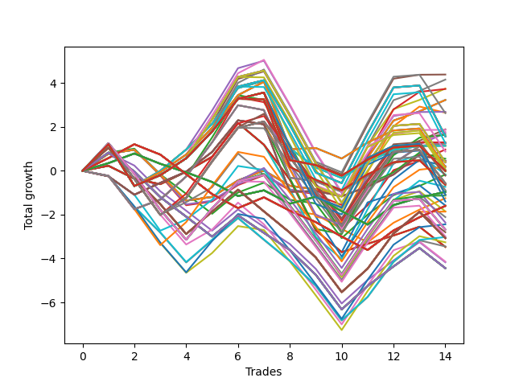

# Long HLT 614 
- Symbol: TSLA
- Date Range: 05/16/2022 - 05/17/2024
- Trading Period: 8:30-12:30
- Number of Trades: 14



| Id. | Name | Win Percent | Profit | Avg Profit / Trade | Avg Time / Trade | Std |      | Name | Win Percent | Profit | Avg Profit / Trade | Avg Time / Trade | Std |
| --- | ---- | ----------- | ------ | ------------------ | ---------------- | --- | ---- | ---- | ----------- | ------ | ------------------ | ---------------- | --- |
| | Sorted By <br> Profit | | | | | | | Sorted By <br> Win Percentage |||||
|0| TP-2 75m | 71.43 | 4.39 | 0.31 | 53:51 | 1.45 |     | TP-2 75m | 71.43 | 4.39 | 0.31 | 53:51 | 1.45 |
|1| TP-2 15m | 64.29 | 4.16 | 0.30 | 13:30 | 0.98 |     | TP-1.75 75m | 71.43 | 2.69 | 0.19 | 49:00 | 1.50 |
|2| TP-2.25 15m | 64.29 | 3.75 | 0.27 | 13:55 | 0.93 |     | TP-2.25 75m | 71.43 | 1.87 | 0.13 | 58:38 | 1.40 |
|3| TP-2 60m | 57.14 | 3.73 | 0.27 | 46:12 | 1.43 |     | TP-3 75m | 71.43 | 1.14 | 0.08 | 64:12 | 1.25 |
|4| TP-3 15m | 64.29 | 3.23 | 0.23 | 14:00 | 0.86 |     | TP-2.75 75m | 71.43 | 1.14 | 0.08 | 64:12 | 1.25 |
|5| TP-2.75 15m | 64.29 | 3.23 | 0.23 | 14:00 | 0.86 |     | TP-2.5 75m | 71.43 | 1.14 | 0.08 | 64:12 | 1.25 |
|6| TP-2.5 15m | 64.29 | 3.23 | 0.23 | 14:00 | 0.86 |     | TP-3 90m | 71.43 | 0.18 | 0.01 | 70:51 | 1.30 |
|7| TP-1.75 75m | 71.43 | 2.69 | 0.19 | 49:00 | 1.50 |     | TP-2.75 90m | 71.43 | 0.18 | 0.01 | 70:51 | 1.30 |
|8| TP-2 45m | 50.00 | 2.65 | 0.19 | 36:47 | 1.28 |     | TP-2.5 90m | 71.43 | 0.18 | 0.01 | 70:51 | 1.30 |
|9| TP-2 90m | 64.29 | 2.63 | 0.19 | 59:00 | 1.54 |     | TP-2 15m | 64.29 | 4.16 | 0.30 | 13:30 | 0.98 |
|10| TP-1.5 15m | 64.29 | 1.89 | 0.13 | 12:25 | 0.97 |     | TP-2.25 15m | 64.29 | 3.75 | 0.27 | 13:55 | 0.93 |
|11| TP-2.25 75m | 71.43 | 1.87 | 0.13 | 58:38 | 1.40 |     | TP-3 15m | 64.29 | 3.23 | 0.23 | 14:00 | 0.86 |
|12| TP-1.75 15m | 64.29 | 1.78 | 0.13 | 12:51 | 1.01 |     | TP-2.75 15m | 64.29 | 3.23 | 0.23 | 14:00 | 0.86 |
|13| TP-1.25 15m | 64.29 | 1.72 | 0.12 | 12:17 | 0.98 |     | TP-2.5 15m | 64.29 | 3.23 | 0.23 | 14:00 | 0.86 |
|14| TP-1.75 60m | 57.14 | 1.64 | 0.12 | 42:25 | 1.45 |     | TP-2 90m | 64.29 | 2.63 | 0.19 | 59:00 | 1.54 |
|15| TP-2 180m | 64.29 | 1.57 | 0.11 | 62:08 | 1.59 |     | TP-1.5 15m | 64.29 | 1.89 | 0.13 | 12:25 | 0.97 |
|16| TP-2 165m | 64.29 | 1.57 | 0.11 | 62:08 | 1.59 |     | TP-1.75 15m | 64.29 | 1.78 | 0.13 | 12:51 | 1.01 |
|17| TP-2 150m | 64.29 | 1.57 | 0.11 | 62:08 | 1.59 |     | TP-1.25 15m | 64.29 | 1.72 | 0.12 | 12:17 | 0.98 |
|18| TP-2 135m | 64.29 | 1.57 | 0.11 | 62:08 | 1.59 |     | TP-2 180m | 64.29 | 1.57 | 0.11 | 62:08 | 1.59 |
|19| TP-2 120m | 64.29 | 1.57 | 0.11 | 62:08 | 1.59 |     | TP-2 165m | 64.29 | 1.57 | 0.11 | 62:08 | 1.59 |
|20| TP-1.5 75m | 64.29 | 1.30 | 0.09 | 42:30 | 1.36 |     | TP-2 150m | 64.29 | 1.57 | 0.11 | 62:08 | 1.59 |
|21| TP-2.25 60m | 57.14 | 1.27 | 0.09 | 49:55 | 1.38 |     | TP-2 135m | 64.29 | 1.57 | 0.11 | 62:08 | 1.59 |
|22| TP-2 105m | 57.14 | 1.26 | 0.09 | 61:04 | 1.59 |     | TP-2 120m | 64.29 | 1.57 | 0.11 | 62:08 | 1.59 |
|23| TP-3 60m | 57.14 | 1.25 | 0.09 | 54:25 | 1.20 |     | TP-1.5 75m | 64.29 | 1.30 | 0.09 | 42:30 | 1.36 |
|24| TP-2.75 60m | 57.14 | 1.25 | 0.09 | 54:25 | 1.20 |     | TP-1 15m | 64.29 | 0.97 | 0.07 | 11:55 | 0.92 |
|25| TP-2.5 60m | 57.14 | 1.25 | 0.09 | 54:25 | 1.20 |     | TP-1.75 90m | 64.29 | 0.88 | 0.06 | 53:21 | 1.58 |
|26| TP-3 75m | 71.43 | 1.14 | 0.08 | 64:12 | 1.25 |     | TP-1.75 180m | 64.29 | 0.39 | 0.03 | 56:00 | 1.56 |
|27| TP-2.75 75m | 71.43 | 1.14 | 0.08 | 64:12 | 1.25 |     | TP-1.75 165m | 64.29 | 0.39 | 0.03 | 56:00 | 1.56 |
|28| TP-2.5 75m | 71.43 | 1.14 | 0.08 | 64:12 | 1.25 |     | TP-1.75 150m | 64.29 | 0.39 | 0.03 | 56:00 | 1.56 |
|29| TP-1 15m | 64.29 | 0.97 | 0.07 | 11:55 | 0.92 |     | TP-1.75 135m | 64.29 | 0.39 | 0.03 | 56:00 | 1.56 |
|30| TP-1.75 90m | 64.29 | 0.88 | 0.06 | 53:21 | 1.58 |     | TP-1.75 120m | 64.29 | 0.39 | 0.03 | 56:00 | 1.56 |
|31| TP-2.25 45m | 50.00 | 0.55 | 0.04 | 39:51 | 1.25 |     | TP-3 180m | 64.29 | 0.00 | 0.00 | 77:30 | 1.24 |
|32| TP-3 45m | 57.14 | 0.45 | 0.03 | 43:12 | 1.04 |     | TP-2.75 180m | 64.29 | 0.00 | 0.00 | 77:30 | 1.24 |
|33| TP-2.75 45m | 57.14 | 0.45 | 0.03 | 43:12 | 1.04 |     | TP-2.5 180m | 64.29 | 0.00 | 0.00 | 77:30 | 1.24 |
|34| TP-2.5 45m | 57.14 | 0.45 | 0.03 | 43:12 | 1.04 |     | TP-3 165m | 64.29 | 0.00 | 0.00 | 77:30 | 1.24 |
|35| TP-1.75 180m | 64.29 | 0.39 | 0.03 | 56:00 | 1.56 |     | TP-2.75 165m | 64.29 | 0.00 | 0.00 | 77:30 | 1.24 |
|36| TP-1.75 165m | 64.29 | 0.39 | 0.03 | 56:00 | 1.56 |     | TP-2.5 165m | 64.29 | 0.00 | 0.00 | 77:30 | 1.24 |
|37| TP-1.75 150m | 64.29 | 0.39 | 0.03 | 56:00 | 1.56 |     | TP-3 150m | 64.29 | 0.00 | 0.00 | 77:30 | 1.24 |
|38| TP-1.75 135m | 64.29 | 0.39 | 0.03 | 56:00 | 1.56 |     | TP-2.75 150m | 64.29 | 0.00 | 0.00 | 77:30 | 1.24 |
|39| TP-1.75 120m | 64.29 | 0.39 | 0.03 | 56:00 | 1.56 |     | TP-2.5 150m | 64.29 | 0.00 | 0.00 | 77:30 | 1.24 |
|40| TP-1.75 45m | 50.00 | 0.22 | 0.02 | 34:00 | 1.29 |     | TP-3 135m | 64.29 | 0.00 | 0.00 | 77:30 | 1.24 |
|41| TP-3 90m | 71.43 | 0.18 | 0.01 | 70:51 | 1.30 |     | TP-2.75 135m | 64.29 | 0.00 | 0.00 | 77:30 | 1.24 |
|42| TP-2.75 90m | 71.43 | 0.18 | 0.01 | 70:51 | 1.30 |     | TP-2.5 135m | 64.29 | 0.00 | 0.00 | 77:30 | 1.24 |
|43| TP-2.5 90m | 71.43 | 0.18 | 0.01 | 70:51 | 1.30 |     | TP-3 120m | 64.29 | 0.00 | 0.00 | 77:30 | 1.24 |
|44| TP-1.5 60m | 50.00 | 0.18 | 0.01 | 37:21 | 1.34 |     | TP-2.75 120m | 64.29 | 0.00 | 0.00 | 77:30 | 1.24 |
|45| TP-1.75 105m | 57.14 | 0.08 | 0.01 | 54:55 | 1.56 |     | TP-2.5 120m | 64.29 | 0.00 | 0.00 | 77:30 | 1.24 |
|46| TP-3 180m | 64.29 | 0.00 | 0.00 | 77:30 | 1.24 |     | TP-2.25 90m | 64.29 | -0.03 | -0.00 | 64:12 | 1.47 |
|47| TP-2.75 180m | 64.29 | 0.00 | 0.00 | 77:30 | 1.24 |     | TP-2.25 180m | 64.29 | -1.09 | -0.08 | 67:21 | 1.51 |
|48| TP-2.5 180m | 64.29 | 0.00 | 0.00 | 77:30 | 1.24 |     | TP-2.25 165m | 64.29 | -1.09 | -0.08 | 67:21 | 1.51 |
|49| TP-3 165m | 64.29 | 0.00 | 0.00 | 77:30 | 1.24 |     | TP-2.25 150m | 64.29 | -1.09 | -0.08 | 67:21 | 1.51 |
|50| TP-2.75 165m | 64.29 | 0.00 | 0.00 | 77:30 | 1.24 |     | TP-2.25 135m | 64.29 | -1.09 | -0.08 | 67:21 | 1.51 |
|51| TP-2.5 165m | 64.29 | 0.00 | 0.00 | 77:30 | 1.24 |     | TP-2.25 120m | 64.29 | -1.09 | -0.08 | 67:21 | 1.51 |
|52| TP-3 150m | 64.29 | 0.00 | 0.00 | 77:30 | 1.24 |     | TP-2 60m | 57.14 | 3.73 | 0.27 | 46:12 | 1.43 |
|53| TP-2.75 150m | 64.29 | 0.00 | 0.00 | 77:30 | 1.24 |     | TP-1.75 60m | 57.14 | 1.64 | 0.12 | 42:25 | 1.45 |
|54| TP-2.5 150m | 64.29 | 0.00 | 0.00 | 77:30 | 1.24 |     | TP-2.25 60m | 57.14 | 1.27 | 0.09 | 49:55 | 1.38 |
|55| TP-3 135m | 64.29 | 0.00 | 0.00 | 77:30 | 1.24 |     | TP-2 105m | 57.14 | 1.26 | 0.09 | 61:04 | 1.59 |
|56| TP-2.75 135m | 64.29 | 0.00 | 0.00 | 77:30 | 1.24 |     | TP-3 60m | 57.14 | 1.25 | 0.09 | 54:25 | 1.20 |
|57| TP-2.5 135m | 64.29 | 0.00 | 0.00 | 77:30 | 1.24 |     | TP-2.75 60m | 57.14 | 1.25 | 0.09 | 54:25 | 1.20 |
|58| TP-3 120m | 64.29 | 0.00 | 0.00 | 77:30 | 1.24 |     | TP-2.5 60m | 57.14 | 1.25 | 0.09 | 54:25 | 1.20 |
|59| TP-2.75 120m | 64.29 | 0.00 | 0.00 | 77:30 | 1.24 |     | TP-3 45m | 57.14 | 0.45 | 0.03 | 43:12 | 1.04 |
|60| TP-2.5 120m | 64.29 | 0.00 | 0.00 | 77:30 | 1.24 |     | TP-2.75 45m | 57.14 | 0.45 | 0.03 | 43:12 | 1.04 |
|61| TP-2.25 90m | 64.29 | -0.03 | -0.00 | 64:12 | 1.47 |     | TP-2.5 45m | 57.14 | 0.45 | 0.03 | 43:12 | 1.04 |
|62| TP-0.75 15m | 57.14 | -0.17 | -0.01 | 09:42 | 0.86 |     | TP-1.75 105m | 57.14 | 0.08 | 0.01 | 54:55 | 1.56 |
|63| TP-2 30m | 50.00 | -0.18 | -0.01 | 26:04 | 1.34 |     | TP-0.75 15m | 57.14 | -0.17 | -0.01 | 09:42 | 0.86 |
|64| TP-1.5 90m | 57.14 | -0.22 | -0.02 | 45:42 | 1.42 |     | TP-1.5 90m | 57.14 | -0.22 | -0.02 | 45:42 | 1.42 |
|65| TP-1.5 180m | 57.14 | -0.57 | -0.04 | 47:55 | 1.42 |     | TP-1.5 180m | 57.14 | -0.57 | -0.04 | 47:55 | 1.42 |
|66| TP-1.5 165m | 57.14 | -0.57 | -0.04 | 47:55 | 1.42 |     | TP-1.5 165m | 57.14 | -0.57 | -0.04 | 47:55 | 1.42 |
|67| TP-1.5 150m | 57.14 | -0.57 | -0.04 | 47:55 | 1.42 |     | TP-1.5 150m | 57.14 | -0.57 | -0.04 | 47:55 | 1.42 |
|68| TP-1.5 135m | 57.14 | -0.57 | -0.04 | 47:55 | 1.42 |     | TP-1.5 135m | 57.14 | -0.57 | -0.04 | 47:55 | 1.42 |
|69| TP-1.5 120m | 57.14 | -0.57 | -0.04 | 47:55 | 1.42 |     | TP-1.5 120m | 57.14 | -0.57 | -0.04 | 47:55 | 1.42 |
|70| TP-3 105m | 57.14 | -0.64 | -0.05 | 74:34 | 1.25 |     | TP-3 105m | 57.14 | -0.64 | -0.05 | 74:34 | 1.25 |
|71| TP-2.75 105m | 57.14 | -0.64 | -0.05 | 74:34 | 1.25 |     | TP-2.75 105m | 57.14 | -0.64 | -0.05 | 74:34 | 1.25 |
|72| TP-2.5 105m | 57.14 | -0.64 | -0.05 | 74:34 | 1.25 |     | TP-2.5 105m | 57.14 | -0.64 | -0.05 | 74:34 | 1.25 |
|73| TP-1.5 45m | 42.86 | -0.73 | -0.05 | 30:25 | 1.23 |     | TP-1.25 75m | 57.14 | -1.13 | -0.08 | 35:00 | 1.32 |
|74| TP-1.5 105m | 50.00 | -0.88 | -0.06 | 46:51 | 1.41 |     | TP-2.25 105m | 57.14 | -1.40 | -0.10 | 66:17 | 1.51 |
|75| TP-0.25 180m | 50.00 | -0.96 | -0.07 | 02:42 | 0.50 |     | TP-2 45m | 50.00 | 2.65 | 0.19 | 36:47 | 1.28 |
|76| TP-0.25 165m | 50.00 | -0.96 | -0.07 | 02:42 | 0.50 |     | TP-2.25 45m | 50.00 | 0.55 | 0.04 | 39:51 | 1.25 |
|77| TP-0.25 150m | 50.00 | -0.96 | -0.07 | 02:42 | 0.50 |     | TP-1.75 45m | 50.00 | 0.22 | 0.02 | 34:00 | 1.29 |
|78| TP-0.25 135m | 50.00 | -0.96 | -0.07 | 02:42 | 0.50 |     | TP-1.5 60m | 50.00 | 0.18 | 0.01 | 37:21 | 1.34 |
|79| TP-0.25 120m | 50.00 | -0.96 | -0.07 | 02:42 | 0.50 |     | TP-2 30m | 50.00 | -0.18 | -0.01 | 26:04 | 1.34 |
|80| TP-0.25 105m | 50.00 | -0.96 | -0.07 | 02:42 | 0.50 |     | TP-1.5 105m | 50.00 | -0.88 | -0.06 | 46:51 | 1.41 |
|81| TP-0.25 90m | 50.00 | -0.96 | -0.07 | 02:42 | 0.50 |     | TP-0.25 180m | 50.00 | -0.96 | -0.07 | 02:42 | 0.50 |
|82| TP-0.25 75m | 50.00 | -0.96 | -0.07 | 02:42 | 0.50 |     | TP-0.25 165m | 50.00 | -0.96 | -0.07 | 02:42 | 0.50 |
|83| TP-0.25 60m | 50.00 | -0.96 | -0.07 | 02:42 | 0.50 |     | TP-0.25 150m | 50.00 | -0.96 | -0.07 | 02:42 | 0.50 |
|84| TP-0.25 45m | 50.00 | -0.96 | -0.07 | 02:42 | 0.50 |     | TP-0.25 135m | 50.00 | -0.96 | -0.07 | 02:42 | 0.50 |
|85| TP-0.25 30m | 50.00 | -0.96 | -0.07 | 02:42 | 0.50 |     | TP-0.25 120m | 50.00 | -0.96 | -0.07 | 02:42 | 0.50 |
|86| TP-0.25 15m | 50.00 | -0.96 | -0.07 | 02:42 | 0.50 |     | TP-0.25 105m | 50.00 | -0.96 | -0.07 | 02:42 | 0.50 |
|87| TP-2.25 180m | 64.29 | -1.09 | -0.08 | 67:21 | 1.51 |     | TP-0.25 90m | 50.00 | -0.96 | -0.07 | 02:42 | 0.50 |
|88| TP-2.25 165m | 64.29 | -1.09 | -0.08 | 67:21 | 1.51 |     | TP-0.25 75m | 50.00 | -0.96 | -0.07 | 02:42 | 0.50 |
|89| TP-2.25 150m | 64.29 | -1.09 | -0.08 | 67:21 | 1.51 |     | TP-0.25 60m | 50.00 | -0.96 | -0.07 | 02:42 | 0.50 |
|90| TP-2.25 135m | 64.29 | -1.09 | -0.08 | 67:21 | 1.51 |     | TP-0.25 45m | 50.00 | -0.96 | -0.07 | 02:42 | 0.50 |
|91| TP-2.25 120m | 64.29 | -1.09 | -0.08 | 67:21 | 1.51 |     | TP-0.25 30m | 50.00 | -0.96 | -0.07 | 02:42 | 0.50 |
|92| TP-1.25 75m | 57.14 | -1.13 | -0.08 | 35:00 | 1.32 |     | TP-0.25 15m | 50.00 | -0.96 | -0.07 | 02:42 | 0.50 |
|93| TP-0.5 15m | 42.86 | -1.25 | -0.09 | 05:30 | 0.64 |     | TP-2.25 30m | 50.00 | -1.58 | -0.11 | 27:51 | 1.18 |
|94| TP-2.25 105m | 57.14 | -1.40 | -0.10 | 66:17 | 1.51 |     | TP-1.75 30m | 50.00 | -1.85 | -0.13 | 24:21 | 1.30 |
|95| TP-2.25 30m | 50.00 | -1.58 | -0.11 | 27:51 | 1.18 |     | TP-1 75m | 50.00 | -1.86 | -0.13 | 24:04 | 1.15 |
|96| TP-0.5 180m | 42.86 | -1.60 | -0.11 | 05:34 | 0.65 |     | TP-1.5 30m | 50.00 | -2.11 | -0.15 | 22:55 | 1.23 |
|97| TP-0.5 165m | 42.86 | -1.60 | -0.11 | 05:34 | 0.65 |     | TP-1.25 90m | 50.00 | -2.36 | -0.17 | 36:51 | 1.37 |
|98| TP-0.5 150m | 42.86 | -1.60 | -0.11 | 05:34 | 0.65 |     | TP-1.25 180m | 50.00 | -2.68 | -0.19 | 39:00 | 1.36 |
|99| TP-0.5 135m | 42.86 | -1.60 | -0.11 | 05:34 | 0.65 |     | TP-1.25 165m | 50.00 | -2.68 | -0.19 | 39:00 | 1.36 |
|100| TP-0.5 120m | 42.86 | -1.60 | -0.11 | 05:34 | 0.65 |     | TP-1.25 150m | 50.00 | -2.68 | -0.19 | 39:00 | 1.36 |
|101| TP-0.5 105m | 42.86 | -1.60 | -0.11 | 05:34 | 0.65 |     | TP-1.25 135m | 50.00 | -2.68 | -0.19 | 39:00 | 1.36 |
|102| TP-0.5 90m | 42.86 | -1.60 | -0.11 | 05:34 | 0.65 |     | TP-1.25 120m | 50.00 | -2.68 | -0.19 | 39:00 | 1.36 |
|103| TP-0.5 75m | 42.86 | -1.60 | -0.11 | 05:34 | 0.65 |     | TP-3 30m | 50.00 | -3.47 | -0.25 | 29:00 | 1.00 |
|104| TP-0.5 60m | 42.86 | -1.60 | -0.11 | 05:34 | 0.65 |     | TP-2.75 30m | 50.00 | -3.47 | -0.25 | 29:00 | 1.00 |
|105| TP-0.5 45m | 42.86 | -1.60 | -0.11 | 05:34 | 0.65 |     | TP-2.5 30m | 50.00 | -3.47 | -0.25 | 29:00 | 1.00 |
|106| TP-0.5 30m | 42.86 | -1.60 | -0.11 | 05:34 | 0.65 |     | TP-1.5 45m | 42.86 | -0.73 | -0.05 | 30:25 | 1.23 |
|107| TP-1.75 30m | 50.00 | -1.85 | -0.13 | 24:21 | 1.30 |     | TP-0.5 15m | 42.86 | -1.25 | -0.09 | 05:30 | 0.64 |
|108| TP-1 75m | 50.00 | -1.86 | -0.13 | 24:04 | 1.15 |     | TP-0.5 180m | 42.86 | -1.60 | -0.11 | 05:34 | 0.65 |
|109| TP-1.5 30m | 50.00 | -2.11 | -0.15 | 22:55 | 1.23 |     | TP-0.5 165m | 42.86 | -1.60 | -0.11 | 05:34 | 0.65 |
|110| TP-1.25 90m | 50.00 | -2.36 | -0.17 | 36:51 | 1.37 |     | TP-0.5 150m | 42.86 | -1.60 | -0.11 | 05:34 | 0.65 |
|111| TP-1.25 60m | 42.86 | -2.44 | -0.17 | 31:04 | 1.28 |     | TP-0.5 135m | 42.86 | -1.60 | -0.11 | 05:34 | 0.65 |
|112| TP-1.25 180m | 50.00 | -2.68 | -0.19 | 39:00 | 1.36 |     | TP-0.5 120m | 42.86 | -1.60 | -0.11 | 05:34 | 0.65 |
|113| TP-1.25 165m | 50.00 | -2.68 | -0.19 | 39:00 | 1.36 |     | TP-0.5 105m | 42.86 | -1.60 | -0.11 | 05:34 | 0.65 |
|114| TP-1.25 150m | 50.00 | -2.68 | -0.19 | 39:00 | 1.36 |     | TP-0.5 90m | 42.86 | -1.60 | -0.11 | 05:34 | 0.65 |
|115| TP-1.25 135m | 50.00 | -2.68 | -0.19 | 39:00 | 1.36 |     | TP-0.5 75m | 42.86 | -1.60 | -0.11 | 05:34 | 0.65 |
|116| TP-1.25 120m | 50.00 | -2.68 | -0.19 | 39:00 | 1.36 |     | TP-0.5 60m | 42.86 | -1.60 | -0.11 | 05:34 | 0.65 |
|117| TP-1 30m | 42.86 | -2.80 | -0.20 | 17:55 | 1.08 |     | TP-0.5 45m | 42.86 | -1.60 | -0.11 | 05:34 | 0.65 |
|118| TP-1.25 105m | 42.86 | -2.99 | -0.21 | 37:55 | 1.35 |     | TP-0.5 30m | 42.86 | -1.60 | -0.11 | 05:34 | 0.65 |
|119| TP-1 60m | 42.86 | -3.02 | -0.22 | 22:21 | 1.10 |     | TP-1.25 60m | 42.86 | -2.44 | -0.17 | 31:04 | 1.28 |
|120| TP-1 180m | 42.86 | -3.07 | -0.22 | 24:38 | 1.18 |     | TP-1 30m | 42.86 | -2.80 | -0.20 | 17:55 | 1.08 |
|121| TP-1 165m | 42.86 | -3.07 | -0.22 | 24:38 | 1.18 |     | TP-1.25 105m | 42.86 | -2.99 | -0.21 | 37:55 | 1.35 |
|122| TP-1 150m | 42.86 | -3.07 | -0.22 | 24:38 | 1.18 |     | TP-1 60m | 42.86 | -3.02 | -0.22 | 22:21 | 1.10 |
|123| TP-1 135m | 42.86 | -3.07 | -0.22 | 24:38 | 1.18 |     | TP-1 180m | 42.86 | -3.07 | -0.22 | 24:38 | 1.18 |
|124| TP-1 120m | 42.86 | -3.07 | -0.22 | 24:38 | 1.18 |     | TP-1 165m | 42.86 | -3.07 | -0.22 | 24:38 | 1.18 |
|125| TP-1 105m | 42.86 | -3.07 | -0.22 | 24:38 | 1.18 |     | TP-1 150m | 42.86 | -3.07 | -0.22 | 24:38 | 1.18 |
|126| TP-1 90m | 42.86 | -3.07 | -0.22 | 24:38 | 1.18 |     | TP-1 135m | 42.86 | -3.07 | -0.22 | 24:38 | 1.18 |
|127| TP-1.25 45m | 35.71 | -3.26 | -0.23 | 26:21 | 1.25 |     | TP-1 120m | 42.86 | -3.07 | -0.22 | 24:38 | 1.18 |
|128| TP-1 45m | 35.71 | -3.45 | -0.25 | 20:12 | 1.10 |     | TP-1 105m | 42.86 | -3.07 | -0.22 | 24:38 | 1.18 |
|129| TP-3 30m | 50.00 | -3.47 | -0.25 | 29:00 | 1.00 |     | TP-1 90m | 42.86 | -3.07 | -0.22 | 24:38 | 1.18 |
|130| TP-2.75 30m | 50.00 | -3.47 | -0.25 | 29:00 | 1.00 |     | TP-1.25 30m | 42.86 | -4.14 | -0.30 | 20:51 | 1.21 |
|131| TP-2.5 30m | 50.00 | -3.47 | -0.25 | 29:00 | 1.00 |     | TP-1.25 45m | 35.71 | -3.26 | -0.23 | 26:21 | 1.25 |
|132| TP-1.25 30m | 42.86 | -4.14 | -0.30 | 20:51 | 1.21 |     | TP-1 45m | 35.71 | -3.45 | -0.25 | 20:12 | 1.10 |
|133| TP-0.75 30m | 35.71 | -4.17 | -0.30 | 13:17 | 0.93 |     | TP-0.75 30m | 35.71 | -4.17 | -0.30 | 13:17 | 0.93 |
|134| TP-0.75 180m | 35.71 | -4.44 | -0.32 | 13:21 | 0.94 |     | TP-0.75 180m | 35.71 | -4.44 | -0.32 | 13:21 | 0.94 |
|135| TP-0.75 165m | 35.71 | -4.44 | -0.32 | 13:21 | 0.94 |     | TP-0.75 165m | 35.71 | -4.44 | -0.32 | 13:21 | 0.94 |
|136| TP-0.75 150m | 35.71 | -4.44 | -0.32 | 13:21 | 0.94 |     | TP-0.75 150m | 35.71 | -4.44 | -0.32 | 13:21 | 0.94 |
|137| TP-0.75 135m | 35.71 | -4.44 | -0.32 | 13:21 | 0.94 |     | TP-0.75 135m | 35.71 | -4.44 | -0.32 | 13:21 | 0.94 |
|138| TP-0.75 120m | 35.71 | -4.44 | -0.32 | 13:21 | 0.94 |     | TP-0.75 120m | 35.71 | -4.44 | -0.32 | 13:21 | 0.94 |
|139| TP-0.75 105m | 35.71 | -4.44 | -0.32 | 13:21 | 0.94 |     | TP-0.75 105m | 35.71 | -4.44 | -0.32 | 13:21 | 0.94 |
|140| TP-0.75 90m | 35.71 | -4.44 | -0.32 | 13:21 | 0.94 |     | TP-0.75 90m | 35.71 | -4.44 | -0.32 | 13:21 | 0.94 |
|141| TP-0.75 75m | 35.71 | -4.44 | -0.32 | 13:21 | 0.94 |     | TP-0.75 75m | 35.71 | -4.44 | -0.32 | 13:21 | 0.94 |
|142| TP-0.75 60m | 35.71 | -4.44 | -0.32 | 13:21 | 0.94 |     | TP-0.75 60m | 35.71 | -4.44 | -0.32 | 13:21 | 0.94 |
|143| TP-0.75 45m | 35.71 | -4.44 | -0.32 | 13:21 | 0.94 |     | TP-0.75 45m | 35.71 | -4.44 | -0.32 | 13:21 | 0.94 |

### Test TP-0.25 15m
* Take Profit of 0.25 Point
* 0.25 Stoploss
* Results:
```
Total Trades: 14
Percent Up: 50.00
Percent Down: 50.00
Total Points Moved Up: -0.96
Potential Profit: -480.00
Total Points Ups: 2.86 Count Ups: 7
Total Points Downs: -3.82 Count Downs: 7
```

<details><summary>Trades</summary>

<code>In: 2022-11-17 11:40:00		Out: 2022-11-17 11:42:00		Total Position Time: 02:00		Total Move Up: 0.35		Total to Date: 0.35</code> <br />
<code>In: 2023-08-17 11:45:00		Out: 2023-08-17 11:47:00		Total Position Time: 02:00		Total Move Up: 0.44		Total to Date: 0.79</code> <br />
<code>In: 2023-09-15 11:15:00		Out: 2023-09-15 11:19:00		Total Position Time: 04:00		Total Move Up: -0.47		Total to Date: 0.32</code> <br />
<code>In: 2023-09-15 11:20:00		Out: 2023-09-15 11:22:00		Total Position Time: 02:00		Total Move Up: -0.39		Total to Date: -0.07</code> <br />
<code>In: 2023-09-15 11:25:00		Out: 2023-09-15 11:28:00		Total Position Time: 03:00		Total Move Up: -0.44		Total to Date: -0.51</code> <br />
<code>In: 2023-09-15 11:30:00		Out: 2023-09-15 11:32:00		Total Position Time: 02:00		Total Move Up: -0.64		Total to Date: -1.15</code> <br />
<code>In: 2023-09-26 10:45:00		Out: 2023-09-26 10:51:00		Total Position Time: 06:00		Total Move Up: 0.26		Total to Date: -0.89</code> <br />
<code>In: 2023-10-12 10:35:00		Out: 2023-10-12 10:37:00		Total Position Time: 02:00		Total Move Up: -0.61		Total to Date: -1.50</code> <br />
<code>In: 2023-10-12 10:45:00		Out: 2023-10-12 10:47:00		Total Position Time: 02:00		Total Move Up: 0.32		Total to Date: -1.18</code> <br />
<code>In: 2023-12-20 12:00:00		Out: 2023-12-20 12:02:00		Total Position Time: 02:00		Total Move Up: -0.66		Total to Date: -1.84</code> <br />
<code>In: 2023-12-20 12:05:00		Out: 2023-12-20 12:08:00		Total Position Time: 03:00		Total Move Up: -0.61		Total to Date: -2.45</code> <br />
<code>In: 2023-12-20 12:10:00		Out: 2023-12-20 12:12:00		Total Position Time: 02:00		Total Move Up: 0.89		Total to Date: -1.56</code> <br />
<code>In: 2023-12-22 11:35:00		Out: 2023-12-22 11:38:00		Total Position Time: 03:00		Total Move Up: 0.34		Total to Date: -1.22</code> <br />
<code>In: 2024-01-24 10:55:00		Out: 2024-01-24 10:58:00		Total Position Time: 03:00		Total Move Up: 0.26		Total to Date: -0.96</code> <br />


</details>

### Test TP-0.5 15m
* Take Profit of 0.5 Point
* 0.5 Stoploss
* Results:
```
Total Trades: 14
Percent Up: 42.86
Percent Down: 57.14
Total Points Moved Up: -1.25
Potential Profit: -625.00
Total Points Ups: 3.71 Count Ups: 6
Total Points Downs: -4.96 Count Downs: 8
```

<details><summary>Trades</summary>

<code>In: 2022-11-17 11:40:00		Out: 2022-11-17 11:45:00		Total Position Time: 05:00		Total Move Up: 0.58		Total to Date: 0.58</code> <br />
<code>In: 2023-08-17 11:45:00		Out: 2023-08-17 11:51:00		Total Position Time: 06:00		Total Move Up: 0.63		Total to Date: 1.21</code> <br />
<code>In: 2023-09-15 11:15:00		Out: 2023-09-15 11:19:00		Total Position Time: 04:00		Total Move Up: -0.47		Total to Date: 0.74</code> <br />
<code>In: 2023-09-15 11:20:00		Out: 2023-09-15 11:28:00		Total Position Time: 08:00		Total Move Up: -0.89		Total to Date: -0.15</code> <br />
<code>In: 2023-09-15 11:25:00		Out: 2023-09-15 11:32:00		Total Position Time: 07:00		Total Move Up: -0.91		Total to Date: -1.06</code> <br />
<code>In: 2023-09-15 11:30:00		Out: 2023-09-15 11:32:00		Total Position Time: 02:00		Total Move Up: -0.64		Total to Date: -1.70</code> <br />
<code>In: 2023-09-26 10:45:00		Out: 2023-09-26 10:52:00		Total Position Time: 07:00		Total Move Up: 0.49		Total to Date: -1.21</code> <br />
<code>In: 2023-10-12 10:35:00		Out: 2023-10-12 10:37:00		Total Position Time: 02:00		Total Move Up: -0.61		Total to Date: -1.82</code> <br />
<code>In: 2023-10-12 10:45:00		Out: 2023-10-12 10:59:00		Total Position Time: 14:00		Total Move Up: -0.17		Total to Date: -1.99</code> <br />
<code>In: 2023-12-20 12:00:00		Out: 2023-12-20 12:02:00		Total Position Time: 02:00		Total Move Up: -0.66		Total to Date: -2.65</code> <br />
<code>In: 2023-12-20 12:05:00		Out: 2023-12-20 12:08:00		Total Position Time: 03:00		Total Move Up: -0.61		Total to Date: -3.26</code> <br />
<code>In: 2023-12-20 12:10:00		Out: 2023-12-20 12:12:00		Total Position Time: 02:00		Total Move Up: 0.89		Total to Date: -2.37</code> <br />
<code>In: 2023-12-22 11:35:00		Out: 2023-12-22 11:39:00		Total Position Time: 04:00		Total Move Up: 0.60		Total to Date: -1.77</code> <br />
<code>In: 2024-01-24 10:55:00		Out: 2024-01-24 11:06:00		Total Position Time: 11:00		Total Move Up: 0.52		Total to Date: -1.25</code> <br />


</details>

### Test TP-0.75 15m
* Take Profit of 0.75 Point
* 0.75 Stoploss
* Results:
```
Total Trades: 14
Percent Up: 57.14
Percent Down: 42.86
Total Points Moved Up: -0.17
Potential Profit: -85.00
Total Points Ups: 5.33 Count Ups: 8
Total Points Downs: -5.50 Count Downs: 6
```

<details><summary>Trades</summary>

<code>In: 2022-11-17 11:40:00		Out: 2022-11-17 11:50:00		Total Position Time: 10:00		Total Move Up: 0.83		Total to Date: 0.83</code> <br />
<code>In: 2023-08-17 11:45:00		Out: 2023-08-17 11:59:00		Total Position Time: 14:00		Total Move Up: 0.18		Total to Date: 1.01</code> <br />
<code>In: 2023-09-15 11:15:00		Out: 2023-09-15 11:28:00		Total Position Time: 13:00		Total Move Up: -1.17		Total to Date: -0.16</code> <br />
<code>In: 2023-09-15 11:20:00		Out: 2023-09-15 11:28:00		Total Position Time: 08:00		Total Move Up: -0.89		Total to Date: -1.05</code> <br />
<code>In: 2023-09-15 11:25:00		Out: 2023-09-15 11:32:00		Total Position Time: 07:00		Total Move Up: -0.91		Total to Date: -1.96</code> <br />
<code>In: 2023-09-15 11:30:00		Out: 2023-09-15 11:41:00		Total Position Time: 11:00		Total Move Up: 0.97		Total to Date: -0.99</code> <br />
<code>In: 2023-09-26 10:45:00		Out: 2023-09-26 10:59:00		Total Position Time: 14:00		Total Move Up: 0.45		Total to Date: -0.54</code> <br />
<code>In: 2023-10-12 10:35:00		Out: 2023-10-12 10:40:00		Total Position Time: 05:00		Total Move Up: -0.78		Total to Date: -1.32</code> <br />
<code>In: 2023-10-12 10:45:00		Out: 2023-10-12 10:59:00		Total Position Time: 14:00		Total Move Up: -0.17		Total to Date: -1.49</code> <br />
<code>In: 2023-12-20 12:00:00		Out: 2023-12-20 12:03:00		Total Position Time: 03:00		Total Move Up: -1.58		Total to Date: -3.07</code> <br />
<code>In: 2023-12-20 12:05:00		Out: 2023-12-20 12:12:00		Total Position Time: 07:00		Total Move Up: 1.07		Total to Date: -2.00</code> <br />
<code>In: 2023-12-20 12:10:00		Out: 2023-12-20 12:12:00		Total Position Time: 02:00		Total Move Up: 0.89		Total to Date: -1.11</code> <br />
<code>In: 2023-12-22 11:35:00		Out: 2023-12-22 11:49:00		Total Position Time: 14:00		Total Move Up: 0.42		Total to Date: -0.69</code> <br />
<code>In: 2024-01-24 10:55:00		Out: 2024-01-24 11:09:00		Total Position Time: 14:00		Total Move Up: 0.52		Total to Date: -0.17</code> <br />


</details>

### Test TP-1 15m
* Take Profit of 1 Point
* 1 Stoploss
* Results:
```
Total Trades: 14
Percent Up: 64.29
Percent Down: 35.71
Total Points Moved Up: 0.97
Potential Profit: 485.00
Total Points Ups: 5.94 Count Ups: 9
Total Points Downs: -4.97 Count Downs: 5
```

<details><summary>Trades</summary>

<code>In: 2022-11-17 11:40:00		Out: 2022-11-17 11:54:00		Total Position Time: 14:00		Total Move Up: 0.78		Total to Date: 0.78</code> <br />
<code>In: 2023-08-17 11:45:00		Out: 2023-08-17 11:59:00		Total Position Time: 14:00		Total Move Up: 0.18		Total to Date: 0.96</code> <br />
<code>In: 2023-09-15 11:15:00		Out: 2023-09-15 11:28:00		Total Position Time: 13:00		Total Move Up: -1.17		Total to Date: -0.21</code> <br />
<code>In: 2023-09-15 11:20:00		Out: 2023-09-15 11:32:00		Total Position Time: 12:00		Total Move Up: -1.36		Total to Date: -1.57</code> <br />
<code>In: 2023-09-15 11:25:00		Out: 2023-09-15 11:39:00		Total Position Time: 14:00		Total Move Up: 0.17		Total to Date: -1.40</code> <br />
<code>In: 2023-09-15 11:30:00		Out: 2023-09-15 11:44:00		Total Position Time: 14:00		Total Move Up: 0.75		Total to Date: -0.65</code> <br />
<code>In: 2023-09-26 10:45:00		Out: 2023-09-26 10:59:00		Total Position Time: 14:00		Total Move Up: 0.45		Total to Date: -0.20</code> <br />
<code>In: 2023-10-12 10:35:00		Out: 2023-10-12 10:49:00		Total Position Time: 14:00		Total Move Up: -0.69		Total to Date: -0.89</code> <br />
<code>In: 2023-10-12 10:45:00		Out: 2023-10-12 10:59:00		Total Position Time: 14:00		Total Move Up: -0.17		Total to Date: -1.06</code> <br />
<code>In: 2023-12-20 12:00:00		Out: 2023-12-20 12:03:00		Total Position Time: 03:00		Total Move Up: -1.58		Total to Date: -2.64</code> <br />
<code>In: 2023-12-20 12:05:00		Out: 2023-12-20 12:12:00		Total Position Time: 07:00		Total Move Up: 1.07		Total to Date: -1.57</code> <br />
<code>In: 2023-12-20 12:10:00		Out: 2023-12-20 12:16:00		Total Position Time: 06:00		Total Move Up: 1.60		Total to Date: 0.03</code> <br />
<code>In: 2023-12-22 11:35:00		Out: 2023-12-22 11:49:00		Total Position Time: 14:00		Total Move Up: 0.42		Total to Date: 0.45</code> <br />
<code>In: 2024-01-24 10:55:00		Out: 2024-01-24 11:09:00		Total Position Time: 14:00		Total Move Up: 0.52		Total to Date: 0.97</code> <br />


</details>

### Test TP-1.25 15m
* Take Profit of 1.25 Point
* 1.25 Stoploss
* Results:
```
Total Trades: 14
Percent Up: 64.29
Percent Down: 35.71
Total Points Moved Up: 1.72
Potential Profit: 860.00
Total Points Ups: 6.65 Count Ups: 9
Total Points Downs: -4.93 Count Downs: 5
```

<details><summary>Trades</summary>

<code>In: 2022-11-17 11:40:00		Out: 2022-11-17 11:54:00		Total Position Time: 14:00		Total Move Up: 0.78		Total to Date: 0.78</code> <br />
<code>In: 2023-08-17 11:45:00		Out: 2023-08-17 11:59:00		Total Position Time: 14:00		Total Move Up: 0.18		Total to Date: 0.96</code> <br />
<code>In: 2023-09-15 11:15:00		Out: 2023-09-15 11:29:00		Total Position Time: 14:00		Total Move Up: -1.13		Total to Date: -0.17</code> <br />
<code>In: 2023-09-15 11:20:00		Out: 2023-09-15 11:32:00		Total Position Time: 12:00		Total Move Up: -1.36		Total to Date: -1.53</code> <br />
<code>In: 2023-09-15 11:25:00		Out: 2023-09-15 11:39:00		Total Position Time: 14:00		Total Move Up: 0.17		Total to Date: -1.36</code> <br />
<code>In: 2023-09-15 11:30:00		Out: 2023-09-15 11:44:00		Total Position Time: 14:00		Total Move Up: 0.75		Total to Date: -0.61</code> <br />
<code>In: 2023-09-26 10:45:00		Out: 2023-09-26 10:59:00		Total Position Time: 14:00		Total Move Up: 0.45		Total to Date: -0.16</code> <br />
<code>In: 2023-10-12 10:35:00		Out: 2023-10-12 10:49:00		Total Position Time: 14:00		Total Move Up: -0.69		Total to Date: -0.85</code> <br />
<code>In: 2023-10-12 10:45:00		Out: 2023-10-12 10:59:00		Total Position Time: 14:00		Total Move Up: -0.17		Total to Date: -1.02</code> <br />
<code>In: 2023-12-20 12:00:00		Out: 2023-12-20 12:03:00		Total Position Time: 03:00		Total Move Up: -1.58		Total to Date: -2.60</code> <br />
<code>In: 2023-12-20 12:05:00		Out: 2023-12-20 12:16:00		Total Position Time: 11:00		Total Move Up: 1.78		Total to Date: -0.82</code> <br />
<code>In: 2023-12-20 12:10:00		Out: 2023-12-20 12:16:00		Total Position Time: 06:00		Total Move Up: 1.60		Total to Date: 0.78</code> <br />
<code>In: 2023-12-22 11:35:00		Out: 2023-12-22 11:49:00		Total Position Time: 14:00		Total Move Up: 0.42		Total to Date: 1.20</code> <br />
<code>In: 2024-01-24 10:55:00		Out: 2024-01-24 11:09:00		Total Position Time: 14:00		Total Move Up: 0.52		Total to Date: 1.72</code> <br />


</details>

### Test TP-1.5 15m
* Take Profit of 1.5 Point
* 1.5 Stoploss
* Results:
```
Total Trades: 14
Percent Up: 64.29
Percent Down: 35.71
Total Points Moved Up: 1.89
Potential Profit: 945.00
Total Points Ups: 6.65 Count Ups: 9
Total Points Downs: -4.76 Count Downs: 5
```

<details><summary>Trades</summary>

<code>In: 2022-11-17 11:40:00		Out: 2022-11-17 11:54:00		Total Position Time: 14:00		Total Move Up: 0.78		Total to Date: 0.78</code> <br />
<code>In: 2023-08-17 11:45:00		Out: 2023-08-17 11:59:00		Total Position Time: 14:00		Total Move Up: 0.18		Total to Date: 0.96</code> <br />
<code>In: 2023-09-15 11:15:00		Out: 2023-09-15 11:29:00		Total Position Time: 14:00		Total Move Up: -1.13		Total to Date: -0.17</code> <br />
<code>In: 2023-09-15 11:20:00		Out: 2023-09-15 11:34:00		Total Position Time: 14:00		Total Move Up: -1.19		Total to Date: -1.36</code> <br />
<code>In: 2023-09-15 11:25:00		Out: 2023-09-15 11:39:00		Total Position Time: 14:00		Total Move Up: 0.17		Total to Date: -1.19</code> <br />
<code>In: 2023-09-15 11:30:00		Out: 2023-09-15 11:44:00		Total Position Time: 14:00		Total Move Up: 0.75		Total to Date: -0.44</code> <br />
<code>In: 2023-09-26 10:45:00		Out: 2023-09-26 10:59:00		Total Position Time: 14:00		Total Move Up: 0.45		Total to Date: 0.01</code> <br />
<code>In: 2023-10-12 10:35:00		Out: 2023-10-12 10:49:00		Total Position Time: 14:00		Total Move Up: -0.69		Total to Date: -0.68</code> <br />
<code>In: 2023-10-12 10:45:00		Out: 2023-10-12 10:59:00		Total Position Time: 14:00		Total Move Up: -0.17		Total to Date: -0.85</code> <br />
<code>In: 2023-12-20 12:00:00		Out: 2023-12-20 12:03:00		Total Position Time: 03:00		Total Move Up: -1.58		Total to Date: -2.43</code> <br />
<code>In: 2023-12-20 12:05:00		Out: 2023-12-20 12:16:00		Total Position Time: 11:00		Total Move Up: 1.78		Total to Date: -0.65</code> <br />
<code>In: 2023-12-20 12:10:00		Out: 2023-12-20 12:16:00		Total Position Time: 06:00		Total Move Up: 1.60		Total to Date: 0.95</code> <br />
<code>In: 2023-12-22 11:35:00		Out: 2023-12-22 11:49:00		Total Position Time: 14:00		Total Move Up: 0.42		Total to Date: 1.37</code> <br />
<code>In: 2024-01-24 10:55:00		Out: 2024-01-24 11:09:00		Total Position Time: 14:00		Total Move Up: 0.52		Total to Date: 1.89</code> <br />


</details>

### Test TP-1.75 15m
* Take Profit of 1.75 Point
* 1.75 Stoploss
* Results:
```
Total Trades: 14
Percent Up: 64.29
Percent Down: 35.71
Total Points Moved Up: 1.78
Potential Profit: 890.00
Total Points Ups: 6.78 Count Ups: 9
Total Points Downs: -5.00 Count Downs: 5
```

<details><summary>Trades</summary>

<code>In: 2022-11-17 11:40:00		Out: 2022-11-17 11:54:00		Total Position Time: 14:00		Total Move Up: 0.78		Total to Date: 0.78</code> <br />
<code>In: 2023-08-17 11:45:00		Out: 2023-08-17 11:59:00		Total Position Time: 14:00		Total Move Up: 0.18		Total to Date: 0.96</code> <br />
<code>In: 2023-09-15 11:15:00		Out: 2023-09-15 11:29:00		Total Position Time: 14:00		Total Move Up: -1.13		Total to Date: -0.17</code> <br />
<code>In: 2023-09-15 11:20:00		Out: 2023-09-15 11:34:00		Total Position Time: 14:00		Total Move Up: -1.19		Total to Date: -1.36</code> <br />
<code>In: 2023-09-15 11:25:00		Out: 2023-09-15 11:39:00		Total Position Time: 14:00		Total Move Up: 0.17		Total to Date: -1.19</code> <br />
<code>In: 2023-09-15 11:30:00		Out: 2023-09-15 11:44:00		Total Position Time: 14:00		Total Move Up: 0.75		Total to Date: -0.44</code> <br />
<code>In: 2023-09-26 10:45:00		Out: 2023-09-26 10:59:00		Total Position Time: 14:00		Total Move Up: 0.45		Total to Date: 0.01</code> <br />
<code>In: 2023-10-12 10:35:00		Out: 2023-10-12 10:49:00		Total Position Time: 14:00		Total Move Up: -0.69		Total to Date: -0.68</code> <br />
<code>In: 2023-10-12 10:45:00		Out: 2023-10-12 10:59:00		Total Position Time: 14:00		Total Move Up: -0.17		Total to Date: -0.85</code> <br />
<code>In: 2023-12-20 12:00:00		Out: 2023-12-20 12:08:00		Total Position Time: 08:00		Total Move Up: -1.82		Total to Date: -2.67</code> <br />
<code>In: 2023-12-20 12:05:00		Out: 2023-12-20 12:16:00		Total Position Time: 11:00		Total Move Up: 1.78		Total to Date: -0.89</code> <br />
<code>In: 2023-12-20 12:10:00		Out: 2023-12-20 12:17:00		Total Position Time: 07:00		Total Move Up: 1.73		Total to Date: 0.84</code> <br />
<code>In: 2023-12-22 11:35:00		Out: 2023-12-22 11:49:00		Total Position Time: 14:00		Total Move Up: 0.42		Total to Date: 1.26</code> <br />
<code>In: 2024-01-24 10:55:00		Out: 2024-01-24 11:09:00		Total Position Time: 14:00		Total Move Up: 0.52		Total to Date: 1.78</code> <br />


</details>

### Test TP-2 15m
* Take Profit of 2 Point
* 2 Stoploss
* Results:
```
Total Trades: 14
Percent Up: 64.29
Percent Down: 35.71
Total Points Moved Up: 4.16
Potential Profit: 2080.00
Total Points Ups: 7.63 Count Ups: 9
Total Points Downs: -3.47 Count Downs: 5
```

<details><summary>Trades</summary>

<code>In: 2022-11-17 11:40:00		Out: 2022-11-17 11:54:00		Total Position Time: 14:00		Total Move Up: 0.78		Total to Date: 0.78</code> <br />
<code>In: 2023-08-17 11:45:00		Out: 2023-08-17 11:59:00		Total Position Time: 14:00		Total Move Up: 0.18		Total to Date: 0.96</code> <br />
<code>In: 2023-09-15 11:15:00		Out: 2023-09-15 11:29:00		Total Position Time: 14:00		Total Move Up: -1.13		Total to Date: -0.17</code> <br />
<code>In: 2023-09-15 11:20:00		Out: 2023-09-15 11:34:00		Total Position Time: 14:00		Total Move Up: -1.19		Total to Date: -1.36</code> <br />
<code>In: 2023-09-15 11:25:00		Out: 2023-09-15 11:39:00		Total Position Time: 14:00		Total Move Up: 0.17		Total to Date: -1.19</code> <br />
<code>In: 2023-09-15 11:30:00		Out: 2023-09-15 11:44:00		Total Position Time: 14:00		Total Move Up: 0.75		Total to Date: -0.44</code> <br />
<code>In: 2023-09-26 10:45:00		Out: 2023-09-26 10:59:00		Total Position Time: 14:00		Total Move Up: 0.45		Total to Date: 0.01</code> <br />
<code>In: 2023-10-12 10:35:00		Out: 2023-10-12 10:49:00		Total Position Time: 14:00		Total Move Up: -0.69		Total to Date: -0.68</code> <br />
<code>In: 2023-10-12 10:45:00		Out: 2023-10-12 10:59:00		Total Position Time: 14:00		Total Move Up: -0.17		Total to Date: -0.85</code> <br />
<code>In: 2023-12-20 12:00:00		Out: 2023-12-20 12:14:00		Total Position Time: 14:00		Total Move Up: -0.29		Total to Date: -1.14</code> <br />
<code>In: 2023-12-20 12:05:00		Out: 2023-12-20 12:18:00		Total Position Time: 13:00		Total Move Up: 2.27		Total to Date: 1.13</code> <br />
<code>In: 2023-12-20 12:10:00		Out: 2023-12-20 12:18:00		Total Position Time: 08:00		Total Move Up: 2.09		Total to Date: 3.22</code> <br />
<code>In: 2023-12-22 11:35:00		Out: 2023-12-22 11:49:00		Total Position Time: 14:00		Total Move Up: 0.42		Total to Date: 3.64</code> <br />
<code>In: 2024-01-24 10:55:00		Out: 2024-01-24 11:09:00		Total Position Time: 14:00		Total Move Up: 0.52		Total to Date: 4.16</code> <br />


</details>

### Test TP-2.25 15m
* Take Profit of 2.25 Point
* 2.25 Stoploss
* Results:
```
Total Trades: 14
Percent Up: 64.29
Percent Down: 35.71
Total Points Moved Up: 3.75
Potential Profit: 1875.00
Total Points Ups: 7.22 Count Ups: 9
Total Points Downs: -3.47 Count Downs: 5
```

<details><summary>Trades</summary>

<code>In: 2022-11-17 11:40:00		Out: 2022-11-17 11:54:00		Total Position Time: 14:00		Total Move Up: 0.78		Total to Date: 0.78</code> <br />
<code>In: 2023-08-17 11:45:00		Out: 2023-08-17 11:59:00		Total Position Time: 14:00		Total Move Up: 0.18		Total to Date: 0.96</code> <br />
<code>In: 2023-09-15 11:15:00		Out: 2023-09-15 11:29:00		Total Position Time: 14:00		Total Move Up: -1.13		Total to Date: -0.17</code> <br />
<code>In: 2023-09-15 11:20:00		Out: 2023-09-15 11:34:00		Total Position Time: 14:00		Total Move Up: -1.19		Total to Date: -1.36</code> <br />
<code>In: 2023-09-15 11:25:00		Out: 2023-09-15 11:39:00		Total Position Time: 14:00		Total Move Up: 0.17		Total to Date: -1.19</code> <br />
<code>In: 2023-09-15 11:30:00		Out: 2023-09-15 11:44:00		Total Position Time: 14:00		Total Move Up: 0.75		Total to Date: -0.44</code> <br />
<code>In: 2023-09-26 10:45:00		Out: 2023-09-26 10:59:00		Total Position Time: 14:00		Total Move Up: 0.45		Total to Date: 0.01</code> <br />
<code>In: 2023-10-12 10:35:00		Out: 2023-10-12 10:49:00		Total Position Time: 14:00		Total Move Up: -0.69		Total to Date: -0.68</code> <br />
<code>In: 2023-10-12 10:45:00		Out: 2023-10-12 10:59:00		Total Position Time: 14:00		Total Move Up: -0.17		Total to Date: -0.85</code> <br />
<code>In: 2023-12-20 12:00:00		Out: 2023-12-20 12:14:00		Total Position Time: 14:00		Total Move Up: -0.29		Total to Date: -1.14</code> <br />
<code>In: 2023-12-20 12:05:00		Out: 2023-12-20 12:18:00		Total Position Time: 13:00		Total Move Up: 2.27		Total to Date: 1.13</code> <br />
<code>In: 2023-12-20 12:10:00		Out: 2023-12-20 12:24:00		Total Position Time: 14:00		Total Move Up: 1.68		Total to Date: 2.81</code> <br />
<code>In: 2023-12-22 11:35:00		Out: 2023-12-22 11:49:00		Total Position Time: 14:00		Total Move Up: 0.42		Total to Date: 3.23</code> <br />
<code>In: 2024-01-24 10:55:00		Out: 2024-01-24 11:09:00		Total Position Time: 14:00		Total Move Up: 0.52		Total to Date: 3.75</code> <br />


</details>

### Test TP-2.5 15m
* Take Profit of 2.5 Point
* 2.5 Stoploss
* Results:
```
Total Trades: 14
Percent Up: 64.29
Percent Down: 35.71
Total Points Moved Up: 3.23
Potential Profit: 1615.00
Total Points Ups: 6.70 Count Ups: 9
Total Points Downs: -3.47 Count Downs: 5
```

<details><summary>Trades</summary>

<code>In: 2022-11-17 11:40:00		Out: 2022-11-17 11:54:00		Total Position Time: 14:00		Total Move Up: 0.78		Total to Date: 0.78</code> <br />
<code>In: 2023-08-17 11:45:00		Out: 2023-08-17 11:59:00		Total Position Time: 14:00		Total Move Up: 0.18		Total to Date: 0.96</code> <br />
<code>In: 2023-09-15 11:15:00		Out: 2023-09-15 11:29:00		Total Position Time: 14:00		Total Move Up: -1.13		Total to Date: -0.17</code> <br />
<code>In: 2023-09-15 11:20:00		Out: 2023-09-15 11:34:00		Total Position Time: 14:00		Total Move Up: -1.19		Total to Date: -1.36</code> <br />
<code>In: 2023-09-15 11:25:00		Out: 2023-09-15 11:39:00		Total Position Time: 14:00		Total Move Up: 0.17		Total to Date: -1.19</code> <br />
<code>In: 2023-09-15 11:30:00		Out: 2023-09-15 11:44:00		Total Position Time: 14:00		Total Move Up: 0.75		Total to Date: -0.44</code> <br />
<code>In: 2023-09-26 10:45:00		Out: 2023-09-26 10:59:00		Total Position Time: 14:00		Total Move Up: 0.45		Total to Date: 0.01</code> <br />
<code>In: 2023-10-12 10:35:00		Out: 2023-10-12 10:49:00		Total Position Time: 14:00		Total Move Up: -0.69		Total to Date: -0.68</code> <br />
<code>In: 2023-10-12 10:45:00		Out: 2023-10-12 10:59:00		Total Position Time: 14:00		Total Move Up: -0.17		Total to Date: -0.85</code> <br />
<code>In: 2023-12-20 12:00:00		Out: 2023-12-20 12:14:00		Total Position Time: 14:00		Total Move Up: -0.29		Total to Date: -1.14</code> <br />
<code>In: 2023-12-20 12:05:00		Out: 2023-12-20 12:19:00		Total Position Time: 14:00		Total Move Up: 1.75		Total to Date: 0.61</code> <br />
<code>In: 2023-12-20 12:10:00		Out: 2023-12-20 12:24:00		Total Position Time: 14:00		Total Move Up: 1.68		Total to Date: 2.29</code> <br />
<code>In: 2023-12-22 11:35:00		Out: 2023-12-22 11:49:00		Total Position Time: 14:00		Total Move Up: 0.42		Total to Date: 2.71</code> <br />
<code>In: 2024-01-24 10:55:00		Out: 2024-01-24 11:09:00		Total Position Time: 14:00		Total Move Up: 0.52		Total to Date: 3.23</code> <br />


</details>

### Test TP-2.75 15m
* Take Profit of 2.75 Point
* 2.75 Stoploss
* Results:
```
Total Trades: 14
Percent Up: 64.29
Percent Down: 35.71
Total Points Moved Up: 3.23
Potential Profit: 1615.00
Total Points Ups: 6.70 Count Ups: 9
Total Points Downs: -3.47 Count Downs: 5
```

<details><summary>Trades</summary>

<code>In: 2022-11-17 11:40:00		Out: 2022-11-17 11:54:00		Total Position Time: 14:00		Total Move Up: 0.78		Total to Date: 0.78</code> <br />
<code>In: 2023-08-17 11:45:00		Out: 2023-08-17 11:59:00		Total Position Time: 14:00		Total Move Up: 0.18		Total to Date: 0.96</code> <br />
<code>In: 2023-09-15 11:15:00		Out: 2023-09-15 11:29:00		Total Position Time: 14:00		Total Move Up: -1.13		Total to Date: -0.17</code> <br />
<code>In: 2023-09-15 11:20:00		Out: 2023-09-15 11:34:00		Total Position Time: 14:00		Total Move Up: -1.19		Total to Date: -1.36</code> <br />
<code>In: 2023-09-15 11:25:00		Out: 2023-09-15 11:39:00		Total Position Time: 14:00		Total Move Up: 0.17		Total to Date: -1.19</code> <br />
<code>In: 2023-09-15 11:30:00		Out: 2023-09-15 11:44:00		Total Position Time: 14:00		Total Move Up: 0.75		Total to Date: -0.44</code> <br />
<code>In: 2023-09-26 10:45:00		Out: 2023-09-26 10:59:00		Total Position Time: 14:00		Total Move Up: 0.45		Total to Date: 0.01</code> <br />
<code>In: 2023-10-12 10:35:00		Out: 2023-10-12 10:49:00		Total Position Time: 14:00		Total Move Up: -0.69		Total to Date: -0.68</code> <br />
<code>In: 2023-10-12 10:45:00		Out: 2023-10-12 10:59:00		Total Position Time: 14:00		Total Move Up: -0.17		Total to Date: -0.85</code> <br />
<code>In: 2023-12-20 12:00:00		Out: 2023-12-20 12:14:00		Total Position Time: 14:00		Total Move Up: -0.29		Total to Date: -1.14</code> <br />
<code>In: 2023-12-20 12:05:00		Out: 2023-12-20 12:19:00		Total Position Time: 14:00		Total Move Up: 1.75		Total to Date: 0.61</code> <br />
<code>In: 2023-12-20 12:10:00		Out: 2023-12-20 12:24:00		Total Position Time: 14:00		Total Move Up: 1.68		Total to Date: 2.29</code> <br />
<code>In: 2023-12-22 11:35:00		Out: 2023-12-22 11:49:00		Total Position Time: 14:00		Total Move Up: 0.42		Total to Date: 2.71</code> <br />
<code>In: 2024-01-24 10:55:00		Out: 2024-01-24 11:09:00		Total Position Time: 14:00		Total Move Up: 0.52		Total to Date: 3.23</code> <br />


</details>

### Test TP-3 15m
* Take Profit of 3 Point
* 3 Stoploss
* Results:
```
Total Trades: 14
Percent Up: 64.29
Percent Down: 35.71
Total Points Moved Up: 3.23
Potential Profit: 1615.00
Total Points Ups: 6.70 Count Ups: 9
Total Points Downs: -3.47 Count Downs: 5
```

<details><summary>Trades</summary>

<code>In: 2022-11-17 11:40:00		Out: 2022-11-17 11:54:00		Total Position Time: 14:00		Total Move Up: 0.78		Total to Date: 0.78</code> <br />
<code>In: 2023-08-17 11:45:00		Out: 2023-08-17 11:59:00		Total Position Time: 14:00		Total Move Up: 0.18		Total to Date: 0.96</code> <br />
<code>In: 2023-09-15 11:15:00		Out: 2023-09-15 11:29:00		Total Position Time: 14:00		Total Move Up: -1.13		Total to Date: -0.17</code> <br />
<code>In: 2023-09-15 11:20:00		Out: 2023-09-15 11:34:00		Total Position Time: 14:00		Total Move Up: -1.19		Total to Date: -1.36</code> <br />
<code>In: 2023-09-15 11:25:00		Out: 2023-09-15 11:39:00		Total Position Time: 14:00		Total Move Up: 0.17		Total to Date: -1.19</code> <br />
<code>In: 2023-09-15 11:30:00		Out: 2023-09-15 11:44:00		Total Position Time: 14:00		Total Move Up: 0.75		Total to Date: -0.44</code> <br />
<code>In: 2023-09-26 10:45:00		Out: 2023-09-26 10:59:00		Total Position Time: 14:00		Total Move Up: 0.45		Total to Date: 0.01</code> <br />
<code>In: 2023-10-12 10:35:00		Out: 2023-10-12 10:49:00		Total Position Time: 14:00		Total Move Up: -0.69		Total to Date: -0.68</code> <br />
<code>In: 2023-10-12 10:45:00		Out: 2023-10-12 10:59:00		Total Position Time: 14:00		Total Move Up: -0.17		Total to Date: -0.85</code> <br />
<code>In: 2023-12-20 12:00:00		Out: 2023-12-20 12:14:00		Total Position Time: 14:00		Total Move Up: -0.29		Total to Date: -1.14</code> <br />
<code>In: 2023-12-20 12:05:00		Out: 2023-12-20 12:19:00		Total Position Time: 14:00		Total Move Up: 1.75		Total to Date: 0.61</code> <br />
<code>In: 2023-12-20 12:10:00		Out: 2023-12-20 12:24:00		Total Position Time: 14:00		Total Move Up: 1.68		Total to Date: 2.29</code> <br />
<code>In: 2023-12-22 11:35:00		Out: 2023-12-22 11:49:00		Total Position Time: 14:00		Total Move Up: 0.42		Total to Date: 2.71</code> <br />
<code>In: 2024-01-24 10:55:00		Out: 2024-01-24 11:09:00		Total Position Time: 14:00		Total Move Up: 0.52		Total to Date: 3.23</code> <br />


</details>

### Test TP-0.25 30m
* Take Profit of 0.25 Point
* 0.25 Stoploss
* Results:
```
Total Trades: 14
Percent Up: 50.00
Percent Down: 50.00
Total Points Moved Up: -0.96
Potential Profit: -480.00
Total Points Ups: 2.86 Count Ups: 7
Total Points Downs: -3.82 Count Downs: 7
```

<details><summary>Trades</summary>

<code>In: 2022-11-17 11:40:00		Out: 2022-11-17 11:42:00		Total Position Time: 02:00		Total Move Up: 0.35		Total to Date: 0.35</code> <br />
<code>In: 2023-08-17 11:45:00		Out: 2023-08-17 11:47:00		Total Position Time: 02:00		Total Move Up: 0.44		Total to Date: 0.79</code> <br />
<code>In: 2023-09-15 11:15:00		Out: 2023-09-15 11:19:00		Total Position Time: 04:00		Total Move Up: -0.47		Total to Date: 0.32</code> <br />
<code>In: 2023-09-15 11:20:00		Out: 2023-09-15 11:22:00		Total Position Time: 02:00		Total Move Up: -0.39		Total to Date: -0.07</code> <br />
<code>In: 2023-09-15 11:25:00		Out: 2023-09-15 11:28:00		Total Position Time: 03:00		Total Move Up: -0.44		Total to Date: -0.51</code> <br />
<code>In: 2023-09-15 11:30:00		Out: 2023-09-15 11:32:00		Total Position Time: 02:00		Total Move Up: -0.64		Total to Date: -1.15</code> <br />
<code>In: 2023-09-26 10:45:00		Out: 2023-09-26 10:51:00		Total Position Time: 06:00		Total Move Up: 0.26		Total to Date: -0.89</code> <br />
<code>In: 2023-10-12 10:35:00		Out: 2023-10-12 10:37:00		Total Position Time: 02:00		Total Move Up: -0.61		Total to Date: -1.50</code> <br />
<code>In: 2023-10-12 10:45:00		Out: 2023-10-12 10:47:00		Total Position Time: 02:00		Total Move Up: 0.32		Total to Date: -1.18</code> <br />
<code>In: 2023-12-20 12:00:00		Out: 2023-12-20 12:02:00		Total Position Time: 02:00		Total Move Up: -0.66		Total to Date: -1.84</code> <br />
<code>In: 2023-12-20 12:05:00		Out: 2023-12-20 12:08:00		Total Position Time: 03:00		Total Move Up: -0.61		Total to Date: -2.45</code> <br />
<code>In: 2023-12-20 12:10:00		Out: 2023-12-20 12:12:00		Total Position Time: 02:00		Total Move Up: 0.89		Total to Date: -1.56</code> <br />
<code>In: 2023-12-22 11:35:00		Out: 2023-12-22 11:38:00		Total Position Time: 03:00		Total Move Up: 0.34		Total to Date: -1.22</code> <br />
<code>In: 2024-01-24 10:55:00		Out: 2024-01-24 10:58:00		Total Position Time: 03:00		Total Move Up: 0.26		Total to Date: -0.96</code> <br />


</details>

### Test TP-0.5 30m
* Take Profit of 0.5 Point
* 0.5 Stoploss
* Results:
```
Total Trades: 14
Percent Up: 42.86
Percent Down: 57.14
Total Points Moved Up: -1.60
Potential Profit: -800.00
Total Points Ups: 3.71 Count Ups: 6
Total Points Downs: -5.31 Count Downs: 8
```

<details><summary>Trades</summary>

<code>In: 2022-11-17 11:40:00		Out: 2022-11-17 11:45:00		Total Position Time: 05:00		Total Move Up: 0.58		Total to Date: 0.58</code> <br />
<code>In: 2023-08-17 11:45:00		Out: 2023-08-17 11:51:00		Total Position Time: 06:00		Total Move Up: 0.63		Total to Date: 1.21</code> <br />
<code>In: 2023-09-15 11:15:00		Out: 2023-09-15 11:19:00		Total Position Time: 04:00		Total Move Up: -0.47		Total to Date: 0.74</code> <br />
<code>In: 2023-09-15 11:20:00		Out: 2023-09-15 11:28:00		Total Position Time: 08:00		Total Move Up: -0.89		Total to Date: -0.15</code> <br />
<code>In: 2023-09-15 11:25:00		Out: 2023-09-15 11:32:00		Total Position Time: 07:00		Total Move Up: -0.91		Total to Date: -1.06</code> <br />
<code>In: 2023-09-15 11:30:00		Out: 2023-09-15 11:32:00		Total Position Time: 02:00		Total Move Up: -0.64		Total to Date: -1.70</code> <br />
<code>In: 2023-09-26 10:45:00		Out: 2023-09-26 10:52:00		Total Position Time: 07:00		Total Move Up: 0.49		Total to Date: -1.21</code> <br />
<code>In: 2023-10-12 10:35:00		Out: 2023-10-12 10:37:00		Total Position Time: 02:00		Total Move Up: -0.61		Total to Date: -1.82</code> <br />
<code>In: 2023-10-12 10:45:00		Out: 2023-10-12 11:00:00		Total Position Time: 15:00		Total Move Up: -0.52		Total to Date: -2.34</code> <br />
<code>In: 2023-12-20 12:00:00		Out: 2023-12-20 12:02:00		Total Position Time: 02:00		Total Move Up: -0.66		Total to Date: -3.00</code> <br />
<code>In: 2023-12-20 12:05:00		Out: 2023-12-20 12:08:00		Total Position Time: 03:00		Total Move Up: -0.61		Total to Date: -3.61</code> <br />
<code>In: 2023-12-20 12:10:00		Out: 2023-12-20 12:12:00		Total Position Time: 02:00		Total Move Up: 0.89		Total to Date: -2.72</code> <br />
<code>In: 2023-12-22 11:35:00		Out: 2023-12-22 11:39:00		Total Position Time: 04:00		Total Move Up: 0.60		Total to Date: -2.12</code> <br />
<code>In: 2024-01-24 10:55:00		Out: 2024-01-24 11:06:00		Total Position Time: 11:00		Total Move Up: 0.52		Total to Date: -1.60</code> <br />


</details>

### Test TP-0.75 30m
* Take Profit of 0.75 Point
* 0.75 Stoploss
* Results:
```
Total Trades: 14
Percent Up: 35.71
Percent Down: 64.29
Total Points Moved Up: -4.17
Potential Profit: -2085.00
Total Points Ups: 4.60 Count Ups: 5
Total Points Downs: -8.77 Count Downs: 9
```

<details><summary>Trades</summary>

<code>In: 2022-11-17 11:40:00		Out: 2022-11-17 11:50:00		Total Position Time: 10:00		Total Move Up: 0.83		Total to Date: 0.83</code> <br />
<code>In: 2023-08-17 11:45:00		Out: 2023-08-17 12:14:00		Total Position Time: 29:00		Total Move Up: -0.59		Total to Date: 0.24</code> <br />
<code>In: 2023-09-15 11:15:00		Out: 2023-09-15 11:28:00		Total Position Time: 13:00		Total Move Up: -1.17		Total to Date: -0.93</code> <br />
<code>In: 2023-09-15 11:20:00		Out: 2023-09-15 11:28:00		Total Position Time: 08:00		Total Move Up: -0.89		Total to Date: -1.82</code> <br />
<code>In: 2023-09-15 11:25:00		Out: 2023-09-15 11:32:00		Total Position Time: 07:00		Total Move Up: -0.91		Total to Date: -2.73</code> <br />
<code>In: 2023-09-15 11:30:00		Out: 2023-09-15 11:41:00		Total Position Time: 11:00		Total Move Up: 0.97		Total to Date: -1.76</code> <br />
<code>In: 2023-09-26 10:45:00		Out: 2023-09-26 11:12:00		Total Position Time: 27:00		Total Move Up: -0.80		Total to Date: -2.56</code> <br />
<code>In: 2023-10-12 10:35:00		Out: 2023-10-12 10:40:00		Total Position Time: 05:00		Total Move Up: -0.78		Total to Date: -3.34</code> <br />
<code>In: 2023-10-12 10:45:00		Out: 2023-10-12 11:02:00		Total Position Time: 17:00		Total Move Up: -1.13		Total to Date: -4.47</code> <br />
<code>In: 2023-12-20 12:00:00		Out: 2023-12-20 12:03:00		Total Position Time: 03:00		Total Move Up: -1.58		Total to Date: -6.05</code> <br />
<code>In: 2023-12-20 12:05:00		Out: 2023-12-20 12:12:00		Total Position Time: 07:00		Total Move Up: 1.07		Total to Date: -4.98</code> <br />
<code>In: 2023-12-20 12:10:00		Out: 2023-12-20 12:12:00		Total Position Time: 02:00		Total Move Up: 0.89		Total to Date: -4.09</code> <br />
<code>In: 2023-12-22 11:35:00		Out: 2023-12-22 11:53:00		Total Position Time: 18:00		Total Move Up: 0.84		Total to Date: -3.25</code> <br />
<code>In: 2024-01-24 10:55:00		Out: 2024-01-24 11:24:00		Total Position Time: 29:00		Total Move Up: -0.92		Total to Date: -4.17</code> <br />


</details>

### Test TP-1 30m
* Take Profit of 1 Point
* 1 Stoploss
* Results:
```
Total Trades: 14
Percent Up: 42.86
Percent Down: 57.14
Total Points Moved Up: -2.80
Potential Profit: -1400.00
Total Points Ups: 5.91 Count Ups: 6
Total Points Downs: -8.71 Count Downs: 8
```

<details><summary>Trades</summary>

<code>In: 2022-11-17 11:40:00		Out: 2022-11-17 12:09:00		Total Position Time: 29:00		Total Move Up: 0.23		Total to Date: 0.23</code> <br />
<code>In: 2023-08-17 11:45:00		Out: 2023-08-17 12:14:00		Total Position Time: 29:00		Total Move Up: -0.59		Total to Date: -0.36</code> <br />
<code>In: 2023-09-15 11:15:00		Out: 2023-09-15 11:28:00		Total Position Time: 13:00		Total Move Up: -1.17		Total to Date: -1.53</code> <br />
<code>In: 2023-09-15 11:20:00		Out: 2023-09-15 11:32:00		Total Position Time: 12:00		Total Move Up: -1.36		Total to Date: -2.89</code> <br />
<code>In: 2023-09-15 11:25:00		Out: 2023-09-15 11:49:00		Total Position Time: 24:00		Total Move Up: 1.02		Total to Date: -1.87</code> <br />
<code>In: 2023-09-15 11:30:00		Out: 2023-09-15 11:46:00		Total Position Time: 16:00		Total Move Up: 1.00		Total to Date: -0.87</code> <br />
<code>In: 2023-09-26 10:45:00		Out: 2023-09-26 11:14:00		Total Position Time: 29:00		Total Move Up: -0.99		Total to Date: -1.86</code> <br />
<code>In: 2023-10-12 10:35:00		Out: 2023-10-12 10:53:00		Total Position Time: 18:00		Total Move Up: -0.97		Total to Date: -2.83</code> <br />
<code>In: 2023-10-12 10:45:00		Out: 2023-10-12 11:02:00		Total Position Time: 17:00		Total Move Up: -1.13		Total to Date: -3.96</code> <br />
<code>In: 2023-12-20 12:00:00		Out: 2023-12-20 12:03:00		Total Position Time: 03:00		Total Move Up: -1.58		Total to Date: -5.54</code> <br />
<code>In: 2023-12-20 12:05:00		Out: 2023-12-20 12:12:00		Total Position Time: 07:00		Total Move Up: 1.07		Total to Date: -4.47</code> <br />
<code>In: 2023-12-20 12:10:00		Out: 2023-12-20 12:16:00		Total Position Time: 06:00		Total Move Up: 1.60		Total to Date: -2.87</code> <br />
<code>In: 2023-12-22 11:35:00		Out: 2023-12-22 11:54:00		Total Position Time: 19:00		Total Move Up: 0.99		Total to Date: -1.88</code> <br />
<code>In: 2024-01-24 10:55:00		Out: 2024-01-24 11:24:00		Total Position Time: 29:00		Total Move Up: -0.92		Total to Date: -2.80</code> <br />


</details>

### Test TP-1.25 30m
* Take Profit of 1.25 Point
* 1.25 Stoploss
* Results:
```
Total Trades: 14
Percent Up: 42.86
Percent Down: 57.14
Total Points Moved Up: -4.14
Potential Profit: -2070.00
Total Points Ups: 5.92 Count Ups: 6
Total Points Downs: -10.06 Count Downs: 8
```

<details><summary>Trades</summary>

<code>In: 2022-11-17 11:40:00		Out: 2022-11-17 12:09:00		Total Position Time: 29:00		Total Move Up: 0.23		Total to Date: 0.23</code> <br />
<code>In: 2023-08-17 11:45:00		Out: 2023-08-17 12:14:00		Total Position Time: 29:00		Total Move Up: -0.59		Total to Date: -0.36</code> <br />
<code>In: 2023-09-15 11:15:00		Out: 2023-09-15 11:32:00		Total Position Time: 17:00		Total Move Up: -1.64		Total to Date: -2.00</code> <br />
<code>In: 2023-09-15 11:20:00		Out: 2023-09-15 11:32:00		Total Position Time: 12:00		Total Move Up: -1.36		Total to Date: -3.36</code> <br />
<code>In: 2023-09-15 11:25:00		Out: 2023-09-15 11:54:00		Total Position Time: 29:00		Total Move Up: 0.68		Total to Date: -2.68</code> <br />
<code>In: 2023-09-15 11:30:00		Out: 2023-09-15 11:48:00		Total Position Time: 18:00		Total Move Up: 1.23		Total to Date: -1.45</code> <br />
<code>In: 2023-09-26 10:45:00		Out: 2023-09-26 11:14:00		Total Position Time: 29:00		Total Move Up: -0.99		Total to Date: -2.44</code> <br />
<code>In: 2023-10-12 10:35:00		Out: 2023-10-12 11:00:00		Total Position Time: 25:00		Total Move Up: -1.43		Total to Date: -3.87</code> <br />
<code>In: 2023-10-12 10:45:00		Out: 2023-10-12 11:11:00		Total Position Time: 26:00		Total Move Up: -1.55		Total to Date: -5.42</code> <br />
<code>In: 2023-12-20 12:00:00		Out: 2023-12-20 12:03:00		Total Position Time: 03:00		Total Move Up: -1.58		Total to Date: -7.00</code> <br />
<code>In: 2023-12-20 12:05:00		Out: 2023-12-20 12:16:00		Total Position Time: 11:00		Total Move Up: 1.78		Total to Date: -5.22</code> <br />
<code>In: 2023-12-20 12:10:00		Out: 2023-12-20 12:16:00		Total Position Time: 06:00		Total Move Up: 1.60		Total to Date: -3.62</code> <br />
<code>In: 2023-12-22 11:35:00		Out: 2023-12-22 12:04:00		Total Position Time: 29:00		Total Move Up: 0.40		Total to Date: -3.22</code> <br />
<code>In: 2024-01-24 10:55:00		Out: 2024-01-24 11:24:00		Total Position Time: 29:00		Total Move Up: -0.92		Total to Date: -4.14</code> <br />


</details>

### Test TP-1.5 30m
* Take Profit of 1.5 Point
* 1.5 Stoploss
* Results:
```
Total Trades: 14
Percent Up: 50.00
Percent Down: 50.00
Total Points Moved Up: -2.11
Potential Profit: -1055.00
Total Points Ups: 6.80 Count Ups: 7
Total Points Downs: -8.91 Count Downs: 7
```

<details><summary>Trades</summary>

<code>In: 2022-11-17 11:40:00		Out: 2022-11-17 12:09:00		Total Position Time: 29:00		Total Move Up: 0.23		Total to Date: 0.23</code> <br />
<code>In: 2023-08-17 11:45:00		Out: 2023-08-17 12:14:00		Total Position Time: 29:00		Total Move Up: -0.59		Total to Date: -0.36</code> <br />
<code>In: 2023-09-15 11:15:00		Out: 2023-09-15 11:32:00		Total Position Time: 17:00		Total Move Up: -1.64		Total to Date: -2.00</code> <br />
<code>In: 2023-09-15 11:20:00		Out: 2023-09-15 11:49:00		Total Position Time: 29:00		Total Move Up: 0.57		Total to Date: -1.43</code> <br />
<code>In: 2023-09-15 11:25:00		Out: 2023-09-15 11:54:00		Total Position Time: 29:00		Total Move Up: 0.68		Total to Date: -0.75</code> <br />
<code>In: 2023-09-15 11:30:00		Out: 2023-09-15 11:59:00		Total Position Time: 29:00		Total Move Up: 1.54		Total to Date: 0.79</code> <br />
<code>In: 2023-09-26 10:45:00		Out: 2023-09-26 11:14:00		Total Position Time: 29:00		Total Move Up: -0.99		Total to Date: -0.20</code> <br />
<code>In: 2023-10-12 10:35:00		Out: 2023-10-12 11:01:00		Total Position Time: 26:00		Total Move Up: -1.64		Total to Date: -1.84</code> <br />
<code>In: 2023-10-12 10:45:00		Out: 2023-10-12 11:11:00		Total Position Time: 26:00		Total Move Up: -1.55		Total to Date: -3.39</code> <br />
<code>In: 2023-12-20 12:00:00		Out: 2023-12-20 12:03:00		Total Position Time: 03:00		Total Move Up: -1.58		Total to Date: -4.97</code> <br />
<code>In: 2023-12-20 12:05:00		Out: 2023-12-20 12:16:00		Total Position Time: 11:00		Total Move Up: 1.78		Total to Date: -3.19</code> <br />
<code>In: 2023-12-20 12:10:00		Out: 2023-12-20 12:16:00		Total Position Time: 06:00		Total Move Up: 1.60		Total to Date: -1.59</code> <br />
<code>In: 2023-12-22 11:35:00		Out: 2023-12-22 12:04:00		Total Position Time: 29:00		Total Move Up: 0.40		Total to Date: -1.19</code> <br />
<code>In: 2024-01-24 10:55:00		Out: 2024-01-24 11:24:00		Total Position Time: 29:00		Total Move Up: -0.92		Total to Date: -2.11</code> <br />


</details>

### Test TP-1.75 30m
* Take Profit of 1.75 Point
* 1.75 Stoploss
* Results:
```
Total Trades: 14
Percent Up: 50.00
Percent Down: 50.00
Total Points Moved Up: -1.85
Potential Profit: -925.00
Total Points Ups: 6.93 Count Ups: 7
Total Points Downs: -8.78 Count Downs: 7
```

<details><summary>Trades</summary>

<code>In: 2022-11-17 11:40:00		Out: 2022-11-17 12:09:00		Total Position Time: 29:00		Total Move Up: 0.23		Total to Date: 0.23</code> <br />
<code>In: 2023-08-17 11:45:00		Out: 2023-08-17 12:14:00		Total Position Time: 29:00		Total Move Up: -0.59		Total to Date: -0.36</code> <br />
<code>In: 2023-09-15 11:15:00		Out: 2023-09-15 11:44:00		Total Position Time: 29:00		Total Move Up: -0.25		Total to Date: -0.61</code> <br />
<code>In: 2023-09-15 11:20:00		Out: 2023-09-15 11:49:00		Total Position Time: 29:00		Total Move Up: 0.57		Total to Date: -0.04</code> <br />
<code>In: 2023-09-15 11:25:00		Out: 2023-09-15 11:54:00		Total Position Time: 29:00		Total Move Up: 0.68		Total to Date: 0.64</code> <br />
<code>In: 2023-09-15 11:30:00		Out: 2023-09-15 11:59:00		Total Position Time: 29:00		Total Move Up: 1.54		Total to Date: 2.18</code> <br />
<code>In: 2023-09-26 10:45:00		Out: 2023-09-26 11:14:00		Total Position Time: 29:00		Total Move Up: -0.99		Total to Date: 1.19</code> <br />
<code>In: 2023-10-12 10:35:00		Out: 2023-10-12 11:02:00		Total Position Time: 27:00		Total Move Up: -2.04		Total to Date: -0.85</code> <br />
<code>In: 2023-10-12 10:45:00		Out: 2023-10-12 11:12:00		Total Position Time: 27:00		Total Move Up: -2.17		Total to Date: -3.02</code> <br />
<code>In: 2023-12-20 12:00:00		Out: 2023-12-20 12:08:00		Total Position Time: 08:00		Total Move Up: -1.82		Total to Date: -4.84</code> <br />
<code>In: 2023-12-20 12:05:00		Out: 2023-12-20 12:16:00		Total Position Time: 11:00		Total Move Up: 1.78		Total to Date: -3.06</code> <br />
<code>In: 2023-12-20 12:10:00		Out: 2023-12-20 12:17:00		Total Position Time: 07:00		Total Move Up: 1.73		Total to Date: -1.33</code> <br />
<code>In: 2023-12-22 11:35:00		Out: 2023-12-22 12:04:00		Total Position Time: 29:00		Total Move Up: 0.40		Total to Date: -0.93</code> <br />
<code>In: 2024-01-24 10:55:00		Out: 2024-01-24 11:24:00		Total Position Time: 29:00		Total Move Up: -0.92		Total to Date: -1.85</code> <br />


</details>

### Test TP-2 30m
* Take Profit of 2 Point
* 2 Stoploss
* Results:
```
Total Trades: 14
Percent Up: 50.00
Percent Down: 50.00
Total Points Moved Up: -0.18
Potential Profit: -90.00
Total Points Ups: 7.78 Count Ups: 7
Total Points Downs: -7.96 Count Downs: 7
```

<details><summary>Trades</summary>

<code>In: 2022-11-17 11:40:00		Out: 2022-11-17 12:09:00		Total Position Time: 29:00		Total Move Up: 0.23		Total to Date: 0.23</code> <br />
<code>In: 2023-08-17 11:45:00		Out: 2023-08-17 12:14:00		Total Position Time: 29:00		Total Move Up: -0.59		Total to Date: -0.36</code> <br />
<code>In: 2023-09-15 11:15:00		Out: 2023-09-15 11:44:00		Total Position Time: 29:00		Total Move Up: -0.25		Total to Date: -0.61</code> <br />
<code>In: 2023-09-15 11:20:00		Out: 2023-09-15 11:49:00		Total Position Time: 29:00		Total Move Up: 0.57		Total to Date: -0.04</code> <br />
<code>In: 2023-09-15 11:25:00		Out: 2023-09-15 11:54:00		Total Position Time: 29:00		Total Move Up: 0.68		Total to Date: 0.64</code> <br />
<code>In: 2023-09-15 11:30:00		Out: 2023-09-15 11:59:00		Total Position Time: 29:00		Total Move Up: 1.54		Total to Date: 2.18</code> <br />
<code>In: 2023-09-26 10:45:00		Out: 2023-09-26 11:14:00		Total Position Time: 29:00		Total Move Up: -0.99		Total to Date: 1.19</code> <br />
<code>In: 2023-10-12 10:35:00		Out: 2023-10-12 11:02:00		Total Position Time: 27:00		Total Move Up: -2.04		Total to Date: -0.85</code> <br />
<code>In: 2023-10-12 10:45:00		Out: 2023-10-12 11:12:00		Total Position Time: 27:00		Total Move Up: -2.17		Total to Date: -3.02</code> <br />
<code>In: 2023-12-20 12:00:00		Out: 2023-12-20 12:29:00		Total Position Time: 29:00		Total Move Up: -1.00		Total to Date: -4.02</code> <br />
<code>In: 2023-12-20 12:05:00		Out: 2023-12-20 12:18:00		Total Position Time: 13:00		Total Move Up: 2.27		Total to Date: -1.75</code> <br />
<code>In: 2023-12-20 12:10:00		Out: 2023-12-20 12:18:00		Total Position Time: 08:00		Total Move Up: 2.09		Total to Date: 0.34</code> <br />
<code>In: 2023-12-22 11:35:00		Out: 2023-12-22 12:04:00		Total Position Time: 29:00		Total Move Up: 0.40		Total to Date: 0.74</code> <br />
<code>In: 2024-01-24 10:55:00		Out: 2024-01-24 11:24:00		Total Position Time: 29:00		Total Move Up: -0.92		Total to Date: -0.18</code> <br />


</details>

### Test TP-2.25 30m
* Take Profit of 2.25 Point
* 2.25 Stoploss
* Results:
```
Total Trades: 14
Percent Up: 50.00
Percent Down: 50.00
Total Points Moved Up: -1.58
Potential Profit: -790.00
Total Points Ups: 6.07 Count Ups: 7
Total Points Downs: -7.65 Count Downs: 7
```

<details><summary>Trades</summary>

<code>In: 2022-11-17 11:40:00		Out: 2022-11-17 12:09:00		Total Position Time: 29:00		Total Move Up: 0.23		Total to Date: 0.23</code> <br />
<code>In: 2023-08-17 11:45:00		Out: 2023-08-17 12:14:00		Total Position Time: 29:00		Total Move Up: -0.59		Total to Date: -0.36</code> <br />
<code>In: 2023-09-15 11:15:00		Out: 2023-09-15 11:44:00		Total Position Time: 29:00		Total Move Up: -0.25		Total to Date: -0.61</code> <br />
<code>In: 2023-09-15 11:20:00		Out: 2023-09-15 11:49:00		Total Position Time: 29:00		Total Move Up: 0.57		Total to Date: -0.04</code> <br />
<code>In: 2023-09-15 11:25:00		Out: 2023-09-15 11:54:00		Total Position Time: 29:00		Total Move Up: 0.68		Total to Date: 0.64</code> <br />
<code>In: 2023-09-15 11:30:00		Out: 2023-09-15 11:59:00		Total Position Time: 29:00		Total Move Up: 1.54		Total to Date: 2.18</code> <br />
<code>In: 2023-09-26 10:45:00		Out: 2023-09-26 11:14:00		Total Position Time: 29:00		Total Move Up: -0.99		Total to Date: 1.19</code> <br />
<code>In: 2023-10-12 10:35:00		Out: 2023-10-12 11:04:00		Total Position Time: 29:00		Total Move Up: -1.59		Total to Date: -0.40</code> <br />
<code>In: 2023-10-12 10:45:00		Out: 2023-10-12 11:14:00		Total Position Time: 29:00		Total Move Up: -2.31		Total to Date: -2.71</code> <br />
<code>In: 2023-12-20 12:00:00		Out: 2023-12-20 12:29:00		Total Position Time: 29:00		Total Move Up: -1.00		Total to Date: -3.71</code> <br />
<code>In: 2023-12-20 12:05:00		Out: 2023-12-20 12:18:00		Total Position Time: 13:00		Total Move Up: 2.27		Total to Date: -1.44</code> <br />
<code>In: 2023-12-20 12:10:00		Out: 2023-12-20 12:39:00		Total Position Time: 29:00		Total Move Up: 0.38		Total to Date: -1.06</code> <br />
<code>In: 2023-12-22 11:35:00		Out: 2023-12-22 12:04:00		Total Position Time: 29:00		Total Move Up: 0.40		Total to Date: -0.66</code> <br />
<code>In: 2024-01-24 10:55:00		Out: 2024-01-24 11:24:00		Total Position Time: 29:00		Total Move Up: -0.92		Total to Date: -1.58</code> <br />


</details>

### Test TP-2.5 30m
* Take Profit of 2.5 Point
* 2.5 Stoploss
* Results:
```
Total Trades: 14
Percent Up: 50.00
Percent Down: 50.00
Total Points Moved Up: -3.47
Potential Profit: -1735.00
Total Points Ups: 4.18 Count Ups: 7
Total Points Downs: -7.65 Count Downs: 7
```

<details><summary>Trades</summary>

<code>In: 2022-11-17 11:40:00		Out: 2022-11-17 12:09:00		Total Position Time: 29:00		Total Move Up: 0.23		Total to Date: 0.23</code> <br />
<code>In: 2023-08-17 11:45:00		Out: 2023-08-17 12:14:00		Total Position Time: 29:00		Total Move Up: -0.59		Total to Date: -0.36</code> <br />
<code>In: 2023-09-15 11:15:00		Out: 2023-09-15 11:44:00		Total Position Time: 29:00		Total Move Up: -0.25		Total to Date: -0.61</code> <br />
<code>In: 2023-09-15 11:20:00		Out: 2023-09-15 11:49:00		Total Position Time: 29:00		Total Move Up: 0.57		Total to Date: -0.04</code> <br />
<code>In: 2023-09-15 11:25:00		Out: 2023-09-15 11:54:00		Total Position Time: 29:00		Total Move Up: 0.68		Total to Date: 0.64</code> <br />
<code>In: 2023-09-15 11:30:00		Out: 2023-09-15 11:59:00		Total Position Time: 29:00		Total Move Up: 1.54		Total to Date: 2.18</code> <br />
<code>In: 2023-09-26 10:45:00		Out: 2023-09-26 11:14:00		Total Position Time: 29:00		Total Move Up: -0.99		Total to Date: 1.19</code> <br />
<code>In: 2023-10-12 10:35:00		Out: 2023-10-12 11:04:00		Total Position Time: 29:00		Total Move Up: -1.59		Total to Date: -0.40</code> <br />
<code>In: 2023-10-12 10:45:00		Out: 2023-10-12 11:14:00		Total Position Time: 29:00		Total Move Up: -2.31		Total to Date: -2.71</code> <br />
<code>In: 2023-12-20 12:00:00		Out: 2023-12-20 12:29:00		Total Position Time: 29:00		Total Move Up: -1.00		Total to Date: -3.71</code> <br />
<code>In: 2023-12-20 12:05:00		Out: 2023-12-20 12:34:00		Total Position Time: 29:00		Total Move Up: 0.38		Total to Date: -3.33</code> <br />
<code>In: 2023-12-20 12:10:00		Out: 2023-12-20 12:39:00		Total Position Time: 29:00		Total Move Up: 0.38		Total to Date: -2.95</code> <br />
<code>In: 2023-12-22 11:35:00		Out: 2023-12-22 12:04:00		Total Position Time: 29:00		Total Move Up: 0.40		Total to Date: -2.55</code> <br />
<code>In: 2024-01-24 10:55:00		Out: 2024-01-24 11:24:00		Total Position Time: 29:00		Total Move Up: -0.92		Total to Date: -3.47</code> <br />


</details>

### Test TP-2.75 30m
* Take Profit of 2.75 Point
* 2.75 Stoploss
* Results:
```
Total Trades: 14
Percent Up: 50.00
Percent Down: 50.00
Total Points Moved Up: -3.47
Potential Profit: -1735.00
Total Points Ups: 4.18 Count Ups: 7
Total Points Downs: -7.65 Count Downs: 7
```

<details><summary>Trades</summary>

<code>In: 2022-11-17 11:40:00		Out: 2022-11-17 12:09:00		Total Position Time: 29:00		Total Move Up: 0.23		Total to Date: 0.23</code> <br />
<code>In: 2023-08-17 11:45:00		Out: 2023-08-17 12:14:00		Total Position Time: 29:00		Total Move Up: -0.59		Total to Date: -0.36</code> <br />
<code>In: 2023-09-15 11:15:00		Out: 2023-09-15 11:44:00		Total Position Time: 29:00		Total Move Up: -0.25		Total to Date: -0.61</code> <br />
<code>In: 2023-09-15 11:20:00		Out: 2023-09-15 11:49:00		Total Position Time: 29:00		Total Move Up: 0.57		Total to Date: -0.04</code> <br />
<code>In: 2023-09-15 11:25:00		Out: 2023-09-15 11:54:00		Total Position Time: 29:00		Total Move Up: 0.68		Total to Date: 0.64</code> <br />
<code>In: 2023-09-15 11:30:00		Out: 2023-09-15 11:59:00		Total Position Time: 29:00		Total Move Up: 1.54		Total to Date: 2.18</code> <br />
<code>In: 2023-09-26 10:45:00		Out: 2023-09-26 11:14:00		Total Position Time: 29:00		Total Move Up: -0.99		Total to Date: 1.19</code> <br />
<code>In: 2023-10-12 10:35:00		Out: 2023-10-12 11:04:00		Total Position Time: 29:00		Total Move Up: -1.59		Total to Date: -0.40</code> <br />
<code>In: 2023-10-12 10:45:00		Out: 2023-10-12 11:14:00		Total Position Time: 29:00		Total Move Up: -2.31		Total to Date: -2.71</code> <br />
<code>In: 2023-12-20 12:00:00		Out: 2023-12-20 12:29:00		Total Position Time: 29:00		Total Move Up: -1.00		Total to Date: -3.71</code> <br />
<code>In: 2023-12-20 12:05:00		Out: 2023-12-20 12:34:00		Total Position Time: 29:00		Total Move Up: 0.38		Total to Date: -3.33</code> <br />
<code>In: 2023-12-20 12:10:00		Out: 2023-12-20 12:39:00		Total Position Time: 29:00		Total Move Up: 0.38		Total to Date: -2.95</code> <br />
<code>In: 2023-12-22 11:35:00		Out: 2023-12-22 12:04:00		Total Position Time: 29:00		Total Move Up: 0.40		Total to Date: -2.55</code> <br />
<code>In: 2024-01-24 10:55:00		Out: 2024-01-24 11:24:00		Total Position Time: 29:00		Total Move Up: -0.92		Total to Date: -3.47</code> <br />


</details>

### Test TP-3 30m
* Take Profit of 3 Point
* 3 Stoploss
* Results:
```
Total Trades: 14
Percent Up: 50.00
Percent Down: 50.00
Total Points Moved Up: -3.47
Potential Profit: -1735.00
Total Points Ups: 4.18 Count Ups: 7
Total Points Downs: -7.65 Count Downs: 7
```

<details><summary>Trades</summary>

<code>In: 2022-11-17 11:40:00		Out: 2022-11-17 12:09:00		Total Position Time: 29:00		Total Move Up: 0.23		Total to Date: 0.23</code> <br />
<code>In: 2023-08-17 11:45:00		Out: 2023-08-17 12:14:00		Total Position Time: 29:00		Total Move Up: -0.59		Total to Date: -0.36</code> <br />
<code>In: 2023-09-15 11:15:00		Out: 2023-09-15 11:44:00		Total Position Time: 29:00		Total Move Up: -0.25		Total to Date: -0.61</code> <br />
<code>In: 2023-09-15 11:20:00		Out: 2023-09-15 11:49:00		Total Position Time: 29:00		Total Move Up: 0.57		Total to Date: -0.04</code> <br />
<code>In: 2023-09-15 11:25:00		Out: 2023-09-15 11:54:00		Total Position Time: 29:00		Total Move Up: 0.68		Total to Date: 0.64</code> <br />
<code>In: 2023-09-15 11:30:00		Out: 2023-09-15 11:59:00		Total Position Time: 29:00		Total Move Up: 1.54		Total to Date: 2.18</code> <br />
<code>In: 2023-09-26 10:45:00		Out: 2023-09-26 11:14:00		Total Position Time: 29:00		Total Move Up: -0.99		Total to Date: 1.19</code> <br />
<code>In: 2023-10-12 10:35:00		Out: 2023-10-12 11:04:00		Total Position Time: 29:00		Total Move Up: -1.59		Total to Date: -0.40</code> <br />
<code>In: 2023-10-12 10:45:00		Out: 2023-10-12 11:14:00		Total Position Time: 29:00		Total Move Up: -2.31		Total to Date: -2.71</code> <br />
<code>In: 2023-12-20 12:00:00		Out: 2023-12-20 12:29:00		Total Position Time: 29:00		Total Move Up: -1.00		Total to Date: -3.71</code> <br />
<code>In: 2023-12-20 12:05:00		Out: 2023-12-20 12:34:00		Total Position Time: 29:00		Total Move Up: 0.38		Total to Date: -3.33</code> <br />
<code>In: 2023-12-20 12:10:00		Out: 2023-12-20 12:39:00		Total Position Time: 29:00		Total Move Up: 0.38		Total to Date: -2.95</code> <br />
<code>In: 2023-12-22 11:35:00		Out: 2023-12-22 12:04:00		Total Position Time: 29:00		Total Move Up: 0.40		Total to Date: -2.55</code> <br />
<code>In: 2024-01-24 10:55:00		Out: 2024-01-24 11:24:00		Total Position Time: 29:00		Total Move Up: -0.92		Total to Date: -3.47</code> <br />


</details>

### Test TP-0.25 45m
* Take Profit of 0.25 Point
* 0.25 Stoploss
* Results:
```
Total Trades: 14
Percent Up: 50.00
Percent Down: 50.00
Total Points Moved Up: -0.96
Potential Profit: -480.00
Total Points Ups: 2.86 Count Ups: 7
Total Points Downs: -3.82 Count Downs: 7
```

<details><summary>Trades</summary>

<code>In: 2022-11-17 11:40:00		Out: 2022-11-17 11:42:00		Total Position Time: 02:00		Total Move Up: 0.35		Total to Date: 0.35</code> <br />
<code>In: 2023-08-17 11:45:00		Out: 2023-08-17 11:47:00		Total Position Time: 02:00		Total Move Up: 0.44		Total to Date: 0.79</code> <br />
<code>In: 2023-09-15 11:15:00		Out: 2023-09-15 11:19:00		Total Position Time: 04:00		Total Move Up: -0.47		Total to Date: 0.32</code> <br />
<code>In: 2023-09-15 11:20:00		Out: 2023-09-15 11:22:00		Total Position Time: 02:00		Total Move Up: -0.39		Total to Date: -0.07</code> <br />
<code>In: 2023-09-15 11:25:00		Out: 2023-09-15 11:28:00		Total Position Time: 03:00		Total Move Up: -0.44		Total to Date: -0.51</code> <br />
<code>In: 2023-09-15 11:30:00		Out: 2023-09-15 11:32:00		Total Position Time: 02:00		Total Move Up: -0.64		Total to Date: -1.15</code> <br />
<code>In: 2023-09-26 10:45:00		Out: 2023-09-26 10:51:00		Total Position Time: 06:00		Total Move Up: 0.26		Total to Date: -0.89</code> <br />
<code>In: 2023-10-12 10:35:00		Out: 2023-10-12 10:37:00		Total Position Time: 02:00		Total Move Up: -0.61		Total to Date: -1.50</code> <br />
<code>In: 2023-10-12 10:45:00		Out: 2023-10-12 10:47:00		Total Position Time: 02:00		Total Move Up: 0.32		Total to Date: -1.18</code> <br />
<code>In: 2023-12-20 12:00:00		Out: 2023-12-20 12:02:00		Total Position Time: 02:00		Total Move Up: -0.66		Total to Date: -1.84</code> <br />
<code>In: 2023-12-20 12:05:00		Out: 2023-12-20 12:08:00		Total Position Time: 03:00		Total Move Up: -0.61		Total to Date: -2.45</code> <br />
<code>In: 2023-12-20 12:10:00		Out: 2023-12-20 12:12:00		Total Position Time: 02:00		Total Move Up: 0.89		Total to Date: -1.56</code> <br />
<code>In: 2023-12-22 11:35:00		Out: 2023-12-22 11:38:00		Total Position Time: 03:00		Total Move Up: 0.34		Total to Date: -1.22</code> <br />
<code>In: 2024-01-24 10:55:00		Out: 2024-01-24 10:58:00		Total Position Time: 03:00		Total Move Up: 0.26		Total to Date: -0.96</code> <br />


</details>

### Test TP-0.5 45m
* Take Profit of 0.5 Point
* 0.5 Stoploss
* Results:
```
Total Trades: 14
Percent Up: 42.86
Percent Down: 57.14
Total Points Moved Up: -1.60
Potential Profit: -800.00
Total Points Ups: 3.71 Count Ups: 6
Total Points Downs: -5.31 Count Downs: 8
```

<details><summary>Trades</summary>

<code>In: 2022-11-17 11:40:00		Out: 2022-11-17 11:45:00		Total Position Time: 05:00		Total Move Up: 0.58		Total to Date: 0.58</code> <br />
<code>In: 2023-08-17 11:45:00		Out: 2023-08-17 11:51:00		Total Position Time: 06:00		Total Move Up: 0.63		Total to Date: 1.21</code> <br />
<code>In: 2023-09-15 11:15:00		Out: 2023-09-15 11:19:00		Total Position Time: 04:00		Total Move Up: -0.47		Total to Date: 0.74</code> <br />
<code>In: 2023-09-15 11:20:00		Out: 2023-09-15 11:28:00		Total Position Time: 08:00		Total Move Up: -0.89		Total to Date: -0.15</code> <br />
<code>In: 2023-09-15 11:25:00		Out: 2023-09-15 11:32:00		Total Position Time: 07:00		Total Move Up: -0.91		Total to Date: -1.06</code> <br />
<code>In: 2023-09-15 11:30:00		Out: 2023-09-15 11:32:00		Total Position Time: 02:00		Total Move Up: -0.64		Total to Date: -1.70</code> <br />
<code>In: 2023-09-26 10:45:00		Out: 2023-09-26 10:52:00		Total Position Time: 07:00		Total Move Up: 0.49		Total to Date: -1.21</code> <br />
<code>In: 2023-10-12 10:35:00		Out: 2023-10-12 10:37:00		Total Position Time: 02:00		Total Move Up: -0.61		Total to Date: -1.82</code> <br />
<code>In: 2023-10-12 10:45:00		Out: 2023-10-12 11:00:00		Total Position Time: 15:00		Total Move Up: -0.52		Total to Date: -2.34</code> <br />
<code>In: 2023-12-20 12:00:00		Out: 2023-12-20 12:02:00		Total Position Time: 02:00		Total Move Up: -0.66		Total to Date: -3.00</code> <br />
<code>In: 2023-12-20 12:05:00		Out: 2023-12-20 12:08:00		Total Position Time: 03:00		Total Move Up: -0.61		Total to Date: -3.61</code> <br />
<code>In: 2023-12-20 12:10:00		Out: 2023-12-20 12:12:00		Total Position Time: 02:00		Total Move Up: 0.89		Total to Date: -2.72</code> <br />
<code>In: 2023-12-22 11:35:00		Out: 2023-12-22 11:39:00		Total Position Time: 04:00		Total Move Up: 0.60		Total to Date: -2.12</code> <br />
<code>In: 2024-01-24 10:55:00		Out: 2024-01-24 11:06:00		Total Position Time: 11:00		Total Move Up: 0.52		Total to Date: -1.60</code> <br />


</details>

### Test TP-0.75 45m
* Take Profit of 0.75 Point
* 0.75 Stoploss
* Results:
```
Total Trades: 14
Percent Up: 35.71
Percent Down: 64.29
Total Points Moved Up: -4.44
Potential Profit: -2220.00
Total Points Ups: 4.60 Count Ups: 5
Total Points Downs: -9.04 Count Downs: 9
```

<details><summary>Trades</summary>

<code>In: 2022-11-17 11:40:00		Out: 2022-11-17 11:50:00		Total Position Time: 10:00		Total Move Up: 0.83		Total to Date: 0.83</code> <br />
<code>In: 2023-08-17 11:45:00		Out: 2023-08-17 12:15:00		Total Position Time: 30:00		Total Move Up: -0.86		Total to Date: -0.03</code> <br />
<code>In: 2023-09-15 11:15:00		Out: 2023-09-15 11:28:00		Total Position Time: 13:00		Total Move Up: -1.17		Total to Date: -1.20</code> <br />
<code>In: 2023-09-15 11:20:00		Out: 2023-09-15 11:28:00		Total Position Time: 08:00		Total Move Up: -0.89		Total to Date: -2.09</code> <br />
<code>In: 2023-09-15 11:25:00		Out: 2023-09-15 11:32:00		Total Position Time: 07:00		Total Move Up: -0.91		Total to Date: -3.00</code> <br />
<code>In: 2023-09-15 11:30:00		Out: 2023-09-15 11:41:00		Total Position Time: 11:00		Total Move Up: 0.97		Total to Date: -2.03</code> <br />
<code>In: 2023-09-26 10:45:00		Out: 2023-09-26 11:12:00		Total Position Time: 27:00		Total Move Up: -0.80		Total to Date: -2.83</code> <br />
<code>In: 2023-10-12 10:35:00		Out: 2023-10-12 10:40:00		Total Position Time: 05:00		Total Move Up: -0.78		Total to Date: -3.61</code> <br />
<code>In: 2023-10-12 10:45:00		Out: 2023-10-12 11:02:00		Total Position Time: 17:00		Total Move Up: -1.13		Total to Date: -4.74</code> <br />
<code>In: 2023-12-20 12:00:00		Out: 2023-12-20 12:03:00		Total Position Time: 03:00		Total Move Up: -1.58		Total to Date: -6.32</code> <br />
<code>In: 2023-12-20 12:05:00		Out: 2023-12-20 12:12:00		Total Position Time: 07:00		Total Move Up: 1.07		Total to Date: -5.25</code> <br />
<code>In: 2023-12-20 12:10:00		Out: 2023-12-20 12:12:00		Total Position Time: 02:00		Total Move Up: 0.89		Total to Date: -4.36</code> <br />
<code>In: 2023-12-22 11:35:00		Out: 2023-12-22 11:53:00		Total Position Time: 18:00		Total Move Up: 0.84		Total to Date: -3.52</code> <br />
<code>In: 2024-01-24 10:55:00		Out: 2024-01-24 11:24:00		Total Position Time: 29:00		Total Move Up: -0.92		Total to Date: -4.44</code> <br />


</details>

### Test TP-1 45m
* Take Profit of 1 Point
* 1 Stoploss
* Results:
```
Total Trades: 14
Percent Up: 35.71
Percent Down: 64.29
Total Points Moved Up: -3.45
Potential Profit: -1725.00
Total Points Ups: 5.68 Count Ups: 5
Total Points Downs: -9.13 Count Downs: 9
```

<details><summary>Trades</summary>

<code>In: 2022-11-17 11:40:00		Out: 2022-11-17 12:24:00		Total Position Time: 44:00		Total Move Up: -0.25		Total to Date: -0.25</code> <br />
<code>In: 2023-08-17 11:45:00		Out: 2023-08-17 12:16:00		Total Position Time: 31:00		Total Move Up: -1.40		Total to Date: -1.65</code> <br />
<code>In: 2023-09-15 11:15:00		Out: 2023-09-15 11:28:00		Total Position Time: 13:00		Total Move Up: -1.17		Total to Date: -2.82</code> <br />
<code>In: 2023-09-15 11:20:00		Out: 2023-09-15 11:32:00		Total Position Time: 12:00		Total Move Up: -1.36		Total to Date: -4.18</code> <br />
<code>In: 2023-09-15 11:25:00		Out: 2023-09-15 11:49:00		Total Position Time: 24:00		Total Move Up: 1.02		Total to Date: -3.16</code> <br />
<code>In: 2023-09-15 11:30:00		Out: 2023-09-15 11:46:00		Total Position Time: 16:00		Total Move Up: 1.00		Total to Date: -2.16</code> <br />
<code>In: 2023-09-26 10:45:00		Out: 2023-09-26 11:14:00		Total Position Time: 29:00		Total Move Up: -0.99		Total to Date: -3.15</code> <br />
<code>In: 2023-10-12 10:35:00		Out: 2023-10-12 10:53:00		Total Position Time: 18:00		Total Move Up: -0.97		Total to Date: -4.12</code> <br />
<code>In: 2023-10-12 10:45:00		Out: 2023-10-12 11:02:00		Total Position Time: 17:00		Total Move Up: -1.13		Total to Date: -5.25</code> <br />
<code>In: 2023-12-20 12:00:00		Out: 2023-12-20 12:03:00		Total Position Time: 03:00		Total Move Up: -1.58		Total to Date: -6.83</code> <br />
<code>In: 2023-12-20 12:05:00		Out: 2023-12-20 12:12:00		Total Position Time: 07:00		Total Move Up: 1.07		Total to Date: -5.76</code> <br />
<code>In: 2023-12-20 12:10:00		Out: 2023-12-20 12:16:00		Total Position Time: 06:00		Total Move Up: 1.60		Total to Date: -4.16</code> <br />
<code>In: 2023-12-22 11:35:00		Out: 2023-12-22 11:54:00		Total Position Time: 19:00		Total Move Up: 0.99		Total to Date: -3.17</code> <br />
<code>In: 2024-01-24 10:55:00		Out: 2024-01-24 11:39:00		Total Position Time: 44:00		Total Move Up: -0.28		Total to Date: -3.45</code> <br />


</details>

### Test TP-1.25 45m
* Take Profit of 1.25 Point
* 1.25 Stoploss
* Results:
```
Total Trades: 14
Percent Up: 35.71
Percent Down: 64.29
Total Points Moved Up: -3.26
Potential Profit: -1630.00
Total Points Ups: 6.41 Count Ups: 5
Total Points Downs: -9.67 Count Downs: 9
```

<details><summary>Trades</summary>

<code>In: 2022-11-17 11:40:00		Out: 2022-11-17 12:24:00		Total Position Time: 44:00		Total Move Up: -0.25		Total to Date: -0.25</code> <br />
<code>In: 2023-08-17 11:45:00		Out: 2023-08-17 12:16:00		Total Position Time: 31:00		Total Move Up: -1.40		Total to Date: -1.65</code> <br />
<code>In: 2023-09-15 11:15:00		Out: 2023-09-15 11:32:00		Total Position Time: 17:00		Total Move Up: -1.64		Total to Date: -3.29</code> <br />
<code>In: 2023-09-15 11:20:00		Out: 2023-09-15 11:32:00		Total Position Time: 12:00		Total Move Up: -1.36		Total to Date: -4.65</code> <br />
<code>In: 2023-09-15 11:25:00		Out: 2023-09-15 12:09:00		Total Position Time: 44:00		Total Move Up: 0.90		Total to Date: -3.75</code> <br />
<code>In: 2023-09-15 11:30:00		Out: 2023-09-15 11:48:00		Total Position Time: 18:00		Total Move Up: 1.23		Total to Date: -2.52</code> <br />
<code>In: 2023-09-26 10:45:00		Out: 2023-09-26 11:29:00		Total Position Time: 44:00		Total Move Up: -0.18		Total to Date: -2.70</code> <br />
<code>In: 2023-10-12 10:35:00		Out: 2023-10-12 11:00:00		Total Position Time: 25:00		Total Move Up: -1.43		Total to Date: -4.13</code> <br />
<code>In: 2023-10-12 10:45:00		Out: 2023-10-12 11:11:00		Total Position Time: 26:00		Total Move Up: -1.55		Total to Date: -5.68</code> <br />
<code>In: 2023-12-20 12:00:00		Out: 2023-12-20 12:03:00		Total Position Time: 03:00		Total Move Up: -1.58		Total to Date: -7.26</code> <br />
<code>In: 2023-12-20 12:05:00		Out: 2023-12-20 12:16:00		Total Position Time: 11:00		Total Move Up: 1.78		Total to Date: -5.48</code> <br />
<code>In: 2023-12-20 12:10:00		Out: 2023-12-20 12:16:00		Total Position Time: 06:00		Total Move Up: 1.60		Total to Date: -3.88</code> <br />
<code>In: 2023-12-22 11:35:00		Out: 2023-12-22 12:19:00		Total Position Time: 44:00		Total Move Up: 0.90		Total to Date: -2.98</code> <br />
<code>In: 2024-01-24 10:55:00		Out: 2024-01-24 11:39:00		Total Position Time: 44:00		Total Move Up: -0.28		Total to Date: -3.26</code> <br />


</details>

### Test TP-1.5 45m
* Take Profit of 1.5 Point
* 1.5 Stoploss
* Results:
```
Total Trades: 14
Percent Up: 42.86
Percent Down: 57.14
Total Points Moved Up: -0.73
Potential Profit: -365.00
Total Points Ups: 7.23 Count Ups: 6
Total Points Downs: -7.96 Count Downs: 8
```

<details><summary>Trades</summary>

<code>In: 2022-11-17 11:40:00		Out: 2022-11-17 12:24:00		Total Position Time: 44:00		Total Move Up: -0.25		Total to Date: -0.25</code> <br />
<code>In: 2023-08-17 11:45:00		Out: 2023-08-17 12:29:00		Total Position Time: 44:00		Total Move Up: -0.84		Total to Date: -1.09</code> <br />
<code>In: 2023-09-15 11:15:00		Out: 2023-09-15 11:32:00		Total Position Time: 17:00		Total Move Up: -1.64		Total to Date: -2.73</code> <br />
<code>In: 2023-09-15 11:20:00		Out: 2023-09-15 12:04:00		Total Position Time: 44:00		Total Move Up: 0.51		Total to Date: -2.22</code> <br />
<code>In: 2023-09-15 11:25:00		Out: 2023-09-15 12:09:00		Total Position Time: 44:00		Total Move Up: 0.90		Total to Date: -1.32</code> <br />
<code>In: 2023-09-15 11:30:00		Out: 2023-09-15 11:59:00		Total Position Time: 29:00		Total Move Up: 1.54		Total to Date: 0.22</code> <br />
<code>In: 2023-09-26 10:45:00		Out: 2023-09-26 11:29:00		Total Position Time: 44:00		Total Move Up: -0.18		Total to Date: 0.04</code> <br />
<code>In: 2023-10-12 10:35:00		Out: 2023-10-12 11:01:00		Total Position Time: 26:00		Total Move Up: -1.64		Total to Date: -1.60</code> <br />
<code>In: 2023-10-12 10:45:00		Out: 2023-10-12 11:11:00		Total Position Time: 26:00		Total Move Up: -1.55		Total to Date: -3.15</code> <br />
<code>In: 2023-12-20 12:00:00		Out: 2023-12-20 12:03:00		Total Position Time: 03:00		Total Move Up: -1.58		Total to Date: -4.73</code> <br />
<code>In: 2023-12-20 12:05:00		Out: 2023-12-20 12:16:00		Total Position Time: 11:00		Total Move Up: 1.78		Total to Date: -2.95</code> <br />
<code>In: 2023-12-20 12:10:00		Out: 2023-12-20 12:16:00		Total Position Time: 06:00		Total Move Up: 1.60		Total to Date: -1.35</code> <br />
<code>In: 2023-12-22 11:35:00		Out: 2023-12-22 12:19:00		Total Position Time: 44:00		Total Move Up: 0.90		Total to Date: -0.45</code> <br />
<code>In: 2024-01-24 10:55:00		Out: 2024-01-24 11:39:00		Total Position Time: 44:00		Total Move Up: -0.28		Total to Date: -0.73</code> <br />


</details>

### Test TP-1.75 45m
* Take Profit of 1.75 Point
* 1.75 Stoploss
* Results:
```
Total Trades: 14
Percent Up: 50.00
Percent Down: 50.00
Total Points Moved Up: 0.22
Potential Profit: 110.00
Total Points Ups: 7.80 Count Ups: 7
Total Points Downs: -7.58 Count Downs: 7
```

<details><summary>Trades</summary>

<code>In: 2022-11-17 11:40:00		Out: 2022-11-17 12:24:00		Total Position Time: 44:00		Total Move Up: -0.25		Total to Date: -0.25</code> <br />
<code>In: 2023-08-17 11:45:00		Out: 2023-08-17 12:29:00		Total Position Time: 44:00		Total Move Up: -0.84		Total to Date: -1.09</code> <br />
<code>In: 2023-09-15 11:15:00		Out: 2023-09-15 11:59:00		Total Position Time: 44:00		Total Move Up: 0.54		Total to Date: -0.55</code> <br />
<code>In: 2023-09-15 11:20:00		Out: 2023-09-15 12:04:00		Total Position Time: 44:00		Total Move Up: 0.51		Total to Date: -0.04</code> <br />
<code>In: 2023-09-15 11:25:00		Out: 2023-09-15 12:09:00		Total Position Time: 44:00		Total Move Up: 0.90		Total to Date: 0.86</code> <br />
<code>In: 2023-09-15 11:30:00		Out: 2023-09-15 12:14:00		Total Position Time: 44:00		Total Move Up: 1.44		Total to Date: 2.30</code> <br />
<code>In: 2023-09-26 10:45:00		Out: 2023-09-26 11:29:00		Total Position Time: 44:00		Total Move Up: -0.18		Total to Date: 2.12</code> <br />
<code>In: 2023-10-12 10:35:00		Out: 2023-10-12 11:02:00		Total Position Time: 27:00		Total Move Up: -2.04		Total to Date: 0.08</code> <br />
<code>In: 2023-10-12 10:45:00		Out: 2023-10-12 11:12:00		Total Position Time: 27:00		Total Move Up: -2.17		Total to Date: -2.09</code> <br />
<code>In: 2023-12-20 12:00:00		Out: 2023-12-20 12:08:00		Total Position Time: 08:00		Total Move Up: -1.82		Total to Date: -3.91</code> <br />
<code>In: 2023-12-20 12:05:00		Out: 2023-12-20 12:16:00		Total Position Time: 11:00		Total Move Up: 1.78		Total to Date: -2.13</code> <br />
<code>In: 2023-12-20 12:10:00		Out: 2023-12-20 12:17:00		Total Position Time: 07:00		Total Move Up: 1.73		Total to Date: -0.40</code> <br />
<code>In: 2023-12-22 11:35:00		Out: 2023-12-22 12:19:00		Total Position Time: 44:00		Total Move Up: 0.90		Total to Date: 0.50</code> <br />
<code>In: 2024-01-24 10:55:00		Out: 2024-01-24 11:39:00		Total Position Time: 44:00		Total Move Up: -0.28		Total to Date: 0.22</code> <br />


</details>

### Test TP-2 45m
* Take Profit of 2 Point
* 2 Stoploss
* Results:
```
Total Trades: 14
Percent Up: 50.00
Percent Down: 50.00
Total Points Moved Up: 2.65
Potential Profit: 1325.00
Total Points Ups: 8.65 Count Ups: 7
Total Points Downs: -6.00 Count Downs: 7
```

<details><summary>Trades</summary>

<code>In: 2022-11-17 11:40:00		Out: 2022-11-17 12:24:00		Total Position Time: 44:00		Total Move Up: -0.25		Total to Date: -0.25</code> <br />
<code>In: 2023-08-17 11:45:00		Out: 2023-08-17 12:29:00		Total Position Time: 44:00		Total Move Up: -0.84		Total to Date: -1.09</code> <br />
<code>In: 2023-09-15 11:15:00		Out: 2023-09-15 11:59:00		Total Position Time: 44:00		Total Move Up: 0.54		Total to Date: -0.55</code> <br />
<code>In: 2023-09-15 11:20:00		Out: 2023-09-15 12:04:00		Total Position Time: 44:00		Total Move Up: 0.51		Total to Date: -0.04</code> <br />
<code>In: 2023-09-15 11:25:00		Out: 2023-09-15 12:09:00		Total Position Time: 44:00		Total Move Up: 0.90		Total to Date: 0.86</code> <br />
<code>In: 2023-09-15 11:30:00		Out: 2023-09-15 12:14:00		Total Position Time: 44:00		Total Move Up: 1.44		Total to Date: 2.30</code> <br />
<code>In: 2023-09-26 10:45:00		Out: 2023-09-26 11:29:00		Total Position Time: 44:00		Total Move Up: -0.18		Total to Date: 2.12</code> <br />
<code>In: 2023-10-12 10:35:00		Out: 2023-10-12 11:02:00		Total Position Time: 27:00		Total Move Up: -2.04		Total to Date: 0.08</code> <br />
<code>In: 2023-10-12 10:45:00		Out: 2023-10-12 11:12:00		Total Position Time: 27:00		Total Move Up: -2.17		Total to Date: -2.09</code> <br />
<code>In: 2023-12-20 12:00:00		Out: 2023-12-20 12:44:00		Total Position Time: 44:00		Total Move Up: -0.24		Total to Date: -2.33</code> <br />
<code>In: 2023-12-20 12:05:00		Out: 2023-12-20 12:18:00		Total Position Time: 13:00		Total Move Up: 2.27		Total to Date: -0.06</code> <br />
<code>In: 2023-12-20 12:10:00		Out: 2023-12-20 12:18:00		Total Position Time: 08:00		Total Move Up: 2.09		Total to Date: 2.03</code> <br />
<code>In: 2023-12-22 11:35:00		Out: 2023-12-22 12:19:00		Total Position Time: 44:00		Total Move Up: 0.90		Total to Date: 2.93</code> <br />
<code>In: 2024-01-24 10:55:00		Out: 2024-01-24 11:39:00		Total Position Time: 44:00		Total Move Up: -0.28		Total to Date: 2.65</code> <br />


</details>

### Test TP-2.25 45m
* Take Profit of 2.25 Point
* 2.25 Stoploss
* Results:
```
Total Trades: 14
Percent Up: 50.00
Percent Down: 50.00
Total Points Moved Up: 0.55
Potential Profit: 275.00
Total Points Ups: 7.11 Count Ups: 7
Total Points Downs: -6.56 Count Downs: 7
```

<details><summary>Trades</summary>

<code>In: 2022-11-17 11:40:00		Out: 2022-11-17 12:24:00		Total Position Time: 44:00		Total Move Up: -0.25		Total to Date: -0.25</code> <br />
<code>In: 2023-08-17 11:45:00		Out: 2023-08-17 12:29:00		Total Position Time: 44:00		Total Move Up: -0.84		Total to Date: -1.09</code> <br />
<code>In: 2023-09-15 11:15:00		Out: 2023-09-15 11:59:00		Total Position Time: 44:00		Total Move Up: 0.54		Total to Date: -0.55</code> <br />
<code>In: 2023-09-15 11:20:00		Out: 2023-09-15 12:04:00		Total Position Time: 44:00		Total Move Up: 0.51		Total to Date: -0.04</code> <br />
<code>In: 2023-09-15 11:25:00		Out: 2023-09-15 12:09:00		Total Position Time: 44:00		Total Move Up: 0.90		Total to Date: 0.86</code> <br />
<code>In: 2023-09-15 11:30:00		Out: 2023-09-15 12:14:00		Total Position Time: 44:00		Total Move Up: 1.44		Total to Date: 2.30</code> <br />
<code>In: 2023-09-26 10:45:00		Out: 2023-09-26 11:29:00		Total Position Time: 44:00		Total Move Up: -0.18		Total to Date: 2.12</code> <br />
<code>In: 2023-10-12 10:35:00		Out: 2023-10-12 11:11:00		Total Position Time: 36:00		Total Move Up: -2.46		Total to Date: -0.34</code> <br />
<code>In: 2023-10-12 10:45:00		Out: 2023-10-12 11:14:00		Total Position Time: 29:00		Total Move Up: -2.31		Total to Date: -2.65</code> <br />
<code>In: 2023-12-20 12:00:00		Out: 2023-12-20 12:44:00		Total Position Time: 44:00		Total Move Up: -0.24		Total to Date: -2.89</code> <br />
<code>In: 2023-12-20 12:05:00		Out: 2023-12-20 12:18:00		Total Position Time: 13:00		Total Move Up: 2.27		Total to Date: -0.62</code> <br />
<code>In: 2023-12-20 12:10:00		Out: 2023-12-20 12:50:00		Total Position Time: 40:00		Total Move Up: 0.55		Total to Date: -0.07</code> <br />
<code>In: 2023-12-22 11:35:00		Out: 2023-12-22 12:19:00		Total Position Time: 44:00		Total Move Up: 0.90		Total to Date: 0.83</code> <br />
<code>In: 2024-01-24 10:55:00		Out: 2024-01-24 11:39:00		Total Position Time: 44:00		Total Move Up: -0.28		Total to Date: 0.55</code> <br />


</details>

### Test TP-2.5 45m
* Take Profit of 2.5 Point
* 2.5 Stoploss
* Results:
```
Total Trades: 14
Percent Up: 57.14
Percent Down: 42.86
Total Points Moved Up: 0.45
Potential Profit: 225.00
Total Points Ups: 5.32 Count Ups: 8
Total Points Downs: -4.87 Count Downs: 6
```

<details><summary>Trades</summary>

<code>In: 2022-11-17 11:40:00		Out: 2022-11-17 12:24:00		Total Position Time: 44:00		Total Move Up: -0.25		Total to Date: -0.25</code> <br />
<code>In: 2023-08-17 11:45:00		Out: 2023-08-17 12:29:00		Total Position Time: 44:00		Total Move Up: -0.84		Total to Date: -1.09</code> <br />
<code>In: 2023-09-15 11:15:00		Out: 2023-09-15 11:59:00		Total Position Time: 44:00		Total Move Up: 0.54		Total to Date: -0.55</code> <br />
<code>In: 2023-09-15 11:20:00		Out: 2023-09-15 12:04:00		Total Position Time: 44:00		Total Move Up: 0.51		Total to Date: -0.04</code> <br />
<code>In: 2023-09-15 11:25:00		Out: 2023-09-15 12:09:00		Total Position Time: 44:00		Total Move Up: 0.90		Total to Date: 0.86</code> <br />
<code>In: 2023-09-15 11:30:00		Out: 2023-09-15 12:14:00		Total Position Time: 44:00		Total Move Up: 1.44		Total to Date: 2.30</code> <br />
<code>In: 2023-09-26 10:45:00		Out: 2023-09-26 11:29:00		Total Position Time: 44:00		Total Move Up: -0.18		Total to Date: 2.12</code> <br />
<code>In: 2023-10-12 10:35:00		Out: 2023-10-12 11:12:00		Total Position Time: 37:00		Total Move Up: -3.08		Total to Date: -0.96</code> <br />
<code>In: 2023-10-12 10:45:00		Out: 2023-10-12 11:29:00		Total Position Time: 44:00		Total Move Up: 0.04		Total to Date: -0.92</code> <br />
<code>In: 2023-12-20 12:00:00		Out: 2023-12-20 12:44:00		Total Position Time: 44:00		Total Move Up: -0.24		Total to Date: -1.16</code> <br />
<code>In: 2023-12-20 12:05:00		Out: 2023-12-20 12:49:00		Total Position Time: 44:00		Total Move Up: 0.44		Total to Date: -0.72</code> <br />
<code>In: 2023-12-20 12:10:00		Out: 2023-12-20 12:50:00		Total Position Time: 40:00		Total Move Up: 0.55		Total to Date: -0.17</code> <br />
<code>In: 2023-12-22 11:35:00		Out: 2023-12-22 12:19:00		Total Position Time: 44:00		Total Move Up: 0.90		Total to Date: 0.73</code> <br />
<code>In: 2024-01-24 10:55:00		Out: 2024-01-24 11:39:00		Total Position Time: 44:00		Total Move Up: -0.28		Total to Date: 0.45</code> <br />


</details>

### Test TP-2.75 45m
* Take Profit of 2.75 Point
* 2.75 Stoploss
* Results:
```
Total Trades: 14
Percent Up: 57.14
Percent Down: 42.86
Total Points Moved Up: 0.45
Potential Profit: 225.00
Total Points Ups: 5.32 Count Ups: 8
Total Points Downs: -4.87 Count Downs: 6
```

<details><summary>Trades</summary>

<code>In: 2022-11-17 11:40:00		Out: 2022-11-17 12:24:00		Total Position Time: 44:00		Total Move Up: -0.25		Total to Date: -0.25</code> <br />
<code>In: 2023-08-17 11:45:00		Out: 2023-08-17 12:29:00		Total Position Time: 44:00		Total Move Up: -0.84		Total to Date: -1.09</code> <br />
<code>In: 2023-09-15 11:15:00		Out: 2023-09-15 11:59:00		Total Position Time: 44:00		Total Move Up: 0.54		Total to Date: -0.55</code> <br />
<code>In: 2023-09-15 11:20:00		Out: 2023-09-15 12:04:00		Total Position Time: 44:00		Total Move Up: 0.51		Total to Date: -0.04</code> <br />
<code>In: 2023-09-15 11:25:00		Out: 2023-09-15 12:09:00		Total Position Time: 44:00		Total Move Up: 0.90		Total to Date: 0.86</code> <br />
<code>In: 2023-09-15 11:30:00		Out: 2023-09-15 12:14:00		Total Position Time: 44:00		Total Move Up: 1.44		Total to Date: 2.30</code> <br />
<code>In: 2023-09-26 10:45:00		Out: 2023-09-26 11:29:00		Total Position Time: 44:00		Total Move Up: -0.18		Total to Date: 2.12</code> <br />
<code>In: 2023-10-12 10:35:00		Out: 2023-10-12 11:12:00		Total Position Time: 37:00		Total Move Up: -3.08		Total to Date: -0.96</code> <br />
<code>In: 2023-10-12 10:45:00		Out: 2023-10-12 11:29:00		Total Position Time: 44:00		Total Move Up: 0.04		Total to Date: -0.92</code> <br />
<code>In: 2023-12-20 12:00:00		Out: 2023-12-20 12:44:00		Total Position Time: 44:00		Total Move Up: -0.24		Total to Date: -1.16</code> <br />
<code>In: 2023-12-20 12:05:00		Out: 2023-12-20 12:49:00		Total Position Time: 44:00		Total Move Up: 0.44		Total to Date: -0.72</code> <br />
<code>In: 2023-12-20 12:10:00		Out: 2023-12-20 12:50:00		Total Position Time: 40:00		Total Move Up: 0.55		Total to Date: -0.17</code> <br />
<code>In: 2023-12-22 11:35:00		Out: 2023-12-22 12:19:00		Total Position Time: 44:00		Total Move Up: 0.90		Total to Date: 0.73</code> <br />
<code>In: 2024-01-24 10:55:00		Out: 2024-01-24 11:39:00		Total Position Time: 44:00		Total Move Up: -0.28		Total to Date: 0.45</code> <br />


</details>

### Test TP-3 45m
* Take Profit of 3 Point
* 3 Stoploss
* Results:
```
Total Trades: 14
Percent Up: 57.14
Percent Down: 42.86
Total Points Moved Up: 0.45
Potential Profit: 225.00
Total Points Ups: 5.32 Count Ups: 8
Total Points Downs: -4.87 Count Downs: 6
```

<details><summary>Trades</summary>

<code>In: 2022-11-17 11:40:00		Out: 2022-11-17 12:24:00		Total Position Time: 44:00		Total Move Up: -0.25		Total to Date: -0.25</code> <br />
<code>In: 2023-08-17 11:45:00		Out: 2023-08-17 12:29:00		Total Position Time: 44:00		Total Move Up: -0.84		Total to Date: -1.09</code> <br />
<code>In: 2023-09-15 11:15:00		Out: 2023-09-15 11:59:00		Total Position Time: 44:00		Total Move Up: 0.54		Total to Date: -0.55</code> <br />
<code>In: 2023-09-15 11:20:00		Out: 2023-09-15 12:04:00		Total Position Time: 44:00		Total Move Up: 0.51		Total to Date: -0.04</code> <br />
<code>In: 2023-09-15 11:25:00		Out: 2023-09-15 12:09:00		Total Position Time: 44:00		Total Move Up: 0.90		Total to Date: 0.86</code> <br />
<code>In: 2023-09-15 11:30:00		Out: 2023-09-15 12:14:00		Total Position Time: 44:00		Total Move Up: 1.44		Total to Date: 2.30</code> <br />
<code>In: 2023-09-26 10:45:00		Out: 2023-09-26 11:29:00		Total Position Time: 44:00		Total Move Up: -0.18		Total to Date: 2.12</code> <br />
<code>In: 2023-10-12 10:35:00		Out: 2023-10-12 11:12:00		Total Position Time: 37:00		Total Move Up: -3.08		Total to Date: -0.96</code> <br />
<code>In: 2023-10-12 10:45:00		Out: 2023-10-12 11:29:00		Total Position Time: 44:00		Total Move Up: 0.04		Total to Date: -0.92</code> <br />
<code>In: 2023-12-20 12:00:00		Out: 2023-12-20 12:44:00		Total Position Time: 44:00		Total Move Up: -0.24		Total to Date: -1.16</code> <br />
<code>In: 2023-12-20 12:05:00		Out: 2023-12-20 12:49:00		Total Position Time: 44:00		Total Move Up: 0.44		Total to Date: -0.72</code> <br />
<code>In: 2023-12-20 12:10:00		Out: 2023-12-20 12:50:00		Total Position Time: 40:00		Total Move Up: 0.55		Total to Date: -0.17</code> <br />
<code>In: 2023-12-22 11:35:00		Out: 2023-12-22 12:19:00		Total Position Time: 44:00		Total Move Up: 0.90		Total to Date: 0.73</code> <br />
<code>In: 2024-01-24 10:55:00		Out: 2024-01-24 11:39:00		Total Position Time: 44:00		Total Move Up: -0.28		Total to Date: 0.45</code> <br />


</details>

### Test TP-0.25 60m
* Take Profit of 0.25 Point
* 0.25 Stoploss
* Results:
```
Total Trades: 14
Percent Up: 50.00
Percent Down: 50.00
Total Points Moved Up: -0.96
Potential Profit: -480.00
Total Points Ups: 2.86 Count Ups: 7
Total Points Downs: -3.82 Count Downs: 7
```

<details><summary>Trades</summary>

<code>In: 2022-11-17 11:40:00		Out: 2022-11-17 11:42:00		Total Position Time: 02:00		Total Move Up: 0.35		Total to Date: 0.35</code> <br />
<code>In: 2023-08-17 11:45:00		Out: 2023-08-17 11:47:00		Total Position Time: 02:00		Total Move Up: 0.44		Total to Date: 0.79</code> <br />
<code>In: 2023-09-15 11:15:00		Out: 2023-09-15 11:19:00		Total Position Time: 04:00		Total Move Up: -0.47		Total to Date: 0.32</code> <br />
<code>In: 2023-09-15 11:20:00		Out: 2023-09-15 11:22:00		Total Position Time: 02:00		Total Move Up: -0.39		Total to Date: -0.07</code> <br />
<code>In: 2023-09-15 11:25:00		Out: 2023-09-15 11:28:00		Total Position Time: 03:00		Total Move Up: -0.44		Total to Date: -0.51</code> <br />
<code>In: 2023-09-15 11:30:00		Out: 2023-09-15 11:32:00		Total Position Time: 02:00		Total Move Up: -0.64		Total to Date: -1.15</code> <br />
<code>In: 2023-09-26 10:45:00		Out: 2023-09-26 10:51:00		Total Position Time: 06:00		Total Move Up: 0.26		Total to Date: -0.89</code> <br />
<code>In: 2023-10-12 10:35:00		Out: 2023-10-12 10:37:00		Total Position Time: 02:00		Total Move Up: -0.61		Total to Date: -1.50</code> <br />
<code>In: 2023-10-12 10:45:00		Out: 2023-10-12 10:47:00		Total Position Time: 02:00		Total Move Up: 0.32		Total to Date: -1.18</code> <br />
<code>In: 2023-12-20 12:00:00		Out: 2023-12-20 12:02:00		Total Position Time: 02:00		Total Move Up: -0.66		Total to Date: -1.84</code> <br />
<code>In: 2023-12-20 12:05:00		Out: 2023-12-20 12:08:00		Total Position Time: 03:00		Total Move Up: -0.61		Total to Date: -2.45</code> <br />
<code>In: 2023-12-20 12:10:00		Out: 2023-12-20 12:12:00		Total Position Time: 02:00		Total Move Up: 0.89		Total to Date: -1.56</code> <br />
<code>In: 2023-12-22 11:35:00		Out: 2023-12-22 11:38:00		Total Position Time: 03:00		Total Move Up: 0.34		Total to Date: -1.22</code> <br />
<code>In: 2024-01-24 10:55:00		Out: 2024-01-24 10:58:00		Total Position Time: 03:00		Total Move Up: 0.26		Total to Date: -0.96</code> <br />


</details>

### Test TP-0.5 60m
* Take Profit of 0.5 Point
* 0.5 Stoploss
* Results:
```
Total Trades: 14
Percent Up: 42.86
Percent Down: 57.14
Total Points Moved Up: -1.60
Potential Profit: -800.00
Total Points Ups: 3.71 Count Ups: 6
Total Points Downs: -5.31 Count Downs: 8
```

<details><summary>Trades</summary>

<code>In: 2022-11-17 11:40:00		Out: 2022-11-17 11:45:00		Total Position Time: 05:00		Total Move Up: 0.58		Total to Date: 0.58</code> <br />
<code>In: 2023-08-17 11:45:00		Out: 2023-08-17 11:51:00		Total Position Time: 06:00		Total Move Up: 0.63		Total to Date: 1.21</code> <br />
<code>In: 2023-09-15 11:15:00		Out: 2023-09-15 11:19:00		Total Position Time: 04:00		Total Move Up: -0.47		Total to Date: 0.74</code> <br />
<code>In: 2023-09-15 11:20:00		Out: 2023-09-15 11:28:00		Total Position Time: 08:00		Total Move Up: -0.89		Total to Date: -0.15</code> <br />
<code>In: 2023-09-15 11:25:00		Out: 2023-09-15 11:32:00		Total Position Time: 07:00		Total Move Up: -0.91		Total to Date: -1.06</code> <br />
<code>In: 2023-09-15 11:30:00		Out: 2023-09-15 11:32:00		Total Position Time: 02:00		Total Move Up: -0.64		Total to Date: -1.70</code> <br />
<code>In: 2023-09-26 10:45:00		Out: 2023-09-26 10:52:00		Total Position Time: 07:00		Total Move Up: 0.49		Total to Date: -1.21</code> <br />
<code>In: 2023-10-12 10:35:00		Out: 2023-10-12 10:37:00		Total Position Time: 02:00		Total Move Up: -0.61		Total to Date: -1.82</code> <br />
<code>In: 2023-10-12 10:45:00		Out: 2023-10-12 11:00:00		Total Position Time: 15:00		Total Move Up: -0.52		Total to Date: -2.34</code> <br />
<code>In: 2023-12-20 12:00:00		Out: 2023-12-20 12:02:00		Total Position Time: 02:00		Total Move Up: -0.66		Total to Date: -3.00</code> <br />
<code>In: 2023-12-20 12:05:00		Out: 2023-12-20 12:08:00		Total Position Time: 03:00		Total Move Up: -0.61		Total to Date: -3.61</code> <br />
<code>In: 2023-12-20 12:10:00		Out: 2023-12-20 12:12:00		Total Position Time: 02:00		Total Move Up: 0.89		Total to Date: -2.72</code> <br />
<code>In: 2023-12-22 11:35:00		Out: 2023-12-22 11:39:00		Total Position Time: 04:00		Total Move Up: 0.60		Total to Date: -2.12</code> <br />
<code>In: 2024-01-24 10:55:00		Out: 2024-01-24 11:06:00		Total Position Time: 11:00		Total Move Up: 0.52		Total to Date: -1.60</code> <br />


</details>

### Test TP-0.75 60m
* Take Profit of 0.75 Point
* 0.75 Stoploss
* Results:
```
Total Trades: 14
Percent Up: 35.71
Percent Down: 64.29
Total Points Moved Up: -4.44
Potential Profit: -2220.00
Total Points Ups: 4.60 Count Ups: 5
Total Points Downs: -9.04 Count Downs: 9
```

<details><summary>Trades</summary>

<code>In: 2022-11-17 11:40:00		Out: 2022-11-17 11:50:00		Total Position Time: 10:00		Total Move Up: 0.83		Total to Date: 0.83</code> <br />
<code>In: 2023-08-17 11:45:00		Out: 2023-08-17 12:15:00		Total Position Time: 30:00		Total Move Up: -0.86		Total to Date: -0.03</code> <br />
<code>In: 2023-09-15 11:15:00		Out: 2023-09-15 11:28:00		Total Position Time: 13:00		Total Move Up: -1.17		Total to Date: -1.20</code> <br />
<code>In: 2023-09-15 11:20:00		Out: 2023-09-15 11:28:00		Total Position Time: 08:00		Total Move Up: -0.89		Total to Date: -2.09</code> <br />
<code>In: 2023-09-15 11:25:00		Out: 2023-09-15 11:32:00		Total Position Time: 07:00		Total Move Up: -0.91		Total to Date: -3.00</code> <br />
<code>In: 2023-09-15 11:30:00		Out: 2023-09-15 11:41:00		Total Position Time: 11:00		Total Move Up: 0.97		Total to Date: -2.03</code> <br />
<code>In: 2023-09-26 10:45:00		Out: 2023-09-26 11:12:00		Total Position Time: 27:00		Total Move Up: -0.80		Total to Date: -2.83</code> <br />
<code>In: 2023-10-12 10:35:00		Out: 2023-10-12 10:40:00		Total Position Time: 05:00		Total Move Up: -0.78		Total to Date: -3.61</code> <br />
<code>In: 2023-10-12 10:45:00		Out: 2023-10-12 11:02:00		Total Position Time: 17:00		Total Move Up: -1.13		Total to Date: -4.74</code> <br />
<code>In: 2023-12-20 12:00:00		Out: 2023-12-20 12:03:00		Total Position Time: 03:00		Total Move Up: -1.58		Total to Date: -6.32</code> <br />
<code>In: 2023-12-20 12:05:00		Out: 2023-12-20 12:12:00		Total Position Time: 07:00		Total Move Up: 1.07		Total to Date: -5.25</code> <br />
<code>In: 2023-12-20 12:10:00		Out: 2023-12-20 12:12:00		Total Position Time: 02:00		Total Move Up: 0.89		Total to Date: -4.36</code> <br />
<code>In: 2023-12-22 11:35:00		Out: 2023-12-22 11:53:00		Total Position Time: 18:00		Total Move Up: 0.84		Total to Date: -3.52</code> <br />
<code>In: 2024-01-24 10:55:00		Out: 2024-01-24 11:24:00		Total Position Time: 29:00		Total Move Up: -0.92		Total to Date: -4.44</code> <br />


</details>

### Test TP-1 60m
* Take Profit of 1 Point
* 1 Stoploss
* Results:
```
Total Trades: 14
Percent Up: 42.86
Percent Down: 57.14
Total Points Moved Up: -3.02
Potential Profit: -1510.00
Total Points Ups: 5.81 Count Ups: 6
Total Points Downs: -8.83 Count Downs: 8
```

<details><summary>Trades</summary>

<code>In: 2022-11-17 11:40:00		Out: 2022-11-17 12:39:00		Total Position Time: 59:00		Total Move Up: -0.23		Total to Date: -0.23</code> <br />
<code>In: 2023-08-17 11:45:00		Out: 2023-08-17 12:16:00		Total Position Time: 31:00		Total Move Up: -1.40		Total to Date: -1.63</code> <br />
<code>In: 2023-09-15 11:15:00		Out: 2023-09-15 11:28:00		Total Position Time: 13:00		Total Move Up: -1.17		Total to Date: -2.80</code> <br />
<code>In: 2023-09-15 11:20:00		Out: 2023-09-15 11:32:00		Total Position Time: 12:00		Total Move Up: -1.36		Total to Date: -4.16</code> <br />
<code>In: 2023-09-15 11:25:00		Out: 2023-09-15 11:49:00		Total Position Time: 24:00		Total Move Up: 1.02		Total to Date: -3.14</code> <br />
<code>In: 2023-09-15 11:30:00		Out: 2023-09-15 11:46:00		Total Position Time: 16:00		Total Move Up: 1.00		Total to Date: -2.14</code> <br />
<code>In: 2023-09-26 10:45:00		Out: 2023-09-26 11:14:00		Total Position Time: 29:00		Total Move Up: -0.99		Total to Date: -3.13</code> <br />
<code>In: 2023-10-12 10:35:00		Out: 2023-10-12 10:53:00		Total Position Time: 18:00		Total Move Up: -0.97		Total to Date: -4.10</code> <br />
<code>In: 2023-10-12 10:45:00		Out: 2023-10-12 11:02:00		Total Position Time: 17:00		Total Move Up: -1.13		Total to Date: -5.23</code> <br />
<code>In: 2023-12-20 12:00:00		Out: 2023-12-20 12:03:00		Total Position Time: 03:00		Total Move Up: -1.58		Total to Date: -6.81</code> <br />
<code>In: 2023-12-20 12:05:00		Out: 2023-12-20 12:12:00		Total Position Time: 07:00		Total Move Up: 1.07		Total to Date: -5.74</code> <br />
<code>In: 2023-12-20 12:10:00		Out: 2023-12-20 12:16:00		Total Position Time: 06:00		Total Move Up: 1.60		Total to Date: -4.14</code> <br />
<code>In: 2023-12-22 11:35:00		Out: 2023-12-22 11:54:00		Total Position Time: 19:00		Total Move Up: 0.99		Total to Date: -3.15</code> <br />
<code>In: 2024-01-24 10:55:00		Out: 2024-01-24 11:54:00		Total Position Time: 59:00		Total Move Up: 0.13		Total to Date: -3.02</code> <br />


</details>

### Test TP-1.25 60m
* Take Profit of 1.25 Point
* 1.25 Stoploss
* Results:
```
Total Trades: 14
Percent Up: 42.86
Percent Down: 57.14
Total Points Moved Up: -2.44
Potential Profit: -1220.00
Total Points Ups: 6.97 Count Ups: 6
Total Points Downs: -9.41 Count Downs: 8
```

<details><summary>Trades</summary>

<code>In: 2022-11-17 11:40:00		Out: 2022-11-17 12:39:00		Total Position Time: 59:00		Total Move Up: -0.23		Total to Date: -0.23</code> <br />
<code>In: 2023-08-17 11:45:00		Out: 2023-08-17 12:16:00		Total Position Time: 31:00		Total Move Up: -1.40		Total to Date: -1.63</code> <br />
<code>In: 2023-09-15 11:15:00		Out: 2023-09-15 11:32:00		Total Position Time: 17:00		Total Move Up: -1.64		Total to Date: -3.27</code> <br />
<code>In: 2023-09-15 11:20:00		Out: 2023-09-15 11:32:00		Total Position Time: 12:00		Total Move Up: -1.36		Total to Date: -4.63</code> <br />
<code>In: 2023-09-15 11:25:00		Out: 2023-09-15 12:15:00		Total Position Time: 50:00		Total Move Up: 1.43		Total to Date: -3.20</code> <br />
<code>In: 2023-09-15 11:30:00		Out: 2023-09-15 11:48:00		Total Position Time: 18:00		Total Move Up: 1.23		Total to Date: -1.97</code> <br />
<code>In: 2023-09-26 10:45:00		Out: 2023-09-26 11:44:00		Total Position Time: 59:00		Total Move Up: -0.22		Total to Date: -2.19</code> <br />
<code>In: 2023-10-12 10:35:00		Out: 2023-10-12 11:00:00		Total Position Time: 25:00		Total Move Up: -1.43		Total to Date: -3.62</code> <br />
<code>In: 2023-10-12 10:45:00		Out: 2023-10-12 11:11:00		Total Position Time: 26:00		Total Move Up: -1.55		Total to Date: -5.17</code> <br />
<code>In: 2023-12-20 12:00:00		Out: 2023-12-20 12:03:00		Total Position Time: 03:00		Total Move Up: -1.58		Total to Date: -6.75</code> <br />
<code>In: 2023-12-20 12:05:00		Out: 2023-12-20 12:16:00		Total Position Time: 11:00		Total Move Up: 1.78		Total to Date: -4.97</code> <br />
<code>In: 2023-12-20 12:10:00		Out: 2023-12-20 12:16:00		Total Position Time: 06:00		Total Move Up: 1.60		Total to Date: -3.37</code> <br />
<code>In: 2023-12-22 11:35:00		Out: 2023-12-22 12:34:00		Total Position Time: 59:00		Total Move Up: 0.80		Total to Date: -2.57</code> <br />
<code>In: 2024-01-24 10:55:00		Out: 2024-01-24 11:54:00		Total Position Time: 59:00		Total Move Up: 0.13		Total to Date: -2.44</code> <br />


</details>

### Test TP-1.5 60m
* Take Profit of 1.5 Point
* 1.5 Stoploss
* Results:
```
Total Trades: 14
Percent Up: 50.00
Percent Down: 50.00
Total Points Moved Up: 0.18
Potential Profit: 90.00
Total Points Ups: 8.56 Count Ups: 7
Total Points Downs: -8.38 Count Downs: 7
```

<details><summary>Trades</summary>

<code>In: 2022-11-17 11:40:00		Out: 2022-11-17 12:39:00		Total Position Time: 59:00		Total Move Up: -0.23		Total to Date: -0.23</code> <br />
<code>In: 2023-08-17 11:45:00		Out: 2023-08-17 12:44:00		Total Position Time: 59:00		Total Move Up: -1.52		Total to Date: -1.75</code> <br />
<code>In: 2023-09-15 11:15:00		Out: 2023-09-15 11:32:00		Total Position Time: 17:00		Total Move Up: -1.64		Total to Date: -3.39</code> <br />
<code>In: 2023-09-15 11:20:00		Out: 2023-09-15 12:19:00		Total Position Time: 59:00		Total Move Up: 1.05		Total to Date: -2.34</code> <br />
<code>In: 2023-09-15 11:25:00		Out: 2023-09-15 12:16:00		Total Position Time: 51:00		Total Move Up: 1.66		Total to Date: -0.68</code> <br />
<code>In: 2023-09-15 11:30:00		Out: 2023-09-15 11:59:00		Total Position Time: 29:00		Total Move Up: 1.54		Total to Date: 0.86</code> <br />
<code>In: 2023-09-26 10:45:00		Out: 2023-09-26 11:44:00		Total Position Time: 59:00		Total Move Up: -0.22		Total to Date: 0.64</code> <br />
<code>In: 2023-10-12 10:35:00		Out: 2023-10-12 11:01:00		Total Position Time: 26:00		Total Move Up: -1.64		Total to Date: -1.00</code> <br />
<code>In: 2023-10-12 10:45:00		Out: 2023-10-12 11:11:00		Total Position Time: 26:00		Total Move Up: -1.55		Total to Date: -2.55</code> <br />
<code>In: 2023-12-20 12:00:00		Out: 2023-12-20 12:03:00		Total Position Time: 03:00		Total Move Up: -1.58		Total to Date: -4.13</code> <br />
<code>In: 2023-12-20 12:05:00		Out: 2023-12-20 12:16:00		Total Position Time: 11:00		Total Move Up: 1.78		Total to Date: -2.35</code> <br />
<code>In: 2023-12-20 12:10:00		Out: 2023-12-20 12:16:00		Total Position Time: 06:00		Total Move Up: 1.60		Total to Date: -0.75</code> <br />
<code>In: 2023-12-22 11:35:00		Out: 2023-12-22 12:34:00		Total Position Time: 59:00		Total Move Up: 0.80		Total to Date: 0.05</code> <br />
<code>In: 2024-01-24 10:55:00		Out: 2024-01-24 11:54:00		Total Position Time: 59:00		Total Move Up: 0.13		Total to Date: 0.18</code> <br />


</details>

### Test TP-1.75 60m
* Take Profit of 1.75 Point
* 1.75 Stoploss
* Results:
```
Total Trades: 14
Percent Up: 57.14
Percent Down: 42.86
Total Points Moved Up: 1.64
Potential Profit: 820.00
Total Points Ups: 9.64 Count Ups: 8
Total Points Downs: -8.00 Count Downs: 6
```

<details><summary>Trades</summary>

<code>In: 2022-11-17 11:40:00		Out: 2022-11-17 12:39:00		Total Position Time: 59:00		Total Move Up: -0.23		Total to Date: -0.23</code> <br />
<code>In: 2023-08-17 11:45:00		Out: 2023-08-17 12:44:00		Total Position Time: 59:00		Total Move Up: -1.52		Total to Date: -1.75</code> <br />
<code>In: 2023-09-15 11:15:00		Out: 2023-09-15 12:14:00		Total Position Time: 59:00		Total Move Up: 0.44		Total to Date: -1.31</code> <br />
<code>In: 2023-09-15 11:20:00		Out: 2023-09-15 12:19:00		Total Position Time: 59:00		Total Move Up: 1.05		Total to Date: -0.26</code> <br />
<code>In: 2023-09-15 11:25:00		Out: 2023-09-15 12:20:00		Total Position Time: 55:00		Total Move Up: 1.78		Total to Date: 1.52</code> <br />
<code>In: 2023-09-15 11:30:00		Out: 2023-09-15 12:16:00		Total Position Time: 46:00		Total Move Up: 1.93		Total to Date: 3.45</code> <br />
<code>In: 2023-09-26 10:45:00		Out: 2023-09-26 11:44:00		Total Position Time: 59:00		Total Move Up: -0.22		Total to Date: 3.23</code> <br />
<code>In: 2023-10-12 10:35:00		Out: 2023-10-12 11:02:00		Total Position Time: 27:00		Total Move Up: -2.04		Total to Date: 1.19</code> <br />
<code>In: 2023-10-12 10:45:00		Out: 2023-10-12 11:12:00		Total Position Time: 27:00		Total Move Up: -2.17		Total to Date: -0.98</code> <br />
<code>In: 2023-12-20 12:00:00		Out: 2023-12-20 12:08:00		Total Position Time: 08:00		Total Move Up: -1.82		Total to Date: -2.80</code> <br />
<code>In: 2023-12-20 12:05:00		Out: 2023-12-20 12:16:00		Total Position Time: 11:00		Total Move Up: 1.78		Total to Date: -1.02</code> <br />
<code>In: 2023-12-20 12:10:00		Out: 2023-12-20 12:17:00		Total Position Time: 07:00		Total Move Up: 1.73		Total to Date: 0.71</code> <br />
<code>In: 2023-12-22 11:35:00		Out: 2023-12-22 12:34:00		Total Position Time: 59:00		Total Move Up: 0.80		Total to Date: 1.51</code> <br />
<code>In: 2024-01-24 10:55:00		Out: 2024-01-24 11:54:00		Total Position Time: 59:00		Total Move Up: 0.13		Total to Date: 1.64</code> <br />


</details>

### Test TP-2 60m
* Take Profit of 2 Point
* 2 Stoploss
* Results:
```
Total Trades: 14
Percent Up: 57.14
Percent Down: 42.86
Total Points Moved Up: 3.73
Potential Profit: 1865.00
Total Points Ups: 10.39 Count Ups: 8
Total Points Downs: -6.66 Count Downs: 6
```

<details><summary>Trades</summary>

<code>In: 2022-11-17 11:40:00		Out: 2022-11-17 12:39:00		Total Position Time: 59:00		Total Move Up: -0.23		Total to Date: -0.23</code> <br />
<code>In: 2023-08-17 11:45:00		Out: 2023-08-17 12:44:00		Total Position Time: 59:00		Total Move Up: -1.52		Total to Date: -1.75</code> <br />
<code>In: 2023-09-15 11:15:00		Out: 2023-09-15 12:14:00		Total Position Time: 59:00		Total Move Up: 0.44		Total to Date: -1.31</code> <br />
<code>In: 2023-09-15 11:20:00		Out: 2023-09-15 12:19:00		Total Position Time: 59:00		Total Move Up: 1.05		Total to Date: -0.26</code> <br />
<code>In: 2023-09-15 11:25:00		Out: 2023-09-15 12:24:00		Total Position Time: 59:00		Total Move Up: 1.56		Total to Date: 1.30</code> <br />
<code>In: 2023-09-15 11:30:00		Out: 2023-09-15 12:20:00		Total Position Time: 50:00		Total Move Up: 2.05		Total to Date: 3.35</code> <br />
<code>In: 2023-09-26 10:45:00		Out: 2023-09-26 11:44:00		Total Position Time: 59:00		Total Move Up: -0.22		Total to Date: 3.13</code> <br />
<code>In: 2023-10-12 10:35:00		Out: 2023-10-12 11:02:00		Total Position Time: 27:00		Total Move Up: -2.04		Total to Date: 1.09</code> <br />
<code>In: 2023-10-12 10:45:00		Out: 2023-10-12 11:12:00		Total Position Time: 27:00		Total Move Up: -2.17		Total to Date: -1.08</code> <br />
<code>In: 2023-12-20 12:00:00		Out: 2023-12-20 12:50:00		Total Position Time: 50:00		Total Move Up: -0.48		Total to Date: -1.56</code> <br />
<code>In: 2023-12-20 12:05:00		Out: 2023-12-20 12:18:00		Total Position Time: 13:00		Total Move Up: 2.27		Total to Date: 0.71</code> <br />
<code>In: 2023-12-20 12:10:00		Out: 2023-12-20 12:18:00		Total Position Time: 08:00		Total Move Up: 2.09		Total to Date: 2.80</code> <br />
<code>In: 2023-12-22 11:35:00		Out: 2023-12-22 12:34:00		Total Position Time: 59:00		Total Move Up: 0.80		Total to Date: 3.60</code> <br />
<code>In: 2024-01-24 10:55:00		Out: 2024-01-24 11:54:00		Total Position Time: 59:00		Total Move Up: 0.13		Total to Date: 3.73</code> <br />


</details>

### Test TP-2.25 60m
* Take Profit of 2.25 Point
* 2.25 Stoploss
* Results:
```
Total Trades: 14
Percent Up: 57.14
Percent Down: 42.86
Total Points Moved Up: 1.27
Potential Profit: 635.00
Total Points Ups: 8.49 Count Ups: 8
Total Points Downs: -7.22 Count Downs: 6
```

<details><summary>Trades</summary>

<code>In: 2022-11-17 11:40:00		Out: 2022-11-17 12:39:00		Total Position Time: 59:00		Total Move Up: -0.23		Total to Date: -0.23</code> <br />
<code>In: 2023-08-17 11:45:00		Out: 2023-08-17 12:44:00		Total Position Time: 59:00		Total Move Up: -1.52		Total to Date: -1.75</code> <br />
<code>In: 2023-09-15 11:15:00		Out: 2023-09-15 12:14:00		Total Position Time: 59:00		Total Move Up: 0.44		Total to Date: -1.31</code> <br />
<code>In: 2023-09-15 11:20:00		Out: 2023-09-15 12:19:00		Total Position Time: 59:00		Total Move Up: 1.05		Total to Date: -0.26</code> <br />
<code>In: 2023-09-15 11:25:00		Out: 2023-09-15 12:24:00		Total Position Time: 59:00		Total Move Up: 1.56		Total to Date: 1.30</code> <br />
<code>In: 2023-09-15 11:30:00		Out: 2023-09-15 12:29:00		Total Position Time: 59:00		Total Move Up: 1.69		Total to Date: 2.99</code> <br />
<code>In: 2023-09-26 10:45:00		Out: 2023-09-26 11:44:00		Total Position Time: 59:00		Total Move Up: -0.22		Total to Date: 2.77</code> <br />
<code>In: 2023-10-12 10:35:00		Out: 2023-10-12 11:11:00		Total Position Time: 36:00		Total Move Up: -2.46		Total to Date: 0.31</code> <br />
<code>In: 2023-10-12 10:45:00		Out: 2023-10-12 11:14:00		Total Position Time: 29:00		Total Move Up: -2.31		Total to Date: -2.00</code> <br />
<code>In: 2023-12-20 12:00:00		Out: 2023-12-20 12:50:00		Total Position Time: 50:00		Total Move Up: -0.48		Total to Date: -2.48</code> <br />
<code>In: 2023-12-20 12:05:00		Out: 2023-12-20 12:18:00		Total Position Time: 13:00		Total Move Up: 2.27		Total to Date: -0.21</code> <br />
<code>In: 2023-12-20 12:10:00		Out: 2023-12-20 12:50:00		Total Position Time: 40:00		Total Move Up: 0.55		Total to Date: 0.34</code> <br />
<code>In: 2023-12-22 11:35:00		Out: 2023-12-22 12:34:00		Total Position Time: 59:00		Total Move Up: 0.80		Total to Date: 1.14</code> <br />
<code>In: 2024-01-24 10:55:00		Out: 2024-01-24 11:54:00		Total Position Time: 59:00		Total Move Up: 0.13		Total to Date: 1.27</code> <br />


</details>

### Test TP-2.5 60m
* Take Profit of 2.5 Point
* 2.5 Stoploss
* Results:
```
Total Trades: 14
Percent Up: 57.14
Percent Down: 42.86
Total Points Moved Up: 1.25
Potential Profit: 625.00
Total Points Ups: 6.95 Count Ups: 8
Total Points Downs: -5.70 Count Downs: 6
```

<details><summary>Trades</summary>

<code>In: 2022-11-17 11:40:00		Out: 2022-11-17 12:39:00		Total Position Time: 59:00		Total Move Up: -0.23		Total to Date: -0.23</code> <br />
<code>In: 2023-08-17 11:45:00		Out: 2023-08-17 12:44:00		Total Position Time: 59:00		Total Move Up: -1.52		Total to Date: -1.75</code> <br />
<code>In: 2023-09-15 11:15:00		Out: 2023-09-15 12:14:00		Total Position Time: 59:00		Total Move Up: 0.44		Total to Date: -1.31</code> <br />
<code>In: 2023-09-15 11:20:00		Out: 2023-09-15 12:19:00		Total Position Time: 59:00		Total Move Up: 1.05		Total to Date: -0.26</code> <br />
<code>In: 2023-09-15 11:25:00		Out: 2023-09-15 12:24:00		Total Position Time: 59:00		Total Move Up: 1.56		Total to Date: 1.30</code> <br />
<code>In: 2023-09-15 11:30:00		Out: 2023-09-15 12:29:00		Total Position Time: 59:00		Total Move Up: 1.69		Total to Date: 2.99</code> <br />
<code>In: 2023-09-26 10:45:00		Out: 2023-09-26 11:44:00		Total Position Time: 59:00		Total Move Up: -0.22		Total to Date: 2.77</code> <br />
<code>In: 2023-10-12 10:35:00		Out: 2023-10-12 11:12:00		Total Position Time: 37:00		Total Move Up: -3.08		Total to Date: -0.31</code> <br />
<code>In: 2023-10-12 10:45:00		Out: 2023-10-12 11:44:00		Total Position Time: 59:00		Total Move Up: -0.17		Total to Date: -0.48</code> <br />
<code>In: 2023-12-20 12:00:00		Out: 2023-12-20 12:50:00		Total Position Time: 50:00		Total Move Up: -0.48		Total to Date: -0.96</code> <br />
<code>In: 2023-12-20 12:05:00		Out: 2023-12-20 12:50:00		Total Position Time: 45:00		Total Move Up: 0.73		Total to Date: -0.23</code> <br />
<code>In: 2023-12-20 12:10:00		Out: 2023-12-20 12:50:00		Total Position Time: 40:00		Total Move Up: 0.55		Total to Date: 0.32</code> <br />
<code>In: 2023-12-22 11:35:00		Out: 2023-12-22 12:34:00		Total Position Time: 59:00		Total Move Up: 0.80		Total to Date: 1.12</code> <br />
<code>In: 2024-01-24 10:55:00		Out: 2024-01-24 11:54:00		Total Position Time: 59:00		Total Move Up: 0.13		Total to Date: 1.25</code> <br />


</details>

### Test TP-2.75 60m
* Take Profit of 2.75 Point
* 2.75 Stoploss
* Results:
```
Total Trades: 14
Percent Up: 57.14
Percent Down: 42.86
Total Points Moved Up: 1.25
Potential Profit: 625.00
Total Points Ups: 6.95 Count Ups: 8
Total Points Downs: -5.70 Count Downs: 6
```

<details><summary>Trades</summary>

<code>In: 2022-11-17 11:40:00		Out: 2022-11-17 12:39:00		Total Position Time: 59:00		Total Move Up: -0.23		Total to Date: -0.23</code> <br />
<code>In: 2023-08-17 11:45:00		Out: 2023-08-17 12:44:00		Total Position Time: 59:00		Total Move Up: -1.52		Total to Date: -1.75</code> <br />
<code>In: 2023-09-15 11:15:00		Out: 2023-09-15 12:14:00		Total Position Time: 59:00		Total Move Up: 0.44		Total to Date: -1.31</code> <br />
<code>In: 2023-09-15 11:20:00		Out: 2023-09-15 12:19:00		Total Position Time: 59:00		Total Move Up: 1.05		Total to Date: -0.26</code> <br />
<code>In: 2023-09-15 11:25:00		Out: 2023-09-15 12:24:00		Total Position Time: 59:00		Total Move Up: 1.56		Total to Date: 1.30</code> <br />
<code>In: 2023-09-15 11:30:00		Out: 2023-09-15 12:29:00		Total Position Time: 59:00		Total Move Up: 1.69		Total to Date: 2.99</code> <br />
<code>In: 2023-09-26 10:45:00		Out: 2023-09-26 11:44:00		Total Position Time: 59:00		Total Move Up: -0.22		Total to Date: 2.77</code> <br />
<code>In: 2023-10-12 10:35:00		Out: 2023-10-12 11:12:00		Total Position Time: 37:00		Total Move Up: -3.08		Total to Date: -0.31</code> <br />
<code>In: 2023-10-12 10:45:00		Out: 2023-10-12 11:44:00		Total Position Time: 59:00		Total Move Up: -0.17		Total to Date: -0.48</code> <br />
<code>In: 2023-12-20 12:00:00		Out: 2023-12-20 12:50:00		Total Position Time: 50:00		Total Move Up: -0.48		Total to Date: -0.96</code> <br />
<code>In: 2023-12-20 12:05:00		Out: 2023-12-20 12:50:00		Total Position Time: 45:00		Total Move Up: 0.73		Total to Date: -0.23</code> <br />
<code>In: 2023-12-20 12:10:00		Out: 2023-12-20 12:50:00		Total Position Time: 40:00		Total Move Up: 0.55		Total to Date: 0.32</code> <br />
<code>In: 2023-12-22 11:35:00		Out: 2023-12-22 12:34:00		Total Position Time: 59:00		Total Move Up: 0.80		Total to Date: 1.12</code> <br />
<code>In: 2024-01-24 10:55:00		Out: 2024-01-24 11:54:00		Total Position Time: 59:00		Total Move Up: 0.13		Total to Date: 1.25</code> <br />


</details>

### Test TP-3 60m
* Take Profit of 3 Point
* 3 Stoploss
* Results:
```
Total Trades: 14
Percent Up: 57.14
Percent Down: 42.86
Total Points Moved Up: 1.25
Potential Profit: 625.00
Total Points Ups: 6.95 Count Ups: 8
Total Points Downs: -5.70 Count Downs: 6
```

<details><summary>Trades</summary>

<code>In: 2022-11-17 11:40:00		Out: 2022-11-17 12:39:00		Total Position Time: 59:00		Total Move Up: -0.23		Total to Date: -0.23</code> <br />
<code>In: 2023-08-17 11:45:00		Out: 2023-08-17 12:44:00		Total Position Time: 59:00		Total Move Up: -1.52		Total to Date: -1.75</code> <br />
<code>In: 2023-09-15 11:15:00		Out: 2023-09-15 12:14:00		Total Position Time: 59:00		Total Move Up: 0.44		Total to Date: -1.31</code> <br />
<code>In: 2023-09-15 11:20:00		Out: 2023-09-15 12:19:00		Total Position Time: 59:00		Total Move Up: 1.05		Total to Date: -0.26</code> <br />
<code>In: 2023-09-15 11:25:00		Out: 2023-09-15 12:24:00		Total Position Time: 59:00		Total Move Up: 1.56		Total to Date: 1.30</code> <br />
<code>In: 2023-09-15 11:30:00		Out: 2023-09-15 12:29:00		Total Position Time: 59:00		Total Move Up: 1.69		Total to Date: 2.99</code> <br />
<code>In: 2023-09-26 10:45:00		Out: 2023-09-26 11:44:00		Total Position Time: 59:00		Total Move Up: -0.22		Total to Date: 2.77</code> <br />
<code>In: 2023-10-12 10:35:00		Out: 2023-10-12 11:12:00		Total Position Time: 37:00		Total Move Up: -3.08		Total to Date: -0.31</code> <br />
<code>In: 2023-10-12 10:45:00		Out: 2023-10-12 11:44:00		Total Position Time: 59:00		Total Move Up: -0.17		Total to Date: -0.48</code> <br />
<code>In: 2023-12-20 12:00:00		Out: 2023-12-20 12:50:00		Total Position Time: 50:00		Total Move Up: -0.48		Total to Date: -0.96</code> <br />
<code>In: 2023-12-20 12:05:00		Out: 2023-12-20 12:50:00		Total Position Time: 45:00		Total Move Up: 0.73		Total to Date: -0.23</code> <br />
<code>In: 2023-12-20 12:10:00		Out: 2023-12-20 12:50:00		Total Position Time: 40:00		Total Move Up: 0.55		Total to Date: 0.32</code> <br />
<code>In: 2023-12-22 11:35:00		Out: 2023-12-22 12:34:00		Total Position Time: 59:00		Total Move Up: 0.80		Total to Date: 1.12</code> <br />
<code>In: 2024-01-24 10:55:00		Out: 2024-01-24 11:54:00		Total Position Time: 59:00		Total Move Up: 0.13		Total to Date: 1.25</code> <br />


</details>

### Test TP-0.25 75m
* Take Profit of 0.25 Point
* 0.25 Stoploss
* Results:
```
Total Trades: 14
Percent Up: 50.00
Percent Down: 50.00
Total Points Moved Up: -0.96
Potential Profit: -480.00
Total Points Ups: 2.86 Count Ups: 7
Total Points Downs: -3.82 Count Downs: 7
```

<details><summary>Trades</summary>

<code>In: 2022-11-17 11:40:00		Out: 2022-11-17 11:42:00		Total Position Time: 02:00		Total Move Up: 0.35		Total to Date: 0.35</code> <br />
<code>In: 2023-08-17 11:45:00		Out: 2023-08-17 11:47:00		Total Position Time: 02:00		Total Move Up: 0.44		Total to Date: 0.79</code> <br />
<code>In: 2023-09-15 11:15:00		Out: 2023-09-15 11:19:00		Total Position Time: 04:00		Total Move Up: -0.47		Total to Date: 0.32</code> <br />
<code>In: 2023-09-15 11:20:00		Out: 2023-09-15 11:22:00		Total Position Time: 02:00		Total Move Up: -0.39		Total to Date: -0.07</code> <br />
<code>In: 2023-09-15 11:25:00		Out: 2023-09-15 11:28:00		Total Position Time: 03:00		Total Move Up: -0.44		Total to Date: -0.51</code> <br />
<code>In: 2023-09-15 11:30:00		Out: 2023-09-15 11:32:00		Total Position Time: 02:00		Total Move Up: -0.64		Total to Date: -1.15</code> <br />
<code>In: 2023-09-26 10:45:00		Out: 2023-09-26 10:51:00		Total Position Time: 06:00		Total Move Up: 0.26		Total to Date: -0.89</code> <br />
<code>In: 2023-10-12 10:35:00		Out: 2023-10-12 10:37:00		Total Position Time: 02:00		Total Move Up: -0.61		Total to Date: -1.50</code> <br />
<code>In: 2023-10-12 10:45:00		Out: 2023-10-12 10:47:00		Total Position Time: 02:00		Total Move Up: 0.32		Total to Date: -1.18</code> <br />
<code>In: 2023-12-20 12:00:00		Out: 2023-12-20 12:02:00		Total Position Time: 02:00		Total Move Up: -0.66		Total to Date: -1.84</code> <br />
<code>In: 2023-12-20 12:05:00		Out: 2023-12-20 12:08:00		Total Position Time: 03:00		Total Move Up: -0.61		Total to Date: -2.45</code> <br />
<code>In: 2023-12-20 12:10:00		Out: 2023-12-20 12:12:00		Total Position Time: 02:00		Total Move Up: 0.89		Total to Date: -1.56</code> <br />
<code>In: 2023-12-22 11:35:00		Out: 2023-12-22 11:38:00		Total Position Time: 03:00		Total Move Up: 0.34		Total to Date: -1.22</code> <br />
<code>In: 2024-01-24 10:55:00		Out: 2024-01-24 10:58:00		Total Position Time: 03:00		Total Move Up: 0.26		Total to Date: -0.96</code> <br />


</details>

### Test TP-0.5 75m
* Take Profit of 0.5 Point
* 0.5 Stoploss
* Results:
```
Total Trades: 14
Percent Up: 42.86
Percent Down: 57.14
Total Points Moved Up: -1.60
Potential Profit: -800.00
Total Points Ups: 3.71 Count Ups: 6
Total Points Downs: -5.31 Count Downs: 8
```

<details><summary>Trades</summary>

<code>In: 2022-11-17 11:40:00		Out: 2022-11-17 11:45:00		Total Position Time: 05:00		Total Move Up: 0.58		Total to Date: 0.58</code> <br />
<code>In: 2023-08-17 11:45:00		Out: 2023-08-17 11:51:00		Total Position Time: 06:00		Total Move Up: 0.63		Total to Date: 1.21</code> <br />
<code>In: 2023-09-15 11:15:00		Out: 2023-09-15 11:19:00		Total Position Time: 04:00		Total Move Up: -0.47		Total to Date: 0.74</code> <br />
<code>In: 2023-09-15 11:20:00		Out: 2023-09-15 11:28:00		Total Position Time: 08:00		Total Move Up: -0.89		Total to Date: -0.15</code> <br />
<code>In: 2023-09-15 11:25:00		Out: 2023-09-15 11:32:00		Total Position Time: 07:00		Total Move Up: -0.91		Total to Date: -1.06</code> <br />
<code>In: 2023-09-15 11:30:00		Out: 2023-09-15 11:32:00		Total Position Time: 02:00		Total Move Up: -0.64		Total to Date: -1.70</code> <br />
<code>In: 2023-09-26 10:45:00		Out: 2023-09-26 10:52:00		Total Position Time: 07:00		Total Move Up: 0.49		Total to Date: -1.21</code> <br />
<code>In: 2023-10-12 10:35:00		Out: 2023-10-12 10:37:00		Total Position Time: 02:00		Total Move Up: -0.61		Total to Date: -1.82</code> <br />
<code>In: 2023-10-12 10:45:00		Out: 2023-10-12 11:00:00		Total Position Time: 15:00		Total Move Up: -0.52		Total to Date: -2.34</code> <br />
<code>In: 2023-12-20 12:00:00		Out: 2023-12-20 12:02:00		Total Position Time: 02:00		Total Move Up: -0.66		Total to Date: -3.00</code> <br />
<code>In: 2023-12-20 12:05:00		Out: 2023-12-20 12:08:00		Total Position Time: 03:00		Total Move Up: -0.61		Total to Date: -3.61</code> <br />
<code>In: 2023-12-20 12:10:00		Out: 2023-12-20 12:12:00		Total Position Time: 02:00		Total Move Up: 0.89		Total to Date: -2.72</code> <br />
<code>In: 2023-12-22 11:35:00		Out: 2023-12-22 11:39:00		Total Position Time: 04:00		Total Move Up: 0.60		Total to Date: -2.12</code> <br />
<code>In: 2024-01-24 10:55:00		Out: 2024-01-24 11:06:00		Total Position Time: 11:00		Total Move Up: 0.52		Total to Date: -1.60</code> <br />


</details>

### Test TP-0.75 75m
* Take Profit of 0.75 Point
* 0.75 Stoploss
* Results:
```
Total Trades: 14
Percent Up: 35.71
Percent Down: 64.29
Total Points Moved Up: -4.44
Potential Profit: -2220.00
Total Points Ups: 4.60 Count Ups: 5
Total Points Downs: -9.04 Count Downs: 9
```

<details><summary>Trades</summary>

<code>In: 2022-11-17 11:40:00		Out: 2022-11-17 11:50:00		Total Position Time: 10:00		Total Move Up: 0.83		Total to Date: 0.83</code> <br />
<code>In: 2023-08-17 11:45:00		Out: 2023-08-17 12:15:00		Total Position Time: 30:00		Total Move Up: -0.86		Total to Date: -0.03</code> <br />
<code>In: 2023-09-15 11:15:00		Out: 2023-09-15 11:28:00		Total Position Time: 13:00		Total Move Up: -1.17		Total to Date: -1.20</code> <br />
<code>In: 2023-09-15 11:20:00		Out: 2023-09-15 11:28:00		Total Position Time: 08:00		Total Move Up: -0.89		Total to Date: -2.09</code> <br />
<code>In: 2023-09-15 11:25:00		Out: 2023-09-15 11:32:00		Total Position Time: 07:00		Total Move Up: -0.91		Total to Date: -3.00</code> <br />
<code>In: 2023-09-15 11:30:00		Out: 2023-09-15 11:41:00		Total Position Time: 11:00		Total Move Up: 0.97		Total to Date: -2.03</code> <br />
<code>In: 2023-09-26 10:45:00		Out: 2023-09-26 11:12:00		Total Position Time: 27:00		Total Move Up: -0.80		Total to Date: -2.83</code> <br />
<code>In: 2023-10-12 10:35:00		Out: 2023-10-12 10:40:00		Total Position Time: 05:00		Total Move Up: -0.78		Total to Date: -3.61</code> <br />
<code>In: 2023-10-12 10:45:00		Out: 2023-10-12 11:02:00		Total Position Time: 17:00		Total Move Up: -1.13		Total to Date: -4.74</code> <br />
<code>In: 2023-12-20 12:00:00		Out: 2023-12-20 12:03:00		Total Position Time: 03:00		Total Move Up: -1.58		Total to Date: -6.32</code> <br />
<code>In: 2023-12-20 12:05:00		Out: 2023-12-20 12:12:00		Total Position Time: 07:00		Total Move Up: 1.07		Total to Date: -5.25</code> <br />
<code>In: 2023-12-20 12:10:00		Out: 2023-12-20 12:12:00		Total Position Time: 02:00		Total Move Up: 0.89		Total to Date: -4.36</code> <br />
<code>In: 2023-12-22 11:35:00		Out: 2023-12-22 11:53:00		Total Position Time: 18:00		Total Move Up: 0.84		Total to Date: -3.52</code> <br />
<code>In: 2024-01-24 10:55:00		Out: 2024-01-24 11:24:00		Total Position Time: 29:00		Total Move Up: -0.92		Total to Date: -4.44</code> <br />


</details>

### Test TP-1 75m
* Take Profit of 1 Point
* 1 Stoploss
* Results:
```
Total Trades: 14
Percent Up: 50.00
Percent Down: 50.00
Total Points Moved Up: -1.86
Potential Profit: -930.00
Total Points Ups: 6.74 Count Ups: 7
Total Points Downs: -8.60 Count Downs: 7
```

<details><summary>Trades</summary>

<code>In: 2022-11-17 11:40:00		Out: 2022-11-17 12:48:00		Total Position Time: 68:00		Total Move Up: 1.05		Total to Date: 1.05</code> <br />
<code>In: 2023-08-17 11:45:00		Out: 2023-08-17 12:16:00		Total Position Time: 31:00		Total Move Up: -1.40		Total to Date: -0.35</code> <br />
<code>In: 2023-09-15 11:15:00		Out: 2023-09-15 11:28:00		Total Position Time: 13:00		Total Move Up: -1.17		Total to Date: -1.52</code> <br />
<code>In: 2023-09-15 11:20:00		Out: 2023-09-15 11:32:00		Total Position Time: 12:00		Total Move Up: -1.36		Total to Date: -2.88</code> <br />
<code>In: 2023-09-15 11:25:00		Out: 2023-09-15 11:49:00		Total Position Time: 24:00		Total Move Up: 1.02		Total to Date: -1.86</code> <br />
<code>In: 2023-09-15 11:30:00		Out: 2023-09-15 11:46:00		Total Position Time: 16:00		Total Move Up: 1.00		Total to Date: -0.86</code> <br />
<code>In: 2023-09-26 10:45:00		Out: 2023-09-26 11:14:00		Total Position Time: 29:00		Total Move Up: -0.99		Total to Date: -1.85</code> <br />
<code>In: 2023-10-12 10:35:00		Out: 2023-10-12 10:53:00		Total Position Time: 18:00		Total Move Up: -0.97		Total to Date: -2.82</code> <br />
<code>In: 2023-10-12 10:45:00		Out: 2023-10-12 11:02:00		Total Position Time: 17:00		Total Move Up: -1.13		Total to Date: -3.95</code> <br />
<code>In: 2023-12-20 12:00:00		Out: 2023-12-20 12:03:00		Total Position Time: 03:00		Total Move Up: -1.58		Total to Date: -5.53</code> <br />
<code>In: 2023-12-20 12:05:00		Out: 2023-12-20 12:12:00		Total Position Time: 07:00		Total Move Up: 1.07		Total to Date: -4.46</code> <br />
<code>In: 2023-12-20 12:10:00		Out: 2023-12-20 12:16:00		Total Position Time: 06:00		Total Move Up: 1.60		Total to Date: -2.86</code> <br />
<code>In: 2023-12-22 11:35:00		Out: 2023-12-22 11:54:00		Total Position Time: 19:00		Total Move Up: 0.99		Total to Date: -1.87</code> <br />
<code>In: 2024-01-24 10:55:00		Out: 2024-01-24 12:09:00		Total Position Time: 74:00		Total Move Up: 0.01		Total to Date: -1.86</code> <br />


</details>

### Test TP-1.25 75m
* Take Profit of 1.25 Point
* 1.25 Stoploss
* Results:
```
Total Trades: 14
Percent Up: 57.14
Percent Down: 42.86
Total Points Moved Up: -1.13
Potential Profit: -565.00
Total Points Ups: 7.83 Count Ups: 8
Total Points Downs: -8.96 Count Downs: 6
```

<details><summary>Trades</summary>

<code>In: 2022-11-17 11:40:00		Out: 2022-11-17 12:49:00		Total Position Time: 69:00		Total Move Up: 1.26		Total to Date: 1.26</code> <br />
<code>In: 2023-08-17 11:45:00		Out: 2023-08-17 12:16:00		Total Position Time: 31:00		Total Move Up: -1.40		Total to Date: -0.14</code> <br />
<code>In: 2023-09-15 11:15:00		Out: 2023-09-15 11:32:00		Total Position Time: 17:00		Total Move Up: -1.64		Total to Date: -1.78</code> <br />
<code>In: 2023-09-15 11:20:00		Out: 2023-09-15 11:32:00		Total Position Time: 12:00		Total Move Up: -1.36		Total to Date: -3.14</code> <br />
<code>In: 2023-09-15 11:25:00		Out: 2023-09-15 12:15:00		Total Position Time: 50:00		Total Move Up: 1.43		Total to Date: -1.71</code> <br />
<code>In: 2023-09-15 11:30:00		Out: 2023-09-15 11:48:00		Total Position Time: 18:00		Total Move Up: 1.23		Total to Date: -0.48</code> <br />
<code>In: 2023-09-26 10:45:00		Out: 2023-09-26 11:59:00		Total Position Time: 74:00		Total Move Up: 0.34		Total to Date: -0.14</code> <br />
<code>In: 2023-10-12 10:35:00		Out: 2023-10-12 11:00:00		Total Position Time: 25:00		Total Move Up: -1.43		Total to Date: -1.57</code> <br />
<code>In: 2023-10-12 10:45:00		Out: 2023-10-12 11:11:00		Total Position Time: 26:00		Total Move Up: -1.55		Total to Date: -3.12</code> <br />
<code>In: 2023-12-20 12:00:00		Out: 2023-12-20 12:03:00		Total Position Time: 03:00		Total Move Up: -1.58		Total to Date: -4.70</code> <br />
<code>In: 2023-12-20 12:05:00		Out: 2023-12-20 12:16:00		Total Position Time: 11:00		Total Move Up: 1.78		Total to Date: -2.92</code> <br />
<code>In: 2023-12-20 12:10:00		Out: 2023-12-20 12:16:00		Total Position Time: 06:00		Total Move Up: 1.60		Total to Date: -1.32</code> <br />
<code>In: 2023-12-22 11:35:00		Out: 2023-12-22 12:49:00		Total Position Time: 74:00		Total Move Up: 0.18		Total to Date: -1.14</code> <br />
<code>In: 2024-01-24 10:55:00		Out: 2024-01-24 12:09:00		Total Position Time: 74:00		Total Move Up: 0.01		Total to Date: -1.13</code> <br />


</details>

### Test TP-1.5 75m
* Take Profit of 1.5 Point
* 1.5 Stoploss
* Results:
```
Total Trades: 14
Percent Up: 64.29
Percent Down: 35.71
Total Points Moved Up: 1.30
Potential Profit: 650.00
Total Points Ups: 9.29 Count Ups: 9
Total Points Downs: -7.99 Count Downs: 5
```

<details><summary>Trades</summary>

<code>In: 2022-11-17 11:40:00		Out: 2022-11-17 12:50:00		Total Position Time: 70:00		Total Move Up: 1.21		Total to Date: 1.21</code> <br />
<code>In: 2023-08-17 11:45:00		Out: 2023-08-17 12:45:00		Total Position Time: 60:00		Total Move Up: -1.58		Total to Date: -0.37</code> <br />
<code>In: 2023-09-15 11:15:00		Out: 2023-09-15 11:32:00		Total Position Time: 17:00		Total Move Up: -1.64		Total to Date: -2.01</code> <br />
<code>In: 2023-09-15 11:20:00		Out: 2023-09-15 12:34:00		Total Position Time: 74:00		Total Move Up: 0.97		Total to Date: -1.04</code> <br />
<code>In: 2023-09-15 11:25:00		Out: 2023-09-15 12:16:00		Total Position Time: 51:00		Total Move Up: 1.66		Total to Date: 0.62</code> <br />
<code>In: 2023-09-15 11:30:00		Out: 2023-09-15 11:59:00		Total Position Time: 29:00		Total Move Up: 1.54		Total to Date: 2.16</code> <br />
<code>In: 2023-09-26 10:45:00		Out: 2023-09-26 11:59:00		Total Position Time: 74:00		Total Move Up: 0.34		Total to Date: 2.50</code> <br />
<code>In: 2023-10-12 10:35:00		Out: 2023-10-12 11:01:00		Total Position Time: 26:00		Total Move Up: -1.64		Total to Date: 0.86</code> <br />
<code>In: 2023-10-12 10:45:00		Out: 2023-10-12 11:11:00		Total Position Time: 26:00		Total Move Up: -1.55		Total to Date: -0.69</code> <br />
<code>In: 2023-12-20 12:00:00		Out: 2023-12-20 12:03:00		Total Position Time: 03:00		Total Move Up: -1.58		Total to Date: -2.27</code> <br />
<code>In: 2023-12-20 12:05:00		Out: 2023-12-20 12:16:00		Total Position Time: 11:00		Total Move Up: 1.78		Total to Date: -0.49</code> <br />
<code>In: 2023-12-20 12:10:00		Out: 2023-12-20 12:16:00		Total Position Time: 06:00		Total Move Up: 1.60		Total to Date: 1.11</code> <br />
<code>In: 2023-12-22 11:35:00		Out: 2023-12-22 12:49:00		Total Position Time: 74:00		Total Move Up: 0.18		Total to Date: 1.29</code> <br />
<code>In: 2024-01-24 10:55:00		Out: 2024-01-24 12:09:00		Total Position Time: 74:00		Total Move Up: 0.01		Total to Date: 1.30</code> <br />


</details>

### Test TP-1.75 75m
* Take Profit of 1.75 Point
* 1.75 Stoploss
* Results:
```
Total Trades: 14
Percent Up: 71.43
Percent Down: 28.57
Total Points Moved Up: 2.69
Potential Profit: 1345.00
Total Points Ups: 10.62 Count Ups: 10
Total Points Downs: -7.93 Count Downs: 4
```

<details><summary>Trades</summary>

<code>In: 2022-11-17 11:40:00		Out: 2022-11-17 12:50:00		Total Position Time: 70:00		Total Move Up: 1.21		Total to Date: 1.21</code> <br />
<code>In: 2023-08-17 11:45:00		Out: 2023-08-17 12:50:00		Total Position Time: 65:00		Total Move Up: -1.90		Total to Date: -0.69</code> <br />
<code>In: 2023-09-15 11:15:00		Out: 2023-09-15 12:29:00		Total Position Time: 74:00		Total Move Up: 0.69		Total to Date: 0.00</code> <br />
<code>In: 2023-09-15 11:20:00		Out: 2023-09-15 12:34:00		Total Position Time: 74:00		Total Move Up: 0.97		Total to Date: 0.97</code> <br />
<code>In: 2023-09-15 11:25:00		Out: 2023-09-15 12:20:00		Total Position Time: 55:00		Total Move Up: 1.78		Total to Date: 2.75</code> <br />
<code>In: 2023-09-15 11:30:00		Out: 2023-09-15 12:16:00		Total Position Time: 46:00		Total Move Up: 1.93		Total to Date: 4.68</code> <br />
<code>In: 2023-09-26 10:45:00		Out: 2023-09-26 11:59:00		Total Position Time: 74:00		Total Move Up: 0.34		Total to Date: 5.02</code> <br />
<code>In: 2023-10-12 10:35:00		Out: 2023-10-12 11:02:00		Total Position Time: 27:00		Total Move Up: -2.04		Total to Date: 2.98</code> <br />
<code>In: 2023-10-12 10:45:00		Out: 2023-10-12 11:12:00		Total Position Time: 27:00		Total Move Up: -2.17		Total to Date: 0.81</code> <br />
<code>In: 2023-12-20 12:00:00		Out: 2023-12-20 12:08:00		Total Position Time: 08:00		Total Move Up: -1.82		Total to Date: -1.01</code> <br />
<code>In: 2023-12-20 12:05:00		Out: 2023-12-20 12:16:00		Total Position Time: 11:00		Total Move Up: 1.78		Total to Date: 0.77</code> <br />
<code>In: 2023-12-20 12:10:00		Out: 2023-12-20 12:17:00		Total Position Time: 07:00		Total Move Up: 1.73		Total to Date: 2.50</code> <br />
<code>In: 2023-12-22 11:35:00		Out: 2023-12-22 12:49:00		Total Position Time: 74:00		Total Move Up: 0.18		Total to Date: 2.68</code> <br />
<code>In: 2024-01-24 10:55:00		Out: 2024-01-24 12:09:00		Total Position Time: 74:00		Total Move Up: 0.01		Total to Date: 2.69</code> <br />


</details>

### Test TP-2 75m
* Take Profit of 2 Point
* 2 Stoploss
* Results:
```
Total Trades: 14
Percent Up: 71.43
Percent Down: 28.57
Total Points Moved Up: 4.39
Potential Profit: 2195.00
Total Points Ups: 10.98 Count Ups: 10
Total Points Downs: -6.59 Count Downs: 4
```

<details><summary>Trades</summary>

<code>In: 2022-11-17 11:40:00		Out: 2022-11-17 12:50:00		Total Position Time: 70:00		Total Move Up: 1.21		Total to Date: 1.21</code> <br />
<code>In: 2023-08-17 11:45:00		Out: 2023-08-17 12:50:00		Total Position Time: 65:00		Total Move Up: -1.90		Total to Date: -0.69</code> <br />
<code>In: 2023-09-15 11:15:00		Out: 2023-09-15 12:29:00		Total Position Time: 74:00		Total Move Up: 0.69		Total to Date: 0.00</code> <br />
<code>In: 2023-09-15 11:20:00		Out: 2023-09-15 12:34:00		Total Position Time: 74:00		Total Move Up: 0.97		Total to Date: 0.97</code> <br />
<code>In: 2023-09-15 11:25:00		Out: 2023-09-15 12:39:00		Total Position Time: 74:00		Total Move Up: 1.17		Total to Date: 2.14</code> <br />
<code>In: 2023-09-15 11:30:00		Out: 2023-09-15 12:20:00		Total Position Time: 50:00		Total Move Up: 2.05		Total to Date: 4.19</code> <br />
<code>In: 2023-09-26 10:45:00		Out: 2023-09-26 11:59:00		Total Position Time: 74:00		Total Move Up: 0.34		Total to Date: 4.53</code> <br />
<code>In: 2023-10-12 10:35:00		Out: 2023-10-12 11:02:00		Total Position Time: 27:00		Total Move Up: -2.04		Total to Date: 2.49</code> <br />
<code>In: 2023-10-12 10:45:00		Out: 2023-10-12 11:12:00		Total Position Time: 27:00		Total Move Up: -2.17		Total to Date: 0.32</code> <br />
<code>In: 2023-12-20 12:00:00		Out: 2023-12-20 12:50:00		Total Position Time: 50:00		Total Move Up: -0.48		Total to Date: -0.16</code> <br />
<code>In: 2023-12-20 12:05:00		Out: 2023-12-20 12:18:00		Total Position Time: 13:00		Total Move Up: 2.27		Total to Date: 2.11</code> <br />
<code>In: 2023-12-20 12:10:00		Out: 2023-12-20 12:18:00		Total Position Time: 08:00		Total Move Up: 2.09		Total to Date: 4.20</code> <br />
<code>In: 2023-12-22 11:35:00		Out: 2023-12-22 12:49:00		Total Position Time: 74:00		Total Move Up: 0.18		Total to Date: 4.38</code> <br />
<code>In: 2024-01-24 10:55:00		Out: 2024-01-24 12:09:00		Total Position Time: 74:00		Total Move Up: 0.01		Total to Date: 4.39</code> <br />


</details>

### Test TP-2.25 75m
* Take Profit of 2.25 Point
* 2.25 Stoploss
* Results:
```
Total Trades: 14
Percent Up: 71.43
Percent Down: 28.57
Total Points Moved Up: 1.87
Potential Profit: 935.00
Total Points Ups: 9.02 Count Ups: 10
Total Points Downs: -7.15 Count Downs: 4
```

<details><summary>Trades</summary>

<code>In: 2022-11-17 11:40:00		Out: 2022-11-17 12:50:00		Total Position Time: 70:00		Total Move Up: 1.21		Total to Date: 1.21</code> <br />
<code>In: 2023-08-17 11:45:00		Out: 2023-08-17 12:50:00		Total Position Time: 65:00		Total Move Up: -1.90		Total to Date: -0.69</code> <br />
<code>In: 2023-09-15 11:15:00		Out: 2023-09-15 12:29:00		Total Position Time: 74:00		Total Move Up: 0.69		Total to Date: 0.00</code> <br />
<code>In: 2023-09-15 11:20:00		Out: 2023-09-15 12:34:00		Total Position Time: 74:00		Total Move Up: 0.97		Total to Date: 0.97</code> <br />
<code>In: 2023-09-15 11:25:00		Out: 2023-09-15 12:39:00		Total Position Time: 74:00		Total Move Up: 1.17		Total to Date: 2.14</code> <br />
<code>In: 2023-09-15 11:30:00		Out: 2023-09-15 12:44:00		Total Position Time: 74:00		Total Move Up: 1.63		Total to Date: 3.77</code> <br />
<code>In: 2023-09-26 10:45:00		Out: 2023-09-26 11:59:00		Total Position Time: 74:00		Total Move Up: 0.34		Total to Date: 4.11</code> <br />
<code>In: 2023-10-12 10:35:00		Out: 2023-10-12 11:11:00		Total Position Time: 36:00		Total Move Up: -2.46		Total to Date: 1.65</code> <br />
<code>In: 2023-10-12 10:45:00		Out: 2023-10-12 11:14:00		Total Position Time: 29:00		Total Move Up: -2.31		Total to Date: -0.66</code> <br />
<code>In: 2023-12-20 12:00:00		Out: 2023-12-20 12:50:00		Total Position Time: 50:00		Total Move Up: -0.48		Total to Date: -1.14</code> <br />
<code>In: 2023-12-20 12:05:00		Out: 2023-12-20 12:18:00		Total Position Time: 13:00		Total Move Up: 2.27		Total to Date: 1.13</code> <br />
<code>In: 2023-12-20 12:10:00		Out: 2023-12-20 12:50:00		Total Position Time: 40:00		Total Move Up: 0.55		Total to Date: 1.68</code> <br />
<code>In: 2023-12-22 11:35:00		Out: 2023-12-22 12:49:00		Total Position Time: 74:00		Total Move Up: 0.18		Total to Date: 1.86</code> <br />
<code>In: 2024-01-24 10:55:00		Out: 2024-01-24 12:09:00		Total Position Time: 74:00		Total Move Up: 0.01		Total to Date: 1.87</code> <br />


</details>

### Test TP-2.5 75m
* Take Profit of 2.5 Point
* 2.5 Stoploss
* Results:
```
Total Trades: 14
Percent Up: 71.43
Percent Down: 28.57
Total Points Moved Up: 1.14
Potential Profit: 570.00
Total Points Ups: 7.48 Count Ups: 10
Total Points Downs: -6.34 Count Downs: 4
```

<details><summary>Trades</summary>

<code>In: 2022-11-17 11:40:00		Out: 2022-11-17 12:50:00		Total Position Time: 70:00		Total Move Up: 1.21		Total to Date: 1.21</code> <br />
<code>In: 2023-08-17 11:45:00		Out: 2023-08-17 12:50:00		Total Position Time: 65:00		Total Move Up: -1.90		Total to Date: -0.69</code> <br />
<code>In: 2023-09-15 11:15:00		Out: 2023-09-15 12:29:00		Total Position Time: 74:00		Total Move Up: 0.69		Total to Date: 0.00</code> <br />
<code>In: 2023-09-15 11:20:00		Out: 2023-09-15 12:34:00		Total Position Time: 74:00		Total Move Up: 0.97		Total to Date: 0.97</code> <br />
<code>In: 2023-09-15 11:25:00		Out: 2023-09-15 12:39:00		Total Position Time: 74:00		Total Move Up: 1.17		Total to Date: 2.14</code> <br />
<code>In: 2023-09-15 11:30:00		Out: 2023-09-15 12:44:00		Total Position Time: 74:00		Total Move Up: 1.63		Total to Date: 3.77</code> <br />
<code>In: 2023-09-26 10:45:00		Out: 2023-09-26 11:59:00		Total Position Time: 74:00		Total Move Up: 0.34		Total to Date: 4.11</code> <br />
<code>In: 2023-10-12 10:35:00		Out: 2023-10-12 11:12:00		Total Position Time: 37:00		Total Move Up: -3.08		Total to Date: 1.03</code> <br />
<code>In: 2023-10-12 10:45:00		Out: 2023-10-12 11:59:00		Total Position Time: 74:00		Total Move Up: -0.88		Total to Date: 0.15</code> <br />
<code>In: 2023-12-20 12:00:00		Out: 2023-12-20 12:50:00		Total Position Time: 50:00		Total Move Up: -0.48		Total to Date: -0.33</code> <br />
<code>In: 2023-12-20 12:05:00		Out: 2023-12-20 12:50:00		Total Position Time: 45:00		Total Move Up: 0.73		Total to Date: 0.40</code> <br />
<code>In: 2023-12-20 12:10:00		Out: 2023-12-20 12:50:00		Total Position Time: 40:00		Total Move Up: 0.55		Total to Date: 0.95</code> <br />
<code>In: 2023-12-22 11:35:00		Out: 2023-12-22 12:49:00		Total Position Time: 74:00		Total Move Up: 0.18		Total to Date: 1.13</code> <br />
<code>In: 2024-01-24 10:55:00		Out: 2024-01-24 12:09:00		Total Position Time: 74:00		Total Move Up: 0.01		Total to Date: 1.14</code> <br />


</details>

### Test TP-2.75 75m
* Take Profit of 2.75 Point
* 2.75 Stoploss
* Results:
```
Total Trades: 14
Percent Up: 71.43
Percent Down: 28.57
Total Points Moved Up: 1.14
Potential Profit: 570.00
Total Points Ups: 7.48 Count Ups: 10
Total Points Downs: -6.34 Count Downs: 4
```

<details><summary>Trades</summary>

<code>In: 2022-11-17 11:40:00		Out: 2022-11-17 12:50:00		Total Position Time: 70:00		Total Move Up: 1.21		Total to Date: 1.21</code> <br />
<code>In: 2023-08-17 11:45:00		Out: 2023-08-17 12:50:00		Total Position Time: 65:00		Total Move Up: -1.90		Total to Date: -0.69</code> <br />
<code>In: 2023-09-15 11:15:00		Out: 2023-09-15 12:29:00		Total Position Time: 74:00		Total Move Up: 0.69		Total to Date: 0.00</code> <br />
<code>In: 2023-09-15 11:20:00		Out: 2023-09-15 12:34:00		Total Position Time: 74:00		Total Move Up: 0.97		Total to Date: 0.97</code> <br />
<code>In: 2023-09-15 11:25:00		Out: 2023-09-15 12:39:00		Total Position Time: 74:00		Total Move Up: 1.17		Total to Date: 2.14</code> <br />
<code>In: 2023-09-15 11:30:00		Out: 2023-09-15 12:44:00		Total Position Time: 74:00		Total Move Up: 1.63		Total to Date: 3.77</code> <br />
<code>In: 2023-09-26 10:45:00		Out: 2023-09-26 11:59:00		Total Position Time: 74:00		Total Move Up: 0.34		Total to Date: 4.11</code> <br />
<code>In: 2023-10-12 10:35:00		Out: 2023-10-12 11:12:00		Total Position Time: 37:00		Total Move Up: -3.08		Total to Date: 1.03</code> <br />
<code>In: 2023-10-12 10:45:00		Out: 2023-10-12 11:59:00		Total Position Time: 74:00		Total Move Up: -0.88		Total to Date: 0.15</code> <br />
<code>In: 2023-12-20 12:00:00		Out: 2023-12-20 12:50:00		Total Position Time: 50:00		Total Move Up: -0.48		Total to Date: -0.33</code> <br />
<code>In: 2023-12-20 12:05:00		Out: 2023-12-20 12:50:00		Total Position Time: 45:00		Total Move Up: 0.73		Total to Date: 0.40</code> <br />
<code>In: 2023-12-20 12:10:00		Out: 2023-12-20 12:50:00		Total Position Time: 40:00		Total Move Up: 0.55		Total to Date: 0.95</code> <br />
<code>In: 2023-12-22 11:35:00		Out: 2023-12-22 12:49:00		Total Position Time: 74:00		Total Move Up: 0.18		Total to Date: 1.13</code> <br />
<code>In: 2024-01-24 10:55:00		Out: 2024-01-24 12:09:00		Total Position Time: 74:00		Total Move Up: 0.01		Total to Date: 1.14</code> <br />


</details>

### Test TP-3 75m
* Take Profit of 3 Point
* 3 Stoploss
* Results:
```
Total Trades: 14
Percent Up: 71.43
Percent Down: 28.57
Total Points Moved Up: 1.14
Potential Profit: 570.00
Total Points Ups: 7.48 Count Ups: 10
Total Points Downs: -6.34 Count Downs: 4
```

<details><summary>Trades</summary>

<code>In: 2022-11-17 11:40:00		Out: 2022-11-17 12:50:00		Total Position Time: 70:00		Total Move Up: 1.21		Total to Date: 1.21</code> <br />
<code>In: 2023-08-17 11:45:00		Out: 2023-08-17 12:50:00		Total Position Time: 65:00		Total Move Up: -1.90		Total to Date: -0.69</code> <br />
<code>In: 2023-09-15 11:15:00		Out: 2023-09-15 12:29:00		Total Position Time: 74:00		Total Move Up: 0.69		Total to Date: 0.00</code> <br />
<code>In: 2023-09-15 11:20:00		Out: 2023-09-15 12:34:00		Total Position Time: 74:00		Total Move Up: 0.97		Total to Date: 0.97</code> <br />
<code>In: 2023-09-15 11:25:00		Out: 2023-09-15 12:39:00		Total Position Time: 74:00		Total Move Up: 1.17		Total to Date: 2.14</code> <br />
<code>In: 2023-09-15 11:30:00		Out: 2023-09-15 12:44:00		Total Position Time: 74:00		Total Move Up: 1.63		Total to Date: 3.77</code> <br />
<code>In: 2023-09-26 10:45:00		Out: 2023-09-26 11:59:00		Total Position Time: 74:00		Total Move Up: 0.34		Total to Date: 4.11</code> <br />
<code>In: 2023-10-12 10:35:00		Out: 2023-10-12 11:12:00		Total Position Time: 37:00		Total Move Up: -3.08		Total to Date: 1.03</code> <br />
<code>In: 2023-10-12 10:45:00		Out: 2023-10-12 11:59:00		Total Position Time: 74:00		Total Move Up: -0.88		Total to Date: 0.15</code> <br />
<code>In: 2023-12-20 12:00:00		Out: 2023-12-20 12:50:00		Total Position Time: 50:00		Total Move Up: -0.48		Total to Date: -0.33</code> <br />
<code>In: 2023-12-20 12:05:00		Out: 2023-12-20 12:50:00		Total Position Time: 45:00		Total Move Up: 0.73		Total to Date: 0.40</code> <br />
<code>In: 2023-12-20 12:10:00		Out: 2023-12-20 12:50:00		Total Position Time: 40:00		Total Move Up: 0.55		Total to Date: 0.95</code> <br />
<code>In: 2023-12-22 11:35:00		Out: 2023-12-22 12:49:00		Total Position Time: 74:00		Total Move Up: 0.18		Total to Date: 1.13</code> <br />
<code>In: 2024-01-24 10:55:00		Out: 2024-01-24 12:09:00		Total Position Time: 74:00		Total Move Up: 0.01		Total to Date: 1.14</code> <br />


</details>

### Test TP-0.25 90m
* Take Profit of 0.25 Point
* 0.25 Stoploss
* Results:
```
Total Trades: 14
Percent Up: 50.00
Percent Down: 50.00
Total Points Moved Up: -0.96
Potential Profit: -480.00
Total Points Ups: 2.86 Count Ups: 7
Total Points Downs: -3.82 Count Downs: 7
```

<details><summary>Trades</summary>

<code>In: 2022-11-17 11:40:00		Out: 2022-11-17 11:42:00		Total Position Time: 02:00		Total Move Up: 0.35		Total to Date: 0.35</code> <br />
<code>In: 2023-08-17 11:45:00		Out: 2023-08-17 11:47:00		Total Position Time: 02:00		Total Move Up: 0.44		Total to Date: 0.79</code> <br />
<code>In: 2023-09-15 11:15:00		Out: 2023-09-15 11:19:00		Total Position Time: 04:00		Total Move Up: -0.47		Total to Date: 0.32</code> <br />
<code>In: 2023-09-15 11:20:00		Out: 2023-09-15 11:22:00		Total Position Time: 02:00		Total Move Up: -0.39		Total to Date: -0.07</code> <br />
<code>In: 2023-09-15 11:25:00		Out: 2023-09-15 11:28:00		Total Position Time: 03:00		Total Move Up: -0.44		Total to Date: -0.51</code> <br />
<code>In: 2023-09-15 11:30:00		Out: 2023-09-15 11:32:00		Total Position Time: 02:00		Total Move Up: -0.64		Total to Date: -1.15</code> <br />
<code>In: 2023-09-26 10:45:00		Out: 2023-09-26 10:51:00		Total Position Time: 06:00		Total Move Up: 0.26		Total to Date: -0.89</code> <br />
<code>In: 2023-10-12 10:35:00		Out: 2023-10-12 10:37:00		Total Position Time: 02:00		Total Move Up: -0.61		Total to Date: -1.50</code> <br />
<code>In: 2023-10-12 10:45:00		Out: 2023-10-12 10:47:00		Total Position Time: 02:00		Total Move Up: 0.32		Total to Date: -1.18</code> <br />
<code>In: 2023-12-20 12:00:00		Out: 2023-12-20 12:02:00		Total Position Time: 02:00		Total Move Up: -0.66		Total to Date: -1.84</code> <br />
<code>In: 2023-12-20 12:05:00		Out: 2023-12-20 12:08:00		Total Position Time: 03:00		Total Move Up: -0.61		Total to Date: -2.45</code> <br />
<code>In: 2023-12-20 12:10:00		Out: 2023-12-20 12:12:00		Total Position Time: 02:00		Total Move Up: 0.89		Total to Date: -1.56</code> <br />
<code>In: 2023-12-22 11:35:00		Out: 2023-12-22 11:38:00		Total Position Time: 03:00		Total Move Up: 0.34		Total to Date: -1.22</code> <br />
<code>In: 2024-01-24 10:55:00		Out: 2024-01-24 10:58:00		Total Position Time: 03:00		Total Move Up: 0.26		Total to Date: -0.96</code> <br />


</details>

### Test TP-0.5 90m
* Take Profit of 0.5 Point
* 0.5 Stoploss
* Results:
```
Total Trades: 14
Percent Up: 42.86
Percent Down: 57.14
Total Points Moved Up: -1.60
Potential Profit: -800.00
Total Points Ups: 3.71 Count Ups: 6
Total Points Downs: -5.31 Count Downs: 8
```

<details><summary>Trades</summary>

<code>In: 2022-11-17 11:40:00		Out: 2022-11-17 11:45:00		Total Position Time: 05:00		Total Move Up: 0.58		Total to Date: 0.58</code> <br />
<code>In: 2023-08-17 11:45:00		Out: 2023-08-17 11:51:00		Total Position Time: 06:00		Total Move Up: 0.63		Total to Date: 1.21</code> <br />
<code>In: 2023-09-15 11:15:00		Out: 2023-09-15 11:19:00		Total Position Time: 04:00		Total Move Up: -0.47		Total to Date: 0.74</code> <br />
<code>In: 2023-09-15 11:20:00		Out: 2023-09-15 11:28:00		Total Position Time: 08:00		Total Move Up: -0.89		Total to Date: -0.15</code> <br />
<code>In: 2023-09-15 11:25:00		Out: 2023-09-15 11:32:00		Total Position Time: 07:00		Total Move Up: -0.91		Total to Date: -1.06</code> <br />
<code>In: 2023-09-15 11:30:00		Out: 2023-09-15 11:32:00		Total Position Time: 02:00		Total Move Up: -0.64		Total to Date: -1.70</code> <br />
<code>In: 2023-09-26 10:45:00		Out: 2023-09-26 10:52:00		Total Position Time: 07:00		Total Move Up: 0.49		Total to Date: -1.21</code> <br />
<code>In: 2023-10-12 10:35:00		Out: 2023-10-12 10:37:00		Total Position Time: 02:00		Total Move Up: -0.61		Total to Date: -1.82</code> <br />
<code>In: 2023-10-12 10:45:00		Out: 2023-10-12 11:00:00		Total Position Time: 15:00		Total Move Up: -0.52		Total to Date: -2.34</code> <br />
<code>In: 2023-12-20 12:00:00		Out: 2023-12-20 12:02:00		Total Position Time: 02:00		Total Move Up: -0.66		Total to Date: -3.00</code> <br />
<code>In: 2023-12-20 12:05:00		Out: 2023-12-20 12:08:00		Total Position Time: 03:00		Total Move Up: -0.61		Total to Date: -3.61</code> <br />
<code>In: 2023-12-20 12:10:00		Out: 2023-12-20 12:12:00		Total Position Time: 02:00		Total Move Up: 0.89		Total to Date: -2.72</code> <br />
<code>In: 2023-12-22 11:35:00		Out: 2023-12-22 11:39:00		Total Position Time: 04:00		Total Move Up: 0.60		Total to Date: -2.12</code> <br />
<code>In: 2024-01-24 10:55:00		Out: 2024-01-24 11:06:00		Total Position Time: 11:00		Total Move Up: 0.52		Total to Date: -1.60</code> <br />


</details>

### Test TP-0.75 90m
* Take Profit of 0.75 Point
* 0.75 Stoploss
* Results:
```
Total Trades: 14
Percent Up: 35.71
Percent Down: 64.29
Total Points Moved Up: -4.44
Potential Profit: -2220.00
Total Points Ups: 4.60 Count Ups: 5
Total Points Downs: -9.04 Count Downs: 9
```

<details><summary>Trades</summary>

<code>In: 2022-11-17 11:40:00		Out: 2022-11-17 11:50:00		Total Position Time: 10:00		Total Move Up: 0.83		Total to Date: 0.83</code> <br />
<code>In: 2023-08-17 11:45:00		Out: 2023-08-17 12:15:00		Total Position Time: 30:00		Total Move Up: -0.86		Total to Date: -0.03</code> <br />
<code>In: 2023-09-15 11:15:00		Out: 2023-09-15 11:28:00		Total Position Time: 13:00		Total Move Up: -1.17		Total to Date: -1.20</code> <br />
<code>In: 2023-09-15 11:20:00		Out: 2023-09-15 11:28:00		Total Position Time: 08:00		Total Move Up: -0.89		Total to Date: -2.09</code> <br />
<code>In: 2023-09-15 11:25:00		Out: 2023-09-15 11:32:00		Total Position Time: 07:00		Total Move Up: -0.91		Total to Date: -3.00</code> <br />
<code>In: 2023-09-15 11:30:00		Out: 2023-09-15 11:41:00		Total Position Time: 11:00		Total Move Up: 0.97		Total to Date: -2.03</code> <br />
<code>In: 2023-09-26 10:45:00		Out: 2023-09-26 11:12:00		Total Position Time: 27:00		Total Move Up: -0.80		Total to Date: -2.83</code> <br />
<code>In: 2023-10-12 10:35:00		Out: 2023-10-12 10:40:00		Total Position Time: 05:00		Total Move Up: -0.78		Total to Date: -3.61</code> <br />
<code>In: 2023-10-12 10:45:00		Out: 2023-10-12 11:02:00		Total Position Time: 17:00		Total Move Up: -1.13		Total to Date: -4.74</code> <br />
<code>In: 2023-12-20 12:00:00		Out: 2023-12-20 12:03:00		Total Position Time: 03:00		Total Move Up: -1.58		Total to Date: -6.32</code> <br />
<code>In: 2023-12-20 12:05:00		Out: 2023-12-20 12:12:00		Total Position Time: 07:00		Total Move Up: 1.07		Total to Date: -5.25</code> <br />
<code>In: 2023-12-20 12:10:00		Out: 2023-12-20 12:12:00		Total Position Time: 02:00		Total Move Up: 0.89		Total to Date: -4.36</code> <br />
<code>In: 2023-12-22 11:35:00		Out: 2023-12-22 11:53:00		Total Position Time: 18:00		Total Move Up: 0.84		Total to Date: -3.52</code> <br />
<code>In: 2024-01-24 10:55:00		Out: 2024-01-24 11:24:00		Total Position Time: 29:00		Total Move Up: -0.92		Total to Date: -4.44</code> <br />


</details>

### Test TP-1 90m
* Take Profit of 1 Point
* 1 Stoploss
* Results:
```
Total Trades: 14
Percent Up: 42.86
Percent Down: 57.14
Total Points Moved Up: -3.07
Potential Profit: -1535.00
Total Points Ups: 6.73 Count Ups: 6
Total Points Downs: -9.80 Count Downs: 8
```

<details><summary>Trades</summary>

<code>In: 2022-11-17 11:40:00		Out: 2022-11-17 12:48:00		Total Position Time: 68:00		Total Move Up: 1.05		Total to Date: 1.05</code> <br />
<code>In: 2023-08-17 11:45:00		Out: 2023-08-17 12:16:00		Total Position Time: 31:00		Total Move Up: -1.40		Total to Date: -0.35</code> <br />
<code>In: 2023-09-15 11:15:00		Out: 2023-09-15 11:28:00		Total Position Time: 13:00		Total Move Up: -1.17		Total to Date: -1.52</code> <br />
<code>In: 2023-09-15 11:20:00		Out: 2023-09-15 11:32:00		Total Position Time: 12:00		Total Move Up: -1.36		Total to Date: -2.88</code> <br />
<code>In: 2023-09-15 11:25:00		Out: 2023-09-15 11:49:00		Total Position Time: 24:00		Total Move Up: 1.02		Total to Date: -1.86</code> <br />
<code>In: 2023-09-15 11:30:00		Out: 2023-09-15 11:46:00		Total Position Time: 16:00		Total Move Up: 1.00		Total to Date: -0.86</code> <br />
<code>In: 2023-09-26 10:45:00		Out: 2023-09-26 11:14:00		Total Position Time: 29:00		Total Move Up: -0.99		Total to Date: -1.85</code> <br />
<code>In: 2023-10-12 10:35:00		Out: 2023-10-12 10:53:00		Total Position Time: 18:00		Total Move Up: -0.97		Total to Date: -2.82</code> <br />
<code>In: 2023-10-12 10:45:00		Out: 2023-10-12 11:02:00		Total Position Time: 17:00		Total Move Up: -1.13		Total to Date: -3.95</code> <br />
<code>In: 2023-12-20 12:00:00		Out: 2023-12-20 12:03:00		Total Position Time: 03:00		Total Move Up: -1.58		Total to Date: -5.53</code> <br />
<code>In: 2023-12-20 12:05:00		Out: 2023-12-20 12:12:00		Total Position Time: 07:00		Total Move Up: 1.07		Total to Date: -4.46</code> <br />
<code>In: 2023-12-20 12:10:00		Out: 2023-12-20 12:16:00		Total Position Time: 06:00		Total Move Up: 1.60		Total to Date: -2.86</code> <br />
<code>In: 2023-12-22 11:35:00		Out: 2023-12-22 11:54:00		Total Position Time: 19:00		Total Move Up: 0.99		Total to Date: -1.87</code> <br />
<code>In: 2024-01-24 10:55:00		Out: 2024-01-24 12:17:00		Total Position Time: 82:00		Total Move Up: -1.20		Total to Date: -3.07</code> <br />


</details>

### Test TP-1.25 90m
* Take Profit of 1.25 Point
* 1.25 Stoploss
* Results:
```
Total Trades: 14
Percent Up: 50.00
Percent Down: 50.00
Total Points Moved Up: -2.36
Potential Profit: -1180.00
Total Points Ups: 8.00 Count Ups: 7
Total Points Downs: -10.36 Count Downs: 7
```

<details><summary>Trades</summary>

<code>In: 2022-11-17 11:40:00		Out: 2022-11-17 12:49:00		Total Position Time: 69:00		Total Move Up: 1.26		Total to Date: 1.26</code> <br />
<code>In: 2023-08-17 11:45:00		Out: 2023-08-17 12:16:00		Total Position Time: 31:00		Total Move Up: -1.40		Total to Date: -0.14</code> <br />
<code>In: 2023-09-15 11:15:00		Out: 2023-09-15 11:32:00		Total Position Time: 17:00		Total Move Up: -1.64		Total to Date: -1.78</code> <br />
<code>In: 2023-09-15 11:20:00		Out: 2023-09-15 11:32:00		Total Position Time: 12:00		Total Move Up: -1.36		Total to Date: -3.14</code> <br />
<code>In: 2023-09-15 11:25:00		Out: 2023-09-15 12:15:00		Total Position Time: 50:00		Total Move Up: 1.43		Total to Date: -1.71</code> <br />
<code>In: 2023-09-15 11:30:00		Out: 2023-09-15 11:48:00		Total Position Time: 18:00		Total Move Up: 1.23		Total to Date: -0.48</code> <br />
<code>In: 2023-09-26 10:45:00		Out: 2023-09-26 12:14:00		Total Position Time: 89:00		Total Move Up: 0.61		Total to Date: 0.13</code> <br />
<code>In: 2023-10-12 10:35:00		Out: 2023-10-12 11:00:00		Total Position Time: 25:00		Total Move Up: -1.43		Total to Date: -1.30</code> <br />
<code>In: 2023-10-12 10:45:00		Out: 2023-10-12 11:11:00		Total Position Time: 26:00		Total Move Up: -1.55		Total to Date: -2.85</code> <br />
<code>In: 2023-12-20 12:00:00		Out: 2023-12-20 12:03:00		Total Position Time: 03:00		Total Move Up: -1.58		Total to Date: -4.43</code> <br />
<code>In: 2023-12-20 12:05:00		Out: 2023-12-20 12:16:00		Total Position Time: 11:00		Total Move Up: 1.78		Total to Date: -2.65</code> <br />
<code>In: 2023-12-20 12:10:00		Out: 2023-12-20 12:16:00		Total Position Time: 06:00		Total Move Up: 1.60		Total to Date: -1.05</code> <br />
<code>In: 2023-12-22 11:35:00		Out: 2023-12-22 12:50:00		Total Position Time: 75:00		Total Move Up: 0.09		Total to Date: -0.96</code> <br />
<code>In: 2024-01-24 10:55:00		Out: 2024-01-24 12:19:00		Total Position Time: 84:00		Total Move Up: -1.40		Total to Date: -2.36</code> <br />


</details>

### Test TP-1.5 90m
* Take Profit of 1.5 Point
* 1.5 Stoploss
* Results:
```
Total Trades: 14
Percent Up: 57.14
Percent Down: 42.86
Total Points Moved Up: -0.22
Potential Profit: -110.00
Total Points Ups: 9.29 Count Ups: 8
Total Points Downs: -9.51 Count Downs: 6
```

<details><summary>Trades</summary>

<code>In: 2022-11-17 11:40:00		Out: 2022-11-17 12:50:00		Total Position Time: 70:00		Total Move Up: 1.21		Total to Date: 1.21</code> <br />
<code>In: 2023-08-17 11:45:00		Out: 2023-08-17 12:45:00		Total Position Time: 60:00		Total Move Up: -1.58		Total to Date: -0.37</code> <br />
<code>In: 2023-09-15 11:15:00		Out: 2023-09-15 11:32:00		Total Position Time: 17:00		Total Move Up: -1.64		Total to Date: -2.01</code> <br />
<code>In: 2023-09-15 11:20:00		Out: 2023-09-15 12:49:00		Total Position Time: 89:00		Total Move Up: 0.80		Total to Date: -1.21</code> <br />
<code>In: 2023-09-15 11:25:00		Out: 2023-09-15 12:16:00		Total Position Time: 51:00		Total Move Up: 1.66		Total to Date: 0.45</code> <br />
<code>In: 2023-09-15 11:30:00		Out: 2023-09-15 11:59:00		Total Position Time: 29:00		Total Move Up: 1.54		Total to Date: 1.99</code> <br />
<code>In: 2023-09-26 10:45:00		Out: 2023-09-26 12:14:00		Total Position Time: 89:00		Total Move Up: 0.61		Total to Date: 2.60</code> <br />
<code>In: 2023-10-12 10:35:00		Out: 2023-10-12 11:01:00		Total Position Time: 26:00		Total Move Up: -1.64		Total to Date: 0.96</code> <br />
<code>In: 2023-10-12 10:45:00		Out: 2023-10-12 11:11:00		Total Position Time: 26:00		Total Move Up: -1.55		Total to Date: -0.59</code> <br />
<code>In: 2023-12-20 12:00:00		Out: 2023-12-20 12:03:00		Total Position Time: 03:00		Total Move Up: -1.58		Total to Date: -2.17</code> <br />
<code>In: 2023-12-20 12:05:00		Out: 2023-12-20 12:16:00		Total Position Time: 11:00		Total Move Up: 1.78		Total to Date: -0.39</code> <br />
<code>In: 2023-12-20 12:10:00		Out: 2023-12-20 12:16:00		Total Position Time: 06:00		Total Move Up: 1.60		Total to Date: 1.21</code> <br />
<code>In: 2023-12-22 11:35:00		Out: 2023-12-22 12:50:00		Total Position Time: 75:00		Total Move Up: 0.09		Total to Date: 1.30</code> <br />
<code>In: 2024-01-24 10:55:00		Out: 2024-01-24 12:23:00		Total Position Time: 88:00		Total Move Up: -1.52		Total to Date: -0.22</code> <br />


</details>

### Test TP-1.75 90m
* Take Profit of 1.75 Point
* 1.75 Stoploss
* Results:
```
Total Trades: 14
Percent Up: 64.29
Percent Down: 35.71
Total Points Moved Up: 0.88
Potential Profit: 440.00
Total Points Ups: 10.56 Count Ups: 9
Total Points Downs: -9.68 Count Downs: 5
```

<details><summary>Trades</summary>

<code>In: 2022-11-17 11:40:00		Out: 2022-11-17 12:50:00		Total Position Time: 70:00		Total Move Up: 1.21		Total to Date: 1.21</code> <br />
<code>In: 2023-08-17 11:45:00		Out: 2023-08-17 12:50:00		Total Position Time: 65:00		Total Move Up: -1.90		Total to Date: -0.69</code> <br />
<code>In: 2023-09-15 11:15:00		Out: 2023-09-15 12:44:00		Total Position Time: 89:00		Total Move Up: 0.63		Total to Date: -0.06</code> <br />
<code>In: 2023-09-15 11:20:00		Out: 2023-09-15 12:49:00		Total Position Time: 89:00		Total Move Up: 0.80		Total to Date: 0.74</code> <br />
<code>In: 2023-09-15 11:25:00		Out: 2023-09-15 12:20:00		Total Position Time: 55:00		Total Move Up: 1.78		Total to Date: 2.52</code> <br />
<code>In: 2023-09-15 11:30:00		Out: 2023-09-15 12:16:00		Total Position Time: 46:00		Total Move Up: 1.93		Total to Date: 4.45</code> <br />
<code>In: 2023-09-26 10:45:00		Out: 2023-09-26 12:14:00		Total Position Time: 89:00		Total Move Up: 0.61		Total to Date: 5.06</code> <br />
<code>In: 2023-10-12 10:35:00		Out: 2023-10-12 11:02:00		Total Position Time: 27:00		Total Move Up: -2.04		Total to Date: 3.02</code> <br />
<code>In: 2023-10-12 10:45:00		Out: 2023-10-12 11:12:00		Total Position Time: 27:00		Total Move Up: -2.17		Total to Date: 0.85</code> <br />
<code>In: 2023-12-20 12:00:00		Out: 2023-12-20 12:08:00		Total Position Time: 08:00		Total Move Up: -1.82		Total to Date: -0.97</code> <br />
<code>In: 2023-12-20 12:05:00		Out: 2023-12-20 12:16:00		Total Position Time: 11:00		Total Move Up: 1.78		Total to Date: 0.81</code> <br />
<code>In: 2023-12-20 12:10:00		Out: 2023-12-20 12:17:00		Total Position Time: 07:00		Total Move Up: 1.73		Total to Date: 2.54</code> <br />
<code>In: 2023-12-22 11:35:00		Out: 2023-12-22 12:50:00		Total Position Time: 75:00		Total Move Up: 0.09		Total to Date: 2.63</code> <br />
<code>In: 2024-01-24 10:55:00		Out: 2024-01-24 12:24:00		Total Position Time: 89:00		Total Move Up: -1.75		Total to Date: 0.88</code> <br />


</details>

### Test TP-2 90m
* Take Profit of 2 Point
* 2 Stoploss
* Results:
```
Total Trades: 14
Percent Up: 64.29
Percent Down: 35.71
Total Points Moved Up: 2.63
Potential Profit: 1315.00
Total Points Ups: 10.97 Count Ups: 9
Total Points Downs: -8.34 Count Downs: 5
```

<details><summary>Trades</summary>

<code>In: 2022-11-17 11:40:00		Out: 2022-11-17 12:50:00		Total Position Time: 70:00		Total Move Up: 1.21		Total to Date: 1.21</code> <br />
<code>In: 2023-08-17 11:45:00		Out: 2023-08-17 12:50:00		Total Position Time: 65:00		Total Move Up: -1.90		Total to Date: -0.69</code> <br />
<code>In: 2023-09-15 11:15:00		Out: 2023-09-15 12:44:00		Total Position Time: 89:00		Total Move Up: 0.63		Total to Date: -0.06</code> <br />
<code>In: 2023-09-15 11:20:00		Out: 2023-09-15 12:49:00		Total Position Time: 89:00		Total Move Up: 0.80		Total to Date: 0.74</code> <br />
<code>In: 2023-09-15 11:25:00		Out: 2023-09-15 12:50:00		Total Position Time: 85:00		Total Move Up: 1.22		Total to Date: 1.96</code> <br />
<code>In: 2023-09-15 11:30:00		Out: 2023-09-15 12:20:00		Total Position Time: 50:00		Total Move Up: 2.05		Total to Date: 4.01</code> <br />
<code>In: 2023-09-26 10:45:00		Out: 2023-09-26 12:14:00		Total Position Time: 89:00		Total Move Up: 0.61		Total to Date: 4.62</code> <br />
<code>In: 2023-10-12 10:35:00		Out: 2023-10-12 11:02:00		Total Position Time: 27:00		Total Move Up: -2.04		Total to Date: 2.58</code> <br />
<code>In: 2023-10-12 10:45:00		Out: 2023-10-12 11:12:00		Total Position Time: 27:00		Total Move Up: -2.17		Total to Date: 0.41</code> <br />
<code>In: 2023-12-20 12:00:00		Out: 2023-12-20 12:50:00		Total Position Time: 50:00		Total Move Up: -0.48		Total to Date: -0.07</code> <br />
<code>In: 2023-12-20 12:05:00		Out: 2023-12-20 12:18:00		Total Position Time: 13:00		Total Move Up: 2.27		Total to Date: 2.20</code> <br />
<code>In: 2023-12-20 12:10:00		Out: 2023-12-20 12:18:00		Total Position Time: 08:00		Total Move Up: 2.09		Total to Date: 4.29</code> <br />
<code>In: 2023-12-22 11:35:00		Out: 2023-12-22 12:50:00		Total Position Time: 75:00		Total Move Up: 0.09		Total to Date: 4.38</code> <br />
<code>In: 2024-01-24 10:55:00		Out: 2024-01-24 12:24:00		Total Position Time: 89:00		Total Move Up: -1.75		Total to Date: 2.63</code> <br />


</details>

### Test TP-2.25 90m
* Take Profit of 2.25 Point
* 2.25 Stoploss
* Results:
```
Total Trades: 14
Percent Up: 64.29
Percent Down: 35.71
Total Points Moved Up: -0.03
Potential Profit: -15.00
Total Points Ups: 8.87 Count Ups: 9
Total Points Downs: -8.90 Count Downs: 5
```

<details><summary>Trades</summary>

<code>In: 2022-11-17 11:40:00		Out: 2022-11-17 12:50:00		Total Position Time: 70:00		Total Move Up: 1.21		Total to Date: 1.21</code> <br />
<code>In: 2023-08-17 11:45:00		Out: 2023-08-17 12:50:00		Total Position Time: 65:00		Total Move Up: -1.90		Total to Date: -0.69</code> <br />
<code>In: 2023-09-15 11:15:00		Out: 2023-09-15 12:44:00		Total Position Time: 89:00		Total Move Up: 0.63		Total to Date: -0.06</code> <br />
<code>In: 2023-09-15 11:20:00		Out: 2023-09-15 12:49:00		Total Position Time: 89:00		Total Move Up: 0.80		Total to Date: 0.74</code> <br />
<code>In: 2023-09-15 11:25:00		Out: 2023-09-15 12:50:00		Total Position Time: 85:00		Total Move Up: 1.22		Total to Date: 1.96</code> <br />
<code>In: 2023-09-15 11:30:00		Out: 2023-09-15 12:50:00		Total Position Time: 80:00		Total Move Up: 1.49		Total to Date: 3.45</code> <br />
<code>In: 2023-09-26 10:45:00		Out: 2023-09-26 12:14:00		Total Position Time: 89:00		Total Move Up: 0.61		Total to Date: 4.06</code> <br />
<code>In: 2023-10-12 10:35:00		Out: 2023-10-12 11:11:00		Total Position Time: 36:00		Total Move Up: -2.46		Total to Date: 1.60</code> <br />
<code>In: 2023-10-12 10:45:00		Out: 2023-10-12 11:14:00		Total Position Time: 29:00		Total Move Up: -2.31		Total to Date: -0.71</code> <br />
<code>In: 2023-12-20 12:00:00		Out: 2023-12-20 12:50:00		Total Position Time: 50:00		Total Move Up: -0.48		Total to Date: -1.19</code> <br />
<code>In: 2023-12-20 12:05:00		Out: 2023-12-20 12:18:00		Total Position Time: 13:00		Total Move Up: 2.27		Total to Date: 1.08</code> <br />
<code>In: 2023-12-20 12:10:00		Out: 2023-12-20 12:50:00		Total Position Time: 40:00		Total Move Up: 0.55		Total to Date: 1.63</code> <br />
<code>In: 2023-12-22 11:35:00		Out: 2023-12-22 12:50:00		Total Position Time: 75:00		Total Move Up: 0.09		Total to Date: 1.72</code> <br />
<code>In: 2024-01-24 10:55:00		Out: 2024-01-24 12:24:00		Total Position Time: 89:00		Total Move Up: -1.75		Total to Date: -0.03</code> <br />


</details>

### Test TP-2.5 90m
* Take Profit of 2.5 Point
* 2.5 Stoploss
* Results:
```
Total Trades: 14
Percent Up: 71.43
Percent Down: 28.57
Total Points Moved Up: 0.18
Potential Profit: 90.00
Total Points Ups: 7.39 Count Ups: 10
Total Points Downs: -7.21 Count Downs: 4
```

<details><summary>Trades</summary>

<code>In: 2022-11-17 11:40:00		Out: 2022-11-17 12:50:00		Total Position Time: 70:00		Total Move Up: 1.21		Total to Date: 1.21</code> <br />
<code>In: 2023-08-17 11:45:00		Out: 2023-08-17 12:50:00		Total Position Time: 65:00		Total Move Up: -1.90		Total to Date: -0.69</code> <br />
<code>In: 2023-09-15 11:15:00		Out: 2023-09-15 12:44:00		Total Position Time: 89:00		Total Move Up: 0.63		Total to Date: -0.06</code> <br />
<code>In: 2023-09-15 11:20:00		Out: 2023-09-15 12:49:00		Total Position Time: 89:00		Total Move Up: 0.80		Total to Date: 0.74</code> <br />
<code>In: 2023-09-15 11:25:00		Out: 2023-09-15 12:50:00		Total Position Time: 85:00		Total Move Up: 1.22		Total to Date: 1.96</code> <br />
<code>In: 2023-09-15 11:30:00		Out: 2023-09-15 12:50:00		Total Position Time: 80:00		Total Move Up: 1.49		Total to Date: 3.45</code> <br />
<code>In: 2023-09-26 10:45:00		Out: 2023-09-26 12:14:00		Total Position Time: 89:00		Total Move Up: 0.61		Total to Date: 4.06</code> <br />
<code>In: 2023-10-12 10:35:00		Out: 2023-10-12 11:12:00		Total Position Time: 37:00		Total Move Up: -3.08		Total to Date: 0.98</code> <br />
<code>In: 2023-10-12 10:45:00		Out: 2023-10-12 12:14:00		Total Position Time: 89:00		Total Move Up: 0.06		Total to Date: 1.04</code> <br />
<code>In: 2023-12-20 12:00:00		Out: 2023-12-20 12:50:00		Total Position Time: 50:00		Total Move Up: -0.48		Total to Date: 0.56</code> <br />
<code>In: 2023-12-20 12:05:00		Out: 2023-12-20 12:50:00		Total Position Time: 45:00		Total Move Up: 0.73		Total to Date: 1.29</code> <br />
<code>In: 2023-12-20 12:10:00		Out: 2023-12-20 12:50:00		Total Position Time: 40:00		Total Move Up: 0.55		Total to Date: 1.84</code> <br />
<code>In: 2023-12-22 11:35:00		Out: 2023-12-22 12:50:00		Total Position Time: 75:00		Total Move Up: 0.09		Total to Date: 1.93</code> <br />
<code>In: 2024-01-24 10:55:00		Out: 2024-01-24 12:24:00		Total Position Time: 89:00		Total Move Up: -1.75		Total to Date: 0.18</code> <br />


</details>

### Test TP-2.75 90m
* Take Profit of 2.75 Point
* 2.75 Stoploss
* Results:
```
Total Trades: 14
Percent Up: 71.43
Percent Down: 28.57
Total Points Moved Up: 0.18
Potential Profit: 90.00
Total Points Ups: 7.39 Count Ups: 10
Total Points Downs: -7.21 Count Downs: 4
```

<details><summary>Trades</summary>

<code>In: 2022-11-17 11:40:00		Out: 2022-11-17 12:50:00		Total Position Time: 70:00		Total Move Up: 1.21		Total to Date: 1.21</code> <br />
<code>In: 2023-08-17 11:45:00		Out: 2023-08-17 12:50:00		Total Position Time: 65:00		Total Move Up: -1.90		Total to Date: -0.69</code> <br />
<code>In: 2023-09-15 11:15:00		Out: 2023-09-15 12:44:00		Total Position Time: 89:00		Total Move Up: 0.63		Total to Date: -0.06</code> <br />
<code>In: 2023-09-15 11:20:00		Out: 2023-09-15 12:49:00		Total Position Time: 89:00		Total Move Up: 0.80		Total to Date: 0.74</code> <br />
<code>In: 2023-09-15 11:25:00		Out: 2023-09-15 12:50:00		Total Position Time: 85:00		Total Move Up: 1.22		Total to Date: 1.96</code> <br />
<code>In: 2023-09-15 11:30:00		Out: 2023-09-15 12:50:00		Total Position Time: 80:00		Total Move Up: 1.49		Total to Date: 3.45</code> <br />
<code>In: 2023-09-26 10:45:00		Out: 2023-09-26 12:14:00		Total Position Time: 89:00		Total Move Up: 0.61		Total to Date: 4.06</code> <br />
<code>In: 2023-10-12 10:35:00		Out: 2023-10-12 11:12:00		Total Position Time: 37:00		Total Move Up: -3.08		Total to Date: 0.98</code> <br />
<code>In: 2023-10-12 10:45:00		Out: 2023-10-12 12:14:00		Total Position Time: 89:00		Total Move Up: 0.06		Total to Date: 1.04</code> <br />
<code>In: 2023-12-20 12:00:00		Out: 2023-12-20 12:50:00		Total Position Time: 50:00		Total Move Up: -0.48		Total to Date: 0.56</code> <br />
<code>In: 2023-12-20 12:05:00		Out: 2023-12-20 12:50:00		Total Position Time: 45:00		Total Move Up: 0.73		Total to Date: 1.29</code> <br />
<code>In: 2023-12-20 12:10:00		Out: 2023-12-20 12:50:00		Total Position Time: 40:00		Total Move Up: 0.55		Total to Date: 1.84</code> <br />
<code>In: 2023-12-22 11:35:00		Out: 2023-12-22 12:50:00		Total Position Time: 75:00		Total Move Up: 0.09		Total to Date: 1.93</code> <br />
<code>In: 2024-01-24 10:55:00		Out: 2024-01-24 12:24:00		Total Position Time: 89:00		Total Move Up: -1.75		Total to Date: 0.18</code> <br />


</details>

### Test TP-3 90m
* Take Profit of 3 Point
* 3 Stoploss
* Results:
```
Total Trades: 14
Percent Up: 71.43
Percent Down: 28.57
Total Points Moved Up: 0.18
Potential Profit: 90.00
Total Points Ups: 7.39 Count Ups: 10
Total Points Downs: -7.21 Count Downs: 4
```

<details><summary>Trades</summary>

<code>In: 2022-11-17 11:40:00		Out: 2022-11-17 12:50:00		Total Position Time: 70:00		Total Move Up: 1.21		Total to Date: 1.21</code> <br />
<code>In: 2023-08-17 11:45:00		Out: 2023-08-17 12:50:00		Total Position Time: 65:00		Total Move Up: -1.90		Total to Date: -0.69</code> <br />
<code>In: 2023-09-15 11:15:00		Out: 2023-09-15 12:44:00		Total Position Time: 89:00		Total Move Up: 0.63		Total to Date: -0.06</code> <br />
<code>In: 2023-09-15 11:20:00		Out: 2023-09-15 12:49:00		Total Position Time: 89:00		Total Move Up: 0.80		Total to Date: 0.74</code> <br />
<code>In: 2023-09-15 11:25:00		Out: 2023-09-15 12:50:00		Total Position Time: 85:00		Total Move Up: 1.22		Total to Date: 1.96</code> <br />
<code>In: 2023-09-15 11:30:00		Out: 2023-09-15 12:50:00		Total Position Time: 80:00		Total Move Up: 1.49		Total to Date: 3.45</code> <br />
<code>In: 2023-09-26 10:45:00		Out: 2023-09-26 12:14:00		Total Position Time: 89:00		Total Move Up: 0.61		Total to Date: 4.06</code> <br />
<code>In: 2023-10-12 10:35:00		Out: 2023-10-12 11:12:00		Total Position Time: 37:00		Total Move Up: -3.08		Total to Date: 0.98</code> <br />
<code>In: 2023-10-12 10:45:00		Out: 2023-10-12 12:14:00		Total Position Time: 89:00		Total Move Up: 0.06		Total to Date: 1.04</code> <br />
<code>In: 2023-12-20 12:00:00		Out: 2023-12-20 12:50:00		Total Position Time: 50:00		Total Move Up: -0.48		Total to Date: 0.56</code> <br />
<code>In: 2023-12-20 12:05:00		Out: 2023-12-20 12:50:00		Total Position Time: 45:00		Total Move Up: 0.73		Total to Date: 1.29</code> <br />
<code>In: 2023-12-20 12:10:00		Out: 2023-12-20 12:50:00		Total Position Time: 40:00		Total Move Up: 0.55		Total to Date: 1.84</code> <br />
<code>In: 2023-12-22 11:35:00		Out: 2023-12-22 12:50:00		Total Position Time: 75:00		Total Move Up: 0.09		Total to Date: 1.93</code> <br />
<code>In: 2024-01-24 10:55:00		Out: 2024-01-24 12:24:00		Total Position Time: 89:00		Total Move Up: -1.75		Total to Date: 0.18</code> <br />


</details>

### Test TP-0.25 105m
* Take Profit of 0.25 Point
* 0.25 Stoploss
* Results:
```
Total Trades: 14
Percent Up: 50.00
Percent Down: 50.00
Total Points Moved Up: -0.96
Potential Profit: -480.00
Total Points Ups: 2.86 Count Ups: 7
Total Points Downs: -3.82 Count Downs: 7
```

<details><summary>Trades</summary>

<code>In: 2022-11-17 11:40:00		Out: 2022-11-17 11:42:00		Total Position Time: 02:00		Total Move Up: 0.35		Total to Date: 0.35</code> <br />
<code>In: 2023-08-17 11:45:00		Out: 2023-08-17 11:47:00		Total Position Time: 02:00		Total Move Up: 0.44		Total to Date: 0.79</code> <br />
<code>In: 2023-09-15 11:15:00		Out: 2023-09-15 11:19:00		Total Position Time: 04:00		Total Move Up: -0.47		Total to Date: 0.32</code> <br />
<code>In: 2023-09-15 11:20:00		Out: 2023-09-15 11:22:00		Total Position Time: 02:00		Total Move Up: -0.39		Total to Date: -0.07</code> <br />
<code>In: 2023-09-15 11:25:00		Out: 2023-09-15 11:28:00		Total Position Time: 03:00		Total Move Up: -0.44		Total to Date: -0.51</code> <br />
<code>In: 2023-09-15 11:30:00		Out: 2023-09-15 11:32:00		Total Position Time: 02:00		Total Move Up: -0.64		Total to Date: -1.15</code> <br />
<code>In: 2023-09-26 10:45:00		Out: 2023-09-26 10:51:00		Total Position Time: 06:00		Total Move Up: 0.26		Total to Date: -0.89</code> <br />
<code>In: 2023-10-12 10:35:00		Out: 2023-10-12 10:37:00		Total Position Time: 02:00		Total Move Up: -0.61		Total to Date: -1.50</code> <br />
<code>In: 2023-10-12 10:45:00		Out: 2023-10-12 10:47:00		Total Position Time: 02:00		Total Move Up: 0.32		Total to Date: -1.18</code> <br />
<code>In: 2023-12-20 12:00:00		Out: 2023-12-20 12:02:00		Total Position Time: 02:00		Total Move Up: -0.66		Total to Date: -1.84</code> <br />
<code>In: 2023-12-20 12:05:00		Out: 2023-12-20 12:08:00		Total Position Time: 03:00		Total Move Up: -0.61		Total to Date: -2.45</code> <br />
<code>In: 2023-12-20 12:10:00		Out: 2023-12-20 12:12:00		Total Position Time: 02:00		Total Move Up: 0.89		Total to Date: -1.56</code> <br />
<code>In: 2023-12-22 11:35:00		Out: 2023-12-22 11:38:00		Total Position Time: 03:00		Total Move Up: 0.34		Total to Date: -1.22</code> <br />
<code>In: 2024-01-24 10:55:00		Out: 2024-01-24 10:58:00		Total Position Time: 03:00		Total Move Up: 0.26		Total to Date: -0.96</code> <br />


</details>

### Test TP-0.5 105m
* Take Profit of 0.5 Point
* 0.5 Stoploss
* Results:
```
Total Trades: 14
Percent Up: 42.86
Percent Down: 57.14
Total Points Moved Up: -1.60
Potential Profit: -800.00
Total Points Ups: 3.71 Count Ups: 6
Total Points Downs: -5.31 Count Downs: 8
```

<details><summary>Trades</summary>

<code>In: 2022-11-17 11:40:00		Out: 2022-11-17 11:45:00		Total Position Time: 05:00		Total Move Up: 0.58		Total to Date: 0.58</code> <br />
<code>In: 2023-08-17 11:45:00		Out: 2023-08-17 11:51:00		Total Position Time: 06:00		Total Move Up: 0.63		Total to Date: 1.21</code> <br />
<code>In: 2023-09-15 11:15:00		Out: 2023-09-15 11:19:00		Total Position Time: 04:00		Total Move Up: -0.47		Total to Date: 0.74</code> <br />
<code>In: 2023-09-15 11:20:00		Out: 2023-09-15 11:28:00		Total Position Time: 08:00		Total Move Up: -0.89		Total to Date: -0.15</code> <br />
<code>In: 2023-09-15 11:25:00		Out: 2023-09-15 11:32:00		Total Position Time: 07:00		Total Move Up: -0.91		Total to Date: -1.06</code> <br />
<code>In: 2023-09-15 11:30:00		Out: 2023-09-15 11:32:00		Total Position Time: 02:00		Total Move Up: -0.64		Total to Date: -1.70</code> <br />
<code>In: 2023-09-26 10:45:00		Out: 2023-09-26 10:52:00		Total Position Time: 07:00		Total Move Up: 0.49		Total to Date: -1.21</code> <br />
<code>In: 2023-10-12 10:35:00		Out: 2023-10-12 10:37:00		Total Position Time: 02:00		Total Move Up: -0.61		Total to Date: -1.82</code> <br />
<code>In: 2023-10-12 10:45:00		Out: 2023-10-12 11:00:00		Total Position Time: 15:00		Total Move Up: -0.52		Total to Date: -2.34</code> <br />
<code>In: 2023-12-20 12:00:00		Out: 2023-12-20 12:02:00		Total Position Time: 02:00		Total Move Up: -0.66		Total to Date: -3.00</code> <br />
<code>In: 2023-12-20 12:05:00		Out: 2023-12-20 12:08:00		Total Position Time: 03:00		Total Move Up: -0.61		Total to Date: -3.61</code> <br />
<code>In: 2023-12-20 12:10:00		Out: 2023-12-20 12:12:00		Total Position Time: 02:00		Total Move Up: 0.89		Total to Date: -2.72</code> <br />
<code>In: 2023-12-22 11:35:00		Out: 2023-12-22 11:39:00		Total Position Time: 04:00		Total Move Up: 0.60		Total to Date: -2.12</code> <br />
<code>In: 2024-01-24 10:55:00		Out: 2024-01-24 11:06:00		Total Position Time: 11:00		Total Move Up: 0.52		Total to Date: -1.60</code> <br />


</details>

### Test TP-0.75 105m
* Take Profit of 0.75 Point
* 0.75 Stoploss
* Results:
```
Total Trades: 14
Percent Up: 35.71
Percent Down: 64.29
Total Points Moved Up: -4.44
Potential Profit: -2220.00
Total Points Ups: 4.60 Count Ups: 5
Total Points Downs: -9.04 Count Downs: 9
```

<details><summary>Trades</summary>

<code>In: 2022-11-17 11:40:00		Out: 2022-11-17 11:50:00		Total Position Time: 10:00		Total Move Up: 0.83		Total to Date: 0.83</code> <br />
<code>In: 2023-08-17 11:45:00		Out: 2023-08-17 12:15:00		Total Position Time: 30:00		Total Move Up: -0.86		Total to Date: -0.03</code> <br />
<code>In: 2023-09-15 11:15:00		Out: 2023-09-15 11:28:00		Total Position Time: 13:00		Total Move Up: -1.17		Total to Date: -1.20</code> <br />
<code>In: 2023-09-15 11:20:00		Out: 2023-09-15 11:28:00		Total Position Time: 08:00		Total Move Up: -0.89		Total to Date: -2.09</code> <br />
<code>In: 2023-09-15 11:25:00		Out: 2023-09-15 11:32:00		Total Position Time: 07:00		Total Move Up: -0.91		Total to Date: -3.00</code> <br />
<code>In: 2023-09-15 11:30:00		Out: 2023-09-15 11:41:00		Total Position Time: 11:00		Total Move Up: 0.97		Total to Date: -2.03</code> <br />
<code>In: 2023-09-26 10:45:00		Out: 2023-09-26 11:12:00		Total Position Time: 27:00		Total Move Up: -0.80		Total to Date: -2.83</code> <br />
<code>In: 2023-10-12 10:35:00		Out: 2023-10-12 10:40:00		Total Position Time: 05:00		Total Move Up: -0.78		Total to Date: -3.61</code> <br />
<code>In: 2023-10-12 10:45:00		Out: 2023-10-12 11:02:00		Total Position Time: 17:00		Total Move Up: -1.13		Total to Date: -4.74</code> <br />
<code>In: 2023-12-20 12:00:00		Out: 2023-12-20 12:03:00		Total Position Time: 03:00		Total Move Up: -1.58		Total to Date: -6.32</code> <br />
<code>In: 2023-12-20 12:05:00		Out: 2023-12-20 12:12:00		Total Position Time: 07:00		Total Move Up: 1.07		Total to Date: -5.25</code> <br />
<code>In: 2023-12-20 12:10:00		Out: 2023-12-20 12:12:00		Total Position Time: 02:00		Total Move Up: 0.89		Total to Date: -4.36</code> <br />
<code>In: 2023-12-22 11:35:00		Out: 2023-12-22 11:53:00		Total Position Time: 18:00		Total Move Up: 0.84		Total to Date: -3.52</code> <br />
<code>In: 2024-01-24 10:55:00		Out: 2024-01-24 11:24:00		Total Position Time: 29:00		Total Move Up: -0.92		Total to Date: -4.44</code> <br />


</details>

### Test TP-1 105m
* Take Profit of 1 Point
* 1 Stoploss
* Results:
```
Total Trades: 14
Percent Up: 42.86
Percent Down: 57.14
Total Points Moved Up: -3.07
Potential Profit: -1535.00
Total Points Ups: 6.73 Count Ups: 6
Total Points Downs: -9.80 Count Downs: 8
```

<details><summary>Trades</summary>

<code>In: 2022-11-17 11:40:00		Out: 2022-11-17 12:48:00		Total Position Time: 68:00		Total Move Up: 1.05		Total to Date: 1.05</code> <br />
<code>In: 2023-08-17 11:45:00		Out: 2023-08-17 12:16:00		Total Position Time: 31:00		Total Move Up: -1.40		Total to Date: -0.35</code> <br />
<code>In: 2023-09-15 11:15:00		Out: 2023-09-15 11:28:00		Total Position Time: 13:00		Total Move Up: -1.17		Total to Date: -1.52</code> <br />
<code>In: 2023-09-15 11:20:00		Out: 2023-09-15 11:32:00		Total Position Time: 12:00		Total Move Up: -1.36		Total to Date: -2.88</code> <br />
<code>In: 2023-09-15 11:25:00		Out: 2023-09-15 11:49:00		Total Position Time: 24:00		Total Move Up: 1.02		Total to Date: -1.86</code> <br />
<code>In: 2023-09-15 11:30:00		Out: 2023-09-15 11:46:00		Total Position Time: 16:00		Total Move Up: 1.00		Total to Date: -0.86</code> <br />
<code>In: 2023-09-26 10:45:00		Out: 2023-09-26 11:14:00		Total Position Time: 29:00		Total Move Up: -0.99		Total to Date: -1.85</code> <br />
<code>In: 2023-10-12 10:35:00		Out: 2023-10-12 10:53:00		Total Position Time: 18:00		Total Move Up: -0.97		Total to Date: -2.82</code> <br />
<code>In: 2023-10-12 10:45:00		Out: 2023-10-12 11:02:00		Total Position Time: 17:00		Total Move Up: -1.13		Total to Date: -3.95</code> <br />
<code>In: 2023-12-20 12:00:00		Out: 2023-12-20 12:03:00		Total Position Time: 03:00		Total Move Up: -1.58		Total to Date: -5.53</code> <br />
<code>In: 2023-12-20 12:05:00		Out: 2023-12-20 12:12:00		Total Position Time: 07:00		Total Move Up: 1.07		Total to Date: -4.46</code> <br />
<code>In: 2023-12-20 12:10:00		Out: 2023-12-20 12:16:00		Total Position Time: 06:00		Total Move Up: 1.60		Total to Date: -2.86</code> <br />
<code>In: 2023-12-22 11:35:00		Out: 2023-12-22 11:54:00		Total Position Time: 19:00		Total Move Up: 0.99		Total to Date: -1.87</code> <br />
<code>In: 2024-01-24 10:55:00		Out: 2024-01-24 12:17:00		Total Position Time: 82:00		Total Move Up: -1.20		Total to Date: -3.07</code> <br />


</details>

### Test TP-1.25 105m
* Take Profit of 1.25 Point
* 1.25 Stoploss
* Results:
```
Total Trades: 14
Percent Up: 42.86
Percent Down: 57.14
Total Points Moved Up: -2.99
Potential Profit: -1495.00
Total Points Ups: 7.39 Count Ups: 6
Total Points Downs: -10.38 Count Downs: 8
```

<details><summary>Trades</summary>

<code>In: 2022-11-17 11:40:00		Out: 2022-11-17 12:49:00		Total Position Time: 69:00		Total Move Up: 1.26		Total to Date: 1.26</code> <br />
<code>In: 2023-08-17 11:45:00		Out: 2023-08-17 12:16:00		Total Position Time: 31:00		Total Move Up: -1.40		Total to Date: -0.14</code> <br />
<code>In: 2023-09-15 11:15:00		Out: 2023-09-15 11:32:00		Total Position Time: 17:00		Total Move Up: -1.64		Total to Date: -1.78</code> <br />
<code>In: 2023-09-15 11:20:00		Out: 2023-09-15 11:32:00		Total Position Time: 12:00		Total Move Up: -1.36		Total to Date: -3.14</code> <br />
<code>In: 2023-09-15 11:25:00		Out: 2023-09-15 12:15:00		Total Position Time: 50:00		Total Move Up: 1.43		Total to Date: -1.71</code> <br />
<code>In: 2023-09-15 11:30:00		Out: 2023-09-15 11:48:00		Total Position Time: 18:00		Total Move Up: 1.23		Total to Date: -0.48</code> <br />
<code>In: 2023-09-26 10:45:00		Out: 2023-09-26 12:29:00		Total Position Time: 104:00		Total Move Up: -0.02		Total to Date: -0.50</code> <br />
<code>In: 2023-10-12 10:35:00		Out: 2023-10-12 11:00:00		Total Position Time: 25:00		Total Move Up: -1.43		Total to Date: -1.93</code> <br />
<code>In: 2023-10-12 10:45:00		Out: 2023-10-12 11:11:00		Total Position Time: 26:00		Total Move Up: -1.55		Total to Date: -3.48</code> <br />
<code>In: 2023-12-20 12:00:00		Out: 2023-12-20 12:03:00		Total Position Time: 03:00		Total Move Up: -1.58		Total to Date: -5.06</code> <br />
<code>In: 2023-12-20 12:05:00		Out: 2023-12-20 12:16:00		Total Position Time: 11:00		Total Move Up: 1.78		Total to Date: -3.28</code> <br />
<code>In: 2023-12-20 12:10:00		Out: 2023-12-20 12:16:00		Total Position Time: 06:00		Total Move Up: 1.60		Total to Date: -1.68</code> <br />
<code>In: 2023-12-22 11:35:00		Out: 2023-12-22 12:50:00		Total Position Time: 75:00		Total Move Up: 0.09		Total to Date: -1.59</code> <br />
<code>In: 2024-01-24 10:55:00		Out: 2024-01-24 12:19:00		Total Position Time: 84:00		Total Move Up: -1.40		Total to Date: -2.99</code> <br />


</details>

### Test TP-1.5 105m
* Take Profit of 1.5 Point
* 1.5 Stoploss
* Results:
```
Total Trades: 14
Percent Up: 50.00
Percent Down: 50.00
Total Points Moved Up: -0.88
Potential Profit: -440.00
Total Points Ups: 8.65 Count Ups: 7
Total Points Downs: -9.53 Count Downs: 7
```

<details><summary>Trades</summary>

<code>In: 2022-11-17 11:40:00		Out: 2022-11-17 12:50:00		Total Position Time: 70:00		Total Move Up: 1.21		Total to Date: 1.21</code> <br />
<code>In: 2023-08-17 11:45:00		Out: 2023-08-17 12:45:00		Total Position Time: 60:00		Total Move Up: -1.58		Total to Date: -0.37</code> <br />
<code>In: 2023-09-15 11:15:00		Out: 2023-09-15 11:32:00		Total Position Time: 17:00		Total Move Up: -1.64		Total to Date: -2.01</code> <br />
<code>In: 2023-09-15 11:20:00		Out: 2023-09-15 12:50:00		Total Position Time: 90:00		Total Move Up: 0.77		Total to Date: -1.24</code> <br />
<code>In: 2023-09-15 11:25:00		Out: 2023-09-15 12:16:00		Total Position Time: 51:00		Total Move Up: 1.66		Total to Date: 0.42</code> <br />
<code>In: 2023-09-15 11:30:00		Out: 2023-09-15 11:59:00		Total Position Time: 29:00		Total Move Up: 1.54		Total to Date: 1.96</code> <br />
<code>In: 2023-09-26 10:45:00		Out: 2023-09-26 12:29:00		Total Position Time: 104:00		Total Move Up: -0.02		Total to Date: 1.94</code> <br />
<code>In: 2023-10-12 10:35:00		Out: 2023-10-12 11:01:00		Total Position Time: 26:00		Total Move Up: -1.64		Total to Date: 0.30</code> <br />
<code>In: 2023-10-12 10:45:00		Out: 2023-10-12 11:11:00		Total Position Time: 26:00		Total Move Up: -1.55		Total to Date: -1.25</code> <br />
<code>In: 2023-12-20 12:00:00		Out: 2023-12-20 12:03:00		Total Position Time: 03:00		Total Move Up: -1.58		Total to Date: -2.83</code> <br />
<code>In: 2023-12-20 12:05:00		Out: 2023-12-20 12:16:00		Total Position Time: 11:00		Total Move Up: 1.78		Total to Date: -1.05</code> <br />
<code>In: 2023-12-20 12:10:00		Out: 2023-12-20 12:16:00		Total Position Time: 06:00		Total Move Up: 1.60		Total to Date: 0.55</code> <br />
<code>In: 2023-12-22 11:35:00		Out: 2023-12-22 12:50:00		Total Position Time: 75:00		Total Move Up: 0.09		Total to Date: 0.64</code> <br />
<code>In: 2024-01-24 10:55:00		Out: 2024-01-24 12:23:00		Total Position Time: 88:00		Total Move Up: -1.52		Total to Date: -0.88</code> <br />


</details>

### Test TP-1.75 105m
* Take Profit of 1.75 Point
* 1.75 Stoploss
* Results:
```
Total Trades: 14
Percent Up: 57.14
Percent Down: 42.86
Total Points Moved Up: 0.08
Potential Profit: 40.00
Total Points Ups: 9.78 Count Ups: 8
Total Points Downs: -9.70 Count Downs: 6
```

<details><summary>Trades</summary>

<code>In: 2022-11-17 11:40:00		Out: 2022-11-17 12:50:00		Total Position Time: 70:00		Total Move Up: 1.21		Total to Date: 1.21</code> <br />
<code>In: 2023-08-17 11:45:00		Out: 2023-08-17 12:50:00		Total Position Time: 65:00		Total Move Up: -1.90		Total to Date: -0.69</code> <br />
<code>In: 2023-09-15 11:15:00		Out: 2023-09-15 12:50:00		Total Position Time: 95:00		Total Move Up: 0.49		Total to Date: -0.20</code> <br />
<code>In: 2023-09-15 11:20:00		Out: 2023-09-15 12:50:00		Total Position Time: 90:00		Total Move Up: 0.77		Total to Date: 0.57</code> <br />
<code>In: 2023-09-15 11:25:00		Out: 2023-09-15 12:20:00		Total Position Time: 55:00		Total Move Up: 1.78		Total to Date: 2.35</code> <br />
<code>In: 2023-09-15 11:30:00		Out: 2023-09-15 12:16:00		Total Position Time: 46:00		Total Move Up: 1.93		Total to Date: 4.28</code> <br />
<code>In: 2023-09-26 10:45:00		Out: 2023-09-26 12:29:00		Total Position Time: 104:00		Total Move Up: -0.02		Total to Date: 4.26</code> <br />
<code>In: 2023-10-12 10:35:00		Out: 2023-10-12 11:02:00		Total Position Time: 27:00		Total Move Up: -2.04		Total to Date: 2.22</code> <br />
<code>In: 2023-10-12 10:45:00		Out: 2023-10-12 11:12:00		Total Position Time: 27:00		Total Move Up: -2.17		Total to Date: 0.05</code> <br />
<code>In: 2023-12-20 12:00:00		Out: 2023-12-20 12:08:00		Total Position Time: 08:00		Total Move Up: -1.82		Total to Date: -1.77</code> <br />
<code>In: 2023-12-20 12:05:00		Out: 2023-12-20 12:16:00		Total Position Time: 11:00		Total Move Up: 1.78		Total to Date: 0.01</code> <br />
<code>In: 2023-12-20 12:10:00		Out: 2023-12-20 12:17:00		Total Position Time: 07:00		Total Move Up: 1.73		Total to Date: 1.74</code> <br />
<code>In: 2023-12-22 11:35:00		Out: 2023-12-22 12:50:00		Total Position Time: 75:00		Total Move Up: 0.09		Total to Date: 1.83</code> <br />
<code>In: 2024-01-24 10:55:00		Out: 2024-01-24 12:24:00		Total Position Time: 89:00		Total Move Up: -1.75		Total to Date: 0.08</code> <br />


</details>

### Test TP-2 105m
* Take Profit of 2 Point
* 2 Stoploss
* Results:
```
Total Trades: 14
Percent Up: 57.14
Percent Down: 42.86
Total Points Moved Up: 1.26
Potential Profit: 630.00
Total Points Ups: 10.19 Count Ups: 8
Total Points Downs: -8.93 Count Downs: 6
```

<details><summary>Trades</summary>

<code>In: 2022-11-17 11:40:00		Out: 2022-11-17 12:50:00		Total Position Time: 70:00		Total Move Up: 1.21		Total to Date: 1.21</code> <br />
<code>In: 2023-08-17 11:45:00		Out: 2023-08-17 12:50:00		Total Position Time: 65:00		Total Move Up: -1.90		Total to Date: -0.69</code> <br />
<code>In: 2023-09-15 11:15:00		Out: 2023-09-15 12:50:00		Total Position Time: 95:00		Total Move Up: 0.49		Total to Date: -0.20</code> <br />
<code>In: 2023-09-15 11:20:00		Out: 2023-09-15 12:50:00		Total Position Time: 90:00		Total Move Up: 0.77		Total to Date: 0.57</code> <br />
<code>In: 2023-09-15 11:25:00		Out: 2023-09-15 12:50:00		Total Position Time: 85:00		Total Move Up: 1.22		Total to Date: 1.79</code> <br />
<code>In: 2023-09-15 11:30:00		Out: 2023-09-15 12:20:00		Total Position Time: 50:00		Total Move Up: 2.05		Total to Date: 3.84</code> <br />
<code>In: 2023-09-26 10:45:00		Out: 2023-09-26 12:29:00		Total Position Time: 104:00		Total Move Up: -0.02		Total to Date: 3.82</code> <br />
<code>In: 2023-10-12 10:35:00		Out: 2023-10-12 11:02:00		Total Position Time: 27:00		Total Move Up: -2.04		Total to Date: 1.78</code> <br />
<code>In: 2023-10-12 10:45:00		Out: 2023-10-12 11:12:00		Total Position Time: 27:00		Total Move Up: -2.17		Total to Date: -0.39</code> <br />
<code>In: 2023-12-20 12:00:00		Out: 2023-12-20 12:50:00		Total Position Time: 50:00		Total Move Up: -0.48		Total to Date: -0.87</code> <br />
<code>In: 2023-12-20 12:05:00		Out: 2023-12-20 12:18:00		Total Position Time: 13:00		Total Move Up: 2.27		Total to Date: 1.40</code> <br />
<code>In: 2023-12-20 12:10:00		Out: 2023-12-20 12:18:00		Total Position Time: 08:00		Total Move Up: 2.09		Total to Date: 3.49</code> <br />
<code>In: 2023-12-22 11:35:00		Out: 2023-12-22 12:50:00		Total Position Time: 75:00		Total Move Up: 0.09		Total to Date: 3.58</code> <br />
<code>In: 2024-01-24 10:55:00		Out: 2024-01-24 12:31:00		Total Position Time: 96:00		Total Move Up: -2.32		Total to Date: 1.26</code> <br />


</details>

### Test TP-2.25 105m
* Take Profit of 2.25 Point
* 2.25 Stoploss
* Results:
```
Total Trades: 14
Percent Up: 57.14
Percent Down: 42.86
Total Points Moved Up: -1.40
Potential Profit: -700.00
Total Points Ups: 8.09 Count Ups: 8
Total Points Downs: -9.49 Count Downs: 6
```

<details><summary>Trades</summary>

<code>In: 2022-11-17 11:40:00		Out: 2022-11-17 12:50:00		Total Position Time: 70:00		Total Move Up: 1.21		Total to Date: 1.21</code> <br />
<code>In: 2023-08-17 11:45:00		Out: 2023-08-17 12:50:00		Total Position Time: 65:00		Total Move Up: -1.90		Total to Date: -0.69</code> <br />
<code>In: 2023-09-15 11:15:00		Out: 2023-09-15 12:50:00		Total Position Time: 95:00		Total Move Up: 0.49		Total to Date: -0.20</code> <br />
<code>In: 2023-09-15 11:20:00		Out: 2023-09-15 12:50:00		Total Position Time: 90:00		Total Move Up: 0.77		Total to Date: 0.57</code> <br />
<code>In: 2023-09-15 11:25:00		Out: 2023-09-15 12:50:00		Total Position Time: 85:00		Total Move Up: 1.22		Total to Date: 1.79</code> <br />
<code>In: 2023-09-15 11:30:00		Out: 2023-09-15 12:50:00		Total Position Time: 80:00		Total Move Up: 1.49		Total to Date: 3.28</code> <br />
<code>In: 2023-09-26 10:45:00		Out: 2023-09-26 12:29:00		Total Position Time: 104:00		Total Move Up: -0.02		Total to Date: 3.26</code> <br />
<code>In: 2023-10-12 10:35:00		Out: 2023-10-12 11:11:00		Total Position Time: 36:00		Total Move Up: -2.46		Total to Date: 0.80</code> <br />
<code>In: 2023-10-12 10:45:00		Out: 2023-10-12 11:14:00		Total Position Time: 29:00		Total Move Up: -2.31		Total to Date: -1.51</code> <br />
<code>In: 2023-12-20 12:00:00		Out: 2023-12-20 12:50:00		Total Position Time: 50:00		Total Move Up: -0.48		Total to Date: -1.99</code> <br />
<code>In: 2023-12-20 12:05:00		Out: 2023-12-20 12:18:00		Total Position Time: 13:00		Total Move Up: 2.27		Total to Date: 0.28</code> <br />
<code>In: 2023-12-20 12:10:00		Out: 2023-12-20 12:50:00		Total Position Time: 40:00		Total Move Up: 0.55		Total to Date: 0.83</code> <br />
<code>In: 2023-12-22 11:35:00		Out: 2023-12-22 12:50:00		Total Position Time: 75:00		Total Move Up: 0.09		Total to Date: 0.92</code> <br />
<code>In: 2024-01-24 10:55:00		Out: 2024-01-24 12:31:00		Total Position Time: 96:00		Total Move Up: -2.32		Total to Date: -1.40</code> <br />


</details>

### Test TP-2.5 105m
* Take Profit of 2.5 Point
* 2.5 Stoploss
* Results:
```
Total Trades: 14
Percent Up: 57.14
Percent Down: 42.86
Total Points Moved Up: -0.64
Potential Profit: -320.00
Total Points Ups: 6.55 Count Ups: 8
Total Points Downs: -7.19 Count Downs: 6
```

<details><summary>Trades</summary>

<code>In: 2022-11-17 11:40:00		Out: 2022-11-17 12:50:00		Total Position Time: 70:00		Total Move Up: 1.21		Total to Date: 1.21</code> <br />
<code>In: 2023-08-17 11:45:00		Out: 2023-08-17 12:50:00		Total Position Time: 65:00		Total Move Up: -1.90		Total to Date: -0.69</code> <br />
<code>In: 2023-09-15 11:15:00		Out: 2023-09-15 12:50:00		Total Position Time: 95:00		Total Move Up: 0.49		Total to Date: -0.20</code> <br />
<code>In: 2023-09-15 11:20:00		Out: 2023-09-15 12:50:00		Total Position Time: 90:00		Total Move Up: 0.77		Total to Date: 0.57</code> <br />
<code>In: 2023-09-15 11:25:00		Out: 2023-09-15 12:50:00		Total Position Time: 85:00		Total Move Up: 1.22		Total to Date: 1.79</code> <br />
<code>In: 2023-09-15 11:30:00		Out: 2023-09-15 12:50:00		Total Position Time: 80:00		Total Move Up: 1.49		Total to Date: 3.28</code> <br />
<code>In: 2023-09-26 10:45:00		Out: 2023-09-26 12:29:00		Total Position Time: 104:00		Total Move Up: -0.02		Total to Date: 3.26</code> <br />
<code>In: 2023-10-12 10:35:00		Out: 2023-10-12 11:12:00		Total Position Time: 37:00		Total Move Up: -3.08		Total to Date: 0.18</code> <br />
<code>In: 2023-10-12 10:45:00		Out: 2023-10-12 12:29:00		Total Position Time: 104:00		Total Move Up: -0.59		Total to Date: -0.41</code> <br />
<code>In: 2023-12-20 12:00:00		Out: 2023-12-20 12:50:00		Total Position Time: 50:00		Total Move Up: -0.48		Total to Date: -0.89</code> <br />
<code>In: 2023-12-20 12:05:00		Out: 2023-12-20 12:50:00		Total Position Time: 45:00		Total Move Up: 0.73		Total to Date: -0.16</code> <br />
<code>In: 2023-12-20 12:10:00		Out: 2023-12-20 12:50:00		Total Position Time: 40:00		Total Move Up: 0.55		Total to Date: 0.39</code> <br />
<code>In: 2023-12-22 11:35:00		Out: 2023-12-22 12:50:00		Total Position Time: 75:00		Total Move Up: 0.09		Total to Date: 0.48</code> <br />
<code>In: 2024-01-24 10:55:00		Out: 2024-01-24 12:39:00		Total Position Time: 104:00		Total Move Up: -1.12		Total to Date: -0.64</code> <br />


</details>

### Test TP-2.75 105m
* Take Profit of 2.75 Point
* 2.75 Stoploss
* Results:
```
Total Trades: 14
Percent Up: 57.14
Percent Down: 42.86
Total Points Moved Up: -0.64
Potential Profit: -320.00
Total Points Ups: 6.55 Count Ups: 8
Total Points Downs: -7.19 Count Downs: 6
```

<details><summary>Trades</summary>

<code>In: 2022-11-17 11:40:00		Out: 2022-11-17 12:50:00		Total Position Time: 70:00		Total Move Up: 1.21		Total to Date: 1.21</code> <br />
<code>In: 2023-08-17 11:45:00		Out: 2023-08-17 12:50:00		Total Position Time: 65:00		Total Move Up: -1.90		Total to Date: -0.69</code> <br />
<code>In: 2023-09-15 11:15:00		Out: 2023-09-15 12:50:00		Total Position Time: 95:00		Total Move Up: 0.49		Total to Date: -0.20</code> <br />
<code>In: 2023-09-15 11:20:00		Out: 2023-09-15 12:50:00		Total Position Time: 90:00		Total Move Up: 0.77		Total to Date: 0.57</code> <br />
<code>In: 2023-09-15 11:25:00		Out: 2023-09-15 12:50:00		Total Position Time: 85:00		Total Move Up: 1.22		Total to Date: 1.79</code> <br />
<code>In: 2023-09-15 11:30:00		Out: 2023-09-15 12:50:00		Total Position Time: 80:00		Total Move Up: 1.49		Total to Date: 3.28</code> <br />
<code>In: 2023-09-26 10:45:00		Out: 2023-09-26 12:29:00		Total Position Time: 104:00		Total Move Up: -0.02		Total to Date: 3.26</code> <br />
<code>In: 2023-10-12 10:35:00		Out: 2023-10-12 11:12:00		Total Position Time: 37:00		Total Move Up: -3.08		Total to Date: 0.18</code> <br />
<code>In: 2023-10-12 10:45:00		Out: 2023-10-12 12:29:00		Total Position Time: 104:00		Total Move Up: -0.59		Total to Date: -0.41</code> <br />
<code>In: 2023-12-20 12:00:00		Out: 2023-12-20 12:50:00		Total Position Time: 50:00		Total Move Up: -0.48		Total to Date: -0.89</code> <br />
<code>In: 2023-12-20 12:05:00		Out: 2023-12-20 12:50:00		Total Position Time: 45:00		Total Move Up: 0.73		Total to Date: -0.16</code> <br />
<code>In: 2023-12-20 12:10:00		Out: 2023-12-20 12:50:00		Total Position Time: 40:00		Total Move Up: 0.55		Total to Date: 0.39</code> <br />
<code>In: 2023-12-22 11:35:00		Out: 2023-12-22 12:50:00		Total Position Time: 75:00		Total Move Up: 0.09		Total to Date: 0.48</code> <br />
<code>In: 2024-01-24 10:55:00		Out: 2024-01-24 12:39:00		Total Position Time: 104:00		Total Move Up: -1.12		Total to Date: -0.64</code> <br />


</details>

### Test TP-3 105m
* Take Profit of 3 Point
* 3 Stoploss
* Results:
```
Total Trades: 14
Percent Up: 57.14
Percent Down: 42.86
Total Points Moved Up: -0.64
Potential Profit: -320.00
Total Points Ups: 6.55 Count Ups: 8
Total Points Downs: -7.19 Count Downs: 6
```

<details><summary>Trades</summary>

<code>In: 2022-11-17 11:40:00		Out: 2022-11-17 12:50:00		Total Position Time: 70:00		Total Move Up: 1.21		Total to Date: 1.21</code> <br />
<code>In: 2023-08-17 11:45:00		Out: 2023-08-17 12:50:00		Total Position Time: 65:00		Total Move Up: -1.90		Total to Date: -0.69</code> <br />
<code>In: 2023-09-15 11:15:00		Out: 2023-09-15 12:50:00		Total Position Time: 95:00		Total Move Up: 0.49		Total to Date: -0.20</code> <br />
<code>In: 2023-09-15 11:20:00		Out: 2023-09-15 12:50:00		Total Position Time: 90:00		Total Move Up: 0.77		Total to Date: 0.57</code> <br />
<code>In: 2023-09-15 11:25:00		Out: 2023-09-15 12:50:00		Total Position Time: 85:00		Total Move Up: 1.22		Total to Date: 1.79</code> <br />
<code>In: 2023-09-15 11:30:00		Out: 2023-09-15 12:50:00		Total Position Time: 80:00		Total Move Up: 1.49		Total to Date: 3.28</code> <br />
<code>In: 2023-09-26 10:45:00		Out: 2023-09-26 12:29:00		Total Position Time: 104:00		Total Move Up: -0.02		Total to Date: 3.26</code> <br />
<code>In: 2023-10-12 10:35:00		Out: 2023-10-12 11:12:00		Total Position Time: 37:00		Total Move Up: -3.08		Total to Date: 0.18</code> <br />
<code>In: 2023-10-12 10:45:00		Out: 2023-10-12 12:29:00		Total Position Time: 104:00		Total Move Up: -0.59		Total to Date: -0.41</code> <br />
<code>In: 2023-12-20 12:00:00		Out: 2023-12-20 12:50:00		Total Position Time: 50:00		Total Move Up: -0.48		Total to Date: -0.89</code> <br />
<code>In: 2023-12-20 12:05:00		Out: 2023-12-20 12:50:00		Total Position Time: 45:00		Total Move Up: 0.73		Total to Date: -0.16</code> <br />
<code>In: 2023-12-20 12:10:00		Out: 2023-12-20 12:50:00		Total Position Time: 40:00		Total Move Up: 0.55		Total to Date: 0.39</code> <br />
<code>In: 2023-12-22 11:35:00		Out: 2023-12-22 12:50:00		Total Position Time: 75:00		Total Move Up: 0.09		Total to Date: 0.48</code> <br />
<code>In: 2024-01-24 10:55:00		Out: 2024-01-24 12:39:00		Total Position Time: 104:00		Total Move Up: -1.12		Total to Date: -0.64</code> <br />


</details>

### Test TP-0.25 120m
* Take Profit of 0.25 Point
* 0.25 Stoploss
* Results:
```
Total Trades: 14
Percent Up: 50.00
Percent Down: 50.00
Total Points Moved Up: -0.96
Potential Profit: -480.00
Total Points Ups: 2.86 Count Ups: 7
Total Points Downs: -3.82 Count Downs: 7
```

<details><summary>Trades</summary>

<code>In: 2022-11-17 11:40:00		Out: 2022-11-17 11:42:00		Total Position Time: 02:00		Total Move Up: 0.35		Total to Date: 0.35</code> <br />
<code>In: 2023-08-17 11:45:00		Out: 2023-08-17 11:47:00		Total Position Time: 02:00		Total Move Up: 0.44		Total to Date: 0.79</code> <br />
<code>In: 2023-09-15 11:15:00		Out: 2023-09-15 11:19:00		Total Position Time: 04:00		Total Move Up: -0.47		Total to Date: 0.32</code> <br />
<code>In: 2023-09-15 11:20:00		Out: 2023-09-15 11:22:00		Total Position Time: 02:00		Total Move Up: -0.39		Total to Date: -0.07</code> <br />
<code>In: 2023-09-15 11:25:00		Out: 2023-09-15 11:28:00		Total Position Time: 03:00		Total Move Up: -0.44		Total to Date: -0.51</code> <br />
<code>In: 2023-09-15 11:30:00		Out: 2023-09-15 11:32:00		Total Position Time: 02:00		Total Move Up: -0.64		Total to Date: -1.15</code> <br />
<code>In: 2023-09-26 10:45:00		Out: 2023-09-26 10:51:00		Total Position Time: 06:00		Total Move Up: 0.26		Total to Date: -0.89</code> <br />
<code>In: 2023-10-12 10:35:00		Out: 2023-10-12 10:37:00		Total Position Time: 02:00		Total Move Up: -0.61		Total to Date: -1.50</code> <br />
<code>In: 2023-10-12 10:45:00		Out: 2023-10-12 10:47:00		Total Position Time: 02:00		Total Move Up: 0.32		Total to Date: -1.18</code> <br />
<code>In: 2023-12-20 12:00:00		Out: 2023-12-20 12:02:00		Total Position Time: 02:00		Total Move Up: -0.66		Total to Date: -1.84</code> <br />
<code>In: 2023-12-20 12:05:00		Out: 2023-12-20 12:08:00		Total Position Time: 03:00		Total Move Up: -0.61		Total to Date: -2.45</code> <br />
<code>In: 2023-12-20 12:10:00		Out: 2023-12-20 12:12:00		Total Position Time: 02:00		Total Move Up: 0.89		Total to Date: -1.56</code> <br />
<code>In: 2023-12-22 11:35:00		Out: 2023-12-22 11:38:00		Total Position Time: 03:00		Total Move Up: 0.34		Total to Date: -1.22</code> <br />
<code>In: 2024-01-24 10:55:00		Out: 2024-01-24 10:58:00		Total Position Time: 03:00		Total Move Up: 0.26		Total to Date: -0.96</code> <br />


</details>

### Test TP-0.5 120m
* Take Profit of 0.5 Point
* 0.5 Stoploss
* Results:
```
Total Trades: 14
Percent Up: 42.86
Percent Down: 57.14
Total Points Moved Up: -1.60
Potential Profit: -800.00
Total Points Ups: 3.71 Count Ups: 6
Total Points Downs: -5.31 Count Downs: 8
```

<details><summary>Trades</summary>

<code>In: 2022-11-17 11:40:00		Out: 2022-11-17 11:45:00		Total Position Time: 05:00		Total Move Up: 0.58		Total to Date: 0.58</code> <br />
<code>In: 2023-08-17 11:45:00		Out: 2023-08-17 11:51:00		Total Position Time: 06:00		Total Move Up: 0.63		Total to Date: 1.21</code> <br />
<code>In: 2023-09-15 11:15:00		Out: 2023-09-15 11:19:00		Total Position Time: 04:00		Total Move Up: -0.47		Total to Date: 0.74</code> <br />
<code>In: 2023-09-15 11:20:00		Out: 2023-09-15 11:28:00		Total Position Time: 08:00		Total Move Up: -0.89		Total to Date: -0.15</code> <br />
<code>In: 2023-09-15 11:25:00		Out: 2023-09-15 11:32:00		Total Position Time: 07:00		Total Move Up: -0.91		Total to Date: -1.06</code> <br />
<code>In: 2023-09-15 11:30:00		Out: 2023-09-15 11:32:00		Total Position Time: 02:00		Total Move Up: -0.64		Total to Date: -1.70</code> <br />
<code>In: 2023-09-26 10:45:00		Out: 2023-09-26 10:52:00		Total Position Time: 07:00		Total Move Up: 0.49		Total to Date: -1.21</code> <br />
<code>In: 2023-10-12 10:35:00		Out: 2023-10-12 10:37:00		Total Position Time: 02:00		Total Move Up: -0.61		Total to Date: -1.82</code> <br />
<code>In: 2023-10-12 10:45:00		Out: 2023-10-12 11:00:00		Total Position Time: 15:00		Total Move Up: -0.52		Total to Date: -2.34</code> <br />
<code>In: 2023-12-20 12:00:00		Out: 2023-12-20 12:02:00		Total Position Time: 02:00		Total Move Up: -0.66		Total to Date: -3.00</code> <br />
<code>In: 2023-12-20 12:05:00		Out: 2023-12-20 12:08:00		Total Position Time: 03:00		Total Move Up: -0.61		Total to Date: -3.61</code> <br />
<code>In: 2023-12-20 12:10:00		Out: 2023-12-20 12:12:00		Total Position Time: 02:00		Total Move Up: 0.89		Total to Date: -2.72</code> <br />
<code>In: 2023-12-22 11:35:00		Out: 2023-12-22 11:39:00		Total Position Time: 04:00		Total Move Up: 0.60		Total to Date: -2.12</code> <br />
<code>In: 2024-01-24 10:55:00		Out: 2024-01-24 11:06:00		Total Position Time: 11:00		Total Move Up: 0.52		Total to Date: -1.60</code> <br />


</details>

### Test TP-0.75 120m
* Take Profit of 0.75 Point
* 0.75 Stoploss
* Results:
```
Total Trades: 14
Percent Up: 35.71
Percent Down: 64.29
Total Points Moved Up: -4.44
Potential Profit: -2220.00
Total Points Ups: 4.60 Count Ups: 5
Total Points Downs: -9.04 Count Downs: 9
```

<details><summary>Trades</summary>

<code>In: 2022-11-17 11:40:00		Out: 2022-11-17 11:50:00		Total Position Time: 10:00		Total Move Up: 0.83		Total to Date: 0.83</code> <br />
<code>In: 2023-08-17 11:45:00		Out: 2023-08-17 12:15:00		Total Position Time: 30:00		Total Move Up: -0.86		Total to Date: -0.03</code> <br />
<code>In: 2023-09-15 11:15:00		Out: 2023-09-15 11:28:00		Total Position Time: 13:00		Total Move Up: -1.17		Total to Date: -1.20</code> <br />
<code>In: 2023-09-15 11:20:00		Out: 2023-09-15 11:28:00		Total Position Time: 08:00		Total Move Up: -0.89		Total to Date: -2.09</code> <br />
<code>In: 2023-09-15 11:25:00		Out: 2023-09-15 11:32:00		Total Position Time: 07:00		Total Move Up: -0.91		Total to Date: -3.00</code> <br />
<code>In: 2023-09-15 11:30:00		Out: 2023-09-15 11:41:00		Total Position Time: 11:00		Total Move Up: 0.97		Total to Date: -2.03</code> <br />
<code>In: 2023-09-26 10:45:00		Out: 2023-09-26 11:12:00		Total Position Time: 27:00		Total Move Up: -0.80		Total to Date: -2.83</code> <br />
<code>In: 2023-10-12 10:35:00		Out: 2023-10-12 10:40:00		Total Position Time: 05:00		Total Move Up: -0.78		Total to Date: -3.61</code> <br />
<code>In: 2023-10-12 10:45:00		Out: 2023-10-12 11:02:00		Total Position Time: 17:00		Total Move Up: -1.13		Total to Date: -4.74</code> <br />
<code>In: 2023-12-20 12:00:00		Out: 2023-12-20 12:03:00		Total Position Time: 03:00		Total Move Up: -1.58		Total to Date: -6.32</code> <br />
<code>In: 2023-12-20 12:05:00		Out: 2023-12-20 12:12:00		Total Position Time: 07:00		Total Move Up: 1.07		Total to Date: -5.25</code> <br />
<code>In: 2023-12-20 12:10:00		Out: 2023-12-20 12:12:00		Total Position Time: 02:00		Total Move Up: 0.89		Total to Date: -4.36</code> <br />
<code>In: 2023-12-22 11:35:00		Out: 2023-12-22 11:53:00		Total Position Time: 18:00		Total Move Up: 0.84		Total to Date: -3.52</code> <br />
<code>In: 2024-01-24 10:55:00		Out: 2024-01-24 11:24:00		Total Position Time: 29:00		Total Move Up: -0.92		Total to Date: -4.44</code> <br />


</details>

### Test TP-1 120m
* Take Profit of 1 Point
* 1 Stoploss
* Results:
```
Total Trades: 14
Percent Up: 42.86
Percent Down: 57.14
Total Points Moved Up: -3.07
Potential Profit: -1535.00
Total Points Ups: 6.73 Count Ups: 6
Total Points Downs: -9.80 Count Downs: 8
```

<details><summary>Trades</summary>

<code>In: 2022-11-17 11:40:00		Out: 2022-11-17 12:48:00		Total Position Time: 68:00		Total Move Up: 1.05		Total to Date: 1.05</code> <br />
<code>In: 2023-08-17 11:45:00		Out: 2023-08-17 12:16:00		Total Position Time: 31:00		Total Move Up: -1.40		Total to Date: -0.35</code> <br />
<code>In: 2023-09-15 11:15:00		Out: 2023-09-15 11:28:00		Total Position Time: 13:00		Total Move Up: -1.17		Total to Date: -1.52</code> <br />
<code>In: 2023-09-15 11:20:00		Out: 2023-09-15 11:32:00		Total Position Time: 12:00		Total Move Up: -1.36		Total to Date: -2.88</code> <br />
<code>In: 2023-09-15 11:25:00		Out: 2023-09-15 11:49:00		Total Position Time: 24:00		Total Move Up: 1.02		Total to Date: -1.86</code> <br />
<code>In: 2023-09-15 11:30:00		Out: 2023-09-15 11:46:00		Total Position Time: 16:00		Total Move Up: 1.00		Total to Date: -0.86</code> <br />
<code>In: 2023-09-26 10:45:00		Out: 2023-09-26 11:14:00		Total Position Time: 29:00		Total Move Up: -0.99		Total to Date: -1.85</code> <br />
<code>In: 2023-10-12 10:35:00		Out: 2023-10-12 10:53:00		Total Position Time: 18:00		Total Move Up: -0.97		Total to Date: -2.82</code> <br />
<code>In: 2023-10-12 10:45:00		Out: 2023-10-12 11:02:00		Total Position Time: 17:00		Total Move Up: -1.13		Total to Date: -3.95</code> <br />
<code>In: 2023-12-20 12:00:00		Out: 2023-12-20 12:03:00		Total Position Time: 03:00		Total Move Up: -1.58		Total to Date: -5.53</code> <br />
<code>In: 2023-12-20 12:05:00		Out: 2023-12-20 12:12:00		Total Position Time: 07:00		Total Move Up: 1.07		Total to Date: -4.46</code> <br />
<code>In: 2023-12-20 12:10:00		Out: 2023-12-20 12:16:00		Total Position Time: 06:00		Total Move Up: 1.60		Total to Date: -2.86</code> <br />
<code>In: 2023-12-22 11:35:00		Out: 2023-12-22 11:54:00		Total Position Time: 19:00		Total Move Up: 0.99		Total to Date: -1.87</code> <br />
<code>In: 2024-01-24 10:55:00		Out: 2024-01-24 12:17:00		Total Position Time: 82:00		Total Move Up: -1.20		Total to Date: -3.07</code> <br />


</details>

### Test TP-1.25 120m
* Take Profit of 1.25 Point
* 1.25 Stoploss
* Results:
```
Total Trades: 14
Percent Up: 50.00
Percent Down: 50.00
Total Points Moved Up: -2.68
Potential Profit: -1340.00
Total Points Ups: 7.68 Count Ups: 7
Total Points Downs: -10.36 Count Downs: 7
```

<details><summary>Trades</summary>

<code>In: 2022-11-17 11:40:00		Out: 2022-11-17 12:49:00		Total Position Time: 69:00		Total Move Up: 1.26		Total to Date: 1.26</code> <br />
<code>In: 2023-08-17 11:45:00		Out: 2023-08-17 12:16:00		Total Position Time: 31:00		Total Move Up: -1.40		Total to Date: -0.14</code> <br />
<code>In: 2023-09-15 11:15:00		Out: 2023-09-15 11:32:00		Total Position Time: 17:00		Total Move Up: -1.64		Total to Date: -1.78</code> <br />
<code>In: 2023-09-15 11:20:00		Out: 2023-09-15 11:32:00		Total Position Time: 12:00		Total Move Up: -1.36		Total to Date: -3.14</code> <br />
<code>In: 2023-09-15 11:25:00		Out: 2023-09-15 12:15:00		Total Position Time: 50:00		Total Move Up: 1.43		Total to Date: -1.71</code> <br />
<code>In: 2023-09-15 11:30:00		Out: 2023-09-15 11:48:00		Total Position Time: 18:00		Total Move Up: 1.23		Total to Date: -0.48</code> <br />
<code>In: 2023-09-26 10:45:00		Out: 2023-09-26 12:44:00		Total Position Time: 119:00		Total Move Up: 0.29		Total to Date: -0.19</code> <br />
<code>In: 2023-10-12 10:35:00		Out: 2023-10-12 11:00:00		Total Position Time: 25:00		Total Move Up: -1.43		Total to Date: -1.62</code> <br />
<code>In: 2023-10-12 10:45:00		Out: 2023-10-12 11:11:00		Total Position Time: 26:00		Total Move Up: -1.55		Total to Date: -3.17</code> <br />
<code>In: 2023-12-20 12:00:00		Out: 2023-12-20 12:03:00		Total Position Time: 03:00		Total Move Up: -1.58		Total to Date: -4.75</code> <br />
<code>In: 2023-12-20 12:05:00		Out: 2023-12-20 12:16:00		Total Position Time: 11:00		Total Move Up: 1.78		Total to Date: -2.97</code> <br />
<code>In: 2023-12-20 12:10:00		Out: 2023-12-20 12:16:00		Total Position Time: 06:00		Total Move Up: 1.60		Total to Date: -1.37</code> <br />
<code>In: 2023-12-22 11:35:00		Out: 2023-12-22 12:50:00		Total Position Time: 75:00		Total Move Up: 0.09		Total to Date: -1.28</code> <br />
<code>In: 2024-01-24 10:55:00		Out: 2024-01-24 12:19:00		Total Position Time: 84:00		Total Move Up: -1.40		Total to Date: -2.68</code> <br />


</details>

### Test TP-1.5 120m
* Take Profit of 1.5 Point
* 1.5 Stoploss
* Results:
```
Total Trades: 14
Percent Up: 57.14
Percent Down: 42.86
Total Points Moved Up: -0.57
Potential Profit: -285.00
Total Points Ups: 8.94 Count Ups: 8
Total Points Downs: -9.51 Count Downs: 6
```

<details><summary>Trades</summary>

<code>In: 2022-11-17 11:40:00		Out: 2022-11-17 12:50:00		Total Position Time: 70:00		Total Move Up: 1.21		Total to Date: 1.21</code> <br />
<code>In: 2023-08-17 11:45:00		Out: 2023-08-17 12:45:00		Total Position Time: 60:00		Total Move Up: -1.58		Total to Date: -0.37</code> <br />
<code>In: 2023-09-15 11:15:00		Out: 2023-09-15 11:32:00		Total Position Time: 17:00		Total Move Up: -1.64		Total to Date: -2.01</code> <br />
<code>In: 2023-09-15 11:20:00		Out: 2023-09-15 12:50:00		Total Position Time: 90:00		Total Move Up: 0.77		Total to Date: -1.24</code> <br />
<code>In: 2023-09-15 11:25:00		Out: 2023-09-15 12:16:00		Total Position Time: 51:00		Total Move Up: 1.66		Total to Date: 0.42</code> <br />
<code>In: 2023-09-15 11:30:00		Out: 2023-09-15 11:59:00		Total Position Time: 29:00		Total Move Up: 1.54		Total to Date: 1.96</code> <br />
<code>In: 2023-09-26 10:45:00		Out: 2023-09-26 12:44:00		Total Position Time: 119:00		Total Move Up: 0.29		Total to Date: 2.25</code> <br />
<code>In: 2023-10-12 10:35:00		Out: 2023-10-12 11:01:00		Total Position Time: 26:00		Total Move Up: -1.64		Total to Date: 0.61</code> <br />
<code>In: 2023-10-12 10:45:00		Out: 2023-10-12 11:11:00		Total Position Time: 26:00		Total Move Up: -1.55		Total to Date: -0.94</code> <br />
<code>In: 2023-12-20 12:00:00		Out: 2023-12-20 12:03:00		Total Position Time: 03:00		Total Move Up: -1.58		Total to Date: -2.52</code> <br />
<code>In: 2023-12-20 12:05:00		Out: 2023-12-20 12:16:00		Total Position Time: 11:00		Total Move Up: 1.78		Total to Date: -0.74</code> <br />
<code>In: 2023-12-20 12:10:00		Out: 2023-12-20 12:16:00		Total Position Time: 06:00		Total Move Up: 1.60		Total to Date: 0.86</code> <br />
<code>In: 2023-12-22 11:35:00		Out: 2023-12-22 12:50:00		Total Position Time: 75:00		Total Move Up: 0.09		Total to Date: 0.95</code> <br />
<code>In: 2024-01-24 10:55:00		Out: 2024-01-24 12:23:00		Total Position Time: 88:00		Total Move Up: -1.52		Total to Date: -0.57</code> <br />


</details>

### Test TP-1.75 120m
* Take Profit of 1.75 Point
* 1.75 Stoploss
* Results:
```
Total Trades: 14
Percent Up: 64.29
Percent Down: 35.71
Total Points Moved Up: 0.39
Potential Profit: 195.00
Total Points Ups: 10.07 Count Ups: 9
Total Points Downs: -9.68 Count Downs: 5
```

<details><summary>Trades</summary>

<code>In: 2022-11-17 11:40:00		Out: 2022-11-17 12:50:00		Total Position Time: 70:00		Total Move Up: 1.21		Total to Date: 1.21</code> <br />
<code>In: 2023-08-17 11:45:00		Out: 2023-08-17 12:50:00		Total Position Time: 65:00		Total Move Up: -1.90		Total to Date: -0.69</code> <br />
<code>In: 2023-09-15 11:15:00		Out: 2023-09-15 12:50:00		Total Position Time: 95:00		Total Move Up: 0.49		Total to Date: -0.20</code> <br />
<code>In: 2023-09-15 11:20:00		Out: 2023-09-15 12:50:00		Total Position Time: 90:00		Total Move Up: 0.77		Total to Date: 0.57</code> <br />
<code>In: 2023-09-15 11:25:00		Out: 2023-09-15 12:20:00		Total Position Time: 55:00		Total Move Up: 1.78		Total to Date: 2.35</code> <br />
<code>In: 2023-09-15 11:30:00		Out: 2023-09-15 12:16:00		Total Position Time: 46:00		Total Move Up: 1.93		Total to Date: 4.28</code> <br />
<code>In: 2023-09-26 10:45:00		Out: 2023-09-26 12:44:00		Total Position Time: 119:00		Total Move Up: 0.29		Total to Date: 4.57</code> <br />
<code>In: 2023-10-12 10:35:00		Out: 2023-10-12 11:02:00		Total Position Time: 27:00		Total Move Up: -2.04		Total to Date: 2.53</code> <br />
<code>In: 2023-10-12 10:45:00		Out: 2023-10-12 11:12:00		Total Position Time: 27:00		Total Move Up: -2.17		Total to Date: 0.36</code> <br />
<code>In: 2023-12-20 12:00:00		Out: 2023-12-20 12:08:00		Total Position Time: 08:00		Total Move Up: -1.82		Total to Date: -1.46</code> <br />
<code>In: 2023-12-20 12:05:00		Out: 2023-12-20 12:16:00		Total Position Time: 11:00		Total Move Up: 1.78		Total to Date: 0.32</code> <br />
<code>In: 2023-12-20 12:10:00		Out: 2023-12-20 12:17:00		Total Position Time: 07:00		Total Move Up: 1.73		Total to Date: 2.05</code> <br />
<code>In: 2023-12-22 11:35:00		Out: 2023-12-22 12:50:00		Total Position Time: 75:00		Total Move Up: 0.09		Total to Date: 2.14</code> <br />
<code>In: 2024-01-24 10:55:00		Out: 2024-01-24 12:24:00		Total Position Time: 89:00		Total Move Up: -1.75		Total to Date: 0.39</code> <br />


</details>

### Test TP-2 120m
* Take Profit of 2 Point
* 2 Stoploss
* Results:
```
Total Trades: 14
Percent Up: 64.29
Percent Down: 35.71
Total Points Moved Up: 1.57
Potential Profit: 785.00
Total Points Ups: 10.48 Count Ups: 9
Total Points Downs: -8.91 Count Downs: 5
```

<details><summary>Trades</summary>

<code>In: 2022-11-17 11:40:00		Out: 2022-11-17 12:50:00		Total Position Time: 70:00		Total Move Up: 1.21		Total to Date: 1.21</code> <br />
<code>In: 2023-08-17 11:45:00		Out: 2023-08-17 12:50:00		Total Position Time: 65:00		Total Move Up: -1.90		Total to Date: -0.69</code> <br />
<code>In: 2023-09-15 11:15:00		Out: 2023-09-15 12:50:00		Total Position Time: 95:00		Total Move Up: 0.49		Total to Date: -0.20</code> <br />
<code>In: 2023-09-15 11:20:00		Out: 2023-09-15 12:50:00		Total Position Time: 90:00		Total Move Up: 0.77		Total to Date: 0.57</code> <br />
<code>In: 2023-09-15 11:25:00		Out: 2023-09-15 12:50:00		Total Position Time: 85:00		Total Move Up: 1.22		Total to Date: 1.79</code> <br />
<code>In: 2023-09-15 11:30:00		Out: 2023-09-15 12:20:00		Total Position Time: 50:00		Total Move Up: 2.05		Total to Date: 3.84</code> <br />
<code>In: 2023-09-26 10:45:00		Out: 2023-09-26 12:44:00		Total Position Time: 119:00		Total Move Up: 0.29		Total to Date: 4.13</code> <br />
<code>In: 2023-10-12 10:35:00		Out: 2023-10-12 11:02:00		Total Position Time: 27:00		Total Move Up: -2.04		Total to Date: 2.09</code> <br />
<code>In: 2023-10-12 10:45:00		Out: 2023-10-12 11:12:00		Total Position Time: 27:00		Total Move Up: -2.17		Total to Date: -0.08</code> <br />
<code>In: 2023-12-20 12:00:00		Out: 2023-12-20 12:50:00		Total Position Time: 50:00		Total Move Up: -0.48		Total to Date: -0.56</code> <br />
<code>In: 2023-12-20 12:05:00		Out: 2023-12-20 12:18:00		Total Position Time: 13:00		Total Move Up: 2.27		Total to Date: 1.71</code> <br />
<code>In: 2023-12-20 12:10:00		Out: 2023-12-20 12:18:00		Total Position Time: 08:00		Total Move Up: 2.09		Total to Date: 3.80</code> <br />
<code>In: 2023-12-22 11:35:00		Out: 2023-12-22 12:50:00		Total Position Time: 75:00		Total Move Up: 0.09		Total to Date: 3.89</code> <br />
<code>In: 2024-01-24 10:55:00		Out: 2024-01-24 12:31:00		Total Position Time: 96:00		Total Move Up: -2.32		Total to Date: 1.57</code> <br />


</details>

### Test TP-2.25 120m
* Take Profit of 2.25 Point
* 2.25 Stoploss
* Results:
```
Total Trades: 14
Percent Up: 64.29
Percent Down: 35.71
Total Points Moved Up: -1.09
Potential Profit: -545.00
Total Points Ups: 8.38 Count Ups: 9
Total Points Downs: -9.47 Count Downs: 5
```

<details><summary>Trades</summary>

<code>In: 2022-11-17 11:40:00		Out: 2022-11-17 12:50:00		Total Position Time: 70:00		Total Move Up: 1.21		Total to Date: 1.21</code> <br />
<code>In: 2023-08-17 11:45:00		Out: 2023-08-17 12:50:00		Total Position Time: 65:00		Total Move Up: -1.90		Total to Date: -0.69</code> <br />
<code>In: 2023-09-15 11:15:00		Out: 2023-09-15 12:50:00		Total Position Time: 95:00		Total Move Up: 0.49		Total to Date: -0.20</code> <br />
<code>In: 2023-09-15 11:20:00		Out: 2023-09-15 12:50:00		Total Position Time: 90:00		Total Move Up: 0.77		Total to Date: 0.57</code> <br />
<code>In: 2023-09-15 11:25:00		Out: 2023-09-15 12:50:00		Total Position Time: 85:00		Total Move Up: 1.22		Total to Date: 1.79</code> <br />
<code>In: 2023-09-15 11:30:00		Out: 2023-09-15 12:50:00		Total Position Time: 80:00		Total Move Up: 1.49		Total to Date: 3.28</code> <br />
<code>In: 2023-09-26 10:45:00		Out: 2023-09-26 12:44:00		Total Position Time: 119:00		Total Move Up: 0.29		Total to Date: 3.57</code> <br />
<code>In: 2023-10-12 10:35:00		Out: 2023-10-12 11:11:00		Total Position Time: 36:00		Total Move Up: -2.46		Total to Date: 1.11</code> <br />
<code>In: 2023-10-12 10:45:00		Out: 2023-10-12 11:14:00		Total Position Time: 29:00		Total Move Up: -2.31		Total to Date: -1.20</code> <br />
<code>In: 2023-12-20 12:00:00		Out: 2023-12-20 12:50:00		Total Position Time: 50:00		Total Move Up: -0.48		Total to Date: -1.68</code> <br />
<code>In: 2023-12-20 12:05:00		Out: 2023-12-20 12:18:00		Total Position Time: 13:00		Total Move Up: 2.27		Total to Date: 0.59</code> <br />
<code>In: 2023-12-20 12:10:00		Out: 2023-12-20 12:50:00		Total Position Time: 40:00		Total Move Up: 0.55		Total to Date: 1.14</code> <br />
<code>In: 2023-12-22 11:35:00		Out: 2023-12-22 12:50:00		Total Position Time: 75:00		Total Move Up: 0.09		Total to Date: 1.23</code> <br />
<code>In: 2024-01-24 10:55:00		Out: 2024-01-24 12:31:00		Total Position Time: 96:00		Total Move Up: -2.32		Total to Date: -1.09</code> <br />


</details>

### Test TP-2.5 120m
* Take Profit of 2.5 Point
* 2.5 Stoploss
* Results:
```
Total Trades: 14
Percent Up: 64.29
Percent Down: 35.71
Total Points Moved Up: 0.00
Potential Profit: 0.00
Total Points Ups: 6.84 Count Ups: 9
Total Points Downs: -6.84 Count Downs: 5
```

<details><summary>Trades</summary>

<code>In: 2022-11-17 11:40:00		Out: 2022-11-17 12:50:00		Total Position Time: 70:00		Total Move Up: 1.21		Total to Date: 1.21</code> <br />
<code>In: 2023-08-17 11:45:00		Out: 2023-08-17 12:50:00		Total Position Time: 65:00		Total Move Up: -1.90		Total to Date: -0.69</code> <br />
<code>In: 2023-09-15 11:15:00		Out: 2023-09-15 12:50:00		Total Position Time: 95:00		Total Move Up: 0.49		Total to Date: -0.20</code> <br />
<code>In: 2023-09-15 11:20:00		Out: 2023-09-15 12:50:00		Total Position Time: 90:00		Total Move Up: 0.77		Total to Date: 0.57</code> <br />
<code>In: 2023-09-15 11:25:00		Out: 2023-09-15 12:50:00		Total Position Time: 85:00		Total Move Up: 1.22		Total to Date: 1.79</code> <br />
<code>In: 2023-09-15 11:30:00		Out: 2023-09-15 12:50:00		Total Position Time: 80:00		Total Move Up: 1.49		Total to Date: 3.28</code> <br />
<code>In: 2023-09-26 10:45:00		Out: 2023-09-26 12:44:00		Total Position Time: 119:00		Total Move Up: 0.29		Total to Date: 3.57</code> <br />
<code>In: 2023-10-12 10:35:00		Out: 2023-10-12 11:12:00		Total Position Time: 37:00		Total Move Up: -3.08		Total to Date: 0.49</code> <br />
<code>In: 2023-10-12 10:45:00		Out: 2023-10-12 12:44:00		Total Position Time: 119:00		Total Move Up: -0.23		Total to Date: 0.26</code> <br />
<code>In: 2023-12-20 12:00:00		Out: 2023-12-20 12:50:00		Total Position Time: 50:00		Total Move Up: -0.48		Total to Date: -0.22</code> <br />
<code>In: 2023-12-20 12:05:00		Out: 2023-12-20 12:50:00		Total Position Time: 45:00		Total Move Up: 0.73		Total to Date: 0.51</code> <br />
<code>In: 2023-12-20 12:10:00		Out: 2023-12-20 12:50:00		Total Position Time: 40:00		Total Move Up: 0.55		Total to Date: 1.06</code> <br />
<code>In: 2023-12-22 11:35:00		Out: 2023-12-22 12:50:00		Total Position Time: 75:00		Total Move Up: 0.09		Total to Date: 1.15</code> <br />
<code>In: 2024-01-24 10:55:00		Out: 2024-01-24 12:50:00		Total Position Time: 115:00		Total Move Up: -1.15		Total to Date: 0.00</code> <br />


</details>

### Test TP-2.75 120m
* Take Profit of 2.75 Point
* 2.75 Stoploss
* Results:
```
Total Trades: 14
Percent Up: 64.29
Percent Down: 35.71
Total Points Moved Up: 0.00
Potential Profit: 0.00
Total Points Ups: 6.84 Count Ups: 9
Total Points Downs: -6.84 Count Downs: 5
```

<details><summary>Trades</summary>

<code>In: 2022-11-17 11:40:00		Out: 2022-11-17 12:50:00		Total Position Time: 70:00		Total Move Up: 1.21		Total to Date: 1.21</code> <br />
<code>In: 2023-08-17 11:45:00		Out: 2023-08-17 12:50:00		Total Position Time: 65:00		Total Move Up: -1.90		Total to Date: -0.69</code> <br />
<code>In: 2023-09-15 11:15:00		Out: 2023-09-15 12:50:00		Total Position Time: 95:00		Total Move Up: 0.49		Total to Date: -0.20</code> <br />
<code>In: 2023-09-15 11:20:00		Out: 2023-09-15 12:50:00		Total Position Time: 90:00		Total Move Up: 0.77		Total to Date: 0.57</code> <br />
<code>In: 2023-09-15 11:25:00		Out: 2023-09-15 12:50:00		Total Position Time: 85:00		Total Move Up: 1.22		Total to Date: 1.79</code> <br />
<code>In: 2023-09-15 11:30:00		Out: 2023-09-15 12:50:00		Total Position Time: 80:00		Total Move Up: 1.49		Total to Date: 3.28</code> <br />
<code>In: 2023-09-26 10:45:00		Out: 2023-09-26 12:44:00		Total Position Time: 119:00		Total Move Up: 0.29		Total to Date: 3.57</code> <br />
<code>In: 2023-10-12 10:35:00		Out: 2023-10-12 11:12:00		Total Position Time: 37:00		Total Move Up: -3.08		Total to Date: 0.49</code> <br />
<code>In: 2023-10-12 10:45:00		Out: 2023-10-12 12:44:00		Total Position Time: 119:00		Total Move Up: -0.23		Total to Date: 0.26</code> <br />
<code>In: 2023-12-20 12:00:00		Out: 2023-12-20 12:50:00		Total Position Time: 50:00		Total Move Up: -0.48		Total to Date: -0.22</code> <br />
<code>In: 2023-12-20 12:05:00		Out: 2023-12-20 12:50:00		Total Position Time: 45:00		Total Move Up: 0.73		Total to Date: 0.51</code> <br />
<code>In: 2023-12-20 12:10:00		Out: 2023-12-20 12:50:00		Total Position Time: 40:00		Total Move Up: 0.55		Total to Date: 1.06</code> <br />
<code>In: 2023-12-22 11:35:00		Out: 2023-12-22 12:50:00		Total Position Time: 75:00		Total Move Up: 0.09		Total to Date: 1.15</code> <br />
<code>In: 2024-01-24 10:55:00		Out: 2024-01-24 12:50:00		Total Position Time: 115:00		Total Move Up: -1.15		Total to Date: 0.00</code> <br />


</details>

### Test TP-3 120m
* Take Profit of 3 Point
* 3 Stoploss
* Results:
```
Total Trades: 14
Percent Up: 64.29
Percent Down: 35.71
Total Points Moved Up: 0.00
Potential Profit: 0.00
Total Points Ups: 6.84 Count Ups: 9
Total Points Downs: -6.84 Count Downs: 5
```

<details><summary>Trades</summary>

<code>In: 2022-11-17 11:40:00		Out: 2022-11-17 12:50:00		Total Position Time: 70:00		Total Move Up: 1.21		Total to Date: 1.21</code> <br />
<code>In: 2023-08-17 11:45:00		Out: 2023-08-17 12:50:00		Total Position Time: 65:00		Total Move Up: -1.90		Total to Date: -0.69</code> <br />
<code>In: 2023-09-15 11:15:00		Out: 2023-09-15 12:50:00		Total Position Time: 95:00		Total Move Up: 0.49		Total to Date: -0.20</code> <br />
<code>In: 2023-09-15 11:20:00		Out: 2023-09-15 12:50:00		Total Position Time: 90:00		Total Move Up: 0.77		Total to Date: 0.57</code> <br />
<code>In: 2023-09-15 11:25:00		Out: 2023-09-15 12:50:00		Total Position Time: 85:00		Total Move Up: 1.22		Total to Date: 1.79</code> <br />
<code>In: 2023-09-15 11:30:00		Out: 2023-09-15 12:50:00		Total Position Time: 80:00		Total Move Up: 1.49		Total to Date: 3.28</code> <br />
<code>In: 2023-09-26 10:45:00		Out: 2023-09-26 12:44:00		Total Position Time: 119:00		Total Move Up: 0.29		Total to Date: 3.57</code> <br />
<code>In: 2023-10-12 10:35:00		Out: 2023-10-12 11:12:00		Total Position Time: 37:00		Total Move Up: -3.08		Total to Date: 0.49</code> <br />
<code>In: 2023-10-12 10:45:00		Out: 2023-10-12 12:44:00		Total Position Time: 119:00		Total Move Up: -0.23		Total to Date: 0.26</code> <br />
<code>In: 2023-12-20 12:00:00		Out: 2023-12-20 12:50:00		Total Position Time: 50:00		Total Move Up: -0.48		Total to Date: -0.22</code> <br />
<code>In: 2023-12-20 12:05:00		Out: 2023-12-20 12:50:00		Total Position Time: 45:00		Total Move Up: 0.73		Total to Date: 0.51</code> <br />
<code>In: 2023-12-20 12:10:00		Out: 2023-12-20 12:50:00		Total Position Time: 40:00		Total Move Up: 0.55		Total to Date: 1.06</code> <br />
<code>In: 2023-12-22 11:35:00		Out: 2023-12-22 12:50:00		Total Position Time: 75:00		Total Move Up: 0.09		Total to Date: 1.15</code> <br />
<code>In: 2024-01-24 10:55:00		Out: 2024-01-24 12:50:00		Total Position Time: 115:00		Total Move Up: -1.15		Total to Date: 0.00</code> <br />


</details>

### Test TP-0.25 135m
* Take Profit of 0.25 Point
* 0.25 Stoploss
* Results:
```
Total Trades: 14
Percent Up: 50.00
Percent Down: 50.00
Total Points Moved Up: -0.96
Potential Profit: -480.00
Total Points Ups: 2.86 Count Ups: 7
Total Points Downs: -3.82 Count Downs: 7
```

<details><summary>Trades</summary>

<code>In: 2022-11-17 11:40:00		Out: 2022-11-17 11:42:00		Total Position Time: 02:00		Total Move Up: 0.35		Total to Date: 0.35</code> <br />
<code>In: 2023-08-17 11:45:00		Out: 2023-08-17 11:47:00		Total Position Time: 02:00		Total Move Up: 0.44		Total to Date: 0.79</code> <br />
<code>In: 2023-09-15 11:15:00		Out: 2023-09-15 11:19:00		Total Position Time: 04:00		Total Move Up: -0.47		Total to Date: 0.32</code> <br />
<code>In: 2023-09-15 11:20:00		Out: 2023-09-15 11:22:00		Total Position Time: 02:00		Total Move Up: -0.39		Total to Date: -0.07</code> <br />
<code>In: 2023-09-15 11:25:00		Out: 2023-09-15 11:28:00		Total Position Time: 03:00		Total Move Up: -0.44		Total to Date: -0.51</code> <br />
<code>In: 2023-09-15 11:30:00		Out: 2023-09-15 11:32:00		Total Position Time: 02:00		Total Move Up: -0.64		Total to Date: -1.15</code> <br />
<code>In: 2023-09-26 10:45:00		Out: 2023-09-26 10:51:00		Total Position Time: 06:00		Total Move Up: 0.26		Total to Date: -0.89</code> <br />
<code>In: 2023-10-12 10:35:00		Out: 2023-10-12 10:37:00		Total Position Time: 02:00		Total Move Up: -0.61		Total to Date: -1.50</code> <br />
<code>In: 2023-10-12 10:45:00		Out: 2023-10-12 10:47:00		Total Position Time: 02:00		Total Move Up: 0.32		Total to Date: -1.18</code> <br />
<code>In: 2023-12-20 12:00:00		Out: 2023-12-20 12:02:00		Total Position Time: 02:00		Total Move Up: -0.66		Total to Date: -1.84</code> <br />
<code>In: 2023-12-20 12:05:00		Out: 2023-12-20 12:08:00		Total Position Time: 03:00		Total Move Up: -0.61		Total to Date: -2.45</code> <br />
<code>In: 2023-12-20 12:10:00		Out: 2023-12-20 12:12:00		Total Position Time: 02:00		Total Move Up: 0.89		Total to Date: -1.56</code> <br />
<code>In: 2023-12-22 11:35:00		Out: 2023-12-22 11:38:00		Total Position Time: 03:00		Total Move Up: 0.34		Total to Date: -1.22</code> <br />
<code>In: 2024-01-24 10:55:00		Out: 2024-01-24 10:58:00		Total Position Time: 03:00		Total Move Up: 0.26		Total to Date: -0.96</code> <br />


</details>

### Test TP-0.5 135m
* Take Profit of 0.5 Point
* 0.5 Stoploss
* Results:
```
Total Trades: 14
Percent Up: 42.86
Percent Down: 57.14
Total Points Moved Up: -1.60
Potential Profit: -800.00
Total Points Ups: 3.71 Count Ups: 6
Total Points Downs: -5.31 Count Downs: 8
```

<details><summary>Trades</summary>

<code>In: 2022-11-17 11:40:00		Out: 2022-11-17 11:45:00		Total Position Time: 05:00		Total Move Up: 0.58		Total to Date: 0.58</code> <br />
<code>In: 2023-08-17 11:45:00		Out: 2023-08-17 11:51:00		Total Position Time: 06:00		Total Move Up: 0.63		Total to Date: 1.21</code> <br />
<code>In: 2023-09-15 11:15:00		Out: 2023-09-15 11:19:00		Total Position Time: 04:00		Total Move Up: -0.47		Total to Date: 0.74</code> <br />
<code>In: 2023-09-15 11:20:00		Out: 2023-09-15 11:28:00		Total Position Time: 08:00		Total Move Up: -0.89		Total to Date: -0.15</code> <br />
<code>In: 2023-09-15 11:25:00		Out: 2023-09-15 11:32:00		Total Position Time: 07:00		Total Move Up: -0.91		Total to Date: -1.06</code> <br />
<code>In: 2023-09-15 11:30:00		Out: 2023-09-15 11:32:00		Total Position Time: 02:00		Total Move Up: -0.64		Total to Date: -1.70</code> <br />
<code>In: 2023-09-26 10:45:00		Out: 2023-09-26 10:52:00		Total Position Time: 07:00		Total Move Up: 0.49		Total to Date: -1.21</code> <br />
<code>In: 2023-10-12 10:35:00		Out: 2023-10-12 10:37:00		Total Position Time: 02:00		Total Move Up: -0.61		Total to Date: -1.82</code> <br />
<code>In: 2023-10-12 10:45:00		Out: 2023-10-12 11:00:00		Total Position Time: 15:00		Total Move Up: -0.52		Total to Date: -2.34</code> <br />
<code>In: 2023-12-20 12:00:00		Out: 2023-12-20 12:02:00		Total Position Time: 02:00		Total Move Up: -0.66		Total to Date: -3.00</code> <br />
<code>In: 2023-12-20 12:05:00		Out: 2023-12-20 12:08:00		Total Position Time: 03:00		Total Move Up: -0.61		Total to Date: -3.61</code> <br />
<code>In: 2023-12-20 12:10:00		Out: 2023-12-20 12:12:00		Total Position Time: 02:00		Total Move Up: 0.89		Total to Date: -2.72</code> <br />
<code>In: 2023-12-22 11:35:00		Out: 2023-12-22 11:39:00		Total Position Time: 04:00		Total Move Up: 0.60		Total to Date: -2.12</code> <br />
<code>In: 2024-01-24 10:55:00		Out: 2024-01-24 11:06:00		Total Position Time: 11:00		Total Move Up: 0.52		Total to Date: -1.60</code> <br />


</details>

### Test TP-0.75 135m
* Take Profit of 0.75 Point
* 0.75 Stoploss
* Results:
```
Total Trades: 14
Percent Up: 35.71
Percent Down: 64.29
Total Points Moved Up: -4.44
Potential Profit: -2220.00
Total Points Ups: 4.60 Count Ups: 5
Total Points Downs: -9.04 Count Downs: 9
```

<details><summary>Trades</summary>

<code>In: 2022-11-17 11:40:00		Out: 2022-11-17 11:50:00		Total Position Time: 10:00		Total Move Up: 0.83		Total to Date: 0.83</code> <br />
<code>In: 2023-08-17 11:45:00		Out: 2023-08-17 12:15:00		Total Position Time: 30:00		Total Move Up: -0.86		Total to Date: -0.03</code> <br />
<code>In: 2023-09-15 11:15:00		Out: 2023-09-15 11:28:00		Total Position Time: 13:00		Total Move Up: -1.17		Total to Date: -1.20</code> <br />
<code>In: 2023-09-15 11:20:00		Out: 2023-09-15 11:28:00		Total Position Time: 08:00		Total Move Up: -0.89		Total to Date: -2.09</code> <br />
<code>In: 2023-09-15 11:25:00		Out: 2023-09-15 11:32:00		Total Position Time: 07:00		Total Move Up: -0.91		Total to Date: -3.00</code> <br />
<code>In: 2023-09-15 11:30:00		Out: 2023-09-15 11:41:00		Total Position Time: 11:00		Total Move Up: 0.97		Total to Date: -2.03</code> <br />
<code>In: 2023-09-26 10:45:00		Out: 2023-09-26 11:12:00		Total Position Time: 27:00		Total Move Up: -0.80		Total to Date: -2.83</code> <br />
<code>In: 2023-10-12 10:35:00		Out: 2023-10-12 10:40:00		Total Position Time: 05:00		Total Move Up: -0.78		Total to Date: -3.61</code> <br />
<code>In: 2023-10-12 10:45:00		Out: 2023-10-12 11:02:00		Total Position Time: 17:00		Total Move Up: -1.13		Total to Date: -4.74</code> <br />
<code>In: 2023-12-20 12:00:00		Out: 2023-12-20 12:03:00		Total Position Time: 03:00		Total Move Up: -1.58		Total to Date: -6.32</code> <br />
<code>In: 2023-12-20 12:05:00		Out: 2023-12-20 12:12:00		Total Position Time: 07:00		Total Move Up: 1.07		Total to Date: -5.25</code> <br />
<code>In: 2023-12-20 12:10:00		Out: 2023-12-20 12:12:00		Total Position Time: 02:00		Total Move Up: 0.89		Total to Date: -4.36</code> <br />
<code>In: 2023-12-22 11:35:00		Out: 2023-12-22 11:53:00		Total Position Time: 18:00		Total Move Up: 0.84		Total to Date: -3.52</code> <br />
<code>In: 2024-01-24 10:55:00		Out: 2024-01-24 11:24:00		Total Position Time: 29:00		Total Move Up: -0.92		Total to Date: -4.44</code> <br />


</details>

### Test TP-1 135m
* Take Profit of 1 Point
* 1 Stoploss
* Results:
```
Total Trades: 14
Percent Up: 42.86
Percent Down: 57.14
Total Points Moved Up: -3.07
Potential Profit: -1535.00
Total Points Ups: 6.73 Count Ups: 6
Total Points Downs: -9.80 Count Downs: 8
```

<details><summary>Trades</summary>

<code>In: 2022-11-17 11:40:00		Out: 2022-11-17 12:48:00		Total Position Time: 68:00		Total Move Up: 1.05		Total to Date: 1.05</code> <br />
<code>In: 2023-08-17 11:45:00		Out: 2023-08-17 12:16:00		Total Position Time: 31:00		Total Move Up: -1.40		Total to Date: -0.35</code> <br />
<code>In: 2023-09-15 11:15:00		Out: 2023-09-15 11:28:00		Total Position Time: 13:00		Total Move Up: -1.17		Total to Date: -1.52</code> <br />
<code>In: 2023-09-15 11:20:00		Out: 2023-09-15 11:32:00		Total Position Time: 12:00		Total Move Up: -1.36		Total to Date: -2.88</code> <br />
<code>In: 2023-09-15 11:25:00		Out: 2023-09-15 11:49:00		Total Position Time: 24:00		Total Move Up: 1.02		Total to Date: -1.86</code> <br />
<code>In: 2023-09-15 11:30:00		Out: 2023-09-15 11:46:00		Total Position Time: 16:00		Total Move Up: 1.00		Total to Date: -0.86</code> <br />
<code>In: 2023-09-26 10:45:00		Out: 2023-09-26 11:14:00		Total Position Time: 29:00		Total Move Up: -0.99		Total to Date: -1.85</code> <br />
<code>In: 2023-10-12 10:35:00		Out: 2023-10-12 10:53:00		Total Position Time: 18:00		Total Move Up: -0.97		Total to Date: -2.82</code> <br />
<code>In: 2023-10-12 10:45:00		Out: 2023-10-12 11:02:00		Total Position Time: 17:00		Total Move Up: -1.13		Total to Date: -3.95</code> <br />
<code>In: 2023-12-20 12:00:00		Out: 2023-12-20 12:03:00		Total Position Time: 03:00		Total Move Up: -1.58		Total to Date: -5.53</code> <br />
<code>In: 2023-12-20 12:05:00		Out: 2023-12-20 12:12:00		Total Position Time: 07:00		Total Move Up: 1.07		Total to Date: -4.46</code> <br />
<code>In: 2023-12-20 12:10:00		Out: 2023-12-20 12:16:00		Total Position Time: 06:00		Total Move Up: 1.60		Total to Date: -2.86</code> <br />
<code>In: 2023-12-22 11:35:00		Out: 2023-12-22 11:54:00		Total Position Time: 19:00		Total Move Up: 0.99		Total to Date: -1.87</code> <br />
<code>In: 2024-01-24 10:55:00		Out: 2024-01-24 12:17:00		Total Position Time: 82:00		Total Move Up: -1.20		Total to Date: -3.07</code> <br />


</details>

### Test TP-1.25 135m
* Take Profit of 1.25 Point
* 1.25 Stoploss
* Results:
```
Total Trades: 14
Percent Up: 50.00
Percent Down: 50.00
Total Points Moved Up: -2.68
Potential Profit: -1340.00
Total Points Ups: 7.68 Count Ups: 7
Total Points Downs: -10.36 Count Downs: 7
```

<details><summary>Trades</summary>

<code>In: 2022-11-17 11:40:00		Out: 2022-11-17 12:49:00		Total Position Time: 69:00		Total Move Up: 1.26		Total to Date: 1.26</code> <br />
<code>In: 2023-08-17 11:45:00		Out: 2023-08-17 12:16:00		Total Position Time: 31:00		Total Move Up: -1.40		Total to Date: -0.14</code> <br />
<code>In: 2023-09-15 11:15:00		Out: 2023-09-15 11:32:00		Total Position Time: 17:00		Total Move Up: -1.64		Total to Date: -1.78</code> <br />
<code>In: 2023-09-15 11:20:00		Out: 2023-09-15 11:32:00		Total Position Time: 12:00		Total Move Up: -1.36		Total to Date: -3.14</code> <br />
<code>In: 2023-09-15 11:25:00		Out: 2023-09-15 12:15:00		Total Position Time: 50:00		Total Move Up: 1.43		Total to Date: -1.71</code> <br />
<code>In: 2023-09-15 11:30:00		Out: 2023-09-15 11:48:00		Total Position Time: 18:00		Total Move Up: 1.23		Total to Date: -0.48</code> <br />
<code>In: 2023-09-26 10:45:00		Out: 2023-09-26 12:44:00		Total Position Time: 119:00		Total Move Up: 0.29		Total to Date: -0.19</code> <br />
<code>In: 2023-10-12 10:35:00		Out: 2023-10-12 11:00:00		Total Position Time: 25:00		Total Move Up: -1.43		Total to Date: -1.62</code> <br />
<code>In: 2023-10-12 10:45:00		Out: 2023-10-12 11:11:00		Total Position Time: 26:00		Total Move Up: -1.55		Total to Date: -3.17</code> <br />
<code>In: 2023-12-20 12:00:00		Out: 2023-12-20 12:03:00		Total Position Time: 03:00		Total Move Up: -1.58		Total to Date: -4.75</code> <br />
<code>In: 2023-12-20 12:05:00		Out: 2023-12-20 12:16:00		Total Position Time: 11:00		Total Move Up: 1.78		Total to Date: -2.97</code> <br />
<code>In: 2023-12-20 12:10:00		Out: 2023-12-20 12:16:00		Total Position Time: 06:00		Total Move Up: 1.60		Total to Date: -1.37</code> <br />
<code>In: 2023-12-22 11:35:00		Out: 2023-12-22 12:50:00		Total Position Time: 75:00		Total Move Up: 0.09		Total to Date: -1.28</code> <br />
<code>In: 2024-01-24 10:55:00		Out: 2024-01-24 12:19:00		Total Position Time: 84:00		Total Move Up: -1.40		Total to Date: -2.68</code> <br />


</details>

### Test TP-1.5 135m
* Take Profit of 1.5 Point
* 1.5 Stoploss
* Results:
```
Total Trades: 14
Percent Up: 57.14
Percent Down: 42.86
Total Points Moved Up: -0.57
Potential Profit: -285.00
Total Points Ups: 8.94 Count Ups: 8
Total Points Downs: -9.51 Count Downs: 6
```

<details><summary>Trades</summary>

<code>In: 2022-11-17 11:40:00		Out: 2022-11-17 12:50:00		Total Position Time: 70:00		Total Move Up: 1.21		Total to Date: 1.21</code> <br />
<code>In: 2023-08-17 11:45:00		Out: 2023-08-17 12:45:00		Total Position Time: 60:00		Total Move Up: -1.58		Total to Date: -0.37</code> <br />
<code>In: 2023-09-15 11:15:00		Out: 2023-09-15 11:32:00		Total Position Time: 17:00		Total Move Up: -1.64		Total to Date: -2.01</code> <br />
<code>In: 2023-09-15 11:20:00		Out: 2023-09-15 12:50:00		Total Position Time: 90:00		Total Move Up: 0.77		Total to Date: -1.24</code> <br />
<code>In: 2023-09-15 11:25:00		Out: 2023-09-15 12:16:00		Total Position Time: 51:00		Total Move Up: 1.66		Total to Date: 0.42</code> <br />
<code>In: 2023-09-15 11:30:00		Out: 2023-09-15 11:59:00		Total Position Time: 29:00		Total Move Up: 1.54		Total to Date: 1.96</code> <br />
<code>In: 2023-09-26 10:45:00		Out: 2023-09-26 12:44:00		Total Position Time: 119:00		Total Move Up: 0.29		Total to Date: 2.25</code> <br />
<code>In: 2023-10-12 10:35:00		Out: 2023-10-12 11:01:00		Total Position Time: 26:00		Total Move Up: -1.64		Total to Date: 0.61</code> <br />
<code>In: 2023-10-12 10:45:00		Out: 2023-10-12 11:11:00		Total Position Time: 26:00		Total Move Up: -1.55		Total to Date: -0.94</code> <br />
<code>In: 2023-12-20 12:00:00		Out: 2023-12-20 12:03:00		Total Position Time: 03:00		Total Move Up: -1.58		Total to Date: -2.52</code> <br />
<code>In: 2023-12-20 12:05:00		Out: 2023-12-20 12:16:00		Total Position Time: 11:00		Total Move Up: 1.78		Total to Date: -0.74</code> <br />
<code>In: 2023-12-20 12:10:00		Out: 2023-12-20 12:16:00		Total Position Time: 06:00		Total Move Up: 1.60		Total to Date: 0.86</code> <br />
<code>In: 2023-12-22 11:35:00		Out: 2023-12-22 12:50:00		Total Position Time: 75:00		Total Move Up: 0.09		Total to Date: 0.95</code> <br />
<code>In: 2024-01-24 10:55:00		Out: 2024-01-24 12:23:00		Total Position Time: 88:00		Total Move Up: -1.52		Total to Date: -0.57</code> <br />


</details>

### Test TP-1.75 135m
* Take Profit of 1.75 Point
* 1.75 Stoploss
* Results:
```
Total Trades: 14
Percent Up: 64.29
Percent Down: 35.71
Total Points Moved Up: 0.39
Potential Profit: 195.00
Total Points Ups: 10.07 Count Ups: 9
Total Points Downs: -9.68 Count Downs: 5
```

<details><summary>Trades</summary>

<code>In: 2022-11-17 11:40:00		Out: 2022-11-17 12:50:00		Total Position Time: 70:00		Total Move Up: 1.21		Total to Date: 1.21</code> <br />
<code>In: 2023-08-17 11:45:00		Out: 2023-08-17 12:50:00		Total Position Time: 65:00		Total Move Up: -1.90		Total to Date: -0.69</code> <br />
<code>In: 2023-09-15 11:15:00		Out: 2023-09-15 12:50:00		Total Position Time: 95:00		Total Move Up: 0.49		Total to Date: -0.20</code> <br />
<code>In: 2023-09-15 11:20:00		Out: 2023-09-15 12:50:00		Total Position Time: 90:00		Total Move Up: 0.77		Total to Date: 0.57</code> <br />
<code>In: 2023-09-15 11:25:00		Out: 2023-09-15 12:20:00		Total Position Time: 55:00		Total Move Up: 1.78		Total to Date: 2.35</code> <br />
<code>In: 2023-09-15 11:30:00		Out: 2023-09-15 12:16:00		Total Position Time: 46:00		Total Move Up: 1.93		Total to Date: 4.28</code> <br />
<code>In: 2023-09-26 10:45:00		Out: 2023-09-26 12:44:00		Total Position Time: 119:00		Total Move Up: 0.29		Total to Date: 4.57</code> <br />
<code>In: 2023-10-12 10:35:00		Out: 2023-10-12 11:02:00		Total Position Time: 27:00		Total Move Up: -2.04		Total to Date: 2.53</code> <br />
<code>In: 2023-10-12 10:45:00		Out: 2023-10-12 11:12:00		Total Position Time: 27:00		Total Move Up: -2.17		Total to Date: 0.36</code> <br />
<code>In: 2023-12-20 12:00:00		Out: 2023-12-20 12:08:00		Total Position Time: 08:00		Total Move Up: -1.82		Total to Date: -1.46</code> <br />
<code>In: 2023-12-20 12:05:00		Out: 2023-12-20 12:16:00		Total Position Time: 11:00		Total Move Up: 1.78		Total to Date: 0.32</code> <br />
<code>In: 2023-12-20 12:10:00		Out: 2023-12-20 12:17:00		Total Position Time: 07:00		Total Move Up: 1.73		Total to Date: 2.05</code> <br />
<code>In: 2023-12-22 11:35:00		Out: 2023-12-22 12:50:00		Total Position Time: 75:00		Total Move Up: 0.09		Total to Date: 2.14</code> <br />
<code>In: 2024-01-24 10:55:00		Out: 2024-01-24 12:24:00		Total Position Time: 89:00		Total Move Up: -1.75		Total to Date: 0.39</code> <br />


</details>

### Test TP-2 135m
* Take Profit of 2 Point
* 2 Stoploss
* Results:
```
Total Trades: 14
Percent Up: 64.29
Percent Down: 35.71
Total Points Moved Up: 1.57
Potential Profit: 785.00
Total Points Ups: 10.48 Count Ups: 9
Total Points Downs: -8.91 Count Downs: 5
```

<details><summary>Trades</summary>

<code>In: 2022-11-17 11:40:00		Out: 2022-11-17 12:50:00		Total Position Time: 70:00		Total Move Up: 1.21		Total to Date: 1.21</code> <br />
<code>In: 2023-08-17 11:45:00		Out: 2023-08-17 12:50:00		Total Position Time: 65:00		Total Move Up: -1.90		Total to Date: -0.69</code> <br />
<code>In: 2023-09-15 11:15:00		Out: 2023-09-15 12:50:00		Total Position Time: 95:00		Total Move Up: 0.49		Total to Date: -0.20</code> <br />
<code>In: 2023-09-15 11:20:00		Out: 2023-09-15 12:50:00		Total Position Time: 90:00		Total Move Up: 0.77		Total to Date: 0.57</code> <br />
<code>In: 2023-09-15 11:25:00		Out: 2023-09-15 12:50:00		Total Position Time: 85:00		Total Move Up: 1.22		Total to Date: 1.79</code> <br />
<code>In: 2023-09-15 11:30:00		Out: 2023-09-15 12:20:00		Total Position Time: 50:00		Total Move Up: 2.05		Total to Date: 3.84</code> <br />
<code>In: 2023-09-26 10:45:00		Out: 2023-09-26 12:44:00		Total Position Time: 119:00		Total Move Up: 0.29		Total to Date: 4.13</code> <br />
<code>In: 2023-10-12 10:35:00		Out: 2023-10-12 11:02:00		Total Position Time: 27:00		Total Move Up: -2.04		Total to Date: 2.09</code> <br />
<code>In: 2023-10-12 10:45:00		Out: 2023-10-12 11:12:00		Total Position Time: 27:00		Total Move Up: -2.17		Total to Date: -0.08</code> <br />
<code>In: 2023-12-20 12:00:00		Out: 2023-12-20 12:50:00		Total Position Time: 50:00		Total Move Up: -0.48		Total to Date: -0.56</code> <br />
<code>In: 2023-12-20 12:05:00		Out: 2023-12-20 12:18:00		Total Position Time: 13:00		Total Move Up: 2.27		Total to Date: 1.71</code> <br />
<code>In: 2023-12-20 12:10:00		Out: 2023-12-20 12:18:00		Total Position Time: 08:00		Total Move Up: 2.09		Total to Date: 3.80</code> <br />
<code>In: 2023-12-22 11:35:00		Out: 2023-12-22 12:50:00		Total Position Time: 75:00		Total Move Up: 0.09		Total to Date: 3.89</code> <br />
<code>In: 2024-01-24 10:55:00		Out: 2024-01-24 12:31:00		Total Position Time: 96:00		Total Move Up: -2.32		Total to Date: 1.57</code> <br />


</details>

### Test TP-2.25 135m
* Take Profit of 2.25 Point
* 2.25 Stoploss
* Results:
```
Total Trades: 14
Percent Up: 64.29
Percent Down: 35.71
Total Points Moved Up: -1.09
Potential Profit: -545.00
Total Points Ups: 8.38 Count Ups: 9
Total Points Downs: -9.47 Count Downs: 5
```

<details><summary>Trades</summary>

<code>In: 2022-11-17 11:40:00		Out: 2022-11-17 12:50:00		Total Position Time: 70:00		Total Move Up: 1.21		Total to Date: 1.21</code> <br />
<code>In: 2023-08-17 11:45:00		Out: 2023-08-17 12:50:00		Total Position Time: 65:00		Total Move Up: -1.90		Total to Date: -0.69</code> <br />
<code>In: 2023-09-15 11:15:00		Out: 2023-09-15 12:50:00		Total Position Time: 95:00		Total Move Up: 0.49		Total to Date: -0.20</code> <br />
<code>In: 2023-09-15 11:20:00		Out: 2023-09-15 12:50:00		Total Position Time: 90:00		Total Move Up: 0.77		Total to Date: 0.57</code> <br />
<code>In: 2023-09-15 11:25:00		Out: 2023-09-15 12:50:00		Total Position Time: 85:00		Total Move Up: 1.22		Total to Date: 1.79</code> <br />
<code>In: 2023-09-15 11:30:00		Out: 2023-09-15 12:50:00		Total Position Time: 80:00		Total Move Up: 1.49		Total to Date: 3.28</code> <br />
<code>In: 2023-09-26 10:45:00		Out: 2023-09-26 12:44:00		Total Position Time: 119:00		Total Move Up: 0.29		Total to Date: 3.57</code> <br />
<code>In: 2023-10-12 10:35:00		Out: 2023-10-12 11:11:00		Total Position Time: 36:00		Total Move Up: -2.46		Total to Date: 1.11</code> <br />
<code>In: 2023-10-12 10:45:00		Out: 2023-10-12 11:14:00		Total Position Time: 29:00		Total Move Up: -2.31		Total to Date: -1.20</code> <br />
<code>In: 2023-12-20 12:00:00		Out: 2023-12-20 12:50:00		Total Position Time: 50:00		Total Move Up: -0.48		Total to Date: -1.68</code> <br />
<code>In: 2023-12-20 12:05:00		Out: 2023-12-20 12:18:00		Total Position Time: 13:00		Total Move Up: 2.27		Total to Date: 0.59</code> <br />
<code>In: 2023-12-20 12:10:00		Out: 2023-12-20 12:50:00		Total Position Time: 40:00		Total Move Up: 0.55		Total to Date: 1.14</code> <br />
<code>In: 2023-12-22 11:35:00		Out: 2023-12-22 12:50:00		Total Position Time: 75:00		Total Move Up: 0.09		Total to Date: 1.23</code> <br />
<code>In: 2024-01-24 10:55:00		Out: 2024-01-24 12:31:00		Total Position Time: 96:00		Total Move Up: -2.32		Total to Date: -1.09</code> <br />


</details>

### Test TP-2.5 135m
* Take Profit of 2.5 Point
* 2.5 Stoploss
* Results:
```
Total Trades: 14
Percent Up: 64.29
Percent Down: 35.71
Total Points Moved Up: 0.00
Potential Profit: 0.00
Total Points Ups: 6.84 Count Ups: 9
Total Points Downs: -6.84 Count Downs: 5
```

<details><summary>Trades</summary>

<code>In: 2022-11-17 11:40:00		Out: 2022-11-17 12:50:00		Total Position Time: 70:00		Total Move Up: 1.21		Total to Date: 1.21</code> <br />
<code>In: 2023-08-17 11:45:00		Out: 2023-08-17 12:50:00		Total Position Time: 65:00		Total Move Up: -1.90		Total to Date: -0.69</code> <br />
<code>In: 2023-09-15 11:15:00		Out: 2023-09-15 12:50:00		Total Position Time: 95:00		Total Move Up: 0.49		Total to Date: -0.20</code> <br />
<code>In: 2023-09-15 11:20:00		Out: 2023-09-15 12:50:00		Total Position Time: 90:00		Total Move Up: 0.77		Total to Date: 0.57</code> <br />
<code>In: 2023-09-15 11:25:00		Out: 2023-09-15 12:50:00		Total Position Time: 85:00		Total Move Up: 1.22		Total to Date: 1.79</code> <br />
<code>In: 2023-09-15 11:30:00		Out: 2023-09-15 12:50:00		Total Position Time: 80:00		Total Move Up: 1.49		Total to Date: 3.28</code> <br />
<code>In: 2023-09-26 10:45:00		Out: 2023-09-26 12:44:00		Total Position Time: 119:00		Total Move Up: 0.29		Total to Date: 3.57</code> <br />
<code>In: 2023-10-12 10:35:00		Out: 2023-10-12 11:12:00		Total Position Time: 37:00		Total Move Up: -3.08		Total to Date: 0.49</code> <br />
<code>In: 2023-10-12 10:45:00		Out: 2023-10-12 12:44:00		Total Position Time: 119:00		Total Move Up: -0.23		Total to Date: 0.26</code> <br />
<code>In: 2023-12-20 12:00:00		Out: 2023-12-20 12:50:00		Total Position Time: 50:00		Total Move Up: -0.48		Total to Date: -0.22</code> <br />
<code>In: 2023-12-20 12:05:00		Out: 2023-12-20 12:50:00		Total Position Time: 45:00		Total Move Up: 0.73		Total to Date: 0.51</code> <br />
<code>In: 2023-12-20 12:10:00		Out: 2023-12-20 12:50:00		Total Position Time: 40:00		Total Move Up: 0.55		Total to Date: 1.06</code> <br />
<code>In: 2023-12-22 11:35:00		Out: 2023-12-22 12:50:00		Total Position Time: 75:00		Total Move Up: 0.09		Total to Date: 1.15</code> <br />
<code>In: 2024-01-24 10:55:00		Out: 2024-01-24 12:50:00		Total Position Time: 115:00		Total Move Up: -1.15		Total to Date: 0.00</code> <br />


</details>

### Test TP-2.75 135m
* Take Profit of 2.75 Point
* 2.75 Stoploss
* Results:
```
Total Trades: 14
Percent Up: 64.29
Percent Down: 35.71
Total Points Moved Up: 0.00
Potential Profit: 0.00
Total Points Ups: 6.84 Count Ups: 9
Total Points Downs: -6.84 Count Downs: 5
```

<details><summary>Trades</summary>

<code>In: 2022-11-17 11:40:00		Out: 2022-11-17 12:50:00		Total Position Time: 70:00		Total Move Up: 1.21		Total to Date: 1.21</code> <br />
<code>In: 2023-08-17 11:45:00		Out: 2023-08-17 12:50:00		Total Position Time: 65:00		Total Move Up: -1.90		Total to Date: -0.69</code> <br />
<code>In: 2023-09-15 11:15:00		Out: 2023-09-15 12:50:00		Total Position Time: 95:00		Total Move Up: 0.49		Total to Date: -0.20</code> <br />
<code>In: 2023-09-15 11:20:00		Out: 2023-09-15 12:50:00		Total Position Time: 90:00		Total Move Up: 0.77		Total to Date: 0.57</code> <br />
<code>In: 2023-09-15 11:25:00		Out: 2023-09-15 12:50:00		Total Position Time: 85:00		Total Move Up: 1.22		Total to Date: 1.79</code> <br />
<code>In: 2023-09-15 11:30:00		Out: 2023-09-15 12:50:00		Total Position Time: 80:00		Total Move Up: 1.49		Total to Date: 3.28</code> <br />
<code>In: 2023-09-26 10:45:00		Out: 2023-09-26 12:44:00		Total Position Time: 119:00		Total Move Up: 0.29		Total to Date: 3.57</code> <br />
<code>In: 2023-10-12 10:35:00		Out: 2023-10-12 11:12:00		Total Position Time: 37:00		Total Move Up: -3.08		Total to Date: 0.49</code> <br />
<code>In: 2023-10-12 10:45:00		Out: 2023-10-12 12:44:00		Total Position Time: 119:00		Total Move Up: -0.23		Total to Date: 0.26</code> <br />
<code>In: 2023-12-20 12:00:00		Out: 2023-12-20 12:50:00		Total Position Time: 50:00		Total Move Up: -0.48		Total to Date: -0.22</code> <br />
<code>In: 2023-12-20 12:05:00		Out: 2023-12-20 12:50:00		Total Position Time: 45:00		Total Move Up: 0.73		Total to Date: 0.51</code> <br />
<code>In: 2023-12-20 12:10:00		Out: 2023-12-20 12:50:00		Total Position Time: 40:00		Total Move Up: 0.55		Total to Date: 1.06</code> <br />
<code>In: 2023-12-22 11:35:00		Out: 2023-12-22 12:50:00		Total Position Time: 75:00		Total Move Up: 0.09		Total to Date: 1.15</code> <br />
<code>In: 2024-01-24 10:55:00		Out: 2024-01-24 12:50:00		Total Position Time: 115:00		Total Move Up: -1.15		Total to Date: 0.00</code> <br />


</details>

### Test TP-3 135m
* Take Profit of 3 Point
* 3 Stoploss
* Results:
```
Total Trades: 14
Percent Up: 64.29
Percent Down: 35.71
Total Points Moved Up: 0.00
Potential Profit: 0.00
Total Points Ups: 6.84 Count Ups: 9
Total Points Downs: -6.84 Count Downs: 5
```

<details><summary>Trades</summary>

<code>In: 2022-11-17 11:40:00		Out: 2022-11-17 12:50:00		Total Position Time: 70:00		Total Move Up: 1.21		Total to Date: 1.21</code> <br />
<code>In: 2023-08-17 11:45:00		Out: 2023-08-17 12:50:00		Total Position Time: 65:00		Total Move Up: -1.90		Total to Date: -0.69</code> <br />
<code>In: 2023-09-15 11:15:00		Out: 2023-09-15 12:50:00		Total Position Time: 95:00		Total Move Up: 0.49		Total to Date: -0.20</code> <br />
<code>In: 2023-09-15 11:20:00		Out: 2023-09-15 12:50:00		Total Position Time: 90:00		Total Move Up: 0.77		Total to Date: 0.57</code> <br />
<code>In: 2023-09-15 11:25:00		Out: 2023-09-15 12:50:00		Total Position Time: 85:00		Total Move Up: 1.22		Total to Date: 1.79</code> <br />
<code>In: 2023-09-15 11:30:00		Out: 2023-09-15 12:50:00		Total Position Time: 80:00		Total Move Up: 1.49		Total to Date: 3.28</code> <br />
<code>In: 2023-09-26 10:45:00		Out: 2023-09-26 12:44:00		Total Position Time: 119:00		Total Move Up: 0.29		Total to Date: 3.57</code> <br />
<code>In: 2023-10-12 10:35:00		Out: 2023-10-12 11:12:00		Total Position Time: 37:00		Total Move Up: -3.08		Total to Date: 0.49</code> <br />
<code>In: 2023-10-12 10:45:00		Out: 2023-10-12 12:44:00		Total Position Time: 119:00		Total Move Up: -0.23		Total to Date: 0.26</code> <br />
<code>In: 2023-12-20 12:00:00		Out: 2023-12-20 12:50:00		Total Position Time: 50:00		Total Move Up: -0.48		Total to Date: -0.22</code> <br />
<code>In: 2023-12-20 12:05:00		Out: 2023-12-20 12:50:00		Total Position Time: 45:00		Total Move Up: 0.73		Total to Date: 0.51</code> <br />
<code>In: 2023-12-20 12:10:00		Out: 2023-12-20 12:50:00		Total Position Time: 40:00		Total Move Up: 0.55		Total to Date: 1.06</code> <br />
<code>In: 2023-12-22 11:35:00		Out: 2023-12-22 12:50:00		Total Position Time: 75:00		Total Move Up: 0.09		Total to Date: 1.15</code> <br />
<code>In: 2024-01-24 10:55:00		Out: 2024-01-24 12:50:00		Total Position Time: 115:00		Total Move Up: -1.15		Total to Date: 0.00</code> <br />


</details>

### Test TP-0.25 150m
* Take Profit of 0.25 Point
* 0.25 Stoploss
* Results:
```
Total Trades: 14
Percent Up: 50.00
Percent Down: 50.00
Total Points Moved Up: -0.96
Potential Profit: -480.00
Total Points Ups: 2.86 Count Ups: 7
Total Points Downs: -3.82 Count Downs: 7
```

<details><summary>Trades</summary>

<code>In: 2022-11-17 11:40:00		Out: 2022-11-17 11:42:00		Total Position Time: 02:00		Total Move Up: 0.35		Total to Date: 0.35</code> <br />
<code>In: 2023-08-17 11:45:00		Out: 2023-08-17 11:47:00		Total Position Time: 02:00		Total Move Up: 0.44		Total to Date: 0.79</code> <br />
<code>In: 2023-09-15 11:15:00		Out: 2023-09-15 11:19:00		Total Position Time: 04:00		Total Move Up: -0.47		Total to Date: 0.32</code> <br />
<code>In: 2023-09-15 11:20:00		Out: 2023-09-15 11:22:00		Total Position Time: 02:00		Total Move Up: -0.39		Total to Date: -0.07</code> <br />
<code>In: 2023-09-15 11:25:00		Out: 2023-09-15 11:28:00		Total Position Time: 03:00		Total Move Up: -0.44		Total to Date: -0.51</code> <br />
<code>In: 2023-09-15 11:30:00		Out: 2023-09-15 11:32:00		Total Position Time: 02:00		Total Move Up: -0.64		Total to Date: -1.15</code> <br />
<code>In: 2023-09-26 10:45:00		Out: 2023-09-26 10:51:00		Total Position Time: 06:00		Total Move Up: 0.26		Total to Date: -0.89</code> <br />
<code>In: 2023-10-12 10:35:00		Out: 2023-10-12 10:37:00		Total Position Time: 02:00		Total Move Up: -0.61		Total to Date: -1.50</code> <br />
<code>In: 2023-10-12 10:45:00		Out: 2023-10-12 10:47:00		Total Position Time: 02:00		Total Move Up: 0.32		Total to Date: -1.18</code> <br />
<code>In: 2023-12-20 12:00:00		Out: 2023-12-20 12:02:00		Total Position Time: 02:00		Total Move Up: -0.66		Total to Date: -1.84</code> <br />
<code>In: 2023-12-20 12:05:00		Out: 2023-12-20 12:08:00		Total Position Time: 03:00		Total Move Up: -0.61		Total to Date: -2.45</code> <br />
<code>In: 2023-12-20 12:10:00		Out: 2023-12-20 12:12:00		Total Position Time: 02:00		Total Move Up: 0.89		Total to Date: -1.56</code> <br />
<code>In: 2023-12-22 11:35:00		Out: 2023-12-22 11:38:00		Total Position Time: 03:00		Total Move Up: 0.34		Total to Date: -1.22</code> <br />
<code>In: 2024-01-24 10:55:00		Out: 2024-01-24 10:58:00		Total Position Time: 03:00		Total Move Up: 0.26		Total to Date: -0.96</code> <br />


</details>

### Test TP-0.5 150m
* Take Profit of 0.5 Point
* 0.5 Stoploss
* Results:
```
Total Trades: 14
Percent Up: 42.86
Percent Down: 57.14
Total Points Moved Up: -1.60
Potential Profit: -800.00
Total Points Ups: 3.71 Count Ups: 6
Total Points Downs: -5.31 Count Downs: 8
```

<details><summary>Trades</summary>

<code>In: 2022-11-17 11:40:00		Out: 2022-11-17 11:45:00		Total Position Time: 05:00		Total Move Up: 0.58		Total to Date: 0.58</code> <br />
<code>In: 2023-08-17 11:45:00		Out: 2023-08-17 11:51:00		Total Position Time: 06:00		Total Move Up: 0.63		Total to Date: 1.21</code> <br />
<code>In: 2023-09-15 11:15:00		Out: 2023-09-15 11:19:00		Total Position Time: 04:00		Total Move Up: -0.47		Total to Date: 0.74</code> <br />
<code>In: 2023-09-15 11:20:00		Out: 2023-09-15 11:28:00		Total Position Time: 08:00		Total Move Up: -0.89		Total to Date: -0.15</code> <br />
<code>In: 2023-09-15 11:25:00		Out: 2023-09-15 11:32:00		Total Position Time: 07:00		Total Move Up: -0.91		Total to Date: -1.06</code> <br />
<code>In: 2023-09-15 11:30:00		Out: 2023-09-15 11:32:00		Total Position Time: 02:00		Total Move Up: -0.64		Total to Date: -1.70</code> <br />
<code>In: 2023-09-26 10:45:00		Out: 2023-09-26 10:52:00		Total Position Time: 07:00		Total Move Up: 0.49		Total to Date: -1.21</code> <br />
<code>In: 2023-10-12 10:35:00		Out: 2023-10-12 10:37:00		Total Position Time: 02:00		Total Move Up: -0.61		Total to Date: -1.82</code> <br />
<code>In: 2023-10-12 10:45:00		Out: 2023-10-12 11:00:00		Total Position Time: 15:00		Total Move Up: -0.52		Total to Date: -2.34</code> <br />
<code>In: 2023-12-20 12:00:00		Out: 2023-12-20 12:02:00		Total Position Time: 02:00		Total Move Up: -0.66		Total to Date: -3.00</code> <br />
<code>In: 2023-12-20 12:05:00		Out: 2023-12-20 12:08:00		Total Position Time: 03:00		Total Move Up: -0.61		Total to Date: -3.61</code> <br />
<code>In: 2023-12-20 12:10:00		Out: 2023-12-20 12:12:00		Total Position Time: 02:00		Total Move Up: 0.89		Total to Date: -2.72</code> <br />
<code>In: 2023-12-22 11:35:00		Out: 2023-12-22 11:39:00		Total Position Time: 04:00		Total Move Up: 0.60		Total to Date: -2.12</code> <br />
<code>In: 2024-01-24 10:55:00		Out: 2024-01-24 11:06:00		Total Position Time: 11:00		Total Move Up: 0.52		Total to Date: -1.60</code> <br />


</details>

### Test TP-0.75 150m
* Take Profit of 0.75 Point
* 0.75 Stoploss
* Results:
```
Total Trades: 14
Percent Up: 35.71
Percent Down: 64.29
Total Points Moved Up: -4.44
Potential Profit: -2220.00
Total Points Ups: 4.60 Count Ups: 5
Total Points Downs: -9.04 Count Downs: 9
```

<details><summary>Trades</summary>

<code>In: 2022-11-17 11:40:00		Out: 2022-11-17 11:50:00		Total Position Time: 10:00		Total Move Up: 0.83		Total to Date: 0.83</code> <br />
<code>In: 2023-08-17 11:45:00		Out: 2023-08-17 12:15:00		Total Position Time: 30:00		Total Move Up: -0.86		Total to Date: -0.03</code> <br />
<code>In: 2023-09-15 11:15:00		Out: 2023-09-15 11:28:00		Total Position Time: 13:00		Total Move Up: -1.17		Total to Date: -1.20</code> <br />
<code>In: 2023-09-15 11:20:00		Out: 2023-09-15 11:28:00		Total Position Time: 08:00		Total Move Up: -0.89		Total to Date: -2.09</code> <br />
<code>In: 2023-09-15 11:25:00		Out: 2023-09-15 11:32:00		Total Position Time: 07:00		Total Move Up: -0.91		Total to Date: -3.00</code> <br />
<code>In: 2023-09-15 11:30:00		Out: 2023-09-15 11:41:00		Total Position Time: 11:00		Total Move Up: 0.97		Total to Date: -2.03</code> <br />
<code>In: 2023-09-26 10:45:00		Out: 2023-09-26 11:12:00		Total Position Time: 27:00		Total Move Up: -0.80		Total to Date: -2.83</code> <br />
<code>In: 2023-10-12 10:35:00		Out: 2023-10-12 10:40:00		Total Position Time: 05:00		Total Move Up: -0.78		Total to Date: -3.61</code> <br />
<code>In: 2023-10-12 10:45:00		Out: 2023-10-12 11:02:00		Total Position Time: 17:00		Total Move Up: -1.13		Total to Date: -4.74</code> <br />
<code>In: 2023-12-20 12:00:00		Out: 2023-12-20 12:03:00		Total Position Time: 03:00		Total Move Up: -1.58		Total to Date: -6.32</code> <br />
<code>In: 2023-12-20 12:05:00		Out: 2023-12-20 12:12:00		Total Position Time: 07:00		Total Move Up: 1.07		Total to Date: -5.25</code> <br />
<code>In: 2023-12-20 12:10:00		Out: 2023-12-20 12:12:00		Total Position Time: 02:00		Total Move Up: 0.89		Total to Date: -4.36</code> <br />
<code>In: 2023-12-22 11:35:00		Out: 2023-12-22 11:53:00		Total Position Time: 18:00		Total Move Up: 0.84		Total to Date: -3.52</code> <br />
<code>In: 2024-01-24 10:55:00		Out: 2024-01-24 11:24:00		Total Position Time: 29:00		Total Move Up: -0.92		Total to Date: -4.44</code> <br />


</details>

### Test TP-1 150m
* Take Profit of 1 Point
* 1 Stoploss
* Results:
```
Total Trades: 14
Percent Up: 42.86
Percent Down: 57.14
Total Points Moved Up: -3.07
Potential Profit: -1535.00
Total Points Ups: 6.73 Count Ups: 6
Total Points Downs: -9.80 Count Downs: 8
```

<details><summary>Trades</summary>

<code>In: 2022-11-17 11:40:00		Out: 2022-11-17 12:48:00		Total Position Time: 68:00		Total Move Up: 1.05		Total to Date: 1.05</code> <br />
<code>In: 2023-08-17 11:45:00		Out: 2023-08-17 12:16:00		Total Position Time: 31:00		Total Move Up: -1.40		Total to Date: -0.35</code> <br />
<code>In: 2023-09-15 11:15:00		Out: 2023-09-15 11:28:00		Total Position Time: 13:00		Total Move Up: -1.17		Total to Date: -1.52</code> <br />
<code>In: 2023-09-15 11:20:00		Out: 2023-09-15 11:32:00		Total Position Time: 12:00		Total Move Up: -1.36		Total to Date: -2.88</code> <br />
<code>In: 2023-09-15 11:25:00		Out: 2023-09-15 11:49:00		Total Position Time: 24:00		Total Move Up: 1.02		Total to Date: -1.86</code> <br />
<code>In: 2023-09-15 11:30:00		Out: 2023-09-15 11:46:00		Total Position Time: 16:00		Total Move Up: 1.00		Total to Date: -0.86</code> <br />
<code>In: 2023-09-26 10:45:00		Out: 2023-09-26 11:14:00		Total Position Time: 29:00		Total Move Up: -0.99		Total to Date: -1.85</code> <br />
<code>In: 2023-10-12 10:35:00		Out: 2023-10-12 10:53:00		Total Position Time: 18:00		Total Move Up: -0.97		Total to Date: -2.82</code> <br />
<code>In: 2023-10-12 10:45:00		Out: 2023-10-12 11:02:00		Total Position Time: 17:00		Total Move Up: -1.13		Total to Date: -3.95</code> <br />
<code>In: 2023-12-20 12:00:00		Out: 2023-12-20 12:03:00		Total Position Time: 03:00		Total Move Up: -1.58		Total to Date: -5.53</code> <br />
<code>In: 2023-12-20 12:05:00		Out: 2023-12-20 12:12:00		Total Position Time: 07:00		Total Move Up: 1.07		Total to Date: -4.46</code> <br />
<code>In: 2023-12-20 12:10:00		Out: 2023-12-20 12:16:00		Total Position Time: 06:00		Total Move Up: 1.60		Total to Date: -2.86</code> <br />
<code>In: 2023-12-22 11:35:00		Out: 2023-12-22 11:54:00		Total Position Time: 19:00		Total Move Up: 0.99		Total to Date: -1.87</code> <br />
<code>In: 2024-01-24 10:55:00		Out: 2024-01-24 12:17:00		Total Position Time: 82:00		Total Move Up: -1.20		Total to Date: -3.07</code> <br />


</details>

### Test TP-1.25 150m
* Take Profit of 1.25 Point
* 1.25 Stoploss
* Results:
```
Total Trades: 14
Percent Up: 50.00
Percent Down: 50.00
Total Points Moved Up: -2.68
Potential Profit: -1340.00
Total Points Ups: 7.68 Count Ups: 7
Total Points Downs: -10.36 Count Downs: 7
```

<details><summary>Trades</summary>

<code>In: 2022-11-17 11:40:00		Out: 2022-11-17 12:49:00		Total Position Time: 69:00		Total Move Up: 1.26		Total to Date: 1.26</code> <br />
<code>In: 2023-08-17 11:45:00		Out: 2023-08-17 12:16:00		Total Position Time: 31:00		Total Move Up: -1.40		Total to Date: -0.14</code> <br />
<code>In: 2023-09-15 11:15:00		Out: 2023-09-15 11:32:00		Total Position Time: 17:00		Total Move Up: -1.64		Total to Date: -1.78</code> <br />
<code>In: 2023-09-15 11:20:00		Out: 2023-09-15 11:32:00		Total Position Time: 12:00		Total Move Up: -1.36		Total to Date: -3.14</code> <br />
<code>In: 2023-09-15 11:25:00		Out: 2023-09-15 12:15:00		Total Position Time: 50:00		Total Move Up: 1.43		Total to Date: -1.71</code> <br />
<code>In: 2023-09-15 11:30:00		Out: 2023-09-15 11:48:00		Total Position Time: 18:00		Total Move Up: 1.23		Total to Date: -0.48</code> <br />
<code>In: 2023-09-26 10:45:00		Out: 2023-09-26 12:44:00		Total Position Time: 119:00		Total Move Up: 0.29		Total to Date: -0.19</code> <br />
<code>In: 2023-10-12 10:35:00		Out: 2023-10-12 11:00:00		Total Position Time: 25:00		Total Move Up: -1.43		Total to Date: -1.62</code> <br />
<code>In: 2023-10-12 10:45:00		Out: 2023-10-12 11:11:00		Total Position Time: 26:00		Total Move Up: -1.55		Total to Date: -3.17</code> <br />
<code>In: 2023-12-20 12:00:00		Out: 2023-12-20 12:03:00		Total Position Time: 03:00		Total Move Up: -1.58		Total to Date: -4.75</code> <br />
<code>In: 2023-12-20 12:05:00		Out: 2023-12-20 12:16:00		Total Position Time: 11:00		Total Move Up: 1.78		Total to Date: -2.97</code> <br />
<code>In: 2023-12-20 12:10:00		Out: 2023-12-20 12:16:00		Total Position Time: 06:00		Total Move Up: 1.60		Total to Date: -1.37</code> <br />
<code>In: 2023-12-22 11:35:00		Out: 2023-12-22 12:50:00		Total Position Time: 75:00		Total Move Up: 0.09		Total to Date: -1.28</code> <br />
<code>In: 2024-01-24 10:55:00		Out: 2024-01-24 12:19:00		Total Position Time: 84:00		Total Move Up: -1.40		Total to Date: -2.68</code> <br />


</details>

### Test TP-1.5 150m
* Take Profit of 1.5 Point
* 1.5 Stoploss
* Results:
```
Total Trades: 14
Percent Up: 57.14
Percent Down: 42.86
Total Points Moved Up: -0.57
Potential Profit: -285.00
Total Points Ups: 8.94 Count Ups: 8
Total Points Downs: -9.51 Count Downs: 6
```

<details><summary>Trades</summary>

<code>In: 2022-11-17 11:40:00		Out: 2022-11-17 12:50:00		Total Position Time: 70:00		Total Move Up: 1.21		Total to Date: 1.21</code> <br />
<code>In: 2023-08-17 11:45:00		Out: 2023-08-17 12:45:00		Total Position Time: 60:00		Total Move Up: -1.58		Total to Date: -0.37</code> <br />
<code>In: 2023-09-15 11:15:00		Out: 2023-09-15 11:32:00		Total Position Time: 17:00		Total Move Up: -1.64		Total to Date: -2.01</code> <br />
<code>In: 2023-09-15 11:20:00		Out: 2023-09-15 12:50:00		Total Position Time: 90:00		Total Move Up: 0.77		Total to Date: -1.24</code> <br />
<code>In: 2023-09-15 11:25:00		Out: 2023-09-15 12:16:00		Total Position Time: 51:00		Total Move Up: 1.66		Total to Date: 0.42</code> <br />
<code>In: 2023-09-15 11:30:00		Out: 2023-09-15 11:59:00		Total Position Time: 29:00		Total Move Up: 1.54		Total to Date: 1.96</code> <br />
<code>In: 2023-09-26 10:45:00		Out: 2023-09-26 12:44:00		Total Position Time: 119:00		Total Move Up: 0.29		Total to Date: 2.25</code> <br />
<code>In: 2023-10-12 10:35:00		Out: 2023-10-12 11:01:00		Total Position Time: 26:00		Total Move Up: -1.64		Total to Date: 0.61</code> <br />
<code>In: 2023-10-12 10:45:00		Out: 2023-10-12 11:11:00		Total Position Time: 26:00		Total Move Up: -1.55		Total to Date: -0.94</code> <br />
<code>In: 2023-12-20 12:00:00		Out: 2023-12-20 12:03:00		Total Position Time: 03:00		Total Move Up: -1.58		Total to Date: -2.52</code> <br />
<code>In: 2023-12-20 12:05:00		Out: 2023-12-20 12:16:00		Total Position Time: 11:00		Total Move Up: 1.78		Total to Date: -0.74</code> <br />
<code>In: 2023-12-20 12:10:00		Out: 2023-12-20 12:16:00		Total Position Time: 06:00		Total Move Up: 1.60		Total to Date: 0.86</code> <br />
<code>In: 2023-12-22 11:35:00		Out: 2023-12-22 12:50:00		Total Position Time: 75:00		Total Move Up: 0.09		Total to Date: 0.95</code> <br />
<code>In: 2024-01-24 10:55:00		Out: 2024-01-24 12:23:00		Total Position Time: 88:00		Total Move Up: -1.52		Total to Date: -0.57</code> <br />


</details>

### Test TP-1.75 150m
* Take Profit of 1.75 Point
* 1.75 Stoploss
* Results:
```
Total Trades: 14
Percent Up: 64.29
Percent Down: 35.71
Total Points Moved Up: 0.39
Potential Profit: 195.00
Total Points Ups: 10.07 Count Ups: 9
Total Points Downs: -9.68 Count Downs: 5
```

<details><summary>Trades</summary>

<code>In: 2022-11-17 11:40:00		Out: 2022-11-17 12:50:00		Total Position Time: 70:00		Total Move Up: 1.21		Total to Date: 1.21</code> <br />
<code>In: 2023-08-17 11:45:00		Out: 2023-08-17 12:50:00		Total Position Time: 65:00		Total Move Up: -1.90		Total to Date: -0.69</code> <br />
<code>In: 2023-09-15 11:15:00		Out: 2023-09-15 12:50:00		Total Position Time: 95:00		Total Move Up: 0.49		Total to Date: -0.20</code> <br />
<code>In: 2023-09-15 11:20:00		Out: 2023-09-15 12:50:00		Total Position Time: 90:00		Total Move Up: 0.77		Total to Date: 0.57</code> <br />
<code>In: 2023-09-15 11:25:00		Out: 2023-09-15 12:20:00		Total Position Time: 55:00		Total Move Up: 1.78		Total to Date: 2.35</code> <br />
<code>In: 2023-09-15 11:30:00		Out: 2023-09-15 12:16:00		Total Position Time: 46:00		Total Move Up: 1.93		Total to Date: 4.28</code> <br />
<code>In: 2023-09-26 10:45:00		Out: 2023-09-26 12:44:00		Total Position Time: 119:00		Total Move Up: 0.29		Total to Date: 4.57</code> <br />
<code>In: 2023-10-12 10:35:00		Out: 2023-10-12 11:02:00		Total Position Time: 27:00		Total Move Up: -2.04		Total to Date: 2.53</code> <br />
<code>In: 2023-10-12 10:45:00		Out: 2023-10-12 11:12:00		Total Position Time: 27:00		Total Move Up: -2.17		Total to Date: 0.36</code> <br />
<code>In: 2023-12-20 12:00:00		Out: 2023-12-20 12:08:00		Total Position Time: 08:00		Total Move Up: -1.82		Total to Date: -1.46</code> <br />
<code>In: 2023-12-20 12:05:00		Out: 2023-12-20 12:16:00		Total Position Time: 11:00		Total Move Up: 1.78		Total to Date: 0.32</code> <br />
<code>In: 2023-12-20 12:10:00		Out: 2023-12-20 12:17:00		Total Position Time: 07:00		Total Move Up: 1.73		Total to Date: 2.05</code> <br />
<code>In: 2023-12-22 11:35:00		Out: 2023-12-22 12:50:00		Total Position Time: 75:00		Total Move Up: 0.09		Total to Date: 2.14</code> <br />
<code>In: 2024-01-24 10:55:00		Out: 2024-01-24 12:24:00		Total Position Time: 89:00		Total Move Up: -1.75		Total to Date: 0.39</code> <br />


</details>

### Test TP-2 150m
* Take Profit of 2 Point
* 2 Stoploss
* Results:
```
Total Trades: 14
Percent Up: 64.29
Percent Down: 35.71
Total Points Moved Up: 1.57
Potential Profit: 785.00
Total Points Ups: 10.48 Count Ups: 9
Total Points Downs: -8.91 Count Downs: 5
```

<details><summary>Trades</summary>

<code>In: 2022-11-17 11:40:00		Out: 2022-11-17 12:50:00		Total Position Time: 70:00		Total Move Up: 1.21		Total to Date: 1.21</code> <br />
<code>In: 2023-08-17 11:45:00		Out: 2023-08-17 12:50:00		Total Position Time: 65:00		Total Move Up: -1.90		Total to Date: -0.69</code> <br />
<code>In: 2023-09-15 11:15:00		Out: 2023-09-15 12:50:00		Total Position Time: 95:00		Total Move Up: 0.49		Total to Date: -0.20</code> <br />
<code>In: 2023-09-15 11:20:00		Out: 2023-09-15 12:50:00		Total Position Time: 90:00		Total Move Up: 0.77		Total to Date: 0.57</code> <br />
<code>In: 2023-09-15 11:25:00		Out: 2023-09-15 12:50:00		Total Position Time: 85:00		Total Move Up: 1.22		Total to Date: 1.79</code> <br />
<code>In: 2023-09-15 11:30:00		Out: 2023-09-15 12:20:00		Total Position Time: 50:00		Total Move Up: 2.05		Total to Date: 3.84</code> <br />
<code>In: 2023-09-26 10:45:00		Out: 2023-09-26 12:44:00		Total Position Time: 119:00		Total Move Up: 0.29		Total to Date: 4.13</code> <br />
<code>In: 2023-10-12 10:35:00		Out: 2023-10-12 11:02:00		Total Position Time: 27:00		Total Move Up: -2.04		Total to Date: 2.09</code> <br />
<code>In: 2023-10-12 10:45:00		Out: 2023-10-12 11:12:00		Total Position Time: 27:00		Total Move Up: -2.17		Total to Date: -0.08</code> <br />
<code>In: 2023-12-20 12:00:00		Out: 2023-12-20 12:50:00		Total Position Time: 50:00		Total Move Up: -0.48		Total to Date: -0.56</code> <br />
<code>In: 2023-12-20 12:05:00		Out: 2023-12-20 12:18:00		Total Position Time: 13:00		Total Move Up: 2.27		Total to Date: 1.71</code> <br />
<code>In: 2023-12-20 12:10:00		Out: 2023-12-20 12:18:00		Total Position Time: 08:00		Total Move Up: 2.09		Total to Date: 3.80</code> <br />
<code>In: 2023-12-22 11:35:00		Out: 2023-12-22 12:50:00		Total Position Time: 75:00		Total Move Up: 0.09		Total to Date: 3.89</code> <br />
<code>In: 2024-01-24 10:55:00		Out: 2024-01-24 12:31:00		Total Position Time: 96:00		Total Move Up: -2.32		Total to Date: 1.57</code> <br />


</details>

### Test TP-2.25 150m
* Take Profit of 2.25 Point
* 2.25 Stoploss
* Results:
```
Total Trades: 14
Percent Up: 64.29
Percent Down: 35.71
Total Points Moved Up: -1.09
Potential Profit: -545.00
Total Points Ups: 8.38 Count Ups: 9
Total Points Downs: -9.47 Count Downs: 5
```

<details><summary>Trades</summary>

<code>In: 2022-11-17 11:40:00		Out: 2022-11-17 12:50:00		Total Position Time: 70:00		Total Move Up: 1.21		Total to Date: 1.21</code> <br />
<code>In: 2023-08-17 11:45:00		Out: 2023-08-17 12:50:00		Total Position Time: 65:00		Total Move Up: -1.90		Total to Date: -0.69</code> <br />
<code>In: 2023-09-15 11:15:00		Out: 2023-09-15 12:50:00		Total Position Time: 95:00		Total Move Up: 0.49		Total to Date: -0.20</code> <br />
<code>In: 2023-09-15 11:20:00		Out: 2023-09-15 12:50:00		Total Position Time: 90:00		Total Move Up: 0.77		Total to Date: 0.57</code> <br />
<code>In: 2023-09-15 11:25:00		Out: 2023-09-15 12:50:00		Total Position Time: 85:00		Total Move Up: 1.22		Total to Date: 1.79</code> <br />
<code>In: 2023-09-15 11:30:00		Out: 2023-09-15 12:50:00		Total Position Time: 80:00		Total Move Up: 1.49		Total to Date: 3.28</code> <br />
<code>In: 2023-09-26 10:45:00		Out: 2023-09-26 12:44:00		Total Position Time: 119:00		Total Move Up: 0.29		Total to Date: 3.57</code> <br />
<code>In: 2023-10-12 10:35:00		Out: 2023-10-12 11:11:00		Total Position Time: 36:00		Total Move Up: -2.46		Total to Date: 1.11</code> <br />
<code>In: 2023-10-12 10:45:00		Out: 2023-10-12 11:14:00		Total Position Time: 29:00		Total Move Up: -2.31		Total to Date: -1.20</code> <br />
<code>In: 2023-12-20 12:00:00		Out: 2023-12-20 12:50:00		Total Position Time: 50:00		Total Move Up: -0.48		Total to Date: -1.68</code> <br />
<code>In: 2023-12-20 12:05:00		Out: 2023-12-20 12:18:00		Total Position Time: 13:00		Total Move Up: 2.27		Total to Date: 0.59</code> <br />
<code>In: 2023-12-20 12:10:00		Out: 2023-12-20 12:50:00		Total Position Time: 40:00		Total Move Up: 0.55		Total to Date: 1.14</code> <br />
<code>In: 2023-12-22 11:35:00		Out: 2023-12-22 12:50:00		Total Position Time: 75:00		Total Move Up: 0.09		Total to Date: 1.23</code> <br />
<code>In: 2024-01-24 10:55:00		Out: 2024-01-24 12:31:00		Total Position Time: 96:00		Total Move Up: -2.32		Total to Date: -1.09</code> <br />


</details>

### Test TP-2.5 150m
* Take Profit of 2.5 Point
* 2.5 Stoploss
* Results:
```
Total Trades: 14
Percent Up: 64.29
Percent Down: 35.71
Total Points Moved Up: 0.00
Potential Profit: 0.00
Total Points Ups: 6.84 Count Ups: 9
Total Points Downs: -6.84 Count Downs: 5
```

<details><summary>Trades</summary>

<code>In: 2022-11-17 11:40:00		Out: 2022-11-17 12:50:00		Total Position Time: 70:00		Total Move Up: 1.21		Total to Date: 1.21</code> <br />
<code>In: 2023-08-17 11:45:00		Out: 2023-08-17 12:50:00		Total Position Time: 65:00		Total Move Up: -1.90		Total to Date: -0.69</code> <br />
<code>In: 2023-09-15 11:15:00		Out: 2023-09-15 12:50:00		Total Position Time: 95:00		Total Move Up: 0.49		Total to Date: -0.20</code> <br />
<code>In: 2023-09-15 11:20:00		Out: 2023-09-15 12:50:00		Total Position Time: 90:00		Total Move Up: 0.77		Total to Date: 0.57</code> <br />
<code>In: 2023-09-15 11:25:00		Out: 2023-09-15 12:50:00		Total Position Time: 85:00		Total Move Up: 1.22		Total to Date: 1.79</code> <br />
<code>In: 2023-09-15 11:30:00		Out: 2023-09-15 12:50:00		Total Position Time: 80:00		Total Move Up: 1.49		Total to Date: 3.28</code> <br />
<code>In: 2023-09-26 10:45:00		Out: 2023-09-26 12:44:00		Total Position Time: 119:00		Total Move Up: 0.29		Total to Date: 3.57</code> <br />
<code>In: 2023-10-12 10:35:00		Out: 2023-10-12 11:12:00		Total Position Time: 37:00		Total Move Up: -3.08		Total to Date: 0.49</code> <br />
<code>In: 2023-10-12 10:45:00		Out: 2023-10-12 12:44:00		Total Position Time: 119:00		Total Move Up: -0.23		Total to Date: 0.26</code> <br />
<code>In: 2023-12-20 12:00:00		Out: 2023-12-20 12:50:00		Total Position Time: 50:00		Total Move Up: -0.48		Total to Date: -0.22</code> <br />
<code>In: 2023-12-20 12:05:00		Out: 2023-12-20 12:50:00		Total Position Time: 45:00		Total Move Up: 0.73		Total to Date: 0.51</code> <br />
<code>In: 2023-12-20 12:10:00		Out: 2023-12-20 12:50:00		Total Position Time: 40:00		Total Move Up: 0.55		Total to Date: 1.06</code> <br />
<code>In: 2023-12-22 11:35:00		Out: 2023-12-22 12:50:00		Total Position Time: 75:00		Total Move Up: 0.09		Total to Date: 1.15</code> <br />
<code>In: 2024-01-24 10:55:00		Out: 2024-01-24 12:50:00		Total Position Time: 115:00		Total Move Up: -1.15		Total to Date: 0.00</code> <br />


</details>

### Test TP-2.75 150m
* Take Profit of 2.75 Point
* 2.75 Stoploss
* Results:
```
Total Trades: 14
Percent Up: 64.29
Percent Down: 35.71
Total Points Moved Up: 0.00
Potential Profit: 0.00
Total Points Ups: 6.84 Count Ups: 9
Total Points Downs: -6.84 Count Downs: 5
```

<details><summary>Trades</summary>

<code>In: 2022-11-17 11:40:00		Out: 2022-11-17 12:50:00		Total Position Time: 70:00		Total Move Up: 1.21		Total to Date: 1.21</code> <br />
<code>In: 2023-08-17 11:45:00		Out: 2023-08-17 12:50:00		Total Position Time: 65:00		Total Move Up: -1.90		Total to Date: -0.69</code> <br />
<code>In: 2023-09-15 11:15:00		Out: 2023-09-15 12:50:00		Total Position Time: 95:00		Total Move Up: 0.49		Total to Date: -0.20</code> <br />
<code>In: 2023-09-15 11:20:00		Out: 2023-09-15 12:50:00		Total Position Time: 90:00		Total Move Up: 0.77		Total to Date: 0.57</code> <br />
<code>In: 2023-09-15 11:25:00		Out: 2023-09-15 12:50:00		Total Position Time: 85:00		Total Move Up: 1.22		Total to Date: 1.79</code> <br />
<code>In: 2023-09-15 11:30:00		Out: 2023-09-15 12:50:00		Total Position Time: 80:00		Total Move Up: 1.49		Total to Date: 3.28</code> <br />
<code>In: 2023-09-26 10:45:00		Out: 2023-09-26 12:44:00		Total Position Time: 119:00		Total Move Up: 0.29		Total to Date: 3.57</code> <br />
<code>In: 2023-10-12 10:35:00		Out: 2023-10-12 11:12:00		Total Position Time: 37:00		Total Move Up: -3.08		Total to Date: 0.49</code> <br />
<code>In: 2023-10-12 10:45:00		Out: 2023-10-12 12:44:00		Total Position Time: 119:00		Total Move Up: -0.23		Total to Date: 0.26</code> <br />
<code>In: 2023-12-20 12:00:00		Out: 2023-12-20 12:50:00		Total Position Time: 50:00		Total Move Up: -0.48		Total to Date: -0.22</code> <br />
<code>In: 2023-12-20 12:05:00		Out: 2023-12-20 12:50:00		Total Position Time: 45:00		Total Move Up: 0.73		Total to Date: 0.51</code> <br />
<code>In: 2023-12-20 12:10:00		Out: 2023-12-20 12:50:00		Total Position Time: 40:00		Total Move Up: 0.55		Total to Date: 1.06</code> <br />
<code>In: 2023-12-22 11:35:00		Out: 2023-12-22 12:50:00		Total Position Time: 75:00		Total Move Up: 0.09		Total to Date: 1.15</code> <br />
<code>In: 2024-01-24 10:55:00		Out: 2024-01-24 12:50:00		Total Position Time: 115:00		Total Move Up: -1.15		Total to Date: 0.00</code> <br />


</details>

### Test TP-3 150m
* Take Profit of 3 Point
* 3 Stoploss
* Results:
```
Total Trades: 14
Percent Up: 64.29
Percent Down: 35.71
Total Points Moved Up: 0.00
Potential Profit: 0.00
Total Points Ups: 6.84 Count Ups: 9
Total Points Downs: -6.84 Count Downs: 5
```

<details><summary>Trades</summary>

<code>In: 2022-11-17 11:40:00		Out: 2022-11-17 12:50:00		Total Position Time: 70:00		Total Move Up: 1.21		Total to Date: 1.21</code> <br />
<code>In: 2023-08-17 11:45:00		Out: 2023-08-17 12:50:00		Total Position Time: 65:00		Total Move Up: -1.90		Total to Date: -0.69</code> <br />
<code>In: 2023-09-15 11:15:00		Out: 2023-09-15 12:50:00		Total Position Time: 95:00		Total Move Up: 0.49		Total to Date: -0.20</code> <br />
<code>In: 2023-09-15 11:20:00		Out: 2023-09-15 12:50:00		Total Position Time: 90:00		Total Move Up: 0.77		Total to Date: 0.57</code> <br />
<code>In: 2023-09-15 11:25:00		Out: 2023-09-15 12:50:00		Total Position Time: 85:00		Total Move Up: 1.22		Total to Date: 1.79</code> <br />
<code>In: 2023-09-15 11:30:00		Out: 2023-09-15 12:50:00		Total Position Time: 80:00		Total Move Up: 1.49		Total to Date: 3.28</code> <br />
<code>In: 2023-09-26 10:45:00		Out: 2023-09-26 12:44:00		Total Position Time: 119:00		Total Move Up: 0.29		Total to Date: 3.57</code> <br />
<code>In: 2023-10-12 10:35:00		Out: 2023-10-12 11:12:00		Total Position Time: 37:00		Total Move Up: -3.08		Total to Date: 0.49</code> <br />
<code>In: 2023-10-12 10:45:00		Out: 2023-10-12 12:44:00		Total Position Time: 119:00		Total Move Up: -0.23		Total to Date: 0.26</code> <br />
<code>In: 2023-12-20 12:00:00		Out: 2023-12-20 12:50:00		Total Position Time: 50:00		Total Move Up: -0.48		Total to Date: -0.22</code> <br />
<code>In: 2023-12-20 12:05:00		Out: 2023-12-20 12:50:00		Total Position Time: 45:00		Total Move Up: 0.73		Total to Date: 0.51</code> <br />
<code>In: 2023-12-20 12:10:00		Out: 2023-12-20 12:50:00		Total Position Time: 40:00		Total Move Up: 0.55		Total to Date: 1.06</code> <br />
<code>In: 2023-12-22 11:35:00		Out: 2023-12-22 12:50:00		Total Position Time: 75:00		Total Move Up: 0.09		Total to Date: 1.15</code> <br />
<code>In: 2024-01-24 10:55:00		Out: 2024-01-24 12:50:00		Total Position Time: 115:00		Total Move Up: -1.15		Total to Date: 0.00</code> <br />


</details>

### Test TP-0.25 165m
* Take Profit of 0.25 Point
* 0.25 Stoploss
* Results:
```
Total Trades: 14
Percent Up: 50.00
Percent Down: 50.00
Total Points Moved Up: -0.96
Potential Profit: -480.00
Total Points Ups: 2.86 Count Ups: 7
Total Points Downs: -3.82 Count Downs: 7
```

<details><summary>Trades</summary>

<code>In: 2022-11-17 11:40:00		Out: 2022-11-17 11:42:00		Total Position Time: 02:00		Total Move Up: 0.35		Total to Date: 0.35</code> <br />
<code>In: 2023-08-17 11:45:00		Out: 2023-08-17 11:47:00		Total Position Time: 02:00		Total Move Up: 0.44		Total to Date: 0.79</code> <br />
<code>In: 2023-09-15 11:15:00		Out: 2023-09-15 11:19:00		Total Position Time: 04:00		Total Move Up: -0.47		Total to Date: 0.32</code> <br />
<code>In: 2023-09-15 11:20:00		Out: 2023-09-15 11:22:00		Total Position Time: 02:00		Total Move Up: -0.39		Total to Date: -0.07</code> <br />
<code>In: 2023-09-15 11:25:00		Out: 2023-09-15 11:28:00		Total Position Time: 03:00		Total Move Up: -0.44		Total to Date: -0.51</code> <br />
<code>In: 2023-09-15 11:30:00		Out: 2023-09-15 11:32:00		Total Position Time: 02:00		Total Move Up: -0.64		Total to Date: -1.15</code> <br />
<code>In: 2023-09-26 10:45:00		Out: 2023-09-26 10:51:00		Total Position Time: 06:00		Total Move Up: 0.26		Total to Date: -0.89</code> <br />
<code>In: 2023-10-12 10:35:00		Out: 2023-10-12 10:37:00		Total Position Time: 02:00		Total Move Up: -0.61		Total to Date: -1.50</code> <br />
<code>In: 2023-10-12 10:45:00		Out: 2023-10-12 10:47:00		Total Position Time: 02:00		Total Move Up: 0.32		Total to Date: -1.18</code> <br />
<code>In: 2023-12-20 12:00:00		Out: 2023-12-20 12:02:00		Total Position Time: 02:00		Total Move Up: -0.66		Total to Date: -1.84</code> <br />
<code>In: 2023-12-20 12:05:00		Out: 2023-12-20 12:08:00		Total Position Time: 03:00		Total Move Up: -0.61		Total to Date: -2.45</code> <br />
<code>In: 2023-12-20 12:10:00		Out: 2023-12-20 12:12:00		Total Position Time: 02:00		Total Move Up: 0.89		Total to Date: -1.56</code> <br />
<code>In: 2023-12-22 11:35:00		Out: 2023-12-22 11:38:00		Total Position Time: 03:00		Total Move Up: 0.34		Total to Date: -1.22</code> <br />
<code>In: 2024-01-24 10:55:00		Out: 2024-01-24 10:58:00		Total Position Time: 03:00		Total Move Up: 0.26		Total to Date: -0.96</code> <br />


</details>

### Test TP-0.5 165m
* Take Profit of 0.5 Point
* 0.5 Stoploss
* Results:
```
Total Trades: 14
Percent Up: 42.86
Percent Down: 57.14
Total Points Moved Up: -1.60
Potential Profit: -800.00
Total Points Ups: 3.71 Count Ups: 6
Total Points Downs: -5.31 Count Downs: 8
```

<details><summary>Trades</summary>

<code>In: 2022-11-17 11:40:00		Out: 2022-11-17 11:45:00		Total Position Time: 05:00		Total Move Up: 0.58		Total to Date: 0.58</code> <br />
<code>In: 2023-08-17 11:45:00		Out: 2023-08-17 11:51:00		Total Position Time: 06:00		Total Move Up: 0.63		Total to Date: 1.21</code> <br />
<code>In: 2023-09-15 11:15:00		Out: 2023-09-15 11:19:00		Total Position Time: 04:00		Total Move Up: -0.47		Total to Date: 0.74</code> <br />
<code>In: 2023-09-15 11:20:00		Out: 2023-09-15 11:28:00		Total Position Time: 08:00		Total Move Up: -0.89		Total to Date: -0.15</code> <br />
<code>In: 2023-09-15 11:25:00		Out: 2023-09-15 11:32:00		Total Position Time: 07:00		Total Move Up: -0.91		Total to Date: -1.06</code> <br />
<code>In: 2023-09-15 11:30:00		Out: 2023-09-15 11:32:00		Total Position Time: 02:00		Total Move Up: -0.64		Total to Date: -1.70</code> <br />
<code>In: 2023-09-26 10:45:00		Out: 2023-09-26 10:52:00		Total Position Time: 07:00		Total Move Up: 0.49		Total to Date: -1.21</code> <br />
<code>In: 2023-10-12 10:35:00		Out: 2023-10-12 10:37:00		Total Position Time: 02:00		Total Move Up: -0.61		Total to Date: -1.82</code> <br />
<code>In: 2023-10-12 10:45:00		Out: 2023-10-12 11:00:00		Total Position Time: 15:00		Total Move Up: -0.52		Total to Date: -2.34</code> <br />
<code>In: 2023-12-20 12:00:00		Out: 2023-12-20 12:02:00		Total Position Time: 02:00		Total Move Up: -0.66		Total to Date: -3.00</code> <br />
<code>In: 2023-12-20 12:05:00		Out: 2023-12-20 12:08:00		Total Position Time: 03:00		Total Move Up: -0.61		Total to Date: -3.61</code> <br />
<code>In: 2023-12-20 12:10:00		Out: 2023-12-20 12:12:00		Total Position Time: 02:00		Total Move Up: 0.89		Total to Date: -2.72</code> <br />
<code>In: 2023-12-22 11:35:00		Out: 2023-12-22 11:39:00		Total Position Time: 04:00		Total Move Up: 0.60		Total to Date: -2.12</code> <br />
<code>In: 2024-01-24 10:55:00		Out: 2024-01-24 11:06:00		Total Position Time: 11:00		Total Move Up: 0.52		Total to Date: -1.60</code> <br />


</details>

### Test TP-0.75 165m
* Take Profit of 0.75 Point
* 0.75 Stoploss
* Results:
```
Total Trades: 14
Percent Up: 35.71
Percent Down: 64.29
Total Points Moved Up: -4.44
Potential Profit: -2220.00
Total Points Ups: 4.60 Count Ups: 5
Total Points Downs: -9.04 Count Downs: 9
```

<details><summary>Trades</summary>

<code>In: 2022-11-17 11:40:00		Out: 2022-11-17 11:50:00		Total Position Time: 10:00		Total Move Up: 0.83		Total to Date: 0.83</code> <br />
<code>In: 2023-08-17 11:45:00		Out: 2023-08-17 12:15:00		Total Position Time: 30:00		Total Move Up: -0.86		Total to Date: -0.03</code> <br />
<code>In: 2023-09-15 11:15:00		Out: 2023-09-15 11:28:00		Total Position Time: 13:00		Total Move Up: -1.17		Total to Date: -1.20</code> <br />
<code>In: 2023-09-15 11:20:00		Out: 2023-09-15 11:28:00		Total Position Time: 08:00		Total Move Up: -0.89		Total to Date: -2.09</code> <br />
<code>In: 2023-09-15 11:25:00		Out: 2023-09-15 11:32:00		Total Position Time: 07:00		Total Move Up: -0.91		Total to Date: -3.00</code> <br />
<code>In: 2023-09-15 11:30:00		Out: 2023-09-15 11:41:00		Total Position Time: 11:00		Total Move Up: 0.97		Total to Date: -2.03</code> <br />
<code>In: 2023-09-26 10:45:00		Out: 2023-09-26 11:12:00		Total Position Time: 27:00		Total Move Up: -0.80		Total to Date: -2.83</code> <br />
<code>In: 2023-10-12 10:35:00		Out: 2023-10-12 10:40:00		Total Position Time: 05:00		Total Move Up: -0.78		Total to Date: -3.61</code> <br />
<code>In: 2023-10-12 10:45:00		Out: 2023-10-12 11:02:00		Total Position Time: 17:00		Total Move Up: -1.13		Total to Date: -4.74</code> <br />
<code>In: 2023-12-20 12:00:00		Out: 2023-12-20 12:03:00		Total Position Time: 03:00		Total Move Up: -1.58		Total to Date: -6.32</code> <br />
<code>In: 2023-12-20 12:05:00		Out: 2023-12-20 12:12:00		Total Position Time: 07:00		Total Move Up: 1.07		Total to Date: -5.25</code> <br />
<code>In: 2023-12-20 12:10:00		Out: 2023-12-20 12:12:00		Total Position Time: 02:00		Total Move Up: 0.89		Total to Date: -4.36</code> <br />
<code>In: 2023-12-22 11:35:00		Out: 2023-12-22 11:53:00		Total Position Time: 18:00		Total Move Up: 0.84		Total to Date: -3.52</code> <br />
<code>In: 2024-01-24 10:55:00		Out: 2024-01-24 11:24:00		Total Position Time: 29:00		Total Move Up: -0.92		Total to Date: -4.44</code> <br />


</details>

### Test TP-1 165m
* Take Profit of 1 Point
* 1 Stoploss
* Results:
```
Total Trades: 14
Percent Up: 42.86
Percent Down: 57.14
Total Points Moved Up: -3.07
Potential Profit: -1535.00
Total Points Ups: 6.73 Count Ups: 6
Total Points Downs: -9.80 Count Downs: 8
```

<details><summary>Trades</summary>

<code>In: 2022-11-17 11:40:00		Out: 2022-11-17 12:48:00		Total Position Time: 68:00		Total Move Up: 1.05		Total to Date: 1.05</code> <br />
<code>In: 2023-08-17 11:45:00		Out: 2023-08-17 12:16:00		Total Position Time: 31:00		Total Move Up: -1.40		Total to Date: -0.35</code> <br />
<code>In: 2023-09-15 11:15:00		Out: 2023-09-15 11:28:00		Total Position Time: 13:00		Total Move Up: -1.17		Total to Date: -1.52</code> <br />
<code>In: 2023-09-15 11:20:00		Out: 2023-09-15 11:32:00		Total Position Time: 12:00		Total Move Up: -1.36		Total to Date: -2.88</code> <br />
<code>In: 2023-09-15 11:25:00		Out: 2023-09-15 11:49:00		Total Position Time: 24:00		Total Move Up: 1.02		Total to Date: -1.86</code> <br />
<code>In: 2023-09-15 11:30:00		Out: 2023-09-15 11:46:00		Total Position Time: 16:00		Total Move Up: 1.00		Total to Date: -0.86</code> <br />
<code>In: 2023-09-26 10:45:00		Out: 2023-09-26 11:14:00		Total Position Time: 29:00		Total Move Up: -0.99		Total to Date: -1.85</code> <br />
<code>In: 2023-10-12 10:35:00		Out: 2023-10-12 10:53:00		Total Position Time: 18:00		Total Move Up: -0.97		Total to Date: -2.82</code> <br />
<code>In: 2023-10-12 10:45:00		Out: 2023-10-12 11:02:00		Total Position Time: 17:00		Total Move Up: -1.13		Total to Date: -3.95</code> <br />
<code>In: 2023-12-20 12:00:00		Out: 2023-12-20 12:03:00		Total Position Time: 03:00		Total Move Up: -1.58		Total to Date: -5.53</code> <br />
<code>In: 2023-12-20 12:05:00		Out: 2023-12-20 12:12:00		Total Position Time: 07:00		Total Move Up: 1.07		Total to Date: -4.46</code> <br />
<code>In: 2023-12-20 12:10:00		Out: 2023-12-20 12:16:00		Total Position Time: 06:00		Total Move Up: 1.60		Total to Date: -2.86</code> <br />
<code>In: 2023-12-22 11:35:00		Out: 2023-12-22 11:54:00		Total Position Time: 19:00		Total Move Up: 0.99		Total to Date: -1.87</code> <br />
<code>In: 2024-01-24 10:55:00		Out: 2024-01-24 12:17:00		Total Position Time: 82:00		Total Move Up: -1.20		Total to Date: -3.07</code> <br />


</details>

### Test TP-1.25 165m
* Take Profit of 1.25 Point
* 1.25 Stoploss
* Results:
```
Total Trades: 14
Percent Up: 50.00
Percent Down: 50.00
Total Points Moved Up: -2.68
Potential Profit: -1340.00
Total Points Ups: 7.68 Count Ups: 7
Total Points Downs: -10.36 Count Downs: 7
```

<details><summary>Trades</summary>

<code>In: 2022-11-17 11:40:00		Out: 2022-11-17 12:49:00		Total Position Time: 69:00		Total Move Up: 1.26		Total to Date: 1.26</code> <br />
<code>In: 2023-08-17 11:45:00		Out: 2023-08-17 12:16:00		Total Position Time: 31:00		Total Move Up: -1.40		Total to Date: -0.14</code> <br />
<code>In: 2023-09-15 11:15:00		Out: 2023-09-15 11:32:00		Total Position Time: 17:00		Total Move Up: -1.64		Total to Date: -1.78</code> <br />
<code>In: 2023-09-15 11:20:00		Out: 2023-09-15 11:32:00		Total Position Time: 12:00		Total Move Up: -1.36		Total to Date: -3.14</code> <br />
<code>In: 2023-09-15 11:25:00		Out: 2023-09-15 12:15:00		Total Position Time: 50:00		Total Move Up: 1.43		Total to Date: -1.71</code> <br />
<code>In: 2023-09-15 11:30:00		Out: 2023-09-15 11:48:00		Total Position Time: 18:00		Total Move Up: 1.23		Total to Date: -0.48</code> <br />
<code>In: 2023-09-26 10:45:00		Out: 2023-09-26 12:44:00		Total Position Time: 119:00		Total Move Up: 0.29		Total to Date: -0.19</code> <br />
<code>In: 2023-10-12 10:35:00		Out: 2023-10-12 11:00:00		Total Position Time: 25:00		Total Move Up: -1.43		Total to Date: -1.62</code> <br />
<code>In: 2023-10-12 10:45:00		Out: 2023-10-12 11:11:00		Total Position Time: 26:00		Total Move Up: -1.55		Total to Date: -3.17</code> <br />
<code>In: 2023-12-20 12:00:00		Out: 2023-12-20 12:03:00		Total Position Time: 03:00		Total Move Up: -1.58		Total to Date: -4.75</code> <br />
<code>In: 2023-12-20 12:05:00		Out: 2023-12-20 12:16:00		Total Position Time: 11:00		Total Move Up: 1.78		Total to Date: -2.97</code> <br />
<code>In: 2023-12-20 12:10:00		Out: 2023-12-20 12:16:00		Total Position Time: 06:00		Total Move Up: 1.60		Total to Date: -1.37</code> <br />
<code>In: 2023-12-22 11:35:00		Out: 2023-12-22 12:50:00		Total Position Time: 75:00		Total Move Up: 0.09		Total to Date: -1.28</code> <br />
<code>In: 2024-01-24 10:55:00		Out: 2024-01-24 12:19:00		Total Position Time: 84:00		Total Move Up: -1.40		Total to Date: -2.68</code> <br />


</details>

### Test TP-1.5 165m
* Take Profit of 1.5 Point
* 1.5 Stoploss
* Results:
```
Total Trades: 14
Percent Up: 57.14
Percent Down: 42.86
Total Points Moved Up: -0.57
Potential Profit: -285.00
Total Points Ups: 8.94 Count Ups: 8
Total Points Downs: -9.51 Count Downs: 6
```

<details><summary>Trades</summary>

<code>In: 2022-11-17 11:40:00		Out: 2022-11-17 12:50:00		Total Position Time: 70:00		Total Move Up: 1.21		Total to Date: 1.21</code> <br />
<code>In: 2023-08-17 11:45:00		Out: 2023-08-17 12:45:00		Total Position Time: 60:00		Total Move Up: -1.58		Total to Date: -0.37</code> <br />
<code>In: 2023-09-15 11:15:00		Out: 2023-09-15 11:32:00		Total Position Time: 17:00		Total Move Up: -1.64		Total to Date: -2.01</code> <br />
<code>In: 2023-09-15 11:20:00		Out: 2023-09-15 12:50:00		Total Position Time: 90:00		Total Move Up: 0.77		Total to Date: -1.24</code> <br />
<code>In: 2023-09-15 11:25:00		Out: 2023-09-15 12:16:00		Total Position Time: 51:00		Total Move Up: 1.66		Total to Date: 0.42</code> <br />
<code>In: 2023-09-15 11:30:00		Out: 2023-09-15 11:59:00		Total Position Time: 29:00		Total Move Up: 1.54		Total to Date: 1.96</code> <br />
<code>In: 2023-09-26 10:45:00		Out: 2023-09-26 12:44:00		Total Position Time: 119:00		Total Move Up: 0.29		Total to Date: 2.25</code> <br />
<code>In: 2023-10-12 10:35:00		Out: 2023-10-12 11:01:00		Total Position Time: 26:00		Total Move Up: -1.64		Total to Date: 0.61</code> <br />
<code>In: 2023-10-12 10:45:00		Out: 2023-10-12 11:11:00		Total Position Time: 26:00		Total Move Up: -1.55		Total to Date: -0.94</code> <br />
<code>In: 2023-12-20 12:00:00		Out: 2023-12-20 12:03:00		Total Position Time: 03:00		Total Move Up: -1.58		Total to Date: -2.52</code> <br />
<code>In: 2023-12-20 12:05:00		Out: 2023-12-20 12:16:00		Total Position Time: 11:00		Total Move Up: 1.78		Total to Date: -0.74</code> <br />
<code>In: 2023-12-20 12:10:00		Out: 2023-12-20 12:16:00		Total Position Time: 06:00		Total Move Up: 1.60		Total to Date: 0.86</code> <br />
<code>In: 2023-12-22 11:35:00		Out: 2023-12-22 12:50:00		Total Position Time: 75:00		Total Move Up: 0.09		Total to Date: 0.95</code> <br />
<code>In: 2024-01-24 10:55:00		Out: 2024-01-24 12:23:00		Total Position Time: 88:00		Total Move Up: -1.52		Total to Date: -0.57</code> <br />


</details>

### Test TP-1.75 165m
* Take Profit of 1.75 Point
* 1.75 Stoploss
* Results:
```
Total Trades: 14
Percent Up: 64.29
Percent Down: 35.71
Total Points Moved Up: 0.39
Potential Profit: 195.00
Total Points Ups: 10.07 Count Ups: 9
Total Points Downs: -9.68 Count Downs: 5
```

<details><summary>Trades</summary>

<code>In: 2022-11-17 11:40:00		Out: 2022-11-17 12:50:00		Total Position Time: 70:00		Total Move Up: 1.21		Total to Date: 1.21</code> <br />
<code>In: 2023-08-17 11:45:00		Out: 2023-08-17 12:50:00		Total Position Time: 65:00		Total Move Up: -1.90		Total to Date: -0.69</code> <br />
<code>In: 2023-09-15 11:15:00		Out: 2023-09-15 12:50:00		Total Position Time: 95:00		Total Move Up: 0.49		Total to Date: -0.20</code> <br />
<code>In: 2023-09-15 11:20:00		Out: 2023-09-15 12:50:00		Total Position Time: 90:00		Total Move Up: 0.77		Total to Date: 0.57</code> <br />
<code>In: 2023-09-15 11:25:00		Out: 2023-09-15 12:20:00		Total Position Time: 55:00		Total Move Up: 1.78		Total to Date: 2.35</code> <br />
<code>In: 2023-09-15 11:30:00		Out: 2023-09-15 12:16:00		Total Position Time: 46:00		Total Move Up: 1.93		Total to Date: 4.28</code> <br />
<code>In: 2023-09-26 10:45:00		Out: 2023-09-26 12:44:00		Total Position Time: 119:00		Total Move Up: 0.29		Total to Date: 4.57</code> <br />
<code>In: 2023-10-12 10:35:00		Out: 2023-10-12 11:02:00		Total Position Time: 27:00		Total Move Up: -2.04		Total to Date: 2.53</code> <br />
<code>In: 2023-10-12 10:45:00		Out: 2023-10-12 11:12:00		Total Position Time: 27:00		Total Move Up: -2.17		Total to Date: 0.36</code> <br />
<code>In: 2023-12-20 12:00:00		Out: 2023-12-20 12:08:00		Total Position Time: 08:00		Total Move Up: -1.82		Total to Date: -1.46</code> <br />
<code>In: 2023-12-20 12:05:00		Out: 2023-12-20 12:16:00		Total Position Time: 11:00		Total Move Up: 1.78		Total to Date: 0.32</code> <br />
<code>In: 2023-12-20 12:10:00		Out: 2023-12-20 12:17:00		Total Position Time: 07:00		Total Move Up: 1.73		Total to Date: 2.05</code> <br />
<code>In: 2023-12-22 11:35:00		Out: 2023-12-22 12:50:00		Total Position Time: 75:00		Total Move Up: 0.09		Total to Date: 2.14</code> <br />
<code>In: 2024-01-24 10:55:00		Out: 2024-01-24 12:24:00		Total Position Time: 89:00		Total Move Up: -1.75		Total to Date: 0.39</code> <br />


</details>

### Test TP-2 165m
* Take Profit of 2 Point
* 2 Stoploss
* Results:
```
Total Trades: 14
Percent Up: 64.29
Percent Down: 35.71
Total Points Moved Up: 1.57
Potential Profit: 785.00
Total Points Ups: 10.48 Count Ups: 9
Total Points Downs: -8.91 Count Downs: 5
```

<details><summary>Trades</summary>

<code>In: 2022-11-17 11:40:00		Out: 2022-11-17 12:50:00		Total Position Time: 70:00		Total Move Up: 1.21		Total to Date: 1.21</code> <br />
<code>In: 2023-08-17 11:45:00		Out: 2023-08-17 12:50:00		Total Position Time: 65:00		Total Move Up: -1.90		Total to Date: -0.69</code> <br />
<code>In: 2023-09-15 11:15:00		Out: 2023-09-15 12:50:00		Total Position Time: 95:00		Total Move Up: 0.49		Total to Date: -0.20</code> <br />
<code>In: 2023-09-15 11:20:00		Out: 2023-09-15 12:50:00		Total Position Time: 90:00		Total Move Up: 0.77		Total to Date: 0.57</code> <br />
<code>In: 2023-09-15 11:25:00		Out: 2023-09-15 12:50:00		Total Position Time: 85:00		Total Move Up: 1.22		Total to Date: 1.79</code> <br />
<code>In: 2023-09-15 11:30:00		Out: 2023-09-15 12:20:00		Total Position Time: 50:00		Total Move Up: 2.05		Total to Date: 3.84</code> <br />
<code>In: 2023-09-26 10:45:00		Out: 2023-09-26 12:44:00		Total Position Time: 119:00		Total Move Up: 0.29		Total to Date: 4.13</code> <br />
<code>In: 2023-10-12 10:35:00		Out: 2023-10-12 11:02:00		Total Position Time: 27:00		Total Move Up: -2.04		Total to Date: 2.09</code> <br />
<code>In: 2023-10-12 10:45:00		Out: 2023-10-12 11:12:00		Total Position Time: 27:00		Total Move Up: -2.17		Total to Date: -0.08</code> <br />
<code>In: 2023-12-20 12:00:00		Out: 2023-12-20 12:50:00		Total Position Time: 50:00		Total Move Up: -0.48		Total to Date: -0.56</code> <br />
<code>In: 2023-12-20 12:05:00		Out: 2023-12-20 12:18:00		Total Position Time: 13:00		Total Move Up: 2.27		Total to Date: 1.71</code> <br />
<code>In: 2023-12-20 12:10:00		Out: 2023-12-20 12:18:00		Total Position Time: 08:00		Total Move Up: 2.09		Total to Date: 3.80</code> <br />
<code>In: 2023-12-22 11:35:00		Out: 2023-12-22 12:50:00		Total Position Time: 75:00		Total Move Up: 0.09		Total to Date: 3.89</code> <br />
<code>In: 2024-01-24 10:55:00		Out: 2024-01-24 12:31:00		Total Position Time: 96:00		Total Move Up: -2.32		Total to Date: 1.57</code> <br />


</details>

### Test TP-2.25 165m
* Take Profit of 2.25 Point
* 2.25 Stoploss
* Results:
```
Total Trades: 14
Percent Up: 64.29
Percent Down: 35.71
Total Points Moved Up: -1.09
Potential Profit: -545.00
Total Points Ups: 8.38 Count Ups: 9
Total Points Downs: -9.47 Count Downs: 5
```

<details><summary>Trades</summary>

<code>In: 2022-11-17 11:40:00		Out: 2022-11-17 12:50:00		Total Position Time: 70:00		Total Move Up: 1.21		Total to Date: 1.21</code> <br />
<code>In: 2023-08-17 11:45:00		Out: 2023-08-17 12:50:00		Total Position Time: 65:00		Total Move Up: -1.90		Total to Date: -0.69</code> <br />
<code>In: 2023-09-15 11:15:00		Out: 2023-09-15 12:50:00		Total Position Time: 95:00		Total Move Up: 0.49		Total to Date: -0.20</code> <br />
<code>In: 2023-09-15 11:20:00		Out: 2023-09-15 12:50:00		Total Position Time: 90:00		Total Move Up: 0.77		Total to Date: 0.57</code> <br />
<code>In: 2023-09-15 11:25:00		Out: 2023-09-15 12:50:00		Total Position Time: 85:00		Total Move Up: 1.22		Total to Date: 1.79</code> <br />
<code>In: 2023-09-15 11:30:00		Out: 2023-09-15 12:50:00		Total Position Time: 80:00		Total Move Up: 1.49		Total to Date: 3.28</code> <br />
<code>In: 2023-09-26 10:45:00		Out: 2023-09-26 12:44:00		Total Position Time: 119:00		Total Move Up: 0.29		Total to Date: 3.57</code> <br />
<code>In: 2023-10-12 10:35:00		Out: 2023-10-12 11:11:00		Total Position Time: 36:00		Total Move Up: -2.46		Total to Date: 1.11</code> <br />
<code>In: 2023-10-12 10:45:00		Out: 2023-10-12 11:14:00		Total Position Time: 29:00		Total Move Up: -2.31		Total to Date: -1.20</code> <br />
<code>In: 2023-12-20 12:00:00		Out: 2023-12-20 12:50:00		Total Position Time: 50:00		Total Move Up: -0.48		Total to Date: -1.68</code> <br />
<code>In: 2023-12-20 12:05:00		Out: 2023-12-20 12:18:00		Total Position Time: 13:00		Total Move Up: 2.27		Total to Date: 0.59</code> <br />
<code>In: 2023-12-20 12:10:00		Out: 2023-12-20 12:50:00		Total Position Time: 40:00		Total Move Up: 0.55		Total to Date: 1.14</code> <br />
<code>In: 2023-12-22 11:35:00		Out: 2023-12-22 12:50:00		Total Position Time: 75:00		Total Move Up: 0.09		Total to Date: 1.23</code> <br />
<code>In: 2024-01-24 10:55:00		Out: 2024-01-24 12:31:00		Total Position Time: 96:00		Total Move Up: -2.32		Total to Date: -1.09</code> <br />


</details>

### Test TP-2.5 165m
* Take Profit of 2.5 Point
* 2.5 Stoploss
* Results:
```
Total Trades: 14
Percent Up: 64.29
Percent Down: 35.71
Total Points Moved Up: 0.00
Potential Profit: 0.00
Total Points Ups: 6.84 Count Ups: 9
Total Points Downs: -6.84 Count Downs: 5
```

<details><summary>Trades</summary>

<code>In: 2022-11-17 11:40:00		Out: 2022-11-17 12:50:00		Total Position Time: 70:00		Total Move Up: 1.21		Total to Date: 1.21</code> <br />
<code>In: 2023-08-17 11:45:00		Out: 2023-08-17 12:50:00		Total Position Time: 65:00		Total Move Up: -1.90		Total to Date: -0.69</code> <br />
<code>In: 2023-09-15 11:15:00		Out: 2023-09-15 12:50:00		Total Position Time: 95:00		Total Move Up: 0.49		Total to Date: -0.20</code> <br />
<code>In: 2023-09-15 11:20:00		Out: 2023-09-15 12:50:00		Total Position Time: 90:00		Total Move Up: 0.77		Total to Date: 0.57</code> <br />
<code>In: 2023-09-15 11:25:00		Out: 2023-09-15 12:50:00		Total Position Time: 85:00		Total Move Up: 1.22		Total to Date: 1.79</code> <br />
<code>In: 2023-09-15 11:30:00		Out: 2023-09-15 12:50:00		Total Position Time: 80:00		Total Move Up: 1.49		Total to Date: 3.28</code> <br />
<code>In: 2023-09-26 10:45:00		Out: 2023-09-26 12:44:00		Total Position Time: 119:00		Total Move Up: 0.29		Total to Date: 3.57</code> <br />
<code>In: 2023-10-12 10:35:00		Out: 2023-10-12 11:12:00		Total Position Time: 37:00		Total Move Up: -3.08		Total to Date: 0.49</code> <br />
<code>In: 2023-10-12 10:45:00		Out: 2023-10-12 12:44:00		Total Position Time: 119:00		Total Move Up: -0.23		Total to Date: 0.26</code> <br />
<code>In: 2023-12-20 12:00:00		Out: 2023-12-20 12:50:00		Total Position Time: 50:00		Total Move Up: -0.48		Total to Date: -0.22</code> <br />
<code>In: 2023-12-20 12:05:00		Out: 2023-12-20 12:50:00		Total Position Time: 45:00		Total Move Up: 0.73		Total to Date: 0.51</code> <br />
<code>In: 2023-12-20 12:10:00		Out: 2023-12-20 12:50:00		Total Position Time: 40:00		Total Move Up: 0.55		Total to Date: 1.06</code> <br />
<code>In: 2023-12-22 11:35:00		Out: 2023-12-22 12:50:00		Total Position Time: 75:00		Total Move Up: 0.09		Total to Date: 1.15</code> <br />
<code>In: 2024-01-24 10:55:00		Out: 2024-01-24 12:50:00		Total Position Time: 115:00		Total Move Up: -1.15		Total to Date: 0.00</code> <br />


</details>

### Test TP-2.75 165m
* Take Profit of 2.75 Point
* 2.75 Stoploss
* Results:
```
Total Trades: 14
Percent Up: 64.29
Percent Down: 35.71
Total Points Moved Up: 0.00
Potential Profit: 0.00
Total Points Ups: 6.84 Count Ups: 9
Total Points Downs: -6.84 Count Downs: 5
```

<details><summary>Trades</summary>

<code>In: 2022-11-17 11:40:00		Out: 2022-11-17 12:50:00		Total Position Time: 70:00		Total Move Up: 1.21		Total to Date: 1.21</code> <br />
<code>In: 2023-08-17 11:45:00		Out: 2023-08-17 12:50:00		Total Position Time: 65:00		Total Move Up: -1.90		Total to Date: -0.69</code> <br />
<code>In: 2023-09-15 11:15:00		Out: 2023-09-15 12:50:00		Total Position Time: 95:00		Total Move Up: 0.49		Total to Date: -0.20</code> <br />
<code>In: 2023-09-15 11:20:00		Out: 2023-09-15 12:50:00		Total Position Time: 90:00		Total Move Up: 0.77		Total to Date: 0.57</code> <br />
<code>In: 2023-09-15 11:25:00		Out: 2023-09-15 12:50:00		Total Position Time: 85:00		Total Move Up: 1.22		Total to Date: 1.79</code> <br />
<code>In: 2023-09-15 11:30:00		Out: 2023-09-15 12:50:00		Total Position Time: 80:00		Total Move Up: 1.49		Total to Date: 3.28</code> <br />
<code>In: 2023-09-26 10:45:00		Out: 2023-09-26 12:44:00		Total Position Time: 119:00		Total Move Up: 0.29		Total to Date: 3.57</code> <br />
<code>In: 2023-10-12 10:35:00		Out: 2023-10-12 11:12:00		Total Position Time: 37:00		Total Move Up: -3.08		Total to Date: 0.49</code> <br />
<code>In: 2023-10-12 10:45:00		Out: 2023-10-12 12:44:00		Total Position Time: 119:00		Total Move Up: -0.23		Total to Date: 0.26</code> <br />
<code>In: 2023-12-20 12:00:00		Out: 2023-12-20 12:50:00		Total Position Time: 50:00		Total Move Up: -0.48		Total to Date: -0.22</code> <br />
<code>In: 2023-12-20 12:05:00		Out: 2023-12-20 12:50:00		Total Position Time: 45:00		Total Move Up: 0.73		Total to Date: 0.51</code> <br />
<code>In: 2023-12-20 12:10:00		Out: 2023-12-20 12:50:00		Total Position Time: 40:00		Total Move Up: 0.55		Total to Date: 1.06</code> <br />
<code>In: 2023-12-22 11:35:00		Out: 2023-12-22 12:50:00		Total Position Time: 75:00		Total Move Up: 0.09		Total to Date: 1.15</code> <br />
<code>In: 2024-01-24 10:55:00		Out: 2024-01-24 12:50:00		Total Position Time: 115:00		Total Move Up: -1.15		Total to Date: 0.00</code> <br />


</details>

### Test TP-3 165m
* Take Profit of 3 Point
* 3 Stoploss
* Results:
```
Total Trades: 14
Percent Up: 64.29
Percent Down: 35.71
Total Points Moved Up: 0.00
Potential Profit: 0.00
Total Points Ups: 6.84 Count Ups: 9
Total Points Downs: -6.84 Count Downs: 5
```

<details><summary>Trades</summary>

<code>In: 2022-11-17 11:40:00		Out: 2022-11-17 12:50:00		Total Position Time: 70:00		Total Move Up: 1.21		Total to Date: 1.21</code> <br />
<code>In: 2023-08-17 11:45:00		Out: 2023-08-17 12:50:00		Total Position Time: 65:00		Total Move Up: -1.90		Total to Date: -0.69</code> <br />
<code>In: 2023-09-15 11:15:00		Out: 2023-09-15 12:50:00		Total Position Time: 95:00		Total Move Up: 0.49		Total to Date: -0.20</code> <br />
<code>In: 2023-09-15 11:20:00		Out: 2023-09-15 12:50:00		Total Position Time: 90:00		Total Move Up: 0.77		Total to Date: 0.57</code> <br />
<code>In: 2023-09-15 11:25:00		Out: 2023-09-15 12:50:00		Total Position Time: 85:00		Total Move Up: 1.22		Total to Date: 1.79</code> <br />
<code>In: 2023-09-15 11:30:00		Out: 2023-09-15 12:50:00		Total Position Time: 80:00		Total Move Up: 1.49		Total to Date: 3.28</code> <br />
<code>In: 2023-09-26 10:45:00		Out: 2023-09-26 12:44:00		Total Position Time: 119:00		Total Move Up: 0.29		Total to Date: 3.57</code> <br />
<code>In: 2023-10-12 10:35:00		Out: 2023-10-12 11:12:00		Total Position Time: 37:00		Total Move Up: -3.08		Total to Date: 0.49</code> <br />
<code>In: 2023-10-12 10:45:00		Out: 2023-10-12 12:44:00		Total Position Time: 119:00		Total Move Up: -0.23		Total to Date: 0.26</code> <br />
<code>In: 2023-12-20 12:00:00		Out: 2023-12-20 12:50:00		Total Position Time: 50:00		Total Move Up: -0.48		Total to Date: -0.22</code> <br />
<code>In: 2023-12-20 12:05:00		Out: 2023-12-20 12:50:00		Total Position Time: 45:00		Total Move Up: 0.73		Total to Date: 0.51</code> <br />
<code>In: 2023-12-20 12:10:00		Out: 2023-12-20 12:50:00		Total Position Time: 40:00		Total Move Up: 0.55		Total to Date: 1.06</code> <br />
<code>In: 2023-12-22 11:35:00		Out: 2023-12-22 12:50:00		Total Position Time: 75:00		Total Move Up: 0.09		Total to Date: 1.15</code> <br />
<code>In: 2024-01-24 10:55:00		Out: 2024-01-24 12:50:00		Total Position Time: 115:00		Total Move Up: -1.15		Total to Date: 0.00</code> <br />


</details>

### Test TP-0.25 180m
* Take Profit of 0.25 Point
* 0.25 Stoploss
* Results:
```
Total Trades: 14
Percent Up: 50.00
Percent Down: 50.00
Total Points Moved Up: -0.96
Potential Profit: -480.00
Total Points Ups: 2.86 Count Ups: 7
Total Points Downs: -3.82 Count Downs: 7
```

<details><summary>Trades</summary>

<code>In: 2022-11-17 11:40:00		Out: 2022-11-17 11:42:00		Total Position Time: 02:00		Total Move Up: 0.35		Total to Date: 0.35</code> <br />
<code>In: 2023-08-17 11:45:00		Out: 2023-08-17 11:47:00		Total Position Time: 02:00		Total Move Up: 0.44		Total to Date: 0.79</code> <br />
<code>In: 2023-09-15 11:15:00		Out: 2023-09-15 11:19:00		Total Position Time: 04:00		Total Move Up: -0.47		Total to Date: 0.32</code> <br />
<code>In: 2023-09-15 11:20:00		Out: 2023-09-15 11:22:00		Total Position Time: 02:00		Total Move Up: -0.39		Total to Date: -0.07</code> <br />
<code>In: 2023-09-15 11:25:00		Out: 2023-09-15 11:28:00		Total Position Time: 03:00		Total Move Up: -0.44		Total to Date: -0.51</code> <br />
<code>In: 2023-09-15 11:30:00		Out: 2023-09-15 11:32:00		Total Position Time: 02:00		Total Move Up: -0.64		Total to Date: -1.15</code> <br />
<code>In: 2023-09-26 10:45:00		Out: 2023-09-26 10:51:00		Total Position Time: 06:00		Total Move Up: 0.26		Total to Date: -0.89</code> <br />
<code>In: 2023-10-12 10:35:00		Out: 2023-10-12 10:37:00		Total Position Time: 02:00		Total Move Up: -0.61		Total to Date: -1.50</code> <br />
<code>In: 2023-10-12 10:45:00		Out: 2023-10-12 10:47:00		Total Position Time: 02:00		Total Move Up: 0.32		Total to Date: -1.18</code> <br />
<code>In: 2023-12-20 12:00:00		Out: 2023-12-20 12:02:00		Total Position Time: 02:00		Total Move Up: -0.66		Total to Date: -1.84</code> <br />
<code>In: 2023-12-20 12:05:00		Out: 2023-12-20 12:08:00		Total Position Time: 03:00		Total Move Up: -0.61		Total to Date: -2.45</code> <br />
<code>In: 2023-12-20 12:10:00		Out: 2023-12-20 12:12:00		Total Position Time: 02:00		Total Move Up: 0.89		Total to Date: -1.56</code> <br />
<code>In: 2023-12-22 11:35:00		Out: 2023-12-22 11:38:00		Total Position Time: 03:00		Total Move Up: 0.34		Total to Date: -1.22</code> <br />
<code>In: 2024-01-24 10:55:00		Out: 2024-01-24 10:58:00		Total Position Time: 03:00		Total Move Up: 0.26		Total to Date: -0.96</code> <br />


</details>

### Test TP-0.5 180m
* Take Profit of 0.5 Point
* 0.5 Stoploss
* Results:
```
Total Trades: 14
Percent Up: 42.86
Percent Down: 57.14
Total Points Moved Up: -1.60
Potential Profit: -800.00
Total Points Ups: 3.71 Count Ups: 6
Total Points Downs: -5.31 Count Downs: 8
```

<details><summary>Trades</summary>

<code>In: 2022-11-17 11:40:00		Out: 2022-11-17 11:45:00		Total Position Time: 05:00		Total Move Up: 0.58		Total to Date: 0.58</code> <br />
<code>In: 2023-08-17 11:45:00		Out: 2023-08-17 11:51:00		Total Position Time: 06:00		Total Move Up: 0.63		Total to Date: 1.21</code> <br />
<code>In: 2023-09-15 11:15:00		Out: 2023-09-15 11:19:00		Total Position Time: 04:00		Total Move Up: -0.47		Total to Date: 0.74</code> <br />
<code>In: 2023-09-15 11:20:00		Out: 2023-09-15 11:28:00		Total Position Time: 08:00		Total Move Up: -0.89		Total to Date: -0.15</code> <br />
<code>In: 2023-09-15 11:25:00		Out: 2023-09-15 11:32:00		Total Position Time: 07:00		Total Move Up: -0.91		Total to Date: -1.06</code> <br />
<code>In: 2023-09-15 11:30:00		Out: 2023-09-15 11:32:00		Total Position Time: 02:00		Total Move Up: -0.64		Total to Date: -1.70</code> <br />
<code>In: 2023-09-26 10:45:00		Out: 2023-09-26 10:52:00		Total Position Time: 07:00		Total Move Up: 0.49		Total to Date: -1.21</code> <br />
<code>In: 2023-10-12 10:35:00		Out: 2023-10-12 10:37:00		Total Position Time: 02:00		Total Move Up: -0.61		Total to Date: -1.82</code> <br />
<code>In: 2023-10-12 10:45:00		Out: 2023-10-12 11:00:00		Total Position Time: 15:00		Total Move Up: -0.52		Total to Date: -2.34</code> <br />
<code>In: 2023-12-20 12:00:00		Out: 2023-12-20 12:02:00		Total Position Time: 02:00		Total Move Up: -0.66		Total to Date: -3.00</code> <br />
<code>In: 2023-12-20 12:05:00		Out: 2023-12-20 12:08:00		Total Position Time: 03:00		Total Move Up: -0.61		Total to Date: -3.61</code> <br />
<code>In: 2023-12-20 12:10:00		Out: 2023-12-20 12:12:00		Total Position Time: 02:00		Total Move Up: 0.89		Total to Date: -2.72</code> <br />
<code>In: 2023-12-22 11:35:00		Out: 2023-12-22 11:39:00		Total Position Time: 04:00		Total Move Up: 0.60		Total to Date: -2.12</code> <br />
<code>In: 2024-01-24 10:55:00		Out: 2024-01-24 11:06:00		Total Position Time: 11:00		Total Move Up: 0.52		Total to Date: -1.60</code> <br />


</details>

### Test TP-0.75 180m
* Take Profit of 0.75 Point
* 0.75 Stoploss
* Results:
```
Total Trades: 14
Percent Up: 35.71
Percent Down: 64.29
Total Points Moved Up: -4.44
Potential Profit: -2220.00
Total Points Ups: 4.60 Count Ups: 5
Total Points Downs: -9.04 Count Downs: 9
```

<details><summary>Trades</summary>

<code>In: 2022-11-17 11:40:00		Out: 2022-11-17 11:50:00		Total Position Time: 10:00		Total Move Up: 0.83		Total to Date: 0.83</code> <br />
<code>In: 2023-08-17 11:45:00		Out: 2023-08-17 12:15:00		Total Position Time: 30:00		Total Move Up: -0.86		Total to Date: -0.03</code> <br />
<code>In: 2023-09-15 11:15:00		Out: 2023-09-15 11:28:00		Total Position Time: 13:00		Total Move Up: -1.17		Total to Date: -1.20</code> <br />
<code>In: 2023-09-15 11:20:00		Out: 2023-09-15 11:28:00		Total Position Time: 08:00		Total Move Up: -0.89		Total to Date: -2.09</code> <br />
<code>In: 2023-09-15 11:25:00		Out: 2023-09-15 11:32:00		Total Position Time: 07:00		Total Move Up: -0.91		Total to Date: -3.00</code> <br />
<code>In: 2023-09-15 11:30:00		Out: 2023-09-15 11:41:00		Total Position Time: 11:00		Total Move Up: 0.97		Total to Date: -2.03</code> <br />
<code>In: 2023-09-26 10:45:00		Out: 2023-09-26 11:12:00		Total Position Time: 27:00		Total Move Up: -0.80		Total to Date: -2.83</code> <br />
<code>In: 2023-10-12 10:35:00		Out: 2023-10-12 10:40:00		Total Position Time: 05:00		Total Move Up: -0.78		Total to Date: -3.61</code> <br />
<code>In: 2023-10-12 10:45:00		Out: 2023-10-12 11:02:00		Total Position Time: 17:00		Total Move Up: -1.13		Total to Date: -4.74</code> <br />
<code>In: 2023-12-20 12:00:00		Out: 2023-12-20 12:03:00		Total Position Time: 03:00		Total Move Up: -1.58		Total to Date: -6.32</code> <br />
<code>In: 2023-12-20 12:05:00		Out: 2023-12-20 12:12:00		Total Position Time: 07:00		Total Move Up: 1.07		Total to Date: -5.25</code> <br />
<code>In: 2023-12-20 12:10:00		Out: 2023-12-20 12:12:00		Total Position Time: 02:00		Total Move Up: 0.89		Total to Date: -4.36</code> <br />
<code>In: 2023-12-22 11:35:00		Out: 2023-12-22 11:53:00		Total Position Time: 18:00		Total Move Up: 0.84		Total to Date: -3.52</code> <br />
<code>In: 2024-01-24 10:55:00		Out: 2024-01-24 11:24:00		Total Position Time: 29:00		Total Move Up: -0.92		Total to Date: -4.44</code> <br />


</details>

### Test TP-1 180m
* Take Profit of 1 Point
* 1 Stoploss
* Results:
```
Total Trades: 14
Percent Up: 42.86
Percent Down: 57.14
Total Points Moved Up: -3.07
Potential Profit: -1535.00
Total Points Ups: 6.73 Count Ups: 6
Total Points Downs: -9.80 Count Downs: 8
```

<details><summary>Trades</summary>

<code>In: 2022-11-17 11:40:00		Out: 2022-11-17 12:48:00		Total Position Time: 68:00		Total Move Up: 1.05		Total to Date: 1.05</code> <br />
<code>In: 2023-08-17 11:45:00		Out: 2023-08-17 12:16:00		Total Position Time: 31:00		Total Move Up: -1.40		Total to Date: -0.35</code> <br />
<code>In: 2023-09-15 11:15:00		Out: 2023-09-15 11:28:00		Total Position Time: 13:00		Total Move Up: -1.17		Total to Date: -1.52</code> <br />
<code>In: 2023-09-15 11:20:00		Out: 2023-09-15 11:32:00		Total Position Time: 12:00		Total Move Up: -1.36		Total to Date: -2.88</code> <br />
<code>In: 2023-09-15 11:25:00		Out: 2023-09-15 11:49:00		Total Position Time: 24:00		Total Move Up: 1.02		Total to Date: -1.86</code> <br />
<code>In: 2023-09-15 11:30:00		Out: 2023-09-15 11:46:00		Total Position Time: 16:00		Total Move Up: 1.00		Total to Date: -0.86</code> <br />
<code>In: 2023-09-26 10:45:00		Out: 2023-09-26 11:14:00		Total Position Time: 29:00		Total Move Up: -0.99		Total to Date: -1.85</code> <br />
<code>In: 2023-10-12 10:35:00		Out: 2023-10-12 10:53:00		Total Position Time: 18:00		Total Move Up: -0.97		Total to Date: -2.82</code> <br />
<code>In: 2023-10-12 10:45:00		Out: 2023-10-12 11:02:00		Total Position Time: 17:00		Total Move Up: -1.13		Total to Date: -3.95</code> <br />
<code>In: 2023-12-20 12:00:00		Out: 2023-12-20 12:03:00		Total Position Time: 03:00		Total Move Up: -1.58		Total to Date: -5.53</code> <br />
<code>In: 2023-12-20 12:05:00		Out: 2023-12-20 12:12:00		Total Position Time: 07:00		Total Move Up: 1.07		Total to Date: -4.46</code> <br />
<code>In: 2023-12-20 12:10:00		Out: 2023-12-20 12:16:00		Total Position Time: 06:00		Total Move Up: 1.60		Total to Date: -2.86</code> <br />
<code>In: 2023-12-22 11:35:00		Out: 2023-12-22 11:54:00		Total Position Time: 19:00		Total Move Up: 0.99		Total to Date: -1.87</code> <br />
<code>In: 2024-01-24 10:55:00		Out: 2024-01-24 12:17:00		Total Position Time: 82:00		Total Move Up: -1.20		Total to Date: -3.07</code> <br />


</details>

### Test TP-1.25 180m
* Take Profit of 1.25 Point
* 1.25 Stoploss
* Results:
```
Total Trades: 14
Percent Up: 50.00
Percent Down: 50.00
Total Points Moved Up: -2.68
Potential Profit: -1340.00
Total Points Ups: 7.68 Count Ups: 7
Total Points Downs: -10.36 Count Downs: 7
```

<details><summary>Trades</summary>

<code>In: 2022-11-17 11:40:00		Out: 2022-11-17 12:49:00		Total Position Time: 69:00		Total Move Up: 1.26		Total to Date: 1.26</code> <br />
<code>In: 2023-08-17 11:45:00		Out: 2023-08-17 12:16:00		Total Position Time: 31:00		Total Move Up: -1.40		Total to Date: -0.14</code> <br />
<code>In: 2023-09-15 11:15:00		Out: 2023-09-15 11:32:00		Total Position Time: 17:00		Total Move Up: -1.64		Total to Date: -1.78</code> <br />
<code>In: 2023-09-15 11:20:00		Out: 2023-09-15 11:32:00		Total Position Time: 12:00		Total Move Up: -1.36		Total to Date: -3.14</code> <br />
<code>In: 2023-09-15 11:25:00		Out: 2023-09-15 12:15:00		Total Position Time: 50:00		Total Move Up: 1.43		Total to Date: -1.71</code> <br />
<code>In: 2023-09-15 11:30:00		Out: 2023-09-15 11:48:00		Total Position Time: 18:00		Total Move Up: 1.23		Total to Date: -0.48</code> <br />
<code>In: 2023-09-26 10:45:00		Out: 2023-09-26 12:44:00		Total Position Time: 119:00		Total Move Up: 0.29		Total to Date: -0.19</code> <br />
<code>In: 2023-10-12 10:35:00		Out: 2023-10-12 11:00:00		Total Position Time: 25:00		Total Move Up: -1.43		Total to Date: -1.62</code> <br />
<code>In: 2023-10-12 10:45:00		Out: 2023-10-12 11:11:00		Total Position Time: 26:00		Total Move Up: -1.55		Total to Date: -3.17</code> <br />
<code>In: 2023-12-20 12:00:00		Out: 2023-12-20 12:03:00		Total Position Time: 03:00		Total Move Up: -1.58		Total to Date: -4.75</code> <br />
<code>In: 2023-12-20 12:05:00		Out: 2023-12-20 12:16:00		Total Position Time: 11:00		Total Move Up: 1.78		Total to Date: -2.97</code> <br />
<code>In: 2023-12-20 12:10:00		Out: 2023-12-20 12:16:00		Total Position Time: 06:00		Total Move Up: 1.60		Total to Date: -1.37</code> <br />
<code>In: 2023-12-22 11:35:00		Out: 2023-12-22 12:50:00		Total Position Time: 75:00		Total Move Up: 0.09		Total to Date: -1.28</code> <br />
<code>In: 2024-01-24 10:55:00		Out: 2024-01-24 12:19:00		Total Position Time: 84:00		Total Move Up: -1.40		Total to Date: -2.68</code> <br />


</details>

### Test TP-1.5 180m
* Take Profit of 1.5 Point
* 1.5 Stoploss
* Results:
```
Total Trades: 14
Percent Up: 57.14
Percent Down: 42.86
Total Points Moved Up: -0.57
Potential Profit: -285.00
Total Points Ups: 8.94 Count Ups: 8
Total Points Downs: -9.51 Count Downs: 6
```

<details><summary>Trades</summary>

<code>In: 2022-11-17 11:40:00		Out: 2022-11-17 12:50:00		Total Position Time: 70:00		Total Move Up: 1.21		Total to Date: 1.21</code> <br />
<code>In: 2023-08-17 11:45:00		Out: 2023-08-17 12:45:00		Total Position Time: 60:00		Total Move Up: -1.58		Total to Date: -0.37</code> <br />
<code>In: 2023-09-15 11:15:00		Out: 2023-09-15 11:32:00		Total Position Time: 17:00		Total Move Up: -1.64		Total to Date: -2.01</code> <br />
<code>In: 2023-09-15 11:20:00		Out: 2023-09-15 12:50:00		Total Position Time: 90:00		Total Move Up: 0.77		Total to Date: -1.24</code> <br />
<code>In: 2023-09-15 11:25:00		Out: 2023-09-15 12:16:00		Total Position Time: 51:00		Total Move Up: 1.66		Total to Date: 0.42</code> <br />
<code>In: 2023-09-15 11:30:00		Out: 2023-09-15 11:59:00		Total Position Time: 29:00		Total Move Up: 1.54		Total to Date: 1.96</code> <br />
<code>In: 2023-09-26 10:45:00		Out: 2023-09-26 12:44:00		Total Position Time: 119:00		Total Move Up: 0.29		Total to Date: 2.25</code> <br />
<code>In: 2023-10-12 10:35:00		Out: 2023-10-12 11:01:00		Total Position Time: 26:00		Total Move Up: -1.64		Total to Date: 0.61</code> <br />
<code>In: 2023-10-12 10:45:00		Out: 2023-10-12 11:11:00		Total Position Time: 26:00		Total Move Up: -1.55		Total to Date: -0.94</code> <br />
<code>In: 2023-12-20 12:00:00		Out: 2023-12-20 12:03:00		Total Position Time: 03:00		Total Move Up: -1.58		Total to Date: -2.52</code> <br />
<code>In: 2023-12-20 12:05:00		Out: 2023-12-20 12:16:00		Total Position Time: 11:00		Total Move Up: 1.78		Total to Date: -0.74</code> <br />
<code>In: 2023-12-20 12:10:00		Out: 2023-12-20 12:16:00		Total Position Time: 06:00		Total Move Up: 1.60		Total to Date: 0.86</code> <br />
<code>In: 2023-12-22 11:35:00		Out: 2023-12-22 12:50:00		Total Position Time: 75:00		Total Move Up: 0.09		Total to Date: 0.95</code> <br />
<code>In: 2024-01-24 10:55:00		Out: 2024-01-24 12:23:00		Total Position Time: 88:00		Total Move Up: -1.52		Total to Date: -0.57</code> <br />


</details>

### Test TP-1.75 180m
* Take Profit of 1.75 Point
* 1.75 Stoploss
* Results:
```
Total Trades: 14
Percent Up: 64.29
Percent Down: 35.71
Total Points Moved Up: 0.39
Potential Profit: 195.00
Total Points Ups: 10.07 Count Ups: 9
Total Points Downs: -9.68 Count Downs: 5
```

<details><summary>Trades</summary>

<code>In: 2022-11-17 11:40:00		Out: 2022-11-17 12:50:00		Total Position Time: 70:00		Total Move Up: 1.21		Total to Date: 1.21</code> <br />
<code>In: 2023-08-17 11:45:00		Out: 2023-08-17 12:50:00		Total Position Time: 65:00		Total Move Up: -1.90		Total to Date: -0.69</code> <br />
<code>In: 2023-09-15 11:15:00		Out: 2023-09-15 12:50:00		Total Position Time: 95:00		Total Move Up: 0.49		Total to Date: -0.20</code> <br />
<code>In: 2023-09-15 11:20:00		Out: 2023-09-15 12:50:00		Total Position Time: 90:00		Total Move Up: 0.77		Total to Date: 0.57</code> <br />
<code>In: 2023-09-15 11:25:00		Out: 2023-09-15 12:20:00		Total Position Time: 55:00		Total Move Up: 1.78		Total to Date: 2.35</code> <br />
<code>In: 2023-09-15 11:30:00		Out: 2023-09-15 12:16:00		Total Position Time: 46:00		Total Move Up: 1.93		Total to Date: 4.28</code> <br />
<code>In: 2023-09-26 10:45:00		Out: 2023-09-26 12:44:00		Total Position Time: 119:00		Total Move Up: 0.29		Total to Date: 4.57</code> <br />
<code>In: 2023-10-12 10:35:00		Out: 2023-10-12 11:02:00		Total Position Time: 27:00		Total Move Up: -2.04		Total to Date: 2.53</code> <br />
<code>In: 2023-10-12 10:45:00		Out: 2023-10-12 11:12:00		Total Position Time: 27:00		Total Move Up: -2.17		Total to Date: 0.36</code> <br />
<code>In: 2023-12-20 12:00:00		Out: 2023-12-20 12:08:00		Total Position Time: 08:00		Total Move Up: -1.82		Total to Date: -1.46</code> <br />
<code>In: 2023-12-20 12:05:00		Out: 2023-12-20 12:16:00		Total Position Time: 11:00		Total Move Up: 1.78		Total to Date: 0.32</code> <br />
<code>In: 2023-12-20 12:10:00		Out: 2023-12-20 12:17:00		Total Position Time: 07:00		Total Move Up: 1.73		Total to Date: 2.05</code> <br />
<code>In: 2023-12-22 11:35:00		Out: 2023-12-22 12:50:00		Total Position Time: 75:00		Total Move Up: 0.09		Total to Date: 2.14</code> <br />
<code>In: 2024-01-24 10:55:00		Out: 2024-01-24 12:24:00		Total Position Time: 89:00		Total Move Up: -1.75		Total to Date: 0.39</code> <br />


</details>

### Test TP-2 180m
* Take Profit of 2 Point
* 2 Stoploss
* Results:
```
Total Trades: 14
Percent Up: 64.29
Percent Down: 35.71
Total Points Moved Up: 1.57
Potential Profit: 785.00
Total Points Ups: 10.48 Count Ups: 9
Total Points Downs: -8.91 Count Downs: 5
```

<details><summary>Trades</summary>

<code>In: 2022-11-17 11:40:00		Out: 2022-11-17 12:50:00		Total Position Time: 70:00		Total Move Up: 1.21		Total to Date: 1.21</code> <br />
<code>In: 2023-08-17 11:45:00		Out: 2023-08-17 12:50:00		Total Position Time: 65:00		Total Move Up: -1.90		Total to Date: -0.69</code> <br />
<code>In: 2023-09-15 11:15:00		Out: 2023-09-15 12:50:00		Total Position Time: 95:00		Total Move Up: 0.49		Total to Date: -0.20</code> <br />
<code>In: 2023-09-15 11:20:00		Out: 2023-09-15 12:50:00		Total Position Time: 90:00		Total Move Up: 0.77		Total to Date: 0.57</code> <br />
<code>In: 2023-09-15 11:25:00		Out: 2023-09-15 12:50:00		Total Position Time: 85:00		Total Move Up: 1.22		Total to Date: 1.79</code> <br />
<code>In: 2023-09-15 11:30:00		Out: 2023-09-15 12:20:00		Total Position Time: 50:00		Total Move Up: 2.05		Total to Date: 3.84</code> <br />
<code>In: 2023-09-26 10:45:00		Out: 2023-09-26 12:44:00		Total Position Time: 119:00		Total Move Up: 0.29		Total to Date: 4.13</code> <br />
<code>In: 2023-10-12 10:35:00		Out: 2023-10-12 11:02:00		Total Position Time: 27:00		Total Move Up: -2.04		Total to Date: 2.09</code> <br />
<code>In: 2023-10-12 10:45:00		Out: 2023-10-12 11:12:00		Total Position Time: 27:00		Total Move Up: -2.17		Total to Date: -0.08</code> <br />
<code>In: 2023-12-20 12:00:00		Out: 2023-12-20 12:50:00		Total Position Time: 50:00		Total Move Up: -0.48		Total to Date: -0.56</code> <br />
<code>In: 2023-12-20 12:05:00		Out: 2023-12-20 12:18:00		Total Position Time: 13:00		Total Move Up: 2.27		Total to Date: 1.71</code> <br />
<code>In: 2023-12-20 12:10:00		Out: 2023-12-20 12:18:00		Total Position Time: 08:00		Total Move Up: 2.09		Total to Date: 3.80</code> <br />
<code>In: 2023-12-22 11:35:00		Out: 2023-12-22 12:50:00		Total Position Time: 75:00		Total Move Up: 0.09		Total to Date: 3.89</code> <br />
<code>In: 2024-01-24 10:55:00		Out: 2024-01-24 12:31:00		Total Position Time: 96:00		Total Move Up: -2.32		Total to Date: 1.57</code> <br />


</details>

### Test TP-2.25 180m
* Take Profit of 2.25 Point
* 2.25 Stoploss
* Results:
```
Total Trades: 14
Percent Up: 64.29
Percent Down: 35.71
Total Points Moved Up: -1.09
Potential Profit: -545.00
Total Points Ups: 8.38 Count Ups: 9
Total Points Downs: -9.47 Count Downs: 5
```

<details><summary>Trades</summary>

<code>In: 2022-11-17 11:40:00		Out: 2022-11-17 12:50:00		Total Position Time: 70:00		Total Move Up: 1.21		Total to Date: 1.21</code> <br />
<code>In: 2023-08-17 11:45:00		Out: 2023-08-17 12:50:00		Total Position Time: 65:00		Total Move Up: -1.90		Total to Date: -0.69</code> <br />
<code>In: 2023-09-15 11:15:00		Out: 2023-09-15 12:50:00		Total Position Time: 95:00		Total Move Up: 0.49		Total to Date: -0.20</code> <br />
<code>In: 2023-09-15 11:20:00		Out: 2023-09-15 12:50:00		Total Position Time: 90:00		Total Move Up: 0.77		Total to Date: 0.57</code> <br />
<code>In: 2023-09-15 11:25:00		Out: 2023-09-15 12:50:00		Total Position Time: 85:00		Total Move Up: 1.22		Total to Date: 1.79</code> <br />
<code>In: 2023-09-15 11:30:00		Out: 2023-09-15 12:50:00		Total Position Time: 80:00		Total Move Up: 1.49		Total to Date: 3.28</code> <br />
<code>In: 2023-09-26 10:45:00		Out: 2023-09-26 12:44:00		Total Position Time: 119:00		Total Move Up: 0.29		Total to Date: 3.57</code> <br />
<code>In: 2023-10-12 10:35:00		Out: 2023-10-12 11:11:00		Total Position Time: 36:00		Total Move Up: -2.46		Total to Date: 1.11</code> <br />
<code>In: 2023-10-12 10:45:00		Out: 2023-10-12 11:14:00		Total Position Time: 29:00		Total Move Up: -2.31		Total to Date: -1.20</code> <br />
<code>In: 2023-12-20 12:00:00		Out: 2023-12-20 12:50:00		Total Position Time: 50:00		Total Move Up: -0.48		Total to Date: -1.68</code> <br />
<code>In: 2023-12-20 12:05:00		Out: 2023-12-20 12:18:00		Total Position Time: 13:00		Total Move Up: 2.27		Total to Date: 0.59</code> <br />
<code>In: 2023-12-20 12:10:00		Out: 2023-12-20 12:50:00		Total Position Time: 40:00		Total Move Up: 0.55		Total to Date: 1.14</code> <br />
<code>In: 2023-12-22 11:35:00		Out: 2023-12-22 12:50:00		Total Position Time: 75:00		Total Move Up: 0.09		Total to Date: 1.23</code> <br />
<code>In: 2024-01-24 10:55:00		Out: 2024-01-24 12:31:00		Total Position Time: 96:00		Total Move Up: -2.32		Total to Date: -1.09</code> <br />


</details>

### Test TP-2.5 180m
* Take Profit of 2.5 Point
* 2.5 Stoploss
* Results:
```
Total Trades: 14
Percent Up: 64.29
Percent Down: 35.71
Total Points Moved Up: 0.00
Potential Profit: 0.00
Total Points Ups: 6.84 Count Ups: 9
Total Points Downs: -6.84 Count Downs: 5
```

<details><summary>Trades</summary>

<code>In: 2022-11-17 11:40:00		Out: 2022-11-17 12:50:00		Total Position Time: 70:00		Total Move Up: 1.21		Total to Date: 1.21</code> <br />
<code>In: 2023-08-17 11:45:00		Out: 2023-08-17 12:50:00		Total Position Time: 65:00		Total Move Up: -1.90		Total to Date: -0.69</code> <br />
<code>In: 2023-09-15 11:15:00		Out: 2023-09-15 12:50:00		Total Position Time: 95:00		Total Move Up: 0.49		Total to Date: -0.20</code> <br />
<code>In: 2023-09-15 11:20:00		Out: 2023-09-15 12:50:00		Total Position Time: 90:00		Total Move Up: 0.77		Total to Date: 0.57</code> <br />
<code>In: 2023-09-15 11:25:00		Out: 2023-09-15 12:50:00		Total Position Time: 85:00		Total Move Up: 1.22		Total to Date: 1.79</code> <br />
<code>In: 2023-09-15 11:30:00		Out: 2023-09-15 12:50:00		Total Position Time: 80:00		Total Move Up: 1.49		Total to Date: 3.28</code> <br />
<code>In: 2023-09-26 10:45:00		Out: 2023-09-26 12:44:00		Total Position Time: 119:00		Total Move Up: 0.29		Total to Date: 3.57</code> <br />
<code>In: 2023-10-12 10:35:00		Out: 2023-10-12 11:12:00		Total Position Time: 37:00		Total Move Up: -3.08		Total to Date: 0.49</code> <br />
<code>In: 2023-10-12 10:45:00		Out: 2023-10-12 12:44:00		Total Position Time: 119:00		Total Move Up: -0.23		Total to Date: 0.26</code> <br />
<code>In: 2023-12-20 12:00:00		Out: 2023-12-20 12:50:00		Total Position Time: 50:00		Total Move Up: -0.48		Total to Date: -0.22</code> <br />
<code>In: 2023-12-20 12:05:00		Out: 2023-12-20 12:50:00		Total Position Time: 45:00		Total Move Up: 0.73		Total to Date: 0.51</code> <br />
<code>In: 2023-12-20 12:10:00		Out: 2023-12-20 12:50:00		Total Position Time: 40:00		Total Move Up: 0.55		Total to Date: 1.06</code> <br />
<code>In: 2023-12-22 11:35:00		Out: 2023-12-22 12:50:00		Total Position Time: 75:00		Total Move Up: 0.09		Total to Date: 1.15</code> <br />
<code>In: 2024-01-24 10:55:00		Out: 2024-01-24 12:50:00		Total Position Time: 115:00		Total Move Up: -1.15		Total to Date: 0.00</code> <br />


</details>

### Test TP-2.75 180m
* Take Profit of 2.75 Point
* 2.75 Stoploss
* Results:
```
Total Trades: 14
Percent Up: 64.29
Percent Down: 35.71
Total Points Moved Up: 0.00
Potential Profit: 0.00
Total Points Ups: 6.84 Count Ups: 9
Total Points Downs: -6.84 Count Downs: 5
```

<details><summary>Trades</summary>

<code>In: 2022-11-17 11:40:00		Out: 2022-11-17 12:50:00		Total Position Time: 70:00		Total Move Up: 1.21		Total to Date: 1.21</code> <br />
<code>In: 2023-08-17 11:45:00		Out: 2023-08-17 12:50:00		Total Position Time: 65:00		Total Move Up: -1.90		Total to Date: -0.69</code> <br />
<code>In: 2023-09-15 11:15:00		Out: 2023-09-15 12:50:00		Total Position Time: 95:00		Total Move Up: 0.49		Total to Date: -0.20</code> <br />
<code>In: 2023-09-15 11:20:00		Out: 2023-09-15 12:50:00		Total Position Time: 90:00		Total Move Up: 0.77		Total to Date: 0.57</code> <br />
<code>In: 2023-09-15 11:25:00		Out: 2023-09-15 12:50:00		Total Position Time: 85:00		Total Move Up: 1.22		Total to Date: 1.79</code> <br />
<code>In: 2023-09-15 11:30:00		Out: 2023-09-15 12:50:00		Total Position Time: 80:00		Total Move Up: 1.49		Total to Date: 3.28</code> <br />
<code>In: 2023-09-26 10:45:00		Out: 2023-09-26 12:44:00		Total Position Time: 119:00		Total Move Up: 0.29		Total to Date: 3.57</code> <br />
<code>In: 2023-10-12 10:35:00		Out: 2023-10-12 11:12:00		Total Position Time: 37:00		Total Move Up: -3.08		Total to Date: 0.49</code> <br />
<code>In: 2023-10-12 10:45:00		Out: 2023-10-12 12:44:00		Total Position Time: 119:00		Total Move Up: -0.23		Total to Date: 0.26</code> <br />
<code>In: 2023-12-20 12:00:00		Out: 2023-12-20 12:50:00		Total Position Time: 50:00		Total Move Up: -0.48		Total to Date: -0.22</code> <br />
<code>In: 2023-12-20 12:05:00		Out: 2023-12-20 12:50:00		Total Position Time: 45:00		Total Move Up: 0.73		Total to Date: 0.51</code> <br />
<code>In: 2023-12-20 12:10:00		Out: 2023-12-20 12:50:00		Total Position Time: 40:00		Total Move Up: 0.55		Total to Date: 1.06</code> <br />
<code>In: 2023-12-22 11:35:00		Out: 2023-12-22 12:50:00		Total Position Time: 75:00		Total Move Up: 0.09		Total to Date: 1.15</code> <br />
<code>In: 2024-01-24 10:55:00		Out: 2024-01-24 12:50:00		Total Position Time: 115:00		Total Move Up: -1.15		Total to Date: 0.00</code> <br />


</details>

### Test TP-3 180m
* Take Profit of 3 Point
* 3 Stoploss
* Results:
```
Total Trades: 14
Percent Up: 64.29
Percent Down: 35.71
Total Points Moved Up: 0.00
Potential Profit: 0.00
Total Points Ups: 6.84 Count Ups: 9
Total Points Downs: -6.84 Count Downs: 5
```

<details><summary>Trades</summary>

<code>In: 2022-11-17 11:40:00		Out: 2022-11-17 12:50:00		Total Position Time: 70:00		Total Move Up: 1.21		Total to Date: 1.21</code> <br />
<code>In: 2023-08-17 11:45:00		Out: 2023-08-17 12:50:00		Total Position Time: 65:00		Total Move Up: -1.90		Total to Date: -0.69</code> <br />
<code>In: 2023-09-15 11:15:00		Out: 2023-09-15 12:50:00		Total Position Time: 95:00		Total Move Up: 0.49		Total to Date: -0.20</code> <br />
<code>In: 2023-09-15 11:20:00		Out: 2023-09-15 12:50:00		Total Position Time: 90:00		Total Move Up: 0.77		Total to Date: 0.57</code> <br />
<code>In: 2023-09-15 11:25:00		Out: 2023-09-15 12:50:00		Total Position Time: 85:00		Total Move Up: 1.22		Total to Date: 1.79</code> <br />
<code>In: 2023-09-15 11:30:00		Out: 2023-09-15 12:50:00		Total Position Time: 80:00		Total Move Up: 1.49		Total to Date: 3.28</code> <br />
<code>In: 2023-09-26 10:45:00		Out: 2023-09-26 12:44:00		Total Position Time: 119:00		Total Move Up: 0.29		Total to Date: 3.57</code> <br />
<code>In: 2023-10-12 10:35:00		Out: 2023-10-12 11:12:00		Total Position Time: 37:00		Total Move Up: -3.08		Total to Date: 0.49</code> <br />
<code>In: 2023-10-12 10:45:00		Out: 2023-10-12 12:44:00		Total Position Time: 119:00		Total Move Up: -0.23		Total to Date: 0.26</code> <br />
<code>In: 2023-12-20 12:00:00		Out: 2023-12-20 12:50:00		Total Position Time: 50:00		Total Move Up: -0.48		Total to Date: -0.22</code> <br />
<code>In: 2023-12-20 12:05:00		Out: 2023-12-20 12:50:00		Total Position Time: 45:00		Total Move Up: 0.73		Total to Date: 0.51</code> <br />
<code>In: 2023-12-20 12:10:00		Out: 2023-12-20 12:50:00		Total Position Time: 40:00		Total Move Up: 0.55		Total to Date: 1.06</code> <br />
<code>In: 2023-12-22 11:35:00		Out: 2023-12-22 12:50:00		Total Position Time: 75:00		Total Move Up: 0.09		Total to Date: 1.15</code> <br />
<code>In: 2024-01-24 10:55:00		Out: 2024-01-24 12:50:00		Total Position Time: 115:00		Total Move Up: -1.15		Total to Date: 0.00</code> <br />


</details>