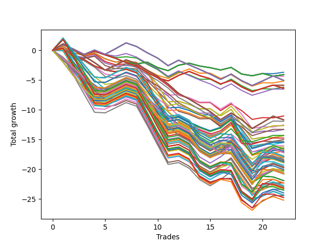

# Long HLT 615 
- Symbol: TSLA
- Date Range: 05/16/2022 - 05/17/2024
- Trading Period: 8:30-12:30
- Number of Trades: 22



| Id. | Name | Win Percent | Profit | Avg Profit / Trade | Avg Time / Trade | Std |      | Name | Win Percent | Profit | Avg Profit / Trade | Avg Time / Trade | Std |
| --- | ---- | ----------- | ------ | ------------------ | ---------------- | --- | ---- | ---- | ----------- | ------ | ------------------ | ---------------- | --- |
| | Sorted By <br> Profit | | | | | | | Sorted By <br> Win Percentage |||||
|0| TP-0.25 15m | 36.36 | -3.69 | -0.17 | 03:27 | 0.59 |     | TP-0.25 15m | 36.36 | -3.69 | -0.17 | 03:27 | 0.59 |
|1| TP-0.25 180m | 36.36 | -4.10 | -0.19 | 03:32 | 0.59 |     | TP-0.25 180m | 36.36 | -4.10 | -0.19 | 03:32 | 0.59 |
|2| TP-0.25 165m | 36.36 | -4.10 | -0.19 | 03:32 | 0.59 |     | TP-0.25 165m | 36.36 | -4.10 | -0.19 | 03:32 | 0.59 |
|3| TP-0.25 150m | 36.36 | -4.10 | -0.19 | 03:32 | 0.59 |     | TP-0.25 150m | 36.36 | -4.10 | -0.19 | 03:32 | 0.59 |
|4| TP-0.25 135m | 36.36 | -4.10 | -0.19 | 03:32 | 0.59 |     | TP-0.25 135m | 36.36 | -4.10 | -0.19 | 03:32 | 0.59 |
|5| TP-0.25 120m | 36.36 | -4.10 | -0.19 | 03:32 | 0.59 |     | TP-0.25 120m | 36.36 | -4.10 | -0.19 | 03:32 | 0.59 |
|6| TP-0.25 105m | 36.36 | -4.10 | -0.19 | 03:32 | 0.59 |     | TP-0.25 105m | 36.36 | -4.10 | -0.19 | 03:32 | 0.59 |
|7| TP-0.25 90m | 36.36 | -4.10 | -0.19 | 03:32 | 0.59 |     | TP-0.25 90m | 36.36 | -4.10 | -0.19 | 03:32 | 0.59 |
|8| TP-0.25 75m | 36.36 | -4.10 | -0.19 | 03:32 | 0.59 |     | TP-0.25 75m | 36.36 | -4.10 | -0.19 | 03:32 | 0.59 |
|9| TP-0.25 60m | 36.36 | -4.10 | -0.19 | 03:32 | 0.59 |     | TP-0.25 60m | 36.36 | -4.10 | -0.19 | 03:32 | 0.59 |
|10| TP-0.25 45m | 36.36 | -4.10 | -0.19 | 03:32 | 0.59 |     | TP-0.25 45m | 36.36 | -4.10 | -0.19 | 03:32 | 0.59 |
|11| TP-0.25 30m | 36.36 | -4.10 | -0.19 | 03:32 | 0.59 |     | TP-0.25 30m | 36.36 | -4.10 | -0.19 | 03:32 | 0.59 |
|12| TP-0.75 45m | 36.36 | -4.37 | -0.20 | 14:40 | 0.85 |     | TP-0.75 45m | 36.36 | -4.37 | -0.20 | 14:40 | 0.85 |
|13| TP-0.75 180m | 36.36 | -5.06 | -0.23 | 15:16 | 0.85 |     | TP-0.75 180m | 36.36 | -5.06 | -0.23 | 15:16 | 0.85 |
|14| TP-0.75 165m | 36.36 | -5.06 | -0.23 | 15:16 | 0.85 |     | TP-0.75 165m | 36.36 | -5.06 | -0.23 | 15:16 | 0.85 |
|15| TP-0.75 150m | 36.36 | -5.06 | -0.23 | 15:16 | 0.85 |     | TP-0.75 150m | 36.36 | -5.06 | -0.23 | 15:16 | 0.85 |
|16| TP-0.75 135m | 36.36 | -5.06 | -0.23 | 15:16 | 0.85 |     | TP-0.75 135m | 36.36 | -5.06 | -0.23 | 15:16 | 0.85 |
|17| TP-0.75 120m | 36.36 | -5.06 | -0.23 | 15:16 | 0.85 |     | TP-0.75 120m | 36.36 | -5.06 | -0.23 | 15:16 | 0.85 |
|18| TP-0.75 105m | 36.36 | -5.06 | -0.23 | 15:16 | 0.85 |     | TP-0.75 105m | 36.36 | -5.06 | -0.23 | 15:16 | 0.85 |
|19| TP-0.75 90m | 36.36 | -5.06 | -0.23 | 15:16 | 0.85 |     | TP-0.75 90m | 36.36 | -5.06 | -0.23 | 15:16 | 0.85 |
|20| TP-0.75 75m | 36.36 | -5.06 | -0.23 | 15:16 | 0.85 |     | TP-0.75 75m | 36.36 | -5.06 | -0.23 | 15:16 | 0.85 |
|21| TP-0.75 60m | 36.36 | -5.06 | -0.23 | 15:16 | 0.85 |     | TP-0.75 60m | 36.36 | -5.06 | -0.23 | 15:16 | 0.85 |
|22| TP-0.5 15m | 36.36 | -5.17 | -0.24 | 05:43 | 0.68 |     | TP-0.5 15m | 36.36 | -5.17 | -0.24 | 05:43 | 0.68 |
|23| TP-0.5 30m | 31.82 | -5.87 | -0.27 | 07:19 | 0.70 |     | TP-0.75 15m | 36.36 | -6.20 | -0.28 | 08:08 | 0.71 |
|24| TP-0.5 45m | 31.82 | -5.90 | -0.27 | 08:00 | 0.70 |     | TP-1.75 15m | 36.36 | -12.58 | -0.57 | 12:40 | 0.94 |
|25| TP-0.75 15m | 36.36 | -6.20 | -0.28 | 08:08 | 0.71 |     | TP-2.25 15m | 36.36 | -14.36 | -0.65 | 13:05 | 1.08 |
|26| TP-0.5 180m | 31.82 | -6.39 | -0.29 | 08:21 | 0.70 |     | TP-2 15m | 36.36 | -14.36 | -0.65 | 13:05 | 1.08 |
|27| TP-0.5 165m | 31.82 | -6.39 | -0.29 | 08:21 | 0.70 |     | TP-2.5 15m | 36.36 | -15.51 | -0.71 | 13:10 | 1.18 |
|28| TP-0.5 150m | 31.82 | -6.39 | -0.29 | 08:21 | 0.70 |     | TP-2.75 15m | 36.36 | -16.52 | -0.75 | 13:27 | 1.26 |
|29| TP-0.5 135m | 31.82 | -6.39 | -0.29 | 08:21 | 0.70 |     | TP-1.75 45m | 36.36 | -16.92 | -0.77 | 30:24 | 1.16 |
|30| TP-0.5 120m | 31.82 | -6.39 | -0.29 | 08:21 | 0.70 |     | TP-3 15m | 36.36 | -16.96 | -0.77 | 13:30 | 1.30 |
|31| TP-0.5 105m | 31.82 | -6.39 | -0.29 | 08:21 | 0.70 |     | TP-2 45m | 36.36 | -20.05 | -0.91 | 31:05 | 1.31 |
|32| TP-0.5 90m | 31.82 | -6.39 | -0.29 | 08:21 | 0.70 |     | TP-2.25 45m | 36.36 | -20.27 | -0.92 | 31:40 | 1.33 |
|33| TP-0.5 75m | 31.82 | -6.39 | -0.29 | 08:21 | 0.70 |     | TP-2.5 45m | 36.36 | -22.33 | -1.01 | 32:00 | 1.45 |
|34| TP-0.5 60m | 31.82 | -6.39 | -0.29 | 08:21 | 0.70 |     | TP-2.75 45m | 36.36 | -23.43 | -1.06 | 34:46 | 1.54 |
|35| TP-0.75 30m | 31.82 | -6.53 | -0.30 | 12:32 | 0.74 |     | TP-3 45m | 36.36 | -24.49 | -1.11 | 35:02 | 1.60 |
|36| TP-1 15m | 31.82 | -11.05 | -0.50 | 09:54 | 0.80 |     | TP-0.5 30m | 31.82 | -5.87 | -0.27 | 07:19 | 0.70 |
|37| TP-1 180m | 27.27 | -11.70 | -0.53 | 20:05 | 0.96 |     | TP-0.5 45m | 31.82 | -5.90 | -0.27 | 08:00 | 0.70 |
|38| TP-1 165m | 27.27 | -11.70 | -0.53 | 20:05 | 0.96 |     | TP-0.5 180m | 31.82 | -6.39 | -0.29 | 08:21 | 0.70 |
|39| TP-1 150m | 27.27 | -11.70 | -0.53 | 20:05 | 0.96 |     | TP-0.5 165m | 31.82 | -6.39 | -0.29 | 08:21 | 0.70 |
|40| TP-1 135m | 27.27 | -11.70 | -0.53 | 20:05 | 0.96 |     | TP-0.5 150m | 31.82 | -6.39 | -0.29 | 08:21 | 0.70 |
|41| TP-1 120m | 27.27 | -11.70 | -0.53 | 20:05 | 0.96 |     | TP-0.5 135m | 31.82 | -6.39 | -0.29 | 08:21 | 0.70 |
|42| TP-1 105m | 27.27 | -11.70 | -0.53 | 20:05 | 0.96 |     | TP-0.5 120m | 31.82 | -6.39 | -0.29 | 08:21 | 0.70 |
|43| TP-1 90m | 27.27 | -11.70 | -0.53 | 20:05 | 0.96 |     | TP-0.5 105m | 31.82 | -6.39 | -0.29 | 08:21 | 0.70 |
|44| TP-1 75m | 27.27 | -11.70 | -0.53 | 20:05 | 0.96 |     | TP-0.5 90m | 31.82 | -6.39 | -0.29 | 08:21 | 0.70 |
|45| TP-1 60m | 27.27 | -11.71 | -0.53 | 20:02 | 0.96 |     | TP-0.5 75m | 31.82 | -6.39 | -0.29 | 08:21 | 0.70 |
|46| TP-1 45m | 27.27 | -11.95 | -0.54 | 18:57 | 0.92 |     | TP-0.5 60m | 31.82 | -6.39 | -0.29 | 08:21 | 0.70 |
|47| TP-1.75 15m | 36.36 | -12.58 | -0.57 | 12:40 | 0.94 |     | TP-0.75 30m | 31.82 | -6.53 | -0.30 | 12:32 | 0.74 |
|48| TP-1.75 30m | 31.82 | -12.70 | -0.58 | 22:49 | 0.99 |     | TP-1 15m | 31.82 | -11.05 | -0.50 | 09:54 | 0.80 |
|49| TP-1.25 15m | 31.82 | -13.32 | -0.61 | 11:05 | 0.87 |     | TP-1.75 30m | 31.82 | -12.70 | -0.58 | 22:49 | 0.99 |
|50| TP-1 30m | 22.73 | -13.32 | -0.61 | 15:21 | 0.82 |     | TP-1.25 15m | 31.82 | -13.32 | -0.61 | 11:05 | 0.87 |
|51| TP-2.75 30m | 31.82 | -14.33 | -0.65 | 24:57 | 1.25 |     | TP-2.75 30m | 31.82 | -14.33 | -0.65 | 24:57 | 1.25 |
|52| TP-2.25 15m | 36.36 | -14.36 | -0.65 | 13:05 | 1.08 |     | TP-3 30m | 31.82 | -14.77 | -0.67 | 25:00 | 1.29 |
|53| TP-2 15m | 36.36 | -14.36 | -0.65 | 13:05 | 1.08 |     | TP-1.5 15m | 31.82 | -15.02 | -0.68 | 11:35 | 0.96 |
|54| TP-3 30m | 31.82 | -14.77 | -0.67 | 25:00 | 1.29 |     | TP-2.25 30m | 31.82 | -15.51 | -0.71 | 23:27 | 1.18 |
|55| TP-1.5 15m | 31.82 | -15.02 | -0.68 | 11:35 | 0.96 |     | TP-2 30m | 31.82 | -15.51 | -0.71 | 23:27 | 1.18 |
|56| TP-1.5 30m | 27.27 | -15.33 | -0.70 | 20:19 | 1.01 |     | TP-1.75 60m | 31.82 | -16.64 | -0.76 | 35:19 | 1.24 |
|57| TP-2.5 15m | 36.36 | -15.51 | -0.71 | 13:10 | 1.18 |     | TP-2.5 30m | 31.82 | -16.66 | -0.76 | 23:32 | 1.27 |
|58| TP-2.25 30m | 31.82 | -15.51 | -0.71 | 23:27 | 1.18 |     | TP-1.5 45m | 31.82 | -18.08 | -0.82 | 26:43 | 1.07 |
|59| TP-2 30m | 31.82 | -15.51 | -0.71 | 23:27 | 1.18 |     | TP-1.75 75m | 31.82 | -18.51 | -0.84 | 38:13 | 1.20 |
|60| TP-1.25 30m | 22.73 | -16.07 | -0.73 | 18:10 | 0.88 |     | TP-2 105m | 31.82 | -19.35 | -0.88 | 44:38 | 1.40 |
|61| TP-1.25 45m | 27.27 | -16.31 | -0.74 | 22:51 | 1.02 |     | TP-2 90m | 31.82 | -19.57 | -0.89 | 42:51 | 1.37 |
|62| TP-2.75 15m | 36.36 | -16.52 | -0.75 | 13:27 | 1.26 |     | TP-2 75m | 31.82 | -19.75 | -0.90 | 39:27 | 1.33 |
|63| TP-1.75 60m | 31.82 | -16.64 | -0.76 | 35:19 | 1.24 |     | TP-2 60m | 31.82 | -19.77 | -0.90 | 36:00 | 1.39 |
|64| TP-2.5 30m | 31.82 | -16.66 | -0.76 | 23:32 | 1.27 |     | TP-2.25 105m | 31.82 | -20.06 | -0.91 | 45:46 | 1.45 |
|65| TP-1.75 45m | 36.36 | -16.92 | -0.77 | 30:24 | 1.16 |     | TP-2.25 90m | 31.82 | -20.49 | -0.93 | 43:43 | 1.41 |
|66| TP-3 15m | 36.36 | -16.96 | -0.77 | 13:30 | 1.30 |     | TP-2.25 75m | 31.82 | -20.67 | -0.94 | 40:19 | 1.37 |
|67| TP-1.25 60m | 22.73 | -17.01 | -0.77 | 25:10 | 1.08 |     | TP-2.25 60m | 31.82 | -20.69 | -0.94 | 36:51 | 1.43 |
|68| TP-1.25 180m | 22.73 | -17.20 | -0.78 | 25:16 | 1.08 |     | TP-2.5 105m | 31.82 | -22.32 | -1.01 | 47:00 | 1.57 |
|69| TP-1.25 165m | 22.73 | -17.20 | -0.78 | 25:16 | 1.08 |     | TP-2.5 60m | 31.82 | -22.34 | -1.02 | 37:35 | 1.52 |
|70| TP-1.25 150m | 22.73 | -17.20 | -0.78 | 25:16 | 1.08 |     | TP-2.5 90m | 31.82 | -22.74 | -1.03 | 44:51 | 1.53 |
|71| TP-1.25 135m | 22.73 | -17.20 | -0.78 | 25:16 | 1.08 |     | TP-2.5 75m | 31.82 | -22.92 | -1.04 | 41:27 | 1.49 |
|72| TP-1.25 120m | 22.73 | -17.20 | -0.78 | 25:16 | 1.08 |     | TP-2.75 60m | 31.82 | -23.27 | -1.06 | 40:51 | 1.61 |
|73| TP-1.25 105m | 22.73 | -17.20 | -0.78 | 25:16 | 1.08 |     | TP-2.75 75m | 31.82 | -23.33 | -1.06 | 45:00 | 1.56 |
|74| TP-1.25 90m | 22.73 | -17.20 | -0.78 | 25:16 | 1.08 |     | TP-2.75 105m | 31.82 | -23.57 | -1.07 | 51:00 | 1.67 |
|75| TP-1.25 75m | 22.73 | -17.20 | -0.78 | 25:16 | 1.08 |     | TP-2.75 90m | 31.82 | -23.99 | -1.09 | 48:51 | 1.63 |
|76| TP-1.5 90m | 27.27 | -17.79 | -0.81 | 35:16 | 1.23 |     | TP-3 60m | 31.82 | -24.33 | -1.11 | 41:08 | 1.67 |
|77| TP-2 180m | 27.27 | -17.86 | -0.81 | 45:43 | 1.50 |     | TP-3 75m | 31.82 | -24.39 | -1.11 | 45:16 | 1.62 |
|78| TP-2 165m | 27.27 | -17.86 | -0.81 | 45:43 | 1.50 |     | TP-3 105m | 31.82 | -24.81 | -1.13 | 51:30 | 1.73 |
|79| TP-2 150m | 27.27 | -17.86 | -0.81 | 45:43 | 1.50 |     | TP-3 90m | 31.82 | -25.23 | -1.15 | 49:21 | 1.69 |
|80| TP-2 135m | 27.27 | -17.86 | -0.81 | 45:43 | 1.50 |     | TP-1 180m | 27.27 | -11.70 | -0.53 | 20:05 | 0.96 |
|81| TP-2 120m | 27.27 | -17.86 | -0.81 | 45:43 | 1.50 |     | TP-1 165m | 27.27 | -11.70 | -0.53 | 20:05 | 0.96 |
|82| TP-1.5 45m | 31.82 | -18.08 | -0.82 | 26:43 | 1.07 |     | TP-1 150m | 27.27 | -11.70 | -0.53 | 20:05 | 0.96 |
|83| TP-1.5 60m | 27.27 | -18.11 | -0.82 | 31:08 | 1.16 |     | TP-1 135m | 27.27 | -11.70 | -0.53 | 20:05 | 0.96 |
|84| TP-1.5 105m | 27.27 | -18.37 | -0.83 | 36:00 | 1.21 |     | TP-1 120m | 27.27 | -11.70 | -0.53 | 20:05 | 0.96 |
|85| TP-1.75 75m | 31.82 | -18.51 | -0.84 | 38:13 | 1.20 |     | TP-1 105m | 27.27 | -11.70 | -0.53 | 20:05 | 0.96 |
|86| TP-1.5 180m | 22.73 | -18.56 | -0.84 | 36:40 | 1.20 |     | TP-1 90m | 27.27 | -11.70 | -0.53 | 20:05 | 0.96 |
|87| TP-1.5 165m | 22.73 | -18.56 | -0.84 | 36:40 | 1.20 |     | TP-1 75m | 27.27 | -11.70 | -0.53 | 20:05 | 0.96 |
|88| TP-1.5 150m | 22.73 | -18.56 | -0.84 | 36:40 | 1.20 |     | TP-1 60m | 27.27 | -11.71 | -0.53 | 20:02 | 0.96 |
|89| TP-1.5 135m | 22.73 | -18.56 | -0.84 | 36:40 | 1.20 |     | TP-1 45m | 27.27 | -11.95 | -0.54 | 18:57 | 0.92 |
|90| TP-1.5 120m | 22.73 | -18.56 | -0.84 | 36:40 | 1.20 |     | TP-1.5 30m | 27.27 | -15.33 | -0.70 | 20:19 | 1.01 |
|91| TP-1.75 90m | 27.27 | -18.58 | -0.84 | 40:57 | 1.23 |     | TP-1.25 45m | 27.27 | -16.31 | -0.74 | 22:51 | 1.02 |
|92| TP-1.75 105m | 27.27 | -18.73 | -0.85 | 41:46 | 1.23 |     | TP-1.5 90m | 27.27 | -17.79 | -0.81 | 35:16 | 1.23 |
|93| TP-1.5 75m | 27.27 | -18.74 | -0.85 | 33:32 | 1.16 |     | TP-2 180m | 27.27 | -17.86 | -0.81 | 45:43 | 1.50 |
|94| TP-2.25 180m | 27.27 | -18.78 | -0.85 | 47:08 | 1.54 |     | TP-2 165m | 27.27 | -17.86 | -0.81 | 45:43 | 1.50 |
|95| TP-2.25 165m | 27.27 | -18.78 | -0.85 | 47:08 | 1.54 |     | TP-2 150m | 27.27 | -17.86 | -0.81 | 45:43 | 1.50 |
|96| TP-2.25 150m | 27.27 | -18.78 | -0.85 | 47:08 | 1.54 |     | TP-2 135m | 27.27 | -17.86 | -0.81 | 45:43 | 1.50 |
|97| TP-2.25 135m | 27.27 | -18.78 | -0.85 | 47:08 | 1.54 |     | TP-2 120m | 27.27 | -17.86 | -0.81 | 45:43 | 1.50 |
|98| TP-2.25 120m | 27.27 | -18.78 | -0.85 | 47:08 | 1.54 |     | TP-1.5 60m | 27.27 | -18.11 | -0.82 | 31:08 | 1.16 |
|99| TP-1.75 180m | 22.73 | -18.92 | -0.86 | 42:27 | 1.22 |     | TP-1.5 105m | 27.27 | -18.37 | -0.83 | 36:00 | 1.21 |
|100| TP-1.75 165m | 22.73 | -18.92 | -0.86 | 42:27 | 1.22 |     | TP-1.75 90m | 27.27 | -18.58 | -0.84 | 40:57 | 1.23 |
|101| TP-1.75 150m | 22.73 | -18.92 | -0.86 | 42:27 | 1.22 |     | TP-1.75 105m | 27.27 | -18.73 | -0.85 | 41:46 | 1.23 |
|102| TP-1.75 135m | 22.73 | -18.92 | -0.86 | 42:27 | 1.22 |     | TP-1.5 75m | 27.27 | -18.74 | -0.85 | 33:32 | 1.16 |
|103| TP-1.75 120m | 22.73 | -18.92 | -0.86 | 42:27 | 1.22 |     | TP-2.25 180m | 27.27 | -18.78 | -0.85 | 47:08 | 1.54 |
|104| TP-2 105m | 31.82 | -19.35 | -0.88 | 44:38 | 1.40 |     | TP-2.25 165m | 27.27 | -18.78 | -0.85 | 47:08 | 1.54 |
|105| TP-2 90m | 31.82 | -19.57 | -0.89 | 42:51 | 1.37 |     | TP-2.25 150m | 27.27 | -18.78 | -0.85 | 47:08 | 1.54 |
|106| TP-2 75m | 31.82 | -19.75 | -0.90 | 39:27 | 1.33 |     | TP-2.25 135m | 27.27 | -18.78 | -0.85 | 47:08 | 1.54 |
|107| TP-2 60m | 31.82 | -19.77 | -0.90 | 36:00 | 1.39 |     | TP-2.25 120m | 27.27 | -18.78 | -0.85 | 47:08 | 1.54 |
|108| TP-2 45m | 36.36 | -20.05 | -0.91 | 31:05 | 1.31 |     | TP-2.5 180m | 27.27 | -20.79 | -0.94 | 48:51 | 1.67 |
|109| TP-2.25 105m | 31.82 | -20.06 | -0.91 | 45:46 | 1.45 |     | TP-2.5 165m | 27.27 | -20.79 | -0.94 | 48:51 | 1.67 |
|110| TP-2.25 45m | 36.36 | -20.27 | -0.92 | 31:40 | 1.33 |     | TP-2.5 150m | 27.27 | -20.79 | -0.94 | 48:51 | 1.67 |
|111| TP-2.25 90m | 31.82 | -20.49 | -0.93 | 43:43 | 1.41 |     | TP-2.5 135m | 27.27 | -20.79 | -0.94 | 48:51 | 1.67 |
|112| TP-2.25 75m | 31.82 | -20.67 | -0.94 | 40:19 | 1.37 |     | TP-2.5 120m | 27.27 | -20.79 | -0.94 | 48:51 | 1.67 |
|113| TP-2.25 60m | 31.82 | -20.69 | -0.94 | 36:51 | 1.43 |     | TP-2.75 180m | 27.27 | -21.93 | -1.00 | 53:02 | 1.78 |
|114| TP-2.5 180m | 27.27 | -20.79 | -0.94 | 48:51 | 1.67 |     | TP-2.75 165m | 27.27 | -21.93 | -1.00 | 53:02 | 1.78 |
|115| TP-2.5 165m | 27.27 | -20.79 | -0.94 | 48:51 | 1.67 |     | TP-2.75 150m | 27.27 | -21.93 | -1.00 | 53:02 | 1.78 |
|116| TP-2.5 150m | 27.27 | -20.79 | -0.94 | 48:51 | 1.67 |     | TP-2.75 135m | 27.27 | -21.93 | -1.00 | 53:02 | 1.78 |
|117| TP-2.5 135m | 27.27 | -20.79 | -0.94 | 48:51 | 1.67 |     | TP-2.75 120m | 27.27 | -21.93 | -1.00 | 53:02 | 1.78 |
|118| TP-2.5 120m | 27.27 | -20.79 | -0.94 | 48:51 | 1.67 |     | TP-3 180m | 27.27 | -23.17 | -1.05 | 53:32 | 1.84 |
|119| TP-2.75 180m | 27.27 | -21.93 | -1.00 | 53:02 | 1.78 |     | TP-3 165m | 27.27 | -23.17 | -1.05 | 53:32 | 1.84 |
|120| TP-2.75 165m | 27.27 | -21.93 | -1.00 | 53:02 | 1.78 |     | TP-3 150m | 27.27 | -23.17 | -1.05 | 53:32 | 1.84 |
|121| TP-2.75 150m | 27.27 | -21.93 | -1.00 | 53:02 | 1.78 |     | TP-3 135m | 27.27 | -23.17 | -1.05 | 53:32 | 1.84 |
|122| TP-2.75 135m | 27.27 | -21.93 | -1.00 | 53:02 | 1.78 |     | TP-3 120m | 27.27 | -23.17 | -1.05 | 53:32 | 1.84 |
|123| TP-2.75 120m | 27.27 | -21.93 | -1.00 | 53:02 | 1.78 |     | TP-1 30m | 22.73 | -13.32 | -0.61 | 15:21 | 0.82 |
|124| TP-2.5 105m | 31.82 | -22.32 | -1.01 | 47:00 | 1.57 |     | TP-1.25 30m | 22.73 | -16.07 | -0.73 | 18:10 | 0.88 |
|125| TP-2.5 45m | 36.36 | -22.33 | -1.01 | 32:00 | 1.45 |     | TP-1.25 60m | 22.73 | -17.01 | -0.77 | 25:10 | 1.08 |
|126| TP-2.5 60m | 31.82 | -22.34 | -1.02 | 37:35 | 1.52 |     | TP-1.25 180m | 22.73 | -17.20 | -0.78 | 25:16 | 1.08 |
|127| TP-2.5 90m | 31.82 | -22.74 | -1.03 | 44:51 | 1.53 |     | TP-1.25 165m | 22.73 | -17.20 | -0.78 | 25:16 | 1.08 |
|128| TP-2.5 75m | 31.82 | -22.92 | -1.04 | 41:27 | 1.49 |     | TP-1.25 150m | 22.73 | -17.20 | -0.78 | 25:16 | 1.08 |
|129| TP-3 180m | 27.27 | -23.17 | -1.05 | 53:32 | 1.84 |     | TP-1.25 135m | 22.73 | -17.20 | -0.78 | 25:16 | 1.08 |
|130| TP-3 165m | 27.27 | -23.17 | -1.05 | 53:32 | 1.84 |     | TP-1.25 120m | 22.73 | -17.20 | -0.78 | 25:16 | 1.08 |
|131| TP-3 150m | 27.27 | -23.17 | -1.05 | 53:32 | 1.84 |     | TP-1.25 105m | 22.73 | -17.20 | -0.78 | 25:16 | 1.08 |
|132| TP-3 135m | 27.27 | -23.17 | -1.05 | 53:32 | 1.84 |     | TP-1.25 90m | 22.73 | -17.20 | -0.78 | 25:16 | 1.08 |
|133| TP-3 120m | 27.27 | -23.17 | -1.05 | 53:32 | 1.84 |     | TP-1.25 75m | 22.73 | -17.20 | -0.78 | 25:16 | 1.08 |
|134| TP-2.75 60m | 31.82 | -23.27 | -1.06 | 40:51 | 1.61 |     | TP-1.5 180m | 22.73 | -18.56 | -0.84 | 36:40 | 1.20 |
|135| TP-2.75 75m | 31.82 | -23.33 | -1.06 | 45:00 | 1.56 |     | TP-1.5 165m | 22.73 | -18.56 | -0.84 | 36:40 | 1.20 |
|136| TP-2.75 45m | 36.36 | -23.43 | -1.06 | 34:46 | 1.54 |     | TP-1.5 150m | 22.73 | -18.56 | -0.84 | 36:40 | 1.20 |
|137| TP-2.75 105m | 31.82 | -23.57 | -1.07 | 51:00 | 1.67 |     | TP-1.5 135m | 22.73 | -18.56 | -0.84 | 36:40 | 1.20 |
|138| TP-2.75 90m | 31.82 | -23.99 | -1.09 | 48:51 | 1.63 |     | TP-1.5 120m | 22.73 | -18.56 | -0.84 | 36:40 | 1.20 |
|139| TP-3 60m | 31.82 | -24.33 | -1.11 | 41:08 | 1.67 |     | TP-1.75 180m | 22.73 | -18.92 | -0.86 | 42:27 | 1.22 |
|140| TP-3 75m | 31.82 | -24.39 | -1.11 | 45:16 | 1.62 |     | TP-1.75 165m | 22.73 | -18.92 | -0.86 | 42:27 | 1.22 |
|141| TP-3 45m | 36.36 | -24.49 | -1.11 | 35:02 | 1.60 |     | TP-1.75 150m | 22.73 | -18.92 | -0.86 | 42:27 | 1.22 |
|142| TP-3 105m | 31.82 | -24.81 | -1.13 | 51:30 | 1.73 |     | TP-1.75 135m | 22.73 | -18.92 | -0.86 | 42:27 | 1.22 |
|143| TP-3 90m | 31.82 | -25.23 | -1.15 | 49:21 | 1.69 |     | TP-1.75 120m | 22.73 | -18.92 | -0.86 | 42:27 | 1.22 |

### Test TP-0.25 15m
* Take Profit of 0.25 Point
* 0.25 Stoploss
* Results:
```
Total Trades: 22
Percent Up: 36.36
Percent Down: 63.64
Total Points Moved Up: -3.69
Potential Profit: -1845.00
Total Points Ups: 4.15 Count Ups: 8
Total Points Downs: -7.84 Count Downs: 14
```

<details><summary>Trades</summary>

<code>In: 2022-06-23 09:40:00		Out: 2022-06-23 09:42:00		Total Position Time: 02:00		Total Move Up: 0.97		Total to Date: 0.97</code> <br />
<code>In: 2022-10-11 11:10:00		Out: 2022-10-11 11:12:00		Total Position Time: 02:00		Total Move Up: -0.79		Total to Date: 0.18</code> <br />
<code>In: 2022-10-11 11:15:00		Out: 2022-10-11 11:17:00		Total Position Time: 02:00		Total Move Up: -0.88		Total to Date: -0.70</code> <br />
<code>In: 2022-10-11 11:20:00		Out: 2022-10-11 11:24:00		Total Position Time: 04:00		Total Move Up: 0.54		Total to Date: -0.16</code> <br />
<code>In: 2022-10-11 11:55:00		Out: 2022-10-11 11:57:00		Total Position Time: 02:00		Total Move Up: -0.60		Total to Date: -0.76</code> <br />
<code>In: 2022-10-11 12:00:00		Out: 2022-10-11 12:03:00		Total Position Time: 03:00		Total Move Up: -0.59		Total to Date: -1.35</code> <br />
<code>In: 2022-10-11 12:05:00		Out: 2022-10-11 12:12:00		Total Position Time: 07:00		Total Move Up: -0.70		Total to Date: -2.05</code> <br />
<code>In: 2022-11-02 12:30:00		Out: 2022-11-02 12:33:00		Total Position Time: 03:00		Total Move Up: -0.25		Total to Date: -2.30</code> <br />
<code>In: 2022-11-04 08:55:00		Out: 2022-11-04 08:57:00		Total Position Time: 02:00		Total Move Up: 0.31		Total to Date: -1.99</code> <br />
<code>In: 2023-02-16 12:20:00		Out: 2023-02-16 12:22:00		Total Position Time: 02:00		Total Move Up: -0.91		Total to Date: -2.90</code> <br />
<code>In: 2023-02-16 12:25:00		Out: 2023-02-16 12:28:00		Total Position Time: 03:00		Total Move Up: -0.53		Total to Date: -3.43</code> <br />
<code>In: 2023-02-16 12:35:00		Out: 2023-02-16 12:37:00		Total Position Time: 02:00		Total Move Up: 0.92		Total to Date: -2.51</code> <br />
<code>In: 2023-07-07 12:30:00		Out: 2023-07-07 12:32:00		Total Position Time: 02:00		Total Move Up: 0.34		Total to Date: -2.17</code> <br />
<code>In: 2023-08-04 11:20:00		Out: 2023-08-04 11:22:00		Total Position Time: 02:00		Total Move Up: -0.47		Total to Date: -2.64</code> <br />
<code>In: 2023-08-17 12:15:00		Out: 2023-08-17 12:17:00		Total Position Time: 02:00		Total Move Up: -0.28		Total to Date: -2.92</code> <br />
<code>In: 2023-09-15 11:20:00		Out: 2023-09-15 11:22:00		Total Position Time: 02:00		Total Move Up: -0.39		Total to Date: -3.31</code> <br />
<code>In: 2023-09-22 11:20:00		Out: 2023-09-22 11:22:00		Total Position Time: 02:00		Total Move Up: 0.43		Total to Date: -2.88</code> <br />
<code>In: 2023-12-20 11:50:00		Out: 2023-12-20 11:52:00		Total Position Time: 02:00		Total Move Up: -1.11		Total to Date: -3.99</code> <br />
<code>In: 2023-12-20 11:55:00		Out: 2023-12-20 11:57:00		Total Position Time: 02:00		Total Move Up: -0.30		Total to Date: -4.29</code> <br />
<code>In: 2024-01-05 09:10:00		Out: 2024-01-05 09:12:00		Total Position Time: 02:00		Total Move Up: 0.39		Total to Date: -3.90</code> <br />
<code>In: 2024-04-19 09:25:00		Out: 2024-04-19 09:39:00		Total Position Time: 14:00		Total Move Up: -0.04		Total to Date: -3.94</code> <br />
<code>In: 2024-04-19 11:50:00		Out: 2024-04-19 12:02:00		Total Position Time: 12:00		Total Move Up: 0.25		Total to Date: -3.69</code> <br />


</details>

### Test TP-0.5 15m
* Take Profit of 0.5 Point
* 0.5 Stoploss
* Results:
```
Total Trades: 22
Percent Up: 36.36
Percent Down: 63.64
Total Points Moved Up: -5.17
Potential Profit: -2585.00
Total Points Ups: 4.65 Count Ups: 8
Total Points Downs: -9.82 Count Downs: 14
```

<details><summary>Trades</summary>

<code>In: 2022-06-23 09:40:00		Out: 2022-06-23 09:42:00		Total Position Time: 02:00		Total Move Up: 0.97		Total to Date: 0.97</code> <br />
<code>In: 2022-10-11 11:10:00		Out: 2022-10-11 11:12:00		Total Position Time: 02:00		Total Move Up: -0.79		Total to Date: 0.18</code> <br />
<code>In: 2022-10-11 11:15:00		Out: 2022-10-11 11:17:00		Total Position Time: 02:00		Total Move Up: -0.88		Total to Date: -0.70</code> <br />
<code>In: 2022-10-11 11:20:00		Out: 2022-10-11 11:24:00		Total Position Time: 04:00		Total Move Up: 0.54		Total to Date: -0.16</code> <br />
<code>In: 2022-10-11 11:55:00		Out: 2022-10-11 11:57:00		Total Position Time: 02:00		Total Move Up: -0.60		Total to Date: -0.76</code> <br />
<code>In: 2022-10-11 12:00:00		Out: 2022-10-11 12:03:00		Total Position Time: 03:00		Total Move Up: -0.59		Total to Date: -1.35</code> <br />
<code>In: 2022-10-11 12:05:00		Out: 2022-10-11 12:12:00		Total Position Time: 07:00		Total Move Up: -0.70		Total to Date: -2.05</code> <br />
<code>In: 2022-11-02 12:30:00		Out: 2022-11-02 12:44:00		Total Position Time: 14:00		Total Move Up: -0.21		Total to Date: -2.26</code> <br />
<code>In: 2022-11-04 08:55:00		Out: 2022-11-04 09:00:00		Total Position Time: 05:00		Total Move Up: -1.04		Total to Date: -3.30</code> <br />
<code>In: 2023-02-16 12:20:00		Out: 2023-02-16 12:22:00		Total Position Time: 02:00		Total Move Up: -0.91		Total to Date: -4.21</code> <br />
<code>In: 2023-02-16 12:25:00		Out: 2023-02-16 12:28:00		Total Position Time: 03:00		Total Move Up: -0.53		Total to Date: -4.74</code> <br />
<code>In: 2023-02-16 12:35:00		Out: 2023-02-16 12:37:00		Total Position Time: 02:00		Total Move Up: 0.92		Total to Date: -3.82</code> <br />
<code>In: 2023-07-07 12:30:00		Out: 2023-07-07 12:35:00		Total Position Time: 05:00		Total Move Up: 0.68		Total to Date: -3.14</code> <br />
<code>In: 2023-08-04 11:20:00		Out: 2023-08-04 11:25:00		Total Position Time: 05:00		Total Move Up: -0.71		Total to Date: -3.85</code> <br />
<code>In: 2023-08-17 12:15:00		Out: 2023-08-17 12:29:00		Total Position Time: 14:00		Total Move Up: 0.02		Total to Date: -3.83</code> <br />
<code>In: 2023-09-15 11:20:00		Out: 2023-09-15 11:28:00		Total Position Time: 08:00		Total Move Up: -0.89		Total to Date: -4.72</code> <br />
<code>In: 2023-09-22 11:20:00		Out: 2023-09-22 11:24:00		Total Position Time: 04:00		Total Move Up: 0.62		Total to Date: -4.10</code> <br />
<code>In: 2023-12-20 11:50:00		Out: 2023-12-20 11:52:00		Total Position Time: 02:00		Total Move Up: -1.11		Total to Date: -5.21</code> <br />
<code>In: 2023-12-20 11:55:00		Out: 2023-12-20 12:00:00		Total Position Time: 05:00		Total Move Up: -0.82		Total to Date: -6.03</code> <br />
<code>In: 2024-01-05 09:10:00		Out: 2024-01-05 09:17:00		Total Position Time: 07:00		Total Move Up: 0.58		Total to Date: -5.45</code> <br />
<code>In: 2024-04-19 09:25:00		Out: 2024-04-19 09:39:00		Total Position Time: 14:00		Total Move Up: -0.04		Total to Date: -5.49</code> <br />
<code>In: 2024-04-19 11:50:00		Out: 2024-04-19 12:04:00		Total Position Time: 14:00		Total Move Up: 0.32		Total to Date: -5.17</code> <br />


</details>

### Test TP-0.75 15m
* Take Profit of 0.75 Point
* 0.75 Stoploss
* Results:
```
Total Trades: 22
Percent Up: 36.36
Percent Down: 63.64
Total Points Moved Up: -6.20
Potential Profit: -3100.00
Total Points Ups: 4.31 Count Ups: 8
Total Points Downs: -10.51 Count Downs: 14
```

<details><summary>Trades</summary>

<code>In: 2022-06-23 09:40:00		Out: 2022-06-23 09:42:00		Total Position Time: 02:00		Total Move Up: 0.97		Total to Date: 0.97</code> <br />
<code>In: 2022-10-11 11:10:00		Out: 2022-10-11 11:12:00		Total Position Time: 02:00		Total Move Up: -0.79		Total to Date: 0.18</code> <br />
<code>In: 2022-10-11 11:15:00		Out: 2022-10-11 11:17:00		Total Position Time: 02:00		Total Move Up: -0.88		Total to Date: -0.70</code> <br />
<code>In: 2022-10-11 11:20:00		Out: 2022-10-11 11:31:00		Total Position Time: 11:00		Total Move Up: 0.74		Total to Date: 0.04</code> <br />
<code>In: 2022-10-11 11:55:00		Out: 2022-10-11 11:58:00		Total Position Time: 03:00		Total Move Up: -0.72		Total to Date: -0.68</code> <br />
<code>In: 2022-10-11 12:00:00		Out: 2022-10-11 12:14:00		Total Position Time: 14:00		Total Move Up: -0.55		Total to Date: -1.23</code> <br />
<code>In: 2022-10-11 12:05:00		Out: 2022-10-11 12:19:00		Total Position Time: 14:00		Total Move Up: 0.14		Total to Date: -1.09</code> <br />
<code>In: 2022-11-02 12:30:00		Out: 2022-11-02 12:44:00		Total Position Time: 14:00		Total Move Up: -0.21		Total to Date: -1.30</code> <br />
<code>In: 2022-11-04 08:55:00		Out: 2022-11-04 09:00:00		Total Position Time: 05:00		Total Move Up: -1.04		Total to Date: -2.34</code> <br />
<code>In: 2023-02-16 12:20:00		Out: 2023-02-16 12:22:00		Total Position Time: 02:00		Total Move Up: -0.91		Total to Date: -3.25</code> <br />
<code>In: 2023-02-16 12:25:00		Out: 2023-02-16 12:29:00		Total Position Time: 04:00		Total Move Up: -1.28		Total to Date: -4.53</code> <br />
<code>In: 2023-02-16 12:35:00		Out: 2023-02-16 12:37:00		Total Position Time: 02:00		Total Move Up: 0.92		Total to Date: -3.61</code> <br />
<code>In: 2023-07-07 12:30:00		Out: 2023-07-07 12:44:00		Total Position Time: 14:00		Total Move Up: -0.52		Total to Date: -4.13</code> <br />
<code>In: 2023-08-04 11:20:00		Out: 2023-08-04 11:34:00		Total Position Time: 14:00		Total Move Up: -0.75		Total to Date: -4.88</code> <br />
<code>In: 2023-08-17 12:15:00		Out: 2023-08-17 12:29:00		Total Position Time: 14:00		Total Move Up: 0.02		Total to Date: -4.86</code> <br />
<code>In: 2023-09-15 11:20:00		Out: 2023-09-15 11:28:00		Total Position Time: 08:00		Total Move Up: -0.89		Total to Date: -5.75</code> <br />
<code>In: 2023-09-22 11:20:00		Out: 2023-09-22 11:25:00		Total Position Time: 05:00		Total Move Up: 0.90		Total to Date: -4.85</code> <br />
<code>In: 2023-12-20 11:50:00		Out: 2023-12-20 11:52:00		Total Position Time: 02:00		Total Move Up: -1.11		Total to Date: -5.96</code> <br />
<code>In: 2023-12-20 11:55:00		Out: 2023-12-20 12:00:00		Total Position Time: 05:00		Total Move Up: -0.82		Total to Date: -6.78</code> <br />
<code>In: 2024-01-05 09:10:00		Out: 2024-01-05 09:24:00		Total Position Time: 14:00		Total Move Up: 0.30		Total to Date: -6.48</code> <br />
<code>In: 2024-04-19 09:25:00		Out: 2024-04-19 09:39:00		Total Position Time: 14:00		Total Move Up: -0.04		Total to Date: -6.52</code> <br />
<code>In: 2024-04-19 11:50:00		Out: 2024-04-19 12:04:00		Total Position Time: 14:00		Total Move Up: 0.32		Total to Date: -6.20</code> <br />


</details>

### Test TP-1 15m
* Take Profit of 1 Point
* 1 Stoploss
* Results:
```
Total Trades: 22
Percent Up: 31.82
Percent Down: 68.18
Total Points Moved Up: -11.05
Potential Profit: -5525.00
Total Points Ups: 3.35 Count Ups: 7
Total Points Downs: -14.40 Count Downs: 15
```

<details><summary>Trades</summary>

<code>In: 2022-06-23 09:40:00		Out: 2022-06-23 09:49:00		Total Position Time: 09:00		Total Move Up: 1.09		Total to Date: 1.09</code> <br />
<code>In: 2022-10-11 11:10:00		Out: 2022-10-11 11:16:00		Total Position Time: 06:00		Total Move Up: -1.05		Total to Date: 0.04</code> <br />
<code>In: 2022-10-11 11:15:00		Out: 2022-10-11 11:20:00		Total Position Time: 05:00		Total Move Up: -1.02		Total to Date: -0.98</code> <br />
<code>In: 2022-10-11 11:20:00		Out: 2022-10-11 11:34:00		Total Position Time: 14:00		Total Move Up: 0.37		Total to Date: -0.61</code> <br />
<code>In: 2022-10-11 11:55:00		Out: 2022-10-11 11:59:00		Total Position Time: 04:00		Total Move Up: -1.27		Total to Date: -1.88</code> <br />
<code>In: 2022-10-11 12:00:00		Out: 2022-10-11 12:14:00		Total Position Time: 14:00		Total Move Up: -0.55		Total to Date: -2.43</code> <br />
<code>In: 2022-10-11 12:05:00		Out: 2022-10-11 12:19:00		Total Position Time: 14:00		Total Move Up: 0.14		Total to Date: -2.29</code> <br />
<code>In: 2022-11-02 12:30:00		Out: 2022-11-02 12:44:00		Total Position Time: 14:00		Total Move Up: -0.21		Total to Date: -2.50</code> <br />
<code>In: 2022-11-04 08:55:00		Out: 2022-11-04 09:03:00		Total Position Time: 08:00		Total Move Up: -1.13		Total to Date: -3.63</code> <br />
<code>In: 2023-02-16 12:20:00		Out: 2023-02-16 12:28:00		Total Position Time: 08:00		Total Move Up: -1.03		Total to Date: -4.66</code> <br />
<code>In: 2023-02-16 12:25:00		Out: 2023-02-16 12:29:00		Total Position Time: 04:00		Total Move Up: -1.28		Total to Date: -5.94</code> <br />
<code>In: 2023-02-16 12:35:00		Out: 2023-02-16 12:42:00		Total Position Time: 07:00		Total Move Up: -1.60		Total to Date: -7.54</code> <br />
<code>In: 2023-07-07 12:30:00		Out: 2023-07-07 12:44:00		Total Position Time: 14:00		Total Move Up: -0.52		Total to Date: -8.06</code> <br />
<code>In: 2023-08-04 11:20:00		Out: 2023-08-04 11:34:00		Total Position Time: 14:00		Total Move Up: -0.75		Total to Date: -8.81</code> <br />
<code>In: 2023-08-17 12:15:00		Out: 2023-08-17 12:29:00		Total Position Time: 14:00		Total Move Up: 0.02		Total to Date: -8.79</code> <br />
<code>In: 2023-09-15 11:20:00		Out: 2023-09-15 11:32:00		Total Position Time: 12:00		Total Move Up: -1.36		Total to Date: -10.15</code> <br />
<code>In: 2023-09-22 11:20:00		Out: 2023-09-22 11:26:00		Total Position Time: 06:00		Total Move Up: 1.11		Total to Date: -9.04</code> <br />
<code>In: 2023-12-20 11:50:00		Out: 2023-12-20 11:52:00		Total Position Time: 02:00		Total Move Up: -1.11		Total to Date: -10.15</code> <br />
<code>In: 2023-12-20 11:55:00		Out: 2023-12-20 12:02:00		Total Position Time: 07:00		Total Move Up: -1.48		Total to Date: -11.63</code> <br />
<code>In: 2024-01-05 09:10:00		Out: 2024-01-05 09:24:00		Total Position Time: 14:00		Total Move Up: 0.30		Total to Date: -11.33</code> <br />
<code>In: 2024-04-19 09:25:00		Out: 2024-04-19 09:39:00		Total Position Time: 14:00		Total Move Up: -0.04		Total to Date: -11.37</code> <br />
<code>In: 2024-04-19 11:50:00		Out: 2024-04-19 12:04:00		Total Position Time: 14:00		Total Move Up: 0.32		Total to Date: -11.05</code> <br />


</details>

### Test TP-1.25 15m
* Take Profit of 1.25 Point
* 1.25 Stoploss
* Results:
```
Total Trades: 22
Percent Up: 31.82
Percent Down: 68.18
Total Points Moved Up: -13.32
Potential Profit: -6660.00
Total Points Ups: 2.90 Count Ups: 7
Total Points Downs: -16.22 Count Downs: 15
```

<details><summary>Trades</summary>

<code>In: 2022-06-23 09:40:00		Out: 2022-06-23 09:54:00		Total Position Time: 14:00		Total Move Up: 0.67		Total to Date: 0.67</code> <br />
<code>In: 2022-10-11 11:10:00		Out: 2022-10-11 11:17:00		Total Position Time: 07:00		Total Move Up: -1.51		Total to Date: -0.84</code> <br />
<code>In: 2022-10-11 11:15:00		Out: 2022-10-11 11:29:00		Total Position Time: 14:00		Total Move Up: -0.39		Total to Date: -1.23</code> <br />
<code>In: 2022-10-11 11:20:00		Out: 2022-10-11 11:34:00		Total Position Time: 14:00		Total Move Up: 0.37		Total to Date: -0.86</code> <br />
<code>In: 2022-10-11 11:55:00		Out: 2022-10-11 11:59:00		Total Position Time: 04:00		Total Move Up: -1.27		Total to Date: -2.13</code> <br />
<code>In: 2022-10-11 12:00:00		Out: 2022-10-11 12:14:00		Total Position Time: 14:00		Total Move Up: -0.55		Total to Date: -2.68</code> <br />
<code>In: 2022-10-11 12:05:00		Out: 2022-10-11 12:19:00		Total Position Time: 14:00		Total Move Up: 0.14		Total to Date: -2.54</code> <br />
<code>In: 2022-11-02 12:30:00		Out: 2022-11-02 12:44:00		Total Position Time: 14:00		Total Move Up: -0.21		Total to Date: -2.75</code> <br />
<code>In: 2022-11-04 08:55:00		Out: 2022-11-04 09:04:00		Total Position Time: 09:00		Total Move Up: -1.90		Total to Date: -4.65</code> <br />
<code>In: 2023-02-16 12:20:00		Out: 2023-02-16 12:29:00		Total Position Time: 09:00		Total Move Up: -1.78		Total to Date: -6.43</code> <br />
<code>In: 2023-02-16 12:25:00		Out: 2023-02-16 12:29:00		Total Position Time: 04:00		Total Move Up: -1.28		Total to Date: -7.71</code> <br />
<code>In: 2023-02-16 12:35:00		Out: 2023-02-16 12:42:00		Total Position Time: 07:00		Total Move Up: -1.60		Total to Date: -9.31</code> <br />
<code>In: 2023-07-07 12:30:00		Out: 2023-07-07 12:44:00		Total Position Time: 14:00		Total Move Up: -0.52		Total to Date: -9.83</code> <br />
<code>In: 2023-08-04 11:20:00		Out: 2023-08-04 11:34:00		Total Position Time: 14:00		Total Move Up: -0.75		Total to Date: -10.58</code> <br />
<code>In: 2023-08-17 12:15:00		Out: 2023-08-17 12:29:00		Total Position Time: 14:00		Total Move Up: 0.02		Total to Date: -10.56</code> <br />
<code>In: 2023-09-15 11:20:00		Out: 2023-09-15 11:32:00		Total Position Time: 12:00		Total Move Up: -1.36		Total to Date: -11.92</code> <br />
<code>In: 2023-09-22 11:20:00		Out: 2023-09-22 11:34:00		Total Position Time: 14:00		Total Move Up: 1.08		Total to Date: -10.84</code> <br />
<code>In: 2023-12-20 11:50:00		Out: 2023-12-20 11:53:00		Total Position Time: 03:00		Total Move Up: -1.58		Total to Date: -12.42</code> <br />
<code>In: 2023-12-20 11:55:00		Out: 2023-12-20 12:02:00		Total Position Time: 07:00		Total Move Up: -1.48		Total to Date: -13.90</code> <br />
<code>In: 2024-01-05 09:10:00		Out: 2024-01-05 09:24:00		Total Position Time: 14:00		Total Move Up: 0.30		Total to Date: -13.60</code> <br />
<code>In: 2024-04-19 09:25:00		Out: 2024-04-19 09:39:00		Total Position Time: 14:00		Total Move Up: -0.04		Total to Date: -13.64</code> <br />
<code>In: 2024-04-19 11:50:00		Out: 2024-04-19 12:04:00		Total Position Time: 14:00		Total Move Up: 0.32		Total to Date: -13.32</code> <br />


</details>

### Test TP-1.5 15m
* Take Profit of 1.5 Point
* 1.5 Stoploss
* Results:
```
Total Trades: 22
Percent Up: 31.82
Percent Down: 68.18
Total Points Moved Up: -15.02
Potential Profit: -7510.00
Total Points Ups: 2.90 Count Ups: 7
Total Points Downs: -17.92 Count Downs: 15
```

<details><summary>Trades</summary>

<code>In: 2022-06-23 09:40:00		Out: 2022-06-23 09:54:00		Total Position Time: 14:00		Total Move Up: 0.67		Total to Date: 0.67</code> <br />
<code>In: 2022-10-11 11:10:00		Out: 2022-10-11 11:20:00		Total Position Time: 10:00		Total Move Up: -1.65		Total to Date: -0.98</code> <br />
<code>In: 2022-10-11 11:15:00		Out: 2022-10-11 11:29:00		Total Position Time: 14:00		Total Move Up: -0.39		Total to Date: -1.37</code> <br />
<code>In: 2022-10-11 11:20:00		Out: 2022-10-11 11:34:00		Total Position Time: 14:00		Total Move Up: 0.37		Total to Date: -1.00</code> <br />
<code>In: 2022-10-11 11:55:00		Out: 2022-10-11 12:03:00		Total Position Time: 08:00		Total Move Up: -1.55		Total to Date: -2.55</code> <br />
<code>In: 2022-10-11 12:00:00		Out: 2022-10-11 12:14:00		Total Position Time: 14:00		Total Move Up: -0.55		Total to Date: -3.10</code> <br />
<code>In: 2022-10-11 12:05:00		Out: 2022-10-11 12:19:00		Total Position Time: 14:00		Total Move Up: 0.14		Total to Date: -2.96</code> <br />
<code>In: 2022-11-02 12:30:00		Out: 2022-11-02 12:44:00		Total Position Time: 14:00		Total Move Up: -0.21		Total to Date: -3.17</code> <br />
<code>In: 2022-11-04 08:55:00		Out: 2022-11-04 09:04:00		Total Position Time: 09:00		Total Move Up: -1.90		Total to Date: -5.07</code> <br />
<code>In: 2023-02-16 12:20:00		Out: 2023-02-16 12:29:00		Total Position Time: 09:00		Total Move Up: -1.78		Total to Date: -6.85</code> <br />
<code>In: 2023-02-16 12:25:00		Out: 2023-02-16 12:30:00		Total Position Time: 05:00		Total Move Up: -1.81		Total to Date: -8.66</code> <br />
<code>In: 2023-02-16 12:35:00		Out: 2023-02-16 12:42:00		Total Position Time: 07:00		Total Move Up: -1.60		Total to Date: -10.26</code> <br />
<code>In: 2023-07-07 12:30:00		Out: 2023-07-07 12:44:00		Total Position Time: 14:00		Total Move Up: -0.52		Total to Date: -10.78</code> <br />
<code>In: 2023-08-04 11:20:00		Out: 2023-08-04 11:34:00		Total Position Time: 14:00		Total Move Up: -0.75		Total to Date: -11.53</code> <br />
<code>In: 2023-08-17 12:15:00		Out: 2023-08-17 12:29:00		Total Position Time: 14:00		Total Move Up: 0.02		Total to Date: -11.51</code> <br />
<code>In: 2023-09-15 11:20:00		Out: 2023-09-15 11:34:00		Total Position Time: 14:00		Total Move Up: -1.19		Total to Date: -12.70</code> <br />
<code>In: 2023-09-22 11:20:00		Out: 2023-09-22 11:34:00		Total Position Time: 14:00		Total Move Up: 1.08		Total to Date: -11.62</code> <br />
<code>In: 2023-12-20 11:50:00		Out: 2023-12-20 11:53:00		Total Position Time: 03:00		Total Move Up: -1.58		Total to Date: -13.20</code> <br />
<code>In: 2023-12-20 11:55:00		Out: 2023-12-20 12:03:00		Total Position Time: 08:00		Total Move Up: -2.40		Total to Date: -15.60</code> <br />
<code>In: 2024-01-05 09:10:00		Out: 2024-01-05 09:24:00		Total Position Time: 14:00		Total Move Up: 0.30		Total to Date: -15.30</code> <br />
<code>In: 2024-04-19 09:25:00		Out: 2024-04-19 09:39:00		Total Position Time: 14:00		Total Move Up: -0.04		Total to Date: -15.34</code> <br />
<code>In: 2024-04-19 11:50:00		Out: 2024-04-19 12:04:00		Total Position Time: 14:00		Total Move Up: 0.32		Total to Date: -15.02</code> <br />


</details>

### Test TP-1.75 15m
* Take Profit of 1.75 Point
* 1.75 Stoploss
* Results:
```
Total Trades: 22
Percent Up: 36.36
Percent Down: 63.64
Total Points Moved Up: -12.58
Potential Profit: -6290.00
Total Points Ups: 2.98 Count Ups: 8
Total Points Downs: -15.56 Count Downs: 14
```

<details><summary>Trades</summary>

<code>In: 2022-06-23 09:40:00		Out: 2022-06-23 09:54:00		Total Position Time: 14:00		Total Move Up: 0.67		Total to Date: 0.67</code> <br />
<code>In: 2022-10-11 11:10:00		Out: 2022-10-11 11:24:00		Total Position Time: 14:00		Total Move Up: -1.11		Total to Date: -0.44</code> <br />
<code>In: 2022-10-11 11:15:00		Out: 2022-10-11 11:29:00		Total Position Time: 14:00		Total Move Up: -0.39		Total to Date: -0.83</code> <br />
<code>In: 2022-10-11 11:20:00		Out: 2022-10-11 11:34:00		Total Position Time: 14:00		Total Move Up: 0.37		Total to Date: -0.46</code> <br />
<code>In: 2022-10-11 11:55:00		Out: 2022-10-11 12:09:00		Total Position Time: 14:00		Total Move Up: -0.97		Total to Date: -1.43</code> <br />
<code>In: 2022-10-11 12:00:00		Out: 2022-10-11 12:14:00		Total Position Time: 14:00		Total Move Up: -0.55		Total to Date: -1.98</code> <br />
<code>In: 2022-10-11 12:05:00		Out: 2022-10-11 12:19:00		Total Position Time: 14:00		Total Move Up: 0.14		Total to Date: -1.84</code> <br />
<code>In: 2022-11-02 12:30:00		Out: 2022-11-02 12:44:00		Total Position Time: 14:00		Total Move Up: -0.21		Total to Date: -2.05</code> <br />
<code>In: 2022-11-04 08:55:00		Out: 2022-11-04 09:04:00		Total Position Time: 09:00		Total Move Up: -1.90		Total to Date: -3.95</code> <br />
<code>In: 2023-02-16 12:20:00		Out: 2023-02-16 12:29:00		Total Position Time: 09:00		Total Move Up: -1.78		Total to Date: -5.73</code> <br />
<code>In: 2023-02-16 12:25:00		Out: 2023-02-16 12:30:00		Total Position Time: 05:00		Total Move Up: -1.81		Total to Date: -7.54</code> <br />
<code>In: 2023-02-16 12:35:00		Out: 2023-02-16 12:49:00		Total Position Time: 14:00		Total Move Up: 0.08		Total to Date: -7.46</code> <br />
<code>In: 2023-07-07 12:30:00		Out: 2023-07-07 12:44:00		Total Position Time: 14:00		Total Move Up: -0.52		Total to Date: -7.98</code> <br />
<code>In: 2023-08-04 11:20:00		Out: 2023-08-04 11:34:00		Total Position Time: 14:00		Total Move Up: -0.75		Total to Date: -8.73</code> <br />
<code>In: 2023-08-17 12:15:00		Out: 2023-08-17 12:29:00		Total Position Time: 14:00		Total Move Up: 0.02		Total to Date: -8.71</code> <br />
<code>In: 2023-09-15 11:20:00		Out: 2023-09-15 11:34:00		Total Position Time: 14:00		Total Move Up: -1.19		Total to Date: -9.90</code> <br />
<code>In: 2023-09-22 11:20:00		Out: 2023-09-22 11:34:00		Total Position Time: 14:00		Total Move Up: 1.08		Total to Date: -8.82</code> <br />
<code>In: 2023-12-20 11:50:00		Out: 2023-12-20 12:00:00		Total Position Time: 10:00		Total Move Up: -1.94		Total to Date: -10.76</code> <br />
<code>In: 2023-12-20 11:55:00		Out: 2023-12-20 12:03:00		Total Position Time: 08:00		Total Move Up: -2.40		Total to Date: -13.16</code> <br />
<code>In: 2024-01-05 09:10:00		Out: 2024-01-05 09:24:00		Total Position Time: 14:00		Total Move Up: 0.30		Total to Date: -12.86</code> <br />
<code>In: 2024-04-19 09:25:00		Out: 2024-04-19 09:39:00		Total Position Time: 14:00		Total Move Up: -0.04		Total to Date: -12.90</code> <br />
<code>In: 2024-04-19 11:50:00		Out: 2024-04-19 12:04:00		Total Position Time: 14:00		Total Move Up: 0.32		Total to Date: -12.58</code> <br />


</details>

### Test TP-2 15m
* Take Profit of 2 Point
* 2 Stoploss
* Results:
```
Total Trades: 22
Percent Up: 36.36
Percent Down: 63.64
Total Points Moved Up: -14.36
Potential Profit: -7180.00
Total Points Ups: 2.98 Count Ups: 8
Total Points Downs: -17.34 Count Downs: 14
```

<details><summary>Trades</summary>

<code>In: 2022-06-23 09:40:00		Out: 2022-06-23 09:54:00		Total Position Time: 14:00		Total Move Up: 0.67		Total to Date: 0.67</code> <br />
<code>In: 2022-10-11 11:10:00		Out: 2022-10-11 11:24:00		Total Position Time: 14:00		Total Move Up: -1.11		Total to Date: -0.44</code> <br />
<code>In: 2022-10-11 11:15:00		Out: 2022-10-11 11:29:00		Total Position Time: 14:00		Total Move Up: -0.39		Total to Date: -0.83</code> <br />
<code>In: 2022-10-11 11:20:00		Out: 2022-10-11 11:34:00		Total Position Time: 14:00		Total Move Up: 0.37		Total to Date: -0.46</code> <br />
<code>In: 2022-10-11 11:55:00		Out: 2022-10-11 12:09:00		Total Position Time: 14:00		Total Move Up: -0.97		Total to Date: -1.43</code> <br />
<code>In: 2022-10-11 12:00:00		Out: 2022-10-11 12:14:00		Total Position Time: 14:00		Total Move Up: -0.55		Total to Date: -1.98</code> <br />
<code>In: 2022-10-11 12:05:00		Out: 2022-10-11 12:19:00		Total Position Time: 14:00		Total Move Up: 0.14		Total to Date: -1.84</code> <br />
<code>In: 2022-11-02 12:30:00		Out: 2022-11-02 12:44:00		Total Position Time: 14:00		Total Move Up: -0.21		Total to Date: -2.05</code> <br />
<code>In: 2022-11-04 08:55:00		Out: 2022-11-04 09:09:00		Total Position Time: 14:00		Total Move Up: -1.47		Total to Date: -3.52</code> <br />
<code>In: 2023-02-16 12:20:00		Out: 2023-02-16 12:30:00		Total Position Time: 10:00		Total Move Up: -2.31		Total to Date: -5.83</code> <br />
<code>In: 2023-02-16 12:25:00		Out: 2023-02-16 12:31:00		Total Position Time: 06:00		Total Move Up: -2.83		Total to Date: -8.66</code> <br />
<code>In: 2023-02-16 12:35:00		Out: 2023-02-16 12:49:00		Total Position Time: 14:00		Total Move Up: 0.08		Total to Date: -8.58</code> <br />
<code>In: 2023-07-07 12:30:00		Out: 2023-07-07 12:44:00		Total Position Time: 14:00		Total Move Up: -0.52		Total to Date: -9.10</code> <br />
<code>In: 2023-08-04 11:20:00		Out: 2023-08-04 11:34:00		Total Position Time: 14:00		Total Move Up: -0.75		Total to Date: -9.85</code> <br />
<code>In: 2023-08-17 12:15:00		Out: 2023-08-17 12:29:00		Total Position Time: 14:00		Total Move Up: 0.02		Total to Date: -9.83</code> <br />
<code>In: 2023-09-15 11:20:00		Out: 2023-09-15 11:34:00		Total Position Time: 14:00		Total Move Up: -1.19		Total to Date: -11.02</code> <br />
<code>In: 2023-09-22 11:20:00		Out: 2023-09-22 11:34:00		Total Position Time: 14:00		Total Move Up: 1.08		Total to Date: -9.94</code> <br />
<code>In: 2023-12-20 11:50:00		Out: 2023-12-20 12:02:00		Total Position Time: 12:00		Total Move Up: -2.60		Total to Date: -12.54</code> <br />
<code>In: 2023-12-20 11:55:00		Out: 2023-12-20 12:03:00		Total Position Time: 08:00		Total Move Up: -2.40		Total to Date: -14.94</code> <br />
<code>In: 2024-01-05 09:10:00		Out: 2024-01-05 09:24:00		Total Position Time: 14:00		Total Move Up: 0.30		Total to Date: -14.64</code> <br />
<code>In: 2024-04-19 09:25:00		Out: 2024-04-19 09:39:00		Total Position Time: 14:00		Total Move Up: -0.04		Total to Date: -14.68</code> <br />
<code>In: 2024-04-19 11:50:00		Out: 2024-04-19 12:04:00		Total Position Time: 14:00		Total Move Up: 0.32		Total to Date: -14.36</code> <br />


</details>

### Test TP-2.25 15m
* Take Profit of 2.25 Point
* 2.25 Stoploss
* Results:
```
Total Trades: 22
Percent Up: 36.36
Percent Down: 63.64
Total Points Moved Up: -14.36
Potential Profit: -7180.00
Total Points Ups: 2.98 Count Ups: 8
Total Points Downs: -17.34 Count Downs: 14
```

<details><summary>Trades</summary>

<code>In: 2022-06-23 09:40:00		Out: 2022-06-23 09:54:00		Total Position Time: 14:00		Total Move Up: 0.67		Total to Date: 0.67</code> <br />
<code>In: 2022-10-11 11:10:00		Out: 2022-10-11 11:24:00		Total Position Time: 14:00		Total Move Up: -1.11		Total to Date: -0.44</code> <br />
<code>In: 2022-10-11 11:15:00		Out: 2022-10-11 11:29:00		Total Position Time: 14:00		Total Move Up: -0.39		Total to Date: -0.83</code> <br />
<code>In: 2022-10-11 11:20:00		Out: 2022-10-11 11:34:00		Total Position Time: 14:00		Total Move Up: 0.37		Total to Date: -0.46</code> <br />
<code>In: 2022-10-11 11:55:00		Out: 2022-10-11 12:09:00		Total Position Time: 14:00		Total Move Up: -0.97		Total to Date: -1.43</code> <br />
<code>In: 2022-10-11 12:00:00		Out: 2022-10-11 12:14:00		Total Position Time: 14:00		Total Move Up: -0.55		Total to Date: -1.98</code> <br />
<code>In: 2022-10-11 12:05:00		Out: 2022-10-11 12:19:00		Total Position Time: 14:00		Total Move Up: 0.14		Total to Date: -1.84</code> <br />
<code>In: 2022-11-02 12:30:00		Out: 2022-11-02 12:44:00		Total Position Time: 14:00		Total Move Up: -0.21		Total to Date: -2.05</code> <br />
<code>In: 2022-11-04 08:55:00		Out: 2022-11-04 09:09:00		Total Position Time: 14:00		Total Move Up: -1.47		Total to Date: -3.52</code> <br />
<code>In: 2023-02-16 12:20:00		Out: 2023-02-16 12:30:00		Total Position Time: 10:00		Total Move Up: -2.31		Total to Date: -5.83</code> <br />
<code>In: 2023-02-16 12:25:00		Out: 2023-02-16 12:31:00		Total Position Time: 06:00		Total Move Up: -2.83		Total to Date: -8.66</code> <br />
<code>In: 2023-02-16 12:35:00		Out: 2023-02-16 12:49:00		Total Position Time: 14:00		Total Move Up: 0.08		Total to Date: -8.58</code> <br />
<code>In: 2023-07-07 12:30:00		Out: 2023-07-07 12:44:00		Total Position Time: 14:00		Total Move Up: -0.52		Total to Date: -9.10</code> <br />
<code>In: 2023-08-04 11:20:00		Out: 2023-08-04 11:34:00		Total Position Time: 14:00		Total Move Up: -0.75		Total to Date: -9.85</code> <br />
<code>In: 2023-08-17 12:15:00		Out: 2023-08-17 12:29:00		Total Position Time: 14:00		Total Move Up: 0.02		Total to Date: -9.83</code> <br />
<code>In: 2023-09-15 11:20:00		Out: 2023-09-15 11:34:00		Total Position Time: 14:00		Total Move Up: -1.19		Total to Date: -11.02</code> <br />
<code>In: 2023-09-22 11:20:00		Out: 2023-09-22 11:34:00		Total Position Time: 14:00		Total Move Up: 1.08		Total to Date: -9.94</code> <br />
<code>In: 2023-12-20 11:50:00		Out: 2023-12-20 12:02:00		Total Position Time: 12:00		Total Move Up: -2.60		Total to Date: -12.54</code> <br />
<code>In: 2023-12-20 11:55:00		Out: 2023-12-20 12:03:00		Total Position Time: 08:00		Total Move Up: -2.40		Total to Date: -14.94</code> <br />
<code>In: 2024-01-05 09:10:00		Out: 2024-01-05 09:24:00		Total Position Time: 14:00		Total Move Up: 0.30		Total to Date: -14.64</code> <br />
<code>In: 2024-04-19 09:25:00		Out: 2024-04-19 09:39:00		Total Position Time: 14:00		Total Move Up: -0.04		Total to Date: -14.68</code> <br />
<code>In: 2024-04-19 11:50:00		Out: 2024-04-19 12:04:00		Total Position Time: 14:00		Total Move Up: 0.32		Total to Date: -14.36</code> <br />


</details>

### Test TP-2.5 15m
* Take Profit of 2.5 Point
* 2.5 Stoploss
* Results:
```
Total Trades: 22
Percent Up: 36.36
Percent Down: 63.64
Total Points Moved Up: -15.51
Potential Profit: -7755.00
Total Points Ups: 2.98 Count Ups: 8
Total Points Downs: -18.49 Count Downs: 14
```

<details><summary>Trades</summary>

<code>In: 2022-06-23 09:40:00		Out: 2022-06-23 09:54:00		Total Position Time: 14:00		Total Move Up: 0.67		Total to Date: 0.67</code> <br />
<code>In: 2022-10-11 11:10:00		Out: 2022-10-11 11:24:00		Total Position Time: 14:00		Total Move Up: -1.11		Total to Date: -0.44</code> <br />
<code>In: 2022-10-11 11:15:00		Out: 2022-10-11 11:29:00		Total Position Time: 14:00		Total Move Up: -0.39		Total to Date: -0.83</code> <br />
<code>In: 2022-10-11 11:20:00		Out: 2022-10-11 11:34:00		Total Position Time: 14:00		Total Move Up: 0.37		Total to Date: -0.46</code> <br />
<code>In: 2022-10-11 11:55:00		Out: 2022-10-11 12:09:00		Total Position Time: 14:00		Total Move Up: -0.97		Total to Date: -1.43</code> <br />
<code>In: 2022-10-11 12:00:00		Out: 2022-10-11 12:14:00		Total Position Time: 14:00		Total Move Up: -0.55		Total to Date: -1.98</code> <br />
<code>In: 2022-10-11 12:05:00		Out: 2022-10-11 12:19:00		Total Position Time: 14:00		Total Move Up: 0.14		Total to Date: -1.84</code> <br />
<code>In: 2022-11-02 12:30:00		Out: 2022-11-02 12:44:00		Total Position Time: 14:00		Total Move Up: -0.21		Total to Date: -2.05</code> <br />
<code>In: 2022-11-04 08:55:00		Out: 2022-11-04 09:09:00		Total Position Time: 14:00		Total Move Up: -1.47		Total to Date: -3.52</code> <br />
<code>In: 2023-02-16 12:20:00		Out: 2023-02-16 12:31:00		Total Position Time: 11:00		Total Move Up: -3.33		Total to Date: -6.85</code> <br />
<code>In: 2023-02-16 12:25:00		Out: 2023-02-16 12:31:00		Total Position Time: 06:00		Total Move Up: -2.83		Total to Date: -9.68</code> <br />
<code>In: 2023-02-16 12:35:00		Out: 2023-02-16 12:49:00		Total Position Time: 14:00		Total Move Up: 0.08		Total to Date: -9.60</code> <br />
<code>In: 2023-07-07 12:30:00		Out: 2023-07-07 12:44:00		Total Position Time: 14:00		Total Move Up: -0.52		Total to Date: -10.12</code> <br />
<code>In: 2023-08-04 11:20:00		Out: 2023-08-04 11:34:00		Total Position Time: 14:00		Total Move Up: -0.75		Total to Date: -10.87</code> <br />
<code>In: 2023-08-17 12:15:00		Out: 2023-08-17 12:29:00		Total Position Time: 14:00		Total Move Up: 0.02		Total to Date: -10.85</code> <br />
<code>In: 2023-09-15 11:20:00		Out: 2023-09-15 11:34:00		Total Position Time: 14:00		Total Move Up: -1.19		Total to Date: -12.04</code> <br />
<code>In: 2023-09-22 11:20:00		Out: 2023-09-22 11:34:00		Total Position Time: 14:00		Total Move Up: 1.08		Total to Date: -10.96</code> <br />
<code>In: 2023-12-20 11:50:00		Out: 2023-12-20 12:02:00		Total Position Time: 12:00		Total Move Up: -2.60		Total to Date: -13.56</code> <br />
<code>In: 2023-12-20 11:55:00		Out: 2023-12-20 12:04:00		Total Position Time: 09:00		Total Move Up: -2.53		Total to Date: -16.09</code> <br />
<code>In: 2024-01-05 09:10:00		Out: 2024-01-05 09:24:00		Total Position Time: 14:00		Total Move Up: 0.30		Total to Date: -15.79</code> <br />
<code>In: 2024-04-19 09:25:00		Out: 2024-04-19 09:39:00		Total Position Time: 14:00		Total Move Up: -0.04		Total to Date: -15.83</code> <br />
<code>In: 2024-04-19 11:50:00		Out: 2024-04-19 12:04:00		Total Position Time: 14:00		Total Move Up: 0.32		Total to Date: -15.51</code> <br />


</details>

### Test TP-2.75 15m
* Take Profit of 2.75 Point
* 2.75 Stoploss
* Results:
```
Total Trades: 22
Percent Up: 36.36
Percent Down: 63.64
Total Points Moved Up: -16.52
Potential Profit: -8260.00
Total Points Ups: 2.98 Count Ups: 8
Total Points Downs: -19.50 Count Downs: 14
```

<details><summary>Trades</summary>

<code>In: 2022-06-23 09:40:00		Out: 2022-06-23 09:54:00		Total Position Time: 14:00		Total Move Up: 0.67		Total to Date: 0.67</code> <br />
<code>In: 2022-10-11 11:10:00		Out: 2022-10-11 11:24:00		Total Position Time: 14:00		Total Move Up: -1.11		Total to Date: -0.44</code> <br />
<code>In: 2022-10-11 11:15:00		Out: 2022-10-11 11:29:00		Total Position Time: 14:00		Total Move Up: -0.39		Total to Date: -0.83</code> <br />
<code>In: 2022-10-11 11:20:00		Out: 2022-10-11 11:34:00		Total Position Time: 14:00		Total Move Up: 0.37		Total to Date: -0.46</code> <br />
<code>In: 2022-10-11 11:55:00		Out: 2022-10-11 12:09:00		Total Position Time: 14:00		Total Move Up: -0.97		Total to Date: -1.43</code> <br />
<code>In: 2022-10-11 12:00:00		Out: 2022-10-11 12:14:00		Total Position Time: 14:00		Total Move Up: -0.55		Total to Date: -1.98</code> <br />
<code>In: 2022-10-11 12:05:00		Out: 2022-10-11 12:19:00		Total Position Time: 14:00		Total Move Up: 0.14		Total to Date: -1.84</code> <br />
<code>In: 2022-11-02 12:30:00		Out: 2022-11-02 12:44:00		Total Position Time: 14:00		Total Move Up: -0.21		Total to Date: -2.05</code> <br />
<code>In: 2022-11-04 08:55:00		Out: 2022-11-04 09:09:00		Total Position Time: 14:00		Total Move Up: -1.47		Total to Date: -3.52</code> <br />
<code>In: 2023-02-16 12:20:00		Out: 2023-02-16 12:31:00		Total Position Time: 11:00		Total Move Up: -3.33		Total to Date: -6.85</code> <br />
<code>In: 2023-02-16 12:25:00		Out: 2023-02-16 12:31:00		Total Position Time: 06:00		Total Move Up: -2.83		Total to Date: -9.68</code> <br />
<code>In: 2023-02-16 12:35:00		Out: 2023-02-16 12:49:00		Total Position Time: 14:00		Total Move Up: 0.08		Total to Date: -9.60</code> <br />
<code>In: 2023-07-07 12:30:00		Out: 2023-07-07 12:44:00		Total Position Time: 14:00		Total Move Up: -0.52		Total to Date: -10.12</code> <br />
<code>In: 2023-08-04 11:20:00		Out: 2023-08-04 11:34:00		Total Position Time: 14:00		Total Move Up: -0.75		Total to Date: -10.87</code> <br />
<code>In: 2023-08-17 12:15:00		Out: 2023-08-17 12:29:00		Total Position Time: 14:00		Total Move Up: 0.02		Total to Date: -10.85</code> <br />
<code>In: 2023-09-15 11:20:00		Out: 2023-09-15 11:34:00		Total Position Time: 14:00		Total Move Up: -1.19		Total to Date: -12.04</code> <br />
<code>In: 2023-09-22 11:20:00		Out: 2023-09-22 11:34:00		Total Position Time: 14:00		Total Move Up: 1.08		Total to Date: -10.96</code> <br />
<code>In: 2023-12-20 11:50:00		Out: 2023-12-20 12:03:00		Total Position Time: 13:00		Total Move Up: -3.52		Total to Date: -14.48</code> <br />
<code>In: 2023-12-20 11:55:00		Out: 2023-12-20 12:09:00		Total Position Time: 14:00		Total Move Up: -2.62		Total to Date: -17.10</code> <br />
<code>In: 2024-01-05 09:10:00		Out: 2024-01-05 09:24:00		Total Position Time: 14:00		Total Move Up: 0.30		Total to Date: -16.80</code> <br />
<code>In: 2024-04-19 09:25:00		Out: 2024-04-19 09:39:00		Total Position Time: 14:00		Total Move Up: -0.04		Total to Date: -16.84</code> <br />
<code>In: 2024-04-19 11:50:00		Out: 2024-04-19 12:04:00		Total Position Time: 14:00		Total Move Up: 0.32		Total to Date: -16.52</code> <br />


</details>

### Test TP-3 15m
* Take Profit of 3 Point
* 3 Stoploss
* Results:
```
Total Trades: 22
Percent Up: 36.36
Percent Down: 63.64
Total Points Moved Up: -16.96
Potential Profit: -8480.00
Total Points Ups: 2.98 Count Ups: 8
Total Points Downs: -19.94 Count Downs: 14
```

<details><summary>Trades</summary>

<code>In: 2022-06-23 09:40:00		Out: 2022-06-23 09:54:00		Total Position Time: 14:00		Total Move Up: 0.67		Total to Date: 0.67</code> <br />
<code>In: 2022-10-11 11:10:00		Out: 2022-10-11 11:24:00		Total Position Time: 14:00		Total Move Up: -1.11		Total to Date: -0.44</code> <br />
<code>In: 2022-10-11 11:15:00		Out: 2022-10-11 11:29:00		Total Position Time: 14:00		Total Move Up: -0.39		Total to Date: -0.83</code> <br />
<code>In: 2022-10-11 11:20:00		Out: 2022-10-11 11:34:00		Total Position Time: 14:00		Total Move Up: 0.37		Total to Date: -0.46</code> <br />
<code>In: 2022-10-11 11:55:00		Out: 2022-10-11 12:09:00		Total Position Time: 14:00		Total Move Up: -0.97		Total to Date: -1.43</code> <br />
<code>In: 2022-10-11 12:00:00		Out: 2022-10-11 12:14:00		Total Position Time: 14:00		Total Move Up: -0.55		Total to Date: -1.98</code> <br />
<code>In: 2022-10-11 12:05:00		Out: 2022-10-11 12:19:00		Total Position Time: 14:00		Total Move Up: 0.14		Total to Date: -1.84</code> <br />
<code>In: 2022-11-02 12:30:00		Out: 2022-11-02 12:44:00		Total Position Time: 14:00		Total Move Up: -0.21		Total to Date: -2.05</code> <br />
<code>In: 2022-11-04 08:55:00		Out: 2022-11-04 09:09:00		Total Position Time: 14:00		Total Move Up: -1.47		Total to Date: -3.52</code> <br />
<code>In: 2023-02-16 12:20:00		Out: 2023-02-16 12:31:00		Total Position Time: 11:00		Total Move Up: -3.33		Total to Date: -6.85</code> <br />
<code>In: 2023-02-16 12:25:00		Out: 2023-02-16 12:32:00		Total Position Time: 07:00		Total Move Up: -3.27		Total to Date: -10.12</code> <br />
<code>In: 2023-02-16 12:35:00		Out: 2023-02-16 12:49:00		Total Position Time: 14:00		Total Move Up: 0.08		Total to Date: -10.04</code> <br />
<code>In: 2023-07-07 12:30:00		Out: 2023-07-07 12:44:00		Total Position Time: 14:00		Total Move Up: -0.52		Total to Date: -10.56</code> <br />
<code>In: 2023-08-04 11:20:00		Out: 2023-08-04 11:34:00		Total Position Time: 14:00		Total Move Up: -0.75		Total to Date: -11.31</code> <br />
<code>In: 2023-08-17 12:15:00		Out: 2023-08-17 12:29:00		Total Position Time: 14:00		Total Move Up: 0.02		Total to Date: -11.29</code> <br />
<code>In: 2023-09-15 11:20:00		Out: 2023-09-15 11:34:00		Total Position Time: 14:00		Total Move Up: -1.19		Total to Date: -12.48</code> <br />
<code>In: 2023-09-22 11:20:00		Out: 2023-09-22 11:34:00		Total Position Time: 14:00		Total Move Up: 1.08		Total to Date: -11.40</code> <br />
<code>In: 2023-12-20 11:50:00		Out: 2023-12-20 12:03:00		Total Position Time: 13:00		Total Move Up: -3.52		Total to Date: -14.92</code> <br />
<code>In: 2023-12-20 11:55:00		Out: 2023-12-20 12:09:00		Total Position Time: 14:00		Total Move Up: -2.62		Total to Date: -17.54</code> <br />
<code>In: 2024-01-05 09:10:00		Out: 2024-01-05 09:24:00		Total Position Time: 14:00		Total Move Up: 0.30		Total to Date: -17.24</code> <br />
<code>In: 2024-04-19 09:25:00		Out: 2024-04-19 09:39:00		Total Position Time: 14:00		Total Move Up: -0.04		Total to Date: -17.28</code> <br />
<code>In: 2024-04-19 11:50:00		Out: 2024-04-19 12:04:00		Total Position Time: 14:00		Total Move Up: 0.32		Total to Date: -16.96</code> <br />


</details>

### Test TP-0.25 30m
* Take Profit of 0.25 Point
* 0.25 Stoploss
* Results:
```
Total Trades: 22
Percent Up: 36.36
Percent Down: 63.64
Total Points Moved Up: -4.10
Potential Profit: -2050.00
Total Points Ups: 4.15 Count Ups: 8
Total Points Downs: -8.25 Count Downs: 14
```

<details><summary>Trades</summary>

<code>In: 2022-06-23 09:40:00		Out: 2022-06-23 09:42:00		Total Position Time: 02:00		Total Move Up: 0.97		Total to Date: 0.97</code> <br />
<code>In: 2022-10-11 11:10:00		Out: 2022-10-11 11:12:00		Total Position Time: 02:00		Total Move Up: -0.79		Total to Date: 0.18</code> <br />
<code>In: 2022-10-11 11:15:00		Out: 2022-10-11 11:17:00		Total Position Time: 02:00		Total Move Up: -0.88		Total to Date: -0.70</code> <br />
<code>In: 2022-10-11 11:20:00		Out: 2022-10-11 11:24:00		Total Position Time: 04:00		Total Move Up: 0.54		Total to Date: -0.16</code> <br />
<code>In: 2022-10-11 11:55:00		Out: 2022-10-11 11:57:00		Total Position Time: 02:00		Total Move Up: -0.60		Total to Date: -0.76</code> <br />
<code>In: 2022-10-11 12:00:00		Out: 2022-10-11 12:03:00		Total Position Time: 03:00		Total Move Up: -0.59		Total to Date: -1.35</code> <br />
<code>In: 2022-10-11 12:05:00		Out: 2022-10-11 12:12:00		Total Position Time: 07:00		Total Move Up: -0.70		Total to Date: -2.05</code> <br />
<code>In: 2022-11-02 12:30:00		Out: 2022-11-02 12:33:00		Total Position Time: 03:00		Total Move Up: -0.25		Total to Date: -2.30</code> <br />
<code>In: 2022-11-04 08:55:00		Out: 2022-11-04 08:57:00		Total Position Time: 02:00		Total Move Up: 0.31		Total to Date: -1.99</code> <br />
<code>In: 2023-02-16 12:20:00		Out: 2023-02-16 12:22:00		Total Position Time: 02:00		Total Move Up: -0.91		Total to Date: -2.90</code> <br />
<code>In: 2023-02-16 12:25:00		Out: 2023-02-16 12:28:00		Total Position Time: 03:00		Total Move Up: -0.53		Total to Date: -3.43</code> <br />
<code>In: 2023-02-16 12:35:00		Out: 2023-02-16 12:37:00		Total Position Time: 02:00		Total Move Up: 0.92		Total to Date: -2.51</code> <br />
<code>In: 2023-07-07 12:30:00		Out: 2023-07-07 12:32:00		Total Position Time: 02:00		Total Move Up: 0.34		Total to Date: -2.17</code> <br />
<code>In: 2023-08-04 11:20:00		Out: 2023-08-04 11:22:00		Total Position Time: 02:00		Total Move Up: -0.47		Total to Date: -2.64</code> <br />
<code>In: 2023-08-17 12:15:00		Out: 2023-08-17 12:17:00		Total Position Time: 02:00		Total Move Up: -0.28		Total to Date: -2.92</code> <br />
<code>In: 2023-09-15 11:20:00		Out: 2023-09-15 11:22:00		Total Position Time: 02:00		Total Move Up: -0.39		Total to Date: -3.31</code> <br />
<code>In: 2023-09-22 11:20:00		Out: 2023-09-22 11:22:00		Total Position Time: 02:00		Total Move Up: 0.43		Total to Date: -2.88</code> <br />
<code>In: 2023-12-20 11:50:00		Out: 2023-12-20 11:52:00		Total Position Time: 02:00		Total Move Up: -1.11		Total to Date: -3.99</code> <br />
<code>In: 2023-12-20 11:55:00		Out: 2023-12-20 11:57:00		Total Position Time: 02:00		Total Move Up: -0.30		Total to Date: -4.29</code> <br />
<code>In: 2024-01-05 09:10:00		Out: 2024-01-05 09:12:00		Total Position Time: 02:00		Total Move Up: 0.39		Total to Date: -3.90</code> <br />
<code>In: 2024-04-19 09:25:00		Out: 2024-04-19 09:41:00		Total Position Time: 16:00		Total Move Up: -0.45		Total to Date: -4.35</code> <br />
<code>In: 2024-04-19 11:50:00		Out: 2024-04-19 12:02:00		Total Position Time: 12:00		Total Move Up: 0.25		Total to Date: -4.10</code> <br />


</details>

### Test TP-0.5 30m
* Take Profit of 0.5 Point
* 0.5 Stoploss
* Results:
```
Total Trades: 22
Percent Up: 31.82
Percent Down: 68.18
Total Points Moved Up: -5.87
Potential Profit: -2935.00
Total Points Ups: 4.86 Count Ups: 7
Total Points Downs: -10.73 Count Downs: 15
```

<details><summary>Trades</summary>

<code>In: 2022-06-23 09:40:00		Out: 2022-06-23 09:42:00		Total Position Time: 02:00		Total Move Up: 0.97		Total to Date: 0.97</code> <br />
<code>In: 2022-10-11 11:10:00		Out: 2022-10-11 11:12:00		Total Position Time: 02:00		Total Move Up: -0.79		Total to Date: 0.18</code> <br />
<code>In: 2022-10-11 11:15:00		Out: 2022-10-11 11:17:00		Total Position Time: 02:00		Total Move Up: -0.88		Total to Date: -0.70</code> <br />
<code>In: 2022-10-11 11:20:00		Out: 2022-10-11 11:24:00		Total Position Time: 04:00		Total Move Up: 0.54		Total to Date: -0.16</code> <br />
<code>In: 2022-10-11 11:55:00		Out: 2022-10-11 11:57:00		Total Position Time: 02:00		Total Move Up: -0.60		Total to Date: -0.76</code> <br />
<code>In: 2022-10-11 12:00:00		Out: 2022-10-11 12:03:00		Total Position Time: 03:00		Total Move Up: -0.59		Total to Date: -1.35</code> <br />
<code>In: 2022-10-11 12:05:00		Out: 2022-10-11 12:12:00		Total Position Time: 07:00		Total Move Up: -0.70		Total to Date: -2.05</code> <br />
<code>In: 2022-11-02 12:30:00		Out: 2022-11-02 12:47:00		Total Position Time: 17:00		Total Move Up: -0.62		Total to Date: -2.67</code> <br />
<code>In: 2022-11-04 08:55:00		Out: 2022-11-04 09:00:00		Total Position Time: 05:00		Total Move Up: -1.04		Total to Date: -3.71</code> <br />
<code>In: 2023-02-16 12:20:00		Out: 2023-02-16 12:22:00		Total Position Time: 02:00		Total Move Up: -0.91		Total to Date: -4.62</code> <br />
<code>In: 2023-02-16 12:25:00		Out: 2023-02-16 12:28:00		Total Position Time: 03:00		Total Move Up: -0.53		Total to Date: -5.15</code> <br />
<code>In: 2023-02-16 12:35:00		Out: 2023-02-16 12:37:00		Total Position Time: 02:00		Total Move Up: 0.92		Total to Date: -4.23</code> <br />
<code>In: 2023-07-07 12:30:00		Out: 2023-07-07 12:35:00		Total Position Time: 05:00		Total Move Up: 0.68		Total to Date: -3.55</code> <br />
<code>In: 2023-08-04 11:20:00		Out: 2023-08-04 11:25:00		Total Position Time: 05:00		Total Move Up: -0.71		Total to Date: -4.26</code> <br />
<code>In: 2023-08-17 12:15:00		Out: 2023-08-17 12:34:00		Total Position Time: 19:00		Total Move Up: -0.52		Total to Date: -4.78</code> <br />
<code>In: 2023-09-15 11:20:00		Out: 2023-09-15 11:28:00		Total Position Time: 08:00		Total Move Up: -0.89		Total to Date: -5.67</code> <br />
<code>In: 2023-09-22 11:20:00		Out: 2023-09-22 11:24:00		Total Position Time: 04:00		Total Move Up: 0.62		Total to Date: -5.05</code> <br />
<code>In: 2023-12-20 11:50:00		Out: 2023-12-20 11:52:00		Total Position Time: 02:00		Total Move Up: -1.11		Total to Date: -6.16</code> <br />
<code>In: 2023-12-20 11:55:00		Out: 2023-12-20 12:00:00		Total Position Time: 05:00		Total Move Up: -0.82		Total to Date: -6.98</code> <br />
<code>In: 2024-01-05 09:10:00		Out: 2024-01-05 09:17:00		Total Position Time: 07:00		Total Move Up: 0.58		Total to Date: -6.40</code> <br />
<code>In: 2024-04-19 09:25:00		Out: 2024-04-19 09:51:00		Total Position Time: 26:00		Total Move Up: 0.55		Total to Date: -5.85</code> <br />
<code>In: 2024-04-19 11:50:00		Out: 2024-04-19 12:19:00		Total Position Time: 29:00		Total Move Up: -0.02		Total to Date: -5.87</code> <br />


</details>

### Test TP-0.75 30m
* Take Profit of 0.75 Point
* 0.75 Stoploss
* Results:
```
Total Trades: 22
Percent Up: 31.82
Percent Down: 68.18
Total Points Moved Up: -6.53
Potential Profit: -3265.00
Total Points Ups: 5.02 Count Ups: 7
Total Points Downs: -11.55 Count Downs: 15
```

<details><summary>Trades</summary>

<code>In: 2022-06-23 09:40:00		Out: 2022-06-23 09:42:00		Total Position Time: 02:00		Total Move Up: 0.97		Total to Date: 0.97</code> <br />
<code>In: 2022-10-11 11:10:00		Out: 2022-10-11 11:12:00		Total Position Time: 02:00		Total Move Up: -0.79		Total to Date: 0.18</code> <br />
<code>In: 2022-10-11 11:15:00		Out: 2022-10-11 11:17:00		Total Position Time: 02:00		Total Move Up: -0.88		Total to Date: -0.70</code> <br />
<code>In: 2022-10-11 11:20:00		Out: 2022-10-11 11:31:00		Total Position Time: 11:00		Total Move Up: 0.74		Total to Date: 0.04</code> <br />
<code>In: 2022-10-11 11:55:00		Out: 2022-10-11 11:58:00		Total Position Time: 03:00		Total Move Up: -0.72		Total to Date: -0.68</code> <br />
<code>In: 2022-10-11 12:00:00		Out: 2022-10-11 12:29:00		Total Position Time: 29:00		Total Move Up: -0.29		Total to Date: -0.97</code> <br />
<code>In: 2022-10-11 12:05:00		Out: 2022-10-11 12:34:00		Total Position Time: 29:00		Total Move Up: 0.43		Total to Date: -0.54</code> <br />
<code>In: 2022-11-02 12:30:00		Out: 2022-11-02 12:50:00		Total Position Time: 20:00		Total Move Up: -0.61		Total to Date: -1.15</code> <br />
<code>In: 2022-11-04 08:55:00		Out: 2022-11-04 09:00:00		Total Position Time: 05:00		Total Move Up: -1.04		Total to Date: -2.19</code> <br />
<code>In: 2023-02-16 12:20:00		Out: 2023-02-16 12:22:00		Total Position Time: 02:00		Total Move Up: -0.91		Total to Date: -3.10</code> <br />
<code>In: 2023-02-16 12:25:00		Out: 2023-02-16 12:29:00		Total Position Time: 04:00		Total Move Up: -1.28		Total to Date: -4.38</code> <br />
<code>In: 2023-02-16 12:35:00		Out: 2023-02-16 12:37:00		Total Position Time: 02:00		Total Move Up: 0.92		Total to Date: -3.46</code> <br />
<code>In: 2023-07-07 12:30:00		Out: 2023-07-07 12:45:00		Total Position Time: 15:00		Total Move Up: -0.78		Total to Date: -4.24</code> <br />
<code>In: 2023-08-04 11:20:00		Out: 2023-08-04 11:34:00		Total Position Time: 14:00		Total Move Up: -0.75		Total to Date: -4.99</code> <br />
<code>In: 2023-08-17 12:15:00		Out: 2023-08-17 12:44:00		Total Position Time: 29:00		Total Move Up: -0.66		Total to Date: -5.65</code> <br />
<code>In: 2023-09-15 11:20:00		Out: 2023-09-15 11:28:00		Total Position Time: 08:00		Total Move Up: -0.89		Total to Date: -6.54</code> <br />
<code>In: 2023-09-22 11:20:00		Out: 2023-09-22 11:25:00		Total Position Time: 05:00		Total Move Up: 0.90		Total to Date: -5.64</code> <br />
<code>In: 2023-12-20 11:50:00		Out: 2023-12-20 11:52:00		Total Position Time: 02:00		Total Move Up: -1.11		Total to Date: -6.75</code> <br />
<code>In: 2023-12-20 11:55:00		Out: 2023-12-20 12:00:00		Total Position Time: 05:00		Total Move Up: -0.82		Total to Date: -7.57</code> <br />
<code>In: 2024-01-05 09:10:00		Out: 2024-01-05 09:39:00		Total Position Time: 29:00		Total Move Up: 0.52		Total to Date: -7.05</code> <br />
<code>In: 2024-04-19 09:25:00		Out: 2024-04-19 09:54:00		Total Position Time: 29:00		Total Move Up: 0.54		Total to Date: -6.51</code> <br />
<code>In: 2024-04-19 11:50:00		Out: 2024-04-19 12:19:00		Total Position Time: 29:00		Total Move Up: -0.02		Total to Date: -6.53</code> <br />


</details>

### Test TP-1 30m
* Take Profit of 1 Point
* 1 Stoploss
* Results:
```
Total Trades: 22
Percent Up: 22.73
Percent Down: 77.27
Total Points Moved Up: -13.32
Potential Profit: -6660.00
Total Points Ups: 3.69 Count Ups: 5
Total Points Downs: -17.01 Count Downs: 17
```

<details><summary>Trades</summary>

<code>In: 2022-06-23 09:40:00		Out: 2022-06-23 09:49:00		Total Position Time: 09:00		Total Move Up: 1.09		Total to Date: 1.09</code> <br />
<code>In: 2022-10-11 11:10:00		Out: 2022-10-11 11:16:00		Total Position Time: 06:00		Total Move Up: -1.05		Total to Date: 0.04</code> <br />
<code>In: 2022-10-11 11:15:00		Out: 2022-10-11 11:20:00		Total Position Time: 05:00		Total Move Up: -1.02		Total to Date: -0.98</code> <br />
<code>In: 2022-10-11 11:20:00		Out: 2022-10-11 11:49:00		Total Position Time: 29:00		Total Move Up: -1.09		Total to Date: -2.07</code> <br />
<code>In: 2022-10-11 11:55:00		Out: 2022-10-11 11:59:00		Total Position Time: 04:00		Total Move Up: -1.27		Total to Date: -3.34</code> <br />
<code>In: 2022-10-11 12:00:00		Out: 2022-10-11 12:29:00		Total Position Time: 29:00		Total Move Up: -0.29		Total to Date: -3.63</code> <br />
<code>In: 2022-10-11 12:05:00		Out: 2022-10-11 12:34:00		Total Position Time: 29:00		Total Move Up: 0.43		Total to Date: -3.20</code> <br />
<code>In: 2022-11-02 12:30:00		Out: 2022-11-02 12:50:00		Total Position Time: 20:00		Total Move Up: -0.61		Total to Date: -3.81</code> <br />
<code>In: 2022-11-04 08:55:00		Out: 2022-11-04 09:03:00		Total Position Time: 08:00		Total Move Up: -1.13		Total to Date: -4.94</code> <br />
<code>In: 2023-02-16 12:20:00		Out: 2023-02-16 12:28:00		Total Position Time: 08:00		Total Move Up: -1.03		Total to Date: -5.97</code> <br />
<code>In: 2023-02-16 12:25:00		Out: 2023-02-16 12:29:00		Total Position Time: 04:00		Total Move Up: -1.28		Total to Date: -7.25</code> <br />
<code>In: 2023-02-16 12:35:00		Out: 2023-02-16 12:42:00		Total Position Time: 07:00		Total Move Up: -1.60		Total to Date: -8.85</code> <br />
<code>In: 2023-07-07 12:30:00		Out: 2023-07-07 12:50:00		Total Position Time: 20:00		Total Move Up: -0.94		Total to Date: -9.79</code> <br />
<code>In: 2023-08-04 11:20:00		Out: 2023-08-04 11:37:00		Total Position Time: 17:00		Total Move Up: -1.07		Total to Date: -10.86</code> <br />
<code>In: 2023-08-17 12:15:00		Out: 2023-08-17 12:44:00		Total Position Time: 29:00		Total Move Up: -0.66		Total to Date: -11.52</code> <br />
<code>In: 2023-09-15 11:20:00		Out: 2023-09-15 11:32:00		Total Position Time: 12:00		Total Move Up: -1.36		Total to Date: -12.88</code> <br />
<code>In: 2023-09-22 11:20:00		Out: 2023-09-22 11:26:00		Total Position Time: 06:00		Total Move Up: 1.11		Total to Date: -11.77</code> <br />
<code>In: 2023-12-20 11:50:00		Out: 2023-12-20 11:52:00		Total Position Time: 02:00		Total Move Up: -1.11		Total to Date: -12.88</code> <br />
<code>In: 2023-12-20 11:55:00		Out: 2023-12-20 12:02:00		Total Position Time: 07:00		Total Move Up: -1.48		Total to Date: -14.36</code> <br />
<code>In: 2024-01-05 09:10:00		Out: 2024-01-05 09:39:00		Total Position Time: 29:00		Total Move Up: 0.52		Total to Date: -13.84</code> <br />
<code>In: 2024-04-19 09:25:00		Out: 2024-04-19 09:54:00		Total Position Time: 29:00		Total Move Up: 0.54		Total to Date: -13.30</code> <br />
<code>In: 2024-04-19 11:50:00		Out: 2024-04-19 12:19:00		Total Position Time: 29:00		Total Move Up: -0.02		Total to Date: -13.32</code> <br />


</details>

### Test TP-1.25 30m
* Take Profit of 1.25 Point
* 1.25 Stoploss
* Results:
```
Total Trades: 22
Percent Up: 22.73
Percent Down: 77.27
Total Points Moved Up: -16.07
Potential Profit: -8035.00
Total Points Ups: 3.02 Count Ups: 5
Total Points Downs: -19.09 Count Downs: 17
```

<details><summary>Trades</summary>

<code>In: 2022-06-23 09:40:00		Out: 2022-06-23 10:09:00		Total Position Time: 29:00		Total Move Up: 0.28		Total to Date: 0.28</code> <br />
<code>In: 2022-10-11 11:10:00		Out: 2022-10-11 11:17:00		Total Position Time: 07:00		Total Move Up: -1.51		Total to Date: -1.23</code> <br />
<code>In: 2022-10-11 11:15:00		Out: 2022-10-11 11:44:00		Total Position Time: 29:00		Total Move Up: -0.39		Total to Date: -1.62</code> <br />
<code>In: 2022-10-11 11:20:00		Out: 2022-10-11 11:49:00		Total Position Time: 29:00		Total Move Up: -1.09		Total to Date: -2.71</code> <br />
<code>In: 2022-10-11 11:55:00		Out: 2022-10-11 11:59:00		Total Position Time: 04:00		Total Move Up: -1.27		Total to Date: -3.98</code> <br />
<code>In: 2022-10-11 12:00:00		Out: 2022-10-11 12:29:00		Total Position Time: 29:00		Total Move Up: -0.29		Total to Date: -4.27</code> <br />
<code>In: 2022-10-11 12:05:00		Out: 2022-10-11 12:34:00		Total Position Time: 29:00		Total Move Up: 0.43		Total to Date: -3.84</code> <br />
<code>In: 2022-11-02 12:30:00		Out: 2022-11-02 12:50:00		Total Position Time: 20:00		Total Move Up: -0.61		Total to Date: -4.45</code> <br />
<code>In: 2022-11-04 08:55:00		Out: 2022-11-04 09:04:00		Total Position Time: 09:00		Total Move Up: -1.90		Total to Date: -6.35</code> <br />
<code>In: 2023-02-16 12:20:00		Out: 2023-02-16 12:29:00		Total Position Time: 09:00		Total Move Up: -1.78		Total to Date: -8.13</code> <br />
<code>In: 2023-02-16 12:25:00		Out: 2023-02-16 12:29:00		Total Position Time: 04:00		Total Move Up: -1.28		Total to Date: -9.41</code> <br />
<code>In: 2023-02-16 12:35:00		Out: 2023-02-16 12:42:00		Total Position Time: 07:00		Total Move Up: -1.60		Total to Date: -11.01</code> <br />
<code>In: 2023-07-07 12:30:00		Out: 2023-07-07 12:50:00		Total Position Time: 20:00		Total Move Up: -0.94		Total to Date: -11.95</code> <br />
<code>In: 2023-08-04 11:20:00		Out: 2023-08-04 11:40:00		Total Position Time: 20:00		Total Move Up: -1.33		Total to Date: -13.28</code> <br />
<code>In: 2023-08-17 12:15:00		Out: 2023-08-17 12:44:00		Total Position Time: 29:00		Total Move Up: -0.66		Total to Date: -13.94</code> <br />
<code>In: 2023-09-15 11:20:00		Out: 2023-09-15 11:32:00		Total Position Time: 12:00		Total Move Up: -1.36		Total to Date: -15.30</code> <br />
<code>In: 2023-09-22 11:20:00		Out: 2023-09-22 11:37:00		Total Position Time: 17:00		Total Move Up: 1.25		Total to Date: -14.05</code> <br />
<code>In: 2023-12-20 11:50:00		Out: 2023-12-20 11:53:00		Total Position Time: 03:00		Total Move Up: -1.58		Total to Date: -15.63</code> <br />
<code>In: 2023-12-20 11:55:00		Out: 2023-12-20 12:02:00		Total Position Time: 07:00		Total Move Up: -1.48		Total to Date: -17.11</code> <br />
<code>In: 2024-01-05 09:10:00		Out: 2024-01-05 09:39:00		Total Position Time: 29:00		Total Move Up: 0.52		Total to Date: -16.59</code> <br />
<code>In: 2024-04-19 09:25:00		Out: 2024-04-19 09:54:00		Total Position Time: 29:00		Total Move Up: 0.54		Total to Date: -16.05</code> <br />
<code>In: 2024-04-19 11:50:00		Out: 2024-04-19 12:19:00		Total Position Time: 29:00		Total Move Up: -0.02		Total to Date: -16.07</code> <br />


</details>

### Test TP-1.5 30m
* Take Profit of 1.5 Point
* 1.5 Stoploss
* Results:
```
Total Trades: 22
Percent Up: 27.27
Percent Down: 72.73
Total Points Moved Up: -15.33
Potential Profit: -7665.00
Total Points Ups: 3.75 Count Ups: 6
Total Points Downs: -19.08 Count Downs: 16
```

<details><summary>Trades</summary>

<code>In: 2022-06-23 09:40:00		Out: 2022-06-23 10:09:00		Total Position Time: 29:00		Total Move Up: 0.28		Total to Date: 0.28</code> <br />
<code>In: 2022-10-11 11:10:00		Out: 2022-10-11 11:20:00		Total Position Time: 10:00		Total Move Up: -1.65		Total to Date: -1.37</code> <br />
<code>In: 2022-10-11 11:15:00		Out: 2022-10-11 11:44:00		Total Position Time: 29:00		Total Move Up: -0.39		Total to Date: -1.76</code> <br />
<code>In: 2022-10-11 11:20:00		Out: 2022-10-11 11:49:00		Total Position Time: 29:00		Total Move Up: -1.09		Total to Date: -2.85</code> <br />
<code>In: 2022-10-11 11:55:00		Out: 2022-10-11 12:03:00		Total Position Time: 08:00		Total Move Up: -1.55		Total to Date: -4.40</code> <br />
<code>In: 2022-10-11 12:00:00		Out: 2022-10-11 12:29:00		Total Position Time: 29:00		Total Move Up: -0.29		Total to Date: -4.69</code> <br />
<code>In: 2022-10-11 12:05:00		Out: 2022-10-11 12:34:00		Total Position Time: 29:00		Total Move Up: 0.43		Total to Date: -4.26</code> <br />
<code>In: 2022-11-02 12:30:00		Out: 2022-11-02 12:50:00		Total Position Time: 20:00		Total Move Up: -0.61		Total to Date: -4.87</code> <br />
<code>In: 2022-11-04 08:55:00		Out: 2022-11-04 09:04:00		Total Position Time: 09:00		Total Move Up: -1.90		Total to Date: -6.77</code> <br />
<code>In: 2023-02-16 12:20:00		Out: 2023-02-16 12:29:00		Total Position Time: 09:00		Total Move Up: -1.78		Total to Date: -8.55</code> <br />
<code>In: 2023-02-16 12:25:00		Out: 2023-02-16 12:30:00		Total Position Time: 05:00		Total Move Up: -1.81		Total to Date: -10.36</code> <br />
<code>In: 2023-02-16 12:35:00		Out: 2023-02-16 12:42:00		Total Position Time: 07:00		Total Move Up: -1.60		Total to Date: -11.96</code> <br />
<code>In: 2023-07-07 12:30:00		Out: 2023-07-07 12:50:00		Total Position Time: 20:00		Total Move Up: -0.94		Total to Date: -12.90</code> <br />
<code>In: 2023-08-04 11:20:00		Out: 2023-08-04 11:49:00		Total Position Time: 29:00		Total Move Up: -0.81		Total to Date: -13.71</code> <br />
<code>In: 2023-08-17 12:15:00		Out: 2023-08-17 12:44:00		Total Position Time: 29:00		Total Move Up: -0.66		Total to Date: -14.37</code> <br />
<code>In: 2023-09-15 11:20:00		Out: 2023-09-15 11:49:00		Total Position Time: 29:00		Total Move Up: 0.57		Total to Date: -13.80</code> <br />
<code>In: 2023-09-22 11:20:00		Out: 2023-09-22 11:49:00		Total Position Time: 29:00		Total Move Up: 1.41		Total to Date: -12.39</code> <br />
<code>In: 2023-12-20 11:50:00		Out: 2023-12-20 11:53:00		Total Position Time: 03:00		Total Move Up: -1.58		Total to Date: -13.97</code> <br />
<code>In: 2023-12-20 11:55:00		Out: 2023-12-20 12:03:00		Total Position Time: 08:00		Total Move Up: -2.40		Total to Date: -16.37</code> <br />
<code>In: 2024-01-05 09:10:00		Out: 2024-01-05 09:39:00		Total Position Time: 29:00		Total Move Up: 0.52		Total to Date: -15.85</code> <br />
<code>In: 2024-04-19 09:25:00		Out: 2024-04-19 09:54:00		Total Position Time: 29:00		Total Move Up: 0.54		Total to Date: -15.31</code> <br />
<code>In: 2024-04-19 11:50:00		Out: 2024-04-19 12:19:00		Total Position Time: 29:00		Total Move Up: -0.02		Total to Date: -15.33</code> <br />


</details>

### Test TP-1.75 30m
* Take Profit of 1.75 Point
* 1.75 Stoploss
* Results:
```
Total Trades: 22
Percent Up: 31.82
Percent Down: 68.18
Total Points Moved Up: -12.70
Potential Profit: -6350.00
Total Points Ups: 4.05 Count Ups: 7
Total Points Downs: -16.75 Count Downs: 15
```

<details><summary>Trades</summary>

<code>In: 2022-06-23 09:40:00		Out: 2022-06-23 10:09:00		Total Position Time: 29:00		Total Move Up: 0.28		Total to Date: 0.28</code> <br />
<code>In: 2022-10-11 11:10:00		Out: 2022-10-11 11:39:00		Total Position Time: 29:00		Total Move Up: -1.44		Total to Date: -1.16</code> <br />
<code>In: 2022-10-11 11:15:00		Out: 2022-10-11 11:44:00		Total Position Time: 29:00		Total Move Up: -0.39		Total to Date: -1.55</code> <br />
<code>In: 2022-10-11 11:20:00		Out: 2022-10-11 11:49:00		Total Position Time: 29:00		Total Move Up: -1.09		Total to Date: -2.64</code> <br />
<code>In: 2022-10-11 11:55:00		Out: 2022-10-11 12:24:00		Total Position Time: 29:00		Total Move Up: -0.67		Total to Date: -3.31</code> <br />
<code>In: 2022-10-11 12:00:00		Out: 2022-10-11 12:29:00		Total Position Time: 29:00		Total Move Up: -0.29		Total to Date: -3.60</code> <br />
<code>In: 2022-10-11 12:05:00		Out: 2022-10-11 12:34:00		Total Position Time: 29:00		Total Move Up: 0.43		Total to Date: -3.17</code> <br />
<code>In: 2022-11-02 12:30:00		Out: 2022-11-02 12:50:00		Total Position Time: 20:00		Total Move Up: -0.61		Total to Date: -3.78</code> <br />
<code>In: 2022-11-04 08:55:00		Out: 2022-11-04 09:04:00		Total Position Time: 09:00		Total Move Up: -1.90		Total to Date: -5.68</code> <br />
<code>In: 2023-02-16 12:20:00		Out: 2023-02-16 12:29:00		Total Position Time: 09:00		Total Move Up: -1.78		Total to Date: -7.46</code> <br />
<code>In: 2023-02-16 12:25:00		Out: 2023-02-16 12:30:00		Total Position Time: 05:00		Total Move Up: -1.81		Total to Date: -9.27</code> <br />
<code>In: 2023-02-16 12:35:00		Out: 2023-02-16 12:50:00		Total Position Time: 15:00		Total Move Up: 0.30		Total to Date: -8.97</code> <br />
<code>In: 2023-07-07 12:30:00		Out: 2023-07-07 12:50:00		Total Position Time: 20:00		Total Move Up: -0.94		Total to Date: -9.91</code> <br />
<code>In: 2023-08-04 11:20:00		Out: 2023-08-04 11:49:00		Total Position Time: 29:00		Total Move Up: -0.81		Total to Date: -10.72</code> <br />
<code>In: 2023-08-17 12:15:00		Out: 2023-08-17 12:44:00		Total Position Time: 29:00		Total Move Up: -0.66		Total to Date: -11.38</code> <br />
<code>In: 2023-09-15 11:20:00		Out: 2023-09-15 11:49:00		Total Position Time: 29:00		Total Move Up: 0.57		Total to Date: -10.81</code> <br />
<code>In: 2023-09-22 11:20:00		Out: 2023-09-22 11:49:00		Total Position Time: 29:00		Total Move Up: 1.41		Total to Date: -9.40</code> <br />
<code>In: 2023-12-20 11:50:00		Out: 2023-12-20 12:00:00		Total Position Time: 10:00		Total Move Up: -1.94		Total to Date: -11.34</code> <br />
<code>In: 2023-12-20 11:55:00		Out: 2023-12-20 12:03:00		Total Position Time: 08:00		Total Move Up: -2.40		Total to Date: -13.74</code> <br />
<code>In: 2024-01-05 09:10:00		Out: 2024-01-05 09:39:00		Total Position Time: 29:00		Total Move Up: 0.52		Total to Date: -13.22</code> <br />
<code>In: 2024-04-19 09:25:00		Out: 2024-04-19 09:54:00		Total Position Time: 29:00		Total Move Up: 0.54		Total to Date: -12.68</code> <br />
<code>In: 2024-04-19 11:50:00		Out: 2024-04-19 12:19:00		Total Position Time: 29:00		Total Move Up: -0.02		Total to Date: -12.70</code> <br />


</details>

### Test TP-2 30m
* Take Profit of 2 Point
* 2 Stoploss
* Results:
```
Total Trades: 22
Percent Up: 31.82
Percent Down: 68.18
Total Points Moved Up: -15.51
Potential Profit: -7755.00
Total Points Ups: 4.05 Count Ups: 7
Total Points Downs: -19.56 Count Downs: 15
```

<details><summary>Trades</summary>

<code>In: 2022-06-23 09:40:00		Out: 2022-06-23 10:09:00		Total Position Time: 29:00		Total Move Up: 0.28		Total to Date: 0.28</code> <br />
<code>In: 2022-10-11 11:10:00		Out: 2022-10-11 11:39:00		Total Position Time: 29:00		Total Move Up: -1.44		Total to Date: -1.16</code> <br />
<code>In: 2022-10-11 11:15:00		Out: 2022-10-11 11:44:00		Total Position Time: 29:00		Total Move Up: -0.39		Total to Date: -1.55</code> <br />
<code>In: 2022-10-11 11:20:00		Out: 2022-10-11 11:49:00		Total Position Time: 29:00		Total Move Up: -1.09		Total to Date: -2.64</code> <br />
<code>In: 2022-10-11 11:55:00		Out: 2022-10-11 12:24:00		Total Position Time: 29:00		Total Move Up: -0.67		Total to Date: -3.31</code> <br />
<code>In: 2022-10-11 12:00:00		Out: 2022-10-11 12:29:00		Total Position Time: 29:00		Total Move Up: -0.29		Total to Date: -3.60</code> <br />
<code>In: 2022-10-11 12:05:00		Out: 2022-10-11 12:34:00		Total Position Time: 29:00		Total Move Up: 0.43		Total to Date: -3.17</code> <br />
<code>In: 2022-11-02 12:30:00		Out: 2022-11-02 12:50:00		Total Position Time: 20:00		Total Move Up: -0.61		Total to Date: -3.78</code> <br />
<code>In: 2022-11-04 08:55:00		Out: 2022-11-04 09:14:00		Total Position Time: 19:00		Total Move Up: -2.50		Total to Date: -6.28</code> <br />
<code>In: 2023-02-16 12:20:00		Out: 2023-02-16 12:30:00		Total Position Time: 10:00		Total Move Up: -2.31		Total to Date: -8.59</code> <br />
<code>In: 2023-02-16 12:25:00		Out: 2023-02-16 12:31:00		Total Position Time: 06:00		Total Move Up: -2.83		Total to Date: -11.42</code> <br />
<code>In: 2023-02-16 12:35:00		Out: 2023-02-16 12:50:00		Total Position Time: 15:00		Total Move Up: 0.30		Total to Date: -11.12</code> <br />
<code>In: 2023-07-07 12:30:00		Out: 2023-07-07 12:50:00		Total Position Time: 20:00		Total Move Up: -0.94		Total to Date: -12.06</code> <br />
<code>In: 2023-08-04 11:20:00		Out: 2023-08-04 11:49:00		Total Position Time: 29:00		Total Move Up: -0.81		Total to Date: -12.87</code> <br />
<code>In: 2023-08-17 12:15:00		Out: 2023-08-17 12:44:00		Total Position Time: 29:00		Total Move Up: -0.66		Total to Date: -13.53</code> <br />
<code>In: 2023-09-15 11:20:00		Out: 2023-09-15 11:49:00		Total Position Time: 29:00		Total Move Up: 0.57		Total to Date: -12.96</code> <br />
<code>In: 2023-09-22 11:20:00		Out: 2023-09-22 11:49:00		Total Position Time: 29:00		Total Move Up: 1.41		Total to Date: -11.55</code> <br />
<code>In: 2023-12-20 11:50:00		Out: 2023-12-20 12:02:00		Total Position Time: 12:00		Total Move Up: -2.60		Total to Date: -14.15</code> <br />
<code>In: 2023-12-20 11:55:00		Out: 2023-12-20 12:03:00		Total Position Time: 08:00		Total Move Up: -2.40		Total to Date: -16.55</code> <br />
<code>In: 2024-01-05 09:10:00		Out: 2024-01-05 09:39:00		Total Position Time: 29:00		Total Move Up: 0.52		Total to Date: -16.03</code> <br />
<code>In: 2024-04-19 09:25:00		Out: 2024-04-19 09:54:00		Total Position Time: 29:00		Total Move Up: 0.54		Total to Date: -15.49</code> <br />
<code>In: 2024-04-19 11:50:00		Out: 2024-04-19 12:19:00		Total Position Time: 29:00		Total Move Up: -0.02		Total to Date: -15.51</code> <br />


</details>

### Test TP-2.25 30m
* Take Profit of 2.25 Point
* 2.25 Stoploss
* Results:
```
Total Trades: 22
Percent Up: 31.82
Percent Down: 68.18
Total Points Moved Up: -15.51
Potential Profit: -7755.00
Total Points Ups: 4.05 Count Ups: 7
Total Points Downs: -19.56 Count Downs: 15
```

<details><summary>Trades</summary>

<code>In: 2022-06-23 09:40:00		Out: 2022-06-23 10:09:00		Total Position Time: 29:00		Total Move Up: 0.28		Total to Date: 0.28</code> <br />
<code>In: 2022-10-11 11:10:00		Out: 2022-10-11 11:39:00		Total Position Time: 29:00		Total Move Up: -1.44		Total to Date: -1.16</code> <br />
<code>In: 2022-10-11 11:15:00		Out: 2022-10-11 11:44:00		Total Position Time: 29:00		Total Move Up: -0.39		Total to Date: -1.55</code> <br />
<code>In: 2022-10-11 11:20:00		Out: 2022-10-11 11:49:00		Total Position Time: 29:00		Total Move Up: -1.09		Total to Date: -2.64</code> <br />
<code>In: 2022-10-11 11:55:00		Out: 2022-10-11 12:24:00		Total Position Time: 29:00		Total Move Up: -0.67		Total to Date: -3.31</code> <br />
<code>In: 2022-10-11 12:00:00		Out: 2022-10-11 12:29:00		Total Position Time: 29:00		Total Move Up: -0.29		Total to Date: -3.60</code> <br />
<code>In: 2022-10-11 12:05:00		Out: 2022-10-11 12:34:00		Total Position Time: 29:00		Total Move Up: 0.43		Total to Date: -3.17</code> <br />
<code>In: 2022-11-02 12:30:00		Out: 2022-11-02 12:50:00		Total Position Time: 20:00		Total Move Up: -0.61		Total to Date: -3.78</code> <br />
<code>In: 2022-11-04 08:55:00		Out: 2022-11-04 09:14:00		Total Position Time: 19:00		Total Move Up: -2.50		Total to Date: -6.28</code> <br />
<code>In: 2023-02-16 12:20:00		Out: 2023-02-16 12:30:00		Total Position Time: 10:00		Total Move Up: -2.31		Total to Date: -8.59</code> <br />
<code>In: 2023-02-16 12:25:00		Out: 2023-02-16 12:31:00		Total Position Time: 06:00		Total Move Up: -2.83		Total to Date: -11.42</code> <br />
<code>In: 2023-02-16 12:35:00		Out: 2023-02-16 12:50:00		Total Position Time: 15:00		Total Move Up: 0.30		Total to Date: -11.12</code> <br />
<code>In: 2023-07-07 12:30:00		Out: 2023-07-07 12:50:00		Total Position Time: 20:00		Total Move Up: -0.94		Total to Date: -12.06</code> <br />
<code>In: 2023-08-04 11:20:00		Out: 2023-08-04 11:49:00		Total Position Time: 29:00		Total Move Up: -0.81		Total to Date: -12.87</code> <br />
<code>In: 2023-08-17 12:15:00		Out: 2023-08-17 12:44:00		Total Position Time: 29:00		Total Move Up: -0.66		Total to Date: -13.53</code> <br />
<code>In: 2023-09-15 11:20:00		Out: 2023-09-15 11:49:00		Total Position Time: 29:00		Total Move Up: 0.57		Total to Date: -12.96</code> <br />
<code>In: 2023-09-22 11:20:00		Out: 2023-09-22 11:49:00		Total Position Time: 29:00		Total Move Up: 1.41		Total to Date: -11.55</code> <br />
<code>In: 2023-12-20 11:50:00		Out: 2023-12-20 12:02:00		Total Position Time: 12:00		Total Move Up: -2.60		Total to Date: -14.15</code> <br />
<code>In: 2023-12-20 11:55:00		Out: 2023-12-20 12:03:00		Total Position Time: 08:00		Total Move Up: -2.40		Total to Date: -16.55</code> <br />
<code>In: 2024-01-05 09:10:00		Out: 2024-01-05 09:39:00		Total Position Time: 29:00		Total Move Up: 0.52		Total to Date: -16.03</code> <br />
<code>In: 2024-04-19 09:25:00		Out: 2024-04-19 09:54:00		Total Position Time: 29:00		Total Move Up: 0.54		Total to Date: -15.49</code> <br />
<code>In: 2024-04-19 11:50:00		Out: 2024-04-19 12:19:00		Total Position Time: 29:00		Total Move Up: -0.02		Total to Date: -15.51</code> <br />


</details>

### Test TP-2.5 30m
* Take Profit of 2.5 Point
* 2.5 Stoploss
* Results:
```
Total Trades: 22
Percent Up: 31.82
Percent Down: 68.18
Total Points Moved Up: -16.66
Potential Profit: -8330.00
Total Points Ups: 4.05 Count Ups: 7
Total Points Downs: -20.71 Count Downs: 15
```

<details><summary>Trades</summary>

<code>In: 2022-06-23 09:40:00		Out: 2022-06-23 10:09:00		Total Position Time: 29:00		Total Move Up: 0.28		Total to Date: 0.28</code> <br />
<code>In: 2022-10-11 11:10:00		Out: 2022-10-11 11:39:00		Total Position Time: 29:00		Total Move Up: -1.44		Total to Date: -1.16</code> <br />
<code>In: 2022-10-11 11:15:00		Out: 2022-10-11 11:44:00		Total Position Time: 29:00		Total Move Up: -0.39		Total to Date: -1.55</code> <br />
<code>In: 2022-10-11 11:20:00		Out: 2022-10-11 11:49:00		Total Position Time: 29:00		Total Move Up: -1.09		Total to Date: -2.64</code> <br />
<code>In: 2022-10-11 11:55:00		Out: 2022-10-11 12:24:00		Total Position Time: 29:00		Total Move Up: -0.67		Total to Date: -3.31</code> <br />
<code>In: 2022-10-11 12:00:00		Out: 2022-10-11 12:29:00		Total Position Time: 29:00		Total Move Up: -0.29		Total to Date: -3.60</code> <br />
<code>In: 2022-10-11 12:05:00		Out: 2022-10-11 12:34:00		Total Position Time: 29:00		Total Move Up: 0.43		Total to Date: -3.17</code> <br />
<code>In: 2022-11-02 12:30:00		Out: 2022-11-02 12:50:00		Total Position Time: 20:00		Total Move Up: -0.61		Total to Date: -3.78</code> <br />
<code>In: 2022-11-04 08:55:00		Out: 2022-11-04 09:14:00		Total Position Time: 19:00		Total Move Up: -2.50		Total to Date: -6.28</code> <br />
<code>In: 2023-02-16 12:20:00		Out: 2023-02-16 12:31:00		Total Position Time: 11:00		Total Move Up: -3.33		Total to Date: -9.61</code> <br />
<code>In: 2023-02-16 12:25:00		Out: 2023-02-16 12:31:00		Total Position Time: 06:00		Total Move Up: -2.83		Total to Date: -12.44</code> <br />
<code>In: 2023-02-16 12:35:00		Out: 2023-02-16 12:50:00		Total Position Time: 15:00		Total Move Up: 0.30		Total to Date: -12.14</code> <br />
<code>In: 2023-07-07 12:30:00		Out: 2023-07-07 12:50:00		Total Position Time: 20:00		Total Move Up: -0.94		Total to Date: -13.08</code> <br />
<code>In: 2023-08-04 11:20:00		Out: 2023-08-04 11:49:00		Total Position Time: 29:00		Total Move Up: -0.81		Total to Date: -13.89</code> <br />
<code>In: 2023-08-17 12:15:00		Out: 2023-08-17 12:44:00		Total Position Time: 29:00		Total Move Up: -0.66		Total to Date: -14.55</code> <br />
<code>In: 2023-09-15 11:20:00		Out: 2023-09-15 11:49:00		Total Position Time: 29:00		Total Move Up: 0.57		Total to Date: -13.98</code> <br />
<code>In: 2023-09-22 11:20:00		Out: 2023-09-22 11:49:00		Total Position Time: 29:00		Total Move Up: 1.41		Total to Date: -12.57</code> <br />
<code>In: 2023-12-20 11:50:00		Out: 2023-12-20 12:02:00		Total Position Time: 12:00		Total Move Up: -2.60		Total to Date: -15.17</code> <br />
<code>In: 2023-12-20 11:55:00		Out: 2023-12-20 12:04:00		Total Position Time: 09:00		Total Move Up: -2.53		Total to Date: -17.70</code> <br />
<code>In: 2024-01-05 09:10:00		Out: 2024-01-05 09:39:00		Total Position Time: 29:00		Total Move Up: 0.52		Total to Date: -17.18</code> <br />
<code>In: 2024-04-19 09:25:00		Out: 2024-04-19 09:54:00		Total Position Time: 29:00		Total Move Up: 0.54		Total to Date: -16.64</code> <br />
<code>In: 2024-04-19 11:50:00		Out: 2024-04-19 12:19:00		Total Position Time: 29:00		Total Move Up: -0.02		Total to Date: -16.66</code> <br />


</details>

### Test TP-2.75 30m
* Take Profit of 2.75 Point
* 2.75 Stoploss
* Results:
```
Total Trades: 22
Percent Up: 31.82
Percent Down: 68.18
Total Points Moved Up: -14.33
Potential Profit: -7165.00
Total Points Ups: 4.05 Count Ups: 7
Total Points Downs: -18.38 Count Downs: 15
```

<details><summary>Trades</summary>

<code>In: 2022-06-23 09:40:00		Out: 2022-06-23 10:09:00		Total Position Time: 29:00		Total Move Up: 0.28		Total to Date: 0.28</code> <br />
<code>In: 2022-10-11 11:10:00		Out: 2022-10-11 11:39:00		Total Position Time: 29:00		Total Move Up: -1.44		Total to Date: -1.16</code> <br />
<code>In: 2022-10-11 11:15:00		Out: 2022-10-11 11:44:00		Total Position Time: 29:00		Total Move Up: -0.39		Total to Date: -1.55</code> <br />
<code>In: 2022-10-11 11:20:00		Out: 2022-10-11 11:49:00		Total Position Time: 29:00		Total Move Up: -1.09		Total to Date: -2.64</code> <br />
<code>In: 2022-10-11 11:55:00		Out: 2022-10-11 12:24:00		Total Position Time: 29:00		Total Move Up: -0.67		Total to Date: -3.31</code> <br />
<code>In: 2022-10-11 12:00:00		Out: 2022-10-11 12:29:00		Total Position Time: 29:00		Total Move Up: -0.29		Total to Date: -3.60</code> <br />
<code>In: 2022-10-11 12:05:00		Out: 2022-10-11 12:34:00		Total Position Time: 29:00		Total Move Up: 0.43		Total to Date: -3.17</code> <br />
<code>In: 2022-11-02 12:30:00		Out: 2022-11-02 12:50:00		Total Position Time: 20:00		Total Move Up: -0.61		Total to Date: -3.78</code> <br />
<code>In: 2022-11-04 08:55:00		Out: 2022-11-04 09:24:00		Total Position Time: 29:00		Total Move Up: -1.61		Total to Date: -5.39</code> <br />
<code>In: 2023-02-16 12:20:00		Out: 2023-02-16 12:31:00		Total Position Time: 11:00		Total Move Up: -3.33		Total to Date: -8.72</code> <br />
<code>In: 2023-02-16 12:25:00		Out: 2023-02-16 12:31:00		Total Position Time: 06:00		Total Move Up: -2.83		Total to Date: -11.55</code> <br />
<code>In: 2023-02-16 12:35:00		Out: 2023-02-16 12:50:00		Total Position Time: 15:00		Total Move Up: 0.30		Total to Date: -11.25</code> <br />
<code>In: 2023-07-07 12:30:00		Out: 2023-07-07 12:50:00		Total Position Time: 20:00		Total Move Up: -0.94		Total to Date: -12.19</code> <br />
<code>In: 2023-08-04 11:20:00		Out: 2023-08-04 11:49:00		Total Position Time: 29:00		Total Move Up: -0.81		Total to Date: -13.00</code> <br />
<code>In: 2023-08-17 12:15:00		Out: 2023-08-17 12:44:00		Total Position Time: 29:00		Total Move Up: -0.66		Total to Date: -13.66</code> <br />
<code>In: 2023-09-15 11:20:00		Out: 2023-09-15 11:49:00		Total Position Time: 29:00		Total Move Up: 0.57		Total to Date: -13.09</code> <br />
<code>In: 2023-09-22 11:20:00		Out: 2023-09-22 11:49:00		Total Position Time: 29:00		Total Move Up: 1.41		Total to Date: -11.68</code> <br />
<code>In: 2023-12-20 11:50:00		Out: 2023-12-20 12:03:00		Total Position Time: 13:00		Total Move Up: -3.52		Total to Date: -15.20</code> <br />
<code>In: 2023-12-20 11:55:00		Out: 2023-12-20 12:24:00		Total Position Time: 29:00		Total Move Up: -0.17		Total to Date: -15.37</code> <br />
<code>In: 2024-01-05 09:10:00		Out: 2024-01-05 09:39:00		Total Position Time: 29:00		Total Move Up: 0.52		Total to Date: -14.85</code> <br />
<code>In: 2024-04-19 09:25:00		Out: 2024-04-19 09:54:00		Total Position Time: 29:00		Total Move Up: 0.54		Total to Date: -14.31</code> <br />
<code>In: 2024-04-19 11:50:00		Out: 2024-04-19 12:19:00		Total Position Time: 29:00		Total Move Up: -0.02		Total to Date: -14.33</code> <br />


</details>

### Test TP-3 30m
* Take Profit of 3 Point
* 3 Stoploss
* Results:
```
Total Trades: 22
Percent Up: 31.82
Percent Down: 68.18
Total Points Moved Up: -14.77
Potential Profit: -7385.00
Total Points Ups: 4.05 Count Ups: 7
Total Points Downs: -18.82 Count Downs: 15
```

<details><summary>Trades</summary>

<code>In: 2022-06-23 09:40:00		Out: 2022-06-23 10:09:00		Total Position Time: 29:00		Total Move Up: 0.28		Total to Date: 0.28</code> <br />
<code>In: 2022-10-11 11:10:00		Out: 2022-10-11 11:39:00		Total Position Time: 29:00		Total Move Up: -1.44		Total to Date: -1.16</code> <br />
<code>In: 2022-10-11 11:15:00		Out: 2022-10-11 11:44:00		Total Position Time: 29:00		Total Move Up: -0.39		Total to Date: -1.55</code> <br />
<code>In: 2022-10-11 11:20:00		Out: 2022-10-11 11:49:00		Total Position Time: 29:00		Total Move Up: -1.09		Total to Date: -2.64</code> <br />
<code>In: 2022-10-11 11:55:00		Out: 2022-10-11 12:24:00		Total Position Time: 29:00		Total Move Up: -0.67		Total to Date: -3.31</code> <br />
<code>In: 2022-10-11 12:00:00		Out: 2022-10-11 12:29:00		Total Position Time: 29:00		Total Move Up: -0.29		Total to Date: -3.60</code> <br />
<code>In: 2022-10-11 12:05:00		Out: 2022-10-11 12:34:00		Total Position Time: 29:00		Total Move Up: 0.43		Total to Date: -3.17</code> <br />
<code>In: 2022-11-02 12:30:00		Out: 2022-11-02 12:50:00		Total Position Time: 20:00		Total Move Up: -0.61		Total to Date: -3.78</code> <br />
<code>In: 2022-11-04 08:55:00		Out: 2022-11-04 09:24:00		Total Position Time: 29:00		Total Move Up: -1.61		Total to Date: -5.39</code> <br />
<code>In: 2023-02-16 12:20:00		Out: 2023-02-16 12:31:00		Total Position Time: 11:00		Total Move Up: -3.33		Total to Date: -8.72</code> <br />
<code>In: 2023-02-16 12:25:00		Out: 2023-02-16 12:32:00		Total Position Time: 07:00		Total Move Up: -3.27		Total to Date: -11.99</code> <br />
<code>In: 2023-02-16 12:35:00		Out: 2023-02-16 12:50:00		Total Position Time: 15:00		Total Move Up: 0.30		Total to Date: -11.69</code> <br />
<code>In: 2023-07-07 12:30:00		Out: 2023-07-07 12:50:00		Total Position Time: 20:00		Total Move Up: -0.94		Total to Date: -12.63</code> <br />
<code>In: 2023-08-04 11:20:00		Out: 2023-08-04 11:49:00		Total Position Time: 29:00		Total Move Up: -0.81		Total to Date: -13.44</code> <br />
<code>In: 2023-08-17 12:15:00		Out: 2023-08-17 12:44:00		Total Position Time: 29:00		Total Move Up: -0.66		Total to Date: -14.10</code> <br />
<code>In: 2023-09-15 11:20:00		Out: 2023-09-15 11:49:00		Total Position Time: 29:00		Total Move Up: 0.57		Total to Date: -13.53</code> <br />
<code>In: 2023-09-22 11:20:00		Out: 2023-09-22 11:49:00		Total Position Time: 29:00		Total Move Up: 1.41		Total to Date: -12.12</code> <br />
<code>In: 2023-12-20 11:50:00		Out: 2023-12-20 12:03:00		Total Position Time: 13:00		Total Move Up: -3.52		Total to Date: -15.64</code> <br />
<code>In: 2023-12-20 11:55:00		Out: 2023-12-20 12:24:00		Total Position Time: 29:00		Total Move Up: -0.17		Total to Date: -15.81</code> <br />
<code>In: 2024-01-05 09:10:00		Out: 2024-01-05 09:39:00		Total Position Time: 29:00		Total Move Up: 0.52		Total to Date: -15.29</code> <br />
<code>In: 2024-04-19 09:25:00		Out: 2024-04-19 09:54:00		Total Position Time: 29:00		Total Move Up: 0.54		Total to Date: -14.75</code> <br />
<code>In: 2024-04-19 11:50:00		Out: 2024-04-19 12:19:00		Total Position Time: 29:00		Total Move Up: -0.02		Total to Date: -14.77</code> <br />


</details>

### Test TP-0.25 45m
* Take Profit of 0.25 Point
* 0.25 Stoploss
* Results:
```
Total Trades: 22
Percent Up: 36.36
Percent Down: 63.64
Total Points Moved Up: -4.10
Potential Profit: -2050.00
Total Points Ups: 4.15 Count Ups: 8
Total Points Downs: -8.25 Count Downs: 14
```

<details><summary>Trades</summary>

<code>In: 2022-06-23 09:40:00		Out: 2022-06-23 09:42:00		Total Position Time: 02:00		Total Move Up: 0.97		Total to Date: 0.97</code> <br />
<code>In: 2022-10-11 11:10:00		Out: 2022-10-11 11:12:00		Total Position Time: 02:00		Total Move Up: -0.79		Total to Date: 0.18</code> <br />
<code>In: 2022-10-11 11:15:00		Out: 2022-10-11 11:17:00		Total Position Time: 02:00		Total Move Up: -0.88		Total to Date: -0.70</code> <br />
<code>In: 2022-10-11 11:20:00		Out: 2022-10-11 11:24:00		Total Position Time: 04:00		Total Move Up: 0.54		Total to Date: -0.16</code> <br />
<code>In: 2022-10-11 11:55:00		Out: 2022-10-11 11:57:00		Total Position Time: 02:00		Total Move Up: -0.60		Total to Date: -0.76</code> <br />
<code>In: 2022-10-11 12:00:00		Out: 2022-10-11 12:03:00		Total Position Time: 03:00		Total Move Up: -0.59		Total to Date: -1.35</code> <br />
<code>In: 2022-10-11 12:05:00		Out: 2022-10-11 12:12:00		Total Position Time: 07:00		Total Move Up: -0.70		Total to Date: -2.05</code> <br />
<code>In: 2022-11-02 12:30:00		Out: 2022-11-02 12:33:00		Total Position Time: 03:00		Total Move Up: -0.25		Total to Date: -2.30</code> <br />
<code>In: 2022-11-04 08:55:00		Out: 2022-11-04 08:57:00		Total Position Time: 02:00		Total Move Up: 0.31		Total to Date: -1.99</code> <br />
<code>In: 2023-02-16 12:20:00		Out: 2023-02-16 12:22:00		Total Position Time: 02:00		Total Move Up: -0.91		Total to Date: -2.90</code> <br />
<code>In: 2023-02-16 12:25:00		Out: 2023-02-16 12:28:00		Total Position Time: 03:00		Total Move Up: -0.53		Total to Date: -3.43</code> <br />
<code>In: 2023-02-16 12:35:00		Out: 2023-02-16 12:37:00		Total Position Time: 02:00		Total Move Up: 0.92		Total to Date: -2.51</code> <br />
<code>In: 2023-07-07 12:30:00		Out: 2023-07-07 12:32:00		Total Position Time: 02:00		Total Move Up: 0.34		Total to Date: -2.17</code> <br />
<code>In: 2023-08-04 11:20:00		Out: 2023-08-04 11:22:00		Total Position Time: 02:00		Total Move Up: -0.47		Total to Date: -2.64</code> <br />
<code>In: 2023-08-17 12:15:00		Out: 2023-08-17 12:17:00		Total Position Time: 02:00		Total Move Up: -0.28		Total to Date: -2.92</code> <br />
<code>In: 2023-09-15 11:20:00		Out: 2023-09-15 11:22:00		Total Position Time: 02:00		Total Move Up: -0.39		Total to Date: -3.31</code> <br />
<code>In: 2023-09-22 11:20:00		Out: 2023-09-22 11:22:00		Total Position Time: 02:00		Total Move Up: 0.43		Total to Date: -2.88</code> <br />
<code>In: 2023-12-20 11:50:00		Out: 2023-12-20 11:52:00		Total Position Time: 02:00		Total Move Up: -1.11		Total to Date: -3.99</code> <br />
<code>In: 2023-12-20 11:55:00		Out: 2023-12-20 11:57:00		Total Position Time: 02:00		Total Move Up: -0.30		Total to Date: -4.29</code> <br />
<code>In: 2024-01-05 09:10:00		Out: 2024-01-05 09:12:00		Total Position Time: 02:00		Total Move Up: 0.39		Total to Date: -3.90</code> <br />
<code>In: 2024-04-19 09:25:00		Out: 2024-04-19 09:41:00		Total Position Time: 16:00		Total Move Up: -0.45		Total to Date: -4.35</code> <br />
<code>In: 2024-04-19 11:50:00		Out: 2024-04-19 12:02:00		Total Position Time: 12:00		Total Move Up: 0.25		Total to Date: -4.10</code> <br />


</details>

### Test TP-0.5 45m
* Take Profit of 0.5 Point
* 0.5 Stoploss
* Results:
```
Total Trades: 22
Percent Up: 31.82
Percent Down: 68.18
Total Points Moved Up: -5.90
Potential Profit: -2950.00
Total Points Ups: 4.86 Count Ups: 7
Total Points Downs: -10.76 Count Downs: 15
```

<details><summary>Trades</summary>

<code>In: 2022-06-23 09:40:00		Out: 2022-06-23 09:42:00		Total Position Time: 02:00		Total Move Up: 0.97		Total to Date: 0.97</code> <br />
<code>In: 2022-10-11 11:10:00		Out: 2022-10-11 11:12:00		Total Position Time: 02:00		Total Move Up: -0.79		Total to Date: 0.18</code> <br />
<code>In: 2022-10-11 11:15:00		Out: 2022-10-11 11:17:00		Total Position Time: 02:00		Total Move Up: -0.88		Total to Date: -0.70</code> <br />
<code>In: 2022-10-11 11:20:00		Out: 2022-10-11 11:24:00		Total Position Time: 04:00		Total Move Up: 0.54		Total to Date: -0.16</code> <br />
<code>In: 2022-10-11 11:55:00		Out: 2022-10-11 11:57:00		Total Position Time: 02:00		Total Move Up: -0.60		Total to Date: -0.76</code> <br />
<code>In: 2022-10-11 12:00:00		Out: 2022-10-11 12:03:00		Total Position Time: 03:00		Total Move Up: -0.59		Total to Date: -1.35</code> <br />
<code>In: 2022-10-11 12:05:00		Out: 2022-10-11 12:12:00		Total Position Time: 07:00		Total Move Up: -0.70		Total to Date: -2.05</code> <br />
<code>In: 2022-11-02 12:30:00		Out: 2022-11-02 12:47:00		Total Position Time: 17:00		Total Move Up: -0.62		Total to Date: -2.67</code> <br />
<code>In: 2022-11-04 08:55:00		Out: 2022-11-04 09:00:00		Total Position Time: 05:00		Total Move Up: -1.04		Total to Date: -3.71</code> <br />
<code>In: 2023-02-16 12:20:00		Out: 2023-02-16 12:22:00		Total Position Time: 02:00		Total Move Up: -0.91		Total to Date: -4.62</code> <br />
<code>In: 2023-02-16 12:25:00		Out: 2023-02-16 12:28:00		Total Position Time: 03:00		Total Move Up: -0.53		Total to Date: -5.15</code> <br />
<code>In: 2023-02-16 12:35:00		Out: 2023-02-16 12:37:00		Total Position Time: 02:00		Total Move Up: 0.92		Total to Date: -4.23</code> <br />
<code>In: 2023-07-07 12:30:00		Out: 2023-07-07 12:35:00		Total Position Time: 05:00		Total Move Up: 0.68		Total to Date: -3.55</code> <br />
<code>In: 2023-08-04 11:20:00		Out: 2023-08-04 11:25:00		Total Position Time: 05:00		Total Move Up: -0.71		Total to Date: -4.26</code> <br />
<code>In: 2023-08-17 12:15:00		Out: 2023-08-17 12:34:00		Total Position Time: 19:00		Total Move Up: -0.52		Total to Date: -4.78</code> <br />
<code>In: 2023-09-15 11:20:00		Out: 2023-09-15 11:28:00		Total Position Time: 08:00		Total Move Up: -0.89		Total to Date: -5.67</code> <br />
<code>In: 2023-09-22 11:20:00		Out: 2023-09-22 11:24:00		Total Position Time: 04:00		Total Move Up: 0.62		Total to Date: -5.05</code> <br />
<code>In: 2023-12-20 11:50:00		Out: 2023-12-20 11:52:00		Total Position Time: 02:00		Total Move Up: -1.11		Total to Date: -6.16</code> <br />
<code>In: 2023-12-20 11:55:00		Out: 2023-12-20 12:00:00		Total Position Time: 05:00		Total Move Up: -0.82		Total to Date: -6.98</code> <br />
<code>In: 2024-01-05 09:10:00		Out: 2024-01-05 09:17:00		Total Position Time: 07:00		Total Move Up: 0.58		Total to Date: -6.40</code> <br />
<code>In: 2024-04-19 09:25:00		Out: 2024-04-19 09:51:00		Total Position Time: 26:00		Total Move Up: 0.55		Total to Date: -5.85</code> <br />
<code>In: 2024-04-19 11:50:00		Out: 2024-04-19 12:34:00		Total Position Time: 44:00		Total Move Up: -0.05		Total to Date: -5.90</code> <br />


</details>

### Test TP-0.75 45m
* Take Profit of 0.75 Point
* 0.75 Stoploss
* Results:
```
Total Trades: 22
Percent Up: 36.36
Percent Down: 63.64
Total Points Moved Up: -4.37
Potential Profit: -2185.00
Total Points Ups: 7.07 Count Ups: 8
Total Points Downs: -11.44 Count Downs: 14
```

<details><summary>Trades</summary>

<code>In: 2022-06-23 09:40:00		Out: 2022-06-23 09:42:00		Total Position Time: 02:00		Total Move Up: 0.97		Total to Date: 0.97</code> <br />
<code>In: 2022-10-11 11:10:00		Out: 2022-10-11 11:12:00		Total Position Time: 02:00		Total Move Up: -0.79		Total to Date: 0.18</code> <br />
<code>In: 2022-10-11 11:15:00		Out: 2022-10-11 11:17:00		Total Position Time: 02:00		Total Move Up: -0.88		Total to Date: -0.70</code> <br />
<code>In: 2022-10-11 11:20:00		Out: 2022-10-11 11:31:00		Total Position Time: 11:00		Total Move Up: 0.74		Total to Date: 0.04</code> <br />
<code>In: 2022-10-11 11:55:00		Out: 2022-10-11 11:58:00		Total Position Time: 03:00		Total Move Up: -0.72		Total to Date: -0.68</code> <br />
<code>In: 2022-10-11 12:00:00		Out: 2022-10-11 12:37:00		Total Position Time: 37:00		Total Move Up: 0.96		Total to Date: 0.28</code> <br />
<code>In: 2022-10-11 12:05:00		Out: 2022-10-11 12:37:00		Total Position Time: 32:00		Total Move Up: 0.97		Total to Date: 1.25</code> <br />
<code>In: 2022-11-02 12:30:00		Out: 2022-11-02 12:50:00		Total Position Time: 20:00		Total Move Up: -0.61		Total to Date: 0.64</code> <br />
<code>In: 2022-11-04 08:55:00		Out: 2022-11-04 09:00:00		Total Position Time: 05:00		Total Move Up: -1.04		Total to Date: -0.40</code> <br />
<code>In: 2023-02-16 12:20:00		Out: 2023-02-16 12:22:00		Total Position Time: 02:00		Total Move Up: -0.91		Total to Date: -1.31</code> <br />
<code>In: 2023-02-16 12:25:00		Out: 2023-02-16 12:29:00		Total Position Time: 04:00		Total Move Up: -1.28		Total to Date: -2.59</code> <br />
<code>In: 2023-02-16 12:35:00		Out: 2023-02-16 12:37:00		Total Position Time: 02:00		Total Move Up: 0.92		Total to Date: -1.67</code> <br />
<code>In: 2023-07-07 12:30:00		Out: 2023-07-07 12:45:00		Total Position Time: 15:00		Total Move Up: -0.78		Total to Date: -2.45</code> <br />
<code>In: 2023-08-04 11:20:00		Out: 2023-08-04 11:34:00		Total Position Time: 14:00		Total Move Up: -0.75		Total to Date: -3.20</code> <br />
<code>In: 2023-08-17 12:15:00		Out: 2023-08-17 12:46:00		Total Position Time: 31:00		Total Move Up: -0.81		Total to Date: -4.01</code> <br />
<code>In: 2023-09-15 11:20:00		Out: 2023-09-15 11:28:00		Total Position Time: 08:00		Total Move Up: -0.89		Total to Date: -4.90</code> <br />
<code>In: 2023-09-22 11:20:00		Out: 2023-09-22 11:25:00		Total Position Time: 05:00		Total Move Up: 0.90		Total to Date: -4.00</code> <br />
<code>In: 2023-12-20 11:50:00		Out: 2023-12-20 11:52:00		Total Position Time: 02:00		Total Move Up: -1.11		Total to Date: -5.11</code> <br />
<code>In: 2023-12-20 11:55:00		Out: 2023-12-20 12:00:00		Total Position Time: 05:00		Total Move Up: -0.82		Total to Date: -5.93</code> <br />
<code>In: 2024-01-05 09:10:00		Out: 2024-01-05 09:45:00		Total Position Time: 35:00		Total Move Up: 0.78		Total to Date: -5.15</code> <br />
<code>In: 2024-04-19 09:25:00		Out: 2024-04-19 10:07:00		Total Position Time: 42:00		Total Move Up: 0.83		Total to Date: -4.32</code> <br />
<code>In: 2024-04-19 11:50:00		Out: 2024-04-19 12:34:00		Total Position Time: 44:00		Total Move Up: -0.05		Total to Date: -4.37</code> <br />


</details>

### Test TP-1 45m
* Take Profit of 1 Point
* 1 Stoploss
* Results:
```
Total Trades: 22
Percent Up: 27.27
Percent Down: 72.73
Total Points Moved Up: -11.95
Potential Profit: -5975.00
Total Points Ups: 5.18 Count Ups: 6
Total Points Downs: -17.13 Count Downs: 16
```

<details><summary>Trades</summary>

<code>In: 2022-06-23 09:40:00		Out: 2022-06-23 09:49:00		Total Position Time: 09:00		Total Move Up: 1.09		Total to Date: 1.09</code> <br />
<code>In: 2022-10-11 11:10:00		Out: 2022-10-11 11:16:00		Total Position Time: 06:00		Total Move Up: -1.05		Total to Date: 0.04</code> <br />
<code>In: 2022-10-11 11:15:00		Out: 2022-10-11 11:20:00		Total Position Time: 05:00		Total Move Up: -1.02		Total to Date: -0.98</code> <br />
<code>In: 2022-10-11 11:20:00		Out: 2022-10-11 11:49:00		Total Position Time: 29:00		Total Move Up: -1.09		Total to Date: -2.07</code> <br />
<code>In: 2022-10-11 11:55:00		Out: 2022-10-11 11:59:00		Total Position Time: 04:00		Total Move Up: -1.27		Total to Date: -3.34</code> <br />
<code>In: 2022-10-11 12:00:00		Out: 2022-10-11 12:44:00		Total Position Time: 44:00		Total Move Up: 0.24		Total to Date: -3.10</code> <br />
<code>In: 2022-10-11 12:05:00		Out: 2022-10-11 12:49:00		Total Position Time: 44:00		Total Move Up: 0.80		Total to Date: -2.30</code> <br />
<code>In: 2022-11-02 12:30:00		Out: 2022-11-02 12:50:00		Total Position Time: 20:00		Total Move Up: -0.61		Total to Date: -2.91</code> <br />
<code>In: 2022-11-04 08:55:00		Out: 2022-11-04 09:03:00		Total Position Time: 08:00		Total Move Up: -1.13		Total to Date: -4.04</code> <br />
<code>In: 2023-02-16 12:20:00		Out: 2023-02-16 12:28:00		Total Position Time: 08:00		Total Move Up: -1.03		Total to Date: -5.07</code> <br />
<code>In: 2023-02-16 12:25:00		Out: 2023-02-16 12:29:00		Total Position Time: 04:00		Total Move Up: -1.28		Total to Date: -6.35</code> <br />
<code>In: 2023-02-16 12:35:00		Out: 2023-02-16 12:42:00		Total Position Time: 07:00		Total Move Up: -1.60		Total to Date: -7.95</code> <br />
<code>In: 2023-07-07 12:30:00		Out: 2023-07-07 12:50:00		Total Position Time: 20:00		Total Move Up: -0.94		Total to Date: -8.89</code> <br />
<code>In: 2023-08-04 11:20:00		Out: 2023-08-04 11:37:00		Total Position Time: 17:00		Total Move Up: -1.07		Total to Date: -9.96</code> <br />
<code>In: 2023-08-17 12:15:00		Out: 2023-08-17 12:50:00		Total Position Time: 35:00		Total Move Up: -1.04		Total to Date: -11.00</code> <br />
<code>In: 2023-09-15 11:20:00		Out: 2023-09-15 11:32:00		Total Position Time: 12:00		Total Move Up: -1.36		Total to Date: -12.36</code> <br />
<code>In: 2023-09-22 11:20:00		Out: 2023-09-22 11:26:00		Total Position Time: 06:00		Total Move Up: 1.11		Total to Date: -11.25</code> <br />
<code>In: 2023-12-20 11:50:00		Out: 2023-12-20 11:52:00		Total Position Time: 02:00		Total Move Up: -1.11		Total to Date: -12.36</code> <br />
<code>In: 2023-12-20 11:55:00		Out: 2023-12-20 12:02:00		Total Position Time: 07:00		Total Move Up: -1.48		Total to Date: -13.84</code> <br />
<code>In: 2024-01-05 09:10:00		Out: 2024-01-05 09:52:00		Total Position Time: 42:00		Total Move Up: 1.00		Total to Date: -12.84</code> <br />
<code>In: 2024-04-19 09:25:00		Out: 2024-04-19 10:09:00		Total Position Time: 44:00		Total Move Up: 0.94		Total to Date: -11.90</code> <br />
<code>In: 2024-04-19 11:50:00		Out: 2024-04-19 12:34:00		Total Position Time: 44:00		Total Move Up: -0.05		Total to Date: -11.95</code> <br />


</details>

### Test TP-1.25 45m
* Take Profit of 1.25 Point
* 1.25 Stoploss
* Results:
```
Total Trades: 22
Percent Up: 27.27
Percent Down: 72.73
Total Points Moved Up: -16.31
Potential Profit: -8155.00
Total Points Ups: 4.53 Count Ups: 6
Total Points Downs: -20.84 Count Downs: 16
```

<details><summary>Trades</summary>

<code>In: 2022-06-23 09:40:00		Out: 2022-06-23 10:24:00		Total Position Time: 44:00		Total Move Up: 0.15		Total to Date: 0.15</code> <br />
<code>In: 2022-10-11 11:10:00		Out: 2022-10-11 11:17:00		Total Position Time: 07:00		Total Move Up: -1.51		Total to Date: -1.36</code> <br />
<code>In: 2022-10-11 11:15:00		Out: 2022-10-11 11:47:00		Total Position Time: 32:00		Total Move Up: -1.72		Total to Date: -3.08</code> <br />
<code>In: 2022-10-11 11:20:00		Out: 2022-10-11 11:53:00		Total Position Time: 33:00		Total Move Up: -1.39		Total to Date: -4.47</code> <br />
<code>In: 2022-10-11 11:55:00		Out: 2022-10-11 11:59:00		Total Position Time: 04:00		Total Move Up: -1.27		Total to Date: -5.74</code> <br />
<code>In: 2022-10-11 12:00:00		Out: 2022-10-11 12:44:00		Total Position Time: 44:00		Total Move Up: 0.24		Total to Date: -5.50</code> <br />
<code>In: 2022-10-11 12:05:00		Out: 2022-10-11 12:49:00		Total Position Time: 44:00		Total Move Up: 0.80		Total to Date: -4.70</code> <br />
<code>In: 2022-11-02 12:30:00		Out: 2022-11-02 12:50:00		Total Position Time: 20:00		Total Move Up: -0.61		Total to Date: -5.31</code> <br />
<code>In: 2022-11-04 08:55:00		Out: 2022-11-04 09:04:00		Total Position Time: 09:00		Total Move Up: -1.90		Total to Date: -7.21</code> <br />
<code>In: 2023-02-16 12:20:00		Out: 2023-02-16 12:29:00		Total Position Time: 09:00		Total Move Up: -1.78		Total to Date: -8.99</code> <br />
<code>In: 2023-02-16 12:25:00		Out: 2023-02-16 12:29:00		Total Position Time: 04:00		Total Move Up: -1.28		Total to Date: -10.27</code> <br />
<code>In: 2023-02-16 12:35:00		Out: 2023-02-16 12:42:00		Total Position Time: 07:00		Total Move Up: -1.60		Total to Date: -11.87</code> <br />
<code>In: 2023-07-07 12:30:00		Out: 2023-07-07 12:50:00		Total Position Time: 20:00		Total Move Up: -0.94		Total to Date: -12.81</code> <br />
<code>In: 2023-08-04 11:20:00		Out: 2023-08-04 11:40:00		Total Position Time: 20:00		Total Move Up: -1.33		Total to Date: -14.14</code> <br />
<code>In: 2023-08-17 12:15:00		Out: 2023-08-17 12:50:00		Total Position Time: 35:00		Total Move Up: -1.04		Total to Date: -15.18</code> <br />
<code>In: 2023-09-15 11:20:00		Out: 2023-09-15 11:32:00		Total Position Time: 12:00		Total Move Up: -1.36		Total to Date: -16.54</code> <br />
<code>In: 2023-09-22 11:20:00		Out: 2023-09-22 11:37:00		Total Position Time: 17:00		Total Move Up: 1.25		Total to Date: -15.29</code> <br />
<code>In: 2023-12-20 11:50:00		Out: 2023-12-20 11:53:00		Total Position Time: 03:00		Total Move Up: -1.58		Total to Date: -16.87</code> <br />
<code>In: 2023-12-20 11:55:00		Out: 2023-12-20 12:02:00		Total Position Time: 07:00		Total Move Up: -1.48		Total to Date: -18.35</code> <br />
<code>In: 2024-01-05 09:10:00		Out: 2024-01-05 09:54:00		Total Position Time: 44:00		Total Move Up: 1.15		Total to Date: -17.20</code> <br />
<code>In: 2024-04-19 09:25:00		Out: 2024-04-19 10:09:00		Total Position Time: 44:00		Total Move Up: 0.94		Total to Date: -16.26</code> <br />
<code>In: 2024-04-19 11:50:00		Out: 2024-04-19 12:34:00		Total Position Time: 44:00		Total Move Up: -0.05		Total to Date: -16.31</code> <br />


</details>

### Test TP-1.5 45m
* Take Profit of 1.5 Point
* 1.5 Stoploss
* Results:
```
Total Trades: 22
Percent Up: 31.82
Percent Down: 68.18
Total Points Moved Up: -18.08
Potential Profit: -9040.00
Total Points Ups: 3.90 Count Ups: 7
Total Points Downs: -21.98 Count Downs: 15
```

<details><summary>Trades</summary>

<code>In: 2022-06-23 09:40:00		Out: 2022-06-23 10:24:00		Total Position Time: 44:00		Total Move Up: 0.15		Total to Date: 0.15</code> <br />
<code>In: 2022-10-11 11:10:00		Out: 2022-10-11 11:20:00		Total Position Time: 10:00		Total Move Up: -1.65		Total to Date: -1.50</code> <br />
<code>In: 2022-10-11 11:15:00		Out: 2022-10-11 11:47:00		Total Position Time: 32:00		Total Move Up: -1.72		Total to Date: -3.22</code> <br />
<code>In: 2022-10-11 11:20:00		Out: 2022-10-11 11:55:00		Total Position Time: 35:00		Total Move Up: -1.79		Total to Date: -5.01</code> <br />
<code>In: 2022-10-11 11:55:00		Out: 2022-10-11 12:03:00		Total Position Time: 08:00		Total Move Up: -1.55		Total to Date: -6.56</code> <br />
<code>In: 2022-10-11 12:00:00		Out: 2022-10-11 12:44:00		Total Position Time: 44:00		Total Move Up: 0.24		Total to Date: -6.32</code> <br />
<code>In: 2022-10-11 12:05:00		Out: 2022-10-11 12:49:00		Total Position Time: 44:00		Total Move Up: 0.80		Total to Date: -5.52</code> <br />
<code>In: 2022-11-02 12:30:00		Out: 2022-11-02 12:50:00		Total Position Time: 20:00		Total Move Up: -0.61		Total to Date: -6.13</code> <br />
<code>In: 2022-11-04 08:55:00		Out: 2022-11-04 09:04:00		Total Position Time: 09:00		Total Move Up: -1.90		Total to Date: -8.03</code> <br />
<code>In: 2023-02-16 12:20:00		Out: 2023-02-16 12:29:00		Total Position Time: 09:00		Total Move Up: -1.78		Total to Date: -9.81</code> <br />
<code>In: 2023-02-16 12:25:00		Out: 2023-02-16 12:30:00		Total Position Time: 05:00		Total Move Up: -1.81		Total to Date: -11.62</code> <br />
<code>In: 2023-02-16 12:35:00		Out: 2023-02-16 12:42:00		Total Position Time: 07:00		Total Move Up: -1.60		Total to Date: -13.22</code> <br />
<code>In: 2023-07-07 12:30:00		Out: 2023-07-07 12:50:00		Total Position Time: 20:00		Total Move Up: -0.94		Total to Date: -14.16</code> <br />
<code>In: 2023-08-04 11:20:00		Out: 2023-08-04 11:55:00		Total Position Time: 35:00		Total Move Up: -1.56		Total to Date: -15.72</code> <br />
<code>In: 2023-08-17 12:15:00		Out: 2023-08-17 12:50:00		Total Position Time: 35:00		Total Move Up: -1.04		Total to Date: -16.76</code> <br />
<code>In: 2023-09-15 11:20:00		Out: 2023-09-15 12:04:00		Total Position Time: 44:00		Total Move Up: 0.51		Total to Date: -16.25</code> <br />
<code>In: 2023-09-22 11:20:00		Out: 2023-09-22 12:04:00		Total Position Time: 44:00		Total Move Up: 0.11		Total to Date: -16.14</code> <br />
<code>In: 2023-12-20 11:50:00		Out: 2023-12-20 11:53:00		Total Position Time: 03:00		Total Move Up: -1.58		Total to Date: -17.72</code> <br />
<code>In: 2023-12-20 11:55:00		Out: 2023-12-20 12:03:00		Total Position Time: 08:00		Total Move Up: -2.40		Total to Date: -20.12</code> <br />
<code>In: 2024-01-05 09:10:00		Out: 2024-01-05 09:54:00		Total Position Time: 44:00		Total Move Up: 1.15		Total to Date: -18.97</code> <br />
<code>In: 2024-04-19 09:25:00		Out: 2024-04-19 10:09:00		Total Position Time: 44:00		Total Move Up: 0.94		Total to Date: -18.03</code> <br />
<code>In: 2024-04-19 11:50:00		Out: 2024-04-19 12:34:00		Total Position Time: 44:00		Total Move Up: -0.05		Total to Date: -18.08</code> <br />


</details>

### Test TP-1.75 45m
* Take Profit of 1.75 Point
* 1.75 Stoploss
* Results:
```
Total Trades: 22
Percent Up: 36.36
Percent Down: 63.64
Total Points Moved Up: -16.92
Potential Profit: -8460.00
Total Points Ups: 4.20 Count Ups: 8
Total Points Downs: -21.12 Count Downs: 14
```

<details><summary>Trades</summary>

<code>In: 2022-06-23 09:40:00		Out: 2022-06-23 10:24:00		Total Position Time: 44:00		Total Move Up: 0.15		Total to Date: 0.15</code> <br />
<code>In: 2022-10-11 11:10:00		Out: 2022-10-11 11:47:00		Total Position Time: 37:00		Total Move Up: -2.35		Total to Date: -2.20</code> <br />
<code>In: 2022-10-11 11:15:00		Out: 2022-10-11 11:49:00		Total Position Time: 34:00		Total Move Up: -2.11		Total to Date: -4.31</code> <br />
<code>In: 2022-10-11 11:20:00		Out: 2022-10-11 11:55:00		Total Position Time: 35:00		Total Move Up: -1.79		Total to Date: -6.10</code> <br />
<code>In: 2022-10-11 11:55:00		Out: 2022-10-11 12:39:00		Total Position Time: 44:00		Total Move Up: -0.41		Total to Date: -6.51</code> <br />
<code>In: 2022-10-11 12:00:00		Out: 2022-10-11 12:44:00		Total Position Time: 44:00		Total Move Up: 0.24		Total to Date: -6.27</code> <br />
<code>In: 2022-10-11 12:05:00		Out: 2022-10-11 12:49:00		Total Position Time: 44:00		Total Move Up: 0.80		Total to Date: -5.47</code> <br />
<code>In: 2022-11-02 12:30:00		Out: 2022-11-02 12:50:00		Total Position Time: 20:00		Total Move Up: -0.61		Total to Date: -6.08</code> <br />
<code>In: 2022-11-04 08:55:00		Out: 2022-11-04 09:04:00		Total Position Time: 09:00		Total Move Up: -1.90		Total to Date: -7.98</code> <br />
<code>In: 2023-02-16 12:20:00		Out: 2023-02-16 12:29:00		Total Position Time: 09:00		Total Move Up: -1.78		Total to Date: -9.76</code> <br />
<code>In: 2023-02-16 12:25:00		Out: 2023-02-16 12:30:00		Total Position Time: 05:00		Total Move Up: -1.81		Total to Date: -11.57</code> <br />
<code>In: 2023-02-16 12:35:00		Out: 2023-02-16 12:50:00		Total Position Time: 15:00		Total Move Up: 0.30		Total to Date: -11.27</code> <br />
<code>In: 2023-07-07 12:30:00		Out: 2023-07-07 12:50:00		Total Position Time: 20:00		Total Move Up: -0.94		Total to Date: -12.21</code> <br />
<code>In: 2023-08-04 11:20:00		Out: 2023-08-04 11:56:00		Total Position Time: 36:00		Total Move Up: -1.99		Total to Date: -14.20</code> <br />
<code>In: 2023-08-17 12:15:00		Out: 2023-08-17 12:50:00		Total Position Time: 35:00		Total Move Up: -1.04		Total to Date: -15.24</code> <br />
<code>In: 2023-09-15 11:20:00		Out: 2023-09-15 12:04:00		Total Position Time: 44:00		Total Move Up: 0.51		Total to Date: -14.73</code> <br />
<code>In: 2023-09-22 11:20:00		Out: 2023-09-22 12:04:00		Total Position Time: 44:00		Total Move Up: 0.11		Total to Date: -14.62</code> <br />
<code>In: 2023-12-20 11:50:00		Out: 2023-12-20 12:00:00		Total Position Time: 10:00		Total Move Up: -1.94		Total to Date: -16.56</code> <br />
<code>In: 2023-12-20 11:55:00		Out: 2023-12-20 12:03:00		Total Position Time: 08:00		Total Move Up: -2.40		Total to Date: -18.96</code> <br />
<code>In: 2024-01-05 09:10:00		Out: 2024-01-05 09:54:00		Total Position Time: 44:00		Total Move Up: 1.15		Total to Date: -17.81</code> <br />
<code>In: 2024-04-19 09:25:00		Out: 2024-04-19 10:09:00		Total Position Time: 44:00		Total Move Up: 0.94		Total to Date: -16.87</code> <br />
<code>In: 2024-04-19 11:50:00		Out: 2024-04-19 12:34:00		Total Position Time: 44:00		Total Move Up: -0.05		Total to Date: -16.92</code> <br />


</details>

### Test TP-2 45m
* Take Profit of 2 Point
* 2 Stoploss
* Results:
```
Total Trades: 22
Percent Up: 36.36
Percent Down: 63.64
Total Points Moved Up: -20.05
Potential Profit: -10025.00
Total Points Ups: 4.20 Count Ups: 8
Total Points Downs: -24.25 Count Downs: 14
```

<details><summary>Trades</summary>

<code>In: 2022-06-23 09:40:00		Out: 2022-06-23 10:24:00		Total Position Time: 44:00		Total Move Up: 0.15		Total to Date: 0.15</code> <br />
<code>In: 2022-10-11 11:10:00		Out: 2022-10-11 11:47:00		Total Position Time: 37:00		Total Move Up: -2.35		Total to Date: -2.20</code> <br />
<code>In: 2022-10-11 11:15:00		Out: 2022-10-11 11:49:00		Total Position Time: 34:00		Total Move Up: -2.11		Total to Date: -4.31</code> <br />
<code>In: 2022-10-11 11:20:00		Out: 2022-10-11 11:56:00		Total Position Time: 36:00		Total Move Up: -2.11		Total to Date: -6.42</code> <br />
<code>In: 2022-10-11 11:55:00		Out: 2022-10-11 12:39:00		Total Position Time: 44:00		Total Move Up: -0.41		Total to Date: -6.83</code> <br />
<code>In: 2022-10-11 12:00:00		Out: 2022-10-11 12:44:00		Total Position Time: 44:00		Total Move Up: 0.24		Total to Date: -6.59</code> <br />
<code>In: 2022-10-11 12:05:00		Out: 2022-10-11 12:49:00		Total Position Time: 44:00		Total Move Up: 0.80		Total to Date: -5.79</code> <br />
<code>In: 2022-11-02 12:30:00		Out: 2022-11-02 12:50:00		Total Position Time: 20:00		Total Move Up: -0.61		Total to Date: -6.40</code> <br />
<code>In: 2022-11-04 08:55:00		Out: 2022-11-04 09:14:00		Total Position Time: 19:00		Total Move Up: -2.50		Total to Date: -8.90</code> <br />
<code>In: 2023-02-16 12:20:00		Out: 2023-02-16 12:30:00		Total Position Time: 10:00		Total Move Up: -2.31		Total to Date: -11.21</code> <br />
<code>In: 2023-02-16 12:25:00		Out: 2023-02-16 12:31:00		Total Position Time: 06:00		Total Move Up: -2.83		Total to Date: -14.04</code> <br />
<code>In: 2023-02-16 12:35:00		Out: 2023-02-16 12:50:00		Total Position Time: 15:00		Total Move Up: 0.30		Total to Date: -13.74</code> <br />
<code>In: 2023-07-07 12:30:00		Out: 2023-07-07 12:50:00		Total Position Time: 20:00		Total Move Up: -0.94		Total to Date: -14.68</code> <br />
<code>In: 2023-08-04 11:20:00		Out: 2023-08-04 11:56:00		Total Position Time: 36:00		Total Move Up: -1.99		Total to Date: -16.67</code> <br />
<code>In: 2023-08-17 12:15:00		Out: 2023-08-17 12:50:00		Total Position Time: 35:00		Total Move Up: -1.04		Total to Date: -17.71</code> <br />
<code>In: 2023-09-15 11:20:00		Out: 2023-09-15 12:04:00		Total Position Time: 44:00		Total Move Up: 0.51		Total to Date: -17.20</code> <br />
<code>In: 2023-09-22 11:20:00		Out: 2023-09-22 12:04:00		Total Position Time: 44:00		Total Move Up: 0.11		Total to Date: -17.09</code> <br />
<code>In: 2023-12-20 11:50:00		Out: 2023-12-20 12:02:00		Total Position Time: 12:00		Total Move Up: -2.60		Total to Date: -19.69</code> <br />
<code>In: 2023-12-20 11:55:00		Out: 2023-12-20 12:03:00		Total Position Time: 08:00		Total Move Up: -2.40		Total to Date: -22.09</code> <br />
<code>In: 2024-01-05 09:10:00		Out: 2024-01-05 09:54:00		Total Position Time: 44:00		Total Move Up: 1.15		Total to Date: -20.94</code> <br />
<code>In: 2024-04-19 09:25:00		Out: 2024-04-19 10:09:00		Total Position Time: 44:00		Total Move Up: 0.94		Total to Date: -20.00</code> <br />
<code>In: 2024-04-19 11:50:00		Out: 2024-04-19 12:34:00		Total Position Time: 44:00		Total Move Up: -0.05		Total to Date: -20.05</code> <br />


</details>

### Test TP-2.25 45m
* Take Profit of 2.25 Point
* 2.25 Stoploss
* Results:
```
Total Trades: 22
Percent Up: 36.36
Percent Down: 63.64
Total Points Moved Up: -20.27
Potential Profit: -10135.00
Total Points Ups: 4.20 Count Ups: 8
Total Points Downs: -24.47 Count Downs: 14
```

<details><summary>Trades</summary>

<code>In: 2022-06-23 09:40:00		Out: 2022-06-23 10:24:00		Total Position Time: 44:00		Total Move Up: 0.15		Total to Date: 0.15</code> <br />
<code>In: 2022-10-11 11:10:00		Out: 2022-10-11 11:47:00		Total Position Time: 37:00		Total Move Up: -2.35		Total to Date: -2.20</code> <br />
<code>In: 2022-10-11 11:15:00		Out: 2022-10-11 11:53:00		Total Position Time: 38:00		Total Move Up: -2.41		Total to Date: -4.61</code> <br />
<code>In: 2022-10-11 11:20:00		Out: 2022-10-11 11:57:00		Total Position Time: 37:00		Total Move Up: -2.39		Total to Date: -7.00</code> <br />
<code>In: 2022-10-11 11:55:00		Out: 2022-10-11 12:39:00		Total Position Time: 44:00		Total Move Up: -0.41		Total to Date: -7.41</code> <br />
<code>In: 2022-10-11 12:00:00		Out: 2022-10-11 12:44:00		Total Position Time: 44:00		Total Move Up: 0.24		Total to Date: -7.17</code> <br />
<code>In: 2022-10-11 12:05:00		Out: 2022-10-11 12:49:00		Total Position Time: 44:00		Total Move Up: 0.80		Total to Date: -6.37</code> <br />
<code>In: 2022-11-02 12:30:00		Out: 2022-11-02 12:50:00		Total Position Time: 20:00		Total Move Up: -0.61		Total to Date: -6.98</code> <br />
<code>In: 2022-11-04 08:55:00		Out: 2022-11-04 09:14:00		Total Position Time: 19:00		Total Move Up: -2.50		Total to Date: -9.48</code> <br />
<code>In: 2023-02-16 12:20:00		Out: 2023-02-16 12:30:00		Total Position Time: 10:00		Total Move Up: -2.31		Total to Date: -11.79</code> <br />
<code>In: 2023-02-16 12:25:00		Out: 2023-02-16 12:31:00		Total Position Time: 06:00		Total Move Up: -2.83		Total to Date: -14.62</code> <br />
<code>In: 2023-02-16 12:35:00		Out: 2023-02-16 12:50:00		Total Position Time: 15:00		Total Move Up: 0.30		Total to Date: -14.32</code> <br />
<code>In: 2023-07-07 12:30:00		Out: 2023-07-07 12:50:00		Total Position Time: 20:00		Total Move Up: -0.94		Total to Date: -15.26</code> <br />
<code>In: 2023-08-04 11:20:00		Out: 2023-08-04 12:04:00		Total Position Time: 44:00		Total Move Up: -1.63		Total to Date: -16.89</code> <br />
<code>In: 2023-08-17 12:15:00		Out: 2023-08-17 12:50:00		Total Position Time: 35:00		Total Move Up: -1.04		Total to Date: -17.93</code> <br />
<code>In: 2023-09-15 11:20:00		Out: 2023-09-15 12:04:00		Total Position Time: 44:00		Total Move Up: 0.51		Total to Date: -17.42</code> <br />
<code>In: 2023-09-22 11:20:00		Out: 2023-09-22 12:04:00		Total Position Time: 44:00		Total Move Up: 0.11		Total to Date: -17.31</code> <br />
<code>In: 2023-12-20 11:50:00		Out: 2023-12-20 12:02:00		Total Position Time: 12:00		Total Move Up: -2.60		Total to Date: -19.91</code> <br />
<code>In: 2023-12-20 11:55:00		Out: 2023-12-20 12:03:00		Total Position Time: 08:00		Total Move Up: -2.40		Total to Date: -22.31</code> <br />
<code>In: 2024-01-05 09:10:00		Out: 2024-01-05 09:54:00		Total Position Time: 44:00		Total Move Up: 1.15		Total to Date: -21.16</code> <br />
<code>In: 2024-04-19 09:25:00		Out: 2024-04-19 10:09:00		Total Position Time: 44:00		Total Move Up: 0.94		Total to Date: -20.22</code> <br />
<code>In: 2024-04-19 11:50:00		Out: 2024-04-19 12:34:00		Total Position Time: 44:00		Total Move Up: -0.05		Total to Date: -20.27</code> <br />


</details>

### Test TP-2.5 45m
* Take Profit of 2.5 Point
* 2.5 Stoploss
* Results:
```
Total Trades: 22
Percent Up: 36.36
Percent Down: 63.64
Total Points Moved Up: -22.33
Potential Profit: -11165.00
Total Points Ups: 4.20 Count Ups: 8
Total Points Downs: -26.53 Count Downs: 14
```

<details><summary>Trades</summary>

<code>In: 2022-06-23 09:40:00		Out: 2022-06-23 10:24:00		Total Position Time: 44:00		Total Move Up: 0.15		Total to Date: 0.15</code> <br />
<code>In: 2022-10-11 11:10:00		Out: 2022-10-11 11:49:00		Total Position Time: 39:00		Total Move Up: -2.74		Total to Date: -2.59</code> <br />
<code>In: 2022-10-11 11:15:00		Out: 2022-10-11 11:55:00		Total Position Time: 40:00		Total Move Up: -2.81		Total to Date: -5.40</code> <br />
<code>In: 2022-10-11 11:20:00		Out: 2022-10-11 11:58:00		Total Position Time: 38:00		Total Move Up: -2.51		Total to Date: -7.91</code> <br />
<code>In: 2022-10-11 11:55:00		Out: 2022-10-11 12:39:00		Total Position Time: 44:00		Total Move Up: -0.41		Total to Date: -8.32</code> <br />
<code>In: 2022-10-11 12:00:00		Out: 2022-10-11 12:44:00		Total Position Time: 44:00		Total Move Up: 0.24		Total to Date: -8.08</code> <br />
<code>In: 2022-10-11 12:05:00		Out: 2022-10-11 12:49:00		Total Position Time: 44:00		Total Move Up: 0.80		Total to Date: -7.28</code> <br />
<code>In: 2022-11-02 12:30:00		Out: 2022-11-02 12:50:00		Total Position Time: 20:00		Total Move Up: -0.61		Total to Date: -7.89</code> <br />
<code>In: 2022-11-04 08:55:00		Out: 2022-11-04 09:14:00		Total Position Time: 19:00		Total Move Up: -2.50		Total to Date: -10.39</code> <br />
<code>In: 2023-02-16 12:20:00		Out: 2023-02-16 12:31:00		Total Position Time: 11:00		Total Move Up: -3.33		Total to Date: -13.72</code> <br />
<code>In: 2023-02-16 12:25:00		Out: 2023-02-16 12:31:00		Total Position Time: 06:00		Total Move Up: -2.83		Total to Date: -16.55</code> <br />
<code>In: 2023-02-16 12:35:00		Out: 2023-02-16 12:50:00		Total Position Time: 15:00		Total Move Up: 0.30		Total to Date: -16.25</code> <br />
<code>In: 2023-07-07 12:30:00		Out: 2023-07-07 12:50:00		Total Position Time: 20:00		Total Move Up: -0.94		Total to Date: -17.19</code> <br />
<code>In: 2023-08-04 11:20:00		Out: 2023-08-04 12:04:00		Total Position Time: 44:00		Total Move Up: -1.63		Total to Date: -18.82</code> <br />
<code>In: 2023-08-17 12:15:00		Out: 2023-08-17 12:50:00		Total Position Time: 35:00		Total Move Up: -1.04		Total to Date: -19.86</code> <br />
<code>In: 2023-09-15 11:20:00		Out: 2023-09-15 12:04:00		Total Position Time: 44:00		Total Move Up: 0.51		Total to Date: -19.35</code> <br />
<code>In: 2023-09-22 11:20:00		Out: 2023-09-22 12:04:00		Total Position Time: 44:00		Total Move Up: 0.11		Total to Date: -19.24</code> <br />
<code>In: 2023-12-20 11:50:00		Out: 2023-12-20 12:02:00		Total Position Time: 12:00		Total Move Up: -2.60		Total to Date: -21.84</code> <br />
<code>In: 2023-12-20 11:55:00		Out: 2023-12-20 12:04:00		Total Position Time: 09:00		Total Move Up: -2.53		Total to Date: -24.37</code> <br />
<code>In: 2024-01-05 09:10:00		Out: 2024-01-05 09:54:00		Total Position Time: 44:00		Total Move Up: 1.15		Total to Date: -23.22</code> <br />
<code>In: 2024-04-19 09:25:00		Out: 2024-04-19 10:09:00		Total Position Time: 44:00		Total Move Up: 0.94		Total to Date: -22.28</code> <br />
<code>In: 2024-04-19 11:50:00		Out: 2024-04-19 12:34:00		Total Position Time: 44:00		Total Move Up: -0.05		Total to Date: -22.33</code> <br />


</details>

### Test TP-2.75 45m
* Take Profit of 2.75 Point
* 2.75 Stoploss
* Results:
```
Total Trades: 22
Percent Up: 36.36
Percent Down: 63.64
Total Points Moved Up: -23.43
Potential Profit: -11715.00
Total Points Ups: 4.20 Count Ups: 8
Total Points Downs: -27.63 Count Downs: 14
```

<details><summary>Trades</summary>

<code>In: 2022-06-23 09:40:00		Out: 2022-06-23 10:24:00		Total Position Time: 44:00		Total Move Up: 0.15		Total to Date: 0.15</code> <br />
<code>In: 2022-10-11 11:10:00		Out: 2022-10-11 11:49:00		Total Position Time: 39:00		Total Move Up: -2.74		Total to Date: -2.59</code> <br />
<code>In: 2022-10-11 11:15:00		Out: 2022-10-11 11:55:00		Total Position Time: 40:00		Total Move Up: -2.81		Total to Date: -5.40</code> <br />
<code>In: 2022-10-11 11:20:00		Out: 2022-10-11 11:59:00		Total Position Time: 39:00		Total Move Up: -3.06		Total to Date: -8.46</code> <br />
<code>In: 2022-10-11 11:55:00		Out: 2022-10-11 12:39:00		Total Position Time: 44:00		Total Move Up: -0.41		Total to Date: -8.87</code> <br />
<code>In: 2022-10-11 12:00:00		Out: 2022-10-11 12:44:00		Total Position Time: 44:00		Total Move Up: 0.24		Total to Date: -8.63</code> <br />
<code>In: 2022-10-11 12:05:00		Out: 2022-10-11 12:49:00		Total Position Time: 44:00		Total Move Up: 0.80		Total to Date: -7.83</code> <br />
<code>In: 2022-11-02 12:30:00		Out: 2022-11-02 12:50:00		Total Position Time: 20:00		Total Move Up: -0.61		Total to Date: -8.44</code> <br />
<code>In: 2022-11-04 08:55:00		Out: 2022-11-04 09:38:00		Total Position Time: 43:00		Total Move Up: -3.19		Total to Date: -11.63</code> <br />
<code>In: 2023-02-16 12:20:00		Out: 2023-02-16 12:31:00		Total Position Time: 11:00		Total Move Up: -3.33		Total to Date: -14.96</code> <br />
<code>In: 2023-02-16 12:25:00		Out: 2023-02-16 12:31:00		Total Position Time: 06:00		Total Move Up: -2.83		Total to Date: -17.79</code> <br />
<code>In: 2023-02-16 12:35:00		Out: 2023-02-16 12:50:00		Total Position Time: 15:00		Total Move Up: 0.30		Total to Date: -17.49</code> <br />
<code>In: 2023-07-07 12:30:00		Out: 2023-07-07 12:50:00		Total Position Time: 20:00		Total Move Up: -0.94		Total to Date: -18.43</code> <br />
<code>In: 2023-08-04 11:20:00		Out: 2023-08-04 12:04:00		Total Position Time: 44:00		Total Move Up: -1.63		Total to Date: -20.06</code> <br />
<code>In: 2023-08-17 12:15:00		Out: 2023-08-17 12:50:00		Total Position Time: 35:00		Total Move Up: -1.04		Total to Date: -21.10</code> <br />
<code>In: 2023-09-15 11:20:00		Out: 2023-09-15 12:04:00		Total Position Time: 44:00		Total Move Up: 0.51		Total to Date: -20.59</code> <br />
<code>In: 2023-09-22 11:20:00		Out: 2023-09-22 12:04:00		Total Position Time: 44:00		Total Move Up: 0.11		Total to Date: -20.48</code> <br />
<code>In: 2023-12-20 11:50:00		Out: 2023-12-20 12:03:00		Total Position Time: 13:00		Total Move Up: -3.52		Total to Date: -24.00</code> <br />
<code>In: 2023-12-20 11:55:00		Out: 2023-12-20 12:39:00		Total Position Time: 44:00		Total Move Up: -1.47		Total to Date: -25.47</code> <br />
<code>In: 2024-01-05 09:10:00		Out: 2024-01-05 09:54:00		Total Position Time: 44:00		Total Move Up: 1.15		Total to Date: -24.32</code> <br />
<code>In: 2024-04-19 09:25:00		Out: 2024-04-19 10:09:00		Total Position Time: 44:00		Total Move Up: 0.94		Total to Date: -23.38</code> <br />
<code>In: 2024-04-19 11:50:00		Out: 2024-04-19 12:34:00		Total Position Time: 44:00		Total Move Up: -0.05		Total to Date: -23.43</code> <br />


</details>

### Test TP-3 45m
* Take Profit of 3 Point
* 3 Stoploss
* Results:
```
Total Trades: 22
Percent Up: 36.36
Percent Down: 63.64
Total Points Moved Up: -24.49
Potential Profit: -12245.00
Total Points Ups: 4.20 Count Ups: 8
Total Points Downs: -28.69 Count Downs: 14
```

<details><summary>Trades</summary>

<code>In: 2022-06-23 09:40:00		Out: 2022-06-23 10:24:00		Total Position Time: 44:00		Total Move Up: 0.15		Total to Date: 0.15</code> <br />
<code>In: 2022-10-11 11:10:00		Out: 2022-10-11 11:53:00		Total Position Time: 43:00		Total Move Up: -3.04		Total to Date: -2.89</code> <br />
<code>In: 2022-10-11 11:15:00		Out: 2022-10-11 11:56:00		Total Position Time: 41:00		Total Move Up: -3.13		Total to Date: -6.02</code> <br />
<code>In: 2022-10-11 11:20:00		Out: 2022-10-11 11:59:00		Total Position Time: 39:00		Total Move Up: -3.06		Total to Date: -9.08</code> <br />
<code>In: 2022-10-11 11:55:00		Out: 2022-10-11 12:39:00		Total Position Time: 44:00		Total Move Up: -0.41		Total to Date: -9.49</code> <br />
<code>In: 2022-10-11 12:00:00		Out: 2022-10-11 12:44:00		Total Position Time: 44:00		Total Move Up: 0.24		Total to Date: -9.25</code> <br />
<code>In: 2022-10-11 12:05:00		Out: 2022-10-11 12:49:00		Total Position Time: 44:00		Total Move Up: 0.80		Total to Date: -8.45</code> <br />
<code>In: 2022-11-02 12:30:00		Out: 2022-11-02 12:50:00		Total Position Time: 20:00		Total Move Up: -0.61		Total to Date: -9.06</code> <br />
<code>In: 2022-11-04 08:55:00		Out: 2022-11-04 09:38:00		Total Position Time: 43:00		Total Move Up: -3.19		Total to Date: -12.25</code> <br />
<code>In: 2023-02-16 12:20:00		Out: 2023-02-16 12:31:00		Total Position Time: 11:00		Total Move Up: -3.33		Total to Date: -15.58</code> <br />
<code>In: 2023-02-16 12:25:00		Out: 2023-02-16 12:32:00		Total Position Time: 07:00		Total Move Up: -3.27		Total to Date: -18.85</code> <br />
<code>In: 2023-02-16 12:35:00		Out: 2023-02-16 12:50:00		Total Position Time: 15:00		Total Move Up: 0.30		Total to Date: -18.55</code> <br />
<code>In: 2023-07-07 12:30:00		Out: 2023-07-07 12:50:00		Total Position Time: 20:00		Total Move Up: -0.94		Total to Date: -19.49</code> <br />
<code>In: 2023-08-04 11:20:00		Out: 2023-08-04 12:04:00		Total Position Time: 44:00		Total Move Up: -1.63		Total to Date: -21.12</code> <br />
<code>In: 2023-08-17 12:15:00		Out: 2023-08-17 12:50:00		Total Position Time: 35:00		Total Move Up: -1.04		Total to Date: -22.16</code> <br />
<code>In: 2023-09-15 11:20:00		Out: 2023-09-15 12:04:00		Total Position Time: 44:00		Total Move Up: 0.51		Total to Date: -21.65</code> <br />
<code>In: 2023-09-22 11:20:00		Out: 2023-09-22 12:04:00		Total Position Time: 44:00		Total Move Up: 0.11		Total to Date: -21.54</code> <br />
<code>In: 2023-12-20 11:50:00		Out: 2023-12-20 12:03:00		Total Position Time: 13:00		Total Move Up: -3.52		Total to Date: -25.06</code> <br />
<code>In: 2023-12-20 11:55:00		Out: 2023-12-20 12:39:00		Total Position Time: 44:00		Total Move Up: -1.47		Total to Date: -26.53</code> <br />
<code>In: 2024-01-05 09:10:00		Out: 2024-01-05 09:54:00		Total Position Time: 44:00		Total Move Up: 1.15		Total to Date: -25.38</code> <br />
<code>In: 2024-04-19 09:25:00		Out: 2024-04-19 10:09:00		Total Position Time: 44:00		Total Move Up: 0.94		Total to Date: -24.44</code> <br />
<code>In: 2024-04-19 11:50:00		Out: 2024-04-19 12:34:00		Total Position Time: 44:00		Total Move Up: -0.05		Total to Date: -24.49</code> <br />


</details>

### Test TP-0.25 60m
* Take Profit of 0.25 Point
* 0.25 Stoploss
* Results:
```
Total Trades: 22
Percent Up: 36.36
Percent Down: 63.64
Total Points Moved Up: -4.10
Potential Profit: -2050.00
Total Points Ups: 4.15 Count Ups: 8
Total Points Downs: -8.25 Count Downs: 14
```

<details><summary>Trades</summary>

<code>In: 2022-06-23 09:40:00		Out: 2022-06-23 09:42:00		Total Position Time: 02:00		Total Move Up: 0.97		Total to Date: 0.97</code> <br />
<code>In: 2022-10-11 11:10:00		Out: 2022-10-11 11:12:00		Total Position Time: 02:00		Total Move Up: -0.79		Total to Date: 0.18</code> <br />
<code>In: 2022-10-11 11:15:00		Out: 2022-10-11 11:17:00		Total Position Time: 02:00		Total Move Up: -0.88		Total to Date: -0.70</code> <br />
<code>In: 2022-10-11 11:20:00		Out: 2022-10-11 11:24:00		Total Position Time: 04:00		Total Move Up: 0.54		Total to Date: -0.16</code> <br />
<code>In: 2022-10-11 11:55:00		Out: 2022-10-11 11:57:00		Total Position Time: 02:00		Total Move Up: -0.60		Total to Date: -0.76</code> <br />
<code>In: 2022-10-11 12:00:00		Out: 2022-10-11 12:03:00		Total Position Time: 03:00		Total Move Up: -0.59		Total to Date: -1.35</code> <br />
<code>In: 2022-10-11 12:05:00		Out: 2022-10-11 12:12:00		Total Position Time: 07:00		Total Move Up: -0.70		Total to Date: -2.05</code> <br />
<code>In: 2022-11-02 12:30:00		Out: 2022-11-02 12:33:00		Total Position Time: 03:00		Total Move Up: -0.25		Total to Date: -2.30</code> <br />
<code>In: 2022-11-04 08:55:00		Out: 2022-11-04 08:57:00		Total Position Time: 02:00		Total Move Up: 0.31		Total to Date: -1.99</code> <br />
<code>In: 2023-02-16 12:20:00		Out: 2023-02-16 12:22:00		Total Position Time: 02:00		Total Move Up: -0.91		Total to Date: -2.90</code> <br />
<code>In: 2023-02-16 12:25:00		Out: 2023-02-16 12:28:00		Total Position Time: 03:00		Total Move Up: -0.53		Total to Date: -3.43</code> <br />
<code>In: 2023-02-16 12:35:00		Out: 2023-02-16 12:37:00		Total Position Time: 02:00		Total Move Up: 0.92		Total to Date: -2.51</code> <br />
<code>In: 2023-07-07 12:30:00		Out: 2023-07-07 12:32:00		Total Position Time: 02:00		Total Move Up: 0.34		Total to Date: -2.17</code> <br />
<code>In: 2023-08-04 11:20:00		Out: 2023-08-04 11:22:00		Total Position Time: 02:00		Total Move Up: -0.47		Total to Date: -2.64</code> <br />
<code>In: 2023-08-17 12:15:00		Out: 2023-08-17 12:17:00		Total Position Time: 02:00		Total Move Up: -0.28		Total to Date: -2.92</code> <br />
<code>In: 2023-09-15 11:20:00		Out: 2023-09-15 11:22:00		Total Position Time: 02:00		Total Move Up: -0.39		Total to Date: -3.31</code> <br />
<code>In: 2023-09-22 11:20:00		Out: 2023-09-22 11:22:00		Total Position Time: 02:00		Total Move Up: 0.43		Total to Date: -2.88</code> <br />
<code>In: 2023-12-20 11:50:00		Out: 2023-12-20 11:52:00		Total Position Time: 02:00		Total Move Up: -1.11		Total to Date: -3.99</code> <br />
<code>In: 2023-12-20 11:55:00		Out: 2023-12-20 11:57:00		Total Position Time: 02:00		Total Move Up: -0.30		Total to Date: -4.29</code> <br />
<code>In: 2024-01-05 09:10:00		Out: 2024-01-05 09:12:00		Total Position Time: 02:00		Total Move Up: 0.39		Total to Date: -3.90</code> <br />
<code>In: 2024-04-19 09:25:00		Out: 2024-04-19 09:41:00		Total Position Time: 16:00		Total Move Up: -0.45		Total to Date: -4.35</code> <br />
<code>In: 2024-04-19 11:50:00		Out: 2024-04-19 12:02:00		Total Position Time: 12:00		Total Move Up: 0.25		Total to Date: -4.10</code> <br />


</details>

### Test TP-0.5 60m
* Take Profit of 0.5 Point
* 0.5 Stoploss
* Results:
```
Total Trades: 22
Percent Up: 31.82
Percent Down: 68.18
Total Points Moved Up: -6.39
Potential Profit: -3195.00
Total Points Ups: 4.86 Count Ups: 7
Total Points Downs: -11.25 Count Downs: 15
```

<details><summary>Trades</summary>

<code>In: 2022-06-23 09:40:00		Out: 2022-06-23 09:42:00		Total Position Time: 02:00		Total Move Up: 0.97		Total to Date: 0.97</code> <br />
<code>In: 2022-10-11 11:10:00		Out: 2022-10-11 11:12:00		Total Position Time: 02:00		Total Move Up: -0.79		Total to Date: 0.18</code> <br />
<code>In: 2022-10-11 11:15:00		Out: 2022-10-11 11:17:00		Total Position Time: 02:00		Total Move Up: -0.88		Total to Date: -0.70</code> <br />
<code>In: 2022-10-11 11:20:00		Out: 2022-10-11 11:24:00		Total Position Time: 04:00		Total Move Up: 0.54		Total to Date: -0.16</code> <br />
<code>In: 2022-10-11 11:55:00		Out: 2022-10-11 11:57:00		Total Position Time: 02:00		Total Move Up: -0.60		Total to Date: -0.76</code> <br />
<code>In: 2022-10-11 12:00:00		Out: 2022-10-11 12:03:00		Total Position Time: 03:00		Total Move Up: -0.59		Total to Date: -1.35</code> <br />
<code>In: 2022-10-11 12:05:00		Out: 2022-10-11 12:12:00		Total Position Time: 07:00		Total Move Up: -0.70		Total to Date: -2.05</code> <br />
<code>In: 2022-11-02 12:30:00		Out: 2022-11-02 12:47:00		Total Position Time: 17:00		Total Move Up: -0.62		Total to Date: -2.67</code> <br />
<code>In: 2022-11-04 08:55:00		Out: 2022-11-04 09:00:00		Total Position Time: 05:00		Total Move Up: -1.04		Total to Date: -3.71</code> <br />
<code>In: 2023-02-16 12:20:00		Out: 2023-02-16 12:22:00		Total Position Time: 02:00		Total Move Up: -0.91		Total to Date: -4.62</code> <br />
<code>In: 2023-02-16 12:25:00		Out: 2023-02-16 12:28:00		Total Position Time: 03:00		Total Move Up: -0.53		Total to Date: -5.15</code> <br />
<code>In: 2023-02-16 12:35:00		Out: 2023-02-16 12:37:00		Total Position Time: 02:00		Total Move Up: 0.92		Total to Date: -4.23</code> <br />
<code>In: 2023-07-07 12:30:00		Out: 2023-07-07 12:35:00		Total Position Time: 05:00		Total Move Up: 0.68		Total to Date: -3.55</code> <br />
<code>In: 2023-08-04 11:20:00		Out: 2023-08-04 11:25:00		Total Position Time: 05:00		Total Move Up: -0.71		Total to Date: -4.26</code> <br />
<code>In: 2023-08-17 12:15:00		Out: 2023-08-17 12:34:00		Total Position Time: 19:00		Total Move Up: -0.52		Total to Date: -4.78</code> <br />
<code>In: 2023-09-15 11:20:00		Out: 2023-09-15 11:28:00		Total Position Time: 08:00		Total Move Up: -0.89		Total to Date: -5.67</code> <br />
<code>In: 2023-09-22 11:20:00		Out: 2023-09-22 11:24:00		Total Position Time: 04:00		Total Move Up: 0.62		Total to Date: -5.05</code> <br />
<code>In: 2023-12-20 11:50:00		Out: 2023-12-20 11:52:00		Total Position Time: 02:00		Total Move Up: -1.11		Total to Date: -6.16</code> <br />
<code>In: 2023-12-20 11:55:00		Out: 2023-12-20 12:00:00		Total Position Time: 05:00		Total Move Up: -0.82		Total to Date: -6.98</code> <br />
<code>In: 2024-01-05 09:10:00		Out: 2024-01-05 09:17:00		Total Position Time: 07:00		Total Move Up: 0.58		Total to Date: -6.40</code> <br />
<code>In: 2024-04-19 09:25:00		Out: 2024-04-19 09:51:00		Total Position Time: 26:00		Total Move Up: 0.55		Total to Date: -5.85</code> <br />
<code>In: 2024-04-19 11:50:00		Out: 2024-04-19 12:42:00		Total Position Time: 52:00		Total Move Up: -0.54		Total to Date: -6.39</code> <br />


</details>

### Test TP-0.75 60m
* Take Profit of 0.75 Point
* 0.75 Stoploss
* Results:
```
Total Trades: 22
Percent Up: 36.36
Percent Down: 63.64
Total Points Moved Up: -5.06
Potential Profit: -2530.00
Total Points Ups: 7.07 Count Ups: 8
Total Points Downs: -12.13 Count Downs: 14
```

<details><summary>Trades</summary>

<code>In: 2022-06-23 09:40:00		Out: 2022-06-23 09:42:00		Total Position Time: 02:00		Total Move Up: 0.97		Total to Date: 0.97</code> <br />
<code>In: 2022-10-11 11:10:00		Out: 2022-10-11 11:12:00		Total Position Time: 02:00		Total Move Up: -0.79		Total to Date: 0.18</code> <br />
<code>In: 2022-10-11 11:15:00		Out: 2022-10-11 11:17:00		Total Position Time: 02:00		Total Move Up: -0.88		Total to Date: -0.70</code> <br />
<code>In: 2022-10-11 11:20:00		Out: 2022-10-11 11:31:00		Total Position Time: 11:00		Total Move Up: 0.74		Total to Date: 0.04</code> <br />
<code>In: 2022-10-11 11:55:00		Out: 2022-10-11 11:58:00		Total Position Time: 03:00		Total Move Up: -0.72		Total to Date: -0.68</code> <br />
<code>In: 2022-10-11 12:00:00		Out: 2022-10-11 12:37:00		Total Position Time: 37:00		Total Move Up: 0.96		Total to Date: 0.28</code> <br />
<code>In: 2022-10-11 12:05:00		Out: 2022-10-11 12:37:00		Total Position Time: 32:00		Total Move Up: 0.97		Total to Date: 1.25</code> <br />
<code>In: 2022-11-02 12:30:00		Out: 2022-11-02 12:50:00		Total Position Time: 20:00		Total Move Up: -0.61		Total to Date: 0.64</code> <br />
<code>In: 2022-11-04 08:55:00		Out: 2022-11-04 09:00:00		Total Position Time: 05:00		Total Move Up: -1.04		Total to Date: -0.40</code> <br />
<code>In: 2023-02-16 12:20:00		Out: 2023-02-16 12:22:00		Total Position Time: 02:00		Total Move Up: -0.91		Total to Date: -1.31</code> <br />
<code>In: 2023-02-16 12:25:00		Out: 2023-02-16 12:29:00		Total Position Time: 04:00		Total Move Up: -1.28		Total to Date: -2.59</code> <br />
<code>In: 2023-02-16 12:35:00		Out: 2023-02-16 12:37:00		Total Position Time: 02:00		Total Move Up: 0.92		Total to Date: -1.67</code> <br />
<code>In: 2023-07-07 12:30:00		Out: 2023-07-07 12:45:00		Total Position Time: 15:00		Total Move Up: -0.78		Total to Date: -2.45</code> <br />
<code>In: 2023-08-04 11:20:00		Out: 2023-08-04 11:34:00		Total Position Time: 14:00		Total Move Up: -0.75		Total to Date: -3.20</code> <br />
<code>In: 2023-08-17 12:15:00		Out: 2023-08-17 12:46:00		Total Position Time: 31:00		Total Move Up: -0.81		Total to Date: -4.01</code> <br />
<code>In: 2023-09-15 11:20:00		Out: 2023-09-15 11:28:00		Total Position Time: 08:00		Total Move Up: -0.89		Total to Date: -4.90</code> <br />
<code>In: 2023-09-22 11:20:00		Out: 2023-09-22 11:25:00		Total Position Time: 05:00		Total Move Up: 0.90		Total to Date: -4.00</code> <br />
<code>In: 2023-12-20 11:50:00		Out: 2023-12-20 11:52:00		Total Position Time: 02:00		Total Move Up: -1.11		Total to Date: -5.11</code> <br />
<code>In: 2023-12-20 11:55:00		Out: 2023-12-20 12:00:00		Total Position Time: 05:00		Total Move Up: -0.82		Total to Date: -5.93</code> <br />
<code>In: 2024-01-05 09:10:00		Out: 2024-01-05 09:45:00		Total Position Time: 35:00		Total Move Up: 0.78		Total to Date: -5.15</code> <br />
<code>In: 2024-04-19 09:25:00		Out: 2024-04-19 10:07:00		Total Position Time: 42:00		Total Move Up: 0.83		Total to Date: -4.32</code> <br />
<code>In: 2024-04-19 11:50:00		Out: 2024-04-19 12:47:00		Total Position Time: 57:00		Total Move Up: -0.74		Total to Date: -5.06</code> <br />


</details>

### Test TP-1 60m
* Take Profit of 1 Point
* 1 Stoploss
* Results:
```
Total Trades: 22
Percent Up: 27.27
Percent Down: 72.73
Total Points Moved Up: -11.71
Potential Profit: -5855.00
Total Points Ups: 6.00 Count Ups: 6
Total Points Downs: -17.71 Count Downs: 16
```

<details><summary>Trades</summary>

<code>In: 2022-06-23 09:40:00		Out: 2022-06-23 09:49:00		Total Position Time: 09:00		Total Move Up: 1.09		Total to Date: 1.09</code> <br />
<code>In: 2022-10-11 11:10:00		Out: 2022-10-11 11:16:00		Total Position Time: 06:00		Total Move Up: -1.05		Total to Date: 0.04</code> <br />
<code>In: 2022-10-11 11:15:00		Out: 2022-10-11 11:20:00		Total Position Time: 05:00		Total Move Up: -1.02		Total to Date: -0.98</code> <br />
<code>In: 2022-10-11 11:20:00		Out: 2022-10-11 11:49:00		Total Position Time: 29:00		Total Move Up: -1.09		Total to Date: -2.07</code> <br />
<code>In: 2022-10-11 11:55:00		Out: 2022-10-11 11:59:00		Total Position Time: 04:00		Total Move Up: -1.27		Total to Date: -3.34</code> <br />
<code>In: 2022-10-11 12:00:00		Out: 2022-10-11 12:50:00		Total Position Time: 50:00		Total Move Up: 0.86		Total to Date: -2.48</code> <br />
<code>In: 2022-10-11 12:05:00		Out: 2022-10-11 12:50:00		Total Position Time: 45:00		Total Move Up: 0.87		Total to Date: -1.61</code> <br />
<code>In: 2022-11-02 12:30:00		Out: 2022-11-02 12:50:00		Total Position Time: 20:00		Total Move Up: -0.61		Total to Date: -2.22</code> <br />
<code>In: 2022-11-04 08:55:00		Out: 2022-11-04 09:03:00		Total Position Time: 08:00		Total Move Up: -1.13		Total to Date: -3.35</code> <br />
<code>In: 2023-02-16 12:20:00		Out: 2023-02-16 12:28:00		Total Position Time: 08:00		Total Move Up: -1.03		Total to Date: -4.38</code> <br />
<code>In: 2023-02-16 12:25:00		Out: 2023-02-16 12:29:00		Total Position Time: 04:00		Total Move Up: -1.28		Total to Date: -5.66</code> <br />
<code>In: 2023-02-16 12:35:00		Out: 2023-02-16 12:42:00		Total Position Time: 07:00		Total Move Up: -1.60		Total to Date: -7.26</code> <br />
<code>In: 2023-07-07 12:30:00		Out: 2023-07-07 12:50:00		Total Position Time: 20:00		Total Move Up: -0.94		Total to Date: -8.20</code> <br />
<code>In: 2023-08-04 11:20:00		Out: 2023-08-04 11:37:00		Total Position Time: 17:00		Total Move Up: -1.07		Total to Date: -9.27</code> <br />
<code>In: 2023-08-17 12:15:00		Out: 2023-08-17 12:50:00		Total Position Time: 35:00		Total Move Up: -1.04		Total to Date: -10.31</code> <br />
<code>In: 2023-09-15 11:20:00		Out: 2023-09-15 11:32:00		Total Position Time: 12:00		Total Move Up: -1.36		Total to Date: -11.67</code> <br />
<code>In: 2023-09-22 11:20:00		Out: 2023-09-22 11:26:00		Total Position Time: 06:00		Total Move Up: 1.11		Total to Date: -10.56</code> <br />
<code>In: 2023-12-20 11:50:00		Out: 2023-12-20 11:52:00		Total Position Time: 02:00		Total Move Up: -1.11		Total to Date: -11.67</code> <br />
<code>In: 2023-12-20 11:55:00		Out: 2023-12-20 12:02:00		Total Position Time: 07:00		Total Move Up: -1.48		Total to Date: -13.15</code> <br />
<code>In: 2024-01-05 09:10:00		Out: 2024-01-05 09:52:00		Total Position Time: 42:00		Total Move Up: 1.00		Total to Date: -12.15</code> <br />
<code>In: 2024-04-19 09:25:00		Out: 2024-04-19 10:11:00		Total Position Time: 46:00		Total Move Up: 1.07		Total to Date: -11.08</code> <br />
<code>In: 2024-04-19 11:50:00		Out: 2024-04-19 12:49:00		Total Position Time: 59:00		Total Move Up: -0.63		Total to Date: -11.71</code> <br />


</details>

### Test TP-1.25 60m
* Take Profit of 1.25 Point
* 1.25 Stoploss
* Results:
```
Total Trades: 22
Percent Up: 22.73
Percent Down: 77.27
Total Points Moved Up: -17.01
Potential Profit: -8505.00
Total Points Ups: 5.61 Count Ups: 5
Total Points Downs: -22.62 Count Downs: 17
```

<details><summary>Trades</summary>

<code>In: 2022-06-23 09:40:00		Out: 2022-06-23 10:39:00		Total Position Time: 59:00		Total Move Up: -1.20		Total to Date: -1.20</code> <br />
<code>In: 2022-10-11 11:10:00		Out: 2022-10-11 11:17:00		Total Position Time: 07:00		Total Move Up: -1.51		Total to Date: -2.71</code> <br />
<code>In: 2022-10-11 11:15:00		Out: 2022-10-11 11:47:00		Total Position Time: 32:00		Total Move Up: -1.72		Total to Date: -4.43</code> <br />
<code>In: 2022-10-11 11:20:00		Out: 2022-10-11 11:53:00		Total Position Time: 33:00		Total Move Up: -1.39		Total to Date: -5.82</code> <br />
<code>In: 2022-10-11 11:55:00		Out: 2022-10-11 11:59:00		Total Position Time: 04:00		Total Move Up: -1.27		Total to Date: -7.09</code> <br />
<code>In: 2022-10-11 12:00:00		Out: 2022-10-11 12:50:00		Total Position Time: 50:00		Total Move Up: 0.86		Total to Date: -6.23</code> <br />
<code>In: 2022-10-11 12:05:00		Out: 2022-10-11 12:50:00		Total Position Time: 45:00		Total Move Up: 0.87		Total to Date: -5.36</code> <br />
<code>In: 2022-11-02 12:30:00		Out: 2022-11-02 12:50:00		Total Position Time: 20:00		Total Move Up: -0.61		Total to Date: -5.97</code> <br />
<code>In: 2022-11-04 08:55:00		Out: 2022-11-04 09:04:00		Total Position Time: 09:00		Total Move Up: -1.90		Total to Date: -7.87</code> <br />
<code>In: 2023-02-16 12:20:00		Out: 2023-02-16 12:29:00		Total Position Time: 09:00		Total Move Up: -1.78		Total to Date: -9.65</code> <br />
<code>In: 2023-02-16 12:25:00		Out: 2023-02-16 12:29:00		Total Position Time: 04:00		Total Move Up: -1.28		Total to Date: -10.93</code> <br />
<code>In: 2023-02-16 12:35:00		Out: 2023-02-16 12:42:00		Total Position Time: 07:00		Total Move Up: -1.60		Total to Date: -12.53</code> <br />
<code>In: 2023-07-07 12:30:00		Out: 2023-07-07 12:50:00		Total Position Time: 20:00		Total Move Up: -0.94		Total to Date: -13.47</code> <br />
<code>In: 2023-08-04 11:20:00		Out: 2023-08-04 11:40:00		Total Position Time: 20:00		Total Move Up: -1.33		Total to Date: -14.80</code> <br />
<code>In: 2023-08-17 12:15:00		Out: 2023-08-17 12:50:00		Total Position Time: 35:00		Total Move Up: -1.04		Total to Date: -15.84</code> <br />
<code>In: 2023-09-15 11:20:00		Out: 2023-09-15 11:32:00		Total Position Time: 12:00		Total Move Up: -1.36		Total to Date: -17.20</code> <br />
<code>In: 2023-09-22 11:20:00		Out: 2023-09-22 11:37:00		Total Position Time: 17:00		Total Move Up: 1.25		Total to Date: -15.95</code> <br />
<code>In: 2023-12-20 11:50:00		Out: 2023-12-20 11:53:00		Total Position Time: 03:00		Total Move Up: -1.58		Total to Date: -17.53</code> <br />
<code>In: 2023-12-20 11:55:00		Out: 2023-12-20 12:02:00		Total Position Time: 07:00		Total Move Up: -1.48		Total to Date: -19.01</code> <br />
<code>In: 2024-01-05 09:10:00		Out: 2024-01-05 09:57:00		Total Position Time: 47:00		Total Move Up: 1.35		Total to Date: -17.66</code> <br />
<code>In: 2024-04-19 09:25:00		Out: 2024-04-19 10:20:00		Total Position Time: 55:00		Total Move Up: 1.28		Total to Date: -16.38</code> <br />
<code>In: 2024-04-19 11:50:00		Out: 2024-04-19 12:49:00		Total Position Time: 59:00		Total Move Up: -0.63		Total to Date: -17.01</code> <br />


</details>

### Test TP-1.5 60m
* Take Profit of 1.5 Point
* 1.5 Stoploss
* Results:
```
Total Trades: 22
Percent Up: 27.27
Percent Down: 72.73
Total Points Moved Up: -18.11
Potential Profit: -9055.00
Total Points Ups: 5.65 Count Ups: 6
Total Points Downs: -23.76 Count Downs: 16
```

<details><summary>Trades</summary>

<code>In: 2022-06-23 09:40:00		Out: 2022-06-23 10:39:00		Total Position Time: 59:00		Total Move Up: -1.20		Total to Date: -1.20</code> <br />
<code>In: 2022-10-11 11:10:00		Out: 2022-10-11 11:20:00		Total Position Time: 10:00		Total Move Up: -1.65		Total to Date: -2.85</code> <br />
<code>In: 2022-10-11 11:15:00		Out: 2022-10-11 11:47:00		Total Position Time: 32:00		Total Move Up: -1.72		Total to Date: -4.57</code> <br />
<code>In: 2022-10-11 11:20:00		Out: 2022-10-11 11:55:00		Total Position Time: 35:00		Total Move Up: -1.79		Total to Date: -6.36</code> <br />
<code>In: 2022-10-11 11:55:00		Out: 2022-10-11 12:03:00		Total Position Time: 08:00		Total Move Up: -1.55		Total to Date: -7.91</code> <br />
<code>In: 2022-10-11 12:00:00		Out: 2022-10-11 12:50:00		Total Position Time: 50:00		Total Move Up: 0.86		Total to Date: -7.05</code> <br />
<code>In: 2022-10-11 12:05:00		Out: 2022-10-11 12:50:00		Total Position Time: 45:00		Total Move Up: 0.87		Total to Date: -6.18</code> <br />
<code>In: 2022-11-02 12:30:00		Out: 2022-11-02 12:50:00		Total Position Time: 20:00		Total Move Up: -0.61		Total to Date: -6.79</code> <br />
<code>In: 2022-11-04 08:55:00		Out: 2022-11-04 09:04:00		Total Position Time: 09:00		Total Move Up: -1.90		Total to Date: -8.69</code> <br />
<code>In: 2023-02-16 12:20:00		Out: 2023-02-16 12:29:00		Total Position Time: 09:00		Total Move Up: -1.78		Total to Date: -10.47</code> <br />
<code>In: 2023-02-16 12:25:00		Out: 2023-02-16 12:30:00		Total Position Time: 05:00		Total Move Up: -1.81		Total to Date: -12.28</code> <br />
<code>In: 2023-02-16 12:35:00		Out: 2023-02-16 12:42:00		Total Position Time: 07:00		Total Move Up: -1.60		Total to Date: -13.88</code> <br />
<code>In: 2023-07-07 12:30:00		Out: 2023-07-07 12:50:00		Total Position Time: 20:00		Total Move Up: -0.94		Total to Date: -14.82</code> <br />
<code>In: 2023-08-04 11:20:00		Out: 2023-08-04 11:55:00		Total Position Time: 35:00		Total Move Up: -1.56		Total to Date: -16.38</code> <br />
<code>In: 2023-08-17 12:15:00		Out: 2023-08-17 12:50:00		Total Position Time: 35:00		Total Move Up: -1.04		Total to Date: -17.42</code> <br />
<code>In: 2023-09-15 11:20:00		Out: 2023-09-15 12:19:00		Total Position Time: 59:00		Total Move Up: 1.05		Total to Date: -16.37</code> <br />
<code>In: 2023-09-22 11:20:00		Out: 2023-09-22 12:19:00		Total Position Time: 59:00		Total Move Up: 1.35		Total to Date: -15.02</code> <br />
<code>In: 2023-12-20 11:50:00		Out: 2023-12-20 11:53:00		Total Position Time: 03:00		Total Move Up: -1.58		Total to Date: -16.60</code> <br />
<code>In: 2023-12-20 11:55:00		Out: 2023-12-20 12:03:00		Total Position Time: 08:00		Total Move Up: -2.40		Total to Date: -19.00</code> <br />
<code>In: 2024-01-05 09:10:00		Out: 2024-01-05 10:09:00		Total Position Time: 59:00		Total Move Up: 0.67		Total to Date: -18.33</code> <br />
<code>In: 2024-04-19 09:25:00		Out: 2024-04-19 10:24:00		Total Position Time: 59:00		Total Move Up: 0.85		Total to Date: -17.48</code> <br />
<code>In: 2024-04-19 11:50:00		Out: 2024-04-19 12:49:00		Total Position Time: 59:00		Total Move Up: -0.63		Total to Date: -18.11</code> <br />


</details>

### Test TP-1.75 60m
* Take Profit of 1.75 Point
* 1.75 Stoploss
* Results:
```
Total Trades: 22
Percent Up: 31.82
Percent Down: 68.18
Total Points Moved Up: -16.64
Potential Profit: -8320.00
Total Points Ups: 5.95 Count Ups: 7
Total Points Downs: -22.59 Count Downs: 15
```

<details><summary>Trades</summary>

<code>In: 2022-06-23 09:40:00		Out: 2022-06-23 10:39:00		Total Position Time: 59:00		Total Move Up: -1.20		Total to Date: -1.20</code> <br />
<code>In: 2022-10-11 11:10:00		Out: 2022-10-11 11:47:00		Total Position Time: 37:00		Total Move Up: -2.35		Total to Date: -3.55</code> <br />
<code>In: 2022-10-11 11:15:00		Out: 2022-10-11 11:49:00		Total Position Time: 34:00		Total Move Up: -2.11		Total to Date: -5.66</code> <br />
<code>In: 2022-10-11 11:20:00		Out: 2022-10-11 11:55:00		Total Position Time: 35:00		Total Move Up: -1.79		Total to Date: -7.45</code> <br />
<code>In: 2022-10-11 11:55:00		Out: 2022-10-11 12:50:00		Total Position Time: 55:00		Total Move Up: -0.10		Total to Date: -7.55</code> <br />
<code>In: 2022-10-11 12:00:00		Out: 2022-10-11 12:50:00		Total Position Time: 50:00		Total Move Up: 0.86		Total to Date: -6.69</code> <br />
<code>In: 2022-10-11 12:05:00		Out: 2022-10-11 12:50:00		Total Position Time: 45:00		Total Move Up: 0.87		Total to Date: -5.82</code> <br />
<code>In: 2022-11-02 12:30:00		Out: 2022-11-02 12:50:00		Total Position Time: 20:00		Total Move Up: -0.61		Total to Date: -6.43</code> <br />
<code>In: 2022-11-04 08:55:00		Out: 2022-11-04 09:04:00		Total Position Time: 09:00		Total Move Up: -1.90		Total to Date: -8.33</code> <br />
<code>In: 2023-02-16 12:20:00		Out: 2023-02-16 12:29:00		Total Position Time: 09:00		Total Move Up: -1.78		Total to Date: -10.11</code> <br />
<code>In: 2023-02-16 12:25:00		Out: 2023-02-16 12:30:00		Total Position Time: 05:00		Total Move Up: -1.81		Total to Date: -11.92</code> <br />
<code>In: 2023-02-16 12:35:00		Out: 2023-02-16 12:50:00		Total Position Time: 15:00		Total Move Up: 0.30		Total to Date: -11.62</code> <br />
<code>In: 2023-07-07 12:30:00		Out: 2023-07-07 12:50:00		Total Position Time: 20:00		Total Move Up: -0.94		Total to Date: -12.56</code> <br />
<code>In: 2023-08-04 11:20:00		Out: 2023-08-04 11:56:00		Total Position Time: 36:00		Total Move Up: -1.99		Total to Date: -14.55</code> <br />
<code>In: 2023-08-17 12:15:00		Out: 2023-08-17 12:50:00		Total Position Time: 35:00		Total Move Up: -1.04		Total to Date: -15.59</code> <br />
<code>In: 2023-09-15 11:20:00		Out: 2023-09-15 12:19:00		Total Position Time: 59:00		Total Move Up: 1.05		Total to Date: -14.54</code> <br />
<code>In: 2023-09-22 11:20:00		Out: 2023-09-22 12:19:00		Total Position Time: 59:00		Total Move Up: 1.35		Total to Date: -13.19</code> <br />
<code>In: 2023-12-20 11:50:00		Out: 2023-12-20 12:00:00		Total Position Time: 10:00		Total Move Up: -1.94		Total to Date: -15.13</code> <br />
<code>In: 2023-12-20 11:55:00		Out: 2023-12-20 12:03:00		Total Position Time: 08:00		Total Move Up: -2.40		Total to Date: -17.53</code> <br />
<code>In: 2024-01-05 09:10:00		Out: 2024-01-05 10:09:00		Total Position Time: 59:00		Total Move Up: 0.67		Total to Date: -16.86</code> <br />
<code>In: 2024-04-19 09:25:00		Out: 2024-04-19 10:24:00		Total Position Time: 59:00		Total Move Up: 0.85		Total to Date: -16.01</code> <br />
<code>In: 2024-04-19 11:50:00		Out: 2024-04-19 12:49:00		Total Position Time: 59:00		Total Move Up: -0.63		Total to Date: -16.64</code> <br />


</details>

### Test TP-2 60m
* Take Profit of 2 Point
* 2 Stoploss
* Results:
```
Total Trades: 22
Percent Up: 31.82
Percent Down: 68.18
Total Points Moved Up: -19.77
Potential Profit: -9885.00
Total Points Ups: 5.95 Count Ups: 7
Total Points Downs: -25.72 Count Downs: 15
```

<details><summary>Trades</summary>

<code>In: 2022-06-23 09:40:00		Out: 2022-06-23 10:39:00		Total Position Time: 59:00		Total Move Up: -1.20		Total to Date: -1.20</code> <br />
<code>In: 2022-10-11 11:10:00		Out: 2022-10-11 11:47:00		Total Position Time: 37:00		Total Move Up: -2.35		Total to Date: -3.55</code> <br />
<code>In: 2022-10-11 11:15:00		Out: 2022-10-11 11:49:00		Total Position Time: 34:00		Total Move Up: -2.11		Total to Date: -5.66</code> <br />
<code>In: 2022-10-11 11:20:00		Out: 2022-10-11 11:56:00		Total Position Time: 36:00		Total Move Up: -2.11		Total to Date: -7.77</code> <br />
<code>In: 2022-10-11 11:55:00		Out: 2022-10-11 12:50:00		Total Position Time: 55:00		Total Move Up: -0.10		Total to Date: -7.87</code> <br />
<code>In: 2022-10-11 12:00:00		Out: 2022-10-11 12:50:00		Total Position Time: 50:00		Total Move Up: 0.86		Total to Date: -7.01</code> <br />
<code>In: 2022-10-11 12:05:00		Out: 2022-10-11 12:50:00		Total Position Time: 45:00		Total Move Up: 0.87		Total to Date: -6.14</code> <br />
<code>In: 2022-11-02 12:30:00		Out: 2022-11-02 12:50:00		Total Position Time: 20:00		Total Move Up: -0.61		Total to Date: -6.75</code> <br />
<code>In: 2022-11-04 08:55:00		Out: 2022-11-04 09:14:00		Total Position Time: 19:00		Total Move Up: -2.50		Total to Date: -9.25</code> <br />
<code>In: 2023-02-16 12:20:00		Out: 2023-02-16 12:30:00		Total Position Time: 10:00		Total Move Up: -2.31		Total to Date: -11.56</code> <br />
<code>In: 2023-02-16 12:25:00		Out: 2023-02-16 12:31:00		Total Position Time: 06:00		Total Move Up: -2.83		Total to Date: -14.39</code> <br />
<code>In: 2023-02-16 12:35:00		Out: 2023-02-16 12:50:00		Total Position Time: 15:00		Total Move Up: 0.30		Total to Date: -14.09</code> <br />
<code>In: 2023-07-07 12:30:00		Out: 2023-07-07 12:50:00		Total Position Time: 20:00		Total Move Up: -0.94		Total to Date: -15.03</code> <br />
<code>In: 2023-08-04 11:20:00		Out: 2023-08-04 11:56:00		Total Position Time: 36:00		Total Move Up: -1.99		Total to Date: -17.02</code> <br />
<code>In: 2023-08-17 12:15:00		Out: 2023-08-17 12:50:00		Total Position Time: 35:00		Total Move Up: -1.04		Total to Date: -18.06</code> <br />
<code>In: 2023-09-15 11:20:00		Out: 2023-09-15 12:19:00		Total Position Time: 59:00		Total Move Up: 1.05		Total to Date: -17.01</code> <br />
<code>In: 2023-09-22 11:20:00		Out: 2023-09-22 12:19:00		Total Position Time: 59:00		Total Move Up: 1.35		Total to Date: -15.66</code> <br />
<code>In: 2023-12-20 11:50:00		Out: 2023-12-20 12:02:00		Total Position Time: 12:00		Total Move Up: -2.60		Total to Date: -18.26</code> <br />
<code>In: 2023-12-20 11:55:00		Out: 2023-12-20 12:03:00		Total Position Time: 08:00		Total Move Up: -2.40		Total to Date: -20.66</code> <br />
<code>In: 2024-01-05 09:10:00		Out: 2024-01-05 10:09:00		Total Position Time: 59:00		Total Move Up: 0.67		Total to Date: -19.99</code> <br />
<code>In: 2024-04-19 09:25:00		Out: 2024-04-19 10:24:00		Total Position Time: 59:00		Total Move Up: 0.85		Total to Date: -19.14</code> <br />
<code>In: 2024-04-19 11:50:00		Out: 2024-04-19 12:49:00		Total Position Time: 59:00		Total Move Up: -0.63		Total to Date: -19.77</code> <br />


</details>

### Test TP-2.25 60m
* Take Profit of 2.25 Point
* 2.25 Stoploss
* Results:
```
Total Trades: 22
Percent Up: 31.82
Percent Down: 68.18
Total Points Moved Up: -20.69
Potential Profit: -10345.00
Total Points Ups: 5.95 Count Ups: 7
Total Points Downs: -26.64 Count Downs: 15
```

<details><summary>Trades</summary>

<code>In: 2022-06-23 09:40:00		Out: 2022-06-23 10:39:00		Total Position Time: 59:00		Total Move Up: -1.20		Total to Date: -1.20</code> <br />
<code>In: 2022-10-11 11:10:00		Out: 2022-10-11 11:47:00		Total Position Time: 37:00		Total Move Up: -2.35		Total to Date: -3.55</code> <br />
<code>In: 2022-10-11 11:15:00		Out: 2022-10-11 11:53:00		Total Position Time: 38:00		Total Move Up: -2.41		Total to Date: -5.96</code> <br />
<code>In: 2022-10-11 11:20:00		Out: 2022-10-11 11:57:00		Total Position Time: 37:00		Total Move Up: -2.39		Total to Date: -8.35</code> <br />
<code>In: 2022-10-11 11:55:00		Out: 2022-10-11 12:50:00		Total Position Time: 55:00		Total Move Up: -0.10		Total to Date: -8.45</code> <br />
<code>In: 2022-10-11 12:00:00		Out: 2022-10-11 12:50:00		Total Position Time: 50:00		Total Move Up: 0.86		Total to Date: -7.59</code> <br />
<code>In: 2022-10-11 12:05:00		Out: 2022-10-11 12:50:00		Total Position Time: 45:00		Total Move Up: 0.87		Total to Date: -6.72</code> <br />
<code>In: 2022-11-02 12:30:00		Out: 2022-11-02 12:50:00		Total Position Time: 20:00		Total Move Up: -0.61		Total to Date: -7.33</code> <br />
<code>In: 2022-11-04 08:55:00		Out: 2022-11-04 09:14:00		Total Position Time: 19:00		Total Move Up: -2.50		Total to Date: -9.83</code> <br />
<code>In: 2023-02-16 12:20:00		Out: 2023-02-16 12:30:00		Total Position Time: 10:00		Total Move Up: -2.31		Total to Date: -12.14</code> <br />
<code>In: 2023-02-16 12:25:00		Out: 2023-02-16 12:31:00		Total Position Time: 06:00		Total Move Up: -2.83		Total to Date: -14.97</code> <br />
<code>In: 2023-02-16 12:35:00		Out: 2023-02-16 12:50:00		Total Position Time: 15:00		Total Move Up: 0.30		Total to Date: -14.67</code> <br />
<code>In: 2023-07-07 12:30:00		Out: 2023-07-07 12:50:00		Total Position Time: 20:00		Total Move Up: -0.94		Total to Date: -15.61</code> <br />
<code>In: 2023-08-04 11:20:00		Out: 2023-08-04 12:10:00		Total Position Time: 50:00		Total Move Up: -2.33		Total to Date: -17.94</code> <br />
<code>In: 2023-08-17 12:15:00		Out: 2023-08-17 12:50:00		Total Position Time: 35:00		Total Move Up: -1.04		Total to Date: -18.98</code> <br />
<code>In: 2023-09-15 11:20:00		Out: 2023-09-15 12:19:00		Total Position Time: 59:00		Total Move Up: 1.05		Total to Date: -17.93</code> <br />
<code>In: 2023-09-22 11:20:00		Out: 2023-09-22 12:19:00		Total Position Time: 59:00		Total Move Up: 1.35		Total to Date: -16.58</code> <br />
<code>In: 2023-12-20 11:50:00		Out: 2023-12-20 12:02:00		Total Position Time: 12:00		Total Move Up: -2.60		Total to Date: -19.18</code> <br />
<code>In: 2023-12-20 11:55:00		Out: 2023-12-20 12:03:00		Total Position Time: 08:00		Total Move Up: -2.40		Total to Date: -21.58</code> <br />
<code>In: 2024-01-05 09:10:00		Out: 2024-01-05 10:09:00		Total Position Time: 59:00		Total Move Up: 0.67		Total to Date: -20.91</code> <br />
<code>In: 2024-04-19 09:25:00		Out: 2024-04-19 10:24:00		Total Position Time: 59:00		Total Move Up: 0.85		Total to Date: -20.06</code> <br />
<code>In: 2024-04-19 11:50:00		Out: 2024-04-19 12:49:00		Total Position Time: 59:00		Total Move Up: -0.63		Total to Date: -20.69</code> <br />


</details>

### Test TP-2.5 60m
* Take Profit of 2.5 Point
* 2.5 Stoploss
* Results:
```
Total Trades: 22
Percent Up: 31.82
Percent Down: 68.18
Total Points Moved Up: -22.34
Potential Profit: -11170.00
Total Points Ups: 5.95 Count Ups: 7
Total Points Downs: -28.29 Count Downs: 15
```

<details><summary>Trades</summary>

<code>In: 2022-06-23 09:40:00		Out: 2022-06-23 10:39:00		Total Position Time: 59:00		Total Move Up: -1.20		Total to Date: -1.20</code> <br />
<code>In: 2022-10-11 11:10:00		Out: 2022-10-11 11:49:00		Total Position Time: 39:00		Total Move Up: -2.74		Total to Date: -3.94</code> <br />
<code>In: 2022-10-11 11:15:00		Out: 2022-10-11 11:55:00		Total Position Time: 40:00		Total Move Up: -2.81		Total to Date: -6.75</code> <br />
<code>In: 2022-10-11 11:20:00		Out: 2022-10-11 11:58:00		Total Position Time: 38:00		Total Move Up: -2.51		Total to Date: -9.26</code> <br />
<code>In: 2022-10-11 11:55:00		Out: 2022-10-11 12:50:00		Total Position Time: 55:00		Total Move Up: -0.10		Total to Date: -9.36</code> <br />
<code>In: 2022-10-11 12:00:00		Out: 2022-10-11 12:50:00		Total Position Time: 50:00		Total Move Up: 0.86		Total to Date: -8.50</code> <br />
<code>In: 2022-10-11 12:05:00		Out: 2022-10-11 12:50:00		Total Position Time: 45:00		Total Move Up: 0.87		Total to Date: -7.63</code> <br />
<code>In: 2022-11-02 12:30:00		Out: 2022-11-02 12:50:00		Total Position Time: 20:00		Total Move Up: -0.61		Total to Date: -8.24</code> <br />
<code>In: 2022-11-04 08:55:00		Out: 2022-11-04 09:14:00		Total Position Time: 19:00		Total Move Up: -2.50		Total to Date: -10.74</code> <br />
<code>In: 2023-02-16 12:20:00		Out: 2023-02-16 12:31:00		Total Position Time: 11:00		Total Move Up: -3.33		Total to Date: -14.07</code> <br />
<code>In: 2023-02-16 12:25:00		Out: 2023-02-16 12:31:00		Total Position Time: 06:00		Total Move Up: -2.83		Total to Date: -16.90</code> <br />
<code>In: 2023-02-16 12:35:00		Out: 2023-02-16 12:50:00		Total Position Time: 15:00		Total Move Up: 0.30		Total to Date: -16.60</code> <br />
<code>In: 2023-07-07 12:30:00		Out: 2023-07-07 12:50:00		Total Position Time: 20:00		Total Move Up: -0.94		Total to Date: -17.54</code> <br />
<code>In: 2023-08-04 11:20:00		Out: 2023-08-04 12:19:00		Total Position Time: 59:00		Total Move Up: -1.92		Total to Date: -19.46</code> <br />
<code>In: 2023-08-17 12:15:00		Out: 2023-08-17 12:50:00		Total Position Time: 35:00		Total Move Up: -1.04		Total to Date: -20.50</code> <br />
<code>In: 2023-09-15 11:20:00		Out: 2023-09-15 12:19:00		Total Position Time: 59:00		Total Move Up: 1.05		Total to Date: -19.45</code> <br />
<code>In: 2023-09-22 11:20:00		Out: 2023-09-22 12:19:00		Total Position Time: 59:00		Total Move Up: 1.35		Total to Date: -18.10</code> <br />
<code>In: 2023-12-20 11:50:00		Out: 2023-12-20 12:02:00		Total Position Time: 12:00		Total Move Up: -2.60		Total to Date: -20.70</code> <br />
<code>In: 2023-12-20 11:55:00		Out: 2023-12-20 12:04:00		Total Position Time: 09:00		Total Move Up: -2.53		Total to Date: -23.23</code> <br />
<code>In: 2024-01-05 09:10:00		Out: 2024-01-05 10:09:00		Total Position Time: 59:00		Total Move Up: 0.67		Total to Date: -22.56</code> <br />
<code>In: 2024-04-19 09:25:00		Out: 2024-04-19 10:24:00		Total Position Time: 59:00		Total Move Up: 0.85		Total to Date: -21.71</code> <br />
<code>In: 2024-04-19 11:50:00		Out: 2024-04-19 12:49:00		Total Position Time: 59:00		Total Move Up: -0.63		Total to Date: -22.34</code> <br />


</details>

### Test TP-2.75 60m
* Take Profit of 2.75 Point
* 2.75 Stoploss
* Results:
```
Total Trades: 22
Percent Up: 31.82
Percent Down: 68.18
Total Points Moved Up: -23.27
Potential Profit: -11635.00
Total Points Ups: 5.95 Count Ups: 7
Total Points Downs: -29.22 Count Downs: 15
```

<details><summary>Trades</summary>

<code>In: 2022-06-23 09:40:00		Out: 2022-06-23 10:39:00		Total Position Time: 59:00		Total Move Up: -1.20		Total to Date: -1.20</code> <br />
<code>In: 2022-10-11 11:10:00		Out: 2022-10-11 11:49:00		Total Position Time: 39:00		Total Move Up: -2.74		Total to Date: -3.94</code> <br />
<code>In: 2022-10-11 11:15:00		Out: 2022-10-11 11:55:00		Total Position Time: 40:00		Total Move Up: -2.81		Total to Date: -6.75</code> <br />
<code>In: 2022-10-11 11:20:00		Out: 2022-10-11 11:59:00		Total Position Time: 39:00		Total Move Up: -3.06		Total to Date: -9.81</code> <br />
<code>In: 2022-10-11 11:55:00		Out: 2022-10-11 12:50:00		Total Position Time: 55:00		Total Move Up: -0.10		Total to Date: -9.91</code> <br />
<code>In: 2022-10-11 12:00:00		Out: 2022-10-11 12:50:00		Total Position Time: 50:00		Total Move Up: 0.86		Total to Date: -9.05</code> <br />
<code>In: 2022-10-11 12:05:00		Out: 2022-10-11 12:50:00		Total Position Time: 45:00		Total Move Up: 0.87		Total to Date: -8.18</code> <br />
<code>In: 2022-11-02 12:30:00		Out: 2022-11-02 12:50:00		Total Position Time: 20:00		Total Move Up: -0.61		Total to Date: -8.79</code> <br />
<code>In: 2022-11-04 08:55:00		Out: 2022-11-04 09:38:00		Total Position Time: 43:00		Total Move Up: -3.19		Total to Date: -11.98</code> <br />
<code>In: 2023-02-16 12:20:00		Out: 2023-02-16 12:31:00		Total Position Time: 11:00		Total Move Up: -3.33		Total to Date: -15.31</code> <br />
<code>In: 2023-02-16 12:25:00		Out: 2023-02-16 12:31:00		Total Position Time: 06:00		Total Move Up: -2.83		Total to Date: -18.14</code> <br />
<code>In: 2023-02-16 12:35:00		Out: 2023-02-16 12:50:00		Total Position Time: 15:00		Total Move Up: 0.30		Total to Date: -17.84</code> <br />
<code>In: 2023-07-07 12:30:00		Out: 2023-07-07 12:50:00		Total Position Time: 20:00		Total Move Up: -0.94		Total to Date: -18.78</code> <br />
<code>In: 2023-08-04 11:20:00		Out: 2023-08-04 12:19:00		Total Position Time: 59:00		Total Move Up: -1.92		Total to Date: -20.70</code> <br />
<code>In: 2023-08-17 12:15:00		Out: 2023-08-17 12:50:00		Total Position Time: 35:00		Total Move Up: -1.04		Total to Date: -21.74</code> <br />
<code>In: 2023-09-15 11:20:00		Out: 2023-09-15 12:19:00		Total Position Time: 59:00		Total Move Up: 1.05		Total to Date: -20.69</code> <br />
<code>In: 2023-09-22 11:20:00		Out: 2023-09-22 12:19:00		Total Position Time: 59:00		Total Move Up: 1.35		Total to Date: -19.34</code> <br />
<code>In: 2023-12-20 11:50:00		Out: 2023-12-20 12:03:00		Total Position Time: 13:00		Total Move Up: -3.52		Total to Date: -22.86</code> <br />
<code>In: 2023-12-20 11:55:00		Out: 2023-12-20 12:50:00		Total Position Time: 55:00		Total Move Up: -1.30		Total to Date: -24.16</code> <br />
<code>In: 2024-01-05 09:10:00		Out: 2024-01-05 10:09:00		Total Position Time: 59:00		Total Move Up: 0.67		Total to Date: -23.49</code> <br />
<code>In: 2024-04-19 09:25:00		Out: 2024-04-19 10:24:00		Total Position Time: 59:00		Total Move Up: 0.85		Total to Date: -22.64</code> <br />
<code>In: 2024-04-19 11:50:00		Out: 2024-04-19 12:49:00		Total Position Time: 59:00		Total Move Up: -0.63		Total to Date: -23.27</code> <br />


</details>

### Test TP-3 60m
* Take Profit of 3 Point
* 3 Stoploss
* Results:
```
Total Trades: 22
Percent Up: 31.82
Percent Down: 68.18
Total Points Moved Up: -24.33
Potential Profit: -12165.00
Total Points Ups: 5.95 Count Ups: 7
Total Points Downs: -30.28 Count Downs: 15
```

<details><summary>Trades</summary>

<code>In: 2022-06-23 09:40:00		Out: 2022-06-23 10:39:00		Total Position Time: 59:00		Total Move Up: -1.20		Total to Date: -1.20</code> <br />
<code>In: 2022-10-11 11:10:00		Out: 2022-10-11 11:53:00		Total Position Time: 43:00		Total Move Up: -3.04		Total to Date: -4.24</code> <br />
<code>In: 2022-10-11 11:15:00		Out: 2022-10-11 11:56:00		Total Position Time: 41:00		Total Move Up: -3.13		Total to Date: -7.37</code> <br />
<code>In: 2022-10-11 11:20:00		Out: 2022-10-11 11:59:00		Total Position Time: 39:00		Total Move Up: -3.06		Total to Date: -10.43</code> <br />
<code>In: 2022-10-11 11:55:00		Out: 2022-10-11 12:50:00		Total Position Time: 55:00		Total Move Up: -0.10		Total to Date: -10.53</code> <br />
<code>In: 2022-10-11 12:00:00		Out: 2022-10-11 12:50:00		Total Position Time: 50:00		Total Move Up: 0.86		Total to Date: -9.67</code> <br />
<code>In: 2022-10-11 12:05:00		Out: 2022-10-11 12:50:00		Total Position Time: 45:00		Total Move Up: 0.87		Total to Date: -8.80</code> <br />
<code>In: 2022-11-02 12:30:00		Out: 2022-11-02 12:50:00		Total Position Time: 20:00		Total Move Up: -0.61		Total to Date: -9.41</code> <br />
<code>In: 2022-11-04 08:55:00		Out: 2022-11-04 09:38:00		Total Position Time: 43:00		Total Move Up: -3.19		Total to Date: -12.60</code> <br />
<code>In: 2023-02-16 12:20:00		Out: 2023-02-16 12:31:00		Total Position Time: 11:00		Total Move Up: -3.33		Total to Date: -15.93</code> <br />
<code>In: 2023-02-16 12:25:00		Out: 2023-02-16 12:32:00		Total Position Time: 07:00		Total Move Up: -3.27		Total to Date: -19.20</code> <br />
<code>In: 2023-02-16 12:35:00		Out: 2023-02-16 12:50:00		Total Position Time: 15:00		Total Move Up: 0.30		Total to Date: -18.90</code> <br />
<code>In: 2023-07-07 12:30:00		Out: 2023-07-07 12:50:00		Total Position Time: 20:00		Total Move Up: -0.94		Total to Date: -19.84</code> <br />
<code>In: 2023-08-04 11:20:00		Out: 2023-08-04 12:19:00		Total Position Time: 59:00		Total Move Up: -1.92		Total to Date: -21.76</code> <br />
<code>In: 2023-08-17 12:15:00		Out: 2023-08-17 12:50:00		Total Position Time: 35:00		Total Move Up: -1.04		Total to Date: -22.80</code> <br />
<code>In: 2023-09-15 11:20:00		Out: 2023-09-15 12:19:00		Total Position Time: 59:00		Total Move Up: 1.05		Total to Date: -21.75</code> <br />
<code>In: 2023-09-22 11:20:00		Out: 2023-09-22 12:19:00		Total Position Time: 59:00		Total Move Up: 1.35		Total to Date: -20.40</code> <br />
<code>In: 2023-12-20 11:50:00		Out: 2023-12-20 12:03:00		Total Position Time: 13:00		Total Move Up: -3.52		Total to Date: -23.92</code> <br />
<code>In: 2023-12-20 11:55:00		Out: 2023-12-20 12:50:00		Total Position Time: 55:00		Total Move Up: -1.30		Total to Date: -25.22</code> <br />
<code>In: 2024-01-05 09:10:00		Out: 2024-01-05 10:09:00		Total Position Time: 59:00		Total Move Up: 0.67		Total to Date: -24.55</code> <br />
<code>In: 2024-04-19 09:25:00		Out: 2024-04-19 10:24:00		Total Position Time: 59:00		Total Move Up: 0.85		Total to Date: -23.70</code> <br />
<code>In: 2024-04-19 11:50:00		Out: 2024-04-19 12:49:00		Total Position Time: 59:00		Total Move Up: -0.63		Total to Date: -24.33</code> <br />


</details>

### Test TP-0.25 75m
* Take Profit of 0.25 Point
* 0.25 Stoploss
* Results:
```
Total Trades: 22
Percent Up: 36.36
Percent Down: 63.64
Total Points Moved Up: -4.10
Potential Profit: -2050.00
Total Points Ups: 4.15 Count Ups: 8
Total Points Downs: -8.25 Count Downs: 14
```

<details><summary>Trades</summary>

<code>In: 2022-06-23 09:40:00		Out: 2022-06-23 09:42:00		Total Position Time: 02:00		Total Move Up: 0.97		Total to Date: 0.97</code> <br />
<code>In: 2022-10-11 11:10:00		Out: 2022-10-11 11:12:00		Total Position Time: 02:00		Total Move Up: -0.79		Total to Date: 0.18</code> <br />
<code>In: 2022-10-11 11:15:00		Out: 2022-10-11 11:17:00		Total Position Time: 02:00		Total Move Up: -0.88		Total to Date: -0.70</code> <br />
<code>In: 2022-10-11 11:20:00		Out: 2022-10-11 11:24:00		Total Position Time: 04:00		Total Move Up: 0.54		Total to Date: -0.16</code> <br />
<code>In: 2022-10-11 11:55:00		Out: 2022-10-11 11:57:00		Total Position Time: 02:00		Total Move Up: -0.60		Total to Date: -0.76</code> <br />
<code>In: 2022-10-11 12:00:00		Out: 2022-10-11 12:03:00		Total Position Time: 03:00		Total Move Up: -0.59		Total to Date: -1.35</code> <br />
<code>In: 2022-10-11 12:05:00		Out: 2022-10-11 12:12:00		Total Position Time: 07:00		Total Move Up: -0.70		Total to Date: -2.05</code> <br />
<code>In: 2022-11-02 12:30:00		Out: 2022-11-02 12:33:00		Total Position Time: 03:00		Total Move Up: -0.25		Total to Date: -2.30</code> <br />
<code>In: 2022-11-04 08:55:00		Out: 2022-11-04 08:57:00		Total Position Time: 02:00		Total Move Up: 0.31		Total to Date: -1.99</code> <br />
<code>In: 2023-02-16 12:20:00		Out: 2023-02-16 12:22:00		Total Position Time: 02:00		Total Move Up: -0.91		Total to Date: -2.90</code> <br />
<code>In: 2023-02-16 12:25:00		Out: 2023-02-16 12:28:00		Total Position Time: 03:00		Total Move Up: -0.53		Total to Date: -3.43</code> <br />
<code>In: 2023-02-16 12:35:00		Out: 2023-02-16 12:37:00		Total Position Time: 02:00		Total Move Up: 0.92		Total to Date: -2.51</code> <br />
<code>In: 2023-07-07 12:30:00		Out: 2023-07-07 12:32:00		Total Position Time: 02:00		Total Move Up: 0.34		Total to Date: -2.17</code> <br />
<code>In: 2023-08-04 11:20:00		Out: 2023-08-04 11:22:00		Total Position Time: 02:00		Total Move Up: -0.47		Total to Date: -2.64</code> <br />
<code>In: 2023-08-17 12:15:00		Out: 2023-08-17 12:17:00		Total Position Time: 02:00		Total Move Up: -0.28		Total to Date: -2.92</code> <br />
<code>In: 2023-09-15 11:20:00		Out: 2023-09-15 11:22:00		Total Position Time: 02:00		Total Move Up: -0.39		Total to Date: -3.31</code> <br />
<code>In: 2023-09-22 11:20:00		Out: 2023-09-22 11:22:00		Total Position Time: 02:00		Total Move Up: 0.43		Total to Date: -2.88</code> <br />
<code>In: 2023-12-20 11:50:00		Out: 2023-12-20 11:52:00		Total Position Time: 02:00		Total Move Up: -1.11		Total to Date: -3.99</code> <br />
<code>In: 2023-12-20 11:55:00		Out: 2023-12-20 11:57:00		Total Position Time: 02:00		Total Move Up: -0.30		Total to Date: -4.29</code> <br />
<code>In: 2024-01-05 09:10:00		Out: 2024-01-05 09:12:00		Total Position Time: 02:00		Total Move Up: 0.39		Total to Date: -3.90</code> <br />
<code>In: 2024-04-19 09:25:00		Out: 2024-04-19 09:41:00		Total Position Time: 16:00		Total Move Up: -0.45		Total to Date: -4.35</code> <br />
<code>In: 2024-04-19 11:50:00		Out: 2024-04-19 12:02:00		Total Position Time: 12:00		Total Move Up: 0.25		Total to Date: -4.10</code> <br />


</details>

### Test TP-0.5 75m
* Take Profit of 0.5 Point
* 0.5 Stoploss
* Results:
```
Total Trades: 22
Percent Up: 31.82
Percent Down: 68.18
Total Points Moved Up: -6.39
Potential Profit: -3195.00
Total Points Ups: 4.86 Count Ups: 7
Total Points Downs: -11.25 Count Downs: 15
```

<details><summary>Trades</summary>

<code>In: 2022-06-23 09:40:00		Out: 2022-06-23 09:42:00		Total Position Time: 02:00		Total Move Up: 0.97		Total to Date: 0.97</code> <br />
<code>In: 2022-10-11 11:10:00		Out: 2022-10-11 11:12:00		Total Position Time: 02:00		Total Move Up: -0.79		Total to Date: 0.18</code> <br />
<code>In: 2022-10-11 11:15:00		Out: 2022-10-11 11:17:00		Total Position Time: 02:00		Total Move Up: -0.88		Total to Date: -0.70</code> <br />
<code>In: 2022-10-11 11:20:00		Out: 2022-10-11 11:24:00		Total Position Time: 04:00		Total Move Up: 0.54		Total to Date: -0.16</code> <br />
<code>In: 2022-10-11 11:55:00		Out: 2022-10-11 11:57:00		Total Position Time: 02:00		Total Move Up: -0.60		Total to Date: -0.76</code> <br />
<code>In: 2022-10-11 12:00:00		Out: 2022-10-11 12:03:00		Total Position Time: 03:00		Total Move Up: -0.59		Total to Date: -1.35</code> <br />
<code>In: 2022-10-11 12:05:00		Out: 2022-10-11 12:12:00		Total Position Time: 07:00		Total Move Up: -0.70		Total to Date: -2.05</code> <br />
<code>In: 2022-11-02 12:30:00		Out: 2022-11-02 12:47:00		Total Position Time: 17:00		Total Move Up: -0.62		Total to Date: -2.67</code> <br />
<code>In: 2022-11-04 08:55:00		Out: 2022-11-04 09:00:00		Total Position Time: 05:00		Total Move Up: -1.04		Total to Date: -3.71</code> <br />
<code>In: 2023-02-16 12:20:00		Out: 2023-02-16 12:22:00		Total Position Time: 02:00		Total Move Up: -0.91		Total to Date: -4.62</code> <br />
<code>In: 2023-02-16 12:25:00		Out: 2023-02-16 12:28:00		Total Position Time: 03:00		Total Move Up: -0.53		Total to Date: -5.15</code> <br />
<code>In: 2023-02-16 12:35:00		Out: 2023-02-16 12:37:00		Total Position Time: 02:00		Total Move Up: 0.92		Total to Date: -4.23</code> <br />
<code>In: 2023-07-07 12:30:00		Out: 2023-07-07 12:35:00		Total Position Time: 05:00		Total Move Up: 0.68		Total to Date: -3.55</code> <br />
<code>In: 2023-08-04 11:20:00		Out: 2023-08-04 11:25:00		Total Position Time: 05:00		Total Move Up: -0.71		Total to Date: -4.26</code> <br />
<code>In: 2023-08-17 12:15:00		Out: 2023-08-17 12:34:00		Total Position Time: 19:00		Total Move Up: -0.52		Total to Date: -4.78</code> <br />
<code>In: 2023-09-15 11:20:00		Out: 2023-09-15 11:28:00		Total Position Time: 08:00		Total Move Up: -0.89		Total to Date: -5.67</code> <br />
<code>In: 2023-09-22 11:20:00		Out: 2023-09-22 11:24:00		Total Position Time: 04:00		Total Move Up: 0.62		Total to Date: -5.05</code> <br />
<code>In: 2023-12-20 11:50:00		Out: 2023-12-20 11:52:00		Total Position Time: 02:00		Total Move Up: -1.11		Total to Date: -6.16</code> <br />
<code>In: 2023-12-20 11:55:00		Out: 2023-12-20 12:00:00		Total Position Time: 05:00		Total Move Up: -0.82		Total to Date: -6.98</code> <br />
<code>In: 2024-01-05 09:10:00		Out: 2024-01-05 09:17:00		Total Position Time: 07:00		Total Move Up: 0.58		Total to Date: -6.40</code> <br />
<code>In: 2024-04-19 09:25:00		Out: 2024-04-19 09:51:00		Total Position Time: 26:00		Total Move Up: 0.55		Total to Date: -5.85</code> <br />
<code>In: 2024-04-19 11:50:00		Out: 2024-04-19 12:42:00		Total Position Time: 52:00		Total Move Up: -0.54		Total to Date: -6.39</code> <br />


</details>

### Test TP-0.75 75m
* Take Profit of 0.75 Point
* 0.75 Stoploss
* Results:
```
Total Trades: 22
Percent Up: 36.36
Percent Down: 63.64
Total Points Moved Up: -5.06
Potential Profit: -2530.00
Total Points Ups: 7.07 Count Ups: 8
Total Points Downs: -12.13 Count Downs: 14
```

<details><summary>Trades</summary>

<code>In: 2022-06-23 09:40:00		Out: 2022-06-23 09:42:00		Total Position Time: 02:00		Total Move Up: 0.97		Total to Date: 0.97</code> <br />
<code>In: 2022-10-11 11:10:00		Out: 2022-10-11 11:12:00		Total Position Time: 02:00		Total Move Up: -0.79		Total to Date: 0.18</code> <br />
<code>In: 2022-10-11 11:15:00		Out: 2022-10-11 11:17:00		Total Position Time: 02:00		Total Move Up: -0.88		Total to Date: -0.70</code> <br />
<code>In: 2022-10-11 11:20:00		Out: 2022-10-11 11:31:00		Total Position Time: 11:00		Total Move Up: 0.74		Total to Date: 0.04</code> <br />
<code>In: 2022-10-11 11:55:00		Out: 2022-10-11 11:58:00		Total Position Time: 03:00		Total Move Up: -0.72		Total to Date: -0.68</code> <br />
<code>In: 2022-10-11 12:00:00		Out: 2022-10-11 12:37:00		Total Position Time: 37:00		Total Move Up: 0.96		Total to Date: 0.28</code> <br />
<code>In: 2022-10-11 12:05:00		Out: 2022-10-11 12:37:00		Total Position Time: 32:00		Total Move Up: 0.97		Total to Date: 1.25</code> <br />
<code>In: 2022-11-02 12:30:00		Out: 2022-11-02 12:50:00		Total Position Time: 20:00		Total Move Up: -0.61		Total to Date: 0.64</code> <br />
<code>In: 2022-11-04 08:55:00		Out: 2022-11-04 09:00:00		Total Position Time: 05:00		Total Move Up: -1.04		Total to Date: -0.40</code> <br />
<code>In: 2023-02-16 12:20:00		Out: 2023-02-16 12:22:00		Total Position Time: 02:00		Total Move Up: -0.91		Total to Date: -1.31</code> <br />
<code>In: 2023-02-16 12:25:00		Out: 2023-02-16 12:29:00		Total Position Time: 04:00		Total Move Up: -1.28		Total to Date: -2.59</code> <br />
<code>In: 2023-02-16 12:35:00		Out: 2023-02-16 12:37:00		Total Position Time: 02:00		Total Move Up: 0.92		Total to Date: -1.67</code> <br />
<code>In: 2023-07-07 12:30:00		Out: 2023-07-07 12:45:00		Total Position Time: 15:00		Total Move Up: -0.78		Total to Date: -2.45</code> <br />
<code>In: 2023-08-04 11:20:00		Out: 2023-08-04 11:34:00		Total Position Time: 14:00		Total Move Up: -0.75		Total to Date: -3.20</code> <br />
<code>In: 2023-08-17 12:15:00		Out: 2023-08-17 12:46:00		Total Position Time: 31:00		Total Move Up: -0.81		Total to Date: -4.01</code> <br />
<code>In: 2023-09-15 11:20:00		Out: 2023-09-15 11:28:00		Total Position Time: 08:00		Total Move Up: -0.89		Total to Date: -4.90</code> <br />
<code>In: 2023-09-22 11:20:00		Out: 2023-09-22 11:25:00		Total Position Time: 05:00		Total Move Up: 0.90		Total to Date: -4.00</code> <br />
<code>In: 2023-12-20 11:50:00		Out: 2023-12-20 11:52:00		Total Position Time: 02:00		Total Move Up: -1.11		Total to Date: -5.11</code> <br />
<code>In: 2023-12-20 11:55:00		Out: 2023-12-20 12:00:00		Total Position Time: 05:00		Total Move Up: -0.82		Total to Date: -5.93</code> <br />
<code>In: 2024-01-05 09:10:00		Out: 2024-01-05 09:45:00		Total Position Time: 35:00		Total Move Up: 0.78		Total to Date: -5.15</code> <br />
<code>In: 2024-04-19 09:25:00		Out: 2024-04-19 10:07:00		Total Position Time: 42:00		Total Move Up: 0.83		Total to Date: -4.32</code> <br />
<code>In: 2024-04-19 11:50:00		Out: 2024-04-19 12:47:00		Total Position Time: 57:00		Total Move Up: -0.74		Total to Date: -5.06</code> <br />


</details>

### Test TP-1 75m
* Take Profit of 1 Point
* 1 Stoploss
* Results:
```
Total Trades: 22
Percent Up: 27.27
Percent Down: 72.73
Total Points Moved Up: -11.70
Potential Profit: -5850.00
Total Points Ups: 6.00 Count Ups: 6
Total Points Downs: -17.70 Count Downs: 16
```

<details><summary>Trades</summary>

<code>In: 2022-06-23 09:40:00		Out: 2022-06-23 09:49:00		Total Position Time: 09:00		Total Move Up: 1.09		Total to Date: 1.09</code> <br />
<code>In: 2022-10-11 11:10:00		Out: 2022-10-11 11:16:00		Total Position Time: 06:00		Total Move Up: -1.05		Total to Date: 0.04</code> <br />
<code>In: 2022-10-11 11:15:00		Out: 2022-10-11 11:20:00		Total Position Time: 05:00		Total Move Up: -1.02		Total to Date: -0.98</code> <br />
<code>In: 2022-10-11 11:20:00		Out: 2022-10-11 11:49:00		Total Position Time: 29:00		Total Move Up: -1.09		Total to Date: -2.07</code> <br />
<code>In: 2022-10-11 11:55:00		Out: 2022-10-11 11:59:00		Total Position Time: 04:00		Total Move Up: -1.27		Total to Date: -3.34</code> <br />
<code>In: 2022-10-11 12:00:00		Out: 2022-10-11 12:50:00		Total Position Time: 50:00		Total Move Up: 0.86		Total to Date: -2.48</code> <br />
<code>In: 2022-10-11 12:05:00		Out: 2022-10-11 12:50:00		Total Position Time: 45:00		Total Move Up: 0.87		Total to Date: -1.61</code> <br />
<code>In: 2022-11-02 12:30:00		Out: 2022-11-02 12:50:00		Total Position Time: 20:00		Total Move Up: -0.61		Total to Date: -2.22</code> <br />
<code>In: 2022-11-04 08:55:00		Out: 2022-11-04 09:03:00		Total Position Time: 08:00		Total Move Up: -1.13		Total to Date: -3.35</code> <br />
<code>In: 2023-02-16 12:20:00		Out: 2023-02-16 12:28:00		Total Position Time: 08:00		Total Move Up: -1.03		Total to Date: -4.38</code> <br />
<code>In: 2023-02-16 12:25:00		Out: 2023-02-16 12:29:00		Total Position Time: 04:00		Total Move Up: -1.28		Total to Date: -5.66</code> <br />
<code>In: 2023-02-16 12:35:00		Out: 2023-02-16 12:42:00		Total Position Time: 07:00		Total Move Up: -1.60		Total to Date: -7.26</code> <br />
<code>In: 2023-07-07 12:30:00		Out: 2023-07-07 12:50:00		Total Position Time: 20:00		Total Move Up: -0.94		Total to Date: -8.20</code> <br />
<code>In: 2023-08-04 11:20:00		Out: 2023-08-04 11:37:00		Total Position Time: 17:00		Total Move Up: -1.07		Total to Date: -9.27</code> <br />
<code>In: 2023-08-17 12:15:00		Out: 2023-08-17 12:50:00		Total Position Time: 35:00		Total Move Up: -1.04		Total to Date: -10.31</code> <br />
<code>In: 2023-09-15 11:20:00		Out: 2023-09-15 11:32:00		Total Position Time: 12:00		Total Move Up: -1.36		Total to Date: -11.67</code> <br />
<code>In: 2023-09-22 11:20:00		Out: 2023-09-22 11:26:00		Total Position Time: 06:00		Total Move Up: 1.11		Total to Date: -10.56</code> <br />
<code>In: 2023-12-20 11:50:00		Out: 2023-12-20 11:52:00		Total Position Time: 02:00		Total Move Up: -1.11		Total to Date: -11.67</code> <br />
<code>In: 2023-12-20 11:55:00		Out: 2023-12-20 12:02:00		Total Position Time: 07:00		Total Move Up: -1.48		Total to Date: -13.15</code> <br />
<code>In: 2024-01-05 09:10:00		Out: 2024-01-05 09:52:00		Total Position Time: 42:00		Total Move Up: 1.00		Total to Date: -12.15</code> <br />
<code>In: 2024-04-19 09:25:00		Out: 2024-04-19 10:11:00		Total Position Time: 46:00		Total Move Up: 1.07		Total to Date: -11.08</code> <br />
<code>In: 2024-04-19 11:50:00		Out: 2024-04-19 12:50:00		Total Position Time: 60:00		Total Move Up: -0.62		Total to Date: -11.70</code> <br />


</details>

### Test TP-1.25 75m
* Take Profit of 1.25 Point
* 1.25 Stoploss
* Results:
```
Total Trades: 22
Percent Up: 22.73
Percent Down: 77.27
Total Points Moved Up: -17.20
Potential Profit: -8600.00
Total Points Ups: 5.61 Count Ups: 5
Total Points Downs: -22.81 Count Downs: 17
```

<details><summary>Trades</summary>

<code>In: 2022-06-23 09:40:00		Out: 2022-06-23 10:40:00		Total Position Time: 60:00		Total Move Up: -1.40		Total to Date: -1.40</code> <br />
<code>In: 2022-10-11 11:10:00		Out: 2022-10-11 11:17:00		Total Position Time: 07:00		Total Move Up: -1.51		Total to Date: -2.91</code> <br />
<code>In: 2022-10-11 11:15:00		Out: 2022-10-11 11:47:00		Total Position Time: 32:00		Total Move Up: -1.72		Total to Date: -4.63</code> <br />
<code>In: 2022-10-11 11:20:00		Out: 2022-10-11 11:53:00		Total Position Time: 33:00		Total Move Up: -1.39		Total to Date: -6.02</code> <br />
<code>In: 2022-10-11 11:55:00		Out: 2022-10-11 11:59:00		Total Position Time: 04:00		Total Move Up: -1.27		Total to Date: -7.29</code> <br />
<code>In: 2022-10-11 12:00:00		Out: 2022-10-11 12:50:00		Total Position Time: 50:00		Total Move Up: 0.86		Total to Date: -6.43</code> <br />
<code>In: 2022-10-11 12:05:00		Out: 2022-10-11 12:50:00		Total Position Time: 45:00		Total Move Up: 0.87		Total to Date: -5.56</code> <br />
<code>In: 2022-11-02 12:30:00		Out: 2022-11-02 12:50:00		Total Position Time: 20:00		Total Move Up: -0.61		Total to Date: -6.17</code> <br />
<code>In: 2022-11-04 08:55:00		Out: 2022-11-04 09:04:00		Total Position Time: 09:00		Total Move Up: -1.90		Total to Date: -8.07</code> <br />
<code>In: 2023-02-16 12:20:00		Out: 2023-02-16 12:29:00		Total Position Time: 09:00		Total Move Up: -1.78		Total to Date: -9.85</code> <br />
<code>In: 2023-02-16 12:25:00		Out: 2023-02-16 12:29:00		Total Position Time: 04:00		Total Move Up: -1.28		Total to Date: -11.13</code> <br />
<code>In: 2023-02-16 12:35:00		Out: 2023-02-16 12:42:00		Total Position Time: 07:00		Total Move Up: -1.60		Total to Date: -12.73</code> <br />
<code>In: 2023-07-07 12:30:00		Out: 2023-07-07 12:50:00		Total Position Time: 20:00		Total Move Up: -0.94		Total to Date: -13.67</code> <br />
<code>In: 2023-08-04 11:20:00		Out: 2023-08-04 11:40:00		Total Position Time: 20:00		Total Move Up: -1.33		Total to Date: -15.00</code> <br />
<code>In: 2023-08-17 12:15:00		Out: 2023-08-17 12:50:00		Total Position Time: 35:00		Total Move Up: -1.04		Total to Date: -16.04</code> <br />
<code>In: 2023-09-15 11:20:00		Out: 2023-09-15 11:32:00		Total Position Time: 12:00		Total Move Up: -1.36		Total to Date: -17.40</code> <br />
<code>In: 2023-09-22 11:20:00		Out: 2023-09-22 11:37:00		Total Position Time: 17:00		Total Move Up: 1.25		Total to Date: -16.15</code> <br />
<code>In: 2023-12-20 11:50:00		Out: 2023-12-20 11:53:00		Total Position Time: 03:00		Total Move Up: -1.58		Total to Date: -17.73</code> <br />
<code>In: 2023-12-20 11:55:00		Out: 2023-12-20 12:02:00		Total Position Time: 07:00		Total Move Up: -1.48		Total to Date: -19.21</code> <br />
<code>In: 2024-01-05 09:10:00		Out: 2024-01-05 09:57:00		Total Position Time: 47:00		Total Move Up: 1.35		Total to Date: -17.86</code> <br />
<code>In: 2024-04-19 09:25:00		Out: 2024-04-19 10:20:00		Total Position Time: 55:00		Total Move Up: 1.28		Total to Date: -16.58</code> <br />
<code>In: 2024-04-19 11:50:00		Out: 2024-04-19 12:50:00		Total Position Time: 60:00		Total Move Up: -0.62		Total to Date: -17.20</code> <br />


</details>

### Test TP-1.5 75m
* Take Profit of 1.5 Point
* 1.5 Stoploss
* Results:
```
Total Trades: 22
Percent Up: 27.27
Percent Down: 72.73
Total Points Moved Up: -18.74
Potential Profit: -9370.00
Total Points Ups: 5.44 Count Ups: 6
Total Points Downs: -24.18 Count Downs: 16
```

<details><summary>Trades</summary>

<code>In: 2022-06-23 09:40:00		Out: 2022-06-23 10:41:00		Total Position Time: 61:00		Total Move Up: -1.63		Total to Date: -1.63</code> <br />
<code>In: 2022-10-11 11:10:00		Out: 2022-10-11 11:20:00		Total Position Time: 10:00		Total Move Up: -1.65		Total to Date: -3.28</code> <br />
<code>In: 2022-10-11 11:15:00		Out: 2022-10-11 11:47:00		Total Position Time: 32:00		Total Move Up: -1.72		Total to Date: -5.00</code> <br />
<code>In: 2022-10-11 11:20:00		Out: 2022-10-11 11:55:00		Total Position Time: 35:00		Total Move Up: -1.79		Total to Date: -6.79</code> <br />
<code>In: 2022-10-11 11:55:00		Out: 2022-10-11 12:03:00		Total Position Time: 08:00		Total Move Up: -1.55		Total to Date: -8.34</code> <br />
<code>In: 2022-10-11 12:00:00		Out: 2022-10-11 12:50:00		Total Position Time: 50:00		Total Move Up: 0.86		Total to Date: -7.48</code> <br />
<code>In: 2022-10-11 12:05:00		Out: 2022-10-11 12:50:00		Total Position Time: 45:00		Total Move Up: 0.87		Total to Date: -6.61</code> <br />
<code>In: 2022-11-02 12:30:00		Out: 2022-11-02 12:50:00		Total Position Time: 20:00		Total Move Up: -0.61		Total to Date: -7.22</code> <br />
<code>In: 2022-11-04 08:55:00		Out: 2022-11-04 09:04:00		Total Position Time: 09:00		Total Move Up: -1.90		Total to Date: -9.12</code> <br />
<code>In: 2023-02-16 12:20:00		Out: 2023-02-16 12:29:00		Total Position Time: 09:00		Total Move Up: -1.78		Total to Date: -10.90</code> <br />
<code>In: 2023-02-16 12:25:00		Out: 2023-02-16 12:30:00		Total Position Time: 05:00		Total Move Up: -1.81		Total to Date: -12.71</code> <br />
<code>In: 2023-02-16 12:35:00		Out: 2023-02-16 12:42:00		Total Position Time: 07:00		Total Move Up: -1.60		Total to Date: -14.31</code> <br />
<code>In: 2023-07-07 12:30:00		Out: 2023-07-07 12:50:00		Total Position Time: 20:00		Total Move Up: -0.94		Total to Date: -15.25</code> <br />
<code>In: 2023-08-04 11:20:00		Out: 2023-08-04 11:55:00		Total Position Time: 35:00		Total Move Up: -1.56		Total to Date: -16.81</code> <br />
<code>In: 2023-08-17 12:15:00		Out: 2023-08-17 12:50:00		Total Position Time: 35:00		Total Move Up: -1.04		Total to Date: -17.85</code> <br />
<code>In: 2023-09-15 11:20:00		Out: 2023-09-15 12:34:00		Total Position Time: 74:00		Total Move Up: 0.97		Total to Date: -16.88</code> <br />
<code>In: 2023-09-22 11:20:00		Out: 2023-09-22 12:24:00		Total Position Time: 64:00		Total Move Up: 1.53		Total to Date: -15.35</code> <br />
<code>In: 2023-12-20 11:50:00		Out: 2023-12-20 11:53:00		Total Position Time: 03:00		Total Move Up: -1.58		Total to Date: -16.93</code> <br />
<code>In: 2023-12-20 11:55:00		Out: 2023-12-20 12:03:00		Total Position Time: 08:00		Total Move Up: -2.40		Total to Date: -19.33</code> <br />
<code>In: 2024-01-05 09:10:00		Out: 2024-01-05 10:24:00		Total Position Time: 74:00		Total Move Up: 0.49		Total to Date: -18.84</code> <br />
<code>In: 2024-04-19 09:25:00		Out: 2024-04-19 10:39:00		Total Position Time: 74:00		Total Move Up: 0.72		Total to Date: -18.12</code> <br />
<code>In: 2024-04-19 11:50:00		Out: 2024-04-19 12:50:00		Total Position Time: 60:00		Total Move Up: -0.62		Total to Date: -18.74</code> <br />


</details>

### Test TP-1.75 75m
* Take Profit of 1.75 Point
* 1.75 Stoploss
* Results:
```
Total Trades: 22
Percent Up: 31.82
Percent Down: 68.18
Total Points Moved Up: -18.51
Potential Profit: -9255.00
Total Points Ups: 4.84 Count Ups: 7
Total Points Downs: -23.35 Count Downs: 15
```

<details><summary>Trades</summary>

<code>In: 2022-06-23 09:40:00		Out: 2022-06-23 10:42:00		Total Position Time: 62:00		Total Move Up: -1.97		Total to Date: -1.97</code> <br />
<code>In: 2022-10-11 11:10:00		Out: 2022-10-11 11:47:00		Total Position Time: 37:00		Total Move Up: -2.35		Total to Date: -4.32</code> <br />
<code>In: 2022-10-11 11:15:00		Out: 2022-10-11 11:49:00		Total Position Time: 34:00		Total Move Up: -2.11		Total to Date: -6.43</code> <br />
<code>In: 2022-10-11 11:20:00		Out: 2022-10-11 11:55:00		Total Position Time: 35:00		Total Move Up: -1.79		Total to Date: -8.22</code> <br />
<code>In: 2022-10-11 11:55:00		Out: 2022-10-11 12:50:00		Total Position Time: 55:00		Total Move Up: -0.10		Total to Date: -8.32</code> <br />
<code>In: 2022-10-11 12:00:00		Out: 2022-10-11 12:50:00		Total Position Time: 50:00		Total Move Up: 0.86		Total to Date: -7.46</code> <br />
<code>In: 2022-10-11 12:05:00		Out: 2022-10-11 12:50:00		Total Position Time: 45:00		Total Move Up: 0.87		Total to Date: -6.59</code> <br />
<code>In: 2022-11-02 12:30:00		Out: 2022-11-02 12:50:00		Total Position Time: 20:00		Total Move Up: -0.61		Total to Date: -7.20</code> <br />
<code>In: 2022-11-04 08:55:00		Out: 2022-11-04 09:04:00		Total Position Time: 09:00		Total Move Up: -1.90		Total to Date: -9.10</code> <br />
<code>In: 2023-02-16 12:20:00		Out: 2023-02-16 12:29:00		Total Position Time: 09:00		Total Move Up: -1.78		Total to Date: -10.88</code> <br />
<code>In: 2023-02-16 12:25:00		Out: 2023-02-16 12:30:00		Total Position Time: 05:00		Total Move Up: -1.81		Total to Date: -12.69</code> <br />
<code>In: 2023-02-16 12:35:00		Out: 2023-02-16 12:50:00		Total Position Time: 15:00		Total Move Up: 0.30		Total to Date: -12.39</code> <br />
<code>In: 2023-07-07 12:30:00		Out: 2023-07-07 12:50:00		Total Position Time: 20:00		Total Move Up: -0.94		Total to Date: -13.33</code> <br />
<code>In: 2023-08-04 11:20:00		Out: 2023-08-04 11:56:00		Total Position Time: 36:00		Total Move Up: -1.99		Total to Date: -15.32</code> <br />
<code>In: 2023-08-17 12:15:00		Out: 2023-08-17 12:50:00		Total Position Time: 35:00		Total Move Up: -1.04		Total to Date: -16.36</code> <br />
<code>In: 2023-09-15 11:20:00		Out: 2023-09-15 12:34:00		Total Position Time: 74:00		Total Move Up: 0.97		Total to Date: -15.39</code> <br />
<code>In: 2023-09-22 11:20:00		Out: 2023-09-22 12:34:00		Total Position Time: 74:00		Total Move Up: 0.63		Total to Date: -14.76</code> <br />
<code>In: 2023-12-20 11:50:00		Out: 2023-12-20 12:00:00		Total Position Time: 10:00		Total Move Up: -1.94		Total to Date: -16.70</code> <br />
<code>In: 2023-12-20 11:55:00		Out: 2023-12-20 12:03:00		Total Position Time: 08:00		Total Move Up: -2.40		Total to Date: -19.10</code> <br />
<code>In: 2024-01-05 09:10:00		Out: 2024-01-05 10:24:00		Total Position Time: 74:00		Total Move Up: 0.49		Total to Date: -18.61</code> <br />
<code>In: 2024-04-19 09:25:00		Out: 2024-04-19 10:39:00		Total Position Time: 74:00		Total Move Up: 0.72		Total to Date: -17.89</code> <br />
<code>In: 2024-04-19 11:50:00		Out: 2024-04-19 12:50:00		Total Position Time: 60:00		Total Move Up: -0.62		Total to Date: -18.51</code> <br />


</details>

### Test TP-2 75m
* Take Profit of 2 Point
* 2 Stoploss
* Results:
```
Total Trades: 22
Percent Up: 31.82
Percent Down: 68.18
Total Points Moved Up: -19.75
Potential Profit: -9875.00
Total Points Ups: 4.84 Count Ups: 7
Total Points Downs: -24.59 Count Downs: 15
```

<details><summary>Trades</summary>

<code>In: 2022-06-23 09:40:00		Out: 2022-06-23 10:54:00		Total Position Time: 74:00		Total Move Up: -0.08		Total to Date: -0.08</code> <br />
<code>In: 2022-10-11 11:10:00		Out: 2022-10-11 11:47:00		Total Position Time: 37:00		Total Move Up: -2.35		Total to Date: -2.43</code> <br />
<code>In: 2022-10-11 11:15:00		Out: 2022-10-11 11:49:00		Total Position Time: 34:00		Total Move Up: -2.11		Total to Date: -4.54</code> <br />
<code>In: 2022-10-11 11:20:00		Out: 2022-10-11 11:56:00		Total Position Time: 36:00		Total Move Up: -2.11		Total to Date: -6.65</code> <br />
<code>In: 2022-10-11 11:55:00		Out: 2022-10-11 12:50:00		Total Position Time: 55:00		Total Move Up: -0.10		Total to Date: -6.75</code> <br />
<code>In: 2022-10-11 12:00:00		Out: 2022-10-11 12:50:00		Total Position Time: 50:00		Total Move Up: 0.86		Total to Date: -5.89</code> <br />
<code>In: 2022-10-11 12:05:00		Out: 2022-10-11 12:50:00		Total Position Time: 45:00		Total Move Up: 0.87		Total to Date: -5.02</code> <br />
<code>In: 2022-11-02 12:30:00		Out: 2022-11-02 12:50:00		Total Position Time: 20:00		Total Move Up: -0.61		Total to Date: -5.63</code> <br />
<code>In: 2022-11-04 08:55:00		Out: 2022-11-04 09:14:00		Total Position Time: 19:00		Total Move Up: -2.50		Total to Date: -8.13</code> <br />
<code>In: 2023-02-16 12:20:00		Out: 2023-02-16 12:30:00		Total Position Time: 10:00		Total Move Up: -2.31		Total to Date: -10.44</code> <br />
<code>In: 2023-02-16 12:25:00		Out: 2023-02-16 12:31:00		Total Position Time: 06:00		Total Move Up: -2.83		Total to Date: -13.27</code> <br />
<code>In: 2023-02-16 12:35:00		Out: 2023-02-16 12:50:00		Total Position Time: 15:00		Total Move Up: 0.30		Total to Date: -12.97</code> <br />
<code>In: 2023-07-07 12:30:00		Out: 2023-07-07 12:50:00		Total Position Time: 20:00		Total Move Up: -0.94		Total to Date: -13.91</code> <br />
<code>In: 2023-08-04 11:20:00		Out: 2023-08-04 11:56:00		Total Position Time: 36:00		Total Move Up: -1.99		Total to Date: -15.90</code> <br />
<code>In: 2023-08-17 12:15:00		Out: 2023-08-17 12:50:00		Total Position Time: 35:00		Total Move Up: -1.04		Total to Date: -16.94</code> <br />
<code>In: 2023-09-15 11:20:00		Out: 2023-09-15 12:34:00		Total Position Time: 74:00		Total Move Up: 0.97		Total to Date: -15.97</code> <br />
<code>In: 2023-09-22 11:20:00		Out: 2023-09-22 12:34:00		Total Position Time: 74:00		Total Move Up: 0.63		Total to Date: -15.34</code> <br />
<code>In: 2023-12-20 11:50:00		Out: 2023-12-20 12:02:00		Total Position Time: 12:00		Total Move Up: -2.60		Total to Date: -17.94</code> <br />
<code>In: 2023-12-20 11:55:00		Out: 2023-12-20 12:03:00		Total Position Time: 08:00		Total Move Up: -2.40		Total to Date: -20.34</code> <br />
<code>In: 2024-01-05 09:10:00		Out: 2024-01-05 10:24:00		Total Position Time: 74:00		Total Move Up: 0.49		Total to Date: -19.85</code> <br />
<code>In: 2024-04-19 09:25:00		Out: 2024-04-19 10:39:00		Total Position Time: 74:00		Total Move Up: 0.72		Total to Date: -19.13</code> <br />
<code>In: 2024-04-19 11:50:00		Out: 2024-04-19 12:50:00		Total Position Time: 60:00		Total Move Up: -0.62		Total to Date: -19.75</code> <br />


</details>

### Test TP-2.25 75m
* Take Profit of 2.25 Point
* 2.25 Stoploss
* Results:
```
Total Trades: 22
Percent Up: 31.82
Percent Down: 68.18
Total Points Moved Up: -20.67
Potential Profit: -10335.00
Total Points Ups: 4.84 Count Ups: 7
Total Points Downs: -25.51 Count Downs: 15
```

<details><summary>Trades</summary>

<code>In: 2022-06-23 09:40:00		Out: 2022-06-23 10:54:00		Total Position Time: 74:00		Total Move Up: -0.08		Total to Date: -0.08</code> <br />
<code>In: 2022-10-11 11:10:00		Out: 2022-10-11 11:47:00		Total Position Time: 37:00		Total Move Up: -2.35		Total to Date: -2.43</code> <br />
<code>In: 2022-10-11 11:15:00		Out: 2022-10-11 11:53:00		Total Position Time: 38:00		Total Move Up: -2.41		Total to Date: -4.84</code> <br />
<code>In: 2022-10-11 11:20:00		Out: 2022-10-11 11:57:00		Total Position Time: 37:00		Total Move Up: -2.39		Total to Date: -7.23</code> <br />
<code>In: 2022-10-11 11:55:00		Out: 2022-10-11 12:50:00		Total Position Time: 55:00		Total Move Up: -0.10		Total to Date: -7.33</code> <br />
<code>In: 2022-10-11 12:00:00		Out: 2022-10-11 12:50:00		Total Position Time: 50:00		Total Move Up: 0.86		Total to Date: -6.47</code> <br />
<code>In: 2022-10-11 12:05:00		Out: 2022-10-11 12:50:00		Total Position Time: 45:00		Total Move Up: 0.87		Total to Date: -5.60</code> <br />
<code>In: 2022-11-02 12:30:00		Out: 2022-11-02 12:50:00		Total Position Time: 20:00		Total Move Up: -0.61		Total to Date: -6.21</code> <br />
<code>In: 2022-11-04 08:55:00		Out: 2022-11-04 09:14:00		Total Position Time: 19:00		Total Move Up: -2.50		Total to Date: -8.71</code> <br />
<code>In: 2023-02-16 12:20:00		Out: 2023-02-16 12:30:00		Total Position Time: 10:00		Total Move Up: -2.31		Total to Date: -11.02</code> <br />
<code>In: 2023-02-16 12:25:00		Out: 2023-02-16 12:31:00		Total Position Time: 06:00		Total Move Up: -2.83		Total to Date: -13.85</code> <br />
<code>In: 2023-02-16 12:35:00		Out: 2023-02-16 12:50:00		Total Position Time: 15:00		Total Move Up: 0.30		Total to Date: -13.55</code> <br />
<code>In: 2023-07-07 12:30:00		Out: 2023-07-07 12:50:00		Total Position Time: 20:00		Total Move Up: -0.94		Total to Date: -14.49</code> <br />
<code>In: 2023-08-04 11:20:00		Out: 2023-08-04 12:10:00		Total Position Time: 50:00		Total Move Up: -2.33		Total to Date: -16.82</code> <br />
<code>In: 2023-08-17 12:15:00		Out: 2023-08-17 12:50:00		Total Position Time: 35:00		Total Move Up: -1.04		Total to Date: -17.86</code> <br />
<code>In: 2023-09-15 11:20:00		Out: 2023-09-15 12:34:00		Total Position Time: 74:00		Total Move Up: 0.97		Total to Date: -16.89</code> <br />
<code>In: 2023-09-22 11:20:00		Out: 2023-09-22 12:34:00		Total Position Time: 74:00		Total Move Up: 0.63		Total to Date: -16.26</code> <br />
<code>In: 2023-12-20 11:50:00		Out: 2023-12-20 12:02:00		Total Position Time: 12:00		Total Move Up: -2.60		Total to Date: -18.86</code> <br />
<code>In: 2023-12-20 11:55:00		Out: 2023-12-20 12:03:00		Total Position Time: 08:00		Total Move Up: -2.40		Total to Date: -21.26</code> <br />
<code>In: 2024-01-05 09:10:00		Out: 2024-01-05 10:24:00		Total Position Time: 74:00		Total Move Up: 0.49		Total to Date: -20.77</code> <br />
<code>In: 2024-04-19 09:25:00		Out: 2024-04-19 10:39:00		Total Position Time: 74:00		Total Move Up: 0.72		Total to Date: -20.05</code> <br />
<code>In: 2024-04-19 11:50:00		Out: 2024-04-19 12:50:00		Total Position Time: 60:00		Total Move Up: -0.62		Total to Date: -20.67</code> <br />


</details>

### Test TP-2.5 75m
* Take Profit of 2.5 Point
* 2.5 Stoploss
* Results:
```
Total Trades: 22
Percent Up: 31.82
Percent Down: 68.18
Total Points Moved Up: -22.92
Potential Profit: -11460.00
Total Points Ups: 4.84 Count Ups: 7
Total Points Downs: -27.76 Count Downs: 15
```

<details><summary>Trades</summary>

<code>In: 2022-06-23 09:40:00		Out: 2022-06-23 10:54:00		Total Position Time: 74:00		Total Move Up: -0.08		Total to Date: -0.08</code> <br />
<code>In: 2022-10-11 11:10:00		Out: 2022-10-11 11:49:00		Total Position Time: 39:00		Total Move Up: -2.74		Total to Date: -2.82</code> <br />
<code>In: 2022-10-11 11:15:00		Out: 2022-10-11 11:55:00		Total Position Time: 40:00		Total Move Up: -2.81		Total to Date: -5.63</code> <br />
<code>In: 2022-10-11 11:20:00		Out: 2022-10-11 11:58:00		Total Position Time: 38:00		Total Move Up: -2.51		Total to Date: -8.14</code> <br />
<code>In: 2022-10-11 11:55:00		Out: 2022-10-11 12:50:00		Total Position Time: 55:00		Total Move Up: -0.10		Total to Date: -8.24</code> <br />
<code>In: 2022-10-11 12:00:00		Out: 2022-10-11 12:50:00		Total Position Time: 50:00		Total Move Up: 0.86		Total to Date: -7.38</code> <br />
<code>In: 2022-10-11 12:05:00		Out: 2022-10-11 12:50:00		Total Position Time: 45:00		Total Move Up: 0.87		Total to Date: -6.51</code> <br />
<code>In: 2022-11-02 12:30:00		Out: 2022-11-02 12:50:00		Total Position Time: 20:00		Total Move Up: -0.61		Total to Date: -7.12</code> <br />
<code>In: 2022-11-04 08:55:00		Out: 2022-11-04 09:14:00		Total Position Time: 19:00		Total Move Up: -2.50		Total to Date: -9.62</code> <br />
<code>In: 2023-02-16 12:20:00		Out: 2023-02-16 12:31:00		Total Position Time: 11:00		Total Move Up: -3.33		Total to Date: -12.95</code> <br />
<code>In: 2023-02-16 12:25:00		Out: 2023-02-16 12:31:00		Total Position Time: 06:00		Total Move Up: -2.83		Total to Date: -15.78</code> <br />
<code>In: 2023-02-16 12:35:00		Out: 2023-02-16 12:50:00		Total Position Time: 15:00		Total Move Up: 0.30		Total to Date: -15.48</code> <br />
<code>In: 2023-07-07 12:30:00		Out: 2023-07-07 12:50:00		Total Position Time: 20:00		Total Move Up: -0.94		Total to Date: -16.42</code> <br />
<code>In: 2023-08-04 11:20:00		Out: 2023-08-04 12:28:00		Total Position Time: 68:00		Total Move Up: -2.52		Total to Date: -18.94</code> <br />
<code>In: 2023-08-17 12:15:00		Out: 2023-08-17 12:50:00		Total Position Time: 35:00		Total Move Up: -1.04		Total to Date: -19.98</code> <br />
<code>In: 2023-09-15 11:20:00		Out: 2023-09-15 12:34:00		Total Position Time: 74:00		Total Move Up: 0.97		Total to Date: -19.01</code> <br />
<code>In: 2023-09-22 11:20:00		Out: 2023-09-22 12:34:00		Total Position Time: 74:00		Total Move Up: 0.63		Total to Date: -18.38</code> <br />
<code>In: 2023-12-20 11:50:00		Out: 2023-12-20 12:02:00		Total Position Time: 12:00		Total Move Up: -2.60		Total to Date: -20.98</code> <br />
<code>In: 2023-12-20 11:55:00		Out: 2023-12-20 12:04:00		Total Position Time: 09:00		Total Move Up: -2.53		Total to Date: -23.51</code> <br />
<code>In: 2024-01-05 09:10:00		Out: 2024-01-05 10:24:00		Total Position Time: 74:00		Total Move Up: 0.49		Total to Date: -23.02</code> <br />
<code>In: 2024-04-19 09:25:00		Out: 2024-04-19 10:39:00		Total Position Time: 74:00		Total Move Up: 0.72		Total to Date: -22.30</code> <br />
<code>In: 2024-04-19 11:50:00		Out: 2024-04-19 12:50:00		Total Position Time: 60:00		Total Move Up: -0.62		Total to Date: -22.92</code> <br />


</details>

### Test TP-2.75 75m
* Take Profit of 2.75 Point
* 2.75 Stoploss
* Results:
```
Total Trades: 22
Percent Up: 31.82
Percent Down: 68.18
Total Points Moved Up: -23.33
Potential Profit: -11665.00
Total Points Ups: 4.84 Count Ups: 7
Total Points Downs: -28.17 Count Downs: 15
```

<details><summary>Trades</summary>

<code>In: 2022-06-23 09:40:00		Out: 2022-06-23 10:54:00		Total Position Time: 74:00		Total Move Up: -0.08		Total to Date: -0.08</code> <br />
<code>In: 2022-10-11 11:10:00		Out: 2022-10-11 11:49:00		Total Position Time: 39:00		Total Move Up: -2.74		Total to Date: -2.82</code> <br />
<code>In: 2022-10-11 11:15:00		Out: 2022-10-11 11:55:00		Total Position Time: 40:00		Total Move Up: -2.81		Total to Date: -5.63</code> <br />
<code>In: 2022-10-11 11:20:00		Out: 2022-10-11 11:59:00		Total Position Time: 39:00		Total Move Up: -3.06		Total to Date: -8.69</code> <br />
<code>In: 2022-10-11 11:55:00		Out: 2022-10-11 12:50:00		Total Position Time: 55:00		Total Move Up: -0.10		Total to Date: -8.79</code> <br />
<code>In: 2022-10-11 12:00:00		Out: 2022-10-11 12:50:00		Total Position Time: 50:00		Total Move Up: 0.86		Total to Date: -7.93</code> <br />
<code>In: 2022-10-11 12:05:00		Out: 2022-10-11 12:50:00		Total Position Time: 45:00		Total Move Up: 0.87		Total to Date: -7.06</code> <br />
<code>In: 2022-11-02 12:30:00		Out: 2022-11-02 12:50:00		Total Position Time: 20:00		Total Move Up: -0.61		Total to Date: -7.67</code> <br />
<code>In: 2022-11-04 08:55:00		Out: 2022-11-04 09:38:00		Total Position Time: 43:00		Total Move Up: -3.19		Total to Date: -10.86</code> <br />
<code>In: 2023-02-16 12:20:00		Out: 2023-02-16 12:31:00		Total Position Time: 11:00		Total Move Up: -3.33		Total to Date: -14.19</code> <br />
<code>In: 2023-02-16 12:25:00		Out: 2023-02-16 12:31:00		Total Position Time: 06:00		Total Move Up: -2.83		Total to Date: -17.02</code> <br />
<code>In: 2023-02-16 12:35:00		Out: 2023-02-16 12:50:00		Total Position Time: 15:00		Total Move Up: 0.30		Total to Date: -16.72</code> <br />
<code>In: 2023-07-07 12:30:00		Out: 2023-07-07 12:50:00		Total Position Time: 20:00		Total Move Up: -0.94		Total to Date: -17.66</code> <br />
<code>In: 2023-08-04 11:20:00		Out: 2023-08-04 12:34:00		Total Position Time: 74:00		Total Move Up: -2.00		Total to Date: -19.66</code> <br />
<code>In: 2023-08-17 12:15:00		Out: 2023-08-17 12:50:00		Total Position Time: 35:00		Total Move Up: -1.04		Total to Date: -20.70</code> <br />
<code>In: 2023-09-15 11:20:00		Out: 2023-09-15 12:34:00		Total Position Time: 74:00		Total Move Up: 0.97		Total to Date: -19.73</code> <br />
<code>In: 2023-09-22 11:20:00		Out: 2023-09-22 12:34:00		Total Position Time: 74:00		Total Move Up: 0.63		Total to Date: -19.10</code> <br />
<code>In: 2023-12-20 11:50:00		Out: 2023-12-20 12:03:00		Total Position Time: 13:00		Total Move Up: -3.52		Total to Date: -22.62</code> <br />
<code>In: 2023-12-20 11:55:00		Out: 2023-12-20 12:50:00		Total Position Time: 55:00		Total Move Up: -1.30		Total to Date: -23.92</code> <br />
<code>In: 2024-01-05 09:10:00		Out: 2024-01-05 10:24:00		Total Position Time: 74:00		Total Move Up: 0.49		Total to Date: -23.43</code> <br />
<code>In: 2024-04-19 09:25:00		Out: 2024-04-19 10:39:00		Total Position Time: 74:00		Total Move Up: 0.72		Total to Date: -22.71</code> <br />
<code>In: 2024-04-19 11:50:00		Out: 2024-04-19 12:50:00		Total Position Time: 60:00		Total Move Up: -0.62		Total to Date: -23.33</code> <br />


</details>

### Test TP-3 75m
* Take Profit of 3 Point
* 3 Stoploss
* Results:
```
Total Trades: 22
Percent Up: 31.82
Percent Down: 68.18
Total Points Moved Up: -24.39
Potential Profit: -12195.00
Total Points Ups: 4.84 Count Ups: 7
Total Points Downs: -29.23 Count Downs: 15
```

<details><summary>Trades</summary>

<code>In: 2022-06-23 09:40:00		Out: 2022-06-23 10:54:00		Total Position Time: 74:00		Total Move Up: -0.08		Total to Date: -0.08</code> <br />
<code>In: 2022-10-11 11:10:00		Out: 2022-10-11 11:53:00		Total Position Time: 43:00		Total Move Up: -3.04		Total to Date: -3.12</code> <br />
<code>In: 2022-10-11 11:15:00		Out: 2022-10-11 11:56:00		Total Position Time: 41:00		Total Move Up: -3.13		Total to Date: -6.25</code> <br />
<code>In: 2022-10-11 11:20:00		Out: 2022-10-11 11:59:00		Total Position Time: 39:00		Total Move Up: -3.06		Total to Date: -9.31</code> <br />
<code>In: 2022-10-11 11:55:00		Out: 2022-10-11 12:50:00		Total Position Time: 55:00		Total Move Up: -0.10		Total to Date: -9.41</code> <br />
<code>In: 2022-10-11 12:00:00		Out: 2022-10-11 12:50:00		Total Position Time: 50:00		Total Move Up: 0.86		Total to Date: -8.55</code> <br />
<code>In: 2022-10-11 12:05:00		Out: 2022-10-11 12:50:00		Total Position Time: 45:00		Total Move Up: 0.87		Total to Date: -7.68</code> <br />
<code>In: 2022-11-02 12:30:00		Out: 2022-11-02 12:50:00		Total Position Time: 20:00		Total Move Up: -0.61		Total to Date: -8.29</code> <br />
<code>In: 2022-11-04 08:55:00		Out: 2022-11-04 09:38:00		Total Position Time: 43:00		Total Move Up: -3.19		Total to Date: -11.48</code> <br />
<code>In: 2023-02-16 12:20:00		Out: 2023-02-16 12:31:00		Total Position Time: 11:00		Total Move Up: -3.33		Total to Date: -14.81</code> <br />
<code>In: 2023-02-16 12:25:00		Out: 2023-02-16 12:32:00		Total Position Time: 07:00		Total Move Up: -3.27		Total to Date: -18.08</code> <br />
<code>In: 2023-02-16 12:35:00		Out: 2023-02-16 12:50:00		Total Position Time: 15:00		Total Move Up: 0.30		Total to Date: -17.78</code> <br />
<code>In: 2023-07-07 12:30:00		Out: 2023-07-07 12:50:00		Total Position Time: 20:00		Total Move Up: -0.94		Total to Date: -18.72</code> <br />
<code>In: 2023-08-04 11:20:00		Out: 2023-08-04 12:34:00		Total Position Time: 74:00		Total Move Up: -2.00		Total to Date: -20.72</code> <br />
<code>In: 2023-08-17 12:15:00		Out: 2023-08-17 12:50:00		Total Position Time: 35:00		Total Move Up: -1.04		Total to Date: -21.76</code> <br />
<code>In: 2023-09-15 11:20:00		Out: 2023-09-15 12:34:00		Total Position Time: 74:00		Total Move Up: 0.97		Total to Date: -20.79</code> <br />
<code>In: 2023-09-22 11:20:00		Out: 2023-09-22 12:34:00		Total Position Time: 74:00		Total Move Up: 0.63		Total to Date: -20.16</code> <br />
<code>In: 2023-12-20 11:50:00		Out: 2023-12-20 12:03:00		Total Position Time: 13:00		Total Move Up: -3.52		Total to Date: -23.68</code> <br />
<code>In: 2023-12-20 11:55:00		Out: 2023-12-20 12:50:00		Total Position Time: 55:00		Total Move Up: -1.30		Total to Date: -24.98</code> <br />
<code>In: 2024-01-05 09:10:00		Out: 2024-01-05 10:24:00		Total Position Time: 74:00		Total Move Up: 0.49		Total to Date: -24.49</code> <br />
<code>In: 2024-04-19 09:25:00		Out: 2024-04-19 10:39:00		Total Position Time: 74:00		Total Move Up: 0.72		Total to Date: -23.77</code> <br />
<code>In: 2024-04-19 11:50:00		Out: 2024-04-19 12:50:00		Total Position Time: 60:00		Total Move Up: -0.62		Total to Date: -24.39</code> <br />


</details>

### Test TP-0.25 90m
* Take Profit of 0.25 Point
* 0.25 Stoploss
* Results:
```
Total Trades: 22
Percent Up: 36.36
Percent Down: 63.64
Total Points Moved Up: -4.10
Potential Profit: -2050.00
Total Points Ups: 4.15 Count Ups: 8
Total Points Downs: -8.25 Count Downs: 14
```

<details><summary>Trades</summary>

<code>In: 2022-06-23 09:40:00		Out: 2022-06-23 09:42:00		Total Position Time: 02:00		Total Move Up: 0.97		Total to Date: 0.97</code> <br />
<code>In: 2022-10-11 11:10:00		Out: 2022-10-11 11:12:00		Total Position Time: 02:00		Total Move Up: -0.79		Total to Date: 0.18</code> <br />
<code>In: 2022-10-11 11:15:00		Out: 2022-10-11 11:17:00		Total Position Time: 02:00		Total Move Up: -0.88		Total to Date: -0.70</code> <br />
<code>In: 2022-10-11 11:20:00		Out: 2022-10-11 11:24:00		Total Position Time: 04:00		Total Move Up: 0.54		Total to Date: -0.16</code> <br />
<code>In: 2022-10-11 11:55:00		Out: 2022-10-11 11:57:00		Total Position Time: 02:00		Total Move Up: -0.60		Total to Date: -0.76</code> <br />
<code>In: 2022-10-11 12:00:00		Out: 2022-10-11 12:03:00		Total Position Time: 03:00		Total Move Up: -0.59		Total to Date: -1.35</code> <br />
<code>In: 2022-10-11 12:05:00		Out: 2022-10-11 12:12:00		Total Position Time: 07:00		Total Move Up: -0.70		Total to Date: -2.05</code> <br />
<code>In: 2022-11-02 12:30:00		Out: 2022-11-02 12:33:00		Total Position Time: 03:00		Total Move Up: -0.25		Total to Date: -2.30</code> <br />
<code>In: 2022-11-04 08:55:00		Out: 2022-11-04 08:57:00		Total Position Time: 02:00		Total Move Up: 0.31		Total to Date: -1.99</code> <br />
<code>In: 2023-02-16 12:20:00		Out: 2023-02-16 12:22:00		Total Position Time: 02:00		Total Move Up: -0.91		Total to Date: -2.90</code> <br />
<code>In: 2023-02-16 12:25:00		Out: 2023-02-16 12:28:00		Total Position Time: 03:00		Total Move Up: -0.53		Total to Date: -3.43</code> <br />
<code>In: 2023-02-16 12:35:00		Out: 2023-02-16 12:37:00		Total Position Time: 02:00		Total Move Up: 0.92		Total to Date: -2.51</code> <br />
<code>In: 2023-07-07 12:30:00		Out: 2023-07-07 12:32:00		Total Position Time: 02:00		Total Move Up: 0.34		Total to Date: -2.17</code> <br />
<code>In: 2023-08-04 11:20:00		Out: 2023-08-04 11:22:00		Total Position Time: 02:00		Total Move Up: -0.47		Total to Date: -2.64</code> <br />
<code>In: 2023-08-17 12:15:00		Out: 2023-08-17 12:17:00		Total Position Time: 02:00		Total Move Up: -0.28		Total to Date: -2.92</code> <br />
<code>In: 2023-09-15 11:20:00		Out: 2023-09-15 11:22:00		Total Position Time: 02:00		Total Move Up: -0.39		Total to Date: -3.31</code> <br />
<code>In: 2023-09-22 11:20:00		Out: 2023-09-22 11:22:00		Total Position Time: 02:00		Total Move Up: 0.43		Total to Date: -2.88</code> <br />
<code>In: 2023-12-20 11:50:00		Out: 2023-12-20 11:52:00		Total Position Time: 02:00		Total Move Up: -1.11		Total to Date: -3.99</code> <br />
<code>In: 2023-12-20 11:55:00		Out: 2023-12-20 11:57:00		Total Position Time: 02:00		Total Move Up: -0.30		Total to Date: -4.29</code> <br />
<code>In: 2024-01-05 09:10:00		Out: 2024-01-05 09:12:00		Total Position Time: 02:00		Total Move Up: 0.39		Total to Date: -3.90</code> <br />
<code>In: 2024-04-19 09:25:00		Out: 2024-04-19 09:41:00		Total Position Time: 16:00		Total Move Up: -0.45		Total to Date: -4.35</code> <br />
<code>In: 2024-04-19 11:50:00		Out: 2024-04-19 12:02:00		Total Position Time: 12:00		Total Move Up: 0.25		Total to Date: -4.10</code> <br />


</details>

### Test TP-0.5 90m
* Take Profit of 0.5 Point
* 0.5 Stoploss
* Results:
```
Total Trades: 22
Percent Up: 31.82
Percent Down: 68.18
Total Points Moved Up: -6.39
Potential Profit: -3195.00
Total Points Ups: 4.86 Count Ups: 7
Total Points Downs: -11.25 Count Downs: 15
```

<details><summary>Trades</summary>

<code>In: 2022-06-23 09:40:00		Out: 2022-06-23 09:42:00		Total Position Time: 02:00		Total Move Up: 0.97		Total to Date: 0.97</code> <br />
<code>In: 2022-10-11 11:10:00		Out: 2022-10-11 11:12:00		Total Position Time: 02:00		Total Move Up: -0.79		Total to Date: 0.18</code> <br />
<code>In: 2022-10-11 11:15:00		Out: 2022-10-11 11:17:00		Total Position Time: 02:00		Total Move Up: -0.88		Total to Date: -0.70</code> <br />
<code>In: 2022-10-11 11:20:00		Out: 2022-10-11 11:24:00		Total Position Time: 04:00		Total Move Up: 0.54		Total to Date: -0.16</code> <br />
<code>In: 2022-10-11 11:55:00		Out: 2022-10-11 11:57:00		Total Position Time: 02:00		Total Move Up: -0.60		Total to Date: -0.76</code> <br />
<code>In: 2022-10-11 12:00:00		Out: 2022-10-11 12:03:00		Total Position Time: 03:00		Total Move Up: -0.59		Total to Date: -1.35</code> <br />
<code>In: 2022-10-11 12:05:00		Out: 2022-10-11 12:12:00		Total Position Time: 07:00		Total Move Up: -0.70		Total to Date: -2.05</code> <br />
<code>In: 2022-11-02 12:30:00		Out: 2022-11-02 12:47:00		Total Position Time: 17:00		Total Move Up: -0.62		Total to Date: -2.67</code> <br />
<code>In: 2022-11-04 08:55:00		Out: 2022-11-04 09:00:00		Total Position Time: 05:00		Total Move Up: -1.04		Total to Date: -3.71</code> <br />
<code>In: 2023-02-16 12:20:00		Out: 2023-02-16 12:22:00		Total Position Time: 02:00		Total Move Up: -0.91		Total to Date: -4.62</code> <br />
<code>In: 2023-02-16 12:25:00		Out: 2023-02-16 12:28:00		Total Position Time: 03:00		Total Move Up: -0.53		Total to Date: -5.15</code> <br />
<code>In: 2023-02-16 12:35:00		Out: 2023-02-16 12:37:00		Total Position Time: 02:00		Total Move Up: 0.92		Total to Date: -4.23</code> <br />
<code>In: 2023-07-07 12:30:00		Out: 2023-07-07 12:35:00		Total Position Time: 05:00		Total Move Up: 0.68		Total to Date: -3.55</code> <br />
<code>In: 2023-08-04 11:20:00		Out: 2023-08-04 11:25:00		Total Position Time: 05:00		Total Move Up: -0.71		Total to Date: -4.26</code> <br />
<code>In: 2023-08-17 12:15:00		Out: 2023-08-17 12:34:00		Total Position Time: 19:00		Total Move Up: -0.52		Total to Date: -4.78</code> <br />
<code>In: 2023-09-15 11:20:00		Out: 2023-09-15 11:28:00		Total Position Time: 08:00		Total Move Up: -0.89		Total to Date: -5.67</code> <br />
<code>In: 2023-09-22 11:20:00		Out: 2023-09-22 11:24:00		Total Position Time: 04:00		Total Move Up: 0.62		Total to Date: -5.05</code> <br />
<code>In: 2023-12-20 11:50:00		Out: 2023-12-20 11:52:00		Total Position Time: 02:00		Total Move Up: -1.11		Total to Date: -6.16</code> <br />
<code>In: 2023-12-20 11:55:00		Out: 2023-12-20 12:00:00		Total Position Time: 05:00		Total Move Up: -0.82		Total to Date: -6.98</code> <br />
<code>In: 2024-01-05 09:10:00		Out: 2024-01-05 09:17:00		Total Position Time: 07:00		Total Move Up: 0.58		Total to Date: -6.40</code> <br />
<code>In: 2024-04-19 09:25:00		Out: 2024-04-19 09:51:00		Total Position Time: 26:00		Total Move Up: 0.55		Total to Date: -5.85</code> <br />
<code>In: 2024-04-19 11:50:00		Out: 2024-04-19 12:42:00		Total Position Time: 52:00		Total Move Up: -0.54		Total to Date: -6.39</code> <br />


</details>

### Test TP-0.75 90m
* Take Profit of 0.75 Point
* 0.75 Stoploss
* Results:
```
Total Trades: 22
Percent Up: 36.36
Percent Down: 63.64
Total Points Moved Up: -5.06
Potential Profit: -2530.00
Total Points Ups: 7.07 Count Ups: 8
Total Points Downs: -12.13 Count Downs: 14
```

<details><summary>Trades</summary>

<code>In: 2022-06-23 09:40:00		Out: 2022-06-23 09:42:00		Total Position Time: 02:00		Total Move Up: 0.97		Total to Date: 0.97</code> <br />
<code>In: 2022-10-11 11:10:00		Out: 2022-10-11 11:12:00		Total Position Time: 02:00		Total Move Up: -0.79		Total to Date: 0.18</code> <br />
<code>In: 2022-10-11 11:15:00		Out: 2022-10-11 11:17:00		Total Position Time: 02:00		Total Move Up: -0.88		Total to Date: -0.70</code> <br />
<code>In: 2022-10-11 11:20:00		Out: 2022-10-11 11:31:00		Total Position Time: 11:00		Total Move Up: 0.74		Total to Date: 0.04</code> <br />
<code>In: 2022-10-11 11:55:00		Out: 2022-10-11 11:58:00		Total Position Time: 03:00		Total Move Up: -0.72		Total to Date: -0.68</code> <br />
<code>In: 2022-10-11 12:00:00		Out: 2022-10-11 12:37:00		Total Position Time: 37:00		Total Move Up: 0.96		Total to Date: 0.28</code> <br />
<code>In: 2022-10-11 12:05:00		Out: 2022-10-11 12:37:00		Total Position Time: 32:00		Total Move Up: 0.97		Total to Date: 1.25</code> <br />
<code>In: 2022-11-02 12:30:00		Out: 2022-11-02 12:50:00		Total Position Time: 20:00		Total Move Up: -0.61		Total to Date: 0.64</code> <br />
<code>In: 2022-11-04 08:55:00		Out: 2022-11-04 09:00:00		Total Position Time: 05:00		Total Move Up: -1.04		Total to Date: -0.40</code> <br />
<code>In: 2023-02-16 12:20:00		Out: 2023-02-16 12:22:00		Total Position Time: 02:00		Total Move Up: -0.91		Total to Date: -1.31</code> <br />
<code>In: 2023-02-16 12:25:00		Out: 2023-02-16 12:29:00		Total Position Time: 04:00		Total Move Up: -1.28		Total to Date: -2.59</code> <br />
<code>In: 2023-02-16 12:35:00		Out: 2023-02-16 12:37:00		Total Position Time: 02:00		Total Move Up: 0.92		Total to Date: -1.67</code> <br />
<code>In: 2023-07-07 12:30:00		Out: 2023-07-07 12:45:00		Total Position Time: 15:00		Total Move Up: -0.78		Total to Date: -2.45</code> <br />
<code>In: 2023-08-04 11:20:00		Out: 2023-08-04 11:34:00		Total Position Time: 14:00		Total Move Up: -0.75		Total to Date: -3.20</code> <br />
<code>In: 2023-08-17 12:15:00		Out: 2023-08-17 12:46:00		Total Position Time: 31:00		Total Move Up: -0.81		Total to Date: -4.01</code> <br />
<code>In: 2023-09-15 11:20:00		Out: 2023-09-15 11:28:00		Total Position Time: 08:00		Total Move Up: -0.89		Total to Date: -4.90</code> <br />
<code>In: 2023-09-22 11:20:00		Out: 2023-09-22 11:25:00		Total Position Time: 05:00		Total Move Up: 0.90		Total to Date: -4.00</code> <br />
<code>In: 2023-12-20 11:50:00		Out: 2023-12-20 11:52:00		Total Position Time: 02:00		Total Move Up: -1.11		Total to Date: -5.11</code> <br />
<code>In: 2023-12-20 11:55:00		Out: 2023-12-20 12:00:00		Total Position Time: 05:00		Total Move Up: -0.82		Total to Date: -5.93</code> <br />
<code>In: 2024-01-05 09:10:00		Out: 2024-01-05 09:45:00		Total Position Time: 35:00		Total Move Up: 0.78		Total to Date: -5.15</code> <br />
<code>In: 2024-04-19 09:25:00		Out: 2024-04-19 10:07:00		Total Position Time: 42:00		Total Move Up: 0.83		Total to Date: -4.32</code> <br />
<code>In: 2024-04-19 11:50:00		Out: 2024-04-19 12:47:00		Total Position Time: 57:00		Total Move Up: -0.74		Total to Date: -5.06</code> <br />


</details>

### Test TP-1 90m
* Take Profit of 1 Point
* 1 Stoploss
* Results:
```
Total Trades: 22
Percent Up: 27.27
Percent Down: 72.73
Total Points Moved Up: -11.70
Potential Profit: -5850.00
Total Points Ups: 6.00 Count Ups: 6
Total Points Downs: -17.70 Count Downs: 16
```

<details><summary>Trades</summary>

<code>In: 2022-06-23 09:40:00		Out: 2022-06-23 09:49:00		Total Position Time: 09:00		Total Move Up: 1.09		Total to Date: 1.09</code> <br />
<code>In: 2022-10-11 11:10:00		Out: 2022-10-11 11:16:00		Total Position Time: 06:00		Total Move Up: -1.05		Total to Date: 0.04</code> <br />
<code>In: 2022-10-11 11:15:00		Out: 2022-10-11 11:20:00		Total Position Time: 05:00		Total Move Up: -1.02		Total to Date: -0.98</code> <br />
<code>In: 2022-10-11 11:20:00		Out: 2022-10-11 11:49:00		Total Position Time: 29:00		Total Move Up: -1.09		Total to Date: -2.07</code> <br />
<code>In: 2022-10-11 11:55:00		Out: 2022-10-11 11:59:00		Total Position Time: 04:00		Total Move Up: -1.27		Total to Date: -3.34</code> <br />
<code>In: 2022-10-11 12:00:00		Out: 2022-10-11 12:50:00		Total Position Time: 50:00		Total Move Up: 0.86		Total to Date: -2.48</code> <br />
<code>In: 2022-10-11 12:05:00		Out: 2022-10-11 12:50:00		Total Position Time: 45:00		Total Move Up: 0.87		Total to Date: -1.61</code> <br />
<code>In: 2022-11-02 12:30:00		Out: 2022-11-02 12:50:00		Total Position Time: 20:00		Total Move Up: -0.61		Total to Date: -2.22</code> <br />
<code>In: 2022-11-04 08:55:00		Out: 2022-11-04 09:03:00		Total Position Time: 08:00		Total Move Up: -1.13		Total to Date: -3.35</code> <br />
<code>In: 2023-02-16 12:20:00		Out: 2023-02-16 12:28:00		Total Position Time: 08:00		Total Move Up: -1.03		Total to Date: -4.38</code> <br />
<code>In: 2023-02-16 12:25:00		Out: 2023-02-16 12:29:00		Total Position Time: 04:00		Total Move Up: -1.28		Total to Date: -5.66</code> <br />
<code>In: 2023-02-16 12:35:00		Out: 2023-02-16 12:42:00		Total Position Time: 07:00		Total Move Up: -1.60		Total to Date: -7.26</code> <br />
<code>In: 2023-07-07 12:30:00		Out: 2023-07-07 12:50:00		Total Position Time: 20:00		Total Move Up: -0.94		Total to Date: -8.20</code> <br />
<code>In: 2023-08-04 11:20:00		Out: 2023-08-04 11:37:00		Total Position Time: 17:00		Total Move Up: -1.07		Total to Date: -9.27</code> <br />
<code>In: 2023-08-17 12:15:00		Out: 2023-08-17 12:50:00		Total Position Time: 35:00		Total Move Up: -1.04		Total to Date: -10.31</code> <br />
<code>In: 2023-09-15 11:20:00		Out: 2023-09-15 11:32:00		Total Position Time: 12:00		Total Move Up: -1.36		Total to Date: -11.67</code> <br />
<code>In: 2023-09-22 11:20:00		Out: 2023-09-22 11:26:00		Total Position Time: 06:00		Total Move Up: 1.11		Total to Date: -10.56</code> <br />
<code>In: 2023-12-20 11:50:00		Out: 2023-12-20 11:52:00		Total Position Time: 02:00		Total Move Up: -1.11		Total to Date: -11.67</code> <br />
<code>In: 2023-12-20 11:55:00		Out: 2023-12-20 12:02:00		Total Position Time: 07:00		Total Move Up: -1.48		Total to Date: -13.15</code> <br />
<code>In: 2024-01-05 09:10:00		Out: 2024-01-05 09:52:00		Total Position Time: 42:00		Total Move Up: 1.00		Total to Date: -12.15</code> <br />
<code>In: 2024-04-19 09:25:00		Out: 2024-04-19 10:11:00		Total Position Time: 46:00		Total Move Up: 1.07		Total to Date: -11.08</code> <br />
<code>In: 2024-04-19 11:50:00		Out: 2024-04-19 12:50:00		Total Position Time: 60:00		Total Move Up: -0.62		Total to Date: -11.70</code> <br />


</details>

### Test TP-1.25 90m
* Take Profit of 1.25 Point
* 1.25 Stoploss
* Results:
```
Total Trades: 22
Percent Up: 22.73
Percent Down: 77.27
Total Points Moved Up: -17.20
Potential Profit: -8600.00
Total Points Ups: 5.61 Count Ups: 5
Total Points Downs: -22.81 Count Downs: 17
```

<details><summary>Trades</summary>

<code>In: 2022-06-23 09:40:00		Out: 2022-06-23 10:40:00		Total Position Time: 60:00		Total Move Up: -1.40		Total to Date: -1.40</code> <br />
<code>In: 2022-10-11 11:10:00		Out: 2022-10-11 11:17:00		Total Position Time: 07:00		Total Move Up: -1.51		Total to Date: -2.91</code> <br />
<code>In: 2022-10-11 11:15:00		Out: 2022-10-11 11:47:00		Total Position Time: 32:00		Total Move Up: -1.72		Total to Date: -4.63</code> <br />
<code>In: 2022-10-11 11:20:00		Out: 2022-10-11 11:53:00		Total Position Time: 33:00		Total Move Up: -1.39		Total to Date: -6.02</code> <br />
<code>In: 2022-10-11 11:55:00		Out: 2022-10-11 11:59:00		Total Position Time: 04:00		Total Move Up: -1.27		Total to Date: -7.29</code> <br />
<code>In: 2022-10-11 12:00:00		Out: 2022-10-11 12:50:00		Total Position Time: 50:00		Total Move Up: 0.86		Total to Date: -6.43</code> <br />
<code>In: 2022-10-11 12:05:00		Out: 2022-10-11 12:50:00		Total Position Time: 45:00		Total Move Up: 0.87		Total to Date: -5.56</code> <br />
<code>In: 2022-11-02 12:30:00		Out: 2022-11-02 12:50:00		Total Position Time: 20:00		Total Move Up: -0.61		Total to Date: -6.17</code> <br />
<code>In: 2022-11-04 08:55:00		Out: 2022-11-04 09:04:00		Total Position Time: 09:00		Total Move Up: -1.90		Total to Date: -8.07</code> <br />
<code>In: 2023-02-16 12:20:00		Out: 2023-02-16 12:29:00		Total Position Time: 09:00		Total Move Up: -1.78		Total to Date: -9.85</code> <br />
<code>In: 2023-02-16 12:25:00		Out: 2023-02-16 12:29:00		Total Position Time: 04:00		Total Move Up: -1.28		Total to Date: -11.13</code> <br />
<code>In: 2023-02-16 12:35:00		Out: 2023-02-16 12:42:00		Total Position Time: 07:00		Total Move Up: -1.60		Total to Date: -12.73</code> <br />
<code>In: 2023-07-07 12:30:00		Out: 2023-07-07 12:50:00		Total Position Time: 20:00		Total Move Up: -0.94		Total to Date: -13.67</code> <br />
<code>In: 2023-08-04 11:20:00		Out: 2023-08-04 11:40:00		Total Position Time: 20:00		Total Move Up: -1.33		Total to Date: -15.00</code> <br />
<code>In: 2023-08-17 12:15:00		Out: 2023-08-17 12:50:00		Total Position Time: 35:00		Total Move Up: -1.04		Total to Date: -16.04</code> <br />
<code>In: 2023-09-15 11:20:00		Out: 2023-09-15 11:32:00		Total Position Time: 12:00		Total Move Up: -1.36		Total to Date: -17.40</code> <br />
<code>In: 2023-09-22 11:20:00		Out: 2023-09-22 11:37:00		Total Position Time: 17:00		Total Move Up: 1.25		Total to Date: -16.15</code> <br />
<code>In: 2023-12-20 11:50:00		Out: 2023-12-20 11:53:00		Total Position Time: 03:00		Total Move Up: -1.58		Total to Date: -17.73</code> <br />
<code>In: 2023-12-20 11:55:00		Out: 2023-12-20 12:02:00		Total Position Time: 07:00		Total Move Up: -1.48		Total to Date: -19.21</code> <br />
<code>In: 2024-01-05 09:10:00		Out: 2024-01-05 09:57:00		Total Position Time: 47:00		Total Move Up: 1.35		Total to Date: -17.86</code> <br />
<code>In: 2024-04-19 09:25:00		Out: 2024-04-19 10:20:00		Total Position Time: 55:00		Total Move Up: 1.28		Total to Date: -16.58</code> <br />
<code>In: 2024-04-19 11:50:00		Out: 2024-04-19 12:50:00		Total Position Time: 60:00		Total Move Up: -0.62		Total to Date: -17.20</code> <br />


</details>

### Test TP-1.5 90m
* Take Profit of 1.5 Point
* 1.5 Stoploss
* Results:
```
Total Trades: 22
Percent Up: 27.27
Percent Down: 72.73
Total Points Moved Up: -17.79
Potential Profit: -8895.00
Total Points Ups: 6.39 Count Ups: 6
Total Points Downs: -24.18 Count Downs: 16
```

<details><summary>Trades</summary>

<code>In: 2022-06-23 09:40:00		Out: 2022-06-23 10:41:00		Total Position Time: 61:00		Total Move Up: -1.63		Total to Date: -1.63</code> <br />
<code>In: 2022-10-11 11:10:00		Out: 2022-10-11 11:20:00		Total Position Time: 10:00		Total Move Up: -1.65		Total to Date: -3.28</code> <br />
<code>In: 2022-10-11 11:15:00		Out: 2022-10-11 11:47:00		Total Position Time: 32:00		Total Move Up: -1.72		Total to Date: -5.00</code> <br />
<code>In: 2022-10-11 11:20:00		Out: 2022-10-11 11:55:00		Total Position Time: 35:00		Total Move Up: -1.79		Total to Date: -6.79</code> <br />
<code>In: 2022-10-11 11:55:00		Out: 2022-10-11 12:03:00		Total Position Time: 08:00		Total Move Up: -1.55		Total to Date: -8.34</code> <br />
<code>In: 2022-10-11 12:00:00		Out: 2022-10-11 12:50:00		Total Position Time: 50:00		Total Move Up: 0.86		Total to Date: -7.48</code> <br />
<code>In: 2022-10-11 12:05:00		Out: 2022-10-11 12:50:00		Total Position Time: 45:00		Total Move Up: 0.87		Total to Date: -6.61</code> <br />
<code>In: 2022-11-02 12:30:00		Out: 2022-11-02 12:50:00		Total Position Time: 20:00		Total Move Up: -0.61		Total to Date: -7.22</code> <br />
<code>In: 2022-11-04 08:55:00		Out: 2022-11-04 09:04:00		Total Position Time: 09:00		Total Move Up: -1.90		Total to Date: -9.12</code> <br />
<code>In: 2023-02-16 12:20:00		Out: 2023-02-16 12:29:00		Total Position Time: 09:00		Total Move Up: -1.78		Total to Date: -10.90</code> <br />
<code>In: 2023-02-16 12:25:00		Out: 2023-02-16 12:30:00		Total Position Time: 05:00		Total Move Up: -1.81		Total to Date: -12.71</code> <br />
<code>In: 2023-02-16 12:35:00		Out: 2023-02-16 12:42:00		Total Position Time: 07:00		Total Move Up: -1.60		Total to Date: -14.31</code> <br />
<code>In: 2023-07-07 12:30:00		Out: 2023-07-07 12:50:00		Total Position Time: 20:00		Total Move Up: -0.94		Total to Date: -15.25</code> <br />
<code>In: 2023-08-04 11:20:00		Out: 2023-08-04 11:55:00		Total Position Time: 35:00		Total Move Up: -1.56		Total to Date: -16.81</code> <br />
<code>In: 2023-08-17 12:15:00		Out: 2023-08-17 12:50:00		Total Position Time: 35:00		Total Move Up: -1.04		Total to Date: -17.85</code> <br />
<code>In: 2023-09-15 11:20:00		Out: 2023-09-15 12:49:00		Total Position Time: 89:00		Total Move Up: 0.80		Total to Date: -17.05</code> <br />
<code>In: 2023-09-22 11:20:00		Out: 2023-09-22 12:24:00		Total Position Time: 64:00		Total Move Up: 1.53		Total to Date: -15.52</code> <br />
<code>In: 2023-12-20 11:50:00		Out: 2023-12-20 11:53:00		Total Position Time: 03:00		Total Move Up: -1.58		Total to Date: -17.10</code> <br />
<code>In: 2023-12-20 11:55:00		Out: 2023-12-20 12:03:00		Total Position Time: 08:00		Total Move Up: -2.40		Total to Date: -19.50</code> <br />
<code>In: 2024-01-05 09:10:00		Out: 2024-01-05 10:32:00		Total Position Time: 82:00		Total Move Up: 1.72		Total to Date: -17.78</code> <br />
<code>In: 2024-04-19 09:25:00		Out: 2024-04-19 10:54:00		Total Position Time: 89:00		Total Move Up: 0.61		Total to Date: -17.17</code> <br />
<code>In: 2024-04-19 11:50:00		Out: 2024-04-19 12:50:00		Total Position Time: 60:00		Total Move Up: -0.62		Total to Date: -17.79</code> <br />


</details>

### Test TP-1.75 90m
* Take Profit of 1.75 Point
* 1.75 Stoploss
* Results:
```
Total Trades: 22
Percent Up: 27.27
Percent Down: 72.73
Total Points Moved Up: -18.58
Potential Profit: -9290.00
Total Points Ups: 5.15 Count Ups: 6
Total Points Downs: -23.73 Count Downs: 16
```

<details><summary>Trades</summary>

<code>In: 2022-06-23 09:40:00		Out: 2022-06-23 10:42:00		Total Position Time: 62:00		Total Move Up: -1.97		Total to Date: -1.97</code> <br />
<code>In: 2022-10-11 11:10:00		Out: 2022-10-11 11:47:00		Total Position Time: 37:00		Total Move Up: -2.35		Total to Date: -4.32</code> <br />
<code>In: 2022-10-11 11:15:00		Out: 2022-10-11 11:49:00		Total Position Time: 34:00		Total Move Up: -2.11		Total to Date: -6.43</code> <br />
<code>In: 2022-10-11 11:20:00		Out: 2022-10-11 11:55:00		Total Position Time: 35:00		Total Move Up: -1.79		Total to Date: -8.22</code> <br />
<code>In: 2022-10-11 11:55:00		Out: 2022-10-11 12:50:00		Total Position Time: 55:00		Total Move Up: -0.10		Total to Date: -8.32</code> <br />
<code>In: 2022-10-11 12:00:00		Out: 2022-10-11 12:50:00		Total Position Time: 50:00		Total Move Up: 0.86		Total to Date: -7.46</code> <br />
<code>In: 2022-10-11 12:05:00		Out: 2022-10-11 12:50:00		Total Position Time: 45:00		Total Move Up: 0.87		Total to Date: -6.59</code> <br />
<code>In: 2022-11-02 12:30:00		Out: 2022-11-02 12:50:00		Total Position Time: 20:00		Total Move Up: -0.61		Total to Date: -7.20</code> <br />
<code>In: 2022-11-04 08:55:00		Out: 2022-11-04 09:04:00		Total Position Time: 09:00		Total Move Up: -1.90		Total to Date: -9.10</code> <br />
<code>In: 2023-02-16 12:20:00		Out: 2023-02-16 12:29:00		Total Position Time: 09:00		Total Move Up: -1.78		Total to Date: -10.88</code> <br />
<code>In: 2023-02-16 12:25:00		Out: 2023-02-16 12:30:00		Total Position Time: 05:00		Total Move Up: -1.81		Total to Date: -12.69</code> <br />
<code>In: 2023-02-16 12:35:00		Out: 2023-02-16 12:50:00		Total Position Time: 15:00		Total Move Up: 0.30		Total to Date: -12.39</code> <br />
<code>In: 2023-07-07 12:30:00		Out: 2023-07-07 12:50:00		Total Position Time: 20:00		Total Move Up: -0.94		Total to Date: -13.33</code> <br />
<code>In: 2023-08-04 11:20:00		Out: 2023-08-04 11:56:00		Total Position Time: 36:00		Total Move Up: -1.99		Total to Date: -15.32</code> <br />
<code>In: 2023-08-17 12:15:00		Out: 2023-08-17 12:50:00		Total Position Time: 35:00		Total Move Up: -1.04		Total to Date: -16.36</code> <br />
<code>In: 2023-09-15 11:20:00		Out: 2023-09-15 12:49:00		Total Position Time: 89:00		Total Move Up: 0.80		Total to Date: -15.56</code> <br />
<code>In: 2023-09-22 11:20:00		Out: 2023-09-22 12:49:00		Total Position Time: 89:00		Total Move Up: -0.38		Total to Date: -15.94</code> <br />
<code>In: 2023-12-20 11:50:00		Out: 2023-12-20 12:00:00		Total Position Time: 10:00		Total Move Up: -1.94		Total to Date: -17.88</code> <br />
<code>In: 2023-12-20 11:55:00		Out: 2023-12-20 12:03:00		Total Position Time: 08:00		Total Move Up: -2.40		Total to Date: -20.28</code> <br />
<code>In: 2024-01-05 09:10:00		Out: 2024-01-05 10:39:00		Total Position Time: 89:00		Total Move Up: 1.71		Total to Date: -18.57</code> <br />
<code>In: 2024-04-19 09:25:00		Out: 2024-04-19 10:54:00		Total Position Time: 89:00		Total Move Up: 0.61		Total to Date: -17.96</code> <br />
<code>In: 2024-04-19 11:50:00		Out: 2024-04-19 12:50:00		Total Position Time: 60:00		Total Move Up: -0.62		Total to Date: -18.58</code> <br />


</details>

### Test TP-2 90m
* Take Profit of 2 Point
* 2 Stoploss
* Results:
```
Total Trades: 22
Percent Up: 31.82
Percent Down: 68.18
Total Points Moved Up: -19.57
Potential Profit: -9785.00
Total Points Ups: 5.32 Count Ups: 7
Total Points Downs: -24.89 Count Downs: 15
```

<details><summary>Trades</summary>

<code>In: 2022-06-23 09:40:00		Out: 2022-06-23 11:09:00		Total Position Time: 89:00		Total Move Up: 0.17		Total to Date: 0.17</code> <br />
<code>In: 2022-10-11 11:10:00		Out: 2022-10-11 11:47:00		Total Position Time: 37:00		Total Move Up: -2.35		Total to Date: -2.18</code> <br />
<code>In: 2022-10-11 11:15:00		Out: 2022-10-11 11:49:00		Total Position Time: 34:00		Total Move Up: -2.11		Total to Date: -4.29</code> <br />
<code>In: 2022-10-11 11:20:00		Out: 2022-10-11 11:56:00		Total Position Time: 36:00		Total Move Up: -2.11		Total to Date: -6.40</code> <br />
<code>In: 2022-10-11 11:55:00		Out: 2022-10-11 12:50:00		Total Position Time: 55:00		Total Move Up: -0.10		Total to Date: -6.50</code> <br />
<code>In: 2022-10-11 12:00:00		Out: 2022-10-11 12:50:00		Total Position Time: 50:00		Total Move Up: 0.86		Total to Date: -5.64</code> <br />
<code>In: 2022-10-11 12:05:00		Out: 2022-10-11 12:50:00		Total Position Time: 45:00		Total Move Up: 0.87		Total to Date: -4.77</code> <br />
<code>In: 2022-11-02 12:30:00		Out: 2022-11-02 12:50:00		Total Position Time: 20:00		Total Move Up: -0.61		Total to Date: -5.38</code> <br />
<code>In: 2022-11-04 08:55:00		Out: 2022-11-04 09:14:00		Total Position Time: 19:00		Total Move Up: -2.50		Total to Date: -7.88</code> <br />
<code>In: 2023-02-16 12:20:00		Out: 2023-02-16 12:30:00		Total Position Time: 10:00		Total Move Up: -2.31		Total to Date: -10.19</code> <br />
<code>In: 2023-02-16 12:25:00		Out: 2023-02-16 12:31:00		Total Position Time: 06:00		Total Move Up: -2.83		Total to Date: -13.02</code> <br />
<code>In: 2023-02-16 12:35:00		Out: 2023-02-16 12:50:00		Total Position Time: 15:00		Total Move Up: 0.30		Total to Date: -12.72</code> <br />
<code>In: 2023-07-07 12:30:00		Out: 2023-07-07 12:50:00		Total Position Time: 20:00		Total Move Up: -0.94		Total to Date: -13.66</code> <br />
<code>In: 2023-08-04 11:20:00		Out: 2023-08-04 11:56:00		Total Position Time: 36:00		Total Move Up: -1.99		Total to Date: -15.65</code> <br />
<code>In: 2023-08-17 12:15:00		Out: 2023-08-17 12:50:00		Total Position Time: 35:00		Total Move Up: -1.04		Total to Date: -16.69</code> <br />
<code>In: 2023-09-15 11:20:00		Out: 2023-09-15 12:49:00		Total Position Time: 89:00		Total Move Up: 0.80		Total to Date: -15.89</code> <br />
<code>In: 2023-09-22 11:20:00		Out: 2023-09-22 12:49:00		Total Position Time: 89:00		Total Move Up: -0.38		Total to Date: -16.27</code> <br />
<code>In: 2023-12-20 11:50:00		Out: 2023-12-20 12:02:00		Total Position Time: 12:00		Total Move Up: -2.60		Total to Date: -18.87</code> <br />
<code>In: 2023-12-20 11:55:00		Out: 2023-12-20 12:03:00		Total Position Time: 08:00		Total Move Up: -2.40		Total to Date: -21.27</code> <br />
<code>In: 2024-01-05 09:10:00		Out: 2024-01-05 10:39:00		Total Position Time: 89:00		Total Move Up: 1.71		Total to Date: -19.56</code> <br />
<code>In: 2024-04-19 09:25:00		Out: 2024-04-19 10:54:00		Total Position Time: 89:00		Total Move Up: 0.61		Total to Date: -18.95</code> <br />
<code>In: 2024-04-19 11:50:00		Out: 2024-04-19 12:50:00		Total Position Time: 60:00		Total Move Up: -0.62		Total to Date: -19.57</code> <br />


</details>

### Test TP-2.25 90m
* Take Profit of 2.25 Point
* 2.25 Stoploss
* Results:
```
Total Trades: 22
Percent Up: 31.82
Percent Down: 68.18
Total Points Moved Up: -20.49
Potential Profit: -10245.00
Total Points Ups: 5.32 Count Ups: 7
Total Points Downs: -25.81 Count Downs: 15
```

<details><summary>Trades</summary>

<code>In: 2022-06-23 09:40:00		Out: 2022-06-23 11:09:00		Total Position Time: 89:00		Total Move Up: 0.17		Total to Date: 0.17</code> <br />
<code>In: 2022-10-11 11:10:00		Out: 2022-10-11 11:47:00		Total Position Time: 37:00		Total Move Up: -2.35		Total to Date: -2.18</code> <br />
<code>In: 2022-10-11 11:15:00		Out: 2022-10-11 11:53:00		Total Position Time: 38:00		Total Move Up: -2.41		Total to Date: -4.59</code> <br />
<code>In: 2022-10-11 11:20:00		Out: 2022-10-11 11:57:00		Total Position Time: 37:00		Total Move Up: -2.39		Total to Date: -6.98</code> <br />
<code>In: 2022-10-11 11:55:00		Out: 2022-10-11 12:50:00		Total Position Time: 55:00		Total Move Up: -0.10		Total to Date: -7.08</code> <br />
<code>In: 2022-10-11 12:00:00		Out: 2022-10-11 12:50:00		Total Position Time: 50:00		Total Move Up: 0.86		Total to Date: -6.22</code> <br />
<code>In: 2022-10-11 12:05:00		Out: 2022-10-11 12:50:00		Total Position Time: 45:00		Total Move Up: 0.87		Total to Date: -5.35</code> <br />
<code>In: 2022-11-02 12:30:00		Out: 2022-11-02 12:50:00		Total Position Time: 20:00		Total Move Up: -0.61		Total to Date: -5.96</code> <br />
<code>In: 2022-11-04 08:55:00		Out: 2022-11-04 09:14:00		Total Position Time: 19:00		Total Move Up: -2.50		Total to Date: -8.46</code> <br />
<code>In: 2023-02-16 12:20:00		Out: 2023-02-16 12:30:00		Total Position Time: 10:00		Total Move Up: -2.31		Total to Date: -10.77</code> <br />
<code>In: 2023-02-16 12:25:00		Out: 2023-02-16 12:31:00		Total Position Time: 06:00		Total Move Up: -2.83		Total to Date: -13.60</code> <br />
<code>In: 2023-02-16 12:35:00		Out: 2023-02-16 12:50:00		Total Position Time: 15:00		Total Move Up: 0.30		Total to Date: -13.30</code> <br />
<code>In: 2023-07-07 12:30:00		Out: 2023-07-07 12:50:00		Total Position Time: 20:00		Total Move Up: -0.94		Total to Date: -14.24</code> <br />
<code>In: 2023-08-04 11:20:00		Out: 2023-08-04 12:10:00		Total Position Time: 50:00		Total Move Up: -2.33		Total to Date: -16.57</code> <br />
<code>In: 2023-08-17 12:15:00		Out: 2023-08-17 12:50:00		Total Position Time: 35:00		Total Move Up: -1.04		Total to Date: -17.61</code> <br />
<code>In: 2023-09-15 11:20:00		Out: 2023-09-15 12:49:00		Total Position Time: 89:00		Total Move Up: 0.80		Total to Date: -16.81</code> <br />
<code>In: 2023-09-22 11:20:00		Out: 2023-09-22 12:49:00		Total Position Time: 89:00		Total Move Up: -0.38		Total to Date: -17.19</code> <br />
<code>In: 2023-12-20 11:50:00		Out: 2023-12-20 12:02:00		Total Position Time: 12:00		Total Move Up: -2.60		Total to Date: -19.79</code> <br />
<code>In: 2023-12-20 11:55:00		Out: 2023-12-20 12:03:00		Total Position Time: 08:00		Total Move Up: -2.40		Total to Date: -22.19</code> <br />
<code>In: 2024-01-05 09:10:00		Out: 2024-01-05 10:39:00		Total Position Time: 89:00		Total Move Up: 1.71		Total to Date: -20.48</code> <br />
<code>In: 2024-04-19 09:25:00		Out: 2024-04-19 10:54:00		Total Position Time: 89:00		Total Move Up: 0.61		Total to Date: -19.87</code> <br />
<code>In: 2024-04-19 11:50:00		Out: 2024-04-19 12:50:00		Total Position Time: 60:00		Total Move Up: -0.62		Total to Date: -20.49</code> <br />


</details>

### Test TP-2.5 90m
* Take Profit of 2.5 Point
* 2.5 Stoploss
* Results:
```
Total Trades: 22
Percent Up: 31.82
Percent Down: 68.18
Total Points Moved Up: -22.74
Potential Profit: -11370.00
Total Points Ups: 5.32 Count Ups: 7
Total Points Downs: -28.06 Count Downs: 15
```

<details><summary>Trades</summary>

<code>In: 2022-06-23 09:40:00		Out: 2022-06-23 11:09:00		Total Position Time: 89:00		Total Move Up: 0.17		Total to Date: 0.17</code> <br />
<code>In: 2022-10-11 11:10:00		Out: 2022-10-11 11:49:00		Total Position Time: 39:00		Total Move Up: -2.74		Total to Date: -2.57</code> <br />
<code>In: 2022-10-11 11:15:00		Out: 2022-10-11 11:55:00		Total Position Time: 40:00		Total Move Up: -2.81		Total to Date: -5.38</code> <br />
<code>In: 2022-10-11 11:20:00		Out: 2022-10-11 11:58:00		Total Position Time: 38:00		Total Move Up: -2.51		Total to Date: -7.89</code> <br />
<code>In: 2022-10-11 11:55:00		Out: 2022-10-11 12:50:00		Total Position Time: 55:00		Total Move Up: -0.10		Total to Date: -7.99</code> <br />
<code>In: 2022-10-11 12:00:00		Out: 2022-10-11 12:50:00		Total Position Time: 50:00		Total Move Up: 0.86		Total to Date: -7.13</code> <br />
<code>In: 2022-10-11 12:05:00		Out: 2022-10-11 12:50:00		Total Position Time: 45:00		Total Move Up: 0.87		Total to Date: -6.26</code> <br />
<code>In: 2022-11-02 12:30:00		Out: 2022-11-02 12:50:00		Total Position Time: 20:00		Total Move Up: -0.61		Total to Date: -6.87</code> <br />
<code>In: 2022-11-04 08:55:00		Out: 2022-11-04 09:14:00		Total Position Time: 19:00		Total Move Up: -2.50		Total to Date: -9.37</code> <br />
<code>In: 2023-02-16 12:20:00		Out: 2023-02-16 12:31:00		Total Position Time: 11:00		Total Move Up: -3.33		Total to Date: -12.70</code> <br />
<code>In: 2023-02-16 12:25:00		Out: 2023-02-16 12:31:00		Total Position Time: 06:00		Total Move Up: -2.83		Total to Date: -15.53</code> <br />
<code>In: 2023-02-16 12:35:00		Out: 2023-02-16 12:50:00		Total Position Time: 15:00		Total Move Up: 0.30		Total to Date: -15.23</code> <br />
<code>In: 2023-07-07 12:30:00		Out: 2023-07-07 12:50:00		Total Position Time: 20:00		Total Move Up: -0.94		Total to Date: -16.17</code> <br />
<code>In: 2023-08-04 11:20:00		Out: 2023-08-04 12:28:00		Total Position Time: 68:00		Total Move Up: -2.52		Total to Date: -18.69</code> <br />
<code>In: 2023-08-17 12:15:00		Out: 2023-08-17 12:50:00		Total Position Time: 35:00		Total Move Up: -1.04		Total to Date: -19.73</code> <br />
<code>In: 2023-09-15 11:20:00		Out: 2023-09-15 12:49:00		Total Position Time: 89:00		Total Move Up: 0.80		Total to Date: -18.93</code> <br />
<code>In: 2023-09-22 11:20:00		Out: 2023-09-22 12:49:00		Total Position Time: 89:00		Total Move Up: -0.38		Total to Date: -19.31</code> <br />
<code>In: 2023-12-20 11:50:00		Out: 2023-12-20 12:02:00		Total Position Time: 12:00		Total Move Up: -2.60		Total to Date: -21.91</code> <br />
<code>In: 2023-12-20 11:55:00		Out: 2023-12-20 12:04:00		Total Position Time: 09:00		Total Move Up: -2.53		Total to Date: -24.44</code> <br />
<code>In: 2024-01-05 09:10:00		Out: 2024-01-05 10:39:00		Total Position Time: 89:00		Total Move Up: 1.71		Total to Date: -22.73</code> <br />
<code>In: 2024-04-19 09:25:00		Out: 2024-04-19 10:54:00		Total Position Time: 89:00		Total Move Up: 0.61		Total to Date: -22.12</code> <br />
<code>In: 2024-04-19 11:50:00		Out: 2024-04-19 12:50:00		Total Position Time: 60:00		Total Move Up: -0.62		Total to Date: -22.74</code> <br />


</details>

### Test TP-2.75 90m
* Take Profit of 2.75 Point
* 2.75 Stoploss
* Results:
```
Total Trades: 22
Percent Up: 31.82
Percent Down: 68.18
Total Points Moved Up: -23.99
Potential Profit: -11995.00
Total Points Ups: 5.32 Count Ups: 7
Total Points Downs: -29.31 Count Downs: 15
```

<details><summary>Trades</summary>

<code>In: 2022-06-23 09:40:00		Out: 2022-06-23 11:09:00		Total Position Time: 89:00		Total Move Up: 0.17		Total to Date: 0.17</code> <br />
<code>In: 2022-10-11 11:10:00		Out: 2022-10-11 11:49:00		Total Position Time: 39:00		Total Move Up: -2.74		Total to Date: -2.57</code> <br />
<code>In: 2022-10-11 11:15:00		Out: 2022-10-11 11:55:00		Total Position Time: 40:00		Total Move Up: -2.81		Total to Date: -5.38</code> <br />
<code>In: 2022-10-11 11:20:00		Out: 2022-10-11 11:59:00		Total Position Time: 39:00		Total Move Up: -3.06		Total to Date: -8.44</code> <br />
<code>In: 2022-10-11 11:55:00		Out: 2022-10-11 12:50:00		Total Position Time: 55:00		Total Move Up: -0.10		Total to Date: -8.54</code> <br />
<code>In: 2022-10-11 12:00:00		Out: 2022-10-11 12:50:00		Total Position Time: 50:00		Total Move Up: 0.86		Total to Date: -7.68</code> <br />
<code>In: 2022-10-11 12:05:00		Out: 2022-10-11 12:50:00		Total Position Time: 45:00		Total Move Up: 0.87		Total to Date: -6.81</code> <br />
<code>In: 2022-11-02 12:30:00		Out: 2022-11-02 12:50:00		Total Position Time: 20:00		Total Move Up: -0.61		Total to Date: -7.42</code> <br />
<code>In: 2022-11-04 08:55:00		Out: 2022-11-04 09:38:00		Total Position Time: 43:00		Total Move Up: -3.19		Total to Date: -10.61</code> <br />
<code>In: 2023-02-16 12:20:00		Out: 2023-02-16 12:31:00		Total Position Time: 11:00		Total Move Up: -3.33		Total to Date: -13.94</code> <br />
<code>In: 2023-02-16 12:25:00		Out: 2023-02-16 12:31:00		Total Position Time: 06:00		Total Move Up: -2.83		Total to Date: -16.77</code> <br />
<code>In: 2023-02-16 12:35:00		Out: 2023-02-16 12:50:00		Total Position Time: 15:00		Total Move Up: 0.30		Total to Date: -16.47</code> <br />
<code>In: 2023-07-07 12:30:00		Out: 2023-07-07 12:50:00		Total Position Time: 20:00		Total Move Up: -0.94		Total to Date: -17.41</code> <br />
<code>In: 2023-08-04 11:20:00		Out: 2023-08-04 12:44:00		Total Position Time: 84:00		Total Move Up: -2.84		Total to Date: -20.25</code> <br />
<code>In: 2023-08-17 12:15:00		Out: 2023-08-17 12:50:00		Total Position Time: 35:00		Total Move Up: -1.04		Total to Date: -21.29</code> <br />
<code>In: 2023-09-15 11:20:00		Out: 2023-09-15 12:49:00		Total Position Time: 89:00		Total Move Up: 0.80		Total to Date: -20.49</code> <br />
<code>In: 2023-09-22 11:20:00		Out: 2023-09-22 12:49:00		Total Position Time: 89:00		Total Move Up: -0.38		Total to Date: -20.87</code> <br />
<code>In: 2023-12-20 11:50:00		Out: 2023-12-20 12:03:00		Total Position Time: 13:00		Total Move Up: -3.52		Total to Date: -24.39</code> <br />
<code>In: 2023-12-20 11:55:00		Out: 2023-12-20 12:50:00		Total Position Time: 55:00		Total Move Up: -1.30		Total to Date: -25.69</code> <br />
<code>In: 2024-01-05 09:10:00		Out: 2024-01-05 10:39:00		Total Position Time: 89:00		Total Move Up: 1.71		Total to Date: -23.98</code> <br />
<code>In: 2024-04-19 09:25:00		Out: 2024-04-19 10:54:00		Total Position Time: 89:00		Total Move Up: 0.61		Total to Date: -23.37</code> <br />
<code>In: 2024-04-19 11:50:00		Out: 2024-04-19 12:50:00		Total Position Time: 60:00		Total Move Up: -0.62		Total to Date: -23.99</code> <br />


</details>

### Test TP-3 90m
* Take Profit of 3 Point
* 3 Stoploss
* Results:
```
Total Trades: 22
Percent Up: 31.82
Percent Down: 68.18
Total Points Moved Up: -25.23
Potential Profit: -12615.00
Total Points Ups: 5.32 Count Ups: 7
Total Points Downs: -30.55 Count Downs: 15
```

<details><summary>Trades</summary>

<code>In: 2022-06-23 09:40:00		Out: 2022-06-23 11:09:00		Total Position Time: 89:00		Total Move Up: 0.17		Total to Date: 0.17</code> <br />
<code>In: 2022-10-11 11:10:00		Out: 2022-10-11 11:53:00		Total Position Time: 43:00		Total Move Up: -3.04		Total to Date: -2.87</code> <br />
<code>In: 2022-10-11 11:15:00		Out: 2022-10-11 11:56:00		Total Position Time: 41:00		Total Move Up: -3.13		Total to Date: -6.00</code> <br />
<code>In: 2022-10-11 11:20:00		Out: 2022-10-11 11:59:00		Total Position Time: 39:00		Total Move Up: -3.06		Total to Date: -9.06</code> <br />
<code>In: 2022-10-11 11:55:00		Out: 2022-10-11 12:50:00		Total Position Time: 55:00		Total Move Up: -0.10		Total to Date: -9.16</code> <br />
<code>In: 2022-10-11 12:00:00		Out: 2022-10-11 12:50:00		Total Position Time: 50:00		Total Move Up: 0.86		Total to Date: -8.30</code> <br />
<code>In: 2022-10-11 12:05:00		Out: 2022-10-11 12:50:00		Total Position Time: 45:00		Total Move Up: 0.87		Total to Date: -7.43</code> <br />
<code>In: 2022-11-02 12:30:00		Out: 2022-11-02 12:50:00		Total Position Time: 20:00		Total Move Up: -0.61		Total to Date: -8.04</code> <br />
<code>In: 2022-11-04 08:55:00		Out: 2022-11-04 09:38:00		Total Position Time: 43:00		Total Move Up: -3.19		Total to Date: -11.23</code> <br />
<code>In: 2023-02-16 12:20:00		Out: 2023-02-16 12:31:00		Total Position Time: 11:00		Total Move Up: -3.33		Total to Date: -14.56</code> <br />
<code>In: 2023-02-16 12:25:00		Out: 2023-02-16 12:32:00		Total Position Time: 07:00		Total Move Up: -3.27		Total to Date: -17.83</code> <br />
<code>In: 2023-02-16 12:35:00		Out: 2023-02-16 12:50:00		Total Position Time: 15:00		Total Move Up: 0.30		Total to Date: -17.53</code> <br />
<code>In: 2023-07-07 12:30:00		Out: 2023-07-07 12:50:00		Total Position Time: 20:00		Total Move Up: -0.94		Total to Date: -18.47</code> <br />
<code>In: 2023-08-04 11:20:00		Out: 2023-08-04 12:49:00		Total Position Time: 89:00		Total Move Up: -3.02		Total to Date: -21.49</code> <br />
<code>In: 2023-08-17 12:15:00		Out: 2023-08-17 12:50:00		Total Position Time: 35:00		Total Move Up: -1.04		Total to Date: -22.53</code> <br />
<code>In: 2023-09-15 11:20:00		Out: 2023-09-15 12:49:00		Total Position Time: 89:00		Total Move Up: 0.80		Total to Date: -21.73</code> <br />
<code>In: 2023-09-22 11:20:00		Out: 2023-09-22 12:49:00		Total Position Time: 89:00		Total Move Up: -0.38		Total to Date: -22.11</code> <br />
<code>In: 2023-12-20 11:50:00		Out: 2023-12-20 12:03:00		Total Position Time: 13:00		Total Move Up: -3.52		Total to Date: -25.63</code> <br />
<code>In: 2023-12-20 11:55:00		Out: 2023-12-20 12:50:00		Total Position Time: 55:00		Total Move Up: -1.30		Total to Date: -26.93</code> <br />
<code>In: 2024-01-05 09:10:00		Out: 2024-01-05 10:39:00		Total Position Time: 89:00		Total Move Up: 1.71		Total to Date: -25.22</code> <br />
<code>In: 2024-04-19 09:25:00		Out: 2024-04-19 10:54:00		Total Position Time: 89:00		Total Move Up: 0.61		Total to Date: -24.61</code> <br />
<code>In: 2024-04-19 11:50:00		Out: 2024-04-19 12:50:00		Total Position Time: 60:00		Total Move Up: -0.62		Total to Date: -25.23</code> <br />


</details>

### Test TP-0.25 105m
* Take Profit of 0.25 Point
* 0.25 Stoploss
* Results:
```
Total Trades: 22
Percent Up: 36.36
Percent Down: 63.64
Total Points Moved Up: -4.10
Potential Profit: -2050.00
Total Points Ups: 4.15 Count Ups: 8
Total Points Downs: -8.25 Count Downs: 14
```

<details><summary>Trades</summary>

<code>In: 2022-06-23 09:40:00		Out: 2022-06-23 09:42:00		Total Position Time: 02:00		Total Move Up: 0.97		Total to Date: 0.97</code> <br />
<code>In: 2022-10-11 11:10:00		Out: 2022-10-11 11:12:00		Total Position Time: 02:00		Total Move Up: -0.79		Total to Date: 0.18</code> <br />
<code>In: 2022-10-11 11:15:00		Out: 2022-10-11 11:17:00		Total Position Time: 02:00		Total Move Up: -0.88		Total to Date: -0.70</code> <br />
<code>In: 2022-10-11 11:20:00		Out: 2022-10-11 11:24:00		Total Position Time: 04:00		Total Move Up: 0.54		Total to Date: -0.16</code> <br />
<code>In: 2022-10-11 11:55:00		Out: 2022-10-11 11:57:00		Total Position Time: 02:00		Total Move Up: -0.60		Total to Date: -0.76</code> <br />
<code>In: 2022-10-11 12:00:00		Out: 2022-10-11 12:03:00		Total Position Time: 03:00		Total Move Up: -0.59		Total to Date: -1.35</code> <br />
<code>In: 2022-10-11 12:05:00		Out: 2022-10-11 12:12:00		Total Position Time: 07:00		Total Move Up: -0.70		Total to Date: -2.05</code> <br />
<code>In: 2022-11-02 12:30:00		Out: 2022-11-02 12:33:00		Total Position Time: 03:00		Total Move Up: -0.25		Total to Date: -2.30</code> <br />
<code>In: 2022-11-04 08:55:00		Out: 2022-11-04 08:57:00		Total Position Time: 02:00		Total Move Up: 0.31		Total to Date: -1.99</code> <br />
<code>In: 2023-02-16 12:20:00		Out: 2023-02-16 12:22:00		Total Position Time: 02:00		Total Move Up: -0.91		Total to Date: -2.90</code> <br />
<code>In: 2023-02-16 12:25:00		Out: 2023-02-16 12:28:00		Total Position Time: 03:00		Total Move Up: -0.53		Total to Date: -3.43</code> <br />
<code>In: 2023-02-16 12:35:00		Out: 2023-02-16 12:37:00		Total Position Time: 02:00		Total Move Up: 0.92		Total to Date: -2.51</code> <br />
<code>In: 2023-07-07 12:30:00		Out: 2023-07-07 12:32:00		Total Position Time: 02:00		Total Move Up: 0.34		Total to Date: -2.17</code> <br />
<code>In: 2023-08-04 11:20:00		Out: 2023-08-04 11:22:00		Total Position Time: 02:00		Total Move Up: -0.47		Total to Date: -2.64</code> <br />
<code>In: 2023-08-17 12:15:00		Out: 2023-08-17 12:17:00		Total Position Time: 02:00		Total Move Up: -0.28		Total to Date: -2.92</code> <br />
<code>In: 2023-09-15 11:20:00		Out: 2023-09-15 11:22:00		Total Position Time: 02:00		Total Move Up: -0.39		Total to Date: -3.31</code> <br />
<code>In: 2023-09-22 11:20:00		Out: 2023-09-22 11:22:00		Total Position Time: 02:00		Total Move Up: 0.43		Total to Date: -2.88</code> <br />
<code>In: 2023-12-20 11:50:00		Out: 2023-12-20 11:52:00		Total Position Time: 02:00		Total Move Up: -1.11		Total to Date: -3.99</code> <br />
<code>In: 2023-12-20 11:55:00		Out: 2023-12-20 11:57:00		Total Position Time: 02:00		Total Move Up: -0.30		Total to Date: -4.29</code> <br />
<code>In: 2024-01-05 09:10:00		Out: 2024-01-05 09:12:00		Total Position Time: 02:00		Total Move Up: 0.39		Total to Date: -3.90</code> <br />
<code>In: 2024-04-19 09:25:00		Out: 2024-04-19 09:41:00		Total Position Time: 16:00		Total Move Up: -0.45		Total to Date: -4.35</code> <br />
<code>In: 2024-04-19 11:50:00		Out: 2024-04-19 12:02:00		Total Position Time: 12:00		Total Move Up: 0.25		Total to Date: -4.10</code> <br />


</details>

### Test TP-0.5 105m
* Take Profit of 0.5 Point
* 0.5 Stoploss
* Results:
```
Total Trades: 22
Percent Up: 31.82
Percent Down: 68.18
Total Points Moved Up: -6.39
Potential Profit: -3195.00
Total Points Ups: 4.86 Count Ups: 7
Total Points Downs: -11.25 Count Downs: 15
```

<details><summary>Trades</summary>

<code>In: 2022-06-23 09:40:00		Out: 2022-06-23 09:42:00		Total Position Time: 02:00		Total Move Up: 0.97		Total to Date: 0.97</code> <br />
<code>In: 2022-10-11 11:10:00		Out: 2022-10-11 11:12:00		Total Position Time: 02:00		Total Move Up: -0.79		Total to Date: 0.18</code> <br />
<code>In: 2022-10-11 11:15:00		Out: 2022-10-11 11:17:00		Total Position Time: 02:00		Total Move Up: -0.88		Total to Date: -0.70</code> <br />
<code>In: 2022-10-11 11:20:00		Out: 2022-10-11 11:24:00		Total Position Time: 04:00		Total Move Up: 0.54		Total to Date: -0.16</code> <br />
<code>In: 2022-10-11 11:55:00		Out: 2022-10-11 11:57:00		Total Position Time: 02:00		Total Move Up: -0.60		Total to Date: -0.76</code> <br />
<code>In: 2022-10-11 12:00:00		Out: 2022-10-11 12:03:00		Total Position Time: 03:00		Total Move Up: -0.59		Total to Date: -1.35</code> <br />
<code>In: 2022-10-11 12:05:00		Out: 2022-10-11 12:12:00		Total Position Time: 07:00		Total Move Up: -0.70		Total to Date: -2.05</code> <br />
<code>In: 2022-11-02 12:30:00		Out: 2022-11-02 12:47:00		Total Position Time: 17:00		Total Move Up: -0.62		Total to Date: -2.67</code> <br />
<code>In: 2022-11-04 08:55:00		Out: 2022-11-04 09:00:00		Total Position Time: 05:00		Total Move Up: -1.04		Total to Date: -3.71</code> <br />
<code>In: 2023-02-16 12:20:00		Out: 2023-02-16 12:22:00		Total Position Time: 02:00		Total Move Up: -0.91		Total to Date: -4.62</code> <br />
<code>In: 2023-02-16 12:25:00		Out: 2023-02-16 12:28:00		Total Position Time: 03:00		Total Move Up: -0.53		Total to Date: -5.15</code> <br />
<code>In: 2023-02-16 12:35:00		Out: 2023-02-16 12:37:00		Total Position Time: 02:00		Total Move Up: 0.92		Total to Date: -4.23</code> <br />
<code>In: 2023-07-07 12:30:00		Out: 2023-07-07 12:35:00		Total Position Time: 05:00		Total Move Up: 0.68		Total to Date: -3.55</code> <br />
<code>In: 2023-08-04 11:20:00		Out: 2023-08-04 11:25:00		Total Position Time: 05:00		Total Move Up: -0.71		Total to Date: -4.26</code> <br />
<code>In: 2023-08-17 12:15:00		Out: 2023-08-17 12:34:00		Total Position Time: 19:00		Total Move Up: -0.52		Total to Date: -4.78</code> <br />
<code>In: 2023-09-15 11:20:00		Out: 2023-09-15 11:28:00		Total Position Time: 08:00		Total Move Up: -0.89		Total to Date: -5.67</code> <br />
<code>In: 2023-09-22 11:20:00		Out: 2023-09-22 11:24:00		Total Position Time: 04:00		Total Move Up: 0.62		Total to Date: -5.05</code> <br />
<code>In: 2023-12-20 11:50:00		Out: 2023-12-20 11:52:00		Total Position Time: 02:00		Total Move Up: -1.11		Total to Date: -6.16</code> <br />
<code>In: 2023-12-20 11:55:00		Out: 2023-12-20 12:00:00		Total Position Time: 05:00		Total Move Up: -0.82		Total to Date: -6.98</code> <br />
<code>In: 2024-01-05 09:10:00		Out: 2024-01-05 09:17:00		Total Position Time: 07:00		Total Move Up: 0.58		Total to Date: -6.40</code> <br />
<code>In: 2024-04-19 09:25:00		Out: 2024-04-19 09:51:00		Total Position Time: 26:00		Total Move Up: 0.55		Total to Date: -5.85</code> <br />
<code>In: 2024-04-19 11:50:00		Out: 2024-04-19 12:42:00		Total Position Time: 52:00		Total Move Up: -0.54		Total to Date: -6.39</code> <br />


</details>

### Test TP-0.75 105m
* Take Profit of 0.75 Point
* 0.75 Stoploss
* Results:
```
Total Trades: 22
Percent Up: 36.36
Percent Down: 63.64
Total Points Moved Up: -5.06
Potential Profit: -2530.00
Total Points Ups: 7.07 Count Ups: 8
Total Points Downs: -12.13 Count Downs: 14
```

<details><summary>Trades</summary>

<code>In: 2022-06-23 09:40:00		Out: 2022-06-23 09:42:00		Total Position Time: 02:00		Total Move Up: 0.97		Total to Date: 0.97</code> <br />
<code>In: 2022-10-11 11:10:00		Out: 2022-10-11 11:12:00		Total Position Time: 02:00		Total Move Up: -0.79		Total to Date: 0.18</code> <br />
<code>In: 2022-10-11 11:15:00		Out: 2022-10-11 11:17:00		Total Position Time: 02:00		Total Move Up: -0.88		Total to Date: -0.70</code> <br />
<code>In: 2022-10-11 11:20:00		Out: 2022-10-11 11:31:00		Total Position Time: 11:00		Total Move Up: 0.74		Total to Date: 0.04</code> <br />
<code>In: 2022-10-11 11:55:00		Out: 2022-10-11 11:58:00		Total Position Time: 03:00		Total Move Up: -0.72		Total to Date: -0.68</code> <br />
<code>In: 2022-10-11 12:00:00		Out: 2022-10-11 12:37:00		Total Position Time: 37:00		Total Move Up: 0.96		Total to Date: 0.28</code> <br />
<code>In: 2022-10-11 12:05:00		Out: 2022-10-11 12:37:00		Total Position Time: 32:00		Total Move Up: 0.97		Total to Date: 1.25</code> <br />
<code>In: 2022-11-02 12:30:00		Out: 2022-11-02 12:50:00		Total Position Time: 20:00		Total Move Up: -0.61		Total to Date: 0.64</code> <br />
<code>In: 2022-11-04 08:55:00		Out: 2022-11-04 09:00:00		Total Position Time: 05:00		Total Move Up: -1.04		Total to Date: -0.40</code> <br />
<code>In: 2023-02-16 12:20:00		Out: 2023-02-16 12:22:00		Total Position Time: 02:00		Total Move Up: -0.91		Total to Date: -1.31</code> <br />
<code>In: 2023-02-16 12:25:00		Out: 2023-02-16 12:29:00		Total Position Time: 04:00		Total Move Up: -1.28		Total to Date: -2.59</code> <br />
<code>In: 2023-02-16 12:35:00		Out: 2023-02-16 12:37:00		Total Position Time: 02:00		Total Move Up: 0.92		Total to Date: -1.67</code> <br />
<code>In: 2023-07-07 12:30:00		Out: 2023-07-07 12:45:00		Total Position Time: 15:00		Total Move Up: -0.78		Total to Date: -2.45</code> <br />
<code>In: 2023-08-04 11:20:00		Out: 2023-08-04 11:34:00		Total Position Time: 14:00		Total Move Up: -0.75		Total to Date: -3.20</code> <br />
<code>In: 2023-08-17 12:15:00		Out: 2023-08-17 12:46:00		Total Position Time: 31:00		Total Move Up: -0.81		Total to Date: -4.01</code> <br />
<code>In: 2023-09-15 11:20:00		Out: 2023-09-15 11:28:00		Total Position Time: 08:00		Total Move Up: -0.89		Total to Date: -4.90</code> <br />
<code>In: 2023-09-22 11:20:00		Out: 2023-09-22 11:25:00		Total Position Time: 05:00		Total Move Up: 0.90		Total to Date: -4.00</code> <br />
<code>In: 2023-12-20 11:50:00		Out: 2023-12-20 11:52:00		Total Position Time: 02:00		Total Move Up: -1.11		Total to Date: -5.11</code> <br />
<code>In: 2023-12-20 11:55:00		Out: 2023-12-20 12:00:00		Total Position Time: 05:00		Total Move Up: -0.82		Total to Date: -5.93</code> <br />
<code>In: 2024-01-05 09:10:00		Out: 2024-01-05 09:45:00		Total Position Time: 35:00		Total Move Up: 0.78		Total to Date: -5.15</code> <br />
<code>In: 2024-04-19 09:25:00		Out: 2024-04-19 10:07:00		Total Position Time: 42:00		Total Move Up: 0.83		Total to Date: -4.32</code> <br />
<code>In: 2024-04-19 11:50:00		Out: 2024-04-19 12:47:00		Total Position Time: 57:00		Total Move Up: -0.74		Total to Date: -5.06</code> <br />


</details>

### Test TP-1 105m
* Take Profit of 1 Point
* 1 Stoploss
* Results:
```
Total Trades: 22
Percent Up: 27.27
Percent Down: 72.73
Total Points Moved Up: -11.70
Potential Profit: -5850.00
Total Points Ups: 6.00 Count Ups: 6
Total Points Downs: -17.70 Count Downs: 16
```

<details><summary>Trades</summary>

<code>In: 2022-06-23 09:40:00		Out: 2022-06-23 09:49:00		Total Position Time: 09:00		Total Move Up: 1.09		Total to Date: 1.09</code> <br />
<code>In: 2022-10-11 11:10:00		Out: 2022-10-11 11:16:00		Total Position Time: 06:00		Total Move Up: -1.05		Total to Date: 0.04</code> <br />
<code>In: 2022-10-11 11:15:00		Out: 2022-10-11 11:20:00		Total Position Time: 05:00		Total Move Up: -1.02		Total to Date: -0.98</code> <br />
<code>In: 2022-10-11 11:20:00		Out: 2022-10-11 11:49:00		Total Position Time: 29:00		Total Move Up: -1.09		Total to Date: -2.07</code> <br />
<code>In: 2022-10-11 11:55:00		Out: 2022-10-11 11:59:00		Total Position Time: 04:00		Total Move Up: -1.27		Total to Date: -3.34</code> <br />
<code>In: 2022-10-11 12:00:00		Out: 2022-10-11 12:50:00		Total Position Time: 50:00		Total Move Up: 0.86		Total to Date: -2.48</code> <br />
<code>In: 2022-10-11 12:05:00		Out: 2022-10-11 12:50:00		Total Position Time: 45:00		Total Move Up: 0.87		Total to Date: -1.61</code> <br />
<code>In: 2022-11-02 12:30:00		Out: 2022-11-02 12:50:00		Total Position Time: 20:00		Total Move Up: -0.61		Total to Date: -2.22</code> <br />
<code>In: 2022-11-04 08:55:00		Out: 2022-11-04 09:03:00		Total Position Time: 08:00		Total Move Up: -1.13		Total to Date: -3.35</code> <br />
<code>In: 2023-02-16 12:20:00		Out: 2023-02-16 12:28:00		Total Position Time: 08:00		Total Move Up: -1.03		Total to Date: -4.38</code> <br />
<code>In: 2023-02-16 12:25:00		Out: 2023-02-16 12:29:00		Total Position Time: 04:00		Total Move Up: -1.28		Total to Date: -5.66</code> <br />
<code>In: 2023-02-16 12:35:00		Out: 2023-02-16 12:42:00		Total Position Time: 07:00		Total Move Up: -1.60		Total to Date: -7.26</code> <br />
<code>In: 2023-07-07 12:30:00		Out: 2023-07-07 12:50:00		Total Position Time: 20:00		Total Move Up: -0.94		Total to Date: -8.20</code> <br />
<code>In: 2023-08-04 11:20:00		Out: 2023-08-04 11:37:00		Total Position Time: 17:00		Total Move Up: -1.07		Total to Date: -9.27</code> <br />
<code>In: 2023-08-17 12:15:00		Out: 2023-08-17 12:50:00		Total Position Time: 35:00		Total Move Up: -1.04		Total to Date: -10.31</code> <br />
<code>In: 2023-09-15 11:20:00		Out: 2023-09-15 11:32:00		Total Position Time: 12:00		Total Move Up: -1.36		Total to Date: -11.67</code> <br />
<code>In: 2023-09-22 11:20:00		Out: 2023-09-22 11:26:00		Total Position Time: 06:00		Total Move Up: 1.11		Total to Date: -10.56</code> <br />
<code>In: 2023-12-20 11:50:00		Out: 2023-12-20 11:52:00		Total Position Time: 02:00		Total Move Up: -1.11		Total to Date: -11.67</code> <br />
<code>In: 2023-12-20 11:55:00		Out: 2023-12-20 12:02:00		Total Position Time: 07:00		Total Move Up: -1.48		Total to Date: -13.15</code> <br />
<code>In: 2024-01-05 09:10:00		Out: 2024-01-05 09:52:00		Total Position Time: 42:00		Total Move Up: 1.00		Total to Date: -12.15</code> <br />
<code>In: 2024-04-19 09:25:00		Out: 2024-04-19 10:11:00		Total Position Time: 46:00		Total Move Up: 1.07		Total to Date: -11.08</code> <br />
<code>In: 2024-04-19 11:50:00		Out: 2024-04-19 12:50:00		Total Position Time: 60:00		Total Move Up: -0.62		Total to Date: -11.70</code> <br />


</details>

### Test TP-1.25 105m
* Take Profit of 1.25 Point
* 1.25 Stoploss
* Results:
```
Total Trades: 22
Percent Up: 22.73
Percent Down: 77.27
Total Points Moved Up: -17.20
Potential Profit: -8600.00
Total Points Ups: 5.61 Count Ups: 5
Total Points Downs: -22.81 Count Downs: 17
```

<details><summary>Trades</summary>

<code>In: 2022-06-23 09:40:00		Out: 2022-06-23 10:40:00		Total Position Time: 60:00		Total Move Up: -1.40		Total to Date: -1.40</code> <br />
<code>In: 2022-10-11 11:10:00		Out: 2022-10-11 11:17:00		Total Position Time: 07:00		Total Move Up: -1.51		Total to Date: -2.91</code> <br />
<code>In: 2022-10-11 11:15:00		Out: 2022-10-11 11:47:00		Total Position Time: 32:00		Total Move Up: -1.72		Total to Date: -4.63</code> <br />
<code>In: 2022-10-11 11:20:00		Out: 2022-10-11 11:53:00		Total Position Time: 33:00		Total Move Up: -1.39		Total to Date: -6.02</code> <br />
<code>In: 2022-10-11 11:55:00		Out: 2022-10-11 11:59:00		Total Position Time: 04:00		Total Move Up: -1.27		Total to Date: -7.29</code> <br />
<code>In: 2022-10-11 12:00:00		Out: 2022-10-11 12:50:00		Total Position Time: 50:00		Total Move Up: 0.86		Total to Date: -6.43</code> <br />
<code>In: 2022-10-11 12:05:00		Out: 2022-10-11 12:50:00		Total Position Time: 45:00		Total Move Up: 0.87		Total to Date: -5.56</code> <br />
<code>In: 2022-11-02 12:30:00		Out: 2022-11-02 12:50:00		Total Position Time: 20:00		Total Move Up: -0.61		Total to Date: -6.17</code> <br />
<code>In: 2022-11-04 08:55:00		Out: 2022-11-04 09:04:00		Total Position Time: 09:00		Total Move Up: -1.90		Total to Date: -8.07</code> <br />
<code>In: 2023-02-16 12:20:00		Out: 2023-02-16 12:29:00		Total Position Time: 09:00		Total Move Up: -1.78		Total to Date: -9.85</code> <br />
<code>In: 2023-02-16 12:25:00		Out: 2023-02-16 12:29:00		Total Position Time: 04:00		Total Move Up: -1.28		Total to Date: -11.13</code> <br />
<code>In: 2023-02-16 12:35:00		Out: 2023-02-16 12:42:00		Total Position Time: 07:00		Total Move Up: -1.60		Total to Date: -12.73</code> <br />
<code>In: 2023-07-07 12:30:00		Out: 2023-07-07 12:50:00		Total Position Time: 20:00		Total Move Up: -0.94		Total to Date: -13.67</code> <br />
<code>In: 2023-08-04 11:20:00		Out: 2023-08-04 11:40:00		Total Position Time: 20:00		Total Move Up: -1.33		Total to Date: -15.00</code> <br />
<code>In: 2023-08-17 12:15:00		Out: 2023-08-17 12:50:00		Total Position Time: 35:00		Total Move Up: -1.04		Total to Date: -16.04</code> <br />
<code>In: 2023-09-15 11:20:00		Out: 2023-09-15 11:32:00		Total Position Time: 12:00		Total Move Up: -1.36		Total to Date: -17.40</code> <br />
<code>In: 2023-09-22 11:20:00		Out: 2023-09-22 11:37:00		Total Position Time: 17:00		Total Move Up: 1.25		Total to Date: -16.15</code> <br />
<code>In: 2023-12-20 11:50:00		Out: 2023-12-20 11:53:00		Total Position Time: 03:00		Total Move Up: -1.58		Total to Date: -17.73</code> <br />
<code>In: 2023-12-20 11:55:00		Out: 2023-12-20 12:02:00		Total Position Time: 07:00		Total Move Up: -1.48		Total to Date: -19.21</code> <br />
<code>In: 2024-01-05 09:10:00		Out: 2024-01-05 09:57:00		Total Position Time: 47:00		Total Move Up: 1.35		Total to Date: -17.86</code> <br />
<code>In: 2024-04-19 09:25:00		Out: 2024-04-19 10:20:00		Total Position Time: 55:00		Total Move Up: 1.28		Total to Date: -16.58</code> <br />
<code>In: 2024-04-19 11:50:00		Out: 2024-04-19 12:50:00		Total Position Time: 60:00		Total Move Up: -0.62		Total to Date: -17.20</code> <br />


</details>

### Test TP-1.5 105m
* Take Profit of 1.5 Point
* 1.5 Stoploss
* Results:
```
Total Trades: 22
Percent Up: 27.27
Percent Down: 72.73
Total Points Moved Up: -18.37
Potential Profit: -9185.00
Total Points Ups: 5.81 Count Ups: 6
Total Points Downs: -24.18 Count Downs: 16
```

<details><summary>Trades</summary>

<code>In: 2022-06-23 09:40:00		Out: 2022-06-23 10:41:00		Total Position Time: 61:00		Total Move Up: -1.63		Total to Date: -1.63</code> <br />
<code>In: 2022-10-11 11:10:00		Out: 2022-10-11 11:20:00		Total Position Time: 10:00		Total Move Up: -1.65		Total to Date: -3.28</code> <br />
<code>In: 2022-10-11 11:15:00		Out: 2022-10-11 11:47:00		Total Position Time: 32:00		Total Move Up: -1.72		Total to Date: -5.00</code> <br />
<code>In: 2022-10-11 11:20:00		Out: 2022-10-11 11:55:00		Total Position Time: 35:00		Total Move Up: -1.79		Total to Date: -6.79</code> <br />
<code>In: 2022-10-11 11:55:00		Out: 2022-10-11 12:03:00		Total Position Time: 08:00		Total Move Up: -1.55		Total to Date: -8.34</code> <br />
<code>In: 2022-10-11 12:00:00		Out: 2022-10-11 12:50:00		Total Position Time: 50:00		Total Move Up: 0.86		Total to Date: -7.48</code> <br />
<code>In: 2022-10-11 12:05:00		Out: 2022-10-11 12:50:00		Total Position Time: 45:00		Total Move Up: 0.87		Total to Date: -6.61</code> <br />
<code>In: 2022-11-02 12:30:00		Out: 2022-11-02 12:50:00		Total Position Time: 20:00		Total Move Up: -0.61		Total to Date: -7.22</code> <br />
<code>In: 2022-11-04 08:55:00		Out: 2022-11-04 09:04:00		Total Position Time: 09:00		Total Move Up: -1.90		Total to Date: -9.12</code> <br />
<code>In: 2023-02-16 12:20:00		Out: 2023-02-16 12:29:00		Total Position Time: 09:00		Total Move Up: -1.78		Total to Date: -10.90</code> <br />
<code>In: 2023-02-16 12:25:00		Out: 2023-02-16 12:30:00		Total Position Time: 05:00		Total Move Up: -1.81		Total to Date: -12.71</code> <br />
<code>In: 2023-02-16 12:35:00		Out: 2023-02-16 12:42:00		Total Position Time: 07:00		Total Move Up: -1.60		Total to Date: -14.31</code> <br />
<code>In: 2023-07-07 12:30:00		Out: 2023-07-07 12:50:00		Total Position Time: 20:00		Total Move Up: -0.94		Total to Date: -15.25</code> <br />
<code>In: 2023-08-04 11:20:00		Out: 2023-08-04 11:55:00		Total Position Time: 35:00		Total Move Up: -1.56		Total to Date: -16.81</code> <br />
<code>In: 2023-08-17 12:15:00		Out: 2023-08-17 12:50:00		Total Position Time: 35:00		Total Move Up: -1.04		Total to Date: -17.85</code> <br />
<code>In: 2023-09-15 11:20:00		Out: 2023-09-15 12:50:00		Total Position Time: 90:00		Total Move Up: 0.77		Total to Date: -17.08</code> <br />
<code>In: 2023-09-22 11:20:00		Out: 2023-09-22 12:24:00		Total Position Time: 64:00		Total Move Up: 1.53		Total to Date: -15.55</code> <br />
<code>In: 2023-12-20 11:50:00		Out: 2023-12-20 11:53:00		Total Position Time: 03:00		Total Move Up: -1.58		Total to Date: -17.13</code> <br />
<code>In: 2023-12-20 11:55:00		Out: 2023-12-20 12:03:00		Total Position Time: 08:00		Total Move Up: -2.40		Total to Date: -19.53</code> <br />
<code>In: 2024-01-05 09:10:00		Out: 2024-01-05 10:32:00		Total Position Time: 82:00		Total Move Up: 1.72		Total to Date: -17.81</code> <br />
<code>In: 2024-04-19 09:25:00		Out: 2024-04-19 11:09:00		Total Position Time: 104:00		Total Move Up: 0.06		Total to Date: -17.75</code> <br />
<code>In: 2024-04-19 11:50:00		Out: 2024-04-19 12:50:00		Total Position Time: 60:00		Total Move Up: -0.62		Total to Date: -18.37</code> <br />


</details>

### Test TP-1.75 105m
* Take Profit of 1.75 Point
* 1.75 Stoploss
* Results:
```
Total Trades: 22
Percent Up: 27.27
Percent Down: 72.73
Total Points Moved Up: -18.73
Potential Profit: -9365.00
Total Points Ups: 4.76 Count Ups: 6
Total Points Downs: -23.49 Count Downs: 16
```

<details><summary>Trades</summary>

<code>In: 2022-06-23 09:40:00		Out: 2022-06-23 10:42:00		Total Position Time: 62:00		Total Move Up: -1.97		Total to Date: -1.97</code> <br />
<code>In: 2022-10-11 11:10:00		Out: 2022-10-11 11:47:00		Total Position Time: 37:00		Total Move Up: -2.35		Total to Date: -4.32</code> <br />
<code>In: 2022-10-11 11:15:00		Out: 2022-10-11 11:49:00		Total Position Time: 34:00		Total Move Up: -2.11		Total to Date: -6.43</code> <br />
<code>In: 2022-10-11 11:20:00		Out: 2022-10-11 11:55:00		Total Position Time: 35:00		Total Move Up: -1.79		Total to Date: -8.22</code> <br />
<code>In: 2022-10-11 11:55:00		Out: 2022-10-11 12:50:00		Total Position Time: 55:00		Total Move Up: -0.10		Total to Date: -8.32</code> <br />
<code>In: 2022-10-11 12:00:00		Out: 2022-10-11 12:50:00		Total Position Time: 50:00		Total Move Up: 0.86		Total to Date: -7.46</code> <br />
<code>In: 2022-10-11 12:05:00		Out: 2022-10-11 12:50:00		Total Position Time: 45:00		Total Move Up: 0.87		Total to Date: -6.59</code> <br />
<code>In: 2022-11-02 12:30:00		Out: 2022-11-02 12:50:00		Total Position Time: 20:00		Total Move Up: -0.61		Total to Date: -7.20</code> <br />
<code>In: 2022-11-04 08:55:00		Out: 2022-11-04 09:04:00		Total Position Time: 09:00		Total Move Up: -1.90		Total to Date: -9.10</code> <br />
<code>In: 2023-02-16 12:20:00		Out: 2023-02-16 12:29:00		Total Position Time: 09:00		Total Move Up: -1.78		Total to Date: -10.88</code> <br />
<code>In: 2023-02-16 12:25:00		Out: 2023-02-16 12:30:00		Total Position Time: 05:00		Total Move Up: -1.81		Total to Date: -12.69</code> <br />
<code>In: 2023-02-16 12:35:00		Out: 2023-02-16 12:50:00		Total Position Time: 15:00		Total Move Up: 0.30		Total to Date: -12.39</code> <br />
<code>In: 2023-07-07 12:30:00		Out: 2023-07-07 12:50:00		Total Position Time: 20:00		Total Move Up: -0.94		Total to Date: -13.33</code> <br />
<code>In: 2023-08-04 11:20:00		Out: 2023-08-04 11:56:00		Total Position Time: 36:00		Total Move Up: -1.99		Total to Date: -15.32</code> <br />
<code>In: 2023-08-17 12:15:00		Out: 2023-08-17 12:50:00		Total Position Time: 35:00		Total Move Up: -1.04		Total to Date: -16.36</code> <br />
<code>In: 2023-09-15 11:20:00		Out: 2023-09-15 12:50:00		Total Position Time: 90:00		Total Move Up: 0.77		Total to Date: -15.59</code> <br />
<code>In: 2023-09-22 11:20:00		Out: 2023-09-22 12:50:00		Total Position Time: 90:00		Total Move Up: -0.14		Total to Date: -15.73</code> <br />
<code>In: 2023-12-20 11:50:00		Out: 2023-12-20 12:00:00		Total Position Time: 10:00		Total Move Up: -1.94		Total to Date: -17.67</code> <br />
<code>In: 2023-12-20 11:55:00		Out: 2023-12-20 12:03:00		Total Position Time: 08:00		Total Move Up: -2.40		Total to Date: -20.07</code> <br />
<code>In: 2024-01-05 09:10:00		Out: 2024-01-05 10:40:00		Total Position Time: 90:00		Total Move Up: 1.90		Total to Date: -18.17</code> <br />
<code>In: 2024-04-19 09:25:00		Out: 2024-04-19 11:09:00		Total Position Time: 104:00		Total Move Up: 0.06		Total to Date: -18.11</code> <br />
<code>In: 2024-04-19 11:50:00		Out: 2024-04-19 12:50:00		Total Position Time: 60:00		Total Move Up: -0.62		Total to Date: -18.73</code> <br />


</details>

### Test TP-2 105m
* Take Profit of 2 Point
* 2 Stoploss
* Results:
```
Total Trades: 22
Percent Up: 31.82
Percent Down: 68.18
Total Points Moved Up: -19.35
Potential Profit: -9675.00
Total Points Ups: 5.30 Count Ups: 7
Total Points Downs: -24.65 Count Downs: 15
```

<details><summary>Trades</summary>

<code>In: 2022-06-23 09:40:00		Out: 2022-06-23 11:24:00		Total Position Time: 104:00		Total Move Up: 0.37		Total to Date: 0.37</code> <br />
<code>In: 2022-10-11 11:10:00		Out: 2022-10-11 11:47:00		Total Position Time: 37:00		Total Move Up: -2.35		Total to Date: -1.98</code> <br />
<code>In: 2022-10-11 11:15:00		Out: 2022-10-11 11:49:00		Total Position Time: 34:00		Total Move Up: -2.11		Total to Date: -4.09</code> <br />
<code>In: 2022-10-11 11:20:00		Out: 2022-10-11 11:56:00		Total Position Time: 36:00		Total Move Up: -2.11		Total to Date: -6.20</code> <br />
<code>In: 2022-10-11 11:55:00		Out: 2022-10-11 12:50:00		Total Position Time: 55:00		Total Move Up: -0.10		Total to Date: -6.30</code> <br />
<code>In: 2022-10-11 12:00:00		Out: 2022-10-11 12:50:00		Total Position Time: 50:00		Total Move Up: 0.86		Total to Date: -5.44</code> <br />
<code>In: 2022-10-11 12:05:00		Out: 2022-10-11 12:50:00		Total Position Time: 45:00		Total Move Up: 0.87		Total to Date: -4.57</code> <br />
<code>In: 2022-11-02 12:30:00		Out: 2022-11-02 12:50:00		Total Position Time: 20:00		Total Move Up: -0.61		Total to Date: -5.18</code> <br />
<code>In: 2022-11-04 08:55:00		Out: 2022-11-04 09:14:00		Total Position Time: 19:00		Total Move Up: -2.50		Total to Date: -7.68</code> <br />
<code>In: 2023-02-16 12:20:00		Out: 2023-02-16 12:30:00		Total Position Time: 10:00		Total Move Up: -2.31		Total to Date: -9.99</code> <br />
<code>In: 2023-02-16 12:25:00		Out: 2023-02-16 12:31:00		Total Position Time: 06:00		Total Move Up: -2.83		Total to Date: -12.82</code> <br />
<code>In: 2023-02-16 12:35:00		Out: 2023-02-16 12:50:00		Total Position Time: 15:00		Total Move Up: 0.30		Total to Date: -12.52</code> <br />
<code>In: 2023-07-07 12:30:00		Out: 2023-07-07 12:50:00		Total Position Time: 20:00		Total Move Up: -0.94		Total to Date: -13.46</code> <br />
<code>In: 2023-08-04 11:20:00		Out: 2023-08-04 11:56:00		Total Position Time: 36:00		Total Move Up: -1.99		Total to Date: -15.45</code> <br />
<code>In: 2023-08-17 12:15:00		Out: 2023-08-17 12:50:00		Total Position Time: 35:00		Total Move Up: -1.04		Total to Date: -16.49</code> <br />
<code>In: 2023-09-15 11:20:00		Out: 2023-09-15 12:50:00		Total Position Time: 90:00		Total Move Up: 0.77		Total to Date: -15.72</code> <br />
<code>In: 2023-09-22 11:20:00		Out: 2023-09-22 12:50:00		Total Position Time: 90:00		Total Move Up: -0.14		Total to Date: -15.86</code> <br />
<code>In: 2023-12-20 11:50:00		Out: 2023-12-20 12:02:00		Total Position Time: 12:00		Total Move Up: -2.60		Total to Date: -18.46</code> <br />
<code>In: 2023-12-20 11:55:00		Out: 2023-12-20 12:03:00		Total Position Time: 08:00		Total Move Up: -2.40		Total to Date: -20.86</code> <br />
<code>In: 2024-01-05 09:10:00		Out: 2024-01-05 10:46:00		Total Position Time: 96:00		Total Move Up: 2.07		Total to Date: -18.79</code> <br />
<code>In: 2024-04-19 09:25:00		Out: 2024-04-19 11:09:00		Total Position Time: 104:00		Total Move Up: 0.06		Total to Date: -18.73</code> <br />
<code>In: 2024-04-19 11:50:00		Out: 2024-04-19 12:50:00		Total Position Time: 60:00		Total Move Up: -0.62		Total to Date: -19.35</code> <br />


</details>

### Test TP-2.25 105m
* Take Profit of 2.25 Point
* 2.25 Stoploss
* Results:
```
Total Trades: 22
Percent Up: 31.82
Percent Down: 68.18
Total Points Moved Up: -20.06
Potential Profit: -10030.00
Total Points Ups: 5.51 Count Ups: 7
Total Points Downs: -25.57 Count Downs: 15
```

<details><summary>Trades</summary>

<code>In: 2022-06-23 09:40:00		Out: 2022-06-23 11:24:00		Total Position Time: 104:00		Total Move Up: 0.37		Total to Date: 0.37</code> <br />
<code>In: 2022-10-11 11:10:00		Out: 2022-10-11 11:47:00		Total Position Time: 37:00		Total Move Up: -2.35		Total to Date: -1.98</code> <br />
<code>In: 2022-10-11 11:15:00		Out: 2022-10-11 11:53:00		Total Position Time: 38:00		Total Move Up: -2.41		Total to Date: -4.39</code> <br />
<code>In: 2022-10-11 11:20:00		Out: 2022-10-11 11:57:00		Total Position Time: 37:00		Total Move Up: -2.39		Total to Date: -6.78</code> <br />
<code>In: 2022-10-11 11:55:00		Out: 2022-10-11 12:50:00		Total Position Time: 55:00		Total Move Up: -0.10		Total to Date: -6.88</code> <br />
<code>In: 2022-10-11 12:00:00		Out: 2022-10-11 12:50:00		Total Position Time: 50:00		Total Move Up: 0.86		Total to Date: -6.02</code> <br />
<code>In: 2022-10-11 12:05:00		Out: 2022-10-11 12:50:00		Total Position Time: 45:00		Total Move Up: 0.87		Total to Date: -5.15</code> <br />
<code>In: 2022-11-02 12:30:00		Out: 2022-11-02 12:50:00		Total Position Time: 20:00		Total Move Up: -0.61		Total to Date: -5.76</code> <br />
<code>In: 2022-11-04 08:55:00		Out: 2022-11-04 09:14:00		Total Position Time: 19:00		Total Move Up: -2.50		Total to Date: -8.26</code> <br />
<code>In: 2023-02-16 12:20:00		Out: 2023-02-16 12:30:00		Total Position Time: 10:00		Total Move Up: -2.31		Total to Date: -10.57</code> <br />
<code>In: 2023-02-16 12:25:00		Out: 2023-02-16 12:31:00		Total Position Time: 06:00		Total Move Up: -2.83		Total to Date: -13.40</code> <br />
<code>In: 2023-02-16 12:35:00		Out: 2023-02-16 12:50:00		Total Position Time: 15:00		Total Move Up: 0.30		Total to Date: -13.10</code> <br />
<code>In: 2023-07-07 12:30:00		Out: 2023-07-07 12:50:00		Total Position Time: 20:00		Total Move Up: -0.94		Total to Date: -14.04</code> <br />
<code>In: 2023-08-04 11:20:00		Out: 2023-08-04 12:10:00		Total Position Time: 50:00		Total Move Up: -2.33		Total to Date: -16.37</code> <br />
<code>In: 2023-08-17 12:15:00		Out: 2023-08-17 12:50:00		Total Position Time: 35:00		Total Move Up: -1.04		Total to Date: -17.41</code> <br />
<code>In: 2023-09-15 11:20:00		Out: 2023-09-15 12:50:00		Total Position Time: 90:00		Total Move Up: 0.77		Total to Date: -16.64</code> <br />
<code>In: 2023-09-22 11:20:00		Out: 2023-09-22 12:50:00		Total Position Time: 90:00		Total Move Up: -0.14		Total to Date: -16.78</code> <br />
<code>In: 2023-12-20 11:50:00		Out: 2023-12-20 12:02:00		Total Position Time: 12:00		Total Move Up: -2.60		Total to Date: -19.38</code> <br />
<code>In: 2023-12-20 11:55:00		Out: 2023-12-20 12:03:00		Total Position Time: 08:00		Total Move Up: -2.40		Total to Date: -21.78</code> <br />
<code>In: 2024-01-05 09:10:00		Out: 2024-01-05 10:52:00		Total Position Time: 102:00		Total Move Up: 2.28		Total to Date: -19.50</code> <br />
<code>In: 2024-04-19 09:25:00		Out: 2024-04-19 11:09:00		Total Position Time: 104:00		Total Move Up: 0.06		Total to Date: -19.44</code> <br />
<code>In: 2024-04-19 11:50:00		Out: 2024-04-19 12:50:00		Total Position Time: 60:00		Total Move Up: -0.62		Total to Date: -20.06</code> <br />


</details>

### Test TP-2.5 105m
* Take Profit of 2.5 Point
* 2.5 Stoploss
* Results:
```
Total Trades: 22
Percent Up: 31.82
Percent Down: 68.18
Total Points Moved Up: -22.32
Potential Profit: -11160.00
Total Points Ups: 5.50 Count Ups: 7
Total Points Downs: -27.82 Count Downs: 15
```

<details><summary>Trades</summary>

<code>In: 2022-06-23 09:40:00		Out: 2022-06-23 11:24:00		Total Position Time: 104:00		Total Move Up: 0.37		Total to Date: 0.37</code> <br />
<code>In: 2022-10-11 11:10:00		Out: 2022-10-11 11:49:00		Total Position Time: 39:00		Total Move Up: -2.74		Total to Date: -2.37</code> <br />
<code>In: 2022-10-11 11:15:00		Out: 2022-10-11 11:55:00		Total Position Time: 40:00		Total Move Up: -2.81		Total to Date: -5.18</code> <br />
<code>In: 2022-10-11 11:20:00		Out: 2022-10-11 11:58:00		Total Position Time: 38:00		Total Move Up: -2.51		Total to Date: -7.69</code> <br />
<code>In: 2022-10-11 11:55:00		Out: 2022-10-11 12:50:00		Total Position Time: 55:00		Total Move Up: -0.10		Total to Date: -7.79</code> <br />
<code>In: 2022-10-11 12:00:00		Out: 2022-10-11 12:50:00		Total Position Time: 50:00		Total Move Up: 0.86		Total to Date: -6.93</code> <br />
<code>In: 2022-10-11 12:05:00		Out: 2022-10-11 12:50:00		Total Position Time: 45:00		Total Move Up: 0.87		Total to Date: -6.06</code> <br />
<code>In: 2022-11-02 12:30:00		Out: 2022-11-02 12:50:00		Total Position Time: 20:00		Total Move Up: -0.61		Total to Date: -6.67</code> <br />
<code>In: 2022-11-04 08:55:00		Out: 2022-11-04 09:14:00		Total Position Time: 19:00		Total Move Up: -2.50		Total to Date: -9.17</code> <br />
<code>In: 2023-02-16 12:20:00		Out: 2023-02-16 12:31:00		Total Position Time: 11:00		Total Move Up: -3.33		Total to Date: -12.50</code> <br />
<code>In: 2023-02-16 12:25:00		Out: 2023-02-16 12:31:00		Total Position Time: 06:00		Total Move Up: -2.83		Total to Date: -15.33</code> <br />
<code>In: 2023-02-16 12:35:00		Out: 2023-02-16 12:50:00		Total Position Time: 15:00		Total Move Up: 0.30		Total to Date: -15.03</code> <br />
<code>In: 2023-07-07 12:30:00		Out: 2023-07-07 12:50:00		Total Position Time: 20:00		Total Move Up: -0.94		Total to Date: -15.97</code> <br />
<code>In: 2023-08-04 11:20:00		Out: 2023-08-04 12:28:00		Total Position Time: 68:00		Total Move Up: -2.52		Total to Date: -18.49</code> <br />
<code>In: 2023-08-17 12:15:00		Out: 2023-08-17 12:50:00		Total Position Time: 35:00		Total Move Up: -1.04		Total to Date: -19.53</code> <br />
<code>In: 2023-09-15 11:20:00		Out: 2023-09-15 12:50:00		Total Position Time: 90:00		Total Move Up: 0.77		Total to Date: -18.76</code> <br />
<code>In: 2023-09-22 11:20:00		Out: 2023-09-22 12:50:00		Total Position Time: 90:00		Total Move Up: -0.14		Total to Date: -18.90</code> <br />
<code>In: 2023-12-20 11:50:00		Out: 2023-12-20 12:02:00		Total Position Time: 12:00		Total Move Up: -2.60		Total to Date: -21.50</code> <br />
<code>In: 2023-12-20 11:55:00		Out: 2023-12-20 12:04:00		Total Position Time: 09:00		Total Move Up: -2.53		Total to Date: -24.03</code> <br />
<code>In: 2024-01-05 09:10:00		Out: 2024-01-05 10:54:00		Total Position Time: 104:00		Total Move Up: 2.27		Total to Date: -21.76</code> <br />
<code>In: 2024-04-19 09:25:00		Out: 2024-04-19 11:09:00		Total Position Time: 104:00		Total Move Up: 0.06		Total to Date: -21.70</code> <br />
<code>In: 2024-04-19 11:50:00		Out: 2024-04-19 12:50:00		Total Position Time: 60:00		Total Move Up: -0.62		Total to Date: -22.32</code> <br />


</details>

### Test TP-2.75 105m
* Take Profit of 2.75 Point
* 2.75 Stoploss
* Results:
```
Total Trades: 22
Percent Up: 31.82
Percent Down: 68.18
Total Points Moved Up: -23.57
Potential Profit: -11785.00
Total Points Ups: 5.50 Count Ups: 7
Total Points Downs: -29.07 Count Downs: 15
```

<details><summary>Trades</summary>

<code>In: 2022-06-23 09:40:00		Out: 2022-06-23 11:24:00		Total Position Time: 104:00		Total Move Up: 0.37		Total to Date: 0.37</code> <br />
<code>In: 2022-10-11 11:10:00		Out: 2022-10-11 11:49:00		Total Position Time: 39:00		Total Move Up: -2.74		Total to Date: -2.37</code> <br />
<code>In: 2022-10-11 11:15:00		Out: 2022-10-11 11:55:00		Total Position Time: 40:00		Total Move Up: -2.81		Total to Date: -5.18</code> <br />
<code>In: 2022-10-11 11:20:00		Out: 2022-10-11 11:59:00		Total Position Time: 39:00		Total Move Up: -3.06		Total to Date: -8.24</code> <br />
<code>In: 2022-10-11 11:55:00		Out: 2022-10-11 12:50:00		Total Position Time: 55:00		Total Move Up: -0.10		Total to Date: -8.34</code> <br />
<code>In: 2022-10-11 12:00:00		Out: 2022-10-11 12:50:00		Total Position Time: 50:00		Total Move Up: 0.86		Total to Date: -7.48</code> <br />
<code>In: 2022-10-11 12:05:00		Out: 2022-10-11 12:50:00		Total Position Time: 45:00		Total Move Up: 0.87		Total to Date: -6.61</code> <br />
<code>In: 2022-11-02 12:30:00		Out: 2022-11-02 12:50:00		Total Position Time: 20:00		Total Move Up: -0.61		Total to Date: -7.22</code> <br />
<code>In: 2022-11-04 08:55:00		Out: 2022-11-04 09:38:00		Total Position Time: 43:00		Total Move Up: -3.19		Total to Date: -10.41</code> <br />
<code>In: 2023-02-16 12:20:00		Out: 2023-02-16 12:31:00		Total Position Time: 11:00		Total Move Up: -3.33		Total to Date: -13.74</code> <br />
<code>In: 2023-02-16 12:25:00		Out: 2023-02-16 12:31:00		Total Position Time: 06:00		Total Move Up: -2.83		Total to Date: -16.57</code> <br />
<code>In: 2023-02-16 12:35:00		Out: 2023-02-16 12:50:00		Total Position Time: 15:00		Total Move Up: 0.30		Total to Date: -16.27</code> <br />
<code>In: 2023-07-07 12:30:00		Out: 2023-07-07 12:50:00		Total Position Time: 20:00		Total Move Up: -0.94		Total to Date: -17.21</code> <br />
<code>In: 2023-08-04 11:20:00		Out: 2023-08-04 12:44:00		Total Position Time: 84:00		Total Move Up: -2.84		Total to Date: -20.05</code> <br />
<code>In: 2023-08-17 12:15:00		Out: 2023-08-17 12:50:00		Total Position Time: 35:00		Total Move Up: -1.04		Total to Date: -21.09</code> <br />
<code>In: 2023-09-15 11:20:00		Out: 2023-09-15 12:50:00		Total Position Time: 90:00		Total Move Up: 0.77		Total to Date: -20.32</code> <br />
<code>In: 2023-09-22 11:20:00		Out: 2023-09-22 12:50:00		Total Position Time: 90:00		Total Move Up: -0.14		Total to Date: -20.46</code> <br />
<code>In: 2023-12-20 11:50:00		Out: 2023-12-20 12:03:00		Total Position Time: 13:00		Total Move Up: -3.52		Total to Date: -23.98</code> <br />
<code>In: 2023-12-20 11:55:00		Out: 2023-12-20 12:50:00		Total Position Time: 55:00		Total Move Up: -1.30		Total to Date: -25.28</code> <br />
<code>In: 2024-01-05 09:10:00		Out: 2024-01-05 10:54:00		Total Position Time: 104:00		Total Move Up: 2.27		Total to Date: -23.01</code> <br />
<code>In: 2024-04-19 09:25:00		Out: 2024-04-19 11:09:00		Total Position Time: 104:00		Total Move Up: 0.06		Total to Date: -22.95</code> <br />
<code>In: 2024-04-19 11:50:00		Out: 2024-04-19 12:50:00		Total Position Time: 60:00		Total Move Up: -0.62		Total to Date: -23.57</code> <br />


</details>

### Test TP-3 105m
* Take Profit of 3 Point
* 3 Stoploss
* Results:
```
Total Trades: 22
Percent Up: 31.82
Percent Down: 68.18
Total Points Moved Up: -24.81
Potential Profit: -12405.00
Total Points Ups: 5.50 Count Ups: 7
Total Points Downs: -30.31 Count Downs: 15
```

<details><summary>Trades</summary>

<code>In: 2022-06-23 09:40:00		Out: 2022-06-23 11:24:00		Total Position Time: 104:00		Total Move Up: 0.37		Total to Date: 0.37</code> <br />
<code>In: 2022-10-11 11:10:00		Out: 2022-10-11 11:53:00		Total Position Time: 43:00		Total Move Up: -3.04		Total to Date: -2.67</code> <br />
<code>In: 2022-10-11 11:15:00		Out: 2022-10-11 11:56:00		Total Position Time: 41:00		Total Move Up: -3.13		Total to Date: -5.80</code> <br />
<code>In: 2022-10-11 11:20:00		Out: 2022-10-11 11:59:00		Total Position Time: 39:00		Total Move Up: -3.06		Total to Date: -8.86</code> <br />
<code>In: 2022-10-11 11:55:00		Out: 2022-10-11 12:50:00		Total Position Time: 55:00		Total Move Up: -0.10		Total to Date: -8.96</code> <br />
<code>In: 2022-10-11 12:00:00		Out: 2022-10-11 12:50:00		Total Position Time: 50:00		Total Move Up: 0.86		Total to Date: -8.10</code> <br />
<code>In: 2022-10-11 12:05:00		Out: 2022-10-11 12:50:00		Total Position Time: 45:00		Total Move Up: 0.87		Total to Date: -7.23</code> <br />
<code>In: 2022-11-02 12:30:00		Out: 2022-11-02 12:50:00		Total Position Time: 20:00		Total Move Up: -0.61		Total to Date: -7.84</code> <br />
<code>In: 2022-11-04 08:55:00		Out: 2022-11-04 09:38:00		Total Position Time: 43:00		Total Move Up: -3.19		Total to Date: -11.03</code> <br />
<code>In: 2023-02-16 12:20:00		Out: 2023-02-16 12:31:00		Total Position Time: 11:00		Total Move Up: -3.33		Total to Date: -14.36</code> <br />
<code>In: 2023-02-16 12:25:00		Out: 2023-02-16 12:32:00		Total Position Time: 07:00		Total Move Up: -3.27		Total to Date: -17.63</code> <br />
<code>In: 2023-02-16 12:35:00		Out: 2023-02-16 12:50:00		Total Position Time: 15:00		Total Move Up: 0.30		Total to Date: -17.33</code> <br />
<code>In: 2023-07-07 12:30:00		Out: 2023-07-07 12:50:00		Total Position Time: 20:00		Total Move Up: -0.94		Total to Date: -18.27</code> <br />
<code>In: 2023-08-04 11:20:00		Out: 2023-08-04 12:49:00		Total Position Time: 89:00		Total Move Up: -3.02		Total to Date: -21.29</code> <br />
<code>In: 2023-08-17 12:15:00		Out: 2023-08-17 12:50:00		Total Position Time: 35:00		Total Move Up: -1.04		Total to Date: -22.33</code> <br />
<code>In: 2023-09-15 11:20:00		Out: 2023-09-15 12:50:00		Total Position Time: 90:00		Total Move Up: 0.77		Total to Date: -21.56</code> <br />
<code>In: 2023-09-22 11:20:00		Out: 2023-09-22 12:50:00		Total Position Time: 90:00		Total Move Up: -0.14		Total to Date: -21.70</code> <br />
<code>In: 2023-12-20 11:50:00		Out: 2023-12-20 12:03:00		Total Position Time: 13:00		Total Move Up: -3.52		Total to Date: -25.22</code> <br />
<code>In: 2023-12-20 11:55:00		Out: 2023-12-20 12:50:00		Total Position Time: 55:00		Total Move Up: -1.30		Total to Date: -26.52</code> <br />
<code>In: 2024-01-05 09:10:00		Out: 2024-01-05 10:54:00		Total Position Time: 104:00		Total Move Up: 2.27		Total to Date: -24.25</code> <br />
<code>In: 2024-04-19 09:25:00		Out: 2024-04-19 11:09:00		Total Position Time: 104:00		Total Move Up: 0.06		Total to Date: -24.19</code> <br />
<code>In: 2024-04-19 11:50:00		Out: 2024-04-19 12:50:00		Total Position Time: 60:00		Total Move Up: -0.62		Total to Date: -24.81</code> <br />


</details>

### Test TP-0.25 120m
* Take Profit of 0.25 Point
* 0.25 Stoploss
* Results:
```
Total Trades: 22
Percent Up: 36.36
Percent Down: 63.64
Total Points Moved Up: -4.10
Potential Profit: -2050.00
Total Points Ups: 4.15 Count Ups: 8
Total Points Downs: -8.25 Count Downs: 14
```

<details><summary>Trades</summary>

<code>In: 2022-06-23 09:40:00		Out: 2022-06-23 09:42:00		Total Position Time: 02:00		Total Move Up: 0.97		Total to Date: 0.97</code> <br />
<code>In: 2022-10-11 11:10:00		Out: 2022-10-11 11:12:00		Total Position Time: 02:00		Total Move Up: -0.79		Total to Date: 0.18</code> <br />
<code>In: 2022-10-11 11:15:00		Out: 2022-10-11 11:17:00		Total Position Time: 02:00		Total Move Up: -0.88		Total to Date: -0.70</code> <br />
<code>In: 2022-10-11 11:20:00		Out: 2022-10-11 11:24:00		Total Position Time: 04:00		Total Move Up: 0.54		Total to Date: -0.16</code> <br />
<code>In: 2022-10-11 11:55:00		Out: 2022-10-11 11:57:00		Total Position Time: 02:00		Total Move Up: -0.60		Total to Date: -0.76</code> <br />
<code>In: 2022-10-11 12:00:00		Out: 2022-10-11 12:03:00		Total Position Time: 03:00		Total Move Up: -0.59		Total to Date: -1.35</code> <br />
<code>In: 2022-10-11 12:05:00		Out: 2022-10-11 12:12:00		Total Position Time: 07:00		Total Move Up: -0.70		Total to Date: -2.05</code> <br />
<code>In: 2022-11-02 12:30:00		Out: 2022-11-02 12:33:00		Total Position Time: 03:00		Total Move Up: -0.25		Total to Date: -2.30</code> <br />
<code>In: 2022-11-04 08:55:00		Out: 2022-11-04 08:57:00		Total Position Time: 02:00		Total Move Up: 0.31		Total to Date: -1.99</code> <br />
<code>In: 2023-02-16 12:20:00		Out: 2023-02-16 12:22:00		Total Position Time: 02:00		Total Move Up: -0.91		Total to Date: -2.90</code> <br />
<code>In: 2023-02-16 12:25:00		Out: 2023-02-16 12:28:00		Total Position Time: 03:00		Total Move Up: -0.53		Total to Date: -3.43</code> <br />
<code>In: 2023-02-16 12:35:00		Out: 2023-02-16 12:37:00		Total Position Time: 02:00		Total Move Up: 0.92		Total to Date: -2.51</code> <br />
<code>In: 2023-07-07 12:30:00		Out: 2023-07-07 12:32:00		Total Position Time: 02:00		Total Move Up: 0.34		Total to Date: -2.17</code> <br />
<code>In: 2023-08-04 11:20:00		Out: 2023-08-04 11:22:00		Total Position Time: 02:00		Total Move Up: -0.47		Total to Date: -2.64</code> <br />
<code>In: 2023-08-17 12:15:00		Out: 2023-08-17 12:17:00		Total Position Time: 02:00		Total Move Up: -0.28		Total to Date: -2.92</code> <br />
<code>In: 2023-09-15 11:20:00		Out: 2023-09-15 11:22:00		Total Position Time: 02:00		Total Move Up: -0.39		Total to Date: -3.31</code> <br />
<code>In: 2023-09-22 11:20:00		Out: 2023-09-22 11:22:00		Total Position Time: 02:00		Total Move Up: 0.43		Total to Date: -2.88</code> <br />
<code>In: 2023-12-20 11:50:00		Out: 2023-12-20 11:52:00		Total Position Time: 02:00		Total Move Up: -1.11		Total to Date: -3.99</code> <br />
<code>In: 2023-12-20 11:55:00		Out: 2023-12-20 11:57:00		Total Position Time: 02:00		Total Move Up: -0.30		Total to Date: -4.29</code> <br />
<code>In: 2024-01-05 09:10:00		Out: 2024-01-05 09:12:00		Total Position Time: 02:00		Total Move Up: 0.39		Total to Date: -3.90</code> <br />
<code>In: 2024-04-19 09:25:00		Out: 2024-04-19 09:41:00		Total Position Time: 16:00		Total Move Up: -0.45		Total to Date: -4.35</code> <br />
<code>In: 2024-04-19 11:50:00		Out: 2024-04-19 12:02:00		Total Position Time: 12:00		Total Move Up: 0.25		Total to Date: -4.10</code> <br />


</details>

### Test TP-0.5 120m
* Take Profit of 0.5 Point
* 0.5 Stoploss
* Results:
```
Total Trades: 22
Percent Up: 31.82
Percent Down: 68.18
Total Points Moved Up: -6.39
Potential Profit: -3195.00
Total Points Ups: 4.86 Count Ups: 7
Total Points Downs: -11.25 Count Downs: 15
```

<details><summary>Trades</summary>

<code>In: 2022-06-23 09:40:00		Out: 2022-06-23 09:42:00		Total Position Time: 02:00		Total Move Up: 0.97		Total to Date: 0.97</code> <br />
<code>In: 2022-10-11 11:10:00		Out: 2022-10-11 11:12:00		Total Position Time: 02:00		Total Move Up: -0.79		Total to Date: 0.18</code> <br />
<code>In: 2022-10-11 11:15:00		Out: 2022-10-11 11:17:00		Total Position Time: 02:00		Total Move Up: -0.88		Total to Date: -0.70</code> <br />
<code>In: 2022-10-11 11:20:00		Out: 2022-10-11 11:24:00		Total Position Time: 04:00		Total Move Up: 0.54		Total to Date: -0.16</code> <br />
<code>In: 2022-10-11 11:55:00		Out: 2022-10-11 11:57:00		Total Position Time: 02:00		Total Move Up: -0.60		Total to Date: -0.76</code> <br />
<code>In: 2022-10-11 12:00:00		Out: 2022-10-11 12:03:00		Total Position Time: 03:00		Total Move Up: -0.59		Total to Date: -1.35</code> <br />
<code>In: 2022-10-11 12:05:00		Out: 2022-10-11 12:12:00		Total Position Time: 07:00		Total Move Up: -0.70		Total to Date: -2.05</code> <br />
<code>In: 2022-11-02 12:30:00		Out: 2022-11-02 12:47:00		Total Position Time: 17:00		Total Move Up: -0.62		Total to Date: -2.67</code> <br />
<code>In: 2022-11-04 08:55:00		Out: 2022-11-04 09:00:00		Total Position Time: 05:00		Total Move Up: -1.04		Total to Date: -3.71</code> <br />
<code>In: 2023-02-16 12:20:00		Out: 2023-02-16 12:22:00		Total Position Time: 02:00		Total Move Up: -0.91		Total to Date: -4.62</code> <br />
<code>In: 2023-02-16 12:25:00		Out: 2023-02-16 12:28:00		Total Position Time: 03:00		Total Move Up: -0.53		Total to Date: -5.15</code> <br />
<code>In: 2023-02-16 12:35:00		Out: 2023-02-16 12:37:00		Total Position Time: 02:00		Total Move Up: 0.92		Total to Date: -4.23</code> <br />
<code>In: 2023-07-07 12:30:00		Out: 2023-07-07 12:35:00		Total Position Time: 05:00		Total Move Up: 0.68		Total to Date: -3.55</code> <br />
<code>In: 2023-08-04 11:20:00		Out: 2023-08-04 11:25:00		Total Position Time: 05:00		Total Move Up: -0.71		Total to Date: -4.26</code> <br />
<code>In: 2023-08-17 12:15:00		Out: 2023-08-17 12:34:00		Total Position Time: 19:00		Total Move Up: -0.52		Total to Date: -4.78</code> <br />
<code>In: 2023-09-15 11:20:00		Out: 2023-09-15 11:28:00		Total Position Time: 08:00		Total Move Up: -0.89		Total to Date: -5.67</code> <br />
<code>In: 2023-09-22 11:20:00		Out: 2023-09-22 11:24:00		Total Position Time: 04:00		Total Move Up: 0.62		Total to Date: -5.05</code> <br />
<code>In: 2023-12-20 11:50:00		Out: 2023-12-20 11:52:00		Total Position Time: 02:00		Total Move Up: -1.11		Total to Date: -6.16</code> <br />
<code>In: 2023-12-20 11:55:00		Out: 2023-12-20 12:00:00		Total Position Time: 05:00		Total Move Up: -0.82		Total to Date: -6.98</code> <br />
<code>In: 2024-01-05 09:10:00		Out: 2024-01-05 09:17:00		Total Position Time: 07:00		Total Move Up: 0.58		Total to Date: -6.40</code> <br />
<code>In: 2024-04-19 09:25:00		Out: 2024-04-19 09:51:00		Total Position Time: 26:00		Total Move Up: 0.55		Total to Date: -5.85</code> <br />
<code>In: 2024-04-19 11:50:00		Out: 2024-04-19 12:42:00		Total Position Time: 52:00		Total Move Up: -0.54		Total to Date: -6.39</code> <br />


</details>

### Test TP-0.75 120m
* Take Profit of 0.75 Point
* 0.75 Stoploss
* Results:
```
Total Trades: 22
Percent Up: 36.36
Percent Down: 63.64
Total Points Moved Up: -5.06
Potential Profit: -2530.00
Total Points Ups: 7.07 Count Ups: 8
Total Points Downs: -12.13 Count Downs: 14
```

<details><summary>Trades</summary>

<code>In: 2022-06-23 09:40:00		Out: 2022-06-23 09:42:00		Total Position Time: 02:00		Total Move Up: 0.97		Total to Date: 0.97</code> <br />
<code>In: 2022-10-11 11:10:00		Out: 2022-10-11 11:12:00		Total Position Time: 02:00		Total Move Up: -0.79		Total to Date: 0.18</code> <br />
<code>In: 2022-10-11 11:15:00		Out: 2022-10-11 11:17:00		Total Position Time: 02:00		Total Move Up: -0.88		Total to Date: -0.70</code> <br />
<code>In: 2022-10-11 11:20:00		Out: 2022-10-11 11:31:00		Total Position Time: 11:00		Total Move Up: 0.74		Total to Date: 0.04</code> <br />
<code>In: 2022-10-11 11:55:00		Out: 2022-10-11 11:58:00		Total Position Time: 03:00		Total Move Up: -0.72		Total to Date: -0.68</code> <br />
<code>In: 2022-10-11 12:00:00		Out: 2022-10-11 12:37:00		Total Position Time: 37:00		Total Move Up: 0.96		Total to Date: 0.28</code> <br />
<code>In: 2022-10-11 12:05:00		Out: 2022-10-11 12:37:00		Total Position Time: 32:00		Total Move Up: 0.97		Total to Date: 1.25</code> <br />
<code>In: 2022-11-02 12:30:00		Out: 2022-11-02 12:50:00		Total Position Time: 20:00		Total Move Up: -0.61		Total to Date: 0.64</code> <br />
<code>In: 2022-11-04 08:55:00		Out: 2022-11-04 09:00:00		Total Position Time: 05:00		Total Move Up: -1.04		Total to Date: -0.40</code> <br />
<code>In: 2023-02-16 12:20:00		Out: 2023-02-16 12:22:00		Total Position Time: 02:00		Total Move Up: -0.91		Total to Date: -1.31</code> <br />
<code>In: 2023-02-16 12:25:00		Out: 2023-02-16 12:29:00		Total Position Time: 04:00		Total Move Up: -1.28		Total to Date: -2.59</code> <br />
<code>In: 2023-02-16 12:35:00		Out: 2023-02-16 12:37:00		Total Position Time: 02:00		Total Move Up: 0.92		Total to Date: -1.67</code> <br />
<code>In: 2023-07-07 12:30:00		Out: 2023-07-07 12:45:00		Total Position Time: 15:00		Total Move Up: -0.78		Total to Date: -2.45</code> <br />
<code>In: 2023-08-04 11:20:00		Out: 2023-08-04 11:34:00		Total Position Time: 14:00		Total Move Up: -0.75		Total to Date: -3.20</code> <br />
<code>In: 2023-08-17 12:15:00		Out: 2023-08-17 12:46:00		Total Position Time: 31:00		Total Move Up: -0.81		Total to Date: -4.01</code> <br />
<code>In: 2023-09-15 11:20:00		Out: 2023-09-15 11:28:00		Total Position Time: 08:00		Total Move Up: -0.89		Total to Date: -4.90</code> <br />
<code>In: 2023-09-22 11:20:00		Out: 2023-09-22 11:25:00		Total Position Time: 05:00		Total Move Up: 0.90		Total to Date: -4.00</code> <br />
<code>In: 2023-12-20 11:50:00		Out: 2023-12-20 11:52:00		Total Position Time: 02:00		Total Move Up: -1.11		Total to Date: -5.11</code> <br />
<code>In: 2023-12-20 11:55:00		Out: 2023-12-20 12:00:00		Total Position Time: 05:00		Total Move Up: -0.82		Total to Date: -5.93</code> <br />
<code>In: 2024-01-05 09:10:00		Out: 2024-01-05 09:45:00		Total Position Time: 35:00		Total Move Up: 0.78		Total to Date: -5.15</code> <br />
<code>In: 2024-04-19 09:25:00		Out: 2024-04-19 10:07:00		Total Position Time: 42:00		Total Move Up: 0.83		Total to Date: -4.32</code> <br />
<code>In: 2024-04-19 11:50:00		Out: 2024-04-19 12:47:00		Total Position Time: 57:00		Total Move Up: -0.74		Total to Date: -5.06</code> <br />


</details>

### Test TP-1 120m
* Take Profit of 1 Point
* 1 Stoploss
* Results:
```
Total Trades: 22
Percent Up: 27.27
Percent Down: 72.73
Total Points Moved Up: -11.70
Potential Profit: -5850.00
Total Points Ups: 6.00 Count Ups: 6
Total Points Downs: -17.70 Count Downs: 16
```

<details><summary>Trades</summary>

<code>In: 2022-06-23 09:40:00		Out: 2022-06-23 09:49:00		Total Position Time: 09:00		Total Move Up: 1.09		Total to Date: 1.09</code> <br />
<code>In: 2022-10-11 11:10:00		Out: 2022-10-11 11:16:00		Total Position Time: 06:00		Total Move Up: -1.05		Total to Date: 0.04</code> <br />
<code>In: 2022-10-11 11:15:00		Out: 2022-10-11 11:20:00		Total Position Time: 05:00		Total Move Up: -1.02		Total to Date: -0.98</code> <br />
<code>In: 2022-10-11 11:20:00		Out: 2022-10-11 11:49:00		Total Position Time: 29:00		Total Move Up: -1.09		Total to Date: -2.07</code> <br />
<code>In: 2022-10-11 11:55:00		Out: 2022-10-11 11:59:00		Total Position Time: 04:00		Total Move Up: -1.27		Total to Date: -3.34</code> <br />
<code>In: 2022-10-11 12:00:00		Out: 2022-10-11 12:50:00		Total Position Time: 50:00		Total Move Up: 0.86		Total to Date: -2.48</code> <br />
<code>In: 2022-10-11 12:05:00		Out: 2022-10-11 12:50:00		Total Position Time: 45:00		Total Move Up: 0.87		Total to Date: -1.61</code> <br />
<code>In: 2022-11-02 12:30:00		Out: 2022-11-02 12:50:00		Total Position Time: 20:00		Total Move Up: -0.61		Total to Date: -2.22</code> <br />
<code>In: 2022-11-04 08:55:00		Out: 2022-11-04 09:03:00		Total Position Time: 08:00		Total Move Up: -1.13		Total to Date: -3.35</code> <br />
<code>In: 2023-02-16 12:20:00		Out: 2023-02-16 12:28:00		Total Position Time: 08:00		Total Move Up: -1.03		Total to Date: -4.38</code> <br />
<code>In: 2023-02-16 12:25:00		Out: 2023-02-16 12:29:00		Total Position Time: 04:00		Total Move Up: -1.28		Total to Date: -5.66</code> <br />
<code>In: 2023-02-16 12:35:00		Out: 2023-02-16 12:42:00		Total Position Time: 07:00		Total Move Up: -1.60		Total to Date: -7.26</code> <br />
<code>In: 2023-07-07 12:30:00		Out: 2023-07-07 12:50:00		Total Position Time: 20:00		Total Move Up: -0.94		Total to Date: -8.20</code> <br />
<code>In: 2023-08-04 11:20:00		Out: 2023-08-04 11:37:00		Total Position Time: 17:00		Total Move Up: -1.07		Total to Date: -9.27</code> <br />
<code>In: 2023-08-17 12:15:00		Out: 2023-08-17 12:50:00		Total Position Time: 35:00		Total Move Up: -1.04		Total to Date: -10.31</code> <br />
<code>In: 2023-09-15 11:20:00		Out: 2023-09-15 11:32:00		Total Position Time: 12:00		Total Move Up: -1.36		Total to Date: -11.67</code> <br />
<code>In: 2023-09-22 11:20:00		Out: 2023-09-22 11:26:00		Total Position Time: 06:00		Total Move Up: 1.11		Total to Date: -10.56</code> <br />
<code>In: 2023-12-20 11:50:00		Out: 2023-12-20 11:52:00		Total Position Time: 02:00		Total Move Up: -1.11		Total to Date: -11.67</code> <br />
<code>In: 2023-12-20 11:55:00		Out: 2023-12-20 12:02:00		Total Position Time: 07:00		Total Move Up: -1.48		Total to Date: -13.15</code> <br />
<code>In: 2024-01-05 09:10:00		Out: 2024-01-05 09:52:00		Total Position Time: 42:00		Total Move Up: 1.00		Total to Date: -12.15</code> <br />
<code>In: 2024-04-19 09:25:00		Out: 2024-04-19 10:11:00		Total Position Time: 46:00		Total Move Up: 1.07		Total to Date: -11.08</code> <br />
<code>In: 2024-04-19 11:50:00		Out: 2024-04-19 12:50:00		Total Position Time: 60:00		Total Move Up: -0.62		Total to Date: -11.70</code> <br />


</details>

### Test TP-1.25 120m
* Take Profit of 1.25 Point
* 1.25 Stoploss
* Results:
```
Total Trades: 22
Percent Up: 22.73
Percent Down: 77.27
Total Points Moved Up: -17.20
Potential Profit: -8600.00
Total Points Ups: 5.61 Count Ups: 5
Total Points Downs: -22.81 Count Downs: 17
```

<details><summary>Trades</summary>

<code>In: 2022-06-23 09:40:00		Out: 2022-06-23 10:40:00		Total Position Time: 60:00		Total Move Up: -1.40		Total to Date: -1.40</code> <br />
<code>In: 2022-10-11 11:10:00		Out: 2022-10-11 11:17:00		Total Position Time: 07:00		Total Move Up: -1.51		Total to Date: -2.91</code> <br />
<code>In: 2022-10-11 11:15:00		Out: 2022-10-11 11:47:00		Total Position Time: 32:00		Total Move Up: -1.72		Total to Date: -4.63</code> <br />
<code>In: 2022-10-11 11:20:00		Out: 2022-10-11 11:53:00		Total Position Time: 33:00		Total Move Up: -1.39		Total to Date: -6.02</code> <br />
<code>In: 2022-10-11 11:55:00		Out: 2022-10-11 11:59:00		Total Position Time: 04:00		Total Move Up: -1.27		Total to Date: -7.29</code> <br />
<code>In: 2022-10-11 12:00:00		Out: 2022-10-11 12:50:00		Total Position Time: 50:00		Total Move Up: 0.86		Total to Date: -6.43</code> <br />
<code>In: 2022-10-11 12:05:00		Out: 2022-10-11 12:50:00		Total Position Time: 45:00		Total Move Up: 0.87		Total to Date: -5.56</code> <br />
<code>In: 2022-11-02 12:30:00		Out: 2022-11-02 12:50:00		Total Position Time: 20:00		Total Move Up: -0.61		Total to Date: -6.17</code> <br />
<code>In: 2022-11-04 08:55:00		Out: 2022-11-04 09:04:00		Total Position Time: 09:00		Total Move Up: -1.90		Total to Date: -8.07</code> <br />
<code>In: 2023-02-16 12:20:00		Out: 2023-02-16 12:29:00		Total Position Time: 09:00		Total Move Up: -1.78		Total to Date: -9.85</code> <br />
<code>In: 2023-02-16 12:25:00		Out: 2023-02-16 12:29:00		Total Position Time: 04:00		Total Move Up: -1.28		Total to Date: -11.13</code> <br />
<code>In: 2023-02-16 12:35:00		Out: 2023-02-16 12:42:00		Total Position Time: 07:00		Total Move Up: -1.60		Total to Date: -12.73</code> <br />
<code>In: 2023-07-07 12:30:00		Out: 2023-07-07 12:50:00		Total Position Time: 20:00		Total Move Up: -0.94		Total to Date: -13.67</code> <br />
<code>In: 2023-08-04 11:20:00		Out: 2023-08-04 11:40:00		Total Position Time: 20:00		Total Move Up: -1.33		Total to Date: -15.00</code> <br />
<code>In: 2023-08-17 12:15:00		Out: 2023-08-17 12:50:00		Total Position Time: 35:00		Total Move Up: -1.04		Total to Date: -16.04</code> <br />
<code>In: 2023-09-15 11:20:00		Out: 2023-09-15 11:32:00		Total Position Time: 12:00		Total Move Up: -1.36		Total to Date: -17.40</code> <br />
<code>In: 2023-09-22 11:20:00		Out: 2023-09-22 11:37:00		Total Position Time: 17:00		Total Move Up: 1.25		Total to Date: -16.15</code> <br />
<code>In: 2023-12-20 11:50:00		Out: 2023-12-20 11:53:00		Total Position Time: 03:00		Total Move Up: -1.58		Total to Date: -17.73</code> <br />
<code>In: 2023-12-20 11:55:00		Out: 2023-12-20 12:02:00		Total Position Time: 07:00		Total Move Up: -1.48		Total to Date: -19.21</code> <br />
<code>In: 2024-01-05 09:10:00		Out: 2024-01-05 09:57:00		Total Position Time: 47:00		Total Move Up: 1.35		Total to Date: -17.86</code> <br />
<code>In: 2024-04-19 09:25:00		Out: 2024-04-19 10:20:00		Total Position Time: 55:00		Total Move Up: 1.28		Total to Date: -16.58</code> <br />
<code>In: 2024-04-19 11:50:00		Out: 2024-04-19 12:50:00		Total Position Time: 60:00		Total Move Up: -0.62		Total to Date: -17.20</code> <br />


</details>

### Test TP-1.5 120m
* Take Profit of 1.5 Point
* 1.5 Stoploss
* Results:
```
Total Trades: 22
Percent Up: 22.73
Percent Down: 77.27
Total Points Moved Up: -18.56
Potential Profit: -9280.00
Total Points Ups: 5.75 Count Ups: 5
Total Points Downs: -24.31 Count Downs: 17
```

<details><summary>Trades</summary>

<code>In: 2022-06-23 09:40:00		Out: 2022-06-23 10:41:00		Total Position Time: 61:00		Total Move Up: -1.63		Total to Date: -1.63</code> <br />
<code>In: 2022-10-11 11:10:00		Out: 2022-10-11 11:20:00		Total Position Time: 10:00		Total Move Up: -1.65		Total to Date: -3.28</code> <br />
<code>In: 2022-10-11 11:15:00		Out: 2022-10-11 11:47:00		Total Position Time: 32:00		Total Move Up: -1.72		Total to Date: -5.00</code> <br />
<code>In: 2022-10-11 11:20:00		Out: 2022-10-11 11:55:00		Total Position Time: 35:00		Total Move Up: -1.79		Total to Date: -6.79</code> <br />
<code>In: 2022-10-11 11:55:00		Out: 2022-10-11 12:03:00		Total Position Time: 08:00		Total Move Up: -1.55		Total to Date: -8.34</code> <br />
<code>In: 2022-10-11 12:00:00		Out: 2022-10-11 12:50:00		Total Position Time: 50:00		Total Move Up: 0.86		Total to Date: -7.48</code> <br />
<code>In: 2022-10-11 12:05:00		Out: 2022-10-11 12:50:00		Total Position Time: 45:00		Total Move Up: 0.87		Total to Date: -6.61</code> <br />
<code>In: 2022-11-02 12:30:00		Out: 2022-11-02 12:50:00		Total Position Time: 20:00		Total Move Up: -0.61		Total to Date: -7.22</code> <br />
<code>In: 2022-11-04 08:55:00		Out: 2022-11-04 09:04:00		Total Position Time: 09:00		Total Move Up: -1.90		Total to Date: -9.12</code> <br />
<code>In: 2023-02-16 12:20:00		Out: 2023-02-16 12:29:00		Total Position Time: 09:00		Total Move Up: -1.78		Total to Date: -10.90</code> <br />
<code>In: 2023-02-16 12:25:00		Out: 2023-02-16 12:30:00		Total Position Time: 05:00		Total Move Up: -1.81		Total to Date: -12.71</code> <br />
<code>In: 2023-02-16 12:35:00		Out: 2023-02-16 12:42:00		Total Position Time: 07:00		Total Move Up: -1.60		Total to Date: -14.31</code> <br />
<code>In: 2023-07-07 12:30:00		Out: 2023-07-07 12:50:00		Total Position Time: 20:00		Total Move Up: -0.94		Total to Date: -15.25</code> <br />
<code>In: 2023-08-04 11:20:00		Out: 2023-08-04 11:55:00		Total Position Time: 35:00		Total Move Up: -1.56		Total to Date: -16.81</code> <br />
<code>In: 2023-08-17 12:15:00		Out: 2023-08-17 12:50:00		Total Position Time: 35:00		Total Move Up: -1.04		Total to Date: -17.85</code> <br />
<code>In: 2023-09-15 11:20:00		Out: 2023-09-15 12:50:00		Total Position Time: 90:00		Total Move Up: 0.77		Total to Date: -17.08</code> <br />
<code>In: 2023-09-22 11:20:00		Out: 2023-09-22 12:24:00		Total Position Time: 64:00		Total Move Up: 1.53		Total to Date: -15.55</code> <br />
<code>In: 2023-12-20 11:50:00		Out: 2023-12-20 11:53:00		Total Position Time: 03:00		Total Move Up: -1.58		Total to Date: -17.13</code> <br />
<code>In: 2023-12-20 11:55:00		Out: 2023-12-20 12:03:00		Total Position Time: 08:00		Total Move Up: -2.40		Total to Date: -19.53</code> <br />
<code>In: 2024-01-05 09:10:00		Out: 2024-01-05 10:32:00		Total Position Time: 82:00		Total Move Up: 1.72		Total to Date: -17.81</code> <br />
<code>In: 2024-04-19 09:25:00		Out: 2024-04-19 11:24:00		Total Position Time: 119:00		Total Move Up: -0.13		Total to Date: -17.94</code> <br />
<code>In: 2024-04-19 11:50:00		Out: 2024-04-19 12:50:00		Total Position Time: 60:00		Total Move Up: -0.62		Total to Date: -18.56</code> <br />


</details>

### Test TP-1.75 120m
* Take Profit of 1.75 Point
* 1.75 Stoploss
* Results:
```
Total Trades: 22
Percent Up: 22.73
Percent Down: 77.27
Total Points Moved Up: -18.92
Potential Profit: -9460.00
Total Points Ups: 4.70 Count Ups: 5
Total Points Downs: -23.62 Count Downs: 17
```

<details><summary>Trades</summary>

<code>In: 2022-06-23 09:40:00		Out: 2022-06-23 10:42:00		Total Position Time: 62:00		Total Move Up: -1.97		Total to Date: -1.97</code> <br />
<code>In: 2022-10-11 11:10:00		Out: 2022-10-11 11:47:00		Total Position Time: 37:00		Total Move Up: -2.35		Total to Date: -4.32</code> <br />
<code>In: 2022-10-11 11:15:00		Out: 2022-10-11 11:49:00		Total Position Time: 34:00		Total Move Up: -2.11		Total to Date: -6.43</code> <br />
<code>In: 2022-10-11 11:20:00		Out: 2022-10-11 11:55:00		Total Position Time: 35:00		Total Move Up: -1.79		Total to Date: -8.22</code> <br />
<code>In: 2022-10-11 11:55:00		Out: 2022-10-11 12:50:00		Total Position Time: 55:00		Total Move Up: -0.10		Total to Date: -8.32</code> <br />
<code>In: 2022-10-11 12:00:00		Out: 2022-10-11 12:50:00		Total Position Time: 50:00		Total Move Up: 0.86		Total to Date: -7.46</code> <br />
<code>In: 2022-10-11 12:05:00		Out: 2022-10-11 12:50:00		Total Position Time: 45:00		Total Move Up: 0.87		Total to Date: -6.59</code> <br />
<code>In: 2022-11-02 12:30:00		Out: 2022-11-02 12:50:00		Total Position Time: 20:00		Total Move Up: -0.61		Total to Date: -7.20</code> <br />
<code>In: 2022-11-04 08:55:00		Out: 2022-11-04 09:04:00		Total Position Time: 09:00		Total Move Up: -1.90		Total to Date: -9.10</code> <br />
<code>In: 2023-02-16 12:20:00		Out: 2023-02-16 12:29:00		Total Position Time: 09:00		Total Move Up: -1.78		Total to Date: -10.88</code> <br />
<code>In: 2023-02-16 12:25:00		Out: 2023-02-16 12:30:00		Total Position Time: 05:00		Total Move Up: -1.81		Total to Date: -12.69</code> <br />
<code>In: 2023-02-16 12:35:00		Out: 2023-02-16 12:50:00		Total Position Time: 15:00		Total Move Up: 0.30		Total to Date: -12.39</code> <br />
<code>In: 2023-07-07 12:30:00		Out: 2023-07-07 12:50:00		Total Position Time: 20:00		Total Move Up: -0.94		Total to Date: -13.33</code> <br />
<code>In: 2023-08-04 11:20:00		Out: 2023-08-04 11:56:00		Total Position Time: 36:00		Total Move Up: -1.99		Total to Date: -15.32</code> <br />
<code>In: 2023-08-17 12:15:00		Out: 2023-08-17 12:50:00		Total Position Time: 35:00		Total Move Up: -1.04		Total to Date: -16.36</code> <br />
<code>In: 2023-09-15 11:20:00		Out: 2023-09-15 12:50:00		Total Position Time: 90:00		Total Move Up: 0.77		Total to Date: -15.59</code> <br />
<code>In: 2023-09-22 11:20:00		Out: 2023-09-22 12:50:00		Total Position Time: 90:00		Total Move Up: -0.14		Total to Date: -15.73</code> <br />
<code>In: 2023-12-20 11:50:00		Out: 2023-12-20 12:00:00		Total Position Time: 10:00		Total Move Up: -1.94		Total to Date: -17.67</code> <br />
<code>In: 2023-12-20 11:55:00		Out: 2023-12-20 12:03:00		Total Position Time: 08:00		Total Move Up: -2.40		Total to Date: -20.07</code> <br />
<code>In: 2024-01-05 09:10:00		Out: 2024-01-05 10:40:00		Total Position Time: 90:00		Total Move Up: 1.90		Total to Date: -18.17</code> <br />
<code>In: 2024-04-19 09:25:00		Out: 2024-04-19 11:24:00		Total Position Time: 119:00		Total Move Up: -0.13		Total to Date: -18.30</code> <br />
<code>In: 2024-04-19 11:50:00		Out: 2024-04-19 12:50:00		Total Position Time: 60:00		Total Move Up: -0.62		Total to Date: -18.92</code> <br />


</details>

### Test TP-2 120m
* Take Profit of 2 Point
* 2 Stoploss
* Results:
```
Total Trades: 22
Percent Up: 27.27
Percent Down: 72.73
Total Points Moved Up: -17.86
Potential Profit: -8930.00
Total Points Ups: 6.92 Count Ups: 6
Total Points Downs: -24.78 Count Downs: 16
```

<details><summary>Trades</summary>

<code>In: 2022-06-23 09:40:00		Out: 2022-06-23 11:33:00		Total Position Time: 113:00		Total Move Up: 2.05		Total to Date: 2.05</code> <br />
<code>In: 2022-10-11 11:10:00		Out: 2022-10-11 11:47:00		Total Position Time: 37:00		Total Move Up: -2.35		Total to Date: -0.30</code> <br />
<code>In: 2022-10-11 11:15:00		Out: 2022-10-11 11:49:00		Total Position Time: 34:00		Total Move Up: -2.11		Total to Date: -2.41</code> <br />
<code>In: 2022-10-11 11:20:00		Out: 2022-10-11 11:56:00		Total Position Time: 36:00		Total Move Up: -2.11		Total to Date: -4.52</code> <br />
<code>In: 2022-10-11 11:55:00		Out: 2022-10-11 12:50:00		Total Position Time: 55:00		Total Move Up: -0.10		Total to Date: -4.62</code> <br />
<code>In: 2022-10-11 12:00:00		Out: 2022-10-11 12:50:00		Total Position Time: 50:00		Total Move Up: 0.86		Total to Date: -3.76</code> <br />
<code>In: 2022-10-11 12:05:00		Out: 2022-10-11 12:50:00		Total Position Time: 45:00		Total Move Up: 0.87		Total to Date: -2.89</code> <br />
<code>In: 2022-11-02 12:30:00		Out: 2022-11-02 12:50:00		Total Position Time: 20:00		Total Move Up: -0.61		Total to Date: -3.50</code> <br />
<code>In: 2022-11-04 08:55:00		Out: 2022-11-04 09:14:00		Total Position Time: 19:00		Total Move Up: -2.50		Total to Date: -6.00</code> <br />
<code>In: 2023-02-16 12:20:00		Out: 2023-02-16 12:30:00		Total Position Time: 10:00		Total Move Up: -2.31		Total to Date: -8.31</code> <br />
<code>In: 2023-02-16 12:25:00		Out: 2023-02-16 12:31:00		Total Position Time: 06:00		Total Move Up: -2.83		Total to Date: -11.14</code> <br />
<code>In: 2023-02-16 12:35:00		Out: 2023-02-16 12:50:00		Total Position Time: 15:00		Total Move Up: 0.30		Total to Date: -10.84</code> <br />
<code>In: 2023-07-07 12:30:00		Out: 2023-07-07 12:50:00		Total Position Time: 20:00		Total Move Up: -0.94		Total to Date: -11.78</code> <br />
<code>In: 2023-08-04 11:20:00		Out: 2023-08-04 11:56:00		Total Position Time: 36:00		Total Move Up: -1.99		Total to Date: -13.77</code> <br />
<code>In: 2023-08-17 12:15:00		Out: 2023-08-17 12:50:00		Total Position Time: 35:00		Total Move Up: -1.04		Total to Date: -14.81</code> <br />
<code>In: 2023-09-15 11:20:00		Out: 2023-09-15 12:50:00		Total Position Time: 90:00		Total Move Up: 0.77		Total to Date: -14.04</code> <br />
<code>In: 2023-09-22 11:20:00		Out: 2023-09-22 12:50:00		Total Position Time: 90:00		Total Move Up: -0.14		Total to Date: -14.18</code> <br />
<code>In: 2023-12-20 11:50:00		Out: 2023-12-20 12:02:00		Total Position Time: 12:00		Total Move Up: -2.60		Total to Date: -16.78</code> <br />
<code>In: 2023-12-20 11:55:00		Out: 2023-12-20 12:03:00		Total Position Time: 08:00		Total Move Up: -2.40		Total to Date: -19.18</code> <br />
<code>In: 2024-01-05 09:10:00		Out: 2024-01-05 10:46:00		Total Position Time: 96:00		Total Move Up: 2.07		Total to Date: -17.11</code> <br />
<code>In: 2024-04-19 09:25:00		Out: 2024-04-19 11:24:00		Total Position Time: 119:00		Total Move Up: -0.13		Total to Date: -17.24</code> <br />
<code>In: 2024-04-19 11:50:00		Out: 2024-04-19 12:50:00		Total Position Time: 60:00		Total Move Up: -0.62		Total to Date: -17.86</code> <br />


</details>

### Test TP-2.25 120m
* Take Profit of 2.25 Point
* 2.25 Stoploss
* Results:
```
Total Trades: 22
Percent Up: 27.27
Percent Down: 72.73
Total Points Moved Up: -18.78
Potential Profit: -9390.00
Total Points Ups: 6.92 Count Ups: 6
Total Points Downs: -25.70 Count Downs: 16
```

<details><summary>Trades</summary>

<code>In: 2022-06-23 09:40:00		Out: 2022-06-23 11:39:00		Total Position Time: 119:00		Total Move Up: 1.84		Total to Date: 1.84</code> <br />
<code>In: 2022-10-11 11:10:00		Out: 2022-10-11 11:47:00		Total Position Time: 37:00		Total Move Up: -2.35		Total to Date: -0.51</code> <br />
<code>In: 2022-10-11 11:15:00		Out: 2022-10-11 11:53:00		Total Position Time: 38:00		Total Move Up: -2.41		Total to Date: -2.92</code> <br />
<code>In: 2022-10-11 11:20:00		Out: 2022-10-11 11:57:00		Total Position Time: 37:00		Total Move Up: -2.39		Total to Date: -5.31</code> <br />
<code>In: 2022-10-11 11:55:00		Out: 2022-10-11 12:50:00		Total Position Time: 55:00		Total Move Up: -0.10		Total to Date: -5.41</code> <br />
<code>In: 2022-10-11 12:00:00		Out: 2022-10-11 12:50:00		Total Position Time: 50:00		Total Move Up: 0.86		Total to Date: -4.55</code> <br />
<code>In: 2022-10-11 12:05:00		Out: 2022-10-11 12:50:00		Total Position Time: 45:00		Total Move Up: 0.87		Total to Date: -3.68</code> <br />
<code>In: 2022-11-02 12:30:00		Out: 2022-11-02 12:50:00		Total Position Time: 20:00		Total Move Up: -0.61		Total to Date: -4.29</code> <br />
<code>In: 2022-11-04 08:55:00		Out: 2022-11-04 09:14:00		Total Position Time: 19:00		Total Move Up: -2.50		Total to Date: -6.79</code> <br />
<code>In: 2023-02-16 12:20:00		Out: 2023-02-16 12:30:00		Total Position Time: 10:00		Total Move Up: -2.31		Total to Date: -9.10</code> <br />
<code>In: 2023-02-16 12:25:00		Out: 2023-02-16 12:31:00		Total Position Time: 06:00		Total Move Up: -2.83		Total to Date: -11.93</code> <br />
<code>In: 2023-02-16 12:35:00		Out: 2023-02-16 12:50:00		Total Position Time: 15:00		Total Move Up: 0.30		Total to Date: -11.63</code> <br />
<code>In: 2023-07-07 12:30:00		Out: 2023-07-07 12:50:00		Total Position Time: 20:00		Total Move Up: -0.94		Total to Date: -12.57</code> <br />
<code>In: 2023-08-04 11:20:00		Out: 2023-08-04 12:10:00		Total Position Time: 50:00		Total Move Up: -2.33		Total to Date: -14.90</code> <br />
<code>In: 2023-08-17 12:15:00		Out: 2023-08-17 12:50:00		Total Position Time: 35:00		Total Move Up: -1.04		Total to Date: -15.94</code> <br />
<code>In: 2023-09-15 11:20:00		Out: 2023-09-15 12:50:00		Total Position Time: 90:00		Total Move Up: 0.77		Total to Date: -15.17</code> <br />
<code>In: 2023-09-22 11:20:00		Out: 2023-09-22 12:50:00		Total Position Time: 90:00		Total Move Up: -0.14		Total to Date: -15.31</code> <br />
<code>In: 2023-12-20 11:50:00		Out: 2023-12-20 12:02:00		Total Position Time: 12:00		Total Move Up: -2.60		Total to Date: -17.91</code> <br />
<code>In: 2023-12-20 11:55:00		Out: 2023-12-20 12:03:00		Total Position Time: 08:00		Total Move Up: -2.40		Total to Date: -20.31</code> <br />
<code>In: 2024-01-05 09:10:00		Out: 2024-01-05 10:52:00		Total Position Time: 102:00		Total Move Up: 2.28		Total to Date: -18.03</code> <br />
<code>In: 2024-04-19 09:25:00		Out: 2024-04-19 11:24:00		Total Position Time: 119:00		Total Move Up: -0.13		Total to Date: -18.16</code> <br />
<code>In: 2024-04-19 11:50:00		Out: 2024-04-19 12:50:00		Total Position Time: 60:00		Total Move Up: -0.62		Total to Date: -18.78</code> <br />


</details>

### Test TP-2.5 120m
* Take Profit of 2.5 Point
* 2.5 Stoploss
* Results:
```
Total Trades: 22
Percent Up: 27.27
Percent Down: 72.73
Total Points Moved Up: -20.79
Potential Profit: -10395.00
Total Points Ups: 7.16 Count Ups: 6
Total Points Downs: -27.95 Count Downs: 16
```

<details><summary>Trades</summary>

<code>In: 2022-06-23 09:40:00		Out: 2022-06-23 11:39:00		Total Position Time: 119:00		Total Move Up: 1.84		Total to Date: 1.84</code> <br />
<code>In: 2022-10-11 11:10:00		Out: 2022-10-11 11:49:00		Total Position Time: 39:00		Total Move Up: -2.74		Total to Date: -0.90</code> <br />
<code>In: 2022-10-11 11:15:00		Out: 2022-10-11 11:55:00		Total Position Time: 40:00		Total Move Up: -2.81		Total to Date: -3.71</code> <br />
<code>In: 2022-10-11 11:20:00		Out: 2022-10-11 11:58:00		Total Position Time: 38:00		Total Move Up: -2.51		Total to Date: -6.22</code> <br />
<code>In: 2022-10-11 11:55:00		Out: 2022-10-11 12:50:00		Total Position Time: 55:00		Total Move Up: -0.10		Total to Date: -6.32</code> <br />
<code>In: 2022-10-11 12:00:00		Out: 2022-10-11 12:50:00		Total Position Time: 50:00		Total Move Up: 0.86		Total to Date: -5.46</code> <br />
<code>In: 2022-10-11 12:05:00		Out: 2022-10-11 12:50:00		Total Position Time: 45:00		Total Move Up: 0.87		Total to Date: -4.59</code> <br />
<code>In: 2022-11-02 12:30:00		Out: 2022-11-02 12:50:00		Total Position Time: 20:00		Total Move Up: -0.61		Total to Date: -5.20</code> <br />
<code>In: 2022-11-04 08:55:00		Out: 2022-11-04 09:14:00		Total Position Time: 19:00		Total Move Up: -2.50		Total to Date: -7.70</code> <br />
<code>In: 2023-02-16 12:20:00		Out: 2023-02-16 12:31:00		Total Position Time: 11:00		Total Move Up: -3.33		Total to Date: -11.03</code> <br />
<code>In: 2023-02-16 12:25:00		Out: 2023-02-16 12:31:00		Total Position Time: 06:00		Total Move Up: -2.83		Total to Date: -13.86</code> <br />
<code>In: 2023-02-16 12:35:00		Out: 2023-02-16 12:50:00		Total Position Time: 15:00		Total Move Up: 0.30		Total to Date: -13.56</code> <br />
<code>In: 2023-07-07 12:30:00		Out: 2023-07-07 12:50:00		Total Position Time: 20:00		Total Move Up: -0.94		Total to Date: -14.50</code> <br />
<code>In: 2023-08-04 11:20:00		Out: 2023-08-04 12:28:00		Total Position Time: 68:00		Total Move Up: -2.52		Total to Date: -17.02</code> <br />
<code>In: 2023-08-17 12:15:00		Out: 2023-08-17 12:50:00		Total Position Time: 35:00		Total Move Up: -1.04		Total to Date: -18.06</code> <br />
<code>In: 2023-09-15 11:20:00		Out: 2023-09-15 12:50:00		Total Position Time: 90:00		Total Move Up: 0.77		Total to Date: -17.29</code> <br />
<code>In: 2023-09-22 11:20:00		Out: 2023-09-22 12:50:00		Total Position Time: 90:00		Total Move Up: -0.14		Total to Date: -17.43</code> <br />
<code>In: 2023-12-20 11:50:00		Out: 2023-12-20 12:02:00		Total Position Time: 12:00		Total Move Up: -2.60		Total to Date: -20.03</code> <br />
<code>In: 2023-12-20 11:55:00		Out: 2023-12-20 12:04:00		Total Position Time: 09:00		Total Move Up: -2.53		Total to Date: -22.56</code> <br />
<code>In: 2024-01-05 09:10:00		Out: 2024-01-05 11:05:00		Total Position Time: 115:00		Total Move Up: 2.52		Total to Date: -20.04</code> <br />
<code>In: 2024-04-19 09:25:00		Out: 2024-04-19 11:24:00		Total Position Time: 119:00		Total Move Up: -0.13		Total to Date: -20.17</code> <br />
<code>In: 2024-04-19 11:50:00		Out: 2024-04-19 12:50:00		Total Position Time: 60:00		Total Move Up: -0.62		Total to Date: -20.79</code> <br />


</details>

### Test TP-2.75 120m
* Take Profit of 2.75 Point
* 2.75 Stoploss
* Results:
```
Total Trades: 22
Percent Up: 27.27
Percent Down: 72.73
Total Points Moved Up: -21.93
Potential Profit: -10965.00
Total Points Ups: 7.27 Count Ups: 6
Total Points Downs: -29.20 Count Downs: 16
```

<details><summary>Trades</summary>

<code>In: 2022-06-23 09:40:00		Out: 2022-06-23 11:39:00		Total Position Time: 119:00		Total Move Up: 1.84		Total to Date: 1.84</code> <br />
<code>In: 2022-10-11 11:10:00		Out: 2022-10-11 11:49:00		Total Position Time: 39:00		Total Move Up: -2.74		Total to Date: -0.90</code> <br />
<code>In: 2022-10-11 11:15:00		Out: 2022-10-11 11:55:00		Total Position Time: 40:00		Total Move Up: -2.81		Total to Date: -3.71</code> <br />
<code>In: 2022-10-11 11:20:00		Out: 2022-10-11 11:59:00		Total Position Time: 39:00		Total Move Up: -3.06		Total to Date: -6.77</code> <br />
<code>In: 2022-10-11 11:55:00		Out: 2022-10-11 12:50:00		Total Position Time: 55:00		Total Move Up: -0.10		Total to Date: -6.87</code> <br />
<code>In: 2022-10-11 12:00:00		Out: 2022-10-11 12:50:00		Total Position Time: 50:00		Total Move Up: 0.86		Total to Date: -6.01</code> <br />
<code>In: 2022-10-11 12:05:00		Out: 2022-10-11 12:50:00		Total Position Time: 45:00		Total Move Up: 0.87		Total to Date: -5.14</code> <br />
<code>In: 2022-11-02 12:30:00		Out: 2022-11-02 12:50:00		Total Position Time: 20:00		Total Move Up: -0.61		Total to Date: -5.75</code> <br />
<code>In: 2022-11-04 08:55:00		Out: 2022-11-04 09:38:00		Total Position Time: 43:00		Total Move Up: -3.19		Total to Date: -8.94</code> <br />
<code>In: 2023-02-16 12:20:00		Out: 2023-02-16 12:31:00		Total Position Time: 11:00		Total Move Up: -3.33		Total to Date: -12.27</code> <br />
<code>In: 2023-02-16 12:25:00		Out: 2023-02-16 12:31:00		Total Position Time: 06:00		Total Move Up: -2.83		Total to Date: -15.10</code> <br />
<code>In: 2023-02-16 12:35:00		Out: 2023-02-16 12:50:00		Total Position Time: 15:00		Total Move Up: 0.30		Total to Date: -14.80</code> <br />
<code>In: 2023-07-07 12:30:00		Out: 2023-07-07 12:50:00		Total Position Time: 20:00		Total Move Up: -0.94		Total to Date: -15.74</code> <br />
<code>In: 2023-08-04 11:20:00		Out: 2023-08-04 12:44:00		Total Position Time: 84:00		Total Move Up: -2.84		Total to Date: -18.58</code> <br />
<code>In: 2023-08-17 12:15:00		Out: 2023-08-17 12:50:00		Total Position Time: 35:00		Total Move Up: -1.04		Total to Date: -19.62</code> <br />
<code>In: 2023-09-15 11:20:00		Out: 2023-09-15 12:50:00		Total Position Time: 90:00		Total Move Up: 0.77		Total to Date: -18.85</code> <br />
<code>In: 2023-09-22 11:20:00		Out: 2023-09-22 12:50:00		Total Position Time: 90:00		Total Move Up: -0.14		Total to Date: -18.99</code> <br />
<code>In: 2023-12-20 11:50:00		Out: 2023-12-20 12:03:00		Total Position Time: 13:00		Total Move Up: -3.52		Total to Date: -22.51</code> <br />
<code>In: 2023-12-20 11:55:00		Out: 2023-12-20 12:50:00		Total Position Time: 55:00		Total Move Up: -1.30		Total to Date: -23.81</code> <br />
<code>In: 2024-01-05 09:10:00		Out: 2024-01-05 11:09:00		Total Position Time: 119:00		Total Move Up: 2.63		Total to Date: -21.18</code> <br />
<code>In: 2024-04-19 09:25:00		Out: 2024-04-19 11:24:00		Total Position Time: 119:00		Total Move Up: -0.13		Total to Date: -21.31</code> <br />
<code>In: 2024-04-19 11:50:00		Out: 2024-04-19 12:50:00		Total Position Time: 60:00		Total Move Up: -0.62		Total to Date: -21.93</code> <br />


</details>

### Test TP-3 120m
* Take Profit of 3 Point
* 3 Stoploss
* Results:
```
Total Trades: 22
Percent Up: 27.27
Percent Down: 72.73
Total Points Moved Up: -23.17
Potential Profit: -11585.00
Total Points Ups: 7.27 Count Ups: 6
Total Points Downs: -30.44 Count Downs: 16
```

<details><summary>Trades</summary>

<code>In: 2022-06-23 09:40:00		Out: 2022-06-23 11:39:00		Total Position Time: 119:00		Total Move Up: 1.84		Total to Date: 1.84</code> <br />
<code>In: 2022-10-11 11:10:00		Out: 2022-10-11 11:53:00		Total Position Time: 43:00		Total Move Up: -3.04		Total to Date: -1.20</code> <br />
<code>In: 2022-10-11 11:15:00		Out: 2022-10-11 11:56:00		Total Position Time: 41:00		Total Move Up: -3.13		Total to Date: -4.33</code> <br />
<code>In: 2022-10-11 11:20:00		Out: 2022-10-11 11:59:00		Total Position Time: 39:00		Total Move Up: -3.06		Total to Date: -7.39</code> <br />
<code>In: 2022-10-11 11:55:00		Out: 2022-10-11 12:50:00		Total Position Time: 55:00		Total Move Up: -0.10		Total to Date: -7.49</code> <br />
<code>In: 2022-10-11 12:00:00		Out: 2022-10-11 12:50:00		Total Position Time: 50:00		Total Move Up: 0.86		Total to Date: -6.63</code> <br />
<code>In: 2022-10-11 12:05:00		Out: 2022-10-11 12:50:00		Total Position Time: 45:00		Total Move Up: 0.87		Total to Date: -5.76</code> <br />
<code>In: 2022-11-02 12:30:00		Out: 2022-11-02 12:50:00		Total Position Time: 20:00		Total Move Up: -0.61		Total to Date: -6.37</code> <br />
<code>In: 2022-11-04 08:55:00		Out: 2022-11-04 09:38:00		Total Position Time: 43:00		Total Move Up: -3.19		Total to Date: -9.56</code> <br />
<code>In: 2023-02-16 12:20:00		Out: 2023-02-16 12:31:00		Total Position Time: 11:00		Total Move Up: -3.33		Total to Date: -12.89</code> <br />
<code>In: 2023-02-16 12:25:00		Out: 2023-02-16 12:32:00		Total Position Time: 07:00		Total Move Up: -3.27		Total to Date: -16.16</code> <br />
<code>In: 2023-02-16 12:35:00		Out: 2023-02-16 12:50:00		Total Position Time: 15:00		Total Move Up: 0.30		Total to Date: -15.86</code> <br />
<code>In: 2023-07-07 12:30:00		Out: 2023-07-07 12:50:00		Total Position Time: 20:00		Total Move Up: -0.94		Total to Date: -16.80</code> <br />
<code>In: 2023-08-04 11:20:00		Out: 2023-08-04 12:49:00		Total Position Time: 89:00		Total Move Up: -3.02		Total to Date: -19.82</code> <br />
<code>In: 2023-08-17 12:15:00		Out: 2023-08-17 12:50:00		Total Position Time: 35:00		Total Move Up: -1.04		Total to Date: -20.86</code> <br />
<code>In: 2023-09-15 11:20:00		Out: 2023-09-15 12:50:00		Total Position Time: 90:00		Total Move Up: 0.77		Total to Date: -20.09</code> <br />
<code>In: 2023-09-22 11:20:00		Out: 2023-09-22 12:50:00		Total Position Time: 90:00		Total Move Up: -0.14		Total to Date: -20.23</code> <br />
<code>In: 2023-12-20 11:50:00		Out: 2023-12-20 12:03:00		Total Position Time: 13:00		Total Move Up: -3.52		Total to Date: -23.75</code> <br />
<code>In: 2023-12-20 11:55:00		Out: 2023-12-20 12:50:00		Total Position Time: 55:00		Total Move Up: -1.30		Total to Date: -25.05</code> <br />
<code>In: 2024-01-05 09:10:00		Out: 2024-01-05 11:09:00		Total Position Time: 119:00		Total Move Up: 2.63		Total to Date: -22.42</code> <br />
<code>In: 2024-04-19 09:25:00		Out: 2024-04-19 11:24:00		Total Position Time: 119:00		Total Move Up: -0.13		Total to Date: -22.55</code> <br />
<code>In: 2024-04-19 11:50:00		Out: 2024-04-19 12:50:00		Total Position Time: 60:00		Total Move Up: -0.62		Total to Date: -23.17</code> <br />


</details>

### Test TP-0.25 135m
* Take Profit of 0.25 Point
* 0.25 Stoploss
* Results:
```
Total Trades: 22
Percent Up: 36.36
Percent Down: 63.64
Total Points Moved Up: -4.10
Potential Profit: -2050.00
Total Points Ups: 4.15 Count Ups: 8
Total Points Downs: -8.25 Count Downs: 14
```

<details><summary>Trades</summary>

<code>In: 2022-06-23 09:40:00		Out: 2022-06-23 09:42:00		Total Position Time: 02:00		Total Move Up: 0.97		Total to Date: 0.97</code> <br />
<code>In: 2022-10-11 11:10:00		Out: 2022-10-11 11:12:00		Total Position Time: 02:00		Total Move Up: -0.79		Total to Date: 0.18</code> <br />
<code>In: 2022-10-11 11:15:00		Out: 2022-10-11 11:17:00		Total Position Time: 02:00		Total Move Up: -0.88		Total to Date: -0.70</code> <br />
<code>In: 2022-10-11 11:20:00		Out: 2022-10-11 11:24:00		Total Position Time: 04:00		Total Move Up: 0.54		Total to Date: -0.16</code> <br />
<code>In: 2022-10-11 11:55:00		Out: 2022-10-11 11:57:00		Total Position Time: 02:00		Total Move Up: -0.60		Total to Date: -0.76</code> <br />
<code>In: 2022-10-11 12:00:00		Out: 2022-10-11 12:03:00		Total Position Time: 03:00		Total Move Up: -0.59		Total to Date: -1.35</code> <br />
<code>In: 2022-10-11 12:05:00		Out: 2022-10-11 12:12:00		Total Position Time: 07:00		Total Move Up: -0.70		Total to Date: -2.05</code> <br />
<code>In: 2022-11-02 12:30:00		Out: 2022-11-02 12:33:00		Total Position Time: 03:00		Total Move Up: -0.25		Total to Date: -2.30</code> <br />
<code>In: 2022-11-04 08:55:00		Out: 2022-11-04 08:57:00		Total Position Time: 02:00		Total Move Up: 0.31		Total to Date: -1.99</code> <br />
<code>In: 2023-02-16 12:20:00		Out: 2023-02-16 12:22:00		Total Position Time: 02:00		Total Move Up: -0.91		Total to Date: -2.90</code> <br />
<code>In: 2023-02-16 12:25:00		Out: 2023-02-16 12:28:00		Total Position Time: 03:00		Total Move Up: -0.53		Total to Date: -3.43</code> <br />
<code>In: 2023-02-16 12:35:00		Out: 2023-02-16 12:37:00		Total Position Time: 02:00		Total Move Up: 0.92		Total to Date: -2.51</code> <br />
<code>In: 2023-07-07 12:30:00		Out: 2023-07-07 12:32:00		Total Position Time: 02:00		Total Move Up: 0.34		Total to Date: -2.17</code> <br />
<code>In: 2023-08-04 11:20:00		Out: 2023-08-04 11:22:00		Total Position Time: 02:00		Total Move Up: -0.47		Total to Date: -2.64</code> <br />
<code>In: 2023-08-17 12:15:00		Out: 2023-08-17 12:17:00		Total Position Time: 02:00		Total Move Up: -0.28		Total to Date: -2.92</code> <br />
<code>In: 2023-09-15 11:20:00		Out: 2023-09-15 11:22:00		Total Position Time: 02:00		Total Move Up: -0.39		Total to Date: -3.31</code> <br />
<code>In: 2023-09-22 11:20:00		Out: 2023-09-22 11:22:00		Total Position Time: 02:00		Total Move Up: 0.43		Total to Date: -2.88</code> <br />
<code>In: 2023-12-20 11:50:00		Out: 2023-12-20 11:52:00		Total Position Time: 02:00		Total Move Up: -1.11		Total to Date: -3.99</code> <br />
<code>In: 2023-12-20 11:55:00		Out: 2023-12-20 11:57:00		Total Position Time: 02:00		Total Move Up: -0.30		Total to Date: -4.29</code> <br />
<code>In: 2024-01-05 09:10:00		Out: 2024-01-05 09:12:00		Total Position Time: 02:00		Total Move Up: 0.39		Total to Date: -3.90</code> <br />
<code>In: 2024-04-19 09:25:00		Out: 2024-04-19 09:41:00		Total Position Time: 16:00		Total Move Up: -0.45		Total to Date: -4.35</code> <br />
<code>In: 2024-04-19 11:50:00		Out: 2024-04-19 12:02:00		Total Position Time: 12:00		Total Move Up: 0.25		Total to Date: -4.10</code> <br />


</details>

### Test TP-0.5 135m
* Take Profit of 0.5 Point
* 0.5 Stoploss
* Results:
```
Total Trades: 22
Percent Up: 31.82
Percent Down: 68.18
Total Points Moved Up: -6.39
Potential Profit: -3195.00
Total Points Ups: 4.86 Count Ups: 7
Total Points Downs: -11.25 Count Downs: 15
```

<details><summary>Trades</summary>

<code>In: 2022-06-23 09:40:00		Out: 2022-06-23 09:42:00		Total Position Time: 02:00		Total Move Up: 0.97		Total to Date: 0.97</code> <br />
<code>In: 2022-10-11 11:10:00		Out: 2022-10-11 11:12:00		Total Position Time: 02:00		Total Move Up: -0.79		Total to Date: 0.18</code> <br />
<code>In: 2022-10-11 11:15:00		Out: 2022-10-11 11:17:00		Total Position Time: 02:00		Total Move Up: -0.88		Total to Date: -0.70</code> <br />
<code>In: 2022-10-11 11:20:00		Out: 2022-10-11 11:24:00		Total Position Time: 04:00		Total Move Up: 0.54		Total to Date: -0.16</code> <br />
<code>In: 2022-10-11 11:55:00		Out: 2022-10-11 11:57:00		Total Position Time: 02:00		Total Move Up: -0.60		Total to Date: -0.76</code> <br />
<code>In: 2022-10-11 12:00:00		Out: 2022-10-11 12:03:00		Total Position Time: 03:00		Total Move Up: -0.59		Total to Date: -1.35</code> <br />
<code>In: 2022-10-11 12:05:00		Out: 2022-10-11 12:12:00		Total Position Time: 07:00		Total Move Up: -0.70		Total to Date: -2.05</code> <br />
<code>In: 2022-11-02 12:30:00		Out: 2022-11-02 12:47:00		Total Position Time: 17:00		Total Move Up: -0.62		Total to Date: -2.67</code> <br />
<code>In: 2022-11-04 08:55:00		Out: 2022-11-04 09:00:00		Total Position Time: 05:00		Total Move Up: -1.04		Total to Date: -3.71</code> <br />
<code>In: 2023-02-16 12:20:00		Out: 2023-02-16 12:22:00		Total Position Time: 02:00		Total Move Up: -0.91		Total to Date: -4.62</code> <br />
<code>In: 2023-02-16 12:25:00		Out: 2023-02-16 12:28:00		Total Position Time: 03:00		Total Move Up: -0.53		Total to Date: -5.15</code> <br />
<code>In: 2023-02-16 12:35:00		Out: 2023-02-16 12:37:00		Total Position Time: 02:00		Total Move Up: 0.92		Total to Date: -4.23</code> <br />
<code>In: 2023-07-07 12:30:00		Out: 2023-07-07 12:35:00		Total Position Time: 05:00		Total Move Up: 0.68		Total to Date: -3.55</code> <br />
<code>In: 2023-08-04 11:20:00		Out: 2023-08-04 11:25:00		Total Position Time: 05:00		Total Move Up: -0.71		Total to Date: -4.26</code> <br />
<code>In: 2023-08-17 12:15:00		Out: 2023-08-17 12:34:00		Total Position Time: 19:00		Total Move Up: -0.52		Total to Date: -4.78</code> <br />
<code>In: 2023-09-15 11:20:00		Out: 2023-09-15 11:28:00		Total Position Time: 08:00		Total Move Up: -0.89		Total to Date: -5.67</code> <br />
<code>In: 2023-09-22 11:20:00		Out: 2023-09-22 11:24:00		Total Position Time: 04:00		Total Move Up: 0.62		Total to Date: -5.05</code> <br />
<code>In: 2023-12-20 11:50:00		Out: 2023-12-20 11:52:00		Total Position Time: 02:00		Total Move Up: -1.11		Total to Date: -6.16</code> <br />
<code>In: 2023-12-20 11:55:00		Out: 2023-12-20 12:00:00		Total Position Time: 05:00		Total Move Up: -0.82		Total to Date: -6.98</code> <br />
<code>In: 2024-01-05 09:10:00		Out: 2024-01-05 09:17:00		Total Position Time: 07:00		Total Move Up: 0.58		Total to Date: -6.40</code> <br />
<code>In: 2024-04-19 09:25:00		Out: 2024-04-19 09:51:00		Total Position Time: 26:00		Total Move Up: 0.55		Total to Date: -5.85</code> <br />
<code>In: 2024-04-19 11:50:00		Out: 2024-04-19 12:42:00		Total Position Time: 52:00		Total Move Up: -0.54		Total to Date: -6.39</code> <br />


</details>

### Test TP-0.75 135m
* Take Profit of 0.75 Point
* 0.75 Stoploss
* Results:
```
Total Trades: 22
Percent Up: 36.36
Percent Down: 63.64
Total Points Moved Up: -5.06
Potential Profit: -2530.00
Total Points Ups: 7.07 Count Ups: 8
Total Points Downs: -12.13 Count Downs: 14
```

<details><summary>Trades</summary>

<code>In: 2022-06-23 09:40:00		Out: 2022-06-23 09:42:00		Total Position Time: 02:00		Total Move Up: 0.97		Total to Date: 0.97</code> <br />
<code>In: 2022-10-11 11:10:00		Out: 2022-10-11 11:12:00		Total Position Time: 02:00		Total Move Up: -0.79		Total to Date: 0.18</code> <br />
<code>In: 2022-10-11 11:15:00		Out: 2022-10-11 11:17:00		Total Position Time: 02:00		Total Move Up: -0.88		Total to Date: -0.70</code> <br />
<code>In: 2022-10-11 11:20:00		Out: 2022-10-11 11:31:00		Total Position Time: 11:00		Total Move Up: 0.74		Total to Date: 0.04</code> <br />
<code>In: 2022-10-11 11:55:00		Out: 2022-10-11 11:58:00		Total Position Time: 03:00		Total Move Up: -0.72		Total to Date: -0.68</code> <br />
<code>In: 2022-10-11 12:00:00		Out: 2022-10-11 12:37:00		Total Position Time: 37:00		Total Move Up: 0.96		Total to Date: 0.28</code> <br />
<code>In: 2022-10-11 12:05:00		Out: 2022-10-11 12:37:00		Total Position Time: 32:00		Total Move Up: 0.97		Total to Date: 1.25</code> <br />
<code>In: 2022-11-02 12:30:00		Out: 2022-11-02 12:50:00		Total Position Time: 20:00		Total Move Up: -0.61		Total to Date: 0.64</code> <br />
<code>In: 2022-11-04 08:55:00		Out: 2022-11-04 09:00:00		Total Position Time: 05:00		Total Move Up: -1.04		Total to Date: -0.40</code> <br />
<code>In: 2023-02-16 12:20:00		Out: 2023-02-16 12:22:00		Total Position Time: 02:00		Total Move Up: -0.91		Total to Date: -1.31</code> <br />
<code>In: 2023-02-16 12:25:00		Out: 2023-02-16 12:29:00		Total Position Time: 04:00		Total Move Up: -1.28		Total to Date: -2.59</code> <br />
<code>In: 2023-02-16 12:35:00		Out: 2023-02-16 12:37:00		Total Position Time: 02:00		Total Move Up: 0.92		Total to Date: -1.67</code> <br />
<code>In: 2023-07-07 12:30:00		Out: 2023-07-07 12:45:00		Total Position Time: 15:00		Total Move Up: -0.78		Total to Date: -2.45</code> <br />
<code>In: 2023-08-04 11:20:00		Out: 2023-08-04 11:34:00		Total Position Time: 14:00		Total Move Up: -0.75		Total to Date: -3.20</code> <br />
<code>In: 2023-08-17 12:15:00		Out: 2023-08-17 12:46:00		Total Position Time: 31:00		Total Move Up: -0.81		Total to Date: -4.01</code> <br />
<code>In: 2023-09-15 11:20:00		Out: 2023-09-15 11:28:00		Total Position Time: 08:00		Total Move Up: -0.89		Total to Date: -4.90</code> <br />
<code>In: 2023-09-22 11:20:00		Out: 2023-09-22 11:25:00		Total Position Time: 05:00		Total Move Up: 0.90		Total to Date: -4.00</code> <br />
<code>In: 2023-12-20 11:50:00		Out: 2023-12-20 11:52:00		Total Position Time: 02:00		Total Move Up: -1.11		Total to Date: -5.11</code> <br />
<code>In: 2023-12-20 11:55:00		Out: 2023-12-20 12:00:00		Total Position Time: 05:00		Total Move Up: -0.82		Total to Date: -5.93</code> <br />
<code>In: 2024-01-05 09:10:00		Out: 2024-01-05 09:45:00		Total Position Time: 35:00		Total Move Up: 0.78		Total to Date: -5.15</code> <br />
<code>In: 2024-04-19 09:25:00		Out: 2024-04-19 10:07:00		Total Position Time: 42:00		Total Move Up: 0.83		Total to Date: -4.32</code> <br />
<code>In: 2024-04-19 11:50:00		Out: 2024-04-19 12:47:00		Total Position Time: 57:00		Total Move Up: -0.74		Total to Date: -5.06</code> <br />


</details>

### Test TP-1 135m
* Take Profit of 1 Point
* 1 Stoploss
* Results:
```
Total Trades: 22
Percent Up: 27.27
Percent Down: 72.73
Total Points Moved Up: -11.70
Potential Profit: -5850.00
Total Points Ups: 6.00 Count Ups: 6
Total Points Downs: -17.70 Count Downs: 16
```

<details><summary>Trades</summary>

<code>In: 2022-06-23 09:40:00		Out: 2022-06-23 09:49:00		Total Position Time: 09:00		Total Move Up: 1.09		Total to Date: 1.09</code> <br />
<code>In: 2022-10-11 11:10:00		Out: 2022-10-11 11:16:00		Total Position Time: 06:00		Total Move Up: -1.05		Total to Date: 0.04</code> <br />
<code>In: 2022-10-11 11:15:00		Out: 2022-10-11 11:20:00		Total Position Time: 05:00		Total Move Up: -1.02		Total to Date: -0.98</code> <br />
<code>In: 2022-10-11 11:20:00		Out: 2022-10-11 11:49:00		Total Position Time: 29:00		Total Move Up: -1.09		Total to Date: -2.07</code> <br />
<code>In: 2022-10-11 11:55:00		Out: 2022-10-11 11:59:00		Total Position Time: 04:00		Total Move Up: -1.27		Total to Date: -3.34</code> <br />
<code>In: 2022-10-11 12:00:00		Out: 2022-10-11 12:50:00		Total Position Time: 50:00		Total Move Up: 0.86		Total to Date: -2.48</code> <br />
<code>In: 2022-10-11 12:05:00		Out: 2022-10-11 12:50:00		Total Position Time: 45:00		Total Move Up: 0.87		Total to Date: -1.61</code> <br />
<code>In: 2022-11-02 12:30:00		Out: 2022-11-02 12:50:00		Total Position Time: 20:00		Total Move Up: -0.61		Total to Date: -2.22</code> <br />
<code>In: 2022-11-04 08:55:00		Out: 2022-11-04 09:03:00		Total Position Time: 08:00		Total Move Up: -1.13		Total to Date: -3.35</code> <br />
<code>In: 2023-02-16 12:20:00		Out: 2023-02-16 12:28:00		Total Position Time: 08:00		Total Move Up: -1.03		Total to Date: -4.38</code> <br />
<code>In: 2023-02-16 12:25:00		Out: 2023-02-16 12:29:00		Total Position Time: 04:00		Total Move Up: -1.28		Total to Date: -5.66</code> <br />
<code>In: 2023-02-16 12:35:00		Out: 2023-02-16 12:42:00		Total Position Time: 07:00		Total Move Up: -1.60		Total to Date: -7.26</code> <br />
<code>In: 2023-07-07 12:30:00		Out: 2023-07-07 12:50:00		Total Position Time: 20:00		Total Move Up: -0.94		Total to Date: -8.20</code> <br />
<code>In: 2023-08-04 11:20:00		Out: 2023-08-04 11:37:00		Total Position Time: 17:00		Total Move Up: -1.07		Total to Date: -9.27</code> <br />
<code>In: 2023-08-17 12:15:00		Out: 2023-08-17 12:50:00		Total Position Time: 35:00		Total Move Up: -1.04		Total to Date: -10.31</code> <br />
<code>In: 2023-09-15 11:20:00		Out: 2023-09-15 11:32:00		Total Position Time: 12:00		Total Move Up: -1.36		Total to Date: -11.67</code> <br />
<code>In: 2023-09-22 11:20:00		Out: 2023-09-22 11:26:00		Total Position Time: 06:00		Total Move Up: 1.11		Total to Date: -10.56</code> <br />
<code>In: 2023-12-20 11:50:00		Out: 2023-12-20 11:52:00		Total Position Time: 02:00		Total Move Up: -1.11		Total to Date: -11.67</code> <br />
<code>In: 2023-12-20 11:55:00		Out: 2023-12-20 12:02:00		Total Position Time: 07:00		Total Move Up: -1.48		Total to Date: -13.15</code> <br />
<code>In: 2024-01-05 09:10:00		Out: 2024-01-05 09:52:00		Total Position Time: 42:00		Total Move Up: 1.00		Total to Date: -12.15</code> <br />
<code>In: 2024-04-19 09:25:00		Out: 2024-04-19 10:11:00		Total Position Time: 46:00		Total Move Up: 1.07		Total to Date: -11.08</code> <br />
<code>In: 2024-04-19 11:50:00		Out: 2024-04-19 12:50:00		Total Position Time: 60:00		Total Move Up: -0.62		Total to Date: -11.70</code> <br />


</details>

### Test TP-1.25 135m
* Take Profit of 1.25 Point
* 1.25 Stoploss
* Results:
```
Total Trades: 22
Percent Up: 22.73
Percent Down: 77.27
Total Points Moved Up: -17.20
Potential Profit: -8600.00
Total Points Ups: 5.61 Count Ups: 5
Total Points Downs: -22.81 Count Downs: 17
```

<details><summary>Trades</summary>

<code>In: 2022-06-23 09:40:00		Out: 2022-06-23 10:40:00		Total Position Time: 60:00		Total Move Up: -1.40		Total to Date: -1.40</code> <br />
<code>In: 2022-10-11 11:10:00		Out: 2022-10-11 11:17:00		Total Position Time: 07:00		Total Move Up: -1.51		Total to Date: -2.91</code> <br />
<code>In: 2022-10-11 11:15:00		Out: 2022-10-11 11:47:00		Total Position Time: 32:00		Total Move Up: -1.72		Total to Date: -4.63</code> <br />
<code>In: 2022-10-11 11:20:00		Out: 2022-10-11 11:53:00		Total Position Time: 33:00		Total Move Up: -1.39		Total to Date: -6.02</code> <br />
<code>In: 2022-10-11 11:55:00		Out: 2022-10-11 11:59:00		Total Position Time: 04:00		Total Move Up: -1.27		Total to Date: -7.29</code> <br />
<code>In: 2022-10-11 12:00:00		Out: 2022-10-11 12:50:00		Total Position Time: 50:00		Total Move Up: 0.86		Total to Date: -6.43</code> <br />
<code>In: 2022-10-11 12:05:00		Out: 2022-10-11 12:50:00		Total Position Time: 45:00		Total Move Up: 0.87		Total to Date: -5.56</code> <br />
<code>In: 2022-11-02 12:30:00		Out: 2022-11-02 12:50:00		Total Position Time: 20:00		Total Move Up: -0.61		Total to Date: -6.17</code> <br />
<code>In: 2022-11-04 08:55:00		Out: 2022-11-04 09:04:00		Total Position Time: 09:00		Total Move Up: -1.90		Total to Date: -8.07</code> <br />
<code>In: 2023-02-16 12:20:00		Out: 2023-02-16 12:29:00		Total Position Time: 09:00		Total Move Up: -1.78		Total to Date: -9.85</code> <br />
<code>In: 2023-02-16 12:25:00		Out: 2023-02-16 12:29:00		Total Position Time: 04:00		Total Move Up: -1.28		Total to Date: -11.13</code> <br />
<code>In: 2023-02-16 12:35:00		Out: 2023-02-16 12:42:00		Total Position Time: 07:00		Total Move Up: -1.60		Total to Date: -12.73</code> <br />
<code>In: 2023-07-07 12:30:00		Out: 2023-07-07 12:50:00		Total Position Time: 20:00		Total Move Up: -0.94		Total to Date: -13.67</code> <br />
<code>In: 2023-08-04 11:20:00		Out: 2023-08-04 11:40:00		Total Position Time: 20:00		Total Move Up: -1.33		Total to Date: -15.00</code> <br />
<code>In: 2023-08-17 12:15:00		Out: 2023-08-17 12:50:00		Total Position Time: 35:00		Total Move Up: -1.04		Total to Date: -16.04</code> <br />
<code>In: 2023-09-15 11:20:00		Out: 2023-09-15 11:32:00		Total Position Time: 12:00		Total Move Up: -1.36		Total to Date: -17.40</code> <br />
<code>In: 2023-09-22 11:20:00		Out: 2023-09-22 11:37:00		Total Position Time: 17:00		Total Move Up: 1.25		Total to Date: -16.15</code> <br />
<code>In: 2023-12-20 11:50:00		Out: 2023-12-20 11:53:00		Total Position Time: 03:00		Total Move Up: -1.58		Total to Date: -17.73</code> <br />
<code>In: 2023-12-20 11:55:00		Out: 2023-12-20 12:02:00		Total Position Time: 07:00		Total Move Up: -1.48		Total to Date: -19.21</code> <br />
<code>In: 2024-01-05 09:10:00		Out: 2024-01-05 09:57:00		Total Position Time: 47:00		Total Move Up: 1.35		Total to Date: -17.86</code> <br />
<code>In: 2024-04-19 09:25:00		Out: 2024-04-19 10:20:00		Total Position Time: 55:00		Total Move Up: 1.28		Total to Date: -16.58</code> <br />
<code>In: 2024-04-19 11:50:00		Out: 2024-04-19 12:50:00		Total Position Time: 60:00		Total Move Up: -0.62		Total to Date: -17.20</code> <br />


</details>

### Test TP-1.5 135m
* Take Profit of 1.5 Point
* 1.5 Stoploss
* Results:
```
Total Trades: 22
Percent Up: 22.73
Percent Down: 77.27
Total Points Moved Up: -18.56
Potential Profit: -9280.00
Total Points Ups: 5.75 Count Ups: 5
Total Points Downs: -24.31 Count Downs: 17
```

<details><summary>Trades</summary>

<code>In: 2022-06-23 09:40:00		Out: 2022-06-23 10:41:00		Total Position Time: 61:00		Total Move Up: -1.63		Total to Date: -1.63</code> <br />
<code>In: 2022-10-11 11:10:00		Out: 2022-10-11 11:20:00		Total Position Time: 10:00		Total Move Up: -1.65		Total to Date: -3.28</code> <br />
<code>In: 2022-10-11 11:15:00		Out: 2022-10-11 11:47:00		Total Position Time: 32:00		Total Move Up: -1.72		Total to Date: -5.00</code> <br />
<code>In: 2022-10-11 11:20:00		Out: 2022-10-11 11:55:00		Total Position Time: 35:00		Total Move Up: -1.79		Total to Date: -6.79</code> <br />
<code>In: 2022-10-11 11:55:00		Out: 2022-10-11 12:03:00		Total Position Time: 08:00		Total Move Up: -1.55		Total to Date: -8.34</code> <br />
<code>In: 2022-10-11 12:00:00		Out: 2022-10-11 12:50:00		Total Position Time: 50:00		Total Move Up: 0.86		Total to Date: -7.48</code> <br />
<code>In: 2022-10-11 12:05:00		Out: 2022-10-11 12:50:00		Total Position Time: 45:00		Total Move Up: 0.87		Total to Date: -6.61</code> <br />
<code>In: 2022-11-02 12:30:00		Out: 2022-11-02 12:50:00		Total Position Time: 20:00		Total Move Up: -0.61		Total to Date: -7.22</code> <br />
<code>In: 2022-11-04 08:55:00		Out: 2022-11-04 09:04:00		Total Position Time: 09:00		Total Move Up: -1.90		Total to Date: -9.12</code> <br />
<code>In: 2023-02-16 12:20:00		Out: 2023-02-16 12:29:00		Total Position Time: 09:00		Total Move Up: -1.78		Total to Date: -10.90</code> <br />
<code>In: 2023-02-16 12:25:00		Out: 2023-02-16 12:30:00		Total Position Time: 05:00		Total Move Up: -1.81		Total to Date: -12.71</code> <br />
<code>In: 2023-02-16 12:35:00		Out: 2023-02-16 12:42:00		Total Position Time: 07:00		Total Move Up: -1.60		Total to Date: -14.31</code> <br />
<code>In: 2023-07-07 12:30:00		Out: 2023-07-07 12:50:00		Total Position Time: 20:00		Total Move Up: -0.94		Total to Date: -15.25</code> <br />
<code>In: 2023-08-04 11:20:00		Out: 2023-08-04 11:55:00		Total Position Time: 35:00		Total Move Up: -1.56		Total to Date: -16.81</code> <br />
<code>In: 2023-08-17 12:15:00		Out: 2023-08-17 12:50:00		Total Position Time: 35:00		Total Move Up: -1.04		Total to Date: -17.85</code> <br />
<code>In: 2023-09-15 11:20:00		Out: 2023-09-15 12:50:00		Total Position Time: 90:00		Total Move Up: 0.77		Total to Date: -17.08</code> <br />
<code>In: 2023-09-22 11:20:00		Out: 2023-09-22 12:24:00		Total Position Time: 64:00		Total Move Up: 1.53		Total to Date: -15.55</code> <br />
<code>In: 2023-12-20 11:50:00		Out: 2023-12-20 11:53:00		Total Position Time: 03:00		Total Move Up: -1.58		Total to Date: -17.13</code> <br />
<code>In: 2023-12-20 11:55:00		Out: 2023-12-20 12:03:00		Total Position Time: 08:00		Total Move Up: -2.40		Total to Date: -19.53</code> <br />
<code>In: 2024-01-05 09:10:00		Out: 2024-01-05 10:32:00		Total Position Time: 82:00		Total Move Up: 1.72		Total to Date: -17.81</code> <br />
<code>In: 2024-04-19 09:25:00		Out: 2024-04-19 11:24:00		Total Position Time: 119:00		Total Move Up: -0.13		Total to Date: -17.94</code> <br />
<code>In: 2024-04-19 11:50:00		Out: 2024-04-19 12:50:00		Total Position Time: 60:00		Total Move Up: -0.62		Total to Date: -18.56</code> <br />


</details>

### Test TP-1.75 135m
* Take Profit of 1.75 Point
* 1.75 Stoploss
* Results:
```
Total Trades: 22
Percent Up: 22.73
Percent Down: 77.27
Total Points Moved Up: -18.92
Potential Profit: -9460.00
Total Points Ups: 4.70 Count Ups: 5
Total Points Downs: -23.62 Count Downs: 17
```

<details><summary>Trades</summary>

<code>In: 2022-06-23 09:40:00		Out: 2022-06-23 10:42:00		Total Position Time: 62:00		Total Move Up: -1.97		Total to Date: -1.97</code> <br />
<code>In: 2022-10-11 11:10:00		Out: 2022-10-11 11:47:00		Total Position Time: 37:00		Total Move Up: -2.35		Total to Date: -4.32</code> <br />
<code>In: 2022-10-11 11:15:00		Out: 2022-10-11 11:49:00		Total Position Time: 34:00		Total Move Up: -2.11		Total to Date: -6.43</code> <br />
<code>In: 2022-10-11 11:20:00		Out: 2022-10-11 11:55:00		Total Position Time: 35:00		Total Move Up: -1.79		Total to Date: -8.22</code> <br />
<code>In: 2022-10-11 11:55:00		Out: 2022-10-11 12:50:00		Total Position Time: 55:00		Total Move Up: -0.10		Total to Date: -8.32</code> <br />
<code>In: 2022-10-11 12:00:00		Out: 2022-10-11 12:50:00		Total Position Time: 50:00		Total Move Up: 0.86		Total to Date: -7.46</code> <br />
<code>In: 2022-10-11 12:05:00		Out: 2022-10-11 12:50:00		Total Position Time: 45:00		Total Move Up: 0.87		Total to Date: -6.59</code> <br />
<code>In: 2022-11-02 12:30:00		Out: 2022-11-02 12:50:00		Total Position Time: 20:00		Total Move Up: -0.61		Total to Date: -7.20</code> <br />
<code>In: 2022-11-04 08:55:00		Out: 2022-11-04 09:04:00		Total Position Time: 09:00		Total Move Up: -1.90		Total to Date: -9.10</code> <br />
<code>In: 2023-02-16 12:20:00		Out: 2023-02-16 12:29:00		Total Position Time: 09:00		Total Move Up: -1.78		Total to Date: -10.88</code> <br />
<code>In: 2023-02-16 12:25:00		Out: 2023-02-16 12:30:00		Total Position Time: 05:00		Total Move Up: -1.81		Total to Date: -12.69</code> <br />
<code>In: 2023-02-16 12:35:00		Out: 2023-02-16 12:50:00		Total Position Time: 15:00		Total Move Up: 0.30		Total to Date: -12.39</code> <br />
<code>In: 2023-07-07 12:30:00		Out: 2023-07-07 12:50:00		Total Position Time: 20:00		Total Move Up: -0.94		Total to Date: -13.33</code> <br />
<code>In: 2023-08-04 11:20:00		Out: 2023-08-04 11:56:00		Total Position Time: 36:00		Total Move Up: -1.99		Total to Date: -15.32</code> <br />
<code>In: 2023-08-17 12:15:00		Out: 2023-08-17 12:50:00		Total Position Time: 35:00		Total Move Up: -1.04		Total to Date: -16.36</code> <br />
<code>In: 2023-09-15 11:20:00		Out: 2023-09-15 12:50:00		Total Position Time: 90:00		Total Move Up: 0.77		Total to Date: -15.59</code> <br />
<code>In: 2023-09-22 11:20:00		Out: 2023-09-22 12:50:00		Total Position Time: 90:00		Total Move Up: -0.14		Total to Date: -15.73</code> <br />
<code>In: 2023-12-20 11:50:00		Out: 2023-12-20 12:00:00		Total Position Time: 10:00		Total Move Up: -1.94		Total to Date: -17.67</code> <br />
<code>In: 2023-12-20 11:55:00		Out: 2023-12-20 12:03:00		Total Position Time: 08:00		Total Move Up: -2.40		Total to Date: -20.07</code> <br />
<code>In: 2024-01-05 09:10:00		Out: 2024-01-05 10:40:00		Total Position Time: 90:00		Total Move Up: 1.90		Total to Date: -18.17</code> <br />
<code>In: 2024-04-19 09:25:00		Out: 2024-04-19 11:24:00		Total Position Time: 119:00		Total Move Up: -0.13		Total to Date: -18.30</code> <br />
<code>In: 2024-04-19 11:50:00		Out: 2024-04-19 12:50:00		Total Position Time: 60:00		Total Move Up: -0.62		Total to Date: -18.92</code> <br />


</details>

### Test TP-2 135m
* Take Profit of 2 Point
* 2 Stoploss
* Results:
```
Total Trades: 22
Percent Up: 27.27
Percent Down: 72.73
Total Points Moved Up: -17.86
Potential Profit: -8930.00
Total Points Ups: 6.92 Count Ups: 6
Total Points Downs: -24.78 Count Downs: 16
```

<details><summary>Trades</summary>

<code>In: 2022-06-23 09:40:00		Out: 2022-06-23 11:33:00		Total Position Time: 113:00		Total Move Up: 2.05		Total to Date: 2.05</code> <br />
<code>In: 2022-10-11 11:10:00		Out: 2022-10-11 11:47:00		Total Position Time: 37:00		Total Move Up: -2.35		Total to Date: -0.30</code> <br />
<code>In: 2022-10-11 11:15:00		Out: 2022-10-11 11:49:00		Total Position Time: 34:00		Total Move Up: -2.11		Total to Date: -2.41</code> <br />
<code>In: 2022-10-11 11:20:00		Out: 2022-10-11 11:56:00		Total Position Time: 36:00		Total Move Up: -2.11		Total to Date: -4.52</code> <br />
<code>In: 2022-10-11 11:55:00		Out: 2022-10-11 12:50:00		Total Position Time: 55:00		Total Move Up: -0.10		Total to Date: -4.62</code> <br />
<code>In: 2022-10-11 12:00:00		Out: 2022-10-11 12:50:00		Total Position Time: 50:00		Total Move Up: 0.86		Total to Date: -3.76</code> <br />
<code>In: 2022-10-11 12:05:00		Out: 2022-10-11 12:50:00		Total Position Time: 45:00		Total Move Up: 0.87		Total to Date: -2.89</code> <br />
<code>In: 2022-11-02 12:30:00		Out: 2022-11-02 12:50:00		Total Position Time: 20:00		Total Move Up: -0.61		Total to Date: -3.50</code> <br />
<code>In: 2022-11-04 08:55:00		Out: 2022-11-04 09:14:00		Total Position Time: 19:00		Total Move Up: -2.50		Total to Date: -6.00</code> <br />
<code>In: 2023-02-16 12:20:00		Out: 2023-02-16 12:30:00		Total Position Time: 10:00		Total Move Up: -2.31		Total to Date: -8.31</code> <br />
<code>In: 2023-02-16 12:25:00		Out: 2023-02-16 12:31:00		Total Position Time: 06:00		Total Move Up: -2.83		Total to Date: -11.14</code> <br />
<code>In: 2023-02-16 12:35:00		Out: 2023-02-16 12:50:00		Total Position Time: 15:00		Total Move Up: 0.30		Total to Date: -10.84</code> <br />
<code>In: 2023-07-07 12:30:00		Out: 2023-07-07 12:50:00		Total Position Time: 20:00		Total Move Up: -0.94		Total to Date: -11.78</code> <br />
<code>In: 2023-08-04 11:20:00		Out: 2023-08-04 11:56:00		Total Position Time: 36:00		Total Move Up: -1.99		Total to Date: -13.77</code> <br />
<code>In: 2023-08-17 12:15:00		Out: 2023-08-17 12:50:00		Total Position Time: 35:00		Total Move Up: -1.04		Total to Date: -14.81</code> <br />
<code>In: 2023-09-15 11:20:00		Out: 2023-09-15 12:50:00		Total Position Time: 90:00		Total Move Up: 0.77		Total to Date: -14.04</code> <br />
<code>In: 2023-09-22 11:20:00		Out: 2023-09-22 12:50:00		Total Position Time: 90:00		Total Move Up: -0.14		Total to Date: -14.18</code> <br />
<code>In: 2023-12-20 11:50:00		Out: 2023-12-20 12:02:00		Total Position Time: 12:00		Total Move Up: -2.60		Total to Date: -16.78</code> <br />
<code>In: 2023-12-20 11:55:00		Out: 2023-12-20 12:03:00		Total Position Time: 08:00		Total Move Up: -2.40		Total to Date: -19.18</code> <br />
<code>In: 2024-01-05 09:10:00		Out: 2024-01-05 10:46:00		Total Position Time: 96:00		Total Move Up: 2.07		Total to Date: -17.11</code> <br />
<code>In: 2024-04-19 09:25:00		Out: 2024-04-19 11:24:00		Total Position Time: 119:00		Total Move Up: -0.13		Total to Date: -17.24</code> <br />
<code>In: 2024-04-19 11:50:00		Out: 2024-04-19 12:50:00		Total Position Time: 60:00		Total Move Up: -0.62		Total to Date: -17.86</code> <br />


</details>

### Test TP-2.25 135m
* Take Profit of 2.25 Point
* 2.25 Stoploss
* Results:
```
Total Trades: 22
Percent Up: 27.27
Percent Down: 72.73
Total Points Moved Up: -18.78
Potential Profit: -9390.00
Total Points Ups: 6.92 Count Ups: 6
Total Points Downs: -25.70 Count Downs: 16
```

<details><summary>Trades</summary>

<code>In: 2022-06-23 09:40:00		Out: 2022-06-23 11:39:00		Total Position Time: 119:00		Total Move Up: 1.84		Total to Date: 1.84</code> <br />
<code>In: 2022-10-11 11:10:00		Out: 2022-10-11 11:47:00		Total Position Time: 37:00		Total Move Up: -2.35		Total to Date: -0.51</code> <br />
<code>In: 2022-10-11 11:15:00		Out: 2022-10-11 11:53:00		Total Position Time: 38:00		Total Move Up: -2.41		Total to Date: -2.92</code> <br />
<code>In: 2022-10-11 11:20:00		Out: 2022-10-11 11:57:00		Total Position Time: 37:00		Total Move Up: -2.39		Total to Date: -5.31</code> <br />
<code>In: 2022-10-11 11:55:00		Out: 2022-10-11 12:50:00		Total Position Time: 55:00		Total Move Up: -0.10		Total to Date: -5.41</code> <br />
<code>In: 2022-10-11 12:00:00		Out: 2022-10-11 12:50:00		Total Position Time: 50:00		Total Move Up: 0.86		Total to Date: -4.55</code> <br />
<code>In: 2022-10-11 12:05:00		Out: 2022-10-11 12:50:00		Total Position Time: 45:00		Total Move Up: 0.87		Total to Date: -3.68</code> <br />
<code>In: 2022-11-02 12:30:00		Out: 2022-11-02 12:50:00		Total Position Time: 20:00		Total Move Up: -0.61		Total to Date: -4.29</code> <br />
<code>In: 2022-11-04 08:55:00		Out: 2022-11-04 09:14:00		Total Position Time: 19:00		Total Move Up: -2.50		Total to Date: -6.79</code> <br />
<code>In: 2023-02-16 12:20:00		Out: 2023-02-16 12:30:00		Total Position Time: 10:00		Total Move Up: -2.31		Total to Date: -9.10</code> <br />
<code>In: 2023-02-16 12:25:00		Out: 2023-02-16 12:31:00		Total Position Time: 06:00		Total Move Up: -2.83		Total to Date: -11.93</code> <br />
<code>In: 2023-02-16 12:35:00		Out: 2023-02-16 12:50:00		Total Position Time: 15:00		Total Move Up: 0.30		Total to Date: -11.63</code> <br />
<code>In: 2023-07-07 12:30:00		Out: 2023-07-07 12:50:00		Total Position Time: 20:00		Total Move Up: -0.94		Total to Date: -12.57</code> <br />
<code>In: 2023-08-04 11:20:00		Out: 2023-08-04 12:10:00		Total Position Time: 50:00		Total Move Up: -2.33		Total to Date: -14.90</code> <br />
<code>In: 2023-08-17 12:15:00		Out: 2023-08-17 12:50:00		Total Position Time: 35:00		Total Move Up: -1.04		Total to Date: -15.94</code> <br />
<code>In: 2023-09-15 11:20:00		Out: 2023-09-15 12:50:00		Total Position Time: 90:00		Total Move Up: 0.77		Total to Date: -15.17</code> <br />
<code>In: 2023-09-22 11:20:00		Out: 2023-09-22 12:50:00		Total Position Time: 90:00		Total Move Up: -0.14		Total to Date: -15.31</code> <br />
<code>In: 2023-12-20 11:50:00		Out: 2023-12-20 12:02:00		Total Position Time: 12:00		Total Move Up: -2.60		Total to Date: -17.91</code> <br />
<code>In: 2023-12-20 11:55:00		Out: 2023-12-20 12:03:00		Total Position Time: 08:00		Total Move Up: -2.40		Total to Date: -20.31</code> <br />
<code>In: 2024-01-05 09:10:00		Out: 2024-01-05 10:52:00		Total Position Time: 102:00		Total Move Up: 2.28		Total to Date: -18.03</code> <br />
<code>In: 2024-04-19 09:25:00		Out: 2024-04-19 11:24:00		Total Position Time: 119:00		Total Move Up: -0.13		Total to Date: -18.16</code> <br />
<code>In: 2024-04-19 11:50:00		Out: 2024-04-19 12:50:00		Total Position Time: 60:00		Total Move Up: -0.62		Total to Date: -18.78</code> <br />


</details>

### Test TP-2.5 135m
* Take Profit of 2.5 Point
* 2.5 Stoploss
* Results:
```
Total Trades: 22
Percent Up: 27.27
Percent Down: 72.73
Total Points Moved Up: -20.79
Potential Profit: -10395.00
Total Points Ups: 7.16 Count Ups: 6
Total Points Downs: -27.95 Count Downs: 16
```

<details><summary>Trades</summary>

<code>In: 2022-06-23 09:40:00		Out: 2022-06-23 11:39:00		Total Position Time: 119:00		Total Move Up: 1.84		Total to Date: 1.84</code> <br />
<code>In: 2022-10-11 11:10:00		Out: 2022-10-11 11:49:00		Total Position Time: 39:00		Total Move Up: -2.74		Total to Date: -0.90</code> <br />
<code>In: 2022-10-11 11:15:00		Out: 2022-10-11 11:55:00		Total Position Time: 40:00		Total Move Up: -2.81		Total to Date: -3.71</code> <br />
<code>In: 2022-10-11 11:20:00		Out: 2022-10-11 11:58:00		Total Position Time: 38:00		Total Move Up: -2.51		Total to Date: -6.22</code> <br />
<code>In: 2022-10-11 11:55:00		Out: 2022-10-11 12:50:00		Total Position Time: 55:00		Total Move Up: -0.10		Total to Date: -6.32</code> <br />
<code>In: 2022-10-11 12:00:00		Out: 2022-10-11 12:50:00		Total Position Time: 50:00		Total Move Up: 0.86		Total to Date: -5.46</code> <br />
<code>In: 2022-10-11 12:05:00		Out: 2022-10-11 12:50:00		Total Position Time: 45:00		Total Move Up: 0.87		Total to Date: -4.59</code> <br />
<code>In: 2022-11-02 12:30:00		Out: 2022-11-02 12:50:00		Total Position Time: 20:00		Total Move Up: -0.61		Total to Date: -5.20</code> <br />
<code>In: 2022-11-04 08:55:00		Out: 2022-11-04 09:14:00		Total Position Time: 19:00		Total Move Up: -2.50		Total to Date: -7.70</code> <br />
<code>In: 2023-02-16 12:20:00		Out: 2023-02-16 12:31:00		Total Position Time: 11:00		Total Move Up: -3.33		Total to Date: -11.03</code> <br />
<code>In: 2023-02-16 12:25:00		Out: 2023-02-16 12:31:00		Total Position Time: 06:00		Total Move Up: -2.83		Total to Date: -13.86</code> <br />
<code>In: 2023-02-16 12:35:00		Out: 2023-02-16 12:50:00		Total Position Time: 15:00		Total Move Up: 0.30		Total to Date: -13.56</code> <br />
<code>In: 2023-07-07 12:30:00		Out: 2023-07-07 12:50:00		Total Position Time: 20:00		Total Move Up: -0.94		Total to Date: -14.50</code> <br />
<code>In: 2023-08-04 11:20:00		Out: 2023-08-04 12:28:00		Total Position Time: 68:00		Total Move Up: -2.52		Total to Date: -17.02</code> <br />
<code>In: 2023-08-17 12:15:00		Out: 2023-08-17 12:50:00		Total Position Time: 35:00		Total Move Up: -1.04		Total to Date: -18.06</code> <br />
<code>In: 2023-09-15 11:20:00		Out: 2023-09-15 12:50:00		Total Position Time: 90:00		Total Move Up: 0.77		Total to Date: -17.29</code> <br />
<code>In: 2023-09-22 11:20:00		Out: 2023-09-22 12:50:00		Total Position Time: 90:00		Total Move Up: -0.14		Total to Date: -17.43</code> <br />
<code>In: 2023-12-20 11:50:00		Out: 2023-12-20 12:02:00		Total Position Time: 12:00		Total Move Up: -2.60		Total to Date: -20.03</code> <br />
<code>In: 2023-12-20 11:55:00		Out: 2023-12-20 12:04:00		Total Position Time: 09:00		Total Move Up: -2.53		Total to Date: -22.56</code> <br />
<code>In: 2024-01-05 09:10:00		Out: 2024-01-05 11:05:00		Total Position Time: 115:00		Total Move Up: 2.52		Total to Date: -20.04</code> <br />
<code>In: 2024-04-19 09:25:00		Out: 2024-04-19 11:24:00		Total Position Time: 119:00		Total Move Up: -0.13		Total to Date: -20.17</code> <br />
<code>In: 2024-04-19 11:50:00		Out: 2024-04-19 12:50:00		Total Position Time: 60:00		Total Move Up: -0.62		Total to Date: -20.79</code> <br />


</details>

### Test TP-2.75 135m
* Take Profit of 2.75 Point
* 2.75 Stoploss
* Results:
```
Total Trades: 22
Percent Up: 27.27
Percent Down: 72.73
Total Points Moved Up: -21.93
Potential Profit: -10965.00
Total Points Ups: 7.27 Count Ups: 6
Total Points Downs: -29.20 Count Downs: 16
```

<details><summary>Trades</summary>

<code>In: 2022-06-23 09:40:00		Out: 2022-06-23 11:39:00		Total Position Time: 119:00		Total Move Up: 1.84		Total to Date: 1.84</code> <br />
<code>In: 2022-10-11 11:10:00		Out: 2022-10-11 11:49:00		Total Position Time: 39:00		Total Move Up: -2.74		Total to Date: -0.90</code> <br />
<code>In: 2022-10-11 11:15:00		Out: 2022-10-11 11:55:00		Total Position Time: 40:00		Total Move Up: -2.81		Total to Date: -3.71</code> <br />
<code>In: 2022-10-11 11:20:00		Out: 2022-10-11 11:59:00		Total Position Time: 39:00		Total Move Up: -3.06		Total to Date: -6.77</code> <br />
<code>In: 2022-10-11 11:55:00		Out: 2022-10-11 12:50:00		Total Position Time: 55:00		Total Move Up: -0.10		Total to Date: -6.87</code> <br />
<code>In: 2022-10-11 12:00:00		Out: 2022-10-11 12:50:00		Total Position Time: 50:00		Total Move Up: 0.86		Total to Date: -6.01</code> <br />
<code>In: 2022-10-11 12:05:00		Out: 2022-10-11 12:50:00		Total Position Time: 45:00		Total Move Up: 0.87		Total to Date: -5.14</code> <br />
<code>In: 2022-11-02 12:30:00		Out: 2022-11-02 12:50:00		Total Position Time: 20:00		Total Move Up: -0.61		Total to Date: -5.75</code> <br />
<code>In: 2022-11-04 08:55:00		Out: 2022-11-04 09:38:00		Total Position Time: 43:00		Total Move Up: -3.19		Total to Date: -8.94</code> <br />
<code>In: 2023-02-16 12:20:00		Out: 2023-02-16 12:31:00		Total Position Time: 11:00		Total Move Up: -3.33		Total to Date: -12.27</code> <br />
<code>In: 2023-02-16 12:25:00		Out: 2023-02-16 12:31:00		Total Position Time: 06:00		Total Move Up: -2.83		Total to Date: -15.10</code> <br />
<code>In: 2023-02-16 12:35:00		Out: 2023-02-16 12:50:00		Total Position Time: 15:00		Total Move Up: 0.30		Total to Date: -14.80</code> <br />
<code>In: 2023-07-07 12:30:00		Out: 2023-07-07 12:50:00		Total Position Time: 20:00		Total Move Up: -0.94		Total to Date: -15.74</code> <br />
<code>In: 2023-08-04 11:20:00		Out: 2023-08-04 12:44:00		Total Position Time: 84:00		Total Move Up: -2.84		Total to Date: -18.58</code> <br />
<code>In: 2023-08-17 12:15:00		Out: 2023-08-17 12:50:00		Total Position Time: 35:00		Total Move Up: -1.04		Total to Date: -19.62</code> <br />
<code>In: 2023-09-15 11:20:00		Out: 2023-09-15 12:50:00		Total Position Time: 90:00		Total Move Up: 0.77		Total to Date: -18.85</code> <br />
<code>In: 2023-09-22 11:20:00		Out: 2023-09-22 12:50:00		Total Position Time: 90:00		Total Move Up: -0.14		Total to Date: -18.99</code> <br />
<code>In: 2023-12-20 11:50:00		Out: 2023-12-20 12:03:00		Total Position Time: 13:00		Total Move Up: -3.52		Total to Date: -22.51</code> <br />
<code>In: 2023-12-20 11:55:00		Out: 2023-12-20 12:50:00		Total Position Time: 55:00		Total Move Up: -1.30		Total to Date: -23.81</code> <br />
<code>In: 2024-01-05 09:10:00		Out: 2024-01-05 11:09:00		Total Position Time: 119:00		Total Move Up: 2.63		Total to Date: -21.18</code> <br />
<code>In: 2024-04-19 09:25:00		Out: 2024-04-19 11:24:00		Total Position Time: 119:00		Total Move Up: -0.13		Total to Date: -21.31</code> <br />
<code>In: 2024-04-19 11:50:00		Out: 2024-04-19 12:50:00		Total Position Time: 60:00		Total Move Up: -0.62		Total to Date: -21.93</code> <br />


</details>

### Test TP-3 135m
* Take Profit of 3 Point
* 3 Stoploss
* Results:
```
Total Trades: 22
Percent Up: 27.27
Percent Down: 72.73
Total Points Moved Up: -23.17
Potential Profit: -11585.00
Total Points Ups: 7.27 Count Ups: 6
Total Points Downs: -30.44 Count Downs: 16
```

<details><summary>Trades</summary>

<code>In: 2022-06-23 09:40:00		Out: 2022-06-23 11:39:00		Total Position Time: 119:00		Total Move Up: 1.84		Total to Date: 1.84</code> <br />
<code>In: 2022-10-11 11:10:00		Out: 2022-10-11 11:53:00		Total Position Time: 43:00		Total Move Up: -3.04		Total to Date: -1.20</code> <br />
<code>In: 2022-10-11 11:15:00		Out: 2022-10-11 11:56:00		Total Position Time: 41:00		Total Move Up: -3.13		Total to Date: -4.33</code> <br />
<code>In: 2022-10-11 11:20:00		Out: 2022-10-11 11:59:00		Total Position Time: 39:00		Total Move Up: -3.06		Total to Date: -7.39</code> <br />
<code>In: 2022-10-11 11:55:00		Out: 2022-10-11 12:50:00		Total Position Time: 55:00		Total Move Up: -0.10		Total to Date: -7.49</code> <br />
<code>In: 2022-10-11 12:00:00		Out: 2022-10-11 12:50:00		Total Position Time: 50:00		Total Move Up: 0.86		Total to Date: -6.63</code> <br />
<code>In: 2022-10-11 12:05:00		Out: 2022-10-11 12:50:00		Total Position Time: 45:00		Total Move Up: 0.87		Total to Date: -5.76</code> <br />
<code>In: 2022-11-02 12:30:00		Out: 2022-11-02 12:50:00		Total Position Time: 20:00		Total Move Up: -0.61		Total to Date: -6.37</code> <br />
<code>In: 2022-11-04 08:55:00		Out: 2022-11-04 09:38:00		Total Position Time: 43:00		Total Move Up: -3.19		Total to Date: -9.56</code> <br />
<code>In: 2023-02-16 12:20:00		Out: 2023-02-16 12:31:00		Total Position Time: 11:00		Total Move Up: -3.33		Total to Date: -12.89</code> <br />
<code>In: 2023-02-16 12:25:00		Out: 2023-02-16 12:32:00		Total Position Time: 07:00		Total Move Up: -3.27		Total to Date: -16.16</code> <br />
<code>In: 2023-02-16 12:35:00		Out: 2023-02-16 12:50:00		Total Position Time: 15:00		Total Move Up: 0.30		Total to Date: -15.86</code> <br />
<code>In: 2023-07-07 12:30:00		Out: 2023-07-07 12:50:00		Total Position Time: 20:00		Total Move Up: -0.94		Total to Date: -16.80</code> <br />
<code>In: 2023-08-04 11:20:00		Out: 2023-08-04 12:49:00		Total Position Time: 89:00		Total Move Up: -3.02		Total to Date: -19.82</code> <br />
<code>In: 2023-08-17 12:15:00		Out: 2023-08-17 12:50:00		Total Position Time: 35:00		Total Move Up: -1.04		Total to Date: -20.86</code> <br />
<code>In: 2023-09-15 11:20:00		Out: 2023-09-15 12:50:00		Total Position Time: 90:00		Total Move Up: 0.77		Total to Date: -20.09</code> <br />
<code>In: 2023-09-22 11:20:00		Out: 2023-09-22 12:50:00		Total Position Time: 90:00		Total Move Up: -0.14		Total to Date: -20.23</code> <br />
<code>In: 2023-12-20 11:50:00		Out: 2023-12-20 12:03:00		Total Position Time: 13:00		Total Move Up: -3.52		Total to Date: -23.75</code> <br />
<code>In: 2023-12-20 11:55:00		Out: 2023-12-20 12:50:00		Total Position Time: 55:00		Total Move Up: -1.30		Total to Date: -25.05</code> <br />
<code>In: 2024-01-05 09:10:00		Out: 2024-01-05 11:09:00		Total Position Time: 119:00		Total Move Up: 2.63		Total to Date: -22.42</code> <br />
<code>In: 2024-04-19 09:25:00		Out: 2024-04-19 11:24:00		Total Position Time: 119:00		Total Move Up: -0.13		Total to Date: -22.55</code> <br />
<code>In: 2024-04-19 11:50:00		Out: 2024-04-19 12:50:00		Total Position Time: 60:00		Total Move Up: -0.62		Total to Date: -23.17</code> <br />


</details>

### Test TP-0.25 150m
* Take Profit of 0.25 Point
* 0.25 Stoploss
* Results:
```
Total Trades: 22
Percent Up: 36.36
Percent Down: 63.64
Total Points Moved Up: -4.10
Potential Profit: -2050.00
Total Points Ups: 4.15 Count Ups: 8
Total Points Downs: -8.25 Count Downs: 14
```

<details><summary>Trades</summary>

<code>In: 2022-06-23 09:40:00		Out: 2022-06-23 09:42:00		Total Position Time: 02:00		Total Move Up: 0.97		Total to Date: 0.97</code> <br />
<code>In: 2022-10-11 11:10:00		Out: 2022-10-11 11:12:00		Total Position Time: 02:00		Total Move Up: -0.79		Total to Date: 0.18</code> <br />
<code>In: 2022-10-11 11:15:00		Out: 2022-10-11 11:17:00		Total Position Time: 02:00		Total Move Up: -0.88		Total to Date: -0.70</code> <br />
<code>In: 2022-10-11 11:20:00		Out: 2022-10-11 11:24:00		Total Position Time: 04:00		Total Move Up: 0.54		Total to Date: -0.16</code> <br />
<code>In: 2022-10-11 11:55:00		Out: 2022-10-11 11:57:00		Total Position Time: 02:00		Total Move Up: -0.60		Total to Date: -0.76</code> <br />
<code>In: 2022-10-11 12:00:00		Out: 2022-10-11 12:03:00		Total Position Time: 03:00		Total Move Up: -0.59		Total to Date: -1.35</code> <br />
<code>In: 2022-10-11 12:05:00		Out: 2022-10-11 12:12:00		Total Position Time: 07:00		Total Move Up: -0.70		Total to Date: -2.05</code> <br />
<code>In: 2022-11-02 12:30:00		Out: 2022-11-02 12:33:00		Total Position Time: 03:00		Total Move Up: -0.25		Total to Date: -2.30</code> <br />
<code>In: 2022-11-04 08:55:00		Out: 2022-11-04 08:57:00		Total Position Time: 02:00		Total Move Up: 0.31		Total to Date: -1.99</code> <br />
<code>In: 2023-02-16 12:20:00		Out: 2023-02-16 12:22:00		Total Position Time: 02:00		Total Move Up: -0.91		Total to Date: -2.90</code> <br />
<code>In: 2023-02-16 12:25:00		Out: 2023-02-16 12:28:00		Total Position Time: 03:00		Total Move Up: -0.53		Total to Date: -3.43</code> <br />
<code>In: 2023-02-16 12:35:00		Out: 2023-02-16 12:37:00		Total Position Time: 02:00		Total Move Up: 0.92		Total to Date: -2.51</code> <br />
<code>In: 2023-07-07 12:30:00		Out: 2023-07-07 12:32:00		Total Position Time: 02:00		Total Move Up: 0.34		Total to Date: -2.17</code> <br />
<code>In: 2023-08-04 11:20:00		Out: 2023-08-04 11:22:00		Total Position Time: 02:00		Total Move Up: -0.47		Total to Date: -2.64</code> <br />
<code>In: 2023-08-17 12:15:00		Out: 2023-08-17 12:17:00		Total Position Time: 02:00		Total Move Up: -0.28		Total to Date: -2.92</code> <br />
<code>In: 2023-09-15 11:20:00		Out: 2023-09-15 11:22:00		Total Position Time: 02:00		Total Move Up: -0.39		Total to Date: -3.31</code> <br />
<code>In: 2023-09-22 11:20:00		Out: 2023-09-22 11:22:00		Total Position Time: 02:00		Total Move Up: 0.43		Total to Date: -2.88</code> <br />
<code>In: 2023-12-20 11:50:00		Out: 2023-12-20 11:52:00		Total Position Time: 02:00		Total Move Up: -1.11		Total to Date: -3.99</code> <br />
<code>In: 2023-12-20 11:55:00		Out: 2023-12-20 11:57:00		Total Position Time: 02:00		Total Move Up: -0.30		Total to Date: -4.29</code> <br />
<code>In: 2024-01-05 09:10:00		Out: 2024-01-05 09:12:00		Total Position Time: 02:00		Total Move Up: 0.39		Total to Date: -3.90</code> <br />
<code>In: 2024-04-19 09:25:00		Out: 2024-04-19 09:41:00		Total Position Time: 16:00		Total Move Up: -0.45		Total to Date: -4.35</code> <br />
<code>In: 2024-04-19 11:50:00		Out: 2024-04-19 12:02:00		Total Position Time: 12:00		Total Move Up: 0.25		Total to Date: -4.10</code> <br />


</details>

### Test TP-0.5 150m
* Take Profit of 0.5 Point
* 0.5 Stoploss
* Results:
```
Total Trades: 22
Percent Up: 31.82
Percent Down: 68.18
Total Points Moved Up: -6.39
Potential Profit: -3195.00
Total Points Ups: 4.86 Count Ups: 7
Total Points Downs: -11.25 Count Downs: 15
```

<details><summary>Trades</summary>

<code>In: 2022-06-23 09:40:00		Out: 2022-06-23 09:42:00		Total Position Time: 02:00		Total Move Up: 0.97		Total to Date: 0.97</code> <br />
<code>In: 2022-10-11 11:10:00		Out: 2022-10-11 11:12:00		Total Position Time: 02:00		Total Move Up: -0.79		Total to Date: 0.18</code> <br />
<code>In: 2022-10-11 11:15:00		Out: 2022-10-11 11:17:00		Total Position Time: 02:00		Total Move Up: -0.88		Total to Date: -0.70</code> <br />
<code>In: 2022-10-11 11:20:00		Out: 2022-10-11 11:24:00		Total Position Time: 04:00		Total Move Up: 0.54		Total to Date: -0.16</code> <br />
<code>In: 2022-10-11 11:55:00		Out: 2022-10-11 11:57:00		Total Position Time: 02:00		Total Move Up: -0.60		Total to Date: -0.76</code> <br />
<code>In: 2022-10-11 12:00:00		Out: 2022-10-11 12:03:00		Total Position Time: 03:00		Total Move Up: -0.59		Total to Date: -1.35</code> <br />
<code>In: 2022-10-11 12:05:00		Out: 2022-10-11 12:12:00		Total Position Time: 07:00		Total Move Up: -0.70		Total to Date: -2.05</code> <br />
<code>In: 2022-11-02 12:30:00		Out: 2022-11-02 12:47:00		Total Position Time: 17:00		Total Move Up: -0.62		Total to Date: -2.67</code> <br />
<code>In: 2022-11-04 08:55:00		Out: 2022-11-04 09:00:00		Total Position Time: 05:00		Total Move Up: -1.04		Total to Date: -3.71</code> <br />
<code>In: 2023-02-16 12:20:00		Out: 2023-02-16 12:22:00		Total Position Time: 02:00		Total Move Up: -0.91		Total to Date: -4.62</code> <br />
<code>In: 2023-02-16 12:25:00		Out: 2023-02-16 12:28:00		Total Position Time: 03:00		Total Move Up: -0.53		Total to Date: -5.15</code> <br />
<code>In: 2023-02-16 12:35:00		Out: 2023-02-16 12:37:00		Total Position Time: 02:00		Total Move Up: 0.92		Total to Date: -4.23</code> <br />
<code>In: 2023-07-07 12:30:00		Out: 2023-07-07 12:35:00		Total Position Time: 05:00		Total Move Up: 0.68		Total to Date: -3.55</code> <br />
<code>In: 2023-08-04 11:20:00		Out: 2023-08-04 11:25:00		Total Position Time: 05:00		Total Move Up: -0.71		Total to Date: -4.26</code> <br />
<code>In: 2023-08-17 12:15:00		Out: 2023-08-17 12:34:00		Total Position Time: 19:00		Total Move Up: -0.52		Total to Date: -4.78</code> <br />
<code>In: 2023-09-15 11:20:00		Out: 2023-09-15 11:28:00		Total Position Time: 08:00		Total Move Up: -0.89		Total to Date: -5.67</code> <br />
<code>In: 2023-09-22 11:20:00		Out: 2023-09-22 11:24:00		Total Position Time: 04:00		Total Move Up: 0.62		Total to Date: -5.05</code> <br />
<code>In: 2023-12-20 11:50:00		Out: 2023-12-20 11:52:00		Total Position Time: 02:00		Total Move Up: -1.11		Total to Date: -6.16</code> <br />
<code>In: 2023-12-20 11:55:00		Out: 2023-12-20 12:00:00		Total Position Time: 05:00		Total Move Up: -0.82		Total to Date: -6.98</code> <br />
<code>In: 2024-01-05 09:10:00		Out: 2024-01-05 09:17:00		Total Position Time: 07:00		Total Move Up: 0.58		Total to Date: -6.40</code> <br />
<code>In: 2024-04-19 09:25:00		Out: 2024-04-19 09:51:00		Total Position Time: 26:00		Total Move Up: 0.55		Total to Date: -5.85</code> <br />
<code>In: 2024-04-19 11:50:00		Out: 2024-04-19 12:42:00		Total Position Time: 52:00		Total Move Up: -0.54		Total to Date: -6.39</code> <br />


</details>

### Test TP-0.75 150m
* Take Profit of 0.75 Point
* 0.75 Stoploss
* Results:
```
Total Trades: 22
Percent Up: 36.36
Percent Down: 63.64
Total Points Moved Up: -5.06
Potential Profit: -2530.00
Total Points Ups: 7.07 Count Ups: 8
Total Points Downs: -12.13 Count Downs: 14
```

<details><summary>Trades</summary>

<code>In: 2022-06-23 09:40:00		Out: 2022-06-23 09:42:00		Total Position Time: 02:00		Total Move Up: 0.97		Total to Date: 0.97</code> <br />
<code>In: 2022-10-11 11:10:00		Out: 2022-10-11 11:12:00		Total Position Time: 02:00		Total Move Up: -0.79		Total to Date: 0.18</code> <br />
<code>In: 2022-10-11 11:15:00		Out: 2022-10-11 11:17:00		Total Position Time: 02:00		Total Move Up: -0.88		Total to Date: -0.70</code> <br />
<code>In: 2022-10-11 11:20:00		Out: 2022-10-11 11:31:00		Total Position Time: 11:00		Total Move Up: 0.74		Total to Date: 0.04</code> <br />
<code>In: 2022-10-11 11:55:00		Out: 2022-10-11 11:58:00		Total Position Time: 03:00		Total Move Up: -0.72		Total to Date: -0.68</code> <br />
<code>In: 2022-10-11 12:00:00		Out: 2022-10-11 12:37:00		Total Position Time: 37:00		Total Move Up: 0.96		Total to Date: 0.28</code> <br />
<code>In: 2022-10-11 12:05:00		Out: 2022-10-11 12:37:00		Total Position Time: 32:00		Total Move Up: 0.97		Total to Date: 1.25</code> <br />
<code>In: 2022-11-02 12:30:00		Out: 2022-11-02 12:50:00		Total Position Time: 20:00		Total Move Up: -0.61		Total to Date: 0.64</code> <br />
<code>In: 2022-11-04 08:55:00		Out: 2022-11-04 09:00:00		Total Position Time: 05:00		Total Move Up: -1.04		Total to Date: -0.40</code> <br />
<code>In: 2023-02-16 12:20:00		Out: 2023-02-16 12:22:00		Total Position Time: 02:00		Total Move Up: -0.91		Total to Date: -1.31</code> <br />
<code>In: 2023-02-16 12:25:00		Out: 2023-02-16 12:29:00		Total Position Time: 04:00		Total Move Up: -1.28		Total to Date: -2.59</code> <br />
<code>In: 2023-02-16 12:35:00		Out: 2023-02-16 12:37:00		Total Position Time: 02:00		Total Move Up: 0.92		Total to Date: -1.67</code> <br />
<code>In: 2023-07-07 12:30:00		Out: 2023-07-07 12:45:00		Total Position Time: 15:00		Total Move Up: -0.78		Total to Date: -2.45</code> <br />
<code>In: 2023-08-04 11:20:00		Out: 2023-08-04 11:34:00		Total Position Time: 14:00		Total Move Up: -0.75		Total to Date: -3.20</code> <br />
<code>In: 2023-08-17 12:15:00		Out: 2023-08-17 12:46:00		Total Position Time: 31:00		Total Move Up: -0.81		Total to Date: -4.01</code> <br />
<code>In: 2023-09-15 11:20:00		Out: 2023-09-15 11:28:00		Total Position Time: 08:00		Total Move Up: -0.89		Total to Date: -4.90</code> <br />
<code>In: 2023-09-22 11:20:00		Out: 2023-09-22 11:25:00		Total Position Time: 05:00		Total Move Up: 0.90		Total to Date: -4.00</code> <br />
<code>In: 2023-12-20 11:50:00		Out: 2023-12-20 11:52:00		Total Position Time: 02:00		Total Move Up: -1.11		Total to Date: -5.11</code> <br />
<code>In: 2023-12-20 11:55:00		Out: 2023-12-20 12:00:00		Total Position Time: 05:00		Total Move Up: -0.82		Total to Date: -5.93</code> <br />
<code>In: 2024-01-05 09:10:00		Out: 2024-01-05 09:45:00		Total Position Time: 35:00		Total Move Up: 0.78		Total to Date: -5.15</code> <br />
<code>In: 2024-04-19 09:25:00		Out: 2024-04-19 10:07:00		Total Position Time: 42:00		Total Move Up: 0.83		Total to Date: -4.32</code> <br />
<code>In: 2024-04-19 11:50:00		Out: 2024-04-19 12:47:00		Total Position Time: 57:00		Total Move Up: -0.74		Total to Date: -5.06</code> <br />


</details>

### Test TP-1 150m
* Take Profit of 1 Point
* 1 Stoploss
* Results:
```
Total Trades: 22
Percent Up: 27.27
Percent Down: 72.73
Total Points Moved Up: -11.70
Potential Profit: -5850.00
Total Points Ups: 6.00 Count Ups: 6
Total Points Downs: -17.70 Count Downs: 16
```

<details><summary>Trades</summary>

<code>In: 2022-06-23 09:40:00		Out: 2022-06-23 09:49:00		Total Position Time: 09:00		Total Move Up: 1.09		Total to Date: 1.09</code> <br />
<code>In: 2022-10-11 11:10:00		Out: 2022-10-11 11:16:00		Total Position Time: 06:00		Total Move Up: -1.05		Total to Date: 0.04</code> <br />
<code>In: 2022-10-11 11:15:00		Out: 2022-10-11 11:20:00		Total Position Time: 05:00		Total Move Up: -1.02		Total to Date: -0.98</code> <br />
<code>In: 2022-10-11 11:20:00		Out: 2022-10-11 11:49:00		Total Position Time: 29:00		Total Move Up: -1.09		Total to Date: -2.07</code> <br />
<code>In: 2022-10-11 11:55:00		Out: 2022-10-11 11:59:00		Total Position Time: 04:00		Total Move Up: -1.27		Total to Date: -3.34</code> <br />
<code>In: 2022-10-11 12:00:00		Out: 2022-10-11 12:50:00		Total Position Time: 50:00		Total Move Up: 0.86		Total to Date: -2.48</code> <br />
<code>In: 2022-10-11 12:05:00		Out: 2022-10-11 12:50:00		Total Position Time: 45:00		Total Move Up: 0.87		Total to Date: -1.61</code> <br />
<code>In: 2022-11-02 12:30:00		Out: 2022-11-02 12:50:00		Total Position Time: 20:00		Total Move Up: -0.61		Total to Date: -2.22</code> <br />
<code>In: 2022-11-04 08:55:00		Out: 2022-11-04 09:03:00		Total Position Time: 08:00		Total Move Up: -1.13		Total to Date: -3.35</code> <br />
<code>In: 2023-02-16 12:20:00		Out: 2023-02-16 12:28:00		Total Position Time: 08:00		Total Move Up: -1.03		Total to Date: -4.38</code> <br />
<code>In: 2023-02-16 12:25:00		Out: 2023-02-16 12:29:00		Total Position Time: 04:00		Total Move Up: -1.28		Total to Date: -5.66</code> <br />
<code>In: 2023-02-16 12:35:00		Out: 2023-02-16 12:42:00		Total Position Time: 07:00		Total Move Up: -1.60		Total to Date: -7.26</code> <br />
<code>In: 2023-07-07 12:30:00		Out: 2023-07-07 12:50:00		Total Position Time: 20:00		Total Move Up: -0.94		Total to Date: -8.20</code> <br />
<code>In: 2023-08-04 11:20:00		Out: 2023-08-04 11:37:00		Total Position Time: 17:00		Total Move Up: -1.07		Total to Date: -9.27</code> <br />
<code>In: 2023-08-17 12:15:00		Out: 2023-08-17 12:50:00		Total Position Time: 35:00		Total Move Up: -1.04		Total to Date: -10.31</code> <br />
<code>In: 2023-09-15 11:20:00		Out: 2023-09-15 11:32:00		Total Position Time: 12:00		Total Move Up: -1.36		Total to Date: -11.67</code> <br />
<code>In: 2023-09-22 11:20:00		Out: 2023-09-22 11:26:00		Total Position Time: 06:00		Total Move Up: 1.11		Total to Date: -10.56</code> <br />
<code>In: 2023-12-20 11:50:00		Out: 2023-12-20 11:52:00		Total Position Time: 02:00		Total Move Up: -1.11		Total to Date: -11.67</code> <br />
<code>In: 2023-12-20 11:55:00		Out: 2023-12-20 12:02:00		Total Position Time: 07:00		Total Move Up: -1.48		Total to Date: -13.15</code> <br />
<code>In: 2024-01-05 09:10:00		Out: 2024-01-05 09:52:00		Total Position Time: 42:00		Total Move Up: 1.00		Total to Date: -12.15</code> <br />
<code>In: 2024-04-19 09:25:00		Out: 2024-04-19 10:11:00		Total Position Time: 46:00		Total Move Up: 1.07		Total to Date: -11.08</code> <br />
<code>In: 2024-04-19 11:50:00		Out: 2024-04-19 12:50:00		Total Position Time: 60:00		Total Move Up: -0.62		Total to Date: -11.70</code> <br />


</details>

### Test TP-1.25 150m
* Take Profit of 1.25 Point
* 1.25 Stoploss
* Results:
```
Total Trades: 22
Percent Up: 22.73
Percent Down: 77.27
Total Points Moved Up: -17.20
Potential Profit: -8600.00
Total Points Ups: 5.61 Count Ups: 5
Total Points Downs: -22.81 Count Downs: 17
```

<details><summary>Trades</summary>

<code>In: 2022-06-23 09:40:00		Out: 2022-06-23 10:40:00		Total Position Time: 60:00		Total Move Up: -1.40		Total to Date: -1.40</code> <br />
<code>In: 2022-10-11 11:10:00		Out: 2022-10-11 11:17:00		Total Position Time: 07:00		Total Move Up: -1.51		Total to Date: -2.91</code> <br />
<code>In: 2022-10-11 11:15:00		Out: 2022-10-11 11:47:00		Total Position Time: 32:00		Total Move Up: -1.72		Total to Date: -4.63</code> <br />
<code>In: 2022-10-11 11:20:00		Out: 2022-10-11 11:53:00		Total Position Time: 33:00		Total Move Up: -1.39		Total to Date: -6.02</code> <br />
<code>In: 2022-10-11 11:55:00		Out: 2022-10-11 11:59:00		Total Position Time: 04:00		Total Move Up: -1.27		Total to Date: -7.29</code> <br />
<code>In: 2022-10-11 12:00:00		Out: 2022-10-11 12:50:00		Total Position Time: 50:00		Total Move Up: 0.86		Total to Date: -6.43</code> <br />
<code>In: 2022-10-11 12:05:00		Out: 2022-10-11 12:50:00		Total Position Time: 45:00		Total Move Up: 0.87		Total to Date: -5.56</code> <br />
<code>In: 2022-11-02 12:30:00		Out: 2022-11-02 12:50:00		Total Position Time: 20:00		Total Move Up: -0.61		Total to Date: -6.17</code> <br />
<code>In: 2022-11-04 08:55:00		Out: 2022-11-04 09:04:00		Total Position Time: 09:00		Total Move Up: -1.90		Total to Date: -8.07</code> <br />
<code>In: 2023-02-16 12:20:00		Out: 2023-02-16 12:29:00		Total Position Time: 09:00		Total Move Up: -1.78		Total to Date: -9.85</code> <br />
<code>In: 2023-02-16 12:25:00		Out: 2023-02-16 12:29:00		Total Position Time: 04:00		Total Move Up: -1.28		Total to Date: -11.13</code> <br />
<code>In: 2023-02-16 12:35:00		Out: 2023-02-16 12:42:00		Total Position Time: 07:00		Total Move Up: -1.60		Total to Date: -12.73</code> <br />
<code>In: 2023-07-07 12:30:00		Out: 2023-07-07 12:50:00		Total Position Time: 20:00		Total Move Up: -0.94		Total to Date: -13.67</code> <br />
<code>In: 2023-08-04 11:20:00		Out: 2023-08-04 11:40:00		Total Position Time: 20:00		Total Move Up: -1.33		Total to Date: -15.00</code> <br />
<code>In: 2023-08-17 12:15:00		Out: 2023-08-17 12:50:00		Total Position Time: 35:00		Total Move Up: -1.04		Total to Date: -16.04</code> <br />
<code>In: 2023-09-15 11:20:00		Out: 2023-09-15 11:32:00		Total Position Time: 12:00		Total Move Up: -1.36		Total to Date: -17.40</code> <br />
<code>In: 2023-09-22 11:20:00		Out: 2023-09-22 11:37:00		Total Position Time: 17:00		Total Move Up: 1.25		Total to Date: -16.15</code> <br />
<code>In: 2023-12-20 11:50:00		Out: 2023-12-20 11:53:00		Total Position Time: 03:00		Total Move Up: -1.58		Total to Date: -17.73</code> <br />
<code>In: 2023-12-20 11:55:00		Out: 2023-12-20 12:02:00		Total Position Time: 07:00		Total Move Up: -1.48		Total to Date: -19.21</code> <br />
<code>In: 2024-01-05 09:10:00		Out: 2024-01-05 09:57:00		Total Position Time: 47:00		Total Move Up: 1.35		Total to Date: -17.86</code> <br />
<code>In: 2024-04-19 09:25:00		Out: 2024-04-19 10:20:00		Total Position Time: 55:00		Total Move Up: 1.28		Total to Date: -16.58</code> <br />
<code>In: 2024-04-19 11:50:00		Out: 2024-04-19 12:50:00		Total Position Time: 60:00		Total Move Up: -0.62		Total to Date: -17.20</code> <br />


</details>

### Test TP-1.5 150m
* Take Profit of 1.5 Point
* 1.5 Stoploss
* Results:
```
Total Trades: 22
Percent Up: 22.73
Percent Down: 77.27
Total Points Moved Up: -18.56
Potential Profit: -9280.00
Total Points Ups: 5.75 Count Ups: 5
Total Points Downs: -24.31 Count Downs: 17
```

<details><summary>Trades</summary>

<code>In: 2022-06-23 09:40:00		Out: 2022-06-23 10:41:00		Total Position Time: 61:00		Total Move Up: -1.63		Total to Date: -1.63</code> <br />
<code>In: 2022-10-11 11:10:00		Out: 2022-10-11 11:20:00		Total Position Time: 10:00		Total Move Up: -1.65		Total to Date: -3.28</code> <br />
<code>In: 2022-10-11 11:15:00		Out: 2022-10-11 11:47:00		Total Position Time: 32:00		Total Move Up: -1.72		Total to Date: -5.00</code> <br />
<code>In: 2022-10-11 11:20:00		Out: 2022-10-11 11:55:00		Total Position Time: 35:00		Total Move Up: -1.79		Total to Date: -6.79</code> <br />
<code>In: 2022-10-11 11:55:00		Out: 2022-10-11 12:03:00		Total Position Time: 08:00		Total Move Up: -1.55		Total to Date: -8.34</code> <br />
<code>In: 2022-10-11 12:00:00		Out: 2022-10-11 12:50:00		Total Position Time: 50:00		Total Move Up: 0.86		Total to Date: -7.48</code> <br />
<code>In: 2022-10-11 12:05:00		Out: 2022-10-11 12:50:00		Total Position Time: 45:00		Total Move Up: 0.87		Total to Date: -6.61</code> <br />
<code>In: 2022-11-02 12:30:00		Out: 2022-11-02 12:50:00		Total Position Time: 20:00		Total Move Up: -0.61		Total to Date: -7.22</code> <br />
<code>In: 2022-11-04 08:55:00		Out: 2022-11-04 09:04:00		Total Position Time: 09:00		Total Move Up: -1.90		Total to Date: -9.12</code> <br />
<code>In: 2023-02-16 12:20:00		Out: 2023-02-16 12:29:00		Total Position Time: 09:00		Total Move Up: -1.78		Total to Date: -10.90</code> <br />
<code>In: 2023-02-16 12:25:00		Out: 2023-02-16 12:30:00		Total Position Time: 05:00		Total Move Up: -1.81		Total to Date: -12.71</code> <br />
<code>In: 2023-02-16 12:35:00		Out: 2023-02-16 12:42:00		Total Position Time: 07:00		Total Move Up: -1.60		Total to Date: -14.31</code> <br />
<code>In: 2023-07-07 12:30:00		Out: 2023-07-07 12:50:00		Total Position Time: 20:00		Total Move Up: -0.94		Total to Date: -15.25</code> <br />
<code>In: 2023-08-04 11:20:00		Out: 2023-08-04 11:55:00		Total Position Time: 35:00		Total Move Up: -1.56		Total to Date: -16.81</code> <br />
<code>In: 2023-08-17 12:15:00		Out: 2023-08-17 12:50:00		Total Position Time: 35:00		Total Move Up: -1.04		Total to Date: -17.85</code> <br />
<code>In: 2023-09-15 11:20:00		Out: 2023-09-15 12:50:00		Total Position Time: 90:00		Total Move Up: 0.77		Total to Date: -17.08</code> <br />
<code>In: 2023-09-22 11:20:00		Out: 2023-09-22 12:24:00		Total Position Time: 64:00		Total Move Up: 1.53		Total to Date: -15.55</code> <br />
<code>In: 2023-12-20 11:50:00		Out: 2023-12-20 11:53:00		Total Position Time: 03:00		Total Move Up: -1.58		Total to Date: -17.13</code> <br />
<code>In: 2023-12-20 11:55:00		Out: 2023-12-20 12:03:00		Total Position Time: 08:00		Total Move Up: -2.40		Total to Date: -19.53</code> <br />
<code>In: 2024-01-05 09:10:00		Out: 2024-01-05 10:32:00		Total Position Time: 82:00		Total Move Up: 1.72		Total to Date: -17.81</code> <br />
<code>In: 2024-04-19 09:25:00		Out: 2024-04-19 11:24:00		Total Position Time: 119:00		Total Move Up: -0.13		Total to Date: -17.94</code> <br />
<code>In: 2024-04-19 11:50:00		Out: 2024-04-19 12:50:00		Total Position Time: 60:00		Total Move Up: -0.62		Total to Date: -18.56</code> <br />


</details>

### Test TP-1.75 150m
* Take Profit of 1.75 Point
* 1.75 Stoploss
* Results:
```
Total Trades: 22
Percent Up: 22.73
Percent Down: 77.27
Total Points Moved Up: -18.92
Potential Profit: -9460.00
Total Points Ups: 4.70 Count Ups: 5
Total Points Downs: -23.62 Count Downs: 17
```

<details><summary>Trades</summary>

<code>In: 2022-06-23 09:40:00		Out: 2022-06-23 10:42:00		Total Position Time: 62:00		Total Move Up: -1.97		Total to Date: -1.97</code> <br />
<code>In: 2022-10-11 11:10:00		Out: 2022-10-11 11:47:00		Total Position Time: 37:00		Total Move Up: -2.35		Total to Date: -4.32</code> <br />
<code>In: 2022-10-11 11:15:00		Out: 2022-10-11 11:49:00		Total Position Time: 34:00		Total Move Up: -2.11		Total to Date: -6.43</code> <br />
<code>In: 2022-10-11 11:20:00		Out: 2022-10-11 11:55:00		Total Position Time: 35:00		Total Move Up: -1.79		Total to Date: -8.22</code> <br />
<code>In: 2022-10-11 11:55:00		Out: 2022-10-11 12:50:00		Total Position Time: 55:00		Total Move Up: -0.10		Total to Date: -8.32</code> <br />
<code>In: 2022-10-11 12:00:00		Out: 2022-10-11 12:50:00		Total Position Time: 50:00		Total Move Up: 0.86		Total to Date: -7.46</code> <br />
<code>In: 2022-10-11 12:05:00		Out: 2022-10-11 12:50:00		Total Position Time: 45:00		Total Move Up: 0.87		Total to Date: -6.59</code> <br />
<code>In: 2022-11-02 12:30:00		Out: 2022-11-02 12:50:00		Total Position Time: 20:00		Total Move Up: -0.61		Total to Date: -7.20</code> <br />
<code>In: 2022-11-04 08:55:00		Out: 2022-11-04 09:04:00		Total Position Time: 09:00		Total Move Up: -1.90		Total to Date: -9.10</code> <br />
<code>In: 2023-02-16 12:20:00		Out: 2023-02-16 12:29:00		Total Position Time: 09:00		Total Move Up: -1.78		Total to Date: -10.88</code> <br />
<code>In: 2023-02-16 12:25:00		Out: 2023-02-16 12:30:00		Total Position Time: 05:00		Total Move Up: -1.81		Total to Date: -12.69</code> <br />
<code>In: 2023-02-16 12:35:00		Out: 2023-02-16 12:50:00		Total Position Time: 15:00		Total Move Up: 0.30		Total to Date: -12.39</code> <br />
<code>In: 2023-07-07 12:30:00		Out: 2023-07-07 12:50:00		Total Position Time: 20:00		Total Move Up: -0.94		Total to Date: -13.33</code> <br />
<code>In: 2023-08-04 11:20:00		Out: 2023-08-04 11:56:00		Total Position Time: 36:00		Total Move Up: -1.99		Total to Date: -15.32</code> <br />
<code>In: 2023-08-17 12:15:00		Out: 2023-08-17 12:50:00		Total Position Time: 35:00		Total Move Up: -1.04		Total to Date: -16.36</code> <br />
<code>In: 2023-09-15 11:20:00		Out: 2023-09-15 12:50:00		Total Position Time: 90:00		Total Move Up: 0.77		Total to Date: -15.59</code> <br />
<code>In: 2023-09-22 11:20:00		Out: 2023-09-22 12:50:00		Total Position Time: 90:00		Total Move Up: -0.14		Total to Date: -15.73</code> <br />
<code>In: 2023-12-20 11:50:00		Out: 2023-12-20 12:00:00		Total Position Time: 10:00		Total Move Up: -1.94		Total to Date: -17.67</code> <br />
<code>In: 2023-12-20 11:55:00		Out: 2023-12-20 12:03:00		Total Position Time: 08:00		Total Move Up: -2.40		Total to Date: -20.07</code> <br />
<code>In: 2024-01-05 09:10:00		Out: 2024-01-05 10:40:00		Total Position Time: 90:00		Total Move Up: 1.90		Total to Date: -18.17</code> <br />
<code>In: 2024-04-19 09:25:00		Out: 2024-04-19 11:24:00		Total Position Time: 119:00		Total Move Up: -0.13		Total to Date: -18.30</code> <br />
<code>In: 2024-04-19 11:50:00		Out: 2024-04-19 12:50:00		Total Position Time: 60:00		Total Move Up: -0.62		Total to Date: -18.92</code> <br />


</details>

### Test TP-2 150m
* Take Profit of 2 Point
* 2 Stoploss
* Results:
```
Total Trades: 22
Percent Up: 27.27
Percent Down: 72.73
Total Points Moved Up: -17.86
Potential Profit: -8930.00
Total Points Ups: 6.92 Count Ups: 6
Total Points Downs: -24.78 Count Downs: 16
```

<details><summary>Trades</summary>

<code>In: 2022-06-23 09:40:00		Out: 2022-06-23 11:33:00		Total Position Time: 113:00		Total Move Up: 2.05		Total to Date: 2.05</code> <br />
<code>In: 2022-10-11 11:10:00		Out: 2022-10-11 11:47:00		Total Position Time: 37:00		Total Move Up: -2.35		Total to Date: -0.30</code> <br />
<code>In: 2022-10-11 11:15:00		Out: 2022-10-11 11:49:00		Total Position Time: 34:00		Total Move Up: -2.11		Total to Date: -2.41</code> <br />
<code>In: 2022-10-11 11:20:00		Out: 2022-10-11 11:56:00		Total Position Time: 36:00		Total Move Up: -2.11		Total to Date: -4.52</code> <br />
<code>In: 2022-10-11 11:55:00		Out: 2022-10-11 12:50:00		Total Position Time: 55:00		Total Move Up: -0.10		Total to Date: -4.62</code> <br />
<code>In: 2022-10-11 12:00:00		Out: 2022-10-11 12:50:00		Total Position Time: 50:00		Total Move Up: 0.86		Total to Date: -3.76</code> <br />
<code>In: 2022-10-11 12:05:00		Out: 2022-10-11 12:50:00		Total Position Time: 45:00		Total Move Up: 0.87		Total to Date: -2.89</code> <br />
<code>In: 2022-11-02 12:30:00		Out: 2022-11-02 12:50:00		Total Position Time: 20:00		Total Move Up: -0.61		Total to Date: -3.50</code> <br />
<code>In: 2022-11-04 08:55:00		Out: 2022-11-04 09:14:00		Total Position Time: 19:00		Total Move Up: -2.50		Total to Date: -6.00</code> <br />
<code>In: 2023-02-16 12:20:00		Out: 2023-02-16 12:30:00		Total Position Time: 10:00		Total Move Up: -2.31		Total to Date: -8.31</code> <br />
<code>In: 2023-02-16 12:25:00		Out: 2023-02-16 12:31:00		Total Position Time: 06:00		Total Move Up: -2.83		Total to Date: -11.14</code> <br />
<code>In: 2023-02-16 12:35:00		Out: 2023-02-16 12:50:00		Total Position Time: 15:00		Total Move Up: 0.30		Total to Date: -10.84</code> <br />
<code>In: 2023-07-07 12:30:00		Out: 2023-07-07 12:50:00		Total Position Time: 20:00		Total Move Up: -0.94		Total to Date: -11.78</code> <br />
<code>In: 2023-08-04 11:20:00		Out: 2023-08-04 11:56:00		Total Position Time: 36:00		Total Move Up: -1.99		Total to Date: -13.77</code> <br />
<code>In: 2023-08-17 12:15:00		Out: 2023-08-17 12:50:00		Total Position Time: 35:00		Total Move Up: -1.04		Total to Date: -14.81</code> <br />
<code>In: 2023-09-15 11:20:00		Out: 2023-09-15 12:50:00		Total Position Time: 90:00		Total Move Up: 0.77		Total to Date: -14.04</code> <br />
<code>In: 2023-09-22 11:20:00		Out: 2023-09-22 12:50:00		Total Position Time: 90:00		Total Move Up: -0.14		Total to Date: -14.18</code> <br />
<code>In: 2023-12-20 11:50:00		Out: 2023-12-20 12:02:00		Total Position Time: 12:00		Total Move Up: -2.60		Total to Date: -16.78</code> <br />
<code>In: 2023-12-20 11:55:00		Out: 2023-12-20 12:03:00		Total Position Time: 08:00		Total Move Up: -2.40		Total to Date: -19.18</code> <br />
<code>In: 2024-01-05 09:10:00		Out: 2024-01-05 10:46:00		Total Position Time: 96:00		Total Move Up: 2.07		Total to Date: -17.11</code> <br />
<code>In: 2024-04-19 09:25:00		Out: 2024-04-19 11:24:00		Total Position Time: 119:00		Total Move Up: -0.13		Total to Date: -17.24</code> <br />
<code>In: 2024-04-19 11:50:00		Out: 2024-04-19 12:50:00		Total Position Time: 60:00		Total Move Up: -0.62		Total to Date: -17.86</code> <br />


</details>

### Test TP-2.25 150m
* Take Profit of 2.25 Point
* 2.25 Stoploss
* Results:
```
Total Trades: 22
Percent Up: 27.27
Percent Down: 72.73
Total Points Moved Up: -18.78
Potential Profit: -9390.00
Total Points Ups: 6.92 Count Ups: 6
Total Points Downs: -25.70 Count Downs: 16
```

<details><summary>Trades</summary>

<code>In: 2022-06-23 09:40:00		Out: 2022-06-23 11:39:00		Total Position Time: 119:00		Total Move Up: 1.84		Total to Date: 1.84</code> <br />
<code>In: 2022-10-11 11:10:00		Out: 2022-10-11 11:47:00		Total Position Time: 37:00		Total Move Up: -2.35		Total to Date: -0.51</code> <br />
<code>In: 2022-10-11 11:15:00		Out: 2022-10-11 11:53:00		Total Position Time: 38:00		Total Move Up: -2.41		Total to Date: -2.92</code> <br />
<code>In: 2022-10-11 11:20:00		Out: 2022-10-11 11:57:00		Total Position Time: 37:00		Total Move Up: -2.39		Total to Date: -5.31</code> <br />
<code>In: 2022-10-11 11:55:00		Out: 2022-10-11 12:50:00		Total Position Time: 55:00		Total Move Up: -0.10		Total to Date: -5.41</code> <br />
<code>In: 2022-10-11 12:00:00		Out: 2022-10-11 12:50:00		Total Position Time: 50:00		Total Move Up: 0.86		Total to Date: -4.55</code> <br />
<code>In: 2022-10-11 12:05:00		Out: 2022-10-11 12:50:00		Total Position Time: 45:00		Total Move Up: 0.87		Total to Date: -3.68</code> <br />
<code>In: 2022-11-02 12:30:00		Out: 2022-11-02 12:50:00		Total Position Time: 20:00		Total Move Up: -0.61		Total to Date: -4.29</code> <br />
<code>In: 2022-11-04 08:55:00		Out: 2022-11-04 09:14:00		Total Position Time: 19:00		Total Move Up: -2.50		Total to Date: -6.79</code> <br />
<code>In: 2023-02-16 12:20:00		Out: 2023-02-16 12:30:00		Total Position Time: 10:00		Total Move Up: -2.31		Total to Date: -9.10</code> <br />
<code>In: 2023-02-16 12:25:00		Out: 2023-02-16 12:31:00		Total Position Time: 06:00		Total Move Up: -2.83		Total to Date: -11.93</code> <br />
<code>In: 2023-02-16 12:35:00		Out: 2023-02-16 12:50:00		Total Position Time: 15:00		Total Move Up: 0.30		Total to Date: -11.63</code> <br />
<code>In: 2023-07-07 12:30:00		Out: 2023-07-07 12:50:00		Total Position Time: 20:00		Total Move Up: -0.94		Total to Date: -12.57</code> <br />
<code>In: 2023-08-04 11:20:00		Out: 2023-08-04 12:10:00		Total Position Time: 50:00		Total Move Up: -2.33		Total to Date: -14.90</code> <br />
<code>In: 2023-08-17 12:15:00		Out: 2023-08-17 12:50:00		Total Position Time: 35:00		Total Move Up: -1.04		Total to Date: -15.94</code> <br />
<code>In: 2023-09-15 11:20:00		Out: 2023-09-15 12:50:00		Total Position Time: 90:00		Total Move Up: 0.77		Total to Date: -15.17</code> <br />
<code>In: 2023-09-22 11:20:00		Out: 2023-09-22 12:50:00		Total Position Time: 90:00		Total Move Up: -0.14		Total to Date: -15.31</code> <br />
<code>In: 2023-12-20 11:50:00		Out: 2023-12-20 12:02:00		Total Position Time: 12:00		Total Move Up: -2.60		Total to Date: -17.91</code> <br />
<code>In: 2023-12-20 11:55:00		Out: 2023-12-20 12:03:00		Total Position Time: 08:00		Total Move Up: -2.40		Total to Date: -20.31</code> <br />
<code>In: 2024-01-05 09:10:00		Out: 2024-01-05 10:52:00		Total Position Time: 102:00		Total Move Up: 2.28		Total to Date: -18.03</code> <br />
<code>In: 2024-04-19 09:25:00		Out: 2024-04-19 11:24:00		Total Position Time: 119:00		Total Move Up: -0.13		Total to Date: -18.16</code> <br />
<code>In: 2024-04-19 11:50:00		Out: 2024-04-19 12:50:00		Total Position Time: 60:00		Total Move Up: -0.62		Total to Date: -18.78</code> <br />


</details>

### Test TP-2.5 150m
* Take Profit of 2.5 Point
* 2.5 Stoploss
* Results:
```
Total Trades: 22
Percent Up: 27.27
Percent Down: 72.73
Total Points Moved Up: -20.79
Potential Profit: -10395.00
Total Points Ups: 7.16 Count Ups: 6
Total Points Downs: -27.95 Count Downs: 16
```

<details><summary>Trades</summary>

<code>In: 2022-06-23 09:40:00		Out: 2022-06-23 11:39:00		Total Position Time: 119:00		Total Move Up: 1.84		Total to Date: 1.84</code> <br />
<code>In: 2022-10-11 11:10:00		Out: 2022-10-11 11:49:00		Total Position Time: 39:00		Total Move Up: -2.74		Total to Date: -0.90</code> <br />
<code>In: 2022-10-11 11:15:00		Out: 2022-10-11 11:55:00		Total Position Time: 40:00		Total Move Up: -2.81		Total to Date: -3.71</code> <br />
<code>In: 2022-10-11 11:20:00		Out: 2022-10-11 11:58:00		Total Position Time: 38:00		Total Move Up: -2.51		Total to Date: -6.22</code> <br />
<code>In: 2022-10-11 11:55:00		Out: 2022-10-11 12:50:00		Total Position Time: 55:00		Total Move Up: -0.10		Total to Date: -6.32</code> <br />
<code>In: 2022-10-11 12:00:00		Out: 2022-10-11 12:50:00		Total Position Time: 50:00		Total Move Up: 0.86		Total to Date: -5.46</code> <br />
<code>In: 2022-10-11 12:05:00		Out: 2022-10-11 12:50:00		Total Position Time: 45:00		Total Move Up: 0.87		Total to Date: -4.59</code> <br />
<code>In: 2022-11-02 12:30:00		Out: 2022-11-02 12:50:00		Total Position Time: 20:00		Total Move Up: -0.61		Total to Date: -5.20</code> <br />
<code>In: 2022-11-04 08:55:00		Out: 2022-11-04 09:14:00		Total Position Time: 19:00		Total Move Up: -2.50		Total to Date: -7.70</code> <br />
<code>In: 2023-02-16 12:20:00		Out: 2023-02-16 12:31:00		Total Position Time: 11:00		Total Move Up: -3.33		Total to Date: -11.03</code> <br />
<code>In: 2023-02-16 12:25:00		Out: 2023-02-16 12:31:00		Total Position Time: 06:00		Total Move Up: -2.83		Total to Date: -13.86</code> <br />
<code>In: 2023-02-16 12:35:00		Out: 2023-02-16 12:50:00		Total Position Time: 15:00		Total Move Up: 0.30		Total to Date: -13.56</code> <br />
<code>In: 2023-07-07 12:30:00		Out: 2023-07-07 12:50:00		Total Position Time: 20:00		Total Move Up: -0.94		Total to Date: -14.50</code> <br />
<code>In: 2023-08-04 11:20:00		Out: 2023-08-04 12:28:00		Total Position Time: 68:00		Total Move Up: -2.52		Total to Date: -17.02</code> <br />
<code>In: 2023-08-17 12:15:00		Out: 2023-08-17 12:50:00		Total Position Time: 35:00		Total Move Up: -1.04		Total to Date: -18.06</code> <br />
<code>In: 2023-09-15 11:20:00		Out: 2023-09-15 12:50:00		Total Position Time: 90:00		Total Move Up: 0.77		Total to Date: -17.29</code> <br />
<code>In: 2023-09-22 11:20:00		Out: 2023-09-22 12:50:00		Total Position Time: 90:00		Total Move Up: -0.14		Total to Date: -17.43</code> <br />
<code>In: 2023-12-20 11:50:00		Out: 2023-12-20 12:02:00		Total Position Time: 12:00		Total Move Up: -2.60		Total to Date: -20.03</code> <br />
<code>In: 2023-12-20 11:55:00		Out: 2023-12-20 12:04:00		Total Position Time: 09:00		Total Move Up: -2.53		Total to Date: -22.56</code> <br />
<code>In: 2024-01-05 09:10:00		Out: 2024-01-05 11:05:00		Total Position Time: 115:00		Total Move Up: 2.52		Total to Date: -20.04</code> <br />
<code>In: 2024-04-19 09:25:00		Out: 2024-04-19 11:24:00		Total Position Time: 119:00		Total Move Up: -0.13		Total to Date: -20.17</code> <br />
<code>In: 2024-04-19 11:50:00		Out: 2024-04-19 12:50:00		Total Position Time: 60:00		Total Move Up: -0.62		Total to Date: -20.79</code> <br />


</details>

### Test TP-2.75 150m
* Take Profit of 2.75 Point
* 2.75 Stoploss
* Results:
```
Total Trades: 22
Percent Up: 27.27
Percent Down: 72.73
Total Points Moved Up: -21.93
Potential Profit: -10965.00
Total Points Ups: 7.27 Count Ups: 6
Total Points Downs: -29.20 Count Downs: 16
```

<details><summary>Trades</summary>

<code>In: 2022-06-23 09:40:00		Out: 2022-06-23 11:39:00		Total Position Time: 119:00		Total Move Up: 1.84		Total to Date: 1.84</code> <br />
<code>In: 2022-10-11 11:10:00		Out: 2022-10-11 11:49:00		Total Position Time: 39:00		Total Move Up: -2.74		Total to Date: -0.90</code> <br />
<code>In: 2022-10-11 11:15:00		Out: 2022-10-11 11:55:00		Total Position Time: 40:00		Total Move Up: -2.81		Total to Date: -3.71</code> <br />
<code>In: 2022-10-11 11:20:00		Out: 2022-10-11 11:59:00		Total Position Time: 39:00		Total Move Up: -3.06		Total to Date: -6.77</code> <br />
<code>In: 2022-10-11 11:55:00		Out: 2022-10-11 12:50:00		Total Position Time: 55:00		Total Move Up: -0.10		Total to Date: -6.87</code> <br />
<code>In: 2022-10-11 12:00:00		Out: 2022-10-11 12:50:00		Total Position Time: 50:00		Total Move Up: 0.86		Total to Date: -6.01</code> <br />
<code>In: 2022-10-11 12:05:00		Out: 2022-10-11 12:50:00		Total Position Time: 45:00		Total Move Up: 0.87		Total to Date: -5.14</code> <br />
<code>In: 2022-11-02 12:30:00		Out: 2022-11-02 12:50:00		Total Position Time: 20:00		Total Move Up: -0.61		Total to Date: -5.75</code> <br />
<code>In: 2022-11-04 08:55:00		Out: 2022-11-04 09:38:00		Total Position Time: 43:00		Total Move Up: -3.19		Total to Date: -8.94</code> <br />
<code>In: 2023-02-16 12:20:00		Out: 2023-02-16 12:31:00		Total Position Time: 11:00		Total Move Up: -3.33		Total to Date: -12.27</code> <br />
<code>In: 2023-02-16 12:25:00		Out: 2023-02-16 12:31:00		Total Position Time: 06:00		Total Move Up: -2.83		Total to Date: -15.10</code> <br />
<code>In: 2023-02-16 12:35:00		Out: 2023-02-16 12:50:00		Total Position Time: 15:00		Total Move Up: 0.30		Total to Date: -14.80</code> <br />
<code>In: 2023-07-07 12:30:00		Out: 2023-07-07 12:50:00		Total Position Time: 20:00		Total Move Up: -0.94		Total to Date: -15.74</code> <br />
<code>In: 2023-08-04 11:20:00		Out: 2023-08-04 12:44:00		Total Position Time: 84:00		Total Move Up: -2.84		Total to Date: -18.58</code> <br />
<code>In: 2023-08-17 12:15:00		Out: 2023-08-17 12:50:00		Total Position Time: 35:00		Total Move Up: -1.04		Total to Date: -19.62</code> <br />
<code>In: 2023-09-15 11:20:00		Out: 2023-09-15 12:50:00		Total Position Time: 90:00		Total Move Up: 0.77		Total to Date: -18.85</code> <br />
<code>In: 2023-09-22 11:20:00		Out: 2023-09-22 12:50:00		Total Position Time: 90:00		Total Move Up: -0.14		Total to Date: -18.99</code> <br />
<code>In: 2023-12-20 11:50:00		Out: 2023-12-20 12:03:00		Total Position Time: 13:00		Total Move Up: -3.52		Total to Date: -22.51</code> <br />
<code>In: 2023-12-20 11:55:00		Out: 2023-12-20 12:50:00		Total Position Time: 55:00		Total Move Up: -1.30		Total to Date: -23.81</code> <br />
<code>In: 2024-01-05 09:10:00		Out: 2024-01-05 11:09:00		Total Position Time: 119:00		Total Move Up: 2.63		Total to Date: -21.18</code> <br />
<code>In: 2024-04-19 09:25:00		Out: 2024-04-19 11:24:00		Total Position Time: 119:00		Total Move Up: -0.13		Total to Date: -21.31</code> <br />
<code>In: 2024-04-19 11:50:00		Out: 2024-04-19 12:50:00		Total Position Time: 60:00		Total Move Up: -0.62		Total to Date: -21.93</code> <br />


</details>

### Test TP-3 150m
* Take Profit of 3 Point
* 3 Stoploss
* Results:
```
Total Trades: 22
Percent Up: 27.27
Percent Down: 72.73
Total Points Moved Up: -23.17
Potential Profit: -11585.00
Total Points Ups: 7.27 Count Ups: 6
Total Points Downs: -30.44 Count Downs: 16
```

<details><summary>Trades</summary>

<code>In: 2022-06-23 09:40:00		Out: 2022-06-23 11:39:00		Total Position Time: 119:00		Total Move Up: 1.84		Total to Date: 1.84</code> <br />
<code>In: 2022-10-11 11:10:00		Out: 2022-10-11 11:53:00		Total Position Time: 43:00		Total Move Up: -3.04		Total to Date: -1.20</code> <br />
<code>In: 2022-10-11 11:15:00		Out: 2022-10-11 11:56:00		Total Position Time: 41:00		Total Move Up: -3.13		Total to Date: -4.33</code> <br />
<code>In: 2022-10-11 11:20:00		Out: 2022-10-11 11:59:00		Total Position Time: 39:00		Total Move Up: -3.06		Total to Date: -7.39</code> <br />
<code>In: 2022-10-11 11:55:00		Out: 2022-10-11 12:50:00		Total Position Time: 55:00		Total Move Up: -0.10		Total to Date: -7.49</code> <br />
<code>In: 2022-10-11 12:00:00		Out: 2022-10-11 12:50:00		Total Position Time: 50:00		Total Move Up: 0.86		Total to Date: -6.63</code> <br />
<code>In: 2022-10-11 12:05:00		Out: 2022-10-11 12:50:00		Total Position Time: 45:00		Total Move Up: 0.87		Total to Date: -5.76</code> <br />
<code>In: 2022-11-02 12:30:00		Out: 2022-11-02 12:50:00		Total Position Time: 20:00		Total Move Up: -0.61		Total to Date: -6.37</code> <br />
<code>In: 2022-11-04 08:55:00		Out: 2022-11-04 09:38:00		Total Position Time: 43:00		Total Move Up: -3.19		Total to Date: -9.56</code> <br />
<code>In: 2023-02-16 12:20:00		Out: 2023-02-16 12:31:00		Total Position Time: 11:00		Total Move Up: -3.33		Total to Date: -12.89</code> <br />
<code>In: 2023-02-16 12:25:00		Out: 2023-02-16 12:32:00		Total Position Time: 07:00		Total Move Up: -3.27		Total to Date: -16.16</code> <br />
<code>In: 2023-02-16 12:35:00		Out: 2023-02-16 12:50:00		Total Position Time: 15:00		Total Move Up: 0.30		Total to Date: -15.86</code> <br />
<code>In: 2023-07-07 12:30:00		Out: 2023-07-07 12:50:00		Total Position Time: 20:00		Total Move Up: -0.94		Total to Date: -16.80</code> <br />
<code>In: 2023-08-04 11:20:00		Out: 2023-08-04 12:49:00		Total Position Time: 89:00		Total Move Up: -3.02		Total to Date: -19.82</code> <br />
<code>In: 2023-08-17 12:15:00		Out: 2023-08-17 12:50:00		Total Position Time: 35:00		Total Move Up: -1.04		Total to Date: -20.86</code> <br />
<code>In: 2023-09-15 11:20:00		Out: 2023-09-15 12:50:00		Total Position Time: 90:00		Total Move Up: 0.77		Total to Date: -20.09</code> <br />
<code>In: 2023-09-22 11:20:00		Out: 2023-09-22 12:50:00		Total Position Time: 90:00		Total Move Up: -0.14		Total to Date: -20.23</code> <br />
<code>In: 2023-12-20 11:50:00		Out: 2023-12-20 12:03:00		Total Position Time: 13:00		Total Move Up: -3.52		Total to Date: -23.75</code> <br />
<code>In: 2023-12-20 11:55:00		Out: 2023-12-20 12:50:00		Total Position Time: 55:00		Total Move Up: -1.30		Total to Date: -25.05</code> <br />
<code>In: 2024-01-05 09:10:00		Out: 2024-01-05 11:09:00		Total Position Time: 119:00		Total Move Up: 2.63		Total to Date: -22.42</code> <br />
<code>In: 2024-04-19 09:25:00		Out: 2024-04-19 11:24:00		Total Position Time: 119:00		Total Move Up: -0.13		Total to Date: -22.55</code> <br />
<code>In: 2024-04-19 11:50:00		Out: 2024-04-19 12:50:00		Total Position Time: 60:00		Total Move Up: -0.62		Total to Date: -23.17</code> <br />


</details>

### Test TP-0.25 165m
* Take Profit of 0.25 Point
* 0.25 Stoploss
* Results:
```
Total Trades: 22
Percent Up: 36.36
Percent Down: 63.64
Total Points Moved Up: -4.10
Potential Profit: -2050.00
Total Points Ups: 4.15 Count Ups: 8
Total Points Downs: -8.25 Count Downs: 14
```

<details><summary>Trades</summary>

<code>In: 2022-06-23 09:40:00		Out: 2022-06-23 09:42:00		Total Position Time: 02:00		Total Move Up: 0.97		Total to Date: 0.97</code> <br />
<code>In: 2022-10-11 11:10:00		Out: 2022-10-11 11:12:00		Total Position Time: 02:00		Total Move Up: -0.79		Total to Date: 0.18</code> <br />
<code>In: 2022-10-11 11:15:00		Out: 2022-10-11 11:17:00		Total Position Time: 02:00		Total Move Up: -0.88		Total to Date: -0.70</code> <br />
<code>In: 2022-10-11 11:20:00		Out: 2022-10-11 11:24:00		Total Position Time: 04:00		Total Move Up: 0.54		Total to Date: -0.16</code> <br />
<code>In: 2022-10-11 11:55:00		Out: 2022-10-11 11:57:00		Total Position Time: 02:00		Total Move Up: -0.60		Total to Date: -0.76</code> <br />
<code>In: 2022-10-11 12:00:00		Out: 2022-10-11 12:03:00		Total Position Time: 03:00		Total Move Up: -0.59		Total to Date: -1.35</code> <br />
<code>In: 2022-10-11 12:05:00		Out: 2022-10-11 12:12:00		Total Position Time: 07:00		Total Move Up: -0.70		Total to Date: -2.05</code> <br />
<code>In: 2022-11-02 12:30:00		Out: 2022-11-02 12:33:00		Total Position Time: 03:00		Total Move Up: -0.25		Total to Date: -2.30</code> <br />
<code>In: 2022-11-04 08:55:00		Out: 2022-11-04 08:57:00		Total Position Time: 02:00		Total Move Up: 0.31		Total to Date: -1.99</code> <br />
<code>In: 2023-02-16 12:20:00		Out: 2023-02-16 12:22:00		Total Position Time: 02:00		Total Move Up: -0.91		Total to Date: -2.90</code> <br />
<code>In: 2023-02-16 12:25:00		Out: 2023-02-16 12:28:00		Total Position Time: 03:00		Total Move Up: -0.53		Total to Date: -3.43</code> <br />
<code>In: 2023-02-16 12:35:00		Out: 2023-02-16 12:37:00		Total Position Time: 02:00		Total Move Up: 0.92		Total to Date: -2.51</code> <br />
<code>In: 2023-07-07 12:30:00		Out: 2023-07-07 12:32:00		Total Position Time: 02:00		Total Move Up: 0.34		Total to Date: -2.17</code> <br />
<code>In: 2023-08-04 11:20:00		Out: 2023-08-04 11:22:00		Total Position Time: 02:00		Total Move Up: -0.47		Total to Date: -2.64</code> <br />
<code>In: 2023-08-17 12:15:00		Out: 2023-08-17 12:17:00		Total Position Time: 02:00		Total Move Up: -0.28		Total to Date: -2.92</code> <br />
<code>In: 2023-09-15 11:20:00		Out: 2023-09-15 11:22:00		Total Position Time: 02:00		Total Move Up: -0.39		Total to Date: -3.31</code> <br />
<code>In: 2023-09-22 11:20:00		Out: 2023-09-22 11:22:00		Total Position Time: 02:00		Total Move Up: 0.43		Total to Date: -2.88</code> <br />
<code>In: 2023-12-20 11:50:00		Out: 2023-12-20 11:52:00		Total Position Time: 02:00		Total Move Up: -1.11		Total to Date: -3.99</code> <br />
<code>In: 2023-12-20 11:55:00		Out: 2023-12-20 11:57:00		Total Position Time: 02:00		Total Move Up: -0.30		Total to Date: -4.29</code> <br />
<code>In: 2024-01-05 09:10:00		Out: 2024-01-05 09:12:00		Total Position Time: 02:00		Total Move Up: 0.39		Total to Date: -3.90</code> <br />
<code>In: 2024-04-19 09:25:00		Out: 2024-04-19 09:41:00		Total Position Time: 16:00		Total Move Up: -0.45		Total to Date: -4.35</code> <br />
<code>In: 2024-04-19 11:50:00		Out: 2024-04-19 12:02:00		Total Position Time: 12:00		Total Move Up: 0.25		Total to Date: -4.10</code> <br />


</details>

### Test TP-0.5 165m
* Take Profit of 0.5 Point
* 0.5 Stoploss
* Results:
```
Total Trades: 22
Percent Up: 31.82
Percent Down: 68.18
Total Points Moved Up: -6.39
Potential Profit: -3195.00
Total Points Ups: 4.86 Count Ups: 7
Total Points Downs: -11.25 Count Downs: 15
```

<details><summary>Trades</summary>

<code>In: 2022-06-23 09:40:00		Out: 2022-06-23 09:42:00		Total Position Time: 02:00		Total Move Up: 0.97		Total to Date: 0.97</code> <br />
<code>In: 2022-10-11 11:10:00		Out: 2022-10-11 11:12:00		Total Position Time: 02:00		Total Move Up: -0.79		Total to Date: 0.18</code> <br />
<code>In: 2022-10-11 11:15:00		Out: 2022-10-11 11:17:00		Total Position Time: 02:00		Total Move Up: -0.88		Total to Date: -0.70</code> <br />
<code>In: 2022-10-11 11:20:00		Out: 2022-10-11 11:24:00		Total Position Time: 04:00		Total Move Up: 0.54		Total to Date: -0.16</code> <br />
<code>In: 2022-10-11 11:55:00		Out: 2022-10-11 11:57:00		Total Position Time: 02:00		Total Move Up: -0.60		Total to Date: -0.76</code> <br />
<code>In: 2022-10-11 12:00:00		Out: 2022-10-11 12:03:00		Total Position Time: 03:00		Total Move Up: -0.59		Total to Date: -1.35</code> <br />
<code>In: 2022-10-11 12:05:00		Out: 2022-10-11 12:12:00		Total Position Time: 07:00		Total Move Up: -0.70		Total to Date: -2.05</code> <br />
<code>In: 2022-11-02 12:30:00		Out: 2022-11-02 12:47:00		Total Position Time: 17:00		Total Move Up: -0.62		Total to Date: -2.67</code> <br />
<code>In: 2022-11-04 08:55:00		Out: 2022-11-04 09:00:00		Total Position Time: 05:00		Total Move Up: -1.04		Total to Date: -3.71</code> <br />
<code>In: 2023-02-16 12:20:00		Out: 2023-02-16 12:22:00		Total Position Time: 02:00		Total Move Up: -0.91		Total to Date: -4.62</code> <br />
<code>In: 2023-02-16 12:25:00		Out: 2023-02-16 12:28:00		Total Position Time: 03:00		Total Move Up: -0.53		Total to Date: -5.15</code> <br />
<code>In: 2023-02-16 12:35:00		Out: 2023-02-16 12:37:00		Total Position Time: 02:00		Total Move Up: 0.92		Total to Date: -4.23</code> <br />
<code>In: 2023-07-07 12:30:00		Out: 2023-07-07 12:35:00		Total Position Time: 05:00		Total Move Up: 0.68		Total to Date: -3.55</code> <br />
<code>In: 2023-08-04 11:20:00		Out: 2023-08-04 11:25:00		Total Position Time: 05:00		Total Move Up: -0.71		Total to Date: -4.26</code> <br />
<code>In: 2023-08-17 12:15:00		Out: 2023-08-17 12:34:00		Total Position Time: 19:00		Total Move Up: -0.52		Total to Date: -4.78</code> <br />
<code>In: 2023-09-15 11:20:00		Out: 2023-09-15 11:28:00		Total Position Time: 08:00		Total Move Up: -0.89		Total to Date: -5.67</code> <br />
<code>In: 2023-09-22 11:20:00		Out: 2023-09-22 11:24:00		Total Position Time: 04:00		Total Move Up: 0.62		Total to Date: -5.05</code> <br />
<code>In: 2023-12-20 11:50:00		Out: 2023-12-20 11:52:00		Total Position Time: 02:00		Total Move Up: -1.11		Total to Date: -6.16</code> <br />
<code>In: 2023-12-20 11:55:00		Out: 2023-12-20 12:00:00		Total Position Time: 05:00		Total Move Up: -0.82		Total to Date: -6.98</code> <br />
<code>In: 2024-01-05 09:10:00		Out: 2024-01-05 09:17:00		Total Position Time: 07:00		Total Move Up: 0.58		Total to Date: -6.40</code> <br />
<code>In: 2024-04-19 09:25:00		Out: 2024-04-19 09:51:00		Total Position Time: 26:00		Total Move Up: 0.55		Total to Date: -5.85</code> <br />
<code>In: 2024-04-19 11:50:00		Out: 2024-04-19 12:42:00		Total Position Time: 52:00		Total Move Up: -0.54		Total to Date: -6.39</code> <br />


</details>

### Test TP-0.75 165m
* Take Profit of 0.75 Point
* 0.75 Stoploss
* Results:
```
Total Trades: 22
Percent Up: 36.36
Percent Down: 63.64
Total Points Moved Up: -5.06
Potential Profit: -2530.00
Total Points Ups: 7.07 Count Ups: 8
Total Points Downs: -12.13 Count Downs: 14
```

<details><summary>Trades</summary>

<code>In: 2022-06-23 09:40:00		Out: 2022-06-23 09:42:00		Total Position Time: 02:00		Total Move Up: 0.97		Total to Date: 0.97</code> <br />
<code>In: 2022-10-11 11:10:00		Out: 2022-10-11 11:12:00		Total Position Time: 02:00		Total Move Up: -0.79		Total to Date: 0.18</code> <br />
<code>In: 2022-10-11 11:15:00		Out: 2022-10-11 11:17:00		Total Position Time: 02:00		Total Move Up: -0.88		Total to Date: -0.70</code> <br />
<code>In: 2022-10-11 11:20:00		Out: 2022-10-11 11:31:00		Total Position Time: 11:00		Total Move Up: 0.74		Total to Date: 0.04</code> <br />
<code>In: 2022-10-11 11:55:00		Out: 2022-10-11 11:58:00		Total Position Time: 03:00		Total Move Up: -0.72		Total to Date: -0.68</code> <br />
<code>In: 2022-10-11 12:00:00		Out: 2022-10-11 12:37:00		Total Position Time: 37:00		Total Move Up: 0.96		Total to Date: 0.28</code> <br />
<code>In: 2022-10-11 12:05:00		Out: 2022-10-11 12:37:00		Total Position Time: 32:00		Total Move Up: 0.97		Total to Date: 1.25</code> <br />
<code>In: 2022-11-02 12:30:00		Out: 2022-11-02 12:50:00		Total Position Time: 20:00		Total Move Up: -0.61		Total to Date: 0.64</code> <br />
<code>In: 2022-11-04 08:55:00		Out: 2022-11-04 09:00:00		Total Position Time: 05:00		Total Move Up: -1.04		Total to Date: -0.40</code> <br />
<code>In: 2023-02-16 12:20:00		Out: 2023-02-16 12:22:00		Total Position Time: 02:00		Total Move Up: -0.91		Total to Date: -1.31</code> <br />
<code>In: 2023-02-16 12:25:00		Out: 2023-02-16 12:29:00		Total Position Time: 04:00		Total Move Up: -1.28		Total to Date: -2.59</code> <br />
<code>In: 2023-02-16 12:35:00		Out: 2023-02-16 12:37:00		Total Position Time: 02:00		Total Move Up: 0.92		Total to Date: -1.67</code> <br />
<code>In: 2023-07-07 12:30:00		Out: 2023-07-07 12:45:00		Total Position Time: 15:00		Total Move Up: -0.78		Total to Date: -2.45</code> <br />
<code>In: 2023-08-04 11:20:00		Out: 2023-08-04 11:34:00		Total Position Time: 14:00		Total Move Up: -0.75		Total to Date: -3.20</code> <br />
<code>In: 2023-08-17 12:15:00		Out: 2023-08-17 12:46:00		Total Position Time: 31:00		Total Move Up: -0.81		Total to Date: -4.01</code> <br />
<code>In: 2023-09-15 11:20:00		Out: 2023-09-15 11:28:00		Total Position Time: 08:00		Total Move Up: -0.89		Total to Date: -4.90</code> <br />
<code>In: 2023-09-22 11:20:00		Out: 2023-09-22 11:25:00		Total Position Time: 05:00		Total Move Up: 0.90		Total to Date: -4.00</code> <br />
<code>In: 2023-12-20 11:50:00		Out: 2023-12-20 11:52:00		Total Position Time: 02:00		Total Move Up: -1.11		Total to Date: -5.11</code> <br />
<code>In: 2023-12-20 11:55:00		Out: 2023-12-20 12:00:00		Total Position Time: 05:00		Total Move Up: -0.82		Total to Date: -5.93</code> <br />
<code>In: 2024-01-05 09:10:00		Out: 2024-01-05 09:45:00		Total Position Time: 35:00		Total Move Up: 0.78		Total to Date: -5.15</code> <br />
<code>In: 2024-04-19 09:25:00		Out: 2024-04-19 10:07:00		Total Position Time: 42:00		Total Move Up: 0.83		Total to Date: -4.32</code> <br />
<code>In: 2024-04-19 11:50:00		Out: 2024-04-19 12:47:00		Total Position Time: 57:00		Total Move Up: -0.74		Total to Date: -5.06</code> <br />


</details>

### Test TP-1 165m
* Take Profit of 1 Point
* 1 Stoploss
* Results:
```
Total Trades: 22
Percent Up: 27.27
Percent Down: 72.73
Total Points Moved Up: -11.70
Potential Profit: -5850.00
Total Points Ups: 6.00 Count Ups: 6
Total Points Downs: -17.70 Count Downs: 16
```

<details><summary>Trades</summary>

<code>In: 2022-06-23 09:40:00		Out: 2022-06-23 09:49:00		Total Position Time: 09:00		Total Move Up: 1.09		Total to Date: 1.09</code> <br />
<code>In: 2022-10-11 11:10:00		Out: 2022-10-11 11:16:00		Total Position Time: 06:00		Total Move Up: -1.05		Total to Date: 0.04</code> <br />
<code>In: 2022-10-11 11:15:00		Out: 2022-10-11 11:20:00		Total Position Time: 05:00		Total Move Up: -1.02		Total to Date: -0.98</code> <br />
<code>In: 2022-10-11 11:20:00		Out: 2022-10-11 11:49:00		Total Position Time: 29:00		Total Move Up: -1.09		Total to Date: -2.07</code> <br />
<code>In: 2022-10-11 11:55:00		Out: 2022-10-11 11:59:00		Total Position Time: 04:00		Total Move Up: -1.27		Total to Date: -3.34</code> <br />
<code>In: 2022-10-11 12:00:00		Out: 2022-10-11 12:50:00		Total Position Time: 50:00		Total Move Up: 0.86		Total to Date: -2.48</code> <br />
<code>In: 2022-10-11 12:05:00		Out: 2022-10-11 12:50:00		Total Position Time: 45:00		Total Move Up: 0.87		Total to Date: -1.61</code> <br />
<code>In: 2022-11-02 12:30:00		Out: 2022-11-02 12:50:00		Total Position Time: 20:00		Total Move Up: -0.61		Total to Date: -2.22</code> <br />
<code>In: 2022-11-04 08:55:00		Out: 2022-11-04 09:03:00		Total Position Time: 08:00		Total Move Up: -1.13		Total to Date: -3.35</code> <br />
<code>In: 2023-02-16 12:20:00		Out: 2023-02-16 12:28:00		Total Position Time: 08:00		Total Move Up: -1.03		Total to Date: -4.38</code> <br />
<code>In: 2023-02-16 12:25:00		Out: 2023-02-16 12:29:00		Total Position Time: 04:00		Total Move Up: -1.28		Total to Date: -5.66</code> <br />
<code>In: 2023-02-16 12:35:00		Out: 2023-02-16 12:42:00		Total Position Time: 07:00		Total Move Up: -1.60		Total to Date: -7.26</code> <br />
<code>In: 2023-07-07 12:30:00		Out: 2023-07-07 12:50:00		Total Position Time: 20:00		Total Move Up: -0.94		Total to Date: -8.20</code> <br />
<code>In: 2023-08-04 11:20:00		Out: 2023-08-04 11:37:00		Total Position Time: 17:00		Total Move Up: -1.07		Total to Date: -9.27</code> <br />
<code>In: 2023-08-17 12:15:00		Out: 2023-08-17 12:50:00		Total Position Time: 35:00		Total Move Up: -1.04		Total to Date: -10.31</code> <br />
<code>In: 2023-09-15 11:20:00		Out: 2023-09-15 11:32:00		Total Position Time: 12:00		Total Move Up: -1.36		Total to Date: -11.67</code> <br />
<code>In: 2023-09-22 11:20:00		Out: 2023-09-22 11:26:00		Total Position Time: 06:00		Total Move Up: 1.11		Total to Date: -10.56</code> <br />
<code>In: 2023-12-20 11:50:00		Out: 2023-12-20 11:52:00		Total Position Time: 02:00		Total Move Up: -1.11		Total to Date: -11.67</code> <br />
<code>In: 2023-12-20 11:55:00		Out: 2023-12-20 12:02:00		Total Position Time: 07:00		Total Move Up: -1.48		Total to Date: -13.15</code> <br />
<code>In: 2024-01-05 09:10:00		Out: 2024-01-05 09:52:00		Total Position Time: 42:00		Total Move Up: 1.00		Total to Date: -12.15</code> <br />
<code>In: 2024-04-19 09:25:00		Out: 2024-04-19 10:11:00		Total Position Time: 46:00		Total Move Up: 1.07		Total to Date: -11.08</code> <br />
<code>In: 2024-04-19 11:50:00		Out: 2024-04-19 12:50:00		Total Position Time: 60:00		Total Move Up: -0.62		Total to Date: -11.70</code> <br />


</details>

### Test TP-1.25 165m
* Take Profit of 1.25 Point
* 1.25 Stoploss
* Results:
```
Total Trades: 22
Percent Up: 22.73
Percent Down: 77.27
Total Points Moved Up: -17.20
Potential Profit: -8600.00
Total Points Ups: 5.61 Count Ups: 5
Total Points Downs: -22.81 Count Downs: 17
```

<details><summary>Trades</summary>

<code>In: 2022-06-23 09:40:00		Out: 2022-06-23 10:40:00		Total Position Time: 60:00		Total Move Up: -1.40		Total to Date: -1.40</code> <br />
<code>In: 2022-10-11 11:10:00		Out: 2022-10-11 11:17:00		Total Position Time: 07:00		Total Move Up: -1.51		Total to Date: -2.91</code> <br />
<code>In: 2022-10-11 11:15:00		Out: 2022-10-11 11:47:00		Total Position Time: 32:00		Total Move Up: -1.72		Total to Date: -4.63</code> <br />
<code>In: 2022-10-11 11:20:00		Out: 2022-10-11 11:53:00		Total Position Time: 33:00		Total Move Up: -1.39		Total to Date: -6.02</code> <br />
<code>In: 2022-10-11 11:55:00		Out: 2022-10-11 11:59:00		Total Position Time: 04:00		Total Move Up: -1.27		Total to Date: -7.29</code> <br />
<code>In: 2022-10-11 12:00:00		Out: 2022-10-11 12:50:00		Total Position Time: 50:00		Total Move Up: 0.86		Total to Date: -6.43</code> <br />
<code>In: 2022-10-11 12:05:00		Out: 2022-10-11 12:50:00		Total Position Time: 45:00		Total Move Up: 0.87		Total to Date: -5.56</code> <br />
<code>In: 2022-11-02 12:30:00		Out: 2022-11-02 12:50:00		Total Position Time: 20:00		Total Move Up: -0.61		Total to Date: -6.17</code> <br />
<code>In: 2022-11-04 08:55:00		Out: 2022-11-04 09:04:00		Total Position Time: 09:00		Total Move Up: -1.90		Total to Date: -8.07</code> <br />
<code>In: 2023-02-16 12:20:00		Out: 2023-02-16 12:29:00		Total Position Time: 09:00		Total Move Up: -1.78		Total to Date: -9.85</code> <br />
<code>In: 2023-02-16 12:25:00		Out: 2023-02-16 12:29:00		Total Position Time: 04:00		Total Move Up: -1.28		Total to Date: -11.13</code> <br />
<code>In: 2023-02-16 12:35:00		Out: 2023-02-16 12:42:00		Total Position Time: 07:00		Total Move Up: -1.60		Total to Date: -12.73</code> <br />
<code>In: 2023-07-07 12:30:00		Out: 2023-07-07 12:50:00		Total Position Time: 20:00		Total Move Up: -0.94		Total to Date: -13.67</code> <br />
<code>In: 2023-08-04 11:20:00		Out: 2023-08-04 11:40:00		Total Position Time: 20:00		Total Move Up: -1.33		Total to Date: -15.00</code> <br />
<code>In: 2023-08-17 12:15:00		Out: 2023-08-17 12:50:00		Total Position Time: 35:00		Total Move Up: -1.04		Total to Date: -16.04</code> <br />
<code>In: 2023-09-15 11:20:00		Out: 2023-09-15 11:32:00		Total Position Time: 12:00		Total Move Up: -1.36		Total to Date: -17.40</code> <br />
<code>In: 2023-09-22 11:20:00		Out: 2023-09-22 11:37:00		Total Position Time: 17:00		Total Move Up: 1.25		Total to Date: -16.15</code> <br />
<code>In: 2023-12-20 11:50:00		Out: 2023-12-20 11:53:00		Total Position Time: 03:00		Total Move Up: -1.58		Total to Date: -17.73</code> <br />
<code>In: 2023-12-20 11:55:00		Out: 2023-12-20 12:02:00		Total Position Time: 07:00		Total Move Up: -1.48		Total to Date: -19.21</code> <br />
<code>In: 2024-01-05 09:10:00		Out: 2024-01-05 09:57:00		Total Position Time: 47:00		Total Move Up: 1.35		Total to Date: -17.86</code> <br />
<code>In: 2024-04-19 09:25:00		Out: 2024-04-19 10:20:00		Total Position Time: 55:00		Total Move Up: 1.28		Total to Date: -16.58</code> <br />
<code>In: 2024-04-19 11:50:00		Out: 2024-04-19 12:50:00		Total Position Time: 60:00		Total Move Up: -0.62		Total to Date: -17.20</code> <br />


</details>

### Test TP-1.5 165m
* Take Profit of 1.5 Point
* 1.5 Stoploss
* Results:
```
Total Trades: 22
Percent Up: 22.73
Percent Down: 77.27
Total Points Moved Up: -18.56
Potential Profit: -9280.00
Total Points Ups: 5.75 Count Ups: 5
Total Points Downs: -24.31 Count Downs: 17
```

<details><summary>Trades</summary>

<code>In: 2022-06-23 09:40:00		Out: 2022-06-23 10:41:00		Total Position Time: 61:00		Total Move Up: -1.63		Total to Date: -1.63</code> <br />
<code>In: 2022-10-11 11:10:00		Out: 2022-10-11 11:20:00		Total Position Time: 10:00		Total Move Up: -1.65		Total to Date: -3.28</code> <br />
<code>In: 2022-10-11 11:15:00		Out: 2022-10-11 11:47:00		Total Position Time: 32:00		Total Move Up: -1.72		Total to Date: -5.00</code> <br />
<code>In: 2022-10-11 11:20:00		Out: 2022-10-11 11:55:00		Total Position Time: 35:00		Total Move Up: -1.79		Total to Date: -6.79</code> <br />
<code>In: 2022-10-11 11:55:00		Out: 2022-10-11 12:03:00		Total Position Time: 08:00		Total Move Up: -1.55		Total to Date: -8.34</code> <br />
<code>In: 2022-10-11 12:00:00		Out: 2022-10-11 12:50:00		Total Position Time: 50:00		Total Move Up: 0.86		Total to Date: -7.48</code> <br />
<code>In: 2022-10-11 12:05:00		Out: 2022-10-11 12:50:00		Total Position Time: 45:00		Total Move Up: 0.87		Total to Date: -6.61</code> <br />
<code>In: 2022-11-02 12:30:00		Out: 2022-11-02 12:50:00		Total Position Time: 20:00		Total Move Up: -0.61		Total to Date: -7.22</code> <br />
<code>In: 2022-11-04 08:55:00		Out: 2022-11-04 09:04:00		Total Position Time: 09:00		Total Move Up: -1.90		Total to Date: -9.12</code> <br />
<code>In: 2023-02-16 12:20:00		Out: 2023-02-16 12:29:00		Total Position Time: 09:00		Total Move Up: -1.78		Total to Date: -10.90</code> <br />
<code>In: 2023-02-16 12:25:00		Out: 2023-02-16 12:30:00		Total Position Time: 05:00		Total Move Up: -1.81		Total to Date: -12.71</code> <br />
<code>In: 2023-02-16 12:35:00		Out: 2023-02-16 12:42:00		Total Position Time: 07:00		Total Move Up: -1.60		Total to Date: -14.31</code> <br />
<code>In: 2023-07-07 12:30:00		Out: 2023-07-07 12:50:00		Total Position Time: 20:00		Total Move Up: -0.94		Total to Date: -15.25</code> <br />
<code>In: 2023-08-04 11:20:00		Out: 2023-08-04 11:55:00		Total Position Time: 35:00		Total Move Up: -1.56		Total to Date: -16.81</code> <br />
<code>In: 2023-08-17 12:15:00		Out: 2023-08-17 12:50:00		Total Position Time: 35:00		Total Move Up: -1.04		Total to Date: -17.85</code> <br />
<code>In: 2023-09-15 11:20:00		Out: 2023-09-15 12:50:00		Total Position Time: 90:00		Total Move Up: 0.77		Total to Date: -17.08</code> <br />
<code>In: 2023-09-22 11:20:00		Out: 2023-09-22 12:24:00		Total Position Time: 64:00		Total Move Up: 1.53		Total to Date: -15.55</code> <br />
<code>In: 2023-12-20 11:50:00		Out: 2023-12-20 11:53:00		Total Position Time: 03:00		Total Move Up: -1.58		Total to Date: -17.13</code> <br />
<code>In: 2023-12-20 11:55:00		Out: 2023-12-20 12:03:00		Total Position Time: 08:00		Total Move Up: -2.40		Total to Date: -19.53</code> <br />
<code>In: 2024-01-05 09:10:00		Out: 2024-01-05 10:32:00		Total Position Time: 82:00		Total Move Up: 1.72		Total to Date: -17.81</code> <br />
<code>In: 2024-04-19 09:25:00		Out: 2024-04-19 11:24:00		Total Position Time: 119:00		Total Move Up: -0.13		Total to Date: -17.94</code> <br />
<code>In: 2024-04-19 11:50:00		Out: 2024-04-19 12:50:00		Total Position Time: 60:00		Total Move Up: -0.62		Total to Date: -18.56</code> <br />


</details>

### Test TP-1.75 165m
* Take Profit of 1.75 Point
* 1.75 Stoploss
* Results:
```
Total Trades: 22
Percent Up: 22.73
Percent Down: 77.27
Total Points Moved Up: -18.92
Potential Profit: -9460.00
Total Points Ups: 4.70 Count Ups: 5
Total Points Downs: -23.62 Count Downs: 17
```

<details><summary>Trades</summary>

<code>In: 2022-06-23 09:40:00		Out: 2022-06-23 10:42:00		Total Position Time: 62:00		Total Move Up: -1.97		Total to Date: -1.97</code> <br />
<code>In: 2022-10-11 11:10:00		Out: 2022-10-11 11:47:00		Total Position Time: 37:00		Total Move Up: -2.35		Total to Date: -4.32</code> <br />
<code>In: 2022-10-11 11:15:00		Out: 2022-10-11 11:49:00		Total Position Time: 34:00		Total Move Up: -2.11		Total to Date: -6.43</code> <br />
<code>In: 2022-10-11 11:20:00		Out: 2022-10-11 11:55:00		Total Position Time: 35:00		Total Move Up: -1.79		Total to Date: -8.22</code> <br />
<code>In: 2022-10-11 11:55:00		Out: 2022-10-11 12:50:00		Total Position Time: 55:00		Total Move Up: -0.10		Total to Date: -8.32</code> <br />
<code>In: 2022-10-11 12:00:00		Out: 2022-10-11 12:50:00		Total Position Time: 50:00		Total Move Up: 0.86		Total to Date: -7.46</code> <br />
<code>In: 2022-10-11 12:05:00		Out: 2022-10-11 12:50:00		Total Position Time: 45:00		Total Move Up: 0.87		Total to Date: -6.59</code> <br />
<code>In: 2022-11-02 12:30:00		Out: 2022-11-02 12:50:00		Total Position Time: 20:00		Total Move Up: -0.61		Total to Date: -7.20</code> <br />
<code>In: 2022-11-04 08:55:00		Out: 2022-11-04 09:04:00		Total Position Time: 09:00		Total Move Up: -1.90		Total to Date: -9.10</code> <br />
<code>In: 2023-02-16 12:20:00		Out: 2023-02-16 12:29:00		Total Position Time: 09:00		Total Move Up: -1.78		Total to Date: -10.88</code> <br />
<code>In: 2023-02-16 12:25:00		Out: 2023-02-16 12:30:00		Total Position Time: 05:00		Total Move Up: -1.81		Total to Date: -12.69</code> <br />
<code>In: 2023-02-16 12:35:00		Out: 2023-02-16 12:50:00		Total Position Time: 15:00		Total Move Up: 0.30		Total to Date: -12.39</code> <br />
<code>In: 2023-07-07 12:30:00		Out: 2023-07-07 12:50:00		Total Position Time: 20:00		Total Move Up: -0.94		Total to Date: -13.33</code> <br />
<code>In: 2023-08-04 11:20:00		Out: 2023-08-04 11:56:00		Total Position Time: 36:00		Total Move Up: -1.99		Total to Date: -15.32</code> <br />
<code>In: 2023-08-17 12:15:00		Out: 2023-08-17 12:50:00		Total Position Time: 35:00		Total Move Up: -1.04		Total to Date: -16.36</code> <br />
<code>In: 2023-09-15 11:20:00		Out: 2023-09-15 12:50:00		Total Position Time: 90:00		Total Move Up: 0.77		Total to Date: -15.59</code> <br />
<code>In: 2023-09-22 11:20:00		Out: 2023-09-22 12:50:00		Total Position Time: 90:00		Total Move Up: -0.14		Total to Date: -15.73</code> <br />
<code>In: 2023-12-20 11:50:00		Out: 2023-12-20 12:00:00		Total Position Time: 10:00		Total Move Up: -1.94		Total to Date: -17.67</code> <br />
<code>In: 2023-12-20 11:55:00		Out: 2023-12-20 12:03:00		Total Position Time: 08:00		Total Move Up: -2.40		Total to Date: -20.07</code> <br />
<code>In: 2024-01-05 09:10:00		Out: 2024-01-05 10:40:00		Total Position Time: 90:00		Total Move Up: 1.90		Total to Date: -18.17</code> <br />
<code>In: 2024-04-19 09:25:00		Out: 2024-04-19 11:24:00		Total Position Time: 119:00		Total Move Up: -0.13		Total to Date: -18.30</code> <br />
<code>In: 2024-04-19 11:50:00		Out: 2024-04-19 12:50:00		Total Position Time: 60:00		Total Move Up: -0.62		Total to Date: -18.92</code> <br />


</details>

### Test TP-2 165m
* Take Profit of 2 Point
* 2 Stoploss
* Results:
```
Total Trades: 22
Percent Up: 27.27
Percent Down: 72.73
Total Points Moved Up: -17.86
Potential Profit: -8930.00
Total Points Ups: 6.92 Count Ups: 6
Total Points Downs: -24.78 Count Downs: 16
```

<details><summary>Trades</summary>

<code>In: 2022-06-23 09:40:00		Out: 2022-06-23 11:33:00		Total Position Time: 113:00		Total Move Up: 2.05		Total to Date: 2.05</code> <br />
<code>In: 2022-10-11 11:10:00		Out: 2022-10-11 11:47:00		Total Position Time: 37:00		Total Move Up: -2.35		Total to Date: -0.30</code> <br />
<code>In: 2022-10-11 11:15:00		Out: 2022-10-11 11:49:00		Total Position Time: 34:00		Total Move Up: -2.11		Total to Date: -2.41</code> <br />
<code>In: 2022-10-11 11:20:00		Out: 2022-10-11 11:56:00		Total Position Time: 36:00		Total Move Up: -2.11		Total to Date: -4.52</code> <br />
<code>In: 2022-10-11 11:55:00		Out: 2022-10-11 12:50:00		Total Position Time: 55:00		Total Move Up: -0.10		Total to Date: -4.62</code> <br />
<code>In: 2022-10-11 12:00:00		Out: 2022-10-11 12:50:00		Total Position Time: 50:00		Total Move Up: 0.86		Total to Date: -3.76</code> <br />
<code>In: 2022-10-11 12:05:00		Out: 2022-10-11 12:50:00		Total Position Time: 45:00		Total Move Up: 0.87		Total to Date: -2.89</code> <br />
<code>In: 2022-11-02 12:30:00		Out: 2022-11-02 12:50:00		Total Position Time: 20:00		Total Move Up: -0.61		Total to Date: -3.50</code> <br />
<code>In: 2022-11-04 08:55:00		Out: 2022-11-04 09:14:00		Total Position Time: 19:00		Total Move Up: -2.50		Total to Date: -6.00</code> <br />
<code>In: 2023-02-16 12:20:00		Out: 2023-02-16 12:30:00		Total Position Time: 10:00		Total Move Up: -2.31		Total to Date: -8.31</code> <br />
<code>In: 2023-02-16 12:25:00		Out: 2023-02-16 12:31:00		Total Position Time: 06:00		Total Move Up: -2.83		Total to Date: -11.14</code> <br />
<code>In: 2023-02-16 12:35:00		Out: 2023-02-16 12:50:00		Total Position Time: 15:00		Total Move Up: 0.30		Total to Date: -10.84</code> <br />
<code>In: 2023-07-07 12:30:00		Out: 2023-07-07 12:50:00		Total Position Time: 20:00		Total Move Up: -0.94		Total to Date: -11.78</code> <br />
<code>In: 2023-08-04 11:20:00		Out: 2023-08-04 11:56:00		Total Position Time: 36:00		Total Move Up: -1.99		Total to Date: -13.77</code> <br />
<code>In: 2023-08-17 12:15:00		Out: 2023-08-17 12:50:00		Total Position Time: 35:00		Total Move Up: -1.04		Total to Date: -14.81</code> <br />
<code>In: 2023-09-15 11:20:00		Out: 2023-09-15 12:50:00		Total Position Time: 90:00		Total Move Up: 0.77		Total to Date: -14.04</code> <br />
<code>In: 2023-09-22 11:20:00		Out: 2023-09-22 12:50:00		Total Position Time: 90:00		Total Move Up: -0.14		Total to Date: -14.18</code> <br />
<code>In: 2023-12-20 11:50:00		Out: 2023-12-20 12:02:00		Total Position Time: 12:00		Total Move Up: -2.60		Total to Date: -16.78</code> <br />
<code>In: 2023-12-20 11:55:00		Out: 2023-12-20 12:03:00		Total Position Time: 08:00		Total Move Up: -2.40		Total to Date: -19.18</code> <br />
<code>In: 2024-01-05 09:10:00		Out: 2024-01-05 10:46:00		Total Position Time: 96:00		Total Move Up: 2.07		Total to Date: -17.11</code> <br />
<code>In: 2024-04-19 09:25:00		Out: 2024-04-19 11:24:00		Total Position Time: 119:00		Total Move Up: -0.13		Total to Date: -17.24</code> <br />
<code>In: 2024-04-19 11:50:00		Out: 2024-04-19 12:50:00		Total Position Time: 60:00		Total Move Up: -0.62		Total to Date: -17.86</code> <br />


</details>

### Test TP-2.25 165m
* Take Profit of 2.25 Point
* 2.25 Stoploss
* Results:
```
Total Trades: 22
Percent Up: 27.27
Percent Down: 72.73
Total Points Moved Up: -18.78
Potential Profit: -9390.00
Total Points Ups: 6.92 Count Ups: 6
Total Points Downs: -25.70 Count Downs: 16
```

<details><summary>Trades</summary>

<code>In: 2022-06-23 09:40:00		Out: 2022-06-23 11:39:00		Total Position Time: 119:00		Total Move Up: 1.84		Total to Date: 1.84</code> <br />
<code>In: 2022-10-11 11:10:00		Out: 2022-10-11 11:47:00		Total Position Time: 37:00		Total Move Up: -2.35		Total to Date: -0.51</code> <br />
<code>In: 2022-10-11 11:15:00		Out: 2022-10-11 11:53:00		Total Position Time: 38:00		Total Move Up: -2.41		Total to Date: -2.92</code> <br />
<code>In: 2022-10-11 11:20:00		Out: 2022-10-11 11:57:00		Total Position Time: 37:00		Total Move Up: -2.39		Total to Date: -5.31</code> <br />
<code>In: 2022-10-11 11:55:00		Out: 2022-10-11 12:50:00		Total Position Time: 55:00		Total Move Up: -0.10		Total to Date: -5.41</code> <br />
<code>In: 2022-10-11 12:00:00		Out: 2022-10-11 12:50:00		Total Position Time: 50:00		Total Move Up: 0.86		Total to Date: -4.55</code> <br />
<code>In: 2022-10-11 12:05:00		Out: 2022-10-11 12:50:00		Total Position Time: 45:00		Total Move Up: 0.87		Total to Date: -3.68</code> <br />
<code>In: 2022-11-02 12:30:00		Out: 2022-11-02 12:50:00		Total Position Time: 20:00		Total Move Up: -0.61		Total to Date: -4.29</code> <br />
<code>In: 2022-11-04 08:55:00		Out: 2022-11-04 09:14:00		Total Position Time: 19:00		Total Move Up: -2.50		Total to Date: -6.79</code> <br />
<code>In: 2023-02-16 12:20:00		Out: 2023-02-16 12:30:00		Total Position Time: 10:00		Total Move Up: -2.31		Total to Date: -9.10</code> <br />
<code>In: 2023-02-16 12:25:00		Out: 2023-02-16 12:31:00		Total Position Time: 06:00		Total Move Up: -2.83		Total to Date: -11.93</code> <br />
<code>In: 2023-02-16 12:35:00		Out: 2023-02-16 12:50:00		Total Position Time: 15:00		Total Move Up: 0.30		Total to Date: -11.63</code> <br />
<code>In: 2023-07-07 12:30:00		Out: 2023-07-07 12:50:00		Total Position Time: 20:00		Total Move Up: -0.94		Total to Date: -12.57</code> <br />
<code>In: 2023-08-04 11:20:00		Out: 2023-08-04 12:10:00		Total Position Time: 50:00		Total Move Up: -2.33		Total to Date: -14.90</code> <br />
<code>In: 2023-08-17 12:15:00		Out: 2023-08-17 12:50:00		Total Position Time: 35:00		Total Move Up: -1.04		Total to Date: -15.94</code> <br />
<code>In: 2023-09-15 11:20:00		Out: 2023-09-15 12:50:00		Total Position Time: 90:00		Total Move Up: 0.77		Total to Date: -15.17</code> <br />
<code>In: 2023-09-22 11:20:00		Out: 2023-09-22 12:50:00		Total Position Time: 90:00		Total Move Up: -0.14		Total to Date: -15.31</code> <br />
<code>In: 2023-12-20 11:50:00		Out: 2023-12-20 12:02:00		Total Position Time: 12:00		Total Move Up: -2.60		Total to Date: -17.91</code> <br />
<code>In: 2023-12-20 11:55:00		Out: 2023-12-20 12:03:00		Total Position Time: 08:00		Total Move Up: -2.40		Total to Date: -20.31</code> <br />
<code>In: 2024-01-05 09:10:00		Out: 2024-01-05 10:52:00		Total Position Time: 102:00		Total Move Up: 2.28		Total to Date: -18.03</code> <br />
<code>In: 2024-04-19 09:25:00		Out: 2024-04-19 11:24:00		Total Position Time: 119:00		Total Move Up: -0.13		Total to Date: -18.16</code> <br />
<code>In: 2024-04-19 11:50:00		Out: 2024-04-19 12:50:00		Total Position Time: 60:00		Total Move Up: -0.62		Total to Date: -18.78</code> <br />


</details>

### Test TP-2.5 165m
* Take Profit of 2.5 Point
* 2.5 Stoploss
* Results:
```
Total Trades: 22
Percent Up: 27.27
Percent Down: 72.73
Total Points Moved Up: -20.79
Potential Profit: -10395.00
Total Points Ups: 7.16 Count Ups: 6
Total Points Downs: -27.95 Count Downs: 16
```

<details><summary>Trades</summary>

<code>In: 2022-06-23 09:40:00		Out: 2022-06-23 11:39:00		Total Position Time: 119:00		Total Move Up: 1.84		Total to Date: 1.84</code> <br />
<code>In: 2022-10-11 11:10:00		Out: 2022-10-11 11:49:00		Total Position Time: 39:00		Total Move Up: -2.74		Total to Date: -0.90</code> <br />
<code>In: 2022-10-11 11:15:00		Out: 2022-10-11 11:55:00		Total Position Time: 40:00		Total Move Up: -2.81		Total to Date: -3.71</code> <br />
<code>In: 2022-10-11 11:20:00		Out: 2022-10-11 11:58:00		Total Position Time: 38:00		Total Move Up: -2.51		Total to Date: -6.22</code> <br />
<code>In: 2022-10-11 11:55:00		Out: 2022-10-11 12:50:00		Total Position Time: 55:00		Total Move Up: -0.10		Total to Date: -6.32</code> <br />
<code>In: 2022-10-11 12:00:00		Out: 2022-10-11 12:50:00		Total Position Time: 50:00		Total Move Up: 0.86		Total to Date: -5.46</code> <br />
<code>In: 2022-10-11 12:05:00		Out: 2022-10-11 12:50:00		Total Position Time: 45:00		Total Move Up: 0.87		Total to Date: -4.59</code> <br />
<code>In: 2022-11-02 12:30:00		Out: 2022-11-02 12:50:00		Total Position Time: 20:00		Total Move Up: -0.61		Total to Date: -5.20</code> <br />
<code>In: 2022-11-04 08:55:00		Out: 2022-11-04 09:14:00		Total Position Time: 19:00		Total Move Up: -2.50		Total to Date: -7.70</code> <br />
<code>In: 2023-02-16 12:20:00		Out: 2023-02-16 12:31:00		Total Position Time: 11:00		Total Move Up: -3.33		Total to Date: -11.03</code> <br />
<code>In: 2023-02-16 12:25:00		Out: 2023-02-16 12:31:00		Total Position Time: 06:00		Total Move Up: -2.83		Total to Date: -13.86</code> <br />
<code>In: 2023-02-16 12:35:00		Out: 2023-02-16 12:50:00		Total Position Time: 15:00		Total Move Up: 0.30		Total to Date: -13.56</code> <br />
<code>In: 2023-07-07 12:30:00		Out: 2023-07-07 12:50:00		Total Position Time: 20:00		Total Move Up: -0.94		Total to Date: -14.50</code> <br />
<code>In: 2023-08-04 11:20:00		Out: 2023-08-04 12:28:00		Total Position Time: 68:00		Total Move Up: -2.52		Total to Date: -17.02</code> <br />
<code>In: 2023-08-17 12:15:00		Out: 2023-08-17 12:50:00		Total Position Time: 35:00		Total Move Up: -1.04		Total to Date: -18.06</code> <br />
<code>In: 2023-09-15 11:20:00		Out: 2023-09-15 12:50:00		Total Position Time: 90:00		Total Move Up: 0.77		Total to Date: -17.29</code> <br />
<code>In: 2023-09-22 11:20:00		Out: 2023-09-22 12:50:00		Total Position Time: 90:00		Total Move Up: -0.14		Total to Date: -17.43</code> <br />
<code>In: 2023-12-20 11:50:00		Out: 2023-12-20 12:02:00		Total Position Time: 12:00		Total Move Up: -2.60		Total to Date: -20.03</code> <br />
<code>In: 2023-12-20 11:55:00		Out: 2023-12-20 12:04:00		Total Position Time: 09:00		Total Move Up: -2.53		Total to Date: -22.56</code> <br />
<code>In: 2024-01-05 09:10:00		Out: 2024-01-05 11:05:00		Total Position Time: 115:00		Total Move Up: 2.52		Total to Date: -20.04</code> <br />
<code>In: 2024-04-19 09:25:00		Out: 2024-04-19 11:24:00		Total Position Time: 119:00		Total Move Up: -0.13		Total to Date: -20.17</code> <br />
<code>In: 2024-04-19 11:50:00		Out: 2024-04-19 12:50:00		Total Position Time: 60:00		Total Move Up: -0.62		Total to Date: -20.79</code> <br />


</details>

### Test TP-2.75 165m
* Take Profit of 2.75 Point
* 2.75 Stoploss
* Results:
```
Total Trades: 22
Percent Up: 27.27
Percent Down: 72.73
Total Points Moved Up: -21.93
Potential Profit: -10965.00
Total Points Ups: 7.27 Count Ups: 6
Total Points Downs: -29.20 Count Downs: 16
```

<details><summary>Trades</summary>

<code>In: 2022-06-23 09:40:00		Out: 2022-06-23 11:39:00		Total Position Time: 119:00		Total Move Up: 1.84		Total to Date: 1.84</code> <br />
<code>In: 2022-10-11 11:10:00		Out: 2022-10-11 11:49:00		Total Position Time: 39:00		Total Move Up: -2.74		Total to Date: -0.90</code> <br />
<code>In: 2022-10-11 11:15:00		Out: 2022-10-11 11:55:00		Total Position Time: 40:00		Total Move Up: -2.81		Total to Date: -3.71</code> <br />
<code>In: 2022-10-11 11:20:00		Out: 2022-10-11 11:59:00		Total Position Time: 39:00		Total Move Up: -3.06		Total to Date: -6.77</code> <br />
<code>In: 2022-10-11 11:55:00		Out: 2022-10-11 12:50:00		Total Position Time: 55:00		Total Move Up: -0.10		Total to Date: -6.87</code> <br />
<code>In: 2022-10-11 12:00:00		Out: 2022-10-11 12:50:00		Total Position Time: 50:00		Total Move Up: 0.86		Total to Date: -6.01</code> <br />
<code>In: 2022-10-11 12:05:00		Out: 2022-10-11 12:50:00		Total Position Time: 45:00		Total Move Up: 0.87		Total to Date: -5.14</code> <br />
<code>In: 2022-11-02 12:30:00		Out: 2022-11-02 12:50:00		Total Position Time: 20:00		Total Move Up: -0.61		Total to Date: -5.75</code> <br />
<code>In: 2022-11-04 08:55:00		Out: 2022-11-04 09:38:00		Total Position Time: 43:00		Total Move Up: -3.19		Total to Date: -8.94</code> <br />
<code>In: 2023-02-16 12:20:00		Out: 2023-02-16 12:31:00		Total Position Time: 11:00		Total Move Up: -3.33		Total to Date: -12.27</code> <br />
<code>In: 2023-02-16 12:25:00		Out: 2023-02-16 12:31:00		Total Position Time: 06:00		Total Move Up: -2.83		Total to Date: -15.10</code> <br />
<code>In: 2023-02-16 12:35:00		Out: 2023-02-16 12:50:00		Total Position Time: 15:00		Total Move Up: 0.30		Total to Date: -14.80</code> <br />
<code>In: 2023-07-07 12:30:00		Out: 2023-07-07 12:50:00		Total Position Time: 20:00		Total Move Up: -0.94		Total to Date: -15.74</code> <br />
<code>In: 2023-08-04 11:20:00		Out: 2023-08-04 12:44:00		Total Position Time: 84:00		Total Move Up: -2.84		Total to Date: -18.58</code> <br />
<code>In: 2023-08-17 12:15:00		Out: 2023-08-17 12:50:00		Total Position Time: 35:00		Total Move Up: -1.04		Total to Date: -19.62</code> <br />
<code>In: 2023-09-15 11:20:00		Out: 2023-09-15 12:50:00		Total Position Time: 90:00		Total Move Up: 0.77		Total to Date: -18.85</code> <br />
<code>In: 2023-09-22 11:20:00		Out: 2023-09-22 12:50:00		Total Position Time: 90:00		Total Move Up: -0.14		Total to Date: -18.99</code> <br />
<code>In: 2023-12-20 11:50:00		Out: 2023-12-20 12:03:00		Total Position Time: 13:00		Total Move Up: -3.52		Total to Date: -22.51</code> <br />
<code>In: 2023-12-20 11:55:00		Out: 2023-12-20 12:50:00		Total Position Time: 55:00		Total Move Up: -1.30		Total to Date: -23.81</code> <br />
<code>In: 2024-01-05 09:10:00		Out: 2024-01-05 11:09:00		Total Position Time: 119:00		Total Move Up: 2.63		Total to Date: -21.18</code> <br />
<code>In: 2024-04-19 09:25:00		Out: 2024-04-19 11:24:00		Total Position Time: 119:00		Total Move Up: -0.13		Total to Date: -21.31</code> <br />
<code>In: 2024-04-19 11:50:00		Out: 2024-04-19 12:50:00		Total Position Time: 60:00		Total Move Up: -0.62		Total to Date: -21.93</code> <br />


</details>

### Test TP-3 165m
* Take Profit of 3 Point
* 3 Stoploss
* Results:
```
Total Trades: 22
Percent Up: 27.27
Percent Down: 72.73
Total Points Moved Up: -23.17
Potential Profit: -11585.00
Total Points Ups: 7.27 Count Ups: 6
Total Points Downs: -30.44 Count Downs: 16
```

<details><summary>Trades</summary>

<code>In: 2022-06-23 09:40:00		Out: 2022-06-23 11:39:00		Total Position Time: 119:00		Total Move Up: 1.84		Total to Date: 1.84</code> <br />
<code>In: 2022-10-11 11:10:00		Out: 2022-10-11 11:53:00		Total Position Time: 43:00		Total Move Up: -3.04		Total to Date: -1.20</code> <br />
<code>In: 2022-10-11 11:15:00		Out: 2022-10-11 11:56:00		Total Position Time: 41:00		Total Move Up: -3.13		Total to Date: -4.33</code> <br />
<code>In: 2022-10-11 11:20:00		Out: 2022-10-11 11:59:00		Total Position Time: 39:00		Total Move Up: -3.06		Total to Date: -7.39</code> <br />
<code>In: 2022-10-11 11:55:00		Out: 2022-10-11 12:50:00		Total Position Time: 55:00		Total Move Up: -0.10		Total to Date: -7.49</code> <br />
<code>In: 2022-10-11 12:00:00		Out: 2022-10-11 12:50:00		Total Position Time: 50:00		Total Move Up: 0.86		Total to Date: -6.63</code> <br />
<code>In: 2022-10-11 12:05:00		Out: 2022-10-11 12:50:00		Total Position Time: 45:00		Total Move Up: 0.87		Total to Date: -5.76</code> <br />
<code>In: 2022-11-02 12:30:00		Out: 2022-11-02 12:50:00		Total Position Time: 20:00		Total Move Up: -0.61		Total to Date: -6.37</code> <br />
<code>In: 2022-11-04 08:55:00		Out: 2022-11-04 09:38:00		Total Position Time: 43:00		Total Move Up: -3.19		Total to Date: -9.56</code> <br />
<code>In: 2023-02-16 12:20:00		Out: 2023-02-16 12:31:00		Total Position Time: 11:00		Total Move Up: -3.33		Total to Date: -12.89</code> <br />
<code>In: 2023-02-16 12:25:00		Out: 2023-02-16 12:32:00		Total Position Time: 07:00		Total Move Up: -3.27		Total to Date: -16.16</code> <br />
<code>In: 2023-02-16 12:35:00		Out: 2023-02-16 12:50:00		Total Position Time: 15:00		Total Move Up: 0.30		Total to Date: -15.86</code> <br />
<code>In: 2023-07-07 12:30:00		Out: 2023-07-07 12:50:00		Total Position Time: 20:00		Total Move Up: -0.94		Total to Date: -16.80</code> <br />
<code>In: 2023-08-04 11:20:00		Out: 2023-08-04 12:49:00		Total Position Time: 89:00		Total Move Up: -3.02		Total to Date: -19.82</code> <br />
<code>In: 2023-08-17 12:15:00		Out: 2023-08-17 12:50:00		Total Position Time: 35:00		Total Move Up: -1.04		Total to Date: -20.86</code> <br />
<code>In: 2023-09-15 11:20:00		Out: 2023-09-15 12:50:00		Total Position Time: 90:00		Total Move Up: 0.77		Total to Date: -20.09</code> <br />
<code>In: 2023-09-22 11:20:00		Out: 2023-09-22 12:50:00		Total Position Time: 90:00		Total Move Up: -0.14		Total to Date: -20.23</code> <br />
<code>In: 2023-12-20 11:50:00		Out: 2023-12-20 12:03:00		Total Position Time: 13:00		Total Move Up: -3.52		Total to Date: -23.75</code> <br />
<code>In: 2023-12-20 11:55:00		Out: 2023-12-20 12:50:00		Total Position Time: 55:00		Total Move Up: -1.30		Total to Date: -25.05</code> <br />
<code>In: 2024-01-05 09:10:00		Out: 2024-01-05 11:09:00		Total Position Time: 119:00		Total Move Up: 2.63		Total to Date: -22.42</code> <br />
<code>In: 2024-04-19 09:25:00		Out: 2024-04-19 11:24:00		Total Position Time: 119:00		Total Move Up: -0.13		Total to Date: -22.55</code> <br />
<code>In: 2024-04-19 11:50:00		Out: 2024-04-19 12:50:00		Total Position Time: 60:00		Total Move Up: -0.62		Total to Date: -23.17</code> <br />


</details>

### Test TP-0.25 180m
* Take Profit of 0.25 Point
* 0.25 Stoploss
* Results:
```
Total Trades: 22
Percent Up: 36.36
Percent Down: 63.64
Total Points Moved Up: -4.10
Potential Profit: -2050.00
Total Points Ups: 4.15 Count Ups: 8
Total Points Downs: -8.25 Count Downs: 14
```

<details><summary>Trades</summary>

<code>In: 2022-06-23 09:40:00		Out: 2022-06-23 09:42:00		Total Position Time: 02:00		Total Move Up: 0.97		Total to Date: 0.97</code> <br />
<code>In: 2022-10-11 11:10:00		Out: 2022-10-11 11:12:00		Total Position Time: 02:00		Total Move Up: -0.79		Total to Date: 0.18</code> <br />
<code>In: 2022-10-11 11:15:00		Out: 2022-10-11 11:17:00		Total Position Time: 02:00		Total Move Up: -0.88		Total to Date: -0.70</code> <br />
<code>In: 2022-10-11 11:20:00		Out: 2022-10-11 11:24:00		Total Position Time: 04:00		Total Move Up: 0.54		Total to Date: -0.16</code> <br />
<code>In: 2022-10-11 11:55:00		Out: 2022-10-11 11:57:00		Total Position Time: 02:00		Total Move Up: -0.60		Total to Date: -0.76</code> <br />
<code>In: 2022-10-11 12:00:00		Out: 2022-10-11 12:03:00		Total Position Time: 03:00		Total Move Up: -0.59		Total to Date: -1.35</code> <br />
<code>In: 2022-10-11 12:05:00		Out: 2022-10-11 12:12:00		Total Position Time: 07:00		Total Move Up: -0.70		Total to Date: -2.05</code> <br />
<code>In: 2022-11-02 12:30:00		Out: 2022-11-02 12:33:00		Total Position Time: 03:00		Total Move Up: -0.25		Total to Date: -2.30</code> <br />
<code>In: 2022-11-04 08:55:00		Out: 2022-11-04 08:57:00		Total Position Time: 02:00		Total Move Up: 0.31		Total to Date: -1.99</code> <br />
<code>In: 2023-02-16 12:20:00		Out: 2023-02-16 12:22:00		Total Position Time: 02:00		Total Move Up: -0.91		Total to Date: -2.90</code> <br />
<code>In: 2023-02-16 12:25:00		Out: 2023-02-16 12:28:00		Total Position Time: 03:00		Total Move Up: -0.53		Total to Date: -3.43</code> <br />
<code>In: 2023-02-16 12:35:00		Out: 2023-02-16 12:37:00		Total Position Time: 02:00		Total Move Up: 0.92		Total to Date: -2.51</code> <br />
<code>In: 2023-07-07 12:30:00		Out: 2023-07-07 12:32:00		Total Position Time: 02:00		Total Move Up: 0.34		Total to Date: -2.17</code> <br />
<code>In: 2023-08-04 11:20:00		Out: 2023-08-04 11:22:00		Total Position Time: 02:00		Total Move Up: -0.47		Total to Date: -2.64</code> <br />
<code>In: 2023-08-17 12:15:00		Out: 2023-08-17 12:17:00		Total Position Time: 02:00		Total Move Up: -0.28		Total to Date: -2.92</code> <br />
<code>In: 2023-09-15 11:20:00		Out: 2023-09-15 11:22:00		Total Position Time: 02:00		Total Move Up: -0.39		Total to Date: -3.31</code> <br />
<code>In: 2023-09-22 11:20:00		Out: 2023-09-22 11:22:00		Total Position Time: 02:00		Total Move Up: 0.43		Total to Date: -2.88</code> <br />
<code>In: 2023-12-20 11:50:00		Out: 2023-12-20 11:52:00		Total Position Time: 02:00		Total Move Up: -1.11		Total to Date: -3.99</code> <br />
<code>In: 2023-12-20 11:55:00		Out: 2023-12-20 11:57:00		Total Position Time: 02:00		Total Move Up: -0.30		Total to Date: -4.29</code> <br />
<code>In: 2024-01-05 09:10:00		Out: 2024-01-05 09:12:00		Total Position Time: 02:00		Total Move Up: 0.39		Total to Date: -3.90</code> <br />
<code>In: 2024-04-19 09:25:00		Out: 2024-04-19 09:41:00		Total Position Time: 16:00		Total Move Up: -0.45		Total to Date: -4.35</code> <br />
<code>In: 2024-04-19 11:50:00		Out: 2024-04-19 12:02:00		Total Position Time: 12:00		Total Move Up: 0.25		Total to Date: -4.10</code> <br />


</details>

### Test TP-0.5 180m
* Take Profit of 0.5 Point
* 0.5 Stoploss
* Results:
```
Total Trades: 22
Percent Up: 31.82
Percent Down: 68.18
Total Points Moved Up: -6.39
Potential Profit: -3195.00
Total Points Ups: 4.86 Count Ups: 7
Total Points Downs: -11.25 Count Downs: 15
```

<details><summary>Trades</summary>

<code>In: 2022-06-23 09:40:00		Out: 2022-06-23 09:42:00		Total Position Time: 02:00		Total Move Up: 0.97		Total to Date: 0.97</code> <br />
<code>In: 2022-10-11 11:10:00		Out: 2022-10-11 11:12:00		Total Position Time: 02:00		Total Move Up: -0.79		Total to Date: 0.18</code> <br />
<code>In: 2022-10-11 11:15:00		Out: 2022-10-11 11:17:00		Total Position Time: 02:00		Total Move Up: -0.88		Total to Date: -0.70</code> <br />
<code>In: 2022-10-11 11:20:00		Out: 2022-10-11 11:24:00		Total Position Time: 04:00		Total Move Up: 0.54		Total to Date: -0.16</code> <br />
<code>In: 2022-10-11 11:55:00		Out: 2022-10-11 11:57:00		Total Position Time: 02:00		Total Move Up: -0.60		Total to Date: -0.76</code> <br />
<code>In: 2022-10-11 12:00:00		Out: 2022-10-11 12:03:00		Total Position Time: 03:00		Total Move Up: -0.59		Total to Date: -1.35</code> <br />
<code>In: 2022-10-11 12:05:00		Out: 2022-10-11 12:12:00		Total Position Time: 07:00		Total Move Up: -0.70		Total to Date: -2.05</code> <br />
<code>In: 2022-11-02 12:30:00		Out: 2022-11-02 12:47:00		Total Position Time: 17:00		Total Move Up: -0.62		Total to Date: -2.67</code> <br />
<code>In: 2022-11-04 08:55:00		Out: 2022-11-04 09:00:00		Total Position Time: 05:00		Total Move Up: -1.04		Total to Date: -3.71</code> <br />
<code>In: 2023-02-16 12:20:00		Out: 2023-02-16 12:22:00		Total Position Time: 02:00		Total Move Up: -0.91		Total to Date: -4.62</code> <br />
<code>In: 2023-02-16 12:25:00		Out: 2023-02-16 12:28:00		Total Position Time: 03:00		Total Move Up: -0.53		Total to Date: -5.15</code> <br />
<code>In: 2023-02-16 12:35:00		Out: 2023-02-16 12:37:00		Total Position Time: 02:00		Total Move Up: 0.92		Total to Date: -4.23</code> <br />
<code>In: 2023-07-07 12:30:00		Out: 2023-07-07 12:35:00		Total Position Time: 05:00		Total Move Up: 0.68		Total to Date: -3.55</code> <br />
<code>In: 2023-08-04 11:20:00		Out: 2023-08-04 11:25:00		Total Position Time: 05:00		Total Move Up: -0.71		Total to Date: -4.26</code> <br />
<code>In: 2023-08-17 12:15:00		Out: 2023-08-17 12:34:00		Total Position Time: 19:00		Total Move Up: -0.52		Total to Date: -4.78</code> <br />
<code>In: 2023-09-15 11:20:00		Out: 2023-09-15 11:28:00		Total Position Time: 08:00		Total Move Up: -0.89		Total to Date: -5.67</code> <br />
<code>In: 2023-09-22 11:20:00		Out: 2023-09-22 11:24:00		Total Position Time: 04:00		Total Move Up: 0.62		Total to Date: -5.05</code> <br />
<code>In: 2023-12-20 11:50:00		Out: 2023-12-20 11:52:00		Total Position Time: 02:00		Total Move Up: -1.11		Total to Date: -6.16</code> <br />
<code>In: 2023-12-20 11:55:00		Out: 2023-12-20 12:00:00		Total Position Time: 05:00		Total Move Up: -0.82		Total to Date: -6.98</code> <br />
<code>In: 2024-01-05 09:10:00		Out: 2024-01-05 09:17:00		Total Position Time: 07:00		Total Move Up: 0.58		Total to Date: -6.40</code> <br />
<code>In: 2024-04-19 09:25:00		Out: 2024-04-19 09:51:00		Total Position Time: 26:00		Total Move Up: 0.55		Total to Date: -5.85</code> <br />
<code>In: 2024-04-19 11:50:00		Out: 2024-04-19 12:42:00		Total Position Time: 52:00		Total Move Up: -0.54		Total to Date: -6.39</code> <br />


</details>

### Test TP-0.75 180m
* Take Profit of 0.75 Point
* 0.75 Stoploss
* Results:
```
Total Trades: 22
Percent Up: 36.36
Percent Down: 63.64
Total Points Moved Up: -5.06
Potential Profit: -2530.00
Total Points Ups: 7.07 Count Ups: 8
Total Points Downs: -12.13 Count Downs: 14
```

<details><summary>Trades</summary>

<code>In: 2022-06-23 09:40:00		Out: 2022-06-23 09:42:00		Total Position Time: 02:00		Total Move Up: 0.97		Total to Date: 0.97</code> <br />
<code>In: 2022-10-11 11:10:00		Out: 2022-10-11 11:12:00		Total Position Time: 02:00		Total Move Up: -0.79		Total to Date: 0.18</code> <br />
<code>In: 2022-10-11 11:15:00		Out: 2022-10-11 11:17:00		Total Position Time: 02:00		Total Move Up: -0.88		Total to Date: -0.70</code> <br />
<code>In: 2022-10-11 11:20:00		Out: 2022-10-11 11:31:00		Total Position Time: 11:00		Total Move Up: 0.74		Total to Date: 0.04</code> <br />
<code>In: 2022-10-11 11:55:00		Out: 2022-10-11 11:58:00		Total Position Time: 03:00		Total Move Up: -0.72		Total to Date: -0.68</code> <br />
<code>In: 2022-10-11 12:00:00		Out: 2022-10-11 12:37:00		Total Position Time: 37:00		Total Move Up: 0.96		Total to Date: 0.28</code> <br />
<code>In: 2022-10-11 12:05:00		Out: 2022-10-11 12:37:00		Total Position Time: 32:00		Total Move Up: 0.97		Total to Date: 1.25</code> <br />
<code>In: 2022-11-02 12:30:00		Out: 2022-11-02 12:50:00		Total Position Time: 20:00		Total Move Up: -0.61		Total to Date: 0.64</code> <br />
<code>In: 2022-11-04 08:55:00		Out: 2022-11-04 09:00:00		Total Position Time: 05:00		Total Move Up: -1.04		Total to Date: -0.40</code> <br />
<code>In: 2023-02-16 12:20:00		Out: 2023-02-16 12:22:00		Total Position Time: 02:00		Total Move Up: -0.91		Total to Date: -1.31</code> <br />
<code>In: 2023-02-16 12:25:00		Out: 2023-02-16 12:29:00		Total Position Time: 04:00		Total Move Up: -1.28		Total to Date: -2.59</code> <br />
<code>In: 2023-02-16 12:35:00		Out: 2023-02-16 12:37:00		Total Position Time: 02:00		Total Move Up: 0.92		Total to Date: -1.67</code> <br />
<code>In: 2023-07-07 12:30:00		Out: 2023-07-07 12:45:00		Total Position Time: 15:00		Total Move Up: -0.78		Total to Date: -2.45</code> <br />
<code>In: 2023-08-04 11:20:00		Out: 2023-08-04 11:34:00		Total Position Time: 14:00		Total Move Up: -0.75		Total to Date: -3.20</code> <br />
<code>In: 2023-08-17 12:15:00		Out: 2023-08-17 12:46:00		Total Position Time: 31:00		Total Move Up: -0.81		Total to Date: -4.01</code> <br />
<code>In: 2023-09-15 11:20:00		Out: 2023-09-15 11:28:00		Total Position Time: 08:00		Total Move Up: -0.89		Total to Date: -4.90</code> <br />
<code>In: 2023-09-22 11:20:00		Out: 2023-09-22 11:25:00		Total Position Time: 05:00		Total Move Up: 0.90		Total to Date: -4.00</code> <br />
<code>In: 2023-12-20 11:50:00		Out: 2023-12-20 11:52:00		Total Position Time: 02:00		Total Move Up: -1.11		Total to Date: -5.11</code> <br />
<code>In: 2023-12-20 11:55:00		Out: 2023-12-20 12:00:00		Total Position Time: 05:00		Total Move Up: -0.82		Total to Date: -5.93</code> <br />
<code>In: 2024-01-05 09:10:00		Out: 2024-01-05 09:45:00		Total Position Time: 35:00		Total Move Up: 0.78		Total to Date: -5.15</code> <br />
<code>In: 2024-04-19 09:25:00		Out: 2024-04-19 10:07:00		Total Position Time: 42:00		Total Move Up: 0.83		Total to Date: -4.32</code> <br />
<code>In: 2024-04-19 11:50:00		Out: 2024-04-19 12:47:00		Total Position Time: 57:00		Total Move Up: -0.74		Total to Date: -5.06</code> <br />


</details>

### Test TP-1 180m
* Take Profit of 1 Point
* 1 Stoploss
* Results:
```
Total Trades: 22
Percent Up: 27.27
Percent Down: 72.73
Total Points Moved Up: -11.70
Potential Profit: -5850.00
Total Points Ups: 6.00 Count Ups: 6
Total Points Downs: -17.70 Count Downs: 16
```

<details><summary>Trades</summary>

<code>In: 2022-06-23 09:40:00		Out: 2022-06-23 09:49:00		Total Position Time: 09:00		Total Move Up: 1.09		Total to Date: 1.09</code> <br />
<code>In: 2022-10-11 11:10:00		Out: 2022-10-11 11:16:00		Total Position Time: 06:00		Total Move Up: -1.05		Total to Date: 0.04</code> <br />
<code>In: 2022-10-11 11:15:00		Out: 2022-10-11 11:20:00		Total Position Time: 05:00		Total Move Up: -1.02		Total to Date: -0.98</code> <br />
<code>In: 2022-10-11 11:20:00		Out: 2022-10-11 11:49:00		Total Position Time: 29:00		Total Move Up: -1.09		Total to Date: -2.07</code> <br />
<code>In: 2022-10-11 11:55:00		Out: 2022-10-11 11:59:00		Total Position Time: 04:00		Total Move Up: -1.27		Total to Date: -3.34</code> <br />
<code>In: 2022-10-11 12:00:00		Out: 2022-10-11 12:50:00		Total Position Time: 50:00		Total Move Up: 0.86		Total to Date: -2.48</code> <br />
<code>In: 2022-10-11 12:05:00		Out: 2022-10-11 12:50:00		Total Position Time: 45:00		Total Move Up: 0.87		Total to Date: -1.61</code> <br />
<code>In: 2022-11-02 12:30:00		Out: 2022-11-02 12:50:00		Total Position Time: 20:00		Total Move Up: -0.61		Total to Date: -2.22</code> <br />
<code>In: 2022-11-04 08:55:00		Out: 2022-11-04 09:03:00		Total Position Time: 08:00		Total Move Up: -1.13		Total to Date: -3.35</code> <br />
<code>In: 2023-02-16 12:20:00		Out: 2023-02-16 12:28:00		Total Position Time: 08:00		Total Move Up: -1.03		Total to Date: -4.38</code> <br />
<code>In: 2023-02-16 12:25:00		Out: 2023-02-16 12:29:00		Total Position Time: 04:00		Total Move Up: -1.28		Total to Date: -5.66</code> <br />
<code>In: 2023-02-16 12:35:00		Out: 2023-02-16 12:42:00		Total Position Time: 07:00		Total Move Up: -1.60		Total to Date: -7.26</code> <br />
<code>In: 2023-07-07 12:30:00		Out: 2023-07-07 12:50:00		Total Position Time: 20:00		Total Move Up: -0.94		Total to Date: -8.20</code> <br />
<code>In: 2023-08-04 11:20:00		Out: 2023-08-04 11:37:00		Total Position Time: 17:00		Total Move Up: -1.07		Total to Date: -9.27</code> <br />
<code>In: 2023-08-17 12:15:00		Out: 2023-08-17 12:50:00		Total Position Time: 35:00		Total Move Up: -1.04		Total to Date: -10.31</code> <br />
<code>In: 2023-09-15 11:20:00		Out: 2023-09-15 11:32:00		Total Position Time: 12:00		Total Move Up: -1.36		Total to Date: -11.67</code> <br />
<code>In: 2023-09-22 11:20:00		Out: 2023-09-22 11:26:00		Total Position Time: 06:00		Total Move Up: 1.11		Total to Date: -10.56</code> <br />
<code>In: 2023-12-20 11:50:00		Out: 2023-12-20 11:52:00		Total Position Time: 02:00		Total Move Up: -1.11		Total to Date: -11.67</code> <br />
<code>In: 2023-12-20 11:55:00		Out: 2023-12-20 12:02:00		Total Position Time: 07:00		Total Move Up: -1.48		Total to Date: -13.15</code> <br />
<code>In: 2024-01-05 09:10:00		Out: 2024-01-05 09:52:00		Total Position Time: 42:00		Total Move Up: 1.00		Total to Date: -12.15</code> <br />
<code>In: 2024-04-19 09:25:00		Out: 2024-04-19 10:11:00		Total Position Time: 46:00		Total Move Up: 1.07		Total to Date: -11.08</code> <br />
<code>In: 2024-04-19 11:50:00		Out: 2024-04-19 12:50:00		Total Position Time: 60:00		Total Move Up: -0.62		Total to Date: -11.70</code> <br />


</details>

### Test TP-1.25 180m
* Take Profit of 1.25 Point
* 1.25 Stoploss
* Results:
```
Total Trades: 22
Percent Up: 22.73
Percent Down: 77.27
Total Points Moved Up: -17.20
Potential Profit: -8600.00
Total Points Ups: 5.61 Count Ups: 5
Total Points Downs: -22.81 Count Downs: 17
```

<details><summary>Trades</summary>

<code>In: 2022-06-23 09:40:00		Out: 2022-06-23 10:40:00		Total Position Time: 60:00		Total Move Up: -1.40		Total to Date: -1.40</code> <br />
<code>In: 2022-10-11 11:10:00		Out: 2022-10-11 11:17:00		Total Position Time: 07:00		Total Move Up: -1.51		Total to Date: -2.91</code> <br />
<code>In: 2022-10-11 11:15:00		Out: 2022-10-11 11:47:00		Total Position Time: 32:00		Total Move Up: -1.72		Total to Date: -4.63</code> <br />
<code>In: 2022-10-11 11:20:00		Out: 2022-10-11 11:53:00		Total Position Time: 33:00		Total Move Up: -1.39		Total to Date: -6.02</code> <br />
<code>In: 2022-10-11 11:55:00		Out: 2022-10-11 11:59:00		Total Position Time: 04:00		Total Move Up: -1.27		Total to Date: -7.29</code> <br />
<code>In: 2022-10-11 12:00:00		Out: 2022-10-11 12:50:00		Total Position Time: 50:00		Total Move Up: 0.86		Total to Date: -6.43</code> <br />
<code>In: 2022-10-11 12:05:00		Out: 2022-10-11 12:50:00		Total Position Time: 45:00		Total Move Up: 0.87		Total to Date: -5.56</code> <br />
<code>In: 2022-11-02 12:30:00		Out: 2022-11-02 12:50:00		Total Position Time: 20:00		Total Move Up: -0.61		Total to Date: -6.17</code> <br />
<code>In: 2022-11-04 08:55:00		Out: 2022-11-04 09:04:00		Total Position Time: 09:00		Total Move Up: -1.90		Total to Date: -8.07</code> <br />
<code>In: 2023-02-16 12:20:00		Out: 2023-02-16 12:29:00		Total Position Time: 09:00		Total Move Up: -1.78		Total to Date: -9.85</code> <br />
<code>In: 2023-02-16 12:25:00		Out: 2023-02-16 12:29:00		Total Position Time: 04:00		Total Move Up: -1.28		Total to Date: -11.13</code> <br />
<code>In: 2023-02-16 12:35:00		Out: 2023-02-16 12:42:00		Total Position Time: 07:00		Total Move Up: -1.60		Total to Date: -12.73</code> <br />
<code>In: 2023-07-07 12:30:00		Out: 2023-07-07 12:50:00		Total Position Time: 20:00		Total Move Up: -0.94		Total to Date: -13.67</code> <br />
<code>In: 2023-08-04 11:20:00		Out: 2023-08-04 11:40:00		Total Position Time: 20:00		Total Move Up: -1.33		Total to Date: -15.00</code> <br />
<code>In: 2023-08-17 12:15:00		Out: 2023-08-17 12:50:00		Total Position Time: 35:00		Total Move Up: -1.04		Total to Date: -16.04</code> <br />
<code>In: 2023-09-15 11:20:00		Out: 2023-09-15 11:32:00		Total Position Time: 12:00		Total Move Up: -1.36		Total to Date: -17.40</code> <br />
<code>In: 2023-09-22 11:20:00		Out: 2023-09-22 11:37:00		Total Position Time: 17:00		Total Move Up: 1.25		Total to Date: -16.15</code> <br />
<code>In: 2023-12-20 11:50:00		Out: 2023-12-20 11:53:00		Total Position Time: 03:00		Total Move Up: -1.58		Total to Date: -17.73</code> <br />
<code>In: 2023-12-20 11:55:00		Out: 2023-12-20 12:02:00		Total Position Time: 07:00		Total Move Up: -1.48		Total to Date: -19.21</code> <br />
<code>In: 2024-01-05 09:10:00		Out: 2024-01-05 09:57:00		Total Position Time: 47:00		Total Move Up: 1.35		Total to Date: -17.86</code> <br />
<code>In: 2024-04-19 09:25:00		Out: 2024-04-19 10:20:00		Total Position Time: 55:00		Total Move Up: 1.28		Total to Date: -16.58</code> <br />
<code>In: 2024-04-19 11:50:00		Out: 2024-04-19 12:50:00		Total Position Time: 60:00		Total Move Up: -0.62		Total to Date: -17.20</code> <br />


</details>

### Test TP-1.5 180m
* Take Profit of 1.5 Point
* 1.5 Stoploss
* Results:
```
Total Trades: 22
Percent Up: 22.73
Percent Down: 77.27
Total Points Moved Up: -18.56
Potential Profit: -9280.00
Total Points Ups: 5.75 Count Ups: 5
Total Points Downs: -24.31 Count Downs: 17
```

<details><summary>Trades</summary>

<code>In: 2022-06-23 09:40:00		Out: 2022-06-23 10:41:00		Total Position Time: 61:00		Total Move Up: -1.63		Total to Date: -1.63</code> <br />
<code>In: 2022-10-11 11:10:00		Out: 2022-10-11 11:20:00		Total Position Time: 10:00		Total Move Up: -1.65		Total to Date: -3.28</code> <br />
<code>In: 2022-10-11 11:15:00		Out: 2022-10-11 11:47:00		Total Position Time: 32:00		Total Move Up: -1.72		Total to Date: -5.00</code> <br />
<code>In: 2022-10-11 11:20:00		Out: 2022-10-11 11:55:00		Total Position Time: 35:00		Total Move Up: -1.79		Total to Date: -6.79</code> <br />
<code>In: 2022-10-11 11:55:00		Out: 2022-10-11 12:03:00		Total Position Time: 08:00		Total Move Up: -1.55		Total to Date: -8.34</code> <br />
<code>In: 2022-10-11 12:00:00		Out: 2022-10-11 12:50:00		Total Position Time: 50:00		Total Move Up: 0.86		Total to Date: -7.48</code> <br />
<code>In: 2022-10-11 12:05:00		Out: 2022-10-11 12:50:00		Total Position Time: 45:00		Total Move Up: 0.87		Total to Date: -6.61</code> <br />
<code>In: 2022-11-02 12:30:00		Out: 2022-11-02 12:50:00		Total Position Time: 20:00		Total Move Up: -0.61		Total to Date: -7.22</code> <br />
<code>In: 2022-11-04 08:55:00		Out: 2022-11-04 09:04:00		Total Position Time: 09:00		Total Move Up: -1.90		Total to Date: -9.12</code> <br />
<code>In: 2023-02-16 12:20:00		Out: 2023-02-16 12:29:00		Total Position Time: 09:00		Total Move Up: -1.78		Total to Date: -10.90</code> <br />
<code>In: 2023-02-16 12:25:00		Out: 2023-02-16 12:30:00		Total Position Time: 05:00		Total Move Up: -1.81		Total to Date: -12.71</code> <br />
<code>In: 2023-02-16 12:35:00		Out: 2023-02-16 12:42:00		Total Position Time: 07:00		Total Move Up: -1.60		Total to Date: -14.31</code> <br />
<code>In: 2023-07-07 12:30:00		Out: 2023-07-07 12:50:00		Total Position Time: 20:00		Total Move Up: -0.94		Total to Date: -15.25</code> <br />
<code>In: 2023-08-04 11:20:00		Out: 2023-08-04 11:55:00		Total Position Time: 35:00		Total Move Up: -1.56		Total to Date: -16.81</code> <br />
<code>In: 2023-08-17 12:15:00		Out: 2023-08-17 12:50:00		Total Position Time: 35:00		Total Move Up: -1.04		Total to Date: -17.85</code> <br />
<code>In: 2023-09-15 11:20:00		Out: 2023-09-15 12:50:00		Total Position Time: 90:00		Total Move Up: 0.77		Total to Date: -17.08</code> <br />
<code>In: 2023-09-22 11:20:00		Out: 2023-09-22 12:24:00		Total Position Time: 64:00		Total Move Up: 1.53		Total to Date: -15.55</code> <br />
<code>In: 2023-12-20 11:50:00		Out: 2023-12-20 11:53:00		Total Position Time: 03:00		Total Move Up: -1.58		Total to Date: -17.13</code> <br />
<code>In: 2023-12-20 11:55:00		Out: 2023-12-20 12:03:00		Total Position Time: 08:00		Total Move Up: -2.40		Total to Date: -19.53</code> <br />
<code>In: 2024-01-05 09:10:00		Out: 2024-01-05 10:32:00		Total Position Time: 82:00		Total Move Up: 1.72		Total to Date: -17.81</code> <br />
<code>In: 2024-04-19 09:25:00		Out: 2024-04-19 11:24:00		Total Position Time: 119:00		Total Move Up: -0.13		Total to Date: -17.94</code> <br />
<code>In: 2024-04-19 11:50:00		Out: 2024-04-19 12:50:00		Total Position Time: 60:00		Total Move Up: -0.62		Total to Date: -18.56</code> <br />


</details>

### Test TP-1.75 180m
* Take Profit of 1.75 Point
* 1.75 Stoploss
* Results:
```
Total Trades: 22
Percent Up: 22.73
Percent Down: 77.27
Total Points Moved Up: -18.92
Potential Profit: -9460.00
Total Points Ups: 4.70 Count Ups: 5
Total Points Downs: -23.62 Count Downs: 17
```

<details><summary>Trades</summary>

<code>In: 2022-06-23 09:40:00		Out: 2022-06-23 10:42:00		Total Position Time: 62:00		Total Move Up: -1.97		Total to Date: -1.97</code> <br />
<code>In: 2022-10-11 11:10:00		Out: 2022-10-11 11:47:00		Total Position Time: 37:00		Total Move Up: -2.35		Total to Date: -4.32</code> <br />
<code>In: 2022-10-11 11:15:00		Out: 2022-10-11 11:49:00		Total Position Time: 34:00		Total Move Up: -2.11		Total to Date: -6.43</code> <br />
<code>In: 2022-10-11 11:20:00		Out: 2022-10-11 11:55:00		Total Position Time: 35:00		Total Move Up: -1.79		Total to Date: -8.22</code> <br />
<code>In: 2022-10-11 11:55:00		Out: 2022-10-11 12:50:00		Total Position Time: 55:00		Total Move Up: -0.10		Total to Date: -8.32</code> <br />
<code>In: 2022-10-11 12:00:00		Out: 2022-10-11 12:50:00		Total Position Time: 50:00		Total Move Up: 0.86		Total to Date: -7.46</code> <br />
<code>In: 2022-10-11 12:05:00		Out: 2022-10-11 12:50:00		Total Position Time: 45:00		Total Move Up: 0.87		Total to Date: -6.59</code> <br />
<code>In: 2022-11-02 12:30:00		Out: 2022-11-02 12:50:00		Total Position Time: 20:00		Total Move Up: -0.61		Total to Date: -7.20</code> <br />
<code>In: 2022-11-04 08:55:00		Out: 2022-11-04 09:04:00		Total Position Time: 09:00		Total Move Up: -1.90		Total to Date: -9.10</code> <br />
<code>In: 2023-02-16 12:20:00		Out: 2023-02-16 12:29:00		Total Position Time: 09:00		Total Move Up: -1.78		Total to Date: -10.88</code> <br />
<code>In: 2023-02-16 12:25:00		Out: 2023-02-16 12:30:00		Total Position Time: 05:00		Total Move Up: -1.81		Total to Date: -12.69</code> <br />
<code>In: 2023-02-16 12:35:00		Out: 2023-02-16 12:50:00		Total Position Time: 15:00		Total Move Up: 0.30		Total to Date: -12.39</code> <br />
<code>In: 2023-07-07 12:30:00		Out: 2023-07-07 12:50:00		Total Position Time: 20:00		Total Move Up: -0.94		Total to Date: -13.33</code> <br />
<code>In: 2023-08-04 11:20:00		Out: 2023-08-04 11:56:00		Total Position Time: 36:00		Total Move Up: -1.99		Total to Date: -15.32</code> <br />
<code>In: 2023-08-17 12:15:00		Out: 2023-08-17 12:50:00		Total Position Time: 35:00		Total Move Up: -1.04		Total to Date: -16.36</code> <br />
<code>In: 2023-09-15 11:20:00		Out: 2023-09-15 12:50:00		Total Position Time: 90:00		Total Move Up: 0.77		Total to Date: -15.59</code> <br />
<code>In: 2023-09-22 11:20:00		Out: 2023-09-22 12:50:00		Total Position Time: 90:00		Total Move Up: -0.14		Total to Date: -15.73</code> <br />
<code>In: 2023-12-20 11:50:00		Out: 2023-12-20 12:00:00		Total Position Time: 10:00		Total Move Up: -1.94		Total to Date: -17.67</code> <br />
<code>In: 2023-12-20 11:55:00		Out: 2023-12-20 12:03:00		Total Position Time: 08:00		Total Move Up: -2.40		Total to Date: -20.07</code> <br />
<code>In: 2024-01-05 09:10:00		Out: 2024-01-05 10:40:00		Total Position Time: 90:00		Total Move Up: 1.90		Total to Date: -18.17</code> <br />
<code>In: 2024-04-19 09:25:00		Out: 2024-04-19 11:24:00		Total Position Time: 119:00		Total Move Up: -0.13		Total to Date: -18.30</code> <br />
<code>In: 2024-04-19 11:50:00		Out: 2024-04-19 12:50:00		Total Position Time: 60:00		Total Move Up: -0.62		Total to Date: -18.92</code> <br />


</details>

### Test TP-2 180m
* Take Profit of 2 Point
* 2 Stoploss
* Results:
```
Total Trades: 22
Percent Up: 27.27
Percent Down: 72.73
Total Points Moved Up: -17.86
Potential Profit: -8930.00
Total Points Ups: 6.92 Count Ups: 6
Total Points Downs: -24.78 Count Downs: 16
```

<details><summary>Trades</summary>

<code>In: 2022-06-23 09:40:00		Out: 2022-06-23 11:33:00		Total Position Time: 113:00		Total Move Up: 2.05		Total to Date: 2.05</code> <br />
<code>In: 2022-10-11 11:10:00		Out: 2022-10-11 11:47:00		Total Position Time: 37:00		Total Move Up: -2.35		Total to Date: -0.30</code> <br />
<code>In: 2022-10-11 11:15:00		Out: 2022-10-11 11:49:00		Total Position Time: 34:00		Total Move Up: -2.11		Total to Date: -2.41</code> <br />
<code>In: 2022-10-11 11:20:00		Out: 2022-10-11 11:56:00		Total Position Time: 36:00		Total Move Up: -2.11		Total to Date: -4.52</code> <br />
<code>In: 2022-10-11 11:55:00		Out: 2022-10-11 12:50:00		Total Position Time: 55:00		Total Move Up: -0.10		Total to Date: -4.62</code> <br />
<code>In: 2022-10-11 12:00:00		Out: 2022-10-11 12:50:00		Total Position Time: 50:00		Total Move Up: 0.86		Total to Date: -3.76</code> <br />
<code>In: 2022-10-11 12:05:00		Out: 2022-10-11 12:50:00		Total Position Time: 45:00		Total Move Up: 0.87		Total to Date: -2.89</code> <br />
<code>In: 2022-11-02 12:30:00		Out: 2022-11-02 12:50:00		Total Position Time: 20:00		Total Move Up: -0.61		Total to Date: -3.50</code> <br />
<code>In: 2022-11-04 08:55:00		Out: 2022-11-04 09:14:00		Total Position Time: 19:00		Total Move Up: -2.50		Total to Date: -6.00</code> <br />
<code>In: 2023-02-16 12:20:00		Out: 2023-02-16 12:30:00		Total Position Time: 10:00		Total Move Up: -2.31		Total to Date: -8.31</code> <br />
<code>In: 2023-02-16 12:25:00		Out: 2023-02-16 12:31:00		Total Position Time: 06:00		Total Move Up: -2.83		Total to Date: -11.14</code> <br />
<code>In: 2023-02-16 12:35:00		Out: 2023-02-16 12:50:00		Total Position Time: 15:00		Total Move Up: 0.30		Total to Date: -10.84</code> <br />
<code>In: 2023-07-07 12:30:00		Out: 2023-07-07 12:50:00		Total Position Time: 20:00		Total Move Up: -0.94		Total to Date: -11.78</code> <br />
<code>In: 2023-08-04 11:20:00		Out: 2023-08-04 11:56:00		Total Position Time: 36:00		Total Move Up: -1.99		Total to Date: -13.77</code> <br />
<code>In: 2023-08-17 12:15:00		Out: 2023-08-17 12:50:00		Total Position Time: 35:00		Total Move Up: -1.04		Total to Date: -14.81</code> <br />
<code>In: 2023-09-15 11:20:00		Out: 2023-09-15 12:50:00		Total Position Time: 90:00		Total Move Up: 0.77		Total to Date: -14.04</code> <br />
<code>In: 2023-09-22 11:20:00		Out: 2023-09-22 12:50:00		Total Position Time: 90:00		Total Move Up: -0.14		Total to Date: -14.18</code> <br />
<code>In: 2023-12-20 11:50:00		Out: 2023-12-20 12:02:00		Total Position Time: 12:00		Total Move Up: -2.60		Total to Date: -16.78</code> <br />
<code>In: 2023-12-20 11:55:00		Out: 2023-12-20 12:03:00		Total Position Time: 08:00		Total Move Up: -2.40		Total to Date: -19.18</code> <br />
<code>In: 2024-01-05 09:10:00		Out: 2024-01-05 10:46:00		Total Position Time: 96:00		Total Move Up: 2.07		Total to Date: -17.11</code> <br />
<code>In: 2024-04-19 09:25:00		Out: 2024-04-19 11:24:00		Total Position Time: 119:00		Total Move Up: -0.13		Total to Date: -17.24</code> <br />
<code>In: 2024-04-19 11:50:00		Out: 2024-04-19 12:50:00		Total Position Time: 60:00		Total Move Up: -0.62		Total to Date: -17.86</code> <br />


</details>

### Test TP-2.25 180m
* Take Profit of 2.25 Point
* 2.25 Stoploss
* Results:
```
Total Trades: 22
Percent Up: 27.27
Percent Down: 72.73
Total Points Moved Up: -18.78
Potential Profit: -9390.00
Total Points Ups: 6.92 Count Ups: 6
Total Points Downs: -25.70 Count Downs: 16
```

<details><summary>Trades</summary>

<code>In: 2022-06-23 09:40:00		Out: 2022-06-23 11:39:00		Total Position Time: 119:00		Total Move Up: 1.84		Total to Date: 1.84</code> <br />
<code>In: 2022-10-11 11:10:00		Out: 2022-10-11 11:47:00		Total Position Time: 37:00		Total Move Up: -2.35		Total to Date: -0.51</code> <br />
<code>In: 2022-10-11 11:15:00		Out: 2022-10-11 11:53:00		Total Position Time: 38:00		Total Move Up: -2.41		Total to Date: -2.92</code> <br />
<code>In: 2022-10-11 11:20:00		Out: 2022-10-11 11:57:00		Total Position Time: 37:00		Total Move Up: -2.39		Total to Date: -5.31</code> <br />
<code>In: 2022-10-11 11:55:00		Out: 2022-10-11 12:50:00		Total Position Time: 55:00		Total Move Up: -0.10		Total to Date: -5.41</code> <br />
<code>In: 2022-10-11 12:00:00		Out: 2022-10-11 12:50:00		Total Position Time: 50:00		Total Move Up: 0.86		Total to Date: -4.55</code> <br />
<code>In: 2022-10-11 12:05:00		Out: 2022-10-11 12:50:00		Total Position Time: 45:00		Total Move Up: 0.87		Total to Date: -3.68</code> <br />
<code>In: 2022-11-02 12:30:00		Out: 2022-11-02 12:50:00		Total Position Time: 20:00		Total Move Up: -0.61		Total to Date: -4.29</code> <br />
<code>In: 2022-11-04 08:55:00		Out: 2022-11-04 09:14:00		Total Position Time: 19:00		Total Move Up: -2.50		Total to Date: -6.79</code> <br />
<code>In: 2023-02-16 12:20:00		Out: 2023-02-16 12:30:00		Total Position Time: 10:00		Total Move Up: -2.31		Total to Date: -9.10</code> <br />
<code>In: 2023-02-16 12:25:00		Out: 2023-02-16 12:31:00		Total Position Time: 06:00		Total Move Up: -2.83		Total to Date: -11.93</code> <br />
<code>In: 2023-02-16 12:35:00		Out: 2023-02-16 12:50:00		Total Position Time: 15:00		Total Move Up: 0.30		Total to Date: -11.63</code> <br />
<code>In: 2023-07-07 12:30:00		Out: 2023-07-07 12:50:00		Total Position Time: 20:00		Total Move Up: -0.94		Total to Date: -12.57</code> <br />
<code>In: 2023-08-04 11:20:00		Out: 2023-08-04 12:10:00		Total Position Time: 50:00		Total Move Up: -2.33		Total to Date: -14.90</code> <br />
<code>In: 2023-08-17 12:15:00		Out: 2023-08-17 12:50:00		Total Position Time: 35:00		Total Move Up: -1.04		Total to Date: -15.94</code> <br />
<code>In: 2023-09-15 11:20:00		Out: 2023-09-15 12:50:00		Total Position Time: 90:00		Total Move Up: 0.77		Total to Date: -15.17</code> <br />
<code>In: 2023-09-22 11:20:00		Out: 2023-09-22 12:50:00		Total Position Time: 90:00		Total Move Up: -0.14		Total to Date: -15.31</code> <br />
<code>In: 2023-12-20 11:50:00		Out: 2023-12-20 12:02:00		Total Position Time: 12:00		Total Move Up: -2.60		Total to Date: -17.91</code> <br />
<code>In: 2023-12-20 11:55:00		Out: 2023-12-20 12:03:00		Total Position Time: 08:00		Total Move Up: -2.40		Total to Date: -20.31</code> <br />
<code>In: 2024-01-05 09:10:00		Out: 2024-01-05 10:52:00		Total Position Time: 102:00		Total Move Up: 2.28		Total to Date: -18.03</code> <br />
<code>In: 2024-04-19 09:25:00		Out: 2024-04-19 11:24:00		Total Position Time: 119:00		Total Move Up: -0.13		Total to Date: -18.16</code> <br />
<code>In: 2024-04-19 11:50:00		Out: 2024-04-19 12:50:00		Total Position Time: 60:00		Total Move Up: -0.62		Total to Date: -18.78</code> <br />


</details>

### Test TP-2.5 180m
* Take Profit of 2.5 Point
* 2.5 Stoploss
* Results:
```
Total Trades: 22
Percent Up: 27.27
Percent Down: 72.73
Total Points Moved Up: -20.79
Potential Profit: -10395.00
Total Points Ups: 7.16 Count Ups: 6
Total Points Downs: -27.95 Count Downs: 16
```

<details><summary>Trades</summary>

<code>In: 2022-06-23 09:40:00		Out: 2022-06-23 11:39:00		Total Position Time: 119:00		Total Move Up: 1.84		Total to Date: 1.84</code> <br />
<code>In: 2022-10-11 11:10:00		Out: 2022-10-11 11:49:00		Total Position Time: 39:00		Total Move Up: -2.74		Total to Date: -0.90</code> <br />
<code>In: 2022-10-11 11:15:00		Out: 2022-10-11 11:55:00		Total Position Time: 40:00		Total Move Up: -2.81		Total to Date: -3.71</code> <br />
<code>In: 2022-10-11 11:20:00		Out: 2022-10-11 11:58:00		Total Position Time: 38:00		Total Move Up: -2.51		Total to Date: -6.22</code> <br />
<code>In: 2022-10-11 11:55:00		Out: 2022-10-11 12:50:00		Total Position Time: 55:00		Total Move Up: -0.10		Total to Date: -6.32</code> <br />
<code>In: 2022-10-11 12:00:00		Out: 2022-10-11 12:50:00		Total Position Time: 50:00		Total Move Up: 0.86		Total to Date: -5.46</code> <br />
<code>In: 2022-10-11 12:05:00		Out: 2022-10-11 12:50:00		Total Position Time: 45:00		Total Move Up: 0.87		Total to Date: -4.59</code> <br />
<code>In: 2022-11-02 12:30:00		Out: 2022-11-02 12:50:00		Total Position Time: 20:00		Total Move Up: -0.61		Total to Date: -5.20</code> <br />
<code>In: 2022-11-04 08:55:00		Out: 2022-11-04 09:14:00		Total Position Time: 19:00		Total Move Up: -2.50		Total to Date: -7.70</code> <br />
<code>In: 2023-02-16 12:20:00		Out: 2023-02-16 12:31:00		Total Position Time: 11:00		Total Move Up: -3.33		Total to Date: -11.03</code> <br />
<code>In: 2023-02-16 12:25:00		Out: 2023-02-16 12:31:00		Total Position Time: 06:00		Total Move Up: -2.83		Total to Date: -13.86</code> <br />
<code>In: 2023-02-16 12:35:00		Out: 2023-02-16 12:50:00		Total Position Time: 15:00		Total Move Up: 0.30		Total to Date: -13.56</code> <br />
<code>In: 2023-07-07 12:30:00		Out: 2023-07-07 12:50:00		Total Position Time: 20:00		Total Move Up: -0.94		Total to Date: -14.50</code> <br />
<code>In: 2023-08-04 11:20:00		Out: 2023-08-04 12:28:00		Total Position Time: 68:00		Total Move Up: -2.52		Total to Date: -17.02</code> <br />
<code>In: 2023-08-17 12:15:00		Out: 2023-08-17 12:50:00		Total Position Time: 35:00		Total Move Up: -1.04		Total to Date: -18.06</code> <br />
<code>In: 2023-09-15 11:20:00		Out: 2023-09-15 12:50:00		Total Position Time: 90:00		Total Move Up: 0.77		Total to Date: -17.29</code> <br />
<code>In: 2023-09-22 11:20:00		Out: 2023-09-22 12:50:00		Total Position Time: 90:00		Total Move Up: -0.14		Total to Date: -17.43</code> <br />
<code>In: 2023-12-20 11:50:00		Out: 2023-12-20 12:02:00		Total Position Time: 12:00		Total Move Up: -2.60		Total to Date: -20.03</code> <br />
<code>In: 2023-12-20 11:55:00		Out: 2023-12-20 12:04:00		Total Position Time: 09:00		Total Move Up: -2.53		Total to Date: -22.56</code> <br />
<code>In: 2024-01-05 09:10:00		Out: 2024-01-05 11:05:00		Total Position Time: 115:00		Total Move Up: 2.52		Total to Date: -20.04</code> <br />
<code>In: 2024-04-19 09:25:00		Out: 2024-04-19 11:24:00		Total Position Time: 119:00		Total Move Up: -0.13		Total to Date: -20.17</code> <br />
<code>In: 2024-04-19 11:50:00		Out: 2024-04-19 12:50:00		Total Position Time: 60:00		Total Move Up: -0.62		Total to Date: -20.79</code> <br />


</details>

### Test TP-2.75 180m
* Take Profit of 2.75 Point
* 2.75 Stoploss
* Results:
```
Total Trades: 22
Percent Up: 27.27
Percent Down: 72.73
Total Points Moved Up: -21.93
Potential Profit: -10965.00
Total Points Ups: 7.27 Count Ups: 6
Total Points Downs: -29.20 Count Downs: 16
```

<details><summary>Trades</summary>

<code>In: 2022-06-23 09:40:00		Out: 2022-06-23 11:39:00		Total Position Time: 119:00		Total Move Up: 1.84		Total to Date: 1.84</code> <br />
<code>In: 2022-10-11 11:10:00		Out: 2022-10-11 11:49:00		Total Position Time: 39:00		Total Move Up: -2.74		Total to Date: -0.90</code> <br />
<code>In: 2022-10-11 11:15:00		Out: 2022-10-11 11:55:00		Total Position Time: 40:00		Total Move Up: -2.81		Total to Date: -3.71</code> <br />
<code>In: 2022-10-11 11:20:00		Out: 2022-10-11 11:59:00		Total Position Time: 39:00		Total Move Up: -3.06		Total to Date: -6.77</code> <br />
<code>In: 2022-10-11 11:55:00		Out: 2022-10-11 12:50:00		Total Position Time: 55:00		Total Move Up: -0.10		Total to Date: -6.87</code> <br />
<code>In: 2022-10-11 12:00:00		Out: 2022-10-11 12:50:00		Total Position Time: 50:00		Total Move Up: 0.86		Total to Date: -6.01</code> <br />
<code>In: 2022-10-11 12:05:00		Out: 2022-10-11 12:50:00		Total Position Time: 45:00		Total Move Up: 0.87		Total to Date: -5.14</code> <br />
<code>In: 2022-11-02 12:30:00		Out: 2022-11-02 12:50:00		Total Position Time: 20:00		Total Move Up: -0.61		Total to Date: -5.75</code> <br />
<code>In: 2022-11-04 08:55:00		Out: 2022-11-04 09:38:00		Total Position Time: 43:00		Total Move Up: -3.19		Total to Date: -8.94</code> <br />
<code>In: 2023-02-16 12:20:00		Out: 2023-02-16 12:31:00		Total Position Time: 11:00		Total Move Up: -3.33		Total to Date: -12.27</code> <br />
<code>In: 2023-02-16 12:25:00		Out: 2023-02-16 12:31:00		Total Position Time: 06:00		Total Move Up: -2.83		Total to Date: -15.10</code> <br />
<code>In: 2023-02-16 12:35:00		Out: 2023-02-16 12:50:00		Total Position Time: 15:00		Total Move Up: 0.30		Total to Date: -14.80</code> <br />
<code>In: 2023-07-07 12:30:00		Out: 2023-07-07 12:50:00		Total Position Time: 20:00		Total Move Up: -0.94		Total to Date: -15.74</code> <br />
<code>In: 2023-08-04 11:20:00		Out: 2023-08-04 12:44:00		Total Position Time: 84:00		Total Move Up: -2.84		Total to Date: -18.58</code> <br />
<code>In: 2023-08-17 12:15:00		Out: 2023-08-17 12:50:00		Total Position Time: 35:00		Total Move Up: -1.04		Total to Date: -19.62</code> <br />
<code>In: 2023-09-15 11:20:00		Out: 2023-09-15 12:50:00		Total Position Time: 90:00		Total Move Up: 0.77		Total to Date: -18.85</code> <br />
<code>In: 2023-09-22 11:20:00		Out: 2023-09-22 12:50:00		Total Position Time: 90:00		Total Move Up: -0.14		Total to Date: -18.99</code> <br />
<code>In: 2023-12-20 11:50:00		Out: 2023-12-20 12:03:00		Total Position Time: 13:00		Total Move Up: -3.52		Total to Date: -22.51</code> <br />
<code>In: 2023-12-20 11:55:00		Out: 2023-12-20 12:50:00		Total Position Time: 55:00		Total Move Up: -1.30		Total to Date: -23.81</code> <br />
<code>In: 2024-01-05 09:10:00		Out: 2024-01-05 11:09:00		Total Position Time: 119:00		Total Move Up: 2.63		Total to Date: -21.18</code> <br />
<code>In: 2024-04-19 09:25:00		Out: 2024-04-19 11:24:00		Total Position Time: 119:00		Total Move Up: -0.13		Total to Date: -21.31</code> <br />
<code>In: 2024-04-19 11:50:00		Out: 2024-04-19 12:50:00		Total Position Time: 60:00		Total Move Up: -0.62		Total to Date: -21.93</code> <br />


</details>

### Test TP-3 180m
* Take Profit of 3 Point
* 3 Stoploss
* Results:
```
Total Trades: 22
Percent Up: 27.27
Percent Down: 72.73
Total Points Moved Up: -23.17
Potential Profit: -11585.00
Total Points Ups: 7.27 Count Ups: 6
Total Points Downs: -30.44 Count Downs: 16
```

<details><summary>Trades</summary>

<code>In: 2022-06-23 09:40:00		Out: 2022-06-23 11:39:00		Total Position Time: 119:00		Total Move Up: 1.84		Total to Date: 1.84</code> <br />
<code>In: 2022-10-11 11:10:00		Out: 2022-10-11 11:53:00		Total Position Time: 43:00		Total Move Up: -3.04		Total to Date: -1.20</code> <br />
<code>In: 2022-10-11 11:15:00		Out: 2022-10-11 11:56:00		Total Position Time: 41:00		Total Move Up: -3.13		Total to Date: -4.33</code> <br />
<code>In: 2022-10-11 11:20:00		Out: 2022-10-11 11:59:00		Total Position Time: 39:00		Total Move Up: -3.06		Total to Date: -7.39</code> <br />
<code>In: 2022-10-11 11:55:00		Out: 2022-10-11 12:50:00		Total Position Time: 55:00		Total Move Up: -0.10		Total to Date: -7.49</code> <br />
<code>In: 2022-10-11 12:00:00		Out: 2022-10-11 12:50:00		Total Position Time: 50:00		Total Move Up: 0.86		Total to Date: -6.63</code> <br />
<code>In: 2022-10-11 12:05:00		Out: 2022-10-11 12:50:00		Total Position Time: 45:00		Total Move Up: 0.87		Total to Date: -5.76</code> <br />
<code>In: 2022-11-02 12:30:00		Out: 2022-11-02 12:50:00		Total Position Time: 20:00		Total Move Up: -0.61		Total to Date: -6.37</code> <br />
<code>In: 2022-11-04 08:55:00		Out: 2022-11-04 09:38:00		Total Position Time: 43:00		Total Move Up: -3.19		Total to Date: -9.56</code> <br />
<code>In: 2023-02-16 12:20:00		Out: 2023-02-16 12:31:00		Total Position Time: 11:00		Total Move Up: -3.33		Total to Date: -12.89</code> <br />
<code>In: 2023-02-16 12:25:00		Out: 2023-02-16 12:32:00		Total Position Time: 07:00		Total Move Up: -3.27		Total to Date: -16.16</code> <br />
<code>In: 2023-02-16 12:35:00		Out: 2023-02-16 12:50:00		Total Position Time: 15:00		Total Move Up: 0.30		Total to Date: -15.86</code> <br />
<code>In: 2023-07-07 12:30:00		Out: 2023-07-07 12:50:00		Total Position Time: 20:00		Total Move Up: -0.94		Total to Date: -16.80</code> <br />
<code>In: 2023-08-04 11:20:00		Out: 2023-08-04 12:49:00		Total Position Time: 89:00		Total Move Up: -3.02		Total to Date: -19.82</code> <br />
<code>In: 2023-08-17 12:15:00		Out: 2023-08-17 12:50:00		Total Position Time: 35:00		Total Move Up: -1.04		Total to Date: -20.86</code> <br />
<code>In: 2023-09-15 11:20:00		Out: 2023-09-15 12:50:00		Total Position Time: 90:00		Total Move Up: 0.77		Total to Date: -20.09</code> <br />
<code>In: 2023-09-22 11:20:00		Out: 2023-09-22 12:50:00		Total Position Time: 90:00		Total Move Up: -0.14		Total to Date: -20.23</code> <br />
<code>In: 2023-12-20 11:50:00		Out: 2023-12-20 12:03:00		Total Position Time: 13:00		Total Move Up: -3.52		Total to Date: -23.75</code> <br />
<code>In: 2023-12-20 11:55:00		Out: 2023-12-20 12:50:00		Total Position Time: 55:00		Total Move Up: -1.30		Total to Date: -25.05</code> <br />
<code>In: 2024-01-05 09:10:00		Out: 2024-01-05 11:09:00		Total Position Time: 119:00		Total Move Up: 2.63		Total to Date: -22.42</code> <br />
<code>In: 2024-04-19 09:25:00		Out: 2024-04-19 11:24:00		Total Position Time: 119:00		Total Move Up: -0.13		Total to Date: -22.55</code> <br />
<code>In: 2024-04-19 11:50:00		Out: 2024-04-19 12:50:00		Total Position Time: 60:00		Total Move Up: -0.62		Total to Date: -23.17</code> <br />


</details>