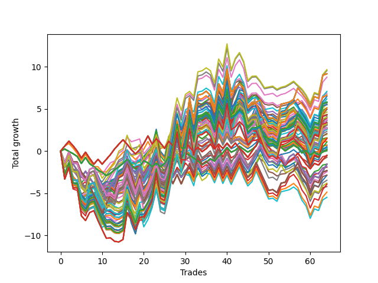

# Long HLT 646 
- Symbol: TSLA
- Date Range: 05/16/2022 - 05/17/2024
- Trading Period: 8:30-12:30
- Number of Trades: 64



| Id. | Name | Win Percent | Profit | Avg Profit / Trade | Avg Time / Trade | Std |      | Name | Win Percent | Profit | Avg Profit / Trade | Avg Time / Trade | Std |
| --- | ---- | ----------- | ------ | ------------------ | ---------------- | --- | ---- | ---- | ----------- | ------ | ------------------ | ---------------- | --- |
| | Sorted By <br> Profit | | | | | | | Sorted By <br> Win Percentage |||||
|0| TP-2.75 75m | 54.69 | 9.65 | 0.15 | 54:00 | 1.45 |     | TP-2.25 45m | 57.81 | 5.13 | 0.08 | 37:13 | 1.23 |
|1| TP-2.5 75m | 54.69 | 9.54 | 0.15 | 53:25 | 1.45 |     | TP-2.5 45m | 57.81 | 3.89 | 0.06 | 38:03 | 1.26 |
|2| TP-2.5 180m | 54.69 | 9.16 | 0.14 | 67:47 | 1.63 |     | TP-2.75 45m | 57.81 | 3.65 | 0.06 | 38:09 | 1.29 |
|3| TP-2.5 165m | 54.69 | 9.16 | 0.14 | 67:47 | 1.63 |     | TP-2.25 30m | 57.81 | 3.11 | 0.05 | 27:06 | 1.12 |
|4| TP-2.5 150m | 54.69 | 9.16 | 0.14 | 67:47 | 1.63 |     | TP-3 45m | 57.81 | 2.08 | 0.03 | 38:49 | 1.28 |
|5| TP-2.5 135m | 54.69 | 9.16 | 0.14 | 67:47 | 1.63 |     | TP-2.75 30m | 57.81 | 1.57 | 0.02 | 27:42 | 1.14 |
|6| TP-2.5 120m | 54.69 | 9.16 | 0.14 | 67:47 | 1.63 |     | TP-2.5 30m | 57.81 | 1.57 | 0.02 | 27:38 | 1.12 |
|7| TP-2.25 75m | 54.69 | 8.76 | 0.14 | 51:56 | 1.38 |     | TP-2.25 15m | 57.81 | 0.72 | 0.01 | 13:57 | 0.80 |
|8| TP-3 75m | 54.69 | 7.07 | 0.11 | 55:42 | 1.42 |     | TP-3 15m | 57.81 | 0.69 | 0.01 | 14:00 | 0.79 |
|9| TP-2.75 60m | 50.00 | 6.86 | 0.11 | 46:55 | 1.41 |     | TP-2.75 15m | 57.81 | 0.69 | 0.01 | 14:00 | 0.79 |
|10| TP-2.5 60m | 50.00 | 6.65 | 0.10 | 46:46 | 1.38 |     | TP-2.5 15m | 57.81 | 0.69 | 0.01 | 14:00 | 0.79 |
|11| TP-2.5 105m | 53.12 | 6.61 | 0.10 | 64:14 | 1.64 |     | TP-1.5 15m | 57.81 | 0.40 | 0.01 | 13:34 | 0.77 |
|12| TP-2.75 90m | 54.69 | 6.48 | 0.10 | 60:26 | 1.50 |     | TP-1.75 15m | 57.81 | 0.36 | 0.01 | 13:45 | 0.76 |
|13| TP-2.5 90m | 54.69 | 6.18 | 0.10 | 59:20 | 1.51 |     | TP-1.25 15m | 57.81 | 0.35 | 0.01 | 13:01 | 0.75 |
|14| TP-2.25 60m | 50.00 | 5.82 | 0.09 | 45:36 | 1.31 |     | TP-2 15m | 57.81 | 0.33 | 0.01 | 13:47 | 0.79 |
|15| TP-2.75 180m | 54.69 | 5.80 | 0.09 | 69:38 | 1.66 |     | TP-3 30m | 57.81 | 0.13 | 0.00 | 27:54 | 1.13 |
|16| TP-2.75 165m | 54.69 | 5.80 | 0.09 | 69:38 | 1.66 |     | TP-1.75 45m | 56.25 | 4.95 | 0.08 | 34:00 | 1.17 |
|17| TP-2.75 150m | 54.69 | 5.80 | 0.09 | 69:38 | 1.66 |     | TP-1.25 45m | 56.25 | 4.63 | 0.07 | 28:19 | 1.08 |
|18| TP-2.75 135m | 54.69 | 5.80 | 0.09 | 69:38 | 1.66 |     | TP-1.5 30m | 56.25 | 2.64 | 0.04 | 24:41 | 1.06 |
|19| TP-2.75 120m | 54.69 | 5.80 | 0.09 | 69:38 | 1.66 |     | TP-1.5 45m | 56.25 | 2.63 | 0.04 | 31:58 | 1.17 |
|20| TP-2.25 105m | 53.12 | 5.73 | 0.09 | 61:29 | 1.56 |     | TP-2 45m | 56.25 | 2.61 | 0.04 | 35:23 | 1.23 |
|21| TP-2.25 90m | 54.69 | 5.67 | 0.09 | 57:21 | 1.45 |     | TP-1.75 30m | 56.25 | 1.96 | 0.03 | 25:44 | 1.07 |
|22| TP-2.25 180m | 54.69 | 5.51 | 0.09 | 64:24 | 1.55 |     | TP-2 30m | 56.25 | 0.35 | 0.01 | 26:12 | 1.12 |
|23| TP-2.25 165m | 54.69 | 5.51 | 0.09 | 64:24 | 1.55 |     | TP-2.75 75m | 54.69 | 9.65 | 0.15 | 54:00 | 1.45 |
|24| TP-2.25 150m | 54.69 | 5.51 | 0.09 | 64:24 | 1.55 |     | TP-2.5 75m | 54.69 | 9.54 | 0.15 | 53:25 | 1.45 |
|25| TP-2.25 135m | 54.69 | 5.51 | 0.09 | 64:24 | 1.55 |     | TP-2.5 180m | 54.69 | 9.16 | 0.14 | 67:47 | 1.63 |
|26| TP-2.25 120m | 54.69 | 5.51 | 0.09 | 64:24 | 1.55 |     | TP-2.5 165m | 54.69 | 9.16 | 0.14 | 67:47 | 1.63 |
|27| TP-2.25 45m | 57.81 | 5.13 | 0.08 | 37:13 | 1.23 |     | TP-2.5 150m | 54.69 | 9.16 | 0.14 | 67:47 | 1.63 |
|28| TP-3 90m | 54.69 | 5.13 | 0.08 | 62:27 | 1.51 |     | TP-2.5 135m | 54.69 | 9.16 | 0.14 | 67:47 | 1.63 |
|29| TP-1.75 45m | 56.25 | 4.95 | 0.08 | 34:00 | 1.17 |     | TP-2.5 120m | 54.69 | 9.16 | 0.14 | 67:47 | 1.63 |
|30| TP-2 75m | 53.12 | 4.94 | 0.08 | 48:11 | 1.36 |     | TP-2.25 75m | 54.69 | 8.76 | 0.14 | 51:56 | 1.38 |
|31| TP-1.25 45m | 56.25 | 4.63 | 0.07 | 28:19 | 1.08 |     | TP-3 75m | 54.69 | 7.07 | 0.11 | 55:42 | 1.42 |
|32| TP-2.75 105m | 53.12 | 4.32 | 0.07 | 65:50 | 1.67 |     | TP-2.75 90m | 54.69 | 6.48 | 0.10 | 60:26 | 1.50 |
|33| TP-3 180m | 54.69 | 4.30 | 0.07 | 71:59 | 1.72 |     | TP-2.5 90m | 54.69 | 6.18 | 0.10 | 59:20 | 1.51 |
|34| TP-3 165m | 54.69 | 4.30 | 0.07 | 71:59 | 1.72 |     | TP-2.75 180m | 54.69 | 5.80 | 0.09 | 69:38 | 1.66 |
|35| TP-3 150m | 54.69 | 4.30 | 0.07 | 71:59 | 1.72 |     | TP-2.75 165m | 54.69 | 5.80 | 0.09 | 69:38 | 1.66 |
|36| TP-3 135m | 54.69 | 4.30 | 0.07 | 71:59 | 1.72 |     | TP-2.75 150m | 54.69 | 5.80 | 0.09 | 69:38 | 1.66 |
|37| TP-3 120m | 54.69 | 4.30 | 0.07 | 71:59 | 1.72 |     | TP-2.75 135m | 54.69 | 5.80 | 0.09 | 69:38 | 1.66 |
|38| TP-2 180m | 53.12 | 4.28 | 0.07 | 58:00 | 1.48 |     | TP-2.75 120m | 54.69 | 5.80 | 0.09 | 69:38 | 1.66 |
|39| TP-2 165m | 53.12 | 4.28 | 0.07 | 58:00 | 1.48 |     | TP-2.25 90m | 54.69 | 5.67 | 0.09 | 57:21 | 1.45 |
|40| TP-2 150m | 53.12 | 4.28 | 0.07 | 58:00 | 1.48 |     | TP-2.25 180m | 54.69 | 5.51 | 0.09 | 64:24 | 1.55 |
|41| TP-2 135m | 53.12 | 4.28 | 0.07 | 58:00 | 1.48 |     | TP-2.25 165m | 54.69 | 5.51 | 0.09 | 64:24 | 1.55 |
|42| TP-2 120m | 53.12 | 4.28 | 0.07 | 58:00 | 1.48 |     | TP-2.25 150m | 54.69 | 5.51 | 0.09 | 64:24 | 1.55 |
|43| TP-1.5 90m | 54.69 | 4.10 | 0.06 | 42:57 | 1.29 |     | TP-2.25 135m | 54.69 | 5.51 | 0.09 | 64:24 | 1.55 |
|44| TP-1.75 105m | 51.56 | 4.01 | 0.06 | 50:05 | 1.38 |     | TP-2.25 120m | 54.69 | 5.51 | 0.09 | 64:24 | 1.55 |
|45| TP-1.5 105m | 53.12 | 3.98 | 0.06 | 44:40 | 1.31 |     | TP-3 90m | 54.69 | 5.13 | 0.08 | 62:27 | 1.51 |
|46| TP-2.5 45m | 57.81 | 3.89 | 0.06 | 38:03 | 1.26 |     | TP-3 180m | 54.69 | 4.30 | 0.07 | 71:59 | 1.72 |
|47| TP-1.75 90m | 53.12 | 3.74 | 0.06 | 48:18 | 1.35 |     | TP-3 165m | 54.69 | 4.30 | 0.07 | 71:59 | 1.72 |
|48| TP-2.75 45m | 57.81 | 3.65 | 0.06 | 38:09 | 1.29 |     | TP-3 150m | 54.69 | 4.30 | 0.07 | 71:59 | 1.72 |
|49| TP-1.75 75m | 53.12 | 3.63 | 0.06 | 44:58 | 1.26 |     | TP-3 135m | 54.69 | 4.30 | 0.07 | 71:59 | 1.72 |
|50| TP-1.75 60m | 50.00 | 3.43 | 0.05 | 40:22 | 1.21 |     | TP-3 120m | 54.69 | 4.30 | 0.07 | 71:59 | 1.72 |
|51| TP-3 105m | 53.12 | 3.36 | 0.05 | 68:02 | 1.69 |     | TP-1.5 90m | 54.69 | 4.10 | 0.06 | 42:57 | 1.29 |
|52| TP-1.75 180m | 51.56 | 3.20 | 0.05 | 51:15 | 1.40 |     | TP-1.25 30m | 54.69 | 3.05 | 0.05 | 22:49 | 0.98 |
|53| TP-1.75 165m | 51.56 | 3.20 | 0.05 | 51:15 | 1.40 |     | TP-1.5 75m | 54.69 | 1.47 | 0.02 | 40:23 | 1.23 |
|54| TP-1.75 150m | 51.56 | 3.20 | 0.05 | 51:15 | 1.40 |     | TP-1 15m | 54.69 | -1.92 | -0.03 | 12:11 | 0.75 |
|55| TP-1.75 135m | 51.56 | 3.20 | 0.05 | 51:15 | 1.40 |     | TP-2.5 105m | 53.12 | 6.61 | 0.10 | 64:14 | 1.64 |
|56| TP-1.75 120m | 51.56 | 3.20 | 0.05 | 51:15 | 1.40 |     | TP-2.25 105m | 53.12 | 5.73 | 0.09 | 61:29 | 1.56 |
|57| TP-1.5 180m | 53.12 | 3.17 | 0.05 | 45:50 | 1.33 |     | TP-2 75m | 53.12 | 4.94 | 0.08 | 48:11 | 1.36 |
|58| TP-1.5 165m | 53.12 | 3.17 | 0.05 | 45:50 | 1.33 |     | TP-2.75 105m | 53.12 | 4.32 | 0.07 | 65:50 | 1.67 |
|59| TP-1.5 150m | 53.12 | 3.17 | 0.05 | 45:50 | 1.33 |     | TP-2 180m | 53.12 | 4.28 | 0.07 | 58:00 | 1.48 |
|60| TP-1.5 135m | 53.12 | 3.17 | 0.05 | 45:50 | 1.33 |     | TP-2 165m | 53.12 | 4.28 | 0.07 | 58:00 | 1.48 |
|61| TP-1.5 120m | 53.12 | 3.17 | 0.05 | 45:50 | 1.33 |     | TP-2 150m | 53.12 | 4.28 | 0.07 | 58:00 | 1.48 |
|62| TP-2 90m | 53.12 | 3.13 | 0.05 | 52:36 | 1.44 |     | TP-2 135m | 53.12 | 4.28 | 0.07 | 58:00 | 1.48 |
|63| TP-2.25 30m | 57.81 | 3.11 | 0.05 | 27:06 | 1.12 |     | TP-2 120m | 53.12 | 4.28 | 0.07 | 58:00 | 1.48 |
|64| TP-2 60m | 50.00 | 3.08 | 0.05 | 42:43 | 1.27 |     | TP-1.5 105m | 53.12 | 3.98 | 0.06 | 44:40 | 1.31 |
|65| TP-1.25 30m | 54.69 | 3.05 | 0.05 | 22:49 | 0.98 |     | TP-1.75 90m | 53.12 | 3.74 | 0.06 | 48:18 | 1.35 |
|66| TP-1.25 90m | 53.12 | 2.79 | 0.04 | 35:36 | 1.16 |     | TP-1.75 75m | 53.12 | 3.63 | 0.06 | 44:58 | 1.26 |
|67| TP-1.25 105m | 53.12 | 2.76 | 0.04 | 36:44 | 1.16 |     | TP-3 105m | 53.12 | 3.36 | 0.05 | 68:02 | 1.69 |
|68| TP-1.25 180m | 53.12 | 2.69 | 0.04 | 37:13 | 1.17 |     | TP-1.5 180m | 53.12 | 3.17 | 0.05 | 45:50 | 1.33 |
|69| TP-1.25 165m | 53.12 | 2.69 | 0.04 | 37:13 | 1.17 |     | TP-1.5 165m | 53.12 | 3.17 | 0.05 | 45:50 | 1.33 |
|70| TP-1.25 150m | 53.12 | 2.69 | 0.04 | 37:13 | 1.17 |     | TP-1.5 150m | 53.12 | 3.17 | 0.05 | 45:50 | 1.33 |
|71| TP-1.25 135m | 53.12 | 2.69 | 0.04 | 37:13 | 1.17 |     | TP-1.5 135m | 53.12 | 3.17 | 0.05 | 45:50 | 1.33 |
|72| TP-1.25 120m | 53.12 | 2.69 | 0.04 | 37:13 | 1.17 |     | TP-1.5 120m | 53.12 | 3.17 | 0.05 | 45:50 | 1.33 |
|73| TP-1.5 30m | 56.25 | 2.64 | 0.04 | 24:41 | 1.06 |     | TP-2 90m | 53.12 | 3.13 | 0.05 | 52:36 | 1.44 |
|74| TP-1.5 45m | 56.25 | 2.63 | 0.04 | 31:58 | 1.17 |     | TP-1.25 90m | 53.12 | 2.79 | 0.04 | 35:36 | 1.16 |
|75| TP-2 45m | 56.25 | 2.61 | 0.04 | 35:23 | 1.23 |     | TP-1.25 105m | 53.12 | 2.76 | 0.04 | 36:44 | 1.16 |
|76| TP-2 105m | 51.56 | 2.55 | 0.04 | 55:54 | 1.47 |     | TP-1.25 180m | 53.12 | 2.69 | 0.04 | 37:13 | 1.17 |
|77| TP-3 60m | 50.00 | 2.34 | 0.04 | 48:07 | 1.34 |     | TP-1.25 165m | 53.12 | 2.69 | 0.04 | 37:13 | 1.17 |
|78| TP-3 45m | 57.81 | 2.08 | 0.03 | 38:49 | 1.28 |     | TP-1.25 150m | 53.12 | 2.69 | 0.04 | 37:13 | 1.17 |
|79| TP-1.75 30m | 56.25 | 1.96 | 0.03 | 25:44 | 1.07 |     | TP-1.25 135m | 53.12 | 2.69 | 0.04 | 37:13 | 1.17 |
|80| TP-2.75 30m | 57.81 | 1.57 | 0.02 | 27:42 | 1.14 |     | TP-1.25 120m | 53.12 | 2.69 | 0.04 | 37:13 | 1.17 |
|81| TP-2.5 30m | 57.81 | 1.57 | 0.02 | 27:38 | 1.12 |     | TP-1.25 75m | 53.12 | 1.06 | 0.02 | 34:00 | 1.12 |
|82| TP-1.5 60m | 50.00 | 1.53 | 0.02 | 36:56 | 1.21 |     | TP-0.75 15m | 53.12 | -1.56 | -0.02 | 10:55 | 0.66 |
|83| TP-1.5 75m | 54.69 | 1.47 | 0.02 | 40:23 | 1.23 |     | TP-1.75 105m | 51.56 | 4.01 | 0.06 | 50:05 | 1.38 |
|84| TP-0.5 15m | 51.56 | 1.15 | 0.02 | 08:35 | 0.56 |     | TP-1.75 180m | 51.56 | 3.20 | 0.05 | 51:15 | 1.40 |
|85| TP-1.25 75m | 53.12 | 1.06 | 0.02 | 34:00 | 1.12 |     | TP-1.75 165m | 51.56 | 3.20 | 0.05 | 51:15 | 1.40 |
|86| TP-2.25 15m | 57.81 | 0.72 | 0.01 | 13:57 | 0.80 |     | TP-1.75 150m | 51.56 | 3.20 | 0.05 | 51:15 | 1.40 |
|87| TP-3 15m | 57.81 | 0.69 | 0.01 | 14:00 | 0.79 |     | TP-1.75 135m | 51.56 | 3.20 | 0.05 | 51:15 | 1.40 |
|88| TP-2.75 15m | 57.81 | 0.69 | 0.01 | 14:00 | 0.79 |     | TP-1.75 120m | 51.56 | 3.20 | 0.05 | 51:15 | 1.40 |
|89| TP-2.5 15m | 57.81 | 0.69 | 0.01 | 14:00 | 0.79 |     | TP-2 105m | 51.56 | 2.55 | 0.04 | 55:54 | 1.47 |
|90| TP-1.25 60m | 50.00 | 0.52 | 0.01 | 31:47 | 1.11 |     | TP-0.5 15m | 51.56 | 1.15 | 0.02 | 08:35 | 0.56 |
|91| TP-1.5 15m | 57.81 | 0.40 | 0.01 | 13:34 | 0.77 |     | TP-0.75 30m | 51.56 | -1.85 | -0.03 | 16:25 | 0.78 |
|92| TP-1.75 15m | 57.81 | 0.36 | 0.01 | 13:45 | 0.76 |     | TP-1 30m | 51.56 | -4.21 | -0.07 | 20:11 | 0.91 |
|93| TP-1.25 15m | 57.81 | 0.35 | 0.01 | 13:01 | 0.75 |     | TP-2.75 60m | 50.00 | 6.86 | 0.11 | 46:55 | 1.41 |
|94| TP-2 30m | 56.25 | 0.35 | 0.01 | 26:12 | 1.12 |     | TP-2.5 60m | 50.00 | 6.65 | 0.10 | 46:46 | 1.38 |
|95| TP-2 15m | 57.81 | 0.33 | 0.01 | 13:47 | 0.79 |     | TP-2.25 60m | 50.00 | 5.82 | 0.09 | 45:36 | 1.31 |
|96| TP-0.25 180m | 48.44 | 0.17 | 0.00 | 04:52 | 0.45 |     | TP-1.75 60m | 50.00 | 3.43 | 0.05 | 40:22 | 1.21 |
|97| TP-0.25 165m | 48.44 | 0.17 | 0.00 | 04:52 | 0.45 |     | TP-2 60m | 50.00 | 3.08 | 0.05 | 42:43 | 1.27 |
|98| TP-0.25 150m | 48.44 | 0.17 | 0.00 | 04:52 | 0.45 |     | TP-3 60m | 50.00 | 2.34 | 0.04 | 48:07 | 1.34 |
|99| TP-0.25 135m | 48.44 | 0.17 | 0.00 | 04:52 | 0.45 |     | TP-1.5 60m | 50.00 | 1.53 | 0.02 | 36:56 | 1.21 |
|100| TP-0.25 120m | 48.44 | 0.17 | 0.00 | 04:52 | 0.45 |     | TP-1.25 60m | 50.00 | 0.52 | 0.01 | 31:47 | 1.11 |
|101| TP-0.25 105m | 48.44 | 0.17 | 0.00 | 04:52 | 0.45 |     | TP-0.75 180m | 50.00 | -1.56 | -0.02 | 20:36 | 0.87 |
|102| TP-0.25 90m | 48.44 | 0.17 | 0.00 | 04:52 | 0.45 |     | TP-0.75 165m | 50.00 | -1.56 | -0.02 | 20:36 | 0.87 |
|103| TP-0.25 75m | 48.44 | 0.17 | 0.00 | 04:52 | 0.45 |     | TP-0.75 150m | 50.00 | -1.56 | -0.02 | 20:36 | 0.87 |
|104| TP-0.25 60m | 48.44 | 0.17 | 0.00 | 04:52 | 0.45 |     | TP-0.75 135m | 50.00 | -1.56 | -0.02 | 20:36 | 0.87 |
|105| TP-0.25 45m | 48.44 | 0.17 | 0.00 | 04:52 | 0.45 |     | TP-0.75 120m | 50.00 | -1.56 | -0.02 | 20:36 | 0.87 |
|106| TP-0.25 15m | 48.44 | 0.14 | 0.00 | 04:20 | 0.45 |     | TP-0.75 105m | 50.00 | -1.56 | -0.02 | 20:36 | 0.87 |
|107| TP-3 30m | 57.81 | 0.13 | 0.00 | 27:54 | 1.13 |     | TP-0.75 90m | 50.00 | -1.56 | -0.02 | 20:36 | 0.87 |
|108| TP-0.25 30m | 48.44 | 0.02 | 0.00 | 04:41 | 0.45 |     | TP-0.75 75m | 50.00 | -2.88 | -0.04 | 20:10 | 0.85 |
|109| TP-0.5 180m | 48.44 | -0.51 | -0.01 | 11:00 | 0.62 |     | TP-0.25 180m | 48.44 | 0.17 | 0.00 | 04:52 | 0.45 |
|110| TP-0.5 165m | 48.44 | -0.51 | -0.01 | 11:00 | 0.62 |     | TP-0.25 165m | 48.44 | 0.17 | 0.00 | 04:52 | 0.45 |
|111| TP-0.5 150m | 48.44 | -0.51 | -0.01 | 11:00 | 0.62 |     | TP-0.25 150m | 48.44 | 0.17 | 0.00 | 04:52 | 0.45 |
|112| TP-0.5 135m | 48.44 | -0.51 | -0.01 | 11:00 | 0.62 |     | TP-0.25 135m | 48.44 | 0.17 | 0.00 | 04:52 | 0.45 |
|113| TP-0.5 120m | 48.44 | -0.51 | -0.01 | 11:00 | 0.62 |     | TP-0.25 120m | 48.44 | 0.17 | 0.00 | 04:52 | 0.45 |
|114| TP-0.5 105m | 48.44 | -0.51 | -0.01 | 11:00 | 0.62 |     | TP-0.25 105m | 48.44 | 0.17 | 0.00 | 04:52 | 0.45 |
|115| TP-0.5 90m | 48.44 | -0.51 | -0.01 | 11:00 | 0.62 |     | TP-0.25 90m | 48.44 | 0.17 | 0.00 | 04:52 | 0.45 |
|116| TP-0.5 75m | 48.44 | -0.51 | -0.01 | 11:00 | 0.62 |     | TP-0.25 75m | 48.44 | 0.17 | 0.00 | 04:52 | 0.45 |
|117| TP-0.5 60m | 48.44 | -0.51 | -0.01 | 11:00 | 0.62 |     | TP-0.25 60m | 48.44 | 0.17 | 0.00 | 04:52 | 0.45 |
|118| TP-0.5 30m | 48.44 | -0.54 | -0.01 | 10:34 | 0.61 |     | TP-0.25 45m | 48.44 | 0.17 | 0.00 | 04:52 | 0.45 |
|119| TP-0.5 45m | 48.44 | -0.73 | -0.01 | 10:51 | 0.62 |     | TP-0.25 15m | 48.44 | 0.14 | 0.00 | 04:20 | 0.45 |
|120| TP-0.75 15m | 53.12 | -1.56 | -0.02 | 10:55 | 0.66 |     | TP-0.25 30m | 48.44 | 0.02 | 0.00 | 04:41 | 0.45 |
|121| TP-0.75 180m | 50.00 | -1.56 | -0.02 | 20:36 | 0.87 |     | TP-0.5 180m | 48.44 | -0.51 | -0.01 | 11:00 | 0.62 |
|122| TP-0.75 165m | 50.00 | -1.56 | -0.02 | 20:36 | 0.87 |     | TP-0.5 165m | 48.44 | -0.51 | -0.01 | 11:00 | 0.62 |
|123| TP-0.75 150m | 50.00 | -1.56 | -0.02 | 20:36 | 0.87 |     | TP-0.5 150m | 48.44 | -0.51 | -0.01 | 11:00 | 0.62 |
|124| TP-0.75 135m | 50.00 | -1.56 | -0.02 | 20:36 | 0.87 |     | TP-0.5 135m | 48.44 | -0.51 | -0.01 | 11:00 | 0.62 |
|125| TP-0.75 120m | 50.00 | -1.56 | -0.02 | 20:36 | 0.87 |     | TP-0.5 120m | 48.44 | -0.51 | -0.01 | 11:00 | 0.62 |
|126| TP-0.75 105m | 50.00 | -1.56 | -0.02 | 20:36 | 0.87 |     | TP-0.5 105m | 48.44 | -0.51 | -0.01 | 11:00 | 0.62 |
|127| TP-0.75 90m | 50.00 | -1.56 | -0.02 | 20:36 | 0.87 |     | TP-0.5 90m | 48.44 | -0.51 | -0.01 | 11:00 | 0.62 |
|128| TP-0.75 30m | 51.56 | -1.85 | -0.03 | 16:25 | 0.78 |     | TP-0.5 75m | 48.44 | -0.51 | -0.01 | 11:00 | 0.62 |
|129| TP-1 15m | 54.69 | -1.92 | -0.03 | 12:11 | 0.75 |     | TP-0.5 60m | 48.44 | -0.51 | -0.01 | 11:00 | 0.62 |
|130| TP-1 180m | 48.44 | -2.32 | -0.04 | 28:30 | 1.05 |     | TP-0.5 30m | 48.44 | -0.54 | -0.01 | 10:34 | 0.61 |
|131| TP-1 165m | 48.44 | -2.32 | -0.04 | 28:30 | 1.05 |     | TP-0.5 45m | 48.44 | -0.73 | -0.01 | 10:51 | 0.62 |
|132| TP-1 150m | 48.44 | -2.32 | -0.04 | 28:30 | 1.05 |     | TP-1 180m | 48.44 | -2.32 | -0.04 | 28:30 | 1.05 |
|133| TP-1 135m | 48.44 | -2.32 | -0.04 | 28:30 | 1.05 |     | TP-1 165m | 48.44 | -2.32 | -0.04 | 28:30 | 1.05 |
|134| TP-1 120m | 48.44 | -2.32 | -0.04 | 28:30 | 1.05 |     | TP-1 150m | 48.44 | -2.32 | -0.04 | 28:30 | 1.05 |
|135| TP-0.75 45m | 48.44 | -2.46 | -0.04 | 18:31 | 0.83 |     | TP-1 135m | 48.44 | -2.32 | -0.04 | 28:30 | 1.05 |
|136| TP-1 105m | 48.44 | -2.85 | -0.04 | 28:26 | 1.04 |     | TP-1 120m | 48.44 | -2.32 | -0.04 | 28:30 | 1.05 |
|137| TP-0.75 75m | 50.00 | -2.88 | -0.04 | 20:10 | 0.85 |     | TP-0.75 45m | 48.44 | -2.46 | -0.04 | 18:31 | 0.83 |
|138| TP-1 45m | 48.44 | -3.46 | -0.05 | 23:55 | 1.00 |     | TP-1 105m | 48.44 | -2.85 | -0.04 | 28:26 | 1.04 |
|139| TP-0.75 60m | 48.44 | -3.81 | -0.06 | 19:28 | 0.84 |     | TP-1 45m | 48.44 | -3.46 | -0.05 | 23:55 | 1.00 |
|140| TP-1 90m | 46.88 | -3.93 | -0.06 | 27:57 | 1.04 |     | TP-0.75 60m | 48.44 | -3.81 | -0.06 | 19:28 | 0.84 |
|141| TP-1 30m | 51.56 | -4.21 | -0.07 | 20:11 | 0.91 |     | TP-1 90m | 46.88 | -3.93 | -0.06 | 27:57 | 1.04 |
|142| TP-1 75m | 46.88 | -4.87 | -0.08 | 26:57 | 1.02 |     | TP-1 75m | 46.88 | -4.87 | -0.08 | 26:57 | 1.02 |
|143| TP-1 60m | 45.31 | -5.49 | -0.09 | 25:46 | 1.02 |     | TP-1 60m | 45.31 | -5.49 | -0.09 | 25:46 | 1.02 |

### Test TP-0.25 15m
* Take Profit of 0.25 Point
* 0.25 Stoploss
* Results:
```
Total Trades: 64
Percent Up: 48.44
Percent Down: 51.56
Total Points Moved Up: 0.14
Potential Profit: 70.00
Total Points Ups: 13.13 Count Ups: 31
Total Points Downs: -12.99 Count Downs: 33
```

<details><summary>Trades</summary>

<code>In: 2022-05-18 08:40:00		Out: 2022-05-18 08:42:00		Total Position Time: 02:00		Total Move Up: 0.24		Total to Date: 0.24</code> <br />
<code>In: 2022-05-26 12:25:00		Out: 2022-05-26 12:27:00		Total Position Time: 02:00		Total Move Up: -0.28		Total to Date: -0.04</code> <br />
<code>In: 2022-06-09 12:20:00		Out: 2022-06-09 12:26:00		Total Position Time: 06:00		Total Move Up: -0.27		Total to Date: -0.31</code> <br />
<code>In: 2022-06-13 12:20:00		Out: 2022-06-13 12:24:00		Total Position Time: 04:00		Total Move Up: -0.33		Total to Date: -0.64</code> <br />
<code>In: 2022-06-16 09:00:00		Out: 2022-06-16 09:02:00		Total Position Time: 02:00		Total Move Up: -0.82		Total to Date: -1.46</code> <br />
<code>In: 2022-06-17 12:25:00		Out: 2022-06-17 12:27:00		Total Position Time: 02:00		Total Move Up: 0.70		Total to Date: -0.76</code> <br />
<code>In: 2022-06-22 09:05:00		Out: 2022-06-22 09:08:00		Total Position Time: 03:00		Total Move Up: -0.75		Total to Date: -1.51</code> <br />
<code>In: 2022-07-12 12:15:00		Out: 2022-07-12 12:17:00		Total Position Time: 02:00		Total Move Up: -0.33		Total to Date: -1.84</code> <br />
<code>In: 2022-07-25 11:10:00		Out: 2022-07-25 11:17:00		Total Position Time: 07:00		Total Move Up: -0.44		Total to Date: -2.28</code> <br />
<code>In: 2022-08-11 12:00:00		Out: 2022-08-11 12:06:00		Total Position Time: 06:00		Total Move Up: -0.25		Total to Date: -2.53</code> <br />
<code>In: 2022-08-18 09:50:00		Out: 2022-08-18 09:55:00		Total Position Time: 05:00		Total Move Up: -0.38		Total to Date: -2.91</code> <br />
<code>In: 2022-08-18 11:45:00		Out: 2022-08-18 11:53:00		Total Position Time: 08:00		Total Move Up: 0.27		Total to Date: -2.64</code> <br />
<code>In: 2022-08-24 11:55:00		Out: 2022-08-24 12:00:00		Total Position Time: 05:00		Total Move Up: 0.43		Total to Date: -2.21</code> <br />
<code>In: 2022-08-26 11:25:00		Out: 2022-08-26 11:28:00		Total Position Time: 03:00		Total Move Up: 0.33		Total to Date: -1.88</code> <br />
<code>In: 2022-09-15 12:35:00		Out: 2022-09-15 12:39:00		Total Position Time: 04:00		Total Move Up: 0.42		Total to Date: -1.46</code> <br />
<code>In: 2022-09-22 11:30:00		Out: 2022-09-22 11:33:00		Total Position Time: 03:00		Total Move Up: 0.45		Total to Date: -1.01</code> <br />
<code>In: 2022-09-29 10:15:00		Out: 2022-09-29 10:20:00		Total Position Time: 05:00		Total Move Up: -0.64		Total to Date: -1.65</code> <br />
<code>In: 2022-09-30 10:55:00		Out: 2022-09-30 11:00:00		Total Position Time: 05:00		Total Move Up: -0.48		Total to Date: -2.13</code> <br />
<code>In: 2022-10-19 10:10:00		Out: 2022-10-19 10:14:00		Total Position Time: 04:00		Total Move Up: 0.27		Total to Date: -1.86</code> <br />
<code>In: 2022-11-15 10:45:00		Out: 2022-11-15 10:47:00		Total Position Time: 02:00		Total Move Up: 0.71		Total to Date: -1.15</code> <br />
<code>In: 2022-11-29 12:10:00		Out: 2022-11-29 12:13:00		Total Position Time: 03:00		Total Move Up: -0.25		Total to Date: -1.40</code> <br />
<code>In: 2022-12-09 10:20:00		Out: 2022-12-09 10:23:00		Total Position Time: 03:00		Total Move Up: -0.44		Total to Date: -1.84</code> <br />
<code>In: 2022-12-21 09:25:00		Out: 2022-12-21 09:31:00		Total Position Time: 06:00		Total Move Up: 0.39		Total to Date: -1.45</code> <br />
<code>In: 2022-12-22 09:10:00		Out: 2022-12-22 09:14:00		Total Position Time: 04:00		Total Move Up: -0.40		Total to Date: -1.85</code> <br />
<code>In: 2023-01-09 12:20:00		Out: 2023-01-09 12:22:00		Total Position Time: 02:00		Total Move Up: 0.37		Total to Date: -1.48</code> <br />
<code>In: 2023-02-02 12:10:00		Out: 2023-02-02 12:12:00		Total Position Time: 02:00		Total Move Up: 0.84		Total to Date: -0.64</code> <br />
<code>In: 2023-02-10 09:25:00		Out: 2023-02-10 09:27:00		Total Position Time: 02:00		Total Move Up: -0.54		Total to Date: -1.18</code> <br />
<code>In: 2023-02-21 08:40:00		Out: 2023-02-21 08:42:00		Total Position Time: 02:00		Total Move Up: 0.54		Total to Date: -0.64</code> <br />
<code>In: 2023-03-09 10:45:00		Out: 2023-03-09 10:47:00		Total Position Time: 02:00		Total Move Up: -0.26		Total to Date: -0.90</code> <br />
<code>In: 2023-03-10 10:55:00		Out: 2023-03-10 11:01:00		Total Position Time: 06:00		Total Move Up: 0.75		Total to Date: -0.15</code> <br />
<code>In: 2023-03-22 09:25:00		Out: 2023-03-22 09:33:00		Total Position Time: 08:00		Total Move Up: -0.36		Total to Date: -0.51</code> <br />
<code>In: 2023-03-23 08:50:00		Out: 2023-03-23 08:52:00		Total Position Time: 02:00		Total Move Up: -0.31		Total to Date: -0.82</code> <br />
<code>In: 2023-03-23 11:50:00		Out: 2023-03-23 11:55:00		Total Position Time: 05:00		Total Move Up: -0.35		Total to Date: -1.17</code> <br />
<code>In: 2023-04-04 11:40:00		Out: 2023-04-04 11:54:00		Total Position Time: 14:00		Total Move Up: -0.03		Total to Date: -1.20</code> <br />
<code>In: 2023-04-06 12:25:00		Out: 2023-04-06 12:31:00		Total Position Time: 06:00		Total Move Up: 0.27		Total to Date: -0.93</code> <br />
<code>In: 2023-04-25 11:30:00		Out: 2023-04-25 11:39:00		Total Position Time: 09:00		Total Move Up: 0.43		Total to Date: -0.50</code> <br />
<code>In: 2023-04-26 12:15:00		Out: 2023-04-26 12:21:00		Total Position Time: 06:00		Total Move Up: -0.28		Total to Date: -0.78</code> <br />
<code>In: 2023-06-09 09:45:00		Out: 2023-06-09 09:49:00		Total Position Time: 04:00		Total Move Up: 0.58		Total to Date: -0.20</code> <br />
<code>In: 2023-06-09 11:55:00		Out: 2023-06-09 11:58:00		Total Position Time: 03:00		Total Move Up: 0.41		Total to Date: 0.21</code> <br />
<code>In: 2023-07-10 09:20:00		Out: 2023-07-10 09:22:00		Total Position Time: 02:00		Total Move Up: 0.63		Total to Date: 0.84</code> <br />
<code>In: 2023-07-19 11:15:00		Out: 2023-07-19 11:19:00		Total Position Time: 04:00		Total Move Up: -0.57		Total to Date: 0.27</code> <br />
<code>In: 2023-07-28 10:55:00		Out: 2023-07-28 10:58:00		Total Position Time: 03:00		Total Move Up: 0.24		Total to Date: 0.51</code> <br />
<code>In: 2023-08-10 10:50:00		Out: 2023-08-10 10:52:00		Total Position Time: 02:00		Total Move Up: 0.46		Total to Date: 0.97</code> <br />
<code>In: 2023-08-15 10:15:00		Out: 2023-08-15 10:23:00		Total Position Time: 08:00		Total Move Up: -0.34		Total to Date: 0.63</code> <br />
<code>In: 2023-08-17 11:50:00		Out: 2023-08-17 11:54:00		Total Position Time: 04:00		Total Move Up: -0.35		Total to Date: 0.28</code> <br />
<code>In: 2023-09-21 12:25:00		Out: 2023-09-21 12:32:00		Total Position Time: 07:00		Total Move Up: 0.32		Total to Date: 0.60</code> <br />
<code>In: 2023-09-28 12:00:00		Out: 2023-09-28 12:03:00		Total Position Time: 03:00		Total Move Up: 0.41		Total to Date: 1.01</code> <br />
<code>In: 2023-10-02 10:20:00		Out: 2023-10-02 10:22:00		Total Position Time: 02:00		Total Move Up: 0.98		Total to Date: 1.99</code> <br />
<code>In: 2023-10-13 10:45:00		Out: 2023-10-13 10:51:00		Total Position Time: 06:00		Total Move Up: 0.22		Total to Date: 2.21</code> <br />
<code>In: 2023-10-27 11:15:00		Out: 2023-10-27 11:19:00		Total Position Time: 04:00		Total Move Up: -0.35		Total to Date: 1.86</code> <br />
<code>In: 2023-12-04 12:20:00		Out: 2023-12-04 12:22:00		Total Position Time: 02:00		Total Move Up: -0.28		Total to Date: 1.58</code> <br />
<code>In: 2023-12-06 12:35:00		Out: 2023-12-06 12:37:00		Total Position Time: 02:00		Total Move Up: -0.23		Total to Date: 1.35</code> <br />
<code>In: 2023-12-12 09:25:00		Out: 2023-12-12 09:27:00		Total Position Time: 02:00		Total Move Up: -0.51		Total to Date: 0.84</code> <br />
<code>In: 2024-01-02 12:20:00		Out: 2024-01-02 12:23:00		Total Position Time: 03:00		Total Move Up: -0.42		Total to Date: 0.42</code> <br />
<code>In: 2024-01-23 10:45:00		Out: 2024-01-23 10:59:00		Total Position Time: 14:00		Total Move Up: 0.11		Total to Date: 0.53</code> <br />
<code>In: 2024-01-24 12:35:00		Out: 2024-01-24 12:37:00		Total Position Time: 02:00		Total Move Up: 0.32		Total to Date: 0.85</code> <br />
<code>In: 2024-03-04 10:00:00		Out: 2024-03-04 10:04:00		Total Position Time: 04:00		Total Move Up: -0.31		Total to Date: 0.54</code> <br />
<code>In: 2024-03-06 11:10:00		Out: 2024-03-06 11:12:00		Total Position Time: 02:00		Total Move Up: -0.61		Total to Date: -0.07</code> <br />
<code>In: 2024-03-28 12:00:00		Out: 2024-03-28 12:04:00		Total Position Time: 04:00		Total Move Up: 0.29		Total to Date: 0.22</code> <br />
<code>In: 2024-04-04 11:50:00		Out: 2024-04-04 11:53:00		Total Position Time: 03:00		Total Move Up: -0.53		Total to Date: -0.31</code> <br />
<code>In: 2024-04-10 12:10:00		Out: 2024-04-10 12:15:00		Total Position Time: 05:00		Total Move Up: 0.33		Total to Date: 0.02</code> <br />
<code>In: 2024-04-15 12:25:00		Out: 2024-04-15 12:29:00		Total Position Time: 04:00		Total Move Up: -0.30		Total to Date: -0.28</code> <br />
<code>In: 2024-04-17 09:50:00		Out: 2024-04-17 09:53:00		Total Position Time: 03:00		Total Move Up: 0.32		Total to Date: 0.04</code> <br />
<code>In: 2024-05-10 11:10:00		Out: 2024-05-10 11:24:00		Total Position Time: 14:00		Total Move Up: 0.10		Total to Date: 0.14</code> <br />


</details>

### Test TP-0.5 15m
* Take Profit of 0.5 Point
* 0.5 Stoploss
* Results:
```
Total Trades: 64
Percent Up: 51.56
Percent Down: 48.44
Total Points Moved Up: 1.15
Potential Profit: 575.00
Total Points Ups: 16.97 Count Ups: 33
Total Points Downs: -15.82 Count Downs: 31
```

<details><summary>Trades</summary>

<code>In: 2022-05-18 08:40:00		Out: 2022-05-18 08:43:00		Total Position Time: 03:00		Total Move Up: 0.59		Total to Date: 0.59</code> <br />
<code>In: 2022-05-26 12:25:00		Out: 2022-05-26 12:39:00		Total Position Time: 14:00		Total Move Up: 0.31		Total to Date: 0.90</code> <br />
<code>In: 2022-06-09 12:20:00		Out: 2022-06-09 12:27:00		Total Position Time: 07:00		Total Move Up: -0.54		Total to Date: 0.36</code> <br />
<code>In: 2022-06-13 12:20:00		Out: 2022-06-13 12:27:00		Total Position Time: 07:00		Total Move Up: -0.64		Total to Date: -0.28</code> <br />
<code>In: 2022-06-16 09:00:00		Out: 2022-06-16 09:02:00		Total Position Time: 02:00		Total Move Up: -0.82		Total to Date: -1.10</code> <br />
<code>In: 2022-06-17 12:25:00		Out: 2022-06-17 12:27:00		Total Position Time: 02:00		Total Move Up: 0.70		Total to Date: -0.40</code> <br />
<code>In: 2022-06-22 09:05:00		Out: 2022-06-22 09:08:00		Total Position Time: 03:00		Total Move Up: -0.75		Total to Date: -1.15</code> <br />
<code>In: 2022-07-12 12:15:00		Out: 2022-07-12 12:26:00		Total Position Time: 11:00		Total Move Up: -0.68		Total to Date: -1.83</code> <br />
<code>In: 2022-07-25 11:10:00		Out: 2022-07-25 11:24:00		Total Position Time: 14:00		Total Move Up: -0.03		Total to Date: -1.86</code> <br />
<code>In: 2022-08-11 12:00:00		Out: 2022-08-11 12:07:00		Total Position Time: 07:00		Total Move Up: -0.57		Total to Date: -2.43</code> <br />
<code>In: 2022-08-18 09:50:00		Out: 2022-08-18 10:04:00		Total Position Time: 14:00		Total Move Up: -0.05		Total to Date: -2.48</code> <br />
<code>In: 2022-08-18 11:45:00		Out: 2022-08-18 11:54:00		Total Position Time: 09:00		Total Move Up: 0.57		Total to Date: -1.91</code> <br />
<code>In: 2022-08-24 11:55:00		Out: 2022-08-24 12:06:00		Total Position Time: 11:00		Total Move Up: 0.67		Total to Date: -1.24</code> <br />
<code>In: 2022-08-26 11:25:00		Out: 2022-08-26 11:33:00		Total Position Time: 08:00		Total Move Up: 0.55		Total to Date: -0.69</code> <br />
<code>In: 2022-09-15 12:35:00		Out: 2022-09-15 12:40:00		Total Position Time: 05:00		Total Move Up: 0.53		Total to Date: -0.16</code> <br />
<code>In: 2022-09-22 11:30:00		Out: 2022-09-22 11:44:00		Total Position Time: 14:00		Total Move Up: 0.31		Total to Date: 0.15</code> <br />
<code>In: 2022-09-29 10:15:00		Out: 2022-09-29 10:20:00		Total Position Time: 05:00		Total Move Up: -0.64		Total to Date: -0.49</code> <br />
<code>In: 2022-09-30 10:55:00		Out: 2022-09-30 11:05:00		Total Position Time: 10:00		Total Move Up: -0.51		Total to Date: -1.00</code> <br />
<code>In: 2022-10-19 10:10:00		Out: 2022-10-19 10:21:00		Total Position Time: 11:00		Total Move Up: 0.51		Total to Date: -0.49</code> <br />
<code>In: 2022-11-15 10:45:00		Out: 2022-11-15 10:47:00		Total Position Time: 02:00		Total Move Up: 0.71		Total to Date: 0.22</code> <br />
<code>In: 2022-11-29 12:10:00		Out: 2022-11-29 12:21:00		Total Position Time: 11:00		Total Move Up: 0.91		Total to Date: 1.13</code> <br />
<code>In: 2022-12-09 10:20:00		Out: 2022-12-09 10:25:00		Total Position Time: 05:00		Total Move Up: -0.96		Total to Date: 0.17</code> <br />
<code>In: 2022-12-21 09:25:00		Out: 2022-12-21 09:32:00		Total Position Time: 07:00		Total Move Up: 0.63		Total to Date: 0.80</code> <br />
<code>In: 2022-12-22 09:10:00		Out: 2022-12-22 09:22:00		Total Position Time: 12:00		Total Move Up: -0.51		Total to Date: 0.29</code> <br />
<code>In: 2023-01-09 12:20:00		Out: 2023-01-09 12:34:00		Total Position Time: 14:00		Total Move Up: 0.20		Total to Date: 0.49</code> <br />
<code>In: 2023-02-02 12:10:00		Out: 2023-02-02 12:12:00		Total Position Time: 02:00		Total Move Up: 0.84		Total to Date: 1.33</code> <br />
<code>In: 2023-02-10 09:25:00		Out: 2023-02-10 09:27:00		Total Position Time: 02:00		Total Move Up: -0.54		Total to Date: 0.79</code> <br />
<code>In: 2023-02-21 08:40:00		Out: 2023-02-21 08:42:00		Total Position Time: 02:00		Total Move Up: 0.54		Total to Date: 1.33</code> <br />
<code>In: 2023-03-09 10:45:00		Out: 2023-03-09 10:49:00		Total Position Time: 04:00		Total Move Up: -0.84		Total to Date: 0.49</code> <br />
<code>In: 2023-03-10 10:55:00		Out: 2023-03-10 11:01:00		Total Position Time: 06:00		Total Move Up: 0.75		Total to Date: 1.24</code> <br />
<code>In: 2023-03-22 09:25:00		Out: 2023-03-22 09:34:00		Total Position Time: 09:00		Total Move Up: -0.59		Total to Date: 0.65</code> <br />
<code>In: 2023-03-23 08:50:00		Out: 2023-03-23 08:54:00		Total Position Time: 04:00		Total Move Up: -0.58		Total to Date: 0.07</code> <br />
<code>In: 2023-03-23 11:50:00		Out: 2023-03-23 11:59:00		Total Position Time: 09:00		Total Move Up: 0.56		Total to Date: 0.63</code> <br />
<code>In: 2023-04-04 11:40:00		Out: 2023-04-04 11:54:00		Total Position Time: 14:00		Total Move Up: -0.03		Total to Date: 0.60</code> <br />
<code>In: 2023-04-06 12:25:00		Out: 2023-04-06 12:39:00		Total Position Time: 14:00		Total Move Up: 0.37		Total to Date: 0.97</code> <br />
<code>In: 2023-04-25 11:30:00		Out: 2023-04-25 11:44:00		Total Position Time: 14:00		Total Move Up: 0.13		Total to Date: 1.10</code> <br />
<code>In: 2023-04-26 12:15:00		Out: 2023-04-26 12:29:00		Total Position Time: 14:00		Total Move Up: -0.10		Total to Date: 1.00</code> <br />
<code>In: 2023-06-09 09:45:00		Out: 2023-06-09 09:49:00		Total Position Time: 04:00		Total Move Up: 0.58		Total to Date: 1.58</code> <br />
<code>In: 2023-06-09 11:55:00		Out: 2023-06-09 12:06:00		Total Position Time: 11:00		Total Move Up: -0.51		Total to Date: 1.07</code> <br />
<code>In: 2023-07-10 09:20:00		Out: 2023-07-10 09:22:00		Total Position Time: 02:00		Total Move Up: 0.63		Total to Date: 1.70</code> <br />
<code>In: 2023-07-19 11:15:00		Out: 2023-07-19 11:19:00		Total Position Time: 04:00		Total Move Up: -0.57		Total to Date: 1.13</code> <br />
<code>In: 2023-07-28 10:55:00		Out: 2023-07-28 11:07:00		Total Position Time: 12:00		Total Move Up: 0.58		Total to Date: 1.71</code> <br />
<code>In: 2023-08-10 10:50:00		Out: 2023-08-10 10:58:00		Total Position Time: 08:00		Total Move Up: -0.62		Total to Date: 1.09</code> <br />
<code>In: 2023-08-15 10:15:00		Out: 2023-08-15 10:29:00		Total Position Time: 14:00		Total Move Up: -0.41		Total to Date: 0.68</code> <br />
<code>In: 2023-08-17 11:50:00		Out: 2023-08-17 12:04:00		Total Position Time: 14:00		Total Move Up: -0.26		Total to Date: 0.42</code> <br />
<code>In: 2023-09-21 12:25:00		Out: 2023-09-21 12:37:00		Total Position Time: 12:00		Total Move Up: 0.73		Total to Date: 1.15</code> <br />
<code>In: 2023-09-28 12:00:00		Out: 2023-09-28 12:13:00		Total Position Time: 13:00		Total Move Up: 0.69		Total to Date: 1.84</code> <br />
<code>In: 2023-10-02 10:20:00		Out: 2023-10-02 10:22:00		Total Position Time: 02:00		Total Move Up: 0.98		Total to Date: 2.82</code> <br />
<code>In: 2023-10-13 10:45:00		Out: 2023-10-13 10:59:00		Total Position Time: 14:00		Total Move Up: 0.12		Total to Date: 2.94</code> <br />
<code>In: 2023-10-27 11:15:00		Out: 2023-10-27 11:21:00		Total Position Time: 06:00		Total Move Up: -0.57		Total to Date: 2.37</code> <br />
<code>In: 2023-12-04 12:20:00		Out: 2023-12-04 12:28:00		Total Position Time: 08:00		Total Move Up: -0.55		Total to Date: 1.82</code> <br />
<code>In: 2023-12-06 12:35:00		Out: 2023-12-06 12:38:00		Total Position Time: 03:00		Total Move Up: -0.49		Total to Date: 1.33</code> <br />
<code>In: 2023-12-12 09:25:00		Out: 2023-12-12 09:27:00		Total Position Time: 02:00		Total Move Up: -0.51		Total to Date: 0.82</code> <br />
<code>In: 2024-01-02 12:20:00		Out: 2024-01-02 12:26:00		Total Position Time: 06:00		Total Move Up: -0.61		Total to Date: 0.21</code> <br />
<code>In: 2024-01-23 10:45:00		Out: 2024-01-23 10:59:00		Total Position Time: 14:00		Total Move Up: 0.11		Total to Date: 0.32</code> <br />
<code>In: 2024-01-24 12:35:00		Out: 2024-01-24 12:49:00		Total Position Time: 14:00		Total Move Up: 0.31		Total to Date: 0.63</code> <br />
<code>In: 2024-03-04 10:00:00		Out: 2024-03-04 10:14:00		Total Position Time: 14:00		Total Move Up: 0.35		Total to Date: 0.98</code> <br />
<code>In: 2024-03-06 11:10:00		Out: 2024-03-06 11:12:00		Total Position Time: 02:00		Total Move Up: -0.61		Total to Date: 0.37</code> <br />
<code>In: 2024-03-28 12:00:00		Out: 2024-03-28 12:14:00		Total Position Time: 14:00		Total Move Up: -0.20		Total to Date: 0.17</code> <br />
<code>In: 2024-04-04 11:50:00		Out: 2024-04-04 11:53:00		Total Position Time: 03:00		Total Move Up: -0.53		Total to Date: -0.36</code> <br />
<code>In: 2024-04-10 12:10:00		Out: 2024-04-10 12:20:00		Total Position Time: 10:00		Total Move Up: 0.63		Total to Date: 0.27</code> <br />
<code>In: 2024-04-15 12:25:00		Out: 2024-04-15 12:39:00		Total Position Time: 14:00		Total Move Up: 0.17		Total to Date: 0.44</code> <br />
<code>In: 2024-04-17 09:50:00		Out: 2024-04-17 10:04:00		Total Position Time: 14:00		Total Move Up: 0.61		Total to Date: 1.05</code> <br />
<code>In: 2024-05-10 11:10:00		Out: 2024-05-10 11:24:00		Total Position Time: 14:00		Total Move Up: 0.10		Total to Date: 1.15</code> <br />


</details>

### Test TP-0.75 15m
* Take Profit of 0.75 Point
* 0.75 Stoploss
* Results:
```
Total Trades: 64
Percent Up: 53.12
Percent Down: 46.88
Total Points Moved Up: -1.56
Potential Profit: -780.00
Total Points Ups: 16.67 Count Ups: 34
Total Points Downs: -18.23 Count Downs: 30
```

<details><summary>Trades</summary>

<code>In: 2022-05-18 08:40:00		Out: 2022-05-18 08:48:00		Total Position Time: 08:00		Total Move Up: -1.39		Total to Date: -1.39</code> <br />
<code>In: 2022-05-26 12:25:00		Out: 2022-05-26 12:39:00		Total Position Time: 14:00		Total Move Up: 0.31		Total to Date: -1.08</code> <br />
<code>In: 2022-06-09 12:20:00		Out: 2022-06-09 12:29:00		Total Position Time: 09:00		Total Move Up: -1.16		Total to Date: -2.24</code> <br />
<code>In: 2022-06-13 12:20:00		Out: 2022-06-13 12:31:00		Total Position Time: 11:00		Total Move Up: -0.75		Total to Date: -2.99</code> <br />
<code>In: 2022-06-16 09:00:00		Out: 2022-06-16 09:02:00		Total Position Time: 02:00		Total Move Up: -0.82		Total to Date: -3.81</code> <br />
<code>In: 2022-06-17 12:25:00		Out: 2022-06-17 12:27:00		Total Position Time: 02:00		Total Move Up: 0.70		Total to Date: -3.11</code> <br />
<code>In: 2022-06-22 09:05:00		Out: 2022-06-22 09:08:00		Total Position Time: 03:00		Total Move Up: -0.75		Total to Date: -3.86</code> <br />
<code>In: 2022-07-12 12:15:00		Out: 2022-07-12 12:29:00		Total Position Time: 14:00		Total Move Up: -0.53		Total to Date: -4.39</code> <br />
<code>In: 2022-07-25 11:10:00		Out: 2022-07-25 11:24:00		Total Position Time: 14:00		Total Move Up: -0.03		Total to Date: -4.42</code> <br />
<code>In: 2022-08-11 12:00:00		Out: 2022-08-11 12:13:00		Total Position Time: 13:00		Total Move Up: -1.03		Total to Date: -5.45</code> <br />
<code>In: 2022-08-18 09:50:00		Out: 2022-08-18 10:04:00		Total Position Time: 14:00		Total Move Up: -0.05		Total to Date: -5.50</code> <br />
<code>In: 2022-08-18 11:45:00		Out: 2022-08-18 11:55:00		Total Position Time: 10:00		Total Move Up: 0.83		Total to Date: -4.67</code> <br />
<code>In: 2022-08-24 11:55:00		Out: 2022-08-24 12:07:00		Total Position Time: 12:00		Total Move Up: 0.85		Total to Date: -3.82</code> <br />
<code>In: 2022-08-26 11:25:00		Out: 2022-08-26 11:39:00		Total Position Time: 14:00		Total Move Up: 0.30		Total to Date: -3.52</code> <br />
<code>In: 2022-09-15 12:35:00		Out: 2022-09-15 12:49:00		Total Position Time: 14:00		Total Move Up: 0.10		Total to Date: -3.42</code> <br />
<code>In: 2022-09-22 11:30:00		Out: 2022-09-22 11:44:00		Total Position Time: 14:00		Total Move Up: 0.31		Total to Date: -3.11</code> <br />
<code>In: 2022-09-29 10:15:00		Out: 2022-09-29 10:29:00		Total Position Time: 14:00		Total Move Up: -0.40		Total to Date: -3.51</code> <br />
<code>In: 2022-09-30 10:55:00		Out: 2022-09-30 11:09:00		Total Position Time: 14:00		Total Move Up: 0.06		Total to Date: -3.45</code> <br />
<code>In: 2022-10-19 10:10:00		Out: 2022-10-19 10:24:00		Total Position Time: 14:00		Total Move Up: 0.30		Total to Date: -3.15</code> <br />
<code>In: 2022-11-15 10:45:00		Out: 2022-11-15 10:59:00		Total Position Time: 14:00		Total Move Up: -0.05		Total to Date: -3.20</code> <br />
<code>In: 2022-11-29 12:10:00		Out: 2022-11-29 12:21:00		Total Position Time: 11:00		Total Move Up: 0.91		Total to Date: -2.29</code> <br />
<code>In: 2022-12-09 10:20:00		Out: 2022-12-09 10:25:00		Total Position Time: 05:00		Total Move Up: -0.96		Total to Date: -3.25</code> <br />
<code>In: 2022-12-21 09:25:00		Out: 2022-12-21 09:38:00		Total Position Time: 13:00		Total Move Up: 0.88		Total to Date: -2.37</code> <br />
<code>In: 2022-12-22 09:10:00		Out: 2022-12-22 09:24:00		Total Position Time: 14:00		Total Move Up: -0.77		Total to Date: -3.14</code> <br />
<code>In: 2023-01-09 12:20:00		Out: 2023-01-09 12:34:00		Total Position Time: 14:00		Total Move Up: 0.20		Total to Date: -2.94</code> <br />
<code>In: 2023-02-02 12:10:00		Out: 2023-02-02 12:12:00		Total Position Time: 02:00		Total Move Up: 0.84		Total to Date: -2.10</code> <br />
<code>In: 2023-02-10 09:25:00		Out: 2023-02-10 09:28:00		Total Position Time: 03:00		Total Move Up: -0.90		Total to Date: -3.00</code> <br />
<code>In: 2023-02-21 08:40:00		Out: 2023-02-21 08:43:00		Total Position Time: 03:00		Total Move Up: 0.85		Total to Date: -2.15</code> <br />
<code>In: 2023-03-09 10:45:00		Out: 2023-03-09 10:49:00		Total Position Time: 04:00		Total Move Up: -0.84		Total to Date: -2.99</code> <br />
<code>In: 2023-03-10 10:55:00		Out: 2023-03-10 11:01:00		Total Position Time: 06:00		Total Move Up: 0.75		Total to Date: -2.24</code> <br />
<code>In: 2023-03-22 09:25:00		Out: 2023-03-22 09:39:00		Total Position Time: 14:00		Total Move Up: -0.54		Total to Date: -2.78</code> <br />
<code>In: 2023-03-23 08:50:00		Out: 2023-03-23 08:58:00		Total Position Time: 08:00		Total Move Up: -0.78		Total to Date: -3.56</code> <br />
<code>In: 2023-03-23 11:50:00		Out: 2023-03-23 12:00:00		Total Position Time: 10:00		Total Move Up: 0.85		Total to Date: -2.71</code> <br />
<code>In: 2023-04-04 11:40:00		Out: 2023-04-04 11:54:00		Total Position Time: 14:00		Total Move Up: -0.03		Total to Date: -2.74</code> <br />
<code>In: 2023-04-06 12:25:00		Out: 2023-04-06 12:39:00		Total Position Time: 14:00		Total Move Up: 0.37		Total to Date: -2.37</code> <br />
<code>In: 2023-04-25 11:30:00		Out: 2023-04-25 11:44:00		Total Position Time: 14:00		Total Move Up: 0.13		Total to Date: -2.24</code> <br />
<code>In: 2023-04-26 12:15:00		Out: 2023-04-26 12:29:00		Total Position Time: 14:00		Total Move Up: -0.10		Total to Date: -2.34</code> <br />
<code>In: 2023-06-09 09:45:00		Out: 2023-06-09 09:50:00		Total Position Time: 05:00		Total Move Up: 1.23		Total to Date: -1.11</code> <br />
<code>In: 2023-06-09 11:55:00		Out: 2023-06-09 12:07:00		Total Position Time: 12:00		Total Move Up: -1.32		Total to Date: -2.43</code> <br />
<code>In: 2023-07-10 09:20:00		Out: 2023-07-10 09:23:00		Total Position Time: 03:00		Total Move Up: 0.95		Total to Date: -1.48</code> <br />
<code>In: 2023-07-19 11:15:00		Out: 2023-07-19 11:21:00		Total Position Time: 06:00		Total Move Up: -0.90		Total to Date: -2.38</code> <br />
<code>In: 2023-07-28 10:55:00		Out: 2023-07-28 11:09:00		Total Position Time: 14:00		Total Move Up: 0.34		Total to Date: -2.04</code> <br />
<code>In: 2023-08-10 10:50:00		Out: 2023-08-10 11:04:00		Total Position Time: 14:00		Total Move Up: 0.12		Total to Date: -1.92</code> <br />
<code>In: 2023-08-15 10:15:00		Out: 2023-08-15 10:29:00		Total Position Time: 14:00		Total Move Up: -0.41		Total to Date: -2.33</code> <br />
<code>In: 2023-08-17 11:50:00		Out: 2023-08-17 12:04:00		Total Position Time: 14:00		Total Move Up: -0.26		Total to Date: -2.59</code> <br />
<code>In: 2023-09-21 12:25:00		Out: 2023-09-21 12:39:00		Total Position Time: 14:00		Total Move Up: 0.44		Total to Date: -2.15</code> <br />
<code>In: 2023-09-28 12:00:00		Out: 2023-09-28 12:14:00		Total Position Time: 14:00		Total Move Up: 0.61		Total to Date: -1.54</code> <br />
<code>In: 2023-10-02 10:20:00		Out: 2023-10-02 10:22:00		Total Position Time: 02:00		Total Move Up: 0.98		Total to Date: -0.56</code> <br />
<code>In: 2023-10-13 10:45:00		Out: 2023-10-13 10:59:00		Total Position Time: 14:00		Total Move Up: 0.12		Total to Date: -0.44</code> <br />
<code>In: 2023-10-27 11:15:00		Out: 2023-10-27 11:22:00		Total Position Time: 07:00		Total Move Up: -0.78		Total to Date: -1.22</code> <br />
<code>In: 2023-12-04 12:20:00		Out: 2023-12-04 12:34:00		Total Position Time: 14:00		Total Move Up: -0.09		Total to Date: -1.31</code> <br />
<code>In: 2023-12-06 12:35:00		Out: 2023-12-06 12:49:00		Total Position Time: 14:00		Total Move Up: -0.37		Total to Date: -1.68</code> <br />
<code>In: 2023-12-12 09:25:00		Out: 2023-12-12 09:39:00		Total Position Time: 14:00		Total Move Up: 0.01		Total to Date: -1.67</code> <br />
<code>In: 2024-01-02 12:20:00		Out: 2024-01-02 12:34:00		Total Position Time: 14:00		Total Move Up: -0.18		Total to Date: -1.85</code> <br />
<code>In: 2024-01-23 10:45:00		Out: 2024-01-23 10:59:00		Total Position Time: 14:00		Total Move Up: 0.11		Total to Date: -1.74</code> <br />
<code>In: 2024-01-24 12:35:00		Out: 2024-01-24 12:49:00		Total Position Time: 14:00		Total Move Up: 0.31		Total to Date: -1.43</code> <br />
<code>In: 2024-03-04 10:00:00		Out: 2024-03-04 10:14:00		Total Position Time: 14:00		Total Move Up: 0.35		Total to Date: -1.08</code> <br />
<code>In: 2024-03-06 11:10:00		Out: 2024-03-06 11:15:00		Total Position Time: 05:00		Total Move Up: -0.90		Total to Date: -1.98</code> <br />
<code>In: 2024-03-28 12:00:00		Out: 2024-03-28 12:14:00		Total Position Time: 14:00		Total Move Up: -0.20		Total to Date: -2.18</code> <br />
<code>In: 2024-04-04 11:50:00		Out: 2024-04-04 11:56:00		Total Position Time: 06:00		Total Move Up: -0.94		Total to Date: -3.12</code> <br />
<code>In: 2024-04-10 12:10:00		Out: 2024-04-10 12:24:00		Total Position Time: 14:00		Total Move Up: 0.68		Total to Date: -2.44</code> <br />
<code>In: 2024-04-15 12:25:00		Out: 2024-04-15 12:39:00		Total Position Time: 14:00		Total Move Up: 0.17		Total to Date: -2.27</code> <br />
<code>In: 2024-04-17 09:50:00		Out: 2024-04-17 10:04:00		Total Position Time: 14:00		Total Move Up: 0.61		Total to Date: -1.66</code> <br />
<code>In: 2024-05-10 11:10:00		Out: 2024-05-10 11:24:00		Total Position Time: 14:00		Total Move Up: 0.10		Total to Date: -1.56</code> <br />


</details>

### Test TP-1 15m
* Take Profit of 1 Point
* 1 Stoploss
* Results:
```
Total Trades: 64
Percent Up: 54.69
Percent Down: 45.31
Total Points Moved Up: -1.92
Potential Profit: -960.00
Total Points Ups: 17.71 Count Ups: 35
Total Points Downs: -19.63 Count Downs: 29
```

<details><summary>Trades</summary>

<code>In: 2022-05-18 08:40:00		Out: 2022-05-18 08:48:00		Total Position Time: 08:00		Total Move Up: -1.39		Total to Date: -1.39</code> <br />
<code>In: 2022-05-26 12:25:00		Out: 2022-05-26 12:39:00		Total Position Time: 14:00		Total Move Up: 0.31		Total to Date: -1.08</code> <br />
<code>In: 2022-06-09 12:20:00		Out: 2022-06-09 12:29:00		Total Position Time: 09:00		Total Move Up: -1.16		Total to Date: -2.24</code> <br />
<code>In: 2022-06-13 12:20:00		Out: 2022-06-13 12:34:00		Total Position Time: 14:00		Total Move Up: -0.54		Total to Date: -2.78</code> <br />
<code>In: 2022-06-16 09:00:00		Out: 2022-06-16 09:03:00		Total Position Time: 03:00		Total Move Up: -1.22		Total to Date: -4.00</code> <br />
<code>In: 2022-06-17 12:25:00		Out: 2022-06-17 12:39:00		Total Position Time: 14:00		Total Move Up: 0.35		Total to Date: -3.65</code> <br />
<code>In: 2022-06-22 09:05:00		Out: 2022-06-22 09:09:00		Total Position Time: 04:00		Total Move Up: -1.05		Total to Date: -4.70</code> <br />
<code>In: 2022-07-12 12:15:00		Out: 2022-07-12 12:29:00		Total Position Time: 14:00		Total Move Up: -0.53		Total to Date: -5.23</code> <br />
<code>In: 2022-07-25 11:10:00		Out: 2022-07-25 11:24:00		Total Position Time: 14:00		Total Move Up: -0.03		Total to Date: -5.26</code> <br />
<code>In: 2022-08-11 12:00:00		Out: 2022-08-11 12:14:00		Total Position Time: 14:00		Total Move Up: -1.08		Total to Date: -6.34</code> <br />
<code>In: 2022-08-18 09:50:00		Out: 2022-08-18 10:04:00		Total Position Time: 14:00		Total Move Up: -0.05		Total to Date: -6.39</code> <br />
<code>In: 2022-08-18 11:45:00		Out: 2022-08-18 11:59:00		Total Position Time: 14:00		Total Move Up: 0.69		Total to Date: -5.70</code> <br />
<code>In: 2022-08-24 11:55:00		Out: 2022-08-24 12:09:00		Total Position Time: 14:00		Total Move Up: 0.80		Total to Date: -4.90</code> <br />
<code>In: 2022-08-26 11:25:00		Out: 2022-08-26 11:39:00		Total Position Time: 14:00		Total Move Up: 0.30		Total to Date: -4.60</code> <br />
<code>In: 2022-09-15 12:35:00		Out: 2022-09-15 12:49:00		Total Position Time: 14:00		Total Move Up: 0.10		Total to Date: -4.50</code> <br />
<code>In: 2022-09-22 11:30:00		Out: 2022-09-22 11:44:00		Total Position Time: 14:00		Total Move Up: 0.31		Total to Date: -4.19</code> <br />
<code>In: 2022-09-29 10:15:00		Out: 2022-09-29 10:29:00		Total Position Time: 14:00		Total Move Up: -0.40		Total to Date: -4.59</code> <br />
<code>In: 2022-09-30 10:55:00		Out: 2022-09-30 11:09:00		Total Position Time: 14:00		Total Move Up: 0.06		Total to Date: -4.53</code> <br />
<code>In: 2022-10-19 10:10:00		Out: 2022-10-19 10:24:00		Total Position Time: 14:00		Total Move Up: 0.30		Total to Date: -4.23</code> <br />
<code>In: 2022-11-15 10:45:00		Out: 2022-11-15 10:59:00		Total Position Time: 14:00		Total Move Up: -0.05		Total to Date: -4.28</code> <br />
<code>In: 2022-11-29 12:10:00		Out: 2022-11-29 12:24:00		Total Position Time: 14:00		Total Move Up: 0.38		Total to Date: -3.90</code> <br />
<code>In: 2022-12-09 10:20:00		Out: 2022-12-09 10:34:00		Total Position Time: 14:00		Total Move Up: 0.35		Total to Date: -3.55</code> <br />
<code>In: 2022-12-21 09:25:00		Out: 2022-12-21 09:39:00		Total Position Time: 14:00		Total Move Up: 0.94		Total to Date: -2.61</code> <br />
<code>In: 2022-12-22 09:10:00		Out: 2022-12-22 09:24:00		Total Position Time: 14:00		Total Move Up: -0.77		Total to Date: -3.38</code> <br />
<code>In: 2023-01-09 12:20:00		Out: 2023-01-09 12:34:00		Total Position Time: 14:00		Total Move Up: 0.20		Total to Date: -3.18</code> <br />
<code>In: 2023-02-02 12:10:00		Out: 2023-02-02 12:13:00		Total Position Time: 03:00		Total Move Up: 1.34		Total to Date: -1.84</code> <br />
<code>In: 2023-02-10 09:25:00		Out: 2023-02-10 09:29:00		Total Position Time: 04:00		Total Move Up: -1.15		Total to Date: -2.99</code> <br />
<code>In: 2023-02-21 08:40:00		Out: 2023-02-21 08:48:00		Total Position Time: 08:00		Total Move Up: 1.07		Total to Date: -1.92</code> <br />
<code>In: 2023-03-09 10:45:00		Out: 2023-03-09 10:59:00		Total Position Time: 14:00		Total Move Up: -0.64		Total to Date: -2.56</code> <br />
<code>In: 2023-03-10 10:55:00		Out: 2023-03-10 11:04:00		Total Position Time: 09:00		Total Move Up: 1.14		Total to Date: -1.42</code> <br />
<code>In: 2023-03-22 09:25:00		Out: 2023-03-22 09:39:00		Total Position Time: 14:00		Total Move Up: -0.54		Total to Date: -1.96</code> <br />
<code>In: 2023-03-23 08:50:00		Out: 2023-03-23 08:59:00		Total Position Time: 09:00		Total Move Up: -1.20		Total to Date: -3.16</code> <br />
<code>In: 2023-03-23 11:50:00		Out: 2023-03-23 12:01:00		Total Position Time: 11:00		Total Move Up: 2.17		Total to Date: -0.99</code> <br />
<code>In: 2023-04-04 11:40:00		Out: 2023-04-04 11:54:00		Total Position Time: 14:00		Total Move Up: -0.03		Total to Date: -1.02</code> <br />
<code>In: 2023-04-06 12:25:00		Out: 2023-04-06 12:39:00		Total Position Time: 14:00		Total Move Up: 0.37		Total to Date: -0.65</code> <br />
<code>In: 2023-04-25 11:30:00		Out: 2023-04-25 11:44:00		Total Position Time: 14:00		Total Move Up: 0.13		Total to Date: -0.52</code> <br />
<code>In: 2023-04-26 12:15:00		Out: 2023-04-26 12:29:00		Total Position Time: 14:00		Total Move Up: -0.10		Total to Date: -0.62</code> <br />
<code>In: 2023-06-09 09:45:00		Out: 2023-06-09 09:50:00		Total Position Time: 05:00		Total Move Up: 1.23		Total to Date: 0.61</code> <br />
<code>In: 2023-06-09 11:55:00		Out: 2023-06-09 12:07:00		Total Position Time: 12:00		Total Move Up: -1.32		Total to Date: -0.71</code> <br />
<code>In: 2023-07-10 09:20:00		Out: 2023-07-10 09:25:00		Total Position Time: 05:00		Total Move Up: 1.00		Total to Date: 0.29</code> <br />
<code>In: 2023-07-19 11:15:00		Out: 2023-07-19 11:22:00		Total Position Time: 07:00		Total Move Up: -1.11		Total to Date: -0.82</code> <br />
<code>In: 2023-07-28 10:55:00		Out: 2023-07-28 11:09:00		Total Position Time: 14:00		Total Move Up: 0.34		Total to Date: -0.48</code> <br />
<code>In: 2023-08-10 10:50:00		Out: 2023-08-10 11:04:00		Total Position Time: 14:00		Total Move Up: 0.12		Total to Date: -0.36</code> <br />
<code>In: 2023-08-15 10:15:00		Out: 2023-08-15 10:29:00		Total Position Time: 14:00		Total Move Up: -0.41		Total to Date: -0.77</code> <br />
<code>In: 2023-08-17 11:50:00		Out: 2023-08-17 12:04:00		Total Position Time: 14:00		Total Move Up: -0.26		Total to Date: -1.03</code> <br />
<code>In: 2023-09-21 12:25:00		Out: 2023-09-21 12:39:00		Total Position Time: 14:00		Total Move Up: 0.44		Total to Date: -0.59</code> <br />
<code>In: 2023-09-28 12:00:00		Out: 2023-09-28 12:14:00		Total Position Time: 14:00		Total Move Up: 0.61		Total to Date: 0.02</code> <br />
<code>In: 2023-10-02 10:20:00		Out: 2023-10-02 10:34:00		Total Position Time: 14:00		Total Move Up: 0.20		Total to Date: 0.22</code> <br />
<code>In: 2023-10-13 10:45:00		Out: 2023-10-13 10:59:00		Total Position Time: 14:00		Total Move Up: 0.12		Total to Date: 0.34</code> <br />
<code>In: 2023-10-27 11:15:00		Out: 2023-10-27 11:23:00		Total Position Time: 08:00		Total Move Up: -1.13		Total to Date: -0.79</code> <br />
<code>In: 2023-12-04 12:20:00		Out: 2023-12-04 12:34:00		Total Position Time: 14:00		Total Move Up: -0.09		Total to Date: -0.88</code> <br />
<code>In: 2023-12-06 12:35:00		Out: 2023-12-06 12:49:00		Total Position Time: 14:00		Total Move Up: -0.37		Total to Date: -1.25</code> <br />
<code>In: 2023-12-12 09:25:00		Out: 2023-12-12 09:39:00		Total Position Time: 14:00		Total Move Up: 0.01		Total to Date: -1.24</code> <br />
<code>In: 2024-01-02 12:20:00		Out: 2024-01-02 12:34:00		Total Position Time: 14:00		Total Move Up: -0.18		Total to Date: -1.42</code> <br />
<code>In: 2024-01-23 10:45:00		Out: 2024-01-23 10:59:00		Total Position Time: 14:00		Total Move Up: 0.11		Total to Date: -1.31</code> <br />
<code>In: 2024-01-24 12:35:00		Out: 2024-01-24 12:49:00		Total Position Time: 14:00		Total Move Up: 0.31		Total to Date: -1.00</code> <br />
<code>In: 2024-03-04 10:00:00		Out: 2024-03-04 10:14:00		Total Position Time: 14:00		Total Move Up: 0.35		Total to Date: -0.65</code> <br />
<code>In: 2024-03-06 11:10:00		Out: 2024-03-06 11:16:00		Total Position Time: 06:00		Total Move Up: -1.17		Total to Date: -1.82</code> <br />
<code>In: 2024-03-28 12:00:00		Out: 2024-03-28 12:14:00		Total Position Time: 14:00		Total Move Up: -0.20		Total to Date: -2.02</code> <br />
<code>In: 2024-04-04 11:50:00		Out: 2024-04-04 12:01:00		Total Position Time: 11:00		Total Move Up: -1.46		Total to Date: -3.48</code> <br />
<code>In: 2024-04-10 12:10:00		Out: 2024-04-10 12:24:00		Total Position Time: 14:00		Total Move Up: 0.68		Total to Date: -2.80</code> <br />
<code>In: 2024-04-15 12:25:00		Out: 2024-04-15 12:39:00		Total Position Time: 14:00		Total Move Up: 0.17		Total to Date: -2.63</code> <br />
<code>In: 2024-04-17 09:50:00		Out: 2024-04-17 10:04:00		Total Position Time: 14:00		Total Move Up: 0.61		Total to Date: -2.02</code> <br />
<code>In: 2024-05-10 11:10:00		Out: 2024-05-10 11:24:00		Total Position Time: 14:00		Total Move Up: 0.10		Total to Date: -1.92</code> <br />


</details>

### Test TP-1.25 15m
* Take Profit of 1.25 Point
* 1.25 Stoploss
* Results:
```
Total Trades: 64
Percent Up: 57.81
Percent Down: 42.19
Total Points Moved Up: 0.35
Potential Profit: 175.00
Total Points Ups: 18.11 Count Ups: 37
Total Points Downs: -17.76 Count Downs: 27
```

<details><summary>Trades</summary>

<code>In: 2022-05-18 08:40:00		Out: 2022-05-18 08:48:00		Total Position Time: 08:00		Total Move Up: -1.39		Total to Date: -1.39</code> <br />
<code>In: 2022-05-26 12:25:00		Out: 2022-05-26 12:39:00		Total Position Time: 14:00		Total Move Up: 0.31		Total to Date: -1.08</code> <br />
<code>In: 2022-06-09 12:20:00		Out: 2022-06-09 12:31:00		Total Position Time: 11:00		Total Move Up: -1.28		Total to Date: -2.36</code> <br />
<code>In: 2022-06-13 12:20:00		Out: 2022-06-13 12:34:00		Total Position Time: 14:00		Total Move Up: -0.54		Total to Date: -2.90</code> <br />
<code>In: 2022-06-16 09:00:00		Out: 2022-06-16 09:05:00		Total Position Time: 05:00		Total Move Up: -1.49		Total to Date: -4.39</code> <br />
<code>In: 2022-06-17 12:25:00		Out: 2022-06-17 12:39:00		Total Position Time: 14:00		Total Move Up: 0.35		Total to Date: -4.04</code> <br />
<code>In: 2022-06-22 09:05:00		Out: 2022-06-22 09:19:00		Total Position Time: 14:00		Total Move Up: 0.15		Total to Date: -3.89</code> <br />
<code>In: 2022-07-12 12:15:00		Out: 2022-07-12 12:29:00		Total Position Time: 14:00		Total Move Up: -0.53		Total to Date: -4.42</code> <br />
<code>In: 2022-07-25 11:10:00		Out: 2022-07-25 11:24:00		Total Position Time: 14:00		Total Move Up: -0.03		Total to Date: -4.45</code> <br />
<code>In: 2022-08-11 12:00:00		Out: 2022-08-11 12:14:00		Total Position Time: 14:00		Total Move Up: -1.08		Total to Date: -5.53</code> <br />
<code>In: 2022-08-18 09:50:00		Out: 2022-08-18 10:04:00		Total Position Time: 14:00		Total Move Up: -0.05		Total to Date: -5.58</code> <br />
<code>In: 2022-08-18 11:45:00		Out: 2022-08-18 11:59:00		Total Position Time: 14:00		Total Move Up: 0.69		Total to Date: -4.89</code> <br />
<code>In: 2022-08-24 11:55:00		Out: 2022-08-24 12:09:00		Total Position Time: 14:00		Total Move Up: 0.80		Total to Date: -4.09</code> <br />
<code>In: 2022-08-26 11:25:00		Out: 2022-08-26 11:39:00		Total Position Time: 14:00		Total Move Up: 0.30		Total to Date: -3.79</code> <br />
<code>In: 2022-09-15 12:35:00		Out: 2022-09-15 12:49:00		Total Position Time: 14:00		Total Move Up: 0.10		Total to Date: -3.69</code> <br />
<code>In: 2022-09-22 11:30:00		Out: 2022-09-22 11:44:00		Total Position Time: 14:00		Total Move Up: 0.31		Total to Date: -3.38</code> <br />
<code>In: 2022-09-29 10:15:00		Out: 2022-09-29 10:29:00		Total Position Time: 14:00		Total Move Up: -0.40		Total to Date: -3.78</code> <br />
<code>In: 2022-09-30 10:55:00		Out: 2022-09-30 11:09:00		Total Position Time: 14:00		Total Move Up: 0.06		Total to Date: -3.72</code> <br />
<code>In: 2022-10-19 10:10:00		Out: 2022-10-19 10:24:00		Total Position Time: 14:00		Total Move Up: 0.30		Total to Date: -3.42</code> <br />
<code>In: 2022-11-15 10:45:00		Out: 2022-11-15 10:59:00		Total Position Time: 14:00		Total Move Up: -0.05		Total to Date: -3.47</code> <br />
<code>In: 2022-11-29 12:10:00		Out: 2022-11-29 12:24:00		Total Position Time: 14:00		Total Move Up: 0.38		Total to Date: -3.09</code> <br />
<code>In: 2022-12-09 10:20:00		Out: 2022-12-09 10:34:00		Total Position Time: 14:00		Total Move Up: 0.35		Total to Date: -2.74</code> <br />
<code>In: 2022-12-21 09:25:00		Out: 2022-12-21 09:39:00		Total Position Time: 14:00		Total Move Up: 0.94		Total to Date: -1.80</code> <br />
<code>In: 2022-12-22 09:10:00		Out: 2022-12-22 09:24:00		Total Position Time: 14:00		Total Move Up: -0.77		Total to Date: -2.57</code> <br />
<code>In: 2023-01-09 12:20:00		Out: 2023-01-09 12:34:00		Total Position Time: 14:00		Total Move Up: 0.20		Total to Date: -2.37</code> <br />
<code>In: 2023-02-02 12:10:00		Out: 2023-02-02 12:13:00		Total Position Time: 03:00		Total Move Up: 1.34		Total to Date: -1.03</code> <br />
<code>In: 2023-02-10 09:25:00		Out: 2023-02-10 09:39:00		Total Position Time: 14:00		Total Move Up: 0.30		Total to Date: -0.73</code> <br />
<code>In: 2023-02-21 08:40:00		Out: 2023-02-21 08:54:00		Total Position Time: 14:00		Total Move Up: 0.62		Total to Date: -0.11</code> <br />
<code>In: 2023-03-09 10:45:00		Out: 2023-03-09 10:59:00		Total Position Time: 14:00		Total Move Up: -0.64		Total to Date: -0.75</code> <br />
<code>In: 2023-03-10 10:55:00		Out: 2023-03-10 11:05:00		Total Position Time: 10:00		Total Move Up: 1.52		Total to Date: 0.77</code> <br />
<code>In: 2023-03-22 09:25:00		Out: 2023-03-22 09:39:00		Total Position Time: 14:00		Total Move Up: -0.54		Total to Date: 0.23</code> <br />
<code>In: 2023-03-23 08:50:00		Out: 2023-03-23 09:01:00		Total Position Time: 11:00		Total Move Up: -1.42		Total to Date: -1.19</code> <br />
<code>In: 2023-03-23 11:50:00		Out: 2023-03-23 12:01:00		Total Position Time: 11:00		Total Move Up: 2.17		Total to Date: 0.98</code> <br />
<code>In: 2023-04-04 11:40:00		Out: 2023-04-04 11:54:00		Total Position Time: 14:00		Total Move Up: -0.03		Total to Date: 0.95</code> <br />
<code>In: 2023-04-06 12:25:00		Out: 2023-04-06 12:39:00		Total Position Time: 14:00		Total Move Up: 0.37		Total to Date: 1.32</code> <br />
<code>In: 2023-04-25 11:30:00		Out: 2023-04-25 11:44:00		Total Position Time: 14:00		Total Move Up: 0.13		Total to Date: 1.45</code> <br />
<code>In: 2023-04-26 12:15:00		Out: 2023-04-26 12:29:00		Total Position Time: 14:00		Total Move Up: -0.10		Total to Date: 1.35</code> <br />
<code>In: 2023-06-09 09:45:00		Out: 2023-06-09 09:50:00		Total Position Time: 05:00		Total Move Up: 1.23		Total to Date: 2.58</code> <br />
<code>In: 2023-06-09 11:55:00		Out: 2023-06-09 12:07:00		Total Position Time: 12:00		Total Move Up: -1.32		Total to Date: 1.26</code> <br />
<code>In: 2023-07-10 09:20:00		Out: 2023-07-10 09:34:00		Total Position Time: 14:00		Total Move Up: 1.02		Total to Date: 2.28</code> <br />
<code>In: 2023-07-19 11:15:00		Out: 2023-07-19 11:25:00		Total Position Time: 10:00		Total Move Up: -1.26		Total to Date: 1.02</code> <br />
<code>In: 2023-07-28 10:55:00		Out: 2023-07-28 11:09:00		Total Position Time: 14:00		Total Move Up: 0.34		Total to Date: 1.36</code> <br />
<code>In: 2023-08-10 10:50:00		Out: 2023-08-10 11:04:00		Total Position Time: 14:00		Total Move Up: 0.12		Total to Date: 1.48</code> <br />
<code>In: 2023-08-15 10:15:00		Out: 2023-08-15 10:29:00		Total Position Time: 14:00		Total Move Up: -0.41		Total to Date: 1.07</code> <br />
<code>In: 2023-08-17 11:50:00		Out: 2023-08-17 12:04:00		Total Position Time: 14:00		Total Move Up: -0.26		Total to Date: 0.81</code> <br />
<code>In: 2023-09-21 12:25:00		Out: 2023-09-21 12:39:00		Total Position Time: 14:00		Total Move Up: 0.44		Total to Date: 1.25</code> <br />
<code>In: 2023-09-28 12:00:00		Out: 2023-09-28 12:14:00		Total Position Time: 14:00		Total Move Up: 0.61		Total to Date: 1.86</code> <br />
<code>In: 2023-10-02 10:20:00		Out: 2023-10-02 10:34:00		Total Position Time: 14:00		Total Move Up: 0.20		Total to Date: 2.06</code> <br />
<code>In: 2023-10-13 10:45:00		Out: 2023-10-13 10:59:00		Total Position Time: 14:00		Total Move Up: 0.12		Total to Date: 2.18</code> <br />
<code>In: 2023-10-27 11:15:00		Out: 2023-10-27 11:24:00		Total Position Time: 09:00		Total Move Up: -1.25		Total to Date: 0.93</code> <br />
<code>In: 2023-12-04 12:20:00		Out: 2023-12-04 12:34:00		Total Position Time: 14:00		Total Move Up: -0.09		Total to Date: 0.84</code> <br />
<code>In: 2023-12-06 12:35:00		Out: 2023-12-06 12:49:00		Total Position Time: 14:00		Total Move Up: -0.37		Total to Date: 0.47</code> <br />
<code>In: 2023-12-12 09:25:00		Out: 2023-12-12 09:39:00		Total Position Time: 14:00		Total Move Up: 0.01		Total to Date: 0.48</code> <br />
<code>In: 2024-01-02 12:20:00		Out: 2024-01-02 12:34:00		Total Position Time: 14:00		Total Move Up: -0.18		Total to Date: 0.30</code> <br />
<code>In: 2024-01-23 10:45:00		Out: 2024-01-23 10:59:00		Total Position Time: 14:00		Total Move Up: 0.11		Total to Date: 0.41</code> <br />
<code>In: 2024-01-24 12:35:00		Out: 2024-01-24 12:49:00		Total Position Time: 14:00		Total Move Up: 0.31		Total to Date: 0.72</code> <br />
<code>In: 2024-03-04 10:00:00		Out: 2024-03-04 10:14:00		Total Position Time: 14:00		Total Move Up: 0.35		Total to Date: 1.07</code> <br />
<code>In: 2024-03-06 11:10:00		Out: 2024-03-06 11:24:00		Total Position Time: 14:00		Total Move Up: -0.62		Total to Date: 0.45</code> <br />
<code>In: 2024-03-28 12:00:00		Out: 2024-03-28 12:14:00		Total Position Time: 14:00		Total Move Up: -0.20		Total to Date: 0.25</code> <br />
<code>In: 2024-04-04 11:50:00		Out: 2024-04-04 12:01:00		Total Position Time: 11:00		Total Move Up: -1.46		Total to Date: -1.21</code> <br />
<code>In: 2024-04-10 12:10:00		Out: 2024-04-10 12:24:00		Total Position Time: 14:00		Total Move Up: 0.68		Total to Date: -0.53</code> <br />
<code>In: 2024-04-15 12:25:00		Out: 2024-04-15 12:39:00		Total Position Time: 14:00		Total Move Up: 0.17		Total to Date: -0.36</code> <br />
<code>In: 2024-04-17 09:50:00		Out: 2024-04-17 10:04:00		Total Position Time: 14:00		Total Move Up: 0.61		Total to Date: 0.25</code> <br />
<code>In: 2024-05-10 11:10:00		Out: 2024-05-10 11:24:00		Total Position Time: 14:00		Total Move Up: 0.10		Total to Date: 0.35</code> <br />


</details>

### Test TP-1.5 15m
* Take Profit of 1.5 Point
* 1.5 Stoploss
* Results:
```
Total Trades: 64
Percent Up: 57.81
Percent Down: 42.19
Total Points Moved Up: 0.40
Potential Profit: 200.00
Total Points Ups: 18.37 Count Ups: 37
Total Points Downs: -17.97 Count Downs: 27
```

<details><summary>Trades</summary>

<code>In: 2022-05-18 08:40:00		Out: 2022-05-18 08:54:00		Total Position Time: 14:00		Total Move Up: -1.90		Total to Date: -1.90</code> <br />
<code>In: 2022-05-26 12:25:00		Out: 2022-05-26 12:39:00		Total Position Time: 14:00		Total Move Up: 0.31		Total to Date: -1.59</code> <br />
<code>In: 2022-06-09 12:20:00		Out: 2022-06-09 12:34:00		Total Position Time: 14:00		Total Move Up: -1.45		Total to Date: -3.04</code> <br />
<code>In: 2022-06-13 12:20:00		Out: 2022-06-13 12:34:00		Total Position Time: 14:00		Total Move Up: -0.54		Total to Date: -3.58</code> <br />
<code>In: 2022-06-16 09:00:00		Out: 2022-06-16 09:06:00		Total Position Time: 06:00		Total Move Up: -1.54		Total to Date: -5.12</code> <br />
<code>In: 2022-06-17 12:25:00		Out: 2022-06-17 12:39:00		Total Position Time: 14:00		Total Move Up: 0.35		Total to Date: -4.77</code> <br />
<code>In: 2022-06-22 09:05:00		Out: 2022-06-22 09:19:00		Total Position Time: 14:00		Total Move Up: 0.15		Total to Date: -4.62</code> <br />
<code>In: 2022-07-12 12:15:00		Out: 2022-07-12 12:29:00		Total Position Time: 14:00		Total Move Up: -0.53		Total to Date: -5.15</code> <br />
<code>In: 2022-07-25 11:10:00		Out: 2022-07-25 11:24:00		Total Position Time: 14:00		Total Move Up: -0.03		Total to Date: -5.18</code> <br />
<code>In: 2022-08-11 12:00:00		Out: 2022-08-11 12:14:00		Total Position Time: 14:00		Total Move Up: -1.08		Total to Date: -6.26</code> <br />
<code>In: 2022-08-18 09:50:00		Out: 2022-08-18 10:04:00		Total Position Time: 14:00		Total Move Up: -0.05		Total to Date: -6.31</code> <br />
<code>In: 2022-08-18 11:45:00		Out: 2022-08-18 11:59:00		Total Position Time: 14:00		Total Move Up: 0.69		Total to Date: -5.62</code> <br />
<code>In: 2022-08-24 11:55:00		Out: 2022-08-24 12:09:00		Total Position Time: 14:00		Total Move Up: 0.80		Total to Date: -4.82</code> <br />
<code>In: 2022-08-26 11:25:00		Out: 2022-08-26 11:39:00		Total Position Time: 14:00		Total Move Up: 0.30		Total to Date: -4.52</code> <br />
<code>In: 2022-09-15 12:35:00		Out: 2022-09-15 12:49:00		Total Position Time: 14:00		Total Move Up: 0.10		Total to Date: -4.42</code> <br />
<code>In: 2022-09-22 11:30:00		Out: 2022-09-22 11:44:00		Total Position Time: 14:00		Total Move Up: 0.31		Total to Date: -4.11</code> <br />
<code>In: 2022-09-29 10:15:00		Out: 2022-09-29 10:29:00		Total Position Time: 14:00		Total Move Up: -0.40		Total to Date: -4.51</code> <br />
<code>In: 2022-09-30 10:55:00		Out: 2022-09-30 11:09:00		Total Position Time: 14:00		Total Move Up: 0.06		Total to Date: -4.45</code> <br />
<code>In: 2022-10-19 10:10:00		Out: 2022-10-19 10:24:00		Total Position Time: 14:00		Total Move Up: 0.30		Total to Date: -4.15</code> <br />
<code>In: 2022-11-15 10:45:00		Out: 2022-11-15 10:59:00		Total Position Time: 14:00		Total Move Up: -0.05		Total to Date: -4.20</code> <br />
<code>In: 2022-11-29 12:10:00		Out: 2022-11-29 12:24:00		Total Position Time: 14:00		Total Move Up: 0.38		Total to Date: -3.82</code> <br />
<code>In: 2022-12-09 10:20:00		Out: 2022-12-09 10:34:00		Total Position Time: 14:00		Total Move Up: 0.35		Total to Date: -3.47</code> <br />
<code>In: 2022-12-21 09:25:00		Out: 2022-12-21 09:39:00		Total Position Time: 14:00		Total Move Up: 0.94		Total to Date: -2.53</code> <br />
<code>In: 2022-12-22 09:10:00		Out: 2022-12-22 09:24:00		Total Position Time: 14:00		Total Move Up: -0.77		Total to Date: -3.30</code> <br />
<code>In: 2023-01-09 12:20:00		Out: 2023-01-09 12:34:00		Total Position Time: 14:00		Total Move Up: 0.20		Total to Date: -3.10</code> <br />
<code>In: 2023-02-02 12:10:00		Out: 2023-02-02 12:14:00		Total Position Time: 04:00		Total Move Up: 1.53		Total to Date: -1.57</code> <br />
<code>In: 2023-02-10 09:25:00		Out: 2023-02-10 09:39:00		Total Position Time: 14:00		Total Move Up: 0.30		Total to Date: -1.27</code> <br />
<code>In: 2023-02-21 08:40:00		Out: 2023-02-21 08:54:00		Total Position Time: 14:00		Total Move Up: 0.62		Total to Date: -0.65</code> <br />
<code>In: 2023-03-09 10:45:00		Out: 2023-03-09 10:59:00		Total Position Time: 14:00		Total Move Up: -0.64		Total to Date: -1.29</code> <br />
<code>In: 2023-03-10 10:55:00		Out: 2023-03-10 11:05:00		Total Position Time: 10:00		Total Move Up: 1.52		Total to Date: 0.23</code> <br />
<code>In: 2023-03-22 09:25:00		Out: 2023-03-22 09:39:00		Total Position Time: 14:00		Total Move Up: -0.54		Total to Date: -0.31</code> <br />
<code>In: 2023-03-23 08:50:00		Out: 2023-03-23 09:02:00		Total Position Time: 12:00		Total Move Up: -1.55		Total to Date: -1.86</code> <br />
<code>In: 2023-03-23 11:50:00		Out: 2023-03-23 12:01:00		Total Position Time: 11:00		Total Move Up: 2.17		Total to Date: 0.31</code> <br />
<code>In: 2023-04-04 11:40:00		Out: 2023-04-04 11:54:00		Total Position Time: 14:00		Total Move Up: -0.03		Total to Date: 0.28</code> <br />
<code>In: 2023-04-06 12:25:00		Out: 2023-04-06 12:39:00		Total Position Time: 14:00		Total Move Up: 0.37		Total to Date: 0.65</code> <br />
<code>In: 2023-04-25 11:30:00		Out: 2023-04-25 11:44:00		Total Position Time: 14:00		Total Move Up: 0.13		Total to Date: 0.78</code> <br />
<code>In: 2023-04-26 12:15:00		Out: 2023-04-26 12:29:00		Total Position Time: 14:00		Total Move Up: -0.10		Total to Date: 0.68</code> <br />
<code>In: 2023-06-09 09:45:00		Out: 2023-06-09 09:59:00		Total Position Time: 14:00		Total Move Up: 1.30		Total to Date: 1.98</code> <br />
<code>In: 2023-06-09 11:55:00		Out: 2023-06-09 12:09:00		Total Position Time: 14:00		Total Move Up: -1.22		Total to Date: 0.76</code> <br />
<code>In: 2023-07-10 09:20:00		Out: 2023-07-10 09:34:00		Total Position Time: 14:00		Total Move Up: 1.02		Total to Date: 1.78</code> <br />
<code>In: 2023-07-19 11:15:00		Out: 2023-07-19 11:29:00		Total Position Time: 14:00		Total Move Up: -0.83		Total to Date: 0.95</code> <br />
<code>In: 2023-07-28 10:55:00		Out: 2023-07-28 11:09:00		Total Position Time: 14:00		Total Move Up: 0.34		Total to Date: 1.29</code> <br />
<code>In: 2023-08-10 10:50:00		Out: 2023-08-10 11:04:00		Total Position Time: 14:00		Total Move Up: 0.12		Total to Date: 1.41</code> <br />
<code>In: 2023-08-15 10:15:00		Out: 2023-08-15 10:29:00		Total Position Time: 14:00		Total Move Up: -0.41		Total to Date: 1.00</code> <br />
<code>In: 2023-08-17 11:50:00		Out: 2023-08-17 12:04:00		Total Position Time: 14:00		Total Move Up: -0.26		Total to Date: 0.74</code> <br />
<code>In: 2023-09-21 12:25:00		Out: 2023-09-21 12:39:00		Total Position Time: 14:00		Total Move Up: 0.44		Total to Date: 1.18</code> <br />
<code>In: 2023-09-28 12:00:00		Out: 2023-09-28 12:14:00		Total Position Time: 14:00		Total Move Up: 0.61		Total to Date: 1.79</code> <br />
<code>In: 2023-10-02 10:20:00		Out: 2023-10-02 10:34:00		Total Position Time: 14:00		Total Move Up: 0.20		Total to Date: 1.99</code> <br />
<code>In: 2023-10-13 10:45:00		Out: 2023-10-13 10:59:00		Total Position Time: 14:00		Total Move Up: 0.12		Total to Date: 2.11</code> <br />
<code>In: 2023-10-27 11:15:00		Out: 2023-10-27 11:29:00		Total Position Time: 14:00		Total Move Up: -1.18		Total to Date: 0.93</code> <br />
<code>In: 2023-12-04 12:20:00		Out: 2023-12-04 12:34:00		Total Position Time: 14:00		Total Move Up: -0.09		Total to Date: 0.84</code> <br />
<code>In: 2023-12-06 12:35:00		Out: 2023-12-06 12:49:00		Total Position Time: 14:00		Total Move Up: -0.37		Total to Date: 0.47</code> <br />
<code>In: 2023-12-12 09:25:00		Out: 2023-12-12 09:39:00		Total Position Time: 14:00		Total Move Up: 0.01		Total to Date: 0.48</code> <br />
<code>In: 2024-01-02 12:20:00		Out: 2024-01-02 12:34:00		Total Position Time: 14:00		Total Move Up: -0.18		Total to Date: 0.30</code> <br />
<code>In: 2024-01-23 10:45:00		Out: 2024-01-23 10:59:00		Total Position Time: 14:00		Total Move Up: 0.11		Total to Date: 0.41</code> <br />
<code>In: 2024-01-24 12:35:00		Out: 2024-01-24 12:49:00		Total Position Time: 14:00		Total Move Up: 0.31		Total to Date: 0.72</code> <br />
<code>In: 2024-03-04 10:00:00		Out: 2024-03-04 10:14:00		Total Position Time: 14:00		Total Move Up: 0.35		Total to Date: 1.07</code> <br />
<code>In: 2024-03-06 11:10:00		Out: 2024-03-06 11:24:00		Total Position Time: 14:00		Total Move Up: -0.62		Total to Date: 0.45</code> <br />
<code>In: 2024-03-28 12:00:00		Out: 2024-03-28 12:14:00		Total Position Time: 14:00		Total Move Up: -0.20		Total to Date: 0.25</code> <br />
<code>In: 2024-04-04 11:50:00		Out: 2024-04-04 12:04:00		Total Position Time: 14:00		Total Move Up: -1.41		Total to Date: -1.16</code> <br />
<code>In: 2024-04-10 12:10:00		Out: 2024-04-10 12:24:00		Total Position Time: 14:00		Total Move Up: 0.68		Total to Date: -0.48</code> <br />
<code>In: 2024-04-15 12:25:00		Out: 2024-04-15 12:39:00		Total Position Time: 14:00		Total Move Up: 0.17		Total to Date: -0.31</code> <br />
<code>In: 2024-04-17 09:50:00		Out: 2024-04-17 10:04:00		Total Position Time: 14:00		Total Move Up: 0.61		Total to Date: 0.30</code> <br />
<code>In: 2024-05-10 11:10:00		Out: 2024-05-10 11:24:00		Total Position Time: 14:00		Total Move Up: 0.10		Total to Date: 0.40</code> <br />


</details>

### Test TP-1.75 15m
* Take Profit of 1.75 Point
* 1.75 Stoploss
* Results:
```
Total Trades: 64
Percent Up: 57.81
Percent Down: 42.19
Total Points Moved Up: 0.36
Potential Profit: 180.00
Total Points Ups: 18.24 Count Ups: 37
Total Points Downs: -17.88 Count Downs: 27
```

<details><summary>Trades</summary>

<code>In: 2022-05-18 08:40:00		Out: 2022-05-18 08:54:00		Total Position Time: 14:00		Total Move Up: -1.90		Total to Date: -1.90</code> <br />
<code>In: 2022-05-26 12:25:00		Out: 2022-05-26 12:39:00		Total Position Time: 14:00		Total Move Up: 0.31		Total to Date: -1.59</code> <br />
<code>In: 2022-06-09 12:20:00		Out: 2022-06-09 12:34:00		Total Position Time: 14:00		Total Move Up: -1.45		Total to Date: -3.04</code> <br />
<code>In: 2022-06-13 12:20:00		Out: 2022-06-13 12:34:00		Total Position Time: 14:00		Total Move Up: -0.54		Total to Date: -3.58</code> <br />
<code>In: 2022-06-16 09:00:00		Out: 2022-06-16 09:07:00		Total Position Time: 07:00		Total Move Up: -1.77		Total to Date: -5.35</code> <br />
<code>In: 2022-06-17 12:25:00		Out: 2022-06-17 12:39:00		Total Position Time: 14:00		Total Move Up: 0.35		Total to Date: -5.00</code> <br />
<code>In: 2022-06-22 09:05:00		Out: 2022-06-22 09:19:00		Total Position Time: 14:00		Total Move Up: 0.15		Total to Date: -4.85</code> <br />
<code>In: 2022-07-12 12:15:00		Out: 2022-07-12 12:29:00		Total Position Time: 14:00		Total Move Up: -0.53		Total to Date: -5.38</code> <br />
<code>In: 2022-07-25 11:10:00		Out: 2022-07-25 11:24:00		Total Position Time: 14:00		Total Move Up: -0.03		Total to Date: -5.41</code> <br />
<code>In: 2022-08-11 12:00:00		Out: 2022-08-11 12:14:00		Total Position Time: 14:00		Total Move Up: -1.08		Total to Date: -6.49</code> <br />
<code>In: 2022-08-18 09:50:00		Out: 2022-08-18 10:04:00		Total Position Time: 14:00		Total Move Up: -0.05		Total to Date: -6.54</code> <br />
<code>In: 2022-08-18 11:45:00		Out: 2022-08-18 11:59:00		Total Position Time: 14:00		Total Move Up: 0.69		Total to Date: -5.85</code> <br />
<code>In: 2022-08-24 11:55:00		Out: 2022-08-24 12:09:00		Total Position Time: 14:00		Total Move Up: 0.80		Total to Date: -5.05</code> <br />
<code>In: 2022-08-26 11:25:00		Out: 2022-08-26 11:39:00		Total Position Time: 14:00		Total Move Up: 0.30		Total to Date: -4.75</code> <br />
<code>In: 2022-09-15 12:35:00		Out: 2022-09-15 12:49:00		Total Position Time: 14:00		Total Move Up: 0.10		Total to Date: -4.65</code> <br />
<code>In: 2022-09-22 11:30:00		Out: 2022-09-22 11:44:00		Total Position Time: 14:00		Total Move Up: 0.31		Total to Date: -4.34</code> <br />
<code>In: 2022-09-29 10:15:00		Out: 2022-09-29 10:29:00		Total Position Time: 14:00		Total Move Up: -0.40		Total to Date: -4.74</code> <br />
<code>In: 2022-09-30 10:55:00		Out: 2022-09-30 11:09:00		Total Position Time: 14:00		Total Move Up: 0.06		Total to Date: -4.68</code> <br />
<code>In: 2022-10-19 10:10:00		Out: 2022-10-19 10:24:00		Total Position Time: 14:00		Total Move Up: 0.30		Total to Date: -4.38</code> <br />
<code>In: 2022-11-15 10:45:00		Out: 2022-11-15 10:59:00		Total Position Time: 14:00		Total Move Up: -0.05		Total to Date: -4.43</code> <br />
<code>In: 2022-11-29 12:10:00		Out: 2022-11-29 12:24:00		Total Position Time: 14:00		Total Move Up: 0.38		Total to Date: -4.05</code> <br />
<code>In: 2022-12-09 10:20:00		Out: 2022-12-09 10:34:00		Total Position Time: 14:00		Total Move Up: 0.35		Total to Date: -3.70</code> <br />
<code>In: 2022-12-21 09:25:00		Out: 2022-12-21 09:39:00		Total Position Time: 14:00		Total Move Up: 0.94		Total to Date: -2.76</code> <br />
<code>In: 2022-12-22 09:10:00		Out: 2022-12-22 09:24:00		Total Position Time: 14:00		Total Move Up: -0.77		Total to Date: -3.53</code> <br />
<code>In: 2023-01-09 12:20:00		Out: 2023-01-09 12:34:00		Total Position Time: 14:00		Total Move Up: 0.20		Total to Date: -3.33</code> <br />
<code>In: 2023-02-02 12:10:00		Out: 2023-02-02 12:19:00		Total Position Time: 09:00		Total Move Up: 1.89		Total to Date: -1.44</code> <br />
<code>In: 2023-02-10 09:25:00		Out: 2023-02-10 09:39:00		Total Position Time: 14:00		Total Move Up: 0.30		Total to Date: -1.14</code> <br />
<code>In: 2023-02-21 08:40:00		Out: 2023-02-21 08:54:00		Total Position Time: 14:00		Total Move Up: 0.62		Total to Date: -0.52</code> <br />
<code>In: 2023-03-09 10:45:00		Out: 2023-03-09 10:59:00		Total Position Time: 14:00		Total Move Up: -0.64		Total to Date: -1.16</code> <br />
<code>In: 2023-03-10 10:55:00		Out: 2023-03-10 11:09:00		Total Position Time: 14:00		Total Move Up: 1.03		Total to Date: -0.13</code> <br />
<code>In: 2023-03-22 09:25:00		Out: 2023-03-22 09:39:00		Total Position Time: 14:00		Total Move Up: -0.54		Total to Date: -0.67</code> <br />
<code>In: 2023-03-23 08:50:00		Out: 2023-03-23 09:04:00		Total Position Time: 14:00		Total Move Up: -1.23		Total to Date: -1.90</code> <br />
<code>In: 2023-03-23 11:50:00		Out: 2023-03-23 12:01:00		Total Position Time: 11:00		Total Move Up: 2.17		Total to Date: 0.27</code> <br />
<code>In: 2023-04-04 11:40:00		Out: 2023-04-04 11:54:00		Total Position Time: 14:00		Total Move Up: -0.03		Total to Date: 0.24</code> <br />
<code>In: 2023-04-06 12:25:00		Out: 2023-04-06 12:39:00		Total Position Time: 14:00		Total Move Up: 0.37		Total to Date: 0.61</code> <br />
<code>In: 2023-04-25 11:30:00		Out: 2023-04-25 11:44:00		Total Position Time: 14:00		Total Move Up: 0.13		Total to Date: 0.74</code> <br />
<code>In: 2023-04-26 12:15:00		Out: 2023-04-26 12:29:00		Total Position Time: 14:00		Total Move Up: -0.10		Total to Date: 0.64</code> <br />
<code>In: 2023-06-09 09:45:00		Out: 2023-06-09 09:59:00		Total Position Time: 14:00		Total Move Up: 1.30		Total to Date: 1.94</code> <br />
<code>In: 2023-06-09 11:55:00		Out: 2023-06-09 12:09:00		Total Position Time: 14:00		Total Move Up: -1.22		Total to Date: 0.72</code> <br />
<code>In: 2023-07-10 09:20:00		Out: 2023-07-10 09:34:00		Total Position Time: 14:00		Total Move Up: 1.02		Total to Date: 1.74</code> <br />
<code>In: 2023-07-19 11:15:00		Out: 2023-07-19 11:29:00		Total Position Time: 14:00		Total Move Up: -0.83		Total to Date: 0.91</code> <br />
<code>In: 2023-07-28 10:55:00		Out: 2023-07-28 11:09:00		Total Position Time: 14:00		Total Move Up: 0.34		Total to Date: 1.25</code> <br />
<code>In: 2023-08-10 10:50:00		Out: 2023-08-10 11:04:00		Total Position Time: 14:00		Total Move Up: 0.12		Total to Date: 1.37</code> <br />
<code>In: 2023-08-15 10:15:00		Out: 2023-08-15 10:29:00		Total Position Time: 14:00		Total Move Up: -0.41		Total to Date: 0.96</code> <br />
<code>In: 2023-08-17 11:50:00		Out: 2023-08-17 12:04:00		Total Position Time: 14:00		Total Move Up: -0.26		Total to Date: 0.70</code> <br />
<code>In: 2023-09-21 12:25:00		Out: 2023-09-21 12:39:00		Total Position Time: 14:00		Total Move Up: 0.44		Total to Date: 1.14</code> <br />
<code>In: 2023-09-28 12:00:00		Out: 2023-09-28 12:14:00		Total Position Time: 14:00		Total Move Up: 0.61		Total to Date: 1.75</code> <br />
<code>In: 2023-10-02 10:20:00		Out: 2023-10-02 10:34:00		Total Position Time: 14:00		Total Move Up: 0.20		Total to Date: 1.95</code> <br />
<code>In: 2023-10-13 10:45:00		Out: 2023-10-13 10:59:00		Total Position Time: 14:00		Total Move Up: 0.12		Total to Date: 2.07</code> <br />
<code>In: 2023-10-27 11:15:00		Out: 2023-10-27 11:29:00		Total Position Time: 14:00		Total Move Up: -1.18		Total to Date: 0.89</code> <br />
<code>In: 2023-12-04 12:20:00		Out: 2023-12-04 12:34:00		Total Position Time: 14:00		Total Move Up: -0.09		Total to Date: 0.80</code> <br />
<code>In: 2023-12-06 12:35:00		Out: 2023-12-06 12:49:00		Total Position Time: 14:00		Total Move Up: -0.37		Total to Date: 0.43</code> <br />
<code>In: 2023-12-12 09:25:00		Out: 2023-12-12 09:39:00		Total Position Time: 14:00		Total Move Up: 0.01		Total to Date: 0.44</code> <br />
<code>In: 2024-01-02 12:20:00		Out: 2024-01-02 12:34:00		Total Position Time: 14:00		Total Move Up: -0.18		Total to Date: 0.26</code> <br />
<code>In: 2024-01-23 10:45:00		Out: 2024-01-23 10:59:00		Total Position Time: 14:00		Total Move Up: 0.11		Total to Date: 0.37</code> <br />
<code>In: 2024-01-24 12:35:00		Out: 2024-01-24 12:49:00		Total Position Time: 14:00		Total Move Up: 0.31		Total to Date: 0.68</code> <br />
<code>In: 2024-03-04 10:00:00		Out: 2024-03-04 10:14:00		Total Position Time: 14:00		Total Move Up: 0.35		Total to Date: 1.03</code> <br />
<code>In: 2024-03-06 11:10:00		Out: 2024-03-06 11:24:00		Total Position Time: 14:00		Total Move Up: -0.62		Total to Date: 0.41</code> <br />
<code>In: 2024-03-28 12:00:00		Out: 2024-03-28 12:14:00		Total Position Time: 14:00		Total Move Up: -0.20		Total to Date: 0.21</code> <br />
<code>In: 2024-04-04 11:50:00		Out: 2024-04-04 12:04:00		Total Position Time: 14:00		Total Move Up: -1.41		Total to Date: -1.20</code> <br />
<code>In: 2024-04-10 12:10:00		Out: 2024-04-10 12:24:00		Total Position Time: 14:00		Total Move Up: 0.68		Total to Date: -0.52</code> <br />
<code>In: 2024-04-15 12:25:00		Out: 2024-04-15 12:39:00		Total Position Time: 14:00		Total Move Up: 0.17		Total to Date: -0.35</code> <br />
<code>In: 2024-04-17 09:50:00		Out: 2024-04-17 10:04:00		Total Position Time: 14:00		Total Move Up: 0.61		Total to Date: 0.26</code> <br />
<code>In: 2024-05-10 11:10:00		Out: 2024-05-10 11:24:00		Total Position Time: 14:00		Total Move Up: 0.10		Total to Date: 0.36</code> <br />


</details>

### Test TP-2 15m
* Take Profit of 2 Point
* 2 Stoploss
* Results:
```
Total Trades: 64
Percent Up: 57.81
Percent Down: 42.19
Total Points Moved Up: 0.33
Potential Profit: 165.00
Total Points Ups: 18.54 Count Ups: 37
Total Points Downs: -18.21 Count Downs: 27
```

<details><summary>Trades</summary>

<code>In: 2022-05-18 08:40:00		Out: 2022-05-18 08:54:00		Total Position Time: 14:00		Total Move Up: -1.90		Total to Date: -1.90</code> <br />
<code>In: 2022-05-26 12:25:00		Out: 2022-05-26 12:39:00		Total Position Time: 14:00		Total Move Up: 0.31		Total to Date: -1.59</code> <br />
<code>In: 2022-06-09 12:20:00		Out: 2022-06-09 12:34:00		Total Position Time: 14:00		Total Move Up: -1.45		Total to Date: -3.04</code> <br />
<code>In: 2022-06-13 12:20:00		Out: 2022-06-13 12:34:00		Total Position Time: 14:00		Total Move Up: -0.54		Total to Date: -3.58</code> <br />
<code>In: 2022-06-16 09:00:00		Out: 2022-06-16 09:08:00		Total Position Time: 08:00		Total Move Up: -2.10		Total to Date: -5.68</code> <br />
<code>In: 2022-06-17 12:25:00		Out: 2022-06-17 12:39:00		Total Position Time: 14:00		Total Move Up: 0.35		Total to Date: -5.33</code> <br />
<code>In: 2022-06-22 09:05:00		Out: 2022-06-22 09:19:00		Total Position Time: 14:00		Total Move Up: 0.15		Total to Date: -5.18</code> <br />
<code>In: 2022-07-12 12:15:00		Out: 2022-07-12 12:29:00		Total Position Time: 14:00		Total Move Up: -0.53		Total to Date: -5.71</code> <br />
<code>In: 2022-07-25 11:10:00		Out: 2022-07-25 11:24:00		Total Position Time: 14:00		Total Move Up: -0.03		Total to Date: -5.74</code> <br />
<code>In: 2022-08-11 12:00:00		Out: 2022-08-11 12:14:00		Total Position Time: 14:00		Total Move Up: -1.08		Total to Date: -6.82</code> <br />
<code>In: 2022-08-18 09:50:00		Out: 2022-08-18 10:04:00		Total Position Time: 14:00		Total Move Up: -0.05		Total to Date: -6.87</code> <br />
<code>In: 2022-08-18 11:45:00		Out: 2022-08-18 11:59:00		Total Position Time: 14:00		Total Move Up: 0.69		Total to Date: -6.18</code> <br />
<code>In: 2022-08-24 11:55:00		Out: 2022-08-24 12:09:00		Total Position Time: 14:00		Total Move Up: 0.80		Total to Date: -5.38</code> <br />
<code>In: 2022-08-26 11:25:00		Out: 2022-08-26 11:39:00		Total Position Time: 14:00		Total Move Up: 0.30		Total to Date: -5.08</code> <br />
<code>In: 2022-09-15 12:35:00		Out: 2022-09-15 12:49:00		Total Position Time: 14:00		Total Move Up: 0.10		Total to Date: -4.98</code> <br />
<code>In: 2022-09-22 11:30:00		Out: 2022-09-22 11:44:00		Total Position Time: 14:00		Total Move Up: 0.31		Total to Date: -4.67</code> <br />
<code>In: 2022-09-29 10:15:00		Out: 2022-09-29 10:29:00		Total Position Time: 14:00		Total Move Up: -0.40		Total to Date: -5.07</code> <br />
<code>In: 2022-09-30 10:55:00		Out: 2022-09-30 11:09:00		Total Position Time: 14:00		Total Move Up: 0.06		Total to Date: -5.01</code> <br />
<code>In: 2022-10-19 10:10:00		Out: 2022-10-19 10:24:00		Total Position Time: 14:00		Total Move Up: 0.30		Total to Date: -4.71</code> <br />
<code>In: 2022-11-15 10:45:00		Out: 2022-11-15 10:59:00		Total Position Time: 14:00		Total Move Up: -0.05		Total to Date: -4.76</code> <br />
<code>In: 2022-11-29 12:10:00		Out: 2022-11-29 12:24:00		Total Position Time: 14:00		Total Move Up: 0.38		Total to Date: -4.38</code> <br />
<code>In: 2022-12-09 10:20:00		Out: 2022-12-09 10:34:00		Total Position Time: 14:00		Total Move Up: 0.35		Total to Date: -4.03</code> <br />
<code>In: 2022-12-21 09:25:00		Out: 2022-12-21 09:39:00		Total Position Time: 14:00		Total Move Up: 0.94		Total to Date: -3.09</code> <br />
<code>In: 2022-12-22 09:10:00		Out: 2022-12-22 09:24:00		Total Position Time: 14:00		Total Move Up: -0.77		Total to Date: -3.86</code> <br />
<code>In: 2023-01-09 12:20:00		Out: 2023-01-09 12:34:00		Total Position Time: 14:00		Total Move Up: 0.20		Total to Date: -3.66</code> <br />
<code>In: 2023-02-02 12:10:00		Out: 2023-02-02 12:20:00		Total Position Time: 10:00		Total Move Up: 2.19		Total to Date: -1.47</code> <br />
<code>In: 2023-02-10 09:25:00		Out: 2023-02-10 09:39:00		Total Position Time: 14:00		Total Move Up: 0.30		Total to Date: -1.17</code> <br />
<code>In: 2023-02-21 08:40:00		Out: 2023-02-21 08:54:00		Total Position Time: 14:00		Total Move Up: 0.62		Total to Date: -0.55</code> <br />
<code>In: 2023-03-09 10:45:00		Out: 2023-03-09 10:59:00		Total Position Time: 14:00		Total Move Up: -0.64		Total to Date: -1.19</code> <br />
<code>In: 2023-03-10 10:55:00		Out: 2023-03-10 11:09:00		Total Position Time: 14:00		Total Move Up: 1.03		Total to Date: -0.16</code> <br />
<code>In: 2023-03-22 09:25:00		Out: 2023-03-22 09:39:00		Total Position Time: 14:00		Total Move Up: -0.54		Total to Date: -0.70</code> <br />
<code>In: 2023-03-23 08:50:00		Out: 2023-03-23 09:04:00		Total Position Time: 14:00		Total Move Up: -1.23		Total to Date: -1.93</code> <br />
<code>In: 2023-03-23 11:50:00		Out: 2023-03-23 12:01:00		Total Position Time: 11:00		Total Move Up: 2.17		Total to Date: 0.24</code> <br />
<code>In: 2023-04-04 11:40:00		Out: 2023-04-04 11:54:00		Total Position Time: 14:00		Total Move Up: -0.03		Total to Date: 0.21</code> <br />
<code>In: 2023-04-06 12:25:00		Out: 2023-04-06 12:39:00		Total Position Time: 14:00		Total Move Up: 0.37		Total to Date: 0.58</code> <br />
<code>In: 2023-04-25 11:30:00		Out: 2023-04-25 11:44:00		Total Position Time: 14:00		Total Move Up: 0.13		Total to Date: 0.71</code> <br />
<code>In: 2023-04-26 12:15:00		Out: 2023-04-26 12:29:00		Total Position Time: 14:00		Total Move Up: -0.10		Total to Date: 0.61</code> <br />
<code>In: 2023-06-09 09:45:00		Out: 2023-06-09 09:59:00		Total Position Time: 14:00		Total Move Up: 1.30		Total to Date: 1.91</code> <br />
<code>In: 2023-06-09 11:55:00		Out: 2023-06-09 12:09:00		Total Position Time: 14:00		Total Move Up: -1.22		Total to Date: 0.69</code> <br />
<code>In: 2023-07-10 09:20:00		Out: 2023-07-10 09:34:00		Total Position Time: 14:00		Total Move Up: 1.02		Total to Date: 1.71</code> <br />
<code>In: 2023-07-19 11:15:00		Out: 2023-07-19 11:29:00		Total Position Time: 14:00		Total Move Up: -0.83		Total to Date: 0.88</code> <br />
<code>In: 2023-07-28 10:55:00		Out: 2023-07-28 11:09:00		Total Position Time: 14:00		Total Move Up: 0.34		Total to Date: 1.22</code> <br />
<code>In: 2023-08-10 10:50:00		Out: 2023-08-10 11:04:00		Total Position Time: 14:00		Total Move Up: 0.12		Total to Date: 1.34</code> <br />
<code>In: 2023-08-15 10:15:00		Out: 2023-08-15 10:29:00		Total Position Time: 14:00		Total Move Up: -0.41		Total to Date: 0.93</code> <br />
<code>In: 2023-08-17 11:50:00		Out: 2023-08-17 12:04:00		Total Position Time: 14:00		Total Move Up: -0.26		Total to Date: 0.67</code> <br />
<code>In: 2023-09-21 12:25:00		Out: 2023-09-21 12:39:00		Total Position Time: 14:00		Total Move Up: 0.44		Total to Date: 1.11</code> <br />
<code>In: 2023-09-28 12:00:00		Out: 2023-09-28 12:14:00		Total Position Time: 14:00		Total Move Up: 0.61		Total to Date: 1.72</code> <br />
<code>In: 2023-10-02 10:20:00		Out: 2023-10-02 10:34:00		Total Position Time: 14:00		Total Move Up: 0.20		Total to Date: 1.92</code> <br />
<code>In: 2023-10-13 10:45:00		Out: 2023-10-13 10:59:00		Total Position Time: 14:00		Total Move Up: 0.12		Total to Date: 2.04</code> <br />
<code>In: 2023-10-27 11:15:00		Out: 2023-10-27 11:29:00		Total Position Time: 14:00		Total Move Up: -1.18		Total to Date: 0.86</code> <br />
<code>In: 2023-12-04 12:20:00		Out: 2023-12-04 12:34:00		Total Position Time: 14:00		Total Move Up: -0.09		Total to Date: 0.77</code> <br />
<code>In: 2023-12-06 12:35:00		Out: 2023-12-06 12:49:00		Total Position Time: 14:00		Total Move Up: -0.37		Total to Date: 0.40</code> <br />
<code>In: 2023-12-12 09:25:00		Out: 2023-12-12 09:39:00		Total Position Time: 14:00		Total Move Up: 0.01		Total to Date: 0.41</code> <br />
<code>In: 2024-01-02 12:20:00		Out: 2024-01-02 12:34:00		Total Position Time: 14:00		Total Move Up: -0.18		Total to Date: 0.23</code> <br />
<code>In: 2024-01-23 10:45:00		Out: 2024-01-23 10:59:00		Total Position Time: 14:00		Total Move Up: 0.11		Total to Date: 0.34</code> <br />
<code>In: 2024-01-24 12:35:00		Out: 2024-01-24 12:49:00		Total Position Time: 14:00		Total Move Up: 0.31		Total to Date: 0.65</code> <br />
<code>In: 2024-03-04 10:00:00		Out: 2024-03-04 10:14:00		Total Position Time: 14:00		Total Move Up: 0.35		Total to Date: 1.00</code> <br />
<code>In: 2024-03-06 11:10:00		Out: 2024-03-06 11:24:00		Total Position Time: 14:00		Total Move Up: -0.62		Total to Date: 0.38</code> <br />
<code>In: 2024-03-28 12:00:00		Out: 2024-03-28 12:14:00		Total Position Time: 14:00		Total Move Up: -0.20		Total to Date: 0.18</code> <br />
<code>In: 2024-04-04 11:50:00		Out: 2024-04-04 12:04:00		Total Position Time: 14:00		Total Move Up: -1.41		Total to Date: -1.23</code> <br />
<code>In: 2024-04-10 12:10:00		Out: 2024-04-10 12:24:00		Total Position Time: 14:00		Total Move Up: 0.68		Total to Date: -0.55</code> <br />
<code>In: 2024-04-15 12:25:00		Out: 2024-04-15 12:39:00		Total Position Time: 14:00		Total Move Up: 0.17		Total to Date: -0.38</code> <br />
<code>In: 2024-04-17 09:50:00		Out: 2024-04-17 10:04:00		Total Position Time: 14:00		Total Move Up: 0.61		Total to Date: 0.23</code> <br />
<code>In: 2024-05-10 11:10:00		Out: 2024-05-10 11:24:00		Total Position Time: 14:00		Total Move Up: 0.10		Total to Date: 0.33</code> <br />


</details>

### Test TP-2.25 15m
* Take Profit of 2.25 Point
* 2.25 Stoploss
* Results:
```
Total Trades: 64
Percent Up: 57.81
Percent Down: 42.19
Total Points Moved Up: 0.72
Potential Profit: 360.00
Total Points Ups: 18.80 Count Ups: 37
Total Points Downs: -18.08 Count Downs: 27
```

<details><summary>Trades</summary>

<code>In: 2022-05-18 08:40:00		Out: 2022-05-18 08:54:00		Total Position Time: 14:00		Total Move Up: -1.90		Total to Date: -1.90</code> <br />
<code>In: 2022-05-26 12:25:00		Out: 2022-05-26 12:39:00		Total Position Time: 14:00		Total Move Up: 0.31		Total to Date: -1.59</code> <br />
<code>In: 2022-06-09 12:20:00		Out: 2022-06-09 12:34:00		Total Position Time: 14:00		Total Move Up: -1.45		Total to Date: -3.04</code> <br />
<code>In: 2022-06-13 12:20:00		Out: 2022-06-13 12:34:00		Total Position Time: 14:00		Total Move Up: -0.54		Total to Date: -3.58</code> <br />
<code>In: 2022-06-16 09:00:00		Out: 2022-06-16 09:14:00		Total Position Time: 14:00		Total Move Up: -1.97		Total to Date: -5.55</code> <br />
<code>In: 2022-06-17 12:25:00		Out: 2022-06-17 12:39:00		Total Position Time: 14:00		Total Move Up: 0.35		Total to Date: -5.20</code> <br />
<code>In: 2022-06-22 09:05:00		Out: 2022-06-22 09:19:00		Total Position Time: 14:00		Total Move Up: 0.15		Total to Date: -5.05</code> <br />
<code>In: 2022-07-12 12:15:00		Out: 2022-07-12 12:29:00		Total Position Time: 14:00		Total Move Up: -0.53		Total to Date: -5.58</code> <br />
<code>In: 2022-07-25 11:10:00		Out: 2022-07-25 11:24:00		Total Position Time: 14:00		Total Move Up: -0.03		Total to Date: -5.61</code> <br />
<code>In: 2022-08-11 12:00:00		Out: 2022-08-11 12:14:00		Total Position Time: 14:00		Total Move Up: -1.08		Total to Date: -6.69</code> <br />
<code>In: 2022-08-18 09:50:00		Out: 2022-08-18 10:04:00		Total Position Time: 14:00		Total Move Up: -0.05		Total to Date: -6.74</code> <br />
<code>In: 2022-08-18 11:45:00		Out: 2022-08-18 11:59:00		Total Position Time: 14:00		Total Move Up: 0.69		Total to Date: -6.05</code> <br />
<code>In: 2022-08-24 11:55:00		Out: 2022-08-24 12:09:00		Total Position Time: 14:00		Total Move Up: 0.80		Total to Date: -5.25</code> <br />
<code>In: 2022-08-26 11:25:00		Out: 2022-08-26 11:39:00		Total Position Time: 14:00		Total Move Up: 0.30		Total to Date: -4.95</code> <br />
<code>In: 2022-09-15 12:35:00		Out: 2022-09-15 12:49:00		Total Position Time: 14:00		Total Move Up: 0.10		Total to Date: -4.85</code> <br />
<code>In: 2022-09-22 11:30:00		Out: 2022-09-22 11:44:00		Total Position Time: 14:00		Total Move Up: 0.31		Total to Date: -4.54</code> <br />
<code>In: 2022-09-29 10:15:00		Out: 2022-09-29 10:29:00		Total Position Time: 14:00		Total Move Up: -0.40		Total to Date: -4.94</code> <br />
<code>In: 2022-09-30 10:55:00		Out: 2022-09-30 11:09:00		Total Position Time: 14:00		Total Move Up: 0.06		Total to Date: -4.88</code> <br />
<code>In: 2022-10-19 10:10:00		Out: 2022-10-19 10:24:00		Total Position Time: 14:00		Total Move Up: 0.30		Total to Date: -4.58</code> <br />
<code>In: 2022-11-15 10:45:00		Out: 2022-11-15 10:59:00		Total Position Time: 14:00		Total Move Up: -0.05		Total to Date: -4.63</code> <br />
<code>In: 2022-11-29 12:10:00		Out: 2022-11-29 12:24:00		Total Position Time: 14:00		Total Move Up: 0.38		Total to Date: -4.25</code> <br />
<code>In: 2022-12-09 10:20:00		Out: 2022-12-09 10:34:00		Total Position Time: 14:00		Total Move Up: 0.35		Total to Date: -3.90</code> <br />
<code>In: 2022-12-21 09:25:00		Out: 2022-12-21 09:39:00		Total Position Time: 14:00		Total Move Up: 0.94		Total to Date: -2.96</code> <br />
<code>In: 2022-12-22 09:10:00		Out: 2022-12-22 09:24:00		Total Position Time: 14:00		Total Move Up: -0.77		Total to Date: -3.73</code> <br />
<code>In: 2023-01-09 12:20:00		Out: 2023-01-09 12:34:00		Total Position Time: 14:00		Total Move Up: 0.20		Total to Date: -3.53</code> <br />
<code>In: 2023-02-02 12:10:00		Out: 2023-02-02 12:21:00		Total Position Time: 11:00		Total Move Up: 2.35		Total to Date: -1.18</code> <br />
<code>In: 2023-02-10 09:25:00		Out: 2023-02-10 09:39:00		Total Position Time: 14:00		Total Move Up: 0.30		Total to Date: -0.88</code> <br />
<code>In: 2023-02-21 08:40:00		Out: 2023-02-21 08:54:00		Total Position Time: 14:00		Total Move Up: 0.62		Total to Date: -0.26</code> <br />
<code>In: 2023-03-09 10:45:00		Out: 2023-03-09 10:59:00		Total Position Time: 14:00		Total Move Up: -0.64		Total to Date: -0.90</code> <br />
<code>In: 2023-03-10 10:55:00		Out: 2023-03-10 11:09:00		Total Position Time: 14:00		Total Move Up: 1.03		Total to Date: 0.13</code> <br />
<code>In: 2023-03-22 09:25:00		Out: 2023-03-22 09:39:00		Total Position Time: 14:00		Total Move Up: -0.54		Total to Date: -0.41</code> <br />
<code>In: 2023-03-23 08:50:00		Out: 2023-03-23 09:04:00		Total Position Time: 14:00		Total Move Up: -1.23		Total to Date: -1.64</code> <br />
<code>In: 2023-03-23 11:50:00		Out: 2023-03-23 12:04:00		Total Position Time: 14:00		Total Move Up: 2.27		Total to Date: 0.63</code> <br />
<code>In: 2023-04-04 11:40:00		Out: 2023-04-04 11:54:00		Total Position Time: 14:00		Total Move Up: -0.03		Total to Date: 0.60</code> <br />
<code>In: 2023-04-06 12:25:00		Out: 2023-04-06 12:39:00		Total Position Time: 14:00		Total Move Up: 0.37		Total to Date: 0.97</code> <br />
<code>In: 2023-04-25 11:30:00		Out: 2023-04-25 11:44:00		Total Position Time: 14:00		Total Move Up: 0.13		Total to Date: 1.10</code> <br />
<code>In: 2023-04-26 12:15:00		Out: 2023-04-26 12:29:00		Total Position Time: 14:00		Total Move Up: -0.10		Total to Date: 1.00</code> <br />
<code>In: 2023-06-09 09:45:00		Out: 2023-06-09 09:59:00		Total Position Time: 14:00		Total Move Up: 1.30		Total to Date: 2.30</code> <br />
<code>In: 2023-06-09 11:55:00		Out: 2023-06-09 12:09:00		Total Position Time: 14:00		Total Move Up: -1.22		Total to Date: 1.08</code> <br />
<code>In: 2023-07-10 09:20:00		Out: 2023-07-10 09:34:00		Total Position Time: 14:00		Total Move Up: 1.02		Total to Date: 2.10</code> <br />
<code>In: 2023-07-19 11:15:00		Out: 2023-07-19 11:29:00		Total Position Time: 14:00		Total Move Up: -0.83		Total to Date: 1.27</code> <br />
<code>In: 2023-07-28 10:55:00		Out: 2023-07-28 11:09:00		Total Position Time: 14:00		Total Move Up: 0.34		Total to Date: 1.61</code> <br />
<code>In: 2023-08-10 10:50:00		Out: 2023-08-10 11:04:00		Total Position Time: 14:00		Total Move Up: 0.12		Total to Date: 1.73</code> <br />
<code>In: 2023-08-15 10:15:00		Out: 2023-08-15 10:29:00		Total Position Time: 14:00		Total Move Up: -0.41		Total to Date: 1.32</code> <br />
<code>In: 2023-08-17 11:50:00		Out: 2023-08-17 12:04:00		Total Position Time: 14:00		Total Move Up: -0.26		Total to Date: 1.06</code> <br />
<code>In: 2023-09-21 12:25:00		Out: 2023-09-21 12:39:00		Total Position Time: 14:00		Total Move Up: 0.44		Total to Date: 1.50</code> <br />
<code>In: 2023-09-28 12:00:00		Out: 2023-09-28 12:14:00		Total Position Time: 14:00		Total Move Up: 0.61		Total to Date: 2.11</code> <br />
<code>In: 2023-10-02 10:20:00		Out: 2023-10-02 10:34:00		Total Position Time: 14:00		Total Move Up: 0.20		Total to Date: 2.31</code> <br />
<code>In: 2023-10-13 10:45:00		Out: 2023-10-13 10:59:00		Total Position Time: 14:00		Total Move Up: 0.12		Total to Date: 2.43</code> <br />
<code>In: 2023-10-27 11:15:00		Out: 2023-10-27 11:29:00		Total Position Time: 14:00		Total Move Up: -1.18		Total to Date: 1.25</code> <br />
<code>In: 2023-12-04 12:20:00		Out: 2023-12-04 12:34:00		Total Position Time: 14:00		Total Move Up: -0.09		Total to Date: 1.16</code> <br />
<code>In: 2023-12-06 12:35:00		Out: 2023-12-06 12:49:00		Total Position Time: 14:00		Total Move Up: -0.37		Total to Date: 0.79</code> <br />
<code>In: 2023-12-12 09:25:00		Out: 2023-12-12 09:39:00		Total Position Time: 14:00		Total Move Up: 0.01		Total to Date: 0.80</code> <br />
<code>In: 2024-01-02 12:20:00		Out: 2024-01-02 12:34:00		Total Position Time: 14:00		Total Move Up: -0.18		Total to Date: 0.62</code> <br />
<code>In: 2024-01-23 10:45:00		Out: 2024-01-23 10:59:00		Total Position Time: 14:00		Total Move Up: 0.11		Total to Date: 0.73</code> <br />
<code>In: 2024-01-24 12:35:00		Out: 2024-01-24 12:49:00		Total Position Time: 14:00		Total Move Up: 0.31		Total to Date: 1.04</code> <br />
<code>In: 2024-03-04 10:00:00		Out: 2024-03-04 10:14:00		Total Position Time: 14:00		Total Move Up: 0.35		Total to Date: 1.39</code> <br />
<code>In: 2024-03-06 11:10:00		Out: 2024-03-06 11:24:00		Total Position Time: 14:00		Total Move Up: -0.62		Total to Date: 0.77</code> <br />
<code>In: 2024-03-28 12:00:00		Out: 2024-03-28 12:14:00		Total Position Time: 14:00		Total Move Up: -0.20		Total to Date: 0.57</code> <br />
<code>In: 2024-04-04 11:50:00		Out: 2024-04-04 12:04:00		Total Position Time: 14:00		Total Move Up: -1.41		Total to Date: -0.84</code> <br />
<code>In: 2024-04-10 12:10:00		Out: 2024-04-10 12:24:00		Total Position Time: 14:00		Total Move Up: 0.68		Total to Date: -0.16</code> <br />
<code>In: 2024-04-15 12:25:00		Out: 2024-04-15 12:39:00		Total Position Time: 14:00		Total Move Up: 0.17		Total to Date: 0.01</code> <br />
<code>In: 2024-04-17 09:50:00		Out: 2024-04-17 10:04:00		Total Position Time: 14:00		Total Move Up: 0.61		Total to Date: 0.62</code> <br />
<code>In: 2024-05-10 11:10:00		Out: 2024-05-10 11:24:00		Total Position Time: 14:00		Total Move Up: 0.10		Total to Date: 0.72</code> <br />


</details>

### Test TP-2.5 15m
* Take Profit of 2.5 Point
* 2.5 Stoploss
* Results:
```
Total Trades: 64
Percent Up: 57.81
Percent Down: 42.19
Total Points Moved Up: 0.69
Potential Profit: 345.00
Total Points Ups: 18.77 Count Ups: 37
Total Points Downs: -18.08 Count Downs: 27
```

<details><summary>Trades</summary>

<code>In: 2022-05-18 08:40:00		Out: 2022-05-18 08:54:00		Total Position Time: 14:00		Total Move Up: -1.90		Total to Date: -1.90</code> <br />
<code>In: 2022-05-26 12:25:00		Out: 2022-05-26 12:39:00		Total Position Time: 14:00		Total Move Up: 0.31		Total to Date: -1.59</code> <br />
<code>In: 2022-06-09 12:20:00		Out: 2022-06-09 12:34:00		Total Position Time: 14:00		Total Move Up: -1.45		Total to Date: -3.04</code> <br />
<code>In: 2022-06-13 12:20:00		Out: 2022-06-13 12:34:00		Total Position Time: 14:00		Total Move Up: -0.54		Total to Date: -3.58</code> <br />
<code>In: 2022-06-16 09:00:00		Out: 2022-06-16 09:14:00		Total Position Time: 14:00		Total Move Up: -1.97		Total to Date: -5.55</code> <br />
<code>In: 2022-06-17 12:25:00		Out: 2022-06-17 12:39:00		Total Position Time: 14:00		Total Move Up: 0.35		Total to Date: -5.20</code> <br />
<code>In: 2022-06-22 09:05:00		Out: 2022-06-22 09:19:00		Total Position Time: 14:00		Total Move Up: 0.15		Total to Date: -5.05</code> <br />
<code>In: 2022-07-12 12:15:00		Out: 2022-07-12 12:29:00		Total Position Time: 14:00		Total Move Up: -0.53		Total to Date: -5.58</code> <br />
<code>In: 2022-07-25 11:10:00		Out: 2022-07-25 11:24:00		Total Position Time: 14:00		Total Move Up: -0.03		Total to Date: -5.61</code> <br />
<code>In: 2022-08-11 12:00:00		Out: 2022-08-11 12:14:00		Total Position Time: 14:00		Total Move Up: -1.08		Total to Date: -6.69</code> <br />
<code>In: 2022-08-18 09:50:00		Out: 2022-08-18 10:04:00		Total Position Time: 14:00		Total Move Up: -0.05		Total to Date: -6.74</code> <br />
<code>In: 2022-08-18 11:45:00		Out: 2022-08-18 11:59:00		Total Position Time: 14:00		Total Move Up: 0.69		Total to Date: -6.05</code> <br />
<code>In: 2022-08-24 11:55:00		Out: 2022-08-24 12:09:00		Total Position Time: 14:00		Total Move Up: 0.80		Total to Date: -5.25</code> <br />
<code>In: 2022-08-26 11:25:00		Out: 2022-08-26 11:39:00		Total Position Time: 14:00		Total Move Up: 0.30		Total to Date: -4.95</code> <br />
<code>In: 2022-09-15 12:35:00		Out: 2022-09-15 12:49:00		Total Position Time: 14:00		Total Move Up: 0.10		Total to Date: -4.85</code> <br />
<code>In: 2022-09-22 11:30:00		Out: 2022-09-22 11:44:00		Total Position Time: 14:00		Total Move Up: 0.31		Total to Date: -4.54</code> <br />
<code>In: 2022-09-29 10:15:00		Out: 2022-09-29 10:29:00		Total Position Time: 14:00		Total Move Up: -0.40		Total to Date: -4.94</code> <br />
<code>In: 2022-09-30 10:55:00		Out: 2022-09-30 11:09:00		Total Position Time: 14:00		Total Move Up: 0.06		Total to Date: -4.88</code> <br />
<code>In: 2022-10-19 10:10:00		Out: 2022-10-19 10:24:00		Total Position Time: 14:00		Total Move Up: 0.30		Total to Date: -4.58</code> <br />
<code>In: 2022-11-15 10:45:00		Out: 2022-11-15 10:59:00		Total Position Time: 14:00		Total Move Up: -0.05		Total to Date: -4.63</code> <br />
<code>In: 2022-11-29 12:10:00		Out: 2022-11-29 12:24:00		Total Position Time: 14:00		Total Move Up: 0.38		Total to Date: -4.25</code> <br />
<code>In: 2022-12-09 10:20:00		Out: 2022-12-09 10:34:00		Total Position Time: 14:00		Total Move Up: 0.35		Total to Date: -3.90</code> <br />
<code>In: 2022-12-21 09:25:00		Out: 2022-12-21 09:39:00		Total Position Time: 14:00		Total Move Up: 0.94		Total to Date: -2.96</code> <br />
<code>In: 2022-12-22 09:10:00		Out: 2022-12-22 09:24:00		Total Position Time: 14:00		Total Move Up: -0.77		Total to Date: -3.73</code> <br />
<code>In: 2023-01-09 12:20:00		Out: 2023-01-09 12:34:00		Total Position Time: 14:00		Total Move Up: 0.20		Total to Date: -3.53</code> <br />
<code>In: 2023-02-02 12:10:00		Out: 2023-02-02 12:24:00		Total Position Time: 14:00		Total Move Up: 2.32		Total to Date: -1.21</code> <br />
<code>In: 2023-02-10 09:25:00		Out: 2023-02-10 09:39:00		Total Position Time: 14:00		Total Move Up: 0.30		Total to Date: -0.91</code> <br />
<code>In: 2023-02-21 08:40:00		Out: 2023-02-21 08:54:00		Total Position Time: 14:00		Total Move Up: 0.62		Total to Date: -0.29</code> <br />
<code>In: 2023-03-09 10:45:00		Out: 2023-03-09 10:59:00		Total Position Time: 14:00		Total Move Up: -0.64		Total to Date: -0.93</code> <br />
<code>In: 2023-03-10 10:55:00		Out: 2023-03-10 11:09:00		Total Position Time: 14:00		Total Move Up: 1.03		Total to Date: 0.10</code> <br />
<code>In: 2023-03-22 09:25:00		Out: 2023-03-22 09:39:00		Total Position Time: 14:00		Total Move Up: -0.54		Total to Date: -0.44</code> <br />
<code>In: 2023-03-23 08:50:00		Out: 2023-03-23 09:04:00		Total Position Time: 14:00		Total Move Up: -1.23		Total to Date: -1.67</code> <br />
<code>In: 2023-03-23 11:50:00		Out: 2023-03-23 12:04:00		Total Position Time: 14:00		Total Move Up: 2.27		Total to Date: 0.60</code> <br />
<code>In: 2023-04-04 11:40:00		Out: 2023-04-04 11:54:00		Total Position Time: 14:00		Total Move Up: -0.03		Total to Date: 0.57</code> <br />
<code>In: 2023-04-06 12:25:00		Out: 2023-04-06 12:39:00		Total Position Time: 14:00		Total Move Up: 0.37		Total to Date: 0.94</code> <br />
<code>In: 2023-04-25 11:30:00		Out: 2023-04-25 11:44:00		Total Position Time: 14:00		Total Move Up: 0.13		Total to Date: 1.07</code> <br />
<code>In: 2023-04-26 12:15:00		Out: 2023-04-26 12:29:00		Total Position Time: 14:00		Total Move Up: -0.10		Total to Date: 0.97</code> <br />
<code>In: 2023-06-09 09:45:00		Out: 2023-06-09 09:59:00		Total Position Time: 14:00		Total Move Up: 1.30		Total to Date: 2.27</code> <br />
<code>In: 2023-06-09 11:55:00		Out: 2023-06-09 12:09:00		Total Position Time: 14:00		Total Move Up: -1.22		Total to Date: 1.05</code> <br />
<code>In: 2023-07-10 09:20:00		Out: 2023-07-10 09:34:00		Total Position Time: 14:00		Total Move Up: 1.02		Total to Date: 2.07</code> <br />
<code>In: 2023-07-19 11:15:00		Out: 2023-07-19 11:29:00		Total Position Time: 14:00		Total Move Up: -0.83		Total to Date: 1.24</code> <br />
<code>In: 2023-07-28 10:55:00		Out: 2023-07-28 11:09:00		Total Position Time: 14:00		Total Move Up: 0.34		Total to Date: 1.58</code> <br />
<code>In: 2023-08-10 10:50:00		Out: 2023-08-10 11:04:00		Total Position Time: 14:00		Total Move Up: 0.12		Total to Date: 1.70</code> <br />
<code>In: 2023-08-15 10:15:00		Out: 2023-08-15 10:29:00		Total Position Time: 14:00		Total Move Up: -0.41		Total to Date: 1.29</code> <br />
<code>In: 2023-08-17 11:50:00		Out: 2023-08-17 12:04:00		Total Position Time: 14:00		Total Move Up: -0.26		Total to Date: 1.03</code> <br />
<code>In: 2023-09-21 12:25:00		Out: 2023-09-21 12:39:00		Total Position Time: 14:00		Total Move Up: 0.44		Total to Date: 1.47</code> <br />
<code>In: 2023-09-28 12:00:00		Out: 2023-09-28 12:14:00		Total Position Time: 14:00		Total Move Up: 0.61		Total to Date: 2.08</code> <br />
<code>In: 2023-10-02 10:20:00		Out: 2023-10-02 10:34:00		Total Position Time: 14:00		Total Move Up: 0.20		Total to Date: 2.28</code> <br />
<code>In: 2023-10-13 10:45:00		Out: 2023-10-13 10:59:00		Total Position Time: 14:00		Total Move Up: 0.12		Total to Date: 2.40</code> <br />
<code>In: 2023-10-27 11:15:00		Out: 2023-10-27 11:29:00		Total Position Time: 14:00		Total Move Up: -1.18		Total to Date: 1.22</code> <br />
<code>In: 2023-12-04 12:20:00		Out: 2023-12-04 12:34:00		Total Position Time: 14:00		Total Move Up: -0.09		Total to Date: 1.13</code> <br />
<code>In: 2023-12-06 12:35:00		Out: 2023-12-06 12:49:00		Total Position Time: 14:00		Total Move Up: -0.37		Total to Date: 0.76</code> <br />
<code>In: 2023-12-12 09:25:00		Out: 2023-12-12 09:39:00		Total Position Time: 14:00		Total Move Up: 0.01		Total to Date: 0.77</code> <br />
<code>In: 2024-01-02 12:20:00		Out: 2024-01-02 12:34:00		Total Position Time: 14:00		Total Move Up: -0.18		Total to Date: 0.59</code> <br />
<code>In: 2024-01-23 10:45:00		Out: 2024-01-23 10:59:00		Total Position Time: 14:00		Total Move Up: 0.11		Total to Date: 0.70</code> <br />
<code>In: 2024-01-24 12:35:00		Out: 2024-01-24 12:49:00		Total Position Time: 14:00		Total Move Up: 0.31		Total to Date: 1.01</code> <br />
<code>In: 2024-03-04 10:00:00		Out: 2024-03-04 10:14:00		Total Position Time: 14:00		Total Move Up: 0.35		Total to Date: 1.36</code> <br />
<code>In: 2024-03-06 11:10:00		Out: 2024-03-06 11:24:00		Total Position Time: 14:00		Total Move Up: -0.62		Total to Date: 0.74</code> <br />
<code>In: 2024-03-28 12:00:00		Out: 2024-03-28 12:14:00		Total Position Time: 14:00		Total Move Up: -0.20		Total to Date: 0.54</code> <br />
<code>In: 2024-04-04 11:50:00		Out: 2024-04-04 12:04:00		Total Position Time: 14:00		Total Move Up: -1.41		Total to Date: -0.87</code> <br />
<code>In: 2024-04-10 12:10:00		Out: 2024-04-10 12:24:00		Total Position Time: 14:00		Total Move Up: 0.68		Total to Date: -0.19</code> <br />
<code>In: 2024-04-15 12:25:00		Out: 2024-04-15 12:39:00		Total Position Time: 14:00		Total Move Up: 0.17		Total to Date: -0.02</code> <br />
<code>In: 2024-04-17 09:50:00		Out: 2024-04-17 10:04:00		Total Position Time: 14:00		Total Move Up: 0.61		Total to Date: 0.59</code> <br />
<code>In: 2024-05-10 11:10:00		Out: 2024-05-10 11:24:00		Total Position Time: 14:00		Total Move Up: 0.10		Total to Date: 0.69</code> <br />


</details>

### Test TP-2.75 15m
* Take Profit of 2.75 Point
* 2.75 Stoploss
* Results:
```
Total Trades: 64
Percent Up: 57.81
Percent Down: 42.19
Total Points Moved Up: 0.69
Potential Profit: 345.00
Total Points Ups: 18.77 Count Ups: 37
Total Points Downs: -18.08 Count Downs: 27
```

<details><summary>Trades</summary>

<code>In: 2022-05-18 08:40:00		Out: 2022-05-18 08:54:00		Total Position Time: 14:00		Total Move Up: -1.90		Total to Date: -1.90</code> <br />
<code>In: 2022-05-26 12:25:00		Out: 2022-05-26 12:39:00		Total Position Time: 14:00		Total Move Up: 0.31		Total to Date: -1.59</code> <br />
<code>In: 2022-06-09 12:20:00		Out: 2022-06-09 12:34:00		Total Position Time: 14:00		Total Move Up: -1.45		Total to Date: -3.04</code> <br />
<code>In: 2022-06-13 12:20:00		Out: 2022-06-13 12:34:00		Total Position Time: 14:00		Total Move Up: -0.54		Total to Date: -3.58</code> <br />
<code>In: 2022-06-16 09:00:00		Out: 2022-06-16 09:14:00		Total Position Time: 14:00		Total Move Up: -1.97		Total to Date: -5.55</code> <br />
<code>In: 2022-06-17 12:25:00		Out: 2022-06-17 12:39:00		Total Position Time: 14:00		Total Move Up: 0.35		Total to Date: -5.20</code> <br />
<code>In: 2022-06-22 09:05:00		Out: 2022-06-22 09:19:00		Total Position Time: 14:00		Total Move Up: 0.15		Total to Date: -5.05</code> <br />
<code>In: 2022-07-12 12:15:00		Out: 2022-07-12 12:29:00		Total Position Time: 14:00		Total Move Up: -0.53		Total to Date: -5.58</code> <br />
<code>In: 2022-07-25 11:10:00		Out: 2022-07-25 11:24:00		Total Position Time: 14:00		Total Move Up: -0.03		Total to Date: -5.61</code> <br />
<code>In: 2022-08-11 12:00:00		Out: 2022-08-11 12:14:00		Total Position Time: 14:00		Total Move Up: -1.08		Total to Date: -6.69</code> <br />
<code>In: 2022-08-18 09:50:00		Out: 2022-08-18 10:04:00		Total Position Time: 14:00		Total Move Up: -0.05		Total to Date: -6.74</code> <br />
<code>In: 2022-08-18 11:45:00		Out: 2022-08-18 11:59:00		Total Position Time: 14:00		Total Move Up: 0.69		Total to Date: -6.05</code> <br />
<code>In: 2022-08-24 11:55:00		Out: 2022-08-24 12:09:00		Total Position Time: 14:00		Total Move Up: 0.80		Total to Date: -5.25</code> <br />
<code>In: 2022-08-26 11:25:00		Out: 2022-08-26 11:39:00		Total Position Time: 14:00		Total Move Up: 0.30		Total to Date: -4.95</code> <br />
<code>In: 2022-09-15 12:35:00		Out: 2022-09-15 12:49:00		Total Position Time: 14:00		Total Move Up: 0.10		Total to Date: -4.85</code> <br />
<code>In: 2022-09-22 11:30:00		Out: 2022-09-22 11:44:00		Total Position Time: 14:00		Total Move Up: 0.31		Total to Date: -4.54</code> <br />
<code>In: 2022-09-29 10:15:00		Out: 2022-09-29 10:29:00		Total Position Time: 14:00		Total Move Up: -0.40		Total to Date: -4.94</code> <br />
<code>In: 2022-09-30 10:55:00		Out: 2022-09-30 11:09:00		Total Position Time: 14:00		Total Move Up: 0.06		Total to Date: -4.88</code> <br />
<code>In: 2022-10-19 10:10:00		Out: 2022-10-19 10:24:00		Total Position Time: 14:00		Total Move Up: 0.30		Total to Date: -4.58</code> <br />
<code>In: 2022-11-15 10:45:00		Out: 2022-11-15 10:59:00		Total Position Time: 14:00		Total Move Up: -0.05		Total to Date: -4.63</code> <br />
<code>In: 2022-11-29 12:10:00		Out: 2022-11-29 12:24:00		Total Position Time: 14:00		Total Move Up: 0.38		Total to Date: -4.25</code> <br />
<code>In: 2022-12-09 10:20:00		Out: 2022-12-09 10:34:00		Total Position Time: 14:00		Total Move Up: 0.35		Total to Date: -3.90</code> <br />
<code>In: 2022-12-21 09:25:00		Out: 2022-12-21 09:39:00		Total Position Time: 14:00		Total Move Up: 0.94		Total to Date: -2.96</code> <br />
<code>In: 2022-12-22 09:10:00		Out: 2022-12-22 09:24:00		Total Position Time: 14:00		Total Move Up: -0.77		Total to Date: -3.73</code> <br />
<code>In: 2023-01-09 12:20:00		Out: 2023-01-09 12:34:00		Total Position Time: 14:00		Total Move Up: 0.20		Total to Date: -3.53</code> <br />
<code>In: 2023-02-02 12:10:00		Out: 2023-02-02 12:24:00		Total Position Time: 14:00		Total Move Up: 2.32		Total to Date: -1.21</code> <br />
<code>In: 2023-02-10 09:25:00		Out: 2023-02-10 09:39:00		Total Position Time: 14:00		Total Move Up: 0.30		Total to Date: -0.91</code> <br />
<code>In: 2023-02-21 08:40:00		Out: 2023-02-21 08:54:00		Total Position Time: 14:00		Total Move Up: 0.62		Total to Date: -0.29</code> <br />
<code>In: 2023-03-09 10:45:00		Out: 2023-03-09 10:59:00		Total Position Time: 14:00		Total Move Up: -0.64		Total to Date: -0.93</code> <br />
<code>In: 2023-03-10 10:55:00		Out: 2023-03-10 11:09:00		Total Position Time: 14:00		Total Move Up: 1.03		Total to Date: 0.10</code> <br />
<code>In: 2023-03-22 09:25:00		Out: 2023-03-22 09:39:00		Total Position Time: 14:00		Total Move Up: -0.54		Total to Date: -0.44</code> <br />
<code>In: 2023-03-23 08:50:00		Out: 2023-03-23 09:04:00		Total Position Time: 14:00		Total Move Up: -1.23		Total to Date: -1.67</code> <br />
<code>In: 2023-03-23 11:50:00		Out: 2023-03-23 12:04:00		Total Position Time: 14:00		Total Move Up: 2.27		Total to Date: 0.60</code> <br />
<code>In: 2023-04-04 11:40:00		Out: 2023-04-04 11:54:00		Total Position Time: 14:00		Total Move Up: -0.03		Total to Date: 0.57</code> <br />
<code>In: 2023-04-06 12:25:00		Out: 2023-04-06 12:39:00		Total Position Time: 14:00		Total Move Up: 0.37		Total to Date: 0.94</code> <br />
<code>In: 2023-04-25 11:30:00		Out: 2023-04-25 11:44:00		Total Position Time: 14:00		Total Move Up: 0.13		Total to Date: 1.07</code> <br />
<code>In: 2023-04-26 12:15:00		Out: 2023-04-26 12:29:00		Total Position Time: 14:00		Total Move Up: -0.10		Total to Date: 0.97</code> <br />
<code>In: 2023-06-09 09:45:00		Out: 2023-06-09 09:59:00		Total Position Time: 14:00		Total Move Up: 1.30		Total to Date: 2.27</code> <br />
<code>In: 2023-06-09 11:55:00		Out: 2023-06-09 12:09:00		Total Position Time: 14:00		Total Move Up: -1.22		Total to Date: 1.05</code> <br />
<code>In: 2023-07-10 09:20:00		Out: 2023-07-10 09:34:00		Total Position Time: 14:00		Total Move Up: 1.02		Total to Date: 2.07</code> <br />
<code>In: 2023-07-19 11:15:00		Out: 2023-07-19 11:29:00		Total Position Time: 14:00		Total Move Up: -0.83		Total to Date: 1.24</code> <br />
<code>In: 2023-07-28 10:55:00		Out: 2023-07-28 11:09:00		Total Position Time: 14:00		Total Move Up: 0.34		Total to Date: 1.58</code> <br />
<code>In: 2023-08-10 10:50:00		Out: 2023-08-10 11:04:00		Total Position Time: 14:00		Total Move Up: 0.12		Total to Date: 1.70</code> <br />
<code>In: 2023-08-15 10:15:00		Out: 2023-08-15 10:29:00		Total Position Time: 14:00		Total Move Up: -0.41		Total to Date: 1.29</code> <br />
<code>In: 2023-08-17 11:50:00		Out: 2023-08-17 12:04:00		Total Position Time: 14:00		Total Move Up: -0.26		Total to Date: 1.03</code> <br />
<code>In: 2023-09-21 12:25:00		Out: 2023-09-21 12:39:00		Total Position Time: 14:00		Total Move Up: 0.44		Total to Date: 1.47</code> <br />
<code>In: 2023-09-28 12:00:00		Out: 2023-09-28 12:14:00		Total Position Time: 14:00		Total Move Up: 0.61		Total to Date: 2.08</code> <br />
<code>In: 2023-10-02 10:20:00		Out: 2023-10-02 10:34:00		Total Position Time: 14:00		Total Move Up: 0.20		Total to Date: 2.28</code> <br />
<code>In: 2023-10-13 10:45:00		Out: 2023-10-13 10:59:00		Total Position Time: 14:00		Total Move Up: 0.12		Total to Date: 2.40</code> <br />
<code>In: 2023-10-27 11:15:00		Out: 2023-10-27 11:29:00		Total Position Time: 14:00		Total Move Up: -1.18		Total to Date: 1.22</code> <br />
<code>In: 2023-12-04 12:20:00		Out: 2023-12-04 12:34:00		Total Position Time: 14:00		Total Move Up: -0.09		Total to Date: 1.13</code> <br />
<code>In: 2023-12-06 12:35:00		Out: 2023-12-06 12:49:00		Total Position Time: 14:00		Total Move Up: -0.37		Total to Date: 0.76</code> <br />
<code>In: 2023-12-12 09:25:00		Out: 2023-12-12 09:39:00		Total Position Time: 14:00		Total Move Up: 0.01		Total to Date: 0.77</code> <br />
<code>In: 2024-01-02 12:20:00		Out: 2024-01-02 12:34:00		Total Position Time: 14:00		Total Move Up: -0.18		Total to Date: 0.59</code> <br />
<code>In: 2024-01-23 10:45:00		Out: 2024-01-23 10:59:00		Total Position Time: 14:00		Total Move Up: 0.11		Total to Date: 0.70</code> <br />
<code>In: 2024-01-24 12:35:00		Out: 2024-01-24 12:49:00		Total Position Time: 14:00		Total Move Up: 0.31		Total to Date: 1.01</code> <br />
<code>In: 2024-03-04 10:00:00		Out: 2024-03-04 10:14:00		Total Position Time: 14:00		Total Move Up: 0.35		Total to Date: 1.36</code> <br />
<code>In: 2024-03-06 11:10:00		Out: 2024-03-06 11:24:00		Total Position Time: 14:00		Total Move Up: -0.62		Total to Date: 0.74</code> <br />
<code>In: 2024-03-28 12:00:00		Out: 2024-03-28 12:14:00		Total Position Time: 14:00		Total Move Up: -0.20		Total to Date: 0.54</code> <br />
<code>In: 2024-04-04 11:50:00		Out: 2024-04-04 12:04:00		Total Position Time: 14:00		Total Move Up: -1.41		Total to Date: -0.87</code> <br />
<code>In: 2024-04-10 12:10:00		Out: 2024-04-10 12:24:00		Total Position Time: 14:00		Total Move Up: 0.68		Total to Date: -0.19</code> <br />
<code>In: 2024-04-15 12:25:00		Out: 2024-04-15 12:39:00		Total Position Time: 14:00		Total Move Up: 0.17		Total to Date: -0.02</code> <br />
<code>In: 2024-04-17 09:50:00		Out: 2024-04-17 10:04:00		Total Position Time: 14:00		Total Move Up: 0.61		Total to Date: 0.59</code> <br />
<code>In: 2024-05-10 11:10:00		Out: 2024-05-10 11:24:00		Total Position Time: 14:00		Total Move Up: 0.10		Total to Date: 0.69</code> <br />


</details>

### Test TP-3 15m
* Take Profit of 3 Point
* 3 Stoploss
* Results:
```
Total Trades: 64
Percent Up: 57.81
Percent Down: 42.19
Total Points Moved Up: 0.69
Potential Profit: 345.00
Total Points Ups: 18.77 Count Ups: 37
Total Points Downs: -18.08 Count Downs: 27
```

<details><summary>Trades</summary>

<code>In: 2022-05-18 08:40:00		Out: 2022-05-18 08:54:00		Total Position Time: 14:00		Total Move Up: -1.90		Total to Date: -1.90</code> <br />
<code>In: 2022-05-26 12:25:00		Out: 2022-05-26 12:39:00		Total Position Time: 14:00		Total Move Up: 0.31		Total to Date: -1.59</code> <br />
<code>In: 2022-06-09 12:20:00		Out: 2022-06-09 12:34:00		Total Position Time: 14:00		Total Move Up: -1.45		Total to Date: -3.04</code> <br />
<code>In: 2022-06-13 12:20:00		Out: 2022-06-13 12:34:00		Total Position Time: 14:00		Total Move Up: -0.54		Total to Date: -3.58</code> <br />
<code>In: 2022-06-16 09:00:00		Out: 2022-06-16 09:14:00		Total Position Time: 14:00		Total Move Up: -1.97		Total to Date: -5.55</code> <br />
<code>In: 2022-06-17 12:25:00		Out: 2022-06-17 12:39:00		Total Position Time: 14:00		Total Move Up: 0.35		Total to Date: -5.20</code> <br />
<code>In: 2022-06-22 09:05:00		Out: 2022-06-22 09:19:00		Total Position Time: 14:00		Total Move Up: 0.15		Total to Date: -5.05</code> <br />
<code>In: 2022-07-12 12:15:00		Out: 2022-07-12 12:29:00		Total Position Time: 14:00		Total Move Up: -0.53		Total to Date: -5.58</code> <br />
<code>In: 2022-07-25 11:10:00		Out: 2022-07-25 11:24:00		Total Position Time: 14:00		Total Move Up: -0.03		Total to Date: -5.61</code> <br />
<code>In: 2022-08-11 12:00:00		Out: 2022-08-11 12:14:00		Total Position Time: 14:00		Total Move Up: -1.08		Total to Date: -6.69</code> <br />
<code>In: 2022-08-18 09:50:00		Out: 2022-08-18 10:04:00		Total Position Time: 14:00		Total Move Up: -0.05		Total to Date: -6.74</code> <br />
<code>In: 2022-08-18 11:45:00		Out: 2022-08-18 11:59:00		Total Position Time: 14:00		Total Move Up: 0.69		Total to Date: -6.05</code> <br />
<code>In: 2022-08-24 11:55:00		Out: 2022-08-24 12:09:00		Total Position Time: 14:00		Total Move Up: 0.80		Total to Date: -5.25</code> <br />
<code>In: 2022-08-26 11:25:00		Out: 2022-08-26 11:39:00		Total Position Time: 14:00		Total Move Up: 0.30		Total to Date: -4.95</code> <br />
<code>In: 2022-09-15 12:35:00		Out: 2022-09-15 12:49:00		Total Position Time: 14:00		Total Move Up: 0.10		Total to Date: -4.85</code> <br />
<code>In: 2022-09-22 11:30:00		Out: 2022-09-22 11:44:00		Total Position Time: 14:00		Total Move Up: 0.31		Total to Date: -4.54</code> <br />
<code>In: 2022-09-29 10:15:00		Out: 2022-09-29 10:29:00		Total Position Time: 14:00		Total Move Up: -0.40		Total to Date: -4.94</code> <br />
<code>In: 2022-09-30 10:55:00		Out: 2022-09-30 11:09:00		Total Position Time: 14:00		Total Move Up: 0.06		Total to Date: -4.88</code> <br />
<code>In: 2022-10-19 10:10:00		Out: 2022-10-19 10:24:00		Total Position Time: 14:00		Total Move Up: 0.30		Total to Date: -4.58</code> <br />
<code>In: 2022-11-15 10:45:00		Out: 2022-11-15 10:59:00		Total Position Time: 14:00		Total Move Up: -0.05		Total to Date: -4.63</code> <br />
<code>In: 2022-11-29 12:10:00		Out: 2022-11-29 12:24:00		Total Position Time: 14:00		Total Move Up: 0.38		Total to Date: -4.25</code> <br />
<code>In: 2022-12-09 10:20:00		Out: 2022-12-09 10:34:00		Total Position Time: 14:00		Total Move Up: 0.35		Total to Date: -3.90</code> <br />
<code>In: 2022-12-21 09:25:00		Out: 2022-12-21 09:39:00		Total Position Time: 14:00		Total Move Up: 0.94		Total to Date: -2.96</code> <br />
<code>In: 2022-12-22 09:10:00		Out: 2022-12-22 09:24:00		Total Position Time: 14:00		Total Move Up: -0.77		Total to Date: -3.73</code> <br />
<code>In: 2023-01-09 12:20:00		Out: 2023-01-09 12:34:00		Total Position Time: 14:00		Total Move Up: 0.20		Total to Date: -3.53</code> <br />
<code>In: 2023-02-02 12:10:00		Out: 2023-02-02 12:24:00		Total Position Time: 14:00		Total Move Up: 2.32		Total to Date: -1.21</code> <br />
<code>In: 2023-02-10 09:25:00		Out: 2023-02-10 09:39:00		Total Position Time: 14:00		Total Move Up: 0.30		Total to Date: -0.91</code> <br />
<code>In: 2023-02-21 08:40:00		Out: 2023-02-21 08:54:00		Total Position Time: 14:00		Total Move Up: 0.62		Total to Date: -0.29</code> <br />
<code>In: 2023-03-09 10:45:00		Out: 2023-03-09 10:59:00		Total Position Time: 14:00		Total Move Up: -0.64		Total to Date: -0.93</code> <br />
<code>In: 2023-03-10 10:55:00		Out: 2023-03-10 11:09:00		Total Position Time: 14:00		Total Move Up: 1.03		Total to Date: 0.10</code> <br />
<code>In: 2023-03-22 09:25:00		Out: 2023-03-22 09:39:00		Total Position Time: 14:00		Total Move Up: -0.54		Total to Date: -0.44</code> <br />
<code>In: 2023-03-23 08:50:00		Out: 2023-03-23 09:04:00		Total Position Time: 14:00		Total Move Up: -1.23		Total to Date: -1.67</code> <br />
<code>In: 2023-03-23 11:50:00		Out: 2023-03-23 12:04:00		Total Position Time: 14:00		Total Move Up: 2.27		Total to Date: 0.60</code> <br />
<code>In: 2023-04-04 11:40:00		Out: 2023-04-04 11:54:00		Total Position Time: 14:00		Total Move Up: -0.03		Total to Date: 0.57</code> <br />
<code>In: 2023-04-06 12:25:00		Out: 2023-04-06 12:39:00		Total Position Time: 14:00		Total Move Up: 0.37		Total to Date: 0.94</code> <br />
<code>In: 2023-04-25 11:30:00		Out: 2023-04-25 11:44:00		Total Position Time: 14:00		Total Move Up: 0.13		Total to Date: 1.07</code> <br />
<code>In: 2023-04-26 12:15:00		Out: 2023-04-26 12:29:00		Total Position Time: 14:00		Total Move Up: -0.10		Total to Date: 0.97</code> <br />
<code>In: 2023-06-09 09:45:00		Out: 2023-06-09 09:59:00		Total Position Time: 14:00		Total Move Up: 1.30		Total to Date: 2.27</code> <br />
<code>In: 2023-06-09 11:55:00		Out: 2023-06-09 12:09:00		Total Position Time: 14:00		Total Move Up: -1.22		Total to Date: 1.05</code> <br />
<code>In: 2023-07-10 09:20:00		Out: 2023-07-10 09:34:00		Total Position Time: 14:00		Total Move Up: 1.02		Total to Date: 2.07</code> <br />
<code>In: 2023-07-19 11:15:00		Out: 2023-07-19 11:29:00		Total Position Time: 14:00		Total Move Up: -0.83		Total to Date: 1.24</code> <br />
<code>In: 2023-07-28 10:55:00		Out: 2023-07-28 11:09:00		Total Position Time: 14:00		Total Move Up: 0.34		Total to Date: 1.58</code> <br />
<code>In: 2023-08-10 10:50:00		Out: 2023-08-10 11:04:00		Total Position Time: 14:00		Total Move Up: 0.12		Total to Date: 1.70</code> <br />
<code>In: 2023-08-15 10:15:00		Out: 2023-08-15 10:29:00		Total Position Time: 14:00		Total Move Up: -0.41		Total to Date: 1.29</code> <br />
<code>In: 2023-08-17 11:50:00		Out: 2023-08-17 12:04:00		Total Position Time: 14:00		Total Move Up: -0.26		Total to Date: 1.03</code> <br />
<code>In: 2023-09-21 12:25:00		Out: 2023-09-21 12:39:00		Total Position Time: 14:00		Total Move Up: 0.44		Total to Date: 1.47</code> <br />
<code>In: 2023-09-28 12:00:00		Out: 2023-09-28 12:14:00		Total Position Time: 14:00		Total Move Up: 0.61		Total to Date: 2.08</code> <br />
<code>In: 2023-10-02 10:20:00		Out: 2023-10-02 10:34:00		Total Position Time: 14:00		Total Move Up: 0.20		Total to Date: 2.28</code> <br />
<code>In: 2023-10-13 10:45:00		Out: 2023-10-13 10:59:00		Total Position Time: 14:00		Total Move Up: 0.12		Total to Date: 2.40</code> <br />
<code>In: 2023-10-27 11:15:00		Out: 2023-10-27 11:29:00		Total Position Time: 14:00		Total Move Up: -1.18		Total to Date: 1.22</code> <br />
<code>In: 2023-12-04 12:20:00		Out: 2023-12-04 12:34:00		Total Position Time: 14:00		Total Move Up: -0.09		Total to Date: 1.13</code> <br />
<code>In: 2023-12-06 12:35:00		Out: 2023-12-06 12:49:00		Total Position Time: 14:00		Total Move Up: -0.37		Total to Date: 0.76</code> <br />
<code>In: 2023-12-12 09:25:00		Out: 2023-12-12 09:39:00		Total Position Time: 14:00		Total Move Up: 0.01		Total to Date: 0.77</code> <br />
<code>In: 2024-01-02 12:20:00		Out: 2024-01-02 12:34:00		Total Position Time: 14:00		Total Move Up: -0.18		Total to Date: 0.59</code> <br />
<code>In: 2024-01-23 10:45:00		Out: 2024-01-23 10:59:00		Total Position Time: 14:00		Total Move Up: 0.11		Total to Date: 0.70</code> <br />
<code>In: 2024-01-24 12:35:00		Out: 2024-01-24 12:49:00		Total Position Time: 14:00		Total Move Up: 0.31		Total to Date: 1.01</code> <br />
<code>In: 2024-03-04 10:00:00		Out: 2024-03-04 10:14:00		Total Position Time: 14:00		Total Move Up: 0.35		Total to Date: 1.36</code> <br />
<code>In: 2024-03-06 11:10:00		Out: 2024-03-06 11:24:00		Total Position Time: 14:00		Total Move Up: -0.62		Total to Date: 0.74</code> <br />
<code>In: 2024-03-28 12:00:00		Out: 2024-03-28 12:14:00		Total Position Time: 14:00		Total Move Up: -0.20		Total to Date: 0.54</code> <br />
<code>In: 2024-04-04 11:50:00		Out: 2024-04-04 12:04:00		Total Position Time: 14:00		Total Move Up: -1.41		Total to Date: -0.87</code> <br />
<code>In: 2024-04-10 12:10:00		Out: 2024-04-10 12:24:00		Total Position Time: 14:00		Total Move Up: 0.68		Total to Date: -0.19</code> <br />
<code>In: 2024-04-15 12:25:00		Out: 2024-04-15 12:39:00		Total Position Time: 14:00		Total Move Up: 0.17		Total to Date: -0.02</code> <br />
<code>In: 2024-04-17 09:50:00		Out: 2024-04-17 10:04:00		Total Position Time: 14:00		Total Move Up: 0.61		Total to Date: 0.59</code> <br />
<code>In: 2024-05-10 11:10:00		Out: 2024-05-10 11:24:00		Total Position Time: 14:00		Total Move Up: 0.10		Total to Date: 0.69</code> <br />


</details>

### Test TP-0.25 30m
* Take Profit of 0.25 Point
* 0.25 Stoploss
* Results:
```
Total Trades: 64
Percent Up: 48.44
Percent Down: 51.56
Total Points Moved Up: 0.02
Potential Profit: 10.00
Total Points Ups: 13.42 Count Ups: 31
Total Points Downs: -13.40 Count Downs: 33
```

<details><summary>Trades</summary>

<code>In: 2022-05-18 08:40:00		Out: 2022-05-18 08:42:00		Total Position Time: 02:00		Total Move Up: 0.24		Total to Date: 0.24</code> <br />
<code>In: 2022-05-26 12:25:00		Out: 2022-05-26 12:27:00		Total Position Time: 02:00		Total Move Up: -0.28		Total to Date: -0.04</code> <br />
<code>In: 2022-06-09 12:20:00		Out: 2022-06-09 12:26:00		Total Position Time: 06:00		Total Move Up: -0.27		Total to Date: -0.31</code> <br />
<code>In: 2022-06-13 12:20:00		Out: 2022-06-13 12:24:00		Total Position Time: 04:00		Total Move Up: -0.33		Total to Date: -0.64</code> <br />
<code>In: 2022-06-16 09:00:00		Out: 2022-06-16 09:02:00		Total Position Time: 02:00		Total Move Up: -0.82		Total to Date: -1.46</code> <br />
<code>In: 2022-06-17 12:25:00		Out: 2022-06-17 12:27:00		Total Position Time: 02:00		Total Move Up: 0.70		Total to Date: -0.76</code> <br />
<code>In: 2022-06-22 09:05:00		Out: 2022-06-22 09:08:00		Total Position Time: 03:00		Total Move Up: -0.75		Total to Date: -1.51</code> <br />
<code>In: 2022-07-12 12:15:00		Out: 2022-07-12 12:17:00		Total Position Time: 02:00		Total Move Up: -0.33		Total to Date: -1.84</code> <br />
<code>In: 2022-07-25 11:10:00		Out: 2022-07-25 11:17:00		Total Position Time: 07:00		Total Move Up: -0.44		Total to Date: -2.28</code> <br />
<code>In: 2022-08-11 12:00:00		Out: 2022-08-11 12:06:00		Total Position Time: 06:00		Total Move Up: -0.25		Total to Date: -2.53</code> <br />
<code>In: 2022-08-18 09:50:00		Out: 2022-08-18 09:55:00		Total Position Time: 05:00		Total Move Up: -0.38		Total to Date: -2.91</code> <br />
<code>In: 2022-08-18 11:45:00		Out: 2022-08-18 11:53:00		Total Position Time: 08:00		Total Move Up: 0.27		Total to Date: -2.64</code> <br />
<code>In: 2022-08-24 11:55:00		Out: 2022-08-24 12:00:00		Total Position Time: 05:00		Total Move Up: 0.43		Total to Date: -2.21</code> <br />
<code>In: 2022-08-26 11:25:00		Out: 2022-08-26 11:28:00		Total Position Time: 03:00		Total Move Up: 0.33		Total to Date: -1.88</code> <br />
<code>In: 2022-09-15 12:35:00		Out: 2022-09-15 12:39:00		Total Position Time: 04:00		Total Move Up: 0.42		Total to Date: -1.46</code> <br />
<code>In: 2022-09-22 11:30:00		Out: 2022-09-22 11:33:00		Total Position Time: 03:00		Total Move Up: 0.45		Total to Date: -1.01</code> <br />
<code>In: 2022-09-29 10:15:00		Out: 2022-09-29 10:20:00		Total Position Time: 05:00		Total Move Up: -0.64		Total to Date: -1.65</code> <br />
<code>In: 2022-09-30 10:55:00		Out: 2022-09-30 11:00:00		Total Position Time: 05:00		Total Move Up: -0.48		Total to Date: -2.13</code> <br />
<code>In: 2022-10-19 10:10:00		Out: 2022-10-19 10:14:00		Total Position Time: 04:00		Total Move Up: 0.27		Total to Date: -1.86</code> <br />
<code>In: 2022-11-15 10:45:00		Out: 2022-11-15 10:47:00		Total Position Time: 02:00		Total Move Up: 0.71		Total to Date: -1.15</code> <br />
<code>In: 2022-11-29 12:10:00		Out: 2022-11-29 12:13:00		Total Position Time: 03:00		Total Move Up: -0.25		Total to Date: -1.40</code> <br />
<code>In: 2022-12-09 10:20:00		Out: 2022-12-09 10:23:00		Total Position Time: 03:00		Total Move Up: -0.44		Total to Date: -1.84</code> <br />
<code>In: 2022-12-21 09:25:00		Out: 2022-12-21 09:31:00		Total Position Time: 06:00		Total Move Up: 0.39		Total to Date: -1.45</code> <br />
<code>In: 2022-12-22 09:10:00		Out: 2022-12-22 09:14:00		Total Position Time: 04:00		Total Move Up: -0.40		Total to Date: -1.85</code> <br />
<code>In: 2023-01-09 12:20:00		Out: 2023-01-09 12:22:00		Total Position Time: 02:00		Total Move Up: 0.37		Total to Date: -1.48</code> <br />
<code>In: 2023-02-02 12:10:00		Out: 2023-02-02 12:12:00		Total Position Time: 02:00		Total Move Up: 0.84		Total to Date: -0.64</code> <br />
<code>In: 2023-02-10 09:25:00		Out: 2023-02-10 09:27:00		Total Position Time: 02:00		Total Move Up: -0.54		Total to Date: -1.18</code> <br />
<code>In: 2023-02-21 08:40:00		Out: 2023-02-21 08:42:00		Total Position Time: 02:00		Total Move Up: 0.54		Total to Date: -0.64</code> <br />
<code>In: 2023-03-09 10:45:00		Out: 2023-03-09 10:47:00		Total Position Time: 02:00		Total Move Up: -0.26		Total to Date: -0.90</code> <br />
<code>In: 2023-03-10 10:55:00		Out: 2023-03-10 11:01:00		Total Position Time: 06:00		Total Move Up: 0.75		Total to Date: -0.15</code> <br />
<code>In: 2023-03-22 09:25:00		Out: 2023-03-22 09:33:00		Total Position Time: 08:00		Total Move Up: -0.36		Total to Date: -0.51</code> <br />
<code>In: 2023-03-23 08:50:00		Out: 2023-03-23 08:52:00		Total Position Time: 02:00		Total Move Up: -0.31		Total to Date: -0.82</code> <br />
<code>In: 2023-03-23 11:50:00		Out: 2023-03-23 11:55:00		Total Position Time: 05:00		Total Move Up: -0.35		Total to Date: -1.17</code> <br />
<code>In: 2023-04-04 11:40:00		Out: 2023-04-04 11:57:00		Total Position Time: 17:00		Total Move Up: -0.44		Total to Date: -1.61</code> <br />
<code>In: 2023-04-06 12:25:00		Out: 2023-04-06 12:31:00		Total Position Time: 06:00		Total Move Up: 0.27		Total to Date: -1.34</code> <br />
<code>In: 2023-04-25 11:30:00		Out: 2023-04-25 11:39:00		Total Position Time: 09:00		Total Move Up: 0.43		Total to Date: -0.91</code> <br />
<code>In: 2023-04-26 12:15:00		Out: 2023-04-26 12:21:00		Total Position Time: 06:00		Total Move Up: -0.28		Total to Date: -1.19</code> <br />
<code>In: 2023-06-09 09:45:00		Out: 2023-06-09 09:49:00		Total Position Time: 04:00		Total Move Up: 0.58		Total to Date: -0.61</code> <br />
<code>In: 2023-06-09 11:55:00		Out: 2023-06-09 11:58:00		Total Position Time: 03:00		Total Move Up: 0.41		Total to Date: -0.20</code> <br />
<code>In: 2023-07-10 09:20:00		Out: 2023-07-10 09:22:00		Total Position Time: 02:00		Total Move Up: 0.63		Total to Date: 0.43</code> <br />
<code>In: 2023-07-19 11:15:00		Out: 2023-07-19 11:19:00		Total Position Time: 04:00		Total Move Up: -0.57		Total to Date: -0.14</code> <br />
<code>In: 2023-07-28 10:55:00		Out: 2023-07-28 10:58:00		Total Position Time: 03:00		Total Move Up: 0.24		Total to Date: 0.10</code> <br />
<code>In: 2023-08-10 10:50:00		Out: 2023-08-10 10:52:00		Total Position Time: 02:00		Total Move Up: 0.46		Total to Date: 0.56</code> <br />
<code>In: 2023-08-15 10:15:00		Out: 2023-08-15 10:23:00		Total Position Time: 08:00		Total Move Up: -0.34		Total to Date: 0.22</code> <br />
<code>In: 2023-08-17 11:50:00		Out: 2023-08-17 11:54:00		Total Position Time: 04:00		Total Move Up: -0.35		Total to Date: -0.13</code> <br />
<code>In: 2023-09-21 12:25:00		Out: 2023-09-21 12:32:00		Total Position Time: 07:00		Total Move Up: 0.32		Total to Date: 0.19</code> <br />
<code>In: 2023-09-28 12:00:00		Out: 2023-09-28 12:03:00		Total Position Time: 03:00		Total Move Up: 0.41		Total to Date: 0.60</code> <br />
<code>In: 2023-10-02 10:20:00		Out: 2023-10-02 10:22:00		Total Position Time: 02:00		Total Move Up: 0.98		Total to Date: 1.58</code> <br />
<code>In: 2023-10-13 10:45:00		Out: 2023-10-13 10:51:00		Total Position Time: 06:00		Total Move Up: 0.22		Total to Date: 1.80</code> <br />
<code>In: 2023-10-27 11:15:00		Out: 2023-10-27 11:19:00		Total Position Time: 04:00		Total Move Up: -0.35		Total to Date: 1.45</code> <br />
<code>In: 2023-12-04 12:20:00		Out: 2023-12-04 12:22:00		Total Position Time: 02:00		Total Move Up: -0.28		Total to Date: 1.17</code> <br />
<code>In: 2023-12-06 12:35:00		Out: 2023-12-06 12:37:00		Total Position Time: 02:00		Total Move Up: -0.23		Total to Date: 0.94</code> <br />
<code>In: 2023-12-12 09:25:00		Out: 2023-12-12 09:27:00		Total Position Time: 02:00		Total Move Up: -0.51		Total to Date: 0.43</code> <br />
<code>In: 2024-01-02 12:20:00		Out: 2024-01-02 12:23:00		Total Position Time: 03:00		Total Move Up: -0.42		Total to Date: 0.01</code> <br />
<code>In: 2024-01-23 10:45:00		Out: 2024-01-23 11:03:00		Total Position Time: 18:00		Total Move Up: 0.37		Total to Date: 0.38</code> <br />
<code>In: 2024-01-24 12:35:00		Out: 2024-01-24 12:37:00		Total Position Time: 02:00		Total Move Up: 0.32		Total to Date: 0.70</code> <br />
<code>In: 2024-03-04 10:00:00		Out: 2024-03-04 10:04:00		Total Position Time: 04:00		Total Move Up: -0.31		Total to Date: 0.39</code> <br />
<code>In: 2024-03-06 11:10:00		Out: 2024-03-06 11:12:00		Total Position Time: 02:00		Total Move Up: -0.61		Total to Date: -0.22</code> <br />
<code>In: 2024-03-28 12:00:00		Out: 2024-03-28 12:04:00		Total Position Time: 04:00		Total Move Up: 0.29		Total to Date: 0.07</code> <br />
<code>In: 2024-04-04 11:50:00		Out: 2024-04-04 11:53:00		Total Position Time: 03:00		Total Move Up: -0.53		Total to Date: -0.46</code> <br />
<code>In: 2024-04-10 12:10:00		Out: 2024-04-10 12:15:00		Total Position Time: 05:00		Total Move Up: 0.33		Total to Date: -0.13</code> <br />
<code>In: 2024-04-15 12:25:00		Out: 2024-04-15 12:29:00		Total Position Time: 04:00		Total Move Up: -0.30		Total to Date: -0.43</code> <br />
<code>In: 2024-04-17 09:50:00		Out: 2024-04-17 09:53:00		Total Position Time: 03:00		Total Move Up: 0.32		Total to Date: -0.11</code> <br />
<code>In: 2024-05-10 11:10:00		Out: 2024-05-10 11:39:00		Total Position Time: 29:00		Total Move Up: 0.13		Total to Date: 0.02</code> <br />


</details>

### Test TP-0.5 30m
* Take Profit of 0.5 Point
* 0.5 Stoploss
* Results:
```
Total Trades: 64
Percent Up: 48.44
Percent Down: 51.56
Total Points Moved Up: -0.54
Potential Profit: -270.00
Total Points Ups: 18.68 Count Ups: 31
Total Points Downs: -19.22 Count Downs: 33
```

<details><summary>Trades</summary>

<code>In: 2022-05-18 08:40:00		Out: 2022-05-18 08:43:00		Total Position Time: 03:00		Total Move Up: 0.59		Total to Date: 0.59</code> <br />
<code>In: 2022-05-26 12:25:00		Out: 2022-05-26 12:40:00		Total Position Time: 15:00		Total Move Up: 0.58		Total to Date: 1.17</code> <br />
<code>In: 2022-06-09 12:20:00		Out: 2022-06-09 12:27:00		Total Position Time: 07:00		Total Move Up: -0.54		Total to Date: 0.63</code> <br />
<code>In: 2022-06-13 12:20:00		Out: 2022-06-13 12:27:00		Total Position Time: 07:00		Total Move Up: -0.64		Total to Date: -0.01</code> <br />
<code>In: 2022-06-16 09:00:00		Out: 2022-06-16 09:02:00		Total Position Time: 02:00		Total Move Up: -0.82		Total to Date: -0.83</code> <br />
<code>In: 2022-06-17 12:25:00		Out: 2022-06-17 12:27:00		Total Position Time: 02:00		Total Move Up: 0.70		Total to Date: -0.13</code> <br />
<code>In: 2022-06-22 09:05:00		Out: 2022-06-22 09:08:00		Total Position Time: 03:00		Total Move Up: -0.75		Total to Date: -0.88</code> <br />
<code>In: 2022-07-12 12:15:00		Out: 2022-07-12 12:26:00		Total Position Time: 11:00		Total Move Up: -0.68		Total to Date: -1.56</code> <br />
<code>In: 2022-07-25 11:10:00		Out: 2022-07-25 11:36:00		Total Position Time: 26:00		Total Move Up: 0.58		Total to Date: -0.98</code> <br />
<code>In: 2022-08-11 12:00:00		Out: 2022-08-11 12:07:00		Total Position Time: 07:00		Total Move Up: -0.57		Total to Date: -1.55</code> <br />
<code>In: 2022-08-18 09:50:00		Out: 2022-08-18 10:10:00		Total Position Time: 20:00		Total Move Up: 0.57		Total to Date: -0.98</code> <br />
<code>In: 2022-08-18 11:45:00		Out: 2022-08-18 11:54:00		Total Position Time: 09:00		Total Move Up: 0.57		Total to Date: -0.41</code> <br />
<code>In: 2022-08-24 11:55:00		Out: 2022-08-24 12:06:00		Total Position Time: 11:00		Total Move Up: 0.67		Total to Date: 0.26</code> <br />
<code>In: 2022-08-26 11:25:00		Out: 2022-08-26 11:33:00		Total Position Time: 08:00		Total Move Up: 0.55		Total to Date: 0.81</code> <br />
<code>In: 2022-09-15 12:35:00		Out: 2022-09-15 12:40:00		Total Position Time: 05:00		Total Move Up: 0.53		Total to Date: 1.34</code> <br />
<code>In: 2022-09-22 11:30:00		Out: 2022-09-22 11:47:00		Total Position Time: 17:00		Total Move Up: -0.53		Total to Date: 0.81</code> <br />
<code>In: 2022-09-29 10:15:00		Out: 2022-09-29 10:20:00		Total Position Time: 05:00		Total Move Up: -0.64		Total to Date: 0.17</code> <br />
<code>In: 2022-09-30 10:55:00		Out: 2022-09-30 11:05:00		Total Position Time: 10:00		Total Move Up: -0.51		Total to Date: -0.34</code> <br />
<code>In: 2022-10-19 10:10:00		Out: 2022-10-19 10:21:00		Total Position Time: 11:00		Total Move Up: 0.51		Total to Date: 0.17</code> <br />
<code>In: 2022-11-15 10:45:00		Out: 2022-11-15 10:47:00		Total Position Time: 02:00		Total Move Up: 0.71		Total to Date: 0.88</code> <br />
<code>In: 2022-11-29 12:10:00		Out: 2022-11-29 12:21:00		Total Position Time: 11:00		Total Move Up: 0.91		Total to Date: 1.79</code> <br />
<code>In: 2022-12-09 10:20:00		Out: 2022-12-09 10:25:00		Total Position Time: 05:00		Total Move Up: -0.96		Total to Date: 0.83</code> <br />
<code>In: 2022-12-21 09:25:00		Out: 2022-12-21 09:32:00		Total Position Time: 07:00		Total Move Up: 0.63		Total to Date: 1.46</code> <br />
<code>In: 2022-12-22 09:10:00		Out: 2022-12-22 09:22:00		Total Position Time: 12:00		Total Move Up: -0.51		Total to Date: 0.95</code> <br />
<code>In: 2023-01-09 12:20:00		Out: 2023-01-09 12:49:00		Total Position Time: 29:00		Total Move Up: -0.63		Total to Date: 0.32</code> <br />
<code>In: 2023-02-02 12:10:00		Out: 2023-02-02 12:12:00		Total Position Time: 02:00		Total Move Up: 0.84		Total to Date: 1.16</code> <br />
<code>In: 2023-02-10 09:25:00		Out: 2023-02-10 09:27:00		Total Position Time: 02:00		Total Move Up: -0.54		Total to Date: 0.62</code> <br />
<code>In: 2023-02-21 08:40:00		Out: 2023-02-21 08:42:00		Total Position Time: 02:00		Total Move Up: 0.54		Total to Date: 1.16</code> <br />
<code>In: 2023-03-09 10:45:00		Out: 2023-03-09 10:49:00		Total Position Time: 04:00		Total Move Up: -0.84		Total to Date: 0.32</code> <br />
<code>In: 2023-03-10 10:55:00		Out: 2023-03-10 11:01:00		Total Position Time: 06:00		Total Move Up: 0.75		Total to Date: 1.07</code> <br />
<code>In: 2023-03-22 09:25:00		Out: 2023-03-22 09:34:00		Total Position Time: 09:00		Total Move Up: -0.59		Total to Date: 0.48</code> <br />
<code>In: 2023-03-23 08:50:00		Out: 2023-03-23 08:54:00		Total Position Time: 04:00		Total Move Up: -0.58		Total to Date: -0.10</code> <br />
<code>In: 2023-03-23 11:50:00		Out: 2023-03-23 11:59:00		Total Position Time: 09:00		Total Move Up: 0.56		Total to Date: 0.46</code> <br />
<code>In: 2023-04-04 11:40:00		Out: 2023-04-04 12:00:00		Total Position Time: 20:00		Total Move Up: -0.53		Total to Date: -0.07</code> <br />
<code>In: 2023-04-06 12:25:00		Out: 2023-04-06 12:50:00		Total Position Time: 25:00		Total Move Up: 0.35		Total to Date: 0.28</code> <br />
<code>In: 2023-04-25 11:30:00		Out: 2023-04-25 11:50:00		Total Position Time: 20:00		Total Move Up: 0.54		Total to Date: 0.82</code> <br />
<code>In: 2023-04-26 12:15:00		Out: 2023-04-26 12:35:00		Total Position Time: 20:00		Total Move Up: -0.58		Total to Date: 0.24</code> <br />
<code>In: 2023-06-09 09:45:00		Out: 2023-06-09 09:49:00		Total Position Time: 04:00		Total Move Up: 0.58		Total to Date: 0.82</code> <br />
<code>In: 2023-06-09 11:55:00		Out: 2023-06-09 12:06:00		Total Position Time: 11:00		Total Move Up: -0.51		Total to Date: 0.31</code> <br />
<code>In: 2023-07-10 09:20:00		Out: 2023-07-10 09:22:00		Total Position Time: 02:00		Total Move Up: 0.63		Total to Date: 0.94</code> <br />
<code>In: 2023-07-19 11:15:00		Out: 2023-07-19 11:19:00		Total Position Time: 04:00		Total Move Up: -0.57		Total to Date: 0.37</code> <br />
<code>In: 2023-07-28 10:55:00		Out: 2023-07-28 11:07:00		Total Position Time: 12:00		Total Move Up: 0.58		Total to Date: 0.95</code> <br />
<code>In: 2023-08-10 10:50:00		Out: 2023-08-10 10:58:00		Total Position Time: 08:00		Total Move Up: -0.62		Total to Date: 0.33</code> <br />
<code>In: 2023-08-15 10:15:00		Out: 2023-08-15 10:33:00		Total Position Time: 18:00		Total Move Up: -0.48		Total to Date: -0.15</code> <br />
<code>In: 2023-08-17 11:50:00		Out: 2023-08-17 12:08:00		Total Position Time: 18:00		Total Move Up: -0.60		Total to Date: -0.75</code> <br />
<code>In: 2023-09-21 12:25:00		Out: 2023-09-21 12:37:00		Total Position Time: 12:00		Total Move Up: 0.73		Total to Date: -0.02</code> <br />
<code>In: 2023-09-28 12:00:00		Out: 2023-09-28 12:13:00		Total Position Time: 13:00		Total Move Up: 0.69		Total to Date: 0.67</code> <br />
<code>In: 2023-10-02 10:20:00		Out: 2023-10-02 10:22:00		Total Position Time: 02:00		Total Move Up: 0.98		Total to Date: 1.65</code> <br />
<code>In: 2023-10-13 10:45:00		Out: 2023-10-13 11:04:00		Total Position Time: 19:00		Total Move Up: -0.61		Total to Date: 1.04</code> <br />
<code>In: 2023-10-27 11:15:00		Out: 2023-10-27 11:21:00		Total Position Time: 06:00		Total Move Up: -0.57		Total to Date: 0.47</code> <br />
<code>In: 2023-12-04 12:20:00		Out: 2023-12-04 12:28:00		Total Position Time: 08:00		Total Move Up: -0.55		Total to Date: -0.08</code> <br />
<code>In: 2023-12-06 12:35:00		Out: 2023-12-06 12:38:00		Total Position Time: 03:00		Total Move Up: -0.49		Total to Date: -0.57</code> <br />
<code>In: 2023-12-12 09:25:00		Out: 2023-12-12 09:27:00		Total Position Time: 02:00		Total Move Up: -0.51		Total to Date: -1.08</code> <br />
<code>In: 2024-01-02 12:20:00		Out: 2024-01-02 12:26:00		Total Position Time: 06:00		Total Move Up: -0.61		Total to Date: -1.69</code> <br />
<code>In: 2024-01-23 10:45:00		Out: 2024-01-23 11:04:00		Total Position Time: 19:00		Total Move Up: 0.51		Total to Date: -1.18</code> <br />
<code>In: 2024-01-24 12:35:00		Out: 2024-01-24 12:50:00		Total Position Time: 15:00		Total Move Up: 0.32		Total to Date: -0.86</code> <br />
<code>In: 2024-03-04 10:00:00		Out: 2024-03-04 10:15:00		Total Position Time: 15:00		Total Move Up: 0.61		Total to Date: -0.25</code> <br />
<code>In: 2024-03-06 11:10:00		Out: 2024-03-06 11:12:00		Total Position Time: 02:00		Total Move Up: -0.61		Total to Date: -0.86</code> <br />
<code>In: 2024-03-28 12:00:00		Out: 2024-03-28 12:29:00		Total Position Time: 29:00		Total Move Up: -0.33		Total to Date: -1.19</code> <br />
<code>In: 2024-04-04 11:50:00		Out: 2024-04-04 11:53:00		Total Position Time: 03:00		Total Move Up: -0.53		Total to Date: -1.72</code> <br />
<code>In: 2024-04-10 12:10:00		Out: 2024-04-10 12:20:00		Total Position Time: 10:00		Total Move Up: 0.63		Total to Date: -1.09</code> <br />
<code>In: 2024-04-15 12:25:00		Out: 2024-04-15 12:50:00		Total Position Time: 25:00		Total Move Up: -0.19		Total to Date: -1.28</code> <br />
<code>In: 2024-04-17 09:50:00		Out: 2024-04-17 10:04:00		Total Position Time: 14:00		Total Move Up: 0.61		Total to Date: -0.67</code> <br />
<code>In: 2024-05-10 11:10:00		Out: 2024-05-10 11:39:00		Total Position Time: 29:00		Total Move Up: 0.13		Total to Date: -0.54</code> <br />


</details>

### Test TP-0.75 30m
* Take Profit of 0.75 Point
* 0.75 Stoploss
* Results:
```
Total Trades: 64
Percent Up: 51.56
Percent Down: 48.44
Total Points Moved Up: -1.85
Potential Profit: -925.00
Total Points Ups: 22.24 Count Ups: 33
Total Points Downs: -24.09 Count Downs: 31
```

<details><summary>Trades</summary>

<code>In: 2022-05-18 08:40:00		Out: 2022-05-18 08:48:00		Total Position Time: 08:00		Total Move Up: -1.39		Total to Date: -1.39</code> <br />
<code>In: 2022-05-26 12:25:00		Out: 2022-05-26 12:42:00		Total Position Time: 17:00		Total Move Up: 1.02		Total to Date: -0.37</code> <br />
<code>In: 2022-06-09 12:20:00		Out: 2022-06-09 12:29:00		Total Position Time: 09:00		Total Move Up: -1.16		Total to Date: -1.53</code> <br />
<code>In: 2022-06-13 12:20:00		Out: 2022-06-13 12:31:00		Total Position Time: 11:00		Total Move Up: -0.75		Total to Date: -2.28</code> <br />
<code>In: 2022-06-16 09:00:00		Out: 2022-06-16 09:02:00		Total Position Time: 02:00		Total Move Up: -0.82		Total to Date: -3.10</code> <br />
<code>In: 2022-06-17 12:25:00		Out: 2022-06-17 12:27:00		Total Position Time: 02:00		Total Move Up: 0.70		Total to Date: -2.40</code> <br />
<code>In: 2022-06-22 09:05:00		Out: 2022-06-22 09:08:00		Total Position Time: 03:00		Total Move Up: -0.75		Total to Date: -3.15</code> <br />
<code>In: 2022-07-12 12:15:00		Out: 2022-07-12 12:33:00		Total Position Time: 18:00		Total Move Up: -0.76		Total to Date: -3.91</code> <br />
<code>In: 2022-07-25 11:10:00		Out: 2022-07-25 11:39:00		Total Position Time: 29:00		Total Move Up: 0.45		Total to Date: -3.46</code> <br />
<code>In: 2022-08-11 12:00:00		Out: 2022-08-11 12:13:00		Total Position Time: 13:00		Total Move Up: -1.03		Total to Date: -4.49</code> <br />
<code>In: 2022-08-18 09:50:00		Out: 2022-08-18 10:19:00		Total Position Time: 29:00		Total Move Up: 0.76		Total to Date: -3.73</code> <br />
<code>In: 2022-08-18 11:45:00		Out: 2022-08-18 11:55:00		Total Position Time: 10:00		Total Move Up: 0.83		Total to Date: -2.90</code> <br />
<code>In: 2022-08-24 11:55:00		Out: 2022-08-24 12:07:00		Total Position Time: 12:00		Total Move Up: 0.85		Total to Date: -2.05</code> <br />
<code>In: 2022-08-26 11:25:00		Out: 2022-08-26 11:43:00		Total Position Time: 18:00		Total Move Up: 0.77		Total to Date: -1.28</code> <br />
<code>In: 2022-09-15 12:35:00		Out: 2022-09-15 12:50:00		Total Position Time: 15:00		Total Move Up: 0.29		Total to Date: -0.99</code> <br />
<code>In: 2022-09-22 11:30:00		Out: 2022-09-22 11:54:00		Total Position Time: 24:00		Total Move Up: 1.12		Total to Date: 0.13</code> <br />
<code>In: 2022-09-29 10:15:00		Out: 2022-09-29 10:44:00		Total Position Time: 29:00		Total Move Up: -0.55		Total to Date: -0.42</code> <br />
<code>In: 2022-09-30 10:55:00		Out: 2022-09-30 11:24:00		Total Position Time: 29:00		Total Move Up: 0.15		Total to Date: -0.27</code> <br />
<code>In: 2022-10-19 10:10:00		Out: 2022-10-19 10:39:00		Total Position Time: 29:00		Total Move Up: 0.18		Total to Date: -0.09</code> <br />
<code>In: 2022-11-15 10:45:00		Out: 2022-11-15 11:03:00		Total Position Time: 18:00		Total Move Up: -1.11		Total to Date: -1.20</code> <br />
<code>In: 2022-11-29 12:10:00		Out: 2022-11-29 12:21:00		Total Position Time: 11:00		Total Move Up: 0.91		Total to Date: -0.29</code> <br />
<code>In: 2022-12-09 10:20:00		Out: 2022-12-09 10:25:00		Total Position Time: 05:00		Total Move Up: -0.96		Total to Date: -1.25</code> <br />
<code>In: 2022-12-21 09:25:00		Out: 2022-12-21 09:38:00		Total Position Time: 13:00		Total Move Up: 0.88		Total to Date: -0.37</code> <br />
<code>In: 2022-12-22 09:10:00		Out: 2022-12-22 09:24:00		Total Position Time: 14:00		Total Move Up: -0.77		Total to Date: -1.14</code> <br />
<code>In: 2023-01-09 12:20:00		Out: 2023-01-09 12:49:00		Total Position Time: 29:00		Total Move Up: -0.63		Total to Date: -1.77</code> <br />
<code>In: 2023-02-02 12:10:00		Out: 2023-02-02 12:12:00		Total Position Time: 02:00		Total Move Up: 0.84		Total to Date: -0.93</code> <br />
<code>In: 2023-02-10 09:25:00		Out: 2023-02-10 09:28:00		Total Position Time: 03:00		Total Move Up: -0.90		Total to Date: -1.83</code> <br />
<code>In: 2023-02-21 08:40:00		Out: 2023-02-21 08:43:00		Total Position Time: 03:00		Total Move Up: 0.85		Total to Date: -0.98</code> <br />
<code>In: 2023-03-09 10:45:00		Out: 2023-03-09 10:49:00		Total Position Time: 04:00		Total Move Up: -0.84		Total to Date: -1.82</code> <br />
<code>In: 2023-03-10 10:55:00		Out: 2023-03-10 11:01:00		Total Position Time: 06:00		Total Move Up: 0.75		Total to Date: -1.07</code> <br />
<code>In: 2023-03-22 09:25:00		Out: 2023-03-22 09:54:00		Total Position Time: 29:00		Total Move Up: 0.35		Total to Date: -0.72</code> <br />
<code>In: 2023-03-23 08:50:00		Out: 2023-03-23 08:58:00		Total Position Time: 08:00		Total Move Up: -0.78		Total to Date: -1.50</code> <br />
<code>In: 2023-03-23 11:50:00		Out: 2023-03-23 12:00:00		Total Position Time: 10:00		Total Move Up: 0.85		Total to Date: -0.65</code> <br />
<code>In: 2023-04-04 11:40:00		Out: 2023-04-04 12:01:00		Total Position Time: 21:00		Total Move Up: -1.04		Total to Date: -1.69</code> <br />
<code>In: 2023-04-06 12:25:00		Out: 2023-04-06 12:50:00		Total Position Time: 25:00		Total Move Up: 0.35		Total to Date: -1.34</code> <br />
<code>In: 2023-04-25 11:30:00		Out: 2023-04-25 11:59:00		Total Position Time: 29:00		Total Move Up: 0.46		Total to Date: -0.88</code> <br />
<code>In: 2023-04-26 12:15:00		Out: 2023-04-26 12:43:00		Total Position Time: 28:00		Total Move Up: -0.82		Total to Date: -1.70</code> <br />
<code>In: 2023-06-09 09:45:00		Out: 2023-06-09 09:50:00		Total Position Time: 05:00		Total Move Up: 1.23		Total to Date: -0.47</code> <br />
<code>In: 2023-06-09 11:55:00		Out: 2023-06-09 12:07:00		Total Position Time: 12:00		Total Move Up: -1.32		Total to Date: -1.79</code> <br />
<code>In: 2023-07-10 09:20:00		Out: 2023-07-10 09:23:00		Total Position Time: 03:00		Total Move Up: 0.95		Total to Date: -0.84</code> <br />
<code>In: 2023-07-19 11:15:00		Out: 2023-07-19 11:21:00		Total Position Time: 06:00		Total Move Up: -0.90		Total to Date: -1.74</code> <br />
<code>In: 2023-07-28 10:55:00		Out: 2023-07-28 11:24:00		Total Position Time: 29:00		Total Move Up: 0.49		Total to Date: -1.25</code> <br />
<code>In: 2023-08-10 10:50:00		Out: 2023-08-10 11:11:00		Total Position Time: 21:00		Total Move Up: 0.89		Total to Date: -0.36</code> <br />
<code>In: 2023-08-15 10:15:00		Out: 2023-08-15 10:36:00		Total Position Time: 21:00		Total Move Up: -0.86		Total to Date: -1.22</code> <br />
<code>In: 2023-08-17 11:50:00		Out: 2023-08-17 12:09:00		Total Position Time: 19:00		Total Move Up: -0.76		Total to Date: -1.98</code> <br />
<code>In: 2023-09-21 12:25:00		Out: 2023-09-21 12:48:00		Total Position Time: 23:00		Total Move Up: 0.89		Total to Date: -1.09</code> <br />
<code>In: 2023-09-28 12:00:00		Out: 2023-09-28 12:15:00		Total Position Time: 15:00		Total Move Up: 0.83		Total to Date: -0.26</code> <br />
<code>In: 2023-10-02 10:20:00		Out: 2023-10-02 10:22:00		Total Position Time: 02:00		Total Move Up: 0.98		Total to Date: 0.72</code> <br />
<code>In: 2023-10-13 10:45:00		Out: 2023-10-13 11:14:00		Total Position Time: 29:00		Total Move Up: -0.36		Total to Date: 0.36</code> <br />
<code>In: 2023-10-27 11:15:00		Out: 2023-10-27 11:22:00		Total Position Time: 07:00		Total Move Up: -0.78		Total to Date: -0.42</code> <br />
<code>In: 2023-12-04 12:20:00		Out: 2023-12-04 12:49:00		Total Position Time: 29:00		Total Move Up: -0.15		Total to Date: -0.57</code> <br />
<code>In: 2023-12-06 12:35:00		Out: 2023-12-06 12:50:00		Total Position Time: 15:00		Total Move Up: -0.37		Total to Date: -0.94</code> <br />
<code>In: 2023-12-12 09:25:00		Out: 2023-12-12 09:54:00		Total Position Time: 29:00		Total Move Up: 0.22		Total to Date: -0.72</code> <br />
<code>In: 2024-01-02 12:20:00		Out: 2024-01-02 12:40:00		Total Position Time: 20:00		Total Move Up: -0.89		Total to Date: -1.61</code> <br />
<code>In: 2024-01-23 10:45:00		Out: 2024-01-23 11:14:00		Total Position Time: 29:00		Total Move Up: 0.32		Total to Date: -1.29</code> <br />
<code>In: 2024-01-24 12:35:00		Out: 2024-01-24 12:50:00		Total Position Time: 15:00		Total Move Up: 0.32		Total to Date: -0.97</code> <br />
<code>In: 2024-03-04 10:00:00		Out: 2024-03-04 10:29:00		Total Position Time: 29:00		Total Move Up: -0.28		Total to Date: -1.25</code> <br />
<code>In: 2024-03-06 11:10:00		Out: 2024-03-06 11:15:00		Total Position Time: 05:00		Total Move Up: -0.90		Total to Date: -2.15</code> <br />
<code>In: 2024-03-28 12:00:00		Out: 2024-03-28 12:29:00		Total Position Time: 29:00		Total Move Up: -0.33		Total to Date: -2.48</code> <br />
<code>In: 2024-04-04 11:50:00		Out: 2024-04-04 11:56:00		Total Position Time: 06:00		Total Move Up: -0.94		Total to Date: -3.42</code> <br />
<code>In: 2024-04-10 12:10:00		Out: 2024-04-10 12:25:00		Total Position Time: 15:00		Total Move Up: 0.87		Total to Date: -2.55</code> <br />
<code>In: 2024-04-15 12:25:00		Out: 2024-04-15 12:50:00		Total Position Time: 25:00		Total Move Up: -0.19		Total to Date: -2.74</code> <br />
<code>In: 2024-04-17 09:50:00		Out: 2024-04-17 10:09:00		Total Position Time: 19:00		Total Move Up: 0.76		Total to Date: -1.98</code> <br />
<code>In: 2024-05-10 11:10:00		Out: 2024-05-10 11:39:00		Total Position Time: 29:00		Total Move Up: 0.13		Total to Date: -1.85</code> <br />


</details>

### Test TP-1 30m
* Take Profit of 1 Point
* 1 Stoploss
* Results:
```
Total Trades: 64
Percent Up: 51.56
Percent Down: 48.44
Total Points Moved Up: -4.21
Potential Profit: -2105.00
Total Points Ups: 23.24 Count Ups: 33
Total Points Downs: -27.45 Count Downs: 31
```

<details><summary>Trades</summary>

<code>In: 2022-05-18 08:40:00		Out: 2022-05-18 08:48:00		Total Position Time: 08:00		Total Move Up: -1.39		Total to Date: -1.39</code> <br />
<code>In: 2022-05-26 12:25:00		Out: 2022-05-26 12:44:00		Total Position Time: 19:00		Total Move Up: 1.26		Total to Date: -0.13</code> <br />
<code>In: 2022-06-09 12:20:00		Out: 2022-06-09 12:29:00		Total Position Time: 09:00		Total Move Up: -1.16		Total to Date: -1.29</code> <br />
<code>In: 2022-06-13 12:20:00		Out: 2022-06-13 12:49:00		Total Position Time: 29:00		Total Move Up: -0.17		Total to Date: -1.46</code> <br />
<code>In: 2022-06-16 09:00:00		Out: 2022-06-16 09:03:00		Total Position Time: 03:00		Total Move Up: -1.22		Total to Date: -2.68</code> <br />
<code>In: 2022-06-17 12:25:00		Out: 2022-06-17 12:50:00		Total Position Time: 25:00		Total Move Up: -0.56		Total to Date: -3.24</code> <br />
<code>In: 2022-06-22 09:05:00		Out: 2022-06-22 09:09:00		Total Position Time: 04:00		Total Move Up: -1.05		Total to Date: -4.29</code> <br />
<code>In: 2022-07-12 12:15:00		Out: 2022-07-12 12:36:00		Total Position Time: 21:00		Total Move Up: -1.05		Total to Date: -5.34</code> <br />
<code>In: 2022-07-25 11:10:00		Out: 2022-07-25 11:39:00		Total Position Time: 29:00		Total Move Up: 0.45		Total to Date: -4.89</code> <br />
<code>In: 2022-08-11 12:00:00		Out: 2022-08-11 12:14:00		Total Position Time: 14:00		Total Move Up: -1.08		Total to Date: -5.97</code> <br />
<code>In: 2022-08-18 09:50:00		Out: 2022-08-18 10:19:00		Total Position Time: 29:00		Total Move Up: 0.76		Total to Date: -5.21</code> <br />
<code>In: 2022-08-18 11:45:00		Out: 2022-08-18 12:08:00		Total Position Time: 23:00		Total Move Up: 1.06		Total to Date: -4.15</code> <br />
<code>In: 2022-08-24 11:55:00		Out: 2022-08-24 12:24:00		Total Position Time: 29:00		Total Move Up: 0.21		Total to Date: -3.94</code> <br />
<code>In: 2022-08-26 11:25:00		Out: 2022-08-26 11:46:00		Total Position Time: 21:00		Total Move Up: 1.03		Total to Date: -2.91</code> <br />
<code>In: 2022-09-15 12:35:00		Out: 2022-09-15 12:50:00		Total Position Time: 15:00		Total Move Up: 0.29		Total to Date: -2.62</code> <br />
<code>In: 2022-09-22 11:30:00		Out: 2022-09-22 11:54:00		Total Position Time: 24:00		Total Move Up: 1.12		Total to Date: -1.50</code> <br />
<code>In: 2022-09-29 10:15:00		Out: 2022-09-29 10:44:00		Total Position Time: 29:00		Total Move Up: -0.55		Total to Date: -2.05</code> <br />
<code>In: 2022-09-30 10:55:00		Out: 2022-09-30 11:24:00		Total Position Time: 29:00		Total Move Up: 0.15		Total to Date: -1.90</code> <br />
<code>In: 2022-10-19 10:10:00		Out: 2022-10-19 10:39:00		Total Position Time: 29:00		Total Move Up: 0.18		Total to Date: -1.72</code> <br />
<code>In: 2022-11-15 10:45:00		Out: 2022-11-15 11:03:00		Total Position Time: 18:00		Total Move Up: -1.11		Total to Date: -2.83</code> <br />
<code>In: 2022-11-29 12:10:00		Out: 2022-11-29 12:39:00		Total Position Time: 29:00		Total Move Up: 0.60		Total to Date: -2.23</code> <br />
<code>In: 2022-12-09 10:20:00		Out: 2022-12-09 10:49:00		Total Position Time: 29:00		Total Move Up: 0.57		Total to Date: -1.66</code> <br />
<code>In: 2022-12-21 09:25:00		Out: 2022-12-21 09:40:00		Total Position Time: 15:00		Total Move Up: 1.00		Total to Date: -0.66</code> <br />
<code>In: 2022-12-22 09:10:00		Out: 2022-12-22 09:26:00		Total Position Time: 16:00		Total Move Up: -1.07		Total to Date: -1.73</code> <br />
<code>In: 2023-01-09 12:20:00		Out: 2023-01-09 12:49:00		Total Position Time: 29:00		Total Move Up: -0.63		Total to Date: -2.36</code> <br />
<code>In: 2023-02-02 12:10:00		Out: 2023-02-02 12:13:00		Total Position Time: 03:00		Total Move Up: 1.34		Total to Date: -1.02</code> <br />
<code>In: 2023-02-10 09:25:00		Out: 2023-02-10 09:29:00		Total Position Time: 04:00		Total Move Up: -1.15		Total to Date: -2.17</code> <br />
<code>In: 2023-02-21 08:40:00		Out: 2023-02-21 08:48:00		Total Position Time: 08:00		Total Move Up: 1.07		Total to Date: -1.10</code> <br />
<code>In: 2023-03-09 10:45:00		Out: 2023-03-09 11:02:00		Total Position Time: 17:00		Total Move Up: -1.11		Total to Date: -2.21</code> <br />
<code>In: 2023-03-10 10:55:00		Out: 2023-03-10 11:04:00		Total Position Time: 09:00		Total Move Up: 1.14		Total to Date: -1.07</code> <br />
<code>In: 2023-03-22 09:25:00		Out: 2023-03-22 09:54:00		Total Position Time: 29:00		Total Move Up: 0.35		Total to Date: -0.72</code> <br />
<code>In: 2023-03-23 08:50:00		Out: 2023-03-23 08:59:00		Total Position Time: 09:00		Total Move Up: -1.20		Total to Date: -1.92</code> <br />
<code>In: 2023-03-23 11:50:00		Out: 2023-03-23 12:01:00		Total Position Time: 11:00		Total Move Up: 2.17		Total to Date: 0.25</code> <br />
<code>In: 2023-04-04 11:40:00		Out: 2023-04-04 12:01:00		Total Position Time: 21:00		Total Move Up: -1.04		Total to Date: -0.79</code> <br />
<code>In: 2023-04-06 12:25:00		Out: 2023-04-06 12:50:00		Total Position Time: 25:00		Total Move Up: 0.35		Total to Date: -0.44</code> <br />
<code>In: 2023-04-25 11:30:00		Out: 2023-04-25 11:59:00		Total Position Time: 29:00		Total Move Up: 0.46		Total to Date: 0.02</code> <br />
<code>In: 2023-04-26 12:15:00		Out: 2023-04-26 12:44:00		Total Position Time: 29:00		Total Move Up: -1.02		Total to Date: -1.00</code> <br />
<code>In: 2023-06-09 09:45:00		Out: 2023-06-09 09:50:00		Total Position Time: 05:00		Total Move Up: 1.23		Total to Date: 0.23</code> <br />
<code>In: 2023-06-09 11:55:00		Out: 2023-06-09 12:07:00		Total Position Time: 12:00		Total Move Up: -1.32		Total to Date: -1.09</code> <br />
<code>In: 2023-07-10 09:20:00		Out: 2023-07-10 09:25:00		Total Position Time: 05:00		Total Move Up: 1.00		Total to Date: -0.09</code> <br />
<code>In: 2023-07-19 11:15:00		Out: 2023-07-19 11:22:00		Total Position Time: 07:00		Total Move Up: -1.11		Total to Date: -1.20</code> <br />
<code>In: 2023-07-28 10:55:00		Out: 2023-07-28 11:24:00		Total Position Time: 29:00		Total Move Up: 0.49		Total to Date: -0.71</code> <br />
<code>In: 2023-08-10 10:50:00		Out: 2023-08-10 11:15:00		Total Position Time: 25:00		Total Move Up: 1.02		Total to Date: 0.31</code> <br />
<code>In: 2023-08-15 10:15:00		Out: 2023-08-15 10:43:00		Total Position Time: 28:00		Total Move Up: -1.28		Total to Date: -0.97</code> <br />
<code>In: 2023-08-17 11:50:00		Out: 2023-08-17 12:12:00		Total Position Time: 22:00		Total Move Up: -0.99		Total to Date: -1.96</code> <br />
<code>In: 2023-09-21 12:25:00		Out: 2023-09-21 12:50:00		Total Position Time: 25:00		Total Move Up: 0.51		Total to Date: -1.45</code> <br />
<code>In: 2023-09-28 12:00:00		Out: 2023-09-28 12:16:00		Total Position Time: 16:00		Total Move Up: 1.25		Total to Date: -0.20</code> <br />
<code>In: 2023-10-02 10:20:00		Out: 2023-10-02 10:49:00		Total Position Time: 29:00		Total Move Up: -0.75		Total to Date: -0.95</code> <br />
<code>In: 2023-10-13 10:45:00		Out: 2023-10-13 11:14:00		Total Position Time: 29:00		Total Move Up: -0.36		Total to Date: -1.31</code> <br />
<code>In: 2023-10-27 11:15:00		Out: 2023-10-27 11:23:00		Total Position Time: 08:00		Total Move Up: -1.13		Total to Date: -2.44</code> <br />
<code>In: 2023-12-04 12:20:00		Out: 2023-12-04 12:49:00		Total Position Time: 29:00		Total Move Up: -0.15		Total to Date: -2.59</code> <br />
<code>In: 2023-12-06 12:35:00		Out: 2023-12-06 12:50:00		Total Position Time: 15:00		Total Move Up: -0.37		Total to Date: -2.96</code> <br />
<code>In: 2023-12-12 09:25:00		Out: 2023-12-12 09:54:00		Total Position Time: 29:00		Total Move Up: 0.22		Total to Date: -2.74</code> <br />
<code>In: 2024-01-02 12:20:00		Out: 2024-01-02 12:49:00		Total Position Time: 29:00		Total Move Up: 0.07		Total to Date: -2.67</code> <br />
<code>In: 2024-01-23 10:45:00		Out: 2024-01-23 11:14:00		Total Position Time: 29:00		Total Move Up: 0.32		Total to Date: -2.35</code> <br />
<code>In: 2024-01-24 12:35:00		Out: 2024-01-24 12:50:00		Total Position Time: 15:00		Total Move Up: 0.32		Total to Date: -2.03</code> <br />
<code>In: 2024-03-04 10:00:00		Out: 2024-03-04 10:29:00		Total Position Time: 29:00		Total Move Up: -0.28		Total to Date: -2.31</code> <br />
<code>In: 2024-03-06 11:10:00		Out: 2024-03-06 11:16:00		Total Position Time: 06:00		Total Move Up: -1.17		Total to Date: -3.48</code> <br />
<code>In: 2024-03-28 12:00:00		Out: 2024-03-28 12:29:00		Total Position Time: 29:00		Total Move Up: -0.33		Total to Date: -3.81</code> <br />
<code>In: 2024-04-04 11:50:00		Out: 2024-04-04 12:01:00		Total Position Time: 11:00		Total Move Up: -1.46		Total to Date: -5.27</code> <br />
<code>In: 2024-04-10 12:10:00		Out: 2024-04-10 12:39:00		Total Position Time: 29:00		Total Move Up: 0.45		Total to Date: -4.82</code> <br />
<code>In: 2024-04-15 12:25:00		Out: 2024-04-15 12:50:00		Total Position Time: 25:00		Total Move Up: -0.19		Total to Date: -5.01</code> <br />
<code>In: 2024-04-17 09:50:00		Out: 2024-04-17 10:19:00		Total Position Time: 29:00		Total Move Up: 0.67		Total to Date: -4.34</code> <br />
<code>In: 2024-05-10 11:10:00		Out: 2024-05-10 11:39:00		Total Position Time: 29:00		Total Move Up: 0.13		Total to Date: -4.21</code> <br />


</details>

### Test TP-1.25 30m
* Take Profit of 1.25 Point
* 1.25 Stoploss
* Results:
```
Total Trades: 64
Percent Up: 54.69
Percent Down: 45.31
Total Points Moved Up: 3.05
Potential Profit: 1525.00
Total Points Ups: 27.79 Count Ups: 35
Total Points Downs: -24.74 Count Downs: 29
```

<details><summary>Trades</summary>

<code>In: 2022-05-18 08:40:00		Out: 2022-05-18 08:48:00		Total Position Time: 08:00		Total Move Up: -1.39		Total to Date: -1.39</code> <br />
<code>In: 2022-05-26 12:25:00		Out: 2022-05-26 12:44:00		Total Position Time: 19:00		Total Move Up: 1.26		Total to Date: -0.13</code> <br />
<code>In: 2022-06-09 12:20:00		Out: 2022-06-09 12:31:00		Total Position Time: 11:00		Total Move Up: -1.28		Total to Date: -1.41</code> <br />
<code>In: 2022-06-13 12:20:00		Out: 2022-06-13 12:49:00		Total Position Time: 29:00		Total Move Up: -0.17		Total to Date: -1.58</code> <br />
<code>In: 2022-06-16 09:00:00		Out: 2022-06-16 09:05:00		Total Position Time: 05:00		Total Move Up: -1.49		Total to Date: -3.07</code> <br />
<code>In: 2022-06-17 12:25:00		Out: 2022-06-17 12:50:00		Total Position Time: 25:00		Total Move Up: -0.56		Total to Date: -3.63</code> <br />
<code>In: 2022-06-22 09:05:00		Out: 2022-06-22 09:34:00		Total Position Time: 29:00		Total Move Up: 1.11		Total to Date: -2.52</code> <br />
<code>In: 2022-07-12 12:15:00		Out: 2022-07-12 12:44:00		Total Position Time: 29:00		Total Move Up: -0.38		Total to Date: -2.90</code> <br />
<code>In: 2022-07-25 11:10:00		Out: 2022-07-25 11:39:00		Total Position Time: 29:00		Total Move Up: 0.45		Total to Date: -2.45</code> <br />
<code>In: 2022-08-11 12:00:00		Out: 2022-08-11 12:29:00		Total Position Time: 29:00		Total Move Up: -0.35		Total to Date: -2.80</code> <br />
<code>In: 2022-08-18 09:50:00		Out: 2022-08-18 10:19:00		Total Position Time: 29:00		Total Move Up: 0.76		Total to Date: -2.04</code> <br />
<code>In: 2022-08-18 11:45:00		Out: 2022-08-18 12:14:00		Total Position Time: 29:00		Total Move Up: 0.66		Total to Date: -1.38</code> <br />
<code>In: 2022-08-24 11:55:00		Out: 2022-08-24 12:24:00		Total Position Time: 29:00		Total Move Up: 0.21		Total to Date: -1.17</code> <br />
<code>In: 2022-08-26 11:25:00		Out: 2022-08-26 11:54:00		Total Position Time: 29:00		Total Move Up: 0.95		Total to Date: -0.22</code> <br />
<code>In: 2022-09-15 12:35:00		Out: 2022-09-15 12:50:00		Total Position Time: 15:00		Total Move Up: 0.29		Total to Date: 0.07</code> <br />
<code>In: 2022-09-22 11:30:00		Out: 2022-09-22 11:55:00		Total Position Time: 25:00		Total Move Up: 1.59		Total to Date: 1.66</code> <br />
<code>In: 2022-09-29 10:15:00		Out: 2022-09-29 10:44:00		Total Position Time: 29:00		Total Move Up: -0.55		Total to Date: 1.11</code> <br />
<code>In: 2022-09-30 10:55:00		Out: 2022-09-30 11:24:00		Total Position Time: 29:00		Total Move Up: 0.15		Total to Date: 1.26</code> <br />
<code>In: 2022-10-19 10:10:00		Out: 2022-10-19 10:39:00		Total Position Time: 29:00		Total Move Up: 0.18		Total to Date: 1.44</code> <br />
<code>In: 2022-11-15 10:45:00		Out: 2022-11-15 11:04:00		Total Position Time: 19:00		Total Move Up: -1.77		Total to Date: -0.33</code> <br />
<code>In: 2022-11-29 12:10:00		Out: 2022-11-29 12:39:00		Total Position Time: 29:00		Total Move Up: 0.60		Total to Date: 0.27</code> <br />
<code>In: 2022-12-09 10:20:00		Out: 2022-12-09 10:49:00		Total Position Time: 29:00		Total Move Up: 0.57		Total to Date: 0.84</code> <br />
<code>In: 2022-12-21 09:25:00		Out: 2022-12-21 09:48:00		Total Position Time: 23:00		Total Move Up: 1.46		Total to Date: 2.30</code> <br />
<code>In: 2022-12-22 09:10:00		Out: 2022-12-22 09:27:00		Total Position Time: 17:00		Total Move Up: -1.37		Total to Date: 0.93</code> <br />
<code>In: 2023-01-09 12:20:00		Out: 2023-01-09 12:49:00		Total Position Time: 29:00		Total Move Up: -0.63		Total to Date: 0.30</code> <br />
<code>In: 2023-02-02 12:10:00		Out: 2023-02-02 12:13:00		Total Position Time: 03:00		Total Move Up: 1.34		Total to Date: 1.64</code> <br />
<code>In: 2023-02-10 09:25:00		Out: 2023-02-10 09:43:00		Total Position Time: 18:00		Total Move Up: 1.23		Total to Date: 2.87</code> <br />
<code>In: 2023-02-21 08:40:00		Out: 2023-02-21 09:06:00		Total Position Time: 26:00		Total Move Up: 1.68		Total to Date: 4.55</code> <br />
<code>In: 2023-03-09 10:45:00		Out: 2023-03-09 11:04:00		Total Position Time: 19:00		Total Move Up: -1.42		Total to Date: 3.13</code> <br />
<code>In: 2023-03-10 10:55:00		Out: 2023-03-10 11:05:00		Total Position Time: 10:00		Total Move Up: 1.52		Total to Date: 4.65</code> <br />
<code>In: 2023-03-22 09:25:00		Out: 2023-03-22 09:54:00		Total Position Time: 29:00		Total Move Up: 0.35		Total to Date: 5.00</code> <br />
<code>In: 2023-03-23 08:50:00		Out: 2023-03-23 09:01:00		Total Position Time: 11:00		Total Move Up: -1.42		Total to Date: 3.58</code> <br />
<code>In: 2023-03-23 11:50:00		Out: 2023-03-23 12:01:00		Total Position Time: 11:00		Total Move Up: 2.17		Total to Date: 5.75</code> <br />
<code>In: 2023-04-04 11:40:00		Out: 2023-04-04 12:09:00		Total Position Time: 29:00		Total Move Up: -0.34		Total to Date: 5.41</code> <br />
<code>In: 2023-04-06 12:25:00		Out: 2023-04-06 12:50:00		Total Position Time: 25:00		Total Move Up: 0.35		Total to Date: 5.76</code> <br />
<code>In: 2023-04-25 11:30:00		Out: 2023-04-25 11:59:00		Total Position Time: 29:00		Total Move Up: 0.46		Total to Date: 6.22</code> <br />
<code>In: 2023-04-26 12:15:00		Out: 2023-04-26 12:44:00		Total Position Time: 29:00		Total Move Up: -1.02		Total to Date: 5.20</code> <br />
<code>In: 2023-06-09 09:45:00		Out: 2023-06-09 09:50:00		Total Position Time: 05:00		Total Move Up: 1.23		Total to Date: 6.43</code> <br />
<code>In: 2023-06-09 11:55:00		Out: 2023-06-09 12:07:00		Total Position Time: 12:00		Total Move Up: -1.32		Total to Date: 5.11</code> <br />
<code>In: 2023-07-10 09:20:00		Out: 2023-07-10 09:39:00		Total Position Time: 19:00		Total Move Up: 1.36		Total to Date: 6.47</code> <br />
<code>In: 2023-07-19 11:15:00		Out: 2023-07-19 11:25:00		Total Position Time: 10:00		Total Move Up: -1.26		Total to Date: 5.21</code> <br />
<code>In: 2023-07-28 10:55:00		Out: 2023-07-28 11:24:00		Total Position Time: 29:00		Total Move Up: 0.49		Total to Date: 5.70</code> <br />
<code>In: 2023-08-10 10:50:00		Out: 2023-08-10 11:16:00		Total Position Time: 26:00		Total Move Up: 1.28		Total to Date: 6.98</code> <br />
<code>In: 2023-08-15 10:15:00		Out: 2023-08-15 10:43:00		Total Position Time: 28:00		Total Move Up: -1.28		Total to Date: 5.70</code> <br />
<code>In: 2023-08-17 11:50:00		Out: 2023-08-17 12:15:00		Total Position Time: 25:00		Total Move Up: -1.23		Total to Date: 4.47</code> <br />
<code>In: 2023-09-21 12:25:00		Out: 2023-09-21 12:50:00		Total Position Time: 25:00		Total Move Up: 0.51		Total to Date: 4.98</code> <br />
<code>In: 2023-09-28 12:00:00		Out: 2023-09-28 12:18:00		Total Position Time: 18:00		Total Move Up: 1.40		Total to Date: 6.38</code> <br />
<code>In: 2023-10-02 10:20:00		Out: 2023-10-02 10:49:00		Total Position Time: 29:00		Total Move Up: -0.75		Total to Date: 5.63</code> <br />
<code>In: 2023-10-13 10:45:00		Out: 2023-10-13 11:14:00		Total Position Time: 29:00		Total Move Up: -0.36		Total to Date: 5.27</code> <br />
<code>In: 2023-10-27 11:15:00		Out: 2023-10-27 11:24:00		Total Position Time: 09:00		Total Move Up: -1.25		Total to Date: 4.02</code> <br />
<code>In: 2023-12-04 12:20:00		Out: 2023-12-04 12:49:00		Total Position Time: 29:00		Total Move Up: -0.15		Total to Date: 3.87</code> <br />
<code>In: 2023-12-06 12:35:00		Out: 2023-12-06 12:50:00		Total Position Time: 15:00		Total Move Up: -0.37		Total to Date: 3.50</code> <br />
<code>In: 2023-12-12 09:25:00		Out: 2023-12-12 09:54:00		Total Position Time: 29:00		Total Move Up: 0.22		Total to Date: 3.72</code> <br />
<code>In: 2024-01-02 12:20:00		Out: 2024-01-02 12:49:00		Total Position Time: 29:00		Total Move Up: 0.07		Total to Date: 3.79</code> <br />
<code>In: 2024-01-23 10:45:00		Out: 2024-01-23 11:14:00		Total Position Time: 29:00		Total Move Up: 0.32		Total to Date: 4.11</code> <br />
<code>In: 2024-01-24 12:35:00		Out: 2024-01-24 12:50:00		Total Position Time: 15:00		Total Move Up: 0.32		Total to Date: 4.43</code> <br />
<code>In: 2024-03-04 10:00:00		Out: 2024-03-04 10:29:00		Total Position Time: 29:00		Total Move Up: -0.28		Total to Date: 4.15</code> <br />
<code>In: 2024-03-06 11:10:00		Out: 2024-03-06 11:39:00		Total Position Time: 29:00		Total Move Up: -0.37		Total to Date: 3.78</code> <br />
<code>In: 2024-03-28 12:00:00		Out: 2024-03-28 12:29:00		Total Position Time: 29:00		Total Move Up: -0.33		Total to Date: 3.45</code> <br />
<code>In: 2024-04-04 11:50:00		Out: 2024-04-04 12:01:00		Total Position Time: 11:00		Total Move Up: -1.46		Total to Date: 1.99</code> <br />
<code>In: 2024-04-10 12:10:00		Out: 2024-04-10 12:39:00		Total Position Time: 29:00		Total Move Up: 0.45		Total to Date: 2.44</code> <br />
<code>In: 2024-04-15 12:25:00		Out: 2024-04-15 12:50:00		Total Position Time: 25:00		Total Move Up: -0.19		Total to Date: 2.25</code> <br />
<code>In: 2024-04-17 09:50:00		Out: 2024-04-17 10:19:00		Total Position Time: 29:00		Total Move Up: 0.67		Total to Date: 2.92</code> <br />
<code>In: 2024-05-10 11:10:00		Out: 2024-05-10 11:39:00		Total Position Time: 29:00		Total Move Up: 0.13		Total to Date: 3.05</code> <br />


</details>

### Test TP-1.5 30m
* Take Profit of 1.5 Point
* 1.5 Stoploss
* Results:
```
Total Trades: 64
Percent Up: 56.25
Percent Down: 43.75
Total Points Moved Up: 2.64
Potential Profit: 1320.00
Total Points Ups: 28.70 Count Ups: 36
Total Points Downs: -26.06 Count Downs: 28
```

<details><summary>Trades</summary>

<code>In: 2022-05-18 08:40:00		Out: 2022-05-18 08:54:00		Total Position Time: 14:00		Total Move Up: -1.90		Total to Date: -1.90</code> <br />
<code>In: 2022-05-26 12:25:00		Out: 2022-05-26 12:50:00		Total Position Time: 25:00		Total Move Up: 1.39		Total to Date: -0.51</code> <br />
<code>In: 2022-06-09 12:20:00		Out: 2022-06-09 12:38:00		Total Position Time: 18:00		Total Move Up: -1.70		Total to Date: -2.21</code> <br />
<code>In: 2022-06-13 12:20:00		Out: 2022-06-13 12:49:00		Total Position Time: 29:00		Total Move Up: -0.17		Total to Date: -2.38</code> <br />
<code>In: 2022-06-16 09:00:00		Out: 2022-06-16 09:06:00		Total Position Time: 06:00		Total Move Up: -1.54		Total to Date: -3.92</code> <br />
<code>In: 2022-06-17 12:25:00		Out: 2022-06-17 12:50:00		Total Position Time: 25:00		Total Move Up: -0.56		Total to Date: -4.48</code> <br />
<code>In: 2022-06-22 09:05:00		Out: 2022-06-22 09:34:00		Total Position Time: 29:00		Total Move Up: 1.11		Total to Date: -3.37</code> <br />
<code>In: 2022-07-12 12:15:00		Out: 2022-07-12 12:44:00		Total Position Time: 29:00		Total Move Up: -0.38		Total to Date: -3.75</code> <br />
<code>In: 2022-07-25 11:10:00		Out: 2022-07-25 11:39:00		Total Position Time: 29:00		Total Move Up: 0.45		Total to Date: -3.30</code> <br />
<code>In: 2022-08-11 12:00:00		Out: 2022-08-11 12:29:00		Total Position Time: 29:00		Total Move Up: -0.35		Total to Date: -3.65</code> <br />
<code>In: 2022-08-18 09:50:00		Out: 2022-08-18 10:19:00		Total Position Time: 29:00		Total Move Up: 0.76		Total to Date: -2.89</code> <br />
<code>In: 2022-08-18 11:45:00		Out: 2022-08-18 12:14:00		Total Position Time: 29:00		Total Move Up: 0.66		Total to Date: -2.23</code> <br />
<code>In: 2022-08-24 11:55:00		Out: 2022-08-24 12:24:00		Total Position Time: 29:00		Total Move Up: 0.21		Total to Date: -2.02</code> <br />
<code>In: 2022-08-26 11:25:00		Out: 2022-08-26 11:54:00		Total Position Time: 29:00		Total Move Up: 0.95		Total to Date: -1.07</code> <br />
<code>In: 2022-09-15 12:35:00		Out: 2022-09-15 12:50:00		Total Position Time: 15:00		Total Move Up: 0.29		Total to Date: -0.78</code> <br />
<code>In: 2022-09-22 11:30:00		Out: 2022-09-22 11:55:00		Total Position Time: 25:00		Total Move Up: 1.59		Total to Date: 0.81</code> <br />
<code>In: 2022-09-29 10:15:00		Out: 2022-09-29 10:44:00		Total Position Time: 29:00		Total Move Up: -0.55		Total to Date: 0.26</code> <br />
<code>In: 2022-09-30 10:55:00		Out: 2022-09-30 11:24:00		Total Position Time: 29:00		Total Move Up: 0.15		Total to Date: 0.41</code> <br />
<code>In: 2022-10-19 10:10:00		Out: 2022-10-19 10:39:00		Total Position Time: 29:00		Total Move Up: 0.18		Total to Date: 0.59</code> <br />
<code>In: 2022-11-15 10:45:00		Out: 2022-11-15 11:04:00		Total Position Time: 19:00		Total Move Up: -1.77		Total to Date: -1.18</code> <br />
<code>In: 2022-11-29 12:10:00		Out: 2022-11-29 12:39:00		Total Position Time: 29:00		Total Move Up: 0.60		Total to Date: -0.58</code> <br />
<code>In: 2022-12-09 10:20:00		Out: 2022-12-09 10:49:00		Total Position Time: 29:00		Total Move Up: 0.57		Total to Date: -0.01</code> <br />
<code>In: 2022-12-21 09:25:00		Out: 2022-12-21 09:49:00		Total Position Time: 24:00		Total Move Up: 1.71		Total to Date: 1.70</code> <br />
<code>In: 2022-12-22 09:10:00		Out: 2022-12-22 09:28:00		Total Position Time: 18:00		Total Move Up: -1.89		Total to Date: -0.19</code> <br />
<code>In: 2023-01-09 12:20:00		Out: 2023-01-09 12:49:00		Total Position Time: 29:00		Total Move Up: -0.63		Total to Date: -0.82</code> <br />
<code>In: 2023-02-02 12:10:00		Out: 2023-02-02 12:14:00		Total Position Time: 04:00		Total Move Up: 1.53		Total to Date: 0.71</code> <br />
<code>In: 2023-02-10 09:25:00		Out: 2023-02-10 09:54:00		Total Position Time: 29:00		Total Move Up: 0.64		Total to Date: 1.35</code> <br />
<code>In: 2023-02-21 08:40:00		Out: 2023-02-21 09:06:00		Total Position Time: 26:00		Total Move Up: 1.68		Total to Date: 3.03</code> <br />
<code>In: 2023-03-09 10:45:00		Out: 2023-03-09 11:06:00		Total Position Time: 21:00		Total Move Up: -1.53		Total to Date: 1.50</code> <br />
<code>In: 2023-03-10 10:55:00		Out: 2023-03-10 11:05:00		Total Position Time: 10:00		Total Move Up: 1.52		Total to Date: 3.02</code> <br />
<code>In: 2023-03-22 09:25:00		Out: 2023-03-22 09:54:00		Total Position Time: 29:00		Total Move Up: 0.35		Total to Date: 3.37</code> <br />
<code>In: 2023-03-23 08:50:00		Out: 2023-03-23 09:02:00		Total Position Time: 12:00		Total Move Up: -1.55		Total to Date: 1.82</code> <br />
<code>In: 2023-03-23 11:50:00		Out: 2023-03-23 12:01:00		Total Position Time: 11:00		Total Move Up: 2.17		Total to Date: 3.99</code> <br />
<code>In: 2023-04-04 11:40:00		Out: 2023-04-04 12:09:00		Total Position Time: 29:00		Total Move Up: -0.34		Total to Date: 3.65</code> <br />
<code>In: 2023-04-06 12:25:00		Out: 2023-04-06 12:50:00		Total Position Time: 25:00		Total Move Up: 0.35		Total to Date: 4.00</code> <br />
<code>In: 2023-04-25 11:30:00		Out: 2023-04-25 11:59:00		Total Position Time: 29:00		Total Move Up: 0.46		Total to Date: 4.46</code> <br />
<code>In: 2023-04-26 12:15:00		Out: 2023-04-26 12:44:00		Total Position Time: 29:00		Total Move Up: -1.02		Total to Date: 3.44</code> <br />
<code>In: 2023-06-09 09:45:00		Out: 2023-06-09 10:00:00		Total Position Time: 15:00		Total Move Up: 2.14		Total to Date: 5.58</code> <br />
<code>In: 2023-06-09 11:55:00		Out: 2023-06-09 12:24:00		Total Position Time: 29:00		Total Move Up: -0.74		Total to Date: 4.84</code> <br />
<code>In: 2023-07-10 09:20:00		Out: 2023-07-10 09:41:00		Total Position Time: 21:00		Total Move Up: 1.65		Total to Date: 6.49</code> <br />
<code>In: 2023-07-19 11:15:00		Out: 2023-07-19 11:38:00		Total Position Time: 23:00		Total Move Up: -2.01		Total to Date: 4.48</code> <br />
<code>In: 2023-07-28 10:55:00		Out: 2023-07-28 11:24:00		Total Position Time: 29:00		Total Move Up: 0.49		Total to Date: 4.97</code> <br />
<code>In: 2023-08-10 10:50:00		Out: 2023-08-10 11:19:00		Total Position Time: 29:00		Total Move Up: 1.18		Total to Date: 6.15</code> <br />
<code>In: 2023-08-15 10:15:00		Out: 2023-08-15 10:44:00		Total Position Time: 29:00		Total Move Up: -1.25		Total to Date: 4.90</code> <br />
<code>In: 2023-08-17 11:50:00		Out: 2023-08-17 12:16:00		Total Position Time: 26:00		Total Move Up: -1.77		Total to Date: 3.13</code> <br />
<code>In: 2023-09-21 12:25:00		Out: 2023-09-21 12:50:00		Total Position Time: 25:00		Total Move Up: 0.51		Total to Date: 3.64</code> <br />
<code>In: 2023-09-28 12:00:00		Out: 2023-09-28 12:29:00		Total Position Time: 29:00		Total Move Up: 1.22		Total to Date: 4.86</code> <br />
<code>In: 2023-10-02 10:20:00		Out: 2023-10-02 10:49:00		Total Position Time: 29:00		Total Move Up: -0.75		Total to Date: 4.11</code> <br />
<code>In: 2023-10-13 10:45:00		Out: 2023-10-13 11:14:00		Total Position Time: 29:00		Total Move Up: -0.36		Total to Date: 3.75</code> <br />
<code>In: 2023-10-27 11:15:00		Out: 2023-10-27 11:44:00		Total Position Time: 29:00		Total Move Up: 0.01		Total to Date: 3.76</code> <br />
<code>In: 2023-12-04 12:20:00		Out: 2023-12-04 12:49:00		Total Position Time: 29:00		Total Move Up: -0.15		Total to Date: 3.61</code> <br />
<code>In: 2023-12-06 12:35:00		Out: 2023-12-06 12:50:00		Total Position Time: 15:00		Total Move Up: -0.37		Total to Date: 3.24</code> <br />
<code>In: 2023-12-12 09:25:00		Out: 2023-12-12 09:54:00		Total Position Time: 29:00		Total Move Up: 0.22		Total to Date: 3.46</code> <br />
<code>In: 2024-01-02 12:20:00		Out: 2024-01-02 12:49:00		Total Position Time: 29:00		Total Move Up: 0.07		Total to Date: 3.53</code> <br />
<code>In: 2024-01-23 10:45:00		Out: 2024-01-23 11:14:00		Total Position Time: 29:00		Total Move Up: 0.32		Total to Date: 3.85</code> <br />
<code>In: 2024-01-24 12:35:00		Out: 2024-01-24 12:50:00		Total Position Time: 15:00		Total Move Up: 0.32		Total to Date: 4.17</code> <br />
<code>In: 2024-03-04 10:00:00		Out: 2024-03-04 10:29:00		Total Position Time: 29:00		Total Move Up: -0.28		Total to Date: 3.89</code> <br />
<code>In: 2024-03-06 11:10:00		Out: 2024-03-06 11:39:00		Total Position Time: 29:00		Total Move Up: -0.37		Total to Date: 3.52</code> <br />
<code>In: 2024-03-28 12:00:00		Out: 2024-03-28 12:29:00		Total Position Time: 29:00		Total Move Up: -0.33		Total to Date: 3.19</code> <br />
<code>In: 2024-04-04 11:50:00		Out: 2024-04-04 12:05:00		Total Position Time: 15:00		Total Move Up: -1.61		Total to Date: 1.58</code> <br />
<code>In: 2024-04-10 12:10:00		Out: 2024-04-10 12:39:00		Total Position Time: 29:00		Total Move Up: 0.45		Total to Date: 2.03</code> <br />
<code>In: 2024-04-15 12:25:00		Out: 2024-04-15 12:50:00		Total Position Time: 25:00		Total Move Up: -0.19		Total to Date: 1.84</code> <br />
<code>In: 2024-04-17 09:50:00		Out: 2024-04-17 10:19:00		Total Position Time: 29:00		Total Move Up: 0.67		Total to Date: 2.51</code> <br />
<code>In: 2024-05-10 11:10:00		Out: 2024-05-10 11:39:00		Total Position Time: 29:00		Total Move Up: 0.13		Total to Date: 2.64</code> <br />


</details>

### Test TP-1.75 30m
* Take Profit of 1.75 Point
* 1.75 Stoploss
* Results:
```
Total Trades: 64
Percent Up: 56.25
Percent Down: 43.75
Total Points Moved Up: 1.96
Potential Profit: 980.00
Total Points Ups: 28.53 Count Ups: 36
Total Points Downs: -26.57 Count Downs: 28
```

<details><summary>Trades</summary>

<code>In: 2022-05-18 08:40:00		Out: 2022-05-18 08:54:00		Total Position Time: 14:00		Total Move Up: -1.90		Total to Date: -1.90</code> <br />
<code>In: 2022-05-26 12:25:00		Out: 2022-05-26 12:50:00		Total Position Time: 25:00		Total Move Up: 1.39		Total to Date: -0.51</code> <br />
<code>In: 2022-06-09 12:20:00		Out: 2022-06-09 12:41:00		Total Position Time: 21:00		Total Move Up: -1.92		Total to Date: -2.43</code> <br />
<code>In: 2022-06-13 12:20:00		Out: 2022-06-13 12:49:00		Total Position Time: 29:00		Total Move Up: -0.17		Total to Date: -2.60</code> <br />
<code>In: 2022-06-16 09:00:00		Out: 2022-06-16 09:07:00		Total Position Time: 07:00		Total Move Up: -1.77		Total to Date: -4.37</code> <br />
<code>In: 2022-06-17 12:25:00		Out: 2022-06-17 12:50:00		Total Position Time: 25:00		Total Move Up: -0.56		Total to Date: -4.93</code> <br />
<code>In: 2022-06-22 09:05:00		Out: 2022-06-22 09:34:00		Total Position Time: 29:00		Total Move Up: 1.11		Total to Date: -3.82</code> <br />
<code>In: 2022-07-12 12:15:00		Out: 2022-07-12 12:44:00		Total Position Time: 29:00		Total Move Up: -0.38		Total to Date: -4.20</code> <br />
<code>In: 2022-07-25 11:10:00		Out: 2022-07-25 11:39:00		Total Position Time: 29:00		Total Move Up: 0.45		Total to Date: -3.75</code> <br />
<code>In: 2022-08-11 12:00:00		Out: 2022-08-11 12:29:00		Total Position Time: 29:00		Total Move Up: -0.35		Total to Date: -4.10</code> <br />
<code>In: 2022-08-18 09:50:00		Out: 2022-08-18 10:19:00		Total Position Time: 29:00		Total Move Up: 0.76		Total to Date: -3.34</code> <br />
<code>In: 2022-08-18 11:45:00		Out: 2022-08-18 12:14:00		Total Position Time: 29:00		Total Move Up: 0.66		Total to Date: -2.68</code> <br />
<code>In: 2022-08-24 11:55:00		Out: 2022-08-24 12:24:00		Total Position Time: 29:00		Total Move Up: 0.21		Total to Date: -2.47</code> <br />
<code>In: 2022-08-26 11:25:00		Out: 2022-08-26 11:54:00		Total Position Time: 29:00		Total Move Up: 0.95		Total to Date: -1.52</code> <br />
<code>In: 2022-09-15 12:35:00		Out: 2022-09-15 12:50:00		Total Position Time: 15:00		Total Move Up: 0.29		Total to Date: -1.23</code> <br />
<code>In: 2022-09-22 11:30:00		Out: 2022-09-22 11:59:00		Total Position Time: 29:00		Total Move Up: 1.20		Total to Date: -0.03</code> <br />
<code>In: 2022-09-29 10:15:00		Out: 2022-09-29 10:44:00		Total Position Time: 29:00		Total Move Up: -0.55		Total to Date: -0.58</code> <br />
<code>In: 2022-09-30 10:55:00		Out: 2022-09-30 11:24:00		Total Position Time: 29:00		Total Move Up: 0.15		Total to Date: -0.43</code> <br />
<code>In: 2022-10-19 10:10:00		Out: 2022-10-19 10:39:00		Total Position Time: 29:00		Total Move Up: 0.18		Total to Date: -0.25</code> <br />
<code>In: 2022-11-15 10:45:00		Out: 2022-11-15 11:04:00		Total Position Time: 19:00		Total Move Up: -1.77		Total to Date: -2.02</code> <br />
<code>In: 2022-11-29 12:10:00		Out: 2022-11-29 12:39:00		Total Position Time: 29:00		Total Move Up: 0.60		Total to Date: -1.42</code> <br />
<code>In: 2022-12-09 10:20:00		Out: 2022-12-09 10:49:00		Total Position Time: 29:00		Total Move Up: 0.57		Total to Date: -0.85</code> <br />
<code>In: 2022-12-21 09:25:00		Out: 2022-12-21 09:50:00		Total Position Time: 25:00		Total Move Up: 1.77		Total to Date: 0.92</code> <br />
<code>In: 2022-12-22 09:10:00		Out: 2022-12-22 09:28:00		Total Position Time: 18:00		Total Move Up: -1.89		Total to Date: -0.97</code> <br />
<code>In: 2023-01-09 12:20:00		Out: 2023-01-09 12:49:00		Total Position Time: 29:00		Total Move Up: -0.63		Total to Date: -1.60</code> <br />
<code>In: 2023-02-02 12:10:00		Out: 2023-02-02 12:19:00		Total Position Time: 09:00		Total Move Up: 1.89		Total to Date: 0.29</code> <br />
<code>In: 2023-02-10 09:25:00		Out: 2023-02-10 09:54:00		Total Position Time: 29:00		Total Move Up: 0.64		Total to Date: 0.93</code> <br />
<code>In: 2023-02-21 08:40:00		Out: 2023-02-21 09:09:00		Total Position Time: 29:00		Total Move Up: 1.10		Total to Date: 2.03</code> <br />
<code>In: 2023-03-09 10:45:00		Out: 2023-03-09 11:14:00		Total Position Time: 29:00		Total Move Up: -1.37		Total to Date: 0.66</code> <br />
<code>In: 2023-03-10 10:55:00		Out: 2023-03-10 11:11:00		Total Position Time: 16:00		Total Move Up: 1.79		Total to Date: 2.45</code> <br />
<code>In: 2023-03-22 09:25:00		Out: 2023-03-22 09:54:00		Total Position Time: 29:00		Total Move Up: 0.35		Total to Date: 2.80</code> <br />
<code>In: 2023-03-23 08:50:00		Out: 2023-03-23 09:19:00		Total Position Time: 29:00		Total Move Up: -1.51		Total to Date: 1.29</code> <br />
<code>In: 2023-03-23 11:50:00		Out: 2023-03-23 12:01:00		Total Position Time: 11:00		Total Move Up: 2.17		Total to Date: 3.46</code> <br />
<code>In: 2023-04-04 11:40:00		Out: 2023-04-04 12:09:00		Total Position Time: 29:00		Total Move Up: -0.34		Total to Date: 3.12</code> <br />
<code>In: 2023-04-06 12:25:00		Out: 2023-04-06 12:50:00		Total Position Time: 25:00		Total Move Up: 0.35		Total to Date: 3.47</code> <br />
<code>In: 2023-04-25 11:30:00		Out: 2023-04-25 11:59:00		Total Position Time: 29:00		Total Move Up: 0.46		Total to Date: 3.93</code> <br />
<code>In: 2023-04-26 12:15:00		Out: 2023-04-26 12:44:00		Total Position Time: 29:00		Total Move Up: -1.02		Total to Date: 2.91</code> <br />
<code>In: 2023-06-09 09:45:00		Out: 2023-06-09 10:00:00		Total Position Time: 15:00		Total Move Up: 2.14		Total to Date: 5.05</code> <br />
<code>In: 2023-06-09 11:55:00		Out: 2023-06-09 12:24:00		Total Position Time: 29:00		Total Move Up: -0.74		Total to Date: 4.31</code> <br />
<code>In: 2023-07-10 09:20:00		Out: 2023-07-10 09:47:00		Total Position Time: 27:00		Total Move Up: 1.76		Total to Date: 6.07</code> <br />
<code>In: 2023-07-19 11:15:00		Out: 2023-07-19 11:38:00		Total Position Time: 23:00		Total Move Up: -2.01		Total to Date: 4.06</code> <br />
<code>In: 2023-07-28 10:55:00		Out: 2023-07-28 11:24:00		Total Position Time: 29:00		Total Move Up: 0.49		Total to Date: 4.55</code> <br />
<code>In: 2023-08-10 10:50:00		Out: 2023-08-10 11:19:00		Total Position Time: 29:00		Total Move Up: 1.18		Total to Date: 5.73</code> <br />
<code>In: 2023-08-15 10:15:00		Out: 2023-08-15 10:44:00		Total Position Time: 29:00		Total Move Up: -1.25		Total to Date: 4.48</code> <br />
<code>In: 2023-08-17 11:50:00		Out: 2023-08-17 12:16:00		Total Position Time: 26:00		Total Move Up: -1.77		Total to Date: 2.71</code> <br />
<code>In: 2023-09-21 12:25:00		Out: 2023-09-21 12:50:00		Total Position Time: 25:00		Total Move Up: 0.51		Total to Date: 3.22</code> <br />
<code>In: 2023-09-28 12:00:00		Out: 2023-09-28 12:29:00		Total Position Time: 29:00		Total Move Up: 1.22		Total to Date: 4.44</code> <br />
<code>In: 2023-10-02 10:20:00		Out: 2023-10-02 10:49:00		Total Position Time: 29:00		Total Move Up: -0.75		Total to Date: 3.69</code> <br />
<code>In: 2023-10-13 10:45:00		Out: 2023-10-13 11:14:00		Total Position Time: 29:00		Total Move Up: -0.36		Total to Date: 3.33</code> <br />
<code>In: 2023-10-27 11:15:00		Out: 2023-10-27 11:44:00		Total Position Time: 29:00		Total Move Up: 0.01		Total to Date: 3.34</code> <br />
<code>In: 2023-12-04 12:20:00		Out: 2023-12-04 12:49:00		Total Position Time: 29:00		Total Move Up: -0.15		Total to Date: 3.19</code> <br />
<code>In: 2023-12-06 12:35:00		Out: 2023-12-06 12:50:00		Total Position Time: 15:00		Total Move Up: -0.37		Total to Date: 2.82</code> <br />
<code>In: 2023-12-12 09:25:00		Out: 2023-12-12 09:54:00		Total Position Time: 29:00		Total Move Up: 0.22		Total to Date: 3.04</code> <br />
<code>In: 2024-01-02 12:20:00		Out: 2024-01-02 12:49:00		Total Position Time: 29:00		Total Move Up: 0.07		Total to Date: 3.11</code> <br />
<code>In: 2024-01-23 10:45:00		Out: 2024-01-23 11:14:00		Total Position Time: 29:00		Total Move Up: 0.32		Total to Date: 3.43</code> <br />
<code>In: 2024-01-24 12:35:00		Out: 2024-01-24 12:50:00		Total Position Time: 15:00		Total Move Up: 0.32		Total to Date: 3.75</code> <br />
<code>In: 2024-03-04 10:00:00		Out: 2024-03-04 10:29:00		Total Position Time: 29:00		Total Move Up: -0.28		Total to Date: 3.47</code> <br />
<code>In: 2024-03-06 11:10:00		Out: 2024-03-06 11:39:00		Total Position Time: 29:00		Total Move Up: -0.37		Total to Date: 3.10</code> <br />
<code>In: 2024-03-28 12:00:00		Out: 2024-03-28 12:29:00		Total Position Time: 29:00		Total Move Up: -0.33		Total to Date: 2.77</code> <br />
<code>In: 2024-04-04 11:50:00		Out: 2024-04-04 12:18:00		Total Position Time: 28:00		Total Move Up: -1.87		Total to Date: 0.90</code> <br />
<code>In: 2024-04-10 12:10:00		Out: 2024-04-10 12:39:00		Total Position Time: 29:00		Total Move Up: 0.45		Total to Date: 1.35</code> <br />
<code>In: 2024-04-15 12:25:00		Out: 2024-04-15 12:50:00		Total Position Time: 25:00		Total Move Up: -0.19		Total to Date: 1.16</code> <br />
<code>In: 2024-04-17 09:50:00		Out: 2024-04-17 10:19:00		Total Position Time: 29:00		Total Move Up: 0.67		Total to Date: 1.83</code> <br />
<code>In: 2024-05-10 11:10:00		Out: 2024-05-10 11:39:00		Total Position Time: 29:00		Total Move Up: 0.13		Total to Date: 1.96</code> <br />


</details>

### Test TP-2 30m
* Take Profit of 2 Point
* 2 Stoploss
* Results:
```
Total Trades: 64
Percent Up: 56.25
Percent Down: 43.75
Total Points Moved Up: 0.35
Potential Profit: 175.00
Total Points Ups: 28.08 Count Ups: 36
Total Points Downs: -27.73 Count Downs: 28
```

<details><summary>Trades</summary>

<code>In: 2022-05-18 08:40:00		Out: 2022-05-18 08:55:00		Total Position Time: 15:00		Total Move Up: -2.76		Total to Date: -2.76</code> <br />
<code>In: 2022-05-26 12:25:00		Out: 2022-05-26 12:50:00		Total Position Time: 25:00		Total Move Up: 1.39		Total to Date: -1.37</code> <br />
<code>In: 2022-06-09 12:20:00		Out: 2022-06-09 12:44:00		Total Position Time: 24:00		Total Move Up: -2.06		Total to Date: -3.43</code> <br />
<code>In: 2022-06-13 12:20:00		Out: 2022-06-13 12:49:00		Total Position Time: 29:00		Total Move Up: -0.17		Total to Date: -3.60</code> <br />
<code>In: 2022-06-16 09:00:00		Out: 2022-06-16 09:08:00		Total Position Time: 08:00		Total Move Up: -2.10		Total to Date: -5.70</code> <br />
<code>In: 2022-06-17 12:25:00		Out: 2022-06-17 12:50:00		Total Position Time: 25:00		Total Move Up: -0.56		Total to Date: -6.26</code> <br />
<code>In: 2022-06-22 09:05:00		Out: 2022-06-22 09:34:00		Total Position Time: 29:00		Total Move Up: 1.11		Total to Date: -5.15</code> <br />
<code>In: 2022-07-12 12:15:00		Out: 2022-07-12 12:44:00		Total Position Time: 29:00		Total Move Up: -0.38		Total to Date: -5.53</code> <br />
<code>In: 2022-07-25 11:10:00		Out: 2022-07-25 11:39:00		Total Position Time: 29:00		Total Move Up: 0.45		Total to Date: -5.08</code> <br />
<code>In: 2022-08-11 12:00:00		Out: 2022-08-11 12:29:00		Total Position Time: 29:00		Total Move Up: -0.35		Total to Date: -5.43</code> <br />
<code>In: 2022-08-18 09:50:00		Out: 2022-08-18 10:19:00		Total Position Time: 29:00		Total Move Up: 0.76		Total to Date: -4.67</code> <br />
<code>In: 2022-08-18 11:45:00		Out: 2022-08-18 12:14:00		Total Position Time: 29:00		Total Move Up: 0.66		Total to Date: -4.01</code> <br />
<code>In: 2022-08-24 11:55:00		Out: 2022-08-24 12:24:00		Total Position Time: 29:00		Total Move Up: 0.21		Total to Date: -3.80</code> <br />
<code>In: 2022-08-26 11:25:00		Out: 2022-08-26 11:54:00		Total Position Time: 29:00		Total Move Up: 0.95		Total to Date: -2.85</code> <br />
<code>In: 2022-09-15 12:35:00		Out: 2022-09-15 12:50:00		Total Position Time: 15:00		Total Move Up: 0.29		Total to Date: -2.56</code> <br />
<code>In: 2022-09-22 11:30:00		Out: 2022-09-22 11:59:00		Total Position Time: 29:00		Total Move Up: 1.20		Total to Date: -1.36</code> <br />
<code>In: 2022-09-29 10:15:00		Out: 2022-09-29 10:44:00		Total Position Time: 29:00		Total Move Up: -0.55		Total to Date: -1.91</code> <br />
<code>In: 2022-09-30 10:55:00		Out: 2022-09-30 11:24:00		Total Position Time: 29:00		Total Move Up: 0.15		Total to Date: -1.76</code> <br />
<code>In: 2022-10-19 10:10:00		Out: 2022-10-19 10:39:00		Total Position Time: 29:00		Total Move Up: 0.18		Total to Date: -1.58</code> <br />
<code>In: 2022-11-15 10:45:00		Out: 2022-11-15 11:05:00		Total Position Time: 20:00		Total Move Up: -2.09		Total to Date: -3.67</code> <br />
<code>In: 2022-11-29 12:10:00		Out: 2022-11-29 12:39:00		Total Position Time: 29:00		Total Move Up: 0.60		Total to Date: -3.07</code> <br />
<code>In: 2022-12-09 10:20:00		Out: 2022-12-09 10:49:00		Total Position Time: 29:00		Total Move Up: 0.57		Total to Date: -2.50</code> <br />
<code>In: 2022-12-21 09:25:00		Out: 2022-12-21 09:54:00		Total Position Time: 29:00		Total Move Up: 2.05		Total to Date: -0.45</code> <br />
<code>In: 2022-12-22 09:10:00		Out: 2022-12-22 09:29:00		Total Position Time: 19:00		Total Move Up: -2.17		Total to Date: -2.62</code> <br />
<code>In: 2023-01-09 12:20:00		Out: 2023-01-09 12:49:00		Total Position Time: 29:00		Total Move Up: -0.63		Total to Date: -3.25</code> <br />
<code>In: 2023-02-02 12:10:00		Out: 2023-02-02 12:20:00		Total Position Time: 10:00		Total Move Up: 2.19		Total to Date: -1.06</code> <br />
<code>In: 2023-02-10 09:25:00		Out: 2023-02-10 09:54:00		Total Position Time: 29:00		Total Move Up: 0.64		Total to Date: -0.42</code> <br />
<code>In: 2023-02-21 08:40:00		Out: 2023-02-21 09:09:00		Total Position Time: 29:00		Total Move Up: 1.10		Total to Date: 0.68</code> <br />
<code>In: 2023-03-09 10:45:00		Out: 2023-03-09 11:14:00		Total Position Time: 29:00		Total Move Up: -1.37		Total to Date: -0.69</code> <br />
<code>In: 2023-03-10 10:55:00		Out: 2023-03-10 11:24:00		Total Position Time: 29:00		Total Move Up: 0.49		Total to Date: -0.20</code> <br />
<code>In: 2023-03-22 09:25:00		Out: 2023-03-22 09:54:00		Total Position Time: 29:00		Total Move Up: 0.35		Total to Date: 0.15</code> <br />
<code>In: 2023-03-23 08:50:00		Out: 2023-03-23 09:19:00		Total Position Time: 29:00		Total Move Up: -1.51		Total to Date: -1.36</code> <br />
<code>In: 2023-03-23 11:50:00		Out: 2023-03-23 12:01:00		Total Position Time: 11:00		Total Move Up: 2.17		Total to Date: 0.81</code> <br />
<code>In: 2023-04-04 11:40:00		Out: 2023-04-04 12:09:00		Total Position Time: 29:00		Total Move Up: -0.34		Total to Date: 0.47</code> <br />
<code>In: 2023-04-06 12:25:00		Out: 2023-04-06 12:50:00		Total Position Time: 25:00		Total Move Up: 0.35		Total to Date: 0.82</code> <br />
<code>In: 2023-04-25 11:30:00		Out: 2023-04-25 11:59:00		Total Position Time: 29:00		Total Move Up: 0.46		Total to Date: 1.28</code> <br />
<code>In: 2023-04-26 12:15:00		Out: 2023-04-26 12:44:00		Total Position Time: 29:00		Total Move Up: -1.02		Total to Date: 0.26</code> <br />
<code>In: 2023-06-09 09:45:00		Out: 2023-06-09 10:00:00		Total Position Time: 15:00		Total Move Up: 2.14		Total to Date: 2.40</code> <br />
<code>In: 2023-06-09 11:55:00		Out: 2023-06-09 12:24:00		Total Position Time: 29:00		Total Move Up: -0.74		Total to Date: 1.66</code> <br />
<code>In: 2023-07-10 09:20:00		Out: 2023-07-10 09:48:00		Total Position Time: 28:00		Total Move Up: 2.03		Total to Date: 3.69</code> <br />
<code>In: 2023-07-19 11:15:00		Out: 2023-07-19 11:38:00		Total Position Time: 23:00		Total Move Up: -2.01		Total to Date: 1.68</code> <br />
<code>In: 2023-07-28 10:55:00		Out: 2023-07-28 11:24:00		Total Position Time: 29:00		Total Move Up: 0.49		Total to Date: 2.17</code> <br />
<code>In: 2023-08-10 10:50:00		Out: 2023-08-10 11:19:00		Total Position Time: 29:00		Total Move Up: 1.18		Total to Date: 3.35</code> <br />
<code>In: 2023-08-15 10:15:00		Out: 2023-08-15 10:44:00		Total Position Time: 29:00		Total Move Up: -1.25		Total to Date: 2.10</code> <br />
<code>In: 2023-08-17 11:50:00		Out: 2023-08-17 12:19:00		Total Position Time: 29:00		Total Move Up: -1.17		Total to Date: 0.93</code> <br />
<code>In: 2023-09-21 12:25:00		Out: 2023-09-21 12:50:00		Total Position Time: 25:00		Total Move Up: 0.51		Total to Date: 1.44</code> <br />
<code>In: 2023-09-28 12:00:00		Out: 2023-09-28 12:29:00		Total Position Time: 29:00		Total Move Up: 1.22		Total to Date: 2.66</code> <br />
<code>In: 2023-10-02 10:20:00		Out: 2023-10-02 10:49:00		Total Position Time: 29:00		Total Move Up: -0.75		Total to Date: 1.91</code> <br />
<code>In: 2023-10-13 10:45:00		Out: 2023-10-13 11:14:00		Total Position Time: 29:00		Total Move Up: -0.36		Total to Date: 1.55</code> <br />
<code>In: 2023-10-27 11:15:00		Out: 2023-10-27 11:44:00		Total Position Time: 29:00		Total Move Up: 0.01		Total to Date: 1.56</code> <br />
<code>In: 2023-12-04 12:20:00		Out: 2023-12-04 12:49:00		Total Position Time: 29:00		Total Move Up: -0.15		Total to Date: 1.41</code> <br />
<code>In: 2023-12-06 12:35:00		Out: 2023-12-06 12:50:00		Total Position Time: 15:00		Total Move Up: -0.37		Total to Date: 1.04</code> <br />
<code>In: 2023-12-12 09:25:00		Out: 2023-12-12 09:54:00		Total Position Time: 29:00		Total Move Up: 0.22		Total to Date: 1.26</code> <br />
<code>In: 2024-01-02 12:20:00		Out: 2024-01-02 12:49:00		Total Position Time: 29:00		Total Move Up: 0.07		Total to Date: 1.33</code> <br />
<code>In: 2024-01-23 10:45:00		Out: 2024-01-23 11:14:00		Total Position Time: 29:00		Total Move Up: 0.32		Total to Date: 1.65</code> <br />
<code>In: 2024-01-24 12:35:00		Out: 2024-01-24 12:50:00		Total Position Time: 15:00		Total Move Up: 0.32		Total to Date: 1.97</code> <br />
<code>In: 2024-03-04 10:00:00		Out: 2024-03-04 10:29:00		Total Position Time: 29:00		Total Move Up: -0.28		Total to Date: 1.69</code> <br />
<code>In: 2024-03-06 11:10:00		Out: 2024-03-06 11:39:00		Total Position Time: 29:00		Total Move Up: -0.37		Total to Date: 1.32</code> <br />
<code>In: 2024-03-28 12:00:00		Out: 2024-03-28 12:29:00		Total Position Time: 29:00		Total Move Up: -0.33		Total to Date: 0.99</code> <br />
<code>In: 2024-04-04 11:50:00		Out: 2024-04-04 12:19:00		Total Position Time: 29:00		Total Move Up: -1.70		Total to Date: -0.71</code> <br />
<code>In: 2024-04-10 12:10:00		Out: 2024-04-10 12:39:00		Total Position Time: 29:00		Total Move Up: 0.45		Total to Date: -0.26</code> <br />
<code>In: 2024-04-15 12:25:00		Out: 2024-04-15 12:50:00		Total Position Time: 25:00		Total Move Up: -0.19		Total to Date: -0.45</code> <br />
<code>In: 2024-04-17 09:50:00		Out: 2024-04-17 10:19:00		Total Position Time: 29:00		Total Move Up: 0.67		Total to Date: 0.22</code> <br />
<code>In: 2024-05-10 11:10:00		Out: 2024-05-10 11:39:00		Total Position Time: 29:00		Total Move Up: 0.13		Total to Date: 0.35</code> <br />


</details>

### Test TP-2.25 30m
* Take Profit of 2.25 Point
* 2.25 Stoploss
* Results:
```
Total Trades: 64
Percent Up: 57.81
Percent Down: 42.19
Total Points Moved Up: 3.11
Potential Profit: 1555.00
Total Points Ups: 28.98 Count Ups: 37
Total Points Downs: -25.87 Count Downs: 27
```

<details><summary>Trades</summary>

<code>In: 2022-05-18 08:40:00		Out: 2022-05-18 08:55:00		Total Position Time: 15:00		Total Move Up: -2.76		Total to Date: -2.76</code> <br />
<code>In: 2022-05-26 12:25:00		Out: 2022-05-26 12:50:00		Total Position Time: 25:00		Total Move Up: 1.39		Total to Date: -1.37</code> <br />
<code>In: 2022-06-09 12:20:00		Out: 2022-06-09 12:45:00		Total Position Time: 25:00		Total Move Up: -2.43		Total to Date: -3.80</code> <br />
<code>In: 2022-06-13 12:20:00		Out: 2022-06-13 12:49:00		Total Position Time: 29:00		Total Move Up: -0.17		Total to Date: -3.97</code> <br />
<code>In: 2022-06-16 09:00:00		Out: 2022-06-16 09:29:00		Total Position Time: 29:00		Total Move Up: -1.20		Total to Date: -5.17</code> <br />
<code>In: 2022-06-17 12:25:00		Out: 2022-06-17 12:50:00		Total Position Time: 25:00		Total Move Up: -0.56		Total to Date: -5.73</code> <br />
<code>In: 2022-06-22 09:05:00		Out: 2022-06-22 09:34:00		Total Position Time: 29:00		Total Move Up: 1.11		Total to Date: -4.62</code> <br />
<code>In: 2022-07-12 12:15:00		Out: 2022-07-12 12:44:00		Total Position Time: 29:00		Total Move Up: -0.38		Total to Date: -5.00</code> <br />
<code>In: 2022-07-25 11:10:00		Out: 2022-07-25 11:39:00		Total Position Time: 29:00		Total Move Up: 0.45		Total to Date: -4.55</code> <br />
<code>In: 2022-08-11 12:00:00		Out: 2022-08-11 12:29:00		Total Position Time: 29:00		Total Move Up: -0.35		Total to Date: -4.90</code> <br />
<code>In: 2022-08-18 09:50:00		Out: 2022-08-18 10:19:00		Total Position Time: 29:00		Total Move Up: 0.76		Total to Date: -4.14</code> <br />
<code>In: 2022-08-18 11:45:00		Out: 2022-08-18 12:14:00		Total Position Time: 29:00		Total Move Up: 0.66		Total to Date: -3.48</code> <br />
<code>In: 2022-08-24 11:55:00		Out: 2022-08-24 12:24:00		Total Position Time: 29:00		Total Move Up: 0.21		Total to Date: -3.27</code> <br />
<code>In: 2022-08-26 11:25:00		Out: 2022-08-26 11:54:00		Total Position Time: 29:00		Total Move Up: 0.95		Total to Date: -2.32</code> <br />
<code>In: 2022-09-15 12:35:00		Out: 2022-09-15 12:50:00		Total Position Time: 15:00		Total Move Up: 0.29		Total to Date: -2.03</code> <br />
<code>In: 2022-09-22 11:30:00		Out: 2022-09-22 11:59:00		Total Position Time: 29:00		Total Move Up: 1.20		Total to Date: -0.83</code> <br />
<code>In: 2022-09-29 10:15:00		Out: 2022-09-29 10:44:00		Total Position Time: 29:00		Total Move Up: -0.55		Total to Date: -1.38</code> <br />
<code>In: 2022-09-30 10:55:00		Out: 2022-09-30 11:24:00		Total Position Time: 29:00		Total Move Up: 0.15		Total to Date: -1.23</code> <br />
<code>In: 2022-10-19 10:10:00		Out: 2022-10-19 10:39:00		Total Position Time: 29:00		Total Move Up: 0.18		Total to Date: -1.05</code> <br />
<code>In: 2022-11-15 10:45:00		Out: 2022-11-15 11:14:00		Total Position Time: 29:00		Total Move Up: 0.42		Total to Date: -0.63</code> <br />
<code>In: 2022-11-29 12:10:00		Out: 2022-11-29 12:39:00		Total Position Time: 29:00		Total Move Up: 0.60		Total to Date: -0.03</code> <br />
<code>In: 2022-12-09 10:20:00		Out: 2022-12-09 10:49:00		Total Position Time: 29:00		Total Move Up: 0.57		Total to Date: 0.54</code> <br />
<code>In: 2022-12-21 09:25:00		Out: 2022-12-21 09:54:00		Total Position Time: 29:00		Total Move Up: 2.05		Total to Date: 2.59</code> <br />
<code>In: 2022-12-22 09:10:00		Out: 2022-12-22 09:36:00		Total Position Time: 26:00		Total Move Up: -2.61		Total to Date: -0.02</code> <br />
<code>In: 2023-01-09 12:20:00		Out: 2023-01-09 12:49:00		Total Position Time: 29:00		Total Move Up: -0.63		Total to Date: -0.65</code> <br />
<code>In: 2023-02-02 12:10:00		Out: 2023-02-02 12:21:00		Total Position Time: 11:00		Total Move Up: 2.35		Total to Date: 1.70</code> <br />
<code>In: 2023-02-10 09:25:00		Out: 2023-02-10 09:54:00		Total Position Time: 29:00		Total Move Up: 0.64		Total to Date: 2.34</code> <br />
<code>In: 2023-02-21 08:40:00		Out: 2023-02-21 09:09:00		Total Position Time: 29:00		Total Move Up: 1.10		Total to Date: 3.44</code> <br />
<code>In: 2023-03-09 10:45:00		Out: 2023-03-09 11:14:00		Total Position Time: 29:00		Total Move Up: -1.37		Total to Date: 2.07</code> <br />
<code>In: 2023-03-10 10:55:00		Out: 2023-03-10 11:24:00		Total Position Time: 29:00		Total Move Up: 0.49		Total to Date: 2.56</code> <br />
<code>In: 2023-03-22 09:25:00		Out: 2023-03-22 09:54:00		Total Position Time: 29:00		Total Move Up: 0.35		Total to Date: 2.91</code> <br />
<code>In: 2023-03-23 08:50:00		Out: 2023-03-23 09:19:00		Total Position Time: 29:00		Total Move Up: -1.51		Total to Date: 1.40</code> <br />
<code>In: 2023-03-23 11:50:00		Out: 2023-03-23 12:04:00		Total Position Time: 14:00		Total Move Up: 2.27		Total to Date: 3.67</code> <br />
<code>In: 2023-04-04 11:40:00		Out: 2023-04-04 12:09:00		Total Position Time: 29:00		Total Move Up: -0.34		Total to Date: 3.33</code> <br />
<code>In: 2023-04-06 12:25:00		Out: 2023-04-06 12:50:00		Total Position Time: 25:00		Total Move Up: 0.35		Total to Date: 3.68</code> <br />
<code>In: 2023-04-25 11:30:00		Out: 2023-04-25 11:59:00		Total Position Time: 29:00		Total Move Up: 0.46		Total to Date: 4.14</code> <br />
<code>In: 2023-04-26 12:15:00		Out: 2023-04-26 12:44:00		Total Position Time: 29:00		Total Move Up: -1.02		Total to Date: 3.12</code> <br />
<code>In: 2023-06-09 09:45:00		Out: 2023-06-09 10:09:00		Total Position Time: 24:00		Total Move Up: 2.49		Total to Date: 5.61</code> <br />
<code>In: 2023-06-09 11:55:00		Out: 2023-06-09 12:24:00		Total Position Time: 29:00		Total Move Up: -0.74		Total to Date: 4.87</code> <br />
<code>In: 2023-07-10 09:20:00		Out: 2023-07-10 09:49:00		Total Position Time: 29:00		Total Move Up: 1.90		Total to Date: 6.77</code> <br />
<code>In: 2023-07-19 11:15:00		Out: 2023-07-19 11:44:00		Total Position Time: 29:00		Total Move Up: -2.33		Total to Date: 4.44</code> <br />
<code>In: 2023-07-28 10:55:00		Out: 2023-07-28 11:24:00		Total Position Time: 29:00		Total Move Up: 0.49		Total to Date: 4.93</code> <br />
<code>In: 2023-08-10 10:50:00		Out: 2023-08-10 11:19:00		Total Position Time: 29:00		Total Move Up: 1.18		Total to Date: 6.11</code> <br />
<code>In: 2023-08-15 10:15:00		Out: 2023-08-15 10:44:00		Total Position Time: 29:00		Total Move Up: -1.25		Total to Date: 4.86</code> <br />
<code>In: 2023-08-17 11:50:00		Out: 2023-08-17 12:19:00		Total Position Time: 29:00		Total Move Up: -1.17		Total to Date: 3.69</code> <br />
<code>In: 2023-09-21 12:25:00		Out: 2023-09-21 12:50:00		Total Position Time: 25:00		Total Move Up: 0.51		Total to Date: 4.20</code> <br />
<code>In: 2023-09-28 12:00:00		Out: 2023-09-28 12:29:00		Total Position Time: 29:00		Total Move Up: 1.22		Total to Date: 5.42</code> <br />
<code>In: 2023-10-02 10:20:00		Out: 2023-10-02 10:49:00		Total Position Time: 29:00		Total Move Up: -0.75		Total to Date: 4.67</code> <br />
<code>In: 2023-10-13 10:45:00		Out: 2023-10-13 11:14:00		Total Position Time: 29:00		Total Move Up: -0.36		Total to Date: 4.31</code> <br />
<code>In: 2023-10-27 11:15:00		Out: 2023-10-27 11:44:00		Total Position Time: 29:00		Total Move Up: 0.01		Total to Date: 4.32</code> <br />
<code>In: 2023-12-04 12:20:00		Out: 2023-12-04 12:49:00		Total Position Time: 29:00		Total Move Up: -0.15		Total to Date: 4.17</code> <br />
<code>In: 2023-12-06 12:35:00		Out: 2023-12-06 12:50:00		Total Position Time: 15:00		Total Move Up: -0.37		Total to Date: 3.80</code> <br />
<code>In: 2023-12-12 09:25:00		Out: 2023-12-12 09:54:00		Total Position Time: 29:00		Total Move Up: 0.22		Total to Date: 4.02</code> <br />
<code>In: 2024-01-02 12:20:00		Out: 2024-01-02 12:49:00		Total Position Time: 29:00		Total Move Up: 0.07		Total to Date: 4.09</code> <br />
<code>In: 2024-01-23 10:45:00		Out: 2024-01-23 11:14:00		Total Position Time: 29:00		Total Move Up: 0.32		Total to Date: 4.41</code> <br />
<code>In: 2024-01-24 12:35:00		Out: 2024-01-24 12:50:00		Total Position Time: 15:00		Total Move Up: 0.32		Total to Date: 4.73</code> <br />
<code>In: 2024-03-04 10:00:00		Out: 2024-03-04 10:29:00		Total Position Time: 29:00		Total Move Up: -0.28		Total to Date: 4.45</code> <br />
<code>In: 2024-03-06 11:10:00		Out: 2024-03-06 11:39:00		Total Position Time: 29:00		Total Move Up: -0.37		Total to Date: 4.08</code> <br />
<code>In: 2024-03-28 12:00:00		Out: 2024-03-28 12:29:00		Total Position Time: 29:00		Total Move Up: -0.33		Total to Date: 3.75</code> <br />
<code>In: 2024-04-04 11:50:00		Out: 2024-04-04 12:19:00		Total Position Time: 29:00		Total Move Up: -1.70		Total to Date: 2.05</code> <br />
<code>In: 2024-04-10 12:10:00		Out: 2024-04-10 12:39:00		Total Position Time: 29:00		Total Move Up: 0.45		Total to Date: 2.50</code> <br />
<code>In: 2024-04-15 12:25:00		Out: 2024-04-15 12:50:00		Total Position Time: 25:00		Total Move Up: -0.19		Total to Date: 2.31</code> <br />
<code>In: 2024-04-17 09:50:00		Out: 2024-04-17 10:19:00		Total Position Time: 29:00		Total Move Up: 0.67		Total to Date: 2.98</code> <br />
<code>In: 2024-05-10 11:10:00		Out: 2024-05-10 11:39:00		Total Position Time: 29:00		Total Move Up: 0.13		Total to Date: 3.11</code> <br />


</details>

### Test TP-2.5 30m
* Take Profit of 2.5 Point
* 2.5 Stoploss
* Results:
```
Total Trades: 64
Percent Up: 57.81
Percent Down: 42.19
Total Points Moved Up: 1.57
Potential Profit: 785.00
Total Points Ups: 27.70 Count Ups: 37
Total Points Downs: -26.13 Count Downs: 27
```

<details><summary>Trades</summary>

<code>In: 2022-05-18 08:40:00		Out: 2022-05-18 08:55:00		Total Position Time: 15:00		Total Move Up: -2.76		Total to Date: -2.76</code> <br />
<code>In: 2022-05-26 12:25:00		Out: 2022-05-26 12:50:00		Total Position Time: 25:00		Total Move Up: 1.39		Total to Date: -1.37</code> <br />
<code>In: 2022-06-09 12:20:00		Out: 2022-06-09 12:48:00		Total Position Time: 28:00		Total Move Up: -2.69		Total to Date: -4.06</code> <br />
<code>In: 2022-06-13 12:20:00		Out: 2022-06-13 12:49:00		Total Position Time: 29:00		Total Move Up: -0.17		Total to Date: -4.23</code> <br />
<code>In: 2022-06-16 09:00:00		Out: 2022-06-16 09:29:00		Total Position Time: 29:00		Total Move Up: -1.20		Total to Date: -5.43</code> <br />
<code>In: 2022-06-17 12:25:00		Out: 2022-06-17 12:50:00		Total Position Time: 25:00		Total Move Up: -0.56		Total to Date: -5.99</code> <br />
<code>In: 2022-06-22 09:05:00		Out: 2022-06-22 09:34:00		Total Position Time: 29:00		Total Move Up: 1.11		Total to Date: -4.88</code> <br />
<code>In: 2022-07-12 12:15:00		Out: 2022-07-12 12:44:00		Total Position Time: 29:00		Total Move Up: -0.38		Total to Date: -5.26</code> <br />
<code>In: 2022-07-25 11:10:00		Out: 2022-07-25 11:39:00		Total Position Time: 29:00		Total Move Up: 0.45		Total to Date: -4.81</code> <br />
<code>In: 2022-08-11 12:00:00		Out: 2022-08-11 12:29:00		Total Position Time: 29:00		Total Move Up: -0.35		Total to Date: -5.16</code> <br />
<code>In: 2022-08-18 09:50:00		Out: 2022-08-18 10:19:00		Total Position Time: 29:00		Total Move Up: 0.76		Total to Date: -4.40</code> <br />
<code>In: 2022-08-18 11:45:00		Out: 2022-08-18 12:14:00		Total Position Time: 29:00		Total Move Up: 0.66		Total to Date: -3.74</code> <br />
<code>In: 2022-08-24 11:55:00		Out: 2022-08-24 12:24:00		Total Position Time: 29:00		Total Move Up: 0.21		Total to Date: -3.53</code> <br />
<code>In: 2022-08-26 11:25:00		Out: 2022-08-26 11:54:00		Total Position Time: 29:00		Total Move Up: 0.95		Total to Date: -2.58</code> <br />
<code>In: 2022-09-15 12:35:00		Out: 2022-09-15 12:50:00		Total Position Time: 15:00		Total Move Up: 0.29		Total to Date: -2.29</code> <br />
<code>In: 2022-09-22 11:30:00		Out: 2022-09-22 11:59:00		Total Position Time: 29:00		Total Move Up: 1.20		Total to Date: -1.09</code> <br />
<code>In: 2022-09-29 10:15:00		Out: 2022-09-29 10:44:00		Total Position Time: 29:00		Total Move Up: -0.55		Total to Date: -1.64</code> <br />
<code>In: 2022-09-30 10:55:00		Out: 2022-09-30 11:24:00		Total Position Time: 29:00		Total Move Up: 0.15		Total to Date: -1.49</code> <br />
<code>In: 2022-10-19 10:10:00		Out: 2022-10-19 10:39:00		Total Position Time: 29:00		Total Move Up: 0.18		Total to Date: -1.31</code> <br />
<code>In: 2022-11-15 10:45:00		Out: 2022-11-15 11:14:00		Total Position Time: 29:00		Total Move Up: 0.42		Total to Date: -0.89</code> <br />
<code>In: 2022-11-29 12:10:00		Out: 2022-11-29 12:39:00		Total Position Time: 29:00		Total Move Up: 0.60		Total to Date: -0.29</code> <br />
<code>In: 2022-12-09 10:20:00		Out: 2022-12-09 10:49:00		Total Position Time: 29:00		Total Move Up: 0.57		Total to Date: 0.28</code> <br />
<code>In: 2022-12-21 09:25:00		Out: 2022-12-21 09:54:00		Total Position Time: 29:00		Total Move Up: 2.05		Total to Date: 2.33</code> <br />
<code>In: 2022-12-22 09:10:00		Out: 2022-12-22 09:36:00		Total Position Time: 26:00		Total Move Up: -2.61		Total to Date: -0.28</code> <br />
<code>In: 2023-01-09 12:20:00		Out: 2023-01-09 12:49:00		Total Position Time: 29:00		Total Move Up: -0.63		Total to Date: -0.91</code> <br />
<code>In: 2023-02-02 12:10:00		Out: 2023-02-02 12:36:00		Total Position Time: 26:00		Total Move Up: 2.63		Total to Date: 1.72</code> <br />
<code>In: 2023-02-10 09:25:00		Out: 2023-02-10 09:54:00		Total Position Time: 29:00		Total Move Up: 0.64		Total to Date: 2.36</code> <br />
<code>In: 2023-02-21 08:40:00		Out: 2023-02-21 09:09:00		Total Position Time: 29:00		Total Move Up: 1.10		Total to Date: 3.46</code> <br />
<code>In: 2023-03-09 10:45:00		Out: 2023-03-09 11:14:00		Total Position Time: 29:00		Total Move Up: -1.37		Total to Date: 2.09</code> <br />
<code>In: 2023-03-10 10:55:00		Out: 2023-03-10 11:24:00		Total Position Time: 29:00		Total Move Up: 0.49		Total to Date: 2.58</code> <br />
<code>In: 2023-03-22 09:25:00		Out: 2023-03-22 09:54:00		Total Position Time: 29:00		Total Move Up: 0.35		Total to Date: 2.93</code> <br />
<code>In: 2023-03-23 08:50:00		Out: 2023-03-23 09:19:00		Total Position Time: 29:00		Total Move Up: -1.51		Total to Date: 1.42</code> <br />
<code>In: 2023-03-23 11:50:00		Out: 2023-03-23 12:19:00		Total Position Time: 29:00		Total Move Up: 0.38		Total to Date: 1.80</code> <br />
<code>In: 2023-04-04 11:40:00		Out: 2023-04-04 12:09:00		Total Position Time: 29:00		Total Move Up: -0.34		Total to Date: 1.46</code> <br />
<code>In: 2023-04-06 12:25:00		Out: 2023-04-06 12:50:00		Total Position Time: 25:00		Total Move Up: 0.35		Total to Date: 1.81</code> <br />
<code>In: 2023-04-25 11:30:00		Out: 2023-04-25 11:59:00		Total Position Time: 29:00		Total Move Up: 0.46		Total to Date: 2.27</code> <br />
<code>In: 2023-04-26 12:15:00		Out: 2023-04-26 12:44:00		Total Position Time: 29:00		Total Move Up: -1.02		Total to Date: 1.25</code> <br />
<code>In: 2023-06-09 09:45:00		Out: 2023-06-09 10:10:00		Total Position Time: 25:00		Total Move Up: 2.82		Total to Date: 4.07</code> <br />
<code>In: 2023-06-09 11:55:00		Out: 2023-06-09 12:24:00		Total Position Time: 29:00		Total Move Up: -0.74		Total to Date: 3.33</code> <br />
<code>In: 2023-07-10 09:20:00		Out: 2023-07-10 09:49:00		Total Position Time: 29:00		Total Move Up: 1.90		Total to Date: 5.23</code> <br />
<code>In: 2023-07-19 11:15:00		Out: 2023-07-19 11:44:00		Total Position Time: 29:00		Total Move Up: -2.33		Total to Date: 2.90</code> <br />
<code>In: 2023-07-28 10:55:00		Out: 2023-07-28 11:24:00		Total Position Time: 29:00		Total Move Up: 0.49		Total to Date: 3.39</code> <br />
<code>In: 2023-08-10 10:50:00		Out: 2023-08-10 11:19:00		Total Position Time: 29:00		Total Move Up: 1.18		Total to Date: 4.57</code> <br />
<code>In: 2023-08-15 10:15:00		Out: 2023-08-15 10:44:00		Total Position Time: 29:00		Total Move Up: -1.25		Total to Date: 3.32</code> <br />
<code>In: 2023-08-17 11:50:00		Out: 2023-08-17 12:19:00		Total Position Time: 29:00		Total Move Up: -1.17		Total to Date: 2.15</code> <br />
<code>In: 2023-09-21 12:25:00		Out: 2023-09-21 12:50:00		Total Position Time: 25:00		Total Move Up: 0.51		Total to Date: 2.66</code> <br />
<code>In: 2023-09-28 12:00:00		Out: 2023-09-28 12:29:00		Total Position Time: 29:00		Total Move Up: 1.22		Total to Date: 3.88</code> <br />
<code>In: 2023-10-02 10:20:00		Out: 2023-10-02 10:49:00		Total Position Time: 29:00		Total Move Up: -0.75		Total to Date: 3.13</code> <br />
<code>In: 2023-10-13 10:45:00		Out: 2023-10-13 11:14:00		Total Position Time: 29:00		Total Move Up: -0.36		Total to Date: 2.77</code> <br />
<code>In: 2023-10-27 11:15:00		Out: 2023-10-27 11:44:00		Total Position Time: 29:00		Total Move Up: 0.01		Total to Date: 2.78</code> <br />
<code>In: 2023-12-04 12:20:00		Out: 2023-12-04 12:49:00		Total Position Time: 29:00		Total Move Up: -0.15		Total to Date: 2.63</code> <br />
<code>In: 2023-12-06 12:35:00		Out: 2023-12-06 12:50:00		Total Position Time: 15:00		Total Move Up: -0.37		Total to Date: 2.26</code> <br />
<code>In: 2023-12-12 09:25:00		Out: 2023-12-12 09:54:00		Total Position Time: 29:00		Total Move Up: 0.22		Total to Date: 2.48</code> <br />
<code>In: 2024-01-02 12:20:00		Out: 2024-01-02 12:49:00		Total Position Time: 29:00		Total Move Up: 0.07		Total to Date: 2.55</code> <br />
<code>In: 2024-01-23 10:45:00		Out: 2024-01-23 11:14:00		Total Position Time: 29:00		Total Move Up: 0.32		Total to Date: 2.87</code> <br />
<code>In: 2024-01-24 12:35:00		Out: 2024-01-24 12:50:00		Total Position Time: 15:00		Total Move Up: 0.32		Total to Date: 3.19</code> <br />
<code>In: 2024-03-04 10:00:00		Out: 2024-03-04 10:29:00		Total Position Time: 29:00		Total Move Up: -0.28		Total to Date: 2.91</code> <br />
<code>In: 2024-03-06 11:10:00		Out: 2024-03-06 11:39:00		Total Position Time: 29:00		Total Move Up: -0.37		Total to Date: 2.54</code> <br />
<code>In: 2024-03-28 12:00:00		Out: 2024-03-28 12:29:00		Total Position Time: 29:00		Total Move Up: -0.33		Total to Date: 2.21</code> <br />
<code>In: 2024-04-04 11:50:00		Out: 2024-04-04 12:19:00		Total Position Time: 29:00		Total Move Up: -1.70		Total to Date: 0.51</code> <br />
<code>In: 2024-04-10 12:10:00		Out: 2024-04-10 12:39:00		Total Position Time: 29:00		Total Move Up: 0.45		Total to Date: 0.96</code> <br />
<code>In: 2024-04-15 12:25:00		Out: 2024-04-15 12:50:00		Total Position Time: 25:00		Total Move Up: -0.19		Total to Date: 0.77</code> <br />
<code>In: 2024-04-17 09:50:00		Out: 2024-04-17 10:19:00		Total Position Time: 29:00		Total Move Up: 0.67		Total to Date: 1.44</code> <br />
<code>In: 2024-05-10 11:10:00		Out: 2024-05-10 11:39:00		Total Position Time: 29:00		Total Move Up: 0.13		Total to Date: 1.57</code> <br />


</details>

### Test TP-2.75 30m
* Take Profit of 2.75 Point
* 2.75 Stoploss
* Results:
```
Total Trades: 64
Percent Up: 57.81
Percent Down: 42.19
Total Points Moved Up: 1.57
Potential Profit: 785.00
Total Points Ups: 28.00 Count Ups: 37
Total Points Downs: -26.43 Count Downs: 27
```

<details><summary>Trades</summary>

<code>In: 2022-05-18 08:40:00		Out: 2022-05-18 08:55:00		Total Position Time: 15:00		Total Move Up: -2.76		Total to Date: -2.76</code> <br />
<code>In: 2022-05-26 12:25:00		Out: 2022-05-26 12:50:00		Total Position Time: 25:00		Total Move Up: 1.39		Total to Date: -1.37</code> <br />
<code>In: 2022-06-09 12:20:00		Out: 2022-06-09 12:49:00		Total Position Time: 29:00		Total Move Up: -2.57		Total to Date: -3.94</code> <br />
<code>In: 2022-06-13 12:20:00		Out: 2022-06-13 12:49:00		Total Position Time: 29:00		Total Move Up: -0.17		Total to Date: -4.11</code> <br />
<code>In: 2022-06-16 09:00:00		Out: 2022-06-16 09:29:00		Total Position Time: 29:00		Total Move Up: -1.20		Total to Date: -5.31</code> <br />
<code>In: 2022-06-17 12:25:00		Out: 2022-06-17 12:50:00		Total Position Time: 25:00		Total Move Up: -0.56		Total to Date: -5.87</code> <br />
<code>In: 2022-06-22 09:05:00		Out: 2022-06-22 09:34:00		Total Position Time: 29:00		Total Move Up: 1.11		Total to Date: -4.76</code> <br />
<code>In: 2022-07-12 12:15:00		Out: 2022-07-12 12:44:00		Total Position Time: 29:00		Total Move Up: -0.38		Total to Date: -5.14</code> <br />
<code>In: 2022-07-25 11:10:00		Out: 2022-07-25 11:39:00		Total Position Time: 29:00		Total Move Up: 0.45		Total to Date: -4.69</code> <br />
<code>In: 2022-08-11 12:00:00		Out: 2022-08-11 12:29:00		Total Position Time: 29:00		Total Move Up: -0.35		Total to Date: -5.04</code> <br />
<code>In: 2022-08-18 09:50:00		Out: 2022-08-18 10:19:00		Total Position Time: 29:00		Total Move Up: 0.76		Total to Date: -4.28</code> <br />
<code>In: 2022-08-18 11:45:00		Out: 2022-08-18 12:14:00		Total Position Time: 29:00		Total Move Up: 0.66		Total to Date: -3.62</code> <br />
<code>In: 2022-08-24 11:55:00		Out: 2022-08-24 12:24:00		Total Position Time: 29:00		Total Move Up: 0.21		Total to Date: -3.41</code> <br />
<code>In: 2022-08-26 11:25:00		Out: 2022-08-26 11:54:00		Total Position Time: 29:00		Total Move Up: 0.95		Total to Date: -2.46</code> <br />
<code>In: 2022-09-15 12:35:00		Out: 2022-09-15 12:50:00		Total Position Time: 15:00		Total Move Up: 0.29		Total to Date: -2.17</code> <br />
<code>In: 2022-09-22 11:30:00		Out: 2022-09-22 11:59:00		Total Position Time: 29:00		Total Move Up: 1.20		Total to Date: -0.97</code> <br />
<code>In: 2022-09-29 10:15:00		Out: 2022-09-29 10:44:00		Total Position Time: 29:00		Total Move Up: -0.55		Total to Date: -1.52</code> <br />
<code>In: 2022-09-30 10:55:00		Out: 2022-09-30 11:24:00		Total Position Time: 29:00		Total Move Up: 0.15		Total to Date: -1.37</code> <br />
<code>In: 2022-10-19 10:10:00		Out: 2022-10-19 10:39:00		Total Position Time: 29:00		Total Move Up: 0.18		Total to Date: -1.19</code> <br />
<code>In: 2022-11-15 10:45:00		Out: 2022-11-15 11:14:00		Total Position Time: 29:00		Total Move Up: 0.42		Total to Date: -0.77</code> <br />
<code>In: 2022-11-29 12:10:00		Out: 2022-11-29 12:39:00		Total Position Time: 29:00		Total Move Up: 0.60		Total to Date: -0.17</code> <br />
<code>In: 2022-12-09 10:20:00		Out: 2022-12-09 10:49:00		Total Position Time: 29:00		Total Move Up: 0.57		Total to Date: 0.40</code> <br />
<code>In: 2022-12-21 09:25:00		Out: 2022-12-21 09:54:00		Total Position Time: 29:00		Total Move Up: 2.05		Total to Date: 2.45</code> <br />
<code>In: 2022-12-22 09:10:00		Out: 2022-12-22 09:37:00		Total Position Time: 27:00		Total Move Up: -3.03		Total to Date: -0.58</code> <br />
<code>In: 2023-01-09 12:20:00		Out: 2023-01-09 12:49:00		Total Position Time: 29:00		Total Move Up: -0.63		Total to Date: -1.21</code> <br />
<code>In: 2023-02-02 12:10:00		Out: 2023-02-02 12:38:00		Total Position Time: 28:00		Total Move Up: 2.93		Total to Date: 1.72</code> <br />
<code>In: 2023-02-10 09:25:00		Out: 2023-02-10 09:54:00		Total Position Time: 29:00		Total Move Up: 0.64		Total to Date: 2.36</code> <br />
<code>In: 2023-02-21 08:40:00		Out: 2023-02-21 09:09:00		Total Position Time: 29:00		Total Move Up: 1.10		Total to Date: 3.46</code> <br />
<code>In: 2023-03-09 10:45:00		Out: 2023-03-09 11:14:00		Total Position Time: 29:00		Total Move Up: -1.37		Total to Date: 2.09</code> <br />
<code>In: 2023-03-10 10:55:00		Out: 2023-03-10 11:24:00		Total Position Time: 29:00		Total Move Up: 0.49		Total to Date: 2.58</code> <br />
<code>In: 2023-03-22 09:25:00		Out: 2023-03-22 09:54:00		Total Position Time: 29:00		Total Move Up: 0.35		Total to Date: 2.93</code> <br />
<code>In: 2023-03-23 08:50:00		Out: 2023-03-23 09:19:00		Total Position Time: 29:00		Total Move Up: -1.51		Total to Date: 1.42</code> <br />
<code>In: 2023-03-23 11:50:00		Out: 2023-03-23 12:19:00		Total Position Time: 29:00		Total Move Up: 0.38		Total to Date: 1.80</code> <br />
<code>In: 2023-04-04 11:40:00		Out: 2023-04-04 12:09:00		Total Position Time: 29:00		Total Move Up: -0.34		Total to Date: 1.46</code> <br />
<code>In: 2023-04-06 12:25:00		Out: 2023-04-06 12:50:00		Total Position Time: 25:00		Total Move Up: 0.35		Total to Date: 1.81</code> <br />
<code>In: 2023-04-25 11:30:00		Out: 2023-04-25 11:59:00		Total Position Time: 29:00		Total Move Up: 0.46		Total to Date: 2.27</code> <br />
<code>In: 2023-04-26 12:15:00		Out: 2023-04-26 12:44:00		Total Position Time: 29:00		Total Move Up: -1.02		Total to Date: 1.25</code> <br />
<code>In: 2023-06-09 09:45:00		Out: 2023-06-09 10:10:00		Total Position Time: 25:00		Total Move Up: 2.82		Total to Date: 4.07</code> <br />
<code>In: 2023-06-09 11:55:00		Out: 2023-06-09 12:24:00		Total Position Time: 29:00		Total Move Up: -0.74		Total to Date: 3.33</code> <br />
<code>In: 2023-07-10 09:20:00		Out: 2023-07-10 09:49:00		Total Position Time: 29:00		Total Move Up: 1.90		Total to Date: 5.23</code> <br />
<code>In: 2023-07-19 11:15:00		Out: 2023-07-19 11:44:00		Total Position Time: 29:00		Total Move Up: -2.33		Total to Date: 2.90</code> <br />
<code>In: 2023-07-28 10:55:00		Out: 2023-07-28 11:24:00		Total Position Time: 29:00		Total Move Up: 0.49		Total to Date: 3.39</code> <br />
<code>In: 2023-08-10 10:50:00		Out: 2023-08-10 11:19:00		Total Position Time: 29:00		Total Move Up: 1.18		Total to Date: 4.57</code> <br />
<code>In: 2023-08-15 10:15:00		Out: 2023-08-15 10:44:00		Total Position Time: 29:00		Total Move Up: -1.25		Total to Date: 3.32</code> <br />
<code>In: 2023-08-17 11:50:00		Out: 2023-08-17 12:19:00		Total Position Time: 29:00		Total Move Up: -1.17		Total to Date: 2.15</code> <br />
<code>In: 2023-09-21 12:25:00		Out: 2023-09-21 12:50:00		Total Position Time: 25:00		Total Move Up: 0.51		Total to Date: 2.66</code> <br />
<code>In: 2023-09-28 12:00:00		Out: 2023-09-28 12:29:00		Total Position Time: 29:00		Total Move Up: 1.22		Total to Date: 3.88</code> <br />
<code>In: 2023-10-02 10:20:00		Out: 2023-10-02 10:49:00		Total Position Time: 29:00		Total Move Up: -0.75		Total to Date: 3.13</code> <br />
<code>In: 2023-10-13 10:45:00		Out: 2023-10-13 11:14:00		Total Position Time: 29:00		Total Move Up: -0.36		Total to Date: 2.77</code> <br />
<code>In: 2023-10-27 11:15:00		Out: 2023-10-27 11:44:00		Total Position Time: 29:00		Total Move Up: 0.01		Total to Date: 2.78</code> <br />
<code>In: 2023-12-04 12:20:00		Out: 2023-12-04 12:49:00		Total Position Time: 29:00		Total Move Up: -0.15		Total to Date: 2.63</code> <br />
<code>In: 2023-12-06 12:35:00		Out: 2023-12-06 12:50:00		Total Position Time: 15:00		Total Move Up: -0.37		Total to Date: 2.26</code> <br />
<code>In: 2023-12-12 09:25:00		Out: 2023-12-12 09:54:00		Total Position Time: 29:00		Total Move Up: 0.22		Total to Date: 2.48</code> <br />
<code>In: 2024-01-02 12:20:00		Out: 2024-01-02 12:49:00		Total Position Time: 29:00		Total Move Up: 0.07		Total to Date: 2.55</code> <br />
<code>In: 2024-01-23 10:45:00		Out: 2024-01-23 11:14:00		Total Position Time: 29:00		Total Move Up: 0.32		Total to Date: 2.87</code> <br />
<code>In: 2024-01-24 12:35:00		Out: 2024-01-24 12:50:00		Total Position Time: 15:00		Total Move Up: 0.32		Total to Date: 3.19</code> <br />
<code>In: 2024-03-04 10:00:00		Out: 2024-03-04 10:29:00		Total Position Time: 29:00		Total Move Up: -0.28		Total to Date: 2.91</code> <br />
<code>In: 2024-03-06 11:10:00		Out: 2024-03-06 11:39:00		Total Position Time: 29:00		Total Move Up: -0.37		Total to Date: 2.54</code> <br />
<code>In: 2024-03-28 12:00:00		Out: 2024-03-28 12:29:00		Total Position Time: 29:00		Total Move Up: -0.33		Total to Date: 2.21</code> <br />
<code>In: 2024-04-04 11:50:00		Out: 2024-04-04 12:19:00		Total Position Time: 29:00		Total Move Up: -1.70		Total to Date: 0.51</code> <br />
<code>In: 2024-04-10 12:10:00		Out: 2024-04-10 12:39:00		Total Position Time: 29:00		Total Move Up: 0.45		Total to Date: 0.96</code> <br />
<code>In: 2024-04-15 12:25:00		Out: 2024-04-15 12:50:00		Total Position Time: 25:00		Total Move Up: -0.19		Total to Date: 0.77</code> <br />
<code>In: 2024-04-17 09:50:00		Out: 2024-04-17 10:19:00		Total Position Time: 29:00		Total Move Up: 0.67		Total to Date: 1.44</code> <br />
<code>In: 2024-05-10 11:10:00		Out: 2024-05-10 11:39:00		Total Position Time: 29:00		Total Move Up: 0.13		Total to Date: 1.57</code> <br />


</details>

### Test TP-3 30m
* Take Profit of 3 Point
* 3 Stoploss
* Results:
```
Total Trades: 64
Percent Up: 57.81
Percent Down: 42.19
Total Points Moved Up: 0.13
Potential Profit: 65.00
Total Points Ups: 27.12 Count Ups: 37
Total Points Downs: -26.99 Count Downs: 27
```

<details><summary>Trades</summary>

<code>In: 2022-05-18 08:40:00		Out: 2022-05-18 09:03:00		Total Position Time: 23:00		Total Move Up: -3.32		Total to Date: -3.32</code> <br />
<code>In: 2022-05-26 12:25:00		Out: 2022-05-26 12:50:00		Total Position Time: 25:00		Total Move Up: 1.39		Total to Date: -1.93</code> <br />
<code>In: 2022-06-09 12:20:00		Out: 2022-06-09 12:49:00		Total Position Time: 29:00		Total Move Up: -2.57		Total to Date: -4.50</code> <br />
<code>In: 2022-06-13 12:20:00		Out: 2022-06-13 12:49:00		Total Position Time: 29:00		Total Move Up: -0.17		Total to Date: -4.67</code> <br />
<code>In: 2022-06-16 09:00:00		Out: 2022-06-16 09:29:00		Total Position Time: 29:00		Total Move Up: -1.20		Total to Date: -5.87</code> <br />
<code>In: 2022-06-17 12:25:00		Out: 2022-06-17 12:50:00		Total Position Time: 25:00		Total Move Up: -0.56		Total to Date: -6.43</code> <br />
<code>In: 2022-06-22 09:05:00		Out: 2022-06-22 09:34:00		Total Position Time: 29:00		Total Move Up: 1.11		Total to Date: -5.32</code> <br />
<code>In: 2022-07-12 12:15:00		Out: 2022-07-12 12:44:00		Total Position Time: 29:00		Total Move Up: -0.38		Total to Date: -5.70</code> <br />
<code>In: 2022-07-25 11:10:00		Out: 2022-07-25 11:39:00		Total Position Time: 29:00		Total Move Up: 0.45		Total to Date: -5.25</code> <br />
<code>In: 2022-08-11 12:00:00		Out: 2022-08-11 12:29:00		Total Position Time: 29:00		Total Move Up: -0.35		Total to Date: -5.60</code> <br />
<code>In: 2022-08-18 09:50:00		Out: 2022-08-18 10:19:00		Total Position Time: 29:00		Total Move Up: 0.76		Total to Date: -4.84</code> <br />
<code>In: 2022-08-18 11:45:00		Out: 2022-08-18 12:14:00		Total Position Time: 29:00		Total Move Up: 0.66		Total to Date: -4.18</code> <br />
<code>In: 2022-08-24 11:55:00		Out: 2022-08-24 12:24:00		Total Position Time: 29:00		Total Move Up: 0.21		Total to Date: -3.97</code> <br />
<code>In: 2022-08-26 11:25:00		Out: 2022-08-26 11:54:00		Total Position Time: 29:00		Total Move Up: 0.95		Total to Date: -3.02</code> <br />
<code>In: 2022-09-15 12:35:00		Out: 2022-09-15 12:50:00		Total Position Time: 15:00		Total Move Up: 0.29		Total to Date: -2.73</code> <br />
<code>In: 2022-09-22 11:30:00		Out: 2022-09-22 11:59:00		Total Position Time: 29:00		Total Move Up: 1.20		Total to Date: -1.53</code> <br />
<code>In: 2022-09-29 10:15:00		Out: 2022-09-29 10:44:00		Total Position Time: 29:00		Total Move Up: -0.55		Total to Date: -2.08</code> <br />
<code>In: 2022-09-30 10:55:00		Out: 2022-09-30 11:24:00		Total Position Time: 29:00		Total Move Up: 0.15		Total to Date: -1.93</code> <br />
<code>In: 2022-10-19 10:10:00		Out: 2022-10-19 10:39:00		Total Position Time: 29:00		Total Move Up: 0.18		Total to Date: -1.75</code> <br />
<code>In: 2022-11-15 10:45:00		Out: 2022-11-15 11:14:00		Total Position Time: 29:00		Total Move Up: 0.42		Total to Date: -1.33</code> <br />
<code>In: 2022-11-29 12:10:00		Out: 2022-11-29 12:39:00		Total Position Time: 29:00		Total Move Up: 0.60		Total to Date: -0.73</code> <br />
<code>In: 2022-12-09 10:20:00		Out: 2022-12-09 10:49:00		Total Position Time: 29:00		Total Move Up: 0.57		Total to Date: -0.16</code> <br />
<code>In: 2022-12-21 09:25:00		Out: 2022-12-21 09:54:00		Total Position Time: 29:00		Total Move Up: 2.05		Total to Date: 1.89</code> <br />
<code>In: 2022-12-22 09:10:00		Out: 2022-12-22 09:37:00		Total Position Time: 27:00		Total Move Up: -3.03		Total to Date: -1.14</code> <br />
<code>In: 2023-01-09 12:20:00		Out: 2023-01-09 12:49:00		Total Position Time: 29:00		Total Move Up: -0.63		Total to Date: -1.77</code> <br />
<code>In: 2023-02-02 12:10:00		Out: 2023-02-02 12:39:00		Total Position Time: 29:00		Total Move Up: 2.55		Total to Date: 0.78</code> <br />
<code>In: 2023-02-10 09:25:00		Out: 2023-02-10 09:54:00		Total Position Time: 29:00		Total Move Up: 0.64		Total to Date: 1.42</code> <br />
<code>In: 2023-02-21 08:40:00		Out: 2023-02-21 09:09:00		Total Position Time: 29:00		Total Move Up: 1.10		Total to Date: 2.52</code> <br />
<code>In: 2023-03-09 10:45:00		Out: 2023-03-09 11:14:00		Total Position Time: 29:00		Total Move Up: -1.37		Total to Date: 1.15</code> <br />
<code>In: 2023-03-10 10:55:00		Out: 2023-03-10 11:24:00		Total Position Time: 29:00		Total Move Up: 0.49		Total to Date: 1.64</code> <br />
<code>In: 2023-03-22 09:25:00		Out: 2023-03-22 09:54:00		Total Position Time: 29:00		Total Move Up: 0.35		Total to Date: 1.99</code> <br />
<code>In: 2023-03-23 08:50:00		Out: 2023-03-23 09:19:00		Total Position Time: 29:00		Total Move Up: -1.51		Total to Date: 0.48</code> <br />
<code>In: 2023-03-23 11:50:00		Out: 2023-03-23 12:19:00		Total Position Time: 29:00		Total Move Up: 0.38		Total to Date: 0.86</code> <br />
<code>In: 2023-04-04 11:40:00		Out: 2023-04-04 12:09:00		Total Position Time: 29:00		Total Move Up: -0.34		Total to Date: 0.52</code> <br />
<code>In: 2023-04-06 12:25:00		Out: 2023-04-06 12:50:00		Total Position Time: 25:00		Total Move Up: 0.35		Total to Date: 0.87</code> <br />
<code>In: 2023-04-25 11:30:00		Out: 2023-04-25 11:59:00		Total Position Time: 29:00		Total Move Up: 0.46		Total to Date: 1.33</code> <br />
<code>In: 2023-04-26 12:15:00		Out: 2023-04-26 12:44:00		Total Position Time: 29:00		Total Move Up: -1.02		Total to Date: 0.31</code> <br />
<code>In: 2023-06-09 09:45:00		Out: 2023-06-09 10:14:00		Total Position Time: 29:00		Total Move Up: 2.32		Total to Date: 2.63</code> <br />
<code>In: 2023-06-09 11:55:00		Out: 2023-06-09 12:24:00		Total Position Time: 29:00		Total Move Up: -0.74		Total to Date: 1.89</code> <br />
<code>In: 2023-07-10 09:20:00		Out: 2023-07-10 09:49:00		Total Position Time: 29:00		Total Move Up: 1.90		Total to Date: 3.79</code> <br />
<code>In: 2023-07-19 11:15:00		Out: 2023-07-19 11:44:00		Total Position Time: 29:00		Total Move Up: -2.33		Total to Date: 1.46</code> <br />
<code>In: 2023-07-28 10:55:00		Out: 2023-07-28 11:24:00		Total Position Time: 29:00		Total Move Up: 0.49		Total to Date: 1.95</code> <br />
<code>In: 2023-08-10 10:50:00		Out: 2023-08-10 11:19:00		Total Position Time: 29:00		Total Move Up: 1.18		Total to Date: 3.13</code> <br />
<code>In: 2023-08-15 10:15:00		Out: 2023-08-15 10:44:00		Total Position Time: 29:00		Total Move Up: -1.25		Total to Date: 1.88</code> <br />
<code>In: 2023-08-17 11:50:00		Out: 2023-08-17 12:19:00		Total Position Time: 29:00		Total Move Up: -1.17		Total to Date: 0.71</code> <br />
<code>In: 2023-09-21 12:25:00		Out: 2023-09-21 12:50:00		Total Position Time: 25:00		Total Move Up: 0.51		Total to Date: 1.22</code> <br />
<code>In: 2023-09-28 12:00:00		Out: 2023-09-28 12:29:00		Total Position Time: 29:00		Total Move Up: 1.22		Total to Date: 2.44</code> <br />
<code>In: 2023-10-02 10:20:00		Out: 2023-10-02 10:49:00		Total Position Time: 29:00		Total Move Up: -0.75		Total to Date: 1.69</code> <br />
<code>In: 2023-10-13 10:45:00		Out: 2023-10-13 11:14:00		Total Position Time: 29:00		Total Move Up: -0.36		Total to Date: 1.33</code> <br />
<code>In: 2023-10-27 11:15:00		Out: 2023-10-27 11:44:00		Total Position Time: 29:00		Total Move Up: 0.01		Total to Date: 1.34</code> <br />
<code>In: 2023-12-04 12:20:00		Out: 2023-12-04 12:49:00		Total Position Time: 29:00		Total Move Up: -0.15		Total to Date: 1.19</code> <br />
<code>In: 2023-12-06 12:35:00		Out: 2023-12-06 12:50:00		Total Position Time: 15:00		Total Move Up: -0.37		Total to Date: 0.82</code> <br />
<code>In: 2023-12-12 09:25:00		Out: 2023-12-12 09:54:00		Total Position Time: 29:00		Total Move Up: 0.22		Total to Date: 1.04</code> <br />
<code>In: 2024-01-02 12:20:00		Out: 2024-01-02 12:49:00		Total Position Time: 29:00		Total Move Up: 0.07		Total to Date: 1.11</code> <br />
<code>In: 2024-01-23 10:45:00		Out: 2024-01-23 11:14:00		Total Position Time: 29:00		Total Move Up: 0.32		Total to Date: 1.43</code> <br />
<code>In: 2024-01-24 12:35:00		Out: 2024-01-24 12:50:00		Total Position Time: 15:00		Total Move Up: 0.32		Total to Date: 1.75</code> <br />
<code>In: 2024-03-04 10:00:00		Out: 2024-03-04 10:29:00		Total Position Time: 29:00		Total Move Up: -0.28		Total to Date: 1.47</code> <br />
<code>In: 2024-03-06 11:10:00		Out: 2024-03-06 11:39:00		Total Position Time: 29:00		Total Move Up: -0.37		Total to Date: 1.10</code> <br />
<code>In: 2024-03-28 12:00:00		Out: 2024-03-28 12:29:00		Total Position Time: 29:00		Total Move Up: -0.33		Total to Date: 0.77</code> <br />
<code>In: 2024-04-04 11:50:00		Out: 2024-04-04 12:19:00		Total Position Time: 29:00		Total Move Up: -1.70		Total to Date: -0.93</code> <br />
<code>In: 2024-04-10 12:10:00		Out: 2024-04-10 12:39:00		Total Position Time: 29:00		Total Move Up: 0.45		Total to Date: -0.48</code> <br />
<code>In: 2024-04-15 12:25:00		Out: 2024-04-15 12:50:00		Total Position Time: 25:00		Total Move Up: -0.19		Total to Date: -0.67</code> <br />
<code>In: 2024-04-17 09:50:00		Out: 2024-04-17 10:19:00		Total Position Time: 29:00		Total Move Up: 0.67		Total to Date: -0.00</code> <br />
<code>In: 2024-05-10 11:10:00		Out: 2024-05-10 11:39:00		Total Position Time: 29:00		Total Move Up: 0.13		Total to Date: 0.13</code> <br />


</details>

### Test TP-0.25 45m
* Take Profit of 0.25 Point
* 0.25 Stoploss
* Results:
```
Total Trades: 64
Percent Up: 48.44
Percent Down: 51.56
Total Points Moved Up: 0.17
Potential Profit: 85.00
Total Points Ups: 13.57 Count Ups: 31
Total Points Downs: -13.40 Count Downs: 33
```

<details><summary>Trades</summary>

<code>In: 2022-05-18 08:40:00		Out: 2022-05-18 08:42:00		Total Position Time: 02:00		Total Move Up: 0.24		Total to Date: 0.24</code> <br />
<code>In: 2022-05-26 12:25:00		Out: 2022-05-26 12:27:00		Total Position Time: 02:00		Total Move Up: -0.28		Total to Date: -0.04</code> <br />
<code>In: 2022-06-09 12:20:00		Out: 2022-06-09 12:26:00		Total Position Time: 06:00		Total Move Up: -0.27		Total to Date: -0.31</code> <br />
<code>In: 2022-06-13 12:20:00		Out: 2022-06-13 12:24:00		Total Position Time: 04:00		Total Move Up: -0.33		Total to Date: -0.64</code> <br />
<code>In: 2022-06-16 09:00:00		Out: 2022-06-16 09:02:00		Total Position Time: 02:00		Total Move Up: -0.82		Total to Date: -1.46</code> <br />
<code>In: 2022-06-17 12:25:00		Out: 2022-06-17 12:27:00		Total Position Time: 02:00		Total Move Up: 0.70		Total to Date: -0.76</code> <br />
<code>In: 2022-06-22 09:05:00		Out: 2022-06-22 09:08:00		Total Position Time: 03:00		Total Move Up: -0.75		Total to Date: -1.51</code> <br />
<code>In: 2022-07-12 12:15:00		Out: 2022-07-12 12:17:00		Total Position Time: 02:00		Total Move Up: -0.33		Total to Date: -1.84</code> <br />
<code>In: 2022-07-25 11:10:00		Out: 2022-07-25 11:17:00		Total Position Time: 07:00		Total Move Up: -0.44		Total to Date: -2.28</code> <br />
<code>In: 2022-08-11 12:00:00		Out: 2022-08-11 12:06:00		Total Position Time: 06:00		Total Move Up: -0.25		Total to Date: -2.53</code> <br />
<code>In: 2022-08-18 09:50:00		Out: 2022-08-18 09:55:00		Total Position Time: 05:00		Total Move Up: -0.38		Total to Date: -2.91</code> <br />
<code>In: 2022-08-18 11:45:00		Out: 2022-08-18 11:53:00		Total Position Time: 08:00		Total Move Up: 0.27		Total to Date: -2.64</code> <br />
<code>In: 2022-08-24 11:55:00		Out: 2022-08-24 12:00:00		Total Position Time: 05:00		Total Move Up: 0.43		Total to Date: -2.21</code> <br />
<code>In: 2022-08-26 11:25:00		Out: 2022-08-26 11:28:00		Total Position Time: 03:00		Total Move Up: 0.33		Total to Date: -1.88</code> <br />
<code>In: 2022-09-15 12:35:00		Out: 2022-09-15 12:39:00		Total Position Time: 04:00		Total Move Up: 0.42		Total to Date: -1.46</code> <br />
<code>In: 2022-09-22 11:30:00		Out: 2022-09-22 11:33:00		Total Position Time: 03:00		Total Move Up: 0.45		Total to Date: -1.01</code> <br />
<code>In: 2022-09-29 10:15:00		Out: 2022-09-29 10:20:00		Total Position Time: 05:00		Total Move Up: -0.64		Total to Date: -1.65</code> <br />
<code>In: 2022-09-30 10:55:00		Out: 2022-09-30 11:00:00		Total Position Time: 05:00		Total Move Up: -0.48		Total to Date: -2.13</code> <br />
<code>In: 2022-10-19 10:10:00		Out: 2022-10-19 10:14:00		Total Position Time: 04:00		Total Move Up: 0.27		Total to Date: -1.86</code> <br />
<code>In: 2022-11-15 10:45:00		Out: 2022-11-15 10:47:00		Total Position Time: 02:00		Total Move Up: 0.71		Total to Date: -1.15</code> <br />
<code>In: 2022-11-29 12:10:00		Out: 2022-11-29 12:13:00		Total Position Time: 03:00		Total Move Up: -0.25		Total to Date: -1.40</code> <br />
<code>In: 2022-12-09 10:20:00		Out: 2022-12-09 10:23:00		Total Position Time: 03:00		Total Move Up: -0.44		Total to Date: -1.84</code> <br />
<code>In: 2022-12-21 09:25:00		Out: 2022-12-21 09:31:00		Total Position Time: 06:00		Total Move Up: 0.39		Total to Date: -1.45</code> <br />
<code>In: 2022-12-22 09:10:00		Out: 2022-12-22 09:14:00		Total Position Time: 04:00		Total Move Up: -0.40		Total to Date: -1.85</code> <br />
<code>In: 2023-01-09 12:20:00		Out: 2023-01-09 12:22:00		Total Position Time: 02:00		Total Move Up: 0.37		Total to Date: -1.48</code> <br />
<code>In: 2023-02-02 12:10:00		Out: 2023-02-02 12:12:00		Total Position Time: 02:00		Total Move Up: 0.84		Total to Date: -0.64</code> <br />
<code>In: 2023-02-10 09:25:00		Out: 2023-02-10 09:27:00		Total Position Time: 02:00		Total Move Up: -0.54		Total to Date: -1.18</code> <br />
<code>In: 2023-02-21 08:40:00		Out: 2023-02-21 08:42:00		Total Position Time: 02:00		Total Move Up: 0.54		Total to Date: -0.64</code> <br />
<code>In: 2023-03-09 10:45:00		Out: 2023-03-09 10:47:00		Total Position Time: 02:00		Total Move Up: -0.26		Total to Date: -0.90</code> <br />
<code>In: 2023-03-10 10:55:00		Out: 2023-03-10 11:01:00		Total Position Time: 06:00		Total Move Up: 0.75		Total to Date: -0.15</code> <br />
<code>In: 2023-03-22 09:25:00		Out: 2023-03-22 09:33:00		Total Position Time: 08:00		Total Move Up: -0.36		Total to Date: -0.51</code> <br />
<code>In: 2023-03-23 08:50:00		Out: 2023-03-23 08:52:00		Total Position Time: 02:00		Total Move Up: -0.31		Total to Date: -0.82</code> <br />
<code>In: 2023-03-23 11:50:00		Out: 2023-03-23 11:55:00		Total Position Time: 05:00		Total Move Up: -0.35		Total to Date: -1.17</code> <br />
<code>In: 2023-04-04 11:40:00		Out: 2023-04-04 11:57:00		Total Position Time: 17:00		Total Move Up: -0.44		Total to Date: -1.61</code> <br />
<code>In: 2023-04-06 12:25:00		Out: 2023-04-06 12:31:00		Total Position Time: 06:00		Total Move Up: 0.27		Total to Date: -1.34</code> <br />
<code>In: 2023-04-25 11:30:00		Out: 2023-04-25 11:39:00		Total Position Time: 09:00		Total Move Up: 0.43		Total to Date: -0.91</code> <br />
<code>In: 2023-04-26 12:15:00		Out: 2023-04-26 12:21:00		Total Position Time: 06:00		Total Move Up: -0.28		Total to Date: -1.19</code> <br />
<code>In: 2023-06-09 09:45:00		Out: 2023-06-09 09:49:00		Total Position Time: 04:00		Total Move Up: 0.58		Total to Date: -0.61</code> <br />
<code>In: 2023-06-09 11:55:00		Out: 2023-06-09 11:58:00		Total Position Time: 03:00		Total Move Up: 0.41		Total to Date: -0.20</code> <br />
<code>In: 2023-07-10 09:20:00		Out: 2023-07-10 09:22:00		Total Position Time: 02:00		Total Move Up: 0.63		Total to Date: 0.43</code> <br />
<code>In: 2023-07-19 11:15:00		Out: 2023-07-19 11:19:00		Total Position Time: 04:00		Total Move Up: -0.57		Total to Date: -0.14</code> <br />
<code>In: 2023-07-28 10:55:00		Out: 2023-07-28 10:58:00		Total Position Time: 03:00		Total Move Up: 0.24		Total to Date: 0.10</code> <br />
<code>In: 2023-08-10 10:50:00		Out: 2023-08-10 10:52:00		Total Position Time: 02:00		Total Move Up: 0.46		Total to Date: 0.56</code> <br />
<code>In: 2023-08-15 10:15:00		Out: 2023-08-15 10:23:00		Total Position Time: 08:00		Total Move Up: -0.34		Total to Date: 0.22</code> <br />
<code>In: 2023-08-17 11:50:00		Out: 2023-08-17 11:54:00		Total Position Time: 04:00		Total Move Up: -0.35		Total to Date: -0.13</code> <br />
<code>In: 2023-09-21 12:25:00		Out: 2023-09-21 12:32:00		Total Position Time: 07:00		Total Move Up: 0.32		Total to Date: 0.19</code> <br />
<code>In: 2023-09-28 12:00:00		Out: 2023-09-28 12:03:00		Total Position Time: 03:00		Total Move Up: 0.41		Total to Date: 0.60</code> <br />
<code>In: 2023-10-02 10:20:00		Out: 2023-10-02 10:22:00		Total Position Time: 02:00		Total Move Up: 0.98		Total to Date: 1.58</code> <br />
<code>In: 2023-10-13 10:45:00		Out: 2023-10-13 10:51:00		Total Position Time: 06:00		Total Move Up: 0.22		Total to Date: 1.80</code> <br />
<code>In: 2023-10-27 11:15:00		Out: 2023-10-27 11:19:00		Total Position Time: 04:00		Total Move Up: -0.35		Total to Date: 1.45</code> <br />
<code>In: 2023-12-04 12:20:00		Out: 2023-12-04 12:22:00		Total Position Time: 02:00		Total Move Up: -0.28		Total to Date: 1.17</code> <br />
<code>In: 2023-12-06 12:35:00		Out: 2023-12-06 12:37:00		Total Position Time: 02:00		Total Move Up: -0.23		Total to Date: 0.94</code> <br />
<code>In: 2023-12-12 09:25:00		Out: 2023-12-12 09:27:00		Total Position Time: 02:00		Total Move Up: -0.51		Total to Date: 0.43</code> <br />
<code>In: 2024-01-02 12:20:00		Out: 2024-01-02 12:23:00		Total Position Time: 03:00		Total Move Up: -0.42		Total to Date: 0.01</code> <br />
<code>In: 2024-01-23 10:45:00		Out: 2024-01-23 11:03:00		Total Position Time: 18:00		Total Move Up: 0.37		Total to Date: 0.38</code> <br />
<code>In: 2024-01-24 12:35:00		Out: 2024-01-24 12:37:00		Total Position Time: 02:00		Total Move Up: 0.32		Total to Date: 0.70</code> <br />
<code>In: 2024-03-04 10:00:00		Out: 2024-03-04 10:04:00		Total Position Time: 04:00		Total Move Up: -0.31		Total to Date: 0.39</code> <br />
<code>In: 2024-03-06 11:10:00		Out: 2024-03-06 11:12:00		Total Position Time: 02:00		Total Move Up: -0.61		Total to Date: -0.22</code> <br />
<code>In: 2024-03-28 12:00:00		Out: 2024-03-28 12:04:00		Total Position Time: 04:00		Total Move Up: 0.29		Total to Date: 0.07</code> <br />
<code>In: 2024-04-04 11:50:00		Out: 2024-04-04 11:53:00		Total Position Time: 03:00		Total Move Up: -0.53		Total to Date: -0.46</code> <br />
<code>In: 2024-04-10 12:10:00		Out: 2024-04-10 12:15:00		Total Position Time: 05:00		Total Move Up: 0.33		Total to Date: -0.13</code> <br />
<code>In: 2024-04-15 12:25:00		Out: 2024-04-15 12:29:00		Total Position Time: 04:00		Total Move Up: -0.30		Total to Date: -0.43</code> <br />
<code>In: 2024-04-17 09:50:00		Out: 2024-04-17 09:53:00		Total Position Time: 03:00		Total Move Up: 0.32		Total to Date: -0.11</code> <br />
<code>In: 2024-05-10 11:10:00		Out: 2024-05-10 11:51:00		Total Position Time: 41:00		Total Move Up: 0.28		Total to Date: 0.17</code> <br />


</details>

### Test TP-0.5 45m
* Take Profit of 0.5 Point
* 0.5 Stoploss
* Results:
```
Total Trades: 64
Percent Up: 48.44
Percent Down: 51.56
Total Points Moved Up: -0.73
Potential Profit: -365.00
Total Points Ups: 18.87 Count Ups: 31
Total Points Downs: -19.60 Count Downs: 33
```

<details><summary>Trades</summary>

<code>In: 2022-05-18 08:40:00		Out: 2022-05-18 08:43:00		Total Position Time: 03:00		Total Move Up: 0.59		Total to Date: 0.59</code> <br />
<code>In: 2022-05-26 12:25:00		Out: 2022-05-26 12:40:00		Total Position Time: 15:00		Total Move Up: 0.58		Total to Date: 1.17</code> <br />
<code>In: 2022-06-09 12:20:00		Out: 2022-06-09 12:27:00		Total Position Time: 07:00		Total Move Up: -0.54		Total to Date: 0.63</code> <br />
<code>In: 2022-06-13 12:20:00		Out: 2022-06-13 12:27:00		Total Position Time: 07:00		Total Move Up: -0.64		Total to Date: -0.01</code> <br />
<code>In: 2022-06-16 09:00:00		Out: 2022-06-16 09:02:00		Total Position Time: 02:00		Total Move Up: -0.82		Total to Date: -0.83</code> <br />
<code>In: 2022-06-17 12:25:00		Out: 2022-06-17 12:27:00		Total Position Time: 02:00		Total Move Up: 0.70		Total to Date: -0.13</code> <br />
<code>In: 2022-06-22 09:05:00		Out: 2022-06-22 09:08:00		Total Position Time: 03:00		Total Move Up: -0.75		Total to Date: -0.88</code> <br />
<code>In: 2022-07-12 12:15:00		Out: 2022-07-12 12:26:00		Total Position Time: 11:00		Total Move Up: -0.68		Total to Date: -1.56</code> <br />
<code>In: 2022-07-25 11:10:00		Out: 2022-07-25 11:36:00		Total Position Time: 26:00		Total Move Up: 0.58		Total to Date: -0.98</code> <br />
<code>In: 2022-08-11 12:00:00		Out: 2022-08-11 12:07:00		Total Position Time: 07:00		Total Move Up: -0.57		Total to Date: -1.55</code> <br />
<code>In: 2022-08-18 09:50:00		Out: 2022-08-18 10:10:00		Total Position Time: 20:00		Total Move Up: 0.57		Total to Date: -0.98</code> <br />
<code>In: 2022-08-18 11:45:00		Out: 2022-08-18 11:54:00		Total Position Time: 09:00		Total Move Up: 0.57		Total to Date: -0.41</code> <br />
<code>In: 2022-08-24 11:55:00		Out: 2022-08-24 12:06:00		Total Position Time: 11:00		Total Move Up: 0.67		Total to Date: 0.26</code> <br />
<code>In: 2022-08-26 11:25:00		Out: 2022-08-26 11:33:00		Total Position Time: 08:00		Total Move Up: 0.55		Total to Date: 0.81</code> <br />
<code>In: 2022-09-15 12:35:00		Out: 2022-09-15 12:40:00		Total Position Time: 05:00		Total Move Up: 0.53		Total to Date: 1.34</code> <br />
<code>In: 2022-09-22 11:30:00		Out: 2022-09-22 11:47:00		Total Position Time: 17:00		Total Move Up: -0.53		Total to Date: 0.81</code> <br />
<code>In: 2022-09-29 10:15:00		Out: 2022-09-29 10:20:00		Total Position Time: 05:00		Total Move Up: -0.64		Total to Date: 0.17</code> <br />
<code>In: 2022-09-30 10:55:00		Out: 2022-09-30 11:05:00		Total Position Time: 10:00		Total Move Up: -0.51		Total to Date: -0.34</code> <br />
<code>In: 2022-10-19 10:10:00		Out: 2022-10-19 10:21:00		Total Position Time: 11:00		Total Move Up: 0.51		Total to Date: 0.17</code> <br />
<code>In: 2022-11-15 10:45:00		Out: 2022-11-15 10:47:00		Total Position Time: 02:00		Total Move Up: 0.71		Total to Date: 0.88</code> <br />
<code>In: 2022-11-29 12:10:00		Out: 2022-11-29 12:21:00		Total Position Time: 11:00		Total Move Up: 0.91		Total to Date: 1.79</code> <br />
<code>In: 2022-12-09 10:20:00		Out: 2022-12-09 10:25:00		Total Position Time: 05:00		Total Move Up: -0.96		Total to Date: 0.83</code> <br />
<code>In: 2022-12-21 09:25:00		Out: 2022-12-21 09:32:00		Total Position Time: 07:00		Total Move Up: 0.63		Total to Date: 1.46</code> <br />
<code>In: 2022-12-22 09:10:00		Out: 2022-12-22 09:22:00		Total Position Time: 12:00		Total Move Up: -0.51		Total to Date: 0.95</code> <br />
<code>In: 2023-01-09 12:20:00		Out: 2023-01-09 12:49:00		Total Position Time: 29:00		Total Move Up: -0.63		Total to Date: 0.32</code> <br />
<code>In: 2023-02-02 12:10:00		Out: 2023-02-02 12:12:00		Total Position Time: 02:00		Total Move Up: 0.84		Total to Date: 1.16</code> <br />
<code>In: 2023-02-10 09:25:00		Out: 2023-02-10 09:27:00		Total Position Time: 02:00		Total Move Up: -0.54		Total to Date: 0.62</code> <br />
<code>In: 2023-02-21 08:40:00		Out: 2023-02-21 08:42:00		Total Position Time: 02:00		Total Move Up: 0.54		Total to Date: 1.16</code> <br />
<code>In: 2023-03-09 10:45:00		Out: 2023-03-09 10:49:00		Total Position Time: 04:00		Total Move Up: -0.84		Total to Date: 0.32</code> <br />
<code>In: 2023-03-10 10:55:00		Out: 2023-03-10 11:01:00		Total Position Time: 06:00		Total Move Up: 0.75		Total to Date: 1.07</code> <br />
<code>In: 2023-03-22 09:25:00		Out: 2023-03-22 09:34:00		Total Position Time: 09:00		Total Move Up: -0.59		Total to Date: 0.48</code> <br />
<code>In: 2023-03-23 08:50:00		Out: 2023-03-23 08:54:00		Total Position Time: 04:00		Total Move Up: -0.58		Total to Date: -0.10</code> <br />
<code>In: 2023-03-23 11:50:00		Out: 2023-03-23 11:59:00		Total Position Time: 09:00		Total Move Up: 0.56		Total to Date: 0.46</code> <br />
<code>In: 2023-04-04 11:40:00		Out: 2023-04-04 12:00:00		Total Position Time: 20:00		Total Move Up: -0.53		Total to Date: -0.07</code> <br />
<code>In: 2023-04-06 12:25:00		Out: 2023-04-06 12:50:00		Total Position Time: 25:00		Total Move Up: 0.35		Total to Date: 0.28</code> <br />
<code>In: 2023-04-25 11:30:00		Out: 2023-04-25 11:50:00		Total Position Time: 20:00		Total Move Up: 0.54		Total to Date: 0.82</code> <br />
<code>In: 2023-04-26 12:15:00		Out: 2023-04-26 12:35:00		Total Position Time: 20:00		Total Move Up: -0.58		Total to Date: 0.24</code> <br />
<code>In: 2023-06-09 09:45:00		Out: 2023-06-09 09:49:00		Total Position Time: 04:00		Total Move Up: 0.58		Total to Date: 0.82</code> <br />
<code>In: 2023-06-09 11:55:00		Out: 2023-06-09 12:06:00		Total Position Time: 11:00		Total Move Up: -0.51		Total to Date: 0.31</code> <br />
<code>In: 2023-07-10 09:20:00		Out: 2023-07-10 09:22:00		Total Position Time: 02:00		Total Move Up: 0.63		Total to Date: 0.94</code> <br />
<code>In: 2023-07-19 11:15:00		Out: 2023-07-19 11:19:00		Total Position Time: 04:00		Total Move Up: -0.57		Total to Date: 0.37</code> <br />
<code>In: 2023-07-28 10:55:00		Out: 2023-07-28 11:07:00		Total Position Time: 12:00		Total Move Up: 0.58		Total to Date: 0.95</code> <br />
<code>In: 2023-08-10 10:50:00		Out: 2023-08-10 10:58:00		Total Position Time: 08:00		Total Move Up: -0.62		Total to Date: 0.33</code> <br />
<code>In: 2023-08-15 10:15:00		Out: 2023-08-15 10:33:00		Total Position Time: 18:00		Total Move Up: -0.48		Total to Date: -0.15</code> <br />
<code>In: 2023-08-17 11:50:00		Out: 2023-08-17 12:08:00		Total Position Time: 18:00		Total Move Up: -0.60		Total to Date: -0.75</code> <br />
<code>In: 2023-09-21 12:25:00		Out: 2023-09-21 12:37:00		Total Position Time: 12:00		Total Move Up: 0.73		Total to Date: -0.02</code> <br />
<code>In: 2023-09-28 12:00:00		Out: 2023-09-28 12:13:00		Total Position Time: 13:00		Total Move Up: 0.69		Total to Date: 0.67</code> <br />
<code>In: 2023-10-02 10:20:00		Out: 2023-10-02 10:22:00		Total Position Time: 02:00		Total Move Up: 0.98		Total to Date: 1.65</code> <br />
<code>In: 2023-10-13 10:45:00		Out: 2023-10-13 11:04:00		Total Position Time: 19:00		Total Move Up: -0.61		Total to Date: 1.04</code> <br />
<code>In: 2023-10-27 11:15:00		Out: 2023-10-27 11:21:00		Total Position Time: 06:00		Total Move Up: -0.57		Total to Date: 0.47</code> <br />
<code>In: 2023-12-04 12:20:00		Out: 2023-12-04 12:28:00		Total Position Time: 08:00		Total Move Up: -0.55		Total to Date: -0.08</code> <br />
<code>In: 2023-12-06 12:35:00		Out: 2023-12-06 12:38:00		Total Position Time: 03:00		Total Move Up: -0.49		Total to Date: -0.57</code> <br />
<code>In: 2023-12-12 09:25:00		Out: 2023-12-12 09:27:00		Total Position Time: 02:00		Total Move Up: -0.51		Total to Date: -1.08</code> <br />
<code>In: 2024-01-02 12:20:00		Out: 2024-01-02 12:26:00		Total Position Time: 06:00		Total Move Up: -0.61		Total to Date: -1.69</code> <br />
<code>In: 2024-01-23 10:45:00		Out: 2024-01-23 11:04:00		Total Position Time: 19:00		Total Move Up: 0.51		Total to Date: -1.18</code> <br />
<code>In: 2024-01-24 12:35:00		Out: 2024-01-24 12:50:00		Total Position Time: 15:00		Total Move Up: 0.32		Total to Date: -0.86</code> <br />
<code>In: 2024-03-04 10:00:00		Out: 2024-03-04 10:15:00		Total Position Time: 15:00		Total Move Up: 0.61		Total to Date: -0.25</code> <br />
<code>In: 2024-03-06 11:10:00		Out: 2024-03-06 11:12:00		Total Position Time: 02:00		Total Move Up: -0.61		Total to Date: -0.86</code> <br />
<code>In: 2024-03-28 12:00:00		Out: 2024-03-28 12:32:00		Total Position Time: 32:00		Total Move Up: -0.71		Total to Date: -1.57</code> <br />
<code>In: 2024-04-04 11:50:00		Out: 2024-04-04 11:53:00		Total Position Time: 03:00		Total Move Up: -0.53		Total to Date: -2.10</code> <br />
<code>In: 2024-04-10 12:10:00		Out: 2024-04-10 12:20:00		Total Position Time: 10:00		Total Move Up: 0.63		Total to Date: -1.47</code> <br />
<code>In: 2024-04-15 12:25:00		Out: 2024-04-15 12:50:00		Total Position Time: 25:00		Total Move Up: -0.19		Total to Date: -1.66</code> <br />
<code>In: 2024-04-17 09:50:00		Out: 2024-04-17 10:04:00		Total Position Time: 14:00		Total Move Up: 0.61		Total to Date: -1.05</code> <br />
<code>In: 2024-05-10 11:10:00		Out: 2024-05-10 11:54:00		Total Position Time: 44:00		Total Move Up: 0.32		Total to Date: -0.73</code> <br />


</details>

### Test TP-0.75 45m
* Take Profit of 0.75 Point
* 0.75 Stoploss
* Results:
```
Total Trades: 64
Percent Up: 48.44
Percent Down: 51.56
Total Points Moved Up: -2.46
Potential Profit: -1230.00
Total Points Ups: 23.78 Count Ups: 31
Total Points Downs: -26.24 Count Downs: 33
```

<details><summary>Trades</summary>

<code>In: 2022-05-18 08:40:00		Out: 2022-05-18 08:48:00		Total Position Time: 08:00		Total Move Up: -1.39		Total to Date: -1.39</code> <br />
<code>In: 2022-05-26 12:25:00		Out: 2022-05-26 12:42:00		Total Position Time: 17:00		Total Move Up: 1.02		Total to Date: -0.37</code> <br />
<code>In: 2022-06-09 12:20:00		Out: 2022-06-09 12:29:00		Total Position Time: 09:00		Total Move Up: -1.16		Total to Date: -1.53</code> <br />
<code>In: 2022-06-13 12:20:00		Out: 2022-06-13 12:31:00		Total Position Time: 11:00		Total Move Up: -0.75		Total to Date: -2.28</code> <br />
<code>In: 2022-06-16 09:00:00		Out: 2022-06-16 09:02:00		Total Position Time: 02:00		Total Move Up: -0.82		Total to Date: -3.10</code> <br />
<code>In: 2022-06-17 12:25:00		Out: 2022-06-17 12:27:00		Total Position Time: 02:00		Total Move Up: 0.70		Total to Date: -2.40</code> <br />
<code>In: 2022-06-22 09:05:00		Out: 2022-06-22 09:08:00		Total Position Time: 03:00		Total Move Up: -0.75		Total to Date: -3.15</code> <br />
<code>In: 2022-07-12 12:15:00		Out: 2022-07-12 12:33:00		Total Position Time: 18:00		Total Move Up: -0.76		Total to Date: -3.91</code> <br />
<code>In: 2022-07-25 11:10:00		Out: 2022-07-25 11:54:00		Total Position Time: 44:00		Total Move Up: -0.19		Total to Date: -4.10</code> <br />
<code>In: 2022-08-11 12:00:00		Out: 2022-08-11 12:13:00		Total Position Time: 13:00		Total Move Up: -1.03		Total to Date: -5.13</code> <br />
<code>In: 2022-08-18 09:50:00		Out: 2022-08-18 10:21:00		Total Position Time: 31:00		Total Move Up: 0.99		Total to Date: -4.14</code> <br />
<code>In: 2022-08-18 11:45:00		Out: 2022-08-18 11:55:00		Total Position Time: 10:00		Total Move Up: 0.83		Total to Date: -3.31</code> <br />
<code>In: 2022-08-24 11:55:00		Out: 2022-08-24 12:07:00		Total Position Time: 12:00		Total Move Up: 0.85		Total to Date: -2.46</code> <br />
<code>In: 2022-08-26 11:25:00		Out: 2022-08-26 11:43:00		Total Position Time: 18:00		Total Move Up: 0.77		Total to Date: -1.69</code> <br />
<code>In: 2022-09-15 12:35:00		Out: 2022-09-15 12:50:00		Total Position Time: 15:00		Total Move Up: 0.29		Total to Date: -1.40</code> <br />
<code>In: 2022-09-22 11:30:00		Out: 2022-09-22 11:54:00		Total Position Time: 24:00		Total Move Up: 1.12		Total to Date: -0.28</code> <br />
<code>In: 2022-09-29 10:15:00		Out: 2022-09-29 10:48:00		Total Position Time: 33:00		Total Move Up: -0.78		Total to Date: -1.06</code> <br />
<code>In: 2022-09-30 10:55:00		Out: 2022-09-30 11:39:00		Total Position Time: 44:00		Total Move Up: -0.27		Total to Date: -1.33</code> <br />
<code>In: 2022-10-19 10:10:00		Out: 2022-10-19 10:43:00		Total Position Time: 33:00		Total Move Up: 0.91		Total to Date: -0.42</code> <br />
<code>In: 2022-11-15 10:45:00		Out: 2022-11-15 11:03:00		Total Position Time: 18:00		Total Move Up: -1.11		Total to Date: -1.53</code> <br />
<code>In: 2022-11-29 12:10:00		Out: 2022-11-29 12:21:00		Total Position Time: 11:00		Total Move Up: 0.91		Total to Date: -0.62</code> <br />
<code>In: 2022-12-09 10:20:00		Out: 2022-12-09 10:25:00		Total Position Time: 05:00		Total Move Up: -0.96		Total to Date: -1.58</code> <br />
<code>In: 2022-12-21 09:25:00		Out: 2022-12-21 09:38:00		Total Position Time: 13:00		Total Move Up: 0.88		Total to Date: -0.70</code> <br />
<code>In: 2022-12-22 09:10:00		Out: 2022-12-22 09:24:00		Total Position Time: 14:00		Total Move Up: -0.77		Total to Date: -1.47</code> <br />
<code>In: 2023-01-09 12:20:00		Out: 2023-01-09 12:50:00		Total Position Time: 30:00		Total Move Up: -0.24		Total to Date: -1.71</code> <br />
<code>In: 2023-02-02 12:10:00		Out: 2023-02-02 12:12:00		Total Position Time: 02:00		Total Move Up: 0.84		Total to Date: -0.87</code> <br />
<code>In: 2023-02-10 09:25:00		Out: 2023-02-10 09:28:00		Total Position Time: 03:00		Total Move Up: -0.90		Total to Date: -1.77</code> <br />
<code>In: 2023-02-21 08:40:00		Out: 2023-02-21 08:43:00		Total Position Time: 03:00		Total Move Up: 0.85		Total to Date: -0.92</code> <br />
<code>In: 2023-03-09 10:45:00		Out: 2023-03-09 10:49:00		Total Position Time: 04:00		Total Move Up: -0.84		Total to Date: -1.76</code> <br />
<code>In: 2023-03-10 10:55:00		Out: 2023-03-10 11:01:00		Total Position Time: 06:00		Total Move Up: 0.75		Total to Date: -1.01</code> <br />
<code>In: 2023-03-22 09:25:00		Out: 2023-03-22 10:09:00		Total Position Time: 44:00		Total Move Up: -0.24		Total to Date: -1.25</code> <br />
<code>In: 2023-03-23 08:50:00		Out: 2023-03-23 08:58:00		Total Position Time: 08:00		Total Move Up: -0.78		Total to Date: -2.03</code> <br />
<code>In: 2023-03-23 11:50:00		Out: 2023-03-23 12:00:00		Total Position Time: 10:00		Total Move Up: 0.85		Total to Date: -1.18</code> <br />
<code>In: 2023-04-04 11:40:00		Out: 2023-04-04 12:01:00		Total Position Time: 21:00		Total Move Up: -1.04		Total to Date: -2.22</code> <br />
<code>In: 2023-04-06 12:25:00		Out: 2023-04-06 12:50:00		Total Position Time: 25:00		Total Move Up: 0.35		Total to Date: -1.87</code> <br />
<code>In: 2023-04-25 11:30:00		Out: 2023-04-25 12:03:00		Total Position Time: 33:00		Total Move Up: 0.83		Total to Date: -1.04</code> <br />
<code>In: 2023-04-26 12:15:00		Out: 2023-04-26 12:43:00		Total Position Time: 28:00		Total Move Up: -0.82		Total to Date: -1.86</code> <br />
<code>In: 2023-06-09 09:45:00		Out: 2023-06-09 09:50:00		Total Position Time: 05:00		Total Move Up: 1.23		Total to Date: -0.63</code> <br />
<code>In: 2023-06-09 11:55:00		Out: 2023-06-09 12:07:00		Total Position Time: 12:00		Total Move Up: -1.32		Total to Date: -1.95</code> <br />
<code>In: 2023-07-10 09:20:00		Out: 2023-07-10 09:23:00		Total Position Time: 03:00		Total Move Up: 0.95		Total to Date: -1.00</code> <br />
<code>In: 2023-07-19 11:15:00		Out: 2023-07-19 11:21:00		Total Position Time: 06:00		Total Move Up: -0.90		Total to Date: -1.90</code> <br />
<code>In: 2023-07-28 10:55:00		Out: 2023-07-28 11:28:00		Total Position Time: 33:00		Total Move Up: 0.86		Total to Date: -1.04</code> <br />
<code>In: 2023-08-10 10:50:00		Out: 2023-08-10 11:11:00		Total Position Time: 21:00		Total Move Up: 0.89		Total to Date: -0.15</code> <br />
<code>In: 2023-08-15 10:15:00		Out: 2023-08-15 10:36:00		Total Position Time: 21:00		Total Move Up: -0.86		Total to Date: -1.01</code> <br />
<code>In: 2023-08-17 11:50:00		Out: 2023-08-17 12:09:00		Total Position Time: 19:00		Total Move Up: -0.76		Total to Date: -1.77</code> <br />
<code>In: 2023-09-21 12:25:00		Out: 2023-09-21 12:48:00		Total Position Time: 23:00		Total Move Up: 0.89		Total to Date: -0.88</code> <br />
<code>In: 2023-09-28 12:00:00		Out: 2023-09-28 12:15:00		Total Position Time: 15:00		Total Move Up: 0.83		Total to Date: -0.05</code> <br />
<code>In: 2023-10-02 10:20:00		Out: 2023-10-02 10:22:00		Total Position Time: 02:00		Total Move Up: 0.98		Total to Date: 0.93</code> <br />
<code>In: 2023-10-13 10:45:00		Out: 2023-10-13 11:25:00		Total Position Time: 40:00		Total Move Up: -1.08		Total to Date: -0.15</code> <br />
<code>In: 2023-10-27 11:15:00		Out: 2023-10-27 11:22:00		Total Position Time: 07:00		Total Move Up: -0.78		Total to Date: -0.93</code> <br />
<code>In: 2023-12-04 12:20:00		Out: 2023-12-04 12:50:00		Total Position Time: 30:00		Total Move Up: 0.10		Total to Date: -0.83</code> <br />
<code>In: 2023-12-06 12:35:00		Out: 2023-12-06 12:50:00		Total Position Time: 15:00		Total Move Up: -0.37		Total to Date: -1.20</code> <br />
<code>In: 2023-12-12 09:25:00		Out: 2023-12-12 10:03:00		Total Position Time: 38:00		Total Move Up: 0.85		Total to Date: -0.35</code> <br />
<code>In: 2024-01-02 12:20:00		Out: 2024-01-02 12:40:00		Total Position Time: 20:00		Total Move Up: -0.89		Total to Date: -1.24</code> <br />
<code>In: 2024-01-23 10:45:00		Out: 2024-01-23 11:29:00		Total Position Time: 44:00		Total Move Up: 0.19		Total to Date: -1.05</code> <br />
<code>In: 2024-01-24 12:35:00		Out: 2024-01-24 12:50:00		Total Position Time: 15:00		Total Move Up: 0.32		Total to Date: -0.73</code> <br />
<code>In: 2024-03-04 10:00:00		Out: 2024-03-04 10:39:00		Total Position Time: 39:00		Total Move Up: -0.82		Total to Date: -1.55</code> <br />
<code>In: 2024-03-06 11:10:00		Out: 2024-03-06 11:15:00		Total Position Time: 05:00		Total Move Up: -0.90		Total to Date: -2.45</code> <br />
<code>In: 2024-03-28 12:00:00		Out: 2024-03-28 12:39:00		Total Position Time: 39:00		Total Move Up: -0.83		Total to Date: -3.28</code> <br />
<code>In: 2024-04-04 11:50:00		Out: 2024-04-04 11:56:00		Total Position Time: 06:00		Total Move Up: -0.94		Total to Date: -4.22</code> <br />
<code>In: 2024-04-10 12:10:00		Out: 2024-04-10 12:25:00		Total Position Time: 15:00		Total Move Up: 0.87		Total to Date: -3.35</code> <br />
<code>In: 2024-04-15 12:25:00		Out: 2024-04-15 12:50:00		Total Position Time: 25:00		Total Move Up: -0.19		Total to Date: -3.54</code> <br />
<code>In: 2024-04-17 09:50:00		Out: 2024-04-17 10:09:00		Total Position Time: 19:00		Total Move Up: 0.76		Total to Date: -2.78</code> <br />
<code>In: 2024-05-10 11:10:00		Out: 2024-05-10 11:54:00		Total Position Time: 44:00		Total Move Up: 0.32		Total to Date: -2.46</code> <br />


</details>

### Test TP-1 45m
* Take Profit of 1 Point
* 1 Stoploss
* Results:
```
Total Trades: 64
Percent Up: 48.44
Percent Down: 51.56
Total Points Moved Up: -3.46
Potential Profit: -1730.00
Total Points Ups: 27.01 Count Ups: 31
Total Points Downs: -30.47 Count Downs: 33
```

<details><summary>Trades</summary>

<code>In: 2022-05-18 08:40:00		Out: 2022-05-18 08:48:00		Total Position Time: 08:00		Total Move Up: -1.39		Total to Date: -1.39</code> <br />
<code>In: 2022-05-26 12:25:00		Out: 2022-05-26 12:44:00		Total Position Time: 19:00		Total Move Up: 1.26		Total to Date: -0.13</code> <br />
<code>In: 2022-06-09 12:20:00		Out: 2022-06-09 12:29:00		Total Position Time: 09:00		Total Move Up: -1.16		Total to Date: -1.29</code> <br />
<code>In: 2022-06-13 12:20:00		Out: 2022-06-13 12:50:00		Total Position Time: 30:00		Total Move Up: -0.01		Total to Date: -1.30</code> <br />
<code>In: 2022-06-16 09:00:00		Out: 2022-06-16 09:03:00		Total Position Time: 03:00		Total Move Up: -1.22		Total to Date: -2.52</code> <br />
<code>In: 2022-06-17 12:25:00		Out: 2022-06-17 12:50:00		Total Position Time: 25:00		Total Move Up: -0.56		Total to Date: -3.08</code> <br />
<code>In: 2022-06-22 09:05:00		Out: 2022-06-22 09:09:00		Total Position Time: 04:00		Total Move Up: -1.05		Total to Date: -4.13</code> <br />
<code>In: 2022-07-12 12:15:00		Out: 2022-07-12 12:36:00		Total Position Time: 21:00		Total Move Up: -1.05		Total to Date: -5.18</code> <br />
<code>In: 2022-07-25 11:10:00		Out: 2022-07-25 11:54:00		Total Position Time: 44:00		Total Move Up: -0.19		Total to Date: -5.37</code> <br />
<code>In: 2022-08-11 12:00:00		Out: 2022-08-11 12:14:00		Total Position Time: 14:00		Total Move Up: -1.08		Total to Date: -6.45</code> <br />
<code>In: 2022-08-18 09:50:00		Out: 2022-08-18 10:29:00		Total Position Time: 39:00		Total Move Up: 1.09		Total to Date: -5.36</code> <br />
<code>In: 2022-08-18 11:45:00		Out: 2022-08-18 12:08:00		Total Position Time: 23:00		Total Move Up: 1.06		Total to Date: -4.30</code> <br />
<code>In: 2022-08-24 11:55:00		Out: 2022-08-24 12:39:00		Total Position Time: 44:00		Total Move Up: 0.56		Total to Date: -3.74</code> <br />
<code>In: 2022-08-26 11:25:00		Out: 2022-08-26 11:46:00		Total Position Time: 21:00		Total Move Up: 1.03		Total to Date: -2.71</code> <br />
<code>In: 2022-09-15 12:35:00		Out: 2022-09-15 12:50:00		Total Position Time: 15:00		Total Move Up: 0.29		Total to Date: -2.42</code> <br />
<code>In: 2022-09-22 11:30:00		Out: 2022-09-22 11:54:00		Total Position Time: 24:00		Total Move Up: 1.12		Total to Date: -1.30</code> <br />
<code>In: 2022-09-29 10:15:00		Out: 2022-09-29 10:54:00		Total Position Time: 39:00		Total Move Up: -1.49		Total to Date: -2.79</code> <br />
<code>In: 2022-09-30 10:55:00		Out: 2022-09-30 11:39:00		Total Position Time: 44:00		Total Move Up: -0.27		Total to Date: -3.06</code> <br />
<code>In: 2022-10-19 10:10:00		Out: 2022-10-19 10:46:00		Total Position Time: 36:00		Total Move Up: 0.99		Total to Date: -2.07</code> <br />
<code>In: 2022-11-15 10:45:00		Out: 2022-11-15 11:03:00		Total Position Time: 18:00		Total Move Up: -1.11		Total to Date: -3.18</code> <br />
<code>In: 2022-11-29 12:10:00		Out: 2022-11-29 12:41:00		Total Position Time: 31:00		Total Move Up: 0.99		Total to Date: -2.19</code> <br />
<code>In: 2022-12-09 10:20:00		Out: 2022-12-09 11:04:00		Total Position Time: 44:00		Total Move Up: 0.60		Total to Date: -1.59</code> <br />
<code>In: 2022-12-21 09:25:00		Out: 2022-12-21 09:40:00		Total Position Time: 15:00		Total Move Up: 1.00		Total to Date: -0.59</code> <br />
<code>In: 2022-12-22 09:10:00		Out: 2022-12-22 09:26:00		Total Position Time: 16:00		Total Move Up: -1.07		Total to Date: -1.66</code> <br />
<code>In: 2023-01-09 12:20:00		Out: 2023-01-09 12:50:00		Total Position Time: 30:00		Total Move Up: -0.24		Total to Date: -1.90</code> <br />
<code>In: 2023-02-02 12:10:00		Out: 2023-02-02 12:13:00		Total Position Time: 03:00		Total Move Up: 1.34		Total to Date: -0.56</code> <br />
<code>In: 2023-02-10 09:25:00		Out: 2023-02-10 09:29:00		Total Position Time: 04:00		Total Move Up: -1.15		Total to Date: -1.71</code> <br />
<code>In: 2023-02-21 08:40:00		Out: 2023-02-21 08:48:00		Total Position Time: 08:00		Total Move Up: 1.07		Total to Date: -0.64</code> <br />
<code>In: 2023-03-09 10:45:00		Out: 2023-03-09 11:02:00		Total Position Time: 17:00		Total Move Up: -1.11		Total to Date: -1.75</code> <br />
<code>In: 2023-03-10 10:55:00		Out: 2023-03-10 11:04:00		Total Position Time: 09:00		Total Move Up: 1.14		Total to Date: -0.61</code> <br />
<code>In: 2023-03-22 09:25:00		Out: 2023-03-22 10:09:00		Total Position Time: 44:00		Total Move Up: -0.24		Total to Date: -0.85</code> <br />
<code>In: 2023-03-23 08:50:00		Out: 2023-03-23 08:59:00		Total Position Time: 09:00		Total Move Up: -1.20		Total to Date: -2.05</code> <br />
<code>In: 2023-03-23 11:50:00		Out: 2023-03-23 12:01:00		Total Position Time: 11:00		Total Move Up: 2.17		Total to Date: 0.12</code> <br />
<code>In: 2023-04-04 11:40:00		Out: 2023-04-04 12:01:00		Total Position Time: 21:00		Total Move Up: -1.04		Total to Date: -0.92</code> <br />
<code>In: 2023-04-06 12:25:00		Out: 2023-04-06 12:50:00		Total Position Time: 25:00		Total Move Up: 0.35		Total to Date: -0.57</code> <br />
<code>In: 2023-04-25 11:30:00		Out: 2023-04-25 12:14:00		Total Position Time: 44:00		Total Move Up: 0.32		Total to Date: -0.25</code> <br />
<code>In: 2023-04-26 12:15:00		Out: 2023-04-26 12:44:00		Total Position Time: 29:00		Total Move Up: -1.02		Total to Date: -1.27</code> <br />
<code>In: 2023-06-09 09:45:00		Out: 2023-06-09 09:50:00		Total Position Time: 05:00		Total Move Up: 1.23		Total to Date: -0.04</code> <br />
<code>In: 2023-06-09 11:55:00		Out: 2023-06-09 12:07:00		Total Position Time: 12:00		Total Move Up: -1.32		Total to Date: -1.36</code> <br />
<code>In: 2023-07-10 09:20:00		Out: 2023-07-10 09:25:00		Total Position Time: 05:00		Total Move Up: 1.00		Total to Date: -0.36</code> <br />
<code>In: 2023-07-19 11:15:00		Out: 2023-07-19 11:22:00		Total Position Time: 07:00		Total Move Up: -1.11		Total to Date: -1.47</code> <br />
<code>In: 2023-07-28 10:55:00		Out: 2023-07-28 11:29:00		Total Position Time: 34:00		Total Move Up: 1.07		Total to Date: -0.40</code> <br />
<code>In: 2023-08-10 10:50:00		Out: 2023-08-10 11:15:00		Total Position Time: 25:00		Total Move Up: 1.02		Total to Date: 0.62</code> <br />
<code>In: 2023-08-15 10:15:00		Out: 2023-08-15 10:43:00		Total Position Time: 28:00		Total Move Up: -1.28		Total to Date: -0.66</code> <br />
<code>In: 2023-08-17 11:50:00		Out: 2023-08-17 12:12:00		Total Position Time: 22:00		Total Move Up: -0.99		Total to Date: -1.65</code> <br />
<code>In: 2023-09-21 12:25:00		Out: 2023-09-21 12:50:00		Total Position Time: 25:00		Total Move Up: 0.51		Total to Date: -1.14</code> <br />
<code>In: 2023-09-28 12:00:00		Out: 2023-09-28 12:16:00		Total Position Time: 16:00		Total Move Up: 1.25		Total to Date: 0.11</code> <br />
<code>In: 2023-10-02 10:20:00		Out: 2023-10-02 11:03:00		Total Position Time: 43:00		Total Move Up: -1.10		Total to Date: -0.99</code> <br />
<code>In: 2023-10-13 10:45:00		Out: 2023-10-13 11:25:00		Total Position Time: 40:00		Total Move Up: -1.08		Total to Date: -2.07</code> <br />
<code>In: 2023-10-27 11:15:00		Out: 2023-10-27 11:23:00		Total Position Time: 08:00		Total Move Up: -1.13		Total to Date: -3.20</code> <br />
<code>In: 2023-12-04 12:20:00		Out: 2023-12-04 12:50:00		Total Position Time: 30:00		Total Move Up: 0.10		Total to Date: -3.10</code> <br />
<code>In: 2023-12-06 12:35:00		Out: 2023-12-06 12:50:00		Total Position Time: 15:00		Total Move Up: -0.37		Total to Date: -3.47</code> <br />
<code>In: 2023-12-12 09:25:00		Out: 2023-12-12 10:08:00		Total Position Time: 43:00		Total Move Up: 1.13		Total to Date: -2.34</code> <br />
<code>In: 2024-01-02 12:20:00		Out: 2024-01-02 12:50:00		Total Position Time: 30:00		Total Move Up: 0.12		Total to Date: -2.22</code> <br />
<code>In: 2024-01-23 10:45:00		Out: 2024-01-23 11:29:00		Total Position Time: 44:00		Total Move Up: 0.19		Total to Date: -2.03</code> <br />
<code>In: 2024-01-24 12:35:00		Out: 2024-01-24 12:50:00		Total Position Time: 15:00		Total Move Up: 0.32		Total to Date: -1.71</code> <br />
<code>In: 2024-03-04 10:00:00		Out: 2024-03-04 10:44:00		Total Position Time: 44:00		Total Move Up: -0.69		Total to Date: -2.40</code> <br />
<code>In: 2024-03-06 11:10:00		Out: 2024-03-06 11:16:00		Total Position Time: 06:00		Total Move Up: -1.17		Total to Date: -3.57</code> <br />
<code>In: 2024-03-28 12:00:00		Out: 2024-03-28 12:44:00		Total Position Time: 44:00		Total Move Up: -0.93		Total to Date: -4.50</code> <br />
<code>In: 2024-04-04 11:50:00		Out: 2024-04-04 12:01:00		Total Position Time: 11:00		Total Move Up: -1.46		Total to Date: -5.96</code> <br />
<code>In: 2024-04-10 12:10:00		Out: 2024-04-10 12:47:00		Total Position Time: 37:00		Total Move Up: 1.12		Total to Date: -4.84</code> <br />
<code>In: 2024-04-15 12:25:00		Out: 2024-04-15 12:50:00		Total Position Time: 25:00		Total Move Up: -0.19		Total to Date: -5.03</code> <br />
<code>In: 2024-04-17 09:50:00		Out: 2024-04-17 10:23:00		Total Position Time: 33:00		Total Move Up: 1.25		Total to Date: -3.78</code> <br />
<code>In: 2024-05-10 11:10:00		Out: 2024-05-10 11:54:00		Total Position Time: 44:00		Total Move Up: 0.32		Total to Date: -3.46</code> <br />


</details>

### Test TP-1.25 45m
* Take Profit of 1.25 Point
* 1.25 Stoploss
* Results:
```
Total Trades: 64
Percent Up: 56.25
Percent Down: 43.75
Total Points Moved Up: 4.63
Potential Profit: 2315.00
Total Points Ups: 32.25 Count Ups: 36
Total Points Downs: -27.62 Count Downs: 28
```

<details><summary>Trades</summary>

<code>In: 2022-05-18 08:40:00		Out: 2022-05-18 08:48:00		Total Position Time: 08:00		Total Move Up: -1.39		Total to Date: -1.39</code> <br />
<code>In: 2022-05-26 12:25:00		Out: 2022-05-26 12:44:00		Total Position Time: 19:00		Total Move Up: 1.26		Total to Date: -0.13</code> <br />
<code>In: 2022-06-09 12:20:00		Out: 2022-06-09 12:31:00		Total Position Time: 11:00		Total Move Up: -1.28		Total to Date: -1.41</code> <br />
<code>In: 2022-06-13 12:20:00		Out: 2022-06-13 12:50:00		Total Position Time: 30:00		Total Move Up: -0.01		Total to Date: -1.42</code> <br />
<code>In: 2022-06-16 09:00:00		Out: 2022-06-16 09:05:00		Total Position Time: 05:00		Total Move Up: -1.49		Total to Date: -2.91</code> <br />
<code>In: 2022-06-17 12:25:00		Out: 2022-06-17 12:50:00		Total Position Time: 25:00		Total Move Up: -0.56		Total to Date: -3.47</code> <br />
<code>In: 2022-06-22 09:05:00		Out: 2022-06-22 09:35:00		Total Position Time: 30:00		Total Move Up: 1.31		Total to Date: -2.16</code> <br />
<code>In: 2022-07-12 12:15:00		Out: 2022-07-12 12:50:00		Total Position Time: 35:00		Total Move Up: 0.22		Total to Date: -1.94</code> <br />
<code>In: 2022-07-25 11:10:00		Out: 2022-07-25 11:54:00		Total Position Time: 44:00		Total Move Up: -0.19		Total to Date: -2.13</code> <br />
<code>In: 2022-08-11 12:00:00		Out: 2022-08-11 12:44:00		Total Position Time: 44:00		Total Move Up: -1.11		Total to Date: -3.24</code> <br />
<code>In: 2022-08-18 09:50:00		Out: 2022-08-18 10:34:00		Total Position Time: 44:00		Total Move Up: 0.70		Total to Date: -2.54</code> <br />
<code>In: 2022-08-18 11:45:00		Out: 2022-08-18 12:29:00		Total Position Time: 44:00		Total Move Up: 0.49		Total to Date: -2.05</code> <br />
<code>In: 2022-08-24 11:55:00		Out: 2022-08-24 12:39:00		Total Position Time: 44:00		Total Move Up: 0.56		Total to Date: -1.49</code> <br />
<code>In: 2022-08-26 11:25:00		Out: 2022-08-26 12:03:00		Total Position Time: 38:00		Total Move Up: 1.49		Total to Date: 0.00</code> <br />
<code>In: 2022-09-15 12:35:00		Out: 2022-09-15 12:50:00		Total Position Time: 15:00		Total Move Up: 0.29		Total to Date: 0.29</code> <br />
<code>In: 2022-09-22 11:30:00		Out: 2022-09-22 11:55:00		Total Position Time: 25:00		Total Move Up: 1.59		Total to Date: 1.88</code> <br />
<code>In: 2022-09-29 10:15:00		Out: 2022-09-29 10:54:00		Total Position Time: 39:00		Total Move Up: -1.49		Total to Date: 0.39</code> <br />
<code>In: 2022-09-30 10:55:00		Out: 2022-09-30 11:39:00		Total Position Time: 44:00		Total Move Up: -0.27		Total to Date: 0.12</code> <br />
<code>In: 2022-10-19 10:10:00		Out: 2022-10-19 10:54:00		Total Position Time: 44:00		Total Move Up: 0.65		Total to Date: 0.77</code> <br />
<code>In: 2022-11-15 10:45:00		Out: 2022-11-15 11:04:00		Total Position Time: 19:00		Total Move Up: -1.77		Total to Date: -1.00</code> <br />
<code>In: 2022-11-29 12:10:00		Out: 2022-11-29 12:50:00		Total Position Time: 40:00		Total Move Up: 0.87		Total to Date: -0.13</code> <br />
<code>In: 2022-12-09 10:20:00		Out: 2022-12-09 11:04:00		Total Position Time: 44:00		Total Move Up: 0.60		Total to Date: 0.47</code> <br />
<code>In: 2022-12-21 09:25:00		Out: 2022-12-21 09:48:00		Total Position Time: 23:00		Total Move Up: 1.46		Total to Date: 1.93</code> <br />
<code>In: 2022-12-22 09:10:00		Out: 2022-12-22 09:27:00		Total Position Time: 17:00		Total Move Up: -1.37		Total to Date: 0.56</code> <br />
<code>In: 2023-01-09 12:20:00		Out: 2023-01-09 12:50:00		Total Position Time: 30:00		Total Move Up: -0.24		Total to Date: 0.32</code> <br />
<code>In: 2023-02-02 12:10:00		Out: 2023-02-02 12:13:00		Total Position Time: 03:00		Total Move Up: 1.34		Total to Date: 1.66</code> <br />
<code>In: 2023-02-10 09:25:00		Out: 2023-02-10 09:43:00		Total Position Time: 18:00		Total Move Up: 1.23		Total to Date: 2.89</code> <br />
<code>In: 2023-02-21 08:40:00		Out: 2023-02-21 09:06:00		Total Position Time: 26:00		Total Move Up: 1.68		Total to Date: 4.57</code> <br />
<code>In: 2023-03-09 10:45:00		Out: 2023-03-09 11:04:00		Total Position Time: 19:00		Total Move Up: -1.42		Total to Date: 3.15</code> <br />
<code>In: 2023-03-10 10:55:00		Out: 2023-03-10 11:05:00		Total Position Time: 10:00		Total Move Up: 1.52		Total to Date: 4.67</code> <br />
<code>In: 2023-03-22 09:25:00		Out: 2023-03-22 10:09:00		Total Position Time: 44:00		Total Move Up: -0.24		Total to Date: 4.43</code> <br />
<code>In: 2023-03-23 08:50:00		Out: 2023-03-23 09:01:00		Total Position Time: 11:00		Total Move Up: -1.42		Total to Date: 3.01</code> <br />
<code>In: 2023-03-23 11:50:00		Out: 2023-03-23 12:01:00		Total Position Time: 11:00		Total Move Up: 2.17		Total to Date: 5.18</code> <br />
<code>In: 2023-04-04 11:40:00		Out: 2023-04-04 12:24:00		Total Position Time: 44:00		Total Move Up: 0.03		Total to Date: 5.21</code> <br />
<code>In: 2023-04-06 12:25:00		Out: 2023-04-06 12:50:00		Total Position Time: 25:00		Total Move Up: 0.35		Total to Date: 5.56</code> <br />
<code>In: 2023-04-25 11:30:00		Out: 2023-04-25 12:14:00		Total Position Time: 44:00		Total Move Up: 0.32		Total to Date: 5.88</code> <br />
<code>In: 2023-04-26 12:15:00		Out: 2023-04-26 12:47:00		Total Position Time: 32:00		Total Move Up: -1.32		Total to Date: 4.56</code> <br />
<code>In: 2023-06-09 09:45:00		Out: 2023-06-09 09:50:00		Total Position Time: 05:00		Total Move Up: 1.23		Total to Date: 5.79</code> <br />
<code>In: 2023-06-09 11:55:00		Out: 2023-06-09 12:07:00		Total Position Time: 12:00		Total Move Up: -1.32		Total to Date: 4.47</code> <br />
<code>In: 2023-07-10 09:20:00		Out: 2023-07-10 09:39:00		Total Position Time: 19:00		Total Move Up: 1.36		Total to Date: 5.83</code> <br />
<code>In: 2023-07-19 11:15:00		Out: 2023-07-19 11:25:00		Total Position Time: 10:00		Total Move Up: -1.26		Total to Date: 4.57</code> <br />
<code>In: 2023-07-28 10:55:00		Out: 2023-07-28 11:31:00		Total Position Time: 36:00		Total Move Up: 1.40		Total to Date: 5.97</code> <br />
<code>In: 2023-08-10 10:50:00		Out: 2023-08-10 11:16:00		Total Position Time: 26:00		Total Move Up: 1.28		Total to Date: 7.25</code> <br />
<code>In: 2023-08-15 10:15:00		Out: 2023-08-15 10:43:00		Total Position Time: 28:00		Total Move Up: -1.28		Total to Date: 5.97</code> <br />
<code>In: 2023-08-17 11:50:00		Out: 2023-08-17 12:15:00		Total Position Time: 25:00		Total Move Up: -1.23		Total to Date: 4.74</code> <br />
<code>In: 2023-09-21 12:25:00		Out: 2023-09-21 12:50:00		Total Position Time: 25:00		Total Move Up: 0.51		Total to Date: 5.25</code> <br />
<code>In: 2023-09-28 12:00:00		Out: 2023-09-28 12:18:00		Total Position Time: 18:00		Total Move Up: 1.40		Total to Date: 6.65</code> <br />
<code>In: 2023-10-02 10:20:00		Out: 2023-10-02 11:04:00		Total Position Time: 44:00		Total Move Up: -0.85		Total to Date: 5.80</code> <br />
<code>In: 2023-10-13 10:45:00		Out: 2023-10-13 11:29:00		Total Position Time: 44:00		Total Move Up: -1.22		Total to Date: 4.58</code> <br />
<code>In: 2023-10-27 11:15:00		Out: 2023-10-27 11:24:00		Total Position Time: 09:00		Total Move Up: -1.25		Total to Date: 3.33</code> <br />
<code>In: 2023-12-04 12:20:00		Out: 2023-12-04 12:50:00		Total Position Time: 30:00		Total Move Up: 0.10		Total to Date: 3.43</code> <br />
<code>In: 2023-12-06 12:35:00		Out: 2023-12-06 12:50:00		Total Position Time: 15:00		Total Move Up: -0.37		Total to Date: 3.06</code> <br />
<code>In: 2023-12-12 09:25:00		Out: 2023-12-12 10:09:00		Total Position Time: 44:00		Total Move Up: 1.09		Total to Date: 4.15</code> <br />
<code>In: 2024-01-02 12:20:00		Out: 2024-01-02 12:50:00		Total Position Time: 30:00		Total Move Up: 0.12		Total to Date: 4.27</code> <br />
<code>In: 2024-01-23 10:45:00		Out: 2024-01-23 11:29:00		Total Position Time: 44:00		Total Move Up: 0.19		Total to Date: 4.46</code> <br />
<code>In: 2024-01-24 12:35:00		Out: 2024-01-24 12:50:00		Total Position Time: 15:00		Total Move Up: 0.32		Total to Date: 4.78</code> <br />
<code>In: 2024-03-04 10:00:00		Out: 2024-03-04 10:44:00		Total Position Time: 44:00		Total Move Up: -0.69		Total to Date: 4.09</code> <br />
<code>In: 2024-03-06 11:10:00		Out: 2024-03-06 11:54:00		Total Position Time: 44:00		Total Move Up: 0.29		Total to Date: 4.38</code> <br />
<code>In: 2024-03-28 12:00:00		Out: 2024-03-28 12:44:00		Total Position Time: 44:00		Total Move Up: -0.93		Total to Date: 3.45</code> <br />
<code>In: 2024-04-04 11:50:00		Out: 2024-04-04 12:01:00		Total Position Time: 11:00		Total Move Up: -1.46		Total to Date: 1.99</code> <br />
<code>In: 2024-04-10 12:10:00		Out: 2024-04-10 12:50:00		Total Position Time: 40:00		Total Move Up: 1.24		Total to Date: 3.23</code> <br />
<code>In: 2024-04-15 12:25:00		Out: 2024-04-15 12:50:00		Total Position Time: 25:00		Total Move Up: -0.19		Total to Date: 3.04</code> <br />
<code>In: 2024-04-17 09:50:00		Out: 2024-04-17 10:24:00		Total Position Time: 34:00		Total Move Up: 1.27		Total to Date: 4.31</code> <br />
<code>In: 2024-05-10 11:10:00		Out: 2024-05-10 11:54:00		Total Position Time: 44:00		Total Move Up: 0.32		Total to Date: 4.63</code> <br />


</details>

### Test TP-1.5 45m
* Take Profit of 1.5 Point
* 1.5 Stoploss
* Results:
```
Total Trades: 64
Percent Up: 56.25
Percent Down: 43.75
Total Points Moved Up: 2.63
Potential Profit: 1315.00
Total Points Ups: 32.57 Count Ups: 36
Total Points Downs: -29.94 Count Downs: 28
```

<details><summary>Trades</summary>

<code>In: 2022-05-18 08:40:00		Out: 2022-05-18 08:54:00		Total Position Time: 14:00		Total Move Up: -1.90		Total to Date: -1.90</code> <br />
<code>In: 2022-05-26 12:25:00		Out: 2022-05-26 12:50:00		Total Position Time: 25:00		Total Move Up: 1.39		Total to Date: -0.51</code> <br />
<code>In: 2022-06-09 12:20:00		Out: 2022-06-09 12:38:00		Total Position Time: 18:00		Total Move Up: -1.70		Total to Date: -2.21</code> <br />
<code>In: 2022-06-13 12:20:00		Out: 2022-06-13 12:50:00		Total Position Time: 30:00		Total Move Up: -0.01		Total to Date: -2.22</code> <br />
<code>In: 2022-06-16 09:00:00		Out: 2022-06-16 09:06:00		Total Position Time: 06:00		Total Move Up: -1.54		Total to Date: -3.76</code> <br />
<code>In: 2022-06-17 12:25:00		Out: 2022-06-17 12:50:00		Total Position Time: 25:00		Total Move Up: -0.56		Total to Date: -4.32</code> <br />
<code>In: 2022-06-22 09:05:00		Out: 2022-06-22 09:49:00		Total Position Time: 44:00		Total Move Up: 0.31		Total to Date: -4.01</code> <br />
<code>In: 2022-07-12 12:15:00		Out: 2022-07-12 12:50:00		Total Position Time: 35:00		Total Move Up: 0.22		Total to Date: -3.79</code> <br />
<code>In: 2022-07-25 11:10:00		Out: 2022-07-25 11:54:00		Total Position Time: 44:00		Total Move Up: -0.19		Total to Date: -3.98</code> <br />
<code>In: 2022-08-11 12:00:00		Out: 2022-08-11 12:44:00		Total Position Time: 44:00		Total Move Up: -1.11		Total to Date: -5.09</code> <br />
<code>In: 2022-08-18 09:50:00		Out: 2022-08-18 10:34:00		Total Position Time: 44:00		Total Move Up: 0.70		Total to Date: -4.39</code> <br />
<code>In: 2022-08-18 11:45:00		Out: 2022-08-18 12:29:00		Total Position Time: 44:00		Total Move Up: 0.49		Total to Date: -3.90</code> <br />
<code>In: 2022-08-24 11:55:00		Out: 2022-08-24 12:39:00		Total Position Time: 44:00		Total Move Up: 0.56		Total to Date: -3.34</code> <br />
<code>In: 2022-08-26 11:25:00		Out: 2022-08-26 12:04:00		Total Position Time: 39:00		Total Move Up: 1.60		Total to Date: -1.74</code> <br />
<code>In: 2022-09-15 12:35:00		Out: 2022-09-15 12:50:00		Total Position Time: 15:00		Total Move Up: 0.29		Total to Date: -1.45</code> <br />
<code>In: 2022-09-22 11:30:00		Out: 2022-09-22 11:55:00		Total Position Time: 25:00		Total Move Up: 1.59		Total to Date: 0.14</code> <br />
<code>In: 2022-09-29 10:15:00		Out: 2022-09-29 10:54:00		Total Position Time: 39:00		Total Move Up: -1.49		Total to Date: -1.35</code> <br />
<code>In: 2022-09-30 10:55:00		Out: 2022-09-30 11:39:00		Total Position Time: 44:00		Total Move Up: -0.27		Total to Date: -1.62</code> <br />
<code>In: 2022-10-19 10:10:00		Out: 2022-10-19 10:54:00		Total Position Time: 44:00		Total Move Up: 0.65		Total to Date: -0.97</code> <br />
<code>In: 2022-11-15 10:45:00		Out: 2022-11-15 11:04:00		Total Position Time: 19:00		Total Move Up: -1.77		Total to Date: -2.74</code> <br />
<code>In: 2022-11-29 12:10:00		Out: 2022-11-29 12:50:00		Total Position Time: 40:00		Total Move Up: 0.87		Total to Date: -1.87</code> <br />
<code>In: 2022-12-09 10:20:00		Out: 2022-12-09 11:04:00		Total Position Time: 44:00		Total Move Up: 0.60		Total to Date: -1.27</code> <br />
<code>In: 2022-12-21 09:25:00		Out: 2022-12-21 09:49:00		Total Position Time: 24:00		Total Move Up: 1.71		Total to Date: 0.44</code> <br />
<code>In: 2022-12-22 09:10:00		Out: 2022-12-22 09:28:00		Total Position Time: 18:00		Total Move Up: -1.89		Total to Date: -1.45</code> <br />
<code>In: 2023-01-09 12:20:00		Out: 2023-01-09 12:50:00		Total Position Time: 30:00		Total Move Up: -0.24		Total to Date: -1.69</code> <br />
<code>In: 2023-02-02 12:10:00		Out: 2023-02-02 12:14:00		Total Position Time: 04:00		Total Move Up: 1.53		Total to Date: -0.16</code> <br />
<code>In: 2023-02-10 09:25:00		Out: 2023-02-10 10:03:00		Total Position Time: 38:00		Total Move Up: 1.81		Total to Date: 1.65</code> <br />
<code>In: 2023-02-21 08:40:00		Out: 2023-02-21 09:06:00		Total Position Time: 26:00		Total Move Up: 1.68		Total to Date: 3.33</code> <br />
<code>In: 2023-03-09 10:45:00		Out: 2023-03-09 11:06:00		Total Position Time: 21:00		Total Move Up: -1.53		Total to Date: 1.80</code> <br />
<code>In: 2023-03-10 10:55:00		Out: 2023-03-10 11:05:00		Total Position Time: 10:00		Total Move Up: 1.52		Total to Date: 3.32</code> <br />
<code>In: 2023-03-22 09:25:00		Out: 2023-03-22 10:09:00		Total Position Time: 44:00		Total Move Up: -0.24		Total to Date: 3.08</code> <br />
<code>In: 2023-03-23 08:50:00		Out: 2023-03-23 09:02:00		Total Position Time: 12:00		Total Move Up: -1.55		Total to Date: 1.53</code> <br />
<code>In: 2023-03-23 11:50:00		Out: 2023-03-23 12:01:00		Total Position Time: 11:00		Total Move Up: 2.17		Total to Date: 3.70</code> <br />
<code>In: 2023-04-04 11:40:00		Out: 2023-04-04 12:24:00		Total Position Time: 44:00		Total Move Up: 0.03		Total to Date: 3.73</code> <br />
<code>In: 2023-04-06 12:25:00		Out: 2023-04-06 12:50:00		Total Position Time: 25:00		Total Move Up: 0.35		Total to Date: 4.08</code> <br />
<code>In: 2023-04-25 11:30:00		Out: 2023-04-25 12:14:00		Total Position Time: 44:00		Total Move Up: 0.32		Total to Date: 4.40</code> <br />
<code>In: 2023-04-26 12:15:00		Out: 2023-04-26 12:50:00		Total Position Time: 35:00		Total Move Up: -1.43		Total to Date: 2.97</code> <br />
<code>In: 2023-06-09 09:45:00		Out: 2023-06-09 10:00:00		Total Position Time: 15:00		Total Move Up: 2.14		Total to Date: 5.11</code> <br />
<code>In: 2023-06-09 11:55:00		Out: 2023-06-09 12:39:00		Total Position Time: 44:00		Total Move Up: -1.45		Total to Date: 3.66</code> <br />
<code>In: 2023-07-10 09:20:00		Out: 2023-07-10 09:41:00		Total Position Time: 21:00		Total Move Up: 1.65		Total to Date: 5.31</code> <br />
<code>In: 2023-07-19 11:15:00		Out: 2023-07-19 11:38:00		Total Position Time: 23:00		Total Move Up: -2.01		Total to Date: 3.30</code> <br />
<code>In: 2023-07-28 10:55:00		Out: 2023-07-28 11:39:00		Total Position Time: 44:00		Total Move Up: 1.13		Total to Date: 4.43</code> <br />
<code>In: 2023-08-10 10:50:00		Out: 2023-08-10 11:34:00		Total Position Time: 44:00		Total Move Up: 1.23		Total to Date: 5.66</code> <br />
<code>In: 2023-08-15 10:15:00		Out: 2023-08-15 10:59:00		Total Position Time: 44:00		Total Move Up: -0.59		Total to Date: 5.07</code> <br />
<code>In: 2023-08-17 11:50:00		Out: 2023-08-17 12:16:00		Total Position Time: 26:00		Total Move Up: -1.77		Total to Date: 3.30</code> <br />
<code>In: 2023-09-21 12:25:00		Out: 2023-09-21 12:50:00		Total Position Time: 25:00		Total Move Up: 0.51		Total to Date: 3.81</code> <br />
<code>In: 2023-09-28 12:00:00		Out: 2023-09-28 12:44:00		Total Position Time: 44:00		Total Move Up: 0.25		Total to Date: 4.06</code> <br />
<code>In: 2023-10-02 10:20:00		Out: 2023-10-02 11:04:00		Total Position Time: 44:00		Total Move Up: -0.85		Total to Date: 3.21</code> <br />
<code>In: 2023-10-13 10:45:00		Out: 2023-10-13 11:29:00		Total Position Time: 44:00		Total Move Up: -1.22		Total to Date: 1.99</code> <br />
<code>In: 2023-10-27 11:15:00		Out: 2023-10-27 11:59:00		Total Position Time: 44:00		Total Move Up: -0.84		Total to Date: 1.15</code> <br />
<code>In: 2023-12-04 12:20:00		Out: 2023-12-04 12:50:00		Total Position Time: 30:00		Total Move Up: 0.10		Total to Date: 1.25</code> <br />
<code>In: 2023-12-06 12:35:00		Out: 2023-12-06 12:50:00		Total Position Time: 15:00		Total Move Up: -0.37		Total to Date: 0.88</code> <br />
<code>In: 2023-12-12 09:25:00		Out: 2023-12-12 10:09:00		Total Position Time: 44:00		Total Move Up: 1.09		Total to Date: 1.97</code> <br />
<code>In: 2024-01-02 12:20:00		Out: 2024-01-02 12:50:00		Total Position Time: 30:00		Total Move Up: 0.12		Total to Date: 2.09</code> <br />
<code>In: 2024-01-23 10:45:00		Out: 2024-01-23 11:29:00		Total Position Time: 44:00		Total Move Up: 0.19		Total to Date: 2.28</code> <br />
<code>In: 2024-01-24 12:35:00		Out: 2024-01-24 12:50:00		Total Position Time: 15:00		Total Move Up: 0.32		Total to Date: 2.60</code> <br />
<code>In: 2024-03-04 10:00:00		Out: 2024-03-04 10:44:00		Total Position Time: 44:00		Total Move Up: -0.69		Total to Date: 1.91</code> <br />
<code>In: 2024-03-06 11:10:00		Out: 2024-03-06 11:54:00		Total Position Time: 44:00		Total Move Up: 0.29		Total to Date: 2.20</code> <br />
<code>In: 2024-03-28 12:00:00		Out: 2024-03-28 12:44:00		Total Position Time: 44:00		Total Move Up: -0.93		Total to Date: 1.27</code> <br />
<code>In: 2024-04-04 11:50:00		Out: 2024-04-04 12:05:00		Total Position Time: 15:00		Total Move Up: -1.61		Total to Date: -0.34</code> <br />
<code>In: 2024-04-10 12:10:00		Out: 2024-04-10 12:50:00		Total Position Time: 40:00		Total Move Up: 1.24		Total to Date: 0.90</code> <br />
<code>In: 2024-04-15 12:25:00		Out: 2024-04-15 12:50:00		Total Position Time: 25:00		Total Move Up: -0.19		Total to Date: 0.71</code> <br />
<code>In: 2024-04-17 09:50:00		Out: 2024-04-17 10:28:00		Total Position Time: 38:00		Total Move Up: 1.60		Total to Date: 2.31</code> <br />
<code>In: 2024-05-10 11:10:00		Out: 2024-05-10 11:54:00		Total Position Time: 44:00		Total Move Up: 0.32		Total to Date: 2.63</code> <br />


</details>

### Test TP-1.75 45m
* Take Profit of 1.75 Point
* 1.75 Stoploss
* Results:
```
Total Trades: 64
Percent Up: 56.25
Percent Down: 43.75
Total Points Moved Up: 4.95
Potential Profit: 2475.00
Total Points Ups: 33.09 Count Ups: 36
Total Points Downs: -28.14 Count Downs: 28
```

<details><summary>Trades</summary>

<code>In: 2022-05-18 08:40:00		Out: 2022-05-18 08:54:00		Total Position Time: 14:00		Total Move Up: -1.90		Total to Date: -1.90</code> <br />
<code>In: 2022-05-26 12:25:00		Out: 2022-05-26 12:50:00		Total Position Time: 25:00		Total Move Up: 1.39		Total to Date: -0.51</code> <br />
<code>In: 2022-06-09 12:20:00		Out: 2022-06-09 12:41:00		Total Position Time: 21:00		Total Move Up: -1.92		Total to Date: -2.43</code> <br />
<code>In: 2022-06-13 12:20:00		Out: 2022-06-13 12:50:00		Total Position Time: 30:00		Total Move Up: -0.01		Total to Date: -2.44</code> <br />
<code>In: 2022-06-16 09:00:00		Out: 2022-06-16 09:07:00		Total Position Time: 07:00		Total Move Up: -1.77		Total to Date: -4.21</code> <br />
<code>In: 2022-06-17 12:25:00		Out: 2022-06-17 12:50:00		Total Position Time: 25:00		Total Move Up: -0.56		Total to Date: -4.77</code> <br />
<code>In: 2022-06-22 09:05:00		Out: 2022-06-22 09:49:00		Total Position Time: 44:00		Total Move Up: 0.31		Total to Date: -4.46</code> <br />
<code>In: 2022-07-12 12:15:00		Out: 2022-07-12 12:50:00		Total Position Time: 35:00		Total Move Up: 0.22		Total to Date: -4.24</code> <br />
<code>In: 2022-07-25 11:10:00		Out: 2022-07-25 11:54:00		Total Position Time: 44:00		Total Move Up: -0.19		Total to Date: -4.43</code> <br />
<code>In: 2022-08-11 12:00:00		Out: 2022-08-11 12:44:00		Total Position Time: 44:00		Total Move Up: -1.11		Total to Date: -5.54</code> <br />
<code>In: 2022-08-18 09:50:00		Out: 2022-08-18 10:34:00		Total Position Time: 44:00		Total Move Up: 0.70		Total to Date: -4.84</code> <br />
<code>In: 2022-08-18 11:45:00		Out: 2022-08-18 12:29:00		Total Position Time: 44:00		Total Move Up: 0.49		Total to Date: -4.35</code> <br />
<code>In: 2022-08-24 11:55:00		Out: 2022-08-24 12:39:00		Total Position Time: 44:00		Total Move Up: 0.56		Total to Date: -3.79</code> <br />
<code>In: 2022-08-26 11:25:00		Out: 2022-08-26 12:09:00		Total Position Time: 44:00		Total Move Up: 0.94		Total to Date: -2.85</code> <br />
<code>In: 2022-09-15 12:35:00		Out: 2022-09-15 12:50:00		Total Position Time: 15:00		Total Move Up: 0.29		Total to Date: -2.56</code> <br />
<code>In: 2022-09-22 11:30:00		Out: 2022-09-22 12:03:00		Total Position Time: 33:00		Total Move Up: 1.97		Total to Date: -0.59</code> <br />
<code>In: 2022-09-29 10:15:00		Out: 2022-09-29 10:59:00		Total Position Time: 44:00		Total Move Up: -1.55		Total to Date: -2.14</code> <br />
<code>In: 2022-09-30 10:55:00		Out: 2022-09-30 11:39:00		Total Position Time: 44:00		Total Move Up: -0.27		Total to Date: -2.41</code> <br />
<code>In: 2022-10-19 10:10:00		Out: 2022-10-19 10:54:00		Total Position Time: 44:00		Total Move Up: 0.65		Total to Date: -1.76</code> <br />
<code>In: 2022-11-15 10:45:00		Out: 2022-11-15 11:04:00		Total Position Time: 19:00		Total Move Up: -1.77		Total to Date: -3.53</code> <br />
<code>In: 2022-11-29 12:10:00		Out: 2022-11-29 12:50:00		Total Position Time: 40:00		Total Move Up: 0.87		Total to Date: -2.66</code> <br />
<code>In: 2022-12-09 10:20:00		Out: 2022-12-09 11:04:00		Total Position Time: 44:00		Total Move Up: 0.60		Total to Date: -2.06</code> <br />
<code>In: 2022-12-21 09:25:00		Out: 2022-12-21 09:50:00		Total Position Time: 25:00		Total Move Up: 1.77		Total to Date: -0.29</code> <br />
<code>In: 2022-12-22 09:10:00		Out: 2022-12-22 09:28:00		Total Position Time: 18:00		Total Move Up: -1.89		Total to Date: -2.18</code> <br />
<code>In: 2023-01-09 12:20:00		Out: 2023-01-09 12:50:00		Total Position Time: 30:00		Total Move Up: -0.24		Total to Date: -2.42</code> <br />
<code>In: 2023-02-02 12:10:00		Out: 2023-02-02 12:19:00		Total Position Time: 09:00		Total Move Up: 1.89		Total to Date: -0.53</code> <br />
<code>In: 2023-02-10 09:25:00		Out: 2023-02-10 10:03:00		Total Position Time: 38:00		Total Move Up: 1.81		Total to Date: 1.28</code> <br />
<code>In: 2023-02-21 08:40:00		Out: 2023-02-21 09:24:00		Total Position Time: 44:00		Total Move Up: 1.46		Total to Date: 2.74</code> <br />
<code>In: 2023-03-09 10:45:00		Out: 2023-03-09 11:29:00		Total Position Time: 44:00		Total Move Up: -0.31		Total to Date: 2.43</code> <br />
<code>In: 2023-03-10 10:55:00		Out: 2023-03-10 11:11:00		Total Position Time: 16:00		Total Move Up: 1.79		Total to Date: 4.22</code> <br />
<code>In: 2023-03-22 09:25:00		Out: 2023-03-22 10:09:00		Total Position Time: 44:00		Total Move Up: -0.24		Total to Date: 3.98</code> <br />
<code>In: 2023-03-23 08:50:00		Out: 2023-03-23 09:34:00		Total Position Time: 44:00		Total Move Up: -0.20		Total to Date: 3.78</code> <br />
<code>In: 2023-03-23 11:50:00		Out: 2023-03-23 12:01:00		Total Position Time: 11:00		Total Move Up: 2.17		Total to Date: 5.95</code> <br />
<code>In: 2023-04-04 11:40:00		Out: 2023-04-04 12:24:00		Total Position Time: 44:00		Total Move Up: 0.03		Total to Date: 5.98</code> <br />
<code>In: 2023-04-06 12:25:00		Out: 2023-04-06 12:50:00		Total Position Time: 25:00		Total Move Up: 0.35		Total to Date: 6.33</code> <br />
<code>In: 2023-04-25 11:30:00		Out: 2023-04-25 12:14:00		Total Position Time: 44:00		Total Move Up: 0.32		Total to Date: 6.65</code> <br />
<code>In: 2023-04-26 12:15:00		Out: 2023-04-26 12:50:00		Total Position Time: 35:00		Total Move Up: -1.43		Total to Date: 5.22</code> <br />
<code>In: 2023-06-09 09:45:00		Out: 2023-06-09 10:00:00		Total Position Time: 15:00		Total Move Up: 2.14		Total to Date: 7.36</code> <br />
<code>In: 2023-06-09 11:55:00		Out: 2023-06-09 12:39:00		Total Position Time: 44:00		Total Move Up: -1.45		Total to Date: 5.91</code> <br />
<code>In: 2023-07-10 09:20:00		Out: 2023-07-10 09:47:00		Total Position Time: 27:00		Total Move Up: 1.76		Total to Date: 7.67</code> <br />
<code>In: 2023-07-19 11:15:00		Out: 2023-07-19 11:38:00		Total Position Time: 23:00		Total Move Up: -2.01		Total to Date: 5.66</code> <br />
<code>In: 2023-07-28 10:55:00		Out: 2023-07-28 11:39:00		Total Position Time: 44:00		Total Move Up: 1.13		Total to Date: 6.79</code> <br />
<code>In: 2023-08-10 10:50:00		Out: 2023-08-10 11:34:00		Total Position Time: 44:00		Total Move Up: 1.23		Total to Date: 8.02</code> <br />
<code>In: 2023-08-15 10:15:00		Out: 2023-08-15 10:59:00		Total Position Time: 44:00		Total Move Up: -0.59		Total to Date: 7.43</code> <br />
<code>In: 2023-08-17 11:50:00		Out: 2023-08-17 12:16:00		Total Position Time: 26:00		Total Move Up: -1.77		Total to Date: 5.66</code> <br />
<code>In: 2023-09-21 12:25:00		Out: 2023-09-21 12:50:00		Total Position Time: 25:00		Total Move Up: 0.51		Total to Date: 6.17</code> <br />
<code>In: 2023-09-28 12:00:00		Out: 2023-09-28 12:44:00		Total Position Time: 44:00		Total Move Up: 0.25		Total to Date: 6.42</code> <br />
<code>In: 2023-10-02 10:20:00		Out: 2023-10-02 11:04:00		Total Position Time: 44:00		Total Move Up: -0.85		Total to Date: 5.57</code> <br />
<code>In: 2023-10-13 10:45:00		Out: 2023-10-13 11:29:00		Total Position Time: 44:00		Total Move Up: -1.22		Total to Date: 4.35</code> <br />
<code>In: 2023-10-27 11:15:00		Out: 2023-10-27 11:59:00		Total Position Time: 44:00		Total Move Up: -0.84		Total to Date: 3.51</code> <br />
<code>In: 2023-12-04 12:20:00		Out: 2023-12-04 12:50:00		Total Position Time: 30:00		Total Move Up: 0.10		Total to Date: 3.61</code> <br />
<code>In: 2023-12-06 12:35:00		Out: 2023-12-06 12:50:00		Total Position Time: 15:00		Total Move Up: -0.37		Total to Date: 3.24</code> <br />
<code>In: 2023-12-12 09:25:00		Out: 2023-12-12 10:09:00		Total Position Time: 44:00		Total Move Up: 1.09		Total to Date: 4.33</code> <br />
<code>In: 2024-01-02 12:20:00		Out: 2024-01-02 12:50:00		Total Position Time: 30:00		Total Move Up: 0.12		Total to Date: 4.45</code> <br />
<code>In: 2024-01-23 10:45:00		Out: 2024-01-23 11:29:00		Total Position Time: 44:00		Total Move Up: 0.19		Total to Date: 4.64</code> <br />
<code>In: 2024-01-24 12:35:00		Out: 2024-01-24 12:50:00		Total Position Time: 15:00		Total Move Up: 0.32		Total to Date: 4.96</code> <br />
<code>In: 2024-03-04 10:00:00		Out: 2024-03-04 10:44:00		Total Position Time: 44:00		Total Move Up: -0.69		Total to Date: 4.27</code> <br />
<code>In: 2024-03-06 11:10:00		Out: 2024-03-06 11:54:00		Total Position Time: 44:00		Total Move Up: 0.29		Total to Date: 4.56</code> <br />
<code>In: 2024-03-28 12:00:00		Out: 2024-03-28 12:44:00		Total Position Time: 44:00		Total Move Up: -0.93		Total to Date: 3.63</code> <br />
<code>In: 2024-04-04 11:50:00		Out: 2024-04-04 12:18:00		Total Position Time: 28:00		Total Move Up: -1.87		Total to Date: 1.76</code> <br />
<code>In: 2024-04-10 12:10:00		Out: 2024-04-10 12:50:00		Total Position Time: 40:00		Total Move Up: 1.24		Total to Date: 3.00</code> <br />
<code>In: 2024-04-15 12:25:00		Out: 2024-04-15 12:50:00		Total Position Time: 25:00		Total Move Up: -0.19		Total to Date: 2.81</code> <br />
<code>In: 2024-04-17 09:50:00		Out: 2024-04-17 10:33:00		Total Position Time: 43:00		Total Move Up: 1.82		Total to Date: 4.63</code> <br />
<code>In: 2024-05-10 11:10:00		Out: 2024-05-10 11:54:00		Total Position Time: 44:00		Total Move Up: 0.32		Total to Date: 4.95</code> <br />


</details>

### Test TP-2 45m
* Take Profit of 2 Point
* 2 Stoploss
* Results:
```
Total Trades: 64
Percent Up: 56.25
Percent Down: 43.75
Total Points Moved Up: 2.61
Potential Profit: 1305.00
Total Points Ups: 32.90 Count Ups: 36
Total Points Downs: -30.29 Count Downs: 28
```

<details><summary>Trades</summary>

<code>In: 2022-05-18 08:40:00		Out: 2022-05-18 08:55:00		Total Position Time: 15:00		Total Move Up: -2.76		Total to Date: -2.76</code> <br />
<code>In: 2022-05-26 12:25:00		Out: 2022-05-26 12:50:00		Total Position Time: 25:00		Total Move Up: 1.39		Total to Date: -1.37</code> <br />
<code>In: 2022-06-09 12:20:00		Out: 2022-06-09 12:44:00		Total Position Time: 24:00		Total Move Up: -2.06		Total to Date: -3.43</code> <br />
<code>In: 2022-06-13 12:20:00		Out: 2022-06-13 12:50:00		Total Position Time: 30:00		Total Move Up: -0.01		Total to Date: -3.44</code> <br />
<code>In: 2022-06-16 09:00:00		Out: 2022-06-16 09:08:00		Total Position Time: 08:00		Total Move Up: -2.10		Total to Date: -5.54</code> <br />
<code>In: 2022-06-17 12:25:00		Out: 2022-06-17 12:50:00		Total Position Time: 25:00		Total Move Up: -0.56		Total to Date: -6.10</code> <br />
<code>In: 2022-06-22 09:05:00		Out: 2022-06-22 09:49:00		Total Position Time: 44:00		Total Move Up: 0.31		Total to Date: -5.79</code> <br />
<code>In: 2022-07-12 12:15:00		Out: 2022-07-12 12:50:00		Total Position Time: 35:00		Total Move Up: 0.22		Total to Date: -5.57</code> <br />
<code>In: 2022-07-25 11:10:00		Out: 2022-07-25 11:54:00		Total Position Time: 44:00		Total Move Up: -0.19		Total to Date: -5.76</code> <br />
<code>In: 2022-08-11 12:00:00		Out: 2022-08-11 12:44:00		Total Position Time: 44:00		Total Move Up: -1.11		Total to Date: -6.87</code> <br />
<code>In: 2022-08-18 09:50:00		Out: 2022-08-18 10:34:00		Total Position Time: 44:00		Total Move Up: 0.70		Total to Date: -6.17</code> <br />
<code>In: 2022-08-18 11:45:00		Out: 2022-08-18 12:29:00		Total Position Time: 44:00		Total Move Up: 0.49		Total to Date: -5.68</code> <br />
<code>In: 2022-08-24 11:55:00		Out: 2022-08-24 12:39:00		Total Position Time: 44:00		Total Move Up: 0.56		Total to Date: -5.12</code> <br />
<code>In: 2022-08-26 11:25:00		Out: 2022-08-26 12:09:00		Total Position Time: 44:00		Total Move Up: 0.94		Total to Date: -4.18</code> <br />
<code>In: 2022-09-15 12:35:00		Out: 2022-09-15 12:50:00		Total Position Time: 15:00		Total Move Up: 0.29		Total to Date: -3.89</code> <br />
<code>In: 2022-09-22 11:30:00		Out: 2022-09-22 12:13:00		Total Position Time: 43:00		Total Move Up: 2.08		Total to Date: -1.81</code> <br />
<code>In: 2022-09-29 10:15:00		Out: 2022-09-29 10:59:00		Total Position Time: 44:00		Total Move Up: -1.55		Total to Date: -3.36</code> <br />
<code>In: 2022-09-30 10:55:00		Out: 2022-09-30 11:39:00		Total Position Time: 44:00		Total Move Up: -0.27		Total to Date: -3.63</code> <br />
<code>In: 2022-10-19 10:10:00		Out: 2022-10-19 10:54:00		Total Position Time: 44:00		Total Move Up: 0.65		Total to Date: -2.98</code> <br />
<code>In: 2022-11-15 10:45:00		Out: 2022-11-15 11:05:00		Total Position Time: 20:00		Total Move Up: -2.09		Total to Date: -5.07</code> <br />
<code>In: 2022-11-29 12:10:00		Out: 2022-11-29 12:50:00		Total Position Time: 40:00		Total Move Up: 0.87		Total to Date: -4.20</code> <br />
<code>In: 2022-12-09 10:20:00		Out: 2022-12-09 11:04:00		Total Position Time: 44:00		Total Move Up: 0.60		Total to Date: -3.60</code> <br />
<code>In: 2022-12-21 09:25:00		Out: 2022-12-21 09:54:00		Total Position Time: 29:00		Total Move Up: 2.05		Total to Date: -1.55</code> <br />
<code>In: 2022-12-22 09:10:00		Out: 2022-12-22 09:29:00		Total Position Time: 19:00		Total Move Up: -2.17		Total to Date: -3.72</code> <br />
<code>In: 2023-01-09 12:20:00		Out: 2023-01-09 12:50:00		Total Position Time: 30:00		Total Move Up: -0.24		Total to Date: -3.96</code> <br />
<code>In: 2023-02-02 12:10:00		Out: 2023-02-02 12:20:00		Total Position Time: 10:00		Total Move Up: 2.19		Total to Date: -1.77</code> <br />
<code>In: 2023-02-10 09:25:00		Out: 2023-02-10 10:09:00		Total Position Time: 44:00		Total Move Up: 1.68		Total to Date: -0.09</code> <br />
<code>In: 2023-02-21 08:40:00		Out: 2023-02-21 09:24:00		Total Position Time: 44:00		Total Move Up: 1.46		Total to Date: 1.37</code> <br />
<code>In: 2023-03-09 10:45:00		Out: 2023-03-09 11:29:00		Total Position Time: 44:00		Total Move Up: -0.31		Total to Date: 1.06</code> <br />
<code>In: 2023-03-10 10:55:00		Out: 2023-03-10 11:39:00		Total Position Time: 44:00		Total Move Up: 0.97		Total to Date: 2.03</code> <br />
<code>In: 2023-03-22 09:25:00		Out: 2023-03-22 10:09:00		Total Position Time: 44:00		Total Move Up: -0.24		Total to Date: 1.79</code> <br />
<code>In: 2023-03-23 08:50:00		Out: 2023-03-23 09:34:00		Total Position Time: 44:00		Total Move Up: -0.20		Total to Date: 1.59</code> <br />
<code>In: 2023-03-23 11:50:00		Out: 2023-03-23 12:01:00		Total Position Time: 11:00		Total Move Up: 2.17		Total to Date: 3.76</code> <br />
<code>In: 2023-04-04 11:40:00		Out: 2023-04-04 12:24:00		Total Position Time: 44:00		Total Move Up: 0.03		Total to Date: 3.79</code> <br />
<code>In: 2023-04-06 12:25:00		Out: 2023-04-06 12:50:00		Total Position Time: 25:00		Total Move Up: 0.35		Total to Date: 4.14</code> <br />
<code>In: 2023-04-25 11:30:00		Out: 2023-04-25 12:14:00		Total Position Time: 44:00		Total Move Up: 0.32		Total to Date: 4.46</code> <br />
<code>In: 2023-04-26 12:15:00		Out: 2023-04-26 12:50:00		Total Position Time: 35:00		Total Move Up: -1.43		Total to Date: 3.03</code> <br />
<code>In: 2023-06-09 09:45:00		Out: 2023-06-09 10:00:00		Total Position Time: 15:00		Total Move Up: 2.14		Total to Date: 5.17</code> <br />
<code>In: 2023-06-09 11:55:00		Out: 2023-06-09 12:39:00		Total Position Time: 44:00		Total Move Up: -1.45		Total to Date: 3.72</code> <br />
<code>In: 2023-07-10 09:20:00		Out: 2023-07-10 09:48:00		Total Position Time: 28:00		Total Move Up: 2.03		Total to Date: 5.75</code> <br />
<code>In: 2023-07-19 11:15:00		Out: 2023-07-19 11:38:00		Total Position Time: 23:00		Total Move Up: -2.01		Total to Date: 3.74</code> <br />
<code>In: 2023-07-28 10:55:00		Out: 2023-07-28 11:39:00		Total Position Time: 44:00		Total Move Up: 1.13		Total to Date: 4.87</code> <br />
<code>In: 2023-08-10 10:50:00		Out: 2023-08-10 11:34:00		Total Position Time: 44:00		Total Move Up: 1.23		Total to Date: 6.10</code> <br />
<code>In: 2023-08-15 10:15:00		Out: 2023-08-15 10:59:00		Total Position Time: 44:00		Total Move Up: -0.59		Total to Date: 5.51</code> <br />
<code>In: 2023-08-17 11:50:00		Out: 2023-08-17 12:34:00		Total Position Time: 44:00		Total Move Up: -1.75		Total to Date: 3.76</code> <br />
<code>In: 2023-09-21 12:25:00		Out: 2023-09-21 12:50:00		Total Position Time: 25:00		Total Move Up: 0.51		Total to Date: 4.27</code> <br />
<code>In: 2023-09-28 12:00:00		Out: 2023-09-28 12:44:00		Total Position Time: 44:00		Total Move Up: 0.25		Total to Date: 4.52</code> <br />
<code>In: 2023-10-02 10:20:00		Out: 2023-10-02 11:04:00		Total Position Time: 44:00		Total Move Up: -0.85		Total to Date: 3.67</code> <br />
<code>In: 2023-10-13 10:45:00		Out: 2023-10-13 11:29:00		Total Position Time: 44:00		Total Move Up: -1.22		Total to Date: 2.45</code> <br />
<code>In: 2023-10-27 11:15:00		Out: 2023-10-27 11:59:00		Total Position Time: 44:00		Total Move Up: -0.84		Total to Date: 1.61</code> <br />
<code>In: 2023-12-04 12:20:00		Out: 2023-12-04 12:50:00		Total Position Time: 30:00		Total Move Up: 0.10		Total to Date: 1.71</code> <br />
<code>In: 2023-12-06 12:35:00		Out: 2023-12-06 12:50:00		Total Position Time: 15:00		Total Move Up: -0.37		Total to Date: 1.34</code> <br />
<code>In: 2023-12-12 09:25:00		Out: 2023-12-12 10:09:00		Total Position Time: 44:00		Total Move Up: 1.09		Total to Date: 2.43</code> <br />
<code>In: 2024-01-02 12:20:00		Out: 2024-01-02 12:50:00		Total Position Time: 30:00		Total Move Up: 0.12		Total to Date: 2.55</code> <br />
<code>In: 2024-01-23 10:45:00		Out: 2024-01-23 11:29:00		Total Position Time: 44:00		Total Move Up: 0.19		Total to Date: 2.74</code> <br />
<code>In: 2024-01-24 12:35:00		Out: 2024-01-24 12:50:00		Total Position Time: 15:00		Total Move Up: 0.32		Total to Date: 3.06</code> <br />
<code>In: 2024-03-04 10:00:00		Out: 2024-03-04 10:44:00		Total Position Time: 44:00		Total Move Up: -0.69		Total to Date: 2.37</code> <br />
<code>In: 2024-03-06 11:10:00		Out: 2024-03-06 11:54:00		Total Position Time: 44:00		Total Move Up: 0.29		Total to Date: 2.66</code> <br />
<code>In: 2024-03-28 12:00:00		Out: 2024-03-28 12:44:00		Total Position Time: 44:00		Total Move Up: -0.93		Total to Date: 1.73</code> <br />
<code>In: 2024-04-04 11:50:00		Out: 2024-04-04 12:30:00		Total Position Time: 40:00		Total Move Up: -2.11		Total to Date: -0.38</code> <br />
<code>In: 2024-04-10 12:10:00		Out: 2024-04-10 12:50:00		Total Position Time: 40:00		Total Move Up: 1.24		Total to Date: 0.86</code> <br />
<code>In: 2024-04-15 12:25:00		Out: 2024-04-15 12:50:00		Total Position Time: 25:00		Total Move Up: -0.19		Total to Date: 0.67</code> <br />
<code>In: 2024-04-17 09:50:00		Out: 2024-04-17 10:34:00		Total Position Time: 44:00		Total Move Up: 1.62		Total to Date: 2.29</code> <br />
<code>In: 2024-05-10 11:10:00		Out: 2024-05-10 11:54:00		Total Position Time: 44:00		Total Move Up: 0.32		Total to Date: 2.61</code> <br />


</details>

### Test TP-2.25 45m
* Take Profit of 2.25 Point
* 2.25 Stoploss
* Results:
```
Total Trades: 64
Percent Up: 57.81
Percent Down: 42.19
Total Points Moved Up: 5.13
Potential Profit: 2565.00
Total Points Ups: 33.75 Count Ups: 37
Total Points Downs: -28.62 Count Downs: 27
```

<details><summary>Trades</summary>

<code>In: 2022-05-18 08:40:00		Out: 2022-05-18 08:55:00		Total Position Time: 15:00		Total Move Up: -2.76		Total to Date: -2.76</code> <br />
<code>In: 2022-05-26 12:25:00		Out: 2022-05-26 12:50:00		Total Position Time: 25:00		Total Move Up: 1.39		Total to Date: -1.37</code> <br />
<code>In: 2022-06-09 12:20:00		Out: 2022-06-09 12:45:00		Total Position Time: 25:00		Total Move Up: -2.43		Total to Date: -3.80</code> <br />
<code>In: 2022-06-13 12:20:00		Out: 2022-06-13 12:50:00		Total Position Time: 30:00		Total Move Up: -0.01		Total to Date: -3.81</code> <br />
<code>In: 2022-06-16 09:00:00		Out: 2022-06-16 09:44:00		Total Position Time: 44:00		Total Move Up: -1.75		Total to Date: -5.56</code> <br />
<code>In: 2022-06-17 12:25:00		Out: 2022-06-17 12:50:00		Total Position Time: 25:00		Total Move Up: -0.56		Total to Date: -6.12</code> <br />
<code>In: 2022-06-22 09:05:00		Out: 2022-06-22 09:49:00		Total Position Time: 44:00		Total Move Up: 0.31		Total to Date: -5.81</code> <br />
<code>In: 2022-07-12 12:15:00		Out: 2022-07-12 12:50:00		Total Position Time: 35:00		Total Move Up: 0.22		Total to Date: -5.59</code> <br />
<code>In: 2022-07-25 11:10:00		Out: 2022-07-25 11:54:00		Total Position Time: 44:00		Total Move Up: -0.19		Total to Date: -5.78</code> <br />
<code>In: 2022-08-11 12:00:00		Out: 2022-08-11 12:44:00		Total Position Time: 44:00		Total Move Up: -1.11		Total to Date: -6.89</code> <br />
<code>In: 2022-08-18 09:50:00		Out: 2022-08-18 10:34:00		Total Position Time: 44:00		Total Move Up: 0.70		Total to Date: -6.19</code> <br />
<code>In: 2022-08-18 11:45:00		Out: 2022-08-18 12:29:00		Total Position Time: 44:00		Total Move Up: 0.49		Total to Date: -5.70</code> <br />
<code>In: 2022-08-24 11:55:00		Out: 2022-08-24 12:39:00		Total Position Time: 44:00		Total Move Up: 0.56		Total to Date: -5.14</code> <br />
<code>In: 2022-08-26 11:25:00		Out: 2022-08-26 12:09:00		Total Position Time: 44:00		Total Move Up: 0.94		Total to Date: -4.20</code> <br />
<code>In: 2022-09-15 12:35:00		Out: 2022-09-15 12:50:00		Total Position Time: 15:00		Total Move Up: 0.29		Total to Date: -3.91</code> <br />
<code>In: 2022-09-22 11:30:00		Out: 2022-09-22 12:14:00		Total Position Time: 44:00		Total Move Up: 2.01		Total to Date: -1.90</code> <br />
<code>In: 2022-09-29 10:15:00		Out: 2022-09-29 10:59:00		Total Position Time: 44:00		Total Move Up: -1.55		Total to Date: -3.45</code> <br />
<code>In: 2022-09-30 10:55:00		Out: 2022-09-30 11:39:00		Total Position Time: 44:00		Total Move Up: -0.27		Total to Date: -3.72</code> <br />
<code>In: 2022-10-19 10:10:00		Out: 2022-10-19 10:54:00		Total Position Time: 44:00		Total Move Up: 0.65		Total to Date: -3.07</code> <br />
<code>In: 2022-11-15 10:45:00		Out: 2022-11-15 11:29:00		Total Position Time: 44:00		Total Move Up: 0.65		Total to Date: -2.42</code> <br />
<code>In: 2022-11-29 12:10:00		Out: 2022-11-29 12:50:00		Total Position Time: 40:00		Total Move Up: 0.87		Total to Date: -1.55</code> <br />
<code>In: 2022-12-09 10:20:00		Out: 2022-12-09 11:04:00		Total Position Time: 44:00		Total Move Up: 0.60		Total to Date: -0.95</code> <br />
<code>In: 2022-12-21 09:25:00		Out: 2022-12-21 10:09:00		Total Position Time: 44:00		Total Move Up: 1.40		Total to Date: 0.45</code> <br />
<code>In: 2022-12-22 09:10:00		Out: 2022-12-22 09:36:00		Total Position Time: 26:00		Total Move Up: -2.61		Total to Date: -2.16</code> <br />
<code>In: 2023-01-09 12:20:00		Out: 2023-01-09 12:50:00		Total Position Time: 30:00		Total Move Up: -0.24		Total to Date: -2.40</code> <br />
<code>In: 2023-02-02 12:10:00		Out: 2023-02-02 12:21:00		Total Position Time: 11:00		Total Move Up: 2.35		Total to Date: -0.05</code> <br />
<code>In: 2023-02-10 09:25:00		Out: 2023-02-10 10:09:00		Total Position Time: 44:00		Total Move Up: 1.68		Total to Date: 1.63</code> <br />
<code>In: 2023-02-21 08:40:00		Out: 2023-02-21 09:24:00		Total Position Time: 44:00		Total Move Up: 1.46		Total to Date: 3.09</code> <br />
<code>In: 2023-03-09 10:45:00		Out: 2023-03-09 11:29:00		Total Position Time: 44:00		Total Move Up: -0.31		Total to Date: 2.78</code> <br />
<code>In: 2023-03-10 10:55:00		Out: 2023-03-10 11:39:00		Total Position Time: 44:00		Total Move Up: 0.97		Total to Date: 3.75</code> <br />
<code>In: 2023-03-22 09:25:00		Out: 2023-03-22 10:09:00		Total Position Time: 44:00		Total Move Up: -0.24		Total to Date: 3.51</code> <br />
<code>In: 2023-03-23 08:50:00		Out: 2023-03-23 09:34:00		Total Position Time: 44:00		Total Move Up: -0.20		Total to Date: 3.31</code> <br />
<code>In: 2023-03-23 11:50:00		Out: 2023-03-23 12:04:00		Total Position Time: 14:00		Total Move Up: 2.27		Total to Date: 5.58</code> <br />
<code>In: 2023-04-04 11:40:00		Out: 2023-04-04 12:24:00		Total Position Time: 44:00		Total Move Up: 0.03		Total to Date: 5.61</code> <br />
<code>In: 2023-04-06 12:25:00		Out: 2023-04-06 12:50:00		Total Position Time: 25:00		Total Move Up: 0.35		Total to Date: 5.96</code> <br />
<code>In: 2023-04-25 11:30:00		Out: 2023-04-25 12:14:00		Total Position Time: 44:00		Total Move Up: 0.32		Total to Date: 6.28</code> <br />
<code>In: 2023-04-26 12:15:00		Out: 2023-04-26 12:50:00		Total Position Time: 35:00		Total Move Up: -1.43		Total to Date: 4.85</code> <br />
<code>In: 2023-06-09 09:45:00		Out: 2023-06-09 10:09:00		Total Position Time: 24:00		Total Move Up: 2.49		Total to Date: 7.34</code> <br />
<code>In: 2023-06-09 11:55:00		Out: 2023-06-09 12:39:00		Total Position Time: 44:00		Total Move Up: -1.45		Total to Date: 5.89</code> <br />
<code>In: 2023-07-10 09:20:00		Out: 2023-07-10 09:58:00		Total Position Time: 38:00		Total Move Up: 2.34		Total to Date: 8.23</code> <br />
<code>In: 2023-07-19 11:15:00		Out: 2023-07-19 11:44:00		Total Position Time: 29:00		Total Move Up: -2.33		Total to Date: 5.90</code> <br />
<code>In: 2023-07-28 10:55:00		Out: 2023-07-28 11:39:00		Total Position Time: 44:00		Total Move Up: 1.13		Total to Date: 7.03</code> <br />
<code>In: 2023-08-10 10:50:00		Out: 2023-08-10 11:34:00		Total Position Time: 44:00		Total Move Up: 1.23		Total to Date: 8.26</code> <br />
<code>In: 2023-08-15 10:15:00		Out: 2023-08-15 10:59:00		Total Position Time: 44:00		Total Move Up: -0.59		Total to Date: 7.67</code> <br />
<code>In: 2023-08-17 11:50:00		Out: 2023-08-17 12:34:00		Total Position Time: 44:00		Total Move Up: -1.75		Total to Date: 5.92</code> <br />
<code>In: 2023-09-21 12:25:00		Out: 2023-09-21 12:50:00		Total Position Time: 25:00		Total Move Up: 0.51		Total to Date: 6.43</code> <br />
<code>In: 2023-09-28 12:00:00		Out: 2023-09-28 12:44:00		Total Position Time: 44:00		Total Move Up: 0.25		Total to Date: 6.68</code> <br />
<code>In: 2023-10-02 10:20:00		Out: 2023-10-02 11:04:00		Total Position Time: 44:00		Total Move Up: -0.85		Total to Date: 5.83</code> <br />
<code>In: 2023-10-13 10:45:00		Out: 2023-10-13 11:29:00		Total Position Time: 44:00		Total Move Up: -1.22		Total to Date: 4.61</code> <br />
<code>In: 2023-10-27 11:15:00		Out: 2023-10-27 11:59:00		Total Position Time: 44:00		Total Move Up: -0.84		Total to Date: 3.77</code> <br />
<code>In: 2023-12-04 12:20:00		Out: 2023-12-04 12:50:00		Total Position Time: 30:00		Total Move Up: 0.10		Total to Date: 3.87</code> <br />
<code>In: 2023-12-06 12:35:00		Out: 2023-12-06 12:50:00		Total Position Time: 15:00		Total Move Up: -0.37		Total to Date: 3.50</code> <br />
<code>In: 2023-12-12 09:25:00		Out: 2023-12-12 10:09:00		Total Position Time: 44:00		Total Move Up: 1.09		Total to Date: 4.59</code> <br />
<code>In: 2024-01-02 12:20:00		Out: 2024-01-02 12:50:00		Total Position Time: 30:00		Total Move Up: 0.12		Total to Date: 4.71</code> <br />
<code>In: 2024-01-23 10:45:00		Out: 2024-01-23 11:29:00		Total Position Time: 44:00		Total Move Up: 0.19		Total to Date: 4.90</code> <br />
<code>In: 2024-01-24 12:35:00		Out: 2024-01-24 12:50:00		Total Position Time: 15:00		Total Move Up: 0.32		Total to Date: 5.22</code> <br />
<code>In: 2024-03-04 10:00:00		Out: 2024-03-04 10:44:00		Total Position Time: 44:00		Total Move Up: -0.69		Total to Date: 4.53</code> <br />
<code>In: 2024-03-06 11:10:00		Out: 2024-03-06 11:54:00		Total Position Time: 44:00		Total Move Up: 0.29		Total to Date: 4.82</code> <br />
<code>In: 2024-03-28 12:00:00		Out: 2024-03-28 12:44:00		Total Position Time: 44:00		Total Move Up: -0.93		Total to Date: 3.89</code> <br />
<code>In: 2024-04-04 11:50:00		Out: 2024-04-04 12:34:00		Total Position Time: 44:00		Total Move Up: -1.75		Total to Date: 2.14</code> <br />
<code>In: 2024-04-10 12:10:00		Out: 2024-04-10 12:50:00		Total Position Time: 40:00		Total Move Up: 1.24		Total to Date: 3.38</code> <br />
<code>In: 2024-04-15 12:25:00		Out: 2024-04-15 12:50:00		Total Position Time: 25:00		Total Move Up: -0.19		Total to Date: 3.19</code> <br />
<code>In: 2024-04-17 09:50:00		Out: 2024-04-17 10:34:00		Total Position Time: 44:00		Total Move Up: 1.62		Total to Date: 4.81</code> <br />
<code>In: 2024-05-10 11:10:00		Out: 2024-05-10 11:54:00		Total Position Time: 44:00		Total Move Up: 0.32		Total to Date: 5.13</code> <br />


</details>

### Test TP-2.5 45m
* Take Profit of 2.5 Point
* 2.5 Stoploss
* Results:
```
Total Trades: 64
Percent Up: 57.81
Percent Down: 42.19
Total Points Moved Up: 3.89
Potential Profit: 1945.00
Total Points Ups: 33.16 Count Ups: 37
Total Points Downs: -29.27 Count Downs: 27
```

<details><summary>Trades</summary>

<code>In: 2022-05-18 08:40:00		Out: 2022-05-18 08:55:00		Total Position Time: 15:00		Total Move Up: -2.76		Total to Date: -2.76</code> <br />
<code>In: 2022-05-26 12:25:00		Out: 2022-05-26 12:50:00		Total Position Time: 25:00		Total Move Up: 1.39		Total to Date: -1.37</code> <br />
<code>In: 2022-06-09 12:20:00		Out: 2022-06-09 12:48:00		Total Position Time: 28:00		Total Move Up: -2.69		Total to Date: -4.06</code> <br />
<code>In: 2022-06-13 12:20:00		Out: 2022-06-13 12:50:00		Total Position Time: 30:00		Total Move Up: -0.01		Total to Date: -4.07</code> <br />
<code>In: 2022-06-16 09:00:00		Out: 2022-06-16 09:44:00		Total Position Time: 44:00		Total Move Up: -1.75		Total to Date: -5.82</code> <br />
<code>In: 2022-06-17 12:25:00		Out: 2022-06-17 12:50:00		Total Position Time: 25:00		Total Move Up: -0.56		Total to Date: -6.38</code> <br />
<code>In: 2022-06-22 09:05:00		Out: 2022-06-22 09:49:00		Total Position Time: 44:00		Total Move Up: 0.31		Total to Date: -6.07</code> <br />
<code>In: 2022-07-12 12:15:00		Out: 2022-07-12 12:50:00		Total Position Time: 35:00		Total Move Up: 0.22		Total to Date: -5.85</code> <br />
<code>In: 2022-07-25 11:10:00		Out: 2022-07-25 11:54:00		Total Position Time: 44:00		Total Move Up: -0.19		Total to Date: -6.04</code> <br />
<code>In: 2022-08-11 12:00:00		Out: 2022-08-11 12:44:00		Total Position Time: 44:00		Total Move Up: -1.11		Total to Date: -7.15</code> <br />
<code>In: 2022-08-18 09:50:00		Out: 2022-08-18 10:34:00		Total Position Time: 44:00		Total Move Up: 0.70		Total to Date: -6.45</code> <br />
<code>In: 2022-08-18 11:45:00		Out: 2022-08-18 12:29:00		Total Position Time: 44:00		Total Move Up: 0.49		Total to Date: -5.96</code> <br />
<code>In: 2022-08-24 11:55:00		Out: 2022-08-24 12:39:00		Total Position Time: 44:00		Total Move Up: 0.56		Total to Date: -5.40</code> <br />
<code>In: 2022-08-26 11:25:00		Out: 2022-08-26 12:09:00		Total Position Time: 44:00		Total Move Up: 0.94		Total to Date: -4.46</code> <br />
<code>In: 2022-09-15 12:35:00		Out: 2022-09-15 12:50:00		Total Position Time: 15:00		Total Move Up: 0.29		Total to Date: -4.17</code> <br />
<code>In: 2022-09-22 11:30:00		Out: 2022-09-22 12:14:00		Total Position Time: 44:00		Total Move Up: 2.01		Total to Date: -2.16</code> <br />
<code>In: 2022-09-29 10:15:00		Out: 2022-09-29 10:59:00		Total Position Time: 44:00		Total Move Up: -1.55		Total to Date: -3.71</code> <br />
<code>In: 2022-09-30 10:55:00		Out: 2022-09-30 11:39:00		Total Position Time: 44:00		Total Move Up: -0.27		Total to Date: -3.98</code> <br />
<code>In: 2022-10-19 10:10:00		Out: 2022-10-19 10:54:00		Total Position Time: 44:00		Total Move Up: 0.65		Total to Date: -3.33</code> <br />
<code>In: 2022-11-15 10:45:00		Out: 2022-11-15 11:29:00		Total Position Time: 44:00		Total Move Up: 0.65		Total to Date: -2.68</code> <br />
<code>In: 2022-11-29 12:10:00		Out: 2022-11-29 12:50:00		Total Position Time: 40:00		Total Move Up: 0.87		Total to Date: -1.81</code> <br />
<code>In: 2022-12-09 10:20:00		Out: 2022-12-09 11:04:00		Total Position Time: 44:00		Total Move Up: 0.60		Total to Date: -1.21</code> <br />
<code>In: 2022-12-21 09:25:00		Out: 2022-12-21 10:09:00		Total Position Time: 44:00		Total Move Up: 1.40		Total to Date: 0.19</code> <br />
<code>In: 2022-12-22 09:10:00		Out: 2022-12-22 09:36:00		Total Position Time: 26:00		Total Move Up: -2.61		Total to Date: -2.42</code> <br />
<code>In: 2023-01-09 12:20:00		Out: 2023-01-09 12:50:00		Total Position Time: 30:00		Total Move Up: -0.24		Total to Date: -2.66</code> <br />
<code>In: 2023-02-02 12:10:00		Out: 2023-02-02 12:36:00		Total Position Time: 26:00		Total Move Up: 2.63		Total to Date: -0.03</code> <br />
<code>In: 2023-02-10 09:25:00		Out: 2023-02-10 10:09:00		Total Position Time: 44:00		Total Move Up: 1.68		Total to Date: 1.65</code> <br />
<code>In: 2023-02-21 08:40:00		Out: 2023-02-21 09:24:00		Total Position Time: 44:00		Total Move Up: 1.46		Total to Date: 3.11</code> <br />
<code>In: 2023-03-09 10:45:00		Out: 2023-03-09 11:29:00		Total Position Time: 44:00		Total Move Up: -0.31		Total to Date: 2.80</code> <br />
<code>In: 2023-03-10 10:55:00		Out: 2023-03-10 11:39:00		Total Position Time: 44:00		Total Move Up: 0.97		Total to Date: 3.77</code> <br />
<code>In: 2023-03-22 09:25:00		Out: 2023-03-22 10:09:00		Total Position Time: 44:00		Total Move Up: -0.24		Total to Date: 3.53</code> <br />
<code>In: 2023-03-23 08:50:00		Out: 2023-03-23 09:34:00		Total Position Time: 44:00		Total Move Up: -0.20		Total to Date: 3.33</code> <br />
<code>In: 2023-03-23 11:50:00		Out: 2023-03-23 12:34:00		Total Position Time: 44:00		Total Move Up: 0.65		Total to Date: 3.98</code> <br />
<code>In: 2023-04-04 11:40:00		Out: 2023-04-04 12:24:00		Total Position Time: 44:00		Total Move Up: 0.03		Total to Date: 4.01</code> <br />
<code>In: 2023-04-06 12:25:00		Out: 2023-04-06 12:50:00		Total Position Time: 25:00		Total Move Up: 0.35		Total to Date: 4.36</code> <br />
<code>In: 2023-04-25 11:30:00		Out: 2023-04-25 12:14:00		Total Position Time: 44:00		Total Move Up: 0.32		Total to Date: 4.68</code> <br />
<code>In: 2023-04-26 12:15:00		Out: 2023-04-26 12:50:00		Total Position Time: 35:00		Total Move Up: -1.43		Total to Date: 3.25</code> <br />
<code>In: 2023-06-09 09:45:00		Out: 2023-06-09 10:10:00		Total Position Time: 25:00		Total Move Up: 2.82		Total to Date: 6.07</code> <br />
<code>In: 2023-06-09 11:55:00		Out: 2023-06-09 12:39:00		Total Position Time: 44:00		Total Move Up: -1.45		Total to Date: 4.62</code> <br />
<code>In: 2023-07-10 09:20:00		Out: 2023-07-10 09:59:00		Total Position Time: 39:00		Total Move Up: 2.76		Total to Date: 7.38</code> <br />
<code>In: 2023-07-19 11:15:00		Out: 2023-07-19 11:48:00		Total Position Time: 33:00		Total Move Up: -2.72		Total to Date: 4.66</code> <br />
<code>In: 2023-07-28 10:55:00		Out: 2023-07-28 11:39:00		Total Position Time: 44:00		Total Move Up: 1.13		Total to Date: 5.79</code> <br />
<code>In: 2023-08-10 10:50:00		Out: 2023-08-10 11:34:00		Total Position Time: 44:00		Total Move Up: 1.23		Total to Date: 7.02</code> <br />
<code>In: 2023-08-15 10:15:00		Out: 2023-08-15 10:59:00		Total Position Time: 44:00		Total Move Up: -0.59		Total to Date: 6.43</code> <br />
<code>In: 2023-08-17 11:50:00		Out: 2023-08-17 12:34:00		Total Position Time: 44:00		Total Move Up: -1.75		Total to Date: 4.68</code> <br />
<code>In: 2023-09-21 12:25:00		Out: 2023-09-21 12:50:00		Total Position Time: 25:00		Total Move Up: 0.51		Total to Date: 5.19</code> <br />
<code>In: 2023-09-28 12:00:00		Out: 2023-09-28 12:44:00		Total Position Time: 44:00		Total Move Up: 0.25		Total to Date: 5.44</code> <br />
<code>In: 2023-10-02 10:20:00		Out: 2023-10-02 11:04:00		Total Position Time: 44:00		Total Move Up: -0.85		Total to Date: 4.59</code> <br />
<code>In: 2023-10-13 10:45:00		Out: 2023-10-13 11:29:00		Total Position Time: 44:00		Total Move Up: -1.22		Total to Date: 3.37</code> <br />
<code>In: 2023-10-27 11:15:00		Out: 2023-10-27 11:59:00		Total Position Time: 44:00		Total Move Up: -0.84		Total to Date: 2.53</code> <br />
<code>In: 2023-12-04 12:20:00		Out: 2023-12-04 12:50:00		Total Position Time: 30:00		Total Move Up: 0.10		Total to Date: 2.63</code> <br />
<code>In: 2023-12-06 12:35:00		Out: 2023-12-06 12:50:00		Total Position Time: 15:00		Total Move Up: -0.37		Total to Date: 2.26</code> <br />
<code>In: 2023-12-12 09:25:00		Out: 2023-12-12 10:09:00		Total Position Time: 44:00		Total Move Up: 1.09		Total to Date: 3.35</code> <br />
<code>In: 2024-01-02 12:20:00		Out: 2024-01-02 12:50:00		Total Position Time: 30:00		Total Move Up: 0.12		Total to Date: 3.47</code> <br />
<code>In: 2024-01-23 10:45:00		Out: 2024-01-23 11:29:00		Total Position Time: 44:00		Total Move Up: 0.19		Total to Date: 3.66</code> <br />
<code>In: 2024-01-24 12:35:00		Out: 2024-01-24 12:50:00		Total Position Time: 15:00		Total Move Up: 0.32		Total to Date: 3.98</code> <br />
<code>In: 2024-03-04 10:00:00		Out: 2024-03-04 10:44:00		Total Position Time: 44:00		Total Move Up: -0.69		Total to Date: 3.29</code> <br />
<code>In: 2024-03-06 11:10:00		Out: 2024-03-06 11:54:00		Total Position Time: 44:00		Total Move Up: 0.29		Total to Date: 3.58</code> <br />
<code>In: 2024-03-28 12:00:00		Out: 2024-03-28 12:44:00		Total Position Time: 44:00		Total Move Up: -0.93		Total to Date: 2.65</code> <br />
<code>In: 2024-04-04 11:50:00		Out: 2024-04-04 12:34:00		Total Position Time: 44:00		Total Move Up: -1.75		Total to Date: 0.90</code> <br />
<code>In: 2024-04-10 12:10:00		Out: 2024-04-10 12:50:00		Total Position Time: 40:00		Total Move Up: 1.24		Total to Date: 2.14</code> <br />
<code>In: 2024-04-15 12:25:00		Out: 2024-04-15 12:50:00		Total Position Time: 25:00		Total Move Up: -0.19		Total to Date: 1.95</code> <br />
<code>In: 2024-04-17 09:50:00		Out: 2024-04-17 10:34:00		Total Position Time: 44:00		Total Move Up: 1.62		Total to Date: 3.57</code> <br />
<code>In: 2024-05-10 11:10:00		Out: 2024-05-10 11:54:00		Total Position Time: 44:00		Total Move Up: 0.32		Total to Date: 3.89</code> <br />


</details>

### Test TP-2.75 45m
* Take Profit of 2.75 Point
* 2.75 Stoploss
* Results:
```
Total Trades: 64
Percent Up: 57.81
Percent Down: 42.19
Total Points Moved Up: 3.65
Potential Profit: 1825.00
Total Points Ups: 33.46 Count Ups: 37
Total Points Downs: -29.81 Count Downs: 27
```

<details><summary>Trades</summary>

<code>In: 2022-05-18 08:40:00		Out: 2022-05-18 08:55:00		Total Position Time: 15:00		Total Move Up: -2.76		Total to Date: -2.76</code> <br />
<code>In: 2022-05-26 12:25:00		Out: 2022-05-26 12:50:00		Total Position Time: 25:00		Total Move Up: 1.39		Total to Date: -1.37</code> <br />
<code>In: 2022-06-09 12:20:00		Out: 2022-06-09 12:50:00		Total Position Time: 30:00		Total Move Up: -2.43		Total to Date: -3.80</code> <br />
<code>In: 2022-06-13 12:20:00		Out: 2022-06-13 12:50:00		Total Position Time: 30:00		Total Move Up: -0.01		Total to Date: -3.81</code> <br />
<code>In: 2022-06-16 09:00:00		Out: 2022-06-16 09:44:00		Total Position Time: 44:00		Total Move Up: -1.75		Total to Date: -5.56</code> <br />
<code>In: 2022-06-17 12:25:00		Out: 2022-06-17 12:50:00		Total Position Time: 25:00		Total Move Up: -0.56		Total to Date: -6.12</code> <br />
<code>In: 2022-06-22 09:05:00		Out: 2022-06-22 09:49:00		Total Position Time: 44:00		Total Move Up: 0.31		Total to Date: -5.81</code> <br />
<code>In: 2022-07-12 12:15:00		Out: 2022-07-12 12:50:00		Total Position Time: 35:00		Total Move Up: 0.22		Total to Date: -5.59</code> <br />
<code>In: 2022-07-25 11:10:00		Out: 2022-07-25 11:54:00		Total Position Time: 44:00		Total Move Up: -0.19		Total to Date: -5.78</code> <br />
<code>In: 2022-08-11 12:00:00		Out: 2022-08-11 12:44:00		Total Position Time: 44:00		Total Move Up: -1.11		Total to Date: -6.89</code> <br />
<code>In: 2022-08-18 09:50:00		Out: 2022-08-18 10:34:00		Total Position Time: 44:00		Total Move Up: 0.70		Total to Date: -6.19</code> <br />
<code>In: 2022-08-18 11:45:00		Out: 2022-08-18 12:29:00		Total Position Time: 44:00		Total Move Up: 0.49		Total to Date: -5.70</code> <br />
<code>In: 2022-08-24 11:55:00		Out: 2022-08-24 12:39:00		Total Position Time: 44:00		Total Move Up: 0.56		Total to Date: -5.14</code> <br />
<code>In: 2022-08-26 11:25:00		Out: 2022-08-26 12:09:00		Total Position Time: 44:00		Total Move Up: 0.94		Total to Date: -4.20</code> <br />
<code>In: 2022-09-15 12:35:00		Out: 2022-09-15 12:50:00		Total Position Time: 15:00		Total Move Up: 0.29		Total to Date: -3.91</code> <br />
<code>In: 2022-09-22 11:30:00		Out: 2022-09-22 12:14:00		Total Position Time: 44:00		Total Move Up: 2.01		Total to Date: -1.90</code> <br />
<code>In: 2022-09-29 10:15:00		Out: 2022-09-29 10:59:00		Total Position Time: 44:00		Total Move Up: -1.55		Total to Date: -3.45</code> <br />
<code>In: 2022-09-30 10:55:00		Out: 2022-09-30 11:39:00		Total Position Time: 44:00		Total Move Up: -0.27		Total to Date: -3.72</code> <br />
<code>In: 2022-10-19 10:10:00		Out: 2022-10-19 10:54:00		Total Position Time: 44:00		Total Move Up: 0.65		Total to Date: -3.07</code> <br />
<code>In: 2022-11-15 10:45:00		Out: 2022-11-15 11:29:00		Total Position Time: 44:00		Total Move Up: 0.65		Total to Date: -2.42</code> <br />
<code>In: 2022-11-29 12:10:00		Out: 2022-11-29 12:50:00		Total Position Time: 40:00		Total Move Up: 0.87		Total to Date: -1.55</code> <br />
<code>In: 2022-12-09 10:20:00		Out: 2022-12-09 11:04:00		Total Position Time: 44:00		Total Move Up: 0.60		Total to Date: -0.95</code> <br />
<code>In: 2022-12-21 09:25:00		Out: 2022-12-21 10:09:00		Total Position Time: 44:00		Total Move Up: 1.40		Total to Date: 0.45</code> <br />
<code>In: 2022-12-22 09:10:00		Out: 2022-12-22 09:37:00		Total Position Time: 27:00		Total Move Up: -3.03		Total to Date: -2.58</code> <br />
<code>In: 2023-01-09 12:20:00		Out: 2023-01-09 12:50:00		Total Position Time: 30:00		Total Move Up: -0.24		Total to Date: -2.82</code> <br />
<code>In: 2023-02-02 12:10:00		Out: 2023-02-02 12:38:00		Total Position Time: 28:00		Total Move Up: 2.93		Total to Date: 0.11</code> <br />
<code>In: 2023-02-10 09:25:00		Out: 2023-02-10 10:09:00		Total Position Time: 44:00		Total Move Up: 1.68		Total to Date: 1.79</code> <br />
<code>In: 2023-02-21 08:40:00		Out: 2023-02-21 09:24:00		Total Position Time: 44:00		Total Move Up: 1.46		Total to Date: 3.25</code> <br />
<code>In: 2023-03-09 10:45:00		Out: 2023-03-09 11:29:00		Total Position Time: 44:00		Total Move Up: -0.31		Total to Date: 2.94</code> <br />
<code>In: 2023-03-10 10:55:00		Out: 2023-03-10 11:39:00		Total Position Time: 44:00		Total Move Up: 0.97		Total to Date: 3.91</code> <br />
<code>In: 2023-03-22 09:25:00		Out: 2023-03-22 10:09:00		Total Position Time: 44:00		Total Move Up: -0.24		Total to Date: 3.67</code> <br />
<code>In: 2023-03-23 08:50:00		Out: 2023-03-23 09:34:00		Total Position Time: 44:00		Total Move Up: -0.20		Total to Date: 3.47</code> <br />
<code>In: 2023-03-23 11:50:00		Out: 2023-03-23 12:34:00		Total Position Time: 44:00		Total Move Up: 0.65		Total to Date: 4.12</code> <br />
<code>In: 2023-04-04 11:40:00		Out: 2023-04-04 12:24:00		Total Position Time: 44:00		Total Move Up: 0.03		Total to Date: 4.15</code> <br />
<code>In: 2023-04-06 12:25:00		Out: 2023-04-06 12:50:00		Total Position Time: 25:00		Total Move Up: 0.35		Total to Date: 4.50</code> <br />
<code>In: 2023-04-25 11:30:00		Out: 2023-04-25 12:14:00		Total Position Time: 44:00		Total Move Up: 0.32		Total to Date: 4.82</code> <br />
<code>In: 2023-04-26 12:15:00		Out: 2023-04-26 12:50:00		Total Position Time: 35:00		Total Move Up: -1.43		Total to Date: 3.39</code> <br />
<code>In: 2023-06-09 09:45:00		Out: 2023-06-09 10:10:00		Total Position Time: 25:00		Total Move Up: 2.82		Total to Date: 6.21</code> <br />
<code>In: 2023-06-09 11:55:00		Out: 2023-06-09 12:39:00		Total Position Time: 44:00		Total Move Up: -1.45		Total to Date: 4.76</code> <br />
<code>In: 2023-07-10 09:20:00		Out: 2023-07-10 09:59:00		Total Position Time: 39:00		Total Move Up: 2.76		Total to Date: 7.52</code> <br />
<code>In: 2023-07-19 11:15:00		Out: 2023-07-19 11:49:00		Total Position Time: 34:00		Total Move Up: -3.10		Total to Date: 4.42</code> <br />
<code>In: 2023-07-28 10:55:00		Out: 2023-07-28 11:39:00		Total Position Time: 44:00		Total Move Up: 1.13		Total to Date: 5.55</code> <br />
<code>In: 2023-08-10 10:50:00		Out: 2023-08-10 11:34:00		Total Position Time: 44:00		Total Move Up: 1.23		Total to Date: 6.78</code> <br />
<code>In: 2023-08-15 10:15:00		Out: 2023-08-15 10:59:00		Total Position Time: 44:00		Total Move Up: -0.59		Total to Date: 6.19</code> <br />
<code>In: 2023-08-17 11:50:00		Out: 2023-08-17 12:34:00		Total Position Time: 44:00		Total Move Up: -1.75		Total to Date: 4.44</code> <br />
<code>In: 2023-09-21 12:25:00		Out: 2023-09-21 12:50:00		Total Position Time: 25:00		Total Move Up: 0.51		Total to Date: 4.95</code> <br />
<code>In: 2023-09-28 12:00:00		Out: 2023-09-28 12:44:00		Total Position Time: 44:00		Total Move Up: 0.25		Total to Date: 5.20</code> <br />
<code>In: 2023-10-02 10:20:00		Out: 2023-10-02 11:04:00		Total Position Time: 44:00		Total Move Up: -0.85		Total to Date: 4.35</code> <br />
<code>In: 2023-10-13 10:45:00		Out: 2023-10-13 11:29:00		Total Position Time: 44:00		Total Move Up: -1.22		Total to Date: 3.13</code> <br />
<code>In: 2023-10-27 11:15:00		Out: 2023-10-27 11:59:00		Total Position Time: 44:00		Total Move Up: -0.84		Total to Date: 2.29</code> <br />
<code>In: 2023-12-04 12:20:00		Out: 2023-12-04 12:50:00		Total Position Time: 30:00		Total Move Up: 0.10		Total to Date: 2.39</code> <br />
<code>In: 2023-12-06 12:35:00		Out: 2023-12-06 12:50:00		Total Position Time: 15:00		Total Move Up: -0.37		Total to Date: 2.02</code> <br />
<code>In: 2023-12-12 09:25:00		Out: 2023-12-12 10:09:00		Total Position Time: 44:00		Total Move Up: 1.09		Total to Date: 3.11</code> <br />
<code>In: 2024-01-02 12:20:00		Out: 2024-01-02 12:50:00		Total Position Time: 30:00		Total Move Up: 0.12		Total to Date: 3.23</code> <br />
<code>In: 2024-01-23 10:45:00		Out: 2024-01-23 11:29:00		Total Position Time: 44:00		Total Move Up: 0.19		Total to Date: 3.42</code> <br />
<code>In: 2024-01-24 12:35:00		Out: 2024-01-24 12:50:00		Total Position Time: 15:00		Total Move Up: 0.32		Total to Date: 3.74</code> <br />
<code>In: 2024-03-04 10:00:00		Out: 2024-03-04 10:44:00		Total Position Time: 44:00		Total Move Up: -0.69		Total to Date: 3.05</code> <br />
<code>In: 2024-03-06 11:10:00		Out: 2024-03-06 11:54:00		Total Position Time: 44:00		Total Move Up: 0.29		Total to Date: 3.34</code> <br />
<code>In: 2024-03-28 12:00:00		Out: 2024-03-28 12:44:00		Total Position Time: 44:00		Total Move Up: -0.93		Total to Date: 2.41</code> <br />
<code>In: 2024-04-04 11:50:00		Out: 2024-04-04 12:34:00		Total Position Time: 44:00		Total Move Up: -1.75		Total to Date: 0.66</code> <br />
<code>In: 2024-04-10 12:10:00		Out: 2024-04-10 12:50:00		Total Position Time: 40:00		Total Move Up: 1.24		Total to Date: 1.90</code> <br />
<code>In: 2024-04-15 12:25:00		Out: 2024-04-15 12:50:00		Total Position Time: 25:00		Total Move Up: -0.19		Total to Date: 1.71</code> <br />
<code>In: 2024-04-17 09:50:00		Out: 2024-04-17 10:34:00		Total Position Time: 44:00		Total Move Up: 1.62		Total to Date: 3.33</code> <br />
<code>In: 2024-05-10 11:10:00		Out: 2024-05-10 11:54:00		Total Position Time: 44:00		Total Move Up: 0.32		Total to Date: 3.65</code> <br />


</details>

### Test TP-3 45m
* Take Profit of 3 Point
* 3 Stoploss
* Results:
```
Total Trades: 64
Percent Up: 57.81
Percent Down: 42.19
Total Points Moved Up: 2.08
Potential Profit: 1040.00
Total Points Ups: 32.45 Count Ups: 37
Total Points Downs: -30.37 Count Downs: 27
```

<details><summary>Trades</summary>

<code>In: 2022-05-18 08:40:00		Out: 2022-05-18 09:03:00		Total Position Time: 23:00		Total Move Up: -3.32		Total to Date: -3.32</code> <br />
<code>In: 2022-05-26 12:25:00		Out: 2022-05-26 12:50:00		Total Position Time: 25:00		Total Move Up: 1.39		Total to Date: -1.93</code> <br />
<code>In: 2022-06-09 12:20:00		Out: 2022-06-09 12:50:00		Total Position Time: 30:00		Total Move Up: -2.43		Total to Date: -4.36</code> <br />
<code>In: 2022-06-13 12:20:00		Out: 2022-06-13 12:50:00		Total Position Time: 30:00		Total Move Up: -0.01		Total to Date: -4.37</code> <br />
<code>In: 2022-06-16 09:00:00		Out: 2022-06-16 09:44:00		Total Position Time: 44:00		Total Move Up: -1.75		Total to Date: -6.12</code> <br />
<code>In: 2022-06-17 12:25:00		Out: 2022-06-17 12:50:00		Total Position Time: 25:00		Total Move Up: -0.56		Total to Date: -6.68</code> <br />
<code>In: 2022-06-22 09:05:00		Out: 2022-06-22 09:49:00		Total Position Time: 44:00		Total Move Up: 0.31		Total to Date: -6.37</code> <br />
<code>In: 2022-07-12 12:15:00		Out: 2022-07-12 12:50:00		Total Position Time: 35:00		Total Move Up: 0.22		Total to Date: -6.15</code> <br />
<code>In: 2022-07-25 11:10:00		Out: 2022-07-25 11:54:00		Total Position Time: 44:00		Total Move Up: -0.19		Total to Date: -6.34</code> <br />
<code>In: 2022-08-11 12:00:00		Out: 2022-08-11 12:44:00		Total Position Time: 44:00		Total Move Up: -1.11		Total to Date: -7.45</code> <br />
<code>In: 2022-08-18 09:50:00		Out: 2022-08-18 10:34:00		Total Position Time: 44:00		Total Move Up: 0.70		Total to Date: -6.75</code> <br />
<code>In: 2022-08-18 11:45:00		Out: 2022-08-18 12:29:00		Total Position Time: 44:00		Total Move Up: 0.49		Total to Date: -6.26</code> <br />
<code>In: 2022-08-24 11:55:00		Out: 2022-08-24 12:39:00		Total Position Time: 44:00		Total Move Up: 0.56		Total to Date: -5.70</code> <br />
<code>In: 2022-08-26 11:25:00		Out: 2022-08-26 12:09:00		Total Position Time: 44:00		Total Move Up: 0.94		Total to Date: -4.76</code> <br />
<code>In: 2022-09-15 12:35:00		Out: 2022-09-15 12:50:00		Total Position Time: 15:00		Total Move Up: 0.29		Total to Date: -4.47</code> <br />
<code>In: 2022-09-22 11:30:00		Out: 2022-09-22 12:14:00		Total Position Time: 44:00		Total Move Up: 2.01		Total to Date: -2.46</code> <br />
<code>In: 2022-09-29 10:15:00		Out: 2022-09-29 10:59:00		Total Position Time: 44:00		Total Move Up: -1.55		Total to Date: -4.01</code> <br />
<code>In: 2022-09-30 10:55:00		Out: 2022-09-30 11:39:00		Total Position Time: 44:00		Total Move Up: -0.27		Total to Date: -4.28</code> <br />
<code>In: 2022-10-19 10:10:00		Out: 2022-10-19 10:54:00		Total Position Time: 44:00		Total Move Up: 0.65		Total to Date: -3.63</code> <br />
<code>In: 2022-11-15 10:45:00		Out: 2022-11-15 11:29:00		Total Position Time: 44:00		Total Move Up: 0.65		Total to Date: -2.98</code> <br />
<code>In: 2022-11-29 12:10:00		Out: 2022-11-29 12:50:00		Total Position Time: 40:00		Total Move Up: 0.87		Total to Date: -2.11</code> <br />
<code>In: 2022-12-09 10:20:00		Out: 2022-12-09 11:04:00		Total Position Time: 44:00		Total Move Up: 0.60		Total to Date: -1.51</code> <br />
<code>In: 2022-12-21 09:25:00		Out: 2022-12-21 10:09:00		Total Position Time: 44:00		Total Move Up: 1.40		Total to Date: -0.11</code> <br />
<code>In: 2022-12-22 09:10:00		Out: 2022-12-22 09:37:00		Total Position Time: 27:00		Total Move Up: -3.03		Total to Date: -3.14</code> <br />
<code>In: 2023-01-09 12:20:00		Out: 2023-01-09 12:50:00		Total Position Time: 30:00		Total Move Up: -0.24		Total to Date: -3.38</code> <br />
<code>In: 2023-02-02 12:10:00		Out: 2023-02-02 12:50:00		Total Position Time: 40:00		Total Move Up: 2.13		Total to Date: -1.25</code> <br />
<code>In: 2023-02-10 09:25:00		Out: 2023-02-10 10:09:00		Total Position Time: 44:00		Total Move Up: 1.68		Total to Date: 0.43</code> <br />
<code>In: 2023-02-21 08:40:00		Out: 2023-02-21 09:24:00		Total Position Time: 44:00		Total Move Up: 1.46		Total to Date: 1.89</code> <br />
<code>In: 2023-03-09 10:45:00		Out: 2023-03-09 11:29:00		Total Position Time: 44:00		Total Move Up: -0.31		Total to Date: 1.58</code> <br />
<code>In: 2023-03-10 10:55:00		Out: 2023-03-10 11:39:00		Total Position Time: 44:00		Total Move Up: 0.97		Total to Date: 2.55</code> <br />
<code>In: 2023-03-22 09:25:00		Out: 2023-03-22 10:09:00		Total Position Time: 44:00		Total Move Up: -0.24		Total to Date: 2.31</code> <br />
<code>In: 2023-03-23 08:50:00		Out: 2023-03-23 09:34:00		Total Position Time: 44:00		Total Move Up: -0.20		Total to Date: 2.11</code> <br />
<code>In: 2023-03-23 11:50:00		Out: 2023-03-23 12:34:00		Total Position Time: 44:00		Total Move Up: 0.65		Total to Date: 2.76</code> <br />
<code>In: 2023-04-04 11:40:00		Out: 2023-04-04 12:24:00		Total Position Time: 44:00		Total Move Up: 0.03		Total to Date: 2.79</code> <br />
<code>In: 2023-04-06 12:25:00		Out: 2023-04-06 12:50:00		Total Position Time: 25:00		Total Move Up: 0.35		Total to Date: 3.14</code> <br />
<code>In: 2023-04-25 11:30:00		Out: 2023-04-25 12:14:00		Total Position Time: 44:00		Total Move Up: 0.32		Total to Date: 3.46</code> <br />
<code>In: 2023-04-26 12:15:00		Out: 2023-04-26 12:50:00		Total Position Time: 35:00		Total Move Up: -1.43		Total to Date: 2.03</code> <br />
<code>In: 2023-06-09 09:45:00		Out: 2023-06-09 10:28:00		Total Position Time: 43:00		Total Move Up: 3.16		Total to Date: 5.19</code> <br />
<code>In: 2023-06-09 11:55:00		Out: 2023-06-09 12:39:00		Total Position Time: 44:00		Total Move Up: -1.45		Total to Date: 3.74</code> <br />
<code>In: 2023-07-10 09:20:00		Out: 2023-07-10 10:04:00		Total Position Time: 44:00		Total Move Up: 2.21		Total to Date: 5.95</code> <br />
<code>In: 2023-07-19 11:15:00		Out: 2023-07-19 11:49:00		Total Position Time: 34:00		Total Move Up: -3.10		Total to Date: 2.85</code> <br />
<code>In: 2023-07-28 10:55:00		Out: 2023-07-28 11:39:00		Total Position Time: 44:00		Total Move Up: 1.13		Total to Date: 3.98</code> <br />
<code>In: 2023-08-10 10:50:00		Out: 2023-08-10 11:34:00		Total Position Time: 44:00		Total Move Up: 1.23		Total to Date: 5.21</code> <br />
<code>In: 2023-08-15 10:15:00		Out: 2023-08-15 10:59:00		Total Position Time: 44:00		Total Move Up: -0.59		Total to Date: 4.62</code> <br />
<code>In: 2023-08-17 11:50:00		Out: 2023-08-17 12:34:00		Total Position Time: 44:00		Total Move Up: -1.75		Total to Date: 2.87</code> <br />
<code>In: 2023-09-21 12:25:00		Out: 2023-09-21 12:50:00		Total Position Time: 25:00		Total Move Up: 0.51		Total to Date: 3.38</code> <br />
<code>In: 2023-09-28 12:00:00		Out: 2023-09-28 12:44:00		Total Position Time: 44:00		Total Move Up: 0.25		Total to Date: 3.63</code> <br />
<code>In: 2023-10-02 10:20:00		Out: 2023-10-02 11:04:00		Total Position Time: 44:00		Total Move Up: -0.85		Total to Date: 2.78</code> <br />
<code>In: 2023-10-13 10:45:00		Out: 2023-10-13 11:29:00		Total Position Time: 44:00		Total Move Up: -1.22		Total to Date: 1.56</code> <br />
<code>In: 2023-10-27 11:15:00		Out: 2023-10-27 11:59:00		Total Position Time: 44:00		Total Move Up: -0.84		Total to Date: 0.72</code> <br />
<code>In: 2023-12-04 12:20:00		Out: 2023-12-04 12:50:00		Total Position Time: 30:00		Total Move Up: 0.10		Total to Date: 0.82</code> <br />
<code>In: 2023-12-06 12:35:00		Out: 2023-12-06 12:50:00		Total Position Time: 15:00		Total Move Up: -0.37		Total to Date: 0.45</code> <br />
<code>In: 2023-12-12 09:25:00		Out: 2023-12-12 10:09:00		Total Position Time: 44:00		Total Move Up: 1.09		Total to Date: 1.54</code> <br />
<code>In: 2024-01-02 12:20:00		Out: 2024-01-02 12:50:00		Total Position Time: 30:00		Total Move Up: 0.12		Total to Date: 1.66</code> <br />
<code>In: 2024-01-23 10:45:00		Out: 2024-01-23 11:29:00		Total Position Time: 44:00		Total Move Up: 0.19		Total to Date: 1.85</code> <br />
<code>In: 2024-01-24 12:35:00		Out: 2024-01-24 12:50:00		Total Position Time: 15:00		Total Move Up: 0.32		Total to Date: 2.17</code> <br />
<code>In: 2024-03-04 10:00:00		Out: 2024-03-04 10:44:00		Total Position Time: 44:00		Total Move Up: -0.69		Total to Date: 1.48</code> <br />
<code>In: 2024-03-06 11:10:00		Out: 2024-03-06 11:54:00		Total Position Time: 44:00		Total Move Up: 0.29		Total to Date: 1.77</code> <br />
<code>In: 2024-03-28 12:00:00		Out: 2024-03-28 12:44:00		Total Position Time: 44:00		Total Move Up: -0.93		Total to Date: 0.84</code> <br />
<code>In: 2024-04-04 11:50:00		Out: 2024-04-04 12:34:00		Total Position Time: 44:00		Total Move Up: -1.75		Total to Date: -0.91</code> <br />
<code>In: 2024-04-10 12:10:00		Out: 2024-04-10 12:50:00		Total Position Time: 40:00		Total Move Up: 1.24		Total to Date: 0.33</code> <br />
<code>In: 2024-04-15 12:25:00		Out: 2024-04-15 12:50:00		Total Position Time: 25:00		Total Move Up: -0.19		Total to Date: 0.14</code> <br />
<code>In: 2024-04-17 09:50:00		Out: 2024-04-17 10:34:00		Total Position Time: 44:00		Total Move Up: 1.62		Total to Date: 1.76</code> <br />
<code>In: 2024-05-10 11:10:00		Out: 2024-05-10 11:54:00		Total Position Time: 44:00		Total Move Up: 0.32		Total to Date: 2.08</code> <br />


</details>

### Test TP-0.25 60m
* Take Profit of 0.25 Point
* 0.25 Stoploss
* Results:
```
Total Trades: 64
Percent Up: 48.44
Percent Down: 51.56
Total Points Moved Up: 0.17
Potential Profit: 85.00
Total Points Ups: 13.57 Count Ups: 31
Total Points Downs: -13.40 Count Downs: 33
```

<details><summary>Trades</summary>

<code>In: 2022-05-18 08:40:00		Out: 2022-05-18 08:42:00		Total Position Time: 02:00		Total Move Up: 0.24		Total to Date: 0.24</code> <br />
<code>In: 2022-05-26 12:25:00		Out: 2022-05-26 12:27:00		Total Position Time: 02:00		Total Move Up: -0.28		Total to Date: -0.04</code> <br />
<code>In: 2022-06-09 12:20:00		Out: 2022-06-09 12:26:00		Total Position Time: 06:00		Total Move Up: -0.27		Total to Date: -0.31</code> <br />
<code>In: 2022-06-13 12:20:00		Out: 2022-06-13 12:24:00		Total Position Time: 04:00		Total Move Up: -0.33		Total to Date: -0.64</code> <br />
<code>In: 2022-06-16 09:00:00		Out: 2022-06-16 09:02:00		Total Position Time: 02:00		Total Move Up: -0.82		Total to Date: -1.46</code> <br />
<code>In: 2022-06-17 12:25:00		Out: 2022-06-17 12:27:00		Total Position Time: 02:00		Total Move Up: 0.70		Total to Date: -0.76</code> <br />
<code>In: 2022-06-22 09:05:00		Out: 2022-06-22 09:08:00		Total Position Time: 03:00		Total Move Up: -0.75		Total to Date: -1.51</code> <br />
<code>In: 2022-07-12 12:15:00		Out: 2022-07-12 12:17:00		Total Position Time: 02:00		Total Move Up: -0.33		Total to Date: -1.84</code> <br />
<code>In: 2022-07-25 11:10:00		Out: 2022-07-25 11:17:00		Total Position Time: 07:00		Total Move Up: -0.44		Total to Date: -2.28</code> <br />
<code>In: 2022-08-11 12:00:00		Out: 2022-08-11 12:06:00		Total Position Time: 06:00		Total Move Up: -0.25		Total to Date: -2.53</code> <br />
<code>In: 2022-08-18 09:50:00		Out: 2022-08-18 09:55:00		Total Position Time: 05:00		Total Move Up: -0.38		Total to Date: -2.91</code> <br />
<code>In: 2022-08-18 11:45:00		Out: 2022-08-18 11:53:00		Total Position Time: 08:00		Total Move Up: 0.27		Total to Date: -2.64</code> <br />
<code>In: 2022-08-24 11:55:00		Out: 2022-08-24 12:00:00		Total Position Time: 05:00		Total Move Up: 0.43		Total to Date: -2.21</code> <br />
<code>In: 2022-08-26 11:25:00		Out: 2022-08-26 11:28:00		Total Position Time: 03:00		Total Move Up: 0.33		Total to Date: -1.88</code> <br />
<code>In: 2022-09-15 12:35:00		Out: 2022-09-15 12:39:00		Total Position Time: 04:00		Total Move Up: 0.42		Total to Date: -1.46</code> <br />
<code>In: 2022-09-22 11:30:00		Out: 2022-09-22 11:33:00		Total Position Time: 03:00		Total Move Up: 0.45		Total to Date: -1.01</code> <br />
<code>In: 2022-09-29 10:15:00		Out: 2022-09-29 10:20:00		Total Position Time: 05:00		Total Move Up: -0.64		Total to Date: -1.65</code> <br />
<code>In: 2022-09-30 10:55:00		Out: 2022-09-30 11:00:00		Total Position Time: 05:00		Total Move Up: -0.48		Total to Date: -2.13</code> <br />
<code>In: 2022-10-19 10:10:00		Out: 2022-10-19 10:14:00		Total Position Time: 04:00		Total Move Up: 0.27		Total to Date: -1.86</code> <br />
<code>In: 2022-11-15 10:45:00		Out: 2022-11-15 10:47:00		Total Position Time: 02:00		Total Move Up: 0.71		Total to Date: -1.15</code> <br />
<code>In: 2022-11-29 12:10:00		Out: 2022-11-29 12:13:00		Total Position Time: 03:00		Total Move Up: -0.25		Total to Date: -1.40</code> <br />
<code>In: 2022-12-09 10:20:00		Out: 2022-12-09 10:23:00		Total Position Time: 03:00		Total Move Up: -0.44		Total to Date: -1.84</code> <br />
<code>In: 2022-12-21 09:25:00		Out: 2022-12-21 09:31:00		Total Position Time: 06:00		Total Move Up: 0.39		Total to Date: -1.45</code> <br />
<code>In: 2022-12-22 09:10:00		Out: 2022-12-22 09:14:00		Total Position Time: 04:00		Total Move Up: -0.40		Total to Date: -1.85</code> <br />
<code>In: 2023-01-09 12:20:00		Out: 2023-01-09 12:22:00		Total Position Time: 02:00		Total Move Up: 0.37		Total to Date: -1.48</code> <br />
<code>In: 2023-02-02 12:10:00		Out: 2023-02-02 12:12:00		Total Position Time: 02:00		Total Move Up: 0.84		Total to Date: -0.64</code> <br />
<code>In: 2023-02-10 09:25:00		Out: 2023-02-10 09:27:00		Total Position Time: 02:00		Total Move Up: -0.54		Total to Date: -1.18</code> <br />
<code>In: 2023-02-21 08:40:00		Out: 2023-02-21 08:42:00		Total Position Time: 02:00		Total Move Up: 0.54		Total to Date: -0.64</code> <br />
<code>In: 2023-03-09 10:45:00		Out: 2023-03-09 10:47:00		Total Position Time: 02:00		Total Move Up: -0.26		Total to Date: -0.90</code> <br />
<code>In: 2023-03-10 10:55:00		Out: 2023-03-10 11:01:00		Total Position Time: 06:00		Total Move Up: 0.75		Total to Date: -0.15</code> <br />
<code>In: 2023-03-22 09:25:00		Out: 2023-03-22 09:33:00		Total Position Time: 08:00		Total Move Up: -0.36		Total to Date: -0.51</code> <br />
<code>In: 2023-03-23 08:50:00		Out: 2023-03-23 08:52:00		Total Position Time: 02:00		Total Move Up: -0.31		Total to Date: -0.82</code> <br />
<code>In: 2023-03-23 11:50:00		Out: 2023-03-23 11:55:00		Total Position Time: 05:00		Total Move Up: -0.35		Total to Date: -1.17</code> <br />
<code>In: 2023-04-04 11:40:00		Out: 2023-04-04 11:57:00		Total Position Time: 17:00		Total Move Up: -0.44		Total to Date: -1.61</code> <br />
<code>In: 2023-04-06 12:25:00		Out: 2023-04-06 12:31:00		Total Position Time: 06:00		Total Move Up: 0.27		Total to Date: -1.34</code> <br />
<code>In: 2023-04-25 11:30:00		Out: 2023-04-25 11:39:00		Total Position Time: 09:00		Total Move Up: 0.43		Total to Date: -0.91</code> <br />
<code>In: 2023-04-26 12:15:00		Out: 2023-04-26 12:21:00		Total Position Time: 06:00		Total Move Up: -0.28		Total to Date: -1.19</code> <br />
<code>In: 2023-06-09 09:45:00		Out: 2023-06-09 09:49:00		Total Position Time: 04:00		Total Move Up: 0.58		Total to Date: -0.61</code> <br />
<code>In: 2023-06-09 11:55:00		Out: 2023-06-09 11:58:00		Total Position Time: 03:00		Total Move Up: 0.41		Total to Date: -0.20</code> <br />
<code>In: 2023-07-10 09:20:00		Out: 2023-07-10 09:22:00		Total Position Time: 02:00		Total Move Up: 0.63		Total to Date: 0.43</code> <br />
<code>In: 2023-07-19 11:15:00		Out: 2023-07-19 11:19:00		Total Position Time: 04:00		Total Move Up: -0.57		Total to Date: -0.14</code> <br />
<code>In: 2023-07-28 10:55:00		Out: 2023-07-28 10:58:00		Total Position Time: 03:00		Total Move Up: 0.24		Total to Date: 0.10</code> <br />
<code>In: 2023-08-10 10:50:00		Out: 2023-08-10 10:52:00		Total Position Time: 02:00		Total Move Up: 0.46		Total to Date: 0.56</code> <br />
<code>In: 2023-08-15 10:15:00		Out: 2023-08-15 10:23:00		Total Position Time: 08:00		Total Move Up: -0.34		Total to Date: 0.22</code> <br />
<code>In: 2023-08-17 11:50:00		Out: 2023-08-17 11:54:00		Total Position Time: 04:00		Total Move Up: -0.35		Total to Date: -0.13</code> <br />
<code>In: 2023-09-21 12:25:00		Out: 2023-09-21 12:32:00		Total Position Time: 07:00		Total Move Up: 0.32		Total to Date: 0.19</code> <br />
<code>In: 2023-09-28 12:00:00		Out: 2023-09-28 12:03:00		Total Position Time: 03:00		Total Move Up: 0.41		Total to Date: 0.60</code> <br />
<code>In: 2023-10-02 10:20:00		Out: 2023-10-02 10:22:00		Total Position Time: 02:00		Total Move Up: 0.98		Total to Date: 1.58</code> <br />
<code>In: 2023-10-13 10:45:00		Out: 2023-10-13 10:51:00		Total Position Time: 06:00		Total Move Up: 0.22		Total to Date: 1.80</code> <br />
<code>In: 2023-10-27 11:15:00		Out: 2023-10-27 11:19:00		Total Position Time: 04:00		Total Move Up: -0.35		Total to Date: 1.45</code> <br />
<code>In: 2023-12-04 12:20:00		Out: 2023-12-04 12:22:00		Total Position Time: 02:00		Total Move Up: -0.28		Total to Date: 1.17</code> <br />
<code>In: 2023-12-06 12:35:00		Out: 2023-12-06 12:37:00		Total Position Time: 02:00		Total Move Up: -0.23		Total to Date: 0.94</code> <br />
<code>In: 2023-12-12 09:25:00		Out: 2023-12-12 09:27:00		Total Position Time: 02:00		Total Move Up: -0.51		Total to Date: 0.43</code> <br />
<code>In: 2024-01-02 12:20:00		Out: 2024-01-02 12:23:00		Total Position Time: 03:00		Total Move Up: -0.42		Total to Date: 0.01</code> <br />
<code>In: 2024-01-23 10:45:00		Out: 2024-01-23 11:03:00		Total Position Time: 18:00		Total Move Up: 0.37		Total to Date: 0.38</code> <br />
<code>In: 2024-01-24 12:35:00		Out: 2024-01-24 12:37:00		Total Position Time: 02:00		Total Move Up: 0.32		Total to Date: 0.70</code> <br />
<code>In: 2024-03-04 10:00:00		Out: 2024-03-04 10:04:00		Total Position Time: 04:00		Total Move Up: -0.31		Total to Date: 0.39</code> <br />
<code>In: 2024-03-06 11:10:00		Out: 2024-03-06 11:12:00		Total Position Time: 02:00		Total Move Up: -0.61		Total to Date: -0.22</code> <br />
<code>In: 2024-03-28 12:00:00		Out: 2024-03-28 12:04:00		Total Position Time: 04:00		Total Move Up: 0.29		Total to Date: 0.07</code> <br />
<code>In: 2024-04-04 11:50:00		Out: 2024-04-04 11:53:00		Total Position Time: 03:00		Total Move Up: -0.53		Total to Date: -0.46</code> <br />
<code>In: 2024-04-10 12:10:00		Out: 2024-04-10 12:15:00		Total Position Time: 05:00		Total Move Up: 0.33		Total to Date: -0.13</code> <br />
<code>In: 2024-04-15 12:25:00		Out: 2024-04-15 12:29:00		Total Position Time: 04:00		Total Move Up: -0.30		Total to Date: -0.43</code> <br />
<code>In: 2024-04-17 09:50:00		Out: 2024-04-17 09:53:00		Total Position Time: 03:00		Total Move Up: 0.32		Total to Date: -0.11</code> <br />
<code>In: 2024-05-10 11:10:00		Out: 2024-05-10 11:51:00		Total Position Time: 41:00		Total Move Up: 0.28		Total to Date: 0.17</code> <br />


</details>

### Test TP-0.5 60m
* Take Profit of 0.5 Point
* 0.5 Stoploss
* Results:
```
Total Trades: 64
Percent Up: 48.44
Percent Down: 51.56
Total Points Moved Up: -0.51
Potential Profit: -255.00
Total Points Ups: 19.09 Count Ups: 31
Total Points Downs: -19.60 Count Downs: 33
```

<details><summary>Trades</summary>

<code>In: 2022-05-18 08:40:00		Out: 2022-05-18 08:43:00		Total Position Time: 03:00		Total Move Up: 0.59		Total to Date: 0.59</code> <br />
<code>In: 2022-05-26 12:25:00		Out: 2022-05-26 12:40:00		Total Position Time: 15:00		Total Move Up: 0.58		Total to Date: 1.17</code> <br />
<code>In: 2022-06-09 12:20:00		Out: 2022-06-09 12:27:00		Total Position Time: 07:00		Total Move Up: -0.54		Total to Date: 0.63</code> <br />
<code>In: 2022-06-13 12:20:00		Out: 2022-06-13 12:27:00		Total Position Time: 07:00		Total Move Up: -0.64		Total to Date: -0.01</code> <br />
<code>In: 2022-06-16 09:00:00		Out: 2022-06-16 09:02:00		Total Position Time: 02:00		Total Move Up: -0.82		Total to Date: -0.83</code> <br />
<code>In: 2022-06-17 12:25:00		Out: 2022-06-17 12:27:00		Total Position Time: 02:00		Total Move Up: 0.70		Total to Date: -0.13</code> <br />
<code>In: 2022-06-22 09:05:00		Out: 2022-06-22 09:08:00		Total Position Time: 03:00		Total Move Up: -0.75		Total to Date: -0.88</code> <br />
<code>In: 2022-07-12 12:15:00		Out: 2022-07-12 12:26:00		Total Position Time: 11:00		Total Move Up: -0.68		Total to Date: -1.56</code> <br />
<code>In: 2022-07-25 11:10:00		Out: 2022-07-25 11:36:00		Total Position Time: 26:00		Total Move Up: 0.58		Total to Date: -0.98</code> <br />
<code>In: 2022-08-11 12:00:00		Out: 2022-08-11 12:07:00		Total Position Time: 07:00		Total Move Up: -0.57		Total to Date: -1.55</code> <br />
<code>In: 2022-08-18 09:50:00		Out: 2022-08-18 10:10:00		Total Position Time: 20:00		Total Move Up: 0.57		Total to Date: -0.98</code> <br />
<code>In: 2022-08-18 11:45:00		Out: 2022-08-18 11:54:00		Total Position Time: 09:00		Total Move Up: 0.57		Total to Date: -0.41</code> <br />
<code>In: 2022-08-24 11:55:00		Out: 2022-08-24 12:06:00		Total Position Time: 11:00		Total Move Up: 0.67		Total to Date: 0.26</code> <br />
<code>In: 2022-08-26 11:25:00		Out: 2022-08-26 11:33:00		Total Position Time: 08:00		Total Move Up: 0.55		Total to Date: 0.81</code> <br />
<code>In: 2022-09-15 12:35:00		Out: 2022-09-15 12:40:00		Total Position Time: 05:00		Total Move Up: 0.53		Total to Date: 1.34</code> <br />
<code>In: 2022-09-22 11:30:00		Out: 2022-09-22 11:47:00		Total Position Time: 17:00		Total Move Up: -0.53		Total to Date: 0.81</code> <br />
<code>In: 2022-09-29 10:15:00		Out: 2022-09-29 10:20:00		Total Position Time: 05:00		Total Move Up: -0.64		Total to Date: 0.17</code> <br />
<code>In: 2022-09-30 10:55:00		Out: 2022-09-30 11:05:00		Total Position Time: 10:00		Total Move Up: -0.51		Total to Date: -0.34</code> <br />
<code>In: 2022-10-19 10:10:00		Out: 2022-10-19 10:21:00		Total Position Time: 11:00		Total Move Up: 0.51		Total to Date: 0.17</code> <br />
<code>In: 2022-11-15 10:45:00		Out: 2022-11-15 10:47:00		Total Position Time: 02:00		Total Move Up: 0.71		Total to Date: 0.88</code> <br />
<code>In: 2022-11-29 12:10:00		Out: 2022-11-29 12:21:00		Total Position Time: 11:00		Total Move Up: 0.91		Total to Date: 1.79</code> <br />
<code>In: 2022-12-09 10:20:00		Out: 2022-12-09 10:25:00		Total Position Time: 05:00		Total Move Up: -0.96		Total to Date: 0.83</code> <br />
<code>In: 2022-12-21 09:25:00		Out: 2022-12-21 09:32:00		Total Position Time: 07:00		Total Move Up: 0.63		Total to Date: 1.46</code> <br />
<code>In: 2022-12-22 09:10:00		Out: 2022-12-22 09:22:00		Total Position Time: 12:00		Total Move Up: -0.51		Total to Date: 0.95</code> <br />
<code>In: 2023-01-09 12:20:00		Out: 2023-01-09 12:49:00		Total Position Time: 29:00		Total Move Up: -0.63		Total to Date: 0.32</code> <br />
<code>In: 2023-02-02 12:10:00		Out: 2023-02-02 12:12:00		Total Position Time: 02:00		Total Move Up: 0.84		Total to Date: 1.16</code> <br />
<code>In: 2023-02-10 09:25:00		Out: 2023-02-10 09:27:00		Total Position Time: 02:00		Total Move Up: -0.54		Total to Date: 0.62</code> <br />
<code>In: 2023-02-21 08:40:00		Out: 2023-02-21 08:42:00		Total Position Time: 02:00		Total Move Up: 0.54		Total to Date: 1.16</code> <br />
<code>In: 2023-03-09 10:45:00		Out: 2023-03-09 10:49:00		Total Position Time: 04:00		Total Move Up: -0.84		Total to Date: 0.32</code> <br />
<code>In: 2023-03-10 10:55:00		Out: 2023-03-10 11:01:00		Total Position Time: 06:00		Total Move Up: 0.75		Total to Date: 1.07</code> <br />
<code>In: 2023-03-22 09:25:00		Out: 2023-03-22 09:34:00		Total Position Time: 09:00		Total Move Up: -0.59		Total to Date: 0.48</code> <br />
<code>In: 2023-03-23 08:50:00		Out: 2023-03-23 08:54:00		Total Position Time: 04:00		Total Move Up: -0.58		Total to Date: -0.10</code> <br />
<code>In: 2023-03-23 11:50:00		Out: 2023-03-23 11:59:00		Total Position Time: 09:00		Total Move Up: 0.56		Total to Date: 0.46</code> <br />
<code>In: 2023-04-04 11:40:00		Out: 2023-04-04 12:00:00		Total Position Time: 20:00		Total Move Up: -0.53		Total to Date: -0.07</code> <br />
<code>In: 2023-04-06 12:25:00		Out: 2023-04-06 12:50:00		Total Position Time: 25:00		Total Move Up: 0.35		Total to Date: 0.28</code> <br />
<code>In: 2023-04-25 11:30:00		Out: 2023-04-25 11:50:00		Total Position Time: 20:00		Total Move Up: 0.54		Total to Date: 0.82</code> <br />
<code>In: 2023-04-26 12:15:00		Out: 2023-04-26 12:35:00		Total Position Time: 20:00		Total Move Up: -0.58		Total to Date: 0.24</code> <br />
<code>In: 2023-06-09 09:45:00		Out: 2023-06-09 09:49:00		Total Position Time: 04:00		Total Move Up: 0.58		Total to Date: 0.82</code> <br />
<code>In: 2023-06-09 11:55:00		Out: 2023-06-09 12:06:00		Total Position Time: 11:00		Total Move Up: -0.51		Total to Date: 0.31</code> <br />
<code>In: 2023-07-10 09:20:00		Out: 2023-07-10 09:22:00		Total Position Time: 02:00		Total Move Up: 0.63		Total to Date: 0.94</code> <br />
<code>In: 2023-07-19 11:15:00		Out: 2023-07-19 11:19:00		Total Position Time: 04:00		Total Move Up: -0.57		Total to Date: 0.37</code> <br />
<code>In: 2023-07-28 10:55:00		Out: 2023-07-28 11:07:00		Total Position Time: 12:00		Total Move Up: 0.58		Total to Date: 0.95</code> <br />
<code>In: 2023-08-10 10:50:00		Out: 2023-08-10 10:58:00		Total Position Time: 08:00		Total Move Up: -0.62		Total to Date: 0.33</code> <br />
<code>In: 2023-08-15 10:15:00		Out: 2023-08-15 10:33:00		Total Position Time: 18:00		Total Move Up: -0.48		Total to Date: -0.15</code> <br />
<code>In: 2023-08-17 11:50:00		Out: 2023-08-17 12:08:00		Total Position Time: 18:00		Total Move Up: -0.60		Total to Date: -0.75</code> <br />
<code>In: 2023-09-21 12:25:00		Out: 2023-09-21 12:37:00		Total Position Time: 12:00		Total Move Up: 0.73		Total to Date: -0.02</code> <br />
<code>In: 2023-09-28 12:00:00		Out: 2023-09-28 12:13:00		Total Position Time: 13:00		Total Move Up: 0.69		Total to Date: 0.67</code> <br />
<code>In: 2023-10-02 10:20:00		Out: 2023-10-02 10:22:00		Total Position Time: 02:00		Total Move Up: 0.98		Total to Date: 1.65</code> <br />
<code>In: 2023-10-13 10:45:00		Out: 2023-10-13 11:04:00		Total Position Time: 19:00		Total Move Up: -0.61		Total to Date: 1.04</code> <br />
<code>In: 2023-10-27 11:15:00		Out: 2023-10-27 11:21:00		Total Position Time: 06:00		Total Move Up: -0.57		Total to Date: 0.47</code> <br />
<code>In: 2023-12-04 12:20:00		Out: 2023-12-04 12:28:00		Total Position Time: 08:00		Total Move Up: -0.55		Total to Date: -0.08</code> <br />
<code>In: 2023-12-06 12:35:00		Out: 2023-12-06 12:38:00		Total Position Time: 03:00		Total Move Up: -0.49		Total to Date: -0.57</code> <br />
<code>In: 2023-12-12 09:25:00		Out: 2023-12-12 09:27:00		Total Position Time: 02:00		Total Move Up: -0.51		Total to Date: -1.08</code> <br />
<code>In: 2024-01-02 12:20:00		Out: 2024-01-02 12:26:00		Total Position Time: 06:00		Total Move Up: -0.61		Total to Date: -1.69</code> <br />
<code>In: 2024-01-23 10:45:00		Out: 2024-01-23 11:04:00		Total Position Time: 19:00		Total Move Up: 0.51		Total to Date: -1.18</code> <br />
<code>In: 2024-01-24 12:35:00		Out: 2024-01-24 12:50:00		Total Position Time: 15:00		Total Move Up: 0.32		Total to Date: -0.86</code> <br />
<code>In: 2024-03-04 10:00:00		Out: 2024-03-04 10:15:00		Total Position Time: 15:00		Total Move Up: 0.61		Total to Date: -0.25</code> <br />
<code>In: 2024-03-06 11:10:00		Out: 2024-03-06 11:12:00		Total Position Time: 02:00		Total Move Up: -0.61		Total to Date: -0.86</code> <br />
<code>In: 2024-03-28 12:00:00		Out: 2024-03-28 12:32:00		Total Position Time: 32:00		Total Move Up: -0.71		Total to Date: -1.57</code> <br />
<code>In: 2024-04-04 11:50:00		Out: 2024-04-04 11:53:00		Total Position Time: 03:00		Total Move Up: -0.53		Total to Date: -2.10</code> <br />
<code>In: 2024-04-10 12:10:00		Out: 2024-04-10 12:20:00		Total Position Time: 10:00		Total Move Up: 0.63		Total to Date: -1.47</code> <br />
<code>In: 2024-04-15 12:25:00		Out: 2024-04-15 12:50:00		Total Position Time: 25:00		Total Move Up: -0.19		Total to Date: -1.66</code> <br />
<code>In: 2024-04-17 09:50:00		Out: 2024-04-17 10:04:00		Total Position Time: 14:00		Total Move Up: 0.61		Total to Date: -1.05</code> <br />
<code>In: 2024-05-10 11:10:00		Out: 2024-05-10 12:04:00		Total Position Time: 54:00		Total Move Up: 0.54		Total to Date: -0.51</code> <br />


</details>

### Test TP-0.75 60m
* Take Profit of 0.75 Point
* 0.75 Stoploss
* Results:
```
Total Trades: 64
Percent Up: 48.44
Percent Down: 51.56
Total Points Moved Up: -3.81
Potential Profit: -1905.00
Total Points Ups: 23.71 Count Ups: 31
Total Points Downs: -27.52 Count Downs: 33
```

<details><summary>Trades</summary>

<code>In: 2022-05-18 08:40:00		Out: 2022-05-18 08:48:00		Total Position Time: 08:00		Total Move Up: -1.39		Total to Date: -1.39</code> <br />
<code>In: 2022-05-26 12:25:00		Out: 2022-05-26 12:42:00		Total Position Time: 17:00		Total Move Up: 1.02		Total to Date: -0.37</code> <br />
<code>In: 2022-06-09 12:20:00		Out: 2022-06-09 12:29:00		Total Position Time: 09:00		Total Move Up: -1.16		Total to Date: -1.53</code> <br />
<code>In: 2022-06-13 12:20:00		Out: 2022-06-13 12:31:00		Total Position Time: 11:00		Total Move Up: -0.75		Total to Date: -2.28</code> <br />
<code>In: 2022-06-16 09:00:00		Out: 2022-06-16 09:02:00		Total Position Time: 02:00		Total Move Up: -0.82		Total to Date: -3.10</code> <br />
<code>In: 2022-06-17 12:25:00		Out: 2022-06-17 12:27:00		Total Position Time: 02:00		Total Move Up: 0.70		Total to Date: -2.40</code> <br />
<code>In: 2022-06-22 09:05:00		Out: 2022-06-22 09:08:00		Total Position Time: 03:00		Total Move Up: -0.75		Total to Date: -3.15</code> <br />
<code>In: 2022-07-12 12:15:00		Out: 2022-07-12 12:33:00		Total Position Time: 18:00		Total Move Up: -0.76		Total to Date: -3.91</code> <br />
<code>In: 2022-07-25 11:10:00		Out: 2022-07-25 12:05:00		Total Position Time: 55:00		Total Move Up: -1.09		Total to Date: -5.00</code> <br />
<code>In: 2022-08-11 12:00:00		Out: 2022-08-11 12:13:00		Total Position Time: 13:00		Total Move Up: -1.03		Total to Date: -6.03</code> <br />
<code>In: 2022-08-18 09:50:00		Out: 2022-08-18 10:21:00		Total Position Time: 31:00		Total Move Up: 0.99		Total to Date: -5.04</code> <br />
<code>In: 2022-08-18 11:45:00		Out: 2022-08-18 11:55:00		Total Position Time: 10:00		Total Move Up: 0.83		Total to Date: -4.21</code> <br />
<code>In: 2022-08-24 11:55:00		Out: 2022-08-24 12:07:00		Total Position Time: 12:00		Total Move Up: 0.85		Total to Date: -3.36</code> <br />
<code>In: 2022-08-26 11:25:00		Out: 2022-08-26 11:43:00		Total Position Time: 18:00		Total Move Up: 0.77		Total to Date: -2.59</code> <br />
<code>In: 2022-09-15 12:35:00		Out: 2022-09-15 12:50:00		Total Position Time: 15:00		Total Move Up: 0.29		Total to Date: -2.30</code> <br />
<code>In: 2022-09-22 11:30:00		Out: 2022-09-22 11:54:00		Total Position Time: 24:00		Total Move Up: 1.12		Total to Date: -1.18</code> <br />
<code>In: 2022-09-29 10:15:00		Out: 2022-09-29 10:48:00		Total Position Time: 33:00		Total Move Up: -0.78		Total to Date: -1.96</code> <br />
<code>In: 2022-09-30 10:55:00		Out: 2022-09-30 11:43:00		Total Position Time: 48:00		Total Move Up: -0.74		Total to Date: -2.70</code> <br />
<code>In: 2022-10-19 10:10:00		Out: 2022-10-19 10:43:00		Total Position Time: 33:00		Total Move Up: 0.91		Total to Date: -1.79</code> <br />
<code>In: 2022-11-15 10:45:00		Out: 2022-11-15 11:03:00		Total Position Time: 18:00		Total Move Up: -1.11		Total to Date: -2.90</code> <br />
<code>In: 2022-11-29 12:10:00		Out: 2022-11-29 12:21:00		Total Position Time: 11:00		Total Move Up: 0.91		Total to Date: -1.99</code> <br />
<code>In: 2022-12-09 10:20:00		Out: 2022-12-09 10:25:00		Total Position Time: 05:00		Total Move Up: -0.96		Total to Date: -2.95</code> <br />
<code>In: 2022-12-21 09:25:00		Out: 2022-12-21 09:38:00		Total Position Time: 13:00		Total Move Up: 0.88		Total to Date: -2.07</code> <br />
<code>In: 2022-12-22 09:10:00		Out: 2022-12-22 09:24:00		Total Position Time: 14:00		Total Move Up: -0.77		Total to Date: -2.84</code> <br />
<code>In: 2023-01-09 12:20:00		Out: 2023-01-09 12:50:00		Total Position Time: 30:00		Total Move Up: -0.24		Total to Date: -3.08</code> <br />
<code>In: 2023-02-02 12:10:00		Out: 2023-02-02 12:12:00		Total Position Time: 02:00		Total Move Up: 0.84		Total to Date: -2.24</code> <br />
<code>In: 2023-02-10 09:25:00		Out: 2023-02-10 09:28:00		Total Position Time: 03:00		Total Move Up: -0.90		Total to Date: -3.14</code> <br />
<code>In: 2023-02-21 08:40:00		Out: 2023-02-21 08:43:00		Total Position Time: 03:00		Total Move Up: 0.85		Total to Date: -2.29</code> <br />
<code>In: 2023-03-09 10:45:00		Out: 2023-03-09 10:49:00		Total Position Time: 04:00		Total Move Up: -0.84		Total to Date: -3.13</code> <br />
<code>In: 2023-03-10 10:55:00		Out: 2023-03-10 11:01:00		Total Position Time: 06:00		Total Move Up: 0.75		Total to Date: -2.38</code> <br />
<code>In: 2023-03-22 09:25:00		Out: 2023-03-22 10:24:00		Total Position Time: 59:00		Total Move Up: -0.15		Total to Date: -2.53</code> <br />
<code>In: 2023-03-23 08:50:00		Out: 2023-03-23 08:58:00		Total Position Time: 08:00		Total Move Up: -0.78		Total to Date: -3.31</code> <br />
<code>In: 2023-03-23 11:50:00		Out: 2023-03-23 12:00:00		Total Position Time: 10:00		Total Move Up: 0.85		Total to Date: -2.46</code> <br />
<code>In: 2023-04-04 11:40:00		Out: 2023-04-04 12:01:00		Total Position Time: 21:00		Total Move Up: -1.04		Total to Date: -3.50</code> <br />
<code>In: 2023-04-06 12:25:00		Out: 2023-04-06 12:50:00		Total Position Time: 25:00		Total Move Up: 0.35		Total to Date: -3.15</code> <br />
<code>In: 2023-04-25 11:30:00		Out: 2023-04-25 12:03:00		Total Position Time: 33:00		Total Move Up: 0.83		Total to Date: -2.32</code> <br />
<code>In: 2023-04-26 12:15:00		Out: 2023-04-26 12:43:00		Total Position Time: 28:00		Total Move Up: -0.82		Total to Date: -3.14</code> <br />
<code>In: 2023-06-09 09:45:00		Out: 2023-06-09 09:50:00		Total Position Time: 05:00		Total Move Up: 1.23		Total to Date: -1.91</code> <br />
<code>In: 2023-06-09 11:55:00		Out: 2023-06-09 12:07:00		Total Position Time: 12:00		Total Move Up: -1.32		Total to Date: -3.23</code> <br />
<code>In: 2023-07-10 09:20:00		Out: 2023-07-10 09:23:00		Total Position Time: 03:00		Total Move Up: 0.95		Total to Date: -2.28</code> <br />
<code>In: 2023-07-19 11:15:00		Out: 2023-07-19 11:21:00		Total Position Time: 06:00		Total Move Up: -0.90		Total to Date: -3.18</code> <br />
<code>In: 2023-07-28 10:55:00		Out: 2023-07-28 11:28:00		Total Position Time: 33:00		Total Move Up: 0.86		Total to Date: -2.32</code> <br />
<code>In: 2023-08-10 10:50:00		Out: 2023-08-10 11:11:00		Total Position Time: 21:00		Total Move Up: 0.89		Total to Date: -1.43</code> <br />
<code>In: 2023-08-15 10:15:00		Out: 2023-08-15 10:36:00		Total Position Time: 21:00		Total Move Up: -0.86		Total to Date: -2.29</code> <br />
<code>In: 2023-08-17 11:50:00		Out: 2023-08-17 12:09:00		Total Position Time: 19:00		Total Move Up: -0.76		Total to Date: -3.05</code> <br />
<code>In: 2023-09-21 12:25:00		Out: 2023-09-21 12:48:00		Total Position Time: 23:00		Total Move Up: 0.89		Total to Date: -2.16</code> <br />
<code>In: 2023-09-28 12:00:00		Out: 2023-09-28 12:15:00		Total Position Time: 15:00		Total Move Up: 0.83		Total to Date: -1.33</code> <br />
<code>In: 2023-10-02 10:20:00		Out: 2023-10-02 10:22:00		Total Position Time: 02:00		Total Move Up: 0.98		Total to Date: -0.35</code> <br />
<code>In: 2023-10-13 10:45:00		Out: 2023-10-13 11:25:00		Total Position Time: 40:00		Total Move Up: -1.08		Total to Date: -1.43</code> <br />
<code>In: 2023-10-27 11:15:00		Out: 2023-10-27 11:22:00		Total Position Time: 07:00		Total Move Up: -0.78		Total to Date: -2.21</code> <br />
<code>In: 2023-12-04 12:20:00		Out: 2023-12-04 12:50:00		Total Position Time: 30:00		Total Move Up: 0.10		Total to Date: -2.11</code> <br />
<code>In: 2023-12-06 12:35:00		Out: 2023-12-06 12:50:00		Total Position Time: 15:00		Total Move Up: -0.37		Total to Date: -2.48</code> <br />
<code>In: 2023-12-12 09:25:00		Out: 2023-12-12 10:03:00		Total Position Time: 38:00		Total Move Up: 0.85		Total to Date: -1.63</code> <br />
<code>In: 2024-01-02 12:20:00		Out: 2024-01-02 12:40:00		Total Position Time: 20:00		Total Move Up: -0.89		Total to Date: -2.52</code> <br />
<code>In: 2024-01-23 10:45:00		Out: 2024-01-23 11:44:00		Total Position Time: 59:00		Total Move Up: 0.13		Total to Date: -2.39</code> <br />
<code>In: 2024-01-24 12:35:00		Out: 2024-01-24 12:50:00		Total Position Time: 15:00		Total Move Up: 0.32		Total to Date: -2.07</code> <br />
<code>In: 2024-03-04 10:00:00		Out: 2024-03-04 10:39:00		Total Position Time: 39:00		Total Move Up: -0.82		Total to Date: -2.89</code> <br />
<code>In: 2024-03-06 11:10:00		Out: 2024-03-06 11:15:00		Total Position Time: 05:00		Total Move Up: -0.90		Total to Date: -3.79</code> <br />
<code>In: 2024-03-28 12:00:00		Out: 2024-03-28 12:39:00		Total Position Time: 39:00		Total Move Up: -0.83		Total to Date: -4.62</code> <br />
<code>In: 2024-04-04 11:50:00		Out: 2024-04-04 11:56:00		Total Position Time: 06:00		Total Move Up: -0.94		Total to Date: -5.56</code> <br />
<code>In: 2024-04-10 12:10:00		Out: 2024-04-10 12:25:00		Total Position Time: 15:00		Total Move Up: 0.87		Total to Date: -4.69</code> <br />
<code>In: 2024-04-15 12:25:00		Out: 2024-04-15 12:50:00		Total Position Time: 25:00		Total Move Up: -0.19		Total to Date: -4.88</code> <br />
<code>In: 2024-04-17 09:50:00		Out: 2024-04-17 10:09:00		Total Position Time: 19:00		Total Move Up: 0.76		Total to Date: -4.12</code> <br />
<code>In: 2024-05-10 11:10:00		Out: 2024-05-10 12:09:00		Total Position Time: 59:00		Total Move Up: 0.31		Total to Date: -3.81</code> <br />


</details>

### Test TP-1 60m
* Take Profit of 1 Point
* 1 Stoploss
* Results:
```
Total Trades: 64
Percent Up: 45.31
Percent Down: 54.69
Total Points Moved Up: -5.49
Potential Profit: -2745.00
Total Points Ups: 26.72 Count Ups: 29
Total Points Downs: -32.21 Count Downs: 35
```

<details><summary>Trades</summary>

<code>In: 2022-05-18 08:40:00		Out: 2022-05-18 08:48:00		Total Position Time: 08:00		Total Move Up: -1.39		Total to Date: -1.39</code> <br />
<code>In: 2022-05-26 12:25:00		Out: 2022-05-26 12:44:00		Total Position Time: 19:00		Total Move Up: 1.26		Total to Date: -0.13</code> <br />
<code>In: 2022-06-09 12:20:00		Out: 2022-06-09 12:29:00		Total Position Time: 09:00		Total Move Up: -1.16		Total to Date: -1.29</code> <br />
<code>In: 2022-06-13 12:20:00		Out: 2022-06-13 12:50:00		Total Position Time: 30:00		Total Move Up: -0.01		Total to Date: -1.30</code> <br />
<code>In: 2022-06-16 09:00:00		Out: 2022-06-16 09:03:00		Total Position Time: 03:00		Total Move Up: -1.22		Total to Date: -2.52</code> <br />
<code>In: 2022-06-17 12:25:00		Out: 2022-06-17 12:50:00		Total Position Time: 25:00		Total Move Up: -0.56		Total to Date: -3.08</code> <br />
<code>In: 2022-06-22 09:05:00		Out: 2022-06-22 09:09:00		Total Position Time: 04:00		Total Move Up: -1.05		Total to Date: -4.13</code> <br />
<code>In: 2022-07-12 12:15:00		Out: 2022-07-12 12:36:00		Total Position Time: 21:00		Total Move Up: -1.05		Total to Date: -5.18</code> <br />
<code>In: 2022-07-25 11:10:00		Out: 2022-07-25 12:05:00		Total Position Time: 55:00		Total Move Up: -1.09		Total to Date: -6.27</code> <br />
<code>In: 2022-08-11 12:00:00		Out: 2022-08-11 12:14:00		Total Position Time: 14:00		Total Move Up: -1.08		Total to Date: -7.35</code> <br />
<code>In: 2022-08-18 09:50:00		Out: 2022-08-18 10:29:00		Total Position Time: 39:00		Total Move Up: 1.09		Total to Date: -6.26</code> <br />
<code>In: 2022-08-18 11:45:00		Out: 2022-08-18 12:08:00		Total Position Time: 23:00		Total Move Up: 1.06		Total to Date: -5.20</code> <br />
<code>In: 2022-08-24 11:55:00		Out: 2022-08-24 12:50:00		Total Position Time: 55:00		Total Move Up: -0.41		Total to Date: -5.61</code> <br />
<code>In: 2022-08-26 11:25:00		Out: 2022-08-26 11:46:00		Total Position Time: 21:00		Total Move Up: 1.03		Total to Date: -4.58</code> <br />
<code>In: 2022-09-15 12:35:00		Out: 2022-09-15 12:50:00		Total Position Time: 15:00		Total Move Up: 0.29		Total to Date: -4.29</code> <br />
<code>In: 2022-09-22 11:30:00		Out: 2022-09-22 11:54:00		Total Position Time: 24:00		Total Move Up: 1.12		Total to Date: -3.17</code> <br />
<code>In: 2022-09-29 10:15:00		Out: 2022-09-29 10:54:00		Total Position Time: 39:00		Total Move Up: -1.49		Total to Date: -4.66</code> <br />
<code>In: 2022-09-30 10:55:00		Out: 2022-09-30 11:44:00		Total Position Time: 49:00		Total Move Up: -1.21		Total to Date: -5.87</code> <br />
<code>In: 2022-10-19 10:10:00		Out: 2022-10-19 10:46:00		Total Position Time: 36:00		Total Move Up: 0.99		Total to Date: -4.88</code> <br />
<code>In: 2022-11-15 10:45:00		Out: 2022-11-15 11:03:00		Total Position Time: 18:00		Total Move Up: -1.11		Total to Date: -5.99</code> <br />
<code>In: 2022-11-29 12:10:00		Out: 2022-11-29 12:41:00		Total Position Time: 31:00		Total Move Up: 0.99		Total to Date: -5.00</code> <br />
<code>In: 2022-12-09 10:20:00		Out: 2022-12-09 11:15:00		Total Position Time: 55:00		Total Move Up: 1.26		Total to Date: -3.74</code> <br />
<code>In: 2022-12-21 09:25:00		Out: 2022-12-21 09:40:00		Total Position Time: 15:00		Total Move Up: 1.00		Total to Date: -2.74</code> <br />
<code>In: 2022-12-22 09:10:00		Out: 2022-12-22 09:26:00		Total Position Time: 16:00		Total Move Up: -1.07		Total to Date: -3.81</code> <br />
<code>In: 2023-01-09 12:20:00		Out: 2023-01-09 12:50:00		Total Position Time: 30:00		Total Move Up: -0.24		Total to Date: -4.05</code> <br />
<code>In: 2023-02-02 12:10:00		Out: 2023-02-02 12:13:00		Total Position Time: 03:00		Total Move Up: 1.34		Total to Date: -2.71</code> <br />
<code>In: 2023-02-10 09:25:00		Out: 2023-02-10 09:29:00		Total Position Time: 04:00		Total Move Up: -1.15		Total to Date: -3.86</code> <br />
<code>In: 2023-02-21 08:40:00		Out: 2023-02-21 08:48:00		Total Position Time: 08:00		Total Move Up: 1.07		Total to Date: -2.79</code> <br />
<code>In: 2023-03-09 10:45:00		Out: 2023-03-09 11:02:00		Total Position Time: 17:00		Total Move Up: -1.11		Total to Date: -3.90</code> <br />
<code>In: 2023-03-10 10:55:00		Out: 2023-03-10 11:04:00		Total Position Time: 09:00		Total Move Up: 1.14		Total to Date: -2.76</code> <br />
<code>In: 2023-03-22 09:25:00		Out: 2023-03-22 10:24:00		Total Position Time: 59:00		Total Move Up: -0.15		Total to Date: -2.91</code> <br />
<code>In: 2023-03-23 08:50:00		Out: 2023-03-23 08:59:00		Total Position Time: 09:00		Total Move Up: -1.20		Total to Date: -4.11</code> <br />
<code>In: 2023-03-23 11:50:00		Out: 2023-03-23 12:01:00		Total Position Time: 11:00		Total Move Up: 2.17		Total to Date: -1.94</code> <br />
<code>In: 2023-04-04 11:40:00		Out: 2023-04-04 12:01:00		Total Position Time: 21:00		Total Move Up: -1.04		Total to Date: -2.98</code> <br />
<code>In: 2023-04-06 12:25:00		Out: 2023-04-06 12:50:00		Total Position Time: 25:00		Total Move Up: 0.35		Total to Date: -2.63</code> <br />
<code>In: 2023-04-25 11:30:00		Out: 2023-04-25 12:29:00		Total Position Time: 59:00		Total Move Up: -0.11		Total to Date: -2.74</code> <br />
<code>In: 2023-04-26 12:15:00		Out: 2023-04-26 12:44:00		Total Position Time: 29:00		Total Move Up: -1.02		Total to Date: -3.76</code> <br />
<code>In: 2023-06-09 09:45:00		Out: 2023-06-09 09:50:00		Total Position Time: 05:00		Total Move Up: 1.23		Total to Date: -2.53</code> <br />
<code>In: 2023-06-09 11:55:00		Out: 2023-06-09 12:07:00		Total Position Time: 12:00		Total Move Up: -1.32		Total to Date: -3.85</code> <br />
<code>In: 2023-07-10 09:20:00		Out: 2023-07-10 09:25:00		Total Position Time: 05:00		Total Move Up: 1.00		Total to Date: -2.85</code> <br />
<code>In: 2023-07-19 11:15:00		Out: 2023-07-19 11:22:00		Total Position Time: 07:00		Total Move Up: -1.11		Total to Date: -3.96</code> <br />
<code>In: 2023-07-28 10:55:00		Out: 2023-07-28 11:29:00		Total Position Time: 34:00		Total Move Up: 1.07		Total to Date: -2.89</code> <br />
<code>In: 2023-08-10 10:50:00		Out: 2023-08-10 11:15:00		Total Position Time: 25:00		Total Move Up: 1.02		Total to Date: -1.87</code> <br />
<code>In: 2023-08-15 10:15:00		Out: 2023-08-15 10:43:00		Total Position Time: 28:00		Total Move Up: -1.28		Total to Date: -3.15</code> <br />
<code>In: 2023-08-17 11:50:00		Out: 2023-08-17 12:12:00		Total Position Time: 22:00		Total Move Up: -0.99		Total to Date: -4.14</code> <br />
<code>In: 2023-09-21 12:25:00		Out: 2023-09-21 12:50:00		Total Position Time: 25:00		Total Move Up: 0.51		Total to Date: -3.63</code> <br />
<code>In: 2023-09-28 12:00:00		Out: 2023-09-28 12:16:00		Total Position Time: 16:00		Total Move Up: 1.25		Total to Date: -2.38</code> <br />
<code>In: 2023-10-02 10:20:00		Out: 2023-10-02 11:03:00		Total Position Time: 43:00		Total Move Up: -1.10		Total to Date: -3.48</code> <br />
<code>In: 2023-10-13 10:45:00		Out: 2023-10-13 11:25:00		Total Position Time: 40:00		Total Move Up: -1.08		Total to Date: -4.56</code> <br />
<code>In: 2023-10-27 11:15:00		Out: 2023-10-27 11:23:00		Total Position Time: 08:00		Total Move Up: -1.13		Total to Date: -5.69</code> <br />
<code>In: 2023-12-04 12:20:00		Out: 2023-12-04 12:50:00		Total Position Time: 30:00		Total Move Up: 0.10		Total to Date: -5.59</code> <br />
<code>In: 2023-12-06 12:35:00		Out: 2023-12-06 12:50:00		Total Position Time: 15:00		Total Move Up: -0.37		Total to Date: -5.96</code> <br />
<code>In: 2023-12-12 09:25:00		Out: 2023-12-12 10:08:00		Total Position Time: 43:00		Total Move Up: 1.13		Total to Date: -4.83</code> <br />
<code>In: 2024-01-02 12:20:00		Out: 2024-01-02 12:50:00		Total Position Time: 30:00		Total Move Up: 0.12		Total to Date: -4.71</code> <br />
<code>In: 2024-01-23 10:45:00		Out: 2024-01-23 11:44:00		Total Position Time: 59:00		Total Move Up: 0.13		Total to Date: -4.58</code> <br />
<code>In: 2024-01-24 12:35:00		Out: 2024-01-24 12:50:00		Total Position Time: 15:00		Total Move Up: 0.32		Total to Date: -4.26</code> <br />
<code>In: 2024-03-04 10:00:00		Out: 2024-03-04 10:59:00		Total Position Time: 59:00		Total Move Up: -0.40		Total to Date: -4.66</code> <br />
<code>In: 2024-03-06 11:10:00		Out: 2024-03-06 11:16:00		Total Position Time: 06:00		Total Move Up: -1.17		Total to Date: -5.83</code> <br />
<code>In: 2024-03-28 12:00:00		Out: 2024-03-28 12:50:00		Total Position Time: 50:00		Total Move Up: -0.69		Total to Date: -6.52</code> <br />
<code>In: 2024-04-04 11:50:00		Out: 2024-04-04 12:01:00		Total Position Time: 11:00		Total Move Up: -1.46		Total to Date: -7.98</code> <br />
<code>In: 2024-04-10 12:10:00		Out: 2024-04-10 12:47:00		Total Position Time: 37:00		Total Move Up: 1.12		Total to Date: -6.86</code> <br />
<code>In: 2024-04-15 12:25:00		Out: 2024-04-15 12:50:00		Total Position Time: 25:00		Total Move Up: -0.19		Total to Date: -7.05</code> <br />
<code>In: 2024-04-17 09:50:00		Out: 2024-04-17 10:23:00		Total Position Time: 33:00		Total Move Up: 1.25		Total to Date: -5.80</code> <br />
<code>In: 2024-05-10 11:10:00		Out: 2024-05-10 12:09:00		Total Position Time: 59:00		Total Move Up: 0.31		Total to Date: -5.49</code> <br />


</details>

### Test TP-1.25 60m
* Take Profit of 1.25 Point
* 1.25 Stoploss
* Results:
```
Total Trades: 64
Percent Up: 50.00
Percent Down: 50.00
Total Points Moved Up: 0.52
Potential Profit: 260.00
Total Points Ups: 31.04 Count Ups: 32
Total Points Downs: -30.52 Count Downs: 32
```

<details><summary>Trades</summary>

<code>In: 2022-05-18 08:40:00		Out: 2022-05-18 08:48:00		Total Position Time: 08:00		Total Move Up: -1.39		Total to Date: -1.39</code> <br />
<code>In: 2022-05-26 12:25:00		Out: 2022-05-26 12:44:00		Total Position Time: 19:00		Total Move Up: 1.26		Total to Date: -0.13</code> <br />
<code>In: 2022-06-09 12:20:00		Out: 2022-06-09 12:31:00		Total Position Time: 11:00		Total Move Up: -1.28		Total to Date: -1.41</code> <br />
<code>In: 2022-06-13 12:20:00		Out: 2022-06-13 12:50:00		Total Position Time: 30:00		Total Move Up: -0.01		Total to Date: -1.42</code> <br />
<code>In: 2022-06-16 09:00:00		Out: 2022-06-16 09:05:00		Total Position Time: 05:00		Total Move Up: -1.49		Total to Date: -2.91</code> <br />
<code>In: 2022-06-17 12:25:00		Out: 2022-06-17 12:50:00		Total Position Time: 25:00		Total Move Up: -0.56		Total to Date: -3.47</code> <br />
<code>In: 2022-06-22 09:05:00		Out: 2022-06-22 09:35:00		Total Position Time: 30:00		Total Move Up: 1.31		Total to Date: -2.16</code> <br />
<code>In: 2022-07-12 12:15:00		Out: 2022-07-12 12:50:00		Total Position Time: 35:00		Total Move Up: 0.22		Total to Date: -1.94</code> <br />
<code>In: 2022-07-25 11:10:00		Out: 2022-07-25 12:09:00		Total Position Time: 59:00		Total Move Up: -0.96		Total to Date: -2.90</code> <br />
<code>In: 2022-08-11 12:00:00		Out: 2022-08-11 12:50:00		Total Position Time: 50:00		Total Move Up: -1.06		Total to Date: -3.96</code> <br />
<code>In: 2022-08-18 09:50:00		Out: 2022-08-18 10:49:00		Total Position Time: 59:00		Total Move Up: 0.35		Total to Date: -3.61</code> <br />
<code>In: 2022-08-18 11:45:00		Out: 2022-08-18 12:44:00		Total Position Time: 59:00		Total Move Up: -0.14		Total to Date: -3.75</code> <br />
<code>In: 2022-08-24 11:55:00		Out: 2022-08-24 12:50:00		Total Position Time: 55:00		Total Move Up: -0.41		Total to Date: -4.16</code> <br />
<code>In: 2022-08-26 11:25:00		Out: 2022-08-26 12:03:00		Total Position Time: 38:00		Total Move Up: 1.49		Total to Date: -2.67</code> <br />
<code>In: 2022-09-15 12:35:00		Out: 2022-09-15 12:50:00		Total Position Time: 15:00		Total Move Up: 0.29		Total to Date: -2.38</code> <br />
<code>In: 2022-09-22 11:30:00		Out: 2022-09-22 11:55:00		Total Position Time: 25:00		Total Move Up: 1.59		Total to Date: -0.79</code> <br />
<code>In: 2022-09-29 10:15:00		Out: 2022-09-29 10:54:00		Total Position Time: 39:00		Total Move Up: -1.49		Total to Date: -2.28</code> <br />
<code>In: 2022-09-30 10:55:00		Out: 2022-09-30 11:47:00		Total Position Time: 52:00		Total Move Up: -1.38		Total to Date: -3.66</code> <br />
<code>In: 2022-10-19 10:10:00		Out: 2022-10-19 11:04:00		Total Position Time: 54:00		Total Move Up: 1.55		Total to Date: -2.11</code> <br />
<code>In: 2022-11-15 10:45:00		Out: 2022-11-15 11:04:00		Total Position Time: 19:00		Total Move Up: -1.77		Total to Date: -3.88</code> <br />
<code>In: 2022-11-29 12:10:00		Out: 2022-11-29 12:50:00		Total Position Time: 40:00		Total Move Up: 0.87		Total to Date: -3.01</code> <br />
<code>In: 2022-12-09 10:20:00		Out: 2022-12-09 11:15:00		Total Position Time: 55:00		Total Move Up: 1.26		Total to Date: -1.75</code> <br />
<code>In: 2022-12-21 09:25:00		Out: 2022-12-21 09:48:00		Total Position Time: 23:00		Total Move Up: 1.46		Total to Date: -0.29</code> <br />
<code>In: 2022-12-22 09:10:00		Out: 2022-12-22 09:27:00		Total Position Time: 17:00		Total Move Up: -1.37		Total to Date: -1.66</code> <br />
<code>In: 2023-01-09 12:20:00		Out: 2023-01-09 12:50:00		Total Position Time: 30:00		Total Move Up: -0.24		Total to Date: -1.90</code> <br />
<code>In: 2023-02-02 12:10:00		Out: 2023-02-02 12:13:00		Total Position Time: 03:00		Total Move Up: 1.34		Total to Date: -0.56</code> <br />
<code>In: 2023-02-10 09:25:00		Out: 2023-02-10 09:43:00		Total Position Time: 18:00		Total Move Up: 1.23		Total to Date: 0.67</code> <br />
<code>In: 2023-02-21 08:40:00		Out: 2023-02-21 09:06:00		Total Position Time: 26:00		Total Move Up: 1.68		Total to Date: 2.35</code> <br />
<code>In: 2023-03-09 10:45:00		Out: 2023-03-09 11:04:00		Total Position Time: 19:00		Total Move Up: -1.42		Total to Date: 0.93</code> <br />
<code>In: 2023-03-10 10:55:00		Out: 2023-03-10 11:05:00		Total Position Time: 10:00		Total Move Up: 1.52		Total to Date: 2.45</code> <br />
<code>In: 2023-03-22 09:25:00		Out: 2023-03-22 10:24:00		Total Position Time: 59:00		Total Move Up: -0.15		Total to Date: 2.30</code> <br />
<code>In: 2023-03-23 08:50:00		Out: 2023-03-23 09:01:00		Total Position Time: 11:00		Total Move Up: -1.42		Total to Date: 0.88</code> <br />
<code>In: 2023-03-23 11:50:00		Out: 2023-03-23 12:01:00		Total Position Time: 11:00		Total Move Up: 2.17		Total to Date: 3.05</code> <br />
<code>In: 2023-04-04 11:40:00		Out: 2023-04-04 12:39:00		Total Position Time: 59:00		Total Move Up: -0.35		Total to Date: 2.70</code> <br />
<code>In: 2023-04-06 12:25:00		Out: 2023-04-06 12:50:00		Total Position Time: 25:00		Total Move Up: 0.35		Total to Date: 3.05</code> <br />
<code>In: 2023-04-25 11:30:00		Out: 2023-04-25 12:29:00		Total Position Time: 59:00		Total Move Up: -0.11		Total to Date: 2.94</code> <br />
<code>In: 2023-04-26 12:15:00		Out: 2023-04-26 12:47:00		Total Position Time: 32:00		Total Move Up: -1.32		Total to Date: 1.62</code> <br />
<code>In: 2023-06-09 09:45:00		Out: 2023-06-09 09:50:00		Total Position Time: 05:00		Total Move Up: 1.23		Total to Date: 2.85</code> <br />
<code>In: 2023-06-09 11:55:00		Out: 2023-06-09 12:07:00		Total Position Time: 12:00		Total Move Up: -1.32		Total to Date: 1.53</code> <br />
<code>In: 2023-07-10 09:20:00		Out: 2023-07-10 09:39:00		Total Position Time: 19:00		Total Move Up: 1.36		Total to Date: 2.89</code> <br />
<code>In: 2023-07-19 11:15:00		Out: 2023-07-19 11:25:00		Total Position Time: 10:00		Total Move Up: -1.26		Total to Date: 1.63</code> <br />
<code>In: 2023-07-28 10:55:00		Out: 2023-07-28 11:31:00		Total Position Time: 36:00		Total Move Up: 1.40		Total to Date: 3.03</code> <br />
<code>In: 2023-08-10 10:50:00		Out: 2023-08-10 11:16:00		Total Position Time: 26:00		Total Move Up: 1.28		Total to Date: 4.31</code> <br />
<code>In: 2023-08-15 10:15:00		Out: 2023-08-15 10:43:00		Total Position Time: 28:00		Total Move Up: -1.28		Total to Date: 3.03</code> <br />
<code>In: 2023-08-17 11:50:00		Out: 2023-08-17 12:15:00		Total Position Time: 25:00		Total Move Up: -1.23		Total to Date: 1.80</code> <br />
<code>In: 2023-09-21 12:25:00		Out: 2023-09-21 12:50:00		Total Position Time: 25:00		Total Move Up: 0.51		Total to Date: 2.31</code> <br />
<code>In: 2023-09-28 12:00:00		Out: 2023-09-28 12:18:00		Total Position Time: 18:00		Total Move Up: 1.40		Total to Date: 3.71</code> <br />
<code>In: 2023-10-02 10:20:00		Out: 2023-10-02 11:09:00		Total Position Time: 49:00		Total Move Up: -1.53		Total to Date: 2.18</code> <br />
<code>In: 2023-10-13 10:45:00		Out: 2023-10-13 11:29:00		Total Position Time: 44:00		Total Move Up: -1.22		Total to Date: 0.96</code> <br />
<code>In: 2023-10-27 11:15:00		Out: 2023-10-27 11:24:00		Total Position Time: 09:00		Total Move Up: -1.25		Total to Date: -0.29</code> <br />
<code>In: 2023-12-04 12:20:00		Out: 2023-12-04 12:50:00		Total Position Time: 30:00		Total Move Up: 0.10		Total to Date: -0.19</code> <br />
<code>In: 2023-12-06 12:35:00		Out: 2023-12-06 12:50:00		Total Position Time: 15:00		Total Move Up: -0.37		Total to Date: -0.56</code> <br />
<code>In: 2023-12-12 09:25:00		Out: 2023-12-12 10:24:00		Total Position Time: 59:00		Total Move Up: 0.15		Total to Date: -0.41</code> <br />
<code>In: 2024-01-02 12:20:00		Out: 2024-01-02 12:50:00		Total Position Time: 30:00		Total Move Up: 0.12		Total to Date: -0.29</code> <br />
<code>In: 2024-01-23 10:45:00		Out: 2024-01-23 11:44:00		Total Position Time: 59:00		Total Move Up: 0.13		Total to Date: -0.16</code> <br />
<code>In: 2024-01-24 12:35:00		Out: 2024-01-24 12:50:00		Total Position Time: 15:00		Total Move Up: 0.32		Total to Date: 0.16</code> <br />
<code>In: 2024-03-04 10:00:00		Out: 2024-03-04 10:59:00		Total Position Time: 59:00		Total Move Up: -0.40		Total to Date: -0.24</code> <br />
<code>In: 2024-03-06 11:10:00		Out: 2024-03-06 12:09:00		Total Position Time: 59:00		Total Move Up: 0.28		Total to Date: 0.04</code> <br />
<code>In: 2024-03-28 12:00:00		Out: 2024-03-28 12:50:00		Total Position Time: 50:00		Total Move Up: -0.69		Total to Date: -0.65</code> <br />
<code>In: 2024-04-04 11:50:00		Out: 2024-04-04 12:01:00		Total Position Time: 11:00		Total Move Up: -1.46		Total to Date: -2.11</code> <br />
<code>In: 2024-04-10 12:10:00		Out: 2024-04-10 12:50:00		Total Position Time: 40:00		Total Move Up: 1.24		Total to Date: -0.87</code> <br />
<code>In: 2024-04-15 12:25:00		Out: 2024-04-15 12:50:00		Total Position Time: 25:00		Total Move Up: -0.19		Total to Date: -1.06</code> <br />
<code>In: 2024-04-17 09:50:00		Out: 2024-04-17 10:24:00		Total Position Time: 34:00		Total Move Up: 1.27		Total to Date: 0.21</code> <br />
<code>In: 2024-05-10 11:10:00		Out: 2024-05-10 12:09:00		Total Position Time: 59:00		Total Move Up: 0.31		Total to Date: 0.52</code> <br />


</details>

### Test TP-1.5 60m
* Take Profit of 1.5 Point
* 1.5 Stoploss
* Results:
```
Total Trades: 64
Percent Up: 50.00
Percent Down: 50.00
Total Points Moved Up: 1.53
Potential Profit: 765.00
Total Points Ups: 32.30 Count Ups: 32
Total Points Downs: -30.77 Count Downs: 32
```

<details><summary>Trades</summary>

<code>In: 2022-05-18 08:40:00		Out: 2022-05-18 08:54:00		Total Position Time: 14:00		Total Move Up: -1.90		Total to Date: -1.90</code> <br />
<code>In: 2022-05-26 12:25:00		Out: 2022-05-26 12:50:00		Total Position Time: 25:00		Total Move Up: 1.39		Total to Date: -0.51</code> <br />
<code>In: 2022-06-09 12:20:00		Out: 2022-06-09 12:38:00		Total Position Time: 18:00		Total Move Up: -1.70		Total to Date: -2.21</code> <br />
<code>In: 2022-06-13 12:20:00		Out: 2022-06-13 12:50:00		Total Position Time: 30:00		Total Move Up: -0.01		Total to Date: -2.22</code> <br />
<code>In: 2022-06-16 09:00:00		Out: 2022-06-16 09:06:00		Total Position Time: 06:00		Total Move Up: -1.54		Total to Date: -3.76</code> <br />
<code>In: 2022-06-17 12:25:00		Out: 2022-06-17 12:50:00		Total Position Time: 25:00		Total Move Up: -0.56		Total to Date: -4.32</code> <br />
<code>In: 2022-06-22 09:05:00		Out: 2022-06-22 10:00:00		Total Position Time: 55:00		Total Move Up: 1.74		Total to Date: -2.58</code> <br />
<code>In: 2022-07-12 12:15:00		Out: 2022-07-12 12:50:00		Total Position Time: 35:00		Total Move Up: 0.22		Total to Date: -2.36</code> <br />
<code>In: 2022-07-25 11:10:00		Out: 2022-07-25 12:09:00		Total Position Time: 59:00		Total Move Up: -0.96		Total to Date: -3.32</code> <br />
<code>In: 2022-08-11 12:00:00		Out: 2022-08-11 12:50:00		Total Position Time: 50:00		Total Move Up: -1.06		Total to Date: -4.38</code> <br />
<code>In: 2022-08-18 09:50:00		Out: 2022-08-18 10:49:00		Total Position Time: 59:00		Total Move Up: 0.35		Total to Date: -4.03</code> <br />
<code>In: 2022-08-18 11:45:00		Out: 2022-08-18 12:44:00		Total Position Time: 59:00		Total Move Up: -0.14		Total to Date: -4.17</code> <br />
<code>In: 2022-08-24 11:55:00		Out: 2022-08-24 12:50:00		Total Position Time: 55:00		Total Move Up: -0.41		Total to Date: -4.58</code> <br />
<code>In: 2022-08-26 11:25:00		Out: 2022-08-26 12:04:00		Total Position Time: 39:00		Total Move Up: 1.60		Total to Date: -2.98</code> <br />
<code>In: 2022-09-15 12:35:00		Out: 2022-09-15 12:50:00		Total Position Time: 15:00		Total Move Up: 0.29		Total to Date: -2.69</code> <br />
<code>In: 2022-09-22 11:30:00		Out: 2022-09-22 11:55:00		Total Position Time: 25:00		Total Move Up: 1.59		Total to Date: -1.10</code> <br />
<code>In: 2022-09-29 10:15:00		Out: 2022-09-29 10:54:00		Total Position Time: 39:00		Total Move Up: -1.49		Total to Date: -2.59</code> <br />
<code>In: 2022-09-30 10:55:00		Out: 2022-09-30 11:48:00		Total Position Time: 53:00		Total Move Up: -1.69		Total to Date: -4.28</code> <br />
<code>In: 2022-10-19 10:10:00		Out: 2022-10-19 11:04:00		Total Position Time: 54:00		Total Move Up: 1.55		Total to Date: -2.73</code> <br />
<code>In: 2022-11-15 10:45:00		Out: 2022-11-15 11:04:00		Total Position Time: 19:00		Total Move Up: -1.77		Total to Date: -4.50</code> <br />
<code>In: 2022-11-29 12:10:00		Out: 2022-11-29 12:50:00		Total Position Time: 40:00		Total Move Up: 0.87		Total to Date: -3.63</code> <br />
<code>In: 2022-12-09 10:20:00		Out: 2022-12-09 11:17:00		Total Position Time: 57:00		Total Move Up: 1.58		Total to Date: -2.05</code> <br />
<code>In: 2022-12-21 09:25:00		Out: 2022-12-21 09:49:00		Total Position Time: 24:00		Total Move Up: 1.71		Total to Date: -0.34</code> <br />
<code>In: 2022-12-22 09:10:00		Out: 2022-12-22 09:28:00		Total Position Time: 18:00		Total Move Up: -1.89		Total to Date: -2.23</code> <br />
<code>In: 2023-01-09 12:20:00		Out: 2023-01-09 12:50:00		Total Position Time: 30:00		Total Move Up: -0.24		Total to Date: -2.47</code> <br />
<code>In: 2023-02-02 12:10:00		Out: 2023-02-02 12:14:00		Total Position Time: 04:00		Total Move Up: 1.53		Total to Date: -0.94</code> <br />
<code>In: 2023-02-10 09:25:00		Out: 2023-02-10 10:03:00		Total Position Time: 38:00		Total Move Up: 1.81		Total to Date: 0.87</code> <br />
<code>In: 2023-02-21 08:40:00		Out: 2023-02-21 09:06:00		Total Position Time: 26:00		Total Move Up: 1.68		Total to Date: 2.55</code> <br />
<code>In: 2023-03-09 10:45:00		Out: 2023-03-09 11:06:00		Total Position Time: 21:00		Total Move Up: -1.53		Total to Date: 1.02</code> <br />
<code>In: 2023-03-10 10:55:00		Out: 2023-03-10 11:05:00		Total Position Time: 10:00		Total Move Up: 1.52		Total to Date: 2.54</code> <br />
<code>In: 2023-03-22 09:25:00		Out: 2023-03-22 10:24:00		Total Position Time: 59:00		Total Move Up: -0.15		Total to Date: 2.39</code> <br />
<code>In: 2023-03-23 08:50:00		Out: 2023-03-23 09:02:00		Total Position Time: 12:00		Total Move Up: -1.55		Total to Date: 0.84</code> <br />
<code>In: 2023-03-23 11:50:00		Out: 2023-03-23 12:01:00		Total Position Time: 11:00		Total Move Up: 2.17		Total to Date: 3.01</code> <br />
<code>In: 2023-04-04 11:40:00		Out: 2023-04-04 12:39:00		Total Position Time: 59:00		Total Move Up: -0.35		Total to Date: 2.66</code> <br />
<code>In: 2023-04-06 12:25:00		Out: 2023-04-06 12:50:00		Total Position Time: 25:00		Total Move Up: 0.35		Total to Date: 3.01</code> <br />
<code>In: 2023-04-25 11:30:00		Out: 2023-04-25 12:29:00		Total Position Time: 59:00		Total Move Up: -0.11		Total to Date: 2.90</code> <br />
<code>In: 2023-04-26 12:15:00		Out: 2023-04-26 12:50:00		Total Position Time: 35:00		Total Move Up: -1.43		Total to Date: 1.47</code> <br />
<code>In: 2023-06-09 09:45:00		Out: 2023-06-09 10:00:00		Total Position Time: 15:00		Total Move Up: 2.14		Total to Date: 3.61</code> <br />
<code>In: 2023-06-09 11:55:00		Out: 2023-06-09 12:40:00		Total Position Time: 45:00		Total Move Up: -1.63		Total to Date: 1.98</code> <br />
<code>In: 2023-07-10 09:20:00		Out: 2023-07-10 09:41:00		Total Position Time: 21:00		Total Move Up: 1.65		Total to Date: 3.63</code> <br />
<code>In: 2023-07-19 11:15:00		Out: 2023-07-19 11:38:00		Total Position Time: 23:00		Total Move Up: -2.01		Total to Date: 1.62</code> <br />
<code>In: 2023-07-28 10:55:00		Out: 2023-07-28 11:44:00		Total Position Time: 49:00		Total Move Up: 1.51		Total to Date: 3.13</code> <br />
<code>In: 2023-08-10 10:50:00		Out: 2023-08-10 11:49:00		Total Position Time: 59:00		Total Move Up: 0.26		Total to Date: 3.39</code> <br />
<code>In: 2023-08-15 10:15:00		Out: 2023-08-15 11:14:00		Total Position Time: 59:00		Total Move Up: -0.38		Total to Date: 3.01</code> <br />
<code>In: 2023-08-17 11:50:00		Out: 2023-08-17 12:16:00		Total Position Time: 26:00		Total Move Up: -1.77		Total to Date: 1.24</code> <br />
<code>In: 2023-09-21 12:25:00		Out: 2023-09-21 12:50:00		Total Position Time: 25:00		Total Move Up: 0.51		Total to Date: 1.75</code> <br />
<code>In: 2023-09-28 12:00:00		Out: 2023-09-28 12:50:00		Total Position Time: 50:00		Total Move Up: 0.03		Total to Date: 1.78</code> <br />
<code>In: 2023-10-02 10:20:00		Out: 2023-10-02 11:19:00		Total Position Time: 59:00		Total Move Up: -0.49		Total to Date: 1.29</code> <br />
<code>In: 2023-10-13 10:45:00		Out: 2023-10-13 11:44:00		Total Position Time: 59:00		Total Move Up: -0.62		Total to Date: 0.67</code> <br />
<code>In: 2023-10-27 11:15:00		Out: 2023-10-27 12:14:00		Total Position Time: 59:00		Total Move Up: -0.13		Total to Date: 0.54</code> <br />
<code>In: 2023-12-04 12:20:00		Out: 2023-12-04 12:50:00		Total Position Time: 30:00		Total Move Up: 0.10		Total to Date: 0.64</code> <br />
<code>In: 2023-12-06 12:35:00		Out: 2023-12-06 12:50:00		Total Position Time: 15:00		Total Move Up: -0.37		Total to Date: 0.27</code> <br />
<code>In: 2023-12-12 09:25:00		Out: 2023-12-12 10:24:00		Total Position Time: 59:00		Total Move Up: 0.15		Total to Date: 0.42</code> <br />
<code>In: 2024-01-02 12:20:00		Out: 2024-01-02 12:50:00		Total Position Time: 30:00		Total Move Up: 0.12		Total to Date: 0.54</code> <br />
<code>In: 2024-01-23 10:45:00		Out: 2024-01-23 11:44:00		Total Position Time: 59:00		Total Move Up: 0.13		Total to Date: 0.67</code> <br />
<code>In: 2024-01-24 12:35:00		Out: 2024-01-24 12:50:00		Total Position Time: 15:00		Total Move Up: 0.32		Total to Date: 0.99</code> <br />
<code>In: 2024-03-04 10:00:00		Out: 2024-03-04 10:59:00		Total Position Time: 59:00		Total Move Up: -0.40		Total to Date: 0.59</code> <br />
<code>In: 2024-03-06 11:10:00		Out: 2024-03-06 12:09:00		Total Position Time: 59:00		Total Move Up: 0.28		Total to Date: 0.87</code> <br />
<code>In: 2024-03-28 12:00:00		Out: 2024-03-28 12:50:00		Total Position Time: 50:00		Total Move Up: -0.69		Total to Date: 0.18</code> <br />
<code>In: 2024-04-04 11:50:00		Out: 2024-04-04 12:05:00		Total Position Time: 15:00		Total Move Up: -1.61		Total to Date: -1.43</code> <br />
<code>In: 2024-04-10 12:10:00		Out: 2024-04-10 12:50:00		Total Position Time: 40:00		Total Move Up: 1.24		Total to Date: -0.19</code> <br />
<code>In: 2024-04-15 12:25:00		Out: 2024-04-15 12:50:00		Total Position Time: 25:00		Total Move Up: -0.19		Total to Date: -0.38</code> <br />
<code>In: 2024-04-17 09:50:00		Out: 2024-04-17 10:28:00		Total Position Time: 38:00		Total Move Up: 1.60		Total to Date: 1.22</code> <br />
<code>In: 2024-05-10 11:10:00		Out: 2024-05-10 12:09:00		Total Position Time: 59:00		Total Move Up: 0.31		Total to Date: 1.53</code> <br />


</details>

### Test TP-1.75 60m
* Take Profit of 1.75 Point
* 1.75 Stoploss
* Results:
```
Total Trades: 64
Percent Up: 50.00
Percent Down: 50.00
Total Points Moved Up: 3.43
Potential Profit: 1715.00
Total Points Ups: 32.63 Count Ups: 32
Total Points Downs: -29.20 Count Downs: 32
```

<details><summary>Trades</summary>

<code>In: 2022-05-18 08:40:00		Out: 2022-05-18 08:54:00		Total Position Time: 14:00		Total Move Up: -1.90		Total to Date: -1.90</code> <br />
<code>In: 2022-05-26 12:25:00		Out: 2022-05-26 12:50:00		Total Position Time: 25:00		Total Move Up: 1.39		Total to Date: -0.51</code> <br />
<code>In: 2022-06-09 12:20:00		Out: 2022-06-09 12:41:00		Total Position Time: 21:00		Total Move Up: -1.92		Total to Date: -2.43</code> <br />
<code>In: 2022-06-13 12:20:00		Out: 2022-06-13 12:50:00		Total Position Time: 30:00		Total Move Up: -0.01		Total to Date: -2.44</code> <br />
<code>In: 2022-06-16 09:00:00		Out: 2022-06-16 09:07:00		Total Position Time: 07:00		Total Move Up: -1.77		Total to Date: -4.21</code> <br />
<code>In: 2022-06-17 12:25:00		Out: 2022-06-17 12:50:00		Total Position Time: 25:00		Total Move Up: -0.56		Total to Date: -4.77</code> <br />
<code>In: 2022-06-22 09:05:00		Out: 2022-06-22 10:00:00		Total Position Time: 55:00		Total Move Up: 1.74		Total to Date: -3.03</code> <br />
<code>In: 2022-07-12 12:15:00		Out: 2022-07-12 12:50:00		Total Position Time: 35:00		Total Move Up: 0.22		Total to Date: -2.81</code> <br />
<code>In: 2022-07-25 11:10:00		Out: 2022-07-25 12:09:00		Total Position Time: 59:00		Total Move Up: -0.96		Total to Date: -3.77</code> <br />
<code>In: 2022-08-11 12:00:00		Out: 2022-08-11 12:50:00		Total Position Time: 50:00		Total Move Up: -1.06		Total to Date: -4.83</code> <br />
<code>In: 2022-08-18 09:50:00		Out: 2022-08-18 10:49:00		Total Position Time: 59:00		Total Move Up: 0.35		Total to Date: -4.48</code> <br />
<code>In: 2022-08-18 11:45:00		Out: 2022-08-18 12:44:00		Total Position Time: 59:00		Total Move Up: -0.14		Total to Date: -4.62</code> <br />
<code>In: 2022-08-24 11:55:00		Out: 2022-08-24 12:50:00		Total Position Time: 55:00		Total Move Up: -0.41		Total to Date: -5.03</code> <br />
<code>In: 2022-08-26 11:25:00		Out: 2022-08-26 12:24:00		Total Position Time: 59:00		Total Move Up: 0.29		Total to Date: -4.74</code> <br />
<code>In: 2022-09-15 12:35:00		Out: 2022-09-15 12:50:00		Total Position Time: 15:00		Total Move Up: 0.29		Total to Date: -4.45</code> <br />
<code>In: 2022-09-22 11:30:00		Out: 2022-09-22 12:03:00		Total Position Time: 33:00		Total Move Up: 1.97		Total to Date: -2.48</code> <br />
<code>In: 2022-09-29 10:15:00		Out: 2022-09-29 11:01:00		Total Position Time: 46:00		Total Move Up: -1.77		Total to Date: -4.25</code> <br />
<code>In: 2022-09-30 10:55:00		Out: 2022-09-30 11:49:00		Total Position Time: 54:00		Total Move Up: -1.77		Total to Date: -6.02</code> <br />
<code>In: 2022-10-19 10:10:00		Out: 2022-10-19 11:09:00		Total Position Time: 59:00		Total Move Up: 1.78		Total to Date: -4.24</code> <br />
<code>In: 2022-11-15 10:45:00		Out: 2022-11-15 11:04:00		Total Position Time: 19:00		Total Move Up: -1.77		Total to Date: -6.01</code> <br />
<code>In: 2022-11-29 12:10:00		Out: 2022-11-29 12:50:00		Total Position Time: 40:00		Total Move Up: 0.87		Total to Date: -5.14</code> <br />
<code>In: 2022-12-09 10:20:00		Out: 2022-12-09 11:19:00		Total Position Time: 59:00		Total Move Up: 1.57		Total to Date: -3.57</code> <br />
<code>In: 2022-12-21 09:25:00		Out: 2022-12-21 09:50:00		Total Position Time: 25:00		Total Move Up: 1.77		Total to Date: -1.80</code> <br />
<code>In: 2022-12-22 09:10:00		Out: 2022-12-22 09:28:00		Total Position Time: 18:00		Total Move Up: -1.89		Total to Date: -3.69</code> <br />
<code>In: 2023-01-09 12:20:00		Out: 2023-01-09 12:50:00		Total Position Time: 30:00		Total Move Up: -0.24		Total to Date: -3.93</code> <br />
<code>In: 2023-02-02 12:10:00		Out: 2023-02-02 12:19:00		Total Position Time: 09:00		Total Move Up: 1.89		Total to Date: -2.04</code> <br />
<code>In: 2023-02-10 09:25:00		Out: 2023-02-10 10:03:00		Total Position Time: 38:00		Total Move Up: 1.81		Total to Date: -0.23</code> <br />
<code>In: 2023-02-21 08:40:00		Out: 2023-02-21 09:39:00		Total Position Time: 59:00		Total Move Up: 1.45		Total to Date: 1.22</code> <br />
<code>In: 2023-03-09 10:45:00		Out: 2023-03-09 11:44:00		Total Position Time: 59:00		Total Move Up: -0.15		Total to Date: 1.07</code> <br />
<code>In: 2023-03-10 10:55:00		Out: 2023-03-10 11:11:00		Total Position Time: 16:00		Total Move Up: 1.79		Total to Date: 2.86</code> <br />
<code>In: 2023-03-22 09:25:00		Out: 2023-03-22 10:24:00		Total Position Time: 59:00		Total Move Up: -0.15		Total to Date: 2.71</code> <br />
<code>In: 2023-03-23 08:50:00		Out: 2023-03-23 09:49:00		Total Position Time: 59:00		Total Move Up: -0.95		Total to Date: 1.76</code> <br />
<code>In: 2023-03-23 11:50:00		Out: 2023-03-23 12:01:00		Total Position Time: 11:00		Total Move Up: 2.17		Total to Date: 3.93</code> <br />
<code>In: 2023-04-04 11:40:00		Out: 2023-04-04 12:39:00		Total Position Time: 59:00		Total Move Up: -0.35		Total to Date: 3.58</code> <br />
<code>In: 2023-04-06 12:25:00		Out: 2023-04-06 12:50:00		Total Position Time: 25:00		Total Move Up: 0.35		Total to Date: 3.93</code> <br />
<code>In: 2023-04-25 11:30:00		Out: 2023-04-25 12:29:00		Total Position Time: 59:00		Total Move Up: -0.11		Total to Date: 3.82</code> <br />
<code>In: 2023-04-26 12:15:00		Out: 2023-04-26 12:50:00		Total Position Time: 35:00		Total Move Up: -1.43		Total to Date: 2.39</code> <br />
<code>In: 2023-06-09 09:45:00		Out: 2023-06-09 10:00:00		Total Position Time: 15:00		Total Move Up: 2.14		Total to Date: 4.53</code> <br />
<code>In: 2023-06-09 11:55:00		Out: 2023-06-09 12:50:00		Total Position Time: 55:00		Total Move Up: -0.97		Total to Date: 3.56</code> <br />
<code>In: 2023-07-10 09:20:00		Out: 2023-07-10 09:47:00		Total Position Time: 27:00		Total Move Up: 1.76		Total to Date: 5.32</code> <br />
<code>In: 2023-07-19 11:15:00		Out: 2023-07-19 11:38:00		Total Position Time: 23:00		Total Move Up: -2.01		Total to Date: 3.31</code> <br />
<code>In: 2023-07-28 10:55:00		Out: 2023-07-28 11:53:00		Total Position Time: 58:00		Total Move Up: 1.76		Total to Date: 5.07</code> <br />
<code>In: 2023-08-10 10:50:00		Out: 2023-08-10 11:49:00		Total Position Time: 59:00		Total Move Up: 0.26		Total to Date: 5.33</code> <br />
<code>In: 2023-08-15 10:15:00		Out: 2023-08-15 11:14:00		Total Position Time: 59:00		Total Move Up: -0.38		Total to Date: 4.95</code> <br />
<code>In: 2023-08-17 11:50:00		Out: 2023-08-17 12:16:00		Total Position Time: 26:00		Total Move Up: -1.77		Total to Date: 3.18</code> <br />
<code>In: 2023-09-21 12:25:00		Out: 2023-09-21 12:50:00		Total Position Time: 25:00		Total Move Up: 0.51		Total to Date: 3.69</code> <br />
<code>In: 2023-09-28 12:00:00		Out: 2023-09-28 12:50:00		Total Position Time: 50:00		Total Move Up: 0.03		Total to Date: 3.72</code> <br />
<code>In: 2023-10-02 10:20:00		Out: 2023-10-02 11:19:00		Total Position Time: 59:00		Total Move Up: -0.49		Total to Date: 3.23</code> <br />
<code>In: 2023-10-13 10:45:00		Out: 2023-10-13 11:44:00		Total Position Time: 59:00		Total Move Up: -0.62		Total to Date: 2.61</code> <br />
<code>In: 2023-10-27 11:15:00		Out: 2023-10-27 12:14:00		Total Position Time: 59:00		Total Move Up: -0.13		Total to Date: 2.48</code> <br />
<code>In: 2023-12-04 12:20:00		Out: 2023-12-04 12:50:00		Total Position Time: 30:00		Total Move Up: 0.10		Total to Date: 2.58</code> <br />
<code>In: 2023-12-06 12:35:00		Out: 2023-12-06 12:50:00		Total Position Time: 15:00		Total Move Up: -0.37		Total to Date: 2.21</code> <br />
<code>In: 2023-12-12 09:25:00		Out: 2023-12-12 10:24:00		Total Position Time: 59:00		Total Move Up: 0.15		Total to Date: 2.36</code> <br />
<code>In: 2024-01-02 12:20:00		Out: 2024-01-02 12:50:00		Total Position Time: 30:00		Total Move Up: 0.12		Total to Date: 2.48</code> <br />
<code>In: 2024-01-23 10:45:00		Out: 2024-01-23 11:44:00		Total Position Time: 59:00		Total Move Up: 0.13		Total to Date: 2.61</code> <br />
<code>In: 2024-01-24 12:35:00		Out: 2024-01-24 12:50:00		Total Position Time: 15:00		Total Move Up: 0.32		Total to Date: 2.93</code> <br />
<code>In: 2024-03-04 10:00:00		Out: 2024-03-04 10:59:00		Total Position Time: 59:00		Total Move Up: -0.40		Total to Date: 2.53</code> <br />
<code>In: 2024-03-06 11:10:00		Out: 2024-03-06 12:09:00		Total Position Time: 59:00		Total Move Up: 0.28		Total to Date: 2.81</code> <br />
<code>In: 2024-03-28 12:00:00		Out: 2024-03-28 12:50:00		Total Position Time: 50:00		Total Move Up: -0.69		Total to Date: 2.12</code> <br />
<code>In: 2024-04-04 11:50:00		Out: 2024-04-04 12:18:00		Total Position Time: 28:00		Total Move Up: -1.87		Total to Date: 0.25</code> <br />
<code>In: 2024-04-10 12:10:00		Out: 2024-04-10 12:50:00		Total Position Time: 40:00		Total Move Up: 1.24		Total to Date: 1.49</code> <br />
<code>In: 2024-04-15 12:25:00		Out: 2024-04-15 12:50:00		Total Position Time: 25:00		Total Move Up: -0.19		Total to Date: 1.30</code> <br />
<code>In: 2024-04-17 09:50:00		Out: 2024-04-17 10:33:00		Total Position Time: 43:00		Total Move Up: 1.82		Total to Date: 3.12</code> <br />
<code>In: 2024-05-10 11:10:00		Out: 2024-05-10 12:09:00		Total Position Time: 59:00		Total Move Up: 0.31		Total to Date: 3.43</code> <br />


</details>

### Test TP-2 60m
* Take Profit of 2 Point
* 2 Stoploss
* Results:
```
Total Trades: 64
Percent Up: 50.00
Percent Down: 50.00
Total Points Moved Up: 3.08
Potential Profit: 1540.00
Total Points Ups: 32.88 Count Ups: 32
Total Points Downs: -29.80 Count Downs: 32
```

<details><summary>Trades</summary>

<code>In: 2022-05-18 08:40:00		Out: 2022-05-18 08:55:00		Total Position Time: 15:00		Total Move Up: -2.76		Total to Date: -2.76</code> <br />
<code>In: 2022-05-26 12:25:00		Out: 2022-05-26 12:50:00		Total Position Time: 25:00		Total Move Up: 1.39		Total to Date: -1.37</code> <br />
<code>In: 2022-06-09 12:20:00		Out: 2022-06-09 12:44:00		Total Position Time: 24:00		Total Move Up: -2.06		Total to Date: -3.43</code> <br />
<code>In: 2022-06-13 12:20:00		Out: 2022-06-13 12:50:00		Total Position Time: 30:00		Total Move Up: -0.01		Total to Date: -3.44</code> <br />
<code>In: 2022-06-16 09:00:00		Out: 2022-06-16 09:08:00		Total Position Time: 08:00		Total Move Up: -2.10		Total to Date: -5.54</code> <br />
<code>In: 2022-06-17 12:25:00		Out: 2022-06-17 12:50:00		Total Position Time: 25:00		Total Move Up: -0.56		Total to Date: -6.10</code> <br />
<code>In: 2022-06-22 09:05:00		Out: 2022-06-22 10:04:00		Total Position Time: 59:00		Total Move Up: 0.48		Total to Date: -5.62</code> <br />
<code>In: 2022-07-12 12:15:00		Out: 2022-07-12 12:50:00		Total Position Time: 35:00		Total Move Up: 0.22		Total to Date: -5.40</code> <br />
<code>In: 2022-07-25 11:10:00		Out: 2022-07-25 12:09:00		Total Position Time: 59:00		Total Move Up: -0.96		Total to Date: -6.36</code> <br />
<code>In: 2022-08-11 12:00:00		Out: 2022-08-11 12:50:00		Total Position Time: 50:00		Total Move Up: -1.06		Total to Date: -7.42</code> <br />
<code>In: 2022-08-18 09:50:00		Out: 2022-08-18 10:49:00		Total Position Time: 59:00		Total Move Up: 0.35		Total to Date: -7.07</code> <br />
<code>In: 2022-08-18 11:45:00		Out: 2022-08-18 12:44:00		Total Position Time: 59:00		Total Move Up: -0.14		Total to Date: -7.21</code> <br />
<code>In: 2022-08-24 11:55:00		Out: 2022-08-24 12:50:00		Total Position Time: 55:00		Total Move Up: -0.41		Total to Date: -7.62</code> <br />
<code>In: 2022-08-26 11:25:00		Out: 2022-08-26 12:24:00		Total Position Time: 59:00		Total Move Up: 0.29		Total to Date: -7.33</code> <br />
<code>In: 2022-09-15 12:35:00		Out: 2022-09-15 12:50:00		Total Position Time: 15:00		Total Move Up: 0.29		Total to Date: -7.04</code> <br />
<code>In: 2022-09-22 11:30:00		Out: 2022-09-22 12:13:00		Total Position Time: 43:00		Total Move Up: 2.08		Total to Date: -4.96</code> <br />
<code>In: 2022-09-29 10:15:00		Out: 2022-09-29 11:14:00		Total Position Time: 59:00		Total Move Up: -0.63		Total to Date: -5.59</code> <br />
<code>In: 2022-09-30 10:55:00		Out: 2022-09-30 11:54:00		Total Position Time: 59:00		Total Move Up: -1.07		Total to Date: -6.66</code> <br />
<code>In: 2022-10-19 10:10:00		Out: 2022-10-19 11:09:00		Total Position Time: 59:00		Total Move Up: 1.78		Total to Date: -4.88</code> <br />
<code>In: 2022-11-15 10:45:00		Out: 2022-11-15 11:05:00		Total Position Time: 20:00		Total Move Up: -2.09		Total to Date: -6.97</code> <br />
<code>In: 2022-11-29 12:10:00		Out: 2022-11-29 12:50:00		Total Position Time: 40:00		Total Move Up: 0.87		Total to Date: -6.10</code> <br />
<code>In: 2022-12-09 10:20:00		Out: 2022-12-09 11:19:00		Total Position Time: 59:00		Total Move Up: 1.57		Total to Date: -4.53</code> <br />
<code>In: 2022-12-21 09:25:00		Out: 2022-12-21 09:54:00		Total Position Time: 29:00		Total Move Up: 2.05		Total to Date: -2.48</code> <br />
<code>In: 2022-12-22 09:10:00		Out: 2022-12-22 09:29:00		Total Position Time: 19:00		Total Move Up: -2.17		Total to Date: -4.65</code> <br />
<code>In: 2023-01-09 12:20:00		Out: 2023-01-09 12:50:00		Total Position Time: 30:00		Total Move Up: -0.24		Total to Date: -4.89</code> <br />
<code>In: 2023-02-02 12:10:00		Out: 2023-02-02 12:20:00		Total Position Time: 10:00		Total Move Up: 2.19		Total to Date: -2.70</code> <br />
<code>In: 2023-02-10 09:25:00		Out: 2023-02-10 10:12:00		Total Position Time: 47:00		Total Move Up: 2.18		Total to Date: -0.52</code> <br />
<code>In: 2023-02-21 08:40:00		Out: 2023-02-21 09:39:00		Total Position Time: 59:00		Total Move Up: 1.45		Total to Date: 0.93</code> <br />
<code>In: 2023-03-09 10:45:00		Out: 2023-03-09 11:44:00		Total Position Time: 59:00		Total Move Up: -0.15		Total to Date: 0.78</code> <br />
<code>In: 2023-03-10 10:55:00		Out: 2023-03-10 11:48:00		Total Position Time: 53:00		Total Move Up: 2.16		Total to Date: 2.94</code> <br />
<code>In: 2023-03-22 09:25:00		Out: 2023-03-22 10:24:00		Total Position Time: 59:00		Total Move Up: -0.15		Total to Date: 2.79</code> <br />
<code>In: 2023-03-23 08:50:00		Out: 2023-03-23 09:49:00		Total Position Time: 59:00		Total Move Up: -0.95		Total to Date: 1.84</code> <br />
<code>In: 2023-03-23 11:50:00		Out: 2023-03-23 12:01:00		Total Position Time: 11:00		Total Move Up: 2.17		Total to Date: 4.01</code> <br />
<code>In: 2023-04-04 11:40:00		Out: 2023-04-04 12:39:00		Total Position Time: 59:00		Total Move Up: -0.35		Total to Date: 3.66</code> <br />
<code>In: 2023-04-06 12:25:00		Out: 2023-04-06 12:50:00		Total Position Time: 25:00		Total Move Up: 0.35		Total to Date: 4.01</code> <br />
<code>In: 2023-04-25 11:30:00		Out: 2023-04-25 12:29:00		Total Position Time: 59:00		Total Move Up: -0.11		Total to Date: 3.90</code> <br />
<code>In: 2023-04-26 12:15:00		Out: 2023-04-26 12:50:00		Total Position Time: 35:00		Total Move Up: -1.43		Total to Date: 2.47</code> <br />
<code>In: 2023-06-09 09:45:00		Out: 2023-06-09 10:00:00		Total Position Time: 15:00		Total Move Up: 2.14		Total to Date: 4.61</code> <br />
<code>In: 2023-06-09 11:55:00		Out: 2023-06-09 12:50:00		Total Position Time: 55:00		Total Move Up: -0.97		Total to Date: 3.64</code> <br />
<code>In: 2023-07-10 09:20:00		Out: 2023-07-10 09:48:00		Total Position Time: 28:00		Total Move Up: 2.03		Total to Date: 5.67</code> <br />
<code>In: 2023-07-19 11:15:00		Out: 2023-07-19 11:38:00		Total Position Time: 23:00		Total Move Up: -2.01		Total to Date: 3.66</code> <br />
<code>In: 2023-07-28 10:55:00		Out: 2023-07-28 11:54:00		Total Position Time: 59:00		Total Move Up: 1.98		Total to Date: 5.64</code> <br />
<code>In: 2023-08-10 10:50:00		Out: 2023-08-10 11:49:00		Total Position Time: 59:00		Total Move Up: 0.26		Total to Date: 5.90</code> <br />
<code>In: 2023-08-15 10:15:00		Out: 2023-08-15 11:14:00		Total Position Time: 59:00		Total Move Up: -0.38		Total to Date: 5.52</code> <br />
<code>In: 2023-08-17 11:50:00		Out: 2023-08-17 12:46:00		Total Position Time: 56:00		Total Move Up: -2.04		Total to Date: 3.48</code> <br />
<code>In: 2023-09-21 12:25:00		Out: 2023-09-21 12:50:00		Total Position Time: 25:00		Total Move Up: 0.51		Total to Date: 3.99</code> <br />
<code>In: 2023-09-28 12:00:00		Out: 2023-09-28 12:50:00		Total Position Time: 50:00		Total Move Up: 0.03		Total to Date: 4.02</code> <br />
<code>In: 2023-10-02 10:20:00		Out: 2023-10-02 11:19:00		Total Position Time: 59:00		Total Move Up: -0.49		Total to Date: 3.53</code> <br />
<code>In: 2023-10-13 10:45:00		Out: 2023-10-13 11:44:00		Total Position Time: 59:00		Total Move Up: -0.62		Total to Date: 2.91</code> <br />
<code>In: 2023-10-27 11:15:00		Out: 2023-10-27 12:14:00		Total Position Time: 59:00		Total Move Up: -0.13		Total to Date: 2.78</code> <br />
<code>In: 2023-12-04 12:20:00		Out: 2023-12-04 12:50:00		Total Position Time: 30:00		Total Move Up: 0.10		Total to Date: 2.88</code> <br />
<code>In: 2023-12-06 12:35:00		Out: 2023-12-06 12:50:00		Total Position Time: 15:00		Total Move Up: -0.37		Total to Date: 2.51</code> <br />
<code>In: 2023-12-12 09:25:00		Out: 2023-12-12 10:24:00		Total Position Time: 59:00		Total Move Up: 0.15		Total to Date: 2.66</code> <br />
<code>In: 2024-01-02 12:20:00		Out: 2024-01-02 12:50:00		Total Position Time: 30:00		Total Move Up: 0.12		Total to Date: 2.78</code> <br />
<code>In: 2024-01-23 10:45:00		Out: 2024-01-23 11:44:00		Total Position Time: 59:00		Total Move Up: 0.13		Total to Date: 2.91</code> <br />
<code>In: 2024-01-24 12:35:00		Out: 2024-01-24 12:50:00		Total Position Time: 15:00		Total Move Up: 0.32		Total to Date: 3.23</code> <br />
<code>In: 2024-03-04 10:00:00		Out: 2024-03-04 10:59:00		Total Position Time: 59:00		Total Move Up: -0.40		Total to Date: 2.83</code> <br />
<code>In: 2024-03-06 11:10:00		Out: 2024-03-06 12:09:00		Total Position Time: 59:00		Total Move Up: 0.28		Total to Date: 3.11</code> <br />
<code>In: 2024-03-28 12:00:00		Out: 2024-03-28 12:50:00		Total Position Time: 50:00		Total Move Up: -0.69		Total to Date: 2.42</code> <br />
<code>In: 2024-04-04 11:50:00		Out: 2024-04-04 12:30:00		Total Position Time: 40:00		Total Move Up: -2.11		Total to Date: 0.31</code> <br />
<code>In: 2024-04-10 12:10:00		Out: 2024-04-10 12:50:00		Total Position Time: 40:00		Total Move Up: 1.24		Total to Date: 1.55</code> <br />
<code>In: 2024-04-15 12:25:00		Out: 2024-04-15 12:50:00		Total Position Time: 25:00		Total Move Up: -0.19		Total to Date: 1.36</code> <br />
<code>In: 2024-04-17 09:50:00		Out: 2024-04-17 10:49:00		Total Position Time: 59:00		Total Move Up: 1.41		Total to Date: 2.77</code> <br />
<code>In: 2024-05-10 11:10:00		Out: 2024-05-10 12:09:00		Total Position Time: 59:00		Total Move Up: 0.31		Total to Date: 3.08</code> <br />


</details>

### Test TP-2.25 60m
* Take Profit of 2.25 Point
* 2.25 Stoploss
* Results:
```
Total Trades: 64
Percent Up: 50.00
Percent Down: 50.00
Total Points Moved Up: 5.82
Potential Profit: 2910.00
Total Points Ups: 34.29 Count Ups: 32
Total Points Downs: -28.47 Count Downs: 32
```

<details><summary>Trades</summary>

<code>In: 2022-05-18 08:40:00		Out: 2022-05-18 08:55:00		Total Position Time: 15:00		Total Move Up: -2.76		Total to Date: -2.76</code> <br />
<code>In: 2022-05-26 12:25:00		Out: 2022-05-26 12:50:00		Total Position Time: 25:00		Total Move Up: 1.39		Total to Date: -1.37</code> <br />
<code>In: 2022-06-09 12:20:00		Out: 2022-06-09 12:45:00		Total Position Time: 25:00		Total Move Up: -2.43		Total to Date: -3.80</code> <br />
<code>In: 2022-06-13 12:20:00		Out: 2022-06-13 12:50:00		Total Position Time: 30:00		Total Move Up: -0.01		Total to Date: -3.81</code> <br />
<code>In: 2022-06-16 09:00:00		Out: 2022-06-16 09:56:00		Total Position Time: 56:00		Total Move Up: -2.47		Total to Date: -6.28</code> <br />
<code>In: 2022-06-17 12:25:00		Out: 2022-06-17 12:50:00		Total Position Time: 25:00		Total Move Up: -0.56		Total to Date: -6.84</code> <br />
<code>In: 2022-06-22 09:05:00		Out: 2022-06-22 10:04:00		Total Position Time: 59:00		Total Move Up: 0.48		Total to Date: -6.36</code> <br />
<code>In: 2022-07-12 12:15:00		Out: 2022-07-12 12:50:00		Total Position Time: 35:00		Total Move Up: 0.22		Total to Date: -6.14</code> <br />
<code>In: 2022-07-25 11:10:00		Out: 2022-07-25 12:09:00		Total Position Time: 59:00		Total Move Up: -0.96		Total to Date: -7.10</code> <br />
<code>In: 2022-08-11 12:00:00		Out: 2022-08-11 12:50:00		Total Position Time: 50:00		Total Move Up: -1.06		Total to Date: -8.16</code> <br />
<code>In: 2022-08-18 09:50:00		Out: 2022-08-18 10:49:00		Total Position Time: 59:00		Total Move Up: 0.35		Total to Date: -7.81</code> <br />
<code>In: 2022-08-18 11:45:00		Out: 2022-08-18 12:44:00		Total Position Time: 59:00		Total Move Up: -0.14		Total to Date: -7.95</code> <br />
<code>In: 2022-08-24 11:55:00		Out: 2022-08-24 12:50:00		Total Position Time: 55:00		Total Move Up: -0.41		Total to Date: -8.36</code> <br />
<code>In: 2022-08-26 11:25:00		Out: 2022-08-26 12:24:00		Total Position Time: 59:00		Total Move Up: 0.29		Total to Date: -8.07</code> <br />
<code>In: 2022-09-15 12:35:00		Out: 2022-09-15 12:50:00		Total Position Time: 15:00		Total Move Up: 0.29		Total to Date: -7.78</code> <br />
<code>In: 2022-09-22 11:30:00		Out: 2022-09-22 12:15:00		Total Position Time: 45:00		Total Move Up: 2.92		Total to Date: -4.86</code> <br />
<code>In: 2022-09-29 10:15:00		Out: 2022-09-29 11:14:00		Total Position Time: 59:00		Total Move Up: -0.63		Total to Date: -5.49</code> <br />
<code>In: 2022-09-30 10:55:00		Out: 2022-09-30 11:54:00		Total Position Time: 59:00		Total Move Up: -1.07		Total to Date: -6.56</code> <br />
<code>In: 2022-10-19 10:10:00		Out: 2022-10-19 11:09:00		Total Position Time: 59:00		Total Move Up: 1.78		Total to Date: -4.78</code> <br />
<code>In: 2022-11-15 10:45:00		Out: 2022-11-15 11:44:00		Total Position Time: 59:00		Total Move Up: -0.36		Total to Date: -5.14</code> <br />
<code>In: 2022-11-29 12:10:00		Out: 2022-11-29 12:50:00		Total Position Time: 40:00		Total Move Up: 0.87		Total to Date: -4.27</code> <br />
<code>In: 2022-12-09 10:20:00		Out: 2022-12-09 11:19:00		Total Position Time: 59:00		Total Move Up: 1.57		Total to Date: -2.70</code> <br />
<code>In: 2022-12-21 09:25:00		Out: 2022-12-21 10:24:00		Total Position Time: 59:00		Total Move Up: 1.19		Total to Date: -1.51</code> <br />
<code>In: 2022-12-22 09:10:00		Out: 2022-12-22 09:36:00		Total Position Time: 26:00		Total Move Up: -2.61		Total to Date: -4.12</code> <br />
<code>In: 2023-01-09 12:20:00		Out: 2023-01-09 12:50:00		Total Position Time: 30:00		Total Move Up: -0.24		Total to Date: -4.36</code> <br />
<code>In: 2023-02-02 12:10:00		Out: 2023-02-02 12:21:00		Total Position Time: 11:00		Total Move Up: 2.35		Total to Date: -2.01</code> <br />
<code>In: 2023-02-10 09:25:00		Out: 2023-02-10 10:17:00		Total Position Time: 52:00		Total Move Up: 2.42		Total to Date: 0.41</code> <br />
<code>In: 2023-02-21 08:40:00		Out: 2023-02-21 09:39:00		Total Position Time: 59:00		Total Move Up: 1.45		Total to Date: 1.86</code> <br />
<code>In: 2023-03-09 10:45:00		Out: 2023-03-09 11:44:00		Total Position Time: 59:00		Total Move Up: -0.15		Total to Date: 1.71</code> <br />
<code>In: 2023-03-10 10:55:00		Out: 2023-03-10 11:50:00		Total Position Time: 55:00		Total Move Up: 2.43		Total to Date: 4.14</code> <br />
<code>In: 2023-03-22 09:25:00		Out: 2023-03-22 10:24:00		Total Position Time: 59:00		Total Move Up: -0.15		Total to Date: 3.99</code> <br />
<code>In: 2023-03-23 08:50:00		Out: 2023-03-23 09:49:00		Total Position Time: 59:00		Total Move Up: -0.95		Total to Date: 3.04</code> <br />
<code>In: 2023-03-23 11:50:00		Out: 2023-03-23 12:04:00		Total Position Time: 14:00		Total Move Up: 2.27		Total to Date: 5.31</code> <br />
<code>In: 2023-04-04 11:40:00		Out: 2023-04-04 12:39:00		Total Position Time: 59:00		Total Move Up: -0.35		Total to Date: 4.96</code> <br />
<code>In: 2023-04-06 12:25:00		Out: 2023-04-06 12:50:00		Total Position Time: 25:00		Total Move Up: 0.35		Total to Date: 5.31</code> <br />
<code>In: 2023-04-25 11:30:00		Out: 2023-04-25 12:29:00		Total Position Time: 59:00		Total Move Up: -0.11		Total to Date: 5.20</code> <br />
<code>In: 2023-04-26 12:15:00		Out: 2023-04-26 12:50:00		Total Position Time: 35:00		Total Move Up: -1.43		Total to Date: 3.77</code> <br />
<code>In: 2023-06-09 09:45:00		Out: 2023-06-09 10:09:00		Total Position Time: 24:00		Total Move Up: 2.49		Total to Date: 6.26</code> <br />
<code>In: 2023-06-09 11:55:00		Out: 2023-06-09 12:50:00		Total Position Time: 55:00		Total Move Up: -0.97		Total to Date: 5.29</code> <br />
<code>In: 2023-07-10 09:20:00		Out: 2023-07-10 09:58:00		Total Position Time: 38:00		Total Move Up: 2.34		Total to Date: 7.63</code> <br />
<code>In: 2023-07-19 11:15:00		Out: 2023-07-19 11:44:00		Total Position Time: 29:00		Total Move Up: -2.33		Total to Date: 5.30</code> <br />
<code>In: 2023-07-28 10:55:00		Out: 2023-07-28 11:54:00		Total Position Time: 59:00		Total Move Up: 1.98		Total to Date: 7.28</code> <br />
<code>In: 2023-08-10 10:50:00		Out: 2023-08-10 11:49:00		Total Position Time: 59:00		Total Move Up: 0.26		Total to Date: 7.54</code> <br />
<code>In: 2023-08-15 10:15:00		Out: 2023-08-15 11:14:00		Total Position Time: 59:00		Total Move Up: -0.38		Total to Date: 7.16</code> <br />
<code>In: 2023-08-17 11:50:00		Out: 2023-08-17 12:49:00		Total Position Time: 59:00		Total Move Up: -1.85		Total to Date: 5.31</code> <br />
<code>In: 2023-09-21 12:25:00		Out: 2023-09-21 12:50:00		Total Position Time: 25:00		Total Move Up: 0.51		Total to Date: 5.82</code> <br />
<code>In: 2023-09-28 12:00:00		Out: 2023-09-28 12:50:00		Total Position Time: 50:00		Total Move Up: 0.03		Total to Date: 5.85</code> <br />
<code>In: 2023-10-02 10:20:00		Out: 2023-10-02 11:19:00		Total Position Time: 59:00		Total Move Up: -0.49		Total to Date: 5.36</code> <br />
<code>In: 2023-10-13 10:45:00		Out: 2023-10-13 11:44:00		Total Position Time: 59:00		Total Move Up: -0.62		Total to Date: 4.74</code> <br />
<code>In: 2023-10-27 11:15:00		Out: 2023-10-27 12:14:00		Total Position Time: 59:00		Total Move Up: -0.13		Total to Date: 4.61</code> <br />
<code>In: 2023-12-04 12:20:00		Out: 2023-12-04 12:50:00		Total Position Time: 30:00		Total Move Up: 0.10		Total to Date: 4.71</code> <br />
<code>In: 2023-12-06 12:35:00		Out: 2023-12-06 12:50:00		Total Position Time: 15:00		Total Move Up: -0.37		Total to Date: 4.34</code> <br />
<code>In: 2023-12-12 09:25:00		Out: 2023-12-12 10:24:00		Total Position Time: 59:00		Total Move Up: 0.15		Total to Date: 4.49</code> <br />
<code>In: 2024-01-02 12:20:00		Out: 2024-01-02 12:50:00		Total Position Time: 30:00		Total Move Up: 0.12		Total to Date: 4.61</code> <br />
<code>In: 2024-01-23 10:45:00		Out: 2024-01-23 11:44:00		Total Position Time: 59:00		Total Move Up: 0.13		Total to Date: 4.74</code> <br />
<code>In: 2024-01-24 12:35:00		Out: 2024-01-24 12:50:00		Total Position Time: 15:00		Total Move Up: 0.32		Total to Date: 5.06</code> <br />
<code>In: 2024-03-04 10:00:00		Out: 2024-03-04 10:59:00		Total Position Time: 59:00		Total Move Up: -0.40		Total to Date: 4.66</code> <br />
<code>In: 2024-03-06 11:10:00		Out: 2024-03-06 12:09:00		Total Position Time: 59:00		Total Move Up: 0.28		Total to Date: 4.94</code> <br />
<code>In: 2024-03-28 12:00:00		Out: 2024-03-28 12:50:00		Total Position Time: 50:00		Total Move Up: -0.69		Total to Date: 4.25</code> <br />
<code>In: 2024-04-04 11:50:00		Out: 2024-04-04 12:49:00		Total Position Time: 59:00		Total Move Up: -1.20		Total to Date: 3.05</code> <br />
<code>In: 2024-04-10 12:10:00		Out: 2024-04-10 12:50:00		Total Position Time: 40:00		Total Move Up: 1.24		Total to Date: 4.29</code> <br />
<code>In: 2024-04-15 12:25:00		Out: 2024-04-15 12:50:00		Total Position Time: 25:00		Total Move Up: -0.19		Total to Date: 4.10</code> <br />
<code>In: 2024-04-17 09:50:00		Out: 2024-04-17 10:49:00		Total Position Time: 59:00		Total Move Up: 1.41		Total to Date: 5.51</code> <br />
<code>In: 2024-05-10 11:10:00		Out: 2024-05-10 12:09:00		Total Position Time: 59:00		Total Move Up: 0.31		Total to Date: 5.82</code> <br />


</details>

### Test TP-2.5 60m
* Take Profit of 2.5 Point
* 2.5 Stoploss
* Results:
```
Total Trades: 64
Percent Up: 50.00
Percent Down: 50.00
Total Points Moved Up: 6.65
Potential Profit: 3325.00
Total Points Ups: 35.90 Count Ups: 32
Total Points Downs: -29.25 Count Downs: 32
```

<details><summary>Trades</summary>

<code>In: 2022-05-18 08:40:00		Out: 2022-05-18 08:55:00		Total Position Time: 15:00		Total Move Up: -2.76		Total to Date: -2.76</code> <br />
<code>In: 2022-05-26 12:25:00		Out: 2022-05-26 12:50:00		Total Position Time: 25:00		Total Move Up: 1.39		Total to Date: -1.37</code> <br />
<code>In: 2022-06-09 12:20:00		Out: 2022-06-09 12:48:00		Total Position Time: 28:00		Total Move Up: -2.69		Total to Date: -4.06</code> <br />
<code>In: 2022-06-13 12:20:00		Out: 2022-06-13 12:50:00		Total Position Time: 30:00		Total Move Up: -0.01		Total to Date: -4.07</code> <br />
<code>In: 2022-06-16 09:00:00		Out: 2022-06-16 09:57:00		Total Position Time: 57:00		Total Move Up: -2.60		Total to Date: -6.67</code> <br />
<code>In: 2022-06-17 12:25:00		Out: 2022-06-17 12:50:00		Total Position Time: 25:00		Total Move Up: -0.56		Total to Date: -7.23</code> <br />
<code>In: 2022-06-22 09:05:00		Out: 2022-06-22 10:04:00		Total Position Time: 59:00		Total Move Up: 0.48		Total to Date: -6.75</code> <br />
<code>In: 2022-07-12 12:15:00		Out: 2022-07-12 12:50:00		Total Position Time: 35:00		Total Move Up: 0.22		Total to Date: -6.53</code> <br />
<code>In: 2022-07-25 11:10:00		Out: 2022-07-25 12:09:00		Total Position Time: 59:00		Total Move Up: -0.96		Total to Date: -7.49</code> <br />
<code>In: 2022-08-11 12:00:00		Out: 2022-08-11 12:50:00		Total Position Time: 50:00		Total Move Up: -1.06		Total to Date: -8.55</code> <br />
<code>In: 2022-08-18 09:50:00		Out: 2022-08-18 10:49:00		Total Position Time: 59:00		Total Move Up: 0.35		Total to Date: -8.20</code> <br />
<code>In: 2022-08-18 11:45:00		Out: 2022-08-18 12:44:00		Total Position Time: 59:00		Total Move Up: -0.14		Total to Date: -8.34</code> <br />
<code>In: 2022-08-24 11:55:00		Out: 2022-08-24 12:50:00		Total Position Time: 55:00		Total Move Up: -0.41		Total to Date: -8.75</code> <br />
<code>In: 2022-08-26 11:25:00		Out: 2022-08-26 12:24:00		Total Position Time: 59:00		Total Move Up: 0.29		Total to Date: -8.46</code> <br />
<code>In: 2022-09-15 12:35:00		Out: 2022-09-15 12:50:00		Total Position Time: 15:00		Total Move Up: 0.29		Total to Date: -8.17</code> <br />
<code>In: 2022-09-22 11:30:00		Out: 2022-09-22 12:15:00		Total Position Time: 45:00		Total Move Up: 2.92		Total to Date: -5.25</code> <br />
<code>In: 2022-09-29 10:15:00		Out: 2022-09-29 11:14:00		Total Position Time: 59:00		Total Move Up: -0.63		Total to Date: -5.88</code> <br />
<code>In: 2022-09-30 10:55:00		Out: 2022-09-30 11:54:00		Total Position Time: 59:00		Total Move Up: -1.07		Total to Date: -6.95</code> <br />
<code>In: 2022-10-19 10:10:00		Out: 2022-10-19 11:09:00		Total Position Time: 59:00		Total Move Up: 1.78		Total to Date: -5.17</code> <br />
<code>In: 2022-11-15 10:45:00		Out: 2022-11-15 11:44:00		Total Position Time: 59:00		Total Move Up: -0.36		Total to Date: -5.53</code> <br />
<code>In: 2022-11-29 12:10:00		Out: 2022-11-29 12:50:00		Total Position Time: 40:00		Total Move Up: 0.87		Total to Date: -4.66</code> <br />
<code>In: 2022-12-09 10:20:00		Out: 2022-12-09 11:19:00		Total Position Time: 59:00		Total Move Up: 1.57		Total to Date: -3.09</code> <br />
<code>In: 2022-12-21 09:25:00		Out: 2022-12-21 10:24:00		Total Position Time: 59:00		Total Move Up: 1.19		Total to Date: -1.90</code> <br />
<code>In: 2022-12-22 09:10:00		Out: 2022-12-22 09:36:00		Total Position Time: 26:00		Total Move Up: -2.61		Total to Date: -4.51</code> <br />
<code>In: 2023-01-09 12:20:00		Out: 2023-01-09 12:50:00		Total Position Time: 30:00		Total Move Up: -0.24		Total to Date: -4.75</code> <br />
<code>In: 2023-02-02 12:10:00		Out: 2023-02-02 12:36:00		Total Position Time: 26:00		Total Move Up: 2.63		Total to Date: -2.12</code> <br />
<code>In: 2023-02-10 09:25:00		Out: 2023-02-10 10:19:00		Total Position Time: 54:00		Total Move Up: 2.58		Total to Date: 0.46</code> <br />
<code>In: 2023-02-21 08:40:00		Out: 2023-02-21 09:39:00		Total Position Time: 59:00		Total Move Up: 1.45		Total to Date: 1.91</code> <br />
<code>In: 2023-03-09 10:45:00		Out: 2023-03-09 11:44:00		Total Position Time: 59:00		Total Move Up: -0.15		Total to Date: 1.76</code> <br />
<code>In: 2023-03-10 10:55:00		Out: 2023-03-10 11:54:00		Total Position Time: 59:00		Total Move Up: 2.21		Total to Date: 3.97</code> <br />
<code>In: 2023-03-22 09:25:00		Out: 2023-03-22 10:24:00		Total Position Time: 59:00		Total Move Up: -0.15		Total to Date: 3.82</code> <br />
<code>In: 2023-03-23 08:50:00		Out: 2023-03-23 09:49:00		Total Position Time: 59:00		Total Move Up: -0.95		Total to Date: 2.87</code> <br />
<code>In: 2023-03-23 11:50:00		Out: 2023-03-23 12:48:00		Total Position Time: 58:00		Total Move Up: 2.91		Total to Date: 5.78</code> <br />
<code>In: 2023-04-04 11:40:00		Out: 2023-04-04 12:39:00		Total Position Time: 59:00		Total Move Up: -0.35		Total to Date: 5.43</code> <br />
<code>In: 2023-04-06 12:25:00		Out: 2023-04-06 12:50:00		Total Position Time: 25:00		Total Move Up: 0.35		Total to Date: 5.78</code> <br />
<code>In: 2023-04-25 11:30:00		Out: 2023-04-25 12:29:00		Total Position Time: 59:00		Total Move Up: -0.11		Total to Date: 5.67</code> <br />
<code>In: 2023-04-26 12:15:00		Out: 2023-04-26 12:50:00		Total Position Time: 35:00		Total Move Up: -1.43		Total to Date: 4.24</code> <br />
<code>In: 2023-06-09 09:45:00		Out: 2023-06-09 10:10:00		Total Position Time: 25:00		Total Move Up: 2.82		Total to Date: 7.06</code> <br />
<code>In: 2023-06-09 11:55:00		Out: 2023-06-09 12:50:00		Total Position Time: 55:00		Total Move Up: -0.97		Total to Date: 6.09</code> <br />
<code>In: 2023-07-10 09:20:00		Out: 2023-07-10 09:59:00		Total Position Time: 39:00		Total Move Up: 2.76		Total to Date: 8.85</code> <br />
<code>In: 2023-07-19 11:15:00		Out: 2023-07-19 11:48:00		Total Position Time: 33:00		Total Move Up: -2.72		Total to Date: 6.13</code> <br />
<code>In: 2023-07-28 10:55:00		Out: 2023-07-28 11:54:00		Total Position Time: 59:00		Total Move Up: 1.98		Total to Date: 8.11</code> <br />
<code>In: 2023-08-10 10:50:00		Out: 2023-08-10 11:49:00		Total Position Time: 59:00		Total Move Up: 0.26		Total to Date: 8.37</code> <br />
<code>In: 2023-08-15 10:15:00		Out: 2023-08-15 11:14:00		Total Position Time: 59:00		Total Move Up: -0.38		Total to Date: 7.99</code> <br />
<code>In: 2023-08-17 11:50:00		Out: 2023-08-17 12:49:00		Total Position Time: 59:00		Total Move Up: -1.85		Total to Date: 6.14</code> <br />
<code>In: 2023-09-21 12:25:00		Out: 2023-09-21 12:50:00		Total Position Time: 25:00		Total Move Up: 0.51		Total to Date: 6.65</code> <br />
<code>In: 2023-09-28 12:00:00		Out: 2023-09-28 12:50:00		Total Position Time: 50:00		Total Move Up: 0.03		Total to Date: 6.68</code> <br />
<code>In: 2023-10-02 10:20:00		Out: 2023-10-02 11:19:00		Total Position Time: 59:00		Total Move Up: -0.49		Total to Date: 6.19</code> <br />
<code>In: 2023-10-13 10:45:00		Out: 2023-10-13 11:44:00		Total Position Time: 59:00		Total Move Up: -0.62		Total to Date: 5.57</code> <br />
<code>In: 2023-10-27 11:15:00		Out: 2023-10-27 12:14:00		Total Position Time: 59:00		Total Move Up: -0.13		Total to Date: 5.44</code> <br />
<code>In: 2023-12-04 12:20:00		Out: 2023-12-04 12:50:00		Total Position Time: 30:00		Total Move Up: 0.10		Total to Date: 5.54</code> <br />
<code>In: 2023-12-06 12:35:00		Out: 2023-12-06 12:50:00		Total Position Time: 15:00		Total Move Up: -0.37		Total to Date: 5.17</code> <br />
<code>In: 2023-12-12 09:25:00		Out: 2023-12-12 10:24:00		Total Position Time: 59:00		Total Move Up: 0.15		Total to Date: 5.32</code> <br />
<code>In: 2024-01-02 12:20:00		Out: 2024-01-02 12:50:00		Total Position Time: 30:00		Total Move Up: 0.12		Total to Date: 5.44</code> <br />
<code>In: 2024-01-23 10:45:00		Out: 2024-01-23 11:44:00		Total Position Time: 59:00		Total Move Up: 0.13		Total to Date: 5.57</code> <br />
<code>In: 2024-01-24 12:35:00		Out: 2024-01-24 12:50:00		Total Position Time: 15:00		Total Move Up: 0.32		Total to Date: 5.89</code> <br />
<code>In: 2024-03-04 10:00:00		Out: 2024-03-04 10:59:00		Total Position Time: 59:00		Total Move Up: -0.40		Total to Date: 5.49</code> <br />
<code>In: 2024-03-06 11:10:00		Out: 2024-03-06 12:09:00		Total Position Time: 59:00		Total Move Up: 0.28		Total to Date: 5.77</code> <br />
<code>In: 2024-03-28 12:00:00		Out: 2024-03-28 12:50:00		Total Position Time: 50:00		Total Move Up: -0.69		Total to Date: 5.08</code> <br />
<code>In: 2024-04-04 11:50:00		Out: 2024-04-04 12:49:00		Total Position Time: 59:00		Total Move Up: -1.20		Total to Date: 3.88</code> <br />
<code>In: 2024-04-10 12:10:00		Out: 2024-04-10 12:50:00		Total Position Time: 40:00		Total Move Up: 1.24		Total to Date: 5.12</code> <br />
<code>In: 2024-04-15 12:25:00		Out: 2024-04-15 12:50:00		Total Position Time: 25:00		Total Move Up: -0.19		Total to Date: 4.93</code> <br />
<code>In: 2024-04-17 09:50:00		Out: 2024-04-17 10:49:00		Total Position Time: 59:00		Total Move Up: 1.41		Total to Date: 6.34</code> <br />
<code>In: 2024-05-10 11:10:00		Out: 2024-05-10 12:09:00		Total Position Time: 59:00		Total Move Up: 0.31		Total to Date: 6.65</code> <br />


</details>

### Test TP-2.75 60m
* Take Profit of 2.75 Point
* 2.75 Stoploss
* Results:
```
Total Trades: 64
Percent Up: 50.00
Percent Down: 50.00
Total Points Moved Up: 6.86
Potential Profit: 3430.00
Total Points Ups: 36.50 Count Ups: 32
Total Points Downs: -29.64 Count Downs: 32
```

<details><summary>Trades</summary>

<code>In: 2022-05-18 08:40:00		Out: 2022-05-18 08:55:00		Total Position Time: 15:00		Total Move Up: -2.76		Total to Date: -2.76</code> <br />
<code>In: 2022-05-26 12:25:00		Out: 2022-05-26 12:50:00		Total Position Time: 25:00		Total Move Up: 1.39		Total to Date: -1.37</code> <br />
<code>In: 2022-06-09 12:20:00		Out: 2022-06-09 12:50:00		Total Position Time: 30:00		Total Move Up: -2.43		Total to Date: -3.80</code> <br />
<code>In: 2022-06-13 12:20:00		Out: 2022-06-13 12:50:00		Total Position Time: 30:00		Total Move Up: -0.01		Total to Date: -3.81</code> <br />
<code>In: 2022-06-16 09:00:00		Out: 2022-06-16 09:59:00		Total Position Time: 59:00		Total Move Up: -2.45		Total to Date: -6.26</code> <br />
<code>In: 2022-06-17 12:25:00		Out: 2022-06-17 12:50:00		Total Position Time: 25:00		Total Move Up: -0.56		Total to Date: -6.82</code> <br />
<code>In: 2022-06-22 09:05:00		Out: 2022-06-22 10:04:00		Total Position Time: 59:00		Total Move Up: 0.48		Total to Date: -6.34</code> <br />
<code>In: 2022-07-12 12:15:00		Out: 2022-07-12 12:50:00		Total Position Time: 35:00		Total Move Up: 0.22		Total to Date: -6.12</code> <br />
<code>In: 2022-07-25 11:10:00		Out: 2022-07-25 12:09:00		Total Position Time: 59:00		Total Move Up: -0.96		Total to Date: -7.08</code> <br />
<code>In: 2022-08-11 12:00:00		Out: 2022-08-11 12:50:00		Total Position Time: 50:00		Total Move Up: -1.06		Total to Date: -8.14</code> <br />
<code>In: 2022-08-18 09:50:00		Out: 2022-08-18 10:49:00		Total Position Time: 59:00		Total Move Up: 0.35		Total to Date: -7.79</code> <br />
<code>In: 2022-08-18 11:45:00		Out: 2022-08-18 12:44:00		Total Position Time: 59:00		Total Move Up: -0.14		Total to Date: -7.93</code> <br />
<code>In: 2022-08-24 11:55:00		Out: 2022-08-24 12:50:00		Total Position Time: 55:00		Total Move Up: -0.41		Total to Date: -8.34</code> <br />
<code>In: 2022-08-26 11:25:00		Out: 2022-08-26 12:24:00		Total Position Time: 59:00		Total Move Up: 0.29		Total to Date: -8.05</code> <br />
<code>In: 2022-09-15 12:35:00		Out: 2022-09-15 12:50:00		Total Position Time: 15:00		Total Move Up: 0.29		Total to Date: -7.76</code> <br />
<code>In: 2022-09-22 11:30:00		Out: 2022-09-22 12:15:00		Total Position Time: 45:00		Total Move Up: 2.92		Total to Date: -4.84</code> <br />
<code>In: 2022-09-29 10:15:00		Out: 2022-09-29 11:14:00		Total Position Time: 59:00		Total Move Up: -0.63		Total to Date: -5.47</code> <br />
<code>In: 2022-09-30 10:55:00		Out: 2022-09-30 11:54:00		Total Position Time: 59:00		Total Move Up: -1.07		Total to Date: -6.54</code> <br />
<code>In: 2022-10-19 10:10:00		Out: 2022-10-19 11:09:00		Total Position Time: 59:00		Total Move Up: 1.78		Total to Date: -4.76</code> <br />
<code>In: 2022-11-15 10:45:00		Out: 2022-11-15 11:44:00		Total Position Time: 59:00		Total Move Up: -0.36		Total to Date: -5.12</code> <br />
<code>In: 2022-11-29 12:10:00		Out: 2022-11-29 12:50:00		Total Position Time: 40:00		Total Move Up: 0.87		Total to Date: -4.25</code> <br />
<code>In: 2022-12-09 10:20:00		Out: 2022-12-09 11:19:00		Total Position Time: 59:00		Total Move Up: 1.57		Total to Date: -2.68</code> <br />
<code>In: 2022-12-21 09:25:00		Out: 2022-12-21 10:24:00		Total Position Time: 59:00		Total Move Up: 1.19		Total to Date: -1.49</code> <br />
<code>In: 2022-12-22 09:10:00		Out: 2022-12-22 09:37:00		Total Position Time: 27:00		Total Move Up: -3.03		Total to Date: -4.52</code> <br />
<code>In: 2023-01-09 12:20:00		Out: 2023-01-09 12:50:00		Total Position Time: 30:00		Total Move Up: -0.24		Total to Date: -4.76</code> <br />
<code>In: 2023-02-02 12:10:00		Out: 2023-02-02 12:38:00		Total Position Time: 28:00		Total Move Up: 2.93		Total to Date: -1.83</code> <br />
<code>In: 2023-02-10 09:25:00		Out: 2023-02-10 10:20:00		Total Position Time: 55:00		Total Move Up: 2.88		Total to Date: 1.05</code> <br />
<code>In: 2023-02-21 08:40:00		Out: 2023-02-21 09:39:00		Total Position Time: 59:00		Total Move Up: 1.45		Total to Date: 2.50</code> <br />
<code>In: 2023-03-09 10:45:00		Out: 2023-03-09 11:44:00		Total Position Time: 59:00		Total Move Up: -0.15		Total to Date: 2.35</code> <br />
<code>In: 2023-03-10 10:55:00		Out: 2023-03-10 11:54:00		Total Position Time: 59:00		Total Move Up: 2.21		Total to Date: 4.56</code> <br />
<code>In: 2023-03-22 09:25:00		Out: 2023-03-22 10:24:00		Total Position Time: 59:00		Total Move Up: -0.15		Total to Date: 4.41</code> <br />
<code>In: 2023-03-23 08:50:00		Out: 2023-03-23 09:49:00		Total Position Time: 59:00		Total Move Up: -0.95		Total to Date: 3.46</code> <br />
<code>In: 2023-03-23 11:50:00		Out: 2023-03-23 12:48:00		Total Position Time: 58:00		Total Move Up: 2.91		Total to Date: 6.37</code> <br />
<code>In: 2023-04-04 11:40:00		Out: 2023-04-04 12:39:00		Total Position Time: 59:00		Total Move Up: -0.35		Total to Date: 6.02</code> <br />
<code>In: 2023-04-06 12:25:00		Out: 2023-04-06 12:50:00		Total Position Time: 25:00		Total Move Up: 0.35		Total to Date: 6.37</code> <br />
<code>In: 2023-04-25 11:30:00		Out: 2023-04-25 12:29:00		Total Position Time: 59:00		Total Move Up: -0.11		Total to Date: 6.26</code> <br />
<code>In: 2023-04-26 12:15:00		Out: 2023-04-26 12:50:00		Total Position Time: 35:00		Total Move Up: -1.43		Total to Date: 4.83</code> <br />
<code>In: 2023-06-09 09:45:00		Out: 2023-06-09 10:10:00		Total Position Time: 25:00		Total Move Up: 2.82		Total to Date: 7.65</code> <br />
<code>In: 2023-06-09 11:55:00		Out: 2023-06-09 12:50:00		Total Position Time: 55:00		Total Move Up: -0.97		Total to Date: 6.68</code> <br />
<code>In: 2023-07-10 09:20:00		Out: 2023-07-10 09:59:00		Total Position Time: 39:00		Total Move Up: 2.76		Total to Date: 9.44</code> <br />
<code>In: 2023-07-19 11:15:00		Out: 2023-07-19 11:49:00		Total Position Time: 34:00		Total Move Up: -3.10		Total to Date: 6.34</code> <br />
<code>In: 2023-07-28 10:55:00		Out: 2023-07-28 11:54:00		Total Position Time: 59:00		Total Move Up: 1.98		Total to Date: 8.32</code> <br />
<code>In: 2023-08-10 10:50:00		Out: 2023-08-10 11:49:00		Total Position Time: 59:00		Total Move Up: 0.26		Total to Date: 8.58</code> <br />
<code>In: 2023-08-15 10:15:00		Out: 2023-08-15 11:14:00		Total Position Time: 59:00		Total Move Up: -0.38		Total to Date: 8.20</code> <br />
<code>In: 2023-08-17 11:50:00		Out: 2023-08-17 12:49:00		Total Position Time: 59:00		Total Move Up: -1.85		Total to Date: 6.35</code> <br />
<code>In: 2023-09-21 12:25:00		Out: 2023-09-21 12:50:00		Total Position Time: 25:00		Total Move Up: 0.51		Total to Date: 6.86</code> <br />
<code>In: 2023-09-28 12:00:00		Out: 2023-09-28 12:50:00		Total Position Time: 50:00		Total Move Up: 0.03		Total to Date: 6.89</code> <br />
<code>In: 2023-10-02 10:20:00		Out: 2023-10-02 11:19:00		Total Position Time: 59:00		Total Move Up: -0.49		Total to Date: 6.40</code> <br />
<code>In: 2023-10-13 10:45:00		Out: 2023-10-13 11:44:00		Total Position Time: 59:00		Total Move Up: -0.62		Total to Date: 5.78</code> <br />
<code>In: 2023-10-27 11:15:00		Out: 2023-10-27 12:14:00		Total Position Time: 59:00		Total Move Up: -0.13		Total to Date: 5.65</code> <br />
<code>In: 2023-12-04 12:20:00		Out: 2023-12-04 12:50:00		Total Position Time: 30:00		Total Move Up: 0.10		Total to Date: 5.75</code> <br />
<code>In: 2023-12-06 12:35:00		Out: 2023-12-06 12:50:00		Total Position Time: 15:00		Total Move Up: -0.37		Total to Date: 5.38</code> <br />
<code>In: 2023-12-12 09:25:00		Out: 2023-12-12 10:24:00		Total Position Time: 59:00		Total Move Up: 0.15		Total to Date: 5.53</code> <br />
<code>In: 2024-01-02 12:20:00		Out: 2024-01-02 12:50:00		Total Position Time: 30:00		Total Move Up: 0.12		Total to Date: 5.65</code> <br />
<code>In: 2024-01-23 10:45:00		Out: 2024-01-23 11:44:00		Total Position Time: 59:00		Total Move Up: 0.13		Total to Date: 5.78</code> <br />
<code>In: 2024-01-24 12:35:00		Out: 2024-01-24 12:50:00		Total Position Time: 15:00		Total Move Up: 0.32		Total to Date: 6.10</code> <br />
<code>In: 2024-03-04 10:00:00		Out: 2024-03-04 10:59:00		Total Position Time: 59:00		Total Move Up: -0.40		Total to Date: 5.70</code> <br />
<code>In: 2024-03-06 11:10:00		Out: 2024-03-06 12:09:00		Total Position Time: 59:00		Total Move Up: 0.28		Total to Date: 5.98</code> <br />
<code>In: 2024-03-28 12:00:00		Out: 2024-03-28 12:50:00		Total Position Time: 50:00		Total Move Up: -0.69		Total to Date: 5.29</code> <br />
<code>In: 2024-04-04 11:50:00		Out: 2024-04-04 12:49:00		Total Position Time: 59:00		Total Move Up: -1.20		Total to Date: 4.09</code> <br />
<code>In: 2024-04-10 12:10:00		Out: 2024-04-10 12:50:00		Total Position Time: 40:00		Total Move Up: 1.24		Total to Date: 5.33</code> <br />
<code>In: 2024-04-15 12:25:00		Out: 2024-04-15 12:50:00		Total Position Time: 25:00		Total Move Up: -0.19		Total to Date: 5.14</code> <br />
<code>In: 2024-04-17 09:50:00		Out: 2024-04-17 10:49:00		Total Position Time: 59:00		Total Move Up: 1.41		Total to Date: 6.55</code> <br />
<code>In: 2024-05-10 11:10:00		Out: 2024-05-10 12:09:00		Total Position Time: 59:00		Total Move Up: 0.31		Total to Date: 6.86</code> <br />


</details>

### Test TP-3 60m
* Take Profit of 3 Point
* 3 Stoploss
* Results:
```
Total Trades: 64
Percent Up: 50.00
Percent Down: 50.00
Total Points Moved Up: 2.34
Potential Profit: 1170.00
Total Points Ups: 32.54 Count Ups: 32
Total Points Downs: -30.20 Count Downs: 32
```

<details><summary>Trades</summary>

<code>In: 2022-05-18 08:40:00		Out: 2022-05-18 09:03:00		Total Position Time: 23:00		Total Move Up: -3.32		Total to Date: -3.32</code> <br />
<code>In: 2022-05-26 12:25:00		Out: 2022-05-26 12:50:00		Total Position Time: 25:00		Total Move Up: 1.39		Total to Date: -1.93</code> <br />
<code>In: 2022-06-09 12:20:00		Out: 2022-06-09 12:50:00		Total Position Time: 30:00		Total Move Up: -2.43		Total to Date: -4.36</code> <br />
<code>In: 2022-06-13 12:20:00		Out: 2022-06-13 12:50:00		Total Position Time: 30:00		Total Move Up: -0.01		Total to Date: -4.37</code> <br />
<code>In: 2022-06-16 09:00:00		Out: 2022-06-16 09:59:00		Total Position Time: 59:00		Total Move Up: -2.45		Total to Date: -6.82</code> <br />
<code>In: 2022-06-17 12:25:00		Out: 2022-06-17 12:50:00		Total Position Time: 25:00		Total Move Up: -0.56		Total to Date: -7.38</code> <br />
<code>In: 2022-06-22 09:05:00		Out: 2022-06-22 10:04:00		Total Position Time: 59:00		Total Move Up: 0.48		Total to Date: -6.90</code> <br />
<code>In: 2022-07-12 12:15:00		Out: 2022-07-12 12:50:00		Total Position Time: 35:00		Total Move Up: 0.22		Total to Date: -6.68</code> <br />
<code>In: 2022-07-25 11:10:00		Out: 2022-07-25 12:09:00		Total Position Time: 59:00		Total Move Up: -0.96		Total to Date: -7.64</code> <br />
<code>In: 2022-08-11 12:00:00		Out: 2022-08-11 12:50:00		Total Position Time: 50:00		Total Move Up: -1.06		Total to Date: -8.70</code> <br />
<code>In: 2022-08-18 09:50:00		Out: 2022-08-18 10:49:00		Total Position Time: 59:00		Total Move Up: 0.35		Total to Date: -8.35</code> <br />
<code>In: 2022-08-18 11:45:00		Out: 2022-08-18 12:44:00		Total Position Time: 59:00		Total Move Up: -0.14		Total to Date: -8.49</code> <br />
<code>In: 2022-08-24 11:55:00		Out: 2022-08-24 12:50:00		Total Position Time: 55:00		Total Move Up: -0.41		Total to Date: -8.90</code> <br />
<code>In: 2022-08-26 11:25:00		Out: 2022-08-26 12:24:00		Total Position Time: 59:00		Total Move Up: 0.29		Total to Date: -8.61</code> <br />
<code>In: 2022-09-15 12:35:00		Out: 2022-09-15 12:50:00		Total Position Time: 15:00		Total Move Up: 0.29		Total to Date: -8.32</code> <br />
<code>In: 2022-09-22 11:30:00		Out: 2022-09-22 12:29:00		Total Position Time: 59:00		Total Move Up: 0.81		Total to Date: -7.51</code> <br />
<code>In: 2022-09-29 10:15:00		Out: 2022-09-29 11:14:00		Total Position Time: 59:00		Total Move Up: -0.63		Total to Date: -8.14</code> <br />
<code>In: 2022-09-30 10:55:00		Out: 2022-09-30 11:54:00		Total Position Time: 59:00		Total Move Up: -1.07		Total to Date: -9.21</code> <br />
<code>In: 2022-10-19 10:10:00		Out: 2022-10-19 11:09:00		Total Position Time: 59:00		Total Move Up: 1.78		Total to Date: -7.43</code> <br />
<code>In: 2022-11-15 10:45:00		Out: 2022-11-15 11:44:00		Total Position Time: 59:00		Total Move Up: -0.36		Total to Date: -7.79</code> <br />
<code>In: 2022-11-29 12:10:00		Out: 2022-11-29 12:50:00		Total Position Time: 40:00		Total Move Up: 0.87		Total to Date: -6.92</code> <br />
<code>In: 2022-12-09 10:20:00		Out: 2022-12-09 11:19:00		Total Position Time: 59:00		Total Move Up: 1.57		Total to Date: -5.35</code> <br />
<code>In: 2022-12-21 09:25:00		Out: 2022-12-21 10:24:00		Total Position Time: 59:00		Total Move Up: 1.19		Total to Date: -4.16</code> <br />
<code>In: 2022-12-22 09:10:00		Out: 2022-12-22 09:37:00		Total Position Time: 27:00		Total Move Up: -3.03		Total to Date: -7.19</code> <br />
<code>In: 2023-01-09 12:20:00		Out: 2023-01-09 12:50:00		Total Position Time: 30:00		Total Move Up: -0.24		Total to Date: -7.43</code> <br />
<code>In: 2023-02-02 12:10:00		Out: 2023-02-02 12:50:00		Total Position Time: 40:00		Total Move Up: 2.13		Total to Date: -5.30</code> <br />
<code>In: 2023-02-10 09:25:00		Out: 2023-02-10 10:24:00		Total Position Time: 59:00		Total Move Up: 3.00		Total to Date: -2.30</code> <br />
<code>In: 2023-02-21 08:40:00		Out: 2023-02-21 09:39:00		Total Position Time: 59:00		Total Move Up: 1.45		Total to Date: -0.85</code> <br />
<code>In: 2023-03-09 10:45:00		Out: 2023-03-09 11:44:00		Total Position Time: 59:00		Total Move Up: -0.15		Total to Date: -1.00</code> <br />
<code>In: 2023-03-10 10:55:00		Out: 2023-03-10 11:54:00		Total Position Time: 59:00		Total Move Up: 2.21		Total to Date: 1.21</code> <br />
<code>In: 2023-03-22 09:25:00		Out: 2023-03-22 10:24:00		Total Position Time: 59:00		Total Move Up: -0.15		Total to Date: 1.06</code> <br />
<code>In: 2023-03-23 08:50:00		Out: 2023-03-23 09:49:00		Total Position Time: 59:00		Total Move Up: -0.95		Total to Date: 0.11</code> <br />
<code>In: 2023-03-23 11:50:00		Out: 2023-03-23 12:49:00		Total Position Time: 59:00		Total Move Up: 2.40		Total to Date: 2.51</code> <br />
<code>In: 2023-04-04 11:40:00		Out: 2023-04-04 12:39:00		Total Position Time: 59:00		Total Move Up: -0.35		Total to Date: 2.16</code> <br />
<code>In: 2023-04-06 12:25:00		Out: 2023-04-06 12:50:00		Total Position Time: 25:00		Total Move Up: 0.35		Total to Date: 2.51</code> <br />
<code>In: 2023-04-25 11:30:00		Out: 2023-04-25 12:29:00		Total Position Time: 59:00		Total Move Up: -0.11		Total to Date: 2.40</code> <br />
<code>In: 2023-04-26 12:15:00		Out: 2023-04-26 12:50:00		Total Position Time: 35:00		Total Move Up: -1.43		Total to Date: 0.97</code> <br />
<code>In: 2023-06-09 09:45:00		Out: 2023-06-09 10:28:00		Total Position Time: 43:00		Total Move Up: 3.16		Total to Date: 4.13</code> <br />
<code>In: 2023-06-09 11:55:00		Out: 2023-06-09 12:50:00		Total Position Time: 55:00		Total Move Up: -0.97		Total to Date: 3.16</code> <br />
<code>In: 2023-07-10 09:20:00		Out: 2023-07-10 10:19:00		Total Position Time: 59:00		Total Move Up: 1.76		Total to Date: 4.92</code> <br />
<code>In: 2023-07-19 11:15:00		Out: 2023-07-19 11:49:00		Total Position Time: 34:00		Total Move Up: -3.10		Total to Date: 1.82</code> <br />
<code>In: 2023-07-28 10:55:00		Out: 2023-07-28 11:54:00		Total Position Time: 59:00		Total Move Up: 1.98		Total to Date: 3.80</code> <br />
<code>In: 2023-08-10 10:50:00		Out: 2023-08-10 11:49:00		Total Position Time: 59:00		Total Move Up: 0.26		Total to Date: 4.06</code> <br />
<code>In: 2023-08-15 10:15:00		Out: 2023-08-15 11:14:00		Total Position Time: 59:00		Total Move Up: -0.38		Total to Date: 3.68</code> <br />
<code>In: 2023-08-17 11:50:00		Out: 2023-08-17 12:49:00		Total Position Time: 59:00		Total Move Up: -1.85		Total to Date: 1.83</code> <br />
<code>In: 2023-09-21 12:25:00		Out: 2023-09-21 12:50:00		Total Position Time: 25:00		Total Move Up: 0.51		Total to Date: 2.34</code> <br />
<code>In: 2023-09-28 12:00:00		Out: 2023-09-28 12:50:00		Total Position Time: 50:00		Total Move Up: 0.03		Total to Date: 2.37</code> <br />
<code>In: 2023-10-02 10:20:00		Out: 2023-10-02 11:19:00		Total Position Time: 59:00		Total Move Up: -0.49		Total to Date: 1.88</code> <br />
<code>In: 2023-10-13 10:45:00		Out: 2023-10-13 11:44:00		Total Position Time: 59:00		Total Move Up: -0.62		Total to Date: 1.26</code> <br />
<code>In: 2023-10-27 11:15:00		Out: 2023-10-27 12:14:00		Total Position Time: 59:00		Total Move Up: -0.13		Total to Date: 1.13</code> <br />
<code>In: 2023-12-04 12:20:00		Out: 2023-12-04 12:50:00		Total Position Time: 30:00		Total Move Up: 0.10		Total to Date: 1.23</code> <br />
<code>In: 2023-12-06 12:35:00		Out: 2023-12-06 12:50:00		Total Position Time: 15:00		Total Move Up: -0.37		Total to Date: 0.86</code> <br />
<code>In: 2023-12-12 09:25:00		Out: 2023-12-12 10:24:00		Total Position Time: 59:00		Total Move Up: 0.15		Total to Date: 1.01</code> <br />
<code>In: 2024-01-02 12:20:00		Out: 2024-01-02 12:50:00		Total Position Time: 30:00		Total Move Up: 0.12		Total to Date: 1.13</code> <br />
<code>In: 2024-01-23 10:45:00		Out: 2024-01-23 11:44:00		Total Position Time: 59:00		Total Move Up: 0.13		Total to Date: 1.26</code> <br />
<code>In: 2024-01-24 12:35:00		Out: 2024-01-24 12:50:00		Total Position Time: 15:00		Total Move Up: 0.32		Total to Date: 1.58</code> <br />
<code>In: 2024-03-04 10:00:00		Out: 2024-03-04 10:59:00		Total Position Time: 59:00		Total Move Up: -0.40		Total to Date: 1.18</code> <br />
<code>In: 2024-03-06 11:10:00		Out: 2024-03-06 12:09:00		Total Position Time: 59:00		Total Move Up: 0.28		Total to Date: 1.46</code> <br />
<code>In: 2024-03-28 12:00:00		Out: 2024-03-28 12:50:00		Total Position Time: 50:00		Total Move Up: -0.69		Total to Date: 0.77</code> <br />
<code>In: 2024-04-04 11:50:00		Out: 2024-04-04 12:49:00		Total Position Time: 59:00		Total Move Up: -1.20		Total to Date: -0.43</code> <br />
<code>In: 2024-04-10 12:10:00		Out: 2024-04-10 12:50:00		Total Position Time: 40:00		Total Move Up: 1.24		Total to Date: 0.81</code> <br />
<code>In: 2024-04-15 12:25:00		Out: 2024-04-15 12:50:00		Total Position Time: 25:00		Total Move Up: -0.19		Total to Date: 0.62</code> <br />
<code>In: 2024-04-17 09:50:00		Out: 2024-04-17 10:49:00		Total Position Time: 59:00		Total Move Up: 1.41		Total to Date: 2.03</code> <br />
<code>In: 2024-05-10 11:10:00		Out: 2024-05-10 12:09:00		Total Position Time: 59:00		Total Move Up: 0.31		Total to Date: 2.34</code> <br />


</details>

### Test TP-0.25 75m
* Take Profit of 0.25 Point
* 0.25 Stoploss
* Results:
```
Total Trades: 64
Percent Up: 48.44
Percent Down: 51.56
Total Points Moved Up: 0.17
Potential Profit: 85.00
Total Points Ups: 13.57 Count Ups: 31
Total Points Downs: -13.40 Count Downs: 33
```

<details><summary>Trades</summary>

<code>In: 2022-05-18 08:40:00		Out: 2022-05-18 08:42:00		Total Position Time: 02:00		Total Move Up: 0.24		Total to Date: 0.24</code> <br />
<code>In: 2022-05-26 12:25:00		Out: 2022-05-26 12:27:00		Total Position Time: 02:00		Total Move Up: -0.28		Total to Date: -0.04</code> <br />
<code>In: 2022-06-09 12:20:00		Out: 2022-06-09 12:26:00		Total Position Time: 06:00		Total Move Up: -0.27		Total to Date: -0.31</code> <br />
<code>In: 2022-06-13 12:20:00		Out: 2022-06-13 12:24:00		Total Position Time: 04:00		Total Move Up: -0.33		Total to Date: -0.64</code> <br />
<code>In: 2022-06-16 09:00:00		Out: 2022-06-16 09:02:00		Total Position Time: 02:00		Total Move Up: -0.82		Total to Date: -1.46</code> <br />
<code>In: 2022-06-17 12:25:00		Out: 2022-06-17 12:27:00		Total Position Time: 02:00		Total Move Up: 0.70		Total to Date: -0.76</code> <br />
<code>In: 2022-06-22 09:05:00		Out: 2022-06-22 09:08:00		Total Position Time: 03:00		Total Move Up: -0.75		Total to Date: -1.51</code> <br />
<code>In: 2022-07-12 12:15:00		Out: 2022-07-12 12:17:00		Total Position Time: 02:00		Total Move Up: -0.33		Total to Date: -1.84</code> <br />
<code>In: 2022-07-25 11:10:00		Out: 2022-07-25 11:17:00		Total Position Time: 07:00		Total Move Up: -0.44		Total to Date: -2.28</code> <br />
<code>In: 2022-08-11 12:00:00		Out: 2022-08-11 12:06:00		Total Position Time: 06:00		Total Move Up: -0.25		Total to Date: -2.53</code> <br />
<code>In: 2022-08-18 09:50:00		Out: 2022-08-18 09:55:00		Total Position Time: 05:00		Total Move Up: -0.38		Total to Date: -2.91</code> <br />
<code>In: 2022-08-18 11:45:00		Out: 2022-08-18 11:53:00		Total Position Time: 08:00		Total Move Up: 0.27		Total to Date: -2.64</code> <br />
<code>In: 2022-08-24 11:55:00		Out: 2022-08-24 12:00:00		Total Position Time: 05:00		Total Move Up: 0.43		Total to Date: -2.21</code> <br />
<code>In: 2022-08-26 11:25:00		Out: 2022-08-26 11:28:00		Total Position Time: 03:00		Total Move Up: 0.33		Total to Date: -1.88</code> <br />
<code>In: 2022-09-15 12:35:00		Out: 2022-09-15 12:39:00		Total Position Time: 04:00		Total Move Up: 0.42		Total to Date: -1.46</code> <br />
<code>In: 2022-09-22 11:30:00		Out: 2022-09-22 11:33:00		Total Position Time: 03:00		Total Move Up: 0.45		Total to Date: -1.01</code> <br />
<code>In: 2022-09-29 10:15:00		Out: 2022-09-29 10:20:00		Total Position Time: 05:00		Total Move Up: -0.64		Total to Date: -1.65</code> <br />
<code>In: 2022-09-30 10:55:00		Out: 2022-09-30 11:00:00		Total Position Time: 05:00		Total Move Up: -0.48		Total to Date: -2.13</code> <br />
<code>In: 2022-10-19 10:10:00		Out: 2022-10-19 10:14:00		Total Position Time: 04:00		Total Move Up: 0.27		Total to Date: -1.86</code> <br />
<code>In: 2022-11-15 10:45:00		Out: 2022-11-15 10:47:00		Total Position Time: 02:00		Total Move Up: 0.71		Total to Date: -1.15</code> <br />
<code>In: 2022-11-29 12:10:00		Out: 2022-11-29 12:13:00		Total Position Time: 03:00		Total Move Up: -0.25		Total to Date: -1.40</code> <br />
<code>In: 2022-12-09 10:20:00		Out: 2022-12-09 10:23:00		Total Position Time: 03:00		Total Move Up: -0.44		Total to Date: -1.84</code> <br />
<code>In: 2022-12-21 09:25:00		Out: 2022-12-21 09:31:00		Total Position Time: 06:00		Total Move Up: 0.39		Total to Date: -1.45</code> <br />
<code>In: 2022-12-22 09:10:00		Out: 2022-12-22 09:14:00		Total Position Time: 04:00		Total Move Up: -0.40		Total to Date: -1.85</code> <br />
<code>In: 2023-01-09 12:20:00		Out: 2023-01-09 12:22:00		Total Position Time: 02:00		Total Move Up: 0.37		Total to Date: -1.48</code> <br />
<code>In: 2023-02-02 12:10:00		Out: 2023-02-02 12:12:00		Total Position Time: 02:00		Total Move Up: 0.84		Total to Date: -0.64</code> <br />
<code>In: 2023-02-10 09:25:00		Out: 2023-02-10 09:27:00		Total Position Time: 02:00		Total Move Up: -0.54		Total to Date: -1.18</code> <br />
<code>In: 2023-02-21 08:40:00		Out: 2023-02-21 08:42:00		Total Position Time: 02:00		Total Move Up: 0.54		Total to Date: -0.64</code> <br />
<code>In: 2023-03-09 10:45:00		Out: 2023-03-09 10:47:00		Total Position Time: 02:00		Total Move Up: -0.26		Total to Date: -0.90</code> <br />
<code>In: 2023-03-10 10:55:00		Out: 2023-03-10 11:01:00		Total Position Time: 06:00		Total Move Up: 0.75		Total to Date: -0.15</code> <br />
<code>In: 2023-03-22 09:25:00		Out: 2023-03-22 09:33:00		Total Position Time: 08:00		Total Move Up: -0.36		Total to Date: -0.51</code> <br />
<code>In: 2023-03-23 08:50:00		Out: 2023-03-23 08:52:00		Total Position Time: 02:00		Total Move Up: -0.31		Total to Date: -0.82</code> <br />
<code>In: 2023-03-23 11:50:00		Out: 2023-03-23 11:55:00		Total Position Time: 05:00		Total Move Up: -0.35		Total to Date: -1.17</code> <br />
<code>In: 2023-04-04 11:40:00		Out: 2023-04-04 11:57:00		Total Position Time: 17:00		Total Move Up: -0.44		Total to Date: -1.61</code> <br />
<code>In: 2023-04-06 12:25:00		Out: 2023-04-06 12:31:00		Total Position Time: 06:00		Total Move Up: 0.27		Total to Date: -1.34</code> <br />
<code>In: 2023-04-25 11:30:00		Out: 2023-04-25 11:39:00		Total Position Time: 09:00		Total Move Up: 0.43		Total to Date: -0.91</code> <br />
<code>In: 2023-04-26 12:15:00		Out: 2023-04-26 12:21:00		Total Position Time: 06:00		Total Move Up: -0.28		Total to Date: -1.19</code> <br />
<code>In: 2023-06-09 09:45:00		Out: 2023-06-09 09:49:00		Total Position Time: 04:00		Total Move Up: 0.58		Total to Date: -0.61</code> <br />
<code>In: 2023-06-09 11:55:00		Out: 2023-06-09 11:58:00		Total Position Time: 03:00		Total Move Up: 0.41		Total to Date: -0.20</code> <br />
<code>In: 2023-07-10 09:20:00		Out: 2023-07-10 09:22:00		Total Position Time: 02:00		Total Move Up: 0.63		Total to Date: 0.43</code> <br />
<code>In: 2023-07-19 11:15:00		Out: 2023-07-19 11:19:00		Total Position Time: 04:00		Total Move Up: -0.57		Total to Date: -0.14</code> <br />
<code>In: 2023-07-28 10:55:00		Out: 2023-07-28 10:58:00		Total Position Time: 03:00		Total Move Up: 0.24		Total to Date: 0.10</code> <br />
<code>In: 2023-08-10 10:50:00		Out: 2023-08-10 10:52:00		Total Position Time: 02:00		Total Move Up: 0.46		Total to Date: 0.56</code> <br />
<code>In: 2023-08-15 10:15:00		Out: 2023-08-15 10:23:00		Total Position Time: 08:00		Total Move Up: -0.34		Total to Date: 0.22</code> <br />
<code>In: 2023-08-17 11:50:00		Out: 2023-08-17 11:54:00		Total Position Time: 04:00		Total Move Up: -0.35		Total to Date: -0.13</code> <br />
<code>In: 2023-09-21 12:25:00		Out: 2023-09-21 12:32:00		Total Position Time: 07:00		Total Move Up: 0.32		Total to Date: 0.19</code> <br />
<code>In: 2023-09-28 12:00:00		Out: 2023-09-28 12:03:00		Total Position Time: 03:00		Total Move Up: 0.41		Total to Date: 0.60</code> <br />
<code>In: 2023-10-02 10:20:00		Out: 2023-10-02 10:22:00		Total Position Time: 02:00		Total Move Up: 0.98		Total to Date: 1.58</code> <br />
<code>In: 2023-10-13 10:45:00		Out: 2023-10-13 10:51:00		Total Position Time: 06:00		Total Move Up: 0.22		Total to Date: 1.80</code> <br />
<code>In: 2023-10-27 11:15:00		Out: 2023-10-27 11:19:00		Total Position Time: 04:00		Total Move Up: -0.35		Total to Date: 1.45</code> <br />
<code>In: 2023-12-04 12:20:00		Out: 2023-12-04 12:22:00		Total Position Time: 02:00		Total Move Up: -0.28		Total to Date: 1.17</code> <br />
<code>In: 2023-12-06 12:35:00		Out: 2023-12-06 12:37:00		Total Position Time: 02:00		Total Move Up: -0.23		Total to Date: 0.94</code> <br />
<code>In: 2023-12-12 09:25:00		Out: 2023-12-12 09:27:00		Total Position Time: 02:00		Total Move Up: -0.51		Total to Date: 0.43</code> <br />
<code>In: 2024-01-02 12:20:00		Out: 2024-01-02 12:23:00		Total Position Time: 03:00		Total Move Up: -0.42		Total to Date: 0.01</code> <br />
<code>In: 2024-01-23 10:45:00		Out: 2024-01-23 11:03:00		Total Position Time: 18:00		Total Move Up: 0.37		Total to Date: 0.38</code> <br />
<code>In: 2024-01-24 12:35:00		Out: 2024-01-24 12:37:00		Total Position Time: 02:00		Total Move Up: 0.32		Total to Date: 0.70</code> <br />
<code>In: 2024-03-04 10:00:00		Out: 2024-03-04 10:04:00		Total Position Time: 04:00		Total Move Up: -0.31		Total to Date: 0.39</code> <br />
<code>In: 2024-03-06 11:10:00		Out: 2024-03-06 11:12:00		Total Position Time: 02:00		Total Move Up: -0.61		Total to Date: -0.22</code> <br />
<code>In: 2024-03-28 12:00:00		Out: 2024-03-28 12:04:00		Total Position Time: 04:00		Total Move Up: 0.29		Total to Date: 0.07</code> <br />
<code>In: 2024-04-04 11:50:00		Out: 2024-04-04 11:53:00		Total Position Time: 03:00		Total Move Up: -0.53		Total to Date: -0.46</code> <br />
<code>In: 2024-04-10 12:10:00		Out: 2024-04-10 12:15:00		Total Position Time: 05:00		Total Move Up: 0.33		Total to Date: -0.13</code> <br />
<code>In: 2024-04-15 12:25:00		Out: 2024-04-15 12:29:00		Total Position Time: 04:00		Total Move Up: -0.30		Total to Date: -0.43</code> <br />
<code>In: 2024-04-17 09:50:00		Out: 2024-04-17 09:53:00		Total Position Time: 03:00		Total Move Up: 0.32		Total to Date: -0.11</code> <br />
<code>In: 2024-05-10 11:10:00		Out: 2024-05-10 11:51:00		Total Position Time: 41:00		Total Move Up: 0.28		Total to Date: 0.17</code> <br />


</details>

### Test TP-0.5 75m
* Take Profit of 0.5 Point
* 0.5 Stoploss
* Results:
```
Total Trades: 64
Percent Up: 48.44
Percent Down: 51.56
Total Points Moved Up: -0.51
Potential Profit: -255.00
Total Points Ups: 19.09 Count Ups: 31
Total Points Downs: -19.60 Count Downs: 33
```

<details><summary>Trades</summary>

<code>In: 2022-05-18 08:40:00		Out: 2022-05-18 08:43:00		Total Position Time: 03:00		Total Move Up: 0.59		Total to Date: 0.59</code> <br />
<code>In: 2022-05-26 12:25:00		Out: 2022-05-26 12:40:00		Total Position Time: 15:00		Total Move Up: 0.58		Total to Date: 1.17</code> <br />
<code>In: 2022-06-09 12:20:00		Out: 2022-06-09 12:27:00		Total Position Time: 07:00		Total Move Up: -0.54		Total to Date: 0.63</code> <br />
<code>In: 2022-06-13 12:20:00		Out: 2022-06-13 12:27:00		Total Position Time: 07:00		Total Move Up: -0.64		Total to Date: -0.01</code> <br />
<code>In: 2022-06-16 09:00:00		Out: 2022-06-16 09:02:00		Total Position Time: 02:00		Total Move Up: -0.82		Total to Date: -0.83</code> <br />
<code>In: 2022-06-17 12:25:00		Out: 2022-06-17 12:27:00		Total Position Time: 02:00		Total Move Up: 0.70		Total to Date: -0.13</code> <br />
<code>In: 2022-06-22 09:05:00		Out: 2022-06-22 09:08:00		Total Position Time: 03:00		Total Move Up: -0.75		Total to Date: -0.88</code> <br />
<code>In: 2022-07-12 12:15:00		Out: 2022-07-12 12:26:00		Total Position Time: 11:00		Total Move Up: -0.68		Total to Date: -1.56</code> <br />
<code>In: 2022-07-25 11:10:00		Out: 2022-07-25 11:36:00		Total Position Time: 26:00		Total Move Up: 0.58		Total to Date: -0.98</code> <br />
<code>In: 2022-08-11 12:00:00		Out: 2022-08-11 12:07:00		Total Position Time: 07:00		Total Move Up: -0.57		Total to Date: -1.55</code> <br />
<code>In: 2022-08-18 09:50:00		Out: 2022-08-18 10:10:00		Total Position Time: 20:00		Total Move Up: 0.57		Total to Date: -0.98</code> <br />
<code>In: 2022-08-18 11:45:00		Out: 2022-08-18 11:54:00		Total Position Time: 09:00		Total Move Up: 0.57		Total to Date: -0.41</code> <br />
<code>In: 2022-08-24 11:55:00		Out: 2022-08-24 12:06:00		Total Position Time: 11:00		Total Move Up: 0.67		Total to Date: 0.26</code> <br />
<code>In: 2022-08-26 11:25:00		Out: 2022-08-26 11:33:00		Total Position Time: 08:00		Total Move Up: 0.55		Total to Date: 0.81</code> <br />
<code>In: 2022-09-15 12:35:00		Out: 2022-09-15 12:40:00		Total Position Time: 05:00		Total Move Up: 0.53		Total to Date: 1.34</code> <br />
<code>In: 2022-09-22 11:30:00		Out: 2022-09-22 11:47:00		Total Position Time: 17:00		Total Move Up: -0.53		Total to Date: 0.81</code> <br />
<code>In: 2022-09-29 10:15:00		Out: 2022-09-29 10:20:00		Total Position Time: 05:00		Total Move Up: -0.64		Total to Date: 0.17</code> <br />
<code>In: 2022-09-30 10:55:00		Out: 2022-09-30 11:05:00		Total Position Time: 10:00		Total Move Up: -0.51		Total to Date: -0.34</code> <br />
<code>In: 2022-10-19 10:10:00		Out: 2022-10-19 10:21:00		Total Position Time: 11:00		Total Move Up: 0.51		Total to Date: 0.17</code> <br />
<code>In: 2022-11-15 10:45:00		Out: 2022-11-15 10:47:00		Total Position Time: 02:00		Total Move Up: 0.71		Total to Date: 0.88</code> <br />
<code>In: 2022-11-29 12:10:00		Out: 2022-11-29 12:21:00		Total Position Time: 11:00		Total Move Up: 0.91		Total to Date: 1.79</code> <br />
<code>In: 2022-12-09 10:20:00		Out: 2022-12-09 10:25:00		Total Position Time: 05:00		Total Move Up: -0.96		Total to Date: 0.83</code> <br />
<code>In: 2022-12-21 09:25:00		Out: 2022-12-21 09:32:00		Total Position Time: 07:00		Total Move Up: 0.63		Total to Date: 1.46</code> <br />
<code>In: 2022-12-22 09:10:00		Out: 2022-12-22 09:22:00		Total Position Time: 12:00		Total Move Up: -0.51		Total to Date: 0.95</code> <br />
<code>In: 2023-01-09 12:20:00		Out: 2023-01-09 12:49:00		Total Position Time: 29:00		Total Move Up: -0.63		Total to Date: 0.32</code> <br />
<code>In: 2023-02-02 12:10:00		Out: 2023-02-02 12:12:00		Total Position Time: 02:00		Total Move Up: 0.84		Total to Date: 1.16</code> <br />
<code>In: 2023-02-10 09:25:00		Out: 2023-02-10 09:27:00		Total Position Time: 02:00		Total Move Up: -0.54		Total to Date: 0.62</code> <br />
<code>In: 2023-02-21 08:40:00		Out: 2023-02-21 08:42:00		Total Position Time: 02:00		Total Move Up: 0.54		Total to Date: 1.16</code> <br />
<code>In: 2023-03-09 10:45:00		Out: 2023-03-09 10:49:00		Total Position Time: 04:00		Total Move Up: -0.84		Total to Date: 0.32</code> <br />
<code>In: 2023-03-10 10:55:00		Out: 2023-03-10 11:01:00		Total Position Time: 06:00		Total Move Up: 0.75		Total to Date: 1.07</code> <br />
<code>In: 2023-03-22 09:25:00		Out: 2023-03-22 09:34:00		Total Position Time: 09:00		Total Move Up: -0.59		Total to Date: 0.48</code> <br />
<code>In: 2023-03-23 08:50:00		Out: 2023-03-23 08:54:00		Total Position Time: 04:00		Total Move Up: -0.58		Total to Date: -0.10</code> <br />
<code>In: 2023-03-23 11:50:00		Out: 2023-03-23 11:59:00		Total Position Time: 09:00		Total Move Up: 0.56		Total to Date: 0.46</code> <br />
<code>In: 2023-04-04 11:40:00		Out: 2023-04-04 12:00:00		Total Position Time: 20:00		Total Move Up: -0.53		Total to Date: -0.07</code> <br />
<code>In: 2023-04-06 12:25:00		Out: 2023-04-06 12:50:00		Total Position Time: 25:00		Total Move Up: 0.35		Total to Date: 0.28</code> <br />
<code>In: 2023-04-25 11:30:00		Out: 2023-04-25 11:50:00		Total Position Time: 20:00		Total Move Up: 0.54		Total to Date: 0.82</code> <br />
<code>In: 2023-04-26 12:15:00		Out: 2023-04-26 12:35:00		Total Position Time: 20:00		Total Move Up: -0.58		Total to Date: 0.24</code> <br />
<code>In: 2023-06-09 09:45:00		Out: 2023-06-09 09:49:00		Total Position Time: 04:00		Total Move Up: 0.58		Total to Date: 0.82</code> <br />
<code>In: 2023-06-09 11:55:00		Out: 2023-06-09 12:06:00		Total Position Time: 11:00		Total Move Up: -0.51		Total to Date: 0.31</code> <br />
<code>In: 2023-07-10 09:20:00		Out: 2023-07-10 09:22:00		Total Position Time: 02:00		Total Move Up: 0.63		Total to Date: 0.94</code> <br />
<code>In: 2023-07-19 11:15:00		Out: 2023-07-19 11:19:00		Total Position Time: 04:00		Total Move Up: -0.57		Total to Date: 0.37</code> <br />
<code>In: 2023-07-28 10:55:00		Out: 2023-07-28 11:07:00		Total Position Time: 12:00		Total Move Up: 0.58		Total to Date: 0.95</code> <br />
<code>In: 2023-08-10 10:50:00		Out: 2023-08-10 10:58:00		Total Position Time: 08:00		Total Move Up: -0.62		Total to Date: 0.33</code> <br />
<code>In: 2023-08-15 10:15:00		Out: 2023-08-15 10:33:00		Total Position Time: 18:00		Total Move Up: -0.48		Total to Date: -0.15</code> <br />
<code>In: 2023-08-17 11:50:00		Out: 2023-08-17 12:08:00		Total Position Time: 18:00		Total Move Up: -0.60		Total to Date: -0.75</code> <br />
<code>In: 2023-09-21 12:25:00		Out: 2023-09-21 12:37:00		Total Position Time: 12:00		Total Move Up: 0.73		Total to Date: -0.02</code> <br />
<code>In: 2023-09-28 12:00:00		Out: 2023-09-28 12:13:00		Total Position Time: 13:00		Total Move Up: 0.69		Total to Date: 0.67</code> <br />
<code>In: 2023-10-02 10:20:00		Out: 2023-10-02 10:22:00		Total Position Time: 02:00		Total Move Up: 0.98		Total to Date: 1.65</code> <br />
<code>In: 2023-10-13 10:45:00		Out: 2023-10-13 11:04:00		Total Position Time: 19:00		Total Move Up: -0.61		Total to Date: 1.04</code> <br />
<code>In: 2023-10-27 11:15:00		Out: 2023-10-27 11:21:00		Total Position Time: 06:00		Total Move Up: -0.57		Total to Date: 0.47</code> <br />
<code>In: 2023-12-04 12:20:00		Out: 2023-12-04 12:28:00		Total Position Time: 08:00		Total Move Up: -0.55		Total to Date: -0.08</code> <br />
<code>In: 2023-12-06 12:35:00		Out: 2023-12-06 12:38:00		Total Position Time: 03:00		Total Move Up: -0.49		Total to Date: -0.57</code> <br />
<code>In: 2023-12-12 09:25:00		Out: 2023-12-12 09:27:00		Total Position Time: 02:00		Total Move Up: -0.51		Total to Date: -1.08</code> <br />
<code>In: 2024-01-02 12:20:00		Out: 2024-01-02 12:26:00		Total Position Time: 06:00		Total Move Up: -0.61		Total to Date: -1.69</code> <br />
<code>In: 2024-01-23 10:45:00		Out: 2024-01-23 11:04:00		Total Position Time: 19:00		Total Move Up: 0.51		Total to Date: -1.18</code> <br />
<code>In: 2024-01-24 12:35:00		Out: 2024-01-24 12:50:00		Total Position Time: 15:00		Total Move Up: 0.32		Total to Date: -0.86</code> <br />
<code>In: 2024-03-04 10:00:00		Out: 2024-03-04 10:15:00		Total Position Time: 15:00		Total Move Up: 0.61		Total to Date: -0.25</code> <br />
<code>In: 2024-03-06 11:10:00		Out: 2024-03-06 11:12:00		Total Position Time: 02:00		Total Move Up: -0.61		Total to Date: -0.86</code> <br />
<code>In: 2024-03-28 12:00:00		Out: 2024-03-28 12:32:00		Total Position Time: 32:00		Total Move Up: -0.71		Total to Date: -1.57</code> <br />
<code>In: 2024-04-04 11:50:00		Out: 2024-04-04 11:53:00		Total Position Time: 03:00		Total Move Up: -0.53		Total to Date: -2.10</code> <br />
<code>In: 2024-04-10 12:10:00		Out: 2024-04-10 12:20:00		Total Position Time: 10:00		Total Move Up: 0.63		Total to Date: -1.47</code> <br />
<code>In: 2024-04-15 12:25:00		Out: 2024-04-15 12:50:00		Total Position Time: 25:00		Total Move Up: -0.19		Total to Date: -1.66</code> <br />
<code>In: 2024-04-17 09:50:00		Out: 2024-04-17 10:04:00		Total Position Time: 14:00		Total Move Up: 0.61		Total to Date: -1.05</code> <br />
<code>In: 2024-05-10 11:10:00		Out: 2024-05-10 12:04:00		Total Position Time: 54:00		Total Move Up: 0.54		Total to Date: -0.51</code> <br />


</details>

### Test TP-0.75 75m
* Take Profit of 0.75 Point
* 0.75 Stoploss
* Results:
```
Total Trades: 64
Percent Up: 50.00
Percent Down: 50.00
Total Points Moved Up: -2.88
Potential Profit: -1440.00
Total Points Ups: 24.49 Count Ups: 32
Total Points Downs: -27.37 Count Downs: 32
```

<details><summary>Trades</summary>

<code>In: 2022-05-18 08:40:00		Out: 2022-05-18 08:48:00		Total Position Time: 08:00		Total Move Up: -1.39		Total to Date: -1.39</code> <br />
<code>In: 2022-05-26 12:25:00		Out: 2022-05-26 12:42:00		Total Position Time: 17:00		Total Move Up: 1.02		Total to Date: -0.37</code> <br />
<code>In: 2022-06-09 12:20:00		Out: 2022-06-09 12:29:00		Total Position Time: 09:00		Total Move Up: -1.16		Total to Date: -1.53</code> <br />
<code>In: 2022-06-13 12:20:00		Out: 2022-06-13 12:31:00		Total Position Time: 11:00		Total Move Up: -0.75		Total to Date: -2.28</code> <br />
<code>In: 2022-06-16 09:00:00		Out: 2022-06-16 09:02:00		Total Position Time: 02:00		Total Move Up: -0.82		Total to Date: -3.10</code> <br />
<code>In: 2022-06-17 12:25:00		Out: 2022-06-17 12:27:00		Total Position Time: 02:00		Total Move Up: 0.70		Total to Date: -2.40</code> <br />
<code>In: 2022-06-22 09:05:00		Out: 2022-06-22 09:08:00		Total Position Time: 03:00		Total Move Up: -0.75		Total to Date: -3.15</code> <br />
<code>In: 2022-07-12 12:15:00		Out: 2022-07-12 12:33:00		Total Position Time: 18:00		Total Move Up: -0.76		Total to Date: -3.91</code> <br />
<code>In: 2022-07-25 11:10:00		Out: 2022-07-25 12:05:00		Total Position Time: 55:00		Total Move Up: -1.09		Total to Date: -5.00</code> <br />
<code>In: 2022-08-11 12:00:00		Out: 2022-08-11 12:13:00		Total Position Time: 13:00		Total Move Up: -1.03		Total to Date: -6.03</code> <br />
<code>In: 2022-08-18 09:50:00		Out: 2022-08-18 10:21:00		Total Position Time: 31:00		Total Move Up: 0.99		Total to Date: -5.04</code> <br />
<code>In: 2022-08-18 11:45:00		Out: 2022-08-18 11:55:00		Total Position Time: 10:00		Total Move Up: 0.83		Total to Date: -4.21</code> <br />
<code>In: 2022-08-24 11:55:00		Out: 2022-08-24 12:07:00		Total Position Time: 12:00		Total Move Up: 0.85		Total to Date: -3.36</code> <br />
<code>In: 2022-08-26 11:25:00		Out: 2022-08-26 11:43:00		Total Position Time: 18:00		Total Move Up: 0.77		Total to Date: -2.59</code> <br />
<code>In: 2022-09-15 12:35:00		Out: 2022-09-15 12:50:00		Total Position Time: 15:00		Total Move Up: 0.29		Total to Date: -2.30</code> <br />
<code>In: 2022-09-22 11:30:00		Out: 2022-09-22 11:54:00		Total Position Time: 24:00		Total Move Up: 1.12		Total to Date: -1.18</code> <br />
<code>In: 2022-09-29 10:15:00		Out: 2022-09-29 10:48:00		Total Position Time: 33:00		Total Move Up: -0.78		Total to Date: -1.96</code> <br />
<code>In: 2022-09-30 10:55:00		Out: 2022-09-30 11:43:00		Total Position Time: 48:00		Total Move Up: -0.74		Total to Date: -2.70</code> <br />
<code>In: 2022-10-19 10:10:00		Out: 2022-10-19 10:43:00		Total Position Time: 33:00		Total Move Up: 0.91		Total to Date: -1.79</code> <br />
<code>In: 2022-11-15 10:45:00		Out: 2022-11-15 11:03:00		Total Position Time: 18:00		Total Move Up: -1.11		Total to Date: -2.90</code> <br />
<code>In: 2022-11-29 12:10:00		Out: 2022-11-29 12:21:00		Total Position Time: 11:00		Total Move Up: 0.91		Total to Date: -1.99</code> <br />
<code>In: 2022-12-09 10:20:00		Out: 2022-12-09 10:25:00		Total Position Time: 05:00		Total Move Up: -0.96		Total to Date: -2.95</code> <br />
<code>In: 2022-12-21 09:25:00		Out: 2022-12-21 09:38:00		Total Position Time: 13:00		Total Move Up: 0.88		Total to Date: -2.07</code> <br />
<code>In: 2022-12-22 09:10:00		Out: 2022-12-22 09:24:00		Total Position Time: 14:00		Total Move Up: -0.77		Total to Date: -2.84</code> <br />
<code>In: 2023-01-09 12:20:00		Out: 2023-01-09 12:50:00		Total Position Time: 30:00		Total Move Up: -0.24		Total to Date: -3.08</code> <br />
<code>In: 2023-02-02 12:10:00		Out: 2023-02-02 12:12:00		Total Position Time: 02:00		Total Move Up: 0.84		Total to Date: -2.24</code> <br />
<code>In: 2023-02-10 09:25:00		Out: 2023-02-10 09:28:00		Total Position Time: 03:00		Total Move Up: -0.90		Total to Date: -3.14</code> <br />
<code>In: 2023-02-21 08:40:00		Out: 2023-02-21 08:43:00		Total Position Time: 03:00		Total Move Up: 0.85		Total to Date: -2.29</code> <br />
<code>In: 2023-03-09 10:45:00		Out: 2023-03-09 10:49:00		Total Position Time: 04:00		Total Move Up: -0.84		Total to Date: -3.13</code> <br />
<code>In: 2023-03-10 10:55:00		Out: 2023-03-10 11:01:00		Total Position Time: 06:00		Total Move Up: 0.75		Total to Date: -2.38</code> <br />
<code>In: 2023-03-22 09:25:00		Out: 2023-03-22 10:39:00		Total Position Time: 74:00		Total Move Up: 0.35		Total to Date: -2.03</code> <br />
<code>In: 2023-03-23 08:50:00		Out: 2023-03-23 08:58:00		Total Position Time: 08:00		Total Move Up: -0.78		Total to Date: -2.81</code> <br />
<code>In: 2023-03-23 11:50:00		Out: 2023-03-23 12:00:00		Total Position Time: 10:00		Total Move Up: 0.85		Total to Date: -1.96</code> <br />
<code>In: 2023-04-04 11:40:00		Out: 2023-04-04 12:01:00		Total Position Time: 21:00		Total Move Up: -1.04		Total to Date: -3.00</code> <br />
<code>In: 2023-04-06 12:25:00		Out: 2023-04-06 12:50:00		Total Position Time: 25:00		Total Move Up: 0.35		Total to Date: -2.65</code> <br />
<code>In: 2023-04-25 11:30:00		Out: 2023-04-25 12:03:00		Total Position Time: 33:00		Total Move Up: 0.83		Total to Date: -1.82</code> <br />
<code>In: 2023-04-26 12:15:00		Out: 2023-04-26 12:43:00		Total Position Time: 28:00		Total Move Up: -0.82		Total to Date: -2.64</code> <br />
<code>In: 2023-06-09 09:45:00		Out: 2023-06-09 09:50:00		Total Position Time: 05:00		Total Move Up: 1.23		Total to Date: -1.41</code> <br />
<code>In: 2023-06-09 11:55:00		Out: 2023-06-09 12:07:00		Total Position Time: 12:00		Total Move Up: -1.32		Total to Date: -2.73</code> <br />
<code>In: 2023-07-10 09:20:00		Out: 2023-07-10 09:23:00		Total Position Time: 03:00		Total Move Up: 0.95		Total to Date: -1.78</code> <br />
<code>In: 2023-07-19 11:15:00		Out: 2023-07-19 11:21:00		Total Position Time: 06:00		Total Move Up: -0.90		Total to Date: -2.68</code> <br />
<code>In: 2023-07-28 10:55:00		Out: 2023-07-28 11:28:00		Total Position Time: 33:00		Total Move Up: 0.86		Total to Date: -1.82</code> <br />
<code>In: 2023-08-10 10:50:00		Out: 2023-08-10 11:11:00		Total Position Time: 21:00		Total Move Up: 0.89		Total to Date: -0.93</code> <br />
<code>In: 2023-08-15 10:15:00		Out: 2023-08-15 10:36:00		Total Position Time: 21:00		Total Move Up: -0.86		Total to Date: -1.79</code> <br />
<code>In: 2023-08-17 11:50:00		Out: 2023-08-17 12:09:00		Total Position Time: 19:00		Total Move Up: -0.76		Total to Date: -2.55</code> <br />
<code>In: 2023-09-21 12:25:00		Out: 2023-09-21 12:48:00		Total Position Time: 23:00		Total Move Up: 0.89		Total to Date: -1.66</code> <br />
<code>In: 2023-09-28 12:00:00		Out: 2023-09-28 12:15:00		Total Position Time: 15:00		Total Move Up: 0.83		Total to Date: -0.83</code> <br />
<code>In: 2023-10-02 10:20:00		Out: 2023-10-02 10:22:00		Total Position Time: 02:00		Total Move Up: 0.98		Total to Date: 0.15</code> <br />
<code>In: 2023-10-13 10:45:00		Out: 2023-10-13 11:25:00		Total Position Time: 40:00		Total Move Up: -1.08		Total to Date: -0.93</code> <br />
<code>In: 2023-10-27 11:15:00		Out: 2023-10-27 11:22:00		Total Position Time: 07:00		Total Move Up: -0.78		Total to Date: -1.71</code> <br />
<code>In: 2023-12-04 12:20:00		Out: 2023-12-04 12:50:00		Total Position Time: 30:00		Total Move Up: 0.10		Total to Date: -1.61</code> <br />
<code>In: 2023-12-06 12:35:00		Out: 2023-12-06 12:50:00		Total Position Time: 15:00		Total Move Up: -0.37		Total to Date: -1.98</code> <br />
<code>In: 2023-12-12 09:25:00		Out: 2023-12-12 10:03:00		Total Position Time: 38:00		Total Move Up: 0.85		Total to Date: -1.13</code> <br />
<code>In: 2024-01-02 12:20:00		Out: 2024-01-02 12:40:00		Total Position Time: 20:00		Total Move Up: -0.89		Total to Date: -2.02</code> <br />
<code>In: 2024-01-23 10:45:00		Out: 2024-01-23 11:59:00		Total Position Time: 74:00		Total Move Up: 0.28		Total to Date: -1.74</code> <br />
<code>In: 2024-01-24 12:35:00		Out: 2024-01-24 12:50:00		Total Position Time: 15:00		Total Move Up: 0.32		Total to Date: -1.42</code> <br />
<code>In: 2024-03-04 10:00:00		Out: 2024-03-04 10:39:00		Total Position Time: 39:00		Total Move Up: -0.82		Total to Date: -2.24</code> <br />
<code>In: 2024-03-06 11:10:00		Out: 2024-03-06 11:15:00		Total Position Time: 05:00		Total Move Up: -0.90		Total to Date: -3.14</code> <br />
<code>In: 2024-03-28 12:00:00		Out: 2024-03-28 12:39:00		Total Position Time: 39:00		Total Move Up: -0.83		Total to Date: -3.97</code> <br />
<code>In: 2024-04-04 11:50:00		Out: 2024-04-04 11:56:00		Total Position Time: 06:00		Total Move Up: -0.94		Total to Date: -4.91</code> <br />
<code>In: 2024-04-10 12:10:00		Out: 2024-04-10 12:25:00		Total Position Time: 15:00		Total Move Up: 0.87		Total to Date: -4.04</code> <br />
<code>In: 2024-04-15 12:25:00		Out: 2024-04-15 12:50:00		Total Position Time: 25:00		Total Move Up: -0.19		Total to Date: -4.23</code> <br />
<code>In: 2024-04-17 09:50:00		Out: 2024-04-17 10:09:00		Total Position Time: 19:00		Total Move Up: 0.76		Total to Date: -3.47</code> <br />
<code>In: 2024-05-10 11:10:00		Out: 2024-05-10 12:24:00		Total Position Time: 74:00		Total Move Up: 0.59		Total to Date: -2.88</code> <br />


</details>

### Test TP-1 75m
* Take Profit of 1 Point
* 1 Stoploss
* Results:
```
Total Trades: 64
Percent Up: 46.88
Percent Down: 53.12
Total Points Moved Up: -4.87
Potential Profit: -2435.00
Total Points Ups: 27.50 Count Ups: 30
Total Points Downs: -32.37 Count Downs: 34
```

<details><summary>Trades</summary>

<code>In: 2022-05-18 08:40:00		Out: 2022-05-18 08:48:00		Total Position Time: 08:00		Total Move Up: -1.39		Total to Date: -1.39</code> <br />
<code>In: 2022-05-26 12:25:00		Out: 2022-05-26 12:44:00		Total Position Time: 19:00		Total Move Up: 1.26		Total to Date: -0.13</code> <br />
<code>In: 2022-06-09 12:20:00		Out: 2022-06-09 12:29:00		Total Position Time: 09:00		Total Move Up: -1.16		Total to Date: -1.29</code> <br />
<code>In: 2022-06-13 12:20:00		Out: 2022-06-13 12:50:00		Total Position Time: 30:00		Total Move Up: -0.01		Total to Date: -1.30</code> <br />
<code>In: 2022-06-16 09:00:00		Out: 2022-06-16 09:03:00		Total Position Time: 03:00		Total Move Up: -1.22		Total to Date: -2.52</code> <br />
<code>In: 2022-06-17 12:25:00		Out: 2022-06-17 12:50:00		Total Position Time: 25:00		Total Move Up: -0.56		Total to Date: -3.08</code> <br />
<code>In: 2022-06-22 09:05:00		Out: 2022-06-22 09:09:00		Total Position Time: 04:00		Total Move Up: -1.05		Total to Date: -4.13</code> <br />
<code>In: 2022-07-12 12:15:00		Out: 2022-07-12 12:36:00		Total Position Time: 21:00		Total Move Up: -1.05		Total to Date: -5.18</code> <br />
<code>In: 2022-07-25 11:10:00		Out: 2022-07-25 12:05:00		Total Position Time: 55:00		Total Move Up: -1.09		Total to Date: -6.27</code> <br />
<code>In: 2022-08-11 12:00:00		Out: 2022-08-11 12:14:00		Total Position Time: 14:00		Total Move Up: -1.08		Total to Date: -7.35</code> <br />
<code>In: 2022-08-18 09:50:00		Out: 2022-08-18 10:29:00		Total Position Time: 39:00		Total Move Up: 1.09		Total to Date: -6.26</code> <br />
<code>In: 2022-08-18 11:45:00		Out: 2022-08-18 12:08:00		Total Position Time: 23:00		Total Move Up: 1.06		Total to Date: -5.20</code> <br />
<code>In: 2022-08-24 11:55:00		Out: 2022-08-24 12:50:00		Total Position Time: 55:00		Total Move Up: -0.41		Total to Date: -5.61</code> <br />
<code>In: 2022-08-26 11:25:00		Out: 2022-08-26 11:46:00		Total Position Time: 21:00		Total Move Up: 1.03		Total to Date: -4.58</code> <br />
<code>In: 2022-09-15 12:35:00		Out: 2022-09-15 12:50:00		Total Position Time: 15:00		Total Move Up: 0.29		Total to Date: -4.29</code> <br />
<code>In: 2022-09-22 11:30:00		Out: 2022-09-22 11:54:00		Total Position Time: 24:00		Total Move Up: 1.12		Total to Date: -3.17</code> <br />
<code>In: 2022-09-29 10:15:00		Out: 2022-09-29 10:54:00		Total Position Time: 39:00		Total Move Up: -1.49		Total to Date: -4.66</code> <br />
<code>In: 2022-09-30 10:55:00		Out: 2022-09-30 11:44:00		Total Position Time: 49:00		Total Move Up: -1.21		Total to Date: -5.87</code> <br />
<code>In: 2022-10-19 10:10:00		Out: 2022-10-19 10:46:00		Total Position Time: 36:00		Total Move Up: 0.99		Total to Date: -4.88</code> <br />
<code>In: 2022-11-15 10:45:00		Out: 2022-11-15 11:03:00		Total Position Time: 18:00		Total Move Up: -1.11		Total to Date: -5.99</code> <br />
<code>In: 2022-11-29 12:10:00		Out: 2022-11-29 12:41:00		Total Position Time: 31:00		Total Move Up: 0.99		Total to Date: -5.00</code> <br />
<code>In: 2022-12-09 10:20:00		Out: 2022-12-09 11:15:00		Total Position Time: 55:00		Total Move Up: 1.26		Total to Date: -3.74</code> <br />
<code>In: 2022-12-21 09:25:00		Out: 2022-12-21 09:40:00		Total Position Time: 15:00		Total Move Up: 1.00		Total to Date: -2.74</code> <br />
<code>In: 2022-12-22 09:10:00		Out: 2022-12-22 09:26:00		Total Position Time: 16:00		Total Move Up: -1.07		Total to Date: -3.81</code> <br />
<code>In: 2023-01-09 12:20:00		Out: 2023-01-09 12:50:00		Total Position Time: 30:00		Total Move Up: -0.24		Total to Date: -4.05</code> <br />
<code>In: 2023-02-02 12:10:00		Out: 2023-02-02 12:13:00		Total Position Time: 03:00		Total Move Up: 1.34		Total to Date: -2.71</code> <br />
<code>In: 2023-02-10 09:25:00		Out: 2023-02-10 09:29:00		Total Position Time: 04:00		Total Move Up: -1.15		Total to Date: -3.86</code> <br />
<code>In: 2023-02-21 08:40:00		Out: 2023-02-21 08:48:00		Total Position Time: 08:00		Total Move Up: 1.07		Total to Date: -2.79</code> <br />
<code>In: 2023-03-09 10:45:00		Out: 2023-03-09 11:02:00		Total Position Time: 17:00		Total Move Up: -1.11		Total to Date: -3.90</code> <br />
<code>In: 2023-03-10 10:55:00		Out: 2023-03-10 11:04:00		Total Position Time: 09:00		Total Move Up: 1.14		Total to Date: -2.76</code> <br />
<code>In: 2023-03-22 09:25:00		Out: 2023-03-22 10:39:00		Total Position Time: 74:00		Total Move Up: 0.35		Total to Date: -2.41</code> <br />
<code>In: 2023-03-23 08:50:00		Out: 2023-03-23 08:59:00		Total Position Time: 09:00		Total Move Up: -1.20		Total to Date: -3.61</code> <br />
<code>In: 2023-03-23 11:50:00		Out: 2023-03-23 12:01:00		Total Position Time: 11:00		Total Move Up: 2.17		Total to Date: -1.44</code> <br />
<code>In: 2023-04-04 11:40:00		Out: 2023-04-04 12:01:00		Total Position Time: 21:00		Total Move Up: -1.04		Total to Date: -2.48</code> <br />
<code>In: 2023-04-06 12:25:00		Out: 2023-04-06 12:50:00		Total Position Time: 25:00		Total Move Up: 0.35		Total to Date: -2.13</code> <br />
<code>In: 2023-04-25 11:30:00		Out: 2023-04-25 12:44:00		Total Position Time: 74:00		Total Move Up: -0.34		Total to Date: -2.47</code> <br />
<code>In: 2023-04-26 12:15:00		Out: 2023-04-26 12:44:00		Total Position Time: 29:00		Total Move Up: -1.02		Total to Date: -3.49</code> <br />
<code>In: 2023-06-09 09:45:00		Out: 2023-06-09 09:50:00		Total Position Time: 05:00		Total Move Up: 1.23		Total to Date: -2.26</code> <br />
<code>In: 2023-06-09 11:55:00		Out: 2023-06-09 12:07:00		Total Position Time: 12:00		Total Move Up: -1.32		Total to Date: -3.58</code> <br />
<code>In: 2023-07-10 09:20:00		Out: 2023-07-10 09:25:00		Total Position Time: 05:00		Total Move Up: 1.00		Total to Date: -2.58</code> <br />
<code>In: 2023-07-19 11:15:00		Out: 2023-07-19 11:22:00		Total Position Time: 07:00		Total Move Up: -1.11		Total to Date: -3.69</code> <br />
<code>In: 2023-07-28 10:55:00		Out: 2023-07-28 11:29:00		Total Position Time: 34:00		Total Move Up: 1.07		Total to Date: -2.62</code> <br />
<code>In: 2023-08-10 10:50:00		Out: 2023-08-10 11:15:00		Total Position Time: 25:00		Total Move Up: 1.02		Total to Date: -1.60</code> <br />
<code>In: 2023-08-15 10:15:00		Out: 2023-08-15 10:43:00		Total Position Time: 28:00		Total Move Up: -1.28		Total to Date: -2.88</code> <br />
<code>In: 2023-08-17 11:50:00		Out: 2023-08-17 12:12:00		Total Position Time: 22:00		Total Move Up: -0.99		Total to Date: -3.87</code> <br />
<code>In: 2023-09-21 12:25:00		Out: 2023-09-21 12:50:00		Total Position Time: 25:00		Total Move Up: 0.51		Total to Date: -3.36</code> <br />
<code>In: 2023-09-28 12:00:00		Out: 2023-09-28 12:16:00		Total Position Time: 16:00		Total Move Up: 1.25		Total to Date: -2.11</code> <br />
<code>In: 2023-10-02 10:20:00		Out: 2023-10-02 11:03:00		Total Position Time: 43:00		Total Move Up: -1.10		Total to Date: -3.21</code> <br />
<code>In: 2023-10-13 10:45:00		Out: 2023-10-13 11:25:00		Total Position Time: 40:00		Total Move Up: -1.08		Total to Date: -4.29</code> <br />
<code>In: 2023-10-27 11:15:00		Out: 2023-10-27 11:23:00		Total Position Time: 08:00		Total Move Up: -1.13		Total to Date: -5.42</code> <br />
<code>In: 2023-12-04 12:20:00		Out: 2023-12-04 12:50:00		Total Position Time: 30:00		Total Move Up: 0.10		Total to Date: -5.32</code> <br />
<code>In: 2023-12-06 12:35:00		Out: 2023-12-06 12:50:00		Total Position Time: 15:00		Total Move Up: -0.37		Total to Date: -5.69</code> <br />
<code>In: 2023-12-12 09:25:00		Out: 2023-12-12 10:08:00		Total Position Time: 43:00		Total Move Up: 1.13		Total to Date: -4.56</code> <br />
<code>In: 2024-01-02 12:20:00		Out: 2024-01-02 12:50:00		Total Position Time: 30:00		Total Move Up: 0.12		Total to Date: -4.44</code> <br />
<code>In: 2024-01-23 10:45:00		Out: 2024-01-23 11:59:00		Total Position Time: 74:00		Total Move Up: 0.28		Total to Date: -4.16</code> <br />
<code>In: 2024-01-24 12:35:00		Out: 2024-01-24 12:50:00		Total Position Time: 15:00		Total Move Up: 0.32		Total to Date: -3.84</code> <br />
<code>In: 2024-03-04 10:00:00		Out: 2024-03-04 11:14:00		Total Position Time: 74:00		Total Move Up: -0.48		Total to Date: -4.32</code> <br />
<code>In: 2024-03-06 11:10:00		Out: 2024-03-06 11:16:00		Total Position Time: 06:00		Total Move Up: -1.17		Total to Date: -5.49</code> <br />
<code>In: 2024-03-28 12:00:00		Out: 2024-03-28 12:50:00		Total Position Time: 50:00		Total Move Up: -0.69		Total to Date: -6.18</code> <br />
<code>In: 2024-04-04 11:50:00		Out: 2024-04-04 12:01:00		Total Position Time: 11:00		Total Move Up: -1.46		Total to Date: -7.64</code> <br />
<code>In: 2024-04-10 12:10:00		Out: 2024-04-10 12:47:00		Total Position Time: 37:00		Total Move Up: 1.12		Total to Date: -6.52</code> <br />
<code>In: 2024-04-15 12:25:00		Out: 2024-04-15 12:50:00		Total Position Time: 25:00		Total Move Up: -0.19		Total to Date: -6.71</code> <br />
<code>In: 2024-04-17 09:50:00		Out: 2024-04-17 10:23:00		Total Position Time: 33:00		Total Move Up: 1.25		Total to Date: -5.46</code> <br />
<code>In: 2024-05-10 11:10:00		Out: 2024-05-10 12:24:00		Total Position Time: 74:00		Total Move Up: 0.59		Total to Date: -4.87</code> <br />


</details>

### Test TP-1.25 75m
* Take Profit of 1.25 Point
* 1.25 Stoploss
* Results:
```
Total Trades: 64
Percent Up: 53.12
Percent Down: 46.88
Total Points Moved Up: 1.06
Potential Profit: 530.00
Total Points Ups: 31.96 Count Ups: 34
Total Points Downs: -30.90 Count Downs: 30
```

<details><summary>Trades</summary>

<code>In: 2022-05-18 08:40:00		Out: 2022-05-18 08:48:00		Total Position Time: 08:00		Total Move Up: -1.39		Total to Date: -1.39</code> <br />
<code>In: 2022-05-26 12:25:00		Out: 2022-05-26 12:44:00		Total Position Time: 19:00		Total Move Up: 1.26		Total to Date: -0.13</code> <br />
<code>In: 2022-06-09 12:20:00		Out: 2022-06-09 12:31:00		Total Position Time: 11:00		Total Move Up: -1.28		Total to Date: -1.41</code> <br />
<code>In: 2022-06-13 12:20:00		Out: 2022-06-13 12:50:00		Total Position Time: 30:00		Total Move Up: -0.01		Total to Date: -1.42</code> <br />
<code>In: 2022-06-16 09:00:00		Out: 2022-06-16 09:05:00		Total Position Time: 05:00		Total Move Up: -1.49		Total to Date: -2.91</code> <br />
<code>In: 2022-06-17 12:25:00		Out: 2022-06-17 12:50:00		Total Position Time: 25:00		Total Move Up: -0.56		Total to Date: -3.47</code> <br />
<code>In: 2022-06-22 09:05:00		Out: 2022-06-22 09:35:00		Total Position Time: 30:00		Total Move Up: 1.31		Total to Date: -2.16</code> <br />
<code>In: 2022-07-12 12:15:00		Out: 2022-07-12 12:50:00		Total Position Time: 35:00		Total Move Up: 0.22		Total to Date: -1.94</code> <br />
<code>In: 2022-07-25 11:10:00		Out: 2022-07-25 12:13:00		Total Position Time: 63:00		Total Move Up: -1.22		Total to Date: -3.16</code> <br />
<code>In: 2022-08-11 12:00:00		Out: 2022-08-11 12:50:00		Total Position Time: 50:00		Total Move Up: -1.06		Total to Date: -4.22</code> <br />
<code>In: 2022-08-18 09:50:00		Out: 2022-08-18 11:04:00		Total Position Time: 74:00		Total Move Up: 0.52		Total to Date: -3.70</code> <br />
<code>In: 2022-08-18 11:45:00		Out: 2022-08-18 12:50:00		Total Position Time: 65:00		Total Move Up: 0.04		Total to Date: -3.66</code> <br />
<code>In: 2022-08-24 11:55:00		Out: 2022-08-24 12:50:00		Total Position Time: 55:00		Total Move Up: -0.41		Total to Date: -4.07</code> <br />
<code>In: 2022-08-26 11:25:00		Out: 2022-08-26 12:03:00		Total Position Time: 38:00		Total Move Up: 1.49		Total to Date: -2.58</code> <br />
<code>In: 2022-09-15 12:35:00		Out: 2022-09-15 12:50:00		Total Position Time: 15:00		Total Move Up: 0.29		Total to Date: -2.29</code> <br />
<code>In: 2022-09-22 11:30:00		Out: 2022-09-22 11:55:00		Total Position Time: 25:00		Total Move Up: 1.59		Total to Date: -0.70</code> <br />
<code>In: 2022-09-29 10:15:00		Out: 2022-09-29 10:54:00		Total Position Time: 39:00		Total Move Up: -1.49		Total to Date: -2.19</code> <br />
<code>In: 2022-09-30 10:55:00		Out: 2022-09-30 11:47:00		Total Position Time: 52:00		Total Move Up: -1.38		Total to Date: -3.57</code> <br />
<code>In: 2022-10-19 10:10:00		Out: 2022-10-19 11:04:00		Total Position Time: 54:00		Total Move Up: 1.55		Total to Date: -2.02</code> <br />
<code>In: 2022-11-15 10:45:00		Out: 2022-11-15 11:04:00		Total Position Time: 19:00		Total Move Up: -1.77		Total to Date: -3.79</code> <br />
<code>In: 2022-11-29 12:10:00		Out: 2022-11-29 12:50:00		Total Position Time: 40:00		Total Move Up: 0.87		Total to Date: -2.92</code> <br />
<code>In: 2022-12-09 10:20:00		Out: 2022-12-09 11:15:00		Total Position Time: 55:00		Total Move Up: 1.26		Total to Date: -1.66</code> <br />
<code>In: 2022-12-21 09:25:00		Out: 2022-12-21 09:48:00		Total Position Time: 23:00		Total Move Up: 1.46		Total to Date: -0.20</code> <br />
<code>In: 2022-12-22 09:10:00		Out: 2022-12-22 09:27:00		Total Position Time: 17:00		Total Move Up: -1.37		Total to Date: -1.57</code> <br />
<code>In: 2023-01-09 12:20:00		Out: 2023-01-09 12:50:00		Total Position Time: 30:00		Total Move Up: -0.24		Total to Date: -1.81</code> <br />
<code>In: 2023-02-02 12:10:00		Out: 2023-02-02 12:13:00		Total Position Time: 03:00		Total Move Up: 1.34		Total to Date: -0.47</code> <br />
<code>In: 2023-02-10 09:25:00		Out: 2023-02-10 09:43:00		Total Position Time: 18:00		Total Move Up: 1.23		Total to Date: 0.76</code> <br />
<code>In: 2023-02-21 08:40:00		Out: 2023-02-21 09:06:00		Total Position Time: 26:00		Total Move Up: 1.68		Total to Date: 2.44</code> <br />
<code>In: 2023-03-09 10:45:00		Out: 2023-03-09 11:04:00		Total Position Time: 19:00		Total Move Up: -1.42		Total to Date: 1.02</code> <br />
<code>In: 2023-03-10 10:55:00		Out: 2023-03-10 11:05:00		Total Position Time: 10:00		Total Move Up: 1.52		Total to Date: 2.54</code> <br />
<code>In: 2023-03-22 09:25:00		Out: 2023-03-22 10:39:00		Total Position Time: 74:00		Total Move Up: 0.35		Total to Date: 2.89</code> <br />
<code>In: 2023-03-23 08:50:00		Out: 2023-03-23 09:01:00		Total Position Time: 11:00		Total Move Up: -1.42		Total to Date: 1.47</code> <br />
<code>In: 2023-03-23 11:50:00		Out: 2023-03-23 12:01:00		Total Position Time: 11:00		Total Move Up: 2.17		Total to Date: 3.64</code> <br />
<code>In: 2023-04-04 11:40:00		Out: 2023-04-04 12:50:00		Total Position Time: 70:00		Total Move Up: 0.12		Total to Date: 3.76</code> <br />
<code>In: 2023-04-06 12:25:00		Out: 2023-04-06 12:50:00		Total Position Time: 25:00		Total Move Up: 0.35		Total to Date: 4.11</code> <br />
<code>In: 2023-04-25 11:30:00		Out: 2023-04-25 12:44:00		Total Position Time: 74:00		Total Move Up: -0.34		Total to Date: 3.77</code> <br />
<code>In: 2023-04-26 12:15:00		Out: 2023-04-26 12:47:00		Total Position Time: 32:00		Total Move Up: -1.32		Total to Date: 2.45</code> <br />
<code>In: 2023-06-09 09:45:00		Out: 2023-06-09 09:50:00		Total Position Time: 05:00		Total Move Up: 1.23		Total to Date: 3.68</code> <br />
<code>In: 2023-06-09 11:55:00		Out: 2023-06-09 12:07:00		Total Position Time: 12:00		Total Move Up: -1.32		Total to Date: 2.36</code> <br />
<code>In: 2023-07-10 09:20:00		Out: 2023-07-10 09:39:00		Total Position Time: 19:00		Total Move Up: 1.36		Total to Date: 3.72</code> <br />
<code>In: 2023-07-19 11:15:00		Out: 2023-07-19 11:25:00		Total Position Time: 10:00		Total Move Up: -1.26		Total to Date: 2.46</code> <br />
<code>In: 2023-07-28 10:55:00		Out: 2023-07-28 11:31:00		Total Position Time: 36:00		Total Move Up: 1.40		Total to Date: 3.86</code> <br />
<code>In: 2023-08-10 10:50:00		Out: 2023-08-10 11:16:00		Total Position Time: 26:00		Total Move Up: 1.28		Total to Date: 5.14</code> <br />
<code>In: 2023-08-15 10:15:00		Out: 2023-08-15 10:43:00		Total Position Time: 28:00		Total Move Up: -1.28		Total to Date: 3.86</code> <br />
<code>In: 2023-08-17 11:50:00		Out: 2023-08-17 12:15:00		Total Position Time: 25:00		Total Move Up: -1.23		Total to Date: 2.63</code> <br />
<code>In: 2023-09-21 12:25:00		Out: 2023-09-21 12:50:00		Total Position Time: 25:00		Total Move Up: 0.51		Total to Date: 3.14</code> <br />
<code>In: 2023-09-28 12:00:00		Out: 2023-09-28 12:18:00		Total Position Time: 18:00		Total Move Up: 1.40		Total to Date: 4.54</code> <br />
<code>In: 2023-10-02 10:20:00		Out: 2023-10-02 11:09:00		Total Position Time: 49:00		Total Move Up: -1.53		Total to Date: 3.01</code> <br />
<code>In: 2023-10-13 10:45:00		Out: 2023-10-13 11:29:00		Total Position Time: 44:00		Total Move Up: -1.22		Total to Date: 1.79</code> <br />
<code>In: 2023-10-27 11:15:00		Out: 2023-10-27 11:24:00		Total Position Time: 09:00		Total Move Up: -1.25		Total to Date: 0.54</code> <br />
<code>In: 2023-12-04 12:20:00		Out: 2023-12-04 12:50:00		Total Position Time: 30:00		Total Move Up: 0.10		Total to Date: 0.64</code> <br />
<code>In: 2023-12-06 12:35:00		Out: 2023-12-06 12:50:00		Total Position Time: 15:00		Total Move Up: -0.37		Total to Date: 0.27</code> <br />
<code>In: 2023-12-12 09:25:00		Out: 2023-12-12 10:39:00		Total Position Time: 74:00		Total Move Up: 0.24		Total to Date: 0.51</code> <br />
<code>In: 2024-01-02 12:20:00		Out: 2024-01-02 12:50:00		Total Position Time: 30:00		Total Move Up: 0.12		Total to Date: 0.63</code> <br />
<code>In: 2024-01-23 10:45:00		Out: 2024-01-23 11:59:00		Total Position Time: 74:00		Total Move Up: 0.28		Total to Date: 0.91</code> <br />
<code>In: 2024-01-24 12:35:00		Out: 2024-01-24 12:50:00		Total Position Time: 15:00		Total Move Up: 0.32		Total to Date: 1.23</code> <br />
<code>In: 2024-03-04 10:00:00		Out: 2024-03-04 11:14:00		Total Position Time: 74:00		Total Move Up: -0.48		Total to Date: 0.75</code> <br />
<code>In: 2024-03-06 11:10:00		Out: 2024-03-06 12:24:00		Total Position Time: 74:00		Total Move Up: -0.45		Total to Date: 0.30</code> <br />
<code>In: 2024-03-28 12:00:00		Out: 2024-03-28 12:50:00		Total Position Time: 50:00		Total Move Up: -0.69		Total to Date: -0.39</code> <br />
<code>In: 2024-04-04 11:50:00		Out: 2024-04-04 12:01:00		Total Position Time: 11:00		Total Move Up: -1.46		Total to Date: -1.85</code> <br />
<code>In: 2024-04-10 12:10:00		Out: 2024-04-10 12:50:00		Total Position Time: 40:00		Total Move Up: 1.24		Total to Date: -0.61</code> <br />
<code>In: 2024-04-15 12:25:00		Out: 2024-04-15 12:50:00		Total Position Time: 25:00		Total Move Up: -0.19		Total to Date: -0.80</code> <br />
<code>In: 2024-04-17 09:50:00		Out: 2024-04-17 10:24:00		Total Position Time: 34:00		Total Move Up: 1.27		Total to Date: 0.47</code> <br />
<code>In: 2024-05-10 11:10:00		Out: 2024-05-10 12:24:00		Total Position Time: 74:00		Total Move Up: 0.59		Total to Date: 1.06</code> <br />


</details>

### Test TP-1.5 75m
* Take Profit of 1.5 Point
* 1.5 Stoploss
* Results:
```
Total Trades: 64
Percent Up: 54.69
Percent Down: 45.31
Total Points Moved Up: 1.47
Potential Profit: 735.00
Total Points Ups: 33.73 Count Ups: 35
Total Points Downs: -32.26 Count Downs: 29
```

<details><summary>Trades</summary>

<code>In: 2022-05-18 08:40:00		Out: 2022-05-18 08:54:00		Total Position Time: 14:00		Total Move Up: -1.90		Total to Date: -1.90</code> <br />
<code>In: 2022-05-26 12:25:00		Out: 2022-05-26 12:50:00		Total Position Time: 25:00		Total Move Up: 1.39		Total to Date: -0.51</code> <br />
<code>In: 2022-06-09 12:20:00		Out: 2022-06-09 12:38:00		Total Position Time: 18:00		Total Move Up: -1.70		Total to Date: -2.21</code> <br />
<code>In: 2022-06-13 12:20:00		Out: 2022-06-13 12:50:00		Total Position Time: 30:00		Total Move Up: -0.01		Total to Date: -2.22</code> <br />
<code>In: 2022-06-16 09:00:00		Out: 2022-06-16 09:06:00		Total Position Time: 06:00		Total Move Up: -1.54		Total to Date: -3.76</code> <br />
<code>In: 2022-06-17 12:25:00		Out: 2022-06-17 12:50:00		Total Position Time: 25:00		Total Move Up: -0.56		Total to Date: -4.32</code> <br />
<code>In: 2022-06-22 09:05:00		Out: 2022-06-22 10:00:00		Total Position Time: 55:00		Total Move Up: 1.74		Total to Date: -2.58</code> <br />
<code>In: 2022-07-12 12:15:00		Out: 2022-07-12 12:50:00		Total Position Time: 35:00		Total Move Up: 0.22		Total to Date: -2.36</code> <br />
<code>In: 2022-07-25 11:10:00		Out: 2022-07-25 12:18:00		Total Position Time: 68:00		Total Move Up: -1.50		Total to Date: -3.86</code> <br />
<code>In: 2022-08-11 12:00:00		Out: 2022-08-11 12:50:00		Total Position Time: 50:00		Total Move Up: -1.06		Total to Date: -4.92</code> <br />
<code>In: 2022-08-18 09:50:00		Out: 2022-08-18 11:04:00		Total Position Time: 74:00		Total Move Up: 0.52		Total to Date: -4.40</code> <br />
<code>In: 2022-08-18 11:45:00		Out: 2022-08-18 12:50:00		Total Position Time: 65:00		Total Move Up: 0.04		Total to Date: -4.36</code> <br />
<code>In: 2022-08-24 11:55:00		Out: 2022-08-24 12:50:00		Total Position Time: 55:00		Total Move Up: -0.41		Total to Date: -4.77</code> <br />
<code>In: 2022-08-26 11:25:00		Out: 2022-08-26 12:04:00		Total Position Time: 39:00		Total Move Up: 1.60		Total to Date: -3.17</code> <br />
<code>In: 2022-09-15 12:35:00		Out: 2022-09-15 12:50:00		Total Position Time: 15:00		Total Move Up: 0.29		Total to Date: -2.88</code> <br />
<code>In: 2022-09-22 11:30:00		Out: 2022-09-22 11:55:00		Total Position Time: 25:00		Total Move Up: 1.59		Total to Date: -1.29</code> <br />
<code>In: 2022-09-29 10:15:00		Out: 2022-09-29 10:54:00		Total Position Time: 39:00		Total Move Up: -1.49		Total to Date: -2.78</code> <br />
<code>In: 2022-09-30 10:55:00		Out: 2022-09-30 11:48:00		Total Position Time: 53:00		Total Move Up: -1.69		Total to Date: -4.47</code> <br />
<code>In: 2022-10-19 10:10:00		Out: 2022-10-19 11:04:00		Total Position Time: 54:00		Total Move Up: 1.55		Total to Date: -2.92</code> <br />
<code>In: 2022-11-15 10:45:00		Out: 2022-11-15 11:04:00		Total Position Time: 19:00		Total Move Up: -1.77		Total to Date: -4.69</code> <br />
<code>In: 2022-11-29 12:10:00		Out: 2022-11-29 12:50:00		Total Position Time: 40:00		Total Move Up: 0.87		Total to Date: -3.82</code> <br />
<code>In: 2022-12-09 10:20:00		Out: 2022-12-09 11:17:00		Total Position Time: 57:00		Total Move Up: 1.58		Total to Date: -2.24</code> <br />
<code>In: 2022-12-21 09:25:00		Out: 2022-12-21 09:49:00		Total Position Time: 24:00		Total Move Up: 1.71		Total to Date: -0.53</code> <br />
<code>In: 2022-12-22 09:10:00		Out: 2022-12-22 09:28:00		Total Position Time: 18:00		Total Move Up: -1.89		Total to Date: -2.42</code> <br />
<code>In: 2023-01-09 12:20:00		Out: 2023-01-09 12:50:00		Total Position Time: 30:00		Total Move Up: -0.24		Total to Date: -2.66</code> <br />
<code>In: 2023-02-02 12:10:00		Out: 2023-02-02 12:14:00		Total Position Time: 04:00		Total Move Up: 1.53		Total to Date: -1.13</code> <br />
<code>In: 2023-02-10 09:25:00		Out: 2023-02-10 10:03:00		Total Position Time: 38:00		Total Move Up: 1.81		Total to Date: 0.68</code> <br />
<code>In: 2023-02-21 08:40:00		Out: 2023-02-21 09:06:00		Total Position Time: 26:00		Total Move Up: 1.68		Total to Date: 2.36</code> <br />
<code>In: 2023-03-09 10:45:00		Out: 2023-03-09 11:06:00		Total Position Time: 21:00		Total Move Up: -1.53		Total to Date: 0.83</code> <br />
<code>In: 2023-03-10 10:55:00		Out: 2023-03-10 11:05:00		Total Position Time: 10:00		Total Move Up: 1.52		Total to Date: 2.35</code> <br />
<code>In: 2023-03-22 09:25:00		Out: 2023-03-22 10:39:00		Total Position Time: 74:00		Total Move Up: 0.35		Total to Date: 2.70</code> <br />
<code>In: 2023-03-23 08:50:00		Out: 2023-03-23 09:02:00		Total Position Time: 12:00		Total Move Up: -1.55		Total to Date: 1.15</code> <br />
<code>In: 2023-03-23 11:50:00		Out: 2023-03-23 12:01:00		Total Position Time: 11:00		Total Move Up: 2.17		Total to Date: 3.32</code> <br />
<code>In: 2023-04-04 11:40:00		Out: 2023-04-04 12:50:00		Total Position Time: 70:00		Total Move Up: 0.12		Total to Date: 3.44</code> <br />
<code>In: 2023-04-06 12:25:00		Out: 2023-04-06 12:50:00		Total Position Time: 25:00		Total Move Up: 0.35		Total to Date: 3.79</code> <br />
<code>In: 2023-04-25 11:30:00		Out: 2023-04-25 12:44:00		Total Position Time: 74:00		Total Move Up: -0.34		Total to Date: 3.45</code> <br />
<code>In: 2023-04-26 12:15:00		Out: 2023-04-26 12:50:00		Total Position Time: 35:00		Total Move Up: -1.43		Total to Date: 2.02</code> <br />
<code>In: 2023-06-09 09:45:00		Out: 2023-06-09 10:00:00		Total Position Time: 15:00		Total Move Up: 2.14		Total to Date: 4.16</code> <br />
<code>In: 2023-06-09 11:55:00		Out: 2023-06-09 12:40:00		Total Position Time: 45:00		Total Move Up: -1.63		Total to Date: 2.53</code> <br />
<code>In: 2023-07-10 09:20:00		Out: 2023-07-10 09:41:00		Total Position Time: 21:00		Total Move Up: 1.65		Total to Date: 4.18</code> <br />
<code>In: 2023-07-19 11:15:00		Out: 2023-07-19 11:38:00		Total Position Time: 23:00		Total Move Up: -2.01		Total to Date: 2.17</code> <br />
<code>In: 2023-07-28 10:55:00		Out: 2023-07-28 11:44:00		Total Position Time: 49:00		Total Move Up: 1.51		Total to Date: 3.68</code> <br />
<code>In: 2023-08-10 10:50:00		Out: 2023-08-10 12:04:00		Total Position Time: 74:00		Total Move Up: 0.67		Total to Date: 4.35</code> <br />
<code>In: 2023-08-15 10:15:00		Out: 2023-08-15 11:29:00		Total Position Time: 74:00		Total Move Up: -1.05		Total to Date: 3.30</code> <br />
<code>In: 2023-08-17 11:50:00		Out: 2023-08-17 12:16:00		Total Position Time: 26:00		Total Move Up: -1.77		Total to Date: 1.53</code> <br />
<code>In: 2023-09-21 12:25:00		Out: 2023-09-21 12:50:00		Total Position Time: 25:00		Total Move Up: 0.51		Total to Date: 2.04</code> <br />
<code>In: 2023-09-28 12:00:00		Out: 2023-09-28 12:50:00		Total Position Time: 50:00		Total Move Up: 0.03		Total to Date: 2.07</code> <br />
<code>In: 2023-10-02 10:20:00		Out: 2023-10-02 11:34:00		Total Position Time: 74:00		Total Move Up: -0.60		Total to Date: 1.47</code> <br />
<code>In: 2023-10-13 10:45:00		Out: 2023-10-13 11:59:00		Total Position Time: 74:00		Total Move Up: -0.80		Total to Date: 0.67</code> <br />
<code>In: 2023-10-27 11:15:00		Out: 2023-10-27 12:29:00		Total Position Time: 74:00		Total Move Up: 0.10		Total to Date: 0.77</code> <br />
<code>In: 2023-12-04 12:20:00		Out: 2023-12-04 12:50:00		Total Position Time: 30:00		Total Move Up: 0.10		Total to Date: 0.87</code> <br />
<code>In: 2023-12-06 12:35:00		Out: 2023-12-06 12:50:00		Total Position Time: 15:00		Total Move Up: -0.37		Total to Date: 0.50</code> <br />
<code>In: 2023-12-12 09:25:00		Out: 2023-12-12 10:39:00		Total Position Time: 74:00		Total Move Up: 0.24		Total to Date: 0.74</code> <br />
<code>In: 2024-01-02 12:20:00		Out: 2024-01-02 12:50:00		Total Position Time: 30:00		Total Move Up: 0.12		Total to Date: 0.86</code> <br />
<code>In: 2024-01-23 10:45:00		Out: 2024-01-23 11:59:00		Total Position Time: 74:00		Total Move Up: 0.28		Total to Date: 1.14</code> <br />
<code>In: 2024-01-24 12:35:00		Out: 2024-01-24 12:50:00		Total Position Time: 15:00		Total Move Up: 0.32		Total to Date: 1.46</code> <br />
<code>In: 2024-03-04 10:00:00		Out: 2024-03-04 11:14:00		Total Position Time: 74:00		Total Move Up: -0.48		Total to Date: 0.98</code> <br />
<code>In: 2024-03-06 11:10:00		Out: 2024-03-06 12:24:00		Total Position Time: 74:00		Total Move Up: -0.45		Total to Date: 0.53</code> <br />
<code>In: 2024-03-28 12:00:00		Out: 2024-03-28 12:50:00		Total Position Time: 50:00		Total Move Up: -0.69		Total to Date: -0.16</code> <br />
<code>In: 2024-04-04 11:50:00		Out: 2024-04-04 12:05:00		Total Position Time: 15:00		Total Move Up: -1.61		Total to Date: -1.77</code> <br />
<code>In: 2024-04-10 12:10:00		Out: 2024-04-10 12:50:00		Total Position Time: 40:00		Total Move Up: 1.24		Total to Date: -0.53</code> <br />
<code>In: 2024-04-15 12:25:00		Out: 2024-04-15 12:50:00		Total Position Time: 25:00		Total Move Up: -0.19		Total to Date: -0.72</code> <br />
<code>In: 2024-04-17 09:50:00		Out: 2024-04-17 10:28:00		Total Position Time: 38:00		Total Move Up: 1.60		Total to Date: 0.88</code> <br />
<code>In: 2024-05-10 11:10:00		Out: 2024-05-10 12:24:00		Total Position Time: 74:00		Total Move Up: 0.59		Total to Date: 1.47</code> <br />


</details>

### Test TP-1.75 75m
* Take Profit of 1.75 Point
* 1.75 Stoploss
* Results:
```
Total Trades: 64
Percent Up: 53.12
Percent Down: 46.88
Total Points Moved Up: 3.63
Potential Profit: 1815.00
Total Points Ups: 34.70 Count Ups: 34
Total Points Downs: -31.07 Count Downs: 30
```

<details><summary>Trades</summary>

<code>In: 2022-05-18 08:40:00		Out: 2022-05-18 08:54:00		Total Position Time: 14:00		Total Move Up: -1.90		Total to Date: -1.90</code> <br />
<code>In: 2022-05-26 12:25:00		Out: 2022-05-26 12:50:00		Total Position Time: 25:00		Total Move Up: 1.39		Total to Date: -0.51</code> <br />
<code>In: 2022-06-09 12:20:00		Out: 2022-06-09 12:41:00		Total Position Time: 21:00		Total Move Up: -1.92		Total to Date: -2.43</code> <br />
<code>In: 2022-06-13 12:20:00		Out: 2022-06-13 12:50:00		Total Position Time: 30:00		Total Move Up: -0.01		Total to Date: -2.44</code> <br />
<code>In: 2022-06-16 09:00:00		Out: 2022-06-16 09:07:00		Total Position Time: 07:00		Total Move Up: -1.77		Total to Date: -4.21</code> <br />
<code>In: 2022-06-17 12:25:00		Out: 2022-06-17 12:50:00		Total Position Time: 25:00		Total Move Up: -0.56		Total to Date: -4.77</code> <br />
<code>In: 2022-06-22 09:05:00		Out: 2022-06-22 10:00:00		Total Position Time: 55:00		Total Move Up: 1.74		Total to Date: -3.03</code> <br />
<code>In: 2022-07-12 12:15:00		Out: 2022-07-12 12:50:00		Total Position Time: 35:00		Total Move Up: 0.22		Total to Date: -2.81</code> <br />
<code>In: 2022-07-25 11:10:00		Out: 2022-07-25 12:24:00		Total Position Time: 74:00		Total Move Up: -0.69		Total to Date: -3.50</code> <br />
<code>In: 2022-08-11 12:00:00		Out: 2022-08-11 12:50:00		Total Position Time: 50:00		Total Move Up: -1.06		Total to Date: -4.56</code> <br />
<code>In: 2022-08-18 09:50:00		Out: 2022-08-18 11:04:00		Total Position Time: 74:00		Total Move Up: 0.52		Total to Date: -4.04</code> <br />
<code>In: 2022-08-18 11:45:00		Out: 2022-08-18 12:50:00		Total Position Time: 65:00		Total Move Up: 0.04		Total to Date: -4.00</code> <br />
<code>In: 2022-08-24 11:55:00		Out: 2022-08-24 12:50:00		Total Position Time: 55:00		Total Move Up: -0.41		Total to Date: -4.41</code> <br />
<code>In: 2022-08-26 11:25:00		Out: 2022-08-26 12:39:00		Total Position Time: 74:00		Total Move Up: -0.21		Total to Date: -4.62</code> <br />
<code>In: 2022-09-15 12:35:00		Out: 2022-09-15 12:50:00		Total Position Time: 15:00		Total Move Up: 0.29		Total to Date: -4.33</code> <br />
<code>In: 2022-09-22 11:30:00		Out: 2022-09-22 12:03:00		Total Position Time: 33:00		Total Move Up: 1.97		Total to Date: -2.36</code> <br />
<code>In: 2022-09-29 10:15:00		Out: 2022-09-29 11:01:00		Total Position Time: 46:00		Total Move Up: -1.77		Total to Date: -4.13</code> <br />
<code>In: 2022-09-30 10:55:00		Out: 2022-09-30 11:49:00		Total Position Time: 54:00		Total Move Up: -1.77		Total to Date: -5.90</code> <br />
<code>In: 2022-10-19 10:10:00		Out: 2022-10-19 11:09:00		Total Position Time: 59:00		Total Move Up: 1.78		Total to Date: -4.12</code> <br />
<code>In: 2022-11-15 10:45:00		Out: 2022-11-15 11:04:00		Total Position Time: 19:00		Total Move Up: -1.77		Total to Date: -5.89</code> <br />
<code>In: 2022-11-29 12:10:00		Out: 2022-11-29 12:50:00		Total Position Time: 40:00		Total Move Up: 0.87		Total to Date: -5.02</code> <br />
<code>In: 2022-12-09 10:20:00		Out: 2022-12-09 11:29:00		Total Position Time: 69:00		Total Move Up: 1.77		Total to Date: -3.25</code> <br />
<code>In: 2022-12-21 09:25:00		Out: 2022-12-21 09:50:00		Total Position Time: 25:00		Total Move Up: 1.77		Total to Date: -1.48</code> <br />
<code>In: 2022-12-22 09:10:00		Out: 2022-12-22 09:28:00		Total Position Time: 18:00		Total Move Up: -1.89		Total to Date: -3.37</code> <br />
<code>In: 2023-01-09 12:20:00		Out: 2023-01-09 12:50:00		Total Position Time: 30:00		Total Move Up: -0.24		Total to Date: -3.61</code> <br />
<code>In: 2023-02-02 12:10:00		Out: 2023-02-02 12:19:00		Total Position Time: 09:00		Total Move Up: 1.89		Total to Date: -1.72</code> <br />
<code>In: 2023-02-10 09:25:00		Out: 2023-02-10 10:03:00		Total Position Time: 38:00		Total Move Up: 1.81		Total to Date: 0.09</code> <br />
<code>In: 2023-02-21 08:40:00		Out: 2023-02-21 09:51:00		Total Position Time: 71:00		Total Move Up: 2.18		Total to Date: 2.27</code> <br />
<code>In: 2023-03-09 10:45:00		Out: 2023-03-09 11:59:00		Total Position Time: 74:00		Total Move Up: -1.50		Total to Date: 0.77</code> <br />
<code>In: 2023-03-10 10:55:00		Out: 2023-03-10 11:11:00		Total Position Time: 16:00		Total Move Up: 1.79		Total to Date: 2.56</code> <br />
<code>In: 2023-03-22 09:25:00		Out: 2023-03-22 10:39:00		Total Position Time: 74:00		Total Move Up: 0.35		Total to Date: 2.91</code> <br />
<code>In: 2023-03-23 08:50:00		Out: 2023-03-23 10:04:00		Total Position Time: 74:00		Total Move Up: -0.58		Total to Date: 2.33</code> <br />
<code>In: 2023-03-23 11:50:00		Out: 2023-03-23 12:01:00		Total Position Time: 11:00		Total Move Up: 2.17		Total to Date: 4.50</code> <br />
<code>In: 2023-04-04 11:40:00		Out: 2023-04-04 12:50:00		Total Position Time: 70:00		Total Move Up: 0.12		Total to Date: 4.62</code> <br />
<code>In: 2023-04-06 12:25:00		Out: 2023-04-06 12:50:00		Total Position Time: 25:00		Total Move Up: 0.35		Total to Date: 4.97</code> <br />
<code>In: 2023-04-25 11:30:00		Out: 2023-04-25 12:44:00		Total Position Time: 74:00		Total Move Up: -0.34		Total to Date: 4.63</code> <br />
<code>In: 2023-04-26 12:15:00		Out: 2023-04-26 12:50:00		Total Position Time: 35:00		Total Move Up: -1.43		Total to Date: 3.20</code> <br />
<code>In: 2023-06-09 09:45:00		Out: 2023-06-09 10:00:00		Total Position Time: 15:00		Total Move Up: 2.14		Total to Date: 5.34</code> <br />
<code>In: 2023-06-09 11:55:00		Out: 2023-06-09 12:50:00		Total Position Time: 55:00		Total Move Up: -0.97		Total to Date: 4.37</code> <br />
<code>In: 2023-07-10 09:20:00		Out: 2023-07-10 09:47:00		Total Position Time: 27:00		Total Move Up: 1.76		Total to Date: 6.13</code> <br />
<code>In: 2023-07-19 11:15:00		Out: 2023-07-19 11:38:00		Total Position Time: 23:00		Total Move Up: -2.01		Total to Date: 4.12</code> <br />
<code>In: 2023-07-28 10:55:00		Out: 2023-07-28 11:53:00		Total Position Time: 58:00		Total Move Up: 1.76		Total to Date: 5.88</code> <br />
<code>In: 2023-08-10 10:50:00		Out: 2023-08-10 12:04:00		Total Position Time: 74:00		Total Move Up: 0.67		Total to Date: 6.55</code> <br />
<code>In: 2023-08-15 10:15:00		Out: 2023-08-15 11:29:00		Total Position Time: 74:00		Total Move Up: -1.05		Total to Date: 5.50</code> <br />
<code>In: 2023-08-17 11:50:00		Out: 2023-08-17 12:16:00		Total Position Time: 26:00		Total Move Up: -1.77		Total to Date: 3.73</code> <br />
<code>In: 2023-09-21 12:25:00		Out: 2023-09-21 12:50:00		Total Position Time: 25:00		Total Move Up: 0.51		Total to Date: 4.24</code> <br />
<code>In: 2023-09-28 12:00:00		Out: 2023-09-28 12:50:00		Total Position Time: 50:00		Total Move Up: 0.03		Total to Date: 4.27</code> <br />
<code>In: 2023-10-02 10:20:00		Out: 2023-10-02 11:34:00		Total Position Time: 74:00		Total Move Up: -0.60		Total to Date: 3.67</code> <br />
<code>In: 2023-10-13 10:45:00		Out: 2023-10-13 11:59:00		Total Position Time: 74:00		Total Move Up: -0.80		Total to Date: 2.87</code> <br />
<code>In: 2023-10-27 11:15:00		Out: 2023-10-27 12:29:00		Total Position Time: 74:00		Total Move Up: 0.10		Total to Date: 2.97</code> <br />
<code>In: 2023-12-04 12:20:00		Out: 2023-12-04 12:50:00		Total Position Time: 30:00		Total Move Up: 0.10		Total to Date: 3.07</code> <br />
<code>In: 2023-12-06 12:35:00		Out: 2023-12-06 12:50:00		Total Position Time: 15:00		Total Move Up: -0.37		Total to Date: 2.70</code> <br />
<code>In: 2023-12-12 09:25:00		Out: 2023-12-12 10:39:00		Total Position Time: 74:00		Total Move Up: 0.24		Total to Date: 2.94</code> <br />
<code>In: 2024-01-02 12:20:00		Out: 2024-01-02 12:50:00		Total Position Time: 30:00		Total Move Up: 0.12		Total to Date: 3.06</code> <br />
<code>In: 2024-01-23 10:45:00		Out: 2024-01-23 11:59:00		Total Position Time: 74:00		Total Move Up: 0.28		Total to Date: 3.34</code> <br />
<code>In: 2024-01-24 12:35:00		Out: 2024-01-24 12:50:00		Total Position Time: 15:00		Total Move Up: 0.32		Total to Date: 3.66</code> <br />
<code>In: 2024-03-04 10:00:00		Out: 2024-03-04 11:14:00		Total Position Time: 74:00		Total Move Up: -0.48		Total to Date: 3.18</code> <br />
<code>In: 2024-03-06 11:10:00		Out: 2024-03-06 12:24:00		Total Position Time: 74:00		Total Move Up: -0.45		Total to Date: 2.73</code> <br />
<code>In: 2024-03-28 12:00:00		Out: 2024-03-28 12:50:00		Total Position Time: 50:00		Total Move Up: -0.69		Total to Date: 2.04</code> <br />
<code>In: 2024-04-04 11:50:00		Out: 2024-04-04 12:18:00		Total Position Time: 28:00		Total Move Up: -1.87		Total to Date: 0.17</code> <br />
<code>In: 2024-04-10 12:10:00		Out: 2024-04-10 12:50:00		Total Position Time: 40:00		Total Move Up: 1.24		Total to Date: 1.41</code> <br />
<code>In: 2024-04-15 12:25:00		Out: 2024-04-15 12:50:00		Total Position Time: 25:00		Total Move Up: -0.19		Total to Date: 1.22</code> <br />
<code>In: 2024-04-17 09:50:00		Out: 2024-04-17 10:33:00		Total Position Time: 43:00		Total Move Up: 1.82		Total to Date: 3.04</code> <br />
<code>In: 2024-05-10 11:10:00		Out: 2024-05-10 12:24:00		Total Position Time: 74:00		Total Move Up: 0.59		Total to Date: 3.63</code> <br />


</details>

### Test TP-2 75m
* Take Profit of 2 Point
* 2 Stoploss
* Results:
```
Total Trades: 64
Percent Up: 53.12
Percent Down: 46.88
Total Points Moved Up: 4.94
Potential Profit: 2470.00
Total Points Ups: 37.23 Count Ups: 34
Total Points Downs: -32.29 Count Downs: 30
```

<details><summary>Trades</summary>

<code>In: 2022-05-18 08:40:00		Out: 2022-05-18 08:55:00		Total Position Time: 15:00		Total Move Up: -2.76		Total to Date: -2.76</code> <br />
<code>In: 2022-05-26 12:25:00		Out: 2022-05-26 12:50:00		Total Position Time: 25:00		Total Move Up: 1.39		Total to Date: -1.37</code> <br />
<code>In: 2022-06-09 12:20:00		Out: 2022-06-09 12:44:00		Total Position Time: 24:00		Total Move Up: -2.06		Total to Date: -3.43</code> <br />
<code>In: 2022-06-13 12:20:00		Out: 2022-06-13 12:50:00		Total Position Time: 30:00		Total Move Up: -0.01		Total to Date: -3.44</code> <br />
<code>In: 2022-06-16 09:00:00		Out: 2022-06-16 09:08:00		Total Position Time: 08:00		Total Move Up: -2.10		Total to Date: -5.54</code> <br />
<code>In: 2022-06-17 12:25:00		Out: 2022-06-17 12:50:00		Total Position Time: 25:00		Total Move Up: -0.56		Total to Date: -6.10</code> <br />
<code>In: 2022-06-22 09:05:00		Out: 2022-06-22 10:19:00		Total Position Time: 74:00		Total Move Up: 1.63		Total to Date: -4.47</code> <br />
<code>In: 2022-07-12 12:15:00		Out: 2022-07-12 12:50:00		Total Position Time: 35:00		Total Move Up: 0.22		Total to Date: -4.25</code> <br />
<code>In: 2022-07-25 11:10:00		Out: 2022-07-25 12:24:00		Total Position Time: 74:00		Total Move Up: -0.69		Total to Date: -4.94</code> <br />
<code>In: 2022-08-11 12:00:00		Out: 2022-08-11 12:50:00		Total Position Time: 50:00		Total Move Up: -1.06		Total to Date: -6.00</code> <br />
<code>In: 2022-08-18 09:50:00		Out: 2022-08-18 11:04:00		Total Position Time: 74:00		Total Move Up: 0.52		Total to Date: -5.48</code> <br />
<code>In: 2022-08-18 11:45:00		Out: 2022-08-18 12:50:00		Total Position Time: 65:00		Total Move Up: 0.04		Total to Date: -5.44</code> <br />
<code>In: 2022-08-24 11:55:00		Out: 2022-08-24 12:50:00		Total Position Time: 55:00		Total Move Up: -0.41		Total to Date: -5.85</code> <br />
<code>In: 2022-08-26 11:25:00		Out: 2022-08-26 12:39:00		Total Position Time: 74:00		Total Move Up: -0.21		Total to Date: -6.06</code> <br />
<code>In: 2022-09-15 12:35:00		Out: 2022-09-15 12:50:00		Total Position Time: 15:00		Total Move Up: 0.29		Total to Date: -5.77</code> <br />
<code>In: 2022-09-22 11:30:00		Out: 2022-09-22 12:13:00		Total Position Time: 43:00		Total Move Up: 2.08		Total to Date: -3.69</code> <br />
<code>In: 2022-09-29 10:15:00		Out: 2022-09-29 11:20:00		Total Position Time: 65:00		Total Move Up: -2.06		Total to Date: -5.75</code> <br />
<code>In: 2022-09-30 10:55:00		Out: 2022-09-30 12:09:00		Total Position Time: 74:00		Total Move Up: -0.26		Total to Date: -6.01</code> <br />
<code>In: 2022-10-19 10:10:00		Out: 2022-10-19 11:14:00		Total Position Time: 64:00		Total Move Up: 2.11		Total to Date: -3.90</code> <br />
<code>In: 2022-11-15 10:45:00		Out: 2022-11-15 11:05:00		Total Position Time: 20:00		Total Move Up: -2.09		Total to Date: -5.99</code> <br />
<code>In: 2022-11-29 12:10:00		Out: 2022-11-29 12:50:00		Total Position Time: 40:00		Total Move Up: 0.87		Total to Date: -5.12</code> <br />
<code>In: 2022-12-09 10:20:00		Out: 2022-12-09 11:34:00		Total Position Time: 74:00		Total Move Up: 1.67		Total to Date: -3.45</code> <br />
<code>In: 2022-12-21 09:25:00		Out: 2022-12-21 09:54:00		Total Position Time: 29:00		Total Move Up: 2.05		Total to Date: -1.40</code> <br />
<code>In: 2022-12-22 09:10:00		Out: 2022-12-22 09:29:00		Total Position Time: 19:00		Total Move Up: -2.17		Total to Date: -3.57</code> <br />
<code>In: 2023-01-09 12:20:00		Out: 2023-01-09 12:50:00		Total Position Time: 30:00		Total Move Up: -0.24		Total to Date: -3.81</code> <br />
<code>In: 2023-02-02 12:10:00		Out: 2023-02-02 12:20:00		Total Position Time: 10:00		Total Move Up: 2.19		Total to Date: -1.62</code> <br />
<code>In: 2023-02-10 09:25:00		Out: 2023-02-10 10:12:00		Total Position Time: 47:00		Total Move Up: 2.18		Total to Date: 0.56</code> <br />
<code>In: 2023-02-21 08:40:00		Out: 2023-02-21 09:51:00		Total Position Time: 71:00		Total Move Up: 2.18		Total to Date: 2.74</code> <br />
<code>In: 2023-03-09 10:45:00		Out: 2023-03-09 11:59:00		Total Position Time: 74:00		Total Move Up: -1.50		Total to Date: 1.24</code> <br />
<code>In: 2023-03-10 10:55:00		Out: 2023-03-10 11:48:00		Total Position Time: 53:00		Total Move Up: 2.16		Total to Date: 3.40</code> <br />
<code>In: 2023-03-22 09:25:00		Out: 2023-03-22 10:39:00		Total Position Time: 74:00		Total Move Up: 0.35		Total to Date: 3.75</code> <br />
<code>In: 2023-03-23 08:50:00		Out: 2023-03-23 10:04:00		Total Position Time: 74:00		Total Move Up: -0.58		Total to Date: 3.17</code> <br />
<code>In: 2023-03-23 11:50:00		Out: 2023-03-23 12:01:00		Total Position Time: 11:00		Total Move Up: 2.17		Total to Date: 5.34</code> <br />
<code>In: 2023-04-04 11:40:00		Out: 2023-04-04 12:50:00		Total Position Time: 70:00		Total Move Up: 0.12		Total to Date: 5.46</code> <br />
<code>In: 2023-04-06 12:25:00		Out: 2023-04-06 12:50:00		Total Position Time: 25:00		Total Move Up: 0.35		Total to Date: 5.81</code> <br />
<code>In: 2023-04-25 11:30:00		Out: 2023-04-25 12:44:00		Total Position Time: 74:00		Total Move Up: -0.34		Total to Date: 5.47</code> <br />
<code>In: 2023-04-26 12:15:00		Out: 2023-04-26 12:50:00		Total Position Time: 35:00		Total Move Up: -1.43		Total to Date: 4.04</code> <br />
<code>In: 2023-06-09 09:45:00		Out: 2023-06-09 10:00:00		Total Position Time: 15:00		Total Move Up: 2.14		Total to Date: 6.18</code> <br />
<code>In: 2023-06-09 11:55:00		Out: 2023-06-09 12:50:00		Total Position Time: 55:00		Total Move Up: -0.97		Total to Date: 5.21</code> <br />
<code>In: 2023-07-10 09:20:00		Out: 2023-07-10 09:48:00		Total Position Time: 28:00		Total Move Up: 2.03		Total to Date: 7.24</code> <br />
<code>In: 2023-07-19 11:15:00		Out: 2023-07-19 11:38:00		Total Position Time: 23:00		Total Move Up: -2.01		Total to Date: 5.23</code> <br />
<code>In: 2023-07-28 10:55:00		Out: 2023-07-28 11:58:00		Total Position Time: 63:00		Total Move Up: 2.24		Total to Date: 7.47</code> <br />
<code>In: 2023-08-10 10:50:00		Out: 2023-08-10 12:04:00		Total Position Time: 74:00		Total Move Up: 0.67		Total to Date: 8.14</code> <br />
<code>In: 2023-08-15 10:15:00		Out: 2023-08-15 11:29:00		Total Position Time: 74:00		Total Move Up: -1.05		Total to Date: 7.09</code> <br />
<code>In: 2023-08-17 11:50:00		Out: 2023-08-17 12:46:00		Total Position Time: 56:00		Total Move Up: -2.04		Total to Date: 5.05</code> <br />
<code>In: 2023-09-21 12:25:00		Out: 2023-09-21 12:50:00		Total Position Time: 25:00		Total Move Up: 0.51		Total to Date: 5.56</code> <br />
<code>In: 2023-09-28 12:00:00		Out: 2023-09-28 12:50:00		Total Position Time: 50:00		Total Move Up: 0.03		Total to Date: 5.59</code> <br />
<code>In: 2023-10-02 10:20:00		Out: 2023-10-02 11:34:00		Total Position Time: 74:00		Total Move Up: -0.60		Total to Date: 4.99</code> <br />
<code>In: 2023-10-13 10:45:00		Out: 2023-10-13 11:59:00		Total Position Time: 74:00		Total Move Up: -0.80		Total to Date: 4.19</code> <br />
<code>In: 2023-10-27 11:15:00		Out: 2023-10-27 12:29:00		Total Position Time: 74:00		Total Move Up: 0.10		Total to Date: 4.29</code> <br />
<code>In: 2023-12-04 12:20:00		Out: 2023-12-04 12:50:00		Total Position Time: 30:00		Total Move Up: 0.10		Total to Date: 4.39</code> <br />
<code>In: 2023-12-06 12:35:00		Out: 2023-12-06 12:50:00		Total Position Time: 15:00		Total Move Up: -0.37		Total to Date: 4.02</code> <br />
<code>In: 2023-12-12 09:25:00		Out: 2023-12-12 10:39:00		Total Position Time: 74:00		Total Move Up: 0.24		Total to Date: 4.26</code> <br />
<code>In: 2024-01-02 12:20:00		Out: 2024-01-02 12:50:00		Total Position Time: 30:00		Total Move Up: 0.12		Total to Date: 4.38</code> <br />
<code>In: 2024-01-23 10:45:00		Out: 2024-01-23 11:59:00		Total Position Time: 74:00		Total Move Up: 0.28		Total to Date: 4.66</code> <br />
<code>In: 2024-01-24 12:35:00		Out: 2024-01-24 12:50:00		Total Position Time: 15:00		Total Move Up: 0.32		Total to Date: 4.98</code> <br />
<code>In: 2024-03-04 10:00:00		Out: 2024-03-04 11:14:00		Total Position Time: 74:00		Total Move Up: -0.48		Total to Date: 4.50</code> <br />
<code>In: 2024-03-06 11:10:00		Out: 2024-03-06 12:24:00		Total Position Time: 74:00		Total Move Up: -0.45		Total to Date: 4.05</code> <br />
<code>In: 2024-03-28 12:00:00		Out: 2024-03-28 12:50:00		Total Position Time: 50:00		Total Move Up: -0.69		Total to Date: 3.36</code> <br />
<code>In: 2024-04-04 11:50:00		Out: 2024-04-04 12:30:00		Total Position Time: 40:00		Total Move Up: -2.11		Total to Date: 1.25</code> <br />
<code>In: 2024-04-10 12:10:00		Out: 2024-04-10 12:50:00		Total Position Time: 40:00		Total Move Up: 1.24		Total to Date: 2.49</code> <br />
<code>In: 2024-04-15 12:25:00		Out: 2024-04-15 12:50:00		Total Position Time: 25:00		Total Move Up: -0.19		Total to Date: 2.30</code> <br />
<code>In: 2024-04-17 09:50:00		Out: 2024-04-17 10:55:00		Total Position Time: 65:00		Total Move Up: 2.05		Total to Date: 4.35</code> <br />
<code>In: 2024-05-10 11:10:00		Out: 2024-05-10 12:24:00		Total Position Time: 74:00		Total Move Up: 0.59		Total to Date: 4.94</code> <br />


</details>

### Test TP-2.25 75m
* Take Profit of 2.25 Point
* 2.25 Stoploss
* Results:
```
Total Trades: 64
Percent Up: 54.69
Percent Down: 45.31
Total Points Moved Up: 8.76
Potential Profit: 4380.00
Total Points Ups: 38.28 Count Ups: 35
Total Points Downs: -29.52 Count Downs: 29
```

<details><summary>Trades</summary>

<code>In: 2022-05-18 08:40:00		Out: 2022-05-18 08:55:00		Total Position Time: 15:00		Total Move Up: -2.76		Total to Date: -2.76</code> <br />
<code>In: 2022-05-26 12:25:00		Out: 2022-05-26 12:50:00		Total Position Time: 25:00		Total Move Up: 1.39		Total to Date: -1.37</code> <br />
<code>In: 2022-06-09 12:20:00		Out: 2022-06-09 12:45:00		Total Position Time: 25:00		Total Move Up: -2.43		Total to Date: -3.80</code> <br />
<code>In: 2022-06-13 12:20:00		Out: 2022-06-13 12:50:00		Total Position Time: 30:00		Total Move Up: -0.01		Total to Date: -3.81</code> <br />
<code>In: 2022-06-16 09:00:00		Out: 2022-06-16 09:56:00		Total Position Time: 56:00		Total Move Up: -2.47		Total to Date: -6.28</code> <br />
<code>In: 2022-06-17 12:25:00		Out: 2022-06-17 12:50:00		Total Position Time: 25:00		Total Move Up: -0.56		Total to Date: -6.84</code> <br />
<code>In: 2022-06-22 09:05:00		Out: 2022-06-22 10:19:00		Total Position Time: 74:00		Total Move Up: 1.63		Total to Date: -5.21</code> <br />
<code>In: 2022-07-12 12:15:00		Out: 2022-07-12 12:50:00		Total Position Time: 35:00		Total Move Up: 0.22		Total to Date: -4.99</code> <br />
<code>In: 2022-07-25 11:10:00		Out: 2022-07-25 12:24:00		Total Position Time: 74:00		Total Move Up: -0.69		Total to Date: -5.68</code> <br />
<code>In: 2022-08-11 12:00:00		Out: 2022-08-11 12:50:00		Total Position Time: 50:00		Total Move Up: -1.06		Total to Date: -6.74</code> <br />
<code>In: 2022-08-18 09:50:00		Out: 2022-08-18 11:04:00		Total Position Time: 74:00		Total Move Up: 0.52		Total to Date: -6.22</code> <br />
<code>In: 2022-08-18 11:45:00		Out: 2022-08-18 12:50:00		Total Position Time: 65:00		Total Move Up: 0.04		Total to Date: -6.18</code> <br />
<code>In: 2022-08-24 11:55:00		Out: 2022-08-24 12:50:00		Total Position Time: 55:00		Total Move Up: -0.41		Total to Date: -6.59</code> <br />
<code>In: 2022-08-26 11:25:00		Out: 2022-08-26 12:39:00		Total Position Time: 74:00		Total Move Up: -0.21		Total to Date: -6.80</code> <br />
<code>In: 2022-09-15 12:35:00		Out: 2022-09-15 12:50:00		Total Position Time: 15:00		Total Move Up: 0.29		Total to Date: -6.51</code> <br />
<code>In: 2022-09-22 11:30:00		Out: 2022-09-22 12:15:00		Total Position Time: 45:00		Total Move Up: 2.92		Total to Date: -3.59</code> <br />
<code>In: 2022-09-29 10:15:00		Out: 2022-09-29 11:29:00		Total Position Time: 74:00		Total Move Up: -0.79		Total to Date: -4.38</code> <br />
<code>In: 2022-09-30 10:55:00		Out: 2022-09-30 12:09:00		Total Position Time: 74:00		Total Move Up: -0.26		Total to Date: -4.64</code> <br />
<code>In: 2022-10-19 10:10:00		Out: 2022-10-19 11:15:00		Total Position Time: 65:00		Total Move Up: 2.25		Total to Date: -2.39</code> <br />
<code>In: 2022-11-15 10:45:00		Out: 2022-11-15 11:59:00		Total Position Time: 74:00		Total Move Up: 0.05		Total to Date: -2.34</code> <br />
<code>In: 2022-11-29 12:10:00		Out: 2022-11-29 12:50:00		Total Position Time: 40:00		Total Move Up: 0.87		Total to Date: -1.47</code> <br />
<code>In: 2022-12-09 10:20:00		Out: 2022-12-09 11:34:00		Total Position Time: 74:00		Total Move Up: 1.67		Total to Date: 0.20</code> <br />
<code>In: 2022-12-21 09:25:00		Out: 2022-12-21 10:39:00		Total Position Time: 74:00		Total Move Up: 1.11		Total to Date: 1.31</code> <br />
<code>In: 2022-12-22 09:10:00		Out: 2022-12-22 09:36:00		Total Position Time: 26:00		Total Move Up: -2.61		Total to Date: -1.30</code> <br />
<code>In: 2023-01-09 12:20:00		Out: 2023-01-09 12:50:00		Total Position Time: 30:00		Total Move Up: -0.24		Total to Date: -1.54</code> <br />
<code>In: 2023-02-02 12:10:00		Out: 2023-02-02 12:21:00		Total Position Time: 11:00		Total Move Up: 2.35		Total to Date: 0.81</code> <br />
<code>In: 2023-02-10 09:25:00		Out: 2023-02-10 10:17:00		Total Position Time: 52:00		Total Move Up: 2.42		Total to Date: 3.23</code> <br />
<code>In: 2023-02-21 08:40:00		Out: 2023-02-21 09:52:00		Total Position Time: 72:00		Total Move Up: 2.32		Total to Date: 5.55</code> <br />
<code>In: 2023-03-09 10:45:00		Out: 2023-03-09 11:59:00		Total Position Time: 74:00		Total Move Up: -1.50		Total to Date: 4.05</code> <br />
<code>In: 2023-03-10 10:55:00		Out: 2023-03-10 11:50:00		Total Position Time: 55:00		Total Move Up: 2.43		Total to Date: 6.48</code> <br />
<code>In: 2023-03-22 09:25:00		Out: 2023-03-22 10:39:00		Total Position Time: 74:00		Total Move Up: 0.35		Total to Date: 6.83</code> <br />
<code>In: 2023-03-23 08:50:00		Out: 2023-03-23 10:04:00		Total Position Time: 74:00		Total Move Up: -0.58		Total to Date: 6.25</code> <br />
<code>In: 2023-03-23 11:50:00		Out: 2023-03-23 12:04:00		Total Position Time: 14:00		Total Move Up: 2.27		Total to Date: 8.52</code> <br />
<code>In: 2023-04-04 11:40:00		Out: 2023-04-04 12:50:00		Total Position Time: 70:00		Total Move Up: 0.12		Total to Date: 8.64</code> <br />
<code>In: 2023-04-06 12:25:00		Out: 2023-04-06 12:50:00		Total Position Time: 25:00		Total Move Up: 0.35		Total to Date: 8.99</code> <br />
<code>In: 2023-04-25 11:30:00		Out: 2023-04-25 12:44:00		Total Position Time: 74:00		Total Move Up: -0.34		Total to Date: 8.65</code> <br />
<code>In: 2023-04-26 12:15:00		Out: 2023-04-26 12:50:00		Total Position Time: 35:00		Total Move Up: -1.43		Total to Date: 7.22</code> <br />
<code>In: 2023-06-09 09:45:00		Out: 2023-06-09 10:09:00		Total Position Time: 24:00		Total Move Up: 2.49		Total to Date: 9.71</code> <br />
<code>In: 2023-06-09 11:55:00		Out: 2023-06-09 12:50:00		Total Position Time: 55:00		Total Move Up: -0.97		Total to Date: 8.74</code> <br />
<code>In: 2023-07-10 09:20:00		Out: 2023-07-10 09:58:00		Total Position Time: 38:00		Total Move Up: 2.34		Total to Date: 11.08</code> <br />
<code>In: 2023-07-19 11:15:00		Out: 2023-07-19 11:44:00		Total Position Time: 29:00		Total Move Up: -2.33		Total to Date: 8.75</code> <br />
<code>In: 2023-07-28 10:55:00		Out: 2023-07-28 12:09:00		Total Position Time: 74:00		Total Move Up: 1.40		Total to Date: 10.15</code> <br />
<code>In: 2023-08-10 10:50:00		Out: 2023-08-10 12:04:00		Total Position Time: 74:00		Total Move Up: 0.67		Total to Date: 10.82</code> <br />
<code>In: 2023-08-15 10:15:00		Out: 2023-08-15 11:29:00		Total Position Time: 74:00		Total Move Up: -1.05		Total to Date: 9.77</code> <br />
<code>In: 2023-08-17 11:50:00		Out: 2023-08-17 12:50:00		Total Position Time: 60:00		Total Move Up: -2.27		Total to Date: 7.50</code> <br />
<code>In: 2023-09-21 12:25:00		Out: 2023-09-21 12:50:00		Total Position Time: 25:00		Total Move Up: 0.51		Total to Date: 8.01</code> <br />
<code>In: 2023-09-28 12:00:00		Out: 2023-09-28 12:50:00		Total Position Time: 50:00		Total Move Up: 0.03		Total to Date: 8.04</code> <br />
<code>In: 2023-10-02 10:20:00		Out: 2023-10-02 11:34:00		Total Position Time: 74:00		Total Move Up: -0.60		Total to Date: 7.44</code> <br />
<code>In: 2023-10-13 10:45:00		Out: 2023-10-13 11:59:00		Total Position Time: 74:00		Total Move Up: -0.80		Total to Date: 6.64</code> <br />
<code>In: 2023-10-27 11:15:00		Out: 2023-10-27 12:29:00		Total Position Time: 74:00		Total Move Up: 0.10		Total to Date: 6.74</code> <br />
<code>In: 2023-12-04 12:20:00		Out: 2023-12-04 12:50:00		Total Position Time: 30:00		Total Move Up: 0.10		Total to Date: 6.84</code> <br />
<code>In: 2023-12-06 12:35:00		Out: 2023-12-06 12:50:00		Total Position Time: 15:00		Total Move Up: -0.37		Total to Date: 6.47</code> <br />
<code>In: 2023-12-12 09:25:00		Out: 2023-12-12 10:39:00		Total Position Time: 74:00		Total Move Up: 0.24		Total to Date: 6.71</code> <br />
<code>In: 2024-01-02 12:20:00		Out: 2024-01-02 12:50:00		Total Position Time: 30:00		Total Move Up: 0.12		Total to Date: 6.83</code> <br />
<code>In: 2024-01-23 10:45:00		Out: 2024-01-23 11:59:00		Total Position Time: 74:00		Total Move Up: 0.28		Total to Date: 7.11</code> <br />
<code>In: 2024-01-24 12:35:00		Out: 2024-01-24 12:50:00		Total Position Time: 15:00		Total Move Up: 0.32		Total to Date: 7.43</code> <br />
<code>In: 2024-03-04 10:00:00		Out: 2024-03-04 11:14:00		Total Position Time: 74:00		Total Move Up: -0.48		Total to Date: 6.95</code> <br />
<code>In: 2024-03-06 11:10:00		Out: 2024-03-06 12:24:00		Total Position Time: 74:00		Total Move Up: -0.45		Total to Date: 6.50</code> <br />
<code>In: 2024-03-28 12:00:00		Out: 2024-03-28 12:50:00		Total Position Time: 50:00		Total Move Up: -0.69		Total to Date: 5.81</code> <br />
<code>In: 2024-04-04 11:50:00		Out: 2024-04-04 12:50:00		Total Position Time: 60:00		Total Move Up: -0.97		Total to Date: 4.84</code> <br />
<code>In: 2024-04-10 12:10:00		Out: 2024-04-10 12:50:00		Total Position Time: 40:00		Total Move Up: 1.24		Total to Date: 6.08</code> <br />
<code>In: 2024-04-15 12:25:00		Out: 2024-04-15 12:50:00		Total Position Time: 25:00		Total Move Up: -0.19		Total to Date: 5.89</code> <br />
<code>In: 2024-04-17 09:50:00		Out: 2024-04-17 10:56:00		Total Position Time: 66:00		Total Move Up: 2.28		Total to Date: 8.17</code> <br />
<code>In: 2024-05-10 11:10:00		Out: 2024-05-10 12:24:00		Total Position Time: 74:00		Total Move Up: 0.59		Total to Date: 8.76</code> <br />


</details>

### Test TP-2.5 75m
* Take Profit of 2.5 Point
* 2.5 Stoploss
* Results:
```
Total Trades: 64
Percent Up: 54.69
Percent Down: 45.31
Total Points Moved Up: 9.54
Potential Profit: 4770.00
Total Points Ups: 39.84 Count Ups: 35
Total Points Downs: -30.30 Count Downs: 29
```

<details><summary>Trades</summary>

<code>In: 2022-05-18 08:40:00		Out: 2022-05-18 08:55:00		Total Position Time: 15:00		Total Move Up: -2.76		Total to Date: -2.76</code> <br />
<code>In: 2022-05-26 12:25:00		Out: 2022-05-26 12:50:00		Total Position Time: 25:00		Total Move Up: 1.39		Total to Date: -1.37</code> <br />
<code>In: 2022-06-09 12:20:00		Out: 2022-06-09 12:48:00		Total Position Time: 28:00		Total Move Up: -2.69		Total to Date: -4.06</code> <br />
<code>In: 2022-06-13 12:20:00		Out: 2022-06-13 12:50:00		Total Position Time: 30:00		Total Move Up: -0.01		Total to Date: -4.07</code> <br />
<code>In: 2022-06-16 09:00:00		Out: 2022-06-16 09:57:00		Total Position Time: 57:00		Total Move Up: -2.60		Total to Date: -6.67</code> <br />
<code>In: 2022-06-17 12:25:00		Out: 2022-06-17 12:50:00		Total Position Time: 25:00		Total Move Up: -0.56		Total to Date: -7.23</code> <br />
<code>In: 2022-06-22 09:05:00		Out: 2022-06-22 10:19:00		Total Position Time: 74:00		Total Move Up: 1.63		Total to Date: -5.60</code> <br />
<code>In: 2022-07-12 12:15:00		Out: 2022-07-12 12:50:00		Total Position Time: 35:00		Total Move Up: 0.22		Total to Date: -5.38</code> <br />
<code>In: 2022-07-25 11:10:00		Out: 2022-07-25 12:24:00		Total Position Time: 74:00		Total Move Up: -0.69		Total to Date: -6.07</code> <br />
<code>In: 2022-08-11 12:00:00		Out: 2022-08-11 12:50:00		Total Position Time: 50:00		Total Move Up: -1.06		Total to Date: -7.13</code> <br />
<code>In: 2022-08-18 09:50:00		Out: 2022-08-18 11:04:00		Total Position Time: 74:00		Total Move Up: 0.52		Total to Date: -6.61</code> <br />
<code>In: 2022-08-18 11:45:00		Out: 2022-08-18 12:50:00		Total Position Time: 65:00		Total Move Up: 0.04		Total to Date: -6.57</code> <br />
<code>In: 2022-08-24 11:55:00		Out: 2022-08-24 12:50:00		Total Position Time: 55:00		Total Move Up: -0.41		Total to Date: -6.98</code> <br />
<code>In: 2022-08-26 11:25:00		Out: 2022-08-26 12:39:00		Total Position Time: 74:00		Total Move Up: -0.21		Total to Date: -7.19</code> <br />
<code>In: 2022-09-15 12:35:00		Out: 2022-09-15 12:50:00		Total Position Time: 15:00		Total Move Up: 0.29		Total to Date: -6.90</code> <br />
<code>In: 2022-09-22 11:30:00		Out: 2022-09-22 12:15:00		Total Position Time: 45:00		Total Move Up: 2.92		Total to Date: -3.98</code> <br />
<code>In: 2022-09-29 10:15:00		Out: 2022-09-29 11:29:00		Total Position Time: 74:00		Total Move Up: -0.79		Total to Date: -4.77</code> <br />
<code>In: 2022-09-30 10:55:00		Out: 2022-09-30 12:09:00		Total Position Time: 74:00		Total Move Up: -0.26		Total to Date: -5.03</code> <br />
<code>In: 2022-10-19 10:10:00		Out: 2022-10-19 11:24:00		Total Position Time: 74:00		Total Move Up: 1.69		Total to Date: -3.34</code> <br />
<code>In: 2022-11-15 10:45:00		Out: 2022-11-15 11:59:00		Total Position Time: 74:00		Total Move Up: 0.05		Total to Date: -3.29</code> <br />
<code>In: 2022-11-29 12:10:00		Out: 2022-11-29 12:50:00		Total Position Time: 40:00		Total Move Up: 0.87		Total to Date: -2.42</code> <br />
<code>In: 2022-12-09 10:20:00		Out: 2022-12-09 11:34:00		Total Position Time: 74:00		Total Move Up: 1.67		Total to Date: -0.75</code> <br />
<code>In: 2022-12-21 09:25:00		Out: 2022-12-21 10:39:00		Total Position Time: 74:00		Total Move Up: 1.11		Total to Date: 0.36</code> <br />
<code>In: 2022-12-22 09:10:00		Out: 2022-12-22 09:36:00		Total Position Time: 26:00		Total Move Up: -2.61		Total to Date: -2.25</code> <br />
<code>In: 2023-01-09 12:20:00		Out: 2023-01-09 12:50:00		Total Position Time: 30:00		Total Move Up: -0.24		Total to Date: -2.49</code> <br />
<code>In: 2023-02-02 12:10:00		Out: 2023-02-02 12:36:00		Total Position Time: 26:00		Total Move Up: 2.63		Total to Date: 0.14</code> <br />
<code>In: 2023-02-10 09:25:00		Out: 2023-02-10 10:19:00		Total Position Time: 54:00		Total Move Up: 2.58		Total to Date: 2.72</code> <br />
<code>In: 2023-02-21 08:40:00		Out: 2023-02-21 09:54:00		Total Position Time: 74:00		Total Move Up: 2.44		Total to Date: 5.16</code> <br />
<code>In: 2023-03-09 10:45:00		Out: 2023-03-09 11:59:00		Total Position Time: 74:00		Total Move Up: -1.50		Total to Date: 3.66</code> <br />
<code>In: 2023-03-10 10:55:00		Out: 2023-03-10 11:55:00		Total Position Time: 60:00		Total Move Up: 2.57		Total to Date: 6.23</code> <br />
<code>In: 2023-03-22 09:25:00		Out: 2023-03-22 10:39:00		Total Position Time: 74:00		Total Move Up: 0.35		Total to Date: 6.58</code> <br />
<code>In: 2023-03-23 08:50:00		Out: 2023-03-23 10:04:00		Total Position Time: 74:00		Total Move Up: -0.58		Total to Date: 6.00</code> <br />
<code>In: 2023-03-23 11:50:00		Out: 2023-03-23 12:48:00		Total Position Time: 58:00		Total Move Up: 2.91		Total to Date: 8.91</code> <br />
<code>In: 2023-04-04 11:40:00		Out: 2023-04-04 12:50:00		Total Position Time: 70:00		Total Move Up: 0.12		Total to Date: 9.03</code> <br />
<code>In: 2023-04-06 12:25:00		Out: 2023-04-06 12:50:00		Total Position Time: 25:00		Total Move Up: 0.35		Total to Date: 9.38</code> <br />
<code>In: 2023-04-25 11:30:00		Out: 2023-04-25 12:44:00		Total Position Time: 74:00		Total Move Up: -0.34		Total to Date: 9.04</code> <br />
<code>In: 2023-04-26 12:15:00		Out: 2023-04-26 12:50:00		Total Position Time: 35:00		Total Move Up: -1.43		Total to Date: 7.61</code> <br />
<code>In: 2023-06-09 09:45:00		Out: 2023-06-09 10:10:00		Total Position Time: 25:00		Total Move Up: 2.82		Total to Date: 10.43</code> <br />
<code>In: 2023-06-09 11:55:00		Out: 2023-06-09 12:50:00		Total Position Time: 55:00		Total Move Up: -0.97		Total to Date: 9.46</code> <br />
<code>In: 2023-07-10 09:20:00		Out: 2023-07-10 09:59:00		Total Position Time: 39:00		Total Move Up: 2.76		Total to Date: 12.22</code> <br />
<code>In: 2023-07-19 11:15:00		Out: 2023-07-19 11:48:00		Total Position Time: 33:00		Total Move Up: -2.72		Total to Date: 9.50</code> <br />
<code>In: 2023-07-28 10:55:00		Out: 2023-07-28 12:09:00		Total Position Time: 74:00		Total Move Up: 1.40		Total to Date: 10.90</code> <br />
<code>In: 2023-08-10 10:50:00		Out: 2023-08-10 12:04:00		Total Position Time: 74:00		Total Move Up: 0.67		Total to Date: 11.57</code> <br />
<code>In: 2023-08-15 10:15:00		Out: 2023-08-15 11:29:00		Total Position Time: 74:00		Total Move Up: -1.05		Total to Date: 10.52</code> <br />
<code>In: 2023-08-17 11:50:00		Out: 2023-08-17 12:50:00		Total Position Time: 60:00		Total Move Up: -2.27		Total to Date: 8.25</code> <br />
<code>In: 2023-09-21 12:25:00		Out: 2023-09-21 12:50:00		Total Position Time: 25:00		Total Move Up: 0.51		Total to Date: 8.76</code> <br />
<code>In: 2023-09-28 12:00:00		Out: 2023-09-28 12:50:00		Total Position Time: 50:00		Total Move Up: 0.03		Total to Date: 8.79</code> <br />
<code>In: 2023-10-02 10:20:00		Out: 2023-10-02 11:34:00		Total Position Time: 74:00		Total Move Up: -0.60		Total to Date: 8.19</code> <br />
<code>In: 2023-10-13 10:45:00		Out: 2023-10-13 11:59:00		Total Position Time: 74:00		Total Move Up: -0.80		Total to Date: 7.39</code> <br />
<code>In: 2023-10-27 11:15:00		Out: 2023-10-27 12:29:00		Total Position Time: 74:00		Total Move Up: 0.10		Total to Date: 7.49</code> <br />
<code>In: 2023-12-04 12:20:00		Out: 2023-12-04 12:50:00		Total Position Time: 30:00		Total Move Up: 0.10		Total to Date: 7.59</code> <br />
<code>In: 2023-12-06 12:35:00		Out: 2023-12-06 12:50:00		Total Position Time: 15:00		Total Move Up: -0.37		Total to Date: 7.22</code> <br />
<code>In: 2023-12-12 09:25:00		Out: 2023-12-12 10:39:00		Total Position Time: 74:00		Total Move Up: 0.24		Total to Date: 7.46</code> <br />
<code>In: 2024-01-02 12:20:00		Out: 2024-01-02 12:50:00		Total Position Time: 30:00		Total Move Up: 0.12		Total to Date: 7.58</code> <br />
<code>In: 2024-01-23 10:45:00		Out: 2024-01-23 11:59:00		Total Position Time: 74:00		Total Move Up: 0.28		Total to Date: 7.86</code> <br />
<code>In: 2024-01-24 12:35:00		Out: 2024-01-24 12:50:00		Total Position Time: 15:00		Total Move Up: 0.32		Total to Date: 8.18</code> <br />
<code>In: 2024-03-04 10:00:00		Out: 2024-03-04 11:14:00		Total Position Time: 74:00		Total Move Up: -0.48		Total to Date: 7.70</code> <br />
<code>In: 2024-03-06 11:10:00		Out: 2024-03-06 12:24:00		Total Position Time: 74:00		Total Move Up: -0.45		Total to Date: 7.25</code> <br />
<code>In: 2024-03-28 12:00:00		Out: 2024-03-28 12:50:00		Total Position Time: 50:00		Total Move Up: -0.69		Total to Date: 6.56</code> <br />
<code>In: 2024-04-04 11:50:00		Out: 2024-04-04 12:50:00		Total Position Time: 60:00		Total Move Up: -0.97		Total to Date: 5.59</code> <br />
<code>In: 2024-04-10 12:10:00		Out: 2024-04-10 12:50:00		Total Position Time: 40:00		Total Move Up: 1.24		Total to Date: 6.83</code> <br />
<code>In: 2024-04-15 12:25:00		Out: 2024-04-15 12:50:00		Total Position Time: 25:00		Total Move Up: -0.19		Total to Date: 6.64</code> <br />
<code>In: 2024-04-17 09:50:00		Out: 2024-04-17 11:04:00		Total Position Time: 74:00		Total Move Up: 2.31		Total to Date: 8.95</code> <br />
<code>In: 2024-05-10 11:10:00		Out: 2024-05-10 12:24:00		Total Position Time: 74:00		Total Move Up: 0.59		Total to Date: 9.54</code> <br />


</details>

### Test TP-2.75 75m
* Take Profit of 2.75 Point
* 2.75 Stoploss
* Results:
```
Total Trades: 64
Percent Up: 54.69
Percent Down: 45.31
Total Points Moved Up: 9.65
Potential Profit: 4825.00
Total Points Ups: 39.78 Count Ups: 35
Total Points Downs: -30.13 Count Downs: 29
```

<details><summary>Trades</summary>

<code>In: 2022-05-18 08:40:00		Out: 2022-05-18 08:55:00		Total Position Time: 15:00		Total Move Up: -2.76		Total to Date: -2.76</code> <br />
<code>In: 2022-05-26 12:25:00		Out: 2022-05-26 12:50:00		Total Position Time: 25:00		Total Move Up: 1.39		Total to Date: -1.37</code> <br />
<code>In: 2022-06-09 12:20:00		Out: 2022-06-09 12:50:00		Total Position Time: 30:00		Total Move Up: -2.43		Total to Date: -3.80</code> <br />
<code>In: 2022-06-13 12:20:00		Out: 2022-06-13 12:50:00		Total Position Time: 30:00		Total Move Up: -0.01		Total to Date: -3.81</code> <br />
<code>In: 2022-06-16 09:00:00		Out: 2022-06-16 10:14:00		Total Position Time: 74:00		Total Move Up: -1.89		Total to Date: -5.70</code> <br />
<code>In: 2022-06-17 12:25:00		Out: 2022-06-17 12:50:00		Total Position Time: 25:00		Total Move Up: -0.56		Total to Date: -6.26</code> <br />
<code>In: 2022-06-22 09:05:00		Out: 2022-06-22 10:19:00		Total Position Time: 74:00		Total Move Up: 1.63		Total to Date: -4.63</code> <br />
<code>In: 2022-07-12 12:15:00		Out: 2022-07-12 12:50:00		Total Position Time: 35:00		Total Move Up: 0.22		Total to Date: -4.41</code> <br />
<code>In: 2022-07-25 11:10:00		Out: 2022-07-25 12:24:00		Total Position Time: 74:00		Total Move Up: -0.69		Total to Date: -5.10</code> <br />
<code>In: 2022-08-11 12:00:00		Out: 2022-08-11 12:50:00		Total Position Time: 50:00		Total Move Up: -1.06		Total to Date: -6.16</code> <br />
<code>In: 2022-08-18 09:50:00		Out: 2022-08-18 11:04:00		Total Position Time: 74:00		Total Move Up: 0.52		Total to Date: -5.64</code> <br />
<code>In: 2022-08-18 11:45:00		Out: 2022-08-18 12:50:00		Total Position Time: 65:00		Total Move Up: 0.04		Total to Date: -5.60</code> <br />
<code>In: 2022-08-24 11:55:00		Out: 2022-08-24 12:50:00		Total Position Time: 55:00		Total Move Up: -0.41		Total to Date: -6.01</code> <br />
<code>In: 2022-08-26 11:25:00		Out: 2022-08-26 12:39:00		Total Position Time: 74:00		Total Move Up: -0.21		Total to Date: -6.22</code> <br />
<code>In: 2022-09-15 12:35:00		Out: 2022-09-15 12:50:00		Total Position Time: 15:00		Total Move Up: 0.29		Total to Date: -5.93</code> <br />
<code>In: 2022-09-22 11:30:00		Out: 2022-09-22 12:15:00		Total Position Time: 45:00		Total Move Up: 2.92		Total to Date: -3.01</code> <br />
<code>In: 2022-09-29 10:15:00		Out: 2022-09-29 11:29:00		Total Position Time: 74:00		Total Move Up: -0.79		Total to Date: -3.80</code> <br />
<code>In: 2022-09-30 10:55:00		Out: 2022-09-30 12:09:00		Total Position Time: 74:00		Total Move Up: -0.26		Total to Date: -4.06</code> <br />
<code>In: 2022-10-19 10:10:00		Out: 2022-10-19 11:24:00		Total Position Time: 74:00		Total Move Up: 1.69		Total to Date: -2.37</code> <br />
<code>In: 2022-11-15 10:45:00		Out: 2022-11-15 11:59:00		Total Position Time: 74:00		Total Move Up: 0.05		Total to Date: -2.32</code> <br />
<code>In: 2022-11-29 12:10:00		Out: 2022-11-29 12:50:00		Total Position Time: 40:00		Total Move Up: 0.87		Total to Date: -1.45</code> <br />
<code>In: 2022-12-09 10:20:00		Out: 2022-12-09 11:34:00		Total Position Time: 74:00		Total Move Up: 1.67		Total to Date: 0.22</code> <br />
<code>In: 2022-12-21 09:25:00		Out: 2022-12-21 10:39:00		Total Position Time: 74:00		Total Move Up: 1.11		Total to Date: 1.33</code> <br />
<code>In: 2022-12-22 09:10:00		Out: 2022-12-22 09:37:00		Total Position Time: 27:00		Total Move Up: -3.03		Total to Date: -1.70</code> <br />
<code>In: 2023-01-09 12:20:00		Out: 2023-01-09 12:50:00		Total Position Time: 30:00		Total Move Up: -0.24		Total to Date: -1.94</code> <br />
<code>In: 2023-02-02 12:10:00		Out: 2023-02-02 12:38:00		Total Position Time: 28:00		Total Move Up: 2.93		Total to Date: 0.99</code> <br />
<code>In: 2023-02-10 09:25:00		Out: 2023-02-10 10:20:00		Total Position Time: 55:00		Total Move Up: 2.88		Total to Date: 3.87</code> <br />
<code>In: 2023-02-21 08:40:00		Out: 2023-02-21 09:54:00		Total Position Time: 74:00		Total Move Up: 2.44		Total to Date: 6.31</code> <br />
<code>In: 2023-03-09 10:45:00		Out: 2023-03-09 11:59:00		Total Position Time: 74:00		Total Move Up: -1.50		Total to Date: 4.81</code> <br />
<code>In: 2023-03-10 10:55:00		Out: 2023-03-10 12:09:00		Total Position Time: 74:00		Total Move Up: 1.91		Total to Date: 6.72</code> <br />
<code>In: 2023-03-22 09:25:00		Out: 2023-03-22 10:39:00		Total Position Time: 74:00		Total Move Up: 0.35		Total to Date: 7.07</code> <br />
<code>In: 2023-03-23 08:50:00		Out: 2023-03-23 10:04:00		Total Position Time: 74:00		Total Move Up: -0.58		Total to Date: 6.49</code> <br />
<code>In: 2023-03-23 11:50:00		Out: 2023-03-23 12:48:00		Total Position Time: 58:00		Total Move Up: 2.91		Total to Date: 9.40</code> <br />
<code>In: 2023-04-04 11:40:00		Out: 2023-04-04 12:50:00		Total Position Time: 70:00		Total Move Up: 0.12		Total to Date: 9.52</code> <br />
<code>In: 2023-04-06 12:25:00		Out: 2023-04-06 12:50:00		Total Position Time: 25:00		Total Move Up: 0.35		Total to Date: 9.87</code> <br />
<code>In: 2023-04-25 11:30:00		Out: 2023-04-25 12:44:00		Total Position Time: 74:00		Total Move Up: -0.34		Total to Date: 9.53</code> <br />
<code>In: 2023-04-26 12:15:00		Out: 2023-04-26 12:50:00		Total Position Time: 35:00		Total Move Up: -1.43		Total to Date: 8.10</code> <br />
<code>In: 2023-06-09 09:45:00		Out: 2023-06-09 10:10:00		Total Position Time: 25:00		Total Move Up: 2.82		Total to Date: 10.92</code> <br />
<code>In: 2023-06-09 11:55:00		Out: 2023-06-09 12:50:00		Total Position Time: 55:00		Total Move Up: -0.97		Total to Date: 9.95</code> <br />
<code>In: 2023-07-10 09:20:00		Out: 2023-07-10 09:59:00		Total Position Time: 39:00		Total Move Up: 2.76		Total to Date: 12.71</code> <br />
<code>In: 2023-07-19 11:15:00		Out: 2023-07-19 11:49:00		Total Position Time: 34:00		Total Move Up: -3.10		Total to Date: 9.61</code> <br />
<code>In: 2023-07-28 10:55:00		Out: 2023-07-28 12:09:00		Total Position Time: 74:00		Total Move Up: 1.40		Total to Date: 11.01</code> <br />
<code>In: 2023-08-10 10:50:00		Out: 2023-08-10 12:04:00		Total Position Time: 74:00		Total Move Up: 0.67		Total to Date: 11.68</code> <br />
<code>In: 2023-08-15 10:15:00		Out: 2023-08-15 11:29:00		Total Position Time: 74:00		Total Move Up: -1.05		Total to Date: 10.63</code> <br />
<code>In: 2023-08-17 11:50:00		Out: 2023-08-17 12:50:00		Total Position Time: 60:00		Total Move Up: -2.27		Total to Date: 8.36</code> <br />
<code>In: 2023-09-21 12:25:00		Out: 2023-09-21 12:50:00		Total Position Time: 25:00		Total Move Up: 0.51		Total to Date: 8.87</code> <br />
<code>In: 2023-09-28 12:00:00		Out: 2023-09-28 12:50:00		Total Position Time: 50:00		Total Move Up: 0.03		Total to Date: 8.90</code> <br />
<code>In: 2023-10-02 10:20:00		Out: 2023-10-02 11:34:00		Total Position Time: 74:00		Total Move Up: -0.60		Total to Date: 8.30</code> <br />
<code>In: 2023-10-13 10:45:00		Out: 2023-10-13 11:59:00		Total Position Time: 74:00		Total Move Up: -0.80		Total to Date: 7.50</code> <br />
<code>In: 2023-10-27 11:15:00		Out: 2023-10-27 12:29:00		Total Position Time: 74:00		Total Move Up: 0.10		Total to Date: 7.60</code> <br />
<code>In: 2023-12-04 12:20:00		Out: 2023-12-04 12:50:00		Total Position Time: 30:00		Total Move Up: 0.10		Total to Date: 7.70</code> <br />
<code>In: 2023-12-06 12:35:00		Out: 2023-12-06 12:50:00		Total Position Time: 15:00		Total Move Up: -0.37		Total to Date: 7.33</code> <br />
<code>In: 2023-12-12 09:25:00		Out: 2023-12-12 10:39:00		Total Position Time: 74:00		Total Move Up: 0.24		Total to Date: 7.57</code> <br />
<code>In: 2024-01-02 12:20:00		Out: 2024-01-02 12:50:00		Total Position Time: 30:00		Total Move Up: 0.12		Total to Date: 7.69</code> <br />
<code>In: 2024-01-23 10:45:00		Out: 2024-01-23 11:59:00		Total Position Time: 74:00		Total Move Up: 0.28		Total to Date: 7.97</code> <br />
<code>In: 2024-01-24 12:35:00		Out: 2024-01-24 12:50:00		Total Position Time: 15:00		Total Move Up: 0.32		Total to Date: 8.29</code> <br />
<code>In: 2024-03-04 10:00:00		Out: 2024-03-04 11:14:00		Total Position Time: 74:00		Total Move Up: -0.48		Total to Date: 7.81</code> <br />
<code>In: 2024-03-06 11:10:00		Out: 2024-03-06 12:24:00		Total Position Time: 74:00		Total Move Up: -0.45		Total to Date: 7.36</code> <br />
<code>In: 2024-03-28 12:00:00		Out: 2024-03-28 12:50:00		Total Position Time: 50:00		Total Move Up: -0.69		Total to Date: 6.67</code> <br />
<code>In: 2024-04-04 11:50:00		Out: 2024-04-04 12:50:00		Total Position Time: 60:00		Total Move Up: -0.97		Total to Date: 5.70</code> <br />
<code>In: 2024-04-10 12:10:00		Out: 2024-04-10 12:50:00		Total Position Time: 40:00		Total Move Up: 1.24		Total to Date: 6.94</code> <br />
<code>In: 2024-04-15 12:25:00		Out: 2024-04-15 12:50:00		Total Position Time: 25:00		Total Move Up: -0.19		Total to Date: 6.75</code> <br />
<code>In: 2024-04-17 09:50:00		Out: 2024-04-17 11:04:00		Total Position Time: 74:00		Total Move Up: 2.31		Total to Date: 9.06</code> <br />
<code>In: 2024-05-10 11:10:00		Out: 2024-05-10 12:24:00		Total Position Time: 74:00		Total Move Up: 0.59		Total to Date: 9.65</code> <br />


</details>

### Test TP-3 75m
* Take Profit of 3 Point
* 3 Stoploss
* Results:
```
Total Trades: 64
Percent Up: 54.69
Percent Down: 45.31
Total Points Moved Up: 7.07
Potential Profit: 3535.00
Total Points Ups: 37.76 Count Ups: 35
Total Points Downs: -30.69 Count Downs: 29
```

<details><summary>Trades</summary>

<code>In: 2022-05-18 08:40:00		Out: 2022-05-18 09:03:00		Total Position Time: 23:00		Total Move Up: -3.32		Total to Date: -3.32</code> <br />
<code>In: 2022-05-26 12:25:00		Out: 2022-05-26 12:50:00		Total Position Time: 25:00		Total Move Up: 1.39		Total to Date: -1.93</code> <br />
<code>In: 2022-06-09 12:20:00		Out: 2022-06-09 12:50:00		Total Position Time: 30:00		Total Move Up: -2.43		Total to Date: -4.36</code> <br />
<code>In: 2022-06-13 12:20:00		Out: 2022-06-13 12:50:00		Total Position Time: 30:00		Total Move Up: -0.01		Total to Date: -4.37</code> <br />
<code>In: 2022-06-16 09:00:00		Out: 2022-06-16 10:14:00		Total Position Time: 74:00		Total Move Up: -1.89		Total to Date: -6.26</code> <br />
<code>In: 2022-06-17 12:25:00		Out: 2022-06-17 12:50:00		Total Position Time: 25:00		Total Move Up: -0.56		Total to Date: -6.82</code> <br />
<code>In: 2022-06-22 09:05:00		Out: 2022-06-22 10:19:00		Total Position Time: 74:00		Total Move Up: 1.63		Total to Date: -5.19</code> <br />
<code>In: 2022-07-12 12:15:00		Out: 2022-07-12 12:50:00		Total Position Time: 35:00		Total Move Up: 0.22		Total to Date: -4.97</code> <br />
<code>In: 2022-07-25 11:10:00		Out: 2022-07-25 12:24:00		Total Position Time: 74:00		Total Move Up: -0.69		Total to Date: -5.66</code> <br />
<code>In: 2022-08-11 12:00:00		Out: 2022-08-11 12:50:00		Total Position Time: 50:00		Total Move Up: -1.06		Total to Date: -6.72</code> <br />
<code>In: 2022-08-18 09:50:00		Out: 2022-08-18 11:04:00		Total Position Time: 74:00		Total Move Up: 0.52		Total to Date: -6.20</code> <br />
<code>In: 2022-08-18 11:45:00		Out: 2022-08-18 12:50:00		Total Position Time: 65:00		Total Move Up: 0.04		Total to Date: -6.16</code> <br />
<code>In: 2022-08-24 11:55:00		Out: 2022-08-24 12:50:00		Total Position Time: 55:00		Total Move Up: -0.41		Total to Date: -6.57</code> <br />
<code>In: 2022-08-26 11:25:00		Out: 2022-08-26 12:39:00		Total Position Time: 74:00		Total Move Up: -0.21		Total to Date: -6.78</code> <br />
<code>In: 2022-09-15 12:35:00		Out: 2022-09-15 12:50:00		Total Position Time: 15:00		Total Move Up: 0.29		Total to Date: -6.49</code> <br />
<code>In: 2022-09-22 11:30:00		Out: 2022-09-22 12:44:00		Total Position Time: 74:00		Total Move Up: 2.32		Total to Date: -4.17</code> <br />
<code>In: 2022-09-29 10:15:00		Out: 2022-09-29 11:29:00		Total Position Time: 74:00		Total Move Up: -0.79		Total to Date: -4.96</code> <br />
<code>In: 2022-09-30 10:55:00		Out: 2022-09-30 12:09:00		Total Position Time: 74:00		Total Move Up: -0.26		Total to Date: -5.22</code> <br />
<code>In: 2022-10-19 10:10:00		Out: 2022-10-19 11:24:00		Total Position Time: 74:00		Total Move Up: 1.69		Total to Date: -3.53</code> <br />
<code>In: 2022-11-15 10:45:00		Out: 2022-11-15 11:59:00		Total Position Time: 74:00		Total Move Up: 0.05		Total to Date: -3.48</code> <br />
<code>In: 2022-11-29 12:10:00		Out: 2022-11-29 12:50:00		Total Position Time: 40:00		Total Move Up: 0.87		Total to Date: -2.61</code> <br />
<code>In: 2022-12-09 10:20:00		Out: 2022-12-09 11:34:00		Total Position Time: 74:00		Total Move Up: 1.67		Total to Date: -0.94</code> <br />
<code>In: 2022-12-21 09:25:00		Out: 2022-12-21 10:39:00		Total Position Time: 74:00		Total Move Up: 1.11		Total to Date: 0.17</code> <br />
<code>In: 2022-12-22 09:10:00		Out: 2022-12-22 09:37:00		Total Position Time: 27:00		Total Move Up: -3.03		Total to Date: -2.86</code> <br />
<code>In: 2023-01-09 12:20:00		Out: 2023-01-09 12:50:00		Total Position Time: 30:00		Total Move Up: -0.24		Total to Date: -3.10</code> <br />
<code>In: 2023-02-02 12:10:00		Out: 2023-02-02 12:50:00		Total Position Time: 40:00		Total Move Up: 2.13		Total to Date: -0.97</code> <br />
<code>In: 2023-02-10 09:25:00		Out: 2023-02-10 10:24:00		Total Position Time: 59:00		Total Move Up: 3.00		Total to Date: 2.03</code> <br />
<code>In: 2023-02-21 08:40:00		Out: 2023-02-21 09:54:00		Total Position Time: 74:00		Total Move Up: 2.44		Total to Date: 4.47</code> <br />
<code>In: 2023-03-09 10:45:00		Out: 2023-03-09 11:59:00		Total Position Time: 74:00		Total Move Up: -1.50		Total to Date: 2.97</code> <br />
<code>In: 2023-03-10 10:55:00		Out: 2023-03-10 12:09:00		Total Position Time: 74:00		Total Move Up: 1.91		Total to Date: 4.88</code> <br />
<code>In: 2023-03-22 09:25:00		Out: 2023-03-22 10:39:00		Total Position Time: 74:00		Total Move Up: 0.35		Total to Date: 5.23</code> <br />
<code>In: 2023-03-23 08:50:00		Out: 2023-03-23 10:04:00		Total Position Time: 74:00		Total Move Up: -0.58		Total to Date: 4.65</code> <br />
<code>In: 2023-03-23 11:50:00		Out: 2023-03-23 12:50:00		Total Position Time: 60:00		Total Move Up: 2.34		Total to Date: 6.99</code> <br />
<code>In: 2023-04-04 11:40:00		Out: 2023-04-04 12:50:00		Total Position Time: 70:00		Total Move Up: 0.12		Total to Date: 7.11</code> <br />
<code>In: 2023-04-06 12:25:00		Out: 2023-04-06 12:50:00		Total Position Time: 25:00		Total Move Up: 0.35		Total to Date: 7.46</code> <br />
<code>In: 2023-04-25 11:30:00		Out: 2023-04-25 12:44:00		Total Position Time: 74:00		Total Move Up: -0.34		Total to Date: 7.12</code> <br />
<code>In: 2023-04-26 12:15:00		Out: 2023-04-26 12:50:00		Total Position Time: 35:00		Total Move Up: -1.43		Total to Date: 5.69</code> <br />
<code>In: 2023-06-09 09:45:00		Out: 2023-06-09 10:28:00		Total Position Time: 43:00		Total Move Up: 3.16		Total to Date: 8.85</code> <br />
<code>In: 2023-06-09 11:55:00		Out: 2023-06-09 12:50:00		Total Position Time: 55:00		Total Move Up: -0.97		Total to Date: 7.88</code> <br />
<code>In: 2023-07-10 09:20:00		Out: 2023-07-10 10:34:00		Total Position Time: 74:00		Total Move Up: 2.25		Total to Date: 10.13</code> <br />
<code>In: 2023-07-19 11:15:00		Out: 2023-07-19 11:49:00		Total Position Time: 34:00		Total Move Up: -3.10		Total to Date: 7.03</code> <br />
<code>In: 2023-07-28 10:55:00		Out: 2023-07-28 12:09:00		Total Position Time: 74:00		Total Move Up: 1.40		Total to Date: 8.43</code> <br />
<code>In: 2023-08-10 10:50:00		Out: 2023-08-10 12:04:00		Total Position Time: 74:00		Total Move Up: 0.67		Total to Date: 9.10</code> <br />
<code>In: 2023-08-15 10:15:00		Out: 2023-08-15 11:29:00		Total Position Time: 74:00		Total Move Up: -1.05		Total to Date: 8.05</code> <br />
<code>In: 2023-08-17 11:50:00		Out: 2023-08-17 12:50:00		Total Position Time: 60:00		Total Move Up: -2.27		Total to Date: 5.78</code> <br />
<code>In: 2023-09-21 12:25:00		Out: 2023-09-21 12:50:00		Total Position Time: 25:00		Total Move Up: 0.51		Total to Date: 6.29</code> <br />
<code>In: 2023-09-28 12:00:00		Out: 2023-09-28 12:50:00		Total Position Time: 50:00		Total Move Up: 0.03		Total to Date: 6.32</code> <br />
<code>In: 2023-10-02 10:20:00		Out: 2023-10-02 11:34:00		Total Position Time: 74:00		Total Move Up: -0.60		Total to Date: 5.72</code> <br />
<code>In: 2023-10-13 10:45:00		Out: 2023-10-13 11:59:00		Total Position Time: 74:00		Total Move Up: -0.80		Total to Date: 4.92</code> <br />
<code>In: 2023-10-27 11:15:00		Out: 2023-10-27 12:29:00		Total Position Time: 74:00		Total Move Up: 0.10		Total to Date: 5.02</code> <br />
<code>In: 2023-12-04 12:20:00		Out: 2023-12-04 12:50:00		Total Position Time: 30:00		Total Move Up: 0.10		Total to Date: 5.12</code> <br />
<code>In: 2023-12-06 12:35:00		Out: 2023-12-06 12:50:00		Total Position Time: 15:00		Total Move Up: -0.37		Total to Date: 4.75</code> <br />
<code>In: 2023-12-12 09:25:00		Out: 2023-12-12 10:39:00		Total Position Time: 74:00		Total Move Up: 0.24		Total to Date: 4.99</code> <br />
<code>In: 2024-01-02 12:20:00		Out: 2024-01-02 12:50:00		Total Position Time: 30:00		Total Move Up: 0.12		Total to Date: 5.11</code> <br />
<code>In: 2024-01-23 10:45:00		Out: 2024-01-23 11:59:00		Total Position Time: 74:00		Total Move Up: 0.28		Total to Date: 5.39</code> <br />
<code>In: 2024-01-24 12:35:00		Out: 2024-01-24 12:50:00		Total Position Time: 15:00		Total Move Up: 0.32		Total to Date: 5.71</code> <br />
<code>In: 2024-03-04 10:00:00		Out: 2024-03-04 11:14:00		Total Position Time: 74:00		Total Move Up: -0.48		Total to Date: 5.23</code> <br />
<code>In: 2024-03-06 11:10:00		Out: 2024-03-06 12:24:00		Total Position Time: 74:00		Total Move Up: -0.45		Total to Date: 4.78</code> <br />
<code>In: 2024-03-28 12:00:00		Out: 2024-03-28 12:50:00		Total Position Time: 50:00		Total Move Up: -0.69		Total to Date: 4.09</code> <br />
<code>In: 2024-04-04 11:50:00		Out: 2024-04-04 12:50:00		Total Position Time: 60:00		Total Move Up: -0.97		Total to Date: 3.12</code> <br />
<code>In: 2024-04-10 12:10:00		Out: 2024-04-10 12:50:00		Total Position Time: 40:00		Total Move Up: 1.24		Total to Date: 4.36</code> <br />
<code>In: 2024-04-15 12:25:00		Out: 2024-04-15 12:50:00		Total Position Time: 25:00		Total Move Up: -0.19		Total to Date: 4.17</code> <br />
<code>In: 2024-04-17 09:50:00		Out: 2024-04-17 11:04:00		Total Position Time: 74:00		Total Move Up: 2.31		Total to Date: 6.48</code> <br />
<code>In: 2024-05-10 11:10:00		Out: 2024-05-10 12:24:00		Total Position Time: 74:00		Total Move Up: 0.59		Total to Date: 7.07</code> <br />


</details>

### Test TP-0.25 90m
* Take Profit of 0.25 Point
* 0.25 Stoploss
* Results:
```
Total Trades: 64
Percent Up: 48.44
Percent Down: 51.56
Total Points Moved Up: 0.17
Potential Profit: 85.00
Total Points Ups: 13.57 Count Ups: 31
Total Points Downs: -13.40 Count Downs: 33
```

<details><summary>Trades</summary>

<code>In: 2022-05-18 08:40:00		Out: 2022-05-18 08:42:00		Total Position Time: 02:00		Total Move Up: 0.24		Total to Date: 0.24</code> <br />
<code>In: 2022-05-26 12:25:00		Out: 2022-05-26 12:27:00		Total Position Time: 02:00		Total Move Up: -0.28		Total to Date: -0.04</code> <br />
<code>In: 2022-06-09 12:20:00		Out: 2022-06-09 12:26:00		Total Position Time: 06:00		Total Move Up: -0.27		Total to Date: -0.31</code> <br />
<code>In: 2022-06-13 12:20:00		Out: 2022-06-13 12:24:00		Total Position Time: 04:00		Total Move Up: -0.33		Total to Date: -0.64</code> <br />
<code>In: 2022-06-16 09:00:00		Out: 2022-06-16 09:02:00		Total Position Time: 02:00		Total Move Up: -0.82		Total to Date: -1.46</code> <br />
<code>In: 2022-06-17 12:25:00		Out: 2022-06-17 12:27:00		Total Position Time: 02:00		Total Move Up: 0.70		Total to Date: -0.76</code> <br />
<code>In: 2022-06-22 09:05:00		Out: 2022-06-22 09:08:00		Total Position Time: 03:00		Total Move Up: -0.75		Total to Date: -1.51</code> <br />
<code>In: 2022-07-12 12:15:00		Out: 2022-07-12 12:17:00		Total Position Time: 02:00		Total Move Up: -0.33		Total to Date: -1.84</code> <br />
<code>In: 2022-07-25 11:10:00		Out: 2022-07-25 11:17:00		Total Position Time: 07:00		Total Move Up: -0.44		Total to Date: -2.28</code> <br />
<code>In: 2022-08-11 12:00:00		Out: 2022-08-11 12:06:00		Total Position Time: 06:00		Total Move Up: -0.25		Total to Date: -2.53</code> <br />
<code>In: 2022-08-18 09:50:00		Out: 2022-08-18 09:55:00		Total Position Time: 05:00		Total Move Up: -0.38		Total to Date: -2.91</code> <br />
<code>In: 2022-08-18 11:45:00		Out: 2022-08-18 11:53:00		Total Position Time: 08:00		Total Move Up: 0.27		Total to Date: -2.64</code> <br />
<code>In: 2022-08-24 11:55:00		Out: 2022-08-24 12:00:00		Total Position Time: 05:00		Total Move Up: 0.43		Total to Date: -2.21</code> <br />
<code>In: 2022-08-26 11:25:00		Out: 2022-08-26 11:28:00		Total Position Time: 03:00		Total Move Up: 0.33		Total to Date: -1.88</code> <br />
<code>In: 2022-09-15 12:35:00		Out: 2022-09-15 12:39:00		Total Position Time: 04:00		Total Move Up: 0.42		Total to Date: -1.46</code> <br />
<code>In: 2022-09-22 11:30:00		Out: 2022-09-22 11:33:00		Total Position Time: 03:00		Total Move Up: 0.45		Total to Date: -1.01</code> <br />
<code>In: 2022-09-29 10:15:00		Out: 2022-09-29 10:20:00		Total Position Time: 05:00		Total Move Up: -0.64		Total to Date: -1.65</code> <br />
<code>In: 2022-09-30 10:55:00		Out: 2022-09-30 11:00:00		Total Position Time: 05:00		Total Move Up: -0.48		Total to Date: -2.13</code> <br />
<code>In: 2022-10-19 10:10:00		Out: 2022-10-19 10:14:00		Total Position Time: 04:00		Total Move Up: 0.27		Total to Date: -1.86</code> <br />
<code>In: 2022-11-15 10:45:00		Out: 2022-11-15 10:47:00		Total Position Time: 02:00		Total Move Up: 0.71		Total to Date: -1.15</code> <br />
<code>In: 2022-11-29 12:10:00		Out: 2022-11-29 12:13:00		Total Position Time: 03:00		Total Move Up: -0.25		Total to Date: -1.40</code> <br />
<code>In: 2022-12-09 10:20:00		Out: 2022-12-09 10:23:00		Total Position Time: 03:00		Total Move Up: -0.44		Total to Date: -1.84</code> <br />
<code>In: 2022-12-21 09:25:00		Out: 2022-12-21 09:31:00		Total Position Time: 06:00		Total Move Up: 0.39		Total to Date: -1.45</code> <br />
<code>In: 2022-12-22 09:10:00		Out: 2022-12-22 09:14:00		Total Position Time: 04:00		Total Move Up: -0.40		Total to Date: -1.85</code> <br />
<code>In: 2023-01-09 12:20:00		Out: 2023-01-09 12:22:00		Total Position Time: 02:00		Total Move Up: 0.37		Total to Date: -1.48</code> <br />
<code>In: 2023-02-02 12:10:00		Out: 2023-02-02 12:12:00		Total Position Time: 02:00		Total Move Up: 0.84		Total to Date: -0.64</code> <br />
<code>In: 2023-02-10 09:25:00		Out: 2023-02-10 09:27:00		Total Position Time: 02:00		Total Move Up: -0.54		Total to Date: -1.18</code> <br />
<code>In: 2023-02-21 08:40:00		Out: 2023-02-21 08:42:00		Total Position Time: 02:00		Total Move Up: 0.54		Total to Date: -0.64</code> <br />
<code>In: 2023-03-09 10:45:00		Out: 2023-03-09 10:47:00		Total Position Time: 02:00		Total Move Up: -0.26		Total to Date: -0.90</code> <br />
<code>In: 2023-03-10 10:55:00		Out: 2023-03-10 11:01:00		Total Position Time: 06:00		Total Move Up: 0.75		Total to Date: -0.15</code> <br />
<code>In: 2023-03-22 09:25:00		Out: 2023-03-22 09:33:00		Total Position Time: 08:00		Total Move Up: -0.36		Total to Date: -0.51</code> <br />
<code>In: 2023-03-23 08:50:00		Out: 2023-03-23 08:52:00		Total Position Time: 02:00		Total Move Up: -0.31		Total to Date: -0.82</code> <br />
<code>In: 2023-03-23 11:50:00		Out: 2023-03-23 11:55:00		Total Position Time: 05:00		Total Move Up: -0.35		Total to Date: -1.17</code> <br />
<code>In: 2023-04-04 11:40:00		Out: 2023-04-04 11:57:00		Total Position Time: 17:00		Total Move Up: -0.44		Total to Date: -1.61</code> <br />
<code>In: 2023-04-06 12:25:00		Out: 2023-04-06 12:31:00		Total Position Time: 06:00		Total Move Up: 0.27		Total to Date: -1.34</code> <br />
<code>In: 2023-04-25 11:30:00		Out: 2023-04-25 11:39:00		Total Position Time: 09:00		Total Move Up: 0.43		Total to Date: -0.91</code> <br />
<code>In: 2023-04-26 12:15:00		Out: 2023-04-26 12:21:00		Total Position Time: 06:00		Total Move Up: -0.28		Total to Date: -1.19</code> <br />
<code>In: 2023-06-09 09:45:00		Out: 2023-06-09 09:49:00		Total Position Time: 04:00		Total Move Up: 0.58		Total to Date: -0.61</code> <br />
<code>In: 2023-06-09 11:55:00		Out: 2023-06-09 11:58:00		Total Position Time: 03:00		Total Move Up: 0.41		Total to Date: -0.20</code> <br />
<code>In: 2023-07-10 09:20:00		Out: 2023-07-10 09:22:00		Total Position Time: 02:00		Total Move Up: 0.63		Total to Date: 0.43</code> <br />
<code>In: 2023-07-19 11:15:00		Out: 2023-07-19 11:19:00		Total Position Time: 04:00		Total Move Up: -0.57		Total to Date: -0.14</code> <br />
<code>In: 2023-07-28 10:55:00		Out: 2023-07-28 10:58:00		Total Position Time: 03:00		Total Move Up: 0.24		Total to Date: 0.10</code> <br />
<code>In: 2023-08-10 10:50:00		Out: 2023-08-10 10:52:00		Total Position Time: 02:00		Total Move Up: 0.46		Total to Date: 0.56</code> <br />
<code>In: 2023-08-15 10:15:00		Out: 2023-08-15 10:23:00		Total Position Time: 08:00		Total Move Up: -0.34		Total to Date: 0.22</code> <br />
<code>In: 2023-08-17 11:50:00		Out: 2023-08-17 11:54:00		Total Position Time: 04:00		Total Move Up: -0.35		Total to Date: -0.13</code> <br />
<code>In: 2023-09-21 12:25:00		Out: 2023-09-21 12:32:00		Total Position Time: 07:00		Total Move Up: 0.32		Total to Date: 0.19</code> <br />
<code>In: 2023-09-28 12:00:00		Out: 2023-09-28 12:03:00		Total Position Time: 03:00		Total Move Up: 0.41		Total to Date: 0.60</code> <br />
<code>In: 2023-10-02 10:20:00		Out: 2023-10-02 10:22:00		Total Position Time: 02:00		Total Move Up: 0.98		Total to Date: 1.58</code> <br />
<code>In: 2023-10-13 10:45:00		Out: 2023-10-13 10:51:00		Total Position Time: 06:00		Total Move Up: 0.22		Total to Date: 1.80</code> <br />
<code>In: 2023-10-27 11:15:00		Out: 2023-10-27 11:19:00		Total Position Time: 04:00		Total Move Up: -0.35		Total to Date: 1.45</code> <br />
<code>In: 2023-12-04 12:20:00		Out: 2023-12-04 12:22:00		Total Position Time: 02:00		Total Move Up: -0.28		Total to Date: 1.17</code> <br />
<code>In: 2023-12-06 12:35:00		Out: 2023-12-06 12:37:00		Total Position Time: 02:00		Total Move Up: -0.23		Total to Date: 0.94</code> <br />
<code>In: 2023-12-12 09:25:00		Out: 2023-12-12 09:27:00		Total Position Time: 02:00		Total Move Up: -0.51		Total to Date: 0.43</code> <br />
<code>In: 2024-01-02 12:20:00		Out: 2024-01-02 12:23:00		Total Position Time: 03:00		Total Move Up: -0.42		Total to Date: 0.01</code> <br />
<code>In: 2024-01-23 10:45:00		Out: 2024-01-23 11:03:00		Total Position Time: 18:00		Total Move Up: 0.37		Total to Date: 0.38</code> <br />
<code>In: 2024-01-24 12:35:00		Out: 2024-01-24 12:37:00		Total Position Time: 02:00		Total Move Up: 0.32		Total to Date: 0.70</code> <br />
<code>In: 2024-03-04 10:00:00		Out: 2024-03-04 10:04:00		Total Position Time: 04:00		Total Move Up: -0.31		Total to Date: 0.39</code> <br />
<code>In: 2024-03-06 11:10:00		Out: 2024-03-06 11:12:00		Total Position Time: 02:00		Total Move Up: -0.61		Total to Date: -0.22</code> <br />
<code>In: 2024-03-28 12:00:00		Out: 2024-03-28 12:04:00		Total Position Time: 04:00		Total Move Up: 0.29		Total to Date: 0.07</code> <br />
<code>In: 2024-04-04 11:50:00		Out: 2024-04-04 11:53:00		Total Position Time: 03:00		Total Move Up: -0.53		Total to Date: -0.46</code> <br />
<code>In: 2024-04-10 12:10:00		Out: 2024-04-10 12:15:00		Total Position Time: 05:00		Total Move Up: 0.33		Total to Date: -0.13</code> <br />
<code>In: 2024-04-15 12:25:00		Out: 2024-04-15 12:29:00		Total Position Time: 04:00		Total Move Up: -0.30		Total to Date: -0.43</code> <br />
<code>In: 2024-04-17 09:50:00		Out: 2024-04-17 09:53:00		Total Position Time: 03:00		Total Move Up: 0.32		Total to Date: -0.11</code> <br />
<code>In: 2024-05-10 11:10:00		Out: 2024-05-10 11:51:00		Total Position Time: 41:00		Total Move Up: 0.28		Total to Date: 0.17</code> <br />


</details>

### Test TP-0.5 90m
* Take Profit of 0.5 Point
* 0.5 Stoploss
* Results:
```
Total Trades: 64
Percent Up: 48.44
Percent Down: 51.56
Total Points Moved Up: -0.51
Potential Profit: -255.00
Total Points Ups: 19.09 Count Ups: 31
Total Points Downs: -19.60 Count Downs: 33
```

<details><summary>Trades</summary>

<code>In: 2022-05-18 08:40:00		Out: 2022-05-18 08:43:00		Total Position Time: 03:00		Total Move Up: 0.59		Total to Date: 0.59</code> <br />
<code>In: 2022-05-26 12:25:00		Out: 2022-05-26 12:40:00		Total Position Time: 15:00		Total Move Up: 0.58		Total to Date: 1.17</code> <br />
<code>In: 2022-06-09 12:20:00		Out: 2022-06-09 12:27:00		Total Position Time: 07:00		Total Move Up: -0.54		Total to Date: 0.63</code> <br />
<code>In: 2022-06-13 12:20:00		Out: 2022-06-13 12:27:00		Total Position Time: 07:00		Total Move Up: -0.64		Total to Date: -0.01</code> <br />
<code>In: 2022-06-16 09:00:00		Out: 2022-06-16 09:02:00		Total Position Time: 02:00		Total Move Up: -0.82		Total to Date: -0.83</code> <br />
<code>In: 2022-06-17 12:25:00		Out: 2022-06-17 12:27:00		Total Position Time: 02:00		Total Move Up: 0.70		Total to Date: -0.13</code> <br />
<code>In: 2022-06-22 09:05:00		Out: 2022-06-22 09:08:00		Total Position Time: 03:00		Total Move Up: -0.75		Total to Date: -0.88</code> <br />
<code>In: 2022-07-12 12:15:00		Out: 2022-07-12 12:26:00		Total Position Time: 11:00		Total Move Up: -0.68		Total to Date: -1.56</code> <br />
<code>In: 2022-07-25 11:10:00		Out: 2022-07-25 11:36:00		Total Position Time: 26:00		Total Move Up: 0.58		Total to Date: -0.98</code> <br />
<code>In: 2022-08-11 12:00:00		Out: 2022-08-11 12:07:00		Total Position Time: 07:00		Total Move Up: -0.57		Total to Date: -1.55</code> <br />
<code>In: 2022-08-18 09:50:00		Out: 2022-08-18 10:10:00		Total Position Time: 20:00		Total Move Up: 0.57		Total to Date: -0.98</code> <br />
<code>In: 2022-08-18 11:45:00		Out: 2022-08-18 11:54:00		Total Position Time: 09:00		Total Move Up: 0.57		Total to Date: -0.41</code> <br />
<code>In: 2022-08-24 11:55:00		Out: 2022-08-24 12:06:00		Total Position Time: 11:00		Total Move Up: 0.67		Total to Date: 0.26</code> <br />
<code>In: 2022-08-26 11:25:00		Out: 2022-08-26 11:33:00		Total Position Time: 08:00		Total Move Up: 0.55		Total to Date: 0.81</code> <br />
<code>In: 2022-09-15 12:35:00		Out: 2022-09-15 12:40:00		Total Position Time: 05:00		Total Move Up: 0.53		Total to Date: 1.34</code> <br />
<code>In: 2022-09-22 11:30:00		Out: 2022-09-22 11:47:00		Total Position Time: 17:00		Total Move Up: -0.53		Total to Date: 0.81</code> <br />
<code>In: 2022-09-29 10:15:00		Out: 2022-09-29 10:20:00		Total Position Time: 05:00		Total Move Up: -0.64		Total to Date: 0.17</code> <br />
<code>In: 2022-09-30 10:55:00		Out: 2022-09-30 11:05:00		Total Position Time: 10:00		Total Move Up: -0.51		Total to Date: -0.34</code> <br />
<code>In: 2022-10-19 10:10:00		Out: 2022-10-19 10:21:00		Total Position Time: 11:00		Total Move Up: 0.51		Total to Date: 0.17</code> <br />
<code>In: 2022-11-15 10:45:00		Out: 2022-11-15 10:47:00		Total Position Time: 02:00		Total Move Up: 0.71		Total to Date: 0.88</code> <br />
<code>In: 2022-11-29 12:10:00		Out: 2022-11-29 12:21:00		Total Position Time: 11:00		Total Move Up: 0.91		Total to Date: 1.79</code> <br />
<code>In: 2022-12-09 10:20:00		Out: 2022-12-09 10:25:00		Total Position Time: 05:00		Total Move Up: -0.96		Total to Date: 0.83</code> <br />
<code>In: 2022-12-21 09:25:00		Out: 2022-12-21 09:32:00		Total Position Time: 07:00		Total Move Up: 0.63		Total to Date: 1.46</code> <br />
<code>In: 2022-12-22 09:10:00		Out: 2022-12-22 09:22:00		Total Position Time: 12:00		Total Move Up: -0.51		Total to Date: 0.95</code> <br />
<code>In: 2023-01-09 12:20:00		Out: 2023-01-09 12:49:00		Total Position Time: 29:00		Total Move Up: -0.63		Total to Date: 0.32</code> <br />
<code>In: 2023-02-02 12:10:00		Out: 2023-02-02 12:12:00		Total Position Time: 02:00		Total Move Up: 0.84		Total to Date: 1.16</code> <br />
<code>In: 2023-02-10 09:25:00		Out: 2023-02-10 09:27:00		Total Position Time: 02:00		Total Move Up: -0.54		Total to Date: 0.62</code> <br />
<code>In: 2023-02-21 08:40:00		Out: 2023-02-21 08:42:00		Total Position Time: 02:00		Total Move Up: 0.54		Total to Date: 1.16</code> <br />
<code>In: 2023-03-09 10:45:00		Out: 2023-03-09 10:49:00		Total Position Time: 04:00		Total Move Up: -0.84		Total to Date: 0.32</code> <br />
<code>In: 2023-03-10 10:55:00		Out: 2023-03-10 11:01:00		Total Position Time: 06:00		Total Move Up: 0.75		Total to Date: 1.07</code> <br />
<code>In: 2023-03-22 09:25:00		Out: 2023-03-22 09:34:00		Total Position Time: 09:00		Total Move Up: -0.59		Total to Date: 0.48</code> <br />
<code>In: 2023-03-23 08:50:00		Out: 2023-03-23 08:54:00		Total Position Time: 04:00		Total Move Up: -0.58		Total to Date: -0.10</code> <br />
<code>In: 2023-03-23 11:50:00		Out: 2023-03-23 11:59:00		Total Position Time: 09:00		Total Move Up: 0.56		Total to Date: 0.46</code> <br />
<code>In: 2023-04-04 11:40:00		Out: 2023-04-04 12:00:00		Total Position Time: 20:00		Total Move Up: -0.53		Total to Date: -0.07</code> <br />
<code>In: 2023-04-06 12:25:00		Out: 2023-04-06 12:50:00		Total Position Time: 25:00		Total Move Up: 0.35		Total to Date: 0.28</code> <br />
<code>In: 2023-04-25 11:30:00		Out: 2023-04-25 11:50:00		Total Position Time: 20:00		Total Move Up: 0.54		Total to Date: 0.82</code> <br />
<code>In: 2023-04-26 12:15:00		Out: 2023-04-26 12:35:00		Total Position Time: 20:00		Total Move Up: -0.58		Total to Date: 0.24</code> <br />
<code>In: 2023-06-09 09:45:00		Out: 2023-06-09 09:49:00		Total Position Time: 04:00		Total Move Up: 0.58		Total to Date: 0.82</code> <br />
<code>In: 2023-06-09 11:55:00		Out: 2023-06-09 12:06:00		Total Position Time: 11:00		Total Move Up: -0.51		Total to Date: 0.31</code> <br />
<code>In: 2023-07-10 09:20:00		Out: 2023-07-10 09:22:00		Total Position Time: 02:00		Total Move Up: 0.63		Total to Date: 0.94</code> <br />
<code>In: 2023-07-19 11:15:00		Out: 2023-07-19 11:19:00		Total Position Time: 04:00		Total Move Up: -0.57		Total to Date: 0.37</code> <br />
<code>In: 2023-07-28 10:55:00		Out: 2023-07-28 11:07:00		Total Position Time: 12:00		Total Move Up: 0.58		Total to Date: 0.95</code> <br />
<code>In: 2023-08-10 10:50:00		Out: 2023-08-10 10:58:00		Total Position Time: 08:00		Total Move Up: -0.62		Total to Date: 0.33</code> <br />
<code>In: 2023-08-15 10:15:00		Out: 2023-08-15 10:33:00		Total Position Time: 18:00		Total Move Up: -0.48		Total to Date: -0.15</code> <br />
<code>In: 2023-08-17 11:50:00		Out: 2023-08-17 12:08:00		Total Position Time: 18:00		Total Move Up: -0.60		Total to Date: -0.75</code> <br />
<code>In: 2023-09-21 12:25:00		Out: 2023-09-21 12:37:00		Total Position Time: 12:00		Total Move Up: 0.73		Total to Date: -0.02</code> <br />
<code>In: 2023-09-28 12:00:00		Out: 2023-09-28 12:13:00		Total Position Time: 13:00		Total Move Up: 0.69		Total to Date: 0.67</code> <br />
<code>In: 2023-10-02 10:20:00		Out: 2023-10-02 10:22:00		Total Position Time: 02:00		Total Move Up: 0.98		Total to Date: 1.65</code> <br />
<code>In: 2023-10-13 10:45:00		Out: 2023-10-13 11:04:00		Total Position Time: 19:00		Total Move Up: -0.61		Total to Date: 1.04</code> <br />
<code>In: 2023-10-27 11:15:00		Out: 2023-10-27 11:21:00		Total Position Time: 06:00		Total Move Up: -0.57		Total to Date: 0.47</code> <br />
<code>In: 2023-12-04 12:20:00		Out: 2023-12-04 12:28:00		Total Position Time: 08:00		Total Move Up: -0.55		Total to Date: -0.08</code> <br />
<code>In: 2023-12-06 12:35:00		Out: 2023-12-06 12:38:00		Total Position Time: 03:00		Total Move Up: -0.49		Total to Date: -0.57</code> <br />
<code>In: 2023-12-12 09:25:00		Out: 2023-12-12 09:27:00		Total Position Time: 02:00		Total Move Up: -0.51		Total to Date: -1.08</code> <br />
<code>In: 2024-01-02 12:20:00		Out: 2024-01-02 12:26:00		Total Position Time: 06:00		Total Move Up: -0.61		Total to Date: -1.69</code> <br />
<code>In: 2024-01-23 10:45:00		Out: 2024-01-23 11:04:00		Total Position Time: 19:00		Total Move Up: 0.51		Total to Date: -1.18</code> <br />
<code>In: 2024-01-24 12:35:00		Out: 2024-01-24 12:50:00		Total Position Time: 15:00		Total Move Up: 0.32		Total to Date: -0.86</code> <br />
<code>In: 2024-03-04 10:00:00		Out: 2024-03-04 10:15:00		Total Position Time: 15:00		Total Move Up: 0.61		Total to Date: -0.25</code> <br />
<code>In: 2024-03-06 11:10:00		Out: 2024-03-06 11:12:00		Total Position Time: 02:00		Total Move Up: -0.61		Total to Date: -0.86</code> <br />
<code>In: 2024-03-28 12:00:00		Out: 2024-03-28 12:32:00		Total Position Time: 32:00		Total Move Up: -0.71		Total to Date: -1.57</code> <br />
<code>In: 2024-04-04 11:50:00		Out: 2024-04-04 11:53:00		Total Position Time: 03:00		Total Move Up: -0.53		Total to Date: -2.10</code> <br />
<code>In: 2024-04-10 12:10:00		Out: 2024-04-10 12:20:00		Total Position Time: 10:00		Total Move Up: 0.63		Total to Date: -1.47</code> <br />
<code>In: 2024-04-15 12:25:00		Out: 2024-04-15 12:50:00		Total Position Time: 25:00		Total Move Up: -0.19		Total to Date: -1.66</code> <br />
<code>In: 2024-04-17 09:50:00		Out: 2024-04-17 10:04:00		Total Position Time: 14:00		Total Move Up: 0.61		Total to Date: -1.05</code> <br />
<code>In: 2024-05-10 11:10:00		Out: 2024-05-10 12:04:00		Total Position Time: 54:00		Total Move Up: 0.54		Total to Date: -0.51</code> <br />


</details>

### Test TP-0.75 90m
* Take Profit of 0.75 Point
* 0.75 Stoploss
* Results:
```
Total Trades: 64
Percent Up: 50.00
Percent Down: 50.00
Total Points Moved Up: -1.56
Potential Profit: -780.00
Total Points Ups: 25.81 Count Ups: 32
Total Points Downs: -27.37 Count Downs: 32
```

<details><summary>Trades</summary>

<code>In: 2022-05-18 08:40:00		Out: 2022-05-18 08:48:00		Total Position Time: 08:00		Total Move Up: -1.39		Total to Date: -1.39</code> <br />
<code>In: 2022-05-26 12:25:00		Out: 2022-05-26 12:42:00		Total Position Time: 17:00		Total Move Up: 1.02		Total to Date: -0.37</code> <br />
<code>In: 2022-06-09 12:20:00		Out: 2022-06-09 12:29:00		Total Position Time: 09:00		Total Move Up: -1.16		Total to Date: -1.53</code> <br />
<code>In: 2022-06-13 12:20:00		Out: 2022-06-13 12:31:00		Total Position Time: 11:00		Total Move Up: -0.75		Total to Date: -2.28</code> <br />
<code>In: 2022-06-16 09:00:00		Out: 2022-06-16 09:02:00		Total Position Time: 02:00		Total Move Up: -0.82		Total to Date: -3.10</code> <br />
<code>In: 2022-06-17 12:25:00		Out: 2022-06-17 12:27:00		Total Position Time: 02:00		Total Move Up: 0.70		Total to Date: -2.40</code> <br />
<code>In: 2022-06-22 09:05:00		Out: 2022-06-22 09:08:00		Total Position Time: 03:00		Total Move Up: -0.75		Total to Date: -3.15</code> <br />
<code>In: 2022-07-12 12:15:00		Out: 2022-07-12 12:33:00		Total Position Time: 18:00		Total Move Up: -0.76		Total to Date: -3.91</code> <br />
<code>In: 2022-07-25 11:10:00		Out: 2022-07-25 12:05:00		Total Position Time: 55:00		Total Move Up: -1.09		Total to Date: -5.00</code> <br />
<code>In: 2022-08-11 12:00:00		Out: 2022-08-11 12:13:00		Total Position Time: 13:00		Total Move Up: -1.03		Total to Date: -6.03</code> <br />
<code>In: 2022-08-18 09:50:00		Out: 2022-08-18 10:21:00		Total Position Time: 31:00		Total Move Up: 0.99		Total to Date: -5.04</code> <br />
<code>In: 2022-08-18 11:45:00		Out: 2022-08-18 11:55:00		Total Position Time: 10:00		Total Move Up: 0.83		Total to Date: -4.21</code> <br />
<code>In: 2022-08-24 11:55:00		Out: 2022-08-24 12:07:00		Total Position Time: 12:00		Total Move Up: 0.85		Total to Date: -3.36</code> <br />
<code>In: 2022-08-26 11:25:00		Out: 2022-08-26 11:43:00		Total Position Time: 18:00		Total Move Up: 0.77		Total to Date: -2.59</code> <br />
<code>In: 2022-09-15 12:35:00		Out: 2022-09-15 12:50:00		Total Position Time: 15:00		Total Move Up: 0.29		Total to Date: -2.30</code> <br />
<code>In: 2022-09-22 11:30:00		Out: 2022-09-22 11:54:00		Total Position Time: 24:00		Total Move Up: 1.12		Total to Date: -1.18</code> <br />
<code>In: 2022-09-29 10:15:00		Out: 2022-09-29 10:48:00		Total Position Time: 33:00		Total Move Up: -0.78		Total to Date: -1.96</code> <br />
<code>In: 2022-09-30 10:55:00		Out: 2022-09-30 11:43:00		Total Position Time: 48:00		Total Move Up: -0.74		Total to Date: -2.70</code> <br />
<code>In: 2022-10-19 10:10:00		Out: 2022-10-19 10:43:00		Total Position Time: 33:00		Total Move Up: 0.91		Total to Date: -1.79</code> <br />
<code>In: 2022-11-15 10:45:00		Out: 2022-11-15 11:03:00		Total Position Time: 18:00		Total Move Up: -1.11		Total to Date: -2.90</code> <br />
<code>In: 2022-11-29 12:10:00		Out: 2022-11-29 12:21:00		Total Position Time: 11:00		Total Move Up: 0.91		Total to Date: -1.99</code> <br />
<code>In: 2022-12-09 10:20:00		Out: 2022-12-09 10:25:00		Total Position Time: 05:00		Total Move Up: -0.96		Total to Date: -2.95</code> <br />
<code>In: 2022-12-21 09:25:00		Out: 2022-12-21 09:38:00		Total Position Time: 13:00		Total Move Up: 0.88		Total to Date: -2.07</code> <br />
<code>In: 2022-12-22 09:10:00		Out: 2022-12-22 09:24:00		Total Position Time: 14:00		Total Move Up: -0.77		Total to Date: -2.84</code> <br />
<code>In: 2023-01-09 12:20:00		Out: 2023-01-09 12:50:00		Total Position Time: 30:00		Total Move Up: -0.24		Total to Date: -3.08</code> <br />
<code>In: 2023-02-02 12:10:00		Out: 2023-02-02 12:12:00		Total Position Time: 02:00		Total Move Up: 0.84		Total to Date: -2.24</code> <br />
<code>In: 2023-02-10 09:25:00		Out: 2023-02-10 09:28:00		Total Position Time: 03:00		Total Move Up: -0.90		Total to Date: -3.14</code> <br />
<code>In: 2023-02-21 08:40:00		Out: 2023-02-21 08:43:00		Total Position Time: 03:00		Total Move Up: 0.85		Total to Date: -2.29</code> <br />
<code>In: 2023-03-09 10:45:00		Out: 2023-03-09 10:49:00		Total Position Time: 04:00		Total Move Up: -0.84		Total to Date: -3.13</code> <br />
<code>In: 2023-03-10 10:55:00		Out: 2023-03-10 11:01:00		Total Position Time: 06:00		Total Move Up: 0.75		Total to Date: -2.38</code> <br />
<code>In: 2023-03-22 09:25:00		Out: 2023-03-22 10:50:00		Total Position Time: 85:00		Total Move Up: 0.76		Total to Date: -1.62</code> <br />
<code>In: 2023-03-23 08:50:00		Out: 2023-03-23 08:58:00		Total Position Time: 08:00		Total Move Up: -0.78		Total to Date: -2.40</code> <br />
<code>In: 2023-03-23 11:50:00		Out: 2023-03-23 12:00:00		Total Position Time: 10:00		Total Move Up: 0.85		Total to Date: -1.55</code> <br />
<code>In: 2023-04-04 11:40:00		Out: 2023-04-04 12:01:00		Total Position Time: 21:00		Total Move Up: -1.04		Total to Date: -2.59</code> <br />
<code>In: 2023-04-06 12:25:00		Out: 2023-04-06 12:50:00		Total Position Time: 25:00		Total Move Up: 0.35		Total to Date: -2.24</code> <br />
<code>In: 2023-04-25 11:30:00		Out: 2023-04-25 12:03:00		Total Position Time: 33:00		Total Move Up: 0.83		Total to Date: -1.41</code> <br />
<code>In: 2023-04-26 12:15:00		Out: 2023-04-26 12:43:00		Total Position Time: 28:00		Total Move Up: -0.82		Total to Date: -2.23</code> <br />
<code>In: 2023-06-09 09:45:00		Out: 2023-06-09 09:50:00		Total Position Time: 05:00		Total Move Up: 1.23		Total to Date: -1.00</code> <br />
<code>In: 2023-06-09 11:55:00		Out: 2023-06-09 12:07:00		Total Position Time: 12:00		Total Move Up: -1.32		Total to Date: -2.32</code> <br />
<code>In: 2023-07-10 09:20:00		Out: 2023-07-10 09:23:00		Total Position Time: 03:00		Total Move Up: 0.95		Total to Date: -1.37</code> <br />
<code>In: 2023-07-19 11:15:00		Out: 2023-07-19 11:21:00		Total Position Time: 06:00		Total Move Up: -0.90		Total to Date: -2.27</code> <br />
<code>In: 2023-07-28 10:55:00		Out: 2023-07-28 11:28:00		Total Position Time: 33:00		Total Move Up: 0.86		Total to Date: -1.41</code> <br />
<code>In: 2023-08-10 10:50:00		Out: 2023-08-10 11:11:00		Total Position Time: 21:00		Total Move Up: 0.89		Total to Date: -0.52</code> <br />
<code>In: 2023-08-15 10:15:00		Out: 2023-08-15 10:36:00		Total Position Time: 21:00		Total Move Up: -0.86		Total to Date: -1.38</code> <br />
<code>In: 2023-08-17 11:50:00		Out: 2023-08-17 12:09:00		Total Position Time: 19:00		Total Move Up: -0.76		Total to Date: -2.14</code> <br />
<code>In: 2023-09-21 12:25:00		Out: 2023-09-21 12:48:00		Total Position Time: 23:00		Total Move Up: 0.89		Total to Date: -1.25</code> <br />
<code>In: 2023-09-28 12:00:00		Out: 2023-09-28 12:15:00		Total Position Time: 15:00		Total Move Up: 0.83		Total to Date: -0.42</code> <br />
<code>In: 2023-10-02 10:20:00		Out: 2023-10-02 10:22:00		Total Position Time: 02:00		Total Move Up: 0.98		Total to Date: 0.56</code> <br />
<code>In: 2023-10-13 10:45:00		Out: 2023-10-13 11:25:00		Total Position Time: 40:00		Total Move Up: -1.08		Total to Date: -0.52</code> <br />
<code>In: 2023-10-27 11:15:00		Out: 2023-10-27 11:22:00		Total Position Time: 07:00		Total Move Up: -0.78		Total to Date: -1.30</code> <br />
<code>In: 2023-12-04 12:20:00		Out: 2023-12-04 12:50:00		Total Position Time: 30:00		Total Move Up: 0.10		Total to Date: -1.20</code> <br />
<code>In: 2023-12-06 12:35:00		Out: 2023-12-06 12:50:00		Total Position Time: 15:00		Total Move Up: -0.37		Total to Date: -1.57</code> <br />
<code>In: 2023-12-12 09:25:00		Out: 2023-12-12 10:03:00		Total Position Time: 38:00		Total Move Up: 0.85		Total to Date: -0.72</code> <br />
<code>In: 2024-01-02 12:20:00		Out: 2024-01-02 12:40:00		Total Position Time: 20:00		Total Move Up: -0.89		Total to Date: -1.61</code> <br />
<code>In: 2024-01-23 10:45:00		Out: 2024-01-23 12:08:00		Total Position Time: 83:00		Total Move Up: 0.94		Total to Date: -0.67</code> <br />
<code>In: 2024-01-24 12:35:00		Out: 2024-01-24 12:50:00		Total Position Time: 15:00		Total Move Up: 0.32		Total to Date: -0.35</code> <br />
<code>In: 2024-03-04 10:00:00		Out: 2024-03-04 10:39:00		Total Position Time: 39:00		Total Move Up: -0.82		Total to Date: -1.17</code> <br />
<code>In: 2024-03-06 11:10:00		Out: 2024-03-06 11:15:00		Total Position Time: 05:00		Total Move Up: -0.90		Total to Date: -2.07</code> <br />
<code>In: 2024-03-28 12:00:00		Out: 2024-03-28 12:39:00		Total Position Time: 39:00		Total Move Up: -0.83		Total to Date: -2.90</code> <br />
<code>In: 2024-04-04 11:50:00		Out: 2024-04-04 11:56:00		Total Position Time: 06:00		Total Move Up: -0.94		Total to Date: -3.84</code> <br />
<code>In: 2024-04-10 12:10:00		Out: 2024-04-10 12:25:00		Total Position Time: 15:00		Total Move Up: 0.87		Total to Date: -2.97</code> <br />
<code>In: 2024-04-15 12:25:00		Out: 2024-04-15 12:50:00		Total Position Time: 25:00		Total Move Up: -0.19		Total to Date: -3.16</code> <br />
<code>In: 2024-04-17 09:50:00		Out: 2024-04-17 10:09:00		Total Position Time: 19:00		Total Move Up: 0.76		Total to Date: -2.40</code> <br />
<code>In: 2024-05-10 11:10:00		Out: 2024-05-10 12:32:00		Total Position Time: 82:00		Total Move Up: 0.84		Total to Date: -1.56</code> <br />


</details>

### Test TP-1 90m
* Take Profit of 1 Point
* 1 Stoploss
* Results:
```
Total Trades: 64
Percent Up: 46.88
Percent Down: 53.12
Total Points Moved Up: -3.93
Potential Profit: -1965.00
Total Points Ups: 28.80 Count Ups: 30
Total Points Downs: -32.73 Count Downs: 34
```

<details><summary>Trades</summary>

<code>In: 2022-05-18 08:40:00		Out: 2022-05-18 08:48:00		Total Position Time: 08:00		Total Move Up: -1.39		Total to Date: -1.39</code> <br />
<code>In: 2022-05-26 12:25:00		Out: 2022-05-26 12:44:00		Total Position Time: 19:00		Total Move Up: 1.26		Total to Date: -0.13</code> <br />
<code>In: 2022-06-09 12:20:00		Out: 2022-06-09 12:29:00		Total Position Time: 09:00		Total Move Up: -1.16		Total to Date: -1.29</code> <br />
<code>In: 2022-06-13 12:20:00		Out: 2022-06-13 12:50:00		Total Position Time: 30:00		Total Move Up: -0.01		Total to Date: -1.30</code> <br />
<code>In: 2022-06-16 09:00:00		Out: 2022-06-16 09:03:00		Total Position Time: 03:00		Total Move Up: -1.22		Total to Date: -2.52</code> <br />
<code>In: 2022-06-17 12:25:00		Out: 2022-06-17 12:50:00		Total Position Time: 25:00		Total Move Up: -0.56		Total to Date: -3.08</code> <br />
<code>In: 2022-06-22 09:05:00		Out: 2022-06-22 09:09:00		Total Position Time: 04:00		Total Move Up: -1.05		Total to Date: -4.13</code> <br />
<code>In: 2022-07-12 12:15:00		Out: 2022-07-12 12:36:00		Total Position Time: 21:00		Total Move Up: -1.05		Total to Date: -5.18</code> <br />
<code>In: 2022-07-25 11:10:00		Out: 2022-07-25 12:05:00		Total Position Time: 55:00		Total Move Up: -1.09		Total to Date: -6.27</code> <br />
<code>In: 2022-08-11 12:00:00		Out: 2022-08-11 12:14:00		Total Position Time: 14:00		Total Move Up: -1.08		Total to Date: -7.35</code> <br />
<code>In: 2022-08-18 09:50:00		Out: 2022-08-18 10:29:00		Total Position Time: 39:00		Total Move Up: 1.09		Total to Date: -6.26</code> <br />
<code>In: 2022-08-18 11:45:00		Out: 2022-08-18 12:08:00		Total Position Time: 23:00		Total Move Up: 1.06		Total to Date: -5.20</code> <br />
<code>In: 2022-08-24 11:55:00		Out: 2022-08-24 12:50:00		Total Position Time: 55:00		Total Move Up: -0.41		Total to Date: -5.61</code> <br />
<code>In: 2022-08-26 11:25:00		Out: 2022-08-26 11:46:00		Total Position Time: 21:00		Total Move Up: 1.03		Total to Date: -4.58</code> <br />
<code>In: 2022-09-15 12:35:00		Out: 2022-09-15 12:50:00		Total Position Time: 15:00		Total Move Up: 0.29		Total to Date: -4.29</code> <br />
<code>In: 2022-09-22 11:30:00		Out: 2022-09-22 11:54:00		Total Position Time: 24:00		Total Move Up: 1.12		Total to Date: -3.17</code> <br />
<code>In: 2022-09-29 10:15:00		Out: 2022-09-29 10:54:00		Total Position Time: 39:00		Total Move Up: -1.49		Total to Date: -4.66</code> <br />
<code>In: 2022-09-30 10:55:00		Out: 2022-09-30 11:44:00		Total Position Time: 49:00		Total Move Up: -1.21		Total to Date: -5.87</code> <br />
<code>In: 2022-10-19 10:10:00		Out: 2022-10-19 10:46:00		Total Position Time: 36:00		Total Move Up: 0.99		Total to Date: -4.88</code> <br />
<code>In: 2022-11-15 10:45:00		Out: 2022-11-15 11:03:00		Total Position Time: 18:00		Total Move Up: -1.11		Total to Date: -5.99</code> <br />
<code>In: 2022-11-29 12:10:00		Out: 2022-11-29 12:41:00		Total Position Time: 31:00		Total Move Up: 0.99		Total to Date: -5.00</code> <br />
<code>In: 2022-12-09 10:20:00		Out: 2022-12-09 11:15:00		Total Position Time: 55:00		Total Move Up: 1.26		Total to Date: -3.74</code> <br />
<code>In: 2022-12-21 09:25:00		Out: 2022-12-21 09:40:00		Total Position Time: 15:00		Total Move Up: 1.00		Total to Date: -2.74</code> <br />
<code>In: 2022-12-22 09:10:00		Out: 2022-12-22 09:26:00		Total Position Time: 16:00		Total Move Up: -1.07		Total to Date: -3.81</code> <br />
<code>In: 2023-01-09 12:20:00		Out: 2023-01-09 12:50:00		Total Position Time: 30:00		Total Move Up: -0.24		Total to Date: -4.05</code> <br />
<code>In: 2023-02-02 12:10:00		Out: 2023-02-02 12:13:00		Total Position Time: 03:00		Total Move Up: 1.34		Total to Date: -2.71</code> <br />
<code>In: 2023-02-10 09:25:00		Out: 2023-02-10 09:29:00		Total Position Time: 04:00		Total Move Up: -1.15		Total to Date: -3.86</code> <br />
<code>In: 2023-02-21 08:40:00		Out: 2023-02-21 08:48:00		Total Position Time: 08:00		Total Move Up: 1.07		Total to Date: -2.79</code> <br />
<code>In: 2023-03-09 10:45:00		Out: 2023-03-09 11:02:00		Total Position Time: 17:00		Total Move Up: -1.11		Total to Date: -3.90</code> <br />
<code>In: 2023-03-10 10:55:00		Out: 2023-03-10 11:04:00		Total Position Time: 09:00		Total Move Up: 1.14		Total to Date: -2.76</code> <br />
<code>In: 2023-03-22 09:25:00		Out: 2023-03-22 10:54:00		Total Position Time: 89:00		Total Move Up: 0.87		Total to Date: -1.89</code> <br />
<code>In: 2023-03-23 08:50:00		Out: 2023-03-23 08:59:00		Total Position Time: 09:00		Total Move Up: -1.20		Total to Date: -3.09</code> <br />
<code>In: 2023-03-23 11:50:00		Out: 2023-03-23 12:01:00		Total Position Time: 11:00		Total Move Up: 2.17		Total to Date: -0.92</code> <br />
<code>In: 2023-04-04 11:40:00		Out: 2023-04-04 12:01:00		Total Position Time: 21:00		Total Move Up: -1.04		Total to Date: -1.96</code> <br />
<code>In: 2023-04-06 12:25:00		Out: 2023-04-06 12:50:00		Total Position Time: 25:00		Total Move Up: 0.35		Total to Date: -1.61</code> <br />
<code>In: 2023-04-25 11:30:00		Out: 2023-04-25 12:50:00		Total Position Time: 80:00		Total Move Up: -0.51		Total to Date: -2.12</code> <br />
<code>In: 2023-04-26 12:15:00		Out: 2023-04-26 12:44:00		Total Position Time: 29:00		Total Move Up: -1.02		Total to Date: -3.14</code> <br />
<code>In: 2023-06-09 09:45:00		Out: 2023-06-09 09:50:00		Total Position Time: 05:00		Total Move Up: 1.23		Total to Date: -1.91</code> <br />
<code>In: 2023-06-09 11:55:00		Out: 2023-06-09 12:07:00		Total Position Time: 12:00		Total Move Up: -1.32		Total to Date: -3.23</code> <br />
<code>In: 2023-07-10 09:20:00		Out: 2023-07-10 09:25:00		Total Position Time: 05:00		Total Move Up: 1.00		Total to Date: -2.23</code> <br />
<code>In: 2023-07-19 11:15:00		Out: 2023-07-19 11:22:00		Total Position Time: 07:00		Total Move Up: -1.11		Total to Date: -3.34</code> <br />
<code>In: 2023-07-28 10:55:00		Out: 2023-07-28 11:29:00		Total Position Time: 34:00		Total Move Up: 1.07		Total to Date: -2.27</code> <br />
<code>In: 2023-08-10 10:50:00		Out: 2023-08-10 11:15:00		Total Position Time: 25:00		Total Move Up: 1.02		Total to Date: -1.25</code> <br />
<code>In: 2023-08-15 10:15:00		Out: 2023-08-15 10:43:00		Total Position Time: 28:00		Total Move Up: -1.28		Total to Date: -2.53</code> <br />
<code>In: 2023-08-17 11:50:00		Out: 2023-08-17 12:12:00		Total Position Time: 22:00		Total Move Up: -0.99		Total to Date: -3.52</code> <br />
<code>In: 2023-09-21 12:25:00		Out: 2023-09-21 12:50:00		Total Position Time: 25:00		Total Move Up: 0.51		Total to Date: -3.01</code> <br />
<code>In: 2023-09-28 12:00:00		Out: 2023-09-28 12:16:00		Total Position Time: 16:00		Total Move Up: 1.25		Total to Date: -1.76</code> <br />
<code>In: 2023-10-02 10:20:00		Out: 2023-10-02 11:03:00		Total Position Time: 43:00		Total Move Up: -1.10		Total to Date: -2.86</code> <br />
<code>In: 2023-10-13 10:45:00		Out: 2023-10-13 11:25:00		Total Position Time: 40:00		Total Move Up: -1.08		Total to Date: -3.94</code> <br />
<code>In: 2023-10-27 11:15:00		Out: 2023-10-27 11:23:00		Total Position Time: 08:00		Total Move Up: -1.13		Total to Date: -5.07</code> <br />
<code>In: 2023-12-04 12:20:00		Out: 2023-12-04 12:50:00		Total Position Time: 30:00		Total Move Up: 0.10		Total to Date: -4.97</code> <br />
<code>In: 2023-12-06 12:35:00		Out: 2023-12-06 12:50:00		Total Position Time: 15:00		Total Move Up: -0.37		Total to Date: -5.34</code> <br />
<code>In: 2023-12-12 09:25:00		Out: 2023-12-12 10:08:00		Total Position Time: 43:00		Total Move Up: 1.13		Total to Date: -4.21</code> <br />
<code>In: 2024-01-02 12:20:00		Out: 2024-01-02 12:50:00		Total Position Time: 30:00		Total Move Up: 0.12		Total to Date: -4.09</code> <br />
<code>In: 2024-01-23 10:45:00		Out: 2024-01-23 12:12:00		Total Position Time: 87:00		Total Move Up: 1.00		Total to Date: -3.09</code> <br />
<code>In: 2024-01-24 12:35:00		Out: 2024-01-24 12:50:00		Total Position Time: 15:00		Total Move Up: 0.32		Total to Date: -2.77</code> <br />
<code>In: 2024-03-04 10:00:00		Out: 2024-03-04 11:29:00		Total Position Time: 89:00		Total Move Up: -0.67		Total to Date: -3.44</code> <br />
<code>In: 2024-03-06 11:10:00		Out: 2024-03-06 11:16:00		Total Position Time: 06:00		Total Move Up: -1.17		Total to Date: -4.61</code> <br />
<code>In: 2024-03-28 12:00:00		Out: 2024-03-28 12:50:00		Total Position Time: 50:00		Total Move Up: -0.69		Total to Date: -5.30</code> <br />
<code>In: 2024-04-04 11:50:00		Out: 2024-04-04 12:01:00		Total Position Time: 11:00		Total Move Up: -1.46		Total to Date: -6.76</code> <br />
<code>In: 2024-04-10 12:10:00		Out: 2024-04-10 12:47:00		Total Position Time: 37:00		Total Move Up: 1.12		Total to Date: -5.64</code> <br />
<code>In: 2024-04-15 12:25:00		Out: 2024-04-15 12:50:00		Total Position Time: 25:00		Total Move Up: -0.19		Total to Date: -5.83</code> <br />
<code>In: 2024-04-17 09:50:00		Out: 2024-04-17 10:23:00		Total Position Time: 33:00		Total Move Up: 1.25		Total to Date: -4.58</code> <br />
<code>In: 2024-05-10 11:10:00		Out: 2024-05-10 12:39:00		Total Position Time: 89:00		Total Move Up: 0.65		Total to Date: -3.93</code> <br />


</details>

### Test TP-1.25 90m
* Take Profit of 1.25 Point
* 1.25 Stoploss
* Results:
```
Total Trades: 64
Percent Up: 53.12
Percent Down: 46.88
Total Points Moved Up: 2.79
Potential Profit: 1395.00
Total Points Ups: 34.59 Count Ups: 34
Total Points Downs: -31.80 Count Downs: 30
```

<details><summary>Trades</summary>

<code>In: 2022-05-18 08:40:00		Out: 2022-05-18 08:48:00		Total Position Time: 08:00		Total Move Up: -1.39		Total to Date: -1.39</code> <br />
<code>In: 2022-05-26 12:25:00		Out: 2022-05-26 12:44:00		Total Position Time: 19:00		Total Move Up: 1.26		Total to Date: -0.13</code> <br />
<code>In: 2022-06-09 12:20:00		Out: 2022-06-09 12:31:00		Total Position Time: 11:00		Total Move Up: -1.28		Total to Date: -1.41</code> <br />
<code>In: 2022-06-13 12:20:00		Out: 2022-06-13 12:50:00		Total Position Time: 30:00		Total Move Up: -0.01		Total to Date: -1.42</code> <br />
<code>In: 2022-06-16 09:00:00		Out: 2022-06-16 09:05:00		Total Position Time: 05:00		Total Move Up: -1.49		Total to Date: -2.91</code> <br />
<code>In: 2022-06-17 12:25:00		Out: 2022-06-17 12:50:00		Total Position Time: 25:00		Total Move Up: -0.56		Total to Date: -3.47</code> <br />
<code>In: 2022-06-22 09:05:00		Out: 2022-06-22 09:35:00		Total Position Time: 30:00		Total Move Up: 1.31		Total to Date: -2.16</code> <br />
<code>In: 2022-07-12 12:15:00		Out: 2022-07-12 12:50:00		Total Position Time: 35:00		Total Move Up: 0.22		Total to Date: -1.94</code> <br />
<code>In: 2022-07-25 11:10:00		Out: 2022-07-25 12:13:00		Total Position Time: 63:00		Total Move Up: -1.22		Total to Date: -3.16</code> <br />
<code>In: 2022-08-11 12:00:00		Out: 2022-08-11 12:50:00		Total Position Time: 50:00		Total Move Up: -1.06		Total to Date: -4.22</code> <br />
<code>In: 2022-08-18 09:50:00		Out: 2022-08-18 11:19:00		Total Position Time: 89:00		Total Move Up: 0.49		Total to Date: -3.73</code> <br />
<code>In: 2022-08-18 11:45:00		Out: 2022-08-18 12:50:00		Total Position Time: 65:00		Total Move Up: 0.04		Total to Date: -3.69</code> <br />
<code>In: 2022-08-24 11:55:00		Out: 2022-08-24 12:50:00		Total Position Time: 55:00		Total Move Up: -0.41		Total to Date: -4.10</code> <br />
<code>In: 2022-08-26 11:25:00		Out: 2022-08-26 12:03:00		Total Position Time: 38:00		Total Move Up: 1.49		Total to Date: -2.61</code> <br />
<code>In: 2022-09-15 12:35:00		Out: 2022-09-15 12:50:00		Total Position Time: 15:00		Total Move Up: 0.29		Total to Date: -2.32</code> <br />
<code>In: 2022-09-22 11:30:00		Out: 2022-09-22 11:55:00		Total Position Time: 25:00		Total Move Up: 1.59		Total to Date: -0.73</code> <br />
<code>In: 2022-09-29 10:15:00		Out: 2022-09-29 10:54:00		Total Position Time: 39:00		Total Move Up: -1.49		Total to Date: -2.22</code> <br />
<code>In: 2022-09-30 10:55:00		Out: 2022-09-30 11:47:00		Total Position Time: 52:00		Total Move Up: -1.38		Total to Date: -3.60</code> <br />
<code>In: 2022-10-19 10:10:00		Out: 2022-10-19 11:04:00		Total Position Time: 54:00		Total Move Up: 1.55		Total to Date: -2.05</code> <br />
<code>In: 2022-11-15 10:45:00		Out: 2022-11-15 11:04:00		Total Position Time: 19:00		Total Move Up: -1.77		Total to Date: -3.82</code> <br />
<code>In: 2022-11-29 12:10:00		Out: 2022-11-29 12:50:00		Total Position Time: 40:00		Total Move Up: 0.87		Total to Date: -2.95</code> <br />
<code>In: 2022-12-09 10:20:00		Out: 2022-12-09 11:15:00		Total Position Time: 55:00		Total Move Up: 1.26		Total to Date: -1.69</code> <br />
<code>In: 2022-12-21 09:25:00		Out: 2022-12-21 09:48:00		Total Position Time: 23:00		Total Move Up: 1.46		Total to Date: -0.23</code> <br />
<code>In: 2022-12-22 09:10:00		Out: 2022-12-22 09:27:00		Total Position Time: 17:00		Total Move Up: -1.37		Total to Date: -1.60</code> <br />
<code>In: 2023-01-09 12:20:00		Out: 2023-01-09 12:50:00		Total Position Time: 30:00		Total Move Up: -0.24		Total to Date: -1.84</code> <br />
<code>In: 2023-02-02 12:10:00		Out: 2023-02-02 12:13:00		Total Position Time: 03:00		Total Move Up: 1.34		Total to Date: -0.50</code> <br />
<code>In: 2023-02-10 09:25:00		Out: 2023-02-10 09:43:00		Total Position Time: 18:00		Total Move Up: 1.23		Total to Date: 0.73</code> <br />
<code>In: 2023-02-21 08:40:00		Out: 2023-02-21 09:06:00		Total Position Time: 26:00		Total Move Up: 1.68		Total to Date: 2.41</code> <br />
<code>In: 2023-03-09 10:45:00		Out: 2023-03-09 11:04:00		Total Position Time: 19:00		Total Move Up: -1.42		Total to Date: 0.99</code> <br />
<code>In: 2023-03-10 10:55:00		Out: 2023-03-10 11:05:00		Total Position Time: 10:00		Total Move Up: 1.52		Total to Date: 2.51</code> <br />
<code>In: 2023-03-22 09:25:00		Out: 2023-03-22 10:54:00		Total Position Time: 89:00		Total Move Up: 0.87		Total to Date: 3.38</code> <br />
<code>In: 2023-03-23 08:50:00		Out: 2023-03-23 09:01:00		Total Position Time: 11:00		Total Move Up: -1.42		Total to Date: 1.96</code> <br />
<code>In: 2023-03-23 11:50:00		Out: 2023-03-23 12:01:00		Total Position Time: 11:00		Total Move Up: 2.17		Total to Date: 4.13</code> <br />
<code>In: 2023-04-04 11:40:00		Out: 2023-04-04 12:50:00		Total Position Time: 70:00		Total Move Up: 0.12		Total to Date: 4.25</code> <br />
<code>In: 2023-04-06 12:25:00		Out: 2023-04-06 12:50:00		Total Position Time: 25:00		Total Move Up: 0.35		Total to Date: 4.60</code> <br />
<code>In: 2023-04-25 11:30:00		Out: 2023-04-25 12:50:00		Total Position Time: 80:00		Total Move Up: -0.51		Total to Date: 4.09</code> <br />
<code>In: 2023-04-26 12:15:00		Out: 2023-04-26 12:47:00		Total Position Time: 32:00		Total Move Up: -1.32		Total to Date: 2.77</code> <br />
<code>In: 2023-06-09 09:45:00		Out: 2023-06-09 09:50:00		Total Position Time: 05:00		Total Move Up: 1.23		Total to Date: 4.00</code> <br />
<code>In: 2023-06-09 11:55:00		Out: 2023-06-09 12:07:00		Total Position Time: 12:00		Total Move Up: -1.32		Total to Date: 2.68</code> <br />
<code>In: 2023-07-10 09:20:00		Out: 2023-07-10 09:39:00		Total Position Time: 19:00		Total Move Up: 1.36		Total to Date: 4.04</code> <br />
<code>In: 2023-07-19 11:15:00		Out: 2023-07-19 11:25:00		Total Position Time: 10:00		Total Move Up: -1.26		Total to Date: 2.78</code> <br />
<code>In: 2023-07-28 10:55:00		Out: 2023-07-28 11:31:00		Total Position Time: 36:00		Total Move Up: 1.40		Total to Date: 4.18</code> <br />
<code>In: 2023-08-10 10:50:00		Out: 2023-08-10 11:16:00		Total Position Time: 26:00		Total Move Up: 1.28		Total to Date: 5.46</code> <br />
<code>In: 2023-08-15 10:15:00		Out: 2023-08-15 10:43:00		Total Position Time: 28:00		Total Move Up: -1.28		Total to Date: 4.18</code> <br />
<code>In: 2023-08-17 11:50:00		Out: 2023-08-17 12:15:00		Total Position Time: 25:00		Total Move Up: -1.23		Total to Date: 2.95</code> <br />
<code>In: 2023-09-21 12:25:00		Out: 2023-09-21 12:50:00		Total Position Time: 25:00		Total Move Up: 0.51		Total to Date: 3.46</code> <br />
<code>In: 2023-09-28 12:00:00		Out: 2023-09-28 12:18:00		Total Position Time: 18:00		Total Move Up: 1.40		Total to Date: 4.86</code> <br />
<code>In: 2023-10-02 10:20:00		Out: 2023-10-02 11:09:00		Total Position Time: 49:00		Total Move Up: -1.53		Total to Date: 3.33</code> <br />
<code>In: 2023-10-13 10:45:00		Out: 2023-10-13 11:29:00		Total Position Time: 44:00		Total Move Up: -1.22		Total to Date: 2.11</code> <br />
<code>In: 2023-10-27 11:15:00		Out: 2023-10-27 11:24:00		Total Position Time: 09:00		Total Move Up: -1.25		Total to Date: 0.86</code> <br />
<code>In: 2023-12-04 12:20:00		Out: 2023-12-04 12:50:00		Total Position Time: 30:00		Total Move Up: 0.10		Total to Date: 0.96</code> <br />
<code>In: 2023-12-06 12:35:00		Out: 2023-12-06 12:50:00		Total Position Time: 15:00		Total Move Up: -0.37		Total to Date: 0.59</code> <br />
<code>In: 2023-12-12 09:25:00		Out: 2023-12-12 10:46:00		Total Position Time: 81:00		Total Move Up: 1.67		Total to Date: 2.26</code> <br />
<code>In: 2024-01-02 12:20:00		Out: 2024-01-02 12:50:00		Total Position Time: 30:00		Total Move Up: 0.12		Total to Date: 2.38</code> <br />
<code>In: 2024-01-23 10:45:00		Out: 2024-01-23 12:14:00		Total Position Time: 89:00		Total Move Up: 0.93		Total to Date: 3.31</code> <br />
<code>In: 2024-01-24 12:35:00		Out: 2024-01-24 12:50:00		Total Position Time: 15:00		Total Move Up: 0.32		Total to Date: 3.63</code> <br />
<code>In: 2024-03-04 10:00:00		Out: 2024-03-04 11:29:00		Total Position Time: 89:00		Total Move Up: -0.67		Total to Date: 2.96</code> <br />
<code>In: 2024-03-06 11:10:00		Out: 2024-03-06 12:39:00		Total Position Time: 89:00		Total Move Up: -0.99		Total to Date: 1.97</code> <br />
<code>In: 2024-03-28 12:00:00		Out: 2024-03-28 12:50:00		Total Position Time: 50:00		Total Move Up: -0.69		Total to Date: 1.28</code> <br />
<code>In: 2024-04-04 11:50:00		Out: 2024-04-04 12:01:00		Total Position Time: 11:00		Total Move Up: -1.46		Total to Date: -0.18</code> <br />
<code>In: 2024-04-10 12:10:00		Out: 2024-04-10 12:50:00		Total Position Time: 40:00		Total Move Up: 1.24		Total to Date: 1.06</code> <br />
<code>In: 2024-04-15 12:25:00		Out: 2024-04-15 12:50:00		Total Position Time: 25:00		Total Move Up: -0.19		Total to Date: 0.87</code> <br />
<code>In: 2024-04-17 09:50:00		Out: 2024-04-17 10:24:00		Total Position Time: 34:00		Total Move Up: 1.27		Total to Date: 2.14</code> <br />
<code>In: 2024-05-10 11:10:00		Out: 2024-05-10 12:39:00		Total Position Time: 89:00		Total Move Up: 0.65		Total to Date: 2.79</code> <br />


</details>

### Test TP-1.5 90m
* Take Profit of 1.5 Point
* 1.5 Stoploss
* Results:
```
Total Trades: 64
Percent Up: 54.69
Percent Down: 45.31
Total Points Moved Up: 4.10
Potential Profit: 2050.00
Total Points Ups: 37.65 Count Ups: 35
Total Points Downs: -33.55 Count Downs: 29
```

<details><summary>Trades</summary>

<code>In: 2022-05-18 08:40:00		Out: 2022-05-18 08:54:00		Total Position Time: 14:00		Total Move Up: -1.90		Total to Date: -1.90</code> <br />
<code>In: 2022-05-26 12:25:00		Out: 2022-05-26 12:50:00		Total Position Time: 25:00		Total Move Up: 1.39		Total to Date: -0.51</code> <br />
<code>In: 2022-06-09 12:20:00		Out: 2022-06-09 12:38:00		Total Position Time: 18:00		Total Move Up: -1.70		Total to Date: -2.21</code> <br />
<code>In: 2022-06-13 12:20:00		Out: 2022-06-13 12:50:00		Total Position Time: 30:00		Total Move Up: -0.01		Total to Date: -2.22</code> <br />
<code>In: 2022-06-16 09:00:00		Out: 2022-06-16 09:06:00		Total Position Time: 06:00		Total Move Up: -1.54		Total to Date: -3.76</code> <br />
<code>In: 2022-06-17 12:25:00		Out: 2022-06-17 12:50:00		Total Position Time: 25:00		Total Move Up: -0.56		Total to Date: -4.32</code> <br />
<code>In: 2022-06-22 09:05:00		Out: 2022-06-22 10:00:00		Total Position Time: 55:00		Total Move Up: 1.74		Total to Date: -2.58</code> <br />
<code>In: 2022-07-12 12:15:00		Out: 2022-07-12 12:50:00		Total Position Time: 35:00		Total Move Up: 0.22		Total to Date: -2.36</code> <br />
<code>In: 2022-07-25 11:10:00		Out: 2022-07-25 12:18:00		Total Position Time: 68:00		Total Move Up: -1.50		Total to Date: -3.86</code> <br />
<code>In: 2022-08-11 12:00:00		Out: 2022-08-11 12:50:00		Total Position Time: 50:00		Total Move Up: -1.06		Total to Date: -4.92</code> <br />
<code>In: 2022-08-18 09:50:00		Out: 2022-08-18 11:19:00		Total Position Time: 89:00		Total Move Up: 0.49		Total to Date: -4.43</code> <br />
<code>In: 2022-08-18 11:45:00		Out: 2022-08-18 12:50:00		Total Position Time: 65:00		Total Move Up: 0.04		Total to Date: -4.39</code> <br />
<code>In: 2022-08-24 11:55:00		Out: 2022-08-24 12:50:00		Total Position Time: 55:00		Total Move Up: -0.41		Total to Date: -4.80</code> <br />
<code>In: 2022-08-26 11:25:00		Out: 2022-08-26 12:04:00		Total Position Time: 39:00		Total Move Up: 1.60		Total to Date: -3.20</code> <br />
<code>In: 2022-09-15 12:35:00		Out: 2022-09-15 12:50:00		Total Position Time: 15:00		Total Move Up: 0.29		Total to Date: -2.91</code> <br />
<code>In: 2022-09-22 11:30:00		Out: 2022-09-22 11:55:00		Total Position Time: 25:00		Total Move Up: 1.59		Total to Date: -1.32</code> <br />
<code>In: 2022-09-29 10:15:00		Out: 2022-09-29 10:54:00		Total Position Time: 39:00		Total Move Up: -1.49		Total to Date: -2.81</code> <br />
<code>In: 2022-09-30 10:55:00		Out: 2022-09-30 11:48:00		Total Position Time: 53:00		Total Move Up: -1.69		Total to Date: -4.50</code> <br />
<code>In: 2022-10-19 10:10:00		Out: 2022-10-19 11:04:00		Total Position Time: 54:00		Total Move Up: 1.55		Total to Date: -2.95</code> <br />
<code>In: 2022-11-15 10:45:00		Out: 2022-11-15 11:04:00		Total Position Time: 19:00		Total Move Up: -1.77		Total to Date: -4.72</code> <br />
<code>In: 2022-11-29 12:10:00		Out: 2022-11-29 12:50:00		Total Position Time: 40:00		Total Move Up: 0.87		Total to Date: -3.85</code> <br />
<code>In: 2022-12-09 10:20:00		Out: 2022-12-09 11:17:00		Total Position Time: 57:00		Total Move Up: 1.58		Total to Date: -2.27</code> <br />
<code>In: 2022-12-21 09:25:00		Out: 2022-12-21 09:49:00		Total Position Time: 24:00		Total Move Up: 1.71		Total to Date: -0.56</code> <br />
<code>In: 2022-12-22 09:10:00		Out: 2022-12-22 09:28:00		Total Position Time: 18:00		Total Move Up: -1.89		Total to Date: -2.45</code> <br />
<code>In: 2023-01-09 12:20:00		Out: 2023-01-09 12:50:00		Total Position Time: 30:00		Total Move Up: -0.24		Total to Date: -2.69</code> <br />
<code>In: 2023-02-02 12:10:00		Out: 2023-02-02 12:14:00		Total Position Time: 04:00		Total Move Up: 1.53		Total to Date: -1.16</code> <br />
<code>In: 2023-02-10 09:25:00		Out: 2023-02-10 10:03:00		Total Position Time: 38:00		Total Move Up: 1.81		Total to Date: 0.65</code> <br />
<code>In: 2023-02-21 08:40:00		Out: 2023-02-21 09:06:00		Total Position Time: 26:00		Total Move Up: 1.68		Total to Date: 2.33</code> <br />
<code>In: 2023-03-09 10:45:00		Out: 2023-03-09 11:06:00		Total Position Time: 21:00		Total Move Up: -1.53		Total to Date: 0.80</code> <br />
<code>In: 2023-03-10 10:55:00		Out: 2023-03-10 11:05:00		Total Position Time: 10:00		Total Move Up: 1.52		Total to Date: 2.32</code> <br />
<code>In: 2023-03-22 09:25:00		Out: 2023-03-22 10:54:00		Total Position Time: 89:00		Total Move Up: 0.87		Total to Date: 3.19</code> <br />
<code>In: 2023-03-23 08:50:00		Out: 2023-03-23 09:02:00		Total Position Time: 12:00		Total Move Up: -1.55		Total to Date: 1.64</code> <br />
<code>In: 2023-03-23 11:50:00		Out: 2023-03-23 12:01:00		Total Position Time: 11:00		Total Move Up: 2.17		Total to Date: 3.81</code> <br />
<code>In: 2023-04-04 11:40:00		Out: 2023-04-04 12:50:00		Total Position Time: 70:00		Total Move Up: 0.12		Total to Date: 3.93</code> <br />
<code>In: 2023-04-06 12:25:00		Out: 2023-04-06 12:50:00		Total Position Time: 25:00		Total Move Up: 0.35		Total to Date: 4.28</code> <br />
<code>In: 2023-04-25 11:30:00		Out: 2023-04-25 12:50:00		Total Position Time: 80:00		Total Move Up: -0.51		Total to Date: 3.77</code> <br />
<code>In: 2023-04-26 12:15:00		Out: 2023-04-26 12:50:00		Total Position Time: 35:00		Total Move Up: -1.43		Total to Date: 2.34</code> <br />
<code>In: 2023-06-09 09:45:00		Out: 2023-06-09 10:00:00		Total Position Time: 15:00		Total Move Up: 2.14		Total to Date: 4.48</code> <br />
<code>In: 2023-06-09 11:55:00		Out: 2023-06-09 12:40:00		Total Position Time: 45:00		Total Move Up: -1.63		Total to Date: 2.85</code> <br />
<code>In: 2023-07-10 09:20:00		Out: 2023-07-10 09:41:00		Total Position Time: 21:00		Total Move Up: 1.65		Total to Date: 4.50</code> <br />
<code>In: 2023-07-19 11:15:00		Out: 2023-07-19 11:38:00		Total Position Time: 23:00		Total Move Up: -2.01		Total to Date: 2.49</code> <br />
<code>In: 2023-07-28 10:55:00		Out: 2023-07-28 11:44:00		Total Position Time: 49:00		Total Move Up: 1.51		Total to Date: 4.00</code> <br />
<code>In: 2023-08-10 10:50:00		Out: 2023-08-10 12:13:00		Total Position Time: 83:00		Total Move Up: 1.63		Total to Date: 5.63</code> <br />
<code>In: 2023-08-15 10:15:00		Out: 2023-08-15 11:44:00		Total Position Time: 89:00		Total Move Up: -0.21		Total to Date: 5.42</code> <br />
<code>In: 2023-08-17 11:50:00		Out: 2023-08-17 12:16:00		Total Position Time: 26:00		Total Move Up: -1.77		Total to Date: 3.65</code> <br />
<code>In: 2023-09-21 12:25:00		Out: 2023-09-21 12:50:00		Total Position Time: 25:00		Total Move Up: 0.51		Total to Date: 4.16</code> <br />
<code>In: 2023-09-28 12:00:00		Out: 2023-09-28 12:50:00		Total Position Time: 50:00		Total Move Up: 0.03		Total to Date: 4.19</code> <br />
<code>In: 2023-10-02 10:20:00		Out: 2023-10-02 11:41:00		Total Position Time: 81:00		Total Move Up: -1.77		Total to Date: 2.42</code> <br />
<code>In: 2023-10-13 10:45:00		Out: 2023-10-13 12:14:00		Total Position Time: 89:00		Total Move Up: 0.43		Total to Date: 2.85</code> <br />
<code>In: 2023-10-27 11:15:00		Out: 2023-10-27 12:44:00		Total Position Time: 89:00		Total Move Up: -0.86		Total to Date: 1.99</code> <br />
<code>In: 2023-12-04 12:20:00		Out: 2023-12-04 12:50:00		Total Position Time: 30:00		Total Move Up: 0.10		Total to Date: 2.09</code> <br />
<code>In: 2023-12-06 12:35:00		Out: 2023-12-06 12:50:00		Total Position Time: 15:00		Total Move Up: -0.37		Total to Date: 1.72</code> <br />
<code>In: 2023-12-12 09:25:00		Out: 2023-12-12 10:46:00		Total Position Time: 81:00		Total Move Up: 1.67		Total to Date: 3.39</code> <br />
<code>In: 2024-01-02 12:20:00		Out: 2024-01-02 12:50:00		Total Position Time: 30:00		Total Move Up: 0.12		Total to Date: 3.51</code> <br />
<code>In: 2024-01-23 10:45:00		Out: 2024-01-23 12:14:00		Total Position Time: 89:00		Total Move Up: 0.93		Total to Date: 4.44</code> <br />
<code>In: 2024-01-24 12:35:00		Out: 2024-01-24 12:50:00		Total Position Time: 15:00		Total Move Up: 0.32		Total to Date: 4.76</code> <br />
<code>In: 2024-03-04 10:00:00		Out: 2024-03-04 11:29:00		Total Position Time: 89:00		Total Move Up: -0.67		Total to Date: 4.09</code> <br />
<code>In: 2024-03-06 11:10:00		Out: 2024-03-06 12:39:00		Total Position Time: 89:00		Total Move Up: -0.99		Total to Date: 3.10</code> <br />
<code>In: 2024-03-28 12:00:00		Out: 2024-03-28 12:50:00		Total Position Time: 50:00		Total Move Up: -0.69		Total to Date: 2.41</code> <br />
<code>In: 2024-04-04 11:50:00		Out: 2024-04-04 12:05:00		Total Position Time: 15:00		Total Move Up: -1.61		Total to Date: 0.80</code> <br />
<code>In: 2024-04-10 12:10:00		Out: 2024-04-10 12:50:00		Total Position Time: 40:00		Total Move Up: 1.24		Total to Date: 2.04</code> <br />
<code>In: 2024-04-15 12:25:00		Out: 2024-04-15 12:50:00		Total Position Time: 25:00		Total Move Up: -0.19		Total to Date: 1.85</code> <br />
<code>In: 2024-04-17 09:50:00		Out: 2024-04-17 10:28:00		Total Position Time: 38:00		Total Move Up: 1.60		Total to Date: 3.45</code> <br />
<code>In: 2024-05-10 11:10:00		Out: 2024-05-10 12:39:00		Total Position Time: 89:00		Total Move Up: 0.65		Total to Date: 4.10</code> <br />


</details>

### Test TP-1.75 90m
* Take Profit of 1.75 Point
* 1.75 Stoploss
* Results:
```
Total Trades: 64
Percent Up: 53.12
Percent Down: 46.88
Total Points Moved Up: 3.74
Potential Profit: 1870.00
Total Points Ups: 38.58 Count Ups: 34
Total Points Downs: -34.84 Count Downs: 30
```

<details><summary>Trades</summary>

<code>In: 2022-05-18 08:40:00		Out: 2022-05-18 08:54:00		Total Position Time: 14:00		Total Move Up: -1.90		Total to Date: -1.90</code> <br />
<code>In: 2022-05-26 12:25:00		Out: 2022-05-26 12:50:00		Total Position Time: 25:00		Total Move Up: 1.39		Total to Date: -0.51</code> <br />
<code>In: 2022-06-09 12:20:00		Out: 2022-06-09 12:41:00		Total Position Time: 21:00		Total Move Up: -1.92		Total to Date: -2.43</code> <br />
<code>In: 2022-06-13 12:20:00		Out: 2022-06-13 12:50:00		Total Position Time: 30:00		Total Move Up: -0.01		Total to Date: -2.44</code> <br />
<code>In: 2022-06-16 09:00:00		Out: 2022-06-16 09:07:00		Total Position Time: 07:00		Total Move Up: -1.77		Total to Date: -4.21</code> <br />
<code>In: 2022-06-17 12:25:00		Out: 2022-06-17 12:50:00		Total Position Time: 25:00		Total Move Up: -0.56		Total to Date: -4.77</code> <br />
<code>In: 2022-06-22 09:05:00		Out: 2022-06-22 10:00:00		Total Position Time: 55:00		Total Move Up: 1.74		Total to Date: -3.03</code> <br />
<code>In: 2022-07-12 12:15:00		Out: 2022-07-12 12:50:00		Total Position Time: 35:00		Total Move Up: 0.22		Total to Date: -2.81</code> <br />
<code>In: 2022-07-25 11:10:00		Out: 2022-07-25 12:33:00		Total Position Time: 83:00		Total Move Up: -1.74		Total to Date: -4.55</code> <br />
<code>In: 2022-08-11 12:00:00		Out: 2022-08-11 12:50:00		Total Position Time: 50:00		Total Move Up: -1.06		Total to Date: -5.61</code> <br />
<code>In: 2022-08-18 09:50:00		Out: 2022-08-18 11:19:00		Total Position Time: 89:00		Total Move Up: 0.49		Total to Date: -5.12</code> <br />
<code>In: 2022-08-18 11:45:00		Out: 2022-08-18 12:50:00		Total Position Time: 65:00		Total Move Up: 0.04		Total to Date: -5.08</code> <br />
<code>In: 2022-08-24 11:55:00		Out: 2022-08-24 12:50:00		Total Position Time: 55:00		Total Move Up: -0.41		Total to Date: -5.49</code> <br />
<code>In: 2022-08-26 11:25:00		Out: 2022-08-26 12:50:00		Total Position Time: 85:00		Total Move Up: -0.07		Total to Date: -5.56</code> <br />
<code>In: 2022-09-15 12:35:00		Out: 2022-09-15 12:50:00		Total Position Time: 15:00		Total Move Up: 0.29		Total to Date: -5.27</code> <br />
<code>In: 2022-09-22 11:30:00		Out: 2022-09-22 12:03:00		Total Position Time: 33:00		Total Move Up: 1.97		Total to Date: -3.30</code> <br />
<code>In: 2022-09-29 10:15:00		Out: 2022-09-29 11:01:00		Total Position Time: 46:00		Total Move Up: -1.77		Total to Date: -5.07</code> <br />
<code>In: 2022-09-30 10:55:00		Out: 2022-09-30 11:49:00		Total Position Time: 54:00		Total Move Up: -1.77		Total to Date: -6.84</code> <br />
<code>In: 2022-10-19 10:10:00		Out: 2022-10-19 11:09:00		Total Position Time: 59:00		Total Move Up: 1.78		Total to Date: -5.06</code> <br />
<code>In: 2022-11-15 10:45:00		Out: 2022-11-15 11:04:00		Total Position Time: 19:00		Total Move Up: -1.77		Total to Date: -6.83</code> <br />
<code>In: 2022-11-29 12:10:00		Out: 2022-11-29 12:50:00		Total Position Time: 40:00		Total Move Up: 0.87		Total to Date: -5.96</code> <br />
<code>In: 2022-12-09 10:20:00		Out: 2022-12-09 11:29:00		Total Position Time: 69:00		Total Move Up: 1.77		Total to Date: -4.19</code> <br />
<code>In: 2022-12-21 09:25:00		Out: 2022-12-21 09:50:00		Total Position Time: 25:00		Total Move Up: 1.77		Total to Date: -2.42</code> <br />
<code>In: 2022-12-22 09:10:00		Out: 2022-12-22 09:28:00		Total Position Time: 18:00		Total Move Up: -1.89		Total to Date: -4.31</code> <br />
<code>In: 2023-01-09 12:20:00		Out: 2023-01-09 12:50:00		Total Position Time: 30:00		Total Move Up: -0.24		Total to Date: -4.55</code> <br />
<code>In: 2023-02-02 12:10:00		Out: 2023-02-02 12:19:00		Total Position Time: 09:00		Total Move Up: 1.89		Total to Date: -2.66</code> <br />
<code>In: 2023-02-10 09:25:00		Out: 2023-02-10 10:03:00		Total Position Time: 38:00		Total Move Up: 1.81		Total to Date: -0.85</code> <br />
<code>In: 2023-02-21 08:40:00		Out: 2023-02-21 09:51:00		Total Position Time: 71:00		Total Move Up: 2.18		Total to Date: 1.33</code> <br />
<code>In: 2023-03-09 10:45:00		Out: 2023-03-09 12:05:00		Total Position Time: 80:00		Total Move Up: -1.90		Total to Date: -0.57</code> <br />
<code>In: 2023-03-10 10:55:00		Out: 2023-03-10 11:11:00		Total Position Time: 16:00		Total Move Up: 1.79		Total to Date: 1.22</code> <br />
<code>In: 2023-03-22 09:25:00		Out: 2023-03-22 10:54:00		Total Position Time: 89:00		Total Move Up: 0.87		Total to Date: 2.09</code> <br />
<code>In: 2023-03-23 08:50:00		Out: 2023-03-23 10:15:00		Total Position Time: 85:00		Total Move Up: -1.75		Total to Date: 0.34</code> <br />
<code>In: 2023-03-23 11:50:00		Out: 2023-03-23 12:01:00		Total Position Time: 11:00		Total Move Up: 2.17		Total to Date: 2.51</code> <br />
<code>In: 2023-04-04 11:40:00		Out: 2023-04-04 12:50:00		Total Position Time: 70:00		Total Move Up: 0.12		Total to Date: 2.63</code> <br />
<code>In: 2023-04-06 12:25:00		Out: 2023-04-06 12:50:00		Total Position Time: 25:00		Total Move Up: 0.35		Total to Date: 2.98</code> <br />
<code>In: 2023-04-25 11:30:00		Out: 2023-04-25 12:50:00		Total Position Time: 80:00		Total Move Up: -0.51		Total to Date: 2.47</code> <br />
<code>In: 2023-04-26 12:15:00		Out: 2023-04-26 12:50:00		Total Position Time: 35:00		Total Move Up: -1.43		Total to Date: 1.04</code> <br />
<code>In: 2023-06-09 09:45:00		Out: 2023-06-09 10:00:00		Total Position Time: 15:00		Total Move Up: 2.14		Total to Date: 3.18</code> <br />
<code>In: 2023-06-09 11:55:00		Out: 2023-06-09 12:50:00		Total Position Time: 55:00		Total Move Up: -0.97		Total to Date: 2.21</code> <br />
<code>In: 2023-07-10 09:20:00		Out: 2023-07-10 09:47:00		Total Position Time: 27:00		Total Move Up: 1.76		Total to Date: 3.97</code> <br />
<code>In: 2023-07-19 11:15:00		Out: 2023-07-19 11:38:00		Total Position Time: 23:00		Total Move Up: -2.01		Total to Date: 1.96</code> <br />
<code>In: 2023-07-28 10:55:00		Out: 2023-07-28 11:53:00		Total Position Time: 58:00		Total Move Up: 1.76		Total to Date: 3.72</code> <br />
<code>In: 2023-08-10 10:50:00		Out: 2023-08-10 12:18:00		Total Position Time: 88:00		Total Move Up: 1.75		Total to Date: 5.47</code> <br />
<code>In: 2023-08-15 10:15:00		Out: 2023-08-15 11:44:00		Total Position Time: 89:00		Total Move Up: -0.21		Total to Date: 5.26</code> <br />
<code>In: 2023-08-17 11:50:00		Out: 2023-08-17 12:16:00		Total Position Time: 26:00		Total Move Up: -1.77		Total to Date: 3.49</code> <br />
<code>In: 2023-09-21 12:25:00		Out: 2023-09-21 12:50:00		Total Position Time: 25:00		Total Move Up: 0.51		Total to Date: 4.00</code> <br />
<code>In: 2023-09-28 12:00:00		Out: 2023-09-28 12:50:00		Total Position Time: 50:00		Total Move Up: 0.03		Total to Date: 4.03</code> <br />
<code>In: 2023-10-02 10:20:00		Out: 2023-10-02 11:41:00		Total Position Time: 81:00		Total Move Up: -1.77		Total to Date: 2.26</code> <br />
<code>In: 2023-10-13 10:45:00		Out: 2023-10-13 12:14:00		Total Position Time: 89:00		Total Move Up: 0.43		Total to Date: 2.69</code> <br />
<code>In: 2023-10-27 11:15:00		Out: 2023-10-27 12:44:00		Total Position Time: 89:00		Total Move Up: -0.86		Total to Date: 1.83</code> <br />
<code>In: 2023-12-04 12:20:00		Out: 2023-12-04 12:50:00		Total Position Time: 30:00		Total Move Up: 0.10		Total to Date: 1.93</code> <br />
<code>In: 2023-12-06 12:35:00		Out: 2023-12-06 12:50:00		Total Position Time: 15:00		Total Move Up: -0.37		Total to Date: 1.56</code> <br />
<code>In: 2023-12-12 09:25:00		Out: 2023-12-12 10:54:00		Total Position Time: 89:00		Total Move Up: 1.51		Total to Date: 3.07</code> <br />
<code>In: 2024-01-02 12:20:00		Out: 2024-01-02 12:50:00		Total Position Time: 30:00		Total Move Up: 0.12		Total to Date: 3.19</code> <br />
<code>In: 2024-01-23 10:45:00		Out: 2024-01-23 12:14:00		Total Position Time: 89:00		Total Move Up: 0.93		Total to Date: 4.12</code> <br />
<code>In: 2024-01-24 12:35:00		Out: 2024-01-24 12:50:00		Total Position Time: 15:00		Total Move Up: 0.32		Total to Date: 4.44</code> <br />
<code>In: 2024-03-04 10:00:00		Out: 2024-03-04 11:29:00		Total Position Time: 89:00		Total Move Up: -0.67		Total to Date: 3.77</code> <br />
<code>In: 2024-03-06 11:10:00		Out: 2024-03-06 12:39:00		Total Position Time: 89:00		Total Move Up: -0.99		Total to Date: 2.78</code> <br />
<code>In: 2024-03-28 12:00:00		Out: 2024-03-28 12:50:00		Total Position Time: 50:00		Total Move Up: -0.69		Total to Date: 2.09</code> <br />
<code>In: 2024-04-04 11:50:00		Out: 2024-04-04 12:18:00		Total Position Time: 28:00		Total Move Up: -1.87		Total to Date: 0.22</code> <br />
<code>In: 2024-04-10 12:10:00		Out: 2024-04-10 12:50:00		Total Position Time: 40:00		Total Move Up: 1.24		Total to Date: 1.46</code> <br />
<code>In: 2024-04-15 12:25:00		Out: 2024-04-15 12:50:00		Total Position Time: 25:00		Total Move Up: -0.19		Total to Date: 1.27</code> <br />
<code>In: 2024-04-17 09:50:00		Out: 2024-04-17 10:33:00		Total Position Time: 43:00		Total Move Up: 1.82		Total to Date: 3.09</code> <br />
<code>In: 2024-05-10 11:10:00		Out: 2024-05-10 12:39:00		Total Position Time: 89:00		Total Move Up: 0.65		Total to Date: 3.74</code> <br />


</details>

### Test TP-2 90m
* Take Profit of 2 Point
* 2 Stoploss
* Results:
```
Total Trades: 64
Percent Up: 53.12
Percent Down: 46.88
Total Points Moved Up: 3.13
Potential Profit: 1565.00
Total Points Ups: 39.56 Count Ups: 34
Total Points Downs: -36.43 Count Downs: 30
```

<details><summary>Trades</summary>

<code>In: 2022-05-18 08:40:00		Out: 2022-05-18 08:55:00		Total Position Time: 15:00		Total Move Up: -2.76		Total to Date: -2.76</code> <br />
<code>In: 2022-05-26 12:25:00		Out: 2022-05-26 12:50:00		Total Position Time: 25:00		Total Move Up: 1.39		Total to Date: -1.37</code> <br />
<code>In: 2022-06-09 12:20:00		Out: 2022-06-09 12:44:00		Total Position Time: 24:00		Total Move Up: -2.06		Total to Date: -3.43</code> <br />
<code>In: 2022-06-13 12:20:00		Out: 2022-06-13 12:50:00		Total Position Time: 30:00		Total Move Up: -0.01		Total to Date: -3.44</code> <br />
<code>In: 2022-06-16 09:00:00		Out: 2022-06-16 09:08:00		Total Position Time: 08:00		Total Move Up: -2.10		Total to Date: -5.54</code> <br />
<code>In: 2022-06-17 12:25:00		Out: 2022-06-17 12:50:00		Total Position Time: 25:00		Total Move Up: -0.56		Total to Date: -6.10</code> <br />
<code>In: 2022-06-22 09:05:00		Out: 2022-06-22 10:34:00		Total Position Time: 89:00		Total Move Up: 0.41		Total to Date: -5.69</code> <br />
<code>In: 2022-07-12 12:15:00		Out: 2022-07-12 12:50:00		Total Position Time: 35:00		Total Move Up: 0.22		Total to Date: -5.47</code> <br />
<code>In: 2022-07-25 11:10:00		Out: 2022-07-25 12:39:00		Total Position Time: 89:00		Total Move Up: -1.42		Total to Date: -6.89</code> <br />
<code>In: 2022-08-11 12:00:00		Out: 2022-08-11 12:50:00		Total Position Time: 50:00		Total Move Up: -1.06		Total to Date: -7.95</code> <br />
<code>In: 2022-08-18 09:50:00		Out: 2022-08-18 11:19:00		Total Position Time: 89:00		Total Move Up: 0.49		Total to Date: -7.46</code> <br />
<code>In: 2022-08-18 11:45:00		Out: 2022-08-18 12:50:00		Total Position Time: 65:00		Total Move Up: 0.04		Total to Date: -7.42</code> <br />
<code>In: 2022-08-24 11:55:00		Out: 2022-08-24 12:50:00		Total Position Time: 55:00		Total Move Up: -0.41		Total to Date: -7.83</code> <br />
<code>In: 2022-08-26 11:25:00		Out: 2022-08-26 12:50:00		Total Position Time: 85:00		Total Move Up: -0.07		Total to Date: -7.90</code> <br />
<code>In: 2022-09-15 12:35:00		Out: 2022-09-15 12:50:00		Total Position Time: 15:00		Total Move Up: 0.29		Total to Date: -7.61</code> <br />
<code>In: 2022-09-22 11:30:00		Out: 2022-09-22 12:13:00		Total Position Time: 43:00		Total Move Up: 2.08		Total to Date: -5.53</code> <br />
<code>In: 2022-09-29 10:15:00		Out: 2022-09-29 11:20:00		Total Position Time: 65:00		Total Move Up: -2.06		Total to Date: -7.59</code> <br />
<code>In: 2022-09-30 10:55:00		Out: 2022-09-30 12:24:00		Total Position Time: 89:00		Total Move Up: -0.71		Total to Date: -8.30</code> <br />
<code>In: 2022-10-19 10:10:00		Out: 2022-10-19 11:14:00		Total Position Time: 64:00		Total Move Up: 2.11		Total to Date: -6.19</code> <br />
<code>In: 2022-11-15 10:45:00		Out: 2022-11-15 11:05:00		Total Position Time: 20:00		Total Move Up: -2.09		Total to Date: -8.28</code> <br />
<code>In: 2022-11-29 12:10:00		Out: 2022-11-29 12:50:00		Total Position Time: 40:00		Total Move Up: 0.87		Total to Date: -7.41</code> <br />
<code>In: 2022-12-09 10:20:00		Out: 2022-12-09 11:49:00		Total Position Time: 89:00		Total Move Up: 1.38		Total to Date: -6.03</code> <br />
<code>In: 2022-12-21 09:25:00		Out: 2022-12-21 09:54:00		Total Position Time: 29:00		Total Move Up: 2.05		Total to Date: -3.98</code> <br />
<code>In: 2022-12-22 09:10:00		Out: 2022-12-22 09:29:00		Total Position Time: 19:00		Total Move Up: -2.17		Total to Date: -6.15</code> <br />
<code>In: 2023-01-09 12:20:00		Out: 2023-01-09 12:50:00		Total Position Time: 30:00		Total Move Up: -0.24		Total to Date: -6.39</code> <br />
<code>In: 2023-02-02 12:10:00		Out: 2023-02-02 12:20:00		Total Position Time: 10:00		Total Move Up: 2.19		Total to Date: -4.20</code> <br />
<code>In: 2023-02-10 09:25:00		Out: 2023-02-10 10:12:00		Total Position Time: 47:00		Total Move Up: 2.18		Total to Date: -2.02</code> <br />
<code>In: 2023-02-21 08:40:00		Out: 2023-02-21 09:51:00		Total Position Time: 71:00		Total Move Up: 2.18		Total to Date: 0.16</code> <br />
<code>In: 2023-03-09 10:45:00		Out: 2023-03-09 12:13:00		Total Position Time: 88:00		Total Move Up: -2.12		Total to Date: -1.96</code> <br />
<code>In: 2023-03-10 10:55:00		Out: 2023-03-10 11:48:00		Total Position Time: 53:00		Total Move Up: 2.16		Total to Date: 0.20</code> <br />
<code>In: 2023-03-22 09:25:00		Out: 2023-03-22 10:54:00		Total Position Time: 89:00		Total Move Up: 0.87		Total to Date: 1.07</code> <br />
<code>In: 2023-03-23 08:50:00		Out: 2023-03-23 10:16:00		Total Position Time: 86:00		Total Move Up: -2.11		Total to Date: -1.04</code> <br />
<code>In: 2023-03-23 11:50:00		Out: 2023-03-23 12:01:00		Total Position Time: 11:00		Total Move Up: 2.17		Total to Date: 1.13</code> <br />
<code>In: 2023-04-04 11:40:00		Out: 2023-04-04 12:50:00		Total Position Time: 70:00		Total Move Up: 0.12		Total to Date: 1.25</code> <br />
<code>In: 2023-04-06 12:25:00		Out: 2023-04-06 12:50:00		Total Position Time: 25:00		Total Move Up: 0.35		Total to Date: 1.60</code> <br />
<code>In: 2023-04-25 11:30:00		Out: 2023-04-25 12:50:00		Total Position Time: 80:00		Total Move Up: -0.51		Total to Date: 1.09</code> <br />
<code>In: 2023-04-26 12:15:00		Out: 2023-04-26 12:50:00		Total Position Time: 35:00		Total Move Up: -1.43		Total to Date: -0.34</code> <br />
<code>In: 2023-06-09 09:45:00		Out: 2023-06-09 10:00:00		Total Position Time: 15:00		Total Move Up: 2.14		Total to Date: 1.80</code> <br />
<code>In: 2023-06-09 11:55:00		Out: 2023-06-09 12:50:00		Total Position Time: 55:00		Total Move Up: -0.97		Total to Date: 0.83</code> <br />
<code>In: 2023-07-10 09:20:00		Out: 2023-07-10 09:48:00		Total Position Time: 28:00		Total Move Up: 2.03		Total to Date: 2.86</code> <br />
<code>In: 2023-07-19 11:15:00		Out: 2023-07-19 11:38:00		Total Position Time: 23:00		Total Move Up: -2.01		Total to Date: 0.85</code> <br />
<code>In: 2023-07-28 10:55:00		Out: 2023-07-28 11:58:00		Total Position Time: 63:00		Total Move Up: 2.24		Total to Date: 3.09</code> <br />
<code>In: 2023-08-10 10:50:00		Out: 2023-08-10 12:19:00		Total Position Time: 89:00		Total Move Up: 1.71		Total to Date: 4.80</code> <br />
<code>In: 2023-08-15 10:15:00		Out: 2023-08-15 11:44:00		Total Position Time: 89:00		Total Move Up: -0.21		Total to Date: 4.59</code> <br />
<code>In: 2023-08-17 11:50:00		Out: 2023-08-17 12:46:00		Total Position Time: 56:00		Total Move Up: -2.04		Total to Date: 2.55</code> <br />
<code>In: 2023-09-21 12:25:00		Out: 2023-09-21 12:50:00		Total Position Time: 25:00		Total Move Up: 0.51		Total to Date: 3.06</code> <br />
<code>In: 2023-09-28 12:00:00		Out: 2023-09-28 12:50:00		Total Position Time: 50:00		Total Move Up: 0.03		Total to Date: 3.09</code> <br />
<code>In: 2023-10-02 10:20:00		Out: 2023-10-02 11:49:00		Total Position Time: 89:00		Total Move Up: -1.43		Total to Date: 1.66</code> <br />
<code>In: 2023-10-13 10:45:00		Out: 2023-10-13 12:14:00		Total Position Time: 89:00		Total Move Up: 0.43		Total to Date: 2.09</code> <br />
<code>In: 2023-10-27 11:15:00		Out: 2023-10-27 12:44:00		Total Position Time: 89:00		Total Move Up: -0.86		Total to Date: 1.23</code> <br />
<code>In: 2023-12-04 12:20:00		Out: 2023-12-04 12:50:00		Total Position Time: 30:00		Total Move Up: 0.10		Total to Date: 1.33</code> <br />
<code>In: 2023-12-06 12:35:00		Out: 2023-12-06 12:50:00		Total Position Time: 15:00		Total Move Up: -0.37		Total to Date: 0.96</code> <br />
<code>In: 2023-12-12 09:25:00		Out: 2023-12-12 10:54:00		Total Position Time: 89:00		Total Move Up: 1.51		Total to Date: 2.47</code> <br />
<code>In: 2024-01-02 12:20:00		Out: 2024-01-02 12:50:00		Total Position Time: 30:00		Total Move Up: 0.12		Total to Date: 2.59</code> <br />
<code>In: 2024-01-23 10:45:00		Out: 2024-01-23 12:14:00		Total Position Time: 89:00		Total Move Up: 0.93		Total to Date: 3.52</code> <br />
<code>In: 2024-01-24 12:35:00		Out: 2024-01-24 12:50:00		Total Position Time: 15:00		Total Move Up: 0.32		Total to Date: 3.84</code> <br />
<code>In: 2024-03-04 10:00:00		Out: 2024-03-04 11:29:00		Total Position Time: 89:00		Total Move Up: -0.67		Total to Date: 3.17</code> <br />
<code>In: 2024-03-06 11:10:00		Out: 2024-03-06 12:39:00		Total Position Time: 89:00		Total Move Up: -0.99		Total to Date: 2.18</code> <br />
<code>In: 2024-03-28 12:00:00		Out: 2024-03-28 12:50:00		Total Position Time: 50:00		Total Move Up: -0.69		Total to Date: 1.49</code> <br />
<code>In: 2024-04-04 11:50:00		Out: 2024-04-04 12:30:00		Total Position Time: 40:00		Total Move Up: -2.11		Total to Date: -0.62</code> <br />
<code>In: 2024-04-10 12:10:00		Out: 2024-04-10 12:50:00		Total Position Time: 40:00		Total Move Up: 1.24		Total to Date: 0.62</code> <br />
<code>In: 2024-04-15 12:25:00		Out: 2024-04-15 12:50:00		Total Position Time: 25:00		Total Move Up: -0.19		Total to Date: 0.43</code> <br />
<code>In: 2024-04-17 09:50:00		Out: 2024-04-17 10:55:00		Total Position Time: 65:00		Total Move Up: 2.05		Total to Date: 2.48</code> <br />
<code>In: 2024-05-10 11:10:00		Out: 2024-05-10 12:39:00		Total Position Time: 89:00		Total Move Up: 0.65		Total to Date: 3.13</code> <br />


</details>

### Test TP-2.25 90m
* Take Profit of 2.25 Point
* 2.25 Stoploss
* Results:
```
Total Trades: 64
Percent Up: 54.69
Percent Down: 45.31
Total Points Moved Up: 5.67
Potential Profit: 2835.00
Total Points Ups: 39.79 Count Ups: 35
Total Points Downs: -34.12 Count Downs: 29
```

<details><summary>Trades</summary>

<code>In: 2022-05-18 08:40:00		Out: 2022-05-18 08:55:00		Total Position Time: 15:00		Total Move Up: -2.76		Total to Date: -2.76</code> <br />
<code>In: 2022-05-26 12:25:00		Out: 2022-05-26 12:50:00		Total Position Time: 25:00		Total Move Up: 1.39		Total to Date: -1.37</code> <br />
<code>In: 2022-06-09 12:20:00		Out: 2022-06-09 12:45:00		Total Position Time: 25:00		Total Move Up: -2.43		Total to Date: -3.80</code> <br />
<code>In: 2022-06-13 12:20:00		Out: 2022-06-13 12:50:00		Total Position Time: 30:00		Total Move Up: -0.01		Total to Date: -3.81</code> <br />
<code>In: 2022-06-16 09:00:00		Out: 2022-06-16 09:56:00		Total Position Time: 56:00		Total Move Up: -2.47		Total to Date: -6.28</code> <br />
<code>In: 2022-06-17 12:25:00		Out: 2022-06-17 12:50:00		Total Position Time: 25:00		Total Move Up: -0.56		Total to Date: -6.84</code> <br />
<code>In: 2022-06-22 09:05:00		Out: 2022-06-22 10:34:00		Total Position Time: 89:00		Total Move Up: 0.41		Total to Date: -6.43</code> <br />
<code>In: 2022-07-12 12:15:00		Out: 2022-07-12 12:50:00		Total Position Time: 35:00		Total Move Up: 0.22		Total to Date: -6.21</code> <br />
<code>In: 2022-07-25 11:10:00		Out: 2022-07-25 12:39:00		Total Position Time: 89:00		Total Move Up: -1.42		Total to Date: -7.63</code> <br />
<code>In: 2022-08-11 12:00:00		Out: 2022-08-11 12:50:00		Total Position Time: 50:00		Total Move Up: -1.06		Total to Date: -8.69</code> <br />
<code>In: 2022-08-18 09:50:00		Out: 2022-08-18 11:19:00		Total Position Time: 89:00		Total Move Up: 0.49		Total to Date: -8.20</code> <br />
<code>In: 2022-08-18 11:45:00		Out: 2022-08-18 12:50:00		Total Position Time: 65:00		Total Move Up: 0.04		Total to Date: -8.16</code> <br />
<code>In: 2022-08-24 11:55:00		Out: 2022-08-24 12:50:00		Total Position Time: 55:00		Total Move Up: -0.41		Total to Date: -8.57</code> <br />
<code>In: 2022-08-26 11:25:00		Out: 2022-08-26 12:50:00		Total Position Time: 85:00		Total Move Up: -0.07		Total to Date: -8.64</code> <br />
<code>In: 2022-09-15 12:35:00		Out: 2022-09-15 12:50:00		Total Position Time: 15:00		Total Move Up: 0.29		Total to Date: -8.35</code> <br />
<code>In: 2022-09-22 11:30:00		Out: 2022-09-22 12:15:00		Total Position Time: 45:00		Total Move Up: 2.92		Total to Date: -5.43</code> <br />
<code>In: 2022-09-29 10:15:00		Out: 2022-09-29 11:44:00		Total Position Time: 89:00		Total Move Up: -1.27		Total to Date: -6.70</code> <br />
<code>In: 2022-09-30 10:55:00		Out: 2022-09-30 12:24:00		Total Position Time: 89:00		Total Move Up: -0.71		Total to Date: -7.41</code> <br />
<code>In: 2022-10-19 10:10:00		Out: 2022-10-19 11:15:00		Total Position Time: 65:00		Total Move Up: 2.25		Total to Date: -5.16</code> <br />
<code>In: 2022-11-15 10:45:00		Out: 2022-11-15 12:14:00		Total Position Time: 89:00		Total Move Up: 0.14		Total to Date: -5.02</code> <br />
<code>In: 2022-11-29 12:10:00		Out: 2022-11-29 12:50:00		Total Position Time: 40:00		Total Move Up: 0.87		Total to Date: -4.15</code> <br />
<code>In: 2022-12-09 10:20:00		Out: 2022-12-09 11:49:00		Total Position Time: 89:00		Total Move Up: 1.38		Total to Date: -2.77</code> <br />
<code>In: 2022-12-21 09:25:00		Out: 2022-12-21 10:54:00		Total Position Time: 89:00		Total Move Up: 1.29		Total to Date: -1.48</code> <br />
<code>In: 2022-12-22 09:10:00		Out: 2022-12-22 09:36:00		Total Position Time: 26:00		Total Move Up: -2.61		Total to Date: -4.09</code> <br />
<code>In: 2023-01-09 12:20:00		Out: 2023-01-09 12:50:00		Total Position Time: 30:00		Total Move Up: -0.24		Total to Date: -4.33</code> <br />
<code>In: 2023-02-02 12:10:00		Out: 2023-02-02 12:21:00		Total Position Time: 11:00		Total Move Up: 2.35		Total to Date: -1.98</code> <br />
<code>In: 2023-02-10 09:25:00		Out: 2023-02-10 10:17:00		Total Position Time: 52:00		Total Move Up: 2.42		Total to Date: 0.44</code> <br />
<code>In: 2023-02-21 08:40:00		Out: 2023-02-21 09:52:00		Total Position Time: 72:00		Total Move Up: 2.32		Total to Date: 2.76</code> <br />
<code>In: 2023-03-09 10:45:00		Out: 2023-03-09 12:14:00		Total Position Time: 89:00		Total Move Up: -1.88		Total to Date: 0.88</code> <br />
<code>In: 2023-03-10 10:55:00		Out: 2023-03-10 11:50:00		Total Position Time: 55:00		Total Move Up: 2.43		Total to Date: 3.31</code> <br />
<code>In: 2023-03-22 09:25:00		Out: 2023-03-22 10:54:00		Total Position Time: 89:00		Total Move Up: 0.87		Total to Date: 4.18</code> <br />
<code>In: 2023-03-23 08:50:00		Out: 2023-03-23 10:19:00		Total Position Time: 89:00		Total Move Up: -2.33		Total to Date: 1.85</code> <br />
<code>In: 2023-03-23 11:50:00		Out: 2023-03-23 12:04:00		Total Position Time: 14:00		Total Move Up: 2.27		Total to Date: 4.12</code> <br />
<code>In: 2023-04-04 11:40:00		Out: 2023-04-04 12:50:00		Total Position Time: 70:00		Total Move Up: 0.12		Total to Date: 4.24</code> <br />
<code>In: 2023-04-06 12:25:00		Out: 2023-04-06 12:50:00		Total Position Time: 25:00		Total Move Up: 0.35		Total to Date: 4.59</code> <br />
<code>In: 2023-04-25 11:30:00		Out: 2023-04-25 12:50:00		Total Position Time: 80:00		Total Move Up: -0.51		Total to Date: 4.08</code> <br />
<code>In: 2023-04-26 12:15:00		Out: 2023-04-26 12:50:00		Total Position Time: 35:00		Total Move Up: -1.43		Total to Date: 2.65</code> <br />
<code>In: 2023-06-09 09:45:00		Out: 2023-06-09 10:09:00		Total Position Time: 24:00		Total Move Up: 2.49		Total to Date: 5.14</code> <br />
<code>In: 2023-06-09 11:55:00		Out: 2023-06-09 12:50:00		Total Position Time: 55:00		Total Move Up: -0.97		Total to Date: 4.17</code> <br />
<code>In: 2023-07-10 09:20:00		Out: 2023-07-10 09:58:00		Total Position Time: 38:00		Total Move Up: 2.34		Total to Date: 6.51</code> <br />
<code>In: 2023-07-19 11:15:00		Out: 2023-07-19 11:44:00		Total Position Time: 29:00		Total Move Up: -2.33		Total to Date: 4.18</code> <br />
<code>In: 2023-07-28 10:55:00		Out: 2023-07-28 12:24:00		Total Position Time: 89:00		Total Move Up: 0.31		Total to Date: 4.49</code> <br />
<code>In: 2023-08-10 10:50:00		Out: 2023-08-10 12:19:00		Total Position Time: 89:00		Total Move Up: 1.71		Total to Date: 6.20</code> <br />
<code>In: 2023-08-15 10:15:00		Out: 2023-08-15 11:44:00		Total Position Time: 89:00		Total Move Up: -0.21		Total to Date: 5.99</code> <br />
<code>In: 2023-08-17 11:50:00		Out: 2023-08-17 12:50:00		Total Position Time: 60:00		Total Move Up: -2.27		Total to Date: 3.72</code> <br />
<code>In: 2023-09-21 12:25:00		Out: 2023-09-21 12:50:00		Total Position Time: 25:00		Total Move Up: 0.51		Total to Date: 4.23</code> <br />
<code>In: 2023-09-28 12:00:00		Out: 2023-09-28 12:50:00		Total Position Time: 50:00		Total Move Up: 0.03		Total to Date: 4.26</code> <br />
<code>In: 2023-10-02 10:20:00		Out: 2023-10-02 11:49:00		Total Position Time: 89:00		Total Move Up: -1.43		Total to Date: 2.83</code> <br />
<code>In: 2023-10-13 10:45:00		Out: 2023-10-13 12:14:00		Total Position Time: 89:00		Total Move Up: 0.43		Total to Date: 3.26</code> <br />
<code>In: 2023-10-27 11:15:00		Out: 2023-10-27 12:44:00		Total Position Time: 89:00		Total Move Up: -0.86		Total to Date: 2.40</code> <br />
<code>In: 2023-12-04 12:20:00		Out: 2023-12-04 12:50:00		Total Position Time: 30:00		Total Move Up: 0.10		Total to Date: 2.50</code> <br />
<code>In: 2023-12-06 12:35:00		Out: 2023-12-06 12:50:00		Total Position Time: 15:00		Total Move Up: -0.37		Total to Date: 2.13</code> <br />
<code>In: 2023-12-12 09:25:00		Out: 2023-12-12 10:54:00		Total Position Time: 89:00		Total Move Up: 1.51		Total to Date: 3.64</code> <br />
<code>In: 2024-01-02 12:20:00		Out: 2024-01-02 12:50:00		Total Position Time: 30:00		Total Move Up: 0.12		Total to Date: 3.76</code> <br />
<code>In: 2024-01-23 10:45:00		Out: 2024-01-23 12:14:00		Total Position Time: 89:00		Total Move Up: 0.93		Total to Date: 4.69</code> <br />
<code>In: 2024-01-24 12:35:00		Out: 2024-01-24 12:50:00		Total Position Time: 15:00		Total Move Up: 0.32		Total to Date: 5.01</code> <br />
<code>In: 2024-03-04 10:00:00		Out: 2024-03-04 11:29:00		Total Position Time: 89:00		Total Move Up: -0.67		Total to Date: 4.34</code> <br />
<code>In: 2024-03-06 11:10:00		Out: 2024-03-06 12:39:00		Total Position Time: 89:00		Total Move Up: -0.99		Total to Date: 3.35</code> <br />
<code>In: 2024-03-28 12:00:00		Out: 2024-03-28 12:50:00		Total Position Time: 50:00		Total Move Up: -0.69		Total to Date: 2.66</code> <br />
<code>In: 2024-04-04 11:50:00		Out: 2024-04-04 12:50:00		Total Position Time: 60:00		Total Move Up: -0.97		Total to Date: 1.69</code> <br />
<code>In: 2024-04-10 12:10:00		Out: 2024-04-10 12:50:00		Total Position Time: 40:00		Total Move Up: 1.24		Total to Date: 2.93</code> <br />
<code>In: 2024-04-15 12:25:00		Out: 2024-04-15 12:50:00		Total Position Time: 25:00		Total Move Up: -0.19		Total to Date: 2.74</code> <br />
<code>In: 2024-04-17 09:50:00		Out: 2024-04-17 10:56:00		Total Position Time: 66:00		Total Move Up: 2.28		Total to Date: 5.02</code> <br />
<code>In: 2024-05-10 11:10:00		Out: 2024-05-10 12:39:00		Total Position Time: 89:00		Total Move Up: 0.65		Total to Date: 5.67</code> <br />


</details>

### Test TP-2.5 90m
* Take Profit of 2.5 Point
* 2.5 Stoploss
* Results:
```
Total Trades: 64
Percent Up: 54.69
Percent Down: 45.31
Total Points Moved Up: 6.18
Potential Profit: 3090.00
Total Points Ups: 41.08 Count Ups: 35
Total Points Downs: -34.90 Count Downs: 29
```

<details><summary>Trades</summary>

<code>In: 2022-05-18 08:40:00		Out: 2022-05-18 08:55:00		Total Position Time: 15:00		Total Move Up: -2.76		Total to Date: -2.76</code> <br />
<code>In: 2022-05-26 12:25:00		Out: 2022-05-26 12:50:00		Total Position Time: 25:00		Total Move Up: 1.39		Total to Date: -1.37</code> <br />
<code>In: 2022-06-09 12:20:00		Out: 2022-06-09 12:48:00		Total Position Time: 28:00		Total Move Up: -2.69		Total to Date: -4.06</code> <br />
<code>In: 2022-06-13 12:20:00		Out: 2022-06-13 12:50:00		Total Position Time: 30:00		Total Move Up: -0.01		Total to Date: -4.07</code> <br />
<code>In: 2022-06-16 09:00:00		Out: 2022-06-16 09:57:00		Total Position Time: 57:00		Total Move Up: -2.60		Total to Date: -6.67</code> <br />
<code>In: 2022-06-17 12:25:00		Out: 2022-06-17 12:50:00		Total Position Time: 25:00		Total Move Up: -0.56		Total to Date: -7.23</code> <br />
<code>In: 2022-06-22 09:05:00		Out: 2022-06-22 10:34:00		Total Position Time: 89:00		Total Move Up: 0.41		Total to Date: -6.82</code> <br />
<code>In: 2022-07-12 12:15:00		Out: 2022-07-12 12:50:00		Total Position Time: 35:00		Total Move Up: 0.22		Total to Date: -6.60</code> <br />
<code>In: 2022-07-25 11:10:00		Out: 2022-07-25 12:39:00		Total Position Time: 89:00		Total Move Up: -1.42		Total to Date: -8.02</code> <br />
<code>In: 2022-08-11 12:00:00		Out: 2022-08-11 12:50:00		Total Position Time: 50:00		Total Move Up: -1.06		Total to Date: -9.08</code> <br />
<code>In: 2022-08-18 09:50:00		Out: 2022-08-18 11:19:00		Total Position Time: 89:00		Total Move Up: 0.49		Total to Date: -8.59</code> <br />
<code>In: 2022-08-18 11:45:00		Out: 2022-08-18 12:50:00		Total Position Time: 65:00		Total Move Up: 0.04		Total to Date: -8.55</code> <br />
<code>In: 2022-08-24 11:55:00		Out: 2022-08-24 12:50:00		Total Position Time: 55:00		Total Move Up: -0.41		Total to Date: -8.96</code> <br />
<code>In: 2022-08-26 11:25:00		Out: 2022-08-26 12:50:00		Total Position Time: 85:00		Total Move Up: -0.07		Total to Date: -9.03</code> <br />
<code>In: 2022-09-15 12:35:00		Out: 2022-09-15 12:50:00		Total Position Time: 15:00		Total Move Up: 0.29		Total to Date: -8.74</code> <br />
<code>In: 2022-09-22 11:30:00		Out: 2022-09-22 12:15:00		Total Position Time: 45:00		Total Move Up: 2.92		Total to Date: -5.82</code> <br />
<code>In: 2022-09-29 10:15:00		Out: 2022-09-29 11:44:00		Total Position Time: 89:00		Total Move Up: -1.27		Total to Date: -7.09</code> <br />
<code>In: 2022-09-30 10:55:00		Out: 2022-09-30 12:24:00		Total Position Time: 89:00		Total Move Up: -0.71		Total to Date: -7.80</code> <br />
<code>In: 2022-10-19 10:10:00		Out: 2022-10-19 11:39:00		Total Position Time: 89:00		Total Move Up: 1.70		Total to Date: -6.10</code> <br />
<code>In: 2022-11-15 10:45:00		Out: 2022-11-15 12:14:00		Total Position Time: 89:00		Total Move Up: 0.14		Total to Date: -5.96</code> <br />
<code>In: 2022-11-29 12:10:00		Out: 2022-11-29 12:50:00		Total Position Time: 40:00		Total Move Up: 0.87		Total to Date: -5.09</code> <br />
<code>In: 2022-12-09 10:20:00		Out: 2022-12-09 11:49:00		Total Position Time: 89:00		Total Move Up: 1.38		Total to Date: -3.71</code> <br />
<code>In: 2022-12-21 09:25:00		Out: 2022-12-21 10:54:00		Total Position Time: 89:00		Total Move Up: 1.29		Total to Date: -2.42</code> <br />
<code>In: 2022-12-22 09:10:00		Out: 2022-12-22 09:36:00		Total Position Time: 26:00		Total Move Up: -2.61		Total to Date: -5.03</code> <br />
<code>In: 2023-01-09 12:20:00		Out: 2023-01-09 12:50:00		Total Position Time: 30:00		Total Move Up: -0.24		Total to Date: -5.27</code> <br />
<code>In: 2023-02-02 12:10:00		Out: 2023-02-02 12:36:00		Total Position Time: 26:00		Total Move Up: 2.63		Total to Date: -2.64</code> <br />
<code>In: 2023-02-10 09:25:00		Out: 2023-02-10 10:19:00		Total Position Time: 54:00		Total Move Up: 2.58		Total to Date: -0.06</code> <br />
<code>In: 2023-02-21 08:40:00		Out: 2023-02-21 09:56:00		Total Position Time: 76:00		Total Move Up: 2.46		Total to Date: 2.40</code> <br />
<code>In: 2023-03-09 10:45:00		Out: 2023-03-09 12:14:00		Total Position Time: 89:00		Total Move Up: -1.88		Total to Date: 0.52</code> <br />
<code>In: 2023-03-10 10:55:00		Out: 2023-03-10 11:55:00		Total Position Time: 60:00		Total Move Up: 2.57		Total to Date: 3.09</code> <br />
<code>In: 2023-03-22 09:25:00		Out: 2023-03-22 10:54:00		Total Position Time: 89:00		Total Move Up: 0.87		Total to Date: 3.96</code> <br />
<code>In: 2023-03-23 08:50:00		Out: 2023-03-23 10:19:00		Total Position Time: 89:00		Total Move Up: -2.33		Total to Date: 1.63</code> <br />
<code>In: 2023-03-23 11:50:00		Out: 2023-03-23 12:48:00		Total Position Time: 58:00		Total Move Up: 2.91		Total to Date: 4.54</code> <br />
<code>In: 2023-04-04 11:40:00		Out: 2023-04-04 12:50:00		Total Position Time: 70:00		Total Move Up: 0.12		Total to Date: 4.66</code> <br />
<code>In: 2023-04-06 12:25:00		Out: 2023-04-06 12:50:00		Total Position Time: 25:00		Total Move Up: 0.35		Total to Date: 5.01</code> <br />
<code>In: 2023-04-25 11:30:00		Out: 2023-04-25 12:50:00		Total Position Time: 80:00		Total Move Up: -0.51		Total to Date: 4.50</code> <br />
<code>In: 2023-04-26 12:15:00		Out: 2023-04-26 12:50:00		Total Position Time: 35:00		Total Move Up: -1.43		Total to Date: 3.07</code> <br />
<code>In: 2023-06-09 09:45:00		Out: 2023-06-09 10:10:00		Total Position Time: 25:00		Total Move Up: 2.82		Total to Date: 5.89</code> <br />
<code>In: 2023-06-09 11:55:00		Out: 2023-06-09 12:50:00		Total Position Time: 55:00		Total Move Up: -0.97		Total to Date: 4.92</code> <br />
<code>In: 2023-07-10 09:20:00		Out: 2023-07-10 09:59:00		Total Position Time: 39:00		Total Move Up: 2.76		Total to Date: 7.68</code> <br />
<code>In: 2023-07-19 11:15:00		Out: 2023-07-19 11:48:00		Total Position Time: 33:00		Total Move Up: -2.72		Total to Date: 4.96</code> <br />
<code>In: 2023-07-28 10:55:00		Out: 2023-07-28 12:24:00		Total Position Time: 89:00		Total Move Up: 0.31		Total to Date: 5.27</code> <br />
<code>In: 2023-08-10 10:50:00		Out: 2023-08-10 12:19:00		Total Position Time: 89:00		Total Move Up: 1.71		Total to Date: 6.98</code> <br />
<code>In: 2023-08-15 10:15:00		Out: 2023-08-15 11:44:00		Total Position Time: 89:00		Total Move Up: -0.21		Total to Date: 6.77</code> <br />
<code>In: 2023-08-17 11:50:00		Out: 2023-08-17 12:50:00		Total Position Time: 60:00		Total Move Up: -2.27		Total to Date: 4.50</code> <br />
<code>In: 2023-09-21 12:25:00		Out: 2023-09-21 12:50:00		Total Position Time: 25:00		Total Move Up: 0.51		Total to Date: 5.01</code> <br />
<code>In: 2023-09-28 12:00:00		Out: 2023-09-28 12:50:00		Total Position Time: 50:00		Total Move Up: 0.03		Total to Date: 5.04</code> <br />
<code>In: 2023-10-02 10:20:00		Out: 2023-10-02 11:49:00		Total Position Time: 89:00		Total Move Up: -1.43		Total to Date: 3.61</code> <br />
<code>In: 2023-10-13 10:45:00		Out: 2023-10-13 12:14:00		Total Position Time: 89:00		Total Move Up: 0.43		Total to Date: 4.04</code> <br />
<code>In: 2023-10-27 11:15:00		Out: 2023-10-27 12:44:00		Total Position Time: 89:00		Total Move Up: -0.86		Total to Date: 3.18</code> <br />
<code>In: 2023-12-04 12:20:00		Out: 2023-12-04 12:50:00		Total Position Time: 30:00		Total Move Up: 0.10		Total to Date: 3.28</code> <br />
<code>In: 2023-12-06 12:35:00		Out: 2023-12-06 12:50:00		Total Position Time: 15:00		Total Move Up: -0.37		Total to Date: 2.91</code> <br />
<code>In: 2023-12-12 09:25:00		Out: 2023-12-12 10:54:00		Total Position Time: 89:00		Total Move Up: 1.51		Total to Date: 4.42</code> <br />
<code>In: 2024-01-02 12:20:00		Out: 2024-01-02 12:50:00		Total Position Time: 30:00		Total Move Up: 0.12		Total to Date: 4.54</code> <br />
<code>In: 2024-01-23 10:45:00		Out: 2024-01-23 12:14:00		Total Position Time: 89:00		Total Move Up: 0.93		Total to Date: 5.47</code> <br />
<code>In: 2024-01-24 12:35:00		Out: 2024-01-24 12:50:00		Total Position Time: 15:00		Total Move Up: 0.32		Total to Date: 5.79</code> <br />
<code>In: 2024-03-04 10:00:00		Out: 2024-03-04 11:29:00		Total Position Time: 89:00		Total Move Up: -0.67		Total to Date: 5.12</code> <br />
<code>In: 2024-03-06 11:10:00		Out: 2024-03-06 12:39:00		Total Position Time: 89:00		Total Move Up: -0.99		Total to Date: 4.13</code> <br />
<code>In: 2024-03-28 12:00:00		Out: 2024-03-28 12:50:00		Total Position Time: 50:00		Total Move Up: -0.69		Total to Date: 3.44</code> <br />
<code>In: 2024-04-04 11:50:00		Out: 2024-04-04 12:50:00		Total Position Time: 60:00		Total Move Up: -0.97		Total to Date: 2.47</code> <br />
<code>In: 2024-04-10 12:10:00		Out: 2024-04-10 12:50:00		Total Position Time: 40:00		Total Move Up: 1.24		Total to Date: 3.71</code> <br />
<code>In: 2024-04-15 12:25:00		Out: 2024-04-15 12:50:00		Total Position Time: 25:00		Total Move Up: -0.19		Total to Date: 3.52</code> <br />
<code>In: 2024-04-17 09:50:00		Out: 2024-04-17 11:19:00		Total Position Time: 89:00		Total Move Up: 2.01		Total to Date: 5.53</code> <br />
<code>In: 2024-05-10 11:10:00		Out: 2024-05-10 12:39:00		Total Position Time: 89:00		Total Move Up: 0.65		Total to Date: 6.18</code> <br />


</details>

### Test TP-2.75 90m
* Take Profit of 2.75 Point
* 2.75 Stoploss
* Results:
```
Total Trades: 64
Percent Up: 54.69
Percent Down: 45.31
Total Points Moved Up: 6.48
Potential Profit: 3240.00
Total Points Ups: 40.70 Count Ups: 35
Total Points Downs: -34.22 Count Downs: 29
```

<details><summary>Trades</summary>

<code>In: 2022-05-18 08:40:00		Out: 2022-05-18 08:55:00		Total Position Time: 15:00		Total Move Up: -2.76		Total to Date: -2.76</code> <br />
<code>In: 2022-05-26 12:25:00		Out: 2022-05-26 12:50:00		Total Position Time: 25:00		Total Move Up: 1.39		Total to Date: -1.37</code> <br />
<code>In: 2022-06-09 12:20:00		Out: 2022-06-09 12:50:00		Total Position Time: 30:00		Total Move Up: -2.43		Total to Date: -3.80</code> <br />
<code>In: 2022-06-13 12:20:00		Out: 2022-06-13 12:50:00		Total Position Time: 30:00		Total Move Up: -0.01		Total to Date: -3.81</code> <br />
<code>In: 2022-06-16 09:00:00		Out: 2022-06-16 10:29:00		Total Position Time: 89:00		Total Move Up: -1.38		Total to Date: -5.19</code> <br />
<code>In: 2022-06-17 12:25:00		Out: 2022-06-17 12:50:00		Total Position Time: 25:00		Total Move Up: -0.56		Total to Date: -5.75</code> <br />
<code>In: 2022-06-22 09:05:00		Out: 2022-06-22 10:34:00		Total Position Time: 89:00		Total Move Up: 0.41		Total to Date: -5.34</code> <br />
<code>In: 2022-07-12 12:15:00		Out: 2022-07-12 12:50:00		Total Position Time: 35:00		Total Move Up: 0.22		Total to Date: -5.12</code> <br />
<code>In: 2022-07-25 11:10:00		Out: 2022-07-25 12:39:00		Total Position Time: 89:00		Total Move Up: -1.42		Total to Date: -6.54</code> <br />
<code>In: 2022-08-11 12:00:00		Out: 2022-08-11 12:50:00		Total Position Time: 50:00		Total Move Up: -1.06		Total to Date: -7.60</code> <br />
<code>In: 2022-08-18 09:50:00		Out: 2022-08-18 11:19:00		Total Position Time: 89:00		Total Move Up: 0.49		Total to Date: -7.11</code> <br />
<code>In: 2022-08-18 11:45:00		Out: 2022-08-18 12:50:00		Total Position Time: 65:00		Total Move Up: 0.04		Total to Date: -7.07</code> <br />
<code>In: 2022-08-24 11:55:00		Out: 2022-08-24 12:50:00		Total Position Time: 55:00		Total Move Up: -0.41		Total to Date: -7.48</code> <br />
<code>In: 2022-08-26 11:25:00		Out: 2022-08-26 12:50:00		Total Position Time: 85:00		Total Move Up: -0.07		Total to Date: -7.55</code> <br />
<code>In: 2022-09-15 12:35:00		Out: 2022-09-15 12:50:00		Total Position Time: 15:00		Total Move Up: 0.29		Total to Date: -7.26</code> <br />
<code>In: 2022-09-22 11:30:00		Out: 2022-09-22 12:15:00		Total Position Time: 45:00		Total Move Up: 2.92		Total to Date: -4.34</code> <br />
<code>In: 2022-09-29 10:15:00		Out: 2022-09-29 11:44:00		Total Position Time: 89:00		Total Move Up: -1.27		Total to Date: -5.61</code> <br />
<code>In: 2022-09-30 10:55:00		Out: 2022-09-30 12:24:00		Total Position Time: 89:00		Total Move Up: -0.71		Total to Date: -6.32</code> <br />
<code>In: 2022-10-19 10:10:00		Out: 2022-10-19 11:39:00		Total Position Time: 89:00		Total Move Up: 1.70		Total to Date: -4.62</code> <br />
<code>In: 2022-11-15 10:45:00		Out: 2022-11-15 12:14:00		Total Position Time: 89:00		Total Move Up: 0.14		Total to Date: -4.48</code> <br />
<code>In: 2022-11-29 12:10:00		Out: 2022-11-29 12:50:00		Total Position Time: 40:00		Total Move Up: 0.87		Total to Date: -3.61</code> <br />
<code>In: 2022-12-09 10:20:00		Out: 2022-12-09 11:49:00		Total Position Time: 89:00		Total Move Up: 1.38		Total to Date: -2.23</code> <br />
<code>In: 2022-12-21 09:25:00		Out: 2022-12-21 10:54:00		Total Position Time: 89:00		Total Move Up: 1.29		Total to Date: -0.94</code> <br />
<code>In: 2022-12-22 09:10:00		Out: 2022-12-22 09:37:00		Total Position Time: 27:00		Total Move Up: -3.03		Total to Date: -3.97</code> <br />
<code>In: 2023-01-09 12:20:00		Out: 2023-01-09 12:50:00		Total Position Time: 30:00		Total Move Up: -0.24		Total to Date: -4.21</code> <br />
<code>In: 2023-02-02 12:10:00		Out: 2023-02-02 12:38:00		Total Position Time: 28:00		Total Move Up: 2.93		Total to Date: -1.28</code> <br />
<code>In: 2023-02-10 09:25:00		Out: 2023-02-10 10:20:00		Total Position Time: 55:00		Total Move Up: 2.88		Total to Date: 1.60</code> <br />
<code>In: 2023-02-21 08:40:00		Out: 2023-02-21 09:58:00		Total Position Time: 78:00		Total Move Up: 2.77		Total to Date: 4.37</code> <br />
<code>In: 2023-03-09 10:45:00		Out: 2023-03-09 12:14:00		Total Position Time: 89:00		Total Move Up: -1.88		Total to Date: 2.49</code> <br />
<code>In: 2023-03-10 10:55:00		Out: 2023-03-10 12:24:00		Total Position Time: 89:00		Total Move Up: 1.28		Total to Date: 3.77</code> <br />
<code>In: 2023-03-22 09:25:00		Out: 2023-03-22 10:54:00		Total Position Time: 89:00		Total Move Up: 0.87		Total to Date: 4.64</code> <br />
<code>In: 2023-03-23 08:50:00		Out: 2023-03-23 10:19:00		Total Position Time: 89:00		Total Move Up: -2.33		Total to Date: 2.31</code> <br />
<code>In: 2023-03-23 11:50:00		Out: 2023-03-23 12:48:00		Total Position Time: 58:00		Total Move Up: 2.91		Total to Date: 5.22</code> <br />
<code>In: 2023-04-04 11:40:00		Out: 2023-04-04 12:50:00		Total Position Time: 70:00		Total Move Up: 0.12		Total to Date: 5.34</code> <br />
<code>In: 2023-04-06 12:25:00		Out: 2023-04-06 12:50:00		Total Position Time: 25:00		Total Move Up: 0.35		Total to Date: 5.69</code> <br />
<code>In: 2023-04-25 11:30:00		Out: 2023-04-25 12:50:00		Total Position Time: 80:00		Total Move Up: -0.51		Total to Date: 5.18</code> <br />
<code>In: 2023-04-26 12:15:00		Out: 2023-04-26 12:50:00		Total Position Time: 35:00		Total Move Up: -1.43		Total to Date: 3.75</code> <br />
<code>In: 2023-06-09 09:45:00		Out: 2023-06-09 10:10:00		Total Position Time: 25:00		Total Move Up: 2.82		Total to Date: 6.57</code> <br />
<code>In: 2023-06-09 11:55:00		Out: 2023-06-09 12:50:00		Total Position Time: 55:00		Total Move Up: -0.97		Total to Date: 5.60</code> <br />
<code>In: 2023-07-10 09:20:00		Out: 2023-07-10 09:59:00		Total Position Time: 39:00		Total Move Up: 2.76		Total to Date: 8.36</code> <br />
<code>In: 2023-07-19 11:15:00		Out: 2023-07-19 11:49:00		Total Position Time: 34:00		Total Move Up: -3.10		Total to Date: 5.26</code> <br />
<code>In: 2023-07-28 10:55:00		Out: 2023-07-28 12:24:00		Total Position Time: 89:00		Total Move Up: 0.31		Total to Date: 5.57</code> <br />
<code>In: 2023-08-10 10:50:00		Out: 2023-08-10 12:19:00		Total Position Time: 89:00		Total Move Up: 1.71		Total to Date: 7.28</code> <br />
<code>In: 2023-08-15 10:15:00		Out: 2023-08-15 11:44:00		Total Position Time: 89:00		Total Move Up: -0.21		Total to Date: 7.07</code> <br />
<code>In: 2023-08-17 11:50:00		Out: 2023-08-17 12:50:00		Total Position Time: 60:00		Total Move Up: -2.27		Total to Date: 4.80</code> <br />
<code>In: 2023-09-21 12:25:00		Out: 2023-09-21 12:50:00		Total Position Time: 25:00		Total Move Up: 0.51		Total to Date: 5.31</code> <br />
<code>In: 2023-09-28 12:00:00		Out: 2023-09-28 12:50:00		Total Position Time: 50:00		Total Move Up: 0.03		Total to Date: 5.34</code> <br />
<code>In: 2023-10-02 10:20:00		Out: 2023-10-02 11:49:00		Total Position Time: 89:00		Total Move Up: -1.43		Total to Date: 3.91</code> <br />
<code>In: 2023-10-13 10:45:00		Out: 2023-10-13 12:14:00		Total Position Time: 89:00		Total Move Up: 0.43		Total to Date: 4.34</code> <br />
<code>In: 2023-10-27 11:15:00		Out: 2023-10-27 12:44:00		Total Position Time: 89:00		Total Move Up: -0.86		Total to Date: 3.48</code> <br />
<code>In: 2023-12-04 12:20:00		Out: 2023-12-04 12:50:00		Total Position Time: 30:00		Total Move Up: 0.10		Total to Date: 3.58</code> <br />
<code>In: 2023-12-06 12:35:00		Out: 2023-12-06 12:50:00		Total Position Time: 15:00		Total Move Up: -0.37		Total to Date: 3.21</code> <br />
<code>In: 2023-12-12 09:25:00		Out: 2023-12-12 10:54:00		Total Position Time: 89:00		Total Move Up: 1.51		Total to Date: 4.72</code> <br />
<code>In: 2024-01-02 12:20:00		Out: 2024-01-02 12:50:00		Total Position Time: 30:00		Total Move Up: 0.12		Total to Date: 4.84</code> <br />
<code>In: 2024-01-23 10:45:00		Out: 2024-01-23 12:14:00		Total Position Time: 89:00		Total Move Up: 0.93		Total to Date: 5.77</code> <br />
<code>In: 2024-01-24 12:35:00		Out: 2024-01-24 12:50:00		Total Position Time: 15:00		Total Move Up: 0.32		Total to Date: 6.09</code> <br />
<code>In: 2024-03-04 10:00:00		Out: 2024-03-04 11:29:00		Total Position Time: 89:00		Total Move Up: -0.67		Total to Date: 5.42</code> <br />
<code>In: 2024-03-06 11:10:00		Out: 2024-03-06 12:39:00		Total Position Time: 89:00		Total Move Up: -0.99		Total to Date: 4.43</code> <br />
<code>In: 2024-03-28 12:00:00		Out: 2024-03-28 12:50:00		Total Position Time: 50:00		Total Move Up: -0.69		Total to Date: 3.74</code> <br />
<code>In: 2024-04-04 11:50:00		Out: 2024-04-04 12:50:00		Total Position Time: 60:00		Total Move Up: -0.97		Total to Date: 2.77</code> <br />
<code>In: 2024-04-10 12:10:00		Out: 2024-04-10 12:50:00		Total Position Time: 40:00		Total Move Up: 1.24		Total to Date: 4.01</code> <br />
<code>In: 2024-04-15 12:25:00		Out: 2024-04-15 12:50:00		Total Position Time: 25:00		Total Move Up: -0.19		Total to Date: 3.82</code> <br />
<code>In: 2024-04-17 09:50:00		Out: 2024-04-17 11:19:00		Total Position Time: 89:00		Total Move Up: 2.01		Total to Date: 5.83</code> <br />
<code>In: 2024-05-10 11:10:00		Out: 2024-05-10 12:39:00		Total Position Time: 89:00		Total Move Up: 0.65		Total to Date: 6.48</code> <br />


</details>

### Test TP-3 90m
* Take Profit of 3 Point
* 3 Stoploss
* Results:
```
Total Trades: 64
Percent Up: 54.69
Percent Down: 45.31
Total Points Moved Up: 5.13
Potential Profit: 2565.00
Total Points Ups: 39.91 Count Ups: 35
Total Points Downs: -34.78 Count Downs: 29
```

<details><summary>Trades</summary>

<code>In: 2022-05-18 08:40:00		Out: 2022-05-18 09:03:00		Total Position Time: 23:00		Total Move Up: -3.32		Total to Date: -3.32</code> <br />
<code>In: 2022-05-26 12:25:00		Out: 2022-05-26 12:50:00		Total Position Time: 25:00		Total Move Up: 1.39		Total to Date: -1.93</code> <br />
<code>In: 2022-06-09 12:20:00		Out: 2022-06-09 12:50:00		Total Position Time: 30:00		Total Move Up: -2.43		Total to Date: -4.36</code> <br />
<code>In: 2022-06-13 12:20:00		Out: 2022-06-13 12:50:00		Total Position Time: 30:00		Total Move Up: -0.01		Total to Date: -4.37</code> <br />
<code>In: 2022-06-16 09:00:00		Out: 2022-06-16 10:29:00		Total Position Time: 89:00		Total Move Up: -1.38		Total to Date: -5.75</code> <br />
<code>In: 2022-06-17 12:25:00		Out: 2022-06-17 12:50:00		Total Position Time: 25:00		Total Move Up: -0.56		Total to Date: -6.31</code> <br />
<code>In: 2022-06-22 09:05:00		Out: 2022-06-22 10:34:00		Total Position Time: 89:00		Total Move Up: 0.41		Total to Date: -5.90</code> <br />
<code>In: 2022-07-12 12:15:00		Out: 2022-07-12 12:50:00		Total Position Time: 35:00		Total Move Up: 0.22		Total to Date: -5.68</code> <br />
<code>In: 2022-07-25 11:10:00		Out: 2022-07-25 12:39:00		Total Position Time: 89:00		Total Move Up: -1.42		Total to Date: -7.10</code> <br />
<code>In: 2022-08-11 12:00:00		Out: 2022-08-11 12:50:00		Total Position Time: 50:00		Total Move Up: -1.06		Total to Date: -8.16</code> <br />
<code>In: 2022-08-18 09:50:00		Out: 2022-08-18 11:19:00		Total Position Time: 89:00		Total Move Up: 0.49		Total to Date: -7.67</code> <br />
<code>In: 2022-08-18 11:45:00		Out: 2022-08-18 12:50:00		Total Position Time: 65:00		Total Move Up: 0.04		Total to Date: -7.63</code> <br />
<code>In: 2022-08-24 11:55:00		Out: 2022-08-24 12:50:00		Total Position Time: 55:00		Total Move Up: -0.41		Total to Date: -8.04</code> <br />
<code>In: 2022-08-26 11:25:00		Out: 2022-08-26 12:50:00		Total Position Time: 85:00		Total Move Up: -0.07		Total to Date: -8.11</code> <br />
<code>In: 2022-09-15 12:35:00		Out: 2022-09-15 12:50:00		Total Position Time: 15:00		Total Move Up: 0.29		Total to Date: -7.82</code> <br />
<code>In: 2022-09-22 11:30:00		Out: 2022-09-22 12:47:00		Total Position Time: 77:00		Total Move Up: 3.20		Total to Date: -4.62</code> <br />
<code>In: 2022-09-29 10:15:00		Out: 2022-09-29 11:44:00		Total Position Time: 89:00		Total Move Up: -1.27		Total to Date: -5.89</code> <br />
<code>In: 2022-09-30 10:55:00		Out: 2022-09-30 12:24:00		Total Position Time: 89:00		Total Move Up: -0.71		Total to Date: -6.60</code> <br />
<code>In: 2022-10-19 10:10:00		Out: 2022-10-19 11:39:00		Total Position Time: 89:00		Total Move Up: 1.70		Total to Date: -4.90</code> <br />
<code>In: 2022-11-15 10:45:00		Out: 2022-11-15 12:14:00		Total Position Time: 89:00		Total Move Up: 0.14		Total to Date: -4.76</code> <br />
<code>In: 2022-11-29 12:10:00		Out: 2022-11-29 12:50:00		Total Position Time: 40:00		Total Move Up: 0.87		Total to Date: -3.89</code> <br />
<code>In: 2022-12-09 10:20:00		Out: 2022-12-09 11:49:00		Total Position Time: 89:00		Total Move Up: 1.38		Total to Date: -2.51</code> <br />
<code>In: 2022-12-21 09:25:00		Out: 2022-12-21 10:54:00		Total Position Time: 89:00		Total Move Up: 1.29		Total to Date: -1.22</code> <br />
<code>In: 2022-12-22 09:10:00		Out: 2022-12-22 09:37:00		Total Position Time: 27:00		Total Move Up: -3.03		Total to Date: -4.25</code> <br />
<code>In: 2023-01-09 12:20:00		Out: 2023-01-09 12:50:00		Total Position Time: 30:00		Total Move Up: -0.24		Total to Date: -4.49</code> <br />
<code>In: 2023-02-02 12:10:00		Out: 2023-02-02 12:50:00		Total Position Time: 40:00		Total Move Up: 2.13		Total to Date: -2.36</code> <br />
<code>In: 2023-02-10 09:25:00		Out: 2023-02-10 10:24:00		Total Position Time: 59:00		Total Move Up: 3.00		Total to Date: 0.64</code> <br />
<code>In: 2023-02-21 08:40:00		Out: 2023-02-21 10:01:00		Total Position Time: 81:00		Total Move Up: 2.99		Total to Date: 3.63</code> <br />
<code>In: 2023-03-09 10:45:00		Out: 2023-03-09 12:14:00		Total Position Time: 89:00		Total Move Up: -1.88		Total to Date: 1.75</code> <br />
<code>In: 2023-03-10 10:55:00		Out: 2023-03-10 12:24:00		Total Position Time: 89:00		Total Move Up: 1.28		Total to Date: 3.03</code> <br />
<code>In: 2023-03-22 09:25:00		Out: 2023-03-22 10:54:00		Total Position Time: 89:00		Total Move Up: 0.87		Total to Date: 3.90</code> <br />
<code>In: 2023-03-23 08:50:00		Out: 2023-03-23 10:19:00		Total Position Time: 89:00		Total Move Up: -2.33		Total to Date: 1.57</code> <br />
<code>In: 2023-03-23 11:50:00		Out: 2023-03-23 12:50:00		Total Position Time: 60:00		Total Move Up: 2.34		Total to Date: 3.91</code> <br />
<code>In: 2023-04-04 11:40:00		Out: 2023-04-04 12:50:00		Total Position Time: 70:00		Total Move Up: 0.12		Total to Date: 4.03</code> <br />
<code>In: 2023-04-06 12:25:00		Out: 2023-04-06 12:50:00		Total Position Time: 25:00		Total Move Up: 0.35		Total to Date: 4.38</code> <br />
<code>In: 2023-04-25 11:30:00		Out: 2023-04-25 12:50:00		Total Position Time: 80:00		Total Move Up: -0.51		Total to Date: 3.87</code> <br />
<code>In: 2023-04-26 12:15:00		Out: 2023-04-26 12:50:00		Total Position Time: 35:00		Total Move Up: -1.43		Total to Date: 2.44</code> <br />
<code>In: 2023-06-09 09:45:00		Out: 2023-06-09 10:28:00		Total Position Time: 43:00		Total Move Up: 3.16		Total to Date: 5.60</code> <br />
<code>In: 2023-06-09 11:55:00		Out: 2023-06-09 12:50:00		Total Position Time: 55:00		Total Move Up: -0.97		Total to Date: 4.63</code> <br />
<code>In: 2023-07-10 09:20:00		Out: 2023-07-10 10:49:00		Total Position Time: 89:00		Total Move Up: 2.38		Total to Date: 7.01</code> <br />
<code>In: 2023-07-19 11:15:00		Out: 2023-07-19 11:49:00		Total Position Time: 34:00		Total Move Up: -3.10		Total to Date: 3.91</code> <br />
<code>In: 2023-07-28 10:55:00		Out: 2023-07-28 12:24:00		Total Position Time: 89:00		Total Move Up: 0.31		Total to Date: 4.22</code> <br />
<code>In: 2023-08-10 10:50:00		Out: 2023-08-10 12:19:00		Total Position Time: 89:00		Total Move Up: 1.71		Total to Date: 5.93</code> <br />
<code>In: 2023-08-15 10:15:00		Out: 2023-08-15 11:44:00		Total Position Time: 89:00		Total Move Up: -0.21		Total to Date: 5.72</code> <br />
<code>In: 2023-08-17 11:50:00		Out: 2023-08-17 12:50:00		Total Position Time: 60:00		Total Move Up: -2.27		Total to Date: 3.45</code> <br />
<code>In: 2023-09-21 12:25:00		Out: 2023-09-21 12:50:00		Total Position Time: 25:00		Total Move Up: 0.51		Total to Date: 3.96</code> <br />
<code>In: 2023-09-28 12:00:00		Out: 2023-09-28 12:50:00		Total Position Time: 50:00		Total Move Up: 0.03		Total to Date: 3.99</code> <br />
<code>In: 2023-10-02 10:20:00		Out: 2023-10-02 11:49:00		Total Position Time: 89:00		Total Move Up: -1.43		Total to Date: 2.56</code> <br />
<code>In: 2023-10-13 10:45:00		Out: 2023-10-13 12:14:00		Total Position Time: 89:00		Total Move Up: 0.43		Total to Date: 2.99</code> <br />
<code>In: 2023-10-27 11:15:00		Out: 2023-10-27 12:44:00		Total Position Time: 89:00		Total Move Up: -0.86		Total to Date: 2.13</code> <br />
<code>In: 2023-12-04 12:20:00		Out: 2023-12-04 12:50:00		Total Position Time: 30:00		Total Move Up: 0.10		Total to Date: 2.23</code> <br />
<code>In: 2023-12-06 12:35:00		Out: 2023-12-06 12:50:00		Total Position Time: 15:00		Total Move Up: -0.37		Total to Date: 1.86</code> <br />
<code>In: 2023-12-12 09:25:00		Out: 2023-12-12 10:54:00		Total Position Time: 89:00		Total Move Up: 1.51		Total to Date: 3.37</code> <br />
<code>In: 2024-01-02 12:20:00		Out: 2024-01-02 12:50:00		Total Position Time: 30:00		Total Move Up: 0.12		Total to Date: 3.49</code> <br />
<code>In: 2024-01-23 10:45:00		Out: 2024-01-23 12:14:00		Total Position Time: 89:00		Total Move Up: 0.93		Total to Date: 4.42</code> <br />
<code>In: 2024-01-24 12:35:00		Out: 2024-01-24 12:50:00		Total Position Time: 15:00		Total Move Up: 0.32		Total to Date: 4.74</code> <br />
<code>In: 2024-03-04 10:00:00		Out: 2024-03-04 11:29:00		Total Position Time: 89:00		Total Move Up: -0.67		Total to Date: 4.07</code> <br />
<code>In: 2024-03-06 11:10:00		Out: 2024-03-06 12:39:00		Total Position Time: 89:00		Total Move Up: -0.99		Total to Date: 3.08</code> <br />
<code>In: 2024-03-28 12:00:00		Out: 2024-03-28 12:50:00		Total Position Time: 50:00		Total Move Up: -0.69		Total to Date: 2.39</code> <br />
<code>In: 2024-04-04 11:50:00		Out: 2024-04-04 12:50:00		Total Position Time: 60:00		Total Move Up: -0.97		Total to Date: 1.42</code> <br />
<code>In: 2024-04-10 12:10:00		Out: 2024-04-10 12:50:00		Total Position Time: 40:00		Total Move Up: 1.24		Total to Date: 2.66</code> <br />
<code>In: 2024-04-15 12:25:00		Out: 2024-04-15 12:50:00		Total Position Time: 25:00		Total Move Up: -0.19		Total to Date: 2.47</code> <br />
<code>In: 2024-04-17 09:50:00		Out: 2024-04-17 11:19:00		Total Position Time: 89:00		Total Move Up: 2.01		Total to Date: 4.48</code> <br />
<code>In: 2024-05-10 11:10:00		Out: 2024-05-10 12:39:00		Total Position Time: 89:00		Total Move Up: 0.65		Total to Date: 5.13</code> <br />


</details>

### Test TP-0.25 105m
* Take Profit of 0.25 Point
* 0.25 Stoploss
* Results:
```
Total Trades: 64
Percent Up: 48.44
Percent Down: 51.56
Total Points Moved Up: 0.17
Potential Profit: 85.00
Total Points Ups: 13.57 Count Ups: 31
Total Points Downs: -13.40 Count Downs: 33
```

<details><summary>Trades</summary>

<code>In: 2022-05-18 08:40:00		Out: 2022-05-18 08:42:00		Total Position Time: 02:00		Total Move Up: 0.24		Total to Date: 0.24</code> <br />
<code>In: 2022-05-26 12:25:00		Out: 2022-05-26 12:27:00		Total Position Time: 02:00		Total Move Up: -0.28		Total to Date: -0.04</code> <br />
<code>In: 2022-06-09 12:20:00		Out: 2022-06-09 12:26:00		Total Position Time: 06:00		Total Move Up: -0.27		Total to Date: -0.31</code> <br />
<code>In: 2022-06-13 12:20:00		Out: 2022-06-13 12:24:00		Total Position Time: 04:00		Total Move Up: -0.33		Total to Date: -0.64</code> <br />
<code>In: 2022-06-16 09:00:00		Out: 2022-06-16 09:02:00		Total Position Time: 02:00		Total Move Up: -0.82		Total to Date: -1.46</code> <br />
<code>In: 2022-06-17 12:25:00		Out: 2022-06-17 12:27:00		Total Position Time: 02:00		Total Move Up: 0.70		Total to Date: -0.76</code> <br />
<code>In: 2022-06-22 09:05:00		Out: 2022-06-22 09:08:00		Total Position Time: 03:00		Total Move Up: -0.75		Total to Date: -1.51</code> <br />
<code>In: 2022-07-12 12:15:00		Out: 2022-07-12 12:17:00		Total Position Time: 02:00		Total Move Up: -0.33		Total to Date: -1.84</code> <br />
<code>In: 2022-07-25 11:10:00		Out: 2022-07-25 11:17:00		Total Position Time: 07:00		Total Move Up: -0.44		Total to Date: -2.28</code> <br />
<code>In: 2022-08-11 12:00:00		Out: 2022-08-11 12:06:00		Total Position Time: 06:00		Total Move Up: -0.25		Total to Date: -2.53</code> <br />
<code>In: 2022-08-18 09:50:00		Out: 2022-08-18 09:55:00		Total Position Time: 05:00		Total Move Up: -0.38		Total to Date: -2.91</code> <br />
<code>In: 2022-08-18 11:45:00		Out: 2022-08-18 11:53:00		Total Position Time: 08:00		Total Move Up: 0.27		Total to Date: -2.64</code> <br />
<code>In: 2022-08-24 11:55:00		Out: 2022-08-24 12:00:00		Total Position Time: 05:00		Total Move Up: 0.43		Total to Date: -2.21</code> <br />
<code>In: 2022-08-26 11:25:00		Out: 2022-08-26 11:28:00		Total Position Time: 03:00		Total Move Up: 0.33		Total to Date: -1.88</code> <br />
<code>In: 2022-09-15 12:35:00		Out: 2022-09-15 12:39:00		Total Position Time: 04:00		Total Move Up: 0.42		Total to Date: -1.46</code> <br />
<code>In: 2022-09-22 11:30:00		Out: 2022-09-22 11:33:00		Total Position Time: 03:00		Total Move Up: 0.45		Total to Date: -1.01</code> <br />
<code>In: 2022-09-29 10:15:00		Out: 2022-09-29 10:20:00		Total Position Time: 05:00		Total Move Up: -0.64		Total to Date: -1.65</code> <br />
<code>In: 2022-09-30 10:55:00		Out: 2022-09-30 11:00:00		Total Position Time: 05:00		Total Move Up: -0.48		Total to Date: -2.13</code> <br />
<code>In: 2022-10-19 10:10:00		Out: 2022-10-19 10:14:00		Total Position Time: 04:00		Total Move Up: 0.27		Total to Date: -1.86</code> <br />
<code>In: 2022-11-15 10:45:00		Out: 2022-11-15 10:47:00		Total Position Time: 02:00		Total Move Up: 0.71		Total to Date: -1.15</code> <br />
<code>In: 2022-11-29 12:10:00		Out: 2022-11-29 12:13:00		Total Position Time: 03:00		Total Move Up: -0.25		Total to Date: -1.40</code> <br />
<code>In: 2022-12-09 10:20:00		Out: 2022-12-09 10:23:00		Total Position Time: 03:00		Total Move Up: -0.44		Total to Date: -1.84</code> <br />
<code>In: 2022-12-21 09:25:00		Out: 2022-12-21 09:31:00		Total Position Time: 06:00		Total Move Up: 0.39		Total to Date: -1.45</code> <br />
<code>In: 2022-12-22 09:10:00		Out: 2022-12-22 09:14:00		Total Position Time: 04:00		Total Move Up: -0.40		Total to Date: -1.85</code> <br />
<code>In: 2023-01-09 12:20:00		Out: 2023-01-09 12:22:00		Total Position Time: 02:00		Total Move Up: 0.37		Total to Date: -1.48</code> <br />
<code>In: 2023-02-02 12:10:00		Out: 2023-02-02 12:12:00		Total Position Time: 02:00		Total Move Up: 0.84		Total to Date: -0.64</code> <br />
<code>In: 2023-02-10 09:25:00		Out: 2023-02-10 09:27:00		Total Position Time: 02:00		Total Move Up: -0.54		Total to Date: -1.18</code> <br />
<code>In: 2023-02-21 08:40:00		Out: 2023-02-21 08:42:00		Total Position Time: 02:00		Total Move Up: 0.54		Total to Date: -0.64</code> <br />
<code>In: 2023-03-09 10:45:00		Out: 2023-03-09 10:47:00		Total Position Time: 02:00		Total Move Up: -0.26		Total to Date: -0.90</code> <br />
<code>In: 2023-03-10 10:55:00		Out: 2023-03-10 11:01:00		Total Position Time: 06:00		Total Move Up: 0.75		Total to Date: -0.15</code> <br />
<code>In: 2023-03-22 09:25:00		Out: 2023-03-22 09:33:00		Total Position Time: 08:00		Total Move Up: -0.36		Total to Date: -0.51</code> <br />
<code>In: 2023-03-23 08:50:00		Out: 2023-03-23 08:52:00		Total Position Time: 02:00		Total Move Up: -0.31		Total to Date: -0.82</code> <br />
<code>In: 2023-03-23 11:50:00		Out: 2023-03-23 11:55:00		Total Position Time: 05:00		Total Move Up: -0.35		Total to Date: -1.17</code> <br />
<code>In: 2023-04-04 11:40:00		Out: 2023-04-04 11:57:00		Total Position Time: 17:00		Total Move Up: -0.44		Total to Date: -1.61</code> <br />
<code>In: 2023-04-06 12:25:00		Out: 2023-04-06 12:31:00		Total Position Time: 06:00		Total Move Up: 0.27		Total to Date: -1.34</code> <br />
<code>In: 2023-04-25 11:30:00		Out: 2023-04-25 11:39:00		Total Position Time: 09:00		Total Move Up: 0.43		Total to Date: -0.91</code> <br />
<code>In: 2023-04-26 12:15:00		Out: 2023-04-26 12:21:00		Total Position Time: 06:00		Total Move Up: -0.28		Total to Date: -1.19</code> <br />
<code>In: 2023-06-09 09:45:00		Out: 2023-06-09 09:49:00		Total Position Time: 04:00		Total Move Up: 0.58		Total to Date: -0.61</code> <br />
<code>In: 2023-06-09 11:55:00		Out: 2023-06-09 11:58:00		Total Position Time: 03:00		Total Move Up: 0.41		Total to Date: -0.20</code> <br />
<code>In: 2023-07-10 09:20:00		Out: 2023-07-10 09:22:00		Total Position Time: 02:00		Total Move Up: 0.63		Total to Date: 0.43</code> <br />
<code>In: 2023-07-19 11:15:00		Out: 2023-07-19 11:19:00		Total Position Time: 04:00		Total Move Up: -0.57		Total to Date: -0.14</code> <br />
<code>In: 2023-07-28 10:55:00		Out: 2023-07-28 10:58:00		Total Position Time: 03:00		Total Move Up: 0.24		Total to Date: 0.10</code> <br />
<code>In: 2023-08-10 10:50:00		Out: 2023-08-10 10:52:00		Total Position Time: 02:00		Total Move Up: 0.46		Total to Date: 0.56</code> <br />
<code>In: 2023-08-15 10:15:00		Out: 2023-08-15 10:23:00		Total Position Time: 08:00		Total Move Up: -0.34		Total to Date: 0.22</code> <br />
<code>In: 2023-08-17 11:50:00		Out: 2023-08-17 11:54:00		Total Position Time: 04:00		Total Move Up: -0.35		Total to Date: -0.13</code> <br />
<code>In: 2023-09-21 12:25:00		Out: 2023-09-21 12:32:00		Total Position Time: 07:00		Total Move Up: 0.32		Total to Date: 0.19</code> <br />
<code>In: 2023-09-28 12:00:00		Out: 2023-09-28 12:03:00		Total Position Time: 03:00		Total Move Up: 0.41		Total to Date: 0.60</code> <br />
<code>In: 2023-10-02 10:20:00		Out: 2023-10-02 10:22:00		Total Position Time: 02:00		Total Move Up: 0.98		Total to Date: 1.58</code> <br />
<code>In: 2023-10-13 10:45:00		Out: 2023-10-13 10:51:00		Total Position Time: 06:00		Total Move Up: 0.22		Total to Date: 1.80</code> <br />
<code>In: 2023-10-27 11:15:00		Out: 2023-10-27 11:19:00		Total Position Time: 04:00		Total Move Up: -0.35		Total to Date: 1.45</code> <br />
<code>In: 2023-12-04 12:20:00		Out: 2023-12-04 12:22:00		Total Position Time: 02:00		Total Move Up: -0.28		Total to Date: 1.17</code> <br />
<code>In: 2023-12-06 12:35:00		Out: 2023-12-06 12:37:00		Total Position Time: 02:00		Total Move Up: -0.23		Total to Date: 0.94</code> <br />
<code>In: 2023-12-12 09:25:00		Out: 2023-12-12 09:27:00		Total Position Time: 02:00		Total Move Up: -0.51		Total to Date: 0.43</code> <br />
<code>In: 2024-01-02 12:20:00		Out: 2024-01-02 12:23:00		Total Position Time: 03:00		Total Move Up: -0.42		Total to Date: 0.01</code> <br />
<code>In: 2024-01-23 10:45:00		Out: 2024-01-23 11:03:00		Total Position Time: 18:00		Total Move Up: 0.37		Total to Date: 0.38</code> <br />
<code>In: 2024-01-24 12:35:00		Out: 2024-01-24 12:37:00		Total Position Time: 02:00		Total Move Up: 0.32		Total to Date: 0.70</code> <br />
<code>In: 2024-03-04 10:00:00		Out: 2024-03-04 10:04:00		Total Position Time: 04:00		Total Move Up: -0.31		Total to Date: 0.39</code> <br />
<code>In: 2024-03-06 11:10:00		Out: 2024-03-06 11:12:00		Total Position Time: 02:00		Total Move Up: -0.61		Total to Date: -0.22</code> <br />
<code>In: 2024-03-28 12:00:00		Out: 2024-03-28 12:04:00		Total Position Time: 04:00		Total Move Up: 0.29		Total to Date: 0.07</code> <br />
<code>In: 2024-04-04 11:50:00		Out: 2024-04-04 11:53:00		Total Position Time: 03:00		Total Move Up: -0.53		Total to Date: -0.46</code> <br />
<code>In: 2024-04-10 12:10:00		Out: 2024-04-10 12:15:00		Total Position Time: 05:00		Total Move Up: 0.33		Total to Date: -0.13</code> <br />
<code>In: 2024-04-15 12:25:00		Out: 2024-04-15 12:29:00		Total Position Time: 04:00		Total Move Up: -0.30		Total to Date: -0.43</code> <br />
<code>In: 2024-04-17 09:50:00		Out: 2024-04-17 09:53:00		Total Position Time: 03:00		Total Move Up: 0.32		Total to Date: -0.11</code> <br />
<code>In: 2024-05-10 11:10:00		Out: 2024-05-10 11:51:00		Total Position Time: 41:00		Total Move Up: 0.28		Total to Date: 0.17</code> <br />


</details>

### Test TP-0.5 105m
* Take Profit of 0.5 Point
* 0.5 Stoploss
* Results:
```
Total Trades: 64
Percent Up: 48.44
Percent Down: 51.56
Total Points Moved Up: -0.51
Potential Profit: -255.00
Total Points Ups: 19.09 Count Ups: 31
Total Points Downs: -19.60 Count Downs: 33
```

<details><summary>Trades</summary>

<code>In: 2022-05-18 08:40:00		Out: 2022-05-18 08:43:00		Total Position Time: 03:00		Total Move Up: 0.59		Total to Date: 0.59</code> <br />
<code>In: 2022-05-26 12:25:00		Out: 2022-05-26 12:40:00		Total Position Time: 15:00		Total Move Up: 0.58		Total to Date: 1.17</code> <br />
<code>In: 2022-06-09 12:20:00		Out: 2022-06-09 12:27:00		Total Position Time: 07:00		Total Move Up: -0.54		Total to Date: 0.63</code> <br />
<code>In: 2022-06-13 12:20:00		Out: 2022-06-13 12:27:00		Total Position Time: 07:00		Total Move Up: -0.64		Total to Date: -0.01</code> <br />
<code>In: 2022-06-16 09:00:00		Out: 2022-06-16 09:02:00		Total Position Time: 02:00		Total Move Up: -0.82		Total to Date: -0.83</code> <br />
<code>In: 2022-06-17 12:25:00		Out: 2022-06-17 12:27:00		Total Position Time: 02:00		Total Move Up: 0.70		Total to Date: -0.13</code> <br />
<code>In: 2022-06-22 09:05:00		Out: 2022-06-22 09:08:00		Total Position Time: 03:00		Total Move Up: -0.75		Total to Date: -0.88</code> <br />
<code>In: 2022-07-12 12:15:00		Out: 2022-07-12 12:26:00		Total Position Time: 11:00		Total Move Up: -0.68		Total to Date: -1.56</code> <br />
<code>In: 2022-07-25 11:10:00		Out: 2022-07-25 11:36:00		Total Position Time: 26:00		Total Move Up: 0.58		Total to Date: -0.98</code> <br />
<code>In: 2022-08-11 12:00:00		Out: 2022-08-11 12:07:00		Total Position Time: 07:00		Total Move Up: -0.57		Total to Date: -1.55</code> <br />
<code>In: 2022-08-18 09:50:00		Out: 2022-08-18 10:10:00		Total Position Time: 20:00		Total Move Up: 0.57		Total to Date: -0.98</code> <br />
<code>In: 2022-08-18 11:45:00		Out: 2022-08-18 11:54:00		Total Position Time: 09:00		Total Move Up: 0.57		Total to Date: -0.41</code> <br />
<code>In: 2022-08-24 11:55:00		Out: 2022-08-24 12:06:00		Total Position Time: 11:00		Total Move Up: 0.67		Total to Date: 0.26</code> <br />
<code>In: 2022-08-26 11:25:00		Out: 2022-08-26 11:33:00		Total Position Time: 08:00		Total Move Up: 0.55		Total to Date: 0.81</code> <br />
<code>In: 2022-09-15 12:35:00		Out: 2022-09-15 12:40:00		Total Position Time: 05:00		Total Move Up: 0.53		Total to Date: 1.34</code> <br />
<code>In: 2022-09-22 11:30:00		Out: 2022-09-22 11:47:00		Total Position Time: 17:00		Total Move Up: -0.53		Total to Date: 0.81</code> <br />
<code>In: 2022-09-29 10:15:00		Out: 2022-09-29 10:20:00		Total Position Time: 05:00		Total Move Up: -0.64		Total to Date: 0.17</code> <br />
<code>In: 2022-09-30 10:55:00		Out: 2022-09-30 11:05:00		Total Position Time: 10:00		Total Move Up: -0.51		Total to Date: -0.34</code> <br />
<code>In: 2022-10-19 10:10:00		Out: 2022-10-19 10:21:00		Total Position Time: 11:00		Total Move Up: 0.51		Total to Date: 0.17</code> <br />
<code>In: 2022-11-15 10:45:00		Out: 2022-11-15 10:47:00		Total Position Time: 02:00		Total Move Up: 0.71		Total to Date: 0.88</code> <br />
<code>In: 2022-11-29 12:10:00		Out: 2022-11-29 12:21:00		Total Position Time: 11:00		Total Move Up: 0.91		Total to Date: 1.79</code> <br />
<code>In: 2022-12-09 10:20:00		Out: 2022-12-09 10:25:00		Total Position Time: 05:00		Total Move Up: -0.96		Total to Date: 0.83</code> <br />
<code>In: 2022-12-21 09:25:00		Out: 2022-12-21 09:32:00		Total Position Time: 07:00		Total Move Up: 0.63		Total to Date: 1.46</code> <br />
<code>In: 2022-12-22 09:10:00		Out: 2022-12-22 09:22:00		Total Position Time: 12:00		Total Move Up: -0.51		Total to Date: 0.95</code> <br />
<code>In: 2023-01-09 12:20:00		Out: 2023-01-09 12:49:00		Total Position Time: 29:00		Total Move Up: -0.63		Total to Date: 0.32</code> <br />
<code>In: 2023-02-02 12:10:00		Out: 2023-02-02 12:12:00		Total Position Time: 02:00		Total Move Up: 0.84		Total to Date: 1.16</code> <br />
<code>In: 2023-02-10 09:25:00		Out: 2023-02-10 09:27:00		Total Position Time: 02:00		Total Move Up: -0.54		Total to Date: 0.62</code> <br />
<code>In: 2023-02-21 08:40:00		Out: 2023-02-21 08:42:00		Total Position Time: 02:00		Total Move Up: 0.54		Total to Date: 1.16</code> <br />
<code>In: 2023-03-09 10:45:00		Out: 2023-03-09 10:49:00		Total Position Time: 04:00		Total Move Up: -0.84		Total to Date: 0.32</code> <br />
<code>In: 2023-03-10 10:55:00		Out: 2023-03-10 11:01:00		Total Position Time: 06:00		Total Move Up: 0.75		Total to Date: 1.07</code> <br />
<code>In: 2023-03-22 09:25:00		Out: 2023-03-22 09:34:00		Total Position Time: 09:00		Total Move Up: -0.59		Total to Date: 0.48</code> <br />
<code>In: 2023-03-23 08:50:00		Out: 2023-03-23 08:54:00		Total Position Time: 04:00		Total Move Up: -0.58		Total to Date: -0.10</code> <br />
<code>In: 2023-03-23 11:50:00		Out: 2023-03-23 11:59:00		Total Position Time: 09:00		Total Move Up: 0.56		Total to Date: 0.46</code> <br />
<code>In: 2023-04-04 11:40:00		Out: 2023-04-04 12:00:00		Total Position Time: 20:00		Total Move Up: -0.53		Total to Date: -0.07</code> <br />
<code>In: 2023-04-06 12:25:00		Out: 2023-04-06 12:50:00		Total Position Time: 25:00		Total Move Up: 0.35		Total to Date: 0.28</code> <br />
<code>In: 2023-04-25 11:30:00		Out: 2023-04-25 11:50:00		Total Position Time: 20:00		Total Move Up: 0.54		Total to Date: 0.82</code> <br />
<code>In: 2023-04-26 12:15:00		Out: 2023-04-26 12:35:00		Total Position Time: 20:00		Total Move Up: -0.58		Total to Date: 0.24</code> <br />
<code>In: 2023-06-09 09:45:00		Out: 2023-06-09 09:49:00		Total Position Time: 04:00		Total Move Up: 0.58		Total to Date: 0.82</code> <br />
<code>In: 2023-06-09 11:55:00		Out: 2023-06-09 12:06:00		Total Position Time: 11:00		Total Move Up: -0.51		Total to Date: 0.31</code> <br />
<code>In: 2023-07-10 09:20:00		Out: 2023-07-10 09:22:00		Total Position Time: 02:00		Total Move Up: 0.63		Total to Date: 0.94</code> <br />
<code>In: 2023-07-19 11:15:00		Out: 2023-07-19 11:19:00		Total Position Time: 04:00		Total Move Up: -0.57		Total to Date: 0.37</code> <br />
<code>In: 2023-07-28 10:55:00		Out: 2023-07-28 11:07:00		Total Position Time: 12:00		Total Move Up: 0.58		Total to Date: 0.95</code> <br />
<code>In: 2023-08-10 10:50:00		Out: 2023-08-10 10:58:00		Total Position Time: 08:00		Total Move Up: -0.62		Total to Date: 0.33</code> <br />
<code>In: 2023-08-15 10:15:00		Out: 2023-08-15 10:33:00		Total Position Time: 18:00		Total Move Up: -0.48		Total to Date: -0.15</code> <br />
<code>In: 2023-08-17 11:50:00		Out: 2023-08-17 12:08:00		Total Position Time: 18:00		Total Move Up: -0.60		Total to Date: -0.75</code> <br />
<code>In: 2023-09-21 12:25:00		Out: 2023-09-21 12:37:00		Total Position Time: 12:00		Total Move Up: 0.73		Total to Date: -0.02</code> <br />
<code>In: 2023-09-28 12:00:00		Out: 2023-09-28 12:13:00		Total Position Time: 13:00		Total Move Up: 0.69		Total to Date: 0.67</code> <br />
<code>In: 2023-10-02 10:20:00		Out: 2023-10-02 10:22:00		Total Position Time: 02:00		Total Move Up: 0.98		Total to Date: 1.65</code> <br />
<code>In: 2023-10-13 10:45:00		Out: 2023-10-13 11:04:00		Total Position Time: 19:00		Total Move Up: -0.61		Total to Date: 1.04</code> <br />
<code>In: 2023-10-27 11:15:00		Out: 2023-10-27 11:21:00		Total Position Time: 06:00		Total Move Up: -0.57		Total to Date: 0.47</code> <br />
<code>In: 2023-12-04 12:20:00		Out: 2023-12-04 12:28:00		Total Position Time: 08:00		Total Move Up: -0.55		Total to Date: -0.08</code> <br />
<code>In: 2023-12-06 12:35:00		Out: 2023-12-06 12:38:00		Total Position Time: 03:00		Total Move Up: -0.49		Total to Date: -0.57</code> <br />
<code>In: 2023-12-12 09:25:00		Out: 2023-12-12 09:27:00		Total Position Time: 02:00		Total Move Up: -0.51		Total to Date: -1.08</code> <br />
<code>In: 2024-01-02 12:20:00		Out: 2024-01-02 12:26:00		Total Position Time: 06:00		Total Move Up: -0.61		Total to Date: -1.69</code> <br />
<code>In: 2024-01-23 10:45:00		Out: 2024-01-23 11:04:00		Total Position Time: 19:00		Total Move Up: 0.51		Total to Date: -1.18</code> <br />
<code>In: 2024-01-24 12:35:00		Out: 2024-01-24 12:50:00		Total Position Time: 15:00		Total Move Up: 0.32		Total to Date: -0.86</code> <br />
<code>In: 2024-03-04 10:00:00		Out: 2024-03-04 10:15:00		Total Position Time: 15:00		Total Move Up: 0.61		Total to Date: -0.25</code> <br />
<code>In: 2024-03-06 11:10:00		Out: 2024-03-06 11:12:00		Total Position Time: 02:00		Total Move Up: -0.61		Total to Date: -0.86</code> <br />
<code>In: 2024-03-28 12:00:00		Out: 2024-03-28 12:32:00		Total Position Time: 32:00		Total Move Up: -0.71		Total to Date: -1.57</code> <br />
<code>In: 2024-04-04 11:50:00		Out: 2024-04-04 11:53:00		Total Position Time: 03:00		Total Move Up: -0.53		Total to Date: -2.10</code> <br />
<code>In: 2024-04-10 12:10:00		Out: 2024-04-10 12:20:00		Total Position Time: 10:00		Total Move Up: 0.63		Total to Date: -1.47</code> <br />
<code>In: 2024-04-15 12:25:00		Out: 2024-04-15 12:50:00		Total Position Time: 25:00		Total Move Up: -0.19		Total to Date: -1.66</code> <br />
<code>In: 2024-04-17 09:50:00		Out: 2024-04-17 10:04:00		Total Position Time: 14:00		Total Move Up: 0.61		Total to Date: -1.05</code> <br />
<code>In: 2024-05-10 11:10:00		Out: 2024-05-10 12:04:00		Total Position Time: 54:00		Total Move Up: 0.54		Total to Date: -0.51</code> <br />


</details>

### Test TP-0.75 105m
* Take Profit of 0.75 Point
* 0.75 Stoploss
* Results:
```
Total Trades: 64
Percent Up: 50.00
Percent Down: 50.00
Total Points Moved Up: -1.56
Potential Profit: -780.00
Total Points Ups: 25.81 Count Ups: 32
Total Points Downs: -27.37 Count Downs: 32
```

<details><summary>Trades</summary>

<code>In: 2022-05-18 08:40:00		Out: 2022-05-18 08:48:00		Total Position Time: 08:00		Total Move Up: -1.39		Total to Date: -1.39</code> <br />
<code>In: 2022-05-26 12:25:00		Out: 2022-05-26 12:42:00		Total Position Time: 17:00		Total Move Up: 1.02		Total to Date: -0.37</code> <br />
<code>In: 2022-06-09 12:20:00		Out: 2022-06-09 12:29:00		Total Position Time: 09:00		Total Move Up: -1.16		Total to Date: -1.53</code> <br />
<code>In: 2022-06-13 12:20:00		Out: 2022-06-13 12:31:00		Total Position Time: 11:00		Total Move Up: -0.75		Total to Date: -2.28</code> <br />
<code>In: 2022-06-16 09:00:00		Out: 2022-06-16 09:02:00		Total Position Time: 02:00		Total Move Up: -0.82		Total to Date: -3.10</code> <br />
<code>In: 2022-06-17 12:25:00		Out: 2022-06-17 12:27:00		Total Position Time: 02:00		Total Move Up: 0.70		Total to Date: -2.40</code> <br />
<code>In: 2022-06-22 09:05:00		Out: 2022-06-22 09:08:00		Total Position Time: 03:00		Total Move Up: -0.75		Total to Date: -3.15</code> <br />
<code>In: 2022-07-12 12:15:00		Out: 2022-07-12 12:33:00		Total Position Time: 18:00		Total Move Up: -0.76		Total to Date: -3.91</code> <br />
<code>In: 2022-07-25 11:10:00		Out: 2022-07-25 12:05:00		Total Position Time: 55:00		Total Move Up: -1.09		Total to Date: -5.00</code> <br />
<code>In: 2022-08-11 12:00:00		Out: 2022-08-11 12:13:00		Total Position Time: 13:00		Total Move Up: -1.03		Total to Date: -6.03</code> <br />
<code>In: 2022-08-18 09:50:00		Out: 2022-08-18 10:21:00		Total Position Time: 31:00		Total Move Up: 0.99		Total to Date: -5.04</code> <br />
<code>In: 2022-08-18 11:45:00		Out: 2022-08-18 11:55:00		Total Position Time: 10:00		Total Move Up: 0.83		Total to Date: -4.21</code> <br />
<code>In: 2022-08-24 11:55:00		Out: 2022-08-24 12:07:00		Total Position Time: 12:00		Total Move Up: 0.85		Total to Date: -3.36</code> <br />
<code>In: 2022-08-26 11:25:00		Out: 2022-08-26 11:43:00		Total Position Time: 18:00		Total Move Up: 0.77		Total to Date: -2.59</code> <br />
<code>In: 2022-09-15 12:35:00		Out: 2022-09-15 12:50:00		Total Position Time: 15:00		Total Move Up: 0.29		Total to Date: -2.30</code> <br />
<code>In: 2022-09-22 11:30:00		Out: 2022-09-22 11:54:00		Total Position Time: 24:00		Total Move Up: 1.12		Total to Date: -1.18</code> <br />
<code>In: 2022-09-29 10:15:00		Out: 2022-09-29 10:48:00		Total Position Time: 33:00		Total Move Up: -0.78		Total to Date: -1.96</code> <br />
<code>In: 2022-09-30 10:55:00		Out: 2022-09-30 11:43:00		Total Position Time: 48:00		Total Move Up: -0.74		Total to Date: -2.70</code> <br />
<code>In: 2022-10-19 10:10:00		Out: 2022-10-19 10:43:00		Total Position Time: 33:00		Total Move Up: 0.91		Total to Date: -1.79</code> <br />
<code>In: 2022-11-15 10:45:00		Out: 2022-11-15 11:03:00		Total Position Time: 18:00		Total Move Up: -1.11		Total to Date: -2.90</code> <br />
<code>In: 2022-11-29 12:10:00		Out: 2022-11-29 12:21:00		Total Position Time: 11:00		Total Move Up: 0.91		Total to Date: -1.99</code> <br />
<code>In: 2022-12-09 10:20:00		Out: 2022-12-09 10:25:00		Total Position Time: 05:00		Total Move Up: -0.96		Total to Date: -2.95</code> <br />
<code>In: 2022-12-21 09:25:00		Out: 2022-12-21 09:38:00		Total Position Time: 13:00		Total Move Up: 0.88		Total to Date: -2.07</code> <br />
<code>In: 2022-12-22 09:10:00		Out: 2022-12-22 09:24:00		Total Position Time: 14:00		Total Move Up: -0.77		Total to Date: -2.84</code> <br />
<code>In: 2023-01-09 12:20:00		Out: 2023-01-09 12:50:00		Total Position Time: 30:00		Total Move Up: -0.24		Total to Date: -3.08</code> <br />
<code>In: 2023-02-02 12:10:00		Out: 2023-02-02 12:12:00		Total Position Time: 02:00		Total Move Up: 0.84		Total to Date: -2.24</code> <br />
<code>In: 2023-02-10 09:25:00		Out: 2023-02-10 09:28:00		Total Position Time: 03:00		Total Move Up: -0.90		Total to Date: -3.14</code> <br />
<code>In: 2023-02-21 08:40:00		Out: 2023-02-21 08:43:00		Total Position Time: 03:00		Total Move Up: 0.85		Total to Date: -2.29</code> <br />
<code>In: 2023-03-09 10:45:00		Out: 2023-03-09 10:49:00		Total Position Time: 04:00		Total Move Up: -0.84		Total to Date: -3.13</code> <br />
<code>In: 2023-03-10 10:55:00		Out: 2023-03-10 11:01:00		Total Position Time: 06:00		Total Move Up: 0.75		Total to Date: -2.38</code> <br />
<code>In: 2023-03-22 09:25:00		Out: 2023-03-22 10:50:00		Total Position Time: 85:00		Total Move Up: 0.76		Total to Date: -1.62</code> <br />
<code>In: 2023-03-23 08:50:00		Out: 2023-03-23 08:58:00		Total Position Time: 08:00		Total Move Up: -0.78		Total to Date: -2.40</code> <br />
<code>In: 2023-03-23 11:50:00		Out: 2023-03-23 12:00:00		Total Position Time: 10:00		Total Move Up: 0.85		Total to Date: -1.55</code> <br />
<code>In: 2023-04-04 11:40:00		Out: 2023-04-04 12:01:00		Total Position Time: 21:00		Total Move Up: -1.04		Total to Date: -2.59</code> <br />
<code>In: 2023-04-06 12:25:00		Out: 2023-04-06 12:50:00		Total Position Time: 25:00		Total Move Up: 0.35		Total to Date: -2.24</code> <br />
<code>In: 2023-04-25 11:30:00		Out: 2023-04-25 12:03:00		Total Position Time: 33:00		Total Move Up: 0.83		Total to Date: -1.41</code> <br />
<code>In: 2023-04-26 12:15:00		Out: 2023-04-26 12:43:00		Total Position Time: 28:00		Total Move Up: -0.82		Total to Date: -2.23</code> <br />
<code>In: 2023-06-09 09:45:00		Out: 2023-06-09 09:50:00		Total Position Time: 05:00		Total Move Up: 1.23		Total to Date: -1.00</code> <br />
<code>In: 2023-06-09 11:55:00		Out: 2023-06-09 12:07:00		Total Position Time: 12:00		Total Move Up: -1.32		Total to Date: -2.32</code> <br />
<code>In: 2023-07-10 09:20:00		Out: 2023-07-10 09:23:00		Total Position Time: 03:00		Total Move Up: 0.95		Total to Date: -1.37</code> <br />
<code>In: 2023-07-19 11:15:00		Out: 2023-07-19 11:21:00		Total Position Time: 06:00		Total Move Up: -0.90		Total to Date: -2.27</code> <br />
<code>In: 2023-07-28 10:55:00		Out: 2023-07-28 11:28:00		Total Position Time: 33:00		Total Move Up: 0.86		Total to Date: -1.41</code> <br />
<code>In: 2023-08-10 10:50:00		Out: 2023-08-10 11:11:00		Total Position Time: 21:00		Total Move Up: 0.89		Total to Date: -0.52</code> <br />
<code>In: 2023-08-15 10:15:00		Out: 2023-08-15 10:36:00		Total Position Time: 21:00		Total Move Up: -0.86		Total to Date: -1.38</code> <br />
<code>In: 2023-08-17 11:50:00		Out: 2023-08-17 12:09:00		Total Position Time: 19:00		Total Move Up: -0.76		Total to Date: -2.14</code> <br />
<code>In: 2023-09-21 12:25:00		Out: 2023-09-21 12:48:00		Total Position Time: 23:00		Total Move Up: 0.89		Total to Date: -1.25</code> <br />
<code>In: 2023-09-28 12:00:00		Out: 2023-09-28 12:15:00		Total Position Time: 15:00		Total Move Up: 0.83		Total to Date: -0.42</code> <br />
<code>In: 2023-10-02 10:20:00		Out: 2023-10-02 10:22:00		Total Position Time: 02:00		Total Move Up: 0.98		Total to Date: 0.56</code> <br />
<code>In: 2023-10-13 10:45:00		Out: 2023-10-13 11:25:00		Total Position Time: 40:00		Total Move Up: -1.08		Total to Date: -0.52</code> <br />
<code>In: 2023-10-27 11:15:00		Out: 2023-10-27 11:22:00		Total Position Time: 07:00		Total Move Up: -0.78		Total to Date: -1.30</code> <br />
<code>In: 2023-12-04 12:20:00		Out: 2023-12-04 12:50:00		Total Position Time: 30:00		Total Move Up: 0.10		Total to Date: -1.20</code> <br />
<code>In: 2023-12-06 12:35:00		Out: 2023-12-06 12:50:00		Total Position Time: 15:00		Total Move Up: -0.37		Total to Date: -1.57</code> <br />
<code>In: 2023-12-12 09:25:00		Out: 2023-12-12 10:03:00		Total Position Time: 38:00		Total Move Up: 0.85		Total to Date: -0.72</code> <br />
<code>In: 2024-01-02 12:20:00		Out: 2024-01-02 12:40:00		Total Position Time: 20:00		Total Move Up: -0.89		Total to Date: -1.61</code> <br />
<code>In: 2024-01-23 10:45:00		Out: 2024-01-23 12:08:00		Total Position Time: 83:00		Total Move Up: 0.94		Total to Date: -0.67</code> <br />
<code>In: 2024-01-24 12:35:00		Out: 2024-01-24 12:50:00		Total Position Time: 15:00		Total Move Up: 0.32		Total to Date: -0.35</code> <br />
<code>In: 2024-03-04 10:00:00		Out: 2024-03-04 10:39:00		Total Position Time: 39:00		Total Move Up: -0.82		Total to Date: -1.17</code> <br />
<code>In: 2024-03-06 11:10:00		Out: 2024-03-06 11:15:00		Total Position Time: 05:00		Total Move Up: -0.90		Total to Date: -2.07</code> <br />
<code>In: 2024-03-28 12:00:00		Out: 2024-03-28 12:39:00		Total Position Time: 39:00		Total Move Up: -0.83		Total to Date: -2.90</code> <br />
<code>In: 2024-04-04 11:50:00		Out: 2024-04-04 11:56:00		Total Position Time: 06:00		Total Move Up: -0.94		Total to Date: -3.84</code> <br />
<code>In: 2024-04-10 12:10:00		Out: 2024-04-10 12:25:00		Total Position Time: 15:00		Total Move Up: 0.87		Total to Date: -2.97</code> <br />
<code>In: 2024-04-15 12:25:00		Out: 2024-04-15 12:50:00		Total Position Time: 25:00		Total Move Up: -0.19		Total to Date: -3.16</code> <br />
<code>In: 2024-04-17 09:50:00		Out: 2024-04-17 10:09:00		Total Position Time: 19:00		Total Move Up: 0.76		Total to Date: -2.40</code> <br />
<code>In: 2024-05-10 11:10:00		Out: 2024-05-10 12:32:00		Total Position Time: 82:00		Total Move Up: 0.84		Total to Date: -1.56</code> <br />


</details>

### Test TP-1 105m
* Take Profit of 1 Point
* 1 Stoploss
* Results:
```
Total Trades: 64
Percent Up: 48.44
Percent Down: 51.56
Total Points Moved Up: -2.85
Potential Profit: -1425.00
Total Points Ups: 29.21 Count Ups: 31
Total Points Downs: -32.06 Count Downs: 33
```

<details><summary>Trades</summary>

<code>In: 2022-05-18 08:40:00		Out: 2022-05-18 08:48:00		Total Position Time: 08:00		Total Move Up: -1.39		Total to Date: -1.39</code> <br />
<code>In: 2022-05-26 12:25:00		Out: 2022-05-26 12:44:00		Total Position Time: 19:00		Total Move Up: 1.26		Total to Date: -0.13</code> <br />
<code>In: 2022-06-09 12:20:00		Out: 2022-06-09 12:29:00		Total Position Time: 09:00		Total Move Up: -1.16		Total to Date: -1.29</code> <br />
<code>In: 2022-06-13 12:20:00		Out: 2022-06-13 12:50:00		Total Position Time: 30:00		Total Move Up: -0.01		Total to Date: -1.30</code> <br />
<code>In: 2022-06-16 09:00:00		Out: 2022-06-16 09:03:00		Total Position Time: 03:00		Total Move Up: -1.22		Total to Date: -2.52</code> <br />
<code>In: 2022-06-17 12:25:00		Out: 2022-06-17 12:50:00		Total Position Time: 25:00		Total Move Up: -0.56		Total to Date: -3.08</code> <br />
<code>In: 2022-06-22 09:05:00		Out: 2022-06-22 09:09:00		Total Position Time: 04:00		Total Move Up: -1.05		Total to Date: -4.13</code> <br />
<code>In: 2022-07-12 12:15:00		Out: 2022-07-12 12:36:00		Total Position Time: 21:00		Total Move Up: -1.05		Total to Date: -5.18</code> <br />
<code>In: 2022-07-25 11:10:00		Out: 2022-07-25 12:05:00		Total Position Time: 55:00		Total Move Up: -1.09		Total to Date: -6.27</code> <br />
<code>In: 2022-08-11 12:00:00		Out: 2022-08-11 12:14:00		Total Position Time: 14:00		Total Move Up: -1.08		Total to Date: -7.35</code> <br />
<code>In: 2022-08-18 09:50:00		Out: 2022-08-18 10:29:00		Total Position Time: 39:00		Total Move Up: 1.09		Total to Date: -6.26</code> <br />
<code>In: 2022-08-18 11:45:00		Out: 2022-08-18 12:08:00		Total Position Time: 23:00		Total Move Up: 1.06		Total to Date: -5.20</code> <br />
<code>In: 2022-08-24 11:55:00		Out: 2022-08-24 12:50:00		Total Position Time: 55:00		Total Move Up: -0.41		Total to Date: -5.61</code> <br />
<code>In: 2022-08-26 11:25:00		Out: 2022-08-26 11:46:00		Total Position Time: 21:00		Total Move Up: 1.03		Total to Date: -4.58</code> <br />
<code>In: 2022-09-15 12:35:00		Out: 2022-09-15 12:50:00		Total Position Time: 15:00		Total Move Up: 0.29		Total to Date: -4.29</code> <br />
<code>In: 2022-09-22 11:30:00		Out: 2022-09-22 11:54:00		Total Position Time: 24:00		Total Move Up: 1.12		Total to Date: -3.17</code> <br />
<code>In: 2022-09-29 10:15:00		Out: 2022-09-29 10:54:00		Total Position Time: 39:00		Total Move Up: -1.49		Total to Date: -4.66</code> <br />
<code>In: 2022-09-30 10:55:00		Out: 2022-09-30 11:44:00		Total Position Time: 49:00		Total Move Up: -1.21		Total to Date: -5.87</code> <br />
<code>In: 2022-10-19 10:10:00		Out: 2022-10-19 10:46:00		Total Position Time: 36:00		Total Move Up: 0.99		Total to Date: -4.88</code> <br />
<code>In: 2022-11-15 10:45:00		Out: 2022-11-15 11:03:00		Total Position Time: 18:00		Total Move Up: -1.11		Total to Date: -5.99</code> <br />
<code>In: 2022-11-29 12:10:00		Out: 2022-11-29 12:41:00		Total Position Time: 31:00		Total Move Up: 0.99		Total to Date: -5.00</code> <br />
<code>In: 2022-12-09 10:20:00		Out: 2022-12-09 11:15:00		Total Position Time: 55:00		Total Move Up: 1.26		Total to Date: -3.74</code> <br />
<code>In: 2022-12-21 09:25:00		Out: 2022-12-21 09:40:00		Total Position Time: 15:00		Total Move Up: 1.00		Total to Date: -2.74</code> <br />
<code>In: 2022-12-22 09:10:00		Out: 2022-12-22 09:26:00		Total Position Time: 16:00		Total Move Up: -1.07		Total to Date: -3.81</code> <br />
<code>In: 2023-01-09 12:20:00		Out: 2023-01-09 12:50:00		Total Position Time: 30:00		Total Move Up: -0.24		Total to Date: -4.05</code> <br />
<code>In: 2023-02-02 12:10:00		Out: 2023-02-02 12:13:00		Total Position Time: 03:00		Total Move Up: 1.34		Total to Date: -2.71</code> <br />
<code>In: 2023-02-10 09:25:00		Out: 2023-02-10 09:29:00		Total Position Time: 04:00		Total Move Up: -1.15		Total to Date: -3.86</code> <br />
<code>In: 2023-02-21 08:40:00		Out: 2023-02-21 08:48:00		Total Position Time: 08:00		Total Move Up: 1.07		Total to Date: -2.79</code> <br />
<code>In: 2023-03-09 10:45:00		Out: 2023-03-09 11:02:00		Total Position Time: 17:00		Total Move Up: -1.11		Total to Date: -3.90</code> <br />
<code>In: 2023-03-10 10:55:00		Out: 2023-03-10 11:04:00		Total Position Time: 09:00		Total Move Up: 1.14		Total to Date: -2.76</code> <br />
<code>In: 2023-03-22 09:25:00		Out: 2023-03-22 10:59:00		Total Position Time: 94:00		Total Move Up: 1.27		Total to Date: -1.49</code> <br />
<code>In: 2023-03-23 08:50:00		Out: 2023-03-23 08:59:00		Total Position Time: 09:00		Total Move Up: -1.20		Total to Date: -2.69</code> <br />
<code>In: 2023-03-23 11:50:00		Out: 2023-03-23 12:01:00		Total Position Time: 11:00		Total Move Up: 2.17		Total to Date: -0.52</code> <br />
<code>In: 2023-04-04 11:40:00		Out: 2023-04-04 12:01:00		Total Position Time: 21:00		Total Move Up: -1.04		Total to Date: -1.56</code> <br />
<code>In: 2023-04-06 12:25:00		Out: 2023-04-06 12:50:00		Total Position Time: 25:00		Total Move Up: 0.35		Total to Date: -1.21</code> <br />
<code>In: 2023-04-25 11:30:00		Out: 2023-04-25 12:50:00		Total Position Time: 80:00		Total Move Up: -0.51		Total to Date: -1.72</code> <br />
<code>In: 2023-04-26 12:15:00		Out: 2023-04-26 12:44:00		Total Position Time: 29:00		Total Move Up: -1.02		Total to Date: -2.74</code> <br />
<code>In: 2023-06-09 09:45:00		Out: 2023-06-09 09:50:00		Total Position Time: 05:00		Total Move Up: 1.23		Total to Date: -1.51</code> <br />
<code>In: 2023-06-09 11:55:00		Out: 2023-06-09 12:07:00		Total Position Time: 12:00		Total Move Up: -1.32		Total to Date: -2.83</code> <br />
<code>In: 2023-07-10 09:20:00		Out: 2023-07-10 09:25:00		Total Position Time: 05:00		Total Move Up: 1.00		Total to Date: -1.83</code> <br />
<code>In: 2023-07-19 11:15:00		Out: 2023-07-19 11:22:00		Total Position Time: 07:00		Total Move Up: -1.11		Total to Date: -2.94</code> <br />
<code>In: 2023-07-28 10:55:00		Out: 2023-07-28 11:29:00		Total Position Time: 34:00		Total Move Up: 1.07		Total to Date: -1.87</code> <br />
<code>In: 2023-08-10 10:50:00		Out: 2023-08-10 11:15:00		Total Position Time: 25:00		Total Move Up: 1.02		Total to Date: -0.85</code> <br />
<code>In: 2023-08-15 10:15:00		Out: 2023-08-15 10:43:00		Total Position Time: 28:00		Total Move Up: -1.28		Total to Date: -2.13</code> <br />
<code>In: 2023-08-17 11:50:00		Out: 2023-08-17 12:12:00		Total Position Time: 22:00		Total Move Up: -0.99		Total to Date: -3.12</code> <br />
<code>In: 2023-09-21 12:25:00		Out: 2023-09-21 12:50:00		Total Position Time: 25:00		Total Move Up: 0.51		Total to Date: -2.61</code> <br />
<code>In: 2023-09-28 12:00:00		Out: 2023-09-28 12:16:00		Total Position Time: 16:00		Total Move Up: 1.25		Total to Date: -1.36</code> <br />
<code>In: 2023-10-02 10:20:00		Out: 2023-10-02 11:03:00		Total Position Time: 43:00		Total Move Up: -1.10		Total to Date: -2.46</code> <br />
<code>In: 2023-10-13 10:45:00		Out: 2023-10-13 11:25:00		Total Position Time: 40:00		Total Move Up: -1.08		Total to Date: -3.54</code> <br />
<code>In: 2023-10-27 11:15:00		Out: 2023-10-27 11:23:00		Total Position Time: 08:00		Total Move Up: -1.13		Total to Date: -4.67</code> <br />
<code>In: 2023-12-04 12:20:00		Out: 2023-12-04 12:50:00		Total Position Time: 30:00		Total Move Up: 0.10		Total to Date: -4.57</code> <br />
<code>In: 2023-12-06 12:35:00		Out: 2023-12-06 12:50:00		Total Position Time: 15:00		Total Move Up: -0.37		Total to Date: -4.94</code> <br />
<code>In: 2023-12-12 09:25:00		Out: 2023-12-12 10:08:00		Total Position Time: 43:00		Total Move Up: 1.13		Total to Date: -3.81</code> <br />
<code>In: 2024-01-02 12:20:00		Out: 2024-01-02 12:50:00		Total Position Time: 30:00		Total Move Up: 0.12		Total to Date: -3.69</code> <br />
<code>In: 2024-01-23 10:45:00		Out: 2024-01-23 12:12:00		Total Position Time: 87:00		Total Move Up: 1.00		Total to Date: -2.69</code> <br />
<code>In: 2024-01-24 12:35:00		Out: 2024-01-24 12:50:00		Total Position Time: 15:00		Total Move Up: 0.32		Total to Date: -2.37</code> <br />
<code>In: 2024-03-04 10:00:00		Out: 2024-03-04 11:44:00		Total Position Time: 104:00		Total Move Up: 0.48		Total to Date: -1.89</code> <br />
<code>In: 2024-03-06 11:10:00		Out: 2024-03-06 11:16:00		Total Position Time: 06:00		Total Move Up: -1.17		Total to Date: -3.06</code> <br />
<code>In: 2024-03-28 12:00:00		Out: 2024-03-28 12:50:00		Total Position Time: 50:00		Total Move Up: -0.69		Total to Date: -3.75</code> <br />
<code>In: 2024-04-04 11:50:00		Out: 2024-04-04 12:01:00		Total Position Time: 11:00		Total Move Up: -1.46		Total to Date: -5.21</code> <br />
<code>In: 2024-04-10 12:10:00		Out: 2024-04-10 12:47:00		Total Position Time: 37:00		Total Move Up: 1.12		Total to Date: -4.09</code> <br />
<code>In: 2024-04-15 12:25:00		Out: 2024-04-15 12:50:00		Total Position Time: 25:00		Total Move Up: -0.19		Total to Date: -4.28</code> <br />
<code>In: 2024-04-17 09:50:00		Out: 2024-04-17 10:23:00		Total Position Time: 33:00		Total Move Up: 1.25		Total to Date: -3.03</code> <br />
<code>In: 2024-05-10 11:10:00		Out: 2024-05-10 12:50:00		Total Position Time: 100:00		Total Move Up: 0.18		Total to Date: -2.85</code> <br />


</details>

### Test TP-1.25 105m
* Take Profit of 1.25 Point
* 1.25 Stoploss
* Results:
```
Total Trades: 64
Percent Up: 53.12
Percent Down: 46.88
Total Points Moved Up: 2.76
Potential Profit: 1380.00
Total Points Ups: 34.27 Count Ups: 34
Total Points Downs: -31.51 Count Downs: 30
```

<details><summary>Trades</summary>

<code>In: 2022-05-18 08:40:00		Out: 2022-05-18 08:48:00		Total Position Time: 08:00		Total Move Up: -1.39		Total to Date: -1.39</code> <br />
<code>In: 2022-05-26 12:25:00		Out: 2022-05-26 12:44:00		Total Position Time: 19:00		Total Move Up: 1.26		Total to Date: -0.13</code> <br />
<code>In: 2022-06-09 12:20:00		Out: 2022-06-09 12:31:00		Total Position Time: 11:00		Total Move Up: -1.28		Total to Date: -1.41</code> <br />
<code>In: 2022-06-13 12:20:00		Out: 2022-06-13 12:50:00		Total Position Time: 30:00		Total Move Up: -0.01		Total to Date: -1.42</code> <br />
<code>In: 2022-06-16 09:00:00		Out: 2022-06-16 09:05:00		Total Position Time: 05:00		Total Move Up: -1.49		Total to Date: -2.91</code> <br />
<code>In: 2022-06-17 12:25:00		Out: 2022-06-17 12:50:00		Total Position Time: 25:00		Total Move Up: -0.56		Total to Date: -3.47</code> <br />
<code>In: 2022-06-22 09:05:00		Out: 2022-06-22 09:35:00		Total Position Time: 30:00		Total Move Up: 1.31		Total to Date: -2.16</code> <br />
<code>In: 2022-07-12 12:15:00		Out: 2022-07-12 12:50:00		Total Position Time: 35:00		Total Move Up: 0.22		Total to Date: -1.94</code> <br />
<code>In: 2022-07-25 11:10:00		Out: 2022-07-25 12:13:00		Total Position Time: 63:00		Total Move Up: -1.22		Total to Date: -3.16</code> <br />
<code>In: 2022-08-11 12:00:00		Out: 2022-08-11 12:50:00		Total Position Time: 50:00		Total Move Up: -1.06		Total to Date: -4.22</code> <br />
<code>In: 2022-08-18 09:50:00		Out: 2022-08-18 11:34:00		Total Position Time: 104:00		Total Move Up: -0.76		Total to Date: -4.98</code> <br />
<code>In: 2022-08-18 11:45:00		Out: 2022-08-18 12:50:00		Total Position Time: 65:00		Total Move Up: 0.04		Total to Date: -4.94</code> <br />
<code>In: 2022-08-24 11:55:00		Out: 2022-08-24 12:50:00		Total Position Time: 55:00		Total Move Up: -0.41		Total to Date: -5.35</code> <br />
<code>In: 2022-08-26 11:25:00		Out: 2022-08-26 12:03:00		Total Position Time: 38:00		Total Move Up: 1.49		Total to Date: -3.86</code> <br />
<code>In: 2022-09-15 12:35:00		Out: 2022-09-15 12:50:00		Total Position Time: 15:00		Total Move Up: 0.29		Total to Date: -3.57</code> <br />
<code>In: 2022-09-22 11:30:00		Out: 2022-09-22 11:55:00		Total Position Time: 25:00		Total Move Up: 1.59		Total to Date: -1.98</code> <br />
<code>In: 2022-09-29 10:15:00		Out: 2022-09-29 10:54:00		Total Position Time: 39:00		Total Move Up: -1.49		Total to Date: -3.47</code> <br />
<code>In: 2022-09-30 10:55:00		Out: 2022-09-30 11:47:00		Total Position Time: 52:00		Total Move Up: -1.38		Total to Date: -4.85</code> <br />
<code>In: 2022-10-19 10:10:00		Out: 2022-10-19 11:04:00		Total Position Time: 54:00		Total Move Up: 1.55		Total to Date: -3.30</code> <br />
<code>In: 2022-11-15 10:45:00		Out: 2022-11-15 11:04:00		Total Position Time: 19:00		Total Move Up: -1.77		Total to Date: -5.07</code> <br />
<code>In: 2022-11-29 12:10:00		Out: 2022-11-29 12:50:00		Total Position Time: 40:00		Total Move Up: 0.87		Total to Date: -4.20</code> <br />
<code>In: 2022-12-09 10:20:00		Out: 2022-12-09 11:15:00		Total Position Time: 55:00		Total Move Up: 1.26		Total to Date: -2.94</code> <br />
<code>In: 2022-12-21 09:25:00		Out: 2022-12-21 09:48:00		Total Position Time: 23:00		Total Move Up: 1.46		Total to Date: -1.48</code> <br />
<code>In: 2022-12-22 09:10:00		Out: 2022-12-22 09:27:00		Total Position Time: 17:00		Total Move Up: -1.37		Total to Date: -2.85</code> <br />
<code>In: 2023-01-09 12:20:00		Out: 2023-01-09 12:50:00		Total Position Time: 30:00		Total Move Up: -0.24		Total to Date: -3.09</code> <br />
<code>In: 2023-02-02 12:10:00		Out: 2023-02-02 12:13:00		Total Position Time: 03:00		Total Move Up: 1.34		Total to Date: -1.75</code> <br />
<code>In: 2023-02-10 09:25:00		Out: 2023-02-10 09:43:00		Total Position Time: 18:00		Total Move Up: 1.23		Total to Date: -0.52</code> <br />
<code>In: 2023-02-21 08:40:00		Out: 2023-02-21 09:06:00		Total Position Time: 26:00		Total Move Up: 1.68		Total to Date: 1.16</code> <br />
<code>In: 2023-03-09 10:45:00		Out: 2023-03-09 11:04:00		Total Position Time: 19:00		Total Move Up: -1.42		Total to Date: -0.26</code> <br />
<code>In: 2023-03-10 10:55:00		Out: 2023-03-10 11:05:00		Total Position Time: 10:00		Total Move Up: 1.52		Total to Date: 1.26</code> <br />
<code>In: 2023-03-22 09:25:00		Out: 2023-03-22 10:59:00		Total Position Time: 94:00		Total Move Up: 1.27		Total to Date: 2.53</code> <br />
<code>In: 2023-03-23 08:50:00		Out: 2023-03-23 09:01:00		Total Position Time: 11:00		Total Move Up: -1.42		Total to Date: 1.11</code> <br />
<code>In: 2023-03-23 11:50:00		Out: 2023-03-23 12:01:00		Total Position Time: 11:00		Total Move Up: 2.17		Total to Date: 3.28</code> <br />
<code>In: 2023-04-04 11:40:00		Out: 2023-04-04 12:50:00		Total Position Time: 70:00		Total Move Up: 0.12		Total to Date: 3.40</code> <br />
<code>In: 2023-04-06 12:25:00		Out: 2023-04-06 12:50:00		Total Position Time: 25:00		Total Move Up: 0.35		Total to Date: 3.75</code> <br />
<code>In: 2023-04-25 11:30:00		Out: 2023-04-25 12:50:00		Total Position Time: 80:00		Total Move Up: -0.51		Total to Date: 3.24</code> <br />
<code>In: 2023-04-26 12:15:00		Out: 2023-04-26 12:47:00		Total Position Time: 32:00		Total Move Up: -1.32		Total to Date: 1.92</code> <br />
<code>In: 2023-06-09 09:45:00		Out: 2023-06-09 09:50:00		Total Position Time: 05:00		Total Move Up: 1.23		Total to Date: 3.15</code> <br />
<code>In: 2023-06-09 11:55:00		Out: 2023-06-09 12:07:00		Total Position Time: 12:00		Total Move Up: -1.32		Total to Date: 1.83</code> <br />
<code>In: 2023-07-10 09:20:00		Out: 2023-07-10 09:39:00		Total Position Time: 19:00		Total Move Up: 1.36		Total to Date: 3.19</code> <br />
<code>In: 2023-07-19 11:15:00		Out: 2023-07-19 11:25:00		Total Position Time: 10:00		Total Move Up: -1.26		Total to Date: 1.93</code> <br />
<code>In: 2023-07-28 10:55:00		Out: 2023-07-28 11:31:00		Total Position Time: 36:00		Total Move Up: 1.40		Total to Date: 3.33</code> <br />
<code>In: 2023-08-10 10:50:00		Out: 2023-08-10 11:16:00		Total Position Time: 26:00		Total Move Up: 1.28		Total to Date: 4.61</code> <br />
<code>In: 2023-08-15 10:15:00		Out: 2023-08-15 10:43:00		Total Position Time: 28:00		Total Move Up: -1.28		Total to Date: 3.33</code> <br />
<code>In: 2023-08-17 11:50:00		Out: 2023-08-17 12:15:00		Total Position Time: 25:00		Total Move Up: -1.23		Total to Date: 2.10</code> <br />
<code>In: 2023-09-21 12:25:00		Out: 2023-09-21 12:50:00		Total Position Time: 25:00		Total Move Up: 0.51		Total to Date: 2.61</code> <br />
<code>In: 2023-09-28 12:00:00		Out: 2023-09-28 12:18:00		Total Position Time: 18:00		Total Move Up: 1.40		Total to Date: 4.01</code> <br />
<code>In: 2023-10-02 10:20:00		Out: 2023-10-02 11:09:00		Total Position Time: 49:00		Total Move Up: -1.53		Total to Date: 2.48</code> <br />
<code>In: 2023-10-13 10:45:00		Out: 2023-10-13 11:29:00		Total Position Time: 44:00		Total Move Up: -1.22		Total to Date: 1.26</code> <br />
<code>In: 2023-10-27 11:15:00		Out: 2023-10-27 11:24:00		Total Position Time: 09:00		Total Move Up: -1.25		Total to Date: 0.01</code> <br />
<code>In: 2023-12-04 12:20:00		Out: 2023-12-04 12:50:00		Total Position Time: 30:00		Total Move Up: 0.10		Total to Date: 0.11</code> <br />
<code>In: 2023-12-06 12:35:00		Out: 2023-12-06 12:50:00		Total Position Time: 15:00		Total Move Up: -0.37		Total to Date: -0.26</code> <br />
<code>In: 2023-12-12 09:25:00		Out: 2023-12-12 10:46:00		Total Position Time: 81:00		Total Move Up: 1.67		Total to Date: 1.41</code> <br />
<code>In: 2024-01-02 12:20:00		Out: 2024-01-02 12:50:00		Total Position Time: 30:00		Total Move Up: 0.12		Total to Date: 1.53</code> <br />
<code>In: 2024-01-23 10:45:00		Out: 2024-01-23 12:29:00		Total Position Time: 104:00		Total Move Up: 0.69		Total to Date: 2.22</code> <br />
<code>In: 2024-01-24 12:35:00		Out: 2024-01-24 12:50:00		Total Position Time: 15:00		Total Move Up: 0.32		Total to Date: 2.54</code> <br />
<code>In: 2024-03-04 10:00:00		Out: 2024-03-04 11:44:00		Total Position Time: 104:00		Total Move Up: 0.48		Total to Date: 3.02</code> <br />
<code>In: 2024-03-06 11:10:00		Out: 2024-03-06 12:50:00		Total Position Time: 100:00		Total Move Up: -0.61		Total to Date: 2.41</code> <br />
<code>In: 2024-03-28 12:00:00		Out: 2024-03-28 12:50:00		Total Position Time: 50:00		Total Move Up: -0.69		Total to Date: 1.72</code> <br />
<code>In: 2024-04-04 11:50:00		Out: 2024-04-04 12:01:00		Total Position Time: 11:00		Total Move Up: -1.46		Total to Date: 0.26</code> <br />
<code>In: 2024-04-10 12:10:00		Out: 2024-04-10 12:50:00		Total Position Time: 40:00		Total Move Up: 1.24		Total to Date: 1.50</code> <br />
<code>In: 2024-04-15 12:25:00		Out: 2024-04-15 12:50:00		Total Position Time: 25:00		Total Move Up: -0.19		Total to Date: 1.31</code> <br />
<code>In: 2024-04-17 09:50:00		Out: 2024-04-17 10:24:00		Total Position Time: 34:00		Total Move Up: 1.27		Total to Date: 2.58</code> <br />
<code>In: 2024-05-10 11:10:00		Out: 2024-05-10 12:50:00		Total Position Time: 100:00		Total Move Up: 0.18		Total to Date: 2.76</code> <br />


</details>

### Test TP-1.5 105m
* Take Profit of 1.5 Point
* 1.5 Stoploss
* Results:
```
Total Trades: 64
Percent Up: 53.12
Percent Down: 46.88
Total Points Moved Up: 3.98
Potential Profit: 1990.00
Total Points Ups: 37.97 Count Ups: 34
Total Points Downs: -33.99 Count Downs: 30
```

<details><summary>Trades</summary>

<code>In: 2022-05-18 08:40:00		Out: 2022-05-18 08:54:00		Total Position Time: 14:00		Total Move Up: -1.90		Total to Date: -1.90</code> <br />
<code>In: 2022-05-26 12:25:00		Out: 2022-05-26 12:50:00		Total Position Time: 25:00		Total Move Up: 1.39		Total to Date: -0.51</code> <br />
<code>In: 2022-06-09 12:20:00		Out: 2022-06-09 12:38:00		Total Position Time: 18:00		Total Move Up: -1.70		Total to Date: -2.21</code> <br />
<code>In: 2022-06-13 12:20:00		Out: 2022-06-13 12:50:00		Total Position Time: 30:00		Total Move Up: -0.01		Total to Date: -2.22</code> <br />
<code>In: 2022-06-16 09:00:00		Out: 2022-06-16 09:06:00		Total Position Time: 06:00		Total Move Up: -1.54		Total to Date: -3.76</code> <br />
<code>In: 2022-06-17 12:25:00		Out: 2022-06-17 12:50:00		Total Position Time: 25:00		Total Move Up: -0.56		Total to Date: -4.32</code> <br />
<code>In: 2022-06-22 09:05:00		Out: 2022-06-22 10:00:00		Total Position Time: 55:00		Total Move Up: 1.74		Total to Date: -2.58</code> <br />
<code>In: 2022-07-12 12:15:00		Out: 2022-07-12 12:50:00		Total Position Time: 35:00		Total Move Up: 0.22		Total to Date: -2.36</code> <br />
<code>In: 2022-07-25 11:10:00		Out: 2022-07-25 12:18:00		Total Position Time: 68:00		Total Move Up: -1.50		Total to Date: -3.86</code> <br />
<code>In: 2022-08-11 12:00:00		Out: 2022-08-11 12:50:00		Total Position Time: 50:00		Total Move Up: -1.06		Total to Date: -4.92</code> <br />
<code>In: 2022-08-18 09:50:00		Out: 2022-08-18 11:34:00		Total Position Time: 104:00		Total Move Up: -0.76		Total to Date: -5.68</code> <br />
<code>In: 2022-08-18 11:45:00		Out: 2022-08-18 12:50:00		Total Position Time: 65:00		Total Move Up: 0.04		Total to Date: -5.64</code> <br />
<code>In: 2022-08-24 11:55:00		Out: 2022-08-24 12:50:00		Total Position Time: 55:00		Total Move Up: -0.41		Total to Date: -6.05</code> <br />
<code>In: 2022-08-26 11:25:00		Out: 2022-08-26 12:04:00		Total Position Time: 39:00		Total Move Up: 1.60		Total to Date: -4.45</code> <br />
<code>In: 2022-09-15 12:35:00		Out: 2022-09-15 12:50:00		Total Position Time: 15:00		Total Move Up: 0.29		Total to Date: -4.16</code> <br />
<code>In: 2022-09-22 11:30:00		Out: 2022-09-22 11:55:00		Total Position Time: 25:00		Total Move Up: 1.59		Total to Date: -2.57</code> <br />
<code>In: 2022-09-29 10:15:00		Out: 2022-09-29 10:54:00		Total Position Time: 39:00		Total Move Up: -1.49		Total to Date: -4.06</code> <br />
<code>In: 2022-09-30 10:55:00		Out: 2022-09-30 11:48:00		Total Position Time: 53:00		Total Move Up: -1.69		Total to Date: -5.75</code> <br />
<code>In: 2022-10-19 10:10:00		Out: 2022-10-19 11:04:00		Total Position Time: 54:00		Total Move Up: 1.55		Total to Date: -4.20</code> <br />
<code>In: 2022-11-15 10:45:00		Out: 2022-11-15 11:04:00		Total Position Time: 19:00		Total Move Up: -1.77		Total to Date: -5.97</code> <br />
<code>In: 2022-11-29 12:10:00		Out: 2022-11-29 12:50:00		Total Position Time: 40:00		Total Move Up: 0.87		Total to Date: -5.10</code> <br />
<code>In: 2022-12-09 10:20:00		Out: 2022-12-09 11:17:00		Total Position Time: 57:00		Total Move Up: 1.58		Total to Date: -3.52</code> <br />
<code>In: 2022-12-21 09:25:00		Out: 2022-12-21 09:49:00		Total Position Time: 24:00		Total Move Up: 1.71		Total to Date: -1.81</code> <br />
<code>In: 2022-12-22 09:10:00		Out: 2022-12-22 09:28:00		Total Position Time: 18:00		Total Move Up: -1.89		Total to Date: -3.70</code> <br />
<code>In: 2023-01-09 12:20:00		Out: 2023-01-09 12:50:00		Total Position Time: 30:00		Total Move Up: -0.24		Total to Date: -3.94</code> <br />
<code>In: 2023-02-02 12:10:00		Out: 2023-02-02 12:14:00		Total Position Time: 04:00		Total Move Up: 1.53		Total to Date: -2.41</code> <br />
<code>In: 2023-02-10 09:25:00		Out: 2023-02-10 10:03:00		Total Position Time: 38:00		Total Move Up: 1.81		Total to Date: -0.60</code> <br />
<code>In: 2023-02-21 08:40:00		Out: 2023-02-21 09:06:00		Total Position Time: 26:00		Total Move Up: 1.68		Total to Date: 1.08</code> <br />
<code>In: 2023-03-09 10:45:00		Out: 2023-03-09 11:06:00		Total Position Time: 21:00		Total Move Up: -1.53		Total to Date: -0.45</code> <br />
<code>In: 2023-03-10 10:55:00		Out: 2023-03-10 11:05:00		Total Position Time: 10:00		Total Move Up: 1.52		Total to Date: 1.07</code> <br />
<code>In: 2023-03-22 09:25:00		Out: 2023-03-22 11:01:00		Total Position Time: 96:00		Total Move Up: 2.34		Total to Date: 3.41</code> <br />
<code>In: 2023-03-23 08:50:00		Out: 2023-03-23 09:02:00		Total Position Time: 12:00		Total Move Up: -1.55		Total to Date: 1.86</code> <br />
<code>In: 2023-03-23 11:50:00		Out: 2023-03-23 12:01:00		Total Position Time: 11:00		Total Move Up: 2.17		Total to Date: 4.03</code> <br />
<code>In: 2023-04-04 11:40:00		Out: 2023-04-04 12:50:00		Total Position Time: 70:00		Total Move Up: 0.12		Total to Date: 4.15</code> <br />
<code>In: 2023-04-06 12:25:00		Out: 2023-04-06 12:50:00		Total Position Time: 25:00		Total Move Up: 0.35		Total to Date: 4.50</code> <br />
<code>In: 2023-04-25 11:30:00		Out: 2023-04-25 12:50:00		Total Position Time: 80:00		Total Move Up: -0.51		Total to Date: 3.99</code> <br />
<code>In: 2023-04-26 12:15:00		Out: 2023-04-26 12:50:00		Total Position Time: 35:00		Total Move Up: -1.43		Total to Date: 2.56</code> <br />
<code>In: 2023-06-09 09:45:00		Out: 2023-06-09 10:00:00		Total Position Time: 15:00		Total Move Up: 2.14		Total to Date: 4.70</code> <br />
<code>In: 2023-06-09 11:55:00		Out: 2023-06-09 12:40:00		Total Position Time: 45:00		Total Move Up: -1.63		Total to Date: 3.07</code> <br />
<code>In: 2023-07-10 09:20:00		Out: 2023-07-10 09:41:00		Total Position Time: 21:00		Total Move Up: 1.65		Total to Date: 4.72</code> <br />
<code>In: 2023-07-19 11:15:00		Out: 2023-07-19 11:38:00		Total Position Time: 23:00		Total Move Up: -2.01		Total to Date: 2.71</code> <br />
<code>In: 2023-07-28 10:55:00		Out: 2023-07-28 11:44:00		Total Position Time: 49:00		Total Move Up: 1.51		Total to Date: 4.22</code> <br />
<code>In: 2023-08-10 10:50:00		Out: 2023-08-10 12:13:00		Total Position Time: 83:00		Total Move Up: 1.63		Total to Date: 5.85</code> <br />
<code>In: 2023-08-15 10:15:00		Out: 2023-08-15 11:59:00		Total Position Time: 104:00		Total Move Up: -0.55		Total to Date: 5.30</code> <br />
<code>In: 2023-08-17 11:50:00		Out: 2023-08-17 12:16:00		Total Position Time: 26:00		Total Move Up: -1.77		Total to Date: 3.53</code> <br />
<code>In: 2023-09-21 12:25:00		Out: 2023-09-21 12:50:00		Total Position Time: 25:00		Total Move Up: 0.51		Total to Date: 4.04</code> <br />
<code>In: 2023-09-28 12:00:00		Out: 2023-09-28 12:50:00		Total Position Time: 50:00		Total Move Up: 0.03		Total to Date: 4.07</code> <br />
<code>In: 2023-10-02 10:20:00		Out: 2023-10-02 11:41:00		Total Position Time: 81:00		Total Move Up: -1.77		Total to Date: 2.30</code> <br />
<code>In: 2023-10-13 10:45:00		Out: 2023-10-13 12:29:00		Total Position Time: 104:00		Total Move Up: -0.40		Total to Date: 1.90</code> <br />
<code>In: 2023-10-27 11:15:00		Out: 2023-10-27 12:50:00		Total Position Time: 95:00		Total Move Up: -0.85		Total to Date: 1.05</code> <br />
<code>In: 2023-12-04 12:20:00		Out: 2023-12-04 12:50:00		Total Position Time: 30:00		Total Move Up: 0.10		Total to Date: 1.15</code> <br />
<code>In: 2023-12-06 12:35:00		Out: 2023-12-06 12:50:00		Total Position Time: 15:00		Total Move Up: -0.37		Total to Date: 0.78</code> <br />
<code>In: 2023-12-12 09:25:00		Out: 2023-12-12 10:46:00		Total Position Time: 81:00		Total Move Up: 1.67		Total to Date: 2.45</code> <br />
<code>In: 2024-01-02 12:20:00		Out: 2024-01-02 12:50:00		Total Position Time: 30:00		Total Move Up: 0.12		Total to Date: 2.57</code> <br />
<code>In: 2024-01-23 10:45:00		Out: 2024-01-23 12:29:00		Total Position Time: 104:00		Total Move Up: 0.69		Total to Date: 3.26</code> <br />
<code>In: 2024-01-24 12:35:00		Out: 2024-01-24 12:50:00		Total Position Time: 15:00		Total Move Up: 0.32		Total to Date: 3.58</code> <br />
<code>In: 2024-03-04 10:00:00		Out: 2024-03-04 11:44:00		Total Position Time: 104:00		Total Move Up: 0.48		Total to Date: 4.06</code> <br />
<code>In: 2024-03-06 11:10:00		Out: 2024-03-06 12:50:00		Total Position Time: 100:00		Total Move Up: -0.61		Total to Date: 3.45</code> <br />
<code>In: 2024-03-28 12:00:00		Out: 2024-03-28 12:50:00		Total Position Time: 50:00		Total Move Up: -0.69		Total to Date: 2.76</code> <br />
<code>In: 2024-04-04 11:50:00		Out: 2024-04-04 12:05:00		Total Position Time: 15:00		Total Move Up: -1.61		Total to Date: 1.15</code> <br />
<code>In: 2024-04-10 12:10:00		Out: 2024-04-10 12:50:00		Total Position Time: 40:00		Total Move Up: 1.24		Total to Date: 2.39</code> <br />
<code>In: 2024-04-15 12:25:00		Out: 2024-04-15 12:50:00		Total Position Time: 25:00		Total Move Up: -0.19		Total to Date: 2.20</code> <br />
<code>In: 2024-04-17 09:50:00		Out: 2024-04-17 10:28:00		Total Position Time: 38:00		Total Move Up: 1.60		Total to Date: 3.80</code> <br />
<code>In: 2024-05-10 11:10:00		Out: 2024-05-10 12:50:00		Total Position Time: 100:00		Total Move Up: 0.18		Total to Date: 3.98</code> <br />


</details>

### Test TP-1.75 105m
* Take Profit of 1.75 Point
* 1.75 Stoploss
* Results:
```
Total Trades: 64
Percent Up: 51.56
Percent Down: 48.44
Total Points Moved Up: 4.01
Potential Profit: 2005.00
Total Points Ups: 39.29 Count Ups: 33
Total Points Downs: -35.28 Count Downs: 31
```

<details><summary>Trades</summary>

<code>In: 2022-05-18 08:40:00		Out: 2022-05-18 08:54:00		Total Position Time: 14:00		Total Move Up: -1.90		Total to Date: -1.90</code> <br />
<code>In: 2022-05-26 12:25:00		Out: 2022-05-26 12:50:00		Total Position Time: 25:00		Total Move Up: 1.39		Total to Date: -0.51</code> <br />
<code>In: 2022-06-09 12:20:00		Out: 2022-06-09 12:41:00		Total Position Time: 21:00		Total Move Up: -1.92		Total to Date: -2.43</code> <br />
<code>In: 2022-06-13 12:20:00		Out: 2022-06-13 12:50:00		Total Position Time: 30:00		Total Move Up: -0.01		Total to Date: -2.44</code> <br />
<code>In: 2022-06-16 09:00:00		Out: 2022-06-16 09:07:00		Total Position Time: 07:00		Total Move Up: -1.77		Total to Date: -4.21</code> <br />
<code>In: 2022-06-17 12:25:00		Out: 2022-06-17 12:50:00		Total Position Time: 25:00		Total Move Up: -0.56		Total to Date: -4.77</code> <br />
<code>In: 2022-06-22 09:05:00		Out: 2022-06-22 10:00:00		Total Position Time: 55:00		Total Move Up: 1.74		Total to Date: -3.03</code> <br />
<code>In: 2022-07-12 12:15:00		Out: 2022-07-12 12:50:00		Total Position Time: 35:00		Total Move Up: 0.22		Total to Date: -2.81</code> <br />
<code>In: 2022-07-25 11:10:00		Out: 2022-07-25 12:33:00		Total Position Time: 83:00		Total Move Up: -1.74		Total to Date: -4.55</code> <br />
<code>In: 2022-08-11 12:00:00		Out: 2022-08-11 12:50:00		Total Position Time: 50:00		Total Move Up: -1.06		Total to Date: -5.61</code> <br />
<code>In: 2022-08-18 09:50:00		Out: 2022-08-18 11:34:00		Total Position Time: 104:00		Total Move Up: -0.76		Total to Date: -6.37</code> <br />
<code>In: 2022-08-18 11:45:00		Out: 2022-08-18 12:50:00		Total Position Time: 65:00		Total Move Up: 0.04		Total to Date: -6.33</code> <br />
<code>In: 2022-08-24 11:55:00		Out: 2022-08-24 12:50:00		Total Position Time: 55:00		Total Move Up: -0.41		Total to Date: -6.74</code> <br />
<code>In: 2022-08-26 11:25:00		Out: 2022-08-26 12:50:00		Total Position Time: 85:00		Total Move Up: -0.07		Total to Date: -6.81</code> <br />
<code>In: 2022-09-15 12:35:00		Out: 2022-09-15 12:50:00		Total Position Time: 15:00		Total Move Up: 0.29		Total to Date: -6.52</code> <br />
<code>In: 2022-09-22 11:30:00		Out: 2022-09-22 12:03:00		Total Position Time: 33:00		Total Move Up: 1.97		Total to Date: -4.55</code> <br />
<code>In: 2022-09-29 10:15:00		Out: 2022-09-29 11:01:00		Total Position Time: 46:00		Total Move Up: -1.77		Total to Date: -6.32</code> <br />
<code>In: 2022-09-30 10:55:00		Out: 2022-09-30 11:49:00		Total Position Time: 54:00		Total Move Up: -1.77		Total to Date: -8.09</code> <br />
<code>In: 2022-10-19 10:10:00		Out: 2022-10-19 11:09:00		Total Position Time: 59:00		Total Move Up: 1.78		Total to Date: -6.31</code> <br />
<code>In: 2022-11-15 10:45:00		Out: 2022-11-15 11:04:00		Total Position Time: 19:00		Total Move Up: -1.77		Total to Date: -8.08</code> <br />
<code>In: 2022-11-29 12:10:00		Out: 2022-11-29 12:50:00		Total Position Time: 40:00		Total Move Up: 0.87		Total to Date: -7.21</code> <br />
<code>In: 2022-12-09 10:20:00		Out: 2022-12-09 11:29:00		Total Position Time: 69:00		Total Move Up: 1.77		Total to Date: -5.44</code> <br />
<code>In: 2022-12-21 09:25:00		Out: 2022-12-21 09:50:00		Total Position Time: 25:00		Total Move Up: 1.77		Total to Date: -3.67</code> <br />
<code>In: 2022-12-22 09:10:00		Out: 2022-12-22 09:28:00		Total Position Time: 18:00		Total Move Up: -1.89		Total to Date: -5.56</code> <br />
<code>In: 2023-01-09 12:20:00		Out: 2023-01-09 12:50:00		Total Position Time: 30:00		Total Move Up: -0.24		Total to Date: -5.80</code> <br />
<code>In: 2023-02-02 12:10:00		Out: 2023-02-02 12:19:00		Total Position Time: 09:00		Total Move Up: 1.89		Total to Date: -3.91</code> <br />
<code>In: 2023-02-10 09:25:00		Out: 2023-02-10 10:03:00		Total Position Time: 38:00		Total Move Up: 1.81		Total to Date: -2.10</code> <br />
<code>In: 2023-02-21 08:40:00		Out: 2023-02-21 09:51:00		Total Position Time: 71:00		Total Move Up: 2.18		Total to Date: 0.08</code> <br />
<code>In: 2023-03-09 10:45:00		Out: 2023-03-09 12:05:00		Total Position Time: 80:00		Total Move Up: -1.90		Total to Date: -1.82</code> <br />
<code>In: 2023-03-10 10:55:00		Out: 2023-03-10 11:11:00		Total Position Time: 16:00		Total Move Up: 1.79		Total to Date: -0.03</code> <br />
<code>In: 2023-03-22 09:25:00		Out: 2023-03-22 11:01:00		Total Position Time: 96:00		Total Move Up: 2.34		Total to Date: 2.31</code> <br />
<code>In: 2023-03-23 08:50:00		Out: 2023-03-23 10:15:00		Total Position Time: 85:00		Total Move Up: -1.75		Total to Date: 0.56</code> <br />
<code>In: 2023-03-23 11:50:00		Out: 2023-03-23 12:01:00		Total Position Time: 11:00		Total Move Up: 2.17		Total to Date: 2.73</code> <br />
<code>In: 2023-04-04 11:40:00		Out: 2023-04-04 12:50:00		Total Position Time: 70:00		Total Move Up: 0.12		Total to Date: 2.85</code> <br />
<code>In: 2023-04-06 12:25:00		Out: 2023-04-06 12:50:00		Total Position Time: 25:00		Total Move Up: 0.35		Total to Date: 3.20</code> <br />
<code>In: 2023-04-25 11:30:00		Out: 2023-04-25 12:50:00		Total Position Time: 80:00		Total Move Up: -0.51		Total to Date: 2.69</code> <br />
<code>In: 2023-04-26 12:15:00		Out: 2023-04-26 12:50:00		Total Position Time: 35:00		Total Move Up: -1.43		Total to Date: 1.26</code> <br />
<code>In: 2023-06-09 09:45:00		Out: 2023-06-09 10:00:00		Total Position Time: 15:00		Total Move Up: 2.14		Total to Date: 3.40</code> <br />
<code>In: 2023-06-09 11:55:00		Out: 2023-06-09 12:50:00		Total Position Time: 55:00		Total Move Up: -0.97		Total to Date: 2.43</code> <br />
<code>In: 2023-07-10 09:20:00		Out: 2023-07-10 09:47:00		Total Position Time: 27:00		Total Move Up: 1.76		Total to Date: 4.19</code> <br />
<code>In: 2023-07-19 11:15:00		Out: 2023-07-19 11:38:00		Total Position Time: 23:00		Total Move Up: -2.01		Total to Date: 2.18</code> <br />
<code>In: 2023-07-28 10:55:00		Out: 2023-07-28 11:53:00		Total Position Time: 58:00		Total Move Up: 1.76		Total to Date: 3.94</code> <br />
<code>In: 2023-08-10 10:50:00		Out: 2023-08-10 12:18:00		Total Position Time: 88:00		Total Move Up: 1.75		Total to Date: 5.69</code> <br />
<code>In: 2023-08-15 10:15:00		Out: 2023-08-15 11:59:00		Total Position Time: 104:00		Total Move Up: -0.55		Total to Date: 5.14</code> <br />
<code>In: 2023-08-17 11:50:00		Out: 2023-08-17 12:16:00		Total Position Time: 26:00		Total Move Up: -1.77		Total to Date: 3.37</code> <br />
<code>In: 2023-09-21 12:25:00		Out: 2023-09-21 12:50:00		Total Position Time: 25:00		Total Move Up: 0.51		Total to Date: 3.88</code> <br />
<code>In: 2023-09-28 12:00:00		Out: 2023-09-28 12:50:00		Total Position Time: 50:00		Total Move Up: 0.03		Total to Date: 3.91</code> <br />
<code>In: 2023-10-02 10:20:00		Out: 2023-10-02 11:41:00		Total Position Time: 81:00		Total Move Up: -1.77		Total to Date: 2.14</code> <br />
<code>In: 2023-10-13 10:45:00		Out: 2023-10-13 12:29:00		Total Position Time: 104:00		Total Move Up: -0.40		Total to Date: 1.74</code> <br />
<code>In: 2023-10-27 11:15:00		Out: 2023-10-27 12:50:00		Total Position Time: 95:00		Total Move Up: -0.85		Total to Date: 0.89</code> <br />
<code>In: 2023-12-04 12:20:00		Out: 2023-12-04 12:50:00		Total Position Time: 30:00		Total Move Up: 0.10		Total to Date: 0.99</code> <br />
<code>In: 2023-12-06 12:35:00		Out: 2023-12-06 12:50:00		Total Position Time: 15:00		Total Move Up: -0.37		Total to Date: 0.62</code> <br />
<code>In: 2023-12-12 09:25:00		Out: 2023-12-12 10:58:00		Total Position Time: 93:00		Total Move Up: 1.90		Total to Date: 2.52</code> <br />
<code>In: 2024-01-02 12:20:00		Out: 2024-01-02 12:50:00		Total Position Time: 30:00		Total Move Up: 0.12		Total to Date: 2.64</code> <br />
<code>In: 2024-01-23 10:45:00		Out: 2024-01-23 12:29:00		Total Position Time: 104:00		Total Move Up: 0.69		Total to Date: 3.33</code> <br />
<code>In: 2024-01-24 12:35:00		Out: 2024-01-24 12:50:00		Total Position Time: 15:00		Total Move Up: 0.32		Total to Date: 3.65</code> <br />
<code>In: 2024-03-04 10:00:00		Out: 2024-03-04 11:44:00		Total Position Time: 104:00		Total Move Up: 0.48		Total to Date: 4.13</code> <br />
<code>In: 2024-03-06 11:10:00		Out: 2024-03-06 12:50:00		Total Position Time: 100:00		Total Move Up: -0.61		Total to Date: 3.52</code> <br />
<code>In: 2024-03-28 12:00:00		Out: 2024-03-28 12:50:00		Total Position Time: 50:00		Total Move Up: -0.69		Total to Date: 2.83</code> <br />
<code>In: 2024-04-04 11:50:00		Out: 2024-04-04 12:18:00		Total Position Time: 28:00		Total Move Up: -1.87		Total to Date: 0.96</code> <br />
<code>In: 2024-04-10 12:10:00		Out: 2024-04-10 12:50:00		Total Position Time: 40:00		Total Move Up: 1.24		Total to Date: 2.20</code> <br />
<code>In: 2024-04-15 12:25:00		Out: 2024-04-15 12:50:00		Total Position Time: 25:00		Total Move Up: -0.19		Total to Date: 2.01</code> <br />
<code>In: 2024-04-17 09:50:00		Out: 2024-04-17 10:33:00		Total Position Time: 43:00		Total Move Up: 1.82		Total to Date: 3.83</code> <br />
<code>In: 2024-05-10 11:10:00		Out: 2024-05-10 12:50:00		Total Position Time: 100:00		Total Move Up: 0.18		Total to Date: 4.01</code> <br />


</details>

### Test TP-2 105m
* Take Profit of 2 Point
* 2 Stoploss
* Results:
```
Total Trades: 64
Percent Up: 51.56
Percent Down: 48.44
Total Points Moved Up: 2.55
Potential Profit: 1275.00
Total Points Ups: 39.94 Count Ups: 33
Total Points Downs: -37.39 Count Downs: 31
```

<details><summary>Trades</summary>

<code>In: 2022-05-18 08:40:00		Out: 2022-05-18 08:55:00		Total Position Time: 15:00		Total Move Up: -2.76		Total to Date: -2.76</code> <br />
<code>In: 2022-05-26 12:25:00		Out: 2022-05-26 12:50:00		Total Position Time: 25:00		Total Move Up: 1.39		Total to Date: -1.37</code> <br />
<code>In: 2022-06-09 12:20:00		Out: 2022-06-09 12:44:00		Total Position Time: 24:00		Total Move Up: -2.06		Total to Date: -3.43</code> <br />
<code>In: 2022-06-13 12:20:00		Out: 2022-06-13 12:50:00		Total Position Time: 30:00		Total Move Up: -0.01		Total to Date: -3.44</code> <br />
<code>In: 2022-06-16 09:00:00		Out: 2022-06-16 09:08:00		Total Position Time: 08:00		Total Move Up: -2.10		Total to Date: -5.54</code> <br />
<code>In: 2022-06-17 12:25:00		Out: 2022-06-17 12:50:00		Total Position Time: 25:00		Total Move Up: -0.56		Total to Date: -6.10</code> <br />
<code>In: 2022-06-22 09:05:00		Out: 2022-06-22 10:49:00		Total Position Time: 104:00		Total Move Up: 1.48		Total to Date: -4.62</code> <br />
<code>In: 2022-07-12 12:15:00		Out: 2022-07-12 12:50:00		Total Position Time: 35:00		Total Move Up: 0.22		Total to Date: -4.40</code> <br />
<code>In: 2022-07-25 11:10:00		Out: 2022-07-25 12:50:00		Total Position Time: 100:00		Total Move Up: -1.19		Total to Date: -5.59</code> <br />
<code>In: 2022-08-11 12:00:00		Out: 2022-08-11 12:50:00		Total Position Time: 50:00		Total Move Up: -1.06		Total to Date: -6.65</code> <br />
<code>In: 2022-08-18 09:50:00		Out: 2022-08-18 11:34:00		Total Position Time: 104:00		Total Move Up: -0.76		Total to Date: -7.41</code> <br />
<code>In: 2022-08-18 11:45:00		Out: 2022-08-18 12:50:00		Total Position Time: 65:00		Total Move Up: 0.04		Total to Date: -7.37</code> <br />
<code>In: 2022-08-24 11:55:00		Out: 2022-08-24 12:50:00		Total Position Time: 55:00		Total Move Up: -0.41		Total to Date: -7.78</code> <br />
<code>In: 2022-08-26 11:25:00		Out: 2022-08-26 12:50:00		Total Position Time: 85:00		Total Move Up: -0.07		Total to Date: -7.85</code> <br />
<code>In: 2022-09-15 12:35:00		Out: 2022-09-15 12:50:00		Total Position Time: 15:00		Total Move Up: 0.29		Total to Date: -7.56</code> <br />
<code>In: 2022-09-22 11:30:00		Out: 2022-09-22 12:13:00		Total Position Time: 43:00		Total Move Up: 2.08		Total to Date: -5.48</code> <br />
<code>In: 2022-09-29 10:15:00		Out: 2022-09-29 11:20:00		Total Position Time: 65:00		Total Move Up: -2.06		Total to Date: -7.54</code> <br />
<code>In: 2022-09-30 10:55:00		Out: 2022-09-30 12:39:00		Total Position Time: 104:00		Total Move Up: -1.47		Total to Date: -9.01</code> <br />
<code>In: 2022-10-19 10:10:00		Out: 2022-10-19 11:14:00		Total Position Time: 64:00		Total Move Up: 2.11		Total to Date: -6.90</code> <br />
<code>In: 2022-11-15 10:45:00		Out: 2022-11-15 11:05:00		Total Position Time: 20:00		Total Move Up: -2.09		Total to Date: -8.99</code> <br />
<code>In: 2022-11-29 12:10:00		Out: 2022-11-29 12:50:00		Total Position Time: 40:00		Total Move Up: 0.87		Total to Date: -8.12</code> <br />
<code>In: 2022-12-09 10:20:00		Out: 2022-12-09 12:04:00		Total Position Time: 104:00		Total Move Up: 1.40		Total to Date: -6.72</code> <br />
<code>In: 2022-12-21 09:25:00		Out: 2022-12-21 09:54:00		Total Position Time: 29:00		Total Move Up: 2.05		Total to Date: -4.67</code> <br />
<code>In: 2022-12-22 09:10:00		Out: 2022-12-22 09:29:00		Total Position Time: 19:00		Total Move Up: -2.17		Total to Date: -6.84</code> <br />
<code>In: 2023-01-09 12:20:00		Out: 2023-01-09 12:50:00		Total Position Time: 30:00		Total Move Up: -0.24		Total to Date: -7.08</code> <br />
<code>In: 2023-02-02 12:10:00		Out: 2023-02-02 12:20:00		Total Position Time: 10:00		Total Move Up: 2.19		Total to Date: -4.89</code> <br />
<code>In: 2023-02-10 09:25:00		Out: 2023-02-10 10:12:00		Total Position Time: 47:00		Total Move Up: 2.18		Total to Date: -2.71</code> <br />
<code>In: 2023-02-21 08:40:00		Out: 2023-02-21 09:51:00		Total Position Time: 71:00		Total Move Up: 2.18		Total to Date: -0.53</code> <br />
<code>In: 2023-03-09 10:45:00		Out: 2023-03-09 12:13:00		Total Position Time: 88:00		Total Move Up: -2.12		Total to Date: -2.65</code> <br />
<code>In: 2023-03-10 10:55:00		Out: 2023-03-10 11:48:00		Total Position Time: 53:00		Total Move Up: 2.16		Total to Date: -0.49</code> <br />
<code>In: 2023-03-22 09:25:00		Out: 2023-03-22 11:01:00		Total Position Time: 96:00		Total Move Up: 2.34		Total to Date: 1.85</code> <br />
<code>In: 2023-03-23 08:50:00		Out: 2023-03-23 10:16:00		Total Position Time: 86:00		Total Move Up: -2.11		Total to Date: -0.26</code> <br />
<code>In: 2023-03-23 11:50:00		Out: 2023-03-23 12:01:00		Total Position Time: 11:00		Total Move Up: 2.17		Total to Date: 1.91</code> <br />
<code>In: 2023-04-04 11:40:00		Out: 2023-04-04 12:50:00		Total Position Time: 70:00		Total Move Up: 0.12		Total to Date: 2.03</code> <br />
<code>In: 2023-04-06 12:25:00		Out: 2023-04-06 12:50:00		Total Position Time: 25:00		Total Move Up: 0.35		Total to Date: 2.38</code> <br />
<code>In: 2023-04-25 11:30:00		Out: 2023-04-25 12:50:00		Total Position Time: 80:00		Total Move Up: -0.51		Total to Date: 1.87</code> <br />
<code>In: 2023-04-26 12:15:00		Out: 2023-04-26 12:50:00		Total Position Time: 35:00		Total Move Up: -1.43		Total to Date: 0.44</code> <br />
<code>In: 2023-06-09 09:45:00		Out: 2023-06-09 10:00:00		Total Position Time: 15:00		Total Move Up: 2.14		Total to Date: 2.58</code> <br />
<code>In: 2023-06-09 11:55:00		Out: 2023-06-09 12:50:00		Total Position Time: 55:00		Total Move Up: -0.97		Total to Date: 1.61</code> <br />
<code>In: 2023-07-10 09:20:00		Out: 2023-07-10 09:48:00		Total Position Time: 28:00		Total Move Up: 2.03		Total to Date: 3.64</code> <br />
<code>In: 2023-07-19 11:15:00		Out: 2023-07-19 11:38:00		Total Position Time: 23:00		Total Move Up: -2.01		Total to Date: 1.63</code> <br />
<code>In: 2023-07-28 10:55:00		Out: 2023-07-28 11:58:00		Total Position Time: 63:00		Total Move Up: 2.24		Total to Date: 3.87</code> <br />
<code>In: 2023-08-10 10:50:00		Out: 2023-08-10 12:34:00		Total Position Time: 104:00		Total Move Up: 0.35		Total to Date: 4.22</code> <br />
<code>In: 2023-08-15 10:15:00		Out: 2023-08-15 11:59:00		Total Position Time: 104:00		Total Move Up: -0.55		Total to Date: 3.67</code> <br />
<code>In: 2023-08-17 11:50:00		Out: 2023-08-17 12:46:00		Total Position Time: 56:00		Total Move Up: -2.04		Total to Date: 1.63</code> <br />
<code>In: 2023-09-21 12:25:00		Out: 2023-09-21 12:50:00		Total Position Time: 25:00		Total Move Up: 0.51		Total to Date: 2.14</code> <br />
<code>In: 2023-09-28 12:00:00		Out: 2023-09-28 12:50:00		Total Position Time: 50:00		Total Move Up: 0.03		Total to Date: 2.17</code> <br />
<code>In: 2023-10-02 10:20:00		Out: 2023-10-02 12:04:00		Total Position Time: 104:00		Total Move Up: -1.42		Total to Date: 0.75</code> <br />
<code>In: 2023-10-13 10:45:00		Out: 2023-10-13 12:29:00		Total Position Time: 104:00		Total Move Up: -0.40		Total to Date: 0.35</code> <br />
<code>In: 2023-10-27 11:15:00		Out: 2023-10-27 12:50:00		Total Position Time: 95:00		Total Move Up: -0.85		Total to Date: -0.50</code> <br />
<code>In: 2023-12-04 12:20:00		Out: 2023-12-04 12:50:00		Total Position Time: 30:00		Total Move Up: 0.10		Total to Date: -0.40</code> <br />
<code>In: 2023-12-06 12:35:00		Out: 2023-12-06 12:50:00		Total Position Time: 15:00		Total Move Up: -0.37		Total to Date: -0.77</code> <br />
<code>In: 2023-12-12 09:25:00		Out: 2023-12-12 11:09:00		Total Position Time: 104:00		Total Move Up: 1.84		Total to Date: 1.07</code> <br />
<code>In: 2024-01-02 12:20:00		Out: 2024-01-02 12:50:00		Total Position Time: 30:00		Total Move Up: 0.12		Total to Date: 1.19</code> <br />
<code>In: 2024-01-23 10:45:00		Out: 2024-01-23 12:29:00		Total Position Time: 104:00		Total Move Up: 0.69		Total to Date: 1.88</code> <br />
<code>In: 2024-01-24 12:35:00		Out: 2024-01-24 12:50:00		Total Position Time: 15:00		Total Move Up: 0.32		Total to Date: 2.20</code> <br />
<code>In: 2024-03-04 10:00:00		Out: 2024-03-04 11:44:00		Total Position Time: 104:00		Total Move Up: 0.48		Total to Date: 2.68</code> <br />
<code>In: 2024-03-06 11:10:00		Out: 2024-03-06 12:50:00		Total Position Time: 100:00		Total Move Up: -0.61		Total to Date: 2.07</code> <br />
<code>In: 2024-03-28 12:00:00		Out: 2024-03-28 12:50:00		Total Position Time: 50:00		Total Move Up: -0.69		Total to Date: 1.38</code> <br />
<code>In: 2024-04-04 11:50:00		Out: 2024-04-04 12:30:00		Total Position Time: 40:00		Total Move Up: -2.11		Total to Date: -0.73</code> <br />
<code>In: 2024-04-10 12:10:00		Out: 2024-04-10 12:50:00		Total Position Time: 40:00		Total Move Up: 1.24		Total to Date: 0.51</code> <br />
<code>In: 2024-04-15 12:25:00		Out: 2024-04-15 12:50:00		Total Position Time: 25:00		Total Move Up: -0.19		Total to Date: 0.32</code> <br />
<code>In: 2024-04-17 09:50:00		Out: 2024-04-17 10:55:00		Total Position Time: 65:00		Total Move Up: 2.05		Total to Date: 2.37</code> <br />
<code>In: 2024-05-10 11:10:00		Out: 2024-05-10 12:50:00		Total Position Time: 100:00		Total Move Up: 0.18		Total to Date: 2.55</code> <br />


</details>

### Test TP-2.25 105m
* Take Profit of 2.25 Point
* 2.25 Stoploss
* Results:
```
Total Trades: 64
Percent Up: 53.12
Percent Down: 46.88
Total Points Moved Up: 5.73
Potential Profit: 2865.00
Total Points Ups: 42.51 Count Ups: 34
Total Points Downs: -36.78 Count Downs: 30
```

<details><summary>Trades</summary>

<code>In: 2022-05-18 08:40:00		Out: 2022-05-18 08:55:00		Total Position Time: 15:00		Total Move Up: -2.76		Total to Date: -2.76</code> <br />
<code>In: 2022-05-26 12:25:00		Out: 2022-05-26 12:50:00		Total Position Time: 25:00		Total Move Up: 1.39		Total to Date: -1.37</code> <br />
<code>In: 2022-06-09 12:20:00		Out: 2022-06-09 12:45:00		Total Position Time: 25:00		Total Move Up: -2.43		Total to Date: -3.80</code> <br />
<code>In: 2022-06-13 12:20:00		Out: 2022-06-13 12:50:00		Total Position Time: 30:00		Total Move Up: -0.01		Total to Date: -3.81</code> <br />
<code>In: 2022-06-16 09:00:00		Out: 2022-06-16 09:56:00		Total Position Time: 56:00		Total Move Up: -2.47		Total to Date: -6.28</code> <br />
<code>In: 2022-06-17 12:25:00		Out: 2022-06-17 12:50:00		Total Position Time: 25:00		Total Move Up: -0.56		Total to Date: -6.84</code> <br />
<code>In: 2022-06-22 09:05:00		Out: 2022-06-22 10:49:00		Total Position Time: 104:00		Total Move Up: 1.48		Total to Date: -5.36</code> <br />
<code>In: 2022-07-12 12:15:00		Out: 2022-07-12 12:50:00		Total Position Time: 35:00		Total Move Up: 0.22		Total to Date: -5.14</code> <br />
<code>In: 2022-07-25 11:10:00		Out: 2022-07-25 12:50:00		Total Position Time: 100:00		Total Move Up: -1.19		Total to Date: -6.33</code> <br />
<code>In: 2022-08-11 12:00:00		Out: 2022-08-11 12:50:00		Total Position Time: 50:00		Total Move Up: -1.06		Total to Date: -7.39</code> <br />
<code>In: 2022-08-18 09:50:00		Out: 2022-08-18 11:34:00		Total Position Time: 104:00		Total Move Up: -0.76		Total to Date: -8.15</code> <br />
<code>In: 2022-08-18 11:45:00		Out: 2022-08-18 12:50:00		Total Position Time: 65:00		Total Move Up: 0.04		Total to Date: -8.11</code> <br />
<code>In: 2022-08-24 11:55:00		Out: 2022-08-24 12:50:00		Total Position Time: 55:00		Total Move Up: -0.41		Total to Date: -8.52</code> <br />
<code>In: 2022-08-26 11:25:00		Out: 2022-08-26 12:50:00		Total Position Time: 85:00		Total Move Up: -0.07		Total to Date: -8.59</code> <br />
<code>In: 2022-09-15 12:35:00		Out: 2022-09-15 12:50:00		Total Position Time: 15:00		Total Move Up: 0.29		Total to Date: -8.30</code> <br />
<code>In: 2022-09-22 11:30:00		Out: 2022-09-22 12:15:00		Total Position Time: 45:00		Total Move Up: 2.92		Total to Date: -5.38</code> <br />
<code>In: 2022-09-29 10:15:00		Out: 2022-09-29 11:52:00		Total Position Time: 97:00		Total Move Up: -2.32		Total to Date: -7.70</code> <br />
<code>In: 2022-09-30 10:55:00		Out: 2022-09-30 12:39:00		Total Position Time: 104:00		Total Move Up: -1.47		Total to Date: -9.17</code> <br />
<code>In: 2022-10-19 10:10:00		Out: 2022-10-19 11:15:00		Total Position Time: 65:00		Total Move Up: 2.25		Total to Date: -6.92</code> <br />
<code>In: 2022-11-15 10:45:00		Out: 2022-11-15 12:29:00		Total Position Time: 104:00		Total Move Up: 0.04		Total to Date: -6.88</code> <br />
<code>In: 2022-11-29 12:10:00		Out: 2022-11-29 12:50:00		Total Position Time: 40:00		Total Move Up: 0.87		Total to Date: -6.01</code> <br />
<code>In: 2022-12-09 10:20:00		Out: 2022-12-09 12:04:00		Total Position Time: 104:00		Total Move Up: 1.40		Total to Date: -4.61</code> <br />
<code>In: 2022-12-21 09:25:00		Out: 2022-12-21 11:07:00		Total Position Time: 102:00		Total Move Up: 2.97		Total to Date: -1.64</code> <br />
<code>In: 2022-12-22 09:10:00		Out: 2022-12-22 09:36:00		Total Position Time: 26:00		Total Move Up: -2.61		Total to Date: -4.25</code> <br />
<code>In: 2023-01-09 12:20:00		Out: 2023-01-09 12:50:00		Total Position Time: 30:00		Total Move Up: -0.24		Total to Date: -4.49</code> <br />
<code>In: 2023-02-02 12:10:00		Out: 2023-02-02 12:21:00		Total Position Time: 11:00		Total Move Up: 2.35		Total to Date: -2.14</code> <br />
<code>In: 2023-02-10 09:25:00		Out: 2023-02-10 10:17:00		Total Position Time: 52:00		Total Move Up: 2.42		Total to Date: 0.28</code> <br />
<code>In: 2023-02-21 08:40:00		Out: 2023-02-21 09:52:00		Total Position Time: 72:00		Total Move Up: 2.32		Total to Date: 2.60</code> <br />
<code>In: 2023-03-09 10:45:00		Out: 2023-03-09 12:16:00		Total Position Time: 91:00		Total Move Up: -2.53		Total to Date: 0.07</code> <br />
<code>In: 2023-03-10 10:55:00		Out: 2023-03-10 11:50:00		Total Position Time: 55:00		Total Move Up: 2.43		Total to Date: 2.50</code> <br />
<code>In: 2023-03-22 09:25:00		Out: 2023-03-22 11:01:00		Total Position Time: 96:00		Total Move Up: 2.34		Total to Date: 4.84</code> <br />
<code>In: 2023-03-23 08:50:00		Out: 2023-03-23 10:19:00		Total Position Time: 89:00		Total Move Up: -2.33		Total to Date: 2.51</code> <br />
<code>In: 2023-03-23 11:50:00		Out: 2023-03-23 12:04:00		Total Position Time: 14:00		Total Move Up: 2.27		Total to Date: 4.78</code> <br />
<code>In: 2023-04-04 11:40:00		Out: 2023-04-04 12:50:00		Total Position Time: 70:00		Total Move Up: 0.12		Total to Date: 4.90</code> <br />
<code>In: 2023-04-06 12:25:00		Out: 2023-04-06 12:50:00		Total Position Time: 25:00		Total Move Up: 0.35		Total to Date: 5.25</code> <br />
<code>In: 2023-04-25 11:30:00		Out: 2023-04-25 12:50:00		Total Position Time: 80:00		Total Move Up: -0.51		Total to Date: 4.74</code> <br />
<code>In: 2023-04-26 12:15:00		Out: 2023-04-26 12:50:00		Total Position Time: 35:00		Total Move Up: -1.43		Total to Date: 3.31</code> <br />
<code>In: 2023-06-09 09:45:00		Out: 2023-06-09 10:09:00		Total Position Time: 24:00		Total Move Up: 2.49		Total to Date: 5.80</code> <br />
<code>In: 2023-06-09 11:55:00		Out: 2023-06-09 12:50:00		Total Position Time: 55:00		Total Move Up: -0.97		Total to Date: 4.83</code> <br />
<code>In: 2023-07-10 09:20:00		Out: 2023-07-10 09:58:00		Total Position Time: 38:00		Total Move Up: 2.34		Total to Date: 7.17</code> <br />
<code>In: 2023-07-19 11:15:00		Out: 2023-07-19 11:44:00		Total Position Time: 29:00		Total Move Up: -2.33		Total to Date: 4.84</code> <br />
<code>In: 2023-07-28 10:55:00		Out: 2023-07-28 12:39:00		Total Position Time: 104:00		Total Move Up: 1.07		Total to Date: 5.91</code> <br />
<code>In: 2023-08-10 10:50:00		Out: 2023-08-10 12:34:00		Total Position Time: 104:00		Total Move Up: 0.35		Total to Date: 6.26</code> <br />
<code>In: 2023-08-15 10:15:00		Out: 2023-08-15 11:59:00		Total Position Time: 104:00		Total Move Up: -0.55		Total to Date: 5.71</code> <br />
<code>In: 2023-08-17 11:50:00		Out: 2023-08-17 12:50:00		Total Position Time: 60:00		Total Move Up: -2.27		Total to Date: 3.44</code> <br />
<code>In: 2023-09-21 12:25:00		Out: 2023-09-21 12:50:00		Total Position Time: 25:00		Total Move Up: 0.51		Total to Date: 3.95</code> <br />
<code>In: 2023-09-28 12:00:00		Out: 2023-09-28 12:50:00		Total Position Time: 50:00		Total Move Up: 0.03		Total to Date: 3.98</code> <br />
<code>In: 2023-10-02 10:20:00		Out: 2023-10-02 12:04:00		Total Position Time: 104:00		Total Move Up: -1.42		Total to Date: 2.56</code> <br />
<code>In: 2023-10-13 10:45:00		Out: 2023-10-13 12:29:00		Total Position Time: 104:00		Total Move Up: -0.40		Total to Date: 2.16</code> <br />
<code>In: 2023-10-27 11:15:00		Out: 2023-10-27 12:50:00		Total Position Time: 95:00		Total Move Up: -0.85		Total to Date: 1.31</code> <br />
<code>In: 2023-12-04 12:20:00		Out: 2023-12-04 12:50:00		Total Position Time: 30:00		Total Move Up: 0.10		Total to Date: 1.41</code> <br />
<code>In: 2023-12-06 12:35:00		Out: 2023-12-06 12:50:00		Total Position Time: 15:00		Total Move Up: -0.37		Total to Date: 1.04</code> <br />
<code>In: 2023-12-12 09:25:00		Out: 2023-12-12 11:09:00		Total Position Time: 104:00		Total Move Up: 1.84		Total to Date: 2.88</code> <br />
<code>In: 2024-01-02 12:20:00		Out: 2024-01-02 12:50:00		Total Position Time: 30:00		Total Move Up: 0.12		Total to Date: 3.00</code> <br />
<code>In: 2024-01-23 10:45:00		Out: 2024-01-23 12:29:00		Total Position Time: 104:00		Total Move Up: 0.69		Total to Date: 3.69</code> <br />
<code>In: 2024-01-24 12:35:00		Out: 2024-01-24 12:50:00		Total Position Time: 15:00		Total Move Up: 0.32		Total to Date: 4.01</code> <br />
<code>In: 2024-03-04 10:00:00		Out: 2024-03-04 11:44:00		Total Position Time: 104:00		Total Move Up: 0.48		Total to Date: 4.49</code> <br />
<code>In: 2024-03-06 11:10:00		Out: 2024-03-06 12:50:00		Total Position Time: 100:00		Total Move Up: -0.61		Total to Date: 3.88</code> <br />
<code>In: 2024-03-28 12:00:00		Out: 2024-03-28 12:50:00		Total Position Time: 50:00		Total Move Up: -0.69		Total to Date: 3.19</code> <br />
<code>In: 2024-04-04 11:50:00		Out: 2024-04-04 12:50:00		Total Position Time: 60:00		Total Move Up: -0.97		Total to Date: 2.22</code> <br />
<code>In: 2024-04-10 12:10:00		Out: 2024-04-10 12:50:00		Total Position Time: 40:00		Total Move Up: 1.24		Total to Date: 3.46</code> <br />
<code>In: 2024-04-15 12:25:00		Out: 2024-04-15 12:50:00		Total Position Time: 25:00		Total Move Up: -0.19		Total to Date: 3.27</code> <br />
<code>In: 2024-04-17 09:50:00		Out: 2024-04-17 10:56:00		Total Position Time: 66:00		Total Move Up: 2.28		Total to Date: 5.55</code> <br />
<code>In: 2024-05-10 11:10:00		Out: 2024-05-10 12:50:00		Total Position Time: 100:00		Total Move Up: 0.18		Total to Date: 5.73</code> <br />


</details>

### Test TP-2.5 105m
* Take Profit of 2.5 Point
* 2.5 Stoploss
* Results:
```
Total Trades: 64
Percent Up: 53.12
Percent Down: 46.88
Total Points Moved Up: 6.61
Potential Profit: 3305.00
Total Points Ups: 44.18 Count Ups: 34
Total Points Downs: -37.57 Count Downs: 30
```

<details><summary>Trades</summary>

<code>In: 2022-05-18 08:40:00		Out: 2022-05-18 08:55:00		Total Position Time: 15:00		Total Move Up: -2.76		Total to Date: -2.76</code> <br />
<code>In: 2022-05-26 12:25:00		Out: 2022-05-26 12:50:00		Total Position Time: 25:00		Total Move Up: 1.39		Total to Date: -1.37</code> <br />
<code>In: 2022-06-09 12:20:00		Out: 2022-06-09 12:48:00		Total Position Time: 28:00		Total Move Up: -2.69		Total to Date: -4.06</code> <br />
<code>In: 2022-06-13 12:20:00		Out: 2022-06-13 12:50:00		Total Position Time: 30:00		Total Move Up: -0.01		Total to Date: -4.07</code> <br />
<code>In: 2022-06-16 09:00:00		Out: 2022-06-16 09:57:00		Total Position Time: 57:00		Total Move Up: -2.60		Total to Date: -6.67</code> <br />
<code>In: 2022-06-17 12:25:00		Out: 2022-06-17 12:50:00		Total Position Time: 25:00		Total Move Up: -0.56		Total to Date: -7.23</code> <br />
<code>In: 2022-06-22 09:05:00		Out: 2022-06-22 10:49:00		Total Position Time: 104:00		Total Move Up: 1.48		Total to Date: -5.75</code> <br />
<code>In: 2022-07-12 12:15:00		Out: 2022-07-12 12:50:00		Total Position Time: 35:00		Total Move Up: 0.22		Total to Date: -5.53</code> <br />
<code>In: 2022-07-25 11:10:00		Out: 2022-07-25 12:50:00		Total Position Time: 100:00		Total Move Up: -1.19		Total to Date: -6.72</code> <br />
<code>In: 2022-08-11 12:00:00		Out: 2022-08-11 12:50:00		Total Position Time: 50:00		Total Move Up: -1.06		Total to Date: -7.78</code> <br />
<code>In: 2022-08-18 09:50:00		Out: 2022-08-18 11:34:00		Total Position Time: 104:00		Total Move Up: -0.76		Total to Date: -8.54</code> <br />
<code>In: 2022-08-18 11:45:00		Out: 2022-08-18 12:50:00		Total Position Time: 65:00		Total Move Up: 0.04		Total to Date: -8.50</code> <br />
<code>In: 2022-08-24 11:55:00		Out: 2022-08-24 12:50:00		Total Position Time: 55:00		Total Move Up: -0.41		Total to Date: -8.91</code> <br />
<code>In: 2022-08-26 11:25:00		Out: 2022-08-26 12:50:00		Total Position Time: 85:00		Total Move Up: -0.07		Total to Date: -8.98</code> <br />
<code>In: 2022-09-15 12:35:00		Out: 2022-09-15 12:50:00		Total Position Time: 15:00		Total Move Up: 0.29		Total to Date: -8.69</code> <br />
<code>In: 2022-09-22 11:30:00		Out: 2022-09-22 12:15:00		Total Position Time: 45:00		Total Move Up: 2.92		Total to Date: -5.77</code> <br />
<code>In: 2022-09-29 10:15:00		Out: 2022-09-29 11:59:00		Total Position Time: 104:00		Total Move Up: -2.06		Total to Date: -7.83</code> <br />
<code>In: 2022-09-30 10:55:00		Out: 2022-09-30 12:39:00		Total Position Time: 104:00		Total Move Up: -1.47		Total to Date: -9.30</code> <br />
<code>In: 2022-10-19 10:10:00		Out: 2022-10-19 11:54:00		Total Position Time: 104:00		Total Move Up: 1.28		Total to Date: -8.02</code> <br />
<code>In: 2022-11-15 10:45:00		Out: 2022-11-15 12:29:00		Total Position Time: 104:00		Total Move Up: 0.04		Total to Date: -7.98</code> <br />
<code>In: 2022-11-29 12:10:00		Out: 2022-11-29 12:50:00		Total Position Time: 40:00		Total Move Up: 0.87		Total to Date: -7.11</code> <br />
<code>In: 2022-12-09 10:20:00		Out: 2022-12-09 12:04:00		Total Position Time: 104:00		Total Move Up: 1.40		Total to Date: -5.71</code> <br />
<code>In: 2022-12-21 09:25:00		Out: 2022-12-21 11:07:00		Total Position Time: 102:00		Total Move Up: 2.97		Total to Date: -2.74</code> <br />
<code>In: 2022-12-22 09:10:00		Out: 2022-12-22 09:36:00		Total Position Time: 26:00		Total Move Up: -2.61		Total to Date: -5.35</code> <br />
<code>In: 2023-01-09 12:20:00		Out: 2023-01-09 12:50:00		Total Position Time: 30:00		Total Move Up: -0.24		Total to Date: -5.59</code> <br />
<code>In: 2023-02-02 12:10:00		Out: 2023-02-02 12:36:00		Total Position Time: 26:00		Total Move Up: 2.63		Total to Date: -2.96</code> <br />
<code>In: 2023-02-10 09:25:00		Out: 2023-02-10 10:19:00		Total Position Time: 54:00		Total Move Up: 2.58		Total to Date: -0.38</code> <br />
<code>In: 2023-02-21 08:40:00		Out: 2023-02-21 09:56:00		Total Position Time: 76:00		Total Move Up: 2.46		Total to Date: 2.08</code> <br />
<code>In: 2023-03-09 10:45:00		Out: 2023-03-09 12:16:00		Total Position Time: 91:00		Total Move Up: -2.53		Total to Date: -0.45</code> <br />
<code>In: 2023-03-10 10:55:00		Out: 2023-03-10 11:55:00		Total Position Time: 60:00		Total Move Up: 2.57		Total to Date: 2.12</code> <br />
<code>In: 2023-03-22 09:25:00		Out: 2023-03-22 11:06:00		Total Position Time: 101:00		Total Move Up: 3.67		Total to Date: 5.79</code> <br />
<code>In: 2023-03-23 08:50:00		Out: 2023-03-23 10:26:00		Total Position Time: 96:00		Total Move Up: -2.60		Total to Date: 3.19</code> <br />
<code>In: 2023-03-23 11:50:00		Out: 2023-03-23 12:48:00		Total Position Time: 58:00		Total Move Up: 2.91		Total to Date: 6.10</code> <br />
<code>In: 2023-04-04 11:40:00		Out: 2023-04-04 12:50:00		Total Position Time: 70:00		Total Move Up: 0.12		Total to Date: 6.22</code> <br />
<code>In: 2023-04-06 12:25:00		Out: 2023-04-06 12:50:00		Total Position Time: 25:00		Total Move Up: 0.35		Total to Date: 6.57</code> <br />
<code>In: 2023-04-25 11:30:00		Out: 2023-04-25 12:50:00		Total Position Time: 80:00		Total Move Up: -0.51		Total to Date: 6.06</code> <br />
<code>In: 2023-04-26 12:15:00		Out: 2023-04-26 12:50:00		Total Position Time: 35:00		Total Move Up: -1.43		Total to Date: 4.63</code> <br />
<code>In: 2023-06-09 09:45:00		Out: 2023-06-09 10:10:00		Total Position Time: 25:00		Total Move Up: 2.82		Total to Date: 7.45</code> <br />
<code>In: 2023-06-09 11:55:00		Out: 2023-06-09 12:50:00		Total Position Time: 55:00		Total Move Up: -0.97		Total to Date: 6.48</code> <br />
<code>In: 2023-07-10 09:20:00		Out: 2023-07-10 09:59:00		Total Position Time: 39:00		Total Move Up: 2.76		Total to Date: 9.24</code> <br />
<code>In: 2023-07-19 11:15:00		Out: 2023-07-19 11:48:00		Total Position Time: 33:00		Total Move Up: -2.72		Total to Date: 6.52</code> <br />
<code>In: 2023-07-28 10:55:00		Out: 2023-07-28 12:39:00		Total Position Time: 104:00		Total Move Up: 1.07		Total to Date: 7.59</code> <br />
<code>In: 2023-08-10 10:50:00		Out: 2023-08-10 12:34:00		Total Position Time: 104:00		Total Move Up: 0.35		Total to Date: 7.94</code> <br />
<code>In: 2023-08-15 10:15:00		Out: 2023-08-15 11:59:00		Total Position Time: 104:00		Total Move Up: -0.55		Total to Date: 7.39</code> <br />
<code>In: 2023-08-17 11:50:00		Out: 2023-08-17 12:50:00		Total Position Time: 60:00		Total Move Up: -2.27		Total to Date: 5.12</code> <br />
<code>In: 2023-09-21 12:25:00		Out: 2023-09-21 12:50:00		Total Position Time: 25:00		Total Move Up: 0.51		Total to Date: 5.63</code> <br />
<code>In: 2023-09-28 12:00:00		Out: 2023-09-28 12:50:00		Total Position Time: 50:00		Total Move Up: 0.03		Total to Date: 5.66</code> <br />
<code>In: 2023-10-02 10:20:00		Out: 2023-10-02 12:04:00		Total Position Time: 104:00		Total Move Up: -1.42		Total to Date: 4.24</code> <br />
<code>In: 2023-10-13 10:45:00		Out: 2023-10-13 12:29:00		Total Position Time: 104:00		Total Move Up: -0.40		Total to Date: 3.84</code> <br />
<code>In: 2023-10-27 11:15:00		Out: 2023-10-27 12:50:00		Total Position Time: 95:00		Total Move Up: -0.85		Total to Date: 2.99</code> <br />
<code>In: 2023-12-04 12:20:00		Out: 2023-12-04 12:50:00		Total Position Time: 30:00		Total Move Up: 0.10		Total to Date: 3.09</code> <br />
<code>In: 2023-12-06 12:35:00		Out: 2023-12-06 12:50:00		Total Position Time: 15:00		Total Move Up: -0.37		Total to Date: 2.72</code> <br />
<code>In: 2023-12-12 09:25:00		Out: 2023-12-12 11:09:00		Total Position Time: 104:00		Total Move Up: 1.84		Total to Date: 4.56</code> <br />
<code>In: 2024-01-02 12:20:00		Out: 2024-01-02 12:50:00		Total Position Time: 30:00		Total Move Up: 0.12		Total to Date: 4.68</code> <br />
<code>In: 2024-01-23 10:45:00		Out: 2024-01-23 12:29:00		Total Position Time: 104:00		Total Move Up: 0.69		Total to Date: 5.37</code> <br />
<code>In: 2024-01-24 12:35:00		Out: 2024-01-24 12:50:00		Total Position Time: 15:00		Total Move Up: 0.32		Total to Date: 5.69</code> <br />
<code>In: 2024-03-04 10:00:00		Out: 2024-03-04 11:44:00		Total Position Time: 104:00		Total Move Up: 0.48		Total to Date: 6.17</code> <br />
<code>In: 2024-03-06 11:10:00		Out: 2024-03-06 12:50:00		Total Position Time: 100:00		Total Move Up: -0.61		Total to Date: 5.56</code> <br />
<code>In: 2024-03-28 12:00:00		Out: 2024-03-28 12:50:00		Total Position Time: 50:00		Total Move Up: -0.69		Total to Date: 4.87</code> <br />
<code>In: 2024-04-04 11:50:00		Out: 2024-04-04 12:50:00		Total Position Time: 60:00		Total Move Up: -0.97		Total to Date: 3.90</code> <br />
<code>In: 2024-04-10 12:10:00		Out: 2024-04-10 12:50:00		Total Position Time: 40:00		Total Move Up: 1.24		Total to Date: 5.14</code> <br />
<code>In: 2024-04-15 12:25:00		Out: 2024-04-15 12:50:00		Total Position Time: 25:00		Total Move Up: -0.19		Total to Date: 4.95</code> <br />
<code>In: 2024-04-17 09:50:00		Out: 2024-04-17 11:34:00		Total Position Time: 104:00		Total Move Up: 1.48		Total to Date: 6.43</code> <br />
<code>In: 2024-05-10 11:10:00		Out: 2024-05-10 12:50:00		Total Position Time: 100:00		Total Move Up: 0.18		Total to Date: 6.61</code> <br />


</details>

### Test TP-2.75 105m
* Take Profit of 2.75 Point
* 2.75 Stoploss
* Results:
```
Total Trades: 64
Percent Up: 53.12
Percent Down: 46.88
Total Points Moved Up: 4.32
Potential Profit: 2160.00
Total Points Ups: 43.26 Count Ups: 34
Total Points Downs: -38.94 Count Downs: 30
```

<details><summary>Trades</summary>

<code>In: 2022-05-18 08:40:00		Out: 2022-05-18 08:55:00		Total Position Time: 15:00		Total Move Up: -2.76		Total to Date: -2.76</code> <br />
<code>In: 2022-05-26 12:25:00		Out: 2022-05-26 12:50:00		Total Position Time: 25:00		Total Move Up: 1.39		Total to Date: -1.37</code> <br />
<code>In: 2022-06-09 12:20:00		Out: 2022-06-09 12:50:00		Total Position Time: 30:00		Total Move Up: -2.43		Total to Date: -3.80</code> <br />
<code>In: 2022-06-13 12:20:00		Out: 2022-06-13 12:50:00		Total Position Time: 30:00		Total Move Up: -0.01		Total to Date: -3.81</code> <br />
<code>In: 2022-06-16 09:00:00		Out: 2022-06-16 10:44:00		Total Position Time: 104:00		Total Move Up: -2.76		Total to Date: -6.57</code> <br />
<code>In: 2022-06-17 12:25:00		Out: 2022-06-17 12:50:00		Total Position Time: 25:00		Total Move Up: -0.56		Total to Date: -7.13</code> <br />
<code>In: 2022-06-22 09:05:00		Out: 2022-06-22 10:49:00		Total Position Time: 104:00		Total Move Up: 1.48		Total to Date: -5.65</code> <br />
<code>In: 2022-07-12 12:15:00		Out: 2022-07-12 12:50:00		Total Position Time: 35:00		Total Move Up: 0.22		Total to Date: -5.43</code> <br />
<code>In: 2022-07-25 11:10:00		Out: 2022-07-25 12:50:00		Total Position Time: 100:00		Total Move Up: -1.19		Total to Date: -6.62</code> <br />
<code>In: 2022-08-11 12:00:00		Out: 2022-08-11 12:50:00		Total Position Time: 50:00		Total Move Up: -1.06		Total to Date: -7.68</code> <br />
<code>In: 2022-08-18 09:50:00		Out: 2022-08-18 11:34:00		Total Position Time: 104:00		Total Move Up: -0.76		Total to Date: -8.44</code> <br />
<code>In: 2022-08-18 11:45:00		Out: 2022-08-18 12:50:00		Total Position Time: 65:00		Total Move Up: 0.04		Total to Date: -8.40</code> <br />
<code>In: 2022-08-24 11:55:00		Out: 2022-08-24 12:50:00		Total Position Time: 55:00		Total Move Up: -0.41		Total to Date: -8.81</code> <br />
<code>In: 2022-08-26 11:25:00		Out: 2022-08-26 12:50:00		Total Position Time: 85:00		Total Move Up: -0.07		Total to Date: -8.88</code> <br />
<code>In: 2022-09-15 12:35:00		Out: 2022-09-15 12:50:00		Total Position Time: 15:00		Total Move Up: 0.29		Total to Date: -8.59</code> <br />
<code>In: 2022-09-22 11:30:00		Out: 2022-09-22 12:15:00		Total Position Time: 45:00		Total Move Up: 2.92		Total to Date: -5.67</code> <br />
<code>In: 2022-09-29 10:15:00		Out: 2022-09-29 11:59:00		Total Position Time: 104:00		Total Move Up: -2.06		Total to Date: -7.73</code> <br />
<code>In: 2022-09-30 10:55:00		Out: 2022-09-30 12:39:00		Total Position Time: 104:00		Total Move Up: -1.47		Total to Date: -9.20</code> <br />
<code>In: 2022-10-19 10:10:00		Out: 2022-10-19 11:54:00		Total Position Time: 104:00		Total Move Up: 1.28		Total to Date: -7.92</code> <br />
<code>In: 2022-11-15 10:45:00		Out: 2022-11-15 12:29:00		Total Position Time: 104:00		Total Move Up: 0.04		Total to Date: -7.88</code> <br />
<code>In: 2022-11-29 12:10:00		Out: 2022-11-29 12:50:00		Total Position Time: 40:00		Total Move Up: 0.87		Total to Date: -7.01</code> <br />
<code>In: 2022-12-09 10:20:00		Out: 2022-12-09 12:04:00		Total Position Time: 104:00		Total Move Up: 1.40		Total to Date: -5.61</code> <br />
<code>In: 2022-12-21 09:25:00		Out: 2022-12-21 11:07:00		Total Position Time: 102:00		Total Move Up: 2.97		Total to Date: -2.64</code> <br />
<code>In: 2022-12-22 09:10:00		Out: 2022-12-22 09:37:00		Total Position Time: 27:00		Total Move Up: -3.03		Total to Date: -5.67</code> <br />
<code>In: 2023-01-09 12:20:00		Out: 2023-01-09 12:50:00		Total Position Time: 30:00		Total Move Up: -0.24		Total to Date: -5.91</code> <br />
<code>In: 2023-02-02 12:10:00		Out: 2023-02-02 12:38:00		Total Position Time: 28:00		Total Move Up: 2.93		Total to Date: -2.98</code> <br />
<code>In: 2023-02-10 09:25:00		Out: 2023-02-10 10:20:00		Total Position Time: 55:00		Total Move Up: 2.88		Total to Date: -0.10</code> <br />
<code>In: 2023-02-21 08:40:00		Out: 2023-02-21 09:58:00		Total Position Time: 78:00		Total Move Up: 2.77		Total to Date: 2.67</code> <br />
<code>In: 2023-03-09 10:45:00		Out: 2023-03-09 12:17:00		Total Position Time: 92:00		Total Move Up: -2.84		Total to Date: -0.17</code> <br />
<code>In: 2023-03-10 10:55:00		Out: 2023-03-10 12:39:00		Total Position Time: 104:00		Total Move Up: 0.74		Total to Date: 0.57</code> <br />
<code>In: 2023-03-22 09:25:00		Out: 2023-03-22 11:06:00		Total Position Time: 101:00		Total Move Up: 3.67		Total to Date: 4.24</code> <br />
<code>In: 2023-03-23 08:50:00		Out: 2023-03-23 10:28:00		Total Position Time: 98:00		Total Move Up: -2.96		Total to Date: 1.28</code> <br />
<code>In: 2023-03-23 11:50:00		Out: 2023-03-23 12:48:00		Total Position Time: 58:00		Total Move Up: 2.91		Total to Date: 4.19</code> <br />
<code>In: 2023-04-04 11:40:00		Out: 2023-04-04 12:50:00		Total Position Time: 70:00		Total Move Up: 0.12		Total to Date: 4.31</code> <br />
<code>In: 2023-04-06 12:25:00		Out: 2023-04-06 12:50:00		Total Position Time: 25:00		Total Move Up: 0.35		Total to Date: 4.66</code> <br />
<code>In: 2023-04-25 11:30:00		Out: 2023-04-25 12:50:00		Total Position Time: 80:00		Total Move Up: -0.51		Total to Date: 4.15</code> <br />
<code>In: 2023-04-26 12:15:00		Out: 2023-04-26 12:50:00		Total Position Time: 35:00		Total Move Up: -1.43		Total to Date: 2.72</code> <br />
<code>In: 2023-06-09 09:45:00		Out: 2023-06-09 10:10:00		Total Position Time: 25:00		Total Move Up: 2.82		Total to Date: 5.54</code> <br />
<code>In: 2023-06-09 11:55:00		Out: 2023-06-09 12:50:00		Total Position Time: 55:00		Total Move Up: -0.97		Total to Date: 4.57</code> <br />
<code>In: 2023-07-10 09:20:00		Out: 2023-07-10 09:59:00		Total Position Time: 39:00		Total Move Up: 2.76		Total to Date: 7.33</code> <br />
<code>In: 2023-07-19 11:15:00		Out: 2023-07-19 11:49:00		Total Position Time: 34:00		Total Move Up: -3.10		Total to Date: 4.23</code> <br />
<code>In: 2023-07-28 10:55:00		Out: 2023-07-28 12:39:00		Total Position Time: 104:00		Total Move Up: 1.07		Total to Date: 5.30</code> <br />
<code>In: 2023-08-10 10:50:00		Out: 2023-08-10 12:34:00		Total Position Time: 104:00		Total Move Up: 0.35		Total to Date: 5.65</code> <br />
<code>In: 2023-08-15 10:15:00		Out: 2023-08-15 11:59:00		Total Position Time: 104:00		Total Move Up: -0.55		Total to Date: 5.10</code> <br />
<code>In: 2023-08-17 11:50:00		Out: 2023-08-17 12:50:00		Total Position Time: 60:00		Total Move Up: -2.27		Total to Date: 2.83</code> <br />
<code>In: 2023-09-21 12:25:00		Out: 2023-09-21 12:50:00		Total Position Time: 25:00		Total Move Up: 0.51		Total to Date: 3.34</code> <br />
<code>In: 2023-09-28 12:00:00		Out: 2023-09-28 12:50:00		Total Position Time: 50:00		Total Move Up: 0.03		Total to Date: 3.37</code> <br />
<code>In: 2023-10-02 10:20:00		Out: 2023-10-02 12:04:00		Total Position Time: 104:00		Total Move Up: -1.42		Total to Date: 1.95</code> <br />
<code>In: 2023-10-13 10:45:00		Out: 2023-10-13 12:29:00		Total Position Time: 104:00		Total Move Up: -0.40		Total to Date: 1.55</code> <br />
<code>In: 2023-10-27 11:15:00		Out: 2023-10-27 12:50:00		Total Position Time: 95:00		Total Move Up: -0.85		Total to Date: 0.70</code> <br />
<code>In: 2023-12-04 12:20:00		Out: 2023-12-04 12:50:00		Total Position Time: 30:00		Total Move Up: 0.10		Total to Date: 0.80</code> <br />
<code>In: 2023-12-06 12:35:00		Out: 2023-12-06 12:50:00		Total Position Time: 15:00		Total Move Up: -0.37		Total to Date: 0.43</code> <br />
<code>In: 2023-12-12 09:25:00		Out: 2023-12-12 11:09:00		Total Position Time: 104:00		Total Move Up: 1.84		Total to Date: 2.27</code> <br />
<code>In: 2024-01-02 12:20:00		Out: 2024-01-02 12:50:00		Total Position Time: 30:00		Total Move Up: 0.12		Total to Date: 2.39</code> <br />
<code>In: 2024-01-23 10:45:00		Out: 2024-01-23 12:29:00		Total Position Time: 104:00		Total Move Up: 0.69		Total to Date: 3.08</code> <br />
<code>In: 2024-01-24 12:35:00		Out: 2024-01-24 12:50:00		Total Position Time: 15:00		Total Move Up: 0.32		Total to Date: 3.40</code> <br />
<code>In: 2024-03-04 10:00:00		Out: 2024-03-04 11:44:00		Total Position Time: 104:00		Total Move Up: 0.48		Total to Date: 3.88</code> <br />
<code>In: 2024-03-06 11:10:00		Out: 2024-03-06 12:50:00		Total Position Time: 100:00		Total Move Up: -0.61		Total to Date: 3.27</code> <br />
<code>In: 2024-03-28 12:00:00		Out: 2024-03-28 12:50:00		Total Position Time: 50:00		Total Move Up: -0.69		Total to Date: 2.58</code> <br />
<code>In: 2024-04-04 11:50:00		Out: 2024-04-04 12:50:00		Total Position Time: 60:00		Total Move Up: -0.97		Total to Date: 1.61</code> <br />
<code>In: 2024-04-10 12:10:00		Out: 2024-04-10 12:50:00		Total Position Time: 40:00		Total Move Up: 1.24		Total to Date: 2.85</code> <br />
<code>In: 2024-04-15 12:25:00		Out: 2024-04-15 12:50:00		Total Position Time: 25:00		Total Move Up: -0.19		Total to Date: 2.66</code> <br />
<code>In: 2024-04-17 09:50:00		Out: 2024-04-17 11:34:00		Total Position Time: 104:00		Total Move Up: 1.48		Total to Date: 4.14</code> <br />
<code>In: 2024-05-10 11:10:00		Out: 2024-05-10 12:50:00		Total Position Time: 100:00		Total Move Up: 0.18		Total to Date: 4.32</code> <br />


</details>

### Test TP-3 105m
* Take Profit of 3 Point
* 3 Stoploss
* Results:
```
Total Trades: 64
Percent Up: 53.12
Percent Down: 46.88
Total Points Moved Up: 3.36
Potential Profit: 1680.00
Total Points Ups: 43.08 Count Ups: 34
Total Points Downs: -39.72 Count Downs: 30
```

<details><summary>Trades</summary>

<code>In: 2022-05-18 08:40:00		Out: 2022-05-18 09:03:00		Total Position Time: 23:00		Total Move Up: -3.32		Total to Date: -3.32</code> <br />
<code>In: 2022-05-26 12:25:00		Out: 2022-05-26 12:50:00		Total Position Time: 25:00		Total Move Up: 1.39		Total to Date: -1.93</code> <br />
<code>In: 2022-06-09 12:20:00		Out: 2022-06-09 12:50:00		Total Position Time: 30:00		Total Move Up: -2.43		Total to Date: -4.36</code> <br />
<code>In: 2022-06-13 12:20:00		Out: 2022-06-13 12:50:00		Total Position Time: 30:00		Total Move Up: -0.01		Total to Date: -4.37</code> <br />
<code>In: 2022-06-16 09:00:00		Out: 2022-06-16 10:44:00		Total Position Time: 104:00		Total Move Up: -2.76		Total to Date: -7.13</code> <br />
<code>In: 2022-06-17 12:25:00		Out: 2022-06-17 12:50:00		Total Position Time: 25:00		Total Move Up: -0.56		Total to Date: -7.69</code> <br />
<code>In: 2022-06-22 09:05:00		Out: 2022-06-22 10:49:00		Total Position Time: 104:00		Total Move Up: 1.48		Total to Date: -6.21</code> <br />
<code>In: 2022-07-12 12:15:00		Out: 2022-07-12 12:50:00		Total Position Time: 35:00		Total Move Up: 0.22		Total to Date: -5.99</code> <br />
<code>In: 2022-07-25 11:10:00		Out: 2022-07-25 12:50:00		Total Position Time: 100:00		Total Move Up: -1.19		Total to Date: -7.18</code> <br />
<code>In: 2022-08-11 12:00:00		Out: 2022-08-11 12:50:00		Total Position Time: 50:00		Total Move Up: -1.06		Total to Date: -8.24</code> <br />
<code>In: 2022-08-18 09:50:00		Out: 2022-08-18 11:34:00		Total Position Time: 104:00		Total Move Up: -0.76		Total to Date: -9.00</code> <br />
<code>In: 2022-08-18 11:45:00		Out: 2022-08-18 12:50:00		Total Position Time: 65:00		Total Move Up: 0.04		Total to Date: -8.96</code> <br />
<code>In: 2022-08-24 11:55:00		Out: 2022-08-24 12:50:00		Total Position Time: 55:00		Total Move Up: -0.41		Total to Date: -9.37</code> <br />
<code>In: 2022-08-26 11:25:00		Out: 2022-08-26 12:50:00		Total Position Time: 85:00		Total Move Up: -0.07		Total to Date: -9.44</code> <br />
<code>In: 2022-09-15 12:35:00		Out: 2022-09-15 12:50:00		Total Position Time: 15:00		Total Move Up: 0.29		Total to Date: -9.15</code> <br />
<code>In: 2022-09-22 11:30:00		Out: 2022-09-22 12:47:00		Total Position Time: 77:00		Total Move Up: 3.20		Total to Date: -5.95</code> <br />
<code>In: 2022-09-29 10:15:00		Out: 2022-09-29 11:59:00		Total Position Time: 104:00		Total Move Up: -2.06		Total to Date: -8.01</code> <br />
<code>In: 2022-09-30 10:55:00		Out: 2022-09-30 12:39:00		Total Position Time: 104:00		Total Move Up: -1.47		Total to Date: -9.48</code> <br />
<code>In: 2022-10-19 10:10:00		Out: 2022-10-19 11:54:00		Total Position Time: 104:00		Total Move Up: 1.28		Total to Date: -8.20</code> <br />
<code>In: 2022-11-15 10:45:00		Out: 2022-11-15 12:29:00		Total Position Time: 104:00		Total Move Up: 0.04		Total to Date: -8.16</code> <br />
<code>In: 2022-11-29 12:10:00		Out: 2022-11-29 12:50:00		Total Position Time: 40:00		Total Move Up: 0.87		Total to Date: -7.29</code> <br />
<code>In: 2022-12-09 10:20:00		Out: 2022-12-09 12:04:00		Total Position Time: 104:00		Total Move Up: 1.40		Total to Date: -5.89</code> <br />
<code>In: 2022-12-21 09:25:00		Out: 2022-12-21 11:09:00		Total Position Time: 104:00		Total Move Up: 2.90		Total to Date: -2.99</code> <br />
<code>In: 2022-12-22 09:10:00		Out: 2022-12-22 09:37:00		Total Position Time: 27:00		Total Move Up: -3.03		Total to Date: -6.02</code> <br />
<code>In: 2023-01-09 12:20:00		Out: 2023-01-09 12:50:00		Total Position Time: 30:00		Total Move Up: -0.24		Total to Date: -6.26</code> <br />
<code>In: 2023-02-02 12:10:00		Out: 2023-02-02 12:50:00		Total Position Time: 40:00		Total Move Up: 2.13		Total to Date: -4.13</code> <br />
<code>In: 2023-02-10 09:25:00		Out: 2023-02-10 10:24:00		Total Position Time: 59:00		Total Move Up: 3.00		Total to Date: -1.13</code> <br />
<code>In: 2023-02-21 08:40:00		Out: 2023-02-21 10:01:00		Total Position Time: 81:00		Total Move Up: 2.99		Total to Date: 1.86</code> <br />
<code>In: 2023-03-09 10:45:00		Out: 2023-03-09 12:18:00		Total Position Time: 93:00		Total Move Up: -3.32		Total to Date: -1.46</code> <br />
<code>In: 2023-03-10 10:55:00		Out: 2023-03-10 12:39:00		Total Position Time: 104:00		Total Move Up: 0.74		Total to Date: -0.72</code> <br />
<code>In: 2023-03-22 09:25:00		Out: 2023-03-22 11:06:00		Total Position Time: 101:00		Total Move Up: 3.67		Total to Date: 2.95</code> <br />
<code>In: 2023-03-23 08:50:00		Out: 2023-03-23 10:34:00		Total Position Time: 104:00		Total Move Up: -2.70		Total to Date: 0.25</code> <br />
<code>In: 2023-03-23 11:50:00		Out: 2023-03-23 12:50:00		Total Position Time: 60:00		Total Move Up: 2.34		Total to Date: 2.59</code> <br />
<code>In: 2023-04-04 11:40:00		Out: 2023-04-04 12:50:00		Total Position Time: 70:00		Total Move Up: 0.12		Total to Date: 2.71</code> <br />
<code>In: 2023-04-06 12:25:00		Out: 2023-04-06 12:50:00		Total Position Time: 25:00		Total Move Up: 0.35		Total to Date: 3.06</code> <br />
<code>In: 2023-04-25 11:30:00		Out: 2023-04-25 12:50:00		Total Position Time: 80:00		Total Move Up: -0.51		Total to Date: 2.55</code> <br />
<code>In: 2023-04-26 12:15:00		Out: 2023-04-26 12:50:00		Total Position Time: 35:00		Total Move Up: -1.43		Total to Date: 1.12</code> <br />
<code>In: 2023-06-09 09:45:00		Out: 2023-06-09 10:28:00		Total Position Time: 43:00		Total Move Up: 3.16		Total to Date: 4.28</code> <br />
<code>In: 2023-06-09 11:55:00		Out: 2023-06-09 12:50:00		Total Position Time: 55:00		Total Move Up: -0.97		Total to Date: 3.31</code> <br />
<code>In: 2023-07-10 09:20:00		Out: 2023-07-10 10:52:00		Total Position Time: 92:00		Total Move Up: 3.06		Total to Date: 6.37</code> <br />
<code>In: 2023-07-19 11:15:00		Out: 2023-07-19 11:49:00		Total Position Time: 34:00		Total Move Up: -3.10		Total to Date: 3.27</code> <br />
<code>In: 2023-07-28 10:55:00		Out: 2023-07-28 12:39:00		Total Position Time: 104:00		Total Move Up: 1.07		Total to Date: 4.34</code> <br />
<code>In: 2023-08-10 10:50:00		Out: 2023-08-10 12:34:00		Total Position Time: 104:00		Total Move Up: 0.35		Total to Date: 4.69</code> <br />
<code>In: 2023-08-15 10:15:00		Out: 2023-08-15 11:59:00		Total Position Time: 104:00		Total Move Up: -0.55		Total to Date: 4.14</code> <br />
<code>In: 2023-08-17 11:50:00		Out: 2023-08-17 12:50:00		Total Position Time: 60:00		Total Move Up: -2.27		Total to Date: 1.87</code> <br />
<code>In: 2023-09-21 12:25:00		Out: 2023-09-21 12:50:00		Total Position Time: 25:00		Total Move Up: 0.51		Total to Date: 2.38</code> <br />
<code>In: 2023-09-28 12:00:00		Out: 2023-09-28 12:50:00		Total Position Time: 50:00		Total Move Up: 0.03		Total to Date: 2.41</code> <br />
<code>In: 2023-10-02 10:20:00		Out: 2023-10-02 12:04:00		Total Position Time: 104:00		Total Move Up: -1.42		Total to Date: 0.99</code> <br />
<code>In: 2023-10-13 10:45:00		Out: 2023-10-13 12:29:00		Total Position Time: 104:00		Total Move Up: -0.40		Total to Date: 0.59</code> <br />
<code>In: 2023-10-27 11:15:00		Out: 2023-10-27 12:50:00		Total Position Time: 95:00		Total Move Up: -0.85		Total to Date: -0.26</code> <br />
<code>In: 2023-12-04 12:20:00		Out: 2023-12-04 12:50:00		Total Position Time: 30:00		Total Move Up: 0.10		Total to Date: -0.16</code> <br />
<code>In: 2023-12-06 12:35:00		Out: 2023-12-06 12:50:00		Total Position Time: 15:00		Total Move Up: -0.37		Total to Date: -0.53</code> <br />
<code>In: 2023-12-12 09:25:00		Out: 2023-12-12 11:09:00		Total Position Time: 104:00		Total Move Up: 1.84		Total to Date: 1.31</code> <br />
<code>In: 2024-01-02 12:20:00		Out: 2024-01-02 12:50:00		Total Position Time: 30:00		Total Move Up: 0.12		Total to Date: 1.43</code> <br />
<code>In: 2024-01-23 10:45:00		Out: 2024-01-23 12:29:00		Total Position Time: 104:00		Total Move Up: 0.69		Total to Date: 2.12</code> <br />
<code>In: 2024-01-24 12:35:00		Out: 2024-01-24 12:50:00		Total Position Time: 15:00		Total Move Up: 0.32		Total to Date: 2.44</code> <br />
<code>In: 2024-03-04 10:00:00		Out: 2024-03-04 11:44:00		Total Position Time: 104:00		Total Move Up: 0.48		Total to Date: 2.92</code> <br />
<code>In: 2024-03-06 11:10:00		Out: 2024-03-06 12:50:00		Total Position Time: 100:00		Total Move Up: -0.61		Total to Date: 2.31</code> <br />
<code>In: 2024-03-28 12:00:00		Out: 2024-03-28 12:50:00		Total Position Time: 50:00		Total Move Up: -0.69		Total to Date: 1.62</code> <br />
<code>In: 2024-04-04 11:50:00		Out: 2024-04-04 12:50:00		Total Position Time: 60:00		Total Move Up: -0.97		Total to Date: 0.65</code> <br />
<code>In: 2024-04-10 12:10:00		Out: 2024-04-10 12:50:00		Total Position Time: 40:00		Total Move Up: 1.24		Total to Date: 1.89</code> <br />
<code>In: 2024-04-15 12:25:00		Out: 2024-04-15 12:50:00		Total Position Time: 25:00		Total Move Up: -0.19		Total to Date: 1.70</code> <br />
<code>In: 2024-04-17 09:50:00		Out: 2024-04-17 11:34:00		Total Position Time: 104:00		Total Move Up: 1.48		Total to Date: 3.18</code> <br />
<code>In: 2024-05-10 11:10:00		Out: 2024-05-10 12:50:00		Total Position Time: 100:00		Total Move Up: 0.18		Total to Date: 3.36</code> <br />


</details>

### Test TP-0.25 120m
* Take Profit of 0.25 Point
* 0.25 Stoploss
* Results:
```
Total Trades: 64
Percent Up: 48.44
Percent Down: 51.56
Total Points Moved Up: 0.17
Potential Profit: 85.00
Total Points Ups: 13.57 Count Ups: 31
Total Points Downs: -13.40 Count Downs: 33
```

<details><summary>Trades</summary>

<code>In: 2022-05-18 08:40:00		Out: 2022-05-18 08:42:00		Total Position Time: 02:00		Total Move Up: 0.24		Total to Date: 0.24</code> <br />
<code>In: 2022-05-26 12:25:00		Out: 2022-05-26 12:27:00		Total Position Time: 02:00		Total Move Up: -0.28		Total to Date: -0.04</code> <br />
<code>In: 2022-06-09 12:20:00		Out: 2022-06-09 12:26:00		Total Position Time: 06:00		Total Move Up: -0.27		Total to Date: -0.31</code> <br />
<code>In: 2022-06-13 12:20:00		Out: 2022-06-13 12:24:00		Total Position Time: 04:00		Total Move Up: -0.33		Total to Date: -0.64</code> <br />
<code>In: 2022-06-16 09:00:00		Out: 2022-06-16 09:02:00		Total Position Time: 02:00		Total Move Up: -0.82		Total to Date: -1.46</code> <br />
<code>In: 2022-06-17 12:25:00		Out: 2022-06-17 12:27:00		Total Position Time: 02:00		Total Move Up: 0.70		Total to Date: -0.76</code> <br />
<code>In: 2022-06-22 09:05:00		Out: 2022-06-22 09:08:00		Total Position Time: 03:00		Total Move Up: -0.75		Total to Date: -1.51</code> <br />
<code>In: 2022-07-12 12:15:00		Out: 2022-07-12 12:17:00		Total Position Time: 02:00		Total Move Up: -0.33		Total to Date: -1.84</code> <br />
<code>In: 2022-07-25 11:10:00		Out: 2022-07-25 11:17:00		Total Position Time: 07:00		Total Move Up: -0.44		Total to Date: -2.28</code> <br />
<code>In: 2022-08-11 12:00:00		Out: 2022-08-11 12:06:00		Total Position Time: 06:00		Total Move Up: -0.25		Total to Date: -2.53</code> <br />
<code>In: 2022-08-18 09:50:00		Out: 2022-08-18 09:55:00		Total Position Time: 05:00		Total Move Up: -0.38		Total to Date: -2.91</code> <br />
<code>In: 2022-08-18 11:45:00		Out: 2022-08-18 11:53:00		Total Position Time: 08:00		Total Move Up: 0.27		Total to Date: -2.64</code> <br />
<code>In: 2022-08-24 11:55:00		Out: 2022-08-24 12:00:00		Total Position Time: 05:00		Total Move Up: 0.43		Total to Date: -2.21</code> <br />
<code>In: 2022-08-26 11:25:00		Out: 2022-08-26 11:28:00		Total Position Time: 03:00		Total Move Up: 0.33		Total to Date: -1.88</code> <br />
<code>In: 2022-09-15 12:35:00		Out: 2022-09-15 12:39:00		Total Position Time: 04:00		Total Move Up: 0.42		Total to Date: -1.46</code> <br />
<code>In: 2022-09-22 11:30:00		Out: 2022-09-22 11:33:00		Total Position Time: 03:00		Total Move Up: 0.45		Total to Date: -1.01</code> <br />
<code>In: 2022-09-29 10:15:00		Out: 2022-09-29 10:20:00		Total Position Time: 05:00		Total Move Up: -0.64		Total to Date: -1.65</code> <br />
<code>In: 2022-09-30 10:55:00		Out: 2022-09-30 11:00:00		Total Position Time: 05:00		Total Move Up: -0.48		Total to Date: -2.13</code> <br />
<code>In: 2022-10-19 10:10:00		Out: 2022-10-19 10:14:00		Total Position Time: 04:00		Total Move Up: 0.27		Total to Date: -1.86</code> <br />
<code>In: 2022-11-15 10:45:00		Out: 2022-11-15 10:47:00		Total Position Time: 02:00		Total Move Up: 0.71		Total to Date: -1.15</code> <br />
<code>In: 2022-11-29 12:10:00		Out: 2022-11-29 12:13:00		Total Position Time: 03:00		Total Move Up: -0.25		Total to Date: -1.40</code> <br />
<code>In: 2022-12-09 10:20:00		Out: 2022-12-09 10:23:00		Total Position Time: 03:00		Total Move Up: -0.44		Total to Date: -1.84</code> <br />
<code>In: 2022-12-21 09:25:00		Out: 2022-12-21 09:31:00		Total Position Time: 06:00		Total Move Up: 0.39		Total to Date: -1.45</code> <br />
<code>In: 2022-12-22 09:10:00		Out: 2022-12-22 09:14:00		Total Position Time: 04:00		Total Move Up: -0.40		Total to Date: -1.85</code> <br />
<code>In: 2023-01-09 12:20:00		Out: 2023-01-09 12:22:00		Total Position Time: 02:00		Total Move Up: 0.37		Total to Date: -1.48</code> <br />
<code>In: 2023-02-02 12:10:00		Out: 2023-02-02 12:12:00		Total Position Time: 02:00		Total Move Up: 0.84		Total to Date: -0.64</code> <br />
<code>In: 2023-02-10 09:25:00		Out: 2023-02-10 09:27:00		Total Position Time: 02:00		Total Move Up: -0.54		Total to Date: -1.18</code> <br />
<code>In: 2023-02-21 08:40:00		Out: 2023-02-21 08:42:00		Total Position Time: 02:00		Total Move Up: 0.54		Total to Date: -0.64</code> <br />
<code>In: 2023-03-09 10:45:00		Out: 2023-03-09 10:47:00		Total Position Time: 02:00		Total Move Up: -0.26		Total to Date: -0.90</code> <br />
<code>In: 2023-03-10 10:55:00		Out: 2023-03-10 11:01:00		Total Position Time: 06:00		Total Move Up: 0.75		Total to Date: -0.15</code> <br />
<code>In: 2023-03-22 09:25:00		Out: 2023-03-22 09:33:00		Total Position Time: 08:00		Total Move Up: -0.36		Total to Date: -0.51</code> <br />
<code>In: 2023-03-23 08:50:00		Out: 2023-03-23 08:52:00		Total Position Time: 02:00		Total Move Up: -0.31		Total to Date: -0.82</code> <br />
<code>In: 2023-03-23 11:50:00		Out: 2023-03-23 11:55:00		Total Position Time: 05:00		Total Move Up: -0.35		Total to Date: -1.17</code> <br />
<code>In: 2023-04-04 11:40:00		Out: 2023-04-04 11:57:00		Total Position Time: 17:00		Total Move Up: -0.44		Total to Date: -1.61</code> <br />
<code>In: 2023-04-06 12:25:00		Out: 2023-04-06 12:31:00		Total Position Time: 06:00		Total Move Up: 0.27		Total to Date: -1.34</code> <br />
<code>In: 2023-04-25 11:30:00		Out: 2023-04-25 11:39:00		Total Position Time: 09:00		Total Move Up: 0.43		Total to Date: -0.91</code> <br />
<code>In: 2023-04-26 12:15:00		Out: 2023-04-26 12:21:00		Total Position Time: 06:00		Total Move Up: -0.28		Total to Date: -1.19</code> <br />
<code>In: 2023-06-09 09:45:00		Out: 2023-06-09 09:49:00		Total Position Time: 04:00		Total Move Up: 0.58		Total to Date: -0.61</code> <br />
<code>In: 2023-06-09 11:55:00		Out: 2023-06-09 11:58:00		Total Position Time: 03:00		Total Move Up: 0.41		Total to Date: -0.20</code> <br />
<code>In: 2023-07-10 09:20:00		Out: 2023-07-10 09:22:00		Total Position Time: 02:00		Total Move Up: 0.63		Total to Date: 0.43</code> <br />
<code>In: 2023-07-19 11:15:00		Out: 2023-07-19 11:19:00		Total Position Time: 04:00		Total Move Up: -0.57		Total to Date: -0.14</code> <br />
<code>In: 2023-07-28 10:55:00		Out: 2023-07-28 10:58:00		Total Position Time: 03:00		Total Move Up: 0.24		Total to Date: 0.10</code> <br />
<code>In: 2023-08-10 10:50:00		Out: 2023-08-10 10:52:00		Total Position Time: 02:00		Total Move Up: 0.46		Total to Date: 0.56</code> <br />
<code>In: 2023-08-15 10:15:00		Out: 2023-08-15 10:23:00		Total Position Time: 08:00		Total Move Up: -0.34		Total to Date: 0.22</code> <br />
<code>In: 2023-08-17 11:50:00		Out: 2023-08-17 11:54:00		Total Position Time: 04:00		Total Move Up: -0.35		Total to Date: -0.13</code> <br />
<code>In: 2023-09-21 12:25:00		Out: 2023-09-21 12:32:00		Total Position Time: 07:00		Total Move Up: 0.32		Total to Date: 0.19</code> <br />
<code>In: 2023-09-28 12:00:00		Out: 2023-09-28 12:03:00		Total Position Time: 03:00		Total Move Up: 0.41		Total to Date: 0.60</code> <br />
<code>In: 2023-10-02 10:20:00		Out: 2023-10-02 10:22:00		Total Position Time: 02:00		Total Move Up: 0.98		Total to Date: 1.58</code> <br />
<code>In: 2023-10-13 10:45:00		Out: 2023-10-13 10:51:00		Total Position Time: 06:00		Total Move Up: 0.22		Total to Date: 1.80</code> <br />
<code>In: 2023-10-27 11:15:00		Out: 2023-10-27 11:19:00		Total Position Time: 04:00		Total Move Up: -0.35		Total to Date: 1.45</code> <br />
<code>In: 2023-12-04 12:20:00		Out: 2023-12-04 12:22:00		Total Position Time: 02:00		Total Move Up: -0.28		Total to Date: 1.17</code> <br />
<code>In: 2023-12-06 12:35:00		Out: 2023-12-06 12:37:00		Total Position Time: 02:00		Total Move Up: -0.23		Total to Date: 0.94</code> <br />
<code>In: 2023-12-12 09:25:00		Out: 2023-12-12 09:27:00		Total Position Time: 02:00		Total Move Up: -0.51		Total to Date: 0.43</code> <br />
<code>In: 2024-01-02 12:20:00		Out: 2024-01-02 12:23:00		Total Position Time: 03:00		Total Move Up: -0.42		Total to Date: 0.01</code> <br />
<code>In: 2024-01-23 10:45:00		Out: 2024-01-23 11:03:00		Total Position Time: 18:00		Total Move Up: 0.37		Total to Date: 0.38</code> <br />
<code>In: 2024-01-24 12:35:00		Out: 2024-01-24 12:37:00		Total Position Time: 02:00		Total Move Up: 0.32		Total to Date: 0.70</code> <br />
<code>In: 2024-03-04 10:00:00		Out: 2024-03-04 10:04:00		Total Position Time: 04:00		Total Move Up: -0.31		Total to Date: 0.39</code> <br />
<code>In: 2024-03-06 11:10:00		Out: 2024-03-06 11:12:00		Total Position Time: 02:00		Total Move Up: -0.61		Total to Date: -0.22</code> <br />
<code>In: 2024-03-28 12:00:00		Out: 2024-03-28 12:04:00		Total Position Time: 04:00		Total Move Up: 0.29		Total to Date: 0.07</code> <br />
<code>In: 2024-04-04 11:50:00		Out: 2024-04-04 11:53:00		Total Position Time: 03:00		Total Move Up: -0.53		Total to Date: -0.46</code> <br />
<code>In: 2024-04-10 12:10:00		Out: 2024-04-10 12:15:00		Total Position Time: 05:00		Total Move Up: 0.33		Total to Date: -0.13</code> <br />
<code>In: 2024-04-15 12:25:00		Out: 2024-04-15 12:29:00		Total Position Time: 04:00		Total Move Up: -0.30		Total to Date: -0.43</code> <br />
<code>In: 2024-04-17 09:50:00		Out: 2024-04-17 09:53:00		Total Position Time: 03:00		Total Move Up: 0.32		Total to Date: -0.11</code> <br />
<code>In: 2024-05-10 11:10:00		Out: 2024-05-10 11:51:00		Total Position Time: 41:00		Total Move Up: 0.28		Total to Date: 0.17</code> <br />


</details>

### Test TP-0.5 120m
* Take Profit of 0.5 Point
* 0.5 Stoploss
* Results:
```
Total Trades: 64
Percent Up: 48.44
Percent Down: 51.56
Total Points Moved Up: -0.51
Potential Profit: -255.00
Total Points Ups: 19.09 Count Ups: 31
Total Points Downs: -19.60 Count Downs: 33
```

<details><summary>Trades</summary>

<code>In: 2022-05-18 08:40:00		Out: 2022-05-18 08:43:00		Total Position Time: 03:00		Total Move Up: 0.59		Total to Date: 0.59</code> <br />
<code>In: 2022-05-26 12:25:00		Out: 2022-05-26 12:40:00		Total Position Time: 15:00		Total Move Up: 0.58		Total to Date: 1.17</code> <br />
<code>In: 2022-06-09 12:20:00		Out: 2022-06-09 12:27:00		Total Position Time: 07:00		Total Move Up: -0.54		Total to Date: 0.63</code> <br />
<code>In: 2022-06-13 12:20:00		Out: 2022-06-13 12:27:00		Total Position Time: 07:00		Total Move Up: -0.64		Total to Date: -0.01</code> <br />
<code>In: 2022-06-16 09:00:00		Out: 2022-06-16 09:02:00		Total Position Time: 02:00		Total Move Up: -0.82		Total to Date: -0.83</code> <br />
<code>In: 2022-06-17 12:25:00		Out: 2022-06-17 12:27:00		Total Position Time: 02:00		Total Move Up: 0.70		Total to Date: -0.13</code> <br />
<code>In: 2022-06-22 09:05:00		Out: 2022-06-22 09:08:00		Total Position Time: 03:00		Total Move Up: -0.75		Total to Date: -0.88</code> <br />
<code>In: 2022-07-12 12:15:00		Out: 2022-07-12 12:26:00		Total Position Time: 11:00		Total Move Up: -0.68		Total to Date: -1.56</code> <br />
<code>In: 2022-07-25 11:10:00		Out: 2022-07-25 11:36:00		Total Position Time: 26:00		Total Move Up: 0.58		Total to Date: -0.98</code> <br />
<code>In: 2022-08-11 12:00:00		Out: 2022-08-11 12:07:00		Total Position Time: 07:00		Total Move Up: -0.57		Total to Date: -1.55</code> <br />
<code>In: 2022-08-18 09:50:00		Out: 2022-08-18 10:10:00		Total Position Time: 20:00		Total Move Up: 0.57		Total to Date: -0.98</code> <br />
<code>In: 2022-08-18 11:45:00		Out: 2022-08-18 11:54:00		Total Position Time: 09:00		Total Move Up: 0.57		Total to Date: -0.41</code> <br />
<code>In: 2022-08-24 11:55:00		Out: 2022-08-24 12:06:00		Total Position Time: 11:00		Total Move Up: 0.67		Total to Date: 0.26</code> <br />
<code>In: 2022-08-26 11:25:00		Out: 2022-08-26 11:33:00		Total Position Time: 08:00		Total Move Up: 0.55		Total to Date: 0.81</code> <br />
<code>In: 2022-09-15 12:35:00		Out: 2022-09-15 12:40:00		Total Position Time: 05:00		Total Move Up: 0.53		Total to Date: 1.34</code> <br />
<code>In: 2022-09-22 11:30:00		Out: 2022-09-22 11:47:00		Total Position Time: 17:00		Total Move Up: -0.53		Total to Date: 0.81</code> <br />
<code>In: 2022-09-29 10:15:00		Out: 2022-09-29 10:20:00		Total Position Time: 05:00		Total Move Up: -0.64		Total to Date: 0.17</code> <br />
<code>In: 2022-09-30 10:55:00		Out: 2022-09-30 11:05:00		Total Position Time: 10:00		Total Move Up: -0.51		Total to Date: -0.34</code> <br />
<code>In: 2022-10-19 10:10:00		Out: 2022-10-19 10:21:00		Total Position Time: 11:00		Total Move Up: 0.51		Total to Date: 0.17</code> <br />
<code>In: 2022-11-15 10:45:00		Out: 2022-11-15 10:47:00		Total Position Time: 02:00		Total Move Up: 0.71		Total to Date: 0.88</code> <br />
<code>In: 2022-11-29 12:10:00		Out: 2022-11-29 12:21:00		Total Position Time: 11:00		Total Move Up: 0.91		Total to Date: 1.79</code> <br />
<code>In: 2022-12-09 10:20:00		Out: 2022-12-09 10:25:00		Total Position Time: 05:00		Total Move Up: -0.96		Total to Date: 0.83</code> <br />
<code>In: 2022-12-21 09:25:00		Out: 2022-12-21 09:32:00		Total Position Time: 07:00		Total Move Up: 0.63		Total to Date: 1.46</code> <br />
<code>In: 2022-12-22 09:10:00		Out: 2022-12-22 09:22:00		Total Position Time: 12:00		Total Move Up: -0.51		Total to Date: 0.95</code> <br />
<code>In: 2023-01-09 12:20:00		Out: 2023-01-09 12:49:00		Total Position Time: 29:00		Total Move Up: -0.63		Total to Date: 0.32</code> <br />
<code>In: 2023-02-02 12:10:00		Out: 2023-02-02 12:12:00		Total Position Time: 02:00		Total Move Up: 0.84		Total to Date: 1.16</code> <br />
<code>In: 2023-02-10 09:25:00		Out: 2023-02-10 09:27:00		Total Position Time: 02:00		Total Move Up: -0.54		Total to Date: 0.62</code> <br />
<code>In: 2023-02-21 08:40:00		Out: 2023-02-21 08:42:00		Total Position Time: 02:00		Total Move Up: 0.54		Total to Date: 1.16</code> <br />
<code>In: 2023-03-09 10:45:00		Out: 2023-03-09 10:49:00		Total Position Time: 04:00		Total Move Up: -0.84		Total to Date: 0.32</code> <br />
<code>In: 2023-03-10 10:55:00		Out: 2023-03-10 11:01:00		Total Position Time: 06:00		Total Move Up: 0.75		Total to Date: 1.07</code> <br />
<code>In: 2023-03-22 09:25:00		Out: 2023-03-22 09:34:00		Total Position Time: 09:00		Total Move Up: -0.59		Total to Date: 0.48</code> <br />
<code>In: 2023-03-23 08:50:00		Out: 2023-03-23 08:54:00		Total Position Time: 04:00		Total Move Up: -0.58		Total to Date: -0.10</code> <br />
<code>In: 2023-03-23 11:50:00		Out: 2023-03-23 11:59:00		Total Position Time: 09:00		Total Move Up: 0.56		Total to Date: 0.46</code> <br />
<code>In: 2023-04-04 11:40:00		Out: 2023-04-04 12:00:00		Total Position Time: 20:00		Total Move Up: -0.53		Total to Date: -0.07</code> <br />
<code>In: 2023-04-06 12:25:00		Out: 2023-04-06 12:50:00		Total Position Time: 25:00		Total Move Up: 0.35		Total to Date: 0.28</code> <br />
<code>In: 2023-04-25 11:30:00		Out: 2023-04-25 11:50:00		Total Position Time: 20:00		Total Move Up: 0.54		Total to Date: 0.82</code> <br />
<code>In: 2023-04-26 12:15:00		Out: 2023-04-26 12:35:00		Total Position Time: 20:00		Total Move Up: -0.58		Total to Date: 0.24</code> <br />
<code>In: 2023-06-09 09:45:00		Out: 2023-06-09 09:49:00		Total Position Time: 04:00		Total Move Up: 0.58		Total to Date: 0.82</code> <br />
<code>In: 2023-06-09 11:55:00		Out: 2023-06-09 12:06:00		Total Position Time: 11:00		Total Move Up: -0.51		Total to Date: 0.31</code> <br />
<code>In: 2023-07-10 09:20:00		Out: 2023-07-10 09:22:00		Total Position Time: 02:00		Total Move Up: 0.63		Total to Date: 0.94</code> <br />
<code>In: 2023-07-19 11:15:00		Out: 2023-07-19 11:19:00		Total Position Time: 04:00		Total Move Up: -0.57		Total to Date: 0.37</code> <br />
<code>In: 2023-07-28 10:55:00		Out: 2023-07-28 11:07:00		Total Position Time: 12:00		Total Move Up: 0.58		Total to Date: 0.95</code> <br />
<code>In: 2023-08-10 10:50:00		Out: 2023-08-10 10:58:00		Total Position Time: 08:00		Total Move Up: -0.62		Total to Date: 0.33</code> <br />
<code>In: 2023-08-15 10:15:00		Out: 2023-08-15 10:33:00		Total Position Time: 18:00		Total Move Up: -0.48		Total to Date: -0.15</code> <br />
<code>In: 2023-08-17 11:50:00		Out: 2023-08-17 12:08:00		Total Position Time: 18:00		Total Move Up: -0.60		Total to Date: -0.75</code> <br />
<code>In: 2023-09-21 12:25:00		Out: 2023-09-21 12:37:00		Total Position Time: 12:00		Total Move Up: 0.73		Total to Date: -0.02</code> <br />
<code>In: 2023-09-28 12:00:00		Out: 2023-09-28 12:13:00		Total Position Time: 13:00		Total Move Up: 0.69		Total to Date: 0.67</code> <br />
<code>In: 2023-10-02 10:20:00		Out: 2023-10-02 10:22:00		Total Position Time: 02:00		Total Move Up: 0.98		Total to Date: 1.65</code> <br />
<code>In: 2023-10-13 10:45:00		Out: 2023-10-13 11:04:00		Total Position Time: 19:00		Total Move Up: -0.61		Total to Date: 1.04</code> <br />
<code>In: 2023-10-27 11:15:00		Out: 2023-10-27 11:21:00		Total Position Time: 06:00		Total Move Up: -0.57		Total to Date: 0.47</code> <br />
<code>In: 2023-12-04 12:20:00		Out: 2023-12-04 12:28:00		Total Position Time: 08:00		Total Move Up: -0.55		Total to Date: -0.08</code> <br />
<code>In: 2023-12-06 12:35:00		Out: 2023-12-06 12:38:00		Total Position Time: 03:00		Total Move Up: -0.49		Total to Date: -0.57</code> <br />
<code>In: 2023-12-12 09:25:00		Out: 2023-12-12 09:27:00		Total Position Time: 02:00		Total Move Up: -0.51		Total to Date: -1.08</code> <br />
<code>In: 2024-01-02 12:20:00		Out: 2024-01-02 12:26:00		Total Position Time: 06:00		Total Move Up: -0.61		Total to Date: -1.69</code> <br />
<code>In: 2024-01-23 10:45:00		Out: 2024-01-23 11:04:00		Total Position Time: 19:00		Total Move Up: 0.51		Total to Date: -1.18</code> <br />
<code>In: 2024-01-24 12:35:00		Out: 2024-01-24 12:50:00		Total Position Time: 15:00		Total Move Up: 0.32		Total to Date: -0.86</code> <br />
<code>In: 2024-03-04 10:00:00		Out: 2024-03-04 10:15:00		Total Position Time: 15:00		Total Move Up: 0.61		Total to Date: -0.25</code> <br />
<code>In: 2024-03-06 11:10:00		Out: 2024-03-06 11:12:00		Total Position Time: 02:00		Total Move Up: -0.61		Total to Date: -0.86</code> <br />
<code>In: 2024-03-28 12:00:00		Out: 2024-03-28 12:32:00		Total Position Time: 32:00		Total Move Up: -0.71		Total to Date: -1.57</code> <br />
<code>In: 2024-04-04 11:50:00		Out: 2024-04-04 11:53:00		Total Position Time: 03:00		Total Move Up: -0.53		Total to Date: -2.10</code> <br />
<code>In: 2024-04-10 12:10:00		Out: 2024-04-10 12:20:00		Total Position Time: 10:00		Total Move Up: 0.63		Total to Date: -1.47</code> <br />
<code>In: 2024-04-15 12:25:00		Out: 2024-04-15 12:50:00		Total Position Time: 25:00		Total Move Up: -0.19		Total to Date: -1.66</code> <br />
<code>In: 2024-04-17 09:50:00		Out: 2024-04-17 10:04:00		Total Position Time: 14:00		Total Move Up: 0.61		Total to Date: -1.05</code> <br />
<code>In: 2024-05-10 11:10:00		Out: 2024-05-10 12:04:00		Total Position Time: 54:00		Total Move Up: 0.54		Total to Date: -0.51</code> <br />


</details>

### Test TP-0.75 120m
* Take Profit of 0.75 Point
* 0.75 Stoploss
* Results:
```
Total Trades: 64
Percent Up: 50.00
Percent Down: 50.00
Total Points Moved Up: -1.56
Potential Profit: -780.00
Total Points Ups: 25.81 Count Ups: 32
Total Points Downs: -27.37 Count Downs: 32
```

<details><summary>Trades</summary>

<code>In: 2022-05-18 08:40:00		Out: 2022-05-18 08:48:00		Total Position Time: 08:00		Total Move Up: -1.39		Total to Date: -1.39</code> <br />
<code>In: 2022-05-26 12:25:00		Out: 2022-05-26 12:42:00		Total Position Time: 17:00		Total Move Up: 1.02		Total to Date: -0.37</code> <br />
<code>In: 2022-06-09 12:20:00		Out: 2022-06-09 12:29:00		Total Position Time: 09:00		Total Move Up: -1.16		Total to Date: -1.53</code> <br />
<code>In: 2022-06-13 12:20:00		Out: 2022-06-13 12:31:00		Total Position Time: 11:00		Total Move Up: -0.75		Total to Date: -2.28</code> <br />
<code>In: 2022-06-16 09:00:00		Out: 2022-06-16 09:02:00		Total Position Time: 02:00		Total Move Up: -0.82		Total to Date: -3.10</code> <br />
<code>In: 2022-06-17 12:25:00		Out: 2022-06-17 12:27:00		Total Position Time: 02:00		Total Move Up: 0.70		Total to Date: -2.40</code> <br />
<code>In: 2022-06-22 09:05:00		Out: 2022-06-22 09:08:00		Total Position Time: 03:00		Total Move Up: -0.75		Total to Date: -3.15</code> <br />
<code>In: 2022-07-12 12:15:00		Out: 2022-07-12 12:33:00		Total Position Time: 18:00		Total Move Up: -0.76		Total to Date: -3.91</code> <br />
<code>In: 2022-07-25 11:10:00		Out: 2022-07-25 12:05:00		Total Position Time: 55:00		Total Move Up: -1.09		Total to Date: -5.00</code> <br />
<code>In: 2022-08-11 12:00:00		Out: 2022-08-11 12:13:00		Total Position Time: 13:00		Total Move Up: -1.03		Total to Date: -6.03</code> <br />
<code>In: 2022-08-18 09:50:00		Out: 2022-08-18 10:21:00		Total Position Time: 31:00		Total Move Up: 0.99		Total to Date: -5.04</code> <br />
<code>In: 2022-08-18 11:45:00		Out: 2022-08-18 11:55:00		Total Position Time: 10:00		Total Move Up: 0.83		Total to Date: -4.21</code> <br />
<code>In: 2022-08-24 11:55:00		Out: 2022-08-24 12:07:00		Total Position Time: 12:00		Total Move Up: 0.85		Total to Date: -3.36</code> <br />
<code>In: 2022-08-26 11:25:00		Out: 2022-08-26 11:43:00		Total Position Time: 18:00		Total Move Up: 0.77		Total to Date: -2.59</code> <br />
<code>In: 2022-09-15 12:35:00		Out: 2022-09-15 12:50:00		Total Position Time: 15:00		Total Move Up: 0.29		Total to Date: -2.30</code> <br />
<code>In: 2022-09-22 11:30:00		Out: 2022-09-22 11:54:00		Total Position Time: 24:00		Total Move Up: 1.12		Total to Date: -1.18</code> <br />
<code>In: 2022-09-29 10:15:00		Out: 2022-09-29 10:48:00		Total Position Time: 33:00		Total Move Up: -0.78		Total to Date: -1.96</code> <br />
<code>In: 2022-09-30 10:55:00		Out: 2022-09-30 11:43:00		Total Position Time: 48:00		Total Move Up: -0.74		Total to Date: -2.70</code> <br />
<code>In: 2022-10-19 10:10:00		Out: 2022-10-19 10:43:00		Total Position Time: 33:00		Total Move Up: 0.91		Total to Date: -1.79</code> <br />
<code>In: 2022-11-15 10:45:00		Out: 2022-11-15 11:03:00		Total Position Time: 18:00		Total Move Up: -1.11		Total to Date: -2.90</code> <br />
<code>In: 2022-11-29 12:10:00		Out: 2022-11-29 12:21:00		Total Position Time: 11:00		Total Move Up: 0.91		Total to Date: -1.99</code> <br />
<code>In: 2022-12-09 10:20:00		Out: 2022-12-09 10:25:00		Total Position Time: 05:00		Total Move Up: -0.96		Total to Date: -2.95</code> <br />
<code>In: 2022-12-21 09:25:00		Out: 2022-12-21 09:38:00		Total Position Time: 13:00		Total Move Up: 0.88		Total to Date: -2.07</code> <br />
<code>In: 2022-12-22 09:10:00		Out: 2022-12-22 09:24:00		Total Position Time: 14:00		Total Move Up: -0.77		Total to Date: -2.84</code> <br />
<code>In: 2023-01-09 12:20:00		Out: 2023-01-09 12:50:00		Total Position Time: 30:00		Total Move Up: -0.24		Total to Date: -3.08</code> <br />
<code>In: 2023-02-02 12:10:00		Out: 2023-02-02 12:12:00		Total Position Time: 02:00		Total Move Up: 0.84		Total to Date: -2.24</code> <br />
<code>In: 2023-02-10 09:25:00		Out: 2023-02-10 09:28:00		Total Position Time: 03:00		Total Move Up: -0.90		Total to Date: -3.14</code> <br />
<code>In: 2023-02-21 08:40:00		Out: 2023-02-21 08:43:00		Total Position Time: 03:00		Total Move Up: 0.85		Total to Date: -2.29</code> <br />
<code>In: 2023-03-09 10:45:00		Out: 2023-03-09 10:49:00		Total Position Time: 04:00		Total Move Up: -0.84		Total to Date: -3.13</code> <br />
<code>In: 2023-03-10 10:55:00		Out: 2023-03-10 11:01:00		Total Position Time: 06:00		Total Move Up: 0.75		Total to Date: -2.38</code> <br />
<code>In: 2023-03-22 09:25:00		Out: 2023-03-22 10:50:00		Total Position Time: 85:00		Total Move Up: 0.76		Total to Date: -1.62</code> <br />
<code>In: 2023-03-23 08:50:00		Out: 2023-03-23 08:58:00		Total Position Time: 08:00		Total Move Up: -0.78		Total to Date: -2.40</code> <br />
<code>In: 2023-03-23 11:50:00		Out: 2023-03-23 12:00:00		Total Position Time: 10:00		Total Move Up: 0.85		Total to Date: -1.55</code> <br />
<code>In: 2023-04-04 11:40:00		Out: 2023-04-04 12:01:00		Total Position Time: 21:00		Total Move Up: -1.04		Total to Date: -2.59</code> <br />
<code>In: 2023-04-06 12:25:00		Out: 2023-04-06 12:50:00		Total Position Time: 25:00		Total Move Up: 0.35		Total to Date: -2.24</code> <br />
<code>In: 2023-04-25 11:30:00		Out: 2023-04-25 12:03:00		Total Position Time: 33:00		Total Move Up: 0.83		Total to Date: -1.41</code> <br />
<code>In: 2023-04-26 12:15:00		Out: 2023-04-26 12:43:00		Total Position Time: 28:00		Total Move Up: -0.82		Total to Date: -2.23</code> <br />
<code>In: 2023-06-09 09:45:00		Out: 2023-06-09 09:50:00		Total Position Time: 05:00		Total Move Up: 1.23		Total to Date: -1.00</code> <br />
<code>In: 2023-06-09 11:55:00		Out: 2023-06-09 12:07:00		Total Position Time: 12:00		Total Move Up: -1.32		Total to Date: -2.32</code> <br />
<code>In: 2023-07-10 09:20:00		Out: 2023-07-10 09:23:00		Total Position Time: 03:00		Total Move Up: 0.95		Total to Date: -1.37</code> <br />
<code>In: 2023-07-19 11:15:00		Out: 2023-07-19 11:21:00		Total Position Time: 06:00		Total Move Up: -0.90		Total to Date: -2.27</code> <br />
<code>In: 2023-07-28 10:55:00		Out: 2023-07-28 11:28:00		Total Position Time: 33:00		Total Move Up: 0.86		Total to Date: -1.41</code> <br />
<code>In: 2023-08-10 10:50:00		Out: 2023-08-10 11:11:00		Total Position Time: 21:00		Total Move Up: 0.89		Total to Date: -0.52</code> <br />
<code>In: 2023-08-15 10:15:00		Out: 2023-08-15 10:36:00		Total Position Time: 21:00		Total Move Up: -0.86		Total to Date: -1.38</code> <br />
<code>In: 2023-08-17 11:50:00		Out: 2023-08-17 12:09:00		Total Position Time: 19:00		Total Move Up: -0.76		Total to Date: -2.14</code> <br />
<code>In: 2023-09-21 12:25:00		Out: 2023-09-21 12:48:00		Total Position Time: 23:00		Total Move Up: 0.89		Total to Date: -1.25</code> <br />
<code>In: 2023-09-28 12:00:00		Out: 2023-09-28 12:15:00		Total Position Time: 15:00		Total Move Up: 0.83		Total to Date: -0.42</code> <br />
<code>In: 2023-10-02 10:20:00		Out: 2023-10-02 10:22:00		Total Position Time: 02:00		Total Move Up: 0.98		Total to Date: 0.56</code> <br />
<code>In: 2023-10-13 10:45:00		Out: 2023-10-13 11:25:00		Total Position Time: 40:00		Total Move Up: -1.08		Total to Date: -0.52</code> <br />
<code>In: 2023-10-27 11:15:00		Out: 2023-10-27 11:22:00		Total Position Time: 07:00		Total Move Up: -0.78		Total to Date: -1.30</code> <br />
<code>In: 2023-12-04 12:20:00		Out: 2023-12-04 12:50:00		Total Position Time: 30:00		Total Move Up: 0.10		Total to Date: -1.20</code> <br />
<code>In: 2023-12-06 12:35:00		Out: 2023-12-06 12:50:00		Total Position Time: 15:00		Total Move Up: -0.37		Total to Date: -1.57</code> <br />
<code>In: 2023-12-12 09:25:00		Out: 2023-12-12 10:03:00		Total Position Time: 38:00		Total Move Up: 0.85		Total to Date: -0.72</code> <br />
<code>In: 2024-01-02 12:20:00		Out: 2024-01-02 12:40:00		Total Position Time: 20:00		Total Move Up: -0.89		Total to Date: -1.61</code> <br />
<code>In: 2024-01-23 10:45:00		Out: 2024-01-23 12:08:00		Total Position Time: 83:00		Total Move Up: 0.94		Total to Date: -0.67</code> <br />
<code>In: 2024-01-24 12:35:00		Out: 2024-01-24 12:50:00		Total Position Time: 15:00		Total Move Up: 0.32		Total to Date: -0.35</code> <br />
<code>In: 2024-03-04 10:00:00		Out: 2024-03-04 10:39:00		Total Position Time: 39:00		Total Move Up: -0.82		Total to Date: -1.17</code> <br />
<code>In: 2024-03-06 11:10:00		Out: 2024-03-06 11:15:00		Total Position Time: 05:00		Total Move Up: -0.90		Total to Date: -2.07</code> <br />
<code>In: 2024-03-28 12:00:00		Out: 2024-03-28 12:39:00		Total Position Time: 39:00		Total Move Up: -0.83		Total to Date: -2.90</code> <br />
<code>In: 2024-04-04 11:50:00		Out: 2024-04-04 11:56:00		Total Position Time: 06:00		Total Move Up: -0.94		Total to Date: -3.84</code> <br />
<code>In: 2024-04-10 12:10:00		Out: 2024-04-10 12:25:00		Total Position Time: 15:00		Total Move Up: 0.87		Total to Date: -2.97</code> <br />
<code>In: 2024-04-15 12:25:00		Out: 2024-04-15 12:50:00		Total Position Time: 25:00		Total Move Up: -0.19		Total to Date: -3.16</code> <br />
<code>In: 2024-04-17 09:50:00		Out: 2024-04-17 10:09:00		Total Position Time: 19:00		Total Move Up: 0.76		Total to Date: -2.40</code> <br />
<code>In: 2024-05-10 11:10:00		Out: 2024-05-10 12:32:00		Total Position Time: 82:00		Total Move Up: 0.84		Total to Date: -1.56</code> <br />


</details>

### Test TP-1 120m
* Take Profit of 1 Point
* 1 Stoploss
* Results:
```
Total Trades: 64
Percent Up: 48.44
Percent Down: 51.56
Total Points Moved Up: -2.32
Potential Profit: -1160.00
Total Points Ups: 29.74 Count Ups: 31
Total Points Downs: -32.06 Count Downs: 33
```

<details><summary>Trades</summary>

<code>In: 2022-05-18 08:40:00		Out: 2022-05-18 08:48:00		Total Position Time: 08:00		Total Move Up: -1.39		Total to Date: -1.39</code> <br />
<code>In: 2022-05-26 12:25:00		Out: 2022-05-26 12:44:00		Total Position Time: 19:00		Total Move Up: 1.26		Total to Date: -0.13</code> <br />
<code>In: 2022-06-09 12:20:00		Out: 2022-06-09 12:29:00		Total Position Time: 09:00		Total Move Up: -1.16		Total to Date: -1.29</code> <br />
<code>In: 2022-06-13 12:20:00		Out: 2022-06-13 12:50:00		Total Position Time: 30:00		Total Move Up: -0.01		Total to Date: -1.30</code> <br />
<code>In: 2022-06-16 09:00:00		Out: 2022-06-16 09:03:00		Total Position Time: 03:00		Total Move Up: -1.22		Total to Date: -2.52</code> <br />
<code>In: 2022-06-17 12:25:00		Out: 2022-06-17 12:50:00		Total Position Time: 25:00		Total Move Up: -0.56		Total to Date: -3.08</code> <br />
<code>In: 2022-06-22 09:05:00		Out: 2022-06-22 09:09:00		Total Position Time: 04:00		Total Move Up: -1.05		Total to Date: -4.13</code> <br />
<code>In: 2022-07-12 12:15:00		Out: 2022-07-12 12:36:00		Total Position Time: 21:00		Total Move Up: -1.05		Total to Date: -5.18</code> <br />
<code>In: 2022-07-25 11:10:00		Out: 2022-07-25 12:05:00		Total Position Time: 55:00		Total Move Up: -1.09		Total to Date: -6.27</code> <br />
<code>In: 2022-08-11 12:00:00		Out: 2022-08-11 12:14:00		Total Position Time: 14:00		Total Move Up: -1.08		Total to Date: -7.35</code> <br />
<code>In: 2022-08-18 09:50:00		Out: 2022-08-18 10:29:00		Total Position Time: 39:00		Total Move Up: 1.09		Total to Date: -6.26</code> <br />
<code>In: 2022-08-18 11:45:00		Out: 2022-08-18 12:08:00		Total Position Time: 23:00		Total Move Up: 1.06		Total to Date: -5.20</code> <br />
<code>In: 2022-08-24 11:55:00		Out: 2022-08-24 12:50:00		Total Position Time: 55:00		Total Move Up: -0.41		Total to Date: -5.61</code> <br />
<code>In: 2022-08-26 11:25:00		Out: 2022-08-26 11:46:00		Total Position Time: 21:00		Total Move Up: 1.03		Total to Date: -4.58</code> <br />
<code>In: 2022-09-15 12:35:00		Out: 2022-09-15 12:50:00		Total Position Time: 15:00		Total Move Up: 0.29		Total to Date: -4.29</code> <br />
<code>In: 2022-09-22 11:30:00		Out: 2022-09-22 11:54:00		Total Position Time: 24:00		Total Move Up: 1.12		Total to Date: -3.17</code> <br />
<code>In: 2022-09-29 10:15:00		Out: 2022-09-29 10:54:00		Total Position Time: 39:00		Total Move Up: -1.49		Total to Date: -4.66</code> <br />
<code>In: 2022-09-30 10:55:00		Out: 2022-09-30 11:44:00		Total Position Time: 49:00		Total Move Up: -1.21		Total to Date: -5.87</code> <br />
<code>In: 2022-10-19 10:10:00		Out: 2022-10-19 10:46:00		Total Position Time: 36:00		Total Move Up: 0.99		Total to Date: -4.88</code> <br />
<code>In: 2022-11-15 10:45:00		Out: 2022-11-15 11:03:00		Total Position Time: 18:00		Total Move Up: -1.11		Total to Date: -5.99</code> <br />
<code>In: 2022-11-29 12:10:00		Out: 2022-11-29 12:41:00		Total Position Time: 31:00		Total Move Up: 0.99		Total to Date: -5.00</code> <br />
<code>In: 2022-12-09 10:20:00		Out: 2022-12-09 11:15:00		Total Position Time: 55:00		Total Move Up: 1.26		Total to Date: -3.74</code> <br />
<code>In: 2022-12-21 09:25:00		Out: 2022-12-21 09:40:00		Total Position Time: 15:00		Total Move Up: 1.00		Total to Date: -2.74</code> <br />
<code>In: 2022-12-22 09:10:00		Out: 2022-12-22 09:26:00		Total Position Time: 16:00		Total Move Up: -1.07		Total to Date: -3.81</code> <br />
<code>In: 2023-01-09 12:20:00		Out: 2023-01-09 12:50:00		Total Position Time: 30:00		Total Move Up: -0.24		Total to Date: -4.05</code> <br />
<code>In: 2023-02-02 12:10:00		Out: 2023-02-02 12:13:00		Total Position Time: 03:00		Total Move Up: 1.34		Total to Date: -2.71</code> <br />
<code>In: 2023-02-10 09:25:00		Out: 2023-02-10 09:29:00		Total Position Time: 04:00		Total Move Up: -1.15		Total to Date: -3.86</code> <br />
<code>In: 2023-02-21 08:40:00		Out: 2023-02-21 08:48:00		Total Position Time: 08:00		Total Move Up: 1.07		Total to Date: -2.79</code> <br />
<code>In: 2023-03-09 10:45:00		Out: 2023-03-09 11:02:00		Total Position Time: 17:00		Total Move Up: -1.11		Total to Date: -3.90</code> <br />
<code>In: 2023-03-10 10:55:00		Out: 2023-03-10 11:04:00		Total Position Time: 09:00		Total Move Up: 1.14		Total to Date: -2.76</code> <br />
<code>In: 2023-03-22 09:25:00		Out: 2023-03-22 10:59:00		Total Position Time: 94:00		Total Move Up: 1.27		Total to Date: -1.49</code> <br />
<code>In: 2023-03-23 08:50:00		Out: 2023-03-23 08:59:00		Total Position Time: 09:00		Total Move Up: -1.20		Total to Date: -2.69</code> <br />
<code>In: 2023-03-23 11:50:00		Out: 2023-03-23 12:01:00		Total Position Time: 11:00		Total Move Up: 2.17		Total to Date: -0.52</code> <br />
<code>In: 2023-04-04 11:40:00		Out: 2023-04-04 12:01:00		Total Position Time: 21:00		Total Move Up: -1.04		Total to Date: -1.56</code> <br />
<code>In: 2023-04-06 12:25:00		Out: 2023-04-06 12:50:00		Total Position Time: 25:00		Total Move Up: 0.35		Total to Date: -1.21</code> <br />
<code>In: 2023-04-25 11:30:00		Out: 2023-04-25 12:50:00		Total Position Time: 80:00		Total Move Up: -0.51		Total to Date: -1.72</code> <br />
<code>In: 2023-04-26 12:15:00		Out: 2023-04-26 12:44:00		Total Position Time: 29:00		Total Move Up: -1.02		Total to Date: -2.74</code> <br />
<code>In: 2023-06-09 09:45:00		Out: 2023-06-09 09:50:00		Total Position Time: 05:00		Total Move Up: 1.23		Total to Date: -1.51</code> <br />
<code>In: 2023-06-09 11:55:00		Out: 2023-06-09 12:07:00		Total Position Time: 12:00		Total Move Up: -1.32		Total to Date: -2.83</code> <br />
<code>In: 2023-07-10 09:20:00		Out: 2023-07-10 09:25:00		Total Position Time: 05:00		Total Move Up: 1.00		Total to Date: -1.83</code> <br />
<code>In: 2023-07-19 11:15:00		Out: 2023-07-19 11:22:00		Total Position Time: 07:00		Total Move Up: -1.11		Total to Date: -2.94</code> <br />
<code>In: 2023-07-28 10:55:00		Out: 2023-07-28 11:29:00		Total Position Time: 34:00		Total Move Up: 1.07		Total to Date: -1.87</code> <br />
<code>In: 2023-08-10 10:50:00		Out: 2023-08-10 11:15:00		Total Position Time: 25:00		Total Move Up: 1.02		Total to Date: -0.85</code> <br />
<code>In: 2023-08-15 10:15:00		Out: 2023-08-15 10:43:00		Total Position Time: 28:00		Total Move Up: -1.28		Total to Date: -2.13</code> <br />
<code>In: 2023-08-17 11:50:00		Out: 2023-08-17 12:12:00		Total Position Time: 22:00		Total Move Up: -0.99		Total to Date: -3.12</code> <br />
<code>In: 2023-09-21 12:25:00		Out: 2023-09-21 12:50:00		Total Position Time: 25:00		Total Move Up: 0.51		Total to Date: -2.61</code> <br />
<code>In: 2023-09-28 12:00:00		Out: 2023-09-28 12:16:00		Total Position Time: 16:00		Total Move Up: 1.25		Total to Date: -1.36</code> <br />
<code>In: 2023-10-02 10:20:00		Out: 2023-10-02 11:03:00		Total Position Time: 43:00		Total Move Up: -1.10		Total to Date: -2.46</code> <br />
<code>In: 2023-10-13 10:45:00		Out: 2023-10-13 11:25:00		Total Position Time: 40:00		Total Move Up: -1.08		Total to Date: -3.54</code> <br />
<code>In: 2023-10-27 11:15:00		Out: 2023-10-27 11:23:00		Total Position Time: 08:00		Total Move Up: -1.13		Total to Date: -4.67</code> <br />
<code>In: 2023-12-04 12:20:00		Out: 2023-12-04 12:50:00		Total Position Time: 30:00		Total Move Up: 0.10		Total to Date: -4.57</code> <br />
<code>In: 2023-12-06 12:35:00		Out: 2023-12-06 12:50:00		Total Position Time: 15:00		Total Move Up: -0.37		Total to Date: -4.94</code> <br />
<code>In: 2023-12-12 09:25:00		Out: 2023-12-12 10:08:00		Total Position Time: 43:00		Total Move Up: 1.13		Total to Date: -3.81</code> <br />
<code>In: 2024-01-02 12:20:00		Out: 2024-01-02 12:50:00		Total Position Time: 30:00		Total Move Up: 0.12		Total to Date: -3.69</code> <br />
<code>In: 2024-01-23 10:45:00		Out: 2024-01-23 12:12:00		Total Position Time: 87:00		Total Move Up: 1.00		Total to Date: -2.69</code> <br />
<code>In: 2024-01-24 12:35:00		Out: 2024-01-24 12:50:00		Total Position Time: 15:00		Total Move Up: 0.32		Total to Date: -2.37</code> <br />
<code>In: 2024-03-04 10:00:00		Out: 2024-03-04 11:49:00		Total Position Time: 109:00		Total Move Up: 1.01		Total to Date: -1.36</code> <br />
<code>In: 2024-03-06 11:10:00		Out: 2024-03-06 11:16:00		Total Position Time: 06:00		Total Move Up: -1.17		Total to Date: -2.53</code> <br />
<code>In: 2024-03-28 12:00:00		Out: 2024-03-28 12:50:00		Total Position Time: 50:00		Total Move Up: -0.69		Total to Date: -3.22</code> <br />
<code>In: 2024-04-04 11:50:00		Out: 2024-04-04 12:01:00		Total Position Time: 11:00		Total Move Up: -1.46		Total to Date: -4.68</code> <br />
<code>In: 2024-04-10 12:10:00		Out: 2024-04-10 12:47:00		Total Position Time: 37:00		Total Move Up: 1.12		Total to Date: -3.56</code> <br />
<code>In: 2024-04-15 12:25:00		Out: 2024-04-15 12:50:00		Total Position Time: 25:00		Total Move Up: -0.19		Total to Date: -3.75</code> <br />
<code>In: 2024-04-17 09:50:00		Out: 2024-04-17 10:23:00		Total Position Time: 33:00		Total Move Up: 1.25		Total to Date: -2.50</code> <br />
<code>In: 2024-05-10 11:10:00		Out: 2024-05-10 12:50:00		Total Position Time: 100:00		Total Move Up: 0.18		Total to Date: -2.32</code> <br />


</details>

### Test TP-1.25 120m
* Take Profit of 1.25 Point
* 1.25 Stoploss
* Results:
```
Total Trades: 64
Percent Up: 53.12
Percent Down: 46.88
Total Points Moved Up: 2.69
Potential Profit: 1345.00
Total Points Ups: 34.51 Count Ups: 34
Total Points Downs: -31.82 Count Downs: 30
```

<details><summary>Trades</summary>

<code>In: 2022-05-18 08:40:00		Out: 2022-05-18 08:48:00		Total Position Time: 08:00		Total Move Up: -1.39		Total to Date: -1.39</code> <br />
<code>In: 2022-05-26 12:25:00		Out: 2022-05-26 12:44:00		Total Position Time: 19:00		Total Move Up: 1.26		Total to Date: -0.13</code> <br />
<code>In: 2022-06-09 12:20:00		Out: 2022-06-09 12:31:00		Total Position Time: 11:00		Total Move Up: -1.28		Total to Date: -1.41</code> <br />
<code>In: 2022-06-13 12:20:00		Out: 2022-06-13 12:50:00		Total Position Time: 30:00		Total Move Up: -0.01		Total to Date: -1.42</code> <br />
<code>In: 2022-06-16 09:00:00		Out: 2022-06-16 09:05:00		Total Position Time: 05:00		Total Move Up: -1.49		Total to Date: -2.91</code> <br />
<code>In: 2022-06-17 12:25:00		Out: 2022-06-17 12:50:00		Total Position Time: 25:00		Total Move Up: -0.56		Total to Date: -3.47</code> <br />
<code>In: 2022-06-22 09:05:00		Out: 2022-06-22 09:35:00		Total Position Time: 30:00		Total Move Up: 1.31		Total to Date: -2.16</code> <br />
<code>In: 2022-07-12 12:15:00		Out: 2022-07-12 12:50:00		Total Position Time: 35:00		Total Move Up: 0.22		Total to Date: -1.94</code> <br />
<code>In: 2022-07-25 11:10:00		Out: 2022-07-25 12:13:00		Total Position Time: 63:00		Total Move Up: -1.22		Total to Date: -3.16</code> <br />
<code>In: 2022-08-11 12:00:00		Out: 2022-08-11 12:50:00		Total Position Time: 50:00		Total Move Up: -1.06		Total to Date: -4.22</code> <br />
<code>In: 2022-08-18 09:50:00		Out: 2022-08-18 11:36:00		Total Position Time: 106:00		Total Move Up: -1.07		Total to Date: -5.29</code> <br />
<code>In: 2022-08-18 11:45:00		Out: 2022-08-18 12:50:00		Total Position Time: 65:00		Total Move Up: 0.04		Total to Date: -5.25</code> <br />
<code>In: 2022-08-24 11:55:00		Out: 2022-08-24 12:50:00		Total Position Time: 55:00		Total Move Up: -0.41		Total to Date: -5.66</code> <br />
<code>In: 2022-08-26 11:25:00		Out: 2022-08-26 12:03:00		Total Position Time: 38:00		Total Move Up: 1.49		Total to Date: -4.17</code> <br />
<code>In: 2022-09-15 12:35:00		Out: 2022-09-15 12:50:00		Total Position Time: 15:00		Total Move Up: 0.29		Total to Date: -3.88</code> <br />
<code>In: 2022-09-22 11:30:00		Out: 2022-09-22 11:55:00		Total Position Time: 25:00		Total Move Up: 1.59		Total to Date: -2.29</code> <br />
<code>In: 2022-09-29 10:15:00		Out: 2022-09-29 10:54:00		Total Position Time: 39:00		Total Move Up: -1.49		Total to Date: -3.78</code> <br />
<code>In: 2022-09-30 10:55:00		Out: 2022-09-30 11:47:00		Total Position Time: 52:00		Total Move Up: -1.38		Total to Date: -5.16</code> <br />
<code>In: 2022-10-19 10:10:00		Out: 2022-10-19 11:04:00		Total Position Time: 54:00		Total Move Up: 1.55		Total to Date: -3.61</code> <br />
<code>In: 2022-11-15 10:45:00		Out: 2022-11-15 11:04:00		Total Position Time: 19:00		Total Move Up: -1.77		Total to Date: -5.38</code> <br />
<code>In: 2022-11-29 12:10:00		Out: 2022-11-29 12:50:00		Total Position Time: 40:00		Total Move Up: 0.87		Total to Date: -4.51</code> <br />
<code>In: 2022-12-09 10:20:00		Out: 2022-12-09 11:15:00		Total Position Time: 55:00		Total Move Up: 1.26		Total to Date: -3.25</code> <br />
<code>In: 2022-12-21 09:25:00		Out: 2022-12-21 09:48:00		Total Position Time: 23:00		Total Move Up: 1.46		Total to Date: -1.79</code> <br />
<code>In: 2022-12-22 09:10:00		Out: 2022-12-22 09:27:00		Total Position Time: 17:00		Total Move Up: -1.37		Total to Date: -3.16</code> <br />
<code>In: 2023-01-09 12:20:00		Out: 2023-01-09 12:50:00		Total Position Time: 30:00		Total Move Up: -0.24		Total to Date: -3.40</code> <br />
<code>In: 2023-02-02 12:10:00		Out: 2023-02-02 12:13:00		Total Position Time: 03:00		Total Move Up: 1.34		Total to Date: -2.06</code> <br />
<code>In: 2023-02-10 09:25:00		Out: 2023-02-10 09:43:00		Total Position Time: 18:00		Total Move Up: 1.23		Total to Date: -0.83</code> <br />
<code>In: 2023-02-21 08:40:00		Out: 2023-02-21 09:06:00		Total Position Time: 26:00		Total Move Up: 1.68		Total to Date: 0.85</code> <br />
<code>In: 2023-03-09 10:45:00		Out: 2023-03-09 11:04:00		Total Position Time: 19:00		Total Move Up: -1.42		Total to Date: -0.57</code> <br />
<code>In: 2023-03-10 10:55:00		Out: 2023-03-10 11:05:00		Total Position Time: 10:00		Total Move Up: 1.52		Total to Date: 0.95</code> <br />
<code>In: 2023-03-22 09:25:00		Out: 2023-03-22 10:59:00		Total Position Time: 94:00		Total Move Up: 1.27		Total to Date: 2.22</code> <br />
<code>In: 2023-03-23 08:50:00		Out: 2023-03-23 09:01:00		Total Position Time: 11:00		Total Move Up: -1.42		Total to Date: 0.80</code> <br />
<code>In: 2023-03-23 11:50:00		Out: 2023-03-23 12:01:00		Total Position Time: 11:00		Total Move Up: 2.17		Total to Date: 2.97</code> <br />
<code>In: 2023-04-04 11:40:00		Out: 2023-04-04 12:50:00		Total Position Time: 70:00		Total Move Up: 0.12		Total to Date: 3.09</code> <br />
<code>In: 2023-04-06 12:25:00		Out: 2023-04-06 12:50:00		Total Position Time: 25:00		Total Move Up: 0.35		Total to Date: 3.44</code> <br />
<code>In: 2023-04-25 11:30:00		Out: 2023-04-25 12:50:00		Total Position Time: 80:00		Total Move Up: -0.51		Total to Date: 2.93</code> <br />
<code>In: 2023-04-26 12:15:00		Out: 2023-04-26 12:47:00		Total Position Time: 32:00		Total Move Up: -1.32		Total to Date: 1.61</code> <br />
<code>In: 2023-06-09 09:45:00		Out: 2023-06-09 09:50:00		Total Position Time: 05:00		Total Move Up: 1.23		Total to Date: 2.84</code> <br />
<code>In: 2023-06-09 11:55:00		Out: 2023-06-09 12:07:00		Total Position Time: 12:00		Total Move Up: -1.32		Total to Date: 1.52</code> <br />
<code>In: 2023-07-10 09:20:00		Out: 2023-07-10 09:39:00		Total Position Time: 19:00		Total Move Up: 1.36		Total to Date: 2.88</code> <br />
<code>In: 2023-07-19 11:15:00		Out: 2023-07-19 11:25:00		Total Position Time: 10:00		Total Move Up: -1.26		Total to Date: 1.62</code> <br />
<code>In: 2023-07-28 10:55:00		Out: 2023-07-28 11:31:00		Total Position Time: 36:00		Total Move Up: 1.40		Total to Date: 3.02</code> <br />
<code>In: 2023-08-10 10:50:00		Out: 2023-08-10 11:16:00		Total Position Time: 26:00		Total Move Up: 1.28		Total to Date: 4.30</code> <br />
<code>In: 2023-08-15 10:15:00		Out: 2023-08-15 10:43:00		Total Position Time: 28:00		Total Move Up: -1.28		Total to Date: 3.02</code> <br />
<code>In: 2023-08-17 11:50:00		Out: 2023-08-17 12:15:00		Total Position Time: 25:00		Total Move Up: -1.23		Total to Date: 1.79</code> <br />
<code>In: 2023-09-21 12:25:00		Out: 2023-09-21 12:50:00		Total Position Time: 25:00		Total Move Up: 0.51		Total to Date: 2.30</code> <br />
<code>In: 2023-09-28 12:00:00		Out: 2023-09-28 12:18:00		Total Position Time: 18:00		Total Move Up: 1.40		Total to Date: 3.70</code> <br />
<code>In: 2023-10-02 10:20:00		Out: 2023-10-02 11:09:00		Total Position Time: 49:00		Total Move Up: -1.53		Total to Date: 2.17</code> <br />
<code>In: 2023-10-13 10:45:00		Out: 2023-10-13 11:29:00		Total Position Time: 44:00		Total Move Up: -1.22		Total to Date: 0.95</code> <br />
<code>In: 2023-10-27 11:15:00		Out: 2023-10-27 11:24:00		Total Position Time: 09:00		Total Move Up: -1.25		Total to Date: -0.30</code> <br />
<code>In: 2023-12-04 12:20:00		Out: 2023-12-04 12:50:00		Total Position Time: 30:00		Total Move Up: 0.10		Total to Date: -0.20</code> <br />
<code>In: 2023-12-06 12:35:00		Out: 2023-12-06 12:50:00		Total Position Time: 15:00		Total Move Up: -0.37		Total to Date: -0.57</code> <br />
<code>In: 2023-12-12 09:25:00		Out: 2023-12-12 10:46:00		Total Position Time: 81:00		Total Move Up: 1.67		Total to Date: 1.10</code> <br />
<code>In: 2024-01-02 12:20:00		Out: 2024-01-02 12:50:00		Total Position Time: 30:00		Total Move Up: 0.12		Total to Date: 1.22</code> <br />
<code>In: 2024-01-23 10:45:00		Out: 2024-01-23 12:44:00		Total Position Time: 119:00		Total Move Up: 0.13		Total to Date: 1.35</code> <br />
<code>In: 2024-01-24 12:35:00		Out: 2024-01-24 12:50:00		Total Position Time: 15:00		Total Move Up: 0.32		Total to Date: 1.67</code> <br />
<code>In: 2024-03-04 10:00:00		Out: 2024-03-04 11:58:00		Total Position Time: 118:00		Total Move Up: 1.28		Total to Date: 2.95</code> <br />
<code>In: 2024-03-06 11:10:00		Out: 2024-03-06 12:50:00		Total Position Time: 100:00		Total Move Up: -0.61		Total to Date: 2.34</code> <br />
<code>In: 2024-03-28 12:00:00		Out: 2024-03-28 12:50:00		Total Position Time: 50:00		Total Move Up: -0.69		Total to Date: 1.65</code> <br />
<code>In: 2024-04-04 11:50:00		Out: 2024-04-04 12:01:00		Total Position Time: 11:00		Total Move Up: -1.46		Total to Date: 0.19</code> <br />
<code>In: 2024-04-10 12:10:00		Out: 2024-04-10 12:50:00		Total Position Time: 40:00		Total Move Up: 1.24		Total to Date: 1.43</code> <br />
<code>In: 2024-04-15 12:25:00		Out: 2024-04-15 12:50:00		Total Position Time: 25:00		Total Move Up: -0.19		Total to Date: 1.24</code> <br />
<code>In: 2024-04-17 09:50:00		Out: 2024-04-17 10:24:00		Total Position Time: 34:00		Total Move Up: 1.27		Total to Date: 2.51</code> <br />
<code>In: 2024-05-10 11:10:00		Out: 2024-05-10 12:50:00		Total Position Time: 100:00		Total Move Up: 0.18		Total to Date: 2.69</code> <br />


</details>

### Test TP-1.5 120m
* Take Profit of 1.5 Point
* 1.5 Stoploss
* Results:
```
Total Trades: 64
Percent Up: 53.12
Percent Down: 46.88
Total Points Moved Up: 3.17
Potential Profit: 1585.00
Total Points Ups: 38.28 Count Ups: 34
Total Points Downs: -35.11 Count Downs: 30
```

<details><summary>Trades</summary>

<code>In: 2022-05-18 08:40:00		Out: 2022-05-18 08:54:00		Total Position Time: 14:00		Total Move Up: -1.90		Total to Date: -1.90</code> <br />
<code>In: 2022-05-26 12:25:00		Out: 2022-05-26 12:50:00		Total Position Time: 25:00		Total Move Up: 1.39		Total to Date: -0.51</code> <br />
<code>In: 2022-06-09 12:20:00		Out: 2022-06-09 12:38:00		Total Position Time: 18:00		Total Move Up: -1.70		Total to Date: -2.21</code> <br />
<code>In: 2022-06-13 12:20:00		Out: 2022-06-13 12:50:00		Total Position Time: 30:00		Total Move Up: -0.01		Total to Date: -2.22</code> <br />
<code>In: 2022-06-16 09:00:00		Out: 2022-06-16 09:06:00		Total Position Time: 06:00		Total Move Up: -1.54		Total to Date: -3.76</code> <br />
<code>In: 2022-06-17 12:25:00		Out: 2022-06-17 12:50:00		Total Position Time: 25:00		Total Move Up: -0.56		Total to Date: -4.32</code> <br />
<code>In: 2022-06-22 09:05:00		Out: 2022-06-22 10:00:00		Total Position Time: 55:00		Total Move Up: 1.74		Total to Date: -2.58</code> <br />
<code>In: 2022-07-12 12:15:00		Out: 2022-07-12 12:50:00		Total Position Time: 35:00		Total Move Up: 0.22		Total to Date: -2.36</code> <br />
<code>In: 2022-07-25 11:10:00		Out: 2022-07-25 12:18:00		Total Position Time: 68:00		Total Move Up: -1.50		Total to Date: -3.86</code> <br />
<code>In: 2022-08-11 12:00:00		Out: 2022-08-11 12:50:00		Total Position Time: 50:00		Total Move Up: -1.06		Total to Date: -4.92</code> <br />
<code>In: 2022-08-18 09:50:00		Out: 2022-08-18 11:49:00		Total Position Time: 119:00		Total Move Up: -1.02		Total to Date: -5.94</code> <br />
<code>In: 2022-08-18 11:45:00		Out: 2022-08-18 12:50:00		Total Position Time: 65:00		Total Move Up: 0.04		Total to Date: -5.90</code> <br />
<code>In: 2022-08-24 11:55:00		Out: 2022-08-24 12:50:00		Total Position Time: 55:00		Total Move Up: -0.41		Total to Date: -6.31</code> <br />
<code>In: 2022-08-26 11:25:00		Out: 2022-08-26 12:04:00		Total Position Time: 39:00		Total Move Up: 1.60		Total to Date: -4.71</code> <br />
<code>In: 2022-09-15 12:35:00		Out: 2022-09-15 12:50:00		Total Position Time: 15:00		Total Move Up: 0.29		Total to Date: -4.42</code> <br />
<code>In: 2022-09-22 11:30:00		Out: 2022-09-22 11:55:00		Total Position Time: 25:00		Total Move Up: 1.59		Total to Date: -2.83</code> <br />
<code>In: 2022-09-29 10:15:00		Out: 2022-09-29 10:54:00		Total Position Time: 39:00		Total Move Up: -1.49		Total to Date: -4.32</code> <br />
<code>In: 2022-09-30 10:55:00		Out: 2022-09-30 11:48:00		Total Position Time: 53:00		Total Move Up: -1.69		Total to Date: -6.01</code> <br />
<code>In: 2022-10-19 10:10:00		Out: 2022-10-19 11:04:00		Total Position Time: 54:00		Total Move Up: 1.55		Total to Date: -4.46</code> <br />
<code>In: 2022-11-15 10:45:00		Out: 2022-11-15 11:04:00		Total Position Time: 19:00		Total Move Up: -1.77		Total to Date: -6.23</code> <br />
<code>In: 2022-11-29 12:10:00		Out: 2022-11-29 12:50:00		Total Position Time: 40:00		Total Move Up: 0.87		Total to Date: -5.36</code> <br />
<code>In: 2022-12-09 10:20:00		Out: 2022-12-09 11:17:00		Total Position Time: 57:00		Total Move Up: 1.58		Total to Date: -3.78</code> <br />
<code>In: 2022-12-21 09:25:00		Out: 2022-12-21 09:49:00		Total Position Time: 24:00		Total Move Up: 1.71		Total to Date: -2.07</code> <br />
<code>In: 2022-12-22 09:10:00		Out: 2022-12-22 09:28:00		Total Position Time: 18:00		Total Move Up: -1.89		Total to Date: -3.96</code> <br />
<code>In: 2023-01-09 12:20:00		Out: 2023-01-09 12:50:00		Total Position Time: 30:00		Total Move Up: -0.24		Total to Date: -4.20</code> <br />
<code>In: 2023-02-02 12:10:00		Out: 2023-02-02 12:14:00		Total Position Time: 04:00		Total Move Up: 1.53		Total to Date: -2.67</code> <br />
<code>In: 2023-02-10 09:25:00		Out: 2023-02-10 10:03:00		Total Position Time: 38:00		Total Move Up: 1.81		Total to Date: -0.86</code> <br />
<code>In: 2023-02-21 08:40:00		Out: 2023-02-21 09:06:00		Total Position Time: 26:00		Total Move Up: 1.68		Total to Date: 0.82</code> <br />
<code>In: 2023-03-09 10:45:00		Out: 2023-03-09 11:06:00		Total Position Time: 21:00		Total Move Up: -1.53		Total to Date: -0.71</code> <br />
<code>In: 2023-03-10 10:55:00		Out: 2023-03-10 11:05:00		Total Position Time: 10:00		Total Move Up: 1.52		Total to Date: 0.81</code> <br />
<code>In: 2023-03-22 09:25:00		Out: 2023-03-22 11:01:00		Total Position Time: 96:00		Total Move Up: 2.34		Total to Date: 3.15</code> <br />
<code>In: 2023-03-23 08:50:00		Out: 2023-03-23 09:02:00		Total Position Time: 12:00		Total Move Up: -1.55		Total to Date: 1.60</code> <br />
<code>In: 2023-03-23 11:50:00		Out: 2023-03-23 12:01:00		Total Position Time: 11:00		Total Move Up: 2.17		Total to Date: 3.77</code> <br />
<code>In: 2023-04-04 11:40:00		Out: 2023-04-04 12:50:00		Total Position Time: 70:00		Total Move Up: 0.12		Total to Date: 3.89</code> <br />
<code>In: 2023-04-06 12:25:00		Out: 2023-04-06 12:50:00		Total Position Time: 25:00		Total Move Up: 0.35		Total to Date: 4.24</code> <br />
<code>In: 2023-04-25 11:30:00		Out: 2023-04-25 12:50:00		Total Position Time: 80:00		Total Move Up: -0.51		Total to Date: 3.73</code> <br />
<code>In: 2023-04-26 12:15:00		Out: 2023-04-26 12:50:00		Total Position Time: 35:00		Total Move Up: -1.43		Total to Date: 2.30</code> <br />
<code>In: 2023-06-09 09:45:00		Out: 2023-06-09 10:00:00		Total Position Time: 15:00		Total Move Up: 2.14		Total to Date: 4.44</code> <br />
<code>In: 2023-06-09 11:55:00		Out: 2023-06-09 12:40:00		Total Position Time: 45:00		Total Move Up: -1.63		Total to Date: 2.81</code> <br />
<code>In: 2023-07-10 09:20:00		Out: 2023-07-10 09:41:00		Total Position Time: 21:00		Total Move Up: 1.65		Total to Date: 4.46</code> <br />
<code>In: 2023-07-19 11:15:00		Out: 2023-07-19 11:38:00		Total Position Time: 23:00		Total Move Up: -2.01		Total to Date: 2.45</code> <br />
<code>In: 2023-07-28 10:55:00		Out: 2023-07-28 11:44:00		Total Position Time: 49:00		Total Move Up: 1.51		Total to Date: 3.96</code> <br />
<code>In: 2023-08-10 10:50:00		Out: 2023-08-10 12:13:00		Total Position Time: 83:00		Total Move Up: 1.63		Total to Date: 5.59</code> <br />
<code>In: 2023-08-15 10:15:00		Out: 2023-08-15 12:14:00		Total Position Time: 119:00		Total Move Up: -0.46		Total to Date: 5.13</code> <br />
<code>In: 2023-08-17 11:50:00		Out: 2023-08-17 12:16:00		Total Position Time: 26:00		Total Move Up: -1.77		Total to Date: 3.36</code> <br />
<code>In: 2023-09-21 12:25:00		Out: 2023-09-21 12:50:00		Total Position Time: 25:00		Total Move Up: 0.51		Total to Date: 3.87</code> <br />
<code>In: 2023-09-28 12:00:00		Out: 2023-09-28 12:50:00		Total Position Time: 50:00		Total Move Up: 0.03		Total to Date: 3.90</code> <br />
<code>In: 2023-10-02 10:20:00		Out: 2023-10-02 11:41:00		Total Position Time: 81:00		Total Move Up: -1.77		Total to Date: 2.13</code> <br />
<code>In: 2023-10-13 10:45:00		Out: 2023-10-13 12:44:00		Total Position Time: 119:00		Total Move Up: -1.35		Total to Date: 0.78</code> <br />
<code>In: 2023-10-27 11:15:00		Out: 2023-10-27 12:50:00		Total Position Time: 95:00		Total Move Up: -0.85		Total to Date: -0.07</code> <br />
<code>In: 2023-12-04 12:20:00		Out: 2023-12-04 12:50:00		Total Position Time: 30:00		Total Move Up: 0.10		Total to Date: 0.03</code> <br />
<code>In: 2023-12-06 12:35:00		Out: 2023-12-06 12:50:00		Total Position Time: 15:00		Total Move Up: -0.37		Total to Date: -0.34</code> <br />
<code>In: 2023-12-12 09:25:00		Out: 2023-12-12 10:46:00		Total Position Time: 81:00		Total Move Up: 1.67		Total to Date: 1.33</code> <br />
<code>In: 2024-01-02 12:20:00		Out: 2024-01-02 12:50:00		Total Position Time: 30:00		Total Move Up: 0.12		Total to Date: 1.45</code> <br />
<code>In: 2024-01-23 10:45:00		Out: 2024-01-23 12:44:00		Total Position Time: 119:00		Total Move Up: 0.13		Total to Date: 1.58</code> <br />
<code>In: 2024-01-24 12:35:00		Out: 2024-01-24 12:50:00		Total Position Time: 15:00		Total Move Up: 0.32		Total to Date: 1.90</code> <br />
<code>In: 2024-03-04 10:00:00		Out: 2024-03-04 11:59:00		Total Position Time: 119:00		Total Move Up: 1.35		Total to Date: 3.25</code> <br />
<code>In: 2024-03-06 11:10:00		Out: 2024-03-06 12:50:00		Total Position Time: 100:00		Total Move Up: -0.61		Total to Date: 2.64</code> <br />
<code>In: 2024-03-28 12:00:00		Out: 2024-03-28 12:50:00		Total Position Time: 50:00		Total Move Up: -0.69		Total to Date: 1.95</code> <br />
<code>In: 2024-04-04 11:50:00		Out: 2024-04-04 12:05:00		Total Position Time: 15:00		Total Move Up: -1.61		Total to Date: 0.34</code> <br />
<code>In: 2024-04-10 12:10:00		Out: 2024-04-10 12:50:00		Total Position Time: 40:00		Total Move Up: 1.24		Total to Date: 1.58</code> <br />
<code>In: 2024-04-15 12:25:00		Out: 2024-04-15 12:50:00		Total Position Time: 25:00		Total Move Up: -0.19		Total to Date: 1.39</code> <br />
<code>In: 2024-04-17 09:50:00		Out: 2024-04-17 10:28:00		Total Position Time: 38:00		Total Move Up: 1.60		Total to Date: 2.99</code> <br />
<code>In: 2024-05-10 11:10:00		Out: 2024-05-10 12:50:00		Total Position Time: 100:00		Total Move Up: 0.18		Total to Date: 3.17</code> <br />


</details>

### Test TP-1.75 120m
* Take Profit of 1.75 Point
* 1.75 Stoploss
* Results:
```
Total Trades: 64
Percent Up: 51.56
Percent Down: 48.44
Total Points Moved Up: 3.20
Potential Profit: 1600.00
Total Points Ups: 39.60 Count Ups: 33
Total Points Downs: -36.40 Count Downs: 31
```

<details><summary>Trades</summary>

<code>In: 2022-05-18 08:40:00		Out: 2022-05-18 08:54:00		Total Position Time: 14:00		Total Move Up: -1.90		Total to Date: -1.90</code> <br />
<code>In: 2022-05-26 12:25:00		Out: 2022-05-26 12:50:00		Total Position Time: 25:00		Total Move Up: 1.39		Total to Date: -0.51</code> <br />
<code>In: 2022-06-09 12:20:00		Out: 2022-06-09 12:41:00		Total Position Time: 21:00		Total Move Up: -1.92		Total to Date: -2.43</code> <br />
<code>In: 2022-06-13 12:20:00		Out: 2022-06-13 12:50:00		Total Position Time: 30:00		Total Move Up: -0.01		Total to Date: -2.44</code> <br />
<code>In: 2022-06-16 09:00:00		Out: 2022-06-16 09:07:00		Total Position Time: 07:00		Total Move Up: -1.77		Total to Date: -4.21</code> <br />
<code>In: 2022-06-17 12:25:00		Out: 2022-06-17 12:50:00		Total Position Time: 25:00		Total Move Up: -0.56		Total to Date: -4.77</code> <br />
<code>In: 2022-06-22 09:05:00		Out: 2022-06-22 10:00:00		Total Position Time: 55:00		Total Move Up: 1.74		Total to Date: -3.03</code> <br />
<code>In: 2022-07-12 12:15:00		Out: 2022-07-12 12:50:00		Total Position Time: 35:00		Total Move Up: 0.22		Total to Date: -2.81</code> <br />
<code>In: 2022-07-25 11:10:00		Out: 2022-07-25 12:33:00		Total Position Time: 83:00		Total Move Up: -1.74		Total to Date: -4.55</code> <br />
<code>In: 2022-08-11 12:00:00		Out: 2022-08-11 12:50:00		Total Position Time: 50:00		Total Move Up: -1.06		Total to Date: -5.61</code> <br />
<code>In: 2022-08-18 09:50:00		Out: 2022-08-18 11:49:00		Total Position Time: 119:00		Total Move Up: -1.02		Total to Date: -6.63</code> <br />
<code>In: 2022-08-18 11:45:00		Out: 2022-08-18 12:50:00		Total Position Time: 65:00		Total Move Up: 0.04		Total to Date: -6.59</code> <br />
<code>In: 2022-08-24 11:55:00		Out: 2022-08-24 12:50:00		Total Position Time: 55:00		Total Move Up: -0.41		Total to Date: -7.00</code> <br />
<code>In: 2022-08-26 11:25:00		Out: 2022-08-26 12:50:00		Total Position Time: 85:00		Total Move Up: -0.07		Total to Date: -7.07</code> <br />
<code>In: 2022-09-15 12:35:00		Out: 2022-09-15 12:50:00		Total Position Time: 15:00		Total Move Up: 0.29		Total to Date: -6.78</code> <br />
<code>In: 2022-09-22 11:30:00		Out: 2022-09-22 12:03:00		Total Position Time: 33:00		Total Move Up: 1.97		Total to Date: -4.81</code> <br />
<code>In: 2022-09-29 10:15:00		Out: 2022-09-29 11:01:00		Total Position Time: 46:00		Total Move Up: -1.77		Total to Date: -6.58</code> <br />
<code>In: 2022-09-30 10:55:00		Out: 2022-09-30 11:49:00		Total Position Time: 54:00		Total Move Up: -1.77		Total to Date: -8.35</code> <br />
<code>In: 2022-10-19 10:10:00		Out: 2022-10-19 11:09:00		Total Position Time: 59:00		Total Move Up: 1.78		Total to Date: -6.57</code> <br />
<code>In: 2022-11-15 10:45:00		Out: 2022-11-15 11:04:00		Total Position Time: 19:00		Total Move Up: -1.77		Total to Date: -8.34</code> <br />
<code>In: 2022-11-29 12:10:00		Out: 2022-11-29 12:50:00		Total Position Time: 40:00		Total Move Up: 0.87		Total to Date: -7.47</code> <br />
<code>In: 2022-12-09 10:20:00		Out: 2022-12-09 11:29:00		Total Position Time: 69:00		Total Move Up: 1.77		Total to Date: -5.70</code> <br />
<code>In: 2022-12-21 09:25:00		Out: 2022-12-21 09:50:00		Total Position Time: 25:00		Total Move Up: 1.77		Total to Date: -3.93</code> <br />
<code>In: 2022-12-22 09:10:00		Out: 2022-12-22 09:28:00		Total Position Time: 18:00		Total Move Up: -1.89		Total to Date: -5.82</code> <br />
<code>In: 2023-01-09 12:20:00		Out: 2023-01-09 12:50:00		Total Position Time: 30:00		Total Move Up: -0.24		Total to Date: -6.06</code> <br />
<code>In: 2023-02-02 12:10:00		Out: 2023-02-02 12:19:00		Total Position Time: 09:00		Total Move Up: 1.89		Total to Date: -4.17</code> <br />
<code>In: 2023-02-10 09:25:00		Out: 2023-02-10 10:03:00		Total Position Time: 38:00		Total Move Up: 1.81		Total to Date: -2.36</code> <br />
<code>In: 2023-02-21 08:40:00		Out: 2023-02-21 09:51:00		Total Position Time: 71:00		Total Move Up: 2.18		Total to Date: -0.18</code> <br />
<code>In: 2023-03-09 10:45:00		Out: 2023-03-09 12:05:00		Total Position Time: 80:00		Total Move Up: -1.90		Total to Date: -2.08</code> <br />
<code>In: 2023-03-10 10:55:00		Out: 2023-03-10 11:11:00		Total Position Time: 16:00		Total Move Up: 1.79		Total to Date: -0.29</code> <br />
<code>In: 2023-03-22 09:25:00		Out: 2023-03-22 11:01:00		Total Position Time: 96:00		Total Move Up: 2.34		Total to Date: 2.05</code> <br />
<code>In: 2023-03-23 08:50:00		Out: 2023-03-23 10:15:00		Total Position Time: 85:00		Total Move Up: -1.75		Total to Date: 0.30</code> <br />
<code>In: 2023-03-23 11:50:00		Out: 2023-03-23 12:01:00		Total Position Time: 11:00		Total Move Up: 2.17		Total to Date: 2.47</code> <br />
<code>In: 2023-04-04 11:40:00		Out: 2023-04-04 12:50:00		Total Position Time: 70:00		Total Move Up: 0.12		Total to Date: 2.59</code> <br />
<code>In: 2023-04-06 12:25:00		Out: 2023-04-06 12:50:00		Total Position Time: 25:00		Total Move Up: 0.35		Total to Date: 2.94</code> <br />
<code>In: 2023-04-25 11:30:00		Out: 2023-04-25 12:50:00		Total Position Time: 80:00		Total Move Up: -0.51		Total to Date: 2.43</code> <br />
<code>In: 2023-04-26 12:15:00		Out: 2023-04-26 12:50:00		Total Position Time: 35:00		Total Move Up: -1.43		Total to Date: 1.00</code> <br />
<code>In: 2023-06-09 09:45:00		Out: 2023-06-09 10:00:00		Total Position Time: 15:00		Total Move Up: 2.14		Total to Date: 3.14</code> <br />
<code>In: 2023-06-09 11:55:00		Out: 2023-06-09 12:50:00		Total Position Time: 55:00		Total Move Up: -0.97		Total to Date: 2.17</code> <br />
<code>In: 2023-07-10 09:20:00		Out: 2023-07-10 09:47:00		Total Position Time: 27:00		Total Move Up: 1.76		Total to Date: 3.93</code> <br />
<code>In: 2023-07-19 11:15:00		Out: 2023-07-19 11:38:00		Total Position Time: 23:00		Total Move Up: -2.01		Total to Date: 1.92</code> <br />
<code>In: 2023-07-28 10:55:00		Out: 2023-07-28 11:53:00		Total Position Time: 58:00		Total Move Up: 1.76		Total to Date: 3.68</code> <br />
<code>In: 2023-08-10 10:50:00		Out: 2023-08-10 12:18:00		Total Position Time: 88:00		Total Move Up: 1.75		Total to Date: 5.43</code> <br />
<code>In: 2023-08-15 10:15:00		Out: 2023-08-15 12:14:00		Total Position Time: 119:00		Total Move Up: -0.46		Total to Date: 4.97</code> <br />
<code>In: 2023-08-17 11:50:00		Out: 2023-08-17 12:16:00		Total Position Time: 26:00		Total Move Up: -1.77		Total to Date: 3.20</code> <br />
<code>In: 2023-09-21 12:25:00		Out: 2023-09-21 12:50:00		Total Position Time: 25:00		Total Move Up: 0.51		Total to Date: 3.71</code> <br />
<code>In: 2023-09-28 12:00:00		Out: 2023-09-28 12:50:00		Total Position Time: 50:00		Total Move Up: 0.03		Total to Date: 3.74</code> <br />
<code>In: 2023-10-02 10:20:00		Out: 2023-10-02 11:41:00		Total Position Time: 81:00		Total Move Up: -1.77		Total to Date: 1.97</code> <br />
<code>In: 2023-10-13 10:45:00		Out: 2023-10-13 12:44:00		Total Position Time: 119:00		Total Move Up: -1.35		Total to Date: 0.62</code> <br />
<code>In: 2023-10-27 11:15:00		Out: 2023-10-27 12:50:00		Total Position Time: 95:00		Total Move Up: -0.85		Total to Date: -0.23</code> <br />
<code>In: 2023-12-04 12:20:00		Out: 2023-12-04 12:50:00		Total Position Time: 30:00		Total Move Up: 0.10		Total to Date: -0.13</code> <br />
<code>In: 2023-12-06 12:35:00		Out: 2023-12-06 12:50:00		Total Position Time: 15:00		Total Move Up: -0.37		Total to Date: -0.50</code> <br />
<code>In: 2023-12-12 09:25:00		Out: 2023-12-12 10:58:00		Total Position Time: 93:00		Total Move Up: 1.90		Total to Date: 1.40</code> <br />
<code>In: 2024-01-02 12:20:00		Out: 2024-01-02 12:50:00		Total Position Time: 30:00		Total Move Up: 0.12		Total to Date: 1.52</code> <br />
<code>In: 2024-01-23 10:45:00		Out: 2024-01-23 12:44:00		Total Position Time: 119:00		Total Move Up: 0.13		Total to Date: 1.65</code> <br />
<code>In: 2024-01-24 12:35:00		Out: 2024-01-24 12:50:00		Total Position Time: 15:00		Total Move Up: 0.32		Total to Date: 1.97</code> <br />
<code>In: 2024-03-04 10:00:00		Out: 2024-03-04 11:59:00		Total Position Time: 119:00		Total Move Up: 1.35		Total to Date: 3.32</code> <br />
<code>In: 2024-03-06 11:10:00		Out: 2024-03-06 12:50:00		Total Position Time: 100:00		Total Move Up: -0.61		Total to Date: 2.71</code> <br />
<code>In: 2024-03-28 12:00:00		Out: 2024-03-28 12:50:00		Total Position Time: 50:00		Total Move Up: -0.69		Total to Date: 2.02</code> <br />
<code>In: 2024-04-04 11:50:00		Out: 2024-04-04 12:18:00		Total Position Time: 28:00		Total Move Up: -1.87		Total to Date: 0.15</code> <br />
<code>In: 2024-04-10 12:10:00		Out: 2024-04-10 12:50:00		Total Position Time: 40:00		Total Move Up: 1.24		Total to Date: 1.39</code> <br />
<code>In: 2024-04-15 12:25:00		Out: 2024-04-15 12:50:00		Total Position Time: 25:00		Total Move Up: -0.19		Total to Date: 1.20</code> <br />
<code>In: 2024-04-17 09:50:00		Out: 2024-04-17 10:33:00		Total Position Time: 43:00		Total Move Up: 1.82		Total to Date: 3.02</code> <br />
<code>In: 2024-05-10 11:10:00		Out: 2024-05-10 12:50:00		Total Position Time: 100:00		Total Move Up: 0.18		Total to Date: 3.20</code> <br />


</details>

### Test TP-2 120m
* Take Profit of 2 Point
* 2 Stoploss
* Results:
```
Total Trades: 64
Percent Up: 53.12
Percent Down: 46.88
Total Points Moved Up: 4.28
Potential Profit: 2140.00
Total Points Ups: 41.21 Count Ups: 34
Total Points Downs: -36.93 Count Downs: 30
```

<details><summary>Trades</summary>

<code>In: 2022-05-18 08:40:00		Out: 2022-05-18 08:55:00		Total Position Time: 15:00		Total Move Up: -2.76		Total to Date: -2.76</code> <br />
<code>In: 2022-05-26 12:25:00		Out: 2022-05-26 12:50:00		Total Position Time: 25:00		Total Move Up: 1.39		Total to Date: -1.37</code> <br />
<code>In: 2022-06-09 12:20:00		Out: 2022-06-09 12:44:00		Total Position Time: 24:00		Total Move Up: -2.06		Total to Date: -3.43</code> <br />
<code>In: 2022-06-13 12:20:00		Out: 2022-06-13 12:50:00		Total Position Time: 30:00		Total Move Up: -0.01		Total to Date: -3.44</code> <br />
<code>In: 2022-06-16 09:00:00		Out: 2022-06-16 09:08:00		Total Position Time: 08:00		Total Move Up: -2.10		Total to Date: -5.54</code> <br />
<code>In: 2022-06-17 12:25:00		Out: 2022-06-17 12:50:00		Total Position Time: 25:00		Total Move Up: -0.56		Total to Date: -6.10</code> <br />
<code>In: 2022-06-22 09:05:00		Out: 2022-06-22 10:50:00		Total Position Time: 105:00		Total Move Up: 2.15		Total to Date: -3.95</code> <br />
<code>In: 2022-07-12 12:15:00		Out: 2022-07-12 12:50:00		Total Position Time: 35:00		Total Move Up: 0.22		Total to Date: -3.73</code> <br />
<code>In: 2022-07-25 11:10:00		Out: 2022-07-25 12:50:00		Total Position Time: 100:00		Total Move Up: -1.19		Total to Date: -4.92</code> <br />
<code>In: 2022-08-11 12:00:00		Out: 2022-08-11 12:50:00		Total Position Time: 50:00		Total Move Up: -1.06		Total to Date: -5.98</code> <br />
<code>In: 2022-08-18 09:50:00		Out: 2022-08-18 11:49:00		Total Position Time: 119:00		Total Move Up: -1.02		Total to Date: -7.00</code> <br />
<code>In: 2022-08-18 11:45:00		Out: 2022-08-18 12:50:00		Total Position Time: 65:00		Total Move Up: 0.04		Total to Date: -6.96</code> <br />
<code>In: 2022-08-24 11:55:00		Out: 2022-08-24 12:50:00		Total Position Time: 55:00		Total Move Up: -0.41		Total to Date: -7.37</code> <br />
<code>In: 2022-08-26 11:25:00		Out: 2022-08-26 12:50:00		Total Position Time: 85:00		Total Move Up: -0.07		Total to Date: -7.44</code> <br />
<code>In: 2022-09-15 12:35:00		Out: 2022-09-15 12:50:00		Total Position Time: 15:00		Total Move Up: 0.29		Total to Date: -7.15</code> <br />
<code>In: 2022-09-22 11:30:00		Out: 2022-09-22 12:13:00		Total Position Time: 43:00		Total Move Up: 2.08		Total to Date: -5.07</code> <br />
<code>In: 2022-09-29 10:15:00		Out: 2022-09-29 11:20:00		Total Position Time: 65:00		Total Move Up: -2.06		Total to Date: -7.13</code> <br />
<code>In: 2022-09-30 10:55:00		Out: 2022-09-30 12:50:00		Total Position Time: 115:00		Total Move Up: -1.31		Total to Date: -8.44</code> <br />
<code>In: 2022-10-19 10:10:00		Out: 2022-10-19 11:14:00		Total Position Time: 64:00		Total Move Up: 2.11		Total to Date: -6.33</code> <br />
<code>In: 2022-11-15 10:45:00		Out: 2022-11-15 11:05:00		Total Position Time: 20:00		Total Move Up: -2.09		Total to Date: -8.42</code> <br />
<code>In: 2022-11-29 12:10:00		Out: 2022-11-29 12:50:00		Total Position Time: 40:00		Total Move Up: 0.87		Total to Date: -7.55</code> <br />
<code>In: 2022-12-09 10:20:00		Out: 2022-12-09 12:19:00		Total Position Time: 119:00		Total Move Up: 1.01		Total to Date: -6.54</code> <br />
<code>In: 2022-12-21 09:25:00		Out: 2022-12-21 09:54:00		Total Position Time: 29:00		Total Move Up: 2.05		Total to Date: -4.49</code> <br />
<code>In: 2022-12-22 09:10:00		Out: 2022-12-22 09:29:00		Total Position Time: 19:00		Total Move Up: -2.17		Total to Date: -6.66</code> <br />
<code>In: 2023-01-09 12:20:00		Out: 2023-01-09 12:50:00		Total Position Time: 30:00		Total Move Up: -0.24		Total to Date: -6.90</code> <br />
<code>In: 2023-02-02 12:10:00		Out: 2023-02-02 12:20:00		Total Position Time: 10:00		Total Move Up: 2.19		Total to Date: -4.71</code> <br />
<code>In: 2023-02-10 09:25:00		Out: 2023-02-10 10:12:00		Total Position Time: 47:00		Total Move Up: 2.18		Total to Date: -2.53</code> <br />
<code>In: 2023-02-21 08:40:00		Out: 2023-02-21 09:51:00		Total Position Time: 71:00		Total Move Up: 2.18		Total to Date: -0.35</code> <br />
<code>In: 2023-03-09 10:45:00		Out: 2023-03-09 12:13:00		Total Position Time: 88:00		Total Move Up: -2.12		Total to Date: -2.47</code> <br />
<code>In: 2023-03-10 10:55:00		Out: 2023-03-10 11:48:00		Total Position Time: 53:00		Total Move Up: 2.16		Total to Date: -0.31</code> <br />
<code>In: 2023-03-22 09:25:00		Out: 2023-03-22 11:01:00		Total Position Time: 96:00		Total Move Up: 2.34		Total to Date: 2.03</code> <br />
<code>In: 2023-03-23 08:50:00		Out: 2023-03-23 10:16:00		Total Position Time: 86:00		Total Move Up: -2.11		Total to Date: -0.08</code> <br />
<code>In: 2023-03-23 11:50:00		Out: 2023-03-23 12:01:00		Total Position Time: 11:00		Total Move Up: 2.17		Total to Date: 2.09</code> <br />
<code>In: 2023-04-04 11:40:00		Out: 2023-04-04 12:50:00		Total Position Time: 70:00		Total Move Up: 0.12		Total to Date: 2.21</code> <br />
<code>In: 2023-04-06 12:25:00		Out: 2023-04-06 12:50:00		Total Position Time: 25:00		Total Move Up: 0.35		Total to Date: 2.56</code> <br />
<code>In: 2023-04-25 11:30:00		Out: 2023-04-25 12:50:00		Total Position Time: 80:00		Total Move Up: -0.51		Total to Date: 2.05</code> <br />
<code>In: 2023-04-26 12:15:00		Out: 2023-04-26 12:50:00		Total Position Time: 35:00		Total Move Up: -1.43		Total to Date: 0.62</code> <br />
<code>In: 2023-06-09 09:45:00		Out: 2023-06-09 10:00:00		Total Position Time: 15:00		Total Move Up: 2.14		Total to Date: 2.76</code> <br />
<code>In: 2023-06-09 11:55:00		Out: 2023-06-09 12:50:00		Total Position Time: 55:00		Total Move Up: -0.97		Total to Date: 1.79</code> <br />
<code>In: 2023-07-10 09:20:00		Out: 2023-07-10 09:48:00		Total Position Time: 28:00		Total Move Up: 2.03		Total to Date: 3.82</code> <br />
<code>In: 2023-07-19 11:15:00		Out: 2023-07-19 11:38:00		Total Position Time: 23:00		Total Move Up: -2.01		Total to Date: 1.81</code> <br />
<code>In: 2023-07-28 10:55:00		Out: 2023-07-28 11:58:00		Total Position Time: 63:00		Total Move Up: 2.24		Total to Date: 4.05</code> <br />
<code>In: 2023-08-10 10:50:00		Out: 2023-08-10 12:49:00		Total Position Time: 119:00		Total Move Up: 0.59		Total to Date: 4.64</code> <br />
<code>In: 2023-08-15 10:15:00		Out: 2023-08-15 12:14:00		Total Position Time: 119:00		Total Move Up: -0.46		Total to Date: 4.18</code> <br />
<code>In: 2023-08-17 11:50:00		Out: 2023-08-17 12:46:00		Total Position Time: 56:00		Total Move Up: -2.04		Total to Date: 2.14</code> <br />
<code>In: 2023-09-21 12:25:00		Out: 2023-09-21 12:50:00		Total Position Time: 25:00		Total Move Up: 0.51		Total to Date: 2.65</code> <br />
<code>In: 2023-09-28 12:00:00		Out: 2023-09-28 12:50:00		Total Position Time: 50:00		Total Move Up: 0.03		Total to Date: 2.68</code> <br />
<code>In: 2023-10-02 10:20:00		Out: 2023-10-02 12:19:00		Total Position Time: 119:00		Total Move Up: 0.25		Total to Date: 2.93</code> <br />
<code>In: 2023-10-13 10:45:00		Out: 2023-10-13 12:44:00		Total Position Time: 119:00		Total Move Up: -1.35		Total to Date: 1.58</code> <br />
<code>In: 2023-10-27 11:15:00		Out: 2023-10-27 12:50:00		Total Position Time: 95:00		Total Move Up: -0.85		Total to Date: 0.73</code> <br />
<code>In: 2023-12-04 12:20:00		Out: 2023-12-04 12:50:00		Total Position Time: 30:00		Total Move Up: 0.10		Total to Date: 0.83</code> <br />
<code>In: 2023-12-06 12:35:00		Out: 2023-12-06 12:50:00		Total Position Time: 15:00		Total Move Up: -0.37		Total to Date: 0.46</code> <br />
<code>In: 2023-12-12 09:25:00		Out: 2023-12-12 11:12:00		Total Position Time: 107:00		Total Move Up: 2.03		Total to Date: 2.49</code> <br />
<code>In: 2024-01-02 12:20:00		Out: 2024-01-02 12:50:00		Total Position Time: 30:00		Total Move Up: 0.12		Total to Date: 2.61</code> <br />
<code>In: 2024-01-23 10:45:00		Out: 2024-01-23 12:44:00		Total Position Time: 119:00		Total Move Up: 0.13		Total to Date: 2.74</code> <br />
<code>In: 2024-01-24 12:35:00		Out: 2024-01-24 12:50:00		Total Position Time: 15:00		Total Move Up: 0.32		Total to Date: 3.06</code> <br />
<code>In: 2024-03-04 10:00:00		Out: 2024-03-04 11:59:00		Total Position Time: 119:00		Total Move Up: 1.35		Total to Date: 4.41</code> <br />
<code>In: 2024-03-06 11:10:00		Out: 2024-03-06 12:50:00		Total Position Time: 100:00		Total Move Up: -0.61		Total to Date: 3.80</code> <br />
<code>In: 2024-03-28 12:00:00		Out: 2024-03-28 12:50:00		Total Position Time: 50:00		Total Move Up: -0.69		Total to Date: 3.11</code> <br />
<code>In: 2024-04-04 11:50:00		Out: 2024-04-04 12:30:00		Total Position Time: 40:00		Total Move Up: -2.11		Total to Date: 1.00</code> <br />
<code>In: 2024-04-10 12:10:00		Out: 2024-04-10 12:50:00		Total Position Time: 40:00		Total Move Up: 1.24		Total to Date: 2.24</code> <br />
<code>In: 2024-04-15 12:25:00		Out: 2024-04-15 12:50:00		Total Position Time: 25:00		Total Move Up: -0.19		Total to Date: 2.05</code> <br />
<code>In: 2024-04-17 09:50:00		Out: 2024-04-17 10:55:00		Total Position Time: 65:00		Total Move Up: 2.05		Total to Date: 4.10</code> <br />
<code>In: 2024-05-10 11:10:00		Out: 2024-05-10 12:50:00		Total Position Time: 100:00		Total Move Up: 0.18		Total to Date: 4.28</code> <br />


</details>

### Test TP-2.25 120m
* Take Profit of 2.25 Point
* 2.25 Stoploss
* Results:
```
Total Trades: 64
Percent Up: 54.69
Percent Down: 45.31
Total Points Moved Up: 5.51
Potential Profit: 2755.00
Total Points Ups: 41.83 Count Ups: 35
Total Points Downs: -36.32 Count Downs: 29
```

<details><summary>Trades</summary>

<code>In: 2022-05-18 08:40:00		Out: 2022-05-18 08:55:00		Total Position Time: 15:00		Total Move Up: -2.76		Total to Date: -2.76</code> <br />
<code>In: 2022-05-26 12:25:00		Out: 2022-05-26 12:50:00		Total Position Time: 25:00		Total Move Up: 1.39		Total to Date: -1.37</code> <br />
<code>In: 2022-06-09 12:20:00		Out: 2022-06-09 12:45:00		Total Position Time: 25:00		Total Move Up: -2.43		Total to Date: -3.80</code> <br />
<code>In: 2022-06-13 12:20:00		Out: 2022-06-13 12:50:00		Total Position Time: 30:00		Total Move Up: -0.01		Total to Date: -3.81</code> <br />
<code>In: 2022-06-16 09:00:00		Out: 2022-06-16 09:56:00		Total Position Time: 56:00		Total Move Up: -2.47		Total to Date: -6.28</code> <br />
<code>In: 2022-06-17 12:25:00		Out: 2022-06-17 12:50:00		Total Position Time: 25:00		Total Move Up: -0.56		Total to Date: -6.84</code> <br />
<code>In: 2022-06-22 09:05:00		Out: 2022-06-22 11:04:00		Total Position Time: 119:00		Total Move Up: 0.95		Total to Date: -5.89</code> <br />
<code>In: 2022-07-12 12:15:00		Out: 2022-07-12 12:50:00		Total Position Time: 35:00		Total Move Up: 0.22		Total to Date: -5.67</code> <br />
<code>In: 2022-07-25 11:10:00		Out: 2022-07-25 12:50:00		Total Position Time: 100:00		Total Move Up: -1.19		Total to Date: -6.86</code> <br />
<code>In: 2022-08-11 12:00:00		Out: 2022-08-11 12:50:00		Total Position Time: 50:00		Total Move Up: -1.06		Total to Date: -7.92</code> <br />
<code>In: 2022-08-18 09:50:00		Out: 2022-08-18 11:49:00		Total Position Time: 119:00		Total Move Up: -1.02		Total to Date: -8.94</code> <br />
<code>In: 2022-08-18 11:45:00		Out: 2022-08-18 12:50:00		Total Position Time: 65:00		Total Move Up: 0.04		Total to Date: -8.90</code> <br />
<code>In: 2022-08-24 11:55:00		Out: 2022-08-24 12:50:00		Total Position Time: 55:00		Total Move Up: -0.41		Total to Date: -9.31</code> <br />
<code>In: 2022-08-26 11:25:00		Out: 2022-08-26 12:50:00		Total Position Time: 85:00		Total Move Up: -0.07		Total to Date: -9.38</code> <br />
<code>In: 2022-09-15 12:35:00		Out: 2022-09-15 12:50:00		Total Position Time: 15:00		Total Move Up: 0.29		Total to Date: -9.09</code> <br />
<code>In: 2022-09-22 11:30:00		Out: 2022-09-22 12:15:00		Total Position Time: 45:00		Total Move Up: 2.92		Total to Date: -6.17</code> <br />
<code>In: 2022-09-29 10:15:00		Out: 2022-09-29 11:52:00		Total Position Time: 97:00		Total Move Up: -2.32		Total to Date: -8.49</code> <br />
<code>In: 2022-09-30 10:55:00		Out: 2022-09-30 12:50:00		Total Position Time: 115:00		Total Move Up: -1.31		Total to Date: -9.80</code> <br />
<code>In: 2022-10-19 10:10:00		Out: 2022-10-19 11:15:00		Total Position Time: 65:00		Total Move Up: 2.25		Total to Date: -7.55</code> <br />
<code>In: 2022-11-15 10:45:00		Out: 2022-11-15 12:44:00		Total Position Time: 119:00		Total Move Up: 0.06		Total to Date: -7.49</code> <br />
<code>In: 2022-11-29 12:10:00		Out: 2022-11-29 12:50:00		Total Position Time: 40:00		Total Move Up: 0.87		Total to Date: -6.62</code> <br />
<code>In: 2022-12-09 10:20:00		Out: 2022-12-09 12:19:00		Total Position Time: 119:00		Total Move Up: 1.01		Total to Date: -5.61</code> <br />
<code>In: 2022-12-21 09:25:00		Out: 2022-12-21 11:07:00		Total Position Time: 102:00		Total Move Up: 2.97		Total to Date: -2.64</code> <br />
<code>In: 2022-12-22 09:10:00		Out: 2022-12-22 09:36:00		Total Position Time: 26:00		Total Move Up: -2.61		Total to Date: -5.25</code> <br />
<code>In: 2023-01-09 12:20:00		Out: 2023-01-09 12:50:00		Total Position Time: 30:00		Total Move Up: -0.24		Total to Date: -5.49</code> <br />
<code>In: 2023-02-02 12:10:00		Out: 2023-02-02 12:21:00		Total Position Time: 11:00		Total Move Up: 2.35		Total to Date: -3.14</code> <br />
<code>In: 2023-02-10 09:25:00		Out: 2023-02-10 10:17:00		Total Position Time: 52:00		Total Move Up: 2.42		Total to Date: -0.72</code> <br />
<code>In: 2023-02-21 08:40:00		Out: 2023-02-21 09:52:00		Total Position Time: 72:00		Total Move Up: 2.32		Total to Date: 1.60</code> <br />
<code>In: 2023-03-09 10:45:00		Out: 2023-03-09 12:16:00		Total Position Time: 91:00		Total Move Up: -2.53		Total to Date: -0.93</code> <br />
<code>In: 2023-03-10 10:55:00		Out: 2023-03-10 11:50:00		Total Position Time: 55:00		Total Move Up: 2.43		Total to Date: 1.50</code> <br />
<code>In: 2023-03-22 09:25:00		Out: 2023-03-22 11:01:00		Total Position Time: 96:00		Total Move Up: 2.34		Total to Date: 3.84</code> <br />
<code>In: 2023-03-23 08:50:00		Out: 2023-03-23 10:19:00		Total Position Time: 89:00		Total Move Up: -2.33		Total to Date: 1.51</code> <br />
<code>In: 2023-03-23 11:50:00		Out: 2023-03-23 12:04:00		Total Position Time: 14:00		Total Move Up: 2.27		Total to Date: 3.78</code> <br />
<code>In: 2023-04-04 11:40:00		Out: 2023-04-04 12:50:00		Total Position Time: 70:00		Total Move Up: 0.12		Total to Date: 3.90</code> <br />
<code>In: 2023-04-06 12:25:00		Out: 2023-04-06 12:50:00		Total Position Time: 25:00		Total Move Up: 0.35		Total to Date: 4.25</code> <br />
<code>In: 2023-04-25 11:30:00		Out: 2023-04-25 12:50:00		Total Position Time: 80:00		Total Move Up: -0.51		Total to Date: 3.74</code> <br />
<code>In: 2023-04-26 12:15:00		Out: 2023-04-26 12:50:00		Total Position Time: 35:00		Total Move Up: -1.43		Total to Date: 2.31</code> <br />
<code>In: 2023-06-09 09:45:00		Out: 2023-06-09 10:09:00		Total Position Time: 24:00		Total Move Up: 2.49		Total to Date: 4.80</code> <br />
<code>In: 2023-06-09 11:55:00		Out: 2023-06-09 12:50:00		Total Position Time: 55:00		Total Move Up: -0.97		Total to Date: 3.83</code> <br />
<code>In: 2023-07-10 09:20:00		Out: 2023-07-10 09:58:00		Total Position Time: 38:00		Total Move Up: 2.34		Total to Date: 6.17</code> <br />
<code>In: 2023-07-19 11:15:00		Out: 2023-07-19 11:44:00		Total Position Time: 29:00		Total Move Up: -2.33		Total to Date: 3.84</code> <br />
<code>In: 2023-07-28 10:55:00		Out: 2023-07-28 12:50:00		Total Position Time: 115:00		Total Move Up: 0.35		Total to Date: 4.19</code> <br />
<code>In: 2023-08-10 10:50:00		Out: 2023-08-10 12:49:00		Total Position Time: 119:00		Total Move Up: 0.59		Total to Date: 4.78</code> <br />
<code>In: 2023-08-15 10:15:00		Out: 2023-08-15 12:14:00		Total Position Time: 119:00		Total Move Up: -0.46		Total to Date: 4.32</code> <br />
<code>In: 2023-08-17 11:50:00		Out: 2023-08-17 12:50:00		Total Position Time: 60:00		Total Move Up: -2.27		Total to Date: 2.05</code> <br />
<code>In: 2023-09-21 12:25:00		Out: 2023-09-21 12:50:00		Total Position Time: 25:00		Total Move Up: 0.51		Total to Date: 2.56</code> <br />
<code>In: 2023-09-28 12:00:00		Out: 2023-09-28 12:50:00		Total Position Time: 50:00		Total Move Up: 0.03		Total to Date: 2.59</code> <br />
<code>In: 2023-10-02 10:20:00		Out: 2023-10-02 12:19:00		Total Position Time: 119:00		Total Move Up: 0.25		Total to Date: 2.84</code> <br />
<code>In: 2023-10-13 10:45:00		Out: 2023-10-13 12:44:00		Total Position Time: 119:00		Total Move Up: -1.35		Total to Date: 1.49</code> <br />
<code>In: 2023-10-27 11:15:00		Out: 2023-10-27 12:50:00		Total Position Time: 95:00		Total Move Up: -0.85		Total to Date: 0.64</code> <br />
<code>In: 2023-12-04 12:20:00		Out: 2023-12-04 12:50:00		Total Position Time: 30:00		Total Move Up: 0.10		Total to Date: 0.74</code> <br />
<code>In: 2023-12-06 12:35:00		Out: 2023-12-06 12:50:00		Total Position Time: 15:00		Total Move Up: -0.37		Total to Date: 0.37</code> <br />
<code>In: 2023-12-12 09:25:00		Out: 2023-12-12 11:24:00		Total Position Time: 119:00		Total Move Up: 1.98		Total to Date: 2.35</code> <br />
<code>In: 2024-01-02 12:20:00		Out: 2024-01-02 12:50:00		Total Position Time: 30:00		Total Move Up: 0.12		Total to Date: 2.47</code> <br />
<code>In: 2024-01-23 10:45:00		Out: 2024-01-23 12:44:00		Total Position Time: 119:00		Total Move Up: 0.13		Total to Date: 2.60</code> <br />
<code>In: 2024-01-24 12:35:00		Out: 2024-01-24 12:50:00		Total Position Time: 15:00		Total Move Up: 0.32		Total to Date: 2.92</code> <br />
<code>In: 2024-03-04 10:00:00		Out: 2024-03-04 11:59:00		Total Position Time: 119:00		Total Move Up: 1.35		Total to Date: 4.27</code> <br />
<code>In: 2024-03-06 11:10:00		Out: 2024-03-06 12:50:00		Total Position Time: 100:00		Total Move Up: -0.61		Total to Date: 3.66</code> <br />
<code>In: 2024-03-28 12:00:00		Out: 2024-03-28 12:50:00		Total Position Time: 50:00		Total Move Up: -0.69		Total to Date: 2.97</code> <br />
<code>In: 2024-04-04 11:50:00		Out: 2024-04-04 12:50:00		Total Position Time: 60:00		Total Move Up: -0.97		Total to Date: 2.00</code> <br />
<code>In: 2024-04-10 12:10:00		Out: 2024-04-10 12:50:00		Total Position Time: 40:00		Total Move Up: 1.24		Total to Date: 3.24</code> <br />
<code>In: 2024-04-15 12:25:00		Out: 2024-04-15 12:50:00		Total Position Time: 25:00		Total Move Up: -0.19		Total to Date: 3.05</code> <br />
<code>In: 2024-04-17 09:50:00		Out: 2024-04-17 10:56:00		Total Position Time: 66:00		Total Move Up: 2.28		Total to Date: 5.33</code> <br />
<code>In: 2024-05-10 11:10:00		Out: 2024-05-10 12:50:00		Total Position Time: 100:00		Total Move Up: 0.18		Total to Date: 5.51</code> <br />


</details>

### Test TP-2.5 120m
* Take Profit of 2.5 Point
* 2.5 Stoploss
* Results:
```
Total Trades: 64
Percent Up: 54.69
Percent Down: 45.31
Total Points Moved Up: 9.16
Potential Profit: 4580.00
Total Points Ups: 44.94 Count Ups: 35
Total Points Downs: -35.78 Count Downs: 29
```

<details><summary>Trades</summary>

<code>In: 2022-05-18 08:40:00		Out: 2022-05-18 08:55:00		Total Position Time: 15:00		Total Move Up: -2.76		Total to Date: -2.76</code> <br />
<code>In: 2022-05-26 12:25:00		Out: 2022-05-26 12:50:00		Total Position Time: 25:00		Total Move Up: 1.39		Total to Date: -1.37</code> <br />
<code>In: 2022-06-09 12:20:00		Out: 2022-06-09 12:48:00		Total Position Time: 28:00		Total Move Up: -2.69		Total to Date: -4.06</code> <br />
<code>In: 2022-06-13 12:20:00		Out: 2022-06-13 12:50:00		Total Position Time: 30:00		Total Move Up: -0.01		Total to Date: -4.07</code> <br />
<code>In: 2022-06-16 09:00:00		Out: 2022-06-16 09:57:00		Total Position Time: 57:00		Total Move Up: -2.60		Total to Date: -6.67</code> <br />
<code>In: 2022-06-17 12:25:00		Out: 2022-06-17 12:50:00		Total Position Time: 25:00		Total Move Up: -0.56		Total to Date: -7.23</code> <br />
<code>In: 2022-06-22 09:05:00		Out: 2022-06-22 11:04:00		Total Position Time: 119:00		Total Move Up: 0.95		Total to Date: -6.28</code> <br />
<code>In: 2022-07-12 12:15:00		Out: 2022-07-12 12:50:00		Total Position Time: 35:00		Total Move Up: 0.22		Total to Date: -6.06</code> <br />
<code>In: 2022-07-25 11:10:00		Out: 2022-07-25 12:50:00		Total Position Time: 100:00		Total Move Up: -1.19		Total to Date: -7.25</code> <br />
<code>In: 2022-08-11 12:00:00		Out: 2022-08-11 12:50:00		Total Position Time: 50:00		Total Move Up: -1.06		Total to Date: -8.31</code> <br />
<code>In: 2022-08-18 09:50:00		Out: 2022-08-18 11:49:00		Total Position Time: 119:00		Total Move Up: -1.02		Total to Date: -9.33</code> <br />
<code>In: 2022-08-18 11:45:00		Out: 2022-08-18 12:50:00		Total Position Time: 65:00		Total Move Up: 0.04		Total to Date: -9.29</code> <br />
<code>In: 2022-08-24 11:55:00		Out: 2022-08-24 12:50:00		Total Position Time: 55:00		Total Move Up: -0.41		Total to Date: -9.70</code> <br />
<code>In: 2022-08-26 11:25:00		Out: 2022-08-26 12:50:00		Total Position Time: 85:00		Total Move Up: -0.07		Total to Date: -9.77</code> <br />
<code>In: 2022-09-15 12:35:00		Out: 2022-09-15 12:50:00		Total Position Time: 15:00		Total Move Up: 0.29		Total to Date: -9.48</code> <br />
<code>In: 2022-09-22 11:30:00		Out: 2022-09-22 12:15:00		Total Position Time: 45:00		Total Move Up: 2.92		Total to Date: -6.56</code> <br />
<code>In: 2022-09-29 10:15:00		Out: 2022-09-29 12:14:00		Total Position Time: 119:00		Total Move Up: -0.73		Total to Date: -7.29</code> <br />
<code>In: 2022-09-30 10:55:00		Out: 2022-09-30 12:50:00		Total Position Time: 115:00		Total Move Up: -1.31		Total to Date: -8.60</code> <br />
<code>In: 2022-10-19 10:10:00		Out: 2022-10-19 12:09:00		Total Position Time: 119:00		Total Move Up: 1.48		Total to Date: -7.12</code> <br />
<code>In: 2022-11-15 10:45:00		Out: 2022-11-15 12:44:00		Total Position Time: 119:00		Total Move Up: 0.06		Total to Date: -7.06</code> <br />
<code>In: 2022-11-29 12:10:00		Out: 2022-11-29 12:50:00		Total Position Time: 40:00		Total Move Up: 0.87		Total to Date: -6.19</code> <br />
<code>In: 2022-12-09 10:20:00		Out: 2022-12-09 12:19:00		Total Position Time: 119:00		Total Move Up: 1.01		Total to Date: -5.18</code> <br />
<code>In: 2022-12-21 09:25:00		Out: 2022-12-21 11:07:00		Total Position Time: 102:00		Total Move Up: 2.97		Total to Date: -2.21</code> <br />
<code>In: 2022-12-22 09:10:00		Out: 2022-12-22 09:36:00		Total Position Time: 26:00		Total Move Up: -2.61		Total to Date: -4.82</code> <br />
<code>In: 2023-01-09 12:20:00		Out: 2023-01-09 12:50:00		Total Position Time: 30:00		Total Move Up: -0.24		Total to Date: -5.06</code> <br />
<code>In: 2023-02-02 12:10:00		Out: 2023-02-02 12:36:00		Total Position Time: 26:00		Total Move Up: 2.63		Total to Date: -2.43</code> <br />
<code>In: 2023-02-10 09:25:00		Out: 2023-02-10 10:19:00		Total Position Time: 54:00		Total Move Up: 2.58		Total to Date: 0.15</code> <br />
<code>In: 2023-02-21 08:40:00		Out: 2023-02-21 09:56:00		Total Position Time: 76:00		Total Move Up: 2.46		Total to Date: 2.61</code> <br />
<code>In: 2023-03-09 10:45:00		Out: 2023-03-09 12:16:00		Total Position Time: 91:00		Total Move Up: -2.53		Total to Date: 0.08</code> <br />
<code>In: 2023-03-10 10:55:00		Out: 2023-03-10 11:55:00		Total Position Time: 60:00		Total Move Up: 2.57		Total to Date: 2.65</code> <br />
<code>In: 2023-03-22 09:25:00		Out: 2023-03-22 11:06:00		Total Position Time: 101:00		Total Move Up: 3.67		Total to Date: 6.32</code> <br />
<code>In: 2023-03-23 08:50:00		Out: 2023-03-23 10:26:00		Total Position Time: 96:00		Total Move Up: -2.60		Total to Date: 3.72</code> <br />
<code>In: 2023-03-23 11:50:00		Out: 2023-03-23 12:48:00		Total Position Time: 58:00		Total Move Up: 2.91		Total to Date: 6.63</code> <br />
<code>In: 2023-04-04 11:40:00		Out: 2023-04-04 12:50:00		Total Position Time: 70:00		Total Move Up: 0.12		Total to Date: 6.75</code> <br />
<code>In: 2023-04-06 12:25:00		Out: 2023-04-06 12:50:00		Total Position Time: 25:00		Total Move Up: 0.35		Total to Date: 7.10</code> <br />
<code>In: 2023-04-25 11:30:00		Out: 2023-04-25 12:50:00		Total Position Time: 80:00		Total Move Up: -0.51		Total to Date: 6.59</code> <br />
<code>In: 2023-04-26 12:15:00		Out: 2023-04-26 12:50:00		Total Position Time: 35:00		Total Move Up: -1.43		Total to Date: 5.16</code> <br />
<code>In: 2023-06-09 09:45:00		Out: 2023-06-09 10:10:00		Total Position Time: 25:00		Total Move Up: 2.82		Total to Date: 7.98</code> <br />
<code>In: 2023-06-09 11:55:00		Out: 2023-06-09 12:50:00		Total Position Time: 55:00		Total Move Up: -0.97		Total to Date: 7.01</code> <br />
<code>In: 2023-07-10 09:20:00		Out: 2023-07-10 09:59:00		Total Position Time: 39:00		Total Move Up: 2.76		Total to Date: 9.77</code> <br />
<code>In: 2023-07-19 11:15:00		Out: 2023-07-19 11:48:00		Total Position Time: 33:00		Total Move Up: -2.72		Total to Date: 7.05</code> <br />
<code>In: 2023-07-28 10:55:00		Out: 2023-07-28 12:50:00		Total Position Time: 115:00		Total Move Up: 0.35		Total to Date: 7.40</code> <br />
<code>In: 2023-08-10 10:50:00		Out: 2023-08-10 12:49:00		Total Position Time: 119:00		Total Move Up: 0.59		Total to Date: 7.99</code> <br />
<code>In: 2023-08-15 10:15:00		Out: 2023-08-15 12:14:00		Total Position Time: 119:00		Total Move Up: -0.46		Total to Date: 7.53</code> <br />
<code>In: 2023-08-17 11:50:00		Out: 2023-08-17 12:50:00		Total Position Time: 60:00		Total Move Up: -2.27		Total to Date: 5.26</code> <br />
<code>In: 2023-09-21 12:25:00		Out: 2023-09-21 12:50:00		Total Position Time: 25:00		Total Move Up: 0.51		Total to Date: 5.77</code> <br />
<code>In: 2023-09-28 12:00:00		Out: 2023-09-28 12:50:00		Total Position Time: 50:00		Total Move Up: 0.03		Total to Date: 5.80</code> <br />
<code>In: 2023-10-02 10:20:00		Out: 2023-10-02 12:19:00		Total Position Time: 119:00		Total Move Up: 0.25		Total to Date: 6.05</code> <br />
<code>In: 2023-10-13 10:45:00		Out: 2023-10-13 12:44:00		Total Position Time: 119:00		Total Move Up: -1.35		Total to Date: 4.70</code> <br />
<code>In: 2023-10-27 11:15:00		Out: 2023-10-27 12:50:00		Total Position Time: 95:00		Total Move Up: -0.85		Total to Date: 3.85</code> <br />
<code>In: 2023-12-04 12:20:00		Out: 2023-12-04 12:50:00		Total Position Time: 30:00		Total Move Up: 0.10		Total to Date: 3.95</code> <br />
<code>In: 2023-12-06 12:35:00		Out: 2023-12-06 12:50:00		Total Position Time: 15:00		Total Move Up: -0.37		Total to Date: 3.58</code> <br />
<code>In: 2023-12-12 09:25:00		Out: 2023-12-12 11:24:00		Total Position Time: 119:00		Total Move Up: 1.98		Total to Date: 5.56</code> <br />
<code>In: 2024-01-02 12:20:00		Out: 2024-01-02 12:50:00		Total Position Time: 30:00		Total Move Up: 0.12		Total to Date: 5.68</code> <br />
<code>In: 2024-01-23 10:45:00		Out: 2024-01-23 12:44:00		Total Position Time: 119:00		Total Move Up: 0.13		Total to Date: 5.81</code> <br />
<code>In: 2024-01-24 12:35:00		Out: 2024-01-24 12:50:00		Total Position Time: 15:00		Total Move Up: 0.32		Total to Date: 6.13</code> <br />
<code>In: 2024-03-04 10:00:00		Out: 2024-03-04 11:59:00		Total Position Time: 119:00		Total Move Up: 1.35		Total to Date: 7.48</code> <br />
<code>In: 2024-03-06 11:10:00		Out: 2024-03-06 12:50:00		Total Position Time: 100:00		Total Move Up: -0.61		Total to Date: 6.87</code> <br />
<code>In: 2024-03-28 12:00:00		Out: 2024-03-28 12:50:00		Total Position Time: 50:00		Total Move Up: -0.69		Total to Date: 6.18</code> <br />
<code>In: 2024-04-04 11:50:00		Out: 2024-04-04 12:50:00		Total Position Time: 60:00		Total Move Up: -0.97		Total to Date: 5.21</code> <br />
<code>In: 2024-04-10 12:10:00		Out: 2024-04-10 12:50:00		Total Position Time: 40:00		Total Move Up: 1.24		Total to Date: 6.45</code> <br />
<code>In: 2024-04-15 12:25:00		Out: 2024-04-15 12:50:00		Total Position Time: 25:00		Total Move Up: -0.19		Total to Date: 6.26</code> <br />
<code>In: 2024-04-17 09:50:00		Out: 2024-04-17 11:45:00		Total Position Time: 115:00		Total Move Up: 2.72		Total to Date: 8.98</code> <br />
<code>In: 2024-05-10 11:10:00		Out: 2024-05-10 12:50:00		Total Position Time: 100:00		Total Move Up: 0.18		Total to Date: 9.16</code> <br />


</details>

### Test TP-2.75 120m
* Take Profit of 2.75 Point
* 2.75 Stoploss
* Results:
```
Total Trades: 64
Percent Up: 54.69
Percent Down: 45.31
Total Points Moved Up: 5.80
Potential Profit: 2900.00
Total Points Ups: 42.95 Count Ups: 35
Total Points Downs: -37.15 Count Downs: 29
```

<details><summary>Trades</summary>

<code>In: 2022-05-18 08:40:00		Out: 2022-05-18 08:55:00		Total Position Time: 15:00		Total Move Up: -2.76		Total to Date: -2.76</code> <br />
<code>In: 2022-05-26 12:25:00		Out: 2022-05-26 12:50:00		Total Position Time: 25:00		Total Move Up: 1.39		Total to Date: -1.37</code> <br />
<code>In: 2022-06-09 12:20:00		Out: 2022-06-09 12:50:00		Total Position Time: 30:00		Total Move Up: -2.43		Total to Date: -3.80</code> <br />
<code>In: 2022-06-13 12:20:00		Out: 2022-06-13 12:50:00		Total Position Time: 30:00		Total Move Up: -0.01		Total to Date: -3.81</code> <br />
<code>In: 2022-06-16 09:00:00		Out: 2022-06-16 10:44:00		Total Position Time: 104:00		Total Move Up: -2.76		Total to Date: -6.57</code> <br />
<code>In: 2022-06-17 12:25:00		Out: 2022-06-17 12:50:00		Total Position Time: 25:00		Total Move Up: -0.56		Total to Date: -7.13</code> <br />
<code>In: 2022-06-22 09:05:00		Out: 2022-06-22 11:04:00		Total Position Time: 119:00		Total Move Up: 0.95		Total to Date: -6.18</code> <br />
<code>In: 2022-07-12 12:15:00		Out: 2022-07-12 12:50:00		Total Position Time: 35:00		Total Move Up: 0.22		Total to Date: -5.96</code> <br />
<code>In: 2022-07-25 11:10:00		Out: 2022-07-25 12:50:00		Total Position Time: 100:00		Total Move Up: -1.19		Total to Date: -7.15</code> <br />
<code>In: 2022-08-11 12:00:00		Out: 2022-08-11 12:50:00		Total Position Time: 50:00		Total Move Up: -1.06		Total to Date: -8.21</code> <br />
<code>In: 2022-08-18 09:50:00		Out: 2022-08-18 11:49:00		Total Position Time: 119:00		Total Move Up: -1.02		Total to Date: -9.23</code> <br />
<code>In: 2022-08-18 11:45:00		Out: 2022-08-18 12:50:00		Total Position Time: 65:00		Total Move Up: 0.04		Total to Date: -9.19</code> <br />
<code>In: 2022-08-24 11:55:00		Out: 2022-08-24 12:50:00		Total Position Time: 55:00		Total Move Up: -0.41		Total to Date: -9.60</code> <br />
<code>In: 2022-08-26 11:25:00		Out: 2022-08-26 12:50:00		Total Position Time: 85:00		Total Move Up: -0.07		Total to Date: -9.67</code> <br />
<code>In: 2022-09-15 12:35:00		Out: 2022-09-15 12:50:00		Total Position Time: 15:00		Total Move Up: 0.29		Total to Date: -9.38</code> <br />
<code>In: 2022-09-22 11:30:00		Out: 2022-09-22 12:15:00		Total Position Time: 45:00		Total Move Up: 2.92		Total to Date: -6.46</code> <br />
<code>In: 2022-09-29 10:15:00		Out: 2022-09-29 12:14:00		Total Position Time: 119:00		Total Move Up: -0.73		Total to Date: -7.19</code> <br />
<code>In: 2022-09-30 10:55:00		Out: 2022-09-30 12:50:00		Total Position Time: 115:00		Total Move Up: -1.31		Total to Date: -8.50</code> <br />
<code>In: 2022-10-19 10:10:00		Out: 2022-10-19 12:09:00		Total Position Time: 119:00		Total Move Up: 1.48		Total to Date: -7.02</code> <br />
<code>In: 2022-11-15 10:45:00		Out: 2022-11-15 12:44:00		Total Position Time: 119:00		Total Move Up: 0.06		Total to Date: -6.96</code> <br />
<code>In: 2022-11-29 12:10:00		Out: 2022-11-29 12:50:00		Total Position Time: 40:00		Total Move Up: 0.87		Total to Date: -6.09</code> <br />
<code>In: 2022-12-09 10:20:00		Out: 2022-12-09 12:19:00		Total Position Time: 119:00		Total Move Up: 1.01		Total to Date: -5.08</code> <br />
<code>In: 2022-12-21 09:25:00		Out: 2022-12-21 11:07:00		Total Position Time: 102:00		Total Move Up: 2.97		Total to Date: -2.11</code> <br />
<code>In: 2022-12-22 09:10:00		Out: 2022-12-22 09:37:00		Total Position Time: 27:00		Total Move Up: -3.03		Total to Date: -5.14</code> <br />
<code>In: 2023-01-09 12:20:00		Out: 2023-01-09 12:50:00		Total Position Time: 30:00		Total Move Up: -0.24		Total to Date: -5.38</code> <br />
<code>In: 2023-02-02 12:10:00		Out: 2023-02-02 12:38:00		Total Position Time: 28:00		Total Move Up: 2.93		Total to Date: -2.45</code> <br />
<code>In: 2023-02-10 09:25:00		Out: 2023-02-10 10:20:00		Total Position Time: 55:00		Total Move Up: 2.88		Total to Date: 0.43</code> <br />
<code>In: 2023-02-21 08:40:00		Out: 2023-02-21 09:58:00		Total Position Time: 78:00		Total Move Up: 2.77		Total to Date: 3.20</code> <br />
<code>In: 2023-03-09 10:45:00		Out: 2023-03-09 12:17:00		Total Position Time: 92:00		Total Move Up: -2.84		Total to Date: 0.36</code> <br />
<code>In: 2023-03-10 10:55:00		Out: 2023-03-10 12:50:00		Total Position Time: 115:00		Total Move Up: 0.01		Total to Date: 0.37</code> <br />
<code>In: 2023-03-22 09:25:00		Out: 2023-03-22 11:06:00		Total Position Time: 101:00		Total Move Up: 3.67		Total to Date: 4.04</code> <br />
<code>In: 2023-03-23 08:50:00		Out: 2023-03-23 10:28:00		Total Position Time: 98:00		Total Move Up: -2.96		Total to Date: 1.08</code> <br />
<code>In: 2023-03-23 11:50:00		Out: 2023-03-23 12:48:00		Total Position Time: 58:00		Total Move Up: 2.91		Total to Date: 3.99</code> <br />
<code>In: 2023-04-04 11:40:00		Out: 2023-04-04 12:50:00		Total Position Time: 70:00		Total Move Up: 0.12		Total to Date: 4.11</code> <br />
<code>In: 2023-04-06 12:25:00		Out: 2023-04-06 12:50:00		Total Position Time: 25:00		Total Move Up: 0.35		Total to Date: 4.46</code> <br />
<code>In: 2023-04-25 11:30:00		Out: 2023-04-25 12:50:00		Total Position Time: 80:00		Total Move Up: -0.51		Total to Date: 3.95</code> <br />
<code>In: 2023-04-26 12:15:00		Out: 2023-04-26 12:50:00		Total Position Time: 35:00		Total Move Up: -1.43		Total to Date: 2.52</code> <br />
<code>In: 2023-06-09 09:45:00		Out: 2023-06-09 10:10:00		Total Position Time: 25:00		Total Move Up: 2.82		Total to Date: 5.34</code> <br />
<code>In: 2023-06-09 11:55:00		Out: 2023-06-09 12:50:00		Total Position Time: 55:00		Total Move Up: -0.97		Total to Date: 4.37</code> <br />
<code>In: 2023-07-10 09:20:00		Out: 2023-07-10 09:59:00		Total Position Time: 39:00		Total Move Up: 2.76		Total to Date: 7.13</code> <br />
<code>In: 2023-07-19 11:15:00		Out: 2023-07-19 11:49:00		Total Position Time: 34:00		Total Move Up: -3.10		Total to Date: 4.03</code> <br />
<code>In: 2023-07-28 10:55:00		Out: 2023-07-28 12:50:00		Total Position Time: 115:00		Total Move Up: 0.35		Total to Date: 4.38</code> <br />
<code>In: 2023-08-10 10:50:00		Out: 2023-08-10 12:49:00		Total Position Time: 119:00		Total Move Up: 0.59		Total to Date: 4.97</code> <br />
<code>In: 2023-08-15 10:15:00		Out: 2023-08-15 12:14:00		Total Position Time: 119:00		Total Move Up: -0.46		Total to Date: 4.51</code> <br />
<code>In: 2023-08-17 11:50:00		Out: 2023-08-17 12:50:00		Total Position Time: 60:00		Total Move Up: -2.27		Total to Date: 2.24</code> <br />
<code>In: 2023-09-21 12:25:00		Out: 2023-09-21 12:50:00		Total Position Time: 25:00		Total Move Up: 0.51		Total to Date: 2.75</code> <br />
<code>In: 2023-09-28 12:00:00		Out: 2023-09-28 12:50:00		Total Position Time: 50:00		Total Move Up: 0.03		Total to Date: 2.78</code> <br />
<code>In: 2023-10-02 10:20:00		Out: 2023-10-02 12:19:00		Total Position Time: 119:00		Total Move Up: 0.25		Total to Date: 3.03</code> <br />
<code>In: 2023-10-13 10:45:00		Out: 2023-10-13 12:44:00		Total Position Time: 119:00		Total Move Up: -1.35		Total to Date: 1.68</code> <br />
<code>In: 2023-10-27 11:15:00		Out: 2023-10-27 12:50:00		Total Position Time: 95:00		Total Move Up: -0.85		Total to Date: 0.83</code> <br />
<code>In: 2023-12-04 12:20:00		Out: 2023-12-04 12:50:00		Total Position Time: 30:00		Total Move Up: 0.10		Total to Date: 0.93</code> <br />
<code>In: 2023-12-06 12:35:00		Out: 2023-12-06 12:50:00		Total Position Time: 15:00		Total Move Up: -0.37		Total to Date: 0.56</code> <br />
<code>In: 2023-12-12 09:25:00		Out: 2023-12-12 11:24:00		Total Position Time: 119:00		Total Move Up: 1.98		Total to Date: 2.54</code> <br />
<code>In: 2024-01-02 12:20:00		Out: 2024-01-02 12:50:00		Total Position Time: 30:00		Total Move Up: 0.12		Total to Date: 2.66</code> <br />
<code>In: 2024-01-23 10:45:00		Out: 2024-01-23 12:44:00		Total Position Time: 119:00		Total Move Up: 0.13		Total to Date: 2.79</code> <br />
<code>In: 2024-01-24 12:35:00		Out: 2024-01-24 12:50:00		Total Position Time: 15:00		Total Move Up: 0.32		Total to Date: 3.11</code> <br />
<code>In: 2024-03-04 10:00:00		Out: 2024-03-04 11:59:00		Total Position Time: 119:00		Total Move Up: 1.35		Total to Date: 4.46</code> <br />
<code>In: 2024-03-06 11:10:00		Out: 2024-03-06 12:50:00		Total Position Time: 100:00		Total Move Up: -0.61		Total to Date: 3.85</code> <br />
<code>In: 2024-03-28 12:00:00		Out: 2024-03-28 12:50:00		Total Position Time: 50:00		Total Move Up: -0.69		Total to Date: 3.16</code> <br />
<code>In: 2024-04-04 11:50:00		Out: 2024-04-04 12:50:00		Total Position Time: 60:00		Total Move Up: -0.97		Total to Date: 2.19</code> <br />
<code>In: 2024-04-10 12:10:00		Out: 2024-04-10 12:50:00		Total Position Time: 40:00		Total Move Up: 1.24		Total to Date: 3.43</code> <br />
<code>In: 2024-04-15 12:25:00		Out: 2024-04-15 12:50:00		Total Position Time: 25:00		Total Move Up: -0.19		Total to Date: 3.24</code> <br />
<code>In: 2024-04-17 09:50:00		Out: 2024-04-17 11:49:00		Total Position Time: 119:00		Total Move Up: 2.38		Total to Date: 5.62</code> <br />
<code>In: 2024-05-10 11:10:00		Out: 2024-05-10 12:50:00		Total Position Time: 100:00		Total Move Up: 0.18		Total to Date: 5.80</code> <br />


</details>

### Test TP-3 120m
* Take Profit of 3 Point
* 3 Stoploss
* Results:
```
Total Trades: 64
Percent Up: 54.69
Percent Down: 45.31
Total Points Moved Up: 4.30
Potential Profit: 2150.00
Total Points Ups: 43.20 Count Ups: 35
Total Points Downs: -38.90 Count Downs: 29
```

<details><summary>Trades</summary>

<code>In: 2022-05-18 08:40:00		Out: 2022-05-18 09:03:00		Total Position Time: 23:00		Total Move Up: -3.32		Total to Date: -3.32</code> <br />
<code>In: 2022-05-26 12:25:00		Out: 2022-05-26 12:50:00		Total Position Time: 25:00		Total Move Up: 1.39		Total to Date: -1.93</code> <br />
<code>In: 2022-06-09 12:20:00		Out: 2022-06-09 12:50:00		Total Position Time: 30:00		Total Move Up: -2.43		Total to Date: -4.36</code> <br />
<code>In: 2022-06-13 12:20:00		Out: 2022-06-13 12:50:00		Total Position Time: 30:00		Total Move Up: -0.01		Total to Date: -4.37</code> <br />
<code>In: 2022-06-16 09:00:00		Out: 2022-06-16 10:45:00		Total Position Time: 105:00		Total Move Up: -3.31		Total to Date: -7.68</code> <br />
<code>In: 2022-06-17 12:25:00		Out: 2022-06-17 12:50:00		Total Position Time: 25:00		Total Move Up: -0.56		Total to Date: -8.24</code> <br />
<code>In: 2022-06-22 09:05:00		Out: 2022-06-22 11:04:00		Total Position Time: 119:00		Total Move Up: 0.95		Total to Date: -7.29</code> <br />
<code>In: 2022-07-12 12:15:00		Out: 2022-07-12 12:50:00		Total Position Time: 35:00		Total Move Up: 0.22		Total to Date: -7.07</code> <br />
<code>In: 2022-07-25 11:10:00		Out: 2022-07-25 12:50:00		Total Position Time: 100:00		Total Move Up: -1.19		Total to Date: -8.26</code> <br />
<code>In: 2022-08-11 12:00:00		Out: 2022-08-11 12:50:00		Total Position Time: 50:00		Total Move Up: -1.06		Total to Date: -9.32</code> <br />
<code>In: 2022-08-18 09:50:00		Out: 2022-08-18 11:49:00		Total Position Time: 119:00		Total Move Up: -1.02		Total to Date: -10.34</code> <br />
<code>In: 2022-08-18 11:45:00		Out: 2022-08-18 12:50:00		Total Position Time: 65:00		Total Move Up: 0.04		Total to Date: -10.30</code> <br />
<code>In: 2022-08-24 11:55:00		Out: 2022-08-24 12:50:00		Total Position Time: 55:00		Total Move Up: -0.41		Total to Date: -10.71</code> <br />
<code>In: 2022-08-26 11:25:00		Out: 2022-08-26 12:50:00		Total Position Time: 85:00		Total Move Up: -0.07		Total to Date: -10.78</code> <br />
<code>In: 2022-09-15 12:35:00		Out: 2022-09-15 12:50:00		Total Position Time: 15:00		Total Move Up: 0.29		Total to Date: -10.49</code> <br />
<code>In: 2022-09-22 11:30:00		Out: 2022-09-22 12:47:00		Total Position Time: 77:00		Total Move Up: 3.20		Total to Date: -7.29</code> <br />
<code>In: 2022-09-29 10:15:00		Out: 2022-09-29 12:14:00		Total Position Time: 119:00		Total Move Up: -0.73		Total to Date: -8.02</code> <br />
<code>In: 2022-09-30 10:55:00		Out: 2022-09-30 12:50:00		Total Position Time: 115:00		Total Move Up: -1.31		Total to Date: -9.33</code> <br />
<code>In: 2022-10-19 10:10:00		Out: 2022-10-19 12:09:00		Total Position Time: 119:00		Total Move Up: 1.48		Total to Date: -7.85</code> <br />
<code>In: 2022-11-15 10:45:00		Out: 2022-11-15 12:44:00		Total Position Time: 119:00		Total Move Up: 0.06		Total to Date: -7.79</code> <br />
<code>In: 2022-11-29 12:10:00		Out: 2022-11-29 12:50:00		Total Position Time: 40:00		Total Move Up: 0.87		Total to Date: -6.92</code> <br />
<code>In: 2022-12-09 10:20:00		Out: 2022-12-09 12:19:00		Total Position Time: 119:00		Total Move Up: 1.01		Total to Date: -5.91</code> <br />
<code>In: 2022-12-21 09:25:00		Out: 2022-12-21 11:16:00		Total Position Time: 111:00		Total Move Up: 3.33		Total to Date: -2.58</code> <br />
<code>In: 2022-12-22 09:10:00		Out: 2022-12-22 09:37:00		Total Position Time: 27:00		Total Move Up: -3.03		Total to Date: -5.61</code> <br />
<code>In: 2023-01-09 12:20:00		Out: 2023-01-09 12:50:00		Total Position Time: 30:00		Total Move Up: -0.24		Total to Date: -5.85</code> <br />
<code>In: 2023-02-02 12:10:00		Out: 2023-02-02 12:50:00		Total Position Time: 40:00		Total Move Up: 2.13		Total to Date: -3.72</code> <br />
<code>In: 2023-02-10 09:25:00		Out: 2023-02-10 10:24:00		Total Position Time: 59:00		Total Move Up: 3.00		Total to Date: -0.72</code> <br />
<code>In: 2023-02-21 08:40:00		Out: 2023-02-21 10:01:00		Total Position Time: 81:00		Total Move Up: 2.99		Total to Date: 2.27</code> <br />
<code>In: 2023-03-09 10:45:00		Out: 2023-03-09 12:18:00		Total Position Time: 93:00		Total Move Up: -3.32		Total to Date: -1.05</code> <br />
<code>In: 2023-03-10 10:55:00		Out: 2023-03-10 12:50:00		Total Position Time: 115:00		Total Move Up: 0.01		Total to Date: -1.04</code> <br />
<code>In: 2023-03-22 09:25:00		Out: 2023-03-22 11:06:00		Total Position Time: 101:00		Total Move Up: 3.67		Total to Date: 2.63</code> <br />
<code>In: 2023-03-23 08:50:00		Out: 2023-03-23 10:35:00		Total Position Time: 105:00		Total Move Up: -3.12		Total to Date: -0.49</code> <br />
<code>In: 2023-03-23 11:50:00		Out: 2023-03-23 12:50:00		Total Position Time: 60:00		Total Move Up: 2.34		Total to Date: 1.85</code> <br />
<code>In: 2023-04-04 11:40:00		Out: 2023-04-04 12:50:00		Total Position Time: 70:00		Total Move Up: 0.12		Total to Date: 1.97</code> <br />
<code>In: 2023-04-06 12:25:00		Out: 2023-04-06 12:50:00		Total Position Time: 25:00		Total Move Up: 0.35		Total to Date: 2.32</code> <br />
<code>In: 2023-04-25 11:30:00		Out: 2023-04-25 12:50:00		Total Position Time: 80:00		Total Move Up: -0.51		Total to Date: 1.81</code> <br />
<code>In: 2023-04-26 12:15:00		Out: 2023-04-26 12:50:00		Total Position Time: 35:00		Total Move Up: -1.43		Total to Date: 0.38</code> <br />
<code>In: 2023-06-09 09:45:00		Out: 2023-06-09 10:28:00		Total Position Time: 43:00		Total Move Up: 3.16		Total to Date: 3.54</code> <br />
<code>In: 2023-06-09 11:55:00		Out: 2023-06-09 12:50:00		Total Position Time: 55:00		Total Move Up: -0.97		Total to Date: 2.57</code> <br />
<code>In: 2023-07-10 09:20:00		Out: 2023-07-10 10:52:00		Total Position Time: 92:00		Total Move Up: 3.06		Total to Date: 5.63</code> <br />
<code>In: 2023-07-19 11:15:00		Out: 2023-07-19 11:49:00		Total Position Time: 34:00		Total Move Up: -3.10		Total to Date: 2.53</code> <br />
<code>In: 2023-07-28 10:55:00		Out: 2023-07-28 12:50:00		Total Position Time: 115:00		Total Move Up: 0.35		Total to Date: 2.88</code> <br />
<code>In: 2023-08-10 10:50:00		Out: 2023-08-10 12:49:00		Total Position Time: 119:00		Total Move Up: 0.59		Total to Date: 3.47</code> <br />
<code>In: 2023-08-15 10:15:00		Out: 2023-08-15 12:14:00		Total Position Time: 119:00		Total Move Up: -0.46		Total to Date: 3.01</code> <br />
<code>In: 2023-08-17 11:50:00		Out: 2023-08-17 12:50:00		Total Position Time: 60:00		Total Move Up: -2.27		Total to Date: 0.74</code> <br />
<code>In: 2023-09-21 12:25:00		Out: 2023-09-21 12:50:00		Total Position Time: 25:00		Total Move Up: 0.51		Total to Date: 1.25</code> <br />
<code>In: 2023-09-28 12:00:00		Out: 2023-09-28 12:50:00		Total Position Time: 50:00		Total Move Up: 0.03		Total to Date: 1.28</code> <br />
<code>In: 2023-10-02 10:20:00		Out: 2023-10-02 12:19:00		Total Position Time: 119:00		Total Move Up: 0.25		Total to Date: 1.53</code> <br />
<code>In: 2023-10-13 10:45:00		Out: 2023-10-13 12:44:00		Total Position Time: 119:00		Total Move Up: -1.35		Total to Date: 0.18</code> <br />
<code>In: 2023-10-27 11:15:00		Out: 2023-10-27 12:50:00		Total Position Time: 95:00		Total Move Up: -0.85		Total to Date: -0.67</code> <br />
<code>In: 2023-12-04 12:20:00		Out: 2023-12-04 12:50:00		Total Position Time: 30:00		Total Move Up: 0.10		Total to Date: -0.57</code> <br />
<code>In: 2023-12-06 12:35:00		Out: 2023-12-06 12:50:00		Total Position Time: 15:00		Total Move Up: -0.37		Total to Date: -0.94</code> <br />
<code>In: 2023-12-12 09:25:00		Out: 2023-12-12 11:24:00		Total Position Time: 119:00		Total Move Up: 1.98		Total to Date: 1.04</code> <br />
<code>In: 2024-01-02 12:20:00		Out: 2024-01-02 12:50:00		Total Position Time: 30:00		Total Move Up: 0.12		Total to Date: 1.16</code> <br />
<code>In: 2024-01-23 10:45:00		Out: 2024-01-23 12:44:00		Total Position Time: 119:00		Total Move Up: 0.13		Total to Date: 1.29</code> <br />
<code>In: 2024-01-24 12:35:00		Out: 2024-01-24 12:50:00		Total Position Time: 15:00		Total Move Up: 0.32		Total to Date: 1.61</code> <br />
<code>In: 2024-03-04 10:00:00		Out: 2024-03-04 11:59:00		Total Position Time: 119:00		Total Move Up: 1.35		Total to Date: 2.96</code> <br />
<code>In: 2024-03-06 11:10:00		Out: 2024-03-06 12:50:00		Total Position Time: 100:00		Total Move Up: -0.61		Total to Date: 2.35</code> <br />
<code>In: 2024-03-28 12:00:00		Out: 2024-03-28 12:50:00		Total Position Time: 50:00		Total Move Up: -0.69		Total to Date: 1.66</code> <br />
<code>In: 2024-04-04 11:50:00		Out: 2024-04-04 12:50:00		Total Position Time: 60:00		Total Move Up: -0.97		Total to Date: 0.69</code> <br />
<code>In: 2024-04-10 12:10:00		Out: 2024-04-10 12:50:00		Total Position Time: 40:00		Total Move Up: 1.24		Total to Date: 1.93</code> <br />
<code>In: 2024-04-15 12:25:00		Out: 2024-04-15 12:50:00		Total Position Time: 25:00		Total Move Up: -0.19		Total to Date: 1.74</code> <br />
<code>In: 2024-04-17 09:50:00		Out: 2024-04-17 11:49:00		Total Position Time: 119:00		Total Move Up: 2.38		Total to Date: 4.12</code> <br />
<code>In: 2024-05-10 11:10:00		Out: 2024-05-10 12:50:00		Total Position Time: 100:00		Total Move Up: 0.18		Total to Date: 4.30</code> <br />


</details>

### Test TP-0.25 135m
* Take Profit of 0.25 Point
* 0.25 Stoploss
* Results:
```
Total Trades: 64
Percent Up: 48.44
Percent Down: 51.56
Total Points Moved Up: 0.17
Potential Profit: 85.00
Total Points Ups: 13.57 Count Ups: 31
Total Points Downs: -13.40 Count Downs: 33
```

<details><summary>Trades</summary>

<code>In: 2022-05-18 08:40:00		Out: 2022-05-18 08:42:00		Total Position Time: 02:00		Total Move Up: 0.24		Total to Date: 0.24</code> <br />
<code>In: 2022-05-26 12:25:00		Out: 2022-05-26 12:27:00		Total Position Time: 02:00		Total Move Up: -0.28		Total to Date: -0.04</code> <br />
<code>In: 2022-06-09 12:20:00		Out: 2022-06-09 12:26:00		Total Position Time: 06:00		Total Move Up: -0.27		Total to Date: -0.31</code> <br />
<code>In: 2022-06-13 12:20:00		Out: 2022-06-13 12:24:00		Total Position Time: 04:00		Total Move Up: -0.33		Total to Date: -0.64</code> <br />
<code>In: 2022-06-16 09:00:00		Out: 2022-06-16 09:02:00		Total Position Time: 02:00		Total Move Up: -0.82		Total to Date: -1.46</code> <br />
<code>In: 2022-06-17 12:25:00		Out: 2022-06-17 12:27:00		Total Position Time: 02:00		Total Move Up: 0.70		Total to Date: -0.76</code> <br />
<code>In: 2022-06-22 09:05:00		Out: 2022-06-22 09:08:00		Total Position Time: 03:00		Total Move Up: -0.75		Total to Date: -1.51</code> <br />
<code>In: 2022-07-12 12:15:00		Out: 2022-07-12 12:17:00		Total Position Time: 02:00		Total Move Up: -0.33		Total to Date: -1.84</code> <br />
<code>In: 2022-07-25 11:10:00		Out: 2022-07-25 11:17:00		Total Position Time: 07:00		Total Move Up: -0.44		Total to Date: -2.28</code> <br />
<code>In: 2022-08-11 12:00:00		Out: 2022-08-11 12:06:00		Total Position Time: 06:00		Total Move Up: -0.25		Total to Date: -2.53</code> <br />
<code>In: 2022-08-18 09:50:00		Out: 2022-08-18 09:55:00		Total Position Time: 05:00		Total Move Up: -0.38		Total to Date: -2.91</code> <br />
<code>In: 2022-08-18 11:45:00		Out: 2022-08-18 11:53:00		Total Position Time: 08:00		Total Move Up: 0.27		Total to Date: -2.64</code> <br />
<code>In: 2022-08-24 11:55:00		Out: 2022-08-24 12:00:00		Total Position Time: 05:00		Total Move Up: 0.43		Total to Date: -2.21</code> <br />
<code>In: 2022-08-26 11:25:00		Out: 2022-08-26 11:28:00		Total Position Time: 03:00		Total Move Up: 0.33		Total to Date: -1.88</code> <br />
<code>In: 2022-09-15 12:35:00		Out: 2022-09-15 12:39:00		Total Position Time: 04:00		Total Move Up: 0.42		Total to Date: -1.46</code> <br />
<code>In: 2022-09-22 11:30:00		Out: 2022-09-22 11:33:00		Total Position Time: 03:00		Total Move Up: 0.45		Total to Date: -1.01</code> <br />
<code>In: 2022-09-29 10:15:00		Out: 2022-09-29 10:20:00		Total Position Time: 05:00		Total Move Up: -0.64		Total to Date: -1.65</code> <br />
<code>In: 2022-09-30 10:55:00		Out: 2022-09-30 11:00:00		Total Position Time: 05:00		Total Move Up: -0.48		Total to Date: -2.13</code> <br />
<code>In: 2022-10-19 10:10:00		Out: 2022-10-19 10:14:00		Total Position Time: 04:00		Total Move Up: 0.27		Total to Date: -1.86</code> <br />
<code>In: 2022-11-15 10:45:00		Out: 2022-11-15 10:47:00		Total Position Time: 02:00		Total Move Up: 0.71		Total to Date: -1.15</code> <br />
<code>In: 2022-11-29 12:10:00		Out: 2022-11-29 12:13:00		Total Position Time: 03:00		Total Move Up: -0.25		Total to Date: -1.40</code> <br />
<code>In: 2022-12-09 10:20:00		Out: 2022-12-09 10:23:00		Total Position Time: 03:00		Total Move Up: -0.44		Total to Date: -1.84</code> <br />
<code>In: 2022-12-21 09:25:00		Out: 2022-12-21 09:31:00		Total Position Time: 06:00		Total Move Up: 0.39		Total to Date: -1.45</code> <br />
<code>In: 2022-12-22 09:10:00		Out: 2022-12-22 09:14:00		Total Position Time: 04:00		Total Move Up: -0.40		Total to Date: -1.85</code> <br />
<code>In: 2023-01-09 12:20:00		Out: 2023-01-09 12:22:00		Total Position Time: 02:00		Total Move Up: 0.37		Total to Date: -1.48</code> <br />
<code>In: 2023-02-02 12:10:00		Out: 2023-02-02 12:12:00		Total Position Time: 02:00		Total Move Up: 0.84		Total to Date: -0.64</code> <br />
<code>In: 2023-02-10 09:25:00		Out: 2023-02-10 09:27:00		Total Position Time: 02:00		Total Move Up: -0.54		Total to Date: -1.18</code> <br />
<code>In: 2023-02-21 08:40:00		Out: 2023-02-21 08:42:00		Total Position Time: 02:00		Total Move Up: 0.54		Total to Date: -0.64</code> <br />
<code>In: 2023-03-09 10:45:00		Out: 2023-03-09 10:47:00		Total Position Time: 02:00		Total Move Up: -0.26		Total to Date: -0.90</code> <br />
<code>In: 2023-03-10 10:55:00		Out: 2023-03-10 11:01:00		Total Position Time: 06:00		Total Move Up: 0.75		Total to Date: -0.15</code> <br />
<code>In: 2023-03-22 09:25:00		Out: 2023-03-22 09:33:00		Total Position Time: 08:00		Total Move Up: -0.36		Total to Date: -0.51</code> <br />
<code>In: 2023-03-23 08:50:00		Out: 2023-03-23 08:52:00		Total Position Time: 02:00		Total Move Up: -0.31		Total to Date: -0.82</code> <br />
<code>In: 2023-03-23 11:50:00		Out: 2023-03-23 11:55:00		Total Position Time: 05:00		Total Move Up: -0.35		Total to Date: -1.17</code> <br />
<code>In: 2023-04-04 11:40:00		Out: 2023-04-04 11:57:00		Total Position Time: 17:00		Total Move Up: -0.44		Total to Date: -1.61</code> <br />
<code>In: 2023-04-06 12:25:00		Out: 2023-04-06 12:31:00		Total Position Time: 06:00		Total Move Up: 0.27		Total to Date: -1.34</code> <br />
<code>In: 2023-04-25 11:30:00		Out: 2023-04-25 11:39:00		Total Position Time: 09:00		Total Move Up: 0.43		Total to Date: -0.91</code> <br />
<code>In: 2023-04-26 12:15:00		Out: 2023-04-26 12:21:00		Total Position Time: 06:00		Total Move Up: -0.28		Total to Date: -1.19</code> <br />
<code>In: 2023-06-09 09:45:00		Out: 2023-06-09 09:49:00		Total Position Time: 04:00		Total Move Up: 0.58		Total to Date: -0.61</code> <br />
<code>In: 2023-06-09 11:55:00		Out: 2023-06-09 11:58:00		Total Position Time: 03:00		Total Move Up: 0.41		Total to Date: -0.20</code> <br />
<code>In: 2023-07-10 09:20:00		Out: 2023-07-10 09:22:00		Total Position Time: 02:00		Total Move Up: 0.63		Total to Date: 0.43</code> <br />
<code>In: 2023-07-19 11:15:00		Out: 2023-07-19 11:19:00		Total Position Time: 04:00		Total Move Up: -0.57		Total to Date: -0.14</code> <br />
<code>In: 2023-07-28 10:55:00		Out: 2023-07-28 10:58:00		Total Position Time: 03:00		Total Move Up: 0.24		Total to Date: 0.10</code> <br />
<code>In: 2023-08-10 10:50:00		Out: 2023-08-10 10:52:00		Total Position Time: 02:00		Total Move Up: 0.46		Total to Date: 0.56</code> <br />
<code>In: 2023-08-15 10:15:00		Out: 2023-08-15 10:23:00		Total Position Time: 08:00		Total Move Up: -0.34		Total to Date: 0.22</code> <br />
<code>In: 2023-08-17 11:50:00		Out: 2023-08-17 11:54:00		Total Position Time: 04:00		Total Move Up: -0.35		Total to Date: -0.13</code> <br />
<code>In: 2023-09-21 12:25:00		Out: 2023-09-21 12:32:00		Total Position Time: 07:00		Total Move Up: 0.32		Total to Date: 0.19</code> <br />
<code>In: 2023-09-28 12:00:00		Out: 2023-09-28 12:03:00		Total Position Time: 03:00		Total Move Up: 0.41		Total to Date: 0.60</code> <br />
<code>In: 2023-10-02 10:20:00		Out: 2023-10-02 10:22:00		Total Position Time: 02:00		Total Move Up: 0.98		Total to Date: 1.58</code> <br />
<code>In: 2023-10-13 10:45:00		Out: 2023-10-13 10:51:00		Total Position Time: 06:00		Total Move Up: 0.22		Total to Date: 1.80</code> <br />
<code>In: 2023-10-27 11:15:00		Out: 2023-10-27 11:19:00		Total Position Time: 04:00		Total Move Up: -0.35		Total to Date: 1.45</code> <br />
<code>In: 2023-12-04 12:20:00		Out: 2023-12-04 12:22:00		Total Position Time: 02:00		Total Move Up: -0.28		Total to Date: 1.17</code> <br />
<code>In: 2023-12-06 12:35:00		Out: 2023-12-06 12:37:00		Total Position Time: 02:00		Total Move Up: -0.23		Total to Date: 0.94</code> <br />
<code>In: 2023-12-12 09:25:00		Out: 2023-12-12 09:27:00		Total Position Time: 02:00		Total Move Up: -0.51		Total to Date: 0.43</code> <br />
<code>In: 2024-01-02 12:20:00		Out: 2024-01-02 12:23:00		Total Position Time: 03:00		Total Move Up: -0.42		Total to Date: 0.01</code> <br />
<code>In: 2024-01-23 10:45:00		Out: 2024-01-23 11:03:00		Total Position Time: 18:00		Total Move Up: 0.37		Total to Date: 0.38</code> <br />
<code>In: 2024-01-24 12:35:00		Out: 2024-01-24 12:37:00		Total Position Time: 02:00		Total Move Up: 0.32		Total to Date: 0.70</code> <br />
<code>In: 2024-03-04 10:00:00		Out: 2024-03-04 10:04:00		Total Position Time: 04:00		Total Move Up: -0.31		Total to Date: 0.39</code> <br />
<code>In: 2024-03-06 11:10:00		Out: 2024-03-06 11:12:00		Total Position Time: 02:00		Total Move Up: -0.61		Total to Date: -0.22</code> <br />
<code>In: 2024-03-28 12:00:00		Out: 2024-03-28 12:04:00		Total Position Time: 04:00		Total Move Up: 0.29		Total to Date: 0.07</code> <br />
<code>In: 2024-04-04 11:50:00		Out: 2024-04-04 11:53:00		Total Position Time: 03:00		Total Move Up: -0.53		Total to Date: -0.46</code> <br />
<code>In: 2024-04-10 12:10:00		Out: 2024-04-10 12:15:00		Total Position Time: 05:00		Total Move Up: 0.33		Total to Date: -0.13</code> <br />
<code>In: 2024-04-15 12:25:00		Out: 2024-04-15 12:29:00		Total Position Time: 04:00		Total Move Up: -0.30		Total to Date: -0.43</code> <br />
<code>In: 2024-04-17 09:50:00		Out: 2024-04-17 09:53:00		Total Position Time: 03:00		Total Move Up: 0.32		Total to Date: -0.11</code> <br />
<code>In: 2024-05-10 11:10:00		Out: 2024-05-10 11:51:00		Total Position Time: 41:00		Total Move Up: 0.28		Total to Date: 0.17</code> <br />


</details>

### Test TP-0.5 135m
* Take Profit of 0.5 Point
* 0.5 Stoploss
* Results:
```
Total Trades: 64
Percent Up: 48.44
Percent Down: 51.56
Total Points Moved Up: -0.51
Potential Profit: -255.00
Total Points Ups: 19.09 Count Ups: 31
Total Points Downs: -19.60 Count Downs: 33
```

<details><summary>Trades</summary>

<code>In: 2022-05-18 08:40:00		Out: 2022-05-18 08:43:00		Total Position Time: 03:00		Total Move Up: 0.59		Total to Date: 0.59</code> <br />
<code>In: 2022-05-26 12:25:00		Out: 2022-05-26 12:40:00		Total Position Time: 15:00		Total Move Up: 0.58		Total to Date: 1.17</code> <br />
<code>In: 2022-06-09 12:20:00		Out: 2022-06-09 12:27:00		Total Position Time: 07:00		Total Move Up: -0.54		Total to Date: 0.63</code> <br />
<code>In: 2022-06-13 12:20:00		Out: 2022-06-13 12:27:00		Total Position Time: 07:00		Total Move Up: -0.64		Total to Date: -0.01</code> <br />
<code>In: 2022-06-16 09:00:00		Out: 2022-06-16 09:02:00		Total Position Time: 02:00		Total Move Up: -0.82		Total to Date: -0.83</code> <br />
<code>In: 2022-06-17 12:25:00		Out: 2022-06-17 12:27:00		Total Position Time: 02:00		Total Move Up: 0.70		Total to Date: -0.13</code> <br />
<code>In: 2022-06-22 09:05:00		Out: 2022-06-22 09:08:00		Total Position Time: 03:00		Total Move Up: -0.75		Total to Date: -0.88</code> <br />
<code>In: 2022-07-12 12:15:00		Out: 2022-07-12 12:26:00		Total Position Time: 11:00		Total Move Up: -0.68		Total to Date: -1.56</code> <br />
<code>In: 2022-07-25 11:10:00		Out: 2022-07-25 11:36:00		Total Position Time: 26:00		Total Move Up: 0.58		Total to Date: -0.98</code> <br />
<code>In: 2022-08-11 12:00:00		Out: 2022-08-11 12:07:00		Total Position Time: 07:00		Total Move Up: -0.57		Total to Date: -1.55</code> <br />
<code>In: 2022-08-18 09:50:00		Out: 2022-08-18 10:10:00		Total Position Time: 20:00		Total Move Up: 0.57		Total to Date: -0.98</code> <br />
<code>In: 2022-08-18 11:45:00		Out: 2022-08-18 11:54:00		Total Position Time: 09:00		Total Move Up: 0.57		Total to Date: -0.41</code> <br />
<code>In: 2022-08-24 11:55:00		Out: 2022-08-24 12:06:00		Total Position Time: 11:00		Total Move Up: 0.67		Total to Date: 0.26</code> <br />
<code>In: 2022-08-26 11:25:00		Out: 2022-08-26 11:33:00		Total Position Time: 08:00		Total Move Up: 0.55		Total to Date: 0.81</code> <br />
<code>In: 2022-09-15 12:35:00		Out: 2022-09-15 12:40:00		Total Position Time: 05:00		Total Move Up: 0.53		Total to Date: 1.34</code> <br />
<code>In: 2022-09-22 11:30:00		Out: 2022-09-22 11:47:00		Total Position Time: 17:00		Total Move Up: -0.53		Total to Date: 0.81</code> <br />
<code>In: 2022-09-29 10:15:00		Out: 2022-09-29 10:20:00		Total Position Time: 05:00		Total Move Up: -0.64		Total to Date: 0.17</code> <br />
<code>In: 2022-09-30 10:55:00		Out: 2022-09-30 11:05:00		Total Position Time: 10:00		Total Move Up: -0.51		Total to Date: -0.34</code> <br />
<code>In: 2022-10-19 10:10:00		Out: 2022-10-19 10:21:00		Total Position Time: 11:00		Total Move Up: 0.51		Total to Date: 0.17</code> <br />
<code>In: 2022-11-15 10:45:00		Out: 2022-11-15 10:47:00		Total Position Time: 02:00		Total Move Up: 0.71		Total to Date: 0.88</code> <br />
<code>In: 2022-11-29 12:10:00		Out: 2022-11-29 12:21:00		Total Position Time: 11:00		Total Move Up: 0.91		Total to Date: 1.79</code> <br />
<code>In: 2022-12-09 10:20:00		Out: 2022-12-09 10:25:00		Total Position Time: 05:00		Total Move Up: -0.96		Total to Date: 0.83</code> <br />
<code>In: 2022-12-21 09:25:00		Out: 2022-12-21 09:32:00		Total Position Time: 07:00		Total Move Up: 0.63		Total to Date: 1.46</code> <br />
<code>In: 2022-12-22 09:10:00		Out: 2022-12-22 09:22:00		Total Position Time: 12:00		Total Move Up: -0.51		Total to Date: 0.95</code> <br />
<code>In: 2023-01-09 12:20:00		Out: 2023-01-09 12:49:00		Total Position Time: 29:00		Total Move Up: -0.63		Total to Date: 0.32</code> <br />
<code>In: 2023-02-02 12:10:00		Out: 2023-02-02 12:12:00		Total Position Time: 02:00		Total Move Up: 0.84		Total to Date: 1.16</code> <br />
<code>In: 2023-02-10 09:25:00		Out: 2023-02-10 09:27:00		Total Position Time: 02:00		Total Move Up: -0.54		Total to Date: 0.62</code> <br />
<code>In: 2023-02-21 08:40:00		Out: 2023-02-21 08:42:00		Total Position Time: 02:00		Total Move Up: 0.54		Total to Date: 1.16</code> <br />
<code>In: 2023-03-09 10:45:00		Out: 2023-03-09 10:49:00		Total Position Time: 04:00		Total Move Up: -0.84		Total to Date: 0.32</code> <br />
<code>In: 2023-03-10 10:55:00		Out: 2023-03-10 11:01:00		Total Position Time: 06:00		Total Move Up: 0.75		Total to Date: 1.07</code> <br />
<code>In: 2023-03-22 09:25:00		Out: 2023-03-22 09:34:00		Total Position Time: 09:00		Total Move Up: -0.59		Total to Date: 0.48</code> <br />
<code>In: 2023-03-23 08:50:00		Out: 2023-03-23 08:54:00		Total Position Time: 04:00		Total Move Up: -0.58		Total to Date: -0.10</code> <br />
<code>In: 2023-03-23 11:50:00		Out: 2023-03-23 11:59:00		Total Position Time: 09:00		Total Move Up: 0.56		Total to Date: 0.46</code> <br />
<code>In: 2023-04-04 11:40:00		Out: 2023-04-04 12:00:00		Total Position Time: 20:00		Total Move Up: -0.53		Total to Date: -0.07</code> <br />
<code>In: 2023-04-06 12:25:00		Out: 2023-04-06 12:50:00		Total Position Time: 25:00		Total Move Up: 0.35		Total to Date: 0.28</code> <br />
<code>In: 2023-04-25 11:30:00		Out: 2023-04-25 11:50:00		Total Position Time: 20:00		Total Move Up: 0.54		Total to Date: 0.82</code> <br />
<code>In: 2023-04-26 12:15:00		Out: 2023-04-26 12:35:00		Total Position Time: 20:00		Total Move Up: -0.58		Total to Date: 0.24</code> <br />
<code>In: 2023-06-09 09:45:00		Out: 2023-06-09 09:49:00		Total Position Time: 04:00		Total Move Up: 0.58		Total to Date: 0.82</code> <br />
<code>In: 2023-06-09 11:55:00		Out: 2023-06-09 12:06:00		Total Position Time: 11:00		Total Move Up: -0.51		Total to Date: 0.31</code> <br />
<code>In: 2023-07-10 09:20:00		Out: 2023-07-10 09:22:00		Total Position Time: 02:00		Total Move Up: 0.63		Total to Date: 0.94</code> <br />
<code>In: 2023-07-19 11:15:00		Out: 2023-07-19 11:19:00		Total Position Time: 04:00		Total Move Up: -0.57		Total to Date: 0.37</code> <br />
<code>In: 2023-07-28 10:55:00		Out: 2023-07-28 11:07:00		Total Position Time: 12:00		Total Move Up: 0.58		Total to Date: 0.95</code> <br />
<code>In: 2023-08-10 10:50:00		Out: 2023-08-10 10:58:00		Total Position Time: 08:00		Total Move Up: -0.62		Total to Date: 0.33</code> <br />
<code>In: 2023-08-15 10:15:00		Out: 2023-08-15 10:33:00		Total Position Time: 18:00		Total Move Up: -0.48		Total to Date: -0.15</code> <br />
<code>In: 2023-08-17 11:50:00		Out: 2023-08-17 12:08:00		Total Position Time: 18:00		Total Move Up: -0.60		Total to Date: -0.75</code> <br />
<code>In: 2023-09-21 12:25:00		Out: 2023-09-21 12:37:00		Total Position Time: 12:00		Total Move Up: 0.73		Total to Date: -0.02</code> <br />
<code>In: 2023-09-28 12:00:00		Out: 2023-09-28 12:13:00		Total Position Time: 13:00		Total Move Up: 0.69		Total to Date: 0.67</code> <br />
<code>In: 2023-10-02 10:20:00		Out: 2023-10-02 10:22:00		Total Position Time: 02:00		Total Move Up: 0.98		Total to Date: 1.65</code> <br />
<code>In: 2023-10-13 10:45:00		Out: 2023-10-13 11:04:00		Total Position Time: 19:00		Total Move Up: -0.61		Total to Date: 1.04</code> <br />
<code>In: 2023-10-27 11:15:00		Out: 2023-10-27 11:21:00		Total Position Time: 06:00		Total Move Up: -0.57		Total to Date: 0.47</code> <br />
<code>In: 2023-12-04 12:20:00		Out: 2023-12-04 12:28:00		Total Position Time: 08:00		Total Move Up: -0.55		Total to Date: -0.08</code> <br />
<code>In: 2023-12-06 12:35:00		Out: 2023-12-06 12:38:00		Total Position Time: 03:00		Total Move Up: -0.49		Total to Date: -0.57</code> <br />
<code>In: 2023-12-12 09:25:00		Out: 2023-12-12 09:27:00		Total Position Time: 02:00		Total Move Up: -0.51		Total to Date: -1.08</code> <br />
<code>In: 2024-01-02 12:20:00		Out: 2024-01-02 12:26:00		Total Position Time: 06:00		Total Move Up: -0.61		Total to Date: -1.69</code> <br />
<code>In: 2024-01-23 10:45:00		Out: 2024-01-23 11:04:00		Total Position Time: 19:00		Total Move Up: 0.51		Total to Date: -1.18</code> <br />
<code>In: 2024-01-24 12:35:00		Out: 2024-01-24 12:50:00		Total Position Time: 15:00		Total Move Up: 0.32		Total to Date: -0.86</code> <br />
<code>In: 2024-03-04 10:00:00		Out: 2024-03-04 10:15:00		Total Position Time: 15:00		Total Move Up: 0.61		Total to Date: -0.25</code> <br />
<code>In: 2024-03-06 11:10:00		Out: 2024-03-06 11:12:00		Total Position Time: 02:00		Total Move Up: -0.61		Total to Date: -0.86</code> <br />
<code>In: 2024-03-28 12:00:00		Out: 2024-03-28 12:32:00		Total Position Time: 32:00		Total Move Up: -0.71		Total to Date: -1.57</code> <br />
<code>In: 2024-04-04 11:50:00		Out: 2024-04-04 11:53:00		Total Position Time: 03:00		Total Move Up: -0.53		Total to Date: -2.10</code> <br />
<code>In: 2024-04-10 12:10:00		Out: 2024-04-10 12:20:00		Total Position Time: 10:00		Total Move Up: 0.63		Total to Date: -1.47</code> <br />
<code>In: 2024-04-15 12:25:00		Out: 2024-04-15 12:50:00		Total Position Time: 25:00		Total Move Up: -0.19		Total to Date: -1.66</code> <br />
<code>In: 2024-04-17 09:50:00		Out: 2024-04-17 10:04:00		Total Position Time: 14:00		Total Move Up: 0.61		Total to Date: -1.05</code> <br />
<code>In: 2024-05-10 11:10:00		Out: 2024-05-10 12:04:00		Total Position Time: 54:00		Total Move Up: 0.54		Total to Date: -0.51</code> <br />


</details>

### Test TP-0.75 135m
* Take Profit of 0.75 Point
* 0.75 Stoploss
* Results:
```
Total Trades: 64
Percent Up: 50.00
Percent Down: 50.00
Total Points Moved Up: -1.56
Potential Profit: -780.00
Total Points Ups: 25.81 Count Ups: 32
Total Points Downs: -27.37 Count Downs: 32
```

<details><summary>Trades</summary>

<code>In: 2022-05-18 08:40:00		Out: 2022-05-18 08:48:00		Total Position Time: 08:00		Total Move Up: -1.39		Total to Date: -1.39</code> <br />
<code>In: 2022-05-26 12:25:00		Out: 2022-05-26 12:42:00		Total Position Time: 17:00		Total Move Up: 1.02		Total to Date: -0.37</code> <br />
<code>In: 2022-06-09 12:20:00		Out: 2022-06-09 12:29:00		Total Position Time: 09:00		Total Move Up: -1.16		Total to Date: -1.53</code> <br />
<code>In: 2022-06-13 12:20:00		Out: 2022-06-13 12:31:00		Total Position Time: 11:00		Total Move Up: -0.75		Total to Date: -2.28</code> <br />
<code>In: 2022-06-16 09:00:00		Out: 2022-06-16 09:02:00		Total Position Time: 02:00		Total Move Up: -0.82		Total to Date: -3.10</code> <br />
<code>In: 2022-06-17 12:25:00		Out: 2022-06-17 12:27:00		Total Position Time: 02:00		Total Move Up: 0.70		Total to Date: -2.40</code> <br />
<code>In: 2022-06-22 09:05:00		Out: 2022-06-22 09:08:00		Total Position Time: 03:00		Total Move Up: -0.75		Total to Date: -3.15</code> <br />
<code>In: 2022-07-12 12:15:00		Out: 2022-07-12 12:33:00		Total Position Time: 18:00		Total Move Up: -0.76		Total to Date: -3.91</code> <br />
<code>In: 2022-07-25 11:10:00		Out: 2022-07-25 12:05:00		Total Position Time: 55:00		Total Move Up: -1.09		Total to Date: -5.00</code> <br />
<code>In: 2022-08-11 12:00:00		Out: 2022-08-11 12:13:00		Total Position Time: 13:00		Total Move Up: -1.03		Total to Date: -6.03</code> <br />
<code>In: 2022-08-18 09:50:00		Out: 2022-08-18 10:21:00		Total Position Time: 31:00		Total Move Up: 0.99		Total to Date: -5.04</code> <br />
<code>In: 2022-08-18 11:45:00		Out: 2022-08-18 11:55:00		Total Position Time: 10:00		Total Move Up: 0.83		Total to Date: -4.21</code> <br />
<code>In: 2022-08-24 11:55:00		Out: 2022-08-24 12:07:00		Total Position Time: 12:00		Total Move Up: 0.85		Total to Date: -3.36</code> <br />
<code>In: 2022-08-26 11:25:00		Out: 2022-08-26 11:43:00		Total Position Time: 18:00		Total Move Up: 0.77		Total to Date: -2.59</code> <br />
<code>In: 2022-09-15 12:35:00		Out: 2022-09-15 12:50:00		Total Position Time: 15:00		Total Move Up: 0.29		Total to Date: -2.30</code> <br />
<code>In: 2022-09-22 11:30:00		Out: 2022-09-22 11:54:00		Total Position Time: 24:00		Total Move Up: 1.12		Total to Date: -1.18</code> <br />
<code>In: 2022-09-29 10:15:00		Out: 2022-09-29 10:48:00		Total Position Time: 33:00		Total Move Up: -0.78		Total to Date: -1.96</code> <br />
<code>In: 2022-09-30 10:55:00		Out: 2022-09-30 11:43:00		Total Position Time: 48:00		Total Move Up: -0.74		Total to Date: -2.70</code> <br />
<code>In: 2022-10-19 10:10:00		Out: 2022-10-19 10:43:00		Total Position Time: 33:00		Total Move Up: 0.91		Total to Date: -1.79</code> <br />
<code>In: 2022-11-15 10:45:00		Out: 2022-11-15 11:03:00		Total Position Time: 18:00		Total Move Up: -1.11		Total to Date: -2.90</code> <br />
<code>In: 2022-11-29 12:10:00		Out: 2022-11-29 12:21:00		Total Position Time: 11:00		Total Move Up: 0.91		Total to Date: -1.99</code> <br />
<code>In: 2022-12-09 10:20:00		Out: 2022-12-09 10:25:00		Total Position Time: 05:00		Total Move Up: -0.96		Total to Date: -2.95</code> <br />
<code>In: 2022-12-21 09:25:00		Out: 2022-12-21 09:38:00		Total Position Time: 13:00		Total Move Up: 0.88		Total to Date: -2.07</code> <br />
<code>In: 2022-12-22 09:10:00		Out: 2022-12-22 09:24:00		Total Position Time: 14:00		Total Move Up: -0.77		Total to Date: -2.84</code> <br />
<code>In: 2023-01-09 12:20:00		Out: 2023-01-09 12:50:00		Total Position Time: 30:00		Total Move Up: -0.24		Total to Date: -3.08</code> <br />
<code>In: 2023-02-02 12:10:00		Out: 2023-02-02 12:12:00		Total Position Time: 02:00		Total Move Up: 0.84		Total to Date: -2.24</code> <br />
<code>In: 2023-02-10 09:25:00		Out: 2023-02-10 09:28:00		Total Position Time: 03:00		Total Move Up: -0.90		Total to Date: -3.14</code> <br />
<code>In: 2023-02-21 08:40:00		Out: 2023-02-21 08:43:00		Total Position Time: 03:00		Total Move Up: 0.85		Total to Date: -2.29</code> <br />
<code>In: 2023-03-09 10:45:00		Out: 2023-03-09 10:49:00		Total Position Time: 04:00		Total Move Up: -0.84		Total to Date: -3.13</code> <br />
<code>In: 2023-03-10 10:55:00		Out: 2023-03-10 11:01:00		Total Position Time: 06:00		Total Move Up: 0.75		Total to Date: -2.38</code> <br />
<code>In: 2023-03-22 09:25:00		Out: 2023-03-22 10:50:00		Total Position Time: 85:00		Total Move Up: 0.76		Total to Date: -1.62</code> <br />
<code>In: 2023-03-23 08:50:00		Out: 2023-03-23 08:58:00		Total Position Time: 08:00		Total Move Up: -0.78		Total to Date: -2.40</code> <br />
<code>In: 2023-03-23 11:50:00		Out: 2023-03-23 12:00:00		Total Position Time: 10:00		Total Move Up: 0.85		Total to Date: -1.55</code> <br />
<code>In: 2023-04-04 11:40:00		Out: 2023-04-04 12:01:00		Total Position Time: 21:00		Total Move Up: -1.04		Total to Date: -2.59</code> <br />
<code>In: 2023-04-06 12:25:00		Out: 2023-04-06 12:50:00		Total Position Time: 25:00		Total Move Up: 0.35		Total to Date: -2.24</code> <br />
<code>In: 2023-04-25 11:30:00		Out: 2023-04-25 12:03:00		Total Position Time: 33:00		Total Move Up: 0.83		Total to Date: -1.41</code> <br />
<code>In: 2023-04-26 12:15:00		Out: 2023-04-26 12:43:00		Total Position Time: 28:00		Total Move Up: -0.82		Total to Date: -2.23</code> <br />
<code>In: 2023-06-09 09:45:00		Out: 2023-06-09 09:50:00		Total Position Time: 05:00		Total Move Up: 1.23		Total to Date: -1.00</code> <br />
<code>In: 2023-06-09 11:55:00		Out: 2023-06-09 12:07:00		Total Position Time: 12:00		Total Move Up: -1.32		Total to Date: -2.32</code> <br />
<code>In: 2023-07-10 09:20:00		Out: 2023-07-10 09:23:00		Total Position Time: 03:00		Total Move Up: 0.95		Total to Date: -1.37</code> <br />
<code>In: 2023-07-19 11:15:00		Out: 2023-07-19 11:21:00		Total Position Time: 06:00		Total Move Up: -0.90		Total to Date: -2.27</code> <br />
<code>In: 2023-07-28 10:55:00		Out: 2023-07-28 11:28:00		Total Position Time: 33:00		Total Move Up: 0.86		Total to Date: -1.41</code> <br />
<code>In: 2023-08-10 10:50:00		Out: 2023-08-10 11:11:00		Total Position Time: 21:00		Total Move Up: 0.89		Total to Date: -0.52</code> <br />
<code>In: 2023-08-15 10:15:00		Out: 2023-08-15 10:36:00		Total Position Time: 21:00		Total Move Up: -0.86		Total to Date: -1.38</code> <br />
<code>In: 2023-08-17 11:50:00		Out: 2023-08-17 12:09:00		Total Position Time: 19:00		Total Move Up: -0.76		Total to Date: -2.14</code> <br />
<code>In: 2023-09-21 12:25:00		Out: 2023-09-21 12:48:00		Total Position Time: 23:00		Total Move Up: 0.89		Total to Date: -1.25</code> <br />
<code>In: 2023-09-28 12:00:00		Out: 2023-09-28 12:15:00		Total Position Time: 15:00		Total Move Up: 0.83		Total to Date: -0.42</code> <br />
<code>In: 2023-10-02 10:20:00		Out: 2023-10-02 10:22:00		Total Position Time: 02:00		Total Move Up: 0.98		Total to Date: 0.56</code> <br />
<code>In: 2023-10-13 10:45:00		Out: 2023-10-13 11:25:00		Total Position Time: 40:00		Total Move Up: -1.08		Total to Date: -0.52</code> <br />
<code>In: 2023-10-27 11:15:00		Out: 2023-10-27 11:22:00		Total Position Time: 07:00		Total Move Up: -0.78		Total to Date: -1.30</code> <br />
<code>In: 2023-12-04 12:20:00		Out: 2023-12-04 12:50:00		Total Position Time: 30:00		Total Move Up: 0.10		Total to Date: -1.20</code> <br />
<code>In: 2023-12-06 12:35:00		Out: 2023-12-06 12:50:00		Total Position Time: 15:00		Total Move Up: -0.37		Total to Date: -1.57</code> <br />
<code>In: 2023-12-12 09:25:00		Out: 2023-12-12 10:03:00		Total Position Time: 38:00		Total Move Up: 0.85		Total to Date: -0.72</code> <br />
<code>In: 2024-01-02 12:20:00		Out: 2024-01-02 12:40:00		Total Position Time: 20:00		Total Move Up: -0.89		Total to Date: -1.61</code> <br />
<code>In: 2024-01-23 10:45:00		Out: 2024-01-23 12:08:00		Total Position Time: 83:00		Total Move Up: 0.94		Total to Date: -0.67</code> <br />
<code>In: 2024-01-24 12:35:00		Out: 2024-01-24 12:50:00		Total Position Time: 15:00		Total Move Up: 0.32		Total to Date: -0.35</code> <br />
<code>In: 2024-03-04 10:00:00		Out: 2024-03-04 10:39:00		Total Position Time: 39:00		Total Move Up: -0.82		Total to Date: -1.17</code> <br />
<code>In: 2024-03-06 11:10:00		Out: 2024-03-06 11:15:00		Total Position Time: 05:00		Total Move Up: -0.90		Total to Date: -2.07</code> <br />
<code>In: 2024-03-28 12:00:00		Out: 2024-03-28 12:39:00		Total Position Time: 39:00		Total Move Up: -0.83		Total to Date: -2.90</code> <br />
<code>In: 2024-04-04 11:50:00		Out: 2024-04-04 11:56:00		Total Position Time: 06:00		Total Move Up: -0.94		Total to Date: -3.84</code> <br />
<code>In: 2024-04-10 12:10:00		Out: 2024-04-10 12:25:00		Total Position Time: 15:00		Total Move Up: 0.87		Total to Date: -2.97</code> <br />
<code>In: 2024-04-15 12:25:00		Out: 2024-04-15 12:50:00		Total Position Time: 25:00		Total Move Up: -0.19		Total to Date: -3.16</code> <br />
<code>In: 2024-04-17 09:50:00		Out: 2024-04-17 10:09:00		Total Position Time: 19:00		Total Move Up: 0.76		Total to Date: -2.40</code> <br />
<code>In: 2024-05-10 11:10:00		Out: 2024-05-10 12:32:00		Total Position Time: 82:00		Total Move Up: 0.84		Total to Date: -1.56</code> <br />


</details>

### Test TP-1 135m
* Take Profit of 1 Point
* 1 Stoploss
* Results:
```
Total Trades: 64
Percent Up: 48.44
Percent Down: 51.56
Total Points Moved Up: -2.32
Potential Profit: -1160.00
Total Points Ups: 29.74 Count Ups: 31
Total Points Downs: -32.06 Count Downs: 33
```

<details><summary>Trades</summary>

<code>In: 2022-05-18 08:40:00		Out: 2022-05-18 08:48:00		Total Position Time: 08:00		Total Move Up: -1.39		Total to Date: -1.39</code> <br />
<code>In: 2022-05-26 12:25:00		Out: 2022-05-26 12:44:00		Total Position Time: 19:00		Total Move Up: 1.26		Total to Date: -0.13</code> <br />
<code>In: 2022-06-09 12:20:00		Out: 2022-06-09 12:29:00		Total Position Time: 09:00		Total Move Up: -1.16		Total to Date: -1.29</code> <br />
<code>In: 2022-06-13 12:20:00		Out: 2022-06-13 12:50:00		Total Position Time: 30:00		Total Move Up: -0.01		Total to Date: -1.30</code> <br />
<code>In: 2022-06-16 09:00:00		Out: 2022-06-16 09:03:00		Total Position Time: 03:00		Total Move Up: -1.22		Total to Date: -2.52</code> <br />
<code>In: 2022-06-17 12:25:00		Out: 2022-06-17 12:50:00		Total Position Time: 25:00		Total Move Up: -0.56		Total to Date: -3.08</code> <br />
<code>In: 2022-06-22 09:05:00		Out: 2022-06-22 09:09:00		Total Position Time: 04:00		Total Move Up: -1.05		Total to Date: -4.13</code> <br />
<code>In: 2022-07-12 12:15:00		Out: 2022-07-12 12:36:00		Total Position Time: 21:00		Total Move Up: -1.05		Total to Date: -5.18</code> <br />
<code>In: 2022-07-25 11:10:00		Out: 2022-07-25 12:05:00		Total Position Time: 55:00		Total Move Up: -1.09		Total to Date: -6.27</code> <br />
<code>In: 2022-08-11 12:00:00		Out: 2022-08-11 12:14:00		Total Position Time: 14:00		Total Move Up: -1.08		Total to Date: -7.35</code> <br />
<code>In: 2022-08-18 09:50:00		Out: 2022-08-18 10:29:00		Total Position Time: 39:00		Total Move Up: 1.09		Total to Date: -6.26</code> <br />
<code>In: 2022-08-18 11:45:00		Out: 2022-08-18 12:08:00		Total Position Time: 23:00		Total Move Up: 1.06		Total to Date: -5.20</code> <br />
<code>In: 2022-08-24 11:55:00		Out: 2022-08-24 12:50:00		Total Position Time: 55:00		Total Move Up: -0.41		Total to Date: -5.61</code> <br />
<code>In: 2022-08-26 11:25:00		Out: 2022-08-26 11:46:00		Total Position Time: 21:00		Total Move Up: 1.03		Total to Date: -4.58</code> <br />
<code>In: 2022-09-15 12:35:00		Out: 2022-09-15 12:50:00		Total Position Time: 15:00		Total Move Up: 0.29		Total to Date: -4.29</code> <br />
<code>In: 2022-09-22 11:30:00		Out: 2022-09-22 11:54:00		Total Position Time: 24:00		Total Move Up: 1.12		Total to Date: -3.17</code> <br />
<code>In: 2022-09-29 10:15:00		Out: 2022-09-29 10:54:00		Total Position Time: 39:00		Total Move Up: -1.49		Total to Date: -4.66</code> <br />
<code>In: 2022-09-30 10:55:00		Out: 2022-09-30 11:44:00		Total Position Time: 49:00		Total Move Up: -1.21		Total to Date: -5.87</code> <br />
<code>In: 2022-10-19 10:10:00		Out: 2022-10-19 10:46:00		Total Position Time: 36:00		Total Move Up: 0.99		Total to Date: -4.88</code> <br />
<code>In: 2022-11-15 10:45:00		Out: 2022-11-15 11:03:00		Total Position Time: 18:00		Total Move Up: -1.11		Total to Date: -5.99</code> <br />
<code>In: 2022-11-29 12:10:00		Out: 2022-11-29 12:41:00		Total Position Time: 31:00		Total Move Up: 0.99		Total to Date: -5.00</code> <br />
<code>In: 2022-12-09 10:20:00		Out: 2022-12-09 11:15:00		Total Position Time: 55:00		Total Move Up: 1.26		Total to Date: -3.74</code> <br />
<code>In: 2022-12-21 09:25:00		Out: 2022-12-21 09:40:00		Total Position Time: 15:00		Total Move Up: 1.00		Total to Date: -2.74</code> <br />
<code>In: 2022-12-22 09:10:00		Out: 2022-12-22 09:26:00		Total Position Time: 16:00		Total Move Up: -1.07		Total to Date: -3.81</code> <br />
<code>In: 2023-01-09 12:20:00		Out: 2023-01-09 12:50:00		Total Position Time: 30:00		Total Move Up: -0.24		Total to Date: -4.05</code> <br />
<code>In: 2023-02-02 12:10:00		Out: 2023-02-02 12:13:00		Total Position Time: 03:00		Total Move Up: 1.34		Total to Date: -2.71</code> <br />
<code>In: 2023-02-10 09:25:00		Out: 2023-02-10 09:29:00		Total Position Time: 04:00		Total Move Up: -1.15		Total to Date: -3.86</code> <br />
<code>In: 2023-02-21 08:40:00		Out: 2023-02-21 08:48:00		Total Position Time: 08:00		Total Move Up: 1.07		Total to Date: -2.79</code> <br />
<code>In: 2023-03-09 10:45:00		Out: 2023-03-09 11:02:00		Total Position Time: 17:00		Total Move Up: -1.11		Total to Date: -3.90</code> <br />
<code>In: 2023-03-10 10:55:00		Out: 2023-03-10 11:04:00		Total Position Time: 09:00		Total Move Up: 1.14		Total to Date: -2.76</code> <br />
<code>In: 2023-03-22 09:25:00		Out: 2023-03-22 10:59:00		Total Position Time: 94:00		Total Move Up: 1.27		Total to Date: -1.49</code> <br />
<code>In: 2023-03-23 08:50:00		Out: 2023-03-23 08:59:00		Total Position Time: 09:00		Total Move Up: -1.20		Total to Date: -2.69</code> <br />
<code>In: 2023-03-23 11:50:00		Out: 2023-03-23 12:01:00		Total Position Time: 11:00		Total Move Up: 2.17		Total to Date: -0.52</code> <br />
<code>In: 2023-04-04 11:40:00		Out: 2023-04-04 12:01:00		Total Position Time: 21:00		Total Move Up: -1.04		Total to Date: -1.56</code> <br />
<code>In: 2023-04-06 12:25:00		Out: 2023-04-06 12:50:00		Total Position Time: 25:00		Total Move Up: 0.35		Total to Date: -1.21</code> <br />
<code>In: 2023-04-25 11:30:00		Out: 2023-04-25 12:50:00		Total Position Time: 80:00		Total Move Up: -0.51		Total to Date: -1.72</code> <br />
<code>In: 2023-04-26 12:15:00		Out: 2023-04-26 12:44:00		Total Position Time: 29:00		Total Move Up: -1.02		Total to Date: -2.74</code> <br />
<code>In: 2023-06-09 09:45:00		Out: 2023-06-09 09:50:00		Total Position Time: 05:00		Total Move Up: 1.23		Total to Date: -1.51</code> <br />
<code>In: 2023-06-09 11:55:00		Out: 2023-06-09 12:07:00		Total Position Time: 12:00		Total Move Up: -1.32		Total to Date: -2.83</code> <br />
<code>In: 2023-07-10 09:20:00		Out: 2023-07-10 09:25:00		Total Position Time: 05:00		Total Move Up: 1.00		Total to Date: -1.83</code> <br />
<code>In: 2023-07-19 11:15:00		Out: 2023-07-19 11:22:00		Total Position Time: 07:00		Total Move Up: -1.11		Total to Date: -2.94</code> <br />
<code>In: 2023-07-28 10:55:00		Out: 2023-07-28 11:29:00		Total Position Time: 34:00		Total Move Up: 1.07		Total to Date: -1.87</code> <br />
<code>In: 2023-08-10 10:50:00		Out: 2023-08-10 11:15:00		Total Position Time: 25:00		Total Move Up: 1.02		Total to Date: -0.85</code> <br />
<code>In: 2023-08-15 10:15:00		Out: 2023-08-15 10:43:00		Total Position Time: 28:00		Total Move Up: -1.28		Total to Date: -2.13</code> <br />
<code>In: 2023-08-17 11:50:00		Out: 2023-08-17 12:12:00		Total Position Time: 22:00		Total Move Up: -0.99		Total to Date: -3.12</code> <br />
<code>In: 2023-09-21 12:25:00		Out: 2023-09-21 12:50:00		Total Position Time: 25:00		Total Move Up: 0.51		Total to Date: -2.61</code> <br />
<code>In: 2023-09-28 12:00:00		Out: 2023-09-28 12:16:00		Total Position Time: 16:00		Total Move Up: 1.25		Total to Date: -1.36</code> <br />
<code>In: 2023-10-02 10:20:00		Out: 2023-10-02 11:03:00		Total Position Time: 43:00		Total Move Up: -1.10		Total to Date: -2.46</code> <br />
<code>In: 2023-10-13 10:45:00		Out: 2023-10-13 11:25:00		Total Position Time: 40:00		Total Move Up: -1.08		Total to Date: -3.54</code> <br />
<code>In: 2023-10-27 11:15:00		Out: 2023-10-27 11:23:00		Total Position Time: 08:00		Total Move Up: -1.13		Total to Date: -4.67</code> <br />
<code>In: 2023-12-04 12:20:00		Out: 2023-12-04 12:50:00		Total Position Time: 30:00		Total Move Up: 0.10		Total to Date: -4.57</code> <br />
<code>In: 2023-12-06 12:35:00		Out: 2023-12-06 12:50:00		Total Position Time: 15:00		Total Move Up: -0.37		Total to Date: -4.94</code> <br />
<code>In: 2023-12-12 09:25:00		Out: 2023-12-12 10:08:00		Total Position Time: 43:00		Total Move Up: 1.13		Total to Date: -3.81</code> <br />
<code>In: 2024-01-02 12:20:00		Out: 2024-01-02 12:50:00		Total Position Time: 30:00		Total Move Up: 0.12		Total to Date: -3.69</code> <br />
<code>In: 2024-01-23 10:45:00		Out: 2024-01-23 12:12:00		Total Position Time: 87:00		Total Move Up: 1.00		Total to Date: -2.69</code> <br />
<code>In: 2024-01-24 12:35:00		Out: 2024-01-24 12:50:00		Total Position Time: 15:00		Total Move Up: 0.32		Total to Date: -2.37</code> <br />
<code>In: 2024-03-04 10:00:00		Out: 2024-03-04 11:49:00		Total Position Time: 109:00		Total Move Up: 1.01		Total to Date: -1.36</code> <br />
<code>In: 2024-03-06 11:10:00		Out: 2024-03-06 11:16:00		Total Position Time: 06:00		Total Move Up: -1.17		Total to Date: -2.53</code> <br />
<code>In: 2024-03-28 12:00:00		Out: 2024-03-28 12:50:00		Total Position Time: 50:00		Total Move Up: -0.69		Total to Date: -3.22</code> <br />
<code>In: 2024-04-04 11:50:00		Out: 2024-04-04 12:01:00		Total Position Time: 11:00		Total Move Up: -1.46		Total to Date: -4.68</code> <br />
<code>In: 2024-04-10 12:10:00		Out: 2024-04-10 12:47:00		Total Position Time: 37:00		Total Move Up: 1.12		Total to Date: -3.56</code> <br />
<code>In: 2024-04-15 12:25:00		Out: 2024-04-15 12:50:00		Total Position Time: 25:00		Total Move Up: -0.19		Total to Date: -3.75</code> <br />
<code>In: 2024-04-17 09:50:00		Out: 2024-04-17 10:23:00		Total Position Time: 33:00		Total Move Up: 1.25		Total to Date: -2.50</code> <br />
<code>In: 2024-05-10 11:10:00		Out: 2024-05-10 12:50:00		Total Position Time: 100:00		Total Move Up: 0.18		Total to Date: -2.32</code> <br />


</details>

### Test TP-1.25 135m
* Take Profit of 1.25 Point
* 1.25 Stoploss
* Results:
```
Total Trades: 64
Percent Up: 53.12
Percent Down: 46.88
Total Points Moved Up: 2.69
Potential Profit: 1345.00
Total Points Ups: 34.51 Count Ups: 34
Total Points Downs: -31.82 Count Downs: 30
```

<details><summary>Trades</summary>

<code>In: 2022-05-18 08:40:00		Out: 2022-05-18 08:48:00		Total Position Time: 08:00		Total Move Up: -1.39		Total to Date: -1.39</code> <br />
<code>In: 2022-05-26 12:25:00		Out: 2022-05-26 12:44:00		Total Position Time: 19:00		Total Move Up: 1.26		Total to Date: -0.13</code> <br />
<code>In: 2022-06-09 12:20:00		Out: 2022-06-09 12:31:00		Total Position Time: 11:00		Total Move Up: -1.28		Total to Date: -1.41</code> <br />
<code>In: 2022-06-13 12:20:00		Out: 2022-06-13 12:50:00		Total Position Time: 30:00		Total Move Up: -0.01		Total to Date: -1.42</code> <br />
<code>In: 2022-06-16 09:00:00		Out: 2022-06-16 09:05:00		Total Position Time: 05:00		Total Move Up: -1.49		Total to Date: -2.91</code> <br />
<code>In: 2022-06-17 12:25:00		Out: 2022-06-17 12:50:00		Total Position Time: 25:00		Total Move Up: -0.56		Total to Date: -3.47</code> <br />
<code>In: 2022-06-22 09:05:00		Out: 2022-06-22 09:35:00		Total Position Time: 30:00		Total Move Up: 1.31		Total to Date: -2.16</code> <br />
<code>In: 2022-07-12 12:15:00		Out: 2022-07-12 12:50:00		Total Position Time: 35:00		Total Move Up: 0.22		Total to Date: -1.94</code> <br />
<code>In: 2022-07-25 11:10:00		Out: 2022-07-25 12:13:00		Total Position Time: 63:00		Total Move Up: -1.22		Total to Date: -3.16</code> <br />
<code>In: 2022-08-11 12:00:00		Out: 2022-08-11 12:50:00		Total Position Time: 50:00		Total Move Up: -1.06		Total to Date: -4.22</code> <br />
<code>In: 2022-08-18 09:50:00		Out: 2022-08-18 11:36:00		Total Position Time: 106:00		Total Move Up: -1.07		Total to Date: -5.29</code> <br />
<code>In: 2022-08-18 11:45:00		Out: 2022-08-18 12:50:00		Total Position Time: 65:00		Total Move Up: 0.04		Total to Date: -5.25</code> <br />
<code>In: 2022-08-24 11:55:00		Out: 2022-08-24 12:50:00		Total Position Time: 55:00		Total Move Up: -0.41		Total to Date: -5.66</code> <br />
<code>In: 2022-08-26 11:25:00		Out: 2022-08-26 12:03:00		Total Position Time: 38:00		Total Move Up: 1.49		Total to Date: -4.17</code> <br />
<code>In: 2022-09-15 12:35:00		Out: 2022-09-15 12:50:00		Total Position Time: 15:00		Total Move Up: 0.29		Total to Date: -3.88</code> <br />
<code>In: 2022-09-22 11:30:00		Out: 2022-09-22 11:55:00		Total Position Time: 25:00		Total Move Up: 1.59		Total to Date: -2.29</code> <br />
<code>In: 2022-09-29 10:15:00		Out: 2022-09-29 10:54:00		Total Position Time: 39:00		Total Move Up: -1.49		Total to Date: -3.78</code> <br />
<code>In: 2022-09-30 10:55:00		Out: 2022-09-30 11:47:00		Total Position Time: 52:00		Total Move Up: -1.38		Total to Date: -5.16</code> <br />
<code>In: 2022-10-19 10:10:00		Out: 2022-10-19 11:04:00		Total Position Time: 54:00		Total Move Up: 1.55		Total to Date: -3.61</code> <br />
<code>In: 2022-11-15 10:45:00		Out: 2022-11-15 11:04:00		Total Position Time: 19:00		Total Move Up: -1.77		Total to Date: -5.38</code> <br />
<code>In: 2022-11-29 12:10:00		Out: 2022-11-29 12:50:00		Total Position Time: 40:00		Total Move Up: 0.87		Total to Date: -4.51</code> <br />
<code>In: 2022-12-09 10:20:00		Out: 2022-12-09 11:15:00		Total Position Time: 55:00		Total Move Up: 1.26		Total to Date: -3.25</code> <br />
<code>In: 2022-12-21 09:25:00		Out: 2022-12-21 09:48:00		Total Position Time: 23:00		Total Move Up: 1.46		Total to Date: -1.79</code> <br />
<code>In: 2022-12-22 09:10:00		Out: 2022-12-22 09:27:00		Total Position Time: 17:00		Total Move Up: -1.37		Total to Date: -3.16</code> <br />
<code>In: 2023-01-09 12:20:00		Out: 2023-01-09 12:50:00		Total Position Time: 30:00		Total Move Up: -0.24		Total to Date: -3.40</code> <br />
<code>In: 2023-02-02 12:10:00		Out: 2023-02-02 12:13:00		Total Position Time: 03:00		Total Move Up: 1.34		Total to Date: -2.06</code> <br />
<code>In: 2023-02-10 09:25:00		Out: 2023-02-10 09:43:00		Total Position Time: 18:00		Total Move Up: 1.23		Total to Date: -0.83</code> <br />
<code>In: 2023-02-21 08:40:00		Out: 2023-02-21 09:06:00		Total Position Time: 26:00		Total Move Up: 1.68		Total to Date: 0.85</code> <br />
<code>In: 2023-03-09 10:45:00		Out: 2023-03-09 11:04:00		Total Position Time: 19:00		Total Move Up: -1.42		Total to Date: -0.57</code> <br />
<code>In: 2023-03-10 10:55:00		Out: 2023-03-10 11:05:00		Total Position Time: 10:00		Total Move Up: 1.52		Total to Date: 0.95</code> <br />
<code>In: 2023-03-22 09:25:00		Out: 2023-03-22 10:59:00		Total Position Time: 94:00		Total Move Up: 1.27		Total to Date: 2.22</code> <br />
<code>In: 2023-03-23 08:50:00		Out: 2023-03-23 09:01:00		Total Position Time: 11:00		Total Move Up: -1.42		Total to Date: 0.80</code> <br />
<code>In: 2023-03-23 11:50:00		Out: 2023-03-23 12:01:00		Total Position Time: 11:00		Total Move Up: 2.17		Total to Date: 2.97</code> <br />
<code>In: 2023-04-04 11:40:00		Out: 2023-04-04 12:50:00		Total Position Time: 70:00		Total Move Up: 0.12		Total to Date: 3.09</code> <br />
<code>In: 2023-04-06 12:25:00		Out: 2023-04-06 12:50:00		Total Position Time: 25:00		Total Move Up: 0.35		Total to Date: 3.44</code> <br />
<code>In: 2023-04-25 11:30:00		Out: 2023-04-25 12:50:00		Total Position Time: 80:00		Total Move Up: -0.51		Total to Date: 2.93</code> <br />
<code>In: 2023-04-26 12:15:00		Out: 2023-04-26 12:47:00		Total Position Time: 32:00		Total Move Up: -1.32		Total to Date: 1.61</code> <br />
<code>In: 2023-06-09 09:45:00		Out: 2023-06-09 09:50:00		Total Position Time: 05:00		Total Move Up: 1.23		Total to Date: 2.84</code> <br />
<code>In: 2023-06-09 11:55:00		Out: 2023-06-09 12:07:00		Total Position Time: 12:00		Total Move Up: -1.32		Total to Date: 1.52</code> <br />
<code>In: 2023-07-10 09:20:00		Out: 2023-07-10 09:39:00		Total Position Time: 19:00		Total Move Up: 1.36		Total to Date: 2.88</code> <br />
<code>In: 2023-07-19 11:15:00		Out: 2023-07-19 11:25:00		Total Position Time: 10:00		Total Move Up: -1.26		Total to Date: 1.62</code> <br />
<code>In: 2023-07-28 10:55:00		Out: 2023-07-28 11:31:00		Total Position Time: 36:00		Total Move Up: 1.40		Total to Date: 3.02</code> <br />
<code>In: 2023-08-10 10:50:00		Out: 2023-08-10 11:16:00		Total Position Time: 26:00		Total Move Up: 1.28		Total to Date: 4.30</code> <br />
<code>In: 2023-08-15 10:15:00		Out: 2023-08-15 10:43:00		Total Position Time: 28:00		Total Move Up: -1.28		Total to Date: 3.02</code> <br />
<code>In: 2023-08-17 11:50:00		Out: 2023-08-17 12:15:00		Total Position Time: 25:00		Total Move Up: -1.23		Total to Date: 1.79</code> <br />
<code>In: 2023-09-21 12:25:00		Out: 2023-09-21 12:50:00		Total Position Time: 25:00		Total Move Up: 0.51		Total to Date: 2.30</code> <br />
<code>In: 2023-09-28 12:00:00		Out: 2023-09-28 12:18:00		Total Position Time: 18:00		Total Move Up: 1.40		Total to Date: 3.70</code> <br />
<code>In: 2023-10-02 10:20:00		Out: 2023-10-02 11:09:00		Total Position Time: 49:00		Total Move Up: -1.53		Total to Date: 2.17</code> <br />
<code>In: 2023-10-13 10:45:00		Out: 2023-10-13 11:29:00		Total Position Time: 44:00		Total Move Up: -1.22		Total to Date: 0.95</code> <br />
<code>In: 2023-10-27 11:15:00		Out: 2023-10-27 11:24:00		Total Position Time: 09:00		Total Move Up: -1.25		Total to Date: -0.30</code> <br />
<code>In: 2023-12-04 12:20:00		Out: 2023-12-04 12:50:00		Total Position Time: 30:00		Total Move Up: 0.10		Total to Date: -0.20</code> <br />
<code>In: 2023-12-06 12:35:00		Out: 2023-12-06 12:50:00		Total Position Time: 15:00		Total Move Up: -0.37		Total to Date: -0.57</code> <br />
<code>In: 2023-12-12 09:25:00		Out: 2023-12-12 10:46:00		Total Position Time: 81:00		Total Move Up: 1.67		Total to Date: 1.10</code> <br />
<code>In: 2024-01-02 12:20:00		Out: 2024-01-02 12:50:00		Total Position Time: 30:00		Total Move Up: 0.12		Total to Date: 1.22</code> <br />
<code>In: 2024-01-23 10:45:00		Out: 2024-01-23 12:44:00		Total Position Time: 119:00		Total Move Up: 0.13		Total to Date: 1.35</code> <br />
<code>In: 2024-01-24 12:35:00		Out: 2024-01-24 12:50:00		Total Position Time: 15:00		Total Move Up: 0.32		Total to Date: 1.67</code> <br />
<code>In: 2024-03-04 10:00:00		Out: 2024-03-04 11:58:00		Total Position Time: 118:00		Total Move Up: 1.28		Total to Date: 2.95</code> <br />
<code>In: 2024-03-06 11:10:00		Out: 2024-03-06 12:50:00		Total Position Time: 100:00		Total Move Up: -0.61		Total to Date: 2.34</code> <br />
<code>In: 2024-03-28 12:00:00		Out: 2024-03-28 12:50:00		Total Position Time: 50:00		Total Move Up: -0.69		Total to Date: 1.65</code> <br />
<code>In: 2024-04-04 11:50:00		Out: 2024-04-04 12:01:00		Total Position Time: 11:00		Total Move Up: -1.46		Total to Date: 0.19</code> <br />
<code>In: 2024-04-10 12:10:00		Out: 2024-04-10 12:50:00		Total Position Time: 40:00		Total Move Up: 1.24		Total to Date: 1.43</code> <br />
<code>In: 2024-04-15 12:25:00		Out: 2024-04-15 12:50:00		Total Position Time: 25:00		Total Move Up: -0.19		Total to Date: 1.24</code> <br />
<code>In: 2024-04-17 09:50:00		Out: 2024-04-17 10:24:00		Total Position Time: 34:00		Total Move Up: 1.27		Total to Date: 2.51</code> <br />
<code>In: 2024-05-10 11:10:00		Out: 2024-05-10 12:50:00		Total Position Time: 100:00		Total Move Up: 0.18		Total to Date: 2.69</code> <br />


</details>

### Test TP-1.5 135m
* Take Profit of 1.5 Point
* 1.5 Stoploss
* Results:
```
Total Trades: 64
Percent Up: 53.12
Percent Down: 46.88
Total Points Moved Up: 3.17
Potential Profit: 1585.00
Total Points Ups: 38.28 Count Ups: 34
Total Points Downs: -35.11 Count Downs: 30
```

<details><summary>Trades</summary>

<code>In: 2022-05-18 08:40:00		Out: 2022-05-18 08:54:00		Total Position Time: 14:00		Total Move Up: -1.90		Total to Date: -1.90</code> <br />
<code>In: 2022-05-26 12:25:00		Out: 2022-05-26 12:50:00		Total Position Time: 25:00		Total Move Up: 1.39		Total to Date: -0.51</code> <br />
<code>In: 2022-06-09 12:20:00		Out: 2022-06-09 12:38:00		Total Position Time: 18:00		Total Move Up: -1.70		Total to Date: -2.21</code> <br />
<code>In: 2022-06-13 12:20:00		Out: 2022-06-13 12:50:00		Total Position Time: 30:00		Total Move Up: -0.01		Total to Date: -2.22</code> <br />
<code>In: 2022-06-16 09:00:00		Out: 2022-06-16 09:06:00		Total Position Time: 06:00		Total Move Up: -1.54		Total to Date: -3.76</code> <br />
<code>In: 2022-06-17 12:25:00		Out: 2022-06-17 12:50:00		Total Position Time: 25:00		Total Move Up: -0.56		Total to Date: -4.32</code> <br />
<code>In: 2022-06-22 09:05:00		Out: 2022-06-22 10:00:00		Total Position Time: 55:00		Total Move Up: 1.74		Total to Date: -2.58</code> <br />
<code>In: 2022-07-12 12:15:00		Out: 2022-07-12 12:50:00		Total Position Time: 35:00		Total Move Up: 0.22		Total to Date: -2.36</code> <br />
<code>In: 2022-07-25 11:10:00		Out: 2022-07-25 12:18:00		Total Position Time: 68:00		Total Move Up: -1.50		Total to Date: -3.86</code> <br />
<code>In: 2022-08-11 12:00:00		Out: 2022-08-11 12:50:00		Total Position Time: 50:00		Total Move Up: -1.06		Total to Date: -4.92</code> <br />
<code>In: 2022-08-18 09:50:00		Out: 2022-08-18 11:49:00		Total Position Time: 119:00		Total Move Up: -1.02		Total to Date: -5.94</code> <br />
<code>In: 2022-08-18 11:45:00		Out: 2022-08-18 12:50:00		Total Position Time: 65:00		Total Move Up: 0.04		Total to Date: -5.90</code> <br />
<code>In: 2022-08-24 11:55:00		Out: 2022-08-24 12:50:00		Total Position Time: 55:00		Total Move Up: -0.41		Total to Date: -6.31</code> <br />
<code>In: 2022-08-26 11:25:00		Out: 2022-08-26 12:04:00		Total Position Time: 39:00		Total Move Up: 1.60		Total to Date: -4.71</code> <br />
<code>In: 2022-09-15 12:35:00		Out: 2022-09-15 12:50:00		Total Position Time: 15:00		Total Move Up: 0.29		Total to Date: -4.42</code> <br />
<code>In: 2022-09-22 11:30:00		Out: 2022-09-22 11:55:00		Total Position Time: 25:00		Total Move Up: 1.59		Total to Date: -2.83</code> <br />
<code>In: 2022-09-29 10:15:00		Out: 2022-09-29 10:54:00		Total Position Time: 39:00		Total Move Up: -1.49		Total to Date: -4.32</code> <br />
<code>In: 2022-09-30 10:55:00		Out: 2022-09-30 11:48:00		Total Position Time: 53:00		Total Move Up: -1.69		Total to Date: -6.01</code> <br />
<code>In: 2022-10-19 10:10:00		Out: 2022-10-19 11:04:00		Total Position Time: 54:00		Total Move Up: 1.55		Total to Date: -4.46</code> <br />
<code>In: 2022-11-15 10:45:00		Out: 2022-11-15 11:04:00		Total Position Time: 19:00		Total Move Up: -1.77		Total to Date: -6.23</code> <br />
<code>In: 2022-11-29 12:10:00		Out: 2022-11-29 12:50:00		Total Position Time: 40:00		Total Move Up: 0.87		Total to Date: -5.36</code> <br />
<code>In: 2022-12-09 10:20:00		Out: 2022-12-09 11:17:00		Total Position Time: 57:00		Total Move Up: 1.58		Total to Date: -3.78</code> <br />
<code>In: 2022-12-21 09:25:00		Out: 2022-12-21 09:49:00		Total Position Time: 24:00		Total Move Up: 1.71		Total to Date: -2.07</code> <br />
<code>In: 2022-12-22 09:10:00		Out: 2022-12-22 09:28:00		Total Position Time: 18:00		Total Move Up: -1.89		Total to Date: -3.96</code> <br />
<code>In: 2023-01-09 12:20:00		Out: 2023-01-09 12:50:00		Total Position Time: 30:00		Total Move Up: -0.24		Total to Date: -4.20</code> <br />
<code>In: 2023-02-02 12:10:00		Out: 2023-02-02 12:14:00		Total Position Time: 04:00		Total Move Up: 1.53		Total to Date: -2.67</code> <br />
<code>In: 2023-02-10 09:25:00		Out: 2023-02-10 10:03:00		Total Position Time: 38:00		Total Move Up: 1.81		Total to Date: -0.86</code> <br />
<code>In: 2023-02-21 08:40:00		Out: 2023-02-21 09:06:00		Total Position Time: 26:00		Total Move Up: 1.68		Total to Date: 0.82</code> <br />
<code>In: 2023-03-09 10:45:00		Out: 2023-03-09 11:06:00		Total Position Time: 21:00		Total Move Up: -1.53		Total to Date: -0.71</code> <br />
<code>In: 2023-03-10 10:55:00		Out: 2023-03-10 11:05:00		Total Position Time: 10:00		Total Move Up: 1.52		Total to Date: 0.81</code> <br />
<code>In: 2023-03-22 09:25:00		Out: 2023-03-22 11:01:00		Total Position Time: 96:00		Total Move Up: 2.34		Total to Date: 3.15</code> <br />
<code>In: 2023-03-23 08:50:00		Out: 2023-03-23 09:02:00		Total Position Time: 12:00		Total Move Up: -1.55		Total to Date: 1.60</code> <br />
<code>In: 2023-03-23 11:50:00		Out: 2023-03-23 12:01:00		Total Position Time: 11:00		Total Move Up: 2.17		Total to Date: 3.77</code> <br />
<code>In: 2023-04-04 11:40:00		Out: 2023-04-04 12:50:00		Total Position Time: 70:00		Total Move Up: 0.12		Total to Date: 3.89</code> <br />
<code>In: 2023-04-06 12:25:00		Out: 2023-04-06 12:50:00		Total Position Time: 25:00		Total Move Up: 0.35		Total to Date: 4.24</code> <br />
<code>In: 2023-04-25 11:30:00		Out: 2023-04-25 12:50:00		Total Position Time: 80:00		Total Move Up: -0.51		Total to Date: 3.73</code> <br />
<code>In: 2023-04-26 12:15:00		Out: 2023-04-26 12:50:00		Total Position Time: 35:00		Total Move Up: -1.43		Total to Date: 2.30</code> <br />
<code>In: 2023-06-09 09:45:00		Out: 2023-06-09 10:00:00		Total Position Time: 15:00		Total Move Up: 2.14		Total to Date: 4.44</code> <br />
<code>In: 2023-06-09 11:55:00		Out: 2023-06-09 12:40:00		Total Position Time: 45:00		Total Move Up: -1.63		Total to Date: 2.81</code> <br />
<code>In: 2023-07-10 09:20:00		Out: 2023-07-10 09:41:00		Total Position Time: 21:00		Total Move Up: 1.65		Total to Date: 4.46</code> <br />
<code>In: 2023-07-19 11:15:00		Out: 2023-07-19 11:38:00		Total Position Time: 23:00		Total Move Up: -2.01		Total to Date: 2.45</code> <br />
<code>In: 2023-07-28 10:55:00		Out: 2023-07-28 11:44:00		Total Position Time: 49:00		Total Move Up: 1.51		Total to Date: 3.96</code> <br />
<code>In: 2023-08-10 10:50:00		Out: 2023-08-10 12:13:00		Total Position Time: 83:00		Total Move Up: 1.63		Total to Date: 5.59</code> <br />
<code>In: 2023-08-15 10:15:00		Out: 2023-08-15 12:14:00		Total Position Time: 119:00		Total Move Up: -0.46		Total to Date: 5.13</code> <br />
<code>In: 2023-08-17 11:50:00		Out: 2023-08-17 12:16:00		Total Position Time: 26:00		Total Move Up: -1.77		Total to Date: 3.36</code> <br />
<code>In: 2023-09-21 12:25:00		Out: 2023-09-21 12:50:00		Total Position Time: 25:00		Total Move Up: 0.51		Total to Date: 3.87</code> <br />
<code>In: 2023-09-28 12:00:00		Out: 2023-09-28 12:50:00		Total Position Time: 50:00		Total Move Up: 0.03		Total to Date: 3.90</code> <br />
<code>In: 2023-10-02 10:20:00		Out: 2023-10-02 11:41:00		Total Position Time: 81:00		Total Move Up: -1.77		Total to Date: 2.13</code> <br />
<code>In: 2023-10-13 10:45:00		Out: 2023-10-13 12:44:00		Total Position Time: 119:00		Total Move Up: -1.35		Total to Date: 0.78</code> <br />
<code>In: 2023-10-27 11:15:00		Out: 2023-10-27 12:50:00		Total Position Time: 95:00		Total Move Up: -0.85		Total to Date: -0.07</code> <br />
<code>In: 2023-12-04 12:20:00		Out: 2023-12-04 12:50:00		Total Position Time: 30:00		Total Move Up: 0.10		Total to Date: 0.03</code> <br />
<code>In: 2023-12-06 12:35:00		Out: 2023-12-06 12:50:00		Total Position Time: 15:00		Total Move Up: -0.37		Total to Date: -0.34</code> <br />
<code>In: 2023-12-12 09:25:00		Out: 2023-12-12 10:46:00		Total Position Time: 81:00		Total Move Up: 1.67		Total to Date: 1.33</code> <br />
<code>In: 2024-01-02 12:20:00		Out: 2024-01-02 12:50:00		Total Position Time: 30:00		Total Move Up: 0.12		Total to Date: 1.45</code> <br />
<code>In: 2024-01-23 10:45:00		Out: 2024-01-23 12:44:00		Total Position Time: 119:00		Total Move Up: 0.13		Total to Date: 1.58</code> <br />
<code>In: 2024-01-24 12:35:00		Out: 2024-01-24 12:50:00		Total Position Time: 15:00		Total Move Up: 0.32		Total to Date: 1.90</code> <br />
<code>In: 2024-03-04 10:00:00		Out: 2024-03-04 11:59:00		Total Position Time: 119:00		Total Move Up: 1.35		Total to Date: 3.25</code> <br />
<code>In: 2024-03-06 11:10:00		Out: 2024-03-06 12:50:00		Total Position Time: 100:00		Total Move Up: -0.61		Total to Date: 2.64</code> <br />
<code>In: 2024-03-28 12:00:00		Out: 2024-03-28 12:50:00		Total Position Time: 50:00		Total Move Up: -0.69		Total to Date: 1.95</code> <br />
<code>In: 2024-04-04 11:50:00		Out: 2024-04-04 12:05:00		Total Position Time: 15:00		Total Move Up: -1.61		Total to Date: 0.34</code> <br />
<code>In: 2024-04-10 12:10:00		Out: 2024-04-10 12:50:00		Total Position Time: 40:00		Total Move Up: 1.24		Total to Date: 1.58</code> <br />
<code>In: 2024-04-15 12:25:00		Out: 2024-04-15 12:50:00		Total Position Time: 25:00		Total Move Up: -0.19		Total to Date: 1.39</code> <br />
<code>In: 2024-04-17 09:50:00		Out: 2024-04-17 10:28:00		Total Position Time: 38:00		Total Move Up: 1.60		Total to Date: 2.99</code> <br />
<code>In: 2024-05-10 11:10:00		Out: 2024-05-10 12:50:00		Total Position Time: 100:00		Total Move Up: 0.18		Total to Date: 3.17</code> <br />


</details>

### Test TP-1.75 135m
* Take Profit of 1.75 Point
* 1.75 Stoploss
* Results:
```
Total Trades: 64
Percent Up: 51.56
Percent Down: 48.44
Total Points Moved Up: 3.20
Potential Profit: 1600.00
Total Points Ups: 39.60 Count Ups: 33
Total Points Downs: -36.40 Count Downs: 31
```

<details><summary>Trades</summary>

<code>In: 2022-05-18 08:40:00		Out: 2022-05-18 08:54:00		Total Position Time: 14:00		Total Move Up: -1.90		Total to Date: -1.90</code> <br />
<code>In: 2022-05-26 12:25:00		Out: 2022-05-26 12:50:00		Total Position Time: 25:00		Total Move Up: 1.39		Total to Date: -0.51</code> <br />
<code>In: 2022-06-09 12:20:00		Out: 2022-06-09 12:41:00		Total Position Time: 21:00		Total Move Up: -1.92		Total to Date: -2.43</code> <br />
<code>In: 2022-06-13 12:20:00		Out: 2022-06-13 12:50:00		Total Position Time: 30:00		Total Move Up: -0.01		Total to Date: -2.44</code> <br />
<code>In: 2022-06-16 09:00:00		Out: 2022-06-16 09:07:00		Total Position Time: 07:00		Total Move Up: -1.77		Total to Date: -4.21</code> <br />
<code>In: 2022-06-17 12:25:00		Out: 2022-06-17 12:50:00		Total Position Time: 25:00		Total Move Up: -0.56		Total to Date: -4.77</code> <br />
<code>In: 2022-06-22 09:05:00		Out: 2022-06-22 10:00:00		Total Position Time: 55:00		Total Move Up: 1.74		Total to Date: -3.03</code> <br />
<code>In: 2022-07-12 12:15:00		Out: 2022-07-12 12:50:00		Total Position Time: 35:00		Total Move Up: 0.22		Total to Date: -2.81</code> <br />
<code>In: 2022-07-25 11:10:00		Out: 2022-07-25 12:33:00		Total Position Time: 83:00		Total Move Up: -1.74		Total to Date: -4.55</code> <br />
<code>In: 2022-08-11 12:00:00		Out: 2022-08-11 12:50:00		Total Position Time: 50:00		Total Move Up: -1.06		Total to Date: -5.61</code> <br />
<code>In: 2022-08-18 09:50:00		Out: 2022-08-18 11:49:00		Total Position Time: 119:00		Total Move Up: -1.02		Total to Date: -6.63</code> <br />
<code>In: 2022-08-18 11:45:00		Out: 2022-08-18 12:50:00		Total Position Time: 65:00		Total Move Up: 0.04		Total to Date: -6.59</code> <br />
<code>In: 2022-08-24 11:55:00		Out: 2022-08-24 12:50:00		Total Position Time: 55:00		Total Move Up: -0.41		Total to Date: -7.00</code> <br />
<code>In: 2022-08-26 11:25:00		Out: 2022-08-26 12:50:00		Total Position Time: 85:00		Total Move Up: -0.07		Total to Date: -7.07</code> <br />
<code>In: 2022-09-15 12:35:00		Out: 2022-09-15 12:50:00		Total Position Time: 15:00		Total Move Up: 0.29		Total to Date: -6.78</code> <br />
<code>In: 2022-09-22 11:30:00		Out: 2022-09-22 12:03:00		Total Position Time: 33:00		Total Move Up: 1.97		Total to Date: -4.81</code> <br />
<code>In: 2022-09-29 10:15:00		Out: 2022-09-29 11:01:00		Total Position Time: 46:00		Total Move Up: -1.77		Total to Date: -6.58</code> <br />
<code>In: 2022-09-30 10:55:00		Out: 2022-09-30 11:49:00		Total Position Time: 54:00		Total Move Up: -1.77		Total to Date: -8.35</code> <br />
<code>In: 2022-10-19 10:10:00		Out: 2022-10-19 11:09:00		Total Position Time: 59:00		Total Move Up: 1.78		Total to Date: -6.57</code> <br />
<code>In: 2022-11-15 10:45:00		Out: 2022-11-15 11:04:00		Total Position Time: 19:00		Total Move Up: -1.77		Total to Date: -8.34</code> <br />
<code>In: 2022-11-29 12:10:00		Out: 2022-11-29 12:50:00		Total Position Time: 40:00		Total Move Up: 0.87		Total to Date: -7.47</code> <br />
<code>In: 2022-12-09 10:20:00		Out: 2022-12-09 11:29:00		Total Position Time: 69:00		Total Move Up: 1.77		Total to Date: -5.70</code> <br />
<code>In: 2022-12-21 09:25:00		Out: 2022-12-21 09:50:00		Total Position Time: 25:00		Total Move Up: 1.77		Total to Date: -3.93</code> <br />
<code>In: 2022-12-22 09:10:00		Out: 2022-12-22 09:28:00		Total Position Time: 18:00		Total Move Up: -1.89		Total to Date: -5.82</code> <br />
<code>In: 2023-01-09 12:20:00		Out: 2023-01-09 12:50:00		Total Position Time: 30:00		Total Move Up: -0.24		Total to Date: -6.06</code> <br />
<code>In: 2023-02-02 12:10:00		Out: 2023-02-02 12:19:00		Total Position Time: 09:00		Total Move Up: 1.89		Total to Date: -4.17</code> <br />
<code>In: 2023-02-10 09:25:00		Out: 2023-02-10 10:03:00		Total Position Time: 38:00		Total Move Up: 1.81		Total to Date: -2.36</code> <br />
<code>In: 2023-02-21 08:40:00		Out: 2023-02-21 09:51:00		Total Position Time: 71:00		Total Move Up: 2.18		Total to Date: -0.18</code> <br />
<code>In: 2023-03-09 10:45:00		Out: 2023-03-09 12:05:00		Total Position Time: 80:00		Total Move Up: -1.90		Total to Date: -2.08</code> <br />
<code>In: 2023-03-10 10:55:00		Out: 2023-03-10 11:11:00		Total Position Time: 16:00		Total Move Up: 1.79		Total to Date: -0.29</code> <br />
<code>In: 2023-03-22 09:25:00		Out: 2023-03-22 11:01:00		Total Position Time: 96:00		Total Move Up: 2.34		Total to Date: 2.05</code> <br />
<code>In: 2023-03-23 08:50:00		Out: 2023-03-23 10:15:00		Total Position Time: 85:00		Total Move Up: -1.75		Total to Date: 0.30</code> <br />
<code>In: 2023-03-23 11:50:00		Out: 2023-03-23 12:01:00		Total Position Time: 11:00		Total Move Up: 2.17		Total to Date: 2.47</code> <br />
<code>In: 2023-04-04 11:40:00		Out: 2023-04-04 12:50:00		Total Position Time: 70:00		Total Move Up: 0.12		Total to Date: 2.59</code> <br />
<code>In: 2023-04-06 12:25:00		Out: 2023-04-06 12:50:00		Total Position Time: 25:00		Total Move Up: 0.35		Total to Date: 2.94</code> <br />
<code>In: 2023-04-25 11:30:00		Out: 2023-04-25 12:50:00		Total Position Time: 80:00		Total Move Up: -0.51		Total to Date: 2.43</code> <br />
<code>In: 2023-04-26 12:15:00		Out: 2023-04-26 12:50:00		Total Position Time: 35:00		Total Move Up: -1.43		Total to Date: 1.00</code> <br />
<code>In: 2023-06-09 09:45:00		Out: 2023-06-09 10:00:00		Total Position Time: 15:00		Total Move Up: 2.14		Total to Date: 3.14</code> <br />
<code>In: 2023-06-09 11:55:00		Out: 2023-06-09 12:50:00		Total Position Time: 55:00		Total Move Up: -0.97		Total to Date: 2.17</code> <br />
<code>In: 2023-07-10 09:20:00		Out: 2023-07-10 09:47:00		Total Position Time: 27:00		Total Move Up: 1.76		Total to Date: 3.93</code> <br />
<code>In: 2023-07-19 11:15:00		Out: 2023-07-19 11:38:00		Total Position Time: 23:00		Total Move Up: -2.01		Total to Date: 1.92</code> <br />
<code>In: 2023-07-28 10:55:00		Out: 2023-07-28 11:53:00		Total Position Time: 58:00		Total Move Up: 1.76		Total to Date: 3.68</code> <br />
<code>In: 2023-08-10 10:50:00		Out: 2023-08-10 12:18:00		Total Position Time: 88:00		Total Move Up: 1.75		Total to Date: 5.43</code> <br />
<code>In: 2023-08-15 10:15:00		Out: 2023-08-15 12:14:00		Total Position Time: 119:00		Total Move Up: -0.46		Total to Date: 4.97</code> <br />
<code>In: 2023-08-17 11:50:00		Out: 2023-08-17 12:16:00		Total Position Time: 26:00		Total Move Up: -1.77		Total to Date: 3.20</code> <br />
<code>In: 2023-09-21 12:25:00		Out: 2023-09-21 12:50:00		Total Position Time: 25:00		Total Move Up: 0.51		Total to Date: 3.71</code> <br />
<code>In: 2023-09-28 12:00:00		Out: 2023-09-28 12:50:00		Total Position Time: 50:00		Total Move Up: 0.03		Total to Date: 3.74</code> <br />
<code>In: 2023-10-02 10:20:00		Out: 2023-10-02 11:41:00		Total Position Time: 81:00		Total Move Up: -1.77		Total to Date: 1.97</code> <br />
<code>In: 2023-10-13 10:45:00		Out: 2023-10-13 12:44:00		Total Position Time: 119:00		Total Move Up: -1.35		Total to Date: 0.62</code> <br />
<code>In: 2023-10-27 11:15:00		Out: 2023-10-27 12:50:00		Total Position Time: 95:00		Total Move Up: -0.85		Total to Date: -0.23</code> <br />
<code>In: 2023-12-04 12:20:00		Out: 2023-12-04 12:50:00		Total Position Time: 30:00		Total Move Up: 0.10		Total to Date: -0.13</code> <br />
<code>In: 2023-12-06 12:35:00		Out: 2023-12-06 12:50:00		Total Position Time: 15:00		Total Move Up: -0.37		Total to Date: -0.50</code> <br />
<code>In: 2023-12-12 09:25:00		Out: 2023-12-12 10:58:00		Total Position Time: 93:00		Total Move Up: 1.90		Total to Date: 1.40</code> <br />
<code>In: 2024-01-02 12:20:00		Out: 2024-01-02 12:50:00		Total Position Time: 30:00		Total Move Up: 0.12		Total to Date: 1.52</code> <br />
<code>In: 2024-01-23 10:45:00		Out: 2024-01-23 12:44:00		Total Position Time: 119:00		Total Move Up: 0.13		Total to Date: 1.65</code> <br />
<code>In: 2024-01-24 12:35:00		Out: 2024-01-24 12:50:00		Total Position Time: 15:00		Total Move Up: 0.32		Total to Date: 1.97</code> <br />
<code>In: 2024-03-04 10:00:00		Out: 2024-03-04 11:59:00		Total Position Time: 119:00		Total Move Up: 1.35		Total to Date: 3.32</code> <br />
<code>In: 2024-03-06 11:10:00		Out: 2024-03-06 12:50:00		Total Position Time: 100:00		Total Move Up: -0.61		Total to Date: 2.71</code> <br />
<code>In: 2024-03-28 12:00:00		Out: 2024-03-28 12:50:00		Total Position Time: 50:00		Total Move Up: -0.69		Total to Date: 2.02</code> <br />
<code>In: 2024-04-04 11:50:00		Out: 2024-04-04 12:18:00		Total Position Time: 28:00		Total Move Up: -1.87		Total to Date: 0.15</code> <br />
<code>In: 2024-04-10 12:10:00		Out: 2024-04-10 12:50:00		Total Position Time: 40:00		Total Move Up: 1.24		Total to Date: 1.39</code> <br />
<code>In: 2024-04-15 12:25:00		Out: 2024-04-15 12:50:00		Total Position Time: 25:00		Total Move Up: -0.19		Total to Date: 1.20</code> <br />
<code>In: 2024-04-17 09:50:00		Out: 2024-04-17 10:33:00		Total Position Time: 43:00		Total Move Up: 1.82		Total to Date: 3.02</code> <br />
<code>In: 2024-05-10 11:10:00		Out: 2024-05-10 12:50:00		Total Position Time: 100:00		Total Move Up: 0.18		Total to Date: 3.20</code> <br />


</details>

### Test TP-2 135m
* Take Profit of 2 Point
* 2 Stoploss
* Results:
```
Total Trades: 64
Percent Up: 53.12
Percent Down: 46.88
Total Points Moved Up: 4.28
Potential Profit: 2140.00
Total Points Ups: 41.21 Count Ups: 34
Total Points Downs: -36.93 Count Downs: 30
```

<details><summary>Trades</summary>

<code>In: 2022-05-18 08:40:00		Out: 2022-05-18 08:55:00		Total Position Time: 15:00		Total Move Up: -2.76		Total to Date: -2.76</code> <br />
<code>In: 2022-05-26 12:25:00		Out: 2022-05-26 12:50:00		Total Position Time: 25:00		Total Move Up: 1.39		Total to Date: -1.37</code> <br />
<code>In: 2022-06-09 12:20:00		Out: 2022-06-09 12:44:00		Total Position Time: 24:00		Total Move Up: -2.06		Total to Date: -3.43</code> <br />
<code>In: 2022-06-13 12:20:00		Out: 2022-06-13 12:50:00		Total Position Time: 30:00		Total Move Up: -0.01		Total to Date: -3.44</code> <br />
<code>In: 2022-06-16 09:00:00		Out: 2022-06-16 09:08:00		Total Position Time: 08:00		Total Move Up: -2.10		Total to Date: -5.54</code> <br />
<code>In: 2022-06-17 12:25:00		Out: 2022-06-17 12:50:00		Total Position Time: 25:00		Total Move Up: -0.56		Total to Date: -6.10</code> <br />
<code>In: 2022-06-22 09:05:00		Out: 2022-06-22 10:50:00		Total Position Time: 105:00		Total Move Up: 2.15		Total to Date: -3.95</code> <br />
<code>In: 2022-07-12 12:15:00		Out: 2022-07-12 12:50:00		Total Position Time: 35:00		Total Move Up: 0.22		Total to Date: -3.73</code> <br />
<code>In: 2022-07-25 11:10:00		Out: 2022-07-25 12:50:00		Total Position Time: 100:00		Total Move Up: -1.19		Total to Date: -4.92</code> <br />
<code>In: 2022-08-11 12:00:00		Out: 2022-08-11 12:50:00		Total Position Time: 50:00		Total Move Up: -1.06		Total to Date: -5.98</code> <br />
<code>In: 2022-08-18 09:50:00		Out: 2022-08-18 11:49:00		Total Position Time: 119:00		Total Move Up: -1.02		Total to Date: -7.00</code> <br />
<code>In: 2022-08-18 11:45:00		Out: 2022-08-18 12:50:00		Total Position Time: 65:00		Total Move Up: 0.04		Total to Date: -6.96</code> <br />
<code>In: 2022-08-24 11:55:00		Out: 2022-08-24 12:50:00		Total Position Time: 55:00		Total Move Up: -0.41		Total to Date: -7.37</code> <br />
<code>In: 2022-08-26 11:25:00		Out: 2022-08-26 12:50:00		Total Position Time: 85:00		Total Move Up: -0.07		Total to Date: -7.44</code> <br />
<code>In: 2022-09-15 12:35:00		Out: 2022-09-15 12:50:00		Total Position Time: 15:00		Total Move Up: 0.29		Total to Date: -7.15</code> <br />
<code>In: 2022-09-22 11:30:00		Out: 2022-09-22 12:13:00		Total Position Time: 43:00		Total Move Up: 2.08		Total to Date: -5.07</code> <br />
<code>In: 2022-09-29 10:15:00		Out: 2022-09-29 11:20:00		Total Position Time: 65:00		Total Move Up: -2.06		Total to Date: -7.13</code> <br />
<code>In: 2022-09-30 10:55:00		Out: 2022-09-30 12:50:00		Total Position Time: 115:00		Total Move Up: -1.31		Total to Date: -8.44</code> <br />
<code>In: 2022-10-19 10:10:00		Out: 2022-10-19 11:14:00		Total Position Time: 64:00		Total Move Up: 2.11		Total to Date: -6.33</code> <br />
<code>In: 2022-11-15 10:45:00		Out: 2022-11-15 11:05:00		Total Position Time: 20:00		Total Move Up: -2.09		Total to Date: -8.42</code> <br />
<code>In: 2022-11-29 12:10:00		Out: 2022-11-29 12:50:00		Total Position Time: 40:00		Total Move Up: 0.87		Total to Date: -7.55</code> <br />
<code>In: 2022-12-09 10:20:00		Out: 2022-12-09 12:19:00		Total Position Time: 119:00		Total Move Up: 1.01		Total to Date: -6.54</code> <br />
<code>In: 2022-12-21 09:25:00		Out: 2022-12-21 09:54:00		Total Position Time: 29:00		Total Move Up: 2.05		Total to Date: -4.49</code> <br />
<code>In: 2022-12-22 09:10:00		Out: 2022-12-22 09:29:00		Total Position Time: 19:00		Total Move Up: -2.17		Total to Date: -6.66</code> <br />
<code>In: 2023-01-09 12:20:00		Out: 2023-01-09 12:50:00		Total Position Time: 30:00		Total Move Up: -0.24		Total to Date: -6.90</code> <br />
<code>In: 2023-02-02 12:10:00		Out: 2023-02-02 12:20:00		Total Position Time: 10:00		Total Move Up: 2.19		Total to Date: -4.71</code> <br />
<code>In: 2023-02-10 09:25:00		Out: 2023-02-10 10:12:00		Total Position Time: 47:00		Total Move Up: 2.18		Total to Date: -2.53</code> <br />
<code>In: 2023-02-21 08:40:00		Out: 2023-02-21 09:51:00		Total Position Time: 71:00		Total Move Up: 2.18		Total to Date: -0.35</code> <br />
<code>In: 2023-03-09 10:45:00		Out: 2023-03-09 12:13:00		Total Position Time: 88:00		Total Move Up: -2.12		Total to Date: -2.47</code> <br />
<code>In: 2023-03-10 10:55:00		Out: 2023-03-10 11:48:00		Total Position Time: 53:00		Total Move Up: 2.16		Total to Date: -0.31</code> <br />
<code>In: 2023-03-22 09:25:00		Out: 2023-03-22 11:01:00		Total Position Time: 96:00		Total Move Up: 2.34		Total to Date: 2.03</code> <br />
<code>In: 2023-03-23 08:50:00		Out: 2023-03-23 10:16:00		Total Position Time: 86:00		Total Move Up: -2.11		Total to Date: -0.08</code> <br />
<code>In: 2023-03-23 11:50:00		Out: 2023-03-23 12:01:00		Total Position Time: 11:00		Total Move Up: 2.17		Total to Date: 2.09</code> <br />
<code>In: 2023-04-04 11:40:00		Out: 2023-04-04 12:50:00		Total Position Time: 70:00		Total Move Up: 0.12		Total to Date: 2.21</code> <br />
<code>In: 2023-04-06 12:25:00		Out: 2023-04-06 12:50:00		Total Position Time: 25:00		Total Move Up: 0.35		Total to Date: 2.56</code> <br />
<code>In: 2023-04-25 11:30:00		Out: 2023-04-25 12:50:00		Total Position Time: 80:00		Total Move Up: -0.51		Total to Date: 2.05</code> <br />
<code>In: 2023-04-26 12:15:00		Out: 2023-04-26 12:50:00		Total Position Time: 35:00		Total Move Up: -1.43		Total to Date: 0.62</code> <br />
<code>In: 2023-06-09 09:45:00		Out: 2023-06-09 10:00:00		Total Position Time: 15:00		Total Move Up: 2.14		Total to Date: 2.76</code> <br />
<code>In: 2023-06-09 11:55:00		Out: 2023-06-09 12:50:00		Total Position Time: 55:00		Total Move Up: -0.97		Total to Date: 1.79</code> <br />
<code>In: 2023-07-10 09:20:00		Out: 2023-07-10 09:48:00		Total Position Time: 28:00		Total Move Up: 2.03		Total to Date: 3.82</code> <br />
<code>In: 2023-07-19 11:15:00		Out: 2023-07-19 11:38:00		Total Position Time: 23:00		Total Move Up: -2.01		Total to Date: 1.81</code> <br />
<code>In: 2023-07-28 10:55:00		Out: 2023-07-28 11:58:00		Total Position Time: 63:00		Total Move Up: 2.24		Total to Date: 4.05</code> <br />
<code>In: 2023-08-10 10:50:00		Out: 2023-08-10 12:49:00		Total Position Time: 119:00		Total Move Up: 0.59		Total to Date: 4.64</code> <br />
<code>In: 2023-08-15 10:15:00		Out: 2023-08-15 12:14:00		Total Position Time: 119:00		Total Move Up: -0.46		Total to Date: 4.18</code> <br />
<code>In: 2023-08-17 11:50:00		Out: 2023-08-17 12:46:00		Total Position Time: 56:00		Total Move Up: -2.04		Total to Date: 2.14</code> <br />
<code>In: 2023-09-21 12:25:00		Out: 2023-09-21 12:50:00		Total Position Time: 25:00		Total Move Up: 0.51		Total to Date: 2.65</code> <br />
<code>In: 2023-09-28 12:00:00		Out: 2023-09-28 12:50:00		Total Position Time: 50:00		Total Move Up: 0.03		Total to Date: 2.68</code> <br />
<code>In: 2023-10-02 10:20:00		Out: 2023-10-02 12:19:00		Total Position Time: 119:00		Total Move Up: 0.25		Total to Date: 2.93</code> <br />
<code>In: 2023-10-13 10:45:00		Out: 2023-10-13 12:44:00		Total Position Time: 119:00		Total Move Up: -1.35		Total to Date: 1.58</code> <br />
<code>In: 2023-10-27 11:15:00		Out: 2023-10-27 12:50:00		Total Position Time: 95:00		Total Move Up: -0.85		Total to Date: 0.73</code> <br />
<code>In: 2023-12-04 12:20:00		Out: 2023-12-04 12:50:00		Total Position Time: 30:00		Total Move Up: 0.10		Total to Date: 0.83</code> <br />
<code>In: 2023-12-06 12:35:00		Out: 2023-12-06 12:50:00		Total Position Time: 15:00		Total Move Up: -0.37		Total to Date: 0.46</code> <br />
<code>In: 2023-12-12 09:25:00		Out: 2023-12-12 11:12:00		Total Position Time: 107:00		Total Move Up: 2.03		Total to Date: 2.49</code> <br />
<code>In: 2024-01-02 12:20:00		Out: 2024-01-02 12:50:00		Total Position Time: 30:00		Total Move Up: 0.12		Total to Date: 2.61</code> <br />
<code>In: 2024-01-23 10:45:00		Out: 2024-01-23 12:44:00		Total Position Time: 119:00		Total Move Up: 0.13		Total to Date: 2.74</code> <br />
<code>In: 2024-01-24 12:35:00		Out: 2024-01-24 12:50:00		Total Position Time: 15:00		Total Move Up: 0.32		Total to Date: 3.06</code> <br />
<code>In: 2024-03-04 10:00:00		Out: 2024-03-04 11:59:00		Total Position Time: 119:00		Total Move Up: 1.35		Total to Date: 4.41</code> <br />
<code>In: 2024-03-06 11:10:00		Out: 2024-03-06 12:50:00		Total Position Time: 100:00		Total Move Up: -0.61		Total to Date: 3.80</code> <br />
<code>In: 2024-03-28 12:00:00		Out: 2024-03-28 12:50:00		Total Position Time: 50:00		Total Move Up: -0.69		Total to Date: 3.11</code> <br />
<code>In: 2024-04-04 11:50:00		Out: 2024-04-04 12:30:00		Total Position Time: 40:00		Total Move Up: -2.11		Total to Date: 1.00</code> <br />
<code>In: 2024-04-10 12:10:00		Out: 2024-04-10 12:50:00		Total Position Time: 40:00		Total Move Up: 1.24		Total to Date: 2.24</code> <br />
<code>In: 2024-04-15 12:25:00		Out: 2024-04-15 12:50:00		Total Position Time: 25:00		Total Move Up: -0.19		Total to Date: 2.05</code> <br />
<code>In: 2024-04-17 09:50:00		Out: 2024-04-17 10:55:00		Total Position Time: 65:00		Total Move Up: 2.05		Total to Date: 4.10</code> <br />
<code>In: 2024-05-10 11:10:00		Out: 2024-05-10 12:50:00		Total Position Time: 100:00		Total Move Up: 0.18		Total to Date: 4.28</code> <br />


</details>

### Test TP-2.25 135m
* Take Profit of 2.25 Point
* 2.25 Stoploss
* Results:
```
Total Trades: 64
Percent Up: 54.69
Percent Down: 45.31
Total Points Moved Up: 5.51
Potential Profit: 2755.00
Total Points Ups: 41.83 Count Ups: 35
Total Points Downs: -36.32 Count Downs: 29
```

<details><summary>Trades</summary>

<code>In: 2022-05-18 08:40:00		Out: 2022-05-18 08:55:00		Total Position Time: 15:00		Total Move Up: -2.76		Total to Date: -2.76</code> <br />
<code>In: 2022-05-26 12:25:00		Out: 2022-05-26 12:50:00		Total Position Time: 25:00		Total Move Up: 1.39		Total to Date: -1.37</code> <br />
<code>In: 2022-06-09 12:20:00		Out: 2022-06-09 12:45:00		Total Position Time: 25:00		Total Move Up: -2.43		Total to Date: -3.80</code> <br />
<code>In: 2022-06-13 12:20:00		Out: 2022-06-13 12:50:00		Total Position Time: 30:00		Total Move Up: -0.01		Total to Date: -3.81</code> <br />
<code>In: 2022-06-16 09:00:00		Out: 2022-06-16 09:56:00		Total Position Time: 56:00		Total Move Up: -2.47		Total to Date: -6.28</code> <br />
<code>In: 2022-06-17 12:25:00		Out: 2022-06-17 12:50:00		Total Position Time: 25:00		Total Move Up: -0.56		Total to Date: -6.84</code> <br />
<code>In: 2022-06-22 09:05:00		Out: 2022-06-22 11:04:00		Total Position Time: 119:00		Total Move Up: 0.95		Total to Date: -5.89</code> <br />
<code>In: 2022-07-12 12:15:00		Out: 2022-07-12 12:50:00		Total Position Time: 35:00		Total Move Up: 0.22		Total to Date: -5.67</code> <br />
<code>In: 2022-07-25 11:10:00		Out: 2022-07-25 12:50:00		Total Position Time: 100:00		Total Move Up: -1.19		Total to Date: -6.86</code> <br />
<code>In: 2022-08-11 12:00:00		Out: 2022-08-11 12:50:00		Total Position Time: 50:00		Total Move Up: -1.06		Total to Date: -7.92</code> <br />
<code>In: 2022-08-18 09:50:00		Out: 2022-08-18 11:49:00		Total Position Time: 119:00		Total Move Up: -1.02		Total to Date: -8.94</code> <br />
<code>In: 2022-08-18 11:45:00		Out: 2022-08-18 12:50:00		Total Position Time: 65:00		Total Move Up: 0.04		Total to Date: -8.90</code> <br />
<code>In: 2022-08-24 11:55:00		Out: 2022-08-24 12:50:00		Total Position Time: 55:00		Total Move Up: -0.41		Total to Date: -9.31</code> <br />
<code>In: 2022-08-26 11:25:00		Out: 2022-08-26 12:50:00		Total Position Time: 85:00		Total Move Up: -0.07		Total to Date: -9.38</code> <br />
<code>In: 2022-09-15 12:35:00		Out: 2022-09-15 12:50:00		Total Position Time: 15:00		Total Move Up: 0.29		Total to Date: -9.09</code> <br />
<code>In: 2022-09-22 11:30:00		Out: 2022-09-22 12:15:00		Total Position Time: 45:00		Total Move Up: 2.92		Total to Date: -6.17</code> <br />
<code>In: 2022-09-29 10:15:00		Out: 2022-09-29 11:52:00		Total Position Time: 97:00		Total Move Up: -2.32		Total to Date: -8.49</code> <br />
<code>In: 2022-09-30 10:55:00		Out: 2022-09-30 12:50:00		Total Position Time: 115:00		Total Move Up: -1.31		Total to Date: -9.80</code> <br />
<code>In: 2022-10-19 10:10:00		Out: 2022-10-19 11:15:00		Total Position Time: 65:00		Total Move Up: 2.25		Total to Date: -7.55</code> <br />
<code>In: 2022-11-15 10:45:00		Out: 2022-11-15 12:44:00		Total Position Time: 119:00		Total Move Up: 0.06		Total to Date: -7.49</code> <br />
<code>In: 2022-11-29 12:10:00		Out: 2022-11-29 12:50:00		Total Position Time: 40:00		Total Move Up: 0.87		Total to Date: -6.62</code> <br />
<code>In: 2022-12-09 10:20:00		Out: 2022-12-09 12:19:00		Total Position Time: 119:00		Total Move Up: 1.01		Total to Date: -5.61</code> <br />
<code>In: 2022-12-21 09:25:00		Out: 2022-12-21 11:07:00		Total Position Time: 102:00		Total Move Up: 2.97		Total to Date: -2.64</code> <br />
<code>In: 2022-12-22 09:10:00		Out: 2022-12-22 09:36:00		Total Position Time: 26:00		Total Move Up: -2.61		Total to Date: -5.25</code> <br />
<code>In: 2023-01-09 12:20:00		Out: 2023-01-09 12:50:00		Total Position Time: 30:00		Total Move Up: -0.24		Total to Date: -5.49</code> <br />
<code>In: 2023-02-02 12:10:00		Out: 2023-02-02 12:21:00		Total Position Time: 11:00		Total Move Up: 2.35		Total to Date: -3.14</code> <br />
<code>In: 2023-02-10 09:25:00		Out: 2023-02-10 10:17:00		Total Position Time: 52:00		Total Move Up: 2.42		Total to Date: -0.72</code> <br />
<code>In: 2023-02-21 08:40:00		Out: 2023-02-21 09:52:00		Total Position Time: 72:00		Total Move Up: 2.32		Total to Date: 1.60</code> <br />
<code>In: 2023-03-09 10:45:00		Out: 2023-03-09 12:16:00		Total Position Time: 91:00		Total Move Up: -2.53		Total to Date: -0.93</code> <br />
<code>In: 2023-03-10 10:55:00		Out: 2023-03-10 11:50:00		Total Position Time: 55:00		Total Move Up: 2.43		Total to Date: 1.50</code> <br />
<code>In: 2023-03-22 09:25:00		Out: 2023-03-22 11:01:00		Total Position Time: 96:00		Total Move Up: 2.34		Total to Date: 3.84</code> <br />
<code>In: 2023-03-23 08:50:00		Out: 2023-03-23 10:19:00		Total Position Time: 89:00		Total Move Up: -2.33		Total to Date: 1.51</code> <br />
<code>In: 2023-03-23 11:50:00		Out: 2023-03-23 12:04:00		Total Position Time: 14:00		Total Move Up: 2.27		Total to Date: 3.78</code> <br />
<code>In: 2023-04-04 11:40:00		Out: 2023-04-04 12:50:00		Total Position Time: 70:00		Total Move Up: 0.12		Total to Date: 3.90</code> <br />
<code>In: 2023-04-06 12:25:00		Out: 2023-04-06 12:50:00		Total Position Time: 25:00		Total Move Up: 0.35		Total to Date: 4.25</code> <br />
<code>In: 2023-04-25 11:30:00		Out: 2023-04-25 12:50:00		Total Position Time: 80:00		Total Move Up: -0.51		Total to Date: 3.74</code> <br />
<code>In: 2023-04-26 12:15:00		Out: 2023-04-26 12:50:00		Total Position Time: 35:00		Total Move Up: -1.43		Total to Date: 2.31</code> <br />
<code>In: 2023-06-09 09:45:00		Out: 2023-06-09 10:09:00		Total Position Time: 24:00		Total Move Up: 2.49		Total to Date: 4.80</code> <br />
<code>In: 2023-06-09 11:55:00		Out: 2023-06-09 12:50:00		Total Position Time: 55:00		Total Move Up: -0.97		Total to Date: 3.83</code> <br />
<code>In: 2023-07-10 09:20:00		Out: 2023-07-10 09:58:00		Total Position Time: 38:00		Total Move Up: 2.34		Total to Date: 6.17</code> <br />
<code>In: 2023-07-19 11:15:00		Out: 2023-07-19 11:44:00		Total Position Time: 29:00		Total Move Up: -2.33		Total to Date: 3.84</code> <br />
<code>In: 2023-07-28 10:55:00		Out: 2023-07-28 12:50:00		Total Position Time: 115:00		Total Move Up: 0.35		Total to Date: 4.19</code> <br />
<code>In: 2023-08-10 10:50:00		Out: 2023-08-10 12:49:00		Total Position Time: 119:00		Total Move Up: 0.59		Total to Date: 4.78</code> <br />
<code>In: 2023-08-15 10:15:00		Out: 2023-08-15 12:14:00		Total Position Time: 119:00		Total Move Up: -0.46		Total to Date: 4.32</code> <br />
<code>In: 2023-08-17 11:50:00		Out: 2023-08-17 12:50:00		Total Position Time: 60:00		Total Move Up: -2.27		Total to Date: 2.05</code> <br />
<code>In: 2023-09-21 12:25:00		Out: 2023-09-21 12:50:00		Total Position Time: 25:00		Total Move Up: 0.51		Total to Date: 2.56</code> <br />
<code>In: 2023-09-28 12:00:00		Out: 2023-09-28 12:50:00		Total Position Time: 50:00		Total Move Up: 0.03		Total to Date: 2.59</code> <br />
<code>In: 2023-10-02 10:20:00		Out: 2023-10-02 12:19:00		Total Position Time: 119:00		Total Move Up: 0.25		Total to Date: 2.84</code> <br />
<code>In: 2023-10-13 10:45:00		Out: 2023-10-13 12:44:00		Total Position Time: 119:00		Total Move Up: -1.35		Total to Date: 1.49</code> <br />
<code>In: 2023-10-27 11:15:00		Out: 2023-10-27 12:50:00		Total Position Time: 95:00		Total Move Up: -0.85		Total to Date: 0.64</code> <br />
<code>In: 2023-12-04 12:20:00		Out: 2023-12-04 12:50:00		Total Position Time: 30:00		Total Move Up: 0.10		Total to Date: 0.74</code> <br />
<code>In: 2023-12-06 12:35:00		Out: 2023-12-06 12:50:00		Total Position Time: 15:00		Total Move Up: -0.37		Total to Date: 0.37</code> <br />
<code>In: 2023-12-12 09:25:00		Out: 2023-12-12 11:24:00		Total Position Time: 119:00		Total Move Up: 1.98		Total to Date: 2.35</code> <br />
<code>In: 2024-01-02 12:20:00		Out: 2024-01-02 12:50:00		Total Position Time: 30:00		Total Move Up: 0.12		Total to Date: 2.47</code> <br />
<code>In: 2024-01-23 10:45:00		Out: 2024-01-23 12:44:00		Total Position Time: 119:00		Total Move Up: 0.13		Total to Date: 2.60</code> <br />
<code>In: 2024-01-24 12:35:00		Out: 2024-01-24 12:50:00		Total Position Time: 15:00		Total Move Up: 0.32		Total to Date: 2.92</code> <br />
<code>In: 2024-03-04 10:00:00		Out: 2024-03-04 11:59:00		Total Position Time: 119:00		Total Move Up: 1.35		Total to Date: 4.27</code> <br />
<code>In: 2024-03-06 11:10:00		Out: 2024-03-06 12:50:00		Total Position Time: 100:00		Total Move Up: -0.61		Total to Date: 3.66</code> <br />
<code>In: 2024-03-28 12:00:00		Out: 2024-03-28 12:50:00		Total Position Time: 50:00		Total Move Up: -0.69		Total to Date: 2.97</code> <br />
<code>In: 2024-04-04 11:50:00		Out: 2024-04-04 12:50:00		Total Position Time: 60:00		Total Move Up: -0.97		Total to Date: 2.00</code> <br />
<code>In: 2024-04-10 12:10:00		Out: 2024-04-10 12:50:00		Total Position Time: 40:00		Total Move Up: 1.24		Total to Date: 3.24</code> <br />
<code>In: 2024-04-15 12:25:00		Out: 2024-04-15 12:50:00		Total Position Time: 25:00		Total Move Up: -0.19		Total to Date: 3.05</code> <br />
<code>In: 2024-04-17 09:50:00		Out: 2024-04-17 10:56:00		Total Position Time: 66:00		Total Move Up: 2.28		Total to Date: 5.33</code> <br />
<code>In: 2024-05-10 11:10:00		Out: 2024-05-10 12:50:00		Total Position Time: 100:00		Total Move Up: 0.18		Total to Date: 5.51</code> <br />


</details>

### Test TP-2.5 135m
* Take Profit of 2.5 Point
* 2.5 Stoploss
* Results:
```
Total Trades: 64
Percent Up: 54.69
Percent Down: 45.31
Total Points Moved Up: 9.16
Potential Profit: 4580.00
Total Points Ups: 44.94 Count Ups: 35
Total Points Downs: -35.78 Count Downs: 29
```

<details><summary>Trades</summary>

<code>In: 2022-05-18 08:40:00		Out: 2022-05-18 08:55:00		Total Position Time: 15:00		Total Move Up: -2.76		Total to Date: -2.76</code> <br />
<code>In: 2022-05-26 12:25:00		Out: 2022-05-26 12:50:00		Total Position Time: 25:00		Total Move Up: 1.39		Total to Date: -1.37</code> <br />
<code>In: 2022-06-09 12:20:00		Out: 2022-06-09 12:48:00		Total Position Time: 28:00		Total Move Up: -2.69		Total to Date: -4.06</code> <br />
<code>In: 2022-06-13 12:20:00		Out: 2022-06-13 12:50:00		Total Position Time: 30:00		Total Move Up: -0.01		Total to Date: -4.07</code> <br />
<code>In: 2022-06-16 09:00:00		Out: 2022-06-16 09:57:00		Total Position Time: 57:00		Total Move Up: -2.60		Total to Date: -6.67</code> <br />
<code>In: 2022-06-17 12:25:00		Out: 2022-06-17 12:50:00		Total Position Time: 25:00		Total Move Up: -0.56		Total to Date: -7.23</code> <br />
<code>In: 2022-06-22 09:05:00		Out: 2022-06-22 11:04:00		Total Position Time: 119:00		Total Move Up: 0.95		Total to Date: -6.28</code> <br />
<code>In: 2022-07-12 12:15:00		Out: 2022-07-12 12:50:00		Total Position Time: 35:00		Total Move Up: 0.22		Total to Date: -6.06</code> <br />
<code>In: 2022-07-25 11:10:00		Out: 2022-07-25 12:50:00		Total Position Time: 100:00		Total Move Up: -1.19		Total to Date: -7.25</code> <br />
<code>In: 2022-08-11 12:00:00		Out: 2022-08-11 12:50:00		Total Position Time: 50:00		Total Move Up: -1.06		Total to Date: -8.31</code> <br />
<code>In: 2022-08-18 09:50:00		Out: 2022-08-18 11:49:00		Total Position Time: 119:00		Total Move Up: -1.02		Total to Date: -9.33</code> <br />
<code>In: 2022-08-18 11:45:00		Out: 2022-08-18 12:50:00		Total Position Time: 65:00		Total Move Up: 0.04		Total to Date: -9.29</code> <br />
<code>In: 2022-08-24 11:55:00		Out: 2022-08-24 12:50:00		Total Position Time: 55:00		Total Move Up: -0.41		Total to Date: -9.70</code> <br />
<code>In: 2022-08-26 11:25:00		Out: 2022-08-26 12:50:00		Total Position Time: 85:00		Total Move Up: -0.07		Total to Date: -9.77</code> <br />
<code>In: 2022-09-15 12:35:00		Out: 2022-09-15 12:50:00		Total Position Time: 15:00		Total Move Up: 0.29		Total to Date: -9.48</code> <br />
<code>In: 2022-09-22 11:30:00		Out: 2022-09-22 12:15:00		Total Position Time: 45:00		Total Move Up: 2.92		Total to Date: -6.56</code> <br />
<code>In: 2022-09-29 10:15:00		Out: 2022-09-29 12:14:00		Total Position Time: 119:00		Total Move Up: -0.73		Total to Date: -7.29</code> <br />
<code>In: 2022-09-30 10:55:00		Out: 2022-09-30 12:50:00		Total Position Time: 115:00		Total Move Up: -1.31		Total to Date: -8.60</code> <br />
<code>In: 2022-10-19 10:10:00		Out: 2022-10-19 12:09:00		Total Position Time: 119:00		Total Move Up: 1.48		Total to Date: -7.12</code> <br />
<code>In: 2022-11-15 10:45:00		Out: 2022-11-15 12:44:00		Total Position Time: 119:00		Total Move Up: 0.06		Total to Date: -7.06</code> <br />
<code>In: 2022-11-29 12:10:00		Out: 2022-11-29 12:50:00		Total Position Time: 40:00		Total Move Up: 0.87		Total to Date: -6.19</code> <br />
<code>In: 2022-12-09 10:20:00		Out: 2022-12-09 12:19:00		Total Position Time: 119:00		Total Move Up: 1.01		Total to Date: -5.18</code> <br />
<code>In: 2022-12-21 09:25:00		Out: 2022-12-21 11:07:00		Total Position Time: 102:00		Total Move Up: 2.97		Total to Date: -2.21</code> <br />
<code>In: 2022-12-22 09:10:00		Out: 2022-12-22 09:36:00		Total Position Time: 26:00		Total Move Up: -2.61		Total to Date: -4.82</code> <br />
<code>In: 2023-01-09 12:20:00		Out: 2023-01-09 12:50:00		Total Position Time: 30:00		Total Move Up: -0.24		Total to Date: -5.06</code> <br />
<code>In: 2023-02-02 12:10:00		Out: 2023-02-02 12:36:00		Total Position Time: 26:00		Total Move Up: 2.63		Total to Date: -2.43</code> <br />
<code>In: 2023-02-10 09:25:00		Out: 2023-02-10 10:19:00		Total Position Time: 54:00		Total Move Up: 2.58		Total to Date: 0.15</code> <br />
<code>In: 2023-02-21 08:40:00		Out: 2023-02-21 09:56:00		Total Position Time: 76:00		Total Move Up: 2.46		Total to Date: 2.61</code> <br />
<code>In: 2023-03-09 10:45:00		Out: 2023-03-09 12:16:00		Total Position Time: 91:00		Total Move Up: -2.53		Total to Date: 0.08</code> <br />
<code>In: 2023-03-10 10:55:00		Out: 2023-03-10 11:55:00		Total Position Time: 60:00		Total Move Up: 2.57		Total to Date: 2.65</code> <br />
<code>In: 2023-03-22 09:25:00		Out: 2023-03-22 11:06:00		Total Position Time: 101:00		Total Move Up: 3.67		Total to Date: 6.32</code> <br />
<code>In: 2023-03-23 08:50:00		Out: 2023-03-23 10:26:00		Total Position Time: 96:00		Total Move Up: -2.60		Total to Date: 3.72</code> <br />
<code>In: 2023-03-23 11:50:00		Out: 2023-03-23 12:48:00		Total Position Time: 58:00		Total Move Up: 2.91		Total to Date: 6.63</code> <br />
<code>In: 2023-04-04 11:40:00		Out: 2023-04-04 12:50:00		Total Position Time: 70:00		Total Move Up: 0.12		Total to Date: 6.75</code> <br />
<code>In: 2023-04-06 12:25:00		Out: 2023-04-06 12:50:00		Total Position Time: 25:00		Total Move Up: 0.35		Total to Date: 7.10</code> <br />
<code>In: 2023-04-25 11:30:00		Out: 2023-04-25 12:50:00		Total Position Time: 80:00		Total Move Up: -0.51		Total to Date: 6.59</code> <br />
<code>In: 2023-04-26 12:15:00		Out: 2023-04-26 12:50:00		Total Position Time: 35:00		Total Move Up: -1.43		Total to Date: 5.16</code> <br />
<code>In: 2023-06-09 09:45:00		Out: 2023-06-09 10:10:00		Total Position Time: 25:00		Total Move Up: 2.82		Total to Date: 7.98</code> <br />
<code>In: 2023-06-09 11:55:00		Out: 2023-06-09 12:50:00		Total Position Time: 55:00		Total Move Up: -0.97		Total to Date: 7.01</code> <br />
<code>In: 2023-07-10 09:20:00		Out: 2023-07-10 09:59:00		Total Position Time: 39:00		Total Move Up: 2.76		Total to Date: 9.77</code> <br />
<code>In: 2023-07-19 11:15:00		Out: 2023-07-19 11:48:00		Total Position Time: 33:00		Total Move Up: -2.72		Total to Date: 7.05</code> <br />
<code>In: 2023-07-28 10:55:00		Out: 2023-07-28 12:50:00		Total Position Time: 115:00		Total Move Up: 0.35		Total to Date: 7.40</code> <br />
<code>In: 2023-08-10 10:50:00		Out: 2023-08-10 12:49:00		Total Position Time: 119:00		Total Move Up: 0.59		Total to Date: 7.99</code> <br />
<code>In: 2023-08-15 10:15:00		Out: 2023-08-15 12:14:00		Total Position Time: 119:00		Total Move Up: -0.46		Total to Date: 7.53</code> <br />
<code>In: 2023-08-17 11:50:00		Out: 2023-08-17 12:50:00		Total Position Time: 60:00		Total Move Up: -2.27		Total to Date: 5.26</code> <br />
<code>In: 2023-09-21 12:25:00		Out: 2023-09-21 12:50:00		Total Position Time: 25:00		Total Move Up: 0.51		Total to Date: 5.77</code> <br />
<code>In: 2023-09-28 12:00:00		Out: 2023-09-28 12:50:00		Total Position Time: 50:00		Total Move Up: 0.03		Total to Date: 5.80</code> <br />
<code>In: 2023-10-02 10:20:00		Out: 2023-10-02 12:19:00		Total Position Time: 119:00		Total Move Up: 0.25		Total to Date: 6.05</code> <br />
<code>In: 2023-10-13 10:45:00		Out: 2023-10-13 12:44:00		Total Position Time: 119:00		Total Move Up: -1.35		Total to Date: 4.70</code> <br />
<code>In: 2023-10-27 11:15:00		Out: 2023-10-27 12:50:00		Total Position Time: 95:00		Total Move Up: -0.85		Total to Date: 3.85</code> <br />
<code>In: 2023-12-04 12:20:00		Out: 2023-12-04 12:50:00		Total Position Time: 30:00		Total Move Up: 0.10		Total to Date: 3.95</code> <br />
<code>In: 2023-12-06 12:35:00		Out: 2023-12-06 12:50:00		Total Position Time: 15:00		Total Move Up: -0.37		Total to Date: 3.58</code> <br />
<code>In: 2023-12-12 09:25:00		Out: 2023-12-12 11:24:00		Total Position Time: 119:00		Total Move Up: 1.98		Total to Date: 5.56</code> <br />
<code>In: 2024-01-02 12:20:00		Out: 2024-01-02 12:50:00		Total Position Time: 30:00		Total Move Up: 0.12		Total to Date: 5.68</code> <br />
<code>In: 2024-01-23 10:45:00		Out: 2024-01-23 12:44:00		Total Position Time: 119:00		Total Move Up: 0.13		Total to Date: 5.81</code> <br />
<code>In: 2024-01-24 12:35:00		Out: 2024-01-24 12:50:00		Total Position Time: 15:00		Total Move Up: 0.32		Total to Date: 6.13</code> <br />
<code>In: 2024-03-04 10:00:00		Out: 2024-03-04 11:59:00		Total Position Time: 119:00		Total Move Up: 1.35		Total to Date: 7.48</code> <br />
<code>In: 2024-03-06 11:10:00		Out: 2024-03-06 12:50:00		Total Position Time: 100:00		Total Move Up: -0.61		Total to Date: 6.87</code> <br />
<code>In: 2024-03-28 12:00:00		Out: 2024-03-28 12:50:00		Total Position Time: 50:00		Total Move Up: -0.69		Total to Date: 6.18</code> <br />
<code>In: 2024-04-04 11:50:00		Out: 2024-04-04 12:50:00		Total Position Time: 60:00		Total Move Up: -0.97		Total to Date: 5.21</code> <br />
<code>In: 2024-04-10 12:10:00		Out: 2024-04-10 12:50:00		Total Position Time: 40:00		Total Move Up: 1.24		Total to Date: 6.45</code> <br />
<code>In: 2024-04-15 12:25:00		Out: 2024-04-15 12:50:00		Total Position Time: 25:00		Total Move Up: -0.19		Total to Date: 6.26</code> <br />
<code>In: 2024-04-17 09:50:00		Out: 2024-04-17 11:45:00		Total Position Time: 115:00		Total Move Up: 2.72		Total to Date: 8.98</code> <br />
<code>In: 2024-05-10 11:10:00		Out: 2024-05-10 12:50:00		Total Position Time: 100:00		Total Move Up: 0.18		Total to Date: 9.16</code> <br />


</details>

### Test TP-2.75 135m
* Take Profit of 2.75 Point
* 2.75 Stoploss
* Results:
```
Total Trades: 64
Percent Up: 54.69
Percent Down: 45.31
Total Points Moved Up: 5.80
Potential Profit: 2900.00
Total Points Ups: 42.95 Count Ups: 35
Total Points Downs: -37.15 Count Downs: 29
```

<details><summary>Trades</summary>

<code>In: 2022-05-18 08:40:00		Out: 2022-05-18 08:55:00		Total Position Time: 15:00		Total Move Up: -2.76		Total to Date: -2.76</code> <br />
<code>In: 2022-05-26 12:25:00		Out: 2022-05-26 12:50:00		Total Position Time: 25:00		Total Move Up: 1.39		Total to Date: -1.37</code> <br />
<code>In: 2022-06-09 12:20:00		Out: 2022-06-09 12:50:00		Total Position Time: 30:00		Total Move Up: -2.43		Total to Date: -3.80</code> <br />
<code>In: 2022-06-13 12:20:00		Out: 2022-06-13 12:50:00		Total Position Time: 30:00		Total Move Up: -0.01		Total to Date: -3.81</code> <br />
<code>In: 2022-06-16 09:00:00		Out: 2022-06-16 10:44:00		Total Position Time: 104:00		Total Move Up: -2.76		Total to Date: -6.57</code> <br />
<code>In: 2022-06-17 12:25:00		Out: 2022-06-17 12:50:00		Total Position Time: 25:00		Total Move Up: -0.56		Total to Date: -7.13</code> <br />
<code>In: 2022-06-22 09:05:00		Out: 2022-06-22 11:04:00		Total Position Time: 119:00		Total Move Up: 0.95		Total to Date: -6.18</code> <br />
<code>In: 2022-07-12 12:15:00		Out: 2022-07-12 12:50:00		Total Position Time: 35:00		Total Move Up: 0.22		Total to Date: -5.96</code> <br />
<code>In: 2022-07-25 11:10:00		Out: 2022-07-25 12:50:00		Total Position Time: 100:00		Total Move Up: -1.19		Total to Date: -7.15</code> <br />
<code>In: 2022-08-11 12:00:00		Out: 2022-08-11 12:50:00		Total Position Time: 50:00		Total Move Up: -1.06		Total to Date: -8.21</code> <br />
<code>In: 2022-08-18 09:50:00		Out: 2022-08-18 11:49:00		Total Position Time: 119:00		Total Move Up: -1.02		Total to Date: -9.23</code> <br />
<code>In: 2022-08-18 11:45:00		Out: 2022-08-18 12:50:00		Total Position Time: 65:00		Total Move Up: 0.04		Total to Date: -9.19</code> <br />
<code>In: 2022-08-24 11:55:00		Out: 2022-08-24 12:50:00		Total Position Time: 55:00		Total Move Up: -0.41		Total to Date: -9.60</code> <br />
<code>In: 2022-08-26 11:25:00		Out: 2022-08-26 12:50:00		Total Position Time: 85:00		Total Move Up: -0.07		Total to Date: -9.67</code> <br />
<code>In: 2022-09-15 12:35:00		Out: 2022-09-15 12:50:00		Total Position Time: 15:00		Total Move Up: 0.29		Total to Date: -9.38</code> <br />
<code>In: 2022-09-22 11:30:00		Out: 2022-09-22 12:15:00		Total Position Time: 45:00		Total Move Up: 2.92		Total to Date: -6.46</code> <br />
<code>In: 2022-09-29 10:15:00		Out: 2022-09-29 12:14:00		Total Position Time: 119:00		Total Move Up: -0.73		Total to Date: -7.19</code> <br />
<code>In: 2022-09-30 10:55:00		Out: 2022-09-30 12:50:00		Total Position Time: 115:00		Total Move Up: -1.31		Total to Date: -8.50</code> <br />
<code>In: 2022-10-19 10:10:00		Out: 2022-10-19 12:09:00		Total Position Time: 119:00		Total Move Up: 1.48		Total to Date: -7.02</code> <br />
<code>In: 2022-11-15 10:45:00		Out: 2022-11-15 12:44:00		Total Position Time: 119:00		Total Move Up: 0.06		Total to Date: -6.96</code> <br />
<code>In: 2022-11-29 12:10:00		Out: 2022-11-29 12:50:00		Total Position Time: 40:00		Total Move Up: 0.87		Total to Date: -6.09</code> <br />
<code>In: 2022-12-09 10:20:00		Out: 2022-12-09 12:19:00		Total Position Time: 119:00		Total Move Up: 1.01		Total to Date: -5.08</code> <br />
<code>In: 2022-12-21 09:25:00		Out: 2022-12-21 11:07:00		Total Position Time: 102:00		Total Move Up: 2.97		Total to Date: -2.11</code> <br />
<code>In: 2022-12-22 09:10:00		Out: 2022-12-22 09:37:00		Total Position Time: 27:00		Total Move Up: -3.03		Total to Date: -5.14</code> <br />
<code>In: 2023-01-09 12:20:00		Out: 2023-01-09 12:50:00		Total Position Time: 30:00		Total Move Up: -0.24		Total to Date: -5.38</code> <br />
<code>In: 2023-02-02 12:10:00		Out: 2023-02-02 12:38:00		Total Position Time: 28:00		Total Move Up: 2.93		Total to Date: -2.45</code> <br />
<code>In: 2023-02-10 09:25:00		Out: 2023-02-10 10:20:00		Total Position Time: 55:00		Total Move Up: 2.88		Total to Date: 0.43</code> <br />
<code>In: 2023-02-21 08:40:00		Out: 2023-02-21 09:58:00		Total Position Time: 78:00		Total Move Up: 2.77		Total to Date: 3.20</code> <br />
<code>In: 2023-03-09 10:45:00		Out: 2023-03-09 12:17:00		Total Position Time: 92:00		Total Move Up: -2.84		Total to Date: 0.36</code> <br />
<code>In: 2023-03-10 10:55:00		Out: 2023-03-10 12:50:00		Total Position Time: 115:00		Total Move Up: 0.01		Total to Date: 0.37</code> <br />
<code>In: 2023-03-22 09:25:00		Out: 2023-03-22 11:06:00		Total Position Time: 101:00		Total Move Up: 3.67		Total to Date: 4.04</code> <br />
<code>In: 2023-03-23 08:50:00		Out: 2023-03-23 10:28:00		Total Position Time: 98:00		Total Move Up: -2.96		Total to Date: 1.08</code> <br />
<code>In: 2023-03-23 11:50:00		Out: 2023-03-23 12:48:00		Total Position Time: 58:00		Total Move Up: 2.91		Total to Date: 3.99</code> <br />
<code>In: 2023-04-04 11:40:00		Out: 2023-04-04 12:50:00		Total Position Time: 70:00		Total Move Up: 0.12		Total to Date: 4.11</code> <br />
<code>In: 2023-04-06 12:25:00		Out: 2023-04-06 12:50:00		Total Position Time: 25:00		Total Move Up: 0.35		Total to Date: 4.46</code> <br />
<code>In: 2023-04-25 11:30:00		Out: 2023-04-25 12:50:00		Total Position Time: 80:00		Total Move Up: -0.51		Total to Date: 3.95</code> <br />
<code>In: 2023-04-26 12:15:00		Out: 2023-04-26 12:50:00		Total Position Time: 35:00		Total Move Up: -1.43		Total to Date: 2.52</code> <br />
<code>In: 2023-06-09 09:45:00		Out: 2023-06-09 10:10:00		Total Position Time: 25:00		Total Move Up: 2.82		Total to Date: 5.34</code> <br />
<code>In: 2023-06-09 11:55:00		Out: 2023-06-09 12:50:00		Total Position Time: 55:00		Total Move Up: -0.97		Total to Date: 4.37</code> <br />
<code>In: 2023-07-10 09:20:00		Out: 2023-07-10 09:59:00		Total Position Time: 39:00		Total Move Up: 2.76		Total to Date: 7.13</code> <br />
<code>In: 2023-07-19 11:15:00		Out: 2023-07-19 11:49:00		Total Position Time: 34:00		Total Move Up: -3.10		Total to Date: 4.03</code> <br />
<code>In: 2023-07-28 10:55:00		Out: 2023-07-28 12:50:00		Total Position Time: 115:00		Total Move Up: 0.35		Total to Date: 4.38</code> <br />
<code>In: 2023-08-10 10:50:00		Out: 2023-08-10 12:49:00		Total Position Time: 119:00		Total Move Up: 0.59		Total to Date: 4.97</code> <br />
<code>In: 2023-08-15 10:15:00		Out: 2023-08-15 12:14:00		Total Position Time: 119:00		Total Move Up: -0.46		Total to Date: 4.51</code> <br />
<code>In: 2023-08-17 11:50:00		Out: 2023-08-17 12:50:00		Total Position Time: 60:00		Total Move Up: -2.27		Total to Date: 2.24</code> <br />
<code>In: 2023-09-21 12:25:00		Out: 2023-09-21 12:50:00		Total Position Time: 25:00		Total Move Up: 0.51		Total to Date: 2.75</code> <br />
<code>In: 2023-09-28 12:00:00		Out: 2023-09-28 12:50:00		Total Position Time: 50:00		Total Move Up: 0.03		Total to Date: 2.78</code> <br />
<code>In: 2023-10-02 10:20:00		Out: 2023-10-02 12:19:00		Total Position Time: 119:00		Total Move Up: 0.25		Total to Date: 3.03</code> <br />
<code>In: 2023-10-13 10:45:00		Out: 2023-10-13 12:44:00		Total Position Time: 119:00		Total Move Up: -1.35		Total to Date: 1.68</code> <br />
<code>In: 2023-10-27 11:15:00		Out: 2023-10-27 12:50:00		Total Position Time: 95:00		Total Move Up: -0.85		Total to Date: 0.83</code> <br />
<code>In: 2023-12-04 12:20:00		Out: 2023-12-04 12:50:00		Total Position Time: 30:00		Total Move Up: 0.10		Total to Date: 0.93</code> <br />
<code>In: 2023-12-06 12:35:00		Out: 2023-12-06 12:50:00		Total Position Time: 15:00		Total Move Up: -0.37		Total to Date: 0.56</code> <br />
<code>In: 2023-12-12 09:25:00		Out: 2023-12-12 11:24:00		Total Position Time: 119:00		Total Move Up: 1.98		Total to Date: 2.54</code> <br />
<code>In: 2024-01-02 12:20:00		Out: 2024-01-02 12:50:00		Total Position Time: 30:00		Total Move Up: 0.12		Total to Date: 2.66</code> <br />
<code>In: 2024-01-23 10:45:00		Out: 2024-01-23 12:44:00		Total Position Time: 119:00		Total Move Up: 0.13		Total to Date: 2.79</code> <br />
<code>In: 2024-01-24 12:35:00		Out: 2024-01-24 12:50:00		Total Position Time: 15:00		Total Move Up: 0.32		Total to Date: 3.11</code> <br />
<code>In: 2024-03-04 10:00:00		Out: 2024-03-04 11:59:00		Total Position Time: 119:00		Total Move Up: 1.35		Total to Date: 4.46</code> <br />
<code>In: 2024-03-06 11:10:00		Out: 2024-03-06 12:50:00		Total Position Time: 100:00		Total Move Up: -0.61		Total to Date: 3.85</code> <br />
<code>In: 2024-03-28 12:00:00		Out: 2024-03-28 12:50:00		Total Position Time: 50:00		Total Move Up: -0.69		Total to Date: 3.16</code> <br />
<code>In: 2024-04-04 11:50:00		Out: 2024-04-04 12:50:00		Total Position Time: 60:00		Total Move Up: -0.97		Total to Date: 2.19</code> <br />
<code>In: 2024-04-10 12:10:00		Out: 2024-04-10 12:50:00		Total Position Time: 40:00		Total Move Up: 1.24		Total to Date: 3.43</code> <br />
<code>In: 2024-04-15 12:25:00		Out: 2024-04-15 12:50:00		Total Position Time: 25:00		Total Move Up: -0.19		Total to Date: 3.24</code> <br />
<code>In: 2024-04-17 09:50:00		Out: 2024-04-17 11:49:00		Total Position Time: 119:00		Total Move Up: 2.38		Total to Date: 5.62</code> <br />
<code>In: 2024-05-10 11:10:00		Out: 2024-05-10 12:50:00		Total Position Time: 100:00		Total Move Up: 0.18		Total to Date: 5.80</code> <br />


</details>

### Test TP-3 135m
* Take Profit of 3 Point
* 3 Stoploss
* Results:
```
Total Trades: 64
Percent Up: 54.69
Percent Down: 45.31
Total Points Moved Up: 4.30
Potential Profit: 2150.00
Total Points Ups: 43.20 Count Ups: 35
Total Points Downs: -38.90 Count Downs: 29
```

<details><summary>Trades</summary>

<code>In: 2022-05-18 08:40:00		Out: 2022-05-18 09:03:00		Total Position Time: 23:00		Total Move Up: -3.32		Total to Date: -3.32</code> <br />
<code>In: 2022-05-26 12:25:00		Out: 2022-05-26 12:50:00		Total Position Time: 25:00		Total Move Up: 1.39		Total to Date: -1.93</code> <br />
<code>In: 2022-06-09 12:20:00		Out: 2022-06-09 12:50:00		Total Position Time: 30:00		Total Move Up: -2.43		Total to Date: -4.36</code> <br />
<code>In: 2022-06-13 12:20:00		Out: 2022-06-13 12:50:00		Total Position Time: 30:00		Total Move Up: -0.01		Total to Date: -4.37</code> <br />
<code>In: 2022-06-16 09:00:00		Out: 2022-06-16 10:45:00		Total Position Time: 105:00		Total Move Up: -3.31		Total to Date: -7.68</code> <br />
<code>In: 2022-06-17 12:25:00		Out: 2022-06-17 12:50:00		Total Position Time: 25:00		Total Move Up: -0.56		Total to Date: -8.24</code> <br />
<code>In: 2022-06-22 09:05:00		Out: 2022-06-22 11:04:00		Total Position Time: 119:00		Total Move Up: 0.95		Total to Date: -7.29</code> <br />
<code>In: 2022-07-12 12:15:00		Out: 2022-07-12 12:50:00		Total Position Time: 35:00		Total Move Up: 0.22		Total to Date: -7.07</code> <br />
<code>In: 2022-07-25 11:10:00		Out: 2022-07-25 12:50:00		Total Position Time: 100:00		Total Move Up: -1.19		Total to Date: -8.26</code> <br />
<code>In: 2022-08-11 12:00:00		Out: 2022-08-11 12:50:00		Total Position Time: 50:00		Total Move Up: -1.06		Total to Date: -9.32</code> <br />
<code>In: 2022-08-18 09:50:00		Out: 2022-08-18 11:49:00		Total Position Time: 119:00		Total Move Up: -1.02		Total to Date: -10.34</code> <br />
<code>In: 2022-08-18 11:45:00		Out: 2022-08-18 12:50:00		Total Position Time: 65:00		Total Move Up: 0.04		Total to Date: -10.30</code> <br />
<code>In: 2022-08-24 11:55:00		Out: 2022-08-24 12:50:00		Total Position Time: 55:00		Total Move Up: -0.41		Total to Date: -10.71</code> <br />
<code>In: 2022-08-26 11:25:00		Out: 2022-08-26 12:50:00		Total Position Time: 85:00		Total Move Up: -0.07		Total to Date: -10.78</code> <br />
<code>In: 2022-09-15 12:35:00		Out: 2022-09-15 12:50:00		Total Position Time: 15:00		Total Move Up: 0.29		Total to Date: -10.49</code> <br />
<code>In: 2022-09-22 11:30:00		Out: 2022-09-22 12:47:00		Total Position Time: 77:00		Total Move Up: 3.20		Total to Date: -7.29</code> <br />
<code>In: 2022-09-29 10:15:00		Out: 2022-09-29 12:14:00		Total Position Time: 119:00		Total Move Up: -0.73		Total to Date: -8.02</code> <br />
<code>In: 2022-09-30 10:55:00		Out: 2022-09-30 12:50:00		Total Position Time: 115:00		Total Move Up: -1.31		Total to Date: -9.33</code> <br />
<code>In: 2022-10-19 10:10:00		Out: 2022-10-19 12:09:00		Total Position Time: 119:00		Total Move Up: 1.48		Total to Date: -7.85</code> <br />
<code>In: 2022-11-15 10:45:00		Out: 2022-11-15 12:44:00		Total Position Time: 119:00		Total Move Up: 0.06		Total to Date: -7.79</code> <br />
<code>In: 2022-11-29 12:10:00		Out: 2022-11-29 12:50:00		Total Position Time: 40:00		Total Move Up: 0.87		Total to Date: -6.92</code> <br />
<code>In: 2022-12-09 10:20:00		Out: 2022-12-09 12:19:00		Total Position Time: 119:00		Total Move Up: 1.01		Total to Date: -5.91</code> <br />
<code>In: 2022-12-21 09:25:00		Out: 2022-12-21 11:16:00		Total Position Time: 111:00		Total Move Up: 3.33		Total to Date: -2.58</code> <br />
<code>In: 2022-12-22 09:10:00		Out: 2022-12-22 09:37:00		Total Position Time: 27:00		Total Move Up: -3.03		Total to Date: -5.61</code> <br />
<code>In: 2023-01-09 12:20:00		Out: 2023-01-09 12:50:00		Total Position Time: 30:00		Total Move Up: -0.24		Total to Date: -5.85</code> <br />
<code>In: 2023-02-02 12:10:00		Out: 2023-02-02 12:50:00		Total Position Time: 40:00		Total Move Up: 2.13		Total to Date: -3.72</code> <br />
<code>In: 2023-02-10 09:25:00		Out: 2023-02-10 10:24:00		Total Position Time: 59:00		Total Move Up: 3.00		Total to Date: -0.72</code> <br />
<code>In: 2023-02-21 08:40:00		Out: 2023-02-21 10:01:00		Total Position Time: 81:00		Total Move Up: 2.99		Total to Date: 2.27</code> <br />
<code>In: 2023-03-09 10:45:00		Out: 2023-03-09 12:18:00		Total Position Time: 93:00		Total Move Up: -3.32		Total to Date: -1.05</code> <br />
<code>In: 2023-03-10 10:55:00		Out: 2023-03-10 12:50:00		Total Position Time: 115:00		Total Move Up: 0.01		Total to Date: -1.04</code> <br />
<code>In: 2023-03-22 09:25:00		Out: 2023-03-22 11:06:00		Total Position Time: 101:00		Total Move Up: 3.67		Total to Date: 2.63</code> <br />
<code>In: 2023-03-23 08:50:00		Out: 2023-03-23 10:35:00		Total Position Time: 105:00		Total Move Up: -3.12		Total to Date: -0.49</code> <br />
<code>In: 2023-03-23 11:50:00		Out: 2023-03-23 12:50:00		Total Position Time: 60:00		Total Move Up: 2.34		Total to Date: 1.85</code> <br />
<code>In: 2023-04-04 11:40:00		Out: 2023-04-04 12:50:00		Total Position Time: 70:00		Total Move Up: 0.12		Total to Date: 1.97</code> <br />
<code>In: 2023-04-06 12:25:00		Out: 2023-04-06 12:50:00		Total Position Time: 25:00		Total Move Up: 0.35		Total to Date: 2.32</code> <br />
<code>In: 2023-04-25 11:30:00		Out: 2023-04-25 12:50:00		Total Position Time: 80:00		Total Move Up: -0.51		Total to Date: 1.81</code> <br />
<code>In: 2023-04-26 12:15:00		Out: 2023-04-26 12:50:00		Total Position Time: 35:00		Total Move Up: -1.43		Total to Date: 0.38</code> <br />
<code>In: 2023-06-09 09:45:00		Out: 2023-06-09 10:28:00		Total Position Time: 43:00		Total Move Up: 3.16		Total to Date: 3.54</code> <br />
<code>In: 2023-06-09 11:55:00		Out: 2023-06-09 12:50:00		Total Position Time: 55:00		Total Move Up: -0.97		Total to Date: 2.57</code> <br />
<code>In: 2023-07-10 09:20:00		Out: 2023-07-10 10:52:00		Total Position Time: 92:00		Total Move Up: 3.06		Total to Date: 5.63</code> <br />
<code>In: 2023-07-19 11:15:00		Out: 2023-07-19 11:49:00		Total Position Time: 34:00		Total Move Up: -3.10		Total to Date: 2.53</code> <br />
<code>In: 2023-07-28 10:55:00		Out: 2023-07-28 12:50:00		Total Position Time: 115:00		Total Move Up: 0.35		Total to Date: 2.88</code> <br />
<code>In: 2023-08-10 10:50:00		Out: 2023-08-10 12:49:00		Total Position Time: 119:00		Total Move Up: 0.59		Total to Date: 3.47</code> <br />
<code>In: 2023-08-15 10:15:00		Out: 2023-08-15 12:14:00		Total Position Time: 119:00		Total Move Up: -0.46		Total to Date: 3.01</code> <br />
<code>In: 2023-08-17 11:50:00		Out: 2023-08-17 12:50:00		Total Position Time: 60:00		Total Move Up: -2.27		Total to Date: 0.74</code> <br />
<code>In: 2023-09-21 12:25:00		Out: 2023-09-21 12:50:00		Total Position Time: 25:00		Total Move Up: 0.51		Total to Date: 1.25</code> <br />
<code>In: 2023-09-28 12:00:00		Out: 2023-09-28 12:50:00		Total Position Time: 50:00		Total Move Up: 0.03		Total to Date: 1.28</code> <br />
<code>In: 2023-10-02 10:20:00		Out: 2023-10-02 12:19:00		Total Position Time: 119:00		Total Move Up: 0.25		Total to Date: 1.53</code> <br />
<code>In: 2023-10-13 10:45:00		Out: 2023-10-13 12:44:00		Total Position Time: 119:00		Total Move Up: -1.35		Total to Date: 0.18</code> <br />
<code>In: 2023-10-27 11:15:00		Out: 2023-10-27 12:50:00		Total Position Time: 95:00		Total Move Up: -0.85		Total to Date: -0.67</code> <br />
<code>In: 2023-12-04 12:20:00		Out: 2023-12-04 12:50:00		Total Position Time: 30:00		Total Move Up: 0.10		Total to Date: -0.57</code> <br />
<code>In: 2023-12-06 12:35:00		Out: 2023-12-06 12:50:00		Total Position Time: 15:00		Total Move Up: -0.37		Total to Date: -0.94</code> <br />
<code>In: 2023-12-12 09:25:00		Out: 2023-12-12 11:24:00		Total Position Time: 119:00		Total Move Up: 1.98		Total to Date: 1.04</code> <br />
<code>In: 2024-01-02 12:20:00		Out: 2024-01-02 12:50:00		Total Position Time: 30:00		Total Move Up: 0.12		Total to Date: 1.16</code> <br />
<code>In: 2024-01-23 10:45:00		Out: 2024-01-23 12:44:00		Total Position Time: 119:00		Total Move Up: 0.13		Total to Date: 1.29</code> <br />
<code>In: 2024-01-24 12:35:00		Out: 2024-01-24 12:50:00		Total Position Time: 15:00		Total Move Up: 0.32		Total to Date: 1.61</code> <br />
<code>In: 2024-03-04 10:00:00		Out: 2024-03-04 11:59:00		Total Position Time: 119:00		Total Move Up: 1.35		Total to Date: 2.96</code> <br />
<code>In: 2024-03-06 11:10:00		Out: 2024-03-06 12:50:00		Total Position Time: 100:00		Total Move Up: -0.61		Total to Date: 2.35</code> <br />
<code>In: 2024-03-28 12:00:00		Out: 2024-03-28 12:50:00		Total Position Time: 50:00		Total Move Up: -0.69		Total to Date: 1.66</code> <br />
<code>In: 2024-04-04 11:50:00		Out: 2024-04-04 12:50:00		Total Position Time: 60:00		Total Move Up: -0.97		Total to Date: 0.69</code> <br />
<code>In: 2024-04-10 12:10:00		Out: 2024-04-10 12:50:00		Total Position Time: 40:00		Total Move Up: 1.24		Total to Date: 1.93</code> <br />
<code>In: 2024-04-15 12:25:00		Out: 2024-04-15 12:50:00		Total Position Time: 25:00		Total Move Up: -0.19		Total to Date: 1.74</code> <br />
<code>In: 2024-04-17 09:50:00		Out: 2024-04-17 11:49:00		Total Position Time: 119:00		Total Move Up: 2.38		Total to Date: 4.12</code> <br />
<code>In: 2024-05-10 11:10:00		Out: 2024-05-10 12:50:00		Total Position Time: 100:00		Total Move Up: 0.18		Total to Date: 4.30</code> <br />


</details>

### Test TP-0.25 150m
* Take Profit of 0.25 Point
* 0.25 Stoploss
* Results:
```
Total Trades: 64
Percent Up: 48.44
Percent Down: 51.56
Total Points Moved Up: 0.17
Potential Profit: 85.00
Total Points Ups: 13.57 Count Ups: 31
Total Points Downs: -13.40 Count Downs: 33
```

<details><summary>Trades</summary>

<code>In: 2022-05-18 08:40:00		Out: 2022-05-18 08:42:00		Total Position Time: 02:00		Total Move Up: 0.24		Total to Date: 0.24</code> <br />
<code>In: 2022-05-26 12:25:00		Out: 2022-05-26 12:27:00		Total Position Time: 02:00		Total Move Up: -0.28		Total to Date: -0.04</code> <br />
<code>In: 2022-06-09 12:20:00		Out: 2022-06-09 12:26:00		Total Position Time: 06:00		Total Move Up: -0.27		Total to Date: -0.31</code> <br />
<code>In: 2022-06-13 12:20:00		Out: 2022-06-13 12:24:00		Total Position Time: 04:00		Total Move Up: -0.33		Total to Date: -0.64</code> <br />
<code>In: 2022-06-16 09:00:00		Out: 2022-06-16 09:02:00		Total Position Time: 02:00		Total Move Up: -0.82		Total to Date: -1.46</code> <br />
<code>In: 2022-06-17 12:25:00		Out: 2022-06-17 12:27:00		Total Position Time: 02:00		Total Move Up: 0.70		Total to Date: -0.76</code> <br />
<code>In: 2022-06-22 09:05:00		Out: 2022-06-22 09:08:00		Total Position Time: 03:00		Total Move Up: -0.75		Total to Date: -1.51</code> <br />
<code>In: 2022-07-12 12:15:00		Out: 2022-07-12 12:17:00		Total Position Time: 02:00		Total Move Up: -0.33		Total to Date: -1.84</code> <br />
<code>In: 2022-07-25 11:10:00		Out: 2022-07-25 11:17:00		Total Position Time: 07:00		Total Move Up: -0.44		Total to Date: -2.28</code> <br />
<code>In: 2022-08-11 12:00:00		Out: 2022-08-11 12:06:00		Total Position Time: 06:00		Total Move Up: -0.25		Total to Date: -2.53</code> <br />
<code>In: 2022-08-18 09:50:00		Out: 2022-08-18 09:55:00		Total Position Time: 05:00		Total Move Up: -0.38		Total to Date: -2.91</code> <br />
<code>In: 2022-08-18 11:45:00		Out: 2022-08-18 11:53:00		Total Position Time: 08:00		Total Move Up: 0.27		Total to Date: -2.64</code> <br />
<code>In: 2022-08-24 11:55:00		Out: 2022-08-24 12:00:00		Total Position Time: 05:00		Total Move Up: 0.43		Total to Date: -2.21</code> <br />
<code>In: 2022-08-26 11:25:00		Out: 2022-08-26 11:28:00		Total Position Time: 03:00		Total Move Up: 0.33		Total to Date: -1.88</code> <br />
<code>In: 2022-09-15 12:35:00		Out: 2022-09-15 12:39:00		Total Position Time: 04:00		Total Move Up: 0.42		Total to Date: -1.46</code> <br />
<code>In: 2022-09-22 11:30:00		Out: 2022-09-22 11:33:00		Total Position Time: 03:00		Total Move Up: 0.45		Total to Date: -1.01</code> <br />
<code>In: 2022-09-29 10:15:00		Out: 2022-09-29 10:20:00		Total Position Time: 05:00		Total Move Up: -0.64		Total to Date: -1.65</code> <br />
<code>In: 2022-09-30 10:55:00		Out: 2022-09-30 11:00:00		Total Position Time: 05:00		Total Move Up: -0.48		Total to Date: -2.13</code> <br />
<code>In: 2022-10-19 10:10:00		Out: 2022-10-19 10:14:00		Total Position Time: 04:00		Total Move Up: 0.27		Total to Date: -1.86</code> <br />
<code>In: 2022-11-15 10:45:00		Out: 2022-11-15 10:47:00		Total Position Time: 02:00		Total Move Up: 0.71		Total to Date: -1.15</code> <br />
<code>In: 2022-11-29 12:10:00		Out: 2022-11-29 12:13:00		Total Position Time: 03:00		Total Move Up: -0.25		Total to Date: -1.40</code> <br />
<code>In: 2022-12-09 10:20:00		Out: 2022-12-09 10:23:00		Total Position Time: 03:00		Total Move Up: -0.44		Total to Date: -1.84</code> <br />
<code>In: 2022-12-21 09:25:00		Out: 2022-12-21 09:31:00		Total Position Time: 06:00		Total Move Up: 0.39		Total to Date: -1.45</code> <br />
<code>In: 2022-12-22 09:10:00		Out: 2022-12-22 09:14:00		Total Position Time: 04:00		Total Move Up: -0.40		Total to Date: -1.85</code> <br />
<code>In: 2023-01-09 12:20:00		Out: 2023-01-09 12:22:00		Total Position Time: 02:00		Total Move Up: 0.37		Total to Date: -1.48</code> <br />
<code>In: 2023-02-02 12:10:00		Out: 2023-02-02 12:12:00		Total Position Time: 02:00		Total Move Up: 0.84		Total to Date: -0.64</code> <br />
<code>In: 2023-02-10 09:25:00		Out: 2023-02-10 09:27:00		Total Position Time: 02:00		Total Move Up: -0.54		Total to Date: -1.18</code> <br />
<code>In: 2023-02-21 08:40:00		Out: 2023-02-21 08:42:00		Total Position Time: 02:00		Total Move Up: 0.54		Total to Date: -0.64</code> <br />
<code>In: 2023-03-09 10:45:00		Out: 2023-03-09 10:47:00		Total Position Time: 02:00		Total Move Up: -0.26		Total to Date: -0.90</code> <br />
<code>In: 2023-03-10 10:55:00		Out: 2023-03-10 11:01:00		Total Position Time: 06:00		Total Move Up: 0.75		Total to Date: -0.15</code> <br />
<code>In: 2023-03-22 09:25:00		Out: 2023-03-22 09:33:00		Total Position Time: 08:00		Total Move Up: -0.36		Total to Date: -0.51</code> <br />
<code>In: 2023-03-23 08:50:00		Out: 2023-03-23 08:52:00		Total Position Time: 02:00		Total Move Up: -0.31		Total to Date: -0.82</code> <br />
<code>In: 2023-03-23 11:50:00		Out: 2023-03-23 11:55:00		Total Position Time: 05:00		Total Move Up: -0.35		Total to Date: -1.17</code> <br />
<code>In: 2023-04-04 11:40:00		Out: 2023-04-04 11:57:00		Total Position Time: 17:00		Total Move Up: -0.44		Total to Date: -1.61</code> <br />
<code>In: 2023-04-06 12:25:00		Out: 2023-04-06 12:31:00		Total Position Time: 06:00		Total Move Up: 0.27		Total to Date: -1.34</code> <br />
<code>In: 2023-04-25 11:30:00		Out: 2023-04-25 11:39:00		Total Position Time: 09:00		Total Move Up: 0.43		Total to Date: -0.91</code> <br />
<code>In: 2023-04-26 12:15:00		Out: 2023-04-26 12:21:00		Total Position Time: 06:00		Total Move Up: -0.28		Total to Date: -1.19</code> <br />
<code>In: 2023-06-09 09:45:00		Out: 2023-06-09 09:49:00		Total Position Time: 04:00		Total Move Up: 0.58		Total to Date: -0.61</code> <br />
<code>In: 2023-06-09 11:55:00		Out: 2023-06-09 11:58:00		Total Position Time: 03:00		Total Move Up: 0.41		Total to Date: -0.20</code> <br />
<code>In: 2023-07-10 09:20:00		Out: 2023-07-10 09:22:00		Total Position Time: 02:00		Total Move Up: 0.63		Total to Date: 0.43</code> <br />
<code>In: 2023-07-19 11:15:00		Out: 2023-07-19 11:19:00		Total Position Time: 04:00		Total Move Up: -0.57		Total to Date: -0.14</code> <br />
<code>In: 2023-07-28 10:55:00		Out: 2023-07-28 10:58:00		Total Position Time: 03:00		Total Move Up: 0.24		Total to Date: 0.10</code> <br />
<code>In: 2023-08-10 10:50:00		Out: 2023-08-10 10:52:00		Total Position Time: 02:00		Total Move Up: 0.46		Total to Date: 0.56</code> <br />
<code>In: 2023-08-15 10:15:00		Out: 2023-08-15 10:23:00		Total Position Time: 08:00		Total Move Up: -0.34		Total to Date: 0.22</code> <br />
<code>In: 2023-08-17 11:50:00		Out: 2023-08-17 11:54:00		Total Position Time: 04:00		Total Move Up: -0.35		Total to Date: -0.13</code> <br />
<code>In: 2023-09-21 12:25:00		Out: 2023-09-21 12:32:00		Total Position Time: 07:00		Total Move Up: 0.32		Total to Date: 0.19</code> <br />
<code>In: 2023-09-28 12:00:00		Out: 2023-09-28 12:03:00		Total Position Time: 03:00		Total Move Up: 0.41		Total to Date: 0.60</code> <br />
<code>In: 2023-10-02 10:20:00		Out: 2023-10-02 10:22:00		Total Position Time: 02:00		Total Move Up: 0.98		Total to Date: 1.58</code> <br />
<code>In: 2023-10-13 10:45:00		Out: 2023-10-13 10:51:00		Total Position Time: 06:00		Total Move Up: 0.22		Total to Date: 1.80</code> <br />
<code>In: 2023-10-27 11:15:00		Out: 2023-10-27 11:19:00		Total Position Time: 04:00		Total Move Up: -0.35		Total to Date: 1.45</code> <br />
<code>In: 2023-12-04 12:20:00		Out: 2023-12-04 12:22:00		Total Position Time: 02:00		Total Move Up: -0.28		Total to Date: 1.17</code> <br />
<code>In: 2023-12-06 12:35:00		Out: 2023-12-06 12:37:00		Total Position Time: 02:00		Total Move Up: -0.23		Total to Date: 0.94</code> <br />
<code>In: 2023-12-12 09:25:00		Out: 2023-12-12 09:27:00		Total Position Time: 02:00		Total Move Up: -0.51		Total to Date: 0.43</code> <br />
<code>In: 2024-01-02 12:20:00		Out: 2024-01-02 12:23:00		Total Position Time: 03:00		Total Move Up: -0.42		Total to Date: 0.01</code> <br />
<code>In: 2024-01-23 10:45:00		Out: 2024-01-23 11:03:00		Total Position Time: 18:00		Total Move Up: 0.37		Total to Date: 0.38</code> <br />
<code>In: 2024-01-24 12:35:00		Out: 2024-01-24 12:37:00		Total Position Time: 02:00		Total Move Up: 0.32		Total to Date: 0.70</code> <br />
<code>In: 2024-03-04 10:00:00		Out: 2024-03-04 10:04:00		Total Position Time: 04:00		Total Move Up: -0.31		Total to Date: 0.39</code> <br />
<code>In: 2024-03-06 11:10:00		Out: 2024-03-06 11:12:00		Total Position Time: 02:00		Total Move Up: -0.61		Total to Date: -0.22</code> <br />
<code>In: 2024-03-28 12:00:00		Out: 2024-03-28 12:04:00		Total Position Time: 04:00		Total Move Up: 0.29		Total to Date: 0.07</code> <br />
<code>In: 2024-04-04 11:50:00		Out: 2024-04-04 11:53:00		Total Position Time: 03:00		Total Move Up: -0.53		Total to Date: -0.46</code> <br />
<code>In: 2024-04-10 12:10:00		Out: 2024-04-10 12:15:00		Total Position Time: 05:00		Total Move Up: 0.33		Total to Date: -0.13</code> <br />
<code>In: 2024-04-15 12:25:00		Out: 2024-04-15 12:29:00		Total Position Time: 04:00		Total Move Up: -0.30		Total to Date: -0.43</code> <br />
<code>In: 2024-04-17 09:50:00		Out: 2024-04-17 09:53:00		Total Position Time: 03:00		Total Move Up: 0.32		Total to Date: -0.11</code> <br />
<code>In: 2024-05-10 11:10:00		Out: 2024-05-10 11:51:00		Total Position Time: 41:00		Total Move Up: 0.28		Total to Date: 0.17</code> <br />


</details>

### Test TP-0.5 150m
* Take Profit of 0.5 Point
* 0.5 Stoploss
* Results:
```
Total Trades: 64
Percent Up: 48.44
Percent Down: 51.56
Total Points Moved Up: -0.51
Potential Profit: -255.00
Total Points Ups: 19.09 Count Ups: 31
Total Points Downs: -19.60 Count Downs: 33
```

<details><summary>Trades</summary>

<code>In: 2022-05-18 08:40:00		Out: 2022-05-18 08:43:00		Total Position Time: 03:00		Total Move Up: 0.59		Total to Date: 0.59</code> <br />
<code>In: 2022-05-26 12:25:00		Out: 2022-05-26 12:40:00		Total Position Time: 15:00		Total Move Up: 0.58		Total to Date: 1.17</code> <br />
<code>In: 2022-06-09 12:20:00		Out: 2022-06-09 12:27:00		Total Position Time: 07:00		Total Move Up: -0.54		Total to Date: 0.63</code> <br />
<code>In: 2022-06-13 12:20:00		Out: 2022-06-13 12:27:00		Total Position Time: 07:00		Total Move Up: -0.64		Total to Date: -0.01</code> <br />
<code>In: 2022-06-16 09:00:00		Out: 2022-06-16 09:02:00		Total Position Time: 02:00		Total Move Up: -0.82		Total to Date: -0.83</code> <br />
<code>In: 2022-06-17 12:25:00		Out: 2022-06-17 12:27:00		Total Position Time: 02:00		Total Move Up: 0.70		Total to Date: -0.13</code> <br />
<code>In: 2022-06-22 09:05:00		Out: 2022-06-22 09:08:00		Total Position Time: 03:00		Total Move Up: -0.75		Total to Date: -0.88</code> <br />
<code>In: 2022-07-12 12:15:00		Out: 2022-07-12 12:26:00		Total Position Time: 11:00		Total Move Up: -0.68		Total to Date: -1.56</code> <br />
<code>In: 2022-07-25 11:10:00		Out: 2022-07-25 11:36:00		Total Position Time: 26:00		Total Move Up: 0.58		Total to Date: -0.98</code> <br />
<code>In: 2022-08-11 12:00:00		Out: 2022-08-11 12:07:00		Total Position Time: 07:00		Total Move Up: -0.57		Total to Date: -1.55</code> <br />
<code>In: 2022-08-18 09:50:00		Out: 2022-08-18 10:10:00		Total Position Time: 20:00		Total Move Up: 0.57		Total to Date: -0.98</code> <br />
<code>In: 2022-08-18 11:45:00		Out: 2022-08-18 11:54:00		Total Position Time: 09:00		Total Move Up: 0.57		Total to Date: -0.41</code> <br />
<code>In: 2022-08-24 11:55:00		Out: 2022-08-24 12:06:00		Total Position Time: 11:00		Total Move Up: 0.67		Total to Date: 0.26</code> <br />
<code>In: 2022-08-26 11:25:00		Out: 2022-08-26 11:33:00		Total Position Time: 08:00		Total Move Up: 0.55		Total to Date: 0.81</code> <br />
<code>In: 2022-09-15 12:35:00		Out: 2022-09-15 12:40:00		Total Position Time: 05:00		Total Move Up: 0.53		Total to Date: 1.34</code> <br />
<code>In: 2022-09-22 11:30:00		Out: 2022-09-22 11:47:00		Total Position Time: 17:00		Total Move Up: -0.53		Total to Date: 0.81</code> <br />
<code>In: 2022-09-29 10:15:00		Out: 2022-09-29 10:20:00		Total Position Time: 05:00		Total Move Up: -0.64		Total to Date: 0.17</code> <br />
<code>In: 2022-09-30 10:55:00		Out: 2022-09-30 11:05:00		Total Position Time: 10:00		Total Move Up: -0.51		Total to Date: -0.34</code> <br />
<code>In: 2022-10-19 10:10:00		Out: 2022-10-19 10:21:00		Total Position Time: 11:00		Total Move Up: 0.51		Total to Date: 0.17</code> <br />
<code>In: 2022-11-15 10:45:00		Out: 2022-11-15 10:47:00		Total Position Time: 02:00		Total Move Up: 0.71		Total to Date: 0.88</code> <br />
<code>In: 2022-11-29 12:10:00		Out: 2022-11-29 12:21:00		Total Position Time: 11:00		Total Move Up: 0.91		Total to Date: 1.79</code> <br />
<code>In: 2022-12-09 10:20:00		Out: 2022-12-09 10:25:00		Total Position Time: 05:00		Total Move Up: -0.96		Total to Date: 0.83</code> <br />
<code>In: 2022-12-21 09:25:00		Out: 2022-12-21 09:32:00		Total Position Time: 07:00		Total Move Up: 0.63		Total to Date: 1.46</code> <br />
<code>In: 2022-12-22 09:10:00		Out: 2022-12-22 09:22:00		Total Position Time: 12:00		Total Move Up: -0.51		Total to Date: 0.95</code> <br />
<code>In: 2023-01-09 12:20:00		Out: 2023-01-09 12:49:00		Total Position Time: 29:00		Total Move Up: -0.63		Total to Date: 0.32</code> <br />
<code>In: 2023-02-02 12:10:00		Out: 2023-02-02 12:12:00		Total Position Time: 02:00		Total Move Up: 0.84		Total to Date: 1.16</code> <br />
<code>In: 2023-02-10 09:25:00		Out: 2023-02-10 09:27:00		Total Position Time: 02:00		Total Move Up: -0.54		Total to Date: 0.62</code> <br />
<code>In: 2023-02-21 08:40:00		Out: 2023-02-21 08:42:00		Total Position Time: 02:00		Total Move Up: 0.54		Total to Date: 1.16</code> <br />
<code>In: 2023-03-09 10:45:00		Out: 2023-03-09 10:49:00		Total Position Time: 04:00		Total Move Up: -0.84		Total to Date: 0.32</code> <br />
<code>In: 2023-03-10 10:55:00		Out: 2023-03-10 11:01:00		Total Position Time: 06:00		Total Move Up: 0.75		Total to Date: 1.07</code> <br />
<code>In: 2023-03-22 09:25:00		Out: 2023-03-22 09:34:00		Total Position Time: 09:00		Total Move Up: -0.59		Total to Date: 0.48</code> <br />
<code>In: 2023-03-23 08:50:00		Out: 2023-03-23 08:54:00		Total Position Time: 04:00		Total Move Up: -0.58		Total to Date: -0.10</code> <br />
<code>In: 2023-03-23 11:50:00		Out: 2023-03-23 11:59:00		Total Position Time: 09:00		Total Move Up: 0.56		Total to Date: 0.46</code> <br />
<code>In: 2023-04-04 11:40:00		Out: 2023-04-04 12:00:00		Total Position Time: 20:00		Total Move Up: -0.53		Total to Date: -0.07</code> <br />
<code>In: 2023-04-06 12:25:00		Out: 2023-04-06 12:50:00		Total Position Time: 25:00		Total Move Up: 0.35		Total to Date: 0.28</code> <br />
<code>In: 2023-04-25 11:30:00		Out: 2023-04-25 11:50:00		Total Position Time: 20:00		Total Move Up: 0.54		Total to Date: 0.82</code> <br />
<code>In: 2023-04-26 12:15:00		Out: 2023-04-26 12:35:00		Total Position Time: 20:00		Total Move Up: -0.58		Total to Date: 0.24</code> <br />
<code>In: 2023-06-09 09:45:00		Out: 2023-06-09 09:49:00		Total Position Time: 04:00		Total Move Up: 0.58		Total to Date: 0.82</code> <br />
<code>In: 2023-06-09 11:55:00		Out: 2023-06-09 12:06:00		Total Position Time: 11:00		Total Move Up: -0.51		Total to Date: 0.31</code> <br />
<code>In: 2023-07-10 09:20:00		Out: 2023-07-10 09:22:00		Total Position Time: 02:00		Total Move Up: 0.63		Total to Date: 0.94</code> <br />
<code>In: 2023-07-19 11:15:00		Out: 2023-07-19 11:19:00		Total Position Time: 04:00		Total Move Up: -0.57		Total to Date: 0.37</code> <br />
<code>In: 2023-07-28 10:55:00		Out: 2023-07-28 11:07:00		Total Position Time: 12:00		Total Move Up: 0.58		Total to Date: 0.95</code> <br />
<code>In: 2023-08-10 10:50:00		Out: 2023-08-10 10:58:00		Total Position Time: 08:00		Total Move Up: -0.62		Total to Date: 0.33</code> <br />
<code>In: 2023-08-15 10:15:00		Out: 2023-08-15 10:33:00		Total Position Time: 18:00		Total Move Up: -0.48		Total to Date: -0.15</code> <br />
<code>In: 2023-08-17 11:50:00		Out: 2023-08-17 12:08:00		Total Position Time: 18:00		Total Move Up: -0.60		Total to Date: -0.75</code> <br />
<code>In: 2023-09-21 12:25:00		Out: 2023-09-21 12:37:00		Total Position Time: 12:00		Total Move Up: 0.73		Total to Date: -0.02</code> <br />
<code>In: 2023-09-28 12:00:00		Out: 2023-09-28 12:13:00		Total Position Time: 13:00		Total Move Up: 0.69		Total to Date: 0.67</code> <br />
<code>In: 2023-10-02 10:20:00		Out: 2023-10-02 10:22:00		Total Position Time: 02:00		Total Move Up: 0.98		Total to Date: 1.65</code> <br />
<code>In: 2023-10-13 10:45:00		Out: 2023-10-13 11:04:00		Total Position Time: 19:00		Total Move Up: -0.61		Total to Date: 1.04</code> <br />
<code>In: 2023-10-27 11:15:00		Out: 2023-10-27 11:21:00		Total Position Time: 06:00		Total Move Up: -0.57		Total to Date: 0.47</code> <br />
<code>In: 2023-12-04 12:20:00		Out: 2023-12-04 12:28:00		Total Position Time: 08:00		Total Move Up: -0.55		Total to Date: -0.08</code> <br />
<code>In: 2023-12-06 12:35:00		Out: 2023-12-06 12:38:00		Total Position Time: 03:00		Total Move Up: -0.49		Total to Date: -0.57</code> <br />
<code>In: 2023-12-12 09:25:00		Out: 2023-12-12 09:27:00		Total Position Time: 02:00		Total Move Up: -0.51		Total to Date: -1.08</code> <br />
<code>In: 2024-01-02 12:20:00		Out: 2024-01-02 12:26:00		Total Position Time: 06:00		Total Move Up: -0.61		Total to Date: -1.69</code> <br />
<code>In: 2024-01-23 10:45:00		Out: 2024-01-23 11:04:00		Total Position Time: 19:00		Total Move Up: 0.51		Total to Date: -1.18</code> <br />
<code>In: 2024-01-24 12:35:00		Out: 2024-01-24 12:50:00		Total Position Time: 15:00		Total Move Up: 0.32		Total to Date: -0.86</code> <br />
<code>In: 2024-03-04 10:00:00		Out: 2024-03-04 10:15:00		Total Position Time: 15:00		Total Move Up: 0.61		Total to Date: -0.25</code> <br />
<code>In: 2024-03-06 11:10:00		Out: 2024-03-06 11:12:00		Total Position Time: 02:00		Total Move Up: -0.61		Total to Date: -0.86</code> <br />
<code>In: 2024-03-28 12:00:00		Out: 2024-03-28 12:32:00		Total Position Time: 32:00		Total Move Up: -0.71		Total to Date: -1.57</code> <br />
<code>In: 2024-04-04 11:50:00		Out: 2024-04-04 11:53:00		Total Position Time: 03:00		Total Move Up: -0.53		Total to Date: -2.10</code> <br />
<code>In: 2024-04-10 12:10:00		Out: 2024-04-10 12:20:00		Total Position Time: 10:00		Total Move Up: 0.63		Total to Date: -1.47</code> <br />
<code>In: 2024-04-15 12:25:00		Out: 2024-04-15 12:50:00		Total Position Time: 25:00		Total Move Up: -0.19		Total to Date: -1.66</code> <br />
<code>In: 2024-04-17 09:50:00		Out: 2024-04-17 10:04:00		Total Position Time: 14:00		Total Move Up: 0.61		Total to Date: -1.05</code> <br />
<code>In: 2024-05-10 11:10:00		Out: 2024-05-10 12:04:00		Total Position Time: 54:00		Total Move Up: 0.54		Total to Date: -0.51</code> <br />


</details>

### Test TP-0.75 150m
* Take Profit of 0.75 Point
* 0.75 Stoploss
* Results:
```
Total Trades: 64
Percent Up: 50.00
Percent Down: 50.00
Total Points Moved Up: -1.56
Potential Profit: -780.00
Total Points Ups: 25.81 Count Ups: 32
Total Points Downs: -27.37 Count Downs: 32
```

<details><summary>Trades</summary>

<code>In: 2022-05-18 08:40:00		Out: 2022-05-18 08:48:00		Total Position Time: 08:00		Total Move Up: -1.39		Total to Date: -1.39</code> <br />
<code>In: 2022-05-26 12:25:00		Out: 2022-05-26 12:42:00		Total Position Time: 17:00		Total Move Up: 1.02		Total to Date: -0.37</code> <br />
<code>In: 2022-06-09 12:20:00		Out: 2022-06-09 12:29:00		Total Position Time: 09:00		Total Move Up: -1.16		Total to Date: -1.53</code> <br />
<code>In: 2022-06-13 12:20:00		Out: 2022-06-13 12:31:00		Total Position Time: 11:00		Total Move Up: -0.75		Total to Date: -2.28</code> <br />
<code>In: 2022-06-16 09:00:00		Out: 2022-06-16 09:02:00		Total Position Time: 02:00		Total Move Up: -0.82		Total to Date: -3.10</code> <br />
<code>In: 2022-06-17 12:25:00		Out: 2022-06-17 12:27:00		Total Position Time: 02:00		Total Move Up: 0.70		Total to Date: -2.40</code> <br />
<code>In: 2022-06-22 09:05:00		Out: 2022-06-22 09:08:00		Total Position Time: 03:00		Total Move Up: -0.75		Total to Date: -3.15</code> <br />
<code>In: 2022-07-12 12:15:00		Out: 2022-07-12 12:33:00		Total Position Time: 18:00		Total Move Up: -0.76		Total to Date: -3.91</code> <br />
<code>In: 2022-07-25 11:10:00		Out: 2022-07-25 12:05:00		Total Position Time: 55:00		Total Move Up: -1.09		Total to Date: -5.00</code> <br />
<code>In: 2022-08-11 12:00:00		Out: 2022-08-11 12:13:00		Total Position Time: 13:00		Total Move Up: -1.03		Total to Date: -6.03</code> <br />
<code>In: 2022-08-18 09:50:00		Out: 2022-08-18 10:21:00		Total Position Time: 31:00		Total Move Up: 0.99		Total to Date: -5.04</code> <br />
<code>In: 2022-08-18 11:45:00		Out: 2022-08-18 11:55:00		Total Position Time: 10:00		Total Move Up: 0.83		Total to Date: -4.21</code> <br />
<code>In: 2022-08-24 11:55:00		Out: 2022-08-24 12:07:00		Total Position Time: 12:00		Total Move Up: 0.85		Total to Date: -3.36</code> <br />
<code>In: 2022-08-26 11:25:00		Out: 2022-08-26 11:43:00		Total Position Time: 18:00		Total Move Up: 0.77		Total to Date: -2.59</code> <br />
<code>In: 2022-09-15 12:35:00		Out: 2022-09-15 12:50:00		Total Position Time: 15:00		Total Move Up: 0.29		Total to Date: -2.30</code> <br />
<code>In: 2022-09-22 11:30:00		Out: 2022-09-22 11:54:00		Total Position Time: 24:00		Total Move Up: 1.12		Total to Date: -1.18</code> <br />
<code>In: 2022-09-29 10:15:00		Out: 2022-09-29 10:48:00		Total Position Time: 33:00		Total Move Up: -0.78		Total to Date: -1.96</code> <br />
<code>In: 2022-09-30 10:55:00		Out: 2022-09-30 11:43:00		Total Position Time: 48:00		Total Move Up: -0.74		Total to Date: -2.70</code> <br />
<code>In: 2022-10-19 10:10:00		Out: 2022-10-19 10:43:00		Total Position Time: 33:00		Total Move Up: 0.91		Total to Date: -1.79</code> <br />
<code>In: 2022-11-15 10:45:00		Out: 2022-11-15 11:03:00		Total Position Time: 18:00		Total Move Up: -1.11		Total to Date: -2.90</code> <br />
<code>In: 2022-11-29 12:10:00		Out: 2022-11-29 12:21:00		Total Position Time: 11:00		Total Move Up: 0.91		Total to Date: -1.99</code> <br />
<code>In: 2022-12-09 10:20:00		Out: 2022-12-09 10:25:00		Total Position Time: 05:00		Total Move Up: -0.96		Total to Date: -2.95</code> <br />
<code>In: 2022-12-21 09:25:00		Out: 2022-12-21 09:38:00		Total Position Time: 13:00		Total Move Up: 0.88		Total to Date: -2.07</code> <br />
<code>In: 2022-12-22 09:10:00		Out: 2022-12-22 09:24:00		Total Position Time: 14:00		Total Move Up: -0.77		Total to Date: -2.84</code> <br />
<code>In: 2023-01-09 12:20:00		Out: 2023-01-09 12:50:00		Total Position Time: 30:00		Total Move Up: -0.24		Total to Date: -3.08</code> <br />
<code>In: 2023-02-02 12:10:00		Out: 2023-02-02 12:12:00		Total Position Time: 02:00		Total Move Up: 0.84		Total to Date: -2.24</code> <br />
<code>In: 2023-02-10 09:25:00		Out: 2023-02-10 09:28:00		Total Position Time: 03:00		Total Move Up: -0.90		Total to Date: -3.14</code> <br />
<code>In: 2023-02-21 08:40:00		Out: 2023-02-21 08:43:00		Total Position Time: 03:00		Total Move Up: 0.85		Total to Date: -2.29</code> <br />
<code>In: 2023-03-09 10:45:00		Out: 2023-03-09 10:49:00		Total Position Time: 04:00		Total Move Up: -0.84		Total to Date: -3.13</code> <br />
<code>In: 2023-03-10 10:55:00		Out: 2023-03-10 11:01:00		Total Position Time: 06:00		Total Move Up: 0.75		Total to Date: -2.38</code> <br />
<code>In: 2023-03-22 09:25:00		Out: 2023-03-22 10:50:00		Total Position Time: 85:00		Total Move Up: 0.76		Total to Date: -1.62</code> <br />
<code>In: 2023-03-23 08:50:00		Out: 2023-03-23 08:58:00		Total Position Time: 08:00		Total Move Up: -0.78		Total to Date: -2.40</code> <br />
<code>In: 2023-03-23 11:50:00		Out: 2023-03-23 12:00:00		Total Position Time: 10:00		Total Move Up: 0.85		Total to Date: -1.55</code> <br />
<code>In: 2023-04-04 11:40:00		Out: 2023-04-04 12:01:00		Total Position Time: 21:00		Total Move Up: -1.04		Total to Date: -2.59</code> <br />
<code>In: 2023-04-06 12:25:00		Out: 2023-04-06 12:50:00		Total Position Time: 25:00		Total Move Up: 0.35		Total to Date: -2.24</code> <br />
<code>In: 2023-04-25 11:30:00		Out: 2023-04-25 12:03:00		Total Position Time: 33:00		Total Move Up: 0.83		Total to Date: -1.41</code> <br />
<code>In: 2023-04-26 12:15:00		Out: 2023-04-26 12:43:00		Total Position Time: 28:00		Total Move Up: -0.82		Total to Date: -2.23</code> <br />
<code>In: 2023-06-09 09:45:00		Out: 2023-06-09 09:50:00		Total Position Time: 05:00		Total Move Up: 1.23		Total to Date: -1.00</code> <br />
<code>In: 2023-06-09 11:55:00		Out: 2023-06-09 12:07:00		Total Position Time: 12:00		Total Move Up: -1.32		Total to Date: -2.32</code> <br />
<code>In: 2023-07-10 09:20:00		Out: 2023-07-10 09:23:00		Total Position Time: 03:00		Total Move Up: 0.95		Total to Date: -1.37</code> <br />
<code>In: 2023-07-19 11:15:00		Out: 2023-07-19 11:21:00		Total Position Time: 06:00		Total Move Up: -0.90		Total to Date: -2.27</code> <br />
<code>In: 2023-07-28 10:55:00		Out: 2023-07-28 11:28:00		Total Position Time: 33:00		Total Move Up: 0.86		Total to Date: -1.41</code> <br />
<code>In: 2023-08-10 10:50:00		Out: 2023-08-10 11:11:00		Total Position Time: 21:00		Total Move Up: 0.89		Total to Date: -0.52</code> <br />
<code>In: 2023-08-15 10:15:00		Out: 2023-08-15 10:36:00		Total Position Time: 21:00		Total Move Up: -0.86		Total to Date: -1.38</code> <br />
<code>In: 2023-08-17 11:50:00		Out: 2023-08-17 12:09:00		Total Position Time: 19:00		Total Move Up: -0.76		Total to Date: -2.14</code> <br />
<code>In: 2023-09-21 12:25:00		Out: 2023-09-21 12:48:00		Total Position Time: 23:00		Total Move Up: 0.89		Total to Date: -1.25</code> <br />
<code>In: 2023-09-28 12:00:00		Out: 2023-09-28 12:15:00		Total Position Time: 15:00		Total Move Up: 0.83		Total to Date: -0.42</code> <br />
<code>In: 2023-10-02 10:20:00		Out: 2023-10-02 10:22:00		Total Position Time: 02:00		Total Move Up: 0.98		Total to Date: 0.56</code> <br />
<code>In: 2023-10-13 10:45:00		Out: 2023-10-13 11:25:00		Total Position Time: 40:00		Total Move Up: -1.08		Total to Date: -0.52</code> <br />
<code>In: 2023-10-27 11:15:00		Out: 2023-10-27 11:22:00		Total Position Time: 07:00		Total Move Up: -0.78		Total to Date: -1.30</code> <br />
<code>In: 2023-12-04 12:20:00		Out: 2023-12-04 12:50:00		Total Position Time: 30:00		Total Move Up: 0.10		Total to Date: -1.20</code> <br />
<code>In: 2023-12-06 12:35:00		Out: 2023-12-06 12:50:00		Total Position Time: 15:00		Total Move Up: -0.37		Total to Date: -1.57</code> <br />
<code>In: 2023-12-12 09:25:00		Out: 2023-12-12 10:03:00		Total Position Time: 38:00		Total Move Up: 0.85		Total to Date: -0.72</code> <br />
<code>In: 2024-01-02 12:20:00		Out: 2024-01-02 12:40:00		Total Position Time: 20:00		Total Move Up: -0.89		Total to Date: -1.61</code> <br />
<code>In: 2024-01-23 10:45:00		Out: 2024-01-23 12:08:00		Total Position Time: 83:00		Total Move Up: 0.94		Total to Date: -0.67</code> <br />
<code>In: 2024-01-24 12:35:00		Out: 2024-01-24 12:50:00		Total Position Time: 15:00		Total Move Up: 0.32		Total to Date: -0.35</code> <br />
<code>In: 2024-03-04 10:00:00		Out: 2024-03-04 10:39:00		Total Position Time: 39:00		Total Move Up: -0.82		Total to Date: -1.17</code> <br />
<code>In: 2024-03-06 11:10:00		Out: 2024-03-06 11:15:00		Total Position Time: 05:00		Total Move Up: -0.90		Total to Date: -2.07</code> <br />
<code>In: 2024-03-28 12:00:00		Out: 2024-03-28 12:39:00		Total Position Time: 39:00		Total Move Up: -0.83		Total to Date: -2.90</code> <br />
<code>In: 2024-04-04 11:50:00		Out: 2024-04-04 11:56:00		Total Position Time: 06:00		Total Move Up: -0.94		Total to Date: -3.84</code> <br />
<code>In: 2024-04-10 12:10:00		Out: 2024-04-10 12:25:00		Total Position Time: 15:00		Total Move Up: 0.87		Total to Date: -2.97</code> <br />
<code>In: 2024-04-15 12:25:00		Out: 2024-04-15 12:50:00		Total Position Time: 25:00		Total Move Up: -0.19		Total to Date: -3.16</code> <br />
<code>In: 2024-04-17 09:50:00		Out: 2024-04-17 10:09:00		Total Position Time: 19:00		Total Move Up: 0.76		Total to Date: -2.40</code> <br />
<code>In: 2024-05-10 11:10:00		Out: 2024-05-10 12:32:00		Total Position Time: 82:00		Total Move Up: 0.84		Total to Date: -1.56</code> <br />


</details>

### Test TP-1 150m
* Take Profit of 1 Point
* 1 Stoploss
* Results:
```
Total Trades: 64
Percent Up: 48.44
Percent Down: 51.56
Total Points Moved Up: -2.32
Potential Profit: -1160.00
Total Points Ups: 29.74 Count Ups: 31
Total Points Downs: -32.06 Count Downs: 33
```

<details><summary>Trades</summary>

<code>In: 2022-05-18 08:40:00		Out: 2022-05-18 08:48:00		Total Position Time: 08:00		Total Move Up: -1.39		Total to Date: -1.39</code> <br />
<code>In: 2022-05-26 12:25:00		Out: 2022-05-26 12:44:00		Total Position Time: 19:00		Total Move Up: 1.26		Total to Date: -0.13</code> <br />
<code>In: 2022-06-09 12:20:00		Out: 2022-06-09 12:29:00		Total Position Time: 09:00		Total Move Up: -1.16		Total to Date: -1.29</code> <br />
<code>In: 2022-06-13 12:20:00		Out: 2022-06-13 12:50:00		Total Position Time: 30:00		Total Move Up: -0.01		Total to Date: -1.30</code> <br />
<code>In: 2022-06-16 09:00:00		Out: 2022-06-16 09:03:00		Total Position Time: 03:00		Total Move Up: -1.22		Total to Date: -2.52</code> <br />
<code>In: 2022-06-17 12:25:00		Out: 2022-06-17 12:50:00		Total Position Time: 25:00		Total Move Up: -0.56		Total to Date: -3.08</code> <br />
<code>In: 2022-06-22 09:05:00		Out: 2022-06-22 09:09:00		Total Position Time: 04:00		Total Move Up: -1.05		Total to Date: -4.13</code> <br />
<code>In: 2022-07-12 12:15:00		Out: 2022-07-12 12:36:00		Total Position Time: 21:00		Total Move Up: -1.05		Total to Date: -5.18</code> <br />
<code>In: 2022-07-25 11:10:00		Out: 2022-07-25 12:05:00		Total Position Time: 55:00		Total Move Up: -1.09		Total to Date: -6.27</code> <br />
<code>In: 2022-08-11 12:00:00		Out: 2022-08-11 12:14:00		Total Position Time: 14:00		Total Move Up: -1.08		Total to Date: -7.35</code> <br />
<code>In: 2022-08-18 09:50:00		Out: 2022-08-18 10:29:00		Total Position Time: 39:00		Total Move Up: 1.09		Total to Date: -6.26</code> <br />
<code>In: 2022-08-18 11:45:00		Out: 2022-08-18 12:08:00		Total Position Time: 23:00		Total Move Up: 1.06		Total to Date: -5.20</code> <br />
<code>In: 2022-08-24 11:55:00		Out: 2022-08-24 12:50:00		Total Position Time: 55:00		Total Move Up: -0.41		Total to Date: -5.61</code> <br />
<code>In: 2022-08-26 11:25:00		Out: 2022-08-26 11:46:00		Total Position Time: 21:00		Total Move Up: 1.03		Total to Date: -4.58</code> <br />
<code>In: 2022-09-15 12:35:00		Out: 2022-09-15 12:50:00		Total Position Time: 15:00		Total Move Up: 0.29		Total to Date: -4.29</code> <br />
<code>In: 2022-09-22 11:30:00		Out: 2022-09-22 11:54:00		Total Position Time: 24:00		Total Move Up: 1.12		Total to Date: -3.17</code> <br />
<code>In: 2022-09-29 10:15:00		Out: 2022-09-29 10:54:00		Total Position Time: 39:00		Total Move Up: -1.49		Total to Date: -4.66</code> <br />
<code>In: 2022-09-30 10:55:00		Out: 2022-09-30 11:44:00		Total Position Time: 49:00		Total Move Up: -1.21		Total to Date: -5.87</code> <br />
<code>In: 2022-10-19 10:10:00		Out: 2022-10-19 10:46:00		Total Position Time: 36:00		Total Move Up: 0.99		Total to Date: -4.88</code> <br />
<code>In: 2022-11-15 10:45:00		Out: 2022-11-15 11:03:00		Total Position Time: 18:00		Total Move Up: -1.11		Total to Date: -5.99</code> <br />
<code>In: 2022-11-29 12:10:00		Out: 2022-11-29 12:41:00		Total Position Time: 31:00		Total Move Up: 0.99		Total to Date: -5.00</code> <br />
<code>In: 2022-12-09 10:20:00		Out: 2022-12-09 11:15:00		Total Position Time: 55:00		Total Move Up: 1.26		Total to Date: -3.74</code> <br />
<code>In: 2022-12-21 09:25:00		Out: 2022-12-21 09:40:00		Total Position Time: 15:00		Total Move Up: 1.00		Total to Date: -2.74</code> <br />
<code>In: 2022-12-22 09:10:00		Out: 2022-12-22 09:26:00		Total Position Time: 16:00		Total Move Up: -1.07		Total to Date: -3.81</code> <br />
<code>In: 2023-01-09 12:20:00		Out: 2023-01-09 12:50:00		Total Position Time: 30:00		Total Move Up: -0.24		Total to Date: -4.05</code> <br />
<code>In: 2023-02-02 12:10:00		Out: 2023-02-02 12:13:00		Total Position Time: 03:00		Total Move Up: 1.34		Total to Date: -2.71</code> <br />
<code>In: 2023-02-10 09:25:00		Out: 2023-02-10 09:29:00		Total Position Time: 04:00		Total Move Up: -1.15		Total to Date: -3.86</code> <br />
<code>In: 2023-02-21 08:40:00		Out: 2023-02-21 08:48:00		Total Position Time: 08:00		Total Move Up: 1.07		Total to Date: -2.79</code> <br />
<code>In: 2023-03-09 10:45:00		Out: 2023-03-09 11:02:00		Total Position Time: 17:00		Total Move Up: -1.11		Total to Date: -3.90</code> <br />
<code>In: 2023-03-10 10:55:00		Out: 2023-03-10 11:04:00		Total Position Time: 09:00		Total Move Up: 1.14		Total to Date: -2.76</code> <br />
<code>In: 2023-03-22 09:25:00		Out: 2023-03-22 10:59:00		Total Position Time: 94:00		Total Move Up: 1.27		Total to Date: -1.49</code> <br />
<code>In: 2023-03-23 08:50:00		Out: 2023-03-23 08:59:00		Total Position Time: 09:00		Total Move Up: -1.20		Total to Date: -2.69</code> <br />
<code>In: 2023-03-23 11:50:00		Out: 2023-03-23 12:01:00		Total Position Time: 11:00		Total Move Up: 2.17		Total to Date: -0.52</code> <br />
<code>In: 2023-04-04 11:40:00		Out: 2023-04-04 12:01:00		Total Position Time: 21:00		Total Move Up: -1.04		Total to Date: -1.56</code> <br />
<code>In: 2023-04-06 12:25:00		Out: 2023-04-06 12:50:00		Total Position Time: 25:00		Total Move Up: 0.35		Total to Date: -1.21</code> <br />
<code>In: 2023-04-25 11:30:00		Out: 2023-04-25 12:50:00		Total Position Time: 80:00		Total Move Up: -0.51		Total to Date: -1.72</code> <br />
<code>In: 2023-04-26 12:15:00		Out: 2023-04-26 12:44:00		Total Position Time: 29:00		Total Move Up: -1.02		Total to Date: -2.74</code> <br />
<code>In: 2023-06-09 09:45:00		Out: 2023-06-09 09:50:00		Total Position Time: 05:00		Total Move Up: 1.23		Total to Date: -1.51</code> <br />
<code>In: 2023-06-09 11:55:00		Out: 2023-06-09 12:07:00		Total Position Time: 12:00		Total Move Up: -1.32		Total to Date: -2.83</code> <br />
<code>In: 2023-07-10 09:20:00		Out: 2023-07-10 09:25:00		Total Position Time: 05:00		Total Move Up: 1.00		Total to Date: -1.83</code> <br />
<code>In: 2023-07-19 11:15:00		Out: 2023-07-19 11:22:00		Total Position Time: 07:00		Total Move Up: -1.11		Total to Date: -2.94</code> <br />
<code>In: 2023-07-28 10:55:00		Out: 2023-07-28 11:29:00		Total Position Time: 34:00		Total Move Up: 1.07		Total to Date: -1.87</code> <br />
<code>In: 2023-08-10 10:50:00		Out: 2023-08-10 11:15:00		Total Position Time: 25:00		Total Move Up: 1.02		Total to Date: -0.85</code> <br />
<code>In: 2023-08-15 10:15:00		Out: 2023-08-15 10:43:00		Total Position Time: 28:00		Total Move Up: -1.28		Total to Date: -2.13</code> <br />
<code>In: 2023-08-17 11:50:00		Out: 2023-08-17 12:12:00		Total Position Time: 22:00		Total Move Up: -0.99		Total to Date: -3.12</code> <br />
<code>In: 2023-09-21 12:25:00		Out: 2023-09-21 12:50:00		Total Position Time: 25:00		Total Move Up: 0.51		Total to Date: -2.61</code> <br />
<code>In: 2023-09-28 12:00:00		Out: 2023-09-28 12:16:00		Total Position Time: 16:00		Total Move Up: 1.25		Total to Date: -1.36</code> <br />
<code>In: 2023-10-02 10:20:00		Out: 2023-10-02 11:03:00		Total Position Time: 43:00		Total Move Up: -1.10		Total to Date: -2.46</code> <br />
<code>In: 2023-10-13 10:45:00		Out: 2023-10-13 11:25:00		Total Position Time: 40:00		Total Move Up: -1.08		Total to Date: -3.54</code> <br />
<code>In: 2023-10-27 11:15:00		Out: 2023-10-27 11:23:00		Total Position Time: 08:00		Total Move Up: -1.13		Total to Date: -4.67</code> <br />
<code>In: 2023-12-04 12:20:00		Out: 2023-12-04 12:50:00		Total Position Time: 30:00		Total Move Up: 0.10		Total to Date: -4.57</code> <br />
<code>In: 2023-12-06 12:35:00		Out: 2023-12-06 12:50:00		Total Position Time: 15:00		Total Move Up: -0.37		Total to Date: -4.94</code> <br />
<code>In: 2023-12-12 09:25:00		Out: 2023-12-12 10:08:00		Total Position Time: 43:00		Total Move Up: 1.13		Total to Date: -3.81</code> <br />
<code>In: 2024-01-02 12:20:00		Out: 2024-01-02 12:50:00		Total Position Time: 30:00		Total Move Up: 0.12		Total to Date: -3.69</code> <br />
<code>In: 2024-01-23 10:45:00		Out: 2024-01-23 12:12:00		Total Position Time: 87:00		Total Move Up: 1.00		Total to Date: -2.69</code> <br />
<code>In: 2024-01-24 12:35:00		Out: 2024-01-24 12:50:00		Total Position Time: 15:00		Total Move Up: 0.32		Total to Date: -2.37</code> <br />
<code>In: 2024-03-04 10:00:00		Out: 2024-03-04 11:49:00		Total Position Time: 109:00		Total Move Up: 1.01		Total to Date: -1.36</code> <br />
<code>In: 2024-03-06 11:10:00		Out: 2024-03-06 11:16:00		Total Position Time: 06:00		Total Move Up: -1.17		Total to Date: -2.53</code> <br />
<code>In: 2024-03-28 12:00:00		Out: 2024-03-28 12:50:00		Total Position Time: 50:00		Total Move Up: -0.69		Total to Date: -3.22</code> <br />
<code>In: 2024-04-04 11:50:00		Out: 2024-04-04 12:01:00		Total Position Time: 11:00		Total Move Up: -1.46		Total to Date: -4.68</code> <br />
<code>In: 2024-04-10 12:10:00		Out: 2024-04-10 12:47:00		Total Position Time: 37:00		Total Move Up: 1.12		Total to Date: -3.56</code> <br />
<code>In: 2024-04-15 12:25:00		Out: 2024-04-15 12:50:00		Total Position Time: 25:00		Total Move Up: -0.19		Total to Date: -3.75</code> <br />
<code>In: 2024-04-17 09:50:00		Out: 2024-04-17 10:23:00		Total Position Time: 33:00		Total Move Up: 1.25		Total to Date: -2.50</code> <br />
<code>In: 2024-05-10 11:10:00		Out: 2024-05-10 12:50:00		Total Position Time: 100:00		Total Move Up: 0.18		Total to Date: -2.32</code> <br />


</details>

### Test TP-1.25 150m
* Take Profit of 1.25 Point
* 1.25 Stoploss
* Results:
```
Total Trades: 64
Percent Up: 53.12
Percent Down: 46.88
Total Points Moved Up: 2.69
Potential Profit: 1345.00
Total Points Ups: 34.51 Count Ups: 34
Total Points Downs: -31.82 Count Downs: 30
```

<details><summary>Trades</summary>

<code>In: 2022-05-18 08:40:00		Out: 2022-05-18 08:48:00		Total Position Time: 08:00		Total Move Up: -1.39		Total to Date: -1.39</code> <br />
<code>In: 2022-05-26 12:25:00		Out: 2022-05-26 12:44:00		Total Position Time: 19:00		Total Move Up: 1.26		Total to Date: -0.13</code> <br />
<code>In: 2022-06-09 12:20:00		Out: 2022-06-09 12:31:00		Total Position Time: 11:00		Total Move Up: -1.28		Total to Date: -1.41</code> <br />
<code>In: 2022-06-13 12:20:00		Out: 2022-06-13 12:50:00		Total Position Time: 30:00		Total Move Up: -0.01		Total to Date: -1.42</code> <br />
<code>In: 2022-06-16 09:00:00		Out: 2022-06-16 09:05:00		Total Position Time: 05:00		Total Move Up: -1.49		Total to Date: -2.91</code> <br />
<code>In: 2022-06-17 12:25:00		Out: 2022-06-17 12:50:00		Total Position Time: 25:00		Total Move Up: -0.56		Total to Date: -3.47</code> <br />
<code>In: 2022-06-22 09:05:00		Out: 2022-06-22 09:35:00		Total Position Time: 30:00		Total Move Up: 1.31		Total to Date: -2.16</code> <br />
<code>In: 2022-07-12 12:15:00		Out: 2022-07-12 12:50:00		Total Position Time: 35:00		Total Move Up: 0.22		Total to Date: -1.94</code> <br />
<code>In: 2022-07-25 11:10:00		Out: 2022-07-25 12:13:00		Total Position Time: 63:00		Total Move Up: -1.22		Total to Date: -3.16</code> <br />
<code>In: 2022-08-11 12:00:00		Out: 2022-08-11 12:50:00		Total Position Time: 50:00		Total Move Up: -1.06		Total to Date: -4.22</code> <br />
<code>In: 2022-08-18 09:50:00		Out: 2022-08-18 11:36:00		Total Position Time: 106:00		Total Move Up: -1.07		Total to Date: -5.29</code> <br />
<code>In: 2022-08-18 11:45:00		Out: 2022-08-18 12:50:00		Total Position Time: 65:00		Total Move Up: 0.04		Total to Date: -5.25</code> <br />
<code>In: 2022-08-24 11:55:00		Out: 2022-08-24 12:50:00		Total Position Time: 55:00		Total Move Up: -0.41		Total to Date: -5.66</code> <br />
<code>In: 2022-08-26 11:25:00		Out: 2022-08-26 12:03:00		Total Position Time: 38:00		Total Move Up: 1.49		Total to Date: -4.17</code> <br />
<code>In: 2022-09-15 12:35:00		Out: 2022-09-15 12:50:00		Total Position Time: 15:00		Total Move Up: 0.29		Total to Date: -3.88</code> <br />
<code>In: 2022-09-22 11:30:00		Out: 2022-09-22 11:55:00		Total Position Time: 25:00		Total Move Up: 1.59		Total to Date: -2.29</code> <br />
<code>In: 2022-09-29 10:15:00		Out: 2022-09-29 10:54:00		Total Position Time: 39:00		Total Move Up: -1.49		Total to Date: -3.78</code> <br />
<code>In: 2022-09-30 10:55:00		Out: 2022-09-30 11:47:00		Total Position Time: 52:00		Total Move Up: -1.38		Total to Date: -5.16</code> <br />
<code>In: 2022-10-19 10:10:00		Out: 2022-10-19 11:04:00		Total Position Time: 54:00		Total Move Up: 1.55		Total to Date: -3.61</code> <br />
<code>In: 2022-11-15 10:45:00		Out: 2022-11-15 11:04:00		Total Position Time: 19:00		Total Move Up: -1.77		Total to Date: -5.38</code> <br />
<code>In: 2022-11-29 12:10:00		Out: 2022-11-29 12:50:00		Total Position Time: 40:00		Total Move Up: 0.87		Total to Date: -4.51</code> <br />
<code>In: 2022-12-09 10:20:00		Out: 2022-12-09 11:15:00		Total Position Time: 55:00		Total Move Up: 1.26		Total to Date: -3.25</code> <br />
<code>In: 2022-12-21 09:25:00		Out: 2022-12-21 09:48:00		Total Position Time: 23:00		Total Move Up: 1.46		Total to Date: -1.79</code> <br />
<code>In: 2022-12-22 09:10:00		Out: 2022-12-22 09:27:00		Total Position Time: 17:00		Total Move Up: -1.37		Total to Date: -3.16</code> <br />
<code>In: 2023-01-09 12:20:00		Out: 2023-01-09 12:50:00		Total Position Time: 30:00		Total Move Up: -0.24		Total to Date: -3.40</code> <br />
<code>In: 2023-02-02 12:10:00		Out: 2023-02-02 12:13:00		Total Position Time: 03:00		Total Move Up: 1.34		Total to Date: -2.06</code> <br />
<code>In: 2023-02-10 09:25:00		Out: 2023-02-10 09:43:00		Total Position Time: 18:00		Total Move Up: 1.23		Total to Date: -0.83</code> <br />
<code>In: 2023-02-21 08:40:00		Out: 2023-02-21 09:06:00		Total Position Time: 26:00		Total Move Up: 1.68		Total to Date: 0.85</code> <br />
<code>In: 2023-03-09 10:45:00		Out: 2023-03-09 11:04:00		Total Position Time: 19:00		Total Move Up: -1.42		Total to Date: -0.57</code> <br />
<code>In: 2023-03-10 10:55:00		Out: 2023-03-10 11:05:00		Total Position Time: 10:00		Total Move Up: 1.52		Total to Date: 0.95</code> <br />
<code>In: 2023-03-22 09:25:00		Out: 2023-03-22 10:59:00		Total Position Time: 94:00		Total Move Up: 1.27		Total to Date: 2.22</code> <br />
<code>In: 2023-03-23 08:50:00		Out: 2023-03-23 09:01:00		Total Position Time: 11:00		Total Move Up: -1.42		Total to Date: 0.80</code> <br />
<code>In: 2023-03-23 11:50:00		Out: 2023-03-23 12:01:00		Total Position Time: 11:00		Total Move Up: 2.17		Total to Date: 2.97</code> <br />
<code>In: 2023-04-04 11:40:00		Out: 2023-04-04 12:50:00		Total Position Time: 70:00		Total Move Up: 0.12		Total to Date: 3.09</code> <br />
<code>In: 2023-04-06 12:25:00		Out: 2023-04-06 12:50:00		Total Position Time: 25:00		Total Move Up: 0.35		Total to Date: 3.44</code> <br />
<code>In: 2023-04-25 11:30:00		Out: 2023-04-25 12:50:00		Total Position Time: 80:00		Total Move Up: -0.51		Total to Date: 2.93</code> <br />
<code>In: 2023-04-26 12:15:00		Out: 2023-04-26 12:47:00		Total Position Time: 32:00		Total Move Up: -1.32		Total to Date: 1.61</code> <br />
<code>In: 2023-06-09 09:45:00		Out: 2023-06-09 09:50:00		Total Position Time: 05:00		Total Move Up: 1.23		Total to Date: 2.84</code> <br />
<code>In: 2023-06-09 11:55:00		Out: 2023-06-09 12:07:00		Total Position Time: 12:00		Total Move Up: -1.32		Total to Date: 1.52</code> <br />
<code>In: 2023-07-10 09:20:00		Out: 2023-07-10 09:39:00		Total Position Time: 19:00		Total Move Up: 1.36		Total to Date: 2.88</code> <br />
<code>In: 2023-07-19 11:15:00		Out: 2023-07-19 11:25:00		Total Position Time: 10:00		Total Move Up: -1.26		Total to Date: 1.62</code> <br />
<code>In: 2023-07-28 10:55:00		Out: 2023-07-28 11:31:00		Total Position Time: 36:00		Total Move Up: 1.40		Total to Date: 3.02</code> <br />
<code>In: 2023-08-10 10:50:00		Out: 2023-08-10 11:16:00		Total Position Time: 26:00		Total Move Up: 1.28		Total to Date: 4.30</code> <br />
<code>In: 2023-08-15 10:15:00		Out: 2023-08-15 10:43:00		Total Position Time: 28:00		Total Move Up: -1.28		Total to Date: 3.02</code> <br />
<code>In: 2023-08-17 11:50:00		Out: 2023-08-17 12:15:00		Total Position Time: 25:00		Total Move Up: -1.23		Total to Date: 1.79</code> <br />
<code>In: 2023-09-21 12:25:00		Out: 2023-09-21 12:50:00		Total Position Time: 25:00		Total Move Up: 0.51		Total to Date: 2.30</code> <br />
<code>In: 2023-09-28 12:00:00		Out: 2023-09-28 12:18:00		Total Position Time: 18:00		Total Move Up: 1.40		Total to Date: 3.70</code> <br />
<code>In: 2023-10-02 10:20:00		Out: 2023-10-02 11:09:00		Total Position Time: 49:00		Total Move Up: -1.53		Total to Date: 2.17</code> <br />
<code>In: 2023-10-13 10:45:00		Out: 2023-10-13 11:29:00		Total Position Time: 44:00		Total Move Up: -1.22		Total to Date: 0.95</code> <br />
<code>In: 2023-10-27 11:15:00		Out: 2023-10-27 11:24:00		Total Position Time: 09:00		Total Move Up: -1.25		Total to Date: -0.30</code> <br />
<code>In: 2023-12-04 12:20:00		Out: 2023-12-04 12:50:00		Total Position Time: 30:00		Total Move Up: 0.10		Total to Date: -0.20</code> <br />
<code>In: 2023-12-06 12:35:00		Out: 2023-12-06 12:50:00		Total Position Time: 15:00		Total Move Up: -0.37		Total to Date: -0.57</code> <br />
<code>In: 2023-12-12 09:25:00		Out: 2023-12-12 10:46:00		Total Position Time: 81:00		Total Move Up: 1.67		Total to Date: 1.10</code> <br />
<code>In: 2024-01-02 12:20:00		Out: 2024-01-02 12:50:00		Total Position Time: 30:00		Total Move Up: 0.12		Total to Date: 1.22</code> <br />
<code>In: 2024-01-23 10:45:00		Out: 2024-01-23 12:44:00		Total Position Time: 119:00		Total Move Up: 0.13		Total to Date: 1.35</code> <br />
<code>In: 2024-01-24 12:35:00		Out: 2024-01-24 12:50:00		Total Position Time: 15:00		Total Move Up: 0.32		Total to Date: 1.67</code> <br />
<code>In: 2024-03-04 10:00:00		Out: 2024-03-04 11:58:00		Total Position Time: 118:00		Total Move Up: 1.28		Total to Date: 2.95</code> <br />
<code>In: 2024-03-06 11:10:00		Out: 2024-03-06 12:50:00		Total Position Time: 100:00		Total Move Up: -0.61		Total to Date: 2.34</code> <br />
<code>In: 2024-03-28 12:00:00		Out: 2024-03-28 12:50:00		Total Position Time: 50:00		Total Move Up: -0.69		Total to Date: 1.65</code> <br />
<code>In: 2024-04-04 11:50:00		Out: 2024-04-04 12:01:00		Total Position Time: 11:00		Total Move Up: -1.46		Total to Date: 0.19</code> <br />
<code>In: 2024-04-10 12:10:00		Out: 2024-04-10 12:50:00		Total Position Time: 40:00		Total Move Up: 1.24		Total to Date: 1.43</code> <br />
<code>In: 2024-04-15 12:25:00		Out: 2024-04-15 12:50:00		Total Position Time: 25:00		Total Move Up: -0.19		Total to Date: 1.24</code> <br />
<code>In: 2024-04-17 09:50:00		Out: 2024-04-17 10:24:00		Total Position Time: 34:00		Total Move Up: 1.27		Total to Date: 2.51</code> <br />
<code>In: 2024-05-10 11:10:00		Out: 2024-05-10 12:50:00		Total Position Time: 100:00		Total Move Up: 0.18		Total to Date: 2.69</code> <br />


</details>

### Test TP-1.5 150m
* Take Profit of 1.5 Point
* 1.5 Stoploss
* Results:
```
Total Trades: 64
Percent Up: 53.12
Percent Down: 46.88
Total Points Moved Up: 3.17
Potential Profit: 1585.00
Total Points Ups: 38.28 Count Ups: 34
Total Points Downs: -35.11 Count Downs: 30
```

<details><summary>Trades</summary>

<code>In: 2022-05-18 08:40:00		Out: 2022-05-18 08:54:00		Total Position Time: 14:00		Total Move Up: -1.90		Total to Date: -1.90</code> <br />
<code>In: 2022-05-26 12:25:00		Out: 2022-05-26 12:50:00		Total Position Time: 25:00		Total Move Up: 1.39		Total to Date: -0.51</code> <br />
<code>In: 2022-06-09 12:20:00		Out: 2022-06-09 12:38:00		Total Position Time: 18:00		Total Move Up: -1.70		Total to Date: -2.21</code> <br />
<code>In: 2022-06-13 12:20:00		Out: 2022-06-13 12:50:00		Total Position Time: 30:00		Total Move Up: -0.01		Total to Date: -2.22</code> <br />
<code>In: 2022-06-16 09:00:00		Out: 2022-06-16 09:06:00		Total Position Time: 06:00		Total Move Up: -1.54		Total to Date: -3.76</code> <br />
<code>In: 2022-06-17 12:25:00		Out: 2022-06-17 12:50:00		Total Position Time: 25:00		Total Move Up: -0.56		Total to Date: -4.32</code> <br />
<code>In: 2022-06-22 09:05:00		Out: 2022-06-22 10:00:00		Total Position Time: 55:00		Total Move Up: 1.74		Total to Date: -2.58</code> <br />
<code>In: 2022-07-12 12:15:00		Out: 2022-07-12 12:50:00		Total Position Time: 35:00		Total Move Up: 0.22		Total to Date: -2.36</code> <br />
<code>In: 2022-07-25 11:10:00		Out: 2022-07-25 12:18:00		Total Position Time: 68:00		Total Move Up: -1.50		Total to Date: -3.86</code> <br />
<code>In: 2022-08-11 12:00:00		Out: 2022-08-11 12:50:00		Total Position Time: 50:00		Total Move Up: -1.06		Total to Date: -4.92</code> <br />
<code>In: 2022-08-18 09:50:00		Out: 2022-08-18 11:49:00		Total Position Time: 119:00		Total Move Up: -1.02		Total to Date: -5.94</code> <br />
<code>In: 2022-08-18 11:45:00		Out: 2022-08-18 12:50:00		Total Position Time: 65:00		Total Move Up: 0.04		Total to Date: -5.90</code> <br />
<code>In: 2022-08-24 11:55:00		Out: 2022-08-24 12:50:00		Total Position Time: 55:00		Total Move Up: -0.41		Total to Date: -6.31</code> <br />
<code>In: 2022-08-26 11:25:00		Out: 2022-08-26 12:04:00		Total Position Time: 39:00		Total Move Up: 1.60		Total to Date: -4.71</code> <br />
<code>In: 2022-09-15 12:35:00		Out: 2022-09-15 12:50:00		Total Position Time: 15:00		Total Move Up: 0.29		Total to Date: -4.42</code> <br />
<code>In: 2022-09-22 11:30:00		Out: 2022-09-22 11:55:00		Total Position Time: 25:00		Total Move Up: 1.59		Total to Date: -2.83</code> <br />
<code>In: 2022-09-29 10:15:00		Out: 2022-09-29 10:54:00		Total Position Time: 39:00		Total Move Up: -1.49		Total to Date: -4.32</code> <br />
<code>In: 2022-09-30 10:55:00		Out: 2022-09-30 11:48:00		Total Position Time: 53:00		Total Move Up: -1.69		Total to Date: -6.01</code> <br />
<code>In: 2022-10-19 10:10:00		Out: 2022-10-19 11:04:00		Total Position Time: 54:00		Total Move Up: 1.55		Total to Date: -4.46</code> <br />
<code>In: 2022-11-15 10:45:00		Out: 2022-11-15 11:04:00		Total Position Time: 19:00		Total Move Up: -1.77		Total to Date: -6.23</code> <br />
<code>In: 2022-11-29 12:10:00		Out: 2022-11-29 12:50:00		Total Position Time: 40:00		Total Move Up: 0.87		Total to Date: -5.36</code> <br />
<code>In: 2022-12-09 10:20:00		Out: 2022-12-09 11:17:00		Total Position Time: 57:00		Total Move Up: 1.58		Total to Date: -3.78</code> <br />
<code>In: 2022-12-21 09:25:00		Out: 2022-12-21 09:49:00		Total Position Time: 24:00		Total Move Up: 1.71		Total to Date: -2.07</code> <br />
<code>In: 2022-12-22 09:10:00		Out: 2022-12-22 09:28:00		Total Position Time: 18:00		Total Move Up: -1.89		Total to Date: -3.96</code> <br />
<code>In: 2023-01-09 12:20:00		Out: 2023-01-09 12:50:00		Total Position Time: 30:00		Total Move Up: -0.24		Total to Date: -4.20</code> <br />
<code>In: 2023-02-02 12:10:00		Out: 2023-02-02 12:14:00		Total Position Time: 04:00		Total Move Up: 1.53		Total to Date: -2.67</code> <br />
<code>In: 2023-02-10 09:25:00		Out: 2023-02-10 10:03:00		Total Position Time: 38:00		Total Move Up: 1.81		Total to Date: -0.86</code> <br />
<code>In: 2023-02-21 08:40:00		Out: 2023-02-21 09:06:00		Total Position Time: 26:00		Total Move Up: 1.68		Total to Date: 0.82</code> <br />
<code>In: 2023-03-09 10:45:00		Out: 2023-03-09 11:06:00		Total Position Time: 21:00		Total Move Up: -1.53		Total to Date: -0.71</code> <br />
<code>In: 2023-03-10 10:55:00		Out: 2023-03-10 11:05:00		Total Position Time: 10:00		Total Move Up: 1.52		Total to Date: 0.81</code> <br />
<code>In: 2023-03-22 09:25:00		Out: 2023-03-22 11:01:00		Total Position Time: 96:00		Total Move Up: 2.34		Total to Date: 3.15</code> <br />
<code>In: 2023-03-23 08:50:00		Out: 2023-03-23 09:02:00		Total Position Time: 12:00		Total Move Up: -1.55		Total to Date: 1.60</code> <br />
<code>In: 2023-03-23 11:50:00		Out: 2023-03-23 12:01:00		Total Position Time: 11:00		Total Move Up: 2.17		Total to Date: 3.77</code> <br />
<code>In: 2023-04-04 11:40:00		Out: 2023-04-04 12:50:00		Total Position Time: 70:00		Total Move Up: 0.12		Total to Date: 3.89</code> <br />
<code>In: 2023-04-06 12:25:00		Out: 2023-04-06 12:50:00		Total Position Time: 25:00		Total Move Up: 0.35		Total to Date: 4.24</code> <br />
<code>In: 2023-04-25 11:30:00		Out: 2023-04-25 12:50:00		Total Position Time: 80:00		Total Move Up: -0.51		Total to Date: 3.73</code> <br />
<code>In: 2023-04-26 12:15:00		Out: 2023-04-26 12:50:00		Total Position Time: 35:00		Total Move Up: -1.43		Total to Date: 2.30</code> <br />
<code>In: 2023-06-09 09:45:00		Out: 2023-06-09 10:00:00		Total Position Time: 15:00		Total Move Up: 2.14		Total to Date: 4.44</code> <br />
<code>In: 2023-06-09 11:55:00		Out: 2023-06-09 12:40:00		Total Position Time: 45:00		Total Move Up: -1.63		Total to Date: 2.81</code> <br />
<code>In: 2023-07-10 09:20:00		Out: 2023-07-10 09:41:00		Total Position Time: 21:00		Total Move Up: 1.65		Total to Date: 4.46</code> <br />
<code>In: 2023-07-19 11:15:00		Out: 2023-07-19 11:38:00		Total Position Time: 23:00		Total Move Up: -2.01		Total to Date: 2.45</code> <br />
<code>In: 2023-07-28 10:55:00		Out: 2023-07-28 11:44:00		Total Position Time: 49:00		Total Move Up: 1.51		Total to Date: 3.96</code> <br />
<code>In: 2023-08-10 10:50:00		Out: 2023-08-10 12:13:00		Total Position Time: 83:00		Total Move Up: 1.63		Total to Date: 5.59</code> <br />
<code>In: 2023-08-15 10:15:00		Out: 2023-08-15 12:14:00		Total Position Time: 119:00		Total Move Up: -0.46		Total to Date: 5.13</code> <br />
<code>In: 2023-08-17 11:50:00		Out: 2023-08-17 12:16:00		Total Position Time: 26:00		Total Move Up: -1.77		Total to Date: 3.36</code> <br />
<code>In: 2023-09-21 12:25:00		Out: 2023-09-21 12:50:00		Total Position Time: 25:00		Total Move Up: 0.51		Total to Date: 3.87</code> <br />
<code>In: 2023-09-28 12:00:00		Out: 2023-09-28 12:50:00		Total Position Time: 50:00		Total Move Up: 0.03		Total to Date: 3.90</code> <br />
<code>In: 2023-10-02 10:20:00		Out: 2023-10-02 11:41:00		Total Position Time: 81:00		Total Move Up: -1.77		Total to Date: 2.13</code> <br />
<code>In: 2023-10-13 10:45:00		Out: 2023-10-13 12:44:00		Total Position Time: 119:00		Total Move Up: -1.35		Total to Date: 0.78</code> <br />
<code>In: 2023-10-27 11:15:00		Out: 2023-10-27 12:50:00		Total Position Time: 95:00		Total Move Up: -0.85		Total to Date: -0.07</code> <br />
<code>In: 2023-12-04 12:20:00		Out: 2023-12-04 12:50:00		Total Position Time: 30:00		Total Move Up: 0.10		Total to Date: 0.03</code> <br />
<code>In: 2023-12-06 12:35:00		Out: 2023-12-06 12:50:00		Total Position Time: 15:00		Total Move Up: -0.37		Total to Date: -0.34</code> <br />
<code>In: 2023-12-12 09:25:00		Out: 2023-12-12 10:46:00		Total Position Time: 81:00		Total Move Up: 1.67		Total to Date: 1.33</code> <br />
<code>In: 2024-01-02 12:20:00		Out: 2024-01-02 12:50:00		Total Position Time: 30:00		Total Move Up: 0.12		Total to Date: 1.45</code> <br />
<code>In: 2024-01-23 10:45:00		Out: 2024-01-23 12:44:00		Total Position Time: 119:00		Total Move Up: 0.13		Total to Date: 1.58</code> <br />
<code>In: 2024-01-24 12:35:00		Out: 2024-01-24 12:50:00		Total Position Time: 15:00		Total Move Up: 0.32		Total to Date: 1.90</code> <br />
<code>In: 2024-03-04 10:00:00		Out: 2024-03-04 11:59:00		Total Position Time: 119:00		Total Move Up: 1.35		Total to Date: 3.25</code> <br />
<code>In: 2024-03-06 11:10:00		Out: 2024-03-06 12:50:00		Total Position Time: 100:00		Total Move Up: -0.61		Total to Date: 2.64</code> <br />
<code>In: 2024-03-28 12:00:00		Out: 2024-03-28 12:50:00		Total Position Time: 50:00		Total Move Up: -0.69		Total to Date: 1.95</code> <br />
<code>In: 2024-04-04 11:50:00		Out: 2024-04-04 12:05:00		Total Position Time: 15:00		Total Move Up: -1.61		Total to Date: 0.34</code> <br />
<code>In: 2024-04-10 12:10:00		Out: 2024-04-10 12:50:00		Total Position Time: 40:00		Total Move Up: 1.24		Total to Date: 1.58</code> <br />
<code>In: 2024-04-15 12:25:00		Out: 2024-04-15 12:50:00		Total Position Time: 25:00		Total Move Up: -0.19		Total to Date: 1.39</code> <br />
<code>In: 2024-04-17 09:50:00		Out: 2024-04-17 10:28:00		Total Position Time: 38:00		Total Move Up: 1.60		Total to Date: 2.99</code> <br />
<code>In: 2024-05-10 11:10:00		Out: 2024-05-10 12:50:00		Total Position Time: 100:00		Total Move Up: 0.18		Total to Date: 3.17</code> <br />


</details>

### Test TP-1.75 150m
* Take Profit of 1.75 Point
* 1.75 Stoploss
* Results:
```
Total Trades: 64
Percent Up: 51.56
Percent Down: 48.44
Total Points Moved Up: 3.20
Potential Profit: 1600.00
Total Points Ups: 39.60 Count Ups: 33
Total Points Downs: -36.40 Count Downs: 31
```

<details><summary>Trades</summary>

<code>In: 2022-05-18 08:40:00		Out: 2022-05-18 08:54:00		Total Position Time: 14:00		Total Move Up: -1.90		Total to Date: -1.90</code> <br />
<code>In: 2022-05-26 12:25:00		Out: 2022-05-26 12:50:00		Total Position Time: 25:00		Total Move Up: 1.39		Total to Date: -0.51</code> <br />
<code>In: 2022-06-09 12:20:00		Out: 2022-06-09 12:41:00		Total Position Time: 21:00		Total Move Up: -1.92		Total to Date: -2.43</code> <br />
<code>In: 2022-06-13 12:20:00		Out: 2022-06-13 12:50:00		Total Position Time: 30:00		Total Move Up: -0.01		Total to Date: -2.44</code> <br />
<code>In: 2022-06-16 09:00:00		Out: 2022-06-16 09:07:00		Total Position Time: 07:00		Total Move Up: -1.77		Total to Date: -4.21</code> <br />
<code>In: 2022-06-17 12:25:00		Out: 2022-06-17 12:50:00		Total Position Time: 25:00		Total Move Up: -0.56		Total to Date: -4.77</code> <br />
<code>In: 2022-06-22 09:05:00		Out: 2022-06-22 10:00:00		Total Position Time: 55:00		Total Move Up: 1.74		Total to Date: -3.03</code> <br />
<code>In: 2022-07-12 12:15:00		Out: 2022-07-12 12:50:00		Total Position Time: 35:00		Total Move Up: 0.22		Total to Date: -2.81</code> <br />
<code>In: 2022-07-25 11:10:00		Out: 2022-07-25 12:33:00		Total Position Time: 83:00		Total Move Up: -1.74		Total to Date: -4.55</code> <br />
<code>In: 2022-08-11 12:00:00		Out: 2022-08-11 12:50:00		Total Position Time: 50:00		Total Move Up: -1.06		Total to Date: -5.61</code> <br />
<code>In: 2022-08-18 09:50:00		Out: 2022-08-18 11:49:00		Total Position Time: 119:00		Total Move Up: -1.02		Total to Date: -6.63</code> <br />
<code>In: 2022-08-18 11:45:00		Out: 2022-08-18 12:50:00		Total Position Time: 65:00		Total Move Up: 0.04		Total to Date: -6.59</code> <br />
<code>In: 2022-08-24 11:55:00		Out: 2022-08-24 12:50:00		Total Position Time: 55:00		Total Move Up: -0.41		Total to Date: -7.00</code> <br />
<code>In: 2022-08-26 11:25:00		Out: 2022-08-26 12:50:00		Total Position Time: 85:00		Total Move Up: -0.07		Total to Date: -7.07</code> <br />
<code>In: 2022-09-15 12:35:00		Out: 2022-09-15 12:50:00		Total Position Time: 15:00		Total Move Up: 0.29		Total to Date: -6.78</code> <br />
<code>In: 2022-09-22 11:30:00		Out: 2022-09-22 12:03:00		Total Position Time: 33:00		Total Move Up: 1.97		Total to Date: -4.81</code> <br />
<code>In: 2022-09-29 10:15:00		Out: 2022-09-29 11:01:00		Total Position Time: 46:00		Total Move Up: -1.77		Total to Date: -6.58</code> <br />
<code>In: 2022-09-30 10:55:00		Out: 2022-09-30 11:49:00		Total Position Time: 54:00		Total Move Up: -1.77		Total to Date: -8.35</code> <br />
<code>In: 2022-10-19 10:10:00		Out: 2022-10-19 11:09:00		Total Position Time: 59:00		Total Move Up: 1.78		Total to Date: -6.57</code> <br />
<code>In: 2022-11-15 10:45:00		Out: 2022-11-15 11:04:00		Total Position Time: 19:00		Total Move Up: -1.77		Total to Date: -8.34</code> <br />
<code>In: 2022-11-29 12:10:00		Out: 2022-11-29 12:50:00		Total Position Time: 40:00		Total Move Up: 0.87		Total to Date: -7.47</code> <br />
<code>In: 2022-12-09 10:20:00		Out: 2022-12-09 11:29:00		Total Position Time: 69:00		Total Move Up: 1.77		Total to Date: -5.70</code> <br />
<code>In: 2022-12-21 09:25:00		Out: 2022-12-21 09:50:00		Total Position Time: 25:00		Total Move Up: 1.77		Total to Date: -3.93</code> <br />
<code>In: 2022-12-22 09:10:00		Out: 2022-12-22 09:28:00		Total Position Time: 18:00		Total Move Up: -1.89		Total to Date: -5.82</code> <br />
<code>In: 2023-01-09 12:20:00		Out: 2023-01-09 12:50:00		Total Position Time: 30:00		Total Move Up: -0.24		Total to Date: -6.06</code> <br />
<code>In: 2023-02-02 12:10:00		Out: 2023-02-02 12:19:00		Total Position Time: 09:00		Total Move Up: 1.89		Total to Date: -4.17</code> <br />
<code>In: 2023-02-10 09:25:00		Out: 2023-02-10 10:03:00		Total Position Time: 38:00		Total Move Up: 1.81		Total to Date: -2.36</code> <br />
<code>In: 2023-02-21 08:40:00		Out: 2023-02-21 09:51:00		Total Position Time: 71:00		Total Move Up: 2.18		Total to Date: -0.18</code> <br />
<code>In: 2023-03-09 10:45:00		Out: 2023-03-09 12:05:00		Total Position Time: 80:00		Total Move Up: -1.90		Total to Date: -2.08</code> <br />
<code>In: 2023-03-10 10:55:00		Out: 2023-03-10 11:11:00		Total Position Time: 16:00		Total Move Up: 1.79		Total to Date: -0.29</code> <br />
<code>In: 2023-03-22 09:25:00		Out: 2023-03-22 11:01:00		Total Position Time: 96:00		Total Move Up: 2.34		Total to Date: 2.05</code> <br />
<code>In: 2023-03-23 08:50:00		Out: 2023-03-23 10:15:00		Total Position Time: 85:00		Total Move Up: -1.75		Total to Date: 0.30</code> <br />
<code>In: 2023-03-23 11:50:00		Out: 2023-03-23 12:01:00		Total Position Time: 11:00		Total Move Up: 2.17		Total to Date: 2.47</code> <br />
<code>In: 2023-04-04 11:40:00		Out: 2023-04-04 12:50:00		Total Position Time: 70:00		Total Move Up: 0.12		Total to Date: 2.59</code> <br />
<code>In: 2023-04-06 12:25:00		Out: 2023-04-06 12:50:00		Total Position Time: 25:00		Total Move Up: 0.35		Total to Date: 2.94</code> <br />
<code>In: 2023-04-25 11:30:00		Out: 2023-04-25 12:50:00		Total Position Time: 80:00		Total Move Up: -0.51		Total to Date: 2.43</code> <br />
<code>In: 2023-04-26 12:15:00		Out: 2023-04-26 12:50:00		Total Position Time: 35:00		Total Move Up: -1.43		Total to Date: 1.00</code> <br />
<code>In: 2023-06-09 09:45:00		Out: 2023-06-09 10:00:00		Total Position Time: 15:00		Total Move Up: 2.14		Total to Date: 3.14</code> <br />
<code>In: 2023-06-09 11:55:00		Out: 2023-06-09 12:50:00		Total Position Time: 55:00		Total Move Up: -0.97		Total to Date: 2.17</code> <br />
<code>In: 2023-07-10 09:20:00		Out: 2023-07-10 09:47:00		Total Position Time: 27:00		Total Move Up: 1.76		Total to Date: 3.93</code> <br />
<code>In: 2023-07-19 11:15:00		Out: 2023-07-19 11:38:00		Total Position Time: 23:00		Total Move Up: -2.01		Total to Date: 1.92</code> <br />
<code>In: 2023-07-28 10:55:00		Out: 2023-07-28 11:53:00		Total Position Time: 58:00		Total Move Up: 1.76		Total to Date: 3.68</code> <br />
<code>In: 2023-08-10 10:50:00		Out: 2023-08-10 12:18:00		Total Position Time: 88:00		Total Move Up: 1.75		Total to Date: 5.43</code> <br />
<code>In: 2023-08-15 10:15:00		Out: 2023-08-15 12:14:00		Total Position Time: 119:00		Total Move Up: -0.46		Total to Date: 4.97</code> <br />
<code>In: 2023-08-17 11:50:00		Out: 2023-08-17 12:16:00		Total Position Time: 26:00		Total Move Up: -1.77		Total to Date: 3.20</code> <br />
<code>In: 2023-09-21 12:25:00		Out: 2023-09-21 12:50:00		Total Position Time: 25:00		Total Move Up: 0.51		Total to Date: 3.71</code> <br />
<code>In: 2023-09-28 12:00:00		Out: 2023-09-28 12:50:00		Total Position Time: 50:00		Total Move Up: 0.03		Total to Date: 3.74</code> <br />
<code>In: 2023-10-02 10:20:00		Out: 2023-10-02 11:41:00		Total Position Time: 81:00		Total Move Up: -1.77		Total to Date: 1.97</code> <br />
<code>In: 2023-10-13 10:45:00		Out: 2023-10-13 12:44:00		Total Position Time: 119:00		Total Move Up: -1.35		Total to Date: 0.62</code> <br />
<code>In: 2023-10-27 11:15:00		Out: 2023-10-27 12:50:00		Total Position Time: 95:00		Total Move Up: -0.85		Total to Date: -0.23</code> <br />
<code>In: 2023-12-04 12:20:00		Out: 2023-12-04 12:50:00		Total Position Time: 30:00		Total Move Up: 0.10		Total to Date: -0.13</code> <br />
<code>In: 2023-12-06 12:35:00		Out: 2023-12-06 12:50:00		Total Position Time: 15:00		Total Move Up: -0.37		Total to Date: -0.50</code> <br />
<code>In: 2023-12-12 09:25:00		Out: 2023-12-12 10:58:00		Total Position Time: 93:00		Total Move Up: 1.90		Total to Date: 1.40</code> <br />
<code>In: 2024-01-02 12:20:00		Out: 2024-01-02 12:50:00		Total Position Time: 30:00		Total Move Up: 0.12		Total to Date: 1.52</code> <br />
<code>In: 2024-01-23 10:45:00		Out: 2024-01-23 12:44:00		Total Position Time: 119:00		Total Move Up: 0.13		Total to Date: 1.65</code> <br />
<code>In: 2024-01-24 12:35:00		Out: 2024-01-24 12:50:00		Total Position Time: 15:00		Total Move Up: 0.32		Total to Date: 1.97</code> <br />
<code>In: 2024-03-04 10:00:00		Out: 2024-03-04 11:59:00		Total Position Time: 119:00		Total Move Up: 1.35		Total to Date: 3.32</code> <br />
<code>In: 2024-03-06 11:10:00		Out: 2024-03-06 12:50:00		Total Position Time: 100:00		Total Move Up: -0.61		Total to Date: 2.71</code> <br />
<code>In: 2024-03-28 12:00:00		Out: 2024-03-28 12:50:00		Total Position Time: 50:00		Total Move Up: -0.69		Total to Date: 2.02</code> <br />
<code>In: 2024-04-04 11:50:00		Out: 2024-04-04 12:18:00		Total Position Time: 28:00		Total Move Up: -1.87		Total to Date: 0.15</code> <br />
<code>In: 2024-04-10 12:10:00		Out: 2024-04-10 12:50:00		Total Position Time: 40:00		Total Move Up: 1.24		Total to Date: 1.39</code> <br />
<code>In: 2024-04-15 12:25:00		Out: 2024-04-15 12:50:00		Total Position Time: 25:00		Total Move Up: -0.19		Total to Date: 1.20</code> <br />
<code>In: 2024-04-17 09:50:00		Out: 2024-04-17 10:33:00		Total Position Time: 43:00		Total Move Up: 1.82		Total to Date: 3.02</code> <br />
<code>In: 2024-05-10 11:10:00		Out: 2024-05-10 12:50:00		Total Position Time: 100:00		Total Move Up: 0.18		Total to Date: 3.20</code> <br />


</details>

### Test TP-2 150m
* Take Profit of 2 Point
* 2 Stoploss
* Results:
```
Total Trades: 64
Percent Up: 53.12
Percent Down: 46.88
Total Points Moved Up: 4.28
Potential Profit: 2140.00
Total Points Ups: 41.21 Count Ups: 34
Total Points Downs: -36.93 Count Downs: 30
```

<details><summary>Trades</summary>

<code>In: 2022-05-18 08:40:00		Out: 2022-05-18 08:55:00		Total Position Time: 15:00		Total Move Up: -2.76		Total to Date: -2.76</code> <br />
<code>In: 2022-05-26 12:25:00		Out: 2022-05-26 12:50:00		Total Position Time: 25:00		Total Move Up: 1.39		Total to Date: -1.37</code> <br />
<code>In: 2022-06-09 12:20:00		Out: 2022-06-09 12:44:00		Total Position Time: 24:00		Total Move Up: -2.06		Total to Date: -3.43</code> <br />
<code>In: 2022-06-13 12:20:00		Out: 2022-06-13 12:50:00		Total Position Time: 30:00		Total Move Up: -0.01		Total to Date: -3.44</code> <br />
<code>In: 2022-06-16 09:00:00		Out: 2022-06-16 09:08:00		Total Position Time: 08:00		Total Move Up: -2.10		Total to Date: -5.54</code> <br />
<code>In: 2022-06-17 12:25:00		Out: 2022-06-17 12:50:00		Total Position Time: 25:00		Total Move Up: -0.56		Total to Date: -6.10</code> <br />
<code>In: 2022-06-22 09:05:00		Out: 2022-06-22 10:50:00		Total Position Time: 105:00		Total Move Up: 2.15		Total to Date: -3.95</code> <br />
<code>In: 2022-07-12 12:15:00		Out: 2022-07-12 12:50:00		Total Position Time: 35:00		Total Move Up: 0.22		Total to Date: -3.73</code> <br />
<code>In: 2022-07-25 11:10:00		Out: 2022-07-25 12:50:00		Total Position Time: 100:00		Total Move Up: -1.19		Total to Date: -4.92</code> <br />
<code>In: 2022-08-11 12:00:00		Out: 2022-08-11 12:50:00		Total Position Time: 50:00		Total Move Up: -1.06		Total to Date: -5.98</code> <br />
<code>In: 2022-08-18 09:50:00		Out: 2022-08-18 11:49:00		Total Position Time: 119:00		Total Move Up: -1.02		Total to Date: -7.00</code> <br />
<code>In: 2022-08-18 11:45:00		Out: 2022-08-18 12:50:00		Total Position Time: 65:00		Total Move Up: 0.04		Total to Date: -6.96</code> <br />
<code>In: 2022-08-24 11:55:00		Out: 2022-08-24 12:50:00		Total Position Time: 55:00		Total Move Up: -0.41		Total to Date: -7.37</code> <br />
<code>In: 2022-08-26 11:25:00		Out: 2022-08-26 12:50:00		Total Position Time: 85:00		Total Move Up: -0.07		Total to Date: -7.44</code> <br />
<code>In: 2022-09-15 12:35:00		Out: 2022-09-15 12:50:00		Total Position Time: 15:00		Total Move Up: 0.29		Total to Date: -7.15</code> <br />
<code>In: 2022-09-22 11:30:00		Out: 2022-09-22 12:13:00		Total Position Time: 43:00		Total Move Up: 2.08		Total to Date: -5.07</code> <br />
<code>In: 2022-09-29 10:15:00		Out: 2022-09-29 11:20:00		Total Position Time: 65:00		Total Move Up: -2.06		Total to Date: -7.13</code> <br />
<code>In: 2022-09-30 10:55:00		Out: 2022-09-30 12:50:00		Total Position Time: 115:00		Total Move Up: -1.31		Total to Date: -8.44</code> <br />
<code>In: 2022-10-19 10:10:00		Out: 2022-10-19 11:14:00		Total Position Time: 64:00		Total Move Up: 2.11		Total to Date: -6.33</code> <br />
<code>In: 2022-11-15 10:45:00		Out: 2022-11-15 11:05:00		Total Position Time: 20:00		Total Move Up: -2.09		Total to Date: -8.42</code> <br />
<code>In: 2022-11-29 12:10:00		Out: 2022-11-29 12:50:00		Total Position Time: 40:00		Total Move Up: 0.87		Total to Date: -7.55</code> <br />
<code>In: 2022-12-09 10:20:00		Out: 2022-12-09 12:19:00		Total Position Time: 119:00		Total Move Up: 1.01		Total to Date: -6.54</code> <br />
<code>In: 2022-12-21 09:25:00		Out: 2022-12-21 09:54:00		Total Position Time: 29:00		Total Move Up: 2.05		Total to Date: -4.49</code> <br />
<code>In: 2022-12-22 09:10:00		Out: 2022-12-22 09:29:00		Total Position Time: 19:00		Total Move Up: -2.17		Total to Date: -6.66</code> <br />
<code>In: 2023-01-09 12:20:00		Out: 2023-01-09 12:50:00		Total Position Time: 30:00		Total Move Up: -0.24		Total to Date: -6.90</code> <br />
<code>In: 2023-02-02 12:10:00		Out: 2023-02-02 12:20:00		Total Position Time: 10:00		Total Move Up: 2.19		Total to Date: -4.71</code> <br />
<code>In: 2023-02-10 09:25:00		Out: 2023-02-10 10:12:00		Total Position Time: 47:00		Total Move Up: 2.18		Total to Date: -2.53</code> <br />
<code>In: 2023-02-21 08:40:00		Out: 2023-02-21 09:51:00		Total Position Time: 71:00		Total Move Up: 2.18		Total to Date: -0.35</code> <br />
<code>In: 2023-03-09 10:45:00		Out: 2023-03-09 12:13:00		Total Position Time: 88:00		Total Move Up: -2.12		Total to Date: -2.47</code> <br />
<code>In: 2023-03-10 10:55:00		Out: 2023-03-10 11:48:00		Total Position Time: 53:00		Total Move Up: 2.16		Total to Date: -0.31</code> <br />
<code>In: 2023-03-22 09:25:00		Out: 2023-03-22 11:01:00		Total Position Time: 96:00		Total Move Up: 2.34		Total to Date: 2.03</code> <br />
<code>In: 2023-03-23 08:50:00		Out: 2023-03-23 10:16:00		Total Position Time: 86:00		Total Move Up: -2.11		Total to Date: -0.08</code> <br />
<code>In: 2023-03-23 11:50:00		Out: 2023-03-23 12:01:00		Total Position Time: 11:00		Total Move Up: 2.17		Total to Date: 2.09</code> <br />
<code>In: 2023-04-04 11:40:00		Out: 2023-04-04 12:50:00		Total Position Time: 70:00		Total Move Up: 0.12		Total to Date: 2.21</code> <br />
<code>In: 2023-04-06 12:25:00		Out: 2023-04-06 12:50:00		Total Position Time: 25:00		Total Move Up: 0.35		Total to Date: 2.56</code> <br />
<code>In: 2023-04-25 11:30:00		Out: 2023-04-25 12:50:00		Total Position Time: 80:00		Total Move Up: -0.51		Total to Date: 2.05</code> <br />
<code>In: 2023-04-26 12:15:00		Out: 2023-04-26 12:50:00		Total Position Time: 35:00		Total Move Up: -1.43		Total to Date: 0.62</code> <br />
<code>In: 2023-06-09 09:45:00		Out: 2023-06-09 10:00:00		Total Position Time: 15:00		Total Move Up: 2.14		Total to Date: 2.76</code> <br />
<code>In: 2023-06-09 11:55:00		Out: 2023-06-09 12:50:00		Total Position Time: 55:00		Total Move Up: -0.97		Total to Date: 1.79</code> <br />
<code>In: 2023-07-10 09:20:00		Out: 2023-07-10 09:48:00		Total Position Time: 28:00		Total Move Up: 2.03		Total to Date: 3.82</code> <br />
<code>In: 2023-07-19 11:15:00		Out: 2023-07-19 11:38:00		Total Position Time: 23:00		Total Move Up: -2.01		Total to Date: 1.81</code> <br />
<code>In: 2023-07-28 10:55:00		Out: 2023-07-28 11:58:00		Total Position Time: 63:00		Total Move Up: 2.24		Total to Date: 4.05</code> <br />
<code>In: 2023-08-10 10:50:00		Out: 2023-08-10 12:49:00		Total Position Time: 119:00		Total Move Up: 0.59		Total to Date: 4.64</code> <br />
<code>In: 2023-08-15 10:15:00		Out: 2023-08-15 12:14:00		Total Position Time: 119:00		Total Move Up: -0.46		Total to Date: 4.18</code> <br />
<code>In: 2023-08-17 11:50:00		Out: 2023-08-17 12:46:00		Total Position Time: 56:00		Total Move Up: -2.04		Total to Date: 2.14</code> <br />
<code>In: 2023-09-21 12:25:00		Out: 2023-09-21 12:50:00		Total Position Time: 25:00		Total Move Up: 0.51		Total to Date: 2.65</code> <br />
<code>In: 2023-09-28 12:00:00		Out: 2023-09-28 12:50:00		Total Position Time: 50:00		Total Move Up: 0.03		Total to Date: 2.68</code> <br />
<code>In: 2023-10-02 10:20:00		Out: 2023-10-02 12:19:00		Total Position Time: 119:00		Total Move Up: 0.25		Total to Date: 2.93</code> <br />
<code>In: 2023-10-13 10:45:00		Out: 2023-10-13 12:44:00		Total Position Time: 119:00		Total Move Up: -1.35		Total to Date: 1.58</code> <br />
<code>In: 2023-10-27 11:15:00		Out: 2023-10-27 12:50:00		Total Position Time: 95:00		Total Move Up: -0.85		Total to Date: 0.73</code> <br />
<code>In: 2023-12-04 12:20:00		Out: 2023-12-04 12:50:00		Total Position Time: 30:00		Total Move Up: 0.10		Total to Date: 0.83</code> <br />
<code>In: 2023-12-06 12:35:00		Out: 2023-12-06 12:50:00		Total Position Time: 15:00		Total Move Up: -0.37		Total to Date: 0.46</code> <br />
<code>In: 2023-12-12 09:25:00		Out: 2023-12-12 11:12:00		Total Position Time: 107:00		Total Move Up: 2.03		Total to Date: 2.49</code> <br />
<code>In: 2024-01-02 12:20:00		Out: 2024-01-02 12:50:00		Total Position Time: 30:00		Total Move Up: 0.12		Total to Date: 2.61</code> <br />
<code>In: 2024-01-23 10:45:00		Out: 2024-01-23 12:44:00		Total Position Time: 119:00		Total Move Up: 0.13		Total to Date: 2.74</code> <br />
<code>In: 2024-01-24 12:35:00		Out: 2024-01-24 12:50:00		Total Position Time: 15:00		Total Move Up: 0.32		Total to Date: 3.06</code> <br />
<code>In: 2024-03-04 10:00:00		Out: 2024-03-04 11:59:00		Total Position Time: 119:00		Total Move Up: 1.35		Total to Date: 4.41</code> <br />
<code>In: 2024-03-06 11:10:00		Out: 2024-03-06 12:50:00		Total Position Time: 100:00		Total Move Up: -0.61		Total to Date: 3.80</code> <br />
<code>In: 2024-03-28 12:00:00		Out: 2024-03-28 12:50:00		Total Position Time: 50:00		Total Move Up: -0.69		Total to Date: 3.11</code> <br />
<code>In: 2024-04-04 11:50:00		Out: 2024-04-04 12:30:00		Total Position Time: 40:00		Total Move Up: -2.11		Total to Date: 1.00</code> <br />
<code>In: 2024-04-10 12:10:00		Out: 2024-04-10 12:50:00		Total Position Time: 40:00		Total Move Up: 1.24		Total to Date: 2.24</code> <br />
<code>In: 2024-04-15 12:25:00		Out: 2024-04-15 12:50:00		Total Position Time: 25:00		Total Move Up: -0.19		Total to Date: 2.05</code> <br />
<code>In: 2024-04-17 09:50:00		Out: 2024-04-17 10:55:00		Total Position Time: 65:00		Total Move Up: 2.05		Total to Date: 4.10</code> <br />
<code>In: 2024-05-10 11:10:00		Out: 2024-05-10 12:50:00		Total Position Time: 100:00		Total Move Up: 0.18		Total to Date: 4.28</code> <br />


</details>

### Test TP-2.25 150m
* Take Profit of 2.25 Point
* 2.25 Stoploss
* Results:
```
Total Trades: 64
Percent Up: 54.69
Percent Down: 45.31
Total Points Moved Up: 5.51
Potential Profit: 2755.00
Total Points Ups: 41.83 Count Ups: 35
Total Points Downs: -36.32 Count Downs: 29
```

<details><summary>Trades</summary>

<code>In: 2022-05-18 08:40:00		Out: 2022-05-18 08:55:00		Total Position Time: 15:00		Total Move Up: -2.76		Total to Date: -2.76</code> <br />
<code>In: 2022-05-26 12:25:00		Out: 2022-05-26 12:50:00		Total Position Time: 25:00		Total Move Up: 1.39		Total to Date: -1.37</code> <br />
<code>In: 2022-06-09 12:20:00		Out: 2022-06-09 12:45:00		Total Position Time: 25:00		Total Move Up: -2.43		Total to Date: -3.80</code> <br />
<code>In: 2022-06-13 12:20:00		Out: 2022-06-13 12:50:00		Total Position Time: 30:00		Total Move Up: -0.01		Total to Date: -3.81</code> <br />
<code>In: 2022-06-16 09:00:00		Out: 2022-06-16 09:56:00		Total Position Time: 56:00		Total Move Up: -2.47		Total to Date: -6.28</code> <br />
<code>In: 2022-06-17 12:25:00		Out: 2022-06-17 12:50:00		Total Position Time: 25:00		Total Move Up: -0.56		Total to Date: -6.84</code> <br />
<code>In: 2022-06-22 09:05:00		Out: 2022-06-22 11:04:00		Total Position Time: 119:00		Total Move Up: 0.95		Total to Date: -5.89</code> <br />
<code>In: 2022-07-12 12:15:00		Out: 2022-07-12 12:50:00		Total Position Time: 35:00		Total Move Up: 0.22		Total to Date: -5.67</code> <br />
<code>In: 2022-07-25 11:10:00		Out: 2022-07-25 12:50:00		Total Position Time: 100:00		Total Move Up: -1.19		Total to Date: -6.86</code> <br />
<code>In: 2022-08-11 12:00:00		Out: 2022-08-11 12:50:00		Total Position Time: 50:00		Total Move Up: -1.06		Total to Date: -7.92</code> <br />
<code>In: 2022-08-18 09:50:00		Out: 2022-08-18 11:49:00		Total Position Time: 119:00		Total Move Up: -1.02		Total to Date: -8.94</code> <br />
<code>In: 2022-08-18 11:45:00		Out: 2022-08-18 12:50:00		Total Position Time: 65:00		Total Move Up: 0.04		Total to Date: -8.90</code> <br />
<code>In: 2022-08-24 11:55:00		Out: 2022-08-24 12:50:00		Total Position Time: 55:00		Total Move Up: -0.41		Total to Date: -9.31</code> <br />
<code>In: 2022-08-26 11:25:00		Out: 2022-08-26 12:50:00		Total Position Time: 85:00		Total Move Up: -0.07		Total to Date: -9.38</code> <br />
<code>In: 2022-09-15 12:35:00		Out: 2022-09-15 12:50:00		Total Position Time: 15:00		Total Move Up: 0.29		Total to Date: -9.09</code> <br />
<code>In: 2022-09-22 11:30:00		Out: 2022-09-22 12:15:00		Total Position Time: 45:00		Total Move Up: 2.92		Total to Date: -6.17</code> <br />
<code>In: 2022-09-29 10:15:00		Out: 2022-09-29 11:52:00		Total Position Time: 97:00		Total Move Up: -2.32		Total to Date: -8.49</code> <br />
<code>In: 2022-09-30 10:55:00		Out: 2022-09-30 12:50:00		Total Position Time: 115:00		Total Move Up: -1.31		Total to Date: -9.80</code> <br />
<code>In: 2022-10-19 10:10:00		Out: 2022-10-19 11:15:00		Total Position Time: 65:00		Total Move Up: 2.25		Total to Date: -7.55</code> <br />
<code>In: 2022-11-15 10:45:00		Out: 2022-11-15 12:44:00		Total Position Time: 119:00		Total Move Up: 0.06		Total to Date: -7.49</code> <br />
<code>In: 2022-11-29 12:10:00		Out: 2022-11-29 12:50:00		Total Position Time: 40:00		Total Move Up: 0.87		Total to Date: -6.62</code> <br />
<code>In: 2022-12-09 10:20:00		Out: 2022-12-09 12:19:00		Total Position Time: 119:00		Total Move Up: 1.01		Total to Date: -5.61</code> <br />
<code>In: 2022-12-21 09:25:00		Out: 2022-12-21 11:07:00		Total Position Time: 102:00		Total Move Up: 2.97		Total to Date: -2.64</code> <br />
<code>In: 2022-12-22 09:10:00		Out: 2022-12-22 09:36:00		Total Position Time: 26:00		Total Move Up: -2.61		Total to Date: -5.25</code> <br />
<code>In: 2023-01-09 12:20:00		Out: 2023-01-09 12:50:00		Total Position Time: 30:00		Total Move Up: -0.24		Total to Date: -5.49</code> <br />
<code>In: 2023-02-02 12:10:00		Out: 2023-02-02 12:21:00		Total Position Time: 11:00		Total Move Up: 2.35		Total to Date: -3.14</code> <br />
<code>In: 2023-02-10 09:25:00		Out: 2023-02-10 10:17:00		Total Position Time: 52:00		Total Move Up: 2.42		Total to Date: -0.72</code> <br />
<code>In: 2023-02-21 08:40:00		Out: 2023-02-21 09:52:00		Total Position Time: 72:00		Total Move Up: 2.32		Total to Date: 1.60</code> <br />
<code>In: 2023-03-09 10:45:00		Out: 2023-03-09 12:16:00		Total Position Time: 91:00		Total Move Up: -2.53		Total to Date: -0.93</code> <br />
<code>In: 2023-03-10 10:55:00		Out: 2023-03-10 11:50:00		Total Position Time: 55:00		Total Move Up: 2.43		Total to Date: 1.50</code> <br />
<code>In: 2023-03-22 09:25:00		Out: 2023-03-22 11:01:00		Total Position Time: 96:00		Total Move Up: 2.34		Total to Date: 3.84</code> <br />
<code>In: 2023-03-23 08:50:00		Out: 2023-03-23 10:19:00		Total Position Time: 89:00		Total Move Up: -2.33		Total to Date: 1.51</code> <br />
<code>In: 2023-03-23 11:50:00		Out: 2023-03-23 12:04:00		Total Position Time: 14:00		Total Move Up: 2.27		Total to Date: 3.78</code> <br />
<code>In: 2023-04-04 11:40:00		Out: 2023-04-04 12:50:00		Total Position Time: 70:00		Total Move Up: 0.12		Total to Date: 3.90</code> <br />
<code>In: 2023-04-06 12:25:00		Out: 2023-04-06 12:50:00		Total Position Time: 25:00		Total Move Up: 0.35		Total to Date: 4.25</code> <br />
<code>In: 2023-04-25 11:30:00		Out: 2023-04-25 12:50:00		Total Position Time: 80:00		Total Move Up: -0.51		Total to Date: 3.74</code> <br />
<code>In: 2023-04-26 12:15:00		Out: 2023-04-26 12:50:00		Total Position Time: 35:00		Total Move Up: -1.43		Total to Date: 2.31</code> <br />
<code>In: 2023-06-09 09:45:00		Out: 2023-06-09 10:09:00		Total Position Time: 24:00		Total Move Up: 2.49		Total to Date: 4.80</code> <br />
<code>In: 2023-06-09 11:55:00		Out: 2023-06-09 12:50:00		Total Position Time: 55:00		Total Move Up: -0.97		Total to Date: 3.83</code> <br />
<code>In: 2023-07-10 09:20:00		Out: 2023-07-10 09:58:00		Total Position Time: 38:00		Total Move Up: 2.34		Total to Date: 6.17</code> <br />
<code>In: 2023-07-19 11:15:00		Out: 2023-07-19 11:44:00		Total Position Time: 29:00		Total Move Up: -2.33		Total to Date: 3.84</code> <br />
<code>In: 2023-07-28 10:55:00		Out: 2023-07-28 12:50:00		Total Position Time: 115:00		Total Move Up: 0.35		Total to Date: 4.19</code> <br />
<code>In: 2023-08-10 10:50:00		Out: 2023-08-10 12:49:00		Total Position Time: 119:00		Total Move Up: 0.59		Total to Date: 4.78</code> <br />
<code>In: 2023-08-15 10:15:00		Out: 2023-08-15 12:14:00		Total Position Time: 119:00		Total Move Up: -0.46		Total to Date: 4.32</code> <br />
<code>In: 2023-08-17 11:50:00		Out: 2023-08-17 12:50:00		Total Position Time: 60:00		Total Move Up: -2.27		Total to Date: 2.05</code> <br />
<code>In: 2023-09-21 12:25:00		Out: 2023-09-21 12:50:00		Total Position Time: 25:00		Total Move Up: 0.51		Total to Date: 2.56</code> <br />
<code>In: 2023-09-28 12:00:00		Out: 2023-09-28 12:50:00		Total Position Time: 50:00		Total Move Up: 0.03		Total to Date: 2.59</code> <br />
<code>In: 2023-10-02 10:20:00		Out: 2023-10-02 12:19:00		Total Position Time: 119:00		Total Move Up: 0.25		Total to Date: 2.84</code> <br />
<code>In: 2023-10-13 10:45:00		Out: 2023-10-13 12:44:00		Total Position Time: 119:00		Total Move Up: -1.35		Total to Date: 1.49</code> <br />
<code>In: 2023-10-27 11:15:00		Out: 2023-10-27 12:50:00		Total Position Time: 95:00		Total Move Up: -0.85		Total to Date: 0.64</code> <br />
<code>In: 2023-12-04 12:20:00		Out: 2023-12-04 12:50:00		Total Position Time: 30:00		Total Move Up: 0.10		Total to Date: 0.74</code> <br />
<code>In: 2023-12-06 12:35:00		Out: 2023-12-06 12:50:00		Total Position Time: 15:00		Total Move Up: -0.37		Total to Date: 0.37</code> <br />
<code>In: 2023-12-12 09:25:00		Out: 2023-12-12 11:24:00		Total Position Time: 119:00		Total Move Up: 1.98		Total to Date: 2.35</code> <br />
<code>In: 2024-01-02 12:20:00		Out: 2024-01-02 12:50:00		Total Position Time: 30:00		Total Move Up: 0.12		Total to Date: 2.47</code> <br />
<code>In: 2024-01-23 10:45:00		Out: 2024-01-23 12:44:00		Total Position Time: 119:00		Total Move Up: 0.13		Total to Date: 2.60</code> <br />
<code>In: 2024-01-24 12:35:00		Out: 2024-01-24 12:50:00		Total Position Time: 15:00		Total Move Up: 0.32		Total to Date: 2.92</code> <br />
<code>In: 2024-03-04 10:00:00		Out: 2024-03-04 11:59:00		Total Position Time: 119:00		Total Move Up: 1.35		Total to Date: 4.27</code> <br />
<code>In: 2024-03-06 11:10:00		Out: 2024-03-06 12:50:00		Total Position Time: 100:00		Total Move Up: -0.61		Total to Date: 3.66</code> <br />
<code>In: 2024-03-28 12:00:00		Out: 2024-03-28 12:50:00		Total Position Time: 50:00		Total Move Up: -0.69		Total to Date: 2.97</code> <br />
<code>In: 2024-04-04 11:50:00		Out: 2024-04-04 12:50:00		Total Position Time: 60:00		Total Move Up: -0.97		Total to Date: 2.00</code> <br />
<code>In: 2024-04-10 12:10:00		Out: 2024-04-10 12:50:00		Total Position Time: 40:00		Total Move Up: 1.24		Total to Date: 3.24</code> <br />
<code>In: 2024-04-15 12:25:00		Out: 2024-04-15 12:50:00		Total Position Time: 25:00		Total Move Up: -0.19		Total to Date: 3.05</code> <br />
<code>In: 2024-04-17 09:50:00		Out: 2024-04-17 10:56:00		Total Position Time: 66:00		Total Move Up: 2.28		Total to Date: 5.33</code> <br />
<code>In: 2024-05-10 11:10:00		Out: 2024-05-10 12:50:00		Total Position Time: 100:00		Total Move Up: 0.18		Total to Date: 5.51</code> <br />


</details>

### Test TP-2.5 150m
* Take Profit of 2.5 Point
* 2.5 Stoploss
* Results:
```
Total Trades: 64
Percent Up: 54.69
Percent Down: 45.31
Total Points Moved Up: 9.16
Potential Profit: 4580.00
Total Points Ups: 44.94 Count Ups: 35
Total Points Downs: -35.78 Count Downs: 29
```

<details><summary>Trades</summary>

<code>In: 2022-05-18 08:40:00		Out: 2022-05-18 08:55:00		Total Position Time: 15:00		Total Move Up: -2.76		Total to Date: -2.76</code> <br />
<code>In: 2022-05-26 12:25:00		Out: 2022-05-26 12:50:00		Total Position Time: 25:00		Total Move Up: 1.39		Total to Date: -1.37</code> <br />
<code>In: 2022-06-09 12:20:00		Out: 2022-06-09 12:48:00		Total Position Time: 28:00		Total Move Up: -2.69		Total to Date: -4.06</code> <br />
<code>In: 2022-06-13 12:20:00		Out: 2022-06-13 12:50:00		Total Position Time: 30:00		Total Move Up: -0.01		Total to Date: -4.07</code> <br />
<code>In: 2022-06-16 09:00:00		Out: 2022-06-16 09:57:00		Total Position Time: 57:00		Total Move Up: -2.60		Total to Date: -6.67</code> <br />
<code>In: 2022-06-17 12:25:00		Out: 2022-06-17 12:50:00		Total Position Time: 25:00		Total Move Up: -0.56		Total to Date: -7.23</code> <br />
<code>In: 2022-06-22 09:05:00		Out: 2022-06-22 11:04:00		Total Position Time: 119:00		Total Move Up: 0.95		Total to Date: -6.28</code> <br />
<code>In: 2022-07-12 12:15:00		Out: 2022-07-12 12:50:00		Total Position Time: 35:00		Total Move Up: 0.22		Total to Date: -6.06</code> <br />
<code>In: 2022-07-25 11:10:00		Out: 2022-07-25 12:50:00		Total Position Time: 100:00		Total Move Up: -1.19		Total to Date: -7.25</code> <br />
<code>In: 2022-08-11 12:00:00		Out: 2022-08-11 12:50:00		Total Position Time: 50:00		Total Move Up: -1.06		Total to Date: -8.31</code> <br />
<code>In: 2022-08-18 09:50:00		Out: 2022-08-18 11:49:00		Total Position Time: 119:00		Total Move Up: -1.02		Total to Date: -9.33</code> <br />
<code>In: 2022-08-18 11:45:00		Out: 2022-08-18 12:50:00		Total Position Time: 65:00		Total Move Up: 0.04		Total to Date: -9.29</code> <br />
<code>In: 2022-08-24 11:55:00		Out: 2022-08-24 12:50:00		Total Position Time: 55:00		Total Move Up: -0.41		Total to Date: -9.70</code> <br />
<code>In: 2022-08-26 11:25:00		Out: 2022-08-26 12:50:00		Total Position Time: 85:00		Total Move Up: -0.07		Total to Date: -9.77</code> <br />
<code>In: 2022-09-15 12:35:00		Out: 2022-09-15 12:50:00		Total Position Time: 15:00		Total Move Up: 0.29		Total to Date: -9.48</code> <br />
<code>In: 2022-09-22 11:30:00		Out: 2022-09-22 12:15:00		Total Position Time: 45:00		Total Move Up: 2.92		Total to Date: -6.56</code> <br />
<code>In: 2022-09-29 10:15:00		Out: 2022-09-29 12:14:00		Total Position Time: 119:00		Total Move Up: -0.73		Total to Date: -7.29</code> <br />
<code>In: 2022-09-30 10:55:00		Out: 2022-09-30 12:50:00		Total Position Time: 115:00		Total Move Up: -1.31		Total to Date: -8.60</code> <br />
<code>In: 2022-10-19 10:10:00		Out: 2022-10-19 12:09:00		Total Position Time: 119:00		Total Move Up: 1.48		Total to Date: -7.12</code> <br />
<code>In: 2022-11-15 10:45:00		Out: 2022-11-15 12:44:00		Total Position Time: 119:00		Total Move Up: 0.06		Total to Date: -7.06</code> <br />
<code>In: 2022-11-29 12:10:00		Out: 2022-11-29 12:50:00		Total Position Time: 40:00		Total Move Up: 0.87		Total to Date: -6.19</code> <br />
<code>In: 2022-12-09 10:20:00		Out: 2022-12-09 12:19:00		Total Position Time: 119:00		Total Move Up: 1.01		Total to Date: -5.18</code> <br />
<code>In: 2022-12-21 09:25:00		Out: 2022-12-21 11:07:00		Total Position Time: 102:00		Total Move Up: 2.97		Total to Date: -2.21</code> <br />
<code>In: 2022-12-22 09:10:00		Out: 2022-12-22 09:36:00		Total Position Time: 26:00		Total Move Up: -2.61		Total to Date: -4.82</code> <br />
<code>In: 2023-01-09 12:20:00		Out: 2023-01-09 12:50:00		Total Position Time: 30:00		Total Move Up: -0.24		Total to Date: -5.06</code> <br />
<code>In: 2023-02-02 12:10:00		Out: 2023-02-02 12:36:00		Total Position Time: 26:00		Total Move Up: 2.63		Total to Date: -2.43</code> <br />
<code>In: 2023-02-10 09:25:00		Out: 2023-02-10 10:19:00		Total Position Time: 54:00		Total Move Up: 2.58		Total to Date: 0.15</code> <br />
<code>In: 2023-02-21 08:40:00		Out: 2023-02-21 09:56:00		Total Position Time: 76:00		Total Move Up: 2.46		Total to Date: 2.61</code> <br />
<code>In: 2023-03-09 10:45:00		Out: 2023-03-09 12:16:00		Total Position Time: 91:00		Total Move Up: -2.53		Total to Date: 0.08</code> <br />
<code>In: 2023-03-10 10:55:00		Out: 2023-03-10 11:55:00		Total Position Time: 60:00		Total Move Up: 2.57		Total to Date: 2.65</code> <br />
<code>In: 2023-03-22 09:25:00		Out: 2023-03-22 11:06:00		Total Position Time: 101:00		Total Move Up: 3.67		Total to Date: 6.32</code> <br />
<code>In: 2023-03-23 08:50:00		Out: 2023-03-23 10:26:00		Total Position Time: 96:00		Total Move Up: -2.60		Total to Date: 3.72</code> <br />
<code>In: 2023-03-23 11:50:00		Out: 2023-03-23 12:48:00		Total Position Time: 58:00		Total Move Up: 2.91		Total to Date: 6.63</code> <br />
<code>In: 2023-04-04 11:40:00		Out: 2023-04-04 12:50:00		Total Position Time: 70:00		Total Move Up: 0.12		Total to Date: 6.75</code> <br />
<code>In: 2023-04-06 12:25:00		Out: 2023-04-06 12:50:00		Total Position Time: 25:00		Total Move Up: 0.35		Total to Date: 7.10</code> <br />
<code>In: 2023-04-25 11:30:00		Out: 2023-04-25 12:50:00		Total Position Time: 80:00		Total Move Up: -0.51		Total to Date: 6.59</code> <br />
<code>In: 2023-04-26 12:15:00		Out: 2023-04-26 12:50:00		Total Position Time: 35:00		Total Move Up: -1.43		Total to Date: 5.16</code> <br />
<code>In: 2023-06-09 09:45:00		Out: 2023-06-09 10:10:00		Total Position Time: 25:00		Total Move Up: 2.82		Total to Date: 7.98</code> <br />
<code>In: 2023-06-09 11:55:00		Out: 2023-06-09 12:50:00		Total Position Time: 55:00		Total Move Up: -0.97		Total to Date: 7.01</code> <br />
<code>In: 2023-07-10 09:20:00		Out: 2023-07-10 09:59:00		Total Position Time: 39:00		Total Move Up: 2.76		Total to Date: 9.77</code> <br />
<code>In: 2023-07-19 11:15:00		Out: 2023-07-19 11:48:00		Total Position Time: 33:00		Total Move Up: -2.72		Total to Date: 7.05</code> <br />
<code>In: 2023-07-28 10:55:00		Out: 2023-07-28 12:50:00		Total Position Time: 115:00		Total Move Up: 0.35		Total to Date: 7.40</code> <br />
<code>In: 2023-08-10 10:50:00		Out: 2023-08-10 12:49:00		Total Position Time: 119:00		Total Move Up: 0.59		Total to Date: 7.99</code> <br />
<code>In: 2023-08-15 10:15:00		Out: 2023-08-15 12:14:00		Total Position Time: 119:00		Total Move Up: -0.46		Total to Date: 7.53</code> <br />
<code>In: 2023-08-17 11:50:00		Out: 2023-08-17 12:50:00		Total Position Time: 60:00		Total Move Up: -2.27		Total to Date: 5.26</code> <br />
<code>In: 2023-09-21 12:25:00		Out: 2023-09-21 12:50:00		Total Position Time: 25:00		Total Move Up: 0.51		Total to Date: 5.77</code> <br />
<code>In: 2023-09-28 12:00:00		Out: 2023-09-28 12:50:00		Total Position Time: 50:00		Total Move Up: 0.03		Total to Date: 5.80</code> <br />
<code>In: 2023-10-02 10:20:00		Out: 2023-10-02 12:19:00		Total Position Time: 119:00		Total Move Up: 0.25		Total to Date: 6.05</code> <br />
<code>In: 2023-10-13 10:45:00		Out: 2023-10-13 12:44:00		Total Position Time: 119:00		Total Move Up: -1.35		Total to Date: 4.70</code> <br />
<code>In: 2023-10-27 11:15:00		Out: 2023-10-27 12:50:00		Total Position Time: 95:00		Total Move Up: -0.85		Total to Date: 3.85</code> <br />
<code>In: 2023-12-04 12:20:00		Out: 2023-12-04 12:50:00		Total Position Time: 30:00		Total Move Up: 0.10		Total to Date: 3.95</code> <br />
<code>In: 2023-12-06 12:35:00		Out: 2023-12-06 12:50:00		Total Position Time: 15:00		Total Move Up: -0.37		Total to Date: 3.58</code> <br />
<code>In: 2023-12-12 09:25:00		Out: 2023-12-12 11:24:00		Total Position Time: 119:00		Total Move Up: 1.98		Total to Date: 5.56</code> <br />
<code>In: 2024-01-02 12:20:00		Out: 2024-01-02 12:50:00		Total Position Time: 30:00		Total Move Up: 0.12		Total to Date: 5.68</code> <br />
<code>In: 2024-01-23 10:45:00		Out: 2024-01-23 12:44:00		Total Position Time: 119:00		Total Move Up: 0.13		Total to Date: 5.81</code> <br />
<code>In: 2024-01-24 12:35:00		Out: 2024-01-24 12:50:00		Total Position Time: 15:00		Total Move Up: 0.32		Total to Date: 6.13</code> <br />
<code>In: 2024-03-04 10:00:00		Out: 2024-03-04 11:59:00		Total Position Time: 119:00		Total Move Up: 1.35		Total to Date: 7.48</code> <br />
<code>In: 2024-03-06 11:10:00		Out: 2024-03-06 12:50:00		Total Position Time: 100:00		Total Move Up: -0.61		Total to Date: 6.87</code> <br />
<code>In: 2024-03-28 12:00:00		Out: 2024-03-28 12:50:00		Total Position Time: 50:00		Total Move Up: -0.69		Total to Date: 6.18</code> <br />
<code>In: 2024-04-04 11:50:00		Out: 2024-04-04 12:50:00		Total Position Time: 60:00		Total Move Up: -0.97		Total to Date: 5.21</code> <br />
<code>In: 2024-04-10 12:10:00		Out: 2024-04-10 12:50:00		Total Position Time: 40:00		Total Move Up: 1.24		Total to Date: 6.45</code> <br />
<code>In: 2024-04-15 12:25:00		Out: 2024-04-15 12:50:00		Total Position Time: 25:00		Total Move Up: -0.19		Total to Date: 6.26</code> <br />
<code>In: 2024-04-17 09:50:00		Out: 2024-04-17 11:45:00		Total Position Time: 115:00		Total Move Up: 2.72		Total to Date: 8.98</code> <br />
<code>In: 2024-05-10 11:10:00		Out: 2024-05-10 12:50:00		Total Position Time: 100:00		Total Move Up: 0.18		Total to Date: 9.16</code> <br />


</details>

### Test TP-2.75 150m
* Take Profit of 2.75 Point
* 2.75 Stoploss
* Results:
```
Total Trades: 64
Percent Up: 54.69
Percent Down: 45.31
Total Points Moved Up: 5.80
Potential Profit: 2900.00
Total Points Ups: 42.95 Count Ups: 35
Total Points Downs: -37.15 Count Downs: 29
```

<details><summary>Trades</summary>

<code>In: 2022-05-18 08:40:00		Out: 2022-05-18 08:55:00		Total Position Time: 15:00		Total Move Up: -2.76		Total to Date: -2.76</code> <br />
<code>In: 2022-05-26 12:25:00		Out: 2022-05-26 12:50:00		Total Position Time: 25:00		Total Move Up: 1.39		Total to Date: -1.37</code> <br />
<code>In: 2022-06-09 12:20:00		Out: 2022-06-09 12:50:00		Total Position Time: 30:00		Total Move Up: -2.43		Total to Date: -3.80</code> <br />
<code>In: 2022-06-13 12:20:00		Out: 2022-06-13 12:50:00		Total Position Time: 30:00		Total Move Up: -0.01		Total to Date: -3.81</code> <br />
<code>In: 2022-06-16 09:00:00		Out: 2022-06-16 10:44:00		Total Position Time: 104:00		Total Move Up: -2.76		Total to Date: -6.57</code> <br />
<code>In: 2022-06-17 12:25:00		Out: 2022-06-17 12:50:00		Total Position Time: 25:00		Total Move Up: -0.56		Total to Date: -7.13</code> <br />
<code>In: 2022-06-22 09:05:00		Out: 2022-06-22 11:04:00		Total Position Time: 119:00		Total Move Up: 0.95		Total to Date: -6.18</code> <br />
<code>In: 2022-07-12 12:15:00		Out: 2022-07-12 12:50:00		Total Position Time: 35:00		Total Move Up: 0.22		Total to Date: -5.96</code> <br />
<code>In: 2022-07-25 11:10:00		Out: 2022-07-25 12:50:00		Total Position Time: 100:00		Total Move Up: -1.19		Total to Date: -7.15</code> <br />
<code>In: 2022-08-11 12:00:00		Out: 2022-08-11 12:50:00		Total Position Time: 50:00		Total Move Up: -1.06		Total to Date: -8.21</code> <br />
<code>In: 2022-08-18 09:50:00		Out: 2022-08-18 11:49:00		Total Position Time: 119:00		Total Move Up: -1.02		Total to Date: -9.23</code> <br />
<code>In: 2022-08-18 11:45:00		Out: 2022-08-18 12:50:00		Total Position Time: 65:00		Total Move Up: 0.04		Total to Date: -9.19</code> <br />
<code>In: 2022-08-24 11:55:00		Out: 2022-08-24 12:50:00		Total Position Time: 55:00		Total Move Up: -0.41		Total to Date: -9.60</code> <br />
<code>In: 2022-08-26 11:25:00		Out: 2022-08-26 12:50:00		Total Position Time: 85:00		Total Move Up: -0.07		Total to Date: -9.67</code> <br />
<code>In: 2022-09-15 12:35:00		Out: 2022-09-15 12:50:00		Total Position Time: 15:00		Total Move Up: 0.29		Total to Date: -9.38</code> <br />
<code>In: 2022-09-22 11:30:00		Out: 2022-09-22 12:15:00		Total Position Time: 45:00		Total Move Up: 2.92		Total to Date: -6.46</code> <br />
<code>In: 2022-09-29 10:15:00		Out: 2022-09-29 12:14:00		Total Position Time: 119:00		Total Move Up: -0.73		Total to Date: -7.19</code> <br />
<code>In: 2022-09-30 10:55:00		Out: 2022-09-30 12:50:00		Total Position Time: 115:00		Total Move Up: -1.31		Total to Date: -8.50</code> <br />
<code>In: 2022-10-19 10:10:00		Out: 2022-10-19 12:09:00		Total Position Time: 119:00		Total Move Up: 1.48		Total to Date: -7.02</code> <br />
<code>In: 2022-11-15 10:45:00		Out: 2022-11-15 12:44:00		Total Position Time: 119:00		Total Move Up: 0.06		Total to Date: -6.96</code> <br />
<code>In: 2022-11-29 12:10:00		Out: 2022-11-29 12:50:00		Total Position Time: 40:00		Total Move Up: 0.87		Total to Date: -6.09</code> <br />
<code>In: 2022-12-09 10:20:00		Out: 2022-12-09 12:19:00		Total Position Time: 119:00		Total Move Up: 1.01		Total to Date: -5.08</code> <br />
<code>In: 2022-12-21 09:25:00		Out: 2022-12-21 11:07:00		Total Position Time: 102:00		Total Move Up: 2.97		Total to Date: -2.11</code> <br />
<code>In: 2022-12-22 09:10:00		Out: 2022-12-22 09:37:00		Total Position Time: 27:00		Total Move Up: -3.03		Total to Date: -5.14</code> <br />
<code>In: 2023-01-09 12:20:00		Out: 2023-01-09 12:50:00		Total Position Time: 30:00		Total Move Up: -0.24		Total to Date: -5.38</code> <br />
<code>In: 2023-02-02 12:10:00		Out: 2023-02-02 12:38:00		Total Position Time: 28:00		Total Move Up: 2.93		Total to Date: -2.45</code> <br />
<code>In: 2023-02-10 09:25:00		Out: 2023-02-10 10:20:00		Total Position Time: 55:00		Total Move Up: 2.88		Total to Date: 0.43</code> <br />
<code>In: 2023-02-21 08:40:00		Out: 2023-02-21 09:58:00		Total Position Time: 78:00		Total Move Up: 2.77		Total to Date: 3.20</code> <br />
<code>In: 2023-03-09 10:45:00		Out: 2023-03-09 12:17:00		Total Position Time: 92:00		Total Move Up: -2.84		Total to Date: 0.36</code> <br />
<code>In: 2023-03-10 10:55:00		Out: 2023-03-10 12:50:00		Total Position Time: 115:00		Total Move Up: 0.01		Total to Date: 0.37</code> <br />
<code>In: 2023-03-22 09:25:00		Out: 2023-03-22 11:06:00		Total Position Time: 101:00		Total Move Up: 3.67		Total to Date: 4.04</code> <br />
<code>In: 2023-03-23 08:50:00		Out: 2023-03-23 10:28:00		Total Position Time: 98:00		Total Move Up: -2.96		Total to Date: 1.08</code> <br />
<code>In: 2023-03-23 11:50:00		Out: 2023-03-23 12:48:00		Total Position Time: 58:00		Total Move Up: 2.91		Total to Date: 3.99</code> <br />
<code>In: 2023-04-04 11:40:00		Out: 2023-04-04 12:50:00		Total Position Time: 70:00		Total Move Up: 0.12		Total to Date: 4.11</code> <br />
<code>In: 2023-04-06 12:25:00		Out: 2023-04-06 12:50:00		Total Position Time: 25:00		Total Move Up: 0.35		Total to Date: 4.46</code> <br />
<code>In: 2023-04-25 11:30:00		Out: 2023-04-25 12:50:00		Total Position Time: 80:00		Total Move Up: -0.51		Total to Date: 3.95</code> <br />
<code>In: 2023-04-26 12:15:00		Out: 2023-04-26 12:50:00		Total Position Time: 35:00		Total Move Up: -1.43		Total to Date: 2.52</code> <br />
<code>In: 2023-06-09 09:45:00		Out: 2023-06-09 10:10:00		Total Position Time: 25:00		Total Move Up: 2.82		Total to Date: 5.34</code> <br />
<code>In: 2023-06-09 11:55:00		Out: 2023-06-09 12:50:00		Total Position Time: 55:00		Total Move Up: -0.97		Total to Date: 4.37</code> <br />
<code>In: 2023-07-10 09:20:00		Out: 2023-07-10 09:59:00		Total Position Time: 39:00		Total Move Up: 2.76		Total to Date: 7.13</code> <br />
<code>In: 2023-07-19 11:15:00		Out: 2023-07-19 11:49:00		Total Position Time: 34:00		Total Move Up: -3.10		Total to Date: 4.03</code> <br />
<code>In: 2023-07-28 10:55:00		Out: 2023-07-28 12:50:00		Total Position Time: 115:00		Total Move Up: 0.35		Total to Date: 4.38</code> <br />
<code>In: 2023-08-10 10:50:00		Out: 2023-08-10 12:49:00		Total Position Time: 119:00		Total Move Up: 0.59		Total to Date: 4.97</code> <br />
<code>In: 2023-08-15 10:15:00		Out: 2023-08-15 12:14:00		Total Position Time: 119:00		Total Move Up: -0.46		Total to Date: 4.51</code> <br />
<code>In: 2023-08-17 11:50:00		Out: 2023-08-17 12:50:00		Total Position Time: 60:00		Total Move Up: -2.27		Total to Date: 2.24</code> <br />
<code>In: 2023-09-21 12:25:00		Out: 2023-09-21 12:50:00		Total Position Time: 25:00		Total Move Up: 0.51		Total to Date: 2.75</code> <br />
<code>In: 2023-09-28 12:00:00		Out: 2023-09-28 12:50:00		Total Position Time: 50:00		Total Move Up: 0.03		Total to Date: 2.78</code> <br />
<code>In: 2023-10-02 10:20:00		Out: 2023-10-02 12:19:00		Total Position Time: 119:00		Total Move Up: 0.25		Total to Date: 3.03</code> <br />
<code>In: 2023-10-13 10:45:00		Out: 2023-10-13 12:44:00		Total Position Time: 119:00		Total Move Up: -1.35		Total to Date: 1.68</code> <br />
<code>In: 2023-10-27 11:15:00		Out: 2023-10-27 12:50:00		Total Position Time: 95:00		Total Move Up: -0.85		Total to Date: 0.83</code> <br />
<code>In: 2023-12-04 12:20:00		Out: 2023-12-04 12:50:00		Total Position Time: 30:00		Total Move Up: 0.10		Total to Date: 0.93</code> <br />
<code>In: 2023-12-06 12:35:00		Out: 2023-12-06 12:50:00		Total Position Time: 15:00		Total Move Up: -0.37		Total to Date: 0.56</code> <br />
<code>In: 2023-12-12 09:25:00		Out: 2023-12-12 11:24:00		Total Position Time: 119:00		Total Move Up: 1.98		Total to Date: 2.54</code> <br />
<code>In: 2024-01-02 12:20:00		Out: 2024-01-02 12:50:00		Total Position Time: 30:00		Total Move Up: 0.12		Total to Date: 2.66</code> <br />
<code>In: 2024-01-23 10:45:00		Out: 2024-01-23 12:44:00		Total Position Time: 119:00		Total Move Up: 0.13		Total to Date: 2.79</code> <br />
<code>In: 2024-01-24 12:35:00		Out: 2024-01-24 12:50:00		Total Position Time: 15:00		Total Move Up: 0.32		Total to Date: 3.11</code> <br />
<code>In: 2024-03-04 10:00:00		Out: 2024-03-04 11:59:00		Total Position Time: 119:00		Total Move Up: 1.35		Total to Date: 4.46</code> <br />
<code>In: 2024-03-06 11:10:00		Out: 2024-03-06 12:50:00		Total Position Time: 100:00		Total Move Up: -0.61		Total to Date: 3.85</code> <br />
<code>In: 2024-03-28 12:00:00		Out: 2024-03-28 12:50:00		Total Position Time: 50:00		Total Move Up: -0.69		Total to Date: 3.16</code> <br />
<code>In: 2024-04-04 11:50:00		Out: 2024-04-04 12:50:00		Total Position Time: 60:00		Total Move Up: -0.97		Total to Date: 2.19</code> <br />
<code>In: 2024-04-10 12:10:00		Out: 2024-04-10 12:50:00		Total Position Time: 40:00		Total Move Up: 1.24		Total to Date: 3.43</code> <br />
<code>In: 2024-04-15 12:25:00		Out: 2024-04-15 12:50:00		Total Position Time: 25:00		Total Move Up: -0.19		Total to Date: 3.24</code> <br />
<code>In: 2024-04-17 09:50:00		Out: 2024-04-17 11:49:00		Total Position Time: 119:00		Total Move Up: 2.38		Total to Date: 5.62</code> <br />
<code>In: 2024-05-10 11:10:00		Out: 2024-05-10 12:50:00		Total Position Time: 100:00		Total Move Up: 0.18		Total to Date: 5.80</code> <br />


</details>

### Test TP-3 150m
* Take Profit of 3 Point
* 3 Stoploss
* Results:
```
Total Trades: 64
Percent Up: 54.69
Percent Down: 45.31
Total Points Moved Up: 4.30
Potential Profit: 2150.00
Total Points Ups: 43.20 Count Ups: 35
Total Points Downs: -38.90 Count Downs: 29
```

<details><summary>Trades</summary>

<code>In: 2022-05-18 08:40:00		Out: 2022-05-18 09:03:00		Total Position Time: 23:00		Total Move Up: -3.32		Total to Date: -3.32</code> <br />
<code>In: 2022-05-26 12:25:00		Out: 2022-05-26 12:50:00		Total Position Time: 25:00		Total Move Up: 1.39		Total to Date: -1.93</code> <br />
<code>In: 2022-06-09 12:20:00		Out: 2022-06-09 12:50:00		Total Position Time: 30:00		Total Move Up: -2.43		Total to Date: -4.36</code> <br />
<code>In: 2022-06-13 12:20:00		Out: 2022-06-13 12:50:00		Total Position Time: 30:00		Total Move Up: -0.01		Total to Date: -4.37</code> <br />
<code>In: 2022-06-16 09:00:00		Out: 2022-06-16 10:45:00		Total Position Time: 105:00		Total Move Up: -3.31		Total to Date: -7.68</code> <br />
<code>In: 2022-06-17 12:25:00		Out: 2022-06-17 12:50:00		Total Position Time: 25:00		Total Move Up: -0.56		Total to Date: -8.24</code> <br />
<code>In: 2022-06-22 09:05:00		Out: 2022-06-22 11:04:00		Total Position Time: 119:00		Total Move Up: 0.95		Total to Date: -7.29</code> <br />
<code>In: 2022-07-12 12:15:00		Out: 2022-07-12 12:50:00		Total Position Time: 35:00		Total Move Up: 0.22		Total to Date: -7.07</code> <br />
<code>In: 2022-07-25 11:10:00		Out: 2022-07-25 12:50:00		Total Position Time: 100:00		Total Move Up: -1.19		Total to Date: -8.26</code> <br />
<code>In: 2022-08-11 12:00:00		Out: 2022-08-11 12:50:00		Total Position Time: 50:00		Total Move Up: -1.06		Total to Date: -9.32</code> <br />
<code>In: 2022-08-18 09:50:00		Out: 2022-08-18 11:49:00		Total Position Time: 119:00		Total Move Up: -1.02		Total to Date: -10.34</code> <br />
<code>In: 2022-08-18 11:45:00		Out: 2022-08-18 12:50:00		Total Position Time: 65:00		Total Move Up: 0.04		Total to Date: -10.30</code> <br />
<code>In: 2022-08-24 11:55:00		Out: 2022-08-24 12:50:00		Total Position Time: 55:00		Total Move Up: -0.41		Total to Date: -10.71</code> <br />
<code>In: 2022-08-26 11:25:00		Out: 2022-08-26 12:50:00		Total Position Time: 85:00		Total Move Up: -0.07		Total to Date: -10.78</code> <br />
<code>In: 2022-09-15 12:35:00		Out: 2022-09-15 12:50:00		Total Position Time: 15:00		Total Move Up: 0.29		Total to Date: -10.49</code> <br />
<code>In: 2022-09-22 11:30:00		Out: 2022-09-22 12:47:00		Total Position Time: 77:00		Total Move Up: 3.20		Total to Date: -7.29</code> <br />
<code>In: 2022-09-29 10:15:00		Out: 2022-09-29 12:14:00		Total Position Time: 119:00		Total Move Up: -0.73		Total to Date: -8.02</code> <br />
<code>In: 2022-09-30 10:55:00		Out: 2022-09-30 12:50:00		Total Position Time: 115:00		Total Move Up: -1.31		Total to Date: -9.33</code> <br />
<code>In: 2022-10-19 10:10:00		Out: 2022-10-19 12:09:00		Total Position Time: 119:00		Total Move Up: 1.48		Total to Date: -7.85</code> <br />
<code>In: 2022-11-15 10:45:00		Out: 2022-11-15 12:44:00		Total Position Time: 119:00		Total Move Up: 0.06		Total to Date: -7.79</code> <br />
<code>In: 2022-11-29 12:10:00		Out: 2022-11-29 12:50:00		Total Position Time: 40:00		Total Move Up: 0.87		Total to Date: -6.92</code> <br />
<code>In: 2022-12-09 10:20:00		Out: 2022-12-09 12:19:00		Total Position Time: 119:00		Total Move Up: 1.01		Total to Date: -5.91</code> <br />
<code>In: 2022-12-21 09:25:00		Out: 2022-12-21 11:16:00		Total Position Time: 111:00		Total Move Up: 3.33		Total to Date: -2.58</code> <br />
<code>In: 2022-12-22 09:10:00		Out: 2022-12-22 09:37:00		Total Position Time: 27:00		Total Move Up: -3.03		Total to Date: -5.61</code> <br />
<code>In: 2023-01-09 12:20:00		Out: 2023-01-09 12:50:00		Total Position Time: 30:00		Total Move Up: -0.24		Total to Date: -5.85</code> <br />
<code>In: 2023-02-02 12:10:00		Out: 2023-02-02 12:50:00		Total Position Time: 40:00		Total Move Up: 2.13		Total to Date: -3.72</code> <br />
<code>In: 2023-02-10 09:25:00		Out: 2023-02-10 10:24:00		Total Position Time: 59:00		Total Move Up: 3.00		Total to Date: -0.72</code> <br />
<code>In: 2023-02-21 08:40:00		Out: 2023-02-21 10:01:00		Total Position Time: 81:00		Total Move Up: 2.99		Total to Date: 2.27</code> <br />
<code>In: 2023-03-09 10:45:00		Out: 2023-03-09 12:18:00		Total Position Time: 93:00		Total Move Up: -3.32		Total to Date: -1.05</code> <br />
<code>In: 2023-03-10 10:55:00		Out: 2023-03-10 12:50:00		Total Position Time: 115:00		Total Move Up: 0.01		Total to Date: -1.04</code> <br />
<code>In: 2023-03-22 09:25:00		Out: 2023-03-22 11:06:00		Total Position Time: 101:00		Total Move Up: 3.67		Total to Date: 2.63</code> <br />
<code>In: 2023-03-23 08:50:00		Out: 2023-03-23 10:35:00		Total Position Time: 105:00		Total Move Up: -3.12		Total to Date: -0.49</code> <br />
<code>In: 2023-03-23 11:50:00		Out: 2023-03-23 12:50:00		Total Position Time: 60:00		Total Move Up: 2.34		Total to Date: 1.85</code> <br />
<code>In: 2023-04-04 11:40:00		Out: 2023-04-04 12:50:00		Total Position Time: 70:00		Total Move Up: 0.12		Total to Date: 1.97</code> <br />
<code>In: 2023-04-06 12:25:00		Out: 2023-04-06 12:50:00		Total Position Time: 25:00		Total Move Up: 0.35		Total to Date: 2.32</code> <br />
<code>In: 2023-04-25 11:30:00		Out: 2023-04-25 12:50:00		Total Position Time: 80:00		Total Move Up: -0.51		Total to Date: 1.81</code> <br />
<code>In: 2023-04-26 12:15:00		Out: 2023-04-26 12:50:00		Total Position Time: 35:00		Total Move Up: -1.43		Total to Date: 0.38</code> <br />
<code>In: 2023-06-09 09:45:00		Out: 2023-06-09 10:28:00		Total Position Time: 43:00		Total Move Up: 3.16		Total to Date: 3.54</code> <br />
<code>In: 2023-06-09 11:55:00		Out: 2023-06-09 12:50:00		Total Position Time: 55:00		Total Move Up: -0.97		Total to Date: 2.57</code> <br />
<code>In: 2023-07-10 09:20:00		Out: 2023-07-10 10:52:00		Total Position Time: 92:00		Total Move Up: 3.06		Total to Date: 5.63</code> <br />
<code>In: 2023-07-19 11:15:00		Out: 2023-07-19 11:49:00		Total Position Time: 34:00		Total Move Up: -3.10		Total to Date: 2.53</code> <br />
<code>In: 2023-07-28 10:55:00		Out: 2023-07-28 12:50:00		Total Position Time: 115:00		Total Move Up: 0.35		Total to Date: 2.88</code> <br />
<code>In: 2023-08-10 10:50:00		Out: 2023-08-10 12:49:00		Total Position Time: 119:00		Total Move Up: 0.59		Total to Date: 3.47</code> <br />
<code>In: 2023-08-15 10:15:00		Out: 2023-08-15 12:14:00		Total Position Time: 119:00		Total Move Up: -0.46		Total to Date: 3.01</code> <br />
<code>In: 2023-08-17 11:50:00		Out: 2023-08-17 12:50:00		Total Position Time: 60:00		Total Move Up: -2.27		Total to Date: 0.74</code> <br />
<code>In: 2023-09-21 12:25:00		Out: 2023-09-21 12:50:00		Total Position Time: 25:00		Total Move Up: 0.51		Total to Date: 1.25</code> <br />
<code>In: 2023-09-28 12:00:00		Out: 2023-09-28 12:50:00		Total Position Time: 50:00		Total Move Up: 0.03		Total to Date: 1.28</code> <br />
<code>In: 2023-10-02 10:20:00		Out: 2023-10-02 12:19:00		Total Position Time: 119:00		Total Move Up: 0.25		Total to Date: 1.53</code> <br />
<code>In: 2023-10-13 10:45:00		Out: 2023-10-13 12:44:00		Total Position Time: 119:00		Total Move Up: -1.35		Total to Date: 0.18</code> <br />
<code>In: 2023-10-27 11:15:00		Out: 2023-10-27 12:50:00		Total Position Time: 95:00		Total Move Up: -0.85		Total to Date: -0.67</code> <br />
<code>In: 2023-12-04 12:20:00		Out: 2023-12-04 12:50:00		Total Position Time: 30:00		Total Move Up: 0.10		Total to Date: -0.57</code> <br />
<code>In: 2023-12-06 12:35:00		Out: 2023-12-06 12:50:00		Total Position Time: 15:00		Total Move Up: -0.37		Total to Date: -0.94</code> <br />
<code>In: 2023-12-12 09:25:00		Out: 2023-12-12 11:24:00		Total Position Time: 119:00		Total Move Up: 1.98		Total to Date: 1.04</code> <br />
<code>In: 2024-01-02 12:20:00		Out: 2024-01-02 12:50:00		Total Position Time: 30:00		Total Move Up: 0.12		Total to Date: 1.16</code> <br />
<code>In: 2024-01-23 10:45:00		Out: 2024-01-23 12:44:00		Total Position Time: 119:00		Total Move Up: 0.13		Total to Date: 1.29</code> <br />
<code>In: 2024-01-24 12:35:00		Out: 2024-01-24 12:50:00		Total Position Time: 15:00		Total Move Up: 0.32		Total to Date: 1.61</code> <br />
<code>In: 2024-03-04 10:00:00		Out: 2024-03-04 11:59:00		Total Position Time: 119:00		Total Move Up: 1.35		Total to Date: 2.96</code> <br />
<code>In: 2024-03-06 11:10:00		Out: 2024-03-06 12:50:00		Total Position Time: 100:00		Total Move Up: -0.61		Total to Date: 2.35</code> <br />
<code>In: 2024-03-28 12:00:00		Out: 2024-03-28 12:50:00		Total Position Time: 50:00		Total Move Up: -0.69		Total to Date: 1.66</code> <br />
<code>In: 2024-04-04 11:50:00		Out: 2024-04-04 12:50:00		Total Position Time: 60:00		Total Move Up: -0.97		Total to Date: 0.69</code> <br />
<code>In: 2024-04-10 12:10:00		Out: 2024-04-10 12:50:00		Total Position Time: 40:00		Total Move Up: 1.24		Total to Date: 1.93</code> <br />
<code>In: 2024-04-15 12:25:00		Out: 2024-04-15 12:50:00		Total Position Time: 25:00		Total Move Up: -0.19		Total to Date: 1.74</code> <br />
<code>In: 2024-04-17 09:50:00		Out: 2024-04-17 11:49:00		Total Position Time: 119:00		Total Move Up: 2.38		Total to Date: 4.12</code> <br />
<code>In: 2024-05-10 11:10:00		Out: 2024-05-10 12:50:00		Total Position Time: 100:00		Total Move Up: 0.18		Total to Date: 4.30</code> <br />


</details>

### Test TP-0.25 165m
* Take Profit of 0.25 Point
* 0.25 Stoploss
* Results:
```
Total Trades: 64
Percent Up: 48.44
Percent Down: 51.56
Total Points Moved Up: 0.17
Potential Profit: 85.00
Total Points Ups: 13.57 Count Ups: 31
Total Points Downs: -13.40 Count Downs: 33
```

<details><summary>Trades</summary>

<code>In: 2022-05-18 08:40:00		Out: 2022-05-18 08:42:00		Total Position Time: 02:00		Total Move Up: 0.24		Total to Date: 0.24</code> <br />
<code>In: 2022-05-26 12:25:00		Out: 2022-05-26 12:27:00		Total Position Time: 02:00		Total Move Up: -0.28		Total to Date: -0.04</code> <br />
<code>In: 2022-06-09 12:20:00		Out: 2022-06-09 12:26:00		Total Position Time: 06:00		Total Move Up: -0.27		Total to Date: -0.31</code> <br />
<code>In: 2022-06-13 12:20:00		Out: 2022-06-13 12:24:00		Total Position Time: 04:00		Total Move Up: -0.33		Total to Date: -0.64</code> <br />
<code>In: 2022-06-16 09:00:00		Out: 2022-06-16 09:02:00		Total Position Time: 02:00		Total Move Up: -0.82		Total to Date: -1.46</code> <br />
<code>In: 2022-06-17 12:25:00		Out: 2022-06-17 12:27:00		Total Position Time: 02:00		Total Move Up: 0.70		Total to Date: -0.76</code> <br />
<code>In: 2022-06-22 09:05:00		Out: 2022-06-22 09:08:00		Total Position Time: 03:00		Total Move Up: -0.75		Total to Date: -1.51</code> <br />
<code>In: 2022-07-12 12:15:00		Out: 2022-07-12 12:17:00		Total Position Time: 02:00		Total Move Up: -0.33		Total to Date: -1.84</code> <br />
<code>In: 2022-07-25 11:10:00		Out: 2022-07-25 11:17:00		Total Position Time: 07:00		Total Move Up: -0.44		Total to Date: -2.28</code> <br />
<code>In: 2022-08-11 12:00:00		Out: 2022-08-11 12:06:00		Total Position Time: 06:00		Total Move Up: -0.25		Total to Date: -2.53</code> <br />
<code>In: 2022-08-18 09:50:00		Out: 2022-08-18 09:55:00		Total Position Time: 05:00		Total Move Up: -0.38		Total to Date: -2.91</code> <br />
<code>In: 2022-08-18 11:45:00		Out: 2022-08-18 11:53:00		Total Position Time: 08:00		Total Move Up: 0.27		Total to Date: -2.64</code> <br />
<code>In: 2022-08-24 11:55:00		Out: 2022-08-24 12:00:00		Total Position Time: 05:00		Total Move Up: 0.43		Total to Date: -2.21</code> <br />
<code>In: 2022-08-26 11:25:00		Out: 2022-08-26 11:28:00		Total Position Time: 03:00		Total Move Up: 0.33		Total to Date: -1.88</code> <br />
<code>In: 2022-09-15 12:35:00		Out: 2022-09-15 12:39:00		Total Position Time: 04:00		Total Move Up: 0.42		Total to Date: -1.46</code> <br />
<code>In: 2022-09-22 11:30:00		Out: 2022-09-22 11:33:00		Total Position Time: 03:00		Total Move Up: 0.45		Total to Date: -1.01</code> <br />
<code>In: 2022-09-29 10:15:00		Out: 2022-09-29 10:20:00		Total Position Time: 05:00		Total Move Up: -0.64		Total to Date: -1.65</code> <br />
<code>In: 2022-09-30 10:55:00		Out: 2022-09-30 11:00:00		Total Position Time: 05:00		Total Move Up: -0.48		Total to Date: -2.13</code> <br />
<code>In: 2022-10-19 10:10:00		Out: 2022-10-19 10:14:00		Total Position Time: 04:00		Total Move Up: 0.27		Total to Date: -1.86</code> <br />
<code>In: 2022-11-15 10:45:00		Out: 2022-11-15 10:47:00		Total Position Time: 02:00		Total Move Up: 0.71		Total to Date: -1.15</code> <br />
<code>In: 2022-11-29 12:10:00		Out: 2022-11-29 12:13:00		Total Position Time: 03:00		Total Move Up: -0.25		Total to Date: -1.40</code> <br />
<code>In: 2022-12-09 10:20:00		Out: 2022-12-09 10:23:00		Total Position Time: 03:00		Total Move Up: -0.44		Total to Date: -1.84</code> <br />
<code>In: 2022-12-21 09:25:00		Out: 2022-12-21 09:31:00		Total Position Time: 06:00		Total Move Up: 0.39		Total to Date: -1.45</code> <br />
<code>In: 2022-12-22 09:10:00		Out: 2022-12-22 09:14:00		Total Position Time: 04:00		Total Move Up: -0.40		Total to Date: -1.85</code> <br />
<code>In: 2023-01-09 12:20:00		Out: 2023-01-09 12:22:00		Total Position Time: 02:00		Total Move Up: 0.37		Total to Date: -1.48</code> <br />
<code>In: 2023-02-02 12:10:00		Out: 2023-02-02 12:12:00		Total Position Time: 02:00		Total Move Up: 0.84		Total to Date: -0.64</code> <br />
<code>In: 2023-02-10 09:25:00		Out: 2023-02-10 09:27:00		Total Position Time: 02:00		Total Move Up: -0.54		Total to Date: -1.18</code> <br />
<code>In: 2023-02-21 08:40:00		Out: 2023-02-21 08:42:00		Total Position Time: 02:00		Total Move Up: 0.54		Total to Date: -0.64</code> <br />
<code>In: 2023-03-09 10:45:00		Out: 2023-03-09 10:47:00		Total Position Time: 02:00		Total Move Up: -0.26		Total to Date: -0.90</code> <br />
<code>In: 2023-03-10 10:55:00		Out: 2023-03-10 11:01:00		Total Position Time: 06:00		Total Move Up: 0.75		Total to Date: -0.15</code> <br />
<code>In: 2023-03-22 09:25:00		Out: 2023-03-22 09:33:00		Total Position Time: 08:00		Total Move Up: -0.36		Total to Date: -0.51</code> <br />
<code>In: 2023-03-23 08:50:00		Out: 2023-03-23 08:52:00		Total Position Time: 02:00		Total Move Up: -0.31		Total to Date: -0.82</code> <br />
<code>In: 2023-03-23 11:50:00		Out: 2023-03-23 11:55:00		Total Position Time: 05:00		Total Move Up: -0.35		Total to Date: -1.17</code> <br />
<code>In: 2023-04-04 11:40:00		Out: 2023-04-04 11:57:00		Total Position Time: 17:00		Total Move Up: -0.44		Total to Date: -1.61</code> <br />
<code>In: 2023-04-06 12:25:00		Out: 2023-04-06 12:31:00		Total Position Time: 06:00		Total Move Up: 0.27		Total to Date: -1.34</code> <br />
<code>In: 2023-04-25 11:30:00		Out: 2023-04-25 11:39:00		Total Position Time: 09:00		Total Move Up: 0.43		Total to Date: -0.91</code> <br />
<code>In: 2023-04-26 12:15:00		Out: 2023-04-26 12:21:00		Total Position Time: 06:00		Total Move Up: -0.28		Total to Date: -1.19</code> <br />
<code>In: 2023-06-09 09:45:00		Out: 2023-06-09 09:49:00		Total Position Time: 04:00		Total Move Up: 0.58		Total to Date: -0.61</code> <br />
<code>In: 2023-06-09 11:55:00		Out: 2023-06-09 11:58:00		Total Position Time: 03:00		Total Move Up: 0.41		Total to Date: -0.20</code> <br />
<code>In: 2023-07-10 09:20:00		Out: 2023-07-10 09:22:00		Total Position Time: 02:00		Total Move Up: 0.63		Total to Date: 0.43</code> <br />
<code>In: 2023-07-19 11:15:00		Out: 2023-07-19 11:19:00		Total Position Time: 04:00		Total Move Up: -0.57		Total to Date: -0.14</code> <br />
<code>In: 2023-07-28 10:55:00		Out: 2023-07-28 10:58:00		Total Position Time: 03:00		Total Move Up: 0.24		Total to Date: 0.10</code> <br />
<code>In: 2023-08-10 10:50:00		Out: 2023-08-10 10:52:00		Total Position Time: 02:00		Total Move Up: 0.46		Total to Date: 0.56</code> <br />
<code>In: 2023-08-15 10:15:00		Out: 2023-08-15 10:23:00		Total Position Time: 08:00		Total Move Up: -0.34		Total to Date: 0.22</code> <br />
<code>In: 2023-08-17 11:50:00		Out: 2023-08-17 11:54:00		Total Position Time: 04:00		Total Move Up: -0.35		Total to Date: -0.13</code> <br />
<code>In: 2023-09-21 12:25:00		Out: 2023-09-21 12:32:00		Total Position Time: 07:00		Total Move Up: 0.32		Total to Date: 0.19</code> <br />
<code>In: 2023-09-28 12:00:00		Out: 2023-09-28 12:03:00		Total Position Time: 03:00		Total Move Up: 0.41		Total to Date: 0.60</code> <br />
<code>In: 2023-10-02 10:20:00		Out: 2023-10-02 10:22:00		Total Position Time: 02:00		Total Move Up: 0.98		Total to Date: 1.58</code> <br />
<code>In: 2023-10-13 10:45:00		Out: 2023-10-13 10:51:00		Total Position Time: 06:00		Total Move Up: 0.22		Total to Date: 1.80</code> <br />
<code>In: 2023-10-27 11:15:00		Out: 2023-10-27 11:19:00		Total Position Time: 04:00		Total Move Up: -0.35		Total to Date: 1.45</code> <br />
<code>In: 2023-12-04 12:20:00		Out: 2023-12-04 12:22:00		Total Position Time: 02:00		Total Move Up: -0.28		Total to Date: 1.17</code> <br />
<code>In: 2023-12-06 12:35:00		Out: 2023-12-06 12:37:00		Total Position Time: 02:00		Total Move Up: -0.23		Total to Date: 0.94</code> <br />
<code>In: 2023-12-12 09:25:00		Out: 2023-12-12 09:27:00		Total Position Time: 02:00		Total Move Up: -0.51		Total to Date: 0.43</code> <br />
<code>In: 2024-01-02 12:20:00		Out: 2024-01-02 12:23:00		Total Position Time: 03:00		Total Move Up: -0.42		Total to Date: 0.01</code> <br />
<code>In: 2024-01-23 10:45:00		Out: 2024-01-23 11:03:00		Total Position Time: 18:00		Total Move Up: 0.37		Total to Date: 0.38</code> <br />
<code>In: 2024-01-24 12:35:00		Out: 2024-01-24 12:37:00		Total Position Time: 02:00		Total Move Up: 0.32		Total to Date: 0.70</code> <br />
<code>In: 2024-03-04 10:00:00		Out: 2024-03-04 10:04:00		Total Position Time: 04:00		Total Move Up: -0.31		Total to Date: 0.39</code> <br />
<code>In: 2024-03-06 11:10:00		Out: 2024-03-06 11:12:00		Total Position Time: 02:00		Total Move Up: -0.61		Total to Date: -0.22</code> <br />
<code>In: 2024-03-28 12:00:00		Out: 2024-03-28 12:04:00		Total Position Time: 04:00		Total Move Up: 0.29		Total to Date: 0.07</code> <br />
<code>In: 2024-04-04 11:50:00		Out: 2024-04-04 11:53:00		Total Position Time: 03:00		Total Move Up: -0.53		Total to Date: -0.46</code> <br />
<code>In: 2024-04-10 12:10:00		Out: 2024-04-10 12:15:00		Total Position Time: 05:00		Total Move Up: 0.33		Total to Date: -0.13</code> <br />
<code>In: 2024-04-15 12:25:00		Out: 2024-04-15 12:29:00		Total Position Time: 04:00		Total Move Up: -0.30		Total to Date: -0.43</code> <br />
<code>In: 2024-04-17 09:50:00		Out: 2024-04-17 09:53:00		Total Position Time: 03:00		Total Move Up: 0.32		Total to Date: -0.11</code> <br />
<code>In: 2024-05-10 11:10:00		Out: 2024-05-10 11:51:00		Total Position Time: 41:00		Total Move Up: 0.28		Total to Date: 0.17</code> <br />


</details>

### Test TP-0.5 165m
* Take Profit of 0.5 Point
* 0.5 Stoploss
* Results:
```
Total Trades: 64
Percent Up: 48.44
Percent Down: 51.56
Total Points Moved Up: -0.51
Potential Profit: -255.00
Total Points Ups: 19.09 Count Ups: 31
Total Points Downs: -19.60 Count Downs: 33
```

<details><summary>Trades</summary>

<code>In: 2022-05-18 08:40:00		Out: 2022-05-18 08:43:00		Total Position Time: 03:00		Total Move Up: 0.59		Total to Date: 0.59</code> <br />
<code>In: 2022-05-26 12:25:00		Out: 2022-05-26 12:40:00		Total Position Time: 15:00		Total Move Up: 0.58		Total to Date: 1.17</code> <br />
<code>In: 2022-06-09 12:20:00		Out: 2022-06-09 12:27:00		Total Position Time: 07:00		Total Move Up: -0.54		Total to Date: 0.63</code> <br />
<code>In: 2022-06-13 12:20:00		Out: 2022-06-13 12:27:00		Total Position Time: 07:00		Total Move Up: -0.64		Total to Date: -0.01</code> <br />
<code>In: 2022-06-16 09:00:00		Out: 2022-06-16 09:02:00		Total Position Time: 02:00		Total Move Up: -0.82		Total to Date: -0.83</code> <br />
<code>In: 2022-06-17 12:25:00		Out: 2022-06-17 12:27:00		Total Position Time: 02:00		Total Move Up: 0.70		Total to Date: -0.13</code> <br />
<code>In: 2022-06-22 09:05:00		Out: 2022-06-22 09:08:00		Total Position Time: 03:00		Total Move Up: -0.75		Total to Date: -0.88</code> <br />
<code>In: 2022-07-12 12:15:00		Out: 2022-07-12 12:26:00		Total Position Time: 11:00		Total Move Up: -0.68		Total to Date: -1.56</code> <br />
<code>In: 2022-07-25 11:10:00		Out: 2022-07-25 11:36:00		Total Position Time: 26:00		Total Move Up: 0.58		Total to Date: -0.98</code> <br />
<code>In: 2022-08-11 12:00:00		Out: 2022-08-11 12:07:00		Total Position Time: 07:00		Total Move Up: -0.57		Total to Date: -1.55</code> <br />
<code>In: 2022-08-18 09:50:00		Out: 2022-08-18 10:10:00		Total Position Time: 20:00		Total Move Up: 0.57		Total to Date: -0.98</code> <br />
<code>In: 2022-08-18 11:45:00		Out: 2022-08-18 11:54:00		Total Position Time: 09:00		Total Move Up: 0.57		Total to Date: -0.41</code> <br />
<code>In: 2022-08-24 11:55:00		Out: 2022-08-24 12:06:00		Total Position Time: 11:00		Total Move Up: 0.67		Total to Date: 0.26</code> <br />
<code>In: 2022-08-26 11:25:00		Out: 2022-08-26 11:33:00		Total Position Time: 08:00		Total Move Up: 0.55		Total to Date: 0.81</code> <br />
<code>In: 2022-09-15 12:35:00		Out: 2022-09-15 12:40:00		Total Position Time: 05:00		Total Move Up: 0.53		Total to Date: 1.34</code> <br />
<code>In: 2022-09-22 11:30:00		Out: 2022-09-22 11:47:00		Total Position Time: 17:00		Total Move Up: -0.53		Total to Date: 0.81</code> <br />
<code>In: 2022-09-29 10:15:00		Out: 2022-09-29 10:20:00		Total Position Time: 05:00		Total Move Up: -0.64		Total to Date: 0.17</code> <br />
<code>In: 2022-09-30 10:55:00		Out: 2022-09-30 11:05:00		Total Position Time: 10:00		Total Move Up: -0.51		Total to Date: -0.34</code> <br />
<code>In: 2022-10-19 10:10:00		Out: 2022-10-19 10:21:00		Total Position Time: 11:00		Total Move Up: 0.51		Total to Date: 0.17</code> <br />
<code>In: 2022-11-15 10:45:00		Out: 2022-11-15 10:47:00		Total Position Time: 02:00		Total Move Up: 0.71		Total to Date: 0.88</code> <br />
<code>In: 2022-11-29 12:10:00		Out: 2022-11-29 12:21:00		Total Position Time: 11:00		Total Move Up: 0.91		Total to Date: 1.79</code> <br />
<code>In: 2022-12-09 10:20:00		Out: 2022-12-09 10:25:00		Total Position Time: 05:00		Total Move Up: -0.96		Total to Date: 0.83</code> <br />
<code>In: 2022-12-21 09:25:00		Out: 2022-12-21 09:32:00		Total Position Time: 07:00		Total Move Up: 0.63		Total to Date: 1.46</code> <br />
<code>In: 2022-12-22 09:10:00		Out: 2022-12-22 09:22:00		Total Position Time: 12:00		Total Move Up: -0.51		Total to Date: 0.95</code> <br />
<code>In: 2023-01-09 12:20:00		Out: 2023-01-09 12:49:00		Total Position Time: 29:00		Total Move Up: -0.63		Total to Date: 0.32</code> <br />
<code>In: 2023-02-02 12:10:00		Out: 2023-02-02 12:12:00		Total Position Time: 02:00		Total Move Up: 0.84		Total to Date: 1.16</code> <br />
<code>In: 2023-02-10 09:25:00		Out: 2023-02-10 09:27:00		Total Position Time: 02:00		Total Move Up: -0.54		Total to Date: 0.62</code> <br />
<code>In: 2023-02-21 08:40:00		Out: 2023-02-21 08:42:00		Total Position Time: 02:00		Total Move Up: 0.54		Total to Date: 1.16</code> <br />
<code>In: 2023-03-09 10:45:00		Out: 2023-03-09 10:49:00		Total Position Time: 04:00		Total Move Up: -0.84		Total to Date: 0.32</code> <br />
<code>In: 2023-03-10 10:55:00		Out: 2023-03-10 11:01:00		Total Position Time: 06:00		Total Move Up: 0.75		Total to Date: 1.07</code> <br />
<code>In: 2023-03-22 09:25:00		Out: 2023-03-22 09:34:00		Total Position Time: 09:00		Total Move Up: -0.59		Total to Date: 0.48</code> <br />
<code>In: 2023-03-23 08:50:00		Out: 2023-03-23 08:54:00		Total Position Time: 04:00		Total Move Up: -0.58		Total to Date: -0.10</code> <br />
<code>In: 2023-03-23 11:50:00		Out: 2023-03-23 11:59:00		Total Position Time: 09:00		Total Move Up: 0.56		Total to Date: 0.46</code> <br />
<code>In: 2023-04-04 11:40:00		Out: 2023-04-04 12:00:00		Total Position Time: 20:00		Total Move Up: -0.53		Total to Date: -0.07</code> <br />
<code>In: 2023-04-06 12:25:00		Out: 2023-04-06 12:50:00		Total Position Time: 25:00		Total Move Up: 0.35		Total to Date: 0.28</code> <br />
<code>In: 2023-04-25 11:30:00		Out: 2023-04-25 11:50:00		Total Position Time: 20:00		Total Move Up: 0.54		Total to Date: 0.82</code> <br />
<code>In: 2023-04-26 12:15:00		Out: 2023-04-26 12:35:00		Total Position Time: 20:00		Total Move Up: -0.58		Total to Date: 0.24</code> <br />
<code>In: 2023-06-09 09:45:00		Out: 2023-06-09 09:49:00		Total Position Time: 04:00		Total Move Up: 0.58		Total to Date: 0.82</code> <br />
<code>In: 2023-06-09 11:55:00		Out: 2023-06-09 12:06:00		Total Position Time: 11:00		Total Move Up: -0.51		Total to Date: 0.31</code> <br />
<code>In: 2023-07-10 09:20:00		Out: 2023-07-10 09:22:00		Total Position Time: 02:00		Total Move Up: 0.63		Total to Date: 0.94</code> <br />
<code>In: 2023-07-19 11:15:00		Out: 2023-07-19 11:19:00		Total Position Time: 04:00		Total Move Up: -0.57		Total to Date: 0.37</code> <br />
<code>In: 2023-07-28 10:55:00		Out: 2023-07-28 11:07:00		Total Position Time: 12:00		Total Move Up: 0.58		Total to Date: 0.95</code> <br />
<code>In: 2023-08-10 10:50:00		Out: 2023-08-10 10:58:00		Total Position Time: 08:00		Total Move Up: -0.62		Total to Date: 0.33</code> <br />
<code>In: 2023-08-15 10:15:00		Out: 2023-08-15 10:33:00		Total Position Time: 18:00		Total Move Up: -0.48		Total to Date: -0.15</code> <br />
<code>In: 2023-08-17 11:50:00		Out: 2023-08-17 12:08:00		Total Position Time: 18:00		Total Move Up: -0.60		Total to Date: -0.75</code> <br />
<code>In: 2023-09-21 12:25:00		Out: 2023-09-21 12:37:00		Total Position Time: 12:00		Total Move Up: 0.73		Total to Date: -0.02</code> <br />
<code>In: 2023-09-28 12:00:00		Out: 2023-09-28 12:13:00		Total Position Time: 13:00		Total Move Up: 0.69		Total to Date: 0.67</code> <br />
<code>In: 2023-10-02 10:20:00		Out: 2023-10-02 10:22:00		Total Position Time: 02:00		Total Move Up: 0.98		Total to Date: 1.65</code> <br />
<code>In: 2023-10-13 10:45:00		Out: 2023-10-13 11:04:00		Total Position Time: 19:00		Total Move Up: -0.61		Total to Date: 1.04</code> <br />
<code>In: 2023-10-27 11:15:00		Out: 2023-10-27 11:21:00		Total Position Time: 06:00		Total Move Up: -0.57		Total to Date: 0.47</code> <br />
<code>In: 2023-12-04 12:20:00		Out: 2023-12-04 12:28:00		Total Position Time: 08:00		Total Move Up: -0.55		Total to Date: -0.08</code> <br />
<code>In: 2023-12-06 12:35:00		Out: 2023-12-06 12:38:00		Total Position Time: 03:00		Total Move Up: -0.49		Total to Date: -0.57</code> <br />
<code>In: 2023-12-12 09:25:00		Out: 2023-12-12 09:27:00		Total Position Time: 02:00		Total Move Up: -0.51		Total to Date: -1.08</code> <br />
<code>In: 2024-01-02 12:20:00		Out: 2024-01-02 12:26:00		Total Position Time: 06:00		Total Move Up: -0.61		Total to Date: -1.69</code> <br />
<code>In: 2024-01-23 10:45:00		Out: 2024-01-23 11:04:00		Total Position Time: 19:00		Total Move Up: 0.51		Total to Date: -1.18</code> <br />
<code>In: 2024-01-24 12:35:00		Out: 2024-01-24 12:50:00		Total Position Time: 15:00		Total Move Up: 0.32		Total to Date: -0.86</code> <br />
<code>In: 2024-03-04 10:00:00		Out: 2024-03-04 10:15:00		Total Position Time: 15:00		Total Move Up: 0.61		Total to Date: -0.25</code> <br />
<code>In: 2024-03-06 11:10:00		Out: 2024-03-06 11:12:00		Total Position Time: 02:00		Total Move Up: -0.61		Total to Date: -0.86</code> <br />
<code>In: 2024-03-28 12:00:00		Out: 2024-03-28 12:32:00		Total Position Time: 32:00		Total Move Up: -0.71		Total to Date: -1.57</code> <br />
<code>In: 2024-04-04 11:50:00		Out: 2024-04-04 11:53:00		Total Position Time: 03:00		Total Move Up: -0.53		Total to Date: -2.10</code> <br />
<code>In: 2024-04-10 12:10:00		Out: 2024-04-10 12:20:00		Total Position Time: 10:00		Total Move Up: 0.63		Total to Date: -1.47</code> <br />
<code>In: 2024-04-15 12:25:00		Out: 2024-04-15 12:50:00		Total Position Time: 25:00		Total Move Up: -0.19		Total to Date: -1.66</code> <br />
<code>In: 2024-04-17 09:50:00		Out: 2024-04-17 10:04:00		Total Position Time: 14:00		Total Move Up: 0.61		Total to Date: -1.05</code> <br />
<code>In: 2024-05-10 11:10:00		Out: 2024-05-10 12:04:00		Total Position Time: 54:00		Total Move Up: 0.54		Total to Date: -0.51</code> <br />


</details>

### Test TP-0.75 165m
* Take Profit of 0.75 Point
* 0.75 Stoploss
* Results:
```
Total Trades: 64
Percent Up: 50.00
Percent Down: 50.00
Total Points Moved Up: -1.56
Potential Profit: -780.00
Total Points Ups: 25.81 Count Ups: 32
Total Points Downs: -27.37 Count Downs: 32
```

<details><summary>Trades</summary>

<code>In: 2022-05-18 08:40:00		Out: 2022-05-18 08:48:00		Total Position Time: 08:00		Total Move Up: -1.39		Total to Date: -1.39</code> <br />
<code>In: 2022-05-26 12:25:00		Out: 2022-05-26 12:42:00		Total Position Time: 17:00		Total Move Up: 1.02		Total to Date: -0.37</code> <br />
<code>In: 2022-06-09 12:20:00		Out: 2022-06-09 12:29:00		Total Position Time: 09:00		Total Move Up: -1.16		Total to Date: -1.53</code> <br />
<code>In: 2022-06-13 12:20:00		Out: 2022-06-13 12:31:00		Total Position Time: 11:00		Total Move Up: -0.75		Total to Date: -2.28</code> <br />
<code>In: 2022-06-16 09:00:00		Out: 2022-06-16 09:02:00		Total Position Time: 02:00		Total Move Up: -0.82		Total to Date: -3.10</code> <br />
<code>In: 2022-06-17 12:25:00		Out: 2022-06-17 12:27:00		Total Position Time: 02:00		Total Move Up: 0.70		Total to Date: -2.40</code> <br />
<code>In: 2022-06-22 09:05:00		Out: 2022-06-22 09:08:00		Total Position Time: 03:00		Total Move Up: -0.75		Total to Date: -3.15</code> <br />
<code>In: 2022-07-12 12:15:00		Out: 2022-07-12 12:33:00		Total Position Time: 18:00		Total Move Up: -0.76		Total to Date: -3.91</code> <br />
<code>In: 2022-07-25 11:10:00		Out: 2022-07-25 12:05:00		Total Position Time: 55:00		Total Move Up: -1.09		Total to Date: -5.00</code> <br />
<code>In: 2022-08-11 12:00:00		Out: 2022-08-11 12:13:00		Total Position Time: 13:00		Total Move Up: -1.03		Total to Date: -6.03</code> <br />
<code>In: 2022-08-18 09:50:00		Out: 2022-08-18 10:21:00		Total Position Time: 31:00		Total Move Up: 0.99		Total to Date: -5.04</code> <br />
<code>In: 2022-08-18 11:45:00		Out: 2022-08-18 11:55:00		Total Position Time: 10:00		Total Move Up: 0.83		Total to Date: -4.21</code> <br />
<code>In: 2022-08-24 11:55:00		Out: 2022-08-24 12:07:00		Total Position Time: 12:00		Total Move Up: 0.85		Total to Date: -3.36</code> <br />
<code>In: 2022-08-26 11:25:00		Out: 2022-08-26 11:43:00		Total Position Time: 18:00		Total Move Up: 0.77		Total to Date: -2.59</code> <br />
<code>In: 2022-09-15 12:35:00		Out: 2022-09-15 12:50:00		Total Position Time: 15:00		Total Move Up: 0.29		Total to Date: -2.30</code> <br />
<code>In: 2022-09-22 11:30:00		Out: 2022-09-22 11:54:00		Total Position Time: 24:00		Total Move Up: 1.12		Total to Date: -1.18</code> <br />
<code>In: 2022-09-29 10:15:00		Out: 2022-09-29 10:48:00		Total Position Time: 33:00		Total Move Up: -0.78		Total to Date: -1.96</code> <br />
<code>In: 2022-09-30 10:55:00		Out: 2022-09-30 11:43:00		Total Position Time: 48:00		Total Move Up: -0.74		Total to Date: -2.70</code> <br />
<code>In: 2022-10-19 10:10:00		Out: 2022-10-19 10:43:00		Total Position Time: 33:00		Total Move Up: 0.91		Total to Date: -1.79</code> <br />
<code>In: 2022-11-15 10:45:00		Out: 2022-11-15 11:03:00		Total Position Time: 18:00		Total Move Up: -1.11		Total to Date: -2.90</code> <br />
<code>In: 2022-11-29 12:10:00		Out: 2022-11-29 12:21:00		Total Position Time: 11:00		Total Move Up: 0.91		Total to Date: -1.99</code> <br />
<code>In: 2022-12-09 10:20:00		Out: 2022-12-09 10:25:00		Total Position Time: 05:00		Total Move Up: -0.96		Total to Date: -2.95</code> <br />
<code>In: 2022-12-21 09:25:00		Out: 2022-12-21 09:38:00		Total Position Time: 13:00		Total Move Up: 0.88		Total to Date: -2.07</code> <br />
<code>In: 2022-12-22 09:10:00		Out: 2022-12-22 09:24:00		Total Position Time: 14:00		Total Move Up: -0.77		Total to Date: -2.84</code> <br />
<code>In: 2023-01-09 12:20:00		Out: 2023-01-09 12:50:00		Total Position Time: 30:00		Total Move Up: -0.24		Total to Date: -3.08</code> <br />
<code>In: 2023-02-02 12:10:00		Out: 2023-02-02 12:12:00		Total Position Time: 02:00		Total Move Up: 0.84		Total to Date: -2.24</code> <br />
<code>In: 2023-02-10 09:25:00		Out: 2023-02-10 09:28:00		Total Position Time: 03:00		Total Move Up: -0.90		Total to Date: -3.14</code> <br />
<code>In: 2023-02-21 08:40:00		Out: 2023-02-21 08:43:00		Total Position Time: 03:00		Total Move Up: 0.85		Total to Date: -2.29</code> <br />
<code>In: 2023-03-09 10:45:00		Out: 2023-03-09 10:49:00		Total Position Time: 04:00		Total Move Up: -0.84		Total to Date: -3.13</code> <br />
<code>In: 2023-03-10 10:55:00		Out: 2023-03-10 11:01:00		Total Position Time: 06:00		Total Move Up: 0.75		Total to Date: -2.38</code> <br />
<code>In: 2023-03-22 09:25:00		Out: 2023-03-22 10:50:00		Total Position Time: 85:00		Total Move Up: 0.76		Total to Date: -1.62</code> <br />
<code>In: 2023-03-23 08:50:00		Out: 2023-03-23 08:58:00		Total Position Time: 08:00		Total Move Up: -0.78		Total to Date: -2.40</code> <br />
<code>In: 2023-03-23 11:50:00		Out: 2023-03-23 12:00:00		Total Position Time: 10:00		Total Move Up: 0.85		Total to Date: -1.55</code> <br />
<code>In: 2023-04-04 11:40:00		Out: 2023-04-04 12:01:00		Total Position Time: 21:00		Total Move Up: -1.04		Total to Date: -2.59</code> <br />
<code>In: 2023-04-06 12:25:00		Out: 2023-04-06 12:50:00		Total Position Time: 25:00		Total Move Up: 0.35		Total to Date: -2.24</code> <br />
<code>In: 2023-04-25 11:30:00		Out: 2023-04-25 12:03:00		Total Position Time: 33:00		Total Move Up: 0.83		Total to Date: -1.41</code> <br />
<code>In: 2023-04-26 12:15:00		Out: 2023-04-26 12:43:00		Total Position Time: 28:00		Total Move Up: -0.82		Total to Date: -2.23</code> <br />
<code>In: 2023-06-09 09:45:00		Out: 2023-06-09 09:50:00		Total Position Time: 05:00		Total Move Up: 1.23		Total to Date: -1.00</code> <br />
<code>In: 2023-06-09 11:55:00		Out: 2023-06-09 12:07:00		Total Position Time: 12:00		Total Move Up: -1.32		Total to Date: -2.32</code> <br />
<code>In: 2023-07-10 09:20:00		Out: 2023-07-10 09:23:00		Total Position Time: 03:00		Total Move Up: 0.95		Total to Date: -1.37</code> <br />
<code>In: 2023-07-19 11:15:00		Out: 2023-07-19 11:21:00		Total Position Time: 06:00		Total Move Up: -0.90		Total to Date: -2.27</code> <br />
<code>In: 2023-07-28 10:55:00		Out: 2023-07-28 11:28:00		Total Position Time: 33:00		Total Move Up: 0.86		Total to Date: -1.41</code> <br />
<code>In: 2023-08-10 10:50:00		Out: 2023-08-10 11:11:00		Total Position Time: 21:00		Total Move Up: 0.89		Total to Date: -0.52</code> <br />
<code>In: 2023-08-15 10:15:00		Out: 2023-08-15 10:36:00		Total Position Time: 21:00		Total Move Up: -0.86		Total to Date: -1.38</code> <br />
<code>In: 2023-08-17 11:50:00		Out: 2023-08-17 12:09:00		Total Position Time: 19:00		Total Move Up: -0.76		Total to Date: -2.14</code> <br />
<code>In: 2023-09-21 12:25:00		Out: 2023-09-21 12:48:00		Total Position Time: 23:00		Total Move Up: 0.89		Total to Date: -1.25</code> <br />
<code>In: 2023-09-28 12:00:00		Out: 2023-09-28 12:15:00		Total Position Time: 15:00		Total Move Up: 0.83		Total to Date: -0.42</code> <br />
<code>In: 2023-10-02 10:20:00		Out: 2023-10-02 10:22:00		Total Position Time: 02:00		Total Move Up: 0.98		Total to Date: 0.56</code> <br />
<code>In: 2023-10-13 10:45:00		Out: 2023-10-13 11:25:00		Total Position Time: 40:00		Total Move Up: -1.08		Total to Date: -0.52</code> <br />
<code>In: 2023-10-27 11:15:00		Out: 2023-10-27 11:22:00		Total Position Time: 07:00		Total Move Up: -0.78		Total to Date: -1.30</code> <br />
<code>In: 2023-12-04 12:20:00		Out: 2023-12-04 12:50:00		Total Position Time: 30:00		Total Move Up: 0.10		Total to Date: -1.20</code> <br />
<code>In: 2023-12-06 12:35:00		Out: 2023-12-06 12:50:00		Total Position Time: 15:00		Total Move Up: -0.37		Total to Date: -1.57</code> <br />
<code>In: 2023-12-12 09:25:00		Out: 2023-12-12 10:03:00		Total Position Time: 38:00		Total Move Up: 0.85		Total to Date: -0.72</code> <br />
<code>In: 2024-01-02 12:20:00		Out: 2024-01-02 12:40:00		Total Position Time: 20:00		Total Move Up: -0.89		Total to Date: -1.61</code> <br />
<code>In: 2024-01-23 10:45:00		Out: 2024-01-23 12:08:00		Total Position Time: 83:00		Total Move Up: 0.94		Total to Date: -0.67</code> <br />
<code>In: 2024-01-24 12:35:00		Out: 2024-01-24 12:50:00		Total Position Time: 15:00		Total Move Up: 0.32		Total to Date: -0.35</code> <br />
<code>In: 2024-03-04 10:00:00		Out: 2024-03-04 10:39:00		Total Position Time: 39:00		Total Move Up: -0.82		Total to Date: -1.17</code> <br />
<code>In: 2024-03-06 11:10:00		Out: 2024-03-06 11:15:00		Total Position Time: 05:00		Total Move Up: -0.90		Total to Date: -2.07</code> <br />
<code>In: 2024-03-28 12:00:00		Out: 2024-03-28 12:39:00		Total Position Time: 39:00		Total Move Up: -0.83		Total to Date: -2.90</code> <br />
<code>In: 2024-04-04 11:50:00		Out: 2024-04-04 11:56:00		Total Position Time: 06:00		Total Move Up: -0.94		Total to Date: -3.84</code> <br />
<code>In: 2024-04-10 12:10:00		Out: 2024-04-10 12:25:00		Total Position Time: 15:00		Total Move Up: 0.87		Total to Date: -2.97</code> <br />
<code>In: 2024-04-15 12:25:00		Out: 2024-04-15 12:50:00		Total Position Time: 25:00		Total Move Up: -0.19		Total to Date: -3.16</code> <br />
<code>In: 2024-04-17 09:50:00		Out: 2024-04-17 10:09:00		Total Position Time: 19:00		Total Move Up: 0.76		Total to Date: -2.40</code> <br />
<code>In: 2024-05-10 11:10:00		Out: 2024-05-10 12:32:00		Total Position Time: 82:00		Total Move Up: 0.84		Total to Date: -1.56</code> <br />


</details>

### Test TP-1 165m
* Take Profit of 1 Point
* 1 Stoploss
* Results:
```
Total Trades: 64
Percent Up: 48.44
Percent Down: 51.56
Total Points Moved Up: -2.32
Potential Profit: -1160.00
Total Points Ups: 29.74 Count Ups: 31
Total Points Downs: -32.06 Count Downs: 33
```

<details><summary>Trades</summary>

<code>In: 2022-05-18 08:40:00		Out: 2022-05-18 08:48:00		Total Position Time: 08:00		Total Move Up: -1.39		Total to Date: -1.39</code> <br />
<code>In: 2022-05-26 12:25:00		Out: 2022-05-26 12:44:00		Total Position Time: 19:00		Total Move Up: 1.26		Total to Date: -0.13</code> <br />
<code>In: 2022-06-09 12:20:00		Out: 2022-06-09 12:29:00		Total Position Time: 09:00		Total Move Up: -1.16		Total to Date: -1.29</code> <br />
<code>In: 2022-06-13 12:20:00		Out: 2022-06-13 12:50:00		Total Position Time: 30:00		Total Move Up: -0.01		Total to Date: -1.30</code> <br />
<code>In: 2022-06-16 09:00:00		Out: 2022-06-16 09:03:00		Total Position Time: 03:00		Total Move Up: -1.22		Total to Date: -2.52</code> <br />
<code>In: 2022-06-17 12:25:00		Out: 2022-06-17 12:50:00		Total Position Time: 25:00		Total Move Up: -0.56		Total to Date: -3.08</code> <br />
<code>In: 2022-06-22 09:05:00		Out: 2022-06-22 09:09:00		Total Position Time: 04:00		Total Move Up: -1.05		Total to Date: -4.13</code> <br />
<code>In: 2022-07-12 12:15:00		Out: 2022-07-12 12:36:00		Total Position Time: 21:00		Total Move Up: -1.05		Total to Date: -5.18</code> <br />
<code>In: 2022-07-25 11:10:00		Out: 2022-07-25 12:05:00		Total Position Time: 55:00		Total Move Up: -1.09		Total to Date: -6.27</code> <br />
<code>In: 2022-08-11 12:00:00		Out: 2022-08-11 12:14:00		Total Position Time: 14:00		Total Move Up: -1.08		Total to Date: -7.35</code> <br />
<code>In: 2022-08-18 09:50:00		Out: 2022-08-18 10:29:00		Total Position Time: 39:00		Total Move Up: 1.09		Total to Date: -6.26</code> <br />
<code>In: 2022-08-18 11:45:00		Out: 2022-08-18 12:08:00		Total Position Time: 23:00		Total Move Up: 1.06		Total to Date: -5.20</code> <br />
<code>In: 2022-08-24 11:55:00		Out: 2022-08-24 12:50:00		Total Position Time: 55:00		Total Move Up: -0.41		Total to Date: -5.61</code> <br />
<code>In: 2022-08-26 11:25:00		Out: 2022-08-26 11:46:00		Total Position Time: 21:00		Total Move Up: 1.03		Total to Date: -4.58</code> <br />
<code>In: 2022-09-15 12:35:00		Out: 2022-09-15 12:50:00		Total Position Time: 15:00		Total Move Up: 0.29		Total to Date: -4.29</code> <br />
<code>In: 2022-09-22 11:30:00		Out: 2022-09-22 11:54:00		Total Position Time: 24:00		Total Move Up: 1.12		Total to Date: -3.17</code> <br />
<code>In: 2022-09-29 10:15:00		Out: 2022-09-29 10:54:00		Total Position Time: 39:00		Total Move Up: -1.49		Total to Date: -4.66</code> <br />
<code>In: 2022-09-30 10:55:00		Out: 2022-09-30 11:44:00		Total Position Time: 49:00		Total Move Up: -1.21		Total to Date: -5.87</code> <br />
<code>In: 2022-10-19 10:10:00		Out: 2022-10-19 10:46:00		Total Position Time: 36:00		Total Move Up: 0.99		Total to Date: -4.88</code> <br />
<code>In: 2022-11-15 10:45:00		Out: 2022-11-15 11:03:00		Total Position Time: 18:00		Total Move Up: -1.11		Total to Date: -5.99</code> <br />
<code>In: 2022-11-29 12:10:00		Out: 2022-11-29 12:41:00		Total Position Time: 31:00		Total Move Up: 0.99		Total to Date: -5.00</code> <br />
<code>In: 2022-12-09 10:20:00		Out: 2022-12-09 11:15:00		Total Position Time: 55:00		Total Move Up: 1.26		Total to Date: -3.74</code> <br />
<code>In: 2022-12-21 09:25:00		Out: 2022-12-21 09:40:00		Total Position Time: 15:00		Total Move Up: 1.00		Total to Date: -2.74</code> <br />
<code>In: 2022-12-22 09:10:00		Out: 2022-12-22 09:26:00		Total Position Time: 16:00		Total Move Up: -1.07		Total to Date: -3.81</code> <br />
<code>In: 2023-01-09 12:20:00		Out: 2023-01-09 12:50:00		Total Position Time: 30:00		Total Move Up: -0.24		Total to Date: -4.05</code> <br />
<code>In: 2023-02-02 12:10:00		Out: 2023-02-02 12:13:00		Total Position Time: 03:00		Total Move Up: 1.34		Total to Date: -2.71</code> <br />
<code>In: 2023-02-10 09:25:00		Out: 2023-02-10 09:29:00		Total Position Time: 04:00		Total Move Up: -1.15		Total to Date: -3.86</code> <br />
<code>In: 2023-02-21 08:40:00		Out: 2023-02-21 08:48:00		Total Position Time: 08:00		Total Move Up: 1.07		Total to Date: -2.79</code> <br />
<code>In: 2023-03-09 10:45:00		Out: 2023-03-09 11:02:00		Total Position Time: 17:00		Total Move Up: -1.11		Total to Date: -3.90</code> <br />
<code>In: 2023-03-10 10:55:00		Out: 2023-03-10 11:04:00		Total Position Time: 09:00		Total Move Up: 1.14		Total to Date: -2.76</code> <br />
<code>In: 2023-03-22 09:25:00		Out: 2023-03-22 10:59:00		Total Position Time: 94:00		Total Move Up: 1.27		Total to Date: -1.49</code> <br />
<code>In: 2023-03-23 08:50:00		Out: 2023-03-23 08:59:00		Total Position Time: 09:00		Total Move Up: -1.20		Total to Date: -2.69</code> <br />
<code>In: 2023-03-23 11:50:00		Out: 2023-03-23 12:01:00		Total Position Time: 11:00		Total Move Up: 2.17		Total to Date: -0.52</code> <br />
<code>In: 2023-04-04 11:40:00		Out: 2023-04-04 12:01:00		Total Position Time: 21:00		Total Move Up: -1.04		Total to Date: -1.56</code> <br />
<code>In: 2023-04-06 12:25:00		Out: 2023-04-06 12:50:00		Total Position Time: 25:00		Total Move Up: 0.35		Total to Date: -1.21</code> <br />
<code>In: 2023-04-25 11:30:00		Out: 2023-04-25 12:50:00		Total Position Time: 80:00		Total Move Up: -0.51		Total to Date: -1.72</code> <br />
<code>In: 2023-04-26 12:15:00		Out: 2023-04-26 12:44:00		Total Position Time: 29:00		Total Move Up: -1.02		Total to Date: -2.74</code> <br />
<code>In: 2023-06-09 09:45:00		Out: 2023-06-09 09:50:00		Total Position Time: 05:00		Total Move Up: 1.23		Total to Date: -1.51</code> <br />
<code>In: 2023-06-09 11:55:00		Out: 2023-06-09 12:07:00		Total Position Time: 12:00		Total Move Up: -1.32		Total to Date: -2.83</code> <br />
<code>In: 2023-07-10 09:20:00		Out: 2023-07-10 09:25:00		Total Position Time: 05:00		Total Move Up: 1.00		Total to Date: -1.83</code> <br />
<code>In: 2023-07-19 11:15:00		Out: 2023-07-19 11:22:00		Total Position Time: 07:00		Total Move Up: -1.11		Total to Date: -2.94</code> <br />
<code>In: 2023-07-28 10:55:00		Out: 2023-07-28 11:29:00		Total Position Time: 34:00		Total Move Up: 1.07		Total to Date: -1.87</code> <br />
<code>In: 2023-08-10 10:50:00		Out: 2023-08-10 11:15:00		Total Position Time: 25:00		Total Move Up: 1.02		Total to Date: -0.85</code> <br />
<code>In: 2023-08-15 10:15:00		Out: 2023-08-15 10:43:00		Total Position Time: 28:00		Total Move Up: -1.28		Total to Date: -2.13</code> <br />
<code>In: 2023-08-17 11:50:00		Out: 2023-08-17 12:12:00		Total Position Time: 22:00		Total Move Up: -0.99		Total to Date: -3.12</code> <br />
<code>In: 2023-09-21 12:25:00		Out: 2023-09-21 12:50:00		Total Position Time: 25:00		Total Move Up: 0.51		Total to Date: -2.61</code> <br />
<code>In: 2023-09-28 12:00:00		Out: 2023-09-28 12:16:00		Total Position Time: 16:00		Total Move Up: 1.25		Total to Date: -1.36</code> <br />
<code>In: 2023-10-02 10:20:00		Out: 2023-10-02 11:03:00		Total Position Time: 43:00		Total Move Up: -1.10		Total to Date: -2.46</code> <br />
<code>In: 2023-10-13 10:45:00		Out: 2023-10-13 11:25:00		Total Position Time: 40:00		Total Move Up: -1.08		Total to Date: -3.54</code> <br />
<code>In: 2023-10-27 11:15:00		Out: 2023-10-27 11:23:00		Total Position Time: 08:00		Total Move Up: -1.13		Total to Date: -4.67</code> <br />
<code>In: 2023-12-04 12:20:00		Out: 2023-12-04 12:50:00		Total Position Time: 30:00		Total Move Up: 0.10		Total to Date: -4.57</code> <br />
<code>In: 2023-12-06 12:35:00		Out: 2023-12-06 12:50:00		Total Position Time: 15:00		Total Move Up: -0.37		Total to Date: -4.94</code> <br />
<code>In: 2023-12-12 09:25:00		Out: 2023-12-12 10:08:00		Total Position Time: 43:00		Total Move Up: 1.13		Total to Date: -3.81</code> <br />
<code>In: 2024-01-02 12:20:00		Out: 2024-01-02 12:50:00		Total Position Time: 30:00		Total Move Up: 0.12		Total to Date: -3.69</code> <br />
<code>In: 2024-01-23 10:45:00		Out: 2024-01-23 12:12:00		Total Position Time: 87:00		Total Move Up: 1.00		Total to Date: -2.69</code> <br />
<code>In: 2024-01-24 12:35:00		Out: 2024-01-24 12:50:00		Total Position Time: 15:00		Total Move Up: 0.32		Total to Date: -2.37</code> <br />
<code>In: 2024-03-04 10:00:00		Out: 2024-03-04 11:49:00		Total Position Time: 109:00		Total Move Up: 1.01		Total to Date: -1.36</code> <br />
<code>In: 2024-03-06 11:10:00		Out: 2024-03-06 11:16:00		Total Position Time: 06:00		Total Move Up: -1.17		Total to Date: -2.53</code> <br />
<code>In: 2024-03-28 12:00:00		Out: 2024-03-28 12:50:00		Total Position Time: 50:00		Total Move Up: -0.69		Total to Date: -3.22</code> <br />
<code>In: 2024-04-04 11:50:00		Out: 2024-04-04 12:01:00		Total Position Time: 11:00		Total Move Up: -1.46		Total to Date: -4.68</code> <br />
<code>In: 2024-04-10 12:10:00		Out: 2024-04-10 12:47:00		Total Position Time: 37:00		Total Move Up: 1.12		Total to Date: -3.56</code> <br />
<code>In: 2024-04-15 12:25:00		Out: 2024-04-15 12:50:00		Total Position Time: 25:00		Total Move Up: -0.19		Total to Date: -3.75</code> <br />
<code>In: 2024-04-17 09:50:00		Out: 2024-04-17 10:23:00		Total Position Time: 33:00		Total Move Up: 1.25		Total to Date: -2.50</code> <br />
<code>In: 2024-05-10 11:10:00		Out: 2024-05-10 12:50:00		Total Position Time: 100:00		Total Move Up: 0.18		Total to Date: -2.32</code> <br />


</details>

### Test TP-1.25 165m
* Take Profit of 1.25 Point
* 1.25 Stoploss
* Results:
```
Total Trades: 64
Percent Up: 53.12
Percent Down: 46.88
Total Points Moved Up: 2.69
Potential Profit: 1345.00
Total Points Ups: 34.51 Count Ups: 34
Total Points Downs: -31.82 Count Downs: 30
```

<details><summary>Trades</summary>

<code>In: 2022-05-18 08:40:00		Out: 2022-05-18 08:48:00		Total Position Time: 08:00		Total Move Up: -1.39		Total to Date: -1.39</code> <br />
<code>In: 2022-05-26 12:25:00		Out: 2022-05-26 12:44:00		Total Position Time: 19:00		Total Move Up: 1.26		Total to Date: -0.13</code> <br />
<code>In: 2022-06-09 12:20:00		Out: 2022-06-09 12:31:00		Total Position Time: 11:00		Total Move Up: -1.28		Total to Date: -1.41</code> <br />
<code>In: 2022-06-13 12:20:00		Out: 2022-06-13 12:50:00		Total Position Time: 30:00		Total Move Up: -0.01		Total to Date: -1.42</code> <br />
<code>In: 2022-06-16 09:00:00		Out: 2022-06-16 09:05:00		Total Position Time: 05:00		Total Move Up: -1.49		Total to Date: -2.91</code> <br />
<code>In: 2022-06-17 12:25:00		Out: 2022-06-17 12:50:00		Total Position Time: 25:00		Total Move Up: -0.56		Total to Date: -3.47</code> <br />
<code>In: 2022-06-22 09:05:00		Out: 2022-06-22 09:35:00		Total Position Time: 30:00		Total Move Up: 1.31		Total to Date: -2.16</code> <br />
<code>In: 2022-07-12 12:15:00		Out: 2022-07-12 12:50:00		Total Position Time: 35:00		Total Move Up: 0.22		Total to Date: -1.94</code> <br />
<code>In: 2022-07-25 11:10:00		Out: 2022-07-25 12:13:00		Total Position Time: 63:00		Total Move Up: -1.22		Total to Date: -3.16</code> <br />
<code>In: 2022-08-11 12:00:00		Out: 2022-08-11 12:50:00		Total Position Time: 50:00		Total Move Up: -1.06		Total to Date: -4.22</code> <br />
<code>In: 2022-08-18 09:50:00		Out: 2022-08-18 11:36:00		Total Position Time: 106:00		Total Move Up: -1.07		Total to Date: -5.29</code> <br />
<code>In: 2022-08-18 11:45:00		Out: 2022-08-18 12:50:00		Total Position Time: 65:00		Total Move Up: 0.04		Total to Date: -5.25</code> <br />
<code>In: 2022-08-24 11:55:00		Out: 2022-08-24 12:50:00		Total Position Time: 55:00		Total Move Up: -0.41		Total to Date: -5.66</code> <br />
<code>In: 2022-08-26 11:25:00		Out: 2022-08-26 12:03:00		Total Position Time: 38:00		Total Move Up: 1.49		Total to Date: -4.17</code> <br />
<code>In: 2022-09-15 12:35:00		Out: 2022-09-15 12:50:00		Total Position Time: 15:00		Total Move Up: 0.29		Total to Date: -3.88</code> <br />
<code>In: 2022-09-22 11:30:00		Out: 2022-09-22 11:55:00		Total Position Time: 25:00		Total Move Up: 1.59		Total to Date: -2.29</code> <br />
<code>In: 2022-09-29 10:15:00		Out: 2022-09-29 10:54:00		Total Position Time: 39:00		Total Move Up: -1.49		Total to Date: -3.78</code> <br />
<code>In: 2022-09-30 10:55:00		Out: 2022-09-30 11:47:00		Total Position Time: 52:00		Total Move Up: -1.38		Total to Date: -5.16</code> <br />
<code>In: 2022-10-19 10:10:00		Out: 2022-10-19 11:04:00		Total Position Time: 54:00		Total Move Up: 1.55		Total to Date: -3.61</code> <br />
<code>In: 2022-11-15 10:45:00		Out: 2022-11-15 11:04:00		Total Position Time: 19:00		Total Move Up: -1.77		Total to Date: -5.38</code> <br />
<code>In: 2022-11-29 12:10:00		Out: 2022-11-29 12:50:00		Total Position Time: 40:00		Total Move Up: 0.87		Total to Date: -4.51</code> <br />
<code>In: 2022-12-09 10:20:00		Out: 2022-12-09 11:15:00		Total Position Time: 55:00		Total Move Up: 1.26		Total to Date: -3.25</code> <br />
<code>In: 2022-12-21 09:25:00		Out: 2022-12-21 09:48:00		Total Position Time: 23:00		Total Move Up: 1.46		Total to Date: -1.79</code> <br />
<code>In: 2022-12-22 09:10:00		Out: 2022-12-22 09:27:00		Total Position Time: 17:00		Total Move Up: -1.37		Total to Date: -3.16</code> <br />
<code>In: 2023-01-09 12:20:00		Out: 2023-01-09 12:50:00		Total Position Time: 30:00		Total Move Up: -0.24		Total to Date: -3.40</code> <br />
<code>In: 2023-02-02 12:10:00		Out: 2023-02-02 12:13:00		Total Position Time: 03:00		Total Move Up: 1.34		Total to Date: -2.06</code> <br />
<code>In: 2023-02-10 09:25:00		Out: 2023-02-10 09:43:00		Total Position Time: 18:00		Total Move Up: 1.23		Total to Date: -0.83</code> <br />
<code>In: 2023-02-21 08:40:00		Out: 2023-02-21 09:06:00		Total Position Time: 26:00		Total Move Up: 1.68		Total to Date: 0.85</code> <br />
<code>In: 2023-03-09 10:45:00		Out: 2023-03-09 11:04:00		Total Position Time: 19:00		Total Move Up: -1.42		Total to Date: -0.57</code> <br />
<code>In: 2023-03-10 10:55:00		Out: 2023-03-10 11:05:00		Total Position Time: 10:00		Total Move Up: 1.52		Total to Date: 0.95</code> <br />
<code>In: 2023-03-22 09:25:00		Out: 2023-03-22 10:59:00		Total Position Time: 94:00		Total Move Up: 1.27		Total to Date: 2.22</code> <br />
<code>In: 2023-03-23 08:50:00		Out: 2023-03-23 09:01:00		Total Position Time: 11:00		Total Move Up: -1.42		Total to Date: 0.80</code> <br />
<code>In: 2023-03-23 11:50:00		Out: 2023-03-23 12:01:00		Total Position Time: 11:00		Total Move Up: 2.17		Total to Date: 2.97</code> <br />
<code>In: 2023-04-04 11:40:00		Out: 2023-04-04 12:50:00		Total Position Time: 70:00		Total Move Up: 0.12		Total to Date: 3.09</code> <br />
<code>In: 2023-04-06 12:25:00		Out: 2023-04-06 12:50:00		Total Position Time: 25:00		Total Move Up: 0.35		Total to Date: 3.44</code> <br />
<code>In: 2023-04-25 11:30:00		Out: 2023-04-25 12:50:00		Total Position Time: 80:00		Total Move Up: -0.51		Total to Date: 2.93</code> <br />
<code>In: 2023-04-26 12:15:00		Out: 2023-04-26 12:47:00		Total Position Time: 32:00		Total Move Up: -1.32		Total to Date: 1.61</code> <br />
<code>In: 2023-06-09 09:45:00		Out: 2023-06-09 09:50:00		Total Position Time: 05:00		Total Move Up: 1.23		Total to Date: 2.84</code> <br />
<code>In: 2023-06-09 11:55:00		Out: 2023-06-09 12:07:00		Total Position Time: 12:00		Total Move Up: -1.32		Total to Date: 1.52</code> <br />
<code>In: 2023-07-10 09:20:00		Out: 2023-07-10 09:39:00		Total Position Time: 19:00		Total Move Up: 1.36		Total to Date: 2.88</code> <br />
<code>In: 2023-07-19 11:15:00		Out: 2023-07-19 11:25:00		Total Position Time: 10:00		Total Move Up: -1.26		Total to Date: 1.62</code> <br />
<code>In: 2023-07-28 10:55:00		Out: 2023-07-28 11:31:00		Total Position Time: 36:00		Total Move Up: 1.40		Total to Date: 3.02</code> <br />
<code>In: 2023-08-10 10:50:00		Out: 2023-08-10 11:16:00		Total Position Time: 26:00		Total Move Up: 1.28		Total to Date: 4.30</code> <br />
<code>In: 2023-08-15 10:15:00		Out: 2023-08-15 10:43:00		Total Position Time: 28:00		Total Move Up: -1.28		Total to Date: 3.02</code> <br />
<code>In: 2023-08-17 11:50:00		Out: 2023-08-17 12:15:00		Total Position Time: 25:00		Total Move Up: -1.23		Total to Date: 1.79</code> <br />
<code>In: 2023-09-21 12:25:00		Out: 2023-09-21 12:50:00		Total Position Time: 25:00		Total Move Up: 0.51		Total to Date: 2.30</code> <br />
<code>In: 2023-09-28 12:00:00		Out: 2023-09-28 12:18:00		Total Position Time: 18:00		Total Move Up: 1.40		Total to Date: 3.70</code> <br />
<code>In: 2023-10-02 10:20:00		Out: 2023-10-02 11:09:00		Total Position Time: 49:00		Total Move Up: -1.53		Total to Date: 2.17</code> <br />
<code>In: 2023-10-13 10:45:00		Out: 2023-10-13 11:29:00		Total Position Time: 44:00		Total Move Up: -1.22		Total to Date: 0.95</code> <br />
<code>In: 2023-10-27 11:15:00		Out: 2023-10-27 11:24:00		Total Position Time: 09:00		Total Move Up: -1.25		Total to Date: -0.30</code> <br />
<code>In: 2023-12-04 12:20:00		Out: 2023-12-04 12:50:00		Total Position Time: 30:00		Total Move Up: 0.10		Total to Date: -0.20</code> <br />
<code>In: 2023-12-06 12:35:00		Out: 2023-12-06 12:50:00		Total Position Time: 15:00		Total Move Up: -0.37		Total to Date: -0.57</code> <br />
<code>In: 2023-12-12 09:25:00		Out: 2023-12-12 10:46:00		Total Position Time: 81:00		Total Move Up: 1.67		Total to Date: 1.10</code> <br />
<code>In: 2024-01-02 12:20:00		Out: 2024-01-02 12:50:00		Total Position Time: 30:00		Total Move Up: 0.12		Total to Date: 1.22</code> <br />
<code>In: 2024-01-23 10:45:00		Out: 2024-01-23 12:44:00		Total Position Time: 119:00		Total Move Up: 0.13		Total to Date: 1.35</code> <br />
<code>In: 2024-01-24 12:35:00		Out: 2024-01-24 12:50:00		Total Position Time: 15:00		Total Move Up: 0.32		Total to Date: 1.67</code> <br />
<code>In: 2024-03-04 10:00:00		Out: 2024-03-04 11:58:00		Total Position Time: 118:00		Total Move Up: 1.28		Total to Date: 2.95</code> <br />
<code>In: 2024-03-06 11:10:00		Out: 2024-03-06 12:50:00		Total Position Time: 100:00		Total Move Up: -0.61		Total to Date: 2.34</code> <br />
<code>In: 2024-03-28 12:00:00		Out: 2024-03-28 12:50:00		Total Position Time: 50:00		Total Move Up: -0.69		Total to Date: 1.65</code> <br />
<code>In: 2024-04-04 11:50:00		Out: 2024-04-04 12:01:00		Total Position Time: 11:00		Total Move Up: -1.46		Total to Date: 0.19</code> <br />
<code>In: 2024-04-10 12:10:00		Out: 2024-04-10 12:50:00		Total Position Time: 40:00		Total Move Up: 1.24		Total to Date: 1.43</code> <br />
<code>In: 2024-04-15 12:25:00		Out: 2024-04-15 12:50:00		Total Position Time: 25:00		Total Move Up: -0.19		Total to Date: 1.24</code> <br />
<code>In: 2024-04-17 09:50:00		Out: 2024-04-17 10:24:00		Total Position Time: 34:00		Total Move Up: 1.27		Total to Date: 2.51</code> <br />
<code>In: 2024-05-10 11:10:00		Out: 2024-05-10 12:50:00		Total Position Time: 100:00		Total Move Up: 0.18		Total to Date: 2.69</code> <br />


</details>

### Test TP-1.5 165m
* Take Profit of 1.5 Point
* 1.5 Stoploss
* Results:
```
Total Trades: 64
Percent Up: 53.12
Percent Down: 46.88
Total Points Moved Up: 3.17
Potential Profit: 1585.00
Total Points Ups: 38.28 Count Ups: 34
Total Points Downs: -35.11 Count Downs: 30
```

<details><summary>Trades</summary>

<code>In: 2022-05-18 08:40:00		Out: 2022-05-18 08:54:00		Total Position Time: 14:00		Total Move Up: -1.90		Total to Date: -1.90</code> <br />
<code>In: 2022-05-26 12:25:00		Out: 2022-05-26 12:50:00		Total Position Time: 25:00		Total Move Up: 1.39		Total to Date: -0.51</code> <br />
<code>In: 2022-06-09 12:20:00		Out: 2022-06-09 12:38:00		Total Position Time: 18:00		Total Move Up: -1.70		Total to Date: -2.21</code> <br />
<code>In: 2022-06-13 12:20:00		Out: 2022-06-13 12:50:00		Total Position Time: 30:00		Total Move Up: -0.01		Total to Date: -2.22</code> <br />
<code>In: 2022-06-16 09:00:00		Out: 2022-06-16 09:06:00		Total Position Time: 06:00		Total Move Up: -1.54		Total to Date: -3.76</code> <br />
<code>In: 2022-06-17 12:25:00		Out: 2022-06-17 12:50:00		Total Position Time: 25:00		Total Move Up: -0.56		Total to Date: -4.32</code> <br />
<code>In: 2022-06-22 09:05:00		Out: 2022-06-22 10:00:00		Total Position Time: 55:00		Total Move Up: 1.74		Total to Date: -2.58</code> <br />
<code>In: 2022-07-12 12:15:00		Out: 2022-07-12 12:50:00		Total Position Time: 35:00		Total Move Up: 0.22		Total to Date: -2.36</code> <br />
<code>In: 2022-07-25 11:10:00		Out: 2022-07-25 12:18:00		Total Position Time: 68:00		Total Move Up: -1.50		Total to Date: -3.86</code> <br />
<code>In: 2022-08-11 12:00:00		Out: 2022-08-11 12:50:00		Total Position Time: 50:00		Total Move Up: -1.06		Total to Date: -4.92</code> <br />
<code>In: 2022-08-18 09:50:00		Out: 2022-08-18 11:49:00		Total Position Time: 119:00		Total Move Up: -1.02		Total to Date: -5.94</code> <br />
<code>In: 2022-08-18 11:45:00		Out: 2022-08-18 12:50:00		Total Position Time: 65:00		Total Move Up: 0.04		Total to Date: -5.90</code> <br />
<code>In: 2022-08-24 11:55:00		Out: 2022-08-24 12:50:00		Total Position Time: 55:00		Total Move Up: -0.41		Total to Date: -6.31</code> <br />
<code>In: 2022-08-26 11:25:00		Out: 2022-08-26 12:04:00		Total Position Time: 39:00		Total Move Up: 1.60		Total to Date: -4.71</code> <br />
<code>In: 2022-09-15 12:35:00		Out: 2022-09-15 12:50:00		Total Position Time: 15:00		Total Move Up: 0.29		Total to Date: -4.42</code> <br />
<code>In: 2022-09-22 11:30:00		Out: 2022-09-22 11:55:00		Total Position Time: 25:00		Total Move Up: 1.59		Total to Date: -2.83</code> <br />
<code>In: 2022-09-29 10:15:00		Out: 2022-09-29 10:54:00		Total Position Time: 39:00		Total Move Up: -1.49		Total to Date: -4.32</code> <br />
<code>In: 2022-09-30 10:55:00		Out: 2022-09-30 11:48:00		Total Position Time: 53:00		Total Move Up: -1.69		Total to Date: -6.01</code> <br />
<code>In: 2022-10-19 10:10:00		Out: 2022-10-19 11:04:00		Total Position Time: 54:00		Total Move Up: 1.55		Total to Date: -4.46</code> <br />
<code>In: 2022-11-15 10:45:00		Out: 2022-11-15 11:04:00		Total Position Time: 19:00		Total Move Up: -1.77		Total to Date: -6.23</code> <br />
<code>In: 2022-11-29 12:10:00		Out: 2022-11-29 12:50:00		Total Position Time: 40:00		Total Move Up: 0.87		Total to Date: -5.36</code> <br />
<code>In: 2022-12-09 10:20:00		Out: 2022-12-09 11:17:00		Total Position Time: 57:00		Total Move Up: 1.58		Total to Date: -3.78</code> <br />
<code>In: 2022-12-21 09:25:00		Out: 2022-12-21 09:49:00		Total Position Time: 24:00		Total Move Up: 1.71		Total to Date: -2.07</code> <br />
<code>In: 2022-12-22 09:10:00		Out: 2022-12-22 09:28:00		Total Position Time: 18:00		Total Move Up: -1.89		Total to Date: -3.96</code> <br />
<code>In: 2023-01-09 12:20:00		Out: 2023-01-09 12:50:00		Total Position Time: 30:00		Total Move Up: -0.24		Total to Date: -4.20</code> <br />
<code>In: 2023-02-02 12:10:00		Out: 2023-02-02 12:14:00		Total Position Time: 04:00		Total Move Up: 1.53		Total to Date: -2.67</code> <br />
<code>In: 2023-02-10 09:25:00		Out: 2023-02-10 10:03:00		Total Position Time: 38:00		Total Move Up: 1.81		Total to Date: -0.86</code> <br />
<code>In: 2023-02-21 08:40:00		Out: 2023-02-21 09:06:00		Total Position Time: 26:00		Total Move Up: 1.68		Total to Date: 0.82</code> <br />
<code>In: 2023-03-09 10:45:00		Out: 2023-03-09 11:06:00		Total Position Time: 21:00		Total Move Up: -1.53		Total to Date: -0.71</code> <br />
<code>In: 2023-03-10 10:55:00		Out: 2023-03-10 11:05:00		Total Position Time: 10:00		Total Move Up: 1.52		Total to Date: 0.81</code> <br />
<code>In: 2023-03-22 09:25:00		Out: 2023-03-22 11:01:00		Total Position Time: 96:00		Total Move Up: 2.34		Total to Date: 3.15</code> <br />
<code>In: 2023-03-23 08:50:00		Out: 2023-03-23 09:02:00		Total Position Time: 12:00		Total Move Up: -1.55		Total to Date: 1.60</code> <br />
<code>In: 2023-03-23 11:50:00		Out: 2023-03-23 12:01:00		Total Position Time: 11:00		Total Move Up: 2.17		Total to Date: 3.77</code> <br />
<code>In: 2023-04-04 11:40:00		Out: 2023-04-04 12:50:00		Total Position Time: 70:00		Total Move Up: 0.12		Total to Date: 3.89</code> <br />
<code>In: 2023-04-06 12:25:00		Out: 2023-04-06 12:50:00		Total Position Time: 25:00		Total Move Up: 0.35		Total to Date: 4.24</code> <br />
<code>In: 2023-04-25 11:30:00		Out: 2023-04-25 12:50:00		Total Position Time: 80:00		Total Move Up: -0.51		Total to Date: 3.73</code> <br />
<code>In: 2023-04-26 12:15:00		Out: 2023-04-26 12:50:00		Total Position Time: 35:00		Total Move Up: -1.43		Total to Date: 2.30</code> <br />
<code>In: 2023-06-09 09:45:00		Out: 2023-06-09 10:00:00		Total Position Time: 15:00		Total Move Up: 2.14		Total to Date: 4.44</code> <br />
<code>In: 2023-06-09 11:55:00		Out: 2023-06-09 12:40:00		Total Position Time: 45:00		Total Move Up: -1.63		Total to Date: 2.81</code> <br />
<code>In: 2023-07-10 09:20:00		Out: 2023-07-10 09:41:00		Total Position Time: 21:00		Total Move Up: 1.65		Total to Date: 4.46</code> <br />
<code>In: 2023-07-19 11:15:00		Out: 2023-07-19 11:38:00		Total Position Time: 23:00		Total Move Up: -2.01		Total to Date: 2.45</code> <br />
<code>In: 2023-07-28 10:55:00		Out: 2023-07-28 11:44:00		Total Position Time: 49:00		Total Move Up: 1.51		Total to Date: 3.96</code> <br />
<code>In: 2023-08-10 10:50:00		Out: 2023-08-10 12:13:00		Total Position Time: 83:00		Total Move Up: 1.63		Total to Date: 5.59</code> <br />
<code>In: 2023-08-15 10:15:00		Out: 2023-08-15 12:14:00		Total Position Time: 119:00		Total Move Up: -0.46		Total to Date: 5.13</code> <br />
<code>In: 2023-08-17 11:50:00		Out: 2023-08-17 12:16:00		Total Position Time: 26:00		Total Move Up: -1.77		Total to Date: 3.36</code> <br />
<code>In: 2023-09-21 12:25:00		Out: 2023-09-21 12:50:00		Total Position Time: 25:00		Total Move Up: 0.51		Total to Date: 3.87</code> <br />
<code>In: 2023-09-28 12:00:00		Out: 2023-09-28 12:50:00		Total Position Time: 50:00		Total Move Up: 0.03		Total to Date: 3.90</code> <br />
<code>In: 2023-10-02 10:20:00		Out: 2023-10-02 11:41:00		Total Position Time: 81:00		Total Move Up: -1.77		Total to Date: 2.13</code> <br />
<code>In: 2023-10-13 10:45:00		Out: 2023-10-13 12:44:00		Total Position Time: 119:00		Total Move Up: -1.35		Total to Date: 0.78</code> <br />
<code>In: 2023-10-27 11:15:00		Out: 2023-10-27 12:50:00		Total Position Time: 95:00		Total Move Up: -0.85		Total to Date: -0.07</code> <br />
<code>In: 2023-12-04 12:20:00		Out: 2023-12-04 12:50:00		Total Position Time: 30:00		Total Move Up: 0.10		Total to Date: 0.03</code> <br />
<code>In: 2023-12-06 12:35:00		Out: 2023-12-06 12:50:00		Total Position Time: 15:00		Total Move Up: -0.37		Total to Date: -0.34</code> <br />
<code>In: 2023-12-12 09:25:00		Out: 2023-12-12 10:46:00		Total Position Time: 81:00		Total Move Up: 1.67		Total to Date: 1.33</code> <br />
<code>In: 2024-01-02 12:20:00		Out: 2024-01-02 12:50:00		Total Position Time: 30:00		Total Move Up: 0.12		Total to Date: 1.45</code> <br />
<code>In: 2024-01-23 10:45:00		Out: 2024-01-23 12:44:00		Total Position Time: 119:00		Total Move Up: 0.13		Total to Date: 1.58</code> <br />
<code>In: 2024-01-24 12:35:00		Out: 2024-01-24 12:50:00		Total Position Time: 15:00		Total Move Up: 0.32		Total to Date: 1.90</code> <br />
<code>In: 2024-03-04 10:00:00		Out: 2024-03-04 11:59:00		Total Position Time: 119:00		Total Move Up: 1.35		Total to Date: 3.25</code> <br />
<code>In: 2024-03-06 11:10:00		Out: 2024-03-06 12:50:00		Total Position Time: 100:00		Total Move Up: -0.61		Total to Date: 2.64</code> <br />
<code>In: 2024-03-28 12:00:00		Out: 2024-03-28 12:50:00		Total Position Time: 50:00		Total Move Up: -0.69		Total to Date: 1.95</code> <br />
<code>In: 2024-04-04 11:50:00		Out: 2024-04-04 12:05:00		Total Position Time: 15:00		Total Move Up: -1.61		Total to Date: 0.34</code> <br />
<code>In: 2024-04-10 12:10:00		Out: 2024-04-10 12:50:00		Total Position Time: 40:00		Total Move Up: 1.24		Total to Date: 1.58</code> <br />
<code>In: 2024-04-15 12:25:00		Out: 2024-04-15 12:50:00		Total Position Time: 25:00		Total Move Up: -0.19		Total to Date: 1.39</code> <br />
<code>In: 2024-04-17 09:50:00		Out: 2024-04-17 10:28:00		Total Position Time: 38:00		Total Move Up: 1.60		Total to Date: 2.99</code> <br />
<code>In: 2024-05-10 11:10:00		Out: 2024-05-10 12:50:00		Total Position Time: 100:00		Total Move Up: 0.18		Total to Date: 3.17</code> <br />


</details>

### Test TP-1.75 165m
* Take Profit of 1.75 Point
* 1.75 Stoploss
* Results:
```
Total Trades: 64
Percent Up: 51.56
Percent Down: 48.44
Total Points Moved Up: 3.20
Potential Profit: 1600.00
Total Points Ups: 39.60 Count Ups: 33
Total Points Downs: -36.40 Count Downs: 31
```

<details><summary>Trades</summary>

<code>In: 2022-05-18 08:40:00		Out: 2022-05-18 08:54:00		Total Position Time: 14:00		Total Move Up: -1.90		Total to Date: -1.90</code> <br />
<code>In: 2022-05-26 12:25:00		Out: 2022-05-26 12:50:00		Total Position Time: 25:00		Total Move Up: 1.39		Total to Date: -0.51</code> <br />
<code>In: 2022-06-09 12:20:00		Out: 2022-06-09 12:41:00		Total Position Time: 21:00		Total Move Up: -1.92		Total to Date: -2.43</code> <br />
<code>In: 2022-06-13 12:20:00		Out: 2022-06-13 12:50:00		Total Position Time: 30:00		Total Move Up: -0.01		Total to Date: -2.44</code> <br />
<code>In: 2022-06-16 09:00:00		Out: 2022-06-16 09:07:00		Total Position Time: 07:00		Total Move Up: -1.77		Total to Date: -4.21</code> <br />
<code>In: 2022-06-17 12:25:00		Out: 2022-06-17 12:50:00		Total Position Time: 25:00		Total Move Up: -0.56		Total to Date: -4.77</code> <br />
<code>In: 2022-06-22 09:05:00		Out: 2022-06-22 10:00:00		Total Position Time: 55:00		Total Move Up: 1.74		Total to Date: -3.03</code> <br />
<code>In: 2022-07-12 12:15:00		Out: 2022-07-12 12:50:00		Total Position Time: 35:00		Total Move Up: 0.22		Total to Date: -2.81</code> <br />
<code>In: 2022-07-25 11:10:00		Out: 2022-07-25 12:33:00		Total Position Time: 83:00		Total Move Up: -1.74		Total to Date: -4.55</code> <br />
<code>In: 2022-08-11 12:00:00		Out: 2022-08-11 12:50:00		Total Position Time: 50:00		Total Move Up: -1.06		Total to Date: -5.61</code> <br />
<code>In: 2022-08-18 09:50:00		Out: 2022-08-18 11:49:00		Total Position Time: 119:00		Total Move Up: -1.02		Total to Date: -6.63</code> <br />
<code>In: 2022-08-18 11:45:00		Out: 2022-08-18 12:50:00		Total Position Time: 65:00		Total Move Up: 0.04		Total to Date: -6.59</code> <br />
<code>In: 2022-08-24 11:55:00		Out: 2022-08-24 12:50:00		Total Position Time: 55:00		Total Move Up: -0.41		Total to Date: -7.00</code> <br />
<code>In: 2022-08-26 11:25:00		Out: 2022-08-26 12:50:00		Total Position Time: 85:00		Total Move Up: -0.07		Total to Date: -7.07</code> <br />
<code>In: 2022-09-15 12:35:00		Out: 2022-09-15 12:50:00		Total Position Time: 15:00		Total Move Up: 0.29		Total to Date: -6.78</code> <br />
<code>In: 2022-09-22 11:30:00		Out: 2022-09-22 12:03:00		Total Position Time: 33:00		Total Move Up: 1.97		Total to Date: -4.81</code> <br />
<code>In: 2022-09-29 10:15:00		Out: 2022-09-29 11:01:00		Total Position Time: 46:00		Total Move Up: -1.77		Total to Date: -6.58</code> <br />
<code>In: 2022-09-30 10:55:00		Out: 2022-09-30 11:49:00		Total Position Time: 54:00		Total Move Up: -1.77		Total to Date: -8.35</code> <br />
<code>In: 2022-10-19 10:10:00		Out: 2022-10-19 11:09:00		Total Position Time: 59:00		Total Move Up: 1.78		Total to Date: -6.57</code> <br />
<code>In: 2022-11-15 10:45:00		Out: 2022-11-15 11:04:00		Total Position Time: 19:00		Total Move Up: -1.77		Total to Date: -8.34</code> <br />
<code>In: 2022-11-29 12:10:00		Out: 2022-11-29 12:50:00		Total Position Time: 40:00		Total Move Up: 0.87		Total to Date: -7.47</code> <br />
<code>In: 2022-12-09 10:20:00		Out: 2022-12-09 11:29:00		Total Position Time: 69:00		Total Move Up: 1.77		Total to Date: -5.70</code> <br />
<code>In: 2022-12-21 09:25:00		Out: 2022-12-21 09:50:00		Total Position Time: 25:00		Total Move Up: 1.77		Total to Date: -3.93</code> <br />
<code>In: 2022-12-22 09:10:00		Out: 2022-12-22 09:28:00		Total Position Time: 18:00		Total Move Up: -1.89		Total to Date: -5.82</code> <br />
<code>In: 2023-01-09 12:20:00		Out: 2023-01-09 12:50:00		Total Position Time: 30:00		Total Move Up: -0.24		Total to Date: -6.06</code> <br />
<code>In: 2023-02-02 12:10:00		Out: 2023-02-02 12:19:00		Total Position Time: 09:00		Total Move Up: 1.89		Total to Date: -4.17</code> <br />
<code>In: 2023-02-10 09:25:00		Out: 2023-02-10 10:03:00		Total Position Time: 38:00		Total Move Up: 1.81		Total to Date: -2.36</code> <br />
<code>In: 2023-02-21 08:40:00		Out: 2023-02-21 09:51:00		Total Position Time: 71:00		Total Move Up: 2.18		Total to Date: -0.18</code> <br />
<code>In: 2023-03-09 10:45:00		Out: 2023-03-09 12:05:00		Total Position Time: 80:00		Total Move Up: -1.90		Total to Date: -2.08</code> <br />
<code>In: 2023-03-10 10:55:00		Out: 2023-03-10 11:11:00		Total Position Time: 16:00		Total Move Up: 1.79		Total to Date: -0.29</code> <br />
<code>In: 2023-03-22 09:25:00		Out: 2023-03-22 11:01:00		Total Position Time: 96:00		Total Move Up: 2.34		Total to Date: 2.05</code> <br />
<code>In: 2023-03-23 08:50:00		Out: 2023-03-23 10:15:00		Total Position Time: 85:00		Total Move Up: -1.75		Total to Date: 0.30</code> <br />
<code>In: 2023-03-23 11:50:00		Out: 2023-03-23 12:01:00		Total Position Time: 11:00		Total Move Up: 2.17		Total to Date: 2.47</code> <br />
<code>In: 2023-04-04 11:40:00		Out: 2023-04-04 12:50:00		Total Position Time: 70:00		Total Move Up: 0.12		Total to Date: 2.59</code> <br />
<code>In: 2023-04-06 12:25:00		Out: 2023-04-06 12:50:00		Total Position Time: 25:00		Total Move Up: 0.35		Total to Date: 2.94</code> <br />
<code>In: 2023-04-25 11:30:00		Out: 2023-04-25 12:50:00		Total Position Time: 80:00		Total Move Up: -0.51		Total to Date: 2.43</code> <br />
<code>In: 2023-04-26 12:15:00		Out: 2023-04-26 12:50:00		Total Position Time: 35:00		Total Move Up: -1.43		Total to Date: 1.00</code> <br />
<code>In: 2023-06-09 09:45:00		Out: 2023-06-09 10:00:00		Total Position Time: 15:00		Total Move Up: 2.14		Total to Date: 3.14</code> <br />
<code>In: 2023-06-09 11:55:00		Out: 2023-06-09 12:50:00		Total Position Time: 55:00		Total Move Up: -0.97		Total to Date: 2.17</code> <br />
<code>In: 2023-07-10 09:20:00		Out: 2023-07-10 09:47:00		Total Position Time: 27:00		Total Move Up: 1.76		Total to Date: 3.93</code> <br />
<code>In: 2023-07-19 11:15:00		Out: 2023-07-19 11:38:00		Total Position Time: 23:00		Total Move Up: -2.01		Total to Date: 1.92</code> <br />
<code>In: 2023-07-28 10:55:00		Out: 2023-07-28 11:53:00		Total Position Time: 58:00		Total Move Up: 1.76		Total to Date: 3.68</code> <br />
<code>In: 2023-08-10 10:50:00		Out: 2023-08-10 12:18:00		Total Position Time: 88:00		Total Move Up: 1.75		Total to Date: 5.43</code> <br />
<code>In: 2023-08-15 10:15:00		Out: 2023-08-15 12:14:00		Total Position Time: 119:00		Total Move Up: -0.46		Total to Date: 4.97</code> <br />
<code>In: 2023-08-17 11:50:00		Out: 2023-08-17 12:16:00		Total Position Time: 26:00		Total Move Up: -1.77		Total to Date: 3.20</code> <br />
<code>In: 2023-09-21 12:25:00		Out: 2023-09-21 12:50:00		Total Position Time: 25:00		Total Move Up: 0.51		Total to Date: 3.71</code> <br />
<code>In: 2023-09-28 12:00:00		Out: 2023-09-28 12:50:00		Total Position Time: 50:00		Total Move Up: 0.03		Total to Date: 3.74</code> <br />
<code>In: 2023-10-02 10:20:00		Out: 2023-10-02 11:41:00		Total Position Time: 81:00		Total Move Up: -1.77		Total to Date: 1.97</code> <br />
<code>In: 2023-10-13 10:45:00		Out: 2023-10-13 12:44:00		Total Position Time: 119:00		Total Move Up: -1.35		Total to Date: 0.62</code> <br />
<code>In: 2023-10-27 11:15:00		Out: 2023-10-27 12:50:00		Total Position Time: 95:00		Total Move Up: -0.85		Total to Date: -0.23</code> <br />
<code>In: 2023-12-04 12:20:00		Out: 2023-12-04 12:50:00		Total Position Time: 30:00		Total Move Up: 0.10		Total to Date: -0.13</code> <br />
<code>In: 2023-12-06 12:35:00		Out: 2023-12-06 12:50:00		Total Position Time: 15:00		Total Move Up: -0.37		Total to Date: -0.50</code> <br />
<code>In: 2023-12-12 09:25:00		Out: 2023-12-12 10:58:00		Total Position Time: 93:00		Total Move Up: 1.90		Total to Date: 1.40</code> <br />
<code>In: 2024-01-02 12:20:00		Out: 2024-01-02 12:50:00		Total Position Time: 30:00		Total Move Up: 0.12		Total to Date: 1.52</code> <br />
<code>In: 2024-01-23 10:45:00		Out: 2024-01-23 12:44:00		Total Position Time: 119:00		Total Move Up: 0.13		Total to Date: 1.65</code> <br />
<code>In: 2024-01-24 12:35:00		Out: 2024-01-24 12:50:00		Total Position Time: 15:00		Total Move Up: 0.32		Total to Date: 1.97</code> <br />
<code>In: 2024-03-04 10:00:00		Out: 2024-03-04 11:59:00		Total Position Time: 119:00		Total Move Up: 1.35		Total to Date: 3.32</code> <br />
<code>In: 2024-03-06 11:10:00		Out: 2024-03-06 12:50:00		Total Position Time: 100:00		Total Move Up: -0.61		Total to Date: 2.71</code> <br />
<code>In: 2024-03-28 12:00:00		Out: 2024-03-28 12:50:00		Total Position Time: 50:00		Total Move Up: -0.69		Total to Date: 2.02</code> <br />
<code>In: 2024-04-04 11:50:00		Out: 2024-04-04 12:18:00		Total Position Time: 28:00		Total Move Up: -1.87		Total to Date: 0.15</code> <br />
<code>In: 2024-04-10 12:10:00		Out: 2024-04-10 12:50:00		Total Position Time: 40:00		Total Move Up: 1.24		Total to Date: 1.39</code> <br />
<code>In: 2024-04-15 12:25:00		Out: 2024-04-15 12:50:00		Total Position Time: 25:00		Total Move Up: -0.19		Total to Date: 1.20</code> <br />
<code>In: 2024-04-17 09:50:00		Out: 2024-04-17 10:33:00		Total Position Time: 43:00		Total Move Up: 1.82		Total to Date: 3.02</code> <br />
<code>In: 2024-05-10 11:10:00		Out: 2024-05-10 12:50:00		Total Position Time: 100:00		Total Move Up: 0.18		Total to Date: 3.20</code> <br />


</details>

### Test TP-2 165m
* Take Profit of 2 Point
* 2 Stoploss
* Results:
```
Total Trades: 64
Percent Up: 53.12
Percent Down: 46.88
Total Points Moved Up: 4.28
Potential Profit: 2140.00
Total Points Ups: 41.21 Count Ups: 34
Total Points Downs: -36.93 Count Downs: 30
```

<details><summary>Trades</summary>

<code>In: 2022-05-18 08:40:00		Out: 2022-05-18 08:55:00		Total Position Time: 15:00		Total Move Up: -2.76		Total to Date: -2.76</code> <br />
<code>In: 2022-05-26 12:25:00		Out: 2022-05-26 12:50:00		Total Position Time: 25:00		Total Move Up: 1.39		Total to Date: -1.37</code> <br />
<code>In: 2022-06-09 12:20:00		Out: 2022-06-09 12:44:00		Total Position Time: 24:00		Total Move Up: -2.06		Total to Date: -3.43</code> <br />
<code>In: 2022-06-13 12:20:00		Out: 2022-06-13 12:50:00		Total Position Time: 30:00		Total Move Up: -0.01		Total to Date: -3.44</code> <br />
<code>In: 2022-06-16 09:00:00		Out: 2022-06-16 09:08:00		Total Position Time: 08:00		Total Move Up: -2.10		Total to Date: -5.54</code> <br />
<code>In: 2022-06-17 12:25:00		Out: 2022-06-17 12:50:00		Total Position Time: 25:00		Total Move Up: -0.56		Total to Date: -6.10</code> <br />
<code>In: 2022-06-22 09:05:00		Out: 2022-06-22 10:50:00		Total Position Time: 105:00		Total Move Up: 2.15		Total to Date: -3.95</code> <br />
<code>In: 2022-07-12 12:15:00		Out: 2022-07-12 12:50:00		Total Position Time: 35:00		Total Move Up: 0.22		Total to Date: -3.73</code> <br />
<code>In: 2022-07-25 11:10:00		Out: 2022-07-25 12:50:00		Total Position Time: 100:00		Total Move Up: -1.19		Total to Date: -4.92</code> <br />
<code>In: 2022-08-11 12:00:00		Out: 2022-08-11 12:50:00		Total Position Time: 50:00		Total Move Up: -1.06		Total to Date: -5.98</code> <br />
<code>In: 2022-08-18 09:50:00		Out: 2022-08-18 11:49:00		Total Position Time: 119:00		Total Move Up: -1.02		Total to Date: -7.00</code> <br />
<code>In: 2022-08-18 11:45:00		Out: 2022-08-18 12:50:00		Total Position Time: 65:00		Total Move Up: 0.04		Total to Date: -6.96</code> <br />
<code>In: 2022-08-24 11:55:00		Out: 2022-08-24 12:50:00		Total Position Time: 55:00		Total Move Up: -0.41		Total to Date: -7.37</code> <br />
<code>In: 2022-08-26 11:25:00		Out: 2022-08-26 12:50:00		Total Position Time: 85:00		Total Move Up: -0.07		Total to Date: -7.44</code> <br />
<code>In: 2022-09-15 12:35:00		Out: 2022-09-15 12:50:00		Total Position Time: 15:00		Total Move Up: 0.29		Total to Date: -7.15</code> <br />
<code>In: 2022-09-22 11:30:00		Out: 2022-09-22 12:13:00		Total Position Time: 43:00		Total Move Up: 2.08		Total to Date: -5.07</code> <br />
<code>In: 2022-09-29 10:15:00		Out: 2022-09-29 11:20:00		Total Position Time: 65:00		Total Move Up: -2.06		Total to Date: -7.13</code> <br />
<code>In: 2022-09-30 10:55:00		Out: 2022-09-30 12:50:00		Total Position Time: 115:00		Total Move Up: -1.31		Total to Date: -8.44</code> <br />
<code>In: 2022-10-19 10:10:00		Out: 2022-10-19 11:14:00		Total Position Time: 64:00		Total Move Up: 2.11		Total to Date: -6.33</code> <br />
<code>In: 2022-11-15 10:45:00		Out: 2022-11-15 11:05:00		Total Position Time: 20:00		Total Move Up: -2.09		Total to Date: -8.42</code> <br />
<code>In: 2022-11-29 12:10:00		Out: 2022-11-29 12:50:00		Total Position Time: 40:00		Total Move Up: 0.87		Total to Date: -7.55</code> <br />
<code>In: 2022-12-09 10:20:00		Out: 2022-12-09 12:19:00		Total Position Time: 119:00		Total Move Up: 1.01		Total to Date: -6.54</code> <br />
<code>In: 2022-12-21 09:25:00		Out: 2022-12-21 09:54:00		Total Position Time: 29:00		Total Move Up: 2.05		Total to Date: -4.49</code> <br />
<code>In: 2022-12-22 09:10:00		Out: 2022-12-22 09:29:00		Total Position Time: 19:00		Total Move Up: -2.17		Total to Date: -6.66</code> <br />
<code>In: 2023-01-09 12:20:00		Out: 2023-01-09 12:50:00		Total Position Time: 30:00		Total Move Up: -0.24		Total to Date: -6.90</code> <br />
<code>In: 2023-02-02 12:10:00		Out: 2023-02-02 12:20:00		Total Position Time: 10:00		Total Move Up: 2.19		Total to Date: -4.71</code> <br />
<code>In: 2023-02-10 09:25:00		Out: 2023-02-10 10:12:00		Total Position Time: 47:00		Total Move Up: 2.18		Total to Date: -2.53</code> <br />
<code>In: 2023-02-21 08:40:00		Out: 2023-02-21 09:51:00		Total Position Time: 71:00		Total Move Up: 2.18		Total to Date: -0.35</code> <br />
<code>In: 2023-03-09 10:45:00		Out: 2023-03-09 12:13:00		Total Position Time: 88:00		Total Move Up: -2.12		Total to Date: -2.47</code> <br />
<code>In: 2023-03-10 10:55:00		Out: 2023-03-10 11:48:00		Total Position Time: 53:00		Total Move Up: 2.16		Total to Date: -0.31</code> <br />
<code>In: 2023-03-22 09:25:00		Out: 2023-03-22 11:01:00		Total Position Time: 96:00		Total Move Up: 2.34		Total to Date: 2.03</code> <br />
<code>In: 2023-03-23 08:50:00		Out: 2023-03-23 10:16:00		Total Position Time: 86:00		Total Move Up: -2.11		Total to Date: -0.08</code> <br />
<code>In: 2023-03-23 11:50:00		Out: 2023-03-23 12:01:00		Total Position Time: 11:00		Total Move Up: 2.17		Total to Date: 2.09</code> <br />
<code>In: 2023-04-04 11:40:00		Out: 2023-04-04 12:50:00		Total Position Time: 70:00		Total Move Up: 0.12		Total to Date: 2.21</code> <br />
<code>In: 2023-04-06 12:25:00		Out: 2023-04-06 12:50:00		Total Position Time: 25:00		Total Move Up: 0.35		Total to Date: 2.56</code> <br />
<code>In: 2023-04-25 11:30:00		Out: 2023-04-25 12:50:00		Total Position Time: 80:00		Total Move Up: -0.51		Total to Date: 2.05</code> <br />
<code>In: 2023-04-26 12:15:00		Out: 2023-04-26 12:50:00		Total Position Time: 35:00		Total Move Up: -1.43		Total to Date: 0.62</code> <br />
<code>In: 2023-06-09 09:45:00		Out: 2023-06-09 10:00:00		Total Position Time: 15:00		Total Move Up: 2.14		Total to Date: 2.76</code> <br />
<code>In: 2023-06-09 11:55:00		Out: 2023-06-09 12:50:00		Total Position Time: 55:00		Total Move Up: -0.97		Total to Date: 1.79</code> <br />
<code>In: 2023-07-10 09:20:00		Out: 2023-07-10 09:48:00		Total Position Time: 28:00		Total Move Up: 2.03		Total to Date: 3.82</code> <br />
<code>In: 2023-07-19 11:15:00		Out: 2023-07-19 11:38:00		Total Position Time: 23:00		Total Move Up: -2.01		Total to Date: 1.81</code> <br />
<code>In: 2023-07-28 10:55:00		Out: 2023-07-28 11:58:00		Total Position Time: 63:00		Total Move Up: 2.24		Total to Date: 4.05</code> <br />
<code>In: 2023-08-10 10:50:00		Out: 2023-08-10 12:49:00		Total Position Time: 119:00		Total Move Up: 0.59		Total to Date: 4.64</code> <br />
<code>In: 2023-08-15 10:15:00		Out: 2023-08-15 12:14:00		Total Position Time: 119:00		Total Move Up: -0.46		Total to Date: 4.18</code> <br />
<code>In: 2023-08-17 11:50:00		Out: 2023-08-17 12:46:00		Total Position Time: 56:00		Total Move Up: -2.04		Total to Date: 2.14</code> <br />
<code>In: 2023-09-21 12:25:00		Out: 2023-09-21 12:50:00		Total Position Time: 25:00		Total Move Up: 0.51		Total to Date: 2.65</code> <br />
<code>In: 2023-09-28 12:00:00		Out: 2023-09-28 12:50:00		Total Position Time: 50:00		Total Move Up: 0.03		Total to Date: 2.68</code> <br />
<code>In: 2023-10-02 10:20:00		Out: 2023-10-02 12:19:00		Total Position Time: 119:00		Total Move Up: 0.25		Total to Date: 2.93</code> <br />
<code>In: 2023-10-13 10:45:00		Out: 2023-10-13 12:44:00		Total Position Time: 119:00		Total Move Up: -1.35		Total to Date: 1.58</code> <br />
<code>In: 2023-10-27 11:15:00		Out: 2023-10-27 12:50:00		Total Position Time: 95:00		Total Move Up: -0.85		Total to Date: 0.73</code> <br />
<code>In: 2023-12-04 12:20:00		Out: 2023-12-04 12:50:00		Total Position Time: 30:00		Total Move Up: 0.10		Total to Date: 0.83</code> <br />
<code>In: 2023-12-06 12:35:00		Out: 2023-12-06 12:50:00		Total Position Time: 15:00		Total Move Up: -0.37		Total to Date: 0.46</code> <br />
<code>In: 2023-12-12 09:25:00		Out: 2023-12-12 11:12:00		Total Position Time: 107:00		Total Move Up: 2.03		Total to Date: 2.49</code> <br />
<code>In: 2024-01-02 12:20:00		Out: 2024-01-02 12:50:00		Total Position Time: 30:00		Total Move Up: 0.12		Total to Date: 2.61</code> <br />
<code>In: 2024-01-23 10:45:00		Out: 2024-01-23 12:44:00		Total Position Time: 119:00		Total Move Up: 0.13		Total to Date: 2.74</code> <br />
<code>In: 2024-01-24 12:35:00		Out: 2024-01-24 12:50:00		Total Position Time: 15:00		Total Move Up: 0.32		Total to Date: 3.06</code> <br />
<code>In: 2024-03-04 10:00:00		Out: 2024-03-04 11:59:00		Total Position Time: 119:00		Total Move Up: 1.35		Total to Date: 4.41</code> <br />
<code>In: 2024-03-06 11:10:00		Out: 2024-03-06 12:50:00		Total Position Time: 100:00		Total Move Up: -0.61		Total to Date: 3.80</code> <br />
<code>In: 2024-03-28 12:00:00		Out: 2024-03-28 12:50:00		Total Position Time: 50:00		Total Move Up: -0.69		Total to Date: 3.11</code> <br />
<code>In: 2024-04-04 11:50:00		Out: 2024-04-04 12:30:00		Total Position Time: 40:00		Total Move Up: -2.11		Total to Date: 1.00</code> <br />
<code>In: 2024-04-10 12:10:00		Out: 2024-04-10 12:50:00		Total Position Time: 40:00		Total Move Up: 1.24		Total to Date: 2.24</code> <br />
<code>In: 2024-04-15 12:25:00		Out: 2024-04-15 12:50:00		Total Position Time: 25:00		Total Move Up: -0.19		Total to Date: 2.05</code> <br />
<code>In: 2024-04-17 09:50:00		Out: 2024-04-17 10:55:00		Total Position Time: 65:00		Total Move Up: 2.05		Total to Date: 4.10</code> <br />
<code>In: 2024-05-10 11:10:00		Out: 2024-05-10 12:50:00		Total Position Time: 100:00		Total Move Up: 0.18		Total to Date: 4.28</code> <br />


</details>

### Test TP-2.25 165m
* Take Profit of 2.25 Point
* 2.25 Stoploss
* Results:
```
Total Trades: 64
Percent Up: 54.69
Percent Down: 45.31
Total Points Moved Up: 5.51
Potential Profit: 2755.00
Total Points Ups: 41.83 Count Ups: 35
Total Points Downs: -36.32 Count Downs: 29
```

<details><summary>Trades</summary>

<code>In: 2022-05-18 08:40:00		Out: 2022-05-18 08:55:00		Total Position Time: 15:00		Total Move Up: -2.76		Total to Date: -2.76</code> <br />
<code>In: 2022-05-26 12:25:00		Out: 2022-05-26 12:50:00		Total Position Time: 25:00		Total Move Up: 1.39		Total to Date: -1.37</code> <br />
<code>In: 2022-06-09 12:20:00		Out: 2022-06-09 12:45:00		Total Position Time: 25:00		Total Move Up: -2.43		Total to Date: -3.80</code> <br />
<code>In: 2022-06-13 12:20:00		Out: 2022-06-13 12:50:00		Total Position Time: 30:00		Total Move Up: -0.01		Total to Date: -3.81</code> <br />
<code>In: 2022-06-16 09:00:00		Out: 2022-06-16 09:56:00		Total Position Time: 56:00		Total Move Up: -2.47		Total to Date: -6.28</code> <br />
<code>In: 2022-06-17 12:25:00		Out: 2022-06-17 12:50:00		Total Position Time: 25:00		Total Move Up: -0.56		Total to Date: -6.84</code> <br />
<code>In: 2022-06-22 09:05:00		Out: 2022-06-22 11:04:00		Total Position Time: 119:00		Total Move Up: 0.95		Total to Date: -5.89</code> <br />
<code>In: 2022-07-12 12:15:00		Out: 2022-07-12 12:50:00		Total Position Time: 35:00		Total Move Up: 0.22		Total to Date: -5.67</code> <br />
<code>In: 2022-07-25 11:10:00		Out: 2022-07-25 12:50:00		Total Position Time: 100:00		Total Move Up: -1.19		Total to Date: -6.86</code> <br />
<code>In: 2022-08-11 12:00:00		Out: 2022-08-11 12:50:00		Total Position Time: 50:00		Total Move Up: -1.06		Total to Date: -7.92</code> <br />
<code>In: 2022-08-18 09:50:00		Out: 2022-08-18 11:49:00		Total Position Time: 119:00		Total Move Up: -1.02		Total to Date: -8.94</code> <br />
<code>In: 2022-08-18 11:45:00		Out: 2022-08-18 12:50:00		Total Position Time: 65:00		Total Move Up: 0.04		Total to Date: -8.90</code> <br />
<code>In: 2022-08-24 11:55:00		Out: 2022-08-24 12:50:00		Total Position Time: 55:00		Total Move Up: -0.41		Total to Date: -9.31</code> <br />
<code>In: 2022-08-26 11:25:00		Out: 2022-08-26 12:50:00		Total Position Time: 85:00		Total Move Up: -0.07		Total to Date: -9.38</code> <br />
<code>In: 2022-09-15 12:35:00		Out: 2022-09-15 12:50:00		Total Position Time: 15:00		Total Move Up: 0.29		Total to Date: -9.09</code> <br />
<code>In: 2022-09-22 11:30:00		Out: 2022-09-22 12:15:00		Total Position Time: 45:00		Total Move Up: 2.92		Total to Date: -6.17</code> <br />
<code>In: 2022-09-29 10:15:00		Out: 2022-09-29 11:52:00		Total Position Time: 97:00		Total Move Up: -2.32		Total to Date: -8.49</code> <br />
<code>In: 2022-09-30 10:55:00		Out: 2022-09-30 12:50:00		Total Position Time: 115:00		Total Move Up: -1.31		Total to Date: -9.80</code> <br />
<code>In: 2022-10-19 10:10:00		Out: 2022-10-19 11:15:00		Total Position Time: 65:00		Total Move Up: 2.25		Total to Date: -7.55</code> <br />
<code>In: 2022-11-15 10:45:00		Out: 2022-11-15 12:44:00		Total Position Time: 119:00		Total Move Up: 0.06		Total to Date: -7.49</code> <br />
<code>In: 2022-11-29 12:10:00		Out: 2022-11-29 12:50:00		Total Position Time: 40:00		Total Move Up: 0.87		Total to Date: -6.62</code> <br />
<code>In: 2022-12-09 10:20:00		Out: 2022-12-09 12:19:00		Total Position Time: 119:00		Total Move Up: 1.01		Total to Date: -5.61</code> <br />
<code>In: 2022-12-21 09:25:00		Out: 2022-12-21 11:07:00		Total Position Time: 102:00		Total Move Up: 2.97		Total to Date: -2.64</code> <br />
<code>In: 2022-12-22 09:10:00		Out: 2022-12-22 09:36:00		Total Position Time: 26:00		Total Move Up: -2.61		Total to Date: -5.25</code> <br />
<code>In: 2023-01-09 12:20:00		Out: 2023-01-09 12:50:00		Total Position Time: 30:00		Total Move Up: -0.24		Total to Date: -5.49</code> <br />
<code>In: 2023-02-02 12:10:00		Out: 2023-02-02 12:21:00		Total Position Time: 11:00		Total Move Up: 2.35		Total to Date: -3.14</code> <br />
<code>In: 2023-02-10 09:25:00		Out: 2023-02-10 10:17:00		Total Position Time: 52:00		Total Move Up: 2.42		Total to Date: -0.72</code> <br />
<code>In: 2023-02-21 08:40:00		Out: 2023-02-21 09:52:00		Total Position Time: 72:00		Total Move Up: 2.32		Total to Date: 1.60</code> <br />
<code>In: 2023-03-09 10:45:00		Out: 2023-03-09 12:16:00		Total Position Time: 91:00		Total Move Up: -2.53		Total to Date: -0.93</code> <br />
<code>In: 2023-03-10 10:55:00		Out: 2023-03-10 11:50:00		Total Position Time: 55:00		Total Move Up: 2.43		Total to Date: 1.50</code> <br />
<code>In: 2023-03-22 09:25:00		Out: 2023-03-22 11:01:00		Total Position Time: 96:00		Total Move Up: 2.34		Total to Date: 3.84</code> <br />
<code>In: 2023-03-23 08:50:00		Out: 2023-03-23 10:19:00		Total Position Time: 89:00		Total Move Up: -2.33		Total to Date: 1.51</code> <br />
<code>In: 2023-03-23 11:50:00		Out: 2023-03-23 12:04:00		Total Position Time: 14:00		Total Move Up: 2.27		Total to Date: 3.78</code> <br />
<code>In: 2023-04-04 11:40:00		Out: 2023-04-04 12:50:00		Total Position Time: 70:00		Total Move Up: 0.12		Total to Date: 3.90</code> <br />
<code>In: 2023-04-06 12:25:00		Out: 2023-04-06 12:50:00		Total Position Time: 25:00		Total Move Up: 0.35		Total to Date: 4.25</code> <br />
<code>In: 2023-04-25 11:30:00		Out: 2023-04-25 12:50:00		Total Position Time: 80:00		Total Move Up: -0.51		Total to Date: 3.74</code> <br />
<code>In: 2023-04-26 12:15:00		Out: 2023-04-26 12:50:00		Total Position Time: 35:00		Total Move Up: -1.43		Total to Date: 2.31</code> <br />
<code>In: 2023-06-09 09:45:00		Out: 2023-06-09 10:09:00		Total Position Time: 24:00		Total Move Up: 2.49		Total to Date: 4.80</code> <br />
<code>In: 2023-06-09 11:55:00		Out: 2023-06-09 12:50:00		Total Position Time: 55:00		Total Move Up: -0.97		Total to Date: 3.83</code> <br />
<code>In: 2023-07-10 09:20:00		Out: 2023-07-10 09:58:00		Total Position Time: 38:00		Total Move Up: 2.34		Total to Date: 6.17</code> <br />
<code>In: 2023-07-19 11:15:00		Out: 2023-07-19 11:44:00		Total Position Time: 29:00		Total Move Up: -2.33		Total to Date: 3.84</code> <br />
<code>In: 2023-07-28 10:55:00		Out: 2023-07-28 12:50:00		Total Position Time: 115:00		Total Move Up: 0.35		Total to Date: 4.19</code> <br />
<code>In: 2023-08-10 10:50:00		Out: 2023-08-10 12:49:00		Total Position Time: 119:00		Total Move Up: 0.59		Total to Date: 4.78</code> <br />
<code>In: 2023-08-15 10:15:00		Out: 2023-08-15 12:14:00		Total Position Time: 119:00		Total Move Up: -0.46		Total to Date: 4.32</code> <br />
<code>In: 2023-08-17 11:50:00		Out: 2023-08-17 12:50:00		Total Position Time: 60:00		Total Move Up: -2.27		Total to Date: 2.05</code> <br />
<code>In: 2023-09-21 12:25:00		Out: 2023-09-21 12:50:00		Total Position Time: 25:00		Total Move Up: 0.51		Total to Date: 2.56</code> <br />
<code>In: 2023-09-28 12:00:00		Out: 2023-09-28 12:50:00		Total Position Time: 50:00		Total Move Up: 0.03		Total to Date: 2.59</code> <br />
<code>In: 2023-10-02 10:20:00		Out: 2023-10-02 12:19:00		Total Position Time: 119:00		Total Move Up: 0.25		Total to Date: 2.84</code> <br />
<code>In: 2023-10-13 10:45:00		Out: 2023-10-13 12:44:00		Total Position Time: 119:00		Total Move Up: -1.35		Total to Date: 1.49</code> <br />
<code>In: 2023-10-27 11:15:00		Out: 2023-10-27 12:50:00		Total Position Time: 95:00		Total Move Up: -0.85		Total to Date: 0.64</code> <br />
<code>In: 2023-12-04 12:20:00		Out: 2023-12-04 12:50:00		Total Position Time: 30:00		Total Move Up: 0.10		Total to Date: 0.74</code> <br />
<code>In: 2023-12-06 12:35:00		Out: 2023-12-06 12:50:00		Total Position Time: 15:00		Total Move Up: -0.37		Total to Date: 0.37</code> <br />
<code>In: 2023-12-12 09:25:00		Out: 2023-12-12 11:24:00		Total Position Time: 119:00		Total Move Up: 1.98		Total to Date: 2.35</code> <br />
<code>In: 2024-01-02 12:20:00		Out: 2024-01-02 12:50:00		Total Position Time: 30:00		Total Move Up: 0.12		Total to Date: 2.47</code> <br />
<code>In: 2024-01-23 10:45:00		Out: 2024-01-23 12:44:00		Total Position Time: 119:00		Total Move Up: 0.13		Total to Date: 2.60</code> <br />
<code>In: 2024-01-24 12:35:00		Out: 2024-01-24 12:50:00		Total Position Time: 15:00		Total Move Up: 0.32		Total to Date: 2.92</code> <br />
<code>In: 2024-03-04 10:00:00		Out: 2024-03-04 11:59:00		Total Position Time: 119:00		Total Move Up: 1.35		Total to Date: 4.27</code> <br />
<code>In: 2024-03-06 11:10:00		Out: 2024-03-06 12:50:00		Total Position Time: 100:00		Total Move Up: -0.61		Total to Date: 3.66</code> <br />
<code>In: 2024-03-28 12:00:00		Out: 2024-03-28 12:50:00		Total Position Time: 50:00		Total Move Up: -0.69		Total to Date: 2.97</code> <br />
<code>In: 2024-04-04 11:50:00		Out: 2024-04-04 12:50:00		Total Position Time: 60:00		Total Move Up: -0.97		Total to Date: 2.00</code> <br />
<code>In: 2024-04-10 12:10:00		Out: 2024-04-10 12:50:00		Total Position Time: 40:00		Total Move Up: 1.24		Total to Date: 3.24</code> <br />
<code>In: 2024-04-15 12:25:00		Out: 2024-04-15 12:50:00		Total Position Time: 25:00		Total Move Up: -0.19		Total to Date: 3.05</code> <br />
<code>In: 2024-04-17 09:50:00		Out: 2024-04-17 10:56:00		Total Position Time: 66:00		Total Move Up: 2.28		Total to Date: 5.33</code> <br />
<code>In: 2024-05-10 11:10:00		Out: 2024-05-10 12:50:00		Total Position Time: 100:00		Total Move Up: 0.18		Total to Date: 5.51</code> <br />


</details>

### Test TP-2.5 165m
* Take Profit of 2.5 Point
* 2.5 Stoploss
* Results:
```
Total Trades: 64
Percent Up: 54.69
Percent Down: 45.31
Total Points Moved Up: 9.16
Potential Profit: 4580.00
Total Points Ups: 44.94 Count Ups: 35
Total Points Downs: -35.78 Count Downs: 29
```

<details><summary>Trades</summary>

<code>In: 2022-05-18 08:40:00		Out: 2022-05-18 08:55:00		Total Position Time: 15:00		Total Move Up: -2.76		Total to Date: -2.76</code> <br />
<code>In: 2022-05-26 12:25:00		Out: 2022-05-26 12:50:00		Total Position Time: 25:00		Total Move Up: 1.39		Total to Date: -1.37</code> <br />
<code>In: 2022-06-09 12:20:00		Out: 2022-06-09 12:48:00		Total Position Time: 28:00		Total Move Up: -2.69		Total to Date: -4.06</code> <br />
<code>In: 2022-06-13 12:20:00		Out: 2022-06-13 12:50:00		Total Position Time: 30:00		Total Move Up: -0.01		Total to Date: -4.07</code> <br />
<code>In: 2022-06-16 09:00:00		Out: 2022-06-16 09:57:00		Total Position Time: 57:00		Total Move Up: -2.60		Total to Date: -6.67</code> <br />
<code>In: 2022-06-17 12:25:00		Out: 2022-06-17 12:50:00		Total Position Time: 25:00		Total Move Up: -0.56		Total to Date: -7.23</code> <br />
<code>In: 2022-06-22 09:05:00		Out: 2022-06-22 11:04:00		Total Position Time: 119:00		Total Move Up: 0.95		Total to Date: -6.28</code> <br />
<code>In: 2022-07-12 12:15:00		Out: 2022-07-12 12:50:00		Total Position Time: 35:00		Total Move Up: 0.22		Total to Date: -6.06</code> <br />
<code>In: 2022-07-25 11:10:00		Out: 2022-07-25 12:50:00		Total Position Time: 100:00		Total Move Up: -1.19		Total to Date: -7.25</code> <br />
<code>In: 2022-08-11 12:00:00		Out: 2022-08-11 12:50:00		Total Position Time: 50:00		Total Move Up: -1.06		Total to Date: -8.31</code> <br />
<code>In: 2022-08-18 09:50:00		Out: 2022-08-18 11:49:00		Total Position Time: 119:00		Total Move Up: -1.02		Total to Date: -9.33</code> <br />
<code>In: 2022-08-18 11:45:00		Out: 2022-08-18 12:50:00		Total Position Time: 65:00		Total Move Up: 0.04		Total to Date: -9.29</code> <br />
<code>In: 2022-08-24 11:55:00		Out: 2022-08-24 12:50:00		Total Position Time: 55:00		Total Move Up: -0.41		Total to Date: -9.70</code> <br />
<code>In: 2022-08-26 11:25:00		Out: 2022-08-26 12:50:00		Total Position Time: 85:00		Total Move Up: -0.07		Total to Date: -9.77</code> <br />
<code>In: 2022-09-15 12:35:00		Out: 2022-09-15 12:50:00		Total Position Time: 15:00		Total Move Up: 0.29		Total to Date: -9.48</code> <br />
<code>In: 2022-09-22 11:30:00		Out: 2022-09-22 12:15:00		Total Position Time: 45:00		Total Move Up: 2.92		Total to Date: -6.56</code> <br />
<code>In: 2022-09-29 10:15:00		Out: 2022-09-29 12:14:00		Total Position Time: 119:00		Total Move Up: -0.73		Total to Date: -7.29</code> <br />
<code>In: 2022-09-30 10:55:00		Out: 2022-09-30 12:50:00		Total Position Time: 115:00		Total Move Up: -1.31		Total to Date: -8.60</code> <br />
<code>In: 2022-10-19 10:10:00		Out: 2022-10-19 12:09:00		Total Position Time: 119:00		Total Move Up: 1.48		Total to Date: -7.12</code> <br />
<code>In: 2022-11-15 10:45:00		Out: 2022-11-15 12:44:00		Total Position Time: 119:00		Total Move Up: 0.06		Total to Date: -7.06</code> <br />
<code>In: 2022-11-29 12:10:00		Out: 2022-11-29 12:50:00		Total Position Time: 40:00		Total Move Up: 0.87		Total to Date: -6.19</code> <br />
<code>In: 2022-12-09 10:20:00		Out: 2022-12-09 12:19:00		Total Position Time: 119:00		Total Move Up: 1.01		Total to Date: -5.18</code> <br />
<code>In: 2022-12-21 09:25:00		Out: 2022-12-21 11:07:00		Total Position Time: 102:00		Total Move Up: 2.97		Total to Date: -2.21</code> <br />
<code>In: 2022-12-22 09:10:00		Out: 2022-12-22 09:36:00		Total Position Time: 26:00		Total Move Up: -2.61		Total to Date: -4.82</code> <br />
<code>In: 2023-01-09 12:20:00		Out: 2023-01-09 12:50:00		Total Position Time: 30:00		Total Move Up: -0.24		Total to Date: -5.06</code> <br />
<code>In: 2023-02-02 12:10:00		Out: 2023-02-02 12:36:00		Total Position Time: 26:00		Total Move Up: 2.63		Total to Date: -2.43</code> <br />
<code>In: 2023-02-10 09:25:00		Out: 2023-02-10 10:19:00		Total Position Time: 54:00		Total Move Up: 2.58		Total to Date: 0.15</code> <br />
<code>In: 2023-02-21 08:40:00		Out: 2023-02-21 09:56:00		Total Position Time: 76:00		Total Move Up: 2.46		Total to Date: 2.61</code> <br />
<code>In: 2023-03-09 10:45:00		Out: 2023-03-09 12:16:00		Total Position Time: 91:00		Total Move Up: -2.53		Total to Date: 0.08</code> <br />
<code>In: 2023-03-10 10:55:00		Out: 2023-03-10 11:55:00		Total Position Time: 60:00		Total Move Up: 2.57		Total to Date: 2.65</code> <br />
<code>In: 2023-03-22 09:25:00		Out: 2023-03-22 11:06:00		Total Position Time: 101:00		Total Move Up: 3.67		Total to Date: 6.32</code> <br />
<code>In: 2023-03-23 08:50:00		Out: 2023-03-23 10:26:00		Total Position Time: 96:00		Total Move Up: -2.60		Total to Date: 3.72</code> <br />
<code>In: 2023-03-23 11:50:00		Out: 2023-03-23 12:48:00		Total Position Time: 58:00		Total Move Up: 2.91		Total to Date: 6.63</code> <br />
<code>In: 2023-04-04 11:40:00		Out: 2023-04-04 12:50:00		Total Position Time: 70:00		Total Move Up: 0.12		Total to Date: 6.75</code> <br />
<code>In: 2023-04-06 12:25:00		Out: 2023-04-06 12:50:00		Total Position Time: 25:00		Total Move Up: 0.35		Total to Date: 7.10</code> <br />
<code>In: 2023-04-25 11:30:00		Out: 2023-04-25 12:50:00		Total Position Time: 80:00		Total Move Up: -0.51		Total to Date: 6.59</code> <br />
<code>In: 2023-04-26 12:15:00		Out: 2023-04-26 12:50:00		Total Position Time: 35:00		Total Move Up: -1.43		Total to Date: 5.16</code> <br />
<code>In: 2023-06-09 09:45:00		Out: 2023-06-09 10:10:00		Total Position Time: 25:00		Total Move Up: 2.82		Total to Date: 7.98</code> <br />
<code>In: 2023-06-09 11:55:00		Out: 2023-06-09 12:50:00		Total Position Time: 55:00		Total Move Up: -0.97		Total to Date: 7.01</code> <br />
<code>In: 2023-07-10 09:20:00		Out: 2023-07-10 09:59:00		Total Position Time: 39:00		Total Move Up: 2.76		Total to Date: 9.77</code> <br />
<code>In: 2023-07-19 11:15:00		Out: 2023-07-19 11:48:00		Total Position Time: 33:00		Total Move Up: -2.72		Total to Date: 7.05</code> <br />
<code>In: 2023-07-28 10:55:00		Out: 2023-07-28 12:50:00		Total Position Time: 115:00		Total Move Up: 0.35		Total to Date: 7.40</code> <br />
<code>In: 2023-08-10 10:50:00		Out: 2023-08-10 12:49:00		Total Position Time: 119:00		Total Move Up: 0.59		Total to Date: 7.99</code> <br />
<code>In: 2023-08-15 10:15:00		Out: 2023-08-15 12:14:00		Total Position Time: 119:00		Total Move Up: -0.46		Total to Date: 7.53</code> <br />
<code>In: 2023-08-17 11:50:00		Out: 2023-08-17 12:50:00		Total Position Time: 60:00		Total Move Up: -2.27		Total to Date: 5.26</code> <br />
<code>In: 2023-09-21 12:25:00		Out: 2023-09-21 12:50:00		Total Position Time: 25:00		Total Move Up: 0.51		Total to Date: 5.77</code> <br />
<code>In: 2023-09-28 12:00:00		Out: 2023-09-28 12:50:00		Total Position Time: 50:00		Total Move Up: 0.03		Total to Date: 5.80</code> <br />
<code>In: 2023-10-02 10:20:00		Out: 2023-10-02 12:19:00		Total Position Time: 119:00		Total Move Up: 0.25		Total to Date: 6.05</code> <br />
<code>In: 2023-10-13 10:45:00		Out: 2023-10-13 12:44:00		Total Position Time: 119:00		Total Move Up: -1.35		Total to Date: 4.70</code> <br />
<code>In: 2023-10-27 11:15:00		Out: 2023-10-27 12:50:00		Total Position Time: 95:00		Total Move Up: -0.85		Total to Date: 3.85</code> <br />
<code>In: 2023-12-04 12:20:00		Out: 2023-12-04 12:50:00		Total Position Time: 30:00		Total Move Up: 0.10		Total to Date: 3.95</code> <br />
<code>In: 2023-12-06 12:35:00		Out: 2023-12-06 12:50:00		Total Position Time: 15:00		Total Move Up: -0.37		Total to Date: 3.58</code> <br />
<code>In: 2023-12-12 09:25:00		Out: 2023-12-12 11:24:00		Total Position Time: 119:00		Total Move Up: 1.98		Total to Date: 5.56</code> <br />
<code>In: 2024-01-02 12:20:00		Out: 2024-01-02 12:50:00		Total Position Time: 30:00		Total Move Up: 0.12		Total to Date: 5.68</code> <br />
<code>In: 2024-01-23 10:45:00		Out: 2024-01-23 12:44:00		Total Position Time: 119:00		Total Move Up: 0.13		Total to Date: 5.81</code> <br />
<code>In: 2024-01-24 12:35:00		Out: 2024-01-24 12:50:00		Total Position Time: 15:00		Total Move Up: 0.32		Total to Date: 6.13</code> <br />
<code>In: 2024-03-04 10:00:00		Out: 2024-03-04 11:59:00		Total Position Time: 119:00		Total Move Up: 1.35		Total to Date: 7.48</code> <br />
<code>In: 2024-03-06 11:10:00		Out: 2024-03-06 12:50:00		Total Position Time: 100:00		Total Move Up: -0.61		Total to Date: 6.87</code> <br />
<code>In: 2024-03-28 12:00:00		Out: 2024-03-28 12:50:00		Total Position Time: 50:00		Total Move Up: -0.69		Total to Date: 6.18</code> <br />
<code>In: 2024-04-04 11:50:00		Out: 2024-04-04 12:50:00		Total Position Time: 60:00		Total Move Up: -0.97		Total to Date: 5.21</code> <br />
<code>In: 2024-04-10 12:10:00		Out: 2024-04-10 12:50:00		Total Position Time: 40:00		Total Move Up: 1.24		Total to Date: 6.45</code> <br />
<code>In: 2024-04-15 12:25:00		Out: 2024-04-15 12:50:00		Total Position Time: 25:00		Total Move Up: -0.19		Total to Date: 6.26</code> <br />
<code>In: 2024-04-17 09:50:00		Out: 2024-04-17 11:45:00		Total Position Time: 115:00		Total Move Up: 2.72		Total to Date: 8.98</code> <br />
<code>In: 2024-05-10 11:10:00		Out: 2024-05-10 12:50:00		Total Position Time: 100:00		Total Move Up: 0.18		Total to Date: 9.16</code> <br />


</details>

### Test TP-2.75 165m
* Take Profit of 2.75 Point
* 2.75 Stoploss
* Results:
```
Total Trades: 64
Percent Up: 54.69
Percent Down: 45.31
Total Points Moved Up: 5.80
Potential Profit: 2900.00
Total Points Ups: 42.95 Count Ups: 35
Total Points Downs: -37.15 Count Downs: 29
```

<details><summary>Trades</summary>

<code>In: 2022-05-18 08:40:00		Out: 2022-05-18 08:55:00		Total Position Time: 15:00		Total Move Up: -2.76		Total to Date: -2.76</code> <br />
<code>In: 2022-05-26 12:25:00		Out: 2022-05-26 12:50:00		Total Position Time: 25:00		Total Move Up: 1.39		Total to Date: -1.37</code> <br />
<code>In: 2022-06-09 12:20:00		Out: 2022-06-09 12:50:00		Total Position Time: 30:00		Total Move Up: -2.43		Total to Date: -3.80</code> <br />
<code>In: 2022-06-13 12:20:00		Out: 2022-06-13 12:50:00		Total Position Time: 30:00		Total Move Up: -0.01		Total to Date: -3.81</code> <br />
<code>In: 2022-06-16 09:00:00		Out: 2022-06-16 10:44:00		Total Position Time: 104:00		Total Move Up: -2.76		Total to Date: -6.57</code> <br />
<code>In: 2022-06-17 12:25:00		Out: 2022-06-17 12:50:00		Total Position Time: 25:00		Total Move Up: -0.56		Total to Date: -7.13</code> <br />
<code>In: 2022-06-22 09:05:00		Out: 2022-06-22 11:04:00		Total Position Time: 119:00		Total Move Up: 0.95		Total to Date: -6.18</code> <br />
<code>In: 2022-07-12 12:15:00		Out: 2022-07-12 12:50:00		Total Position Time: 35:00		Total Move Up: 0.22		Total to Date: -5.96</code> <br />
<code>In: 2022-07-25 11:10:00		Out: 2022-07-25 12:50:00		Total Position Time: 100:00		Total Move Up: -1.19		Total to Date: -7.15</code> <br />
<code>In: 2022-08-11 12:00:00		Out: 2022-08-11 12:50:00		Total Position Time: 50:00		Total Move Up: -1.06		Total to Date: -8.21</code> <br />
<code>In: 2022-08-18 09:50:00		Out: 2022-08-18 11:49:00		Total Position Time: 119:00		Total Move Up: -1.02		Total to Date: -9.23</code> <br />
<code>In: 2022-08-18 11:45:00		Out: 2022-08-18 12:50:00		Total Position Time: 65:00		Total Move Up: 0.04		Total to Date: -9.19</code> <br />
<code>In: 2022-08-24 11:55:00		Out: 2022-08-24 12:50:00		Total Position Time: 55:00		Total Move Up: -0.41		Total to Date: -9.60</code> <br />
<code>In: 2022-08-26 11:25:00		Out: 2022-08-26 12:50:00		Total Position Time: 85:00		Total Move Up: -0.07		Total to Date: -9.67</code> <br />
<code>In: 2022-09-15 12:35:00		Out: 2022-09-15 12:50:00		Total Position Time: 15:00		Total Move Up: 0.29		Total to Date: -9.38</code> <br />
<code>In: 2022-09-22 11:30:00		Out: 2022-09-22 12:15:00		Total Position Time: 45:00		Total Move Up: 2.92		Total to Date: -6.46</code> <br />
<code>In: 2022-09-29 10:15:00		Out: 2022-09-29 12:14:00		Total Position Time: 119:00		Total Move Up: -0.73		Total to Date: -7.19</code> <br />
<code>In: 2022-09-30 10:55:00		Out: 2022-09-30 12:50:00		Total Position Time: 115:00		Total Move Up: -1.31		Total to Date: -8.50</code> <br />
<code>In: 2022-10-19 10:10:00		Out: 2022-10-19 12:09:00		Total Position Time: 119:00		Total Move Up: 1.48		Total to Date: -7.02</code> <br />
<code>In: 2022-11-15 10:45:00		Out: 2022-11-15 12:44:00		Total Position Time: 119:00		Total Move Up: 0.06		Total to Date: -6.96</code> <br />
<code>In: 2022-11-29 12:10:00		Out: 2022-11-29 12:50:00		Total Position Time: 40:00		Total Move Up: 0.87		Total to Date: -6.09</code> <br />
<code>In: 2022-12-09 10:20:00		Out: 2022-12-09 12:19:00		Total Position Time: 119:00		Total Move Up: 1.01		Total to Date: -5.08</code> <br />
<code>In: 2022-12-21 09:25:00		Out: 2022-12-21 11:07:00		Total Position Time: 102:00		Total Move Up: 2.97		Total to Date: -2.11</code> <br />
<code>In: 2022-12-22 09:10:00		Out: 2022-12-22 09:37:00		Total Position Time: 27:00		Total Move Up: -3.03		Total to Date: -5.14</code> <br />
<code>In: 2023-01-09 12:20:00		Out: 2023-01-09 12:50:00		Total Position Time: 30:00		Total Move Up: -0.24		Total to Date: -5.38</code> <br />
<code>In: 2023-02-02 12:10:00		Out: 2023-02-02 12:38:00		Total Position Time: 28:00		Total Move Up: 2.93		Total to Date: -2.45</code> <br />
<code>In: 2023-02-10 09:25:00		Out: 2023-02-10 10:20:00		Total Position Time: 55:00		Total Move Up: 2.88		Total to Date: 0.43</code> <br />
<code>In: 2023-02-21 08:40:00		Out: 2023-02-21 09:58:00		Total Position Time: 78:00		Total Move Up: 2.77		Total to Date: 3.20</code> <br />
<code>In: 2023-03-09 10:45:00		Out: 2023-03-09 12:17:00		Total Position Time: 92:00		Total Move Up: -2.84		Total to Date: 0.36</code> <br />
<code>In: 2023-03-10 10:55:00		Out: 2023-03-10 12:50:00		Total Position Time: 115:00		Total Move Up: 0.01		Total to Date: 0.37</code> <br />
<code>In: 2023-03-22 09:25:00		Out: 2023-03-22 11:06:00		Total Position Time: 101:00		Total Move Up: 3.67		Total to Date: 4.04</code> <br />
<code>In: 2023-03-23 08:50:00		Out: 2023-03-23 10:28:00		Total Position Time: 98:00		Total Move Up: -2.96		Total to Date: 1.08</code> <br />
<code>In: 2023-03-23 11:50:00		Out: 2023-03-23 12:48:00		Total Position Time: 58:00		Total Move Up: 2.91		Total to Date: 3.99</code> <br />
<code>In: 2023-04-04 11:40:00		Out: 2023-04-04 12:50:00		Total Position Time: 70:00		Total Move Up: 0.12		Total to Date: 4.11</code> <br />
<code>In: 2023-04-06 12:25:00		Out: 2023-04-06 12:50:00		Total Position Time: 25:00		Total Move Up: 0.35		Total to Date: 4.46</code> <br />
<code>In: 2023-04-25 11:30:00		Out: 2023-04-25 12:50:00		Total Position Time: 80:00		Total Move Up: -0.51		Total to Date: 3.95</code> <br />
<code>In: 2023-04-26 12:15:00		Out: 2023-04-26 12:50:00		Total Position Time: 35:00		Total Move Up: -1.43		Total to Date: 2.52</code> <br />
<code>In: 2023-06-09 09:45:00		Out: 2023-06-09 10:10:00		Total Position Time: 25:00		Total Move Up: 2.82		Total to Date: 5.34</code> <br />
<code>In: 2023-06-09 11:55:00		Out: 2023-06-09 12:50:00		Total Position Time: 55:00		Total Move Up: -0.97		Total to Date: 4.37</code> <br />
<code>In: 2023-07-10 09:20:00		Out: 2023-07-10 09:59:00		Total Position Time: 39:00		Total Move Up: 2.76		Total to Date: 7.13</code> <br />
<code>In: 2023-07-19 11:15:00		Out: 2023-07-19 11:49:00		Total Position Time: 34:00		Total Move Up: -3.10		Total to Date: 4.03</code> <br />
<code>In: 2023-07-28 10:55:00		Out: 2023-07-28 12:50:00		Total Position Time: 115:00		Total Move Up: 0.35		Total to Date: 4.38</code> <br />
<code>In: 2023-08-10 10:50:00		Out: 2023-08-10 12:49:00		Total Position Time: 119:00		Total Move Up: 0.59		Total to Date: 4.97</code> <br />
<code>In: 2023-08-15 10:15:00		Out: 2023-08-15 12:14:00		Total Position Time: 119:00		Total Move Up: -0.46		Total to Date: 4.51</code> <br />
<code>In: 2023-08-17 11:50:00		Out: 2023-08-17 12:50:00		Total Position Time: 60:00		Total Move Up: -2.27		Total to Date: 2.24</code> <br />
<code>In: 2023-09-21 12:25:00		Out: 2023-09-21 12:50:00		Total Position Time: 25:00		Total Move Up: 0.51		Total to Date: 2.75</code> <br />
<code>In: 2023-09-28 12:00:00		Out: 2023-09-28 12:50:00		Total Position Time: 50:00		Total Move Up: 0.03		Total to Date: 2.78</code> <br />
<code>In: 2023-10-02 10:20:00		Out: 2023-10-02 12:19:00		Total Position Time: 119:00		Total Move Up: 0.25		Total to Date: 3.03</code> <br />
<code>In: 2023-10-13 10:45:00		Out: 2023-10-13 12:44:00		Total Position Time: 119:00		Total Move Up: -1.35		Total to Date: 1.68</code> <br />
<code>In: 2023-10-27 11:15:00		Out: 2023-10-27 12:50:00		Total Position Time: 95:00		Total Move Up: -0.85		Total to Date: 0.83</code> <br />
<code>In: 2023-12-04 12:20:00		Out: 2023-12-04 12:50:00		Total Position Time: 30:00		Total Move Up: 0.10		Total to Date: 0.93</code> <br />
<code>In: 2023-12-06 12:35:00		Out: 2023-12-06 12:50:00		Total Position Time: 15:00		Total Move Up: -0.37		Total to Date: 0.56</code> <br />
<code>In: 2023-12-12 09:25:00		Out: 2023-12-12 11:24:00		Total Position Time: 119:00		Total Move Up: 1.98		Total to Date: 2.54</code> <br />
<code>In: 2024-01-02 12:20:00		Out: 2024-01-02 12:50:00		Total Position Time: 30:00		Total Move Up: 0.12		Total to Date: 2.66</code> <br />
<code>In: 2024-01-23 10:45:00		Out: 2024-01-23 12:44:00		Total Position Time: 119:00		Total Move Up: 0.13		Total to Date: 2.79</code> <br />
<code>In: 2024-01-24 12:35:00		Out: 2024-01-24 12:50:00		Total Position Time: 15:00		Total Move Up: 0.32		Total to Date: 3.11</code> <br />
<code>In: 2024-03-04 10:00:00		Out: 2024-03-04 11:59:00		Total Position Time: 119:00		Total Move Up: 1.35		Total to Date: 4.46</code> <br />
<code>In: 2024-03-06 11:10:00		Out: 2024-03-06 12:50:00		Total Position Time: 100:00		Total Move Up: -0.61		Total to Date: 3.85</code> <br />
<code>In: 2024-03-28 12:00:00		Out: 2024-03-28 12:50:00		Total Position Time: 50:00		Total Move Up: -0.69		Total to Date: 3.16</code> <br />
<code>In: 2024-04-04 11:50:00		Out: 2024-04-04 12:50:00		Total Position Time: 60:00		Total Move Up: -0.97		Total to Date: 2.19</code> <br />
<code>In: 2024-04-10 12:10:00		Out: 2024-04-10 12:50:00		Total Position Time: 40:00		Total Move Up: 1.24		Total to Date: 3.43</code> <br />
<code>In: 2024-04-15 12:25:00		Out: 2024-04-15 12:50:00		Total Position Time: 25:00		Total Move Up: -0.19		Total to Date: 3.24</code> <br />
<code>In: 2024-04-17 09:50:00		Out: 2024-04-17 11:49:00		Total Position Time: 119:00		Total Move Up: 2.38		Total to Date: 5.62</code> <br />
<code>In: 2024-05-10 11:10:00		Out: 2024-05-10 12:50:00		Total Position Time: 100:00		Total Move Up: 0.18		Total to Date: 5.80</code> <br />


</details>

### Test TP-3 165m
* Take Profit of 3 Point
* 3 Stoploss
* Results:
```
Total Trades: 64
Percent Up: 54.69
Percent Down: 45.31
Total Points Moved Up: 4.30
Potential Profit: 2150.00
Total Points Ups: 43.20 Count Ups: 35
Total Points Downs: -38.90 Count Downs: 29
```

<details><summary>Trades</summary>

<code>In: 2022-05-18 08:40:00		Out: 2022-05-18 09:03:00		Total Position Time: 23:00		Total Move Up: -3.32		Total to Date: -3.32</code> <br />
<code>In: 2022-05-26 12:25:00		Out: 2022-05-26 12:50:00		Total Position Time: 25:00		Total Move Up: 1.39		Total to Date: -1.93</code> <br />
<code>In: 2022-06-09 12:20:00		Out: 2022-06-09 12:50:00		Total Position Time: 30:00		Total Move Up: -2.43		Total to Date: -4.36</code> <br />
<code>In: 2022-06-13 12:20:00		Out: 2022-06-13 12:50:00		Total Position Time: 30:00		Total Move Up: -0.01		Total to Date: -4.37</code> <br />
<code>In: 2022-06-16 09:00:00		Out: 2022-06-16 10:45:00		Total Position Time: 105:00		Total Move Up: -3.31		Total to Date: -7.68</code> <br />
<code>In: 2022-06-17 12:25:00		Out: 2022-06-17 12:50:00		Total Position Time: 25:00		Total Move Up: -0.56		Total to Date: -8.24</code> <br />
<code>In: 2022-06-22 09:05:00		Out: 2022-06-22 11:04:00		Total Position Time: 119:00		Total Move Up: 0.95		Total to Date: -7.29</code> <br />
<code>In: 2022-07-12 12:15:00		Out: 2022-07-12 12:50:00		Total Position Time: 35:00		Total Move Up: 0.22		Total to Date: -7.07</code> <br />
<code>In: 2022-07-25 11:10:00		Out: 2022-07-25 12:50:00		Total Position Time: 100:00		Total Move Up: -1.19		Total to Date: -8.26</code> <br />
<code>In: 2022-08-11 12:00:00		Out: 2022-08-11 12:50:00		Total Position Time: 50:00		Total Move Up: -1.06		Total to Date: -9.32</code> <br />
<code>In: 2022-08-18 09:50:00		Out: 2022-08-18 11:49:00		Total Position Time: 119:00		Total Move Up: -1.02		Total to Date: -10.34</code> <br />
<code>In: 2022-08-18 11:45:00		Out: 2022-08-18 12:50:00		Total Position Time: 65:00		Total Move Up: 0.04		Total to Date: -10.30</code> <br />
<code>In: 2022-08-24 11:55:00		Out: 2022-08-24 12:50:00		Total Position Time: 55:00		Total Move Up: -0.41		Total to Date: -10.71</code> <br />
<code>In: 2022-08-26 11:25:00		Out: 2022-08-26 12:50:00		Total Position Time: 85:00		Total Move Up: -0.07		Total to Date: -10.78</code> <br />
<code>In: 2022-09-15 12:35:00		Out: 2022-09-15 12:50:00		Total Position Time: 15:00		Total Move Up: 0.29		Total to Date: -10.49</code> <br />
<code>In: 2022-09-22 11:30:00		Out: 2022-09-22 12:47:00		Total Position Time: 77:00		Total Move Up: 3.20		Total to Date: -7.29</code> <br />
<code>In: 2022-09-29 10:15:00		Out: 2022-09-29 12:14:00		Total Position Time: 119:00		Total Move Up: -0.73		Total to Date: -8.02</code> <br />
<code>In: 2022-09-30 10:55:00		Out: 2022-09-30 12:50:00		Total Position Time: 115:00		Total Move Up: -1.31		Total to Date: -9.33</code> <br />
<code>In: 2022-10-19 10:10:00		Out: 2022-10-19 12:09:00		Total Position Time: 119:00		Total Move Up: 1.48		Total to Date: -7.85</code> <br />
<code>In: 2022-11-15 10:45:00		Out: 2022-11-15 12:44:00		Total Position Time: 119:00		Total Move Up: 0.06		Total to Date: -7.79</code> <br />
<code>In: 2022-11-29 12:10:00		Out: 2022-11-29 12:50:00		Total Position Time: 40:00		Total Move Up: 0.87		Total to Date: -6.92</code> <br />
<code>In: 2022-12-09 10:20:00		Out: 2022-12-09 12:19:00		Total Position Time: 119:00		Total Move Up: 1.01		Total to Date: -5.91</code> <br />
<code>In: 2022-12-21 09:25:00		Out: 2022-12-21 11:16:00		Total Position Time: 111:00		Total Move Up: 3.33		Total to Date: -2.58</code> <br />
<code>In: 2022-12-22 09:10:00		Out: 2022-12-22 09:37:00		Total Position Time: 27:00		Total Move Up: -3.03		Total to Date: -5.61</code> <br />
<code>In: 2023-01-09 12:20:00		Out: 2023-01-09 12:50:00		Total Position Time: 30:00		Total Move Up: -0.24		Total to Date: -5.85</code> <br />
<code>In: 2023-02-02 12:10:00		Out: 2023-02-02 12:50:00		Total Position Time: 40:00		Total Move Up: 2.13		Total to Date: -3.72</code> <br />
<code>In: 2023-02-10 09:25:00		Out: 2023-02-10 10:24:00		Total Position Time: 59:00		Total Move Up: 3.00		Total to Date: -0.72</code> <br />
<code>In: 2023-02-21 08:40:00		Out: 2023-02-21 10:01:00		Total Position Time: 81:00		Total Move Up: 2.99		Total to Date: 2.27</code> <br />
<code>In: 2023-03-09 10:45:00		Out: 2023-03-09 12:18:00		Total Position Time: 93:00		Total Move Up: -3.32		Total to Date: -1.05</code> <br />
<code>In: 2023-03-10 10:55:00		Out: 2023-03-10 12:50:00		Total Position Time: 115:00		Total Move Up: 0.01		Total to Date: -1.04</code> <br />
<code>In: 2023-03-22 09:25:00		Out: 2023-03-22 11:06:00		Total Position Time: 101:00		Total Move Up: 3.67		Total to Date: 2.63</code> <br />
<code>In: 2023-03-23 08:50:00		Out: 2023-03-23 10:35:00		Total Position Time: 105:00		Total Move Up: -3.12		Total to Date: -0.49</code> <br />
<code>In: 2023-03-23 11:50:00		Out: 2023-03-23 12:50:00		Total Position Time: 60:00		Total Move Up: 2.34		Total to Date: 1.85</code> <br />
<code>In: 2023-04-04 11:40:00		Out: 2023-04-04 12:50:00		Total Position Time: 70:00		Total Move Up: 0.12		Total to Date: 1.97</code> <br />
<code>In: 2023-04-06 12:25:00		Out: 2023-04-06 12:50:00		Total Position Time: 25:00		Total Move Up: 0.35		Total to Date: 2.32</code> <br />
<code>In: 2023-04-25 11:30:00		Out: 2023-04-25 12:50:00		Total Position Time: 80:00		Total Move Up: -0.51		Total to Date: 1.81</code> <br />
<code>In: 2023-04-26 12:15:00		Out: 2023-04-26 12:50:00		Total Position Time: 35:00		Total Move Up: -1.43		Total to Date: 0.38</code> <br />
<code>In: 2023-06-09 09:45:00		Out: 2023-06-09 10:28:00		Total Position Time: 43:00		Total Move Up: 3.16		Total to Date: 3.54</code> <br />
<code>In: 2023-06-09 11:55:00		Out: 2023-06-09 12:50:00		Total Position Time: 55:00		Total Move Up: -0.97		Total to Date: 2.57</code> <br />
<code>In: 2023-07-10 09:20:00		Out: 2023-07-10 10:52:00		Total Position Time: 92:00		Total Move Up: 3.06		Total to Date: 5.63</code> <br />
<code>In: 2023-07-19 11:15:00		Out: 2023-07-19 11:49:00		Total Position Time: 34:00		Total Move Up: -3.10		Total to Date: 2.53</code> <br />
<code>In: 2023-07-28 10:55:00		Out: 2023-07-28 12:50:00		Total Position Time: 115:00		Total Move Up: 0.35		Total to Date: 2.88</code> <br />
<code>In: 2023-08-10 10:50:00		Out: 2023-08-10 12:49:00		Total Position Time: 119:00		Total Move Up: 0.59		Total to Date: 3.47</code> <br />
<code>In: 2023-08-15 10:15:00		Out: 2023-08-15 12:14:00		Total Position Time: 119:00		Total Move Up: -0.46		Total to Date: 3.01</code> <br />
<code>In: 2023-08-17 11:50:00		Out: 2023-08-17 12:50:00		Total Position Time: 60:00		Total Move Up: -2.27		Total to Date: 0.74</code> <br />
<code>In: 2023-09-21 12:25:00		Out: 2023-09-21 12:50:00		Total Position Time: 25:00		Total Move Up: 0.51		Total to Date: 1.25</code> <br />
<code>In: 2023-09-28 12:00:00		Out: 2023-09-28 12:50:00		Total Position Time: 50:00		Total Move Up: 0.03		Total to Date: 1.28</code> <br />
<code>In: 2023-10-02 10:20:00		Out: 2023-10-02 12:19:00		Total Position Time: 119:00		Total Move Up: 0.25		Total to Date: 1.53</code> <br />
<code>In: 2023-10-13 10:45:00		Out: 2023-10-13 12:44:00		Total Position Time: 119:00		Total Move Up: -1.35		Total to Date: 0.18</code> <br />
<code>In: 2023-10-27 11:15:00		Out: 2023-10-27 12:50:00		Total Position Time: 95:00		Total Move Up: -0.85		Total to Date: -0.67</code> <br />
<code>In: 2023-12-04 12:20:00		Out: 2023-12-04 12:50:00		Total Position Time: 30:00		Total Move Up: 0.10		Total to Date: -0.57</code> <br />
<code>In: 2023-12-06 12:35:00		Out: 2023-12-06 12:50:00		Total Position Time: 15:00		Total Move Up: -0.37		Total to Date: -0.94</code> <br />
<code>In: 2023-12-12 09:25:00		Out: 2023-12-12 11:24:00		Total Position Time: 119:00		Total Move Up: 1.98		Total to Date: 1.04</code> <br />
<code>In: 2024-01-02 12:20:00		Out: 2024-01-02 12:50:00		Total Position Time: 30:00		Total Move Up: 0.12		Total to Date: 1.16</code> <br />
<code>In: 2024-01-23 10:45:00		Out: 2024-01-23 12:44:00		Total Position Time: 119:00		Total Move Up: 0.13		Total to Date: 1.29</code> <br />
<code>In: 2024-01-24 12:35:00		Out: 2024-01-24 12:50:00		Total Position Time: 15:00		Total Move Up: 0.32		Total to Date: 1.61</code> <br />
<code>In: 2024-03-04 10:00:00		Out: 2024-03-04 11:59:00		Total Position Time: 119:00		Total Move Up: 1.35		Total to Date: 2.96</code> <br />
<code>In: 2024-03-06 11:10:00		Out: 2024-03-06 12:50:00		Total Position Time: 100:00		Total Move Up: -0.61		Total to Date: 2.35</code> <br />
<code>In: 2024-03-28 12:00:00		Out: 2024-03-28 12:50:00		Total Position Time: 50:00		Total Move Up: -0.69		Total to Date: 1.66</code> <br />
<code>In: 2024-04-04 11:50:00		Out: 2024-04-04 12:50:00		Total Position Time: 60:00		Total Move Up: -0.97		Total to Date: 0.69</code> <br />
<code>In: 2024-04-10 12:10:00		Out: 2024-04-10 12:50:00		Total Position Time: 40:00		Total Move Up: 1.24		Total to Date: 1.93</code> <br />
<code>In: 2024-04-15 12:25:00		Out: 2024-04-15 12:50:00		Total Position Time: 25:00		Total Move Up: -0.19		Total to Date: 1.74</code> <br />
<code>In: 2024-04-17 09:50:00		Out: 2024-04-17 11:49:00		Total Position Time: 119:00		Total Move Up: 2.38		Total to Date: 4.12</code> <br />
<code>In: 2024-05-10 11:10:00		Out: 2024-05-10 12:50:00		Total Position Time: 100:00		Total Move Up: 0.18		Total to Date: 4.30</code> <br />


</details>

### Test TP-0.25 180m
* Take Profit of 0.25 Point
* 0.25 Stoploss
* Results:
```
Total Trades: 64
Percent Up: 48.44
Percent Down: 51.56
Total Points Moved Up: 0.17
Potential Profit: 85.00
Total Points Ups: 13.57 Count Ups: 31
Total Points Downs: -13.40 Count Downs: 33
```

<details><summary>Trades</summary>

<code>In: 2022-05-18 08:40:00		Out: 2022-05-18 08:42:00		Total Position Time: 02:00		Total Move Up: 0.24		Total to Date: 0.24</code> <br />
<code>In: 2022-05-26 12:25:00		Out: 2022-05-26 12:27:00		Total Position Time: 02:00		Total Move Up: -0.28		Total to Date: -0.04</code> <br />
<code>In: 2022-06-09 12:20:00		Out: 2022-06-09 12:26:00		Total Position Time: 06:00		Total Move Up: -0.27		Total to Date: -0.31</code> <br />
<code>In: 2022-06-13 12:20:00		Out: 2022-06-13 12:24:00		Total Position Time: 04:00		Total Move Up: -0.33		Total to Date: -0.64</code> <br />
<code>In: 2022-06-16 09:00:00		Out: 2022-06-16 09:02:00		Total Position Time: 02:00		Total Move Up: -0.82		Total to Date: -1.46</code> <br />
<code>In: 2022-06-17 12:25:00		Out: 2022-06-17 12:27:00		Total Position Time: 02:00		Total Move Up: 0.70		Total to Date: -0.76</code> <br />
<code>In: 2022-06-22 09:05:00		Out: 2022-06-22 09:08:00		Total Position Time: 03:00		Total Move Up: -0.75		Total to Date: -1.51</code> <br />
<code>In: 2022-07-12 12:15:00		Out: 2022-07-12 12:17:00		Total Position Time: 02:00		Total Move Up: -0.33		Total to Date: -1.84</code> <br />
<code>In: 2022-07-25 11:10:00		Out: 2022-07-25 11:17:00		Total Position Time: 07:00		Total Move Up: -0.44		Total to Date: -2.28</code> <br />
<code>In: 2022-08-11 12:00:00		Out: 2022-08-11 12:06:00		Total Position Time: 06:00		Total Move Up: -0.25		Total to Date: -2.53</code> <br />
<code>In: 2022-08-18 09:50:00		Out: 2022-08-18 09:55:00		Total Position Time: 05:00		Total Move Up: -0.38		Total to Date: -2.91</code> <br />
<code>In: 2022-08-18 11:45:00		Out: 2022-08-18 11:53:00		Total Position Time: 08:00		Total Move Up: 0.27		Total to Date: -2.64</code> <br />
<code>In: 2022-08-24 11:55:00		Out: 2022-08-24 12:00:00		Total Position Time: 05:00		Total Move Up: 0.43		Total to Date: -2.21</code> <br />
<code>In: 2022-08-26 11:25:00		Out: 2022-08-26 11:28:00		Total Position Time: 03:00		Total Move Up: 0.33		Total to Date: -1.88</code> <br />
<code>In: 2022-09-15 12:35:00		Out: 2022-09-15 12:39:00		Total Position Time: 04:00		Total Move Up: 0.42		Total to Date: -1.46</code> <br />
<code>In: 2022-09-22 11:30:00		Out: 2022-09-22 11:33:00		Total Position Time: 03:00		Total Move Up: 0.45		Total to Date: -1.01</code> <br />
<code>In: 2022-09-29 10:15:00		Out: 2022-09-29 10:20:00		Total Position Time: 05:00		Total Move Up: -0.64		Total to Date: -1.65</code> <br />
<code>In: 2022-09-30 10:55:00		Out: 2022-09-30 11:00:00		Total Position Time: 05:00		Total Move Up: -0.48		Total to Date: -2.13</code> <br />
<code>In: 2022-10-19 10:10:00		Out: 2022-10-19 10:14:00		Total Position Time: 04:00		Total Move Up: 0.27		Total to Date: -1.86</code> <br />
<code>In: 2022-11-15 10:45:00		Out: 2022-11-15 10:47:00		Total Position Time: 02:00		Total Move Up: 0.71		Total to Date: -1.15</code> <br />
<code>In: 2022-11-29 12:10:00		Out: 2022-11-29 12:13:00		Total Position Time: 03:00		Total Move Up: -0.25		Total to Date: -1.40</code> <br />
<code>In: 2022-12-09 10:20:00		Out: 2022-12-09 10:23:00		Total Position Time: 03:00		Total Move Up: -0.44		Total to Date: -1.84</code> <br />
<code>In: 2022-12-21 09:25:00		Out: 2022-12-21 09:31:00		Total Position Time: 06:00		Total Move Up: 0.39		Total to Date: -1.45</code> <br />
<code>In: 2022-12-22 09:10:00		Out: 2022-12-22 09:14:00		Total Position Time: 04:00		Total Move Up: -0.40		Total to Date: -1.85</code> <br />
<code>In: 2023-01-09 12:20:00		Out: 2023-01-09 12:22:00		Total Position Time: 02:00		Total Move Up: 0.37		Total to Date: -1.48</code> <br />
<code>In: 2023-02-02 12:10:00		Out: 2023-02-02 12:12:00		Total Position Time: 02:00		Total Move Up: 0.84		Total to Date: -0.64</code> <br />
<code>In: 2023-02-10 09:25:00		Out: 2023-02-10 09:27:00		Total Position Time: 02:00		Total Move Up: -0.54		Total to Date: -1.18</code> <br />
<code>In: 2023-02-21 08:40:00		Out: 2023-02-21 08:42:00		Total Position Time: 02:00		Total Move Up: 0.54		Total to Date: -0.64</code> <br />
<code>In: 2023-03-09 10:45:00		Out: 2023-03-09 10:47:00		Total Position Time: 02:00		Total Move Up: -0.26		Total to Date: -0.90</code> <br />
<code>In: 2023-03-10 10:55:00		Out: 2023-03-10 11:01:00		Total Position Time: 06:00		Total Move Up: 0.75		Total to Date: -0.15</code> <br />
<code>In: 2023-03-22 09:25:00		Out: 2023-03-22 09:33:00		Total Position Time: 08:00		Total Move Up: -0.36		Total to Date: -0.51</code> <br />
<code>In: 2023-03-23 08:50:00		Out: 2023-03-23 08:52:00		Total Position Time: 02:00		Total Move Up: -0.31		Total to Date: -0.82</code> <br />
<code>In: 2023-03-23 11:50:00		Out: 2023-03-23 11:55:00		Total Position Time: 05:00		Total Move Up: -0.35		Total to Date: -1.17</code> <br />
<code>In: 2023-04-04 11:40:00		Out: 2023-04-04 11:57:00		Total Position Time: 17:00		Total Move Up: -0.44		Total to Date: -1.61</code> <br />
<code>In: 2023-04-06 12:25:00		Out: 2023-04-06 12:31:00		Total Position Time: 06:00		Total Move Up: 0.27		Total to Date: -1.34</code> <br />
<code>In: 2023-04-25 11:30:00		Out: 2023-04-25 11:39:00		Total Position Time: 09:00		Total Move Up: 0.43		Total to Date: -0.91</code> <br />
<code>In: 2023-04-26 12:15:00		Out: 2023-04-26 12:21:00		Total Position Time: 06:00		Total Move Up: -0.28		Total to Date: -1.19</code> <br />
<code>In: 2023-06-09 09:45:00		Out: 2023-06-09 09:49:00		Total Position Time: 04:00		Total Move Up: 0.58		Total to Date: -0.61</code> <br />
<code>In: 2023-06-09 11:55:00		Out: 2023-06-09 11:58:00		Total Position Time: 03:00		Total Move Up: 0.41		Total to Date: -0.20</code> <br />
<code>In: 2023-07-10 09:20:00		Out: 2023-07-10 09:22:00		Total Position Time: 02:00		Total Move Up: 0.63		Total to Date: 0.43</code> <br />
<code>In: 2023-07-19 11:15:00		Out: 2023-07-19 11:19:00		Total Position Time: 04:00		Total Move Up: -0.57		Total to Date: -0.14</code> <br />
<code>In: 2023-07-28 10:55:00		Out: 2023-07-28 10:58:00		Total Position Time: 03:00		Total Move Up: 0.24		Total to Date: 0.10</code> <br />
<code>In: 2023-08-10 10:50:00		Out: 2023-08-10 10:52:00		Total Position Time: 02:00		Total Move Up: 0.46		Total to Date: 0.56</code> <br />
<code>In: 2023-08-15 10:15:00		Out: 2023-08-15 10:23:00		Total Position Time: 08:00		Total Move Up: -0.34		Total to Date: 0.22</code> <br />
<code>In: 2023-08-17 11:50:00		Out: 2023-08-17 11:54:00		Total Position Time: 04:00		Total Move Up: -0.35		Total to Date: -0.13</code> <br />
<code>In: 2023-09-21 12:25:00		Out: 2023-09-21 12:32:00		Total Position Time: 07:00		Total Move Up: 0.32		Total to Date: 0.19</code> <br />
<code>In: 2023-09-28 12:00:00		Out: 2023-09-28 12:03:00		Total Position Time: 03:00		Total Move Up: 0.41		Total to Date: 0.60</code> <br />
<code>In: 2023-10-02 10:20:00		Out: 2023-10-02 10:22:00		Total Position Time: 02:00		Total Move Up: 0.98		Total to Date: 1.58</code> <br />
<code>In: 2023-10-13 10:45:00		Out: 2023-10-13 10:51:00		Total Position Time: 06:00		Total Move Up: 0.22		Total to Date: 1.80</code> <br />
<code>In: 2023-10-27 11:15:00		Out: 2023-10-27 11:19:00		Total Position Time: 04:00		Total Move Up: -0.35		Total to Date: 1.45</code> <br />
<code>In: 2023-12-04 12:20:00		Out: 2023-12-04 12:22:00		Total Position Time: 02:00		Total Move Up: -0.28		Total to Date: 1.17</code> <br />
<code>In: 2023-12-06 12:35:00		Out: 2023-12-06 12:37:00		Total Position Time: 02:00		Total Move Up: -0.23		Total to Date: 0.94</code> <br />
<code>In: 2023-12-12 09:25:00		Out: 2023-12-12 09:27:00		Total Position Time: 02:00		Total Move Up: -0.51		Total to Date: 0.43</code> <br />
<code>In: 2024-01-02 12:20:00		Out: 2024-01-02 12:23:00		Total Position Time: 03:00		Total Move Up: -0.42		Total to Date: 0.01</code> <br />
<code>In: 2024-01-23 10:45:00		Out: 2024-01-23 11:03:00		Total Position Time: 18:00		Total Move Up: 0.37		Total to Date: 0.38</code> <br />
<code>In: 2024-01-24 12:35:00		Out: 2024-01-24 12:37:00		Total Position Time: 02:00		Total Move Up: 0.32		Total to Date: 0.70</code> <br />
<code>In: 2024-03-04 10:00:00		Out: 2024-03-04 10:04:00		Total Position Time: 04:00		Total Move Up: -0.31		Total to Date: 0.39</code> <br />
<code>In: 2024-03-06 11:10:00		Out: 2024-03-06 11:12:00		Total Position Time: 02:00		Total Move Up: -0.61		Total to Date: -0.22</code> <br />
<code>In: 2024-03-28 12:00:00		Out: 2024-03-28 12:04:00		Total Position Time: 04:00		Total Move Up: 0.29		Total to Date: 0.07</code> <br />
<code>In: 2024-04-04 11:50:00		Out: 2024-04-04 11:53:00		Total Position Time: 03:00		Total Move Up: -0.53		Total to Date: -0.46</code> <br />
<code>In: 2024-04-10 12:10:00		Out: 2024-04-10 12:15:00		Total Position Time: 05:00		Total Move Up: 0.33		Total to Date: -0.13</code> <br />
<code>In: 2024-04-15 12:25:00		Out: 2024-04-15 12:29:00		Total Position Time: 04:00		Total Move Up: -0.30		Total to Date: -0.43</code> <br />
<code>In: 2024-04-17 09:50:00		Out: 2024-04-17 09:53:00		Total Position Time: 03:00		Total Move Up: 0.32		Total to Date: -0.11</code> <br />
<code>In: 2024-05-10 11:10:00		Out: 2024-05-10 11:51:00		Total Position Time: 41:00		Total Move Up: 0.28		Total to Date: 0.17</code> <br />


</details>

### Test TP-0.5 180m
* Take Profit of 0.5 Point
* 0.5 Stoploss
* Results:
```
Total Trades: 64
Percent Up: 48.44
Percent Down: 51.56
Total Points Moved Up: -0.51
Potential Profit: -255.00
Total Points Ups: 19.09 Count Ups: 31
Total Points Downs: -19.60 Count Downs: 33
```

<details><summary>Trades</summary>

<code>In: 2022-05-18 08:40:00		Out: 2022-05-18 08:43:00		Total Position Time: 03:00		Total Move Up: 0.59		Total to Date: 0.59</code> <br />
<code>In: 2022-05-26 12:25:00		Out: 2022-05-26 12:40:00		Total Position Time: 15:00		Total Move Up: 0.58		Total to Date: 1.17</code> <br />
<code>In: 2022-06-09 12:20:00		Out: 2022-06-09 12:27:00		Total Position Time: 07:00		Total Move Up: -0.54		Total to Date: 0.63</code> <br />
<code>In: 2022-06-13 12:20:00		Out: 2022-06-13 12:27:00		Total Position Time: 07:00		Total Move Up: -0.64		Total to Date: -0.01</code> <br />
<code>In: 2022-06-16 09:00:00		Out: 2022-06-16 09:02:00		Total Position Time: 02:00		Total Move Up: -0.82		Total to Date: -0.83</code> <br />
<code>In: 2022-06-17 12:25:00		Out: 2022-06-17 12:27:00		Total Position Time: 02:00		Total Move Up: 0.70		Total to Date: -0.13</code> <br />
<code>In: 2022-06-22 09:05:00		Out: 2022-06-22 09:08:00		Total Position Time: 03:00		Total Move Up: -0.75		Total to Date: -0.88</code> <br />
<code>In: 2022-07-12 12:15:00		Out: 2022-07-12 12:26:00		Total Position Time: 11:00		Total Move Up: -0.68		Total to Date: -1.56</code> <br />
<code>In: 2022-07-25 11:10:00		Out: 2022-07-25 11:36:00		Total Position Time: 26:00		Total Move Up: 0.58		Total to Date: -0.98</code> <br />
<code>In: 2022-08-11 12:00:00		Out: 2022-08-11 12:07:00		Total Position Time: 07:00		Total Move Up: -0.57		Total to Date: -1.55</code> <br />
<code>In: 2022-08-18 09:50:00		Out: 2022-08-18 10:10:00		Total Position Time: 20:00		Total Move Up: 0.57		Total to Date: -0.98</code> <br />
<code>In: 2022-08-18 11:45:00		Out: 2022-08-18 11:54:00		Total Position Time: 09:00		Total Move Up: 0.57		Total to Date: -0.41</code> <br />
<code>In: 2022-08-24 11:55:00		Out: 2022-08-24 12:06:00		Total Position Time: 11:00		Total Move Up: 0.67		Total to Date: 0.26</code> <br />
<code>In: 2022-08-26 11:25:00		Out: 2022-08-26 11:33:00		Total Position Time: 08:00		Total Move Up: 0.55		Total to Date: 0.81</code> <br />
<code>In: 2022-09-15 12:35:00		Out: 2022-09-15 12:40:00		Total Position Time: 05:00		Total Move Up: 0.53		Total to Date: 1.34</code> <br />
<code>In: 2022-09-22 11:30:00		Out: 2022-09-22 11:47:00		Total Position Time: 17:00		Total Move Up: -0.53		Total to Date: 0.81</code> <br />
<code>In: 2022-09-29 10:15:00		Out: 2022-09-29 10:20:00		Total Position Time: 05:00		Total Move Up: -0.64		Total to Date: 0.17</code> <br />
<code>In: 2022-09-30 10:55:00		Out: 2022-09-30 11:05:00		Total Position Time: 10:00		Total Move Up: -0.51		Total to Date: -0.34</code> <br />
<code>In: 2022-10-19 10:10:00		Out: 2022-10-19 10:21:00		Total Position Time: 11:00		Total Move Up: 0.51		Total to Date: 0.17</code> <br />
<code>In: 2022-11-15 10:45:00		Out: 2022-11-15 10:47:00		Total Position Time: 02:00		Total Move Up: 0.71		Total to Date: 0.88</code> <br />
<code>In: 2022-11-29 12:10:00		Out: 2022-11-29 12:21:00		Total Position Time: 11:00		Total Move Up: 0.91		Total to Date: 1.79</code> <br />
<code>In: 2022-12-09 10:20:00		Out: 2022-12-09 10:25:00		Total Position Time: 05:00		Total Move Up: -0.96		Total to Date: 0.83</code> <br />
<code>In: 2022-12-21 09:25:00		Out: 2022-12-21 09:32:00		Total Position Time: 07:00		Total Move Up: 0.63		Total to Date: 1.46</code> <br />
<code>In: 2022-12-22 09:10:00		Out: 2022-12-22 09:22:00		Total Position Time: 12:00		Total Move Up: -0.51		Total to Date: 0.95</code> <br />
<code>In: 2023-01-09 12:20:00		Out: 2023-01-09 12:49:00		Total Position Time: 29:00		Total Move Up: -0.63		Total to Date: 0.32</code> <br />
<code>In: 2023-02-02 12:10:00		Out: 2023-02-02 12:12:00		Total Position Time: 02:00		Total Move Up: 0.84		Total to Date: 1.16</code> <br />
<code>In: 2023-02-10 09:25:00		Out: 2023-02-10 09:27:00		Total Position Time: 02:00		Total Move Up: -0.54		Total to Date: 0.62</code> <br />
<code>In: 2023-02-21 08:40:00		Out: 2023-02-21 08:42:00		Total Position Time: 02:00		Total Move Up: 0.54		Total to Date: 1.16</code> <br />
<code>In: 2023-03-09 10:45:00		Out: 2023-03-09 10:49:00		Total Position Time: 04:00		Total Move Up: -0.84		Total to Date: 0.32</code> <br />
<code>In: 2023-03-10 10:55:00		Out: 2023-03-10 11:01:00		Total Position Time: 06:00		Total Move Up: 0.75		Total to Date: 1.07</code> <br />
<code>In: 2023-03-22 09:25:00		Out: 2023-03-22 09:34:00		Total Position Time: 09:00		Total Move Up: -0.59		Total to Date: 0.48</code> <br />
<code>In: 2023-03-23 08:50:00		Out: 2023-03-23 08:54:00		Total Position Time: 04:00		Total Move Up: -0.58		Total to Date: -0.10</code> <br />
<code>In: 2023-03-23 11:50:00		Out: 2023-03-23 11:59:00		Total Position Time: 09:00		Total Move Up: 0.56		Total to Date: 0.46</code> <br />
<code>In: 2023-04-04 11:40:00		Out: 2023-04-04 12:00:00		Total Position Time: 20:00		Total Move Up: -0.53		Total to Date: -0.07</code> <br />
<code>In: 2023-04-06 12:25:00		Out: 2023-04-06 12:50:00		Total Position Time: 25:00		Total Move Up: 0.35		Total to Date: 0.28</code> <br />
<code>In: 2023-04-25 11:30:00		Out: 2023-04-25 11:50:00		Total Position Time: 20:00		Total Move Up: 0.54		Total to Date: 0.82</code> <br />
<code>In: 2023-04-26 12:15:00		Out: 2023-04-26 12:35:00		Total Position Time: 20:00		Total Move Up: -0.58		Total to Date: 0.24</code> <br />
<code>In: 2023-06-09 09:45:00		Out: 2023-06-09 09:49:00		Total Position Time: 04:00		Total Move Up: 0.58		Total to Date: 0.82</code> <br />
<code>In: 2023-06-09 11:55:00		Out: 2023-06-09 12:06:00		Total Position Time: 11:00		Total Move Up: -0.51		Total to Date: 0.31</code> <br />
<code>In: 2023-07-10 09:20:00		Out: 2023-07-10 09:22:00		Total Position Time: 02:00		Total Move Up: 0.63		Total to Date: 0.94</code> <br />
<code>In: 2023-07-19 11:15:00		Out: 2023-07-19 11:19:00		Total Position Time: 04:00		Total Move Up: -0.57		Total to Date: 0.37</code> <br />
<code>In: 2023-07-28 10:55:00		Out: 2023-07-28 11:07:00		Total Position Time: 12:00		Total Move Up: 0.58		Total to Date: 0.95</code> <br />
<code>In: 2023-08-10 10:50:00		Out: 2023-08-10 10:58:00		Total Position Time: 08:00		Total Move Up: -0.62		Total to Date: 0.33</code> <br />
<code>In: 2023-08-15 10:15:00		Out: 2023-08-15 10:33:00		Total Position Time: 18:00		Total Move Up: -0.48		Total to Date: -0.15</code> <br />
<code>In: 2023-08-17 11:50:00		Out: 2023-08-17 12:08:00		Total Position Time: 18:00		Total Move Up: -0.60		Total to Date: -0.75</code> <br />
<code>In: 2023-09-21 12:25:00		Out: 2023-09-21 12:37:00		Total Position Time: 12:00		Total Move Up: 0.73		Total to Date: -0.02</code> <br />
<code>In: 2023-09-28 12:00:00		Out: 2023-09-28 12:13:00		Total Position Time: 13:00		Total Move Up: 0.69		Total to Date: 0.67</code> <br />
<code>In: 2023-10-02 10:20:00		Out: 2023-10-02 10:22:00		Total Position Time: 02:00		Total Move Up: 0.98		Total to Date: 1.65</code> <br />
<code>In: 2023-10-13 10:45:00		Out: 2023-10-13 11:04:00		Total Position Time: 19:00		Total Move Up: -0.61		Total to Date: 1.04</code> <br />
<code>In: 2023-10-27 11:15:00		Out: 2023-10-27 11:21:00		Total Position Time: 06:00		Total Move Up: -0.57		Total to Date: 0.47</code> <br />
<code>In: 2023-12-04 12:20:00		Out: 2023-12-04 12:28:00		Total Position Time: 08:00		Total Move Up: -0.55		Total to Date: -0.08</code> <br />
<code>In: 2023-12-06 12:35:00		Out: 2023-12-06 12:38:00		Total Position Time: 03:00		Total Move Up: -0.49		Total to Date: -0.57</code> <br />
<code>In: 2023-12-12 09:25:00		Out: 2023-12-12 09:27:00		Total Position Time: 02:00		Total Move Up: -0.51		Total to Date: -1.08</code> <br />
<code>In: 2024-01-02 12:20:00		Out: 2024-01-02 12:26:00		Total Position Time: 06:00		Total Move Up: -0.61		Total to Date: -1.69</code> <br />
<code>In: 2024-01-23 10:45:00		Out: 2024-01-23 11:04:00		Total Position Time: 19:00		Total Move Up: 0.51		Total to Date: -1.18</code> <br />
<code>In: 2024-01-24 12:35:00		Out: 2024-01-24 12:50:00		Total Position Time: 15:00		Total Move Up: 0.32		Total to Date: -0.86</code> <br />
<code>In: 2024-03-04 10:00:00		Out: 2024-03-04 10:15:00		Total Position Time: 15:00		Total Move Up: 0.61		Total to Date: -0.25</code> <br />
<code>In: 2024-03-06 11:10:00		Out: 2024-03-06 11:12:00		Total Position Time: 02:00		Total Move Up: -0.61		Total to Date: -0.86</code> <br />
<code>In: 2024-03-28 12:00:00		Out: 2024-03-28 12:32:00		Total Position Time: 32:00		Total Move Up: -0.71		Total to Date: -1.57</code> <br />
<code>In: 2024-04-04 11:50:00		Out: 2024-04-04 11:53:00		Total Position Time: 03:00		Total Move Up: -0.53		Total to Date: -2.10</code> <br />
<code>In: 2024-04-10 12:10:00		Out: 2024-04-10 12:20:00		Total Position Time: 10:00		Total Move Up: 0.63		Total to Date: -1.47</code> <br />
<code>In: 2024-04-15 12:25:00		Out: 2024-04-15 12:50:00		Total Position Time: 25:00		Total Move Up: -0.19		Total to Date: -1.66</code> <br />
<code>In: 2024-04-17 09:50:00		Out: 2024-04-17 10:04:00		Total Position Time: 14:00		Total Move Up: 0.61		Total to Date: -1.05</code> <br />
<code>In: 2024-05-10 11:10:00		Out: 2024-05-10 12:04:00		Total Position Time: 54:00		Total Move Up: 0.54		Total to Date: -0.51</code> <br />


</details>

### Test TP-0.75 180m
* Take Profit of 0.75 Point
* 0.75 Stoploss
* Results:
```
Total Trades: 64
Percent Up: 50.00
Percent Down: 50.00
Total Points Moved Up: -1.56
Potential Profit: -780.00
Total Points Ups: 25.81 Count Ups: 32
Total Points Downs: -27.37 Count Downs: 32
```

<details><summary>Trades</summary>

<code>In: 2022-05-18 08:40:00		Out: 2022-05-18 08:48:00		Total Position Time: 08:00		Total Move Up: -1.39		Total to Date: -1.39</code> <br />
<code>In: 2022-05-26 12:25:00		Out: 2022-05-26 12:42:00		Total Position Time: 17:00		Total Move Up: 1.02		Total to Date: -0.37</code> <br />
<code>In: 2022-06-09 12:20:00		Out: 2022-06-09 12:29:00		Total Position Time: 09:00		Total Move Up: -1.16		Total to Date: -1.53</code> <br />
<code>In: 2022-06-13 12:20:00		Out: 2022-06-13 12:31:00		Total Position Time: 11:00		Total Move Up: -0.75		Total to Date: -2.28</code> <br />
<code>In: 2022-06-16 09:00:00		Out: 2022-06-16 09:02:00		Total Position Time: 02:00		Total Move Up: -0.82		Total to Date: -3.10</code> <br />
<code>In: 2022-06-17 12:25:00		Out: 2022-06-17 12:27:00		Total Position Time: 02:00		Total Move Up: 0.70		Total to Date: -2.40</code> <br />
<code>In: 2022-06-22 09:05:00		Out: 2022-06-22 09:08:00		Total Position Time: 03:00		Total Move Up: -0.75		Total to Date: -3.15</code> <br />
<code>In: 2022-07-12 12:15:00		Out: 2022-07-12 12:33:00		Total Position Time: 18:00		Total Move Up: -0.76		Total to Date: -3.91</code> <br />
<code>In: 2022-07-25 11:10:00		Out: 2022-07-25 12:05:00		Total Position Time: 55:00		Total Move Up: -1.09		Total to Date: -5.00</code> <br />
<code>In: 2022-08-11 12:00:00		Out: 2022-08-11 12:13:00		Total Position Time: 13:00		Total Move Up: -1.03		Total to Date: -6.03</code> <br />
<code>In: 2022-08-18 09:50:00		Out: 2022-08-18 10:21:00		Total Position Time: 31:00		Total Move Up: 0.99		Total to Date: -5.04</code> <br />
<code>In: 2022-08-18 11:45:00		Out: 2022-08-18 11:55:00		Total Position Time: 10:00		Total Move Up: 0.83		Total to Date: -4.21</code> <br />
<code>In: 2022-08-24 11:55:00		Out: 2022-08-24 12:07:00		Total Position Time: 12:00		Total Move Up: 0.85		Total to Date: -3.36</code> <br />
<code>In: 2022-08-26 11:25:00		Out: 2022-08-26 11:43:00		Total Position Time: 18:00		Total Move Up: 0.77		Total to Date: -2.59</code> <br />
<code>In: 2022-09-15 12:35:00		Out: 2022-09-15 12:50:00		Total Position Time: 15:00		Total Move Up: 0.29		Total to Date: -2.30</code> <br />
<code>In: 2022-09-22 11:30:00		Out: 2022-09-22 11:54:00		Total Position Time: 24:00		Total Move Up: 1.12		Total to Date: -1.18</code> <br />
<code>In: 2022-09-29 10:15:00		Out: 2022-09-29 10:48:00		Total Position Time: 33:00		Total Move Up: -0.78		Total to Date: -1.96</code> <br />
<code>In: 2022-09-30 10:55:00		Out: 2022-09-30 11:43:00		Total Position Time: 48:00		Total Move Up: -0.74		Total to Date: -2.70</code> <br />
<code>In: 2022-10-19 10:10:00		Out: 2022-10-19 10:43:00		Total Position Time: 33:00		Total Move Up: 0.91		Total to Date: -1.79</code> <br />
<code>In: 2022-11-15 10:45:00		Out: 2022-11-15 11:03:00		Total Position Time: 18:00		Total Move Up: -1.11		Total to Date: -2.90</code> <br />
<code>In: 2022-11-29 12:10:00		Out: 2022-11-29 12:21:00		Total Position Time: 11:00		Total Move Up: 0.91		Total to Date: -1.99</code> <br />
<code>In: 2022-12-09 10:20:00		Out: 2022-12-09 10:25:00		Total Position Time: 05:00		Total Move Up: -0.96		Total to Date: -2.95</code> <br />
<code>In: 2022-12-21 09:25:00		Out: 2022-12-21 09:38:00		Total Position Time: 13:00		Total Move Up: 0.88		Total to Date: -2.07</code> <br />
<code>In: 2022-12-22 09:10:00		Out: 2022-12-22 09:24:00		Total Position Time: 14:00		Total Move Up: -0.77		Total to Date: -2.84</code> <br />
<code>In: 2023-01-09 12:20:00		Out: 2023-01-09 12:50:00		Total Position Time: 30:00		Total Move Up: -0.24		Total to Date: -3.08</code> <br />
<code>In: 2023-02-02 12:10:00		Out: 2023-02-02 12:12:00		Total Position Time: 02:00		Total Move Up: 0.84		Total to Date: -2.24</code> <br />
<code>In: 2023-02-10 09:25:00		Out: 2023-02-10 09:28:00		Total Position Time: 03:00		Total Move Up: -0.90		Total to Date: -3.14</code> <br />
<code>In: 2023-02-21 08:40:00		Out: 2023-02-21 08:43:00		Total Position Time: 03:00		Total Move Up: 0.85		Total to Date: -2.29</code> <br />
<code>In: 2023-03-09 10:45:00		Out: 2023-03-09 10:49:00		Total Position Time: 04:00		Total Move Up: -0.84		Total to Date: -3.13</code> <br />
<code>In: 2023-03-10 10:55:00		Out: 2023-03-10 11:01:00		Total Position Time: 06:00		Total Move Up: 0.75		Total to Date: -2.38</code> <br />
<code>In: 2023-03-22 09:25:00		Out: 2023-03-22 10:50:00		Total Position Time: 85:00		Total Move Up: 0.76		Total to Date: -1.62</code> <br />
<code>In: 2023-03-23 08:50:00		Out: 2023-03-23 08:58:00		Total Position Time: 08:00		Total Move Up: -0.78		Total to Date: -2.40</code> <br />
<code>In: 2023-03-23 11:50:00		Out: 2023-03-23 12:00:00		Total Position Time: 10:00		Total Move Up: 0.85		Total to Date: -1.55</code> <br />
<code>In: 2023-04-04 11:40:00		Out: 2023-04-04 12:01:00		Total Position Time: 21:00		Total Move Up: -1.04		Total to Date: -2.59</code> <br />
<code>In: 2023-04-06 12:25:00		Out: 2023-04-06 12:50:00		Total Position Time: 25:00		Total Move Up: 0.35		Total to Date: -2.24</code> <br />
<code>In: 2023-04-25 11:30:00		Out: 2023-04-25 12:03:00		Total Position Time: 33:00		Total Move Up: 0.83		Total to Date: -1.41</code> <br />
<code>In: 2023-04-26 12:15:00		Out: 2023-04-26 12:43:00		Total Position Time: 28:00		Total Move Up: -0.82		Total to Date: -2.23</code> <br />
<code>In: 2023-06-09 09:45:00		Out: 2023-06-09 09:50:00		Total Position Time: 05:00		Total Move Up: 1.23		Total to Date: -1.00</code> <br />
<code>In: 2023-06-09 11:55:00		Out: 2023-06-09 12:07:00		Total Position Time: 12:00		Total Move Up: -1.32		Total to Date: -2.32</code> <br />
<code>In: 2023-07-10 09:20:00		Out: 2023-07-10 09:23:00		Total Position Time: 03:00		Total Move Up: 0.95		Total to Date: -1.37</code> <br />
<code>In: 2023-07-19 11:15:00		Out: 2023-07-19 11:21:00		Total Position Time: 06:00		Total Move Up: -0.90		Total to Date: -2.27</code> <br />
<code>In: 2023-07-28 10:55:00		Out: 2023-07-28 11:28:00		Total Position Time: 33:00		Total Move Up: 0.86		Total to Date: -1.41</code> <br />
<code>In: 2023-08-10 10:50:00		Out: 2023-08-10 11:11:00		Total Position Time: 21:00		Total Move Up: 0.89		Total to Date: -0.52</code> <br />
<code>In: 2023-08-15 10:15:00		Out: 2023-08-15 10:36:00		Total Position Time: 21:00		Total Move Up: -0.86		Total to Date: -1.38</code> <br />
<code>In: 2023-08-17 11:50:00		Out: 2023-08-17 12:09:00		Total Position Time: 19:00		Total Move Up: -0.76		Total to Date: -2.14</code> <br />
<code>In: 2023-09-21 12:25:00		Out: 2023-09-21 12:48:00		Total Position Time: 23:00		Total Move Up: 0.89		Total to Date: -1.25</code> <br />
<code>In: 2023-09-28 12:00:00		Out: 2023-09-28 12:15:00		Total Position Time: 15:00		Total Move Up: 0.83		Total to Date: -0.42</code> <br />
<code>In: 2023-10-02 10:20:00		Out: 2023-10-02 10:22:00		Total Position Time: 02:00		Total Move Up: 0.98		Total to Date: 0.56</code> <br />
<code>In: 2023-10-13 10:45:00		Out: 2023-10-13 11:25:00		Total Position Time: 40:00		Total Move Up: -1.08		Total to Date: -0.52</code> <br />
<code>In: 2023-10-27 11:15:00		Out: 2023-10-27 11:22:00		Total Position Time: 07:00		Total Move Up: -0.78		Total to Date: -1.30</code> <br />
<code>In: 2023-12-04 12:20:00		Out: 2023-12-04 12:50:00		Total Position Time: 30:00		Total Move Up: 0.10		Total to Date: -1.20</code> <br />
<code>In: 2023-12-06 12:35:00		Out: 2023-12-06 12:50:00		Total Position Time: 15:00		Total Move Up: -0.37		Total to Date: -1.57</code> <br />
<code>In: 2023-12-12 09:25:00		Out: 2023-12-12 10:03:00		Total Position Time: 38:00		Total Move Up: 0.85		Total to Date: -0.72</code> <br />
<code>In: 2024-01-02 12:20:00		Out: 2024-01-02 12:40:00		Total Position Time: 20:00		Total Move Up: -0.89		Total to Date: -1.61</code> <br />
<code>In: 2024-01-23 10:45:00		Out: 2024-01-23 12:08:00		Total Position Time: 83:00		Total Move Up: 0.94		Total to Date: -0.67</code> <br />
<code>In: 2024-01-24 12:35:00		Out: 2024-01-24 12:50:00		Total Position Time: 15:00		Total Move Up: 0.32		Total to Date: -0.35</code> <br />
<code>In: 2024-03-04 10:00:00		Out: 2024-03-04 10:39:00		Total Position Time: 39:00		Total Move Up: -0.82		Total to Date: -1.17</code> <br />
<code>In: 2024-03-06 11:10:00		Out: 2024-03-06 11:15:00		Total Position Time: 05:00		Total Move Up: -0.90		Total to Date: -2.07</code> <br />
<code>In: 2024-03-28 12:00:00		Out: 2024-03-28 12:39:00		Total Position Time: 39:00		Total Move Up: -0.83		Total to Date: -2.90</code> <br />
<code>In: 2024-04-04 11:50:00		Out: 2024-04-04 11:56:00		Total Position Time: 06:00		Total Move Up: -0.94		Total to Date: -3.84</code> <br />
<code>In: 2024-04-10 12:10:00		Out: 2024-04-10 12:25:00		Total Position Time: 15:00		Total Move Up: 0.87		Total to Date: -2.97</code> <br />
<code>In: 2024-04-15 12:25:00		Out: 2024-04-15 12:50:00		Total Position Time: 25:00		Total Move Up: -0.19		Total to Date: -3.16</code> <br />
<code>In: 2024-04-17 09:50:00		Out: 2024-04-17 10:09:00		Total Position Time: 19:00		Total Move Up: 0.76		Total to Date: -2.40</code> <br />
<code>In: 2024-05-10 11:10:00		Out: 2024-05-10 12:32:00		Total Position Time: 82:00		Total Move Up: 0.84		Total to Date: -1.56</code> <br />


</details>

### Test TP-1 180m
* Take Profit of 1 Point
* 1 Stoploss
* Results:
```
Total Trades: 64
Percent Up: 48.44
Percent Down: 51.56
Total Points Moved Up: -2.32
Potential Profit: -1160.00
Total Points Ups: 29.74 Count Ups: 31
Total Points Downs: -32.06 Count Downs: 33
```

<details><summary>Trades</summary>

<code>In: 2022-05-18 08:40:00		Out: 2022-05-18 08:48:00		Total Position Time: 08:00		Total Move Up: -1.39		Total to Date: -1.39</code> <br />
<code>In: 2022-05-26 12:25:00		Out: 2022-05-26 12:44:00		Total Position Time: 19:00		Total Move Up: 1.26		Total to Date: -0.13</code> <br />
<code>In: 2022-06-09 12:20:00		Out: 2022-06-09 12:29:00		Total Position Time: 09:00		Total Move Up: -1.16		Total to Date: -1.29</code> <br />
<code>In: 2022-06-13 12:20:00		Out: 2022-06-13 12:50:00		Total Position Time: 30:00		Total Move Up: -0.01		Total to Date: -1.30</code> <br />
<code>In: 2022-06-16 09:00:00		Out: 2022-06-16 09:03:00		Total Position Time: 03:00		Total Move Up: -1.22		Total to Date: -2.52</code> <br />
<code>In: 2022-06-17 12:25:00		Out: 2022-06-17 12:50:00		Total Position Time: 25:00		Total Move Up: -0.56		Total to Date: -3.08</code> <br />
<code>In: 2022-06-22 09:05:00		Out: 2022-06-22 09:09:00		Total Position Time: 04:00		Total Move Up: -1.05		Total to Date: -4.13</code> <br />
<code>In: 2022-07-12 12:15:00		Out: 2022-07-12 12:36:00		Total Position Time: 21:00		Total Move Up: -1.05		Total to Date: -5.18</code> <br />
<code>In: 2022-07-25 11:10:00		Out: 2022-07-25 12:05:00		Total Position Time: 55:00		Total Move Up: -1.09		Total to Date: -6.27</code> <br />
<code>In: 2022-08-11 12:00:00		Out: 2022-08-11 12:14:00		Total Position Time: 14:00		Total Move Up: -1.08		Total to Date: -7.35</code> <br />
<code>In: 2022-08-18 09:50:00		Out: 2022-08-18 10:29:00		Total Position Time: 39:00		Total Move Up: 1.09		Total to Date: -6.26</code> <br />
<code>In: 2022-08-18 11:45:00		Out: 2022-08-18 12:08:00		Total Position Time: 23:00		Total Move Up: 1.06		Total to Date: -5.20</code> <br />
<code>In: 2022-08-24 11:55:00		Out: 2022-08-24 12:50:00		Total Position Time: 55:00		Total Move Up: -0.41		Total to Date: -5.61</code> <br />
<code>In: 2022-08-26 11:25:00		Out: 2022-08-26 11:46:00		Total Position Time: 21:00		Total Move Up: 1.03		Total to Date: -4.58</code> <br />
<code>In: 2022-09-15 12:35:00		Out: 2022-09-15 12:50:00		Total Position Time: 15:00		Total Move Up: 0.29		Total to Date: -4.29</code> <br />
<code>In: 2022-09-22 11:30:00		Out: 2022-09-22 11:54:00		Total Position Time: 24:00		Total Move Up: 1.12		Total to Date: -3.17</code> <br />
<code>In: 2022-09-29 10:15:00		Out: 2022-09-29 10:54:00		Total Position Time: 39:00		Total Move Up: -1.49		Total to Date: -4.66</code> <br />
<code>In: 2022-09-30 10:55:00		Out: 2022-09-30 11:44:00		Total Position Time: 49:00		Total Move Up: -1.21		Total to Date: -5.87</code> <br />
<code>In: 2022-10-19 10:10:00		Out: 2022-10-19 10:46:00		Total Position Time: 36:00		Total Move Up: 0.99		Total to Date: -4.88</code> <br />
<code>In: 2022-11-15 10:45:00		Out: 2022-11-15 11:03:00		Total Position Time: 18:00		Total Move Up: -1.11		Total to Date: -5.99</code> <br />
<code>In: 2022-11-29 12:10:00		Out: 2022-11-29 12:41:00		Total Position Time: 31:00		Total Move Up: 0.99		Total to Date: -5.00</code> <br />
<code>In: 2022-12-09 10:20:00		Out: 2022-12-09 11:15:00		Total Position Time: 55:00		Total Move Up: 1.26		Total to Date: -3.74</code> <br />
<code>In: 2022-12-21 09:25:00		Out: 2022-12-21 09:40:00		Total Position Time: 15:00		Total Move Up: 1.00		Total to Date: -2.74</code> <br />
<code>In: 2022-12-22 09:10:00		Out: 2022-12-22 09:26:00		Total Position Time: 16:00		Total Move Up: -1.07		Total to Date: -3.81</code> <br />
<code>In: 2023-01-09 12:20:00		Out: 2023-01-09 12:50:00		Total Position Time: 30:00		Total Move Up: -0.24		Total to Date: -4.05</code> <br />
<code>In: 2023-02-02 12:10:00		Out: 2023-02-02 12:13:00		Total Position Time: 03:00		Total Move Up: 1.34		Total to Date: -2.71</code> <br />
<code>In: 2023-02-10 09:25:00		Out: 2023-02-10 09:29:00		Total Position Time: 04:00		Total Move Up: -1.15		Total to Date: -3.86</code> <br />
<code>In: 2023-02-21 08:40:00		Out: 2023-02-21 08:48:00		Total Position Time: 08:00		Total Move Up: 1.07		Total to Date: -2.79</code> <br />
<code>In: 2023-03-09 10:45:00		Out: 2023-03-09 11:02:00		Total Position Time: 17:00		Total Move Up: -1.11		Total to Date: -3.90</code> <br />
<code>In: 2023-03-10 10:55:00		Out: 2023-03-10 11:04:00		Total Position Time: 09:00		Total Move Up: 1.14		Total to Date: -2.76</code> <br />
<code>In: 2023-03-22 09:25:00		Out: 2023-03-22 10:59:00		Total Position Time: 94:00		Total Move Up: 1.27		Total to Date: -1.49</code> <br />
<code>In: 2023-03-23 08:50:00		Out: 2023-03-23 08:59:00		Total Position Time: 09:00		Total Move Up: -1.20		Total to Date: -2.69</code> <br />
<code>In: 2023-03-23 11:50:00		Out: 2023-03-23 12:01:00		Total Position Time: 11:00		Total Move Up: 2.17		Total to Date: -0.52</code> <br />
<code>In: 2023-04-04 11:40:00		Out: 2023-04-04 12:01:00		Total Position Time: 21:00		Total Move Up: -1.04		Total to Date: -1.56</code> <br />
<code>In: 2023-04-06 12:25:00		Out: 2023-04-06 12:50:00		Total Position Time: 25:00		Total Move Up: 0.35		Total to Date: -1.21</code> <br />
<code>In: 2023-04-25 11:30:00		Out: 2023-04-25 12:50:00		Total Position Time: 80:00		Total Move Up: -0.51		Total to Date: -1.72</code> <br />
<code>In: 2023-04-26 12:15:00		Out: 2023-04-26 12:44:00		Total Position Time: 29:00		Total Move Up: -1.02		Total to Date: -2.74</code> <br />
<code>In: 2023-06-09 09:45:00		Out: 2023-06-09 09:50:00		Total Position Time: 05:00		Total Move Up: 1.23		Total to Date: -1.51</code> <br />
<code>In: 2023-06-09 11:55:00		Out: 2023-06-09 12:07:00		Total Position Time: 12:00		Total Move Up: -1.32		Total to Date: -2.83</code> <br />
<code>In: 2023-07-10 09:20:00		Out: 2023-07-10 09:25:00		Total Position Time: 05:00		Total Move Up: 1.00		Total to Date: -1.83</code> <br />
<code>In: 2023-07-19 11:15:00		Out: 2023-07-19 11:22:00		Total Position Time: 07:00		Total Move Up: -1.11		Total to Date: -2.94</code> <br />
<code>In: 2023-07-28 10:55:00		Out: 2023-07-28 11:29:00		Total Position Time: 34:00		Total Move Up: 1.07		Total to Date: -1.87</code> <br />
<code>In: 2023-08-10 10:50:00		Out: 2023-08-10 11:15:00		Total Position Time: 25:00		Total Move Up: 1.02		Total to Date: -0.85</code> <br />
<code>In: 2023-08-15 10:15:00		Out: 2023-08-15 10:43:00		Total Position Time: 28:00		Total Move Up: -1.28		Total to Date: -2.13</code> <br />
<code>In: 2023-08-17 11:50:00		Out: 2023-08-17 12:12:00		Total Position Time: 22:00		Total Move Up: -0.99		Total to Date: -3.12</code> <br />
<code>In: 2023-09-21 12:25:00		Out: 2023-09-21 12:50:00		Total Position Time: 25:00		Total Move Up: 0.51		Total to Date: -2.61</code> <br />
<code>In: 2023-09-28 12:00:00		Out: 2023-09-28 12:16:00		Total Position Time: 16:00		Total Move Up: 1.25		Total to Date: -1.36</code> <br />
<code>In: 2023-10-02 10:20:00		Out: 2023-10-02 11:03:00		Total Position Time: 43:00		Total Move Up: -1.10		Total to Date: -2.46</code> <br />
<code>In: 2023-10-13 10:45:00		Out: 2023-10-13 11:25:00		Total Position Time: 40:00		Total Move Up: -1.08		Total to Date: -3.54</code> <br />
<code>In: 2023-10-27 11:15:00		Out: 2023-10-27 11:23:00		Total Position Time: 08:00		Total Move Up: -1.13		Total to Date: -4.67</code> <br />
<code>In: 2023-12-04 12:20:00		Out: 2023-12-04 12:50:00		Total Position Time: 30:00		Total Move Up: 0.10		Total to Date: -4.57</code> <br />
<code>In: 2023-12-06 12:35:00		Out: 2023-12-06 12:50:00		Total Position Time: 15:00		Total Move Up: -0.37		Total to Date: -4.94</code> <br />
<code>In: 2023-12-12 09:25:00		Out: 2023-12-12 10:08:00		Total Position Time: 43:00		Total Move Up: 1.13		Total to Date: -3.81</code> <br />
<code>In: 2024-01-02 12:20:00		Out: 2024-01-02 12:50:00		Total Position Time: 30:00		Total Move Up: 0.12		Total to Date: -3.69</code> <br />
<code>In: 2024-01-23 10:45:00		Out: 2024-01-23 12:12:00		Total Position Time: 87:00		Total Move Up: 1.00		Total to Date: -2.69</code> <br />
<code>In: 2024-01-24 12:35:00		Out: 2024-01-24 12:50:00		Total Position Time: 15:00		Total Move Up: 0.32		Total to Date: -2.37</code> <br />
<code>In: 2024-03-04 10:00:00		Out: 2024-03-04 11:49:00		Total Position Time: 109:00		Total Move Up: 1.01		Total to Date: -1.36</code> <br />
<code>In: 2024-03-06 11:10:00		Out: 2024-03-06 11:16:00		Total Position Time: 06:00		Total Move Up: -1.17		Total to Date: -2.53</code> <br />
<code>In: 2024-03-28 12:00:00		Out: 2024-03-28 12:50:00		Total Position Time: 50:00		Total Move Up: -0.69		Total to Date: -3.22</code> <br />
<code>In: 2024-04-04 11:50:00		Out: 2024-04-04 12:01:00		Total Position Time: 11:00		Total Move Up: -1.46		Total to Date: -4.68</code> <br />
<code>In: 2024-04-10 12:10:00		Out: 2024-04-10 12:47:00		Total Position Time: 37:00		Total Move Up: 1.12		Total to Date: -3.56</code> <br />
<code>In: 2024-04-15 12:25:00		Out: 2024-04-15 12:50:00		Total Position Time: 25:00		Total Move Up: -0.19		Total to Date: -3.75</code> <br />
<code>In: 2024-04-17 09:50:00		Out: 2024-04-17 10:23:00		Total Position Time: 33:00		Total Move Up: 1.25		Total to Date: -2.50</code> <br />
<code>In: 2024-05-10 11:10:00		Out: 2024-05-10 12:50:00		Total Position Time: 100:00		Total Move Up: 0.18		Total to Date: -2.32</code> <br />


</details>

### Test TP-1.25 180m
* Take Profit of 1.25 Point
* 1.25 Stoploss
* Results:
```
Total Trades: 64
Percent Up: 53.12
Percent Down: 46.88
Total Points Moved Up: 2.69
Potential Profit: 1345.00
Total Points Ups: 34.51 Count Ups: 34
Total Points Downs: -31.82 Count Downs: 30
```

<details><summary>Trades</summary>

<code>In: 2022-05-18 08:40:00		Out: 2022-05-18 08:48:00		Total Position Time: 08:00		Total Move Up: -1.39		Total to Date: -1.39</code> <br />
<code>In: 2022-05-26 12:25:00		Out: 2022-05-26 12:44:00		Total Position Time: 19:00		Total Move Up: 1.26		Total to Date: -0.13</code> <br />
<code>In: 2022-06-09 12:20:00		Out: 2022-06-09 12:31:00		Total Position Time: 11:00		Total Move Up: -1.28		Total to Date: -1.41</code> <br />
<code>In: 2022-06-13 12:20:00		Out: 2022-06-13 12:50:00		Total Position Time: 30:00		Total Move Up: -0.01		Total to Date: -1.42</code> <br />
<code>In: 2022-06-16 09:00:00		Out: 2022-06-16 09:05:00		Total Position Time: 05:00		Total Move Up: -1.49		Total to Date: -2.91</code> <br />
<code>In: 2022-06-17 12:25:00		Out: 2022-06-17 12:50:00		Total Position Time: 25:00		Total Move Up: -0.56		Total to Date: -3.47</code> <br />
<code>In: 2022-06-22 09:05:00		Out: 2022-06-22 09:35:00		Total Position Time: 30:00		Total Move Up: 1.31		Total to Date: -2.16</code> <br />
<code>In: 2022-07-12 12:15:00		Out: 2022-07-12 12:50:00		Total Position Time: 35:00		Total Move Up: 0.22		Total to Date: -1.94</code> <br />
<code>In: 2022-07-25 11:10:00		Out: 2022-07-25 12:13:00		Total Position Time: 63:00		Total Move Up: -1.22		Total to Date: -3.16</code> <br />
<code>In: 2022-08-11 12:00:00		Out: 2022-08-11 12:50:00		Total Position Time: 50:00		Total Move Up: -1.06		Total to Date: -4.22</code> <br />
<code>In: 2022-08-18 09:50:00		Out: 2022-08-18 11:36:00		Total Position Time: 106:00		Total Move Up: -1.07		Total to Date: -5.29</code> <br />
<code>In: 2022-08-18 11:45:00		Out: 2022-08-18 12:50:00		Total Position Time: 65:00		Total Move Up: 0.04		Total to Date: -5.25</code> <br />
<code>In: 2022-08-24 11:55:00		Out: 2022-08-24 12:50:00		Total Position Time: 55:00		Total Move Up: -0.41		Total to Date: -5.66</code> <br />
<code>In: 2022-08-26 11:25:00		Out: 2022-08-26 12:03:00		Total Position Time: 38:00		Total Move Up: 1.49		Total to Date: -4.17</code> <br />
<code>In: 2022-09-15 12:35:00		Out: 2022-09-15 12:50:00		Total Position Time: 15:00		Total Move Up: 0.29		Total to Date: -3.88</code> <br />
<code>In: 2022-09-22 11:30:00		Out: 2022-09-22 11:55:00		Total Position Time: 25:00		Total Move Up: 1.59		Total to Date: -2.29</code> <br />
<code>In: 2022-09-29 10:15:00		Out: 2022-09-29 10:54:00		Total Position Time: 39:00		Total Move Up: -1.49		Total to Date: -3.78</code> <br />
<code>In: 2022-09-30 10:55:00		Out: 2022-09-30 11:47:00		Total Position Time: 52:00		Total Move Up: -1.38		Total to Date: -5.16</code> <br />
<code>In: 2022-10-19 10:10:00		Out: 2022-10-19 11:04:00		Total Position Time: 54:00		Total Move Up: 1.55		Total to Date: -3.61</code> <br />
<code>In: 2022-11-15 10:45:00		Out: 2022-11-15 11:04:00		Total Position Time: 19:00		Total Move Up: -1.77		Total to Date: -5.38</code> <br />
<code>In: 2022-11-29 12:10:00		Out: 2022-11-29 12:50:00		Total Position Time: 40:00		Total Move Up: 0.87		Total to Date: -4.51</code> <br />
<code>In: 2022-12-09 10:20:00		Out: 2022-12-09 11:15:00		Total Position Time: 55:00		Total Move Up: 1.26		Total to Date: -3.25</code> <br />
<code>In: 2022-12-21 09:25:00		Out: 2022-12-21 09:48:00		Total Position Time: 23:00		Total Move Up: 1.46		Total to Date: -1.79</code> <br />
<code>In: 2022-12-22 09:10:00		Out: 2022-12-22 09:27:00		Total Position Time: 17:00		Total Move Up: -1.37		Total to Date: -3.16</code> <br />
<code>In: 2023-01-09 12:20:00		Out: 2023-01-09 12:50:00		Total Position Time: 30:00		Total Move Up: -0.24		Total to Date: -3.40</code> <br />
<code>In: 2023-02-02 12:10:00		Out: 2023-02-02 12:13:00		Total Position Time: 03:00		Total Move Up: 1.34		Total to Date: -2.06</code> <br />
<code>In: 2023-02-10 09:25:00		Out: 2023-02-10 09:43:00		Total Position Time: 18:00		Total Move Up: 1.23		Total to Date: -0.83</code> <br />
<code>In: 2023-02-21 08:40:00		Out: 2023-02-21 09:06:00		Total Position Time: 26:00		Total Move Up: 1.68		Total to Date: 0.85</code> <br />
<code>In: 2023-03-09 10:45:00		Out: 2023-03-09 11:04:00		Total Position Time: 19:00		Total Move Up: -1.42		Total to Date: -0.57</code> <br />
<code>In: 2023-03-10 10:55:00		Out: 2023-03-10 11:05:00		Total Position Time: 10:00		Total Move Up: 1.52		Total to Date: 0.95</code> <br />
<code>In: 2023-03-22 09:25:00		Out: 2023-03-22 10:59:00		Total Position Time: 94:00		Total Move Up: 1.27		Total to Date: 2.22</code> <br />
<code>In: 2023-03-23 08:50:00		Out: 2023-03-23 09:01:00		Total Position Time: 11:00		Total Move Up: -1.42		Total to Date: 0.80</code> <br />
<code>In: 2023-03-23 11:50:00		Out: 2023-03-23 12:01:00		Total Position Time: 11:00		Total Move Up: 2.17		Total to Date: 2.97</code> <br />
<code>In: 2023-04-04 11:40:00		Out: 2023-04-04 12:50:00		Total Position Time: 70:00		Total Move Up: 0.12		Total to Date: 3.09</code> <br />
<code>In: 2023-04-06 12:25:00		Out: 2023-04-06 12:50:00		Total Position Time: 25:00		Total Move Up: 0.35		Total to Date: 3.44</code> <br />
<code>In: 2023-04-25 11:30:00		Out: 2023-04-25 12:50:00		Total Position Time: 80:00		Total Move Up: -0.51		Total to Date: 2.93</code> <br />
<code>In: 2023-04-26 12:15:00		Out: 2023-04-26 12:47:00		Total Position Time: 32:00		Total Move Up: -1.32		Total to Date: 1.61</code> <br />
<code>In: 2023-06-09 09:45:00		Out: 2023-06-09 09:50:00		Total Position Time: 05:00		Total Move Up: 1.23		Total to Date: 2.84</code> <br />
<code>In: 2023-06-09 11:55:00		Out: 2023-06-09 12:07:00		Total Position Time: 12:00		Total Move Up: -1.32		Total to Date: 1.52</code> <br />
<code>In: 2023-07-10 09:20:00		Out: 2023-07-10 09:39:00		Total Position Time: 19:00		Total Move Up: 1.36		Total to Date: 2.88</code> <br />
<code>In: 2023-07-19 11:15:00		Out: 2023-07-19 11:25:00		Total Position Time: 10:00		Total Move Up: -1.26		Total to Date: 1.62</code> <br />
<code>In: 2023-07-28 10:55:00		Out: 2023-07-28 11:31:00		Total Position Time: 36:00		Total Move Up: 1.40		Total to Date: 3.02</code> <br />
<code>In: 2023-08-10 10:50:00		Out: 2023-08-10 11:16:00		Total Position Time: 26:00		Total Move Up: 1.28		Total to Date: 4.30</code> <br />
<code>In: 2023-08-15 10:15:00		Out: 2023-08-15 10:43:00		Total Position Time: 28:00		Total Move Up: -1.28		Total to Date: 3.02</code> <br />
<code>In: 2023-08-17 11:50:00		Out: 2023-08-17 12:15:00		Total Position Time: 25:00		Total Move Up: -1.23		Total to Date: 1.79</code> <br />
<code>In: 2023-09-21 12:25:00		Out: 2023-09-21 12:50:00		Total Position Time: 25:00		Total Move Up: 0.51		Total to Date: 2.30</code> <br />
<code>In: 2023-09-28 12:00:00		Out: 2023-09-28 12:18:00		Total Position Time: 18:00		Total Move Up: 1.40		Total to Date: 3.70</code> <br />
<code>In: 2023-10-02 10:20:00		Out: 2023-10-02 11:09:00		Total Position Time: 49:00		Total Move Up: -1.53		Total to Date: 2.17</code> <br />
<code>In: 2023-10-13 10:45:00		Out: 2023-10-13 11:29:00		Total Position Time: 44:00		Total Move Up: -1.22		Total to Date: 0.95</code> <br />
<code>In: 2023-10-27 11:15:00		Out: 2023-10-27 11:24:00		Total Position Time: 09:00		Total Move Up: -1.25		Total to Date: -0.30</code> <br />
<code>In: 2023-12-04 12:20:00		Out: 2023-12-04 12:50:00		Total Position Time: 30:00		Total Move Up: 0.10		Total to Date: -0.20</code> <br />
<code>In: 2023-12-06 12:35:00		Out: 2023-12-06 12:50:00		Total Position Time: 15:00		Total Move Up: -0.37		Total to Date: -0.57</code> <br />
<code>In: 2023-12-12 09:25:00		Out: 2023-12-12 10:46:00		Total Position Time: 81:00		Total Move Up: 1.67		Total to Date: 1.10</code> <br />
<code>In: 2024-01-02 12:20:00		Out: 2024-01-02 12:50:00		Total Position Time: 30:00		Total Move Up: 0.12		Total to Date: 1.22</code> <br />
<code>In: 2024-01-23 10:45:00		Out: 2024-01-23 12:44:00		Total Position Time: 119:00		Total Move Up: 0.13		Total to Date: 1.35</code> <br />
<code>In: 2024-01-24 12:35:00		Out: 2024-01-24 12:50:00		Total Position Time: 15:00		Total Move Up: 0.32		Total to Date: 1.67</code> <br />
<code>In: 2024-03-04 10:00:00		Out: 2024-03-04 11:58:00		Total Position Time: 118:00		Total Move Up: 1.28		Total to Date: 2.95</code> <br />
<code>In: 2024-03-06 11:10:00		Out: 2024-03-06 12:50:00		Total Position Time: 100:00		Total Move Up: -0.61		Total to Date: 2.34</code> <br />
<code>In: 2024-03-28 12:00:00		Out: 2024-03-28 12:50:00		Total Position Time: 50:00		Total Move Up: -0.69		Total to Date: 1.65</code> <br />
<code>In: 2024-04-04 11:50:00		Out: 2024-04-04 12:01:00		Total Position Time: 11:00		Total Move Up: -1.46		Total to Date: 0.19</code> <br />
<code>In: 2024-04-10 12:10:00		Out: 2024-04-10 12:50:00		Total Position Time: 40:00		Total Move Up: 1.24		Total to Date: 1.43</code> <br />
<code>In: 2024-04-15 12:25:00		Out: 2024-04-15 12:50:00		Total Position Time: 25:00		Total Move Up: -0.19		Total to Date: 1.24</code> <br />
<code>In: 2024-04-17 09:50:00		Out: 2024-04-17 10:24:00		Total Position Time: 34:00		Total Move Up: 1.27		Total to Date: 2.51</code> <br />
<code>In: 2024-05-10 11:10:00		Out: 2024-05-10 12:50:00		Total Position Time: 100:00		Total Move Up: 0.18		Total to Date: 2.69</code> <br />


</details>

### Test TP-1.5 180m
* Take Profit of 1.5 Point
* 1.5 Stoploss
* Results:
```
Total Trades: 64
Percent Up: 53.12
Percent Down: 46.88
Total Points Moved Up: 3.17
Potential Profit: 1585.00
Total Points Ups: 38.28 Count Ups: 34
Total Points Downs: -35.11 Count Downs: 30
```

<details><summary>Trades</summary>

<code>In: 2022-05-18 08:40:00		Out: 2022-05-18 08:54:00		Total Position Time: 14:00		Total Move Up: -1.90		Total to Date: -1.90</code> <br />
<code>In: 2022-05-26 12:25:00		Out: 2022-05-26 12:50:00		Total Position Time: 25:00		Total Move Up: 1.39		Total to Date: -0.51</code> <br />
<code>In: 2022-06-09 12:20:00		Out: 2022-06-09 12:38:00		Total Position Time: 18:00		Total Move Up: -1.70		Total to Date: -2.21</code> <br />
<code>In: 2022-06-13 12:20:00		Out: 2022-06-13 12:50:00		Total Position Time: 30:00		Total Move Up: -0.01		Total to Date: -2.22</code> <br />
<code>In: 2022-06-16 09:00:00		Out: 2022-06-16 09:06:00		Total Position Time: 06:00		Total Move Up: -1.54		Total to Date: -3.76</code> <br />
<code>In: 2022-06-17 12:25:00		Out: 2022-06-17 12:50:00		Total Position Time: 25:00		Total Move Up: -0.56		Total to Date: -4.32</code> <br />
<code>In: 2022-06-22 09:05:00		Out: 2022-06-22 10:00:00		Total Position Time: 55:00		Total Move Up: 1.74		Total to Date: -2.58</code> <br />
<code>In: 2022-07-12 12:15:00		Out: 2022-07-12 12:50:00		Total Position Time: 35:00		Total Move Up: 0.22		Total to Date: -2.36</code> <br />
<code>In: 2022-07-25 11:10:00		Out: 2022-07-25 12:18:00		Total Position Time: 68:00		Total Move Up: -1.50		Total to Date: -3.86</code> <br />
<code>In: 2022-08-11 12:00:00		Out: 2022-08-11 12:50:00		Total Position Time: 50:00		Total Move Up: -1.06		Total to Date: -4.92</code> <br />
<code>In: 2022-08-18 09:50:00		Out: 2022-08-18 11:49:00		Total Position Time: 119:00		Total Move Up: -1.02		Total to Date: -5.94</code> <br />
<code>In: 2022-08-18 11:45:00		Out: 2022-08-18 12:50:00		Total Position Time: 65:00		Total Move Up: 0.04		Total to Date: -5.90</code> <br />
<code>In: 2022-08-24 11:55:00		Out: 2022-08-24 12:50:00		Total Position Time: 55:00		Total Move Up: -0.41		Total to Date: -6.31</code> <br />
<code>In: 2022-08-26 11:25:00		Out: 2022-08-26 12:04:00		Total Position Time: 39:00		Total Move Up: 1.60		Total to Date: -4.71</code> <br />
<code>In: 2022-09-15 12:35:00		Out: 2022-09-15 12:50:00		Total Position Time: 15:00		Total Move Up: 0.29		Total to Date: -4.42</code> <br />
<code>In: 2022-09-22 11:30:00		Out: 2022-09-22 11:55:00		Total Position Time: 25:00		Total Move Up: 1.59		Total to Date: -2.83</code> <br />
<code>In: 2022-09-29 10:15:00		Out: 2022-09-29 10:54:00		Total Position Time: 39:00		Total Move Up: -1.49		Total to Date: -4.32</code> <br />
<code>In: 2022-09-30 10:55:00		Out: 2022-09-30 11:48:00		Total Position Time: 53:00		Total Move Up: -1.69		Total to Date: -6.01</code> <br />
<code>In: 2022-10-19 10:10:00		Out: 2022-10-19 11:04:00		Total Position Time: 54:00		Total Move Up: 1.55		Total to Date: -4.46</code> <br />
<code>In: 2022-11-15 10:45:00		Out: 2022-11-15 11:04:00		Total Position Time: 19:00		Total Move Up: -1.77		Total to Date: -6.23</code> <br />
<code>In: 2022-11-29 12:10:00		Out: 2022-11-29 12:50:00		Total Position Time: 40:00		Total Move Up: 0.87		Total to Date: -5.36</code> <br />
<code>In: 2022-12-09 10:20:00		Out: 2022-12-09 11:17:00		Total Position Time: 57:00		Total Move Up: 1.58		Total to Date: -3.78</code> <br />
<code>In: 2022-12-21 09:25:00		Out: 2022-12-21 09:49:00		Total Position Time: 24:00		Total Move Up: 1.71		Total to Date: -2.07</code> <br />
<code>In: 2022-12-22 09:10:00		Out: 2022-12-22 09:28:00		Total Position Time: 18:00		Total Move Up: -1.89		Total to Date: -3.96</code> <br />
<code>In: 2023-01-09 12:20:00		Out: 2023-01-09 12:50:00		Total Position Time: 30:00		Total Move Up: -0.24		Total to Date: -4.20</code> <br />
<code>In: 2023-02-02 12:10:00		Out: 2023-02-02 12:14:00		Total Position Time: 04:00		Total Move Up: 1.53		Total to Date: -2.67</code> <br />
<code>In: 2023-02-10 09:25:00		Out: 2023-02-10 10:03:00		Total Position Time: 38:00		Total Move Up: 1.81		Total to Date: -0.86</code> <br />
<code>In: 2023-02-21 08:40:00		Out: 2023-02-21 09:06:00		Total Position Time: 26:00		Total Move Up: 1.68		Total to Date: 0.82</code> <br />
<code>In: 2023-03-09 10:45:00		Out: 2023-03-09 11:06:00		Total Position Time: 21:00		Total Move Up: -1.53		Total to Date: -0.71</code> <br />
<code>In: 2023-03-10 10:55:00		Out: 2023-03-10 11:05:00		Total Position Time: 10:00		Total Move Up: 1.52		Total to Date: 0.81</code> <br />
<code>In: 2023-03-22 09:25:00		Out: 2023-03-22 11:01:00		Total Position Time: 96:00		Total Move Up: 2.34		Total to Date: 3.15</code> <br />
<code>In: 2023-03-23 08:50:00		Out: 2023-03-23 09:02:00		Total Position Time: 12:00		Total Move Up: -1.55		Total to Date: 1.60</code> <br />
<code>In: 2023-03-23 11:50:00		Out: 2023-03-23 12:01:00		Total Position Time: 11:00		Total Move Up: 2.17		Total to Date: 3.77</code> <br />
<code>In: 2023-04-04 11:40:00		Out: 2023-04-04 12:50:00		Total Position Time: 70:00		Total Move Up: 0.12		Total to Date: 3.89</code> <br />
<code>In: 2023-04-06 12:25:00		Out: 2023-04-06 12:50:00		Total Position Time: 25:00		Total Move Up: 0.35		Total to Date: 4.24</code> <br />
<code>In: 2023-04-25 11:30:00		Out: 2023-04-25 12:50:00		Total Position Time: 80:00		Total Move Up: -0.51		Total to Date: 3.73</code> <br />
<code>In: 2023-04-26 12:15:00		Out: 2023-04-26 12:50:00		Total Position Time: 35:00		Total Move Up: -1.43		Total to Date: 2.30</code> <br />
<code>In: 2023-06-09 09:45:00		Out: 2023-06-09 10:00:00		Total Position Time: 15:00		Total Move Up: 2.14		Total to Date: 4.44</code> <br />
<code>In: 2023-06-09 11:55:00		Out: 2023-06-09 12:40:00		Total Position Time: 45:00		Total Move Up: -1.63		Total to Date: 2.81</code> <br />
<code>In: 2023-07-10 09:20:00		Out: 2023-07-10 09:41:00		Total Position Time: 21:00		Total Move Up: 1.65		Total to Date: 4.46</code> <br />
<code>In: 2023-07-19 11:15:00		Out: 2023-07-19 11:38:00		Total Position Time: 23:00		Total Move Up: -2.01		Total to Date: 2.45</code> <br />
<code>In: 2023-07-28 10:55:00		Out: 2023-07-28 11:44:00		Total Position Time: 49:00		Total Move Up: 1.51		Total to Date: 3.96</code> <br />
<code>In: 2023-08-10 10:50:00		Out: 2023-08-10 12:13:00		Total Position Time: 83:00		Total Move Up: 1.63		Total to Date: 5.59</code> <br />
<code>In: 2023-08-15 10:15:00		Out: 2023-08-15 12:14:00		Total Position Time: 119:00		Total Move Up: -0.46		Total to Date: 5.13</code> <br />
<code>In: 2023-08-17 11:50:00		Out: 2023-08-17 12:16:00		Total Position Time: 26:00		Total Move Up: -1.77		Total to Date: 3.36</code> <br />
<code>In: 2023-09-21 12:25:00		Out: 2023-09-21 12:50:00		Total Position Time: 25:00		Total Move Up: 0.51		Total to Date: 3.87</code> <br />
<code>In: 2023-09-28 12:00:00		Out: 2023-09-28 12:50:00		Total Position Time: 50:00		Total Move Up: 0.03		Total to Date: 3.90</code> <br />
<code>In: 2023-10-02 10:20:00		Out: 2023-10-02 11:41:00		Total Position Time: 81:00		Total Move Up: -1.77		Total to Date: 2.13</code> <br />
<code>In: 2023-10-13 10:45:00		Out: 2023-10-13 12:44:00		Total Position Time: 119:00		Total Move Up: -1.35		Total to Date: 0.78</code> <br />
<code>In: 2023-10-27 11:15:00		Out: 2023-10-27 12:50:00		Total Position Time: 95:00		Total Move Up: -0.85		Total to Date: -0.07</code> <br />
<code>In: 2023-12-04 12:20:00		Out: 2023-12-04 12:50:00		Total Position Time: 30:00		Total Move Up: 0.10		Total to Date: 0.03</code> <br />
<code>In: 2023-12-06 12:35:00		Out: 2023-12-06 12:50:00		Total Position Time: 15:00		Total Move Up: -0.37		Total to Date: -0.34</code> <br />
<code>In: 2023-12-12 09:25:00		Out: 2023-12-12 10:46:00		Total Position Time: 81:00		Total Move Up: 1.67		Total to Date: 1.33</code> <br />
<code>In: 2024-01-02 12:20:00		Out: 2024-01-02 12:50:00		Total Position Time: 30:00		Total Move Up: 0.12		Total to Date: 1.45</code> <br />
<code>In: 2024-01-23 10:45:00		Out: 2024-01-23 12:44:00		Total Position Time: 119:00		Total Move Up: 0.13		Total to Date: 1.58</code> <br />
<code>In: 2024-01-24 12:35:00		Out: 2024-01-24 12:50:00		Total Position Time: 15:00		Total Move Up: 0.32		Total to Date: 1.90</code> <br />
<code>In: 2024-03-04 10:00:00		Out: 2024-03-04 11:59:00		Total Position Time: 119:00		Total Move Up: 1.35		Total to Date: 3.25</code> <br />
<code>In: 2024-03-06 11:10:00		Out: 2024-03-06 12:50:00		Total Position Time: 100:00		Total Move Up: -0.61		Total to Date: 2.64</code> <br />
<code>In: 2024-03-28 12:00:00		Out: 2024-03-28 12:50:00		Total Position Time: 50:00		Total Move Up: -0.69		Total to Date: 1.95</code> <br />
<code>In: 2024-04-04 11:50:00		Out: 2024-04-04 12:05:00		Total Position Time: 15:00		Total Move Up: -1.61		Total to Date: 0.34</code> <br />
<code>In: 2024-04-10 12:10:00		Out: 2024-04-10 12:50:00		Total Position Time: 40:00		Total Move Up: 1.24		Total to Date: 1.58</code> <br />
<code>In: 2024-04-15 12:25:00		Out: 2024-04-15 12:50:00		Total Position Time: 25:00		Total Move Up: -0.19		Total to Date: 1.39</code> <br />
<code>In: 2024-04-17 09:50:00		Out: 2024-04-17 10:28:00		Total Position Time: 38:00		Total Move Up: 1.60		Total to Date: 2.99</code> <br />
<code>In: 2024-05-10 11:10:00		Out: 2024-05-10 12:50:00		Total Position Time: 100:00		Total Move Up: 0.18		Total to Date: 3.17</code> <br />


</details>

### Test TP-1.75 180m
* Take Profit of 1.75 Point
* 1.75 Stoploss
* Results:
```
Total Trades: 64
Percent Up: 51.56
Percent Down: 48.44
Total Points Moved Up: 3.20
Potential Profit: 1600.00
Total Points Ups: 39.60 Count Ups: 33
Total Points Downs: -36.40 Count Downs: 31
```

<details><summary>Trades</summary>

<code>In: 2022-05-18 08:40:00		Out: 2022-05-18 08:54:00		Total Position Time: 14:00		Total Move Up: -1.90		Total to Date: -1.90</code> <br />
<code>In: 2022-05-26 12:25:00		Out: 2022-05-26 12:50:00		Total Position Time: 25:00		Total Move Up: 1.39		Total to Date: -0.51</code> <br />
<code>In: 2022-06-09 12:20:00		Out: 2022-06-09 12:41:00		Total Position Time: 21:00		Total Move Up: -1.92		Total to Date: -2.43</code> <br />
<code>In: 2022-06-13 12:20:00		Out: 2022-06-13 12:50:00		Total Position Time: 30:00		Total Move Up: -0.01		Total to Date: -2.44</code> <br />
<code>In: 2022-06-16 09:00:00		Out: 2022-06-16 09:07:00		Total Position Time: 07:00		Total Move Up: -1.77		Total to Date: -4.21</code> <br />
<code>In: 2022-06-17 12:25:00		Out: 2022-06-17 12:50:00		Total Position Time: 25:00		Total Move Up: -0.56		Total to Date: -4.77</code> <br />
<code>In: 2022-06-22 09:05:00		Out: 2022-06-22 10:00:00		Total Position Time: 55:00		Total Move Up: 1.74		Total to Date: -3.03</code> <br />
<code>In: 2022-07-12 12:15:00		Out: 2022-07-12 12:50:00		Total Position Time: 35:00		Total Move Up: 0.22		Total to Date: -2.81</code> <br />
<code>In: 2022-07-25 11:10:00		Out: 2022-07-25 12:33:00		Total Position Time: 83:00		Total Move Up: -1.74		Total to Date: -4.55</code> <br />
<code>In: 2022-08-11 12:00:00		Out: 2022-08-11 12:50:00		Total Position Time: 50:00		Total Move Up: -1.06		Total to Date: -5.61</code> <br />
<code>In: 2022-08-18 09:50:00		Out: 2022-08-18 11:49:00		Total Position Time: 119:00		Total Move Up: -1.02		Total to Date: -6.63</code> <br />
<code>In: 2022-08-18 11:45:00		Out: 2022-08-18 12:50:00		Total Position Time: 65:00		Total Move Up: 0.04		Total to Date: -6.59</code> <br />
<code>In: 2022-08-24 11:55:00		Out: 2022-08-24 12:50:00		Total Position Time: 55:00		Total Move Up: -0.41		Total to Date: -7.00</code> <br />
<code>In: 2022-08-26 11:25:00		Out: 2022-08-26 12:50:00		Total Position Time: 85:00		Total Move Up: -0.07		Total to Date: -7.07</code> <br />
<code>In: 2022-09-15 12:35:00		Out: 2022-09-15 12:50:00		Total Position Time: 15:00		Total Move Up: 0.29		Total to Date: -6.78</code> <br />
<code>In: 2022-09-22 11:30:00		Out: 2022-09-22 12:03:00		Total Position Time: 33:00		Total Move Up: 1.97		Total to Date: -4.81</code> <br />
<code>In: 2022-09-29 10:15:00		Out: 2022-09-29 11:01:00		Total Position Time: 46:00		Total Move Up: -1.77		Total to Date: -6.58</code> <br />
<code>In: 2022-09-30 10:55:00		Out: 2022-09-30 11:49:00		Total Position Time: 54:00		Total Move Up: -1.77		Total to Date: -8.35</code> <br />
<code>In: 2022-10-19 10:10:00		Out: 2022-10-19 11:09:00		Total Position Time: 59:00		Total Move Up: 1.78		Total to Date: -6.57</code> <br />
<code>In: 2022-11-15 10:45:00		Out: 2022-11-15 11:04:00		Total Position Time: 19:00		Total Move Up: -1.77		Total to Date: -8.34</code> <br />
<code>In: 2022-11-29 12:10:00		Out: 2022-11-29 12:50:00		Total Position Time: 40:00		Total Move Up: 0.87		Total to Date: -7.47</code> <br />
<code>In: 2022-12-09 10:20:00		Out: 2022-12-09 11:29:00		Total Position Time: 69:00		Total Move Up: 1.77		Total to Date: -5.70</code> <br />
<code>In: 2022-12-21 09:25:00		Out: 2022-12-21 09:50:00		Total Position Time: 25:00		Total Move Up: 1.77		Total to Date: -3.93</code> <br />
<code>In: 2022-12-22 09:10:00		Out: 2022-12-22 09:28:00		Total Position Time: 18:00		Total Move Up: -1.89		Total to Date: -5.82</code> <br />
<code>In: 2023-01-09 12:20:00		Out: 2023-01-09 12:50:00		Total Position Time: 30:00		Total Move Up: -0.24		Total to Date: -6.06</code> <br />
<code>In: 2023-02-02 12:10:00		Out: 2023-02-02 12:19:00		Total Position Time: 09:00		Total Move Up: 1.89		Total to Date: -4.17</code> <br />
<code>In: 2023-02-10 09:25:00		Out: 2023-02-10 10:03:00		Total Position Time: 38:00		Total Move Up: 1.81		Total to Date: -2.36</code> <br />
<code>In: 2023-02-21 08:40:00		Out: 2023-02-21 09:51:00		Total Position Time: 71:00		Total Move Up: 2.18		Total to Date: -0.18</code> <br />
<code>In: 2023-03-09 10:45:00		Out: 2023-03-09 12:05:00		Total Position Time: 80:00		Total Move Up: -1.90		Total to Date: -2.08</code> <br />
<code>In: 2023-03-10 10:55:00		Out: 2023-03-10 11:11:00		Total Position Time: 16:00		Total Move Up: 1.79		Total to Date: -0.29</code> <br />
<code>In: 2023-03-22 09:25:00		Out: 2023-03-22 11:01:00		Total Position Time: 96:00		Total Move Up: 2.34		Total to Date: 2.05</code> <br />
<code>In: 2023-03-23 08:50:00		Out: 2023-03-23 10:15:00		Total Position Time: 85:00		Total Move Up: -1.75		Total to Date: 0.30</code> <br />
<code>In: 2023-03-23 11:50:00		Out: 2023-03-23 12:01:00		Total Position Time: 11:00		Total Move Up: 2.17		Total to Date: 2.47</code> <br />
<code>In: 2023-04-04 11:40:00		Out: 2023-04-04 12:50:00		Total Position Time: 70:00		Total Move Up: 0.12		Total to Date: 2.59</code> <br />
<code>In: 2023-04-06 12:25:00		Out: 2023-04-06 12:50:00		Total Position Time: 25:00		Total Move Up: 0.35		Total to Date: 2.94</code> <br />
<code>In: 2023-04-25 11:30:00		Out: 2023-04-25 12:50:00		Total Position Time: 80:00		Total Move Up: -0.51		Total to Date: 2.43</code> <br />
<code>In: 2023-04-26 12:15:00		Out: 2023-04-26 12:50:00		Total Position Time: 35:00		Total Move Up: -1.43		Total to Date: 1.00</code> <br />
<code>In: 2023-06-09 09:45:00		Out: 2023-06-09 10:00:00		Total Position Time: 15:00		Total Move Up: 2.14		Total to Date: 3.14</code> <br />
<code>In: 2023-06-09 11:55:00		Out: 2023-06-09 12:50:00		Total Position Time: 55:00		Total Move Up: -0.97		Total to Date: 2.17</code> <br />
<code>In: 2023-07-10 09:20:00		Out: 2023-07-10 09:47:00		Total Position Time: 27:00		Total Move Up: 1.76		Total to Date: 3.93</code> <br />
<code>In: 2023-07-19 11:15:00		Out: 2023-07-19 11:38:00		Total Position Time: 23:00		Total Move Up: -2.01		Total to Date: 1.92</code> <br />
<code>In: 2023-07-28 10:55:00		Out: 2023-07-28 11:53:00		Total Position Time: 58:00		Total Move Up: 1.76		Total to Date: 3.68</code> <br />
<code>In: 2023-08-10 10:50:00		Out: 2023-08-10 12:18:00		Total Position Time: 88:00		Total Move Up: 1.75		Total to Date: 5.43</code> <br />
<code>In: 2023-08-15 10:15:00		Out: 2023-08-15 12:14:00		Total Position Time: 119:00		Total Move Up: -0.46		Total to Date: 4.97</code> <br />
<code>In: 2023-08-17 11:50:00		Out: 2023-08-17 12:16:00		Total Position Time: 26:00		Total Move Up: -1.77		Total to Date: 3.20</code> <br />
<code>In: 2023-09-21 12:25:00		Out: 2023-09-21 12:50:00		Total Position Time: 25:00		Total Move Up: 0.51		Total to Date: 3.71</code> <br />
<code>In: 2023-09-28 12:00:00		Out: 2023-09-28 12:50:00		Total Position Time: 50:00		Total Move Up: 0.03		Total to Date: 3.74</code> <br />
<code>In: 2023-10-02 10:20:00		Out: 2023-10-02 11:41:00		Total Position Time: 81:00		Total Move Up: -1.77		Total to Date: 1.97</code> <br />
<code>In: 2023-10-13 10:45:00		Out: 2023-10-13 12:44:00		Total Position Time: 119:00		Total Move Up: -1.35		Total to Date: 0.62</code> <br />
<code>In: 2023-10-27 11:15:00		Out: 2023-10-27 12:50:00		Total Position Time: 95:00		Total Move Up: -0.85		Total to Date: -0.23</code> <br />
<code>In: 2023-12-04 12:20:00		Out: 2023-12-04 12:50:00		Total Position Time: 30:00		Total Move Up: 0.10		Total to Date: -0.13</code> <br />
<code>In: 2023-12-06 12:35:00		Out: 2023-12-06 12:50:00		Total Position Time: 15:00		Total Move Up: -0.37		Total to Date: -0.50</code> <br />
<code>In: 2023-12-12 09:25:00		Out: 2023-12-12 10:58:00		Total Position Time: 93:00		Total Move Up: 1.90		Total to Date: 1.40</code> <br />
<code>In: 2024-01-02 12:20:00		Out: 2024-01-02 12:50:00		Total Position Time: 30:00		Total Move Up: 0.12		Total to Date: 1.52</code> <br />
<code>In: 2024-01-23 10:45:00		Out: 2024-01-23 12:44:00		Total Position Time: 119:00		Total Move Up: 0.13		Total to Date: 1.65</code> <br />
<code>In: 2024-01-24 12:35:00		Out: 2024-01-24 12:50:00		Total Position Time: 15:00		Total Move Up: 0.32		Total to Date: 1.97</code> <br />
<code>In: 2024-03-04 10:00:00		Out: 2024-03-04 11:59:00		Total Position Time: 119:00		Total Move Up: 1.35		Total to Date: 3.32</code> <br />
<code>In: 2024-03-06 11:10:00		Out: 2024-03-06 12:50:00		Total Position Time: 100:00		Total Move Up: -0.61		Total to Date: 2.71</code> <br />
<code>In: 2024-03-28 12:00:00		Out: 2024-03-28 12:50:00		Total Position Time: 50:00		Total Move Up: -0.69		Total to Date: 2.02</code> <br />
<code>In: 2024-04-04 11:50:00		Out: 2024-04-04 12:18:00		Total Position Time: 28:00		Total Move Up: -1.87		Total to Date: 0.15</code> <br />
<code>In: 2024-04-10 12:10:00		Out: 2024-04-10 12:50:00		Total Position Time: 40:00		Total Move Up: 1.24		Total to Date: 1.39</code> <br />
<code>In: 2024-04-15 12:25:00		Out: 2024-04-15 12:50:00		Total Position Time: 25:00		Total Move Up: -0.19		Total to Date: 1.20</code> <br />
<code>In: 2024-04-17 09:50:00		Out: 2024-04-17 10:33:00		Total Position Time: 43:00		Total Move Up: 1.82		Total to Date: 3.02</code> <br />
<code>In: 2024-05-10 11:10:00		Out: 2024-05-10 12:50:00		Total Position Time: 100:00		Total Move Up: 0.18		Total to Date: 3.20</code> <br />


</details>

### Test TP-2 180m
* Take Profit of 2 Point
* 2 Stoploss
* Results:
```
Total Trades: 64
Percent Up: 53.12
Percent Down: 46.88
Total Points Moved Up: 4.28
Potential Profit: 2140.00
Total Points Ups: 41.21 Count Ups: 34
Total Points Downs: -36.93 Count Downs: 30
```

<details><summary>Trades</summary>

<code>In: 2022-05-18 08:40:00		Out: 2022-05-18 08:55:00		Total Position Time: 15:00		Total Move Up: -2.76		Total to Date: -2.76</code> <br />
<code>In: 2022-05-26 12:25:00		Out: 2022-05-26 12:50:00		Total Position Time: 25:00		Total Move Up: 1.39		Total to Date: -1.37</code> <br />
<code>In: 2022-06-09 12:20:00		Out: 2022-06-09 12:44:00		Total Position Time: 24:00		Total Move Up: -2.06		Total to Date: -3.43</code> <br />
<code>In: 2022-06-13 12:20:00		Out: 2022-06-13 12:50:00		Total Position Time: 30:00		Total Move Up: -0.01		Total to Date: -3.44</code> <br />
<code>In: 2022-06-16 09:00:00		Out: 2022-06-16 09:08:00		Total Position Time: 08:00		Total Move Up: -2.10		Total to Date: -5.54</code> <br />
<code>In: 2022-06-17 12:25:00		Out: 2022-06-17 12:50:00		Total Position Time: 25:00		Total Move Up: -0.56		Total to Date: -6.10</code> <br />
<code>In: 2022-06-22 09:05:00		Out: 2022-06-22 10:50:00		Total Position Time: 105:00		Total Move Up: 2.15		Total to Date: -3.95</code> <br />
<code>In: 2022-07-12 12:15:00		Out: 2022-07-12 12:50:00		Total Position Time: 35:00		Total Move Up: 0.22		Total to Date: -3.73</code> <br />
<code>In: 2022-07-25 11:10:00		Out: 2022-07-25 12:50:00		Total Position Time: 100:00		Total Move Up: -1.19		Total to Date: -4.92</code> <br />
<code>In: 2022-08-11 12:00:00		Out: 2022-08-11 12:50:00		Total Position Time: 50:00		Total Move Up: -1.06		Total to Date: -5.98</code> <br />
<code>In: 2022-08-18 09:50:00		Out: 2022-08-18 11:49:00		Total Position Time: 119:00		Total Move Up: -1.02		Total to Date: -7.00</code> <br />
<code>In: 2022-08-18 11:45:00		Out: 2022-08-18 12:50:00		Total Position Time: 65:00		Total Move Up: 0.04		Total to Date: -6.96</code> <br />
<code>In: 2022-08-24 11:55:00		Out: 2022-08-24 12:50:00		Total Position Time: 55:00		Total Move Up: -0.41		Total to Date: -7.37</code> <br />
<code>In: 2022-08-26 11:25:00		Out: 2022-08-26 12:50:00		Total Position Time: 85:00		Total Move Up: -0.07		Total to Date: -7.44</code> <br />
<code>In: 2022-09-15 12:35:00		Out: 2022-09-15 12:50:00		Total Position Time: 15:00		Total Move Up: 0.29		Total to Date: -7.15</code> <br />
<code>In: 2022-09-22 11:30:00		Out: 2022-09-22 12:13:00		Total Position Time: 43:00		Total Move Up: 2.08		Total to Date: -5.07</code> <br />
<code>In: 2022-09-29 10:15:00		Out: 2022-09-29 11:20:00		Total Position Time: 65:00		Total Move Up: -2.06		Total to Date: -7.13</code> <br />
<code>In: 2022-09-30 10:55:00		Out: 2022-09-30 12:50:00		Total Position Time: 115:00		Total Move Up: -1.31		Total to Date: -8.44</code> <br />
<code>In: 2022-10-19 10:10:00		Out: 2022-10-19 11:14:00		Total Position Time: 64:00		Total Move Up: 2.11		Total to Date: -6.33</code> <br />
<code>In: 2022-11-15 10:45:00		Out: 2022-11-15 11:05:00		Total Position Time: 20:00		Total Move Up: -2.09		Total to Date: -8.42</code> <br />
<code>In: 2022-11-29 12:10:00		Out: 2022-11-29 12:50:00		Total Position Time: 40:00		Total Move Up: 0.87		Total to Date: -7.55</code> <br />
<code>In: 2022-12-09 10:20:00		Out: 2022-12-09 12:19:00		Total Position Time: 119:00		Total Move Up: 1.01		Total to Date: -6.54</code> <br />
<code>In: 2022-12-21 09:25:00		Out: 2022-12-21 09:54:00		Total Position Time: 29:00		Total Move Up: 2.05		Total to Date: -4.49</code> <br />
<code>In: 2022-12-22 09:10:00		Out: 2022-12-22 09:29:00		Total Position Time: 19:00		Total Move Up: -2.17		Total to Date: -6.66</code> <br />
<code>In: 2023-01-09 12:20:00		Out: 2023-01-09 12:50:00		Total Position Time: 30:00		Total Move Up: -0.24		Total to Date: -6.90</code> <br />
<code>In: 2023-02-02 12:10:00		Out: 2023-02-02 12:20:00		Total Position Time: 10:00		Total Move Up: 2.19		Total to Date: -4.71</code> <br />
<code>In: 2023-02-10 09:25:00		Out: 2023-02-10 10:12:00		Total Position Time: 47:00		Total Move Up: 2.18		Total to Date: -2.53</code> <br />
<code>In: 2023-02-21 08:40:00		Out: 2023-02-21 09:51:00		Total Position Time: 71:00		Total Move Up: 2.18		Total to Date: -0.35</code> <br />
<code>In: 2023-03-09 10:45:00		Out: 2023-03-09 12:13:00		Total Position Time: 88:00		Total Move Up: -2.12		Total to Date: -2.47</code> <br />
<code>In: 2023-03-10 10:55:00		Out: 2023-03-10 11:48:00		Total Position Time: 53:00		Total Move Up: 2.16		Total to Date: -0.31</code> <br />
<code>In: 2023-03-22 09:25:00		Out: 2023-03-22 11:01:00		Total Position Time: 96:00		Total Move Up: 2.34		Total to Date: 2.03</code> <br />
<code>In: 2023-03-23 08:50:00		Out: 2023-03-23 10:16:00		Total Position Time: 86:00		Total Move Up: -2.11		Total to Date: -0.08</code> <br />
<code>In: 2023-03-23 11:50:00		Out: 2023-03-23 12:01:00		Total Position Time: 11:00		Total Move Up: 2.17		Total to Date: 2.09</code> <br />
<code>In: 2023-04-04 11:40:00		Out: 2023-04-04 12:50:00		Total Position Time: 70:00		Total Move Up: 0.12		Total to Date: 2.21</code> <br />
<code>In: 2023-04-06 12:25:00		Out: 2023-04-06 12:50:00		Total Position Time: 25:00		Total Move Up: 0.35		Total to Date: 2.56</code> <br />
<code>In: 2023-04-25 11:30:00		Out: 2023-04-25 12:50:00		Total Position Time: 80:00		Total Move Up: -0.51		Total to Date: 2.05</code> <br />
<code>In: 2023-04-26 12:15:00		Out: 2023-04-26 12:50:00		Total Position Time: 35:00		Total Move Up: -1.43		Total to Date: 0.62</code> <br />
<code>In: 2023-06-09 09:45:00		Out: 2023-06-09 10:00:00		Total Position Time: 15:00		Total Move Up: 2.14		Total to Date: 2.76</code> <br />
<code>In: 2023-06-09 11:55:00		Out: 2023-06-09 12:50:00		Total Position Time: 55:00		Total Move Up: -0.97		Total to Date: 1.79</code> <br />
<code>In: 2023-07-10 09:20:00		Out: 2023-07-10 09:48:00		Total Position Time: 28:00		Total Move Up: 2.03		Total to Date: 3.82</code> <br />
<code>In: 2023-07-19 11:15:00		Out: 2023-07-19 11:38:00		Total Position Time: 23:00		Total Move Up: -2.01		Total to Date: 1.81</code> <br />
<code>In: 2023-07-28 10:55:00		Out: 2023-07-28 11:58:00		Total Position Time: 63:00		Total Move Up: 2.24		Total to Date: 4.05</code> <br />
<code>In: 2023-08-10 10:50:00		Out: 2023-08-10 12:49:00		Total Position Time: 119:00		Total Move Up: 0.59		Total to Date: 4.64</code> <br />
<code>In: 2023-08-15 10:15:00		Out: 2023-08-15 12:14:00		Total Position Time: 119:00		Total Move Up: -0.46		Total to Date: 4.18</code> <br />
<code>In: 2023-08-17 11:50:00		Out: 2023-08-17 12:46:00		Total Position Time: 56:00		Total Move Up: -2.04		Total to Date: 2.14</code> <br />
<code>In: 2023-09-21 12:25:00		Out: 2023-09-21 12:50:00		Total Position Time: 25:00		Total Move Up: 0.51		Total to Date: 2.65</code> <br />
<code>In: 2023-09-28 12:00:00		Out: 2023-09-28 12:50:00		Total Position Time: 50:00		Total Move Up: 0.03		Total to Date: 2.68</code> <br />
<code>In: 2023-10-02 10:20:00		Out: 2023-10-02 12:19:00		Total Position Time: 119:00		Total Move Up: 0.25		Total to Date: 2.93</code> <br />
<code>In: 2023-10-13 10:45:00		Out: 2023-10-13 12:44:00		Total Position Time: 119:00		Total Move Up: -1.35		Total to Date: 1.58</code> <br />
<code>In: 2023-10-27 11:15:00		Out: 2023-10-27 12:50:00		Total Position Time: 95:00		Total Move Up: -0.85		Total to Date: 0.73</code> <br />
<code>In: 2023-12-04 12:20:00		Out: 2023-12-04 12:50:00		Total Position Time: 30:00		Total Move Up: 0.10		Total to Date: 0.83</code> <br />
<code>In: 2023-12-06 12:35:00		Out: 2023-12-06 12:50:00		Total Position Time: 15:00		Total Move Up: -0.37		Total to Date: 0.46</code> <br />
<code>In: 2023-12-12 09:25:00		Out: 2023-12-12 11:12:00		Total Position Time: 107:00		Total Move Up: 2.03		Total to Date: 2.49</code> <br />
<code>In: 2024-01-02 12:20:00		Out: 2024-01-02 12:50:00		Total Position Time: 30:00		Total Move Up: 0.12		Total to Date: 2.61</code> <br />
<code>In: 2024-01-23 10:45:00		Out: 2024-01-23 12:44:00		Total Position Time: 119:00		Total Move Up: 0.13		Total to Date: 2.74</code> <br />
<code>In: 2024-01-24 12:35:00		Out: 2024-01-24 12:50:00		Total Position Time: 15:00		Total Move Up: 0.32		Total to Date: 3.06</code> <br />
<code>In: 2024-03-04 10:00:00		Out: 2024-03-04 11:59:00		Total Position Time: 119:00		Total Move Up: 1.35		Total to Date: 4.41</code> <br />
<code>In: 2024-03-06 11:10:00		Out: 2024-03-06 12:50:00		Total Position Time: 100:00		Total Move Up: -0.61		Total to Date: 3.80</code> <br />
<code>In: 2024-03-28 12:00:00		Out: 2024-03-28 12:50:00		Total Position Time: 50:00		Total Move Up: -0.69		Total to Date: 3.11</code> <br />
<code>In: 2024-04-04 11:50:00		Out: 2024-04-04 12:30:00		Total Position Time: 40:00		Total Move Up: -2.11		Total to Date: 1.00</code> <br />
<code>In: 2024-04-10 12:10:00		Out: 2024-04-10 12:50:00		Total Position Time: 40:00		Total Move Up: 1.24		Total to Date: 2.24</code> <br />
<code>In: 2024-04-15 12:25:00		Out: 2024-04-15 12:50:00		Total Position Time: 25:00		Total Move Up: -0.19		Total to Date: 2.05</code> <br />
<code>In: 2024-04-17 09:50:00		Out: 2024-04-17 10:55:00		Total Position Time: 65:00		Total Move Up: 2.05		Total to Date: 4.10</code> <br />
<code>In: 2024-05-10 11:10:00		Out: 2024-05-10 12:50:00		Total Position Time: 100:00		Total Move Up: 0.18		Total to Date: 4.28</code> <br />


</details>

### Test TP-2.25 180m
* Take Profit of 2.25 Point
* 2.25 Stoploss
* Results:
```
Total Trades: 64
Percent Up: 54.69
Percent Down: 45.31
Total Points Moved Up: 5.51
Potential Profit: 2755.00
Total Points Ups: 41.83 Count Ups: 35
Total Points Downs: -36.32 Count Downs: 29
```

<details><summary>Trades</summary>

<code>In: 2022-05-18 08:40:00		Out: 2022-05-18 08:55:00		Total Position Time: 15:00		Total Move Up: -2.76		Total to Date: -2.76</code> <br />
<code>In: 2022-05-26 12:25:00		Out: 2022-05-26 12:50:00		Total Position Time: 25:00		Total Move Up: 1.39		Total to Date: -1.37</code> <br />
<code>In: 2022-06-09 12:20:00		Out: 2022-06-09 12:45:00		Total Position Time: 25:00		Total Move Up: -2.43		Total to Date: -3.80</code> <br />
<code>In: 2022-06-13 12:20:00		Out: 2022-06-13 12:50:00		Total Position Time: 30:00		Total Move Up: -0.01		Total to Date: -3.81</code> <br />
<code>In: 2022-06-16 09:00:00		Out: 2022-06-16 09:56:00		Total Position Time: 56:00		Total Move Up: -2.47		Total to Date: -6.28</code> <br />
<code>In: 2022-06-17 12:25:00		Out: 2022-06-17 12:50:00		Total Position Time: 25:00		Total Move Up: -0.56		Total to Date: -6.84</code> <br />
<code>In: 2022-06-22 09:05:00		Out: 2022-06-22 11:04:00		Total Position Time: 119:00		Total Move Up: 0.95		Total to Date: -5.89</code> <br />
<code>In: 2022-07-12 12:15:00		Out: 2022-07-12 12:50:00		Total Position Time: 35:00		Total Move Up: 0.22		Total to Date: -5.67</code> <br />
<code>In: 2022-07-25 11:10:00		Out: 2022-07-25 12:50:00		Total Position Time: 100:00		Total Move Up: -1.19		Total to Date: -6.86</code> <br />
<code>In: 2022-08-11 12:00:00		Out: 2022-08-11 12:50:00		Total Position Time: 50:00		Total Move Up: -1.06		Total to Date: -7.92</code> <br />
<code>In: 2022-08-18 09:50:00		Out: 2022-08-18 11:49:00		Total Position Time: 119:00		Total Move Up: -1.02		Total to Date: -8.94</code> <br />
<code>In: 2022-08-18 11:45:00		Out: 2022-08-18 12:50:00		Total Position Time: 65:00		Total Move Up: 0.04		Total to Date: -8.90</code> <br />
<code>In: 2022-08-24 11:55:00		Out: 2022-08-24 12:50:00		Total Position Time: 55:00		Total Move Up: -0.41		Total to Date: -9.31</code> <br />
<code>In: 2022-08-26 11:25:00		Out: 2022-08-26 12:50:00		Total Position Time: 85:00		Total Move Up: -0.07		Total to Date: -9.38</code> <br />
<code>In: 2022-09-15 12:35:00		Out: 2022-09-15 12:50:00		Total Position Time: 15:00		Total Move Up: 0.29		Total to Date: -9.09</code> <br />
<code>In: 2022-09-22 11:30:00		Out: 2022-09-22 12:15:00		Total Position Time: 45:00		Total Move Up: 2.92		Total to Date: -6.17</code> <br />
<code>In: 2022-09-29 10:15:00		Out: 2022-09-29 11:52:00		Total Position Time: 97:00		Total Move Up: -2.32		Total to Date: -8.49</code> <br />
<code>In: 2022-09-30 10:55:00		Out: 2022-09-30 12:50:00		Total Position Time: 115:00		Total Move Up: -1.31		Total to Date: -9.80</code> <br />
<code>In: 2022-10-19 10:10:00		Out: 2022-10-19 11:15:00		Total Position Time: 65:00		Total Move Up: 2.25		Total to Date: -7.55</code> <br />
<code>In: 2022-11-15 10:45:00		Out: 2022-11-15 12:44:00		Total Position Time: 119:00		Total Move Up: 0.06		Total to Date: -7.49</code> <br />
<code>In: 2022-11-29 12:10:00		Out: 2022-11-29 12:50:00		Total Position Time: 40:00		Total Move Up: 0.87		Total to Date: -6.62</code> <br />
<code>In: 2022-12-09 10:20:00		Out: 2022-12-09 12:19:00		Total Position Time: 119:00		Total Move Up: 1.01		Total to Date: -5.61</code> <br />
<code>In: 2022-12-21 09:25:00		Out: 2022-12-21 11:07:00		Total Position Time: 102:00		Total Move Up: 2.97		Total to Date: -2.64</code> <br />
<code>In: 2022-12-22 09:10:00		Out: 2022-12-22 09:36:00		Total Position Time: 26:00		Total Move Up: -2.61		Total to Date: -5.25</code> <br />
<code>In: 2023-01-09 12:20:00		Out: 2023-01-09 12:50:00		Total Position Time: 30:00		Total Move Up: -0.24		Total to Date: -5.49</code> <br />
<code>In: 2023-02-02 12:10:00		Out: 2023-02-02 12:21:00		Total Position Time: 11:00		Total Move Up: 2.35		Total to Date: -3.14</code> <br />
<code>In: 2023-02-10 09:25:00		Out: 2023-02-10 10:17:00		Total Position Time: 52:00		Total Move Up: 2.42		Total to Date: -0.72</code> <br />
<code>In: 2023-02-21 08:40:00		Out: 2023-02-21 09:52:00		Total Position Time: 72:00		Total Move Up: 2.32		Total to Date: 1.60</code> <br />
<code>In: 2023-03-09 10:45:00		Out: 2023-03-09 12:16:00		Total Position Time: 91:00		Total Move Up: -2.53		Total to Date: -0.93</code> <br />
<code>In: 2023-03-10 10:55:00		Out: 2023-03-10 11:50:00		Total Position Time: 55:00		Total Move Up: 2.43		Total to Date: 1.50</code> <br />
<code>In: 2023-03-22 09:25:00		Out: 2023-03-22 11:01:00		Total Position Time: 96:00		Total Move Up: 2.34		Total to Date: 3.84</code> <br />
<code>In: 2023-03-23 08:50:00		Out: 2023-03-23 10:19:00		Total Position Time: 89:00		Total Move Up: -2.33		Total to Date: 1.51</code> <br />
<code>In: 2023-03-23 11:50:00		Out: 2023-03-23 12:04:00		Total Position Time: 14:00		Total Move Up: 2.27		Total to Date: 3.78</code> <br />
<code>In: 2023-04-04 11:40:00		Out: 2023-04-04 12:50:00		Total Position Time: 70:00		Total Move Up: 0.12		Total to Date: 3.90</code> <br />
<code>In: 2023-04-06 12:25:00		Out: 2023-04-06 12:50:00		Total Position Time: 25:00		Total Move Up: 0.35		Total to Date: 4.25</code> <br />
<code>In: 2023-04-25 11:30:00		Out: 2023-04-25 12:50:00		Total Position Time: 80:00		Total Move Up: -0.51		Total to Date: 3.74</code> <br />
<code>In: 2023-04-26 12:15:00		Out: 2023-04-26 12:50:00		Total Position Time: 35:00		Total Move Up: -1.43		Total to Date: 2.31</code> <br />
<code>In: 2023-06-09 09:45:00		Out: 2023-06-09 10:09:00		Total Position Time: 24:00		Total Move Up: 2.49		Total to Date: 4.80</code> <br />
<code>In: 2023-06-09 11:55:00		Out: 2023-06-09 12:50:00		Total Position Time: 55:00		Total Move Up: -0.97		Total to Date: 3.83</code> <br />
<code>In: 2023-07-10 09:20:00		Out: 2023-07-10 09:58:00		Total Position Time: 38:00		Total Move Up: 2.34		Total to Date: 6.17</code> <br />
<code>In: 2023-07-19 11:15:00		Out: 2023-07-19 11:44:00		Total Position Time: 29:00		Total Move Up: -2.33		Total to Date: 3.84</code> <br />
<code>In: 2023-07-28 10:55:00		Out: 2023-07-28 12:50:00		Total Position Time: 115:00		Total Move Up: 0.35		Total to Date: 4.19</code> <br />
<code>In: 2023-08-10 10:50:00		Out: 2023-08-10 12:49:00		Total Position Time: 119:00		Total Move Up: 0.59		Total to Date: 4.78</code> <br />
<code>In: 2023-08-15 10:15:00		Out: 2023-08-15 12:14:00		Total Position Time: 119:00		Total Move Up: -0.46		Total to Date: 4.32</code> <br />
<code>In: 2023-08-17 11:50:00		Out: 2023-08-17 12:50:00		Total Position Time: 60:00		Total Move Up: -2.27		Total to Date: 2.05</code> <br />
<code>In: 2023-09-21 12:25:00		Out: 2023-09-21 12:50:00		Total Position Time: 25:00		Total Move Up: 0.51		Total to Date: 2.56</code> <br />
<code>In: 2023-09-28 12:00:00		Out: 2023-09-28 12:50:00		Total Position Time: 50:00		Total Move Up: 0.03		Total to Date: 2.59</code> <br />
<code>In: 2023-10-02 10:20:00		Out: 2023-10-02 12:19:00		Total Position Time: 119:00		Total Move Up: 0.25		Total to Date: 2.84</code> <br />
<code>In: 2023-10-13 10:45:00		Out: 2023-10-13 12:44:00		Total Position Time: 119:00		Total Move Up: -1.35		Total to Date: 1.49</code> <br />
<code>In: 2023-10-27 11:15:00		Out: 2023-10-27 12:50:00		Total Position Time: 95:00		Total Move Up: -0.85		Total to Date: 0.64</code> <br />
<code>In: 2023-12-04 12:20:00		Out: 2023-12-04 12:50:00		Total Position Time: 30:00		Total Move Up: 0.10		Total to Date: 0.74</code> <br />
<code>In: 2023-12-06 12:35:00		Out: 2023-12-06 12:50:00		Total Position Time: 15:00		Total Move Up: -0.37		Total to Date: 0.37</code> <br />
<code>In: 2023-12-12 09:25:00		Out: 2023-12-12 11:24:00		Total Position Time: 119:00		Total Move Up: 1.98		Total to Date: 2.35</code> <br />
<code>In: 2024-01-02 12:20:00		Out: 2024-01-02 12:50:00		Total Position Time: 30:00		Total Move Up: 0.12		Total to Date: 2.47</code> <br />
<code>In: 2024-01-23 10:45:00		Out: 2024-01-23 12:44:00		Total Position Time: 119:00		Total Move Up: 0.13		Total to Date: 2.60</code> <br />
<code>In: 2024-01-24 12:35:00		Out: 2024-01-24 12:50:00		Total Position Time: 15:00		Total Move Up: 0.32		Total to Date: 2.92</code> <br />
<code>In: 2024-03-04 10:00:00		Out: 2024-03-04 11:59:00		Total Position Time: 119:00		Total Move Up: 1.35		Total to Date: 4.27</code> <br />
<code>In: 2024-03-06 11:10:00		Out: 2024-03-06 12:50:00		Total Position Time: 100:00		Total Move Up: -0.61		Total to Date: 3.66</code> <br />
<code>In: 2024-03-28 12:00:00		Out: 2024-03-28 12:50:00		Total Position Time: 50:00		Total Move Up: -0.69		Total to Date: 2.97</code> <br />
<code>In: 2024-04-04 11:50:00		Out: 2024-04-04 12:50:00		Total Position Time: 60:00		Total Move Up: -0.97		Total to Date: 2.00</code> <br />
<code>In: 2024-04-10 12:10:00		Out: 2024-04-10 12:50:00		Total Position Time: 40:00		Total Move Up: 1.24		Total to Date: 3.24</code> <br />
<code>In: 2024-04-15 12:25:00		Out: 2024-04-15 12:50:00		Total Position Time: 25:00		Total Move Up: -0.19		Total to Date: 3.05</code> <br />
<code>In: 2024-04-17 09:50:00		Out: 2024-04-17 10:56:00		Total Position Time: 66:00		Total Move Up: 2.28		Total to Date: 5.33</code> <br />
<code>In: 2024-05-10 11:10:00		Out: 2024-05-10 12:50:00		Total Position Time: 100:00		Total Move Up: 0.18		Total to Date: 5.51</code> <br />


</details>

### Test TP-2.5 180m
* Take Profit of 2.5 Point
* 2.5 Stoploss
* Results:
```
Total Trades: 64
Percent Up: 54.69
Percent Down: 45.31
Total Points Moved Up: 9.16
Potential Profit: 4580.00
Total Points Ups: 44.94 Count Ups: 35
Total Points Downs: -35.78 Count Downs: 29
```

<details><summary>Trades</summary>

<code>In: 2022-05-18 08:40:00		Out: 2022-05-18 08:55:00		Total Position Time: 15:00		Total Move Up: -2.76		Total to Date: -2.76</code> <br />
<code>In: 2022-05-26 12:25:00		Out: 2022-05-26 12:50:00		Total Position Time: 25:00		Total Move Up: 1.39		Total to Date: -1.37</code> <br />
<code>In: 2022-06-09 12:20:00		Out: 2022-06-09 12:48:00		Total Position Time: 28:00		Total Move Up: -2.69		Total to Date: -4.06</code> <br />
<code>In: 2022-06-13 12:20:00		Out: 2022-06-13 12:50:00		Total Position Time: 30:00		Total Move Up: -0.01		Total to Date: -4.07</code> <br />
<code>In: 2022-06-16 09:00:00		Out: 2022-06-16 09:57:00		Total Position Time: 57:00		Total Move Up: -2.60		Total to Date: -6.67</code> <br />
<code>In: 2022-06-17 12:25:00		Out: 2022-06-17 12:50:00		Total Position Time: 25:00		Total Move Up: -0.56		Total to Date: -7.23</code> <br />
<code>In: 2022-06-22 09:05:00		Out: 2022-06-22 11:04:00		Total Position Time: 119:00		Total Move Up: 0.95		Total to Date: -6.28</code> <br />
<code>In: 2022-07-12 12:15:00		Out: 2022-07-12 12:50:00		Total Position Time: 35:00		Total Move Up: 0.22		Total to Date: -6.06</code> <br />
<code>In: 2022-07-25 11:10:00		Out: 2022-07-25 12:50:00		Total Position Time: 100:00		Total Move Up: -1.19		Total to Date: -7.25</code> <br />
<code>In: 2022-08-11 12:00:00		Out: 2022-08-11 12:50:00		Total Position Time: 50:00		Total Move Up: -1.06		Total to Date: -8.31</code> <br />
<code>In: 2022-08-18 09:50:00		Out: 2022-08-18 11:49:00		Total Position Time: 119:00		Total Move Up: -1.02		Total to Date: -9.33</code> <br />
<code>In: 2022-08-18 11:45:00		Out: 2022-08-18 12:50:00		Total Position Time: 65:00		Total Move Up: 0.04		Total to Date: -9.29</code> <br />
<code>In: 2022-08-24 11:55:00		Out: 2022-08-24 12:50:00		Total Position Time: 55:00		Total Move Up: -0.41		Total to Date: -9.70</code> <br />
<code>In: 2022-08-26 11:25:00		Out: 2022-08-26 12:50:00		Total Position Time: 85:00		Total Move Up: -0.07		Total to Date: -9.77</code> <br />
<code>In: 2022-09-15 12:35:00		Out: 2022-09-15 12:50:00		Total Position Time: 15:00		Total Move Up: 0.29		Total to Date: -9.48</code> <br />
<code>In: 2022-09-22 11:30:00		Out: 2022-09-22 12:15:00		Total Position Time: 45:00		Total Move Up: 2.92		Total to Date: -6.56</code> <br />
<code>In: 2022-09-29 10:15:00		Out: 2022-09-29 12:14:00		Total Position Time: 119:00		Total Move Up: -0.73		Total to Date: -7.29</code> <br />
<code>In: 2022-09-30 10:55:00		Out: 2022-09-30 12:50:00		Total Position Time: 115:00		Total Move Up: -1.31		Total to Date: -8.60</code> <br />
<code>In: 2022-10-19 10:10:00		Out: 2022-10-19 12:09:00		Total Position Time: 119:00		Total Move Up: 1.48		Total to Date: -7.12</code> <br />
<code>In: 2022-11-15 10:45:00		Out: 2022-11-15 12:44:00		Total Position Time: 119:00		Total Move Up: 0.06		Total to Date: -7.06</code> <br />
<code>In: 2022-11-29 12:10:00		Out: 2022-11-29 12:50:00		Total Position Time: 40:00		Total Move Up: 0.87		Total to Date: -6.19</code> <br />
<code>In: 2022-12-09 10:20:00		Out: 2022-12-09 12:19:00		Total Position Time: 119:00		Total Move Up: 1.01		Total to Date: -5.18</code> <br />
<code>In: 2022-12-21 09:25:00		Out: 2022-12-21 11:07:00		Total Position Time: 102:00		Total Move Up: 2.97		Total to Date: -2.21</code> <br />
<code>In: 2022-12-22 09:10:00		Out: 2022-12-22 09:36:00		Total Position Time: 26:00		Total Move Up: -2.61		Total to Date: -4.82</code> <br />
<code>In: 2023-01-09 12:20:00		Out: 2023-01-09 12:50:00		Total Position Time: 30:00		Total Move Up: -0.24		Total to Date: -5.06</code> <br />
<code>In: 2023-02-02 12:10:00		Out: 2023-02-02 12:36:00		Total Position Time: 26:00		Total Move Up: 2.63		Total to Date: -2.43</code> <br />
<code>In: 2023-02-10 09:25:00		Out: 2023-02-10 10:19:00		Total Position Time: 54:00		Total Move Up: 2.58		Total to Date: 0.15</code> <br />
<code>In: 2023-02-21 08:40:00		Out: 2023-02-21 09:56:00		Total Position Time: 76:00		Total Move Up: 2.46		Total to Date: 2.61</code> <br />
<code>In: 2023-03-09 10:45:00		Out: 2023-03-09 12:16:00		Total Position Time: 91:00		Total Move Up: -2.53		Total to Date: 0.08</code> <br />
<code>In: 2023-03-10 10:55:00		Out: 2023-03-10 11:55:00		Total Position Time: 60:00		Total Move Up: 2.57		Total to Date: 2.65</code> <br />
<code>In: 2023-03-22 09:25:00		Out: 2023-03-22 11:06:00		Total Position Time: 101:00		Total Move Up: 3.67		Total to Date: 6.32</code> <br />
<code>In: 2023-03-23 08:50:00		Out: 2023-03-23 10:26:00		Total Position Time: 96:00		Total Move Up: -2.60		Total to Date: 3.72</code> <br />
<code>In: 2023-03-23 11:50:00		Out: 2023-03-23 12:48:00		Total Position Time: 58:00		Total Move Up: 2.91		Total to Date: 6.63</code> <br />
<code>In: 2023-04-04 11:40:00		Out: 2023-04-04 12:50:00		Total Position Time: 70:00		Total Move Up: 0.12		Total to Date: 6.75</code> <br />
<code>In: 2023-04-06 12:25:00		Out: 2023-04-06 12:50:00		Total Position Time: 25:00		Total Move Up: 0.35		Total to Date: 7.10</code> <br />
<code>In: 2023-04-25 11:30:00		Out: 2023-04-25 12:50:00		Total Position Time: 80:00		Total Move Up: -0.51		Total to Date: 6.59</code> <br />
<code>In: 2023-04-26 12:15:00		Out: 2023-04-26 12:50:00		Total Position Time: 35:00		Total Move Up: -1.43		Total to Date: 5.16</code> <br />
<code>In: 2023-06-09 09:45:00		Out: 2023-06-09 10:10:00		Total Position Time: 25:00		Total Move Up: 2.82		Total to Date: 7.98</code> <br />
<code>In: 2023-06-09 11:55:00		Out: 2023-06-09 12:50:00		Total Position Time: 55:00		Total Move Up: -0.97		Total to Date: 7.01</code> <br />
<code>In: 2023-07-10 09:20:00		Out: 2023-07-10 09:59:00		Total Position Time: 39:00		Total Move Up: 2.76		Total to Date: 9.77</code> <br />
<code>In: 2023-07-19 11:15:00		Out: 2023-07-19 11:48:00		Total Position Time: 33:00		Total Move Up: -2.72		Total to Date: 7.05</code> <br />
<code>In: 2023-07-28 10:55:00		Out: 2023-07-28 12:50:00		Total Position Time: 115:00		Total Move Up: 0.35		Total to Date: 7.40</code> <br />
<code>In: 2023-08-10 10:50:00		Out: 2023-08-10 12:49:00		Total Position Time: 119:00		Total Move Up: 0.59		Total to Date: 7.99</code> <br />
<code>In: 2023-08-15 10:15:00		Out: 2023-08-15 12:14:00		Total Position Time: 119:00		Total Move Up: -0.46		Total to Date: 7.53</code> <br />
<code>In: 2023-08-17 11:50:00		Out: 2023-08-17 12:50:00		Total Position Time: 60:00		Total Move Up: -2.27		Total to Date: 5.26</code> <br />
<code>In: 2023-09-21 12:25:00		Out: 2023-09-21 12:50:00		Total Position Time: 25:00		Total Move Up: 0.51		Total to Date: 5.77</code> <br />
<code>In: 2023-09-28 12:00:00		Out: 2023-09-28 12:50:00		Total Position Time: 50:00		Total Move Up: 0.03		Total to Date: 5.80</code> <br />
<code>In: 2023-10-02 10:20:00		Out: 2023-10-02 12:19:00		Total Position Time: 119:00		Total Move Up: 0.25		Total to Date: 6.05</code> <br />
<code>In: 2023-10-13 10:45:00		Out: 2023-10-13 12:44:00		Total Position Time: 119:00		Total Move Up: -1.35		Total to Date: 4.70</code> <br />
<code>In: 2023-10-27 11:15:00		Out: 2023-10-27 12:50:00		Total Position Time: 95:00		Total Move Up: -0.85		Total to Date: 3.85</code> <br />
<code>In: 2023-12-04 12:20:00		Out: 2023-12-04 12:50:00		Total Position Time: 30:00		Total Move Up: 0.10		Total to Date: 3.95</code> <br />
<code>In: 2023-12-06 12:35:00		Out: 2023-12-06 12:50:00		Total Position Time: 15:00		Total Move Up: -0.37		Total to Date: 3.58</code> <br />
<code>In: 2023-12-12 09:25:00		Out: 2023-12-12 11:24:00		Total Position Time: 119:00		Total Move Up: 1.98		Total to Date: 5.56</code> <br />
<code>In: 2024-01-02 12:20:00		Out: 2024-01-02 12:50:00		Total Position Time: 30:00		Total Move Up: 0.12		Total to Date: 5.68</code> <br />
<code>In: 2024-01-23 10:45:00		Out: 2024-01-23 12:44:00		Total Position Time: 119:00		Total Move Up: 0.13		Total to Date: 5.81</code> <br />
<code>In: 2024-01-24 12:35:00		Out: 2024-01-24 12:50:00		Total Position Time: 15:00		Total Move Up: 0.32		Total to Date: 6.13</code> <br />
<code>In: 2024-03-04 10:00:00		Out: 2024-03-04 11:59:00		Total Position Time: 119:00		Total Move Up: 1.35		Total to Date: 7.48</code> <br />
<code>In: 2024-03-06 11:10:00		Out: 2024-03-06 12:50:00		Total Position Time: 100:00		Total Move Up: -0.61		Total to Date: 6.87</code> <br />
<code>In: 2024-03-28 12:00:00		Out: 2024-03-28 12:50:00		Total Position Time: 50:00		Total Move Up: -0.69		Total to Date: 6.18</code> <br />
<code>In: 2024-04-04 11:50:00		Out: 2024-04-04 12:50:00		Total Position Time: 60:00		Total Move Up: -0.97		Total to Date: 5.21</code> <br />
<code>In: 2024-04-10 12:10:00		Out: 2024-04-10 12:50:00		Total Position Time: 40:00		Total Move Up: 1.24		Total to Date: 6.45</code> <br />
<code>In: 2024-04-15 12:25:00		Out: 2024-04-15 12:50:00		Total Position Time: 25:00		Total Move Up: -0.19		Total to Date: 6.26</code> <br />
<code>In: 2024-04-17 09:50:00		Out: 2024-04-17 11:45:00		Total Position Time: 115:00		Total Move Up: 2.72		Total to Date: 8.98</code> <br />
<code>In: 2024-05-10 11:10:00		Out: 2024-05-10 12:50:00		Total Position Time: 100:00		Total Move Up: 0.18		Total to Date: 9.16</code> <br />


</details>

### Test TP-2.75 180m
* Take Profit of 2.75 Point
* 2.75 Stoploss
* Results:
```
Total Trades: 64
Percent Up: 54.69
Percent Down: 45.31
Total Points Moved Up: 5.80
Potential Profit: 2900.00
Total Points Ups: 42.95 Count Ups: 35
Total Points Downs: -37.15 Count Downs: 29
```

<details><summary>Trades</summary>

<code>In: 2022-05-18 08:40:00		Out: 2022-05-18 08:55:00		Total Position Time: 15:00		Total Move Up: -2.76		Total to Date: -2.76</code> <br />
<code>In: 2022-05-26 12:25:00		Out: 2022-05-26 12:50:00		Total Position Time: 25:00		Total Move Up: 1.39		Total to Date: -1.37</code> <br />
<code>In: 2022-06-09 12:20:00		Out: 2022-06-09 12:50:00		Total Position Time: 30:00		Total Move Up: -2.43		Total to Date: -3.80</code> <br />
<code>In: 2022-06-13 12:20:00		Out: 2022-06-13 12:50:00		Total Position Time: 30:00		Total Move Up: -0.01		Total to Date: -3.81</code> <br />
<code>In: 2022-06-16 09:00:00		Out: 2022-06-16 10:44:00		Total Position Time: 104:00		Total Move Up: -2.76		Total to Date: -6.57</code> <br />
<code>In: 2022-06-17 12:25:00		Out: 2022-06-17 12:50:00		Total Position Time: 25:00		Total Move Up: -0.56		Total to Date: -7.13</code> <br />
<code>In: 2022-06-22 09:05:00		Out: 2022-06-22 11:04:00		Total Position Time: 119:00		Total Move Up: 0.95		Total to Date: -6.18</code> <br />
<code>In: 2022-07-12 12:15:00		Out: 2022-07-12 12:50:00		Total Position Time: 35:00		Total Move Up: 0.22		Total to Date: -5.96</code> <br />
<code>In: 2022-07-25 11:10:00		Out: 2022-07-25 12:50:00		Total Position Time: 100:00		Total Move Up: -1.19		Total to Date: -7.15</code> <br />
<code>In: 2022-08-11 12:00:00		Out: 2022-08-11 12:50:00		Total Position Time: 50:00		Total Move Up: -1.06		Total to Date: -8.21</code> <br />
<code>In: 2022-08-18 09:50:00		Out: 2022-08-18 11:49:00		Total Position Time: 119:00		Total Move Up: -1.02		Total to Date: -9.23</code> <br />
<code>In: 2022-08-18 11:45:00		Out: 2022-08-18 12:50:00		Total Position Time: 65:00		Total Move Up: 0.04		Total to Date: -9.19</code> <br />
<code>In: 2022-08-24 11:55:00		Out: 2022-08-24 12:50:00		Total Position Time: 55:00		Total Move Up: -0.41		Total to Date: -9.60</code> <br />
<code>In: 2022-08-26 11:25:00		Out: 2022-08-26 12:50:00		Total Position Time: 85:00		Total Move Up: -0.07		Total to Date: -9.67</code> <br />
<code>In: 2022-09-15 12:35:00		Out: 2022-09-15 12:50:00		Total Position Time: 15:00		Total Move Up: 0.29		Total to Date: -9.38</code> <br />
<code>In: 2022-09-22 11:30:00		Out: 2022-09-22 12:15:00		Total Position Time: 45:00		Total Move Up: 2.92		Total to Date: -6.46</code> <br />
<code>In: 2022-09-29 10:15:00		Out: 2022-09-29 12:14:00		Total Position Time: 119:00		Total Move Up: -0.73		Total to Date: -7.19</code> <br />
<code>In: 2022-09-30 10:55:00		Out: 2022-09-30 12:50:00		Total Position Time: 115:00		Total Move Up: -1.31		Total to Date: -8.50</code> <br />
<code>In: 2022-10-19 10:10:00		Out: 2022-10-19 12:09:00		Total Position Time: 119:00		Total Move Up: 1.48		Total to Date: -7.02</code> <br />
<code>In: 2022-11-15 10:45:00		Out: 2022-11-15 12:44:00		Total Position Time: 119:00		Total Move Up: 0.06		Total to Date: -6.96</code> <br />
<code>In: 2022-11-29 12:10:00		Out: 2022-11-29 12:50:00		Total Position Time: 40:00		Total Move Up: 0.87		Total to Date: -6.09</code> <br />
<code>In: 2022-12-09 10:20:00		Out: 2022-12-09 12:19:00		Total Position Time: 119:00		Total Move Up: 1.01		Total to Date: -5.08</code> <br />
<code>In: 2022-12-21 09:25:00		Out: 2022-12-21 11:07:00		Total Position Time: 102:00		Total Move Up: 2.97		Total to Date: -2.11</code> <br />
<code>In: 2022-12-22 09:10:00		Out: 2022-12-22 09:37:00		Total Position Time: 27:00		Total Move Up: -3.03		Total to Date: -5.14</code> <br />
<code>In: 2023-01-09 12:20:00		Out: 2023-01-09 12:50:00		Total Position Time: 30:00		Total Move Up: -0.24		Total to Date: -5.38</code> <br />
<code>In: 2023-02-02 12:10:00		Out: 2023-02-02 12:38:00		Total Position Time: 28:00		Total Move Up: 2.93		Total to Date: -2.45</code> <br />
<code>In: 2023-02-10 09:25:00		Out: 2023-02-10 10:20:00		Total Position Time: 55:00		Total Move Up: 2.88		Total to Date: 0.43</code> <br />
<code>In: 2023-02-21 08:40:00		Out: 2023-02-21 09:58:00		Total Position Time: 78:00		Total Move Up: 2.77		Total to Date: 3.20</code> <br />
<code>In: 2023-03-09 10:45:00		Out: 2023-03-09 12:17:00		Total Position Time: 92:00		Total Move Up: -2.84		Total to Date: 0.36</code> <br />
<code>In: 2023-03-10 10:55:00		Out: 2023-03-10 12:50:00		Total Position Time: 115:00		Total Move Up: 0.01		Total to Date: 0.37</code> <br />
<code>In: 2023-03-22 09:25:00		Out: 2023-03-22 11:06:00		Total Position Time: 101:00		Total Move Up: 3.67		Total to Date: 4.04</code> <br />
<code>In: 2023-03-23 08:50:00		Out: 2023-03-23 10:28:00		Total Position Time: 98:00		Total Move Up: -2.96		Total to Date: 1.08</code> <br />
<code>In: 2023-03-23 11:50:00		Out: 2023-03-23 12:48:00		Total Position Time: 58:00		Total Move Up: 2.91		Total to Date: 3.99</code> <br />
<code>In: 2023-04-04 11:40:00		Out: 2023-04-04 12:50:00		Total Position Time: 70:00		Total Move Up: 0.12		Total to Date: 4.11</code> <br />
<code>In: 2023-04-06 12:25:00		Out: 2023-04-06 12:50:00		Total Position Time: 25:00		Total Move Up: 0.35		Total to Date: 4.46</code> <br />
<code>In: 2023-04-25 11:30:00		Out: 2023-04-25 12:50:00		Total Position Time: 80:00		Total Move Up: -0.51		Total to Date: 3.95</code> <br />
<code>In: 2023-04-26 12:15:00		Out: 2023-04-26 12:50:00		Total Position Time: 35:00		Total Move Up: -1.43		Total to Date: 2.52</code> <br />
<code>In: 2023-06-09 09:45:00		Out: 2023-06-09 10:10:00		Total Position Time: 25:00		Total Move Up: 2.82		Total to Date: 5.34</code> <br />
<code>In: 2023-06-09 11:55:00		Out: 2023-06-09 12:50:00		Total Position Time: 55:00		Total Move Up: -0.97		Total to Date: 4.37</code> <br />
<code>In: 2023-07-10 09:20:00		Out: 2023-07-10 09:59:00		Total Position Time: 39:00		Total Move Up: 2.76		Total to Date: 7.13</code> <br />
<code>In: 2023-07-19 11:15:00		Out: 2023-07-19 11:49:00		Total Position Time: 34:00		Total Move Up: -3.10		Total to Date: 4.03</code> <br />
<code>In: 2023-07-28 10:55:00		Out: 2023-07-28 12:50:00		Total Position Time: 115:00		Total Move Up: 0.35		Total to Date: 4.38</code> <br />
<code>In: 2023-08-10 10:50:00		Out: 2023-08-10 12:49:00		Total Position Time: 119:00		Total Move Up: 0.59		Total to Date: 4.97</code> <br />
<code>In: 2023-08-15 10:15:00		Out: 2023-08-15 12:14:00		Total Position Time: 119:00		Total Move Up: -0.46		Total to Date: 4.51</code> <br />
<code>In: 2023-08-17 11:50:00		Out: 2023-08-17 12:50:00		Total Position Time: 60:00		Total Move Up: -2.27		Total to Date: 2.24</code> <br />
<code>In: 2023-09-21 12:25:00		Out: 2023-09-21 12:50:00		Total Position Time: 25:00		Total Move Up: 0.51		Total to Date: 2.75</code> <br />
<code>In: 2023-09-28 12:00:00		Out: 2023-09-28 12:50:00		Total Position Time: 50:00		Total Move Up: 0.03		Total to Date: 2.78</code> <br />
<code>In: 2023-10-02 10:20:00		Out: 2023-10-02 12:19:00		Total Position Time: 119:00		Total Move Up: 0.25		Total to Date: 3.03</code> <br />
<code>In: 2023-10-13 10:45:00		Out: 2023-10-13 12:44:00		Total Position Time: 119:00		Total Move Up: -1.35		Total to Date: 1.68</code> <br />
<code>In: 2023-10-27 11:15:00		Out: 2023-10-27 12:50:00		Total Position Time: 95:00		Total Move Up: -0.85		Total to Date: 0.83</code> <br />
<code>In: 2023-12-04 12:20:00		Out: 2023-12-04 12:50:00		Total Position Time: 30:00		Total Move Up: 0.10		Total to Date: 0.93</code> <br />
<code>In: 2023-12-06 12:35:00		Out: 2023-12-06 12:50:00		Total Position Time: 15:00		Total Move Up: -0.37		Total to Date: 0.56</code> <br />
<code>In: 2023-12-12 09:25:00		Out: 2023-12-12 11:24:00		Total Position Time: 119:00		Total Move Up: 1.98		Total to Date: 2.54</code> <br />
<code>In: 2024-01-02 12:20:00		Out: 2024-01-02 12:50:00		Total Position Time: 30:00		Total Move Up: 0.12		Total to Date: 2.66</code> <br />
<code>In: 2024-01-23 10:45:00		Out: 2024-01-23 12:44:00		Total Position Time: 119:00		Total Move Up: 0.13		Total to Date: 2.79</code> <br />
<code>In: 2024-01-24 12:35:00		Out: 2024-01-24 12:50:00		Total Position Time: 15:00		Total Move Up: 0.32		Total to Date: 3.11</code> <br />
<code>In: 2024-03-04 10:00:00		Out: 2024-03-04 11:59:00		Total Position Time: 119:00		Total Move Up: 1.35		Total to Date: 4.46</code> <br />
<code>In: 2024-03-06 11:10:00		Out: 2024-03-06 12:50:00		Total Position Time: 100:00		Total Move Up: -0.61		Total to Date: 3.85</code> <br />
<code>In: 2024-03-28 12:00:00		Out: 2024-03-28 12:50:00		Total Position Time: 50:00		Total Move Up: -0.69		Total to Date: 3.16</code> <br />
<code>In: 2024-04-04 11:50:00		Out: 2024-04-04 12:50:00		Total Position Time: 60:00		Total Move Up: -0.97		Total to Date: 2.19</code> <br />
<code>In: 2024-04-10 12:10:00		Out: 2024-04-10 12:50:00		Total Position Time: 40:00		Total Move Up: 1.24		Total to Date: 3.43</code> <br />
<code>In: 2024-04-15 12:25:00		Out: 2024-04-15 12:50:00		Total Position Time: 25:00		Total Move Up: -0.19		Total to Date: 3.24</code> <br />
<code>In: 2024-04-17 09:50:00		Out: 2024-04-17 11:49:00		Total Position Time: 119:00		Total Move Up: 2.38		Total to Date: 5.62</code> <br />
<code>In: 2024-05-10 11:10:00		Out: 2024-05-10 12:50:00		Total Position Time: 100:00		Total Move Up: 0.18		Total to Date: 5.80</code> <br />


</details>

### Test TP-3 180m
* Take Profit of 3 Point
* 3 Stoploss
* Results:
```
Total Trades: 64
Percent Up: 54.69
Percent Down: 45.31
Total Points Moved Up: 4.30
Potential Profit: 2150.00
Total Points Ups: 43.20 Count Ups: 35
Total Points Downs: -38.90 Count Downs: 29
```

<details><summary>Trades</summary>

<code>In: 2022-05-18 08:40:00		Out: 2022-05-18 09:03:00		Total Position Time: 23:00		Total Move Up: -3.32		Total to Date: -3.32</code> <br />
<code>In: 2022-05-26 12:25:00		Out: 2022-05-26 12:50:00		Total Position Time: 25:00		Total Move Up: 1.39		Total to Date: -1.93</code> <br />
<code>In: 2022-06-09 12:20:00		Out: 2022-06-09 12:50:00		Total Position Time: 30:00		Total Move Up: -2.43		Total to Date: -4.36</code> <br />
<code>In: 2022-06-13 12:20:00		Out: 2022-06-13 12:50:00		Total Position Time: 30:00		Total Move Up: -0.01		Total to Date: -4.37</code> <br />
<code>In: 2022-06-16 09:00:00		Out: 2022-06-16 10:45:00		Total Position Time: 105:00		Total Move Up: -3.31		Total to Date: -7.68</code> <br />
<code>In: 2022-06-17 12:25:00		Out: 2022-06-17 12:50:00		Total Position Time: 25:00		Total Move Up: -0.56		Total to Date: -8.24</code> <br />
<code>In: 2022-06-22 09:05:00		Out: 2022-06-22 11:04:00		Total Position Time: 119:00		Total Move Up: 0.95		Total to Date: -7.29</code> <br />
<code>In: 2022-07-12 12:15:00		Out: 2022-07-12 12:50:00		Total Position Time: 35:00		Total Move Up: 0.22		Total to Date: -7.07</code> <br />
<code>In: 2022-07-25 11:10:00		Out: 2022-07-25 12:50:00		Total Position Time: 100:00		Total Move Up: -1.19		Total to Date: -8.26</code> <br />
<code>In: 2022-08-11 12:00:00		Out: 2022-08-11 12:50:00		Total Position Time: 50:00		Total Move Up: -1.06		Total to Date: -9.32</code> <br />
<code>In: 2022-08-18 09:50:00		Out: 2022-08-18 11:49:00		Total Position Time: 119:00		Total Move Up: -1.02		Total to Date: -10.34</code> <br />
<code>In: 2022-08-18 11:45:00		Out: 2022-08-18 12:50:00		Total Position Time: 65:00		Total Move Up: 0.04		Total to Date: -10.30</code> <br />
<code>In: 2022-08-24 11:55:00		Out: 2022-08-24 12:50:00		Total Position Time: 55:00		Total Move Up: -0.41		Total to Date: -10.71</code> <br />
<code>In: 2022-08-26 11:25:00		Out: 2022-08-26 12:50:00		Total Position Time: 85:00		Total Move Up: -0.07		Total to Date: -10.78</code> <br />
<code>In: 2022-09-15 12:35:00		Out: 2022-09-15 12:50:00		Total Position Time: 15:00		Total Move Up: 0.29		Total to Date: -10.49</code> <br />
<code>In: 2022-09-22 11:30:00		Out: 2022-09-22 12:47:00		Total Position Time: 77:00		Total Move Up: 3.20		Total to Date: -7.29</code> <br />
<code>In: 2022-09-29 10:15:00		Out: 2022-09-29 12:14:00		Total Position Time: 119:00		Total Move Up: -0.73		Total to Date: -8.02</code> <br />
<code>In: 2022-09-30 10:55:00		Out: 2022-09-30 12:50:00		Total Position Time: 115:00		Total Move Up: -1.31		Total to Date: -9.33</code> <br />
<code>In: 2022-10-19 10:10:00		Out: 2022-10-19 12:09:00		Total Position Time: 119:00		Total Move Up: 1.48		Total to Date: -7.85</code> <br />
<code>In: 2022-11-15 10:45:00		Out: 2022-11-15 12:44:00		Total Position Time: 119:00		Total Move Up: 0.06		Total to Date: -7.79</code> <br />
<code>In: 2022-11-29 12:10:00		Out: 2022-11-29 12:50:00		Total Position Time: 40:00		Total Move Up: 0.87		Total to Date: -6.92</code> <br />
<code>In: 2022-12-09 10:20:00		Out: 2022-12-09 12:19:00		Total Position Time: 119:00		Total Move Up: 1.01		Total to Date: -5.91</code> <br />
<code>In: 2022-12-21 09:25:00		Out: 2022-12-21 11:16:00		Total Position Time: 111:00		Total Move Up: 3.33		Total to Date: -2.58</code> <br />
<code>In: 2022-12-22 09:10:00		Out: 2022-12-22 09:37:00		Total Position Time: 27:00		Total Move Up: -3.03		Total to Date: -5.61</code> <br />
<code>In: 2023-01-09 12:20:00		Out: 2023-01-09 12:50:00		Total Position Time: 30:00		Total Move Up: -0.24		Total to Date: -5.85</code> <br />
<code>In: 2023-02-02 12:10:00		Out: 2023-02-02 12:50:00		Total Position Time: 40:00		Total Move Up: 2.13		Total to Date: -3.72</code> <br />
<code>In: 2023-02-10 09:25:00		Out: 2023-02-10 10:24:00		Total Position Time: 59:00		Total Move Up: 3.00		Total to Date: -0.72</code> <br />
<code>In: 2023-02-21 08:40:00		Out: 2023-02-21 10:01:00		Total Position Time: 81:00		Total Move Up: 2.99		Total to Date: 2.27</code> <br />
<code>In: 2023-03-09 10:45:00		Out: 2023-03-09 12:18:00		Total Position Time: 93:00		Total Move Up: -3.32		Total to Date: -1.05</code> <br />
<code>In: 2023-03-10 10:55:00		Out: 2023-03-10 12:50:00		Total Position Time: 115:00		Total Move Up: 0.01		Total to Date: -1.04</code> <br />
<code>In: 2023-03-22 09:25:00		Out: 2023-03-22 11:06:00		Total Position Time: 101:00		Total Move Up: 3.67		Total to Date: 2.63</code> <br />
<code>In: 2023-03-23 08:50:00		Out: 2023-03-23 10:35:00		Total Position Time: 105:00		Total Move Up: -3.12		Total to Date: -0.49</code> <br />
<code>In: 2023-03-23 11:50:00		Out: 2023-03-23 12:50:00		Total Position Time: 60:00		Total Move Up: 2.34		Total to Date: 1.85</code> <br />
<code>In: 2023-04-04 11:40:00		Out: 2023-04-04 12:50:00		Total Position Time: 70:00		Total Move Up: 0.12		Total to Date: 1.97</code> <br />
<code>In: 2023-04-06 12:25:00		Out: 2023-04-06 12:50:00		Total Position Time: 25:00		Total Move Up: 0.35		Total to Date: 2.32</code> <br />
<code>In: 2023-04-25 11:30:00		Out: 2023-04-25 12:50:00		Total Position Time: 80:00		Total Move Up: -0.51		Total to Date: 1.81</code> <br />
<code>In: 2023-04-26 12:15:00		Out: 2023-04-26 12:50:00		Total Position Time: 35:00		Total Move Up: -1.43		Total to Date: 0.38</code> <br />
<code>In: 2023-06-09 09:45:00		Out: 2023-06-09 10:28:00		Total Position Time: 43:00		Total Move Up: 3.16		Total to Date: 3.54</code> <br />
<code>In: 2023-06-09 11:55:00		Out: 2023-06-09 12:50:00		Total Position Time: 55:00		Total Move Up: -0.97		Total to Date: 2.57</code> <br />
<code>In: 2023-07-10 09:20:00		Out: 2023-07-10 10:52:00		Total Position Time: 92:00		Total Move Up: 3.06		Total to Date: 5.63</code> <br />
<code>In: 2023-07-19 11:15:00		Out: 2023-07-19 11:49:00		Total Position Time: 34:00		Total Move Up: -3.10		Total to Date: 2.53</code> <br />
<code>In: 2023-07-28 10:55:00		Out: 2023-07-28 12:50:00		Total Position Time: 115:00		Total Move Up: 0.35		Total to Date: 2.88</code> <br />
<code>In: 2023-08-10 10:50:00		Out: 2023-08-10 12:49:00		Total Position Time: 119:00		Total Move Up: 0.59		Total to Date: 3.47</code> <br />
<code>In: 2023-08-15 10:15:00		Out: 2023-08-15 12:14:00		Total Position Time: 119:00		Total Move Up: -0.46		Total to Date: 3.01</code> <br />
<code>In: 2023-08-17 11:50:00		Out: 2023-08-17 12:50:00		Total Position Time: 60:00		Total Move Up: -2.27		Total to Date: 0.74</code> <br />
<code>In: 2023-09-21 12:25:00		Out: 2023-09-21 12:50:00		Total Position Time: 25:00		Total Move Up: 0.51		Total to Date: 1.25</code> <br />
<code>In: 2023-09-28 12:00:00		Out: 2023-09-28 12:50:00		Total Position Time: 50:00		Total Move Up: 0.03		Total to Date: 1.28</code> <br />
<code>In: 2023-10-02 10:20:00		Out: 2023-10-02 12:19:00		Total Position Time: 119:00		Total Move Up: 0.25		Total to Date: 1.53</code> <br />
<code>In: 2023-10-13 10:45:00		Out: 2023-10-13 12:44:00		Total Position Time: 119:00		Total Move Up: -1.35		Total to Date: 0.18</code> <br />
<code>In: 2023-10-27 11:15:00		Out: 2023-10-27 12:50:00		Total Position Time: 95:00		Total Move Up: -0.85		Total to Date: -0.67</code> <br />
<code>In: 2023-12-04 12:20:00		Out: 2023-12-04 12:50:00		Total Position Time: 30:00		Total Move Up: 0.10		Total to Date: -0.57</code> <br />
<code>In: 2023-12-06 12:35:00		Out: 2023-12-06 12:50:00		Total Position Time: 15:00		Total Move Up: -0.37		Total to Date: -0.94</code> <br />
<code>In: 2023-12-12 09:25:00		Out: 2023-12-12 11:24:00		Total Position Time: 119:00		Total Move Up: 1.98		Total to Date: 1.04</code> <br />
<code>In: 2024-01-02 12:20:00		Out: 2024-01-02 12:50:00		Total Position Time: 30:00		Total Move Up: 0.12		Total to Date: 1.16</code> <br />
<code>In: 2024-01-23 10:45:00		Out: 2024-01-23 12:44:00		Total Position Time: 119:00		Total Move Up: 0.13		Total to Date: 1.29</code> <br />
<code>In: 2024-01-24 12:35:00		Out: 2024-01-24 12:50:00		Total Position Time: 15:00		Total Move Up: 0.32		Total to Date: 1.61</code> <br />
<code>In: 2024-03-04 10:00:00		Out: 2024-03-04 11:59:00		Total Position Time: 119:00		Total Move Up: 1.35		Total to Date: 2.96</code> <br />
<code>In: 2024-03-06 11:10:00		Out: 2024-03-06 12:50:00		Total Position Time: 100:00		Total Move Up: -0.61		Total to Date: 2.35</code> <br />
<code>In: 2024-03-28 12:00:00		Out: 2024-03-28 12:50:00		Total Position Time: 50:00		Total Move Up: -0.69		Total to Date: 1.66</code> <br />
<code>In: 2024-04-04 11:50:00		Out: 2024-04-04 12:50:00		Total Position Time: 60:00		Total Move Up: -0.97		Total to Date: 0.69</code> <br />
<code>In: 2024-04-10 12:10:00		Out: 2024-04-10 12:50:00		Total Position Time: 40:00		Total Move Up: 1.24		Total to Date: 1.93</code> <br />
<code>In: 2024-04-15 12:25:00		Out: 2024-04-15 12:50:00		Total Position Time: 25:00		Total Move Up: -0.19		Total to Date: 1.74</code> <br />
<code>In: 2024-04-17 09:50:00		Out: 2024-04-17 11:49:00		Total Position Time: 119:00		Total Move Up: 2.38		Total to Date: 4.12</code> <br />
<code>In: 2024-05-10 11:10:00		Out: 2024-05-10 12:50:00		Total Position Time: 100:00		Total Move Up: 0.18		Total to Date: 4.30</code> <br />


</details>