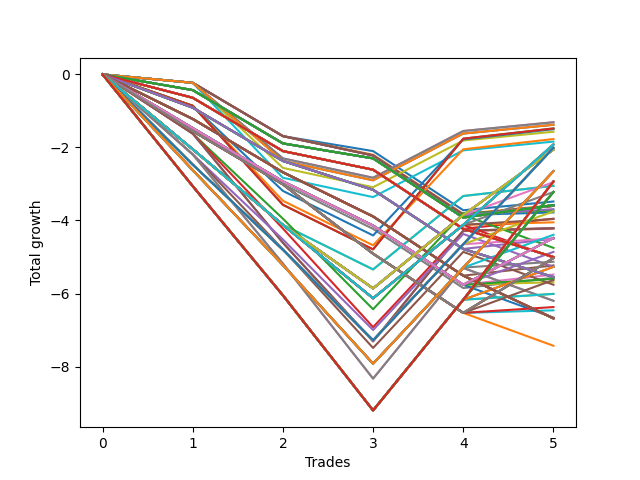

# Long HLT 646_extendedhours 
- Symbol: TSLA
- Date Range: 03/25/2024 - 05/17/2024
- Trading Period: 5:30-6:30
- Number of Trades: 5



| Id. | Name | Win Percent | Profit | Avg Profit / Trade | Avg Time / Trade | Std |      | Name | Win Percent | Profit | Avg Profit / Trade | Avg Time / Trade | Std |
| --- | ---- | ----------- | ------ | ------------------ | ---------------- | --- | ---- | ---- | ----------- | ------ | ------------------ | ---------------- | --- |
| | Sorted By <br> Profit | | | | | | | Sorted By <br> Win Percentage |||||
|0| TP-2 15m | 40.00 | -1.31 | -0.26 | 11:48 | 1.09 |     | TP-2 15m | 40.00 | -1.31 | -0.26 | 11:48 | 1.09 |
|1| TP-1.75 15m | 40.00 | -1.31 | -0.26 | 11:48 | 1.09 |     | TP-1.75 15m | 40.00 | -1.31 | -0.26 | 11:48 | 1.09 |
|2| TP-3 15m | 40.00 | -1.38 | -0.28 | 14:00 | 1.12 |     | TP-3 15m | 40.00 | -1.38 | -0.28 | 14:00 | 1.12 |
|3| TP-2.75 15m | 40.00 | -1.38 | -0.28 | 14:00 | 1.12 |     | TP-2.75 15m | 40.00 | -1.38 | -0.28 | 14:00 | 1.12 |
|4| TP-3 30m | 40.00 | -1.48 | -0.30 | 27:24 | 1.92 |     | TP-3 30m | 40.00 | -1.48 | -0.30 | 27:24 | 1.92 |
|5| TP-2.75 30m | 40.00 | -1.48 | -0.30 | 27:24 | 1.92 |     | TP-2.75 30m | 40.00 | -1.48 | -0.30 | 27:24 | 1.92 |
|6| TP-2.25 30m | 40.00 | -1.50 | -0.30 | 22:12 | 1.69 |     | TP-2.25 30m | 40.00 | -1.50 | -0.30 | 22:12 | 1.69 |
|7| TP-2.25 15m | 40.00 | -1.57 | -0.31 | 12:00 | 1.18 |     | TP-2.25 15m | 40.00 | -1.57 | -0.31 | 12:00 | 1.18 |
|8| TP-2.5 30m | 40.00 | -1.77 | -0.35 | 22:48 | 1.75 |     | TP-2.5 30m | 40.00 | -1.77 | -0.35 | 22:48 | 1.75 |
|9| TP-2.5 15m | 40.00 | -1.84 | -0.37 | 12:36 | 1.27 |     | TP-2.5 15m | 40.00 | -1.84 | -0.37 | 12:36 | 1.27 |
|10| TP-2 180m | 40.00 | -1.92 | -0.38 | 36:36 | 2.03 |     | TP-2 180m | 40.00 | -1.92 | -0.38 | 36:36 | 2.03 |
|11| TP-2 165m | 40.00 | -1.92 | -0.38 | 36:36 | 2.03 |     | TP-2 165m | 40.00 | -1.92 | -0.38 | 36:36 | 2.03 |
|12| TP-2 150m | 40.00 | -1.92 | -0.38 | 36:36 | 2.03 |     | TP-2 150m | 40.00 | -1.92 | -0.38 | 36:36 | 2.03 |
|13| TP-2 135m | 40.00 | -1.92 | -0.38 | 36:36 | 2.03 |     | TP-2 135m | 40.00 | -1.92 | -0.38 | 36:36 | 2.03 |
|14| TP-2 120m | 40.00 | -1.92 | -0.38 | 36:36 | 2.03 |     | TP-2 120m | 40.00 | -1.92 | -0.38 | 36:36 | 2.03 |
|15| TP-2 105m | 40.00 | -1.92 | -0.38 | 36:36 | 2.03 |     | TP-2 105m | 40.00 | -1.92 | -0.38 | 36:36 | 2.03 |
|16| TP-2.25 180m | 40.00 | -2.01 | -0.40 | 44:48 | 2.48 |     | TP-2.25 180m | 40.00 | -2.01 | -0.40 | 44:48 | 2.48 |
|17| TP-2.25 165m | 40.00 | -2.01 | -0.40 | 44:48 | 2.48 |     | TP-2.25 165m | 40.00 | -2.01 | -0.40 | 44:48 | 2.48 |
|18| TP-2.25 150m | 40.00 | -2.01 | -0.40 | 44:48 | 2.48 |     | TP-2.25 150m | 40.00 | -2.01 | -0.40 | 44:48 | 2.48 |
|19| TP-2.25 135m | 40.00 | -2.01 | -0.40 | 44:48 | 2.48 |     | TP-2.25 135m | 40.00 | -2.01 | -0.40 | 44:48 | 2.48 |
|20| TP-2.25 120m | 40.00 | -2.01 | -0.40 | 44:48 | 2.48 |     | TP-2.25 120m | 40.00 | -2.01 | -0.40 | 44:48 | 2.48 |
|21| TP-2.25 105m | 40.00 | -2.01 | -0.40 | 44:48 | 2.48 |     | TP-2.25 105m | 40.00 | -2.01 | -0.40 | 44:48 | 2.48 |
|22| TP-1.75 180m | 40.00 | -2.06 | -0.41 | 35:24 | 1.89 |     | TP-1.75 180m | 40.00 | -2.06 | -0.41 | 35:24 | 1.89 |
|23| TP-1.75 165m | 40.00 | -2.06 | -0.41 | 35:24 | 1.89 |     | TP-1.75 165m | 40.00 | -2.06 | -0.41 | 35:24 | 1.89 |
|24| TP-1.75 150m | 40.00 | -2.06 | -0.41 | 35:24 | 1.89 |     | TP-1.75 150m | 40.00 | -2.06 | -0.41 | 35:24 | 1.89 |
|25| TP-1.75 135m | 40.00 | -2.06 | -0.41 | 35:24 | 1.89 |     | TP-1.75 135m | 40.00 | -2.06 | -0.41 | 35:24 | 1.89 |
|26| TP-1.75 120m | 40.00 | -2.06 | -0.41 | 35:24 | 1.89 |     | TP-1.75 120m | 40.00 | -2.06 | -0.41 | 35:24 | 1.89 |
|27| TP-1.75 105m | 40.00 | -2.06 | -0.41 | 35:24 | 1.89 |     | TP-1.75 105m | 40.00 | -2.06 | -0.41 | 35:24 | 1.89 |
|28| TP-2.5 180m | 40.00 | -2.65 | -0.53 | 46:00 | 2.58 |     | TP-2.5 180m | 40.00 | -2.65 | -0.53 | 46:00 | 2.58 |
|29| TP-2.5 165m | 40.00 | -2.65 | -0.53 | 46:00 | 2.58 |     | TP-2.5 165m | 40.00 | -2.65 | -0.53 | 46:00 | 2.58 |
|30| TP-2.5 150m | 40.00 | -2.65 | -0.53 | 46:00 | 2.58 |     | TP-2.5 150m | 40.00 | -2.65 | -0.53 | 46:00 | 2.58 |
|31| TP-2.5 135m | 40.00 | -2.65 | -0.53 | 46:00 | 2.58 |     | TP-2.5 135m | 40.00 | -2.65 | -0.53 | 46:00 | 2.58 |
|32| TP-2.5 120m | 40.00 | -2.65 | -0.53 | 46:00 | 2.58 |     | TP-2.5 120m | 40.00 | -2.65 | -0.53 | 46:00 | 2.58 |
|33| TP-2.5 105m | 40.00 | -2.65 | -0.53 | 46:00 | 2.58 |     | TP-2.5 105m | 40.00 | -2.65 | -0.53 | 46:00 | 2.58 |
|34| TP-3 180m | 40.00 | -2.93 | -0.59 | 51:48 | 3.04 |     | TP-3 180m | 40.00 | -2.93 | -0.59 | 51:48 | 3.04 |
|35| TP-3 165m | 40.00 | -2.93 | -0.59 | 51:48 | 3.04 |     | TP-3 165m | 40.00 | -2.93 | -0.59 | 51:48 | 3.04 |
|36| TP-3 150m | 40.00 | -2.93 | -0.59 | 51:48 | 3.04 |     | TP-3 150m | 40.00 | -2.93 | -0.59 | 51:48 | 3.04 |
|37| TP-3 135m | 40.00 | -2.93 | -0.59 | 51:48 | 3.04 |     | TP-3 135m | 40.00 | -2.93 | -0.59 | 51:48 | 3.04 |
|38| TP-3 120m | 40.00 | -2.93 | -0.59 | 51:48 | 3.04 |     | TP-3 120m | 40.00 | -2.93 | -0.59 | 51:48 | 3.04 |
|39| TP-3 105m | 40.00 | -2.93 | -0.59 | 51:48 | 3.04 |     | TP-3 105m | 40.00 | -2.93 | -0.59 | 51:48 | 3.04 |
|40| TP-1.75 90m | 40.00 | -2.95 | -0.59 | 34:12 | 1.71 |     | TP-1.75 90m | 40.00 | -2.95 | -0.59 | 34:12 | 1.71 |
|41| TP-2 30m | 40.00 | -3.05 | -0.61 | 21:00 | 1.56 |     | TP-2 30m | 40.00 | -3.05 | -0.61 | 21:00 | 1.56 |
|42| TP-1.75 30m | 40.00 | -3.05 | -0.61 | 21:00 | 1.56 |     | TP-1.75 30m | 40.00 | -3.05 | -0.61 | 21:00 | 1.56 |
|43| TP-2.75 180m | 40.00 | -3.22 | -0.64 | 51:36 | 2.97 |     | TP-2.75 180m | 40.00 | -3.22 | -0.64 | 51:36 | 2.97 |
|44| TP-2.75 165m | 40.00 | -3.22 | -0.64 | 51:36 | 2.97 |     | TP-2.75 165m | 40.00 | -3.22 | -0.64 | 51:36 | 2.97 |
|45| TP-2.75 150m | 40.00 | -3.22 | -0.64 | 51:36 | 2.97 |     | TP-2.75 150m | 40.00 | -3.22 | -0.64 | 51:36 | 2.97 |
|46| TP-2.75 135m | 40.00 | -3.22 | -0.64 | 51:36 | 2.97 |     | TP-2.75 135m | 40.00 | -3.22 | -0.64 | 51:36 | 2.97 |
|47| TP-2.75 120m | 40.00 | -3.22 | -0.64 | 51:36 | 2.97 |     | TP-2.75 120m | 40.00 | -3.22 | -0.64 | 51:36 | 2.97 |
|48| TP-2.75 105m | 40.00 | -3.22 | -0.64 | 51:36 | 2.97 |     | TP-2.75 105m | 40.00 | -3.22 | -0.64 | 51:36 | 2.97 |
|49| TP-2 90m | 40.00 | -3.22 | -0.64 | 35:12 | 1.75 |     | TP-2 90m | 40.00 | -3.22 | -0.64 | 35:12 | 1.75 |
|50| TP-0.25 15m | 20.00 | -3.48 | -0.70 | 07:48 | 0.72 |     | TP-1.75 75m | 40.00 | -3.69 | -0.74 | 31:12 | 1.60 |
|51| TP-0.25 180m | 20.00 | -3.58 | -0.72 | 08:12 | 0.73 |     | TP-2.25 45m | 40.00 | -3.73 | -0.75 | 31:00 | 1.92 |
|52| TP-0.25 165m | 20.00 | -3.58 | -0.72 | 08:12 | 0.73 |     | TP-2.25 90m | 40.00 | -3.75 | -0.75 | 43:12 | 2.13 |
|53| TP-0.25 150m | 20.00 | -3.58 | -0.72 | 08:12 | 0.73 |     | TP-1.75 45m | 40.00 | -3.78 | -0.76 | 25:12 | 1.59 |
|54| TP-0.25 135m | 20.00 | -3.58 | -0.72 | 08:12 | 0.73 |     | TP-2 75m | 40.00 | -3.96 | -0.79 | 32:12 | 1.64 |
|55| TP-0.25 120m | 20.00 | -3.58 | -0.72 | 08:12 | 0.73 |     | TP-2 45m | 40.00 | -4.05 | -0.81 | 26:12 | 1.63 |
|56| TP-0.25 105m | 20.00 | -3.58 | -0.72 | 08:12 | 0.73 |     | TP-3 45m | 40.00 | -4.21 | -0.84 | 36:36 | 2.21 |
|57| TP-0.25 90m | 20.00 | -3.58 | -0.72 | 08:12 | 0.73 |     | TP-2.75 45m | 40.00 | -4.21 | -0.84 | 36:36 | 2.21 |
|58| TP-0.25 75m | 20.00 | -3.58 | -0.72 | 08:12 | 0.73 |     | TP-2.5 45m | 40.00 | -4.22 | -0.84 | 31:48 | 2.00 |
|59| TP-0.25 60m | 20.00 | -3.58 | -0.72 | 08:12 | 0.73 |     | TP-2.5 90m | 40.00 | -4.39 | -0.88 | 44:24 | 2.23 |
|60| TP-0.25 45m | 20.00 | -3.58 | -0.72 | 08:12 | 0.73 |     | TP-2.25 75m | 40.00 | -4.49 | -0.90 | 40:12 | 2.03 |
|61| TP-0.25 30m | 20.00 | -3.58 | -0.72 | 08:12 | 0.73 |     | TP-2.5 75m | 40.00 | -5.13 | -1.03 | 41:24 | 2.13 |
|62| TP-0.5 15m | 20.00 | -3.58 | -0.72 | 09:12 | 0.72 |     | TP-3 90m | 40.00 | -5.27 | -1.05 | 49:48 | 2.56 |
|63| TP-1.5 15m | 20.00 | -3.60 | -0.72 | 10:00 | 0.71 |     | TP-2.75 90m | 40.00 | -5.27 | -1.05 | 49:48 | 2.56 |
|64| TP-1.25 15m | 20.00 | -3.60 | -0.72 | 10:00 | 0.71 |     | TP-3 75m | 40.00 | -6.01 | -1.20 | 46:48 | 2.46 |
|65| TP-1 15m | 20.00 | -3.60 | -0.72 | 10:00 | 0.71 |     | TP-2.75 75m | 40.00 | -6.01 | -1.20 | 46:48 | 2.46 |
|66| TP-0.75 15m | 20.00 | -3.60 | -0.72 | 10:00 | 0.71 |     | TP-0.25 15m | 20.00 | -3.48 | -0.70 | 07:48 | 0.72 |
|67| TP-1.75 75m | 40.00 | -3.69 | -0.74 | 31:12 | 1.60 |     | TP-0.25 180m | 20.00 | -3.58 | -0.72 | 08:12 | 0.73 |
|68| TP-2.25 45m | 40.00 | -3.73 | -0.75 | 31:00 | 1.92 |     | TP-0.25 165m | 20.00 | -3.58 | -0.72 | 08:12 | 0.73 |
|69| TP-2.25 90m | 40.00 | -3.75 | -0.75 | 43:12 | 2.13 |     | TP-0.25 150m | 20.00 | -3.58 | -0.72 | 08:12 | 0.73 |
|70| TP-1.75 45m | 40.00 | -3.78 | -0.76 | 25:12 | 1.59 |     | TP-0.25 135m | 20.00 | -3.58 | -0.72 | 08:12 | 0.73 |
|71| TP-0.5 30m | 20.00 | -3.95 | -0.79 | 12:36 | 0.69 |     | TP-0.25 120m | 20.00 | -3.58 | -0.72 | 08:12 | 0.73 |
|72| TP-2 75m | 40.00 | -3.96 | -0.79 | 32:12 | 1.64 |     | TP-0.25 105m | 20.00 | -3.58 | -0.72 | 08:12 | 0.73 |
|73| TP-2 45m | 40.00 | -4.05 | -0.81 | 26:12 | 1.63 |     | TP-0.25 90m | 20.00 | -3.58 | -0.72 | 08:12 | 0.73 |
|74| TP-3 45m | 40.00 | -4.21 | -0.84 | 36:36 | 2.21 |     | TP-0.25 75m | 20.00 | -3.58 | -0.72 | 08:12 | 0.73 |
|75| TP-2.75 45m | 40.00 | -4.21 | -0.84 | 36:36 | 2.21 |     | TP-0.25 60m | 20.00 | -3.58 | -0.72 | 08:12 | 0.73 |
|76| TP-2.5 45m | 40.00 | -4.22 | -0.84 | 31:48 | 2.00 |     | TP-0.25 45m | 20.00 | -3.58 | -0.72 | 08:12 | 0.73 |
|77| TP-2.5 90m | 40.00 | -4.39 | -0.88 | 44:24 | 2.23 |     | TP-0.25 30m | 20.00 | -3.58 | -0.72 | 08:12 | 0.73 |
|78| TP-1.25 180m | 20.00 | -4.48 | -0.90 | 29:12 | 1.10 |     | TP-0.5 15m | 20.00 | -3.58 | -0.72 | 09:12 | 0.72 |
|79| TP-1.25 165m | 20.00 | -4.48 | -0.90 | 29:12 | 1.10 |     | TP-1.5 15m | 20.00 | -3.60 | -0.72 | 10:00 | 0.71 |
|80| TP-1.25 150m | 20.00 | -4.48 | -0.90 | 29:12 | 1.10 |     | TP-1.25 15m | 20.00 | -3.60 | -0.72 | 10:00 | 0.71 |
|81| TP-1.25 135m | 20.00 | -4.48 | -0.90 | 29:12 | 1.10 |     | TP-1 15m | 20.00 | -3.60 | -0.72 | 10:00 | 0.71 |
|82| TP-1.25 120m | 20.00 | -4.48 | -0.90 | 29:12 | 1.10 |     | TP-0.75 15m | 20.00 | -3.60 | -0.72 | 10:00 | 0.71 |
|83| TP-1.25 105m | 20.00 | -4.48 | -0.90 | 29:12 | 1.10 |     | TP-0.5 30m | 20.00 | -3.95 | -0.79 | 12:36 | 0.69 |
|84| TP-2.25 75m | 40.00 | -4.49 | -0.90 | 40:12 | 2.03 |     | TP-1.25 180m | 20.00 | -4.48 | -0.90 | 29:12 | 1.10 |
|85| TP-0.75 30m | 20.00 | -4.50 | -0.90 | 14:24 | 0.67 |     | TP-1.25 165m | 20.00 | -4.48 | -0.90 | 29:12 | 1.10 |
|86| TP-1.75 60m | 20.00 | -4.75 | -0.95 | 28:12 | 1.54 |     | TP-1.25 150m | 20.00 | -4.48 | -0.90 | 29:12 | 1.10 |
|87| TP-1.25 90m | 20.00 | -4.86 | -0.97 | 28:36 | 0.95 |     | TP-1.25 135m | 20.00 | -4.48 | -0.90 | 29:12 | 1.10 |
|88| TP-0.5 180m | 0.00 | -5.00 | -1.00 | 14:00 | 0.45 |     | TP-1.25 120m | 20.00 | -4.48 | -0.90 | 29:12 | 1.10 |
|89| TP-0.5 165m | 0.00 | -5.00 | -1.00 | 14:00 | 0.45 |     | TP-1.25 105m | 20.00 | -4.48 | -0.90 | 29:12 | 1.10 |
|90| TP-0.5 150m | 0.00 | -5.00 | -1.00 | 14:00 | 0.45 |     | TP-0.75 30m | 20.00 | -4.50 | -0.90 | 14:24 | 0.67 |
|91| TP-0.5 135m | 0.00 | -5.00 | -1.00 | 14:00 | 0.45 |     | TP-1.75 60m | 20.00 | -4.75 | -0.95 | 28:12 | 1.54 |
|92| TP-0.5 120m | 0.00 | -5.00 | -1.00 | 14:00 | 0.45 |     | TP-1.25 90m | 20.00 | -4.86 | -0.97 | 28:36 | 0.95 |
|93| TP-0.5 105m | 0.00 | -5.00 | -1.00 | 14:00 | 0.45 |     | TP-2 60m | 20.00 | -5.02 | -1.00 | 29:12 | 1.57 |
|94| TP-0.5 90m | 0.00 | -5.00 | -1.00 | 14:00 | 0.45 |     | TP-1.5 180m | 20.00 | -5.03 | -1.01 | 31:36 | 1.26 |
|95| TP-0.5 75m | 0.00 | -5.00 | -1.00 | 14:00 | 0.45 |     | TP-1.5 165m | 20.00 | -5.03 | -1.01 | 31:36 | 1.26 |
|96| TP-0.5 60m | 0.00 | -5.00 | -1.00 | 14:00 | 0.45 |     | TP-1.5 150m | 20.00 | -5.03 | -1.01 | 31:36 | 1.26 |
|97| TP-0.5 45m | 0.00 | -5.00 | -1.00 | 14:00 | 0.45 |     | TP-1.5 135m | 20.00 | -5.03 | -1.01 | 31:36 | 1.26 |
|98| TP-2 60m | 20.00 | -5.02 | -1.00 | 29:12 | 1.57 |     | TP-1.5 120m | 20.00 | -5.03 | -1.01 | 31:36 | 1.26 |
|99| TP-1.5 180m | 20.00 | -5.03 | -1.01 | 31:36 | 1.26 |     | TP-1.5 105m | 20.00 | -5.03 | -1.01 | 31:36 | 1.26 |
|100| TP-1.5 165m | 20.00 | -5.03 | -1.01 | 31:36 | 1.26 |     | TP-1 30m | 20.00 | -5.23 | -1.05 | 15:48 | 0.68 |
|101| TP-1.5 150m | 20.00 | -5.03 | -1.01 | 31:36 | 1.26 |     | TP-2.25 60m | 20.00 | -5.27 | -1.05 | 37:00 | 1.93 |
|102| TP-1.5 135m | 20.00 | -5.03 | -1.01 | 31:36 | 1.26 |     | TP-1.25 30m | 20.00 | -5.48 | -1.10 | 16:36 | 0.70 |
|103| TP-1.5 120m | 20.00 | -5.03 | -1.01 | 31:36 | 1.26 |     | TP-1.5 30m | 20.00 | -5.57 | -1.11 | 18:00 | 0.71 |
|104| TP-1.5 105m | 20.00 | -5.03 | -1.01 | 31:36 | 1.26 |     | TP-1.25 75m | 20.00 | -5.60 | -1.12 | 25:36 | 0.65 |
|105| TP-2.5 75m | 40.00 | -5.13 | -1.03 | 41:24 | 2.13 |     | TP-1.5 90m | 20.00 | -5.63 | -1.13 | 30:48 | 1.02 |
|106| TP-1 30m | 20.00 | -5.23 | -1.05 | 15:48 | 0.68 |     | TP-1.25 45m | 20.00 | -5.69 | -1.14 | 19:36 | 0.62 |
|107| TP-3 90m | 40.00 | -5.27 | -1.05 | 49:48 | 2.56 |     | TP-2.5 60m | 20.00 | -5.76 | -1.15 | 37:48 | 2.00 |
|108| TP-2.75 90m | 40.00 | -5.27 | -1.05 | 49:48 | 2.56 |     | TP-3 60m | 20.00 | -6.20 | -1.24 | 42:48 | 2.28 |
|109| TP-2.25 60m | 20.00 | -5.27 | -1.05 | 37:00 | 1.93 |     | TP-2.75 60m | 20.00 | -6.20 | -1.24 | 42:48 | 2.28 |
|110| TP-1.25 30m | 20.00 | -5.48 | -1.10 | 16:36 | 0.70 |     | TP-1.5 75m | 20.00 | -6.37 | -1.27 | 27:48 | 0.73 |
|111| TP-0.75 180m | 0.00 | -5.55 | -1.11 | 15:48 | 0.36 |     | TP-1.5 45m | 20.00 | -6.46 | -1.29 | 21:48 | 0.70 |
|112| TP-0.75 165m | 0.00 | -5.55 | -1.11 | 15:48 | 0.36 |     | TP-0.5 180m | 0.00 | -5.00 | -1.00 | 14:00 | 0.45 |
|113| TP-0.75 150m | 0.00 | -5.55 | -1.11 | 15:48 | 0.36 |     | TP-0.5 165m | 0.00 | -5.00 | -1.00 | 14:00 | 0.45 |
|114| TP-0.75 135m | 0.00 | -5.55 | -1.11 | 15:48 | 0.36 |     | TP-0.5 150m | 0.00 | -5.00 | -1.00 | 14:00 | 0.45 |
|115| TP-0.75 120m | 0.00 | -5.55 | -1.11 | 15:48 | 0.36 |     | TP-0.5 135m | 0.00 | -5.00 | -1.00 | 14:00 | 0.45 |
|116| TP-0.75 105m | 0.00 | -5.55 | -1.11 | 15:48 | 0.36 |     | TP-0.5 120m | 0.00 | -5.00 | -1.00 | 14:00 | 0.45 |
|117| TP-0.75 90m | 0.00 | -5.55 | -1.11 | 15:48 | 0.36 |     | TP-0.5 105m | 0.00 | -5.00 | -1.00 | 14:00 | 0.45 |
|118| TP-0.75 75m | 0.00 | -5.55 | -1.11 | 15:48 | 0.36 |     | TP-0.5 90m | 0.00 | -5.00 | -1.00 | 14:00 | 0.45 |
|119| TP-0.75 60m | 0.00 | -5.55 | -1.11 | 15:48 | 0.36 |     | TP-0.5 75m | 0.00 | -5.00 | -1.00 | 14:00 | 0.45 |
|120| TP-0.75 45m | 0.00 | -5.55 | -1.11 | 15:48 | 0.36 |     | TP-0.5 60m | 0.00 | -5.00 | -1.00 | 14:00 | 0.45 |
|121| TP-1.5 30m | 20.00 | -5.57 | -1.11 | 18:00 | 0.71 |     | TP-0.5 45m | 0.00 | -5.00 | -1.00 | 14:00 | 0.45 |
|122| TP-1.25 75m | 20.00 | -5.60 | -1.12 | 25:36 | 0.65 |     | TP-0.75 180m | 0.00 | -5.55 | -1.11 | 15:48 | 0.36 |
|123| TP-1.5 90m | 20.00 | -5.63 | -1.13 | 30:48 | 1.02 |     | TP-0.75 165m | 0.00 | -5.55 | -1.11 | 15:48 | 0.36 |
|124| TP-1.25 45m | 20.00 | -5.69 | -1.14 | 19:36 | 0.62 |     | TP-0.75 150m | 0.00 | -5.55 | -1.11 | 15:48 | 0.36 |
|125| TP-2.5 60m | 20.00 | -5.76 | -1.15 | 37:48 | 2.00 |     | TP-0.75 135m | 0.00 | -5.55 | -1.11 | 15:48 | 0.36 |
|126| TP-3 75m | 40.00 | -6.01 | -1.20 | 46:48 | 2.46 |     | TP-0.75 120m | 0.00 | -5.55 | -1.11 | 15:48 | 0.36 |
|127| TP-2.75 75m | 40.00 | -6.01 | -1.20 | 46:48 | 2.46 |     | TP-0.75 105m | 0.00 | -5.55 | -1.11 | 15:48 | 0.36 |
|128| TP-3 60m | 20.00 | -6.20 | -1.24 | 42:48 | 2.28 |     | TP-0.75 90m | 0.00 | -5.55 | -1.11 | 15:48 | 0.36 |
|129| TP-2.75 60m | 20.00 | -6.20 | -1.24 | 42:48 | 2.28 |     | TP-0.75 75m | 0.00 | -5.55 | -1.11 | 15:48 | 0.36 |
|130| TP-1.5 75m | 20.00 | -6.37 | -1.27 | 27:48 | 0.73 |     | TP-0.75 60m | 0.00 | -5.55 | -1.11 | 15:48 | 0.36 |
|131| TP-1.5 45m | 20.00 | -6.46 | -1.29 | 21:48 | 0.70 |     | TP-0.75 45m | 0.00 | -5.55 | -1.11 | 15:48 | 0.36 |
|132| TP-1.25 60m | 0.00 | -6.66 | -1.33 | 22:36 | 0.25 |     | TP-1.25 60m | 0.00 | -6.66 | -1.33 | 22:36 | 0.25 |
|133| TP-1 180m | 0.00 | -6.68 | -1.34 | 18:24 | 0.17 |     | TP-1 180m | 0.00 | -6.68 | -1.34 | 18:24 | 0.17 |
|134| TP-1 165m | 0.00 | -6.68 | -1.34 | 18:24 | 0.17 |     | TP-1 165m | 0.00 | -6.68 | -1.34 | 18:24 | 0.17 |
|135| TP-1 150m | 0.00 | -6.68 | -1.34 | 18:24 | 0.17 |     | TP-1 150m | 0.00 | -6.68 | -1.34 | 18:24 | 0.17 |
|136| TP-1 135m | 0.00 | -6.68 | -1.34 | 18:24 | 0.17 |     | TP-1 135m | 0.00 | -6.68 | -1.34 | 18:24 | 0.17 |
|137| TP-1 120m | 0.00 | -6.68 | -1.34 | 18:24 | 0.17 |     | TP-1 120m | 0.00 | -6.68 | -1.34 | 18:24 | 0.17 |
|138| TP-1 105m | 0.00 | -6.68 | -1.34 | 18:24 | 0.17 |     | TP-1 105m | 0.00 | -6.68 | -1.34 | 18:24 | 0.17 |
|139| TP-1 90m | 0.00 | -6.68 | -1.34 | 18:24 | 0.17 |     | TP-1 90m | 0.00 | -6.68 | -1.34 | 18:24 | 0.17 |
|140| TP-1 75m | 0.00 | -6.68 | -1.34 | 18:24 | 0.17 |     | TP-1 75m | 0.00 | -6.68 | -1.34 | 18:24 | 0.17 |
|141| TP-1 60m | 0.00 | -6.68 | -1.34 | 18:24 | 0.17 |     | TP-1 60m | 0.00 | -6.68 | -1.34 | 18:24 | 0.17 |
|142| TP-1 45m | 0.00 | -6.68 | -1.34 | 18:24 | 0.17 |     | TP-1 45m | 0.00 | -6.68 | -1.34 | 18:24 | 0.17 |
|143| TP-1.5 60m | 0.00 | -7.43 | -1.49 | 24:48 | 0.33 |     | TP-1.5 60m | 0.00 | -7.43 | -1.49 | 24:48 | 0.33 |

### Test TP-0.25 15m
* Take Profit of 0.25 Point
* 0.25 Stoploss
* Results:
```
Total Trades: 5
Percent Up: 20.00
Percent Down: 80.00
Total Points Moved Up: -3.48
Potential Profit: -1740.00
Total Points Ups: 0.24 Count Ups: 1
Total Points Downs: -3.72 Count Downs: 4
```

<details><summary>Trades</summary>

<code>In: 2024-03-28 06:05:00		Out: 2024-03-28 06:19:00		Total Position Time: 14:00		Total Move Up: -0.23		Total to Date: -0.23</code> <br />
<code>In: 2024-03-28 06:35:00		Out: 2024-03-28 06:37:00		Total Position Time: 02:00		Total Move Up: -1.46		Total to Date: -1.69</code> <br />
<code>In: 2024-04-05 05:55:00		Out: 2024-04-05 05:58:00		Total Position Time: 03:00		Total Move Up: -0.41		Total to Date: -2.10</code> <br />
<code>In: 2024-04-25 06:20:00		Out: 2024-04-25 06:26:00		Total Position Time: 06:00		Total Move Up: -1.62		Total to Date: -3.72</code> <br />
<code>In: 2024-05-17 05:55:00		Out: 2024-05-17 06:09:00		Total Position Time: 14:00		Total Move Up: 0.24		Total to Date: -3.48</code> <br />


</details>

### Test TP-0.5 15m
* Take Profit of 0.5 Point
* 0.5 Stoploss
* Results:
```
Total Trades: 5
Percent Up: 20.00
Percent Down: 80.00
Total Points Moved Up: -3.58
Potential Profit: -1790.00
Total Points Ups: 0.24 Count Ups: 1
Total Points Downs: -3.82 Count Downs: 4
```

<details><summary>Trades</summary>

<code>In: 2024-03-28 06:05:00		Out: 2024-03-28 06:19:00		Total Position Time: 14:00		Total Move Up: -0.23		Total to Date: -0.23</code> <br />
<code>In: 2024-03-28 06:35:00		Out: 2024-03-28 06:37:00		Total Position Time: 02:00		Total Move Up: -1.46		Total to Date: -1.69</code> <br />
<code>In: 2024-04-05 05:55:00		Out: 2024-04-05 06:05:00		Total Position Time: 10:00		Total Move Up: -0.51		Total to Date: -2.20</code> <br />
<code>In: 2024-04-25 06:20:00		Out: 2024-04-25 06:26:00		Total Position Time: 06:00		Total Move Up: -1.62		Total to Date: -3.82</code> <br />
<code>In: 2024-05-17 05:55:00		Out: 2024-05-17 06:09:00		Total Position Time: 14:00		Total Move Up: 0.24		Total to Date: -3.58</code> <br />


</details>

### Test TP-0.75 15m
* Take Profit of 0.75 Point
* 0.75 Stoploss
* Results:
```
Total Trades: 5
Percent Up: 20.00
Percent Down: 80.00
Total Points Moved Up: -3.60
Potential Profit: -1800.00
Total Points Ups: 0.24 Count Ups: 1
Total Points Downs: -3.84 Count Downs: 4
```

<details><summary>Trades</summary>

<code>In: 2024-03-28 06:05:00		Out: 2024-03-28 06:19:00		Total Position Time: 14:00		Total Move Up: -0.23		Total to Date: -0.23</code> <br />
<code>In: 2024-03-28 06:35:00		Out: 2024-03-28 06:37:00		Total Position Time: 02:00		Total Move Up: -1.46		Total to Date: -1.69</code> <br />
<code>In: 2024-04-05 05:55:00		Out: 2024-04-05 06:09:00		Total Position Time: 14:00		Total Move Up: -0.53		Total to Date: -2.22</code> <br />
<code>In: 2024-04-25 06:20:00		Out: 2024-04-25 06:26:00		Total Position Time: 06:00		Total Move Up: -1.62		Total to Date: -3.84</code> <br />
<code>In: 2024-05-17 05:55:00		Out: 2024-05-17 06:09:00		Total Position Time: 14:00		Total Move Up: 0.24		Total to Date: -3.60</code> <br />


</details>

### Test TP-1 15m
* Take Profit of 1 Point
* 1 Stoploss
* Results:
```
Total Trades: 5
Percent Up: 20.00
Percent Down: 80.00
Total Points Moved Up: -3.60
Potential Profit: -1800.00
Total Points Ups: 0.24 Count Ups: 1
Total Points Downs: -3.84 Count Downs: 4
```

<details><summary>Trades</summary>

<code>In: 2024-03-28 06:05:00		Out: 2024-03-28 06:19:00		Total Position Time: 14:00		Total Move Up: -0.23		Total to Date: -0.23</code> <br />
<code>In: 2024-03-28 06:35:00		Out: 2024-03-28 06:37:00		Total Position Time: 02:00		Total Move Up: -1.46		Total to Date: -1.69</code> <br />
<code>In: 2024-04-05 05:55:00		Out: 2024-04-05 06:09:00		Total Position Time: 14:00		Total Move Up: -0.53		Total to Date: -2.22</code> <br />
<code>In: 2024-04-25 06:20:00		Out: 2024-04-25 06:26:00		Total Position Time: 06:00		Total Move Up: -1.62		Total to Date: -3.84</code> <br />
<code>In: 2024-05-17 05:55:00		Out: 2024-05-17 06:09:00		Total Position Time: 14:00		Total Move Up: 0.24		Total to Date: -3.60</code> <br />


</details>

### Test TP-1.25 15m
* Take Profit of 1.25 Point
* 1.25 Stoploss
* Results:
```
Total Trades: 5
Percent Up: 20.00
Percent Down: 80.00
Total Points Moved Up: -3.60
Potential Profit: -1800.00
Total Points Ups: 0.24 Count Ups: 1
Total Points Downs: -3.84 Count Downs: 4
```

<details><summary>Trades</summary>

<code>In: 2024-03-28 06:05:00		Out: 2024-03-28 06:19:00		Total Position Time: 14:00		Total Move Up: -0.23		Total to Date: -0.23</code> <br />
<code>In: 2024-03-28 06:35:00		Out: 2024-03-28 06:37:00		Total Position Time: 02:00		Total Move Up: -1.46		Total to Date: -1.69</code> <br />
<code>In: 2024-04-05 05:55:00		Out: 2024-04-05 06:09:00		Total Position Time: 14:00		Total Move Up: -0.53		Total to Date: -2.22</code> <br />
<code>In: 2024-04-25 06:20:00		Out: 2024-04-25 06:26:00		Total Position Time: 06:00		Total Move Up: -1.62		Total to Date: -3.84</code> <br />
<code>In: 2024-05-17 05:55:00		Out: 2024-05-17 06:09:00		Total Position Time: 14:00		Total Move Up: 0.24		Total to Date: -3.60</code> <br />


</details>

### Test TP-1.5 15m
* Take Profit of 1.5 Point
* 1.5 Stoploss
* Results:
```
Total Trades: 5
Percent Up: 20.00
Percent Down: 80.00
Total Points Moved Up: -3.60
Potential Profit: -1800.00
Total Points Ups: 0.24 Count Ups: 1
Total Points Downs: -3.84 Count Downs: 4
```

<details><summary>Trades</summary>

<code>In: 2024-03-28 06:05:00		Out: 2024-03-28 06:19:00		Total Position Time: 14:00		Total Move Up: -0.23		Total to Date: -0.23</code> <br />
<code>In: 2024-03-28 06:35:00		Out: 2024-03-28 06:37:00		Total Position Time: 02:00		Total Move Up: -1.46		Total to Date: -1.69</code> <br />
<code>In: 2024-04-05 05:55:00		Out: 2024-04-05 06:09:00		Total Position Time: 14:00		Total Move Up: -0.53		Total to Date: -2.22</code> <br />
<code>In: 2024-04-25 06:20:00		Out: 2024-04-25 06:26:00		Total Position Time: 06:00		Total Move Up: -1.62		Total to Date: -3.84</code> <br />
<code>In: 2024-05-17 05:55:00		Out: 2024-05-17 06:09:00		Total Position Time: 14:00		Total Move Up: 0.24		Total to Date: -3.60</code> <br />


</details>

### Test TP-1.75 15m
* Take Profit of 1.75 Point
* 1.75 Stoploss
* Results:
```
Total Trades: 5
Percent Up: 40.00
Percent Down: 60.00
Total Points Moved Up: -1.31
Potential Profit: -655.00
Total Points Ups: 1.52 Count Ups: 2
Total Points Downs: -2.83 Count Downs: 3
```

<details><summary>Trades</summary>

<code>In: 2024-03-28 06:05:00		Out: 2024-03-28 06:19:00		Total Position Time: 14:00		Total Move Up: -0.23		Total to Date: -0.23</code> <br />
<code>In: 2024-03-28 06:35:00		Out: 2024-03-28 06:38:00		Total Position Time: 03:00		Total Move Up: -2.07		Total to Date: -2.30</code> <br />
<code>In: 2024-04-05 05:55:00		Out: 2024-04-05 06:09:00		Total Position Time: 14:00		Total Move Up: -0.53		Total to Date: -2.83</code> <br />
<code>In: 2024-04-25 06:20:00		Out: 2024-04-25 06:34:00		Total Position Time: 14:00		Total Move Up: 1.28		Total to Date: -1.55</code> <br />
<code>In: 2024-05-17 05:55:00		Out: 2024-05-17 06:09:00		Total Position Time: 14:00		Total Move Up: 0.24		Total to Date: -1.31</code> <br />


</details>

### Test TP-2 15m
* Take Profit of 2 Point
* 2 Stoploss
* Results:
```
Total Trades: 5
Percent Up: 40.00
Percent Down: 60.00
Total Points Moved Up: -1.31
Potential Profit: -655.00
Total Points Ups: 1.52 Count Ups: 2
Total Points Downs: -2.83 Count Downs: 3
```

<details><summary>Trades</summary>

<code>In: 2024-03-28 06:05:00		Out: 2024-03-28 06:19:00		Total Position Time: 14:00		Total Move Up: -0.23		Total to Date: -0.23</code> <br />
<code>In: 2024-03-28 06:35:00		Out: 2024-03-28 06:38:00		Total Position Time: 03:00		Total Move Up: -2.07		Total to Date: -2.30</code> <br />
<code>In: 2024-04-05 05:55:00		Out: 2024-04-05 06:09:00		Total Position Time: 14:00		Total Move Up: -0.53		Total to Date: -2.83</code> <br />
<code>In: 2024-04-25 06:20:00		Out: 2024-04-25 06:34:00		Total Position Time: 14:00		Total Move Up: 1.28		Total to Date: -1.55</code> <br />
<code>In: 2024-05-17 05:55:00		Out: 2024-05-17 06:09:00		Total Position Time: 14:00		Total Move Up: 0.24		Total to Date: -1.31</code> <br />


</details>

### Test TP-2.25 15m
* Take Profit of 2.25 Point
* 2.25 Stoploss
* Results:
```
Total Trades: 5
Percent Up: 40.00
Percent Down: 60.00
Total Points Moved Up: -1.57
Potential Profit: -785.00
Total Points Ups: 1.52 Count Ups: 2
Total Points Downs: -3.09 Count Downs: 3
```

<details><summary>Trades</summary>

<code>In: 2024-03-28 06:05:00		Out: 2024-03-28 06:19:00		Total Position Time: 14:00		Total Move Up: -0.23		Total to Date: -0.23</code> <br />
<code>In: 2024-03-28 06:35:00		Out: 2024-03-28 06:39:00		Total Position Time: 04:00		Total Move Up: -2.33		Total to Date: -2.56</code> <br />
<code>In: 2024-04-05 05:55:00		Out: 2024-04-05 06:09:00		Total Position Time: 14:00		Total Move Up: -0.53		Total to Date: -3.09</code> <br />
<code>In: 2024-04-25 06:20:00		Out: 2024-04-25 06:34:00		Total Position Time: 14:00		Total Move Up: 1.28		Total to Date: -1.81</code> <br />
<code>In: 2024-05-17 05:55:00		Out: 2024-05-17 06:09:00		Total Position Time: 14:00		Total Move Up: 0.24		Total to Date: -1.57</code> <br />


</details>

### Test TP-2.5 15m
* Take Profit of 2.5 Point
* 2.5 Stoploss
* Results:
```
Total Trades: 5
Percent Up: 40.00
Percent Down: 60.00
Total Points Moved Up: -1.84
Potential Profit: -920.00
Total Points Ups: 1.52 Count Ups: 2
Total Points Downs: -3.36 Count Downs: 3
```

<details><summary>Trades</summary>

<code>In: 2024-03-28 06:05:00		Out: 2024-03-28 06:19:00		Total Position Time: 14:00		Total Move Up: -0.23		Total to Date: -0.23</code> <br />
<code>In: 2024-03-28 06:35:00		Out: 2024-03-28 06:42:00		Total Position Time: 07:00		Total Move Up: -2.60		Total to Date: -2.83</code> <br />
<code>In: 2024-04-05 05:55:00		Out: 2024-04-05 06:09:00		Total Position Time: 14:00		Total Move Up: -0.53		Total to Date: -3.36</code> <br />
<code>In: 2024-04-25 06:20:00		Out: 2024-04-25 06:34:00		Total Position Time: 14:00		Total Move Up: 1.28		Total to Date: -2.08</code> <br />
<code>In: 2024-05-17 05:55:00		Out: 2024-05-17 06:09:00		Total Position Time: 14:00		Total Move Up: 0.24		Total to Date: -1.84</code> <br />


</details>

### Test TP-2.75 15m
* Take Profit of 2.75 Point
* 2.75 Stoploss
* Results:
```
Total Trades: 5
Percent Up: 40.00
Percent Down: 60.00
Total Points Moved Up: -1.38
Potential Profit: -690.00
Total Points Ups: 1.52 Count Ups: 2
Total Points Downs: -2.90 Count Downs: 3
```

<details><summary>Trades</summary>

<code>In: 2024-03-28 06:05:00		Out: 2024-03-28 06:19:00		Total Position Time: 14:00		Total Move Up: -0.23		Total to Date: -0.23</code> <br />
<code>In: 2024-03-28 06:35:00		Out: 2024-03-28 06:49:00		Total Position Time: 14:00		Total Move Up: -2.14		Total to Date: -2.37</code> <br />
<code>In: 2024-04-05 05:55:00		Out: 2024-04-05 06:09:00		Total Position Time: 14:00		Total Move Up: -0.53		Total to Date: -2.90</code> <br />
<code>In: 2024-04-25 06:20:00		Out: 2024-04-25 06:34:00		Total Position Time: 14:00		Total Move Up: 1.28		Total to Date: -1.62</code> <br />
<code>In: 2024-05-17 05:55:00		Out: 2024-05-17 06:09:00		Total Position Time: 14:00		Total Move Up: 0.24		Total to Date: -1.38</code> <br />


</details>

### Test TP-3 15m
* Take Profit of 3 Point
* 3 Stoploss
* Results:
```
Total Trades: 5
Percent Up: 40.00
Percent Down: 60.00
Total Points Moved Up: -1.38
Potential Profit: -690.00
Total Points Ups: 1.52 Count Ups: 2
Total Points Downs: -2.90 Count Downs: 3
```

<details><summary>Trades</summary>

<code>In: 2024-03-28 06:05:00		Out: 2024-03-28 06:19:00		Total Position Time: 14:00		Total Move Up: -0.23		Total to Date: -0.23</code> <br />
<code>In: 2024-03-28 06:35:00		Out: 2024-03-28 06:49:00		Total Position Time: 14:00		Total Move Up: -2.14		Total to Date: -2.37</code> <br />
<code>In: 2024-04-05 05:55:00		Out: 2024-04-05 06:09:00		Total Position Time: 14:00		Total Move Up: -0.53		Total to Date: -2.90</code> <br />
<code>In: 2024-04-25 06:20:00		Out: 2024-04-25 06:34:00		Total Position Time: 14:00		Total Move Up: 1.28		Total to Date: -1.62</code> <br />
<code>In: 2024-05-17 05:55:00		Out: 2024-05-17 06:09:00		Total Position Time: 14:00		Total Move Up: 0.24		Total to Date: -1.38</code> <br />


</details>

### Test TP-0.25 30m
* Take Profit of 0.25 Point
* 0.25 Stoploss
* Results:
```
Total Trades: 5
Percent Up: 20.00
Percent Down: 80.00
Total Points Moved Up: -3.58
Potential Profit: -1790.00
Total Points Ups: 0.34 Count Ups: 1
Total Points Downs: -3.92 Count Downs: 4
```

<details><summary>Trades</summary>

<code>In: 2024-03-28 06:05:00		Out: 2024-03-28 06:20:00		Total Position Time: 15:00		Total Move Up: -0.43		Total to Date: -0.43</code> <br />
<code>In: 2024-03-28 06:35:00		Out: 2024-03-28 06:37:00		Total Position Time: 02:00		Total Move Up: -1.46		Total to Date: -1.89</code> <br />
<code>In: 2024-04-05 05:55:00		Out: 2024-04-05 05:58:00		Total Position Time: 03:00		Total Move Up: -0.41		Total to Date: -2.30</code> <br />
<code>In: 2024-04-25 06:20:00		Out: 2024-04-25 06:26:00		Total Position Time: 06:00		Total Move Up: -1.62		Total to Date: -3.92</code> <br />
<code>In: 2024-05-17 05:55:00		Out: 2024-05-17 06:10:00		Total Position Time: 15:00		Total Move Up: 0.34		Total to Date: -3.58</code> <br />


</details>

### Test TP-0.5 30m
* Take Profit of 0.5 Point
* 0.5 Stoploss
* Results:
```
Total Trades: 5
Percent Up: 20.00
Percent Down: 80.00
Total Points Moved Up: -3.95
Potential Profit: -1975.00
Total Points Ups: 0.28 Count Ups: 1
Total Points Downs: -4.23 Count Downs: 4
```

<details><summary>Trades</summary>

<code>In: 2024-03-28 06:05:00		Out: 2024-03-28 06:21:00		Total Position Time: 16:00		Total Move Up: -0.64		Total to Date: -0.64</code> <br />
<code>In: 2024-03-28 06:35:00		Out: 2024-03-28 06:37:00		Total Position Time: 02:00		Total Move Up: -1.46		Total to Date: -2.10</code> <br />
<code>In: 2024-04-05 05:55:00		Out: 2024-04-05 06:05:00		Total Position Time: 10:00		Total Move Up: -0.51		Total to Date: -2.61</code> <br />
<code>In: 2024-04-25 06:20:00		Out: 2024-04-25 06:26:00		Total Position Time: 06:00		Total Move Up: -1.62		Total to Date: -4.23</code> <br />
<code>In: 2024-05-17 05:55:00		Out: 2024-05-17 06:24:00		Total Position Time: 29:00		Total Move Up: 0.28		Total to Date: -3.95</code> <br />


</details>

### Test TP-0.75 30m
* Take Profit of 0.75 Point
* 0.75 Stoploss
* Results:
```
Total Trades: 5
Percent Up: 20.00
Percent Down: 80.00
Total Points Moved Up: -4.50
Potential Profit: -2250.00
Total Points Ups: 0.28 Count Ups: 1
Total Points Downs: -4.78 Count Downs: 4
```

<details><summary>Trades</summary>

<code>In: 2024-03-28 06:05:00		Out: 2024-03-28 06:23:00		Total Position Time: 18:00		Total Move Up: -0.91		Total to Date: -0.91</code> <br />
<code>In: 2024-03-28 06:35:00		Out: 2024-03-28 06:37:00		Total Position Time: 02:00		Total Move Up: -1.46		Total to Date: -2.37</code> <br />
<code>In: 2024-04-05 05:55:00		Out: 2024-04-05 06:12:00		Total Position Time: 17:00		Total Move Up: -0.79		Total to Date: -3.16</code> <br />
<code>In: 2024-04-25 06:20:00		Out: 2024-04-25 06:26:00		Total Position Time: 06:00		Total Move Up: -1.62		Total to Date: -4.78</code> <br />
<code>In: 2024-05-17 05:55:00		Out: 2024-05-17 06:24:00		Total Position Time: 29:00		Total Move Up: 0.28		Total to Date: -4.50</code> <br />


</details>

### Test TP-1 30m
* Take Profit of 1 Point
* 1 Stoploss
* Results:
```
Total Trades: 5
Percent Up: 20.00
Percent Down: 80.00
Total Points Moved Up: -5.23
Potential Profit: -2615.00
Total Points Ups: 0.28 Count Ups: 1
Total Points Downs: -5.51 Count Downs: 4
```

<details><summary>Trades</summary>

<code>In: 2024-03-28 06:05:00		Out: 2024-03-28 06:24:00		Total Position Time: 19:00		Total Move Up: -1.22		Total to Date: -1.22</code> <br />
<code>In: 2024-03-28 06:35:00		Out: 2024-03-28 06:37:00		Total Position Time: 02:00		Total Move Up: -1.46		Total to Date: -2.68</code> <br />
<code>In: 2024-04-05 05:55:00		Out: 2024-04-05 06:18:00		Total Position Time: 23:00		Total Move Up: -1.21		Total to Date: -3.89</code> <br />
<code>In: 2024-04-25 06:20:00		Out: 2024-04-25 06:26:00		Total Position Time: 06:00		Total Move Up: -1.62		Total to Date: -5.51</code> <br />
<code>In: 2024-05-17 05:55:00		Out: 2024-05-17 06:24:00		Total Position Time: 29:00		Total Move Up: 0.28		Total to Date: -5.23</code> <br />


</details>

### Test TP-1.25 30m
* Take Profit of 1.25 Point
* 1.25 Stoploss
* Results:
```
Total Trades: 5
Percent Up: 20.00
Percent Down: 80.00
Total Points Moved Up: -5.48
Potential Profit: -2740.00
Total Points Ups: 0.28 Count Ups: 1
Total Points Downs: -5.76 Count Downs: 4
```

<details><summary>Trades</summary>

<code>In: 2024-03-28 06:05:00		Out: 2024-03-28 06:28:00		Total Position Time: 23:00		Total Move Up: -1.47		Total to Date: -1.47</code> <br />
<code>In: 2024-03-28 06:35:00		Out: 2024-03-28 06:37:00		Total Position Time: 02:00		Total Move Up: -1.46		Total to Date: -2.93</code> <br />
<code>In: 2024-04-05 05:55:00		Out: 2024-04-05 06:18:00		Total Position Time: 23:00		Total Move Up: -1.21		Total to Date: -4.14</code> <br />
<code>In: 2024-04-25 06:20:00		Out: 2024-04-25 06:26:00		Total Position Time: 06:00		Total Move Up: -1.62		Total to Date: -5.76</code> <br />
<code>In: 2024-05-17 05:55:00		Out: 2024-05-17 06:24:00		Total Position Time: 29:00		Total Move Up: 0.28		Total to Date: -5.48</code> <br />


</details>

### Test TP-1.5 30m
* Take Profit of 1.5 Point
* 1.5 Stoploss
* Results:
```
Total Trades: 5
Percent Up: 20.00
Percent Down: 80.00
Total Points Moved Up: -5.57
Potential Profit: -2785.00
Total Points Ups: 0.28 Count Ups: 1
Total Points Downs: -5.85 Count Downs: 4
```

<details><summary>Trades</summary>

<code>In: 2024-03-28 06:05:00		Out: 2024-03-28 06:29:00		Total Position Time: 24:00		Total Move Up: -1.55		Total to Date: -1.55</code> <br />
<code>In: 2024-03-28 06:35:00		Out: 2024-03-28 06:37:00		Total Position Time: 02:00		Total Move Up: -1.46		Total to Date: -3.01</code> <br />
<code>In: 2024-04-05 05:55:00		Out: 2024-04-05 06:24:00		Total Position Time: 29:00		Total Move Up: -1.22		Total to Date: -4.23</code> <br />
<code>In: 2024-04-25 06:20:00		Out: 2024-04-25 06:26:00		Total Position Time: 06:00		Total Move Up: -1.62		Total to Date: -5.85</code> <br />
<code>In: 2024-05-17 05:55:00		Out: 2024-05-17 06:24:00		Total Position Time: 29:00		Total Move Up: 0.28		Total to Date: -5.57</code> <br />


</details>

### Test TP-1.75 30m
* Take Profit of 1.75 Point
* 1.75 Stoploss
* Results:
```
Total Trades: 5
Percent Up: 40.00
Percent Down: 60.00
Total Points Moved Up: -3.05
Potential Profit: -1525.00
Total Points Ups: 2.29 Count Ups: 2
Total Points Downs: -5.34 Count Downs: 3
```

<details><summary>Trades</summary>

<code>In: 2024-03-28 06:05:00		Out: 2024-03-28 06:33:00		Total Position Time: 28:00		Total Move Up: -2.05		Total to Date: -2.05</code> <br />
<code>In: 2024-03-28 06:35:00		Out: 2024-03-28 06:38:00		Total Position Time: 03:00		Total Move Up: -2.07		Total to Date: -4.12</code> <br />
<code>In: 2024-04-05 05:55:00		Out: 2024-04-05 06:24:00		Total Position Time: 29:00		Total Move Up: -1.22		Total to Date: -5.34</code> <br />
<code>In: 2024-04-25 06:20:00		Out: 2024-04-25 06:36:00		Total Position Time: 16:00		Total Move Up: 2.01		Total to Date: -3.33</code> <br />
<code>In: 2024-05-17 05:55:00		Out: 2024-05-17 06:24:00		Total Position Time: 29:00		Total Move Up: 0.28		Total to Date: -3.05</code> <br />


</details>

### Test TP-2 30m
* Take Profit of 2 Point
* 2 Stoploss
* Results:
```
Total Trades: 5
Percent Up: 40.00
Percent Down: 60.00
Total Points Moved Up: -3.05
Potential Profit: -1525.00
Total Points Ups: 2.29 Count Ups: 2
Total Points Downs: -5.34 Count Downs: 3
```

<details><summary>Trades</summary>

<code>In: 2024-03-28 06:05:00		Out: 2024-03-28 06:33:00		Total Position Time: 28:00		Total Move Up: -2.05		Total to Date: -2.05</code> <br />
<code>In: 2024-03-28 06:35:00		Out: 2024-03-28 06:38:00		Total Position Time: 03:00		Total Move Up: -2.07		Total to Date: -4.12</code> <br />
<code>In: 2024-04-05 05:55:00		Out: 2024-04-05 06:24:00		Total Position Time: 29:00		Total Move Up: -1.22		Total to Date: -5.34</code> <br />
<code>In: 2024-04-25 06:20:00		Out: 2024-04-25 06:36:00		Total Position Time: 16:00		Total Move Up: 2.01		Total to Date: -3.33</code> <br />
<code>In: 2024-05-17 05:55:00		Out: 2024-05-17 06:24:00		Total Position Time: 29:00		Total Move Up: 0.28		Total to Date: -3.05</code> <br />


</details>

### Test TP-2.25 30m
* Take Profit of 2.25 Point
* 2.25 Stoploss
* Results:
```
Total Trades: 5
Percent Up: 40.00
Percent Down: 60.00
Total Points Moved Up: -1.50
Potential Profit: -750.00
Total Points Ups: 2.91 Count Ups: 2
Total Points Downs: -4.41 Count Downs: 3
```

<details><summary>Trades</summary>

<code>In: 2024-03-28 06:05:00		Out: 2024-03-28 06:34:00		Total Position Time: 29:00		Total Move Up: -0.86		Total to Date: -0.86</code> <br />
<code>In: 2024-03-28 06:35:00		Out: 2024-03-28 06:39:00		Total Position Time: 04:00		Total Move Up: -2.33		Total to Date: -3.19</code> <br />
<code>In: 2024-04-05 05:55:00		Out: 2024-04-05 06:24:00		Total Position Time: 29:00		Total Move Up: -1.22		Total to Date: -4.41</code> <br />
<code>In: 2024-04-25 06:20:00		Out: 2024-04-25 06:40:00		Total Position Time: 20:00		Total Move Up: 2.63		Total to Date: -1.78</code> <br />
<code>In: 2024-05-17 05:55:00		Out: 2024-05-17 06:24:00		Total Position Time: 29:00		Total Move Up: 0.28		Total to Date: -1.50</code> <br />


</details>

### Test TP-2.5 30m
* Take Profit of 2.5 Point
* 2.5 Stoploss
* Results:
```
Total Trades: 5
Percent Up: 40.00
Percent Down: 60.00
Total Points Moved Up: -1.77
Potential Profit: -885.00
Total Points Ups: 2.91 Count Ups: 2
Total Points Downs: -4.68 Count Downs: 3
```

<details><summary>Trades</summary>

<code>In: 2024-03-28 06:05:00		Out: 2024-03-28 06:34:00		Total Position Time: 29:00		Total Move Up: -0.86		Total to Date: -0.86</code> <br />
<code>In: 2024-03-28 06:35:00		Out: 2024-03-28 06:42:00		Total Position Time: 07:00		Total Move Up: -2.60		Total to Date: -3.46</code> <br />
<code>In: 2024-04-05 05:55:00		Out: 2024-04-05 06:24:00		Total Position Time: 29:00		Total Move Up: -1.22		Total to Date: -4.68</code> <br />
<code>In: 2024-04-25 06:20:00		Out: 2024-04-25 06:40:00		Total Position Time: 20:00		Total Move Up: 2.63		Total to Date: -2.05</code> <br />
<code>In: 2024-05-17 05:55:00		Out: 2024-05-17 06:24:00		Total Position Time: 29:00		Total Move Up: 0.28		Total to Date: -1.77</code> <br />


</details>

### Test TP-2.75 30m
* Take Profit of 2.75 Point
* 2.75 Stoploss
* Results:
```
Total Trades: 5
Percent Up: 40.00
Percent Down: 60.00
Total Points Moved Up: -1.48
Potential Profit: -740.00
Total Points Ups: 3.31 Count Ups: 2
Total Points Downs: -4.79 Count Downs: 3
```

<details><summary>Trades</summary>

<code>In: 2024-03-28 06:05:00		Out: 2024-03-28 06:34:00		Total Position Time: 29:00		Total Move Up: -0.86		Total to Date: -0.86</code> <br />
<code>In: 2024-03-28 06:35:00		Out: 2024-03-28 07:04:00		Total Position Time: 29:00		Total Move Up: -2.71		Total to Date: -3.57</code> <br />
<code>In: 2024-04-05 05:55:00		Out: 2024-04-05 06:24:00		Total Position Time: 29:00		Total Move Up: -1.22		Total to Date: -4.79</code> <br />
<code>In: 2024-04-25 06:20:00		Out: 2024-04-25 06:41:00		Total Position Time: 21:00		Total Move Up: 3.03		Total to Date: -1.76</code> <br />
<code>In: 2024-05-17 05:55:00		Out: 2024-05-17 06:24:00		Total Position Time: 29:00		Total Move Up: 0.28		Total to Date: -1.48</code> <br />


</details>

### Test TP-3 30m
* Take Profit of 3 Point
* 3 Stoploss
* Results:
```
Total Trades: 5
Percent Up: 40.00
Percent Down: 60.00
Total Points Moved Up: -1.48
Potential Profit: -740.00
Total Points Ups: 3.31 Count Ups: 2
Total Points Downs: -4.79 Count Downs: 3
```

<details><summary>Trades</summary>

<code>In: 2024-03-28 06:05:00		Out: 2024-03-28 06:34:00		Total Position Time: 29:00		Total Move Up: -0.86		Total to Date: -0.86</code> <br />
<code>In: 2024-03-28 06:35:00		Out: 2024-03-28 07:04:00		Total Position Time: 29:00		Total Move Up: -2.71		Total to Date: -3.57</code> <br />
<code>In: 2024-04-05 05:55:00		Out: 2024-04-05 06:24:00		Total Position Time: 29:00		Total Move Up: -1.22		Total to Date: -4.79</code> <br />
<code>In: 2024-04-25 06:20:00		Out: 2024-04-25 06:41:00		Total Position Time: 21:00		Total Move Up: 3.03		Total to Date: -1.76</code> <br />
<code>In: 2024-05-17 05:55:00		Out: 2024-05-17 06:24:00		Total Position Time: 29:00		Total Move Up: 0.28		Total to Date: -1.48</code> <br />


</details>

### Test TP-0.25 45m
* Take Profit of 0.25 Point
* 0.25 Stoploss
* Results:
```
Total Trades: 5
Percent Up: 20.00
Percent Down: 80.00
Total Points Moved Up: -3.58
Potential Profit: -1790.00
Total Points Ups: 0.34 Count Ups: 1
Total Points Downs: -3.92 Count Downs: 4
```

<details><summary>Trades</summary>

<code>In: 2024-03-28 06:05:00		Out: 2024-03-28 06:20:00		Total Position Time: 15:00		Total Move Up: -0.43		Total to Date: -0.43</code> <br />
<code>In: 2024-03-28 06:35:00		Out: 2024-03-28 06:37:00		Total Position Time: 02:00		Total Move Up: -1.46		Total to Date: -1.89</code> <br />
<code>In: 2024-04-05 05:55:00		Out: 2024-04-05 05:58:00		Total Position Time: 03:00		Total Move Up: -0.41		Total to Date: -2.30</code> <br />
<code>In: 2024-04-25 06:20:00		Out: 2024-04-25 06:26:00		Total Position Time: 06:00		Total Move Up: -1.62		Total to Date: -3.92</code> <br />
<code>In: 2024-05-17 05:55:00		Out: 2024-05-17 06:10:00		Total Position Time: 15:00		Total Move Up: 0.34		Total to Date: -3.58</code> <br />


</details>

### Test TP-0.5 45m
* Take Profit of 0.5 Point
* 0.5 Stoploss
* Results:
```
Total Trades: 5
Percent Up: 0.00
Percent Down: 100.00
Total Points Moved Up: -5.00
Potential Profit: -2500.00
Total Points Ups: 0.00 Count Ups: 0
Total Points Downs: -5.00 Count Downs: 5
```

<details><summary>Trades</summary>

<code>In: 2024-03-28 06:05:00		Out: 2024-03-28 06:21:00		Total Position Time: 16:00		Total Move Up: -0.64		Total to Date: -0.64</code> <br />
<code>In: 2024-03-28 06:35:00		Out: 2024-03-28 06:37:00		Total Position Time: 02:00		Total Move Up: -1.46		Total to Date: -2.10</code> <br />
<code>In: 2024-04-05 05:55:00		Out: 2024-04-05 06:05:00		Total Position Time: 10:00		Total Move Up: -0.51		Total to Date: -2.61</code> <br />
<code>In: 2024-04-25 06:20:00		Out: 2024-04-25 06:26:00		Total Position Time: 06:00		Total Move Up: -1.62		Total to Date: -4.23</code> <br />
<code>In: 2024-05-17 05:55:00		Out: 2024-05-17 06:31:00		Total Position Time: 36:00		Total Move Up: -0.77		Total to Date: -5.00</code> <br />


</details>

### Test TP-0.75 45m
* Take Profit of 0.75 Point
* 0.75 Stoploss
* Results:
```
Total Trades: 5
Percent Up: 0.00
Percent Down: 100.00
Total Points Moved Up: -5.55
Potential Profit: -2775.00
Total Points Ups: 0.00 Count Ups: 0
Total Points Downs: -5.55 Count Downs: 5
```

<details><summary>Trades</summary>

<code>In: 2024-03-28 06:05:00		Out: 2024-03-28 06:23:00		Total Position Time: 18:00		Total Move Up: -0.91		Total to Date: -0.91</code> <br />
<code>In: 2024-03-28 06:35:00		Out: 2024-03-28 06:37:00		Total Position Time: 02:00		Total Move Up: -1.46		Total to Date: -2.37</code> <br />
<code>In: 2024-04-05 05:55:00		Out: 2024-04-05 06:12:00		Total Position Time: 17:00		Total Move Up: -0.79		Total to Date: -3.16</code> <br />
<code>In: 2024-04-25 06:20:00		Out: 2024-04-25 06:26:00		Total Position Time: 06:00		Total Move Up: -1.62		Total to Date: -4.78</code> <br />
<code>In: 2024-05-17 05:55:00		Out: 2024-05-17 06:31:00		Total Position Time: 36:00		Total Move Up: -0.77		Total to Date: -5.55</code> <br />


</details>

### Test TP-1 45m
* Take Profit of 1 Point
* 1 Stoploss
* Results:
```
Total Trades: 5
Percent Up: 0.00
Percent Down: 100.00
Total Points Moved Up: -6.68
Potential Profit: -3340.00
Total Points Ups: 0.00 Count Ups: 0
Total Points Downs: -6.68 Count Downs: 5
```

<details><summary>Trades</summary>

<code>In: 2024-03-28 06:05:00		Out: 2024-03-28 06:24:00		Total Position Time: 19:00		Total Move Up: -1.22		Total to Date: -1.22</code> <br />
<code>In: 2024-03-28 06:35:00		Out: 2024-03-28 06:37:00		Total Position Time: 02:00		Total Move Up: -1.46		Total to Date: -2.68</code> <br />
<code>In: 2024-04-05 05:55:00		Out: 2024-04-05 06:18:00		Total Position Time: 23:00		Total Move Up: -1.21		Total to Date: -3.89</code> <br />
<code>In: 2024-04-25 06:20:00		Out: 2024-04-25 06:26:00		Total Position Time: 06:00		Total Move Up: -1.62		Total to Date: -5.51</code> <br />
<code>In: 2024-05-17 05:55:00		Out: 2024-05-17 06:37:00		Total Position Time: 42:00		Total Move Up: -1.17		Total to Date: -6.68</code> <br />


</details>

### Test TP-1.25 45m
* Take Profit of 1.25 Point
* 1.25 Stoploss
* Results:
```
Total Trades: 5
Percent Up: 20.00
Percent Down: 80.00
Total Points Moved Up: -5.69
Potential Profit: -2845.00
Total Points Ups: 0.07 Count Ups: 1
Total Points Downs: -5.76 Count Downs: 4
```

<details><summary>Trades</summary>

<code>In: 2024-03-28 06:05:00		Out: 2024-03-28 06:28:00		Total Position Time: 23:00		Total Move Up: -1.47		Total to Date: -1.47</code> <br />
<code>In: 2024-03-28 06:35:00		Out: 2024-03-28 06:37:00		Total Position Time: 02:00		Total Move Up: -1.46		Total to Date: -2.93</code> <br />
<code>In: 2024-04-05 05:55:00		Out: 2024-04-05 06:18:00		Total Position Time: 23:00		Total Move Up: -1.21		Total to Date: -4.14</code> <br />
<code>In: 2024-04-25 06:20:00		Out: 2024-04-25 06:26:00		Total Position Time: 06:00		Total Move Up: -1.62		Total to Date: -5.76</code> <br />
<code>In: 2024-05-17 05:55:00		Out: 2024-05-17 06:39:00		Total Position Time: 44:00		Total Move Up: 0.07		Total to Date: -5.69</code> <br />


</details>

### Test TP-1.5 45m
* Take Profit of 1.5 Point
* 1.5 Stoploss
* Results:
```
Total Trades: 5
Percent Up: 20.00
Percent Down: 80.00
Total Points Moved Up: -6.46
Potential Profit: -3230.00
Total Points Ups: 0.07 Count Ups: 1
Total Points Downs: -6.53 Count Downs: 4
```

<details><summary>Trades</summary>

<code>In: 2024-03-28 06:05:00		Out: 2024-03-28 06:29:00		Total Position Time: 24:00		Total Move Up: -1.55		Total to Date: -1.55</code> <br />
<code>In: 2024-03-28 06:35:00		Out: 2024-03-28 06:37:00		Total Position Time: 02:00		Total Move Up: -1.46		Total to Date: -3.01</code> <br />
<code>In: 2024-04-05 05:55:00		Out: 2024-04-05 06:28:00		Total Position Time: 33:00		Total Move Up: -1.90		Total to Date: -4.91</code> <br />
<code>In: 2024-04-25 06:20:00		Out: 2024-04-25 06:26:00		Total Position Time: 06:00		Total Move Up: -1.62		Total to Date: -6.53</code> <br />
<code>In: 2024-05-17 05:55:00		Out: 2024-05-17 06:39:00		Total Position Time: 44:00		Total Move Up: 0.07		Total to Date: -6.46</code> <br />


</details>

### Test TP-1.75 45m
* Take Profit of 1.75 Point
* 1.75 Stoploss
* Results:
```
Total Trades: 5
Percent Up: 40.00
Percent Down: 60.00
Total Points Moved Up: -3.78
Potential Profit: -1890.00
Total Points Ups: 2.08 Count Ups: 2
Total Points Downs: -5.86 Count Downs: 3
```

<details><summary>Trades</summary>

<code>In: 2024-03-28 06:05:00		Out: 2024-03-28 06:33:00		Total Position Time: 28:00		Total Move Up: -2.05		Total to Date: -2.05</code> <br />
<code>In: 2024-03-28 06:35:00		Out: 2024-03-28 06:38:00		Total Position Time: 03:00		Total Move Up: -2.07		Total to Date: -4.12</code> <br />
<code>In: 2024-04-05 05:55:00		Out: 2024-04-05 06:30:00		Total Position Time: 35:00		Total Move Up: -1.74		Total to Date: -5.86</code> <br />
<code>In: 2024-04-25 06:20:00		Out: 2024-04-25 06:36:00		Total Position Time: 16:00		Total Move Up: 2.01		Total to Date: -3.85</code> <br />
<code>In: 2024-05-17 05:55:00		Out: 2024-05-17 06:39:00		Total Position Time: 44:00		Total Move Up: 0.07		Total to Date: -3.78</code> <br />


</details>

### Test TP-2 45m
* Take Profit of 2 Point
* 2 Stoploss
* Results:
```
Total Trades: 5
Percent Up: 40.00
Percent Down: 60.00
Total Points Moved Up: -4.05
Potential Profit: -2025.00
Total Points Ups: 2.08 Count Ups: 2
Total Points Downs: -6.13 Count Downs: 3
```

<details><summary>Trades</summary>

<code>In: 2024-03-28 06:05:00		Out: 2024-03-28 06:33:00		Total Position Time: 28:00		Total Move Up: -2.05		Total to Date: -2.05</code> <br />
<code>In: 2024-03-28 06:35:00		Out: 2024-03-28 06:38:00		Total Position Time: 03:00		Total Move Up: -2.07		Total to Date: -4.12</code> <br />
<code>In: 2024-04-05 05:55:00		Out: 2024-04-05 06:35:00		Total Position Time: 40:00		Total Move Up: -2.01		Total to Date: -6.13</code> <br />
<code>In: 2024-04-25 06:20:00		Out: 2024-04-25 06:36:00		Total Position Time: 16:00		Total Move Up: 2.01		Total to Date: -4.12</code> <br />
<code>In: 2024-05-17 05:55:00		Out: 2024-05-17 06:39:00		Total Position Time: 44:00		Total Move Up: 0.07		Total to Date: -4.05</code> <br />


</details>

### Test TP-2.25 45m
* Take Profit of 2.25 Point
* 2.25 Stoploss
* Results:
```
Total Trades: 5
Percent Up: 40.00
Percent Down: 60.00
Total Points Moved Up: -3.73
Potential Profit: -1865.00
Total Points Ups: 2.70 Count Ups: 2
Total Points Downs: -6.43 Count Downs: 3
```

<details><summary>Trades</summary>

<code>In: 2024-03-28 06:05:00		Out: 2024-03-28 06:49:00		Total Position Time: 44:00		Total Move Up: -1.62		Total to Date: -1.62</code> <br />
<code>In: 2024-03-28 06:35:00		Out: 2024-03-28 06:39:00		Total Position Time: 04:00		Total Move Up: -2.33		Total to Date: -3.95</code> <br />
<code>In: 2024-04-05 05:55:00		Out: 2024-04-05 06:38:00		Total Position Time: 43:00		Total Move Up: -2.48		Total to Date: -6.43</code> <br />
<code>In: 2024-04-25 06:20:00		Out: 2024-04-25 06:40:00		Total Position Time: 20:00		Total Move Up: 2.63		Total to Date: -3.80</code> <br />
<code>In: 2024-05-17 05:55:00		Out: 2024-05-17 06:39:00		Total Position Time: 44:00		Total Move Up: 0.07		Total to Date: -3.73</code> <br />


</details>

### Test TP-2.5 45m
* Take Profit of 2.5 Point
* 2.5 Stoploss
* Results:
```
Total Trades: 5
Percent Up: 40.00
Percent Down: 60.00
Total Points Moved Up: -4.22
Potential Profit: -2110.00
Total Points Ups: 2.70 Count Ups: 2
Total Points Downs: -6.92 Count Downs: 3
```

<details><summary>Trades</summary>

<code>In: 2024-03-28 06:05:00		Out: 2024-03-28 06:49:00		Total Position Time: 44:00		Total Move Up: -1.62		Total to Date: -1.62</code> <br />
<code>In: 2024-03-28 06:35:00		Out: 2024-03-28 06:42:00		Total Position Time: 07:00		Total Move Up: -2.60		Total to Date: -4.22</code> <br />
<code>In: 2024-04-05 05:55:00		Out: 2024-04-05 06:39:00		Total Position Time: 44:00		Total Move Up: -2.70		Total to Date: -6.92</code> <br />
<code>In: 2024-04-25 06:20:00		Out: 2024-04-25 06:40:00		Total Position Time: 20:00		Total Move Up: 2.63		Total to Date: -4.29</code> <br />
<code>In: 2024-05-17 05:55:00		Out: 2024-05-17 06:39:00		Total Position Time: 44:00		Total Move Up: 0.07		Total to Date: -4.22</code> <br />


</details>

### Test TP-2.75 45m
* Take Profit of 2.75 Point
* 2.75 Stoploss
* Results:
```
Total Trades: 5
Percent Up: 40.00
Percent Down: 60.00
Total Points Moved Up: -4.21
Potential Profit: -2105.00
Total Points Ups: 3.10 Count Ups: 2
Total Points Downs: -7.31 Count Downs: 3
```

<details><summary>Trades</summary>

<code>In: 2024-03-28 06:05:00		Out: 2024-03-28 06:49:00		Total Position Time: 44:00		Total Move Up: -1.62		Total to Date: -1.62</code> <br />
<code>In: 2024-03-28 06:35:00		Out: 2024-03-28 07:05:00		Total Position Time: 30:00		Total Move Up: -2.99		Total to Date: -4.61</code> <br />
<code>In: 2024-04-05 05:55:00		Out: 2024-04-05 06:39:00		Total Position Time: 44:00		Total Move Up: -2.70		Total to Date: -7.31</code> <br />
<code>In: 2024-04-25 06:20:00		Out: 2024-04-25 06:41:00		Total Position Time: 21:00		Total Move Up: 3.03		Total to Date: -4.28</code> <br />
<code>In: 2024-05-17 05:55:00		Out: 2024-05-17 06:39:00		Total Position Time: 44:00		Total Move Up: 0.07		Total to Date: -4.21</code> <br />


</details>

### Test TP-3 45m
* Take Profit of 3 Point
* 3 Stoploss
* Results:
```
Total Trades: 5
Percent Up: 40.00
Percent Down: 60.00
Total Points Moved Up: -4.21
Potential Profit: -2105.00
Total Points Ups: 3.10 Count Ups: 2
Total Points Downs: -7.31 Count Downs: 3
```

<details><summary>Trades</summary>

<code>In: 2024-03-28 06:05:00		Out: 2024-03-28 06:49:00		Total Position Time: 44:00		Total Move Up: -1.62		Total to Date: -1.62</code> <br />
<code>In: 2024-03-28 06:35:00		Out: 2024-03-28 07:05:00		Total Position Time: 30:00		Total Move Up: -2.99		Total to Date: -4.61</code> <br />
<code>In: 2024-04-05 05:55:00		Out: 2024-04-05 06:39:00		Total Position Time: 44:00		Total Move Up: -2.70		Total to Date: -7.31</code> <br />
<code>In: 2024-04-25 06:20:00		Out: 2024-04-25 06:41:00		Total Position Time: 21:00		Total Move Up: 3.03		Total to Date: -4.28</code> <br />
<code>In: 2024-05-17 05:55:00		Out: 2024-05-17 06:39:00		Total Position Time: 44:00		Total Move Up: 0.07		Total to Date: -4.21</code> <br />


</details>

### Test TP-0.25 60m
* Take Profit of 0.25 Point
* 0.25 Stoploss
* Results:
```
Total Trades: 5
Percent Up: 20.00
Percent Down: 80.00
Total Points Moved Up: -3.58
Potential Profit: -1790.00
Total Points Ups: 0.34 Count Ups: 1
Total Points Downs: -3.92 Count Downs: 4
```

<details><summary>Trades</summary>

<code>In: 2024-03-28 06:05:00		Out: 2024-03-28 06:20:00		Total Position Time: 15:00		Total Move Up: -0.43		Total to Date: -0.43</code> <br />
<code>In: 2024-03-28 06:35:00		Out: 2024-03-28 06:37:00		Total Position Time: 02:00		Total Move Up: -1.46		Total to Date: -1.89</code> <br />
<code>In: 2024-04-05 05:55:00		Out: 2024-04-05 05:58:00		Total Position Time: 03:00		Total Move Up: -0.41		Total to Date: -2.30</code> <br />
<code>In: 2024-04-25 06:20:00		Out: 2024-04-25 06:26:00		Total Position Time: 06:00		Total Move Up: -1.62		Total to Date: -3.92</code> <br />
<code>In: 2024-05-17 05:55:00		Out: 2024-05-17 06:10:00		Total Position Time: 15:00		Total Move Up: 0.34		Total to Date: -3.58</code> <br />


</details>

### Test TP-0.5 60m
* Take Profit of 0.5 Point
* 0.5 Stoploss
* Results:
```
Total Trades: 5
Percent Up: 0.00
Percent Down: 100.00
Total Points Moved Up: -5.00
Potential Profit: -2500.00
Total Points Ups: 0.00 Count Ups: 0
Total Points Downs: -5.00 Count Downs: 5
```

<details><summary>Trades</summary>

<code>In: 2024-03-28 06:05:00		Out: 2024-03-28 06:21:00		Total Position Time: 16:00		Total Move Up: -0.64		Total to Date: -0.64</code> <br />
<code>In: 2024-03-28 06:35:00		Out: 2024-03-28 06:37:00		Total Position Time: 02:00		Total Move Up: -1.46		Total to Date: -2.10</code> <br />
<code>In: 2024-04-05 05:55:00		Out: 2024-04-05 06:05:00		Total Position Time: 10:00		Total Move Up: -0.51		Total to Date: -2.61</code> <br />
<code>In: 2024-04-25 06:20:00		Out: 2024-04-25 06:26:00		Total Position Time: 06:00		Total Move Up: -1.62		Total to Date: -4.23</code> <br />
<code>In: 2024-05-17 05:55:00		Out: 2024-05-17 06:31:00		Total Position Time: 36:00		Total Move Up: -0.77		Total to Date: -5.00</code> <br />


</details>

### Test TP-0.75 60m
* Take Profit of 0.75 Point
* 0.75 Stoploss
* Results:
```
Total Trades: 5
Percent Up: 0.00
Percent Down: 100.00
Total Points Moved Up: -5.55
Potential Profit: -2775.00
Total Points Ups: 0.00 Count Ups: 0
Total Points Downs: -5.55 Count Downs: 5
```

<details><summary>Trades</summary>

<code>In: 2024-03-28 06:05:00		Out: 2024-03-28 06:23:00		Total Position Time: 18:00		Total Move Up: -0.91		Total to Date: -0.91</code> <br />
<code>In: 2024-03-28 06:35:00		Out: 2024-03-28 06:37:00		Total Position Time: 02:00		Total Move Up: -1.46		Total to Date: -2.37</code> <br />
<code>In: 2024-04-05 05:55:00		Out: 2024-04-05 06:12:00		Total Position Time: 17:00		Total Move Up: -0.79		Total to Date: -3.16</code> <br />
<code>In: 2024-04-25 06:20:00		Out: 2024-04-25 06:26:00		Total Position Time: 06:00		Total Move Up: -1.62		Total to Date: -4.78</code> <br />
<code>In: 2024-05-17 05:55:00		Out: 2024-05-17 06:31:00		Total Position Time: 36:00		Total Move Up: -0.77		Total to Date: -5.55</code> <br />


</details>

### Test TP-1 60m
* Take Profit of 1 Point
* 1 Stoploss
* Results:
```
Total Trades: 5
Percent Up: 0.00
Percent Down: 100.00
Total Points Moved Up: -6.68
Potential Profit: -3340.00
Total Points Ups: 0.00 Count Ups: 0
Total Points Downs: -6.68 Count Downs: 5
```

<details><summary>Trades</summary>

<code>In: 2024-03-28 06:05:00		Out: 2024-03-28 06:24:00		Total Position Time: 19:00		Total Move Up: -1.22		Total to Date: -1.22</code> <br />
<code>In: 2024-03-28 06:35:00		Out: 2024-03-28 06:37:00		Total Position Time: 02:00		Total Move Up: -1.46		Total to Date: -2.68</code> <br />
<code>In: 2024-04-05 05:55:00		Out: 2024-04-05 06:18:00		Total Position Time: 23:00		Total Move Up: -1.21		Total to Date: -3.89</code> <br />
<code>In: 2024-04-25 06:20:00		Out: 2024-04-25 06:26:00		Total Position Time: 06:00		Total Move Up: -1.62		Total to Date: -5.51</code> <br />
<code>In: 2024-05-17 05:55:00		Out: 2024-05-17 06:37:00		Total Position Time: 42:00		Total Move Up: -1.17		Total to Date: -6.68</code> <br />


</details>

### Test TP-1.25 60m
* Take Profit of 1.25 Point
* 1.25 Stoploss
* Results:
```
Total Trades: 5
Percent Up: 0.00
Percent Down: 100.00
Total Points Moved Up: -6.66
Potential Profit: -3330.00
Total Points Ups: 0.00 Count Ups: 0
Total Points Downs: -6.66 Count Downs: 5
```

<details><summary>Trades</summary>

<code>In: 2024-03-28 06:05:00		Out: 2024-03-28 06:28:00		Total Position Time: 23:00		Total Move Up: -1.47		Total to Date: -1.47</code> <br />
<code>In: 2024-03-28 06:35:00		Out: 2024-03-28 06:37:00		Total Position Time: 02:00		Total Move Up: -1.46		Total to Date: -2.93</code> <br />
<code>In: 2024-04-05 05:55:00		Out: 2024-04-05 06:18:00		Total Position Time: 23:00		Total Move Up: -1.21		Total to Date: -4.14</code> <br />
<code>In: 2024-04-25 06:20:00		Out: 2024-04-25 06:26:00		Total Position Time: 06:00		Total Move Up: -1.62		Total to Date: -5.76</code> <br />
<code>In: 2024-05-17 05:55:00		Out: 2024-05-17 06:54:00		Total Position Time: 59:00		Total Move Up: -0.90		Total to Date: -6.66</code> <br />


</details>

### Test TP-1.5 60m
* Take Profit of 1.5 Point
* 1.5 Stoploss
* Results:
```
Total Trades: 5
Percent Up: 0.00
Percent Down: 100.00
Total Points Moved Up: -7.43
Potential Profit: -3715.00
Total Points Ups: 0.00 Count Ups: 0
Total Points Downs: -7.43 Count Downs: 5
```

<details><summary>Trades</summary>

<code>In: 2024-03-28 06:05:00		Out: 2024-03-28 06:29:00		Total Position Time: 24:00		Total Move Up: -1.55		Total to Date: -1.55</code> <br />
<code>In: 2024-03-28 06:35:00		Out: 2024-03-28 06:37:00		Total Position Time: 02:00		Total Move Up: -1.46		Total to Date: -3.01</code> <br />
<code>In: 2024-04-05 05:55:00		Out: 2024-04-05 06:28:00		Total Position Time: 33:00		Total Move Up: -1.90		Total to Date: -4.91</code> <br />
<code>In: 2024-04-25 06:20:00		Out: 2024-04-25 06:26:00		Total Position Time: 06:00		Total Move Up: -1.62		Total to Date: -6.53</code> <br />
<code>In: 2024-05-17 05:55:00		Out: 2024-05-17 06:54:00		Total Position Time: 59:00		Total Move Up: -0.90		Total to Date: -7.43</code> <br />


</details>

### Test TP-1.75 60m
* Take Profit of 1.75 Point
* 1.75 Stoploss
* Results:
```
Total Trades: 5
Percent Up: 20.00
Percent Down: 80.00
Total Points Moved Up: -4.75
Potential Profit: -2375.00
Total Points Ups: 2.01 Count Ups: 1
Total Points Downs: -6.76 Count Downs: 4
```

<details><summary>Trades</summary>

<code>In: 2024-03-28 06:05:00		Out: 2024-03-28 06:33:00		Total Position Time: 28:00		Total Move Up: -2.05		Total to Date: -2.05</code> <br />
<code>In: 2024-03-28 06:35:00		Out: 2024-03-28 06:38:00		Total Position Time: 03:00		Total Move Up: -2.07		Total to Date: -4.12</code> <br />
<code>In: 2024-04-05 05:55:00		Out: 2024-04-05 06:30:00		Total Position Time: 35:00		Total Move Up: -1.74		Total to Date: -5.86</code> <br />
<code>In: 2024-04-25 06:20:00		Out: 2024-04-25 06:36:00		Total Position Time: 16:00		Total Move Up: 2.01		Total to Date: -3.85</code> <br />
<code>In: 2024-05-17 05:55:00		Out: 2024-05-17 06:54:00		Total Position Time: 59:00		Total Move Up: -0.90		Total to Date: -4.75</code> <br />


</details>

### Test TP-2 60m
* Take Profit of 2 Point
* 2 Stoploss
* Results:
```
Total Trades: 5
Percent Up: 20.00
Percent Down: 80.00
Total Points Moved Up: -5.02
Potential Profit: -2510.00
Total Points Ups: 2.01 Count Ups: 1
Total Points Downs: -7.03 Count Downs: 4
```

<details><summary>Trades</summary>

<code>In: 2024-03-28 06:05:00		Out: 2024-03-28 06:33:00		Total Position Time: 28:00		Total Move Up: -2.05		Total to Date: -2.05</code> <br />
<code>In: 2024-03-28 06:35:00		Out: 2024-03-28 06:38:00		Total Position Time: 03:00		Total Move Up: -2.07		Total to Date: -4.12</code> <br />
<code>In: 2024-04-05 05:55:00		Out: 2024-04-05 06:35:00		Total Position Time: 40:00		Total Move Up: -2.01		Total to Date: -6.13</code> <br />
<code>In: 2024-04-25 06:20:00		Out: 2024-04-25 06:36:00		Total Position Time: 16:00		Total Move Up: 2.01		Total to Date: -4.12</code> <br />
<code>In: 2024-05-17 05:55:00		Out: 2024-05-17 06:54:00		Total Position Time: 59:00		Total Move Up: -0.90		Total to Date: -5.02</code> <br />


</details>

### Test TP-2.25 60m
* Take Profit of 2.25 Point
* 2.25 Stoploss
* Results:
```
Total Trades: 5
Percent Up: 20.00
Percent Down: 80.00
Total Points Moved Up: -5.27
Potential Profit: -2635.00
Total Points Ups: 2.63 Count Ups: 1
Total Points Downs: -7.90 Count Downs: 4
```

<details><summary>Trades</summary>

<code>In: 2024-03-28 06:05:00		Out: 2024-03-28 07:04:00		Total Position Time: 59:00		Total Move Up: -2.19		Total to Date: -2.19</code> <br />
<code>In: 2024-03-28 06:35:00		Out: 2024-03-28 06:39:00		Total Position Time: 04:00		Total Move Up: -2.33		Total to Date: -4.52</code> <br />
<code>In: 2024-04-05 05:55:00		Out: 2024-04-05 06:38:00		Total Position Time: 43:00		Total Move Up: -2.48		Total to Date: -7.00</code> <br />
<code>In: 2024-04-25 06:20:00		Out: 2024-04-25 06:40:00		Total Position Time: 20:00		Total Move Up: 2.63		Total to Date: -4.37</code> <br />
<code>In: 2024-05-17 05:55:00		Out: 2024-05-17 06:54:00		Total Position Time: 59:00		Total Move Up: -0.90		Total to Date: -5.27</code> <br />


</details>

### Test TP-2.5 60m
* Take Profit of 2.5 Point
* 2.5 Stoploss
* Results:
```
Total Trades: 5
Percent Up: 20.00
Percent Down: 80.00
Total Points Moved Up: -5.76
Potential Profit: -2880.00
Total Points Ups: 2.63 Count Ups: 1
Total Points Downs: -8.39 Count Downs: 4
```

<details><summary>Trades</summary>

<code>In: 2024-03-28 06:05:00		Out: 2024-03-28 07:04:00		Total Position Time: 59:00		Total Move Up: -2.19		Total to Date: -2.19</code> <br />
<code>In: 2024-03-28 06:35:00		Out: 2024-03-28 06:42:00		Total Position Time: 07:00		Total Move Up: -2.60		Total to Date: -4.79</code> <br />
<code>In: 2024-04-05 05:55:00		Out: 2024-04-05 06:39:00		Total Position Time: 44:00		Total Move Up: -2.70		Total to Date: -7.49</code> <br />
<code>In: 2024-04-25 06:20:00		Out: 2024-04-25 06:40:00		Total Position Time: 20:00		Total Move Up: 2.63		Total to Date: -4.86</code> <br />
<code>In: 2024-05-17 05:55:00		Out: 2024-05-17 06:54:00		Total Position Time: 59:00		Total Move Up: -0.90		Total to Date: -5.76</code> <br />


</details>

### Test TP-2.75 60m
* Take Profit of 2.75 Point
* 2.75 Stoploss
* Results:
```
Total Trades: 5
Percent Up: 20.00
Percent Down: 80.00
Total Points Moved Up: -6.20
Potential Profit: -3100.00
Total Points Ups: 3.03 Count Ups: 1
Total Points Downs: -9.23 Count Downs: 4
```

<details><summary>Trades</summary>

<code>In: 2024-03-28 06:05:00		Out: 2024-03-28 07:04:00		Total Position Time: 59:00		Total Move Up: -2.19		Total to Date: -2.19</code> <br />
<code>In: 2024-03-28 06:35:00		Out: 2024-03-28 07:05:00		Total Position Time: 30:00		Total Move Up: -2.99		Total to Date: -5.18</code> <br />
<code>In: 2024-04-05 05:55:00		Out: 2024-04-05 06:40:00		Total Position Time: 45:00		Total Move Up: -3.15		Total to Date: -8.33</code> <br />
<code>In: 2024-04-25 06:20:00		Out: 2024-04-25 06:41:00		Total Position Time: 21:00		Total Move Up: 3.03		Total to Date: -5.30</code> <br />
<code>In: 2024-05-17 05:55:00		Out: 2024-05-17 06:54:00		Total Position Time: 59:00		Total Move Up: -0.90		Total to Date: -6.20</code> <br />


</details>

### Test TP-3 60m
* Take Profit of 3 Point
* 3 Stoploss
* Results:
```
Total Trades: 5
Percent Up: 20.00
Percent Down: 80.00
Total Points Moved Up: -6.20
Potential Profit: -3100.00
Total Points Ups: 3.03 Count Ups: 1
Total Points Downs: -9.23 Count Downs: 4
```

<details><summary>Trades</summary>

<code>In: 2024-03-28 06:05:00		Out: 2024-03-28 07:04:00		Total Position Time: 59:00		Total Move Up: -2.19		Total to Date: -2.19</code> <br />
<code>In: 2024-03-28 06:35:00		Out: 2024-03-28 07:05:00		Total Position Time: 30:00		Total Move Up: -2.99		Total to Date: -5.18</code> <br />
<code>In: 2024-04-05 05:55:00		Out: 2024-04-05 06:40:00		Total Position Time: 45:00		Total Move Up: -3.15		Total to Date: -8.33</code> <br />
<code>In: 2024-04-25 06:20:00		Out: 2024-04-25 06:41:00		Total Position Time: 21:00		Total Move Up: 3.03		Total to Date: -5.30</code> <br />
<code>In: 2024-05-17 05:55:00		Out: 2024-05-17 06:54:00		Total Position Time: 59:00		Total Move Up: -0.90		Total to Date: -6.20</code> <br />


</details>

### Test TP-0.25 75m
* Take Profit of 0.25 Point
* 0.25 Stoploss
* Results:
```
Total Trades: 5
Percent Up: 20.00
Percent Down: 80.00
Total Points Moved Up: -3.58
Potential Profit: -1790.00
Total Points Ups: 0.34 Count Ups: 1
Total Points Downs: -3.92 Count Downs: 4
```

<details><summary>Trades</summary>

<code>In: 2024-03-28 06:05:00		Out: 2024-03-28 06:20:00		Total Position Time: 15:00		Total Move Up: -0.43		Total to Date: -0.43</code> <br />
<code>In: 2024-03-28 06:35:00		Out: 2024-03-28 06:37:00		Total Position Time: 02:00		Total Move Up: -1.46		Total to Date: -1.89</code> <br />
<code>In: 2024-04-05 05:55:00		Out: 2024-04-05 05:58:00		Total Position Time: 03:00		Total Move Up: -0.41		Total to Date: -2.30</code> <br />
<code>In: 2024-04-25 06:20:00		Out: 2024-04-25 06:26:00		Total Position Time: 06:00		Total Move Up: -1.62		Total to Date: -3.92</code> <br />
<code>In: 2024-05-17 05:55:00		Out: 2024-05-17 06:10:00		Total Position Time: 15:00		Total Move Up: 0.34		Total to Date: -3.58</code> <br />


</details>

### Test TP-0.5 75m
* Take Profit of 0.5 Point
* 0.5 Stoploss
* Results:
```
Total Trades: 5
Percent Up: 0.00
Percent Down: 100.00
Total Points Moved Up: -5.00
Potential Profit: -2500.00
Total Points Ups: 0.00 Count Ups: 0
Total Points Downs: -5.00 Count Downs: 5
```

<details><summary>Trades</summary>

<code>In: 2024-03-28 06:05:00		Out: 2024-03-28 06:21:00		Total Position Time: 16:00		Total Move Up: -0.64		Total to Date: -0.64</code> <br />
<code>In: 2024-03-28 06:35:00		Out: 2024-03-28 06:37:00		Total Position Time: 02:00		Total Move Up: -1.46		Total to Date: -2.10</code> <br />
<code>In: 2024-04-05 05:55:00		Out: 2024-04-05 06:05:00		Total Position Time: 10:00		Total Move Up: -0.51		Total to Date: -2.61</code> <br />
<code>In: 2024-04-25 06:20:00		Out: 2024-04-25 06:26:00		Total Position Time: 06:00		Total Move Up: -1.62		Total to Date: -4.23</code> <br />
<code>In: 2024-05-17 05:55:00		Out: 2024-05-17 06:31:00		Total Position Time: 36:00		Total Move Up: -0.77		Total to Date: -5.00</code> <br />


</details>

### Test TP-0.75 75m
* Take Profit of 0.75 Point
* 0.75 Stoploss
* Results:
```
Total Trades: 5
Percent Up: 0.00
Percent Down: 100.00
Total Points Moved Up: -5.55
Potential Profit: -2775.00
Total Points Ups: 0.00 Count Ups: 0
Total Points Downs: -5.55 Count Downs: 5
```

<details><summary>Trades</summary>

<code>In: 2024-03-28 06:05:00		Out: 2024-03-28 06:23:00		Total Position Time: 18:00		Total Move Up: -0.91		Total to Date: -0.91</code> <br />
<code>In: 2024-03-28 06:35:00		Out: 2024-03-28 06:37:00		Total Position Time: 02:00		Total Move Up: -1.46		Total to Date: -2.37</code> <br />
<code>In: 2024-04-05 05:55:00		Out: 2024-04-05 06:12:00		Total Position Time: 17:00		Total Move Up: -0.79		Total to Date: -3.16</code> <br />
<code>In: 2024-04-25 06:20:00		Out: 2024-04-25 06:26:00		Total Position Time: 06:00		Total Move Up: -1.62		Total to Date: -4.78</code> <br />
<code>In: 2024-05-17 05:55:00		Out: 2024-05-17 06:31:00		Total Position Time: 36:00		Total Move Up: -0.77		Total to Date: -5.55</code> <br />


</details>

### Test TP-1 75m
* Take Profit of 1 Point
* 1 Stoploss
* Results:
```
Total Trades: 5
Percent Up: 0.00
Percent Down: 100.00
Total Points Moved Up: -6.68
Potential Profit: -3340.00
Total Points Ups: 0.00 Count Ups: 0
Total Points Downs: -6.68 Count Downs: 5
```

<details><summary>Trades</summary>

<code>In: 2024-03-28 06:05:00		Out: 2024-03-28 06:24:00		Total Position Time: 19:00		Total Move Up: -1.22		Total to Date: -1.22</code> <br />
<code>In: 2024-03-28 06:35:00		Out: 2024-03-28 06:37:00		Total Position Time: 02:00		Total Move Up: -1.46		Total to Date: -2.68</code> <br />
<code>In: 2024-04-05 05:55:00		Out: 2024-04-05 06:18:00		Total Position Time: 23:00		Total Move Up: -1.21		Total to Date: -3.89</code> <br />
<code>In: 2024-04-25 06:20:00		Out: 2024-04-25 06:26:00		Total Position Time: 06:00		Total Move Up: -1.62		Total to Date: -5.51</code> <br />
<code>In: 2024-05-17 05:55:00		Out: 2024-05-17 06:37:00		Total Position Time: 42:00		Total Move Up: -1.17		Total to Date: -6.68</code> <br />


</details>

### Test TP-1.25 75m
* Take Profit of 1.25 Point
* 1.25 Stoploss
* Results:
```
Total Trades: 5
Percent Up: 20.00
Percent Down: 80.00
Total Points Moved Up: -5.60
Potential Profit: -2800.00
Total Points Ups: 0.16 Count Ups: 1
Total Points Downs: -5.76 Count Downs: 4
```

<details><summary>Trades</summary>

<code>In: 2024-03-28 06:05:00		Out: 2024-03-28 06:28:00		Total Position Time: 23:00		Total Move Up: -1.47		Total to Date: -1.47</code> <br />
<code>In: 2024-03-28 06:35:00		Out: 2024-03-28 06:37:00		Total Position Time: 02:00		Total Move Up: -1.46		Total to Date: -2.93</code> <br />
<code>In: 2024-04-05 05:55:00		Out: 2024-04-05 06:18:00		Total Position Time: 23:00		Total Move Up: -1.21		Total to Date: -4.14</code> <br />
<code>In: 2024-04-25 06:20:00		Out: 2024-04-25 06:26:00		Total Position Time: 06:00		Total Move Up: -1.62		Total to Date: -5.76</code> <br />
<code>In: 2024-05-17 05:55:00		Out: 2024-05-17 07:09:00		Total Position Time: 74:00		Total Move Up: 0.16		Total to Date: -5.60</code> <br />


</details>

### Test TP-1.5 75m
* Take Profit of 1.5 Point
* 1.5 Stoploss
* Results:
```
Total Trades: 5
Percent Up: 20.00
Percent Down: 80.00
Total Points Moved Up: -6.37
Potential Profit: -3185.00
Total Points Ups: 0.16 Count Ups: 1
Total Points Downs: -6.53 Count Downs: 4
```

<details><summary>Trades</summary>

<code>In: 2024-03-28 06:05:00		Out: 2024-03-28 06:29:00		Total Position Time: 24:00		Total Move Up: -1.55		Total to Date: -1.55</code> <br />
<code>In: 2024-03-28 06:35:00		Out: 2024-03-28 06:37:00		Total Position Time: 02:00		Total Move Up: -1.46		Total to Date: -3.01</code> <br />
<code>In: 2024-04-05 05:55:00		Out: 2024-04-05 06:28:00		Total Position Time: 33:00		Total Move Up: -1.90		Total to Date: -4.91</code> <br />
<code>In: 2024-04-25 06:20:00		Out: 2024-04-25 06:26:00		Total Position Time: 06:00		Total Move Up: -1.62		Total to Date: -6.53</code> <br />
<code>In: 2024-05-17 05:55:00		Out: 2024-05-17 07:09:00		Total Position Time: 74:00		Total Move Up: 0.16		Total to Date: -6.37</code> <br />


</details>

### Test TP-1.75 75m
* Take Profit of 1.75 Point
* 1.75 Stoploss
* Results:
```
Total Trades: 5
Percent Up: 40.00
Percent Down: 60.00
Total Points Moved Up: -3.69
Potential Profit: -1845.00
Total Points Ups: 2.17 Count Ups: 2
Total Points Downs: -5.86 Count Downs: 3
```

<details><summary>Trades</summary>

<code>In: 2024-03-28 06:05:00		Out: 2024-03-28 06:33:00		Total Position Time: 28:00		Total Move Up: -2.05		Total to Date: -2.05</code> <br />
<code>In: 2024-03-28 06:35:00		Out: 2024-03-28 06:38:00		Total Position Time: 03:00		Total Move Up: -2.07		Total to Date: -4.12</code> <br />
<code>In: 2024-04-05 05:55:00		Out: 2024-04-05 06:30:00		Total Position Time: 35:00		Total Move Up: -1.74		Total to Date: -5.86</code> <br />
<code>In: 2024-04-25 06:20:00		Out: 2024-04-25 06:36:00		Total Position Time: 16:00		Total Move Up: 2.01		Total to Date: -3.85</code> <br />
<code>In: 2024-05-17 05:55:00		Out: 2024-05-17 07:09:00		Total Position Time: 74:00		Total Move Up: 0.16		Total to Date: -3.69</code> <br />


</details>

### Test TP-2 75m
* Take Profit of 2 Point
* 2 Stoploss
* Results:
```
Total Trades: 5
Percent Up: 40.00
Percent Down: 60.00
Total Points Moved Up: -3.96
Potential Profit: -1980.00
Total Points Ups: 2.17 Count Ups: 2
Total Points Downs: -6.13 Count Downs: 3
```

<details><summary>Trades</summary>

<code>In: 2024-03-28 06:05:00		Out: 2024-03-28 06:33:00		Total Position Time: 28:00		Total Move Up: -2.05		Total to Date: -2.05</code> <br />
<code>In: 2024-03-28 06:35:00		Out: 2024-03-28 06:38:00		Total Position Time: 03:00		Total Move Up: -2.07		Total to Date: -4.12</code> <br />
<code>In: 2024-04-05 05:55:00		Out: 2024-04-05 06:35:00		Total Position Time: 40:00		Total Move Up: -2.01		Total to Date: -6.13</code> <br />
<code>In: 2024-04-25 06:20:00		Out: 2024-04-25 06:36:00		Total Position Time: 16:00		Total Move Up: 2.01		Total to Date: -4.12</code> <br />
<code>In: 2024-05-17 05:55:00		Out: 2024-05-17 07:09:00		Total Position Time: 74:00		Total Move Up: 0.16		Total to Date: -3.96</code> <br />


</details>

### Test TP-2.25 75m
* Take Profit of 2.25 Point
* 2.25 Stoploss
* Results:
```
Total Trades: 5
Percent Up: 40.00
Percent Down: 60.00
Total Points Moved Up: -4.49
Potential Profit: -2245.00
Total Points Ups: 2.79 Count Ups: 2
Total Points Downs: -7.28 Count Downs: 3
```

<details><summary>Trades</summary>

<code>In: 2024-03-28 06:05:00		Out: 2024-03-28 07:05:00		Total Position Time: 60:00		Total Move Up: -2.47		Total to Date: -2.47</code> <br />
<code>In: 2024-03-28 06:35:00		Out: 2024-03-28 06:39:00		Total Position Time: 04:00		Total Move Up: -2.33		Total to Date: -4.80</code> <br />
<code>In: 2024-04-05 05:55:00		Out: 2024-04-05 06:38:00		Total Position Time: 43:00		Total Move Up: -2.48		Total to Date: -7.28</code> <br />
<code>In: 2024-04-25 06:20:00		Out: 2024-04-25 06:40:00		Total Position Time: 20:00		Total Move Up: 2.63		Total to Date: -4.65</code> <br />
<code>In: 2024-05-17 05:55:00		Out: 2024-05-17 07:09:00		Total Position Time: 74:00		Total Move Up: 0.16		Total to Date: -4.49</code> <br />


</details>

### Test TP-2.5 75m
* Take Profit of 2.5 Point
* 2.5 Stoploss
* Results:
```
Total Trades: 5
Percent Up: 40.00
Percent Down: 60.00
Total Points Moved Up: -5.13
Potential Profit: -2565.00
Total Points Ups: 2.79 Count Ups: 2
Total Points Downs: -7.92 Count Downs: 3
```

<details><summary>Trades</summary>

<code>In: 2024-03-28 06:05:00		Out: 2024-03-28 07:07:00		Total Position Time: 62:00		Total Move Up: -2.62		Total to Date: -2.62</code> <br />
<code>In: 2024-03-28 06:35:00		Out: 2024-03-28 06:42:00		Total Position Time: 07:00		Total Move Up: -2.60		Total to Date: -5.22</code> <br />
<code>In: 2024-04-05 05:55:00		Out: 2024-04-05 06:39:00		Total Position Time: 44:00		Total Move Up: -2.70		Total to Date: -7.92</code> <br />
<code>In: 2024-04-25 06:20:00		Out: 2024-04-25 06:40:00		Total Position Time: 20:00		Total Move Up: 2.63		Total to Date: -5.29</code> <br />
<code>In: 2024-05-17 05:55:00		Out: 2024-05-17 07:09:00		Total Position Time: 74:00		Total Move Up: 0.16		Total to Date: -5.13</code> <br />


</details>

### Test TP-2.75 75m
* Take Profit of 2.75 Point
* 2.75 Stoploss
* Results:
```
Total Trades: 5
Percent Up: 40.00
Percent Down: 60.00
Total Points Moved Up: -6.01
Potential Profit: -3005.00
Total Points Ups: 3.19 Count Ups: 2
Total Points Downs: -9.20 Count Downs: 3
```

<details><summary>Trades</summary>

<code>In: 2024-03-28 06:05:00		Out: 2024-03-28 07:09:00		Total Position Time: 64:00		Total Move Up: -3.06		Total to Date: -3.06</code> <br />
<code>In: 2024-03-28 06:35:00		Out: 2024-03-28 07:05:00		Total Position Time: 30:00		Total Move Up: -2.99		Total to Date: -6.05</code> <br />
<code>In: 2024-04-05 05:55:00		Out: 2024-04-05 06:40:00		Total Position Time: 45:00		Total Move Up: -3.15		Total to Date: -9.20</code> <br />
<code>In: 2024-04-25 06:20:00		Out: 2024-04-25 06:41:00		Total Position Time: 21:00		Total Move Up: 3.03		Total to Date: -6.17</code> <br />
<code>In: 2024-05-17 05:55:00		Out: 2024-05-17 07:09:00		Total Position Time: 74:00		Total Move Up: 0.16		Total to Date: -6.01</code> <br />


</details>

### Test TP-3 75m
* Take Profit of 3 Point
* 3 Stoploss
* Results:
```
Total Trades: 5
Percent Up: 40.00
Percent Down: 60.00
Total Points Moved Up: -6.01
Potential Profit: -3005.00
Total Points Ups: 3.19 Count Ups: 2
Total Points Downs: -9.20 Count Downs: 3
```

<details><summary>Trades</summary>

<code>In: 2024-03-28 06:05:00		Out: 2024-03-28 07:09:00		Total Position Time: 64:00		Total Move Up: -3.06		Total to Date: -3.06</code> <br />
<code>In: 2024-03-28 06:35:00		Out: 2024-03-28 07:05:00		Total Position Time: 30:00		Total Move Up: -2.99		Total to Date: -6.05</code> <br />
<code>In: 2024-04-05 05:55:00		Out: 2024-04-05 06:40:00		Total Position Time: 45:00		Total Move Up: -3.15		Total to Date: -9.20</code> <br />
<code>In: 2024-04-25 06:20:00		Out: 2024-04-25 06:41:00		Total Position Time: 21:00		Total Move Up: 3.03		Total to Date: -6.17</code> <br />
<code>In: 2024-05-17 05:55:00		Out: 2024-05-17 07:09:00		Total Position Time: 74:00		Total Move Up: 0.16		Total to Date: -6.01</code> <br />


</details>

### Test TP-0.25 90m
* Take Profit of 0.25 Point
* 0.25 Stoploss
* Results:
```
Total Trades: 5
Percent Up: 20.00
Percent Down: 80.00
Total Points Moved Up: -3.58
Potential Profit: -1790.00
Total Points Ups: 0.34 Count Ups: 1
Total Points Downs: -3.92 Count Downs: 4
```

<details><summary>Trades</summary>

<code>In: 2024-03-28 06:05:00		Out: 2024-03-28 06:20:00		Total Position Time: 15:00		Total Move Up: -0.43		Total to Date: -0.43</code> <br />
<code>In: 2024-03-28 06:35:00		Out: 2024-03-28 06:37:00		Total Position Time: 02:00		Total Move Up: -1.46		Total to Date: -1.89</code> <br />
<code>In: 2024-04-05 05:55:00		Out: 2024-04-05 05:58:00		Total Position Time: 03:00		Total Move Up: -0.41		Total to Date: -2.30</code> <br />
<code>In: 2024-04-25 06:20:00		Out: 2024-04-25 06:26:00		Total Position Time: 06:00		Total Move Up: -1.62		Total to Date: -3.92</code> <br />
<code>In: 2024-05-17 05:55:00		Out: 2024-05-17 06:10:00		Total Position Time: 15:00		Total Move Up: 0.34		Total to Date: -3.58</code> <br />


</details>

### Test TP-0.5 90m
* Take Profit of 0.5 Point
* 0.5 Stoploss
* Results:
```
Total Trades: 5
Percent Up: 0.00
Percent Down: 100.00
Total Points Moved Up: -5.00
Potential Profit: -2500.00
Total Points Ups: 0.00 Count Ups: 0
Total Points Downs: -5.00 Count Downs: 5
```

<details><summary>Trades</summary>

<code>In: 2024-03-28 06:05:00		Out: 2024-03-28 06:21:00		Total Position Time: 16:00		Total Move Up: -0.64		Total to Date: -0.64</code> <br />
<code>In: 2024-03-28 06:35:00		Out: 2024-03-28 06:37:00		Total Position Time: 02:00		Total Move Up: -1.46		Total to Date: -2.10</code> <br />
<code>In: 2024-04-05 05:55:00		Out: 2024-04-05 06:05:00		Total Position Time: 10:00		Total Move Up: -0.51		Total to Date: -2.61</code> <br />
<code>In: 2024-04-25 06:20:00		Out: 2024-04-25 06:26:00		Total Position Time: 06:00		Total Move Up: -1.62		Total to Date: -4.23</code> <br />
<code>In: 2024-05-17 05:55:00		Out: 2024-05-17 06:31:00		Total Position Time: 36:00		Total Move Up: -0.77		Total to Date: -5.00</code> <br />


</details>

### Test TP-0.75 90m
* Take Profit of 0.75 Point
* 0.75 Stoploss
* Results:
```
Total Trades: 5
Percent Up: 0.00
Percent Down: 100.00
Total Points Moved Up: -5.55
Potential Profit: -2775.00
Total Points Ups: 0.00 Count Ups: 0
Total Points Downs: -5.55 Count Downs: 5
```

<details><summary>Trades</summary>

<code>In: 2024-03-28 06:05:00		Out: 2024-03-28 06:23:00		Total Position Time: 18:00		Total Move Up: -0.91		Total to Date: -0.91</code> <br />
<code>In: 2024-03-28 06:35:00		Out: 2024-03-28 06:37:00		Total Position Time: 02:00		Total Move Up: -1.46		Total to Date: -2.37</code> <br />
<code>In: 2024-04-05 05:55:00		Out: 2024-04-05 06:12:00		Total Position Time: 17:00		Total Move Up: -0.79		Total to Date: -3.16</code> <br />
<code>In: 2024-04-25 06:20:00		Out: 2024-04-25 06:26:00		Total Position Time: 06:00		Total Move Up: -1.62		Total to Date: -4.78</code> <br />
<code>In: 2024-05-17 05:55:00		Out: 2024-05-17 06:31:00		Total Position Time: 36:00		Total Move Up: -0.77		Total to Date: -5.55</code> <br />


</details>

### Test TP-1 90m
* Take Profit of 1 Point
* 1 Stoploss
* Results:
```
Total Trades: 5
Percent Up: 0.00
Percent Down: 100.00
Total Points Moved Up: -6.68
Potential Profit: -3340.00
Total Points Ups: 0.00 Count Ups: 0
Total Points Downs: -6.68 Count Downs: 5
```

<details><summary>Trades</summary>

<code>In: 2024-03-28 06:05:00		Out: 2024-03-28 06:24:00		Total Position Time: 19:00		Total Move Up: -1.22		Total to Date: -1.22</code> <br />
<code>In: 2024-03-28 06:35:00		Out: 2024-03-28 06:37:00		Total Position Time: 02:00		Total Move Up: -1.46		Total to Date: -2.68</code> <br />
<code>In: 2024-04-05 05:55:00		Out: 2024-04-05 06:18:00		Total Position Time: 23:00		Total Move Up: -1.21		Total to Date: -3.89</code> <br />
<code>In: 2024-04-25 06:20:00		Out: 2024-04-25 06:26:00		Total Position Time: 06:00		Total Move Up: -1.62		Total to Date: -5.51</code> <br />
<code>In: 2024-05-17 05:55:00		Out: 2024-05-17 06:37:00		Total Position Time: 42:00		Total Move Up: -1.17		Total to Date: -6.68</code> <br />


</details>

### Test TP-1.25 90m
* Take Profit of 1.25 Point
* 1.25 Stoploss
* Results:
```
Total Trades: 5
Percent Up: 20.00
Percent Down: 80.00
Total Points Moved Up: -4.86
Potential Profit: -2430.00
Total Points Ups: 0.90 Count Ups: 1
Total Points Downs: -5.76 Count Downs: 4
```

<details><summary>Trades</summary>

<code>In: 2024-03-28 06:05:00		Out: 2024-03-28 06:28:00		Total Position Time: 23:00		Total Move Up: -1.47		Total to Date: -1.47</code> <br />
<code>In: 2024-03-28 06:35:00		Out: 2024-03-28 06:37:00		Total Position Time: 02:00		Total Move Up: -1.46		Total to Date: -2.93</code> <br />
<code>In: 2024-04-05 05:55:00		Out: 2024-04-05 06:18:00		Total Position Time: 23:00		Total Move Up: -1.21		Total to Date: -4.14</code> <br />
<code>In: 2024-04-25 06:20:00		Out: 2024-04-25 06:26:00		Total Position Time: 06:00		Total Move Up: -1.62		Total to Date: -5.76</code> <br />
<code>In: 2024-05-17 05:55:00		Out: 2024-05-17 07:24:00		Total Position Time: 89:00		Total Move Up: 0.90		Total to Date: -4.86</code> <br />


</details>

### Test TP-1.5 90m
* Take Profit of 1.5 Point
* 1.5 Stoploss
* Results:
```
Total Trades: 5
Percent Up: 20.00
Percent Down: 80.00
Total Points Moved Up: -5.63
Potential Profit: -2815.00
Total Points Ups: 0.90 Count Ups: 1
Total Points Downs: -6.53 Count Downs: 4
```

<details><summary>Trades</summary>

<code>In: 2024-03-28 06:05:00		Out: 2024-03-28 06:29:00		Total Position Time: 24:00		Total Move Up: -1.55		Total to Date: -1.55</code> <br />
<code>In: 2024-03-28 06:35:00		Out: 2024-03-28 06:37:00		Total Position Time: 02:00		Total Move Up: -1.46		Total to Date: -3.01</code> <br />
<code>In: 2024-04-05 05:55:00		Out: 2024-04-05 06:28:00		Total Position Time: 33:00		Total Move Up: -1.90		Total to Date: -4.91</code> <br />
<code>In: 2024-04-25 06:20:00		Out: 2024-04-25 06:26:00		Total Position Time: 06:00		Total Move Up: -1.62		Total to Date: -6.53</code> <br />
<code>In: 2024-05-17 05:55:00		Out: 2024-05-17 07:24:00		Total Position Time: 89:00		Total Move Up: 0.90		Total to Date: -5.63</code> <br />


</details>

### Test TP-1.75 90m
* Take Profit of 1.75 Point
* 1.75 Stoploss
* Results:
```
Total Trades: 5
Percent Up: 40.00
Percent Down: 60.00
Total Points Moved Up: -2.95
Potential Profit: -1475.00
Total Points Ups: 2.91 Count Ups: 2
Total Points Downs: -5.86 Count Downs: 3
```

<details><summary>Trades</summary>

<code>In: 2024-03-28 06:05:00		Out: 2024-03-28 06:33:00		Total Position Time: 28:00		Total Move Up: -2.05		Total to Date: -2.05</code> <br />
<code>In: 2024-03-28 06:35:00		Out: 2024-03-28 06:38:00		Total Position Time: 03:00		Total Move Up: -2.07		Total to Date: -4.12</code> <br />
<code>In: 2024-04-05 05:55:00		Out: 2024-04-05 06:30:00		Total Position Time: 35:00		Total Move Up: -1.74		Total to Date: -5.86</code> <br />
<code>In: 2024-04-25 06:20:00		Out: 2024-04-25 06:36:00		Total Position Time: 16:00		Total Move Up: 2.01		Total to Date: -3.85</code> <br />
<code>In: 2024-05-17 05:55:00		Out: 2024-05-17 07:24:00		Total Position Time: 89:00		Total Move Up: 0.90		Total to Date: -2.95</code> <br />


</details>

### Test TP-2 90m
* Take Profit of 2 Point
* 2 Stoploss
* Results:
```
Total Trades: 5
Percent Up: 40.00
Percent Down: 60.00
Total Points Moved Up: -3.22
Potential Profit: -1610.00
Total Points Ups: 2.91 Count Ups: 2
Total Points Downs: -6.13 Count Downs: 3
```

<details><summary>Trades</summary>

<code>In: 2024-03-28 06:05:00		Out: 2024-03-28 06:33:00		Total Position Time: 28:00		Total Move Up: -2.05		Total to Date: -2.05</code> <br />
<code>In: 2024-03-28 06:35:00		Out: 2024-03-28 06:38:00		Total Position Time: 03:00		Total Move Up: -2.07		Total to Date: -4.12</code> <br />
<code>In: 2024-04-05 05:55:00		Out: 2024-04-05 06:35:00		Total Position Time: 40:00		Total Move Up: -2.01		Total to Date: -6.13</code> <br />
<code>In: 2024-04-25 06:20:00		Out: 2024-04-25 06:36:00		Total Position Time: 16:00		Total Move Up: 2.01		Total to Date: -4.12</code> <br />
<code>In: 2024-05-17 05:55:00		Out: 2024-05-17 07:24:00		Total Position Time: 89:00		Total Move Up: 0.90		Total to Date: -3.22</code> <br />


</details>

### Test TP-2.25 90m
* Take Profit of 2.25 Point
* 2.25 Stoploss
* Results:
```
Total Trades: 5
Percent Up: 40.00
Percent Down: 60.00
Total Points Moved Up: -3.75
Potential Profit: -1875.00
Total Points Ups: 3.53 Count Ups: 2
Total Points Downs: -7.28 Count Downs: 3
```

<details><summary>Trades</summary>

<code>In: 2024-03-28 06:05:00		Out: 2024-03-28 07:05:00		Total Position Time: 60:00		Total Move Up: -2.47		Total to Date: -2.47</code> <br />
<code>In: 2024-03-28 06:35:00		Out: 2024-03-28 06:39:00		Total Position Time: 04:00		Total Move Up: -2.33		Total to Date: -4.80</code> <br />
<code>In: 2024-04-05 05:55:00		Out: 2024-04-05 06:38:00		Total Position Time: 43:00		Total Move Up: -2.48		Total to Date: -7.28</code> <br />
<code>In: 2024-04-25 06:20:00		Out: 2024-04-25 06:40:00		Total Position Time: 20:00		Total Move Up: 2.63		Total to Date: -4.65</code> <br />
<code>In: 2024-05-17 05:55:00		Out: 2024-05-17 07:24:00		Total Position Time: 89:00		Total Move Up: 0.90		Total to Date: -3.75</code> <br />


</details>

### Test TP-2.5 90m
* Take Profit of 2.5 Point
* 2.5 Stoploss
* Results:
```
Total Trades: 5
Percent Up: 40.00
Percent Down: 60.00
Total Points Moved Up: -4.39
Potential Profit: -2195.00
Total Points Ups: 3.53 Count Ups: 2
Total Points Downs: -7.92 Count Downs: 3
```

<details><summary>Trades</summary>

<code>In: 2024-03-28 06:05:00		Out: 2024-03-28 07:07:00		Total Position Time: 62:00		Total Move Up: -2.62		Total to Date: -2.62</code> <br />
<code>In: 2024-03-28 06:35:00		Out: 2024-03-28 06:42:00		Total Position Time: 07:00		Total Move Up: -2.60		Total to Date: -5.22</code> <br />
<code>In: 2024-04-05 05:55:00		Out: 2024-04-05 06:39:00		Total Position Time: 44:00		Total Move Up: -2.70		Total to Date: -7.92</code> <br />
<code>In: 2024-04-25 06:20:00		Out: 2024-04-25 06:40:00		Total Position Time: 20:00		Total Move Up: 2.63		Total to Date: -5.29</code> <br />
<code>In: 2024-05-17 05:55:00		Out: 2024-05-17 07:24:00		Total Position Time: 89:00		Total Move Up: 0.90		Total to Date: -4.39</code> <br />


</details>

### Test TP-2.75 90m
* Take Profit of 2.75 Point
* 2.75 Stoploss
* Results:
```
Total Trades: 5
Percent Up: 40.00
Percent Down: 60.00
Total Points Moved Up: -5.27
Potential Profit: -2635.00
Total Points Ups: 3.93 Count Ups: 2
Total Points Downs: -9.20 Count Downs: 3
```

<details><summary>Trades</summary>

<code>In: 2024-03-28 06:05:00		Out: 2024-03-28 07:09:00		Total Position Time: 64:00		Total Move Up: -3.06		Total to Date: -3.06</code> <br />
<code>In: 2024-03-28 06:35:00		Out: 2024-03-28 07:05:00		Total Position Time: 30:00		Total Move Up: -2.99		Total to Date: -6.05</code> <br />
<code>In: 2024-04-05 05:55:00		Out: 2024-04-05 06:40:00		Total Position Time: 45:00		Total Move Up: -3.15		Total to Date: -9.20</code> <br />
<code>In: 2024-04-25 06:20:00		Out: 2024-04-25 06:41:00		Total Position Time: 21:00		Total Move Up: 3.03		Total to Date: -6.17</code> <br />
<code>In: 2024-05-17 05:55:00		Out: 2024-05-17 07:24:00		Total Position Time: 89:00		Total Move Up: 0.90		Total to Date: -5.27</code> <br />


</details>

### Test TP-3 90m
* Take Profit of 3 Point
* 3 Stoploss
* Results:
```
Total Trades: 5
Percent Up: 40.00
Percent Down: 60.00
Total Points Moved Up: -5.27
Potential Profit: -2635.00
Total Points Ups: 3.93 Count Ups: 2
Total Points Downs: -9.20 Count Downs: 3
```

<details><summary>Trades</summary>

<code>In: 2024-03-28 06:05:00		Out: 2024-03-28 07:09:00		Total Position Time: 64:00		Total Move Up: -3.06		Total to Date: -3.06</code> <br />
<code>In: 2024-03-28 06:35:00		Out: 2024-03-28 07:05:00		Total Position Time: 30:00		Total Move Up: -2.99		Total to Date: -6.05</code> <br />
<code>In: 2024-04-05 05:55:00		Out: 2024-04-05 06:40:00		Total Position Time: 45:00		Total Move Up: -3.15		Total to Date: -9.20</code> <br />
<code>In: 2024-04-25 06:20:00		Out: 2024-04-25 06:41:00		Total Position Time: 21:00		Total Move Up: 3.03		Total to Date: -6.17</code> <br />
<code>In: 2024-05-17 05:55:00		Out: 2024-05-17 07:24:00		Total Position Time: 89:00		Total Move Up: 0.90		Total to Date: -5.27</code> <br />


</details>

### Test TP-0.25 105m
* Take Profit of 0.25 Point
* 0.25 Stoploss
* Results:
```
Total Trades: 5
Percent Up: 20.00
Percent Down: 80.00
Total Points Moved Up: -3.58
Potential Profit: -1790.00
Total Points Ups: 0.34 Count Ups: 1
Total Points Downs: -3.92 Count Downs: 4
```

<details><summary>Trades</summary>

<code>In: 2024-03-28 06:05:00		Out: 2024-03-28 06:20:00		Total Position Time: 15:00		Total Move Up: -0.43		Total to Date: -0.43</code> <br />
<code>In: 2024-03-28 06:35:00		Out: 2024-03-28 06:37:00		Total Position Time: 02:00		Total Move Up: -1.46		Total to Date: -1.89</code> <br />
<code>In: 2024-04-05 05:55:00		Out: 2024-04-05 05:58:00		Total Position Time: 03:00		Total Move Up: -0.41		Total to Date: -2.30</code> <br />
<code>In: 2024-04-25 06:20:00		Out: 2024-04-25 06:26:00		Total Position Time: 06:00		Total Move Up: -1.62		Total to Date: -3.92</code> <br />
<code>In: 2024-05-17 05:55:00		Out: 2024-05-17 06:10:00		Total Position Time: 15:00		Total Move Up: 0.34		Total to Date: -3.58</code> <br />


</details>

### Test TP-0.5 105m
* Take Profit of 0.5 Point
* 0.5 Stoploss
* Results:
```
Total Trades: 5
Percent Up: 0.00
Percent Down: 100.00
Total Points Moved Up: -5.00
Potential Profit: -2500.00
Total Points Ups: 0.00 Count Ups: 0
Total Points Downs: -5.00 Count Downs: 5
```

<details><summary>Trades</summary>

<code>In: 2024-03-28 06:05:00		Out: 2024-03-28 06:21:00		Total Position Time: 16:00		Total Move Up: -0.64		Total to Date: -0.64</code> <br />
<code>In: 2024-03-28 06:35:00		Out: 2024-03-28 06:37:00		Total Position Time: 02:00		Total Move Up: -1.46		Total to Date: -2.10</code> <br />
<code>In: 2024-04-05 05:55:00		Out: 2024-04-05 06:05:00		Total Position Time: 10:00		Total Move Up: -0.51		Total to Date: -2.61</code> <br />
<code>In: 2024-04-25 06:20:00		Out: 2024-04-25 06:26:00		Total Position Time: 06:00		Total Move Up: -1.62		Total to Date: -4.23</code> <br />
<code>In: 2024-05-17 05:55:00		Out: 2024-05-17 06:31:00		Total Position Time: 36:00		Total Move Up: -0.77		Total to Date: -5.00</code> <br />


</details>

### Test TP-0.75 105m
* Take Profit of 0.75 Point
* 0.75 Stoploss
* Results:
```
Total Trades: 5
Percent Up: 0.00
Percent Down: 100.00
Total Points Moved Up: -5.55
Potential Profit: -2775.00
Total Points Ups: 0.00 Count Ups: 0
Total Points Downs: -5.55 Count Downs: 5
```

<details><summary>Trades</summary>

<code>In: 2024-03-28 06:05:00		Out: 2024-03-28 06:23:00		Total Position Time: 18:00		Total Move Up: -0.91		Total to Date: -0.91</code> <br />
<code>In: 2024-03-28 06:35:00		Out: 2024-03-28 06:37:00		Total Position Time: 02:00		Total Move Up: -1.46		Total to Date: -2.37</code> <br />
<code>In: 2024-04-05 05:55:00		Out: 2024-04-05 06:12:00		Total Position Time: 17:00		Total Move Up: -0.79		Total to Date: -3.16</code> <br />
<code>In: 2024-04-25 06:20:00		Out: 2024-04-25 06:26:00		Total Position Time: 06:00		Total Move Up: -1.62		Total to Date: -4.78</code> <br />
<code>In: 2024-05-17 05:55:00		Out: 2024-05-17 06:31:00		Total Position Time: 36:00		Total Move Up: -0.77		Total to Date: -5.55</code> <br />


</details>

### Test TP-1 105m
* Take Profit of 1 Point
* 1 Stoploss
* Results:
```
Total Trades: 5
Percent Up: 0.00
Percent Down: 100.00
Total Points Moved Up: -6.68
Potential Profit: -3340.00
Total Points Ups: 0.00 Count Ups: 0
Total Points Downs: -6.68 Count Downs: 5
```

<details><summary>Trades</summary>

<code>In: 2024-03-28 06:05:00		Out: 2024-03-28 06:24:00		Total Position Time: 19:00		Total Move Up: -1.22		Total to Date: -1.22</code> <br />
<code>In: 2024-03-28 06:35:00		Out: 2024-03-28 06:37:00		Total Position Time: 02:00		Total Move Up: -1.46		Total to Date: -2.68</code> <br />
<code>In: 2024-04-05 05:55:00		Out: 2024-04-05 06:18:00		Total Position Time: 23:00		Total Move Up: -1.21		Total to Date: -3.89</code> <br />
<code>In: 2024-04-25 06:20:00		Out: 2024-04-25 06:26:00		Total Position Time: 06:00		Total Move Up: -1.62		Total to Date: -5.51</code> <br />
<code>In: 2024-05-17 05:55:00		Out: 2024-05-17 06:37:00		Total Position Time: 42:00		Total Move Up: -1.17		Total to Date: -6.68</code> <br />


</details>

### Test TP-1.25 105m
* Take Profit of 1.25 Point
* 1.25 Stoploss
* Results:
```
Total Trades: 5
Percent Up: 20.00
Percent Down: 80.00
Total Points Moved Up: -4.48
Potential Profit: -2240.00
Total Points Ups: 1.28 Count Ups: 1
Total Points Downs: -5.76 Count Downs: 4
```

<details><summary>Trades</summary>

<code>In: 2024-03-28 06:05:00		Out: 2024-03-28 06:28:00		Total Position Time: 23:00		Total Move Up: -1.47		Total to Date: -1.47</code> <br />
<code>In: 2024-03-28 06:35:00		Out: 2024-03-28 06:37:00		Total Position Time: 02:00		Total Move Up: -1.46		Total to Date: -2.93</code> <br />
<code>In: 2024-04-05 05:55:00		Out: 2024-04-05 06:18:00		Total Position Time: 23:00		Total Move Up: -1.21		Total to Date: -4.14</code> <br />
<code>In: 2024-04-25 06:20:00		Out: 2024-04-25 06:26:00		Total Position Time: 06:00		Total Move Up: -1.62		Total to Date: -5.76</code> <br />
<code>In: 2024-05-17 05:55:00		Out: 2024-05-17 07:27:00		Total Position Time: 92:00		Total Move Up: 1.28		Total to Date: -4.48</code> <br />


</details>

### Test TP-1.5 105m
* Take Profit of 1.5 Point
* 1.5 Stoploss
* Results:
```
Total Trades: 5
Percent Up: 20.00
Percent Down: 80.00
Total Points Moved Up: -5.03
Potential Profit: -2515.00
Total Points Ups: 1.50 Count Ups: 1
Total Points Downs: -6.53 Count Downs: 4
```

<details><summary>Trades</summary>

<code>In: 2024-03-28 06:05:00		Out: 2024-03-28 06:29:00		Total Position Time: 24:00		Total Move Up: -1.55		Total to Date: -1.55</code> <br />
<code>In: 2024-03-28 06:35:00		Out: 2024-03-28 06:37:00		Total Position Time: 02:00		Total Move Up: -1.46		Total to Date: -3.01</code> <br />
<code>In: 2024-04-05 05:55:00		Out: 2024-04-05 06:28:00		Total Position Time: 33:00		Total Move Up: -1.90		Total to Date: -4.91</code> <br />
<code>In: 2024-04-25 06:20:00		Out: 2024-04-25 06:26:00		Total Position Time: 06:00		Total Move Up: -1.62		Total to Date: -6.53</code> <br />
<code>In: 2024-05-17 05:55:00		Out: 2024-05-17 07:28:00		Total Position Time: 93:00		Total Move Up: 1.50		Total to Date: -5.03</code> <br />


</details>

### Test TP-1.75 105m
* Take Profit of 1.75 Point
* 1.75 Stoploss
* Results:
```
Total Trades: 5
Percent Up: 40.00
Percent Down: 60.00
Total Points Moved Up: -2.06
Potential Profit: -1030.00
Total Points Ups: 3.80 Count Ups: 2
Total Points Downs: -5.86 Count Downs: 3
```

<details><summary>Trades</summary>

<code>In: 2024-03-28 06:05:00		Out: 2024-03-28 06:33:00		Total Position Time: 28:00		Total Move Up: -2.05		Total to Date: -2.05</code> <br />
<code>In: 2024-03-28 06:35:00		Out: 2024-03-28 06:38:00		Total Position Time: 03:00		Total Move Up: -2.07		Total to Date: -4.12</code> <br />
<code>In: 2024-04-05 05:55:00		Out: 2024-04-05 06:30:00		Total Position Time: 35:00		Total Move Up: -1.74		Total to Date: -5.86</code> <br />
<code>In: 2024-04-25 06:20:00		Out: 2024-04-25 06:36:00		Total Position Time: 16:00		Total Move Up: 2.01		Total to Date: -3.85</code> <br />
<code>In: 2024-05-17 05:55:00		Out: 2024-05-17 07:30:00		Total Position Time: 95:00		Total Move Up: 1.79		Total to Date: -2.06</code> <br />


</details>

### Test TP-2 105m
* Take Profit of 2 Point
* 2 Stoploss
* Results:
```
Total Trades: 5
Percent Up: 40.00
Percent Down: 60.00
Total Points Moved Up: -1.92
Potential Profit: -960.00
Total Points Ups: 4.21 Count Ups: 2
Total Points Downs: -6.13 Count Downs: 3
```

<details><summary>Trades</summary>

<code>In: 2024-03-28 06:05:00		Out: 2024-03-28 06:33:00		Total Position Time: 28:00		Total Move Up: -2.05		Total to Date: -2.05</code> <br />
<code>In: 2024-03-28 06:35:00		Out: 2024-03-28 06:38:00		Total Position Time: 03:00		Total Move Up: -2.07		Total to Date: -4.12</code> <br />
<code>In: 2024-04-05 05:55:00		Out: 2024-04-05 06:35:00		Total Position Time: 40:00		Total Move Up: -2.01		Total to Date: -6.13</code> <br />
<code>In: 2024-04-25 06:20:00		Out: 2024-04-25 06:36:00		Total Position Time: 16:00		Total Move Up: 2.01		Total to Date: -4.12</code> <br />
<code>In: 2024-05-17 05:55:00		Out: 2024-05-17 07:31:00		Total Position Time: 96:00		Total Move Up: 2.20		Total to Date: -1.92</code> <br />


</details>

### Test TP-2.25 105m
* Take Profit of 2.25 Point
* 2.25 Stoploss
* Results:
```
Total Trades: 5
Percent Up: 40.00
Percent Down: 60.00
Total Points Moved Up: -2.01
Potential Profit: -1005.00
Total Points Ups: 5.27 Count Ups: 2
Total Points Downs: -7.28 Count Downs: 3
```

<details><summary>Trades</summary>

<code>In: 2024-03-28 06:05:00		Out: 2024-03-28 07:05:00		Total Position Time: 60:00		Total Move Up: -2.47		Total to Date: -2.47</code> <br />
<code>In: 2024-03-28 06:35:00		Out: 2024-03-28 06:39:00		Total Position Time: 04:00		Total Move Up: -2.33		Total to Date: -4.80</code> <br />
<code>In: 2024-04-05 05:55:00		Out: 2024-04-05 06:38:00		Total Position Time: 43:00		Total Move Up: -2.48		Total to Date: -7.28</code> <br />
<code>In: 2024-04-25 06:20:00		Out: 2024-04-25 06:40:00		Total Position Time: 20:00		Total Move Up: 2.63		Total to Date: -4.65</code> <br />
<code>In: 2024-05-17 05:55:00		Out: 2024-05-17 07:32:00		Total Position Time: 97:00		Total Move Up: 2.64		Total to Date: -2.01</code> <br />


</details>

### Test TP-2.5 105m
* Take Profit of 2.5 Point
* 2.5 Stoploss
* Results:
```
Total Trades: 5
Percent Up: 40.00
Percent Down: 60.00
Total Points Moved Up: -2.65
Potential Profit: -1325.00
Total Points Ups: 5.27 Count Ups: 2
Total Points Downs: -7.92 Count Downs: 3
```

<details><summary>Trades</summary>

<code>In: 2024-03-28 06:05:00		Out: 2024-03-28 07:07:00		Total Position Time: 62:00		Total Move Up: -2.62		Total to Date: -2.62</code> <br />
<code>In: 2024-03-28 06:35:00		Out: 2024-03-28 06:42:00		Total Position Time: 07:00		Total Move Up: -2.60		Total to Date: -5.22</code> <br />
<code>In: 2024-04-05 05:55:00		Out: 2024-04-05 06:39:00		Total Position Time: 44:00		Total Move Up: -2.70		Total to Date: -7.92</code> <br />
<code>In: 2024-04-25 06:20:00		Out: 2024-04-25 06:40:00		Total Position Time: 20:00		Total Move Up: 2.63		Total to Date: -5.29</code> <br />
<code>In: 2024-05-17 05:55:00		Out: 2024-05-17 07:32:00		Total Position Time: 97:00		Total Move Up: 2.64		Total to Date: -2.65</code> <br />


</details>

### Test TP-2.75 105m
* Take Profit of 2.75 Point
* 2.75 Stoploss
* Results:
```
Total Trades: 5
Percent Up: 40.00
Percent Down: 60.00
Total Points Moved Up: -3.22
Potential Profit: -1610.00
Total Points Ups: 5.98 Count Ups: 2
Total Points Downs: -9.20 Count Downs: 3
```

<details><summary>Trades</summary>

<code>In: 2024-03-28 06:05:00		Out: 2024-03-28 07:09:00		Total Position Time: 64:00		Total Move Up: -3.06		Total to Date: -3.06</code> <br />
<code>In: 2024-03-28 06:35:00		Out: 2024-03-28 07:05:00		Total Position Time: 30:00		Total Move Up: -2.99		Total to Date: -6.05</code> <br />
<code>In: 2024-04-05 05:55:00		Out: 2024-04-05 06:40:00		Total Position Time: 45:00		Total Move Up: -3.15		Total to Date: -9.20</code> <br />
<code>In: 2024-04-25 06:20:00		Out: 2024-04-25 06:41:00		Total Position Time: 21:00		Total Move Up: 3.03		Total to Date: -6.17</code> <br />
<code>In: 2024-05-17 05:55:00		Out: 2024-05-17 07:33:00		Total Position Time: 98:00		Total Move Up: 2.95		Total to Date: -3.22</code> <br />


</details>

### Test TP-3 105m
* Take Profit of 3 Point
* 3 Stoploss
* Results:
```
Total Trades: 5
Percent Up: 40.00
Percent Down: 60.00
Total Points Moved Up: -2.93
Potential Profit: -1465.00
Total Points Ups: 6.27 Count Ups: 2
Total Points Downs: -9.20 Count Downs: 3
```

<details><summary>Trades</summary>

<code>In: 2024-03-28 06:05:00		Out: 2024-03-28 07:09:00		Total Position Time: 64:00		Total Move Up: -3.06		Total to Date: -3.06</code> <br />
<code>In: 2024-03-28 06:35:00		Out: 2024-03-28 07:05:00		Total Position Time: 30:00		Total Move Up: -2.99		Total to Date: -6.05</code> <br />
<code>In: 2024-04-05 05:55:00		Out: 2024-04-05 06:40:00		Total Position Time: 45:00		Total Move Up: -3.15		Total to Date: -9.20</code> <br />
<code>In: 2024-04-25 06:20:00		Out: 2024-04-25 06:41:00		Total Position Time: 21:00		Total Move Up: 3.03		Total to Date: -6.17</code> <br />
<code>In: 2024-05-17 05:55:00		Out: 2024-05-17 07:34:00		Total Position Time: 99:00		Total Move Up: 3.24		Total to Date: -2.93</code> <br />


</details>

### Test TP-0.25 120m
* Take Profit of 0.25 Point
* 0.25 Stoploss
* Results:
```
Total Trades: 5
Percent Up: 20.00
Percent Down: 80.00
Total Points Moved Up: -3.58
Potential Profit: -1790.00
Total Points Ups: 0.34 Count Ups: 1
Total Points Downs: -3.92 Count Downs: 4
```

<details><summary>Trades</summary>

<code>In: 2024-03-28 06:05:00		Out: 2024-03-28 06:20:00		Total Position Time: 15:00		Total Move Up: -0.43		Total to Date: -0.43</code> <br />
<code>In: 2024-03-28 06:35:00		Out: 2024-03-28 06:37:00		Total Position Time: 02:00		Total Move Up: -1.46		Total to Date: -1.89</code> <br />
<code>In: 2024-04-05 05:55:00		Out: 2024-04-05 05:58:00		Total Position Time: 03:00		Total Move Up: -0.41		Total to Date: -2.30</code> <br />
<code>In: 2024-04-25 06:20:00		Out: 2024-04-25 06:26:00		Total Position Time: 06:00		Total Move Up: -1.62		Total to Date: -3.92</code> <br />
<code>In: 2024-05-17 05:55:00		Out: 2024-05-17 06:10:00		Total Position Time: 15:00		Total Move Up: 0.34		Total to Date: -3.58</code> <br />


</details>

### Test TP-0.5 120m
* Take Profit of 0.5 Point
* 0.5 Stoploss
* Results:
```
Total Trades: 5
Percent Up: 0.00
Percent Down: 100.00
Total Points Moved Up: -5.00
Potential Profit: -2500.00
Total Points Ups: 0.00 Count Ups: 0
Total Points Downs: -5.00 Count Downs: 5
```

<details><summary>Trades</summary>

<code>In: 2024-03-28 06:05:00		Out: 2024-03-28 06:21:00		Total Position Time: 16:00		Total Move Up: -0.64		Total to Date: -0.64</code> <br />
<code>In: 2024-03-28 06:35:00		Out: 2024-03-28 06:37:00		Total Position Time: 02:00		Total Move Up: -1.46		Total to Date: -2.10</code> <br />
<code>In: 2024-04-05 05:55:00		Out: 2024-04-05 06:05:00		Total Position Time: 10:00		Total Move Up: -0.51		Total to Date: -2.61</code> <br />
<code>In: 2024-04-25 06:20:00		Out: 2024-04-25 06:26:00		Total Position Time: 06:00		Total Move Up: -1.62		Total to Date: -4.23</code> <br />
<code>In: 2024-05-17 05:55:00		Out: 2024-05-17 06:31:00		Total Position Time: 36:00		Total Move Up: -0.77		Total to Date: -5.00</code> <br />


</details>

### Test TP-0.75 120m
* Take Profit of 0.75 Point
* 0.75 Stoploss
* Results:
```
Total Trades: 5
Percent Up: 0.00
Percent Down: 100.00
Total Points Moved Up: -5.55
Potential Profit: -2775.00
Total Points Ups: 0.00 Count Ups: 0
Total Points Downs: -5.55 Count Downs: 5
```

<details><summary>Trades</summary>

<code>In: 2024-03-28 06:05:00		Out: 2024-03-28 06:23:00		Total Position Time: 18:00		Total Move Up: -0.91		Total to Date: -0.91</code> <br />
<code>In: 2024-03-28 06:35:00		Out: 2024-03-28 06:37:00		Total Position Time: 02:00		Total Move Up: -1.46		Total to Date: -2.37</code> <br />
<code>In: 2024-04-05 05:55:00		Out: 2024-04-05 06:12:00		Total Position Time: 17:00		Total Move Up: -0.79		Total to Date: -3.16</code> <br />
<code>In: 2024-04-25 06:20:00		Out: 2024-04-25 06:26:00		Total Position Time: 06:00		Total Move Up: -1.62		Total to Date: -4.78</code> <br />
<code>In: 2024-05-17 05:55:00		Out: 2024-05-17 06:31:00		Total Position Time: 36:00		Total Move Up: -0.77		Total to Date: -5.55</code> <br />


</details>

### Test TP-1 120m
* Take Profit of 1 Point
* 1 Stoploss
* Results:
```
Total Trades: 5
Percent Up: 0.00
Percent Down: 100.00
Total Points Moved Up: -6.68
Potential Profit: -3340.00
Total Points Ups: 0.00 Count Ups: 0
Total Points Downs: -6.68 Count Downs: 5
```

<details><summary>Trades</summary>

<code>In: 2024-03-28 06:05:00		Out: 2024-03-28 06:24:00		Total Position Time: 19:00		Total Move Up: -1.22		Total to Date: -1.22</code> <br />
<code>In: 2024-03-28 06:35:00		Out: 2024-03-28 06:37:00		Total Position Time: 02:00		Total Move Up: -1.46		Total to Date: -2.68</code> <br />
<code>In: 2024-04-05 05:55:00		Out: 2024-04-05 06:18:00		Total Position Time: 23:00		Total Move Up: -1.21		Total to Date: -3.89</code> <br />
<code>In: 2024-04-25 06:20:00		Out: 2024-04-25 06:26:00		Total Position Time: 06:00		Total Move Up: -1.62		Total to Date: -5.51</code> <br />
<code>In: 2024-05-17 05:55:00		Out: 2024-05-17 06:37:00		Total Position Time: 42:00		Total Move Up: -1.17		Total to Date: -6.68</code> <br />


</details>

### Test TP-1.25 120m
* Take Profit of 1.25 Point
* 1.25 Stoploss
* Results:
```
Total Trades: 5
Percent Up: 20.00
Percent Down: 80.00
Total Points Moved Up: -4.48
Potential Profit: -2240.00
Total Points Ups: 1.28 Count Ups: 1
Total Points Downs: -5.76 Count Downs: 4
```

<details><summary>Trades</summary>

<code>In: 2024-03-28 06:05:00		Out: 2024-03-28 06:28:00		Total Position Time: 23:00		Total Move Up: -1.47		Total to Date: -1.47</code> <br />
<code>In: 2024-03-28 06:35:00		Out: 2024-03-28 06:37:00		Total Position Time: 02:00		Total Move Up: -1.46		Total to Date: -2.93</code> <br />
<code>In: 2024-04-05 05:55:00		Out: 2024-04-05 06:18:00		Total Position Time: 23:00		Total Move Up: -1.21		Total to Date: -4.14</code> <br />
<code>In: 2024-04-25 06:20:00		Out: 2024-04-25 06:26:00		Total Position Time: 06:00		Total Move Up: -1.62		Total to Date: -5.76</code> <br />
<code>In: 2024-05-17 05:55:00		Out: 2024-05-17 07:27:00		Total Position Time: 92:00		Total Move Up: 1.28		Total to Date: -4.48</code> <br />


</details>

### Test TP-1.5 120m
* Take Profit of 1.5 Point
* 1.5 Stoploss
* Results:
```
Total Trades: 5
Percent Up: 20.00
Percent Down: 80.00
Total Points Moved Up: -5.03
Potential Profit: -2515.00
Total Points Ups: 1.50 Count Ups: 1
Total Points Downs: -6.53 Count Downs: 4
```

<details><summary>Trades</summary>

<code>In: 2024-03-28 06:05:00		Out: 2024-03-28 06:29:00		Total Position Time: 24:00		Total Move Up: -1.55		Total to Date: -1.55</code> <br />
<code>In: 2024-03-28 06:35:00		Out: 2024-03-28 06:37:00		Total Position Time: 02:00		Total Move Up: -1.46		Total to Date: -3.01</code> <br />
<code>In: 2024-04-05 05:55:00		Out: 2024-04-05 06:28:00		Total Position Time: 33:00		Total Move Up: -1.90		Total to Date: -4.91</code> <br />
<code>In: 2024-04-25 06:20:00		Out: 2024-04-25 06:26:00		Total Position Time: 06:00		Total Move Up: -1.62		Total to Date: -6.53</code> <br />
<code>In: 2024-05-17 05:55:00		Out: 2024-05-17 07:28:00		Total Position Time: 93:00		Total Move Up: 1.50		Total to Date: -5.03</code> <br />


</details>

### Test TP-1.75 120m
* Take Profit of 1.75 Point
* 1.75 Stoploss
* Results:
```
Total Trades: 5
Percent Up: 40.00
Percent Down: 60.00
Total Points Moved Up: -2.06
Potential Profit: -1030.00
Total Points Ups: 3.80 Count Ups: 2
Total Points Downs: -5.86 Count Downs: 3
```

<details><summary>Trades</summary>

<code>In: 2024-03-28 06:05:00		Out: 2024-03-28 06:33:00		Total Position Time: 28:00		Total Move Up: -2.05		Total to Date: -2.05</code> <br />
<code>In: 2024-03-28 06:35:00		Out: 2024-03-28 06:38:00		Total Position Time: 03:00		Total Move Up: -2.07		Total to Date: -4.12</code> <br />
<code>In: 2024-04-05 05:55:00		Out: 2024-04-05 06:30:00		Total Position Time: 35:00		Total Move Up: -1.74		Total to Date: -5.86</code> <br />
<code>In: 2024-04-25 06:20:00		Out: 2024-04-25 06:36:00		Total Position Time: 16:00		Total Move Up: 2.01		Total to Date: -3.85</code> <br />
<code>In: 2024-05-17 05:55:00		Out: 2024-05-17 07:30:00		Total Position Time: 95:00		Total Move Up: 1.79		Total to Date: -2.06</code> <br />


</details>

### Test TP-2 120m
* Take Profit of 2 Point
* 2 Stoploss
* Results:
```
Total Trades: 5
Percent Up: 40.00
Percent Down: 60.00
Total Points Moved Up: -1.92
Potential Profit: -960.00
Total Points Ups: 4.21 Count Ups: 2
Total Points Downs: -6.13 Count Downs: 3
```

<details><summary>Trades</summary>

<code>In: 2024-03-28 06:05:00		Out: 2024-03-28 06:33:00		Total Position Time: 28:00		Total Move Up: -2.05		Total to Date: -2.05</code> <br />
<code>In: 2024-03-28 06:35:00		Out: 2024-03-28 06:38:00		Total Position Time: 03:00		Total Move Up: -2.07		Total to Date: -4.12</code> <br />
<code>In: 2024-04-05 05:55:00		Out: 2024-04-05 06:35:00		Total Position Time: 40:00		Total Move Up: -2.01		Total to Date: -6.13</code> <br />
<code>In: 2024-04-25 06:20:00		Out: 2024-04-25 06:36:00		Total Position Time: 16:00		Total Move Up: 2.01		Total to Date: -4.12</code> <br />
<code>In: 2024-05-17 05:55:00		Out: 2024-05-17 07:31:00		Total Position Time: 96:00		Total Move Up: 2.20		Total to Date: -1.92</code> <br />


</details>

### Test TP-2.25 120m
* Take Profit of 2.25 Point
* 2.25 Stoploss
* Results:
```
Total Trades: 5
Percent Up: 40.00
Percent Down: 60.00
Total Points Moved Up: -2.01
Potential Profit: -1005.00
Total Points Ups: 5.27 Count Ups: 2
Total Points Downs: -7.28 Count Downs: 3
```

<details><summary>Trades</summary>

<code>In: 2024-03-28 06:05:00		Out: 2024-03-28 07:05:00		Total Position Time: 60:00		Total Move Up: -2.47		Total to Date: -2.47</code> <br />
<code>In: 2024-03-28 06:35:00		Out: 2024-03-28 06:39:00		Total Position Time: 04:00		Total Move Up: -2.33		Total to Date: -4.80</code> <br />
<code>In: 2024-04-05 05:55:00		Out: 2024-04-05 06:38:00		Total Position Time: 43:00		Total Move Up: -2.48		Total to Date: -7.28</code> <br />
<code>In: 2024-04-25 06:20:00		Out: 2024-04-25 06:40:00		Total Position Time: 20:00		Total Move Up: 2.63		Total to Date: -4.65</code> <br />
<code>In: 2024-05-17 05:55:00		Out: 2024-05-17 07:32:00		Total Position Time: 97:00		Total Move Up: 2.64		Total to Date: -2.01</code> <br />


</details>

### Test TP-2.5 120m
* Take Profit of 2.5 Point
* 2.5 Stoploss
* Results:
```
Total Trades: 5
Percent Up: 40.00
Percent Down: 60.00
Total Points Moved Up: -2.65
Potential Profit: -1325.00
Total Points Ups: 5.27 Count Ups: 2
Total Points Downs: -7.92 Count Downs: 3
```

<details><summary>Trades</summary>

<code>In: 2024-03-28 06:05:00		Out: 2024-03-28 07:07:00		Total Position Time: 62:00		Total Move Up: -2.62		Total to Date: -2.62</code> <br />
<code>In: 2024-03-28 06:35:00		Out: 2024-03-28 06:42:00		Total Position Time: 07:00		Total Move Up: -2.60		Total to Date: -5.22</code> <br />
<code>In: 2024-04-05 05:55:00		Out: 2024-04-05 06:39:00		Total Position Time: 44:00		Total Move Up: -2.70		Total to Date: -7.92</code> <br />
<code>In: 2024-04-25 06:20:00		Out: 2024-04-25 06:40:00		Total Position Time: 20:00		Total Move Up: 2.63		Total to Date: -5.29</code> <br />
<code>In: 2024-05-17 05:55:00		Out: 2024-05-17 07:32:00		Total Position Time: 97:00		Total Move Up: 2.64		Total to Date: -2.65</code> <br />


</details>

### Test TP-2.75 120m
* Take Profit of 2.75 Point
* 2.75 Stoploss
* Results:
```
Total Trades: 5
Percent Up: 40.00
Percent Down: 60.00
Total Points Moved Up: -3.22
Potential Profit: -1610.00
Total Points Ups: 5.98 Count Ups: 2
Total Points Downs: -9.20 Count Downs: 3
```

<details><summary>Trades</summary>

<code>In: 2024-03-28 06:05:00		Out: 2024-03-28 07:09:00		Total Position Time: 64:00		Total Move Up: -3.06		Total to Date: -3.06</code> <br />
<code>In: 2024-03-28 06:35:00		Out: 2024-03-28 07:05:00		Total Position Time: 30:00		Total Move Up: -2.99		Total to Date: -6.05</code> <br />
<code>In: 2024-04-05 05:55:00		Out: 2024-04-05 06:40:00		Total Position Time: 45:00		Total Move Up: -3.15		Total to Date: -9.20</code> <br />
<code>In: 2024-04-25 06:20:00		Out: 2024-04-25 06:41:00		Total Position Time: 21:00		Total Move Up: 3.03		Total to Date: -6.17</code> <br />
<code>In: 2024-05-17 05:55:00		Out: 2024-05-17 07:33:00		Total Position Time: 98:00		Total Move Up: 2.95		Total to Date: -3.22</code> <br />


</details>

### Test TP-3 120m
* Take Profit of 3 Point
* 3 Stoploss
* Results:
```
Total Trades: 5
Percent Up: 40.00
Percent Down: 60.00
Total Points Moved Up: -2.93
Potential Profit: -1465.00
Total Points Ups: 6.27 Count Ups: 2
Total Points Downs: -9.20 Count Downs: 3
```

<details><summary>Trades</summary>

<code>In: 2024-03-28 06:05:00		Out: 2024-03-28 07:09:00		Total Position Time: 64:00		Total Move Up: -3.06		Total to Date: -3.06</code> <br />
<code>In: 2024-03-28 06:35:00		Out: 2024-03-28 07:05:00		Total Position Time: 30:00		Total Move Up: -2.99		Total to Date: -6.05</code> <br />
<code>In: 2024-04-05 05:55:00		Out: 2024-04-05 06:40:00		Total Position Time: 45:00		Total Move Up: -3.15		Total to Date: -9.20</code> <br />
<code>In: 2024-04-25 06:20:00		Out: 2024-04-25 06:41:00		Total Position Time: 21:00		Total Move Up: 3.03		Total to Date: -6.17</code> <br />
<code>In: 2024-05-17 05:55:00		Out: 2024-05-17 07:34:00		Total Position Time: 99:00		Total Move Up: 3.24		Total to Date: -2.93</code> <br />


</details>

### Test TP-0.25 135m
* Take Profit of 0.25 Point
* 0.25 Stoploss
* Results:
```
Total Trades: 5
Percent Up: 20.00
Percent Down: 80.00
Total Points Moved Up: -3.58
Potential Profit: -1790.00
Total Points Ups: 0.34 Count Ups: 1
Total Points Downs: -3.92 Count Downs: 4
```

<details><summary>Trades</summary>

<code>In: 2024-03-28 06:05:00		Out: 2024-03-28 06:20:00		Total Position Time: 15:00		Total Move Up: -0.43		Total to Date: -0.43</code> <br />
<code>In: 2024-03-28 06:35:00		Out: 2024-03-28 06:37:00		Total Position Time: 02:00		Total Move Up: -1.46		Total to Date: -1.89</code> <br />
<code>In: 2024-04-05 05:55:00		Out: 2024-04-05 05:58:00		Total Position Time: 03:00		Total Move Up: -0.41		Total to Date: -2.30</code> <br />
<code>In: 2024-04-25 06:20:00		Out: 2024-04-25 06:26:00		Total Position Time: 06:00		Total Move Up: -1.62		Total to Date: -3.92</code> <br />
<code>In: 2024-05-17 05:55:00		Out: 2024-05-17 06:10:00		Total Position Time: 15:00		Total Move Up: 0.34		Total to Date: -3.58</code> <br />


</details>

### Test TP-0.5 135m
* Take Profit of 0.5 Point
* 0.5 Stoploss
* Results:
```
Total Trades: 5
Percent Up: 0.00
Percent Down: 100.00
Total Points Moved Up: -5.00
Potential Profit: -2500.00
Total Points Ups: 0.00 Count Ups: 0
Total Points Downs: -5.00 Count Downs: 5
```

<details><summary>Trades</summary>

<code>In: 2024-03-28 06:05:00		Out: 2024-03-28 06:21:00		Total Position Time: 16:00		Total Move Up: -0.64		Total to Date: -0.64</code> <br />
<code>In: 2024-03-28 06:35:00		Out: 2024-03-28 06:37:00		Total Position Time: 02:00		Total Move Up: -1.46		Total to Date: -2.10</code> <br />
<code>In: 2024-04-05 05:55:00		Out: 2024-04-05 06:05:00		Total Position Time: 10:00		Total Move Up: -0.51		Total to Date: -2.61</code> <br />
<code>In: 2024-04-25 06:20:00		Out: 2024-04-25 06:26:00		Total Position Time: 06:00		Total Move Up: -1.62		Total to Date: -4.23</code> <br />
<code>In: 2024-05-17 05:55:00		Out: 2024-05-17 06:31:00		Total Position Time: 36:00		Total Move Up: -0.77		Total to Date: -5.00</code> <br />


</details>

### Test TP-0.75 135m
* Take Profit of 0.75 Point
* 0.75 Stoploss
* Results:
```
Total Trades: 5
Percent Up: 0.00
Percent Down: 100.00
Total Points Moved Up: -5.55
Potential Profit: -2775.00
Total Points Ups: 0.00 Count Ups: 0
Total Points Downs: -5.55 Count Downs: 5
```

<details><summary>Trades</summary>

<code>In: 2024-03-28 06:05:00		Out: 2024-03-28 06:23:00		Total Position Time: 18:00		Total Move Up: -0.91		Total to Date: -0.91</code> <br />
<code>In: 2024-03-28 06:35:00		Out: 2024-03-28 06:37:00		Total Position Time: 02:00		Total Move Up: -1.46		Total to Date: -2.37</code> <br />
<code>In: 2024-04-05 05:55:00		Out: 2024-04-05 06:12:00		Total Position Time: 17:00		Total Move Up: -0.79		Total to Date: -3.16</code> <br />
<code>In: 2024-04-25 06:20:00		Out: 2024-04-25 06:26:00		Total Position Time: 06:00		Total Move Up: -1.62		Total to Date: -4.78</code> <br />
<code>In: 2024-05-17 05:55:00		Out: 2024-05-17 06:31:00		Total Position Time: 36:00		Total Move Up: -0.77		Total to Date: -5.55</code> <br />


</details>

### Test TP-1 135m
* Take Profit of 1 Point
* 1 Stoploss
* Results:
```
Total Trades: 5
Percent Up: 0.00
Percent Down: 100.00
Total Points Moved Up: -6.68
Potential Profit: -3340.00
Total Points Ups: 0.00 Count Ups: 0
Total Points Downs: -6.68 Count Downs: 5
```

<details><summary>Trades</summary>

<code>In: 2024-03-28 06:05:00		Out: 2024-03-28 06:24:00		Total Position Time: 19:00		Total Move Up: -1.22		Total to Date: -1.22</code> <br />
<code>In: 2024-03-28 06:35:00		Out: 2024-03-28 06:37:00		Total Position Time: 02:00		Total Move Up: -1.46		Total to Date: -2.68</code> <br />
<code>In: 2024-04-05 05:55:00		Out: 2024-04-05 06:18:00		Total Position Time: 23:00		Total Move Up: -1.21		Total to Date: -3.89</code> <br />
<code>In: 2024-04-25 06:20:00		Out: 2024-04-25 06:26:00		Total Position Time: 06:00		Total Move Up: -1.62		Total to Date: -5.51</code> <br />
<code>In: 2024-05-17 05:55:00		Out: 2024-05-17 06:37:00		Total Position Time: 42:00		Total Move Up: -1.17		Total to Date: -6.68</code> <br />


</details>

### Test TP-1.25 135m
* Take Profit of 1.25 Point
* 1.25 Stoploss
* Results:
```
Total Trades: 5
Percent Up: 20.00
Percent Down: 80.00
Total Points Moved Up: -4.48
Potential Profit: -2240.00
Total Points Ups: 1.28 Count Ups: 1
Total Points Downs: -5.76 Count Downs: 4
```

<details><summary>Trades</summary>

<code>In: 2024-03-28 06:05:00		Out: 2024-03-28 06:28:00		Total Position Time: 23:00		Total Move Up: -1.47		Total to Date: -1.47</code> <br />
<code>In: 2024-03-28 06:35:00		Out: 2024-03-28 06:37:00		Total Position Time: 02:00		Total Move Up: -1.46		Total to Date: -2.93</code> <br />
<code>In: 2024-04-05 05:55:00		Out: 2024-04-05 06:18:00		Total Position Time: 23:00		Total Move Up: -1.21		Total to Date: -4.14</code> <br />
<code>In: 2024-04-25 06:20:00		Out: 2024-04-25 06:26:00		Total Position Time: 06:00		Total Move Up: -1.62		Total to Date: -5.76</code> <br />
<code>In: 2024-05-17 05:55:00		Out: 2024-05-17 07:27:00		Total Position Time: 92:00		Total Move Up: 1.28		Total to Date: -4.48</code> <br />


</details>

### Test TP-1.5 135m
* Take Profit of 1.5 Point
* 1.5 Stoploss
* Results:
```
Total Trades: 5
Percent Up: 20.00
Percent Down: 80.00
Total Points Moved Up: -5.03
Potential Profit: -2515.00
Total Points Ups: 1.50 Count Ups: 1
Total Points Downs: -6.53 Count Downs: 4
```

<details><summary>Trades</summary>

<code>In: 2024-03-28 06:05:00		Out: 2024-03-28 06:29:00		Total Position Time: 24:00		Total Move Up: -1.55		Total to Date: -1.55</code> <br />
<code>In: 2024-03-28 06:35:00		Out: 2024-03-28 06:37:00		Total Position Time: 02:00		Total Move Up: -1.46		Total to Date: -3.01</code> <br />
<code>In: 2024-04-05 05:55:00		Out: 2024-04-05 06:28:00		Total Position Time: 33:00		Total Move Up: -1.90		Total to Date: -4.91</code> <br />
<code>In: 2024-04-25 06:20:00		Out: 2024-04-25 06:26:00		Total Position Time: 06:00		Total Move Up: -1.62		Total to Date: -6.53</code> <br />
<code>In: 2024-05-17 05:55:00		Out: 2024-05-17 07:28:00		Total Position Time: 93:00		Total Move Up: 1.50		Total to Date: -5.03</code> <br />


</details>

### Test TP-1.75 135m
* Take Profit of 1.75 Point
* 1.75 Stoploss
* Results:
```
Total Trades: 5
Percent Up: 40.00
Percent Down: 60.00
Total Points Moved Up: -2.06
Potential Profit: -1030.00
Total Points Ups: 3.80 Count Ups: 2
Total Points Downs: -5.86 Count Downs: 3
```

<details><summary>Trades</summary>

<code>In: 2024-03-28 06:05:00		Out: 2024-03-28 06:33:00		Total Position Time: 28:00		Total Move Up: -2.05		Total to Date: -2.05</code> <br />
<code>In: 2024-03-28 06:35:00		Out: 2024-03-28 06:38:00		Total Position Time: 03:00		Total Move Up: -2.07		Total to Date: -4.12</code> <br />
<code>In: 2024-04-05 05:55:00		Out: 2024-04-05 06:30:00		Total Position Time: 35:00		Total Move Up: -1.74		Total to Date: -5.86</code> <br />
<code>In: 2024-04-25 06:20:00		Out: 2024-04-25 06:36:00		Total Position Time: 16:00		Total Move Up: 2.01		Total to Date: -3.85</code> <br />
<code>In: 2024-05-17 05:55:00		Out: 2024-05-17 07:30:00		Total Position Time: 95:00		Total Move Up: 1.79		Total to Date: -2.06</code> <br />


</details>

### Test TP-2 135m
* Take Profit of 2 Point
* 2 Stoploss
* Results:
```
Total Trades: 5
Percent Up: 40.00
Percent Down: 60.00
Total Points Moved Up: -1.92
Potential Profit: -960.00
Total Points Ups: 4.21 Count Ups: 2
Total Points Downs: -6.13 Count Downs: 3
```

<details><summary>Trades</summary>

<code>In: 2024-03-28 06:05:00		Out: 2024-03-28 06:33:00		Total Position Time: 28:00		Total Move Up: -2.05		Total to Date: -2.05</code> <br />
<code>In: 2024-03-28 06:35:00		Out: 2024-03-28 06:38:00		Total Position Time: 03:00		Total Move Up: -2.07		Total to Date: -4.12</code> <br />
<code>In: 2024-04-05 05:55:00		Out: 2024-04-05 06:35:00		Total Position Time: 40:00		Total Move Up: -2.01		Total to Date: -6.13</code> <br />
<code>In: 2024-04-25 06:20:00		Out: 2024-04-25 06:36:00		Total Position Time: 16:00		Total Move Up: 2.01		Total to Date: -4.12</code> <br />
<code>In: 2024-05-17 05:55:00		Out: 2024-05-17 07:31:00		Total Position Time: 96:00		Total Move Up: 2.20		Total to Date: -1.92</code> <br />


</details>

### Test TP-2.25 135m
* Take Profit of 2.25 Point
* 2.25 Stoploss
* Results:
```
Total Trades: 5
Percent Up: 40.00
Percent Down: 60.00
Total Points Moved Up: -2.01
Potential Profit: -1005.00
Total Points Ups: 5.27 Count Ups: 2
Total Points Downs: -7.28 Count Downs: 3
```

<details><summary>Trades</summary>

<code>In: 2024-03-28 06:05:00		Out: 2024-03-28 07:05:00		Total Position Time: 60:00		Total Move Up: -2.47		Total to Date: -2.47</code> <br />
<code>In: 2024-03-28 06:35:00		Out: 2024-03-28 06:39:00		Total Position Time: 04:00		Total Move Up: -2.33		Total to Date: -4.80</code> <br />
<code>In: 2024-04-05 05:55:00		Out: 2024-04-05 06:38:00		Total Position Time: 43:00		Total Move Up: -2.48		Total to Date: -7.28</code> <br />
<code>In: 2024-04-25 06:20:00		Out: 2024-04-25 06:40:00		Total Position Time: 20:00		Total Move Up: 2.63		Total to Date: -4.65</code> <br />
<code>In: 2024-05-17 05:55:00		Out: 2024-05-17 07:32:00		Total Position Time: 97:00		Total Move Up: 2.64		Total to Date: -2.01</code> <br />


</details>

### Test TP-2.5 135m
* Take Profit of 2.5 Point
* 2.5 Stoploss
* Results:
```
Total Trades: 5
Percent Up: 40.00
Percent Down: 60.00
Total Points Moved Up: -2.65
Potential Profit: -1325.00
Total Points Ups: 5.27 Count Ups: 2
Total Points Downs: -7.92 Count Downs: 3
```

<details><summary>Trades</summary>

<code>In: 2024-03-28 06:05:00		Out: 2024-03-28 07:07:00		Total Position Time: 62:00		Total Move Up: -2.62		Total to Date: -2.62</code> <br />
<code>In: 2024-03-28 06:35:00		Out: 2024-03-28 06:42:00		Total Position Time: 07:00		Total Move Up: -2.60		Total to Date: -5.22</code> <br />
<code>In: 2024-04-05 05:55:00		Out: 2024-04-05 06:39:00		Total Position Time: 44:00		Total Move Up: -2.70		Total to Date: -7.92</code> <br />
<code>In: 2024-04-25 06:20:00		Out: 2024-04-25 06:40:00		Total Position Time: 20:00		Total Move Up: 2.63		Total to Date: -5.29</code> <br />
<code>In: 2024-05-17 05:55:00		Out: 2024-05-17 07:32:00		Total Position Time: 97:00		Total Move Up: 2.64		Total to Date: -2.65</code> <br />


</details>

### Test TP-2.75 135m
* Take Profit of 2.75 Point
* 2.75 Stoploss
* Results:
```
Total Trades: 5
Percent Up: 40.00
Percent Down: 60.00
Total Points Moved Up: -3.22
Potential Profit: -1610.00
Total Points Ups: 5.98 Count Ups: 2
Total Points Downs: -9.20 Count Downs: 3
```

<details><summary>Trades</summary>

<code>In: 2024-03-28 06:05:00		Out: 2024-03-28 07:09:00		Total Position Time: 64:00		Total Move Up: -3.06		Total to Date: -3.06</code> <br />
<code>In: 2024-03-28 06:35:00		Out: 2024-03-28 07:05:00		Total Position Time: 30:00		Total Move Up: -2.99		Total to Date: -6.05</code> <br />
<code>In: 2024-04-05 05:55:00		Out: 2024-04-05 06:40:00		Total Position Time: 45:00		Total Move Up: -3.15		Total to Date: -9.20</code> <br />
<code>In: 2024-04-25 06:20:00		Out: 2024-04-25 06:41:00		Total Position Time: 21:00		Total Move Up: 3.03		Total to Date: -6.17</code> <br />
<code>In: 2024-05-17 05:55:00		Out: 2024-05-17 07:33:00		Total Position Time: 98:00		Total Move Up: 2.95		Total to Date: -3.22</code> <br />


</details>

### Test TP-3 135m
* Take Profit of 3 Point
* 3 Stoploss
* Results:
```
Total Trades: 5
Percent Up: 40.00
Percent Down: 60.00
Total Points Moved Up: -2.93
Potential Profit: -1465.00
Total Points Ups: 6.27 Count Ups: 2
Total Points Downs: -9.20 Count Downs: 3
```

<details><summary>Trades</summary>

<code>In: 2024-03-28 06:05:00		Out: 2024-03-28 07:09:00		Total Position Time: 64:00		Total Move Up: -3.06		Total to Date: -3.06</code> <br />
<code>In: 2024-03-28 06:35:00		Out: 2024-03-28 07:05:00		Total Position Time: 30:00		Total Move Up: -2.99		Total to Date: -6.05</code> <br />
<code>In: 2024-04-05 05:55:00		Out: 2024-04-05 06:40:00		Total Position Time: 45:00		Total Move Up: -3.15		Total to Date: -9.20</code> <br />
<code>In: 2024-04-25 06:20:00		Out: 2024-04-25 06:41:00		Total Position Time: 21:00		Total Move Up: 3.03		Total to Date: -6.17</code> <br />
<code>In: 2024-05-17 05:55:00		Out: 2024-05-17 07:34:00		Total Position Time: 99:00		Total Move Up: 3.24		Total to Date: -2.93</code> <br />


</details>

### Test TP-0.25 150m
* Take Profit of 0.25 Point
* 0.25 Stoploss
* Results:
```
Total Trades: 5
Percent Up: 20.00
Percent Down: 80.00
Total Points Moved Up: -3.58
Potential Profit: -1790.00
Total Points Ups: 0.34 Count Ups: 1
Total Points Downs: -3.92 Count Downs: 4
```

<details><summary>Trades</summary>

<code>In: 2024-03-28 06:05:00		Out: 2024-03-28 06:20:00		Total Position Time: 15:00		Total Move Up: -0.43		Total to Date: -0.43</code> <br />
<code>In: 2024-03-28 06:35:00		Out: 2024-03-28 06:37:00		Total Position Time: 02:00		Total Move Up: -1.46		Total to Date: -1.89</code> <br />
<code>In: 2024-04-05 05:55:00		Out: 2024-04-05 05:58:00		Total Position Time: 03:00		Total Move Up: -0.41		Total to Date: -2.30</code> <br />
<code>In: 2024-04-25 06:20:00		Out: 2024-04-25 06:26:00		Total Position Time: 06:00		Total Move Up: -1.62		Total to Date: -3.92</code> <br />
<code>In: 2024-05-17 05:55:00		Out: 2024-05-17 06:10:00		Total Position Time: 15:00		Total Move Up: 0.34		Total to Date: -3.58</code> <br />


</details>

### Test TP-0.5 150m
* Take Profit of 0.5 Point
* 0.5 Stoploss
* Results:
```
Total Trades: 5
Percent Up: 0.00
Percent Down: 100.00
Total Points Moved Up: -5.00
Potential Profit: -2500.00
Total Points Ups: 0.00 Count Ups: 0
Total Points Downs: -5.00 Count Downs: 5
```

<details><summary>Trades</summary>

<code>In: 2024-03-28 06:05:00		Out: 2024-03-28 06:21:00		Total Position Time: 16:00		Total Move Up: -0.64		Total to Date: -0.64</code> <br />
<code>In: 2024-03-28 06:35:00		Out: 2024-03-28 06:37:00		Total Position Time: 02:00		Total Move Up: -1.46		Total to Date: -2.10</code> <br />
<code>In: 2024-04-05 05:55:00		Out: 2024-04-05 06:05:00		Total Position Time: 10:00		Total Move Up: -0.51		Total to Date: -2.61</code> <br />
<code>In: 2024-04-25 06:20:00		Out: 2024-04-25 06:26:00		Total Position Time: 06:00		Total Move Up: -1.62		Total to Date: -4.23</code> <br />
<code>In: 2024-05-17 05:55:00		Out: 2024-05-17 06:31:00		Total Position Time: 36:00		Total Move Up: -0.77		Total to Date: -5.00</code> <br />


</details>

### Test TP-0.75 150m
* Take Profit of 0.75 Point
* 0.75 Stoploss
* Results:
```
Total Trades: 5
Percent Up: 0.00
Percent Down: 100.00
Total Points Moved Up: -5.55
Potential Profit: -2775.00
Total Points Ups: 0.00 Count Ups: 0
Total Points Downs: -5.55 Count Downs: 5
```

<details><summary>Trades</summary>

<code>In: 2024-03-28 06:05:00		Out: 2024-03-28 06:23:00		Total Position Time: 18:00		Total Move Up: -0.91		Total to Date: -0.91</code> <br />
<code>In: 2024-03-28 06:35:00		Out: 2024-03-28 06:37:00		Total Position Time: 02:00		Total Move Up: -1.46		Total to Date: -2.37</code> <br />
<code>In: 2024-04-05 05:55:00		Out: 2024-04-05 06:12:00		Total Position Time: 17:00		Total Move Up: -0.79		Total to Date: -3.16</code> <br />
<code>In: 2024-04-25 06:20:00		Out: 2024-04-25 06:26:00		Total Position Time: 06:00		Total Move Up: -1.62		Total to Date: -4.78</code> <br />
<code>In: 2024-05-17 05:55:00		Out: 2024-05-17 06:31:00		Total Position Time: 36:00		Total Move Up: -0.77		Total to Date: -5.55</code> <br />


</details>

### Test TP-1 150m
* Take Profit of 1 Point
* 1 Stoploss
* Results:
```
Total Trades: 5
Percent Up: 0.00
Percent Down: 100.00
Total Points Moved Up: -6.68
Potential Profit: -3340.00
Total Points Ups: 0.00 Count Ups: 0
Total Points Downs: -6.68 Count Downs: 5
```

<details><summary>Trades</summary>

<code>In: 2024-03-28 06:05:00		Out: 2024-03-28 06:24:00		Total Position Time: 19:00		Total Move Up: -1.22		Total to Date: -1.22</code> <br />
<code>In: 2024-03-28 06:35:00		Out: 2024-03-28 06:37:00		Total Position Time: 02:00		Total Move Up: -1.46		Total to Date: -2.68</code> <br />
<code>In: 2024-04-05 05:55:00		Out: 2024-04-05 06:18:00		Total Position Time: 23:00		Total Move Up: -1.21		Total to Date: -3.89</code> <br />
<code>In: 2024-04-25 06:20:00		Out: 2024-04-25 06:26:00		Total Position Time: 06:00		Total Move Up: -1.62		Total to Date: -5.51</code> <br />
<code>In: 2024-05-17 05:55:00		Out: 2024-05-17 06:37:00		Total Position Time: 42:00		Total Move Up: -1.17		Total to Date: -6.68</code> <br />


</details>

### Test TP-1.25 150m
* Take Profit of 1.25 Point
* 1.25 Stoploss
* Results:
```
Total Trades: 5
Percent Up: 20.00
Percent Down: 80.00
Total Points Moved Up: -4.48
Potential Profit: -2240.00
Total Points Ups: 1.28 Count Ups: 1
Total Points Downs: -5.76 Count Downs: 4
```

<details><summary>Trades</summary>

<code>In: 2024-03-28 06:05:00		Out: 2024-03-28 06:28:00		Total Position Time: 23:00		Total Move Up: -1.47		Total to Date: -1.47</code> <br />
<code>In: 2024-03-28 06:35:00		Out: 2024-03-28 06:37:00		Total Position Time: 02:00		Total Move Up: -1.46		Total to Date: -2.93</code> <br />
<code>In: 2024-04-05 05:55:00		Out: 2024-04-05 06:18:00		Total Position Time: 23:00		Total Move Up: -1.21		Total to Date: -4.14</code> <br />
<code>In: 2024-04-25 06:20:00		Out: 2024-04-25 06:26:00		Total Position Time: 06:00		Total Move Up: -1.62		Total to Date: -5.76</code> <br />
<code>In: 2024-05-17 05:55:00		Out: 2024-05-17 07:27:00		Total Position Time: 92:00		Total Move Up: 1.28		Total to Date: -4.48</code> <br />


</details>

### Test TP-1.5 150m
* Take Profit of 1.5 Point
* 1.5 Stoploss
* Results:
```
Total Trades: 5
Percent Up: 20.00
Percent Down: 80.00
Total Points Moved Up: -5.03
Potential Profit: -2515.00
Total Points Ups: 1.50 Count Ups: 1
Total Points Downs: -6.53 Count Downs: 4
```

<details><summary>Trades</summary>

<code>In: 2024-03-28 06:05:00		Out: 2024-03-28 06:29:00		Total Position Time: 24:00		Total Move Up: -1.55		Total to Date: -1.55</code> <br />
<code>In: 2024-03-28 06:35:00		Out: 2024-03-28 06:37:00		Total Position Time: 02:00		Total Move Up: -1.46		Total to Date: -3.01</code> <br />
<code>In: 2024-04-05 05:55:00		Out: 2024-04-05 06:28:00		Total Position Time: 33:00		Total Move Up: -1.90		Total to Date: -4.91</code> <br />
<code>In: 2024-04-25 06:20:00		Out: 2024-04-25 06:26:00		Total Position Time: 06:00		Total Move Up: -1.62		Total to Date: -6.53</code> <br />
<code>In: 2024-05-17 05:55:00		Out: 2024-05-17 07:28:00		Total Position Time: 93:00		Total Move Up: 1.50		Total to Date: -5.03</code> <br />


</details>

### Test TP-1.75 150m
* Take Profit of 1.75 Point
* 1.75 Stoploss
* Results:
```
Total Trades: 5
Percent Up: 40.00
Percent Down: 60.00
Total Points Moved Up: -2.06
Potential Profit: -1030.00
Total Points Ups: 3.80 Count Ups: 2
Total Points Downs: -5.86 Count Downs: 3
```

<details><summary>Trades</summary>

<code>In: 2024-03-28 06:05:00		Out: 2024-03-28 06:33:00		Total Position Time: 28:00		Total Move Up: -2.05		Total to Date: -2.05</code> <br />
<code>In: 2024-03-28 06:35:00		Out: 2024-03-28 06:38:00		Total Position Time: 03:00		Total Move Up: -2.07		Total to Date: -4.12</code> <br />
<code>In: 2024-04-05 05:55:00		Out: 2024-04-05 06:30:00		Total Position Time: 35:00		Total Move Up: -1.74		Total to Date: -5.86</code> <br />
<code>In: 2024-04-25 06:20:00		Out: 2024-04-25 06:36:00		Total Position Time: 16:00		Total Move Up: 2.01		Total to Date: -3.85</code> <br />
<code>In: 2024-05-17 05:55:00		Out: 2024-05-17 07:30:00		Total Position Time: 95:00		Total Move Up: 1.79		Total to Date: -2.06</code> <br />


</details>

### Test TP-2 150m
* Take Profit of 2 Point
* 2 Stoploss
* Results:
```
Total Trades: 5
Percent Up: 40.00
Percent Down: 60.00
Total Points Moved Up: -1.92
Potential Profit: -960.00
Total Points Ups: 4.21 Count Ups: 2
Total Points Downs: -6.13 Count Downs: 3
```

<details><summary>Trades</summary>

<code>In: 2024-03-28 06:05:00		Out: 2024-03-28 06:33:00		Total Position Time: 28:00		Total Move Up: -2.05		Total to Date: -2.05</code> <br />
<code>In: 2024-03-28 06:35:00		Out: 2024-03-28 06:38:00		Total Position Time: 03:00		Total Move Up: -2.07		Total to Date: -4.12</code> <br />
<code>In: 2024-04-05 05:55:00		Out: 2024-04-05 06:35:00		Total Position Time: 40:00		Total Move Up: -2.01		Total to Date: -6.13</code> <br />
<code>In: 2024-04-25 06:20:00		Out: 2024-04-25 06:36:00		Total Position Time: 16:00		Total Move Up: 2.01		Total to Date: -4.12</code> <br />
<code>In: 2024-05-17 05:55:00		Out: 2024-05-17 07:31:00		Total Position Time: 96:00		Total Move Up: 2.20		Total to Date: -1.92</code> <br />


</details>

### Test TP-2.25 150m
* Take Profit of 2.25 Point
* 2.25 Stoploss
* Results:
```
Total Trades: 5
Percent Up: 40.00
Percent Down: 60.00
Total Points Moved Up: -2.01
Potential Profit: -1005.00
Total Points Ups: 5.27 Count Ups: 2
Total Points Downs: -7.28 Count Downs: 3
```

<details><summary>Trades</summary>

<code>In: 2024-03-28 06:05:00		Out: 2024-03-28 07:05:00		Total Position Time: 60:00		Total Move Up: -2.47		Total to Date: -2.47</code> <br />
<code>In: 2024-03-28 06:35:00		Out: 2024-03-28 06:39:00		Total Position Time: 04:00		Total Move Up: -2.33		Total to Date: -4.80</code> <br />
<code>In: 2024-04-05 05:55:00		Out: 2024-04-05 06:38:00		Total Position Time: 43:00		Total Move Up: -2.48		Total to Date: -7.28</code> <br />
<code>In: 2024-04-25 06:20:00		Out: 2024-04-25 06:40:00		Total Position Time: 20:00		Total Move Up: 2.63		Total to Date: -4.65</code> <br />
<code>In: 2024-05-17 05:55:00		Out: 2024-05-17 07:32:00		Total Position Time: 97:00		Total Move Up: 2.64		Total to Date: -2.01</code> <br />


</details>

### Test TP-2.5 150m
* Take Profit of 2.5 Point
* 2.5 Stoploss
* Results:
```
Total Trades: 5
Percent Up: 40.00
Percent Down: 60.00
Total Points Moved Up: -2.65
Potential Profit: -1325.00
Total Points Ups: 5.27 Count Ups: 2
Total Points Downs: -7.92 Count Downs: 3
```

<details><summary>Trades</summary>

<code>In: 2024-03-28 06:05:00		Out: 2024-03-28 07:07:00		Total Position Time: 62:00		Total Move Up: -2.62		Total to Date: -2.62</code> <br />
<code>In: 2024-03-28 06:35:00		Out: 2024-03-28 06:42:00		Total Position Time: 07:00		Total Move Up: -2.60		Total to Date: -5.22</code> <br />
<code>In: 2024-04-05 05:55:00		Out: 2024-04-05 06:39:00		Total Position Time: 44:00		Total Move Up: -2.70		Total to Date: -7.92</code> <br />
<code>In: 2024-04-25 06:20:00		Out: 2024-04-25 06:40:00		Total Position Time: 20:00		Total Move Up: 2.63		Total to Date: -5.29</code> <br />
<code>In: 2024-05-17 05:55:00		Out: 2024-05-17 07:32:00		Total Position Time: 97:00		Total Move Up: 2.64		Total to Date: -2.65</code> <br />


</details>

### Test TP-2.75 150m
* Take Profit of 2.75 Point
* 2.75 Stoploss
* Results:
```
Total Trades: 5
Percent Up: 40.00
Percent Down: 60.00
Total Points Moved Up: -3.22
Potential Profit: -1610.00
Total Points Ups: 5.98 Count Ups: 2
Total Points Downs: -9.20 Count Downs: 3
```

<details><summary>Trades</summary>

<code>In: 2024-03-28 06:05:00		Out: 2024-03-28 07:09:00		Total Position Time: 64:00		Total Move Up: -3.06		Total to Date: -3.06</code> <br />
<code>In: 2024-03-28 06:35:00		Out: 2024-03-28 07:05:00		Total Position Time: 30:00		Total Move Up: -2.99		Total to Date: -6.05</code> <br />
<code>In: 2024-04-05 05:55:00		Out: 2024-04-05 06:40:00		Total Position Time: 45:00		Total Move Up: -3.15		Total to Date: -9.20</code> <br />
<code>In: 2024-04-25 06:20:00		Out: 2024-04-25 06:41:00		Total Position Time: 21:00		Total Move Up: 3.03		Total to Date: -6.17</code> <br />
<code>In: 2024-05-17 05:55:00		Out: 2024-05-17 07:33:00		Total Position Time: 98:00		Total Move Up: 2.95		Total to Date: -3.22</code> <br />


</details>

### Test TP-3 150m
* Take Profit of 3 Point
* 3 Stoploss
* Results:
```
Total Trades: 5
Percent Up: 40.00
Percent Down: 60.00
Total Points Moved Up: -2.93
Potential Profit: -1465.00
Total Points Ups: 6.27 Count Ups: 2
Total Points Downs: -9.20 Count Downs: 3
```

<details><summary>Trades</summary>

<code>In: 2024-03-28 06:05:00		Out: 2024-03-28 07:09:00		Total Position Time: 64:00		Total Move Up: -3.06		Total to Date: -3.06</code> <br />
<code>In: 2024-03-28 06:35:00		Out: 2024-03-28 07:05:00		Total Position Time: 30:00		Total Move Up: -2.99		Total to Date: -6.05</code> <br />
<code>In: 2024-04-05 05:55:00		Out: 2024-04-05 06:40:00		Total Position Time: 45:00		Total Move Up: -3.15		Total to Date: -9.20</code> <br />
<code>In: 2024-04-25 06:20:00		Out: 2024-04-25 06:41:00		Total Position Time: 21:00		Total Move Up: 3.03		Total to Date: -6.17</code> <br />
<code>In: 2024-05-17 05:55:00		Out: 2024-05-17 07:34:00		Total Position Time: 99:00		Total Move Up: 3.24		Total to Date: -2.93</code> <br />


</details>

### Test TP-0.25 165m
* Take Profit of 0.25 Point
* 0.25 Stoploss
* Results:
```
Total Trades: 5
Percent Up: 20.00
Percent Down: 80.00
Total Points Moved Up: -3.58
Potential Profit: -1790.00
Total Points Ups: 0.34 Count Ups: 1
Total Points Downs: -3.92 Count Downs: 4
```

<details><summary>Trades</summary>

<code>In: 2024-03-28 06:05:00		Out: 2024-03-28 06:20:00		Total Position Time: 15:00		Total Move Up: -0.43		Total to Date: -0.43</code> <br />
<code>In: 2024-03-28 06:35:00		Out: 2024-03-28 06:37:00		Total Position Time: 02:00		Total Move Up: -1.46		Total to Date: -1.89</code> <br />
<code>In: 2024-04-05 05:55:00		Out: 2024-04-05 05:58:00		Total Position Time: 03:00		Total Move Up: -0.41		Total to Date: -2.30</code> <br />
<code>In: 2024-04-25 06:20:00		Out: 2024-04-25 06:26:00		Total Position Time: 06:00		Total Move Up: -1.62		Total to Date: -3.92</code> <br />
<code>In: 2024-05-17 05:55:00		Out: 2024-05-17 06:10:00		Total Position Time: 15:00		Total Move Up: 0.34		Total to Date: -3.58</code> <br />


</details>

### Test TP-0.5 165m
* Take Profit of 0.5 Point
* 0.5 Stoploss
* Results:
```
Total Trades: 5
Percent Up: 0.00
Percent Down: 100.00
Total Points Moved Up: -5.00
Potential Profit: -2500.00
Total Points Ups: 0.00 Count Ups: 0
Total Points Downs: -5.00 Count Downs: 5
```

<details><summary>Trades</summary>

<code>In: 2024-03-28 06:05:00		Out: 2024-03-28 06:21:00		Total Position Time: 16:00		Total Move Up: -0.64		Total to Date: -0.64</code> <br />
<code>In: 2024-03-28 06:35:00		Out: 2024-03-28 06:37:00		Total Position Time: 02:00		Total Move Up: -1.46		Total to Date: -2.10</code> <br />
<code>In: 2024-04-05 05:55:00		Out: 2024-04-05 06:05:00		Total Position Time: 10:00		Total Move Up: -0.51		Total to Date: -2.61</code> <br />
<code>In: 2024-04-25 06:20:00		Out: 2024-04-25 06:26:00		Total Position Time: 06:00		Total Move Up: -1.62		Total to Date: -4.23</code> <br />
<code>In: 2024-05-17 05:55:00		Out: 2024-05-17 06:31:00		Total Position Time: 36:00		Total Move Up: -0.77		Total to Date: -5.00</code> <br />


</details>

### Test TP-0.75 165m
* Take Profit of 0.75 Point
* 0.75 Stoploss
* Results:
```
Total Trades: 5
Percent Up: 0.00
Percent Down: 100.00
Total Points Moved Up: -5.55
Potential Profit: -2775.00
Total Points Ups: 0.00 Count Ups: 0
Total Points Downs: -5.55 Count Downs: 5
```

<details><summary>Trades</summary>

<code>In: 2024-03-28 06:05:00		Out: 2024-03-28 06:23:00		Total Position Time: 18:00		Total Move Up: -0.91		Total to Date: -0.91</code> <br />
<code>In: 2024-03-28 06:35:00		Out: 2024-03-28 06:37:00		Total Position Time: 02:00		Total Move Up: -1.46		Total to Date: -2.37</code> <br />
<code>In: 2024-04-05 05:55:00		Out: 2024-04-05 06:12:00		Total Position Time: 17:00		Total Move Up: -0.79		Total to Date: -3.16</code> <br />
<code>In: 2024-04-25 06:20:00		Out: 2024-04-25 06:26:00		Total Position Time: 06:00		Total Move Up: -1.62		Total to Date: -4.78</code> <br />
<code>In: 2024-05-17 05:55:00		Out: 2024-05-17 06:31:00		Total Position Time: 36:00		Total Move Up: -0.77		Total to Date: -5.55</code> <br />


</details>

### Test TP-1 165m
* Take Profit of 1 Point
* 1 Stoploss
* Results:
```
Total Trades: 5
Percent Up: 0.00
Percent Down: 100.00
Total Points Moved Up: -6.68
Potential Profit: -3340.00
Total Points Ups: 0.00 Count Ups: 0
Total Points Downs: -6.68 Count Downs: 5
```

<details><summary>Trades</summary>

<code>In: 2024-03-28 06:05:00		Out: 2024-03-28 06:24:00		Total Position Time: 19:00		Total Move Up: -1.22		Total to Date: -1.22</code> <br />
<code>In: 2024-03-28 06:35:00		Out: 2024-03-28 06:37:00		Total Position Time: 02:00		Total Move Up: -1.46		Total to Date: -2.68</code> <br />
<code>In: 2024-04-05 05:55:00		Out: 2024-04-05 06:18:00		Total Position Time: 23:00		Total Move Up: -1.21		Total to Date: -3.89</code> <br />
<code>In: 2024-04-25 06:20:00		Out: 2024-04-25 06:26:00		Total Position Time: 06:00		Total Move Up: -1.62		Total to Date: -5.51</code> <br />
<code>In: 2024-05-17 05:55:00		Out: 2024-05-17 06:37:00		Total Position Time: 42:00		Total Move Up: -1.17		Total to Date: -6.68</code> <br />


</details>

### Test TP-1.25 165m
* Take Profit of 1.25 Point
* 1.25 Stoploss
* Results:
```
Total Trades: 5
Percent Up: 20.00
Percent Down: 80.00
Total Points Moved Up: -4.48
Potential Profit: -2240.00
Total Points Ups: 1.28 Count Ups: 1
Total Points Downs: -5.76 Count Downs: 4
```

<details><summary>Trades</summary>

<code>In: 2024-03-28 06:05:00		Out: 2024-03-28 06:28:00		Total Position Time: 23:00		Total Move Up: -1.47		Total to Date: -1.47</code> <br />
<code>In: 2024-03-28 06:35:00		Out: 2024-03-28 06:37:00		Total Position Time: 02:00		Total Move Up: -1.46		Total to Date: -2.93</code> <br />
<code>In: 2024-04-05 05:55:00		Out: 2024-04-05 06:18:00		Total Position Time: 23:00		Total Move Up: -1.21		Total to Date: -4.14</code> <br />
<code>In: 2024-04-25 06:20:00		Out: 2024-04-25 06:26:00		Total Position Time: 06:00		Total Move Up: -1.62		Total to Date: -5.76</code> <br />
<code>In: 2024-05-17 05:55:00		Out: 2024-05-17 07:27:00		Total Position Time: 92:00		Total Move Up: 1.28		Total to Date: -4.48</code> <br />


</details>

### Test TP-1.5 165m
* Take Profit of 1.5 Point
* 1.5 Stoploss
* Results:
```
Total Trades: 5
Percent Up: 20.00
Percent Down: 80.00
Total Points Moved Up: -5.03
Potential Profit: -2515.00
Total Points Ups: 1.50 Count Ups: 1
Total Points Downs: -6.53 Count Downs: 4
```

<details><summary>Trades</summary>

<code>In: 2024-03-28 06:05:00		Out: 2024-03-28 06:29:00		Total Position Time: 24:00		Total Move Up: -1.55		Total to Date: -1.55</code> <br />
<code>In: 2024-03-28 06:35:00		Out: 2024-03-28 06:37:00		Total Position Time: 02:00		Total Move Up: -1.46		Total to Date: -3.01</code> <br />
<code>In: 2024-04-05 05:55:00		Out: 2024-04-05 06:28:00		Total Position Time: 33:00		Total Move Up: -1.90		Total to Date: -4.91</code> <br />
<code>In: 2024-04-25 06:20:00		Out: 2024-04-25 06:26:00		Total Position Time: 06:00		Total Move Up: -1.62		Total to Date: -6.53</code> <br />
<code>In: 2024-05-17 05:55:00		Out: 2024-05-17 07:28:00		Total Position Time: 93:00		Total Move Up: 1.50		Total to Date: -5.03</code> <br />


</details>

### Test TP-1.75 165m
* Take Profit of 1.75 Point
* 1.75 Stoploss
* Results:
```
Total Trades: 5
Percent Up: 40.00
Percent Down: 60.00
Total Points Moved Up: -2.06
Potential Profit: -1030.00
Total Points Ups: 3.80 Count Ups: 2
Total Points Downs: -5.86 Count Downs: 3
```

<details><summary>Trades</summary>

<code>In: 2024-03-28 06:05:00		Out: 2024-03-28 06:33:00		Total Position Time: 28:00		Total Move Up: -2.05		Total to Date: -2.05</code> <br />
<code>In: 2024-03-28 06:35:00		Out: 2024-03-28 06:38:00		Total Position Time: 03:00		Total Move Up: -2.07		Total to Date: -4.12</code> <br />
<code>In: 2024-04-05 05:55:00		Out: 2024-04-05 06:30:00		Total Position Time: 35:00		Total Move Up: -1.74		Total to Date: -5.86</code> <br />
<code>In: 2024-04-25 06:20:00		Out: 2024-04-25 06:36:00		Total Position Time: 16:00		Total Move Up: 2.01		Total to Date: -3.85</code> <br />
<code>In: 2024-05-17 05:55:00		Out: 2024-05-17 07:30:00		Total Position Time: 95:00		Total Move Up: 1.79		Total to Date: -2.06</code> <br />


</details>

### Test TP-2 165m
* Take Profit of 2 Point
* 2 Stoploss
* Results:
```
Total Trades: 5
Percent Up: 40.00
Percent Down: 60.00
Total Points Moved Up: -1.92
Potential Profit: -960.00
Total Points Ups: 4.21 Count Ups: 2
Total Points Downs: -6.13 Count Downs: 3
```

<details><summary>Trades</summary>

<code>In: 2024-03-28 06:05:00		Out: 2024-03-28 06:33:00		Total Position Time: 28:00		Total Move Up: -2.05		Total to Date: -2.05</code> <br />
<code>In: 2024-03-28 06:35:00		Out: 2024-03-28 06:38:00		Total Position Time: 03:00		Total Move Up: -2.07		Total to Date: -4.12</code> <br />
<code>In: 2024-04-05 05:55:00		Out: 2024-04-05 06:35:00		Total Position Time: 40:00		Total Move Up: -2.01		Total to Date: -6.13</code> <br />
<code>In: 2024-04-25 06:20:00		Out: 2024-04-25 06:36:00		Total Position Time: 16:00		Total Move Up: 2.01		Total to Date: -4.12</code> <br />
<code>In: 2024-05-17 05:55:00		Out: 2024-05-17 07:31:00		Total Position Time: 96:00		Total Move Up: 2.20		Total to Date: -1.92</code> <br />


</details>

### Test TP-2.25 165m
* Take Profit of 2.25 Point
* 2.25 Stoploss
* Results:
```
Total Trades: 5
Percent Up: 40.00
Percent Down: 60.00
Total Points Moved Up: -2.01
Potential Profit: -1005.00
Total Points Ups: 5.27 Count Ups: 2
Total Points Downs: -7.28 Count Downs: 3
```

<details><summary>Trades</summary>

<code>In: 2024-03-28 06:05:00		Out: 2024-03-28 07:05:00		Total Position Time: 60:00		Total Move Up: -2.47		Total to Date: -2.47</code> <br />
<code>In: 2024-03-28 06:35:00		Out: 2024-03-28 06:39:00		Total Position Time: 04:00		Total Move Up: -2.33		Total to Date: -4.80</code> <br />
<code>In: 2024-04-05 05:55:00		Out: 2024-04-05 06:38:00		Total Position Time: 43:00		Total Move Up: -2.48		Total to Date: -7.28</code> <br />
<code>In: 2024-04-25 06:20:00		Out: 2024-04-25 06:40:00		Total Position Time: 20:00		Total Move Up: 2.63		Total to Date: -4.65</code> <br />
<code>In: 2024-05-17 05:55:00		Out: 2024-05-17 07:32:00		Total Position Time: 97:00		Total Move Up: 2.64		Total to Date: -2.01</code> <br />


</details>

### Test TP-2.5 165m
* Take Profit of 2.5 Point
* 2.5 Stoploss
* Results:
```
Total Trades: 5
Percent Up: 40.00
Percent Down: 60.00
Total Points Moved Up: -2.65
Potential Profit: -1325.00
Total Points Ups: 5.27 Count Ups: 2
Total Points Downs: -7.92 Count Downs: 3
```

<details><summary>Trades</summary>

<code>In: 2024-03-28 06:05:00		Out: 2024-03-28 07:07:00		Total Position Time: 62:00		Total Move Up: -2.62		Total to Date: -2.62</code> <br />
<code>In: 2024-03-28 06:35:00		Out: 2024-03-28 06:42:00		Total Position Time: 07:00		Total Move Up: -2.60		Total to Date: -5.22</code> <br />
<code>In: 2024-04-05 05:55:00		Out: 2024-04-05 06:39:00		Total Position Time: 44:00		Total Move Up: -2.70		Total to Date: -7.92</code> <br />
<code>In: 2024-04-25 06:20:00		Out: 2024-04-25 06:40:00		Total Position Time: 20:00		Total Move Up: 2.63		Total to Date: -5.29</code> <br />
<code>In: 2024-05-17 05:55:00		Out: 2024-05-17 07:32:00		Total Position Time: 97:00		Total Move Up: 2.64		Total to Date: -2.65</code> <br />


</details>

### Test TP-2.75 165m
* Take Profit of 2.75 Point
* 2.75 Stoploss
* Results:
```
Total Trades: 5
Percent Up: 40.00
Percent Down: 60.00
Total Points Moved Up: -3.22
Potential Profit: -1610.00
Total Points Ups: 5.98 Count Ups: 2
Total Points Downs: -9.20 Count Downs: 3
```

<details><summary>Trades</summary>

<code>In: 2024-03-28 06:05:00		Out: 2024-03-28 07:09:00		Total Position Time: 64:00		Total Move Up: -3.06		Total to Date: -3.06</code> <br />
<code>In: 2024-03-28 06:35:00		Out: 2024-03-28 07:05:00		Total Position Time: 30:00		Total Move Up: -2.99		Total to Date: -6.05</code> <br />
<code>In: 2024-04-05 05:55:00		Out: 2024-04-05 06:40:00		Total Position Time: 45:00		Total Move Up: -3.15		Total to Date: -9.20</code> <br />
<code>In: 2024-04-25 06:20:00		Out: 2024-04-25 06:41:00		Total Position Time: 21:00		Total Move Up: 3.03		Total to Date: -6.17</code> <br />
<code>In: 2024-05-17 05:55:00		Out: 2024-05-17 07:33:00		Total Position Time: 98:00		Total Move Up: 2.95		Total to Date: -3.22</code> <br />


</details>

### Test TP-3 165m
* Take Profit of 3 Point
* 3 Stoploss
* Results:
```
Total Trades: 5
Percent Up: 40.00
Percent Down: 60.00
Total Points Moved Up: -2.93
Potential Profit: -1465.00
Total Points Ups: 6.27 Count Ups: 2
Total Points Downs: -9.20 Count Downs: 3
```

<details><summary>Trades</summary>

<code>In: 2024-03-28 06:05:00		Out: 2024-03-28 07:09:00		Total Position Time: 64:00		Total Move Up: -3.06		Total to Date: -3.06</code> <br />
<code>In: 2024-03-28 06:35:00		Out: 2024-03-28 07:05:00		Total Position Time: 30:00		Total Move Up: -2.99		Total to Date: -6.05</code> <br />
<code>In: 2024-04-05 05:55:00		Out: 2024-04-05 06:40:00		Total Position Time: 45:00		Total Move Up: -3.15		Total to Date: -9.20</code> <br />
<code>In: 2024-04-25 06:20:00		Out: 2024-04-25 06:41:00		Total Position Time: 21:00		Total Move Up: 3.03		Total to Date: -6.17</code> <br />
<code>In: 2024-05-17 05:55:00		Out: 2024-05-17 07:34:00		Total Position Time: 99:00		Total Move Up: 3.24		Total to Date: -2.93</code> <br />


</details>

### Test TP-0.25 180m
* Take Profit of 0.25 Point
* 0.25 Stoploss
* Results:
```
Total Trades: 5
Percent Up: 20.00
Percent Down: 80.00
Total Points Moved Up: -3.58
Potential Profit: -1790.00
Total Points Ups: 0.34 Count Ups: 1
Total Points Downs: -3.92 Count Downs: 4
```

<details><summary>Trades</summary>

<code>In: 2024-03-28 06:05:00		Out: 2024-03-28 06:20:00		Total Position Time: 15:00		Total Move Up: -0.43		Total to Date: -0.43</code> <br />
<code>In: 2024-03-28 06:35:00		Out: 2024-03-28 06:37:00		Total Position Time: 02:00		Total Move Up: -1.46		Total to Date: -1.89</code> <br />
<code>In: 2024-04-05 05:55:00		Out: 2024-04-05 05:58:00		Total Position Time: 03:00		Total Move Up: -0.41		Total to Date: -2.30</code> <br />
<code>In: 2024-04-25 06:20:00		Out: 2024-04-25 06:26:00		Total Position Time: 06:00		Total Move Up: -1.62		Total to Date: -3.92</code> <br />
<code>In: 2024-05-17 05:55:00		Out: 2024-05-17 06:10:00		Total Position Time: 15:00		Total Move Up: 0.34		Total to Date: -3.58</code> <br />


</details>

### Test TP-0.5 180m
* Take Profit of 0.5 Point
* 0.5 Stoploss
* Results:
```
Total Trades: 5
Percent Up: 0.00
Percent Down: 100.00
Total Points Moved Up: -5.00
Potential Profit: -2500.00
Total Points Ups: 0.00 Count Ups: 0
Total Points Downs: -5.00 Count Downs: 5
```

<details><summary>Trades</summary>

<code>In: 2024-03-28 06:05:00		Out: 2024-03-28 06:21:00		Total Position Time: 16:00		Total Move Up: -0.64		Total to Date: -0.64</code> <br />
<code>In: 2024-03-28 06:35:00		Out: 2024-03-28 06:37:00		Total Position Time: 02:00		Total Move Up: -1.46		Total to Date: -2.10</code> <br />
<code>In: 2024-04-05 05:55:00		Out: 2024-04-05 06:05:00		Total Position Time: 10:00		Total Move Up: -0.51		Total to Date: -2.61</code> <br />
<code>In: 2024-04-25 06:20:00		Out: 2024-04-25 06:26:00		Total Position Time: 06:00		Total Move Up: -1.62		Total to Date: -4.23</code> <br />
<code>In: 2024-05-17 05:55:00		Out: 2024-05-17 06:31:00		Total Position Time: 36:00		Total Move Up: -0.77		Total to Date: -5.00</code> <br />


</details>

### Test TP-0.75 180m
* Take Profit of 0.75 Point
* 0.75 Stoploss
* Results:
```
Total Trades: 5
Percent Up: 0.00
Percent Down: 100.00
Total Points Moved Up: -5.55
Potential Profit: -2775.00
Total Points Ups: 0.00 Count Ups: 0
Total Points Downs: -5.55 Count Downs: 5
```

<details><summary>Trades</summary>

<code>In: 2024-03-28 06:05:00		Out: 2024-03-28 06:23:00		Total Position Time: 18:00		Total Move Up: -0.91		Total to Date: -0.91</code> <br />
<code>In: 2024-03-28 06:35:00		Out: 2024-03-28 06:37:00		Total Position Time: 02:00		Total Move Up: -1.46		Total to Date: -2.37</code> <br />
<code>In: 2024-04-05 05:55:00		Out: 2024-04-05 06:12:00		Total Position Time: 17:00		Total Move Up: -0.79		Total to Date: -3.16</code> <br />
<code>In: 2024-04-25 06:20:00		Out: 2024-04-25 06:26:00		Total Position Time: 06:00		Total Move Up: -1.62		Total to Date: -4.78</code> <br />
<code>In: 2024-05-17 05:55:00		Out: 2024-05-17 06:31:00		Total Position Time: 36:00		Total Move Up: -0.77		Total to Date: -5.55</code> <br />


</details>

### Test TP-1 180m
* Take Profit of 1 Point
* 1 Stoploss
* Results:
```
Total Trades: 5
Percent Up: 0.00
Percent Down: 100.00
Total Points Moved Up: -6.68
Potential Profit: -3340.00
Total Points Ups: 0.00 Count Ups: 0
Total Points Downs: -6.68 Count Downs: 5
```

<details><summary>Trades</summary>

<code>In: 2024-03-28 06:05:00		Out: 2024-03-28 06:24:00		Total Position Time: 19:00		Total Move Up: -1.22		Total to Date: -1.22</code> <br />
<code>In: 2024-03-28 06:35:00		Out: 2024-03-28 06:37:00		Total Position Time: 02:00		Total Move Up: -1.46		Total to Date: -2.68</code> <br />
<code>In: 2024-04-05 05:55:00		Out: 2024-04-05 06:18:00		Total Position Time: 23:00		Total Move Up: -1.21		Total to Date: -3.89</code> <br />
<code>In: 2024-04-25 06:20:00		Out: 2024-04-25 06:26:00		Total Position Time: 06:00		Total Move Up: -1.62		Total to Date: -5.51</code> <br />
<code>In: 2024-05-17 05:55:00		Out: 2024-05-17 06:37:00		Total Position Time: 42:00		Total Move Up: -1.17		Total to Date: -6.68</code> <br />


</details>

### Test TP-1.25 180m
* Take Profit of 1.25 Point
* 1.25 Stoploss
* Results:
```
Total Trades: 5
Percent Up: 20.00
Percent Down: 80.00
Total Points Moved Up: -4.48
Potential Profit: -2240.00
Total Points Ups: 1.28 Count Ups: 1
Total Points Downs: -5.76 Count Downs: 4
```

<details><summary>Trades</summary>

<code>In: 2024-03-28 06:05:00		Out: 2024-03-28 06:28:00		Total Position Time: 23:00		Total Move Up: -1.47		Total to Date: -1.47</code> <br />
<code>In: 2024-03-28 06:35:00		Out: 2024-03-28 06:37:00		Total Position Time: 02:00		Total Move Up: -1.46		Total to Date: -2.93</code> <br />
<code>In: 2024-04-05 05:55:00		Out: 2024-04-05 06:18:00		Total Position Time: 23:00		Total Move Up: -1.21		Total to Date: -4.14</code> <br />
<code>In: 2024-04-25 06:20:00		Out: 2024-04-25 06:26:00		Total Position Time: 06:00		Total Move Up: -1.62		Total to Date: -5.76</code> <br />
<code>In: 2024-05-17 05:55:00		Out: 2024-05-17 07:27:00		Total Position Time: 92:00		Total Move Up: 1.28		Total to Date: -4.48</code> <br />


</details>

### Test TP-1.5 180m
* Take Profit of 1.5 Point
* 1.5 Stoploss
* Results:
```
Total Trades: 5
Percent Up: 20.00
Percent Down: 80.00
Total Points Moved Up: -5.03
Potential Profit: -2515.00
Total Points Ups: 1.50 Count Ups: 1
Total Points Downs: -6.53 Count Downs: 4
```

<details><summary>Trades</summary>

<code>In: 2024-03-28 06:05:00		Out: 2024-03-28 06:29:00		Total Position Time: 24:00		Total Move Up: -1.55		Total to Date: -1.55</code> <br />
<code>In: 2024-03-28 06:35:00		Out: 2024-03-28 06:37:00		Total Position Time: 02:00		Total Move Up: -1.46		Total to Date: -3.01</code> <br />
<code>In: 2024-04-05 05:55:00		Out: 2024-04-05 06:28:00		Total Position Time: 33:00		Total Move Up: -1.90		Total to Date: -4.91</code> <br />
<code>In: 2024-04-25 06:20:00		Out: 2024-04-25 06:26:00		Total Position Time: 06:00		Total Move Up: -1.62		Total to Date: -6.53</code> <br />
<code>In: 2024-05-17 05:55:00		Out: 2024-05-17 07:28:00		Total Position Time: 93:00		Total Move Up: 1.50		Total to Date: -5.03</code> <br />


</details>

### Test TP-1.75 180m
* Take Profit of 1.75 Point
* 1.75 Stoploss
* Results:
```
Total Trades: 5
Percent Up: 40.00
Percent Down: 60.00
Total Points Moved Up: -2.06
Potential Profit: -1030.00
Total Points Ups: 3.80 Count Ups: 2
Total Points Downs: -5.86 Count Downs: 3
```

<details><summary>Trades</summary>

<code>In: 2024-03-28 06:05:00		Out: 2024-03-28 06:33:00		Total Position Time: 28:00		Total Move Up: -2.05		Total to Date: -2.05</code> <br />
<code>In: 2024-03-28 06:35:00		Out: 2024-03-28 06:38:00		Total Position Time: 03:00		Total Move Up: -2.07		Total to Date: -4.12</code> <br />
<code>In: 2024-04-05 05:55:00		Out: 2024-04-05 06:30:00		Total Position Time: 35:00		Total Move Up: -1.74		Total to Date: -5.86</code> <br />
<code>In: 2024-04-25 06:20:00		Out: 2024-04-25 06:36:00		Total Position Time: 16:00		Total Move Up: 2.01		Total to Date: -3.85</code> <br />
<code>In: 2024-05-17 05:55:00		Out: 2024-05-17 07:30:00		Total Position Time: 95:00		Total Move Up: 1.79		Total to Date: -2.06</code> <br />


</details>

### Test TP-2 180m
* Take Profit of 2 Point
* 2 Stoploss
* Results:
```
Total Trades: 5
Percent Up: 40.00
Percent Down: 60.00
Total Points Moved Up: -1.92
Potential Profit: -960.00
Total Points Ups: 4.21 Count Ups: 2
Total Points Downs: -6.13 Count Downs: 3
```

<details><summary>Trades</summary>

<code>In: 2024-03-28 06:05:00		Out: 2024-03-28 06:33:00		Total Position Time: 28:00		Total Move Up: -2.05		Total to Date: -2.05</code> <br />
<code>In: 2024-03-28 06:35:00		Out: 2024-03-28 06:38:00		Total Position Time: 03:00		Total Move Up: -2.07		Total to Date: -4.12</code> <br />
<code>In: 2024-04-05 05:55:00		Out: 2024-04-05 06:35:00		Total Position Time: 40:00		Total Move Up: -2.01		Total to Date: -6.13</code> <br />
<code>In: 2024-04-25 06:20:00		Out: 2024-04-25 06:36:00		Total Position Time: 16:00		Total Move Up: 2.01		Total to Date: -4.12</code> <br />
<code>In: 2024-05-17 05:55:00		Out: 2024-05-17 07:31:00		Total Position Time: 96:00		Total Move Up: 2.20		Total to Date: -1.92</code> <br />


</details>

### Test TP-2.25 180m
* Take Profit of 2.25 Point
* 2.25 Stoploss
* Results:
```
Total Trades: 5
Percent Up: 40.00
Percent Down: 60.00
Total Points Moved Up: -2.01
Potential Profit: -1005.00
Total Points Ups: 5.27 Count Ups: 2
Total Points Downs: -7.28 Count Downs: 3
```

<details><summary>Trades</summary>

<code>In: 2024-03-28 06:05:00		Out: 2024-03-28 07:05:00		Total Position Time: 60:00		Total Move Up: -2.47		Total to Date: -2.47</code> <br />
<code>In: 2024-03-28 06:35:00		Out: 2024-03-28 06:39:00		Total Position Time: 04:00		Total Move Up: -2.33		Total to Date: -4.80</code> <br />
<code>In: 2024-04-05 05:55:00		Out: 2024-04-05 06:38:00		Total Position Time: 43:00		Total Move Up: -2.48		Total to Date: -7.28</code> <br />
<code>In: 2024-04-25 06:20:00		Out: 2024-04-25 06:40:00		Total Position Time: 20:00		Total Move Up: 2.63		Total to Date: -4.65</code> <br />
<code>In: 2024-05-17 05:55:00		Out: 2024-05-17 07:32:00		Total Position Time: 97:00		Total Move Up: 2.64		Total to Date: -2.01</code> <br />


</details>

### Test TP-2.5 180m
* Take Profit of 2.5 Point
* 2.5 Stoploss
* Results:
```
Total Trades: 5
Percent Up: 40.00
Percent Down: 60.00
Total Points Moved Up: -2.65
Potential Profit: -1325.00
Total Points Ups: 5.27 Count Ups: 2
Total Points Downs: -7.92 Count Downs: 3
```

<details><summary>Trades</summary>

<code>In: 2024-03-28 06:05:00		Out: 2024-03-28 07:07:00		Total Position Time: 62:00		Total Move Up: -2.62		Total to Date: -2.62</code> <br />
<code>In: 2024-03-28 06:35:00		Out: 2024-03-28 06:42:00		Total Position Time: 07:00		Total Move Up: -2.60		Total to Date: -5.22</code> <br />
<code>In: 2024-04-05 05:55:00		Out: 2024-04-05 06:39:00		Total Position Time: 44:00		Total Move Up: -2.70		Total to Date: -7.92</code> <br />
<code>In: 2024-04-25 06:20:00		Out: 2024-04-25 06:40:00		Total Position Time: 20:00		Total Move Up: 2.63		Total to Date: -5.29</code> <br />
<code>In: 2024-05-17 05:55:00		Out: 2024-05-17 07:32:00		Total Position Time: 97:00		Total Move Up: 2.64		Total to Date: -2.65</code> <br />


</details>

### Test TP-2.75 180m
* Take Profit of 2.75 Point
* 2.75 Stoploss
* Results:
```
Total Trades: 5
Percent Up: 40.00
Percent Down: 60.00
Total Points Moved Up: -3.22
Potential Profit: -1610.00
Total Points Ups: 5.98 Count Ups: 2
Total Points Downs: -9.20 Count Downs: 3
```

<details><summary>Trades</summary>

<code>In: 2024-03-28 06:05:00		Out: 2024-03-28 07:09:00		Total Position Time: 64:00		Total Move Up: -3.06		Total to Date: -3.06</code> <br />
<code>In: 2024-03-28 06:35:00		Out: 2024-03-28 07:05:00		Total Position Time: 30:00		Total Move Up: -2.99		Total to Date: -6.05</code> <br />
<code>In: 2024-04-05 05:55:00		Out: 2024-04-05 06:40:00		Total Position Time: 45:00		Total Move Up: -3.15		Total to Date: -9.20</code> <br />
<code>In: 2024-04-25 06:20:00		Out: 2024-04-25 06:41:00		Total Position Time: 21:00		Total Move Up: 3.03		Total to Date: -6.17</code> <br />
<code>In: 2024-05-17 05:55:00		Out: 2024-05-17 07:33:00		Total Position Time: 98:00		Total Move Up: 2.95		Total to Date: -3.22</code> <br />


</details>

### Test TP-3 180m
* Take Profit of 3 Point
* 3 Stoploss
* Results:
```
Total Trades: 5
Percent Up: 40.00
Percent Down: 60.00
Total Points Moved Up: -2.93
Potential Profit: -1465.00
Total Points Ups: 6.27 Count Ups: 2
Total Points Downs: -9.20 Count Downs: 3
```

<details><summary>Trades</summary>

<code>In: 2024-03-28 06:05:00		Out: 2024-03-28 07:09:00		Total Position Time: 64:00		Total Move Up: -3.06		Total to Date: -3.06</code> <br />
<code>In: 2024-03-28 06:35:00		Out: 2024-03-28 07:05:00		Total Position Time: 30:00		Total Move Up: -2.99		Total to Date: -6.05</code> <br />
<code>In: 2024-04-05 05:55:00		Out: 2024-04-05 06:40:00		Total Position Time: 45:00		Total Move Up: -3.15		Total to Date: -9.20</code> <br />
<code>In: 2024-04-25 06:20:00		Out: 2024-04-25 06:41:00		Total Position Time: 21:00		Total Move Up: 3.03		Total to Date: -6.17</code> <br />
<code>In: 2024-05-17 05:55:00		Out: 2024-05-17 07:34:00		Total Position Time: 99:00		Total Move Up: 3.24		Total to Date: -2.93</code> <br />


</details>