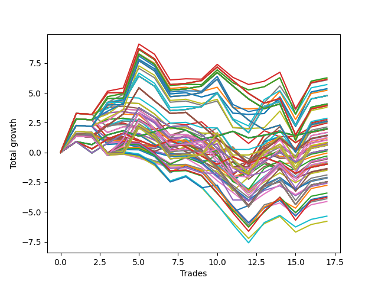

# Long HLT 647 
- Symbol: TSLA
- Date Range: 05/16/2022 - 05/17/2024
- Trading Period: 8:30-12:30
- Number of Trades: 17



| Id. | Name | Win Percent | Profit | Avg Profit / Trade | Avg Time / Trade | Std |      | Name | Win Percent | Profit | Avg Profit / Trade | Avg Time / Trade | Std |
| --- | ---- | ----------- | ------ | ------------------ | ---------------- | --- | ---- | ---- | ----------- | ------ | ------------------ | ---------------- | --- |
| | Sorted By <br> Profit | | | | | | | Sorted By <br> Win Percentage |||||
|0| TP-2.75 105m | 58.82 | 6.27 | 0.37 | 83:24 | 1.71 |     | TP-2 180m | 64.71 | 4.77 | 0.28 | 75:45 | 1.52 |
|1| TP-2.5 105m | 58.82 | 6.24 | 0.37 | 83:21 | 1.70 |     | TP-2 165m | 64.71 | 4.77 | 0.28 | 75:45 | 1.52 |
|2| TP-3 105m | 58.82 | 6.13 | 0.36 | 85:28 | 1.71 |     | TP-2 150m | 64.71 | 4.77 | 0.28 | 75:45 | 1.52 |
|3| TP-2 90m | 58.82 | 6.09 | 0.36 | 66:17 | 1.50 |     | TP-2 135m | 64.71 | 4.77 | 0.28 | 75:45 | 1.52 |
|4| TP-2 105m | 58.82 | 5.70 | 0.34 | 71:21 | 1.51 |     | TP-2 120m | 64.71 | 4.77 | 0.28 | 75:45 | 1.52 |
|5| TP-2.75 90m | 58.82 | 5.36 | 0.32 | 75:35 | 1.62 |     | TP-1 15m | 64.71 | 2.47 | 0.15 | 12:07 | 0.67 |
|6| TP-2.5 90m | 58.82 | 5.33 | 0.31 | 75:31 | 1.62 |     | TP-0.25 180m | 64.71 | 1.99 | 0.12 | 03:28 | 0.45 |
|7| TP-3 90m | 58.82 | 5.22 | 0.31 | 77:38 | 1.62 |     | TP-0.25 165m | 64.71 | 1.99 | 0.12 | 03:28 | 0.45 |
|8| TP-2 180m | 64.71 | 4.77 | 0.28 | 75:45 | 1.52 |     | TP-0.25 150m | 64.71 | 1.99 | 0.12 | 03:28 | 0.45 |
|9| TP-2 165m | 64.71 | 4.77 | 0.28 | 75:45 | 1.52 |     | TP-0.25 135m | 64.71 | 1.99 | 0.12 | 03:28 | 0.45 |
|10| TP-2 150m | 64.71 | 4.77 | 0.28 | 75:45 | 1.52 |     | TP-0.25 120m | 64.71 | 1.99 | 0.12 | 03:28 | 0.45 |
|11| TP-2 135m | 64.71 | 4.77 | 0.28 | 75:45 | 1.52 |     | TP-0.25 105m | 64.71 | 1.99 | 0.12 | 03:28 | 0.45 |
|12| TP-2 120m | 64.71 | 4.77 | 0.28 | 75:45 | 1.52 |     | TP-0.25 90m | 64.71 | 1.99 | 0.12 | 03:28 | 0.45 |
|13| TP-2.25 105m | 58.82 | 4.77 | 0.28 | 78:14 | 1.64 |     | TP-0.25 75m | 64.71 | 1.99 | 0.12 | 03:28 | 0.45 |
|14| TP-2.75 180m | 58.82 | 4.07 | 0.24 | 90:14 | 1.74 |     | TP-0.25 60m | 64.71 | 1.99 | 0.12 | 03:28 | 0.45 |
|15| TP-2.75 165m | 58.82 | 4.07 | 0.24 | 90:14 | 1.74 |     | TP-0.25 45m | 64.71 | 1.99 | 0.12 | 03:28 | 0.45 |
|16| TP-2.75 150m | 58.82 | 4.07 | 0.24 | 90:14 | 1.74 |     | TP-0.25 30m | 64.71 | 1.99 | 0.12 | 03:28 | 0.45 |
|17| TP-2.75 135m | 58.82 | 4.07 | 0.24 | 90:14 | 1.74 |     | TP-0.25 15m | 64.71 | 1.99 | 0.12 | 03:28 | 0.45 |
|18| TP-2.75 120m | 58.82 | 4.07 | 0.24 | 90:14 | 1.74 |     | TP-2.75 105m | 58.82 | 6.27 | 0.37 | 83:24 | 1.71 |
|19| TP-2.5 180m | 58.82 | 4.04 | 0.24 | 90:10 | 1.73 |     | TP-2.5 105m | 58.82 | 6.24 | 0.37 | 83:21 | 1.70 |
|20| TP-2.5 165m | 58.82 | 4.04 | 0.24 | 90:10 | 1.73 |     | TP-3 105m | 58.82 | 6.13 | 0.36 | 85:28 | 1.71 |
|21| TP-2.5 150m | 58.82 | 4.04 | 0.24 | 90:10 | 1.73 |     | TP-2 90m | 58.82 | 6.09 | 0.36 | 66:17 | 1.50 |
|22| TP-2.5 135m | 58.82 | 4.04 | 0.24 | 90:10 | 1.73 |     | TP-2 105m | 58.82 | 5.70 | 0.34 | 71:21 | 1.51 |
|23| TP-2.5 120m | 58.82 | 4.04 | 0.24 | 90:10 | 1.73 |     | TP-2.75 90m | 58.82 | 5.36 | 0.32 | 75:35 | 1.62 |
|24| TP-3 180m | 58.82 | 3.93 | 0.23 | 92:17 | 1.73 |     | TP-2.5 90m | 58.82 | 5.33 | 0.31 | 75:31 | 1.62 |
|25| TP-3 165m | 58.82 | 3.93 | 0.23 | 92:17 | 1.73 |     | TP-3 90m | 58.82 | 5.22 | 0.31 | 77:38 | 1.62 |
|26| TP-3 150m | 58.82 | 3.93 | 0.23 | 92:17 | 1.73 |     | TP-2.25 105m | 58.82 | 4.77 | 0.28 | 78:14 | 1.64 |
|27| TP-3 135m | 58.82 | 3.93 | 0.23 | 92:17 | 1.73 |     | TP-2.75 180m | 58.82 | 4.07 | 0.24 | 90:14 | 1.74 |
|28| TP-3 120m | 58.82 | 3.93 | 0.23 | 92:17 | 1.73 |     | TP-2.75 165m | 58.82 | 4.07 | 0.24 | 90:14 | 1.74 |
|29| TP-2.25 90m | 58.82 | 3.79 | 0.22 | 71:21 | 1.58 |     | TP-2.75 150m | 58.82 | 4.07 | 0.24 | 90:14 | 1.74 |
|30| TP-3 75m | 52.94 | 2.87 | 0.17 | 65:52 | 1.31 |     | TP-2.75 135m | 58.82 | 4.07 | 0.24 | 90:14 | 1.74 |
|31| TP-2 60m | 47.06 | 2.77 | 0.16 | 48:56 | 1.20 |     | TP-2.75 120m | 58.82 | 4.07 | 0.24 | 90:14 | 1.74 |
|32| TP-2 75m | 52.94 | 2.67 | 0.16 | 58:24 | 1.30 |     | TP-2.5 180m | 58.82 | 4.04 | 0.24 | 90:10 | 1.73 |
|33| TP-2.25 180m | 58.82 | 2.61 | 0.15 | 84:24 | 1.66 |     | TP-2.5 165m | 58.82 | 4.04 | 0.24 | 90:10 | 1.73 |
|34| TP-2.25 165m | 58.82 | 2.61 | 0.15 | 84:24 | 1.66 |     | TP-2.5 150m | 58.82 | 4.04 | 0.24 | 90:10 | 1.73 |
|35| TP-2.25 150m | 58.82 | 2.61 | 0.15 | 84:24 | 1.66 |     | TP-2.5 135m | 58.82 | 4.04 | 0.24 | 90:10 | 1.73 |
|36| TP-2.25 135m | 58.82 | 2.61 | 0.15 | 84:24 | 1.66 |     | TP-2.5 120m | 58.82 | 4.04 | 0.24 | 90:10 | 1.73 |
|37| TP-2.25 120m | 58.82 | 2.61 | 0.15 | 84:24 | 1.66 |     | TP-3 180m | 58.82 | 3.93 | 0.23 | 92:17 | 1.73 |
|38| TP-2.75 75m | 52.94 | 2.58 | 0.15 | 64:28 | 1.27 |     | TP-3 165m | 58.82 | 3.93 | 0.23 | 92:17 | 1.73 |
|39| TP-2.5 75m | 52.94 | 2.55 | 0.15 | 64:24 | 1.26 |     | TP-3 150m | 58.82 | 3.93 | 0.23 | 92:17 | 1.73 |
|40| TP-1 15m | 64.71 | 2.47 | 0.15 | 12:07 | 0.67 |     | TP-3 135m | 58.82 | 3.93 | 0.23 | 92:17 | 1.73 |
|41| TP-3 60m | 47.06 | 2.14 | 0.13 | 53:31 | 1.19 |     | TP-3 120m | 58.82 | 3.93 | 0.23 | 92:17 | 1.73 |
|42| TP-0.25 180m | 64.71 | 1.99 | 0.12 | 03:28 | 0.45 |     | TP-2.25 90m | 58.82 | 3.79 | 0.22 | 71:21 | 1.58 |
|43| TP-0.25 165m | 64.71 | 1.99 | 0.12 | 03:28 | 0.45 |     | TP-2.25 180m | 58.82 | 2.61 | 0.15 | 84:24 | 1.66 |
|44| TP-0.25 150m | 64.71 | 1.99 | 0.12 | 03:28 | 0.45 |     | TP-2.25 165m | 58.82 | 2.61 | 0.15 | 84:24 | 1.66 |
|45| TP-0.25 135m | 64.71 | 1.99 | 0.12 | 03:28 | 0.45 |     | TP-2.25 150m | 58.82 | 2.61 | 0.15 | 84:24 | 1.66 |
|46| TP-0.25 120m | 64.71 | 1.99 | 0.12 | 03:28 | 0.45 |     | TP-2.25 135m | 58.82 | 2.61 | 0.15 | 84:24 | 1.66 |
|47| TP-0.25 105m | 64.71 | 1.99 | 0.12 | 03:28 | 0.45 |     | TP-2.25 120m | 58.82 | 2.61 | 0.15 | 84:24 | 1.66 |
|48| TP-0.25 90m | 64.71 | 1.99 | 0.12 | 03:28 | 0.45 |     | TP-2 45m | 58.82 | 1.20 | 0.07 | 38:28 | 1.12 |
|49| TP-0.25 75m | 64.71 | 1.99 | 0.12 | 03:28 | 0.45 |     | TP-3 45m | 58.82 | 1.06 | 0.06 | 41:10 | 1.20 |
|50| TP-0.25 60m | 64.71 | 1.99 | 0.12 | 03:28 | 0.45 |     | TP-3 15m | 58.82 | 0.82 | 0.05 | 14:00 | 0.70 |
|51| TP-0.25 45m | 64.71 | 1.99 | 0.12 | 03:28 | 0.45 |     | TP-2.75 15m | 58.82 | 0.82 | 0.05 | 14:00 | 0.70 |
|52| TP-0.25 30m | 64.71 | 1.99 | 0.12 | 03:28 | 0.45 |     | TP-2.5 15m | 58.82 | 0.82 | 0.05 | 14:00 | 0.70 |
|53| TP-0.25 15m | 64.71 | 1.99 | 0.12 | 03:28 | 0.45 |     | TP-2.25 15m | 58.82 | 0.82 | 0.05 | 14:00 | 0.70 |
|54| TP-3 30m | 47.06 | 1.95 | 0.11 | 27:56 | 1.12 |     | TP-2 15m | 58.82 | 0.82 | 0.05 | 14:00 | 0.70 |
|55| TP-2.75 30m | 47.06 | 1.95 | 0.11 | 27:56 | 1.12 |     | TP-1.75 15m | 58.82 | 0.82 | 0.05 | 14:00 | 0.70 |
|56| TP-2.5 30m | 47.06 | 1.95 | 0.11 | 27:56 | 1.12 |     | TP-1.25 15m | 58.82 | 0.77 | 0.05 | 12:56 | 0.71 |
|57| TP-2.75 60m | 47.06 | 1.68 | 0.10 | 52:38 | 1.12 |     | TP-1.5 15m | 58.82 | 0.66 | 0.04 | 13:17 | 0.74 |
|58| TP-2.5 60m | 47.06 | 1.68 | 0.10 | 52:38 | 1.12 |     | TP-1.75 180m | 58.82 | 0.62 | 0.04 | 70:52 | 1.43 |
|59| TP-2 30m | 47.06 | 1.46 | 0.09 | 27:49 | 1.06 |     | TP-1.75 165m | 58.82 | 0.62 | 0.04 | 70:52 | 1.43 |
|60| TP-1 180m | 52.94 | 1.43 | 0.08 | 33:07 | 1.07 |     | TP-1.75 150m | 58.82 | 0.62 | 0.04 | 70:52 | 1.43 |
|61| TP-1 165m | 52.94 | 1.43 | 0.08 | 33:07 | 1.07 |     | TP-1.75 135m | 58.82 | 0.62 | 0.04 | 70:52 | 1.43 |
|62| TP-1 150m | 52.94 | 1.43 | 0.08 | 33:07 | 1.07 |     | TP-1.75 120m | 58.82 | 0.62 | 0.04 | 70:52 | 1.43 |
|63| TP-1 135m | 52.94 | 1.43 | 0.08 | 33:07 | 1.07 |     | TP-2.75 45m | 58.82 | 0.60 | 0.04 | 40:17 | 1.13 |
|64| TP-1 120m | 52.94 | 1.43 | 0.08 | 33:07 | 1.07 |     | TP-2.5 45m | 58.82 | 0.60 | 0.04 | 40:17 | 1.13 |
|65| TP-1 105m | 52.94 | 1.43 | 0.08 | 33:07 | 1.07 |     | TP-2.25 45m | 58.82 | 0.12 | 0.01 | 39:28 | 1.05 |
|66| TP-1 90m | 52.94 | 1.43 | 0.08 | 33:07 | 1.07 |     | TP-3 75m | 52.94 | 2.87 | 0.17 | 65:52 | 1.31 |
|67| TP-2.25 30m | 47.06 | 1.40 | 0.08 | 27:52 | 1.05 |     | TP-2 75m | 52.94 | 2.67 | 0.16 | 58:24 | 1.30 |
|68| TP-1.75 90m | 52.94 | 1.24 | 0.07 | 61:49 | 1.39 |     | TP-2.75 75m | 52.94 | 2.58 | 0.15 | 64:28 | 1.27 |
|69| TP-2 45m | 58.82 | 1.20 | 0.07 | 38:28 | 1.12 |     | TP-2.5 75m | 52.94 | 2.55 | 0.15 | 64:24 | 1.26 |
|70| TP-3 45m | 58.82 | 1.06 | 0.06 | 41:10 | 1.20 |     | TP-1 180m | 52.94 | 1.43 | 0.08 | 33:07 | 1.07 |
|71| TP-2.25 75m | 52.94 | 1.03 | 0.06 | 61:35 | 1.21 |     | TP-1 165m | 52.94 | 1.43 | 0.08 | 33:07 | 1.07 |
|72| TP-1.75 105m | 52.94 | 0.85 | 0.05 | 66:52 | 1.39 |     | TP-1 150m | 52.94 | 1.43 | 0.08 | 33:07 | 1.07 |
|73| TP-3 15m | 58.82 | 0.82 | 0.05 | 14:00 | 0.70 |     | TP-1 135m | 52.94 | 1.43 | 0.08 | 33:07 | 1.07 |
|74| TP-2.75 15m | 58.82 | 0.82 | 0.05 | 14:00 | 0.70 |     | TP-1 120m | 52.94 | 1.43 | 0.08 | 33:07 | 1.07 |
|75| TP-2.5 15m | 58.82 | 0.82 | 0.05 | 14:00 | 0.70 |     | TP-1 105m | 52.94 | 1.43 | 0.08 | 33:07 | 1.07 |
|76| TP-2.25 15m | 58.82 | 0.82 | 0.05 | 14:00 | 0.70 |     | TP-1 90m | 52.94 | 1.43 | 0.08 | 33:07 | 1.07 |
|77| TP-2 15m | 58.82 | 0.82 | 0.05 | 14:00 | 0.70 |     | TP-1.75 90m | 52.94 | 1.24 | 0.07 | 61:49 | 1.39 |
|78| TP-1.75 15m | 58.82 | 0.82 | 0.05 | 14:00 | 0.70 |     | TP-2.25 75m | 52.94 | 1.03 | 0.06 | 61:35 | 1.21 |
|79| TP-1.25 15m | 58.82 | 0.77 | 0.05 | 12:56 | 0.71 |     | TP-1.75 105m | 52.94 | 0.85 | 0.05 | 66:52 | 1.39 |
|80| TP-2.25 60m | 47.06 | 0.70 | 0.04 | 50:56 | 1.10 |     | TP-0.75 180m | 52.94 | 0.23 | 0.01 | 26:03 | 0.97 |
|81| TP-1.5 15m | 58.82 | 0.66 | 0.04 | 13:17 | 0.74 |     | TP-0.75 165m | 52.94 | 0.23 | 0.01 | 26:03 | 0.97 |
|82| TP-1.75 180m | 58.82 | 0.62 | 0.04 | 70:52 | 1.43 |     | TP-0.75 150m | 52.94 | 0.23 | 0.01 | 26:03 | 0.97 |
|83| TP-1.75 165m | 58.82 | 0.62 | 0.04 | 70:52 | 1.43 |     | TP-0.75 135m | 52.94 | 0.23 | 0.01 | 26:03 | 0.97 |
|84| TP-1.75 150m | 58.82 | 0.62 | 0.04 | 70:52 | 1.43 |     | TP-0.75 120m | 52.94 | 0.23 | 0.01 | 26:03 | 0.97 |
|85| TP-1.75 135m | 58.82 | 0.62 | 0.04 | 70:52 | 1.43 |     | TP-0.75 105m | 52.94 | 0.23 | 0.01 | 26:03 | 0.97 |
|86| TP-1.75 120m | 58.82 | 0.62 | 0.04 | 70:52 | 1.43 |     | TP-0.75 90m | 52.94 | 0.23 | 0.01 | 26:03 | 0.97 |
|87| TP-1.75 60m | 47.06 | 0.62 | 0.04 | 46:03 | 1.12 |     | TP-0.5 15m | 52.94 | -0.05 | -0.00 | 08:14 | 0.57 |
|88| TP-2.75 45m | 58.82 | 0.60 | 0.04 | 40:17 | 1.13 |     | TP-0.75 15m | 52.94 | -0.30 | -0.02 | 10:28 | 0.68 |
|89| TP-2.5 45m | 58.82 | 0.60 | 0.04 | 40:17 | 1.13 |     | TP-1.25 180m | 52.94 | -0.49 | -0.03 | 46:00 | 1.28 |
|90| TP-0.75 180m | 52.94 | 0.23 | 0.01 | 26:03 | 0.97 |     | TP-1.25 165m | 52.94 | -0.49 | -0.03 | 46:00 | 1.28 |
|91| TP-0.75 165m | 52.94 | 0.23 | 0.01 | 26:03 | 0.97 |     | TP-1.25 150m | 52.94 | -0.49 | -0.03 | 46:00 | 1.28 |
|92| TP-0.75 150m | 52.94 | 0.23 | 0.01 | 26:03 | 0.97 |     | TP-1.25 135m | 52.94 | -0.49 | -0.03 | 46:00 | 1.28 |
|93| TP-0.75 135m | 52.94 | 0.23 | 0.01 | 26:03 | 0.97 |     | TP-1.25 120m | 52.94 | -0.49 | -0.03 | 46:00 | 1.28 |
|94| TP-0.75 120m | 52.94 | 0.23 | 0.01 | 26:03 | 0.97 |     | TP-1.75 45m | 52.94 | -2.16 | -0.13 | 36:45 | 1.09 |
|95| TP-0.75 105m | 52.94 | 0.23 | 0.01 | 26:03 | 0.97 |     | TP-1.5 180m | 52.94 | -2.46 | -0.14 | 54:42 | 1.31 |
|96| TP-0.75 90m | 52.94 | 0.23 | 0.01 | 26:03 | 0.97 |     | TP-1.5 165m | 52.94 | -2.46 | -0.14 | 54:42 | 1.31 |
|97| TP-1.75 30m | 47.06 | 0.21 | 0.01 | 27:00 | 0.98 |     | TP-1.5 150m | 52.94 | -2.46 | -0.14 | 54:42 | 1.31 |
|98| TP-2.25 45m | 58.82 | 0.12 | 0.01 | 39:28 | 1.05 |     | TP-1.5 135m | 52.94 | -2.46 | -0.14 | 54:42 | 1.31 |
|99| TP-0.5 15m | 52.94 | -0.05 | -0.00 | 08:14 | 0.57 |     | TP-1.5 120m | 52.94 | -2.46 | -0.14 | 54:42 | 1.31 |
|100| TP-0.75 15m | 52.94 | -0.30 | -0.02 | 10:28 | 0.68 |     | TP-2 60m | 47.06 | 2.77 | 0.16 | 48:56 | 1.20 |
|101| TP-1.25 180m | 52.94 | -0.49 | -0.03 | 46:00 | 1.28 |     | TP-3 60m | 47.06 | 2.14 | 0.13 | 53:31 | 1.19 |
|102| TP-1.25 165m | 52.94 | -0.49 | -0.03 | 46:00 | 1.28 |     | TP-3 30m | 47.06 | 1.95 | 0.11 | 27:56 | 1.12 |
|103| TP-1.25 150m | 52.94 | -0.49 | -0.03 | 46:00 | 1.28 |     | TP-2.75 30m | 47.06 | 1.95 | 0.11 | 27:56 | 1.12 |
|104| TP-1.25 135m | 52.94 | -0.49 | -0.03 | 46:00 | 1.28 |     | TP-2.5 30m | 47.06 | 1.95 | 0.11 | 27:56 | 1.12 |
|105| TP-1.25 120m | 52.94 | -0.49 | -0.03 | 46:00 | 1.28 |     | TP-2.75 60m | 47.06 | 1.68 | 0.10 | 52:38 | 1.12 |
|106| TP-1.25 90m | 47.06 | -0.51 | -0.03 | 44:07 | 1.25 |     | TP-2.5 60m | 47.06 | 1.68 | 0.10 | 52:38 | 1.12 |
|107| TP-1 30m | 47.06 | -0.57 | -0.03 | 20:56 | 0.77 |     | TP-2 30m | 47.06 | 1.46 | 0.09 | 27:49 | 1.06 |
|108| TP-1.25 105m | 47.06 | -0.76 | -0.04 | 45:07 | 1.28 |     | TP-2.25 30m | 47.06 | 1.40 | 0.08 | 27:52 | 1.05 |
|109| TP-1 60m | 47.06 | -0.79 | -0.05 | 29:07 | 0.92 |     | TP-2.25 60m | 47.06 | 0.70 | 0.04 | 50:56 | 1.10 |
|110| TP-1 75m | 47.06 | -0.89 | -0.05 | 31:45 | 0.94 |     | TP-1.75 60m | 47.06 | 0.62 | 0.04 | 46:03 | 1.12 |
|111| TP-1.75 75m | 47.06 | -0.94 | -0.06 | 54:35 | 1.24 |     | TP-1.75 30m | 47.06 | 0.21 | 0.01 | 27:00 | 0.98 |
|112| TP-0.5 180m | 47.06 | -0.98 | -0.06 | 11:24 | 0.62 |     | TP-1.25 90m | 47.06 | -0.51 | -0.03 | 44:07 | 1.25 |
|113| TP-0.5 165m | 47.06 | -0.98 | -0.06 | 11:24 | 0.62 |     | TP-1 30m | 47.06 | -0.57 | -0.03 | 20:56 | 0.77 |
|114| TP-0.5 150m | 47.06 | -0.98 | -0.06 | 11:24 | 0.62 |     | TP-1.25 105m | 47.06 | -0.76 | -0.04 | 45:07 | 1.28 |
|115| TP-0.5 135m | 47.06 | -0.98 | -0.06 | 11:24 | 0.62 |     | TP-1 60m | 47.06 | -0.79 | -0.05 | 29:07 | 0.92 |
|116| TP-0.5 120m | 47.06 | -0.98 | -0.06 | 11:24 | 0.62 |     | TP-1 75m | 47.06 | -0.89 | -0.05 | 31:45 | 0.94 |
|117| TP-0.5 105m | 47.06 | -0.98 | -0.06 | 11:24 | 0.62 |     | TP-1.75 75m | 47.06 | -0.94 | -0.06 | 54:35 | 1.24 |
|118| TP-0.5 90m | 47.06 | -0.98 | -0.06 | 11:24 | 0.62 |     | TP-0.5 180m | 47.06 | -0.98 | -0.06 | 11:24 | 0.62 |
|119| TP-0.5 75m | 47.06 | -0.98 | -0.06 | 11:24 | 0.62 |     | TP-0.5 165m | 47.06 | -0.98 | -0.06 | 11:24 | 0.62 |
|120| TP-0.5 60m | 47.06 | -0.98 | -0.06 | 11:24 | 0.62 |     | TP-0.5 150m | 47.06 | -0.98 | -0.06 | 11:24 | 0.62 |
|121| TP-1.5 90m | 47.06 | -1.35 | -0.08 | 48:45 | 1.37 |     | TP-0.5 135m | 47.06 | -0.98 | -0.06 | 11:24 | 0.62 |
|122| TP-0.5 45m | 47.06 | -1.39 | -0.08 | 11:14 | 0.61 |     | TP-0.5 120m | 47.06 | -0.98 | -0.06 | 11:24 | 0.62 |
|123| TP-0.5 30m | 47.06 | -1.39 | -0.08 | 10:21 | 0.61 |     | TP-0.5 105m | 47.06 | -0.98 | -0.06 | 11:24 | 0.62 |
|124| TP-0.75 60m | 47.06 | -1.50 | -0.09 | 22:56 | 0.81 |     | TP-0.5 90m | 47.06 | -0.98 | -0.06 | 11:24 | 0.62 |
|125| TP-1 45m | 47.06 | -1.89 | -0.11 | 26:03 | 0.89 |     | TP-0.5 75m | 47.06 | -0.98 | -0.06 | 11:24 | 0.62 |
|126| TP-0.75 75m | 47.06 | -2.09 | -0.12 | 24:42 | 0.79 |     | TP-0.5 60m | 47.06 | -0.98 | -0.06 | 11:24 | 0.62 |
|127| TP-1.5 105m | 47.06 | -2.12 | -0.12 | 52:03 | 1.32 |     | TP-1.5 90m | 47.06 | -1.35 | -0.08 | 48:45 | 1.37 |
|128| TP-1.75 45m | 52.94 | -2.16 | -0.13 | 36:45 | 1.09 |     | TP-0.5 45m | 47.06 | -1.39 | -0.08 | 11:14 | 0.61 |
|129| TP-1.5 180m | 52.94 | -2.46 | -0.14 | 54:42 | 1.31 |     | TP-0.5 30m | 47.06 | -1.39 | -0.08 | 10:21 | 0.61 |
|130| TP-1.5 165m | 52.94 | -2.46 | -0.14 | 54:42 | 1.31 |     | TP-0.75 60m | 47.06 | -1.50 | -0.09 | 22:56 | 0.81 |
|131| TP-1.5 150m | 52.94 | -2.46 | -0.14 | 54:42 | 1.31 |     | TP-1 45m | 47.06 | -1.89 | -0.11 | 26:03 | 0.89 |
|132| TP-1.5 135m | 52.94 | -2.46 | -0.14 | 54:42 | 1.31 |     | TP-0.75 75m | 47.06 | -2.09 | -0.12 | 24:42 | 0.79 |
|133| TP-1.5 120m | 52.94 | -2.46 | -0.14 | 54:42 | 1.31 |     | TP-1.5 105m | 47.06 | -2.12 | -0.12 | 52:03 | 1.32 |
|134| TP-0.75 45m | 47.06 | -2.50 | -0.15 | 20:38 | 0.78 |     | TP-0.75 45m | 47.06 | -2.50 | -0.15 | 20:38 | 0.78 |
|135| TP-0.75 30m | 47.06 | -2.59 | -0.15 | 16:56 | 0.71 |     | TP-0.75 30m | 47.06 | -2.59 | -0.15 | 16:56 | 0.71 |
|136| TP-1.5 60m | 41.18 | -2.76 | -0.16 | 38:00 | 1.13 |     | TP-1.5 60m | 41.18 | -2.76 | -0.16 | 38:00 | 1.13 |
|137| TP-1.25 75m | 41.18 | -3.41 | -0.20 | 40:24 | 1.09 |     | TP-1.25 75m | 41.18 | -3.41 | -0.20 | 40:24 | 1.09 |
|138| TP-1.25 60m | 41.18 | -3.68 | -0.22 | 35:17 | 1.04 |     | TP-1.25 60m | 41.18 | -3.68 | -0.22 | 35:17 | 1.04 |
|139| TP-1.5 75m | 41.18 | -3.77 | -0.22 | 43:52 | 1.24 |     | TP-1.5 75m | 41.18 | -3.77 | -0.22 | 43:52 | 1.24 |
|140| TP-1.5 30m | 41.18 | -3.89 | -0.23 | 23:35 | 0.99 |     | TP-1.5 30m | 41.18 | -3.89 | -0.23 | 23:35 | 0.99 |
|141| TP-1.25 30m | 41.18 | -4.12 | -0.24 | 22:31 | 0.89 |     | TP-1.25 30m | 41.18 | -4.12 | -0.24 | 22:31 | 0.89 |
|142| TP-1.5 45m | 41.18 | -5.35 | -0.31 | 31:31 | 1.06 |     | TP-1.5 45m | 41.18 | -5.35 | -0.31 | 31:31 | 1.06 |
|143| TP-1.25 45m | 41.18 | -5.78 | -0.34 | 29:49 | 0.97 |     | TP-1.25 45m | 41.18 | -5.78 | -0.34 | 29:49 | 0.97 |

### Test TP-0.25 15m
* Take Profit of 0.25 Point
* 0.25 Stoploss
* Results:
```
Total Trades: 17
Percent Up: 64.71
Percent Down: 35.29
Total Points Moved Up: 1.99
Potential Profit: 995.00
Total Points Ups: 4.55 Count Ups: 11
Total Points Downs: -2.56 Count Downs: 6
```

<details><summary>Trades</summary>

<code>In: 2022-08-02 10:40:00		Out: 2022-08-02 10:42:00		Total Position Time: 02:00		Total Move Up: 0.91		Total to Date: 0.91</code> <br />
<code>In: 2022-09-15 12:25:00		Out: 2022-09-15 12:27:00		Total Position Time: 02:00		Total Move Up: -0.25		Total to Date: 0.66</code> <br />
<code>In: 2022-09-20 10:40:00		Out: 2022-09-20 10:44:00		Total Position Time: 04:00		Total Move Up: 0.82		Total to Date: 1.48</code> <br />
<code>In: 2022-11-01 10:45:00		Out: 2022-11-01 10:47:00		Total Position Time: 02:00		Total Move Up: 0.35		Total to Date: 1.83</code> <br />
<code>In: 2022-11-02 09:35:00		Out: 2022-11-02 09:38:00		Total Position Time: 03:00		Total Move Up: -0.46		Total to Date: 1.37</code> <br />
<code>In: 2022-12-05 11:10:00		Out: 2022-12-05 11:12:00		Total Position Time: 02:00		Total Move Up: 0.37		Total to Date: 1.74</code> <br />
<code>In: 2023-04-26 11:20:00		Out: 2023-04-26 11:24:00		Total Position Time: 04:00		Total Move Up: 0.38		Total to Date: 2.12</code> <br />
<code>In: 2023-05-16 11:25:00		Out: 2023-05-16 11:31:00		Total Position Time: 06:00		Total Move Up: -0.25		Total to Date: 1.87</code> <br />
<code>In: 2023-08-15 10:05:00		Out: 2023-08-15 10:07:00		Total Position Time: 02:00		Total Move Up: -0.76		Total to Date: 1.11</code> <br />
<code>In: 2023-08-31 09:35:00		Out: 2023-08-31 09:37:00		Total Position Time: 02:00		Total Move Up: 0.25		Total to Date: 1.36</code> <br />
<code>In: 2023-09-01 10:55:00		Out: 2023-09-01 11:00:00		Total Position Time: 05:00		Total Move Up: 0.42		Total to Date: 1.78</code> <br />
<code>In: 2023-10-18 09:45:00		Out: 2023-10-18 09:49:00		Total Position Time: 04:00		Total Move Up: -0.56		Total to Date: 1.22</code> <br />
<code>In: 2023-10-25 10:50:00		Out: 2023-10-25 10:52:00		Total Position Time: 02:00		Total Move Up: 0.23		Total to Date: 1.45</code> <br />
<code>In: 2023-12-11 08:45:00		Out: 2023-12-11 08:51:00		Total Position Time: 06:00		Total Move Up: 0.26		Total to Date: 1.71</code> <br />
<code>In: 2023-12-28 10:25:00		Out: 2023-12-28 10:29:00		Total Position Time: 04:00		Total Move Up: -0.28		Total to Date: 1.43</code> <br />
<code>In: 2024-01-22 11:25:00		Out: 2024-01-22 11:28:00		Total Position Time: 03:00		Total Move Up: 0.30		Total to Date: 1.73</code> <br />
<code>In: 2024-03-11 12:35:00		Out: 2024-03-11 12:41:00		Total Position Time: 06:00		Total Move Up: 0.26		Total to Date: 1.99</code> <br />


</details>

### Test TP-0.5 15m
* Take Profit of 0.5 Point
* 0.5 Stoploss
* Results:
```
Total Trades: 17
Percent Up: 52.94
Percent Down: 47.06
Total Points Moved Up: -0.05
Potential Profit: -25.00
Total Points Ups: 4.38 Count Ups: 9
Total Points Downs: -4.43 Count Downs: 8
```

<details><summary>Trades</summary>

<code>In: 2022-08-02 10:40:00		Out: 2022-08-02 10:42:00		Total Position Time: 02:00		Total Move Up: 0.91		Total to Date: 0.91</code> <br />
<code>In: 2022-09-15 12:25:00		Out: 2022-09-15 12:28:00		Total Position Time: 03:00		Total Move Up: -0.61		Total to Date: 0.30</code> <br />
<code>In: 2022-09-20 10:40:00		Out: 2022-09-20 10:44:00		Total Position Time: 04:00		Total Move Up: 0.82		Total to Date: 1.12</code> <br />
<code>In: 2022-11-01 10:45:00		Out: 2022-11-01 10:59:00		Total Position Time: 14:00		Total Move Up: 0.09		Total to Date: 1.21</code> <br />
<code>In: 2022-11-02 09:35:00		Out: 2022-11-02 09:39:00		Total Position Time: 04:00		Total Move Up: -0.60		Total to Date: 0.61</code> <br />
<code>In: 2022-12-05 11:10:00		Out: 2022-12-05 11:24:00		Total Position Time: 14:00		Total Move Up: -0.13		Total to Date: 0.48</code> <br />
<code>In: 2023-04-26 11:20:00		Out: 2023-04-26 11:27:00		Total Position Time: 07:00		Total Move Up: 0.52		Total to Date: 1.00</code> <br />
<code>In: 2023-05-16 11:25:00		Out: 2023-05-16 11:33:00		Total Position Time: 08:00		Total Move Up: -0.55		Total to Date: 0.45</code> <br />
<code>In: 2023-08-15 10:05:00		Out: 2023-08-15 10:07:00		Total Position Time: 02:00		Total Move Up: -0.76		Total to Date: -0.31</code> <br />
<code>In: 2023-08-31 09:35:00		Out: 2023-08-31 09:46:00		Total Position Time: 11:00		Total Move Up: -0.71		Total to Date: -1.02</code> <br />
<code>In: 2023-09-01 10:55:00		Out: 2023-09-01 11:04:00		Total Position Time: 09:00		Total Move Up: 0.64		Total to Date: -0.38</code> <br />
<code>In: 2023-10-18 09:45:00		Out: 2023-10-18 09:49:00		Total Position Time: 04:00		Total Move Up: -0.56		Total to Date: -0.94</code> <br />
<code>In: 2023-10-25 10:50:00		Out: 2023-10-25 10:56:00		Total Position Time: 06:00		Total Move Up: 0.52		Total to Date: -0.42</code> <br />
<code>In: 2023-12-11 08:45:00		Out: 2023-12-11 08:57:00		Total Position Time: 12:00		Total Move Up: -0.51		Total to Date: -0.93</code> <br />
<code>In: 2023-12-28 10:25:00		Out: 2023-12-28 10:39:00		Total Position Time: 14:00		Total Move Up: 0.06		Total to Date: -0.87</code> <br />
<code>In: 2024-01-22 11:25:00		Out: 2024-01-22 11:37:00		Total Position Time: 12:00		Total Move Up: 0.49		Total to Date: -0.38</code> <br />
<code>In: 2024-03-11 12:35:00		Out: 2024-03-11 12:49:00		Total Position Time: 14:00		Total Move Up: 0.33		Total to Date: -0.05</code> <br />


</details>

### Test TP-0.75 15m
* Take Profit of 0.75 Point
* 0.75 Stoploss
* Results:
```
Total Trades: 17
Percent Up: 52.94
Percent Down: 47.06
Total Points Moved Up: -0.30
Potential Profit: -150.00
Total Points Ups: 4.80 Count Ups: 9
Total Points Downs: -5.10 Count Downs: 8
```

<details><summary>Trades</summary>

<code>In: 2022-08-02 10:40:00		Out: 2022-08-02 10:42:00		Total Position Time: 02:00		Total Move Up: 0.91		Total to Date: 0.91</code> <br />
<code>In: 2022-09-15 12:25:00		Out: 2022-09-15 12:29:00		Total Position Time: 04:00		Total Move Up: -0.95		Total to Date: -0.04</code> <br />
<code>In: 2022-09-20 10:40:00		Out: 2022-09-20 10:44:00		Total Position Time: 04:00		Total Move Up: 0.82		Total to Date: 0.78</code> <br />
<code>In: 2022-11-01 10:45:00		Out: 2022-11-01 10:59:00		Total Position Time: 14:00		Total Move Up: 0.09		Total to Date: 0.87</code> <br />
<code>In: 2022-11-02 09:35:00		Out: 2022-11-02 09:49:00		Total Position Time: 14:00		Total Move Up: -0.43		Total to Date: 0.44</code> <br />
<code>In: 2022-12-05 11:10:00		Out: 2022-12-05 11:24:00		Total Position Time: 14:00		Total Move Up: -0.13		Total to Date: 0.31</code> <br />
<code>In: 2023-04-26 11:20:00		Out: 2023-04-26 11:34:00		Total Position Time: 14:00		Total Move Up: 0.55		Total to Date: 0.86</code> <br />
<code>In: 2023-05-16 11:25:00		Out: 2023-05-16 11:39:00		Total Position Time: 14:00		Total Move Up: -0.14		Total to Date: 0.72</code> <br />
<code>In: 2023-08-15 10:05:00		Out: 2023-08-15 10:07:00		Total Position Time: 02:00		Total Move Up: -0.76		Total to Date: -0.04</code> <br />
<code>In: 2023-08-31 09:35:00		Out: 2023-08-31 09:47:00		Total Position Time: 12:00		Total Move Up: -1.14		Total to Date: -1.18</code> <br />
<code>In: 2023-09-01 10:55:00		Out: 2023-09-01 11:09:00		Total Position Time: 14:00		Total Move Up: 0.36		Total to Date: -0.82</code> <br />
<code>In: 2023-10-18 09:45:00		Out: 2023-10-18 09:51:00		Total Position Time: 06:00		Total Move Up: -1.03		Total to Date: -1.85</code> <br />
<code>In: 2023-10-25 10:50:00		Out: 2023-10-25 10:58:00		Total Position Time: 08:00		Total Move Up: 0.91		Total to Date: -0.94</code> <br />
<code>In: 2023-12-11 08:45:00		Out: 2023-12-11 08:59:00		Total Position Time: 14:00		Total Move Up: -0.52		Total to Date: -1.46</code> <br />
<code>In: 2023-12-28 10:25:00		Out: 2023-12-28 10:39:00		Total Position Time: 14:00		Total Move Up: 0.06		Total to Date: -1.40</code> <br />
<code>In: 2024-01-22 11:25:00		Out: 2024-01-22 11:39:00		Total Position Time: 14:00		Total Move Up: 0.77		Total to Date: -0.63</code> <br />
<code>In: 2024-03-11 12:35:00		Out: 2024-03-11 12:49:00		Total Position Time: 14:00		Total Move Up: 0.33		Total to Date: -0.30</code> <br />


</details>

### Test TP-1 15m
* Take Profit of 1 Point
* 1 Stoploss
* Results:
```
Total Trades: 17
Percent Up: 64.71
Percent Down: 35.29
Total Points Moved Up: 2.47
Potential Profit: 1235.00
Total Points Ups: 5.86 Count Ups: 11
Total Points Downs: -3.39 Count Downs: 6
```

<details><summary>Trades</summary>

<code>In: 2022-08-02 10:40:00		Out: 2022-08-02 10:44:00		Total Position Time: 04:00		Total Move Up: 1.37		Total to Date: 1.37</code> <br />
<code>In: 2022-09-15 12:25:00		Out: 2022-09-15 12:39:00		Total Position Time: 14:00		Total Move Up: 0.05		Total to Date: 1.42</code> <br />
<code>In: 2022-09-20 10:40:00		Out: 2022-09-20 10:46:00		Total Position Time: 06:00		Total Move Up: 0.97		Total to Date: 2.39</code> <br />
<code>In: 2022-11-01 10:45:00		Out: 2022-11-01 10:59:00		Total Position Time: 14:00		Total Move Up: 0.09		Total to Date: 2.48</code> <br />
<code>In: 2022-11-02 09:35:00		Out: 2022-11-02 09:49:00		Total Position Time: 14:00		Total Move Up: -0.43		Total to Date: 2.05</code> <br />
<code>In: 2022-12-05 11:10:00		Out: 2022-12-05 11:24:00		Total Position Time: 14:00		Total Move Up: -0.13		Total to Date: 1.92</code> <br />
<code>In: 2023-04-26 11:20:00		Out: 2023-04-26 11:34:00		Total Position Time: 14:00		Total Move Up: 0.55		Total to Date: 2.47</code> <br />
<code>In: 2023-05-16 11:25:00		Out: 2023-05-16 11:39:00		Total Position Time: 14:00		Total Move Up: -0.14		Total to Date: 2.33</code> <br />
<code>In: 2023-08-15 10:05:00		Out: 2023-08-15 10:19:00		Total Position Time: 14:00		Total Move Up: 0.24		Total to Date: 2.57</code> <br />
<code>In: 2023-08-31 09:35:00		Out: 2023-08-31 09:47:00		Total Position Time: 12:00		Total Move Up: -1.14		Total to Date: 1.43</code> <br />
<code>In: 2023-09-01 10:55:00		Out: 2023-09-01 11:09:00		Total Position Time: 14:00		Total Move Up: 0.36		Total to Date: 1.79</code> <br />
<code>In: 2023-10-18 09:45:00		Out: 2023-10-18 09:51:00		Total Position Time: 06:00		Total Move Up: -1.03		Total to Date: 0.76</code> <br />
<code>In: 2023-10-25 10:50:00		Out: 2023-10-25 11:00:00		Total Position Time: 10:00		Total Move Up: 1.07		Total to Date: 1.83</code> <br />
<code>In: 2023-12-11 08:45:00		Out: 2023-12-11 08:59:00		Total Position Time: 14:00		Total Move Up: -0.52		Total to Date: 1.31</code> <br />
<code>In: 2023-12-28 10:25:00		Out: 2023-12-28 10:39:00		Total Position Time: 14:00		Total Move Up: 0.06		Total to Date: 1.37</code> <br />
<code>In: 2024-01-22 11:25:00		Out: 2024-01-22 11:39:00		Total Position Time: 14:00		Total Move Up: 0.77		Total to Date: 2.14</code> <br />
<code>In: 2024-03-11 12:35:00		Out: 2024-03-11 12:49:00		Total Position Time: 14:00		Total Move Up: 0.33		Total to Date: 2.47</code> <br />


</details>

### Test TP-1.25 15m
* Take Profit of 1.25 Point
* 1.25 Stoploss
* Results:
```
Total Trades: 17
Percent Up: 58.82
Percent Down: 41.18
Total Points Moved Up: 0.77
Potential Profit: 385.00
Total Points Ups: 5.06 Count Ups: 10
Total Points Downs: -4.29 Count Downs: 7
```

<details><summary>Trades</summary>

<code>In: 2022-08-02 10:40:00		Out: 2022-08-02 10:44:00		Total Position Time: 04:00		Total Move Up: 1.37		Total to Date: 1.37</code> <br />
<code>In: 2022-09-15 12:25:00		Out: 2022-09-15 12:39:00		Total Position Time: 14:00		Total Move Up: 0.05		Total to Date: 1.42</code> <br />
<code>In: 2022-09-20 10:40:00		Out: 2022-09-20 10:54:00		Total Position Time: 14:00		Total Move Up: -0.60		Total to Date: 0.82</code> <br />
<code>In: 2022-11-01 10:45:00		Out: 2022-11-01 10:59:00		Total Position Time: 14:00		Total Move Up: 0.09		Total to Date: 0.91</code> <br />
<code>In: 2022-11-02 09:35:00		Out: 2022-11-02 09:49:00		Total Position Time: 14:00		Total Move Up: -0.43		Total to Date: 0.48</code> <br />
<code>In: 2022-12-05 11:10:00		Out: 2022-12-05 11:24:00		Total Position Time: 14:00		Total Move Up: -0.13		Total to Date: 0.35</code> <br />
<code>In: 2023-04-26 11:20:00		Out: 2023-04-26 11:34:00		Total Position Time: 14:00		Total Move Up: 0.55		Total to Date: 0.90</code> <br />
<code>In: 2023-05-16 11:25:00		Out: 2023-05-16 11:39:00		Total Position Time: 14:00		Total Move Up: -0.14		Total to Date: 0.76</code> <br />
<code>In: 2023-08-15 10:05:00		Out: 2023-08-15 10:19:00		Total Position Time: 14:00		Total Move Up: 0.24		Total to Date: 1.00</code> <br />
<code>In: 2023-08-31 09:35:00		Out: 2023-08-31 09:49:00		Total Position Time: 14:00		Total Move Up: -1.09		Total to Date: -0.09</code> <br />
<code>In: 2023-09-01 10:55:00		Out: 2023-09-01 11:09:00		Total Position Time: 14:00		Total Move Up: 0.36		Total to Date: 0.27</code> <br />
<code>In: 2023-10-18 09:45:00		Out: 2023-10-18 09:54:00		Total Position Time: 09:00		Total Move Up: -1.38		Total to Date: -1.11</code> <br />
<code>In: 2023-10-25 10:50:00		Out: 2023-10-25 11:01:00		Total Position Time: 11:00		Total Move Up: 1.24		Total to Date: 0.13</code> <br />
<code>In: 2023-12-11 08:45:00		Out: 2023-12-11 08:59:00		Total Position Time: 14:00		Total Move Up: -0.52		Total to Date: -0.39</code> <br />
<code>In: 2023-12-28 10:25:00		Out: 2023-12-28 10:39:00		Total Position Time: 14:00		Total Move Up: 0.06		Total to Date: -0.33</code> <br />
<code>In: 2024-01-22 11:25:00		Out: 2024-01-22 11:39:00		Total Position Time: 14:00		Total Move Up: 0.77		Total to Date: 0.44</code> <br />
<code>In: 2024-03-11 12:35:00		Out: 2024-03-11 12:49:00		Total Position Time: 14:00		Total Move Up: 0.33		Total to Date: 0.77</code> <br />


</details>

### Test TP-1.5 15m
* Take Profit of 1.5 Point
* 1.5 Stoploss
* Results:
```
Total Trades: 17
Percent Up: 58.82
Percent Down: 41.18
Total Points Moved Up: 0.66
Potential Profit: 330.00
Total Points Ups: 5.12 Count Ups: 10
Total Points Downs: -4.46 Count Downs: 7
```

<details><summary>Trades</summary>

<code>In: 2022-08-02 10:40:00		Out: 2022-08-02 10:45:00		Total Position Time: 05:00		Total Move Up: 1.57		Total to Date: 1.57</code> <br />
<code>In: 2022-09-15 12:25:00		Out: 2022-09-15 12:39:00		Total Position Time: 14:00		Total Move Up: 0.05		Total to Date: 1.62</code> <br />
<code>In: 2022-09-20 10:40:00		Out: 2022-09-20 10:54:00		Total Position Time: 14:00		Total Move Up: -0.60		Total to Date: 1.02</code> <br />
<code>In: 2022-11-01 10:45:00		Out: 2022-11-01 10:59:00		Total Position Time: 14:00		Total Move Up: 0.09		Total to Date: 1.11</code> <br />
<code>In: 2022-11-02 09:35:00		Out: 2022-11-02 09:49:00		Total Position Time: 14:00		Total Move Up: -0.43		Total to Date: 0.68</code> <br />
<code>In: 2022-12-05 11:10:00		Out: 2022-12-05 11:24:00		Total Position Time: 14:00		Total Move Up: -0.13		Total to Date: 0.55</code> <br />
<code>In: 2023-04-26 11:20:00		Out: 2023-04-26 11:34:00		Total Position Time: 14:00		Total Move Up: 0.55		Total to Date: 1.10</code> <br />
<code>In: 2023-05-16 11:25:00		Out: 2023-05-16 11:39:00		Total Position Time: 14:00		Total Move Up: -0.14		Total to Date: 0.96</code> <br />
<code>In: 2023-08-15 10:05:00		Out: 2023-08-15 10:19:00		Total Position Time: 14:00		Total Move Up: 0.24		Total to Date: 1.20</code> <br />
<code>In: 2023-08-31 09:35:00		Out: 2023-08-31 09:49:00		Total Position Time: 14:00		Total Move Up: -1.09		Total to Date: 0.11</code> <br />
<code>In: 2023-09-01 10:55:00		Out: 2023-09-01 11:09:00		Total Position Time: 14:00		Total Move Up: 0.36		Total to Date: 0.47</code> <br />
<code>In: 2023-10-18 09:45:00		Out: 2023-10-18 09:56:00		Total Position Time: 11:00		Total Move Up: -1.55		Total to Date: -1.08</code> <br />
<code>In: 2023-10-25 10:50:00		Out: 2023-10-25 11:04:00		Total Position Time: 14:00		Total Move Up: 1.10		Total to Date: 0.02</code> <br />
<code>In: 2023-12-11 08:45:00		Out: 2023-12-11 08:59:00		Total Position Time: 14:00		Total Move Up: -0.52		Total to Date: -0.50</code> <br />
<code>In: 2023-12-28 10:25:00		Out: 2023-12-28 10:39:00		Total Position Time: 14:00		Total Move Up: 0.06		Total to Date: -0.44</code> <br />
<code>In: 2024-01-22 11:25:00		Out: 2024-01-22 11:39:00		Total Position Time: 14:00		Total Move Up: 0.77		Total to Date: 0.33</code> <br />
<code>In: 2024-03-11 12:35:00		Out: 2024-03-11 12:49:00		Total Position Time: 14:00		Total Move Up: 0.33		Total to Date: 0.66</code> <br />


</details>

### Test TP-1.75 15m
* Take Profit of 1.75 Point
* 1.75 Stoploss
* Results:
```
Total Trades: 17
Percent Up: 58.82
Percent Down: 41.18
Total Points Moved Up: 0.82
Potential Profit: 410.00
Total Points Ups: 5.05 Count Ups: 10
Total Points Downs: -4.23 Count Downs: 7
```

<details><summary>Trades</summary>

<code>In: 2022-08-02 10:40:00		Out: 2022-08-02 10:54:00		Total Position Time: 14:00		Total Move Up: 1.50		Total to Date: 1.50</code> <br />
<code>In: 2022-09-15 12:25:00		Out: 2022-09-15 12:39:00		Total Position Time: 14:00		Total Move Up: 0.05		Total to Date: 1.55</code> <br />
<code>In: 2022-09-20 10:40:00		Out: 2022-09-20 10:54:00		Total Position Time: 14:00		Total Move Up: -0.60		Total to Date: 0.95</code> <br />
<code>In: 2022-11-01 10:45:00		Out: 2022-11-01 10:59:00		Total Position Time: 14:00		Total Move Up: 0.09		Total to Date: 1.04</code> <br />
<code>In: 2022-11-02 09:35:00		Out: 2022-11-02 09:49:00		Total Position Time: 14:00		Total Move Up: -0.43		Total to Date: 0.61</code> <br />
<code>In: 2022-12-05 11:10:00		Out: 2022-12-05 11:24:00		Total Position Time: 14:00		Total Move Up: -0.13		Total to Date: 0.48</code> <br />
<code>In: 2023-04-26 11:20:00		Out: 2023-04-26 11:34:00		Total Position Time: 14:00		Total Move Up: 0.55		Total to Date: 1.03</code> <br />
<code>In: 2023-05-16 11:25:00		Out: 2023-05-16 11:39:00		Total Position Time: 14:00		Total Move Up: -0.14		Total to Date: 0.89</code> <br />
<code>In: 2023-08-15 10:05:00		Out: 2023-08-15 10:19:00		Total Position Time: 14:00		Total Move Up: 0.24		Total to Date: 1.13</code> <br />
<code>In: 2023-08-31 09:35:00		Out: 2023-08-31 09:49:00		Total Position Time: 14:00		Total Move Up: -1.09		Total to Date: 0.04</code> <br />
<code>In: 2023-09-01 10:55:00		Out: 2023-09-01 11:09:00		Total Position Time: 14:00		Total Move Up: 0.36		Total to Date: 0.40</code> <br />
<code>In: 2023-10-18 09:45:00		Out: 2023-10-18 09:59:00		Total Position Time: 14:00		Total Move Up: -1.32		Total to Date: -0.92</code> <br />
<code>In: 2023-10-25 10:50:00		Out: 2023-10-25 11:04:00		Total Position Time: 14:00		Total Move Up: 1.10		Total to Date: 0.18</code> <br />
<code>In: 2023-12-11 08:45:00		Out: 2023-12-11 08:59:00		Total Position Time: 14:00		Total Move Up: -0.52		Total to Date: -0.34</code> <br />
<code>In: 2023-12-28 10:25:00		Out: 2023-12-28 10:39:00		Total Position Time: 14:00		Total Move Up: 0.06		Total to Date: -0.28</code> <br />
<code>In: 2024-01-22 11:25:00		Out: 2024-01-22 11:39:00		Total Position Time: 14:00		Total Move Up: 0.77		Total to Date: 0.49</code> <br />
<code>In: 2024-03-11 12:35:00		Out: 2024-03-11 12:49:00		Total Position Time: 14:00		Total Move Up: 0.33		Total to Date: 0.82</code> <br />


</details>

### Test TP-2 15m
* Take Profit of 2 Point
* 2 Stoploss
* Results:
```
Total Trades: 17
Percent Up: 58.82
Percent Down: 41.18
Total Points Moved Up: 0.82
Potential Profit: 410.00
Total Points Ups: 5.05 Count Ups: 10
Total Points Downs: -4.23 Count Downs: 7
```

<details><summary>Trades</summary>

<code>In: 2022-08-02 10:40:00		Out: 2022-08-02 10:54:00		Total Position Time: 14:00		Total Move Up: 1.50		Total to Date: 1.50</code> <br />
<code>In: 2022-09-15 12:25:00		Out: 2022-09-15 12:39:00		Total Position Time: 14:00		Total Move Up: 0.05		Total to Date: 1.55</code> <br />
<code>In: 2022-09-20 10:40:00		Out: 2022-09-20 10:54:00		Total Position Time: 14:00		Total Move Up: -0.60		Total to Date: 0.95</code> <br />
<code>In: 2022-11-01 10:45:00		Out: 2022-11-01 10:59:00		Total Position Time: 14:00		Total Move Up: 0.09		Total to Date: 1.04</code> <br />
<code>In: 2022-11-02 09:35:00		Out: 2022-11-02 09:49:00		Total Position Time: 14:00		Total Move Up: -0.43		Total to Date: 0.61</code> <br />
<code>In: 2022-12-05 11:10:00		Out: 2022-12-05 11:24:00		Total Position Time: 14:00		Total Move Up: -0.13		Total to Date: 0.48</code> <br />
<code>In: 2023-04-26 11:20:00		Out: 2023-04-26 11:34:00		Total Position Time: 14:00		Total Move Up: 0.55		Total to Date: 1.03</code> <br />
<code>In: 2023-05-16 11:25:00		Out: 2023-05-16 11:39:00		Total Position Time: 14:00		Total Move Up: -0.14		Total to Date: 0.89</code> <br />
<code>In: 2023-08-15 10:05:00		Out: 2023-08-15 10:19:00		Total Position Time: 14:00		Total Move Up: 0.24		Total to Date: 1.13</code> <br />
<code>In: 2023-08-31 09:35:00		Out: 2023-08-31 09:49:00		Total Position Time: 14:00		Total Move Up: -1.09		Total to Date: 0.04</code> <br />
<code>In: 2023-09-01 10:55:00		Out: 2023-09-01 11:09:00		Total Position Time: 14:00		Total Move Up: 0.36		Total to Date: 0.40</code> <br />
<code>In: 2023-10-18 09:45:00		Out: 2023-10-18 09:59:00		Total Position Time: 14:00		Total Move Up: -1.32		Total to Date: -0.92</code> <br />
<code>In: 2023-10-25 10:50:00		Out: 2023-10-25 11:04:00		Total Position Time: 14:00		Total Move Up: 1.10		Total to Date: 0.18</code> <br />
<code>In: 2023-12-11 08:45:00		Out: 2023-12-11 08:59:00		Total Position Time: 14:00		Total Move Up: -0.52		Total to Date: -0.34</code> <br />
<code>In: 2023-12-28 10:25:00		Out: 2023-12-28 10:39:00		Total Position Time: 14:00		Total Move Up: 0.06		Total to Date: -0.28</code> <br />
<code>In: 2024-01-22 11:25:00		Out: 2024-01-22 11:39:00		Total Position Time: 14:00		Total Move Up: 0.77		Total to Date: 0.49</code> <br />
<code>In: 2024-03-11 12:35:00		Out: 2024-03-11 12:49:00		Total Position Time: 14:00		Total Move Up: 0.33		Total to Date: 0.82</code> <br />


</details>

### Test TP-2.25 15m
* Take Profit of 2.25 Point
* 2.25 Stoploss
* Results:
```
Total Trades: 17
Percent Up: 58.82
Percent Down: 41.18
Total Points Moved Up: 0.82
Potential Profit: 410.00
Total Points Ups: 5.05 Count Ups: 10
Total Points Downs: -4.23 Count Downs: 7
```

<details><summary>Trades</summary>

<code>In: 2022-08-02 10:40:00		Out: 2022-08-02 10:54:00		Total Position Time: 14:00		Total Move Up: 1.50		Total to Date: 1.50</code> <br />
<code>In: 2022-09-15 12:25:00		Out: 2022-09-15 12:39:00		Total Position Time: 14:00		Total Move Up: 0.05		Total to Date: 1.55</code> <br />
<code>In: 2022-09-20 10:40:00		Out: 2022-09-20 10:54:00		Total Position Time: 14:00		Total Move Up: -0.60		Total to Date: 0.95</code> <br />
<code>In: 2022-11-01 10:45:00		Out: 2022-11-01 10:59:00		Total Position Time: 14:00		Total Move Up: 0.09		Total to Date: 1.04</code> <br />
<code>In: 2022-11-02 09:35:00		Out: 2022-11-02 09:49:00		Total Position Time: 14:00		Total Move Up: -0.43		Total to Date: 0.61</code> <br />
<code>In: 2022-12-05 11:10:00		Out: 2022-12-05 11:24:00		Total Position Time: 14:00		Total Move Up: -0.13		Total to Date: 0.48</code> <br />
<code>In: 2023-04-26 11:20:00		Out: 2023-04-26 11:34:00		Total Position Time: 14:00		Total Move Up: 0.55		Total to Date: 1.03</code> <br />
<code>In: 2023-05-16 11:25:00		Out: 2023-05-16 11:39:00		Total Position Time: 14:00		Total Move Up: -0.14		Total to Date: 0.89</code> <br />
<code>In: 2023-08-15 10:05:00		Out: 2023-08-15 10:19:00		Total Position Time: 14:00		Total Move Up: 0.24		Total to Date: 1.13</code> <br />
<code>In: 2023-08-31 09:35:00		Out: 2023-08-31 09:49:00		Total Position Time: 14:00		Total Move Up: -1.09		Total to Date: 0.04</code> <br />
<code>In: 2023-09-01 10:55:00		Out: 2023-09-01 11:09:00		Total Position Time: 14:00		Total Move Up: 0.36		Total to Date: 0.40</code> <br />
<code>In: 2023-10-18 09:45:00		Out: 2023-10-18 09:59:00		Total Position Time: 14:00		Total Move Up: -1.32		Total to Date: -0.92</code> <br />
<code>In: 2023-10-25 10:50:00		Out: 2023-10-25 11:04:00		Total Position Time: 14:00		Total Move Up: 1.10		Total to Date: 0.18</code> <br />
<code>In: 2023-12-11 08:45:00		Out: 2023-12-11 08:59:00		Total Position Time: 14:00		Total Move Up: -0.52		Total to Date: -0.34</code> <br />
<code>In: 2023-12-28 10:25:00		Out: 2023-12-28 10:39:00		Total Position Time: 14:00		Total Move Up: 0.06		Total to Date: -0.28</code> <br />
<code>In: 2024-01-22 11:25:00		Out: 2024-01-22 11:39:00		Total Position Time: 14:00		Total Move Up: 0.77		Total to Date: 0.49</code> <br />
<code>In: 2024-03-11 12:35:00		Out: 2024-03-11 12:49:00		Total Position Time: 14:00		Total Move Up: 0.33		Total to Date: 0.82</code> <br />


</details>

### Test TP-2.5 15m
* Take Profit of 2.5 Point
* 2.5 Stoploss
* Results:
```
Total Trades: 17
Percent Up: 58.82
Percent Down: 41.18
Total Points Moved Up: 0.82
Potential Profit: 410.00
Total Points Ups: 5.05 Count Ups: 10
Total Points Downs: -4.23 Count Downs: 7
```

<details><summary>Trades</summary>

<code>In: 2022-08-02 10:40:00		Out: 2022-08-02 10:54:00		Total Position Time: 14:00		Total Move Up: 1.50		Total to Date: 1.50</code> <br />
<code>In: 2022-09-15 12:25:00		Out: 2022-09-15 12:39:00		Total Position Time: 14:00		Total Move Up: 0.05		Total to Date: 1.55</code> <br />
<code>In: 2022-09-20 10:40:00		Out: 2022-09-20 10:54:00		Total Position Time: 14:00		Total Move Up: -0.60		Total to Date: 0.95</code> <br />
<code>In: 2022-11-01 10:45:00		Out: 2022-11-01 10:59:00		Total Position Time: 14:00		Total Move Up: 0.09		Total to Date: 1.04</code> <br />
<code>In: 2022-11-02 09:35:00		Out: 2022-11-02 09:49:00		Total Position Time: 14:00		Total Move Up: -0.43		Total to Date: 0.61</code> <br />
<code>In: 2022-12-05 11:10:00		Out: 2022-12-05 11:24:00		Total Position Time: 14:00		Total Move Up: -0.13		Total to Date: 0.48</code> <br />
<code>In: 2023-04-26 11:20:00		Out: 2023-04-26 11:34:00		Total Position Time: 14:00		Total Move Up: 0.55		Total to Date: 1.03</code> <br />
<code>In: 2023-05-16 11:25:00		Out: 2023-05-16 11:39:00		Total Position Time: 14:00		Total Move Up: -0.14		Total to Date: 0.89</code> <br />
<code>In: 2023-08-15 10:05:00		Out: 2023-08-15 10:19:00		Total Position Time: 14:00		Total Move Up: 0.24		Total to Date: 1.13</code> <br />
<code>In: 2023-08-31 09:35:00		Out: 2023-08-31 09:49:00		Total Position Time: 14:00		Total Move Up: -1.09		Total to Date: 0.04</code> <br />
<code>In: 2023-09-01 10:55:00		Out: 2023-09-01 11:09:00		Total Position Time: 14:00		Total Move Up: 0.36		Total to Date: 0.40</code> <br />
<code>In: 2023-10-18 09:45:00		Out: 2023-10-18 09:59:00		Total Position Time: 14:00		Total Move Up: -1.32		Total to Date: -0.92</code> <br />
<code>In: 2023-10-25 10:50:00		Out: 2023-10-25 11:04:00		Total Position Time: 14:00		Total Move Up: 1.10		Total to Date: 0.18</code> <br />
<code>In: 2023-12-11 08:45:00		Out: 2023-12-11 08:59:00		Total Position Time: 14:00		Total Move Up: -0.52		Total to Date: -0.34</code> <br />
<code>In: 2023-12-28 10:25:00		Out: 2023-12-28 10:39:00		Total Position Time: 14:00		Total Move Up: 0.06		Total to Date: -0.28</code> <br />
<code>In: 2024-01-22 11:25:00		Out: 2024-01-22 11:39:00		Total Position Time: 14:00		Total Move Up: 0.77		Total to Date: 0.49</code> <br />
<code>In: 2024-03-11 12:35:00		Out: 2024-03-11 12:49:00		Total Position Time: 14:00		Total Move Up: 0.33		Total to Date: 0.82</code> <br />


</details>

### Test TP-2.75 15m
* Take Profit of 2.75 Point
* 2.75 Stoploss
* Results:
```
Total Trades: 17
Percent Up: 58.82
Percent Down: 41.18
Total Points Moved Up: 0.82
Potential Profit: 410.00
Total Points Ups: 5.05 Count Ups: 10
Total Points Downs: -4.23 Count Downs: 7
```

<details><summary>Trades</summary>

<code>In: 2022-08-02 10:40:00		Out: 2022-08-02 10:54:00		Total Position Time: 14:00		Total Move Up: 1.50		Total to Date: 1.50</code> <br />
<code>In: 2022-09-15 12:25:00		Out: 2022-09-15 12:39:00		Total Position Time: 14:00		Total Move Up: 0.05		Total to Date: 1.55</code> <br />
<code>In: 2022-09-20 10:40:00		Out: 2022-09-20 10:54:00		Total Position Time: 14:00		Total Move Up: -0.60		Total to Date: 0.95</code> <br />
<code>In: 2022-11-01 10:45:00		Out: 2022-11-01 10:59:00		Total Position Time: 14:00		Total Move Up: 0.09		Total to Date: 1.04</code> <br />
<code>In: 2022-11-02 09:35:00		Out: 2022-11-02 09:49:00		Total Position Time: 14:00		Total Move Up: -0.43		Total to Date: 0.61</code> <br />
<code>In: 2022-12-05 11:10:00		Out: 2022-12-05 11:24:00		Total Position Time: 14:00		Total Move Up: -0.13		Total to Date: 0.48</code> <br />
<code>In: 2023-04-26 11:20:00		Out: 2023-04-26 11:34:00		Total Position Time: 14:00		Total Move Up: 0.55		Total to Date: 1.03</code> <br />
<code>In: 2023-05-16 11:25:00		Out: 2023-05-16 11:39:00		Total Position Time: 14:00		Total Move Up: -0.14		Total to Date: 0.89</code> <br />
<code>In: 2023-08-15 10:05:00		Out: 2023-08-15 10:19:00		Total Position Time: 14:00		Total Move Up: 0.24		Total to Date: 1.13</code> <br />
<code>In: 2023-08-31 09:35:00		Out: 2023-08-31 09:49:00		Total Position Time: 14:00		Total Move Up: -1.09		Total to Date: 0.04</code> <br />
<code>In: 2023-09-01 10:55:00		Out: 2023-09-01 11:09:00		Total Position Time: 14:00		Total Move Up: 0.36		Total to Date: 0.40</code> <br />
<code>In: 2023-10-18 09:45:00		Out: 2023-10-18 09:59:00		Total Position Time: 14:00		Total Move Up: -1.32		Total to Date: -0.92</code> <br />
<code>In: 2023-10-25 10:50:00		Out: 2023-10-25 11:04:00		Total Position Time: 14:00		Total Move Up: 1.10		Total to Date: 0.18</code> <br />
<code>In: 2023-12-11 08:45:00		Out: 2023-12-11 08:59:00		Total Position Time: 14:00		Total Move Up: -0.52		Total to Date: -0.34</code> <br />
<code>In: 2023-12-28 10:25:00		Out: 2023-12-28 10:39:00		Total Position Time: 14:00		Total Move Up: 0.06		Total to Date: -0.28</code> <br />
<code>In: 2024-01-22 11:25:00		Out: 2024-01-22 11:39:00		Total Position Time: 14:00		Total Move Up: 0.77		Total to Date: 0.49</code> <br />
<code>In: 2024-03-11 12:35:00		Out: 2024-03-11 12:49:00		Total Position Time: 14:00		Total Move Up: 0.33		Total to Date: 0.82</code> <br />


</details>

### Test TP-3 15m
* Take Profit of 3 Point
* 3 Stoploss
* Results:
```
Total Trades: 17
Percent Up: 58.82
Percent Down: 41.18
Total Points Moved Up: 0.82
Potential Profit: 410.00
Total Points Ups: 5.05 Count Ups: 10
Total Points Downs: -4.23 Count Downs: 7
```

<details><summary>Trades</summary>

<code>In: 2022-08-02 10:40:00		Out: 2022-08-02 10:54:00		Total Position Time: 14:00		Total Move Up: 1.50		Total to Date: 1.50</code> <br />
<code>In: 2022-09-15 12:25:00		Out: 2022-09-15 12:39:00		Total Position Time: 14:00		Total Move Up: 0.05		Total to Date: 1.55</code> <br />
<code>In: 2022-09-20 10:40:00		Out: 2022-09-20 10:54:00		Total Position Time: 14:00		Total Move Up: -0.60		Total to Date: 0.95</code> <br />
<code>In: 2022-11-01 10:45:00		Out: 2022-11-01 10:59:00		Total Position Time: 14:00		Total Move Up: 0.09		Total to Date: 1.04</code> <br />
<code>In: 2022-11-02 09:35:00		Out: 2022-11-02 09:49:00		Total Position Time: 14:00		Total Move Up: -0.43		Total to Date: 0.61</code> <br />
<code>In: 2022-12-05 11:10:00		Out: 2022-12-05 11:24:00		Total Position Time: 14:00		Total Move Up: -0.13		Total to Date: 0.48</code> <br />
<code>In: 2023-04-26 11:20:00		Out: 2023-04-26 11:34:00		Total Position Time: 14:00		Total Move Up: 0.55		Total to Date: 1.03</code> <br />
<code>In: 2023-05-16 11:25:00		Out: 2023-05-16 11:39:00		Total Position Time: 14:00		Total Move Up: -0.14		Total to Date: 0.89</code> <br />
<code>In: 2023-08-15 10:05:00		Out: 2023-08-15 10:19:00		Total Position Time: 14:00		Total Move Up: 0.24		Total to Date: 1.13</code> <br />
<code>In: 2023-08-31 09:35:00		Out: 2023-08-31 09:49:00		Total Position Time: 14:00		Total Move Up: -1.09		Total to Date: 0.04</code> <br />
<code>In: 2023-09-01 10:55:00		Out: 2023-09-01 11:09:00		Total Position Time: 14:00		Total Move Up: 0.36		Total to Date: 0.40</code> <br />
<code>In: 2023-10-18 09:45:00		Out: 2023-10-18 09:59:00		Total Position Time: 14:00		Total Move Up: -1.32		Total to Date: -0.92</code> <br />
<code>In: 2023-10-25 10:50:00		Out: 2023-10-25 11:04:00		Total Position Time: 14:00		Total Move Up: 1.10		Total to Date: 0.18</code> <br />
<code>In: 2023-12-11 08:45:00		Out: 2023-12-11 08:59:00		Total Position Time: 14:00		Total Move Up: -0.52		Total to Date: -0.34</code> <br />
<code>In: 2023-12-28 10:25:00		Out: 2023-12-28 10:39:00		Total Position Time: 14:00		Total Move Up: 0.06		Total to Date: -0.28</code> <br />
<code>In: 2024-01-22 11:25:00		Out: 2024-01-22 11:39:00		Total Position Time: 14:00		Total Move Up: 0.77		Total to Date: 0.49</code> <br />
<code>In: 2024-03-11 12:35:00		Out: 2024-03-11 12:49:00		Total Position Time: 14:00		Total Move Up: 0.33		Total to Date: 0.82</code> <br />


</details>

### Test TP-0.25 30m
* Take Profit of 0.25 Point
* 0.25 Stoploss
* Results:
```
Total Trades: 17
Percent Up: 64.71
Percent Down: 35.29
Total Points Moved Up: 1.99
Potential Profit: 995.00
Total Points Ups: 4.55 Count Ups: 11
Total Points Downs: -2.56 Count Downs: 6
```

<details><summary>Trades</summary>

<code>In: 2022-08-02 10:40:00		Out: 2022-08-02 10:42:00		Total Position Time: 02:00		Total Move Up: 0.91		Total to Date: 0.91</code> <br />
<code>In: 2022-09-15 12:25:00		Out: 2022-09-15 12:27:00		Total Position Time: 02:00		Total Move Up: -0.25		Total to Date: 0.66</code> <br />
<code>In: 2022-09-20 10:40:00		Out: 2022-09-20 10:44:00		Total Position Time: 04:00		Total Move Up: 0.82		Total to Date: 1.48</code> <br />
<code>In: 2022-11-01 10:45:00		Out: 2022-11-01 10:47:00		Total Position Time: 02:00		Total Move Up: 0.35		Total to Date: 1.83</code> <br />
<code>In: 2022-11-02 09:35:00		Out: 2022-11-02 09:38:00		Total Position Time: 03:00		Total Move Up: -0.46		Total to Date: 1.37</code> <br />
<code>In: 2022-12-05 11:10:00		Out: 2022-12-05 11:12:00		Total Position Time: 02:00		Total Move Up: 0.37		Total to Date: 1.74</code> <br />
<code>In: 2023-04-26 11:20:00		Out: 2023-04-26 11:24:00		Total Position Time: 04:00		Total Move Up: 0.38		Total to Date: 2.12</code> <br />
<code>In: 2023-05-16 11:25:00		Out: 2023-05-16 11:31:00		Total Position Time: 06:00		Total Move Up: -0.25		Total to Date: 1.87</code> <br />
<code>In: 2023-08-15 10:05:00		Out: 2023-08-15 10:07:00		Total Position Time: 02:00		Total Move Up: -0.76		Total to Date: 1.11</code> <br />
<code>In: 2023-08-31 09:35:00		Out: 2023-08-31 09:37:00		Total Position Time: 02:00		Total Move Up: 0.25		Total to Date: 1.36</code> <br />
<code>In: 2023-09-01 10:55:00		Out: 2023-09-01 11:00:00		Total Position Time: 05:00		Total Move Up: 0.42		Total to Date: 1.78</code> <br />
<code>In: 2023-10-18 09:45:00		Out: 2023-10-18 09:49:00		Total Position Time: 04:00		Total Move Up: -0.56		Total to Date: 1.22</code> <br />
<code>In: 2023-10-25 10:50:00		Out: 2023-10-25 10:52:00		Total Position Time: 02:00		Total Move Up: 0.23		Total to Date: 1.45</code> <br />
<code>In: 2023-12-11 08:45:00		Out: 2023-12-11 08:51:00		Total Position Time: 06:00		Total Move Up: 0.26		Total to Date: 1.71</code> <br />
<code>In: 2023-12-28 10:25:00		Out: 2023-12-28 10:29:00		Total Position Time: 04:00		Total Move Up: -0.28		Total to Date: 1.43</code> <br />
<code>In: 2024-01-22 11:25:00		Out: 2024-01-22 11:28:00		Total Position Time: 03:00		Total Move Up: 0.30		Total to Date: 1.73</code> <br />
<code>In: 2024-03-11 12:35:00		Out: 2024-03-11 12:41:00		Total Position Time: 06:00		Total Move Up: 0.26		Total to Date: 1.99</code> <br />


</details>

### Test TP-0.5 30m
* Take Profit of 0.5 Point
* 0.5 Stoploss
* Results:
```
Total Trades: 17
Percent Up: 47.06
Percent Down: 52.94
Total Points Moved Up: -1.39
Potential Profit: -695.00
Total Points Ups: 4.27 Count Ups: 8
Total Points Downs: -5.66 Count Downs: 9
```

<details><summary>Trades</summary>

<code>In: 2022-08-02 10:40:00		Out: 2022-08-02 10:42:00		Total Position Time: 02:00		Total Move Up: 0.91		Total to Date: 0.91</code> <br />
<code>In: 2022-09-15 12:25:00		Out: 2022-09-15 12:28:00		Total Position Time: 03:00		Total Move Up: -0.61		Total to Date: 0.30</code> <br />
<code>In: 2022-09-20 10:40:00		Out: 2022-09-20 10:44:00		Total Position Time: 04:00		Total Move Up: 0.82		Total to Date: 1.12</code> <br />
<code>In: 2022-11-01 10:45:00		Out: 2022-11-01 11:14:00		Total Position Time: 29:00		Total Move Up: 0.10		Total to Date: 1.22</code> <br />
<code>In: 2022-11-02 09:35:00		Out: 2022-11-02 09:39:00		Total Position Time: 04:00		Total Move Up: -0.60		Total to Date: 0.62</code> <br />
<code>In: 2022-12-05 11:10:00		Out: 2022-12-05 11:36:00		Total Position Time: 26:00		Total Move Up: -0.53		Total to Date: 0.09</code> <br />
<code>In: 2023-04-26 11:20:00		Out: 2023-04-26 11:27:00		Total Position Time: 07:00		Total Move Up: 0.52		Total to Date: 0.61</code> <br />
<code>In: 2023-05-16 11:25:00		Out: 2023-05-16 11:33:00		Total Position Time: 08:00		Total Move Up: -0.55		Total to Date: 0.06</code> <br />
<code>In: 2023-08-15 10:05:00		Out: 2023-08-15 10:07:00		Total Position Time: 02:00		Total Move Up: -0.76		Total to Date: -0.70</code> <br />
<code>In: 2023-08-31 09:35:00		Out: 2023-08-31 09:46:00		Total Position Time: 11:00		Total Move Up: -0.71		Total to Date: -1.41</code> <br />
<code>In: 2023-09-01 10:55:00		Out: 2023-09-01 11:04:00		Total Position Time: 09:00		Total Move Up: 0.64		Total to Date: -0.77</code> <br />
<code>In: 2023-10-18 09:45:00		Out: 2023-10-18 09:49:00		Total Position Time: 04:00		Total Move Up: -0.56		Total to Date: -1.33</code> <br />
<code>In: 2023-10-25 10:50:00		Out: 2023-10-25 10:56:00		Total Position Time: 06:00		Total Move Up: 0.52		Total to Date: -0.81</code> <br />
<code>In: 2023-12-11 08:45:00		Out: 2023-12-11 08:57:00		Total Position Time: 12:00		Total Move Up: -0.51		Total to Date: -1.32</code> <br />
<code>In: 2023-12-28 10:25:00		Out: 2023-12-28 10:47:00		Total Position Time: 22:00		Total Move Up: -0.83		Total to Date: -2.15</code> <br />
<code>In: 2024-01-22 11:25:00		Out: 2024-01-22 11:37:00		Total Position Time: 12:00		Total Move Up: 0.49		Total to Date: -1.66</code> <br />
<code>In: 2024-03-11 12:35:00		Out: 2024-03-11 12:50:00		Total Position Time: 15:00		Total Move Up: 0.27		Total to Date: -1.39</code> <br />


</details>

### Test TP-0.75 30m
* Take Profit of 0.75 Point
* 0.75 Stoploss
* Results:
```
Total Trades: 17
Percent Up: 47.06
Percent Down: 52.94
Total Points Moved Up: -2.59
Potential Profit: -1295.00
Total Points Ups: 4.21 Count Ups: 8
Total Points Downs: -6.80 Count Downs: 9
```

<details><summary>Trades</summary>

<code>In: 2022-08-02 10:40:00		Out: 2022-08-02 10:42:00		Total Position Time: 02:00		Total Move Up: 0.91		Total to Date: 0.91</code> <br />
<code>In: 2022-09-15 12:25:00		Out: 2022-09-15 12:29:00		Total Position Time: 04:00		Total Move Up: -0.95		Total to Date: -0.04</code> <br />
<code>In: 2022-09-20 10:40:00		Out: 2022-09-20 10:44:00		Total Position Time: 04:00		Total Move Up: 0.82		Total to Date: 0.78</code> <br />
<code>In: 2022-11-01 10:45:00		Out: 2022-11-01 11:14:00		Total Position Time: 29:00		Total Move Up: 0.10		Total to Date: 0.88</code> <br />
<code>In: 2022-11-02 09:35:00		Out: 2022-11-02 10:04:00		Total Position Time: 29:00		Total Move Up: -0.34		Total to Date: 0.54</code> <br />
<code>In: 2022-12-05 11:10:00		Out: 2022-12-05 11:39:00		Total Position Time: 29:00		Total Move Up: -0.42		Total to Date: 0.12</code> <br />
<code>In: 2023-04-26 11:20:00		Out: 2023-04-26 11:49:00		Total Position Time: 29:00		Total Move Up: -0.34		Total to Date: -0.22</code> <br />
<code>In: 2023-05-16 11:25:00		Out: 2023-05-16 11:54:00		Total Position Time: 29:00		Total Move Up: 0.04		Total to Date: -0.18</code> <br />
<code>In: 2023-08-15 10:05:00		Out: 2023-08-15 10:07:00		Total Position Time: 02:00		Total Move Up: -0.76		Total to Date: -0.94</code> <br />
<code>In: 2023-08-31 09:35:00		Out: 2023-08-31 09:47:00		Total Position Time: 12:00		Total Move Up: -1.14		Total to Date: -2.08</code> <br />
<code>In: 2023-09-01 10:55:00		Out: 2023-09-01 11:20:00		Total Position Time: 25:00		Total Move Up: -0.99		Total to Date: -3.07</code> <br />
<code>In: 2023-10-18 09:45:00		Out: 2023-10-18 09:51:00		Total Position Time: 06:00		Total Move Up: -1.03		Total to Date: -4.10</code> <br />
<code>In: 2023-10-25 10:50:00		Out: 2023-10-25 10:58:00		Total Position Time: 08:00		Total Move Up: 0.91		Total to Date: -3.19</code> <br />
<code>In: 2023-12-11 08:45:00		Out: 2023-12-11 09:14:00		Total Position Time: 29:00		Total Move Up: 0.39		Total to Date: -2.80</code> <br />
<code>In: 2023-12-28 10:25:00		Out: 2023-12-28 10:47:00		Total Position Time: 22:00		Total Move Up: -0.83		Total to Date: -3.63</code> <br />
<code>In: 2024-01-22 11:25:00		Out: 2024-01-22 11:39:00		Total Position Time: 14:00		Total Move Up: 0.77		Total to Date: -2.86</code> <br />
<code>In: 2024-03-11 12:35:00		Out: 2024-03-11 12:50:00		Total Position Time: 15:00		Total Move Up: 0.27		Total to Date: -2.59</code> <br />


</details>

### Test TP-1 30m
* Take Profit of 1 Point
* 1 Stoploss
* Results:
```
Total Trades: 17
Percent Up: 47.06
Percent Down: 52.94
Total Points Moved Up: -0.57
Potential Profit: -285.00
Total Points Ups: 5.20 Count Ups: 8
Total Points Downs: -5.77 Count Downs: 9
```

<details><summary>Trades</summary>

<code>In: 2022-08-02 10:40:00		Out: 2022-08-02 10:44:00		Total Position Time: 04:00		Total Move Up: 1.37		Total to Date: 1.37</code> <br />
<code>In: 2022-09-15 12:25:00		Out: 2022-09-15 12:50:00		Total Position Time: 25:00		Total Move Up: -0.08		Total to Date: 1.29</code> <br />
<code>In: 2022-09-20 10:40:00		Out: 2022-09-20 10:46:00		Total Position Time: 06:00		Total Move Up: 0.97		Total to Date: 2.26</code> <br />
<code>In: 2022-11-01 10:45:00		Out: 2022-11-01 11:14:00		Total Position Time: 29:00		Total Move Up: 0.10		Total to Date: 2.36</code> <br />
<code>In: 2022-11-02 09:35:00		Out: 2022-11-02 10:04:00		Total Position Time: 29:00		Total Move Up: -0.34		Total to Date: 2.02</code> <br />
<code>In: 2022-12-05 11:10:00		Out: 2022-12-05 11:39:00		Total Position Time: 29:00		Total Move Up: -0.42		Total to Date: 1.60</code> <br />
<code>In: 2023-04-26 11:20:00		Out: 2023-04-26 11:49:00		Total Position Time: 29:00		Total Move Up: -0.34		Total to Date: 1.26</code> <br />
<code>In: 2023-05-16 11:25:00		Out: 2023-05-16 11:54:00		Total Position Time: 29:00		Total Move Up: 0.04		Total to Date: 1.30</code> <br />
<code>In: 2023-08-15 10:05:00		Out: 2023-08-15 10:34:00		Total Position Time: 29:00		Total Move Up: -0.39		Total to Date: 0.91</code> <br />
<code>In: 2023-08-31 09:35:00		Out: 2023-08-31 09:47:00		Total Position Time: 12:00		Total Move Up: -1.14		Total to Date: -0.23</code> <br />
<code>In: 2023-09-01 10:55:00		Out: 2023-09-01 11:20:00		Total Position Time: 25:00		Total Move Up: -0.99		Total to Date: -1.22</code> <br />
<code>In: 2023-10-18 09:45:00		Out: 2023-10-18 09:51:00		Total Position Time: 06:00		Total Move Up: -1.03		Total to Date: -2.25</code> <br />
<code>In: 2023-10-25 10:50:00		Out: 2023-10-25 11:00:00		Total Position Time: 10:00		Total Move Up: 1.07		Total to Date: -1.18</code> <br />
<code>In: 2023-12-11 08:45:00		Out: 2023-12-11 09:14:00		Total Position Time: 29:00		Total Move Up: 0.39		Total to Date: -0.79</code> <br />
<code>In: 2023-12-28 10:25:00		Out: 2023-12-28 10:49:00		Total Position Time: 24:00		Total Move Up: -1.04		Total to Date: -1.83</code> <br />
<code>In: 2024-01-22 11:25:00		Out: 2024-01-22 11:51:00		Total Position Time: 26:00		Total Move Up: 0.99		Total to Date: -0.84</code> <br />
<code>In: 2024-03-11 12:35:00		Out: 2024-03-11 12:50:00		Total Position Time: 15:00		Total Move Up: 0.27		Total to Date: -0.57</code> <br />


</details>

### Test TP-1.25 30m
* Take Profit of 1.25 Point
* 1.25 Stoploss
* Results:
```
Total Trades: 17
Percent Up: 41.18
Percent Down: 58.82
Total Points Moved Up: -4.12
Potential Profit: -2060.00
Total Points Ups: 4.27 Count Ups: 7
Total Points Downs: -8.39 Count Downs: 10
```

<details><summary>Trades</summary>

<code>In: 2022-08-02 10:40:00		Out: 2022-08-02 10:44:00		Total Position Time: 04:00		Total Move Up: 1.37		Total to Date: 1.37</code> <br />
<code>In: 2022-09-15 12:25:00		Out: 2022-09-15 12:50:00		Total Position Time: 25:00		Total Move Up: -0.08		Total to Date: 1.29</code> <br />
<code>In: 2022-09-20 10:40:00		Out: 2022-09-20 10:56:00		Total Position Time: 16:00		Total Move Up: -1.53		Total to Date: -0.24</code> <br />
<code>In: 2022-11-01 10:45:00		Out: 2022-11-01 11:14:00		Total Position Time: 29:00		Total Move Up: 0.10		Total to Date: -0.14</code> <br />
<code>In: 2022-11-02 09:35:00		Out: 2022-11-02 10:04:00		Total Position Time: 29:00		Total Move Up: -0.34		Total to Date: -0.48</code> <br />
<code>In: 2022-12-05 11:10:00		Out: 2022-12-05 11:39:00		Total Position Time: 29:00		Total Move Up: -0.42		Total to Date: -0.90</code> <br />
<code>In: 2023-04-26 11:20:00		Out: 2023-04-26 11:49:00		Total Position Time: 29:00		Total Move Up: -0.34		Total to Date: -1.24</code> <br />
<code>In: 2023-05-16 11:25:00		Out: 2023-05-16 11:54:00		Total Position Time: 29:00		Total Move Up: 0.04		Total to Date: -1.20</code> <br />
<code>In: 2023-08-15 10:05:00		Out: 2023-08-15 10:34:00		Total Position Time: 29:00		Total Move Up: -0.39		Total to Date: -1.59</code> <br />
<code>In: 2023-08-31 09:35:00		Out: 2023-08-31 09:50:00		Total Position Time: 15:00		Total Move Up: -1.48		Total to Date: -3.07</code> <br />
<code>In: 2023-09-01 10:55:00		Out: 2023-09-01 11:22:00		Total Position Time: 27:00		Total Move Up: -1.42		Total to Date: -4.49</code> <br />
<code>In: 2023-10-18 09:45:00		Out: 2023-10-18 09:54:00		Total Position Time: 09:00		Total Move Up: -1.38		Total to Date: -5.87</code> <br />
<code>In: 2023-10-25 10:50:00		Out: 2023-10-25 11:01:00		Total Position Time: 11:00		Total Move Up: 1.24		Total to Date: -4.63</code> <br />
<code>In: 2023-12-11 08:45:00		Out: 2023-12-11 09:14:00		Total Position Time: 29:00		Total Move Up: 0.39		Total to Date: -4.24</code> <br />
<code>In: 2023-12-28 10:25:00		Out: 2023-12-28 10:54:00		Total Position Time: 29:00		Total Move Up: -1.01		Total to Date: -5.25</code> <br />
<code>In: 2024-01-22 11:25:00		Out: 2024-01-22 11:54:00		Total Position Time: 29:00		Total Move Up: 0.86		Total to Date: -4.39</code> <br />
<code>In: 2024-03-11 12:35:00		Out: 2024-03-11 12:50:00		Total Position Time: 15:00		Total Move Up: 0.27		Total to Date: -4.12</code> <br />


</details>

### Test TP-1.5 30m
* Take Profit of 1.5 Point
* 1.5 Stoploss
* Results:
```
Total Trades: 17
Percent Up: 41.18
Percent Down: 58.82
Total Points Moved Up: -3.89
Potential Profit: -1945.00
Total Points Ups: 4.93 Count Ups: 7
Total Points Downs: -8.82 Count Downs: 10
```

<details><summary>Trades</summary>

<code>In: 2022-08-02 10:40:00		Out: 2022-08-02 10:45:00		Total Position Time: 05:00		Total Move Up: 1.57		Total to Date: 1.57</code> <br />
<code>In: 2022-09-15 12:25:00		Out: 2022-09-15 12:50:00		Total Position Time: 25:00		Total Move Up: -0.08		Total to Date: 1.49</code> <br />
<code>In: 2022-09-20 10:40:00		Out: 2022-09-20 10:56:00		Total Position Time: 16:00		Total Move Up: -1.53		Total to Date: -0.04</code> <br />
<code>In: 2022-11-01 10:45:00		Out: 2022-11-01 11:14:00		Total Position Time: 29:00		Total Move Up: 0.10		Total to Date: 0.06</code> <br />
<code>In: 2022-11-02 09:35:00		Out: 2022-11-02 10:04:00		Total Position Time: 29:00		Total Move Up: -0.34		Total to Date: -0.28</code> <br />
<code>In: 2022-12-05 11:10:00		Out: 2022-12-05 11:39:00		Total Position Time: 29:00		Total Move Up: -0.42		Total to Date: -0.70</code> <br />
<code>In: 2023-04-26 11:20:00		Out: 2023-04-26 11:49:00		Total Position Time: 29:00		Total Move Up: -0.34		Total to Date: -1.04</code> <br />
<code>In: 2023-05-16 11:25:00		Out: 2023-05-16 11:54:00		Total Position Time: 29:00		Total Move Up: 0.04		Total to Date: -1.00</code> <br />
<code>In: 2023-08-15 10:05:00		Out: 2023-08-15 10:34:00		Total Position Time: 29:00		Total Move Up: -0.39		Total to Date: -1.39</code> <br />
<code>In: 2023-08-31 09:35:00		Out: 2023-08-31 09:50:00		Total Position Time: 15:00		Total Move Up: -1.48		Total to Date: -2.87</code> <br />
<code>In: 2023-09-01 10:55:00		Out: 2023-09-01 11:24:00		Total Position Time: 29:00		Total Move Up: -1.68		Total to Date: -4.55</code> <br />
<code>In: 2023-10-18 09:45:00		Out: 2023-10-18 09:56:00		Total Position Time: 11:00		Total Move Up: -1.55		Total to Date: -6.10</code> <br />
<code>In: 2023-10-25 10:50:00		Out: 2023-10-25 11:14:00		Total Position Time: 24:00		Total Move Up: 1.70		Total to Date: -4.40</code> <br />
<code>In: 2023-12-11 08:45:00		Out: 2023-12-11 09:14:00		Total Position Time: 29:00		Total Move Up: 0.39		Total to Date: -4.01</code> <br />
<code>In: 2023-12-28 10:25:00		Out: 2023-12-28 10:54:00		Total Position Time: 29:00		Total Move Up: -1.01		Total to Date: -5.02</code> <br />
<code>In: 2024-01-22 11:25:00		Out: 2024-01-22 11:54:00		Total Position Time: 29:00		Total Move Up: 0.86		Total to Date: -4.16</code> <br />
<code>In: 2024-03-11 12:35:00		Out: 2024-03-11 12:50:00		Total Position Time: 15:00		Total Move Up: 0.27		Total to Date: -3.89</code> <br />


</details>

### Test TP-1.75 30m
* Take Profit of 1.75 Point
* 1.75 Stoploss
* Results:
```
Total Trades: 17
Percent Up: 47.06
Percent Down: 52.94
Total Points Moved Up: 0.21
Potential Profit: 105.00
Total Points Ups: 6.37 Count Ups: 8
Total Points Downs: -6.16 Count Downs: 9
```

<details><summary>Trades</summary>

<code>In: 2022-08-02 10:40:00		Out: 2022-08-02 11:07:00		Total Position Time: 27:00		Total Move Up: 1.77		Total to Date: 1.77</code> <br />
<code>In: 2022-09-15 12:25:00		Out: 2022-09-15 12:50:00		Total Position Time: 25:00		Total Move Up: -0.08		Total to Date: 1.69</code> <br />
<code>In: 2022-09-20 10:40:00		Out: 2022-09-20 10:59:00		Total Position Time: 19:00		Total Move Up: -1.82		Total to Date: -0.13</code> <br />
<code>In: 2022-11-01 10:45:00		Out: 2022-11-01 11:14:00		Total Position Time: 29:00		Total Move Up: 0.10		Total to Date: -0.03</code> <br />
<code>In: 2022-11-02 09:35:00		Out: 2022-11-02 10:04:00		Total Position Time: 29:00		Total Move Up: -0.34		Total to Date: -0.37</code> <br />
<code>In: 2022-12-05 11:10:00		Out: 2022-12-05 11:39:00		Total Position Time: 29:00		Total Move Up: -0.42		Total to Date: -0.79</code> <br />
<code>In: 2023-04-26 11:20:00		Out: 2023-04-26 11:49:00		Total Position Time: 29:00		Total Move Up: -0.34		Total to Date: -1.13</code> <br />
<code>In: 2023-05-16 11:25:00		Out: 2023-05-16 11:54:00		Total Position Time: 29:00		Total Move Up: 0.04		Total to Date: -1.09</code> <br />
<code>In: 2023-08-15 10:05:00		Out: 2023-08-15 10:34:00		Total Position Time: 29:00		Total Move Up: -0.39		Total to Date: -1.48</code> <br />
<code>In: 2023-08-31 09:35:00		Out: 2023-08-31 10:04:00		Total Position Time: 29:00		Total Move Up: -0.08		Total to Date: -1.56</code> <br />
<code>In: 2023-09-01 10:55:00		Out: 2023-09-01 11:24:00		Total Position Time: 29:00		Total Move Up: -1.68		Total to Date: -3.24</code> <br />
<code>In: 2023-10-18 09:45:00		Out: 2023-10-18 10:14:00		Total Position Time: 29:00		Total Move Up: 1.18		Total to Date: -2.06</code> <br />
<code>In: 2023-10-25 10:50:00		Out: 2023-10-25 11:15:00		Total Position Time: 25:00		Total Move Up: 1.76		Total to Date: -0.30</code> <br />
<code>In: 2023-12-11 08:45:00		Out: 2023-12-11 09:14:00		Total Position Time: 29:00		Total Move Up: 0.39		Total to Date: 0.09</code> <br />
<code>In: 2023-12-28 10:25:00		Out: 2023-12-28 10:54:00		Total Position Time: 29:00		Total Move Up: -1.01		Total to Date: -0.92</code> <br />
<code>In: 2024-01-22 11:25:00		Out: 2024-01-22 11:54:00		Total Position Time: 29:00		Total Move Up: 0.86		Total to Date: -0.06</code> <br />
<code>In: 2024-03-11 12:35:00		Out: 2024-03-11 12:50:00		Total Position Time: 15:00		Total Move Up: 0.27		Total to Date: 0.21</code> <br />


</details>

### Test TP-2 30m
* Take Profit of 2 Point
* 2 Stoploss
* Results:
```
Total Trades: 17
Percent Up: 47.06
Percent Down: 52.94
Total Points Moved Up: 1.46
Potential Profit: 730.00
Total Points Ups: 7.32 Count Ups: 8
Total Points Downs: -5.86 Count Downs: 9
```

<details><summary>Trades</summary>

<code>In: 2022-08-02 10:40:00		Out: 2022-08-02 11:08:00		Total Position Time: 28:00		Total Move Up: 2.27		Total to Date: 2.27</code> <br />
<code>In: 2022-09-15 12:25:00		Out: 2022-09-15 12:50:00		Total Position Time: 25:00		Total Move Up: -0.08		Total to Date: 2.19</code> <br />
<code>In: 2022-09-20 10:40:00		Out: 2022-09-20 11:09:00		Total Position Time: 29:00		Total Move Up: -1.52		Total to Date: 0.67</code> <br />
<code>In: 2022-11-01 10:45:00		Out: 2022-11-01 11:14:00		Total Position Time: 29:00		Total Move Up: 0.10		Total to Date: 0.77</code> <br />
<code>In: 2022-11-02 09:35:00		Out: 2022-11-02 10:04:00		Total Position Time: 29:00		Total Move Up: -0.34		Total to Date: 0.43</code> <br />
<code>In: 2022-12-05 11:10:00		Out: 2022-12-05 11:39:00		Total Position Time: 29:00		Total Move Up: -0.42		Total to Date: 0.01</code> <br />
<code>In: 2023-04-26 11:20:00		Out: 2023-04-26 11:49:00		Total Position Time: 29:00		Total Move Up: -0.34		Total to Date: -0.33</code> <br />
<code>In: 2023-05-16 11:25:00		Out: 2023-05-16 11:54:00		Total Position Time: 29:00		Total Move Up: 0.04		Total to Date: -0.29</code> <br />
<code>In: 2023-08-15 10:05:00		Out: 2023-08-15 10:34:00		Total Position Time: 29:00		Total Move Up: -0.39		Total to Date: -0.68</code> <br />
<code>In: 2023-08-31 09:35:00		Out: 2023-08-31 10:04:00		Total Position Time: 29:00		Total Move Up: -0.08		Total to Date: -0.76</code> <br />
<code>In: 2023-09-01 10:55:00		Out: 2023-09-01 11:24:00		Total Position Time: 29:00		Total Move Up: -1.68		Total to Date: -2.44</code> <br />
<code>In: 2023-10-18 09:45:00		Out: 2023-10-18 10:14:00		Total Position Time: 29:00		Total Move Up: 1.18		Total to Date: -1.26</code> <br />
<code>In: 2023-10-25 10:50:00		Out: 2023-10-25 11:18:00		Total Position Time: 28:00		Total Move Up: 2.21		Total to Date: 0.95</code> <br />
<code>In: 2023-12-11 08:45:00		Out: 2023-12-11 09:14:00		Total Position Time: 29:00		Total Move Up: 0.39		Total to Date: 1.34</code> <br />
<code>In: 2023-12-28 10:25:00		Out: 2023-12-28 10:54:00		Total Position Time: 29:00		Total Move Up: -1.01		Total to Date: 0.33</code> <br />
<code>In: 2024-01-22 11:25:00		Out: 2024-01-22 11:54:00		Total Position Time: 29:00		Total Move Up: 0.86		Total to Date: 1.19</code> <br />
<code>In: 2024-03-11 12:35:00		Out: 2024-03-11 12:50:00		Total Position Time: 15:00		Total Move Up: 0.27		Total to Date: 1.46</code> <br />


</details>

### Test TP-2.25 30m
* Take Profit of 2.25 Point
* 2.25 Stoploss
* Results:
```
Total Trades: 17
Percent Up: 47.06
Percent Down: 52.94
Total Points Moved Up: 1.40
Potential Profit: 700.00
Total Points Ups: 7.26 Count Ups: 8
Total Points Downs: -5.86 Count Downs: 9
```

<details><summary>Trades</summary>

<code>In: 2022-08-02 10:40:00		Out: 2022-08-02 11:08:00		Total Position Time: 28:00		Total Move Up: 2.27		Total to Date: 2.27</code> <br />
<code>In: 2022-09-15 12:25:00		Out: 2022-09-15 12:50:00		Total Position Time: 25:00		Total Move Up: -0.08		Total to Date: 2.19</code> <br />
<code>In: 2022-09-20 10:40:00		Out: 2022-09-20 11:09:00		Total Position Time: 29:00		Total Move Up: -1.52		Total to Date: 0.67</code> <br />
<code>In: 2022-11-01 10:45:00		Out: 2022-11-01 11:14:00		Total Position Time: 29:00		Total Move Up: 0.10		Total to Date: 0.77</code> <br />
<code>In: 2022-11-02 09:35:00		Out: 2022-11-02 10:04:00		Total Position Time: 29:00		Total Move Up: -0.34		Total to Date: 0.43</code> <br />
<code>In: 2022-12-05 11:10:00		Out: 2022-12-05 11:39:00		Total Position Time: 29:00		Total Move Up: -0.42		Total to Date: 0.01</code> <br />
<code>In: 2023-04-26 11:20:00		Out: 2023-04-26 11:49:00		Total Position Time: 29:00		Total Move Up: -0.34		Total to Date: -0.33</code> <br />
<code>In: 2023-05-16 11:25:00		Out: 2023-05-16 11:54:00		Total Position Time: 29:00		Total Move Up: 0.04		Total to Date: -0.29</code> <br />
<code>In: 2023-08-15 10:05:00		Out: 2023-08-15 10:34:00		Total Position Time: 29:00		Total Move Up: -0.39		Total to Date: -0.68</code> <br />
<code>In: 2023-08-31 09:35:00		Out: 2023-08-31 10:04:00		Total Position Time: 29:00		Total Move Up: -0.08		Total to Date: -0.76</code> <br />
<code>In: 2023-09-01 10:55:00		Out: 2023-09-01 11:24:00		Total Position Time: 29:00		Total Move Up: -1.68		Total to Date: -2.44</code> <br />
<code>In: 2023-10-18 09:45:00		Out: 2023-10-18 10:14:00		Total Position Time: 29:00		Total Move Up: 1.18		Total to Date: -1.26</code> <br />
<code>In: 2023-10-25 10:50:00		Out: 2023-10-25 11:19:00		Total Position Time: 29:00		Total Move Up: 2.15		Total to Date: 0.89</code> <br />
<code>In: 2023-12-11 08:45:00		Out: 2023-12-11 09:14:00		Total Position Time: 29:00		Total Move Up: 0.39		Total to Date: 1.28</code> <br />
<code>In: 2023-12-28 10:25:00		Out: 2023-12-28 10:54:00		Total Position Time: 29:00		Total Move Up: -1.01		Total to Date: 0.27</code> <br />
<code>In: 2024-01-22 11:25:00		Out: 2024-01-22 11:54:00		Total Position Time: 29:00		Total Move Up: 0.86		Total to Date: 1.13</code> <br />
<code>In: 2024-03-11 12:35:00		Out: 2024-03-11 12:50:00		Total Position Time: 15:00		Total Move Up: 0.27		Total to Date: 1.40</code> <br />


</details>

### Test TP-2.5 30m
* Take Profit of 2.5 Point
* 2.5 Stoploss
* Results:
```
Total Trades: 17
Percent Up: 47.06
Percent Down: 52.94
Total Points Moved Up: 1.95
Potential Profit: 975.00
Total Points Ups: 7.81 Count Ups: 8
Total Points Downs: -5.86 Count Downs: 9
```

<details><summary>Trades</summary>

<code>In: 2022-08-02 10:40:00		Out: 2022-08-02 11:09:00		Total Position Time: 29:00		Total Move Up: 2.82		Total to Date: 2.82</code> <br />
<code>In: 2022-09-15 12:25:00		Out: 2022-09-15 12:50:00		Total Position Time: 25:00		Total Move Up: -0.08		Total to Date: 2.74</code> <br />
<code>In: 2022-09-20 10:40:00		Out: 2022-09-20 11:09:00		Total Position Time: 29:00		Total Move Up: -1.52		Total to Date: 1.22</code> <br />
<code>In: 2022-11-01 10:45:00		Out: 2022-11-01 11:14:00		Total Position Time: 29:00		Total Move Up: 0.10		Total to Date: 1.32</code> <br />
<code>In: 2022-11-02 09:35:00		Out: 2022-11-02 10:04:00		Total Position Time: 29:00		Total Move Up: -0.34		Total to Date: 0.98</code> <br />
<code>In: 2022-12-05 11:10:00		Out: 2022-12-05 11:39:00		Total Position Time: 29:00		Total Move Up: -0.42		Total to Date: 0.56</code> <br />
<code>In: 2023-04-26 11:20:00		Out: 2023-04-26 11:49:00		Total Position Time: 29:00		Total Move Up: -0.34		Total to Date: 0.22</code> <br />
<code>In: 2023-05-16 11:25:00		Out: 2023-05-16 11:54:00		Total Position Time: 29:00		Total Move Up: 0.04		Total to Date: 0.26</code> <br />
<code>In: 2023-08-15 10:05:00		Out: 2023-08-15 10:34:00		Total Position Time: 29:00		Total Move Up: -0.39		Total to Date: -0.13</code> <br />
<code>In: 2023-08-31 09:35:00		Out: 2023-08-31 10:04:00		Total Position Time: 29:00		Total Move Up: -0.08		Total to Date: -0.21</code> <br />
<code>In: 2023-09-01 10:55:00		Out: 2023-09-01 11:24:00		Total Position Time: 29:00		Total Move Up: -1.68		Total to Date: -1.89</code> <br />
<code>In: 2023-10-18 09:45:00		Out: 2023-10-18 10:14:00		Total Position Time: 29:00		Total Move Up: 1.18		Total to Date: -0.71</code> <br />
<code>In: 2023-10-25 10:50:00		Out: 2023-10-25 11:19:00		Total Position Time: 29:00		Total Move Up: 2.15		Total to Date: 1.44</code> <br />
<code>In: 2023-12-11 08:45:00		Out: 2023-12-11 09:14:00		Total Position Time: 29:00		Total Move Up: 0.39		Total to Date: 1.83</code> <br />
<code>In: 2023-12-28 10:25:00		Out: 2023-12-28 10:54:00		Total Position Time: 29:00		Total Move Up: -1.01		Total to Date: 0.82</code> <br />
<code>In: 2024-01-22 11:25:00		Out: 2024-01-22 11:54:00		Total Position Time: 29:00		Total Move Up: 0.86		Total to Date: 1.68</code> <br />
<code>In: 2024-03-11 12:35:00		Out: 2024-03-11 12:50:00		Total Position Time: 15:00		Total Move Up: 0.27		Total to Date: 1.95</code> <br />


</details>

### Test TP-2.75 30m
* Take Profit of 2.75 Point
* 2.75 Stoploss
* Results:
```
Total Trades: 17
Percent Up: 47.06
Percent Down: 52.94
Total Points Moved Up: 1.95
Potential Profit: 975.00
Total Points Ups: 7.81 Count Ups: 8
Total Points Downs: -5.86 Count Downs: 9
```

<details><summary>Trades</summary>

<code>In: 2022-08-02 10:40:00		Out: 2022-08-02 11:09:00		Total Position Time: 29:00		Total Move Up: 2.82		Total to Date: 2.82</code> <br />
<code>In: 2022-09-15 12:25:00		Out: 2022-09-15 12:50:00		Total Position Time: 25:00		Total Move Up: -0.08		Total to Date: 2.74</code> <br />
<code>In: 2022-09-20 10:40:00		Out: 2022-09-20 11:09:00		Total Position Time: 29:00		Total Move Up: -1.52		Total to Date: 1.22</code> <br />
<code>In: 2022-11-01 10:45:00		Out: 2022-11-01 11:14:00		Total Position Time: 29:00		Total Move Up: 0.10		Total to Date: 1.32</code> <br />
<code>In: 2022-11-02 09:35:00		Out: 2022-11-02 10:04:00		Total Position Time: 29:00		Total Move Up: -0.34		Total to Date: 0.98</code> <br />
<code>In: 2022-12-05 11:10:00		Out: 2022-12-05 11:39:00		Total Position Time: 29:00		Total Move Up: -0.42		Total to Date: 0.56</code> <br />
<code>In: 2023-04-26 11:20:00		Out: 2023-04-26 11:49:00		Total Position Time: 29:00		Total Move Up: -0.34		Total to Date: 0.22</code> <br />
<code>In: 2023-05-16 11:25:00		Out: 2023-05-16 11:54:00		Total Position Time: 29:00		Total Move Up: 0.04		Total to Date: 0.26</code> <br />
<code>In: 2023-08-15 10:05:00		Out: 2023-08-15 10:34:00		Total Position Time: 29:00		Total Move Up: -0.39		Total to Date: -0.13</code> <br />
<code>In: 2023-08-31 09:35:00		Out: 2023-08-31 10:04:00		Total Position Time: 29:00		Total Move Up: -0.08		Total to Date: -0.21</code> <br />
<code>In: 2023-09-01 10:55:00		Out: 2023-09-01 11:24:00		Total Position Time: 29:00		Total Move Up: -1.68		Total to Date: -1.89</code> <br />
<code>In: 2023-10-18 09:45:00		Out: 2023-10-18 10:14:00		Total Position Time: 29:00		Total Move Up: 1.18		Total to Date: -0.71</code> <br />
<code>In: 2023-10-25 10:50:00		Out: 2023-10-25 11:19:00		Total Position Time: 29:00		Total Move Up: 2.15		Total to Date: 1.44</code> <br />
<code>In: 2023-12-11 08:45:00		Out: 2023-12-11 09:14:00		Total Position Time: 29:00		Total Move Up: 0.39		Total to Date: 1.83</code> <br />
<code>In: 2023-12-28 10:25:00		Out: 2023-12-28 10:54:00		Total Position Time: 29:00		Total Move Up: -1.01		Total to Date: 0.82</code> <br />
<code>In: 2024-01-22 11:25:00		Out: 2024-01-22 11:54:00		Total Position Time: 29:00		Total Move Up: 0.86		Total to Date: 1.68</code> <br />
<code>In: 2024-03-11 12:35:00		Out: 2024-03-11 12:50:00		Total Position Time: 15:00		Total Move Up: 0.27		Total to Date: 1.95</code> <br />


</details>

### Test TP-3 30m
* Take Profit of 3 Point
* 3 Stoploss
* Results:
```
Total Trades: 17
Percent Up: 47.06
Percent Down: 52.94
Total Points Moved Up: 1.95
Potential Profit: 975.00
Total Points Ups: 7.81 Count Ups: 8
Total Points Downs: -5.86 Count Downs: 9
```

<details><summary>Trades</summary>

<code>In: 2022-08-02 10:40:00		Out: 2022-08-02 11:09:00		Total Position Time: 29:00		Total Move Up: 2.82		Total to Date: 2.82</code> <br />
<code>In: 2022-09-15 12:25:00		Out: 2022-09-15 12:50:00		Total Position Time: 25:00		Total Move Up: -0.08		Total to Date: 2.74</code> <br />
<code>In: 2022-09-20 10:40:00		Out: 2022-09-20 11:09:00		Total Position Time: 29:00		Total Move Up: -1.52		Total to Date: 1.22</code> <br />
<code>In: 2022-11-01 10:45:00		Out: 2022-11-01 11:14:00		Total Position Time: 29:00		Total Move Up: 0.10		Total to Date: 1.32</code> <br />
<code>In: 2022-11-02 09:35:00		Out: 2022-11-02 10:04:00		Total Position Time: 29:00		Total Move Up: -0.34		Total to Date: 0.98</code> <br />
<code>In: 2022-12-05 11:10:00		Out: 2022-12-05 11:39:00		Total Position Time: 29:00		Total Move Up: -0.42		Total to Date: 0.56</code> <br />
<code>In: 2023-04-26 11:20:00		Out: 2023-04-26 11:49:00		Total Position Time: 29:00		Total Move Up: -0.34		Total to Date: 0.22</code> <br />
<code>In: 2023-05-16 11:25:00		Out: 2023-05-16 11:54:00		Total Position Time: 29:00		Total Move Up: 0.04		Total to Date: 0.26</code> <br />
<code>In: 2023-08-15 10:05:00		Out: 2023-08-15 10:34:00		Total Position Time: 29:00		Total Move Up: -0.39		Total to Date: -0.13</code> <br />
<code>In: 2023-08-31 09:35:00		Out: 2023-08-31 10:04:00		Total Position Time: 29:00		Total Move Up: -0.08		Total to Date: -0.21</code> <br />
<code>In: 2023-09-01 10:55:00		Out: 2023-09-01 11:24:00		Total Position Time: 29:00		Total Move Up: -1.68		Total to Date: -1.89</code> <br />
<code>In: 2023-10-18 09:45:00		Out: 2023-10-18 10:14:00		Total Position Time: 29:00		Total Move Up: 1.18		Total to Date: -0.71</code> <br />
<code>In: 2023-10-25 10:50:00		Out: 2023-10-25 11:19:00		Total Position Time: 29:00		Total Move Up: 2.15		Total to Date: 1.44</code> <br />
<code>In: 2023-12-11 08:45:00		Out: 2023-12-11 09:14:00		Total Position Time: 29:00		Total Move Up: 0.39		Total to Date: 1.83</code> <br />
<code>In: 2023-12-28 10:25:00		Out: 2023-12-28 10:54:00		Total Position Time: 29:00		Total Move Up: -1.01		Total to Date: 0.82</code> <br />
<code>In: 2024-01-22 11:25:00		Out: 2024-01-22 11:54:00		Total Position Time: 29:00		Total Move Up: 0.86		Total to Date: 1.68</code> <br />
<code>In: 2024-03-11 12:35:00		Out: 2024-03-11 12:50:00		Total Position Time: 15:00		Total Move Up: 0.27		Total to Date: 1.95</code> <br />


</details>

### Test TP-0.25 45m
* Take Profit of 0.25 Point
* 0.25 Stoploss
* Results:
```
Total Trades: 17
Percent Up: 64.71
Percent Down: 35.29
Total Points Moved Up: 1.99
Potential Profit: 995.00
Total Points Ups: 4.55 Count Ups: 11
Total Points Downs: -2.56 Count Downs: 6
```

<details><summary>Trades</summary>

<code>In: 2022-08-02 10:40:00		Out: 2022-08-02 10:42:00		Total Position Time: 02:00		Total Move Up: 0.91		Total to Date: 0.91</code> <br />
<code>In: 2022-09-15 12:25:00		Out: 2022-09-15 12:27:00		Total Position Time: 02:00		Total Move Up: -0.25		Total to Date: 0.66</code> <br />
<code>In: 2022-09-20 10:40:00		Out: 2022-09-20 10:44:00		Total Position Time: 04:00		Total Move Up: 0.82		Total to Date: 1.48</code> <br />
<code>In: 2022-11-01 10:45:00		Out: 2022-11-01 10:47:00		Total Position Time: 02:00		Total Move Up: 0.35		Total to Date: 1.83</code> <br />
<code>In: 2022-11-02 09:35:00		Out: 2022-11-02 09:38:00		Total Position Time: 03:00		Total Move Up: -0.46		Total to Date: 1.37</code> <br />
<code>In: 2022-12-05 11:10:00		Out: 2022-12-05 11:12:00		Total Position Time: 02:00		Total Move Up: 0.37		Total to Date: 1.74</code> <br />
<code>In: 2023-04-26 11:20:00		Out: 2023-04-26 11:24:00		Total Position Time: 04:00		Total Move Up: 0.38		Total to Date: 2.12</code> <br />
<code>In: 2023-05-16 11:25:00		Out: 2023-05-16 11:31:00		Total Position Time: 06:00		Total Move Up: -0.25		Total to Date: 1.87</code> <br />
<code>In: 2023-08-15 10:05:00		Out: 2023-08-15 10:07:00		Total Position Time: 02:00		Total Move Up: -0.76		Total to Date: 1.11</code> <br />
<code>In: 2023-08-31 09:35:00		Out: 2023-08-31 09:37:00		Total Position Time: 02:00		Total Move Up: 0.25		Total to Date: 1.36</code> <br />
<code>In: 2023-09-01 10:55:00		Out: 2023-09-01 11:00:00		Total Position Time: 05:00		Total Move Up: 0.42		Total to Date: 1.78</code> <br />
<code>In: 2023-10-18 09:45:00		Out: 2023-10-18 09:49:00		Total Position Time: 04:00		Total Move Up: -0.56		Total to Date: 1.22</code> <br />
<code>In: 2023-10-25 10:50:00		Out: 2023-10-25 10:52:00		Total Position Time: 02:00		Total Move Up: 0.23		Total to Date: 1.45</code> <br />
<code>In: 2023-12-11 08:45:00		Out: 2023-12-11 08:51:00		Total Position Time: 06:00		Total Move Up: 0.26		Total to Date: 1.71</code> <br />
<code>In: 2023-12-28 10:25:00		Out: 2023-12-28 10:29:00		Total Position Time: 04:00		Total Move Up: -0.28		Total to Date: 1.43</code> <br />
<code>In: 2024-01-22 11:25:00		Out: 2024-01-22 11:28:00		Total Position Time: 03:00		Total Move Up: 0.30		Total to Date: 1.73</code> <br />
<code>In: 2024-03-11 12:35:00		Out: 2024-03-11 12:41:00		Total Position Time: 06:00		Total Move Up: 0.26		Total to Date: 1.99</code> <br />


</details>

### Test TP-0.5 45m
* Take Profit of 0.5 Point
* 0.5 Stoploss
* Results:
```
Total Trades: 17
Percent Up: 47.06
Percent Down: 52.94
Total Points Moved Up: -1.39
Potential Profit: -695.00
Total Points Ups: 4.27 Count Ups: 8
Total Points Downs: -5.66 Count Downs: 9
```

<details><summary>Trades</summary>

<code>In: 2022-08-02 10:40:00		Out: 2022-08-02 10:42:00		Total Position Time: 02:00		Total Move Up: 0.91		Total to Date: 0.91</code> <br />
<code>In: 2022-09-15 12:25:00		Out: 2022-09-15 12:28:00		Total Position Time: 03:00		Total Move Up: -0.61		Total to Date: 0.30</code> <br />
<code>In: 2022-09-20 10:40:00		Out: 2022-09-20 10:44:00		Total Position Time: 04:00		Total Move Up: 0.82		Total to Date: 1.12</code> <br />
<code>In: 2022-11-01 10:45:00		Out: 2022-11-01 11:29:00		Total Position Time: 44:00		Total Move Up: 0.10		Total to Date: 1.22</code> <br />
<code>In: 2022-11-02 09:35:00		Out: 2022-11-02 09:39:00		Total Position Time: 04:00		Total Move Up: -0.60		Total to Date: 0.62</code> <br />
<code>In: 2022-12-05 11:10:00		Out: 2022-12-05 11:36:00		Total Position Time: 26:00		Total Move Up: -0.53		Total to Date: 0.09</code> <br />
<code>In: 2023-04-26 11:20:00		Out: 2023-04-26 11:27:00		Total Position Time: 07:00		Total Move Up: 0.52		Total to Date: 0.61</code> <br />
<code>In: 2023-05-16 11:25:00		Out: 2023-05-16 11:33:00		Total Position Time: 08:00		Total Move Up: -0.55		Total to Date: 0.06</code> <br />
<code>In: 2023-08-15 10:05:00		Out: 2023-08-15 10:07:00		Total Position Time: 02:00		Total Move Up: -0.76		Total to Date: -0.70</code> <br />
<code>In: 2023-08-31 09:35:00		Out: 2023-08-31 09:46:00		Total Position Time: 11:00		Total Move Up: -0.71		Total to Date: -1.41</code> <br />
<code>In: 2023-09-01 10:55:00		Out: 2023-09-01 11:04:00		Total Position Time: 09:00		Total Move Up: 0.64		Total to Date: -0.77</code> <br />
<code>In: 2023-10-18 09:45:00		Out: 2023-10-18 09:49:00		Total Position Time: 04:00		Total Move Up: -0.56		Total to Date: -1.33</code> <br />
<code>In: 2023-10-25 10:50:00		Out: 2023-10-25 10:56:00		Total Position Time: 06:00		Total Move Up: 0.52		Total to Date: -0.81</code> <br />
<code>In: 2023-12-11 08:45:00		Out: 2023-12-11 08:57:00		Total Position Time: 12:00		Total Move Up: -0.51		Total to Date: -1.32</code> <br />
<code>In: 2023-12-28 10:25:00		Out: 2023-12-28 10:47:00		Total Position Time: 22:00		Total Move Up: -0.83		Total to Date: -2.15</code> <br />
<code>In: 2024-01-22 11:25:00		Out: 2024-01-22 11:37:00		Total Position Time: 12:00		Total Move Up: 0.49		Total to Date: -1.66</code> <br />
<code>In: 2024-03-11 12:35:00		Out: 2024-03-11 12:50:00		Total Position Time: 15:00		Total Move Up: 0.27		Total to Date: -1.39</code> <br />


</details>

### Test TP-0.75 45m
* Take Profit of 0.75 Point
* 0.75 Stoploss
* Results:
```
Total Trades: 17
Percent Up: 47.06
Percent Down: 52.94
Total Points Moved Up: -2.50
Potential Profit: -1250.00
Total Points Ups: 4.99 Count Ups: 8
Total Points Downs: -7.49 Count Downs: 9
```

<details><summary>Trades</summary>

<code>In: 2022-08-02 10:40:00		Out: 2022-08-02 10:42:00		Total Position Time: 02:00		Total Move Up: 0.91		Total to Date: 0.91</code> <br />
<code>In: 2022-09-15 12:25:00		Out: 2022-09-15 12:29:00		Total Position Time: 04:00		Total Move Up: -0.95		Total to Date: -0.04</code> <br />
<code>In: 2022-09-20 10:40:00		Out: 2022-09-20 10:44:00		Total Position Time: 04:00		Total Move Up: 0.82		Total to Date: 0.78</code> <br />
<code>In: 2022-11-01 10:45:00		Out: 2022-11-01 11:29:00		Total Position Time: 44:00		Total Move Up: 0.10		Total to Date: 0.88</code> <br />
<code>In: 2022-11-02 09:35:00		Out: 2022-11-02 10:19:00		Total Position Time: 44:00		Total Move Up: -0.19		Total to Date: 0.69</code> <br />
<code>In: 2022-12-05 11:10:00		Out: 2022-12-05 11:42:00		Total Position Time: 32:00		Total Move Up: -0.81		Total to Date: -0.12</code> <br />
<code>In: 2023-04-26 11:20:00		Out: 2023-04-26 11:55:00		Total Position Time: 35:00		Total Move Up: -0.79		Total to Date: -0.91</code> <br />
<code>In: 2023-05-16 11:25:00		Out: 2023-05-16 12:09:00		Total Position Time: 44:00		Total Move Up: 0.44		Total to Date: -0.47</code> <br />
<code>In: 2023-08-15 10:05:00		Out: 2023-08-15 10:07:00		Total Position Time: 02:00		Total Move Up: -0.76		Total to Date: -1.23</code> <br />
<code>In: 2023-08-31 09:35:00		Out: 2023-08-31 09:47:00		Total Position Time: 12:00		Total Move Up: -1.14		Total to Date: -2.37</code> <br />
<code>In: 2023-09-01 10:55:00		Out: 2023-09-01 11:20:00		Total Position Time: 25:00		Total Move Up: -0.99		Total to Date: -3.36</code> <br />
<code>In: 2023-10-18 09:45:00		Out: 2023-10-18 09:51:00		Total Position Time: 06:00		Total Move Up: -1.03		Total to Date: -4.39</code> <br />
<code>In: 2023-10-25 10:50:00		Out: 2023-10-25 10:58:00		Total Position Time: 08:00		Total Move Up: 0.91		Total to Date: -3.48</code> <br />
<code>In: 2023-12-11 08:45:00		Out: 2023-12-11 09:23:00		Total Position Time: 38:00		Total Move Up: 0.77		Total to Date: -2.71</code> <br />
<code>In: 2023-12-28 10:25:00		Out: 2023-12-28 10:47:00		Total Position Time: 22:00		Total Move Up: -0.83		Total to Date: -3.54</code> <br />
<code>In: 2024-01-22 11:25:00		Out: 2024-01-22 11:39:00		Total Position Time: 14:00		Total Move Up: 0.77		Total to Date: -2.77</code> <br />
<code>In: 2024-03-11 12:35:00		Out: 2024-03-11 12:50:00		Total Position Time: 15:00		Total Move Up: 0.27		Total to Date: -2.50</code> <br />


</details>

### Test TP-1 45m
* Take Profit of 1 Point
* 1 Stoploss
* Results:
```
Total Trades: 17
Percent Up: 47.06
Percent Down: 52.94
Total Points Moved Up: -1.89
Potential Profit: -945.00
Total Points Ups: 5.82 Count Ups: 8
Total Points Downs: -7.71 Count Downs: 9
```

<details><summary>Trades</summary>

<code>In: 2022-08-02 10:40:00		Out: 2022-08-02 10:44:00		Total Position Time: 04:00		Total Move Up: 1.37		Total to Date: 1.37</code> <br />
<code>In: 2022-09-15 12:25:00		Out: 2022-09-15 12:50:00		Total Position Time: 25:00		Total Move Up: -0.08		Total to Date: 1.29</code> <br />
<code>In: 2022-09-20 10:40:00		Out: 2022-09-20 10:46:00		Total Position Time: 06:00		Total Move Up: 0.97		Total to Date: 2.26</code> <br />
<code>In: 2022-11-01 10:45:00		Out: 2022-11-01 11:29:00		Total Position Time: 44:00		Total Move Up: 0.10		Total to Date: 2.36</code> <br />
<code>In: 2022-11-02 09:35:00		Out: 2022-11-02 10:19:00		Total Position Time: 44:00		Total Move Up: -0.19		Total to Date: 2.17</code> <br />
<code>In: 2022-12-05 11:10:00		Out: 2022-12-05 11:47:00		Total Position Time: 37:00		Total Move Up: -1.10		Total to Date: 1.07</code> <br />
<code>In: 2023-04-26 11:20:00		Out: 2023-04-26 11:59:00		Total Position Time: 39:00		Total Move Up: -1.06		Total to Date: 0.01</code> <br />
<code>In: 2023-05-16 11:25:00		Out: 2023-05-16 12:09:00		Total Position Time: 44:00		Total Move Up: 0.44		Total to Date: 0.45</code> <br />
<code>In: 2023-08-15 10:05:00		Out: 2023-08-15 10:43:00		Total Position Time: 38:00		Total Move Up: -1.08		Total to Date: -0.63</code> <br />
<code>In: 2023-08-31 09:35:00		Out: 2023-08-31 09:47:00		Total Position Time: 12:00		Total Move Up: -1.14		Total to Date: -1.77</code> <br />
<code>In: 2023-09-01 10:55:00		Out: 2023-09-01 11:20:00		Total Position Time: 25:00		Total Move Up: -0.99		Total to Date: -2.76</code> <br />
<code>In: 2023-10-18 09:45:00		Out: 2023-10-18 09:51:00		Total Position Time: 06:00		Total Move Up: -1.03		Total to Date: -3.79</code> <br />
<code>In: 2023-10-25 10:50:00		Out: 2023-10-25 11:00:00		Total Position Time: 10:00		Total Move Up: 1.07		Total to Date: -2.72</code> <br />
<code>In: 2023-12-11 08:45:00		Out: 2023-12-11 09:29:00		Total Position Time: 44:00		Total Move Up: 0.61		Total to Date: -2.11</code> <br />
<code>In: 2023-12-28 10:25:00		Out: 2023-12-28 10:49:00		Total Position Time: 24:00		Total Move Up: -1.04		Total to Date: -3.15</code> <br />
<code>In: 2024-01-22 11:25:00		Out: 2024-01-22 11:51:00		Total Position Time: 26:00		Total Move Up: 0.99		Total to Date: -2.16</code> <br />
<code>In: 2024-03-11 12:35:00		Out: 2024-03-11 12:50:00		Total Position Time: 15:00		Total Move Up: 0.27		Total to Date: -1.89</code> <br />


</details>

### Test TP-1.25 45m
* Take Profit of 1.25 Point
* 1.25 Stoploss
* Results:
```
Total Trades: 17
Percent Up: 41.18
Percent Down: 58.82
Total Points Moved Up: -5.78
Potential Profit: -2890.00
Total Points Ups: 4.67 Count Ups: 7
Total Points Downs: -10.45 Count Downs: 10
```

<details><summary>Trades</summary>

<code>In: 2022-08-02 10:40:00		Out: 2022-08-02 10:44:00		Total Position Time: 04:00		Total Move Up: 1.37		Total to Date: 1.37</code> <br />
<code>In: 2022-09-15 12:25:00		Out: 2022-09-15 12:50:00		Total Position Time: 25:00		Total Move Up: -0.08		Total to Date: 1.29</code> <br />
<code>In: 2022-09-20 10:40:00		Out: 2022-09-20 10:56:00		Total Position Time: 16:00		Total Move Up: -1.53		Total to Date: -0.24</code> <br />
<code>In: 2022-11-01 10:45:00		Out: 2022-11-01 11:29:00		Total Position Time: 44:00		Total Move Up: 0.10		Total to Date: -0.14</code> <br />
<code>In: 2022-11-02 09:35:00		Out: 2022-11-02 10:19:00		Total Position Time: 44:00		Total Move Up: -0.19		Total to Date: -0.33</code> <br />
<code>In: 2022-12-05 11:10:00		Out: 2022-12-05 11:54:00		Total Position Time: 44:00		Total Move Up: -0.76		Total to Date: -1.09</code> <br />
<code>In: 2023-04-26 11:20:00		Out: 2023-04-26 12:03:00		Total Position Time: 43:00		Total Move Up: -1.36		Total to Date: -2.45</code> <br />
<code>In: 2023-05-16 11:25:00		Out: 2023-05-16 12:09:00		Total Position Time: 44:00		Total Move Up: 0.44		Total to Date: -2.01</code> <br />
<code>In: 2023-08-15 10:05:00		Out: 2023-08-15 10:49:00		Total Position Time: 44:00		Total Move Up: -0.93		Total to Date: -2.94</code> <br />
<code>In: 2023-08-31 09:35:00		Out: 2023-08-31 09:50:00		Total Position Time: 15:00		Total Move Up: -1.48		Total to Date: -4.42</code> <br />
<code>In: 2023-09-01 10:55:00		Out: 2023-09-01 11:22:00		Total Position Time: 27:00		Total Move Up: -1.42		Total to Date: -5.84</code> <br />
<code>In: 2023-10-18 09:45:00		Out: 2023-10-18 09:54:00		Total Position Time: 09:00		Total Move Up: -1.38		Total to Date: -7.22</code> <br />
<code>In: 2023-10-25 10:50:00		Out: 2023-10-25 11:01:00		Total Position Time: 11:00		Total Move Up: 1.24		Total to Date: -5.98</code> <br />
<code>In: 2023-12-11 08:45:00		Out: 2023-12-11 09:29:00		Total Position Time: 44:00		Total Move Up: 0.61		Total to Date: -5.37</code> <br />
<code>In: 2023-12-28 10:25:00		Out: 2023-12-28 10:59:00		Total Position Time: 34:00		Total Move Up: -1.32		Total to Date: -6.69</code> <br />
<code>In: 2024-01-22 11:25:00		Out: 2024-01-22 12:09:00		Total Position Time: 44:00		Total Move Up: 0.64		Total to Date: -6.05</code> <br />
<code>In: 2024-03-11 12:35:00		Out: 2024-03-11 12:50:00		Total Position Time: 15:00		Total Move Up: 0.27		Total to Date: -5.78</code> <br />


</details>

### Test TP-1.5 45m
* Take Profit of 1.5 Point
* 1.5 Stoploss
* Results:
```
Total Trades: 17
Percent Up: 41.18
Percent Down: 58.82
Total Points Moved Up: -5.35
Potential Profit: -2675.00
Total Points Ups: 5.33 Count Ups: 7
Total Points Downs: -10.68 Count Downs: 10
```

<details><summary>Trades</summary>

<code>In: 2022-08-02 10:40:00		Out: 2022-08-02 10:45:00		Total Position Time: 05:00		Total Move Up: 1.57		Total to Date: 1.57</code> <br />
<code>In: 2022-09-15 12:25:00		Out: 2022-09-15 12:50:00		Total Position Time: 25:00		Total Move Up: -0.08		Total to Date: 1.49</code> <br />
<code>In: 2022-09-20 10:40:00		Out: 2022-09-20 10:56:00		Total Position Time: 16:00		Total Move Up: -1.53		Total to Date: -0.04</code> <br />
<code>In: 2022-11-01 10:45:00		Out: 2022-11-01 11:29:00		Total Position Time: 44:00		Total Move Up: 0.10		Total to Date: 0.06</code> <br />
<code>In: 2022-11-02 09:35:00		Out: 2022-11-02 10:19:00		Total Position Time: 44:00		Total Move Up: -0.19		Total to Date: -0.13</code> <br />
<code>In: 2022-12-05 11:10:00		Out: 2022-12-05 11:54:00		Total Position Time: 44:00		Total Move Up: -0.76		Total to Date: -0.89</code> <br />
<code>In: 2023-04-26 11:20:00		Out: 2023-04-26 12:04:00		Total Position Time: 44:00		Total Move Up: -1.50		Total to Date: -2.39</code> <br />
<code>In: 2023-05-16 11:25:00		Out: 2023-05-16 12:09:00		Total Position Time: 44:00		Total Move Up: 0.44		Total to Date: -1.95</code> <br />
<code>In: 2023-08-15 10:05:00		Out: 2023-08-15 10:49:00		Total Position Time: 44:00		Total Move Up: -0.93		Total to Date: -2.88</code> <br />
<code>In: 2023-08-31 09:35:00		Out: 2023-08-31 09:50:00		Total Position Time: 15:00		Total Move Up: -1.48		Total to Date: -4.36</code> <br />
<code>In: 2023-09-01 10:55:00		Out: 2023-09-01 11:24:00		Total Position Time: 29:00		Total Move Up: -1.68		Total to Date: -6.04</code> <br />
<code>In: 2023-10-18 09:45:00		Out: 2023-10-18 09:56:00		Total Position Time: 11:00		Total Move Up: -1.55		Total to Date: -7.59</code> <br />
<code>In: 2023-10-25 10:50:00		Out: 2023-10-25 11:14:00		Total Position Time: 24:00		Total Move Up: 1.70		Total to Date: -5.89</code> <br />
<code>In: 2023-12-11 08:45:00		Out: 2023-12-11 09:29:00		Total Position Time: 44:00		Total Move Up: 0.61		Total to Date: -5.28</code> <br />
<code>In: 2023-12-28 10:25:00		Out: 2023-12-28 11:09:00		Total Position Time: 44:00		Total Move Up: -0.98		Total to Date: -6.26</code> <br />
<code>In: 2024-01-22 11:25:00		Out: 2024-01-22 12:09:00		Total Position Time: 44:00		Total Move Up: 0.64		Total to Date: -5.62</code> <br />
<code>In: 2024-03-11 12:35:00		Out: 2024-03-11 12:50:00		Total Position Time: 15:00		Total Move Up: 0.27		Total to Date: -5.35</code> <br />


</details>

### Test TP-1.75 45m
* Take Profit of 1.75 Point
* 1.75 Stoploss
* Results:
```
Total Trades: 17
Percent Up: 52.94
Percent Down: 47.06
Total Points Moved Up: -2.16
Potential Profit: -1080.00
Total Points Ups: 6.34 Count Ups: 9
Total Points Downs: -8.50 Count Downs: 8
```

<details><summary>Trades</summary>

<code>In: 2022-08-02 10:40:00		Out: 2022-08-02 11:07:00		Total Position Time: 27:00		Total Move Up: 1.77		Total to Date: 1.77</code> <br />
<code>In: 2022-09-15 12:25:00		Out: 2022-09-15 12:50:00		Total Position Time: 25:00		Total Move Up: -0.08		Total to Date: 1.69</code> <br />
<code>In: 2022-09-20 10:40:00		Out: 2022-09-20 10:59:00		Total Position Time: 19:00		Total Move Up: -1.82		Total to Date: -0.13</code> <br />
<code>In: 2022-11-01 10:45:00		Out: 2022-11-01 11:29:00		Total Position Time: 44:00		Total Move Up: 0.10		Total to Date: -0.03</code> <br />
<code>In: 2022-11-02 09:35:00		Out: 2022-11-02 10:19:00		Total Position Time: 44:00		Total Move Up: -0.19		Total to Date: -0.22</code> <br />
<code>In: 2022-12-05 11:10:00		Out: 2022-12-05 11:54:00		Total Position Time: 44:00		Total Move Up: -0.76		Total to Date: -0.98</code> <br />
<code>In: 2023-04-26 11:20:00		Out: 2023-04-26 12:04:00		Total Position Time: 44:00		Total Move Up: -1.50		Total to Date: -2.48</code> <br />
<code>In: 2023-05-16 11:25:00		Out: 2023-05-16 12:09:00		Total Position Time: 44:00		Total Move Up: 0.44		Total to Date: -2.04</code> <br />
<code>In: 2023-08-15 10:05:00		Out: 2023-08-15 10:49:00		Total Position Time: 44:00		Total Move Up: -0.93		Total to Date: -2.97</code> <br />
<code>In: 2023-08-31 09:35:00		Out: 2023-08-31 10:19:00		Total Position Time: 44:00		Total Move Up: 0.23		Total to Date: -2.74</code> <br />
<code>In: 2023-09-01 10:55:00		Out: 2023-09-01 11:25:00		Total Position Time: 30:00		Total Move Up: -2.24		Total to Date: -4.98</code> <br />
<code>In: 2023-10-18 09:45:00		Out: 2023-10-18 10:29:00		Total Position Time: 44:00		Total Move Up: 0.52		Total to Date: -4.46</code> <br />
<code>In: 2023-10-25 10:50:00		Out: 2023-10-25 11:15:00		Total Position Time: 25:00		Total Move Up: 1.76		Total to Date: -2.70</code> <br />
<code>In: 2023-12-11 08:45:00		Out: 2023-12-11 09:29:00		Total Position Time: 44:00		Total Move Up: 0.61		Total to Date: -2.09</code> <br />
<code>In: 2023-12-28 10:25:00		Out: 2023-12-28 11:09:00		Total Position Time: 44:00		Total Move Up: -0.98		Total to Date: -3.07</code> <br />
<code>In: 2024-01-22 11:25:00		Out: 2024-01-22 12:09:00		Total Position Time: 44:00		Total Move Up: 0.64		Total to Date: -2.43</code> <br />
<code>In: 2024-03-11 12:35:00		Out: 2024-03-11 12:50:00		Total Position Time: 15:00		Total Move Up: 0.27		Total to Date: -2.16</code> <br />


</details>

### Test TP-2 45m
* Take Profit of 2 Point
* 2 Stoploss
* Results:
```
Total Trades: 17
Percent Up: 58.82
Percent Down: 41.18
Total Points Moved Up: 1.20
Potential Profit: 600.00
Total Points Ups: 7.88 Count Ups: 10
Total Points Downs: -6.68 Count Downs: 7
```

<details><summary>Trades</summary>

<code>In: 2022-08-02 10:40:00		Out: 2022-08-02 11:08:00		Total Position Time: 28:00		Total Move Up: 2.27		Total to Date: 2.27</code> <br />
<code>In: 2022-09-15 12:25:00		Out: 2022-09-15 12:50:00		Total Position Time: 25:00		Total Move Up: -0.08		Total to Date: 2.19</code> <br />
<code>In: 2022-09-20 10:40:00		Out: 2022-09-20 11:24:00		Total Position Time: 44:00		Total Move Up: 0.59		Total to Date: 2.78</code> <br />
<code>In: 2022-11-01 10:45:00		Out: 2022-11-01 11:29:00		Total Position Time: 44:00		Total Move Up: 0.10		Total to Date: 2.88</code> <br />
<code>In: 2022-11-02 09:35:00		Out: 2022-11-02 10:19:00		Total Position Time: 44:00		Total Move Up: -0.19		Total to Date: 2.69</code> <br />
<code>In: 2022-12-05 11:10:00		Out: 2022-12-05 11:54:00		Total Position Time: 44:00		Total Move Up: -0.76		Total to Date: 1.93</code> <br />
<code>In: 2023-04-26 11:20:00		Out: 2023-04-26 12:04:00		Total Position Time: 44:00		Total Move Up: -1.50		Total to Date: 0.43</code> <br />
<code>In: 2023-05-16 11:25:00		Out: 2023-05-16 12:09:00		Total Position Time: 44:00		Total Move Up: 0.44		Total to Date: 0.87</code> <br />
<code>In: 2023-08-15 10:05:00		Out: 2023-08-15 10:49:00		Total Position Time: 44:00		Total Move Up: -0.93		Total to Date: -0.06</code> <br />
<code>In: 2023-08-31 09:35:00		Out: 2023-08-31 10:19:00		Total Position Time: 44:00		Total Move Up: 0.23		Total to Date: 0.17</code> <br />
<code>In: 2023-09-01 10:55:00		Out: 2023-09-01 11:25:00		Total Position Time: 30:00		Total Move Up: -2.24		Total to Date: -2.07</code> <br />
<code>In: 2023-10-18 09:45:00		Out: 2023-10-18 10:29:00		Total Position Time: 44:00		Total Move Up: 0.52		Total to Date: -1.55</code> <br />
<code>In: 2023-10-25 10:50:00		Out: 2023-10-25 11:18:00		Total Position Time: 28:00		Total Move Up: 2.21		Total to Date: 0.66</code> <br />
<code>In: 2023-12-11 08:45:00		Out: 2023-12-11 09:29:00		Total Position Time: 44:00		Total Move Up: 0.61		Total to Date: 1.27</code> <br />
<code>In: 2023-12-28 10:25:00		Out: 2023-12-28 11:09:00		Total Position Time: 44:00		Total Move Up: -0.98		Total to Date: 0.29</code> <br />
<code>In: 2024-01-22 11:25:00		Out: 2024-01-22 12:09:00		Total Position Time: 44:00		Total Move Up: 0.64		Total to Date: 0.93</code> <br />
<code>In: 2024-03-11 12:35:00		Out: 2024-03-11 12:50:00		Total Position Time: 15:00		Total Move Up: 0.27		Total to Date: 1.20</code> <br />


</details>

### Test TP-2.25 45m
* Take Profit of 2.25 Point
* 2.25 Stoploss
* Results:
```
Total Trades: 17
Percent Up: 58.82
Percent Down: 41.18
Total Points Moved Up: 0.12
Potential Profit: 60.00
Total Points Ups: 6.92 Count Ups: 10
Total Points Downs: -6.80 Count Downs: 7
```

<details><summary>Trades</summary>

<code>In: 2022-08-02 10:40:00		Out: 2022-08-02 11:08:00		Total Position Time: 28:00		Total Move Up: 2.27		Total to Date: 2.27</code> <br />
<code>In: 2022-09-15 12:25:00		Out: 2022-09-15 12:50:00		Total Position Time: 25:00		Total Move Up: -0.08		Total to Date: 2.19</code> <br />
<code>In: 2022-09-20 10:40:00		Out: 2022-09-20 11:24:00		Total Position Time: 44:00		Total Move Up: 0.59		Total to Date: 2.78</code> <br />
<code>In: 2022-11-01 10:45:00		Out: 2022-11-01 11:29:00		Total Position Time: 44:00		Total Move Up: 0.10		Total to Date: 2.88</code> <br />
<code>In: 2022-11-02 09:35:00		Out: 2022-11-02 10:19:00		Total Position Time: 44:00		Total Move Up: -0.19		Total to Date: 2.69</code> <br />
<code>In: 2022-12-05 11:10:00		Out: 2022-12-05 11:54:00		Total Position Time: 44:00		Total Move Up: -0.76		Total to Date: 1.93</code> <br />
<code>In: 2023-04-26 11:20:00		Out: 2023-04-26 12:04:00		Total Position Time: 44:00		Total Move Up: -1.50		Total to Date: 0.43</code> <br />
<code>In: 2023-05-16 11:25:00		Out: 2023-05-16 12:09:00		Total Position Time: 44:00		Total Move Up: 0.44		Total to Date: 0.87</code> <br />
<code>In: 2023-08-15 10:05:00		Out: 2023-08-15 10:49:00		Total Position Time: 44:00		Total Move Up: -0.93		Total to Date: -0.06</code> <br />
<code>In: 2023-08-31 09:35:00		Out: 2023-08-31 10:19:00		Total Position Time: 44:00		Total Move Up: 0.23		Total to Date: 0.17</code> <br />
<code>In: 2023-09-01 10:55:00		Out: 2023-09-01 11:26:00		Total Position Time: 31:00		Total Move Up: -2.36		Total to Date: -2.19</code> <br />
<code>In: 2023-10-18 09:45:00		Out: 2023-10-18 10:29:00		Total Position Time: 44:00		Total Move Up: 0.52		Total to Date: -1.67</code> <br />
<code>In: 2023-10-25 10:50:00		Out: 2023-10-25 11:34:00		Total Position Time: 44:00		Total Move Up: 1.25		Total to Date: -0.42</code> <br />
<code>In: 2023-12-11 08:45:00		Out: 2023-12-11 09:29:00		Total Position Time: 44:00		Total Move Up: 0.61		Total to Date: 0.19</code> <br />
<code>In: 2023-12-28 10:25:00		Out: 2023-12-28 11:09:00		Total Position Time: 44:00		Total Move Up: -0.98		Total to Date: -0.79</code> <br />
<code>In: 2024-01-22 11:25:00		Out: 2024-01-22 12:09:00		Total Position Time: 44:00		Total Move Up: 0.64		Total to Date: -0.15</code> <br />
<code>In: 2024-03-11 12:35:00		Out: 2024-03-11 12:50:00		Total Position Time: 15:00		Total Move Up: 0.27		Total to Date: 0.12</code> <br />


</details>

### Test TP-2.5 45m
* Take Profit of 2.5 Point
* 2.5 Stoploss
* Results:
```
Total Trades: 17
Percent Up: 58.82
Percent Down: 41.18
Total Points Moved Up: 0.60
Potential Profit: 300.00
Total Points Ups: 7.47 Count Ups: 10
Total Points Downs: -6.87 Count Downs: 7
```

<details><summary>Trades</summary>

<code>In: 2022-08-02 10:40:00		Out: 2022-08-02 11:09:00		Total Position Time: 29:00		Total Move Up: 2.82		Total to Date: 2.82</code> <br />
<code>In: 2022-09-15 12:25:00		Out: 2022-09-15 12:50:00		Total Position Time: 25:00		Total Move Up: -0.08		Total to Date: 2.74</code> <br />
<code>In: 2022-09-20 10:40:00		Out: 2022-09-20 11:24:00		Total Position Time: 44:00		Total Move Up: 0.59		Total to Date: 3.33</code> <br />
<code>In: 2022-11-01 10:45:00		Out: 2022-11-01 11:29:00		Total Position Time: 44:00		Total Move Up: 0.10		Total to Date: 3.43</code> <br />
<code>In: 2022-11-02 09:35:00		Out: 2022-11-02 10:19:00		Total Position Time: 44:00		Total Move Up: -0.19		Total to Date: 3.24</code> <br />
<code>In: 2022-12-05 11:10:00		Out: 2022-12-05 11:54:00		Total Position Time: 44:00		Total Move Up: -0.76		Total to Date: 2.48</code> <br />
<code>In: 2023-04-26 11:20:00		Out: 2023-04-26 12:04:00		Total Position Time: 44:00		Total Move Up: -1.50		Total to Date: 0.98</code> <br />
<code>In: 2023-05-16 11:25:00		Out: 2023-05-16 12:09:00		Total Position Time: 44:00		Total Move Up: 0.44		Total to Date: 1.42</code> <br />
<code>In: 2023-08-15 10:05:00		Out: 2023-08-15 10:49:00		Total Position Time: 44:00		Total Move Up: -0.93		Total to Date: 0.49</code> <br />
<code>In: 2023-08-31 09:35:00		Out: 2023-08-31 10:19:00		Total Position Time: 44:00		Total Move Up: 0.23		Total to Date: 0.72</code> <br />
<code>In: 2023-09-01 10:55:00		Out: 2023-09-01 11:39:00		Total Position Time: 44:00		Total Move Up: -2.43		Total to Date: -1.71</code> <br />
<code>In: 2023-10-18 09:45:00		Out: 2023-10-18 10:29:00		Total Position Time: 44:00		Total Move Up: 0.52		Total to Date: -1.19</code> <br />
<code>In: 2023-10-25 10:50:00		Out: 2023-10-25 11:34:00		Total Position Time: 44:00		Total Move Up: 1.25		Total to Date: 0.06</code> <br />
<code>In: 2023-12-11 08:45:00		Out: 2023-12-11 09:29:00		Total Position Time: 44:00		Total Move Up: 0.61		Total to Date: 0.67</code> <br />
<code>In: 2023-12-28 10:25:00		Out: 2023-12-28 11:09:00		Total Position Time: 44:00		Total Move Up: -0.98		Total to Date: -0.31</code> <br />
<code>In: 2024-01-22 11:25:00		Out: 2024-01-22 12:09:00		Total Position Time: 44:00		Total Move Up: 0.64		Total to Date: 0.33</code> <br />
<code>In: 2024-03-11 12:35:00		Out: 2024-03-11 12:50:00		Total Position Time: 15:00		Total Move Up: 0.27		Total to Date: 0.60</code> <br />


</details>

### Test TP-2.75 45m
* Take Profit of 2.75 Point
* 2.75 Stoploss
* Results:
```
Total Trades: 17
Percent Up: 58.82
Percent Down: 41.18
Total Points Moved Up: 0.60
Potential Profit: 300.00
Total Points Ups: 7.47 Count Ups: 10
Total Points Downs: -6.87 Count Downs: 7
```

<details><summary>Trades</summary>

<code>In: 2022-08-02 10:40:00		Out: 2022-08-02 11:09:00		Total Position Time: 29:00		Total Move Up: 2.82		Total to Date: 2.82</code> <br />
<code>In: 2022-09-15 12:25:00		Out: 2022-09-15 12:50:00		Total Position Time: 25:00		Total Move Up: -0.08		Total to Date: 2.74</code> <br />
<code>In: 2022-09-20 10:40:00		Out: 2022-09-20 11:24:00		Total Position Time: 44:00		Total Move Up: 0.59		Total to Date: 3.33</code> <br />
<code>In: 2022-11-01 10:45:00		Out: 2022-11-01 11:29:00		Total Position Time: 44:00		Total Move Up: 0.10		Total to Date: 3.43</code> <br />
<code>In: 2022-11-02 09:35:00		Out: 2022-11-02 10:19:00		Total Position Time: 44:00		Total Move Up: -0.19		Total to Date: 3.24</code> <br />
<code>In: 2022-12-05 11:10:00		Out: 2022-12-05 11:54:00		Total Position Time: 44:00		Total Move Up: -0.76		Total to Date: 2.48</code> <br />
<code>In: 2023-04-26 11:20:00		Out: 2023-04-26 12:04:00		Total Position Time: 44:00		Total Move Up: -1.50		Total to Date: 0.98</code> <br />
<code>In: 2023-05-16 11:25:00		Out: 2023-05-16 12:09:00		Total Position Time: 44:00		Total Move Up: 0.44		Total to Date: 1.42</code> <br />
<code>In: 2023-08-15 10:05:00		Out: 2023-08-15 10:49:00		Total Position Time: 44:00		Total Move Up: -0.93		Total to Date: 0.49</code> <br />
<code>In: 2023-08-31 09:35:00		Out: 2023-08-31 10:19:00		Total Position Time: 44:00		Total Move Up: 0.23		Total to Date: 0.72</code> <br />
<code>In: 2023-09-01 10:55:00		Out: 2023-09-01 11:39:00		Total Position Time: 44:00		Total Move Up: -2.43		Total to Date: -1.71</code> <br />
<code>In: 2023-10-18 09:45:00		Out: 2023-10-18 10:29:00		Total Position Time: 44:00		Total Move Up: 0.52		Total to Date: -1.19</code> <br />
<code>In: 2023-10-25 10:50:00		Out: 2023-10-25 11:34:00		Total Position Time: 44:00		Total Move Up: 1.25		Total to Date: 0.06</code> <br />
<code>In: 2023-12-11 08:45:00		Out: 2023-12-11 09:29:00		Total Position Time: 44:00		Total Move Up: 0.61		Total to Date: 0.67</code> <br />
<code>In: 2023-12-28 10:25:00		Out: 2023-12-28 11:09:00		Total Position Time: 44:00		Total Move Up: -0.98		Total to Date: -0.31</code> <br />
<code>In: 2024-01-22 11:25:00		Out: 2024-01-22 12:09:00		Total Position Time: 44:00		Total Move Up: 0.64		Total to Date: 0.33</code> <br />
<code>In: 2024-03-11 12:35:00		Out: 2024-03-11 12:50:00		Total Position Time: 15:00		Total Move Up: 0.27		Total to Date: 0.60</code> <br />


</details>

### Test TP-3 45m
* Take Profit of 3 Point
* 3 Stoploss
* Results:
```
Total Trades: 17
Percent Up: 58.82
Percent Down: 41.18
Total Points Moved Up: 1.06
Potential Profit: 530.00
Total Points Ups: 7.93 Count Ups: 10
Total Points Downs: -6.87 Count Downs: 7
```

<details><summary>Trades</summary>

<code>In: 2022-08-02 10:40:00		Out: 2022-08-02 11:24:00		Total Position Time: 44:00		Total Move Up: 3.28		Total to Date: 3.28</code> <br />
<code>In: 2022-09-15 12:25:00		Out: 2022-09-15 12:50:00		Total Position Time: 25:00		Total Move Up: -0.08		Total to Date: 3.20</code> <br />
<code>In: 2022-09-20 10:40:00		Out: 2022-09-20 11:24:00		Total Position Time: 44:00		Total Move Up: 0.59		Total to Date: 3.79</code> <br />
<code>In: 2022-11-01 10:45:00		Out: 2022-11-01 11:29:00		Total Position Time: 44:00		Total Move Up: 0.10		Total to Date: 3.89</code> <br />
<code>In: 2022-11-02 09:35:00		Out: 2022-11-02 10:19:00		Total Position Time: 44:00		Total Move Up: -0.19		Total to Date: 3.70</code> <br />
<code>In: 2022-12-05 11:10:00		Out: 2022-12-05 11:54:00		Total Position Time: 44:00		Total Move Up: -0.76		Total to Date: 2.94</code> <br />
<code>In: 2023-04-26 11:20:00		Out: 2023-04-26 12:04:00		Total Position Time: 44:00		Total Move Up: -1.50		Total to Date: 1.44</code> <br />
<code>In: 2023-05-16 11:25:00		Out: 2023-05-16 12:09:00		Total Position Time: 44:00		Total Move Up: 0.44		Total to Date: 1.88</code> <br />
<code>In: 2023-08-15 10:05:00		Out: 2023-08-15 10:49:00		Total Position Time: 44:00		Total Move Up: -0.93		Total to Date: 0.95</code> <br />
<code>In: 2023-08-31 09:35:00		Out: 2023-08-31 10:19:00		Total Position Time: 44:00		Total Move Up: 0.23		Total to Date: 1.18</code> <br />
<code>In: 2023-09-01 10:55:00		Out: 2023-09-01 11:39:00		Total Position Time: 44:00		Total Move Up: -2.43		Total to Date: -1.25</code> <br />
<code>In: 2023-10-18 09:45:00		Out: 2023-10-18 10:29:00		Total Position Time: 44:00		Total Move Up: 0.52		Total to Date: -0.73</code> <br />
<code>In: 2023-10-25 10:50:00		Out: 2023-10-25 11:34:00		Total Position Time: 44:00		Total Move Up: 1.25		Total to Date: 0.52</code> <br />
<code>In: 2023-12-11 08:45:00		Out: 2023-12-11 09:29:00		Total Position Time: 44:00		Total Move Up: 0.61		Total to Date: 1.13</code> <br />
<code>In: 2023-12-28 10:25:00		Out: 2023-12-28 11:09:00		Total Position Time: 44:00		Total Move Up: -0.98		Total to Date: 0.15</code> <br />
<code>In: 2024-01-22 11:25:00		Out: 2024-01-22 12:09:00		Total Position Time: 44:00		Total Move Up: 0.64		Total to Date: 0.79</code> <br />
<code>In: 2024-03-11 12:35:00		Out: 2024-03-11 12:50:00		Total Position Time: 15:00		Total Move Up: 0.27		Total to Date: 1.06</code> <br />


</details>

### Test TP-0.25 60m
* Take Profit of 0.25 Point
* 0.25 Stoploss
* Results:
```
Total Trades: 17
Percent Up: 64.71
Percent Down: 35.29
Total Points Moved Up: 1.99
Potential Profit: 995.00
Total Points Ups: 4.55 Count Ups: 11
Total Points Downs: -2.56 Count Downs: 6
```

<details><summary>Trades</summary>

<code>In: 2022-08-02 10:40:00		Out: 2022-08-02 10:42:00		Total Position Time: 02:00		Total Move Up: 0.91		Total to Date: 0.91</code> <br />
<code>In: 2022-09-15 12:25:00		Out: 2022-09-15 12:27:00		Total Position Time: 02:00		Total Move Up: -0.25		Total to Date: 0.66</code> <br />
<code>In: 2022-09-20 10:40:00		Out: 2022-09-20 10:44:00		Total Position Time: 04:00		Total Move Up: 0.82		Total to Date: 1.48</code> <br />
<code>In: 2022-11-01 10:45:00		Out: 2022-11-01 10:47:00		Total Position Time: 02:00		Total Move Up: 0.35		Total to Date: 1.83</code> <br />
<code>In: 2022-11-02 09:35:00		Out: 2022-11-02 09:38:00		Total Position Time: 03:00		Total Move Up: -0.46		Total to Date: 1.37</code> <br />
<code>In: 2022-12-05 11:10:00		Out: 2022-12-05 11:12:00		Total Position Time: 02:00		Total Move Up: 0.37		Total to Date: 1.74</code> <br />
<code>In: 2023-04-26 11:20:00		Out: 2023-04-26 11:24:00		Total Position Time: 04:00		Total Move Up: 0.38		Total to Date: 2.12</code> <br />
<code>In: 2023-05-16 11:25:00		Out: 2023-05-16 11:31:00		Total Position Time: 06:00		Total Move Up: -0.25		Total to Date: 1.87</code> <br />
<code>In: 2023-08-15 10:05:00		Out: 2023-08-15 10:07:00		Total Position Time: 02:00		Total Move Up: -0.76		Total to Date: 1.11</code> <br />
<code>In: 2023-08-31 09:35:00		Out: 2023-08-31 09:37:00		Total Position Time: 02:00		Total Move Up: 0.25		Total to Date: 1.36</code> <br />
<code>In: 2023-09-01 10:55:00		Out: 2023-09-01 11:00:00		Total Position Time: 05:00		Total Move Up: 0.42		Total to Date: 1.78</code> <br />
<code>In: 2023-10-18 09:45:00		Out: 2023-10-18 09:49:00		Total Position Time: 04:00		Total Move Up: -0.56		Total to Date: 1.22</code> <br />
<code>In: 2023-10-25 10:50:00		Out: 2023-10-25 10:52:00		Total Position Time: 02:00		Total Move Up: 0.23		Total to Date: 1.45</code> <br />
<code>In: 2023-12-11 08:45:00		Out: 2023-12-11 08:51:00		Total Position Time: 06:00		Total Move Up: 0.26		Total to Date: 1.71</code> <br />
<code>In: 2023-12-28 10:25:00		Out: 2023-12-28 10:29:00		Total Position Time: 04:00		Total Move Up: -0.28		Total to Date: 1.43</code> <br />
<code>In: 2024-01-22 11:25:00		Out: 2024-01-22 11:28:00		Total Position Time: 03:00		Total Move Up: 0.30		Total to Date: 1.73</code> <br />
<code>In: 2024-03-11 12:35:00		Out: 2024-03-11 12:41:00		Total Position Time: 06:00		Total Move Up: 0.26		Total to Date: 1.99</code> <br />


</details>

### Test TP-0.5 60m
* Take Profit of 0.5 Point
* 0.5 Stoploss
* Results:
```
Total Trades: 17
Percent Up: 47.06
Percent Down: 52.94
Total Points Moved Up: -0.98
Potential Profit: -490.00
Total Points Ups: 4.68 Count Ups: 8
Total Points Downs: -5.66 Count Downs: 9
```

<details><summary>Trades</summary>

<code>In: 2022-08-02 10:40:00		Out: 2022-08-02 10:42:00		Total Position Time: 02:00		Total Move Up: 0.91		Total to Date: 0.91</code> <br />
<code>In: 2022-09-15 12:25:00		Out: 2022-09-15 12:28:00		Total Position Time: 03:00		Total Move Up: -0.61		Total to Date: 0.30</code> <br />
<code>In: 2022-09-20 10:40:00		Out: 2022-09-20 10:44:00		Total Position Time: 04:00		Total Move Up: 0.82		Total to Date: 1.12</code> <br />
<code>In: 2022-11-01 10:45:00		Out: 2022-11-01 11:32:00		Total Position Time: 47:00		Total Move Up: 0.51		Total to Date: 1.63</code> <br />
<code>In: 2022-11-02 09:35:00		Out: 2022-11-02 09:39:00		Total Position Time: 04:00		Total Move Up: -0.60		Total to Date: 1.03</code> <br />
<code>In: 2022-12-05 11:10:00		Out: 2022-12-05 11:36:00		Total Position Time: 26:00		Total Move Up: -0.53		Total to Date: 0.50</code> <br />
<code>In: 2023-04-26 11:20:00		Out: 2023-04-26 11:27:00		Total Position Time: 07:00		Total Move Up: 0.52		Total to Date: 1.02</code> <br />
<code>In: 2023-05-16 11:25:00		Out: 2023-05-16 11:33:00		Total Position Time: 08:00		Total Move Up: -0.55		Total to Date: 0.47</code> <br />
<code>In: 2023-08-15 10:05:00		Out: 2023-08-15 10:07:00		Total Position Time: 02:00		Total Move Up: -0.76		Total to Date: -0.29</code> <br />
<code>In: 2023-08-31 09:35:00		Out: 2023-08-31 09:46:00		Total Position Time: 11:00		Total Move Up: -0.71		Total to Date: -1.00</code> <br />
<code>In: 2023-09-01 10:55:00		Out: 2023-09-01 11:04:00		Total Position Time: 09:00		Total Move Up: 0.64		Total to Date: -0.36</code> <br />
<code>In: 2023-10-18 09:45:00		Out: 2023-10-18 09:49:00		Total Position Time: 04:00		Total Move Up: -0.56		Total to Date: -0.92</code> <br />
<code>In: 2023-10-25 10:50:00		Out: 2023-10-25 10:56:00		Total Position Time: 06:00		Total Move Up: 0.52		Total to Date: -0.40</code> <br />
<code>In: 2023-12-11 08:45:00		Out: 2023-12-11 08:57:00		Total Position Time: 12:00		Total Move Up: -0.51		Total to Date: -0.91</code> <br />
<code>In: 2023-12-28 10:25:00		Out: 2023-12-28 10:47:00		Total Position Time: 22:00		Total Move Up: -0.83		Total to Date: -1.74</code> <br />
<code>In: 2024-01-22 11:25:00		Out: 2024-01-22 11:37:00		Total Position Time: 12:00		Total Move Up: 0.49		Total to Date: -1.25</code> <br />
<code>In: 2024-03-11 12:35:00		Out: 2024-03-11 12:50:00		Total Position Time: 15:00		Total Move Up: 0.27		Total to Date: -0.98</code> <br />


</details>

### Test TP-0.75 60m
* Take Profit of 0.75 Point
* 0.75 Stoploss
* Results:
```
Total Trades: 17
Percent Up: 47.06
Percent Down: 52.94
Total Points Moved Up: -1.50
Potential Profit: -750.00
Total Points Ups: 5.82 Count Ups: 8
Total Points Downs: -7.32 Count Downs: 9
```

<details><summary>Trades</summary>

<code>In: 2022-08-02 10:40:00		Out: 2022-08-02 10:42:00		Total Position Time: 02:00		Total Move Up: 0.91		Total to Date: 0.91</code> <br />
<code>In: 2022-09-15 12:25:00		Out: 2022-09-15 12:29:00		Total Position Time: 04:00		Total Move Up: -0.95		Total to Date: -0.04</code> <br />
<code>In: 2022-09-20 10:40:00		Out: 2022-09-20 10:44:00		Total Position Time: 04:00		Total Move Up: 0.82		Total to Date: 0.78</code> <br />
<code>In: 2022-11-01 10:45:00		Out: 2022-11-01 11:38:00		Total Position Time: 53:00		Total Move Up: 0.78		Total to Date: 1.56</code> <br />
<code>In: 2022-11-02 09:35:00		Out: 2022-11-02 10:34:00		Total Position Time: 59:00		Total Move Up: -0.02		Total to Date: 1.54</code> <br />
<code>In: 2022-12-05 11:10:00		Out: 2022-12-05 11:42:00		Total Position Time: 32:00		Total Move Up: -0.81		Total to Date: 0.73</code> <br />
<code>In: 2023-04-26 11:20:00		Out: 2023-04-26 11:55:00		Total Position Time: 35:00		Total Move Up: -0.79		Total to Date: -0.06</code> <br />
<code>In: 2023-05-16 11:25:00		Out: 2023-05-16 12:24:00		Total Position Time: 59:00		Total Move Up: 0.59		Total to Date: 0.53</code> <br />
<code>In: 2023-08-15 10:05:00		Out: 2023-08-15 10:07:00		Total Position Time: 02:00		Total Move Up: -0.76		Total to Date: -0.23</code> <br />
<code>In: 2023-08-31 09:35:00		Out: 2023-08-31 09:47:00		Total Position Time: 12:00		Total Move Up: -1.14		Total to Date: -1.37</code> <br />
<code>In: 2023-09-01 10:55:00		Out: 2023-09-01 11:20:00		Total Position Time: 25:00		Total Move Up: -0.99		Total to Date: -2.36</code> <br />
<code>In: 2023-10-18 09:45:00		Out: 2023-10-18 09:51:00		Total Position Time: 06:00		Total Move Up: -1.03		Total to Date: -3.39</code> <br />
<code>In: 2023-10-25 10:50:00		Out: 2023-10-25 10:58:00		Total Position Time: 08:00		Total Move Up: 0.91		Total to Date: -2.48</code> <br />
<code>In: 2023-12-11 08:45:00		Out: 2023-12-11 09:23:00		Total Position Time: 38:00		Total Move Up: 0.77		Total to Date: -1.71</code> <br />
<code>In: 2023-12-28 10:25:00		Out: 2023-12-28 10:47:00		Total Position Time: 22:00		Total Move Up: -0.83		Total to Date: -2.54</code> <br />
<code>In: 2024-01-22 11:25:00		Out: 2024-01-22 11:39:00		Total Position Time: 14:00		Total Move Up: 0.77		Total to Date: -1.77</code> <br />
<code>In: 2024-03-11 12:35:00		Out: 2024-03-11 12:50:00		Total Position Time: 15:00		Total Move Up: 0.27		Total to Date: -1.50</code> <br />


</details>

### Test TP-1 60m
* Take Profit of 1 Point
* 1 Stoploss
* Results:
```
Total Trades: 17
Percent Up: 47.06
Percent Down: 52.94
Total Points Moved Up: -0.79
Potential Profit: -395.00
Total Points Ups: 6.75 Count Ups: 8
Total Points Downs: -7.54 Count Downs: 9
```

<details><summary>Trades</summary>

<code>In: 2022-08-02 10:40:00		Out: 2022-08-02 10:44:00		Total Position Time: 04:00		Total Move Up: 1.37		Total to Date: 1.37</code> <br />
<code>In: 2022-09-15 12:25:00		Out: 2022-09-15 12:50:00		Total Position Time: 25:00		Total Move Up: -0.08		Total to Date: 1.29</code> <br />
<code>In: 2022-09-20 10:40:00		Out: 2022-09-20 10:46:00		Total Position Time: 06:00		Total Move Up: 0.97		Total to Date: 2.26</code> <br />
<code>In: 2022-11-01 10:45:00		Out: 2022-11-01 11:44:00		Total Position Time: 59:00		Total Move Up: 0.48		Total to Date: 2.74</code> <br />
<code>In: 2022-11-02 09:35:00		Out: 2022-11-02 10:34:00		Total Position Time: 59:00		Total Move Up: -0.02		Total to Date: 2.72</code> <br />
<code>In: 2022-12-05 11:10:00		Out: 2022-12-05 11:47:00		Total Position Time: 37:00		Total Move Up: -1.10		Total to Date: 1.62</code> <br />
<code>In: 2023-04-26 11:20:00		Out: 2023-04-26 11:59:00		Total Position Time: 39:00		Total Move Up: -1.06		Total to Date: 0.56</code> <br />
<code>In: 2023-05-16 11:25:00		Out: 2023-05-16 12:24:00		Total Position Time: 59:00		Total Move Up: 0.59		Total to Date: 1.15</code> <br />
<code>In: 2023-08-15 10:05:00		Out: 2023-08-15 10:43:00		Total Position Time: 38:00		Total Move Up: -1.08		Total to Date: 0.07</code> <br />
<code>In: 2023-08-31 09:35:00		Out: 2023-08-31 09:47:00		Total Position Time: 12:00		Total Move Up: -1.14		Total to Date: -1.07</code> <br />
<code>In: 2023-09-01 10:55:00		Out: 2023-09-01 11:20:00		Total Position Time: 25:00		Total Move Up: -0.99		Total to Date: -2.06</code> <br />
<code>In: 2023-10-18 09:45:00		Out: 2023-10-18 09:51:00		Total Position Time: 06:00		Total Move Up: -1.03		Total to Date: -3.09</code> <br />
<code>In: 2023-10-25 10:50:00		Out: 2023-10-25 11:00:00		Total Position Time: 10:00		Total Move Up: 1.07		Total to Date: -2.02</code> <br />
<code>In: 2023-12-11 08:45:00		Out: 2023-12-11 09:36:00		Total Position Time: 51:00		Total Move Up: 1.01		Total to Date: -1.01</code> <br />
<code>In: 2023-12-28 10:25:00		Out: 2023-12-28 10:49:00		Total Position Time: 24:00		Total Move Up: -1.04		Total to Date: -2.05</code> <br />
<code>In: 2024-01-22 11:25:00		Out: 2024-01-22 11:51:00		Total Position Time: 26:00		Total Move Up: 0.99		Total to Date: -1.06</code> <br />
<code>In: 2024-03-11 12:35:00		Out: 2024-03-11 12:50:00		Total Position Time: 15:00		Total Move Up: 0.27		Total to Date: -0.79</code> <br />


</details>

### Test TP-1.25 60m
* Take Profit of 1.25 Point
* 1.25 Stoploss
* Results:
```
Total Trades: 17
Percent Up: 41.18
Percent Down: 58.82
Total Points Moved Up: -3.68
Potential Profit: -1840.00
Total Points Ups: 5.99 Count Ups: 7
Total Points Downs: -9.67 Count Downs: 10
```

<details><summary>Trades</summary>

<code>In: 2022-08-02 10:40:00		Out: 2022-08-02 10:44:00		Total Position Time: 04:00		Total Move Up: 1.37		Total to Date: 1.37</code> <br />
<code>In: 2022-09-15 12:25:00		Out: 2022-09-15 12:50:00		Total Position Time: 25:00		Total Move Up: -0.08		Total to Date: 1.29</code> <br />
<code>In: 2022-09-20 10:40:00		Out: 2022-09-20 10:56:00		Total Position Time: 16:00		Total Move Up: -1.53		Total to Date: -0.24</code> <br />
<code>In: 2022-11-01 10:45:00		Out: 2022-11-01 11:44:00		Total Position Time: 59:00		Total Move Up: 0.48		Total to Date: 0.24</code> <br />
<code>In: 2022-11-02 09:35:00		Out: 2022-11-02 10:34:00		Total Position Time: 59:00		Total Move Up: -0.02		Total to Date: 0.22</code> <br />
<code>In: 2022-12-05 11:10:00		Out: 2022-12-05 12:09:00		Total Position Time: 59:00		Total Move Up: -0.56		Total to Date: -0.34</code> <br />
<code>In: 2023-04-26 11:20:00		Out: 2023-04-26 12:03:00		Total Position Time: 43:00		Total Move Up: -1.36		Total to Date: -1.70</code> <br />
<code>In: 2023-05-16 11:25:00		Out: 2023-05-16 12:24:00		Total Position Time: 59:00		Total Move Up: 0.59		Total to Date: -1.11</code> <br />
<code>In: 2023-08-15 10:05:00		Out: 2023-08-15 11:04:00		Total Position Time: 59:00		Total Move Up: -0.52		Total to Date: -1.63</code> <br />
<code>In: 2023-08-31 09:35:00		Out: 2023-08-31 09:50:00		Total Position Time: 15:00		Total Move Up: -1.48		Total to Date: -3.11</code> <br />
<code>In: 2023-09-01 10:55:00		Out: 2023-09-01 11:22:00		Total Position Time: 27:00		Total Move Up: -1.42		Total to Date: -4.53</code> <br />
<code>In: 2023-10-18 09:45:00		Out: 2023-10-18 09:54:00		Total Position Time: 09:00		Total Move Up: -1.38		Total to Date: -5.91</code> <br />
<code>In: 2023-10-25 10:50:00		Out: 2023-10-25 11:01:00		Total Position Time: 11:00		Total Move Up: 1.24		Total to Date: -4.67</code> <br />
<code>In: 2023-12-11 08:45:00		Out: 2023-12-11 09:44:00		Total Position Time: 59:00		Total Move Up: 0.65		Total to Date: -4.02</code> <br />
<code>In: 2023-12-28 10:25:00		Out: 2023-12-28 10:59:00		Total Position Time: 34:00		Total Move Up: -1.32		Total to Date: -5.34</code> <br />
<code>In: 2024-01-22 11:25:00		Out: 2024-01-22 12:12:00		Total Position Time: 47:00		Total Move Up: 1.39		Total to Date: -3.95</code> <br />
<code>In: 2024-03-11 12:35:00		Out: 2024-03-11 12:50:00		Total Position Time: 15:00		Total Move Up: 0.27		Total to Date: -3.68</code> <br />


</details>

### Test TP-1.5 60m
* Take Profit of 1.5 Point
* 1.5 Stoploss
* Results:
```
Total Trades: 17
Percent Up: 41.18
Percent Down: 58.82
Total Points Moved Up: -2.76
Potential Profit: -1380.00
Total Points Ups: 6.91 Count Ups: 7
Total Points Downs: -9.67 Count Downs: 10
```

<details><summary>Trades</summary>

<code>In: 2022-08-02 10:40:00		Out: 2022-08-02 10:45:00		Total Position Time: 05:00		Total Move Up: 1.57		Total to Date: 1.57</code> <br />
<code>In: 2022-09-15 12:25:00		Out: 2022-09-15 12:50:00		Total Position Time: 25:00		Total Move Up: -0.08		Total to Date: 1.49</code> <br />
<code>In: 2022-09-20 10:40:00		Out: 2022-09-20 10:56:00		Total Position Time: 16:00		Total Move Up: -1.53		Total to Date: -0.04</code> <br />
<code>In: 2022-11-01 10:45:00		Out: 2022-11-01 11:44:00		Total Position Time: 59:00		Total Move Up: 0.48		Total to Date: 0.44</code> <br />
<code>In: 2022-11-02 09:35:00		Out: 2022-11-02 10:34:00		Total Position Time: 59:00		Total Move Up: -0.02		Total to Date: 0.42</code> <br />
<code>In: 2022-12-05 11:10:00		Out: 2022-12-05 12:09:00		Total Position Time: 59:00		Total Move Up: -0.56		Total to Date: -0.14</code> <br />
<code>In: 2023-04-26 11:20:00		Out: 2023-04-26 12:04:00		Total Position Time: 44:00		Total Move Up: -1.50		Total to Date: -1.64</code> <br />
<code>In: 2023-05-16 11:25:00		Out: 2023-05-16 12:24:00		Total Position Time: 59:00		Total Move Up: 0.59		Total to Date: -1.05</code> <br />
<code>In: 2023-08-15 10:05:00		Out: 2023-08-15 11:04:00		Total Position Time: 59:00		Total Move Up: -0.52		Total to Date: -1.57</code> <br />
<code>In: 2023-08-31 09:35:00		Out: 2023-08-31 09:50:00		Total Position Time: 15:00		Total Move Up: -1.48		Total to Date: -3.05</code> <br />
<code>In: 2023-09-01 10:55:00		Out: 2023-09-01 11:24:00		Total Position Time: 29:00		Total Move Up: -1.68		Total to Date: -4.73</code> <br />
<code>In: 2023-10-18 09:45:00		Out: 2023-10-18 09:56:00		Total Position Time: 11:00		Total Move Up: -1.55		Total to Date: -6.28</code> <br />
<code>In: 2023-10-25 10:50:00		Out: 2023-10-25 11:14:00		Total Position Time: 24:00		Total Move Up: 1.70		Total to Date: -4.58</code> <br />
<code>In: 2023-12-11 08:45:00		Out: 2023-12-11 09:44:00		Total Position Time: 59:00		Total Move Up: 0.65		Total to Date: -3.93</code> <br />
<code>In: 2023-12-28 10:25:00		Out: 2023-12-28 11:24:00		Total Position Time: 59:00		Total Move Up: -0.75		Total to Date: -4.68</code> <br />
<code>In: 2024-01-22 11:25:00		Out: 2024-01-22 12:14:00		Total Position Time: 49:00		Total Move Up: 1.65		Total to Date: -3.03</code> <br />
<code>In: 2024-03-11 12:35:00		Out: 2024-03-11 12:50:00		Total Position Time: 15:00		Total Move Up: 0.27		Total to Date: -2.76</code> <br />


</details>

### Test TP-1.75 60m
* Take Profit of 1.75 Point
* 1.75 Stoploss
* Results:
```
Total Trades: 17
Percent Up: 47.06
Percent Down: 52.94
Total Points Moved Up: 0.62
Potential Profit: 310.00
Total Points Ups: 8.02 Count Ups: 8
Total Points Downs: -7.40 Count Downs: 9
```

<details><summary>Trades</summary>

<code>In: 2022-08-02 10:40:00		Out: 2022-08-02 11:07:00		Total Position Time: 27:00		Total Move Up: 1.77		Total to Date: 1.77</code> <br />
<code>In: 2022-09-15 12:25:00		Out: 2022-09-15 12:50:00		Total Position Time: 25:00		Total Move Up: -0.08		Total to Date: 1.69</code> <br />
<code>In: 2022-09-20 10:40:00		Out: 2022-09-20 10:59:00		Total Position Time: 19:00		Total Move Up: -1.82		Total to Date: -0.13</code> <br />
<code>In: 2022-11-01 10:45:00		Out: 2022-11-01 11:44:00		Total Position Time: 59:00		Total Move Up: 0.48		Total to Date: 0.35</code> <br />
<code>In: 2022-11-02 09:35:00		Out: 2022-11-02 10:34:00		Total Position Time: 59:00		Total Move Up: -0.02		Total to Date: 0.33</code> <br />
<code>In: 2022-12-05 11:10:00		Out: 2022-12-05 12:09:00		Total Position Time: 59:00		Total Move Up: -0.56		Total to Date: -0.23</code> <br />
<code>In: 2023-04-26 11:20:00		Out: 2023-04-26 12:19:00		Total Position Time: 59:00		Total Move Up: -0.76		Total to Date: -0.99</code> <br />
<code>In: 2023-05-16 11:25:00		Out: 2023-05-16 12:24:00		Total Position Time: 59:00		Total Move Up: 0.59		Total to Date: -0.40</code> <br />
<code>In: 2023-08-15 10:05:00		Out: 2023-08-15 11:04:00		Total Position Time: 59:00		Total Move Up: -0.52		Total to Date: -0.92</code> <br />
<code>In: 2023-08-31 09:35:00		Out: 2023-08-31 10:34:00		Total Position Time: 59:00		Total Move Up: 0.71		Total to Date: -0.21</code> <br />
<code>In: 2023-09-01 10:55:00		Out: 2023-09-01 11:25:00		Total Position Time: 30:00		Total Move Up: -2.24		Total to Date: -2.45</code> <br />
<code>In: 2023-10-18 09:45:00		Out: 2023-10-18 10:44:00		Total Position Time: 59:00		Total Move Up: -0.65		Total to Date: -3.10</code> <br />
<code>In: 2023-10-25 10:50:00		Out: 2023-10-25 11:15:00		Total Position Time: 25:00		Total Move Up: 1.76		Total to Date: -1.34</code> <br />
<code>In: 2023-12-11 08:45:00		Out: 2023-12-11 09:44:00		Total Position Time: 59:00		Total Move Up: 0.65		Total to Date: -0.69</code> <br />
<code>In: 2023-12-28 10:25:00		Out: 2023-12-28 11:24:00		Total Position Time: 59:00		Total Move Up: -0.75		Total to Date: -1.44</code> <br />
<code>In: 2024-01-22 11:25:00		Out: 2024-01-22 12:17:00		Total Position Time: 52:00		Total Move Up: 1.79		Total to Date: 0.35</code> <br />
<code>In: 2024-03-11 12:35:00		Out: 2024-03-11 12:50:00		Total Position Time: 15:00		Total Move Up: 0.27		Total to Date: 0.62</code> <br />


</details>

### Test TP-2 60m
* Take Profit of 2 Point
* 2 Stoploss
* Results:
```
Total Trades: 17
Percent Up: 47.06
Percent Down: 52.94
Total Points Moved Up: 2.77
Potential Profit: 1385.00
Total Points Ups: 9.41 Count Ups: 8
Total Points Downs: -6.64 Count Downs: 9
```

<details><summary>Trades</summary>

<code>In: 2022-08-02 10:40:00		Out: 2022-08-02 11:08:00		Total Position Time: 28:00		Total Move Up: 2.27		Total to Date: 2.27</code> <br />
<code>In: 2022-09-15 12:25:00		Out: 2022-09-15 12:50:00		Total Position Time: 25:00		Total Move Up: -0.08		Total to Date: 2.19</code> <br />
<code>In: 2022-09-20 10:40:00		Out: 2022-09-20 11:39:00		Total Position Time: 59:00		Total Move Up: -1.06		Total to Date: 1.13</code> <br />
<code>In: 2022-11-01 10:45:00		Out: 2022-11-01 11:44:00		Total Position Time: 59:00		Total Move Up: 0.48		Total to Date: 1.61</code> <br />
<code>In: 2022-11-02 09:35:00		Out: 2022-11-02 10:34:00		Total Position Time: 59:00		Total Move Up: -0.02		Total to Date: 1.59</code> <br />
<code>In: 2022-12-05 11:10:00		Out: 2022-12-05 12:09:00		Total Position Time: 59:00		Total Move Up: -0.56		Total to Date: 1.03</code> <br />
<code>In: 2023-04-26 11:20:00		Out: 2023-04-26 12:19:00		Total Position Time: 59:00		Total Move Up: -0.76		Total to Date: 0.27</code> <br />
<code>In: 2023-05-16 11:25:00		Out: 2023-05-16 12:24:00		Total Position Time: 59:00		Total Move Up: 0.59		Total to Date: 0.86</code> <br />
<code>In: 2023-08-15 10:05:00		Out: 2023-08-15 11:04:00		Total Position Time: 59:00		Total Move Up: -0.52		Total to Date: 0.34</code> <br />
<code>In: 2023-08-31 09:35:00		Out: 2023-08-31 10:34:00		Total Position Time: 59:00		Total Move Up: 0.71		Total to Date: 1.05</code> <br />
<code>In: 2023-09-01 10:55:00		Out: 2023-09-01 11:25:00		Total Position Time: 30:00		Total Move Up: -2.24		Total to Date: -1.19</code> <br />
<code>In: 2023-10-18 09:45:00		Out: 2023-10-18 10:44:00		Total Position Time: 59:00		Total Move Up: -0.65		Total to Date: -1.84</code> <br />
<code>In: 2023-10-25 10:50:00		Out: 2023-10-25 11:18:00		Total Position Time: 28:00		Total Move Up: 2.21		Total to Date: 0.37</code> <br />
<code>In: 2023-12-11 08:45:00		Out: 2023-12-11 09:44:00		Total Position Time: 59:00		Total Move Up: 0.65		Total to Date: 1.02</code> <br />
<code>In: 2023-12-28 10:25:00		Out: 2023-12-28 11:24:00		Total Position Time: 59:00		Total Move Up: -0.75		Total to Date: 0.27</code> <br />
<code>In: 2024-01-22 11:25:00		Out: 2024-01-22 12:22:00		Total Position Time: 57:00		Total Move Up: 2.23		Total to Date: 2.50</code> <br />
<code>In: 2024-03-11 12:35:00		Out: 2024-03-11 12:50:00		Total Position Time: 15:00		Total Move Up: 0.27		Total to Date: 2.77</code> <br />


</details>

### Test TP-2.25 60m
* Take Profit of 2.25 Point
* 2.25 Stoploss
* Results:
```
Total Trades: 17
Percent Up: 47.06
Percent Down: 52.94
Total Points Moved Up: 0.70
Potential Profit: 350.00
Total Points Ups: 7.46 Count Ups: 8
Total Points Downs: -6.76 Count Downs: 9
```

<details><summary>Trades</summary>

<code>In: 2022-08-02 10:40:00		Out: 2022-08-02 11:08:00		Total Position Time: 28:00		Total Move Up: 2.27		Total to Date: 2.27</code> <br />
<code>In: 2022-09-15 12:25:00		Out: 2022-09-15 12:50:00		Total Position Time: 25:00		Total Move Up: -0.08		Total to Date: 2.19</code> <br />
<code>In: 2022-09-20 10:40:00		Out: 2022-09-20 11:39:00		Total Position Time: 59:00		Total Move Up: -1.06		Total to Date: 1.13</code> <br />
<code>In: 2022-11-01 10:45:00		Out: 2022-11-01 11:44:00		Total Position Time: 59:00		Total Move Up: 0.48		Total to Date: 1.61</code> <br />
<code>In: 2022-11-02 09:35:00		Out: 2022-11-02 10:34:00		Total Position Time: 59:00		Total Move Up: -0.02		Total to Date: 1.59</code> <br />
<code>In: 2022-12-05 11:10:00		Out: 2022-12-05 12:09:00		Total Position Time: 59:00		Total Move Up: -0.56		Total to Date: 1.03</code> <br />
<code>In: 2023-04-26 11:20:00		Out: 2023-04-26 12:19:00		Total Position Time: 59:00		Total Move Up: -0.76		Total to Date: 0.27</code> <br />
<code>In: 2023-05-16 11:25:00		Out: 2023-05-16 12:24:00		Total Position Time: 59:00		Total Move Up: 0.59		Total to Date: 0.86</code> <br />
<code>In: 2023-08-15 10:05:00		Out: 2023-08-15 11:04:00		Total Position Time: 59:00		Total Move Up: -0.52		Total to Date: 0.34</code> <br />
<code>In: 2023-08-31 09:35:00		Out: 2023-08-31 10:34:00		Total Position Time: 59:00		Total Move Up: 0.71		Total to Date: 1.05</code> <br />
<code>In: 2023-09-01 10:55:00		Out: 2023-09-01 11:26:00		Total Position Time: 31:00		Total Move Up: -2.36		Total to Date: -1.31</code> <br />
<code>In: 2023-10-18 09:45:00		Out: 2023-10-18 10:44:00		Total Position Time: 59:00		Total Move Up: -0.65		Total to Date: -1.96</code> <br />
<code>In: 2023-10-25 10:50:00		Out: 2023-10-25 11:49:00		Total Position Time: 59:00		Total Move Up: 0.31		Total to Date: -1.65</code> <br />
<code>In: 2023-12-11 08:45:00		Out: 2023-12-11 09:44:00		Total Position Time: 59:00		Total Move Up: 0.65		Total to Date: -1.00</code> <br />
<code>In: 2023-12-28 10:25:00		Out: 2023-12-28 11:24:00		Total Position Time: 59:00		Total Move Up: -0.75		Total to Date: -1.75</code> <br />
<code>In: 2024-01-22 11:25:00		Out: 2024-01-22 12:24:00		Total Position Time: 59:00		Total Move Up: 2.18		Total to Date: 0.43</code> <br />
<code>In: 2024-03-11 12:35:00		Out: 2024-03-11 12:50:00		Total Position Time: 15:00		Total Move Up: 0.27		Total to Date: 0.70</code> <br />


</details>

### Test TP-2.5 60m
* Take Profit of 2.5 Point
* 2.5 Stoploss
* Results:
```
Total Trades: 17
Percent Up: 47.06
Percent Down: 52.94
Total Points Moved Up: 1.68
Potential Profit: 840.00
Total Points Ups: 8.01 Count Ups: 8
Total Points Downs: -6.33 Count Downs: 9
```

<details><summary>Trades</summary>

<code>In: 2022-08-02 10:40:00		Out: 2022-08-02 11:09:00		Total Position Time: 29:00		Total Move Up: 2.82		Total to Date: 2.82</code> <br />
<code>In: 2022-09-15 12:25:00		Out: 2022-09-15 12:50:00		Total Position Time: 25:00		Total Move Up: -0.08		Total to Date: 2.74</code> <br />
<code>In: 2022-09-20 10:40:00		Out: 2022-09-20 11:39:00		Total Position Time: 59:00		Total Move Up: -1.06		Total to Date: 1.68</code> <br />
<code>In: 2022-11-01 10:45:00		Out: 2022-11-01 11:44:00		Total Position Time: 59:00		Total Move Up: 0.48		Total to Date: 2.16</code> <br />
<code>In: 2022-11-02 09:35:00		Out: 2022-11-02 10:34:00		Total Position Time: 59:00		Total Move Up: -0.02		Total to Date: 2.14</code> <br />
<code>In: 2022-12-05 11:10:00		Out: 2022-12-05 12:09:00		Total Position Time: 59:00		Total Move Up: -0.56		Total to Date: 1.58</code> <br />
<code>In: 2023-04-26 11:20:00		Out: 2023-04-26 12:19:00		Total Position Time: 59:00		Total Move Up: -0.76		Total to Date: 0.82</code> <br />
<code>In: 2023-05-16 11:25:00		Out: 2023-05-16 12:24:00		Total Position Time: 59:00		Total Move Up: 0.59		Total to Date: 1.41</code> <br />
<code>In: 2023-08-15 10:05:00		Out: 2023-08-15 11:04:00		Total Position Time: 59:00		Total Move Up: -0.52		Total to Date: 0.89</code> <br />
<code>In: 2023-08-31 09:35:00		Out: 2023-08-31 10:34:00		Total Position Time: 59:00		Total Move Up: 0.71		Total to Date: 1.60</code> <br />
<code>In: 2023-09-01 10:55:00		Out: 2023-09-01 11:54:00		Total Position Time: 59:00		Total Move Up: -1.93		Total to Date: -0.33</code> <br />
<code>In: 2023-10-18 09:45:00		Out: 2023-10-18 10:44:00		Total Position Time: 59:00		Total Move Up: -0.65		Total to Date: -0.98</code> <br />
<code>In: 2023-10-25 10:50:00		Out: 2023-10-25 11:49:00		Total Position Time: 59:00		Total Move Up: 0.31		Total to Date: -0.67</code> <br />
<code>In: 2023-12-11 08:45:00		Out: 2023-12-11 09:44:00		Total Position Time: 59:00		Total Move Up: 0.65		Total to Date: -0.02</code> <br />
<code>In: 2023-12-28 10:25:00		Out: 2023-12-28 11:24:00		Total Position Time: 59:00		Total Move Up: -0.75		Total to Date: -0.77</code> <br />
<code>In: 2024-01-22 11:25:00		Out: 2024-01-22 12:24:00		Total Position Time: 59:00		Total Move Up: 2.18		Total to Date: 1.41</code> <br />
<code>In: 2024-03-11 12:35:00		Out: 2024-03-11 12:50:00		Total Position Time: 15:00		Total Move Up: 0.27		Total to Date: 1.68</code> <br />


</details>

### Test TP-2.75 60m
* Take Profit of 2.75 Point
* 2.75 Stoploss
* Results:
```
Total Trades: 17
Percent Up: 47.06
Percent Down: 52.94
Total Points Moved Up: 1.68
Potential Profit: 840.00
Total Points Ups: 8.01 Count Ups: 8
Total Points Downs: -6.33 Count Downs: 9
```

<details><summary>Trades</summary>

<code>In: 2022-08-02 10:40:00		Out: 2022-08-02 11:09:00		Total Position Time: 29:00		Total Move Up: 2.82		Total to Date: 2.82</code> <br />
<code>In: 2022-09-15 12:25:00		Out: 2022-09-15 12:50:00		Total Position Time: 25:00		Total Move Up: -0.08		Total to Date: 2.74</code> <br />
<code>In: 2022-09-20 10:40:00		Out: 2022-09-20 11:39:00		Total Position Time: 59:00		Total Move Up: -1.06		Total to Date: 1.68</code> <br />
<code>In: 2022-11-01 10:45:00		Out: 2022-11-01 11:44:00		Total Position Time: 59:00		Total Move Up: 0.48		Total to Date: 2.16</code> <br />
<code>In: 2022-11-02 09:35:00		Out: 2022-11-02 10:34:00		Total Position Time: 59:00		Total Move Up: -0.02		Total to Date: 2.14</code> <br />
<code>In: 2022-12-05 11:10:00		Out: 2022-12-05 12:09:00		Total Position Time: 59:00		Total Move Up: -0.56		Total to Date: 1.58</code> <br />
<code>In: 2023-04-26 11:20:00		Out: 2023-04-26 12:19:00		Total Position Time: 59:00		Total Move Up: -0.76		Total to Date: 0.82</code> <br />
<code>In: 2023-05-16 11:25:00		Out: 2023-05-16 12:24:00		Total Position Time: 59:00		Total Move Up: 0.59		Total to Date: 1.41</code> <br />
<code>In: 2023-08-15 10:05:00		Out: 2023-08-15 11:04:00		Total Position Time: 59:00		Total Move Up: -0.52		Total to Date: 0.89</code> <br />
<code>In: 2023-08-31 09:35:00		Out: 2023-08-31 10:34:00		Total Position Time: 59:00		Total Move Up: 0.71		Total to Date: 1.60</code> <br />
<code>In: 2023-09-01 10:55:00		Out: 2023-09-01 11:54:00		Total Position Time: 59:00		Total Move Up: -1.93		Total to Date: -0.33</code> <br />
<code>In: 2023-10-18 09:45:00		Out: 2023-10-18 10:44:00		Total Position Time: 59:00		Total Move Up: -0.65		Total to Date: -0.98</code> <br />
<code>In: 2023-10-25 10:50:00		Out: 2023-10-25 11:49:00		Total Position Time: 59:00		Total Move Up: 0.31		Total to Date: -0.67</code> <br />
<code>In: 2023-12-11 08:45:00		Out: 2023-12-11 09:44:00		Total Position Time: 59:00		Total Move Up: 0.65		Total to Date: -0.02</code> <br />
<code>In: 2023-12-28 10:25:00		Out: 2023-12-28 11:24:00		Total Position Time: 59:00		Total Move Up: -0.75		Total to Date: -0.77</code> <br />
<code>In: 2024-01-22 11:25:00		Out: 2024-01-22 12:24:00		Total Position Time: 59:00		Total Move Up: 2.18		Total to Date: 1.41</code> <br />
<code>In: 2024-03-11 12:35:00		Out: 2024-03-11 12:50:00		Total Position Time: 15:00		Total Move Up: 0.27		Total to Date: 1.68</code> <br />


</details>

### Test TP-3 60m
* Take Profit of 3 Point
* 3 Stoploss
* Results:
```
Total Trades: 17
Percent Up: 47.06
Percent Down: 52.94
Total Points Moved Up: 2.14
Potential Profit: 1070.00
Total Points Ups: 8.47 Count Ups: 8
Total Points Downs: -6.33 Count Downs: 9
```

<details><summary>Trades</summary>

<code>In: 2022-08-02 10:40:00		Out: 2022-08-02 11:24:00		Total Position Time: 44:00		Total Move Up: 3.28		Total to Date: 3.28</code> <br />
<code>In: 2022-09-15 12:25:00		Out: 2022-09-15 12:50:00		Total Position Time: 25:00		Total Move Up: -0.08		Total to Date: 3.20</code> <br />
<code>In: 2022-09-20 10:40:00		Out: 2022-09-20 11:39:00		Total Position Time: 59:00		Total Move Up: -1.06		Total to Date: 2.14</code> <br />
<code>In: 2022-11-01 10:45:00		Out: 2022-11-01 11:44:00		Total Position Time: 59:00		Total Move Up: 0.48		Total to Date: 2.62</code> <br />
<code>In: 2022-11-02 09:35:00		Out: 2022-11-02 10:34:00		Total Position Time: 59:00		Total Move Up: -0.02		Total to Date: 2.60</code> <br />
<code>In: 2022-12-05 11:10:00		Out: 2022-12-05 12:09:00		Total Position Time: 59:00		Total Move Up: -0.56		Total to Date: 2.04</code> <br />
<code>In: 2023-04-26 11:20:00		Out: 2023-04-26 12:19:00		Total Position Time: 59:00		Total Move Up: -0.76		Total to Date: 1.28</code> <br />
<code>In: 2023-05-16 11:25:00		Out: 2023-05-16 12:24:00		Total Position Time: 59:00		Total Move Up: 0.59		Total to Date: 1.87</code> <br />
<code>In: 2023-08-15 10:05:00		Out: 2023-08-15 11:04:00		Total Position Time: 59:00		Total Move Up: -0.52		Total to Date: 1.35</code> <br />
<code>In: 2023-08-31 09:35:00		Out: 2023-08-31 10:34:00		Total Position Time: 59:00		Total Move Up: 0.71		Total to Date: 2.06</code> <br />
<code>In: 2023-09-01 10:55:00		Out: 2023-09-01 11:54:00		Total Position Time: 59:00		Total Move Up: -1.93		Total to Date: 0.13</code> <br />
<code>In: 2023-10-18 09:45:00		Out: 2023-10-18 10:44:00		Total Position Time: 59:00		Total Move Up: -0.65		Total to Date: -0.52</code> <br />
<code>In: 2023-10-25 10:50:00		Out: 2023-10-25 11:49:00		Total Position Time: 59:00		Total Move Up: 0.31		Total to Date: -0.21</code> <br />
<code>In: 2023-12-11 08:45:00		Out: 2023-12-11 09:44:00		Total Position Time: 59:00		Total Move Up: 0.65		Total to Date: 0.44</code> <br />
<code>In: 2023-12-28 10:25:00		Out: 2023-12-28 11:24:00		Total Position Time: 59:00		Total Move Up: -0.75		Total to Date: -0.31</code> <br />
<code>In: 2024-01-22 11:25:00		Out: 2024-01-22 12:24:00		Total Position Time: 59:00		Total Move Up: 2.18		Total to Date: 1.87</code> <br />
<code>In: 2024-03-11 12:35:00		Out: 2024-03-11 12:50:00		Total Position Time: 15:00		Total Move Up: 0.27		Total to Date: 2.14</code> <br />


</details>

### Test TP-0.25 75m
* Take Profit of 0.25 Point
* 0.25 Stoploss
* Results:
```
Total Trades: 17
Percent Up: 64.71
Percent Down: 35.29
Total Points Moved Up: 1.99
Potential Profit: 995.00
Total Points Ups: 4.55 Count Ups: 11
Total Points Downs: -2.56 Count Downs: 6
```

<details><summary>Trades</summary>

<code>In: 2022-08-02 10:40:00		Out: 2022-08-02 10:42:00		Total Position Time: 02:00		Total Move Up: 0.91		Total to Date: 0.91</code> <br />
<code>In: 2022-09-15 12:25:00		Out: 2022-09-15 12:27:00		Total Position Time: 02:00		Total Move Up: -0.25		Total to Date: 0.66</code> <br />
<code>In: 2022-09-20 10:40:00		Out: 2022-09-20 10:44:00		Total Position Time: 04:00		Total Move Up: 0.82		Total to Date: 1.48</code> <br />
<code>In: 2022-11-01 10:45:00		Out: 2022-11-01 10:47:00		Total Position Time: 02:00		Total Move Up: 0.35		Total to Date: 1.83</code> <br />
<code>In: 2022-11-02 09:35:00		Out: 2022-11-02 09:38:00		Total Position Time: 03:00		Total Move Up: -0.46		Total to Date: 1.37</code> <br />
<code>In: 2022-12-05 11:10:00		Out: 2022-12-05 11:12:00		Total Position Time: 02:00		Total Move Up: 0.37		Total to Date: 1.74</code> <br />
<code>In: 2023-04-26 11:20:00		Out: 2023-04-26 11:24:00		Total Position Time: 04:00		Total Move Up: 0.38		Total to Date: 2.12</code> <br />
<code>In: 2023-05-16 11:25:00		Out: 2023-05-16 11:31:00		Total Position Time: 06:00		Total Move Up: -0.25		Total to Date: 1.87</code> <br />
<code>In: 2023-08-15 10:05:00		Out: 2023-08-15 10:07:00		Total Position Time: 02:00		Total Move Up: -0.76		Total to Date: 1.11</code> <br />
<code>In: 2023-08-31 09:35:00		Out: 2023-08-31 09:37:00		Total Position Time: 02:00		Total Move Up: 0.25		Total to Date: 1.36</code> <br />
<code>In: 2023-09-01 10:55:00		Out: 2023-09-01 11:00:00		Total Position Time: 05:00		Total Move Up: 0.42		Total to Date: 1.78</code> <br />
<code>In: 2023-10-18 09:45:00		Out: 2023-10-18 09:49:00		Total Position Time: 04:00		Total Move Up: -0.56		Total to Date: 1.22</code> <br />
<code>In: 2023-10-25 10:50:00		Out: 2023-10-25 10:52:00		Total Position Time: 02:00		Total Move Up: 0.23		Total to Date: 1.45</code> <br />
<code>In: 2023-12-11 08:45:00		Out: 2023-12-11 08:51:00		Total Position Time: 06:00		Total Move Up: 0.26		Total to Date: 1.71</code> <br />
<code>In: 2023-12-28 10:25:00		Out: 2023-12-28 10:29:00		Total Position Time: 04:00		Total Move Up: -0.28		Total to Date: 1.43</code> <br />
<code>In: 2024-01-22 11:25:00		Out: 2024-01-22 11:28:00		Total Position Time: 03:00		Total Move Up: 0.30		Total to Date: 1.73</code> <br />
<code>In: 2024-03-11 12:35:00		Out: 2024-03-11 12:41:00		Total Position Time: 06:00		Total Move Up: 0.26		Total to Date: 1.99</code> <br />


</details>

### Test TP-0.5 75m
* Take Profit of 0.5 Point
* 0.5 Stoploss
* Results:
```
Total Trades: 17
Percent Up: 47.06
Percent Down: 52.94
Total Points Moved Up: -0.98
Potential Profit: -490.00
Total Points Ups: 4.68 Count Ups: 8
Total Points Downs: -5.66 Count Downs: 9
```

<details><summary>Trades</summary>

<code>In: 2022-08-02 10:40:00		Out: 2022-08-02 10:42:00		Total Position Time: 02:00		Total Move Up: 0.91		Total to Date: 0.91</code> <br />
<code>In: 2022-09-15 12:25:00		Out: 2022-09-15 12:28:00		Total Position Time: 03:00		Total Move Up: -0.61		Total to Date: 0.30</code> <br />
<code>In: 2022-09-20 10:40:00		Out: 2022-09-20 10:44:00		Total Position Time: 04:00		Total Move Up: 0.82		Total to Date: 1.12</code> <br />
<code>In: 2022-11-01 10:45:00		Out: 2022-11-01 11:32:00		Total Position Time: 47:00		Total Move Up: 0.51		Total to Date: 1.63</code> <br />
<code>In: 2022-11-02 09:35:00		Out: 2022-11-02 09:39:00		Total Position Time: 04:00		Total Move Up: -0.60		Total to Date: 1.03</code> <br />
<code>In: 2022-12-05 11:10:00		Out: 2022-12-05 11:36:00		Total Position Time: 26:00		Total Move Up: -0.53		Total to Date: 0.50</code> <br />
<code>In: 2023-04-26 11:20:00		Out: 2023-04-26 11:27:00		Total Position Time: 07:00		Total Move Up: 0.52		Total to Date: 1.02</code> <br />
<code>In: 2023-05-16 11:25:00		Out: 2023-05-16 11:33:00		Total Position Time: 08:00		Total Move Up: -0.55		Total to Date: 0.47</code> <br />
<code>In: 2023-08-15 10:05:00		Out: 2023-08-15 10:07:00		Total Position Time: 02:00		Total Move Up: -0.76		Total to Date: -0.29</code> <br />
<code>In: 2023-08-31 09:35:00		Out: 2023-08-31 09:46:00		Total Position Time: 11:00		Total Move Up: -0.71		Total to Date: -1.00</code> <br />
<code>In: 2023-09-01 10:55:00		Out: 2023-09-01 11:04:00		Total Position Time: 09:00		Total Move Up: 0.64		Total to Date: -0.36</code> <br />
<code>In: 2023-10-18 09:45:00		Out: 2023-10-18 09:49:00		Total Position Time: 04:00		Total Move Up: -0.56		Total to Date: -0.92</code> <br />
<code>In: 2023-10-25 10:50:00		Out: 2023-10-25 10:56:00		Total Position Time: 06:00		Total Move Up: 0.52		Total to Date: -0.40</code> <br />
<code>In: 2023-12-11 08:45:00		Out: 2023-12-11 08:57:00		Total Position Time: 12:00		Total Move Up: -0.51		Total to Date: -0.91</code> <br />
<code>In: 2023-12-28 10:25:00		Out: 2023-12-28 10:47:00		Total Position Time: 22:00		Total Move Up: -0.83		Total to Date: -1.74</code> <br />
<code>In: 2024-01-22 11:25:00		Out: 2024-01-22 11:37:00		Total Position Time: 12:00		Total Move Up: 0.49		Total to Date: -1.25</code> <br />
<code>In: 2024-03-11 12:35:00		Out: 2024-03-11 12:50:00		Total Position Time: 15:00		Total Move Up: 0.27		Total to Date: -0.98</code> <br />


</details>

### Test TP-0.75 75m
* Take Profit of 0.75 Point
* 0.75 Stoploss
* Results:
```
Total Trades: 17
Percent Up: 47.06
Percent Down: 52.94
Total Points Moved Up: -2.09
Potential Profit: -1045.00
Total Points Ups: 5.29 Count Ups: 8
Total Points Downs: -7.38 Count Downs: 9
```

<details><summary>Trades</summary>

<code>In: 2022-08-02 10:40:00		Out: 2022-08-02 10:42:00		Total Position Time: 02:00		Total Move Up: 0.91		Total to Date: 0.91</code> <br />
<code>In: 2022-09-15 12:25:00		Out: 2022-09-15 12:29:00		Total Position Time: 04:00		Total Move Up: -0.95		Total to Date: -0.04</code> <br />
<code>In: 2022-09-20 10:40:00		Out: 2022-09-20 10:44:00		Total Position Time: 04:00		Total Move Up: 0.82		Total to Date: 0.78</code> <br />
<code>In: 2022-11-01 10:45:00		Out: 2022-11-01 11:38:00		Total Position Time: 53:00		Total Move Up: 0.78		Total to Date: 1.56</code> <br />
<code>In: 2022-11-02 09:35:00		Out: 2022-11-02 10:49:00		Total Position Time: 74:00		Total Move Up: -0.08		Total to Date: 1.48</code> <br />
<code>In: 2022-12-05 11:10:00		Out: 2022-12-05 11:42:00		Total Position Time: 32:00		Total Move Up: -0.81		Total to Date: 0.67</code> <br />
<code>In: 2023-04-26 11:20:00		Out: 2023-04-26 11:55:00		Total Position Time: 35:00		Total Move Up: -0.79		Total to Date: -0.12</code> <br />
<code>In: 2023-05-16 11:25:00		Out: 2023-05-16 12:39:00		Total Position Time: 74:00		Total Move Up: 0.06		Total to Date: -0.06</code> <br />
<code>In: 2023-08-15 10:05:00		Out: 2023-08-15 10:07:00		Total Position Time: 02:00		Total Move Up: -0.76		Total to Date: -0.82</code> <br />
<code>In: 2023-08-31 09:35:00		Out: 2023-08-31 09:47:00		Total Position Time: 12:00		Total Move Up: -1.14		Total to Date: -1.96</code> <br />
<code>In: 2023-09-01 10:55:00		Out: 2023-09-01 11:20:00		Total Position Time: 25:00		Total Move Up: -0.99		Total to Date: -2.95</code> <br />
<code>In: 2023-10-18 09:45:00		Out: 2023-10-18 09:51:00		Total Position Time: 06:00		Total Move Up: -1.03		Total to Date: -3.98</code> <br />
<code>In: 2023-10-25 10:50:00		Out: 2023-10-25 10:58:00		Total Position Time: 08:00		Total Move Up: 0.91		Total to Date: -3.07</code> <br />
<code>In: 2023-12-11 08:45:00		Out: 2023-12-11 09:23:00		Total Position Time: 38:00		Total Move Up: 0.77		Total to Date: -2.30</code> <br />
<code>In: 2023-12-28 10:25:00		Out: 2023-12-28 10:47:00		Total Position Time: 22:00		Total Move Up: -0.83		Total to Date: -3.13</code> <br />
<code>In: 2024-01-22 11:25:00		Out: 2024-01-22 11:39:00		Total Position Time: 14:00		Total Move Up: 0.77		Total to Date: -2.36</code> <br />
<code>In: 2024-03-11 12:35:00		Out: 2024-03-11 12:50:00		Total Position Time: 15:00		Total Move Up: 0.27		Total to Date: -2.09</code> <br />


</details>

### Test TP-1 75m
* Take Profit of 1 Point
* 1 Stoploss
* Results:
```
Total Trades: 17
Percent Up: 47.06
Percent Down: 52.94
Total Points Moved Up: -0.89
Potential Profit: -445.00
Total Points Ups: 6.71 Count Ups: 8
Total Points Downs: -7.60 Count Downs: 9
```

<details><summary>Trades</summary>

<code>In: 2022-08-02 10:40:00		Out: 2022-08-02 10:44:00		Total Position Time: 04:00		Total Move Up: 1.37		Total to Date: 1.37</code> <br />
<code>In: 2022-09-15 12:25:00		Out: 2022-09-15 12:50:00		Total Position Time: 25:00		Total Move Up: -0.08		Total to Date: 1.29</code> <br />
<code>In: 2022-09-20 10:40:00		Out: 2022-09-20 10:46:00		Total Position Time: 06:00		Total Move Up: 0.97		Total to Date: 2.26</code> <br />
<code>In: 2022-11-01 10:45:00		Out: 2022-11-01 11:59:00		Total Position Time: 74:00		Total Move Up: 0.97		Total to Date: 3.23</code> <br />
<code>In: 2022-11-02 09:35:00		Out: 2022-11-02 10:49:00		Total Position Time: 74:00		Total Move Up: -0.08		Total to Date: 3.15</code> <br />
<code>In: 2022-12-05 11:10:00		Out: 2022-12-05 11:47:00		Total Position Time: 37:00		Total Move Up: -1.10		Total to Date: 2.05</code> <br />
<code>In: 2023-04-26 11:20:00		Out: 2023-04-26 11:59:00		Total Position Time: 39:00		Total Move Up: -1.06		Total to Date: 0.99</code> <br />
<code>In: 2023-05-16 11:25:00		Out: 2023-05-16 12:39:00		Total Position Time: 74:00		Total Move Up: 0.06		Total to Date: 1.05</code> <br />
<code>In: 2023-08-15 10:05:00		Out: 2023-08-15 10:43:00		Total Position Time: 38:00		Total Move Up: -1.08		Total to Date: -0.03</code> <br />
<code>In: 2023-08-31 09:35:00		Out: 2023-08-31 09:47:00		Total Position Time: 12:00		Total Move Up: -1.14		Total to Date: -1.17</code> <br />
<code>In: 2023-09-01 10:55:00		Out: 2023-09-01 11:20:00		Total Position Time: 25:00		Total Move Up: -0.99		Total to Date: -2.16</code> <br />
<code>In: 2023-10-18 09:45:00		Out: 2023-10-18 09:51:00		Total Position Time: 06:00		Total Move Up: -1.03		Total to Date: -3.19</code> <br />
<code>In: 2023-10-25 10:50:00		Out: 2023-10-25 11:00:00		Total Position Time: 10:00		Total Move Up: 1.07		Total to Date: -2.12</code> <br />
<code>In: 2023-12-11 08:45:00		Out: 2023-12-11 09:36:00		Total Position Time: 51:00		Total Move Up: 1.01		Total to Date: -1.11</code> <br />
<code>In: 2023-12-28 10:25:00		Out: 2023-12-28 10:49:00		Total Position Time: 24:00		Total Move Up: -1.04		Total to Date: -2.15</code> <br />
<code>In: 2024-01-22 11:25:00		Out: 2024-01-22 11:51:00		Total Position Time: 26:00		Total Move Up: 0.99		Total to Date: -1.16</code> <br />
<code>In: 2024-03-11 12:35:00		Out: 2024-03-11 12:50:00		Total Position Time: 15:00		Total Move Up: 0.27		Total to Date: -0.89</code> <br />


</details>

### Test TP-1.25 75m
* Take Profit of 1.25 Point
* 1.25 Stoploss
* Results:
```
Total Trades: 17
Percent Up: 41.18
Percent Down: 58.82
Total Points Moved Up: -3.41
Potential Profit: -1705.00
Total Points Ups: 6.56 Count Ups: 7
Total Points Downs: -9.97 Count Downs: 10
```

<details><summary>Trades</summary>

<code>In: 2022-08-02 10:40:00		Out: 2022-08-02 10:44:00		Total Position Time: 04:00		Total Move Up: 1.37		Total to Date: 1.37</code> <br />
<code>In: 2022-09-15 12:25:00		Out: 2022-09-15 12:50:00		Total Position Time: 25:00		Total Move Up: -0.08		Total to Date: 1.29</code> <br />
<code>In: 2022-09-20 10:40:00		Out: 2022-09-20 10:56:00		Total Position Time: 16:00		Total Move Up: -1.53		Total to Date: -0.24</code> <br />
<code>In: 2022-11-01 10:45:00		Out: 2022-11-01 11:59:00		Total Position Time: 74:00		Total Move Up: 0.97		Total to Date: 0.73</code> <br />
<code>In: 2022-11-02 09:35:00		Out: 2022-11-02 10:49:00		Total Position Time: 74:00		Total Move Up: -0.08		Total to Date: 0.65</code> <br />
<code>In: 2022-12-05 11:10:00		Out: 2022-12-05 12:24:00		Total Position Time: 74:00		Total Move Up: -0.88		Total to Date: -0.23</code> <br />
<code>In: 2023-04-26 11:20:00		Out: 2023-04-26 12:03:00		Total Position Time: 43:00		Total Move Up: -1.36		Total to Date: -1.59</code> <br />
<code>In: 2023-05-16 11:25:00		Out: 2023-05-16 12:39:00		Total Position Time: 74:00		Total Move Up: 0.06		Total to Date: -1.53</code> <br />
<code>In: 2023-08-15 10:05:00		Out: 2023-08-15 11:19:00		Total Position Time: 74:00		Total Move Up: -0.44		Total to Date: -1.97</code> <br />
<code>In: 2023-08-31 09:35:00		Out: 2023-08-31 09:50:00		Total Position Time: 15:00		Total Move Up: -1.48		Total to Date: -3.45</code> <br />
<code>In: 2023-09-01 10:55:00		Out: 2023-09-01 11:22:00		Total Position Time: 27:00		Total Move Up: -1.42		Total to Date: -4.87</code> <br />
<code>In: 2023-10-18 09:45:00		Out: 2023-10-18 09:54:00		Total Position Time: 09:00		Total Move Up: -1.38		Total to Date: -6.25</code> <br />
<code>In: 2023-10-25 10:50:00		Out: 2023-10-25 11:01:00		Total Position Time: 11:00		Total Move Up: 1.24		Total to Date: -5.01</code> <br />
<code>In: 2023-12-11 08:45:00		Out: 2023-12-11 09:56:00		Total Position Time: 71:00		Total Move Up: 1.26		Total to Date: -3.75</code> <br />
<code>In: 2023-12-28 10:25:00		Out: 2023-12-28 10:59:00		Total Position Time: 34:00		Total Move Up: -1.32		Total to Date: -5.07</code> <br />
<code>In: 2024-01-22 11:25:00		Out: 2024-01-22 12:12:00		Total Position Time: 47:00		Total Move Up: 1.39		Total to Date: -3.68</code> <br />
<code>In: 2024-03-11 12:35:00		Out: 2024-03-11 12:50:00		Total Position Time: 15:00		Total Move Up: 0.27		Total to Date: -3.41</code> <br />


</details>

### Test TP-1.5 75m
* Take Profit of 1.5 Point
* 1.5 Stoploss
* Results:
```
Total Trades: 17
Percent Up: 41.18
Percent Down: 58.82
Total Points Moved Up: -3.77
Potential Profit: -1885.00
Total Points Ups: 7.37 Count Ups: 7
Total Points Downs: -11.14 Count Downs: 10
```

<details><summary>Trades</summary>

<code>In: 2022-08-02 10:40:00		Out: 2022-08-02 10:45:00		Total Position Time: 05:00		Total Move Up: 1.57		Total to Date: 1.57</code> <br />
<code>In: 2022-09-15 12:25:00		Out: 2022-09-15 12:50:00		Total Position Time: 25:00		Total Move Up: -0.08		Total to Date: 1.49</code> <br />
<code>In: 2022-09-20 10:40:00		Out: 2022-09-20 10:56:00		Total Position Time: 16:00		Total Move Up: -1.53		Total to Date: -0.04</code> <br />
<code>In: 2022-11-01 10:45:00		Out: 2022-11-01 11:59:00		Total Position Time: 74:00		Total Move Up: 0.97		Total to Date: 0.93</code> <br />
<code>In: 2022-11-02 09:35:00		Out: 2022-11-02 10:49:00		Total Position Time: 74:00		Total Move Up: -0.08		Total to Date: 0.85</code> <br />
<code>In: 2022-12-05 11:10:00		Out: 2022-12-05 12:24:00		Total Position Time: 74:00		Total Move Up: -0.88		Total to Date: -0.03</code> <br />
<code>In: 2023-04-26 11:20:00		Out: 2023-04-26 12:04:00		Total Position Time: 44:00		Total Move Up: -1.50		Total to Date: -1.53</code> <br />
<code>In: 2023-05-16 11:25:00		Out: 2023-05-16 12:39:00		Total Position Time: 74:00		Total Move Up: 0.06		Total to Date: -1.47</code> <br />
<code>In: 2023-08-15 10:05:00		Out: 2023-08-15 11:19:00		Total Position Time: 74:00		Total Move Up: -0.44		Total to Date: -1.91</code> <br />
<code>In: 2023-08-31 09:35:00		Out: 2023-08-31 09:50:00		Total Position Time: 15:00		Total Move Up: -1.48		Total to Date: -3.39</code> <br />
<code>In: 2023-09-01 10:55:00		Out: 2023-09-01 11:24:00		Total Position Time: 29:00		Total Move Up: -1.68		Total to Date: -5.07</code> <br />
<code>In: 2023-10-18 09:45:00		Out: 2023-10-18 09:56:00		Total Position Time: 11:00		Total Move Up: -1.55		Total to Date: -6.62</code> <br />
<code>In: 2023-10-25 10:50:00		Out: 2023-10-25 11:14:00		Total Position Time: 24:00		Total Move Up: 1.70		Total to Date: -4.92</code> <br />
<code>In: 2023-12-11 08:45:00		Out: 2023-12-11 09:59:00		Total Position Time: 74:00		Total Move Up: 1.15		Total to Date: -3.77</code> <br />
<code>In: 2023-12-28 10:25:00		Out: 2023-12-28 11:34:00		Total Position Time: 69:00		Total Move Up: -1.92		Total to Date: -5.69</code> <br />
<code>In: 2024-01-22 11:25:00		Out: 2024-01-22 12:14:00		Total Position Time: 49:00		Total Move Up: 1.65		Total to Date: -4.04</code> <br />
<code>In: 2024-03-11 12:35:00		Out: 2024-03-11 12:50:00		Total Position Time: 15:00		Total Move Up: 0.27		Total to Date: -3.77</code> <br />


</details>

### Test TP-1.75 75m
* Take Profit of 1.75 Point
* 1.75 Stoploss
* Results:
```
Total Trades: 17
Percent Up: 47.06
Percent Down: 52.94
Total Points Moved Up: -0.94
Potential Profit: -470.00
Total Points Ups: 7.77 Count Ups: 8
Total Points Downs: -8.71 Count Downs: 9
```

<details><summary>Trades</summary>

<code>In: 2022-08-02 10:40:00		Out: 2022-08-02 11:07:00		Total Position Time: 27:00		Total Move Up: 1.77		Total to Date: 1.77</code> <br />
<code>In: 2022-09-15 12:25:00		Out: 2022-09-15 12:50:00		Total Position Time: 25:00		Total Move Up: -0.08		Total to Date: 1.69</code> <br />
<code>In: 2022-09-20 10:40:00		Out: 2022-09-20 10:59:00		Total Position Time: 19:00		Total Move Up: -1.82		Total to Date: -0.13</code> <br />
<code>In: 2022-11-01 10:45:00		Out: 2022-11-01 11:59:00		Total Position Time: 74:00		Total Move Up: 0.97		Total to Date: 0.84</code> <br />
<code>In: 2022-11-02 09:35:00		Out: 2022-11-02 10:49:00		Total Position Time: 74:00		Total Move Up: -0.08		Total to Date: 0.76</code> <br />
<code>In: 2022-12-05 11:10:00		Out: 2022-12-05 12:24:00		Total Position Time: 74:00		Total Move Up: -0.88		Total to Date: -0.12</code> <br />
<code>In: 2023-04-26 11:20:00		Out: 2023-04-26 12:34:00		Total Position Time: 74:00		Total Move Up: -1.22		Total to Date: -1.34</code> <br />
<code>In: 2023-05-16 11:25:00		Out: 2023-05-16 12:39:00		Total Position Time: 74:00		Total Move Up: 0.06		Total to Date: -1.28</code> <br />
<code>In: 2023-08-15 10:05:00		Out: 2023-08-15 11:19:00		Total Position Time: 74:00		Total Move Up: -0.44		Total to Date: -1.72</code> <br />
<code>In: 2023-08-31 09:35:00		Out: 2023-08-31 10:49:00		Total Position Time: 74:00		Total Move Up: -0.03		Total to Date: -1.75</code> <br />
<code>In: 2023-09-01 10:55:00		Out: 2023-09-01 11:25:00		Total Position Time: 30:00		Total Move Up: -2.24		Total to Date: -3.99</code> <br />
<code>In: 2023-10-18 09:45:00		Out: 2023-10-18 10:59:00		Total Position Time: 74:00		Total Move Up: 0.00		Total to Date: -3.99</code> <br />
<code>In: 2023-10-25 10:50:00		Out: 2023-10-25 11:15:00		Total Position Time: 25:00		Total Move Up: 1.76		Total to Date: -2.23</code> <br />
<code>In: 2023-12-11 08:45:00		Out: 2023-12-11 09:59:00		Total Position Time: 74:00		Total Move Up: 1.15		Total to Date: -1.08</code> <br />
<code>In: 2023-12-28 10:25:00		Out: 2023-12-28 11:34:00		Total Position Time: 69:00		Total Move Up: -1.92		Total to Date: -3.00</code> <br />
<code>In: 2024-01-22 11:25:00		Out: 2024-01-22 12:17:00		Total Position Time: 52:00		Total Move Up: 1.79		Total to Date: -1.21</code> <br />
<code>In: 2024-03-11 12:35:00		Out: 2024-03-11 12:50:00		Total Position Time: 15:00		Total Move Up: 0.27		Total to Date: -0.94</code> <br />


</details>

### Test TP-2 75m
* Take Profit of 2 Point
* 2 Stoploss
* Results:
```
Total Trades: 17
Percent Up: 52.94
Percent Down: 47.06
Total Points Moved Up: 2.67
Potential Profit: 1335.00
Total Points Ups: 9.64 Count Ups: 9
Total Points Downs: -6.97 Count Downs: 8
```

<details><summary>Trades</summary>

<code>In: 2022-08-02 10:40:00		Out: 2022-08-02 11:08:00		Total Position Time: 28:00		Total Move Up: 2.27		Total to Date: 2.27</code> <br />
<code>In: 2022-09-15 12:25:00		Out: 2022-09-15 12:50:00		Total Position Time: 25:00		Total Move Up: -0.08		Total to Date: 2.19</code> <br />
<code>In: 2022-09-20 10:40:00		Out: 2022-09-20 11:54:00		Total Position Time: 74:00		Total Move Up: 0.48		Total to Date: 2.67</code> <br />
<code>In: 2022-11-01 10:45:00		Out: 2022-11-01 11:59:00		Total Position Time: 74:00		Total Move Up: 0.97		Total to Date: 3.64</code> <br />
<code>In: 2022-11-02 09:35:00		Out: 2022-11-02 10:49:00		Total Position Time: 74:00		Total Move Up: -0.08		Total to Date: 3.56</code> <br />
<code>In: 2022-12-05 11:10:00		Out: 2022-12-05 12:24:00		Total Position Time: 74:00		Total Move Up: -0.88		Total to Date: 2.68</code> <br />
<code>In: 2023-04-26 11:20:00		Out: 2023-04-26 12:34:00		Total Position Time: 74:00		Total Move Up: -1.22		Total to Date: 1.46</code> <br />
<code>In: 2023-05-16 11:25:00		Out: 2023-05-16 12:39:00		Total Position Time: 74:00		Total Move Up: 0.06		Total to Date: 1.52</code> <br />
<code>In: 2023-08-15 10:05:00		Out: 2023-08-15 11:19:00		Total Position Time: 74:00		Total Move Up: -0.44		Total to Date: 1.08</code> <br />
<code>In: 2023-08-31 09:35:00		Out: 2023-08-31 10:49:00		Total Position Time: 74:00		Total Move Up: -0.03		Total to Date: 1.05</code> <br />
<code>In: 2023-09-01 10:55:00		Out: 2023-09-01 11:25:00		Total Position Time: 30:00		Total Move Up: -2.24		Total to Date: -1.19</code> <br />
<code>In: 2023-10-18 09:45:00		Out: 2023-10-18 10:59:00		Total Position Time: 74:00		Total Move Up: 0.00		Total to Date: -1.19</code> <br />
<code>In: 2023-10-25 10:50:00		Out: 2023-10-25 11:18:00		Total Position Time: 28:00		Total Move Up: 2.21		Total to Date: 1.02</code> <br />
<code>In: 2023-12-11 08:45:00		Out: 2023-12-11 09:59:00		Total Position Time: 74:00		Total Move Up: 1.15		Total to Date: 2.17</code> <br />
<code>In: 2023-12-28 10:25:00		Out: 2023-12-28 11:35:00		Total Position Time: 70:00		Total Move Up: -2.00		Total to Date: 0.17</code> <br />
<code>In: 2024-01-22 11:25:00		Out: 2024-01-22 12:22:00		Total Position Time: 57:00		Total Move Up: 2.23		Total to Date: 2.40</code> <br />
<code>In: 2024-03-11 12:35:00		Out: 2024-03-11 12:50:00		Total Position Time: 15:00		Total Move Up: 0.27		Total to Date: 2.67</code> <br />


</details>

### Test TP-2.25 75m
* Take Profit of 2.25 Point
* 2.25 Stoploss
* Results:
```
Total Trades: 17
Percent Up: 52.94
Percent Down: 47.06
Total Points Moved Up: 1.03
Potential Profit: 515.00
Total Points Ups: 7.97 Count Ups: 9
Total Points Downs: -6.94 Count Downs: 8
```

<details><summary>Trades</summary>

<code>In: 2022-08-02 10:40:00		Out: 2022-08-02 11:08:00		Total Position Time: 28:00		Total Move Up: 2.27		Total to Date: 2.27</code> <br />
<code>In: 2022-09-15 12:25:00		Out: 2022-09-15 12:50:00		Total Position Time: 25:00		Total Move Up: -0.08		Total to Date: 2.19</code> <br />
<code>In: 2022-09-20 10:40:00		Out: 2022-09-20 11:54:00		Total Position Time: 74:00		Total Move Up: 0.48		Total to Date: 2.67</code> <br />
<code>In: 2022-11-01 10:45:00		Out: 2022-11-01 11:59:00		Total Position Time: 74:00		Total Move Up: 0.97		Total to Date: 3.64</code> <br />
<code>In: 2022-11-02 09:35:00		Out: 2022-11-02 10:49:00		Total Position Time: 74:00		Total Move Up: -0.08		Total to Date: 3.56</code> <br />
<code>In: 2022-12-05 11:10:00		Out: 2022-12-05 12:24:00		Total Position Time: 74:00		Total Move Up: -0.88		Total to Date: 2.68</code> <br />
<code>In: 2023-04-26 11:20:00		Out: 2023-04-26 12:34:00		Total Position Time: 74:00		Total Move Up: -1.22		Total to Date: 1.46</code> <br />
<code>In: 2023-05-16 11:25:00		Out: 2023-05-16 12:39:00		Total Position Time: 74:00		Total Move Up: 0.06		Total to Date: 1.52</code> <br />
<code>In: 2023-08-15 10:05:00		Out: 2023-08-15 11:19:00		Total Position Time: 74:00		Total Move Up: -0.44		Total to Date: 1.08</code> <br />
<code>In: 2023-08-31 09:35:00		Out: 2023-08-31 10:49:00		Total Position Time: 74:00		Total Move Up: -0.03		Total to Date: 1.05</code> <br />
<code>In: 2023-09-01 10:55:00		Out: 2023-09-01 11:26:00		Total Position Time: 31:00		Total Move Up: -2.36		Total to Date: -1.31</code> <br />
<code>In: 2023-10-18 09:45:00		Out: 2023-10-18 10:59:00		Total Position Time: 74:00		Total Move Up: 0.00		Total to Date: -1.31</code> <br />
<code>In: 2023-10-25 10:50:00		Out: 2023-10-25 12:04:00		Total Position Time: 74:00		Total Move Up: 0.44		Total to Date: -0.87</code> <br />
<code>In: 2023-12-11 08:45:00		Out: 2023-12-11 09:59:00		Total Position Time: 74:00		Total Move Up: 1.15		Total to Date: 0.28</code> <br />
<code>In: 2023-12-28 10:25:00		Out: 2023-12-28 11:39:00		Total Position Time: 74:00		Total Move Up: -1.85		Total to Date: -1.57</code> <br />
<code>In: 2024-01-22 11:25:00		Out: 2024-01-22 12:25:00		Total Position Time: 60:00		Total Move Up: 2.33		Total to Date: 0.76</code> <br />
<code>In: 2024-03-11 12:35:00		Out: 2024-03-11 12:50:00		Total Position Time: 15:00		Total Move Up: 0.27		Total to Date: 1.03</code> <br />


</details>

### Test TP-2.5 75m
* Take Profit of 2.5 Point
* 2.5 Stoploss
* Results:
```
Total Trades: 17
Percent Up: 52.94
Percent Down: 47.06
Total Points Moved Up: 2.55
Potential Profit: 1275.00
Total Points Ups: 8.94 Count Ups: 9
Total Points Downs: -6.39 Count Downs: 8
```

<details><summary>Trades</summary>

<code>In: 2022-08-02 10:40:00		Out: 2022-08-02 11:09:00		Total Position Time: 29:00		Total Move Up: 2.82		Total to Date: 2.82</code> <br />
<code>In: 2022-09-15 12:25:00		Out: 2022-09-15 12:50:00		Total Position Time: 25:00		Total Move Up: -0.08		Total to Date: 2.74</code> <br />
<code>In: 2022-09-20 10:40:00		Out: 2022-09-20 11:54:00		Total Position Time: 74:00		Total Move Up: 0.48		Total to Date: 3.22</code> <br />
<code>In: 2022-11-01 10:45:00		Out: 2022-11-01 11:59:00		Total Position Time: 74:00		Total Move Up: 0.97		Total to Date: 4.19</code> <br />
<code>In: 2022-11-02 09:35:00		Out: 2022-11-02 10:49:00		Total Position Time: 74:00		Total Move Up: -0.08		Total to Date: 4.11</code> <br />
<code>In: 2022-12-05 11:10:00		Out: 2022-12-05 12:24:00		Total Position Time: 74:00		Total Move Up: -0.88		Total to Date: 3.23</code> <br />
<code>In: 2023-04-26 11:20:00		Out: 2023-04-26 12:34:00		Total Position Time: 74:00		Total Move Up: -1.22		Total to Date: 2.01</code> <br />
<code>In: 2023-05-16 11:25:00		Out: 2023-05-16 12:39:00		Total Position Time: 74:00		Total Move Up: 0.06		Total to Date: 2.07</code> <br />
<code>In: 2023-08-15 10:05:00		Out: 2023-08-15 11:19:00		Total Position Time: 74:00		Total Move Up: -0.44		Total to Date: 1.63</code> <br />
<code>In: 2023-08-31 09:35:00		Out: 2023-08-31 10:49:00		Total Position Time: 74:00		Total Move Up: -0.03		Total to Date: 1.60</code> <br />
<code>In: 2023-09-01 10:55:00		Out: 2023-09-01 12:09:00		Total Position Time: 74:00		Total Move Up: -1.81		Total to Date: -0.21</code> <br />
<code>In: 2023-10-18 09:45:00		Out: 2023-10-18 10:59:00		Total Position Time: 74:00		Total Move Up: 0.00		Total to Date: -0.21</code> <br />
<code>In: 2023-10-25 10:50:00		Out: 2023-10-25 12:04:00		Total Position Time: 74:00		Total Move Up: 0.44		Total to Date: 0.23</code> <br />
<code>In: 2023-12-11 08:45:00		Out: 2023-12-11 09:59:00		Total Position Time: 74:00		Total Move Up: 1.15		Total to Date: 1.38</code> <br />
<code>In: 2023-12-28 10:25:00		Out: 2023-12-28 11:39:00		Total Position Time: 74:00		Total Move Up: -1.85		Total to Date: -0.47</code> <br />
<code>In: 2024-01-22 11:25:00		Out: 2024-01-22 12:29:00		Total Position Time: 64:00		Total Move Up: 2.75		Total to Date: 2.28</code> <br />
<code>In: 2024-03-11 12:35:00		Out: 2024-03-11 12:50:00		Total Position Time: 15:00		Total Move Up: 0.27		Total to Date: 2.55</code> <br />


</details>

### Test TP-2.75 75m
* Take Profit of 2.75 Point
* 2.75 Stoploss
* Results:
```
Total Trades: 17
Percent Up: 52.94
Percent Down: 47.06
Total Points Moved Up: 2.58
Potential Profit: 1290.00
Total Points Ups: 8.97 Count Ups: 9
Total Points Downs: -6.39 Count Downs: 8
```

<details><summary>Trades</summary>

<code>In: 2022-08-02 10:40:00		Out: 2022-08-02 11:09:00		Total Position Time: 29:00		Total Move Up: 2.82		Total to Date: 2.82</code> <br />
<code>In: 2022-09-15 12:25:00		Out: 2022-09-15 12:50:00		Total Position Time: 25:00		Total Move Up: -0.08		Total to Date: 2.74</code> <br />
<code>In: 2022-09-20 10:40:00		Out: 2022-09-20 11:54:00		Total Position Time: 74:00		Total Move Up: 0.48		Total to Date: 3.22</code> <br />
<code>In: 2022-11-01 10:45:00		Out: 2022-11-01 11:59:00		Total Position Time: 74:00		Total Move Up: 0.97		Total to Date: 4.19</code> <br />
<code>In: 2022-11-02 09:35:00		Out: 2022-11-02 10:49:00		Total Position Time: 74:00		Total Move Up: -0.08		Total to Date: 4.11</code> <br />
<code>In: 2022-12-05 11:10:00		Out: 2022-12-05 12:24:00		Total Position Time: 74:00		Total Move Up: -0.88		Total to Date: 3.23</code> <br />
<code>In: 2023-04-26 11:20:00		Out: 2023-04-26 12:34:00		Total Position Time: 74:00		Total Move Up: -1.22		Total to Date: 2.01</code> <br />
<code>In: 2023-05-16 11:25:00		Out: 2023-05-16 12:39:00		Total Position Time: 74:00		Total Move Up: 0.06		Total to Date: 2.07</code> <br />
<code>In: 2023-08-15 10:05:00		Out: 2023-08-15 11:19:00		Total Position Time: 74:00		Total Move Up: -0.44		Total to Date: 1.63</code> <br />
<code>In: 2023-08-31 09:35:00		Out: 2023-08-31 10:49:00		Total Position Time: 74:00		Total Move Up: -0.03		Total to Date: 1.60</code> <br />
<code>In: 2023-09-01 10:55:00		Out: 2023-09-01 12:09:00		Total Position Time: 74:00		Total Move Up: -1.81		Total to Date: -0.21</code> <br />
<code>In: 2023-10-18 09:45:00		Out: 2023-10-18 10:59:00		Total Position Time: 74:00		Total Move Up: 0.00		Total to Date: -0.21</code> <br />
<code>In: 2023-10-25 10:50:00		Out: 2023-10-25 12:04:00		Total Position Time: 74:00		Total Move Up: 0.44		Total to Date: 0.23</code> <br />
<code>In: 2023-12-11 08:45:00		Out: 2023-12-11 09:59:00		Total Position Time: 74:00		Total Move Up: 1.15		Total to Date: 1.38</code> <br />
<code>In: 2023-12-28 10:25:00		Out: 2023-12-28 11:39:00		Total Position Time: 74:00		Total Move Up: -1.85		Total to Date: -0.47</code> <br />
<code>In: 2024-01-22 11:25:00		Out: 2024-01-22 12:30:00		Total Position Time: 65:00		Total Move Up: 2.78		Total to Date: 2.31</code> <br />
<code>In: 2024-03-11 12:35:00		Out: 2024-03-11 12:50:00		Total Position Time: 15:00		Total Move Up: 0.27		Total to Date: 2.58</code> <br />


</details>

### Test TP-3 75m
* Take Profit of 3 Point
* 3 Stoploss
* Results:
```
Total Trades: 17
Percent Up: 52.94
Percent Down: 47.06
Total Points Moved Up: 2.87
Potential Profit: 1435.00
Total Points Ups: 9.26 Count Ups: 9
Total Points Downs: -6.39 Count Downs: 8
```

<details><summary>Trades</summary>

<code>In: 2022-08-02 10:40:00		Out: 2022-08-02 11:24:00		Total Position Time: 44:00		Total Move Up: 3.28		Total to Date: 3.28</code> <br />
<code>In: 2022-09-15 12:25:00		Out: 2022-09-15 12:50:00		Total Position Time: 25:00		Total Move Up: -0.08		Total to Date: 3.20</code> <br />
<code>In: 2022-09-20 10:40:00		Out: 2022-09-20 11:54:00		Total Position Time: 74:00		Total Move Up: 0.48		Total to Date: 3.68</code> <br />
<code>In: 2022-11-01 10:45:00		Out: 2022-11-01 11:59:00		Total Position Time: 74:00		Total Move Up: 0.97		Total to Date: 4.65</code> <br />
<code>In: 2022-11-02 09:35:00		Out: 2022-11-02 10:49:00		Total Position Time: 74:00		Total Move Up: -0.08		Total to Date: 4.57</code> <br />
<code>In: 2022-12-05 11:10:00		Out: 2022-12-05 12:24:00		Total Position Time: 74:00		Total Move Up: -0.88		Total to Date: 3.69</code> <br />
<code>In: 2023-04-26 11:20:00		Out: 2023-04-26 12:34:00		Total Position Time: 74:00		Total Move Up: -1.22		Total to Date: 2.47</code> <br />
<code>In: 2023-05-16 11:25:00		Out: 2023-05-16 12:39:00		Total Position Time: 74:00		Total Move Up: 0.06		Total to Date: 2.53</code> <br />
<code>In: 2023-08-15 10:05:00		Out: 2023-08-15 11:19:00		Total Position Time: 74:00		Total Move Up: -0.44		Total to Date: 2.09</code> <br />
<code>In: 2023-08-31 09:35:00		Out: 2023-08-31 10:49:00		Total Position Time: 74:00		Total Move Up: -0.03		Total to Date: 2.06</code> <br />
<code>In: 2023-09-01 10:55:00		Out: 2023-09-01 12:09:00		Total Position Time: 74:00		Total Move Up: -1.81		Total to Date: 0.25</code> <br />
<code>In: 2023-10-18 09:45:00		Out: 2023-10-18 10:59:00		Total Position Time: 74:00		Total Move Up: 0.00		Total to Date: 0.25</code> <br />
<code>In: 2023-10-25 10:50:00		Out: 2023-10-25 12:04:00		Total Position Time: 74:00		Total Move Up: 0.44		Total to Date: 0.69</code> <br />
<code>In: 2023-12-11 08:45:00		Out: 2023-12-11 09:59:00		Total Position Time: 74:00		Total Move Up: 1.15		Total to Date: 1.84</code> <br />
<code>In: 2023-12-28 10:25:00		Out: 2023-12-28 11:39:00		Total Position Time: 74:00		Total Move Up: -1.85		Total to Date: -0.01</code> <br />
<code>In: 2024-01-22 11:25:00		Out: 2024-01-22 12:39:00		Total Position Time: 74:00		Total Move Up: 2.61		Total to Date: 2.60</code> <br />
<code>In: 2024-03-11 12:35:00		Out: 2024-03-11 12:50:00		Total Position Time: 15:00		Total Move Up: 0.27		Total to Date: 2.87</code> <br />


</details>

### Test TP-0.25 90m
* Take Profit of 0.25 Point
* 0.25 Stoploss
* Results:
```
Total Trades: 17
Percent Up: 64.71
Percent Down: 35.29
Total Points Moved Up: 1.99
Potential Profit: 995.00
Total Points Ups: 4.55 Count Ups: 11
Total Points Downs: -2.56 Count Downs: 6
```

<details><summary>Trades</summary>

<code>In: 2022-08-02 10:40:00		Out: 2022-08-02 10:42:00		Total Position Time: 02:00		Total Move Up: 0.91		Total to Date: 0.91</code> <br />
<code>In: 2022-09-15 12:25:00		Out: 2022-09-15 12:27:00		Total Position Time: 02:00		Total Move Up: -0.25		Total to Date: 0.66</code> <br />
<code>In: 2022-09-20 10:40:00		Out: 2022-09-20 10:44:00		Total Position Time: 04:00		Total Move Up: 0.82		Total to Date: 1.48</code> <br />
<code>In: 2022-11-01 10:45:00		Out: 2022-11-01 10:47:00		Total Position Time: 02:00		Total Move Up: 0.35		Total to Date: 1.83</code> <br />
<code>In: 2022-11-02 09:35:00		Out: 2022-11-02 09:38:00		Total Position Time: 03:00		Total Move Up: -0.46		Total to Date: 1.37</code> <br />
<code>In: 2022-12-05 11:10:00		Out: 2022-12-05 11:12:00		Total Position Time: 02:00		Total Move Up: 0.37		Total to Date: 1.74</code> <br />
<code>In: 2023-04-26 11:20:00		Out: 2023-04-26 11:24:00		Total Position Time: 04:00		Total Move Up: 0.38		Total to Date: 2.12</code> <br />
<code>In: 2023-05-16 11:25:00		Out: 2023-05-16 11:31:00		Total Position Time: 06:00		Total Move Up: -0.25		Total to Date: 1.87</code> <br />
<code>In: 2023-08-15 10:05:00		Out: 2023-08-15 10:07:00		Total Position Time: 02:00		Total Move Up: -0.76		Total to Date: 1.11</code> <br />
<code>In: 2023-08-31 09:35:00		Out: 2023-08-31 09:37:00		Total Position Time: 02:00		Total Move Up: 0.25		Total to Date: 1.36</code> <br />
<code>In: 2023-09-01 10:55:00		Out: 2023-09-01 11:00:00		Total Position Time: 05:00		Total Move Up: 0.42		Total to Date: 1.78</code> <br />
<code>In: 2023-10-18 09:45:00		Out: 2023-10-18 09:49:00		Total Position Time: 04:00		Total Move Up: -0.56		Total to Date: 1.22</code> <br />
<code>In: 2023-10-25 10:50:00		Out: 2023-10-25 10:52:00		Total Position Time: 02:00		Total Move Up: 0.23		Total to Date: 1.45</code> <br />
<code>In: 2023-12-11 08:45:00		Out: 2023-12-11 08:51:00		Total Position Time: 06:00		Total Move Up: 0.26		Total to Date: 1.71</code> <br />
<code>In: 2023-12-28 10:25:00		Out: 2023-12-28 10:29:00		Total Position Time: 04:00		Total Move Up: -0.28		Total to Date: 1.43</code> <br />
<code>In: 2024-01-22 11:25:00		Out: 2024-01-22 11:28:00		Total Position Time: 03:00		Total Move Up: 0.30		Total to Date: 1.73</code> <br />
<code>In: 2024-03-11 12:35:00		Out: 2024-03-11 12:41:00		Total Position Time: 06:00		Total Move Up: 0.26		Total to Date: 1.99</code> <br />


</details>

### Test TP-0.5 90m
* Take Profit of 0.5 Point
* 0.5 Stoploss
* Results:
```
Total Trades: 17
Percent Up: 47.06
Percent Down: 52.94
Total Points Moved Up: -0.98
Potential Profit: -490.00
Total Points Ups: 4.68 Count Ups: 8
Total Points Downs: -5.66 Count Downs: 9
```

<details><summary>Trades</summary>

<code>In: 2022-08-02 10:40:00		Out: 2022-08-02 10:42:00		Total Position Time: 02:00		Total Move Up: 0.91		Total to Date: 0.91</code> <br />
<code>In: 2022-09-15 12:25:00		Out: 2022-09-15 12:28:00		Total Position Time: 03:00		Total Move Up: -0.61		Total to Date: 0.30</code> <br />
<code>In: 2022-09-20 10:40:00		Out: 2022-09-20 10:44:00		Total Position Time: 04:00		Total Move Up: 0.82		Total to Date: 1.12</code> <br />
<code>In: 2022-11-01 10:45:00		Out: 2022-11-01 11:32:00		Total Position Time: 47:00		Total Move Up: 0.51		Total to Date: 1.63</code> <br />
<code>In: 2022-11-02 09:35:00		Out: 2022-11-02 09:39:00		Total Position Time: 04:00		Total Move Up: -0.60		Total to Date: 1.03</code> <br />
<code>In: 2022-12-05 11:10:00		Out: 2022-12-05 11:36:00		Total Position Time: 26:00		Total Move Up: -0.53		Total to Date: 0.50</code> <br />
<code>In: 2023-04-26 11:20:00		Out: 2023-04-26 11:27:00		Total Position Time: 07:00		Total Move Up: 0.52		Total to Date: 1.02</code> <br />
<code>In: 2023-05-16 11:25:00		Out: 2023-05-16 11:33:00		Total Position Time: 08:00		Total Move Up: -0.55		Total to Date: 0.47</code> <br />
<code>In: 2023-08-15 10:05:00		Out: 2023-08-15 10:07:00		Total Position Time: 02:00		Total Move Up: -0.76		Total to Date: -0.29</code> <br />
<code>In: 2023-08-31 09:35:00		Out: 2023-08-31 09:46:00		Total Position Time: 11:00		Total Move Up: -0.71		Total to Date: -1.00</code> <br />
<code>In: 2023-09-01 10:55:00		Out: 2023-09-01 11:04:00		Total Position Time: 09:00		Total Move Up: 0.64		Total to Date: -0.36</code> <br />
<code>In: 2023-10-18 09:45:00		Out: 2023-10-18 09:49:00		Total Position Time: 04:00		Total Move Up: -0.56		Total to Date: -0.92</code> <br />
<code>In: 2023-10-25 10:50:00		Out: 2023-10-25 10:56:00		Total Position Time: 06:00		Total Move Up: 0.52		Total to Date: -0.40</code> <br />
<code>In: 2023-12-11 08:45:00		Out: 2023-12-11 08:57:00		Total Position Time: 12:00		Total Move Up: -0.51		Total to Date: -0.91</code> <br />
<code>In: 2023-12-28 10:25:00		Out: 2023-12-28 10:47:00		Total Position Time: 22:00		Total Move Up: -0.83		Total to Date: -1.74</code> <br />
<code>In: 2024-01-22 11:25:00		Out: 2024-01-22 11:37:00		Total Position Time: 12:00		Total Move Up: 0.49		Total to Date: -1.25</code> <br />
<code>In: 2024-03-11 12:35:00		Out: 2024-03-11 12:50:00		Total Position Time: 15:00		Total Move Up: 0.27		Total to Date: -0.98</code> <br />


</details>

### Test TP-0.75 90m
* Take Profit of 0.75 Point
* 0.75 Stoploss
* Results:
```
Total Trades: 17
Percent Up: 52.94
Percent Down: 47.06
Total Points Moved Up: 0.23
Potential Profit: 115.00
Total Points Ups: 7.53 Count Ups: 9
Total Points Downs: -7.30 Count Downs: 8
```

<details><summary>Trades</summary>

<code>In: 2022-08-02 10:40:00		Out: 2022-08-02 10:42:00		Total Position Time: 02:00		Total Move Up: 0.91		Total to Date: 0.91</code> <br />
<code>In: 2022-09-15 12:25:00		Out: 2022-09-15 12:29:00		Total Position Time: 04:00		Total Move Up: -0.95		Total to Date: -0.04</code> <br />
<code>In: 2022-09-20 10:40:00		Out: 2022-09-20 10:44:00		Total Position Time: 04:00		Total Move Up: 0.82		Total to Date: 0.78</code> <br />
<code>In: 2022-11-01 10:45:00		Out: 2022-11-01 11:38:00		Total Position Time: 53:00		Total Move Up: 0.78		Total to Date: 1.56</code> <br />
<code>In: 2022-11-02 09:35:00		Out: 2022-11-02 11:01:00		Total Position Time: 86:00		Total Move Up: 2.20		Total to Date: 3.76</code> <br />
<code>In: 2022-12-05 11:10:00		Out: 2022-12-05 11:42:00		Total Position Time: 32:00		Total Move Up: -0.81		Total to Date: 2.95</code> <br />
<code>In: 2023-04-26 11:20:00		Out: 2023-04-26 11:55:00		Total Position Time: 35:00		Total Move Up: -0.79		Total to Date: 2.16</code> <br />
<code>In: 2023-05-16 11:25:00		Out: 2023-05-16 12:50:00		Total Position Time: 85:00		Total Move Up: 0.10		Total to Date: 2.26</code> <br />
<code>In: 2023-08-15 10:05:00		Out: 2023-08-15 10:07:00		Total Position Time: 02:00		Total Move Up: -0.76		Total to Date: 1.50</code> <br />
<code>In: 2023-08-31 09:35:00		Out: 2023-08-31 09:47:00		Total Position Time: 12:00		Total Move Up: -1.14		Total to Date: 0.36</code> <br />
<code>In: 2023-09-01 10:55:00		Out: 2023-09-01 11:20:00		Total Position Time: 25:00		Total Move Up: -0.99		Total to Date: -0.63</code> <br />
<code>In: 2023-10-18 09:45:00		Out: 2023-10-18 09:51:00		Total Position Time: 06:00		Total Move Up: -1.03		Total to Date: -1.66</code> <br />
<code>In: 2023-10-25 10:50:00		Out: 2023-10-25 10:58:00		Total Position Time: 08:00		Total Move Up: 0.91		Total to Date: -0.75</code> <br />
<code>In: 2023-12-11 08:45:00		Out: 2023-12-11 09:23:00		Total Position Time: 38:00		Total Move Up: 0.77		Total to Date: 0.02</code> <br />
<code>In: 2023-12-28 10:25:00		Out: 2023-12-28 10:47:00		Total Position Time: 22:00		Total Move Up: -0.83		Total to Date: -0.81</code> <br />
<code>In: 2024-01-22 11:25:00		Out: 2024-01-22 11:39:00		Total Position Time: 14:00		Total Move Up: 0.77		Total to Date: -0.04</code> <br />
<code>In: 2024-03-11 12:35:00		Out: 2024-03-11 12:50:00		Total Position Time: 15:00		Total Move Up: 0.27		Total to Date: 0.23</code> <br />


</details>

### Test TP-1 90m
* Take Profit of 1 Point
* 1 Stoploss
* Results:
```
Total Trades: 17
Percent Up: 52.94
Percent Down: 47.06
Total Points Moved Up: 1.43
Potential Profit: 715.00
Total Points Ups: 8.95 Count Ups: 9
Total Points Downs: -7.52 Count Downs: 8
```

<details><summary>Trades</summary>

<code>In: 2022-08-02 10:40:00		Out: 2022-08-02 10:44:00		Total Position Time: 04:00		Total Move Up: 1.37		Total to Date: 1.37</code> <br />
<code>In: 2022-09-15 12:25:00		Out: 2022-09-15 12:50:00		Total Position Time: 25:00		Total Move Up: -0.08		Total to Date: 1.29</code> <br />
<code>In: 2022-09-20 10:40:00		Out: 2022-09-20 10:46:00		Total Position Time: 06:00		Total Move Up: 0.97		Total to Date: 2.26</code> <br />
<code>In: 2022-11-01 10:45:00		Out: 2022-11-01 11:59:00		Total Position Time: 74:00		Total Move Up: 0.97		Total to Date: 3.23</code> <br />
<code>In: 2022-11-02 09:35:00		Out: 2022-11-02 11:01:00		Total Position Time: 86:00		Total Move Up: 2.20		Total to Date: 5.43</code> <br />
<code>In: 2022-12-05 11:10:00		Out: 2022-12-05 11:47:00		Total Position Time: 37:00		Total Move Up: -1.10		Total to Date: 4.33</code> <br />
<code>In: 2023-04-26 11:20:00		Out: 2023-04-26 11:59:00		Total Position Time: 39:00		Total Move Up: -1.06		Total to Date: 3.27</code> <br />
<code>In: 2023-05-16 11:25:00		Out: 2023-05-16 12:50:00		Total Position Time: 85:00		Total Move Up: 0.10		Total to Date: 3.37</code> <br />
<code>In: 2023-08-15 10:05:00		Out: 2023-08-15 10:43:00		Total Position Time: 38:00		Total Move Up: -1.08		Total to Date: 2.29</code> <br />
<code>In: 2023-08-31 09:35:00		Out: 2023-08-31 09:47:00		Total Position Time: 12:00		Total Move Up: -1.14		Total to Date: 1.15</code> <br />
<code>In: 2023-09-01 10:55:00		Out: 2023-09-01 11:20:00		Total Position Time: 25:00		Total Move Up: -0.99		Total to Date: 0.16</code> <br />
<code>In: 2023-10-18 09:45:00		Out: 2023-10-18 09:51:00		Total Position Time: 06:00		Total Move Up: -1.03		Total to Date: -0.87</code> <br />
<code>In: 2023-10-25 10:50:00		Out: 2023-10-25 11:00:00		Total Position Time: 10:00		Total Move Up: 1.07		Total to Date: 0.20</code> <br />
<code>In: 2023-12-11 08:45:00		Out: 2023-12-11 09:36:00		Total Position Time: 51:00		Total Move Up: 1.01		Total to Date: 1.21</code> <br />
<code>In: 2023-12-28 10:25:00		Out: 2023-12-28 10:49:00		Total Position Time: 24:00		Total Move Up: -1.04		Total to Date: 0.17</code> <br />
<code>In: 2024-01-22 11:25:00		Out: 2024-01-22 11:51:00		Total Position Time: 26:00		Total Move Up: 0.99		Total to Date: 1.16</code> <br />
<code>In: 2024-03-11 12:35:00		Out: 2024-03-11 12:50:00		Total Position Time: 15:00		Total Move Up: 0.27		Total to Date: 1.43</code> <br />


</details>

### Test TP-1.25 90m
* Take Profit of 1.25 Point
* 1.25 Stoploss
* Results:
```
Total Trades: 17
Percent Up: 47.06
Percent Down: 52.94
Total Points Moved Up: -0.51
Potential Profit: -255.00
Total Points Ups: 9.22 Count Ups: 8
Total Points Downs: -9.73 Count Downs: 9
```

<details><summary>Trades</summary>

<code>In: 2022-08-02 10:40:00		Out: 2022-08-02 10:44:00		Total Position Time: 04:00		Total Move Up: 1.37		Total to Date: 1.37</code> <br />
<code>In: 2022-09-15 12:25:00		Out: 2022-09-15 12:50:00		Total Position Time: 25:00		Total Move Up: -0.08		Total to Date: 1.29</code> <br />
<code>In: 2022-09-20 10:40:00		Out: 2022-09-20 10:56:00		Total Position Time: 16:00		Total Move Up: -1.53		Total to Date: -0.24</code> <br />
<code>In: 2022-11-01 10:45:00		Out: 2022-11-01 12:09:00		Total Position Time: 84:00		Total Move Up: 1.39		Total to Date: 1.15</code> <br />
<code>In: 2022-11-02 09:35:00		Out: 2022-11-02 11:01:00		Total Position Time: 86:00		Total Move Up: 2.20		Total to Date: 3.35</code> <br />
<code>In: 2022-12-05 11:10:00		Out: 2022-12-05 12:39:00		Total Position Time: 89:00		Total Move Up: -0.80		Total to Date: 2.55</code> <br />
<code>In: 2023-04-26 11:20:00		Out: 2023-04-26 12:03:00		Total Position Time: 43:00		Total Move Up: -1.36		Total to Date: 1.19</code> <br />
<code>In: 2023-05-16 11:25:00		Out: 2023-05-16 12:50:00		Total Position Time: 85:00		Total Move Up: 0.10		Total to Date: 1.29</code> <br />
<code>In: 2023-08-15 10:05:00		Out: 2023-08-15 11:34:00		Total Position Time: 89:00		Total Move Up: -0.36		Total to Date: 0.93</code> <br />
<code>In: 2023-08-31 09:35:00		Out: 2023-08-31 09:50:00		Total Position Time: 15:00		Total Move Up: -1.48		Total to Date: -0.55</code> <br />
<code>In: 2023-09-01 10:55:00		Out: 2023-09-01 11:22:00		Total Position Time: 27:00		Total Move Up: -1.42		Total to Date: -1.97</code> <br />
<code>In: 2023-10-18 09:45:00		Out: 2023-10-18 09:54:00		Total Position Time: 09:00		Total Move Up: -1.38		Total to Date: -3.35</code> <br />
<code>In: 2023-10-25 10:50:00		Out: 2023-10-25 11:01:00		Total Position Time: 11:00		Total Move Up: 1.24		Total to Date: -2.11</code> <br />
<code>In: 2023-12-11 08:45:00		Out: 2023-12-11 09:56:00		Total Position Time: 71:00		Total Move Up: 1.26		Total to Date: -0.85</code> <br />
<code>In: 2023-12-28 10:25:00		Out: 2023-12-28 10:59:00		Total Position Time: 34:00		Total Move Up: -1.32		Total to Date: -2.17</code> <br />
<code>In: 2024-01-22 11:25:00		Out: 2024-01-22 12:12:00		Total Position Time: 47:00		Total Move Up: 1.39		Total to Date: -0.78</code> <br />
<code>In: 2024-03-11 12:35:00		Out: 2024-03-11 12:50:00		Total Position Time: 15:00		Total Move Up: 0.27		Total to Date: -0.51</code> <br />


</details>

### Test TP-1.5 90m
* Take Profit of 1.5 Point
* 1.5 Stoploss
* Results:
```
Total Trades: 17
Percent Up: 47.06
Percent Down: 52.94
Total Points Moved Up: -1.35
Potential Profit: -675.00
Total Points Ups: 9.55 Count Ups: 8
Total Points Downs: -10.90 Count Downs: 9
```

<details><summary>Trades</summary>

<code>In: 2022-08-02 10:40:00		Out: 2022-08-02 10:45:00		Total Position Time: 05:00		Total Move Up: 1.57		Total to Date: 1.57</code> <br />
<code>In: 2022-09-15 12:25:00		Out: 2022-09-15 12:50:00		Total Position Time: 25:00		Total Move Up: -0.08		Total to Date: 1.49</code> <br />
<code>In: 2022-09-20 10:40:00		Out: 2022-09-20 10:56:00		Total Position Time: 16:00		Total Move Up: -1.53		Total to Date: -0.04</code> <br />
<code>In: 2022-11-01 10:45:00		Out: 2022-11-01 12:14:00		Total Position Time: 89:00		Total Move Up: 0.66		Total to Date: 0.62</code> <br />
<code>In: 2022-11-02 09:35:00		Out: 2022-11-02 11:01:00		Total Position Time: 86:00		Total Move Up: 2.20		Total to Date: 2.82</code> <br />
<code>In: 2022-12-05 11:10:00		Out: 2022-12-05 12:39:00		Total Position Time: 89:00		Total Move Up: -0.80		Total to Date: 2.02</code> <br />
<code>In: 2023-04-26 11:20:00		Out: 2023-04-26 12:04:00		Total Position Time: 44:00		Total Move Up: -1.50		Total to Date: 0.52</code> <br />
<code>In: 2023-05-16 11:25:00		Out: 2023-05-16 12:50:00		Total Position Time: 85:00		Total Move Up: 0.10		Total to Date: 0.62</code> <br />
<code>In: 2023-08-15 10:05:00		Out: 2023-08-15 11:34:00		Total Position Time: 89:00		Total Move Up: -0.36		Total to Date: 0.26</code> <br />
<code>In: 2023-08-31 09:35:00		Out: 2023-08-31 09:50:00		Total Position Time: 15:00		Total Move Up: -1.48		Total to Date: -1.22</code> <br />
<code>In: 2023-09-01 10:55:00		Out: 2023-09-01 11:24:00		Total Position Time: 29:00		Total Move Up: -1.68		Total to Date: -2.90</code> <br />
<code>In: 2023-10-18 09:45:00		Out: 2023-10-18 09:56:00		Total Position Time: 11:00		Total Move Up: -1.55		Total to Date: -4.45</code> <br />
<code>In: 2023-10-25 10:50:00		Out: 2023-10-25 11:14:00		Total Position Time: 24:00		Total Move Up: 1.70		Total to Date: -2.75</code> <br />
<code>In: 2023-12-11 08:45:00		Out: 2023-12-11 10:14:00		Total Position Time: 89:00		Total Move Up: 1.40		Total to Date: -1.35</code> <br />
<code>In: 2023-12-28 10:25:00		Out: 2023-12-28 11:34:00		Total Position Time: 69:00		Total Move Up: -1.92		Total to Date: -3.27</code> <br />
<code>In: 2024-01-22 11:25:00		Out: 2024-01-22 12:14:00		Total Position Time: 49:00		Total Move Up: 1.65		Total to Date: -1.62</code> <br />
<code>In: 2024-03-11 12:35:00		Out: 2024-03-11 12:50:00		Total Position Time: 15:00		Total Move Up: 0.27		Total to Date: -1.35</code> <br />


</details>

### Test TP-1.75 90m
* Take Profit of 1.75 Point
* 1.75 Stoploss
* Results:
```
Total Trades: 17
Percent Up: 52.94
Percent Down: 47.06
Total Points Moved Up: 1.24
Potential Profit: 620.00
Total Points Ups: 10.31 Count Ups: 9
Total Points Downs: -9.07 Count Downs: 8
```

<details><summary>Trades</summary>

<code>In: 2022-08-02 10:40:00		Out: 2022-08-02 11:07:00		Total Position Time: 27:00		Total Move Up: 1.77		Total to Date: 1.77</code> <br />
<code>In: 2022-09-15 12:25:00		Out: 2022-09-15 12:50:00		Total Position Time: 25:00		Total Move Up: -0.08		Total to Date: 1.69</code> <br />
<code>In: 2022-09-20 10:40:00		Out: 2022-09-20 10:59:00		Total Position Time: 19:00		Total Move Up: -1.82		Total to Date: -0.13</code> <br />
<code>In: 2022-11-01 10:45:00		Out: 2022-11-01 12:14:00		Total Position Time: 89:00		Total Move Up: 0.66		Total to Date: 0.53</code> <br />
<code>In: 2022-11-02 09:35:00		Out: 2022-11-02 11:01:00		Total Position Time: 86:00		Total Move Up: 2.20		Total to Date: 2.73</code> <br />
<code>In: 2022-12-05 11:10:00		Out: 2022-12-05 12:39:00		Total Position Time: 89:00		Total Move Up: -0.80		Total to Date: 1.93</code> <br />
<code>In: 2023-04-26 11:20:00		Out: 2023-04-26 12:44:00		Total Position Time: 84:00		Total Move Up: -1.75		Total to Date: 0.18</code> <br />
<code>In: 2023-05-16 11:25:00		Out: 2023-05-16 12:50:00		Total Position Time: 85:00		Total Move Up: 0.10		Total to Date: 0.28</code> <br />
<code>In: 2023-08-15 10:05:00		Out: 2023-08-15 11:34:00		Total Position Time: 89:00		Total Move Up: -0.36		Total to Date: -0.08</code> <br />
<code>In: 2023-08-31 09:35:00		Out: 2023-08-31 11:04:00		Total Position Time: 89:00		Total Move Up: 0.36		Total to Date: 0.28</code> <br />
<code>In: 2023-09-01 10:55:00		Out: 2023-09-01 11:25:00		Total Position Time: 30:00		Total Move Up: -2.24		Total to Date: -1.96</code> <br />
<code>In: 2023-10-18 09:45:00		Out: 2023-10-18 11:14:00		Total Position Time: 89:00		Total Move Up: -0.10		Total to Date: -2.06</code> <br />
<code>In: 2023-10-25 10:50:00		Out: 2023-10-25 11:15:00		Total Position Time: 25:00		Total Move Up: 1.76		Total to Date: -0.30</code> <br />
<code>In: 2023-12-11 08:45:00		Out: 2023-12-11 10:14:00		Total Position Time: 89:00		Total Move Up: 1.40		Total to Date: 1.10</code> <br />
<code>In: 2023-12-28 10:25:00		Out: 2023-12-28 11:34:00		Total Position Time: 69:00		Total Move Up: -1.92		Total to Date: -0.82</code> <br />
<code>In: 2024-01-22 11:25:00		Out: 2024-01-22 12:17:00		Total Position Time: 52:00		Total Move Up: 1.79		Total to Date: 0.97</code> <br />
<code>In: 2024-03-11 12:35:00		Out: 2024-03-11 12:50:00		Total Position Time: 15:00		Total Move Up: 0.27		Total to Date: 1.24</code> <br />


</details>

### Test TP-2 90m
* Take Profit of 2 Point
* 2 Stoploss
* Results:
```
Total Trades: 17
Percent Up: 58.82
Percent Down: 41.18
Total Points Moved Up: 6.09
Potential Profit: 3045.00
Total Points Ups: 13.72 Count Ups: 10
Total Points Downs: -7.63 Count Downs: 7
```

<details><summary>Trades</summary>

<code>In: 2022-08-02 10:40:00		Out: 2022-08-02 11:08:00		Total Position Time: 28:00		Total Move Up: 2.27		Total to Date: 2.27</code> <br />
<code>In: 2022-09-15 12:25:00		Out: 2022-09-15 12:50:00		Total Position Time: 25:00		Total Move Up: -0.08		Total to Date: 2.19</code> <br />
<code>In: 2022-09-20 10:40:00		Out: 2022-09-20 12:02:00		Total Position Time: 82:00		Total Move Up: 2.02		Total to Date: 4.21</code> <br />
<code>In: 2022-11-01 10:45:00		Out: 2022-11-01 12:14:00		Total Position Time: 89:00		Total Move Up: 0.66		Total to Date: 4.87</code> <br />
<code>In: 2022-11-02 09:35:00		Out: 2022-11-02 11:01:00		Total Position Time: 86:00		Total Move Up: 2.20		Total to Date: 7.07</code> <br />
<code>In: 2022-12-05 11:10:00		Out: 2022-12-05 12:39:00		Total Position Time: 89:00		Total Move Up: -0.80		Total to Date: 6.27</code> <br />
<code>In: 2023-04-26 11:20:00		Out: 2023-04-26 12:47:00		Total Position Time: 87:00		Total Move Up: -2.05		Total to Date: 4.22</code> <br />
<code>In: 2023-05-16 11:25:00		Out: 2023-05-16 12:50:00		Total Position Time: 85:00		Total Move Up: 0.10		Total to Date: 4.32</code> <br />
<code>In: 2023-08-15 10:05:00		Out: 2023-08-15 11:34:00		Total Position Time: 89:00		Total Move Up: -0.36		Total to Date: 3.96</code> <br />
<code>In: 2023-08-31 09:35:00		Out: 2023-08-31 11:04:00		Total Position Time: 89:00		Total Move Up: 0.36		Total to Date: 4.32</code> <br />
<code>In: 2023-09-01 10:55:00		Out: 2023-09-01 11:25:00		Total Position Time: 30:00		Total Move Up: -2.24		Total to Date: 2.08</code> <br />
<code>In: 2023-10-18 09:45:00		Out: 2023-10-18 11:14:00		Total Position Time: 89:00		Total Move Up: -0.10		Total to Date: 1.98</code> <br />
<code>In: 2023-10-25 10:50:00		Out: 2023-10-25 11:18:00		Total Position Time: 28:00		Total Move Up: 2.21		Total to Date: 4.19</code> <br />
<code>In: 2023-12-11 08:45:00		Out: 2023-12-11 10:14:00		Total Position Time: 89:00		Total Move Up: 1.40		Total to Date: 5.59</code> <br />
<code>In: 2023-12-28 10:25:00		Out: 2023-12-28 11:35:00		Total Position Time: 70:00		Total Move Up: -2.00		Total to Date: 3.59</code> <br />
<code>In: 2024-01-22 11:25:00		Out: 2024-01-22 12:22:00		Total Position Time: 57:00		Total Move Up: 2.23		Total to Date: 5.82</code> <br />
<code>In: 2024-03-11 12:35:00		Out: 2024-03-11 12:50:00		Total Position Time: 15:00		Total Move Up: 0.27		Total to Date: 6.09</code> <br />


</details>

### Test TP-2.25 90m
* Take Profit of 2.25 Point
* 2.25 Stoploss
* Results:
```
Total Trades: 17
Percent Up: 58.82
Percent Down: 41.18
Total Points Moved Up: 3.79
Potential Profit: 1895.00
Total Points Ups: 11.89 Count Ups: 10
Total Points Downs: -8.10 Count Downs: 7
```

<details><summary>Trades</summary>

<code>In: 2022-08-02 10:40:00		Out: 2022-08-02 11:08:00		Total Position Time: 28:00		Total Move Up: 2.27		Total to Date: 2.27</code> <br />
<code>In: 2022-09-15 12:25:00		Out: 2022-09-15 12:50:00		Total Position Time: 25:00		Total Move Up: -0.08		Total to Date: 2.19</code> <br />
<code>In: 2022-09-20 10:40:00		Out: 2022-09-20 12:09:00		Total Position Time: 89:00		Total Move Up: 0.73		Total to Date: 2.92</code> <br />
<code>In: 2022-11-01 10:45:00		Out: 2022-11-01 12:14:00		Total Position Time: 89:00		Total Move Up: 0.66		Total to Date: 3.58</code> <br />
<code>In: 2022-11-02 09:35:00		Out: 2022-11-02 11:02:00		Total Position Time: 87:00		Total Move Up: 3.70		Total to Date: 7.28</code> <br />
<code>In: 2022-12-05 11:10:00		Out: 2022-12-05 12:39:00		Total Position Time: 89:00		Total Move Up: -0.80		Total to Date: 6.48</code> <br />
<code>In: 2023-04-26 11:20:00		Out: 2023-04-26 12:49:00		Total Position Time: 89:00		Total Move Up: -2.11		Total to Date: 4.37</code> <br />
<code>In: 2023-05-16 11:25:00		Out: 2023-05-16 12:50:00		Total Position Time: 85:00		Total Move Up: 0.10		Total to Date: 4.47</code> <br />
<code>In: 2023-08-15 10:05:00		Out: 2023-08-15 11:34:00		Total Position Time: 89:00		Total Move Up: -0.36		Total to Date: 4.11</code> <br />
<code>In: 2023-08-31 09:35:00		Out: 2023-08-31 11:04:00		Total Position Time: 89:00		Total Move Up: 0.36		Total to Date: 4.47</code> <br />
<code>In: 2023-09-01 10:55:00		Out: 2023-09-01 11:26:00		Total Position Time: 31:00		Total Move Up: -2.36		Total to Date: 2.11</code> <br />
<code>In: 2023-10-18 09:45:00		Out: 2023-10-18 11:14:00		Total Position Time: 89:00		Total Move Up: -0.10		Total to Date: 2.01</code> <br />
<code>In: 2023-10-25 10:50:00		Out: 2023-10-25 12:19:00		Total Position Time: 89:00		Total Move Up: 0.07		Total to Date: 2.08</code> <br />
<code>In: 2023-12-11 08:45:00		Out: 2023-12-11 10:14:00		Total Position Time: 89:00		Total Move Up: 1.40		Total to Date: 3.48</code> <br />
<code>In: 2023-12-28 10:25:00		Out: 2023-12-28 11:46:00		Total Position Time: 81:00		Total Move Up: -2.29		Total to Date: 1.19</code> <br />
<code>In: 2024-01-22 11:25:00		Out: 2024-01-22 12:25:00		Total Position Time: 60:00		Total Move Up: 2.33		Total to Date: 3.52</code> <br />
<code>In: 2024-03-11 12:35:00		Out: 2024-03-11 12:50:00		Total Position Time: 15:00		Total Move Up: 0.27		Total to Date: 3.79</code> <br />


</details>

### Test TP-2.5 90m
* Take Profit of 2.5 Point
* 2.5 Stoploss
* Results:
```
Total Trades: 17
Percent Up: 58.82
Percent Down: 41.18
Total Points Moved Up: 5.33
Potential Profit: 2665.00
Total Points Ups: 12.86 Count Ups: 10
Total Points Downs: -7.53 Count Downs: 7
```

<details><summary>Trades</summary>

<code>In: 2022-08-02 10:40:00		Out: 2022-08-02 11:09:00		Total Position Time: 29:00		Total Move Up: 2.82		Total to Date: 2.82</code> <br />
<code>In: 2022-09-15 12:25:00		Out: 2022-09-15 12:50:00		Total Position Time: 25:00		Total Move Up: -0.08		Total to Date: 2.74</code> <br />
<code>In: 2022-09-20 10:40:00		Out: 2022-09-20 12:09:00		Total Position Time: 89:00		Total Move Up: 0.73		Total to Date: 3.47</code> <br />
<code>In: 2022-11-01 10:45:00		Out: 2022-11-01 12:14:00		Total Position Time: 89:00		Total Move Up: 0.66		Total to Date: 4.13</code> <br />
<code>In: 2022-11-02 09:35:00		Out: 2022-11-02 11:02:00		Total Position Time: 87:00		Total Move Up: 3.70		Total to Date: 7.83</code> <br />
<code>In: 2022-12-05 11:10:00		Out: 2022-12-05 12:39:00		Total Position Time: 89:00		Total Move Up: -0.80		Total to Date: 7.03</code> <br />
<code>In: 2023-04-26 11:20:00		Out: 2023-04-26 12:49:00		Total Position Time: 89:00		Total Move Up: -2.11		Total to Date: 4.92</code> <br />
<code>In: 2023-05-16 11:25:00		Out: 2023-05-16 12:50:00		Total Position Time: 85:00		Total Move Up: 0.10		Total to Date: 5.02</code> <br />
<code>In: 2023-08-15 10:05:00		Out: 2023-08-15 11:34:00		Total Position Time: 89:00		Total Move Up: -0.36		Total to Date: 4.66</code> <br />
<code>In: 2023-08-31 09:35:00		Out: 2023-08-31 11:04:00		Total Position Time: 89:00		Total Move Up: 0.36		Total to Date: 5.02</code> <br />
<code>In: 2023-09-01 10:55:00		Out: 2023-09-01 12:24:00		Total Position Time: 89:00		Total Move Up: -1.72		Total to Date: 3.30</code> <br />
<code>In: 2023-10-18 09:45:00		Out: 2023-10-18 11:14:00		Total Position Time: 89:00		Total Move Up: -0.10		Total to Date: 3.20</code> <br />
<code>In: 2023-10-25 10:50:00		Out: 2023-10-25 12:19:00		Total Position Time: 89:00		Total Move Up: 0.07		Total to Date: 3.27</code> <br />
<code>In: 2023-12-11 08:45:00		Out: 2023-12-11 10:14:00		Total Position Time: 89:00		Total Move Up: 1.40		Total to Date: 4.67</code> <br />
<code>In: 2023-12-28 10:25:00		Out: 2023-12-28 11:54:00		Total Position Time: 89:00		Total Move Up: -2.36		Total to Date: 2.31</code> <br />
<code>In: 2024-01-22 11:25:00		Out: 2024-01-22 12:29:00		Total Position Time: 64:00		Total Move Up: 2.75		Total to Date: 5.06</code> <br />
<code>In: 2024-03-11 12:35:00		Out: 2024-03-11 12:50:00		Total Position Time: 15:00		Total Move Up: 0.27		Total to Date: 5.33</code> <br />


</details>

### Test TP-2.75 90m
* Take Profit of 2.75 Point
* 2.75 Stoploss
* Results:
```
Total Trades: 17
Percent Up: 58.82
Percent Down: 41.18
Total Points Moved Up: 5.36
Potential Profit: 2680.00
Total Points Ups: 12.89 Count Ups: 10
Total Points Downs: -7.53 Count Downs: 7
```

<details><summary>Trades</summary>

<code>In: 2022-08-02 10:40:00		Out: 2022-08-02 11:09:00		Total Position Time: 29:00		Total Move Up: 2.82		Total to Date: 2.82</code> <br />
<code>In: 2022-09-15 12:25:00		Out: 2022-09-15 12:50:00		Total Position Time: 25:00		Total Move Up: -0.08		Total to Date: 2.74</code> <br />
<code>In: 2022-09-20 10:40:00		Out: 2022-09-20 12:09:00		Total Position Time: 89:00		Total Move Up: 0.73		Total to Date: 3.47</code> <br />
<code>In: 2022-11-01 10:45:00		Out: 2022-11-01 12:14:00		Total Position Time: 89:00		Total Move Up: 0.66		Total to Date: 4.13</code> <br />
<code>In: 2022-11-02 09:35:00		Out: 2022-11-02 11:02:00		Total Position Time: 87:00		Total Move Up: 3.70		Total to Date: 7.83</code> <br />
<code>In: 2022-12-05 11:10:00		Out: 2022-12-05 12:39:00		Total Position Time: 89:00		Total Move Up: -0.80		Total to Date: 7.03</code> <br />
<code>In: 2023-04-26 11:20:00		Out: 2023-04-26 12:49:00		Total Position Time: 89:00		Total Move Up: -2.11		Total to Date: 4.92</code> <br />
<code>In: 2023-05-16 11:25:00		Out: 2023-05-16 12:50:00		Total Position Time: 85:00		Total Move Up: 0.10		Total to Date: 5.02</code> <br />
<code>In: 2023-08-15 10:05:00		Out: 2023-08-15 11:34:00		Total Position Time: 89:00		Total Move Up: -0.36		Total to Date: 4.66</code> <br />
<code>In: 2023-08-31 09:35:00		Out: 2023-08-31 11:04:00		Total Position Time: 89:00		Total Move Up: 0.36		Total to Date: 5.02</code> <br />
<code>In: 2023-09-01 10:55:00		Out: 2023-09-01 12:24:00		Total Position Time: 89:00		Total Move Up: -1.72		Total to Date: 3.30</code> <br />
<code>In: 2023-10-18 09:45:00		Out: 2023-10-18 11:14:00		Total Position Time: 89:00		Total Move Up: -0.10		Total to Date: 3.20</code> <br />
<code>In: 2023-10-25 10:50:00		Out: 2023-10-25 12:19:00		Total Position Time: 89:00		Total Move Up: 0.07		Total to Date: 3.27</code> <br />
<code>In: 2023-12-11 08:45:00		Out: 2023-12-11 10:14:00		Total Position Time: 89:00		Total Move Up: 1.40		Total to Date: 4.67</code> <br />
<code>In: 2023-12-28 10:25:00		Out: 2023-12-28 11:54:00		Total Position Time: 89:00		Total Move Up: -2.36		Total to Date: 2.31</code> <br />
<code>In: 2024-01-22 11:25:00		Out: 2024-01-22 12:30:00		Total Position Time: 65:00		Total Move Up: 2.78		Total to Date: 5.09</code> <br />
<code>In: 2024-03-11 12:35:00		Out: 2024-03-11 12:50:00		Total Position Time: 15:00		Total Move Up: 0.27		Total to Date: 5.36</code> <br />


</details>

### Test TP-3 90m
* Take Profit of 3 Point
* 3 Stoploss
* Results:
```
Total Trades: 17
Percent Up: 58.82
Percent Down: 41.18
Total Points Moved Up: 5.22
Potential Profit: 2610.00
Total Points Ups: 12.75 Count Ups: 10
Total Points Downs: -7.53 Count Downs: 7
```

<details><summary>Trades</summary>

<code>In: 2022-08-02 10:40:00		Out: 2022-08-02 11:24:00		Total Position Time: 44:00		Total Move Up: 3.28		Total to Date: 3.28</code> <br />
<code>In: 2022-09-15 12:25:00		Out: 2022-09-15 12:50:00		Total Position Time: 25:00		Total Move Up: -0.08		Total to Date: 3.20</code> <br />
<code>In: 2022-09-20 10:40:00		Out: 2022-09-20 12:09:00		Total Position Time: 89:00		Total Move Up: 0.73		Total to Date: 3.93</code> <br />
<code>In: 2022-11-01 10:45:00		Out: 2022-11-01 12:14:00		Total Position Time: 89:00		Total Move Up: 0.66		Total to Date: 4.59</code> <br />
<code>In: 2022-11-02 09:35:00		Out: 2022-11-02 11:02:00		Total Position Time: 87:00		Total Move Up: 3.70		Total to Date: 8.29</code> <br />
<code>In: 2022-12-05 11:10:00		Out: 2022-12-05 12:39:00		Total Position Time: 89:00		Total Move Up: -0.80		Total to Date: 7.49</code> <br />
<code>In: 2023-04-26 11:20:00		Out: 2023-04-26 12:49:00		Total Position Time: 89:00		Total Move Up: -2.11		Total to Date: 5.38</code> <br />
<code>In: 2023-05-16 11:25:00		Out: 2023-05-16 12:50:00		Total Position Time: 85:00		Total Move Up: 0.10		Total to Date: 5.48</code> <br />
<code>In: 2023-08-15 10:05:00		Out: 2023-08-15 11:34:00		Total Position Time: 89:00		Total Move Up: -0.36		Total to Date: 5.12</code> <br />
<code>In: 2023-08-31 09:35:00		Out: 2023-08-31 11:04:00		Total Position Time: 89:00		Total Move Up: 0.36		Total to Date: 5.48</code> <br />
<code>In: 2023-09-01 10:55:00		Out: 2023-09-01 12:24:00		Total Position Time: 89:00		Total Move Up: -1.72		Total to Date: 3.76</code> <br />
<code>In: 2023-10-18 09:45:00		Out: 2023-10-18 11:14:00		Total Position Time: 89:00		Total Move Up: -0.10		Total to Date: 3.66</code> <br />
<code>In: 2023-10-25 10:50:00		Out: 2023-10-25 12:19:00		Total Position Time: 89:00		Total Move Up: 0.07		Total to Date: 3.73</code> <br />
<code>In: 2023-12-11 08:45:00		Out: 2023-12-11 10:14:00		Total Position Time: 89:00		Total Move Up: 1.40		Total to Date: 5.13</code> <br />
<code>In: 2023-12-28 10:25:00		Out: 2023-12-28 11:54:00		Total Position Time: 89:00		Total Move Up: -2.36		Total to Date: 2.77</code> <br />
<code>In: 2024-01-22 11:25:00		Out: 2024-01-22 12:50:00		Total Position Time: 85:00		Total Move Up: 2.18		Total to Date: 4.95</code> <br />
<code>In: 2024-03-11 12:35:00		Out: 2024-03-11 12:50:00		Total Position Time: 15:00		Total Move Up: 0.27		Total to Date: 5.22</code> <br />


</details>

### Test TP-0.25 105m
* Take Profit of 0.25 Point
* 0.25 Stoploss
* Results:
```
Total Trades: 17
Percent Up: 64.71
Percent Down: 35.29
Total Points Moved Up: 1.99
Potential Profit: 995.00
Total Points Ups: 4.55 Count Ups: 11
Total Points Downs: -2.56 Count Downs: 6
```

<details><summary>Trades</summary>

<code>In: 2022-08-02 10:40:00		Out: 2022-08-02 10:42:00		Total Position Time: 02:00		Total Move Up: 0.91		Total to Date: 0.91</code> <br />
<code>In: 2022-09-15 12:25:00		Out: 2022-09-15 12:27:00		Total Position Time: 02:00		Total Move Up: -0.25		Total to Date: 0.66</code> <br />
<code>In: 2022-09-20 10:40:00		Out: 2022-09-20 10:44:00		Total Position Time: 04:00		Total Move Up: 0.82		Total to Date: 1.48</code> <br />
<code>In: 2022-11-01 10:45:00		Out: 2022-11-01 10:47:00		Total Position Time: 02:00		Total Move Up: 0.35		Total to Date: 1.83</code> <br />
<code>In: 2022-11-02 09:35:00		Out: 2022-11-02 09:38:00		Total Position Time: 03:00		Total Move Up: -0.46		Total to Date: 1.37</code> <br />
<code>In: 2022-12-05 11:10:00		Out: 2022-12-05 11:12:00		Total Position Time: 02:00		Total Move Up: 0.37		Total to Date: 1.74</code> <br />
<code>In: 2023-04-26 11:20:00		Out: 2023-04-26 11:24:00		Total Position Time: 04:00		Total Move Up: 0.38		Total to Date: 2.12</code> <br />
<code>In: 2023-05-16 11:25:00		Out: 2023-05-16 11:31:00		Total Position Time: 06:00		Total Move Up: -0.25		Total to Date: 1.87</code> <br />
<code>In: 2023-08-15 10:05:00		Out: 2023-08-15 10:07:00		Total Position Time: 02:00		Total Move Up: -0.76		Total to Date: 1.11</code> <br />
<code>In: 2023-08-31 09:35:00		Out: 2023-08-31 09:37:00		Total Position Time: 02:00		Total Move Up: 0.25		Total to Date: 1.36</code> <br />
<code>In: 2023-09-01 10:55:00		Out: 2023-09-01 11:00:00		Total Position Time: 05:00		Total Move Up: 0.42		Total to Date: 1.78</code> <br />
<code>In: 2023-10-18 09:45:00		Out: 2023-10-18 09:49:00		Total Position Time: 04:00		Total Move Up: -0.56		Total to Date: 1.22</code> <br />
<code>In: 2023-10-25 10:50:00		Out: 2023-10-25 10:52:00		Total Position Time: 02:00		Total Move Up: 0.23		Total to Date: 1.45</code> <br />
<code>In: 2023-12-11 08:45:00		Out: 2023-12-11 08:51:00		Total Position Time: 06:00		Total Move Up: 0.26		Total to Date: 1.71</code> <br />
<code>In: 2023-12-28 10:25:00		Out: 2023-12-28 10:29:00		Total Position Time: 04:00		Total Move Up: -0.28		Total to Date: 1.43</code> <br />
<code>In: 2024-01-22 11:25:00		Out: 2024-01-22 11:28:00		Total Position Time: 03:00		Total Move Up: 0.30		Total to Date: 1.73</code> <br />
<code>In: 2024-03-11 12:35:00		Out: 2024-03-11 12:41:00		Total Position Time: 06:00		Total Move Up: 0.26		Total to Date: 1.99</code> <br />


</details>

### Test TP-0.5 105m
* Take Profit of 0.5 Point
* 0.5 Stoploss
* Results:
```
Total Trades: 17
Percent Up: 47.06
Percent Down: 52.94
Total Points Moved Up: -0.98
Potential Profit: -490.00
Total Points Ups: 4.68 Count Ups: 8
Total Points Downs: -5.66 Count Downs: 9
```

<details><summary>Trades</summary>

<code>In: 2022-08-02 10:40:00		Out: 2022-08-02 10:42:00		Total Position Time: 02:00		Total Move Up: 0.91		Total to Date: 0.91</code> <br />
<code>In: 2022-09-15 12:25:00		Out: 2022-09-15 12:28:00		Total Position Time: 03:00		Total Move Up: -0.61		Total to Date: 0.30</code> <br />
<code>In: 2022-09-20 10:40:00		Out: 2022-09-20 10:44:00		Total Position Time: 04:00		Total Move Up: 0.82		Total to Date: 1.12</code> <br />
<code>In: 2022-11-01 10:45:00		Out: 2022-11-01 11:32:00		Total Position Time: 47:00		Total Move Up: 0.51		Total to Date: 1.63</code> <br />
<code>In: 2022-11-02 09:35:00		Out: 2022-11-02 09:39:00		Total Position Time: 04:00		Total Move Up: -0.60		Total to Date: 1.03</code> <br />
<code>In: 2022-12-05 11:10:00		Out: 2022-12-05 11:36:00		Total Position Time: 26:00		Total Move Up: -0.53		Total to Date: 0.50</code> <br />
<code>In: 2023-04-26 11:20:00		Out: 2023-04-26 11:27:00		Total Position Time: 07:00		Total Move Up: 0.52		Total to Date: 1.02</code> <br />
<code>In: 2023-05-16 11:25:00		Out: 2023-05-16 11:33:00		Total Position Time: 08:00		Total Move Up: -0.55		Total to Date: 0.47</code> <br />
<code>In: 2023-08-15 10:05:00		Out: 2023-08-15 10:07:00		Total Position Time: 02:00		Total Move Up: -0.76		Total to Date: -0.29</code> <br />
<code>In: 2023-08-31 09:35:00		Out: 2023-08-31 09:46:00		Total Position Time: 11:00		Total Move Up: -0.71		Total to Date: -1.00</code> <br />
<code>In: 2023-09-01 10:55:00		Out: 2023-09-01 11:04:00		Total Position Time: 09:00		Total Move Up: 0.64		Total to Date: -0.36</code> <br />
<code>In: 2023-10-18 09:45:00		Out: 2023-10-18 09:49:00		Total Position Time: 04:00		Total Move Up: -0.56		Total to Date: -0.92</code> <br />
<code>In: 2023-10-25 10:50:00		Out: 2023-10-25 10:56:00		Total Position Time: 06:00		Total Move Up: 0.52		Total to Date: -0.40</code> <br />
<code>In: 2023-12-11 08:45:00		Out: 2023-12-11 08:57:00		Total Position Time: 12:00		Total Move Up: -0.51		Total to Date: -0.91</code> <br />
<code>In: 2023-12-28 10:25:00		Out: 2023-12-28 10:47:00		Total Position Time: 22:00		Total Move Up: -0.83		Total to Date: -1.74</code> <br />
<code>In: 2024-01-22 11:25:00		Out: 2024-01-22 11:37:00		Total Position Time: 12:00		Total Move Up: 0.49		Total to Date: -1.25</code> <br />
<code>In: 2024-03-11 12:35:00		Out: 2024-03-11 12:50:00		Total Position Time: 15:00		Total Move Up: 0.27		Total to Date: -0.98</code> <br />


</details>

### Test TP-0.75 105m
* Take Profit of 0.75 Point
* 0.75 Stoploss
* Results:
```
Total Trades: 17
Percent Up: 52.94
Percent Down: 47.06
Total Points Moved Up: 0.23
Potential Profit: 115.00
Total Points Ups: 7.53 Count Ups: 9
Total Points Downs: -7.30 Count Downs: 8
```

<details><summary>Trades</summary>

<code>In: 2022-08-02 10:40:00		Out: 2022-08-02 10:42:00		Total Position Time: 02:00		Total Move Up: 0.91		Total to Date: 0.91</code> <br />
<code>In: 2022-09-15 12:25:00		Out: 2022-09-15 12:29:00		Total Position Time: 04:00		Total Move Up: -0.95		Total to Date: -0.04</code> <br />
<code>In: 2022-09-20 10:40:00		Out: 2022-09-20 10:44:00		Total Position Time: 04:00		Total Move Up: 0.82		Total to Date: 0.78</code> <br />
<code>In: 2022-11-01 10:45:00		Out: 2022-11-01 11:38:00		Total Position Time: 53:00		Total Move Up: 0.78		Total to Date: 1.56</code> <br />
<code>In: 2022-11-02 09:35:00		Out: 2022-11-02 11:01:00		Total Position Time: 86:00		Total Move Up: 2.20		Total to Date: 3.76</code> <br />
<code>In: 2022-12-05 11:10:00		Out: 2022-12-05 11:42:00		Total Position Time: 32:00		Total Move Up: -0.81		Total to Date: 2.95</code> <br />
<code>In: 2023-04-26 11:20:00		Out: 2023-04-26 11:55:00		Total Position Time: 35:00		Total Move Up: -0.79		Total to Date: 2.16</code> <br />
<code>In: 2023-05-16 11:25:00		Out: 2023-05-16 12:50:00		Total Position Time: 85:00		Total Move Up: 0.10		Total to Date: 2.26</code> <br />
<code>In: 2023-08-15 10:05:00		Out: 2023-08-15 10:07:00		Total Position Time: 02:00		Total Move Up: -0.76		Total to Date: 1.50</code> <br />
<code>In: 2023-08-31 09:35:00		Out: 2023-08-31 09:47:00		Total Position Time: 12:00		Total Move Up: -1.14		Total to Date: 0.36</code> <br />
<code>In: 2023-09-01 10:55:00		Out: 2023-09-01 11:20:00		Total Position Time: 25:00		Total Move Up: -0.99		Total to Date: -0.63</code> <br />
<code>In: 2023-10-18 09:45:00		Out: 2023-10-18 09:51:00		Total Position Time: 06:00		Total Move Up: -1.03		Total to Date: -1.66</code> <br />
<code>In: 2023-10-25 10:50:00		Out: 2023-10-25 10:58:00		Total Position Time: 08:00		Total Move Up: 0.91		Total to Date: -0.75</code> <br />
<code>In: 2023-12-11 08:45:00		Out: 2023-12-11 09:23:00		Total Position Time: 38:00		Total Move Up: 0.77		Total to Date: 0.02</code> <br />
<code>In: 2023-12-28 10:25:00		Out: 2023-12-28 10:47:00		Total Position Time: 22:00		Total Move Up: -0.83		Total to Date: -0.81</code> <br />
<code>In: 2024-01-22 11:25:00		Out: 2024-01-22 11:39:00		Total Position Time: 14:00		Total Move Up: 0.77		Total to Date: -0.04</code> <br />
<code>In: 2024-03-11 12:35:00		Out: 2024-03-11 12:50:00		Total Position Time: 15:00		Total Move Up: 0.27		Total to Date: 0.23</code> <br />


</details>

### Test TP-1 105m
* Take Profit of 1 Point
* 1 Stoploss
* Results:
```
Total Trades: 17
Percent Up: 52.94
Percent Down: 47.06
Total Points Moved Up: 1.43
Potential Profit: 715.00
Total Points Ups: 8.95 Count Ups: 9
Total Points Downs: -7.52 Count Downs: 8
```

<details><summary>Trades</summary>

<code>In: 2022-08-02 10:40:00		Out: 2022-08-02 10:44:00		Total Position Time: 04:00		Total Move Up: 1.37		Total to Date: 1.37</code> <br />
<code>In: 2022-09-15 12:25:00		Out: 2022-09-15 12:50:00		Total Position Time: 25:00		Total Move Up: -0.08		Total to Date: 1.29</code> <br />
<code>In: 2022-09-20 10:40:00		Out: 2022-09-20 10:46:00		Total Position Time: 06:00		Total Move Up: 0.97		Total to Date: 2.26</code> <br />
<code>In: 2022-11-01 10:45:00		Out: 2022-11-01 11:59:00		Total Position Time: 74:00		Total Move Up: 0.97		Total to Date: 3.23</code> <br />
<code>In: 2022-11-02 09:35:00		Out: 2022-11-02 11:01:00		Total Position Time: 86:00		Total Move Up: 2.20		Total to Date: 5.43</code> <br />
<code>In: 2022-12-05 11:10:00		Out: 2022-12-05 11:47:00		Total Position Time: 37:00		Total Move Up: -1.10		Total to Date: 4.33</code> <br />
<code>In: 2023-04-26 11:20:00		Out: 2023-04-26 11:59:00		Total Position Time: 39:00		Total Move Up: -1.06		Total to Date: 3.27</code> <br />
<code>In: 2023-05-16 11:25:00		Out: 2023-05-16 12:50:00		Total Position Time: 85:00		Total Move Up: 0.10		Total to Date: 3.37</code> <br />
<code>In: 2023-08-15 10:05:00		Out: 2023-08-15 10:43:00		Total Position Time: 38:00		Total Move Up: -1.08		Total to Date: 2.29</code> <br />
<code>In: 2023-08-31 09:35:00		Out: 2023-08-31 09:47:00		Total Position Time: 12:00		Total Move Up: -1.14		Total to Date: 1.15</code> <br />
<code>In: 2023-09-01 10:55:00		Out: 2023-09-01 11:20:00		Total Position Time: 25:00		Total Move Up: -0.99		Total to Date: 0.16</code> <br />
<code>In: 2023-10-18 09:45:00		Out: 2023-10-18 09:51:00		Total Position Time: 06:00		Total Move Up: -1.03		Total to Date: -0.87</code> <br />
<code>In: 2023-10-25 10:50:00		Out: 2023-10-25 11:00:00		Total Position Time: 10:00		Total Move Up: 1.07		Total to Date: 0.20</code> <br />
<code>In: 2023-12-11 08:45:00		Out: 2023-12-11 09:36:00		Total Position Time: 51:00		Total Move Up: 1.01		Total to Date: 1.21</code> <br />
<code>In: 2023-12-28 10:25:00		Out: 2023-12-28 10:49:00		Total Position Time: 24:00		Total Move Up: -1.04		Total to Date: 0.17</code> <br />
<code>In: 2024-01-22 11:25:00		Out: 2024-01-22 11:51:00		Total Position Time: 26:00		Total Move Up: 0.99		Total to Date: 1.16</code> <br />
<code>In: 2024-03-11 12:35:00		Out: 2024-03-11 12:50:00		Total Position Time: 15:00		Total Move Up: 0.27		Total to Date: 1.43</code> <br />


</details>

### Test TP-1.25 105m
* Take Profit of 1.25 Point
* 1.25 Stoploss
* Results:
```
Total Trades: 17
Percent Up: 47.06
Percent Down: 52.94
Total Points Moved Up: -0.76
Potential Profit: -380.00
Total Points Ups: 9.22 Count Ups: 8
Total Points Downs: -9.98 Count Downs: 9
```

<details><summary>Trades</summary>

<code>In: 2022-08-02 10:40:00		Out: 2022-08-02 10:44:00		Total Position Time: 04:00		Total Move Up: 1.37		Total to Date: 1.37</code> <br />
<code>In: 2022-09-15 12:25:00		Out: 2022-09-15 12:50:00		Total Position Time: 25:00		Total Move Up: -0.08		Total to Date: 1.29</code> <br />
<code>In: 2022-09-20 10:40:00		Out: 2022-09-20 10:56:00		Total Position Time: 16:00		Total Move Up: -1.53		Total to Date: -0.24</code> <br />
<code>In: 2022-11-01 10:45:00		Out: 2022-11-01 12:09:00		Total Position Time: 84:00		Total Move Up: 1.39		Total to Date: 1.15</code> <br />
<code>In: 2022-11-02 09:35:00		Out: 2022-11-02 11:01:00		Total Position Time: 86:00		Total Move Up: 2.20		Total to Date: 3.35</code> <br />
<code>In: 2022-12-05 11:10:00		Out: 2022-12-05 12:41:00		Total Position Time: 91:00		Total Move Up: -1.38		Total to Date: 1.97</code> <br />
<code>In: 2023-04-26 11:20:00		Out: 2023-04-26 12:03:00		Total Position Time: 43:00		Total Move Up: -1.36		Total to Date: 0.61</code> <br />
<code>In: 2023-05-16 11:25:00		Out: 2023-05-16 12:50:00		Total Position Time: 85:00		Total Move Up: 0.10		Total to Date: 0.71</code> <br />
<code>In: 2023-08-15 10:05:00		Out: 2023-08-15 11:49:00		Total Position Time: 104:00		Total Move Up: -0.03		Total to Date: 0.68</code> <br />
<code>In: 2023-08-31 09:35:00		Out: 2023-08-31 09:50:00		Total Position Time: 15:00		Total Move Up: -1.48		Total to Date: -0.80</code> <br />
<code>In: 2023-09-01 10:55:00		Out: 2023-09-01 11:22:00		Total Position Time: 27:00		Total Move Up: -1.42		Total to Date: -2.22</code> <br />
<code>In: 2023-10-18 09:45:00		Out: 2023-10-18 09:54:00		Total Position Time: 09:00		Total Move Up: -1.38		Total to Date: -3.60</code> <br />
<code>In: 2023-10-25 10:50:00		Out: 2023-10-25 11:01:00		Total Position Time: 11:00		Total Move Up: 1.24		Total to Date: -2.36</code> <br />
<code>In: 2023-12-11 08:45:00		Out: 2023-12-11 09:56:00		Total Position Time: 71:00		Total Move Up: 1.26		Total to Date: -1.10</code> <br />
<code>In: 2023-12-28 10:25:00		Out: 2023-12-28 10:59:00		Total Position Time: 34:00		Total Move Up: -1.32		Total to Date: -2.42</code> <br />
<code>In: 2024-01-22 11:25:00		Out: 2024-01-22 12:12:00		Total Position Time: 47:00		Total Move Up: 1.39		Total to Date: -1.03</code> <br />
<code>In: 2024-03-11 12:35:00		Out: 2024-03-11 12:50:00		Total Position Time: 15:00		Total Move Up: 0.27		Total to Date: -0.76</code> <br />


</details>

### Test TP-1.5 105m
* Take Profit of 1.5 Point
* 1.5 Stoploss
* Results:
```
Total Trades: 17
Percent Up: 47.06
Percent Down: 52.94
Total Points Moved Up: -2.12
Potential Profit: -1060.00
Total Points Ups: 8.51 Count Ups: 8
Total Points Downs: -10.63 Count Downs: 9
```

<details><summary>Trades</summary>

<code>In: 2022-08-02 10:40:00		Out: 2022-08-02 10:45:00		Total Position Time: 05:00		Total Move Up: 1.57		Total to Date: 1.57</code> <br />
<code>In: 2022-09-15 12:25:00		Out: 2022-09-15 12:50:00		Total Position Time: 25:00		Total Move Up: -0.08		Total to Date: 1.49</code> <br />
<code>In: 2022-09-20 10:40:00		Out: 2022-09-20 10:56:00		Total Position Time: 16:00		Total Move Up: -1.53		Total to Date: -0.04</code> <br />
<code>In: 2022-11-01 10:45:00		Out: 2022-11-01 12:29:00		Total Position Time: 104:00		Total Move Up: 0.26		Total to Date: 0.22</code> <br />
<code>In: 2022-11-02 09:35:00		Out: 2022-11-02 11:01:00		Total Position Time: 86:00		Total Move Up: 2.20		Total to Date: 2.42</code> <br />
<code>In: 2022-12-05 11:10:00		Out: 2022-12-05 12:50:00		Total Position Time: 100:00		Total Move Up: -0.86		Total to Date: 1.56</code> <br />
<code>In: 2023-04-26 11:20:00		Out: 2023-04-26 12:04:00		Total Position Time: 44:00		Total Move Up: -1.50		Total to Date: 0.06</code> <br />
<code>In: 2023-05-16 11:25:00		Out: 2023-05-16 12:50:00		Total Position Time: 85:00		Total Move Up: 0.10		Total to Date: 0.16</code> <br />
<code>In: 2023-08-15 10:05:00		Out: 2023-08-15 11:49:00		Total Position Time: 104:00		Total Move Up: -0.03		Total to Date: 0.13</code> <br />
<code>In: 2023-08-31 09:35:00		Out: 2023-08-31 09:50:00		Total Position Time: 15:00		Total Move Up: -1.48		Total to Date: -1.35</code> <br />
<code>In: 2023-09-01 10:55:00		Out: 2023-09-01 11:24:00		Total Position Time: 29:00		Total Move Up: -1.68		Total to Date: -3.03</code> <br />
<code>In: 2023-10-18 09:45:00		Out: 2023-10-18 09:56:00		Total Position Time: 11:00		Total Move Up: -1.55		Total to Date: -4.58</code> <br />
<code>In: 2023-10-25 10:50:00		Out: 2023-10-25 11:14:00		Total Position Time: 24:00		Total Move Up: 1.70		Total to Date: -2.88</code> <br />
<code>In: 2023-12-11 08:45:00		Out: 2023-12-11 10:29:00		Total Position Time: 104:00		Total Move Up: 0.76		Total to Date: -2.12</code> <br />
<code>In: 2023-12-28 10:25:00		Out: 2023-12-28 11:34:00		Total Position Time: 69:00		Total Move Up: -1.92		Total to Date: -4.04</code> <br />
<code>In: 2024-01-22 11:25:00		Out: 2024-01-22 12:14:00		Total Position Time: 49:00		Total Move Up: 1.65		Total to Date: -2.39</code> <br />
<code>In: 2024-03-11 12:35:00		Out: 2024-03-11 12:50:00		Total Position Time: 15:00		Total Move Up: 0.27		Total to Date: -2.12</code> <br />


</details>

### Test TP-1.75 105m
* Take Profit of 1.75 Point
* 1.75 Stoploss
* Results:
```
Total Trades: 17
Percent Up: 52.94
Percent Down: 47.06
Total Points Moved Up: 0.85
Potential Profit: 425.00
Total Points Ups: 10.15 Count Ups: 9
Total Points Downs: -9.30 Count Downs: 8
```

<details><summary>Trades</summary>

<code>In: 2022-08-02 10:40:00		Out: 2022-08-02 11:07:00		Total Position Time: 27:00		Total Move Up: 1.77		Total to Date: 1.77</code> <br />
<code>In: 2022-09-15 12:25:00		Out: 2022-09-15 12:50:00		Total Position Time: 25:00		Total Move Up: -0.08		Total to Date: 1.69</code> <br />
<code>In: 2022-09-20 10:40:00		Out: 2022-09-20 10:59:00		Total Position Time: 19:00		Total Move Up: -1.82		Total to Date: -0.13</code> <br />
<code>In: 2022-11-01 10:45:00		Out: 2022-11-01 12:29:00		Total Position Time: 104:00		Total Move Up: 0.26		Total to Date: 0.13</code> <br />
<code>In: 2022-11-02 09:35:00		Out: 2022-11-02 11:01:00		Total Position Time: 86:00		Total Move Up: 2.20		Total to Date: 2.33</code> <br />
<code>In: 2022-12-05 11:10:00		Out: 2022-12-05 12:50:00		Total Position Time: 100:00		Total Move Up: -0.86		Total to Date: 1.47</code> <br />
<code>In: 2023-04-26 11:20:00		Out: 2023-04-26 12:44:00		Total Position Time: 84:00		Total Move Up: -1.75		Total to Date: -0.28</code> <br />
<code>In: 2023-05-16 11:25:00		Out: 2023-05-16 12:50:00		Total Position Time: 85:00		Total Move Up: 0.10		Total to Date: -0.18</code> <br />
<code>In: 2023-08-15 10:05:00		Out: 2023-08-15 11:49:00		Total Position Time: 104:00		Total Move Up: -0.03		Total to Date: -0.21</code> <br />
<code>In: 2023-08-31 09:35:00		Out: 2023-08-31 11:19:00		Total Position Time: 104:00		Total Move Up: 1.24		Total to Date: 1.03</code> <br />
<code>In: 2023-09-01 10:55:00		Out: 2023-09-01 11:25:00		Total Position Time: 30:00		Total Move Up: -2.24		Total to Date: -1.21</code> <br />
<code>In: 2023-10-18 09:45:00		Out: 2023-10-18 11:29:00		Total Position Time: 104:00		Total Move Up: -0.60		Total to Date: -1.81</code> <br />
<code>In: 2023-10-25 10:50:00		Out: 2023-10-25 11:15:00		Total Position Time: 25:00		Total Move Up: 1.76		Total to Date: -0.05</code> <br />
<code>In: 2023-12-11 08:45:00		Out: 2023-12-11 10:29:00		Total Position Time: 104:00		Total Move Up: 0.76		Total to Date: 0.71</code> <br />
<code>In: 2023-12-28 10:25:00		Out: 2023-12-28 11:34:00		Total Position Time: 69:00		Total Move Up: -1.92		Total to Date: -1.21</code> <br />
<code>In: 2024-01-22 11:25:00		Out: 2024-01-22 12:17:00		Total Position Time: 52:00		Total Move Up: 1.79		Total to Date: 0.58</code> <br />
<code>In: 2024-03-11 12:35:00		Out: 2024-03-11 12:50:00		Total Position Time: 15:00		Total Move Up: 0.27		Total to Date: 0.85</code> <br />


</details>

### Test TP-2 105m
* Take Profit of 2 Point
* 2 Stoploss
* Results:
```
Total Trades: 17
Percent Up: 58.82
Percent Down: 41.18
Total Points Moved Up: 5.70
Potential Profit: 2850.00
Total Points Ups: 13.56 Count Ups: 10
Total Points Downs: -7.86 Count Downs: 7
```

<details><summary>Trades</summary>

<code>In: 2022-08-02 10:40:00		Out: 2022-08-02 11:08:00		Total Position Time: 28:00		Total Move Up: 2.27		Total to Date: 2.27</code> <br />
<code>In: 2022-09-15 12:25:00		Out: 2022-09-15 12:50:00		Total Position Time: 25:00		Total Move Up: -0.08		Total to Date: 2.19</code> <br />
<code>In: 2022-09-20 10:40:00		Out: 2022-09-20 12:02:00		Total Position Time: 82:00		Total Move Up: 2.02		Total to Date: 4.21</code> <br />
<code>In: 2022-11-01 10:45:00		Out: 2022-11-01 12:29:00		Total Position Time: 104:00		Total Move Up: 0.26		Total to Date: 4.47</code> <br />
<code>In: 2022-11-02 09:35:00		Out: 2022-11-02 11:01:00		Total Position Time: 86:00		Total Move Up: 2.20		Total to Date: 6.67</code> <br />
<code>In: 2022-12-05 11:10:00		Out: 2022-12-05 12:50:00		Total Position Time: 100:00		Total Move Up: -0.86		Total to Date: 5.81</code> <br />
<code>In: 2023-04-26 11:20:00		Out: 2023-04-26 12:47:00		Total Position Time: 87:00		Total Move Up: -2.05		Total to Date: 3.76</code> <br />
<code>In: 2023-05-16 11:25:00		Out: 2023-05-16 12:50:00		Total Position Time: 85:00		Total Move Up: 0.10		Total to Date: 3.86</code> <br />
<code>In: 2023-08-15 10:05:00		Out: 2023-08-15 11:49:00		Total Position Time: 104:00		Total Move Up: -0.03		Total to Date: 3.83</code> <br />
<code>In: 2023-08-31 09:35:00		Out: 2023-08-31 11:19:00		Total Position Time: 104:00		Total Move Up: 1.24		Total to Date: 5.07</code> <br />
<code>In: 2023-09-01 10:55:00		Out: 2023-09-01 11:25:00		Total Position Time: 30:00		Total Move Up: -2.24		Total to Date: 2.83</code> <br />
<code>In: 2023-10-18 09:45:00		Out: 2023-10-18 11:29:00		Total Position Time: 104:00		Total Move Up: -0.60		Total to Date: 2.23</code> <br />
<code>In: 2023-10-25 10:50:00		Out: 2023-10-25 11:18:00		Total Position Time: 28:00		Total Move Up: 2.21		Total to Date: 4.44</code> <br />
<code>In: 2023-12-11 08:45:00		Out: 2023-12-11 10:29:00		Total Position Time: 104:00		Total Move Up: 0.76		Total to Date: 5.20</code> <br />
<code>In: 2023-12-28 10:25:00		Out: 2023-12-28 11:35:00		Total Position Time: 70:00		Total Move Up: -2.00		Total to Date: 3.20</code> <br />
<code>In: 2024-01-22 11:25:00		Out: 2024-01-22 12:22:00		Total Position Time: 57:00		Total Move Up: 2.23		Total to Date: 5.43</code> <br />
<code>In: 2024-03-11 12:35:00		Out: 2024-03-11 12:50:00		Total Position Time: 15:00		Total Move Up: 0.27		Total to Date: 5.70</code> <br />


</details>

### Test TP-2.25 105m
* Take Profit of 2.25 Point
* 2.25 Stoploss
* Results:
```
Total Trades: 17
Percent Up: 58.82
Percent Down: 41.18
Total Points Moved Up: 4.77
Potential Profit: 2385.00
Total Points Ups: 13.15 Count Ups: 10
Total Points Downs: -8.38 Count Downs: 7
```

<details><summary>Trades</summary>

<code>In: 2022-08-02 10:40:00		Out: 2022-08-02 11:08:00		Total Position Time: 28:00		Total Move Up: 2.27		Total to Date: 2.27</code> <br />
<code>In: 2022-09-15 12:25:00		Out: 2022-09-15 12:50:00		Total Position Time: 25:00		Total Move Up: -0.08		Total to Date: 2.19</code> <br />
<code>In: 2022-09-20 10:40:00		Out: 2022-09-20 12:24:00		Total Position Time: 104:00		Total Move Up: 1.95		Total to Date: 4.14</code> <br />
<code>In: 2022-11-01 10:45:00		Out: 2022-11-01 12:29:00		Total Position Time: 104:00		Total Move Up: 0.26		Total to Date: 4.40</code> <br />
<code>In: 2022-11-02 09:35:00		Out: 2022-11-02 11:02:00		Total Position Time: 87:00		Total Move Up: 3.70		Total to Date: 8.10</code> <br />
<code>In: 2022-12-05 11:10:00		Out: 2022-12-05 12:50:00		Total Position Time: 100:00		Total Move Up: -0.86		Total to Date: 7.24</code> <br />
<code>In: 2023-04-26 11:20:00		Out: 2023-04-26 12:50:00		Total Position Time: 90:00		Total Move Up: -2.16		Total to Date: 5.08</code> <br />
<code>In: 2023-05-16 11:25:00		Out: 2023-05-16 12:50:00		Total Position Time: 85:00		Total Move Up: 0.10		Total to Date: 5.18</code> <br />
<code>In: 2023-08-15 10:05:00		Out: 2023-08-15 11:49:00		Total Position Time: 104:00		Total Move Up: -0.03		Total to Date: 5.15</code> <br />
<code>In: 2023-08-31 09:35:00		Out: 2023-08-31 11:19:00		Total Position Time: 104:00		Total Move Up: 1.24		Total to Date: 6.39</code> <br />
<code>In: 2023-09-01 10:55:00		Out: 2023-09-01 11:26:00		Total Position Time: 31:00		Total Move Up: -2.36		Total to Date: 4.03</code> <br />
<code>In: 2023-10-18 09:45:00		Out: 2023-10-18 11:29:00		Total Position Time: 104:00		Total Move Up: -0.60		Total to Date: 3.43</code> <br />
<code>In: 2023-10-25 10:50:00		Out: 2023-10-25 12:34:00		Total Position Time: 104:00		Total Move Up: 0.27		Total to Date: 3.70</code> <br />
<code>In: 2023-12-11 08:45:00		Out: 2023-12-11 10:29:00		Total Position Time: 104:00		Total Move Up: 0.76		Total to Date: 4.46</code> <br />
<code>In: 2023-12-28 10:25:00		Out: 2023-12-28 11:46:00		Total Position Time: 81:00		Total Move Up: -2.29		Total to Date: 2.17</code> <br />
<code>In: 2024-01-22 11:25:00		Out: 2024-01-22 12:25:00		Total Position Time: 60:00		Total Move Up: 2.33		Total to Date: 4.50</code> <br />
<code>In: 2024-03-11 12:35:00		Out: 2024-03-11 12:50:00		Total Position Time: 15:00		Total Move Up: 0.27		Total to Date: 4.77</code> <br />


</details>

### Test TP-2.5 105m
* Take Profit of 2.5 Point
* 2.5 Stoploss
* Results:
```
Total Trades: 17
Percent Up: 58.82
Percent Down: 41.18
Total Points Moved Up: 6.24
Potential Profit: 3120.00
Total Points Ups: 14.12 Count Ups: 10
Total Points Downs: -7.88 Count Downs: 7
```

<details><summary>Trades</summary>

<code>In: 2022-08-02 10:40:00		Out: 2022-08-02 11:09:00		Total Position Time: 29:00		Total Move Up: 2.82		Total to Date: 2.82</code> <br />
<code>In: 2022-09-15 12:25:00		Out: 2022-09-15 12:50:00		Total Position Time: 25:00		Total Move Up: -0.08		Total to Date: 2.74</code> <br />
<code>In: 2022-09-20 10:40:00		Out: 2022-09-20 12:24:00		Total Position Time: 104:00		Total Move Up: 1.95		Total to Date: 4.69</code> <br />
<code>In: 2022-11-01 10:45:00		Out: 2022-11-01 12:29:00		Total Position Time: 104:00		Total Move Up: 0.26		Total to Date: 4.95</code> <br />
<code>In: 2022-11-02 09:35:00		Out: 2022-11-02 11:02:00		Total Position Time: 87:00		Total Move Up: 3.70		Total to Date: 8.65</code> <br />
<code>In: 2022-12-05 11:10:00		Out: 2022-12-05 12:50:00		Total Position Time: 100:00		Total Move Up: -0.86		Total to Date: 7.79</code> <br />
<code>In: 2023-04-26 11:20:00		Out: 2023-04-26 12:50:00		Total Position Time: 90:00		Total Move Up: -2.16		Total to Date: 5.63</code> <br />
<code>In: 2023-05-16 11:25:00		Out: 2023-05-16 12:50:00		Total Position Time: 85:00		Total Move Up: 0.10		Total to Date: 5.73</code> <br />
<code>In: 2023-08-15 10:05:00		Out: 2023-08-15 11:49:00		Total Position Time: 104:00		Total Move Up: -0.03		Total to Date: 5.70</code> <br />
<code>In: 2023-08-31 09:35:00		Out: 2023-08-31 11:19:00		Total Position Time: 104:00		Total Move Up: 1.24		Total to Date: 6.94</code> <br />
<code>In: 2023-09-01 10:55:00		Out: 2023-09-01 12:39:00		Total Position Time: 104:00		Total Move Up: -1.09		Total to Date: 5.85</code> <br />
<code>In: 2023-10-18 09:45:00		Out: 2023-10-18 11:29:00		Total Position Time: 104:00		Total Move Up: -0.60		Total to Date: 5.25</code> <br />
<code>In: 2023-10-25 10:50:00		Out: 2023-10-25 12:34:00		Total Position Time: 104:00		Total Move Up: 0.27		Total to Date: 5.52</code> <br />
<code>In: 2023-12-11 08:45:00		Out: 2023-12-11 10:29:00		Total Position Time: 104:00		Total Move Up: 0.76		Total to Date: 6.28</code> <br />
<code>In: 2023-12-28 10:25:00		Out: 2023-12-28 11:55:00		Total Position Time: 90:00		Total Move Up: -3.06		Total to Date: 3.22</code> <br />
<code>In: 2024-01-22 11:25:00		Out: 2024-01-22 12:29:00		Total Position Time: 64:00		Total Move Up: 2.75		Total to Date: 5.97</code> <br />
<code>In: 2024-03-11 12:35:00		Out: 2024-03-11 12:50:00		Total Position Time: 15:00		Total Move Up: 0.27		Total to Date: 6.24</code> <br />


</details>

### Test TP-2.75 105m
* Take Profit of 2.75 Point
* 2.75 Stoploss
* Results:
```
Total Trades: 17
Percent Up: 58.82
Percent Down: 41.18
Total Points Moved Up: 6.27
Potential Profit: 3135.00
Total Points Ups: 14.15 Count Ups: 10
Total Points Downs: -7.88 Count Downs: 7
```

<details><summary>Trades</summary>

<code>In: 2022-08-02 10:40:00		Out: 2022-08-02 11:09:00		Total Position Time: 29:00		Total Move Up: 2.82		Total to Date: 2.82</code> <br />
<code>In: 2022-09-15 12:25:00		Out: 2022-09-15 12:50:00		Total Position Time: 25:00		Total Move Up: -0.08		Total to Date: 2.74</code> <br />
<code>In: 2022-09-20 10:40:00		Out: 2022-09-20 12:24:00		Total Position Time: 104:00		Total Move Up: 1.95		Total to Date: 4.69</code> <br />
<code>In: 2022-11-01 10:45:00		Out: 2022-11-01 12:29:00		Total Position Time: 104:00		Total Move Up: 0.26		Total to Date: 4.95</code> <br />
<code>In: 2022-11-02 09:35:00		Out: 2022-11-02 11:02:00		Total Position Time: 87:00		Total Move Up: 3.70		Total to Date: 8.65</code> <br />
<code>In: 2022-12-05 11:10:00		Out: 2022-12-05 12:50:00		Total Position Time: 100:00		Total Move Up: -0.86		Total to Date: 7.79</code> <br />
<code>In: 2023-04-26 11:20:00		Out: 2023-04-26 12:50:00		Total Position Time: 90:00		Total Move Up: -2.16		Total to Date: 5.63</code> <br />
<code>In: 2023-05-16 11:25:00		Out: 2023-05-16 12:50:00		Total Position Time: 85:00		Total Move Up: 0.10		Total to Date: 5.73</code> <br />
<code>In: 2023-08-15 10:05:00		Out: 2023-08-15 11:49:00		Total Position Time: 104:00		Total Move Up: -0.03		Total to Date: 5.70</code> <br />
<code>In: 2023-08-31 09:35:00		Out: 2023-08-31 11:19:00		Total Position Time: 104:00		Total Move Up: 1.24		Total to Date: 6.94</code> <br />
<code>In: 2023-09-01 10:55:00		Out: 2023-09-01 12:39:00		Total Position Time: 104:00		Total Move Up: -1.09		Total to Date: 5.85</code> <br />
<code>In: 2023-10-18 09:45:00		Out: 2023-10-18 11:29:00		Total Position Time: 104:00		Total Move Up: -0.60		Total to Date: 5.25</code> <br />
<code>In: 2023-10-25 10:50:00		Out: 2023-10-25 12:34:00		Total Position Time: 104:00		Total Move Up: 0.27		Total to Date: 5.52</code> <br />
<code>In: 2023-12-11 08:45:00		Out: 2023-12-11 10:29:00		Total Position Time: 104:00		Total Move Up: 0.76		Total to Date: 6.28</code> <br />
<code>In: 2023-12-28 10:25:00		Out: 2023-12-28 11:55:00		Total Position Time: 90:00		Total Move Up: -3.06		Total to Date: 3.22</code> <br />
<code>In: 2024-01-22 11:25:00		Out: 2024-01-22 12:30:00		Total Position Time: 65:00		Total Move Up: 2.78		Total to Date: 6.00</code> <br />
<code>In: 2024-03-11 12:35:00		Out: 2024-03-11 12:50:00		Total Position Time: 15:00		Total Move Up: 0.27		Total to Date: 6.27</code> <br />


</details>

### Test TP-3 105m
* Take Profit of 3 Point
* 3 Stoploss
* Results:
```
Total Trades: 17
Percent Up: 58.82
Percent Down: 41.18
Total Points Moved Up: 6.13
Potential Profit: 3065.00
Total Points Ups: 14.01 Count Ups: 10
Total Points Downs: -7.88 Count Downs: 7
```

<details><summary>Trades</summary>

<code>In: 2022-08-02 10:40:00		Out: 2022-08-02 11:24:00		Total Position Time: 44:00		Total Move Up: 3.28		Total to Date: 3.28</code> <br />
<code>In: 2022-09-15 12:25:00		Out: 2022-09-15 12:50:00		Total Position Time: 25:00		Total Move Up: -0.08		Total to Date: 3.20</code> <br />
<code>In: 2022-09-20 10:40:00		Out: 2022-09-20 12:24:00		Total Position Time: 104:00		Total Move Up: 1.95		Total to Date: 5.15</code> <br />
<code>In: 2022-11-01 10:45:00		Out: 2022-11-01 12:29:00		Total Position Time: 104:00		Total Move Up: 0.26		Total to Date: 5.41</code> <br />
<code>In: 2022-11-02 09:35:00		Out: 2022-11-02 11:02:00		Total Position Time: 87:00		Total Move Up: 3.70		Total to Date: 9.11</code> <br />
<code>In: 2022-12-05 11:10:00		Out: 2022-12-05 12:50:00		Total Position Time: 100:00		Total Move Up: -0.86		Total to Date: 8.25</code> <br />
<code>In: 2023-04-26 11:20:00		Out: 2023-04-26 12:50:00		Total Position Time: 90:00		Total Move Up: -2.16		Total to Date: 6.09</code> <br />
<code>In: 2023-05-16 11:25:00		Out: 2023-05-16 12:50:00		Total Position Time: 85:00		Total Move Up: 0.10		Total to Date: 6.19</code> <br />
<code>In: 2023-08-15 10:05:00		Out: 2023-08-15 11:49:00		Total Position Time: 104:00		Total Move Up: -0.03		Total to Date: 6.16</code> <br />
<code>In: 2023-08-31 09:35:00		Out: 2023-08-31 11:19:00		Total Position Time: 104:00		Total Move Up: 1.24		Total to Date: 7.40</code> <br />
<code>In: 2023-09-01 10:55:00		Out: 2023-09-01 12:39:00		Total Position Time: 104:00		Total Move Up: -1.09		Total to Date: 6.31</code> <br />
<code>In: 2023-10-18 09:45:00		Out: 2023-10-18 11:29:00		Total Position Time: 104:00		Total Move Up: -0.60		Total to Date: 5.71</code> <br />
<code>In: 2023-10-25 10:50:00		Out: 2023-10-25 12:34:00		Total Position Time: 104:00		Total Move Up: 0.27		Total to Date: 5.98</code> <br />
<code>In: 2023-12-11 08:45:00		Out: 2023-12-11 10:29:00		Total Position Time: 104:00		Total Move Up: 0.76		Total to Date: 6.74</code> <br />
<code>In: 2023-12-28 10:25:00		Out: 2023-12-28 11:55:00		Total Position Time: 90:00		Total Move Up: -3.06		Total to Date: 3.68</code> <br />
<code>In: 2024-01-22 11:25:00		Out: 2024-01-22 12:50:00		Total Position Time: 85:00		Total Move Up: 2.18		Total to Date: 5.86</code> <br />
<code>In: 2024-03-11 12:35:00		Out: 2024-03-11 12:50:00		Total Position Time: 15:00		Total Move Up: 0.27		Total to Date: 6.13</code> <br />


</details>

### Test TP-0.25 120m
* Take Profit of 0.25 Point
* 0.25 Stoploss
* Results:
```
Total Trades: 17
Percent Up: 64.71
Percent Down: 35.29
Total Points Moved Up: 1.99
Potential Profit: 995.00
Total Points Ups: 4.55 Count Ups: 11
Total Points Downs: -2.56 Count Downs: 6
```

<details><summary>Trades</summary>

<code>In: 2022-08-02 10:40:00		Out: 2022-08-02 10:42:00		Total Position Time: 02:00		Total Move Up: 0.91		Total to Date: 0.91</code> <br />
<code>In: 2022-09-15 12:25:00		Out: 2022-09-15 12:27:00		Total Position Time: 02:00		Total Move Up: -0.25		Total to Date: 0.66</code> <br />
<code>In: 2022-09-20 10:40:00		Out: 2022-09-20 10:44:00		Total Position Time: 04:00		Total Move Up: 0.82		Total to Date: 1.48</code> <br />
<code>In: 2022-11-01 10:45:00		Out: 2022-11-01 10:47:00		Total Position Time: 02:00		Total Move Up: 0.35		Total to Date: 1.83</code> <br />
<code>In: 2022-11-02 09:35:00		Out: 2022-11-02 09:38:00		Total Position Time: 03:00		Total Move Up: -0.46		Total to Date: 1.37</code> <br />
<code>In: 2022-12-05 11:10:00		Out: 2022-12-05 11:12:00		Total Position Time: 02:00		Total Move Up: 0.37		Total to Date: 1.74</code> <br />
<code>In: 2023-04-26 11:20:00		Out: 2023-04-26 11:24:00		Total Position Time: 04:00		Total Move Up: 0.38		Total to Date: 2.12</code> <br />
<code>In: 2023-05-16 11:25:00		Out: 2023-05-16 11:31:00		Total Position Time: 06:00		Total Move Up: -0.25		Total to Date: 1.87</code> <br />
<code>In: 2023-08-15 10:05:00		Out: 2023-08-15 10:07:00		Total Position Time: 02:00		Total Move Up: -0.76		Total to Date: 1.11</code> <br />
<code>In: 2023-08-31 09:35:00		Out: 2023-08-31 09:37:00		Total Position Time: 02:00		Total Move Up: 0.25		Total to Date: 1.36</code> <br />
<code>In: 2023-09-01 10:55:00		Out: 2023-09-01 11:00:00		Total Position Time: 05:00		Total Move Up: 0.42		Total to Date: 1.78</code> <br />
<code>In: 2023-10-18 09:45:00		Out: 2023-10-18 09:49:00		Total Position Time: 04:00		Total Move Up: -0.56		Total to Date: 1.22</code> <br />
<code>In: 2023-10-25 10:50:00		Out: 2023-10-25 10:52:00		Total Position Time: 02:00		Total Move Up: 0.23		Total to Date: 1.45</code> <br />
<code>In: 2023-12-11 08:45:00		Out: 2023-12-11 08:51:00		Total Position Time: 06:00		Total Move Up: 0.26		Total to Date: 1.71</code> <br />
<code>In: 2023-12-28 10:25:00		Out: 2023-12-28 10:29:00		Total Position Time: 04:00		Total Move Up: -0.28		Total to Date: 1.43</code> <br />
<code>In: 2024-01-22 11:25:00		Out: 2024-01-22 11:28:00		Total Position Time: 03:00		Total Move Up: 0.30		Total to Date: 1.73</code> <br />
<code>In: 2024-03-11 12:35:00		Out: 2024-03-11 12:41:00		Total Position Time: 06:00		Total Move Up: 0.26		Total to Date: 1.99</code> <br />


</details>

### Test TP-0.5 120m
* Take Profit of 0.5 Point
* 0.5 Stoploss
* Results:
```
Total Trades: 17
Percent Up: 47.06
Percent Down: 52.94
Total Points Moved Up: -0.98
Potential Profit: -490.00
Total Points Ups: 4.68 Count Ups: 8
Total Points Downs: -5.66 Count Downs: 9
```

<details><summary>Trades</summary>

<code>In: 2022-08-02 10:40:00		Out: 2022-08-02 10:42:00		Total Position Time: 02:00		Total Move Up: 0.91		Total to Date: 0.91</code> <br />
<code>In: 2022-09-15 12:25:00		Out: 2022-09-15 12:28:00		Total Position Time: 03:00		Total Move Up: -0.61		Total to Date: 0.30</code> <br />
<code>In: 2022-09-20 10:40:00		Out: 2022-09-20 10:44:00		Total Position Time: 04:00		Total Move Up: 0.82		Total to Date: 1.12</code> <br />
<code>In: 2022-11-01 10:45:00		Out: 2022-11-01 11:32:00		Total Position Time: 47:00		Total Move Up: 0.51		Total to Date: 1.63</code> <br />
<code>In: 2022-11-02 09:35:00		Out: 2022-11-02 09:39:00		Total Position Time: 04:00		Total Move Up: -0.60		Total to Date: 1.03</code> <br />
<code>In: 2022-12-05 11:10:00		Out: 2022-12-05 11:36:00		Total Position Time: 26:00		Total Move Up: -0.53		Total to Date: 0.50</code> <br />
<code>In: 2023-04-26 11:20:00		Out: 2023-04-26 11:27:00		Total Position Time: 07:00		Total Move Up: 0.52		Total to Date: 1.02</code> <br />
<code>In: 2023-05-16 11:25:00		Out: 2023-05-16 11:33:00		Total Position Time: 08:00		Total Move Up: -0.55		Total to Date: 0.47</code> <br />
<code>In: 2023-08-15 10:05:00		Out: 2023-08-15 10:07:00		Total Position Time: 02:00		Total Move Up: -0.76		Total to Date: -0.29</code> <br />
<code>In: 2023-08-31 09:35:00		Out: 2023-08-31 09:46:00		Total Position Time: 11:00		Total Move Up: -0.71		Total to Date: -1.00</code> <br />
<code>In: 2023-09-01 10:55:00		Out: 2023-09-01 11:04:00		Total Position Time: 09:00		Total Move Up: 0.64		Total to Date: -0.36</code> <br />
<code>In: 2023-10-18 09:45:00		Out: 2023-10-18 09:49:00		Total Position Time: 04:00		Total Move Up: -0.56		Total to Date: -0.92</code> <br />
<code>In: 2023-10-25 10:50:00		Out: 2023-10-25 10:56:00		Total Position Time: 06:00		Total Move Up: 0.52		Total to Date: -0.40</code> <br />
<code>In: 2023-12-11 08:45:00		Out: 2023-12-11 08:57:00		Total Position Time: 12:00		Total Move Up: -0.51		Total to Date: -0.91</code> <br />
<code>In: 2023-12-28 10:25:00		Out: 2023-12-28 10:47:00		Total Position Time: 22:00		Total Move Up: -0.83		Total to Date: -1.74</code> <br />
<code>In: 2024-01-22 11:25:00		Out: 2024-01-22 11:37:00		Total Position Time: 12:00		Total Move Up: 0.49		Total to Date: -1.25</code> <br />
<code>In: 2024-03-11 12:35:00		Out: 2024-03-11 12:50:00		Total Position Time: 15:00		Total Move Up: 0.27		Total to Date: -0.98</code> <br />


</details>

### Test TP-0.75 120m
* Take Profit of 0.75 Point
* 0.75 Stoploss
* Results:
```
Total Trades: 17
Percent Up: 52.94
Percent Down: 47.06
Total Points Moved Up: 0.23
Potential Profit: 115.00
Total Points Ups: 7.53 Count Ups: 9
Total Points Downs: -7.30 Count Downs: 8
```

<details><summary>Trades</summary>

<code>In: 2022-08-02 10:40:00		Out: 2022-08-02 10:42:00		Total Position Time: 02:00		Total Move Up: 0.91		Total to Date: 0.91</code> <br />
<code>In: 2022-09-15 12:25:00		Out: 2022-09-15 12:29:00		Total Position Time: 04:00		Total Move Up: -0.95		Total to Date: -0.04</code> <br />
<code>In: 2022-09-20 10:40:00		Out: 2022-09-20 10:44:00		Total Position Time: 04:00		Total Move Up: 0.82		Total to Date: 0.78</code> <br />
<code>In: 2022-11-01 10:45:00		Out: 2022-11-01 11:38:00		Total Position Time: 53:00		Total Move Up: 0.78		Total to Date: 1.56</code> <br />
<code>In: 2022-11-02 09:35:00		Out: 2022-11-02 11:01:00		Total Position Time: 86:00		Total Move Up: 2.20		Total to Date: 3.76</code> <br />
<code>In: 2022-12-05 11:10:00		Out: 2022-12-05 11:42:00		Total Position Time: 32:00		Total Move Up: -0.81		Total to Date: 2.95</code> <br />
<code>In: 2023-04-26 11:20:00		Out: 2023-04-26 11:55:00		Total Position Time: 35:00		Total Move Up: -0.79		Total to Date: 2.16</code> <br />
<code>In: 2023-05-16 11:25:00		Out: 2023-05-16 12:50:00		Total Position Time: 85:00		Total Move Up: 0.10		Total to Date: 2.26</code> <br />
<code>In: 2023-08-15 10:05:00		Out: 2023-08-15 10:07:00		Total Position Time: 02:00		Total Move Up: -0.76		Total to Date: 1.50</code> <br />
<code>In: 2023-08-31 09:35:00		Out: 2023-08-31 09:47:00		Total Position Time: 12:00		Total Move Up: -1.14		Total to Date: 0.36</code> <br />
<code>In: 2023-09-01 10:55:00		Out: 2023-09-01 11:20:00		Total Position Time: 25:00		Total Move Up: -0.99		Total to Date: -0.63</code> <br />
<code>In: 2023-10-18 09:45:00		Out: 2023-10-18 09:51:00		Total Position Time: 06:00		Total Move Up: -1.03		Total to Date: -1.66</code> <br />
<code>In: 2023-10-25 10:50:00		Out: 2023-10-25 10:58:00		Total Position Time: 08:00		Total Move Up: 0.91		Total to Date: -0.75</code> <br />
<code>In: 2023-12-11 08:45:00		Out: 2023-12-11 09:23:00		Total Position Time: 38:00		Total Move Up: 0.77		Total to Date: 0.02</code> <br />
<code>In: 2023-12-28 10:25:00		Out: 2023-12-28 10:47:00		Total Position Time: 22:00		Total Move Up: -0.83		Total to Date: -0.81</code> <br />
<code>In: 2024-01-22 11:25:00		Out: 2024-01-22 11:39:00		Total Position Time: 14:00		Total Move Up: 0.77		Total to Date: -0.04</code> <br />
<code>In: 2024-03-11 12:35:00		Out: 2024-03-11 12:50:00		Total Position Time: 15:00		Total Move Up: 0.27		Total to Date: 0.23</code> <br />


</details>

### Test TP-1 120m
* Take Profit of 1 Point
* 1 Stoploss
* Results:
```
Total Trades: 17
Percent Up: 52.94
Percent Down: 47.06
Total Points Moved Up: 1.43
Potential Profit: 715.00
Total Points Ups: 8.95 Count Ups: 9
Total Points Downs: -7.52 Count Downs: 8
```

<details><summary>Trades</summary>

<code>In: 2022-08-02 10:40:00		Out: 2022-08-02 10:44:00		Total Position Time: 04:00		Total Move Up: 1.37		Total to Date: 1.37</code> <br />
<code>In: 2022-09-15 12:25:00		Out: 2022-09-15 12:50:00		Total Position Time: 25:00		Total Move Up: -0.08		Total to Date: 1.29</code> <br />
<code>In: 2022-09-20 10:40:00		Out: 2022-09-20 10:46:00		Total Position Time: 06:00		Total Move Up: 0.97		Total to Date: 2.26</code> <br />
<code>In: 2022-11-01 10:45:00		Out: 2022-11-01 11:59:00		Total Position Time: 74:00		Total Move Up: 0.97		Total to Date: 3.23</code> <br />
<code>In: 2022-11-02 09:35:00		Out: 2022-11-02 11:01:00		Total Position Time: 86:00		Total Move Up: 2.20		Total to Date: 5.43</code> <br />
<code>In: 2022-12-05 11:10:00		Out: 2022-12-05 11:47:00		Total Position Time: 37:00		Total Move Up: -1.10		Total to Date: 4.33</code> <br />
<code>In: 2023-04-26 11:20:00		Out: 2023-04-26 11:59:00		Total Position Time: 39:00		Total Move Up: -1.06		Total to Date: 3.27</code> <br />
<code>In: 2023-05-16 11:25:00		Out: 2023-05-16 12:50:00		Total Position Time: 85:00		Total Move Up: 0.10		Total to Date: 3.37</code> <br />
<code>In: 2023-08-15 10:05:00		Out: 2023-08-15 10:43:00		Total Position Time: 38:00		Total Move Up: -1.08		Total to Date: 2.29</code> <br />
<code>In: 2023-08-31 09:35:00		Out: 2023-08-31 09:47:00		Total Position Time: 12:00		Total Move Up: -1.14		Total to Date: 1.15</code> <br />
<code>In: 2023-09-01 10:55:00		Out: 2023-09-01 11:20:00		Total Position Time: 25:00		Total Move Up: -0.99		Total to Date: 0.16</code> <br />
<code>In: 2023-10-18 09:45:00		Out: 2023-10-18 09:51:00		Total Position Time: 06:00		Total Move Up: -1.03		Total to Date: -0.87</code> <br />
<code>In: 2023-10-25 10:50:00		Out: 2023-10-25 11:00:00		Total Position Time: 10:00		Total Move Up: 1.07		Total to Date: 0.20</code> <br />
<code>In: 2023-12-11 08:45:00		Out: 2023-12-11 09:36:00		Total Position Time: 51:00		Total Move Up: 1.01		Total to Date: 1.21</code> <br />
<code>In: 2023-12-28 10:25:00		Out: 2023-12-28 10:49:00		Total Position Time: 24:00		Total Move Up: -1.04		Total to Date: 0.17</code> <br />
<code>In: 2024-01-22 11:25:00		Out: 2024-01-22 11:51:00		Total Position Time: 26:00		Total Move Up: 0.99		Total to Date: 1.16</code> <br />
<code>In: 2024-03-11 12:35:00		Out: 2024-03-11 12:50:00		Total Position Time: 15:00		Total Move Up: 0.27		Total to Date: 1.43</code> <br />


</details>

### Test TP-1.25 120m
* Take Profit of 1.25 Point
* 1.25 Stoploss
* Results:
```
Total Trades: 17
Percent Up: 52.94
Percent Down: 47.06
Total Points Moved Up: -0.49
Potential Profit: -245.00
Total Points Ups: 9.46 Count Ups: 9
Total Points Downs: -9.95 Count Downs: 8
```

<details><summary>Trades</summary>

<code>In: 2022-08-02 10:40:00		Out: 2022-08-02 10:44:00		Total Position Time: 04:00		Total Move Up: 1.37		Total to Date: 1.37</code> <br />
<code>In: 2022-09-15 12:25:00		Out: 2022-09-15 12:50:00		Total Position Time: 25:00		Total Move Up: -0.08		Total to Date: 1.29</code> <br />
<code>In: 2022-09-20 10:40:00		Out: 2022-09-20 10:56:00		Total Position Time: 16:00		Total Move Up: -1.53		Total to Date: -0.24</code> <br />
<code>In: 2022-11-01 10:45:00		Out: 2022-11-01 12:09:00		Total Position Time: 84:00		Total Move Up: 1.39		Total to Date: 1.15</code> <br />
<code>In: 2022-11-02 09:35:00		Out: 2022-11-02 11:01:00		Total Position Time: 86:00		Total Move Up: 2.20		Total to Date: 3.35</code> <br />
<code>In: 2022-12-05 11:10:00		Out: 2022-12-05 12:41:00		Total Position Time: 91:00		Total Move Up: -1.38		Total to Date: 1.97</code> <br />
<code>In: 2023-04-26 11:20:00		Out: 2023-04-26 12:03:00		Total Position Time: 43:00		Total Move Up: -1.36		Total to Date: 0.61</code> <br />
<code>In: 2023-05-16 11:25:00		Out: 2023-05-16 12:50:00		Total Position Time: 85:00		Total Move Up: 0.10		Total to Date: 0.71</code> <br />
<code>In: 2023-08-15 10:05:00		Out: 2023-08-15 12:04:00		Total Position Time: 119:00		Total Move Up: 0.24		Total to Date: 0.95</code> <br />
<code>In: 2023-08-31 09:35:00		Out: 2023-08-31 09:50:00		Total Position Time: 15:00		Total Move Up: -1.48		Total to Date: -0.53</code> <br />
<code>In: 2023-09-01 10:55:00		Out: 2023-09-01 11:22:00		Total Position Time: 27:00		Total Move Up: -1.42		Total to Date: -1.95</code> <br />
<code>In: 2023-10-18 09:45:00		Out: 2023-10-18 09:54:00		Total Position Time: 09:00		Total Move Up: -1.38		Total to Date: -3.33</code> <br />
<code>In: 2023-10-25 10:50:00		Out: 2023-10-25 11:01:00		Total Position Time: 11:00		Total Move Up: 1.24		Total to Date: -2.09</code> <br />
<code>In: 2023-12-11 08:45:00		Out: 2023-12-11 09:56:00		Total Position Time: 71:00		Total Move Up: 1.26		Total to Date: -0.83</code> <br />
<code>In: 2023-12-28 10:25:00		Out: 2023-12-28 10:59:00		Total Position Time: 34:00		Total Move Up: -1.32		Total to Date: -2.15</code> <br />
<code>In: 2024-01-22 11:25:00		Out: 2024-01-22 12:12:00		Total Position Time: 47:00		Total Move Up: 1.39		Total to Date: -0.76</code> <br />
<code>In: 2024-03-11 12:35:00		Out: 2024-03-11 12:50:00		Total Position Time: 15:00		Total Move Up: 0.27		Total to Date: -0.49</code> <br />


</details>

### Test TP-1.5 120m
* Take Profit of 1.5 Point
* 1.5 Stoploss
* Results:
```
Total Trades: 17
Percent Up: 52.94
Percent Down: 47.06
Total Points Moved Up: -2.46
Potential Profit: -1230.00
Total Points Ups: 8.14 Count Ups: 9
Total Points Downs: -10.60 Count Downs: 8
```

<details><summary>Trades</summary>

<code>In: 2022-08-02 10:40:00		Out: 2022-08-02 10:45:00		Total Position Time: 05:00		Total Move Up: 1.57		Total to Date: 1.57</code> <br />
<code>In: 2022-09-15 12:25:00		Out: 2022-09-15 12:50:00		Total Position Time: 25:00		Total Move Up: -0.08		Total to Date: 1.49</code> <br />
<code>In: 2022-09-20 10:40:00		Out: 2022-09-20 10:56:00		Total Position Time: 16:00		Total Move Up: -1.53		Total to Date: -0.04</code> <br />
<code>In: 2022-11-01 10:45:00		Out: 2022-11-01 12:44:00		Total Position Time: 119:00		Total Move Up: 0.01		Total to Date: -0.03</code> <br />
<code>In: 2022-11-02 09:35:00		Out: 2022-11-02 11:01:00		Total Position Time: 86:00		Total Move Up: 2.20		Total to Date: 2.17</code> <br />
<code>In: 2022-12-05 11:10:00		Out: 2022-12-05 12:50:00		Total Position Time: 100:00		Total Move Up: -0.86		Total to Date: 1.31</code> <br />
<code>In: 2023-04-26 11:20:00		Out: 2023-04-26 12:04:00		Total Position Time: 44:00		Total Move Up: -1.50		Total to Date: -0.19</code> <br />
<code>In: 2023-05-16 11:25:00		Out: 2023-05-16 12:50:00		Total Position Time: 85:00		Total Move Up: 0.10		Total to Date: -0.09</code> <br />
<code>In: 2023-08-15 10:05:00		Out: 2023-08-15 12:04:00		Total Position Time: 119:00		Total Move Up: 0.24		Total to Date: 0.15</code> <br />
<code>In: 2023-08-31 09:35:00		Out: 2023-08-31 09:50:00		Total Position Time: 15:00		Total Move Up: -1.48		Total to Date: -1.33</code> <br />
<code>In: 2023-09-01 10:55:00		Out: 2023-09-01 11:24:00		Total Position Time: 29:00		Total Move Up: -1.68		Total to Date: -3.01</code> <br />
<code>In: 2023-10-18 09:45:00		Out: 2023-10-18 09:56:00		Total Position Time: 11:00		Total Move Up: -1.55		Total to Date: -4.56</code> <br />
<code>In: 2023-10-25 10:50:00		Out: 2023-10-25 11:14:00		Total Position Time: 24:00		Total Move Up: 1.70		Total to Date: -2.86</code> <br />
<code>In: 2023-12-11 08:45:00		Out: 2023-12-11 10:44:00		Total Position Time: 119:00		Total Move Up: 0.40		Total to Date: -2.46</code> <br />
<code>In: 2023-12-28 10:25:00		Out: 2023-12-28 11:34:00		Total Position Time: 69:00		Total Move Up: -1.92		Total to Date: -4.38</code> <br />
<code>In: 2024-01-22 11:25:00		Out: 2024-01-22 12:14:00		Total Position Time: 49:00		Total Move Up: 1.65		Total to Date: -2.73</code> <br />
<code>In: 2024-03-11 12:35:00		Out: 2024-03-11 12:50:00		Total Position Time: 15:00		Total Move Up: 0.27		Total to Date: -2.46</code> <br />


</details>

### Test TP-1.75 120m
* Take Profit of 1.75 Point
* 1.75 Stoploss
* Results:
```
Total Trades: 17
Percent Up: 58.82
Percent Down: 41.18
Total Points Moved Up: 0.62
Potential Profit: 310.00
Total Points Ups: 10.38 Count Ups: 10
Total Points Downs: -9.76 Count Downs: 7
```

<details><summary>Trades</summary>

<code>In: 2022-08-02 10:40:00		Out: 2022-08-02 11:07:00		Total Position Time: 27:00		Total Move Up: 1.77		Total to Date: 1.77</code> <br />
<code>In: 2022-09-15 12:25:00		Out: 2022-09-15 12:50:00		Total Position Time: 25:00		Total Move Up: -0.08		Total to Date: 1.69</code> <br />
<code>In: 2022-09-20 10:40:00		Out: 2022-09-20 10:59:00		Total Position Time: 19:00		Total Move Up: -1.82		Total to Date: -0.13</code> <br />
<code>In: 2022-11-01 10:45:00		Out: 2022-11-01 12:44:00		Total Position Time: 119:00		Total Move Up: 0.01		Total to Date: -0.12</code> <br />
<code>In: 2022-11-02 09:35:00		Out: 2022-11-02 11:01:00		Total Position Time: 86:00		Total Move Up: 2.20		Total to Date: 2.08</code> <br />
<code>In: 2022-12-05 11:10:00		Out: 2022-12-05 12:50:00		Total Position Time: 100:00		Total Move Up: -0.86		Total to Date: 1.22</code> <br />
<code>In: 2023-04-26 11:20:00		Out: 2023-04-26 12:44:00		Total Position Time: 84:00		Total Move Up: -1.75		Total to Date: -0.53</code> <br />
<code>In: 2023-05-16 11:25:00		Out: 2023-05-16 12:50:00		Total Position Time: 85:00		Total Move Up: 0.10		Total to Date: -0.43</code> <br />
<code>In: 2023-08-15 10:05:00		Out: 2023-08-15 12:04:00		Total Position Time: 119:00		Total Move Up: 0.24		Total to Date: -0.19</code> <br />
<code>In: 2023-08-31 09:35:00		Out: 2023-08-31 11:27:00		Total Position Time: 112:00		Total Move Up: 1.84		Total to Date: 1.65</code> <br />
<code>In: 2023-09-01 10:55:00		Out: 2023-09-01 11:25:00		Total Position Time: 30:00		Total Move Up: -2.24		Total to Date: -0.59</code> <br />
<code>In: 2023-10-18 09:45:00		Out: 2023-10-18 11:44:00		Total Position Time: 119:00		Total Move Up: -1.09		Total to Date: -1.68</code> <br />
<code>In: 2023-10-25 10:50:00		Out: 2023-10-25 11:15:00		Total Position Time: 25:00		Total Move Up: 1.76		Total to Date: 0.08</code> <br />
<code>In: 2023-12-11 08:45:00		Out: 2023-12-11 10:44:00		Total Position Time: 119:00		Total Move Up: 0.40		Total to Date: 0.48</code> <br />
<code>In: 2023-12-28 10:25:00		Out: 2023-12-28 11:34:00		Total Position Time: 69:00		Total Move Up: -1.92		Total to Date: -1.44</code> <br />
<code>In: 2024-01-22 11:25:00		Out: 2024-01-22 12:17:00		Total Position Time: 52:00		Total Move Up: 1.79		Total to Date: 0.35</code> <br />
<code>In: 2024-03-11 12:35:00		Out: 2024-03-11 12:50:00		Total Position Time: 15:00		Total Move Up: 0.27		Total to Date: 0.62</code> <br />


</details>

### Test TP-2 120m
* Take Profit of 2 Point
* 2 Stoploss
* Results:
```
Total Trades: 17
Percent Up: 64.71
Percent Down: 35.29
Total Points Moved Up: 4.77
Potential Profit: 2385.00
Total Points Ups: 13.09 Count Ups: 11
Total Points Downs: -8.32 Count Downs: 6
```

<details><summary>Trades</summary>

<code>In: 2022-08-02 10:40:00		Out: 2022-08-02 11:08:00		Total Position Time: 28:00		Total Move Up: 2.27		Total to Date: 2.27</code> <br />
<code>In: 2022-09-15 12:25:00		Out: 2022-09-15 12:50:00		Total Position Time: 25:00		Total Move Up: -0.08		Total to Date: 2.19</code> <br />
<code>In: 2022-09-20 10:40:00		Out: 2022-09-20 12:02:00		Total Position Time: 82:00		Total Move Up: 2.02		Total to Date: 4.21</code> <br />
<code>In: 2022-11-01 10:45:00		Out: 2022-11-01 12:44:00		Total Position Time: 119:00		Total Move Up: 0.01		Total to Date: 4.22</code> <br />
<code>In: 2022-11-02 09:35:00		Out: 2022-11-02 11:01:00		Total Position Time: 86:00		Total Move Up: 2.20		Total to Date: 6.42</code> <br />
<code>In: 2022-12-05 11:10:00		Out: 2022-12-05 12:50:00		Total Position Time: 100:00		Total Move Up: -0.86		Total to Date: 5.56</code> <br />
<code>In: 2023-04-26 11:20:00		Out: 2023-04-26 12:47:00		Total Position Time: 87:00		Total Move Up: -2.05		Total to Date: 3.51</code> <br />
<code>In: 2023-05-16 11:25:00		Out: 2023-05-16 12:50:00		Total Position Time: 85:00		Total Move Up: 0.10		Total to Date: 3.61</code> <br />
<code>In: 2023-08-15 10:05:00		Out: 2023-08-15 12:04:00		Total Position Time: 119:00		Total Move Up: 0.24		Total to Date: 3.85</code> <br />
<code>In: 2023-08-31 09:35:00		Out: 2023-08-31 11:34:00		Total Position Time: 119:00		Total Move Up: 1.14		Total to Date: 4.99</code> <br />
<code>In: 2023-09-01 10:55:00		Out: 2023-09-01 11:25:00		Total Position Time: 30:00		Total Move Up: -2.24		Total to Date: 2.75</code> <br />
<code>In: 2023-10-18 09:45:00		Out: 2023-10-18 11:44:00		Total Position Time: 119:00		Total Move Up: -1.09		Total to Date: 1.66</code> <br />
<code>In: 2023-10-25 10:50:00		Out: 2023-10-25 11:18:00		Total Position Time: 28:00		Total Move Up: 2.21		Total to Date: 3.87</code> <br />
<code>In: 2023-12-11 08:45:00		Out: 2023-12-11 10:44:00		Total Position Time: 119:00		Total Move Up: 0.40		Total to Date: 4.27</code> <br />
<code>In: 2023-12-28 10:25:00		Out: 2023-12-28 11:35:00		Total Position Time: 70:00		Total Move Up: -2.00		Total to Date: 2.27</code> <br />
<code>In: 2024-01-22 11:25:00		Out: 2024-01-22 12:22:00		Total Position Time: 57:00		Total Move Up: 2.23		Total to Date: 4.50</code> <br />
<code>In: 2024-03-11 12:35:00		Out: 2024-03-11 12:50:00		Total Position Time: 15:00		Total Move Up: 0.27		Total to Date: 4.77</code> <br />


</details>

### Test TP-2.25 120m
* Take Profit of 2.25 Point
* 2.25 Stoploss
* Results:
```
Total Trades: 17
Percent Up: 58.82
Percent Down: 41.18
Total Points Moved Up: 2.61
Potential Profit: 1305.00
Total Points Ups: 12.27 Count Ups: 10
Total Points Downs: -9.66 Count Downs: 7
```

<details><summary>Trades</summary>

<code>In: 2022-08-02 10:40:00		Out: 2022-08-02 11:08:00		Total Position Time: 28:00		Total Move Up: 2.27		Total to Date: 2.27</code> <br />
<code>In: 2022-09-15 12:25:00		Out: 2022-09-15 12:50:00		Total Position Time: 25:00		Total Move Up: -0.08		Total to Date: 2.19</code> <br />
<code>In: 2022-09-20 10:40:00		Out: 2022-09-20 12:39:00		Total Position Time: 119:00		Total Move Up: 1.81		Total to Date: 4.00</code> <br />
<code>In: 2022-11-01 10:45:00		Out: 2022-11-01 12:44:00		Total Position Time: 119:00		Total Move Up: 0.01		Total to Date: 4.01</code> <br />
<code>In: 2022-11-02 09:35:00		Out: 2022-11-02 11:02:00		Total Position Time: 87:00		Total Move Up: 3.70		Total to Date: 7.71</code> <br />
<code>In: 2022-12-05 11:10:00		Out: 2022-12-05 12:50:00		Total Position Time: 100:00		Total Move Up: -0.86		Total to Date: 6.85</code> <br />
<code>In: 2023-04-26 11:20:00		Out: 2023-04-26 12:50:00		Total Position Time: 90:00		Total Move Up: -2.16		Total to Date: 4.69</code> <br />
<code>In: 2023-05-16 11:25:00		Out: 2023-05-16 12:50:00		Total Position Time: 85:00		Total Move Up: 0.10		Total to Date: 4.79</code> <br />
<code>In: 2023-08-15 10:05:00		Out: 2023-08-15 12:04:00		Total Position Time: 119:00		Total Move Up: 0.24		Total to Date: 5.03</code> <br />
<code>In: 2023-08-31 09:35:00		Out: 2023-08-31 11:34:00		Total Position Time: 119:00		Total Move Up: 1.14		Total to Date: 6.17</code> <br />
<code>In: 2023-09-01 10:55:00		Out: 2023-09-01 11:26:00		Total Position Time: 31:00		Total Move Up: -2.36		Total to Date: 3.81</code> <br />
<code>In: 2023-10-18 09:45:00		Out: 2023-10-18 11:44:00		Total Position Time: 119:00		Total Move Up: -1.09		Total to Date: 2.72</code> <br />
<code>In: 2023-10-25 10:50:00		Out: 2023-10-25 12:49:00		Total Position Time: 119:00		Total Move Up: -0.82		Total to Date: 1.90</code> <br />
<code>In: 2023-12-11 08:45:00		Out: 2023-12-11 10:44:00		Total Position Time: 119:00		Total Move Up: 0.40		Total to Date: 2.30</code> <br />
<code>In: 2023-12-28 10:25:00		Out: 2023-12-28 11:46:00		Total Position Time: 81:00		Total Move Up: -2.29		Total to Date: 0.01</code> <br />
<code>In: 2024-01-22 11:25:00		Out: 2024-01-22 12:25:00		Total Position Time: 60:00		Total Move Up: 2.33		Total to Date: 2.34</code> <br />
<code>In: 2024-03-11 12:35:00		Out: 2024-03-11 12:50:00		Total Position Time: 15:00		Total Move Up: 0.27		Total to Date: 2.61</code> <br />


</details>

### Test TP-2.5 120m
* Take Profit of 2.5 Point
* 2.5 Stoploss
* Results:
```
Total Trades: 17
Percent Up: 58.82
Percent Down: 41.18
Total Points Moved Up: 4.04
Potential Profit: 2020.00
Total Points Ups: 13.24 Count Ups: 10
Total Points Downs: -9.20 Count Downs: 7
```

<details><summary>Trades</summary>

<code>In: 2022-08-02 10:40:00		Out: 2022-08-02 11:09:00		Total Position Time: 29:00		Total Move Up: 2.82		Total to Date: 2.82</code> <br />
<code>In: 2022-09-15 12:25:00		Out: 2022-09-15 12:50:00		Total Position Time: 25:00		Total Move Up: -0.08		Total to Date: 2.74</code> <br />
<code>In: 2022-09-20 10:40:00		Out: 2022-09-20 12:39:00		Total Position Time: 119:00		Total Move Up: 1.81		Total to Date: 4.55</code> <br />
<code>In: 2022-11-01 10:45:00		Out: 2022-11-01 12:44:00		Total Position Time: 119:00		Total Move Up: 0.01		Total to Date: 4.56</code> <br />
<code>In: 2022-11-02 09:35:00		Out: 2022-11-02 11:02:00		Total Position Time: 87:00		Total Move Up: 3.70		Total to Date: 8.26</code> <br />
<code>In: 2022-12-05 11:10:00		Out: 2022-12-05 12:50:00		Total Position Time: 100:00		Total Move Up: -0.86		Total to Date: 7.40</code> <br />
<code>In: 2023-04-26 11:20:00		Out: 2023-04-26 12:50:00		Total Position Time: 90:00		Total Move Up: -2.16		Total to Date: 5.24</code> <br />
<code>In: 2023-05-16 11:25:00		Out: 2023-05-16 12:50:00		Total Position Time: 85:00		Total Move Up: 0.10		Total to Date: 5.34</code> <br />
<code>In: 2023-08-15 10:05:00		Out: 2023-08-15 12:04:00		Total Position Time: 119:00		Total Move Up: 0.24		Total to Date: 5.58</code> <br />
<code>In: 2023-08-31 09:35:00		Out: 2023-08-31 11:34:00		Total Position Time: 119:00		Total Move Up: 1.14		Total to Date: 6.72</code> <br />
<code>In: 2023-09-01 10:55:00		Out: 2023-09-01 12:50:00		Total Position Time: 115:00		Total Move Up: -1.13		Total to Date: 5.59</code> <br />
<code>In: 2023-10-18 09:45:00		Out: 2023-10-18 11:44:00		Total Position Time: 119:00		Total Move Up: -1.09		Total to Date: 4.50</code> <br />
<code>In: 2023-10-25 10:50:00		Out: 2023-10-25 12:49:00		Total Position Time: 119:00		Total Move Up: -0.82		Total to Date: 3.68</code> <br />
<code>In: 2023-12-11 08:45:00		Out: 2023-12-11 10:44:00		Total Position Time: 119:00		Total Move Up: 0.40		Total to Date: 4.08</code> <br />
<code>In: 2023-12-28 10:25:00		Out: 2023-12-28 11:55:00		Total Position Time: 90:00		Total Move Up: -3.06		Total to Date: 1.02</code> <br />
<code>In: 2024-01-22 11:25:00		Out: 2024-01-22 12:29:00		Total Position Time: 64:00		Total Move Up: 2.75		Total to Date: 3.77</code> <br />
<code>In: 2024-03-11 12:35:00		Out: 2024-03-11 12:50:00		Total Position Time: 15:00		Total Move Up: 0.27		Total to Date: 4.04</code> <br />


</details>

### Test TP-2.75 120m
* Take Profit of 2.75 Point
* 2.75 Stoploss
* Results:
```
Total Trades: 17
Percent Up: 58.82
Percent Down: 41.18
Total Points Moved Up: 4.07
Potential Profit: 2035.00
Total Points Ups: 13.27 Count Ups: 10
Total Points Downs: -9.20 Count Downs: 7
```

<details><summary>Trades</summary>

<code>In: 2022-08-02 10:40:00		Out: 2022-08-02 11:09:00		Total Position Time: 29:00		Total Move Up: 2.82		Total to Date: 2.82</code> <br />
<code>In: 2022-09-15 12:25:00		Out: 2022-09-15 12:50:00		Total Position Time: 25:00		Total Move Up: -0.08		Total to Date: 2.74</code> <br />
<code>In: 2022-09-20 10:40:00		Out: 2022-09-20 12:39:00		Total Position Time: 119:00		Total Move Up: 1.81		Total to Date: 4.55</code> <br />
<code>In: 2022-11-01 10:45:00		Out: 2022-11-01 12:44:00		Total Position Time: 119:00		Total Move Up: 0.01		Total to Date: 4.56</code> <br />
<code>In: 2022-11-02 09:35:00		Out: 2022-11-02 11:02:00		Total Position Time: 87:00		Total Move Up: 3.70		Total to Date: 8.26</code> <br />
<code>In: 2022-12-05 11:10:00		Out: 2022-12-05 12:50:00		Total Position Time: 100:00		Total Move Up: -0.86		Total to Date: 7.40</code> <br />
<code>In: 2023-04-26 11:20:00		Out: 2023-04-26 12:50:00		Total Position Time: 90:00		Total Move Up: -2.16		Total to Date: 5.24</code> <br />
<code>In: 2023-05-16 11:25:00		Out: 2023-05-16 12:50:00		Total Position Time: 85:00		Total Move Up: 0.10		Total to Date: 5.34</code> <br />
<code>In: 2023-08-15 10:05:00		Out: 2023-08-15 12:04:00		Total Position Time: 119:00		Total Move Up: 0.24		Total to Date: 5.58</code> <br />
<code>In: 2023-08-31 09:35:00		Out: 2023-08-31 11:34:00		Total Position Time: 119:00		Total Move Up: 1.14		Total to Date: 6.72</code> <br />
<code>In: 2023-09-01 10:55:00		Out: 2023-09-01 12:50:00		Total Position Time: 115:00		Total Move Up: -1.13		Total to Date: 5.59</code> <br />
<code>In: 2023-10-18 09:45:00		Out: 2023-10-18 11:44:00		Total Position Time: 119:00		Total Move Up: -1.09		Total to Date: 4.50</code> <br />
<code>In: 2023-10-25 10:50:00		Out: 2023-10-25 12:49:00		Total Position Time: 119:00		Total Move Up: -0.82		Total to Date: 3.68</code> <br />
<code>In: 2023-12-11 08:45:00		Out: 2023-12-11 10:44:00		Total Position Time: 119:00		Total Move Up: 0.40		Total to Date: 4.08</code> <br />
<code>In: 2023-12-28 10:25:00		Out: 2023-12-28 11:55:00		Total Position Time: 90:00		Total Move Up: -3.06		Total to Date: 1.02</code> <br />
<code>In: 2024-01-22 11:25:00		Out: 2024-01-22 12:30:00		Total Position Time: 65:00		Total Move Up: 2.78		Total to Date: 3.80</code> <br />
<code>In: 2024-03-11 12:35:00		Out: 2024-03-11 12:50:00		Total Position Time: 15:00		Total Move Up: 0.27		Total to Date: 4.07</code> <br />


</details>

### Test TP-3 120m
* Take Profit of 3 Point
* 3 Stoploss
* Results:
```
Total Trades: 17
Percent Up: 58.82
Percent Down: 41.18
Total Points Moved Up: 3.93
Potential Profit: 1965.00
Total Points Ups: 13.13 Count Ups: 10
Total Points Downs: -9.20 Count Downs: 7
```

<details><summary>Trades</summary>

<code>In: 2022-08-02 10:40:00		Out: 2022-08-02 11:24:00		Total Position Time: 44:00		Total Move Up: 3.28		Total to Date: 3.28</code> <br />
<code>In: 2022-09-15 12:25:00		Out: 2022-09-15 12:50:00		Total Position Time: 25:00		Total Move Up: -0.08		Total to Date: 3.20</code> <br />
<code>In: 2022-09-20 10:40:00		Out: 2022-09-20 12:39:00		Total Position Time: 119:00		Total Move Up: 1.81		Total to Date: 5.01</code> <br />
<code>In: 2022-11-01 10:45:00		Out: 2022-11-01 12:44:00		Total Position Time: 119:00		Total Move Up: 0.01		Total to Date: 5.02</code> <br />
<code>In: 2022-11-02 09:35:00		Out: 2022-11-02 11:02:00		Total Position Time: 87:00		Total Move Up: 3.70		Total to Date: 8.72</code> <br />
<code>In: 2022-12-05 11:10:00		Out: 2022-12-05 12:50:00		Total Position Time: 100:00		Total Move Up: -0.86		Total to Date: 7.86</code> <br />
<code>In: 2023-04-26 11:20:00		Out: 2023-04-26 12:50:00		Total Position Time: 90:00		Total Move Up: -2.16		Total to Date: 5.70</code> <br />
<code>In: 2023-05-16 11:25:00		Out: 2023-05-16 12:50:00		Total Position Time: 85:00		Total Move Up: 0.10		Total to Date: 5.80</code> <br />
<code>In: 2023-08-15 10:05:00		Out: 2023-08-15 12:04:00		Total Position Time: 119:00		Total Move Up: 0.24		Total to Date: 6.04</code> <br />
<code>In: 2023-08-31 09:35:00		Out: 2023-08-31 11:34:00		Total Position Time: 119:00		Total Move Up: 1.14		Total to Date: 7.18</code> <br />
<code>In: 2023-09-01 10:55:00		Out: 2023-09-01 12:50:00		Total Position Time: 115:00		Total Move Up: -1.13		Total to Date: 6.05</code> <br />
<code>In: 2023-10-18 09:45:00		Out: 2023-10-18 11:44:00		Total Position Time: 119:00		Total Move Up: -1.09		Total to Date: 4.96</code> <br />
<code>In: 2023-10-25 10:50:00		Out: 2023-10-25 12:49:00		Total Position Time: 119:00		Total Move Up: -0.82		Total to Date: 4.14</code> <br />
<code>In: 2023-12-11 08:45:00		Out: 2023-12-11 10:44:00		Total Position Time: 119:00		Total Move Up: 0.40		Total to Date: 4.54</code> <br />
<code>In: 2023-12-28 10:25:00		Out: 2023-12-28 11:55:00		Total Position Time: 90:00		Total Move Up: -3.06		Total to Date: 1.48</code> <br />
<code>In: 2024-01-22 11:25:00		Out: 2024-01-22 12:50:00		Total Position Time: 85:00		Total Move Up: 2.18		Total to Date: 3.66</code> <br />
<code>In: 2024-03-11 12:35:00		Out: 2024-03-11 12:50:00		Total Position Time: 15:00		Total Move Up: 0.27		Total to Date: 3.93</code> <br />


</details>

### Test TP-0.25 135m
* Take Profit of 0.25 Point
* 0.25 Stoploss
* Results:
```
Total Trades: 17
Percent Up: 64.71
Percent Down: 35.29
Total Points Moved Up: 1.99
Potential Profit: 995.00
Total Points Ups: 4.55 Count Ups: 11
Total Points Downs: -2.56 Count Downs: 6
```

<details><summary>Trades</summary>

<code>In: 2022-08-02 10:40:00		Out: 2022-08-02 10:42:00		Total Position Time: 02:00		Total Move Up: 0.91		Total to Date: 0.91</code> <br />
<code>In: 2022-09-15 12:25:00		Out: 2022-09-15 12:27:00		Total Position Time: 02:00		Total Move Up: -0.25		Total to Date: 0.66</code> <br />
<code>In: 2022-09-20 10:40:00		Out: 2022-09-20 10:44:00		Total Position Time: 04:00		Total Move Up: 0.82		Total to Date: 1.48</code> <br />
<code>In: 2022-11-01 10:45:00		Out: 2022-11-01 10:47:00		Total Position Time: 02:00		Total Move Up: 0.35		Total to Date: 1.83</code> <br />
<code>In: 2022-11-02 09:35:00		Out: 2022-11-02 09:38:00		Total Position Time: 03:00		Total Move Up: -0.46		Total to Date: 1.37</code> <br />
<code>In: 2022-12-05 11:10:00		Out: 2022-12-05 11:12:00		Total Position Time: 02:00		Total Move Up: 0.37		Total to Date: 1.74</code> <br />
<code>In: 2023-04-26 11:20:00		Out: 2023-04-26 11:24:00		Total Position Time: 04:00		Total Move Up: 0.38		Total to Date: 2.12</code> <br />
<code>In: 2023-05-16 11:25:00		Out: 2023-05-16 11:31:00		Total Position Time: 06:00		Total Move Up: -0.25		Total to Date: 1.87</code> <br />
<code>In: 2023-08-15 10:05:00		Out: 2023-08-15 10:07:00		Total Position Time: 02:00		Total Move Up: -0.76		Total to Date: 1.11</code> <br />
<code>In: 2023-08-31 09:35:00		Out: 2023-08-31 09:37:00		Total Position Time: 02:00		Total Move Up: 0.25		Total to Date: 1.36</code> <br />
<code>In: 2023-09-01 10:55:00		Out: 2023-09-01 11:00:00		Total Position Time: 05:00		Total Move Up: 0.42		Total to Date: 1.78</code> <br />
<code>In: 2023-10-18 09:45:00		Out: 2023-10-18 09:49:00		Total Position Time: 04:00		Total Move Up: -0.56		Total to Date: 1.22</code> <br />
<code>In: 2023-10-25 10:50:00		Out: 2023-10-25 10:52:00		Total Position Time: 02:00		Total Move Up: 0.23		Total to Date: 1.45</code> <br />
<code>In: 2023-12-11 08:45:00		Out: 2023-12-11 08:51:00		Total Position Time: 06:00		Total Move Up: 0.26		Total to Date: 1.71</code> <br />
<code>In: 2023-12-28 10:25:00		Out: 2023-12-28 10:29:00		Total Position Time: 04:00		Total Move Up: -0.28		Total to Date: 1.43</code> <br />
<code>In: 2024-01-22 11:25:00		Out: 2024-01-22 11:28:00		Total Position Time: 03:00		Total Move Up: 0.30		Total to Date: 1.73</code> <br />
<code>In: 2024-03-11 12:35:00		Out: 2024-03-11 12:41:00		Total Position Time: 06:00		Total Move Up: 0.26		Total to Date: 1.99</code> <br />


</details>

### Test TP-0.5 135m
* Take Profit of 0.5 Point
* 0.5 Stoploss
* Results:
```
Total Trades: 17
Percent Up: 47.06
Percent Down: 52.94
Total Points Moved Up: -0.98
Potential Profit: -490.00
Total Points Ups: 4.68 Count Ups: 8
Total Points Downs: -5.66 Count Downs: 9
```

<details><summary>Trades</summary>

<code>In: 2022-08-02 10:40:00		Out: 2022-08-02 10:42:00		Total Position Time: 02:00		Total Move Up: 0.91		Total to Date: 0.91</code> <br />
<code>In: 2022-09-15 12:25:00		Out: 2022-09-15 12:28:00		Total Position Time: 03:00		Total Move Up: -0.61		Total to Date: 0.30</code> <br />
<code>In: 2022-09-20 10:40:00		Out: 2022-09-20 10:44:00		Total Position Time: 04:00		Total Move Up: 0.82		Total to Date: 1.12</code> <br />
<code>In: 2022-11-01 10:45:00		Out: 2022-11-01 11:32:00		Total Position Time: 47:00		Total Move Up: 0.51		Total to Date: 1.63</code> <br />
<code>In: 2022-11-02 09:35:00		Out: 2022-11-02 09:39:00		Total Position Time: 04:00		Total Move Up: -0.60		Total to Date: 1.03</code> <br />
<code>In: 2022-12-05 11:10:00		Out: 2022-12-05 11:36:00		Total Position Time: 26:00		Total Move Up: -0.53		Total to Date: 0.50</code> <br />
<code>In: 2023-04-26 11:20:00		Out: 2023-04-26 11:27:00		Total Position Time: 07:00		Total Move Up: 0.52		Total to Date: 1.02</code> <br />
<code>In: 2023-05-16 11:25:00		Out: 2023-05-16 11:33:00		Total Position Time: 08:00		Total Move Up: -0.55		Total to Date: 0.47</code> <br />
<code>In: 2023-08-15 10:05:00		Out: 2023-08-15 10:07:00		Total Position Time: 02:00		Total Move Up: -0.76		Total to Date: -0.29</code> <br />
<code>In: 2023-08-31 09:35:00		Out: 2023-08-31 09:46:00		Total Position Time: 11:00		Total Move Up: -0.71		Total to Date: -1.00</code> <br />
<code>In: 2023-09-01 10:55:00		Out: 2023-09-01 11:04:00		Total Position Time: 09:00		Total Move Up: 0.64		Total to Date: -0.36</code> <br />
<code>In: 2023-10-18 09:45:00		Out: 2023-10-18 09:49:00		Total Position Time: 04:00		Total Move Up: -0.56		Total to Date: -0.92</code> <br />
<code>In: 2023-10-25 10:50:00		Out: 2023-10-25 10:56:00		Total Position Time: 06:00		Total Move Up: 0.52		Total to Date: -0.40</code> <br />
<code>In: 2023-12-11 08:45:00		Out: 2023-12-11 08:57:00		Total Position Time: 12:00		Total Move Up: -0.51		Total to Date: -0.91</code> <br />
<code>In: 2023-12-28 10:25:00		Out: 2023-12-28 10:47:00		Total Position Time: 22:00		Total Move Up: -0.83		Total to Date: -1.74</code> <br />
<code>In: 2024-01-22 11:25:00		Out: 2024-01-22 11:37:00		Total Position Time: 12:00		Total Move Up: 0.49		Total to Date: -1.25</code> <br />
<code>In: 2024-03-11 12:35:00		Out: 2024-03-11 12:50:00		Total Position Time: 15:00		Total Move Up: 0.27		Total to Date: -0.98</code> <br />


</details>

### Test TP-0.75 135m
* Take Profit of 0.75 Point
* 0.75 Stoploss
* Results:
```
Total Trades: 17
Percent Up: 52.94
Percent Down: 47.06
Total Points Moved Up: 0.23
Potential Profit: 115.00
Total Points Ups: 7.53 Count Ups: 9
Total Points Downs: -7.30 Count Downs: 8
```

<details><summary>Trades</summary>

<code>In: 2022-08-02 10:40:00		Out: 2022-08-02 10:42:00		Total Position Time: 02:00		Total Move Up: 0.91		Total to Date: 0.91</code> <br />
<code>In: 2022-09-15 12:25:00		Out: 2022-09-15 12:29:00		Total Position Time: 04:00		Total Move Up: -0.95		Total to Date: -0.04</code> <br />
<code>In: 2022-09-20 10:40:00		Out: 2022-09-20 10:44:00		Total Position Time: 04:00		Total Move Up: 0.82		Total to Date: 0.78</code> <br />
<code>In: 2022-11-01 10:45:00		Out: 2022-11-01 11:38:00		Total Position Time: 53:00		Total Move Up: 0.78		Total to Date: 1.56</code> <br />
<code>In: 2022-11-02 09:35:00		Out: 2022-11-02 11:01:00		Total Position Time: 86:00		Total Move Up: 2.20		Total to Date: 3.76</code> <br />
<code>In: 2022-12-05 11:10:00		Out: 2022-12-05 11:42:00		Total Position Time: 32:00		Total Move Up: -0.81		Total to Date: 2.95</code> <br />
<code>In: 2023-04-26 11:20:00		Out: 2023-04-26 11:55:00		Total Position Time: 35:00		Total Move Up: -0.79		Total to Date: 2.16</code> <br />
<code>In: 2023-05-16 11:25:00		Out: 2023-05-16 12:50:00		Total Position Time: 85:00		Total Move Up: 0.10		Total to Date: 2.26</code> <br />
<code>In: 2023-08-15 10:05:00		Out: 2023-08-15 10:07:00		Total Position Time: 02:00		Total Move Up: -0.76		Total to Date: 1.50</code> <br />
<code>In: 2023-08-31 09:35:00		Out: 2023-08-31 09:47:00		Total Position Time: 12:00		Total Move Up: -1.14		Total to Date: 0.36</code> <br />
<code>In: 2023-09-01 10:55:00		Out: 2023-09-01 11:20:00		Total Position Time: 25:00		Total Move Up: -0.99		Total to Date: -0.63</code> <br />
<code>In: 2023-10-18 09:45:00		Out: 2023-10-18 09:51:00		Total Position Time: 06:00		Total Move Up: -1.03		Total to Date: -1.66</code> <br />
<code>In: 2023-10-25 10:50:00		Out: 2023-10-25 10:58:00		Total Position Time: 08:00		Total Move Up: 0.91		Total to Date: -0.75</code> <br />
<code>In: 2023-12-11 08:45:00		Out: 2023-12-11 09:23:00		Total Position Time: 38:00		Total Move Up: 0.77		Total to Date: 0.02</code> <br />
<code>In: 2023-12-28 10:25:00		Out: 2023-12-28 10:47:00		Total Position Time: 22:00		Total Move Up: -0.83		Total to Date: -0.81</code> <br />
<code>In: 2024-01-22 11:25:00		Out: 2024-01-22 11:39:00		Total Position Time: 14:00		Total Move Up: 0.77		Total to Date: -0.04</code> <br />
<code>In: 2024-03-11 12:35:00		Out: 2024-03-11 12:50:00		Total Position Time: 15:00		Total Move Up: 0.27		Total to Date: 0.23</code> <br />


</details>

### Test TP-1 135m
* Take Profit of 1 Point
* 1 Stoploss
* Results:
```
Total Trades: 17
Percent Up: 52.94
Percent Down: 47.06
Total Points Moved Up: 1.43
Potential Profit: 715.00
Total Points Ups: 8.95 Count Ups: 9
Total Points Downs: -7.52 Count Downs: 8
```

<details><summary>Trades</summary>

<code>In: 2022-08-02 10:40:00		Out: 2022-08-02 10:44:00		Total Position Time: 04:00		Total Move Up: 1.37		Total to Date: 1.37</code> <br />
<code>In: 2022-09-15 12:25:00		Out: 2022-09-15 12:50:00		Total Position Time: 25:00		Total Move Up: -0.08		Total to Date: 1.29</code> <br />
<code>In: 2022-09-20 10:40:00		Out: 2022-09-20 10:46:00		Total Position Time: 06:00		Total Move Up: 0.97		Total to Date: 2.26</code> <br />
<code>In: 2022-11-01 10:45:00		Out: 2022-11-01 11:59:00		Total Position Time: 74:00		Total Move Up: 0.97		Total to Date: 3.23</code> <br />
<code>In: 2022-11-02 09:35:00		Out: 2022-11-02 11:01:00		Total Position Time: 86:00		Total Move Up: 2.20		Total to Date: 5.43</code> <br />
<code>In: 2022-12-05 11:10:00		Out: 2022-12-05 11:47:00		Total Position Time: 37:00		Total Move Up: -1.10		Total to Date: 4.33</code> <br />
<code>In: 2023-04-26 11:20:00		Out: 2023-04-26 11:59:00		Total Position Time: 39:00		Total Move Up: -1.06		Total to Date: 3.27</code> <br />
<code>In: 2023-05-16 11:25:00		Out: 2023-05-16 12:50:00		Total Position Time: 85:00		Total Move Up: 0.10		Total to Date: 3.37</code> <br />
<code>In: 2023-08-15 10:05:00		Out: 2023-08-15 10:43:00		Total Position Time: 38:00		Total Move Up: -1.08		Total to Date: 2.29</code> <br />
<code>In: 2023-08-31 09:35:00		Out: 2023-08-31 09:47:00		Total Position Time: 12:00		Total Move Up: -1.14		Total to Date: 1.15</code> <br />
<code>In: 2023-09-01 10:55:00		Out: 2023-09-01 11:20:00		Total Position Time: 25:00		Total Move Up: -0.99		Total to Date: 0.16</code> <br />
<code>In: 2023-10-18 09:45:00		Out: 2023-10-18 09:51:00		Total Position Time: 06:00		Total Move Up: -1.03		Total to Date: -0.87</code> <br />
<code>In: 2023-10-25 10:50:00		Out: 2023-10-25 11:00:00		Total Position Time: 10:00		Total Move Up: 1.07		Total to Date: 0.20</code> <br />
<code>In: 2023-12-11 08:45:00		Out: 2023-12-11 09:36:00		Total Position Time: 51:00		Total Move Up: 1.01		Total to Date: 1.21</code> <br />
<code>In: 2023-12-28 10:25:00		Out: 2023-12-28 10:49:00		Total Position Time: 24:00		Total Move Up: -1.04		Total to Date: 0.17</code> <br />
<code>In: 2024-01-22 11:25:00		Out: 2024-01-22 11:51:00		Total Position Time: 26:00		Total Move Up: 0.99		Total to Date: 1.16</code> <br />
<code>In: 2024-03-11 12:35:00		Out: 2024-03-11 12:50:00		Total Position Time: 15:00		Total Move Up: 0.27		Total to Date: 1.43</code> <br />


</details>

### Test TP-1.25 135m
* Take Profit of 1.25 Point
* 1.25 Stoploss
* Results:
```
Total Trades: 17
Percent Up: 52.94
Percent Down: 47.06
Total Points Moved Up: -0.49
Potential Profit: -245.00
Total Points Ups: 9.46 Count Ups: 9
Total Points Downs: -9.95 Count Downs: 8
```

<details><summary>Trades</summary>

<code>In: 2022-08-02 10:40:00		Out: 2022-08-02 10:44:00		Total Position Time: 04:00		Total Move Up: 1.37		Total to Date: 1.37</code> <br />
<code>In: 2022-09-15 12:25:00		Out: 2022-09-15 12:50:00		Total Position Time: 25:00		Total Move Up: -0.08		Total to Date: 1.29</code> <br />
<code>In: 2022-09-20 10:40:00		Out: 2022-09-20 10:56:00		Total Position Time: 16:00		Total Move Up: -1.53		Total to Date: -0.24</code> <br />
<code>In: 2022-11-01 10:45:00		Out: 2022-11-01 12:09:00		Total Position Time: 84:00		Total Move Up: 1.39		Total to Date: 1.15</code> <br />
<code>In: 2022-11-02 09:35:00		Out: 2022-11-02 11:01:00		Total Position Time: 86:00		Total Move Up: 2.20		Total to Date: 3.35</code> <br />
<code>In: 2022-12-05 11:10:00		Out: 2022-12-05 12:41:00		Total Position Time: 91:00		Total Move Up: -1.38		Total to Date: 1.97</code> <br />
<code>In: 2023-04-26 11:20:00		Out: 2023-04-26 12:03:00		Total Position Time: 43:00		Total Move Up: -1.36		Total to Date: 0.61</code> <br />
<code>In: 2023-05-16 11:25:00		Out: 2023-05-16 12:50:00		Total Position Time: 85:00		Total Move Up: 0.10		Total to Date: 0.71</code> <br />
<code>In: 2023-08-15 10:05:00		Out: 2023-08-15 12:04:00		Total Position Time: 119:00		Total Move Up: 0.24		Total to Date: 0.95</code> <br />
<code>In: 2023-08-31 09:35:00		Out: 2023-08-31 09:50:00		Total Position Time: 15:00		Total Move Up: -1.48		Total to Date: -0.53</code> <br />
<code>In: 2023-09-01 10:55:00		Out: 2023-09-01 11:22:00		Total Position Time: 27:00		Total Move Up: -1.42		Total to Date: -1.95</code> <br />
<code>In: 2023-10-18 09:45:00		Out: 2023-10-18 09:54:00		Total Position Time: 09:00		Total Move Up: -1.38		Total to Date: -3.33</code> <br />
<code>In: 2023-10-25 10:50:00		Out: 2023-10-25 11:01:00		Total Position Time: 11:00		Total Move Up: 1.24		Total to Date: -2.09</code> <br />
<code>In: 2023-12-11 08:45:00		Out: 2023-12-11 09:56:00		Total Position Time: 71:00		Total Move Up: 1.26		Total to Date: -0.83</code> <br />
<code>In: 2023-12-28 10:25:00		Out: 2023-12-28 10:59:00		Total Position Time: 34:00		Total Move Up: -1.32		Total to Date: -2.15</code> <br />
<code>In: 2024-01-22 11:25:00		Out: 2024-01-22 12:12:00		Total Position Time: 47:00		Total Move Up: 1.39		Total to Date: -0.76</code> <br />
<code>In: 2024-03-11 12:35:00		Out: 2024-03-11 12:50:00		Total Position Time: 15:00		Total Move Up: 0.27		Total to Date: -0.49</code> <br />


</details>

### Test TP-1.5 135m
* Take Profit of 1.5 Point
* 1.5 Stoploss
* Results:
```
Total Trades: 17
Percent Up: 52.94
Percent Down: 47.06
Total Points Moved Up: -2.46
Potential Profit: -1230.00
Total Points Ups: 8.14 Count Ups: 9
Total Points Downs: -10.60 Count Downs: 8
```

<details><summary>Trades</summary>

<code>In: 2022-08-02 10:40:00		Out: 2022-08-02 10:45:00		Total Position Time: 05:00		Total Move Up: 1.57		Total to Date: 1.57</code> <br />
<code>In: 2022-09-15 12:25:00		Out: 2022-09-15 12:50:00		Total Position Time: 25:00		Total Move Up: -0.08		Total to Date: 1.49</code> <br />
<code>In: 2022-09-20 10:40:00		Out: 2022-09-20 10:56:00		Total Position Time: 16:00		Total Move Up: -1.53		Total to Date: -0.04</code> <br />
<code>In: 2022-11-01 10:45:00		Out: 2022-11-01 12:44:00		Total Position Time: 119:00		Total Move Up: 0.01		Total to Date: -0.03</code> <br />
<code>In: 2022-11-02 09:35:00		Out: 2022-11-02 11:01:00		Total Position Time: 86:00		Total Move Up: 2.20		Total to Date: 2.17</code> <br />
<code>In: 2022-12-05 11:10:00		Out: 2022-12-05 12:50:00		Total Position Time: 100:00		Total Move Up: -0.86		Total to Date: 1.31</code> <br />
<code>In: 2023-04-26 11:20:00		Out: 2023-04-26 12:04:00		Total Position Time: 44:00		Total Move Up: -1.50		Total to Date: -0.19</code> <br />
<code>In: 2023-05-16 11:25:00		Out: 2023-05-16 12:50:00		Total Position Time: 85:00		Total Move Up: 0.10		Total to Date: -0.09</code> <br />
<code>In: 2023-08-15 10:05:00		Out: 2023-08-15 12:04:00		Total Position Time: 119:00		Total Move Up: 0.24		Total to Date: 0.15</code> <br />
<code>In: 2023-08-31 09:35:00		Out: 2023-08-31 09:50:00		Total Position Time: 15:00		Total Move Up: -1.48		Total to Date: -1.33</code> <br />
<code>In: 2023-09-01 10:55:00		Out: 2023-09-01 11:24:00		Total Position Time: 29:00		Total Move Up: -1.68		Total to Date: -3.01</code> <br />
<code>In: 2023-10-18 09:45:00		Out: 2023-10-18 09:56:00		Total Position Time: 11:00		Total Move Up: -1.55		Total to Date: -4.56</code> <br />
<code>In: 2023-10-25 10:50:00		Out: 2023-10-25 11:14:00		Total Position Time: 24:00		Total Move Up: 1.70		Total to Date: -2.86</code> <br />
<code>In: 2023-12-11 08:45:00		Out: 2023-12-11 10:44:00		Total Position Time: 119:00		Total Move Up: 0.40		Total to Date: -2.46</code> <br />
<code>In: 2023-12-28 10:25:00		Out: 2023-12-28 11:34:00		Total Position Time: 69:00		Total Move Up: -1.92		Total to Date: -4.38</code> <br />
<code>In: 2024-01-22 11:25:00		Out: 2024-01-22 12:14:00		Total Position Time: 49:00		Total Move Up: 1.65		Total to Date: -2.73</code> <br />
<code>In: 2024-03-11 12:35:00		Out: 2024-03-11 12:50:00		Total Position Time: 15:00		Total Move Up: 0.27		Total to Date: -2.46</code> <br />


</details>

### Test TP-1.75 135m
* Take Profit of 1.75 Point
* 1.75 Stoploss
* Results:
```
Total Trades: 17
Percent Up: 58.82
Percent Down: 41.18
Total Points Moved Up: 0.62
Potential Profit: 310.00
Total Points Ups: 10.38 Count Ups: 10
Total Points Downs: -9.76 Count Downs: 7
```

<details><summary>Trades</summary>

<code>In: 2022-08-02 10:40:00		Out: 2022-08-02 11:07:00		Total Position Time: 27:00		Total Move Up: 1.77		Total to Date: 1.77</code> <br />
<code>In: 2022-09-15 12:25:00		Out: 2022-09-15 12:50:00		Total Position Time: 25:00		Total Move Up: -0.08		Total to Date: 1.69</code> <br />
<code>In: 2022-09-20 10:40:00		Out: 2022-09-20 10:59:00		Total Position Time: 19:00		Total Move Up: -1.82		Total to Date: -0.13</code> <br />
<code>In: 2022-11-01 10:45:00		Out: 2022-11-01 12:44:00		Total Position Time: 119:00		Total Move Up: 0.01		Total to Date: -0.12</code> <br />
<code>In: 2022-11-02 09:35:00		Out: 2022-11-02 11:01:00		Total Position Time: 86:00		Total Move Up: 2.20		Total to Date: 2.08</code> <br />
<code>In: 2022-12-05 11:10:00		Out: 2022-12-05 12:50:00		Total Position Time: 100:00		Total Move Up: -0.86		Total to Date: 1.22</code> <br />
<code>In: 2023-04-26 11:20:00		Out: 2023-04-26 12:44:00		Total Position Time: 84:00		Total Move Up: -1.75		Total to Date: -0.53</code> <br />
<code>In: 2023-05-16 11:25:00		Out: 2023-05-16 12:50:00		Total Position Time: 85:00		Total Move Up: 0.10		Total to Date: -0.43</code> <br />
<code>In: 2023-08-15 10:05:00		Out: 2023-08-15 12:04:00		Total Position Time: 119:00		Total Move Up: 0.24		Total to Date: -0.19</code> <br />
<code>In: 2023-08-31 09:35:00		Out: 2023-08-31 11:27:00		Total Position Time: 112:00		Total Move Up: 1.84		Total to Date: 1.65</code> <br />
<code>In: 2023-09-01 10:55:00		Out: 2023-09-01 11:25:00		Total Position Time: 30:00		Total Move Up: -2.24		Total to Date: -0.59</code> <br />
<code>In: 2023-10-18 09:45:00		Out: 2023-10-18 11:44:00		Total Position Time: 119:00		Total Move Up: -1.09		Total to Date: -1.68</code> <br />
<code>In: 2023-10-25 10:50:00		Out: 2023-10-25 11:15:00		Total Position Time: 25:00		Total Move Up: 1.76		Total to Date: 0.08</code> <br />
<code>In: 2023-12-11 08:45:00		Out: 2023-12-11 10:44:00		Total Position Time: 119:00		Total Move Up: 0.40		Total to Date: 0.48</code> <br />
<code>In: 2023-12-28 10:25:00		Out: 2023-12-28 11:34:00		Total Position Time: 69:00		Total Move Up: -1.92		Total to Date: -1.44</code> <br />
<code>In: 2024-01-22 11:25:00		Out: 2024-01-22 12:17:00		Total Position Time: 52:00		Total Move Up: 1.79		Total to Date: 0.35</code> <br />
<code>In: 2024-03-11 12:35:00		Out: 2024-03-11 12:50:00		Total Position Time: 15:00		Total Move Up: 0.27		Total to Date: 0.62</code> <br />


</details>

### Test TP-2 135m
* Take Profit of 2 Point
* 2 Stoploss
* Results:
```
Total Trades: 17
Percent Up: 64.71
Percent Down: 35.29
Total Points Moved Up: 4.77
Potential Profit: 2385.00
Total Points Ups: 13.09 Count Ups: 11
Total Points Downs: -8.32 Count Downs: 6
```

<details><summary>Trades</summary>

<code>In: 2022-08-02 10:40:00		Out: 2022-08-02 11:08:00		Total Position Time: 28:00		Total Move Up: 2.27		Total to Date: 2.27</code> <br />
<code>In: 2022-09-15 12:25:00		Out: 2022-09-15 12:50:00		Total Position Time: 25:00		Total Move Up: -0.08		Total to Date: 2.19</code> <br />
<code>In: 2022-09-20 10:40:00		Out: 2022-09-20 12:02:00		Total Position Time: 82:00		Total Move Up: 2.02		Total to Date: 4.21</code> <br />
<code>In: 2022-11-01 10:45:00		Out: 2022-11-01 12:44:00		Total Position Time: 119:00		Total Move Up: 0.01		Total to Date: 4.22</code> <br />
<code>In: 2022-11-02 09:35:00		Out: 2022-11-02 11:01:00		Total Position Time: 86:00		Total Move Up: 2.20		Total to Date: 6.42</code> <br />
<code>In: 2022-12-05 11:10:00		Out: 2022-12-05 12:50:00		Total Position Time: 100:00		Total Move Up: -0.86		Total to Date: 5.56</code> <br />
<code>In: 2023-04-26 11:20:00		Out: 2023-04-26 12:47:00		Total Position Time: 87:00		Total Move Up: -2.05		Total to Date: 3.51</code> <br />
<code>In: 2023-05-16 11:25:00		Out: 2023-05-16 12:50:00		Total Position Time: 85:00		Total Move Up: 0.10		Total to Date: 3.61</code> <br />
<code>In: 2023-08-15 10:05:00		Out: 2023-08-15 12:04:00		Total Position Time: 119:00		Total Move Up: 0.24		Total to Date: 3.85</code> <br />
<code>In: 2023-08-31 09:35:00		Out: 2023-08-31 11:34:00		Total Position Time: 119:00		Total Move Up: 1.14		Total to Date: 4.99</code> <br />
<code>In: 2023-09-01 10:55:00		Out: 2023-09-01 11:25:00		Total Position Time: 30:00		Total Move Up: -2.24		Total to Date: 2.75</code> <br />
<code>In: 2023-10-18 09:45:00		Out: 2023-10-18 11:44:00		Total Position Time: 119:00		Total Move Up: -1.09		Total to Date: 1.66</code> <br />
<code>In: 2023-10-25 10:50:00		Out: 2023-10-25 11:18:00		Total Position Time: 28:00		Total Move Up: 2.21		Total to Date: 3.87</code> <br />
<code>In: 2023-12-11 08:45:00		Out: 2023-12-11 10:44:00		Total Position Time: 119:00		Total Move Up: 0.40		Total to Date: 4.27</code> <br />
<code>In: 2023-12-28 10:25:00		Out: 2023-12-28 11:35:00		Total Position Time: 70:00		Total Move Up: -2.00		Total to Date: 2.27</code> <br />
<code>In: 2024-01-22 11:25:00		Out: 2024-01-22 12:22:00		Total Position Time: 57:00		Total Move Up: 2.23		Total to Date: 4.50</code> <br />
<code>In: 2024-03-11 12:35:00		Out: 2024-03-11 12:50:00		Total Position Time: 15:00		Total Move Up: 0.27		Total to Date: 4.77</code> <br />


</details>

### Test TP-2.25 135m
* Take Profit of 2.25 Point
* 2.25 Stoploss
* Results:
```
Total Trades: 17
Percent Up: 58.82
Percent Down: 41.18
Total Points Moved Up: 2.61
Potential Profit: 1305.00
Total Points Ups: 12.27 Count Ups: 10
Total Points Downs: -9.66 Count Downs: 7
```

<details><summary>Trades</summary>

<code>In: 2022-08-02 10:40:00		Out: 2022-08-02 11:08:00		Total Position Time: 28:00		Total Move Up: 2.27		Total to Date: 2.27</code> <br />
<code>In: 2022-09-15 12:25:00		Out: 2022-09-15 12:50:00		Total Position Time: 25:00		Total Move Up: -0.08		Total to Date: 2.19</code> <br />
<code>In: 2022-09-20 10:40:00		Out: 2022-09-20 12:39:00		Total Position Time: 119:00		Total Move Up: 1.81		Total to Date: 4.00</code> <br />
<code>In: 2022-11-01 10:45:00		Out: 2022-11-01 12:44:00		Total Position Time: 119:00		Total Move Up: 0.01		Total to Date: 4.01</code> <br />
<code>In: 2022-11-02 09:35:00		Out: 2022-11-02 11:02:00		Total Position Time: 87:00		Total Move Up: 3.70		Total to Date: 7.71</code> <br />
<code>In: 2022-12-05 11:10:00		Out: 2022-12-05 12:50:00		Total Position Time: 100:00		Total Move Up: -0.86		Total to Date: 6.85</code> <br />
<code>In: 2023-04-26 11:20:00		Out: 2023-04-26 12:50:00		Total Position Time: 90:00		Total Move Up: -2.16		Total to Date: 4.69</code> <br />
<code>In: 2023-05-16 11:25:00		Out: 2023-05-16 12:50:00		Total Position Time: 85:00		Total Move Up: 0.10		Total to Date: 4.79</code> <br />
<code>In: 2023-08-15 10:05:00		Out: 2023-08-15 12:04:00		Total Position Time: 119:00		Total Move Up: 0.24		Total to Date: 5.03</code> <br />
<code>In: 2023-08-31 09:35:00		Out: 2023-08-31 11:34:00		Total Position Time: 119:00		Total Move Up: 1.14		Total to Date: 6.17</code> <br />
<code>In: 2023-09-01 10:55:00		Out: 2023-09-01 11:26:00		Total Position Time: 31:00		Total Move Up: -2.36		Total to Date: 3.81</code> <br />
<code>In: 2023-10-18 09:45:00		Out: 2023-10-18 11:44:00		Total Position Time: 119:00		Total Move Up: -1.09		Total to Date: 2.72</code> <br />
<code>In: 2023-10-25 10:50:00		Out: 2023-10-25 12:49:00		Total Position Time: 119:00		Total Move Up: -0.82		Total to Date: 1.90</code> <br />
<code>In: 2023-12-11 08:45:00		Out: 2023-12-11 10:44:00		Total Position Time: 119:00		Total Move Up: 0.40		Total to Date: 2.30</code> <br />
<code>In: 2023-12-28 10:25:00		Out: 2023-12-28 11:46:00		Total Position Time: 81:00		Total Move Up: -2.29		Total to Date: 0.01</code> <br />
<code>In: 2024-01-22 11:25:00		Out: 2024-01-22 12:25:00		Total Position Time: 60:00		Total Move Up: 2.33		Total to Date: 2.34</code> <br />
<code>In: 2024-03-11 12:35:00		Out: 2024-03-11 12:50:00		Total Position Time: 15:00		Total Move Up: 0.27		Total to Date: 2.61</code> <br />


</details>

### Test TP-2.5 135m
* Take Profit of 2.5 Point
* 2.5 Stoploss
* Results:
```
Total Trades: 17
Percent Up: 58.82
Percent Down: 41.18
Total Points Moved Up: 4.04
Potential Profit: 2020.00
Total Points Ups: 13.24 Count Ups: 10
Total Points Downs: -9.20 Count Downs: 7
```

<details><summary>Trades</summary>

<code>In: 2022-08-02 10:40:00		Out: 2022-08-02 11:09:00		Total Position Time: 29:00		Total Move Up: 2.82		Total to Date: 2.82</code> <br />
<code>In: 2022-09-15 12:25:00		Out: 2022-09-15 12:50:00		Total Position Time: 25:00		Total Move Up: -0.08		Total to Date: 2.74</code> <br />
<code>In: 2022-09-20 10:40:00		Out: 2022-09-20 12:39:00		Total Position Time: 119:00		Total Move Up: 1.81		Total to Date: 4.55</code> <br />
<code>In: 2022-11-01 10:45:00		Out: 2022-11-01 12:44:00		Total Position Time: 119:00		Total Move Up: 0.01		Total to Date: 4.56</code> <br />
<code>In: 2022-11-02 09:35:00		Out: 2022-11-02 11:02:00		Total Position Time: 87:00		Total Move Up: 3.70		Total to Date: 8.26</code> <br />
<code>In: 2022-12-05 11:10:00		Out: 2022-12-05 12:50:00		Total Position Time: 100:00		Total Move Up: -0.86		Total to Date: 7.40</code> <br />
<code>In: 2023-04-26 11:20:00		Out: 2023-04-26 12:50:00		Total Position Time: 90:00		Total Move Up: -2.16		Total to Date: 5.24</code> <br />
<code>In: 2023-05-16 11:25:00		Out: 2023-05-16 12:50:00		Total Position Time: 85:00		Total Move Up: 0.10		Total to Date: 5.34</code> <br />
<code>In: 2023-08-15 10:05:00		Out: 2023-08-15 12:04:00		Total Position Time: 119:00		Total Move Up: 0.24		Total to Date: 5.58</code> <br />
<code>In: 2023-08-31 09:35:00		Out: 2023-08-31 11:34:00		Total Position Time: 119:00		Total Move Up: 1.14		Total to Date: 6.72</code> <br />
<code>In: 2023-09-01 10:55:00		Out: 2023-09-01 12:50:00		Total Position Time: 115:00		Total Move Up: -1.13		Total to Date: 5.59</code> <br />
<code>In: 2023-10-18 09:45:00		Out: 2023-10-18 11:44:00		Total Position Time: 119:00		Total Move Up: -1.09		Total to Date: 4.50</code> <br />
<code>In: 2023-10-25 10:50:00		Out: 2023-10-25 12:49:00		Total Position Time: 119:00		Total Move Up: -0.82		Total to Date: 3.68</code> <br />
<code>In: 2023-12-11 08:45:00		Out: 2023-12-11 10:44:00		Total Position Time: 119:00		Total Move Up: 0.40		Total to Date: 4.08</code> <br />
<code>In: 2023-12-28 10:25:00		Out: 2023-12-28 11:55:00		Total Position Time: 90:00		Total Move Up: -3.06		Total to Date: 1.02</code> <br />
<code>In: 2024-01-22 11:25:00		Out: 2024-01-22 12:29:00		Total Position Time: 64:00		Total Move Up: 2.75		Total to Date: 3.77</code> <br />
<code>In: 2024-03-11 12:35:00		Out: 2024-03-11 12:50:00		Total Position Time: 15:00		Total Move Up: 0.27		Total to Date: 4.04</code> <br />


</details>

### Test TP-2.75 135m
* Take Profit of 2.75 Point
* 2.75 Stoploss
* Results:
```
Total Trades: 17
Percent Up: 58.82
Percent Down: 41.18
Total Points Moved Up: 4.07
Potential Profit: 2035.00
Total Points Ups: 13.27 Count Ups: 10
Total Points Downs: -9.20 Count Downs: 7
```

<details><summary>Trades</summary>

<code>In: 2022-08-02 10:40:00		Out: 2022-08-02 11:09:00		Total Position Time: 29:00		Total Move Up: 2.82		Total to Date: 2.82</code> <br />
<code>In: 2022-09-15 12:25:00		Out: 2022-09-15 12:50:00		Total Position Time: 25:00		Total Move Up: -0.08		Total to Date: 2.74</code> <br />
<code>In: 2022-09-20 10:40:00		Out: 2022-09-20 12:39:00		Total Position Time: 119:00		Total Move Up: 1.81		Total to Date: 4.55</code> <br />
<code>In: 2022-11-01 10:45:00		Out: 2022-11-01 12:44:00		Total Position Time: 119:00		Total Move Up: 0.01		Total to Date: 4.56</code> <br />
<code>In: 2022-11-02 09:35:00		Out: 2022-11-02 11:02:00		Total Position Time: 87:00		Total Move Up: 3.70		Total to Date: 8.26</code> <br />
<code>In: 2022-12-05 11:10:00		Out: 2022-12-05 12:50:00		Total Position Time: 100:00		Total Move Up: -0.86		Total to Date: 7.40</code> <br />
<code>In: 2023-04-26 11:20:00		Out: 2023-04-26 12:50:00		Total Position Time: 90:00		Total Move Up: -2.16		Total to Date: 5.24</code> <br />
<code>In: 2023-05-16 11:25:00		Out: 2023-05-16 12:50:00		Total Position Time: 85:00		Total Move Up: 0.10		Total to Date: 5.34</code> <br />
<code>In: 2023-08-15 10:05:00		Out: 2023-08-15 12:04:00		Total Position Time: 119:00		Total Move Up: 0.24		Total to Date: 5.58</code> <br />
<code>In: 2023-08-31 09:35:00		Out: 2023-08-31 11:34:00		Total Position Time: 119:00		Total Move Up: 1.14		Total to Date: 6.72</code> <br />
<code>In: 2023-09-01 10:55:00		Out: 2023-09-01 12:50:00		Total Position Time: 115:00		Total Move Up: -1.13		Total to Date: 5.59</code> <br />
<code>In: 2023-10-18 09:45:00		Out: 2023-10-18 11:44:00		Total Position Time: 119:00		Total Move Up: -1.09		Total to Date: 4.50</code> <br />
<code>In: 2023-10-25 10:50:00		Out: 2023-10-25 12:49:00		Total Position Time: 119:00		Total Move Up: -0.82		Total to Date: 3.68</code> <br />
<code>In: 2023-12-11 08:45:00		Out: 2023-12-11 10:44:00		Total Position Time: 119:00		Total Move Up: 0.40		Total to Date: 4.08</code> <br />
<code>In: 2023-12-28 10:25:00		Out: 2023-12-28 11:55:00		Total Position Time: 90:00		Total Move Up: -3.06		Total to Date: 1.02</code> <br />
<code>In: 2024-01-22 11:25:00		Out: 2024-01-22 12:30:00		Total Position Time: 65:00		Total Move Up: 2.78		Total to Date: 3.80</code> <br />
<code>In: 2024-03-11 12:35:00		Out: 2024-03-11 12:50:00		Total Position Time: 15:00		Total Move Up: 0.27		Total to Date: 4.07</code> <br />


</details>

### Test TP-3 135m
* Take Profit of 3 Point
* 3 Stoploss
* Results:
```
Total Trades: 17
Percent Up: 58.82
Percent Down: 41.18
Total Points Moved Up: 3.93
Potential Profit: 1965.00
Total Points Ups: 13.13 Count Ups: 10
Total Points Downs: -9.20 Count Downs: 7
```

<details><summary>Trades</summary>

<code>In: 2022-08-02 10:40:00		Out: 2022-08-02 11:24:00		Total Position Time: 44:00		Total Move Up: 3.28		Total to Date: 3.28</code> <br />
<code>In: 2022-09-15 12:25:00		Out: 2022-09-15 12:50:00		Total Position Time: 25:00		Total Move Up: -0.08		Total to Date: 3.20</code> <br />
<code>In: 2022-09-20 10:40:00		Out: 2022-09-20 12:39:00		Total Position Time: 119:00		Total Move Up: 1.81		Total to Date: 5.01</code> <br />
<code>In: 2022-11-01 10:45:00		Out: 2022-11-01 12:44:00		Total Position Time: 119:00		Total Move Up: 0.01		Total to Date: 5.02</code> <br />
<code>In: 2022-11-02 09:35:00		Out: 2022-11-02 11:02:00		Total Position Time: 87:00		Total Move Up: 3.70		Total to Date: 8.72</code> <br />
<code>In: 2022-12-05 11:10:00		Out: 2022-12-05 12:50:00		Total Position Time: 100:00		Total Move Up: -0.86		Total to Date: 7.86</code> <br />
<code>In: 2023-04-26 11:20:00		Out: 2023-04-26 12:50:00		Total Position Time: 90:00		Total Move Up: -2.16		Total to Date: 5.70</code> <br />
<code>In: 2023-05-16 11:25:00		Out: 2023-05-16 12:50:00		Total Position Time: 85:00		Total Move Up: 0.10		Total to Date: 5.80</code> <br />
<code>In: 2023-08-15 10:05:00		Out: 2023-08-15 12:04:00		Total Position Time: 119:00		Total Move Up: 0.24		Total to Date: 6.04</code> <br />
<code>In: 2023-08-31 09:35:00		Out: 2023-08-31 11:34:00		Total Position Time: 119:00		Total Move Up: 1.14		Total to Date: 7.18</code> <br />
<code>In: 2023-09-01 10:55:00		Out: 2023-09-01 12:50:00		Total Position Time: 115:00		Total Move Up: -1.13		Total to Date: 6.05</code> <br />
<code>In: 2023-10-18 09:45:00		Out: 2023-10-18 11:44:00		Total Position Time: 119:00		Total Move Up: -1.09		Total to Date: 4.96</code> <br />
<code>In: 2023-10-25 10:50:00		Out: 2023-10-25 12:49:00		Total Position Time: 119:00		Total Move Up: -0.82		Total to Date: 4.14</code> <br />
<code>In: 2023-12-11 08:45:00		Out: 2023-12-11 10:44:00		Total Position Time: 119:00		Total Move Up: 0.40		Total to Date: 4.54</code> <br />
<code>In: 2023-12-28 10:25:00		Out: 2023-12-28 11:55:00		Total Position Time: 90:00		Total Move Up: -3.06		Total to Date: 1.48</code> <br />
<code>In: 2024-01-22 11:25:00		Out: 2024-01-22 12:50:00		Total Position Time: 85:00		Total Move Up: 2.18		Total to Date: 3.66</code> <br />
<code>In: 2024-03-11 12:35:00		Out: 2024-03-11 12:50:00		Total Position Time: 15:00		Total Move Up: 0.27		Total to Date: 3.93</code> <br />


</details>

### Test TP-0.25 150m
* Take Profit of 0.25 Point
* 0.25 Stoploss
* Results:
```
Total Trades: 17
Percent Up: 64.71
Percent Down: 35.29
Total Points Moved Up: 1.99
Potential Profit: 995.00
Total Points Ups: 4.55 Count Ups: 11
Total Points Downs: -2.56 Count Downs: 6
```

<details><summary>Trades</summary>

<code>In: 2022-08-02 10:40:00		Out: 2022-08-02 10:42:00		Total Position Time: 02:00		Total Move Up: 0.91		Total to Date: 0.91</code> <br />
<code>In: 2022-09-15 12:25:00		Out: 2022-09-15 12:27:00		Total Position Time: 02:00		Total Move Up: -0.25		Total to Date: 0.66</code> <br />
<code>In: 2022-09-20 10:40:00		Out: 2022-09-20 10:44:00		Total Position Time: 04:00		Total Move Up: 0.82		Total to Date: 1.48</code> <br />
<code>In: 2022-11-01 10:45:00		Out: 2022-11-01 10:47:00		Total Position Time: 02:00		Total Move Up: 0.35		Total to Date: 1.83</code> <br />
<code>In: 2022-11-02 09:35:00		Out: 2022-11-02 09:38:00		Total Position Time: 03:00		Total Move Up: -0.46		Total to Date: 1.37</code> <br />
<code>In: 2022-12-05 11:10:00		Out: 2022-12-05 11:12:00		Total Position Time: 02:00		Total Move Up: 0.37		Total to Date: 1.74</code> <br />
<code>In: 2023-04-26 11:20:00		Out: 2023-04-26 11:24:00		Total Position Time: 04:00		Total Move Up: 0.38		Total to Date: 2.12</code> <br />
<code>In: 2023-05-16 11:25:00		Out: 2023-05-16 11:31:00		Total Position Time: 06:00		Total Move Up: -0.25		Total to Date: 1.87</code> <br />
<code>In: 2023-08-15 10:05:00		Out: 2023-08-15 10:07:00		Total Position Time: 02:00		Total Move Up: -0.76		Total to Date: 1.11</code> <br />
<code>In: 2023-08-31 09:35:00		Out: 2023-08-31 09:37:00		Total Position Time: 02:00		Total Move Up: 0.25		Total to Date: 1.36</code> <br />
<code>In: 2023-09-01 10:55:00		Out: 2023-09-01 11:00:00		Total Position Time: 05:00		Total Move Up: 0.42		Total to Date: 1.78</code> <br />
<code>In: 2023-10-18 09:45:00		Out: 2023-10-18 09:49:00		Total Position Time: 04:00		Total Move Up: -0.56		Total to Date: 1.22</code> <br />
<code>In: 2023-10-25 10:50:00		Out: 2023-10-25 10:52:00		Total Position Time: 02:00		Total Move Up: 0.23		Total to Date: 1.45</code> <br />
<code>In: 2023-12-11 08:45:00		Out: 2023-12-11 08:51:00		Total Position Time: 06:00		Total Move Up: 0.26		Total to Date: 1.71</code> <br />
<code>In: 2023-12-28 10:25:00		Out: 2023-12-28 10:29:00		Total Position Time: 04:00		Total Move Up: -0.28		Total to Date: 1.43</code> <br />
<code>In: 2024-01-22 11:25:00		Out: 2024-01-22 11:28:00		Total Position Time: 03:00		Total Move Up: 0.30		Total to Date: 1.73</code> <br />
<code>In: 2024-03-11 12:35:00		Out: 2024-03-11 12:41:00		Total Position Time: 06:00		Total Move Up: 0.26		Total to Date: 1.99</code> <br />


</details>

### Test TP-0.5 150m
* Take Profit of 0.5 Point
* 0.5 Stoploss
* Results:
```
Total Trades: 17
Percent Up: 47.06
Percent Down: 52.94
Total Points Moved Up: -0.98
Potential Profit: -490.00
Total Points Ups: 4.68 Count Ups: 8
Total Points Downs: -5.66 Count Downs: 9
```

<details><summary>Trades</summary>

<code>In: 2022-08-02 10:40:00		Out: 2022-08-02 10:42:00		Total Position Time: 02:00		Total Move Up: 0.91		Total to Date: 0.91</code> <br />
<code>In: 2022-09-15 12:25:00		Out: 2022-09-15 12:28:00		Total Position Time: 03:00		Total Move Up: -0.61		Total to Date: 0.30</code> <br />
<code>In: 2022-09-20 10:40:00		Out: 2022-09-20 10:44:00		Total Position Time: 04:00		Total Move Up: 0.82		Total to Date: 1.12</code> <br />
<code>In: 2022-11-01 10:45:00		Out: 2022-11-01 11:32:00		Total Position Time: 47:00		Total Move Up: 0.51		Total to Date: 1.63</code> <br />
<code>In: 2022-11-02 09:35:00		Out: 2022-11-02 09:39:00		Total Position Time: 04:00		Total Move Up: -0.60		Total to Date: 1.03</code> <br />
<code>In: 2022-12-05 11:10:00		Out: 2022-12-05 11:36:00		Total Position Time: 26:00		Total Move Up: -0.53		Total to Date: 0.50</code> <br />
<code>In: 2023-04-26 11:20:00		Out: 2023-04-26 11:27:00		Total Position Time: 07:00		Total Move Up: 0.52		Total to Date: 1.02</code> <br />
<code>In: 2023-05-16 11:25:00		Out: 2023-05-16 11:33:00		Total Position Time: 08:00		Total Move Up: -0.55		Total to Date: 0.47</code> <br />
<code>In: 2023-08-15 10:05:00		Out: 2023-08-15 10:07:00		Total Position Time: 02:00		Total Move Up: -0.76		Total to Date: -0.29</code> <br />
<code>In: 2023-08-31 09:35:00		Out: 2023-08-31 09:46:00		Total Position Time: 11:00		Total Move Up: -0.71		Total to Date: -1.00</code> <br />
<code>In: 2023-09-01 10:55:00		Out: 2023-09-01 11:04:00		Total Position Time: 09:00		Total Move Up: 0.64		Total to Date: -0.36</code> <br />
<code>In: 2023-10-18 09:45:00		Out: 2023-10-18 09:49:00		Total Position Time: 04:00		Total Move Up: -0.56		Total to Date: -0.92</code> <br />
<code>In: 2023-10-25 10:50:00		Out: 2023-10-25 10:56:00		Total Position Time: 06:00		Total Move Up: 0.52		Total to Date: -0.40</code> <br />
<code>In: 2023-12-11 08:45:00		Out: 2023-12-11 08:57:00		Total Position Time: 12:00		Total Move Up: -0.51		Total to Date: -0.91</code> <br />
<code>In: 2023-12-28 10:25:00		Out: 2023-12-28 10:47:00		Total Position Time: 22:00		Total Move Up: -0.83		Total to Date: -1.74</code> <br />
<code>In: 2024-01-22 11:25:00		Out: 2024-01-22 11:37:00		Total Position Time: 12:00		Total Move Up: 0.49		Total to Date: -1.25</code> <br />
<code>In: 2024-03-11 12:35:00		Out: 2024-03-11 12:50:00		Total Position Time: 15:00		Total Move Up: 0.27		Total to Date: -0.98</code> <br />


</details>

### Test TP-0.75 150m
* Take Profit of 0.75 Point
* 0.75 Stoploss
* Results:
```
Total Trades: 17
Percent Up: 52.94
Percent Down: 47.06
Total Points Moved Up: 0.23
Potential Profit: 115.00
Total Points Ups: 7.53 Count Ups: 9
Total Points Downs: -7.30 Count Downs: 8
```

<details><summary>Trades</summary>

<code>In: 2022-08-02 10:40:00		Out: 2022-08-02 10:42:00		Total Position Time: 02:00		Total Move Up: 0.91		Total to Date: 0.91</code> <br />
<code>In: 2022-09-15 12:25:00		Out: 2022-09-15 12:29:00		Total Position Time: 04:00		Total Move Up: -0.95		Total to Date: -0.04</code> <br />
<code>In: 2022-09-20 10:40:00		Out: 2022-09-20 10:44:00		Total Position Time: 04:00		Total Move Up: 0.82		Total to Date: 0.78</code> <br />
<code>In: 2022-11-01 10:45:00		Out: 2022-11-01 11:38:00		Total Position Time: 53:00		Total Move Up: 0.78		Total to Date: 1.56</code> <br />
<code>In: 2022-11-02 09:35:00		Out: 2022-11-02 11:01:00		Total Position Time: 86:00		Total Move Up: 2.20		Total to Date: 3.76</code> <br />
<code>In: 2022-12-05 11:10:00		Out: 2022-12-05 11:42:00		Total Position Time: 32:00		Total Move Up: -0.81		Total to Date: 2.95</code> <br />
<code>In: 2023-04-26 11:20:00		Out: 2023-04-26 11:55:00		Total Position Time: 35:00		Total Move Up: -0.79		Total to Date: 2.16</code> <br />
<code>In: 2023-05-16 11:25:00		Out: 2023-05-16 12:50:00		Total Position Time: 85:00		Total Move Up: 0.10		Total to Date: 2.26</code> <br />
<code>In: 2023-08-15 10:05:00		Out: 2023-08-15 10:07:00		Total Position Time: 02:00		Total Move Up: -0.76		Total to Date: 1.50</code> <br />
<code>In: 2023-08-31 09:35:00		Out: 2023-08-31 09:47:00		Total Position Time: 12:00		Total Move Up: -1.14		Total to Date: 0.36</code> <br />
<code>In: 2023-09-01 10:55:00		Out: 2023-09-01 11:20:00		Total Position Time: 25:00		Total Move Up: -0.99		Total to Date: -0.63</code> <br />
<code>In: 2023-10-18 09:45:00		Out: 2023-10-18 09:51:00		Total Position Time: 06:00		Total Move Up: -1.03		Total to Date: -1.66</code> <br />
<code>In: 2023-10-25 10:50:00		Out: 2023-10-25 10:58:00		Total Position Time: 08:00		Total Move Up: 0.91		Total to Date: -0.75</code> <br />
<code>In: 2023-12-11 08:45:00		Out: 2023-12-11 09:23:00		Total Position Time: 38:00		Total Move Up: 0.77		Total to Date: 0.02</code> <br />
<code>In: 2023-12-28 10:25:00		Out: 2023-12-28 10:47:00		Total Position Time: 22:00		Total Move Up: -0.83		Total to Date: -0.81</code> <br />
<code>In: 2024-01-22 11:25:00		Out: 2024-01-22 11:39:00		Total Position Time: 14:00		Total Move Up: 0.77		Total to Date: -0.04</code> <br />
<code>In: 2024-03-11 12:35:00		Out: 2024-03-11 12:50:00		Total Position Time: 15:00		Total Move Up: 0.27		Total to Date: 0.23</code> <br />


</details>

### Test TP-1 150m
* Take Profit of 1 Point
* 1 Stoploss
* Results:
```
Total Trades: 17
Percent Up: 52.94
Percent Down: 47.06
Total Points Moved Up: 1.43
Potential Profit: 715.00
Total Points Ups: 8.95 Count Ups: 9
Total Points Downs: -7.52 Count Downs: 8
```

<details><summary>Trades</summary>

<code>In: 2022-08-02 10:40:00		Out: 2022-08-02 10:44:00		Total Position Time: 04:00		Total Move Up: 1.37		Total to Date: 1.37</code> <br />
<code>In: 2022-09-15 12:25:00		Out: 2022-09-15 12:50:00		Total Position Time: 25:00		Total Move Up: -0.08		Total to Date: 1.29</code> <br />
<code>In: 2022-09-20 10:40:00		Out: 2022-09-20 10:46:00		Total Position Time: 06:00		Total Move Up: 0.97		Total to Date: 2.26</code> <br />
<code>In: 2022-11-01 10:45:00		Out: 2022-11-01 11:59:00		Total Position Time: 74:00		Total Move Up: 0.97		Total to Date: 3.23</code> <br />
<code>In: 2022-11-02 09:35:00		Out: 2022-11-02 11:01:00		Total Position Time: 86:00		Total Move Up: 2.20		Total to Date: 5.43</code> <br />
<code>In: 2022-12-05 11:10:00		Out: 2022-12-05 11:47:00		Total Position Time: 37:00		Total Move Up: -1.10		Total to Date: 4.33</code> <br />
<code>In: 2023-04-26 11:20:00		Out: 2023-04-26 11:59:00		Total Position Time: 39:00		Total Move Up: -1.06		Total to Date: 3.27</code> <br />
<code>In: 2023-05-16 11:25:00		Out: 2023-05-16 12:50:00		Total Position Time: 85:00		Total Move Up: 0.10		Total to Date: 3.37</code> <br />
<code>In: 2023-08-15 10:05:00		Out: 2023-08-15 10:43:00		Total Position Time: 38:00		Total Move Up: -1.08		Total to Date: 2.29</code> <br />
<code>In: 2023-08-31 09:35:00		Out: 2023-08-31 09:47:00		Total Position Time: 12:00		Total Move Up: -1.14		Total to Date: 1.15</code> <br />
<code>In: 2023-09-01 10:55:00		Out: 2023-09-01 11:20:00		Total Position Time: 25:00		Total Move Up: -0.99		Total to Date: 0.16</code> <br />
<code>In: 2023-10-18 09:45:00		Out: 2023-10-18 09:51:00		Total Position Time: 06:00		Total Move Up: -1.03		Total to Date: -0.87</code> <br />
<code>In: 2023-10-25 10:50:00		Out: 2023-10-25 11:00:00		Total Position Time: 10:00		Total Move Up: 1.07		Total to Date: 0.20</code> <br />
<code>In: 2023-12-11 08:45:00		Out: 2023-12-11 09:36:00		Total Position Time: 51:00		Total Move Up: 1.01		Total to Date: 1.21</code> <br />
<code>In: 2023-12-28 10:25:00		Out: 2023-12-28 10:49:00		Total Position Time: 24:00		Total Move Up: -1.04		Total to Date: 0.17</code> <br />
<code>In: 2024-01-22 11:25:00		Out: 2024-01-22 11:51:00		Total Position Time: 26:00		Total Move Up: 0.99		Total to Date: 1.16</code> <br />
<code>In: 2024-03-11 12:35:00		Out: 2024-03-11 12:50:00		Total Position Time: 15:00		Total Move Up: 0.27		Total to Date: 1.43</code> <br />


</details>

### Test TP-1.25 150m
* Take Profit of 1.25 Point
* 1.25 Stoploss
* Results:
```
Total Trades: 17
Percent Up: 52.94
Percent Down: 47.06
Total Points Moved Up: -0.49
Potential Profit: -245.00
Total Points Ups: 9.46 Count Ups: 9
Total Points Downs: -9.95 Count Downs: 8
```

<details><summary>Trades</summary>

<code>In: 2022-08-02 10:40:00		Out: 2022-08-02 10:44:00		Total Position Time: 04:00		Total Move Up: 1.37		Total to Date: 1.37</code> <br />
<code>In: 2022-09-15 12:25:00		Out: 2022-09-15 12:50:00		Total Position Time: 25:00		Total Move Up: -0.08		Total to Date: 1.29</code> <br />
<code>In: 2022-09-20 10:40:00		Out: 2022-09-20 10:56:00		Total Position Time: 16:00		Total Move Up: -1.53		Total to Date: -0.24</code> <br />
<code>In: 2022-11-01 10:45:00		Out: 2022-11-01 12:09:00		Total Position Time: 84:00		Total Move Up: 1.39		Total to Date: 1.15</code> <br />
<code>In: 2022-11-02 09:35:00		Out: 2022-11-02 11:01:00		Total Position Time: 86:00		Total Move Up: 2.20		Total to Date: 3.35</code> <br />
<code>In: 2022-12-05 11:10:00		Out: 2022-12-05 12:41:00		Total Position Time: 91:00		Total Move Up: -1.38		Total to Date: 1.97</code> <br />
<code>In: 2023-04-26 11:20:00		Out: 2023-04-26 12:03:00		Total Position Time: 43:00		Total Move Up: -1.36		Total to Date: 0.61</code> <br />
<code>In: 2023-05-16 11:25:00		Out: 2023-05-16 12:50:00		Total Position Time: 85:00		Total Move Up: 0.10		Total to Date: 0.71</code> <br />
<code>In: 2023-08-15 10:05:00		Out: 2023-08-15 12:04:00		Total Position Time: 119:00		Total Move Up: 0.24		Total to Date: 0.95</code> <br />
<code>In: 2023-08-31 09:35:00		Out: 2023-08-31 09:50:00		Total Position Time: 15:00		Total Move Up: -1.48		Total to Date: -0.53</code> <br />
<code>In: 2023-09-01 10:55:00		Out: 2023-09-01 11:22:00		Total Position Time: 27:00		Total Move Up: -1.42		Total to Date: -1.95</code> <br />
<code>In: 2023-10-18 09:45:00		Out: 2023-10-18 09:54:00		Total Position Time: 09:00		Total Move Up: -1.38		Total to Date: -3.33</code> <br />
<code>In: 2023-10-25 10:50:00		Out: 2023-10-25 11:01:00		Total Position Time: 11:00		Total Move Up: 1.24		Total to Date: -2.09</code> <br />
<code>In: 2023-12-11 08:45:00		Out: 2023-12-11 09:56:00		Total Position Time: 71:00		Total Move Up: 1.26		Total to Date: -0.83</code> <br />
<code>In: 2023-12-28 10:25:00		Out: 2023-12-28 10:59:00		Total Position Time: 34:00		Total Move Up: -1.32		Total to Date: -2.15</code> <br />
<code>In: 2024-01-22 11:25:00		Out: 2024-01-22 12:12:00		Total Position Time: 47:00		Total Move Up: 1.39		Total to Date: -0.76</code> <br />
<code>In: 2024-03-11 12:35:00		Out: 2024-03-11 12:50:00		Total Position Time: 15:00		Total Move Up: 0.27		Total to Date: -0.49</code> <br />


</details>

### Test TP-1.5 150m
* Take Profit of 1.5 Point
* 1.5 Stoploss
* Results:
```
Total Trades: 17
Percent Up: 52.94
Percent Down: 47.06
Total Points Moved Up: -2.46
Potential Profit: -1230.00
Total Points Ups: 8.14 Count Ups: 9
Total Points Downs: -10.60 Count Downs: 8
```

<details><summary>Trades</summary>

<code>In: 2022-08-02 10:40:00		Out: 2022-08-02 10:45:00		Total Position Time: 05:00		Total Move Up: 1.57		Total to Date: 1.57</code> <br />
<code>In: 2022-09-15 12:25:00		Out: 2022-09-15 12:50:00		Total Position Time: 25:00		Total Move Up: -0.08		Total to Date: 1.49</code> <br />
<code>In: 2022-09-20 10:40:00		Out: 2022-09-20 10:56:00		Total Position Time: 16:00		Total Move Up: -1.53		Total to Date: -0.04</code> <br />
<code>In: 2022-11-01 10:45:00		Out: 2022-11-01 12:44:00		Total Position Time: 119:00		Total Move Up: 0.01		Total to Date: -0.03</code> <br />
<code>In: 2022-11-02 09:35:00		Out: 2022-11-02 11:01:00		Total Position Time: 86:00		Total Move Up: 2.20		Total to Date: 2.17</code> <br />
<code>In: 2022-12-05 11:10:00		Out: 2022-12-05 12:50:00		Total Position Time: 100:00		Total Move Up: -0.86		Total to Date: 1.31</code> <br />
<code>In: 2023-04-26 11:20:00		Out: 2023-04-26 12:04:00		Total Position Time: 44:00		Total Move Up: -1.50		Total to Date: -0.19</code> <br />
<code>In: 2023-05-16 11:25:00		Out: 2023-05-16 12:50:00		Total Position Time: 85:00		Total Move Up: 0.10		Total to Date: -0.09</code> <br />
<code>In: 2023-08-15 10:05:00		Out: 2023-08-15 12:04:00		Total Position Time: 119:00		Total Move Up: 0.24		Total to Date: 0.15</code> <br />
<code>In: 2023-08-31 09:35:00		Out: 2023-08-31 09:50:00		Total Position Time: 15:00		Total Move Up: -1.48		Total to Date: -1.33</code> <br />
<code>In: 2023-09-01 10:55:00		Out: 2023-09-01 11:24:00		Total Position Time: 29:00		Total Move Up: -1.68		Total to Date: -3.01</code> <br />
<code>In: 2023-10-18 09:45:00		Out: 2023-10-18 09:56:00		Total Position Time: 11:00		Total Move Up: -1.55		Total to Date: -4.56</code> <br />
<code>In: 2023-10-25 10:50:00		Out: 2023-10-25 11:14:00		Total Position Time: 24:00		Total Move Up: 1.70		Total to Date: -2.86</code> <br />
<code>In: 2023-12-11 08:45:00		Out: 2023-12-11 10:44:00		Total Position Time: 119:00		Total Move Up: 0.40		Total to Date: -2.46</code> <br />
<code>In: 2023-12-28 10:25:00		Out: 2023-12-28 11:34:00		Total Position Time: 69:00		Total Move Up: -1.92		Total to Date: -4.38</code> <br />
<code>In: 2024-01-22 11:25:00		Out: 2024-01-22 12:14:00		Total Position Time: 49:00		Total Move Up: 1.65		Total to Date: -2.73</code> <br />
<code>In: 2024-03-11 12:35:00		Out: 2024-03-11 12:50:00		Total Position Time: 15:00		Total Move Up: 0.27		Total to Date: -2.46</code> <br />


</details>

### Test TP-1.75 150m
* Take Profit of 1.75 Point
* 1.75 Stoploss
* Results:
```
Total Trades: 17
Percent Up: 58.82
Percent Down: 41.18
Total Points Moved Up: 0.62
Potential Profit: 310.00
Total Points Ups: 10.38 Count Ups: 10
Total Points Downs: -9.76 Count Downs: 7
```

<details><summary>Trades</summary>

<code>In: 2022-08-02 10:40:00		Out: 2022-08-02 11:07:00		Total Position Time: 27:00		Total Move Up: 1.77		Total to Date: 1.77</code> <br />
<code>In: 2022-09-15 12:25:00		Out: 2022-09-15 12:50:00		Total Position Time: 25:00		Total Move Up: -0.08		Total to Date: 1.69</code> <br />
<code>In: 2022-09-20 10:40:00		Out: 2022-09-20 10:59:00		Total Position Time: 19:00		Total Move Up: -1.82		Total to Date: -0.13</code> <br />
<code>In: 2022-11-01 10:45:00		Out: 2022-11-01 12:44:00		Total Position Time: 119:00		Total Move Up: 0.01		Total to Date: -0.12</code> <br />
<code>In: 2022-11-02 09:35:00		Out: 2022-11-02 11:01:00		Total Position Time: 86:00		Total Move Up: 2.20		Total to Date: 2.08</code> <br />
<code>In: 2022-12-05 11:10:00		Out: 2022-12-05 12:50:00		Total Position Time: 100:00		Total Move Up: -0.86		Total to Date: 1.22</code> <br />
<code>In: 2023-04-26 11:20:00		Out: 2023-04-26 12:44:00		Total Position Time: 84:00		Total Move Up: -1.75		Total to Date: -0.53</code> <br />
<code>In: 2023-05-16 11:25:00		Out: 2023-05-16 12:50:00		Total Position Time: 85:00		Total Move Up: 0.10		Total to Date: -0.43</code> <br />
<code>In: 2023-08-15 10:05:00		Out: 2023-08-15 12:04:00		Total Position Time: 119:00		Total Move Up: 0.24		Total to Date: -0.19</code> <br />
<code>In: 2023-08-31 09:35:00		Out: 2023-08-31 11:27:00		Total Position Time: 112:00		Total Move Up: 1.84		Total to Date: 1.65</code> <br />
<code>In: 2023-09-01 10:55:00		Out: 2023-09-01 11:25:00		Total Position Time: 30:00		Total Move Up: -2.24		Total to Date: -0.59</code> <br />
<code>In: 2023-10-18 09:45:00		Out: 2023-10-18 11:44:00		Total Position Time: 119:00		Total Move Up: -1.09		Total to Date: -1.68</code> <br />
<code>In: 2023-10-25 10:50:00		Out: 2023-10-25 11:15:00		Total Position Time: 25:00		Total Move Up: 1.76		Total to Date: 0.08</code> <br />
<code>In: 2023-12-11 08:45:00		Out: 2023-12-11 10:44:00		Total Position Time: 119:00		Total Move Up: 0.40		Total to Date: 0.48</code> <br />
<code>In: 2023-12-28 10:25:00		Out: 2023-12-28 11:34:00		Total Position Time: 69:00		Total Move Up: -1.92		Total to Date: -1.44</code> <br />
<code>In: 2024-01-22 11:25:00		Out: 2024-01-22 12:17:00		Total Position Time: 52:00		Total Move Up: 1.79		Total to Date: 0.35</code> <br />
<code>In: 2024-03-11 12:35:00		Out: 2024-03-11 12:50:00		Total Position Time: 15:00		Total Move Up: 0.27		Total to Date: 0.62</code> <br />


</details>

### Test TP-2 150m
* Take Profit of 2 Point
* 2 Stoploss
* Results:
```
Total Trades: 17
Percent Up: 64.71
Percent Down: 35.29
Total Points Moved Up: 4.77
Potential Profit: 2385.00
Total Points Ups: 13.09 Count Ups: 11
Total Points Downs: -8.32 Count Downs: 6
```

<details><summary>Trades</summary>

<code>In: 2022-08-02 10:40:00		Out: 2022-08-02 11:08:00		Total Position Time: 28:00		Total Move Up: 2.27		Total to Date: 2.27</code> <br />
<code>In: 2022-09-15 12:25:00		Out: 2022-09-15 12:50:00		Total Position Time: 25:00		Total Move Up: -0.08		Total to Date: 2.19</code> <br />
<code>In: 2022-09-20 10:40:00		Out: 2022-09-20 12:02:00		Total Position Time: 82:00		Total Move Up: 2.02		Total to Date: 4.21</code> <br />
<code>In: 2022-11-01 10:45:00		Out: 2022-11-01 12:44:00		Total Position Time: 119:00		Total Move Up: 0.01		Total to Date: 4.22</code> <br />
<code>In: 2022-11-02 09:35:00		Out: 2022-11-02 11:01:00		Total Position Time: 86:00		Total Move Up: 2.20		Total to Date: 6.42</code> <br />
<code>In: 2022-12-05 11:10:00		Out: 2022-12-05 12:50:00		Total Position Time: 100:00		Total Move Up: -0.86		Total to Date: 5.56</code> <br />
<code>In: 2023-04-26 11:20:00		Out: 2023-04-26 12:47:00		Total Position Time: 87:00		Total Move Up: -2.05		Total to Date: 3.51</code> <br />
<code>In: 2023-05-16 11:25:00		Out: 2023-05-16 12:50:00		Total Position Time: 85:00		Total Move Up: 0.10		Total to Date: 3.61</code> <br />
<code>In: 2023-08-15 10:05:00		Out: 2023-08-15 12:04:00		Total Position Time: 119:00		Total Move Up: 0.24		Total to Date: 3.85</code> <br />
<code>In: 2023-08-31 09:35:00		Out: 2023-08-31 11:34:00		Total Position Time: 119:00		Total Move Up: 1.14		Total to Date: 4.99</code> <br />
<code>In: 2023-09-01 10:55:00		Out: 2023-09-01 11:25:00		Total Position Time: 30:00		Total Move Up: -2.24		Total to Date: 2.75</code> <br />
<code>In: 2023-10-18 09:45:00		Out: 2023-10-18 11:44:00		Total Position Time: 119:00		Total Move Up: -1.09		Total to Date: 1.66</code> <br />
<code>In: 2023-10-25 10:50:00		Out: 2023-10-25 11:18:00		Total Position Time: 28:00		Total Move Up: 2.21		Total to Date: 3.87</code> <br />
<code>In: 2023-12-11 08:45:00		Out: 2023-12-11 10:44:00		Total Position Time: 119:00		Total Move Up: 0.40		Total to Date: 4.27</code> <br />
<code>In: 2023-12-28 10:25:00		Out: 2023-12-28 11:35:00		Total Position Time: 70:00		Total Move Up: -2.00		Total to Date: 2.27</code> <br />
<code>In: 2024-01-22 11:25:00		Out: 2024-01-22 12:22:00		Total Position Time: 57:00		Total Move Up: 2.23		Total to Date: 4.50</code> <br />
<code>In: 2024-03-11 12:35:00		Out: 2024-03-11 12:50:00		Total Position Time: 15:00		Total Move Up: 0.27		Total to Date: 4.77</code> <br />


</details>

### Test TP-2.25 150m
* Take Profit of 2.25 Point
* 2.25 Stoploss
* Results:
```
Total Trades: 17
Percent Up: 58.82
Percent Down: 41.18
Total Points Moved Up: 2.61
Potential Profit: 1305.00
Total Points Ups: 12.27 Count Ups: 10
Total Points Downs: -9.66 Count Downs: 7
```

<details><summary>Trades</summary>

<code>In: 2022-08-02 10:40:00		Out: 2022-08-02 11:08:00		Total Position Time: 28:00		Total Move Up: 2.27		Total to Date: 2.27</code> <br />
<code>In: 2022-09-15 12:25:00		Out: 2022-09-15 12:50:00		Total Position Time: 25:00		Total Move Up: -0.08		Total to Date: 2.19</code> <br />
<code>In: 2022-09-20 10:40:00		Out: 2022-09-20 12:39:00		Total Position Time: 119:00		Total Move Up: 1.81		Total to Date: 4.00</code> <br />
<code>In: 2022-11-01 10:45:00		Out: 2022-11-01 12:44:00		Total Position Time: 119:00		Total Move Up: 0.01		Total to Date: 4.01</code> <br />
<code>In: 2022-11-02 09:35:00		Out: 2022-11-02 11:02:00		Total Position Time: 87:00		Total Move Up: 3.70		Total to Date: 7.71</code> <br />
<code>In: 2022-12-05 11:10:00		Out: 2022-12-05 12:50:00		Total Position Time: 100:00		Total Move Up: -0.86		Total to Date: 6.85</code> <br />
<code>In: 2023-04-26 11:20:00		Out: 2023-04-26 12:50:00		Total Position Time: 90:00		Total Move Up: -2.16		Total to Date: 4.69</code> <br />
<code>In: 2023-05-16 11:25:00		Out: 2023-05-16 12:50:00		Total Position Time: 85:00		Total Move Up: 0.10		Total to Date: 4.79</code> <br />
<code>In: 2023-08-15 10:05:00		Out: 2023-08-15 12:04:00		Total Position Time: 119:00		Total Move Up: 0.24		Total to Date: 5.03</code> <br />
<code>In: 2023-08-31 09:35:00		Out: 2023-08-31 11:34:00		Total Position Time: 119:00		Total Move Up: 1.14		Total to Date: 6.17</code> <br />
<code>In: 2023-09-01 10:55:00		Out: 2023-09-01 11:26:00		Total Position Time: 31:00		Total Move Up: -2.36		Total to Date: 3.81</code> <br />
<code>In: 2023-10-18 09:45:00		Out: 2023-10-18 11:44:00		Total Position Time: 119:00		Total Move Up: -1.09		Total to Date: 2.72</code> <br />
<code>In: 2023-10-25 10:50:00		Out: 2023-10-25 12:49:00		Total Position Time: 119:00		Total Move Up: -0.82		Total to Date: 1.90</code> <br />
<code>In: 2023-12-11 08:45:00		Out: 2023-12-11 10:44:00		Total Position Time: 119:00		Total Move Up: 0.40		Total to Date: 2.30</code> <br />
<code>In: 2023-12-28 10:25:00		Out: 2023-12-28 11:46:00		Total Position Time: 81:00		Total Move Up: -2.29		Total to Date: 0.01</code> <br />
<code>In: 2024-01-22 11:25:00		Out: 2024-01-22 12:25:00		Total Position Time: 60:00		Total Move Up: 2.33		Total to Date: 2.34</code> <br />
<code>In: 2024-03-11 12:35:00		Out: 2024-03-11 12:50:00		Total Position Time: 15:00		Total Move Up: 0.27		Total to Date: 2.61</code> <br />


</details>

### Test TP-2.5 150m
* Take Profit of 2.5 Point
* 2.5 Stoploss
* Results:
```
Total Trades: 17
Percent Up: 58.82
Percent Down: 41.18
Total Points Moved Up: 4.04
Potential Profit: 2020.00
Total Points Ups: 13.24 Count Ups: 10
Total Points Downs: -9.20 Count Downs: 7
```

<details><summary>Trades</summary>

<code>In: 2022-08-02 10:40:00		Out: 2022-08-02 11:09:00		Total Position Time: 29:00		Total Move Up: 2.82		Total to Date: 2.82</code> <br />
<code>In: 2022-09-15 12:25:00		Out: 2022-09-15 12:50:00		Total Position Time: 25:00		Total Move Up: -0.08		Total to Date: 2.74</code> <br />
<code>In: 2022-09-20 10:40:00		Out: 2022-09-20 12:39:00		Total Position Time: 119:00		Total Move Up: 1.81		Total to Date: 4.55</code> <br />
<code>In: 2022-11-01 10:45:00		Out: 2022-11-01 12:44:00		Total Position Time: 119:00		Total Move Up: 0.01		Total to Date: 4.56</code> <br />
<code>In: 2022-11-02 09:35:00		Out: 2022-11-02 11:02:00		Total Position Time: 87:00		Total Move Up: 3.70		Total to Date: 8.26</code> <br />
<code>In: 2022-12-05 11:10:00		Out: 2022-12-05 12:50:00		Total Position Time: 100:00		Total Move Up: -0.86		Total to Date: 7.40</code> <br />
<code>In: 2023-04-26 11:20:00		Out: 2023-04-26 12:50:00		Total Position Time: 90:00		Total Move Up: -2.16		Total to Date: 5.24</code> <br />
<code>In: 2023-05-16 11:25:00		Out: 2023-05-16 12:50:00		Total Position Time: 85:00		Total Move Up: 0.10		Total to Date: 5.34</code> <br />
<code>In: 2023-08-15 10:05:00		Out: 2023-08-15 12:04:00		Total Position Time: 119:00		Total Move Up: 0.24		Total to Date: 5.58</code> <br />
<code>In: 2023-08-31 09:35:00		Out: 2023-08-31 11:34:00		Total Position Time: 119:00		Total Move Up: 1.14		Total to Date: 6.72</code> <br />
<code>In: 2023-09-01 10:55:00		Out: 2023-09-01 12:50:00		Total Position Time: 115:00		Total Move Up: -1.13		Total to Date: 5.59</code> <br />
<code>In: 2023-10-18 09:45:00		Out: 2023-10-18 11:44:00		Total Position Time: 119:00		Total Move Up: -1.09		Total to Date: 4.50</code> <br />
<code>In: 2023-10-25 10:50:00		Out: 2023-10-25 12:49:00		Total Position Time: 119:00		Total Move Up: -0.82		Total to Date: 3.68</code> <br />
<code>In: 2023-12-11 08:45:00		Out: 2023-12-11 10:44:00		Total Position Time: 119:00		Total Move Up: 0.40		Total to Date: 4.08</code> <br />
<code>In: 2023-12-28 10:25:00		Out: 2023-12-28 11:55:00		Total Position Time: 90:00		Total Move Up: -3.06		Total to Date: 1.02</code> <br />
<code>In: 2024-01-22 11:25:00		Out: 2024-01-22 12:29:00		Total Position Time: 64:00		Total Move Up: 2.75		Total to Date: 3.77</code> <br />
<code>In: 2024-03-11 12:35:00		Out: 2024-03-11 12:50:00		Total Position Time: 15:00		Total Move Up: 0.27		Total to Date: 4.04</code> <br />


</details>

### Test TP-2.75 150m
* Take Profit of 2.75 Point
* 2.75 Stoploss
* Results:
```
Total Trades: 17
Percent Up: 58.82
Percent Down: 41.18
Total Points Moved Up: 4.07
Potential Profit: 2035.00
Total Points Ups: 13.27 Count Ups: 10
Total Points Downs: -9.20 Count Downs: 7
```

<details><summary>Trades</summary>

<code>In: 2022-08-02 10:40:00		Out: 2022-08-02 11:09:00		Total Position Time: 29:00		Total Move Up: 2.82		Total to Date: 2.82</code> <br />
<code>In: 2022-09-15 12:25:00		Out: 2022-09-15 12:50:00		Total Position Time: 25:00		Total Move Up: -0.08		Total to Date: 2.74</code> <br />
<code>In: 2022-09-20 10:40:00		Out: 2022-09-20 12:39:00		Total Position Time: 119:00		Total Move Up: 1.81		Total to Date: 4.55</code> <br />
<code>In: 2022-11-01 10:45:00		Out: 2022-11-01 12:44:00		Total Position Time: 119:00		Total Move Up: 0.01		Total to Date: 4.56</code> <br />
<code>In: 2022-11-02 09:35:00		Out: 2022-11-02 11:02:00		Total Position Time: 87:00		Total Move Up: 3.70		Total to Date: 8.26</code> <br />
<code>In: 2022-12-05 11:10:00		Out: 2022-12-05 12:50:00		Total Position Time: 100:00		Total Move Up: -0.86		Total to Date: 7.40</code> <br />
<code>In: 2023-04-26 11:20:00		Out: 2023-04-26 12:50:00		Total Position Time: 90:00		Total Move Up: -2.16		Total to Date: 5.24</code> <br />
<code>In: 2023-05-16 11:25:00		Out: 2023-05-16 12:50:00		Total Position Time: 85:00		Total Move Up: 0.10		Total to Date: 5.34</code> <br />
<code>In: 2023-08-15 10:05:00		Out: 2023-08-15 12:04:00		Total Position Time: 119:00		Total Move Up: 0.24		Total to Date: 5.58</code> <br />
<code>In: 2023-08-31 09:35:00		Out: 2023-08-31 11:34:00		Total Position Time: 119:00		Total Move Up: 1.14		Total to Date: 6.72</code> <br />
<code>In: 2023-09-01 10:55:00		Out: 2023-09-01 12:50:00		Total Position Time: 115:00		Total Move Up: -1.13		Total to Date: 5.59</code> <br />
<code>In: 2023-10-18 09:45:00		Out: 2023-10-18 11:44:00		Total Position Time: 119:00		Total Move Up: -1.09		Total to Date: 4.50</code> <br />
<code>In: 2023-10-25 10:50:00		Out: 2023-10-25 12:49:00		Total Position Time: 119:00		Total Move Up: -0.82		Total to Date: 3.68</code> <br />
<code>In: 2023-12-11 08:45:00		Out: 2023-12-11 10:44:00		Total Position Time: 119:00		Total Move Up: 0.40		Total to Date: 4.08</code> <br />
<code>In: 2023-12-28 10:25:00		Out: 2023-12-28 11:55:00		Total Position Time: 90:00		Total Move Up: -3.06		Total to Date: 1.02</code> <br />
<code>In: 2024-01-22 11:25:00		Out: 2024-01-22 12:30:00		Total Position Time: 65:00		Total Move Up: 2.78		Total to Date: 3.80</code> <br />
<code>In: 2024-03-11 12:35:00		Out: 2024-03-11 12:50:00		Total Position Time: 15:00		Total Move Up: 0.27		Total to Date: 4.07</code> <br />


</details>

### Test TP-3 150m
* Take Profit of 3 Point
* 3 Stoploss
* Results:
```
Total Trades: 17
Percent Up: 58.82
Percent Down: 41.18
Total Points Moved Up: 3.93
Potential Profit: 1965.00
Total Points Ups: 13.13 Count Ups: 10
Total Points Downs: -9.20 Count Downs: 7
```

<details><summary>Trades</summary>

<code>In: 2022-08-02 10:40:00		Out: 2022-08-02 11:24:00		Total Position Time: 44:00		Total Move Up: 3.28		Total to Date: 3.28</code> <br />
<code>In: 2022-09-15 12:25:00		Out: 2022-09-15 12:50:00		Total Position Time: 25:00		Total Move Up: -0.08		Total to Date: 3.20</code> <br />
<code>In: 2022-09-20 10:40:00		Out: 2022-09-20 12:39:00		Total Position Time: 119:00		Total Move Up: 1.81		Total to Date: 5.01</code> <br />
<code>In: 2022-11-01 10:45:00		Out: 2022-11-01 12:44:00		Total Position Time: 119:00		Total Move Up: 0.01		Total to Date: 5.02</code> <br />
<code>In: 2022-11-02 09:35:00		Out: 2022-11-02 11:02:00		Total Position Time: 87:00		Total Move Up: 3.70		Total to Date: 8.72</code> <br />
<code>In: 2022-12-05 11:10:00		Out: 2022-12-05 12:50:00		Total Position Time: 100:00		Total Move Up: -0.86		Total to Date: 7.86</code> <br />
<code>In: 2023-04-26 11:20:00		Out: 2023-04-26 12:50:00		Total Position Time: 90:00		Total Move Up: -2.16		Total to Date: 5.70</code> <br />
<code>In: 2023-05-16 11:25:00		Out: 2023-05-16 12:50:00		Total Position Time: 85:00		Total Move Up: 0.10		Total to Date: 5.80</code> <br />
<code>In: 2023-08-15 10:05:00		Out: 2023-08-15 12:04:00		Total Position Time: 119:00		Total Move Up: 0.24		Total to Date: 6.04</code> <br />
<code>In: 2023-08-31 09:35:00		Out: 2023-08-31 11:34:00		Total Position Time: 119:00		Total Move Up: 1.14		Total to Date: 7.18</code> <br />
<code>In: 2023-09-01 10:55:00		Out: 2023-09-01 12:50:00		Total Position Time: 115:00		Total Move Up: -1.13		Total to Date: 6.05</code> <br />
<code>In: 2023-10-18 09:45:00		Out: 2023-10-18 11:44:00		Total Position Time: 119:00		Total Move Up: -1.09		Total to Date: 4.96</code> <br />
<code>In: 2023-10-25 10:50:00		Out: 2023-10-25 12:49:00		Total Position Time: 119:00		Total Move Up: -0.82		Total to Date: 4.14</code> <br />
<code>In: 2023-12-11 08:45:00		Out: 2023-12-11 10:44:00		Total Position Time: 119:00		Total Move Up: 0.40		Total to Date: 4.54</code> <br />
<code>In: 2023-12-28 10:25:00		Out: 2023-12-28 11:55:00		Total Position Time: 90:00		Total Move Up: -3.06		Total to Date: 1.48</code> <br />
<code>In: 2024-01-22 11:25:00		Out: 2024-01-22 12:50:00		Total Position Time: 85:00		Total Move Up: 2.18		Total to Date: 3.66</code> <br />
<code>In: 2024-03-11 12:35:00		Out: 2024-03-11 12:50:00		Total Position Time: 15:00		Total Move Up: 0.27		Total to Date: 3.93</code> <br />


</details>

### Test TP-0.25 165m
* Take Profit of 0.25 Point
* 0.25 Stoploss
* Results:
```
Total Trades: 17
Percent Up: 64.71
Percent Down: 35.29
Total Points Moved Up: 1.99
Potential Profit: 995.00
Total Points Ups: 4.55 Count Ups: 11
Total Points Downs: -2.56 Count Downs: 6
```

<details><summary>Trades</summary>

<code>In: 2022-08-02 10:40:00		Out: 2022-08-02 10:42:00		Total Position Time: 02:00		Total Move Up: 0.91		Total to Date: 0.91</code> <br />
<code>In: 2022-09-15 12:25:00		Out: 2022-09-15 12:27:00		Total Position Time: 02:00		Total Move Up: -0.25		Total to Date: 0.66</code> <br />
<code>In: 2022-09-20 10:40:00		Out: 2022-09-20 10:44:00		Total Position Time: 04:00		Total Move Up: 0.82		Total to Date: 1.48</code> <br />
<code>In: 2022-11-01 10:45:00		Out: 2022-11-01 10:47:00		Total Position Time: 02:00		Total Move Up: 0.35		Total to Date: 1.83</code> <br />
<code>In: 2022-11-02 09:35:00		Out: 2022-11-02 09:38:00		Total Position Time: 03:00		Total Move Up: -0.46		Total to Date: 1.37</code> <br />
<code>In: 2022-12-05 11:10:00		Out: 2022-12-05 11:12:00		Total Position Time: 02:00		Total Move Up: 0.37		Total to Date: 1.74</code> <br />
<code>In: 2023-04-26 11:20:00		Out: 2023-04-26 11:24:00		Total Position Time: 04:00		Total Move Up: 0.38		Total to Date: 2.12</code> <br />
<code>In: 2023-05-16 11:25:00		Out: 2023-05-16 11:31:00		Total Position Time: 06:00		Total Move Up: -0.25		Total to Date: 1.87</code> <br />
<code>In: 2023-08-15 10:05:00		Out: 2023-08-15 10:07:00		Total Position Time: 02:00		Total Move Up: -0.76		Total to Date: 1.11</code> <br />
<code>In: 2023-08-31 09:35:00		Out: 2023-08-31 09:37:00		Total Position Time: 02:00		Total Move Up: 0.25		Total to Date: 1.36</code> <br />
<code>In: 2023-09-01 10:55:00		Out: 2023-09-01 11:00:00		Total Position Time: 05:00		Total Move Up: 0.42		Total to Date: 1.78</code> <br />
<code>In: 2023-10-18 09:45:00		Out: 2023-10-18 09:49:00		Total Position Time: 04:00		Total Move Up: -0.56		Total to Date: 1.22</code> <br />
<code>In: 2023-10-25 10:50:00		Out: 2023-10-25 10:52:00		Total Position Time: 02:00		Total Move Up: 0.23		Total to Date: 1.45</code> <br />
<code>In: 2023-12-11 08:45:00		Out: 2023-12-11 08:51:00		Total Position Time: 06:00		Total Move Up: 0.26		Total to Date: 1.71</code> <br />
<code>In: 2023-12-28 10:25:00		Out: 2023-12-28 10:29:00		Total Position Time: 04:00		Total Move Up: -0.28		Total to Date: 1.43</code> <br />
<code>In: 2024-01-22 11:25:00		Out: 2024-01-22 11:28:00		Total Position Time: 03:00		Total Move Up: 0.30		Total to Date: 1.73</code> <br />
<code>In: 2024-03-11 12:35:00		Out: 2024-03-11 12:41:00		Total Position Time: 06:00		Total Move Up: 0.26		Total to Date: 1.99</code> <br />


</details>

### Test TP-0.5 165m
* Take Profit of 0.5 Point
* 0.5 Stoploss
* Results:
```
Total Trades: 17
Percent Up: 47.06
Percent Down: 52.94
Total Points Moved Up: -0.98
Potential Profit: -490.00
Total Points Ups: 4.68 Count Ups: 8
Total Points Downs: -5.66 Count Downs: 9
```

<details><summary>Trades</summary>

<code>In: 2022-08-02 10:40:00		Out: 2022-08-02 10:42:00		Total Position Time: 02:00		Total Move Up: 0.91		Total to Date: 0.91</code> <br />
<code>In: 2022-09-15 12:25:00		Out: 2022-09-15 12:28:00		Total Position Time: 03:00		Total Move Up: -0.61		Total to Date: 0.30</code> <br />
<code>In: 2022-09-20 10:40:00		Out: 2022-09-20 10:44:00		Total Position Time: 04:00		Total Move Up: 0.82		Total to Date: 1.12</code> <br />
<code>In: 2022-11-01 10:45:00		Out: 2022-11-01 11:32:00		Total Position Time: 47:00		Total Move Up: 0.51		Total to Date: 1.63</code> <br />
<code>In: 2022-11-02 09:35:00		Out: 2022-11-02 09:39:00		Total Position Time: 04:00		Total Move Up: -0.60		Total to Date: 1.03</code> <br />
<code>In: 2022-12-05 11:10:00		Out: 2022-12-05 11:36:00		Total Position Time: 26:00		Total Move Up: -0.53		Total to Date: 0.50</code> <br />
<code>In: 2023-04-26 11:20:00		Out: 2023-04-26 11:27:00		Total Position Time: 07:00		Total Move Up: 0.52		Total to Date: 1.02</code> <br />
<code>In: 2023-05-16 11:25:00		Out: 2023-05-16 11:33:00		Total Position Time: 08:00		Total Move Up: -0.55		Total to Date: 0.47</code> <br />
<code>In: 2023-08-15 10:05:00		Out: 2023-08-15 10:07:00		Total Position Time: 02:00		Total Move Up: -0.76		Total to Date: -0.29</code> <br />
<code>In: 2023-08-31 09:35:00		Out: 2023-08-31 09:46:00		Total Position Time: 11:00		Total Move Up: -0.71		Total to Date: -1.00</code> <br />
<code>In: 2023-09-01 10:55:00		Out: 2023-09-01 11:04:00		Total Position Time: 09:00		Total Move Up: 0.64		Total to Date: -0.36</code> <br />
<code>In: 2023-10-18 09:45:00		Out: 2023-10-18 09:49:00		Total Position Time: 04:00		Total Move Up: -0.56		Total to Date: -0.92</code> <br />
<code>In: 2023-10-25 10:50:00		Out: 2023-10-25 10:56:00		Total Position Time: 06:00		Total Move Up: 0.52		Total to Date: -0.40</code> <br />
<code>In: 2023-12-11 08:45:00		Out: 2023-12-11 08:57:00		Total Position Time: 12:00		Total Move Up: -0.51		Total to Date: -0.91</code> <br />
<code>In: 2023-12-28 10:25:00		Out: 2023-12-28 10:47:00		Total Position Time: 22:00		Total Move Up: -0.83		Total to Date: -1.74</code> <br />
<code>In: 2024-01-22 11:25:00		Out: 2024-01-22 11:37:00		Total Position Time: 12:00		Total Move Up: 0.49		Total to Date: -1.25</code> <br />
<code>In: 2024-03-11 12:35:00		Out: 2024-03-11 12:50:00		Total Position Time: 15:00		Total Move Up: 0.27		Total to Date: -0.98</code> <br />


</details>

### Test TP-0.75 165m
* Take Profit of 0.75 Point
* 0.75 Stoploss
* Results:
```
Total Trades: 17
Percent Up: 52.94
Percent Down: 47.06
Total Points Moved Up: 0.23
Potential Profit: 115.00
Total Points Ups: 7.53 Count Ups: 9
Total Points Downs: -7.30 Count Downs: 8
```

<details><summary>Trades</summary>

<code>In: 2022-08-02 10:40:00		Out: 2022-08-02 10:42:00		Total Position Time: 02:00		Total Move Up: 0.91		Total to Date: 0.91</code> <br />
<code>In: 2022-09-15 12:25:00		Out: 2022-09-15 12:29:00		Total Position Time: 04:00		Total Move Up: -0.95		Total to Date: -0.04</code> <br />
<code>In: 2022-09-20 10:40:00		Out: 2022-09-20 10:44:00		Total Position Time: 04:00		Total Move Up: 0.82		Total to Date: 0.78</code> <br />
<code>In: 2022-11-01 10:45:00		Out: 2022-11-01 11:38:00		Total Position Time: 53:00		Total Move Up: 0.78		Total to Date: 1.56</code> <br />
<code>In: 2022-11-02 09:35:00		Out: 2022-11-02 11:01:00		Total Position Time: 86:00		Total Move Up: 2.20		Total to Date: 3.76</code> <br />
<code>In: 2022-12-05 11:10:00		Out: 2022-12-05 11:42:00		Total Position Time: 32:00		Total Move Up: -0.81		Total to Date: 2.95</code> <br />
<code>In: 2023-04-26 11:20:00		Out: 2023-04-26 11:55:00		Total Position Time: 35:00		Total Move Up: -0.79		Total to Date: 2.16</code> <br />
<code>In: 2023-05-16 11:25:00		Out: 2023-05-16 12:50:00		Total Position Time: 85:00		Total Move Up: 0.10		Total to Date: 2.26</code> <br />
<code>In: 2023-08-15 10:05:00		Out: 2023-08-15 10:07:00		Total Position Time: 02:00		Total Move Up: -0.76		Total to Date: 1.50</code> <br />
<code>In: 2023-08-31 09:35:00		Out: 2023-08-31 09:47:00		Total Position Time: 12:00		Total Move Up: -1.14		Total to Date: 0.36</code> <br />
<code>In: 2023-09-01 10:55:00		Out: 2023-09-01 11:20:00		Total Position Time: 25:00		Total Move Up: -0.99		Total to Date: -0.63</code> <br />
<code>In: 2023-10-18 09:45:00		Out: 2023-10-18 09:51:00		Total Position Time: 06:00		Total Move Up: -1.03		Total to Date: -1.66</code> <br />
<code>In: 2023-10-25 10:50:00		Out: 2023-10-25 10:58:00		Total Position Time: 08:00		Total Move Up: 0.91		Total to Date: -0.75</code> <br />
<code>In: 2023-12-11 08:45:00		Out: 2023-12-11 09:23:00		Total Position Time: 38:00		Total Move Up: 0.77		Total to Date: 0.02</code> <br />
<code>In: 2023-12-28 10:25:00		Out: 2023-12-28 10:47:00		Total Position Time: 22:00		Total Move Up: -0.83		Total to Date: -0.81</code> <br />
<code>In: 2024-01-22 11:25:00		Out: 2024-01-22 11:39:00		Total Position Time: 14:00		Total Move Up: 0.77		Total to Date: -0.04</code> <br />
<code>In: 2024-03-11 12:35:00		Out: 2024-03-11 12:50:00		Total Position Time: 15:00		Total Move Up: 0.27		Total to Date: 0.23</code> <br />


</details>

### Test TP-1 165m
* Take Profit of 1 Point
* 1 Stoploss
* Results:
```
Total Trades: 17
Percent Up: 52.94
Percent Down: 47.06
Total Points Moved Up: 1.43
Potential Profit: 715.00
Total Points Ups: 8.95 Count Ups: 9
Total Points Downs: -7.52 Count Downs: 8
```

<details><summary>Trades</summary>

<code>In: 2022-08-02 10:40:00		Out: 2022-08-02 10:44:00		Total Position Time: 04:00		Total Move Up: 1.37		Total to Date: 1.37</code> <br />
<code>In: 2022-09-15 12:25:00		Out: 2022-09-15 12:50:00		Total Position Time: 25:00		Total Move Up: -0.08		Total to Date: 1.29</code> <br />
<code>In: 2022-09-20 10:40:00		Out: 2022-09-20 10:46:00		Total Position Time: 06:00		Total Move Up: 0.97		Total to Date: 2.26</code> <br />
<code>In: 2022-11-01 10:45:00		Out: 2022-11-01 11:59:00		Total Position Time: 74:00		Total Move Up: 0.97		Total to Date: 3.23</code> <br />
<code>In: 2022-11-02 09:35:00		Out: 2022-11-02 11:01:00		Total Position Time: 86:00		Total Move Up: 2.20		Total to Date: 5.43</code> <br />
<code>In: 2022-12-05 11:10:00		Out: 2022-12-05 11:47:00		Total Position Time: 37:00		Total Move Up: -1.10		Total to Date: 4.33</code> <br />
<code>In: 2023-04-26 11:20:00		Out: 2023-04-26 11:59:00		Total Position Time: 39:00		Total Move Up: -1.06		Total to Date: 3.27</code> <br />
<code>In: 2023-05-16 11:25:00		Out: 2023-05-16 12:50:00		Total Position Time: 85:00		Total Move Up: 0.10		Total to Date: 3.37</code> <br />
<code>In: 2023-08-15 10:05:00		Out: 2023-08-15 10:43:00		Total Position Time: 38:00		Total Move Up: -1.08		Total to Date: 2.29</code> <br />
<code>In: 2023-08-31 09:35:00		Out: 2023-08-31 09:47:00		Total Position Time: 12:00		Total Move Up: -1.14		Total to Date: 1.15</code> <br />
<code>In: 2023-09-01 10:55:00		Out: 2023-09-01 11:20:00		Total Position Time: 25:00		Total Move Up: -0.99		Total to Date: 0.16</code> <br />
<code>In: 2023-10-18 09:45:00		Out: 2023-10-18 09:51:00		Total Position Time: 06:00		Total Move Up: -1.03		Total to Date: -0.87</code> <br />
<code>In: 2023-10-25 10:50:00		Out: 2023-10-25 11:00:00		Total Position Time: 10:00		Total Move Up: 1.07		Total to Date: 0.20</code> <br />
<code>In: 2023-12-11 08:45:00		Out: 2023-12-11 09:36:00		Total Position Time: 51:00		Total Move Up: 1.01		Total to Date: 1.21</code> <br />
<code>In: 2023-12-28 10:25:00		Out: 2023-12-28 10:49:00		Total Position Time: 24:00		Total Move Up: -1.04		Total to Date: 0.17</code> <br />
<code>In: 2024-01-22 11:25:00		Out: 2024-01-22 11:51:00		Total Position Time: 26:00		Total Move Up: 0.99		Total to Date: 1.16</code> <br />
<code>In: 2024-03-11 12:35:00		Out: 2024-03-11 12:50:00		Total Position Time: 15:00		Total Move Up: 0.27		Total to Date: 1.43</code> <br />


</details>

### Test TP-1.25 165m
* Take Profit of 1.25 Point
* 1.25 Stoploss
* Results:
```
Total Trades: 17
Percent Up: 52.94
Percent Down: 47.06
Total Points Moved Up: -0.49
Potential Profit: -245.00
Total Points Ups: 9.46 Count Ups: 9
Total Points Downs: -9.95 Count Downs: 8
```

<details><summary>Trades</summary>

<code>In: 2022-08-02 10:40:00		Out: 2022-08-02 10:44:00		Total Position Time: 04:00		Total Move Up: 1.37		Total to Date: 1.37</code> <br />
<code>In: 2022-09-15 12:25:00		Out: 2022-09-15 12:50:00		Total Position Time: 25:00		Total Move Up: -0.08		Total to Date: 1.29</code> <br />
<code>In: 2022-09-20 10:40:00		Out: 2022-09-20 10:56:00		Total Position Time: 16:00		Total Move Up: -1.53		Total to Date: -0.24</code> <br />
<code>In: 2022-11-01 10:45:00		Out: 2022-11-01 12:09:00		Total Position Time: 84:00		Total Move Up: 1.39		Total to Date: 1.15</code> <br />
<code>In: 2022-11-02 09:35:00		Out: 2022-11-02 11:01:00		Total Position Time: 86:00		Total Move Up: 2.20		Total to Date: 3.35</code> <br />
<code>In: 2022-12-05 11:10:00		Out: 2022-12-05 12:41:00		Total Position Time: 91:00		Total Move Up: -1.38		Total to Date: 1.97</code> <br />
<code>In: 2023-04-26 11:20:00		Out: 2023-04-26 12:03:00		Total Position Time: 43:00		Total Move Up: -1.36		Total to Date: 0.61</code> <br />
<code>In: 2023-05-16 11:25:00		Out: 2023-05-16 12:50:00		Total Position Time: 85:00		Total Move Up: 0.10		Total to Date: 0.71</code> <br />
<code>In: 2023-08-15 10:05:00		Out: 2023-08-15 12:04:00		Total Position Time: 119:00		Total Move Up: 0.24		Total to Date: 0.95</code> <br />
<code>In: 2023-08-31 09:35:00		Out: 2023-08-31 09:50:00		Total Position Time: 15:00		Total Move Up: -1.48		Total to Date: -0.53</code> <br />
<code>In: 2023-09-01 10:55:00		Out: 2023-09-01 11:22:00		Total Position Time: 27:00		Total Move Up: -1.42		Total to Date: -1.95</code> <br />
<code>In: 2023-10-18 09:45:00		Out: 2023-10-18 09:54:00		Total Position Time: 09:00		Total Move Up: -1.38		Total to Date: -3.33</code> <br />
<code>In: 2023-10-25 10:50:00		Out: 2023-10-25 11:01:00		Total Position Time: 11:00		Total Move Up: 1.24		Total to Date: -2.09</code> <br />
<code>In: 2023-12-11 08:45:00		Out: 2023-12-11 09:56:00		Total Position Time: 71:00		Total Move Up: 1.26		Total to Date: -0.83</code> <br />
<code>In: 2023-12-28 10:25:00		Out: 2023-12-28 10:59:00		Total Position Time: 34:00		Total Move Up: -1.32		Total to Date: -2.15</code> <br />
<code>In: 2024-01-22 11:25:00		Out: 2024-01-22 12:12:00		Total Position Time: 47:00		Total Move Up: 1.39		Total to Date: -0.76</code> <br />
<code>In: 2024-03-11 12:35:00		Out: 2024-03-11 12:50:00		Total Position Time: 15:00		Total Move Up: 0.27		Total to Date: -0.49</code> <br />


</details>

### Test TP-1.5 165m
* Take Profit of 1.5 Point
* 1.5 Stoploss
* Results:
```
Total Trades: 17
Percent Up: 52.94
Percent Down: 47.06
Total Points Moved Up: -2.46
Potential Profit: -1230.00
Total Points Ups: 8.14 Count Ups: 9
Total Points Downs: -10.60 Count Downs: 8
```

<details><summary>Trades</summary>

<code>In: 2022-08-02 10:40:00		Out: 2022-08-02 10:45:00		Total Position Time: 05:00		Total Move Up: 1.57		Total to Date: 1.57</code> <br />
<code>In: 2022-09-15 12:25:00		Out: 2022-09-15 12:50:00		Total Position Time: 25:00		Total Move Up: -0.08		Total to Date: 1.49</code> <br />
<code>In: 2022-09-20 10:40:00		Out: 2022-09-20 10:56:00		Total Position Time: 16:00		Total Move Up: -1.53		Total to Date: -0.04</code> <br />
<code>In: 2022-11-01 10:45:00		Out: 2022-11-01 12:44:00		Total Position Time: 119:00		Total Move Up: 0.01		Total to Date: -0.03</code> <br />
<code>In: 2022-11-02 09:35:00		Out: 2022-11-02 11:01:00		Total Position Time: 86:00		Total Move Up: 2.20		Total to Date: 2.17</code> <br />
<code>In: 2022-12-05 11:10:00		Out: 2022-12-05 12:50:00		Total Position Time: 100:00		Total Move Up: -0.86		Total to Date: 1.31</code> <br />
<code>In: 2023-04-26 11:20:00		Out: 2023-04-26 12:04:00		Total Position Time: 44:00		Total Move Up: -1.50		Total to Date: -0.19</code> <br />
<code>In: 2023-05-16 11:25:00		Out: 2023-05-16 12:50:00		Total Position Time: 85:00		Total Move Up: 0.10		Total to Date: -0.09</code> <br />
<code>In: 2023-08-15 10:05:00		Out: 2023-08-15 12:04:00		Total Position Time: 119:00		Total Move Up: 0.24		Total to Date: 0.15</code> <br />
<code>In: 2023-08-31 09:35:00		Out: 2023-08-31 09:50:00		Total Position Time: 15:00		Total Move Up: -1.48		Total to Date: -1.33</code> <br />
<code>In: 2023-09-01 10:55:00		Out: 2023-09-01 11:24:00		Total Position Time: 29:00		Total Move Up: -1.68		Total to Date: -3.01</code> <br />
<code>In: 2023-10-18 09:45:00		Out: 2023-10-18 09:56:00		Total Position Time: 11:00		Total Move Up: -1.55		Total to Date: -4.56</code> <br />
<code>In: 2023-10-25 10:50:00		Out: 2023-10-25 11:14:00		Total Position Time: 24:00		Total Move Up: 1.70		Total to Date: -2.86</code> <br />
<code>In: 2023-12-11 08:45:00		Out: 2023-12-11 10:44:00		Total Position Time: 119:00		Total Move Up: 0.40		Total to Date: -2.46</code> <br />
<code>In: 2023-12-28 10:25:00		Out: 2023-12-28 11:34:00		Total Position Time: 69:00		Total Move Up: -1.92		Total to Date: -4.38</code> <br />
<code>In: 2024-01-22 11:25:00		Out: 2024-01-22 12:14:00		Total Position Time: 49:00		Total Move Up: 1.65		Total to Date: -2.73</code> <br />
<code>In: 2024-03-11 12:35:00		Out: 2024-03-11 12:50:00		Total Position Time: 15:00		Total Move Up: 0.27		Total to Date: -2.46</code> <br />


</details>

### Test TP-1.75 165m
* Take Profit of 1.75 Point
* 1.75 Stoploss
* Results:
```
Total Trades: 17
Percent Up: 58.82
Percent Down: 41.18
Total Points Moved Up: 0.62
Potential Profit: 310.00
Total Points Ups: 10.38 Count Ups: 10
Total Points Downs: -9.76 Count Downs: 7
```

<details><summary>Trades</summary>

<code>In: 2022-08-02 10:40:00		Out: 2022-08-02 11:07:00		Total Position Time: 27:00		Total Move Up: 1.77		Total to Date: 1.77</code> <br />
<code>In: 2022-09-15 12:25:00		Out: 2022-09-15 12:50:00		Total Position Time: 25:00		Total Move Up: -0.08		Total to Date: 1.69</code> <br />
<code>In: 2022-09-20 10:40:00		Out: 2022-09-20 10:59:00		Total Position Time: 19:00		Total Move Up: -1.82		Total to Date: -0.13</code> <br />
<code>In: 2022-11-01 10:45:00		Out: 2022-11-01 12:44:00		Total Position Time: 119:00		Total Move Up: 0.01		Total to Date: -0.12</code> <br />
<code>In: 2022-11-02 09:35:00		Out: 2022-11-02 11:01:00		Total Position Time: 86:00		Total Move Up: 2.20		Total to Date: 2.08</code> <br />
<code>In: 2022-12-05 11:10:00		Out: 2022-12-05 12:50:00		Total Position Time: 100:00		Total Move Up: -0.86		Total to Date: 1.22</code> <br />
<code>In: 2023-04-26 11:20:00		Out: 2023-04-26 12:44:00		Total Position Time: 84:00		Total Move Up: -1.75		Total to Date: -0.53</code> <br />
<code>In: 2023-05-16 11:25:00		Out: 2023-05-16 12:50:00		Total Position Time: 85:00		Total Move Up: 0.10		Total to Date: -0.43</code> <br />
<code>In: 2023-08-15 10:05:00		Out: 2023-08-15 12:04:00		Total Position Time: 119:00		Total Move Up: 0.24		Total to Date: -0.19</code> <br />
<code>In: 2023-08-31 09:35:00		Out: 2023-08-31 11:27:00		Total Position Time: 112:00		Total Move Up: 1.84		Total to Date: 1.65</code> <br />
<code>In: 2023-09-01 10:55:00		Out: 2023-09-01 11:25:00		Total Position Time: 30:00		Total Move Up: -2.24		Total to Date: -0.59</code> <br />
<code>In: 2023-10-18 09:45:00		Out: 2023-10-18 11:44:00		Total Position Time: 119:00		Total Move Up: -1.09		Total to Date: -1.68</code> <br />
<code>In: 2023-10-25 10:50:00		Out: 2023-10-25 11:15:00		Total Position Time: 25:00		Total Move Up: 1.76		Total to Date: 0.08</code> <br />
<code>In: 2023-12-11 08:45:00		Out: 2023-12-11 10:44:00		Total Position Time: 119:00		Total Move Up: 0.40		Total to Date: 0.48</code> <br />
<code>In: 2023-12-28 10:25:00		Out: 2023-12-28 11:34:00		Total Position Time: 69:00		Total Move Up: -1.92		Total to Date: -1.44</code> <br />
<code>In: 2024-01-22 11:25:00		Out: 2024-01-22 12:17:00		Total Position Time: 52:00		Total Move Up: 1.79		Total to Date: 0.35</code> <br />
<code>In: 2024-03-11 12:35:00		Out: 2024-03-11 12:50:00		Total Position Time: 15:00		Total Move Up: 0.27		Total to Date: 0.62</code> <br />


</details>

### Test TP-2 165m
* Take Profit of 2 Point
* 2 Stoploss
* Results:
```
Total Trades: 17
Percent Up: 64.71
Percent Down: 35.29
Total Points Moved Up: 4.77
Potential Profit: 2385.00
Total Points Ups: 13.09 Count Ups: 11
Total Points Downs: -8.32 Count Downs: 6
```

<details><summary>Trades</summary>

<code>In: 2022-08-02 10:40:00		Out: 2022-08-02 11:08:00		Total Position Time: 28:00		Total Move Up: 2.27		Total to Date: 2.27</code> <br />
<code>In: 2022-09-15 12:25:00		Out: 2022-09-15 12:50:00		Total Position Time: 25:00		Total Move Up: -0.08		Total to Date: 2.19</code> <br />
<code>In: 2022-09-20 10:40:00		Out: 2022-09-20 12:02:00		Total Position Time: 82:00		Total Move Up: 2.02		Total to Date: 4.21</code> <br />
<code>In: 2022-11-01 10:45:00		Out: 2022-11-01 12:44:00		Total Position Time: 119:00		Total Move Up: 0.01		Total to Date: 4.22</code> <br />
<code>In: 2022-11-02 09:35:00		Out: 2022-11-02 11:01:00		Total Position Time: 86:00		Total Move Up: 2.20		Total to Date: 6.42</code> <br />
<code>In: 2022-12-05 11:10:00		Out: 2022-12-05 12:50:00		Total Position Time: 100:00		Total Move Up: -0.86		Total to Date: 5.56</code> <br />
<code>In: 2023-04-26 11:20:00		Out: 2023-04-26 12:47:00		Total Position Time: 87:00		Total Move Up: -2.05		Total to Date: 3.51</code> <br />
<code>In: 2023-05-16 11:25:00		Out: 2023-05-16 12:50:00		Total Position Time: 85:00		Total Move Up: 0.10		Total to Date: 3.61</code> <br />
<code>In: 2023-08-15 10:05:00		Out: 2023-08-15 12:04:00		Total Position Time: 119:00		Total Move Up: 0.24		Total to Date: 3.85</code> <br />
<code>In: 2023-08-31 09:35:00		Out: 2023-08-31 11:34:00		Total Position Time: 119:00		Total Move Up: 1.14		Total to Date: 4.99</code> <br />
<code>In: 2023-09-01 10:55:00		Out: 2023-09-01 11:25:00		Total Position Time: 30:00		Total Move Up: -2.24		Total to Date: 2.75</code> <br />
<code>In: 2023-10-18 09:45:00		Out: 2023-10-18 11:44:00		Total Position Time: 119:00		Total Move Up: -1.09		Total to Date: 1.66</code> <br />
<code>In: 2023-10-25 10:50:00		Out: 2023-10-25 11:18:00		Total Position Time: 28:00		Total Move Up: 2.21		Total to Date: 3.87</code> <br />
<code>In: 2023-12-11 08:45:00		Out: 2023-12-11 10:44:00		Total Position Time: 119:00		Total Move Up: 0.40		Total to Date: 4.27</code> <br />
<code>In: 2023-12-28 10:25:00		Out: 2023-12-28 11:35:00		Total Position Time: 70:00		Total Move Up: -2.00		Total to Date: 2.27</code> <br />
<code>In: 2024-01-22 11:25:00		Out: 2024-01-22 12:22:00		Total Position Time: 57:00		Total Move Up: 2.23		Total to Date: 4.50</code> <br />
<code>In: 2024-03-11 12:35:00		Out: 2024-03-11 12:50:00		Total Position Time: 15:00		Total Move Up: 0.27		Total to Date: 4.77</code> <br />


</details>

### Test TP-2.25 165m
* Take Profit of 2.25 Point
* 2.25 Stoploss
* Results:
```
Total Trades: 17
Percent Up: 58.82
Percent Down: 41.18
Total Points Moved Up: 2.61
Potential Profit: 1305.00
Total Points Ups: 12.27 Count Ups: 10
Total Points Downs: -9.66 Count Downs: 7
```

<details><summary>Trades</summary>

<code>In: 2022-08-02 10:40:00		Out: 2022-08-02 11:08:00		Total Position Time: 28:00		Total Move Up: 2.27		Total to Date: 2.27</code> <br />
<code>In: 2022-09-15 12:25:00		Out: 2022-09-15 12:50:00		Total Position Time: 25:00		Total Move Up: -0.08		Total to Date: 2.19</code> <br />
<code>In: 2022-09-20 10:40:00		Out: 2022-09-20 12:39:00		Total Position Time: 119:00		Total Move Up: 1.81		Total to Date: 4.00</code> <br />
<code>In: 2022-11-01 10:45:00		Out: 2022-11-01 12:44:00		Total Position Time: 119:00		Total Move Up: 0.01		Total to Date: 4.01</code> <br />
<code>In: 2022-11-02 09:35:00		Out: 2022-11-02 11:02:00		Total Position Time: 87:00		Total Move Up: 3.70		Total to Date: 7.71</code> <br />
<code>In: 2022-12-05 11:10:00		Out: 2022-12-05 12:50:00		Total Position Time: 100:00		Total Move Up: -0.86		Total to Date: 6.85</code> <br />
<code>In: 2023-04-26 11:20:00		Out: 2023-04-26 12:50:00		Total Position Time: 90:00		Total Move Up: -2.16		Total to Date: 4.69</code> <br />
<code>In: 2023-05-16 11:25:00		Out: 2023-05-16 12:50:00		Total Position Time: 85:00		Total Move Up: 0.10		Total to Date: 4.79</code> <br />
<code>In: 2023-08-15 10:05:00		Out: 2023-08-15 12:04:00		Total Position Time: 119:00		Total Move Up: 0.24		Total to Date: 5.03</code> <br />
<code>In: 2023-08-31 09:35:00		Out: 2023-08-31 11:34:00		Total Position Time: 119:00		Total Move Up: 1.14		Total to Date: 6.17</code> <br />
<code>In: 2023-09-01 10:55:00		Out: 2023-09-01 11:26:00		Total Position Time: 31:00		Total Move Up: -2.36		Total to Date: 3.81</code> <br />
<code>In: 2023-10-18 09:45:00		Out: 2023-10-18 11:44:00		Total Position Time: 119:00		Total Move Up: -1.09		Total to Date: 2.72</code> <br />
<code>In: 2023-10-25 10:50:00		Out: 2023-10-25 12:49:00		Total Position Time: 119:00		Total Move Up: -0.82		Total to Date: 1.90</code> <br />
<code>In: 2023-12-11 08:45:00		Out: 2023-12-11 10:44:00		Total Position Time: 119:00		Total Move Up: 0.40		Total to Date: 2.30</code> <br />
<code>In: 2023-12-28 10:25:00		Out: 2023-12-28 11:46:00		Total Position Time: 81:00		Total Move Up: -2.29		Total to Date: 0.01</code> <br />
<code>In: 2024-01-22 11:25:00		Out: 2024-01-22 12:25:00		Total Position Time: 60:00		Total Move Up: 2.33		Total to Date: 2.34</code> <br />
<code>In: 2024-03-11 12:35:00		Out: 2024-03-11 12:50:00		Total Position Time: 15:00		Total Move Up: 0.27		Total to Date: 2.61</code> <br />


</details>

### Test TP-2.5 165m
* Take Profit of 2.5 Point
* 2.5 Stoploss
* Results:
```
Total Trades: 17
Percent Up: 58.82
Percent Down: 41.18
Total Points Moved Up: 4.04
Potential Profit: 2020.00
Total Points Ups: 13.24 Count Ups: 10
Total Points Downs: -9.20 Count Downs: 7
```

<details><summary>Trades</summary>

<code>In: 2022-08-02 10:40:00		Out: 2022-08-02 11:09:00		Total Position Time: 29:00		Total Move Up: 2.82		Total to Date: 2.82</code> <br />
<code>In: 2022-09-15 12:25:00		Out: 2022-09-15 12:50:00		Total Position Time: 25:00		Total Move Up: -0.08		Total to Date: 2.74</code> <br />
<code>In: 2022-09-20 10:40:00		Out: 2022-09-20 12:39:00		Total Position Time: 119:00		Total Move Up: 1.81		Total to Date: 4.55</code> <br />
<code>In: 2022-11-01 10:45:00		Out: 2022-11-01 12:44:00		Total Position Time: 119:00		Total Move Up: 0.01		Total to Date: 4.56</code> <br />
<code>In: 2022-11-02 09:35:00		Out: 2022-11-02 11:02:00		Total Position Time: 87:00		Total Move Up: 3.70		Total to Date: 8.26</code> <br />
<code>In: 2022-12-05 11:10:00		Out: 2022-12-05 12:50:00		Total Position Time: 100:00		Total Move Up: -0.86		Total to Date: 7.40</code> <br />
<code>In: 2023-04-26 11:20:00		Out: 2023-04-26 12:50:00		Total Position Time: 90:00		Total Move Up: -2.16		Total to Date: 5.24</code> <br />
<code>In: 2023-05-16 11:25:00		Out: 2023-05-16 12:50:00		Total Position Time: 85:00		Total Move Up: 0.10		Total to Date: 5.34</code> <br />
<code>In: 2023-08-15 10:05:00		Out: 2023-08-15 12:04:00		Total Position Time: 119:00		Total Move Up: 0.24		Total to Date: 5.58</code> <br />
<code>In: 2023-08-31 09:35:00		Out: 2023-08-31 11:34:00		Total Position Time: 119:00		Total Move Up: 1.14		Total to Date: 6.72</code> <br />
<code>In: 2023-09-01 10:55:00		Out: 2023-09-01 12:50:00		Total Position Time: 115:00		Total Move Up: -1.13		Total to Date: 5.59</code> <br />
<code>In: 2023-10-18 09:45:00		Out: 2023-10-18 11:44:00		Total Position Time: 119:00		Total Move Up: -1.09		Total to Date: 4.50</code> <br />
<code>In: 2023-10-25 10:50:00		Out: 2023-10-25 12:49:00		Total Position Time: 119:00		Total Move Up: -0.82		Total to Date: 3.68</code> <br />
<code>In: 2023-12-11 08:45:00		Out: 2023-12-11 10:44:00		Total Position Time: 119:00		Total Move Up: 0.40		Total to Date: 4.08</code> <br />
<code>In: 2023-12-28 10:25:00		Out: 2023-12-28 11:55:00		Total Position Time: 90:00		Total Move Up: -3.06		Total to Date: 1.02</code> <br />
<code>In: 2024-01-22 11:25:00		Out: 2024-01-22 12:29:00		Total Position Time: 64:00		Total Move Up: 2.75		Total to Date: 3.77</code> <br />
<code>In: 2024-03-11 12:35:00		Out: 2024-03-11 12:50:00		Total Position Time: 15:00		Total Move Up: 0.27		Total to Date: 4.04</code> <br />


</details>

### Test TP-2.75 165m
* Take Profit of 2.75 Point
* 2.75 Stoploss
* Results:
```
Total Trades: 17
Percent Up: 58.82
Percent Down: 41.18
Total Points Moved Up: 4.07
Potential Profit: 2035.00
Total Points Ups: 13.27 Count Ups: 10
Total Points Downs: -9.20 Count Downs: 7
```

<details><summary>Trades</summary>

<code>In: 2022-08-02 10:40:00		Out: 2022-08-02 11:09:00		Total Position Time: 29:00		Total Move Up: 2.82		Total to Date: 2.82</code> <br />
<code>In: 2022-09-15 12:25:00		Out: 2022-09-15 12:50:00		Total Position Time: 25:00		Total Move Up: -0.08		Total to Date: 2.74</code> <br />
<code>In: 2022-09-20 10:40:00		Out: 2022-09-20 12:39:00		Total Position Time: 119:00		Total Move Up: 1.81		Total to Date: 4.55</code> <br />
<code>In: 2022-11-01 10:45:00		Out: 2022-11-01 12:44:00		Total Position Time: 119:00		Total Move Up: 0.01		Total to Date: 4.56</code> <br />
<code>In: 2022-11-02 09:35:00		Out: 2022-11-02 11:02:00		Total Position Time: 87:00		Total Move Up: 3.70		Total to Date: 8.26</code> <br />
<code>In: 2022-12-05 11:10:00		Out: 2022-12-05 12:50:00		Total Position Time: 100:00		Total Move Up: -0.86		Total to Date: 7.40</code> <br />
<code>In: 2023-04-26 11:20:00		Out: 2023-04-26 12:50:00		Total Position Time: 90:00		Total Move Up: -2.16		Total to Date: 5.24</code> <br />
<code>In: 2023-05-16 11:25:00		Out: 2023-05-16 12:50:00		Total Position Time: 85:00		Total Move Up: 0.10		Total to Date: 5.34</code> <br />
<code>In: 2023-08-15 10:05:00		Out: 2023-08-15 12:04:00		Total Position Time: 119:00		Total Move Up: 0.24		Total to Date: 5.58</code> <br />
<code>In: 2023-08-31 09:35:00		Out: 2023-08-31 11:34:00		Total Position Time: 119:00		Total Move Up: 1.14		Total to Date: 6.72</code> <br />
<code>In: 2023-09-01 10:55:00		Out: 2023-09-01 12:50:00		Total Position Time: 115:00		Total Move Up: -1.13		Total to Date: 5.59</code> <br />
<code>In: 2023-10-18 09:45:00		Out: 2023-10-18 11:44:00		Total Position Time: 119:00		Total Move Up: -1.09		Total to Date: 4.50</code> <br />
<code>In: 2023-10-25 10:50:00		Out: 2023-10-25 12:49:00		Total Position Time: 119:00		Total Move Up: -0.82		Total to Date: 3.68</code> <br />
<code>In: 2023-12-11 08:45:00		Out: 2023-12-11 10:44:00		Total Position Time: 119:00		Total Move Up: 0.40		Total to Date: 4.08</code> <br />
<code>In: 2023-12-28 10:25:00		Out: 2023-12-28 11:55:00		Total Position Time: 90:00		Total Move Up: -3.06		Total to Date: 1.02</code> <br />
<code>In: 2024-01-22 11:25:00		Out: 2024-01-22 12:30:00		Total Position Time: 65:00		Total Move Up: 2.78		Total to Date: 3.80</code> <br />
<code>In: 2024-03-11 12:35:00		Out: 2024-03-11 12:50:00		Total Position Time: 15:00		Total Move Up: 0.27		Total to Date: 4.07</code> <br />


</details>

### Test TP-3 165m
* Take Profit of 3 Point
* 3 Stoploss
* Results:
```
Total Trades: 17
Percent Up: 58.82
Percent Down: 41.18
Total Points Moved Up: 3.93
Potential Profit: 1965.00
Total Points Ups: 13.13 Count Ups: 10
Total Points Downs: -9.20 Count Downs: 7
```

<details><summary>Trades</summary>

<code>In: 2022-08-02 10:40:00		Out: 2022-08-02 11:24:00		Total Position Time: 44:00		Total Move Up: 3.28		Total to Date: 3.28</code> <br />
<code>In: 2022-09-15 12:25:00		Out: 2022-09-15 12:50:00		Total Position Time: 25:00		Total Move Up: -0.08		Total to Date: 3.20</code> <br />
<code>In: 2022-09-20 10:40:00		Out: 2022-09-20 12:39:00		Total Position Time: 119:00		Total Move Up: 1.81		Total to Date: 5.01</code> <br />
<code>In: 2022-11-01 10:45:00		Out: 2022-11-01 12:44:00		Total Position Time: 119:00		Total Move Up: 0.01		Total to Date: 5.02</code> <br />
<code>In: 2022-11-02 09:35:00		Out: 2022-11-02 11:02:00		Total Position Time: 87:00		Total Move Up: 3.70		Total to Date: 8.72</code> <br />
<code>In: 2022-12-05 11:10:00		Out: 2022-12-05 12:50:00		Total Position Time: 100:00		Total Move Up: -0.86		Total to Date: 7.86</code> <br />
<code>In: 2023-04-26 11:20:00		Out: 2023-04-26 12:50:00		Total Position Time: 90:00		Total Move Up: -2.16		Total to Date: 5.70</code> <br />
<code>In: 2023-05-16 11:25:00		Out: 2023-05-16 12:50:00		Total Position Time: 85:00		Total Move Up: 0.10		Total to Date: 5.80</code> <br />
<code>In: 2023-08-15 10:05:00		Out: 2023-08-15 12:04:00		Total Position Time: 119:00		Total Move Up: 0.24		Total to Date: 6.04</code> <br />
<code>In: 2023-08-31 09:35:00		Out: 2023-08-31 11:34:00		Total Position Time: 119:00		Total Move Up: 1.14		Total to Date: 7.18</code> <br />
<code>In: 2023-09-01 10:55:00		Out: 2023-09-01 12:50:00		Total Position Time: 115:00		Total Move Up: -1.13		Total to Date: 6.05</code> <br />
<code>In: 2023-10-18 09:45:00		Out: 2023-10-18 11:44:00		Total Position Time: 119:00		Total Move Up: -1.09		Total to Date: 4.96</code> <br />
<code>In: 2023-10-25 10:50:00		Out: 2023-10-25 12:49:00		Total Position Time: 119:00		Total Move Up: -0.82		Total to Date: 4.14</code> <br />
<code>In: 2023-12-11 08:45:00		Out: 2023-12-11 10:44:00		Total Position Time: 119:00		Total Move Up: 0.40		Total to Date: 4.54</code> <br />
<code>In: 2023-12-28 10:25:00		Out: 2023-12-28 11:55:00		Total Position Time: 90:00		Total Move Up: -3.06		Total to Date: 1.48</code> <br />
<code>In: 2024-01-22 11:25:00		Out: 2024-01-22 12:50:00		Total Position Time: 85:00		Total Move Up: 2.18		Total to Date: 3.66</code> <br />
<code>In: 2024-03-11 12:35:00		Out: 2024-03-11 12:50:00		Total Position Time: 15:00		Total Move Up: 0.27		Total to Date: 3.93</code> <br />


</details>

### Test TP-0.25 180m
* Take Profit of 0.25 Point
* 0.25 Stoploss
* Results:
```
Total Trades: 17
Percent Up: 64.71
Percent Down: 35.29
Total Points Moved Up: 1.99
Potential Profit: 995.00
Total Points Ups: 4.55 Count Ups: 11
Total Points Downs: -2.56 Count Downs: 6
```

<details><summary>Trades</summary>

<code>In: 2022-08-02 10:40:00		Out: 2022-08-02 10:42:00		Total Position Time: 02:00		Total Move Up: 0.91		Total to Date: 0.91</code> <br />
<code>In: 2022-09-15 12:25:00		Out: 2022-09-15 12:27:00		Total Position Time: 02:00		Total Move Up: -0.25		Total to Date: 0.66</code> <br />
<code>In: 2022-09-20 10:40:00		Out: 2022-09-20 10:44:00		Total Position Time: 04:00		Total Move Up: 0.82		Total to Date: 1.48</code> <br />
<code>In: 2022-11-01 10:45:00		Out: 2022-11-01 10:47:00		Total Position Time: 02:00		Total Move Up: 0.35		Total to Date: 1.83</code> <br />
<code>In: 2022-11-02 09:35:00		Out: 2022-11-02 09:38:00		Total Position Time: 03:00		Total Move Up: -0.46		Total to Date: 1.37</code> <br />
<code>In: 2022-12-05 11:10:00		Out: 2022-12-05 11:12:00		Total Position Time: 02:00		Total Move Up: 0.37		Total to Date: 1.74</code> <br />
<code>In: 2023-04-26 11:20:00		Out: 2023-04-26 11:24:00		Total Position Time: 04:00		Total Move Up: 0.38		Total to Date: 2.12</code> <br />
<code>In: 2023-05-16 11:25:00		Out: 2023-05-16 11:31:00		Total Position Time: 06:00		Total Move Up: -0.25		Total to Date: 1.87</code> <br />
<code>In: 2023-08-15 10:05:00		Out: 2023-08-15 10:07:00		Total Position Time: 02:00		Total Move Up: -0.76		Total to Date: 1.11</code> <br />
<code>In: 2023-08-31 09:35:00		Out: 2023-08-31 09:37:00		Total Position Time: 02:00		Total Move Up: 0.25		Total to Date: 1.36</code> <br />
<code>In: 2023-09-01 10:55:00		Out: 2023-09-01 11:00:00		Total Position Time: 05:00		Total Move Up: 0.42		Total to Date: 1.78</code> <br />
<code>In: 2023-10-18 09:45:00		Out: 2023-10-18 09:49:00		Total Position Time: 04:00		Total Move Up: -0.56		Total to Date: 1.22</code> <br />
<code>In: 2023-10-25 10:50:00		Out: 2023-10-25 10:52:00		Total Position Time: 02:00		Total Move Up: 0.23		Total to Date: 1.45</code> <br />
<code>In: 2023-12-11 08:45:00		Out: 2023-12-11 08:51:00		Total Position Time: 06:00		Total Move Up: 0.26		Total to Date: 1.71</code> <br />
<code>In: 2023-12-28 10:25:00		Out: 2023-12-28 10:29:00		Total Position Time: 04:00		Total Move Up: -0.28		Total to Date: 1.43</code> <br />
<code>In: 2024-01-22 11:25:00		Out: 2024-01-22 11:28:00		Total Position Time: 03:00		Total Move Up: 0.30		Total to Date: 1.73</code> <br />
<code>In: 2024-03-11 12:35:00		Out: 2024-03-11 12:41:00		Total Position Time: 06:00		Total Move Up: 0.26		Total to Date: 1.99</code> <br />


</details>

### Test TP-0.5 180m
* Take Profit of 0.5 Point
* 0.5 Stoploss
* Results:
```
Total Trades: 17
Percent Up: 47.06
Percent Down: 52.94
Total Points Moved Up: -0.98
Potential Profit: -490.00
Total Points Ups: 4.68 Count Ups: 8
Total Points Downs: -5.66 Count Downs: 9
```

<details><summary>Trades</summary>

<code>In: 2022-08-02 10:40:00		Out: 2022-08-02 10:42:00		Total Position Time: 02:00		Total Move Up: 0.91		Total to Date: 0.91</code> <br />
<code>In: 2022-09-15 12:25:00		Out: 2022-09-15 12:28:00		Total Position Time: 03:00		Total Move Up: -0.61		Total to Date: 0.30</code> <br />
<code>In: 2022-09-20 10:40:00		Out: 2022-09-20 10:44:00		Total Position Time: 04:00		Total Move Up: 0.82		Total to Date: 1.12</code> <br />
<code>In: 2022-11-01 10:45:00		Out: 2022-11-01 11:32:00		Total Position Time: 47:00		Total Move Up: 0.51		Total to Date: 1.63</code> <br />
<code>In: 2022-11-02 09:35:00		Out: 2022-11-02 09:39:00		Total Position Time: 04:00		Total Move Up: -0.60		Total to Date: 1.03</code> <br />
<code>In: 2022-12-05 11:10:00		Out: 2022-12-05 11:36:00		Total Position Time: 26:00		Total Move Up: -0.53		Total to Date: 0.50</code> <br />
<code>In: 2023-04-26 11:20:00		Out: 2023-04-26 11:27:00		Total Position Time: 07:00		Total Move Up: 0.52		Total to Date: 1.02</code> <br />
<code>In: 2023-05-16 11:25:00		Out: 2023-05-16 11:33:00		Total Position Time: 08:00		Total Move Up: -0.55		Total to Date: 0.47</code> <br />
<code>In: 2023-08-15 10:05:00		Out: 2023-08-15 10:07:00		Total Position Time: 02:00		Total Move Up: -0.76		Total to Date: -0.29</code> <br />
<code>In: 2023-08-31 09:35:00		Out: 2023-08-31 09:46:00		Total Position Time: 11:00		Total Move Up: -0.71		Total to Date: -1.00</code> <br />
<code>In: 2023-09-01 10:55:00		Out: 2023-09-01 11:04:00		Total Position Time: 09:00		Total Move Up: 0.64		Total to Date: -0.36</code> <br />
<code>In: 2023-10-18 09:45:00		Out: 2023-10-18 09:49:00		Total Position Time: 04:00		Total Move Up: -0.56		Total to Date: -0.92</code> <br />
<code>In: 2023-10-25 10:50:00		Out: 2023-10-25 10:56:00		Total Position Time: 06:00		Total Move Up: 0.52		Total to Date: -0.40</code> <br />
<code>In: 2023-12-11 08:45:00		Out: 2023-12-11 08:57:00		Total Position Time: 12:00		Total Move Up: -0.51		Total to Date: -0.91</code> <br />
<code>In: 2023-12-28 10:25:00		Out: 2023-12-28 10:47:00		Total Position Time: 22:00		Total Move Up: -0.83		Total to Date: -1.74</code> <br />
<code>In: 2024-01-22 11:25:00		Out: 2024-01-22 11:37:00		Total Position Time: 12:00		Total Move Up: 0.49		Total to Date: -1.25</code> <br />
<code>In: 2024-03-11 12:35:00		Out: 2024-03-11 12:50:00		Total Position Time: 15:00		Total Move Up: 0.27		Total to Date: -0.98</code> <br />


</details>

### Test TP-0.75 180m
* Take Profit of 0.75 Point
* 0.75 Stoploss
* Results:
```
Total Trades: 17
Percent Up: 52.94
Percent Down: 47.06
Total Points Moved Up: 0.23
Potential Profit: 115.00
Total Points Ups: 7.53 Count Ups: 9
Total Points Downs: -7.30 Count Downs: 8
```

<details><summary>Trades</summary>

<code>In: 2022-08-02 10:40:00		Out: 2022-08-02 10:42:00		Total Position Time: 02:00		Total Move Up: 0.91		Total to Date: 0.91</code> <br />
<code>In: 2022-09-15 12:25:00		Out: 2022-09-15 12:29:00		Total Position Time: 04:00		Total Move Up: -0.95		Total to Date: -0.04</code> <br />
<code>In: 2022-09-20 10:40:00		Out: 2022-09-20 10:44:00		Total Position Time: 04:00		Total Move Up: 0.82		Total to Date: 0.78</code> <br />
<code>In: 2022-11-01 10:45:00		Out: 2022-11-01 11:38:00		Total Position Time: 53:00		Total Move Up: 0.78		Total to Date: 1.56</code> <br />
<code>In: 2022-11-02 09:35:00		Out: 2022-11-02 11:01:00		Total Position Time: 86:00		Total Move Up: 2.20		Total to Date: 3.76</code> <br />
<code>In: 2022-12-05 11:10:00		Out: 2022-12-05 11:42:00		Total Position Time: 32:00		Total Move Up: -0.81		Total to Date: 2.95</code> <br />
<code>In: 2023-04-26 11:20:00		Out: 2023-04-26 11:55:00		Total Position Time: 35:00		Total Move Up: -0.79		Total to Date: 2.16</code> <br />
<code>In: 2023-05-16 11:25:00		Out: 2023-05-16 12:50:00		Total Position Time: 85:00		Total Move Up: 0.10		Total to Date: 2.26</code> <br />
<code>In: 2023-08-15 10:05:00		Out: 2023-08-15 10:07:00		Total Position Time: 02:00		Total Move Up: -0.76		Total to Date: 1.50</code> <br />
<code>In: 2023-08-31 09:35:00		Out: 2023-08-31 09:47:00		Total Position Time: 12:00		Total Move Up: -1.14		Total to Date: 0.36</code> <br />
<code>In: 2023-09-01 10:55:00		Out: 2023-09-01 11:20:00		Total Position Time: 25:00		Total Move Up: -0.99		Total to Date: -0.63</code> <br />
<code>In: 2023-10-18 09:45:00		Out: 2023-10-18 09:51:00		Total Position Time: 06:00		Total Move Up: -1.03		Total to Date: -1.66</code> <br />
<code>In: 2023-10-25 10:50:00		Out: 2023-10-25 10:58:00		Total Position Time: 08:00		Total Move Up: 0.91		Total to Date: -0.75</code> <br />
<code>In: 2023-12-11 08:45:00		Out: 2023-12-11 09:23:00		Total Position Time: 38:00		Total Move Up: 0.77		Total to Date: 0.02</code> <br />
<code>In: 2023-12-28 10:25:00		Out: 2023-12-28 10:47:00		Total Position Time: 22:00		Total Move Up: -0.83		Total to Date: -0.81</code> <br />
<code>In: 2024-01-22 11:25:00		Out: 2024-01-22 11:39:00		Total Position Time: 14:00		Total Move Up: 0.77		Total to Date: -0.04</code> <br />
<code>In: 2024-03-11 12:35:00		Out: 2024-03-11 12:50:00		Total Position Time: 15:00		Total Move Up: 0.27		Total to Date: 0.23</code> <br />


</details>

### Test TP-1 180m
* Take Profit of 1 Point
* 1 Stoploss
* Results:
```
Total Trades: 17
Percent Up: 52.94
Percent Down: 47.06
Total Points Moved Up: 1.43
Potential Profit: 715.00
Total Points Ups: 8.95 Count Ups: 9
Total Points Downs: -7.52 Count Downs: 8
```

<details><summary>Trades</summary>

<code>In: 2022-08-02 10:40:00		Out: 2022-08-02 10:44:00		Total Position Time: 04:00		Total Move Up: 1.37		Total to Date: 1.37</code> <br />
<code>In: 2022-09-15 12:25:00		Out: 2022-09-15 12:50:00		Total Position Time: 25:00		Total Move Up: -0.08		Total to Date: 1.29</code> <br />
<code>In: 2022-09-20 10:40:00		Out: 2022-09-20 10:46:00		Total Position Time: 06:00		Total Move Up: 0.97		Total to Date: 2.26</code> <br />
<code>In: 2022-11-01 10:45:00		Out: 2022-11-01 11:59:00		Total Position Time: 74:00		Total Move Up: 0.97		Total to Date: 3.23</code> <br />
<code>In: 2022-11-02 09:35:00		Out: 2022-11-02 11:01:00		Total Position Time: 86:00		Total Move Up: 2.20		Total to Date: 5.43</code> <br />
<code>In: 2022-12-05 11:10:00		Out: 2022-12-05 11:47:00		Total Position Time: 37:00		Total Move Up: -1.10		Total to Date: 4.33</code> <br />
<code>In: 2023-04-26 11:20:00		Out: 2023-04-26 11:59:00		Total Position Time: 39:00		Total Move Up: -1.06		Total to Date: 3.27</code> <br />
<code>In: 2023-05-16 11:25:00		Out: 2023-05-16 12:50:00		Total Position Time: 85:00		Total Move Up: 0.10		Total to Date: 3.37</code> <br />
<code>In: 2023-08-15 10:05:00		Out: 2023-08-15 10:43:00		Total Position Time: 38:00		Total Move Up: -1.08		Total to Date: 2.29</code> <br />
<code>In: 2023-08-31 09:35:00		Out: 2023-08-31 09:47:00		Total Position Time: 12:00		Total Move Up: -1.14		Total to Date: 1.15</code> <br />
<code>In: 2023-09-01 10:55:00		Out: 2023-09-01 11:20:00		Total Position Time: 25:00		Total Move Up: -0.99		Total to Date: 0.16</code> <br />
<code>In: 2023-10-18 09:45:00		Out: 2023-10-18 09:51:00		Total Position Time: 06:00		Total Move Up: -1.03		Total to Date: -0.87</code> <br />
<code>In: 2023-10-25 10:50:00		Out: 2023-10-25 11:00:00		Total Position Time: 10:00		Total Move Up: 1.07		Total to Date: 0.20</code> <br />
<code>In: 2023-12-11 08:45:00		Out: 2023-12-11 09:36:00		Total Position Time: 51:00		Total Move Up: 1.01		Total to Date: 1.21</code> <br />
<code>In: 2023-12-28 10:25:00		Out: 2023-12-28 10:49:00		Total Position Time: 24:00		Total Move Up: -1.04		Total to Date: 0.17</code> <br />
<code>In: 2024-01-22 11:25:00		Out: 2024-01-22 11:51:00		Total Position Time: 26:00		Total Move Up: 0.99		Total to Date: 1.16</code> <br />
<code>In: 2024-03-11 12:35:00		Out: 2024-03-11 12:50:00		Total Position Time: 15:00		Total Move Up: 0.27		Total to Date: 1.43</code> <br />


</details>

### Test TP-1.25 180m
* Take Profit of 1.25 Point
* 1.25 Stoploss
* Results:
```
Total Trades: 17
Percent Up: 52.94
Percent Down: 47.06
Total Points Moved Up: -0.49
Potential Profit: -245.00
Total Points Ups: 9.46 Count Ups: 9
Total Points Downs: -9.95 Count Downs: 8
```

<details><summary>Trades</summary>

<code>In: 2022-08-02 10:40:00		Out: 2022-08-02 10:44:00		Total Position Time: 04:00		Total Move Up: 1.37		Total to Date: 1.37</code> <br />
<code>In: 2022-09-15 12:25:00		Out: 2022-09-15 12:50:00		Total Position Time: 25:00		Total Move Up: -0.08		Total to Date: 1.29</code> <br />
<code>In: 2022-09-20 10:40:00		Out: 2022-09-20 10:56:00		Total Position Time: 16:00		Total Move Up: -1.53		Total to Date: -0.24</code> <br />
<code>In: 2022-11-01 10:45:00		Out: 2022-11-01 12:09:00		Total Position Time: 84:00		Total Move Up: 1.39		Total to Date: 1.15</code> <br />
<code>In: 2022-11-02 09:35:00		Out: 2022-11-02 11:01:00		Total Position Time: 86:00		Total Move Up: 2.20		Total to Date: 3.35</code> <br />
<code>In: 2022-12-05 11:10:00		Out: 2022-12-05 12:41:00		Total Position Time: 91:00		Total Move Up: -1.38		Total to Date: 1.97</code> <br />
<code>In: 2023-04-26 11:20:00		Out: 2023-04-26 12:03:00		Total Position Time: 43:00		Total Move Up: -1.36		Total to Date: 0.61</code> <br />
<code>In: 2023-05-16 11:25:00		Out: 2023-05-16 12:50:00		Total Position Time: 85:00		Total Move Up: 0.10		Total to Date: 0.71</code> <br />
<code>In: 2023-08-15 10:05:00		Out: 2023-08-15 12:04:00		Total Position Time: 119:00		Total Move Up: 0.24		Total to Date: 0.95</code> <br />
<code>In: 2023-08-31 09:35:00		Out: 2023-08-31 09:50:00		Total Position Time: 15:00		Total Move Up: -1.48		Total to Date: -0.53</code> <br />
<code>In: 2023-09-01 10:55:00		Out: 2023-09-01 11:22:00		Total Position Time: 27:00		Total Move Up: -1.42		Total to Date: -1.95</code> <br />
<code>In: 2023-10-18 09:45:00		Out: 2023-10-18 09:54:00		Total Position Time: 09:00		Total Move Up: -1.38		Total to Date: -3.33</code> <br />
<code>In: 2023-10-25 10:50:00		Out: 2023-10-25 11:01:00		Total Position Time: 11:00		Total Move Up: 1.24		Total to Date: -2.09</code> <br />
<code>In: 2023-12-11 08:45:00		Out: 2023-12-11 09:56:00		Total Position Time: 71:00		Total Move Up: 1.26		Total to Date: -0.83</code> <br />
<code>In: 2023-12-28 10:25:00		Out: 2023-12-28 10:59:00		Total Position Time: 34:00		Total Move Up: -1.32		Total to Date: -2.15</code> <br />
<code>In: 2024-01-22 11:25:00		Out: 2024-01-22 12:12:00		Total Position Time: 47:00		Total Move Up: 1.39		Total to Date: -0.76</code> <br />
<code>In: 2024-03-11 12:35:00		Out: 2024-03-11 12:50:00		Total Position Time: 15:00		Total Move Up: 0.27		Total to Date: -0.49</code> <br />


</details>

### Test TP-1.5 180m
* Take Profit of 1.5 Point
* 1.5 Stoploss
* Results:
```
Total Trades: 17
Percent Up: 52.94
Percent Down: 47.06
Total Points Moved Up: -2.46
Potential Profit: -1230.00
Total Points Ups: 8.14 Count Ups: 9
Total Points Downs: -10.60 Count Downs: 8
```

<details><summary>Trades</summary>

<code>In: 2022-08-02 10:40:00		Out: 2022-08-02 10:45:00		Total Position Time: 05:00		Total Move Up: 1.57		Total to Date: 1.57</code> <br />
<code>In: 2022-09-15 12:25:00		Out: 2022-09-15 12:50:00		Total Position Time: 25:00		Total Move Up: -0.08		Total to Date: 1.49</code> <br />
<code>In: 2022-09-20 10:40:00		Out: 2022-09-20 10:56:00		Total Position Time: 16:00		Total Move Up: -1.53		Total to Date: -0.04</code> <br />
<code>In: 2022-11-01 10:45:00		Out: 2022-11-01 12:44:00		Total Position Time: 119:00		Total Move Up: 0.01		Total to Date: -0.03</code> <br />
<code>In: 2022-11-02 09:35:00		Out: 2022-11-02 11:01:00		Total Position Time: 86:00		Total Move Up: 2.20		Total to Date: 2.17</code> <br />
<code>In: 2022-12-05 11:10:00		Out: 2022-12-05 12:50:00		Total Position Time: 100:00		Total Move Up: -0.86		Total to Date: 1.31</code> <br />
<code>In: 2023-04-26 11:20:00		Out: 2023-04-26 12:04:00		Total Position Time: 44:00		Total Move Up: -1.50		Total to Date: -0.19</code> <br />
<code>In: 2023-05-16 11:25:00		Out: 2023-05-16 12:50:00		Total Position Time: 85:00		Total Move Up: 0.10		Total to Date: -0.09</code> <br />
<code>In: 2023-08-15 10:05:00		Out: 2023-08-15 12:04:00		Total Position Time: 119:00		Total Move Up: 0.24		Total to Date: 0.15</code> <br />
<code>In: 2023-08-31 09:35:00		Out: 2023-08-31 09:50:00		Total Position Time: 15:00		Total Move Up: -1.48		Total to Date: -1.33</code> <br />
<code>In: 2023-09-01 10:55:00		Out: 2023-09-01 11:24:00		Total Position Time: 29:00		Total Move Up: -1.68		Total to Date: -3.01</code> <br />
<code>In: 2023-10-18 09:45:00		Out: 2023-10-18 09:56:00		Total Position Time: 11:00		Total Move Up: -1.55		Total to Date: -4.56</code> <br />
<code>In: 2023-10-25 10:50:00		Out: 2023-10-25 11:14:00		Total Position Time: 24:00		Total Move Up: 1.70		Total to Date: -2.86</code> <br />
<code>In: 2023-12-11 08:45:00		Out: 2023-12-11 10:44:00		Total Position Time: 119:00		Total Move Up: 0.40		Total to Date: -2.46</code> <br />
<code>In: 2023-12-28 10:25:00		Out: 2023-12-28 11:34:00		Total Position Time: 69:00		Total Move Up: -1.92		Total to Date: -4.38</code> <br />
<code>In: 2024-01-22 11:25:00		Out: 2024-01-22 12:14:00		Total Position Time: 49:00		Total Move Up: 1.65		Total to Date: -2.73</code> <br />
<code>In: 2024-03-11 12:35:00		Out: 2024-03-11 12:50:00		Total Position Time: 15:00		Total Move Up: 0.27		Total to Date: -2.46</code> <br />


</details>

### Test TP-1.75 180m
* Take Profit of 1.75 Point
* 1.75 Stoploss
* Results:
```
Total Trades: 17
Percent Up: 58.82
Percent Down: 41.18
Total Points Moved Up: 0.62
Potential Profit: 310.00
Total Points Ups: 10.38 Count Ups: 10
Total Points Downs: -9.76 Count Downs: 7
```

<details><summary>Trades</summary>

<code>In: 2022-08-02 10:40:00		Out: 2022-08-02 11:07:00		Total Position Time: 27:00		Total Move Up: 1.77		Total to Date: 1.77</code> <br />
<code>In: 2022-09-15 12:25:00		Out: 2022-09-15 12:50:00		Total Position Time: 25:00		Total Move Up: -0.08		Total to Date: 1.69</code> <br />
<code>In: 2022-09-20 10:40:00		Out: 2022-09-20 10:59:00		Total Position Time: 19:00		Total Move Up: -1.82		Total to Date: -0.13</code> <br />
<code>In: 2022-11-01 10:45:00		Out: 2022-11-01 12:44:00		Total Position Time: 119:00		Total Move Up: 0.01		Total to Date: -0.12</code> <br />
<code>In: 2022-11-02 09:35:00		Out: 2022-11-02 11:01:00		Total Position Time: 86:00		Total Move Up: 2.20		Total to Date: 2.08</code> <br />
<code>In: 2022-12-05 11:10:00		Out: 2022-12-05 12:50:00		Total Position Time: 100:00		Total Move Up: -0.86		Total to Date: 1.22</code> <br />
<code>In: 2023-04-26 11:20:00		Out: 2023-04-26 12:44:00		Total Position Time: 84:00		Total Move Up: -1.75		Total to Date: -0.53</code> <br />
<code>In: 2023-05-16 11:25:00		Out: 2023-05-16 12:50:00		Total Position Time: 85:00		Total Move Up: 0.10		Total to Date: -0.43</code> <br />
<code>In: 2023-08-15 10:05:00		Out: 2023-08-15 12:04:00		Total Position Time: 119:00		Total Move Up: 0.24		Total to Date: -0.19</code> <br />
<code>In: 2023-08-31 09:35:00		Out: 2023-08-31 11:27:00		Total Position Time: 112:00		Total Move Up: 1.84		Total to Date: 1.65</code> <br />
<code>In: 2023-09-01 10:55:00		Out: 2023-09-01 11:25:00		Total Position Time: 30:00		Total Move Up: -2.24		Total to Date: -0.59</code> <br />
<code>In: 2023-10-18 09:45:00		Out: 2023-10-18 11:44:00		Total Position Time: 119:00		Total Move Up: -1.09		Total to Date: -1.68</code> <br />
<code>In: 2023-10-25 10:50:00		Out: 2023-10-25 11:15:00		Total Position Time: 25:00		Total Move Up: 1.76		Total to Date: 0.08</code> <br />
<code>In: 2023-12-11 08:45:00		Out: 2023-12-11 10:44:00		Total Position Time: 119:00		Total Move Up: 0.40		Total to Date: 0.48</code> <br />
<code>In: 2023-12-28 10:25:00		Out: 2023-12-28 11:34:00		Total Position Time: 69:00		Total Move Up: -1.92		Total to Date: -1.44</code> <br />
<code>In: 2024-01-22 11:25:00		Out: 2024-01-22 12:17:00		Total Position Time: 52:00		Total Move Up: 1.79		Total to Date: 0.35</code> <br />
<code>In: 2024-03-11 12:35:00		Out: 2024-03-11 12:50:00		Total Position Time: 15:00		Total Move Up: 0.27		Total to Date: 0.62</code> <br />


</details>

### Test TP-2 180m
* Take Profit of 2 Point
* 2 Stoploss
* Results:
```
Total Trades: 17
Percent Up: 64.71
Percent Down: 35.29
Total Points Moved Up: 4.77
Potential Profit: 2385.00
Total Points Ups: 13.09 Count Ups: 11
Total Points Downs: -8.32 Count Downs: 6
```

<details><summary>Trades</summary>

<code>In: 2022-08-02 10:40:00		Out: 2022-08-02 11:08:00		Total Position Time: 28:00		Total Move Up: 2.27		Total to Date: 2.27</code> <br />
<code>In: 2022-09-15 12:25:00		Out: 2022-09-15 12:50:00		Total Position Time: 25:00		Total Move Up: -0.08		Total to Date: 2.19</code> <br />
<code>In: 2022-09-20 10:40:00		Out: 2022-09-20 12:02:00		Total Position Time: 82:00		Total Move Up: 2.02		Total to Date: 4.21</code> <br />
<code>In: 2022-11-01 10:45:00		Out: 2022-11-01 12:44:00		Total Position Time: 119:00		Total Move Up: 0.01		Total to Date: 4.22</code> <br />
<code>In: 2022-11-02 09:35:00		Out: 2022-11-02 11:01:00		Total Position Time: 86:00		Total Move Up: 2.20		Total to Date: 6.42</code> <br />
<code>In: 2022-12-05 11:10:00		Out: 2022-12-05 12:50:00		Total Position Time: 100:00		Total Move Up: -0.86		Total to Date: 5.56</code> <br />
<code>In: 2023-04-26 11:20:00		Out: 2023-04-26 12:47:00		Total Position Time: 87:00		Total Move Up: -2.05		Total to Date: 3.51</code> <br />
<code>In: 2023-05-16 11:25:00		Out: 2023-05-16 12:50:00		Total Position Time: 85:00		Total Move Up: 0.10		Total to Date: 3.61</code> <br />
<code>In: 2023-08-15 10:05:00		Out: 2023-08-15 12:04:00		Total Position Time: 119:00		Total Move Up: 0.24		Total to Date: 3.85</code> <br />
<code>In: 2023-08-31 09:35:00		Out: 2023-08-31 11:34:00		Total Position Time: 119:00		Total Move Up: 1.14		Total to Date: 4.99</code> <br />
<code>In: 2023-09-01 10:55:00		Out: 2023-09-01 11:25:00		Total Position Time: 30:00		Total Move Up: -2.24		Total to Date: 2.75</code> <br />
<code>In: 2023-10-18 09:45:00		Out: 2023-10-18 11:44:00		Total Position Time: 119:00		Total Move Up: -1.09		Total to Date: 1.66</code> <br />
<code>In: 2023-10-25 10:50:00		Out: 2023-10-25 11:18:00		Total Position Time: 28:00		Total Move Up: 2.21		Total to Date: 3.87</code> <br />
<code>In: 2023-12-11 08:45:00		Out: 2023-12-11 10:44:00		Total Position Time: 119:00		Total Move Up: 0.40		Total to Date: 4.27</code> <br />
<code>In: 2023-12-28 10:25:00		Out: 2023-12-28 11:35:00		Total Position Time: 70:00		Total Move Up: -2.00		Total to Date: 2.27</code> <br />
<code>In: 2024-01-22 11:25:00		Out: 2024-01-22 12:22:00		Total Position Time: 57:00		Total Move Up: 2.23		Total to Date: 4.50</code> <br />
<code>In: 2024-03-11 12:35:00		Out: 2024-03-11 12:50:00		Total Position Time: 15:00		Total Move Up: 0.27		Total to Date: 4.77</code> <br />


</details>

### Test TP-2.25 180m
* Take Profit of 2.25 Point
* 2.25 Stoploss
* Results:
```
Total Trades: 17
Percent Up: 58.82
Percent Down: 41.18
Total Points Moved Up: 2.61
Potential Profit: 1305.00
Total Points Ups: 12.27 Count Ups: 10
Total Points Downs: -9.66 Count Downs: 7
```

<details><summary>Trades</summary>

<code>In: 2022-08-02 10:40:00		Out: 2022-08-02 11:08:00		Total Position Time: 28:00		Total Move Up: 2.27		Total to Date: 2.27</code> <br />
<code>In: 2022-09-15 12:25:00		Out: 2022-09-15 12:50:00		Total Position Time: 25:00		Total Move Up: -0.08		Total to Date: 2.19</code> <br />
<code>In: 2022-09-20 10:40:00		Out: 2022-09-20 12:39:00		Total Position Time: 119:00		Total Move Up: 1.81		Total to Date: 4.00</code> <br />
<code>In: 2022-11-01 10:45:00		Out: 2022-11-01 12:44:00		Total Position Time: 119:00		Total Move Up: 0.01		Total to Date: 4.01</code> <br />
<code>In: 2022-11-02 09:35:00		Out: 2022-11-02 11:02:00		Total Position Time: 87:00		Total Move Up: 3.70		Total to Date: 7.71</code> <br />
<code>In: 2022-12-05 11:10:00		Out: 2022-12-05 12:50:00		Total Position Time: 100:00		Total Move Up: -0.86		Total to Date: 6.85</code> <br />
<code>In: 2023-04-26 11:20:00		Out: 2023-04-26 12:50:00		Total Position Time: 90:00		Total Move Up: -2.16		Total to Date: 4.69</code> <br />
<code>In: 2023-05-16 11:25:00		Out: 2023-05-16 12:50:00		Total Position Time: 85:00		Total Move Up: 0.10		Total to Date: 4.79</code> <br />
<code>In: 2023-08-15 10:05:00		Out: 2023-08-15 12:04:00		Total Position Time: 119:00		Total Move Up: 0.24		Total to Date: 5.03</code> <br />
<code>In: 2023-08-31 09:35:00		Out: 2023-08-31 11:34:00		Total Position Time: 119:00		Total Move Up: 1.14		Total to Date: 6.17</code> <br />
<code>In: 2023-09-01 10:55:00		Out: 2023-09-01 11:26:00		Total Position Time: 31:00		Total Move Up: -2.36		Total to Date: 3.81</code> <br />
<code>In: 2023-10-18 09:45:00		Out: 2023-10-18 11:44:00		Total Position Time: 119:00		Total Move Up: -1.09		Total to Date: 2.72</code> <br />
<code>In: 2023-10-25 10:50:00		Out: 2023-10-25 12:49:00		Total Position Time: 119:00		Total Move Up: -0.82		Total to Date: 1.90</code> <br />
<code>In: 2023-12-11 08:45:00		Out: 2023-12-11 10:44:00		Total Position Time: 119:00		Total Move Up: 0.40		Total to Date: 2.30</code> <br />
<code>In: 2023-12-28 10:25:00		Out: 2023-12-28 11:46:00		Total Position Time: 81:00		Total Move Up: -2.29		Total to Date: 0.01</code> <br />
<code>In: 2024-01-22 11:25:00		Out: 2024-01-22 12:25:00		Total Position Time: 60:00		Total Move Up: 2.33		Total to Date: 2.34</code> <br />
<code>In: 2024-03-11 12:35:00		Out: 2024-03-11 12:50:00		Total Position Time: 15:00		Total Move Up: 0.27		Total to Date: 2.61</code> <br />


</details>

### Test TP-2.5 180m
* Take Profit of 2.5 Point
* 2.5 Stoploss
* Results:
```
Total Trades: 17
Percent Up: 58.82
Percent Down: 41.18
Total Points Moved Up: 4.04
Potential Profit: 2020.00
Total Points Ups: 13.24 Count Ups: 10
Total Points Downs: -9.20 Count Downs: 7
```

<details><summary>Trades</summary>

<code>In: 2022-08-02 10:40:00		Out: 2022-08-02 11:09:00		Total Position Time: 29:00		Total Move Up: 2.82		Total to Date: 2.82</code> <br />
<code>In: 2022-09-15 12:25:00		Out: 2022-09-15 12:50:00		Total Position Time: 25:00		Total Move Up: -0.08		Total to Date: 2.74</code> <br />
<code>In: 2022-09-20 10:40:00		Out: 2022-09-20 12:39:00		Total Position Time: 119:00		Total Move Up: 1.81		Total to Date: 4.55</code> <br />
<code>In: 2022-11-01 10:45:00		Out: 2022-11-01 12:44:00		Total Position Time: 119:00		Total Move Up: 0.01		Total to Date: 4.56</code> <br />
<code>In: 2022-11-02 09:35:00		Out: 2022-11-02 11:02:00		Total Position Time: 87:00		Total Move Up: 3.70		Total to Date: 8.26</code> <br />
<code>In: 2022-12-05 11:10:00		Out: 2022-12-05 12:50:00		Total Position Time: 100:00		Total Move Up: -0.86		Total to Date: 7.40</code> <br />
<code>In: 2023-04-26 11:20:00		Out: 2023-04-26 12:50:00		Total Position Time: 90:00		Total Move Up: -2.16		Total to Date: 5.24</code> <br />
<code>In: 2023-05-16 11:25:00		Out: 2023-05-16 12:50:00		Total Position Time: 85:00		Total Move Up: 0.10		Total to Date: 5.34</code> <br />
<code>In: 2023-08-15 10:05:00		Out: 2023-08-15 12:04:00		Total Position Time: 119:00		Total Move Up: 0.24		Total to Date: 5.58</code> <br />
<code>In: 2023-08-31 09:35:00		Out: 2023-08-31 11:34:00		Total Position Time: 119:00		Total Move Up: 1.14		Total to Date: 6.72</code> <br />
<code>In: 2023-09-01 10:55:00		Out: 2023-09-01 12:50:00		Total Position Time: 115:00		Total Move Up: -1.13		Total to Date: 5.59</code> <br />
<code>In: 2023-10-18 09:45:00		Out: 2023-10-18 11:44:00		Total Position Time: 119:00		Total Move Up: -1.09		Total to Date: 4.50</code> <br />
<code>In: 2023-10-25 10:50:00		Out: 2023-10-25 12:49:00		Total Position Time: 119:00		Total Move Up: -0.82		Total to Date: 3.68</code> <br />
<code>In: 2023-12-11 08:45:00		Out: 2023-12-11 10:44:00		Total Position Time: 119:00		Total Move Up: 0.40		Total to Date: 4.08</code> <br />
<code>In: 2023-12-28 10:25:00		Out: 2023-12-28 11:55:00		Total Position Time: 90:00		Total Move Up: -3.06		Total to Date: 1.02</code> <br />
<code>In: 2024-01-22 11:25:00		Out: 2024-01-22 12:29:00		Total Position Time: 64:00		Total Move Up: 2.75		Total to Date: 3.77</code> <br />
<code>In: 2024-03-11 12:35:00		Out: 2024-03-11 12:50:00		Total Position Time: 15:00		Total Move Up: 0.27		Total to Date: 4.04</code> <br />


</details>

### Test TP-2.75 180m
* Take Profit of 2.75 Point
* 2.75 Stoploss
* Results:
```
Total Trades: 17
Percent Up: 58.82
Percent Down: 41.18
Total Points Moved Up: 4.07
Potential Profit: 2035.00
Total Points Ups: 13.27 Count Ups: 10
Total Points Downs: -9.20 Count Downs: 7
```

<details><summary>Trades</summary>

<code>In: 2022-08-02 10:40:00		Out: 2022-08-02 11:09:00		Total Position Time: 29:00		Total Move Up: 2.82		Total to Date: 2.82</code> <br />
<code>In: 2022-09-15 12:25:00		Out: 2022-09-15 12:50:00		Total Position Time: 25:00		Total Move Up: -0.08		Total to Date: 2.74</code> <br />
<code>In: 2022-09-20 10:40:00		Out: 2022-09-20 12:39:00		Total Position Time: 119:00		Total Move Up: 1.81		Total to Date: 4.55</code> <br />
<code>In: 2022-11-01 10:45:00		Out: 2022-11-01 12:44:00		Total Position Time: 119:00		Total Move Up: 0.01		Total to Date: 4.56</code> <br />
<code>In: 2022-11-02 09:35:00		Out: 2022-11-02 11:02:00		Total Position Time: 87:00		Total Move Up: 3.70		Total to Date: 8.26</code> <br />
<code>In: 2022-12-05 11:10:00		Out: 2022-12-05 12:50:00		Total Position Time: 100:00		Total Move Up: -0.86		Total to Date: 7.40</code> <br />
<code>In: 2023-04-26 11:20:00		Out: 2023-04-26 12:50:00		Total Position Time: 90:00		Total Move Up: -2.16		Total to Date: 5.24</code> <br />
<code>In: 2023-05-16 11:25:00		Out: 2023-05-16 12:50:00		Total Position Time: 85:00		Total Move Up: 0.10		Total to Date: 5.34</code> <br />
<code>In: 2023-08-15 10:05:00		Out: 2023-08-15 12:04:00		Total Position Time: 119:00		Total Move Up: 0.24		Total to Date: 5.58</code> <br />
<code>In: 2023-08-31 09:35:00		Out: 2023-08-31 11:34:00		Total Position Time: 119:00		Total Move Up: 1.14		Total to Date: 6.72</code> <br />
<code>In: 2023-09-01 10:55:00		Out: 2023-09-01 12:50:00		Total Position Time: 115:00		Total Move Up: -1.13		Total to Date: 5.59</code> <br />
<code>In: 2023-10-18 09:45:00		Out: 2023-10-18 11:44:00		Total Position Time: 119:00		Total Move Up: -1.09		Total to Date: 4.50</code> <br />
<code>In: 2023-10-25 10:50:00		Out: 2023-10-25 12:49:00		Total Position Time: 119:00		Total Move Up: -0.82		Total to Date: 3.68</code> <br />
<code>In: 2023-12-11 08:45:00		Out: 2023-12-11 10:44:00		Total Position Time: 119:00		Total Move Up: 0.40		Total to Date: 4.08</code> <br />
<code>In: 2023-12-28 10:25:00		Out: 2023-12-28 11:55:00		Total Position Time: 90:00		Total Move Up: -3.06		Total to Date: 1.02</code> <br />
<code>In: 2024-01-22 11:25:00		Out: 2024-01-22 12:30:00		Total Position Time: 65:00		Total Move Up: 2.78		Total to Date: 3.80</code> <br />
<code>In: 2024-03-11 12:35:00		Out: 2024-03-11 12:50:00		Total Position Time: 15:00		Total Move Up: 0.27		Total to Date: 4.07</code> <br />


</details>

### Test TP-3 180m
* Take Profit of 3 Point
* 3 Stoploss
* Results:
```
Total Trades: 17
Percent Up: 58.82
Percent Down: 41.18
Total Points Moved Up: 3.93
Potential Profit: 1965.00
Total Points Ups: 13.13 Count Ups: 10
Total Points Downs: -9.20 Count Downs: 7
```

<details><summary>Trades</summary>

<code>In: 2022-08-02 10:40:00		Out: 2022-08-02 11:24:00		Total Position Time: 44:00		Total Move Up: 3.28		Total to Date: 3.28</code> <br />
<code>In: 2022-09-15 12:25:00		Out: 2022-09-15 12:50:00		Total Position Time: 25:00		Total Move Up: -0.08		Total to Date: 3.20</code> <br />
<code>In: 2022-09-20 10:40:00		Out: 2022-09-20 12:39:00		Total Position Time: 119:00		Total Move Up: 1.81		Total to Date: 5.01</code> <br />
<code>In: 2022-11-01 10:45:00		Out: 2022-11-01 12:44:00		Total Position Time: 119:00		Total Move Up: 0.01		Total to Date: 5.02</code> <br />
<code>In: 2022-11-02 09:35:00		Out: 2022-11-02 11:02:00		Total Position Time: 87:00		Total Move Up: 3.70		Total to Date: 8.72</code> <br />
<code>In: 2022-12-05 11:10:00		Out: 2022-12-05 12:50:00		Total Position Time: 100:00		Total Move Up: -0.86		Total to Date: 7.86</code> <br />
<code>In: 2023-04-26 11:20:00		Out: 2023-04-26 12:50:00		Total Position Time: 90:00		Total Move Up: -2.16		Total to Date: 5.70</code> <br />
<code>In: 2023-05-16 11:25:00		Out: 2023-05-16 12:50:00		Total Position Time: 85:00		Total Move Up: 0.10		Total to Date: 5.80</code> <br />
<code>In: 2023-08-15 10:05:00		Out: 2023-08-15 12:04:00		Total Position Time: 119:00		Total Move Up: 0.24		Total to Date: 6.04</code> <br />
<code>In: 2023-08-31 09:35:00		Out: 2023-08-31 11:34:00		Total Position Time: 119:00		Total Move Up: 1.14		Total to Date: 7.18</code> <br />
<code>In: 2023-09-01 10:55:00		Out: 2023-09-01 12:50:00		Total Position Time: 115:00		Total Move Up: -1.13		Total to Date: 6.05</code> <br />
<code>In: 2023-10-18 09:45:00		Out: 2023-10-18 11:44:00		Total Position Time: 119:00		Total Move Up: -1.09		Total to Date: 4.96</code> <br />
<code>In: 2023-10-25 10:50:00		Out: 2023-10-25 12:49:00		Total Position Time: 119:00		Total Move Up: -0.82		Total to Date: 4.14</code> <br />
<code>In: 2023-12-11 08:45:00		Out: 2023-12-11 10:44:00		Total Position Time: 119:00		Total Move Up: 0.40		Total to Date: 4.54</code> <br />
<code>In: 2023-12-28 10:25:00		Out: 2023-12-28 11:55:00		Total Position Time: 90:00		Total Move Up: -3.06		Total to Date: 1.48</code> <br />
<code>In: 2024-01-22 11:25:00		Out: 2024-01-22 12:50:00		Total Position Time: 85:00		Total Move Up: 2.18		Total to Date: 3.66</code> <br />
<code>In: 2024-03-11 12:35:00		Out: 2024-03-11 12:50:00		Total Position Time: 15:00		Total Move Up: 0.27		Total to Date: 3.93</code> <br />


</details>