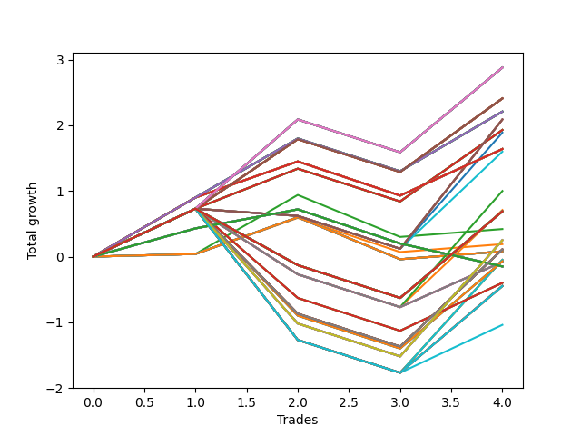

# Long HLT 648 
- Symbol: TSLA
- Date Range: 05/16/2022 - 05/17/2024
- Trading Period: 8:30-12:30
- Number of Trades: 4



| Id. | Name | Win Percent | Profit | Avg Profit / Trade | Avg Time / Trade | Std |      | Name | Win Percent | Profit | Avg Profit / Trade | Avg Time / Trade | Std |
| --- | ---- | ----------- | ------ | ------------------ | ---------------- | --- | ---- | ---- | ----------- | ------ | ------------------ | ---------------- | --- |
| | Sorted By <br> Profit | | | | | | | Sorted By <br> Win Percentage |||||
|0| TP-1.25 180m | 75.00 | 2.88 | 0.72 | 22:15 | 0.75 |     | TP-1.25 180m | 75.00 | 2.88 | 0.72 | 22:15 | 0.75 |
|1| TP-1.25 165m | 75.00 | 2.88 | 0.72 | 22:15 | 0.75 |     | TP-1.25 165m | 75.00 | 2.88 | 0.72 | 22:15 | 0.75 |
|2| TP-1.25 150m | 75.00 | 2.88 | 0.72 | 22:15 | 0.75 |     | TP-1.25 150m | 75.00 | 2.88 | 0.72 | 22:15 | 0.75 |
|3| TP-1.25 135m | 75.00 | 2.88 | 0.72 | 22:15 | 0.75 |     | TP-1.25 135m | 75.00 | 2.88 | 0.72 | 22:15 | 0.75 |
|4| TP-1.25 120m | 75.00 | 2.88 | 0.72 | 22:15 | 0.75 |     | TP-1.25 120m | 75.00 | 2.88 | 0.72 | 22:15 | 0.75 |
|5| TP-1.25 105m | 75.00 | 2.88 | 0.72 | 22:15 | 0.75 |     | TP-1.25 105m | 75.00 | 2.88 | 0.72 | 22:15 | 0.75 |
|6| TP-1.25 90m | 75.00 | 2.88 | 0.72 | 22:15 | 0.75 |     | TP-1.25 90m | 75.00 | 2.88 | 0.72 | 22:15 | 0.75 |
|7| TP-1.25 75m | 75.00 | 2.88 | 0.72 | 22:15 | 0.75 |     | TP-1.25 75m | 75.00 | 2.88 | 0.72 | 22:15 | 0.75 |
|8| TP-1.25 60m | 75.00 | 2.88 | 0.72 | 22:15 | 0.75 |     | TP-1.25 60m | 75.00 | 2.88 | 0.72 | 22:15 | 0.75 |
|9| TP-1.25 45m | 75.00 | 2.88 | 0.72 | 22:15 | 0.75 |     | TP-1.25 45m | 75.00 | 2.88 | 0.72 | 22:15 | 0.75 |
|10| TP-1.25 30m | 75.00 | 2.88 | 0.72 | 22:15 | 0.75 |     | TP-1.25 30m | 75.00 | 2.88 | 0.72 | 22:15 | 0.75 |
|11| TP-1 180m | 75.00 | 2.41 | 0.60 | 21:45 | 0.65 |     | TP-1 180m | 75.00 | 2.41 | 0.60 | 21:45 | 0.65 |
|12| TP-1 165m | 75.00 | 2.41 | 0.60 | 21:45 | 0.65 |     | TP-1 165m | 75.00 | 2.41 | 0.60 | 21:45 | 0.65 |
|13| TP-1 150m | 75.00 | 2.41 | 0.60 | 21:45 | 0.65 |     | TP-1 150m | 75.00 | 2.41 | 0.60 | 21:45 | 0.65 |
|14| TP-1 135m | 75.00 | 2.41 | 0.60 | 21:45 | 0.65 |     | TP-1 135m | 75.00 | 2.41 | 0.60 | 21:45 | 0.65 |
|15| TP-1 120m | 75.00 | 2.41 | 0.60 | 21:45 | 0.65 |     | TP-1 120m | 75.00 | 2.41 | 0.60 | 21:45 | 0.65 |
|16| TP-1 105m | 75.00 | 2.41 | 0.60 | 21:45 | 0.65 |     | TP-1 105m | 75.00 | 2.41 | 0.60 | 21:45 | 0.65 |
|17| TP-1 90m | 75.00 | 2.41 | 0.60 | 21:45 | 0.65 |     | TP-1 90m | 75.00 | 2.41 | 0.60 | 21:45 | 0.65 |
|18| TP-1 75m | 75.00 | 2.41 | 0.60 | 21:45 | 0.65 |     | TP-1 75m | 75.00 | 2.41 | 0.60 | 21:45 | 0.65 |
|19| TP-1 60m | 75.00 | 2.41 | 0.60 | 21:45 | 0.65 |     | TP-1 60m | 75.00 | 2.41 | 0.60 | 21:45 | 0.65 |
|20| TP-1 45m | 75.00 | 2.41 | 0.60 | 21:45 | 0.65 |     | TP-1 45m | 75.00 | 2.41 | 0.60 | 21:45 | 0.65 |
|21| TP-1 30m | 75.00 | 2.41 | 0.60 | 21:45 | 0.65 |     | TP-1 30m | 75.00 | 2.41 | 0.60 | 21:45 | 0.65 |
|22| TP-0.75 180m | 75.00 | 2.21 | 0.55 | 17:15 | 0.61 |     | TP-0.75 180m | 75.00 | 2.21 | 0.55 | 17:15 | 0.61 |
|23| TP-0.75 165m | 75.00 | 2.21 | 0.55 | 17:15 | 0.61 |     | TP-0.75 165m | 75.00 | 2.21 | 0.55 | 17:15 | 0.61 |
|24| TP-0.75 150m | 75.00 | 2.21 | 0.55 | 17:15 | 0.61 |     | TP-0.75 150m | 75.00 | 2.21 | 0.55 | 17:15 | 0.61 |
|25| TP-0.75 135m | 75.00 | 2.21 | 0.55 | 17:15 | 0.61 |     | TP-0.75 135m | 75.00 | 2.21 | 0.55 | 17:15 | 0.61 |
|26| TP-0.75 120m | 75.00 | 2.21 | 0.55 | 17:15 | 0.61 |     | TP-0.75 120m | 75.00 | 2.21 | 0.55 | 17:15 | 0.61 |
|27| TP-0.75 105m | 75.00 | 2.21 | 0.55 | 17:15 | 0.61 |     | TP-0.75 105m | 75.00 | 2.21 | 0.55 | 17:15 | 0.61 |
|28| TP-0.75 90m | 75.00 | 2.21 | 0.55 | 17:15 | 0.61 |     | TP-0.75 90m | 75.00 | 2.21 | 0.55 | 17:15 | 0.61 |
|29| TP-0.75 75m | 75.00 | 2.21 | 0.55 | 17:15 | 0.61 |     | TP-0.75 75m | 75.00 | 2.21 | 0.55 | 17:15 | 0.61 |
|30| TP-0.75 60m | 75.00 | 2.21 | 0.55 | 17:15 | 0.61 |     | TP-0.75 60m | 75.00 | 2.21 | 0.55 | 17:15 | 0.61 |
|31| TP-0.75 45m | 75.00 | 2.21 | 0.55 | 17:15 | 0.61 |     | TP-0.75 45m | 75.00 | 2.21 | 0.55 | 17:15 | 0.61 |
|32| TP-0.75 30m | 75.00 | 2.21 | 0.55 | 17:15 | 0.61 |     | TP-0.75 30m | 75.00 | 2.21 | 0.55 | 17:15 | 0.61 |
|33| TP-3 45m | 50.00 | 2.09 | 0.52 | 34:30 | 0.95 |     | TP-3 30m | 75.00 | 1.93 | 0.48 | 27:00 | 0.59 |
|34| TP-2.75 45m | 50.00 | 2.09 | 0.52 | 34:30 | 0.95 |     | TP-2.75 30m | 75.00 | 1.93 | 0.48 | 27:00 | 0.59 |
|35| TP-2.5 45m | 50.00 | 2.09 | 0.52 | 34:30 | 0.95 |     | TP-2.5 30m | 75.00 | 1.93 | 0.48 | 27:00 | 0.59 |
|36| TP-2.25 45m | 50.00 | 2.09 | 0.52 | 34:30 | 0.95 |     | TP-2.25 30m | 75.00 | 1.93 | 0.48 | 27:00 | 0.59 |
|37| TP-2 45m | 50.00 | 2.09 | 0.52 | 34:30 | 0.95 |     | TP-2 30m | 75.00 | 1.93 | 0.48 | 27:00 | 0.59 |
|38| TP-3 30m | 75.00 | 1.93 | 0.48 | 27:00 | 0.59 |     | TP-1.75 30m | 75.00 | 1.93 | 0.48 | 27:00 | 0.59 |
|39| TP-2.75 30m | 75.00 | 1.93 | 0.48 | 27:00 | 0.59 |     | TP-1.5 30m | 75.00 | 1.93 | 0.48 | 27:00 | 0.59 |
|40| TP-2.5 30m | 75.00 | 1.93 | 0.48 | 27:00 | 0.59 |     | TP-0.5 180m | 75.00 | 1.64 | 0.41 | 11:30 | 0.55 |
|41| TP-2.25 30m | 75.00 | 1.93 | 0.48 | 27:00 | 0.59 |     | TP-0.5 165m | 75.00 | 1.64 | 0.41 | 11:30 | 0.55 |
|42| TP-2 30m | 75.00 | 1.93 | 0.48 | 27:00 | 0.59 |     | TP-0.5 150m | 75.00 | 1.64 | 0.41 | 11:30 | 0.55 |
|43| TP-1.75 30m | 75.00 | 1.93 | 0.48 | 27:00 | 0.59 |     | TP-0.5 135m | 75.00 | 1.64 | 0.41 | 11:30 | 0.55 |
|44| TP-1.5 30m | 75.00 | 1.93 | 0.48 | 27:00 | 0.59 |     | TP-0.5 120m | 75.00 | 1.64 | 0.41 | 11:30 | 0.55 |
|45| TP-1.75 45m | 50.00 | 1.89 | 0.47 | 34:15 | 0.87 |     | TP-0.5 105m | 75.00 | 1.64 | 0.41 | 11:30 | 0.55 |
|46| TP-0.5 180m | 75.00 | 1.64 | 0.41 | 11:30 | 0.55 |     | TP-0.5 90m | 75.00 | 1.64 | 0.41 | 11:30 | 0.55 |
|47| TP-0.5 165m | 75.00 | 1.64 | 0.41 | 11:30 | 0.55 |     | TP-0.5 75m | 75.00 | 1.64 | 0.41 | 11:30 | 0.55 |
|48| TP-0.5 150m | 75.00 | 1.64 | 0.41 | 11:30 | 0.55 |     | TP-0.5 60m | 75.00 | 1.64 | 0.41 | 11:30 | 0.55 |
|49| TP-0.5 135m | 75.00 | 1.64 | 0.41 | 11:30 | 0.55 |     | TP-0.5 45m | 75.00 | 1.64 | 0.41 | 11:30 | 0.55 |
|50| TP-0.5 120m | 75.00 | 1.64 | 0.41 | 11:30 | 0.55 |     | TP-0.5 30m | 75.00 | 1.64 | 0.41 | 11:30 | 0.55 |
|51| TP-0.5 105m | 75.00 | 1.64 | 0.41 | 11:30 | 0.55 |     | TP-0.75 15m | 75.00 | 0.42 | 0.10 | 12:30 | 0.55 |
|52| TP-0.5 90m | 75.00 | 1.64 | 0.41 | 11:30 | 0.55 |     | TP-0.5 15m | 75.00 | 0.19 | 0.05 | 09:45 | 0.38 |
|53| TP-0.5 75m | 75.00 | 1.64 | 0.41 | 11:30 | 0.55 |     | TP-3 15m | 75.00 | 0.08 | 0.02 | 14:00 | 0.43 |
|54| TP-0.5 60m | 75.00 | 1.64 | 0.41 | 11:30 | 0.55 |     | TP-2.75 15m | 75.00 | 0.08 | 0.02 | 14:00 | 0.43 |
|55| TP-0.5 45m | 75.00 | 1.64 | 0.41 | 11:30 | 0.55 |     | TP-2.5 15m | 75.00 | 0.08 | 0.02 | 14:00 | 0.43 |
|56| TP-0.5 30m | 75.00 | 1.64 | 0.41 | 11:30 | 0.55 |     | TP-2.25 15m | 75.00 | 0.08 | 0.02 | 14:00 | 0.43 |
|57| TP-1.5 45m | 50.00 | 1.60 | 0.40 | 33:00 | 0.77 |     | TP-2 15m | 75.00 | 0.08 | 0.02 | 14:00 | 0.43 |
|58| TP-1.75 60m | 50.00 | 1.00 | 0.25 | 38:00 | 1.08 |     | TP-1.75 15m | 75.00 | 0.08 | 0.02 | 14:00 | 0.43 |
|59| TP-1.5 60m | 50.00 | 0.71 | 0.18 | 36:45 | 0.98 |     | TP-1.5 15m | 75.00 | 0.08 | 0.02 | 14:00 | 0.43 |
|60| TP-3 180m | 50.00 | 0.69 | 0.17 | 72:00 | 0.89 |     | TP-1.25 15m | 75.00 | 0.08 | 0.02 | 14:00 | 0.43 |
|61| TP-2.75 180m | 50.00 | 0.69 | 0.17 | 72:00 | 0.89 |     | TP-1 15m | 75.00 | 0.08 | 0.02 | 14:00 | 0.43 |
|62| TP-2.5 180m | 50.00 | 0.69 | 0.17 | 72:00 | 0.89 |     | TP-3 45m | 50.00 | 2.09 | 0.52 | 34:30 | 0.95 |
|63| TP-2.25 180m | 50.00 | 0.69 | 0.17 | 72:00 | 0.89 |     | TP-2.75 45m | 50.00 | 2.09 | 0.52 | 34:30 | 0.95 |
|64| TP-3 165m | 50.00 | 0.69 | 0.17 | 72:00 | 0.89 |     | TP-2.5 45m | 50.00 | 2.09 | 0.52 | 34:30 | 0.95 |
|65| TP-2.75 165m | 50.00 | 0.69 | 0.17 | 72:00 | 0.89 |     | TP-2.25 45m | 50.00 | 2.09 | 0.52 | 34:30 | 0.95 |
|66| TP-2.5 165m | 50.00 | 0.69 | 0.17 | 72:00 | 0.89 |     | TP-2 45m | 50.00 | 2.09 | 0.52 | 34:30 | 0.95 |
|67| TP-2.25 165m | 50.00 | 0.69 | 0.17 | 72:00 | 0.89 |     | TP-1.75 45m | 50.00 | 1.89 | 0.47 | 34:15 | 0.87 |
|68| TP-3 150m | 50.00 | 0.69 | 0.17 | 72:00 | 0.89 |     | TP-1.5 45m | 50.00 | 1.60 | 0.40 | 33:00 | 0.77 |
|69| TP-2.75 150m | 50.00 | 0.69 | 0.17 | 72:00 | 0.89 |     | TP-1.75 60m | 50.00 | 1.00 | 0.25 | 38:00 | 1.08 |
|70| TP-2.5 150m | 50.00 | 0.69 | 0.17 | 72:00 | 0.89 |     | TP-1.5 60m | 50.00 | 0.71 | 0.18 | 36:45 | 0.98 |
|71| TP-2.25 150m | 50.00 | 0.69 | 0.17 | 72:00 | 0.89 |     | TP-3 180m | 50.00 | 0.69 | 0.17 | 72:00 | 0.89 |
|72| TP-3 135m | 50.00 | 0.69 | 0.17 | 72:00 | 0.89 |     | TP-2.75 180m | 50.00 | 0.69 | 0.17 | 72:00 | 0.89 |
|73| TP-2.75 135m | 50.00 | 0.69 | 0.17 | 72:00 | 0.89 |     | TP-2.5 180m | 50.00 | 0.69 | 0.17 | 72:00 | 0.89 |
|74| TP-2.5 135m | 50.00 | 0.69 | 0.17 | 72:00 | 0.89 |     | TP-2.25 180m | 50.00 | 0.69 | 0.17 | 72:00 | 0.89 |
|75| TP-2.25 135m | 50.00 | 0.69 | 0.17 | 72:00 | 0.89 |     | TP-3 165m | 50.00 | 0.69 | 0.17 | 72:00 | 0.89 |
|76| TP-3 120m | 50.00 | 0.69 | 0.17 | 72:00 | 0.89 |     | TP-2.75 165m | 50.00 | 0.69 | 0.17 | 72:00 | 0.89 |
|77| TP-2.75 120m | 50.00 | 0.69 | 0.17 | 72:00 | 0.89 |     | TP-2.5 165m | 50.00 | 0.69 | 0.17 | 72:00 | 0.89 |
|78| TP-2.5 120m | 50.00 | 0.69 | 0.17 | 72:00 | 0.89 |     | TP-2.25 165m | 50.00 | 0.69 | 0.17 | 72:00 | 0.89 |
|79| TP-2.25 120m | 50.00 | 0.69 | 0.17 | 72:00 | 0.89 |     | TP-3 150m | 50.00 | 0.69 | 0.17 | 72:00 | 0.89 |
|80| TP-0.75 15m | 75.00 | 0.42 | 0.10 | 12:30 | 0.55 |     | TP-2.75 150m | 50.00 | 0.69 | 0.17 | 72:00 | 0.89 |
|81| TP-1.75 180m | 50.00 | 0.25 | 0.06 | 40:45 | 1.32 |     | TP-2.5 150m | 50.00 | 0.69 | 0.17 | 72:00 | 0.89 |
|82| TP-1.75 165m | 50.00 | 0.25 | 0.06 | 40:45 | 1.32 |     | TP-2.25 150m | 50.00 | 0.69 | 0.17 | 72:00 | 0.89 |
|83| TP-1.75 150m | 50.00 | 0.25 | 0.06 | 40:45 | 1.32 |     | TP-3 135m | 50.00 | 0.69 | 0.17 | 72:00 | 0.89 |
|84| TP-1.75 135m | 50.00 | 0.25 | 0.06 | 40:45 | 1.32 |     | TP-2.75 135m | 50.00 | 0.69 | 0.17 | 72:00 | 0.89 |
|85| TP-1.75 120m | 50.00 | 0.25 | 0.06 | 40:45 | 1.32 |     | TP-2.5 135m | 50.00 | 0.69 | 0.17 | 72:00 | 0.89 |
|86| TP-1.75 105m | 50.00 | 0.25 | 0.06 | 40:45 | 1.32 |     | TP-2.25 135m | 50.00 | 0.69 | 0.17 | 72:00 | 0.89 |
|87| TP-1.75 90m | 50.00 | 0.25 | 0.06 | 40:45 | 1.32 |     | TP-3 120m | 50.00 | 0.69 | 0.17 | 72:00 | 0.89 |
|88| TP-1.75 75m | 50.00 | 0.25 | 0.06 | 40:45 | 1.32 |     | TP-2.75 120m | 50.00 | 0.69 | 0.17 | 72:00 | 0.89 |
|89| TP-0.5 15m | 75.00 | 0.19 | 0.05 | 09:45 | 0.38 |     | TP-2.5 120m | 50.00 | 0.69 | 0.17 | 72:00 | 0.89 |
|90| TP-1.5 180m | 50.00 | 0.11 | 0.03 | 39:15 | 1.18 |     | TP-2.25 120m | 50.00 | 0.69 | 0.17 | 72:00 | 0.89 |
|91| TP-1.5 165m | 50.00 | 0.11 | 0.03 | 39:15 | 1.18 |     | TP-1.75 180m | 50.00 | 0.25 | 0.06 | 40:45 | 1.32 |
|92| TP-1.5 150m | 50.00 | 0.11 | 0.03 | 39:15 | 1.18 |     | TP-1.75 165m | 50.00 | 0.25 | 0.06 | 40:45 | 1.32 |
|93| TP-1.5 135m | 50.00 | 0.11 | 0.03 | 39:15 | 1.18 |     | TP-1.75 150m | 50.00 | 0.25 | 0.06 | 40:45 | 1.32 |
|94| TP-1.5 120m | 50.00 | 0.11 | 0.03 | 39:15 | 1.18 |     | TP-1.75 135m | 50.00 | 0.25 | 0.06 | 40:45 | 1.32 |
|95| TP-1.5 105m | 50.00 | 0.11 | 0.03 | 39:15 | 1.18 |     | TP-1.75 120m | 50.00 | 0.25 | 0.06 | 40:45 | 1.32 |
|96| TP-1.5 90m | 50.00 | 0.11 | 0.03 | 39:15 | 1.18 |     | TP-1.75 105m | 50.00 | 0.25 | 0.06 | 40:45 | 1.32 |
|97| TP-1.5 75m | 50.00 | 0.11 | 0.03 | 39:15 | 1.18 |     | TP-1.75 90m | 50.00 | 0.25 | 0.06 | 40:45 | 1.32 |
|98| TP-3 15m | 75.00 | 0.08 | 0.02 | 14:00 | 0.43 |     | TP-1.75 75m | 50.00 | 0.25 | 0.06 | 40:45 | 1.32 |
|99| TP-2.75 15m | 75.00 | 0.08 | 0.02 | 14:00 | 0.43 |     | TP-1.5 180m | 50.00 | 0.11 | 0.03 | 39:15 | 1.18 |
|100| TP-2.5 15m | 75.00 | 0.08 | 0.02 | 14:00 | 0.43 |     | TP-1.5 165m | 50.00 | 0.11 | 0.03 | 39:15 | 1.18 |
|101| TP-2.25 15m | 75.00 | 0.08 | 0.02 | 14:00 | 0.43 |     | TP-1.5 150m | 50.00 | 0.11 | 0.03 | 39:15 | 1.18 |
|102| TP-2 15m | 75.00 | 0.08 | 0.02 | 14:00 | 0.43 |     | TP-1.5 135m | 50.00 | 0.11 | 0.03 | 39:15 | 1.18 |
|103| TP-1.75 15m | 75.00 | 0.08 | 0.02 | 14:00 | 0.43 |     | TP-1.5 120m | 50.00 | 0.11 | 0.03 | 39:15 | 1.18 |
|104| TP-1.5 15m | 75.00 | 0.08 | 0.02 | 14:00 | 0.43 |     | TP-1.5 105m | 50.00 | 0.11 | 0.03 | 39:15 | 1.18 |
|105| TP-1.25 15m | 75.00 | 0.08 | 0.02 | 14:00 | 0.43 |     | TP-1.5 90m | 50.00 | 0.11 | 0.03 | 39:15 | 1.18 |
|106| TP-1 15m | 75.00 | 0.08 | 0.02 | 14:00 | 0.43 |     | TP-1.5 75m | 50.00 | 0.11 | 0.03 | 39:15 | 1.18 |
|107| TP-3 75m | 50.00 | -0.05 | -0.01 | 49:30 | 1.39 |     | TP-3 75m | 50.00 | -0.05 | -0.01 | 49:30 | 1.39 |
|108| TP-2.75 75m | 50.00 | -0.05 | -0.01 | 49:30 | 1.39 |     | TP-2.75 75m | 50.00 | -0.05 | -0.01 | 49:30 | 1.39 |
|109| TP-2.5 75m | 50.00 | -0.05 | -0.01 | 49:30 | 1.39 |     | TP-2.5 75m | 50.00 | -0.05 | -0.01 | 49:30 | 1.39 |
|110| TP-2.25 75m | 50.00 | -0.05 | -0.01 | 49:30 | 1.39 |     | TP-2.25 75m | 50.00 | -0.05 | -0.01 | 49:30 | 1.39 |
|111| TP-2 75m | 50.00 | -0.05 | -0.01 | 49:30 | 1.39 |     | TP-2 75m | 50.00 | -0.05 | -0.01 | 49:30 | 1.39 |
|112| TP-3 90m | 50.00 | -0.07 | -0.02 | 57:00 | 1.14 |     | TP-3 90m | 50.00 | -0.07 | -0.02 | 57:00 | 1.14 |
|113| TP-2.75 90m | 50.00 | -0.07 | -0.02 | 57:00 | 1.14 |     | TP-2.75 90m | 50.00 | -0.07 | -0.02 | 57:00 | 1.14 |
|114| TP-2.5 90m | 50.00 | -0.07 | -0.02 | 57:00 | 1.14 |     | TP-2.5 90m | 50.00 | -0.07 | -0.02 | 57:00 | 1.14 |
|115| TP-2.25 90m | 50.00 | -0.07 | -0.02 | 57:00 | 1.14 |     | TP-2.25 90m | 50.00 | -0.07 | -0.02 | 57:00 | 1.14 |
|116| TP-3 60m | 50.00 | -0.08 | -0.02 | 42:00 | 0.75 |     | TP-3 60m | 50.00 | -0.08 | -0.02 | 42:00 | 0.75 |
|117| TP-2.75 60m | 50.00 | -0.08 | -0.02 | 42:00 | 0.75 |     | TP-2.75 60m | 50.00 | -0.08 | -0.02 | 42:00 | 0.75 |
|118| TP-2.5 60m | 50.00 | -0.08 | -0.02 | 42:00 | 0.75 |     | TP-2.5 60m | 50.00 | -0.08 | -0.02 | 42:00 | 0.75 |
|119| TP-2.25 60m | 50.00 | -0.08 | -0.02 | 42:00 | 0.75 |     | TP-2.25 60m | 50.00 | -0.08 | -0.02 | 42:00 | 0.75 |
|120| TP-2 60m | 50.00 | -0.08 | -0.02 | 42:00 | 0.75 |     | TP-2 60m | 50.00 | -0.08 | -0.02 | 42:00 | 0.75 |
|121| TP-0.25 180m | 50.00 | -0.15 | -0.04 | 03:45 | 0.41 |     | TP-0.25 180m | 50.00 | -0.15 | -0.04 | 03:45 | 0.41 |
|122| TP-0.25 165m | 50.00 | -0.15 | -0.04 | 03:45 | 0.41 |     | TP-0.25 165m | 50.00 | -0.15 | -0.04 | 03:45 | 0.41 |
|123| TP-0.25 150m | 50.00 | -0.15 | -0.04 | 03:45 | 0.41 |     | TP-0.25 150m | 50.00 | -0.15 | -0.04 | 03:45 | 0.41 |
|124| TP-0.25 135m | 50.00 | -0.15 | -0.04 | 03:45 | 0.41 |     | TP-0.25 135m | 50.00 | -0.15 | -0.04 | 03:45 | 0.41 |
|125| TP-0.25 120m | 50.00 | -0.15 | -0.04 | 03:45 | 0.41 |     | TP-0.25 120m | 50.00 | -0.15 | -0.04 | 03:45 | 0.41 |
|126| TP-0.25 105m | 50.00 | -0.15 | -0.04 | 03:45 | 0.41 |     | TP-0.25 105m | 50.00 | -0.15 | -0.04 | 03:45 | 0.41 |
|127| TP-0.25 90m | 50.00 | -0.15 | -0.04 | 03:45 | 0.41 |     | TP-0.25 90m | 50.00 | -0.15 | -0.04 | 03:45 | 0.41 |
|128| TP-0.25 75m | 50.00 | -0.15 | -0.04 | 03:45 | 0.41 |     | TP-0.25 75m | 50.00 | -0.15 | -0.04 | 03:45 | 0.41 |
|129| TP-0.25 60m | 50.00 | -0.15 | -0.04 | 03:45 | 0.41 |     | TP-0.25 60m | 50.00 | -0.15 | -0.04 | 03:45 | 0.41 |
|130| TP-0.25 45m | 50.00 | -0.15 | -0.04 | 03:45 | 0.41 |     | TP-0.25 45m | 50.00 | -0.15 | -0.04 | 03:45 | 0.41 |
|131| TP-0.25 30m | 50.00 | -0.15 | -0.04 | 03:45 | 0.41 |     | TP-0.25 30m | 50.00 | -0.15 | -0.04 | 03:45 | 0.41 |
|132| TP-0.25 15m | 50.00 | -0.15 | -0.04 | 03:45 | 0.41 |     | TP-0.25 15m | 50.00 | -0.15 | -0.04 | 03:45 | 0.41 |
|133| TP-3 105m | 50.00 | -0.40 | -0.10 | 64:30 | 0.88 |     | TP-3 105m | 50.00 | -0.40 | -0.10 | 64:30 | 0.88 |
|134| TP-2.75 105m | 50.00 | -0.40 | -0.10 | 64:30 | 0.88 |     | TP-2.75 105m | 50.00 | -0.40 | -0.10 | 64:30 | 0.88 |
|135| TP-2.5 105m | 50.00 | -0.40 | -0.10 | 64:30 | 0.88 |     | TP-2.5 105m | 50.00 | -0.40 | -0.10 | 64:30 | 0.88 |
|136| TP-2.25 105m | 50.00 | -0.40 | -0.10 | 64:30 | 0.88 |     | TP-2.25 105m | 50.00 | -0.40 | -0.10 | 64:30 | 0.88 |
|137| TP-2 90m | 50.00 | -0.44 | -0.11 | 53:15 | 1.28 |     | TP-2 90m | 50.00 | -0.44 | -0.11 | 53:15 | 1.28 |
|138| TP-2 180m | 50.00 | -0.45 | -0.11 | 60:45 | 1.27 |     | TP-2 180m | 50.00 | -0.45 | -0.11 | 60:45 | 1.27 |
|139| TP-2 165m | 50.00 | -0.45 | -0.11 | 60:45 | 1.27 |     | TP-2 165m | 50.00 | -0.45 | -0.11 | 60:45 | 1.27 |
|140| TP-2 150m | 50.00 | -0.45 | -0.11 | 60:45 | 1.27 |     | TP-2 150m | 50.00 | -0.45 | -0.11 | 60:45 | 1.27 |
|141| TP-2 135m | 50.00 | -0.45 | -0.11 | 60:45 | 1.27 |     | TP-2 135m | 50.00 | -0.45 | -0.11 | 60:45 | 1.27 |
|142| TP-2 120m | 50.00 | -0.45 | -0.11 | 60:45 | 1.27 |     | TP-2 120m | 50.00 | -0.45 | -0.11 | 60:45 | 1.27 |
|143| TP-2 105m | 50.00 | -1.04 | -0.26 | 57:00 | 1.12 |     | TP-2 105m | 50.00 | -1.04 | -0.26 | 57:00 | 1.12 |

### Test TP-0.25 15m
* Take Profit of 0.25 Point
* 0.25 Stoploss
* Results:
```
Total Trades: 4
Percent Up: 50.00
Percent Down: 50.00
Total Points Moved Up: -0.15
Potential Profit: -75.00
Total Points Ups: 0.72 Count Ups: 2
Total Points Downs: -0.87 Count Downs: 2
```

<details><summary>Trades</summary>

<code>In: 2022-08-16 12:25:00		Out: 2022-08-16 12:27:00		Total Position Time: 02:00		Total Move Up: 0.43		Total to Date: 0.43</code> <br />
<code>In: 2023-01-18 08:55:00		Out: 2023-01-18 08:57:00		Total Position Time: 02:00		Total Move Up: 0.29		Total to Date: 0.72</code> <br />
<code>In: 2024-03-28 12:25:00		Out: 2024-03-28 12:32:00		Total Position Time: 07:00		Total Move Up: -0.52		Total to Date: 0.20</code> <br />
<code>In: 2024-04-30 08:45:00		Out: 2024-04-30 08:49:00		Total Position Time: 04:00		Total Move Up: -0.35		Total to Date: -0.15</code> <br />


</details>

### Test TP-0.5 15m
* Take Profit of 0.5 Point
* 0.5 Stoploss
* Results:
```
Total Trades: 4
Percent Up: 75.00
Percent Down: 25.00
Total Points Moved Up: 0.19
Potential Profit: 95.00
Total Points Ups: 0.71 Count Ups: 3
Total Points Downs: -0.52 Count Downs: 1
```

<details><summary>Trades</summary>

<code>In: 2022-08-16 12:25:00		Out: 2022-08-16 12:39:00		Total Position Time: 14:00		Total Move Up: 0.04		Total to Date: 0.04</code> <br />
<code>In: 2023-01-18 08:55:00		Out: 2023-01-18 08:59:00		Total Position Time: 04:00		Total Move Up: 0.55		Total to Date: 0.59</code> <br />
<code>In: 2024-03-28 12:25:00		Out: 2024-03-28 12:32:00		Total Position Time: 07:00		Total Move Up: -0.52		Total to Date: 0.07</code> <br />
<code>In: 2024-04-30 08:45:00		Out: 2024-04-30 08:59:00		Total Position Time: 14:00		Total Move Up: 0.12		Total to Date: 0.19</code> <br />


</details>

### Test TP-0.75 15m
* Take Profit of 0.75 Point
* 0.75 Stoploss
* Results:
```
Total Trades: 4
Percent Up: 75.00
Percent Down: 25.00
Total Points Moved Up: 0.42
Potential Profit: 210.00
Total Points Ups: 1.06 Count Ups: 3
Total Points Downs: -0.64 Count Downs: 1
```

<details><summary>Trades</summary>

<code>In: 2022-08-16 12:25:00		Out: 2022-08-16 12:39:00		Total Position Time: 14:00		Total Move Up: 0.04		Total to Date: 0.04</code> <br />
<code>In: 2023-01-18 08:55:00		Out: 2023-01-18 09:03:00		Total Position Time: 08:00		Total Move Up: 0.90		Total to Date: 0.94</code> <br />
<code>In: 2024-03-28 12:25:00		Out: 2024-03-28 12:39:00		Total Position Time: 14:00		Total Move Up: -0.64		Total to Date: 0.30</code> <br />
<code>In: 2024-04-30 08:45:00		Out: 2024-04-30 08:59:00		Total Position Time: 14:00		Total Move Up: 0.12		Total to Date: 0.42</code> <br />


</details>

### Test TP-1 15m
* Take Profit of 1 Point
* 1 Stoploss
* Results:
```
Total Trades: 4
Percent Up: 75.00
Percent Down: 25.00
Total Points Moved Up: 0.08
Potential Profit: 40.00
Total Points Ups: 0.72 Count Ups: 3
Total Points Downs: -0.64 Count Downs: 1
```

<details><summary>Trades</summary>

<code>In: 2022-08-16 12:25:00		Out: 2022-08-16 12:39:00		Total Position Time: 14:00		Total Move Up: 0.04		Total to Date: 0.04</code> <br />
<code>In: 2023-01-18 08:55:00		Out: 2023-01-18 09:09:00		Total Position Time: 14:00		Total Move Up: 0.56		Total to Date: 0.60</code> <br />
<code>In: 2024-03-28 12:25:00		Out: 2024-03-28 12:39:00		Total Position Time: 14:00		Total Move Up: -0.64		Total to Date: -0.04</code> <br />
<code>In: 2024-04-30 08:45:00		Out: 2024-04-30 08:59:00		Total Position Time: 14:00		Total Move Up: 0.12		Total to Date: 0.08</code> <br />


</details>

### Test TP-1.25 15m
* Take Profit of 1.25 Point
* 1.25 Stoploss
* Results:
```
Total Trades: 4
Percent Up: 75.00
Percent Down: 25.00
Total Points Moved Up: 0.08
Potential Profit: 40.00
Total Points Ups: 0.72 Count Ups: 3
Total Points Downs: -0.64 Count Downs: 1
```

<details><summary>Trades</summary>

<code>In: 2022-08-16 12:25:00		Out: 2022-08-16 12:39:00		Total Position Time: 14:00		Total Move Up: 0.04		Total to Date: 0.04</code> <br />
<code>In: 2023-01-18 08:55:00		Out: 2023-01-18 09:09:00		Total Position Time: 14:00		Total Move Up: 0.56		Total to Date: 0.60</code> <br />
<code>In: 2024-03-28 12:25:00		Out: 2024-03-28 12:39:00		Total Position Time: 14:00		Total Move Up: -0.64		Total to Date: -0.04</code> <br />
<code>In: 2024-04-30 08:45:00		Out: 2024-04-30 08:59:00		Total Position Time: 14:00		Total Move Up: 0.12		Total to Date: 0.08</code> <br />


</details>

### Test TP-1.5 15m
* Take Profit of 1.5 Point
* 1.5 Stoploss
* Results:
```
Total Trades: 4
Percent Up: 75.00
Percent Down: 25.00
Total Points Moved Up: 0.08
Potential Profit: 40.00
Total Points Ups: 0.72 Count Ups: 3
Total Points Downs: -0.64 Count Downs: 1
```

<details><summary>Trades</summary>

<code>In: 2022-08-16 12:25:00		Out: 2022-08-16 12:39:00		Total Position Time: 14:00		Total Move Up: 0.04		Total to Date: 0.04</code> <br />
<code>In: 2023-01-18 08:55:00		Out: 2023-01-18 09:09:00		Total Position Time: 14:00		Total Move Up: 0.56		Total to Date: 0.60</code> <br />
<code>In: 2024-03-28 12:25:00		Out: 2024-03-28 12:39:00		Total Position Time: 14:00		Total Move Up: -0.64		Total to Date: -0.04</code> <br />
<code>In: 2024-04-30 08:45:00		Out: 2024-04-30 08:59:00		Total Position Time: 14:00		Total Move Up: 0.12		Total to Date: 0.08</code> <br />


</details>

### Test TP-1.75 15m
* Take Profit of 1.75 Point
* 1.75 Stoploss
* Results:
```
Total Trades: 4
Percent Up: 75.00
Percent Down: 25.00
Total Points Moved Up: 0.08
Potential Profit: 40.00
Total Points Ups: 0.72 Count Ups: 3
Total Points Downs: -0.64 Count Downs: 1
```

<details><summary>Trades</summary>

<code>In: 2022-08-16 12:25:00		Out: 2022-08-16 12:39:00		Total Position Time: 14:00		Total Move Up: 0.04		Total to Date: 0.04</code> <br />
<code>In: 2023-01-18 08:55:00		Out: 2023-01-18 09:09:00		Total Position Time: 14:00		Total Move Up: 0.56		Total to Date: 0.60</code> <br />
<code>In: 2024-03-28 12:25:00		Out: 2024-03-28 12:39:00		Total Position Time: 14:00		Total Move Up: -0.64		Total to Date: -0.04</code> <br />
<code>In: 2024-04-30 08:45:00		Out: 2024-04-30 08:59:00		Total Position Time: 14:00		Total Move Up: 0.12		Total to Date: 0.08</code> <br />


</details>

### Test TP-2 15m
* Take Profit of 2 Point
* 2 Stoploss
* Results:
```
Total Trades: 4
Percent Up: 75.00
Percent Down: 25.00
Total Points Moved Up: 0.08
Potential Profit: 40.00
Total Points Ups: 0.72 Count Ups: 3
Total Points Downs: -0.64 Count Downs: 1
```

<details><summary>Trades</summary>

<code>In: 2022-08-16 12:25:00		Out: 2022-08-16 12:39:00		Total Position Time: 14:00		Total Move Up: 0.04		Total to Date: 0.04</code> <br />
<code>In: 2023-01-18 08:55:00		Out: 2023-01-18 09:09:00		Total Position Time: 14:00		Total Move Up: 0.56		Total to Date: 0.60</code> <br />
<code>In: 2024-03-28 12:25:00		Out: 2024-03-28 12:39:00		Total Position Time: 14:00		Total Move Up: -0.64		Total to Date: -0.04</code> <br />
<code>In: 2024-04-30 08:45:00		Out: 2024-04-30 08:59:00		Total Position Time: 14:00		Total Move Up: 0.12		Total to Date: 0.08</code> <br />


</details>

### Test TP-2.25 15m
* Take Profit of 2.25 Point
* 2.25 Stoploss
* Results:
```
Total Trades: 4
Percent Up: 75.00
Percent Down: 25.00
Total Points Moved Up: 0.08
Potential Profit: 40.00
Total Points Ups: 0.72 Count Ups: 3
Total Points Downs: -0.64 Count Downs: 1
```

<details><summary>Trades</summary>

<code>In: 2022-08-16 12:25:00		Out: 2022-08-16 12:39:00		Total Position Time: 14:00		Total Move Up: 0.04		Total to Date: 0.04</code> <br />
<code>In: 2023-01-18 08:55:00		Out: 2023-01-18 09:09:00		Total Position Time: 14:00		Total Move Up: 0.56		Total to Date: 0.60</code> <br />
<code>In: 2024-03-28 12:25:00		Out: 2024-03-28 12:39:00		Total Position Time: 14:00		Total Move Up: -0.64		Total to Date: -0.04</code> <br />
<code>In: 2024-04-30 08:45:00		Out: 2024-04-30 08:59:00		Total Position Time: 14:00		Total Move Up: 0.12		Total to Date: 0.08</code> <br />


</details>

### Test TP-2.5 15m
* Take Profit of 2.5 Point
* 2.5 Stoploss
* Results:
```
Total Trades: 4
Percent Up: 75.00
Percent Down: 25.00
Total Points Moved Up: 0.08
Potential Profit: 40.00
Total Points Ups: 0.72 Count Ups: 3
Total Points Downs: -0.64 Count Downs: 1
```

<details><summary>Trades</summary>

<code>In: 2022-08-16 12:25:00		Out: 2022-08-16 12:39:00		Total Position Time: 14:00		Total Move Up: 0.04		Total to Date: 0.04</code> <br />
<code>In: 2023-01-18 08:55:00		Out: 2023-01-18 09:09:00		Total Position Time: 14:00		Total Move Up: 0.56		Total to Date: 0.60</code> <br />
<code>In: 2024-03-28 12:25:00		Out: 2024-03-28 12:39:00		Total Position Time: 14:00		Total Move Up: -0.64		Total to Date: -0.04</code> <br />
<code>In: 2024-04-30 08:45:00		Out: 2024-04-30 08:59:00		Total Position Time: 14:00		Total Move Up: 0.12		Total to Date: 0.08</code> <br />


</details>

### Test TP-2.75 15m
* Take Profit of 2.75 Point
* 2.75 Stoploss
* Results:
```
Total Trades: 4
Percent Up: 75.00
Percent Down: 25.00
Total Points Moved Up: 0.08
Potential Profit: 40.00
Total Points Ups: 0.72 Count Ups: 3
Total Points Downs: -0.64 Count Downs: 1
```

<details><summary>Trades</summary>

<code>In: 2022-08-16 12:25:00		Out: 2022-08-16 12:39:00		Total Position Time: 14:00		Total Move Up: 0.04		Total to Date: 0.04</code> <br />
<code>In: 2023-01-18 08:55:00		Out: 2023-01-18 09:09:00		Total Position Time: 14:00		Total Move Up: 0.56		Total to Date: 0.60</code> <br />
<code>In: 2024-03-28 12:25:00		Out: 2024-03-28 12:39:00		Total Position Time: 14:00		Total Move Up: -0.64		Total to Date: -0.04</code> <br />
<code>In: 2024-04-30 08:45:00		Out: 2024-04-30 08:59:00		Total Position Time: 14:00		Total Move Up: 0.12		Total to Date: 0.08</code> <br />


</details>

### Test TP-3 15m
* Take Profit of 3 Point
* 3 Stoploss
* Results:
```
Total Trades: 4
Percent Up: 75.00
Percent Down: 25.00
Total Points Moved Up: 0.08
Potential Profit: 40.00
Total Points Ups: 0.72 Count Ups: 3
Total Points Downs: -0.64 Count Downs: 1
```

<details><summary>Trades</summary>

<code>In: 2022-08-16 12:25:00		Out: 2022-08-16 12:39:00		Total Position Time: 14:00		Total Move Up: 0.04		Total to Date: 0.04</code> <br />
<code>In: 2023-01-18 08:55:00		Out: 2023-01-18 09:09:00		Total Position Time: 14:00		Total Move Up: 0.56		Total to Date: 0.60</code> <br />
<code>In: 2024-03-28 12:25:00		Out: 2024-03-28 12:39:00		Total Position Time: 14:00		Total Move Up: -0.64		Total to Date: -0.04</code> <br />
<code>In: 2024-04-30 08:45:00		Out: 2024-04-30 08:59:00		Total Position Time: 14:00		Total Move Up: 0.12		Total to Date: 0.08</code> <br />


</details>

### Test TP-0.25 30m
* Take Profit of 0.25 Point
* 0.25 Stoploss
* Results:
```
Total Trades: 4
Percent Up: 50.00
Percent Down: 50.00
Total Points Moved Up: -0.15
Potential Profit: -75.00
Total Points Ups: 0.72 Count Ups: 2
Total Points Downs: -0.87 Count Downs: 2
```

<details><summary>Trades</summary>

<code>In: 2022-08-16 12:25:00		Out: 2022-08-16 12:27:00		Total Position Time: 02:00		Total Move Up: 0.43		Total to Date: 0.43</code> <br />
<code>In: 2023-01-18 08:55:00		Out: 2023-01-18 08:57:00		Total Position Time: 02:00		Total Move Up: 0.29		Total to Date: 0.72</code> <br />
<code>In: 2024-03-28 12:25:00		Out: 2024-03-28 12:32:00		Total Position Time: 07:00		Total Move Up: -0.52		Total to Date: 0.20</code> <br />
<code>In: 2024-04-30 08:45:00		Out: 2024-04-30 08:49:00		Total Position Time: 04:00		Total Move Up: -0.35		Total to Date: -0.15</code> <br />


</details>

### Test TP-0.5 30m
* Take Profit of 0.5 Point
* 0.5 Stoploss
* Results:
```
Total Trades: 4
Percent Up: 75.00
Percent Down: 25.00
Total Points Moved Up: 1.64
Potential Profit: 820.00
Total Points Ups: 2.16 Count Ups: 3
Total Points Downs: -0.52 Count Downs: 1
```

<details><summary>Trades</summary>

<code>In: 2022-08-16 12:25:00		Out: 2022-08-16 12:42:00		Total Position Time: 17:00		Total Move Up: 0.90		Total to Date: 0.90</code> <br />
<code>In: 2023-01-18 08:55:00		Out: 2023-01-18 08:59:00		Total Position Time: 04:00		Total Move Up: 0.55		Total to Date: 1.45</code> <br />
<code>In: 2024-03-28 12:25:00		Out: 2024-03-28 12:32:00		Total Position Time: 07:00		Total Move Up: -0.52		Total to Date: 0.93</code> <br />
<code>In: 2024-04-30 08:45:00		Out: 2024-04-30 09:03:00		Total Position Time: 18:00		Total Move Up: 0.71		Total to Date: 1.64</code> <br />


</details>

### Test TP-0.75 30m
* Take Profit of 0.75 Point
* 0.75 Stoploss
* Results:
```
Total Trades: 4
Percent Up: 75.00
Percent Down: 25.00
Total Points Moved Up: 2.21
Potential Profit: 1105.00
Total Points Ups: 2.71 Count Ups: 3
Total Points Downs: -0.50 Count Downs: 1
```

<details><summary>Trades</summary>

<code>In: 2022-08-16 12:25:00		Out: 2022-08-16 12:42:00		Total Position Time: 17:00		Total Move Up: 0.90		Total to Date: 0.90</code> <br />
<code>In: 2023-01-18 08:55:00		Out: 2023-01-18 09:03:00		Total Position Time: 08:00		Total Move Up: 0.90		Total to Date: 1.80</code> <br />
<code>In: 2024-03-28 12:25:00		Out: 2024-03-28 12:50:00		Total Position Time: 25:00		Total Move Up: -0.50		Total to Date: 1.30</code> <br />
<code>In: 2024-04-30 08:45:00		Out: 2024-04-30 09:04:00		Total Position Time: 19:00		Total Move Up: 0.91		Total to Date: 2.21</code> <br />


</details>

### Test TP-1 30m
* Take Profit of 1 Point
* 1 Stoploss
* Results:
```
Total Trades: 4
Percent Up: 75.00
Percent Down: 25.00
Total Points Moved Up: 2.41
Potential Profit: 1205.00
Total Points Ups: 2.91 Count Ups: 3
Total Points Downs: -0.50 Count Downs: 1
```

<details><summary>Trades</summary>

<code>In: 2022-08-16 12:25:00		Out: 2022-08-16 12:50:00		Total Position Time: 25:00		Total Move Up: 0.73		Total to Date: 0.73</code> <br />
<code>In: 2023-01-18 08:55:00		Out: 2023-01-18 09:12:00		Total Position Time: 17:00		Total Move Up: 1.06		Total to Date: 1.79</code> <br />
<code>In: 2024-03-28 12:25:00		Out: 2024-03-28 12:50:00		Total Position Time: 25:00		Total Move Up: -0.50		Total to Date: 1.29</code> <br />
<code>In: 2024-04-30 08:45:00		Out: 2024-04-30 09:05:00		Total Position Time: 20:00		Total Move Up: 1.12		Total to Date: 2.41</code> <br />


</details>

### Test TP-1.25 30m
* Take Profit of 1.25 Point
* 1.25 Stoploss
* Results:
```
Total Trades: 4
Percent Up: 75.00
Percent Down: 25.00
Total Points Moved Up: 2.88
Potential Profit: 1440.00
Total Points Ups: 3.38 Count Ups: 3
Total Points Downs: -0.50 Count Downs: 1
```

<details><summary>Trades</summary>

<code>In: 2022-08-16 12:25:00		Out: 2022-08-16 12:50:00		Total Position Time: 25:00		Total Move Up: 0.73		Total to Date: 0.73</code> <br />
<code>In: 2023-01-18 08:55:00		Out: 2023-01-18 09:13:00		Total Position Time: 18:00		Total Move Up: 1.36		Total to Date: 2.09</code> <br />
<code>In: 2024-03-28 12:25:00		Out: 2024-03-28 12:50:00		Total Position Time: 25:00		Total Move Up: -0.50		Total to Date: 1.59</code> <br />
<code>In: 2024-04-30 08:45:00		Out: 2024-04-30 09:06:00		Total Position Time: 21:00		Total Move Up: 1.29		Total to Date: 2.88</code> <br />


</details>

### Test TP-1.5 30m
* Take Profit of 1.5 Point
* 1.5 Stoploss
* Results:
```
Total Trades: 4
Percent Up: 75.00
Percent Down: 25.00
Total Points Moved Up: 1.93
Potential Profit: 965.00
Total Points Ups: 2.43 Count Ups: 3
Total Points Downs: -0.50 Count Downs: 1
```

<details><summary>Trades</summary>

<code>In: 2022-08-16 12:25:00		Out: 2022-08-16 12:50:00		Total Position Time: 25:00		Total Move Up: 0.73		Total to Date: 0.73</code> <br />
<code>In: 2023-01-18 08:55:00		Out: 2023-01-18 09:24:00		Total Position Time: 29:00		Total Move Up: 0.61		Total to Date: 1.34</code> <br />
<code>In: 2024-03-28 12:25:00		Out: 2024-03-28 12:50:00		Total Position Time: 25:00		Total Move Up: -0.50		Total to Date: 0.84</code> <br />
<code>In: 2024-04-30 08:45:00		Out: 2024-04-30 09:14:00		Total Position Time: 29:00		Total Move Up: 1.09		Total to Date: 1.93</code> <br />


</details>

### Test TP-1.75 30m
* Take Profit of 1.75 Point
* 1.75 Stoploss
* Results:
```
Total Trades: 4
Percent Up: 75.00
Percent Down: 25.00
Total Points Moved Up: 1.93
Potential Profit: 965.00
Total Points Ups: 2.43 Count Ups: 3
Total Points Downs: -0.50 Count Downs: 1
```

<details><summary>Trades</summary>

<code>In: 2022-08-16 12:25:00		Out: 2022-08-16 12:50:00		Total Position Time: 25:00		Total Move Up: 0.73		Total to Date: 0.73</code> <br />
<code>In: 2023-01-18 08:55:00		Out: 2023-01-18 09:24:00		Total Position Time: 29:00		Total Move Up: 0.61		Total to Date: 1.34</code> <br />
<code>In: 2024-03-28 12:25:00		Out: 2024-03-28 12:50:00		Total Position Time: 25:00		Total Move Up: -0.50		Total to Date: 0.84</code> <br />
<code>In: 2024-04-30 08:45:00		Out: 2024-04-30 09:14:00		Total Position Time: 29:00		Total Move Up: 1.09		Total to Date: 1.93</code> <br />


</details>

### Test TP-2 30m
* Take Profit of 2 Point
* 2 Stoploss
* Results:
```
Total Trades: 4
Percent Up: 75.00
Percent Down: 25.00
Total Points Moved Up: 1.93
Potential Profit: 965.00
Total Points Ups: 2.43 Count Ups: 3
Total Points Downs: -0.50 Count Downs: 1
```

<details><summary>Trades</summary>

<code>In: 2022-08-16 12:25:00		Out: 2022-08-16 12:50:00		Total Position Time: 25:00		Total Move Up: 0.73		Total to Date: 0.73</code> <br />
<code>In: 2023-01-18 08:55:00		Out: 2023-01-18 09:24:00		Total Position Time: 29:00		Total Move Up: 0.61		Total to Date: 1.34</code> <br />
<code>In: 2024-03-28 12:25:00		Out: 2024-03-28 12:50:00		Total Position Time: 25:00		Total Move Up: -0.50		Total to Date: 0.84</code> <br />
<code>In: 2024-04-30 08:45:00		Out: 2024-04-30 09:14:00		Total Position Time: 29:00		Total Move Up: 1.09		Total to Date: 1.93</code> <br />


</details>

### Test TP-2.25 30m
* Take Profit of 2.25 Point
* 2.25 Stoploss
* Results:
```
Total Trades: 4
Percent Up: 75.00
Percent Down: 25.00
Total Points Moved Up: 1.93
Potential Profit: 965.00
Total Points Ups: 2.43 Count Ups: 3
Total Points Downs: -0.50 Count Downs: 1
```

<details><summary>Trades</summary>

<code>In: 2022-08-16 12:25:00		Out: 2022-08-16 12:50:00		Total Position Time: 25:00		Total Move Up: 0.73		Total to Date: 0.73</code> <br />
<code>In: 2023-01-18 08:55:00		Out: 2023-01-18 09:24:00		Total Position Time: 29:00		Total Move Up: 0.61		Total to Date: 1.34</code> <br />
<code>In: 2024-03-28 12:25:00		Out: 2024-03-28 12:50:00		Total Position Time: 25:00		Total Move Up: -0.50		Total to Date: 0.84</code> <br />
<code>In: 2024-04-30 08:45:00		Out: 2024-04-30 09:14:00		Total Position Time: 29:00		Total Move Up: 1.09		Total to Date: 1.93</code> <br />


</details>

### Test TP-2.5 30m
* Take Profit of 2.5 Point
* 2.5 Stoploss
* Results:
```
Total Trades: 4
Percent Up: 75.00
Percent Down: 25.00
Total Points Moved Up: 1.93
Potential Profit: 965.00
Total Points Ups: 2.43 Count Ups: 3
Total Points Downs: -0.50 Count Downs: 1
```

<details><summary>Trades</summary>

<code>In: 2022-08-16 12:25:00		Out: 2022-08-16 12:50:00		Total Position Time: 25:00		Total Move Up: 0.73		Total to Date: 0.73</code> <br />
<code>In: 2023-01-18 08:55:00		Out: 2023-01-18 09:24:00		Total Position Time: 29:00		Total Move Up: 0.61		Total to Date: 1.34</code> <br />
<code>In: 2024-03-28 12:25:00		Out: 2024-03-28 12:50:00		Total Position Time: 25:00		Total Move Up: -0.50		Total to Date: 0.84</code> <br />
<code>In: 2024-04-30 08:45:00		Out: 2024-04-30 09:14:00		Total Position Time: 29:00		Total Move Up: 1.09		Total to Date: 1.93</code> <br />


</details>

### Test TP-2.75 30m
* Take Profit of 2.75 Point
* 2.75 Stoploss
* Results:
```
Total Trades: 4
Percent Up: 75.00
Percent Down: 25.00
Total Points Moved Up: 1.93
Potential Profit: 965.00
Total Points Ups: 2.43 Count Ups: 3
Total Points Downs: -0.50 Count Downs: 1
```

<details><summary>Trades</summary>

<code>In: 2022-08-16 12:25:00		Out: 2022-08-16 12:50:00		Total Position Time: 25:00		Total Move Up: 0.73		Total to Date: 0.73</code> <br />
<code>In: 2023-01-18 08:55:00		Out: 2023-01-18 09:24:00		Total Position Time: 29:00		Total Move Up: 0.61		Total to Date: 1.34</code> <br />
<code>In: 2024-03-28 12:25:00		Out: 2024-03-28 12:50:00		Total Position Time: 25:00		Total Move Up: -0.50		Total to Date: 0.84</code> <br />
<code>In: 2024-04-30 08:45:00		Out: 2024-04-30 09:14:00		Total Position Time: 29:00		Total Move Up: 1.09		Total to Date: 1.93</code> <br />


</details>

### Test TP-3 30m
* Take Profit of 3 Point
* 3 Stoploss
* Results:
```
Total Trades: 4
Percent Up: 75.00
Percent Down: 25.00
Total Points Moved Up: 1.93
Potential Profit: 965.00
Total Points Ups: 2.43 Count Ups: 3
Total Points Downs: -0.50 Count Downs: 1
```

<details><summary>Trades</summary>

<code>In: 2022-08-16 12:25:00		Out: 2022-08-16 12:50:00		Total Position Time: 25:00		Total Move Up: 0.73		Total to Date: 0.73</code> <br />
<code>In: 2023-01-18 08:55:00		Out: 2023-01-18 09:24:00		Total Position Time: 29:00		Total Move Up: 0.61		Total to Date: 1.34</code> <br />
<code>In: 2024-03-28 12:25:00		Out: 2024-03-28 12:50:00		Total Position Time: 25:00		Total Move Up: -0.50		Total to Date: 0.84</code> <br />
<code>In: 2024-04-30 08:45:00		Out: 2024-04-30 09:14:00		Total Position Time: 29:00		Total Move Up: 1.09		Total to Date: 1.93</code> <br />


</details>

### Test TP-0.25 45m
* Take Profit of 0.25 Point
* 0.25 Stoploss
* Results:
```
Total Trades: 4
Percent Up: 50.00
Percent Down: 50.00
Total Points Moved Up: -0.15
Potential Profit: -75.00
Total Points Ups: 0.72 Count Ups: 2
Total Points Downs: -0.87 Count Downs: 2
```

<details><summary>Trades</summary>

<code>In: 2022-08-16 12:25:00		Out: 2022-08-16 12:27:00		Total Position Time: 02:00		Total Move Up: 0.43		Total to Date: 0.43</code> <br />
<code>In: 2023-01-18 08:55:00		Out: 2023-01-18 08:57:00		Total Position Time: 02:00		Total Move Up: 0.29		Total to Date: 0.72</code> <br />
<code>In: 2024-03-28 12:25:00		Out: 2024-03-28 12:32:00		Total Position Time: 07:00		Total Move Up: -0.52		Total to Date: 0.20</code> <br />
<code>In: 2024-04-30 08:45:00		Out: 2024-04-30 08:49:00		Total Position Time: 04:00		Total Move Up: -0.35		Total to Date: -0.15</code> <br />


</details>

### Test TP-0.5 45m
* Take Profit of 0.5 Point
* 0.5 Stoploss
* Results:
```
Total Trades: 4
Percent Up: 75.00
Percent Down: 25.00
Total Points Moved Up: 1.64
Potential Profit: 820.00
Total Points Ups: 2.16 Count Ups: 3
Total Points Downs: -0.52 Count Downs: 1
```

<details><summary>Trades</summary>

<code>In: 2022-08-16 12:25:00		Out: 2022-08-16 12:42:00		Total Position Time: 17:00		Total Move Up: 0.90		Total to Date: 0.90</code> <br />
<code>In: 2023-01-18 08:55:00		Out: 2023-01-18 08:59:00		Total Position Time: 04:00		Total Move Up: 0.55		Total to Date: 1.45</code> <br />
<code>In: 2024-03-28 12:25:00		Out: 2024-03-28 12:32:00		Total Position Time: 07:00		Total Move Up: -0.52		Total to Date: 0.93</code> <br />
<code>In: 2024-04-30 08:45:00		Out: 2024-04-30 09:03:00		Total Position Time: 18:00		Total Move Up: 0.71		Total to Date: 1.64</code> <br />


</details>

### Test TP-0.75 45m
* Take Profit of 0.75 Point
* 0.75 Stoploss
* Results:
```
Total Trades: 4
Percent Up: 75.00
Percent Down: 25.00
Total Points Moved Up: 2.21
Potential Profit: 1105.00
Total Points Ups: 2.71 Count Ups: 3
Total Points Downs: -0.50 Count Downs: 1
```

<details><summary>Trades</summary>

<code>In: 2022-08-16 12:25:00		Out: 2022-08-16 12:42:00		Total Position Time: 17:00		Total Move Up: 0.90		Total to Date: 0.90</code> <br />
<code>In: 2023-01-18 08:55:00		Out: 2023-01-18 09:03:00		Total Position Time: 08:00		Total Move Up: 0.90		Total to Date: 1.80</code> <br />
<code>In: 2024-03-28 12:25:00		Out: 2024-03-28 12:50:00		Total Position Time: 25:00		Total Move Up: -0.50		Total to Date: 1.30</code> <br />
<code>In: 2024-04-30 08:45:00		Out: 2024-04-30 09:04:00		Total Position Time: 19:00		Total Move Up: 0.91		Total to Date: 2.21</code> <br />


</details>

### Test TP-1 45m
* Take Profit of 1 Point
* 1 Stoploss
* Results:
```
Total Trades: 4
Percent Up: 75.00
Percent Down: 25.00
Total Points Moved Up: 2.41
Potential Profit: 1205.00
Total Points Ups: 2.91 Count Ups: 3
Total Points Downs: -0.50 Count Downs: 1
```

<details><summary>Trades</summary>

<code>In: 2022-08-16 12:25:00		Out: 2022-08-16 12:50:00		Total Position Time: 25:00		Total Move Up: 0.73		Total to Date: 0.73</code> <br />
<code>In: 2023-01-18 08:55:00		Out: 2023-01-18 09:12:00		Total Position Time: 17:00		Total Move Up: 1.06		Total to Date: 1.79</code> <br />
<code>In: 2024-03-28 12:25:00		Out: 2024-03-28 12:50:00		Total Position Time: 25:00		Total Move Up: -0.50		Total to Date: 1.29</code> <br />
<code>In: 2024-04-30 08:45:00		Out: 2024-04-30 09:05:00		Total Position Time: 20:00		Total Move Up: 1.12		Total to Date: 2.41</code> <br />


</details>

### Test TP-1.25 45m
* Take Profit of 1.25 Point
* 1.25 Stoploss
* Results:
```
Total Trades: 4
Percent Up: 75.00
Percent Down: 25.00
Total Points Moved Up: 2.88
Potential Profit: 1440.00
Total Points Ups: 3.38 Count Ups: 3
Total Points Downs: -0.50 Count Downs: 1
```

<details><summary>Trades</summary>

<code>In: 2022-08-16 12:25:00		Out: 2022-08-16 12:50:00		Total Position Time: 25:00		Total Move Up: 0.73		Total to Date: 0.73</code> <br />
<code>In: 2023-01-18 08:55:00		Out: 2023-01-18 09:13:00		Total Position Time: 18:00		Total Move Up: 1.36		Total to Date: 2.09</code> <br />
<code>In: 2024-03-28 12:25:00		Out: 2024-03-28 12:50:00		Total Position Time: 25:00		Total Move Up: -0.50		Total to Date: 1.59</code> <br />
<code>In: 2024-04-30 08:45:00		Out: 2024-04-30 09:06:00		Total Position Time: 21:00		Total Move Up: 1.29		Total to Date: 2.88</code> <br />


</details>

### Test TP-1.5 45m
* Take Profit of 1.5 Point
* 1.5 Stoploss
* Results:
```
Total Trades: 4
Percent Up: 50.00
Percent Down: 50.00
Total Points Moved Up: 1.60
Potential Profit: 800.00
Total Points Ups: 2.21 Count Ups: 2
Total Points Downs: -0.61 Count Downs: 2
```

<details><summary>Trades</summary>

<code>In: 2022-08-16 12:25:00		Out: 2022-08-16 12:50:00		Total Position Time: 25:00		Total Move Up: 0.73		Total to Date: 0.73</code> <br />
<code>In: 2023-01-18 08:55:00		Out: 2023-01-18 09:39:00		Total Position Time: 44:00		Total Move Up: -0.11		Total to Date: 0.62</code> <br />
<code>In: 2024-03-28 12:25:00		Out: 2024-03-28 12:50:00		Total Position Time: 25:00		Total Move Up: -0.50		Total to Date: 0.12</code> <br />
<code>In: 2024-04-30 08:45:00		Out: 2024-04-30 09:23:00		Total Position Time: 38:00		Total Move Up: 1.48		Total to Date: 1.60</code> <br />


</details>

### Test TP-1.75 45m
* Take Profit of 1.75 Point
* 1.75 Stoploss
* Results:
```
Total Trades: 4
Percent Up: 50.00
Percent Down: 50.00
Total Points Moved Up: 1.89
Potential Profit: 945.00
Total Points Ups: 2.50 Count Ups: 2
Total Points Downs: -0.61 Count Downs: 2
```

<details><summary>Trades</summary>

<code>In: 2022-08-16 12:25:00		Out: 2022-08-16 12:50:00		Total Position Time: 25:00		Total Move Up: 0.73		Total to Date: 0.73</code> <br />
<code>In: 2023-01-18 08:55:00		Out: 2023-01-18 09:39:00		Total Position Time: 44:00		Total Move Up: -0.11		Total to Date: 0.62</code> <br />
<code>In: 2024-03-28 12:25:00		Out: 2024-03-28 12:50:00		Total Position Time: 25:00		Total Move Up: -0.50		Total to Date: 0.12</code> <br />
<code>In: 2024-04-30 08:45:00		Out: 2024-04-30 09:28:00		Total Position Time: 43:00		Total Move Up: 1.77		Total to Date: 1.89</code> <br />


</details>

### Test TP-2 45m
* Take Profit of 2 Point
* 2 Stoploss
* Results:
```
Total Trades: 4
Percent Up: 50.00
Percent Down: 50.00
Total Points Moved Up: 2.09
Potential Profit: 1045.00
Total Points Ups: 2.70 Count Ups: 2
Total Points Downs: -0.61 Count Downs: 2
```

<details><summary>Trades</summary>

<code>In: 2022-08-16 12:25:00		Out: 2022-08-16 12:50:00		Total Position Time: 25:00		Total Move Up: 0.73		Total to Date: 0.73</code> <br />
<code>In: 2023-01-18 08:55:00		Out: 2023-01-18 09:39:00		Total Position Time: 44:00		Total Move Up: -0.11		Total to Date: 0.62</code> <br />
<code>In: 2024-03-28 12:25:00		Out: 2024-03-28 12:50:00		Total Position Time: 25:00		Total Move Up: -0.50		Total to Date: 0.12</code> <br />
<code>In: 2024-04-30 08:45:00		Out: 2024-04-30 09:29:00		Total Position Time: 44:00		Total Move Up: 1.97		Total to Date: 2.09</code> <br />


</details>

### Test TP-2.25 45m
* Take Profit of 2.25 Point
* 2.25 Stoploss
* Results:
```
Total Trades: 4
Percent Up: 50.00
Percent Down: 50.00
Total Points Moved Up: 2.09
Potential Profit: 1045.00
Total Points Ups: 2.70 Count Ups: 2
Total Points Downs: -0.61 Count Downs: 2
```

<details><summary>Trades</summary>

<code>In: 2022-08-16 12:25:00		Out: 2022-08-16 12:50:00		Total Position Time: 25:00		Total Move Up: 0.73		Total to Date: 0.73</code> <br />
<code>In: 2023-01-18 08:55:00		Out: 2023-01-18 09:39:00		Total Position Time: 44:00		Total Move Up: -0.11		Total to Date: 0.62</code> <br />
<code>In: 2024-03-28 12:25:00		Out: 2024-03-28 12:50:00		Total Position Time: 25:00		Total Move Up: -0.50		Total to Date: 0.12</code> <br />
<code>In: 2024-04-30 08:45:00		Out: 2024-04-30 09:29:00		Total Position Time: 44:00		Total Move Up: 1.97		Total to Date: 2.09</code> <br />


</details>

### Test TP-2.5 45m
* Take Profit of 2.5 Point
* 2.5 Stoploss
* Results:
```
Total Trades: 4
Percent Up: 50.00
Percent Down: 50.00
Total Points Moved Up: 2.09
Potential Profit: 1045.00
Total Points Ups: 2.70 Count Ups: 2
Total Points Downs: -0.61 Count Downs: 2
```

<details><summary>Trades</summary>

<code>In: 2022-08-16 12:25:00		Out: 2022-08-16 12:50:00		Total Position Time: 25:00		Total Move Up: 0.73		Total to Date: 0.73</code> <br />
<code>In: 2023-01-18 08:55:00		Out: 2023-01-18 09:39:00		Total Position Time: 44:00		Total Move Up: -0.11		Total to Date: 0.62</code> <br />
<code>In: 2024-03-28 12:25:00		Out: 2024-03-28 12:50:00		Total Position Time: 25:00		Total Move Up: -0.50		Total to Date: 0.12</code> <br />
<code>In: 2024-04-30 08:45:00		Out: 2024-04-30 09:29:00		Total Position Time: 44:00		Total Move Up: 1.97		Total to Date: 2.09</code> <br />


</details>

### Test TP-2.75 45m
* Take Profit of 2.75 Point
* 2.75 Stoploss
* Results:
```
Total Trades: 4
Percent Up: 50.00
Percent Down: 50.00
Total Points Moved Up: 2.09
Potential Profit: 1045.00
Total Points Ups: 2.70 Count Ups: 2
Total Points Downs: -0.61 Count Downs: 2
```

<details><summary>Trades</summary>

<code>In: 2022-08-16 12:25:00		Out: 2022-08-16 12:50:00		Total Position Time: 25:00		Total Move Up: 0.73		Total to Date: 0.73</code> <br />
<code>In: 2023-01-18 08:55:00		Out: 2023-01-18 09:39:00		Total Position Time: 44:00		Total Move Up: -0.11		Total to Date: 0.62</code> <br />
<code>In: 2024-03-28 12:25:00		Out: 2024-03-28 12:50:00		Total Position Time: 25:00		Total Move Up: -0.50		Total to Date: 0.12</code> <br />
<code>In: 2024-04-30 08:45:00		Out: 2024-04-30 09:29:00		Total Position Time: 44:00		Total Move Up: 1.97		Total to Date: 2.09</code> <br />


</details>

### Test TP-3 45m
* Take Profit of 3 Point
* 3 Stoploss
* Results:
```
Total Trades: 4
Percent Up: 50.00
Percent Down: 50.00
Total Points Moved Up: 2.09
Potential Profit: 1045.00
Total Points Ups: 2.70 Count Ups: 2
Total Points Downs: -0.61 Count Downs: 2
```

<details><summary>Trades</summary>

<code>In: 2022-08-16 12:25:00		Out: 2022-08-16 12:50:00		Total Position Time: 25:00		Total Move Up: 0.73		Total to Date: 0.73</code> <br />
<code>In: 2023-01-18 08:55:00		Out: 2023-01-18 09:39:00		Total Position Time: 44:00		Total Move Up: -0.11		Total to Date: 0.62</code> <br />
<code>In: 2024-03-28 12:25:00		Out: 2024-03-28 12:50:00		Total Position Time: 25:00		Total Move Up: -0.50		Total to Date: 0.12</code> <br />
<code>In: 2024-04-30 08:45:00		Out: 2024-04-30 09:29:00		Total Position Time: 44:00		Total Move Up: 1.97		Total to Date: 2.09</code> <br />


</details>

### Test TP-0.25 60m
* Take Profit of 0.25 Point
* 0.25 Stoploss
* Results:
```
Total Trades: 4
Percent Up: 50.00
Percent Down: 50.00
Total Points Moved Up: -0.15
Potential Profit: -75.00
Total Points Ups: 0.72 Count Ups: 2
Total Points Downs: -0.87 Count Downs: 2
```

<details><summary>Trades</summary>

<code>In: 2022-08-16 12:25:00		Out: 2022-08-16 12:27:00		Total Position Time: 02:00		Total Move Up: 0.43		Total to Date: 0.43</code> <br />
<code>In: 2023-01-18 08:55:00		Out: 2023-01-18 08:57:00		Total Position Time: 02:00		Total Move Up: 0.29		Total to Date: 0.72</code> <br />
<code>In: 2024-03-28 12:25:00		Out: 2024-03-28 12:32:00		Total Position Time: 07:00		Total Move Up: -0.52		Total to Date: 0.20</code> <br />
<code>In: 2024-04-30 08:45:00		Out: 2024-04-30 08:49:00		Total Position Time: 04:00		Total Move Up: -0.35		Total to Date: -0.15</code> <br />


</details>

### Test TP-0.5 60m
* Take Profit of 0.5 Point
* 0.5 Stoploss
* Results:
```
Total Trades: 4
Percent Up: 75.00
Percent Down: 25.00
Total Points Moved Up: 1.64
Potential Profit: 820.00
Total Points Ups: 2.16 Count Ups: 3
Total Points Downs: -0.52 Count Downs: 1
```

<details><summary>Trades</summary>

<code>In: 2022-08-16 12:25:00		Out: 2022-08-16 12:42:00		Total Position Time: 17:00		Total Move Up: 0.90		Total to Date: 0.90</code> <br />
<code>In: 2023-01-18 08:55:00		Out: 2023-01-18 08:59:00		Total Position Time: 04:00		Total Move Up: 0.55		Total to Date: 1.45</code> <br />
<code>In: 2024-03-28 12:25:00		Out: 2024-03-28 12:32:00		Total Position Time: 07:00		Total Move Up: -0.52		Total to Date: 0.93</code> <br />
<code>In: 2024-04-30 08:45:00		Out: 2024-04-30 09:03:00		Total Position Time: 18:00		Total Move Up: 0.71		Total to Date: 1.64</code> <br />


</details>

### Test TP-0.75 60m
* Take Profit of 0.75 Point
* 0.75 Stoploss
* Results:
```
Total Trades: 4
Percent Up: 75.00
Percent Down: 25.00
Total Points Moved Up: 2.21
Potential Profit: 1105.00
Total Points Ups: 2.71 Count Ups: 3
Total Points Downs: -0.50 Count Downs: 1
```

<details><summary>Trades</summary>

<code>In: 2022-08-16 12:25:00		Out: 2022-08-16 12:42:00		Total Position Time: 17:00		Total Move Up: 0.90		Total to Date: 0.90</code> <br />
<code>In: 2023-01-18 08:55:00		Out: 2023-01-18 09:03:00		Total Position Time: 08:00		Total Move Up: 0.90		Total to Date: 1.80</code> <br />
<code>In: 2024-03-28 12:25:00		Out: 2024-03-28 12:50:00		Total Position Time: 25:00		Total Move Up: -0.50		Total to Date: 1.30</code> <br />
<code>In: 2024-04-30 08:45:00		Out: 2024-04-30 09:04:00		Total Position Time: 19:00		Total Move Up: 0.91		Total to Date: 2.21</code> <br />


</details>

### Test TP-1 60m
* Take Profit of 1 Point
* 1 Stoploss
* Results:
```
Total Trades: 4
Percent Up: 75.00
Percent Down: 25.00
Total Points Moved Up: 2.41
Potential Profit: 1205.00
Total Points Ups: 2.91 Count Ups: 3
Total Points Downs: -0.50 Count Downs: 1
```

<details><summary>Trades</summary>

<code>In: 2022-08-16 12:25:00		Out: 2022-08-16 12:50:00		Total Position Time: 25:00		Total Move Up: 0.73		Total to Date: 0.73</code> <br />
<code>In: 2023-01-18 08:55:00		Out: 2023-01-18 09:12:00		Total Position Time: 17:00		Total Move Up: 1.06		Total to Date: 1.79</code> <br />
<code>In: 2024-03-28 12:25:00		Out: 2024-03-28 12:50:00		Total Position Time: 25:00		Total Move Up: -0.50		Total to Date: 1.29</code> <br />
<code>In: 2024-04-30 08:45:00		Out: 2024-04-30 09:05:00		Total Position Time: 20:00		Total Move Up: 1.12		Total to Date: 2.41</code> <br />


</details>

### Test TP-1.25 60m
* Take Profit of 1.25 Point
* 1.25 Stoploss
* Results:
```
Total Trades: 4
Percent Up: 75.00
Percent Down: 25.00
Total Points Moved Up: 2.88
Potential Profit: 1440.00
Total Points Ups: 3.38 Count Ups: 3
Total Points Downs: -0.50 Count Downs: 1
```

<details><summary>Trades</summary>

<code>In: 2022-08-16 12:25:00		Out: 2022-08-16 12:50:00		Total Position Time: 25:00		Total Move Up: 0.73		Total to Date: 0.73</code> <br />
<code>In: 2023-01-18 08:55:00		Out: 2023-01-18 09:13:00		Total Position Time: 18:00		Total Move Up: 1.36		Total to Date: 2.09</code> <br />
<code>In: 2024-03-28 12:25:00		Out: 2024-03-28 12:50:00		Total Position Time: 25:00		Total Move Up: -0.50		Total to Date: 1.59</code> <br />
<code>In: 2024-04-30 08:45:00		Out: 2024-04-30 09:06:00		Total Position Time: 21:00		Total Move Up: 1.29		Total to Date: 2.88</code> <br />


</details>

### Test TP-1.5 60m
* Take Profit of 1.5 Point
* 1.5 Stoploss
* Results:
```
Total Trades: 4
Percent Up: 50.00
Percent Down: 50.00
Total Points Moved Up: 0.71
Potential Profit: 355.00
Total Points Ups: 2.21 Count Ups: 2
Total Points Downs: -1.50 Count Downs: 2
```

<details><summary>Trades</summary>

<code>In: 2022-08-16 12:25:00		Out: 2022-08-16 12:50:00		Total Position Time: 25:00		Total Move Up: 0.73		Total to Date: 0.73</code> <br />
<code>In: 2023-01-18 08:55:00		Out: 2023-01-18 09:54:00		Total Position Time: 59:00		Total Move Up: -1.00		Total to Date: -0.27</code> <br />
<code>In: 2024-03-28 12:25:00		Out: 2024-03-28 12:50:00		Total Position Time: 25:00		Total Move Up: -0.50		Total to Date: -0.77</code> <br />
<code>In: 2024-04-30 08:45:00		Out: 2024-04-30 09:23:00		Total Position Time: 38:00		Total Move Up: 1.48		Total to Date: 0.71</code> <br />


</details>

### Test TP-1.75 60m
* Take Profit of 1.75 Point
* 1.75 Stoploss
* Results:
```
Total Trades: 4
Percent Up: 50.00
Percent Down: 50.00
Total Points Moved Up: 1.00
Potential Profit: 500.00
Total Points Ups: 2.50 Count Ups: 2
Total Points Downs: -1.50 Count Downs: 2
```

<details><summary>Trades</summary>

<code>In: 2022-08-16 12:25:00		Out: 2022-08-16 12:50:00		Total Position Time: 25:00		Total Move Up: 0.73		Total to Date: 0.73</code> <br />
<code>In: 2023-01-18 08:55:00		Out: 2023-01-18 09:54:00		Total Position Time: 59:00		Total Move Up: -1.00		Total to Date: -0.27</code> <br />
<code>In: 2024-03-28 12:25:00		Out: 2024-03-28 12:50:00		Total Position Time: 25:00		Total Move Up: -0.50		Total to Date: -0.77</code> <br />
<code>In: 2024-04-30 08:45:00		Out: 2024-04-30 09:28:00		Total Position Time: 43:00		Total Move Up: 1.77		Total to Date: 1.00</code> <br />


</details>

### Test TP-2 60m
* Take Profit of 2 Point
* 2 Stoploss
* Results:
```
Total Trades: 4
Percent Up: 50.00
Percent Down: 50.00
Total Points Moved Up: -0.08
Potential Profit: -40.00
Total Points Ups: 1.42 Count Ups: 2
Total Points Downs: -1.50 Count Downs: 2
```

<details><summary>Trades</summary>

<code>In: 2022-08-16 12:25:00		Out: 2022-08-16 12:50:00		Total Position Time: 25:00		Total Move Up: 0.73		Total to Date: 0.73</code> <br />
<code>In: 2023-01-18 08:55:00		Out: 2023-01-18 09:54:00		Total Position Time: 59:00		Total Move Up: -1.00		Total to Date: -0.27</code> <br />
<code>In: 2024-03-28 12:25:00		Out: 2024-03-28 12:50:00		Total Position Time: 25:00		Total Move Up: -0.50		Total to Date: -0.77</code> <br />
<code>In: 2024-04-30 08:45:00		Out: 2024-04-30 09:44:00		Total Position Time: 59:00		Total Move Up: 0.69		Total to Date: -0.08</code> <br />


</details>

### Test TP-2.25 60m
* Take Profit of 2.25 Point
* 2.25 Stoploss
* Results:
```
Total Trades: 4
Percent Up: 50.00
Percent Down: 50.00
Total Points Moved Up: -0.08
Potential Profit: -40.00
Total Points Ups: 1.42 Count Ups: 2
Total Points Downs: -1.50 Count Downs: 2
```

<details><summary>Trades</summary>

<code>In: 2022-08-16 12:25:00		Out: 2022-08-16 12:50:00		Total Position Time: 25:00		Total Move Up: 0.73		Total to Date: 0.73</code> <br />
<code>In: 2023-01-18 08:55:00		Out: 2023-01-18 09:54:00		Total Position Time: 59:00		Total Move Up: -1.00		Total to Date: -0.27</code> <br />
<code>In: 2024-03-28 12:25:00		Out: 2024-03-28 12:50:00		Total Position Time: 25:00		Total Move Up: -0.50		Total to Date: -0.77</code> <br />
<code>In: 2024-04-30 08:45:00		Out: 2024-04-30 09:44:00		Total Position Time: 59:00		Total Move Up: 0.69		Total to Date: -0.08</code> <br />


</details>

### Test TP-2.5 60m
* Take Profit of 2.5 Point
* 2.5 Stoploss
* Results:
```
Total Trades: 4
Percent Up: 50.00
Percent Down: 50.00
Total Points Moved Up: -0.08
Potential Profit: -40.00
Total Points Ups: 1.42 Count Ups: 2
Total Points Downs: -1.50 Count Downs: 2
```

<details><summary>Trades</summary>

<code>In: 2022-08-16 12:25:00		Out: 2022-08-16 12:50:00		Total Position Time: 25:00		Total Move Up: 0.73		Total to Date: 0.73</code> <br />
<code>In: 2023-01-18 08:55:00		Out: 2023-01-18 09:54:00		Total Position Time: 59:00		Total Move Up: -1.00		Total to Date: -0.27</code> <br />
<code>In: 2024-03-28 12:25:00		Out: 2024-03-28 12:50:00		Total Position Time: 25:00		Total Move Up: -0.50		Total to Date: -0.77</code> <br />
<code>In: 2024-04-30 08:45:00		Out: 2024-04-30 09:44:00		Total Position Time: 59:00		Total Move Up: 0.69		Total to Date: -0.08</code> <br />


</details>

### Test TP-2.75 60m
* Take Profit of 2.75 Point
* 2.75 Stoploss
* Results:
```
Total Trades: 4
Percent Up: 50.00
Percent Down: 50.00
Total Points Moved Up: -0.08
Potential Profit: -40.00
Total Points Ups: 1.42 Count Ups: 2
Total Points Downs: -1.50 Count Downs: 2
```

<details><summary>Trades</summary>

<code>In: 2022-08-16 12:25:00		Out: 2022-08-16 12:50:00		Total Position Time: 25:00		Total Move Up: 0.73		Total to Date: 0.73</code> <br />
<code>In: 2023-01-18 08:55:00		Out: 2023-01-18 09:54:00		Total Position Time: 59:00		Total Move Up: -1.00		Total to Date: -0.27</code> <br />
<code>In: 2024-03-28 12:25:00		Out: 2024-03-28 12:50:00		Total Position Time: 25:00		Total Move Up: -0.50		Total to Date: -0.77</code> <br />
<code>In: 2024-04-30 08:45:00		Out: 2024-04-30 09:44:00		Total Position Time: 59:00		Total Move Up: 0.69		Total to Date: -0.08</code> <br />


</details>

### Test TP-3 60m
* Take Profit of 3 Point
* 3 Stoploss
* Results:
```
Total Trades: 4
Percent Up: 50.00
Percent Down: 50.00
Total Points Moved Up: -0.08
Potential Profit: -40.00
Total Points Ups: 1.42 Count Ups: 2
Total Points Downs: -1.50 Count Downs: 2
```

<details><summary>Trades</summary>

<code>In: 2022-08-16 12:25:00		Out: 2022-08-16 12:50:00		Total Position Time: 25:00		Total Move Up: 0.73		Total to Date: 0.73</code> <br />
<code>In: 2023-01-18 08:55:00		Out: 2023-01-18 09:54:00		Total Position Time: 59:00		Total Move Up: -1.00		Total to Date: -0.27</code> <br />
<code>In: 2024-03-28 12:25:00		Out: 2024-03-28 12:50:00		Total Position Time: 25:00		Total Move Up: -0.50		Total to Date: -0.77</code> <br />
<code>In: 2024-04-30 08:45:00		Out: 2024-04-30 09:44:00		Total Position Time: 59:00		Total Move Up: 0.69		Total to Date: -0.08</code> <br />


</details>

### Test TP-0.25 75m
* Take Profit of 0.25 Point
* 0.25 Stoploss
* Results:
```
Total Trades: 4
Percent Up: 50.00
Percent Down: 50.00
Total Points Moved Up: -0.15
Potential Profit: -75.00
Total Points Ups: 0.72 Count Ups: 2
Total Points Downs: -0.87 Count Downs: 2
```

<details><summary>Trades</summary>

<code>In: 2022-08-16 12:25:00		Out: 2022-08-16 12:27:00		Total Position Time: 02:00		Total Move Up: 0.43		Total to Date: 0.43</code> <br />
<code>In: 2023-01-18 08:55:00		Out: 2023-01-18 08:57:00		Total Position Time: 02:00		Total Move Up: 0.29		Total to Date: 0.72</code> <br />
<code>In: 2024-03-28 12:25:00		Out: 2024-03-28 12:32:00		Total Position Time: 07:00		Total Move Up: -0.52		Total to Date: 0.20</code> <br />
<code>In: 2024-04-30 08:45:00		Out: 2024-04-30 08:49:00		Total Position Time: 04:00		Total Move Up: -0.35		Total to Date: -0.15</code> <br />


</details>

### Test TP-0.5 75m
* Take Profit of 0.5 Point
* 0.5 Stoploss
* Results:
```
Total Trades: 4
Percent Up: 75.00
Percent Down: 25.00
Total Points Moved Up: 1.64
Potential Profit: 820.00
Total Points Ups: 2.16 Count Ups: 3
Total Points Downs: -0.52 Count Downs: 1
```

<details><summary>Trades</summary>

<code>In: 2022-08-16 12:25:00		Out: 2022-08-16 12:42:00		Total Position Time: 17:00		Total Move Up: 0.90		Total to Date: 0.90</code> <br />
<code>In: 2023-01-18 08:55:00		Out: 2023-01-18 08:59:00		Total Position Time: 04:00		Total Move Up: 0.55		Total to Date: 1.45</code> <br />
<code>In: 2024-03-28 12:25:00		Out: 2024-03-28 12:32:00		Total Position Time: 07:00		Total Move Up: -0.52		Total to Date: 0.93</code> <br />
<code>In: 2024-04-30 08:45:00		Out: 2024-04-30 09:03:00		Total Position Time: 18:00		Total Move Up: 0.71		Total to Date: 1.64</code> <br />


</details>

### Test TP-0.75 75m
* Take Profit of 0.75 Point
* 0.75 Stoploss
* Results:
```
Total Trades: 4
Percent Up: 75.00
Percent Down: 25.00
Total Points Moved Up: 2.21
Potential Profit: 1105.00
Total Points Ups: 2.71 Count Ups: 3
Total Points Downs: -0.50 Count Downs: 1
```

<details><summary>Trades</summary>

<code>In: 2022-08-16 12:25:00		Out: 2022-08-16 12:42:00		Total Position Time: 17:00		Total Move Up: 0.90		Total to Date: 0.90</code> <br />
<code>In: 2023-01-18 08:55:00		Out: 2023-01-18 09:03:00		Total Position Time: 08:00		Total Move Up: 0.90		Total to Date: 1.80</code> <br />
<code>In: 2024-03-28 12:25:00		Out: 2024-03-28 12:50:00		Total Position Time: 25:00		Total Move Up: -0.50		Total to Date: 1.30</code> <br />
<code>In: 2024-04-30 08:45:00		Out: 2024-04-30 09:04:00		Total Position Time: 19:00		Total Move Up: 0.91		Total to Date: 2.21</code> <br />


</details>

### Test TP-1 75m
* Take Profit of 1 Point
* 1 Stoploss
* Results:
```
Total Trades: 4
Percent Up: 75.00
Percent Down: 25.00
Total Points Moved Up: 2.41
Potential Profit: 1205.00
Total Points Ups: 2.91 Count Ups: 3
Total Points Downs: -0.50 Count Downs: 1
```

<details><summary>Trades</summary>

<code>In: 2022-08-16 12:25:00		Out: 2022-08-16 12:50:00		Total Position Time: 25:00		Total Move Up: 0.73		Total to Date: 0.73</code> <br />
<code>In: 2023-01-18 08:55:00		Out: 2023-01-18 09:12:00		Total Position Time: 17:00		Total Move Up: 1.06		Total to Date: 1.79</code> <br />
<code>In: 2024-03-28 12:25:00		Out: 2024-03-28 12:50:00		Total Position Time: 25:00		Total Move Up: -0.50		Total to Date: 1.29</code> <br />
<code>In: 2024-04-30 08:45:00		Out: 2024-04-30 09:05:00		Total Position Time: 20:00		Total Move Up: 1.12		Total to Date: 2.41</code> <br />


</details>

### Test TP-1.25 75m
* Take Profit of 1.25 Point
* 1.25 Stoploss
* Results:
```
Total Trades: 4
Percent Up: 75.00
Percent Down: 25.00
Total Points Moved Up: 2.88
Potential Profit: 1440.00
Total Points Ups: 3.38 Count Ups: 3
Total Points Downs: -0.50 Count Downs: 1
```

<details><summary>Trades</summary>

<code>In: 2022-08-16 12:25:00		Out: 2022-08-16 12:50:00		Total Position Time: 25:00		Total Move Up: 0.73		Total to Date: 0.73</code> <br />
<code>In: 2023-01-18 08:55:00		Out: 2023-01-18 09:13:00		Total Position Time: 18:00		Total Move Up: 1.36		Total to Date: 2.09</code> <br />
<code>In: 2024-03-28 12:25:00		Out: 2024-03-28 12:50:00		Total Position Time: 25:00		Total Move Up: -0.50		Total to Date: 1.59</code> <br />
<code>In: 2024-04-30 08:45:00		Out: 2024-04-30 09:06:00		Total Position Time: 21:00		Total Move Up: 1.29		Total to Date: 2.88</code> <br />


</details>

### Test TP-1.5 75m
* Take Profit of 1.5 Point
* 1.5 Stoploss
* Results:
```
Total Trades: 4
Percent Up: 50.00
Percent Down: 50.00
Total Points Moved Up: 0.11
Potential Profit: 55.00
Total Points Ups: 2.21 Count Ups: 2
Total Points Downs: -2.10 Count Downs: 2
```

<details><summary>Trades</summary>

<code>In: 2022-08-16 12:25:00		Out: 2022-08-16 12:50:00		Total Position Time: 25:00		Total Move Up: 0.73		Total to Date: 0.73</code> <br />
<code>In: 2023-01-18 08:55:00		Out: 2023-01-18 10:04:00		Total Position Time: 69:00		Total Move Up: -1.60		Total to Date: -0.87</code> <br />
<code>In: 2024-03-28 12:25:00		Out: 2024-03-28 12:50:00		Total Position Time: 25:00		Total Move Up: -0.50		Total to Date: -1.37</code> <br />
<code>In: 2024-04-30 08:45:00		Out: 2024-04-30 09:23:00		Total Position Time: 38:00		Total Move Up: 1.48		Total to Date: 0.11</code> <br />


</details>

### Test TP-1.75 75m
* Take Profit of 1.75 Point
* 1.75 Stoploss
* Results:
```
Total Trades: 4
Percent Up: 50.00
Percent Down: 50.00
Total Points Moved Up: 0.25
Potential Profit: 125.00
Total Points Ups: 2.50 Count Ups: 2
Total Points Downs: -2.25 Count Downs: 2
```

<details><summary>Trades</summary>

<code>In: 2022-08-16 12:25:00		Out: 2022-08-16 12:50:00		Total Position Time: 25:00		Total Move Up: 0.73		Total to Date: 0.73</code> <br />
<code>In: 2023-01-18 08:55:00		Out: 2023-01-18 10:05:00		Total Position Time: 70:00		Total Move Up: -1.75		Total to Date: -1.02</code> <br />
<code>In: 2024-03-28 12:25:00		Out: 2024-03-28 12:50:00		Total Position Time: 25:00		Total Move Up: -0.50		Total to Date: -1.52</code> <br />
<code>In: 2024-04-30 08:45:00		Out: 2024-04-30 09:28:00		Total Position Time: 43:00		Total Move Up: 1.77		Total to Date: 0.25</code> <br />


</details>

### Test TP-2 75m
* Take Profit of 2 Point
* 2 Stoploss
* Results:
```
Total Trades: 4
Percent Up: 50.00
Percent Down: 50.00
Total Points Moved Up: -0.05
Potential Profit: -25.00
Total Points Ups: 2.45 Count Ups: 2
Total Points Downs: -2.50 Count Downs: 2
```

<details><summary>Trades</summary>

<code>In: 2022-08-16 12:25:00		Out: 2022-08-16 12:50:00		Total Position Time: 25:00		Total Move Up: 0.73		Total to Date: 0.73</code> <br />
<code>In: 2023-01-18 08:55:00		Out: 2023-01-18 10:09:00		Total Position Time: 74:00		Total Move Up: -2.00		Total to Date: -1.27</code> <br />
<code>In: 2024-03-28 12:25:00		Out: 2024-03-28 12:50:00		Total Position Time: 25:00		Total Move Up: -0.50		Total to Date: -1.77</code> <br />
<code>In: 2024-04-30 08:45:00		Out: 2024-04-30 09:59:00		Total Position Time: 74:00		Total Move Up: 1.72		Total to Date: -0.05</code> <br />


</details>

### Test TP-2.25 75m
* Take Profit of 2.25 Point
* 2.25 Stoploss
* Results:
```
Total Trades: 4
Percent Up: 50.00
Percent Down: 50.00
Total Points Moved Up: -0.05
Potential Profit: -25.00
Total Points Ups: 2.45 Count Ups: 2
Total Points Downs: -2.50 Count Downs: 2
```

<details><summary>Trades</summary>

<code>In: 2022-08-16 12:25:00		Out: 2022-08-16 12:50:00		Total Position Time: 25:00		Total Move Up: 0.73		Total to Date: 0.73</code> <br />
<code>In: 2023-01-18 08:55:00		Out: 2023-01-18 10:09:00		Total Position Time: 74:00		Total Move Up: -2.00		Total to Date: -1.27</code> <br />
<code>In: 2024-03-28 12:25:00		Out: 2024-03-28 12:50:00		Total Position Time: 25:00		Total Move Up: -0.50		Total to Date: -1.77</code> <br />
<code>In: 2024-04-30 08:45:00		Out: 2024-04-30 09:59:00		Total Position Time: 74:00		Total Move Up: 1.72		Total to Date: -0.05</code> <br />


</details>

### Test TP-2.5 75m
* Take Profit of 2.5 Point
* 2.5 Stoploss
* Results:
```
Total Trades: 4
Percent Up: 50.00
Percent Down: 50.00
Total Points Moved Up: -0.05
Potential Profit: -25.00
Total Points Ups: 2.45 Count Ups: 2
Total Points Downs: -2.50 Count Downs: 2
```

<details><summary>Trades</summary>

<code>In: 2022-08-16 12:25:00		Out: 2022-08-16 12:50:00		Total Position Time: 25:00		Total Move Up: 0.73		Total to Date: 0.73</code> <br />
<code>In: 2023-01-18 08:55:00		Out: 2023-01-18 10:09:00		Total Position Time: 74:00		Total Move Up: -2.00		Total to Date: -1.27</code> <br />
<code>In: 2024-03-28 12:25:00		Out: 2024-03-28 12:50:00		Total Position Time: 25:00		Total Move Up: -0.50		Total to Date: -1.77</code> <br />
<code>In: 2024-04-30 08:45:00		Out: 2024-04-30 09:59:00		Total Position Time: 74:00		Total Move Up: 1.72		Total to Date: -0.05</code> <br />


</details>

### Test TP-2.75 75m
* Take Profit of 2.75 Point
* 2.75 Stoploss
* Results:
```
Total Trades: 4
Percent Up: 50.00
Percent Down: 50.00
Total Points Moved Up: -0.05
Potential Profit: -25.00
Total Points Ups: 2.45 Count Ups: 2
Total Points Downs: -2.50 Count Downs: 2
```

<details><summary>Trades</summary>

<code>In: 2022-08-16 12:25:00		Out: 2022-08-16 12:50:00		Total Position Time: 25:00		Total Move Up: 0.73		Total to Date: 0.73</code> <br />
<code>In: 2023-01-18 08:55:00		Out: 2023-01-18 10:09:00		Total Position Time: 74:00		Total Move Up: -2.00		Total to Date: -1.27</code> <br />
<code>In: 2024-03-28 12:25:00		Out: 2024-03-28 12:50:00		Total Position Time: 25:00		Total Move Up: -0.50		Total to Date: -1.77</code> <br />
<code>In: 2024-04-30 08:45:00		Out: 2024-04-30 09:59:00		Total Position Time: 74:00		Total Move Up: 1.72		Total to Date: -0.05</code> <br />


</details>

### Test TP-3 75m
* Take Profit of 3 Point
* 3 Stoploss
* Results:
```
Total Trades: 4
Percent Up: 50.00
Percent Down: 50.00
Total Points Moved Up: -0.05
Potential Profit: -25.00
Total Points Ups: 2.45 Count Ups: 2
Total Points Downs: -2.50 Count Downs: 2
```

<details><summary>Trades</summary>

<code>In: 2022-08-16 12:25:00		Out: 2022-08-16 12:50:00		Total Position Time: 25:00		Total Move Up: 0.73		Total to Date: 0.73</code> <br />
<code>In: 2023-01-18 08:55:00		Out: 2023-01-18 10:09:00		Total Position Time: 74:00		Total Move Up: -2.00		Total to Date: -1.27</code> <br />
<code>In: 2024-03-28 12:25:00		Out: 2024-03-28 12:50:00		Total Position Time: 25:00		Total Move Up: -0.50		Total to Date: -1.77</code> <br />
<code>In: 2024-04-30 08:45:00		Out: 2024-04-30 09:59:00		Total Position Time: 74:00		Total Move Up: 1.72		Total to Date: -0.05</code> <br />


</details>

### Test TP-0.25 90m
* Take Profit of 0.25 Point
* 0.25 Stoploss
* Results:
```
Total Trades: 4
Percent Up: 50.00
Percent Down: 50.00
Total Points Moved Up: -0.15
Potential Profit: -75.00
Total Points Ups: 0.72 Count Ups: 2
Total Points Downs: -0.87 Count Downs: 2
```

<details><summary>Trades</summary>

<code>In: 2022-08-16 12:25:00		Out: 2022-08-16 12:27:00		Total Position Time: 02:00		Total Move Up: 0.43		Total to Date: 0.43</code> <br />
<code>In: 2023-01-18 08:55:00		Out: 2023-01-18 08:57:00		Total Position Time: 02:00		Total Move Up: 0.29		Total to Date: 0.72</code> <br />
<code>In: 2024-03-28 12:25:00		Out: 2024-03-28 12:32:00		Total Position Time: 07:00		Total Move Up: -0.52		Total to Date: 0.20</code> <br />
<code>In: 2024-04-30 08:45:00		Out: 2024-04-30 08:49:00		Total Position Time: 04:00		Total Move Up: -0.35		Total to Date: -0.15</code> <br />


</details>

### Test TP-0.5 90m
* Take Profit of 0.5 Point
* 0.5 Stoploss
* Results:
```
Total Trades: 4
Percent Up: 75.00
Percent Down: 25.00
Total Points Moved Up: 1.64
Potential Profit: 820.00
Total Points Ups: 2.16 Count Ups: 3
Total Points Downs: -0.52 Count Downs: 1
```

<details><summary>Trades</summary>

<code>In: 2022-08-16 12:25:00		Out: 2022-08-16 12:42:00		Total Position Time: 17:00		Total Move Up: 0.90		Total to Date: 0.90</code> <br />
<code>In: 2023-01-18 08:55:00		Out: 2023-01-18 08:59:00		Total Position Time: 04:00		Total Move Up: 0.55		Total to Date: 1.45</code> <br />
<code>In: 2024-03-28 12:25:00		Out: 2024-03-28 12:32:00		Total Position Time: 07:00		Total Move Up: -0.52		Total to Date: 0.93</code> <br />
<code>In: 2024-04-30 08:45:00		Out: 2024-04-30 09:03:00		Total Position Time: 18:00		Total Move Up: 0.71		Total to Date: 1.64</code> <br />


</details>

### Test TP-0.75 90m
* Take Profit of 0.75 Point
* 0.75 Stoploss
* Results:
```
Total Trades: 4
Percent Up: 75.00
Percent Down: 25.00
Total Points Moved Up: 2.21
Potential Profit: 1105.00
Total Points Ups: 2.71 Count Ups: 3
Total Points Downs: -0.50 Count Downs: 1
```

<details><summary>Trades</summary>

<code>In: 2022-08-16 12:25:00		Out: 2022-08-16 12:42:00		Total Position Time: 17:00		Total Move Up: 0.90		Total to Date: 0.90</code> <br />
<code>In: 2023-01-18 08:55:00		Out: 2023-01-18 09:03:00		Total Position Time: 08:00		Total Move Up: 0.90		Total to Date: 1.80</code> <br />
<code>In: 2024-03-28 12:25:00		Out: 2024-03-28 12:50:00		Total Position Time: 25:00		Total Move Up: -0.50		Total to Date: 1.30</code> <br />
<code>In: 2024-04-30 08:45:00		Out: 2024-04-30 09:04:00		Total Position Time: 19:00		Total Move Up: 0.91		Total to Date: 2.21</code> <br />


</details>

### Test TP-1 90m
* Take Profit of 1 Point
* 1 Stoploss
* Results:
```
Total Trades: 4
Percent Up: 75.00
Percent Down: 25.00
Total Points Moved Up: 2.41
Potential Profit: 1205.00
Total Points Ups: 2.91 Count Ups: 3
Total Points Downs: -0.50 Count Downs: 1
```

<details><summary>Trades</summary>

<code>In: 2022-08-16 12:25:00		Out: 2022-08-16 12:50:00		Total Position Time: 25:00		Total Move Up: 0.73		Total to Date: 0.73</code> <br />
<code>In: 2023-01-18 08:55:00		Out: 2023-01-18 09:12:00		Total Position Time: 17:00		Total Move Up: 1.06		Total to Date: 1.79</code> <br />
<code>In: 2024-03-28 12:25:00		Out: 2024-03-28 12:50:00		Total Position Time: 25:00		Total Move Up: -0.50		Total to Date: 1.29</code> <br />
<code>In: 2024-04-30 08:45:00		Out: 2024-04-30 09:05:00		Total Position Time: 20:00		Total Move Up: 1.12		Total to Date: 2.41</code> <br />


</details>

### Test TP-1.25 90m
* Take Profit of 1.25 Point
* 1.25 Stoploss
* Results:
```
Total Trades: 4
Percent Up: 75.00
Percent Down: 25.00
Total Points Moved Up: 2.88
Potential Profit: 1440.00
Total Points Ups: 3.38 Count Ups: 3
Total Points Downs: -0.50 Count Downs: 1
```

<details><summary>Trades</summary>

<code>In: 2022-08-16 12:25:00		Out: 2022-08-16 12:50:00		Total Position Time: 25:00		Total Move Up: 0.73		Total to Date: 0.73</code> <br />
<code>In: 2023-01-18 08:55:00		Out: 2023-01-18 09:13:00		Total Position Time: 18:00		Total Move Up: 1.36		Total to Date: 2.09</code> <br />
<code>In: 2024-03-28 12:25:00		Out: 2024-03-28 12:50:00		Total Position Time: 25:00		Total Move Up: -0.50		Total to Date: 1.59</code> <br />
<code>In: 2024-04-30 08:45:00		Out: 2024-04-30 09:06:00		Total Position Time: 21:00		Total Move Up: 1.29		Total to Date: 2.88</code> <br />


</details>

### Test TP-1.5 90m
* Take Profit of 1.5 Point
* 1.5 Stoploss
* Results:
```
Total Trades: 4
Percent Up: 50.00
Percent Down: 50.00
Total Points Moved Up: 0.11
Potential Profit: 55.00
Total Points Ups: 2.21 Count Ups: 2
Total Points Downs: -2.10 Count Downs: 2
```

<details><summary>Trades</summary>

<code>In: 2022-08-16 12:25:00		Out: 2022-08-16 12:50:00		Total Position Time: 25:00		Total Move Up: 0.73		Total to Date: 0.73</code> <br />
<code>In: 2023-01-18 08:55:00		Out: 2023-01-18 10:04:00		Total Position Time: 69:00		Total Move Up: -1.60		Total to Date: -0.87</code> <br />
<code>In: 2024-03-28 12:25:00		Out: 2024-03-28 12:50:00		Total Position Time: 25:00		Total Move Up: -0.50		Total to Date: -1.37</code> <br />
<code>In: 2024-04-30 08:45:00		Out: 2024-04-30 09:23:00		Total Position Time: 38:00		Total Move Up: 1.48		Total to Date: 0.11</code> <br />


</details>

### Test TP-1.75 90m
* Take Profit of 1.75 Point
* 1.75 Stoploss
* Results:
```
Total Trades: 4
Percent Up: 50.00
Percent Down: 50.00
Total Points Moved Up: 0.25
Potential Profit: 125.00
Total Points Ups: 2.50 Count Ups: 2
Total Points Downs: -2.25 Count Downs: 2
```

<details><summary>Trades</summary>

<code>In: 2022-08-16 12:25:00		Out: 2022-08-16 12:50:00		Total Position Time: 25:00		Total Move Up: 0.73		Total to Date: 0.73</code> <br />
<code>In: 2023-01-18 08:55:00		Out: 2023-01-18 10:05:00		Total Position Time: 70:00		Total Move Up: -1.75		Total to Date: -1.02</code> <br />
<code>In: 2024-03-28 12:25:00		Out: 2024-03-28 12:50:00		Total Position Time: 25:00		Total Move Up: -0.50		Total to Date: -1.52</code> <br />
<code>In: 2024-04-30 08:45:00		Out: 2024-04-30 09:28:00		Total Position Time: 43:00		Total Move Up: 1.77		Total to Date: 0.25</code> <br />


</details>

### Test TP-2 90m
* Take Profit of 2 Point
* 2 Stoploss
* Results:
```
Total Trades: 4
Percent Up: 50.00
Percent Down: 50.00
Total Points Moved Up: -0.44
Potential Profit: -220.00
Total Points Ups: 2.06 Count Ups: 2
Total Points Downs: -2.50 Count Downs: 2
```

<details><summary>Trades</summary>

<code>In: 2022-08-16 12:25:00		Out: 2022-08-16 12:50:00		Total Position Time: 25:00		Total Move Up: 0.73		Total to Date: 0.73</code> <br />
<code>In: 2023-01-18 08:55:00		Out: 2023-01-18 10:09:00		Total Position Time: 74:00		Total Move Up: -2.00		Total to Date: -1.27</code> <br />
<code>In: 2024-03-28 12:25:00		Out: 2024-03-28 12:50:00		Total Position Time: 25:00		Total Move Up: -0.50		Total to Date: -1.77</code> <br />
<code>In: 2024-04-30 08:45:00		Out: 2024-04-30 10:14:00		Total Position Time: 89:00		Total Move Up: 1.33		Total to Date: -0.44</code> <br />


</details>

### Test TP-2.25 90m
* Take Profit of 2.25 Point
* 2.25 Stoploss
* Results:
```
Total Trades: 4
Percent Up: 50.00
Percent Down: 50.00
Total Points Moved Up: -0.07
Potential Profit: -35.00
Total Points Ups: 2.06 Count Ups: 2
Total Points Downs: -2.13 Count Downs: 2
```

<details><summary>Trades</summary>

<code>In: 2022-08-16 12:25:00		Out: 2022-08-16 12:50:00		Total Position Time: 25:00		Total Move Up: 0.73		Total to Date: 0.73</code> <br />
<code>In: 2023-01-18 08:55:00		Out: 2023-01-18 10:24:00		Total Position Time: 89:00		Total Move Up: -1.63		Total to Date: -0.90</code> <br />
<code>In: 2024-03-28 12:25:00		Out: 2024-03-28 12:50:00		Total Position Time: 25:00		Total Move Up: -0.50		Total to Date: -1.40</code> <br />
<code>In: 2024-04-30 08:45:00		Out: 2024-04-30 10:14:00		Total Position Time: 89:00		Total Move Up: 1.33		Total to Date: -0.07</code> <br />


</details>

### Test TP-2.5 90m
* Take Profit of 2.5 Point
* 2.5 Stoploss
* Results:
```
Total Trades: 4
Percent Up: 50.00
Percent Down: 50.00
Total Points Moved Up: -0.07
Potential Profit: -35.00
Total Points Ups: 2.06 Count Ups: 2
Total Points Downs: -2.13 Count Downs: 2
```

<details><summary>Trades</summary>

<code>In: 2022-08-16 12:25:00		Out: 2022-08-16 12:50:00		Total Position Time: 25:00		Total Move Up: 0.73		Total to Date: 0.73</code> <br />
<code>In: 2023-01-18 08:55:00		Out: 2023-01-18 10:24:00		Total Position Time: 89:00		Total Move Up: -1.63		Total to Date: -0.90</code> <br />
<code>In: 2024-03-28 12:25:00		Out: 2024-03-28 12:50:00		Total Position Time: 25:00		Total Move Up: -0.50		Total to Date: -1.40</code> <br />
<code>In: 2024-04-30 08:45:00		Out: 2024-04-30 10:14:00		Total Position Time: 89:00		Total Move Up: 1.33		Total to Date: -0.07</code> <br />


</details>

### Test TP-2.75 90m
* Take Profit of 2.75 Point
* 2.75 Stoploss
* Results:
```
Total Trades: 4
Percent Up: 50.00
Percent Down: 50.00
Total Points Moved Up: -0.07
Potential Profit: -35.00
Total Points Ups: 2.06 Count Ups: 2
Total Points Downs: -2.13 Count Downs: 2
```

<details><summary>Trades</summary>

<code>In: 2022-08-16 12:25:00		Out: 2022-08-16 12:50:00		Total Position Time: 25:00		Total Move Up: 0.73		Total to Date: 0.73</code> <br />
<code>In: 2023-01-18 08:55:00		Out: 2023-01-18 10:24:00		Total Position Time: 89:00		Total Move Up: -1.63		Total to Date: -0.90</code> <br />
<code>In: 2024-03-28 12:25:00		Out: 2024-03-28 12:50:00		Total Position Time: 25:00		Total Move Up: -0.50		Total to Date: -1.40</code> <br />
<code>In: 2024-04-30 08:45:00		Out: 2024-04-30 10:14:00		Total Position Time: 89:00		Total Move Up: 1.33		Total to Date: -0.07</code> <br />


</details>

### Test TP-3 90m
* Take Profit of 3 Point
* 3 Stoploss
* Results:
```
Total Trades: 4
Percent Up: 50.00
Percent Down: 50.00
Total Points Moved Up: -0.07
Potential Profit: -35.00
Total Points Ups: 2.06 Count Ups: 2
Total Points Downs: -2.13 Count Downs: 2
```

<details><summary>Trades</summary>

<code>In: 2022-08-16 12:25:00		Out: 2022-08-16 12:50:00		Total Position Time: 25:00		Total Move Up: 0.73		Total to Date: 0.73</code> <br />
<code>In: 2023-01-18 08:55:00		Out: 2023-01-18 10:24:00		Total Position Time: 89:00		Total Move Up: -1.63		Total to Date: -0.90</code> <br />
<code>In: 2024-03-28 12:25:00		Out: 2024-03-28 12:50:00		Total Position Time: 25:00		Total Move Up: -0.50		Total to Date: -1.40</code> <br />
<code>In: 2024-04-30 08:45:00		Out: 2024-04-30 10:14:00		Total Position Time: 89:00		Total Move Up: 1.33		Total to Date: -0.07</code> <br />


</details>

### Test TP-0.25 105m
* Take Profit of 0.25 Point
* 0.25 Stoploss
* Results:
```
Total Trades: 4
Percent Up: 50.00
Percent Down: 50.00
Total Points Moved Up: -0.15
Potential Profit: -75.00
Total Points Ups: 0.72 Count Ups: 2
Total Points Downs: -0.87 Count Downs: 2
```

<details><summary>Trades</summary>

<code>In: 2022-08-16 12:25:00		Out: 2022-08-16 12:27:00		Total Position Time: 02:00		Total Move Up: 0.43		Total to Date: 0.43</code> <br />
<code>In: 2023-01-18 08:55:00		Out: 2023-01-18 08:57:00		Total Position Time: 02:00		Total Move Up: 0.29		Total to Date: 0.72</code> <br />
<code>In: 2024-03-28 12:25:00		Out: 2024-03-28 12:32:00		Total Position Time: 07:00		Total Move Up: -0.52		Total to Date: 0.20</code> <br />
<code>In: 2024-04-30 08:45:00		Out: 2024-04-30 08:49:00		Total Position Time: 04:00		Total Move Up: -0.35		Total to Date: -0.15</code> <br />


</details>

### Test TP-0.5 105m
* Take Profit of 0.5 Point
* 0.5 Stoploss
* Results:
```
Total Trades: 4
Percent Up: 75.00
Percent Down: 25.00
Total Points Moved Up: 1.64
Potential Profit: 820.00
Total Points Ups: 2.16 Count Ups: 3
Total Points Downs: -0.52 Count Downs: 1
```

<details><summary>Trades</summary>

<code>In: 2022-08-16 12:25:00		Out: 2022-08-16 12:42:00		Total Position Time: 17:00		Total Move Up: 0.90		Total to Date: 0.90</code> <br />
<code>In: 2023-01-18 08:55:00		Out: 2023-01-18 08:59:00		Total Position Time: 04:00		Total Move Up: 0.55		Total to Date: 1.45</code> <br />
<code>In: 2024-03-28 12:25:00		Out: 2024-03-28 12:32:00		Total Position Time: 07:00		Total Move Up: -0.52		Total to Date: 0.93</code> <br />
<code>In: 2024-04-30 08:45:00		Out: 2024-04-30 09:03:00		Total Position Time: 18:00		Total Move Up: 0.71		Total to Date: 1.64</code> <br />


</details>

### Test TP-0.75 105m
* Take Profit of 0.75 Point
* 0.75 Stoploss
* Results:
```
Total Trades: 4
Percent Up: 75.00
Percent Down: 25.00
Total Points Moved Up: 2.21
Potential Profit: 1105.00
Total Points Ups: 2.71 Count Ups: 3
Total Points Downs: -0.50 Count Downs: 1
```

<details><summary>Trades</summary>

<code>In: 2022-08-16 12:25:00		Out: 2022-08-16 12:42:00		Total Position Time: 17:00		Total Move Up: 0.90		Total to Date: 0.90</code> <br />
<code>In: 2023-01-18 08:55:00		Out: 2023-01-18 09:03:00		Total Position Time: 08:00		Total Move Up: 0.90		Total to Date: 1.80</code> <br />
<code>In: 2024-03-28 12:25:00		Out: 2024-03-28 12:50:00		Total Position Time: 25:00		Total Move Up: -0.50		Total to Date: 1.30</code> <br />
<code>In: 2024-04-30 08:45:00		Out: 2024-04-30 09:04:00		Total Position Time: 19:00		Total Move Up: 0.91		Total to Date: 2.21</code> <br />


</details>

### Test TP-1 105m
* Take Profit of 1 Point
* 1 Stoploss
* Results:
```
Total Trades: 4
Percent Up: 75.00
Percent Down: 25.00
Total Points Moved Up: 2.41
Potential Profit: 1205.00
Total Points Ups: 2.91 Count Ups: 3
Total Points Downs: -0.50 Count Downs: 1
```

<details><summary>Trades</summary>

<code>In: 2022-08-16 12:25:00		Out: 2022-08-16 12:50:00		Total Position Time: 25:00		Total Move Up: 0.73		Total to Date: 0.73</code> <br />
<code>In: 2023-01-18 08:55:00		Out: 2023-01-18 09:12:00		Total Position Time: 17:00		Total Move Up: 1.06		Total to Date: 1.79</code> <br />
<code>In: 2024-03-28 12:25:00		Out: 2024-03-28 12:50:00		Total Position Time: 25:00		Total Move Up: -0.50		Total to Date: 1.29</code> <br />
<code>In: 2024-04-30 08:45:00		Out: 2024-04-30 09:05:00		Total Position Time: 20:00		Total Move Up: 1.12		Total to Date: 2.41</code> <br />


</details>

### Test TP-1.25 105m
* Take Profit of 1.25 Point
* 1.25 Stoploss
* Results:
```
Total Trades: 4
Percent Up: 75.00
Percent Down: 25.00
Total Points Moved Up: 2.88
Potential Profit: 1440.00
Total Points Ups: 3.38 Count Ups: 3
Total Points Downs: -0.50 Count Downs: 1
```

<details><summary>Trades</summary>

<code>In: 2022-08-16 12:25:00		Out: 2022-08-16 12:50:00		Total Position Time: 25:00		Total Move Up: 0.73		Total to Date: 0.73</code> <br />
<code>In: 2023-01-18 08:55:00		Out: 2023-01-18 09:13:00		Total Position Time: 18:00		Total Move Up: 1.36		Total to Date: 2.09</code> <br />
<code>In: 2024-03-28 12:25:00		Out: 2024-03-28 12:50:00		Total Position Time: 25:00		Total Move Up: -0.50		Total to Date: 1.59</code> <br />
<code>In: 2024-04-30 08:45:00		Out: 2024-04-30 09:06:00		Total Position Time: 21:00		Total Move Up: 1.29		Total to Date: 2.88</code> <br />


</details>

### Test TP-1.5 105m
* Take Profit of 1.5 Point
* 1.5 Stoploss
* Results:
```
Total Trades: 4
Percent Up: 50.00
Percent Down: 50.00
Total Points Moved Up: 0.11
Potential Profit: 55.00
Total Points Ups: 2.21 Count Ups: 2
Total Points Downs: -2.10 Count Downs: 2
```

<details><summary>Trades</summary>

<code>In: 2022-08-16 12:25:00		Out: 2022-08-16 12:50:00		Total Position Time: 25:00		Total Move Up: 0.73		Total to Date: 0.73</code> <br />
<code>In: 2023-01-18 08:55:00		Out: 2023-01-18 10:04:00		Total Position Time: 69:00		Total Move Up: -1.60		Total to Date: -0.87</code> <br />
<code>In: 2024-03-28 12:25:00		Out: 2024-03-28 12:50:00		Total Position Time: 25:00		Total Move Up: -0.50		Total to Date: -1.37</code> <br />
<code>In: 2024-04-30 08:45:00		Out: 2024-04-30 09:23:00		Total Position Time: 38:00		Total Move Up: 1.48		Total to Date: 0.11</code> <br />


</details>

### Test TP-1.75 105m
* Take Profit of 1.75 Point
* 1.75 Stoploss
* Results:
```
Total Trades: 4
Percent Up: 50.00
Percent Down: 50.00
Total Points Moved Up: 0.25
Potential Profit: 125.00
Total Points Ups: 2.50 Count Ups: 2
Total Points Downs: -2.25 Count Downs: 2
```

<details><summary>Trades</summary>

<code>In: 2022-08-16 12:25:00		Out: 2022-08-16 12:50:00		Total Position Time: 25:00		Total Move Up: 0.73		Total to Date: 0.73</code> <br />
<code>In: 2023-01-18 08:55:00		Out: 2023-01-18 10:05:00		Total Position Time: 70:00		Total Move Up: -1.75		Total to Date: -1.02</code> <br />
<code>In: 2024-03-28 12:25:00		Out: 2024-03-28 12:50:00		Total Position Time: 25:00		Total Move Up: -0.50		Total to Date: -1.52</code> <br />
<code>In: 2024-04-30 08:45:00		Out: 2024-04-30 09:28:00		Total Position Time: 43:00		Total Move Up: 1.77		Total to Date: 0.25</code> <br />


</details>

### Test TP-2 105m
* Take Profit of 2 Point
* 2 Stoploss
* Results:
```
Total Trades: 4
Percent Up: 50.00
Percent Down: 50.00
Total Points Moved Up: -1.04
Potential Profit: -520.00
Total Points Ups: 1.46 Count Ups: 2
Total Points Downs: -2.50 Count Downs: 2
```

<details><summary>Trades</summary>

<code>In: 2022-08-16 12:25:00		Out: 2022-08-16 12:50:00		Total Position Time: 25:00		Total Move Up: 0.73		Total to Date: 0.73</code> <br />
<code>In: 2023-01-18 08:55:00		Out: 2023-01-18 10:09:00		Total Position Time: 74:00		Total Move Up: -2.00		Total to Date: -1.27</code> <br />
<code>In: 2024-03-28 12:25:00		Out: 2024-03-28 12:50:00		Total Position Time: 25:00		Total Move Up: -0.50		Total to Date: -1.77</code> <br />
<code>In: 2024-04-30 08:45:00		Out: 2024-04-30 10:29:00		Total Position Time: 104:00		Total Move Up: 0.73		Total to Date: -1.04</code> <br />


</details>

### Test TP-2.25 105m
* Take Profit of 2.25 Point
* 2.25 Stoploss
* Results:
```
Total Trades: 4
Percent Up: 50.00
Percent Down: 50.00
Total Points Moved Up: -0.40
Potential Profit: -200.00
Total Points Ups: 1.46 Count Ups: 2
Total Points Downs: -1.86 Count Downs: 2
```

<details><summary>Trades</summary>

<code>In: 2022-08-16 12:25:00		Out: 2022-08-16 12:50:00		Total Position Time: 25:00		Total Move Up: 0.73		Total to Date: 0.73</code> <br />
<code>In: 2023-01-18 08:55:00		Out: 2023-01-18 10:39:00		Total Position Time: 104:00		Total Move Up: -1.36		Total to Date: -0.63</code> <br />
<code>In: 2024-03-28 12:25:00		Out: 2024-03-28 12:50:00		Total Position Time: 25:00		Total Move Up: -0.50		Total to Date: -1.13</code> <br />
<code>In: 2024-04-30 08:45:00		Out: 2024-04-30 10:29:00		Total Position Time: 104:00		Total Move Up: 0.73		Total to Date: -0.40</code> <br />


</details>

### Test TP-2.5 105m
* Take Profit of 2.5 Point
* 2.5 Stoploss
* Results:
```
Total Trades: 4
Percent Up: 50.00
Percent Down: 50.00
Total Points Moved Up: -0.40
Potential Profit: -200.00
Total Points Ups: 1.46 Count Ups: 2
Total Points Downs: -1.86 Count Downs: 2
```

<details><summary>Trades</summary>

<code>In: 2022-08-16 12:25:00		Out: 2022-08-16 12:50:00		Total Position Time: 25:00		Total Move Up: 0.73		Total to Date: 0.73</code> <br />
<code>In: 2023-01-18 08:55:00		Out: 2023-01-18 10:39:00		Total Position Time: 104:00		Total Move Up: -1.36		Total to Date: -0.63</code> <br />
<code>In: 2024-03-28 12:25:00		Out: 2024-03-28 12:50:00		Total Position Time: 25:00		Total Move Up: -0.50		Total to Date: -1.13</code> <br />
<code>In: 2024-04-30 08:45:00		Out: 2024-04-30 10:29:00		Total Position Time: 104:00		Total Move Up: 0.73		Total to Date: -0.40</code> <br />


</details>

### Test TP-2.75 105m
* Take Profit of 2.75 Point
* 2.75 Stoploss
* Results:
```
Total Trades: 4
Percent Up: 50.00
Percent Down: 50.00
Total Points Moved Up: -0.40
Potential Profit: -200.00
Total Points Ups: 1.46 Count Ups: 2
Total Points Downs: -1.86 Count Downs: 2
```

<details><summary>Trades</summary>

<code>In: 2022-08-16 12:25:00		Out: 2022-08-16 12:50:00		Total Position Time: 25:00		Total Move Up: 0.73		Total to Date: 0.73</code> <br />
<code>In: 2023-01-18 08:55:00		Out: 2023-01-18 10:39:00		Total Position Time: 104:00		Total Move Up: -1.36		Total to Date: -0.63</code> <br />
<code>In: 2024-03-28 12:25:00		Out: 2024-03-28 12:50:00		Total Position Time: 25:00		Total Move Up: -0.50		Total to Date: -1.13</code> <br />
<code>In: 2024-04-30 08:45:00		Out: 2024-04-30 10:29:00		Total Position Time: 104:00		Total Move Up: 0.73		Total to Date: -0.40</code> <br />


</details>

### Test TP-3 105m
* Take Profit of 3 Point
* 3 Stoploss
* Results:
```
Total Trades: 4
Percent Up: 50.00
Percent Down: 50.00
Total Points Moved Up: -0.40
Potential Profit: -200.00
Total Points Ups: 1.46 Count Ups: 2
Total Points Downs: -1.86 Count Downs: 2
```

<details><summary>Trades</summary>

<code>In: 2022-08-16 12:25:00		Out: 2022-08-16 12:50:00		Total Position Time: 25:00		Total Move Up: 0.73		Total to Date: 0.73</code> <br />
<code>In: 2023-01-18 08:55:00		Out: 2023-01-18 10:39:00		Total Position Time: 104:00		Total Move Up: -1.36		Total to Date: -0.63</code> <br />
<code>In: 2024-03-28 12:25:00		Out: 2024-03-28 12:50:00		Total Position Time: 25:00		Total Move Up: -0.50		Total to Date: -1.13</code> <br />
<code>In: 2024-04-30 08:45:00		Out: 2024-04-30 10:29:00		Total Position Time: 104:00		Total Move Up: 0.73		Total to Date: -0.40</code> <br />


</details>

### Test TP-0.25 120m
* Take Profit of 0.25 Point
* 0.25 Stoploss
* Results:
```
Total Trades: 4
Percent Up: 50.00
Percent Down: 50.00
Total Points Moved Up: -0.15
Potential Profit: -75.00
Total Points Ups: 0.72 Count Ups: 2
Total Points Downs: -0.87 Count Downs: 2
```

<details><summary>Trades</summary>

<code>In: 2022-08-16 12:25:00		Out: 2022-08-16 12:27:00		Total Position Time: 02:00		Total Move Up: 0.43		Total to Date: 0.43</code> <br />
<code>In: 2023-01-18 08:55:00		Out: 2023-01-18 08:57:00		Total Position Time: 02:00		Total Move Up: 0.29		Total to Date: 0.72</code> <br />
<code>In: 2024-03-28 12:25:00		Out: 2024-03-28 12:32:00		Total Position Time: 07:00		Total Move Up: -0.52		Total to Date: 0.20</code> <br />
<code>In: 2024-04-30 08:45:00		Out: 2024-04-30 08:49:00		Total Position Time: 04:00		Total Move Up: -0.35		Total to Date: -0.15</code> <br />


</details>

### Test TP-0.5 120m
* Take Profit of 0.5 Point
* 0.5 Stoploss
* Results:
```
Total Trades: 4
Percent Up: 75.00
Percent Down: 25.00
Total Points Moved Up: 1.64
Potential Profit: 820.00
Total Points Ups: 2.16 Count Ups: 3
Total Points Downs: -0.52 Count Downs: 1
```

<details><summary>Trades</summary>

<code>In: 2022-08-16 12:25:00		Out: 2022-08-16 12:42:00		Total Position Time: 17:00		Total Move Up: 0.90		Total to Date: 0.90</code> <br />
<code>In: 2023-01-18 08:55:00		Out: 2023-01-18 08:59:00		Total Position Time: 04:00		Total Move Up: 0.55		Total to Date: 1.45</code> <br />
<code>In: 2024-03-28 12:25:00		Out: 2024-03-28 12:32:00		Total Position Time: 07:00		Total Move Up: -0.52		Total to Date: 0.93</code> <br />
<code>In: 2024-04-30 08:45:00		Out: 2024-04-30 09:03:00		Total Position Time: 18:00		Total Move Up: 0.71		Total to Date: 1.64</code> <br />


</details>

### Test TP-0.75 120m
* Take Profit of 0.75 Point
* 0.75 Stoploss
* Results:
```
Total Trades: 4
Percent Up: 75.00
Percent Down: 25.00
Total Points Moved Up: 2.21
Potential Profit: 1105.00
Total Points Ups: 2.71 Count Ups: 3
Total Points Downs: -0.50 Count Downs: 1
```

<details><summary>Trades</summary>

<code>In: 2022-08-16 12:25:00		Out: 2022-08-16 12:42:00		Total Position Time: 17:00		Total Move Up: 0.90		Total to Date: 0.90</code> <br />
<code>In: 2023-01-18 08:55:00		Out: 2023-01-18 09:03:00		Total Position Time: 08:00		Total Move Up: 0.90		Total to Date: 1.80</code> <br />
<code>In: 2024-03-28 12:25:00		Out: 2024-03-28 12:50:00		Total Position Time: 25:00		Total Move Up: -0.50		Total to Date: 1.30</code> <br />
<code>In: 2024-04-30 08:45:00		Out: 2024-04-30 09:04:00		Total Position Time: 19:00		Total Move Up: 0.91		Total to Date: 2.21</code> <br />


</details>

### Test TP-1 120m
* Take Profit of 1 Point
* 1 Stoploss
* Results:
```
Total Trades: 4
Percent Up: 75.00
Percent Down: 25.00
Total Points Moved Up: 2.41
Potential Profit: 1205.00
Total Points Ups: 2.91 Count Ups: 3
Total Points Downs: -0.50 Count Downs: 1
```

<details><summary>Trades</summary>

<code>In: 2022-08-16 12:25:00		Out: 2022-08-16 12:50:00		Total Position Time: 25:00		Total Move Up: 0.73		Total to Date: 0.73</code> <br />
<code>In: 2023-01-18 08:55:00		Out: 2023-01-18 09:12:00		Total Position Time: 17:00		Total Move Up: 1.06		Total to Date: 1.79</code> <br />
<code>In: 2024-03-28 12:25:00		Out: 2024-03-28 12:50:00		Total Position Time: 25:00		Total Move Up: -0.50		Total to Date: 1.29</code> <br />
<code>In: 2024-04-30 08:45:00		Out: 2024-04-30 09:05:00		Total Position Time: 20:00		Total Move Up: 1.12		Total to Date: 2.41</code> <br />


</details>

### Test TP-1.25 120m
* Take Profit of 1.25 Point
* 1.25 Stoploss
* Results:
```
Total Trades: 4
Percent Up: 75.00
Percent Down: 25.00
Total Points Moved Up: 2.88
Potential Profit: 1440.00
Total Points Ups: 3.38 Count Ups: 3
Total Points Downs: -0.50 Count Downs: 1
```

<details><summary>Trades</summary>

<code>In: 2022-08-16 12:25:00		Out: 2022-08-16 12:50:00		Total Position Time: 25:00		Total Move Up: 0.73		Total to Date: 0.73</code> <br />
<code>In: 2023-01-18 08:55:00		Out: 2023-01-18 09:13:00		Total Position Time: 18:00		Total Move Up: 1.36		Total to Date: 2.09</code> <br />
<code>In: 2024-03-28 12:25:00		Out: 2024-03-28 12:50:00		Total Position Time: 25:00		Total Move Up: -0.50		Total to Date: 1.59</code> <br />
<code>In: 2024-04-30 08:45:00		Out: 2024-04-30 09:06:00		Total Position Time: 21:00		Total Move Up: 1.29		Total to Date: 2.88</code> <br />


</details>

### Test TP-1.5 120m
* Take Profit of 1.5 Point
* 1.5 Stoploss
* Results:
```
Total Trades: 4
Percent Up: 50.00
Percent Down: 50.00
Total Points Moved Up: 0.11
Potential Profit: 55.00
Total Points Ups: 2.21 Count Ups: 2
Total Points Downs: -2.10 Count Downs: 2
```

<details><summary>Trades</summary>

<code>In: 2022-08-16 12:25:00		Out: 2022-08-16 12:50:00		Total Position Time: 25:00		Total Move Up: 0.73		Total to Date: 0.73</code> <br />
<code>In: 2023-01-18 08:55:00		Out: 2023-01-18 10:04:00		Total Position Time: 69:00		Total Move Up: -1.60		Total to Date: -0.87</code> <br />
<code>In: 2024-03-28 12:25:00		Out: 2024-03-28 12:50:00		Total Position Time: 25:00		Total Move Up: -0.50		Total to Date: -1.37</code> <br />
<code>In: 2024-04-30 08:45:00		Out: 2024-04-30 09:23:00		Total Position Time: 38:00		Total Move Up: 1.48		Total to Date: 0.11</code> <br />


</details>

### Test TP-1.75 120m
* Take Profit of 1.75 Point
* 1.75 Stoploss
* Results:
```
Total Trades: 4
Percent Up: 50.00
Percent Down: 50.00
Total Points Moved Up: 0.25
Potential Profit: 125.00
Total Points Ups: 2.50 Count Ups: 2
Total Points Downs: -2.25 Count Downs: 2
```

<details><summary>Trades</summary>

<code>In: 2022-08-16 12:25:00		Out: 2022-08-16 12:50:00		Total Position Time: 25:00		Total Move Up: 0.73		Total to Date: 0.73</code> <br />
<code>In: 2023-01-18 08:55:00		Out: 2023-01-18 10:05:00		Total Position Time: 70:00		Total Move Up: -1.75		Total to Date: -1.02</code> <br />
<code>In: 2024-03-28 12:25:00		Out: 2024-03-28 12:50:00		Total Position Time: 25:00		Total Move Up: -0.50		Total to Date: -1.52</code> <br />
<code>In: 2024-04-30 08:45:00		Out: 2024-04-30 09:28:00		Total Position Time: 43:00		Total Move Up: 1.77		Total to Date: 0.25</code> <br />


</details>

### Test TP-2 120m
* Take Profit of 2 Point
* 2 Stoploss
* Results:
```
Total Trades: 4
Percent Up: 50.00
Percent Down: 50.00
Total Points Moved Up: -0.45
Potential Profit: -225.00
Total Points Ups: 2.05 Count Ups: 2
Total Points Downs: -2.50 Count Downs: 2
```

<details><summary>Trades</summary>

<code>In: 2022-08-16 12:25:00		Out: 2022-08-16 12:50:00		Total Position Time: 25:00		Total Move Up: 0.73		Total to Date: 0.73</code> <br />
<code>In: 2023-01-18 08:55:00		Out: 2023-01-18 10:09:00		Total Position Time: 74:00		Total Move Up: -2.00		Total to Date: -1.27</code> <br />
<code>In: 2024-03-28 12:25:00		Out: 2024-03-28 12:50:00		Total Position Time: 25:00		Total Move Up: -0.50		Total to Date: -1.77</code> <br />
<code>In: 2024-04-30 08:45:00		Out: 2024-04-30 10:44:00		Total Position Time: 119:00		Total Move Up: 1.32		Total to Date: -0.45</code> <br />


</details>

### Test TP-2.25 120m
* Take Profit of 2.25 Point
* 2.25 Stoploss
* Results:
```
Total Trades: 4
Percent Up: 50.00
Percent Down: 50.00
Total Points Moved Up: 0.69
Potential Profit: 345.00
Total Points Ups: 2.05 Count Ups: 2
Total Points Downs: -1.36 Count Downs: 2
```

<details><summary>Trades</summary>

<code>In: 2022-08-16 12:25:00		Out: 2022-08-16 12:50:00		Total Position Time: 25:00		Total Move Up: 0.73		Total to Date: 0.73</code> <br />
<code>In: 2023-01-18 08:55:00		Out: 2023-01-18 10:54:00		Total Position Time: 119:00		Total Move Up: -0.86		Total to Date: -0.13</code> <br />
<code>In: 2024-03-28 12:25:00		Out: 2024-03-28 12:50:00		Total Position Time: 25:00		Total Move Up: -0.50		Total to Date: -0.63</code> <br />
<code>In: 2024-04-30 08:45:00		Out: 2024-04-30 10:44:00		Total Position Time: 119:00		Total Move Up: 1.32		Total to Date: 0.69</code> <br />


</details>

### Test TP-2.5 120m
* Take Profit of 2.5 Point
* 2.5 Stoploss
* Results:
```
Total Trades: 4
Percent Up: 50.00
Percent Down: 50.00
Total Points Moved Up: 0.69
Potential Profit: 345.00
Total Points Ups: 2.05 Count Ups: 2
Total Points Downs: -1.36 Count Downs: 2
```

<details><summary>Trades</summary>

<code>In: 2022-08-16 12:25:00		Out: 2022-08-16 12:50:00		Total Position Time: 25:00		Total Move Up: 0.73		Total to Date: 0.73</code> <br />
<code>In: 2023-01-18 08:55:00		Out: 2023-01-18 10:54:00		Total Position Time: 119:00		Total Move Up: -0.86		Total to Date: -0.13</code> <br />
<code>In: 2024-03-28 12:25:00		Out: 2024-03-28 12:50:00		Total Position Time: 25:00		Total Move Up: -0.50		Total to Date: -0.63</code> <br />
<code>In: 2024-04-30 08:45:00		Out: 2024-04-30 10:44:00		Total Position Time: 119:00		Total Move Up: 1.32		Total to Date: 0.69</code> <br />


</details>

### Test TP-2.75 120m
* Take Profit of 2.75 Point
* 2.75 Stoploss
* Results:
```
Total Trades: 4
Percent Up: 50.00
Percent Down: 50.00
Total Points Moved Up: 0.69
Potential Profit: 345.00
Total Points Ups: 2.05 Count Ups: 2
Total Points Downs: -1.36 Count Downs: 2
```

<details><summary>Trades</summary>

<code>In: 2022-08-16 12:25:00		Out: 2022-08-16 12:50:00		Total Position Time: 25:00		Total Move Up: 0.73		Total to Date: 0.73</code> <br />
<code>In: 2023-01-18 08:55:00		Out: 2023-01-18 10:54:00		Total Position Time: 119:00		Total Move Up: -0.86		Total to Date: -0.13</code> <br />
<code>In: 2024-03-28 12:25:00		Out: 2024-03-28 12:50:00		Total Position Time: 25:00		Total Move Up: -0.50		Total to Date: -0.63</code> <br />
<code>In: 2024-04-30 08:45:00		Out: 2024-04-30 10:44:00		Total Position Time: 119:00		Total Move Up: 1.32		Total to Date: 0.69</code> <br />


</details>

### Test TP-3 120m
* Take Profit of 3 Point
* 3 Stoploss
* Results:
```
Total Trades: 4
Percent Up: 50.00
Percent Down: 50.00
Total Points Moved Up: 0.69
Potential Profit: 345.00
Total Points Ups: 2.05 Count Ups: 2
Total Points Downs: -1.36 Count Downs: 2
```

<details><summary>Trades</summary>

<code>In: 2022-08-16 12:25:00		Out: 2022-08-16 12:50:00		Total Position Time: 25:00		Total Move Up: 0.73		Total to Date: 0.73</code> <br />
<code>In: 2023-01-18 08:55:00		Out: 2023-01-18 10:54:00		Total Position Time: 119:00		Total Move Up: -0.86		Total to Date: -0.13</code> <br />
<code>In: 2024-03-28 12:25:00		Out: 2024-03-28 12:50:00		Total Position Time: 25:00		Total Move Up: -0.50		Total to Date: -0.63</code> <br />
<code>In: 2024-04-30 08:45:00		Out: 2024-04-30 10:44:00		Total Position Time: 119:00		Total Move Up: 1.32		Total to Date: 0.69</code> <br />


</details>

### Test TP-0.25 135m
* Take Profit of 0.25 Point
* 0.25 Stoploss
* Results:
```
Total Trades: 4
Percent Up: 50.00
Percent Down: 50.00
Total Points Moved Up: -0.15
Potential Profit: -75.00
Total Points Ups: 0.72 Count Ups: 2
Total Points Downs: -0.87 Count Downs: 2
```

<details><summary>Trades</summary>

<code>In: 2022-08-16 12:25:00		Out: 2022-08-16 12:27:00		Total Position Time: 02:00		Total Move Up: 0.43		Total to Date: 0.43</code> <br />
<code>In: 2023-01-18 08:55:00		Out: 2023-01-18 08:57:00		Total Position Time: 02:00		Total Move Up: 0.29		Total to Date: 0.72</code> <br />
<code>In: 2024-03-28 12:25:00		Out: 2024-03-28 12:32:00		Total Position Time: 07:00		Total Move Up: -0.52		Total to Date: 0.20</code> <br />
<code>In: 2024-04-30 08:45:00		Out: 2024-04-30 08:49:00		Total Position Time: 04:00		Total Move Up: -0.35		Total to Date: -0.15</code> <br />


</details>

### Test TP-0.5 135m
* Take Profit of 0.5 Point
* 0.5 Stoploss
* Results:
```
Total Trades: 4
Percent Up: 75.00
Percent Down: 25.00
Total Points Moved Up: 1.64
Potential Profit: 820.00
Total Points Ups: 2.16 Count Ups: 3
Total Points Downs: -0.52 Count Downs: 1
```

<details><summary>Trades</summary>

<code>In: 2022-08-16 12:25:00		Out: 2022-08-16 12:42:00		Total Position Time: 17:00		Total Move Up: 0.90		Total to Date: 0.90</code> <br />
<code>In: 2023-01-18 08:55:00		Out: 2023-01-18 08:59:00		Total Position Time: 04:00		Total Move Up: 0.55		Total to Date: 1.45</code> <br />
<code>In: 2024-03-28 12:25:00		Out: 2024-03-28 12:32:00		Total Position Time: 07:00		Total Move Up: -0.52		Total to Date: 0.93</code> <br />
<code>In: 2024-04-30 08:45:00		Out: 2024-04-30 09:03:00		Total Position Time: 18:00		Total Move Up: 0.71		Total to Date: 1.64</code> <br />


</details>

### Test TP-0.75 135m
* Take Profit of 0.75 Point
* 0.75 Stoploss
* Results:
```
Total Trades: 4
Percent Up: 75.00
Percent Down: 25.00
Total Points Moved Up: 2.21
Potential Profit: 1105.00
Total Points Ups: 2.71 Count Ups: 3
Total Points Downs: -0.50 Count Downs: 1
```

<details><summary>Trades</summary>

<code>In: 2022-08-16 12:25:00		Out: 2022-08-16 12:42:00		Total Position Time: 17:00		Total Move Up: 0.90		Total to Date: 0.90</code> <br />
<code>In: 2023-01-18 08:55:00		Out: 2023-01-18 09:03:00		Total Position Time: 08:00		Total Move Up: 0.90		Total to Date: 1.80</code> <br />
<code>In: 2024-03-28 12:25:00		Out: 2024-03-28 12:50:00		Total Position Time: 25:00		Total Move Up: -0.50		Total to Date: 1.30</code> <br />
<code>In: 2024-04-30 08:45:00		Out: 2024-04-30 09:04:00		Total Position Time: 19:00		Total Move Up: 0.91		Total to Date: 2.21</code> <br />


</details>

### Test TP-1 135m
* Take Profit of 1 Point
* 1 Stoploss
* Results:
```
Total Trades: 4
Percent Up: 75.00
Percent Down: 25.00
Total Points Moved Up: 2.41
Potential Profit: 1205.00
Total Points Ups: 2.91 Count Ups: 3
Total Points Downs: -0.50 Count Downs: 1
```

<details><summary>Trades</summary>

<code>In: 2022-08-16 12:25:00		Out: 2022-08-16 12:50:00		Total Position Time: 25:00		Total Move Up: 0.73		Total to Date: 0.73</code> <br />
<code>In: 2023-01-18 08:55:00		Out: 2023-01-18 09:12:00		Total Position Time: 17:00		Total Move Up: 1.06		Total to Date: 1.79</code> <br />
<code>In: 2024-03-28 12:25:00		Out: 2024-03-28 12:50:00		Total Position Time: 25:00		Total Move Up: -0.50		Total to Date: 1.29</code> <br />
<code>In: 2024-04-30 08:45:00		Out: 2024-04-30 09:05:00		Total Position Time: 20:00		Total Move Up: 1.12		Total to Date: 2.41</code> <br />


</details>

### Test TP-1.25 135m
* Take Profit of 1.25 Point
* 1.25 Stoploss
* Results:
```
Total Trades: 4
Percent Up: 75.00
Percent Down: 25.00
Total Points Moved Up: 2.88
Potential Profit: 1440.00
Total Points Ups: 3.38 Count Ups: 3
Total Points Downs: -0.50 Count Downs: 1
```

<details><summary>Trades</summary>

<code>In: 2022-08-16 12:25:00		Out: 2022-08-16 12:50:00		Total Position Time: 25:00		Total Move Up: 0.73		Total to Date: 0.73</code> <br />
<code>In: 2023-01-18 08:55:00		Out: 2023-01-18 09:13:00		Total Position Time: 18:00		Total Move Up: 1.36		Total to Date: 2.09</code> <br />
<code>In: 2024-03-28 12:25:00		Out: 2024-03-28 12:50:00		Total Position Time: 25:00		Total Move Up: -0.50		Total to Date: 1.59</code> <br />
<code>In: 2024-04-30 08:45:00		Out: 2024-04-30 09:06:00		Total Position Time: 21:00		Total Move Up: 1.29		Total to Date: 2.88</code> <br />


</details>

### Test TP-1.5 135m
* Take Profit of 1.5 Point
* 1.5 Stoploss
* Results:
```
Total Trades: 4
Percent Up: 50.00
Percent Down: 50.00
Total Points Moved Up: 0.11
Potential Profit: 55.00
Total Points Ups: 2.21 Count Ups: 2
Total Points Downs: -2.10 Count Downs: 2
```

<details><summary>Trades</summary>

<code>In: 2022-08-16 12:25:00		Out: 2022-08-16 12:50:00		Total Position Time: 25:00		Total Move Up: 0.73		Total to Date: 0.73</code> <br />
<code>In: 2023-01-18 08:55:00		Out: 2023-01-18 10:04:00		Total Position Time: 69:00		Total Move Up: -1.60		Total to Date: -0.87</code> <br />
<code>In: 2024-03-28 12:25:00		Out: 2024-03-28 12:50:00		Total Position Time: 25:00		Total Move Up: -0.50		Total to Date: -1.37</code> <br />
<code>In: 2024-04-30 08:45:00		Out: 2024-04-30 09:23:00		Total Position Time: 38:00		Total Move Up: 1.48		Total to Date: 0.11</code> <br />


</details>

### Test TP-1.75 135m
* Take Profit of 1.75 Point
* 1.75 Stoploss
* Results:
```
Total Trades: 4
Percent Up: 50.00
Percent Down: 50.00
Total Points Moved Up: 0.25
Potential Profit: 125.00
Total Points Ups: 2.50 Count Ups: 2
Total Points Downs: -2.25 Count Downs: 2
```

<details><summary>Trades</summary>

<code>In: 2022-08-16 12:25:00		Out: 2022-08-16 12:50:00		Total Position Time: 25:00		Total Move Up: 0.73		Total to Date: 0.73</code> <br />
<code>In: 2023-01-18 08:55:00		Out: 2023-01-18 10:05:00		Total Position Time: 70:00		Total Move Up: -1.75		Total to Date: -1.02</code> <br />
<code>In: 2024-03-28 12:25:00		Out: 2024-03-28 12:50:00		Total Position Time: 25:00		Total Move Up: -0.50		Total to Date: -1.52</code> <br />
<code>In: 2024-04-30 08:45:00		Out: 2024-04-30 09:28:00		Total Position Time: 43:00		Total Move Up: 1.77		Total to Date: 0.25</code> <br />


</details>

### Test TP-2 135m
* Take Profit of 2 Point
* 2 Stoploss
* Results:
```
Total Trades: 4
Percent Up: 50.00
Percent Down: 50.00
Total Points Moved Up: -0.45
Potential Profit: -225.00
Total Points Ups: 2.05 Count Ups: 2
Total Points Downs: -2.50 Count Downs: 2
```

<details><summary>Trades</summary>

<code>In: 2022-08-16 12:25:00		Out: 2022-08-16 12:50:00		Total Position Time: 25:00		Total Move Up: 0.73		Total to Date: 0.73</code> <br />
<code>In: 2023-01-18 08:55:00		Out: 2023-01-18 10:09:00		Total Position Time: 74:00		Total Move Up: -2.00		Total to Date: -1.27</code> <br />
<code>In: 2024-03-28 12:25:00		Out: 2024-03-28 12:50:00		Total Position Time: 25:00		Total Move Up: -0.50		Total to Date: -1.77</code> <br />
<code>In: 2024-04-30 08:45:00		Out: 2024-04-30 10:44:00		Total Position Time: 119:00		Total Move Up: 1.32		Total to Date: -0.45</code> <br />


</details>

### Test TP-2.25 135m
* Take Profit of 2.25 Point
* 2.25 Stoploss
* Results:
```
Total Trades: 4
Percent Up: 50.00
Percent Down: 50.00
Total Points Moved Up: 0.69
Potential Profit: 345.00
Total Points Ups: 2.05 Count Ups: 2
Total Points Downs: -1.36 Count Downs: 2
```

<details><summary>Trades</summary>

<code>In: 2022-08-16 12:25:00		Out: 2022-08-16 12:50:00		Total Position Time: 25:00		Total Move Up: 0.73		Total to Date: 0.73</code> <br />
<code>In: 2023-01-18 08:55:00		Out: 2023-01-18 10:54:00		Total Position Time: 119:00		Total Move Up: -0.86		Total to Date: -0.13</code> <br />
<code>In: 2024-03-28 12:25:00		Out: 2024-03-28 12:50:00		Total Position Time: 25:00		Total Move Up: -0.50		Total to Date: -0.63</code> <br />
<code>In: 2024-04-30 08:45:00		Out: 2024-04-30 10:44:00		Total Position Time: 119:00		Total Move Up: 1.32		Total to Date: 0.69</code> <br />


</details>

### Test TP-2.5 135m
* Take Profit of 2.5 Point
* 2.5 Stoploss
* Results:
```
Total Trades: 4
Percent Up: 50.00
Percent Down: 50.00
Total Points Moved Up: 0.69
Potential Profit: 345.00
Total Points Ups: 2.05 Count Ups: 2
Total Points Downs: -1.36 Count Downs: 2
```

<details><summary>Trades</summary>

<code>In: 2022-08-16 12:25:00		Out: 2022-08-16 12:50:00		Total Position Time: 25:00		Total Move Up: 0.73		Total to Date: 0.73</code> <br />
<code>In: 2023-01-18 08:55:00		Out: 2023-01-18 10:54:00		Total Position Time: 119:00		Total Move Up: -0.86		Total to Date: -0.13</code> <br />
<code>In: 2024-03-28 12:25:00		Out: 2024-03-28 12:50:00		Total Position Time: 25:00		Total Move Up: -0.50		Total to Date: -0.63</code> <br />
<code>In: 2024-04-30 08:45:00		Out: 2024-04-30 10:44:00		Total Position Time: 119:00		Total Move Up: 1.32		Total to Date: 0.69</code> <br />


</details>

### Test TP-2.75 135m
* Take Profit of 2.75 Point
* 2.75 Stoploss
* Results:
```
Total Trades: 4
Percent Up: 50.00
Percent Down: 50.00
Total Points Moved Up: 0.69
Potential Profit: 345.00
Total Points Ups: 2.05 Count Ups: 2
Total Points Downs: -1.36 Count Downs: 2
```

<details><summary>Trades</summary>

<code>In: 2022-08-16 12:25:00		Out: 2022-08-16 12:50:00		Total Position Time: 25:00		Total Move Up: 0.73		Total to Date: 0.73</code> <br />
<code>In: 2023-01-18 08:55:00		Out: 2023-01-18 10:54:00		Total Position Time: 119:00		Total Move Up: -0.86		Total to Date: -0.13</code> <br />
<code>In: 2024-03-28 12:25:00		Out: 2024-03-28 12:50:00		Total Position Time: 25:00		Total Move Up: -0.50		Total to Date: -0.63</code> <br />
<code>In: 2024-04-30 08:45:00		Out: 2024-04-30 10:44:00		Total Position Time: 119:00		Total Move Up: 1.32		Total to Date: 0.69</code> <br />


</details>

### Test TP-3 135m
* Take Profit of 3 Point
* 3 Stoploss
* Results:
```
Total Trades: 4
Percent Up: 50.00
Percent Down: 50.00
Total Points Moved Up: 0.69
Potential Profit: 345.00
Total Points Ups: 2.05 Count Ups: 2
Total Points Downs: -1.36 Count Downs: 2
```

<details><summary>Trades</summary>

<code>In: 2022-08-16 12:25:00		Out: 2022-08-16 12:50:00		Total Position Time: 25:00		Total Move Up: 0.73		Total to Date: 0.73</code> <br />
<code>In: 2023-01-18 08:55:00		Out: 2023-01-18 10:54:00		Total Position Time: 119:00		Total Move Up: -0.86		Total to Date: -0.13</code> <br />
<code>In: 2024-03-28 12:25:00		Out: 2024-03-28 12:50:00		Total Position Time: 25:00		Total Move Up: -0.50		Total to Date: -0.63</code> <br />
<code>In: 2024-04-30 08:45:00		Out: 2024-04-30 10:44:00		Total Position Time: 119:00		Total Move Up: 1.32		Total to Date: 0.69</code> <br />


</details>

### Test TP-0.25 150m
* Take Profit of 0.25 Point
* 0.25 Stoploss
* Results:
```
Total Trades: 4
Percent Up: 50.00
Percent Down: 50.00
Total Points Moved Up: -0.15
Potential Profit: -75.00
Total Points Ups: 0.72 Count Ups: 2
Total Points Downs: -0.87 Count Downs: 2
```

<details><summary>Trades</summary>

<code>In: 2022-08-16 12:25:00		Out: 2022-08-16 12:27:00		Total Position Time: 02:00		Total Move Up: 0.43		Total to Date: 0.43</code> <br />
<code>In: 2023-01-18 08:55:00		Out: 2023-01-18 08:57:00		Total Position Time: 02:00		Total Move Up: 0.29		Total to Date: 0.72</code> <br />
<code>In: 2024-03-28 12:25:00		Out: 2024-03-28 12:32:00		Total Position Time: 07:00		Total Move Up: -0.52		Total to Date: 0.20</code> <br />
<code>In: 2024-04-30 08:45:00		Out: 2024-04-30 08:49:00		Total Position Time: 04:00		Total Move Up: -0.35		Total to Date: -0.15</code> <br />


</details>

### Test TP-0.5 150m
* Take Profit of 0.5 Point
* 0.5 Stoploss
* Results:
```
Total Trades: 4
Percent Up: 75.00
Percent Down: 25.00
Total Points Moved Up: 1.64
Potential Profit: 820.00
Total Points Ups: 2.16 Count Ups: 3
Total Points Downs: -0.52 Count Downs: 1
```

<details><summary>Trades</summary>

<code>In: 2022-08-16 12:25:00		Out: 2022-08-16 12:42:00		Total Position Time: 17:00		Total Move Up: 0.90		Total to Date: 0.90</code> <br />
<code>In: 2023-01-18 08:55:00		Out: 2023-01-18 08:59:00		Total Position Time: 04:00		Total Move Up: 0.55		Total to Date: 1.45</code> <br />
<code>In: 2024-03-28 12:25:00		Out: 2024-03-28 12:32:00		Total Position Time: 07:00		Total Move Up: -0.52		Total to Date: 0.93</code> <br />
<code>In: 2024-04-30 08:45:00		Out: 2024-04-30 09:03:00		Total Position Time: 18:00		Total Move Up: 0.71		Total to Date: 1.64</code> <br />


</details>

### Test TP-0.75 150m
* Take Profit of 0.75 Point
* 0.75 Stoploss
* Results:
```
Total Trades: 4
Percent Up: 75.00
Percent Down: 25.00
Total Points Moved Up: 2.21
Potential Profit: 1105.00
Total Points Ups: 2.71 Count Ups: 3
Total Points Downs: -0.50 Count Downs: 1
```

<details><summary>Trades</summary>

<code>In: 2022-08-16 12:25:00		Out: 2022-08-16 12:42:00		Total Position Time: 17:00		Total Move Up: 0.90		Total to Date: 0.90</code> <br />
<code>In: 2023-01-18 08:55:00		Out: 2023-01-18 09:03:00		Total Position Time: 08:00		Total Move Up: 0.90		Total to Date: 1.80</code> <br />
<code>In: 2024-03-28 12:25:00		Out: 2024-03-28 12:50:00		Total Position Time: 25:00		Total Move Up: -0.50		Total to Date: 1.30</code> <br />
<code>In: 2024-04-30 08:45:00		Out: 2024-04-30 09:04:00		Total Position Time: 19:00		Total Move Up: 0.91		Total to Date: 2.21</code> <br />


</details>

### Test TP-1 150m
* Take Profit of 1 Point
* 1 Stoploss
* Results:
```
Total Trades: 4
Percent Up: 75.00
Percent Down: 25.00
Total Points Moved Up: 2.41
Potential Profit: 1205.00
Total Points Ups: 2.91 Count Ups: 3
Total Points Downs: -0.50 Count Downs: 1
```

<details><summary>Trades</summary>

<code>In: 2022-08-16 12:25:00		Out: 2022-08-16 12:50:00		Total Position Time: 25:00		Total Move Up: 0.73		Total to Date: 0.73</code> <br />
<code>In: 2023-01-18 08:55:00		Out: 2023-01-18 09:12:00		Total Position Time: 17:00		Total Move Up: 1.06		Total to Date: 1.79</code> <br />
<code>In: 2024-03-28 12:25:00		Out: 2024-03-28 12:50:00		Total Position Time: 25:00		Total Move Up: -0.50		Total to Date: 1.29</code> <br />
<code>In: 2024-04-30 08:45:00		Out: 2024-04-30 09:05:00		Total Position Time: 20:00		Total Move Up: 1.12		Total to Date: 2.41</code> <br />


</details>

### Test TP-1.25 150m
* Take Profit of 1.25 Point
* 1.25 Stoploss
* Results:
```
Total Trades: 4
Percent Up: 75.00
Percent Down: 25.00
Total Points Moved Up: 2.88
Potential Profit: 1440.00
Total Points Ups: 3.38 Count Ups: 3
Total Points Downs: -0.50 Count Downs: 1
```

<details><summary>Trades</summary>

<code>In: 2022-08-16 12:25:00		Out: 2022-08-16 12:50:00		Total Position Time: 25:00		Total Move Up: 0.73		Total to Date: 0.73</code> <br />
<code>In: 2023-01-18 08:55:00		Out: 2023-01-18 09:13:00		Total Position Time: 18:00		Total Move Up: 1.36		Total to Date: 2.09</code> <br />
<code>In: 2024-03-28 12:25:00		Out: 2024-03-28 12:50:00		Total Position Time: 25:00		Total Move Up: -0.50		Total to Date: 1.59</code> <br />
<code>In: 2024-04-30 08:45:00		Out: 2024-04-30 09:06:00		Total Position Time: 21:00		Total Move Up: 1.29		Total to Date: 2.88</code> <br />


</details>

### Test TP-1.5 150m
* Take Profit of 1.5 Point
* 1.5 Stoploss
* Results:
```
Total Trades: 4
Percent Up: 50.00
Percent Down: 50.00
Total Points Moved Up: 0.11
Potential Profit: 55.00
Total Points Ups: 2.21 Count Ups: 2
Total Points Downs: -2.10 Count Downs: 2
```

<details><summary>Trades</summary>

<code>In: 2022-08-16 12:25:00		Out: 2022-08-16 12:50:00		Total Position Time: 25:00		Total Move Up: 0.73		Total to Date: 0.73</code> <br />
<code>In: 2023-01-18 08:55:00		Out: 2023-01-18 10:04:00		Total Position Time: 69:00		Total Move Up: -1.60		Total to Date: -0.87</code> <br />
<code>In: 2024-03-28 12:25:00		Out: 2024-03-28 12:50:00		Total Position Time: 25:00		Total Move Up: -0.50		Total to Date: -1.37</code> <br />
<code>In: 2024-04-30 08:45:00		Out: 2024-04-30 09:23:00		Total Position Time: 38:00		Total Move Up: 1.48		Total to Date: 0.11</code> <br />


</details>

### Test TP-1.75 150m
* Take Profit of 1.75 Point
* 1.75 Stoploss
* Results:
```
Total Trades: 4
Percent Up: 50.00
Percent Down: 50.00
Total Points Moved Up: 0.25
Potential Profit: 125.00
Total Points Ups: 2.50 Count Ups: 2
Total Points Downs: -2.25 Count Downs: 2
```

<details><summary>Trades</summary>

<code>In: 2022-08-16 12:25:00		Out: 2022-08-16 12:50:00		Total Position Time: 25:00		Total Move Up: 0.73		Total to Date: 0.73</code> <br />
<code>In: 2023-01-18 08:55:00		Out: 2023-01-18 10:05:00		Total Position Time: 70:00		Total Move Up: -1.75		Total to Date: -1.02</code> <br />
<code>In: 2024-03-28 12:25:00		Out: 2024-03-28 12:50:00		Total Position Time: 25:00		Total Move Up: -0.50		Total to Date: -1.52</code> <br />
<code>In: 2024-04-30 08:45:00		Out: 2024-04-30 09:28:00		Total Position Time: 43:00		Total Move Up: 1.77		Total to Date: 0.25</code> <br />


</details>

### Test TP-2 150m
* Take Profit of 2 Point
* 2 Stoploss
* Results:
```
Total Trades: 4
Percent Up: 50.00
Percent Down: 50.00
Total Points Moved Up: -0.45
Potential Profit: -225.00
Total Points Ups: 2.05 Count Ups: 2
Total Points Downs: -2.50 Count Downs: 2
```

<details><summary>Trades</summary>

<code>In: 2022-08-16 12:25:00		Out: 2022-08-16 12:50:00		Total Position Time: 25:00		Total Move Up: 0.73		Total to Date: 0.73</code> <br />
<code>In: 2023-01-18 08:55:00		Out: 2023-01-18 10:09:00		Total Position Time: 74:00		Total Move Up: -2.00		Total to Date: -1.27</code> <br />
<code>In: 2024-03-28 12:25:00		Out: 2024-03-28 12:50:00		Total Position Time: 25:00		Total Move Up: -0.50		Total to Date: -1.77</code> <br />
<code>In: 2024-04-30 08:45:00		Out: 2024-04-30 10:44:00		Total Position Time: 119:00		Total Move Up: 1.32		Total to Date: -0.45</code> <br />


</details>

### Test TP-2.25 150m
* Take Profit of 2.25 Point
* 2.25 Stoploss
* Results:
```
Total Trades: 4
Percent Up: 50.00
Percent Down: 50.00
Total Points Moved Up: 0.69
Potential Profit: 345.00
Total Points Ups: 2.05 Count Ups: 2
Total Points Downs: -1.36 Count Downs: 2
```

<details><summary>Trades</summary>

<code>In: 2022-08-16 12:25:00		Out: 2022-08-16 12:50:00		Total Position Time: 25:00		Total Move Up: 0.73		Total to Date: 0.73</code> <br />
<code>In: 2023-01-18 08:55:00		Out: 2023-01-18 10:54:00		Total Position Time: 119:00		Total Move Up: -0.86		Total to Date: -0.13</code> <br />
<code>In: 2024-03-28 12:25:00		Out: 2024-03-28 12:50:00		Total Position Time: 25:00		Total Move Up: -0.50		Total to Date: -0.63</code> <br />
<code>In: 2024-04-30 08:45:00		Out: 2024-04-30 10:44:00		Total Position Time: 119:00		Total Move Up: 1.32		Total to Date: 0.69</code> <br />


</details>

### Test TP-2.5 150m
* Take Profit of 2.5 Point
* 2.5 Stoploss
* Results:
```
Total Trades: 4
Percent Up: 50.00
Percent Down: 50.00
Total Points Moved Up: 0.69
Potential Profit: 345.00
Total Points Ups: 2.05 Count Ups: 2
Total Points Downs: -1.36 Count Downs: 2
```

<details><summary>Trades</summary>

<code>In: 2022-08-16 12:25:00		Out: 2022-08-16 12:50:00		Total Position Time: 25:00		Total Move Up: 0.73		Total to Date: 0.73</code> <br />
<code>In: 2023-01-18 08:55:00		Out: 2023-01-18 10:54:00		Total Position Time: 119:00		Total Move Up: -0.86		Total to Date: -0.13</code> <br />
<code>In: 2024-03-28 12:25:00		Out: 2024-03-28 12:50:00		Total Position Time: 25:00		Total Move Up: -0.50		Total to Date: -0.63</code> <br />
<code>In: 2024-04-30 08:45:00		Out: 2024-04-30 10:44:00		Total Position Time: 119:00		Total Move Up: 1.32		Total to Date: 0.69</code> <br />


</details>

### Test TP-2.75 150m
* Take Profit of 2.75 Point
* 2.75 Stoploss
* Results:
```
Total Trades: 4
Percent Up: 50.00
Percent Down: 50.00
Total Points Moved Up: 0.69
Potential Profit: 345.00
Total Points Ups: 2.05 Count Ups: 2
Total Points Downs: -1.36 Count Downs: 2
```

<details><summary>Trades</summary>

<code>In: 2022-08-16 12:25:00		Out: 2022-08-16 12:50:00		Total Position Time: 25:00		Total Move Up: 0.73		Total to Date: 0.73</code> <br />
<code>In: 2023-01-18 08:55:00		Out: 2023-01-18 10:54:00		Total Position Time: 119:00		Total Move Up: -0.86		Total to Date: -0.13</code> <br />
<code>In: 2024-03-28 12:25:00		Out: 2024-03-28 12:50:00		Total Position Time: 25:00		Total Move Up: -0.50		Total to Date: -0.63</code> <br />
<code>In: 2024-04-30 08:45:00		Out: 2024-04-30 10:44:00		Total Position Time: 119:00		Total Move Up: 1.32		Total to Date: 0.69</code> <br />


</details>

### Test TP-3 150m
* Take Profit of 3 Point
* 3 Stoploss
* Results:
```
Total Trades: 4
Percent Up: 50.00
Percent Down: 50.00
Total Points Moved Up: 0.69
Potential Profit: 345.00
Total Points Ups: 2.05 Count Ups: 2
Total Points Downs: -1.36 Count Downs: 2
```

<details><summary>Trades</summary>

<code>In: 2022-08-16 12:25:00		Out: 2022-08-16 12:50:00		Total Position Time: 25:00		Total Move Up: 0.73		Total to Date: 0.73</code> <br />
<code>In: 2023-01-18 08:55:00		Out: 2023-01-18 10:54:00		Total Position Time: 119:00		Total Move Up: -0.86		Total to Date: -0.13</code> <br />
<code>In: 2024-03-28 12:25:00		Out: 2024-03-28 12:50:00		Total Position Time: 25:00		Total Move Up: -0.50		Total to Date: -0.63</code> <br />
<code>In: 2024-04-30 08:45:00		Out: 2024-04-30 10:44:00		Total Position Time: 119:00		Total Move Up: 1.32		Total to Date: 0.69</code> <br />


</details>

### Test TP-0.25 165m
* Take Profit of 0.25 Point
* 0.25 Stoploss
* Results:
```
Total Trades: 4
Percent Up: 50.00
Percent Down: 50.00
Total Points Moved Up: -0.15
Potential Profit: -75.00
Total Points Ups: 0.72 Count Ups: 2
Total Points Downs: -0.87 Count Downs: 2
```

<details><summary>Trades</summary>

<code>In: 2022-08-16 12:25:00		Out: 2022-08-16 12:27:00		Total Position Time: 02:00		Total Move Up: 0.43		Total to Date: 0.43</code> <br />
<code>In: 2023-01-18 08:55:00		Out: 2023-01-18 08:57:00		Total Position Time: 02:00		Total Move Up: 0.29		Total to Date: 0.72</code> <br />
<code>In: 2024-03-28 12:25:00		Out: 2024-03-28 12:32:00		Total Position Time: 07:00		Total Move Up: -0.52		Total to Date: 0.20</code> <br />
<code>In: 2024-04-30 08:45:00		Out: 2024-04-30 08:49:00		Total Position Time: 04:00		Total Move Up: -0.35		Total to Date: -0.15</code> <br />


</details>

### Test TP-0.5 165m
* Take Profit of 0.5 Point
* 0.5 Stoploss
* Results:
```
Total Trades: 4
Percent Up: 75.00
Percent Down: 25.00
Total Points Moved Up: 1.64
Potential Profit: 820.00
Total Points Ups: 2.16 Count Ups: 3
Total Points Downs: -0.52 Count Downs: 1
```

<details><summary>Trades</summary>

<code>In: 2022-08-16 12:25:00		Out: 2022-08-16 12:42:00		Total Position Time: 17:00		Total Move Up: 0.90		Total to Date: 0.90</code> <br />
<code>In: 2023-01-18 08:55:00		Out: 2023-01-18 08:59:00		Total Position Time: 04:00		Total Move Up: 0.55		Total to Date: 1.45</code> <br />
<code>In: 2024-03-28 12:25:00		Out: 2024-03-28 12:32:00		Total Position Time: 07:00		Total Move Up: -0.52		Total to Date: 0.93</code> <br />
<code>In: 2024-04-30 08:45:00		Out: 2024-04-30 09:03:00		Total Position Time: 18:00		Total Move Up: 0.71		Total to Date: 1.64</code> <br />


</details>

### Test TP-0.75 165m
* Take Profit of 0.75 Point
* 0.75 Stoploss
* Results:
```
Total Trades: 4
Percent Up: 75.00
Percent Down: 25.00
Total Points Moved Up: 2.21
Potential Profit: 1105.00
Total Points Ups: 2.71 Count Ups: 3
Total Points Downs: -0.50 Count Downs: 1
```

<details><summary>Trades</summary>

<code>In: 2022-08-16 12:25:00		Out: 2022-08-16 12:42:00		Total Position Time: 17:00		Total Move Up: 0.90		Total to Date: 0.90</code> <br />
<code>In: 2023-01-18 08:55:00		Out: 2023-01-18 09:03:00		Total Position Time: 08:00		Total Move Up: 0.90		Total to Date: 1.80</code> <br />
<code>In: 2024-03-28 12:25:00		Out: 2024-03-28 12:50:00		Total Position Time: 25:00		Total Move Up: -0.50		Total to Date: 1.30</code> <br />
<code>In: 2024-04-30 08:45:00		Out: 2024-04-30 09:04:00		Total Position Time: 19:00		Total Move Up: 0.91		Total to Date: 2.21</code> <br />


</details>

### Test TP-1 165m
* Take Profit of 1 Point
* 1 Stoploss
* Results:
```
Total Trades: 4
Percent Up: 75.00
Percent Down: 25.00
Total Points Moved Up: 2.41
Potential Profit: 1205.00
Total Points Ups: 2.91 Count Ups: 3
Total Points Downs: -0.50 Count Downs: 1
```

<details><summary>Trades</summary>

<code>In: 2022-08-16 12:25:00		Out: 2022-08-16 12:50:00		Total Position Time: 25:00		Total Move Up: 0.73		Total to Date: 0.73</code> <br />
<code>In: 2023-01-18 08:55:00		Out: 2023-01-18 09:12:00		Total Position Time: 17:00		Total Move Up: 1.06		Total to Date: 1.79</code> <br />
<code>In: 2024-03-28 12:25:00		Out: 2024-03-28 12:50:00		Total Position Time: 25:00		Total Move Up: -0.50		Total to Date: 1.29</code> <br />
<code>In: 2024-04-30 08:45:00		Out: 2024-04-30 09:05:00		Total Position Time: 20:00		Total Move Up: 1.12		Total to Date: 2.41</code> <br />


</details>

### Test TP-1.25 165m
* Take Profit of 1.25 Point
* 1.25 Stoploss
* Results:
```
Total Trades: 4
Percent Up: 75.00
Percent Down: 25.00
Total Points Moved Up: 2.88
Potential Profit: 1440.00
Total Points Ups: 3.38 Count Ups: 3
Total Points Downs: -0.50 Count Downs: 1
```

<details><summary>Trades</summary>

<code>In: 2022-08-16 12:25:00		Out: 2022-08-16 12:50:00		Total Position Time: 25:00		Total Move Up: 0.73		Total to Date: 0.73</code> <br />
<code>In: 2023-01-18 08:55:00		Out: 2023-01-18 09:13:00		Total Position Time: 18:00		Total Move Up: 1.36		Total to Date: 2.09</code> <br />
<code>In: 2024-03-28 12:25:00		Out: 2024-03-28 12:50:00		Total Position Time: 25:00		Total Move Up: -0.50		Total to Date: 1.59</code> <br />
<code>In: 2024-04-30 08:45:00		Out: 2024-04-30 09:06:00		Total Position Time: 21:00		Total Move Up: 1.29		Total to Date: 2.88</code> <br />


</details>

### Test TP-1.5 165m
* Take Profit of 1.5 Point
* 1.5 Stoploss
* Results:
```
Total Trades: 4
Percent Up: 50.00
Percent Down: 50.00
Total Points Moved Up: 0.11
Potential Profit: 55.00
Total Points Ups: 2.21 Count Ups: 2
Total Points Downs: -2.10 Count Downs: 2
```

<details><summary>Trades</summary>

<code>In: 2022-08-16 12:25:00		Out: 2022-08-16 12:50:00		Total Position Time: 25:00		Total Move Up: 0.73		Total to Date: 0.73</code> <br />
<code>In: 2023-01-18 08:55:00		Out: 2023-01-18 10:04:00		Total Position Time: 69:00		Total Move Up: -1.60		Total to Date: -0.87</code> <br />
<code>In: 2024-03-28 12:25:00		Out: 2024-03-28 12:50:00		Total Position Time: 25:00		Total Move Up: -0.50		Total to Date: -1.37</code> <br />
<code>In: 2024-04-30 08:45:00		Out: 2024-04-30 09:23:00		Total Position Time: 38:00		Total Move Up: 1.48		Total to Date: 0.11</code> <br />


</details>

### Test TP-1.75 165m
* Take Profit of 1.75 Point
* 1.75 Stoploss
* Results:
```
Total Trades: 4
Percent Up: 50.00
Percent Down: 50.00
Total Points Moved Up: 0.25
Potential Profit: 125.00
Total Points Ups: 2.50 Count Ups: 2
Total Points Downs: -2.25 Count Downs: 2
```

<details><summary>Trades</summary>

<code>In: 2022-08-16 12:25:00		Out: 2022-08-16 12:50:00		Total Position Time: 25:00		Total Move Up: 0.73		Total to Date: 0.73</code> <br />
<code>In: 2023-01-18 08:55:00		Out: 2023-01-18 10:05:00		Total Position Time: 70:00		Total Move Up: -1.75		Total to Date: -1.02</code> <br />
<code>In: 2024-03-28 12:25:00		Out: 2024-03-28 12:50:00		Total Position Time: 25:00		Total Move Up: -0.50		Total to Date: -1.52</code> <br />
<code>In: 2024-04-30 08:45:00		Out: 2024-04-30 09:28:00		Total Position Time: 43:00		Total Move Up: 1.77		Total to Date: 0.25</code> <br />


</details>

### Test TP-2 165m
* Take Profit of 2 Point
* 2 Stoploss
* Results:
```
Total Trades: 4
Percent Up: 50.00
Percent Down: 50.00
Total Points Moved Up: -0.45
Potential Profit: -225.00
Total Points Ups: 2.05 Count Ups: 2
Total Points Downs: -2.50 Count Downs: 2
```

<details><summary>Trades</summary>

<code>In: 2022-08-16 12:25:00		Out: 2022-08-16 12:50:00		Total Position Time: 25:00		Total Move Up: 0.73		Total to Date: 0.73</code> <br />
<code>In: 2023-01-18 08:55:00		Out: 2023-01-18 10:09:00		Total Position Time: 74:00		Total Move Up: -2.00		Total to Date: -1.27</code> <br />
<code>In: 2024-03-28 12:25:00		Out: 2024-03-28 12:50:00		Total Position Time: 25:00		Total Move Up: -0.50		Total to Date: -1.77</code> <br />
<code>In: 2024-04-30 08:45:00		Out: 2024-04-30 10:44:00		Total Position Time: 119:00		Total Move Up: 1.32		Total to Date: -0.45</code> <br />


</details>

### Test TP-2.25 165m
* Take Profit of 2.25 Point
* 2.25 Stoploss
* Results:
```
Total Trades: 4
Percent Up: 50.00
Percent Down: 50.00
Total Points Moved Up: 0.69
Potential Profit: 345.00
Total Points Ups: 2.05 Count Ups: 2
Total Points Downs: -1.36 Count Downs: 2
```

<details><summary>Trades</summary>

<code>In: 2022-08-16 12:25:00		Out: 2022-08-16 12:50:00		Total Position Time: 25:00		Total Move Up: 0.73		Total to Date: 0.73</code> <br />
<code>In: 2023-01-18 08:55:00		Out: 2023-01-18 10:54:00		Total Position Time: 119:00		Total Move Up: -0.86		Total to Date: -0.13</code> <br />
<code>In: 2024-03-28 12:25:00		Out: 2024-03-28 12:50:00		Total Position Time: 25:00		Total Move Up: -0.50		Total to Date: -0.63</code> <br />
<code>In: 2024-04-30 08:45:00		Out: 2024-04-30 10:44:00		Total Position Time: 119:00		Total Move Up: 1.32		Total to Date: 0.69</code> <br />


</details>

### Test TP-2.5 165m
* Take Profit of 2.5 Point
* 2.5 Stoploss
* Results:
```
Total Trades: 4
Percent Up: 50.00
Percent Down: 50.00
Total Points Moved Up: 0.69
Potential Profit: 345.00
Total Points Ups: 2.05 Count Ups: 2
Total Points Downs: -1.36 Count Downs: 2
```

<details><summary>Trades</summary>

<code>In: 2022-08-16 12:25:00		Out: 2022-08-16 12:50:00		Total Position Time: 25:00		Total Move Up: 0.73		Total to Date: 0.73</code> <br />
<code>In: 2023-01-18 08:55:00		Out: 2023-01-18 10:54:00		Total Position Time: 119:00		Total Move Up: -0.86		Total to Date: -0.13</code> <br />
<code>In: 2024-03-28 12:25:00		Out: 2024-03-28 12:50:00		Total Position Time: 25:00		Total Move Up: -0.50		Total to Date: -0.63</code> <br />
<code>In: 2024-04-30 08:45:00		Out: 2024-04-30 10:44:00		Total Position Time: 119:00		Total Move Up: 1.32		Total to Date: 0.69</code> <br />


</details>

### Test TP-2.75 165m
* Take Profit of 2.75 Point
* 2.75 Stoploss
* Results:
```
Total Trades: 4
Percent Up: 50.00
Percent Down: 50.00
Total Points Moved Up: 0.69
Potential Profit: 345.00
Total Points Ups: 2.05 Count Ups: 2
Total Points Downs: -1.36 Count Downs: 2
```

<details><summary>Trades</summary>

<code>In: 2022-08-16 12:25:00		Out: 2022-08-16 12:50:00		Total Position Time: 25:00		Total Move Up: 0.73		Total to Date: 0.73</code> <br />
<code>In: 2023-01-18 08:55:00		Out: 2023-01-18 10:54:00		Total Position Time: 119:00		Total Move Up: -0.86		Total to Date: -0.13</code> <br />
<code>In: 2024-03-28 12:25:00		Out: 2024-03-28 12:50:00		Total Position Time: 25:00		Total Move Up: -0.50		Total to Date: -0.63</code> <br />
<code>In: 2024-04-30 08:45:00		Out: 2024-04-30 10:44:00		Total Position Time: 119:00		Total Move Up: 1.32		Total to Date: 0.69</code> <br />


</details>

### Test TP-3 165m
* Take Profit of 3 Point
* 3 Stoploss
* Results:
```
Total Trades: 4
Percent Up: 50.00
Percent Down: 50.00
Total Points Moved Up: 0.69
Potential Profit: 345.00
Total Points Ups: 2.05 Count Ups: 2
Total Points Downs: -1.36 Count Downs: 2
```

<details><summary>Trades</summary>

<code>In: 2022-08-16 12:25:00		Out: 2022-08-16 12:50:00		Total Position Time: 25:00		Total Move Up: 0.73		Total to Date: 0.73</code> <br />
<code>In: 2023-01-18 08:55:00		Out: 2023-01-18 10:54:00		Total Position Time: 119:00		Total Move Up: -0.86		Total to Date: -0.13</code> <br />
<code>In: 2024-03-28 12:25:00		Out: 2024-03-28 12:50:00		Total Position Time: 25:00		Total Move Up: -0.50		Total to Date: -0.63</code> <br />
<code>In: 2024-04-30 08:45:00		Out: 2024-04-30 10:44:00		Total Position Time: 119:00		Total Move Up: 1.32		Total to Date: 0.69</code> <br />


</details>

### Test TP-0.25 180m
* Take Profit of 0.25 Point
* 0.25 Stoploss
* Results:
```
Total Trades: 4
Percent Up: 50.00
Percent Down: 50.00
Total Points Moved Up: -0.15
Potential Profit: -75.00
Total Points Ups: 0.72 Count Ups: 2
Total Points Downs: -0.87 Count Downs: 2
```

<details><summary>Trades</summary>

<code>In: 2022-08-16 12:25:00		Out: 2022-08-16 12:27:00		Total Position Time: 02:00		Total Move Up: 0.43		Total to Date: 0.43</code> <br />
<code>In: 2023-01-18 08:55:00		Out: 2023-01-18 08:57:00		Total Position Time: 02:00		Total Move Up: 0.29		Total to Date: 0.72</code> <br />
<code>In: 2024-03-28 12:25:00		Out: 2024-03-28 12:32:00		Total Position Time: 07:00		Total Move Up: -0.52		Total to Date: 0.20</code> <br />
<code>In: 2024-04-30 08:45:00		Out: 2024-04-30 08:49:00		Total Position Time: 04:00		Total Move Up: -0.35		Total to Date: -0.15</code> <br />


</details>

### Test TP-0.5 180m
* Take Profit of 0.5 Point
* 0.5 Stoploss
* Results:
```
Total Trades: 4
Percent Up: 75.00
Percent Down: 25.00
Total Points Moved Up: 1.64
Potential Profit: 820.00
Total Points Ups: 2.16 Count Ups: 3
Total Points Downs: -0.52 Count Downs: 1
```

<details><summary>Trades</summary>

<code>In: 2022-08-16 12:25:00		Out: 2022-08-16 12:42:00		Total Position Time: 17:00		Total Move Up: 0.90		Total to Date: 0.90</code> <br />
<code>In: 2023-01-18 08:55:00		Out: 2023-01-18 08:59:00		Total Position Time: 04:00		Total Move Up: 0.55		Total to Date: 1.45</code> <br />
<code>In: 2024-03-28 12:25:00		Out: 2024-03-28 12:32:00		Total Position Time: 07:00		Total Move Up: -0.52		Total to Date: 0.93</code> <br />
<code>In: 2024-04-30 08:45:00		Out: 2024-04-30 09:03:00		Total Position Time: 18:00		Total Move Up: 0.71		Total to Date: 1.64</code> <br />


</details>

### Test TP-0.75 180m
* Take Profit of 0.75 Point
* 0.75 Stoploss
* Results:
```
Total Trades: 4
Percent Up: 75.00
Percent Down: 25.00
Total Points Moved Up: 2.21
Potential Profit: 1105.00
Total Points Ups: 2.71 Count Ups: 3
Total Points Downs: -0.50 Count Downs: 1
```

<details><summary>Trades</summary>

<code>In: 2022-08-16 12:25:00		Out: 2022-08-16 12:42:00		Total Position Time: 17:00		Total Move Up: 0.90		Total to Date: 0.90</code> <br />
<code>In: 2023-01-18 08:55:00		Out: 2023-01-18 09:03:00		Total Position Time: 08:00		Total Move Up: 0.90		Total to Date: 1.80</code> <br />
<code>In: 2024-03-28 12:25:00		Out: 2024-03-28 12:50:00		Total Position Time: 25:00		Total Move Up: -0.50		Total to Date: 1.30</code> <br />
<code>In: 2024-04-30 08:45:00		Out: 2024-04-30 09:04:00		Total Position Time: 19:00		Total Move Up: 0.91		Total to Date: 2.21</code> <br />


</details>

### Test TP-1 180m
* Take Profit of 1 Point
* 1 Stoploss
* Results:
```
Total Trades: 4
Percent Up: 75.00
Percent Down: 25.00
Total Points Moved Up: 2.41
Potential Profit: 1205.00
Total Points Ups: 2.91 Count Ups: 3
Total Points Downs: -0.50 Count Downs: 1
```

<details><summary>Trades</summary>

<code>In: 2022-08-16 12:25:00		Out: 2022-08-16 12:50:00		Total Position Time: 25:00		Total Move Up: 0.73		Total to Date: 0.73</code> <br />
<code>In: 2023-01-18 08:55:00		Out: 2023-01-18 09:12:00		Total Position Time: 17:00		Total Move Up: 1.06		Total to Date: 1.79</code> <br />
<code>In: 2024-03-28 12:25:00		Out: 2024-03-28 12:50:00		Total Position Time: 25:00		Total Move Up: -0.50		Total to Date: 1.29</code> <br />
<code>In: 2024-04-30 08:45:00		Out: 2024-04-30 09:05:00		Total Position Time: 20:00		Total Move Up: 1.12		Total to Date: 2.41</code> <br />


</details>

### Test TP-1.25 180m
* Take Profit of 1.25 Point
* 1.25 Stoploss
* Results:
```
Total Trades: 4
Percent Up: 75.00
Percent Down: 25.00
Total Points Moved Up: 2.88
Potential Profit: 1440.00
Total Points Ups: 3.38 Count Ups: 3
Total Points Downs: -0.50 Count Downs: 1
```

<details><summary>Trades</summary>

<code>In: 2022-08-16 12:25:00		Out: 2022-08-16 12:50:00		Total Position Time: 25:00		Total Move Up: 0.73		Total to Date: 0.73</code> <br />
<code>In: 2023-01-18 08:55:00		Out: 2023-01-18 09:13:00		Total Position Time: 18:00		Total Move Up: 1.36		Total to Date: 2.09</code> <br />
<code>In: 2024-03-28 12:25:00		Out: 2024-03-28 12:50:00		Total Position Time: 25:00		Total Move Up: -0.50		Total to Date: 1.59</code> <br />
<code>In: 2024-04-30 08:45:00		Out: 2024-04-30 09:06:00		Total Position Time: 21:00		Total Move Up: 1.29		Total to Date: 2.88</code> <br />


</details>

### Test TP-1.5 180m
* Take Profit of 1.5 Point
* 1.5 Stoploss
* Results:
```
Total Trades: 4
Percent Up: 50.00
Percent Down: 50.00
Total Points Moved Up: 0.11
Potential Profit: 55.00
Total Points Ups: 2.21 Count Ups: 2
Total Points Downs: -2.10 Count Downs: 2
```

<details><summary>Trades</summary>

<code>In: 2022-08-16 12:25:00		Out: 2022-08-16 12:50:00		Total Position Time: 25:00		Total Move Up: 0.73		Total to Date: 0.73</code> <br />
<code>In: 2023-01-18 08:55:00		Out: 2023-01-18 10:04:00		Total Position Time: 69:00		Total Move Up: -1.60		Total to Date: -0.87</code> <br />
<code>In: 2024-03-28 12:25:00		Out: 2024-03-28 12:50:00		Total Position Time: 25:00		Total Move Up: -0.50		Total to Date: -1.37</code> <br />
<code>In: 2024-04-30 08:45:00		Out: 2024-04-30 09:23:00		Total Position Time: 38:00		Total Move Up: 1.48		Total to Date: 0.11</code> <br />


</details>

### Test TP-1.75 180m
* Take Profit of 1.75 Point
* 1.75 Stoploss
* Results:
```
Total Trades: 4
Percent Up: 50.00
Percent Down: 50.00
Total Points Moved Up: 0.25
Potential Profit: 125.00
Total Points Ups: 2.50 Count Ups: 2
Total Points Downs: -2.25 Count Downs: 2
```

<details><summary>Trades</summary>

<code>In: 2022-08-16 12:25:00		Out: 2022-08-16 12:50:00		Total Position Time: 25:00		Total Move Up: 0.73		Total to Date: 0.73</code> <br />
<code>In: 2023-01-18 08:55:00		Out: 2023-01-18 10:05:00		Total Position Time: 70:00		Total Move Up: -1.75		Total to Date: -1.02</code> <br />
<code>In: 2024-03-28 12:25:00		Out: 2024-03-28 12:50:00		Total Position Time: 25:00		Total Move Up: -0.50		Total to Date: -1.52</code> <br />
<code>In: 2024-04-30 08:45:00		Out: 2024-04-30 09:28:00		Total Position Time: 43:00		Total Move Up: 1.77		Total to Date: 0.25</code> <br />


</details>

### Test TP-2 180m
* Take Profit of 2 Point
* 2 Stoploss
* Results:
```
Total Trades: 4
Percent Up: 50.00
Percent Down: 50.00
Total Points Moved Up: -0.45
Potential Profit: -225.00
Total Points Ups: 2.05 Count Ups: 2
Total Points Downs: -2.50 Count Downs: 2
```

<details><summary>Trades</summary>

<code>In: 2022-08-16 12:25:00		Out: 2022-08-16 12:50:00		Total Position Time: 25:00		Total Move Up: 0.73		Total to Date: 0.73</code> <br />
<code>In: 2023-01-18 08:55:00		Out: 2023-01-18 10:09:00		Total Position Time: 74:00		Total Move Up: -2.00		Total to Date: -1.27</code> <br />
<code>In: 2024-03-28 12:25:00		Out: 2024-03-28 12:50:00		Total Position Time: 25:00		Total Move Up: -0.50		Total to Date: -1.77</code> <br />
<code>In: 2024-04-30 08:45:00		Out: 2024-04-30 10:44:00		Total Position Time: 119:00		Total Move Up: 1.32		Total to Date: -0.45</code> <br />


</details>

### Test TP-2.25 180m
* Take Profit of 2.25 Point
* 2.25 Stoploss
* Results:
```
Total Trades: 4
Percent Up: 50.00
Percent Down: 50.00
Total Points Moved Up: 0.69
Potential Profit: 345.00
Total Points Ups: 2.05 Count Ups: 2
Total Points Downs: -1.36 Count Downs: 2
```

<details><summary>Trades</summary>

<code>In: 2022-08-16 12:25:00		Out: 2022-08-16 12:50:00		Total Position Time: 25:00		Total Move Up: 0.73		Total to Date: 0.73</code> <br />
<code>In: 2023-01-18 08:55:00		Out: 2023-01-18 10:54:00		Total Position Time: 119:00		Total Move Up: -0.86		Total to Date: -0.13</code> <br />
<code>In: 2024-03-28 12:25:00		Out: 2024-03-28 12:50:00		Total Position Time: 25:00		Total Move Up: -0.50		Total to Date: -0.63</code> <br />
<code>In: 2024-04-30 08:45:00		Out: 2024-04-30 10:44:00		Total Position Time: 119:00		Total Move Up: 1.32		Total to Date: 0.69</code> <br />


</details>

### Test TP-2.5 180m
* Take Profit of 2.5 Point
* 2.5 Stoploss
* Results:
```
Total Trades: 4
Percent Up: 50.00
Percent Down: 50.00
Total Points Moved Up: 0.69
Potential Profit: 345.00
Total Points Ups: 2.05 Count Ups: 2
Total Points Downs: -1.36 Count Downs: 2
```

<details><summary>Trades</summary>

<code>In: 2022-08-16 12:25:00		Out: 2022-08-16 12:50:00		Total Position Time: 25:00		Total Move Up: 0.73		Total to Date: 0.73</code> <br />
<code>In: 2023-01-18 08:55:00		Out: 2023-01-18 10:54:00		Total Position Time: 119:00		Total Move Up: -0.86		Total to Date: -0.13</code> <br />
<code>In: 2024-03-28 12:25:00		Out: 2024-03-28 12:50:00		Total Position Time: 25:00		Total Move Up: -0.50		Total to Date: -0.63</code> <br />
<code>In: 2024-04-30 08:45:00		Out: 2024-04-30 10:44:00		Total Position Time: 119:00		Total Move Up: 1.32		Total to Date: 0.69</code> <br />


</details>

### Test TP-2.75 180m
* Take Profit of 2.75 Point
* 2.75 Stoploss
* Results:
```
Total Trades: 4
Percent Up: 50.00
Percent Down: 50.00
Total Points Moved Up: 0.69
Potential Profit: 345.00
Total Points Ups: 2.05 Count Ups: 2
Total Points Downs: -1.36 Count Downs: 2
```

<details><summary>Trades</summary>

<code>In: 2022-08-16 12:25:00		Out: 2022-08-16 12:50:00		Total Position Time: 25:00		Total Move Up: 0.73		Total to Date: 0.73</code> <br />
<code>In: 2023-01-18 08:55:00		Out: 2023-01-18 10:54:00		Total Position Time: 119:00		Total Move Up: -0.86		Total to Date: -0.13</code> <br />
<code>In: 2024-03-28 12:25:00		Out: 2024-03-28 12:50:00		Total Position Time: 25:00		Total Move Up: -0.50		Total to Date: -0.63</code> <br />
<code>In: 2024-04-30 08:45:00		Out: 2024-04-30 10:44:00		Total Position Time: 119:00		Total Move Up: 1.32		Total to Date: 0.69</code> <br />


</details>

### Test TP-3 180m
* Take Profit of 3 Point
* 3 Stoploss
* Results:
```
Total Trades: 4
Percent Up: 50.00
Percent Down: 50.00
Total Points Moved Up: 0.69
Potential Profit: 345.00
Total Points Ups: 2.05 Count Ups: 2
Total Points Downs: -1.36 Count Downs: 2
```

<details><summary>Trades</summary>

<code>In: 2022-08-16 12:25:00		Out: 2022-08-16 12:50:00		Total Position Time: 25:00		Total Move Up: 0.73		Total to Date: 0.73</code> <br />
<code>In: 2023-01-18 08:55:00		Out: 2023-01-18 10:54:00		Total Position Time: 119:00		Total Move Up: -0.86		Total to Date: -0.13</code> <br />
<code>In: 2024-03-28 12:25:00		Out: 2024-03-28 12:50:00		Total Position Time: 25:00		Total Move Up: -0.50		Total to Date: -0.63</code> <br />
<code>In: 2024-04-30 08:45:00		Out: 2024-04-30 10:44:00		Total Position Time: 119:00		Total Move Up: 1.32		Total to Date: 0.69</code> <br />


</details>