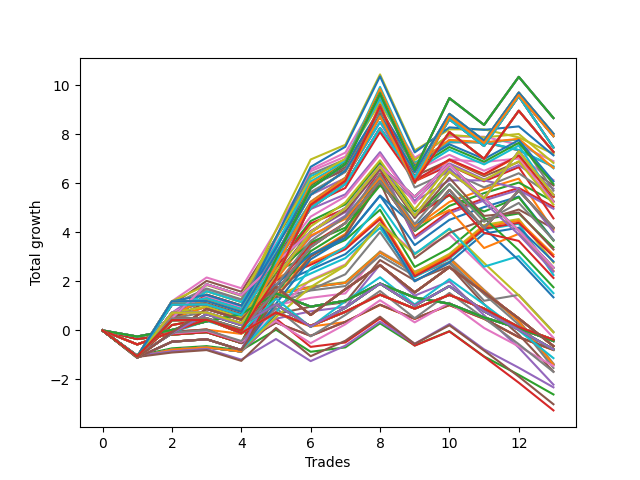

# Long HLT 650 
- Symbol: TSLA
- Date Range: 05/16/2022 - 05/17/2024
- Trading Period: 8:30-12:30
- Number of Trades: 13



| Id. | Name | Win Percent | Profit | Avg Profit / Trade | Avg Time / Trade | Std |      | Name | Win Percent | Profit | Avg Profit / Trade | Avg Time / Trade | Std |
| --- | ---- | ----------- | ------ | ------------------ | ---------------- | --- | ---- | ---- | ----------- | ------ | ------------------ | ---------------- | --- |
| | Sorted By <br> Profit | | | | | | | Sorted By <br> Win Percentage |||||
|0| TP-2.75 180m | 61.54 | 8.66 | 0.67 | 79:18 | 1.96 |     | TP-2.25 45m | 69.23 | 5.26 | 0.40 | 38:18 | 1.29 |
|1| TP-2.75 165m | 61.54 | 8.66 | 0.67 | 79:18 | 1.96 |     | TP-2.5 45m | 69.23 | 5.04 | 0.39 | 39:55 | 1.38 |
|2| TP-2.75 150m | 61.54 | 8.66 | 0.67 | 79:18 | 1.96 |     | TP-2.75 45m | 69.23 | 4.96 | 0.38 | 40:09 | 1.48 |
|3| TP-2.75 135m | 61.54 | 8.66 | 0.67 | 79:18 | 1.96 |     | TP-3 45m | 69.23 | 4.16 | 0.32 | 41:04 | 1.39 |
|4| TP-2.75 120m | 61.54 | 8.66 | 0.67 | 79:18 | 1.96 |     | TP-2 45m | 69.23 | 4.10 | 0.32 | 35:32 | 1.36 |
|5| TP-2.25 180m | 61.54 | 8.02 | 0.62 | 70:50 | 1.71 |     | TP-1.75 45m | 69.23 | 3.69 | 0.28 | 32:09 | 1.24 |
|6| TP-2.25 165m | 61.54 | 8.02 | 0.62 | 70:50 | 1.71 |     | TP-2.75 30m | 69.23 | 3.39 | 0.26 | 28:13 | 1.23 |
|7| TP-2.25 150m | 61.54 | 8.02 | 0.62 | 70:50 | 1.71 |     | TP-2.5 30m | 69.23 | 3.09 | 0.24 | 28:04 | 1.18 |
|8| TP-2.25 135m | 61.54 | 8.02 | 0.62 | 70:50 | 1.71 |     | TP-3 30m | 69.23 | 3.01 | 0.23 | 28:18 | 1.17 |
|9| TP-2.25 120m | 61.54 | 8.02 | 0.62 | 70:50 | 1.71 |     | TP-2.25 30m | 69.23 | 2.81 | 0.22 | 26:55 | 1.14 |
|10| TP-2.5 180m | 61.54 | 7.92 | 0.61 | 78:18 | 1.81 |     | TP-1.75 30m | 69.23 | 2.77 | 0.21 | 23:23 | 1.12 |
|11| TP-2.5 165m | 61.54 | 7.92 | 0.61 | 78:18 | 1.81 |     | TP-2 30m | 69.23 | 2.26 | 0.17 | 25:18 | 1.16 |
|12| TP-2.5 150m | 61.54 | 7.92 | 0.61 | 78:18 | 1.81 |     | TP-2.75 180m | 61.54 | 8.66 | 0.67 | 79:18 | 1.96 |
|13| TP-2.5 135m | 61.54 | 7.92 | 0.61 | 78:18 | 1.81 |     | TP-2.75 165m | 61.54 | 8.66 | 0.67 | 79:18 | 1.96 |
|14| TP-2.5 120m | 61.54 | 7.92 | 0.61 | 78:18 | 1.81 |     | TP-2.75 150m | 61.54 | 8.66 | 0.67 | 79:18 | 1.96 |
|15| TP-2 180m | 61.54 | 7.46 | 0.57 | 63:36 | 1.68 |     | TP-2.75 135m | 61.54 | 8.66 | 0.67 | 79:18 | 1.96 |
|16| TP-2 165m | 61.54 | 7.46 | 0.57 | 63:36 | 1.68 |     | TP-2.75 120m | 61.54 | 8.66 | 0.67 | 79:18 | 1.96 |
|17| TP-2 150m | 61.54 | 7.46 | 0.57 | 63:36 | 1.68 |     | TP-2.25 180m | 61.54 | 8.02 | 0.62 | 70:50 | 1.71 |
|18| TP-2 135m | 61.54 | 7.46 | 0.57 | 63:36 | 1.68 |     | TP-2.25 165m | 61.54 | 8.02 | 0.62 | 70:50 | 1.71 |
|19| TP-2 120m | 61.54 | 7.46 | 0.57 | 63:36 | 1.68 |     | TP-2.25 150m | 61.54 | 8.02 | 0.62 | 70:50 | 1.71 |
|20| TP-3 180m | 61.54 | 7.28 | 0.56 | 81:09 | 1.86 |     | TP-2.25 135m | 61.54 | 8.02 | 0.62 | 70:50 | 1.71 |
|21| TP-3 165m | 61.54 | 7.28 | 0.56 | 81:09 | 1.86 |     | TP-2.25 120m | 61.54 | 8.02 | 0.62 | 70:50 | 1.71 |
|22| TP-3 150m | 61.54 | 7.28 | 0.56 | 81:09 | 1.86 |     | TP-2.5 180m | 61.54 | 7.92 | 0.61 | 78:18 | 1.81 |
|23| TP-3 135m | 61.54 | 7.28 | 0.56 | 81:09 | 1.86 |     | TP-2.5 165m | 61.54 | 7.92 | 0.61 | 78:18 | 1.81 |
|24| TP-3 120m | 61.54 | 7.28 | 0.56 | 81:09 | 1.86 |     | TP-2.5 150m | 61.54 | 7.92 | 0.61 | 78:18 | 1.81 |
|25| TP-2.75 75m | 61.54 | 7.20 | 0.55 | 59:36 | 1.70 |     | TP-2.5 135m | 61.54 | 7.92 | 0.61 | 78:18 | 1.81 |
|26| TP-2.75 90m | 61.54 | 7.14 | 0.55 | 67:41 | 1.72 |     | TP-2.5 120m | 61.54 | 7.92 | 0.61 | 78:18 | 1.81 |
|27| TP-2.25 75m | 61.54 | 6.90 | 0.53 | 54:50 | 1.45 |     | TP-2 180m | 61.54 | 7.46 | 0.57 | 63:36 | 1.68 |
|28| TP-2.25 90m | 61.54 | 6.83 | 0.53 | 61:46 | 1.48 |     | TP-2 165m | 61.54 | 7.46 | 0.57 | 63:36 | 1.68 |
|29| TP-3 75m | 61.54 | 6.69 | 0.51 | 60:55 | 1.66 |     | TP-2 150m | 61.54 | 7.46 | 0.57 | 63:36 | 1.68 |
|30| TP-2.5 75m | 61.54 | 6.67 | 0.51 | 58:46 | 1.54 |     | TP-2 135m | 61.54 | 7.46 | 0.57 | 63:36 | 1.68 |
|31| TP-3 90m | 61.54 | 6.63 | 0.51 | 69:00 | 1.68 |     | TP-2 120m | 61.54 | 7.46 | 0.57 | 63:36 | 1.68 |
|32| TP-2.5 90m | 61.54 | 6.61 | 0.51 | 66:50 | 1.57 |     | TP-3 180m | 61.54 | 7.28 | 0.56 | 81:09 | 1.86 |
|33| TP-2.75 60m | 61.54 | 6.13 | 0.47 | 50:41 | 1.67 |     | TP-3 165m | 61.54 | 7.28 | 0.56 | 81:09 | 1.86 |
|34| TP-2.25 105m | 61.54 | 6.08 | 0.47 | 67:18 | 1.55 |     | TP-3 150m | 61.54 | 7.28 | 0.56 | 81:09 | 1.86 |
|35| TP-2.75 105m | 61.54 | 5.97 | 0.46 | 74:23 | 1.77 |     | TP-3 135m | 61.54 | 7.28 | 0.56 | 81:09 | 1.86 |
|36| TP-2.5 60m | 61.54 | 5.91 | 0.45 | 50:23 | 1.55 |     | TP-3 120m | 61.54 | 7.28 | 0.56 | 81:09 | 1.86 |
|37| TP-2.25 60m | 61.54 | 5.78 | 0.44 | 47:27 | 1.43 |     | TP-2.75 75m | 61.54 | 7.20 | 0.55 | 59:36 | 1.70 |
|38| TP-2 90m | 61.54 | 5.70 | 0.44 | 55:04 | 1.48 |     | TP-2.75 90m | 61.54 | 7.14 | 0.55 | 67:41 | 1.72 |
|39| TP-1.75 180m | 61.54 | 5.53 | 0.43 | 57:23 | 1.47 |     | TP-2.25 75m | 61.54 | 6.90 | 0.53 | 54:50 | 1.45 |
|40| TP-1.75 165m | 61.54 | 5.53 | 0.43 | 57:23 | 1.47 |     | TP-2.25 90m | 61.54 | 6.83 | 0.53 | 61:46 | 1.48 |
|41| TP-1.75 150m | 61.54 | 5.53 | 0.43 | 57:23 | 1.47 |     | TP-3 75m | 61.54 | 6.69 | 0.51 | 60:55 | 1.66 |
|42| TP-1.75 135m | 61.54 | 5.53 | 0.43 | 57:23 | 1.47 |     | TP-2.5 75m | 61.54 | 6.67 | 0.51 | 58:46 | 1.54 |
|43| TP-1.75 120m | 61.54 | 5.53 | 0.43 | 57:23 | 1.47 |     | TP-3 90m | 61.54 | 6.63 | 0.51 | 69:00 | 1.68 |
|44| TP-3 105m | 61.54 | 5.46 | 0.42 | 75:41 | 1.72 |     | TP-2.5 90m | 61.54 | 6.61 | 0.51 | 66:50 | 1.57 |
|45| TP-2 105m | 61.54 | 5.45 | 0.42 | 60:09 | 1.50 |     | TP-2.75 60m | 61.54 | 6.13 | 0.47 | 50:41 | 1.67 |
|46| TP-3 60m | 61.54 | 5.45 | 0.42 | 51:55 | 1.61 |     | TP-2.25 105m | 61.54 | 6.08 | 0.47 | 67:18 | 1.55 |
|47| TP-2.5 105m | 61.54 | 5.44 | 0.42 | 73:32 | 1.61 |     | TP-2.75 105m | 61.54 | 5.97 | 0.46 | 74:23 | 1.77 |
|48| TP-2.25 45m | 69.23 | 5.26 | 0.40 | 38:18 | 1.29 |     | TP-2.5 60m | 61.54 | 5.91 | 0.45 | 50:23 | 1.55 |
|49| TP-2 75m | 61.54 | 5.26 | 0.40 | 49:18 | 1.49 |     | TP-2.25 60m | 61.54 | 5.78 | 0.44 | 47:27 | 1.43 |
|50| TP-1.75 90m | 61.54 | 5.24 | 0.40 | 50:32 | 1.35 |     | TP-2 90m | 61.54 | 5.70 | 0.44 | 55:04 | 1.48 |
|51| TP-1.75 105m | 61.54 | 5.13 | 0.39 | 54:27 | 1.38 |     | TP-1.75 180m | 61.54 | 5.53 | 0.43 | 57:23 | 1.47 |
|52| TP-2.5 45m | 69.23 | 5.04 | 0.39 | 39:55 | 1.38 |     | TP-1.75 165m | 61.54 | 5.53 | 0.43 | 57:23 | 1.47 |
|53| TP-2.75 45m | 69.23 | 4.96 | 0.38 | 40:09 | 1.48 |     | TP-1.75 150m | 61.54 | 5.53 | 0.43 | 57:23 | 1.47 |
|54| TP-2 60m | 61.54 | 4.57 | 0.35 | 43:09 | 1.47 |     | TP-1.75 135m | 61.54 | 5.53 | 0.43 | 57:23 | 1.47 |
|55| TP-1.5 180m | 61.54 | 4.19 | 0.32 | 47:23 | 1.40 |     | TP-1.75 120m | 61.54 | 5.53 | 0.43 | 57:23 | 1.47 |
|56| TP-1.5 165m | 61.54 | 4.19 | 0.32 | 47:23 | 1.40 |     | TP-3 105m | 61.54 | 5.46 | 0.42 | 75:41 | 1.72 |
|57| TP-1.5 150m | 61.54 | 4.19 | 0.32 | 47:23 | 1.40 |     | TP-2 105m | 61.54 | 5.45 | 0.42 | 60:09 | 1.50 |
|58| TP-1.5 135m | 61.54 | 4.19 | 0.32 | 47:23 | 1.40 |     | TP-3 60m | 61.54 | 5.45 | 0.42 | 51:55 | 1.61 |
|59| TP-1.5 120m | 61.54 | 4.19 | 0.32 | 47:23 | 1.40 |     | TP-2.5 105m | 61.54 | 5.44 | 0.42 | 73:32 | 1.61 |
|60| TP-3 45m | 69.23 | 4.16 | 0.32 | 41:04 | 1.39 |     | TP-2 75m | 61.54 | 5.26 | 0.40 | 49:18 | 1.49 |
|61| TP-2 45m | 69.23 | 4.10 | 0.32 | 35:32 | 1.36 |     | TP-1.75 90m | 61.54 | 5.24 | 0.40 | 50:32 | 1.35 |
|62| TP-1.75 75m | 61.54 | 4.02 | 0.31 | 45:18 | 1.31 |     | TP-1.75 105m | 61.54 | 5.13 | 0.39 | 54:27 | 1.38 |
|63| TP-1.75 45m | 69.23 | 3.69 | 0.28 | 32:09 | 1.24 |     | TP-2 60m | 61.54 | 4.57 | 0.35 | 43:09 | 1.47 |
|64| TP-1.5 105m | 61.54 | 3.69 | 0.28 | 45:55 | 1.37 |     | TP-1.5 180m | 61.54 | 4.19 | 0.32 | 47:23 | 1.40 |
|65| TP-1.75 60m | 61.54 | 3.66 | 0.28 | 39:32 | 1.31 |     | TP-1.5 165m | 61.54 | 4.19 | 0.32 | 47:23 | 1.40 |
|66| TP-2.75 30m | 69.23 | 3.39 | 0.26 | 28:13 | 1.23 |     | TP-1.5 150m | 61.54 | 4.19 | 0.32 | 47:23 | 1.40 |
|67| TP-1.5 90m | 61.54 | 3.30 | 0.25 | 43:09 | 1.36 |     | TP-1.5 135m | 61.54 | 4.19 | 0.32 | 47:23 | 1.40 |
|68| TP-2.5 30m | 69.23 | 3.09 | 0.24 | 28:04 | 1.18 |     | TP-1.5 120m | 61.54 | 4.19 | 0.32 | 47:23 | 1.40 |
|69| TP-3 30m | 69.23 | 3.01 | 0.23 | 28:18 | 1.17 |     | TP-1.75 75m | 61.54 | 4.02 | 0.31 | 45:18 | 1.31 |
|70| TP-2.25 30m | 69.23 | 2.81 | 0.22 | 26:55 | 1.14 |     | TP-1.5 105m | 61.54 | 3.69 | 0.28 | 45:55 | 1.37 |
|71| TP-1.75 30m | 69.23 | 2.77 | 0.21 | 23:23 | 1.12 |     | TP-1.75 60m | 61.54 | 3.66 | 0.28 | 39:32 | 1.31 |
|72| TP-1.25 180m | 53.85 | 2.56 | 0.20 | 32:00 | 1.29 |     | TP-1.5 90m | 61.54 | 3.30 | 0.25 | 43:09 | 1.36 |
|73| TP-1.25 165m | 53.85 | 2.56 | 0.20 | 32:00 | 1.29 |     | TP-1.5 60m | 61.54 | 2.43 | 0.19 | 34:41 | 1.30 |
|74| TP-1.25 150m | 53.85 | 2.56 | 0.20 | 32:00 | 1.29 |     | TP-1.5 45m | 61.54 | 1.52 | 0.12 | 28:50 | 1.27 |
|75| TP-1.25 135m | 53.85 | 2.56 | 0.20 | 32:00 | 1.29 |     | TP-1.5 30m | 61.54 | -0.06 | -0.00 | 21:13 | 1.10 |
|76| TP-1.25 120m | 53.85 | 2.56 | 0.20 | 32:00 | 1.29 |     | TP-1.25 180m | 53.85 | 2.56 | 0.20 | 32:00 | 1.29 |
|77| TP-1.25 105m | 53.85 | 2.56 | 0.20 | 32:00 | 1.29 |     | TP-1.25 165m | 53.85 | 2.56 | 0.20 | 32:00 | 1.29 |
|78| TP-1.5 60m | 61.54 | 2.43 | 0.19 | 34:41 | 1.30 |     | TP-1.25 150m | 53.85 | 2.56 | 0.20 | 32:00 | 1.29 |
|79| TP-1.25 90m | 53.85 | 2.40 | 0.18 | 31:32 | 1.28 |     | TP-1.25 135m | 53.85 | 2.56 | 0.20 | 32:00 | 1.29 |
|80| TP-2 30m | 69.23 | 2.26 | 0.17 | 25:18 | 1.16 |     | TP-1.25 120m | 53.85 | 2.56 | 0.20 | 32:00 | 1.29 |
|81| TP-1.5 75m | 53.85 | 2.14 | 0.16 | 39:18 | 1.32 |     | TP-1.25 105m | 53.85 | 2.56 | 0.20 | 32:00 | 1.29 |
|82| TP-1.25 75m | 53.85 | 1.76 | 0.14 | 29:36 | 1.25 |     | TP-1.25 90m | 53.85 | 2.40 | 0.18 | 31:32 | 1.28 |
|83| TP-1.5 45m | 61.54 | 1.52 | 0.12 | 28:50 | 1.27 |     | TP-1.5 75m | 53.85 | 2.14 | 0.16 | 39:18 | 1.32 |
|84| TP-1.25 60m | 53.85 | 1.35 | 0.10 | 27:18 | 1.23 |     | TP-1.25 75m | 53.85 | 1.76 | 0.14 | 29:36 | 1.25 |
|85| TP-1.5 30m | 61.54 | -0.06 | -0.00 | 21:13 | 1.10 |     | TP-1.25 60m | 53.85 | 1.35 | 0.10 | 27:18 | 1.23 |
|86| TP-1.25 45m | 53.85 | -0.08 | -0.01 | 23:41 | 1.16 |     | TP-1.25 45m | 53.85 | -0.08 | -0.01 | 23:41 | 1.16 |
|87| TP-1.25 30m | 53.85 | -0.30 | -0.02 | 17:55 | 1.08 |     | TP-1.25 30m | 53.85 | -0.30 | -0.02 | 17:55 | 1.08 |
|88| TP-0.5 180m | 46.15 | -0.38 | -0.03 | 11:00 | 0.60 |     | TP-1.75 15m | 53.85 | -1.35 | -0.10 | 13:00 | 1.08 |
|89| TP-0.5 165m | 46.15 | -0.38 | -0.03 | 11:00 | 0.60 |     | TP-2.25 15m | 53.85 | -1.37 | -0.11 | 13:46 | 1.10 |
|90| TP-0.5 150m | 46.15 | -0.38 | -0.03 | 11:00 | 0.60 |     | TP-3 15m | 53.85 | -1.40 | -0.11 | 14:00 | 1.10 |
|91| TP-0.5 135m | 46.15 | -0.38 | -0.03 | 11:00 | 0.60 |     | TP-2.75 15m | 53.85 | -1.40 | -0.11 | 14:00 | 1.10 |
|92| TP-0.5 120m | 46.15 | -0.38 | -0.03 | 11:00 | 0.60 |     | TP-2.5 15m | 53.85 | -1.40 | -0.11 | 14:00 | 1.10 |
|93| TP-0.5 105m | 46.15 | -0.38 | -0.03 | 11:00 | 0.60 |     | TP-2 15m | 53.85 | -1.53 | -0.12 | 13:41 | 1.07 |
|94| TP-0.5 90m | 46.15 | -0.38 | -0.03 | 11:00 | 0.60 |     | TP-1.5 15m | 53.85 | -1.68 | -0.13 | 12:00 | 1.03 |
|95| TP-0.5 75m | 46.15 | -0.38 | -0.03 | 11:00 | 0.60 |     | TP-1.25 15m | 53.85 | -2.21 | -0.17 | 11:23 | 1.02 |
|96| TP-0.5 60m | 46.15 | -0.38 | -0.03 | 11:00 | 0.60 |     | TP-0.5 180m | 46.15 | -0.38 | -0.03 | 11:00 | 0.60 |
|97| TP-0.25 180m | 46.15 | -0.43 | -0.03 | 03:27 | 0.48 |     | TP-0.5 165m | 46.15 | -0.38 | -0.03 | 11:00 | 0.60 |
|98| TP-0.25 165m | 46.15 | -0.43 | -0.03 | 03:27 | 0.48 |     | TP-0.5 150m | 46.15 | -0.38 | -0.03 | 11:00 | 0.60 |
|99| TP-0.25 150m | 46.15 | -0.43 | -0.03 | 03:27 | 0.48 |     | TP-0.5 135m | 46.15 | -0.38 | -0.03 | 11:00 | 0.60 |
|100| TP-0.25 135m | 46.15 | -0.43 | -0.03 | 03:27 | 0.48 |     | TP-0.5 120m | 46.15 | -0.38 | -0.03 | 11:00 | 0.60 |
|101| TP-0.25 120m | 46.15 | -0.43 | -0.03 | 03:27 | 0.48 |     | TP-0.5 105m | 46.15 | -0.38 | -0.03 | 11:00 | 0.60 |
|102| TP-0.25 105m | 46.15 | -0.43 | -0.03 | 03:27 | 0.48 |     | TP-0.5 90m | 46.15 | -0.38 | -0.03 | 11:00 | 0.60 |
|103| TP-0.25 90m | 46.15 | -0.43 | -0.03 | 03:27 | 0.48 |     | TP-0.5 75m | 46.15 | -0.38 | -0.03 | 11:00 | 0.60 |
|104| TP-0.25 75m | 46.15 | -0.43 | -0.03 | 03:27 | 0.48 |     | TP-0.5 60m | 46.15 | -0.38 | -0.03 | 11:00 | 0.60 |
|105| TP-0.25 60m | 46.15 | -0.43 | -0.03 | 03:27 | 0.48 |     | TP-0.25 180m | 46.15 | -0.43 | -0.03 | 03:27 | 0.48 |
|106| TP-0.25 45m | 46.15 | -0.43 | -0.03 | 03:27 | 0.48 |     | TP-0.25 165m | 46.15 | -0.43 | -0.03 | 03:27 | 0.48 |
|107| TP-0.25 30m | 46.15 | -0.43 | -0.03 | 03:27 | 0.48 |     | TP-0.25 150m | 46.15 | -0.43 | -0.03 | 03:27 | 0.48 |
|108| TP-0.25 15m | 46.15 | -0.43 | -0.03 | 03:27 | 0.48 |     | TP-0.25 135m | 46.15 | -0.43 | -0.03 | 03:27 | 0.48 |
|109| TP-1 180m | 46.15 | -0.64 | -0.05 | 20:46 | 1.04 |     | TP-0.25 120m | 46.15 | -0.43 | -0.03 | 03:27 | 0.48 |
|110| TP-1 165m | 46.15 | -0.64 | -0.05 | 20:46 | 1.04 |     | TP-0.25 105m | 46.15 | -0.43 | -0.03 | 03:27 | 0.48 |
|111| TP-1 150m | 46.15 | -0.64 | -0.05 | 20:46 | 1.04 |     | TP-0.25 90m | 46.15 | -0.43 | -0.03 | 03:27 | 0.48 |
|112| TP-1 135m | 46.15 | -0.64 | -0.05 | 20:46 | 1.04 |     | TP-0.25 75m | 46.15 | -0.43 | -0.03 | 03:27 | 0.48 |
|113| TP-1 120m | 46.15 | -0.64 | -0.05 | 20:46 | 1.04 |     | TP-0.25 60m | 46.15 | -0.43 | -0.03 | 03:27 | 0.48 |
|114| TP-1 105m | 46.15 | -0.64 | -0.05 | 20:46 | 1.04 |     | TP-0.25 45m | 46.15 | -0.43 | -0.03 | 03:27 | 0.48 |
|115| TP-1 90m | 46.15 | -0.64 | -0.05 | 20:46 | 1.04 |     | TP-0.25 30m | 46.15 | -0.43 | -0.03 | 03:27 | 0.48 |
|116| TP-1 75m | 46.15 | -0.64 | -0.05 | 20:46 | 1.04 |     | TP-0.25 15m | 46.15 | -0.43 | -0.03 | 03:27 | 0.48 |
|117| TP-0.75 180m | 46.15 | -0.77 | -0.06 | 15:50 | 0.85 |     | TP-1 180m | 46.15 | -0.64 | -0.05 | 20:46 | 1.04 |
|118| TP-0.75 165m | 46.15 | -0.77 | -0.06 | 15:50 | 0.85 |     | TP-1 165m | 46.15 | -0.64 | -0.05 | 20:46 | 1.04 |
|119| TP-0.75 150m | 46.15 | -0.77 | -0.06 | 15:50 | 0.85 |     | TP-1 150m | 46.15 | -0.64 | -0.05 | 20:46 | 1.04 |
|120| TP-0.75 135m | 46.15 | -0.77 | -0.06 | 15:50 | 0.85 |     | TP-1 135m | 46.15 | -0.64 | -0.05 | 20:46 | 1.04 |
|121| TP-0.75 120m | 46.15 | -0.77 | -0.06 | 15:50 | 0.85 |     | TP-1 120m | 46.15 | -0.64 | -0.05 | 20:46 | 1.04 |
|122| TP-0.75 105m | 46.15 | -0.77 | -0.06 | 15:50 | 0.85 |     | TP-1 105m | 46.15 | -0.64 | -0.05 | 20:46 | 1.04 |
|123| TP-0.75 90m | 46.15 | -0.77 | -0.06 | 15:50 | 0.85 |     | TP-1 90m | 46.15 | -0.64 | -0.05 | 20:46 | 1.04 |
|124| TP-0.75 75m | 46.15 | -0.77 | -0.06 | 15:50 | 0.85 |     | TP-1 75m | 46.15 | -0.64 | -0.05 | 20:46 | 1.04 |
|125| TP-0.75 60m | 46.15 | -0.77 | -0.06 | 15:50 | 0.85 |     | TP-0.75 180m | 46.15 | -0.77 | -0.06 | 15:50 | 0.85 |
|126| TP-0.5 45m | 46.15 | -0.79 | -0.06 | 10:46 | 0.59 |     | TP-0.75 165m | 46.15 | -0.77 | -0.06 | 15:50 | 0.85 |
|127| TP-0.5 30m | 46.15 | -0.79 | -0.06 | 09:36 | 0.59 |     | TP-0.75 150m | 46.15 | -0.77 | -0.06 | 15:50 | 0.85 |
|128| TP-0.5 15m | 46.15 | -0.80 | -0.06 | 07:04 | 0.55 |     | TP-0.75 135m | 46.15 | -0.77 | -0.06 | 15:50 | 0.85 |
|129| TP-1 60m | 46.15 | -1.13 | -0.09 | 19:36 | 1.02 |     | TP-0.75 120m | 46.15 | -0.77 | -0.06 | 15:50 | 0.85 |
|130| TP-1.75 15m | 53.85 | -1.35 | -0.10 | 13:00 | 1.08 |     | TP-0.75 105m | 46.15 | -0.77 | -0.06 | 15:50 | 0.85 |
|131| TP-2.25 15m | 53.85 | -1.37 | -0.11 | 13:46 | 1.10 |     | TP-0.75 90m | 46.15 | -0.77 | -0.06 | 15:50 | 0.85 |
|132| TP-3 15m | 53.85 | -1.40 | -0.11 | 14:00 | 1.10 |     | TP-0.75 75m | 46.15 | -0.77 | -0.06 | 15:50 | 0.85 |
|133| TP-2.75 15m | 53.85 | -1.40 | -0.11 | 14:00 | 1.10 |     | TP-0.75 60m | 46.15 | -0.77 | -0.06 | 15:50 | 0.85 |
|134| TP-2.5 15m | 53.85 | -1.40 | -0.11 | 14:00 | 1.10 |     | TP-0.5 45m | 46.15 | -0.79 | -0.06 | 10:46 | 0.59 |
|135| TP-0.75 45m | 46.15 | -1.45 | -0.11 | 15:09 | 0.82 |     | TP-0.5 30m | 46.15 | -0.79 | -0.06 | 09:36 | 0.59 |
|136| TP-2 15m | 53.85 | -1.53 | -0.12 | 13:41 | 1.07 |     | TP-0.5 15m | 46.15 | -0.80 | -0.06 | 07:04 | 0.55 |
|137| TP-1.5 15m | 53.85 | -1.68 | -0.13 | 12:00 | 1.03 |     | TP-1 60m | 46.15 | -1.13 | -0.09 | 19:36 | 1.02 |
|138| TP-1 45m | 46.15 | -1.69 | -0.13 | 18:18 | 0.99 |     | TP-0.75 45m | 46.15 | -1.45 | -0.11 | 15:09 | 0.82 |
|139| TP-1.25 15m | 53.85 | -2.21 | -0.17 | 11:23 | 1.02 |     | TP-1 45m | 46.15 | -1.69 | -0.13 | 18:18 | 0.99 |
|140| TP-0.75 30m | 46.15 | -2.32 | -0.18 | 13:09 | 0.76 |     | TP-0.75 30m | 46.15 | -2.32 | -0.18 | 13:09 | 0.76 |
|141| TP-0.75 15m | 46.15 | -2.61 | -0.20 | 08:32 | 0.71 |     | TP-0.75 15m | 46.15 | -2.61 | -0.20 | 08:32 | 0.71 |
|142| TP-1 30m | 46.15 | -3.01 | -0.23 | 15:00 | 0.90 |     | TP-1 30m | 46.15 | -3.01 | -0.23 | 15:00 | 0.90 |
|143| TP-1 15m | 46.15 | -3.26 | -0.25 | 09:55 | 0.86 |     | TP-1 15m | 46.15 | -3.26 | -0.25 | 09:55 | 0.86 |

### Test TP-0.25 15m
* Take Profit of 0.25 Point
* 0.25 Stoploss
* Results:
```
Total Trades: 13
Percent Up: 46.15
Percent Down: 53.85
Total Points Moved Up: -0.43
Potential Profit: -215.00
Total Points Ups: 2.70 Count Ups: 6
Total Points Downs: -3.13 Count Downs: 7
```

<details><summary>Trades</summary>

<code>In: 2022-08-11 12:00:00		Out: 2022-08-11 12:06:00		Total Position Time: 06:00		Total Move Up: -0.25		Total to Date: -0.25</code> <br />
<code>In: 2022-10-19 10:10:00		Out: 2022-10-19 10:14:00		Total Position Time: 04:00		Total Move Up: 0.27		Total to Date: 0.02</code> <br />
<code>In: 2022-11-01 10:45:00		Out: 2022-11-01 10:47:00		Total Position Time: 02:00		Total Move Up: 0.35		Total to Date: 0.37</code> <br />
<code>In: 2023-01-30 12:30:00		Out: 2023-01-30 12:32:00		Total Position Time: 02:00		Total Move Up: 0.30		Total to Date: 0.67</code> <br />
<code>In: 2023-02-02 12:10:00		Out: 2023-02-02 12:12:00		Total Position Time: 02:00		Total Move Up: 0.84		Total to Date: 1.51</code> <br />
<code>In: 2023-02-10 09:25:00		Out: 2023-02-10 09:27:00		Total Position Time: 02:00		Total Move Up: -0.54		Total to Date: 0.97</code> <br />
<code>In: 2023-05-08 11:15:00		Out: 2023-05-08 11:22:00		Total Position Time: 07:00		Total Move Up: 0.24		Total to Date: 1.21</code> <br />
<code>In: 2023-06-21 10:05:00		Out: 2023-06-21 10:07:00		Total Position Time: 02:00		Total Move Up: 0.70		Total to Date: 1.91</code> <br />
<code>In: 2023-07-19 11:15:00		Out: 2023-07-19 11:19:00		Total Position Time: 04:00		Total Move Up: -0.57		Total to Date: 1.34</code> <br />
<code>In: 2023-07-26 09:50:00		Out: 2023-07-26 09:56:00		Total Position Time: 06:00		Total Move Up: -0.25		Total to Date: 1.09</code> <br />
<code>In: 2023-10-18 09:45:00		Out: 2023-10-18 09:49:00		Total Position Time: 04:00		Total Move Up: -0.56		Total to Date: 0.53</code> <br />
<code>In: 2023-11-16 10:55:00		Out: 2023-11-16 10:57:00		Total Position Time: 02:00		Total Move Up: -0.44		Total to Date: 0.09</code> <br />
<code>In: 2023-12-22 11:15:00		Out: 2023-12-22 11:17:00		Total Position Time: 02:00		Total Move Up: -0.52		Total to Date: -0.43</code> <br />


</details>

### Test TP-0.5 15m
* Take Profit of 0.5 Point
* 0.5 Stoploss
* Results:
```
Total Trades: 13
Percent Up: 46.15
Percent Down: 53.85
Total Points Moved Up: -0.80
Potential Profit: -400.00
Total Points Ups: 2.88 Count Ups: 6
Total Points Downs: -3.68 Count Downs: 7
```

<details><summary>Trades</summary>

<code>In: 2022-08-11 12:00:00		Out: 2022-08-11 12:07:00		Total Position Time: 07:00		Total Move Up: -0.57		Total to Date: -0.57</code> <br />
<code>In: 2022-10-19 10:10:00		Out: 2022-10-19 10:21:00		Total Position Time: 11:00		Total Move Up: 0.51		Total to Date: -0.06</code> <br />
<code>In: 2022-11-01 10:45:00		Out: 2022-11-01 10:59:00		Total Position Time: 14:00		Total Move Up: 0.09		Total to Date: 0.03</code> <br />
<code>In: 2023-01-30 12:30:00		Out: 2023-01-30 12:44:00		Total Position Time: 14:00		Total Move Up: -0.17		Total to Date: -0.14</code> <br />
<code>In: 2023-02-02 12:10:00		Out: 2023-02-02 12:12:00		Total Position Time: 02:00		Total Move Up: 0.84		Total to Date: 0.70</code> <br />
<code>In: 2023-02-10 09:25:00		Out: 2023-02-10 09:27:00		Total Position Time: 02:00		Total Move Up: -0.54		Total to Date: 0.16</code> <br />
<code>In: 2023-05-08 11:15:00		Out: 2023-05-08 11:29:00		Total Position Time: 14:00		Total Move Up: 0.18		Total to Date: 0.34</code> <br />
<code>In: 2023-06-21 10:05:00		Out: 2023-06-21 10:07:00		Total Position Time: 02:00		Total Move Up: 0.70		Total to Date: 1.04</code> <br />
<code>In: 2023-07-19 11:15:00		Out: 2023-07-19 11:19:00		Total Position Time: 04:00		Total Move Up: -0.57		Total to Date: 0.47</code> <br />
<code>In: 2023-07-26 09:50:00		Out: 2023-07-26 10:03:00		Total Position Time: 13:00		Total Move Up: 0.56		Total to Date: 1.03</code> <br />
<code>In: 2023-10-18 09:45:00		Out: 2023-10-18 09:49:00		Total Position Time: 04:00		Total Move Up: -0.56		Total to Date: 0.47</code> <br />
<code>In: 2023-11-16 10:55:00		Out: 2023-11-16 10:58:00		Total Position Time: 03:00		Total Move Up: -0.75		Total to Date: -0.28</code> <br />
<code>In: 2023-12-22 11:15:00		Out: 2023-12-22 11:17:00		Total Position Time: 02:00		Total Move Up: -0.52		Total to Date: -0.80</code> <br />


</details>

### Test TP-0.75 15m
* Take Profit of 0.75 Point
* 0.75 Stoploss
* Results:
```
Total Trades: 13
Percent Up: 46.15
Percent Down: 53.85
Total Points Moved Up: -2.61
Potential Profit: -1305.00
Total Points Ups: 2.97 Count Ups: 6
Total Points Downs: -5.58 Count Downs: 7
```

<details><summary>Trades</summary>

<code>In: 2022-08-11 12:00:00		Out: 2022-08-11 12:13:00		Total Position Time: 13:00		Total Move Up: -1.03		Total to Date: -1.03</code> <br />
<code>In: 2022-10-19 10:10:00		Out: 2022-10-19 10:24:00		Total Position Time: 14:00		Total Move Up: 0.30		Total to Date: -0.73</code> <br />
<code>In: 2022-11-01 10:45:00		Out: 2022-11-01 10:59:00		Total Position Time: 14:00		Total Move Up: 0.09		Total to Date: -0.64</code> <br />
<code>In: 2023-01-30 12:30:00		Out: 2023-01-30 12:44:00		Total Position Time: 14:00		Total Move Up: -0.17		Total to Date: -0.81</code> <br />
<code>In: 2023-02-02 12:10:00		Out: 2023-02-02 12:12:00		Total Position Time: 02:00		Total Move Up: 0.84		Total to Date: 0.03</code> <br />
<code>In: 2023-02-10 09:25:00		Out: 2023-02-10 09:28:00		Total Position Time: 03:00		Total Move Up: -0.90		Total to Date: -0.87</code> <br />
<code>In: 2023-05-08 11:15:00		Out: 2023-05-08 11:29:00		Total Position Time: 14:00		Total Move Up: 0.18		Total to Date: -0.69</code> <br />
<code>In: 2023-06-21 10:05:00		Out: 2023-06-21 10:10:00		Total Position Time: 05:00		Total Move Up: 0.98		Total to Date: 0.29</code> <br />
<code>In: 2023-07-19 11:15:00		Out: 2023-07-19 11:21:00		Total Position Time: 06:00		Total Move Up: -0.90		Total to Date: -0.61</code> <br />
<code>In: 2023-07-26 09:50:00		Out: 2023-07-26 10:04:00		Total Position Time: 14:00		Total Move Up: 0.58		Total to Date: -0.03</code> <br />
<code>In: 2023-10-18 09:45:00		Out: 2023-10-18 09:51:00		Total Position Time: 06:00		Total Move Up: -1.03		Total to Date: -1.06</code> <br />
<code>In: 2023-11-16 10:55:00		Out: 2023-11-16 10:58:00		Total Position Time: 03:00		Total Move Up: -0.75		Total to Date: -1.81</code> <br />
<code>In: 2023-12-22 11:15:00		Out: 2023-12-22 11:18:00		Total Position Time: 03:00		Total Move Up: -0.80		Total to Date: -2.61</code> <br />


</details>

### Test TP-1 15m
* Take Profit of 1 Point
* 1 Stoploss
* Results:
```
Total Trades: 13
Percent Up: 46.15
Percent Down: 53.85
Total Points Moved Up: -3.26
Potential Profit: -1630.00
Total Points Ups: 3.47 Count Ups: 6
Total Points Downs: -6.73 Count Downs: 7
```

<details><summary>Trades</summary>

<code>In: 2022-08-11 12:00:00		Out: 2022-08-11 12:14:00		Total Position Time: 14:00		Total Move Up: -1.08		Total to Date: -1.08</code> <br />
<code>In: 2022-10-19 10:10:00		Out: 2022-10-19 10:24:00		Total Position Time: 14:00		Total Move Up: 0.30		Total to Date: -0.78</code> <br />
<code>In: 2022-11-01 10:45:00		Out: 2022-11-01 10:59:00		Total Position Time: 14:00		Total Move Up: 0.09		Total to Date: -0.69</code> <br />
<code>In: 2023-01-30 12:30:00		Out: 2023-01-30 12:44:00		Total Position Time: 14:00		Total Move Up: -0.17		Total to Date: -0.86</code> <br />
<code>In: 2023-02-02 12:10:00		Out: 2023-02-02 12:13:00		Total Position Time: 03:00		Total Move Up: 1.34		Total to Date: 0.48</code> <br />
<code>In: 2023-02-10 09:25:00		Out: 2023-02-10 09:29:00		Total Position Time: 04:00		Total Move Up: -1.15		Total to Date: -0.67</code> <br />
<code>In: 2023-05-08 11:15:00		Out: 2023-05-08 11:29:00		Total Position Time: 14:00		Total Move Up: 0.18		Total to Date: -0.49</code> <br />
<code>In: 2023-06-21 10:05:00		Out: 2023-06-21 10:10:00		Total Position Time: 05:00		Total Move Up: 0.98		Total to Date: 0.49</code> <br />
<code>In: 2023-07-19 11:15:00		Out: 2023-07-19 11:22:00		Total Position Time: 07:00		Total Move Up: -1.11		Total to Date: -0.62</code> <br />
<code>In: 2023-07-26 09:50:00		Out: 2023-07-26 10:04:00		Total Position Time: 14:00		Total Move Up: 0.58		Total to Date: -0.04</code> <br />
<code>In: 2023-10-18 09:45:00		Out: 2023-10-18 09:51:00		Total Position Time: 06:00		Total Move Up: -1.03		Total to Date: -1.07</code> <br />
<code>In: 2023-11-16 10:55:00		Out: 2023-11-16 11:07:00		Total Position Time: 12:00		Total Move Up: -1.06		Total to Date: -2.13</code> <br />
<code>In: 2023-12-22 11:15:00		Out: 2023-12-22 11:23:00		Total Position Time: 08:00		Total Move Up: -1.13		Total to Date: -3.26</code> <br />


</details>

### Test TP-1.25 15m
* Take Profit of 1.25 Point
* 1.25 Stoploss
* Results:
```
Total Trades: 13
Percent Up: 53.85
Percent Down: 46.15
Total Points Moved Up: -2.21
Potential Profit: -1105.00
Total Points Ups: 4.51 Count Ups: 7
Total Points Downs: -6.72 Count Downs: 6
```

<details><summary>Trades</summary>

<code>In: 2022-08-11 12:00:00		Out: 2022-08-11 12:14:00		Total Position Time: 14:00		Total Move Up: -1.08		Total to Date: -1.08</code> <br />
<code>In: 2022-10-19 10:10:00		Out: 2022-10-19 10:24:00		Total Position Time: 14:00		Total Move Up: 0.30		Total to Date: -0.78</code> <br />
<code>In: 2022-11-01 10:45:00		Out: 2022-11-01 10:59:00		Total Position Time: 14:00		Total Move Up: 0.09		Total to Date: -0.69</code> <br />
<code>In: 2023-01-30 12:30:00		Out: 2023-01-30 12:44:00		Total Position Time: 14:00		Total Move Up: -0.17		Total to Date: -0.86</code> <br />
<code>In: 2023-02-02 12:10:00		Out: 2023-02-02 12:13:00		Total Position Time: 03:00		Total Move Up: 1.34		Total to Date: 0.48</code> <br />
<code>In: 2023-02-10 09:25:00		Out: 2023-02-10 09:39:00		Total Position Time: 14:00		Total Move Up: 0.30		Total to Date: 0.78</code> <br />
<code>In: 2023-05-08 11:15:00		Out: 2023-05-08 11:29:00		Total Position Time: 14:00		Total Move Up: 0.18		Total to Date: 0.96</code> <br />
<code>In: 2023-06-21 10:05:00		Out: 2023-06-21 10:11:00		Total Position Time: 06:00		Total Move Up: 1.72		Total to Date: 2.68</code> <br />
<code>In: 2023-07-19 11:15:00		Out: 2023-07-19 11:25:00		Total Position Time: 10:00		Total Move Up: -1.26		Total to Date: 1.42</code> <br />
<code>In: 2023-07-26 09:50:00		Out: 2023-07-26 10:04:00		Total Position Time: 14:00		Total Move Up: 0.58		Total to Date: 2.00</code> <br />
<code>In: 2023-10-18 09:45:00		Out: 2023-10-18 09:54:00		Total Position Time: 09:00		Total Move Up: -1.38		Total to Date: 0.62</code> <br />
<code>In: 2023-11-16 10:55:00		Out: 2023-11-16 11:08:00		Total Position Time: 13:00		Total Move Up: -1.32		Total to Date: -0.70</code> <br />
<code>In: 2023-12-22 11:15:00		Out: 2023-12-22 11:24:00		Total Position Time: 09:00		Total Move Up: -1.51		Total to Date: -2.21</code> <br />


</details>

### Test TP-1.5 15m
* Take Profit of 1.5 Point
* 1.5 Stoploss
* Results:
```
Total Trades: 13
Percent Up: 53.85
Percent Down: 46.15
Total Points Moved Up: -1.68
Potential Profit: -840.00
Total Points Ups: 4.70 Count Ups: 7
Total Points Downs: -6.38 Count Downs: 6
```

<details><summary>Trades</summary>

<code>In: 2022-08-11 12:00:00		Out: 2022-08-11 12:14:00		Total Position Time: 14:00		Total Move Up: -1.08		Total to Date: -1.08</code> <br />
<code>In: 2022-10-19 10:10:00		Out: 2022-10-19 10:24:00		Total Position Time: 14:00		Total Move Up: 0.30		Total to Date: -0.78</code> <br />
<code>In: 2022-11-01 10:45:00		Out: 2022-11-01 10:59:00		Total Position Time: 14:00		Total Move Up: 0.09		Total to Date: -0.69</code> <br />
<code>In: 2023-01-30 12:30:00		Out: 2023-01-30 12:44:00		Total Position Time: 14:00		Total Move Up: -0.17		Total to Date: -0.86</code> <br />
<code>In: 2023-02-02 12:10:00		Out: 2023-02-02 12:14:00		Total Position Time: 04:00		Total Move Up: 1.53		Total to Date: 0.67</code> <br />
<code>In: 2023-02-10 09:25:00		Out: 2023-02-10 09:39:00		Total Position Time: 14:00		Total Move Up: 0.30		Total to Date: 0.97</code> <br />
<code>In: 2023-05-08 11:15:00		Out: 2023-05-08 11:29:00		Total Position Time: 14:00		Total Move Up: 0.18		Total to Date: 1.15</code> <br />
<code>In: 2023-06-21 10:05:00		Out: 2023-06-21 10:11:00		Total Position Time: 06:00		Total Move Up: 1.72		Total to Date: 2.87</code> <br />
<code>In: 2023-07-19 11:15:00		Out: 2023-07-19 11:29:00		Total Position Time: 14:00		Total Move Up: -0.83		Total to Date: 2.04</code> <br />
<code>In: 2023-07-26 09:50:00		Out: 2023-07-26 10:04:00		Total Position Time: 14:00		Total Move Up: 0.58		Total to Date: 2.62</code> <br />
<code>In: 2023-10-18 09:45:00		Out: 2023-10-18 09:56:00		Total Position Time: 11:00		Total Move Up: -1.55		Total to Date: 1.07</code> <br />
<code>In: 2023-11-16 10:55:00		Out: 2023-11-16 11:09:00		Total Position Time: 14:00		Total Move Up: -1.24		Total to Date: -0.17</code> <br />
<code>In: 2023-12-22 11:15:00		Out: 2023-12-22 11:24:00		Total Position Time: 09:00		Total Move Up: -1.51		Total to Date: -1.68</code> <br />


</details>

### Test TP-1.75 15m
* Take Profit of 1.75 Point
* 1.75 Stoploss
* Results:
```
Total Trades: 13
Percent Up: 53.85
Percent Down: 46.15
Total Points Moved Up: -1.35
Potential Profit: -675.00
Total Points Ups: 5.06 Count Ups: 7
Total Points Downs: -6.41 Count Downs: 6
```

<details><summary>Trades</summary>

<code>In: 2022-08-11 12:00:00		Out: 2022-08-11 12:14:00		Total Position Time: 14:00		Total Move Up: -1.08		Total to Date: -1.08</code> <br />
<code>In: 2022-10-19 10:10:00		Out: 2022-10-19 10:24:00		Total Position Time: 14:00		Total Move Up: 0.30		Total to Date: -0.78</code> <br />
<code>In: 2022-11-01 10:45:00		Out: 2022-11-01 10:59:00		Total Position Time: 14:00		Total Move Up: 0.09		Total to Date: -0.69</code> <br />
<code>In: 2023-01-30 12:30:00		Out: 2023-01-30 12:44:00		Total Position Time: 14:00		Total Move Up: -0.17		Total to Date: -0.86</code> <br />
<code>In: 2023-02-02 12:10:00		Out: 2023-02-02 12:19:00		Total Position Time: 09:00		Total Move Up: 1.89		Total to Date: 1.03</code> <br />
<code>In: 2023-02-10 09:25:00		Out: 2023-02-10 09:39:00		Total Position Time: 14:00		Total Move Up: 0.30		Total to Date: 1.33</code> <br />
<code>In: 2023-05-08 11:15:00		Out: 2023-05-08 11:29:00		Total Position Time: 14:00		Total Move Up: 0.18		Total to Date: 1.51</code> <br />
<code>In: 2023-06-21 10:05:00		Out: 2023-06-21 10:11:00		Total Position Time: 06:00		Total Move Up: 1.72		Total to Date: 3.23</code> <br />
<code>In: 2023-07-19 11:15:00		Out: 2023-07-19 11:29:00		Total Position Time: 14:00		Total Move Up: -0.83		Total to Date: 2.40</code> <br />
<code>In: 2023-07-26 09:50:00		Out: 2023-07-26 10:04:00		Total Position Time: 14:00		Total Move Up: 0.58		Total to Date: 2.98</code> <br />
<code>In: 2023-10-18 09:45:00		Out: 2023-10-18 09:59:00		Total Position Time: 14:00		Total Move Up: -1.32		Total to Date: 1.66</code> <br />
<code>In: 2023-11-16 10:55:00		Out: 2023-11-16 11:09:00		Total Position Time: 14:00		Total Move Up: -1.24		Total to Date: 0.42</code> <br />
<code>In: 2023-12-22 11:15:00		Out: 2023-12-22 11:29:00		Total Position Time: 14:00		Total Move Up: -1.77		Total to Date: -1.35</code> <br />


</details>

### Test TP-2 15m
* Take Profit of 2 Point
* 2 Stoploss
* Results:
```
Total Trades: 13
Percent Up: 53.85
Percent Down: 46.15
Total Points Moved Up: -1.53
Potential Profit: -765.00
Total Points Ups: 4.88 Count Ups: 7
Total Points Downs: -6.41 Count Downs: 6
```

<details><summary>Trades</summary>

<code>In: 2022-08-11 12:00:00		Out: 2022-08-11 12:14:00		Total Position Time: 14:00		Total Move Up: -1.08		Total to Date: -1.08</code> <br />
<code>In: 2022-10-19 10:10:00		Out: 2022-10-19 10:24:00		Total Position Time: 14:00		Total Move Up: 0.30		Total to Date: -0.78</code> <br />
<code>In: 2022-11-01 10:45:00		Out: 2022-11-01 10:59:00		Total Position Time: 14:00		Total Move Up: 0.09		Total to Date: -0.69</code> <br />
<code>In: 2023-01-30 12:30:00		Out: 2023-01-30 12:44:00		Total Position Time: 14:00		Total Move Up: -0.17		Total to Date: -0.86</code> <br />
<code>In: 2023-02-02 12:10:00		Out: 2023-02-02 12:20:00		Total Position Time: 10:00		Total Move Up: 2.19		Total to Date: 1.33</code> <br />
<code>In: 2023-02-10 09:25:00		Out: 2023-02-10 09:39:00		Total Position Time: 14:00		Total Move Up: 0.30		Total to Date: 1.63</code> <br />
<code>In: 2023-05-08 11:15:00		Out: 2023-05-08 11:29:00		Total Position Time: 14:00		Total Move Up: 0.18		Total to Date: 1.81</code> <br />
<code>In: 2023-06-21 10:05:00		Out: 2023-06-21 10:19:00		Total Position Time: 14:00		Total Move Up: 1.24		Total to Date: 3.05</code> <br />
<code>In: 2023-07-19 11:15:00		Out: 2023-07-19 11:29:00		Total Position Time: 14:00		Total Move Up: -0.83		Total to Date: 2.22</code> <br />
<code>In: 2023-07-26 09:50:00		Out: 2023-07-26 10:04:00		Total Position Time: 14:00		Total Move Up: 0.58		Total to Date: 2.80</code> <br />
<code>In: 2023-10-18 09:45:00		Out: 2023-10-18 09:59:00		Total Position Time: 14:00		Total Move Up: -1.32		Total to Date: 1.48</code> <br />
<code>In: 2023-11-16 10:55:00		Out: 2023-11-16 11:09:00		Total Position Time: 14:00		Total Move Up: -1.24		Total to Date: 0.24</code> <br />
<code>In: 2023-12-22 11:15:00		Out: 2023-12-22 11:29:00		Total Position Time: 14:00		Total Move Up: -1.77		Total to Date: -1.53</code> <br />


</details>

### Test TP-2.25 15m
* Take Profit of 2.25 Point
* 2.25 Stoploss
* Results:
```
Total Trades: 13
Percent Up: 53.85
Percent Down: 46.15
Total Points Moved Up: -1.37
Potential Profit: -685.00
Total Points Ups: 5.04 Count Ups: 7
Total Points Downs: -6.41 Count Downs: 6
```

<details><summary>Trades</summary>

<code>In: 2022-08-11 12:00:00		Out: 2022-08-11 12:14:00		Total Position Time: 14:00		Total Move Up: -1.08		Total to Date: -1.08</code> <br />
<code>In: 2022-10-19 10:10:00		Out: 2022-10-19 10:24:00		Total Position Time: 14:00		Total Move Up: 0.30		Total to Date: -0.78</code> <br />
<code>In: 2022-11-01 10:45:00		Out: 2022-11-01 10:59:00		Total Position Time: 14:00		Total Move Up: 0.09		Total to Date: -0.69</code> <br />
<code>In: 2023-01-30 12:30:00		Out: 2023-01-30 12:44:00		Total Position Time: 14:00		Total Move Up: -0.17		Total to Date: -0.86</code> <br />
<code>In: 2023-02-02 12:10:00		Out: 2023-02-02 12:21:00		Total Position Time: 11:00		Total Move Up: 2.35		Total to Date: 1.49</code> <br />
<code>In: 2023-02-10 09:25:00		Out: 2023-02-10 09:39:00		Total Position Time: 14:00		Total Move Up: 0.30		Total to Date: 1.79</code> <br />
<code>In: 2023-05-08 11:15:00		Out: 2023-05-08 11:29:00		Total Position Time: 14:00		Total Move Up: 0.18		Total to Date: 1.97</code> <br />
<code>In: 2023-06-21 10:05:00		Out: 2023-06-21 10:19:00		Total Position Time: 14:00		Total Move Up: 1.24		Total to Date: 3.21</code> <br />
<code>In: 2023-07-19 11:15:00		Out: 2023-07-19 11:29:00		Total Position Time: 14:00		Total Move Up: -0.83		Total to Date: 2.38</code> <br />
<code>In: 2023-07-26 09:50:00		Out: 2023-07-26 10:04:00		Total Position Time: 14:00		Total Move Up: 0.58		Total to Date: 2.96</code> <br />
<code>In: 2023-10-18 09:45:00		Out: 2023-10-18 09:59:00		Total Position Time: 14:00		Total Move Up: -1.32		Total to Date: 1.64</code> <br />
<code>In: 2023-11-16 10:55:00		Out: 2023-11-16 11:09:00		Total Position Time: 14:00		Total Move Up: -1.24		Total to Date: 0.40</code> <br />
<code>In: 2023-12-22 11:15:00		Out: 2023-12-22 11:29:00		Total Position Time: 14:00		Total Move Up: -1.77		Total to Date: -1.37</code> <br />


</details>

### Test TP-2.5 15m
* Take Profit of 2.5 Point
* 2.5 Stoploss
* Results:
```
Total Trades: 13
Percent Up: 53.85
Percent Down: 46.15
Total Points Moved Up: -1.40
Potential Profit: -700.00
Total Points Ups: 5.01 Count Ups: 7
Total Points Downs: -6.41 Count Downs: 6
```

<details><summary>Trades</summary>

<code>In: 2022-08-11 12:00:00		Out: 2022-08-11 12:14:00		Total Position Time: 14:00		Total Move Up: -1.08		Total to Date: -1.08</code> <br />
<code>In: 2022-10-19 10:10:00		Out: 2022-10-19 10:24:00		Total Position Time: 14:00		Total Move Up: 0.30		Total to Date: -0.78</code> <br />
<code>In: 2022-11-01 10:45:00		Out: 2022-11-01 10:59:00		Total Position Time: 14:00		Total Move Up: 0.09		Total to Date: -0.69</code> <br />
<code>In: 2023-01-30 12:30:00		Out: 2023-01-30 12:44:00		Total Position Time: 14:00		Total Move Up: -0.17		Total to Date: -0.86</code> <br />
<code>In: 2023-02-02 12:10:00		Out: 2023-02-02 12:24:00		Total Position Time: 14:00		Total Move Up: 2.32		Total to Date: 1.46</code> <br />
<code>In: 2023-02-10 09:25:00		Out: 2023-02-10 09:39:00		Total Position Time: 14:00		Total Move Up: 0.30		Total to Date: 1.76</code> <br />
<code>In: 2023-05-08 11:15:00		Out: 2023-05-08 11:29:00		Total Position Time: 14:00		Total Move Up: 0.18		Total to Date: 1.94</code> <br />
<code>In: 2023-06-21 10:05:00		Out: 2023-06-21 10:19:00		Total Position Time: 14:00		Total Move Up: 1.24		Total to Date: 3.18</code> <br />
<code>In: 2023-07-19 11:15:00		Out: 2023-07-19 11:29:00		Total Position Time: 14:00		Total Move Up: -0.83		Total to Date: 2.35</code> <br />
<code>In: 2023-07-26 09:50:00		Out: 2023-07-26 10:04:00		Total Position Time: 14:00		Total Move Up: 0.58		Total to Date: 2.93</code> <br />
<code>In: 2023-10-18 09:45:00		Out: 2023-10-18 09:59:00		Total Position Time: 14:00		Total Move Up: -1.32		Total to Date: 1.61</code> <br />
<code>In: 2023-11-16 10:55:00		Out: 2023-11-16 11:09:00		Total Position Time: 14:00		Total Move Up: -1.24		Total to Date: 0.37</code> <br />
<code>In: 2023-12-22 11:15:00		Out: 2023-12-22 11:29:00		Total Position Time: 14:00		Total Move Up: -1.77		Total to Date: -1.40</code> <br />


</details>

### Test TP-2.75 15m
* Take Profit of 2.75 Point
* 2.75 Stoploss
* Results:
```
Total Trades: 13
Percent Up: 53.85
Percent Down: 46.15
Total Points Moved Up: -1.40
Potential Profit: -700.00
Total Points Ups: 5.01 Count Ups: 7
Total Points Downs: -6.41 Count Downs: 6
```

<details><summary>Trades</summary>

<code>In: 2022-08-11 12:00:00		Out: 2022-08-11 12:14:00		Total Position Time: 14:00		Total Move Up: -1.08		Total to Date: -1.08</code> <br />
<code>In: 2022-10-19 10:10:00		Out: 2022-10-19 10:24:00		Total Position Time: 14:00		Total Move Up: 0.30		Total to Date: -0.78</code> <br />
<code>In: 2022-11-01 10:45:00		Out: 2022-11-01 10:59:00		Total Position Time: 14:00		Total Move Up: 0.09		Total to Date: -0.69</code> <br />
<code>In: 2023-01-30 12:30:00		Out: 2023-01-30 12:44:00		Total Position Time: 14:00		Total Move Up: -0.17		Total to Date: -0.86</code> <br />
<code>In: 2023-02-02 12:10:00		Out: 2023-02-02 12:24:00		Total Position Time: 14:00		Total Move Up: 2.32		Total to Date: 1.46</code> <br />
<code>In: 2023-02-10 09:25:00		Out: 2023-02-10 09:39:00		Total Position Time: 14:00		Total Move Up: 0.30		Total to Date: 1.76</code> <br />
<code>In: 2023-05-08 11:15:00		Out: 2023-05-08 11:29:00		Total Position Time: 14:00		Total Move Up: 0.18		Total to Date: 1.94</code> <br />
<code>In: 2023-06-21 10:05:00		Out: 2023-06-21 10:19:00		Total Position Time: 14:00		Total Move Up: 1.24		Total to Date: 3.18</code> <br />
<code>In: 2023-07-19 11:15:00		Out: 2023-07-19 11:29:00		Total Position Time: 14:00		Total Move Up: -0.83		Total to Date: 2.35</code> <br />
<code>In: 2023-07-26 09:50:00		Out: 2023-07-26 10:04:00		Total Position Time: 14:00		Total Move Up: 0.58		Total to Date: 2.93</code> <br />
<code>In: 2023-10-18 09:45:00		Out: 2023-10-18 09:59:00		Total Position Time: 14:00		Total Move Up: -1.32		Total to Date: 1.61</code> <br />
<code>In: 2023-11-16 10:55:00		Out: 2023-11-16 11:09:00		Total Position Time: 14:00		Total Move Up: -1.24		Total to Date: 0.37</code> <br />
<code>In: 2023-12-22 11:15:00		Out: 2023-12-22 11:29:00		Total Position Time: 14:00		Total Move Up: -1.77		Total to Date: -1.40</code> <br />


</details>

### Test TP-3 15m
* Take Profit of 3 Point
* 3 Stoploss
* Results:
```
Total Trades: 13
Percent Up: 53.85
Percent Down: 46.15
Total Points Moved Up: -1.40
Potential Profit: -700.00
Total Points Ups: 5.01 Count Ups: 7
Total Points Downs: -6.41 Count Downs: 6
```

<details><summary>Trades</summary>

<code>In: 2022-08-11 12:00:00		Out: 2022-08-11 12:14:00		Total Position Time: 14:00		Total Move Up: -1.08		Total to Date: -1.08</code> <br />
<code>In: 2022-10-19 10:10:00		Out: 2022-10-19 10:24:00		Total Position Time: 14:00		Total Move Up: 0.30		Total to Date: -0.78</code> <br />
<code>In: 2022-11-01 10:45:00		Out: 2022-11-01 10:59:00		Total Position Time: 14:00		Total Move Up: 0.09		Total to Date: -0.69</code> <br />
<code>In: 2023-01-30 12:30:00		Out: 2023-01-30 12:44:00		Total Position Time: 14:00		Total Move Up: -0.17		Total to Date: -0.86</code> <br />
<code>In: 2023-02-02 12:10:00		Out: 2023-02-02 12:24:00		Total Position Time: 14:00		Total Move Up: 2.32		Total to Date: 1.46</code> <br />
<code>In: 2023-02-10 09:25:00		Out: 2023-02-10 09:39:00		Total Position Time: 14:00		Total Move Up: 0.30		Total to Date: 1.76</code> <br />
<code>In: 2023-05-08 11:15:00		Out: 2023-05-08 11:29:00		Total Position Time: 14:00		Total Move Up: 0.18		Total to Date: 1.94</code> <br />
<code>In: 2023-06-21 10:05:00		Out: 2023-06-21 10:19:00		Total Position Time: 14:00		Total Move Up: 1.24		Total to Date: 3.18</code> <br />
<code>In: 2023-07-19 11:15:00		Out: 2023-07-19 11:29:00		Total Position Time: 14:00		Total Move Up: -0.83		Total to Date: 2.35</code> <br />
<code>In: 2023-07-26 09:50:00		Out: 2023-07-26 10:04:00		Total Position Time: 14:00		Total Move Up: 0.58		Total to Date: 2.93</code> <br />
<code>In: 2023-10-18 09:45:00		Out: 2023-10-18 09:59:00		Total Position Time: 14:00		Total Move Up: -1.32		Total to Date: 1.61</code> <br />
<code>In: 2023-11-16 10:55:00		Out: 2023-11-16 11:09:00		Total Position Time: 14:00		Total Move Up: -1.24		Total to Date: 0.37</code> <br />
<code>In: 2023-12-22 11:15:00		Out: 2023-12-22 11:29:00		Total Position Time: 14:00		Total Move Up: -1.77		Total to Date: -1.40</code> <br />


</details>

### Test TP-0.25 30m
* Take Profit of 0.25 Point
* 0.25 Stoploss
* Results:
```
Total Trades: 13
Percent Up: 46.15
Percent Down: 53.85
Total Points Moved Up: -0.43
Potential Profit: -215.00
Total Points Ups: 2.70 Count Ups: 6
Total Points Downs: -3.13 Count Downs: 7
```

<details><summary>Trades</summary>

<code>In: 2022-08-11 12:00:00		Out: 2022-08-11 12:06:00		Total Position Time: 06:00		Total Move Up: -0.25		Total to Date: -0.25</code> <br />
<code>In: 2022-10-19 10:10:00		Out: 2022-10-19 10:14:00		Total Position Time: 04:00		Total Move Up: 0.27		Total to Date: 0.02</code> <br />
<code>In: 2022-11-01 10:45:00		Out: 2022-11-01 10:47:00		Total Position Time: 02:00		Total Move Up: 0.35		Total to Date: 0.37</code> <br />
<code>In: 2023-01-30 12:30:00		Out: 2023-01-30 12:32:00		Total Position Time: 02:00		Total Move Up: 0.30		Total to Date: 0.67</code> <br />
<code>In: 2023-02-02 12:10:00		Out: 2023-02-02 12:12:00		Total Position Time: 02:00		Total Move Up: 0.84		Total to Date: 1.51</code> <br />
<code>In: 2023-02-10 09:25:00		Out: 2023-02-10 09:27:00		Total Position Time: 02:00		Total Move Up: -0.54		Total to Date: 0.97</code> <br />
<code>In: 2023-05-08 11:15:00		Out: 2023-05-08 11:22:00		Total Position Time: 07:00		Total Move Up: 0.24		Total to Date: 1.21</code> <br />
<code>In: 2023-06-21 10:05:00		Out: 2023-06-21 10:07:00		Total Position Time: 02:00		Total Move Up: 0.70		Total to Date: 1.91</code> <br />
<code>In: 2023-07-19 11:15:00		Out: 2023-07-19 11:19:00		Total Position Time: 04:00		Total Move Up: -0.57		Total to Date: 1.34</code> <br />
<code>In: 2023-07-26 09:50:00		Out: 2023-07-26 09:56:00		Total Position Time: 06:00		Total Move Up: -0.25		Total to Date: 1.09</code> <br />
<code>In: 2023-10-18 09:45:00		Out: 2023-10-18 09:49:00		Total Position Time: 04:00		Total Move Up: -0.56		Total to Date: 0.53</code> <br />
<code>In: 2023-11-16 10:55:00		Out: 2023-11-16 10:57:00		Total Position Time: 02:00		Total Move Up: -0.44		Total to Date: 0.09</code> <br />
<code>In: 2023-12-22 11:15:00		Out: 2023-12-22 11:17:00		Total Position Time: 02:00		Total Move Up: -0.52		Total to Date: -0.43</code> <br />


</details>

### Test TP-0.5 30m
* Take Profit of 0.5 Point
* 0.5 Stoploss
* Results:
```
Total Trades: 13
Percent Up: 46.15
Percent Down: 53.85
Total Points Moved Up: -0.79
Potential Profit: -395.00
Total Points Ups: 3.28 Count Ups: 6
Total Points Downs: -4.07 Count Downs: 7
```

<details><summary>Trades</summary>

<code>In: 2022-08-11 12:00:00		Out: 2022-08-11 12:07:00		Total Position Time: 07:00		Total Move Up: -0.57		Total to Date: -0.57</code> <br />
<code>In: 2022-10-19 10:10:00		Out: 2022-10-19 10:21:00		Total Position Time: 11:00		Total Move Up: 0.51		Total to Date: -0.06</code> <br />
<code>In: 2022-11-01 10:45:00		Out: 2022-11-01 11:14:00		Total Position Time: 29:00		Total Move Up: 0.10		Total to Date: 0.04</code> <br />
<code>In: 2023-01-30 12:30:00		Out: 2023-01-30 12:49:00		Total Position Time: 19:00		Total Move Up: -0.56		Total to Date: -0.52</code> <br />
<code>In: 2023-02-02 12:10:00		Out: 2023-02-02 12:12:00		Total Position Time: 02:00		Total Move Up: 0.84		Total to Date: 0.32</code> <br />
<code>In: 2023-02-10 09:25:00		Out: 2023-02-10 09:27:00		Total Position Time: 02:00		Total Move Up: -0.54		Total to Date: -0.22</code> <br />
<code>In: 2023-05-08 11:15:00		Out: 2023-05-08 11:42:00		Total Position Time: 27:00		Total Move Up: 0.57		Total to Date: 0.35</code> <br />
<code>In: 2023-06-21 10:05:00		Out: 2023-06-21 10:07:00		Total Position Time: 02:00		Total Move Up: 0.70		Total to Date: 1.05</code> <br />
<code>In: 2023-07-19 11:15:00		Out: 2023-07-19 11:19:00		Total Position Time: 04:00		Total Move Up: -0.57		Total to Date: 0.48</code> <br />
<code>In: 2023-07-26 09:50:00		Out: 2023-07-26 10:03:00		Total Position Time: 13:00		Total Move Up: 0.56		Total to Date: 1.04</code> <br />
<code>In: 2023-10-18 09:45:00		Out: 2023-10-18 09:49:00		Total Position Time: 04:00		Total Move Up: -0.56		Total to Date: 0.48</code> <br />
<code>In: 2023-11-16 10:55:00		Out: 2023-11-16 10:58:00		Total Position Time: 03:00		Total Move Up: -0.75		Total to Date: -0.27</code> <br />
<code>In: 2023-12-22 11:15:00		Out: 2023-12-22 11:17:00		Total Position Time: 02:00		Total Move Up: -0.52		Total to Date: -0.79</code> <br />


</details>

### Test TP-0.75 30m
* Take Profit of 0.75 Point
* 0.75 Stoploss
* Results:
```
Total Trades: 13
Percent Up: 46.15
Percent Down: 53.85
Total Points Moved Up: -2.32
Potential Profit: -1160.00
Total Points Ups: 3.53 Count Ups: 6
Total Points Downs: -5.85 Count Downs: 7
```

<details><summary>Trades</summary>

<code>In: 2022-08-11 12:00:00		Out: 2022-08-11 12:13:00		Total Position Time: 13:00		Total Move Up: -1.03		Total to Date: -1.03</code> <br />
<code>In: 2022-10-19 10:10:00		Out: 2022-10-19 10:39:00		Total Position Time: 29:00		Total Move Up: 0.18		Total to Date: -0.85</code> <br />
<code>In: 2022-11-01 10:45:00		Out: 2022-11-01 11:14:00		Total Position Time: 29:00		Total Move Up: 0.10		Total to Date: -0.75</code> <br />
<code>In: 2023-01-30 12:30:00		Out: 2023-01-30 12:50:00		Total Position Time: 20:00		Total Move Up: -0.44		Total to Date: -1.19</code> <br />
<code>In: 2023-02-02 12:10:00		Out: 2023-02-02 12:12:00		Total Position Time: 02:00		Total Move Up: 0.84		Total to Date: -0.35</code> <br />
<code>In: 2023-02-10 09:25:00		Out: 2023-02-10 09:28:00		Total Position Time: 03:00		Total Move Up: -0.90		Total to Date: -1.25</code> <br />
<code>In: 2023-05-08 11:15:00		Out: 2023-05-08 11:44:00		Total Position Time: 29:00		Total Move Up: 0.63		Total to Date: -0.62</code> <br />
<code>In: 2023-06-21 10:05:00		Out: 2023-06-21 10:10:00		Total Position Time: 05:00		Total Move Up: 0.98		Total to Date: 0.36</code> <br />
<code>In: 2023-07-19 11:15:00		Out: 2023-07-19 11:21:00		Total Position Time: 06:00		Total Move Up: -0.90		Total to Date: -0.54</code> <br />
<code>In: 2023-07-26 09:50:00		Out: 2023-07-26 10:13:00		Total Position Time: 23:00		Total Move Up: 0.80		Total to Date: 0.26</code> <br />
<code>In: 2023-10-18 09:45:00		Out: 2023-10-18 09:51:00		Total Position Time: 06:00		Total Move Up: -1.03		Total to Date: -0.77</code> <br />
<code>In: 2023-11-16 10:55:00		Out: 2023-11-16 10:58:00		Total Position Time: 03:00		Total Move Up: -0.75		Total to Date: -1.52</code> <br />
<code>In: 2023-12-22 11:15:00		Out: 2023-12-22 11:18:00		Total Position Time: 03:00		Total Move Up: -0.80		Total to Date: -2.32</code> <br />


</details>

### Test TP-1 30m
* Take Profit of 1 Point
* 1 Stoploss
* Results:
```
Total Trades: 13
Percent Up: 46.15
Percent Down: 53.85
Total Points Moved Up: -3.01
Potential Profit: -1505.00
Total Points Ups: 3.99 Count Ups: 6
Total Points Downs: -7.00 Count Downs: 7
```

<details><summary>Trades</summary>

<code>In: 2022-08-11 12:00:00		Out: 2022-08-11 12:14:00		Total Position Time: 14:00		Total Move Up: -1.08		Total to Date: -1.08</code> <br />
<code>In: 2022-10-19 10:10:00		Out: 2022-10-19 10:39:00		Total Position Time: 29:00		Total Move Up: 0.18		Total to Date: -0.90</code> <br />
<code>In: 2022-11-01 10:45:00		Out: 2022-11-01 11:14:00		Total Position Time: 29:00		Total Move Up: 0.10		Total to Date: -0.80</code> <br />
<code>In: 2023-01-30 12:30:00		Out: 2023-01-30 12:50:00		Total Position Time: 20:00		Total Move Up: -0.44		Total to Date: -1.24</code> <br />
<code>In: 2023-02-02 12:10:00		Out: 2023-02-02 12:13:00		Total Position Time: 03:00		Total Move Up: 1.34		Total to Date: 0.10</code> <br />
<code>In: 2023-02-10 09:25:00		Out: 2023-02-10 09:29:00		Total Position Time: 04:00		Total Move Up: -1.15		Total to Date: -1.05</code> <br />
<code>In: 2023-05-08 11:15:00		Out: 2023-05-08 11:44:00		Total Position Time: 29:00		Total Move Up: 0.63		Total to Date: -0.42</code> <br />
<code>In: 2023-06-21 10:05:00		Out: 2023-06-21 10:10:00		Total Position Time: 05:00		Total Move Up: 0.98		Total to Date: 0.56</code> <br />
<code>In: 2023-07-19 11:15:00		Out: 2023-07-19 11:22:00		Total Position Time: 07:00		Total Move Up: -1.11		Total to Date: -0.55</code> <br />
<code>In: 2023-07-26 09:50:00		Out: 2023-07-26 10:19:00		Total Position Time: 29:00		Total Move Up: 0.76		Total to Date: 0.21</code> <br />
<code>In: 2023-10-18 09:45:00		Out: 2023-10-18 09:51:00		Total Position Time: 06:00		Total Move Up: -1.03		Total to Date: -0.82</code> <br />
<code>In: 2023-11-16 10:55:00		Out: 2023-11-16 11:07:00		Total Position Time: 12:00		Total Move Up: -1.06		Total to Date: -1.88</code> <br />
<code>In: 2023-12-22 11:15:00		Out: 2023-12-22 11:23:00		Total Position Time: 08:00		Total Move Up: -1.13		Total to Date: -3.01</code> <br />


</details>

### Test TP-1.25 30m
* Take Profit of 1.25 Point
* 1.25 Stoploss
* Results:
```
Total Trades: 13
Percent Up: 53.85
Percent Down: 46.15
Total Points Moved Up: -0.30
Potential Profit: -150.00
Total Points Ups: 5.96 Count Ups: 7
Total Points Downs: -6.26 Count Downs: 6
```

<details><summary>Trades</summary>

<code>In: 2022-08-11 12:00:00		Out: 2022-08-11 12:29:00		Total Position Time: 29:00		Total Move Up: -0.35		Total to Date: -0.35</code> <br />
<code>In: 2022-10-19 10:10:00		Out: 2022-10-19 10:39:00		Total Position Time: 29:00		Total Move Up: 0.18		Total to Date: -0.17</code> <br />
<code>In: 2022-11-01 10:45:00		Out: 2022-11-01 11:14:00		Total Position Time: 29:00		Total Move Up: 0.10		Total to Date: -0.07</code> <br />
<code>In: 2023-01-30 12:30:00		Out: 2023-01-30 12:50:00		Total Position Time: 20:00		Total Move Up: -0.44		Total to Date: -0.51</code> <br />
<code>In: 2023-02-02 12:10:00		Out: 2023-02-02 12:13:00		Total Position Time: 03:00		Total Move Up: 1.34		Total to Date: 0.83</code> <br />
<code>In: 2023-02-10 09:25:00		Out: 2023-02-10 09:43:00		Total Position Time: 18:00		Total Move Up: 1.23		Total to Date: 2.06</code> <br />
<code>In: 2023-05-08 11:15:00		Out: 2023-05-08 11:44:00		Total Position Time: 29:00		Total Move Up: 0.63		Total to Date: 2.69</code> <br />
<code>In: 2023-06-21 10:05:00		Out: 2023-06-21 10:11:00		Total Position Time: 06:00		Total Move Up: 1.72		Total to Date: 4.41</code> <br />
<code>In: 2023-07-19 11:15:00		Out: 2023-07-19 11:25:00		Total Position Time: 10:00		Total Move Up: -1.26		Total to Date: 3.15</code> <br />
<code>In: 2023-07-26 09:50:00		Out: 2023-07-26 10:19:00		Total Position Time: 29:00		Total Move Up: 0.76		Total to Date: 3.91</code> <br />
<code>In: 2023-10-18 09:45:00		Out: 2023-10-18 09:54:00		Total Position Time: 09:00		Total Move Up: -1.38		Total to Date: 2.53</code> <br />
<code>In: 2023-11-16 10:55:00		Out: 2023-11-16 11:08:00		Total Position Time: 13:00		Total Move Up: -1.32		Total to Date: 1.21</code> <br />
<code>In: 2023-12-22 11:15:00		Out: 2023-12-22 11:24:00		Total Position Time: 09:00		Total Move Up: -1.51		Total to Date: -0.30</code> <br />


</details>

### Test TP-1.5 30m
* Take Profit of 1.5 Point
* 1.5 Stoploss
* Results:
```
Total Trades: 13
Percent Up: 61.54
Percent Down: 38.46
Total Points Moved Up: -0.06
Potential Profit: -30.00
Total Points Ups: 5.80 Count Ups: 8
Total Points Downs: -5.86 Count Downs: 5
```

<details><summary>Trades</summary>

<code>In: 2022-08-11 12:00:00		Out: 2022-08-11 12:29:00		Total Position Time: 29:00		Total Move Up: -0.35		Total to Date: -0.35</code> <br />
<code>In: 2022-10-19 10:10:00		Out: 2022-10-19 10:39:00		Total Position Time: 29:00		Total Move Up: 0.18		Total to Date: -0.17</code> <br />
<code>In: 2022-11-01 10:45:00		Out: 2022-11-01 11:14:00		Total Position Time: 29:00		Total Move Up: 0.10		Total to Date: -0.07</code> <br />
<code>In: 2023-01-30 12:30:00		Out: 2023-01-30 12:50:00		Total Position Time: 20:00		Total Move Up: -0.44		Total to Date: -0.51</code> <br />
<code>In: 2023-02-02 12:10:00		Out: 2023-02-02 12:14:00		Total Position Time: 04:00		Total Move Up: 1.53		Total to Date: 1.02</code> <br />
<code>In: 2023-02-10 09:25:00		Out: 2023-02-10 09:54:00		Total Position Time: 29:00		Total Move Up: 0.64		Total to Date: 1.66</code> <br />
<code>In: 2023-05-08 11:15:00		Out: 2023-05-08 11:44:00		Total Position Time: 29:00		Total Move Up: 0.63		Total to Date: 2.29</code> <br />
<code>In: 2023-06-21 10:05:00		Out: 2023-06-21 10:11:00		Total Position Time: 06:00		Total Move Up: 1.72		Total to Date: 4.01</code> <br />
<code>In: 2023-07-19 11:15:00		Out: 2023-07-19 11:38:00		Total Position Time: 23:00		Total Move Up: -2.01		Total to Date: 2.00</code> <br />
<code>In: 2023-07-26 09:50:00		Out: 2023-07-26 10:19:00		Total Position Time: 29:00		Total Move Up: 0.76		Total to Date: 2.76</code> <br />
<code>In: 2023-10-18 09:45:00		Out: 2023-10-18 09:56:00		Total Position Time: 11:00		Total Move Up: -1.55		Total to Date: 1.21</code> <br />
<code>In: 2023-11-16 10:55:00		Out: 2023-11-16 11:24:00		Total Position Time: 29:00		Total Move Up: 0.24		Total to Date: 1.45</code> <br />
<code>In: 2023-12-22 11:15:00		Out: 2023-12-22 11:24:00		Total Position Time: 09:00		Total Move Up: -1.51		Total to Date: -0.06</code> <br />


</details>

### Test TP-1.75 30m
* Take Profit of 1.75 Point
* 1.75 Stoploss
* Results:
```
Total Trades: 13
Percent Up: 69.23
Percent Down: 30.77
Total Points Moved Up: 2.77
Potential Profit: 1385.00
Total Points Ups: 7.34 Count Ups: 9
Total Points Downs: -4.57 Count Downs: 4
```

<details><summary>Trades</summary>

<code>In: 2022-08-11 12:00:00		Out: 2022-08-11 12:29:00		Total Position Time: 29:00		Total Move Up: -0.35		Total to Date: -0.35</code> <br />
<code>In: 2022-10-19 10:10:00		Out: 2022-10-19 10:39:00		Total Position Time: 29:00		Total Move Up: 0.18		Total to Date: -0.17</code> <br />
<code>In: 2022-11-01 10:45:00		Out: 2022-11-01 11:14:00		Total Position Time: 29:00		Total Move Up: 0.10		Total to Date: -0.07</code> <br />
<code>In: 2023-01-30 12:30:00		Out: 2023-01-30 12:50:00		Total Position Time: 20:00		Total Move Up: -0.44		Total to Date: -0.51</code> <br />
<code>In: 2023-02-02 12:10:00		Out: 2023-02-02 12:19:00		Total Position Time: 09:00		Total Move Up: 1.89		Total to Date: 1.38</code> <br />
<code>In: 2023-02-10 09:25:00		Out: 2023-02-10 09:54:00		Total Position Time: 29:00		Total Move Up: 0.64		Total to Date: 2.02</code> <br />
<code>In: 2023-05-08 11:15:00		Out: 2023-05-08 11:44:00		Total Position Time: 29:00		Total Move Up: 0.63		Total to Date: 2.65</code> <br />
<code>In: 2023-06-21 10:05:00		Out: 2023-06-21 10:11:00		Total Position Time: 06:00		Total Move Up: 1.72		Total to Date: 4.37</code> <br />
<code>In: 2023-07-19 11:15:00		Out: 2023-07-19 11:38:00		Total Position Time: 23:00		Total Move Up: -2.01		Total to Date: 2.36</code> <br />
<code>In: 2023-07-26 09:50:00		Out: 2023-07-26 10:19:00		Total Position Time: 29:00		Total Move Up: 0.76		Total to Date: 3.12</code> <br />
<code>In: 2023-10-18 09:45:00		Out: 2023-10-18 10:14:00		Total Position Time: 29:00		Total Move Up: 1.18		Total to Date: 4.30</code> <br />
<code>In: 2023-11-16 10:55:00		Out: 2023-11-16 11:24:00		Total Position Time: 29:00		Total Move Up: 0.24		Total to Date: 4.54</code> <br />
<code>In: 2023-12-22 11:15:00		Out: 2023-12-22 11:29:00		Total Position Time: 14:00		Total Move Up: -1.77		Total to Date: 2.77</code> <br />


</details>

### Test TP-2 30m
* Take Profit of 2 Point
* 2 Stoploss
* Results:
```
Total Trades: 13
Percent Up: 69.23
Percent Down: 30.77
Total Points Moved Up: 2.26
Potential Profit: 1130.00
Total Points Ups: 7.15 Count Ups: 9
Total Points Downs: -4.89 Count Downs: 4
```

<details><summary>Trades</summary>

<code>In: 2022-08-11 12:00:00		Out: 2022-08-11 12:29:00		Total Position Time: 29:00		Total Move Up: -0.35		Total to Date: -0.35</code> <br />
<code>In: 2022-10-19 10:10:00		Out: 2022-10-19 10:39:00		Total Position Time: 29:00		Total Move Up: 0.18		Total to Date: -0.17</code> <br />
<code>In: 2022-11-01 10:45:00		Out: 2022-11-01 11:14:00		Total Position Time: 29:00		Total Move Up: 0.10		Total to Date: -0.07</code> <br />
<code>In: 2023-01-30 12:30:00		Out: 2023-01-30 12:50:00		Total Position Time: 20:00		Total Move Up: -0.44		Total to Date: -0.51</code> <br />
<code>In: 2023-02-02 12:10:00		Out: 2023-02-02 12:20:00		Total Position Time: 10:00		Total Move Up: 2.19		Total to Date: 1.68</code> <br />
<code>In: 2023-02-10 09:25:00		Out: 2023-02-10 09:54:00		Total Position Time: 29:00		Total Move Up: 0.64		Total to Date: 2.32</code> <br />
<code>In: 2023-05-08 11:15:00		Out: 2023-05-08 11:44:00		Total Position Time: 29:00		Total Move Up: 0.63		Total to Date: 2.95</code> <br />
<code>In: 2023-06-21 10:05:00		Out: 2023-06-21 10:34:00		Total Position Time: 29:00		Total Move Up: 1.23		Total to Date: 4.18</code> <br />
<code>In: 2023-07-19 11:15:00		Out: 2023-07-19 11:38:00		Total Position Time: 23:00		Total Move Up: -2.01		Total to Date: 2.17</code> <br />
<code>In: 2023-07-26 09:50:00		Out: 2023-07-26 10:19:00		Total Position Time: 29:00		Total Move Up: 0.76		Total to Date: 2.93</code> <br />
<code>In: 2023-10-18 09:45:00		Out: 2023-10-18 10:14:00		Total Position Time: 29:00		Total Move Up: 1.18		Total to Date: 4.11</code> <br />
<code>In: 2023-11-16 10:55:00		Out: 2023-11-16 11:24:00		Total Position Time: 29:00		Total Move Up: 0.24		Total to Date: 4.35</code> <br />
<code>In: 2023-12-22 11:15:00		Out: 2023-12-22 11:30:00		Total Position Time: 15:00		Total Move Up: -2.09		Total to Date: 2.26</code> <br />


</details>

### Test TP-2.25 30m
* Take Profit of 2.25 Point
* 2.25 Stoploss
* Results:
```
Total Trades: 13
Percent Up: 69.23
Percent Down: 30.77
Total Points Moved Up: 2.81
Potential Profit: 1405.00
Total Points Ups: 7.31 Count Ups: 9
Total Points Downs: -4.50 Count Downs: 4
```

<details><summary>Trades</summary>

<code>In: 2022-08-11 12:00:00		Out: 2022-08-11 12:29:00		Total Position Time: 29:00		Total Move Up: -0.35		Total to Date: -0.35</code> <br />
<code>In: 2022-10-19 10:10:00		Out: 2022-10-19 10:39:00		Total Position Time: 29:00		Total Move Up: 0.18		Total to Date: -0.17</code> <br />
<code>In: 2022-11-01 10:45:00		Out: 2022-11-01 11:14:00		Total Position Time: 29:00		Total Move Up: 0.10		Total to Date: -0.07</code> <br />
<code>In: 2023-01-30 12:30:00		Out: 2023-01-30 12:50:00		Total Position Time: 20:00		Total Move Up: -0.44		Total to Date: -0.51</code> <br />
<code>In: 2023-02-02 12:10:00		Out: 2023-02-02 12:21:00		Total Position Time: 11:00		Total Move Up: 2.35		Total to Date: 1.84</code> <br />
<code>In: 2023-02-10 09:25:00		Out: 2023-02-10 09:54:00		Total Position Time: 29:00		Total Move Up: 0.64		Total to Date: 2.48</code> <br />
<code>In: 2023-05-08 11:15:00		Out: 2023-05-08 11:44:00		Total Position Time: 29:00		Total Move Up: 0.63		Total to Date: 3.11</code> <br />
<code>In: 2023-06-21 10:05:00		Out: 2023-06-21 10:34:00		Total Position Time: 29:00		Total Move Up: 1.23		Total to Date: 4.34</code> <br />
<code>In: 2023-07-19 11:15:00		Out: 2023-07-19 11:44:00		Total Position Time: 29:00		Total Move Up: -2.33		Total to Date: 2.01</code> <br />
<code>In: 2023-07-26 09:50:00		Out: 2023-07-26 10:19:00		Total Position Time: 29:00		Total Move Up: 0.76		Total to Date: 2.77</code> <br />
<code>In: 2023-10-18 09:45:00		Out: 2023-10-18 10:14:00		Total Position Time: 29:00		Total Move Up: 1.18		Total to Date: 3.95</code> <br />
<code>In: 2023-11-16 10:55:00		Out: 2023-11-16 11:24:00		Total Position Time: 29:00		Total Move Up: 0.24		Total to Date: 4.19</code> <br />
<code>In: 2023-12-22 11:15:00		Out: 2023-12-22 11:44:00		Total Position Time: 29:00		Total Move Up: -1.38		Total to Date: 2.81</code> <br />


</details>

### Test TP-2.5 30m
* Take Profit of 2.5 Point
* 2.5 Stoploss
* Results:
```
Total Trades: 13
Percent Up: 69.23
Percent Down: 30.77
Total Points Moved Up: 3.09
Potential Profit: 1545.00
Total Points Ups: 7.59 Count Ups: 9
Total Points Downs: -4.50 Count Downs: 4
```

<details><summary>Trades</summary>

<code>In: 2022-08-11 12:00:00		Out: 2022-08-11 12:29:00		Total Position Time: 29:00		Total Move Up: -0.35		Total to Date: -0.35</code> <br />
<code>In: 2022-10-19 10:10:00		Out: 2022-10-19 10:39:00		Total Position Time: 29:00		Total Move Up: 0.18		Total to Date: -0.17</code> <br />
<code>In: 2022-11-01 10:45:00		Out: 2022-11-01 11:14:00		Total Position Time: 29:00		Total Move Up: 0.10		Total to Date: -0.07</code> <br />
<code>In: 2023-01-30 12:30:00		Out: 2023-01-30 12:50:00		Total Position Time: 20:00		Total Move Up: -0.44		Total to Date: -0.51</code> <br />
<code>In: 2023-02-02 12:10:00		Out: 2023-02-02 12:36:00		Total Position Time: 26:00		Total Move Up: 2.63		Total to Date: 2.12</code> <br />
<code>In: 2023-02-10 09:25:00		Out: 2023-02-10 09:54:00		Total Position Time: 29:00		Total Move Up: 0.64		Total to Date: 2.76</code> <br />
<code>In: 2023-05-08 11:15:00		Out: 2023-05-08 11:44:00		Total Position Time: 29:00		Total Move Up: 0.63		Total to Date: 3.39</code> <br />
<code>In: 2023-06-21 10:05:00		Out: 2023-06-21 10:34:00		Total Position Time: 29:00		Total Move Up: 1.23		Total to Date: 4.62</code> <br />
<code>In: 2023-07-19 11:15:00		Out: 2023-07-19 11:44:00		Total Position Time: 29:00		Total Move Up: -2.33		Total to Date: 2.29</code> <br />
<code>In: 2023-07-26 09:50:00		Out: 2023-07-26 10:19:00		Total Position Time: 29:00		Total Move Up: 0.76		Total to Date: 3.05</code> <br />
<code>In: 2023-10-18 09:45:00		Out: 2023-10-18 10:14:00		Total Position Time: 29:00		Total Move Up: 1.18		Total to Date: 4.23</code> <br />
<code>In: 2023-11-16 10:55:00		Out: 2023-11-16 11:24:00		Total Position Time: 29:00		Total Move Up: 0.24		Total to Date: 4.47</code> <br />
<code>In: 2023-12-22 11:15:00		Out: 2023-12-22 11:44:00		Total Position Time: 29:00		Total Move Up: -1.38		Total to Date: 3.09</code> <br />


</details>

### Test TP-2.75 30m
* Take Profit of 2.75 Point
* 2.75 Stoploss
* Results:
```
Total Trades: 13
Percent Up: 69.23
Percent Down: 30.77
Total Points Moved Up: 3.39
Potential Profit: 1695.00
Total Points Ups: 7.89 Count Ups: 9
Total Points Downs: -4.50 Count Downs: 4
```

<details><summary>Trades</summary>

<code>In: 2022-08-11 12:00:00		Out: 2022-08-11 12:29:00		Total Position Time: 29:00		Total Move Up: -0.35		Total to Date: -0.35</code> <br />
<code>In: 2022-10-19 10:10:00		Out: 2022-10-19 10:39:00		Total Position Time: 29:00		Total Move Up: 0.18		Total to Date: -0.17</code> <br />
<code>In: 2022-11-01 10:45:00		Out: 2022-11-01 11:14:00		Total Position Time: 29:00		Total Move Up: 0.10		Total to Date: -0.07</code> <br />
<code>In: 2023-01-30 12:30:00		Out: 2023-01-30 12:50:00		Total Position Time: 20:00		Total Move Up: -0.44		Total to Date: -0.51</code> <br />
<code>In: 2023-02-02 12:10:00		Out: 2023-02-02 12:38:00		Total Position Time: 28:00		Total Move Up: 2.93		Total to Date: 2.42</code> <br />
<code>In: 2023-02-10 09:25:00		Out: 2023-02-10 09:54:00		Total Position Time: 29:00		Total Move Up: 0.64		Total to Date: 3.06</code> <br />
<code>In: 2023-05-08 11:15:00		Out: 2023-05-08 11:44:00		Total Position Time: 29:00		Total Move Up: 0.63		Total to Date: 3.69</code> <br />
<code>In: 2023-06-21 10:05:00		Out: 2023-06-21 10:34:00		Total Position Time: 29:00		Total Move Up: 1.23		Total to Date: 4.92</code> <br />
<code>In: 2023-07-19 11:15:00		Out: 2023-07-19 11:44:00		Total Position Time: 29:00		Total Move Up: -2.33		Total to Date: 2.59</code> <br />
<code>In: 2023-07-26 09:50:00		Out: 2023-07-26 10:19:00		Total Position Time: 29:00		Total Move Up: 0.76		Total to Date: 3.35</code> <br />
<code>In: 2023-10-18 09:45:00		Out: 2023-10-18 10:14:00		Total Position Time: 29:00		Total Move Up: 1.18		Total to Date: 4.53</code> <br />
<code>In: 2023-11-16 10:55:00		Out: 2023-11-16 11:24:00		Total Position Time: 29:00		Total Move Up: 0.24		Total to Date: 4.77</code> <br />
<code>In: 2023-12-22 11:15:00		Out: 2023-12-22 11:44:00		Total Position Time: 29:00		Total Move Up: -1.38		Total to Date: 3.39</code> <br />


</details>

### Test TP-3 30m
* Take Profit of 3 Point
* 3 Stoploss
* Results:
```
Total Trades: 13
Percent Up: 69.23
Percent Down: 30.77
Total Points Moved Up: 3.01
Potential Profit: 1505.00
Total Points Ups: 7.51 Count Ups: 9
Total Points Downs: -4.50 Count Downs: 4
```

<details><summary>Trades</summary>

<code>In: 2022-08-11 12:00:00		Out: 2022-08-11 12:29:00		Total Position Time: 29:00		Total Move Up: -0.35		Total to Date: -0.35</code> <br />
<code>In: 2022-10-19 10:10:00		Out: 2022-10-19 10:39:00		Total Position Time: 29:00		Total Move Up: 0.18		Total to Date: -0.17</code> <br />
<code>In: 2022-11-01 10:45:00		Out: 2022-11-01 11:14:00		Total Position Time: 29:00		Total Move Up: 0.10		Total to Date: -0.07</code> <br />
<code>In: 2023-01-30 12:30:00		Out: 2023-01-30 12:50:00		Total Position Time: 20:00		Total Move Up: -0.44		Total to Date: -0.51</code> <br />
<code>In: 2023-02-02 12:10:00		Out: 2023-02-02 12:39:00		Total Position Time: 29:00		Total Move Up: 2.55		Total to Date: 2.04</code> <br />
<code>In: 2023-02-10 09:25:00		Out: 2023-02-10 09:54:00		Total Position Time: 29:00		Total Move Up: 0.64		Total to Date: 2.68</code> <br />
<code>In: 2023-05-08 11:15:00		Out: 2023-05-08 11:44:00		Total Position Time: 29:00		Total Move Up: 0.63		Total to Date: 3.31</code> <br />
<code>In: 2023-06-21 10:05:00		Out: 2023-06-21 10:34:00		Total Position Time: 29:00		Total Move Up: 1.23		Total to Date: 4.54</code> <br />
<code>In: 2023-07-19 11:15:00		Out: 2023-07-19 11:44:00		Total Position Time: 29:00		Total Move Up: -2.33		Total to Date: 2.21</code> <br />
<code>In: 2023-07-26 09:50:00		Out: 2023-07-26 10:19:00		Total Position Time: 29:00		Total Move Up: 0.76		Total to Date: 2.97</code> <br />
<code>In: 2023-10-18 09:45:00		Out: 2023-10-18 10:14:00		Total Position Time: 29:00		Total Move Up: 1.18		Total to Date: 4.15</code> <br />
<code>In: 2023-11-16 10:55:00		Out: 2023-11-16 11:24:00		Total Position Time: 29:00		Total Move Up: 0.24		Total to Date: 4.39</code> <br />
<code>In: 2023-12-22 11:15:00		Out: 2023-12-22 11:44:00		Total Position Time: 29:00		Total Move Up: -1.38		Total to Date: 3.01</code> <br />


</details>

### Test TP-0.25 45m
* Take Profit of 0.25 Point
* 0.25 Stoploss
* Results:
```
Total Trades: 13
Percent Up: 46.15
Percent Down: 53.85
Total Points Moved Up: -0.43
Potential Profit: -215.00
Total Points Ups: 2.70 Count Ups: 6
Total Points Downs: -3.13 Count Downs: 7
```

<details><summary>Trades</summary>

<code>In: 2022-08-11 12:00:00		Out: 2022-08-11 12:06:00		Total Position Time: 06:00		Total Move Up: -0.25		Total to Date: -0.25</code> <br />
<code>In: 2022-10-19 10:10:00		Out: 2022-10-19 10:14:00		Total Position Time: 04:00		Total Move Up: 0.27		Total to Date: 0.02</code> <br />
<code>In: 2022-11-01 10:45:00		Out: 2022-11-01 10:47:00		Total Position Time: 02:00		Total Move Up: 0.35		Total to Date: 0.37</code> <br />
<code>In: 2023-01-30 12:30:00		Out: 2023-01-30 12:32:00		Total Position Time: 02:00		Total Move Up: 0.30		Total to Date: 0.67</code> <br />
<code>In: 2023-02-02 12:10:00		Out: 2023-02-02 12:12:00		Total Position Time: 02:00		Total Move Up: 0.84		Total to Date: 1.51</code> <br />
<code>In: 2023-02-10 09:25:00		Out: 2023-02-10 09:27:00		Total Position Time: 02:00		Total Move Up: -0.54		Total to Date: 0.97</code> <br />
<code>In: 2023-05-08 11:15:00		Out: 2023-05-08 11:22:00		Total Position Time: 07:00		Total Move Up: 0.24		Total to Date: 1.21</code> <br />
<code>In: 2023-06-21 10:05:00		Out: 2023-06-21 10:07:00		Total Position Time: 02:00		Total Move Up: 0.70		Total to Date: 1.91</code> <br />
<code>In: 2023-07-19 11:15:00		Out: 2023-07-19 11:19:00		Total Position Time: 04:00		Total Move Up: -0.57		Total to Date: 1.34</code> <br />
<code>In: 2023-07-26 09:50:00		Out: 2023-07-26 09:56:00		Total Position Time: 06:00		Total Move Up: -0.25		Total to Date: 1.09</code> <br />
<code>In: 2023-10-18 09:45:00		Out: 2023-10-18 09:49:00		Total Position Time: 04:00		Total Move Up: -0.56		Total to Date: 0.53</code> <br />
<code>In: 2023-11-16 10:55:00		Out: 2023-11-16 10:57:00		Total Position Time: 02:00		Total Move Up: -0.44		Total to Date: 0.09</code> <br />
<code>In: 2023-12-22 11:15:00		Out: 2023-12-22 11:17:00		Total Position Time: 02:00		Total Move Up: -0.52		Total to Date: -0.43</code> <br />


</details>

### Test TP-0.5 45m
* Take Profit of 0.5 Point
* 0.5 Stoploss
* Results:
```
Total Trades: 13
Percent Up: 46.15
Percent Down: 53.85
Total Points Moved Up: -0.79
Potential Profit: -395.00
Total Points Ups: 3.28 Count Ups: 6
Total Points Downs: -4.07 Count Downs: 7
```

<details><summary>Trades</summary>

<code>In: 2022-08-11 12:00:00		Out: 2022-08-11 12:07:00		Total Position Time: 07:00		Total Move Up: -0.57		Total to Date: -0.57</code> <br />
<code>In: 2022-10-19 10:10:00		Out: 2022-10-19 10:21:00		Total Position Time: 11:00		Total Move Up: 0.51		Total to Date: -0.06</code> <br />
<code>In: 2022-11-01 10:45:00		Out: 2022-11-01 11:29:00		Total Position Time: 44:00		Total Move Up: 0.10		Total to Date: 0.04</code> <br />
<code>In: 2023-01-30 12:30:00		Out: 2023-01-30 12:49:00		Total Position Time: 19:00		Total Move Up: -0.56		Total to Date: -0.52</code> <br />
<code>In: 2023-02-02 12:10:00		Out: 2023-02-02 12:12:00		Total Position Time: 02:00		Total Move Up: 0.84		Total to Date: 0.32</code> <br />
<code>In: 2023-02-10 09:25:00		Out: 2023-02-10 09:27:00		Total Position Time: 02:00		Total Move Up: -0.54		Total to Date: -0.22</code> <br />
<code>In: 2023-05-08 11:15:00		Out: 2023-05-08 11:42:00		Total Position Time: 27:00		Total Move Up: 0.57		Total to Date: 0.35</code> <br />
<code>In: 2023-06-21 10:05:00		Out: 2023-06-21 10:07:00		Total Position Time: 02:00		Total Move Up: 0.70		Total to Date: 1.05</code> <br />
<code>In: 2023-07-19 11:15:00		Out: 2023-07-19 11:19:00		Total Position Time: 04:00		Total Move Up: -0.57		Total to Date: 0.48</code> <br />
<code>In: 2023-07-26 09:50:00		Out: 2023-07-26 10:03:00		Total Position Time: 13:00		Total Move Up: 0.56		Total to Date: 1.04</code> <br />
<code>In: 2023-10-18 09:45:00		Out: 2023-10-18 09:49:00		Total Position Time: 04:00		Total Move Up: -0.56		Total to Date: 0.48</code> <br />
<code>In: 2023-11-16 10:55:00		Out: 2023-11-16 10:58:00		Total Position Time: 03:00		Total Move Up: -0.75		Total to Date: -0.27</code> <br />
<code>In: 2023-12-22 11:15:00		Out: 2023-12-22 11:17:00		Total Position Time: 02:00		Total Move Up: -0.52		Total to Date: -0.79</code> <br />


</details>

### Test TP-0.75 45m
* Take Profit of 0.75 Point
* 0.75 Stoploss
* Results:
```
Total Trades: 13
Percent Up: 46.15
Percent Down: 53.85
Total Points Moved Up: -1.45
Potential Profit: -725.00
Total Points Ups: 4.40 Count Ups: 6
Total Points Downs: -5.85 Count Downs: 7
```

<details><summary>Trades</summary>

<code>In: 2022-08-11 12:00:00		Out: 2022-08-11 12:13:00		Total Position Time: 13:00		Total Move Up: -1.03		Total to Date: -1.03</code> <br />
<code>In: 2022-10-19 10:10:00		Out: 2022-10-19 10:43:00		Total Position Time: 33:00		Total Move Up: 0.91		Total to Date: -0.12</code> <br />
<code>In: 2022-11-01 10:45:00		Out: 2022-11-01 11:29:00		Total Position Time: 44:00		Total Move Up: 0.10		Total to Date: -0.02</code> <br />
<code>In: 2023-01-30 12:30:00		Out: 2023-01-30 12:50:00		Total Position Time: 20:00		Total Move Up: -0.44		Total to Date: -0.46</code> <br />
<code>In: 2023-02-02 12:10:00		Out: 2023-02-02 12:12:00		Total Position Time: 02:00		Total Move Up: 0.84		Total to Date: 0.38</code> <br />
<code>In: 2023-02-10 09:25:00		Out: 2023-02-10 09:28:00		Total Position Time: 03:00		Total Move Up: -0.90		Total to Date: -0.52</code> <br />
<code>In: 2023-05-08 11:15:00		Out: 2023-05-08 11:51:00		Total Position Time: 36:00		Total Move Up: 0.77		Total to Date: 0.25</code> <br />
<code>In: 2023-06-21 10:05:00		Out: 2023-06-21 10:10:00		Total Position Time: 05:00		Total Move Up: 0.98		Total to Date: 1.23</code> <br />
<code>In: 2023-07-19 11:15:00		Out: 2023-07-19 11:21:00		Total Position Time: 06:00		Total Move Up: -0.90		Total to Date: 0.33</code> <br />
<code>In: 2023-07-26 09:50:00		Out: 2023-07-26 10:13:00		Total Position Time: 23:00		Total Move Up: 0.80		Total to Date: 1.13</code> <br />
<code>In: 2023-10-18 09:45:00		Out: 2023-10-18 09:51:00		Total Position Time: 06:00		Total Move Up: -1.03		Total to Date: 0.10</code> <br />
<code>In: 2023-11-16 10:55:00		Out: 2023-11-16 10:58:00		Total Position Time: 03:00		Total Move Up: -0.75		Total to Date: -0.65</code> <br />
<code>In: 2023-12-22 11:15:00		Out: 2023-12-22 11:18:00		Total Position Time: 03:00		Total Move Up: -0.80		Total to Date: -1.45</code> <br />


</details>

### Test TP-1 45m
* Take Profit of 1 Point
* 1 Stoploss
* Results:
```
Total Trades: 13
Percent Up: 46.15
Percent Down: 53.85
Total Points Moved Up: -1.69
Potential Profit: -845.00
Total Points Ups: 5.31 Count Ups: 6
Total Points Downs: -7.00 Count Downs: 7
```

<details><summary>Trades</summary>

<code>In: 2022-08-11 12:00:00		Out: 2022-08-11 12:14:00		Total Position Time: 14:00		Total Move Up: -1.08		Total to Date: -1.08</code> <br />
<code>In: 2022-10-19 10:10:00		Out: 2022-10-19 10:46:00		Total Position Time: 36:00		Total Move Up: 0.99		Total to Date: -0.09</code> <br />
<code>In: 2022-11-01 10:45:00		Out: 2022-11-01 11:29:00		Total Position Time: 44:00		Total Move Up: 0.10		Total to Date: 0.01</code> <br />
<code>In: 2023-01-30 12:30:00		Out: 2023-01-30 12:50:00		Total Position Time: 20:00		Total Move Up: -0.44		Total to Date: -0.43</code> <br />
<code>In: 2023-02-02 12:10:00		Out: 2023-02-02 12:13:00		Total Position Time: 03:00		Total Move Up: 1.34		Total to Date: 0.91</code> <br />
<code>In: 2023-02-10 09:25:00		Out: 2023-02-10 09:29:00		Total Position Time: 04:00		Total Move Up: -1.15		Total to Date: -0.24</code> <br />
<code>In: 2023-05-08 11:15:00		Out: 2023-05-08 11:59:00		Total Position Time: 44:00		Total Move Up: 0.87		Total to Date: 0.63</code> <br />
<code>In: 2023-06-21 10:05:00		Out: 2023-06-21 10:10:00		Total Position Time: 05:00		Total Move Up: 0.98		Total to Date: 1.61</code> <br />
<code>In: 2023-07-19 11:15:00		Out: 2023-07-19 11:22:00		Total Position Time: 07:00		Total Move Up: -1.11		Total to Date: 0.50</code> <br />
<code>In: 2023-07-26 09:50:00		Out: 2023-07-26 10:25:00		Total Position Time: 35:00		Total Move Up: 1.03		Total to Date: 1.53</code> <br />
<code>In: 2023-10-18 09:45:00		Out: 2023-10-18 09:51:00		Total Position Time: 06:00		Total Move Up: -1.03		Total to Date: 0.50</code> <br />
<code>In: 2023-11-16 10:55:00		Out: 2023-11-16 11:07:00		Total Position Time: 12:00		Total Move Up: -1.06		Total to Date: -0.56</code> <br />
<code>In: 2023-12-22 11:15:00		Out: 2023-12-22 11:23:00		Total Position Time: 08:00		Total Move Up: -1.13		Total to Date: -1.69</code> <br />


</details>

### Test TP-1.25 45m
* Take Profit of 1.25 Point
* 1.25 Stoploss
* Results:
```
Total Trades: 13
Percent Up: 53.85
Percent Down: 46.15
Total Points Moved Up: -0.08
Potential Profit: -40.00
Total Points Ups: 6.94 Count Ups: 7
Total Points Downs: -7.02 Count Downs: 6
```

<details><summary>Trades</summary>

<code>In: 2022-08-11 12:00:00		Out: 2022-08-11 12:44:00		Total Position Time: 44:00		Total Move Up: -1.11		Total to Date: -1.11</code> <br />
<code>In: 2022-10-19 10:10:00		Out: 2022-10-19 10:54:00		Total Position Time: 44:00		Total Move Up: 0.65		Total to Date: -0.46</code> <br />
<code>In: 2022-11-01 10:45:00		Out: 2022-11-01 11:29:00		Total Position Time: 44:00		Total Move Up: 0.10		Total to Date: -0.36</code> <br />
<code>In: 2023-01-30 12:30:00		Out: 2023-01-30 12:50:00		Total Position Time: 20:00		Total Move Up: -0.44		Total to Date: -0.80</code> <br />
<code>In: 2023-02-02 12:10:00		Out: 2023-02-02 12:13:00		Total Position Time: 03:00		Total Move Up: 1.34		Total to Date: 0.54</code> <br />
<code>In: 2023-02-10 09:25:00		Out: 2023-02-10 09:43:00		Total Position Time: 18:00		Total Move Up: 1.23		Total to Date: 1.77</code> <br />
<code>In: 2023-05-08 11:15:00		Out: 2023-05-08 11:59:00		Total Position Time: 44:00		Total Move Up: 0.87		Total to Date: 2.64</code> <br />
<code>In: 2023-06-21 10:05:00		Out: 2023-06-21 10:11:00		Total Position Time: 06:00		Total Move Up: 1.72		Total to Date: 4.36</code> <br />
<code>In: 2023-07-19 11:15:00		Out: 2023-07-19 11:25:00		Total Position Time: 10:00		Total Move Up: -1.26		Total to Date: 3.10</code> <br />
<code>In: 2023-07-26 09:50:00		Out: 2023-07-26 10:34:00		Total Position Time: 44:00		Total Move Up: 1.03		Total to Date: 4.13</code> <br />
<code>In: 2023-10-18 09:45:00		Out: 2023-10-18 09:54:00		Total Position Time: 09:00		Total Move Up: -1.38		Total to Date: 2.75</code> <br />
<code>In: 2023-11-16 10:55:00		Out: 2023-11-16 11:08:00		Total Position Time: 13:00		Total Move Up: -1.32		Total to Date: 1.43</code> <br />
<code>In: 2023-12-22 11:15:00		Out: 2023-12-22 11:24:00		Total Position Time: 09:00		Total Move Up: -1.51		Total to Date: -0.08</code> <br />


</details>

### Test TP-1.5 45m
* Take Profit of 1.5 Point
* 1.5 Stoploss
* Results:
```
Total Trades: 13
Percent Up: 61.54
Percent Down: 38.46
Total Points Moved Up: 1.52
Potential Profit: 760.00
Total Points Ups: 8.14 Count Ups: 8
Total Points Downs: -6.62 Count Downs: 5
```

<details><summary>Trades</summary>

<code>In: 2022-08-11 12:00:00		Out: 2022-08-11 12:44:00		Total Position Time: 44:00		Total Move Up: -1.11		Total to Date: -1.11</code> <br />
<code>In: 2022-10-19 10:10:00		Out: 2022-10-19 10:54:00		Total Position Time: 44:00		Total Move Up: 0.65		Total to Date: -0.46</code> <br />
<code>In: 2022-11-01 10:45:00		Out: 2022-11-01 11:29:00		Total Position Time: 44:00		Total Move Up: 0.10		Total to Date: -0.36</code> <br />
<code>In: 2023-01-30 12:30:00		Out: 2023-01-30 12:50:00		Total Position Time: 20:00		Total Move Up: -0.44		Total to Date: -0.80</code> <br />
<code>In: 2023-02-02 12:10:00		Out: 2023-02-02 12:14:00		Total Position Time: 04:00		Total Move Up: 1.53		Total to Date: 0.73</code> <br />
<code>In: 2023-02-10 09:25:00		Out: 2023-02-10 10:03:00		Total Position Time: 38:00		Total Move Up: 1.81		Total to Date: 2.54</code> <br />
<code>In: 2023-05-08 11:15:00		Out: 2023-05-08 11:59:00		Total Position Time: 44:00		Total Move Up: 0.87		Total to Date: 3.41</code> <br />
<code>In: 2023-06-21 10:05:00		Out: 2023-06-21 10:11:00		Total Position Time: 06:00		Total Move Up: 1.72		Total to Date: 5.13</code> <br />
<code>In: 2023-07-19 11:15:00		Out: 2023-07-19 11:38:00		Total Position Time: 23:00		Total Move Up: -2.01		Total to Date: 3.12</code> <br />
<code>In: 2023-07-26 09:50:00		Out: 2023-07-26 10:34:00		Total Position Time: 44:00		Total Move Up: 1.03		Total to Date: 4.15</code> <br />
<code>In: 2023-10-18 09:45:00		Out: 2023-10-18 09:56:00		Total Position Time: 11:00		Total Move Up: -1.55		Total to Date: 2.60</code> <br />
<code>In: 2023-11-16 10:55:00		Out: 2023-11-16 11:39:00		Total Position Time: 44:00		Total Move Up: 0.43		Total to Date: 3.03</code> <br />
<code>In: 2023-12-22 11:15:00		Out: 2023-12-22 11:24:00		Total Position Time: 09:00		Total Move Up: -1.51		Total to Date: 1.52</code> <br />


</details>

### Test TP-1.75 45m
* Take Profit of 1.75 Point
* 1.75 Stoploss
* Results:
```
Total Trades: 13
Percent Up: 69.23
Percent Down: 30.77
Total Points Moved Up: 3.69
Potential Profit: 1845.00
Total Points Ups: 9.02 Count Ups: 9
Total Points Downs: -5.33 Count Downs: 4
```

<details><summary>Trades</summary>

<code>In: 2022-08-11 12:00:00		Out: 2022-08-11 12:44:00		Total Position Time: 44:00		Total Move Up: -1.11		Total to Date: -1.11</code> <br />
<code>In: 2022-10-19 10:10:00		Out: 2022-10-19 10:54:00		Total Position Time: 44:00		Total Move Up: 0.65		Total to Date: -0.46</code> <br />
<code>In: 2022-11-01 10:45:00		Out: 2022-11-01 11:29:00		Total Position Time: 44:00		Total Move Up: 0.10		Total to Date: -0.36</code> <br />
<code>In: 2023-01-30 12:30:00		Out: 2023-01-30 12:50:00		Total Position Time: 20:00		Total Move Up: -0.44		Total to Date: -0.80</code> <br />
<code>In: 2023-02-02 12:10:00		Out: 2023-02-02 12:19:00		Total Position Time: 09:00		Total Move Up: 1.89		Total to Date: 1.09</code> <br />
<code>In: 2023-02-10 09:25:00		Out: 2023-02-10 10:03:00		Total Position Time: 38:00		Total Move Up: 1.81		Total to Date: 2.90</code> <br />
<code>In: 2023-05-08 11:15:00		Out: 2023-05-08 11:59:00		Total Position Time: 44:00		Total Move Up: 0.87		Total to Date: 3.77</code> <br />
<code>In: 2023-06-21 10:05:00		Out: 2023-06-21 10:11:00		Total Position Time: 06:00		Total Move Up: 1.72		Total to Date: 5.49</code> <br />
<code>In: 2023-07-19 11:15:00		Out: 2023-07-19 11:38:00		Total Position Time: 23:00		Total Move Up: -2.01		Total to Date: 3.48</code> <br />
<code>In: 2023-07-26 09:50:00		Out: 2023-07-26 10:34:00		Total Position Time: 44:00		Total Move Up: 1.03		Total to Date: 4.51</code> <br />
<code>In: 2023-10-18 09:45:00		Out: 2023-10-18 10:29:00		Total Position Time: 44:00		Total Move Up: 0.52		Total to Date: 5.03</code> <br />
<code>In: 2023-11-16 10:55:00		Out: 2023-11-16 11:39:00		Total Position Time: 44:00		Total Move Up: 0.43		Total to Date: 5.46</code> <br />
<code>In: 2023-12-22 11:15:00		Out: 2023-12-22 11:29:00		Total Position Time: 14:00		Total Move Up: -1.77		Total to Date: 3.69</code> <br />


</details>

### Test TP-2 45m
* Take Profit of 2 Point
* 2 Stoploss
* Results:
```
Total Trades: 13
Percent Up: 69.23
Percent Down: 30.77
Total Points Moved Up: 4.10
Potential Profit: 2050.00
Total Points Ups: 9.75 Count Ups: 9
Total Points Downs: -5.65 Count Downs: 4
```

<details><summary>Trades</summary>

<code>In: 2022-08-11 12:00:00		Out: 2022-08-11 12:44:00		Total Position Time: 44:00		Total Move Up: -1.11		Total to Date: -1.11</code> <br />
<code>In: 2022-10-19 10:10:00		Out: 2022-10-19 10:54:00		Total Position Time: 44:00		Total Move Up: 0.65		Total to Date: -0.46</code> <br />
<code>In: 2022-11-01 10:45:00		Out: 2022-11-01 11:29:00		Total Position Time: 44:00		Total Move Up: 0.10		Total to Date: -0.36</code> <br />
<code>In: 2023-01-30 12:30:00		Out: 2023-01-30 12:50:00		Total Position Time: 20:00		Total Move Up: -0.44		Total to Date: -0.80</code> <br />
<code>In: 2023-02-02 12:10:00		Out: 2023-02-02 12:20:00		Total Position Time: 10:00		Total Move Up: 2.19		Total to Date: 1.39</code> <br />
<code>In: 2023-02-10 09:25:00		Out: 2023-02-10 10:09:00		Total Position Time: 44:00		Total Move Up: 1.68		Total to Date: 3.07</code> <br />
<code>In: 2023-05-08 11:15:00		Out: 2023-05-08 11:59:00		Total Position Time: 44:00		Total Move Up: 0.87		Total to Date: 3.94</code> <br />
<code>In: 2023-06-21 10:05:00		Out: 2023-06-21 10:47:00		Total Position Time: 42:00		Total Move Up: 2.28		Total to Date: 6.22</code> <br />
<code>In: 2023-07-19 11:15:00		Out: 2023-07-19 11:38:00		Total Position Time: 23:00		Total Move Up: -2.01		Total to Date: 4.21</code> <br />
<code>In: 2023-07-26 09:50:00		Out: 2023-07-26 10:34:00		Total Position Time: 44:00		Total Move Up: 1.03		Total to Date: 5.24</code> <br />
<code>In: 2023-10-18 09:45:00		Out: 2023-10-18 10:29:00		Total Position Time: 44:00		Total Move Up: 0.52		Total to Date: 5.76</code> <br />
<code>In: 2023-11-16 10:55:00		Out: 2023-11-16 11:39:00		Total Position Time: 44:00		Total Move Up: 0.43		Total to Date: 6.19</code> <br />
<code>In: 2023-12-22 11:15:00		Out: 2023-12-22 11:30:00		Total Position Time: 15:00		Total Move Up: -2.09		Total to Date: 4.10</code> <br />


</details>

### Test TP-2.25 45m
* Take Profit of 2.25 Point
* 2.25 Stoploss
* Results:
```
Total Trades: 13
Percent Up: 69.23
Percent Down: 30.77
Total Points Moved Up: 5.26
Potential Profit: 2630.00
Total Points Ups: 9.91 Count Ups: 9
Total Points Downs: -4.65 Count Downs: 4
```

<details><summary>Trades</summary>

<code>In: 2022-08-11 12:00:00		Out: 2022-08-11 12:44:00		Total Position Time: 44:00		Total Move Up: -1.11		Total to Date: -1.11</code> <br />
<code>In: 2022-10-19 10:10:00		Out: 2022-10-19 10:54:00		Total Position Time: 44:00		Total Move Up: 0.65		Total to Date: -0.46</code> <br />
<code>In: 2022-11-01 10:45:00		Out: 2022-11-01 11:29:00		Total Position Time: 44:00		Total Move Up: 0.10		Total to Date: -0.36</code> <br />
<code>In: 2023-01-30 12:30:00		Out: 2023-01-30 12:50:00		Total Position Time: 20:00		Total Move Up: -0.44		Total to Date: -0.80</code> <br />
<code>In: 2023-02-02 12:10:00		Out: 2023-02-02 12:21:00		Total Position Time: 11:00		Total Move Up: 2.35		Total to Date: 1.55</code> <br />
<code>In: 2023-02-10 09:25:00		Out: 2023-02-10 10:09:00		Total Position Time: 44:00		Total Move Up: 1.68		Total to Date: 3.23</code> <br />
<code>In: 2023-05-08 11:15:00		Out: 2023-05-08 11:59:00		Total Position Time: 44:00		Total Move Up: 0.87		Total to Date: 4.10</code> <br />
<code>In: 2023-06-21 10:05:00		Out: 2023-06-21 10:47:00		Total Position Time: 42:00		Total Move Up: 2.28		Total to Date: 6.38</code> <br />
<code>In: 2023-07-19 11:15:00		Out: 2023-07-19 11:44:00		Total Position Time: 29:00		Total Move Up: -2.33		Total to Date: 4.05</code> <br />
<code>In: 2023-07-26 09:50:00		Out: 2023-07-26 10:34:00		Total Position Time: 44:00		Total Move Up: 1.03		Total to Date: 5.08</code> <br />
<code>In: 2023-10-18 09:45:00		Out: 2023-10-18 10:29:00		Total Position Time: 44:00		Total Move Up: 0.52		Total to Date: 5.60</code> <br />
<code>In: 2023-11-16 10:55:00		Out: 2023-11-16 11:39:00		Total Position Time: 44:00		Total Move Up: 0.43		Total to Date: 6.03</code> <br />
<code>In: 2023-12-22 11:15:00		Out: 2023-12-22 11:59:00		Total Position Time: 44:00		Total Move Up: -0.77		Total to Date: 5.26</code> <br />


</details>

### Test TP-2.5 45m
* Take Profit of 2.5 Point
* 2.5 Stoploss
* Results:
```
Total Trades: 13
Percent Up: 69.23
Percent Down: 30.77
Total Points Moved Up: 5.04
Potential Profit: 2520.00
Total Points Ups: 10.08 Count Ups: 9
Total Points Downs: -5.04 Count Downs: 4
```

<details><summary>Trades</summary>

<code>In: 2022-08-11 12:00:00		Out: 2022-08-11 12:44:00		Total Position Time: 44:00		Total Move Up: -1.11		Total to Date: -1.11</code> <br />
<code>In: 2022-10-19 10:10:00		Out: 2022-10-19 10:54:00		Total Position Time: 44:00		Total Move Up: 0.65		Total to Date: -0.46</code> <br />
<code>In: 2022-11-01 10:45:00		Out: 2022-11-01 11:29:00		Total Position Time: 44:00		Total Move Up: 0.10		Total to Date: -0.36</code> <br />
<code>In: 2023-01-30 12:30:00		Out: 2023-01-30 12:50:00		Total Position Time: 20:00		Total Move Up: -0.44		Total to Date: -0.80</code> <br />
<code>In: 2023-02-02 12:10:00		Out: 2023-02-02 12:36:00		Total Position Time: 26:00		Total Move Up: 2.63		Total to Date: 1.83</code> <br />
<code>In: 2023-02-10 09:25:00		Out: 2023-02-10 10:09:00		Total Position Time: 44:00		Total Move Up: 1.68		Total to Date: 3.51</code> <br />
<code>In: 2023-05-08 11:15:00		Out: 2023-05-08 11:59:00		Total Position Time: 44:00		Total Move Up: 0.87		Total to Date: 4.38</code> <br />
<code>In: 2023-06-21 10:05:00		Out: 2023-06-21 10:49:00		Total Position Time: 44:00		Total Move Up: 2.17		Total to Date: 6.55</code> <br />
<code>In: 2023-07-19 11:15:00		Out: 2023-07-19 11:48:00		Total Position Time: 33:00		Total Move Up: -2.72		Total to Date: 3.83</code> <br />
<code>In: 2023-07-26 09:50:00		Out: 2023-07-26 10:34:00		Total Position Time: 44:00		Total Move Up: 1.03		Total to Date: 4.86</code> <br />
<code>In: 2023-10-18 09:45:00		Out: 2023-10-18 10:29:00		Total Position Time: 44:00		Total Move Up: 0.52		Total to Date: 5.38</code> <br />
<code>In: 2023-11-16 10:55:00		Out: 2023-11-16 11:39:00		Total Position Time: 44:00		Total Move Up: 0.43		Total to Date: 5.81</code> <br />
<code>In: 2023-12-22 11:15:00		Out: 2023-12-22 11:59:00		Total Position Time: 44:00		Total Move Up: -0.77		Total to Date: 5.04</code> <br />


</details>

### Test TP-2.75 45m
* Take Profit of 2.75 Point
* 2.75 Stoploss
* Results:
```
Total Trades: 13
Percent Up: 69.23
Percent Down: 30.77
Total Points Moved Up: 4.96
Potential Profit: 2480.00
Total Points Ups: 10.38 Count Ups: 9
Total Points Downs: -5.42 Count Downs: 4
```

<details><summary>Trades</summary>

<code>In: 2022-08-11 12:00:00		Out: 2022-08-11 12:44:00		Total Position Time: 44:00		Total Move Up: -1.11		Total to Date: -1.11</code> <br />
<code>In: 2022-10-19 10:10:00		Out: 2022-10-19 10:54:00		Total Position Time: 44:00		Total Move Up: 0.65		Total to Date: -0.46</code> <br />
<code>In: 2022-11-01 10:45:00		Out: 2022-11-01 11:29:00		Total Position Time: 44:00		Total Move Up: 0.10		Total to Date: -0.36</code> <br />
<code>In: 2023-01-30 12:30:00		Out: 2023-01-30 12:50:00		Total Position Time: 20:00		Total Move Up: -0.44		Total to Date: -0.80</code> <br />
<code>In: 2023-02-02 12:10:00		Out: 2023-02-02 12:38:00		Total Position Time: 28:00		Total Move Up: 2.93		Total to Date: 2.13</code> <br />
<code>In: 2023-02-10 09:25:00		Out: 2023-02-10 10:09:00		Total Position Time: 44:00		Total Move Up: 1.68		Total to Date: 3.81</code> <br />
<code>In: 2023-05-08 11:15:00		Out: 2023-05-08 11:59:00		Total Position Time: 44:00		Total Move Up: 0.87		Total to Date: 4.68</code> <br />
<code>In: 2023-06-21 10:05:00		Out: 2023-06-21 10:49:00		Total Position Time: 44:00		Total Move Up: 2.17		Total to Date: 6.85</code> <br />
<code>In: 2023-07-19 11:15:00		Out: 2023-07-19 11:49:00		Total Position Time: 34:00		Total Move Up: -3.10		Total to Date: 3.75</code> <br />
<code>In: 2023-07-26 09:50:00		Out: 2023-07-26 10:34:00		Total Position Time: 44:00		Total Move Up: 1.03		Total to Date: 4.78</code> <br />
<code>In: 2023-10-18 09:45:00		Out: 2023-10-18 10:29:00		Total Position Time: 44:00		Total Move Up: 0.52		Total to Date: 5.30</code> <br />
<code>In: 2023-11-16 10:55:00		Out: 2023-11-16 11:39:00		Total Position Time: 44:00		Total Move Up: 0.43		Total to Date: 5.73</code> <br />
<code>In: 2023-12-22 11:15:00		Out: 2023-12-22 11:59:00		Total Position Time: 44:00		Total Move Up: -0.77		Total to Date: 4.96</code> <br />


</details>

### Test TP-3 45m
* Take Profit of 3 Point
* 3 Stoploss
* Results:
```
Total Trades: 13
Percent Up: 69.23
Percent Down: 30.77
Total Points Moved Up: 4.16
Potential Profit: 2080.00
Total Points Ups: 9.58 Count Ups: 9
Total Points Downs: -5.42 Count Downs: 4
```

<details><summary>Trades</summary>

<code>In: 2022-08-11 12:00:00		Out: 2022-08-11 12:44:00		Total Position Time: 44:00		Total Move Up: -1.11		Total to Date: -1.11</code> <br />
<code>In: 2022-10-19 10:10:00		Out: 2022-10-19 10:54:00		Total Position Time: 44:00		Total Move Up: 0.65		Total to Date: -0.46</code> <br />
<code>In: 2022-11-01 10:45:00		Out: 2022-11-01 11:29:00		Total Position Time: 44:00		Total Move Up: 0.10		Total to Date: -0.36</code> <br />
<code>In: 2023-01-30 12:30:00		Out: 2023-01-30 12:50:00		Total Position Time: 20:00		Total Move Up: -0.44		Total to Date: -0.80</code> <br />
<code>In: 2023-02-02 12:10:00		Out: 2023-02-02 12:50:00		Total Position Time: 40:00		Total Move Up: 2.13		Total to Date: 1.33</code> <br />
<code>In: 2023-02-10 09:25:00		Out: 2023-02-10 10:09:00		Total Position Time: 44:00		Total Move Up: 1.68		Total to Date: 3.01</code> <br />
<code>In: 2023-05-08 11:15:00		Out: 2023-05-08 11:59:00		Total Position Time: 44:00		Total Move Up: 0.87		Total to Date: 3.88</code> <br />
<code>In: 2023-06-21 10:05:00		Out: 2023-06-21 10:49:00		Total Position Time: 44:00		Total Move Up: 2.17		Total to Date: 6.05</code> <br />
<code>In: 2023-07-19 11:15:00		Out: 2023-07-19 11:49:00		Total Position Time: 34:00		Total Move Up: -3.10		Total to Date: 2.95</code> <br />
<code>In: 2023-07-26 09:50:00		Out: 2023-07-26 10:34:00		Total Position Time: 44:00		Total Move Up: 1.03		Total to Date: 3.98</code> <br />
<code>In: 2023-10-18 09:45:00		Out: 2023-10-18 10:29:00		Total Position Time: 44:00		Total Move Up: 0.52		Total to Date: 4.50</code> <br />
<code>In: 2023-11-16 10:55:00		Out: 2023-11-16 11:39:00		Total Position Time: 44:00		Total Move Up: 0.43		Total to Date: 4.93</code> <br />
<code>In: 2023-12-22 11:15:00		Out: 2023-12-22 11:59:00		Total Position Time: 44:00		Total Move Up: -0.77		Total to Date: 4.16</code> <br />


</details>

### Test TP-0.25 60m
* Take Profit of 0.25 Point
* 0.25 Stoploss
* Results:
```
Total Trades: 13
Percent Up: 46.15
Percent Down: 53.85
Total Points Moved Up: -0.43
Potential Profit: -215.00
Total Points Ups: 2.70 Count Ups: 6
Total Points Downs: -3.13 Count Downs: 7
```

<details><summary>Trades</summary>

<code>In: 2022-08-11 12:00:00		Out: 2022-08-11 12:06:00		Total Position Time: 06:00		Total Move Up: -0.25		Total to Date: -0.25</code> <br />
<code>In: 2022-10-19 10:10:00		Out: 2022-10-19 10:14:00		Total Position Time: 04:00		Total Move Up: 0.27		Total to Date: 0.02</code> <br />
<code>In: 2022-11-01 10:45:00		Out: 2022-11-01 10:47:00		Total Position Time: 02:00		Total Move Up: 0.35		Total to Date: 0.37</code> <br />
<code>In: 2023-01-30 12:30:00		Out: 2023-01-30 12:32:00		Total Position Time: 02:00		Total Move Up: 0.30		Total to Date: 0.67</code> <br />
<code>In: 2023-02-02 12:10:00		Out: 2023-02-02 12:12:00		Total Position Time: 02:00		Total Move Up: 0.84		Total to Date: 1.51</code> <br />
<code>In: 2023-02-10 09:25:00		Out: 2023-02-10 09:27:00		Total Position Time: 02:00		Total Move Up: -0.54		Total to Date: 0.97</code> <br />
<code>In: 2023-05-08 11:15:00		Out: 2023-05-08 11:22:00		Total Position Time: 07:00		Total Move Up: 0.24		Total to Date: 1.21</code> <br />
<code>In: 2023-06-21 10:05:00		Out: 2023-06-21 10:07:00		Total Position Time: 02:00		Total Move Up: 0.70		Total to Date: 1.91</code> <br />
<code>In: 2023-07-19 11:15:00		Out: 2023-07-19 11:19:00		Total Position Time: 04:00		Total Move Up: -0.57		Total to Date: 1.34</code> <br />
<code>In: 2023-07-26 09:50:00		Out: 2023-07-26 09:56:00		Total Position Time: 06:00		Total Move Up: -0.25		Total to Date: 1.09</code> <br />
<code>In: 2023-10-18 09:45:00		Out: 2023-10-18 09:49:00		Total Position Time: 04:00		Total Move Up: -0.56		Total to Date: 0.53</code> <br />
<code>In: 2023-11-16 10:55:00		Out: 2023-11-16 10:57:00		Total Position Time: 02:00		Total Move Up: -0.44		Total to Date: 0.09</code> <br />
<code>In: 2023-12-22 11:15:00		Out: 2023-12-22 11:17:00		Total Position Time: 02:00		Total Move Up: -0.52		Total to Date: -0.43</code> <br />


</details>

### Test TP-0.5 60m
* Take Profit of 0.5 Point
* 0.5 Stoploss
* Results:
```
Total Trades: 13
Percent Up: 46.15
Percent Down: 53.85
Total Points Moved Up: -0.38
Potential Profit: -190.00
Total Points Ups: 3.69 Count Ups: 6
Total Points Downs: -4.07 Count Downs: 7
```

<details><summary>Trades</summary>

<code>In: 2022-08-11 12:00:00		Out: 2022-08-11 12:07:00		Total Position Time: 07:00		Total Move Up: -0.57		Total to Date: -0.57</code> <br />
<code>In: 2022-10-19 10:10:00		Out: 2022-10-19 10:21:00		Total Position Time: 11:00		Total Move Up: 0.51		Total to Date: -0.06</code> <br />
<code>In: 2022-11-01 10:45:00		Out: 2022-11-01 11:32:00		Total Position Time: 47:00		Total Move Up: 0.51		Total to Date: 0.45</code> <br />
<code>In: 2023-01-30 12:30:00		Out: 2023-01-30 12:49:00		Total Position Time: 19:00		Total Move Up: -0.56		Total to Date: -0.11</code> <br />
<code>In: 2023-02-02 12:10:00		Out: 2023-02-02 12:12:00		Total Position Time: 02:00		Total Move Up: 0.84		Total to Date: 0.73</code> <br />
<code>In: 2023-02-10 09:25:00		Out: 2023-02-10 09:27:00		Total Position Time: 02:00		Total Move Up: -0.54		Total to Date: 0.19</code> <br />
<code>In: 2023-05-08 11:15:00		Out: 2023-05-08 11:42:00		Total Position Time: 27:00		Total Move Up: 0.57		Total to Date: 0.76</code> <br />
<code>In: 2023-06-21 10:05:00		Out: 2023-06-21 10:07:00		Total Position Time: 02:00		Total Move Up: 0.70		Total to Date: 1.46</code> <br />
<code>In: 2023-07-19 11:15:00		Out: 2023-07-19 11:19:00		Total Position Time: 04:00		Total Move Up: -0.57		Total to Date: 0.89</code> <br />
<code>In: 2023-07-26 09:50:00		Out: 2023-07-26 10:03:00		Total Position Time: 13:00		Total Move Up: 0.56		Total to Date: 1.45</code> <br />
<code>In: 2023-10-18 09:45:00		Out: 2023-10-18 09:49:00		Total Position Time: 04:00		Total Move Up: -0.56		Total to Date: 0.89</code> <br />
<code>In: 2023-11-16 10:55:00		Out: 2023-11-16 10:58:00		Total Position Time: 03:00		Total Move Up: -0.75		Total to Date: 0.14</code> <br />
<code>In: 2023-12-22 11:15:00		Out: 2023-12-22 11:17:00		Total Position Time: 02:00		Total Move Up: -0.52		Total to Date: -0.38</code> <br />


</details>

### Test TP-0.75 60m
* Take Profit of 0.75 Point
* 0.75 Stoploss
* Results:
```
Total Trades: 13
Percent Up: 46.15
Percent Down: 53.85
Total Points Moved Up: -0.77
Potential Profit: -385.00
Total Points Ups: 5.08 Count Ups: 6
Total Points Downs: -5.85 Count Downs: 7
```

<details><summary>Trades</summary>

<code>In: 2022-08-11 12:00:00		Out: 2022-08-11 12:13:00		Total Position Time: 13:00		Total Move Up: -1.03		Total to Date: -1.03</code> <br />
<code>In: 2022-10-19 10:10:00		Out: 2022-10-19 10:43:00		Total Position Time: 33:00		Total Move Up: 0.91		Total to Date: -0.12</code> <br />
<code>In: 2022-11-01 10:45:00		Out: 2022-11-01 11:38:00		Total Position Time: 53:00		Total Move Up: 0.78		Total to Date: 0.66</code> <br />
<code>In: 2023-01-30 12:30:00		Out: 2023-01-30 12:50:00		Total Position Time: 20:00		Total Move Up: -0.44		Total to Date: 0.22</code> <br />
<code>In: 2023-02-02 12:10:00		Out: 2023-02-02 12:12:00		Total Position Time: 02:00		Total Move Up: 0.84		Total to Date: 1.06</code> <br />
<code>In: 2023-02-10 09:25:00		Out: 2023-02-10 09:28:00		Total Position Time: 03:00		Total Move Up: -0.90		Total to Date: 0.16</code> <br />
<code>In: 2023-05-08 11:15:00		Out: 2023-05-08 11:51:00		Total Position Time: 36:00		Total Move Up: 0.77		Total to Date: 0.93</code> <br />
<code>In: 2023-06-21 10:05:00		Out: 2023-06-21 10:10:00		Total Position Time: 05:00		Total Move Up: 0.98		Total to Date: 1.91</code> <br />
<code>In: 2023-07-19 11:15:00		Out: 2023-07-19 11:21:00		Total Position Time: 06:00		Total Move Up: -0.90		Total to Date: 1.01</code> <br />
<code>In: 2023-07-26 09:50:00		Out: 2023-07-26 10:13:00		Total Position Time: 23:00		Total Move Up: 0.80		Total to Date: 1.81</code> <br />
<code>In: 2023-10-18 09:45:00		Out: 2023-10-18 09:51:00		Total Position Time: 06:00		Total Move Up: -1.03		Total to Date: 0.78</code> <br />
<code>In: 2023-11-16 10:55:00		Out: 2023-11-16 10:58:00		Total Position Time: 03:00		Total Move Up: -0.75		Total to Date: 0.03</code> <br />
<code>In: 2023-12-22 11:15:00		Out: 2023-12-22 11:18:00		Total Position Time: 03:00		Total Move Up: -0.80		Total to Date: -0.77</code> <br />


</details>

### Test TP-1 60m
* Take Profit of 1 Point
* 1 Stoploss
* Results:
```
Total Trades: 13
Percent Up: 46.15
Percent Down: 53.85
Total Points Moved Up: -1.13
Potential Profit: -565.00
Total Points Ups: 5.87 Count Ups: 6
Total Points Downs: -7.00 Count Downs: 7
```

<details><summary>Trades</summary>

<code>In: 2022-08-11 12:00:00		Out: 2022-08-11 12:14:00		Total Position Time: 14:00		Total Move Up: -1.08		Total to Date: -1.08</code> <br />
<code>In: 2022-10-19 10:10:00		Out: 2022-10-19 10:46:00		Total Position Time: 36:00		Total Move Up: 0.99		Total to Date: -0.09</code> <br />
<code>In: 2022-11-01 10:45:00		Out: 2022-11-01 11:44:00		Total Position Time: 59:00		Total Move Up: 0.48		Total to Date: 0.39</code> <br />
<code>In: 2023-01-30 12:30:00		Out: 2023-01-30 12:50:00		Total Position Time: 20:00		Total Move Up: -0.44		Total to Date: -0.05</code> <br />
<code>In: 2023-02-02 12:10:00		Out: 2023-02-02 12:13:00		Total Position Time: 03:00		Total Move Up: 1.34		Total to Date: 1.29</code> <br />
<code>In: 2023-02-10 09:25:00		Out: 2023-02-10 09:29:00		Total Position Time: 04:00		Total Move Up: -1.15		Total to Date: 0.14</code> <br />
<code>In: 2023-05-08 11:15:00		Out: 2023-05-08 12:01:00		Total Position Time: 46:00		Total Move Up: 1.05		Total to Date: 1.19</code> <br />
<code>In: 2023-06-21 10:05:00		Out: 2023-06-21 10:10:00		Total Position Time: 05:00		Total Move Up: 0.98		Total to Date: 2.17</code> <br />
<code>In: 2023-07-19 11:15:00		Out: 2023-07-19 11:22:00		Total Position Time: 07:00		Total Move Up: -1.11		Total to Date: 1.06</code> <br />
<code>In: 2023-07-26 09:50:00		Out: 2023-07-26 10:25:00		Total Position Time: 35:00		Total Move Up: 1.03		Total to Date: 2.09</code> <br />
<code>In: 2023-10-18 09:45:00		Out: 2023-10-18 09:51:00		Total Position Time: 06:00		Total Move Up: -1.03		Total to Date: 1.06</code> <br />
<code>In: 2023-11-16 10:55:00		Out: 2023-11-16 11:07:00		Total Position Time: 12:00		Total Move Up: -1.06		Total to Date: 0.00</code> <br />
<code>In: 2023-12-22 11:15:00		Out: 2023-12-22 11:23:00		Total Position Time: 08:00		Total Move Up: -1.13		Total to Date: -1.13</code> <br />


</details>

### Test TP-1.25 60m
* Take Profit of 1.25 Point
* 1.25 Stoploss
* Results:
```
Total Trades: 13
Percent Up: 53.85
Percent Down: 46.15
Total Points Moved Up: 1.35
Potential Profit: 675.00
Total Points Ups: 8.32 Count Ups: 7
Total Points Downs: -6.97 Count Downs: 6
```

<details><summary>Trades</summary>

<code>In: 2022-08-11 12:00:00		Out: 2022-08-11 12:50:00		Total Position Time: 50:00		Total Move Up: -1.06		Total to Date: -1.06</code> <br />
<code>In: 2022-10-19 10:10:00		Out: 2022-10-19 11:04:00		Total Position Time: 54:00		Total Move Up: 1.55		Total to Date: 0.49</code> <br />
<code>In: 2022-11-01 10:45:00		Out: 2022-11-01 11:44:00		Total Position Time: 59:00		Total Move Up: 0.48		Total to Date: 0.97</code> <br />
<code>In: 2023-01-30 12:30:00		Out: 2023-01-30 12:50:00		Total Position Time: 20:00		Total Move Up: -0.44		Total to Date: 0.53</code> <br />
<code>In: 2023-02-02 12:10:00		Out: 2023-02-02 12:13:00		Total Position Time: 03:00		Total Move Up: 1.34		Total to Date: 1.87</code> <br />
<code>In: 2023-02-10 09:25:00		Out: 2023-02-10 09:43:00		Total Position Time: 18:00		Total Move Up: 1.23		Total to Date: 3.10</code> <br />
<code>In: 2023-05-08 11:15:00		Out: 2023-05-08 12:14:00		Total Position Time: 59:00		Total Move Up: 0.68		Total to Date: 3.78</code> <br />
<code>In: 2023-06-21 10:05:00		Out: 2023-06-21 10:11:00		Total Position Time: 06:00		Total Move Up: 1.72		Total to Date: 5.50</code> <br />
<code>In: 2023-07-19 11:15:00		Out: 2023-07-19 11:25:00		Total Position Time: 10:00		Total Move Up: -1.26		Total to Date: 4.24</code> <br />
<code>In: 2023-07-26 09:50:00		Out: 2023-07-26 10:35:00		Total Position Time: 45:00		Total Move Up: 1.32		Total to Date: 5.56</code> <br />
<code>In: 2023-10-18 09:45:00		Out: 2023-10-18 09:54:00		Total Position Time: 09:00		Total Move Up: -1.38		Total to Date: 4.18</code> <br />
<code>In: 2023-11-16 10:55:00		Out: 2023-11-16 11:08:00		Total Position Time: 13:00		Total Move Up: -1.32		Total to Date: 2.86</code> <br />
<code>In: 2023-12-22 11:15:00		Out: 2023-12-22 11:24:00		Total Position Time: 09:00		Total Move Up: -1.51		Total to Date: 1.35</code> <br />


</details>

### Test TP-1.5 60m
* Take Profit of 1.5 Point
* 1.5 Stoploss
* Results:
```
Total Trades: 13
Percent Up: 61.54
Percent Down: 38.46
Total Points Moved Up: 2.43
Potential Profit: 1215.00
Total Points Ups: 9.00 Count Ups: 8
Total Points Downs: -6.57 Count Downs: 5
```

<details><summary>Trades</summary>

<code>In: 2022-08-11 12:00:00		Out: 2022-08-11 12:50:00		Total Position Time: 50:00		Total Move Up: -1.06		Total to Date: -1.06</code> <br />
<code>In: 2022-10-19 10:10:00		Out: 2022-10-19 11:04:00		Total Position Time: 54:00		Total Move Up: 1.55		Total to Date: 0.49</code> <br />
<code>In: 2022-11-01 10:45:00		Out: 2022-11-01 11:44:00		Total Position Time: 59:00		Total Move Up: 0.48		Total to Date: 0.97</code> <br />
<code>In: 2023-01-30 12:30:00		Out: 2023-01-30 12:50:00		Total Position Time: 20:00		Total Move Up: -0.44		Total to Date: 0.53</code> <br />
<code>In: 2023-02-02 12:10:00		Out: 2023-02-02 12:14:00		Total Position Time: 04:00		Total Move Up: 1.53		Total to Date: 2.06</code> <br />
<code>In: 2023-02-10 09:25:00		Out: 2023-02-10 10:03:00		Total Position Time: 38:00		Total Move Up: 1.81		Total to Date: 3.87</code> <br />
<code>In: 2023-05-08 11:15:00		Out: 2023-05-08 12:14:00		Total Position Time: 59:00		Total Move Up: 0.68		Total to Date: 4.55</code> <br />
<code>In: 2023-06-21 10:05:00		Out: 2023-06-21 10:11:00		Total Position Time: 06:00		Total Move Up: 1.72		Total to Date: 6.27</code> <br />
<code>In: 2023-07-19 11:15:00		Out: 2023-07-19 11:38:00		Total Position Time: 23:00		Total Move Up: -2.01		Total to Date: 4.26</code> <br />
<code>In: 2023-07-26 09:50:00		Out: 2023-07-26 10:49:00		Total Position Time: 59:00		Total Move Up: 0.65		Total to Date: 4.91</code> <br />
<code>In: 2023-10-18 09:45:00		Out: 2023-10-18 09:56:00		Total Position Time: 11:00		Total Move Up: -1.55		Total to Date: 3.36</code> <br />
<code>In: 2023-11-16 10:55:00		Out: 2023-11-16 11:54:00		Total Position Time: 59:00		Total Move Up: 0.58		Total to Date: 3.94</code> <br />
<code>In: 2023-12-22 11:15:00		Out: 2023-12-22 11:24:00		Total Position Time: 09:00		Total Move Up: -1.51		Total to Date: 2.43</code> <br />


</details>

### Test TP-1.75 60m
* Take Profit of 1.75 Point
* 1.75 Stoploss
* Results:
```
Total Trades: 13
Percent Up: 61.54
Percent Down: 38.46
Total Points Moved Up: 3.66
Potential Profit: 1830.00
Total Points Ups: 9.59 Count Ups: 8
Total Points Downs: -5.93 Count Downs: 5
```

<details><summary>Trades</summary>

<code>In: 2022-08-11 12:00:00		Out: 2022-08-11 12:50:00		Total Position Time: 50:00		Total Move Up: -1.06		Total to Date: -1.06</code> <br />
<code>In: 2022-10-19 10:10:00		Out: 2022-10-19 11:09:00		Total Position Time: 59:00		Total Move Up: 1.78		Total to Date: 0.72</code> <br />
<code>In: 2022-11-01 10:45:00		Out: 2022-11-01 11:44:00		Total Position Time: 59:00		Total Move Up: 0.48		Total to Date: 1.20</code> <br />
<code>In: 2023-01-30 12:30:00		Out: 2023-01-30 12:50:00		Total Position Time: 20:00		Total Move Up: -0.44		Total to Date: 0.76</code> <br />
<code>In: 2023-02-02 12:10:00		Out: 2023-02-02 12:19:00		Total Position Time: 09:00		Total Move Up: 1.89		Total to Date: 2.65</code> <br />
<code>In: 2023-02-10 09:25:00		Out: 2023-02-10 10:03:00		Total Position Time: 38:00		Total Move Up: 1.81		Total to Date: 4.46</code> <br />
<code>In: 2023-05-08 11:15:00		Out: 2023-05-08 12:14:00		Total Position Time: 59:00		Total Move Up: 0.68		Total to Date: 5.14</code> <br />
<code>In: 2023-06-21 10:05:00		Out: 2023-06-21 10:11:00		Total Position Time: 06:00		Total Move Up: 1.72		Total to Date: 6.86</code> <br />
<code>In: 2023-07-19 11:15:00		Out: 2023-07-19 11:38:00		Total Position Time: 23:00		Total Move Up: -2.01		Total to Date: 4.85</code> <br />
<code>In: 2023-07-26 09:50:00		Out: 2023-07-26 10:49:00		Total Position Time: 59:00		Total Move Up: 0.65		Total to Date: 5.50</code> <br />
<code>In: 2023-10-18 09:45:00		Out: 2023-10-18 10:44:00		Total Position Time: 59:00		Total Move Up: -0.65		Total to Date: 4.85</code> <br />
<code>In: 2023-11-16 10:55:00		Out: 2023-11-16 11:54:00		Total Position Time: 59:00		Total Move Up: 0.58		Total to Date: 5.43</code> <br />
<code>In: 2023-12-22 11:15:00		Out: 2023-12-22 11:29:00		Total Position Time: 14:00		Total Move Up: -1.77		Total to Date: 3.66</code> <br />


</details>

### Test TP-2 60m
* Take Profit of 2 Point
* 2 Stoploss
* Results:
```
Total Trades: 13
Percent Up: 61.54
Percent Down: 38.46
Total Points Moved Up: 4.57
Potential Profit: 2285.00
Total Points Ups: 10.82 Count Ups: 8
Total Points Downs: -6.25 Count Downs: 5
```

<details><summary>Trades</summary>

<code>In: 2022-08-11 12:00:00		Out: 2022-08-11 12:50:00		Total Position Time: 50:00		Total Move Up: -1.06		Total to Date: -1.06</code> <br />
<code>In: 2022-10-19 10:10:00		Out: 2022-10-19 11:09:00		Total Position Time: 59:00		Total Move Up: 1.78		Total to Date: 0.72</code> <br />
<code>In: 2022-11-01 10:45:00		Out: 2022-11-01 11:44:00		Total Position Time: 59:00		Total Move Up: 0.48		Total to Date: 1.20</code> <br />
<code>In: 2023-01-30 12:30:00		Out: 2023-01-30 12:50:00		Total Position Time: 20:00		Total Move Up: -0.44		Total to Date: 0.76</code> <br />
<code>In: 2023-02-02 12:10:00		Out: 2023-02-02 12:20:00		Total Position Time: 10:00		Total Move Up: 2.19		Total to Date: 2.95</code> <br />
<code>In: 2023-02-10 09:25:00		Out: 2023-02-10 10:12:00		Total Position Time: 47:00		Total Move Up: 2.18		Total to Date: 5.13</code> <br />
<code>In: 2023-05-08 11:15:00		Out: 2023-05-08 12:14:00		Total Position Time: 59:00		Total Move Up: 0.68		Total to Date: 5.81</code> <br />
<code>In: 2023-06-21 10:05:00		Out: 2023-06-21 10:47:00		Total Position Time: 42:00		Total Move Up: 2.28		Total to Date: 8.09</code> <br />
<code>In: 2023-07-19 11:15:00		Out: 2023-07-19 11:38:00		Total Position Time: 23:00		Total Move Up: -2.01		Total to Date: 6.08</code> <br />
<code>In: 2023-07-26 09:50:00		Out: 2023-07-26 10:49:00		Total Position Time: 59:00		Total Move Up: 0.65		Total to Date: 6.73</code> <br />
<code>In: 2023-10-18 09:45:00		Out: 2023-10-18 10:44:00		Total Position Time: 59:00		Total Move Up: -0.65		Total to Date: 6.08</code> <br />
<code>In: 2023-11-16 10:55:00		Out: 2023-11-16 11:54:00		Total Position Time: 59:00		Total Move Up: 0.58		Total to Date: 6.66</code> <br />
<code>In: 2023-12-22 11:15:00		Out: 2023-12-22 11:30:00		Total Position Time: 15:00		Total Move Up: -2.09		Total to Date: 4.57</code> <br />


</details>

### Test TP-2.25 60m
* Take Profit of 2.25 Point
* 2.25 Stoploss
* Results:
```
Total Trades: 13
Percent Up: 61.54
Percent Down: 38.46
Total Points Moved Up: 5.78
Potential Profit: 2890.00
Total Points Ups: 11.22 Count Ups: 8
Total Points Downs: -5.44 Count Downs: 5
```

<details><summary>Trades</summary>

<code>In: 2022-08-11 12:00:00		Out: 2022-08-11 12:50:00		Total Position Time: 50:00		Total Move Up: -1.06		Total to Date: -1.06</code> <br />
<code>In: 2022-10-19 10:10:00		Out: 2022-10-19 11:09:00		Total Position Time: 59:00		Total Move Up: 1.78		Total to Date: 0.72</code> <br />
<code>In: 2022-11-01 10:45:00		Out: 2022-11-01 11:44:00		Total Position Time: 59:00		Total Move Up: 0.48		Total to Date: 1.20</code> <br />
<code>In: 2023-01-30 12:30:00		Out: 2023-01-30 12:50:00		Total Position Time: 20:00		Total Move Up: -0.44		Total to Date: 0.76</code> <br />
<code>In: 2023-02-02 12:10:00		Out: 2023-02-02 12:21:00		Total Position Time: 11:00		Total Move Up: 2.35		Total to Date: 3.11</code> <br />
<code>In: 2023-02-10 09:25:00		Out: 2023-02-10 10:17:00		Total Position Time: 52:00		Total Move Up: 2.42		Total to Date: 5.53</code> <br />
<code>In: 2023-05-08 11:15:00		Out: 2023-05-08 12:14:00		Total Position Time: 59:00		Total Move Up: 0.68		Total to Date: 6.21</code> <br />
<code>In: 2023-06-21 10:05:00		Out: 2023-06-21 10:47:00		Total Position Time: 42:00		Total Move Up: 2.28		Total to Date: 8.49</code> <br />
<code>In: 2023-07-19 11:15:00		Out: 2023-07-19 11:44:00		Total Position Time: 29:00		Total Move Up: -2.33		Total to Date: 6.16</code> <br />
<code>In: 2023-07-26 09:50:00		Out: 2023-07-26 10:49:00		Total Position Time: 59:00		Total Move Up: 0.65		Total to Date: 6.81</code> <br />
<code>In: 2023-10-18 09:45:00		Out: 2023-10-18 10:44:00		Total Position Time: 59:00		Total Move Up: -0.65		Total to Date: 6.16</code> <br />
<code>In: 2023-11-16 10:55:00		Out: 2023-11-16 11:54:00		Total Position Time: 59:00		Total Move Up: 0.58		Total to Date: 6.74</code> <br />
<code>In: 2023-12-22 11:15:00		Out: 2023-12-22 12:14:00		Total Position Time: 59:00		Total Move Up: -0.96		Total to Date: 5.78</code> <br />


</details>

### Test TP-2.5 60m
* Take Profit of 2.5 Point
* 2.5 Stoploss
* Results:
```
Total Trades: 13
Percent Up: 61.54
Percent Down: 38.46
Total Points Moved Up: 5.91
Potential Profit: 2955.00
Total Points Ups: 11.74 Count Ups: 8
Total Points Downs: -5.83 Count Downs: 5
```

<details><summary>Trades</summary>

<code>In: 2022-08-11 12:00:00		Out: 2022-08-11 12:50:00		Total Position Time: 50:00		Total Move Up: -1.06		Total to Date: -1.06</code> <br />
<code>In: 2022-10-19 10:10:00		Out: 2022-10-19 11:09:00		Total Position Time: 59:00		Total Move Up: 1.78		Total to Date: 0.72</code> <br />
<code>In: 2022-11-01 10:45:00		Out: 2022-11-01 11:44:00		Total Position Time: 59:00		Total Move Up: 0.48		Total to Date: 1.20</code> <br />
<code>In: 2023-01-30 12:30:00		Out: 2023-01-30 12:50:00		Total Position Time: 20:00		Total Move Up: -0.44		Total to Date: 0.76</code> <br />
<code>In: 2023-02-02 12:10:00		Out: 2023-02-02 12:36:00		Total Position Time: 26:00		Total Move Up: 2.63		Total to Date: 3.39</code> <br />
<code>In: 2023-02-10 09:25:00		Out: 2023-02-10 10:19:00		Total Position Time: 54:00		Total Move Up: 2.58		Total to Date: 5.97</code> <br />
<code>In: 2023-05-08 11:15:00		Out: 2023-05-08 12:14:00		Total Position Time: 59:00		Total Move Up: 0.68		Total to Date: 6.65</code> <br />
<code>In: 2023-06-21 10:05:00		Out: 2023-06-21 11:04:00		Total Position Time: 59:00		Total Move Up: 2.36		Total to Date: 9.01</code> <br />
<code>In: 2023-07-19 11:15:00		Out: 2023-07-19 11:48:00		Total Position Time: 33:00		Total Move Up: -2.72		Total to Date: 6.29</code> <br />
<code>In: 2023-07-26 09:50:00		Out: 2023-07-26 10:49:00		Total Position Time: 59:00		Total Move Up: 0.65		Total to Date: 6.94</code> <br />
<code>In: 2023-10-18 09:45:00		Out: 2023-10-18 10:44:00		Total Position Time: 59:00		Total Move Up: -0.65		Total to Date: 6.29</code> <br />
<code>In: 2023-11-16 10:55:00		Out: 2023-11-16 11:54:00		Total Position Time: 59:00		Total Move Up: 0.58		Total to Date: 6.87</code> <br />
<code>In: 2023-12-22 11:15:00		Out: 2023-12-22 12:14:00		Total Position Time: 59:00		Total Move Up: -0.96		Total to Date: 5.91</code> <br />


</details>

### Test TP-2.75 60m
* Take Profit of 2.75 Point
* 2.75 Stoploss
* Results:
```
Total Trades: 13
Percent Up: 61.54
Percent Down: 38.46
Total Points Moved Up: 6.13
Potential Profit: 3065.00
Total Points Ups: 12.34 Count Ups: 8
Total Points Downs: -6.21 Count Downs: 5
```

<details><summary>Trades</summary>

<code>In: 2022-08-11 12:00:00		Out: 2022-08-11 12:50:00		Total Position Time: 50:00		Total Move Up: -1.06		Total to Date: -1.06</code> <br />
<code>In: 2022-10-19 10:10:00		Out: 2022-10-19 11:09:00		Total Position Time: 59:00		Total Move Up: 1.78		Total to Date: 0.72</code> <br />
<code>In: 2022-11-01 10:45:00		Out: 2022-11-01 11:44:00		Total Position Time: 59:00		Total Move Up: 0.48		Total to Date: 1.20</code> <br />
<code>In: 2023-01-30 12:30:00		Out: 2023-01-30 12:50:00		Total Position Time: 20:00		Total Move Up: -0.44		Total to Date: 0.76</code> <br />
<code>In: 2023-02-02 12:10:00		Out: 2023-02-02 12:38:00		Total Position Time: 28:00		Total Move Up: 2.93		Total to Date: 3.69</code> <br />
<code>In: 2023-02-10 09:25:00		Out: 2023-02-10 10:20:00		Total Position Time: 55:00		Total Move Up: 2.88		Total to Date: 6.57</code> <br />
<code>In: 2023-05-08 11:15:00		Out: 2023-05-08 12:14:00		Total Position Time: 59:00		Total Move Up: 0.68		Total to Date: 7.25</code> <br />
<code>In: 2023-06-21 10:05:00		Out: 2023-06-21 11:04:00		Total Position Time: 59:00		Total Move Up: 2.36		Total to Date: 9.61</code> <br />
<code>In: 2023-07-19 11:15:00		Out: 2023-07-19 11:49:00		Total Position Time: 34:00		Total Move Up: -3.10		Total to Date: 6.51</code> <br />
<code>In: 2023-07-26 09:50:00		Out: 2023-07-26 10:49:00		Total Position Time: 59:00		Total Move Up: 0.65		Total to Date: 7.16</code> <br />
<code>In: 2023-10-18 09:45:00		Out: 2023-10-18 10:44:00		Total Position Time: 59:00		Total Move Up: -0.65		Total to Date: 6.51</code> <br />
<code>In: 2023-11-16 10:55:00		Out: 2023-11-16 11:54:00		Total Position Time: 59:00		Total Move Up: 0.58		Total to Date: 7.09</code> <br />
<code>In: 2023-12-22 11:15:00		Out: 2023-12-22 12:14:00		Total Position Time: 59:00		Total Move Up: -0.96		Total to Date: 6.13</code> <br />


</details>

### Test TP-3 60m
* Take Profit of 3 Point
* 3 Stoploss
* Results:
```
Total Trades: 13
Percent Up: 61.54
Percent Down: 38.46
Total Points Moved Up: 5.45
Potential Profit: 2725.00
Total Points Ups: 11.66 Count Ups: 8
Total Points Downs: -6.21 Count Downs: 5
```

<details><summary>Trades</summary>

<code>In: 2022-08-11 12:00:00		Out: 2022-08-11 12:50:00		Total Position Time: 50:00		Total Move Up: -1.06		Total to Date: -1.06</code> <br />
<code>In: 2022-10-19 10:10:00		Out: 2022-10-19 11:09:00		Total Position Time: 59:00		Total Move Up: 1.78		Total to Date: 0.72</code> <br />
<code>In: 2022-11-01 10:45:00		Out: 2022-11-01 11:44:00		Total Position Time: 59:00		Total Move Up: 0.48		Total to Date: 1.20</code> <br />
<code>In: 2023-01-30 12:30:00		Out: 2023-01-30 12:50:00		Total Position Time: 20:00		Total Move Up: -0.44		Total to Date: 0.76</code> <br />
<code>In: 2023-02-02 12:10:00		Out: 2023-02-02 12:50:00		Total Position Time: 40:00		Total Move Up: 2.13		Total to Date: 2.89</code> <br />
<code>In: 2023-02-10 09:25:00		Out: 2023-02-10 10:24:00		Total Position Time: 59:00		Total Move Up: 3.00		Total to Date: 5.89</code> <br />
<code>In: 2023-05-08 11:15:00		Out: 2023-05-08 12:14:00		Total Position Time: 59:00		Total Move Up: 0.68		Total to Date: 6.57</code> <br />
<code>In: 2023-06-21 10:05:00		Out: 2023-06-21 11:04:00		Total Position Time: 59:00		Total Move Up: 2.36		Total to Date: 8.93</code> <br />
<code>In: 2023-07-19 11:15:00		Out: 2023-07-19 11:49:00		Total Position Time: 34:00		Total Move Up: -3.10		Total to Date: 5.83</code> <br />
<code>In: 2023-07-26 09:50:00		Out: 2023-07-26 10:49:00		Total Position Time: 59:00		Total Move Up: 0.65		Total to Date: 6.48</code> <br />
<code>In: 2023-10-18 09:45:00		Out: 2023-10-18 10:44:00		Total Position Time: 59:00		Total Move Up: -0.65		Total to Date: 5.83</code> <br />
<code>In: 2023-11-16 10:55:00		Out: 2023-11-16 11:54:00		Total Position Time: 59:00		Total Move Up: 0.58		Total to Date: 6.41</code> <br />
<code>In: 2023-12-22 11:15:00		Out: 2023-12-22 12:14:00		Total Position Time: 59:00		Total Move Up: -0.96		Total to Date: 5.45</code> <br />


</details>

### Test TP-0.25 75m
* Take Profit of 0.25 Point
* 0.25 Stoploss
* Results:
```
Total Trades: 13
Percent Up: 46.15
Percent Down: 53.85
Total Points Moved Up: -0.43
Potential Profit: -215.00
Total Points Ups: 2.70 Count Ups: 6
Total Points Downs: -3.13 Count Downs: 7
```

<details><summary>Trades</summary>

<code>In: 2022-08-11 12:00:00		Out: 2022-08-11 12:06:00		Total Position Time: 06:00		Total Move Up: -0.25		Total to Date: -0.25</code> <br />
<code>In: 2022-10-19 10:10:00		Out: 2022-10-19 10:14:00		Total Position Time: 04:00		Total Move Up: 0.27		Total to Date: 0.02</code> <br />
<code>In: 2022-11-01 10:45:00		Out: 2022-11-01 10:47:00		Total Position Time: 02:00		Total Move Up: 0.35		Total to Date: 0.37</code> <br />
<code>In: 2023-01-30 12:30:00		Out: 2023-01-30 12:32:00		Total Position Time: 02:00		Total Move Up: 0.30		Total to Date: 0.67</code> <br />
<code>In: 2023-02-02 12:10:00		Out: 2023-02-02 12:12:00		Total Position Time: 02:00		Total Move Up: 0.84		Total to Date: 1.51</code> <br />
<code>In: 2023-02-10 09:25:00		Out: 2023-02-10 09:27:00		Total Position Time: 02:00		Total Move Up: -0.54		Total to Date: 0.97</code> <br />
<code>In: 2023-05-08 11:15:00		Out: 2023-05-08 11:22:00		Total Position Time: 07:00		Total Move Up: 0.24		Total to Date: 1.21</code> <br />
<code>In: 2023-06-21 10:05:00		Out: 2023-06-21 10:07:00		Total Position Time: 02:00		Total Move Up: 0.70		Total to Date: 1.91</code> <br />
<code>In: 2023-07-19 11:15:00		Out: 2023-07-19 11:19:00		Total Position Time: 04:00		Total Move Up: -0.57		Total to Date: 1.34</code> <br />
<code>In: 2023-07-26 09:50:00		Out: 2023-07-26 09:56:00		Total Position Time: 06:00		Total Move Up: -0.25		Total to Date: 1.09</code> <br />
<code>In: 2023-10-18 09:45:00		Out: 2023-10-18 09:49:00		Total Position Time: 04:00		Total Move Up: -0.56		Total to Date: 0.53</code> <br />
<code>In: 2023-11-16 10:55:00		Out: 2023-11-16 10:57:00		Total Position Time: 02:00		Total Move Up: -0.44		Total to Date: 0.09</code> <br />
<code>In: 2023-12-22 11:15:00		Out: 2023-12-22 11:17:00		Total Position Time: 02:00		Total Move Up: -0.52		Total to Date: -0.43</code> <br />


</details>

### Test TP-0.5 75m
* Take Profit of 0.5 Point
* 0.5 Stoploss
* Results:
```
Total Trades: 13
Percent Up: 46.15
Percent Down: 53.85
Total Points Moved Up: -0.38
Potential Profit: -190.00
Total Points Ups: 3.69 Count Ups: 6
Total Points Downs: -4.07 Count Downs: 7
```

<details><summary>Trades</summary>

<code>In: 2022-08-11 12:00:00		Out: 2022-08-11 12:07:00		Total Position Time: 07:00		Total Move Up: -0.57		Total to Date: -0.57</code> <br />
<code>In: 2022-10-19 10:10:00		Out: 2022-10-19 10:21:00		Total Position Time: 11:00		Total Move Up: 0.51		Total to Date: -0.06</code> <br />
<code>In: 2022-11-01 10:45:00		Out: 2022-11-01 11:32:00		Total Position Time: 47:00		Total Move Up: 0.51		Total to Date: 0.45</code> <br />
<code>In: 2023-01-30 12:30:00		Out: 2023-01-30 12:49:00		Total Position Time: 19:00		Total Move Up: -0.56		Total to Date: -0.11</code> <br />
<code>In: 2023-02-02 12:10:00		Out: 2023-02-02 12:12:00		Total Position Time: 02:00		Total Move Up: 0.84		Total to Date: 0.73</code> <br />
<code>In: 2023-02-10 09:25:00		Out: 2023-02-10 09:27:00		Total Position Time: 02:00		Total Move Up: -0.54		Total to Date: 0.19</code> <br />
<code>In: 2023-05-08 11:15:00		Out: 2023-05-08 11:42:00		Total Position Time: 27:00		Total Move Up: 0.57		Total to Date: 0.76</code> <br />
<code>In: 2023-06-21 10:05:00		Out: 2023-06-21 10:07:00		Total Position Time: 02:00		Total Move Up: 0.70		Total to Date: 1.46</code> <br />
<code>In: 2023-07-19 11:15:00		Out: 2023-07-19 11:19:00		Total Position Time: 04:00		Total Move Up: -0.57		Total to Date: 0.89</code> <br />
<code>In: 2023-07-26 09:50:00		Out: 2023-07-26 10:03:00		Total Position Time: 13:00		Total Move Up: 0.56		Total to Date: 1.45</code> <br />
<code>In: 2023-10-18 09:45:00		Out: 2023-10-18 09:49:00		Total Position Time: 04:00		Total Move Up: -0.56		Total to Date: 0.89</code> <br />
<code>In: 2023-11-16 10:55:00		Out: 2023-11-16 10:58:00		Total Position Time: 03:00		Total Move Up: -0.75		Total to Date: 0.14</code> <br />
<code>In: 2023-12-22 11:15:00		Out: 2023-12-22 11:17:00		Total Position Time: 02:00		Total Move Up: -0.52		Total to Date: -0.38</code> <br />


</details>

### Test TP-0.75 75m
* Take Profit of 0.75 Point
* 0.75 Stoploss
* Results:
```
Total Trades: 13
Percent Up: 46.15
Percent Down: 53.85
Total Points Moved Up: -0.77
Potential Profit: -385.00
Total Points Ups: 5.08 Count Ups: 6
Total Points Downs: -5.85 Count Downs: 7
```

<details><summary>Trades</summary>

<code>In: 2022-08-11 12:00:00		Out: 2022-08-11 12:13:00		Total Position Time: 13:00		Total Move Up: -1.03		Total to Date: -1.03</code> <br />
<code>In: 2022-10-19 10:10:00		Out: 2022-10-19 10:43:00		Total Position Time: 33:00		Total Move Up: 0.91		Total to Date: -0.12</code> <br />
<code>In: 2022-11-01 10:45:00		Out: 2022-11-01 11:38:00		Total Position Time: 53:00		Total Move Up: 0.78		Total to Date: 0.66</code> <br />
<code>In: 2023-01-30 12:30:00		Out: 2023-01-30 12:50:00		Total Position Time: 20:00		Total Move Up: -0.44		Total to Date: 0.22</code> <br />
<code>In: 2023-02-02 12:10:00		Out: 2023-02-02 12:12:00		Total Position Time: 02:00		Total Move Up: 0.84		Total to Date: 1.06</code> <br />
<code>In: 2023-02-10 09:25:00		Out: 2023-02-10 09:28:00		Total Position Time: 03:00		Total Move Up: -0.90		Total to Date: 0.16</code> <br />
<code>In: 2023-05-08 11:15:00		Out: 2023-05-08 11:51:00		Total Position Time: 36:00		Total Move Up: 0.77		Total to Date: 0.93</code> <br />
<code>In: 2023-06-21 10:05:00		Out: 2023-06-21 10:10:00		Total Position Time: 05:00		Total Move Up: 0.98		Total to Date: 1.91</code> <br />
<code>In: 2023-07-19 11:15:00		Out: 2023-07-19 11:21:00		Total Position Time: 06:00		Total Move Up: -0.90		Total to Date: 1.01</code> <br />
<code>In: 2023-07-26 09:50:00		Out: 2023-07-26 10:13:00		Total Position Time: 23:00		Total Move Up: 0.80		Total to Date: 1.81</code> <br />
<code>In: 2023-10-18 09:45:00		Out: 2023-10-18 09:51:00		Total Position Time: 06:00		Total Move Up: -1.03		Total to Date: 0.78</code> <br />
<code>In: 2023-11-16 10:55:00		Out: 2023-11-16 10:58:00		Total Position Time: 03:00		Total Move Up: -0.75		Total to Date: 0.03</code> <br />
<code>In: 2023-12-22 11:15:00		Out: 2023-12-22 11:18:00		Total Position Time: 03:00		Total Move Up: -0.80		Total to Date: -0.77</code> <br />


</details>

### Test TP-1 75m
* Take Profit of 1 Point
* 1 Stoploss
* Results:
```
Total Trades: 13
Percent Up: 46.15
Percent Down: 53.85
Total Points Moved Up: -0.64
Potential Profit: -320.00
Total Points Ups: 6.36 Count Ups: 6
Total Points Downs: -7.00 Count Downs: 7
```

<details><summary>Trades</summary>

<code>In: 2022-08-11 12:00:00		Out: 2022-08-11 12:14:00		Total Position Time: 14:00		Total Move Up: -1.08		Total to Date: -1.08</code> <br />
<code>In: 2022-10-19 10:10:00		Out: 2022-10-19 10:46:00		Total Position Time: 36:00		Total Move Up: 0.99		Total to Date: -0.09</code> <br />
<code>In: 2022-11-01 10:45:00		Out: 2022-11-01 11:59:00		Total Position Time: 74:00		Total Move Up: 0.97		Total to Date: 0.88</code> <br />
<code>In: 2023-01-30 12:30:00		Out: 2023-01-30 12:50:00		Total Position Time: 20:00		Total Move Up: -0.44		Total to Date: 0.44</code> <br />
<code>In: 2023-02-02 12:10:00		Out: 2023-02-02 12:13:00		Total Position Time: 03:00		Total Move Up: 1.34		Total to Date: 1.78</code> <br />
<code>In: 2023-02-10 09:25:00		Out: 2023-02-10 09:29:00		Total Position Time: 04:00		Total Move Up: -1.15		Total to Date: 0.63</code> <br />
<code>In: 2023-05-08 11:15:00		Out: 2023-05-08 12:01:00		Total Position Time: 46:00		Total Move Up: 1.05		Total to Date: 1.68</code> <br />
<code>In: 2023-06-21 10:05:00		Out: 2023-06-21 10:10:00		Total Position Time: 05:00		Total Move Up: 0.98		Total to Date: 2.66</code> <br />
<code>In: 2023-07-19 11:15:00		Out: 2023-07-19 11:22:00		Total Position Time: 07:00		Total Move Up: -1.11		Total to Date: 1.55</code> <br />
<code>In: 2023-07-26 09:50:00		Out: 2023-07-26 10:25:00		Total Position Time: 35:00		Total Move Up: 1.03		Total to Date: 2.58</code> <br />
<code>In: 2023-10-18 09:45:00		Out: 2023-10-18 09:51:00		Total Position Time: 06:00		Total Move Up: -1.03		Total to Date: 1.55</code> <br />
<code>In: 2023-11-16 10:55:00		Out: 2023-11-16 11:07:00		Total Position Time: 12:00		Total Move Up: -1.06		Total to Date: 0.49</code> <br />
<code>In: 2023-12-22 11:15:00		Out: 2023-12-22 11:23:00		Total Position Time: 08:00		Total Move Up: -1.13		Total to Date: -0.64</code> <br />


</details>

### Test TP-1.25 75m
* Take Profit of 1.25 Point
* 1.25 Stoploss
* Results:
```
Total Trades: 13
Percent Up: 53.85
Percent Down: 46.15
Total Points Moved Up: 1.76
Potential Profit: 880.00
Total Points Ups: 8.73 Count Ups: 7
Total Points Downs: -6.97 Count Downs: 6
```

<details><summary>Trades</summary>

<code>In: 2022-08-11 12:00:00		Out: 2022-08-11 12:50:00		Total Position Time: 50:00		Total Move Up: -1.06		Total to Date: -1.06</code> <br />
<code>In: 2022-10-19 10:10:00		Out: 2022-10-19 11:04:00		Total Position Time: 54:00		Total Move Up: 1.55		Total to Date: 0.49</code> <br />
<code>In: 2022-11-01 10:45:00		Out: 2022-11-01 11:59:00		Total Position Time: 74:00		Total Move Up: 0.97		Total to Date: 1.46</code> <br />
<code>In: 2023-01-30 12:30:00		Out: 2023-01-30 12:50:00		Total Position Time: 20:00		Total Move Up: -0.44		Total to Date: 1.02</code> <br />
<code>In: 2023-02-02 12:10:00		Out: 2023-02-02 12:13:00		Total Position Time: 03:00		Total Move Up: 1.34		Total to Date: 2.36</code> <br />
<code>In: 2023-02-10 09:25:00		Out: 2023-02-10 09:43:00		Total Position Time: 18:00		Total Move Up: 1.23		Total to Date: 3.59</code> <br />
<code>In: 2023-05-08 11:15:00		Out: 2023-05-08 12:29:00		Total Position Time: 74:00		Total Move Up: 0.60		Total to Date: 4.19</code> <br />
<code>In: 2023-06-21 10:05:00		Out: 2023-06-21 10:11:00		Total Position Time: 06:00		Total Move Up: 1.72		Total to Date: 5.91</code> <br />
<code>In: 2023-07-19 11:15:00		Out: 2023-07-19 11:25:00		Total Position Time: 10:00		Total Move Up: -1.26		Total to Date: 4.65</code> <br />
<code>In: 2023-07-26 09:50:00		Out: 2023-07-26 10:35:00		Total Position Time: 45:00		Total Move Up: 1.32		Total to Date: 5.97</code> <br />
<code>In: 2023-10-18 09:45:00		Out: 2023-10-18 09:54:00		Total Position Time: 09:00		Total Move Up: -1.38		Total to Date: 4.59</code> <br />
<code>In: 2023-11-16 10:55:00		Out: 2023-11-16 11:08:00		Total Position Time: 13:00		Total Move Up: -1.32		Total to Date: 3.27</code> <br />
<code>In: 2023-12-22 11:15:00		Out: 2023-12-22 11:24:00		Total Position Time: 09:00		Total Move Up: -1.51		Total to Date: 1.76</code> <br />


</details>

### Test TP-1.5 75m
* Take Profit of 1.5 Point
* 1.5 Stoploss
* Results:
```
Total Trades: 13
Percent Up: 53.85
Percent Down: 46.15
Total Points Moved Up: 2.14
Potential Profit: 1070.00
Total Points Ups: 9.04 Count Ups: 7
Total Points Downs: -6.90 Count Downs: 6
```

<details><summary>Trades</summary>

<code>In: 2022-08-11 12:00:00		Out: 2022-08-11 12:50:00		Total Position Time: 50:00		Total Move Up: -1.06		Total to Date: -1.06</code> <br />
<code>In: 2022-10-19 10:10:00		Out: 2022-10-19 11:04:00		Total Position Time: 54:00		Total Move Up: 1.55		Total to Date: 0.49</code> <br />
<code>In: 2022-11-01 10:45:00		Out: 2022-11-01 11:59:00		Total Position Time: 74:00		Total Move Up: 0.97		Total to Date: 1.46</code> <br />
<code>In: 2023-01-30 12:30:00		Out: 2023-01-30 12:50:00		Total Position Time: 20:00		Total Move Up: -0.44		Total to Date: 1.02</code> <br />
<code>In: 2023-02-02 12:10:00		Out: 2023-02-02 12:14:00		Total Position Time: 04:00		Total Move Up: 1.53		Total to Date: 2.55</code> <br />
<code>In: 2023-02-10 09:25:00		Out: 2023-02-10 10:03:00		Total Position Time: 38:00		Total Move Up: 1.81		Total to Date: 4.36</code> <br />
<code>In: 2023-05-08 11:15:00		Out: 2023-05-08 12:29:00		Total Position Time: 74:00		Total Move Up: 0.60		Total to Date: 4.96</code> <br />
<code>In: 2023-06-21 10:05:00		Out: 2023-06-21 10:11:00		Total Position Time: 06:00		Total Move Up: 1.72		Total to Date: 6.68</code> <br />
<code>In: 2023-07-19 11:15:00		Out: 2023-07-19 11:38:00		Total Position Time: 23:00		Total Move Up: -2.01		Total to Date: 4.67</code> <br />
<code>In: 2023-07-26 09:50:00		Out: 2023-07-26 11:04:00		Total Position Time: 74:00		Total Move Up: 0.86		Total to Date: 5.53</code> <br />
<code>In: 2023-10-18 09:45:00		Out: 2023-10-18 09:56:00		Total Position Time: 11:00		Total Move Up: -1.55		Total to Date: 3.98</code> <br />
<code>In: 2023-11-16 10:55:00		Out: 2023-11-16 12:09:00		Total Position Time: 74:00		Total Move Up: -0.33		Total to Date: 3.65</code> <br />
<code>In: 2023-12-22 11:15:00		Out: 2023-12-22 11:24:00		Total Position Time: 09:00		Total Move Up: -1.51		Total to Date: 2.14</code> <br />


</details>

### Test TP-1.75 75m
* Take Profit of 1.75 Point
* 1.75 Stoploss
* Results:
```
Total Trades: 13
Percent Up: 61.54
Percent Down: 38.46
Total Points Moved Up: 4.02
Potential Profit: 2010.00
Total Points Ups: 9.63 Count Ups: 8
Total Points Downs: -5.61 Count Downs: 5
```

<details><summary>Trades</summary>

<code>In: 2022-08-11 12:00:00		Out: 2022-08-11 12:50:00		Total Position Time: 50:00		Total Move Up: -1.06		Total to Date: -1.06</code> <br />
<code>In: 2022-10-19 10:10:00		Out: 2022-10-19 11:09:00		Total Position Time: 59:00		Total Move Up: 1.78		Total to Date: 0.72</code> <br />
<code>In: 2022-11-01 10:45:00		Out: 2022-11-01 11:59:00		Total Position Time: 74:00		Total Move Up: 0.97		Total to Date: 1.69</code> <br />
<code>In: 2023-01-30 12:30:00		Out: 2023-01-30 12:50:00		Total Position Time: 20:00		Total Move Up: -0.44		Total to Date: 1.25</code> <br />
<code>In: 2023-02-02 12:10:00		Out: 2023-02-02 12:19:00		Total Position Time: 09:00		Total Move Up: 1.89		Total to Date: 3.14</code> <br />
<code>In: 2023-02-10 09:25:00		Out: 2023-02-10 10:03:00		Total Position Time: 38:00		Total Move Up: 1.81		Total to Date: 4.95</code> <br />
<code>In: 2023-05-08 11:15:00		Out: 2023-05-08 12:29:00		Total Position Time: 74:00		Total Move Up: 0.60		Total to Date: 5.55</code> <br />
<code>In: 2023-06-21 10:05:00		Out: 2023-06-21 10:11:00		Total Position Time: 06:00		Total Move Up: 1.72		Total to Date: 7.27</code> <br />
<code>In: 2023-07-19 11:15:00		Out: 2023-07-19 11:38:00		Total Position Time: 23:00		Total Move Up: -2.01		Total to Date: 5.26</code> <br />
<code>In: 2023-07-26 09:50:00		Out: 2023-07-26 11:04:00		Total Position Time: 74:00		Total Move Up: 0.86		Total to Date: 6.12</code> <br />
<code>In: 2023-10-18 09:45:00		Out: 2023-10-18 10:59:00		Total Position Time: 74:00		Total Move Up: 0.00		Total to Date: 6.12</code> <br />
<code>In: 2023-11-16 10:55:00		Out: 2023-11-16 12:09:00		Total Position Time: 74:00		Total Move Up: -0.33		Total to Date: 5.79</code> <br />
<code>In: 2023-12-22 11:15:00		Out: 2023-12-22 11:29:00		Total Position Time: 14:00		Total Move Up: -1.77		Total to Date: 4.02</code> <br />


</details>

### Test TP-2 75m
* Take Profit of 2 Point
* 2 Stoploss
* Results:
```
Total Trades: 13
Percent Up: 61.54
Percent Down: 38.46
Total Points Moved Up: 5.26
Potential Profit: 2630.00
Total Points Ups: 11.19 Count Ups: 8
Total Points Downs: -5.93 Count Downs: 5
```

<details><summary>Trades</summary>

<code>In: 2022-08-11 12:00:00		Out: 2022-08-11 12:50:00		Total Position Time: 50:00		Total Move Up: -1.06		Total to Date: -1.06</code> <br />
<code>In: 2022-10-19 10:10:00		Out: 2022-10-19 11:14:00		Total Position Time: 64:00		Total Move Up: 2.11		Total to Date: 1.05</code> <br />
<code>In: 2022-11-01 10:45:00		Out: 2022-11-01 11:59:00		Total Position Time: 74:00		Total Move Up: 0.97		Total to Date: 2.02</code> <br />
<code>In: 2023-01-30 12:30:00		Out: 2023-01-30 12:50:00		Total Position Time: 20:00		Total Move Up: -0.44		Total to Date: 1.58</code> <br />
<code>In: 2023-02-02 12:10:00		Out: 2023-02-02 12:20:00		Total Position Time: 10:00		Total Move Up: 2.19		Total to Date: 3.77</code> <br />
<code>In: 2023-02-10 09:25:00		Out: 2023-02-10 10:12:00		Total Position Time: 47:00		Total Move Up: 2.18		Total to Date: 5.95</code> <br />
<code>In: 2023-05-08 11:15:00		Out: 2023-05-08 12:29:00		Total Position Time: 74:00		Total Move Up: 0.60		Total to Date: 6.55</code> <br />
<code>In: 2023-06-21 10:05:00		Out: 2023-06-21 10:47:00		Total Position Time: 42:00		Total Move Up: 2.28		Total to Date: 8.83</code> <br />
<code>In: 2023-07-19 11:15:00		Out: 2023-07-19 11:38:00		Total Position Time: 23:00		Total Move Up: -2.01		Total to Date: 6.82</code> <br />
<code>In: 2023-07-26 09:50:00		Out: 2023-07-26 11:04:00		Total Position Time: 74:00		Total Move Up: 0.86		Total to Date: 7.68</code> <br />
<code>In: 2023-10-18 09:45:00		Out: 2023-10-18 10:59:00		Total Position Time: 74:00		Total Move Up: 0.00		Total to Date: 7.68</code> <br />
<code>In: 2023-11-16 10:55:00		Out: 2023-11-16 12:09:00		Total Position Time: 74:00		Total Move Up: -0.33		Total to Date: 7.35</code> <br />
<code>In: 2023-12-22 11:15:00		Out: 2023-12-22 11:30:00		Total Position Time: 15:00		Total Move Up: -2.09		Total to Date: 5.26</code> <br />


</details>

### Test TP-2.25 75m
* Take Profit of 2.25 Point
* 2.25 Stoploss
* Results:
```
Total Trades: 13
Percent Up: 61.54
Percent Down: 38.46
Total Points Moved Up: 6.90
Potential Profit: 3450.00
Total Points Ups: 11.73 Count Ups: 8
Total Points Downs: -4.83 Count Downs: 5
```

<details><summary>Trades</summary>

<code>In: 2022-08-11 12:00:00		Out: 2022-08-11 12:50:00		Total Position Time: 50:00		Total Move Up: -1.06		Total to Date: -1.06</code> <br />
<code>In: 2022-10-19 10:10:00		Out: 2022-10-19 11:15:00		Total Position Time: 65:00		Total Move Up: 2.25		Total to Date: 1.19</code> <br />
<code>In: 2022-11-01 10:45:00		Out: 2022-11-01 11:59:00		Total Position Time: 74:00		Total Move Up: 0.97		Total to Date: 2.16</code> <br />
<code>In: 2023-01-30 12:30:00		Out: 2023-01-30 12:50:00		Total Position Time: 20:00		Total Move Up: -0.44		Total to Date: 1.72</code> <br />
<code>In: 2023-02-02 12:10:00		Out: 2023-02-02 12:21:00		Total Position Time: 11:00		Total Move Up: 2.35		Total to Date: 4.07</code> <br />
<code>In: 2023-02-10 09:25:00		Out: 2023-02-10 10:17:00		Total Position Time: 52:00		Total Move Up: 2.42		Total to Date: 6.49</code> <br />
<code>In: 2023-05-08 11:15:00		Out: 2023-05-08 12:29:00		Total Position Time: 74:00		Total Move Up: 0.60		Total to Date: 7.09</code> <br />
<code>In: 2023-06-21 10:05:00		Out: 2023-06-21 10:47:00		Total Position Time: 42:00		Total Move Up: 2.28		Total to Date: 9.37</code> <br />
<code>In: 2023-07-19 11:15:00		Out: 2023-07-19 11:44:00		Total Position Time: 29:00		Total Move Up: -2.33		Total to Date: 7.04</code> <br />
<code>In: 2023-07-26 09:50:00		Out: 2023-07-26 11:04:00		Total Position Time: 74:00		Total Move Up: 0.86		Total to Date: 7.90</code> <br />
<code>In: 2023-10-18 09:45:00		Out: 2023-10-18 10:59:00		Total Position Time: 74:00		Total Move Up: 0.00		Total to Date: 7.90</code> <br />
<code>In: 2023-11-16 10:55:00		Out: 2023-11-16 12:09:00		Total Position Time: 74:00		Total Move Up: -0.33		Total to Date: 7.57</code> <br />
<code>In: 2023-12-22 11:15:00		Out: 2023-12-22 12:29:00		Total Position Time: 74:00		Total Move Up: -0.67		Total to Date: 6.90</code> <br />


</details>

### Test TP-2.5 75m
* Take Profit of 2.5 Point
* 2.5 Stoploss
* Results:
```
Total Trades: 13
Percent Up: 61.54
Percent Down: 38.46
Total Points Moved Up: 6.67
Potential Profit: 3335.00
Total Points Ups: 11.89 Count Ups: 8
Total Points Downs: -5.22 Count Downs: 5
```

<details><summary>Trades</summary>

<code>In: 2022-08-11 12:00:00		Out: 2022-08-11 12:50:00		Total Position Time: 50:00		Total Move Up: -1.06		Total to Date: -1.06</code> <br />
<code>In: 2022-10-19 10:10:00		Out: 2022-10-19 11:24:00		Total Position Time: 74:00		Total Move Up: 1.69		Total to Date: 0.63</code> <br />
<code>In: 2022-11-01 10:45:00		Out: 2022-11-01 11:59:00		Total Position Time: 74:00		Total Move Up: 0.97		Total to Date: 1.60</code> <br />
<code>In: 2023-01-30 12:30:00		Out: 2023-01-30 12:50:00		Total Position Time: 20:00		Total Move Up: -0.44		Total to Date: 1.16</code> <br />
<code>In: 2023-02-02 12:10:00		Out: 2023-02-02 12:36:00		Total Position Time: 26:00		Total Move Up: 2.63		Total to Date: 3.79</code> <br />
<code>In: 2023-02-10 09:25:00		Out: 2023-02-10 10:19:00		Total Position Time: 54:00		Total Move Up: 2.58		Total to Date: 6.37</code> <br />
<code>In: 2023-05-08 11:15:00		Out: 2023-05-08 12:29:00		Total Position Time: 74:00		Total Move Up: 0.60		Total to Date: 6.97</code> <br />
<code>In: 2023-06-21 10:05:00		Out: 2023-06-21 11:08:00		Total Position Time: 63:00		Total Move Up: 2.56		Total to Date: 9.53</code> <br />
<code>In: 2023-07-19 11:15:00		Out: 2023-07-19 11:48:00		Total Position Time: 33:00		Total Move Up: -2.72		Total to Date: 6.81</code> <br />
<code>In: 2023-07-26 09:50:00		Out: 2023-07-26 11:04:00		Total Position Time: 74:00		Total Move Up: 0.86		Total to Date: 7.67</code> <br />
<code>In: 2023-10-18 09:45:00		Out: 2023-10-18 10:59:00		Total Position Time: 74:00		Total Move Up: 0.00		Total to Date: 7.67</code> <br />
<code>In: 2023-11-16 10:55:00		Out: 2023-11-16 12:09:00		Total Position Time: 74:00		Total Move Up: -0.33		Total to Date: 7.34</code> <br />
<code>In: 2023-12-22 11:15:00		Out: 2023-12-22 12:29:00		Total Position Time: 74:00		Total Move Up: -0.67		Total to Date: 6.67</code> <br />


</details>

### Test TP-2.75 75m
* Take Profit of 2.75 Point
* 2.75 Stoploss
* Results:
```
Total Trades: 13
Percent Up: 61.54
Percent Down: 38.46
Total Points Moved Up: 7.20
Potential Profit: 3600.00
Total Points Ups: 12.80 Count Ups: 8
Total Points Downs: -5.60 Count Downs: 5
```

<details><summary>Trades</summary>

<code>In: 2022-08-11 12:00:00		Out: 2022-08-11 12:50:00		Total Position Time: 50:00		Total Move Up: -1.06		Total to Date: -1.06</code> <br />
<code>In: 2022-10-19 10:10:00		Out: 2022-10-19 11:24:00		Total Position Time: 74:00		Total Move Up: 1.69		Total to Date: 0.63</code> <br />
<code>In: 2022-11-01 10:45:00		Out: 2022-11-01 11:59:00		Total Position Time: 74:00		Total Move Up: 0.97		Total to Date: 1.60</code> <br />
<code>In: 2023-01-30 12:30:00		Out: 2023-01-30 12:50:00		Total Position Time: 20:00		Total Move Up: -0.44		Total to Date: 1.16</code> <br />
<code>In: 2023-02-02 12:10:00		Out: 2023-02-02 12:38:00		Total Position Time: 28:00		Total Move Up: 2.93		Total to Date: 4.09</code> <br />
<code>In: 2023-02-10 09:25:00		Out: 2023-02-10 10:20:00		Total Position Time: 55:00		Total Move Up: 2.88		Total to Date: 6.97</code> <br />
<code>In: 2023-05-08 11:15:00		Out: 2023-05-08 12:29:00		Total Position Time: 74:00		Total Move Up: 0.60		Total to Date: 7.57</code> <br />
<code>In: 2023-06-21 10:05:00		Out: 2023-06-21 11:15:00		Total Position Time: 70:00		Total Move Up: 2.87		Total to Date: 10.44</code> <br />
<code>In: 2023-07-19 11:15:00		Out: 2023-07-19 11:49:00		Total Position Time: 34:00		Total Move Up: -3.10		Total to Date: 7.34</code> <br />
<code>In: 2023-07-26 09:50:00		Out: 2023-07-26 11:04:00		Total Position Time: 74:00		Total Move Up: 0.86		Total to Date: 8.20</code> <br />
<code>In: 2023-10-18 09:45:00		Out: 2023-10-18 10:59:00		Total Position Time: 74:00		Total Move Up: 0.00		Total to Date: 8.20</code> <br />
<code>In: 2023-11-16 10:55:00		Out: 2023-11-16 12:09:00		Total Position Time: 74:00		Total Move Up: -0.33		Total to Date: 7.87</code> <br />
<code>In: 2023-12-22 11:15:00		Out: 2023-12-22 12:29:00		Total Position Time: 74:00		Total Move Up: -0.67		Total to Date: 7.20</code> <br />


</details>

### Test TP-3 75m
* Take Profit of 3 Point
* 3 Stoploss
* Results:
```
Total Trades: 13
Percent Up: 61.54
Percent Down: 38.46
Total Points Moved Up: 6.69
Potential Profit: 3345.00
Total Points Ups: 12.29 Count Ups: 8
Total Points Downs: -5.60 Count Downs: 5
```

<details><summary>Trades</summary>

<code>In: 2022-08-11 12:00:00		Out: 2022-08-11 12:50:00		Total Position Time: 50:00		Total Move Up: -1.06		Total to Date: -1.06</code> <br />
<code>In: 2022-10-19 10:10:00		Out: 2022-10-19 11:24:00		Total Position Time: 74:00		Total Move Up: 1.69		Total to Date: 0.63</code> <br />
<code>In: 2022-11-01 10:45:00		Out: 2022-11-01 11:59:00		Total Position Time: 74:00		Total Move Up: 0.97		Total to Date: 1.60</code> <br />
<code>In: 2023-01-30 12:30:00		Out: 2023-01-30 12:50:00		Total Position Time: 20:00		Total Move Up: -0.44		Total to Date: 1.16</code> <br />
<code>In: 2023-02-02 12:10:00		Out: 2023-02-02 12:50:00		Total Position Time: 40:00		Total Move Up: 2.13		Total to Date: 3.29</code> <br />
<code>In: 2023-02-10 09:25:00		Out: 2023-02-10 10:24:00		Total Position Time: 59:00		Total Move Up: 3.00		Total to Date: 6.29</code> <br />
<code>In: 2023-05-08 11:15:00		Out: 2023-05-08 12:29:00		Total Position Time: 74:00		Total Move Up: 0.60		Total to Date: 6.89</code> <br />
<code>In: 2023-06-21 10:05:00		Out: 2023-06-21 11:16:00		Total Position Time: 71:00		Total Move Up: 3.04		Total to Date: 9.93</code> <br />
<code>In: 2023-07-19 11:15:00		Out: 2023-07-19 11:49:00		Total Position Time: 34:00		Total Move Up: -3.10		Total to Date: 6.83</code> <br />
<code>In: 2023-07-26 09:50:00		Out: 2023-07-26 11:04:00		Total Position Time: 74:00		Total Move Up: 0.86		Total to Date: 7.69</code> <br />
<code>In: 2023-10-18 09:45:00		Out: 2023-10-18 10:59:00		Total Position Time: 74:00		Total Move Up: 0.00		Total to Date: 7.69</code> <br />
<code>In: 2023-11-16 10:55:00		Out: 2023-11-16 12:09:00		Total Position Time: 74:00		Total Move Up: -0.33		Total to Date: 7.36</code> <br />
<code>In: 2023-12-22 11:15:00		Out: 2023-12-22 12:29:00		Total Position Time: 74:00		Total Move Up: -0.67		Total to Date: 6.69</code> <br />


</details>

### Test TP-0.25 90m
* Take Profit of 0.25 Point
* 0.25 Stoploss
* Results:
```
Total Trades: 13
Percent Up: 46.15
Percent Down: 53.85
Total Points Moved Up: -0.43
Potential Profit: -215.00
Total Points Ups: 2.70 Count Ups: 6
Total Points Downs: -3.13 Count Downs: 7
```

<details><summary>Trades</summary>

<code>In: 2022-08-11 12:00:00		Out: 2022-08-11 12:06:00		Total Position Time: 06:00		Total Move Up: -0.25		Total to Date: -0.25</code> <br />
<code>In: 2022-10-19 10:10:00		Out: 2022-10-19 10:14:00		Total Position Time: 04:00		Total Move Up: 0.27		Total to Date: 0.02</code> <br />
<code>In: 2022-11-01 10:45:00		Out: 2022-11-01 10:47:00		Total Position Time: 02:00		Total Move Up: 0.35		Total to Date: 0.37</code> <br />
<code>In: 2023-01-30 12:30:00		Out: 2023-01-30 12:32:00		Total Position Time: 02:00		Total Move Up: 0.30		Total to Date: 0.67</code> <br />
<code>In: 2023-02-02 12:10:00		Out: 2023-02-02 12:12:00		Total Position Time: 02:00		Total Move Up: 0.84		Total to Date: 1.51</code> <br />
<code>In: 2023-02-10 09:25:00		Out: 2023-02-10 09:27:00		Total Position Time: 02:00		Total Move Up: -0.54		Total to Date: 0.97</code> <br />
<code>In: 2023-05-08 11:15:00		Out: 2023-05-08 11:22:00		Total Position Time: 07:00		Total Move Up: 0.24		Total to Date: 1.21</code> <br />
<code>In: 2023-06-21 10:05:00		Out: 2023-06-21 10:07:00		Total Position Time: 02:00		Total Move Up: 0.70		Total to Date: 1.91</code> <br />
<code>In: 2023-07-19 11:15:00		Out: 2023-07-19 11:19:00		Total Position Time: 04:00		Total Move Up: -0.57		Total to Date: 1.34</code> <br />
<code>In: 2023-07-26 09:50:00		Out: 2023-07-26 09:56:00		Total Position Time: 06:00		Total Move Up: -0.25		Total to Date: 1.09</code> <br />
<code>In: 2023-10-18 09:45:00		Out: 2023-10-18 09:49:00		Total Position Time: 04:00		Total Move Up: -0.56		Total to Date: 0.53</code> <br />
<code>In: 2023-11-16 10:55:00		Out: 2023-11-16 10:57:00		Total Position Time: 02:00		Total Move Up: -0.44		Total to Date: 0.09</code> <br />
<code>In: 2023-12-22 11:15:00		Out: 2023-12-22 11:17:00		Total Position Time: 02:00		Total Move Up: -0.52		Total to Date: -0.43</code> <br />


</details>

### Test TP-0.5 90m
* Take Profit of 0.5 Point
* 0.5 Stoploss
* Results:
```
Total Trades: 13
Percent Up: 46.15
Percent Down: 53.85
Total Points Moved Up: -0.38
Potential Profit: -190.00
Total Points Ups: 3.69 Count Ups: 6
Total Points Downs: -4.07 Count Downs: 7
```

<details><summary>Trades</summary>

<code>In: 2022-08-11 12:00:00		Out: 2022-08-11 12:07:00		Total Position Time: 07:00		Total Move Up: -0.57		Total to Date: -0.57</code> <br />
<code>In: 2022-10-19 10:10:00		Out: 2022-10-19 10:21:00		Total Position Time: 11:00		Total Move Up: 0.51		Total to Date: -0.06</code> <br />
<code>In: 2022-11-01 10:45:00		Out: 2022-11-01 11:32:00		Total Position Time: 47:00		Total Move Up: 0.51		Total to Date: 0.45</code> <br />
<code>In: 2023-01-30 12:30:00		Out: 2023-01-30 12:49:00		Total Position Time: 19:00		Total Move Up: -0.56		Total to Date: -0.11</code> <br />
<code>In: 2023-02-02 12:10:00		Out: 2023-02-02 12:12:00		Total Position Time: 02:00		Total Move Up: 0.84		Total to Date: 0.73</code> <br />
<code>In: 2023-02-10 09:25:00		Out: 2023-02-10 09:27:00		Total Position Time: 02:00		Total Move Up: -0.54		Total to Date: 0.19</code> <br />
<code>In: 2023-05-08 11:15:00		Out: 2023-05-08 11:42:00		Total Position Time: 27:00		Total Move Up: 0.57		Total to Date: 0.76</code> <br />
<code>In: 2023-06-21 10:05:00		Out: 2023-06-21 10:07:00		Total Position Time: 02:00		Total Move Up: 0.70		Total to Date: 1.46</code> <br />
<code>In: 2023-07-19 11:15:00		Out: 2023-07-19 11:19:00		Total Position Time: 04:00		Total Move Up: -0.57		Total to Date: 0.89</code> <br />
<code>In: 2023-07-26 09:50:00		Out: 2023-07-26 10:03:00		Total Position Time: 13:00		Total Move Up: 0.56		Total to Date: 1.45</code> <br />
<code>In: 2023-10-18 09:45:00		Out: 2023-10-18 09:49:00		Total Position Time: 04:00		Total Move Up: -0.56		Total to Date: 0.89</code> <br />
<code>In: 2023-11-16 10:55:00		Out: 2023-11-16 10:58:00		Total Position Time: 03:00		Total Move Up: -0.75		Total to Date: 0.14</code> <br />
<code>In: 2023-12-22 11:15:00		Out: 2023-12-22 11:17:00		Total Position Time: 02:00		Total Move Up: -0.52		Total to Date: -0.38</code> <br />


</details>

### Test TP-0.75 90m
* Take Profit of 0.75 Point
* 0.75 Stoploss
* Results:
```
Total Trades: 13
Percent Up: 46.15
Percent Down: 53.85
Total Points Moved Up: -0.77
Potential Profit: -385.00
Total Points Ups: 5.08 Count Ups: 6
Total Points Downs: -5.85 Count Downs: 7
```

<details><summary>Trades</summary>

<code>In: 2022-08-11 12:00:00		Out: 2022-08-11 12:13:00		Total Position Time: 13:00		Total Move Up: -1.03		Total to Date: -1.03</code> <br />
<code>In: 2022-10-19 10:10:00		Out: 2022-10-19 10:43:00		Total Position Time: 33:00		Total Move Up: 0.91		Total to Date: -0.12</code> <br />
<code>In: 2022-11-01 10:45:00		Out: 2022-11-01 11:38:00		Total Position Time: 53:00		Total Move Up: 0.78		Total to Date: 0.66</code> <br />
<code>In: 2023-01-30 12:30:00		Out: 2023-01-30 12:50:00		Total Position Time: 20:00		Total Move Up: -0.44		Total to Date: 0.22</code> <br />
<code>In: 2023-02-02 12:10:00		Out: 2023-02-02 12:12:00		Total Position Time: 02:00		Total Move Up: 0.84		Total to Date: 1.06</code> <br />
<code>In: 2023-02-10 09:25:00		Out: 2023-02-10 09:28:00		Total Position Time: 03:00		Total Move Up: -0.90		Total to Date: 0.16</code> <br />
<code>In: 2023-05-08 11:15:00		Out: 2023-05-08 11:51:00		Total Position Time: 36:00		Total Move Up: 0.77		Total to Date: 0.93</code> <br />
<code>In: 2023-06-21 10:05:00		Out: 2023-06-21 10:10:00		Total Position Time: 05:00		Total Move Up: 0.98		Total to Date: 1.91</code> <br />
<code>In: 2023-07-19 11:15:00		Out: 2023-07-19 11:21:00		Total Position Time: 06:00		Total Move Up: -0.90		Total to Date: 1.01</code> <br />
<code>In: 2023-07-26 09:50:00		Out: 2023-07-26 10:13:00		Total Position Time: 23:00		Total Move Up: 0.80		Total to Date: 1.81</code> <br />
<code>In: 2023-10-18 09:45:00		Out: 2023-10-18 09:51:00		Total Position Time: 06:00		Total Move Up: -1.03		Total to Date: 0.78</code> <br />
<code>In: 2023-11-16 10:55:00		Out: 2023-11-16 10:58:00		Total Position Time: 03:00		Total Move Up: -0.75		Total to Date: 0.03</code> <br />
<code>In: 2023-12-22 11:15:00		Out: 2023-12-22 11:18:00		Total Position Time: 03:00		Total Move Up: -0.80		Total to Date: -0.77</code> <br />


</details>

### Test TP-1 90m
* Take Profit of 1 Point
* 1 Stoploss
* Results:
```
Total Trades: 13
Percent Up: 46.15
Percent Down: 53.85
Total Points Moved Up: -0.64
Potential Profit: -320.00
Total Points Ups: 6.36 Count Ups: 6
Total Points Downs: -7.00 Count Downs: 7
```

<details><summary>Trades</summary>

<code>In: 2022-08-11 12:00:00		Out: 2022-08-11 12:14:00		Total Position Time: 14:00		Total Move Up: -1.08		Total to Date: -1.08</code> <br />
<code>In: 2022-10-19 10:10:00		Out: 2022-10-19 10:46:00		Total Position Time: 36:00		Total Move Up: 0.99		Total to Date: -0.09</code> <br />
<code>In: 2022-11-01 10:45:00		Out: 2022-11-01 11:59:00		Total Position Time: 74:00		Total Move Up: 0.97		Total to Date: 0.88</code> <br />
<code>In: 2023-01-30 12:30:00		Out: 2023-01-30 12:50:00		Total Position Time: 20:00		Total Move Up: -0.44		Total to Date: 0.44</code> <br />
<code>In: 2023-02-02 12:10:00		Out: 2023-02-02 12:13:00		Total Position Time: 03:00		Total Move Up: 1.34		Total to Date: 1.78</code> <br />
<code>In: 2023-02-10 09:25:00		Out: 2023-02-10 09:29:00		Total Position Time: 04:00		Total Move Up: -1.15		Total to Date: 0.63</code> <br />
<code>In: 2023-05-08 11:15:00		Out: 2023-05-08 12:01:00		Total Position Time: 46:00		Total Move Up: 1.05		Total to Date: 1.68</code> <br />
<code>In: 2023-06-21 10:05:00		Out: 2023-06-21 10:10:00		Total Position Time: 05:00		Total Move Up: 0.98		Total to Date: 2.66</code> <br />
<code>In: 2023-07-19 11:15:00		Out: 2023-07-19 11:22:00		Total Position Time: 07:00		Total Move Up: -1.11		Total to Date: 1.55</code> <br />
<code>In: 2023-07-26 09:50:00		Out: 2023-07-26 10:25:00		Total Position Time: 35:00		Total Move Up: 1.03		Total to Date: 2.58</code> <br />
<code>In: 2023-10-18 09:45:00		Out: 2023-10-18 09:51:00		Total Position Time: 06:00		Total Move Up: -1.03		Total to Date: 1.55</code> <br />
<code>In: 2023-11-16 10:55:00		Out: 2023-11-16 11:07:00		Total Position Time: 12:00		Total Move Up: -1.06		Total to Date: 0.49</code> <br />
<code>In: 2023-12-22 11:15:00		Out: 2023-12-22 11:23:00		Total Position Time: 08:00		Total Move Up: -1.13		Total to Date: -0.64</code> <br />


</details>

### Test TP-1.25 90m
* Take Profit of 1.25 Point
* 1.25 Stoploss
* Results:
```
Total Trades: 13
Percent Up: 53.85
Percent Down: 46.15
Total Points Moved Up: 2.40
Potential Profit: 1200.00
Total Points Ups: 9.37 Count Ups: 7
Total Points Downs: -6.97 Count Downs: 6
```

<details><summary>Trades</summary>

<code>In: 2022-08-11 12:00:00		Out: 2022-08-11 12:50:00		Total Position Time: 50:00		Total Move Up: -1.06		Total to Date: -1.06</code> <br />
<code>In: 2022-10-19 10:10:00		Out: 2022-10-19 11:04:00		Total Position Time: 54:00		Total Move Up: 1.55		Total to Date: 0.49</code> <br />
<code>In: 2022-11-01 10:45:00		Out: 2022-11-01 12:09:00		Total Position Time: 84:00		Total Move Up: 1.39		Total to Date: 1.88</code> <br />
<code>In: 2023-01-30 12:30:00		Out: 2023-01-30 12:50:00		Total Position Time: 20:00		Total Move Up: -0.44		Total to Date: 1.44</code> <br />
<code>In: 2023-02-02 12:10:00		Out: 2023-02-02 12:13:00		Total Position Time: 03:00		Total Move Up: 1.34		Total to Date: 2.78</code> <br />
<code>In: 2023-02-10 09:25:00		Out: 2023-02-10 09:43:00		Total Position Time: 18:00		Total Move Up: 1.23		Total to Date: 4.01</code> <br />
<code>In: 2023-05-08 11:15:00		Out: 2023-05-08 12:44:00		Total Position Time: 89:00		Total Move Up: 0.82		Total to Date: 4.83</code> <br />
<code>In: 2023-06-21 10:05:00		Out: 2023-06-21 10:11:00		Total Position Time: 06:00		Total Move Up: 1.72		Total to Date: 6.55</code> <br />
<code>In: 2023-07-19 11:15:00		Out: 2023-07-19 11:25:00		Total Position Time: 10:00		Total Move Up: -1.26		Total to Date: 5.29</code> <br />
<code>In: 2023-07-26 09:50:00		Out: 2023-07-26 10:35:00		Total Position Time: 45:00		Total Move Up: 1.32		Total to Date: 6.61</code> <br />
<code>In: 2023-10-18 09:45:00		Out: 2023-10-18 09:54:00		Total Position Time: 09:00		Total Move Up: -1.38		Total to Date: 5.23</code> <br />
<code>In: 2023-11-16 10:55:00		Out: 2023-11-16 11:08:00		Total Position Time: 13:00		Total Move Up: -1.32		Total to Date: 3.91</code> <br />
<code>In: 2023-12-22 11:15:00		Out: 2023-12-22 11:24:00		Total Position Time: 09:00		Total Move Up: -1.51		Total to Date: 2.40</code> <br />


</details>

### Test TP-1.5 90m
* Take Profit of 1.5 Point
* 1.5 Stoploss
* Results:
```
Total Trades: 13
Percent Up: 61.54
Percent Down: 38.46
Total Points Moved Up: 3.30
Potential Profit: 1650.00
Total Points Ups: 9.87 Count Ups: 8
Total Points Downs: -6.57 Count Downs: 5
```

<details><summary>Trades</summary>

<code>In: 2022-08-11 12:00:00		Out: 2022-08-11 12:50:00		Total Position Time: 50:00		Total Move Up: -1.06		Total to Date: -1.06</code> <br />
<code>In: 2022-10-19 10:10:00		Out: 2022-10-19 11:04:00		Total Position Time: 54:00		Total Move Up: 1.55		Total to Date: 0.49</code> <br />
<code>In: 2022-11-01 10:45:00		Out: 2022-11-01 12:14:00		Total Position Time: 89:00		Total Move Up: 0.66		Total to Date: 1.15</code> <br />
<code>In: 2023-01-30 12:30:00		Out: 2023-01-30 12:50:00		Total Position Time: 20:00		Total Move Up: -0.44		Total to Date: 0.71</code> <br />
<code>In: 2023-02-02 12:10:00		Out: 2023-02-02 12:14:00		Total Position Time: 04:00		Total Move Up: 1.53		Total to Date: 2.24</code> <br />
<code>In: 2023-02-10 09:25:00		Out: 2023-02-10 10:03:00		Total Position Time: 38:00		Total Move Up: 1.81		Total to Date: 4.05</code> <br />
<code>In: 2023-05-08 11:15:00		Out: 2023-05-08 12:44:00		Total Position Time: 89:00		Total Move Up: 0.82		Total to Date: 4.87</code> <br />
<code>In: 2023-06-21 10:05:00		Out: 2023-06-21 10:11:00		Total Position Time: 06:00		Total Move Up: 1.72		Total to Date: 6.59</code> <br />
<code>In: 2023-07-19 11:15:00		Out: 2023-07-19 11:38:00		Total Position Time: 23:00		Total Move Up: -2.01		Total to Date: 4.58</code> <br />
<code>In: 2023-07-26 09:50:00		Out: 2023-07-26 11:09:00		Total Position Time: 79:00		Total Move Up: 1.64		Total to Date: 6.22</code> <br />
<code>In: 2023-10-18 09:45:00		Out: 2023-10-18 09:56:00		Total Position Time: 11:00		Total Move Up: -1.55		Total to Date: 4.67</code> <br />
<code>In: 2023-11-16 10:55:00		Out: 2023-11-16 12:24:00		Total Position Time: 89:00		Total Move Up: 0.14		Total to Date: 4.81</code> <br />
<code>In: 2023-12-22 11:15:00		Out: 2023-12-22 11:24:00		Total Position Time: 09:00		Total Move Up: -1.51		Total to Date: 3.30</code> <br />


</details>

### Test TP-1.75 90m
* Take Profit of 1.75 Point
* 1.75 Stoploss
* Results:
```
Total Trades: 13
Percent Up: 61.54
Percent Down: 38.46
Total Points Moved Up: 5.24
Potential Profit: 2620.00
Total Points Ups: 10.62 Count Ups: 8
Total Points Downs: -5.38 Count Downs: 5
```

<details><summary>Trades</summary>

<code>In: 2022-08-11 12:00:00		Out: 2022-08-11 12:50:00		Total Position Time: 50:00		Total Move Up: -1.06		Total to Date: -1.06</code> <br />
<code>In: 2022-10-19 10:10:00		Out: 2022-10-19 11:09:00		Total Position Time: 59:00		Total Move Up: 1.78		Total to Date: 0.72</code> <br />
<code>In: 2022-11-01 10:45:00		Out: 2022-11-01 12:14:00		Total Position Time: 89:00		Total Move Up: 0.66		Total to Date: 1.38</code> <br />
<code>In: 2023-01-30 12:30:00		Out: 2023-01-30 12:50:00		Total Position Time: 20:00		Total Move Up: -0.44		Total to Date: 0.94</code> <br />
<code>In: 2023-02-02 12:10:00		Out: 2023-02-02 12:19:00		Total Position Time: 09:00		Total Move Up: 1.89		Total to Date: 2.83</code> <br />
<code>In: 2023-02-10 09:25:00		Out: 2023-02-10 10:03:00		Total Position Time: 38:00		Total Move Up: 1.81		Total to Date: 4.64</code> <br />
<code>In: 2023-05-08 11:15:00		Out: 2023-05-08 12:44:00		Total Position Time: 89:00		Total Move Up: 0.82		Total to Date: 5.46</code> <br />
<code>In: 2023-06-21 10:05:00		Out: 2023-06-21 10:11:00		Total Position Time: 06:00		Total Move Up: 1.72		Total to Date: 7.18</code> <br />
<code>In: 2023-07-19 11:15:00		Out: 2023-07-19 11:38:00		Total Position Time: 23:00		Total Move Up: -2.01		Total to Date: 5.17</code> <br />
<code>In: 2023-07-26 09:50:00		Out: 2023-07-26 11:12:00		Total Position Time: 82:00		Total Move Up: 1.80		Total to Date: 6.97</code> <br />
<code>In: 2023-10-18 09:45:00		Out: 2023-10-18 11:14:00		Total Position Time: 89:00		Total Move Up: -0.10		Total to Date: 6.87</code> <br />
<code>In: 2023-11-16 10:55:00		Out: 2023-11-16 12:24:00		Total Position Time: 89:00		Total Move Up: 0.14		Total to Date: 7.01</code> <br />
<code>In: 2023-12-22 11:15:00		Out: 2023-12-22 11:29:00		Total Position Time: 14:00		Total Move Up: -1.77		Total to Date: 5.24</code> <br />


</details>

### Test TP-2 90m
* Take Profit of 2 Point
* 2 Stoploss
* Results:
```
Total Trades: 13
Percent Up: 61.54
Percent Down: 38.46
Total Points Moved Up: 5.70
Potential Profit: 2850.00
Total Points Ups: 11.40 Count Ups: 8
Total Points Downs: -5.70 Count Downs: 5
```

<details><summary>Trades</summary>

<code>In: 2022-08-11 12:00:00		Out: 2022-08-11 12:50:00		Total Position Time: 50:00		Total Move Up: -1.06		Total to Date: -1.06</code> <br />
<code>In: 2022-10-19 10:10:00		Out: 2022-10-19 11:14:00		Total Position Time: 64:00		Total Move Up: 2.11		Total to Date: 1.05</code> <br />
<code>In: 2022-11-01 10:45:00		Out: 2022-11-01 12:14:00		Total Position Time: 89:00		Total Move Up: 0.66		Total to Date: 1.71</code> <br />
<code>In: 2023-01-30 12:30:00		Out: 2023-01-30 12:50:00		Total Position Time: 20:00		Total Move Up: -0.44		Total to Date: 1.27</code> <br />
<code>In: 2023-02-02 12:10:00		Out: 2023-02-02 12:20:00		Total Position Time: 10:00		Total Move Up: 2.19		Total to Date: 3.46</code> <br />
<code>In: 2023-02-10 09:25:00		Out: 2023-02-10 10:12:00		Total Position Time: 47:00		Total Move Up: 2.18		Total to Date: 5.64</code> <br />
<code>In: 2023-05-08 11:15:00		Out: 2023-05-08 12:44:00		Total Position Time: 89:00		Total Move Up: 0.82		Total to Date: 6.46</code> <br />
<code>In: 2023-06-21 10:05:00		Out: 2023-06-21 10:47:00		Total Position Time: 42:00		Total Move Up: 2.28		Total to Date: 8.74</code> <br />
<code>In: 2023-07-19 11:15:00		Out: 2023-07-19 11:38:00		Total Position Time: 23:00		Total Move Up: -2.01		Total to Date: 6.73</code> <br />
<code>In: 2023-07-26 09:50:00		Out: 2023-07-26 11:19:00		Total Position Time: 89:00		Total Move Up: 1.02		Total to Date: 7.75</code> <br />
<code>In: 2023-10-18 09:45:00		Out: 2023-10-18 11:14:00		Total Position Time: 89:00		Total Move Up: -0.10		Total to Date: 7.65</code> <br />
<code>In: 2023-11-16 10:55:00		Out: 2023-11-16 12:24:00		Total Position Time: 89:00		Total Move Up: 0.14		Total to Date: 7.79</code> <br />
<code>In: 2023-12-22 11:15:00		Out: 2023-12-22 11:30:00		Total Position Time: 15:00		Total Move Up: -2.09		Total to Date: 5.70</code> <br />


</details>

### Test TP-2.25 90m
* Take Profit of 2.25 Point
* 2.25 Stoploss
* Results:
```
Total Trades: 13
Percent Up: 61.54
Percent Down: 38.46
Total Points Moved Up: 6.83
Potential Profit: 3415.00
Total Points Ups: 11.94 Count Ups: 8
Total Points Downs: -5.11 Count Downs: 5
```

<details><summary>Trades</summary>

<code>In: 2022-08-11 12:00:00		Out: 2022-08-11 12:50:00		Total Position Time: 50:00		Total Move Up: -1.06		Total to Date: -1.06</code> <br />
<code>In: 2022-10-19 10:10:00		Out: 2022-10-19 11:15:00		Total Position Time: 65:00		Total Move Up: 2.25		Total to Date: 1.19</code> <br />
<code>In: 2022-11-01 10:45:00		Out: 2022-11-01 12:14:00		Total Position Time: 89:00		Total Move Up: 0.66		Total to Date: 1.85</code> <br />
<code>In: 2023-01-30 12:30:00		Out: 2023-01-30 12:50:00		Total Position Time: 20:00		Total Move Up: -0.44		Total to Date: 1.41</code> <br />
<code>In: 2023-02-02 12:10:00		Out: 2023-02-02 12:21:00		Total Position Time: 11:00		Total Move Up: 2.35		Total to Date: 3.76</code> <br />
<code>In: 2023-02-10 09:25:00		Out: 2023-02-10 10:17:00		Total Position Time: 52:00		Total Move Up: 2.42		Total to Date: 6.18</code> <br />
<code>In: 2023-05-08 11:15:00		Out: 2023-05-08 12:44:00		Total Position Time: 89:00		Total Move Up: 0.82		Total to Date: 7.00</code> <br />
<code>In: 2023-06-21 10:05:00		Out: 2023-06-21 10:47:00		Total Position Time: 42:00		Total Move Up: 2.28		Total to Date: 9.28</code> <br />
<code>In: 2023-07-19 11:15:00		Out: 2023-07-19 11:44:00		Total Position Time: 29:00		Total Move Up: -2.33		Total to Date: 6.95</code> <br />
<code>In: 2023-07-26 09:50:00		Out: 2023-07-26 11:19:00		Total Position Time: 89:00		Total Move Up: 1.02		Total to Date: 7.97</code> <br />
<code>In: 2023-10-18 09:45:00		Out: 2023-10-18 11:14:00		Total Position Time: 89:00		Total Move Up: -0.10		Total to Date: 7.87</code> <br />
<code>In: 2023-11-16 10:55:00		Out: 2023-11-16 12:24:00		Total Position Time: 89:00		Total Move Up: 0.14		Total to Date: 8.01</code> <br />
<code>In: 2023-12-22 11:15:00		Out: 2023-12-22 12:44:00		Total Position Time: 89:00		Total Move Up: -1.18		Total to Date: 6.83</code> <br />


</details>

### Test TP-2.5 90m
* Take Profit of 2.5 Point
* 2.5 Stoploss
* Results:
```
Total Trades: 13
Percent Up: 61.54
Percent Down: 38.46
Total Points Moved Up: 6.61
Potential Profit: 3305.00
Total Points Ups: 12.11 Count Ups: 8
Total Points Downs: -5.50 Count Downs: 5
```

<details><summary>Trades</summary>

<code>In: 2022-08-11 12:00:00		Out: 2022-08-11 12:50:00		Total Position Time: 50:00		Total Move Up: -1.06		Total to Date: -1.06</code> <br />
<code>In: 2022-10-19 10:10:00		Out: 2022-10-19 11:39:00		Total Position Time: 89:00		Total Move Up: 1.70		Total to Date: 0.64</code> <br />
<code>In: 2022-11-01 10:45:00		Out: 2022-11-01 12:14:00		Total Position Time: 89:00		Total Move Up: 0.66		Total to Date: 1.30</code> <br />
<code>In: 2023-01-30 12:30:00		Out: 2023-01-30 12:50:00		Total Position Time: 20:00		Total Move Up: -0.44		Total to Date: 0.86</code> <br />
<code>In: 2023-02-02 12:10:00		Out: 2023-02-02 12:36:00		Total Position Time: 26:00		Total Move Up: 2.63		Total to Date: 3.49</code> <br />
<code>In: 2023-02-10 09:25:00		Out: 2023-02-10 10:19:00		Total Position Time: 54:00		Total Move Up: 2.58		Total to Date: 6.07</code> <br />
<code>In: 2023-05-08 11:15:00		Out: 2023-05-08 12:44:00		Total Position Time: 89:00		Total Move Up: 0.82		Total to Date: 6.89</code> <br />
<code>In: 2023-06-21 10:05:00		Out: 2023-06-21 11:08:00		Total Position Time: 63:00		Total Move Up: 2.56		Total to Date: 9.45</code> <br />
<code>In: 2023-07-19 11:15:00		Out: 2023-07-19 11:48:00		Total Position Time: 33:00		Total Move Up: -2.72		Total to Date: 6.73</code> <br />
<code>In: 2023-07-26 09:50:00		Out: 2023-07-26 11:19:00		Total Position Time: 89:00		Total Move Up: 1.02		Total to Date: 7.75</code> <br />
<code>In: 2023-10-18 09:45:00		Out: 2023-10-18 11:14:00		Total Position Time: 89:00		Total Move Up: -0.10		Total to Date: 7.65</code> <br />
<code>In: 2023-11-16 10:55:00		Out: 2023-11-16 12:24:00		Total Position Time: 89:00		Total Move Up: 0.14		Total to Date: 7.79</code> <br />
<code>In: 2023-12-22 11:15:00		Out: 2023-12-22 12:44:00		Total Position Time: 89:00		Total Move Up: -1.18		Total to Date: 6.61</code> <br />


</details>

### Test TP-2.75 90m
* Take Profit of 2.75 Point
* 2.75 Stoploss
* Results:
```
Total Trades: 13
Percent Up: 61.54
Percent Down: 38.46
Total Points Moved Up: 7.14
Potential Profit: 3570.00
Total Points Ups: 13.02 Count Ups: 8
Total Points Downs: -5.88 Count Downs: 5
```

<details><summary>Trades</summary>

<code>In: 2022-08-11 12:00:00		Out: 2022-08-11 12:50:00		Total Position Time: 50:00		Total Move Up: -1.06		Total to Date: -1.06</code> <br />
<code>In: 2022-10-19 10:10:00		Out: 2022-10-19 11:39:00		Total Position Time: 89:00		Total Move Up: 1.70		Total to Date: 0.64</code> <br />
<code>In: 2022-11-01 10:45:00		Out: 2022-11-01 12:14:00		Total Position Time: 89:00		Total Move Up: 0.66		Total to Date: 1.30</code> <br />
<code>In: 2023-01-30 12:30:00		Out: 2023-01-30 12:50:00		Total Position Time: 20:00		Total Move Up: -0.44		Total to Date: 0.86</code> <br />
<code>In: 2023-02-02 12:10:00		Out: 2023-02-02 12:38:00		Total Position Time: 28:00		Total Move Up: 2.93		Total to Date: 3.79</code> <br />
<code>In: 2023-02-10 09:25:00		Out: 2023-02-10 10:20:00		Total Position Time: 55:00		Total Move Up: 2.88		Total to Date: 6.67</code> <br />
<code>In: 2023-05-08 11:15:00		Out: 2023-05-08 12:44:00		Total Position Time: 89:00		Total Move Up: 0.82		Total to Date: 7.49</code> <br />
<code>In: 2023-06-21 10:05:00		Out: 2023-06-21 11:15:00		Total Position Time: 70:00		Total Move Up: 2.87		Total to Date: 10.36</code> <br />
<code>In: 2023-07-19 11:15:00		Out: 2023-07-19 11:49:00		Total Position Time: 34:00		Total Move Up: -3.10		Total to Date: 7.26</code> <br />
<code>In: 2023-07-26 09:50:00		Out: 2023-07-26 11:19:00		Total Position Time: 89:00		Total Move Up: 1.02		Total to Date: 8.28</code> <br />
<code>In: 2023-10-18 09:45:00		Out: 2023-10-18 11:14:00		Total Position Time: 89:00		Total Move Up: -0.10		Total to Date: 8.18</code> <br />
<code>In: 2023-11-16 10:55:00		Out: 2023-11-16 12:24:00		Total Position Time: 89:00		Total Move Up: 0.14		Total to Date: 8.32</code> <br />
<code>In: 2023-12-22 11:15:00		Out: 2023-12-22 12:44:00		Total Position Time: 89:00		Total Move Up: -1.18		Total to Date: 7.14</code> <br />


</details>

### Test TP-3 90m
* Take Profit of 3 Point
* 3 Stoploss
* Results:
```
Total Trades: 13
Percent Up: 61.54
Percent Down: 38.46
Total Points Moved Up: 6.63
Potential Profit: 3315.00
Total Points Ups: 12.51 Count Ups: 8
Total Points Downs: -5.88 Count Downs: 5
```

<details><summary>Trades</summary>

<code>In: 2022-08-11 12:00:00		Out: 2022-08-11 12:50:00		Total Position Time: 50:00		Total Move Up: -1.06		Total to Date: -1.06</code> <br />
<code>In: 2022-10-19 10:10:00		Out: 2022-10-19 11:39:00		Total Position Time: 89:00		Total Move Up: 1.70		Total to Date: 0.64</code> <br />
<code>In: 2022-11-01 10:45:00		Out: 2022-11-01 12:14:00		Total Position Time: 89:00		Total Move Up: 0.66		Total to Date: 1.30</code> <br />
<code>In: 2023-01-30 12:30:00		Out: 2023-01-30 12:50:00		Total Position Time: 20:00		Total Move Up: -0.44		Total to Date: 0.86</code> <br />
<code>In: 2023-02-02 12:10:00		Out: 2023-02-02 12:50:00		Total Position Time: 40:00		Total Move Up: 2.13		Total to Date: 2.99</code> <br />
<code>In: 2023-02-10 09:25:00		Out: 2023-02-10 10:24:00		Total Position Time: 59:00		Total Move Up: 3.00		Total to Date: 5.99</code> <br />
<code>In: 2023-05-08 11:15:00		Out: 2023-05-08 12:44:00		Total Position Time: 89:00		Total Move Up: 0.82		Total to Date: 6.81</code> <br />
<code>In: 2023-06-21 10:05:00		Out: 2023-06-21 11:16:00		Total Position Time: 71:00		Total Move Up: 3.04		Total to Date: 9.85</code> <br />
<code>In: 2023-07-19 11:15:00		Out: 2023-07-19 11:49:00		Total Position Time: 34:00		Total Move Up: -3.10		Total to Date: 6.75</code> <br />
<code>In: 2023-07-26 09:50:00		Out: 2023-07-26 11:19:00		Total Position Time: 89:00		Total Move Up: 1.02		Total to Date: 7.77</code> <br />
<code>In: 2023-10-18 09:45:00		Out: 2023-10-18 11:14:00		Total Position Time: 89:00		Total Move Up: -0.10		Total to Date: 7.67</code> <br />
<code>In: 2023-11-16 10:55:00		Out: 2023-11-16 12:24:00		Total Position Time: 89:00		Total Move Up: 0.14		Total to Date: 7.81</code> <br />
<code>In: 2023-12-22 11:15:00		Out: 2023-12-22 12:44:00		Total Position Time: 89:00		Total Move Up: -1.18		Total to Date: 6.63</code> <br />


</details>

### Test TP-0.25 105m
* Take Profit of 0.25 Point
* 0.25 Stoploss
* Results:
```
Total Trades: 13
Percent Up: 46.15
Percent Down: 53.85
Total Points Moved Up: -0.43
Potential Profit: -215.00
Total Points Ups: 2.70 Count Ups: 6
Total Points Downs: -3.13 Count Downs: 7
```

<details><summary>Trades</summary>

<code>In: 2022-08-11 12:00:00		Out: 2022-08-11 12:06:00		Total Position Time: 06:00		Total Move Up: -0.25		Total to Date: -0.25</code> <br />
<code>In: 2022-10-19 10:10:00		Out: 2022-10-19 10:14:00		Total Position Time: 04:00		Total Move Up: 0.27		Total to Date: 0.02</code> <br />
<code>In: 2022-11-01 10:45:00		Out: 2022-11-01 10:47:00		Total Position Time: 02:00		Total Move Up: 0.35		Total to Date: 0.37</code> <br />
<code>In: 2023-01-30 12:30:00		Out: 2023-01-30 12:32:00		Total Position Time: 02:00		Total Move Up: 0.30		Total to Date: 0.67</code> <br />
<code>In: 2023-02-02 12:10:00		Out: 2023-02-02 12:12:00		Total Position Time: 02:00		Total Move Up: 0.84		Total to Date: 1.51</code> <br />
<code>In: 2023-02-10 09:25:00		Out: 2023-02-10 09:27:00		Total Position Time: 02:00		Total Move Up: -0.54		Total to Date: 0.97</code> <br />
<code>In: 2023-05-08 11:15:00		Out: 2023-05-08 11:22:00		Total Position Time: 07:00		Total Move Up: 0.24		Total to Date: 1.21</code> <br />
<code>In: 2023-06-21 10:05:00		Out: 2023-06-21 10:07:00		Total Position Time: 02:00		Total Move Up: 0.70		Total to Date: 1.91</code> <br />
<code>In: 2023-07-19 11:15:00		Out: 2023-07-19 11:19:00		Total Position Time: 04:00		Total Move Up: -0.57		Total to Date: 1.34</code> <br />
<code>In: 2023-07-26 09:50:00		Out: 2023-07-26 09:56:00		Total Position Time: 06:00		Total Move Up: -0.25		Total to Date: 1.09</code> <br />
<code>In: 2023-10-18 09:45:00		Out: 2023-10-18 09:49:00		Total Position Time: 04:00		Total Move Up: -0.56		Total to Date: 0.53</code> <br />
<code>In: 2023-11-16 10:55:00		Out: 2023-11-16 10:57:00		Total Position Time: 02:00		Total Move Up: -0.44		Total to Date: 0.09</code> <br />
<code>In: 2023-12-22 11:15:00		Out: 2023-12-22 11:17:00		Total Position Time: 02:00		Total Move Up: -0.52		Total to Date: -0.43</code> <br />


</details>

### Test TP-0.5 105m
* Take Profit of 0.5 Point
* 0.5 Stoploss
* Results:
```
Total Trades: 13
Percent Up: 46.15
Percent Down: 53.85
Total Points Moved Up: -0.38
Potential Profit: -190.00
Total Points Ups: 3.69 Count Ups: 6
Total Points Downs: -4.07 Count Downs: 7
```

<details><summary>Trades</summary>

<code>In: 2022-08-11 12:00:00		Out: 2022-08-11 12:07:00		Total Position Time: 07:00		Total Move Up: -0.57		Total to Date: -0.57</code> <br />
<code>In: 2022-10-19 10:10:00		Out: 2022-10-19 10:21:00		Total Position Time: 11:00		Total Move Up: 0.51		Total to Date: -0.06</code> <br />
<code>In: 2022-11-01 10:45:00		Out: 2022-11-01 11:32:00		Total Position Time: 47:00		Total Move Up: 0.51		Total to Date: 0.45</code> <br />
<code>In: 2023-01-30 12:30:00		Out: 2023-01-30 12:49:00		Total Position Time: 19:00		Total Move Up: -0.56		Total to Date: -0.11</code> <br />
<code>In: 2023-02-02 12:10:00		Out: 2023-02-02 12:12:00		Total Position Time: 02:00		Total Move Up: 0.84		Total to Date: 0.73</code> <br />
<code>In: 2023-02-10 09:25:00		Out: 2023-02-10 09:27:00		Total Position Time: 02:00		Total Move Up: -0.54		Total to Date: 0.19</code> <br />
<code>In: 2023-05-08 11:15:00		Out: 2023-05-08 11:42:00		Total Position Time: 27:00		Total Move Up: 0.57		Total to Date: 0.76</code> <br />
<code>In: 2023-06-21 10:05:00		Out: 2023-06-21 10:07:00		Total Position Time: 02:00		Total Move Up: 0.70		Total to Date: 1.46</code> <br />
<code>In: 2023-07-19 11:15:00		Out: 2023-07-19 11:19:00		Total Position Time: 04:00		Total Move Up: -0.57		Total to Date: 0.89</code> <br />
<code>In: 2023-07-26 09:50:00		Out: 2023-07-26 10:03:00		Total Position Time: 13:00		Total Move Up: 0.56		Total to Date: 1.45</code> <br />
<code>In: 2023-10-18 09:45:00		Out: 2023-10-18 09:49:00		Total Position Time: 04:00		Total Move Up: -0.56		Total to Date: 0.89</code> <br />
<code>In: 2023-11-16 10:55:00		Out: 2023-11-16 10:58:00		Total Position Time: 03:00		Total Move Up: -0.75		Total to Date: 0.14</code> <br />
<code>In: 2023-12-22 11:15:00		Out: 2023-12-22 11:17:00		Total Position Time: 02:00		Total Move Up: -0.52		Total to Date: -0.38</code> <br />


</details>

### Test TP-0.75 105m
* Take Profit of 0.75 Point
* 0.75 Stoploss
* Results:
```
Total Trades: 13
Percent Up: 46.15
Percent Down: 53.85
Total Points Moved Up: -0.77
Potential Profit: -385.00
Total Points Ups: 5.08 Count Ups: 6
Total Points Downs: -5.85 Count Downs: 7
```

<details><summary>Trades</summary>

<code>In: 2022-08-11 12:00:00		Out: 2022-08-11 12:13:00		Total Position Time: 13:00		Total Move Up: -1.03		Total to Date: -1.03</code> <br />
<code>In: 2022-10-19 10:10:00		Out: 2022-10-19 10:43:00		Total Position Time: 33:00		Total Move Up: 0.91		Total to Date: -0.12</code> <br />
<code>In: 2022-11-01 10:45:00		Out: 2022-11-01 11:38:00		Total Position Time: 53:00		Total Move Up: 0.78		Total to Date: 0.66</code> <br />
<code>In: 2023-01-30 12:30:00		Out: 2023-01-30 12:50:00		Total Position Time: 20:00		Total Move Up: -0.44		Total to Date: 0.22</code> <br />
<code>In: 2023-02-02 12:10:00		Out: 2023-02-02 12:12:00		Total Position Time: 02:00		Total Move Up: 0.84		Total to Date: 1.06</code> <br />
<code>In: 2023-02-10 09:25:00		Out: 2023-02-10 09:28:00		Total Position Time: 03:00		Total Move Up: -0.90		Total to Date: 0.16</code> <br />
<code>In: 2023-05-08 11:15:00		Out: 2023-05-08 11:51:00		Total Position Time: 36:00		Total Move Up: 0.77		Total to Date: 0.93</code> <br />
<code>In: 2023-06-21 10:05:00		Out: 2023-06-21 10:10:00		Total Position Time: 05:00		Total Move Up: 0.98		Total to Date: 1.91</code> <br />
<code>In: 2023-07-19 11:15:00		Out: 2023-07-19 11:21:00		Total Position Time: 06:00		Total Move Up: -0.90		Total to Date: 1.01</code> <br />
<code>In: 2023-07-26 09:50:00		Out: 2023-07-26 10:13:00		Total Position Time: 23:00		Total Move Up: 0.80		Total to Date: 1.81</code> <br />
<code>In: 2023-10-18 09:45:00		Out: 2023-10-18 09:51:00		Total Position Time: 06:00		Total Move Up: -1.03		Total to Date: 0.78</code> <br />
<code>In: 2023-11-16 10:55:00		Out: 2023-11-16 10:58:00		Total Position Time: 03:00		Total Move Up: -0.75		Total to Date: 0.03</code> <br />
<code>In: 2023-12-22 11:15:00		Out: 2023-12-22 11:18:00		Total Position Time: 03:00		Total Move Up: -0.80		Total to Date: -0.77</code> <br />


</details>

### Test TP-1 105m
* Take Profit of 1 Point
* 1 Stoploss
* Results:
```
Total Trades: 13
Percent Up: 46.15
Percent Down: 53.85
Total Points Moved Up: -0.64
Potential Profit: -320.00
Total Points Ups: 6.36 Count Ups: 6
Total Points Downs: -7.00 Count Downs: 7
```

<details><summary>Trades</summary>

<code>In: 2022-08-11 12:00:00		Out: 2022-08-11 12:14:00		Total Position Time: 14:00		Total Move Up: -1.08		Total to Date: -1.08</code> <br />
<code>In: 2022-10-19 10:10:00		Out: 2022-10-19 10:46:00		Total Position Time: 36:00		Total Move Up: 0.99		Total to Date: -0.09</code> <br />
<code>In: 2022-11-01 10:45:00		Out: 2022-11-01 11:59:00		Total Position Time: 74:00		Total Move Up: 0.97		Total to Date: 0.88</code> <br />
<code>In: 2023-01-30 12:30:00		Out: 2023-01-30 12:50:00		Total Position Time: 20:00		Total Move Up: -0.44		Total to Date: 0.44</code> <br />
<code>In: 2023-02-02 12:10:00		Out: 2023-02-02 12:13:00		Total Position Time: 03:00		Total Move Up: 1.34		Total to Date: 1.78</code> <br />
<code>In: 2023-02-10 09:25:00		Out: 2023-02-10 09:29:00		Total Position Time: 04:00		Total Move Up: -1.15		Total to Date: 0.63</code> <br />
<code>In: 2023-05-08 11:15:00		Out: 2023-05-08 12:01:00		Total Position Time: 46:00		Total Move Up: 1.05		Total to Date: 1.68</code> <br />
<code>In: 2023-06-21 10:05:00		Out: 2023-06-21 10:10:00		Total Position Time: 05:00		Total Move Up: 0.98		Total to Date: 2.66</code> <br />
<code>In: 2023-07-19 11:15:00		Out: 2023-07-19 11:22:00		Total Position Time: 07:00		Total Move Up: -1.11		Total to Date: 1.55</code> <br />
<code>In: 2023-07-26 09:50:00		Out: 2023-07-26 10:25:00		Total Position Time: 35:00		Total Move Up: 1.03		Total to Date: 2.58</code> <br />
<code>In: 2023-10-18 09:45:00		Out: 2023-10-18 09:51:00		Total Position Time: 06:00		Total Move Up: -1.03		Total to Date: 1.55</code> <br />
<code>In: 2023-11-16 10:55:00		Out: 2023-11-16 11:07:00		Total Position Time: 12:00		Total Move Up: -1.06		Total to Date: 0.49</code> <br />
<code>In: 2023-12-22 11:15:00		Out: 2023-12-22 11:23:00		Total Position Time: 08:00		Total Move Up: -1.13		Total to Date: -0.64</code> <br />


</details>

### Test TP-1.25 105m
* Take Profit of 1.25 Point
* 1.25 Stoploss
* Results:
```
Total Trades: 13
Percent Up: 53.85
Percent Down: 46.15
Total Points Moved Up: 2.56
Potential Profit: 1280.00
Total Points Ups: 9.53 Count Ups: 7
Total Points Downs: -6.97 Count Downs: 6
```

<details><summary>Trades</summary>

<code>In: 2022-08-11 12:00:00		Out: 2022-08-11 12:50:00		Total Position Time: 50:00		Total Move Up: -1.06		Total to Date: -1.06</code> <br />
<code>In: 2022-10-19 10:10:00		Out: 2022-10-19 11:04:00		Total Position Time: 54:00		Total Move Up: 1.55		Total to Date: 0.49</code> <br />
<code>In: 2022-11-01 10:45:00		Out: 2022-11-01 12:09:00		Total Position Time: 84:00		Total Move Up: 1.39		Total to Date: 1.88</code> <br />
<code>In: 2023-01-30 12:30:00		Out: 2023-01-30 12:50:00		Total Position Time: 20:00		Total Move Up: -0.44		Total to Date: 1.44</code> <br />
<code>In: 2023-02-02 12:10:00		Out: 2023-02-02 12:13:00		Total Position Time: 03:00		Total Move Up: 1.34		Total to Date: 2.78</code> <br />
<code>In: 2023-02-10 09:25:00		Out: 2023-02-10 09:43:00		Total Position Time: 18:00		Total Move Up: 1.23		Total to Date: 4.01</code> <br />
<code>In: 2023-05-08 11:15:00		Out: 2023-05-08 12:50:00		Total Position Time: 95:00		Total Move Up: 0.98		Total to Date: 4.99</code> <br />
<code>In: 2023-06-21 10:05:00		Out: 2023-06-21 10:11:00		Total Position Time: 06:00		Total Move Up: 1.72		Total to Date: 6.71</code> <br />
<code>In: 2023-07-19 11:15:00		Out: 2023-07-19 11:25:00		Total Position Time: 10:00		Total Move Up: -1.26		Total to Date: 5.45</code> <br />
<code>In: 2023-07-26 09:50:00		Out: 2023-07-26 10:35:00		Total Position Time: 45:00		Total Move Up: 1.32		Total to Date: 6.77</code> <br />
<code>In: 2023-10-18 09:45:00		Out: 2023-10-18 09:54:00		Total Position Time: 09:00		Total Move Up: -1.38		Total to Date: 5.39</code> <br />
<code>In: 2023-11-16 10:55:00		Out: 2023-11-16 11:08:00		Total Position Time: 13:00		Total Move Up: -1.32		Total to Date: 4.07</code> <br />
<code>In: 2023-12-22 11:15:00		Out: 2023-12-22 11:24:00		Total Position Time: 09:00		Total Move Up: -1.51		Total to Date: 2.56</code> <br />


</details>

### Test TP-1.5 105m
* Take Profit of 1.5 Point
* 1.5 Stoploss
* Results:
```
Total Trades: 13
Percent Up: 61.54
Percent Down: 38.46
Total Points Moved Up: 3.69
Potential Profit: 1845.00
Total Points Ups: 10.26 Count Ups: 8
Total Points Downs: -6.57 Count Downs: 5
```

<details><summary>Trades</summary>

<code>In: 2022-08-11 12:00:00		Out: 2022-08-11 12:50:00		Total Position Time: 50:00		Total Move Up: -1.06		Total to Date: -1.06</code> <br />
<code>In: 2022-10-19 10:10:00		Out: 2022-10-19 11:04:00		Total Position Time: 54:00		Total Move Up: 1.55		Total to Date: 0.49</code> <br />
<code>In: 2022-11-01 10:45:00		Out: 2022-11-01 12:29:00		Total Position Time: 104:00		Total Move Up: 0.26		Total to Date: 0.75</code> <br />
<code>In: 2023-01-30 12:30:00		Out: 2023-01-30 12:50:00		Total Position Time: 20:00		Total Move Up: -0.44		Total to Date: 0.31</code> <br />
<code>In: 2023-02-02 12:10:00		Out: 2023-02-02 12:14:00		Total Position Time: 04:00		Total Move Up: 1.53		Total to Date: 1.84</code> <br />
<code>In: 2023-02-10 09:25:00		Out: 2023-02-10 10:03:00		Total Position Time: 38:00		Total Move Up: 1.81		Total to Date: 3.65</code> <br />
<code>In: 2023-05-08 11:15:00		Out: 2023-05-08 12:50:00		Total Position Time: 95:00		Total Move Up: 0.98		Total to Date: 4.63</code> <br />
<code>In: 2023-06-21 10:05:00		Out: 2023-06-21 10:11:00		Total Position Time: 06:00		Total Move Up: 1.72		Total to Date: 6.35</code> <br />
<code>In: 2023-07-19 11:15:00		Out: 2023-07-19 11:38:00		Total Position Time: 23:00		Total Move Up: -2.01		Total to Date: 4.34</code> <br />
<code>In: 2023-07-26 09:50:00		Out: 2023-07-26 11:09:00		Total Position Time: 79:00		Total Move Up: 1.64		Total to Date: 5.98</code> <br />
<code>In: 2023-10-18 09:45:00		Out: 2023-10-18 09:56:00		Total Position Time: 11:00		Total Move Up: -1.55		Total to Date: 4.43</code> <br />
<code>In: 2023-11-16 10:55:00		Out: 2023-11-16 12:39:00		Total Position Time: 104:00		Total Move Up: 0.77		Total to Date: 5.20</code> <br />
<code>In: 2023-12-22 11:15:00		Out: 2023-12-22 11:24:00		Total Position Time: 09:00		Total Move Up: -1.51		Total to Date: 3.69</code> <br />


</details>

### Test TP-1.75 105m
* Take Profit of 1.75 Point
* 1.75 Stoploss
* Results:
```
Total Trades: 13
Percent Up: 61.54
Percent Down: 38.46
Total Points Moved Up: 5.13
Potential Profit: 2565.00
Total Points Ups: 11.01 Count Ups: 8
Total Points Downs: -5.88 Count Downs: 5
```

<details><summary>Trades</summary>

<code>In: 2022-08-11 12:00:00		Out: 2022-08-11 12:50:00		Total Position Time: 50:00		Total Move Up: -1.06		Total to Date: -1.06</code> <br />
<code>In: 2022-10-19 10:10:00		Out: 2022-10-19 11:09:00		Total Position Time: 59:00		Total Move Up: 1.78		Total to Date: 0.72</code> <br />
<code>In: 2022-11-01 10:45:00		Out: 2022-11-01 12:29:00		Total Position Time: 104:00		Total Move Up: 0.26		Total to Date: 0.98</code> <br />
<code>In: 2023-01-30 12:30:00		Out: 2023-01-30 12:50:00		Total Position Time: 20:00		Total Move Up: -0.44		Total to Date: 0.54</code> <br />
<code>In: 2023-02-02 12:10:00		Out: 2023-02-02 12:19:00		Total Position Time: 09:00		Total Move Up: 1.89		Total to Date: 2.43</code> <br />
<code>In: 2023-02-10 09:25:00		Out: 2023-02-10 10:03:00		Total Position Time: 38:00		Total Move Up: 1.81		Total to Date: 4.24</code> <br />
<code>In: 2023-05-08 11:15:00		Out: 2023-05-08 12:50:00		Total Position Time: 95:00		Total Move Up: 0.98		Total to Date: 5.22</code> <br />
<code>In: 2023-06-21 10:05:00		Out: 2023-06-21 10:11:00		Total Position Time: 06:00		Total Move Up: 1.72		Total to Date: 6.94</code> <br />
<code>In: 2023-07-19 11:15:00		Out: 2023-07-19 11:38:00		Total Position Time: 23:00		Total Move Up: -2.01		Total to Date: 4.93</code> <br />
<code>In: 2023-07-26 09:50:00		Out: 2023-07-26 11:12:00		Total Position Time: 82:00		Total Move Up: 1.80		Total to Date: 6.73</code> <br />
<code>In: 2023-10-18 09:45:00		Out: 2023-10-18 11:29:00		Total Position Time: 104:00		Total Move Up: -0.60		Total to Date: 6.13</code> <br />
<code>In: 2023-11-16 10:55:00		Out: 2023-11-16 12:39:00		Total Position Time: 104:00		Total Move Up: 0.77		Total to Date: 6.90</code> <br />
<code>In: 2023-12-22 11:15:00		Out: 2023-12-22 11:29:00		Total Position Time: 14:00		Total Move Up: -1.77		Total to Date: 5.13</code> <br />


</details>

### Test TP-2 105m
* Take Profit of 2 Point
* 2 Stoploss
* Results:
```
Total Trades: 13
Percent Up: 61.54
Percent Down: 38.46
Total Points Moved Up: 5.45
Potential Profit: 2725.00
Total Points Ups: 11.65 Count Ups: 8
Total Points Downs: -6.20 Count Downs: 5
```

<details><summary>Trades</summary>

<code>In: 2022-08-11 12:00:00		Out: 2022-08-11 12:50:00		Total Position Time: 50:00		Total Move Up: -1.06		Total to Date: -1.06</code> <br />
<code>In: 2022-10-19 10:10:00		Out: 2022-10-19 11:14:00		Total Position Time: 64:00		Total Move Up: 2.11		Total to Date: 1.05</code> <br />
<code>In: 2022-11-01 10:45:00		Out: 2022-11-01 12:29:00		Total Position Time: 104:00		Total Move Up: 0.26		Total to Date: 1.31</code> <br />
<code>In: 2023-01-30 12:30:00		Out: 2023-01-30 12:50:00		Total Position Time: 20:00		Total Move Up: -0.44		Total to Date: 0.87</code> <br />
<code>In: 2023-02-02 12:10:00		Out: 2023-02-02 12:20:00		Total Position Time: 10:00		Total Move Up: 2.19		Total to Date: 3.06</code> <br />
<code>In: 2023-02-10 09:25:00		Out: 2023-02-10 10:12:00		Total Position Time: 47:00		Total Move Up: 2.18		Total to Date: 5.24</code> <br />
<code>In: 2023-05-08 11:15:00		Out: 2023-05-08 12:50:00		Total Position Time: 95:00		Total Move Up: 0.98		Total to Date: 6.22</code> <br />
<code>In: 2023-06-21 10:05:00		Out: 2023-06-21 10:47:00		Total Position Time: 42:00		Total Move Up: 2.28		Total to Date: 8.50</code> <br />
<code>In: 2023-07-19 11:15:00		Out: 2023-07-19 11:38:00		Total Position Time: 23:00		Total Move Up: -2.01		Total to Date: 6.49</code> <br />
<code>In: 2023-07-26 09:50:00		Out: 2023-07-26 11:34:00		Total Position Time: 104:00		Total Move Up: 0.88		Total to Date: 7.37</code> <br />
<code>In: 2023-10-18 09:45:00		Out: 2023-10-18 11:29:00		Total Position Time: 104:00		Total Move Up: -0.60		Total to Date: 6.77</code> <br />
<code>In: 2023-11-16 10:55:00		Out: 2023-11-16 12:39:00		Total Position Time: 104:00		Total Move Up: 0.77		Total to Date: 7.54</code> <br />
<code>In: 2023-12-22 11:15:00		Out: 2023-12-22 11:30:00		Total Position Time: 15:00		Total Move Up: -2.09		Total to Date: 5.45</code> <br />


</details>

### Test TP-2.25 105m
* Take Profit of 2.25 Point
* 2.25 Stoploss
* Results:
```
Total Trades: 13
Percent Up: 61.54
Percent Down: 38.46
Total Points Moved Up: 6.08
Potential Profit: 3040.00
Total Points Ups: 12.19 Count Ups: 8
Total Points Downs: -6.11 Count Downs: 5
```

<details><summary>Trades</summary>

<code>In: 2022-08-11 12:00:00		Out: 2022-08-11 12:50:00		Total Position Time: 50:00		Total Move Up: -1.06		Total to Date: -1.06</code> <br />
<code>In: 2022-10-19 10:10:00		Out: 2022-10-19 11:15:00		Total Position Time: 65:00		Total Move Up: 2.25		Total to Date: 1.19</code> <br />
<code>In: 2022-11-01 10:45:00		Out: 2022-11-01 12:29:00		Total Position Time: 104:00		Total Move Up: 0.26		Total to Date: 1.45</code> <br />
<code>In: 2023-01-30 12:30:00		Out: 2023-01-30 12:50:00		Total Position Time: 20:00		Total Move Up: -0.44		Total to Date: 1.01</code> <br />
<code>In: 2023-02-02 12:10:00		Out: 2023-02-02 12:21:00		Total Position Time: 11:00		Total Move Up: 2.35		Total to Date: 3.36</code> <br />
<code>In: 2023-02-10 09:25:00		Out: 2023-02-10 10:17:00		Total Position Time: 52:00		Total Move Up: 2.42		Total to Date: 5.78</code> <br />
<code>In: 2023-05-08 11:15:00		Out: 2023-05-08 12:50:00		Total Position Time: 95:00		Total Move Up: 0.98		Total to Date: 6.76</code> <br />
<code>In: 2023-06-21 10:05:00		Out: 2023-06-21 10:47:00		Total Position Time: 42:00		Total Move Up: 2.28		Total to Date: 9.04</code> <br />
<code>In: 2023-07-19 11:15:00		Out: 2023-07-19 11:44:00		Total Position Time: 29:00		Total Move Up: -2.33		Total to Date: 6.71</code> <br />
<code>In: 2023-07-26 09:50:00		Out: 2023-07-26 11:34:00		Total Position Time: 104:00		Total Move Up: 0.88		Total to Date: 7.59</code> <br />
<code>In: 2023-10-18 09:45:00		Out: 2023-10-18 11:29:00		Total Position Time: 104:00		Total Move Up: -0.60		Total to Date: 6.99</code> <br />
<code>In: 2023-11-16 10:55:00		Out: 2023-11-16 12:39:00		Total Position Time: 104:00		Total Move Up: 0.77		Total to Date: 7.76</code> <br />
<code>In: 2023-12-22 11:15:00		Out: 2023-12-22 12:50:00		Total Position Time: 95:00		Total Move Up: -1.68		Total to Date: 6.08</code> <br />


</details>

### Test TP-2.5 105m
* Take Profit of 2.5 Point
* 2.5 Stoploss
* Results:
```
Total Trades: 13
Percent Up: 61.54
Percent Down: 38.46
Total Points Moved Up: 5.44
Potential Profit: 2720.00
Total Points Ups: 11.94 Count Ups: 8
Total Points Downs: -6.50 Count Downs: 5
```

<details><summary>Trades</summary>

<code>In: 2022-08-11 12:00:00		Out: 2022-08-11 12:50:00		Total Position Time: 50:00		Total Move Up: -1.06		Total to Date: -1.06</code> <br />
<code>In: 2022-10-19 10:10:00		Out: 2022-10-19 11:54:00		Total Position Time: 104:00		Total Move Up: 1.28		Total to Date: 0.22</code> <br />
<code>In: 2022-11-01 10:45:00		Out: 2022-11-01 12:29:00		Total Position Time: 104:00		Total Move Up: 0.26		Total to Date: 0.48</code> <br />
<code>In: 2023-01-30 12:30:00		Out: 2023-01-30 12:50:00		Total Position Time: 20:00		Total Move Up: -0.44		Total to Date: 0.04</code> <br />
<code>In: 2023-02-02 12:10:00		Out: 2023-02-02 12:36:00		Total Position Time: 26:00		Total Move Up: 2.63		Total to Date: 2.67</code> <br />
<code>In: 2023-02-10 09:25:00		Out: 2023-02-10 10:19:00		Total Position Time: 54:00		Total Move Up: 2.58		Total to Date: 5.25</code> <br />
<code>In: 2023-05-08 11:15:00		Out: 2023-05-08 12:50:00		Total Position Time: 95:00		Total Move Up: 0.98		Total to Date: 6.23</code> <br />
<code>In: 2023-06-21 10:05:00		Out: 2023-06-21 11:08:00		Total Position Time: 63:00		Total Move Up: 2.56		Total to Date: 8.79</code> <br />
<code>In: 2023-07-19 11:15:00		Out: 2023-07-19 11:48:00		Total Position Time: 33:00		Total Move Up: -2.72		Total to Date: 6.07</code> <br />
<code>In: 2023-07-26 09:50:00		Out: 2023-07-26 11:34:00		Total Position Time: 104:00		Total Move Up: 0.88		Total to Date: 6.95</code> <br />
<code>In: 2023-10-18 09:45:00		Out: 2023-10-18 11:29:00		Total Position Time: 104:00		Total Move Up: -0.60		Total to Date: 6.35</code> <br />
<code>In: 2023-11-16 10:55:00		Out: 2023-11-16 12:39:00		Total Position Time: 104:00		Total Move Up: 0.77		Total to Date: 7.12</code> <br />
<code>In: 2023-12-22 11:15:00		Out: 2023-12-22 12:50:00		Total Position Time: 95:00		Total Move Up: -1.68		Total to Date: 5.44</code> <br />


</details>

### Test TP-2.75 105m
* Take Profit of 2.75 Point
* 2.75 Stoploss
* Results:
```
Total Trades: 13
Percent Up: 61.54
Percent Down: 38.46
Total Points Moved Up: 5.97
Potential Profit: 2985.00
Total Points Ups: 12.85 Count Ups: 8
Total Points Downs: -6.88 Count Downs: 5
```

<details><summary>Trades</summary>

<code>In: 2022-08-11 12:00:00		Out: 2022-08-11 12:50:00		Total Position Time: 50:00		Total Move Up: -1.06		Total to Date: -1.06</code> <br />
<code>In: 2022-10-19 10:10:00		Out: 2022-10-19 11:54:00		Total Position Time: 104:00		Total Move Up: 1.28		Total to Date: 0.22</code> <br />
<code>In: 2022-11-01 10:45:00		Out: 2022-11-01 12:29:00		Total Position Time: 104:00		Total Move Up: 0.26		Total to Date: 0.48</code> <br />
<code>In: 2023-01-30 12:30:00		Out: 2023-01-30 12:50:00		Total Position Time: 20:00		Total Move Up: -0.44		Total to Date: 0.04</code> <br />
<code>In: 2023-02-02 12:10:00		Out: 2023-02-02 12:38:00		Total Position Time: 28:00		Total Move Up: 2.93		Total to Date: 2.97</code> <br />
<code>In: 2023-02-10 09:25:00		Out: 2023-02-10 10:20:00		Total Position Time: 55:00		Total Move Up: 2.88		Total to Date: 5.85</code> <br />
<code>In: 2023-05-08 11:15:00		Out: 2023-05-08 12:50:00		Total Position Time: 95:00		Total Move Up: 0.98		Total to Date: 6.83</code> <br />
<code>In: 2023-06-21 10:05:00		Out: 2023-06-21 11:15:00		Total Position Time: 70:00		Total Move Up: 2.87		Total to Date: 9.70</code> <br />
<code>In: 2023-07-19 11:15:00		Out: 2023-07-19 11:49:00		Total Position Time: 34:00		Total Move Up: -3.10		Total to Date: 6.60</code> <br />
<code>In: 2023-07-26 09:50:00		Out: 2023-07-26 11:34:00		Total Position Time: 104:00		Total Move Up: 0.88		Total to Date: 7.48</code> <br />
<code>In: 2023-10-18 09:45:00		Out: 2023-10-18 11:29:00		Total Position Time: 104:00		Total Move Up: -0.60		Total to Date: 6.88</code> <br />
<code>In: 2023-11-16 10:55:00		Out: 2023-11-16 12:39:00		Total Position Time: 104:00		Total Move Up: 0.77		Total to Date: 7.65</code> <br />
<code>In: 2023-12-22 11:15:00		Out: 2023-12-22 12:50:00		Total Position Time: 95:00		Total Move Up: -1.68		Total to Date: 5.97</code> <br />


</details>

### Test TP-3 105m
* Take Profit of 3 Point
* 3 Stoploss
* Results:
```
Total Trades: 13
Percent Up: 61.54
Percent Down: 38.46
Total Points Moved Up: 5.46
Potential Profit: 2730.00
Total Points Ups: 12.34 Count Ups: 8
Total Points Downs: -6.88 Count Downs: 5
```

<details><summary>Trades</summary>

<code>In: 2022-08-11 12:00:00		Out: 2022-08-11 12:50:00		Total Position Time: 50:00		Total Move Up: -1.06		Total to Date: -1.06</code> <br />
<code>In: 2022-10-19 10:10:00		Out: 2022-10-19 11:54:00		Total Position Time: 104:00		Total Move Up: 1.28		Total to Date: 0.22</code> <br />
<code>In: 2022-11-01 10:45:00		Out: 2022-11-01 12:29:00		Total Position Time: 104:00		Total Move Up: 0.26		Total to Date: 0.48</code> <br />
<code>In: 2023-01-30 12:30:00		Out: 2023-01-30 12:50:00		Total Position Time: 20:00		Total Move Up: -0.44		Total to Date: 0.04</code> <br />
<code>In: 2023-02-02 12:10:00		Out: 2023-02-02 12:50:00		Total Position Time: 40:00		Total Move Up: 2.13		Total to Date: 2.17</code> <br />
<code>In: 2023-02-10 09:25:00		Out: 2023-02-10 10:24:00		Total Position Time: 59:00		Total Move Up: 3.00		Total to Date: 5.17</code> <br />
<code>In: 2023-05-08 11:15:00		Out: 2023-05-08 12:50:00		Total Position Time: 95:00		Total Move Up: 0.98		Total to Date: 6.15</code> <br />
<code>In: 2023-06-21 10:05:00		Out: 2023-06-21 11:16:00		Total Position Time: 71:00		Total Move Up: 3.04		Total to Date: 9.19</code> <br />
<code>In: 2023-07-19 11:15:00		Out: 2023-07-19 11:49:00		Total Position Time: 34:00		Total Move Up: -3.10		Total to Date: 6.09</code> <br />
<code>In: 2023-07-26 09:50:00		Out: 2023-07-26 11:34:00		Total Position Time: 104:00		Total Move Up: 0.88		Total to Date: 6.97</code> <br />
<code>In: 2023-10-18 09:45:00		Out: 2023-10-18 11:29:00		Total Position Time: 104:00		Total Move Up: -0.60		Total to Date: 6.37</code> <br />
<code>In: 2023-11-16 10:55:00		Out: 2023-11-16 12:39:00		Total Position Time: 104:00		Total Move Up: 0.77		Total to Date: 7.14</code> <br />
<code>In: 2023-12-22 11:15:00		Out: 2023-12-22 12:50:00		Total Position Time: 95:00		Total Move Up: -1.68		Total to Date: 5.46</code> <br />


</details>

### Test TP-0.25 120m
* Take Profit of 0.25 Point
* 0.25 Stoploss
* Results:
```
Total Trades: 13
Percent Up: 46.15
Percent Down: 53.85
Total Points Moved Up: -0.43
Potential Profit: -215.00
Total Points Ups: 2.70 Count Ups: 6
Total Points Downs: -3.13 Count Downs: 7
```

<details><summary>Trades</summary>

<code>In: 2022-08-11 12:00:00		Out: 2022-08-11 12:06:00		Total Position Time: 06:00		Total Move Up: -0.25		Total to Date: -0.25</code> <br />
<code>In: 2022-10-19 10:10:00		Out: 2022-10-19 10:14:00		Total Position Time: 04:00		Total Move Up: 0.27		Total to Date: 0.02</code> <br />
<code>In: 2022-11-01 10:45:00		Out: 2022-11-01 10:47:00		Total Position Time: 02:00		Total Move Up: 0.35		Total to Date: 0.37</code> <br />
<code>In: 2023-01-30 12:30:00		Out: 2023-01-30 12:32:00		Total Position Time: 02:00		Total Move Up: 0.30		Total to Date: 0.67</code> <br />
<code>In: 2023-02-02 12:10:00		Out: 2023-02-02 12:12:00		Total Position Time: 02:00		Total Move Up: 0.84		Total to Date: 1.51</code> <br />
<code>In: 2023-02-10 09:25:00		Out: 2023-02-10 09:27:00		Total Position Time: 02:00		Total Move Up: -0.54		Total to Date: 0.97</code> <br />
<code>In: 2023-05-08 11:15:00		Out: 2023-05-08 11:22:00		Total Position Time: 07:00		Total Move Up: 0.24		Total to Date: 1.21</code> <br />
<code>In: 2023-06-21 10:05:00		Out: 2023-06-21 10:07:00		Total Position Time: 02:00		Total Move Up: 0.70		Total to Date: 1.91</code> <br />
<code>In: 2023-07-19 11:15:00		Out: 2023-07-19 11:19:00		Total Position Time: 04:00		Total Move Up: -0.57		Total to Date: 1.34</code> <br />
<code>In: 2023-07-26 09:50:00		Out: 2023-07-26 09:56:00		Total Position Time: 06:00		Total Move Up: -0.25		Total to Date: 1.09</code> <br />
<code>In: 2023-10-18 09:45:00		Out: 2023-10-18 09:49:00		Total Position Time: 04:00		Total Move Up: -0.56		Total to Date: 0.53</code> <br />
<code>In: 2023-11-16 10:55:00		Out: 2023-11-16 10:57:00		Total Position Time: 02:00		Total Move Up: -0.44		Total to Date: 0.09</code> <br />
<code>In: 2023-12-22 11:15:00		Out: 2023-12-22 11:17:00		Total Position Time: 02:00		Total Move Up: -0.52		Total to Date: -0.43</code> <br />


</details>

### Test TP-0.5 120m
* Take Profit of 0.5 Point
* 0.5 Stoploss
* Results:
```
Total Trades: 13
Percent Up: 46.15
Percent Down: 53.85
Total Points Moved Up: -0.38
Potential Profit: -190.00
Total Points Ups: 3.69 Count Ups: 6
Total Points Downs: -4.07 Count Downs: 7
```

<details><summary>Trades</summary>

<code>In: 2022-08-11 12:00:00		Out: 2022-08-11 12:07:00		Total Position Time: 07:00		Total Move Up: -0.57		Total to Date: -0.57</code> <br />
<code>In: 2022-10-19 10:10:00		Out: 2022-10-19 10:21:00		Total Position Time: 11:00		Total Move Up: 0.51		Total to Date: -0.06</code> <br />
<code>In: 2022-11-01 10:45:00		Out: 2022-11-01 11:32:00		Total Position Time: 47:00		Total Move Up: 0.51		Total to Date: 0.45</code> <br />
<code>In: 2023-01-30 12:30:00		Out: 2023-01-30 12:49:00		Total Position Time: 19:00		Total Move Up: -0.56		Total to Date: -0.11</code> <br />
<code>In: 2023-02-02 12:10:00		Out: 2023-02-02 12:12:00		Total Position Time: 02:00		Total Move Up: 0.84		Total to Date: 0.73</code> <br />
<code>In: 2023-02-10 09:25:00		Out: 2023-02-10 09:27:00		Total Position Time: 02:00		Total Move Up: -0.54		Total to Date: 0.19</code> <br />
<code>In: 2023-05-08 11:15:00		Out: 2023-05-08 11:42:00		Total Position Time: 27:00		Total Move Up: 0.57		Total to Date: 0.76</code> <br />
<code>In: 2023-06-21 10:05:00		Out: 2023-06-21 10:07:00		Total Position Time: 02:00		Total Move Up: 0.70		Total to Date: 1.46</code> <br />
<code>In: 2023-07-19 11:15:00		Out: 2023-07-19 11:19:00		Total Position Time: 04:00		Total Move Up: -0.57		Total to Date: 0.89</code> <br />
<code>In: 2023-07-26 09:50:00		Out: 2023-07-26 10:03:00		Total Position Time: 13:00		Total Move Up: 0.56		Total to Date: 1.45</code> <br />
<code>In: 2023-10-18 09:45:00		Out: 2023-10-18 09:49:00		Total Position Time: 04:00		Total Move Up: -0.56		Total to Date: 0.89</code> <br />
<code>In: 2023-11-16 10:55:00		Out: 2023-11-16 10:58:00		Total Position Time: 03:00		Total Move Up: -0.75		Total to Date: 0.14</code> <br />
<code>In: 2023-12-22 11:15:00		Out: 2023-12-22 11:17:00		Total Position Time: 02:00		Total Move Up: -0.52		Total to Date: -0.38</code> <br />


</details>

### Test TP-0.75 120m
* Take Profit of 0.75 Point
* 0.75 Stoploss
* Results:
```
Total Trades: 13
Percent Up: 46.15
Percent Down: 53.85
Total Points Moved Up: -0.77
Potential Profit: -385.00
Total Points Ups: 5.08 Count Ups: 6
Total Points Downs: -5.85 Count Downs: 7
```

<details><summary>Trades</summary>

<code>In: 2022-08-11 12:00:00		Out: 2022-08-11 12:13:00		Total Position Time: 13:00		Total Move Up: -1.03		Total to Date: -1.03</code> <br />
<code>In: 2022-10-19 10:10:00		Out: 2022-10-19 10:43:00		Total Position Time: 33:00		Total Move Up: 0.91		Total to Date: -0.12</code> <br />
<code>In: 2022-11-01 10:45:00		Out: 2022-11-01 11:38:00		Total Position Time: 53:00		Total Move Up: 0.78		Total to Date: 0.66</code> <br />
<code>In: 2023-01-30 12:30:00		Out: 2023-01-30 12:50:00		Total Position Time: 20:00		Total Move Up: -0.44		Total to Date: 0.22</code> <br />
<code>In: 2023-02-02 12:10:00		Out: 2023-02-02 12:12:00		Total Position Time: 02:00		Total Move Up: 0.84		Total to Date: 1.06</code> <br />
<code>In: 2023-02-10 09:25:00		Out: 2023-02-10 09:28:00		Total Position Time: 03:00		Total Move Up: -0.90		Total to Date: 0.16</code> <br />
<code>In: 2023-05-08 11:15:00		Out: 2023-05-08 11:51:00		Total Position Time: 36:00		Total Move Up: 0.77		Total to Date: 0.93</code> <br />
<code>In: 2023-06-21 10:05:00		Out: 2023-06-21 10:10:00		Total Position Time: 05:00		Total Move Up: 0.98		Total to Date: 1.91</code> <br />
<code>In: 2023-07-19 11:15:00		Out: 2023-07-19 11:21:00		Total Position Time: 06:00		Total Move Up: -0.90		Total to Date: 1.01</code> <br />
<code>In: 2023-07-26 09:50:00		Out: 2023-07-26 10:13:00		Total Position Time: 23:00		Total Move Up: 0.80		Total to Date: 1.81</code> <br />
<code>In: 2023-10-18 09:45:00		Out: 2023-10-18 09:51:00		Total Position Time: 06:00		Total Move Up: -1.03		Total to Date: 0.78</code> <br />
<code>In: 2023-11-16 10:55:00		Out: 2023-11-16 10:58:00		Total Position Time: 03:00		Total Move Up: -0.75		Total to Date: 0.03</code> <br />
<code>In: 2023-12-22 11:15:00		Out: 2023-12-22 11:18:00		Total Position Time: 03:00		Total Move Up: -0.80		Total to Date: -0.77</code> <br />


</details>

### Test TP-1 120m
* Take Profit of 1 Point
* 1 Stoploss
* Results:
```
Total Trades: 13
Percent Up: 46.15
Percent Down: 53.85
Total Points Moved Up: -0.64
Potential Profit: -320.00
Total Points Ups: 6.36 Count Ups: 6
Total Points Downs: -7.00 Count Downs: 7
```

<details><summary>Trades</summary>

<code>In: 2022-08-11 12:00:00		Out: 2022-08-11 12:14:00		Total Position Time: 14:00		Total Move Up: -1.08		Total to Date: -1.08</code> <br />
<code>In: 2022-10-19 10:10:00		Out: 2022-10-19 10:46:00		Total Position Time: 36:00		Total Move Up: 0.99		Total to Date: -0.09</code> <br />
<code>In: 2022-11-01 10:45:00		Out: 2022-11-01 11:59:00		Total Position Time: 74:00		Total Move Up: 0.97		Total to Date: 0.88</code> <br />
<code>In: 2023-01-30 12:30:00		Out: 2023-01-30 12:50:00		Total Position Time: 20:00		Total Move Up: -0.44		Total to Date: 0.44</code> <br />
<code>In: 2023-02-02 12:10:00		Out: 2023-02-02 12:13:00		Total Position Time: 03:00		Total Move Up: 1.34		Total to Date: 1.78</code> <br />
<code>In: 2023-02-10 09:25:00		Out: 2023-02-10 09:29:00		Total Position Time: 04:00		Total Move Up: -1.15		Total to Date: 0.63</code> <br />
<code>In: 2023-05-08 11:15:00		Out: 2023-05-08 12:01:00		Total Position Time: 46:00		Total Move Up: 1.05		Total to Date: 1.68</code> <br />
<code>In: 2023-06-21 10:05:00		Out: 2023-06-21 10:10:00		Total Position Time: 05:00		Total Move Up: 0.98		Total to Date: 2.66</code> <br />
<code>In: 2023-07-19 11:15:00		Out: 2023-07-19 11:22:00		Total Position Time: 07:00		Total Move Up: -1.11		Total to Date: 1.55</code> <br />
<code>In: 2023-07-26 09:50:00		Out: 2023-07-26 10:25:00		Total Position Time: 35:00		Total Move Up: 1.03		Total to Date: 2.58</code> <br />
<code>In: 2023-10-18 09:45:00		Out: 2023-10-18 09:51:00		Total Position Time: 06:00		Total Move Up: -1.03		Total to Date: 1.55</code> <br />
<code>In: 2023-11-16 10:55:00		Out: 2023-11-16 11:07:00		Total Position Time: 12:00		Total Move Up: -1.06		Total to Date: 0.49</code> <br />
<code>In: 2023-12-22 11:15:00		Out: 2023-12-22 11:23:00		Total Position Time: 08:00		Total Move Up: -1.13		Total to Date: -0.64</code> <br />


</details>

### Test TP-1.25 120m
* Take Profit of 1.25 Point
* 1.25 Stoploss
* Results:
```
Total Trades: 13
Percent Up: 53.85
Percent Down: 46.15
Total Points Moved Up: 2.56
Potential Profit: 1280.00
Total Points Ups: 9.53 Count Ups: 7
Total Points Downs: -6.97 Count Downs: 6
```

<details><summary>Trades</summary>

<code>In: 2022-08-11 12:00:00		Out: 2022-08-11 12:50:00		Total Position Time: 50:00		Total Move Up: -1.06		Total to Date: -1.06</code> <br />
<code>In: 2022-10-19 10:10:00		Out: 2022-10-19 11:04:00		Total Position Time: 54:00		Total Move Up: 1.55		Total to Date: 0.49</code> <br />
<code>In: 2022-11-01 10:45:00		Out: 2022-11-01 12:09:00		Total Position Time: 84:00		Total Move Up: 1.39		Total to Date: 1.88</code> <br />
<code>In: 2023-01-30 12:30:00		Out: 2023-01-30 12:50:00		Total Position Time: 20:00		Total Move Up: -0.44		Total to Date: 1.44</code> <br />
<code>In: 2023-02-02 12:10:00		Out: 2023-02-02 12:13:00		Total Position Time: 03:00		Total Move Up: 1.34		Total to Date: 2.78</code> <br />
<code>In: 2023-02-10 09:25:00		Out: 2023-02-10 09:43:00		Total Position Time: 18:00		Total Move Up: 1.23		Total to Date: 4.01</code> <br />
<code>In: 2023-05-08 11:15:00		Out: 2023-05-08 12:50:00		Total Position Time: 95:00		Total Move Up: 0.98		Total to Date: 4.99</code> <br />
<code>In: 2023-06-21 10:05:00		Out: 2023-06-21 10:11:00		Total Position Time: 06:00		Total Move Up: 1.72		Total to Date: 6.71</code> <br />
<code>In: 2023-07-19 11:15:00		Out: 2023-07-19 11:25:00		Total Position Time: 10:00		Total Move Up: -1.26		Total to Date: 5.45</code> <br />
<code>In: 2023-07-26 09:50:00		Out: 2023-07-26 10:35:00		Total Position Time: 45:00		Total Move Up: 1.32		Total to Date: 6.77</code> <br />
<code>In: 2023-10-18 09:45:00		Out: 2023-10-18 09:54:00		Total Position Time: 09:00		Total Move Up: -1.38		Total to Date: 5.39</code> <br />
<code>In: 2023-11-16 10:55:00		Out: 2023-11-16 11:08:00		Total Position Time: 13:00		Total Move Up: -1.32		Total to Date: 4.07</code> <br />
<code>In: 2023-12-22 11:15:00		Out: 2023-12-22 11:24:00		Total Position Time: 09:00		Total Move Up: -1.51		Total to Date: 2.56</code> <br />


</details>

### Test TP-1.5 120m
* Take Profit of 1.5 Point
* 1.5 Stoploss
* Results:
```
Total Trades: 13
Percent Up: 61.54
Percent Down: 38.46
Total Points Moved Up: 4.19
Potential Profit: 2095.00
Total Points Ups: 10.76 Count Ups: 8
Total Points Downs: -6.57 Count Downs: 5
```

<details><summary>Trades</summary>

<code>In: 2022-08-11 12:00:00		Out: 2022-08-11 12:50:00		Total Position Time: 50:00		Total Move Up: -1.06		Total to Date: -1.06</code> <br />
<code>In: 2022-10-19 10:10:00		Out: 2022-10-19 11:04:00		Total Position Time: 54:00		Total Move Up: 1.55		Total to Date: 0.49</code> <br />
<code>In: 2022-11-01 10:45:00		Out: 2022-11-01 12:44:00		Total Position Time: 119:00		Total Move Up: 0.01		Total to Date: 0.50</code> <br />
<code>In: 2023-01-30 12:30:00		Out: 2023-01-30 12:50:00		Total Position Time: 20:00		Total Move Up: -0.44		Total to Date: 0.06</code> <br />
<code>In: 2023-02-02 12:10:00		Out: 2023-02-02 12:14:00		Total Position Time: 04:00		Total Move Up: 1.53		Total to Date: 1.59</code> <br />
<code>In: 2023-02-10 09:25:00		Out: 2023-02-10 10:03:00		Total Position Time: 38:00		Total Move Up: 1.81		Total to Date: 3.40</code> <br />
<code>In: 2023-05-08 11:15:00		Out: 2023-05-08 12:50:00		Total Position Time: 95:00		Total Move Up: 0.98		Total to Date: 4.38</code> <br />
<code>In: 2023-06-21 10:05:00		Out: 2023-06-21 10:11:00		Total Position Time: 06:00		Total Move Up: 1.72		Total to Date: 6.10</code> <br />
<code>In: 2023-07-19 11:15:00		Out: 2023-07-19 11:38:00		Total Position Time: 23:00		Total Move Up: -2.01		Total to Date: 4.09</code> <br />
<code>In: 2023-07-26 09:50:00		Out: 2023-07-26 11:09:00		Total Position Time: 79:00		Total Move Up: 1.64		Total to Date: 5.73</code> <br />
<code>In: 2023-10-18 09:45:00		Out: 2023-10-18 09:56:00		Total Position Time: 11:00		Total Move Up: -1.55		Total to Date: 4.18</code> <br />
<code>In: 2023-11-16 10:55:00		Out: 2023-11-16 12:43:00		Total Position Time: 108:00		Total Move Up: 1.52		Total to Date: 5.70</code> <br />
<code>In: 2023-12-22 11:15:00		Out: 2023-12-22 11:24:00		Total Position Time: 09:00		Total Move Up: -1.51		Total to Date: 4.19</code> <br />


</details>

### Test TP-1.75 120m
* Take Profit of 1.75 Point
* 1.75 Stoploss
* Results:
```
Total Trades: 13
Percent Up: 61.54
Percent Down: 38.46
Total Points Moved Up: 5.53
Potential Profit: 2765.00
Total Points Ups: 11.90 Count Ups: 8
Total Points Downs: -6.37 Count Downs: 5
```

<details><summary>Trades</summary>

<code>In: 2022-08-11 12:00:00		Out: 2022-08-11 12:50:00		Total Position Time: 50:00		Total Move Up: -1.06		Total to Date: -1.06</code> <br />
<code>In: 2022-10-19 10:10:00		Out: 2022-10-19 11:09:00		Total Position Time: 59:00		Total Move Up: 1.78		Total to Date: 0.72</code> <br />
<code>In: 2022-11-01 10:45:00		Out: 2022-11-01 12:44:00		Total Position Time: 119:00		Total Move Up: 0.01		Total to Date: 0.73</code> <br />
<code>In: 2023-01-30 12:30:00		Out: 2023-01-30 12:50:00		Total Position Time: 20:00		Total Move Up: -0.44		Total to Date: 0.29</code> <br />
<code>In: 2023-02-02 12:10:00		Out: 2023-02-02 12:19:00		Total Position Time: 09:00		Total Move Up: 1.89		Total to Date: 2.18</code> <br />
<code>In: 2023-02-10 09:25:00		Out: 2023-02-10 10:03:00		Total Position Time: 38:00		Total Move Up: 1.81		Total to Date: 3.99</code> <br />
<code>In: 2023-05-08 11:15:00		Out: 2023-05-08 12:50:00		Total Position Time: 95:00		Total Move Up: 0.98		Total to Date: 4.97</code> <br />
<code>In: 2023-06-21 10:05:00		Out: 2023-06-21 10:11:00		Total Position Time: 06:00		Total Move Up: 1.72		Total to Date: 6.69</code> <br />
<code>In: 2023-07-19 11:15:00		Out: 2023-07-19 11:38:00		Total Position Time: 23:00		Total Move Up: -2.01		Total to Date: 4.68</code> <br />
<code>In: 2023-07-26 09:50:00		Out: 2023-07-26 11:12:00		Total Position Time: 82:00		Total Move Up: 1.80		Total to Date: 6.48</code> <br />
<code>In: 2023-10-18 09:45:00		Out: 2023-10-18 11:44:00		Total Position Time: 119:00		Total Move Up: -1.09		Total to Date: 5.39</code> <br />
<code>In: 2023-11-16 10:55:00		Out: 2023-11-16 12:47:00		Total Position Time: 112:00		Total Move Up: 1.91		Total to Date: 7.30</code> <br />
<code>In: 2023-12-22 11:15:00		Out: 2023-12-22 11:29:00		Total Position Time: 14:00		Total Move Up: -1.77		Total to Date: 5.53</code> <br />


</details>

### Test TP-2 120m
* Take Profit of 2 Point
* 2 Stoploss
* Results:
```
Total Trades: 13
Percent Up: 61.54
Percent Down: 38.46
Total Points Moved Up: 7.46
Potential Profit: 3730.00
Total Points Ups: 14.15 Count Ups: 8
Total Points Downs: -6.69 Count Downs: 5
```

<details><summary>Trades</summary>

<code>In: 2022-08-11 12:00:00		Out: 2022-08-11 12:50:00		Total Position Time: 50:00		Total Move Up: -1.06		Total to Date: -1.06</code> <br />
<code>In: 2022-10-19 10:10:00		Out: 2022-10-19 11:14:00		Total Position Time: 64:00		Total Move Up: 2.11		Total to Date: 1.05</code> <br />
<code>In: 2022-11-01 10:45:00		Out: 2022-11-01 12:44:00		Total Position Time: 119:00		Total Move Up: 0.01		Total to Date: 1.06</code> <br />
<code>In: 2023-01-30 12:30:00		Out: 2023-01-30 12:50:00		Total Position Time: 20:00		Total Move Up: -0.44		Total to Date: 0.62</code> <br />
<code>In: 2023-02-02 12:10:00		Out: 2023-02-02 12:20:00		Total Position Time: 10:00		Total Move Up: 2.19		Total to Date: 2.81</code> <br />
<code>In: 2023-02-10 09:25:00		Out: 2023-02-10 10:12:00		Total Position Time: 47:00		Total Move Up: 2.18		Total to Date: 4.99</code> <br />
<code>In: 2023-05-08 11:15:00		Out: 2023-05-08 12:50:00		Total Position Time: 95:00		Total Move Up: 0.98		Total to Date: 5.97</code> <br />
<code>In: 2023-06-21 10:05:00		Out: 2023-06-21 10:47:00		Total Position Time: 42:00		Total Move Up: 2.28		Total to Date: 8.25</code> <br />
<code>In: 2023-07-19 11:15:00		Out: 2023-07-19 11:38:00		Total Position Time: 23:00		Total Move Up: -2.01		Total to Date: 6.24</code> <br />
<code>In: 2023-07-26 09:50:00		Out: 2023-07-26 11:39:00		Total Position Time: 109:00		Total Move Up: 2.37		Total to Date: 8.61</code> <br />
<code>In: 2023-10-18 09:45:00		Out: 2023-10-18 11:44:00		Total Position Time: 119:00		Total Move Up: -1.09		Total to Date: 7.52</code> <br />
<code>In: 2023-11-16 10:55:00		Out: 2023-11-16 12:49:00		Total Position Time: 114:00		Total Move Up: 2.03		Total to Date: 9.55</code> <br />
<code>In: 2023-12-22 11:15:00		Out: 2023-12-22 11:30:00		Total Position Time: 15:00		Total Move Up: -2.09		Total to Date: 7.46</code> <br />


</details>

### Test TP-2.25 120m
* Take Profit of 2.25 Point
* 2.25 Stoploss
* Results:
```
Total Trades: 13
Percent Up: 61.54
Percent Down: 38.46
Total Points Moved Up: 8.02
Potential Profit: 4010.00
Total Points Ups: 14.62 Count Ups: 8
Total Points Downs: -6.60 Count Downs: 5
```

<details><summary>Trades</summary>

<code>In: 2022-08-11 12:00:00		Out: 2022-08-11 12:50:00		Total Position Time: 50:00		Total Move Up: -1.06		Total to Date: -1.06</code> <br />
<code>In: 2022-10-19 10:10:00		Out: 2022-10-19 11:15:00		Total Position Time: 65:00		Total Move Up: 2.25		Total to Date: 1.19</code> <br />
<code>In: 2022-11-01 10:45:00		Out: 2022-11-01 12:44:00		Total Position Time: 119:00		Total Move Up: 0.01		Total to Date: 1.20</code> <br />
<code>In: 2023-01-30 12:30:00		Out: 2023-01-30 12:50:00		Total Position Time: 20:00		Total Move Up: -0.44		Total to Date: 0.76</code> <br />
<code>In: 2023-02-02 12:10:00		Out: 2023-02-02 12:21:00		Total Position Time: 11:00		Total Move Up: 2.35		Total to Date: 3.11</code> <br />
<code>In: 2023-02-10 09:25:00		Out: 2023-02-10 10:17:00		Total Position Time: 52:00		Total Move Up: 2.42		Total to Date: 5.53</code> <br />
<code>In: 2023-05-08 11:15:00		Out: 2023-05-08 12:50:00		Total Position Time: 95:00		Total Move Up: 0.98		Total to Date: 6.51</code> <br />
<code>In: 2023-06-21 10:05:00		Out: 2023-06-21 10:47:00		Total Position Time: 42:00		Total Move Up: 2.28		Total to Date: 8.79</code> <br />
<code>In: 2023-07-19 11:15:00		Out: 2023-07-19 11:44:00		Total Position Time: 29:00		Total Move Up: -2.33		Total to Date: 6.46</code> <br />
<code>In: 2023-07-26 09:50:00		Out: 2023-07-26 11:39:00		Total Position Time: 109:00		Total Move Up: 2.37		Total to Date: 8.83</code> <br />
<code>In: 2023-10-18 09:45:00		Out: 2023-10-18 11:44:00		Total Position Time: 119:00		Total Move Up: -1.09		Total to Date: 7.74</code> <br />
<code>In: 2023-11-16 10:55:00		Out: 2023-11-16 12:50:00		Total Position Time: 115:00		Total Move Up: 1.96		Total to Date: 9.70</code> <br />
<code>In: 2023-12-22 11:15:00		Out: 2023-12-22 12:50:00		Total Position Time: 95:00		Total Move Up: -1.68		Total to Date: 8.02</code> <br />


</details>

### Test TP-2.5 120m
* Take Profit of 2.5 Point
* 2.5 Stoploss
* Results:
```
Total Trades: 13
Percent Up: 61.54
Percent Down: 38.46
Total Points Moved Up: 7.92
Potential Profit: 3960.00
Total Points Ups: 14.91 Count Ups: 8
Total Points Downs: -6.99 Count Downs: 5
```

<details><summary>Trades</summary>

<code>In: 2022-08-11 12:00:00		Out: 2022-08-11 12:50:00		Total Position Time: 50:00		Total Move Up: -1.06		Total to Date: -1.06</code> <br />
<code>In: 2022-10-19 10:10:00		Out: 2022-10-19 12:09:00		Total Position Time: 119:00		Total Move Up: 1.48		Total to Date: 0.42</code> <br />
<code>In: 2022-11-01 10:45:00		Out: 2022-11-01 12:44:00		Total Position Time: 119:00		Total Move Up: 0.01		Total to Date: 0.43</code> <br />
<code>In: 2023-01-30 12:30:00		Out: 2023-01-30 12:50:00		Total Position Time: 20:00		Total Move Up: -0.44		Total to Date: -0.01</code> <br />
<code>In: 2023-02-02 12:10:00		Out: 2023-02-02 12:36:00		Total Position Time: 26:00		Total Move Up: 2.63		Total to Date: 2.62</code> <br />
<code>In: 2023-02-10 09:25:00		Out: 2023-02-10 10:19:00		Total Position Time: 54:00		Total Move Up: 2.58		Total to Date: 5.20</code> <br />
<code>In: 2023-05-08 11:15:00		Out: 2023-05-08 12:50:00		Total Position Time: 95:00		Total Move Up: 0.98		Total to Date: 6.18</code> <br />
<code>In: 2023-06-21 10:05:00		Out: 2023-06-21 11:08:00		Total Position Time: 63:00		Total Move Up: 2.56		Total to Date: 8.74</code> <br />
<code>In: 2023-07-19 11:15:00		Out: 2023-07-19 11:48:00		Total Position Time: 33:00		Total Move Up: -2.72		Total to Date: 6.02</code> <br />
<code>In: 2023-07-26 09:50:00		Out: 2023-07-26 11:40:00		Total Position Time: 110:00		Total Move Up: 2.71		Total to Date: 8.73</code> <br />
<code>In: 2023-10-18 09:45:00		Out: 2023-10-18 11:44:00		Total Position Time: 119:00		Total Move Up: -1.09		Total to Date: 7.64</code> <br />
<code>In: 2023-11-16 10:55:00		Out: 2023-11-16 12:50:00		Total Position Time: 115:00		Total Move Up: 1.96		Total to Date: 9.60</code> <br />
<code>In: 2023-12-22 11:15:00		Out: 2023-12-22 12:50:00		Total Position Time: 95:00		Total Move Up: -1.68		Total to Date: 7.92</code> <br />


</details>

### Test TP-2.75 120m
* Take Profit of 2.75 Point
* 2.75 Stoploss
* Results:
```
Total Trades: 13
Percent Up: 61.54
Percent Down: 38.46
Total Points Moved Up: 8.66
Potential Profit: 4330.00
Total Points Ups: 16.03 Count Ups: 8
Total Points Downs: -7.37 Count Downs: 5
```

<details><summary>Trades</summary>

<code>In: 2022-08-11 12:00:00		Out: 2022-08-11 12:50:00		Total Position Time: 50:00		Total Move Up: -1.06		Total to Date: -1.06</code> <br />
<code>In: 2022-10-19 10:10:00		Out: 2022-10-19 12:09:00		Total Position Time: 119:00		Total Move Up: 1.48		Total to Date: 0.42</code> <br />
<code>In: 2022-11-01 10:45:00		Out: 2022-11-01 12:44:00		Total Position Time: 119:00		Total Move Up: 0.01		Total to Date: 0.43</code> <br />
<code>In: 2023-01-30 12:30:00		Out: 2023-01-30 12:50:00		Total Position Time: 20:00		Total Move Up: -0.44		Total to Date: -0.01</code> <br />
<code>In: 2023-02-02 12:10:00		Out: 2023-02-02 12:38:00		Total Position Time: 28:00		Total Move Up: 2.93		Total to Date: 2.92</code> <br />
<code>In: 2023-02-10 09:25:00		Out: 2023-02-10 10:20:00		Total Position Time: 55:00		Total Move Up: 2.88		Total to Date: 5.80</code> <br />
<code>In: 2023-05-08 11:15:00		Out: 2023-05-08 12:50:00		Total Position Time: 95:00		Total Move Up: 0.98		Total to Date: 6.78</code> <br />
<code>In: 2023-06-21 10:05:00		Out: 2023-06-21 11:15:00		Total Position Time: 70:00		Total Move Up: 2.87		Total to Date: 9.65</code> <br />
<code>In: 2023-07-19 11:15:00		Out: 2023-07-19 11:49:00		Total Position Time: 34:00		Total Move Up: -3.10		Total to Date: 6.55</code> <br />
<code>In: 2023-07-26 09:50:00		Out: 2023-07-26 11:42:00		Total Position Time: 112:00		Total Move Up: 2.92		Total to Date: 9.47</code> <br />
<code>In: 2023-10-18 09:45:00		Out: 2023-10-18 11:44:00		Total Position Time: 119:00		Total Move Up: -1.09		Total to Date: 8.38</code> <br />
<code>In: 2023-11-16 10:55:00		Out: 2023-11-16 12:50:00		Total Position Time: 115:00		Total Move Up: 1.96		Total to Date: 10.34</code> <br />
<code>In: 2023-12-22 11:15:00		Out: 2023-12-22 12:50:00		Total Position Time: 95:00		Total Move Up: -1.68		Total to Date: 8.66</code> <br />


</details>

### Test TP-3 120m
* Take Profit of 3 Point
* 3 Stoploss
* Results:
```
Total Trades: 13
Percent Up: 61.54
Percent Down: 38.46
Total Points Moved Up: 7.28
Potential Profit: 3640.00
Total Points Ups: 14.65 Count Ups: 8
Total Points Downs: -7.37 Count Downs: 5
```

<details><summary>Trades</summary>

<code>In: 2022-08-11 12:00:00		Out: 2022-08-11 12:50:00		Total Position Time: 50:00		Total Move Up: -1.06		Total to Date: -1.06</code> <br />
<code>In: 2022-10-19 10:10:00		Out: 2022-10-19 12:09:00		Total Position Time: 119:00		Total Move Up: 1.48		Total to Date: 0.42</code> <br />
<code>In: 2022-11-01 10:45:00		Out: 2022-11-01 12:44:00		Total Position Time: 119:00		Total Move Up: 0.01		Total to Date: 0.43</code> <br />
<code>In: 2023-01-30 12:30:00		Out: 2023-01-30 12:50:00		Total Position Time: 20:00		Total Move Up: -0.44		Total to Date: -0.01</code> <br />
<code>In: 2023-02-02 12:10:00		Out: 2023-02-02 12:50:00		Total Position Time: 40:00		Total Move Up: 2.13		Total to Date: 2.12</code> <br />
<code>In: 2023-02-10 09:25:00		Out: 2023-02-10 10:24:00		Total Position Time: 59:00		Total Move Up: 3.00		Total to Date: 5.12</code> <br />
<code>In: 2023-05-08 11:15:00		Out: 2023-05-08 12:50:00		Total Position Time: 95:00		Total Move Up: 0.98		Total to Date: 6.10</code> <br />
<code>In: 2023-06-21 10:05:00		Out: 2023-06-21 11:16:00		Total Position Time: 71:00		Total Move Up: 3.04		Total to Date: 9.14</code> <br />
<code>In: 2023-07-19 11:15:00		Out: 2023-07-19 11:49:00		Total Position Time: 34:00		Total Move Up: -3.10		Total to Date: 6.04</code> <br />
<code>In: 2023-07-26 09:50:00		Out: 2023-07-26 11:49:00		Total Position Time: 119:00		Total Move Up: 2.05		Total to Date: 8.09</code> <br />
<code>In: 2023-10-18 09:45:00		Out: 2023-10-18 11:44:00		Total Position Time: 119:00		Total Move Up: -1.09		Total to Date: 7.00</code> <br />
<code>In: 2023-11-16 10:55:00		Out: 2023-11-16 12:50:00		Total Position Time: 115:00		Total Move Up: 1.96		Total to Date: 8.96</code> <br />
<code>In: 2023-12-22 11:15:00		Out: 2023-12-22 12:50:00		Total Position Time: 95:00		Total Move Up: -1.68		Total to Date: 7.28</code> <br />


</details>

### Test TP-0.25 135m
* Take Profit of 0.25 Point
* 0.25 Stoploss
* Results:
```
Total Trades: 13
Percent Up: 46.15
Percent Down: 53.85
Total Points Moved Up: -0.43
Potential Profit: -215.00
Total Points Ups: 2.70 Count Ups: 6
Total Points Downs: -3.13 Count Downs: 7
```

<details><summary>Trades</summary>

<code>In: 2022-08-11 12:00:00		Out: 2022-08-11 12:06:00		Total Position Time: 06:00		Total Move Up: -0.25		Total to Date: -0.25</code> <br />
<code>In: 2022-10-19 10:10:00		Out: 2022-10-19 10:14:00		Total Position Time: 04:00		Total Move Up: 0.27		Total to Date: 0.02</code> <br />
<code>In: 2022-11-01 10:45:00		Out: 2022-11-01 10:47:00		Total Position Time: 02:00		Total Move Up: 0.35		Total to Date: 0.37</code> <br />
<code>In: 2023-01-30 12:30:00		Out: 2023-01-30 12:32:00		Total Position Time: 02:00		Total Move Up: 0.30		Total to Date: 0.67</code> <br />
<code>In: 2023-02-02 12:10:00		Out: 2023-02-02 12:12:00		Total Position Time: 02:00		Total Move Up: 0.84		Total to Date: 1.51</code> <br />
<code>In: 2023-02-10 09:25:00		Out: 2023-02-10 09:27:00		Total Position Time: 02:00		Total Move Up: -0.54		Total to Date: 0.97</code> <br />
<code>In: 2023-05-08 11:15:00		Out: 2023-05-08 11:22:00		Total Position Time: 07:00		Total Move Up: 0.24		Total to Date: 1.21</code> <br />
<code>In: 2023-06-21 10:05:00		Out: 2023-06-21 10:07:00		Total Position Time: 02:00		Total Move Up: 0.70		Total to Date: 1.91</code> <br />
<code>In: 2023-07-19 11:15:00		Out: 2023-07-19 11:19:00		Total Position Time: 04:00		Total Move Up: -0.57		Total to Date: 1.34</code> <br />
<code>In: 2023-07-26 09:50:00		Out: 2023-07-26 09:56:00		Total Position Time: 06:00		Total Move Up: -0.25		Total to Date: 1.09</code> <br />
<code>In: 2023-10-18 09:45:00		Out: 2023-10-18 09:49:00		Total Position Time: 04:00		Total Move Up: -0.56		Total to Date: 0.53</code> <br />
<code>In: 2023-11-16 10:55:00		Out: 2023-11-16 10:57:00		Total Position Time: 02:00		Total Move Up: -0.44		Total to Date: 0.09</code> <br />
<code>In: 2023-12-22 11:15:00		Out: 2023-12-22 11:17:00		Total Position Time: 02:00		Total Move Up: -0.52		Total to Date: -0.43</code> <br />


</details>

### Test TP-0.5 135m
* Take Profit of 0.5 Point
* 0.5 Stoploss
* Results:
```
Total Trades: 13
Percent Up: 46.15
Percent Down: 53.85
Total Points Moved Up: -0.38
Potential Profit: -190.00
Total Points Ups: 3.69 Count Ups: 6
Total Points Downs: -4.07 Count Downs: 7
```

<details><summary>Trades</summary>

<code>In: 2022-08-11 12:00:00		Out: 2022-08-11 12:07:00		Total Position Time: 07:00		Total Move Up: -0.57		Total to Date: -0.57</code> <br />
<code>In: 2022-10-19 10:10:00		Out: 2022-10-19 10:21:00		Total Position Time: 11:00		Total Move Up: 0.51		Total to Date: -0.06</code> <br />
<code>In: 2022-11-01 10:45:00		Out: 2022-11-01 11:32:00		Total Position Time: 47:00		Total Move Up: 0.51		Total to Date: 0.45</code> <br />
<code>In: 2023-01-30 12:30:00		Out: 2023-01-30 12:49:00		Total Position Time: 19:00		Total Move Up: -0.56		Total to Date: -0.11</code> <br />
<code>In: 2023-02-02 12:10:00		Out: 2023-02-02 12:12:00		Total Position Time: 02:00		Total Move Up: 0.84		Total to Date: 0.73</code> <br />
<code>In: 2023-02-10 09:25:00		Out: 2023-02-10 09:27:00		Total Position Time: 02:00		Total Move Up: -0.54		Total to Date: 0.19</code> <br />
<code>In: 2023-05-08 11:15:00		Out: 2023-05-08 11:42:00		Total Position Time: 27:00		Total Move Up: 0.57		Total to Date: 0.76</code> <br />
<code>In: 2023-06-21 10:05:00		Out: 2023-06-21 10:07:00		Total Position Time: 02:00		Total Move Up: 0.70		Total to Date: 1.46</code> <br />
<code>In: 2023-07-19 11:15:00		Out: 2023-07-19 11:19:00		Total Position Time: 04:00		Total Move Up: -0.57		Total to Date: 0.89</code> <br />
<code>In: 2023-07-26 09:50:00		Out: 2023-07-26 10:03:00		Total Position Time: 13:00		Total Move Up: 0.56		Total to Date: 1.45</code> <br />
<code>In: 2023-10-18 09:45:00		Out: 2023-10-18 09:49:00		Total Position Time: 04:00		Total Move Up: -0.56		Total to Date: 0.89</code> <br />
<code>In: 2023-11-16 10:55:00		Out: 2023-11-16 10:58:00		Total Position Time: 03:00		Total Move Up: -0.75		Total to Date: 0.14</code> <br />
<code>In: 2023-12-22 11:15:00		Out: 2023-12-22 11:17:00		Total Position Time: 02:00		Total Move Up: -0.52		Total to Date: -0.38</code> <br />


</details>

### Test TP-0.75 135m
* Take Profit of 0.75 Point
* 0.75 Stoploss
* Results:
```
Total Trades: 13
Percent Up: 46.15
Percent Down: 53.85
Total Points Moved Up: -0.77
Potential Profit: -385.00
Total Points Ups: 5.08 Count Ups: 6
Total Points Downs: -5.85 Count Downs: 7
```

<details><summary>Trades</summary>

<code>In: 2022-08-11 12:00:00		Out: 2022-08-11 12:13:00		Total Position Time: 13:00		Total Move Up: -1.03		Total to Date: -1.03</code> <br />
<code>In: 2022-10-19 10:10:00		Out: 2022-10-19 10:43:00		Total Position Time: 33:00		Total Move Up: 0.91		Total to Date: -0.12</code> <br />
<code>In: 2022-11-01 10:45:00		Out: 2022-11-01 11:38:00		Total Position Time: 53:00		Total Move Up: 0.78		Total to Date: 0.66</code> <br />
<code>In: 2023-01-30 12:30:00		Out: 2023-01-30 12:50:00		Total Position Time: 20:00		Total Move Up: -0.44		Total to Date: 0.22</code> <br />
<code>In: 2023-02-02 12:10:00		Out: 2023-02-02 12:12:00		Total Position Time: 02:00		Total Move Up: 0.84		Total to Date: 1.06</code> <br />
<code>In: 2023-02-10 09:25:00		Out: 2023-02-10 09:28:00		Total Position Time: 03:00		Total Move Up: -0.90		Total to Date: 0.16</code> <br />
<code>In: 2023-05-08 11:15:00		Out: 2023-05-08 11:51:00		Total Position Time: 36:00		Total Move Up: 0.77		Total to Date: 0.93</code> <br />
<code>In: 2023-06-21 10:05:00		Out: 2023-06-21 10:10:00		Total Position Time: 05:00		Total Move Up: 0.98		Total to Date: 1.91</code> <br />
<code>In: 2023-07-19 11:15:00		Out: 2023-07-19 11:21:00		Total Position Time: 06:00		Total Move Up: -0.90		Total to Date: 1.01</code> <br />
<code>In: 2023-07-26 09:50:00		Out: 2023-07-26 10:13:00		Total Position Time: 23:00		Total Move Up: 0.80		Total to Date: 1.81</code> <br />
<code>In: 2023-10-18 09:45:00		Out: 2023-10-18 09:51:00		Total Position Time: 06:00		Total Move Up: -1.03		Total to Date: 0.78</code> <br />
<code>In: 2023-11-16 10:55:00		Out: 2023-11-16 10:58:00		Total Position Time: 03:00		Total Move Up: -0.75		Total to Date: 0.03</code> <br />
<code>In: 2023-12-22 11:15:00		Out: 2023-12-22 11:18:00		Total Position Time: 03:00		Total Move Up: -0.80		Total to Date: -0.77</code> <br />


</details>

### Test TP-1 135m
* Take Profit of 1 Point
* 1 Stoploss
* Results:
```
Total Trades: 13
Percent Up: 46.15
Percent Down: 53.85
Total Points Moved Up: -0.64
Potential Profit: -320.00
Total Points Ups: 6.36 Count Ups: 6
Total Points Downs: -7.00 Count Downs: 7
```

<details><summary>Trades</summary>

<code>In: 2022-08-11 12:00:00		Out: 2022-08-11 12:14:00		Total Position Time: 14:00		Total Move Up: -1.08		Total to Date: -1.08</code> <br />
<code>In: 2022-10-19 10:10:00		Out: 2022-10-19 10:46:00		Total Position Time: 36:00		Total Move Up: 0.99		Total to Date: -0.09</code> <br />
<code>In: 2022-11-01 10:45:00		Out: 2022-11-01 11:59:00		Total Position Time: 74:00		Total Move Up: 0.97		Total to Date: 0.88</code> <br />
<code>In: 2023-01-30 12:30:00		Out: 2023-01-30 12:50:00		Total Position Time: 20:00		Total Move Up: -0.44		Total to Date: 0.44</code> <br />
<code>In: 2023-02-02 12:10:00		Out: 2023-02-02 12:13:00		Total Position Time: 03:00		Total Move Up: 1.34		Total to Date: 1.78</code> <br />
<code>In: 2023-02-10 09:25:00		Out: 2023-02-10 09:29:00		Total Position Time: 04:00		Total Move Up: -1.15		Total to Date: 0.63</code> <br />
<code>In: 2023-05-08 11:15:00		Out: 2023-05-08 12:01:00		Total Position Time: 46:00		Total Move Up: 1.05		Total to Date: 1.68</code> <br />
<code>In: 2023-06-21 10:05:00		Out: 2023-06-21 10:10:00		Total Position Time: 05:00		Total Move Up: 0.98		Total to Date: 2.66</code> <br />
<code>In: 2023-07-19 11:15:00		Out: 2023-07-19 11:22:00		Total Position Time: 07:00		Total Move Up: -1.11		Total to Date: 1.55</code> <br />
<code>In: 2023-07-26 09:50:00		Out: 2023-07-26 10:25:00		Total Position Time: 35:00		Total Move Up: 1.03		Total to Date: 2.58</code> <br />
<code>In: 2023-10-18 09:45:00		Out: 2023-10-18 09:51:00		Total Position Time: 06:00		Total Move Up: -1.03		Total to Date: 1.55</code> <br />
<code>In: 2023-11-16 10:55:00		Out: 2023-11-16 11:07:00		Total Position Time: 12:00		Total Move Up: -1.06		Total to Date: 0.49</code> <br />
<code>In: 2023-12-22 11:15:00		Out: 2023-12-22 11:23:00		Total Position Time: 08:00		Total Move Up: -1.13		Total to Date: -0.64</code> <br />


</details>

### Test TP-1.25 135m
* Take Profit of 1.25 Point
* 1.25 Stoploss
* Results:
```
Total Trades: 13
Percent Up: 53.85
Percent Down: 46.15
Total Points Moved Up: 2.56
Potential Profit: 1280.00
Total Points Ups: 9.53 Count Ups: 7
Total Points Downs: -6.97 Count Downs: 6
```

<details><summary>Trades</summary>

<code>In: 2022-08-11 12:00:00		Out: 2022-08-11 12:50:00		Total Position Time: 50:00		Total Move Up: -1.06		Total to Date: -1.06</code> <br />
<code>In: 2022-10-19 10:10:00		Out: 2022-10-19 11:04:00		Total Position Time: 54:00		Total Move Up: 1.55		Total to Date: 0.49</code> <br />
<code>In: 2022-11-01 10:45:00		Out: 2022-11-01 12:09:00		Total Position Time: 84:00		Total Move Up: 1.39		Total to Date: 1.88</code> <br />
<code>In: 2023-01-30 12:30:00		Out: 2023-01-30 12:50:00		Total Position Time: 20:00		Total Move Up: -0.44		Total to Date: 1.44</code> <br />
<code>In: 2023-02-02 12:10:00		Out: 2023-02-02 12:13:00		Total Position Time: 03:00		Total Move Up: 1.34		Total to Date: 2.78</code> <br />
<code>In: 2023-02-10 09:25:00		Out: 2023-02-10 09:43:00		Total Position Time: 18:00		Total Move Up: 1.23		Total to Date: 4.01</code> <br />
<code>In: 2023-05-08 11:15:00		Out: 2023-05-08 12:50:00		Total Position Time: 95:00		Total Move Up: 0.98		Total to Date: 4.99</code> <br />
<code>In: 2023-06-21 10:05:00		Out: 2023-06-21 10:11:00		Total Position Time: 06:00		Total Move Up: 1.72		Total to Date: 6.71</code> <br />
<code>In: 2023-07-19 11:15:00		Out: 2023-07-19 11:25:00		Total Position Time: 10:00		Total Move Up: -1.26		Total to Date: 5.45</code> <br />
<code>In: 2023-07-26 09:50:00		Out: 2023-07-26 10:35:00		Total Position Time: 45:00		Total Move Up: 1.32		Total to Date: 6.77</code> <br />
<code>In: 2023-10-18 09:45:00		Out: 2023-10-18 09:54:00		Total Position Time: 09:00		Total Move Up: -1.38		Total to Date: 5.39</code> <br />
<code>In: 2023-11-16 10:55:00		Out: 2023-11-16 11:08:00		Total Position Time: 13:00		Total Move Up: -1.32		Total to Date: 4.07</code> <br />
<code>In: 2023-12-22 11:15:00		Out: 2023-12-22 11:24:00		Total Position Time: 09:00		Total Move Up: -1.51		Total to Date: 2.56</code> <br />


</details>

### Test TP-1.5 135m
* Take Profit of 1.5 Point
* 1.5 Stoploss
* Results:
```
Total Trades: 13
Percent Up: 61.54
Percent Down: 38.46
Total Points Moved Up: 4.19
Potential Profit: 2095.00
Total Points Ups: 10.76 Count Ups: 8
Total Points Downs: -6.57 Count Downs: 5
```

<details><summary>Trades</summary>

<code>In: 2022-08-11 12:00:00		Out: 2022-08-11 12:50:00		Total Position Time: 50:00		Total Move Up: -1.06		Total to Date: -1.06</code> <br />
<code>In: 2022-10-19 10:10:00		Out: 2022-10-19 11:04:00		Total Position Time: 54:00		Total Move Up: 1.55		Total to Date: 0.49</code> <br />
<code>In: 2022-11-01 10:45:00		Out: 2022-11-01 12:44:00		Total Position Time: 119:00		Total Move Up: 0.01		Total to Date: 0.50</code> <br />
<code>In: 2023-01-30 12:30:00		Out: 2023-01-30 12:50:00		Total Position Time: 20:00		Total Move Up: -0.44		Total to Date: 0.06</code> <br />
<code>In: 2023-02-02 12:10:00		Out: 2023-02-02 12:14:00		Total Position Time: 04:00		Total Move Up: 1.53		Total to Date: 1.59</code> <br />
<code>In: 2023-02-10 09:25:00		Out: 2023-02-10 10:03:00		Total Position Time: 38:00		Total Move Up: 1.81		Total to Date: 3.40</code> <br />
<code>In: 2023-05-08 11:15:00		Out: 2023-05-08 12:50:00		Total Position Time: 95:00		Total Move Up: 0.98		Total to Date: 4.38</code> <br />
<code>In: 2023-06-21 10:05:00		Out: 2023-06-21 10:11:00		Total Position Time: 06:00		Total Move Up: 1.72		Total to Date: 6.10</code> <br />
<code>In: 2023-07-19 11:15:00		Out: 2023-07-19 11:38:00		Total Position Time: 23:00		Total Move Up: -2.01		Total to Date: 4.09</code> <br />
<code>In: 2023-07-26 09:50:00		Out: 2023-07-26 11:09:00		Total Position Time: 79:00		Total Move Up: 1.64		Total to Date: 5.73</code> <br />
<code>In: 2023-10-18 09:45:00		Out: 2023-10-18 09:56:00		Total Position Time: 11:00		Total Move Up: -1.55		Total to Date: 4.18</code> <br />
<code>In: 2023-11-16 10:55:00		Out: 2023-11-16 12:43:00		Total Position Time: 108:00		Total Move Up: 1.52		Total to Date: 5.70</code> <br />
<code>In: 2023-12-22 11:15:00		Out: 2023-12-22 11:24:00		Total Position Time: 09:00		Total Move Up: -1.51		Total to Date: 4.19</code> <br />


</details>

### Test TP-1.75 135m
* Take Profit of 1.75 Point
* 1.75 Stoploss
* Results:
```
Total Trades: 13
Percent Up: 61.54
Percent Down: 38.46
Total Points Moved Up: 5.53
Potential Profit: 2765.00
Total Points Ups: 11.90 Count Ups: 8
Total Points Downs: -6.37 Count Downs: 5
```

<details><summary>Trades</summary>

<code>In: 2022-08-11 12:00:00		Out: 2022-08-11 12:50:00		Total Position Time: 50:00		Total Move Up: -1.06		Total to Date: -1.06</code> <br />
<code>In: 2022-10-19 10:10:00		Out: 2022-10-19 11:09:00		Total Position Time: 59:00		Total Move Up: 1.78		Total to Date: 0.72</code> <br />
<code>In: 2022-11-01 10:45:00		Out: 2022-11-01 12:44:00		Total Position Time: 119:00		Total Move Up: 0.01		Total to Date: 0.73</code> <br />
<code>In: 2023-01-30 12:30:00		Out: 2023-01-30 12:50:00		Total Position Time: 20:00		Total Move Up: -0.44		Total to Date: 0.29</code> <br />
<code>In: 2023-02-02 12:10:00		Out: 2023-02-02 12:19:00		Total Position Time: 09:00		Total Move Up: 1.89		Total to Date: 2.18</code> <br />
<code>In: 2023-02-10 09:25:00		Out: 2023-02-10 10:03:00		Total Position Time: 38:00		Total Move Up: 1.81		Total to Date: 3.99</code> <br />
<code>In: 2023-05-08 11:15:00		Out: 2023-05-08 12:50:00		Total Position Time: 95:00		Total Move Up: 0.98		Total to Date: 4.97</code> <br />
<code>In: 2023-06-21 10:05:00		Out: 2023-06-21 10:11:00		Total Position Time: 06:00		Total Move Up: 1.72		Total to Date: 6.69</code> <br />
<code>In: 2023-07-19 11:15:00		Out: 2023-07-19 11:38:00		Total Position Time: 23:00		Total Move Up: -2.01		Total to Date: 4.68</code> <br />
<code>In: 2023-07-26 09:50:00		Out: 2023-07-26 11:12:00		Total Position Time: 82:00		Total Move Up: 1.80		Total to Date: 6.48</code> <br />
<code>In: 2023-10-18 09:45:00		Out: 2023-10-18 11:44:00		Total Position Time: 119:00		Total Move Up: -1.09		Total to Date: 5.39</code> <br />
<code>In: 2023-11-16 10:55:00		Out: 2023-11-16 12:47:00		Total Position Time: 112:00		Total Move Up: 1.91		Total to Date: 7.30</code> <br />
<code>In: 2023-12-22 11:15:00		Out: 2023-12-22 11:29:00		Total Position Time: 14:00		Total Move Up: -1.77		Total to Date: 5.53</code> <br />


</details>

### Test TP-2 135m
* Take Profit of 2 Point
* 2 Stoploss
* Results:
```
Total Trades: 13
Percent Up: 61.54
Percent Down: 38.46
Total Points Moved Up: 7.46
Potential Profit: 3730.00
Total Points Ups: 14.15 Count Ups: 8
Total Points Downs: -6.69 Count Downs: 5
```

<details><summary>Trades</summary>

<code>In: 2022-08-11 12:00:00		Out: 2022-08-11 12:50:00		Total Position Time: 50:00		Total Move Up: -1.06		Total to Date: -1.06</code> <br />
<code>In: 2022-10-19 10:10:00		Out: 2022-10-19 11:14:00		Total Position Time: 64:00		Total Move Up: 2.11		Total to Date: 1.05</code> <br />
<code>In: 2022-11-01 10:45:00		Out: 2022-11-01 12:44:00		Total Position Time: 119:00		Total Move Up: 0.01		Total to Date: 1.06</code> <br />
<code>In: 2023-01-30 12:30:00		Out: 2023-01-30 12:50:00		Total Position Time: 20:00		Total Move Up: -0.44		Total to Date: 0.62</code> <br />
<code>In: 2023-02-02 12:10:00		Out: 2023-02-02 12:20:00		Total Position Time: 10:00		Total Move Up: 2.19		Total to Date: 2.81</code> <br />
<code>In: 2023-02-10 09:25:00		Out: 2023-02-10 10:12:00		Total Position Time: 47:00		Total Move Up: 2.18		Total to Date: 4.99</code> <br />
<code>In: 2023-05-08 11:15:00		Out: 2023-05-08 12:50:00		Total Position Time: 95:00		Total Move Up: 0.98		Total to Date: 5.97</code> <br />
<code>In: 2023-06-21 10:05:00		Out: 2023-06-21 10:47:00		Total Position Time: 42:00		Total Move Up: 2.28		Total to Date: 8.25</code> <br />
<code>In: 2023-07-19 11:15:00		Out: 2023-07-19 11:38:00		Total Position Time: 23:00		Total Move Up: -2.01		Total to Date: 6.24</code> <br />
<code>In: 2023-07-26 09:50:00		Out: 2023-07-26 11:39:00		Total Position Time: 109:00		Total Move Up: 2.37		Total to Date: 8.61</code> <br />
<code>In: 2023-10-18 09:45:00		Out: 2023-10-18 11:44:00		Total Position Time: 119:00		Total Move Up: -1.09		Total to Date: 7.52</code> <br />
<code>In: 2023-11-16 10:55:00		Out: 2023-11-16 12:49:00		Total Position Time: 114:00		Total Move Up: 2.03		Total to Date: 9.55</code> <br />
<code>In: 2023-12-22 11:15:00		Out: 2023-12-22 11:30:00		Total Position Time: 15:00		Total Move Up: -2.09		Total to Date: 7.46</code> <br />


</details>

### Test TP-2.25 135m
* Take Profit of 2.25 Point
* 2.25 Stoploss
* Results:
```
Total Trades: 13
Percent Up: 61.54
Percent Down: 38.46
Total Points Moved Up: 8.02
Potential Profit: 4010.00
Total Points Ups: 14.62 Count Ups: 8
Total Points Downs: -6.60 Count Downs: 5
```

<details><summary>Trades</summary>

<code>In: 2022-08-11 12:00:00		Out: 2022-08-11 12:50:00		Total Position Time: 50:00		Total Move Up: -1.06		Total to Date: -1.06</code> <br />
<code>In: 2022-10-19 10:10:00		Out: 2022-10-19 11:15:00		Total Position Time: 65:00		Total Move Up: 2.25		Total to Date: 1.19</code> <br />
<code>In: 2022-11-01 10:45:00		Out: 2022-11-01 12:44:00		Total Position Time: 119:00		Total Move Up: 0.01		Total to Date: 1.20</code> <br />
<code>In: 2023-01-30 12:30:00		Out: 2023-01-30 12:50:00		Total Position Time: 20:00		Total Move Up: -0.44		Total to Date: 0.76</code> <br />
<code>In: 2023-02-02 12:10:00		Out: 2023-02-02 12:21:00		Total Position Time: 11:00		Total Move Up: 2.35		Total to Date: 3.11</code> <br />
<code>In: 2023-02-10 09:25:00		Out: 2023-02-10 10:17:00		Total Position Time: 52:00		Total Move Up: 2.42		Total to Date: 5.53</code> <br />
<code>In: 2023-05-08 11:15:00		Out: 2023-05-08 12:50:00		Total Position Time: 95:00		Total Move Up: 0.98		Total to Date: 6.51</code> <br />
<code>In: 2023-06-21 10:05:00		Out: 2023-06-21 10:47:00		Total Position Time: 42:00		Total Move Up: 2.28		Total to Date: 8.79</code> <br />
<code>In: 2023-07-19 11:15:00		Out: 2023-07-19 11:44:00		Total Position Time: 29:00		Total Move Up: -2.33		Total to Date: 6.46</code> <br />
<code>In: 2023-07-26 09:50:00		Out: 2023-07-26 11:39:00		Total Position Time: 109:00		Total Move Up: 2.37		Total to Date: 8.83</code> <br />
<code>In: 2023-10-18 09:45:00		Out: 2023-10-18 11:44:00		Total Position Time: 119:00		Total Move Up: -1.09		Total to Date: 7.74</code> <br />
<code>In: 2023-11-16 10:55:00		Out: 2023-11-16 12:50:00		Total Position Time: 115:00		Total Move Up: 1.96		Total to Date: 9.70</code> <br />
<code>In: 2023-12-22 11:15:00		Out: 2023-12-22 12:50:00		Total Position Time: 95:00		Total Move Up: -1.68		Total to Date: 8.02</code> <br />


</details>

### Test TP-2.5 135m
* Take Profit of 2.5 Point
* 2.5 Stoploss
* Results:
```
Total Trades: 13
Percent Up: 61.54
Percent Down: 38.46
Total Points Moved Up: 7.92
Potential Profit: 3960.00
Total Points Ups: 14.91 Count Ups: 8
Total Points Downs: -6.99 Count Downs: 5
```

<details><summary>Trades</summary>

<code>In: 2022-08-11 12:00:00		Out: 2022-08-11 12:50:00		Total Position Time: 50:00		Total Move Up: -1.06		Total to Date: -1.06</code> <br />
<code>In: 2022-10-19 10:10:00		Out: 2022-10-19 12:09:00		Total Position Time: 119:00		Total Move Up: 1.48		Total to Date: 0.42</code> <br />
<code>In: 2022-11-01 10:45:00		Out: 2022-11-01 12:44:00		Total Position Time: 119:00		Total Move Up: 0.01		Total to Date: 0.43</code> <br />
<code>In: 2023-01-30 12:30:00		Out: 2023-01-30 12:50:00		Total Position Time: 20:00		Total Move Up: -0.44		Total to Date: -0.01</code> <br />
<code>In: 2023-02-02 12:10:00		Out: 2023-02-02 12:36:00		Total Position Time: 26:00		Total Move Up: 2.63		Total to Date: 2.62</code> <br />
<code>In: 2023-02-10 09:25:00		Out: 2023-02-10 10:19:00		Total Position Time: 54:00		Total Move Up: 2.58		Total to Date: 5.20</code> <br />
<code>In: 2023-05-08 11:15:00		Out: 2023-05-08 12:50:00		Total Position Time: 95:00		Total Move Up: 0.98		Total to Date: 6.18</code> <br />
<code>In: 2023-06-21 10:05:00		Out: 2023-06-21 11:08:00		Total Position Time: 63:00		Total Move Up: 2.56		Total to Date: 8.74</code> <br />
<code>In: 2023-07-19 11:15:00		Out: 2023-07-19 11:48:00		Total Position Time: 33:00		Total Move Up: -2.72		Total to Date: 6.02</code> <br />
<code>In: 2023-07-26 09:50:00		Out: 2023-07-26 11:40:00		Total Position Time: 110:00		Total Move Up: 2.71		Total to Date: 8.73</code> <br />
<code>In: 2023-10-18 09:45:00		Out: 2023-10-18 11:44:00		Total Position Time: 119:00		Total Move Up: -1.09		Total to Date: 7.64</code> <br />
<code>In: 2023-11-16 10:55:00		Out: 2023-11-16 12:50:00		Total Position Time: 115:00		Total Move Up: 1.96		Total to Date: 9.60</code> <br />
<code>In: 2023-12-22 11:15:00		Out: 2023-12-22 12:50:00		Total Position Time: 95:00		Total Move Up: -1.68		Total to Date: 7.92</code> <br />


</details>

### Test TP-2.75 135m
* Take Profit of 2.75 Point
* 2.75 Stoploss
* Results:
```
Total Trades: 13
Percent Up: 61.54
Percent Down: 38.46
Total Points Moved Up: 8.66
Potential Profit: 4330.00
Total Points Ups: 16.03 Count Ups: 8
Total Points Downs: -7.37 Count Downs: 5
```

<details><summary>Trades</summary>

<code>In: 2022-08-11 12:00:00		Out: 2022-08-11 12:50:00		Total Position Time: 50:00		Total Move Up: -1.06		Total to Date: -1.06</code> <br />
<code>In: 2022-10-19 10:10:00		Out: 2022-10-19 12:09:00		Total Position Time: 119:00		Total Move Up: 1.48		Total to Date: 0.42</code> <br />
<code>In: 2022-11-01 10:45:00		Out: 2022-11-01 12:44:00		Total Position Time: 119:00		Total Move Up: 0.01		Total to Date: 0.43</code> <br />
<code>In: 2023-01-30 12:30:00		Out: 2023-01-30 12:50:00		Total Position Time: 20:00		Total Move Up: -0.44		Total to Date: -0.01</code> <br />
<code>In: 2023-02-02 12:10:00		Out: 2023-02-02 12:38:00		Total Position Time: 28:00		Total Move Up: 2.93		Total to Date: 2.92</code> <br />
<code>In: 2023-02-10 09:25:00		Out: 2023-02-10 10:20:00		Total Position Time: 55:00		Total Move Up: 2.88		Total to Date: 5.80</code> <br />
<code>In: 2023-05-08 11:15:00		Out: 2023-05-08 12:50:00		Total Position Time: 95:00		Total Move Up: 0.98		Total to Date: 6.78</code> <br />
<code>In: 2023-06-21 10:05:00		Out: 2023-06-21 11:15:00		Total Position Time: 70:00		Total Move Up: 2.87		Total to Date: 9.65</code> <br />
<code>In: 2023-07-19 11:15:00		Out: 2023-07-19 11:49:00		Total Position Time: 34:00		Total Move Up: -3.10		Total to Date: 6.55</code> <br />
<code>In: 2023-07-26 09:50:00		Out: 2023-07-26 11:42:00		Total Position Time: 112:00		Total Move Up: 2.92		Total to Date: 9.47</code> <br />
<code>In: 2023-10-18 09:45:00		Out: 2023-10-18 11:44:00		Total Position Time: 119:00		Total Move Up: -1.09		Total to Date: 8.38</code> <br />
<code>In: 2023-11-16 10:55:00		Out: 2023-11-16 12:50:00		Total Position Time: 115:00		Total Move Up: 1.96		Total to Date: 10.34</code> <br />
<code>In: 2023-12-22 11:15:00		Out: 2023-12-22 12:50:00		Total Position Time: 95:00		Total Move Up: -1.68		Total to Date: 8.66</code> <br />


</details>

### Test TP-3 135m
* Take Profit of 3 Point
* 3 Stoploss
* Results:
```
Total Trades: 13
Percent Up: 61.54
Percent Down: 38.46
Total Points Moved Up: 7.28
Potential Profit: 3640.00
Total Points Ups: 14.65 Count Ups: 8
Total Points Downs: -7.37 Count Downs: 5
```

<details><summary>Trades</summary>

<code>In: 2022-08-11 12:00:00		Out: 2022-08-11 12:50:00		Total Position Time: 50:00		Total Move Up: -1.06		Total to Date: -1.06</code> <br />
<code>In: 2022-10-19 10:10:00		Out: 2022-10-19 12:09:00		Total Position Time: 119:00		Total Move Up: 1.48		Total to Date: 0.42</code> <br />
<code>In: 2022-11-01 10:45:00		Out: 2022-11-01 12:44:00		Total Position Time: 119:00		Total Move Up: 0.01		Total to Date: 0.43</code> <br />
<code>In: 2023-01-30 12:30:00		Out: 2023-01-30 12:50:00		Total Position Time: 20:00		Total Move Up: -0.44		Total to Date: -0.01</code> <br />
<code>In: 2023-02-02 12:10:00		Out: 2023-02-02 12:50:00		Total Position Time: 40:00		Total Move Up: 2.13		Total to Date: 2.12</code> <br />
<code>In: 2023-02-10 09:25:00		Out: 2023-02-10 10:24:00		Total Position Time: 59:00		Total Move Up: 3.00		Total to Date: 5.12</code> <br />
<code>In: 2023-05-08 11:15:00		Out: 2023-05-08 12:50:00		Total Position Time: 95:00		Total Move Up: 0.98		Total to Date: 6.10</code> <br />
<code>In: 2023-06-21 10:05:00		Out: 2023-06-21 11:16:00		Total Position Time: 71:00		Total Move Up: 3.04		Total to Date: 9.14</code> <br />
<code>In: 2023-07-19 11:15:00		Out: 2023-07-19 11:49:00		Total Position Time: 34:00		Total Move Up: -3.10		Total to Date: 6.04</code> <br />
<code>In: 2023-07-26 09:50:00		Out: 2023-07-26 11:49:00		Total Position Time: 119:00		Total Move Up: 2.05		Total to Date: 8.09</code> <br />
<code>In: 2023-10-18 09:45:00		Out: 2023-10-18 11:44:00		Total Position Time: 119:00		Total Move Up: -1.09		Total to Date: 7.00</code> <br />
<code>In: 2023-11-16 10:55:00		Out: 2023-11-16 12:50:00		Total Position Time: 115:00		Total Move Up: 1.96		Total to Date: 8.96</code> <br />
<code>In: 2023-12-22 11:15:00		Out: 2023-12-22 12:50:00		Total Position Time: 95:00		Total Move Up: -1.68		Total to Date: 7.28</code> <br />


</details>

### Test TP-0.25 150m
* Take Profit of 0.25 Point
* 0.25 Stoploss
* Results:
```
Total Trades: 13
Percent Up: 46.15
Percent Down: 53.85
Total Points Moved Up: -0.43
Potential Profit: -215.00
Total Points Ups: 2.70 Count Ups: 6
Total Points Downs: -3.13 Count Downs: 7
```

<details><summary>Trades</summary>

<code>In: 2022-08-11 12:00:00		Out: 2022-08-11 12:06:00		Total Position Time: 06:00		Total Move Up: -0.25		Total to Date: -0.25</code> <br />
<code>In: 2022-10-19 10:10:00		Out: 2022-10-19 10:14:00		Total Position Time: 04:00		Total Move Up: 0.27		Total to Date: 0.02</code> <br />
<code>In: 2022-11-01 10:45:00		Out: 2022-11-01 10:47:00		Total Position Time: 02:00		Total Move Up: 0.35		Total to Date: 0.37</code> <br />
<code>In: 2023-01-30 12:30:00		Out: 2023-01-30 12:32:00		Total Position Time: 02:00		Total Move Up: 0.30		Total to Date: 0.67</code> <br />
<code>In: 2023-02-02 12:10:00		Out: 2023-02-02 12:12:00		Total Position Time: 02:00		Total Move Up: 0.84		Total to Date: 1.51</code> <br />
<code>In: 2023-02-10 09:25:00		Out: 2023-02-10 09:27:00		Total Position Time: 02:00		Total Move Up: -0.54		Total to Date: 0.97</code> <br />
<code>In: 2023-05-08 11:15:00		Out: 2023-05-08 11:22:00		Total Position Time: 07:00		Total Move Up: 0.24		Total to Date: 1.21</code> <br />
<code>In: 2023-06-21 10:05:00		Out: 2023-06-21 10:07:00		Total Position Time: 02:00		Total Move Up: 0.70		Total to Date: 1.91</code> <br />
<code>In: 2023-07-19 11:15:00		Out: 2023-07-19 11:19:00		Total Position Time: 04:00		Total Move Up: -0.57		Total to Date: 1.34</code> <br />
<code>In: 2023-07-26 09:50:00		Out: 2023-07-26 09:56:00		Total Position Time: 06:00		Total Move Up: -0.25		Total to Date: 1.09</code> <br />
<code>In: 2023-10-18 09:45:00		Out: 2023-10-18 09:49:00		Total Position Time: 04:00		Total Move Up: -0.56		Total to Date: 0.53</code> <br />
<code>In: 2023-11-16 10:55:00		Out: 2023-11-16 10:57:00		Total Position Time: 02:00		Total Move Up: -0.44		Total to Date: 0.09</code> <br />
<code>In: 2023-12-22 11:15:00		Out: 2023-12-22 11:17:00		Total Position Time: 02:00		Total Move Up: -0.52		Total to Date: -0.43</code> <br />


</details>

### Test TP-0.5 150m
* Take Profit of 0.5 Point
* 0.5 Stoploss
* Results:
```
Total Trades: 13
Percent Up: 46.15
Percent Down: 53.85
Total Points Moved Up: -0.38
Potential Profit: -190.00
Total Points Ups: 3.69 Count Ups: 6
Total Points Downs: -4.07 Count Downs: 7
```

<details><summary>Trades</summary>

<code>In: 2022-08-11 12:00:00		Out: 2022-08-11 12:07:00		Total Position Time: 07:00		Total Move Up: -0.57		Total to Date: -0.57</code> <br />
<code>In: 2022-10-19 10:10:00		Out: 2022-10-19 10:21:00		Total Position Time: 11:00		Total Move Up: 0.51		Total to Date: -0.06</code> <br />
<code>In: 2022-11-01 10:45:00		Out: 2022-11-01 11:32:00		Total Position Time: 47:00		Total Move Up: 0.51		Total to Date: 0.45</code> <br />
<code>In: 2023-01-30 12:30:00		Out: 2023-01-30 12:49:00		Total Position Time: 19:00		Total Move Up: -0.56		Total to Date: -0.11</code> <br />
<code>In: 2023-02-02 12:10:00		Out: 2023-02-02 12:12:00		Total Position Time: 02:00		Total Move Up: 0.84		Total to Date: 0.73</code> <br />
<code>In: 2023-02-10 09:25:00		Out: 2023-02-10 09:27:00		Total Position Time: 02:00		Total Move Up: -0.54		Total to Date: 0.19</code> <br />
<code>In: 2023-05-08 11:15:00		Out: 2023-05-08 11:42:00		Total Position Time: 27:00		Total Move Up: 0.57		Total to Date: 0.76</code> <br />
<code>In: 2023-06-21 10:05:00		Out: 2023-06-21 10:07:00		Total Position Time: 02:00		Total Move Up: 0.70		Total to Date: 1.46</code> <br />
<code>In: 2023-07-19 11:15:00		Out: 2023-07-19 11:19:00		Total Position Time: 04:00		Total Move Up: -0.57		Total to Date: 0.89</code> <br />
<code>In: 2023-07-26 09:50:00		Out: 2023-07-26 10:03:00		Total Position Time: 13:00		Total Move Up: 0.56		Total to Date: 1.45</code> <br />
<code>In: 2023-10-18 09:45:00		Out: 2023-10-18 09:49:00		Total Position Time: 04:00		Total Move Up: -0.56		Total to Date: 0.89</code> <br />
<code>In: 2023-11-16 10:55:00		Out: 2023-11-16 10:58:00		Total Position Time: 03:00		Total Move Up: -0.75		Total to Date: 0.14</code> <br />
<code>In: 2023-12-22 11:15:00		Out: 2023-12-22 11:17:00		Total Position Time: 02:00		Total Move Up: -0.52		Total to Date: -0.38</code> <br />


</details>

### Test TP-0.75 150m
* Take Profit of 0.75 Point
* 0.75 Stoploss
* Results:
```
Total Trades: 13
Percent Up: 46.15
Percent Down: 53.85
Total Points Moved Up: -0.77
Potential Profit: -385.00
Total Points Ups: 5.08 Count Ups: 6
Total Points Downs: -5.85 Count Downs: 7
```

<details><summary>Trades</summary>

<code>In: 2022-08-11 12:00:00		Out: 2022-08-11 12:13:00		Total Position Time: 13:00		Total Move Up: -1.03		Total to Date: -1.03</code> <br />
<code>In: 2022-10-19 10:10:00		Out: 2022-10-19 10:43:00		Total Position Time: 33:00		Total Move Up: 0.91		Total to Date: -0.12</code> <br />
<code>In: 2022-11-01 10:45:00		Out: 2022-11-01 11:38:00		Total Position Time: 53:00		Total Move Up: 0.78		Total to Date: 0.66</code> <br />
<code>In: 2023-01-30 12:30:00		Out: 2023-01-30 12:50:00		Total Position Time: 20:00		Total Move Up: -0.44		Total to Date: 0.22</code> <br />
<code>In: 2023-02-02 12:10:00		Out: 2023-02-02 12:12:00		Total Position Time: 02:00		Total Move Up: 0.84		Total to Date: 1.06</code> <br />
<code>In: 2023-02-10 09:25:00		Out: 2023-02-10 09:28:00		Total Position Time: 03:00		Total Move Up: -0.90		Total to Date: 0.16</code> <br />
<code>In: 2023-05-08 11:15:00		Out: 2023-05-08 11:51:00		Total Position Time: 36:00		Total Move Up: 0.77		Total to Date: 0.93</code> <br />
<code>In: 2023-06-21 10:05:00		Out: 2023-06-21 10:10:00		Total Position Time: 05:00		Total Move Up: 0.98		Total to Date: 1.91</code> <br />
<code>In: 2023-07-19 11:15:00		Out: 2023-07-19 11:21:00		Total Position Time: 06:00		Total Move Up: -0.90		Total to Date: 1.01</code> <br />
<code>In: 2023-07-26 09:50:00		Out: 2023-07-26 10:13:00		Total Position Time: 23:00		Total Move Up: 0.80		Total to Date: 1.81</code> <br />
<code>In: 2023-10-18 09:45:00		Out: 2023-10-18 09:51:00		Total Position Time: 06:00		Total Move Up: -1.03		Total to Date: 0.78</code> <br />
<code>In: 2023-11-16 10:55:00		Out: 2023-11-16 10:58:00		Total Position Time: 03:00		Total Move Up: -0.75		Total to Date: 0.03</code> <br />
<code>In: 2023-12-22 11:15:00		Out: 2023-12-22 11:18:00		Total Position Time: 03:00		Total Move Up: -0.80		Total to Date: -0.77</code> <br />


</details>

### Test TP-1 150m
* Take Profit of 1 Point
* 1 Stoploss
* Results:
```
Total Trades: 13
Percent Up: 46.15
Percent Down: 53.85
Total Points Moved Up: -0.64
Potential Profit: -320.00
Total Points Ups: 6.36 Count Ups: 6
Total Points Downs: -7.00 Count Downs: 7
```

<details><summary>Trades</summary>

<code>In: 2022-08-11 12:00:00		Out: 2022-08-11 12:14:00		Total Position Time: 14:00		Total Move Up: -1.08		Total to Date: -1.08</code> <br />
<code>In: 2022-10-19 10:10:00		Out: 2022-10-19 10:46:00		Total Position Time: 36:00		Total Move Up: 0.99		Total to Date: -0.09</code> <br />
<code>In: 2022-11-01 10:45:00		Out: 2022-11-01 11:59:00		Total Position Time: 74:00		Total Move Up: 0.97		Total to Date: 0.88</code> <br />
<code>In: 2023-01-30 12:30:00		Out: 2023-01-30 12:50:00		Total Position Time: 20:00		Total Move Up: -0.44		Total to Date: 0.44</code> <br />
<code>In: 2023-02-02 12:10:00		Out: 2023-02-02 12:13:00		Total Position Time: 03:00		Total Move Up: 1.34		Total to Date: 1.78</code> <br />
<code>In: 2023-02-10 09:25:00		Out: 2023-02-10 09:29:00		Total Position Time: 04:00		Total Move Up: -1.15		Total to Date: 0.63</code> <br />
<code>In: 2023-05-08 11:15:00		Out: 2023-05-08 12:01:00		Total Position Time: 46:00		Total Move Up: 1.05		Total to Date: 1.68</code> <br />
<code>In: 2023-06-21 10:05:00		Out: 2023-06-21 10:10:00		Total Position Time: 05:00		Total Move Up: 0.98		Total to Date: 2.66</code> <br />
<code>In: 2023-07-19 11:15:00		Out: 2023-07-19 11:22:00		Total Position Time: 07:00		Total Move Up: -1.11		Total to Date: 1.55</code> <br />
<code>In: 2023-07-26 09:50:00		Out: 2023-07-26 10:25:00		Total Position Time: 35:00		Total Move Up: 1.03		Total to Date: 2.58</code> <br />
<code>In: 2023-10-18 09:45:00		Out: 2023-10-18 09:51:00		Total Position Time: 06:00		Total Move Up: -1.03		Total to Date: 1.55</code> <br />
<code>In: 2023-11-16 10:55:00		Out: 2023-11-16 11:07:00		Total Position Time: 12:00		Total Move Up: -1.06		Total to Date: 0.49</code> <br />
<code>In: 2023-12-22 11:15:00		Out: 2023-12-22 11:23:00		Total Position Time: 08:00		Total Move Up: -1.13		Total to Date: -0.64</code> <br />


</details>

### Test TP-1.25 150m
* Take Profit of 1.25 Point
* 1.25 Stoploss
* Results:
```
Total Trades: 13
Percent Up: 53.85
Percent Down: 46.15
Total Points Moved Up: 2.56
Potential Profit: 1280.00
Total Points Ups: 9.53 Count Ups: 7
Total Points Downs: -6.97 Count Downs: 6
```

<details><summary>Trades</summary>

<code>In: 2022-08-11 12:00:00		Out: 2022-08-11 12:50:00		Total Position Time: 50:00		Total Move Up: -1.06		Total to Date: -1.06</code> <br />
<code>In: 2022-10-19 10:10:00		Out: 2022-10-19 11:04:00		Total Position Time: 54:00		Total Move Up: 1.55		Total to Date: 0.49</code> <br />
<code>In: 2022-11-01 10:45:00		Out: 2022-11-01 12:09:00		Total Position Time: 84:00		Total Move Up: 1.39		Total to Date: 1.88</code> <br />
<code>In: 2023-01-30 12:30:00		Out: 2023-01-30 12:50:00		Total Position Time: 20:00		Total Move Up: -0.44		Total to Date: 1.44</code> <br />
<code>In: 2023-02-02 12:10:00		Out: 2023-02-02 12:13:00		Total Position Time: 03:00		Total Move Up: 1.34		Total to Date: 2.78</code> <br />
<code>In: 2023-02-10 09:25:00		Out: 2023-02-10 09:43:00		Total Position Time: 18:00		Total Move Up: 1.23		Total to Date: 4.01</code> <br />
<code>In: 2023-05-08 11:15:00		Out: 2023-05-08 12:50:00		Total Position Time: 95:00		Total Move Up: 0.98		Total to Date: 4.99</code> <br />
<code>In: 2023-06-21 10:05:00		Out: 2023-06-21 10:11:00		Total Position Time: 06:00		Total Move Up: 1.72		Total to Date: 6.71</code> <br />
<code>In: 2023-07-19 11:15:00		Out: 2023-07-19 11:25:00		Total Position Time: 10:00		Total Move Up: -1.26		Total to Date: 5.45</code> <br />
<code>In: 2023-07-26 09:50:00		Out: 2023-07-26 10:35:00		Total Position Time: 45:00		Total Move Up: 1.32		Total to Date: 6.77</code> <br />
<code>In: 2023-10-18 09:45:00		Out: 2023-10-18 09:54:00		Total Position Time: 09:00		Total Move Up: -1.38		Total to Date: 5.39</code> <br />
<code>In: 2023-11-16 10:55:00		Out: 2023-11-16 11:08:00		Total Position Time: 13:00		Total Move Up: -1.32		Total to Date: 4.07</code> <br />
<code>In: 2023-12-22 11:15:00		Out: 2023-12-22 11:24:00		Total Position Time: 09:00		Total Move Up: -1.51		Total to Date: 2.56</code> <br />


</details>

### Test TP-1.5 150m
* Take Profit of 1.5 Point
* 1.5 Stoploss
* Results:
```
Total Trades: 13
Percent Up: 61.54
Percent Down: 38.46
Total Points Moved Up: 4.19
Potential Profit: 2095.00
Total Points Ups: 10.76 Count Ups: 8
Total Points Downs: -6.57 Count Downs: 5
```

<details><summary>Trades</summary>

<code>In: 2022-08-11 12:00:00		Out: 2022-08-11 12:50:00		Total Position Time: 50:00		Total Move Up: -1.06		Total to Date: -1.06</code> <br />
<code>In: 2022-10-19 10:10:00		Out: 2022-10-19 11:04:00		Total Position Time: 54:00		Total Move Up: 1.55		Total to Date: 0.49</code> <br />
<code>In: 2022-11-01 10:45:00		Out: 2022-11-01 12:44:00		Total Position Time: 119:00		Total Move Up: 0.01		Total to Date: 0.50</code> <br />
<code>In: 2023-01-30 12:30:00		Out: 2023-01-30 12:50:00		Total Position Time: 20:00		Total Move Up: -0.44		Total to Date: 0.06</code> <br />
<code>In: 2023-02-02 12:10:00		Out: 2023-02-02 12:14:00		Total Position Time: 04:00		Total Move Up: 1.53		Total to Date: 1.59</code> <br />
<code>In: 2023-02-10 09:25:00		Out: 2023-02-10 10:03:00		Total Position Time: 38:00		Total Move Up: 1.81		Total to Date: 3.40</code> <br />
<code>In: 2023-05-08 11:15:00		Out: 2023-05-08 12:50:00		Total Position Time: 95:00		Total Move Up: 0.98		Total to Date: 4.38</code> <br />
<code>In: 2023-06-21 10:05:00		Out: 2023-06-21 10:11:00		Total Position Time: 06:00		Total Move Up: 1.72		Total to Date: 6.10</code> <br />
<code>In: 2023-07-19 11:15:00		Out: 2023-07-19 11:38:00		Total Position Time: 23:00		Total Move Up: -2.01		Total to Date: 4.09</code> <br />
<code>In: 2023-07-26 09:50:00		Out: 2023-07-26 11:09:00		Total Position Time: 79:00		Total Move Up: 1.64		Total to Date: 5.73</code> <br />
<code>In: 2023-10-18 09:45:00		Out: 2023-10-18 09:56:00		Total Position Time: 11:00		Total Move Up: -1.55		Total to Date: 4.18</code> <br />
<code>In: 2023-11-16 10:55:00		Out: 2023-11-16 12:43:00		Total Position Time: 108:00		Total Move Up: 1.52		Total to Date: 5.70</code> <br />
<code>In: 2023-12-22 11:15:00		Out: 2023-12-22 11:24:00		Total Position Time: 09:00		Total Move Up: -1.51		Total to Date: 4.19</code> <br />


</details>

### Test TP-1.75 150m
* Take Profit of 1.75 Point
* 1.75 Stoploss
* Results:
```
Total Trades: 13
Percent Up: 61.54
Percent Down: 38.46
Total Points Moved Up: 5.53
Potential Profit: 2765.00
Total Points Ups: 11.90 Count Ups: 8
Total Points Downs: -6.37 Count Downs: 5
```

<details><summary>Trades</summary>

<code>In: 2022-08-11 12:00:00		Out: 2022-08-11 12:50:00		Total Position Time: 50:00		Total Move Up: -1.06		Total to Date: -1.06</code> <br />
<code>In: 2022-10-19 10:10:00		Out: 2022-10-19 11:09:00		Total Position Time: 59:00		Total Move Up: 1.78		Total to Date: 0.72</code> <br />
<code>In: 2022-11-01 10:45:00		Out: 2022-11-01 12:44:00		Total Position Time: 119:00		Total Move Up: 0.01		Total to Date: 0.73</code> <br />
<code>In: 2023-01-30 12:30:00		Out: 2023-01-30 12:50:00		Total Position Time: 20:00		Total Move Up: -0.44		Total to Date: 0.29</code> <br />
<code>In: 2023-02-02 12:10:00		Out: 2023-02-02 12:19:00		Total Position Time: 09:00		Total Move Up: 1.89		Total to Date: 2.18</code> <br />
<code>In: 2023-02-10 09:25:00		Out: 2023-02-10 10:03:00		Total Position Time: 38:00		Total Move Up: 1.81		Total to Date: 3.99</code> <br />
<code>In: 2023-05-08 11:15:00		Out: 2023-05-08 12:50:00		Total Position Time: 95:00		Total Move Up: 0.98		Total to Date: 4.97</code> <br />
<code>In: 2023-06-21 10:05:00		Out: 2023-06-21 10:11:00		Total Position Time: 06:00		Total Move Up: 1.72		Total to Date: 6.69</code> <br />
<code>In: 2023-07-19 11:15:00		Out: 2023-07-19 11:38:00		Total Position Time: 23:00		Total Move Up: -2.01		Total to Date: 4.68</code> <br />
<code>In: 2023-07-26 09:50:00		Out: 2023-07-26 11:12:00		Total Position Time: 82:00		Total Move Up: 1.80		Total to Date: 6.48</code> <br />
<code>In: 2023-10-18 09:45:00		Out: 2023-10-18 11:44:00		Total Position Time: 119:00		Total Move Up: -1.09		Total to Date: 5.39</code> <br />
<code>In: 2023-11-16 10:55:00		Out: 2023-11-16 12:47:00		Total Position Time: 112:00		Total Move Up: 1.91		Total to Date: 7.30</code> <br />
<code>In: 2023-12-22 11:15:00		Out: 2023-12-22 11:29:00		Total Position Time: 14:00		Total Move Up: -1.77		Total to Date: 5.53</code> <br />


</details>

### Test TP-2 150m
* Take Profit of 2 Point
* 2 Stoploss
* Results:
```
Total Trades: 13
Percent Up: 61.54
Percent Down: 38.46
Total Points Moved Up: 7.46
Potential Profit: 3730.00
Total Points Ups: 14.15 Count Ups: 8
Total Points Downs: -6.69 Count Downs: 5
```

<details><summary>Trades</summary>

<code>In: 2022-08-11 12:00:00		Out: 2022-08-11 12:50:00		Total Position Time: 50:00		Total Move Up: -1.06		Total to Date: -1.06</code> <br />
<code>In: 2022-10-19 10:10:00		Out: 2022-10-19 11:14:00		Total Position Time: 64:00		Total Move Up: 2.11		Total to Date: 1.05</code> <br />
<code>In: 2022-11-01 10:45:00		Out: 2022-11-01 12:44:00		Total Position Time: 119:00		Total Move Up: 0.01		Total to Date: 1.06</code> <br />
<code>In: 2023-01-30 12:30:00		Out: 2023-01-30 12:50:00		Total Position Time: 20:00		Total Move Up: -0.44		Total to Date: 0.62</code> <br />
<code>In: 2023-02-02 12:10:00		Out: 2023-02-02 12:20:00		Total Position Time: 10:00		Total Move Up: 2.19		Total to Date: 2.81</code> <br />
<code>In: 2023-02-10 09:25:00		Out: 2023-02-10 10:12:00		Total Position Time: 47:00		Total Move Up: 2.18		Total to Date: 4.99</code> <br />
<code>In: 2023-05-08 11:15:00		Out: 2023-05-08 12:50:00		Total Position Time: 95:00		Total Move Up: 0.98		Total to Date: 5.97</code> <br />
<code>In: 2023-06-21 10:05:00		Out: 2023-06-21 10:47:00		Total Position Time: 42:00		Total Move Up: 2.28		Total to Date: 8.25</code> <br />
<code>In: 2023-07-19 11:15:00		Out: 2023-07-19 11:38:00		Total Position Time: 23:00		Total Move Up: -2.01		Total to Date: 6.24</code> <br />
<code>In: 2023-07-26 09:50:00		Out: 2023-07-26 11:39:00		Total Position Time: 109:00		Total Move Up: 2.37		Total to Date: 8.61</code> <br />
<code>In: 2023-10-18 09:45:00		Out: 2023-10-18 11:44:00		Total Position Time: 119:00		Total Move Up: -1.09		Total to Date: 7.52</code> <br />
<code>In: 2023-11-16 10:55:00		Out: 2023-11-16 12:49:00		Total Position Time: 114:00		Total Move Up: 2.03		Total to Date: 9.55</code> <br />
<code>In: 2023-12-22 11:15:00		Out: 2023-12-22 11:30:00		Total Position Time: 15:00		Total Move Up: -2.09		Total to Date: 7.46</code> <br />


</details>

### Test TP-2.25 150m
* Take Profit of 2.25 Point
* 2.25 Stoploss
* Results:
```
Total Trades: 13
Percent Up: 61.54
Percent Down: 38.46
Total Points Moved Up: 8.02
Potential Profit: 4010.00
Total Points Ups: 14.62 Count Ups: 8
Total Points Downs: -6.60 Count Downs: 5
```

<details><summary>Trades</summary>

<code>In: 2022-08-11 12:00:00		Out: 2022-08-11 12:50:00		Total Position Time: 50:00		Total Move Up: -1.06		Total to Date: -1.06</code> <br />
<code>In: 2022-10-19 10:10:00		Out: 2022-10-19 11:15:00		Total Position Time: 65:00		Total Move Up: 2.25		Total to Date: 1.19</code> <br />
<code>In: 2022-11-01 10:45:00		Out: 2022-11-01 12:44:00		Total Position Time: 119:00		Total Move Up: 0.01		Total to Date: 1.20</code> <br />
<code>In: 2023-01-30 12:30:00		Out: 2023-01-30 12:50:00		Total Position Time: 20:00		Total Move Up: -0.44		Total to Date: 0.76</code> <br />
<code>In: 2023-02-02 12:10:00		Out: 2023-02-02 12:21:00		Total Position Time: 11:00		Total Move Up: 2.35		Total to Date: 3.11</code> <br />
<code>In: 2023-02-10 09:25:00		Out: 2023-02-10 10:17:00		Total Position Time: 52:00		Total Move Up: 2.42		Total to Date: 5.53</code> <br />
<code>In: 2023-05-08 11:15:00		Out: 2023-05-08 12:50:00		Total Position Time: 95:00		Total Move Up: 0.98		Total to Date: 6.51</code> <br />
<code>In: 2023-06-21 10:05:00		Out: 2023-06-21 10:47:00		Total Position Time: 42:00		Total Move Up: 2.28		Total to Date: 8.79</code> <br />
<code>In: 2023-07-19 11:15:00		Out: 2023-07-19 11:44:00		Total Position Time: 29:00		Total Move Up: -2.33		Total to Date: 6.46</code> <br />
<code>In: 2023-07-26 09:50:00		Out: 2023-07-26 11:39:00		Total Position Time: 109:00		Total Move Up: 2.37		Total to Date: 8.83</code> <br />
<code>In: 2023-10-18 09:45:00		Out: 2023-10-18 11:44:00		Total Position Time: 119:00		Total Move Up: -1.09		Total to Date: 7.74</code> <br />
<code>In: 2023-11-16 10:55:00		Out: 2023-11-16 12:50:00		Total Position Time: 115:00		Total Move Up: 1.96		Total to Date: 9.70</code> <br />
<code>In: 2023-12-22 11:15:00		Out: 2023-12-22 12:50:00		Total Position Time: 95:00		Total Move Up: -1.68		Total to Date: 8.02</code> <br />


</details>

### Test TP-2.5 150m
* Take Profit of 2.5 Point
* 2.5 Stoploss
* Results:
```
Total Trades: 13
Percent Up: 61.54
Percent Down: 38.46
Total Points Moved Up: 7.92
Potential Profit: 3960.00
Total Points Ups: 14.91 Count Ups: 8
Total Points Downs: -6.99 Count Downs: 5
```

<details><summary>Trades</summary>

<code>In: 2022-08-11 12:00:00		Out: 2022-08-11 12:50:00		Total Position Time: 50:00		Total Move Up: -1.06		Total to Date: -1.06</code> <br />
<code>In: 2022-10-19 10:10:00		Out: 2022-10-19 12:09:00		Total Position Time: 119:00		Total Move Up: 1.48		Total to Date: 0.42</code> <br />
<code>In: 2022-11-01 10:45:00		Out: 2022-11-01 12:44:00		Total Position Time: 119:00		Total Move Up: 0.01		Total to Date: 0.43</code> <br />
<code>In: 2023-01-30 12:30:00		Out: 2023-01-30 12:50:00		Total Position Time: 20:00		Total Move Up: -0.44		Total to Date: -0.01</code> <br />
<code>In: 2023-02-02 12:10:00		Out: 2023-02-02 12:36:00		Total Position Time: 26:00		Total Move Up: 2.63		Total to Date: 2.62</code> <br />
<code>In: 2023-02-10 09:25:00		Out: 2023-02-10 10:19:00		Total Position Time: 54:00		Total Move Up: 2.58		Total to Date: 5.20</code> <br />
<code>In: 2023-05-08 11:15:00		Out: 2023-05-08 12:50:00		Total Position Time: 95:00		Total Move Up: 0.98		Total to Date: 6.18</code> <br />
<code>In: 2023-06-21 10:05:00		Out: 2023-06-21 11:08:00		Total Position Time: 63:00		Total Move Up: 2.56		Total to Date: 8.74</code> <br />
<code>In: 2023-07-19 11:15:00		Out: 2023-07-19 11:48:00		Total Position Time: 33:00		Total Move Up: -2.72		Total to Date: 6.02</code> <br />
<code>In: 2023-07-26 09:50:00		Out: 2023-07-26 11:40:00		Total Position Time: 110:00		Total Move Up: 2.71		Total to Date: 8.73</code> <br />
<code>In: 2023-10-18 09:45:00		Out: 2023-10-18 11:44:00		Total Position Time: 119:00		Total Move Up: -1.09		Total to Date: 7.64</code> <br />
<code>In: 2023-11-16 10:55:00		Out: 2023-11-16 12:50:00		Total Position Time: 115:00		Total Move Up: 1.96		Total to Date: 9.60</code> <br />
<code>In: 2023-12-22 11:15:00		Out: 2023-12-22 12:50:00		Total Position Time: 95:00		Total Move Up: -1.68		Total to Date: 7.92</code> <br />


</details>

### Test TP-2.75 150m
* Take Profit of 2.75 Point
* 2.75 Stoploss
* Results:
```
Total Trades: 13
Percent Up: 61.54
Percent Down: 38.46
Total Points Moved Up: 8.66
Potential Profit: 4330.00
Total Points Ups: 16.03 Count Ups: 8
Total Points Downs: -7.37 Count Downs: 5
```

<details><summary>Trades</summary>

<code>In: 2022-08-11 12:00:00		Out: 2022-08-11 12:50:00		Total Position Time: 50:00		Total Move Up: -1.06		Total to Date: -1.06</code> <br />
<code>In: 2022-10-19 10:10:00		Out: 2022-10-19 12:09:00		Total Position Time: 119:00		Total Move Up: 1.48		Total to Date: 0.42</code> <br />
<code>In: 2022-11-01 10:45:00		Out: 2022-11-01 12:44:00		Total Position Time: 119:00		Total Move Up: 0.01		Total to Date: 0.43</code> <br />
<code>In: 2023-01-30 12:30:00		Out: 2023-01-30 12:50:00		Total Position Time: 20:00		Total Move Up: -0.44		Total to Date: -0.01</code> <br />
<code>In: 2023-02-02 12:10:00		Out: 2023-02-02 12:38:00		Total Position Time: 28:00		Total Move Up: 2.93		Total to Date: 2.92</code> <br />
<code>In: 2023-02-10 09:25:00		Out: 2023-02-10 10:20:00		Total Position Time: 55:00		Total Move Up: 2.88		Total to Date: 5.80</code> <br />
<code>In: 2023-05-08 11:15:00		Out: 2023-05-08 12:50:00		Total Position Time: 95:00		Total Move Up: 0.98		Total to Date: 6.78</code> <br />
<code>In: 2023-06-21 10:05:00		Out: 2023-06-21 11:15:00		Total Position Time: 70:00		Total Move Up: 2.87		Total to Date: 9.65</code> <br />
<code>In: 2023-07-19 11:15:00		Out: 2023-07-19 11:49:00		Total Position Time: 34:00		Total Move Up: -3.10		Total to Date: 6.55</code> <br />
<code>In: 2023-07-26 09:50:00		Out: 2023-07-26 11:42:00		Total Position Time: 112:00		Total Move Up: 2.92		Total to Date: 9.47</code> <br />
<code>In: 2023-10-18 09:45:00		Out: 2023-10-18 11:44:00		Total Position Time: 119:00		Total Move Up: -1.09		Total to Date: 8.38</code> <br />
<code>In: 2023-11-16 10:55:00		Out: 2023-11-16 12:50:00		Total Position Time: 115:00		Total Move Up: 1.96		Total to Date: 10.34</code> <br />
<code>In: 2023-12-22 11:15:00		Out: 2023-12-22 12:50:00		Total Position Time: 95:00		Total Move Up: -1.68		Total to Date: 8.66</code> <br />


</details>

### Test TP-3 150m
* Take Profit of 3 Point
* 3 Stoploss
* Results:
```
Total Trades: 13
Percent Up: 61.54
Percent Down: 38.46
Total Points Moved Up: 7.28
Potential Profit: 3640.00
Total Points Ups: 14.65 Count Ups: 8
Total Points Downs: -7.37 Count Downs: 5
```

<details><summary>Trades</summary>

<code>In: 2022-08-11 12:00:00		Out: 2022-08-11 12:50:00		Total Position Time: 50:00		Total Move Up: -1.06		Total to Date: -1.06</code> <br />
<code>In: 2022-10-19 10:10:00		Out: 2022-10-19 12:09:00		Total Position Time: 119:00		Total Move Up: 1.48		Total to Date: 0.42</code> <br />
<code>In: 2022-11-01 10:45:00		Out: 2022-11-01 12:44:00		Total Position Time: 119:00		Total Move Up: 0.01		Total to Date: 0.43</code> <br />
<code>In: 2023-01-30 12:30:00		Out: 2023-01-30 12:50:00		Total Position Time: 20:00		Total Move Up: -0.44		Total to Date: -0.01</code> <br />
<code>In: 2023-02-02 12:10:00		Out: 2023-02-02 12:50:00		Total Position Time: 40:00		Total Move Up: 2.13		Total to Date: 2.12</code> <br />
<code>In: 2023-02-10 09:25:00		Out: 2023-02-10 10:24:00		Total Position Time: 59:00		Total Move Up: 3.00		Total to Date: 5.12</code> <br />
<code>In: 2023-05-08 11:15:00		Out: 2023-05-08 12:50:00		Total Position Time: 95:00		Total Move Up: 0.98		Total to Date: 6.10</code> <br />
<code>In: 2023-06-21 10:05:00		Out: 2023-06-21 11:16:00		Total Position Time: 71:00		Total Move Up: 3.04		Total to Date: 9.14</code> <br />
<code>In: 2023-07-19 11:15:00		Out: 2023-07-19 11:49:00		Total Position Time: 34:00		Total Move Up: -3.10		Total to Date: 6.04</code> <br />
<code>In: 2023-07-26 09:50:00		Out: 2023-07-26 11:49:00		Total Position Time: 119:00		Total Move Up: 2.05		Total to Date: 8.09</code> <br />
<code>In: 2023-10-18 09:45:00		Out: 2023-10-18 11:44:00		Total Position Time: 119:00		Total Move Up: -1.09		Total to Date: 7.00</code> <br />
<code>In: 2023-11-16 10:55:00		Out: 2023-11-16 12:50:00		Total Position Time: 115:00		Total Move Up: 1.96		Total to Date: 8.96</code> <br />
<code>In: 2023-12-22 11:15:00		Out: 2023-12-22 12:50:00		Total Position Time: 95:00		Total Move Up: -1.68		Total to Date: 7.28</code> <br />


</details>

### Test TP-0.25 165m
* Take Profit of 0.25 Point
* 0.25 Stoploss
* Results:
```
Total Trades: 13
Percent Up: 46.15
Percent Down: 53.85
Total Points Moved Up: -0.43
Potential Profit: -215.00
Total Points Ups: 2.70 Count Ups: 6
Total Points Downs: -3.13 Count Downs: 7
```

<details><summary>Trades</summary>

<code>In: 2022-08-11 12:00:00		Out: 2022-08-11 12:06:00		Total Position Time: 06:00		Total Move Up: -0.25		Total to Date: -0.25</code> <br />
<code>In: 2022-10-19 10:10:00		Out: 2022-10-19 10:14:00		Total Position Time: 04:00		Total Move Up: 0.27		Total to Date: 0.02</code> <br />
<code>In: 2022-11-01 10:45:00		Out: 2022-11-01 10:47:00		Total Position Time: 02:00		Total Move Up: 0.35		Total to Date: 0.37</code> <br />
<code>In: 2023-01-30 12:30:00		Out: 2023-01-30 12:32:00		Total Position Time: 02:00		Total Move Up: 0.30		Total to Date: 0.67</code> <br />
<code>In: 2023-02-02 12:10:00		Out: 2023-02-02 12:12:00		Total Position Time: 02:00		Total Move Up: 0.84		Total to Date: 1.51</code> <br />
<code>In: 2023-02-10 09:25:00		Out: 2023-02-10 09:27:00		Total Position Time: 02:00		Total Move Up: -0.54		Total to Date: 0.97</code> <br />
<code>In: 2023-05-08 11:15:00		Out: 2023-05-08 11:22:00		Total Position Time: 07:00		Total Move Up: 0.24		Total to Date: 1.21</code> <br />
<code>In: 2023-06-21 10:05:00		Out: 2023-06-21 10:07:00		Total Position Time: 02:00		Total Move Up: 0.70		Total to Date: 1.91</code> <br />
<code>In: 2023-07-19 11:15:00		Out: 2023-07-19 11:19:00		Total Position Time: 04:00		Total Move Up: -0.57		Total to Date: 1.34</code> <br />
<code>In: 2023-07-26 09:50:00		Out: 2023-07-26 09:56:00		Total Position Time: 06:00		Total Move Up: -0.25		Total to Date: 1.09</code> <br />
<code>In: 2023-10-18 09:45:00		Out: 2023-10-18 09:49:00		Total Position Time: 04:00		Total Move Up: -0.56		Total to Date: 0.53</code> <br />
<code>In: 2023-11-16 10:55:00		Out: 2023-11-16 10:57:00		Total Position Time: 02:00		Total Move Up: -0.44		Total to Date: 0.09</code> <br />
<code>In: 2023-12-22 11:15:00		Out: 2023-12-22 11:17:00		Total Position Time: 02:00		Total Move Up: -0.52		Total to Date: -0.43</code> <br />


</details>

### Test TP-0.5 165m
* Take Profit of 0.5 Point
* 0.5 Stoploss
* Results:
```
Total Trades: 13
Percent Up: 46.15
Percent Down: 53.85
Total Points Moved Up: -0.38
Potential Profit: -190.00
Total Points Ups: 3.69 Count Ups: 6
Total Points Downs: -4.07 Count Downs: 7
```

<details><summary>Trades</summary>

<code>In: 2022-08-11 12:00:00		Out: 2022-08-11 12:07:00		Total Position Time: 07:00		Total Move Up: -0.57		Total to Date: -0.57</code> <br />
<code>In: 2022-10-19 10:10:00		Out: 2022-10-19 10:21:00		Total Position Time: 11:00		Total Move Up: 0.51		Total to Date: -0.06</code> <br />
<code>In: 2022-11-01 10:45:00		Out: 2022-11-01 11:32:00		Total Position Time: 47:00		Total Move Up: 0.51		Total to Date: 0.45</code> <br />
<code>In: 2023-01-30 12:30:00		Out: 2023-01-30 12:49:00		Total Position Time: 19:00		Total Move Up: -0.56		Total to Date: -0.11</code> <br />
<code>In: 2023-02-02 12:10:00		Out: 2023-02-02 12:12:00		Total Position Time: 02:00		Total Move Up: 0.84		Total to Date: 0.73</code> <br />
<code>In: 2023-02-10 09:25:00		Out: 2023-02-10 09:27:00		Total Position Time: 02:00		Total Move Up: -0.54		Total to Date: 0.19</code> <br />
<code>In: 2023-05-08 11:15:00		Out: 2023-05-08 11:42:00		Total Position Time: 27:00		Total Move Up: 0.57		Total to Date: 0.76</code> <br />
<code>In: 2023-06-21 10:05:00		Out: 2023-06-21 10:07:00		Total Position Time: 02:00		Total Move Up: 0.70		Total to Date: 1.46</code> <br />
<code>In: 2023-07-19 11:15:00		Out: 2023-07-19 11:19:00		Total Position Time: 04:00		Total Move Up: -0.57		Total to Date: 0.89</code> <br />
<code>In: 2023-07-26 09:50:00		Out: 2023-07-26 10:03:00		Total Position Time: 13:00		Total Move Up: 0.56		Total to Date: 1.45</code> <br />
<code>In: 2023-10-18 09:45:00		Out: 2023-10-18 09:49:00		Total Position Time: 04:00		Total Move Up: -0.56		Total to Date: 0.89</code> <br />
<code>In: 2023-11-16 10:55:00		Out: 2023-11-16 10:58:00		Total Position Time: 03:00		Total Move Up: -0.75		Total to Date: 0.14</code> <br />
<code>In: 2023-12-22 11:15:00		Out: 2023-12-22 11:17:00		Total Position Time: 02:00		Total Move Up: -0.52		Total to Date: -0.38</code> <br />


</details>

### Test TP-0.75 165m
* Take Profit of 0.75 Point
* 0.75 Stoploss
* Results:
```
Total Trades: 13
Percent Up: 46.15
Percent Down: 53.85
Total Points Moved Up: -0.77
Potential Profit: -385.00
Total Points Ups: 5.08 Count Ups: 6
Total Points Downs: -5.85 Count Downs: 7
```

<details><summary>Trades</summary>

<code>In: 2022-08-11 12:00:00		Out: 2022-08-11 12:13:00		Total Position Time: 13:00		Total Move Up: -1.03		Total to Date: -1.03</code> <br />
<code>In: 2022-10-19 10:10:00		Out: 2022-10-19 10:43:00		Total Position Time: 33:00		Total Move Up: 0.91		Total to Date: -0.12</code> <br />
<code>In: 2022-11-01 10:45:00		Out: 2022-11-01 11:38:00		Total Position Time: 53:00		Total Move Up: 0.78		Total to Date: 0.66</code> <br />
<code>In: 2023-01-30 12:30:00		Out: 2023-01-30 12:50:00		Total Position Time: 20:00		Total Move Up: -0.44		Total to Date: 0.22</code> <br />
<code>In: 2023-02-02 12:10:00		Out: 2023-02-02 12:12:00		Total Position Time: 02:00		Total Move Up: 0.84		Total to Date: 1.06</code> <br />
<code>In: 2023-02-10 09:25:00		Out: 2023-02-10 09:28:00		Total Position Time: 03:00		Total Move Up: -0.90		Total to Date: 0.16</code> <br />
<code>In: 2023-05-08 11:15:00		Out: 2023-05-08 11:51:00		Total Position Time: 36:00		Total Move Up: 0.77		Total to Date: 0.93</code> <br />
<code>In: 2023-06-21 10:05:00		Out: 2023-06-21 10:10:00		Total Position Time: 05:00		Total Move Up: 0.98		Total to Date: 1.91</code> <br />
<code>In: 2023-07-19 11:15:00		Out: 2023-07-19 11:21:00		Total Position Time: 06:00		Total Move Up: -0.90		Total to Date: 1.01</code> <br />
<code>In: 2023-07-26 09:50:00		Out: 2023-07-26 10:13:00		Total Position Time: 23:00		Total Move Up: 0.80		Total to Date: 1.81</code> <br />
<code>In: 2023-10-18 09:45:00		Out: 2023-10-18 09:51:00		Total Position Time: 06:00		Total Move Up: -1.03		Total to Date: 0.78</code> <br />
<code>In: 2023-11-16 10:55:00		Out: 2023-11-16 10:58:00		Total Position Time: 03:00		Total Move Up: -0.75		Total to Date: 0.03</code> <br />
<code>In: 2023-12-22 11:15:00		Out: 2023-12-22 11:18:00		Total Position Time: 03:00		Total Move Up: -0.80		Total to Date: -0.77</code> <br />


</details>

### Test TP-1 165m
* Take Profit of 1 Point
* 1 Stoploss
* Results:
```
Total Trades: 13
Percent Up: 46.15
Percent Down: 53.85
Total Points Moved Up: -0.64
Potential Profit: -320.00
Total Points Ups: 6.36 Count Ups: 6
Total Points Downs: -7.00 Count Downs: 7
```

<details><summary>Trades</summary>

<code>In: 2022-08-11 12:00:00		Out: 2022-08-11 12:14:00		Total Position Time: 14:00		Total Move Up: -1.08		Total to Date: -1.08</code> <br />
<code>In: 2022-10-19 10:10:00		Out: 2022-10-19 10:46:00		Total Position Time: 36:00		Total Move Up: 0.99		Total to Date: -0.09</code> <br />
<code>In: 2022-11-01 10:45:00		Out: 2022-11-01 11:59:00		Total Position Time: 74:00		Total Move Up: 0.97		Total to Date: 0.88</code> <br />
<code>In: 2023-01-30 12:30:00		Out: 2023-01-30 12:50:00		Total Position Time: 20:00		Total Move Up: -0.44		Total to Date: 0.44</code> <br />
<code>In: 2023-02-02 12:10:00		Out: 2023-02-02 12:13:00		Total Position Time: 03:00		Total Move Up: 1.34		Total to Date: 1.78</code> <br />
<code>In: 2023-02-10 09:25:00		Out: 2023-02-10 09:29:00		Total Position Time: 04:00		Total Move Up: -1.15		Total to Date: 0.63</code> <br />
<code>In: 2023-05-08 11:15:00		Out: 2023-05-08 12:01:00		Total Position Time: 46:00		Total Move Up: 1.05		Total to Date: 1.68</code> <br />
<code>In: 2023-06-21 10:05:00		Out: 2023-06-21 10:10:00		Total Position Time: 05:00		Total Move Up: 0.98		Total to Date: 2.66</code> <br />
<code>In: 2023-07-19 11:15:00		Out: 2023-07-19 11:22:00		Total Position Time: 07:00		Total Move Up: -1.11		Total to Date: 1.55</code> <br />
<code>In: 2023-07-26 09:50:00		Out: 2023-07-26 10:25:00		Total Position Time: 35:00		Total Move Up: 1.03		Total to Date: 2.58</code> <br />
<code>In: 2023-10-18 09:45:00		Out: 2023-10-18 09:51:00		Total Position Time: 06:00		Total Move Up: -1.03		Total to Date: 1.55</code> <br />
<code>In: 2023-11-16 10:55:00		Out: 2023-11-16 11:07:00		Total Position Time: 12:00		Total Move Up: -1.06		Total to Date: 0.49</code> <br />
<code>In: 2023-12-22 11:15:00		Out: 2023-12-22 11:23:00		Total Position Time: 08:00		Total Move Up: -1.13		Total to Date: -0.64</code> <br />


</details>

### Test TP-1.25 165m
* Take Profit of 1.25 Point
* 1.25 Stoploss
* Results:
```
Total Trades: 13
Percent Up: 53.85
Percent Down: 46.15
Total Points Moved Up: 2.56
Potential Profit: 1280.00
Total Points Ups: 9.53 Count Ups: 7
Total Points Downs: -6.97 Count Downs: 6
```

<details><summary>Trades</summary>

<code>In: 2022-08-11 12:00:00		Out: 2022-08-11 12:50:00		Total Position Time: 50:00		Total Move Up: -1.06		Total to Date: -1.06</code> <br />
<code>In: 2022-10-19 10:10:00		Out: 2022-10-19 11:04:00		Total Position Time: 54:00		Total Move Up: 1.55		Total to Date: 0.49</code> <br />
<code>In: 2022-11-01 10:45:00		Out: 2022-11-01 12:09:00		Total Position Time: 84:00		Total Move Up: 1.39		Total to Date: 1.88</code> <br />
<code>In: 2023-01-30 12:30:00		Out: 2023-01-30 12:50:00		Total Position Time: 20:00		Total Move Up: -0.44		Total to Date: 1.44</code> <br />
<code>In: 2023-02-02 12:10:00		Out: 2023-02-02 12:13:00		Total Position Time: 03:00		Total Move Up: 1.34		Total to Date: 2.78</code> <br />
<code>In: 2023-02-10 09:25:00		Out: 2023-02-10 09:43:00		Total Position Time: 18:00		Total Move Up: 1.23		Total to Date: 4.01</code> <br />
<code>In: 2023-05-08 11:15:00		Out: 2023-05-08 12:50:00		Total Position Time: 95:00		Total Move Up: 0.98		Total to Date: 4.99</code> <br />
<code>In: 2023-06-21 10:05:00		Out: 2023-06-21 10:11:00		Total Position Time: 06:00		Total Move Up: 1.72		Total to Date: 6.71</code> <br />
<code>In: 2023-07-19 11:15:00		Out: 2023-07-19 11:25:00		Total Position Time: 10:00		Total Move Up: -1.26		Total to Date: 5.45</code> <br />
<code>In: 2023-07-26 09:50:00		Out: 2023-07-26 10:35:00		Total Position Time: 45:00		Total Move Up: 1.32		Total to Date: 6.77</code> <br />
<code>In: 2023-10-18 09:45:00		Out: 2023-10-18 09:54:00		Total Position Time: 09:00		Total Move Up: -1.38		Total to Date: 5.39</code> <br />
<code>In: 2023-11-16 10:55:00		Out: 2023-11-16 11:08:00		Total Position Time: 13:00		Total Move Up: -1.32		Total to Date: 4.07</code> <br />
<code>In: 2023-12-22 11:15:00		Out: 2023-12-22 11:24:00		Total Position Time: 09:00		Total Move Up: -1.51		Total to Date: 2.56</code> <br />


</details>

### Test TP-1.5 165m
* Take Profit of 1.5 Point
* 1.5 Stoploss
* Results:
```
Total Trades: 13
Percent Up: 61.54
Percent Down: 38.46
Total Points Moved Up: 4.19
Potential Profit: 2095.00
Total Points Ups: 10.76 Count Ups: 8
Total Points Downs: -6.57 Count Downs: 5
```

<details><summary>Trades</summary>

<code>In: 2022-08-11 12:00:00		Out: 2022-08-11 12:50:00		Total Position Time: 50:00		Total Move Up: -1.06		Total to Date: -1.06</code> <br />
<code>In: 2022-10-19 10:10:00		Out: 2022-10-19 11:04:00		Total Position Time: 54:00		Total Move Up: 1.55		Total to Date: 0.49</code> <br />
<code>In: 2022-11-01 10:45:00		Out: 2022-11-01 12:44:00		Total Position Time: 119:00		Total Move Up: 0.01		Total to Date: 0.50</code> <br />
<code>In: 2023-01-30 12:30:00		Out: 2023-01-30 12:50:00		Total Position Time: 20:00		Total Move Up: -0.44		Total to Date: 0.06</code> <br />
<code>In: 2023-02-02 12:10:00		Out: 2023-02-02 12:14:00		Total Position Time: 04:00		Total Move Up: 1.53		Total to Date: 1.59</code> <br />
<code>In: 2023-02-10 09:25:00		Out: 2023-02-10 10:03:00		Total Position Time: 38:00		Total Move Up: 1.81		Total to Date: 3.40</code> <br />
<code>In: 2023-05-08 11:15:00		Out: 2023-05-08 12:50:00		Total Position Time: 95:00		Total Move Up: 0.98		Total to Date: 4.38</code> <br />
<code>In: 2023-06-21 10:05:00		Out: 2023-06-21 10:11:00		Total Position Time: 06:00		Total Move Up: 1.72		Total to Date: 6.10</code> <br />
<code>In: 2023-07-19 11:15:00		Out: 2023-07-19 11:38:00		Total Position Time: 23:00		Total Move Up: -2.01		Total to Date: 4.09</code> <br />
<code>In: 2023-07-26 09:50:00		Out: 2023-07-26 11:09:00		Total Position Time: 79:00		Total Move Up: 1.64		Total to Date: 5.73</code> <br />
<code>In: 2023-10-18 09:45:00		Out: 2023-10-18 09:56:00		Total Position Time: 11:00		Total Move Up: -1.55		Total to Date: 4.18</code> <br />
<code>In: 2023-11-16 10:55:00		Out: 2023-11-16 12:43:00		Total Position Time: 108:00		Total Move Up: 1.52		Total to Date: 5.70</code> <br />
<code>In: 2023-12-22 11:15:00		Out: 2023-12-22 11:24:00		Total Position Time: 09:00		Total Move Up: -1.51		Total to Date: 4.19</code> <br />


</details>

### Test TP-1.75 165m
* Take Profit of 1.75 Point
* 1.75 Stoploss
* Results:
```
Total Trades: 13
Percent Up: 61.54
Percent Down: 38.46
Total Points Moved Up: 5.53
Potential Profit: 2765.00
Total Points Ups: 11.90 Count Ups: 8
Total Points Downs: -6.37 Count Downs: 5
```

<details><summary>Trades</summary>

<code>In: 2022-08-11 12:00:00		Out: 2022-08-11 12:50:00		Total Position Time: 50:00		Total Move Up: -1.06		Total to Date: -1.06</code> <br />
<code>In: 2022-10-19 10:10:00		Out: 2022-10-19 11:09:00		Total Position Time: 59:00		Total Move Up: 1.78		Total to Date: 0.72</code> <br />
<code>In: 2022-11-01 10:45:00		Out: 2022-11-01 12:44:00		Total Position Time: 119:00		Total Move Up: 0.01		Total to Date: 0.73</code> <br />
<code>In: 2023-01-30 12:30:00		Out: 2023-01-30 12:50:00		Total Position Time: 20:00		Total Move Up: -0.44		Total to Date: 0.29</code> <br />
<code>In: 2023-02-02 12:10:00		Out: 2023-02-02 12:19:00		Total Position Time: 09:00		Total Move Up: 1.89		Total to Date: 2.18</code> <br />
<code>In: 2023-02-10 09:25:00		Out: 2023-02-10 10:03:00		Total Position Time: 38:00		Total Move Up: 1.81		Total to Date: 3.99</code> <br />
<code>In: 2023-05-08 11:15:00		Out: 2023-05-08 12:50:00		Total Position Time: 95:00		Total Move Up: 0.98		Total to Date: 4.97</code> <br />
<code>In: 2023-06-21 10:05:00		Out: 2023-06-21 10:11:00		Total Position Time: 06:00		Total Move Up: 1.72		Total to Date: 6.69</code> <br />
<code>In: 2023-07-19 11:15:00		Out: 2023-07-19 11:38:00		Total Position Time: 23:00		Total Move Up: -2.01		Total to Date: 4.68</code> <br />
<code>In: 2023-07-26 09:50:00		Out: 2023-07-26 11:12:00		Total Position Time: 82:00		Total Move Up: 1.80		Total to Date: 6.48</code> <br />
<code>In: 2023-10-18 09:45:00		Out: 2023-10-18 11:44:00		Total Position Time: 119:00		Total Move Up: -1.09		Total to Date: 5.39</code> <br />
<code>In: 2023-11-16 10:55:00		Out: 2023-11-16 12:47:00		Total Position Time: 112:00		Total Move Up: 1.91		Total to Date: 7.30</code> <br />
<code>In: 2023-12-22 11:15:00		Out: 2023-12-22 11:29:00		Total Position Time: 14:00		Total Move Up: -1.77		Total to Date: 5.53</code> <br />


</details>

### Test TP-2 165m
* Take Profit of 2 Point
* 2 Stoploss
* Results:
```
Total Trades: 13
Percent Up: 61.54
Percent Down: 38.46
Total Points Moved Up: 7.46
Potential Profit: 3730.00
Total Points Ups: 14.15 Count Ups: 8
Total Points Downs: -6.69 Count Downs: 5
```

<details><summary>Trades</summary>

<code>In: 2022-08-11 12:00:00		Out: 2022-08-11 12:50:00		Total Position Time: 50:00		Total Move Up: -1.06		Total to Date: -1.06</code> <br />
<code>In: 2022-10-19 10:10:00		Out: 2022-10-19 11:14:00		Total Position Time: 64:00		Total Move Up: 2.11		Total to Date: 1.05</code> <br />
<code>In: 2022-11-01 10:45:00		Out: 2022-11-01 12:44:00		Total Position Time: 119:00		Total Move Up: 0.01		Total to Date: 1.06</code> <br />
<code>In: 2023-01-30 12:30:00		Out: 2023-01-30 12:50:00		Total Position Time: 20:00		Total Move Up: -0.44		Total to Date: 0.62</code> <br />
<code>In: 2023-02-02 12:10:00		Out: 2023-02-02 12:20:00		Total Position Time: 10:00		Total Move Up: 2.19		Total to Date: 2.81</code> <br />
<code>In: 2023-02-10 09:25:00		Out: 2023-02-10 10:12:00		Total Position Time: 47:00		Total Move Up: 2.18		Total to Date: 4.99</code> <br />
<code>In: 2023-05-08 11:15:00		Out: 2023-05-08 12:50:00		Total Position Time: 95:00		Total Move Up: 0.98		Total to Date: 5.97</code> <br />
<code>In: 2023-06-21 10:05:00		Out: 2023-06-21 10:47:00		Total Position Time: 42:00		Total Move Up: 2.28		Total to Date: 8.25</code> <br />
<code>In: 2023-07-19 11:15:00		Out: 2023-07-19 11:38:00		Total Position Time: 23:00		Total Move Up: -2.01		Total to Date: 6.24</code> <br />
<code>In: 2023-07-26 09:50:00		Out: 2023-07-26 11:39:00		Total Position Time: 109:00		Total Move Up: 2.37		Total to Date: 8.61</code> <br />
<code>In: 2023-10-18 09:45:00		Out: 2023-10-18 11:44:00		Total Position Time: 119:00		Total Move Up: -1.09		Total to Date: 7.52</code> <br />
<code>In: 2023-11-16 10:55:00		Out: 2023-11-16 12:49:00		Total Position Time: 114:00		Total Move Up: 2.03		Total to Date: 9.55</code> <br />
<code>In: 2023-12-22 11:15:00		Out: 2023-12-22 11:30:00		Total Position Time: 15:00		Total Move Up: -2.09		Total to Date: 7.46</code> <br />


</details>

### Test TP-2.25 165m
* Take Profit of 2.25 Point
* 2.25 Stoploss
* Results:
```
Total Trades: 13
Percent Up: 61.54
Percent Down: 38.46
Total Points Moved Up: 8.02
Potential Profit: 4010.00
Total Points Ups: 14.62 Count Ups: 8
Total Points Downs: -6.60 Count Downs: 5
```

<details><summary>Trades</summary>

<code>In: 2022-08-11 12:00:00		Out: 2022-08-11 12:50:00		Total Position Time: 50:00		Total Move Up: -1.06		Total to Date: -1.06</code> <br />
<code>In: 2022-10-19 10:10:00		Out: 2022-10-19 11:15:00		Total Position Time: 65:00		Total Move Up: 2.25		Total to Date: 1.19</code> <br />
<code>In: 2022-11-01 10:45:00		Out: 2022-11-01 12:44:00		Total Position Time: 119:00		Total Move Up: 0.01		Total to Date: 1.20</code> <br />
<code>In: 2023-01-30 12:30:00		Out: 2023-01-30 12:50:00		Total Position Time: 20:00		Total Move Up: -0.44		Total to Date: 0.76</code> <br />
<code>In: 2023-02-02 12:10:00		Out: 2023-02-02 12:21:00		Total Position Time: 11:00		Total Move Up: 2.35		Total to Date: 3.11</code> <br />
<code>In: 2023-02-10 09:25:00		Out: 2023-02-10 10:17:00		Total Position Time: 52:00		Total Move Up: 2.42		Total to Date: 5.53</code> <br />
<code>In: 2023-05-08 11:15:00		Out: 2023-05-08 12:50:00		Total Position Time: 95:00		Total Move Up: 0.98		Total to Date: 6.51</code> <br />
<code>In: 2023-06-21 10:05:00		Out: 2023-06-21 10:47:00		Total Position Time: 42:00		Total Move Up: 2.28		Total to Date: 8.79</code> <br />
<code>In: 2023-07-19 11:15:00		Out: 2023-07-19 11:44:00		Total Position Time: 29:00		Total Move Up: -2.33		Total to Date: 6.46</code> <br />
<code>In: 2023-07-26 09:50:00		Out: 2023-07-26 11:39:00		Total Position Time: 109:00		Total Move Up: 2.37		Total to Date: 8.83</code> <br />
<code>In: 2023-10-18 09:45:00		Out: 2023-10-18 11:44:00		Total Position Time: 119:00		Total Move Up: -1.09		Total to Date: 7.74</code> <br />
<code>In: 2023-11-16 10:55:00		Out: 2023-11-16 12:50:00		Total Position Time: 115:00		Total Move Up: 1.96		Total to Date: 9.70</code> <br />
<code>In: 2023-12-22 11:15:00		Out: 2023-12-22 12:50:00		Total Position Time: 95:00		Total Move Up: -1.68		Total to Date: 8.02</code> <br />


</details>

### Test TP-2.5 165m
* Take Profit of 2.5 Point
* 2.5 Stoploss
* Results:
```
Total Trades: 13
Percent Up: 61.54
Percent Down: 38.46
Total Points Moved Up: 7.92
Potential Profit: 3960.00
Total Points Ups: 14.91 Count Ups: 8
Total Points Downs: -6.99 Count Downs: 5
```

<details><summary>Trades</summary>

<code>In: 2022-08-11 12:00:00		Out: 2022-08-11 12:50:00		Total Position Time: 50:00		Total Move Up: -1.06		Total to Date: -1.06</code> <br />
<code>In: 2022-10-19 10:10:00		Out: 2022-10-19 12:09:00		Total Position Time: 119:00		Total Move Up: 1.48		Total to Date: 0.42</code> <br />
<code>In: 2022-11-01 10:45:00		Out: 2022-11-01 12:44:00		Total Position Time: 119:00		Total Move Up: 0.01		Total to Date: 0.43</code> <br />
<code>In: 2023-01-30 12:30:00		Out: 2023-01-30 12:50:00		Total Position Time: 20:00		Total Move Up: -0.44		Total to Date: -0.01</code> <br />
<code>In: 2023-02-02 12:10:00		Out: 2023-02-02 12:36:00		Total Position Time: 26:00		Total Move Up: 2.63		Total to Date: 2.62</code> <br />
<code>In: 2023-02-10 09:25:00		Out: 2023-02-10 10:19:00		Total Position Time: 54:00		Total Move Up: 2.58		Total to Date: 5.20</code> <br />
<code>In: 2023-05-08 11:15:00		Out: 2023-05-08 12:50:00		Total Position Time: 95:00		Total Move Up: 0.98		Total to Date: 6.18</code> <br />
<code>In: 2023-06-21 10:05:00		Out: 2023-06-21 11:08:00		Total Position Time: 63:00		Total Move Up: 2.56		Total to Date: 8.74</code> <br />
<code>In: 2023-07-19 11:15:00		Out: 2023-07-19 11:48:00		Total Position Time: 33:00		Total Move Up: -2.72		Total to Date: 6.02</code> <br />
<code>In: 2023-07-26 09:50:00		Out: 2023-07-26 11:40:00		Total Position Time: 110:00		Total Move Up: 2.71		Total to Date: 8.73</code> <br />
<code>In: 2023-10-18 09:45:00		Out: 2023-10-18 11:44:00		Total Position Time: 119:00		Total Move Up: -1.09		Total to Date: 7.64</code> <br />
<code>In: 2023-11-16 10:55:00		Out: 2023-11-16 12:50:00		Total Position Time: 115:00		Total Move Up: 1.96		Total to Date: 9.60</code> <br />
<code>In: 2023-12-22 11:15:00		Out: 2023-12-22 12:50:00		Total Position Time: 95:00		Total Move Up: -1.68		Total to Date: 7.92</code> <br />


</details>

### Test TP-2.75 165m
* Take Profit of 2.75 Point
* 2.75 Stoploss
* Results:
```
Total Trades: 13
Percent Up: 61.54
Percent Down: 38.46
Total Points Moved Up: 8.66
Potential Profit: 4330.00
Total Points Ups: 16.03 Count Ups: 8
Total Points Downs: -7.37 Count Downs: 5
```

<details><summary>Trades</summary>

<code>In: 2022-08-11 12:00:00		Out: 2022-08-11 12:50:00		Total Position Time: 50:00		Total Move Up: -1.06		Total to Date: -1.06</code> <br />
<code>In: 2022-10-19 10:10:00		Out: 2022-10-19 12:09:00		Total Position Time: 119:00		Total Move Up: 1.48		Total to Date: 0.42</code> <br />
<code>In: 2022-11-01 10:45:00		Out: 2022-11-01 12:44:00		Total Position Time: 119:00		Total Move Up: 0.01		Total to Date: 0.43</code> <br />
<code>In: 2023-01-30 12:30:00		Out: 2023-01-30 12:50:00		Total Position Time: 20:00		Total Move Up: -0.44		Total to Date: -0.01</code> <br />
<code>In: 2023-02-02 12:10:00		Out: 2023-02-02 12:38:00		Total Position Time: 28:00		Total Move Up: 2.93		Total to Date: 2.92</code> <br />
<code>In: 2023-02-10 09:25:00		Out: 2023-02-10 10:20:00		Total Position Time: 55:00		Total Move Up: 2.88		Total to Date: 5.80</code> <br />
<code>In: 2023-05-08 11:15:00		Out: 2023-05-08 12:50:00		Total Position Time: 95:00		Total Move Up: 0.98		Total to Date: 6.78</code> <br />
<code>In: 2023-06-21 10:05:00		Out: 2023-06-21 11:15:00		Total Position Time: 70:00		Total Move Up: 2.87		Total to Date: 9.65</code> <br />
<code>In: 2023-07-19 11:15:00		Out: 2023-07-19 11:49:00		Total Position Time: 34:00		Total Move Up: -3.10		Total to Date: 6.55</code> <br />
<code>In: 2023-07-26 09:50:00		Out: 2023-07-26 11:42:00		Total Position Time: 112:00		Total Move Up: 2.92		Total to Date: 9.47</code> <br />
<code>In: 2023-10-18 09:45:00		Out: 2023-10-18 11:44:00		Total Position Time: 119:00		Total Move Up: -1.09		Total to Date: 8.38</code> <br />
<code>In: 2023-11-16 10:55:00		Out: 2023-11-16 12:50:00		Total Position Time: 115:00		Total Move Up: 1.96		Total to Date: 10.34</code> <br />
<code>In: 2023-12-22 11:15:00		Out: 2023-12-22 12:50:00		Total Position Time: 95:00		Total Move Up: -1.68		Total to Date: 8.66</code> <br />


</details>

### Test TP-3 165m
* Take Profit of 3 Point
* 3 Stoploss
* Results:
```
Total Trades: 13
Percent Up: 61.54
Percent Down: 38.46
Total Points Moved Up: 7.28
Potential Profit: 3640.00
Total Points Ups: 14.65 Count Ups: 8
Total Points Downs: -7.37 Count Downs: 5
```

<details><summary>Trades</summary>

<code>In: 2022-08-11 12:00:00		Out: 2022-08-11 12:50:00		Total Position Time: 50:00		Total Move Up: -1.06		Total to Date: -1.06</code> <br />
<code>In: 2022-10-19 10:10:00		Out: 2022-10-19 12:09:00		Total Position Time: 119:00		Total Move Up: 1.48		Total to Date: 0.42</code> <br />
<code>In: 2022-11-01 10:45:00		Out: 2022-11-01 12:44:00		Total Position Time: 119:00		Total Move Up: 0.01		Total to Date: 0.43</code> <br />
<code>In: 2023-01-30 12:30:00		Out: 2023-01-30 12:50:00		Total Position Time: 20:00		Total Move Up: -0.44		Total to Date: -0.01</code> <br />
<code>In: 2023-02-02 12:10:00		Out: 2023-02-02 12:50:00		Total Position Time: 40:00		Total Move Up: 2.13		Total to Date: 2.12</code> <br />
<code>In: 2023-02-10 09:25:00		Out: 2023-02-10 10:24:00		Total Position Time: 59:00		Total Move Up: 3.00		Total to Date: 5.12</code> <br />
<code>In: 2023-05-08 11:15:00		Out: 2023-05-08 12:50:00		Total Position Time: 95:00		Total Move Up: 0.98		Total to Date: 6.10</code> <br />
<code>In: 2023-06-21 10:05:00		Out: 2023-06-21 11:16:00		Total Position Time: 71:00		Total Move Up: 3.04		Total to Date: 9.14</code> <br />
<code>In: 2023-07-19 11:15:00		Out: 2023-07-19 11:49:00		Total Position Time: 34:00		Total Move Up: -3.10		Total to Date: 6.04</code> <br />
<code>In: 2023-07-26 09:50:00		Out: 2023-07-26 11:49:00		Total Position Time: 119:00		Total Move Up: 2.05		Total to Date: 8.09</code> <br />
<code>In: 2023-10-18 09:45:00		Out: 2023-10-18 11:44:00		Total Position Time: 119:00		Total Move Up: -1.09		Total to Date: 7.00</code> <br />
<code>In: 2023-11-16 10:55:00		Out: 2023-11-16 12:50:00		Total Position Time: 115:00		Total Move Up: 1.96		Total to Date: 8.96</code> <br />
<code>In: 2023-12-22 11:15:00		Out: 2023-12-22 12:50:00		Total Position Time: 95:00		Total Move Up: -1.68		Total to Date: 7.28</code> <br />


</details>

### Test TP-0.25 180m
* Take Profit of 0.25 Point
* 0.25 Stoploss
* Results:
```
Total Trades: 13
Percent Up: 46.15
Percent Down: 53.85
Total Points Moved Up: -0.43
Potential Profit: -215.00
Total Points Ups: 2.70 Count Ups: 6
Total Points Downs: -3.13 Count Downs: 7
```

<details><summary>Trades</summary>

<code>In: 2022-08-11 12:00:00		Out: 2022-08-11 12:06:00		Total Position Time: 06:00		Total Move Up: -0.25		Total to Date: -0.25</code> <br />
<code>In: 2022-10-19 10:10:00		Out: 2022-10-19 10:14:00		Total Position Time: 04:00		Total Move Up: 0.27		Total to Date: 0.02</code> <br />
<code>In: 2022-11-01 10:45:00		Out: 2022-11-01 10:47:00		Total Position Time: 02:00		Total Move Up: 0.35		Total to Date: 0.37</code> <br />
<code>In: 2023-01-30 12:30:00		Out: 2023-01-30 12:32:00		Total Position Time: 02:00		Total Move Up: 0.30		Total to Date: 0.67</code> <br />
<code>In: 2023-02-02 12:10:00		Out: 2023-02-02 12:12:00		Total Position Time: 02:00		Total Move Up: 0.84		Total to Date: 1.51</code> <br />
<code>In: 2023-02-10 09:25:00		Out: 2023-02-10 09:27:00		Total Position Time: 02:00		Total Move Up: -0.54		Total to Date: 0.97</code> <br />
<code>In: 2023-05-08 11:15:00		Out: 2023-05-08 11:22:00		Total Position Time: 07:00		Total Move Up: 0.24		Total to Date: 1.21</code> <br />
<code>In: 2023-06-21 10:05:00		Out: 2023-06-21 10:07:00		Total Position Time: 02:00		Total Move Up: 0.70		Total to Date: 1.91</code> <br />
<code>In: 2023-07-19 11:15:00		Out: 2023-07-19 11:19:00		Total Position Time: 04:00		Total Move Up: -0.57		Total to Date: 1.34</code> <br />
<code>In: 2023-07-26 09:50:00		Out: 2023-07-26 09:56:00		Total Position Time: 06:00		Total Move Up: -0.25		Total to Date: 1.09</code> <br />
<code>In: 2023-10-18 09:45:00		Out: 2023-10-18 09:49:00		Total Position Time: 04:00		Total Move Up: -0.56		Total to Date: 0.53</code> <br />
<code>In: 2023-11-16 10:55:00		Out: 2023-11-16 10:57:00		Total Position Time: 02:00		Total Move Up: -0.44		Total to Date: 0.09</code> <br />
<code>In: 2023-12-22 11:15:00		Out: 2023-12-22 11:17:00		Total Position Time: 02:00		Total Move Up: -0.52		Total to Date: -0.43</code> <br />


</details>

### Test TP-0.5 180m
* Take Profit of 0.5 Point
* 0.5 Stoploss
* Results:
```
Total Trades: 13
Percent Up: 46.15
Percent Down: 53.85
Total Points Moved Up: -0.38
Potential Profit: -190.00
Total Points Ups: 3.69 Count Ups: 6
Total Points Downs: -4.07 Count Downs: 7
```

<details><summary>Trades</summary>

<code>In: 2022-08-11 12:00:00		Out: 2022-08-11 12:07:00		Total Position Time: 07:00		Total Move Up: -0.57		Total to Date: -0.57</code> <br />
<code>In: 2022-10-19 10:10:00		Out: 2022-10-19 10:21:00		Total Position Time: 11:00		Total Move Up: 0.51		Total to Date: -0.06</code> <br />
<code>In: 2022-11-01 10:45:00		Out: 2022-11-01 11:32:00		Total Position Time: 47:00		Total Move Up: 0.51		Total to Date: 0.45</code> <br />
<code>In: 2023-01-30 12:30:00		Out: 2023-01-30 12:49:00		Total Position Time: 19:00		Total Move Up: -0.56		Total to Date: -0.11</code> <br />
<code>In: 2023-02-02 12:10:00		Out: 2023-02-02 12:12:00		Total Position Time: 02:00		Total Move Up: 0.84		Total to Date: 0.73</code> <br />
<code>In: 2023-02-10 09:25:00		Out: 2023-02-10 09:27:00		Total Position Time: 02:00		Total Move Up: -0.54		Total to Date: 0.19</code> <br />
<code>In: 2023-05-08 11:15:00		Out: 2023-05-08 11:42:00		Total Position Time: 27:00		Total Move Up: 0.57		Total to Date: 0.76</code> <br />
<code>In: 2023-06-21 10:05:00		Out: 2023-06-21 10:07:00		Total Position Time: 02:00		Total Move Up: 0.70		Total to Date: 1.46</code> <br />
<code>In: 2023-07-19 11:15:00		Out: 2023-07-19 11:19:00		Total Position Time: 04:00		Total Move Up: -0.57		Total to Date: 0.89</code> <br />
<code>In: 2023-07-26 09:50:00		Out: 2023-07-26 10:03:00		Total Position Time: 13:00		Total Move Up: 0.56		Total to Date: 1.45</code> <br />
<code>In: 2023-10-18 09:45:00		Out: 2023-10-18 09:49:00		Total Position Time: 04:00		Total Move Up: -0.56		Total to Date: 0.89</code> <br />
<code>In: 2023-11-16 10:55:00		Out: 2023-11-16 10:58:00		Total Position Time: 03:00		Total Move Up: -0.75		Total to Date: 0.14</code> <br />
<code>In: 2023-12-22 11:15:00		Out: 2023-12-22 11:17:00		Total Position Time: 02:00		Total Move Up: -0.52		Total to Date: -0.38</code> <br />


</details>

### Test TP-0.75 180m
* Take Profit of 0.75 Point
* 0.75 Stoploss
* Results:
```
Total Trades: 13
Percent Up: 46.15
Percent Down: 53.85
Total Points Moved Up: -0.77
Potential Profit: -385.00
Total Points Ups: 5.08 Count Ups: 6
Total Points Downs: -5.85 Count Downs: 7
```

<details><summary>Trades</summary>

<code>In: 2022-08-11 12:00:00		Out: 2022-08-11 12:13:00		Total Position Time: 13:00		Total Move Up: -1.03		Total to Date: -1.03</code> <br />
<code>In: 2022-10-19 10:10:00		Out: 2022-10-19 10:43:00		Total Position Time: 33:00		Total Move Up: 0.91		Total to Date: -0.12</code> <br />
<code>In: 2022-11-01 10:45:00		Out: 2022-11-01 11:38:00		Total Position Time: 53:00		Total Move Up: 0.78		Total to Date: 0.66</code> <br />
<code>In: 2023-01-30 12:30:00		Out: 2023-01-30 12:50:00		Total Position Time: 20:00		Total Move Up: -0.44		Total to Date: 0.22</code> <br />
<code>In: 2023-02-02 12:10:00		Out: 2023-02-02 12:12:00		Total Position Time: 02:00		Total Move Up: 0.84		Total to Date: 1.06</code> <br />
<code>In: 2023-02-10 09:25:00		Out: 2023-02-10 09:28:00		Total Position Time: 03:00		Total Move Up: -0.90		Total to Date: 0.16</code> <br />
<code>In: 2023-05-08 11:15:00		Out: 2023-05-08 11:51:00		Total Position Time: 36:00		Total Move Up: 0.77		Total to Date: 0.93</code> <br />
<code>In: 2023-06-21 10:05:00		Out: 2023-06-21 10:10:00		Total Position Time: 05:00		Total Move Up: 0.98		Total to Date: 1.91</code> <br />
<code>In: 2023-07-19 11:15:00		Out: 2023-07-19 11:21:00		Total Position Time: 06:00		Total Move Up: -0.90		Total to Date: 1.01</code> <br />
<code>In: 2023-07-26 09:50:00		Out: 2023-07-26 10:13:00		Total Position Time: 23:00		Total Move Up: 0.80		Total to Date: 1.81</code> <br />
<code>In: 2023-10-18 09:45:00		Out: 2023-10-18 09:51:00		Total Position Time: 06:00		Total Move Up: -1.03		Total to Date: 0.78</code> <br />
<code>In: 2023-11-16 10:55:00		Out: 2023-11-16 10:58:00		Total Position Time: 03:00		Total Move Up: -0.75		Total to Date: 0.03</code> <br />
<code>In: 2023-12-22 11:15:00		Out: 2023-12-22 11:18:00		Total Position Time: 03:00		Total Move Up: -0.80		Total to Date: -0.77</code> <br />


</details>

### Test TP-1 180m
* Take Profit of 1 Point
* 1 Stoploss
* Results:
```
Total Trades: 13
Percent Up: 46.15
Percent Down: 53.85
Total Points Moved Up: -0.64
Potential Profit: -320.00
Total Points Ups: 6.36 Count Ups: 6
Total Points Downs: -7.00 Count Downs: 7
```

<details><summary>Trades</summary>

<code>In: 2022-08-11 12:00:00		Out: 2022-08-11 12:14:00		Total Position Time: 14:00		Total Move Up: -1.08		Total to Date: -1.08</code> <br />
<code>In: 2022-10-19 10:10:00		Out: 2022-10-19 10:46:00		Total Position Time: 36:00		Total Move Up: 0.99		Total to Date: -0.09</code> <br />
<code>In: 2022-11-01 10:45:00		Out: 2022-11-01 11:59:00		Total Position Time: 74:00		Total Move Up: 0.97		Total to Date: 0.88</code> <br />
<code>In: 2023-01-30 12:30:00		Out: 2023-01-30 12:50:00		Total Position Time: 20:00		Total Move Up: -0.44		Total to Date: 0.44</code> <br />
<code>In: 2023-02-02 12:10:00		Out: 2023-02-02 12:13:00		Total Position Time: 03:00		Total Move Up: 1.34		Total to Date: 1.78</code> <br />
<code>In: 2023-02-10 09:25:00		Out: 2023-02-10 09:29:00		Total Position Time: 04:00		Total Move Up: -1.15		Total to Date: 0.63</code> <br />
<code>In: 2023-05-08 11:15:00		Out: 2023-05-08 12:01:00		Total Position Time: 46:00		Total Move Up: 1.05		Total to Date: 1.68</code> <br />
<code>In: 2023-06-21 10:05:00		Out: 2023-06-21 10:10:00		Total Position Time: 05:00		Total Move Up: 0.98		Total to Date: 2.66</code> <br />
<code>In: 2023-07-19 11:15:00		Out: 2023-07-19 11:22:00		Total Position Time: 07:00		Total Move Up: -1.11		Total to Date: 1.55</code> <br />
<code>In: 2023-07-26 09:50:00		Out: 2023-07-26 10:25:00		Total Position Time: 35:00		Total Move Up: 1.03		Total to Date: 2.58</code> <br />
<code>In: 2023-10-18 09:45:00		Out: 2023-10-18 09:51:00		Total Position Time: 06:00		Total Move Up: -1.03		Total to Date: 1.55</code> <br />
<code>In: 2023-11-16 10:55:00		Out: 2023-11-16 11:07:00		Total Position Time: 12:00		Total Move Up: -1.06		Total to Date: 0.49</code> <br />
<code>In: 2023-12-22 11:15:00		Out: 2023-12-22 11:23:00		Total Position Time: 08:00		Total Move Up: -1.13		Total to Date: -0.64</code> <br />


</details>

### Test TP-1.25 180m
* Take Profit of 1.25 Point
* 1.25 Stoploss
* Results:
```
Total Trades: 13
Percent Up: 53.85
Percent Down: 46.15
Total Points Moved Up: 2.56
Potential Profit: 1280.00
Total Points Ups: 9.53 Count Ups: 7
Total Points Downs: -6.97 Count Downs: 6
```

<details><summary>Trades</summary>

<code>In: 2022-08-11 12:00:00		Out: 2022-08-11 12:50:00		Total Position Time: 50:00		Total Move Up: -1.06		Total to Date: -1.06</code> <br />
<code>In: 2022-10-19 10:10:00		Out: 2022-10-19 11:04:00		Total Position Time: 54:00		Total Move Up: 1.55		Total to Date: 0.49</code> <br />
<code>In: 2022-11-01 10:45:00		Out: 2022-11-01 12:09:00		Total Position Time: 84:00		Total Move Up: 1.39		Total to Date: 1.88</code> <br />
<code>In: 2023-01-30 12:30:00		Out: 2023-01-30 12:50:00		Total Position Time: 20:00		Total Move Up: -0.44		Total to Date: 1.44</code> <br />
<code>In: 2023-02-02 12:10:00		Out: 2023-02-02 12:13:00		Total Position Time: 03:00		Total Move Up: 1.34		Total to Date: 2.78</code> <br />
<code>In: 2023-02-10 09:25:00		Out: 2023-02-10 09:43:00		Total Position Time: 18:00		Total Move Up: 1.23		Total to Date: 4.01</code> <br />
<code>In: 2023-05-08 11:15:00		Out: 2023-05-08 12:50:00		Total Position Time: 95:00		Total Move Up: 0.98		Total to Date: 4.99</code> <br />
<code>In: 2023-06-21 10:05:00		Out: 2023-06-21 10:11:00		Total Position Time: 06:00		Total Move Up: 1.72		Total to Date: 6.71</code> <br />
<code>In: 2023-07-19 11:15:00		Out: 2023-07-19 11:25:00		Total Position Time: 10:00		Total Move Up: -1.26		Total to Date: 5.45</code> <br />
<code>In: 2023-07-26 09:50:00		Out: 2023-07-26 10:35:00		Total Position Time: 45:00		Total Move Up: 1.32		Total to Date: 6.77</code> <br />
<code>In: 2023-10-18 09:45:00		Out: 2023-10-18 09:54:00		Total Position Time: 09:00		Total Move Up: -1.38		Total to Date: 5.39</code> <br />
<code>In: 2023-11-16 10:55:00		Out: 2023-11-16 11:08:00		Total Position Time: 13:00		Total Move Up: -1.32		Total to Date: 4.07</code> <br />
<code>In: 2023-12-22 11:15:00		Out: 2023-12-22 11:24:00		Total Position Time: 09:00		Total Move Up: -1.51		Total to Date: 2.56</code> <br />


</details>

### Test TP-1.5 180m
* Take Profit of 1.5 Point
* 1.5 Stoploss
* Results:
```
Total Trades: 13
Percent Up: 61.54
Percent Down: 38.46
Total Points Moved Up: 4.19
Potential Profit: 2095.00
Total Points Ups: 10.76 Count Ups: 8
Total Points Downs: -6.57 Count Downs: 5
```

<details><summary>Trades</summary>

<code>In: 2022-08-11 12:00:00		Out: 2022-08-11 12:50:00		Total Position Time: 50:00		Total Move Up: -1.06		Total to Date: -1.06</code> <br />
<code>In: 2022-10-19 10:10:00		Out: 2022-10-19 11:04:00		Total Position Time: 54:00		Total Move Up: 1.55		Total to Date: 0.49</code> <br />
<code>In: 2022-11-01 10:45:00		Out: 2022-11-01 12:44:00		Total Position Time: 119:00		Total Move Up: 0.01		Total to Date: 0.50</code> <br />
<code>In: 2023-01-30 12:30:00		Out: 2023-01-30 12:50:00		Total Position Time: 20:00		Total Move Up: -0.44		Total to Date: 0.06</code> <br />
<code>In: 2023-02-02 12:10:00		Out: 2023-02-02 12:14:00		Total Position Time: 04:00		Total Move Up: 1.53		Total to Date: 1.59</code> <br />
<code>In: 2023-02-10 09:25:00		Out: 2023-02-10 10:03:00		Total Position Time: 38:00		Total Move Up: 1.81		Total to Date: 3.40</code> <br />
<code>In: 2023-05-08 11:15:00		Out: 2023-05-08 12:50:00		Total Position Time: 95:00		Total Move Up: 0.98		Total to Date: 4.38</code> <br />
<code>In: 2023-06-21 10:05:00		Out: 2023-06-21 10:11:00		Total Position Time: 06:00		Total Move Up: 1.72		Total to Date: 6.10</code> <br />
<code>In: 2023-07-19 11:15:00		Out: 2023-07-19 11:38:00		Total Position Time: 23:00		Total Move Up: -2.01		Total to Date: 4.09</code> <br />
<code>In: 2023-07-26 09:50:00		Out: 2023-07-26 11:09:00		Total Position Time: 79:00		Total Move Up: 1.64		Total to Date: 5.73</code> <br />
<code>In: 2023-10-18 09:45:00		Out: 2023-10-18 09:56:00		Total Position Time: 11:00		Total Move Up: -1.55		Total to Date: 4.18</code> <br />
<code>In: 2023-11-16 10:55:00		Out: 2023-11-16 12:43:00		Total Position Time: 108:00		Total Move Up: 1.52		Total to Date: 5.70</code> <br />
<code>In: 2023-12-22 11:15:00		Out: 2023-12-22 11:24:00		Total Position Time: 09:00		Total Move Up: -1.51		Total to Date: 4.19</code> <br />


</details>

### Test TP-1.75 180m
* Take Profit of 1.75 Point
* 1.75 Stoploss
* Results:
```
Total Trades: 13
Percent Up: 61.54
Percent Down: 38.46
Total Points Moved Up: 5.53
Potential Profit: 2765.00
Total Points Ups: 11.90 Count Ups: 8
Total Points Downs: -6.37 Count Downs: 5
```

<details><summary>Trades</summary>

<code>In: 2022-08-11 12:00:00		Out: 2022-08-11 12:50:00		Total Position Time: 50:00		Total Move Up: -1.06		Total to Date: -1.06</code> <br />
<code>In: 2022-10-19 10:10:00		Out: 2022-10-19 11:09:00		Total Position Time: 59:00		Total Move Up: 1.78		Total to Date: 0.72</code> <br />
<code>In: 2022-11-01 10:45:00		Out: 2022-11-01 12:44:00		Total Position Time: 119:00		Total Move Up: 0.01		Total to Date: 0.73</code> <br />
<code>In: 2023-01-30 12:30:00		Out: 2023-01-30 12:50:00		Total Position Time: 20:00		Total Move Up: -0.44		Total to Date: 0.29</code> <br />
<code>In: 2023-02-02 12:10:00		Out: 2023-02-02 12:19:00		Total Position Time: 09:00		Total Move Up: 1.89		Total to Date: 2.18</code> <br />
<code>In: 2023-02-10 09:25:00		Out: 2023-02-10 10:03:00		Total Position Time: 38:00		Total Move Up: 1.81		Total to Date: 3.99</code> <br />
<code>In: 2023-05-08 11:15:00		Out: 2023-05-08 12:50:00		Total Position Time: 95:00		Total Move Up: 0.98		Total to Date: 4.97</code> <br />
<code>In: 2023-06-21 10:05:00		Out: 2023-06-21 10:11:00		Total Position Time: 06:00		Total Move Up: 1.72		Total to Date: 6.69</code> <br />
<code>In: 2023-07-19 11:15:00		Out: 2023-07-19 11:38:00		Total Position Time: 23:00		Total Move Up: -2.01		Total to Date: 4.68</code> <br />
<code>In: 2023-07-26 09:50:00		Out: 2023-07-26 11:12:00		Total Position Time: 82:00		Total Move Up: 1.80		Total to Date: 6.48</code> <br />
<code>In: 2023-10-18 09:45:00		Out: 2023-10-18 11:44:00		Total Position Time: 119:00		Total Move Up: -1.09		Total to Date: 5.39</code> <br />
<code>In: 2023-11-16 10:55:00		Out: 2023-11-16 12:47:00		Total Position Time: 112:00		Total Move Up: 1.91		Total to Date: 7.30</code> <br />
<code>In: 2023-12-22 11:15:00		Out: 2023-12-22 11:29:00		Total Position Time: 14:00		Total Move Up: -1.77		Total to Date: 5.53</code> <br />


</details>

### Test TP-2 180m
* Take Profit of 2 Point
* 2 Stoploss
* Results:
```
Total Trades: 13
Percent Up: 61.54
Percent Down: 38.46
Total Points Moved Up: 7.46
Potential Profit: 3730.00
Total Points Ups: 14.15 Count Ups: 8
Total Points Downs: -6.69 Count Downs: 5
```

<details><summary>Trades</summary>

<code>In: 2022-08-11 12:00:00		Out: 2022-08-11 12:50:00		Total Position Time: 50:00		Total Move Up: -1.06		Total to Date: -1.06</code> <br />
<code>In: 2022-10-19 10:10:00		Out: 2022-10-19 11:14:00		Total Position Time: 64:00		Total Move Up: 2.11		Total to Date: 1.05</code> <br />
<code>In: 2022-11-01 10:45:00		Out: 2022-11-01 12:44:00		Total Position Time: 119:00		Total Move Up: 0.01		Total to Date: 1.06</code> <br />
<code>In: 2023-01-30 12:30:00		Out: 2023-01-30 12:50:00		Total Position Time: 20:00		Total Move Up: -0.44		Total to Date: 0.62</code> <br />
<code>In: 2023-02-02 12:10:00		Out: 2023-02-02 12:20:00		Total Position Time: 10:00		Total Move Up: 2.19		Total to Date: 2.81</code> <br />
<code>In: 2023-02-10 09:25:00		Out: 2023-02-10 10:12:00		Total Position Time: 47:00		Total Move Up: 2.18		Total to Date: 4.99</code> <br />
<code>In: 2023-05-08 11:15:00		Out: 2023-05-08 12:50:00		Total Position Time: 95:00		Total Move Up: 0.98		Total to Date: 5.97</code> <br />
<code>In: 2023-06-21 10:05:00		Out: 2023-06-21 10:47:00		Total Position Time: 42:00		Total Move Up: 2.28		Total to Date: 8.25</code> <br />
<code>In: 2023-07-19 11:15:00		Out: 2023-07-19 11:38:00		Total Position Time: 23:00		Total Move Up: -2.01		Total to Date: 6.24</code> <br />
<code>In: 2023-07-26 09:50:00		Out: 2023-07-26 11:39:00		Total Position Time: 109:00		Total Move Up: 2.37		Total to Date: 8.61</code> <br />
<code>In: 2023-10-18 09:45:00		Out: 2023-10-18 11:44:00		Total Position Time: 119:00		Total Move Up: -1.09		Total to Date: 7.52</code> <br />
<code>In: 2023-11-16 10:55:00		Out: 2023-11-16 12:49:00		Total Position Time: 114:00		Total Move Up: 2.03		Total to Date: 9.55</code> <br />
<code>In: 2023-12-22 11:15:00		Out: 2023-12-22 11:30:00		Total Position Time: 15:00		Total Move Up: -2.09		Total to Date: 7.46</code> <br />


</details>

### Test TP-2.25 180m
* Take Profit of 2.25 Point
* 2.25 Stoploss
* Results:
```
Total Trades: 13
Percent Up: 61.54
Percent Down: 38.46
Total Points Moved Up: 8.02
Potential Profit: 4010.00
Total Points Ups: 14.62 Count Ups: 8
Total Points Downs: -6.60 Count Downs: 5
```

<details><summary>Trades</summary>

<code>In: 2022-08-11 12:00:00		Out: 2022-08-11 12:50:00		Total Position Time: 50:00		Total Move Up: -1.06		Total to Date: -1.06</code> <br />
<code>In: 2022-10-19 10:10:00		Out: 2022-10-19 11:15:00		Total Position Time: 65:00		Total Move Up: 2.25		Total to Date: 1.19</code> <br />
<code>In: 2022-11-01 10:45:00		Out: 2022-11-01 12:44:00		Total Position Time: 119:00		Total Move Up: 0.01		Total to Date: 1.20</code> <br />
<code>In: 2023-01-30 12:30:00		Out: 2023-01-30 12:50:00		Total Position Time: 20:00		Total Move Up: -0.44		Total to Date: 0.76</code> <br />
<code>In: 2023-02-02 12:10:00		Out: 2023-02-02 12:21:00		Total Position Time: 11:00		Total Move Up: 2.35		Total to Date: 3.11</code> <br />
<code>In: 2023-02-10 09:25:00		Out: 2023-02-10 10:17:00		Total Position Time: 52:00		Total Move Up: 2.42		Total to Date: 5.53</code> <br />
<code>In: 2023-05-08 11:15:00		Out: 2023-05-08 12:50:00		Total Position Time: 95:00		Total Move Up: 0.98		Total to Date: 6.51</code> <br />
<code>In: 2023-06-21 10:05:00		Out: 2023-06-21 10:47:00		Total Position Time: 42:00		Total Move Up: 2.28		Total to Date: 8.79</code> <br />
<code>In: 2023-07-19 11:15:00		Out: 2023-07-19 11:44:00		Total Position Time: 29:00		Total Move Up: -2.33		Total to Date: 6.46</code> <br />
<code>In: 2023-07-26 09:50:00		Out: 2023-07-26 11:39:00		Total Position Time: 109:00		Total Move Up: 2.37		Total to Date: 8.83</code> <br />
<code>In: 2023-10-18 09:45:00		Out: 2023-10-18 11:44:00		Total Position Time: 119:00		Total Move Up: -1.09		Total to Date: 7.74</code> <br />
<code>In: 2023-11-16 10:55:00		Out: 2023-11-16 12:50:00		Total Position Time: 115:00		Total Move Up: 1.96		Total to Date: 9.70</code> <br />
<code>In: 2023-12-22 11:15:00		Out: 2023-12-22 12:50:00		Total Position Time: 95:00		Total Move Up: -1.68		Total to Date: 8.02</code> <br />


</details>

### Test TP-2.5 180m
* Take Profit of 2.5 Point
* 2.5 Stoploss
* Results:
```
Total Trades: 13
Percent Up: 61.54
Percent Down: 38.46
Total Points Moved Up: 7.92
Potential Profit: 3960.00
Total Points Ups: 14.91 Count Ups: 8
Total Points Downs: -6.99 Count Downs: 5
```

<details><summary>Trades</summary>

<code>In: 2022-08-11 12:00:00		Out: 2022-08-11 12:50:00		Total Position Time: 50:00		Total Move Up: -1.06		Total to Date: -1.06</code> <br />
<code>In: 2022-10-19 10:10:00		Out: 2022-10-19 12:09:00		Total Position Time: 119:00		Total Move Up: 1.48		Total to Date: 0.42</code> <br />
<code>In: 2022-11-01 10:45:00		Out: 2022-11-01 12:44:00		Total Position Time: 119:00		Total Move Up: 0.01		Total to Date: 0.43</code> <br />
<code>In: 2023-01-30 12:30:00		Out: 2023-01-30 12:50:00		Total Position Time: 20:00		Total Move Up: -0.44		Total to Date: -0.01</code> <br />
<code>In: 2023-02-02 12:10:00		Out: 2023-02-02 12:36:00		Total Position Time: 26:00		Total Move Up: 2.63		Total to Date: 2.62</code> <br />
<code>In: 2023-02-10 09:25:00		Out: 2023-02-10 10:19:00		Total Position Time: 54:00		Total Move Up: 2.58		Total to Date: 5.20</code> <br />
<code>In: 2023-05-08 11:15:00		Out: 2023-05-08 12:50:00		Total Position Time: 95:00		Total Move Up: 0.98		Total to Date: 6.18</code> <br />
<code>In: 2023-06-21 10:05:00		Out: 2023-06-21 11:08:00		Total Position Time: 63:00		Total Move Up: 2.56		Total to Date: 8.74</code> <br />
<code>In: 2023-07-19 11:15:00		Out: 2023-07-19 11:48:00		Total Position Time: 33:00		Total Move Up: -2.72		Total to Date: 6.02</code> <br />
<code>In: 2023-07-26 09:50:00		Out: 2023-07-26 11:40:00		Total Position Time: 110:00		Total Move Up: 2.71		Total to Date: 8.73</code> <br />
<code>In: 2023-10-18 09:45:00		Out: 2023-10-18 11:44:00		Total Position Time: 119:00		Total Move Up: -1.09		Total to Date: 7.64</code> <br />
<code>In: 2023-11-16 10:55:00		Out: 2023-11-16 12:50:00		Total Position Time: 115:00		Total Move Up: 1.96		Total to Date: 9.60</code> <br />
<code>In: 2023-12-22 11:15:00		Out: 2023-12-22 12:50:00		Total Position Time: 95:00		Total Move Up: -1.68		Total to Date: 7.92</code> <br />


</details>

### Test TP-2.75 180m
* Take Profit of 2.75 Point
* 2.75 Stoploss
* Results:
```
Total Trades: 13
Percent Up: 61.54
Percent Down: 38.46
Total Points Moved Up: 8.66
Potential Profit: 4330.00
Total Points Ups: 16.03 Count Ups: 8
Total Points Downs: -7.37 Count Downs: 5
```

<details><summary>Trades</summary>

<code>In: 2022-08-11 12:00:00		Out: 2022-08-11 12:50:00		Total Position Time: 50:00		Total Move Up: -1.06		Total to Date: -1.06</code> <br />
<code>In: 2022-10-19 10:10:00		Out: 2022-10-19 12:09:00		Total Position Time: 119:00		Total Move Up: 1.48		Total to Date: 0.42</code> <br />
<code>In: 2022-11-01 10:45:00		Out: 2022-11-01 12:44:00		Total Position Time: 119:00		Total Move Up: 0.01		Total to Date: 0.43</code> <br />
<code>In: 2023-01-30 12:30:00		Out: 2023-01-30 12:50:00		Total Position Time: 20:00		Total Move Up: -0.44		Total to Date: -0.01</code> <br />
<code>In: 2023-02-02 12:10:00		Out: 2023-02-02 12:38:00		Total Position Time: 28:00		Total Move Up: 2.93		Total to Date: 2.92</code> <br />
<code>In: 2023-02-10 09:25:00		Out: 2023-02-10 10:20:00		Total Position Time: 55:00		Total Move Up: 2.88		Total to Date: 5.80</code> <br />
<code>In: 2023-05-08 11:15:00		Out: 2023-05-08 12:50:00		Total Position Time: 95:00		Total Move Up: 0.98		Total to Date: 6.78</code> <br />
<code>In: 2023-06-21 10:05:00		Out: 2023-06-21 11:15:00		Total Position Time: 70:00		Total Move Up: 2.87		Total to Date: 9.65</code> <br />
<code>In: 2023-07-19 11:15:00		Out: 2023-07-19 11:49:00		Total Position Time: 34:00		Total Move Up: -3.10		Total to Date: 6.55</code> <br />
<code>In: 2023-07-26 09:50:00		Out: 2023-07-26 11:42:00		Total Position Time: 112:00		Total Move Up: 2.92		Total to Date: 9.47</code> <br />
<code>In: 2023-10-18 09:45:00		Out: 2023-10-18 11:44:00		Total Position Time: 119:00		Total Move Up: -1.09		Total to Date: 8.38</code> <br />
<code>In: 2023-11-16 10:55:00		Out: 2023-11-16 12:50:00		Total Position Time: 115:00		Total Move Up: 1.96		Total to Date: 10.34</code> <br />
<code>In: 2023-12-22 11:15:00		Out: 2023-12-22 12:50:00		Total Position Time: 95:00		Total Move Up: -1.68		Total to Date: 8.66</code> <br />


</details>

### Test TP-3 180m
* Take Profit of 3 Point
* 3 Stoploss
* Results:
```
Total Trades: 13
Percent Up: 61.54
Percent Down: 38.46
Total Points Moved Up: 7.28
Potential Profit: 3640.00
Total Points Ups: 14.65 Count Ups: 8
Total Points Downs: -7.37 Count Downs: 5
```

<details><summary>Trades</summary>

<code>In: 2022-08-11 12:00:00		Out: 2022-08-11 12:50:00		Total Position Time: 50:00		Total Move Up: -1.06		Total to Date: -1.06</code> <br />
<code>In: 2022-10-19 10:10:00		Out: 2022-10-19 12:09:00		Total Position Time: 119:00		Total Move Up: 1.48		Total to Date: 0.42</code> <br />
<code>In: 2022-11-01 10:45:00		Out: 2022-11-01 12:44:00		Total Position Time: 119:00		Total Move Up: 0.01		Total to Date: 0.43</code> <br />
<code>In: 2023-01-30 12:30:00		Out: 2023-01-30 12:50:00		Total Position Time: 20:00		Total Move Up: -0.44		Total to Date: -0.01</code> <br />
<code>In: 2023-02-02 12:10:00		Out: 2023-02-02 12:50:00		Total Position Time: 40:00		Total Move Up: 2.13		Total to Date: 2.12</code> <br />
<code>In: 2023-02-10 09:25:00		Out: 2023-02-10 10:24:00		Total Position Time: 59:00		Total Move Up: 3.00		Total to Date: 5.12</code> <br />
<code>In: 2023-05-08 11:15:00		Out: 2023-05-08 12:50:00		Total Position Time: 95:00		Total Move Up: 0.98		Total to Date: 6.10</code> <br />
<code>In: 2023-06-21 10:05:00		Out: 2023-06-21 11:16:00		Total Position Time: 71:00		Total Move Up: 3.04		Total to Date: 9.14</code> <br />
<code>In: 2023-07-19 11:15:00		Out: 2023-07-19 11:49:00		Total Position Time: 34:00		Total Move Up: -3.10		Total to Date: 6.04</code> <br />
<code>In: 2023-07-26 09:50:00		Out: 2023-07-26 11:49:00		Total Position Time: 119:00		Total Move Up: 2.05		Total to Date: 8.09</code> <br />
<code>In: 2023-10-18 09:45:00		Out: 2023-10-18 11:44:00		Total Position Time: 119:00		Total Move Up: -1.09		Total to Date: 7.00</code> <br />
<code>In: 2023-11-16 10:55:00		Out: 2023-11-16 12:50:00		Total Position Time: 115:00		Total Move Up: 1.96		Total to Date: 8.96</code> <br />
<code>In: 2023-12-22 11:15:00		Out: 2023-12-22 12:50:00		Total Position Time: 95:00		Total Move Up: -1.68		Total to Date: 7.28</code> <br />


</details>