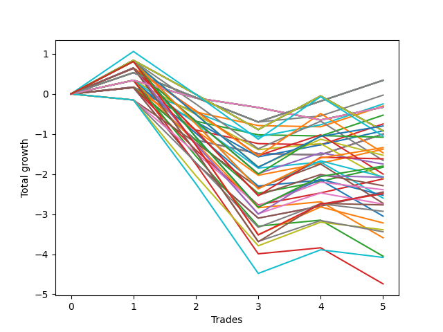

# Short HLT 101 
- Symbol: TSLA
- Date Range: 05/16/2022 - 05/17/2024
- Trading Period: 8:30-12:30
- Number of Trades: 11



| Id. | Name | Win Percent | Profit | Avg Profit / Trade | Avg Time / Trade | Std |      | Name | Win Percent | Profit | Avg Profit / Trade | Avg Time / Trade | Std |
| --- | ---- | ----------- | ------ | ------------------ | ---------------- | --- | ---- | ---- | ----------- | ------ | ------------------ | ---------------- | --- |
| | Sorted By <br> Profit | | | | | | | Sorted By <br> Win Percentage |||||
|0| TP-1.75 60m | 18.18 | 5.90 | 0.54 | 44:00 | 1.35 |     | TP-1.5 30m | 63.64 | -0.56 | -0.05 | 25:21 | 1.00 |
|1| TP-1.5 60m | 18.18 | 5.84 | 0.53 | 40:43 | 1.14 |     | TP-1 30m | 63.64 | -0.77 | -0.07 | 21:49 | 0.85 |
|2| TP-1.75 75m | 36.36 | 4.69 | 0.43 | 49:27 | 1.38 |     | TP-1.25 30m | 63.64 | -0.91 | -0.08 | 25:00 | 0.91 |
|3| TP-1.25 60m | 18.18 | 4.67 | 0.42 | 38:49 | 1.01 |     | TP-1.75 30m | 63.64 | -1.23 | -0.11 | 26:38 | 1.13 |
|4| TP-1.5 75m | 36.36 | 4.63 | 0.42 | 46:10 | 1.18 |     | TP-0.75 15m | 63.64 | -1.31 | -0.12 | 11:38 | 0.59 |
|5| TP-1 60m | 18.18 | 4.59 | 0.42 | 32:38 | 0.92 |     | TP-0.75 30m | 63.64 | -1.32 | -0.12 | 19:21 | 0.68 |
|6| TP-1 90m | 27.27 | 4.01 | 0.36 | 38:05 | 0.95 |     | TP-1 15m | 63.64 | -1.89 | -0.17 | 12:32 | 0.76 |
|7| TP-1 105m | 36.36 | 3.97 | 0.36 | 40:00 | 0.94 |     | TP-3 15m | 63.64 | -1.90 | -0.17 | 14:00 | 0.65 |
|8| TP-1.25 90m | 27.27 | 3.97 | 0.36 | 47:00 | 1.04 |     | TP-2.75 15m | 63.64 | -1.90 | -0.17 | 14:00 | 0.65 |
|9| TP-1 180m | 36.36 | 3.88 | 0.35 | 41:21 | 0.95 |     | TP-2.5 15m | 63.64 | -1.90 | -0.17 | 14:00 | 0.65 |
|10| TP-1 165m | 36.36 | 3.88 | 0.35 | 41:21 | 0.95 |     | TP-2.25 15m | 63.64 | -1.90 | -0.17 | 14:00 | 0.65 |
|11| TP-1 150m | 36.36 | 3.88 | 0.35 | 41:21 | 0.95 |     | TP-2 15m | 63.64 | -1.90 | -0.17 | 14:00 | 0.65 |
|12| TP-1 135m | 36.36 | 3.88 | 0.35 | 41:21 | 0.95 |     | TP-2 30m | 63.64 | -2.24 | -0.20 | 27:49 | 1.09 |
|13| TP-1 120m | 36.36 | 3.88 | 0.35 | 41:21 | 0.95 |     | TP-2.5 30m | 63.64 | -2.54 | -0.23 | 28:16 | 1.16 |
|14| TP-2.5 60m | 18.18 | 3.87 | 0.35 | 53:49 | 1.17 |     | TP-2.25 30m | 63.64 | -2.54 | -0.23 | 28:16 | 1.16 |
|15| TP-2.25 60m | 18.18 | 3.87 | 0.35 | 53:49 | 1.17 |     | TP-1.25 15m | 63.64 | -2.57 | -0.23 | 13:16 | 0.74 |
|16| TP-1.25 105m | 36.36 | 3.69 | 0.34 | 50:16 | 1.04 |     | TP-1.5 15m | 63.64 | -2.68 | -0.24 | 13:21 | 0.76 |
|17| TP-1.75 90m | 36.36 | 3.69 | 0.34 | 54:54 | 1.37 |     | TP-3 30m | 63.64 | -2.74 | -0.25 | 28:21 | 1.20 |
|18| TP-3 60m | 18.18 | 3.67 | 0.33 | 53:54 | 1.22 |     | TP-2.75 30m | 63.64 | -2.74 | -0.25 | 28:21 | 1.20 |
|19| TP-2.75 60m | 18.18 | 3.67 | 0.33 | 53:54 | 1.22 |     | TP-1.75 15m | 63.64 | -2.86 | -0.26 | 13:32 | 0.80 |
|20| TP-1 75m | 36.36 | 3.66 | 0.33 | 35:21 | 0.96 |     | TP-2 180m | 63.64 | -3.19 | -0.29 | 72:43 | 1.62 |
|21| TP-1.5 45m | 36.36 | 3.66 | 0.33 | 34:38 | 1.07 |     | TP-2 165m | 63.64 | -3.19 | -0.29 | 72:43 | 1.62 |
|22| TP-1.5 90m | 36.36 | 3.63 | 0.33 | 51:38 | 1.16 |     | TP-2 150m | 63.64 | -3.19 | -0.29 | 72:43 | 1.62 |
|23| TP-1.25 75m | 36.36 | 3.53 | 0.32 | 42:54 | 1.05 |     | TP-2 135m | 63.64 | -3.19 | -0.29 | 72:43 | 1.62 |
|24| TP-1.25 180m | 45.45 | 3.30 | 0.30 | 53:00 | 1.05 |     | TP-2 120m | 63.64 | -3.19 | -0.29 | 72:43 | 1.62 |
|25| TP-1.25 165m | 45.45 | 3.30 | 0.30 | 53:00 | 1.05 |     | TP-1.5 180m | 54.55 | 1.54 | 0.14 | 58:54 | 1.29 |
|26| TP-1.25 150m | 45.45 | 3.30 | 0.30 | 53:00 | 1.05 |     | TP-1.5 165m | 54.55 | 1.54 | 0.14 | 58:54 | 1.29 |
|27| TP-1.25 135m | 45.45 | 3.30 | 0.30 | 53:00 | 1.05 |     | TP-1.5 150m | 54.55 | 1.54 | 0.14 | 58:54 | 1.29 |
|28| TP-1.25 120m | 45.45 | 3.30 | 0.30 | 53:00 | 1.05 |     | TP-1.5 135m | 54.55 | 1.54 | 0.14 | 58:54 | 1.29 |
|29| TP-2 60m | 27.27 | 3.25 | 0.30 | 49:27 | 1.35 |     | TP-1.5 120m | 54.55 | 1.54 | 0.14 | 58:54 | 1.29 |
|30| TP-1.25 45m | 36.36 | 3.16 | 0.29 | 34:10 | 0.99 |     | TP-1.75 180m | 54.55 | 1.33 | 0.12 | 62:16 | 1.51 |
|31| TP-1 45m | 36.36 | 3.03 | 0.28 | 29:21 | 0.90 |     | TP-1.75 165m | 54.55 | 1.33 | 0.12 | 62:16 | 1.51 |
|32| TP-2.5 75m | 27.27 | 3.02 | 0.27 | 65:16 | 1.21 |     | TP-1.75 150m | 54.55 | 1.33 | 0.12 | 62:16 | 1.51 |
|33| TP-2.25 75m | 27.27 | 3.02 | 0.27 | 65:16 | 1.21 |     | TP-1.75 135m | 54.55 | 1.33 | 0.12 | 62:16 | 1.51 |
|34| TP-3 75m | 27.27 | 2.82 | 0.26 | 65:21 | 1.26 |     | TP-1.75 120m | 54.55 | 1.33 | 0.12 | 62:16 | 1.51 |
|35| TP-2.75 75m | 27.27 | 2.82 | 0.26 | 65:21 | 1.26 |     | TP-0.5 15m | 54.55 | 0.25 | 0.02 | 07:49 | 0.58 |
|36| TP-1.75 45m | 36.36 | 2.78 | 0.25 | 37:10 | 1.19 |     | TP-0.25 180m | 54.55 | -0.78 | -0.07 | 02:38 | 0.43 |
|37| TP-2 75m | 36.36 | 2.70 | 0.25 | 56:49 | 1.38 |     | TP-0.25 165m | 54.55 | -0.78 | -0.07 | 02:38 | 0.43 |
|38| TP-2.5 45m | 36.36 | 2.32 | 0.21 | 41:32 | 1.22 |     | TP-0.25 150m | 54.55 | -0.78 | -0.07 | 02:38 | 0.43 |
|39| TP-2.25 45m | 36.36 | 2.32 | 0.21 | 41:32 | 1.22 |     | TP-0.25 135m | 54.55 | -0.78 | -0.07 | 02:38 | 0.43 |
|40| TP-3 45m | 36.36 | 2.12 | 0.19 | 41:38 | 1.27 |     | TP-0.25 120m | 54.55 | -0.78 | -0.07 | 02:38 | 0.43 |
|41| TP-2.75 45m | 36.36 | 2.12 | 0.19 | 41:38 | 1.27 |     | TP-0.25 105m | 54.55 | -0.78 | -0.07 | 02:38 | 0.43 |
|42| TP-2 45m | 36.36 | 2.09 | 0.19 | 39:43 | 1.22 |     | TP-0.25 90m | 54.55 | -0.78 | -0.07 | 02:38 | 0.43 |
|43| TP-3 90m | 45.45 | 2.00 | 0.18 | 75:00 | 1.47 |     | TP-0.25 75m | 54.55 | -0.78 | -0.07 | 02:38 | 0.43 |
|44| TP-1.5 105m | 45.45 | 1.93 | 0.18 | 56:10 | 1.28 |     | TP-0.25 60m | 54.55 | -0.78 | -0.07 | 02:38 | 0.43 |
|45| TP-1.75 105m | 45.45 | 1.72 | 0.16 | 59:32 | 1.50 |     | TP-0.25 45m | 54.55 | -0.78 | -0.07 | 02:38 | 0.43 |
|46| TP-2.75 90m | 45.45 | 1.68 | 0.15 | 74:49 | 1.41 |     | TP-0.25 30m | 54.55 | -0.78 | -0.07 | 02:38 | 0.43 |
|47| TP-1.5 180m | 54.55 | 1.54 | 0.14 | 58:54 | 1.29 |     | TP-0.25 15m | 54.55 | -0.78 | -0.07 | 02:38 | 0.43 |
|48| TP-1.5 165m | 54.55 | 1.54 | 0.14 | 58:54 | 1.29 |     | TP-2 105m | 54.55 | -1.32 | -0.12 | 69:38 | 1.49 |
|49| TP-1.5 150m | 54.55 | 1.54 | 0.14 | 58:54 | 1.29 |     | TP-2.25 180m | 54.55 | -1.58 | -0.14 | 87:27 | 1.48 |
|50| TP-1.5 135m | 54.55 | 1.54 | 0.14 | 58:54 | 1.29 |     | TP-2.25 165m | 54.55 | -1.58 | -0.14 | 87:27 | 1.48 |
|51| TP-1.5 120m | 54.55 | 1.54 | 0.14 | 58:54 | 1.29 |     | TP-2.25 150m | 54.55 | -1.58 | -0.14 | 87:27 | 1.48 |
|52| TP-2.5 90m | 45.45 | 1.52 | 0.14 | 74:27 | 1.30 |     | TP-2.25 135m | 54.55 | -1.58 | -0.14 | 87:27 | 1.48 |
|53| TP-1.75 180m | 54.55 | 1.33 | 0.12 | 62:16 | 1.51 |     | TP-2.25 120m | 54.55 | -1.58 | -0.14 | 87:27 | 1.48 |
|54| TP-1.75 165m | 54.55 | 1.33 | 0.12 | 62:16 | 1.51 |     | TP-3 180m | 54.55 | -1.64 | -0.15 | 88:16 | 1.79 |
|55| TP-1.75 150m | 54.55 | 1.33 | 0.12 | 62:16 | 1.51 |     | TP-3 165m | 54.55 | -1.64 | -0.15 | 88:16 | 1.79 |
|56| TP-1.75 135m | 54.55 | 1.33 | 0.12 | 62:16 | 1.51 |     | TP-3 150m | 54.55 | -1.64 | -0.15 | 88:16 | 1.79 |
|57| TP-1.75 120m | 54.55 | 1.33 | 0.12 | 62:16 | 1.51 |     | TP-3 135m | 54.55 | -1.64 | -0.15 | 88:16 | 1.79 |
|58| TP-2.25 90m | 45.45 | 1.22 | 0.11 | 74:21 | 1.26 |     | TP-3 120m | 54.55 | -1.64 | -0.15 | 88:16 | 1.79 |
|59| TP-3 105m | 45.45 | 1.10 | 0.10 | 82:21 | 1.62 |     | TP-2.5 180m | 54.55 | -1.67 | -0.15 | 87:38 | 1.58 |
|60| TP-2 90m | 45.45 | 0.95 | 0.09 | 63:38 | 1.37 |     | TP-2.5 165m | 54.55 | -1.67 | -0.15 | 87:38 | 1.58 |
|61| TP-2.75 105m | 45.45 | 0.78 | 0.07 | 82:10 | 1.56 |     | TP-2.5 150m | 54.55 | -1.67 | -0.15 | 87:38 | 1.58 |
|62| TP-2.5 105m | 45.45 | 0.62 | 0.06 | 81:49 | 1.47 |     | TP-2.5 135m | 54.55 | -1.67 | -0.15 | 87:38 | 1.58 |
|63| TP-0.5 180m | 45.45 | 0.58 | 0.05 | 09:38 | 0.62 |     | TP-2.5 120m | 54.55 | -1.67 | -0.15 | 87:38 | 1.58 |
|64| TP-0.5 165m | 45.45 | 0.58 | 0.05 | 09:38 | 0.62 |     | TP-2.75 180m | 54.55 | -1.96 | -0.18 | 88:05 | 1.74 |
|65| TP-0.5 150m | 45.45 | 0.58 | 0.05 | 09:38 | 0.62 |     | TP-2.75 165m | 54.55 | -1.96 | -0.18 | 88:05 | 1.74 |
|66| TP-0.5 135m | 45.45 | 0.58 | 0.05 | 09:38 | 0.62 |     | TP-2.75 150m | 54.55 | -1.96 | -0.18 | 88:05 | 1.74 |
|67| TP-0.5 120m | 45.45 | 0.58 | 0.05 | 09:38 | 0.62 |     | TP-2.75 135m | 54.55 | -1.96 | -0.18 | 88:05 | 1.74 |
|68| TP-0.5 105m | 45.45 | 0.58 | 0.05 | 09:38 | 0.62 |     | TP-2.75 120m | 54.55 | -1.96 | -0.18 | 88:05 | 1.74 |
|69| TP-0.5 90m | 45.45 | 0.58 | 0.05 | 09:38 | 0.62 |     | TP-1.25 180m | 45.45 | 3.30 | 0.30 | 53:00 | 1.05 |
|70| TP-0.5 75m | 45.45 | 0.58 | 0.05 | 09:38 | 0.62 |     | TP-1.25 165m | 45.45 | 3.30 | 0.30 | 53:00 | 1.05 |
|71| TP-0.5 60m | 45.45 | 0.58 | 0.05 | 09:38 | 0.62 |     | TP-1.25 150m | 45.45 | 3.30 | 0.30 | 53:00 | 1.05 |
|72| TP-0.5 45m | 45.45 | 0.58 | 0.05 | 09:38 | 0.62 |     | TP-1.25 135m | 45.45 | 3.30 | 0.30 | 53:00 | 1.05 |
|73| TP-0.5 30m | 45.45 | 0.43 | 0.04 | 09:32 | 0.61 |     | TP-1.25 120m | 45.45 | 3.30 | 0.30 | 53:00 | 1.05 |
|74| TP-0.75 180m | 45.45 | 0.42 | 0.04 | 23:38 | 0.81 |     | TP-3 90m | 45.45 | 2.00 | 0.18 | 75:00 | 1.47 |
|75| TP-0.75 165m | 45.45 | 0.42 | 0.04 | 23:38 | 0.81 |     | TP-1.5 105m | 45.45 | 1.93 | 0.18 | 56:10 | 1.28 |
|76| TP-0.75 150m | 45.45 | 0.42 | 0.04 | 23:38 | 0.81 |     | TP-1.75 105m | 45.45 | 1.72 | 0.16 | 59:32 | 1.50 |
|77| TP-0.75 135m | 45.45 | 0.42 | 0.04 | 23:38 | 0.81 |     | TP-2.75 90m | 45.45 | 1.68 | 0.15 | 74:49 | 1.41 |
|78| TP-0.75 120m | 45.45 | 0.42 | 0.04 | 23:38 | 0.81 |     | TP-2.5 90m | 45.45 | 1.52 | 0.14 | 74:27 | 1.30 |
|79| TP-0.75 105m | 45.45 | 0.42 | 0.04 | 23:38 | 0.81 |     | TP-2.25 90m | 45.45 | 1.22 | 0.11 | 74:21 | 1.26 |
|80| TP-0.75 90m | 45.45 | 0.42 | 0.04 | 23:38 | 0.81 |     | TP-3 105m | 45.45 | 1.10 | 0.10 | 82:21 | 1.62 |
|81| TP-0.75 75m | 45.45 | 0.42 | 0.04 | 23:38 | 0.81 |     | TP-2 90m | 45.45 | 0.95 | 0.09 | 63:38 | 1.37 |
|82| TP-0.75 60m | 45.45 | 0.42 | 0.04 | 23:38 | 0.81 |     | TP-2.75 105m | 45.45 | 0.78 | 0.07 | 82:10 | 1.56 |
|83| TP-0.75 45m | 45.45 | 0.42 | 0.04 | 23:38 | 0.81 |     | TP-2.5 105m | 45.45 | 0.62 | 0.06 | 81:49 | 1.47 |
|84| TP-2.25 105m | 45.45 | 0.32 | 0.03 | 81:43 | 1.42 |     | TP-0.5 180m | 45.45 | 0.58 | 0.05 | 09:38 | 0.62 |
|85| TP-0.5 15m | 54.55 | 0.25 | 0.02 | 07:49 | 0.58 |     | TP-0.5 165m | 45.45 | 0.58 | 0.05 | 09:38 | 0.62 |
|86| TP-1.5 30m | 63.64 | -0.56 | -0.05 | 25:21 | 1.00 |     | TP-0.5 150m | 45.45 | 0.58 | 0.05 | 09:38 | 0.62 |
|87| TP-1 30m | 63.64 | -0.77 | -0.07 | 21:49 | 0.85 |     | TP-0.5 135m | 45.45 | 0.58 | 0.05 | 09:38 | 0.62 |
|88| TP-0.25 180m | 54.55 | -0.78 | -0.07 | 02:38 | 0.43 |     | TP-0.5 120m | 45.45 | 0.58 | 0.05 | 09:38 | 0.62 |
|89| TP-0.25 165m | 54.55 | -0.78 | -0.07 | 02:38 | 0.43 |     | TP-0.5 105m | 45.45 | 0.58 | 0.05 | 09:38 | 0.62 |
|90| TP-0.25 150m | 54.55 | -0.78 | -0.07 | 02:38 | 0.43 |     | TP-0.5 90m | 45.45 | 0.58 | 0.05 | 09:38 | 0.62 |
|91| TP-0.25 135m | 54.55 | -0.78 | -0.07 | 02:38 | 0.43 |     | TP-0.5 75m | 45.45 | 0.58 | 0.05 | 09:38 | 0.62 |
|92| TP-0.25 120m | 54.55 | -0.78 | -0.07 | 02:38 | 0.43 |     | TP-0.5 60m | 45.45 | 0.58 | 0.05 | 09:38 | 0.62 |
|93| TP-0.25 105m | 54.55 | -0.78 | -0.07 | 02:38 | 0.43 |     | TP-0.5 45m | 45.45 | 0.58 | 0.05 | 09:38 | 0.62 |
|94| TP-0.25 90m | 54.55 | -0.78 | -0.07 | 02:38 | 0.43 |     | TP-0.5 30m | 45.45 | 0.43 | 0.04 | 09:32 | 0.61 |
|95| TP-0.25 75m | 54.55 | -0.78 | -0.07 | 02:38 | 0.43 |     | TP-0.75 180m | 45.45 | 0.42 | 0.04 | 23:38 | 0.81 |
|96| TP-0.25 60m | 54.55 | -0.78 | -0.07 | 02:38 | 0.43 |     | TP-0.75 165m | 45.45 | 0.42 | 0.04 | 23:38 | 0.81 |
|97| TP-0.25 45m | 54.55 | -0.78 | -0.07 | 02:38 | 0.43 |     | TP-0.75 150m | 45.45 | 0.42 | 0.04 | 23:38 | 0.81 |
|98| TP-0.25 30m | 54.55 | -0.78 | -0.07 | 02:38 | 0.43 |     | TP-0.75 135m | 45.45 | 0.42 | 0.04 | 23:38 | 0.81 |
|99| TP-0.25 15m | 54.55 | -0.78 | -0.07 | 02:38 | 0.43 |     | TP-0.75 120m | 45.45 | 0.42 | 0.04 | 23:38 | 0.81 |
|100| TP-1.25 30m | 63.64 | -0.91 | -0.08 | 25:00 | 0.91 |     | TP-0.75 105m | 45.45 | 0.42 | 0.04 | 23:38 | 0.81 |
|101| TP-1.75 30m | 63.64 | -1.23 | -0.11 | 26:38 | 1.13 |     | TP-0.75 90m | 45.45 | 0.42 | 0.04 | 23:38 | 0.81 |
|102| TP-0.75 15m | 63.64 | -1.31 | -0.12 | 11:38 | 0.59 |     | TP-0.75 75m | 45.45 | 0.42 | 0.04 | 23:38 | 0.81 |
|103| TP-0.75 30m | 63.64 | -1.32 | -0.12 | 19:21 | 0.68 |     | TP-0.75 60m | 45.45 | 0.42 | 0.04 | 23:38 | 0.81 |
|104| TP-2 105m | 54.55 | -1.32 | -0.12 | 69:38 | 1.49 |     | TP-0.75 45m | 45.45 | 0.42 | 0.04 | 23:38 | 0.81 |
|105| TP-2.25 180m | 54.55 | -1.58 | -0.14 | 87:27 | 1.48 |     | TP-2.25 105m | 45.45 | 0.32 | 0.03 | 81:43 | 1.42 |
|106| TP-2.25 165m | 54.55 | -1.58 | -0.14 | 87:27 | 1.48 |     | TP-1.75 75m | 36.36 | 4.69 | 0.43 | 49:27 | 1.38 |
|107| TP-2.25 150m | 54.55 | -1.58 | -0.14 | 87:27 | 1.48 |     | TP-1.5 75m | 36.36 | 4.63 | 0.42 | 46:10 | 1.18 |
|108| TP-2.25 135m | 54.55 | -1.58 | -0.14 | 87:27 | 1.48 |     | TP-1 105m | 36.36 | 3.97 | 0.36 | 40:00 | 0.94 |
|109| TP-2.25 120m | 54.55 | -1.58 | -0.14 | 87:27 | 1.48 |     | TP-1 180m | 36.36 | 3.88 | 0.35 | 41:21 | 0.95 |
|110| TP-3 180m | 54.55 | -1.64 | -0.15 | 88:16 | 1.79 |     | TP-1 165m | 36.36 | 3.88 | 0.35 | 41:21 | 0.95 |
|111| TP-3 165m | 54.55 | -1.64 | -0.15 | 88:16 | 1.79 |     | TP-1 150m | 36.36 | 3.88 | 0.35 | 41:21 | 0.95 |
|112| TP-3 150m | 54.55 | -1.64 | -0.15 | 88:16 | 1.79 |     | TP-1 135m | 36.36 | 3.88 | 0.35 | 41:21 | 0.95 |
|113| TP-3 135m | 54.55 | -1.64 | -0.15 | 88:16 | 1.79 |     | TP-1 120m | 36.36 | 3.88 | 0.35 | 41:21 | 0.95 |
|114| TP-3 120m | 54.55 | -1.64 | -0.15 | 88:16 | 1.79 |     | TP-1.25 105m | 36.36 | 3.69 | 0.34 | 50:16 | 1.04 |
|115| TP-2.5 180m | 54.55 | -1.67 | -0.15 | 87:38 | 1.58 |     | TP-1.75 90m | 36.36 | 3.69 | 0.34 | 54:54 | 1.37 |
|116| TP-2.5 165m | 54.55 | -1.67 | -0.15 | 87:38 | 1.58 |     | TP-1 75m | 36.36 | 3.66 | 0.33 | 35:21 | 0.96 |
|117| TP-2.5 150m | 54.55 | -1.67 | -0.15 | 87:38 | 1.58 |     | TP-1.5 45m | 36.36 | 3.66 | 0.33 | 34:38 | 1.07 |
|118| TP-2.5 135m | 54.55 | -1.67 | -0.15 | 87:38 | 1.58 |     | TP-1.5 90m | 36.36 | 3.63 | 0.33 | 51:38 | 1.16 |
|119| TP-2.5 120m | 54.55 | -1.67 | -0.15 | 87:38 | 1.58 |     | TP-1.25 75m | 36.36 | 3.53 | 0.32 | 42:54 | 1.05 |
|120| TP-1 15m | 63.64 | -1.89 | -0.17 | 12:32 | 0.76 |     | TP-1.25 45m | 36.36 | 3.16 | 0.29 | 34:10 | 0.99 |
|121| TP-3 15m | 63.64 | -1.90 | -0.17 | 14:00 | 0.65 |     | TP-1 45m | 36.36 | 3.03 | 0.28 | 29:21 | 0.90 |
|122| TP-2.75 15m | 63.64 | -1.90 | -0.17 | 14:00 | 0.65 |     | TP-1.75 45m | 36.36 | 2.78 | 0.25 | 37:10 | 1.19 |
|123| TP-2.5 15m | 63.64 | -1.90 | -0.17 | 14:00 | 0.65 |     | TP-2 75m | 36.36 | 2.70 | 0.25 | 56:49 | 1.38 |
|124| TP-2.25 15m | 63.64 | -1.90 | -0.17 | 14:00 | 0.65 |     | TP-2.5 45m | 36.36 | 2.32 | 0.21 | 41:32 | 1.22 |
|125| TP-2 15m | 63.64 | -1.90 | -0.17 | 14:00 | 0.65 |     | TP-2.25 45m | 36.36 | 2.32 | 0.21 | 41:32 | 1.22 |
|126| TP-2.75 180m | 54.55 | -1.96 | -0.18 | 88:05 | 1.74 |     | TP-3 45m | 36.36 | 2.12 | 0.19 | 41:38 | 1.27 |
|127| TP-2.75 165m | 54.55 | -1.96 | -0.18 | 88:05 | 1.74 |     | TP-2.75 45m | 36.36 | 2.12 | 0.19 | 41:38 | 1.27 |
|128| TP-2.75 150m | 54.55 | -1.96 | -0.18 | 88:05 | 1.74 |     | TP-2 45m | 36.36 | 2.09 | 0.19 | 39:43 | 1.22 |
|129| TP-2.75 135m | 54.55 | -1.96 | -0.18 | 88:05 | 1.74 |     | TP-1 90m | 27.27 | 4.01 | 0.36 | 38:05 | 0.95 |
|130| TP-2.75 120m | 54.55 | -1.96 | -0.18 | 88:05 | 1.74 |     | TP-1.25 90m | 27.27 | 3.97 | 0.36 | 47:00 | 1.04 |
|131| TP-2 30m | 63.64 | -2.24 | -0.20 | 27:49 | 1.09 |     | TP-2 60m | 27.27 | 3.25 | 0.30 | 49:27 | 1.35 |
|132| TP-2.5 30m | 63.64 | -2.54 | -0.23 | 28:16 | 1.16 |     | TP-2.5 75m | 27.27 | 3.02 | 0.27 | 65:16 | 1.21 |
|133| TP-2.25 30m | 63.64 | -2.54 | -0.23 | 28:16 | 1.16 |     | TP-2.25 75m | 27.27 | 3.02 | 0.27 | 65:16 | 1.21 |
|134| TP-1.25 15m | 63.64 | -2.57 | -0.23 | 13:16 | 0.74 |     | TP-3 75m | 27.27 | 2.82 | 0.26 | 65:21 | 1.26 |
|135| TP-1.5 15m | 63.64 | -2.68 | -0.24 | 13:21 | 0.76 |     | TP-2.75 75m | 27.27 | 2.82 | 0.26 | 65:21 | 1.26 |
|136| TP-3 30m | 63.64 | -2.74 | -0.25 | 28:21 | 1.20 |     | TP-1.75 60m | 18.18 | 5.90 | 0.54 | 44:00 | 1.35 |
|137| TP-2.75 30m | 63.64 | -2.74 | -0.25 | 28:21 | 1.20 |     | TP-1.5 60m | 18.18 | 5.84 | 0.53 | 40:43 | 1.14 |
|138| TP-1.75 15m | 63.64 | -2.86 | -0.26 | 13:32 | 0.80 |     | TP-1.25 60m | 18.18 | 4.67 | 0.42 | 38:49 | 1.01 |
|139| TP-2 180m | 63.64 | -3.19 | -0.29 | 72:43 | 1.62 |     | TP-1 60m | 18.18 | 4.59 | 0.42 | 32:38 | 0.92 |
|140| TP-2 165m | 63.64 | -3.19 | -0.29 | 72:43 | 1.62 |     | TP-2.5 60m | 18.18 | 3.87 | 0.35 | 53:49 | 1.17 |
|141| TP-2 150m | 63.64 | -3.19 | -0.29 | 72:43 | 1.62 |     | TP-2.25 60m | 18.18 | 3.87 | 0.35 | 53:49 | 1.17 |
|142| TP-2 135m | 63.64 | -3.19 | -0.29 | 72:43 | 1.62 |     | TP-3 60m | 18.18 | 3.67 | 0.33 | 53:54 | 1.22 |
|143| TP-2 120m | 63.64 | -3.19 | -0.29 | 72:43 | 1.62 |     | TP-2.75 60m | 18.18 | 3.67 | 0.33 | 53:54 | 1.22 |

### Test TP-0.25 15m
* Take Profit of 0.25 Point
* 0.25 Stoploss
* Results:
```
Total Trades: 11
Percent Up: 45.45
Percent Down: 54.55
Total Points Moved Down: 0.78
Potential Profit: 390.00
Total Points Ups: 1.88 Count Ups: 5
Total Points Downs: 2.66 Count Downs: 6
```

<details><summary>Trades</summary>

<code>In: 2022-05-31 09:55:00		Out: 2022-05-31 09:57:00		Total Position Time: 02:00		Total Move Down: -0.46		Total to Date: -0.46</code> <br />
<code>In: 2022-09-14 09:00:00		Out: 2022-09-14 09:05:00		Total Position Time: 05:00		Total Move Down: 0.34		Total to Date: -0.12</code> <br />
<code>In: 2022-10-17 09:05:00		Out: 2022-10-17 09:07:00		Total Position Time: 02:00		Total Move Down: -0.28		Total to Date: -0.40</code> <br />
<code>In: 2023-04-28 10:10:00		Out: 2023-04-28 10:13:00		Total Position Time: 03:00		Total Move Down: -0.49		Total to Date: -0.89</code> <br />
<code>In: 2023-06-13 09:45:00		Out: 2023-06-13 09:47:00		Total Position Time: 02:00		Total Move Down: 0.42		Total to Date: -0.47</code> <br />
<code>In: 2023-06-27 11:30:00		Out: 2023-06-27 11:33:00		Total Position Time: 03:00		Total Move Down: 0.81		Total to Date: 0.34</code> <br />
<code>In: 2023-07-18 10:25:00		Out: 2023-07-18 10:27:00		Total Position Time: 02:00		Total Move Down: -0.40		Total to Date: -0.06</code> <br />
<code>In: 2023-08-03 12:10:00		Out: 2023-08-03 12:12:00		Total Position Time: 02:00		Total Move Down: 0.29		Total to Date: 0.23</code> <br />
<code>In: 2023-08-23 11:15:00		Out: 2023-08-23 11:19:00		Total Position Time: 04:00		Total Move Down: 0.48		Total to Date: 0.71</code> <br />
<code>In: 2023-11-07 11:45:00		Out: 2023-11-07 11:47:00		Total Position Time: 02:00		Total Move Down: -0.25		Total to Date: 0.46</code> <br />
<code>In: 2024-04-03 08:50:00		Out: 2024-04-03 08:52:00		Total Position Time: 02:00		Total Move Down: 0.32		Total to Date: 0.78</code> <br />


</details>

### Test TP-0.5 15m
* Take Profit of 0.5 Point
* 0.5 Stoploss
* Results:
```
Total Trades: 11
Percent Up: 45.45
Percent Down: 54.55
Total Points Moved Down: -0.25
Potential Profit: -125.00
Total Points Ups: 3.06 Count Ups: 5
Total Points Downs: 2.81 Count Downs: 6
```

<details><summary>Trades</summary>

<code>In: 2022-05-31 09:55:00		Out: 2022-05-31 09:57:00		Total Position Time: 02:00		Total Move Down: -0.46		Total to Date: -0.46</code> <br />
<code>In: 2022-09-14 09:00:00		Out: 2022-09-14 09:13:00		Total Position Time: 13:00		Total Move Down: -0.93		Total to Date: -1.39</code> <br />
<code>In: 2022-10-17 09:05:00		Out: 2022-10-17 09:10:00		Total Position Time: 05:00		Total Move Down: -0.55		Total to Date: -1.94</code> <br />
<code>In: 2023-04-28 10:10:00		Out: 2023-04-28 10:24:00		Total Position Time: 14:00		Total Move Down: 0.18		Total to Date: -1.76</code> <br />
<code>In: 2023-06-13 09:45:00		Out: 2023-06-13 09:51:00		Total Position Time: 06:00		Total Move Down: -0.52		Total to Date: -2.28</code> <br />
<code>In: 2023-06-27 11:30:00		Out: 2023-06-27 11:33:00		Total Position Time: 03:00		Total Move Down: 0.81		Total to Date: -1.47</code> <br />
<code>In: 2023-07-18 10:25:00		Out: 2023-07-18 10:30:00		Total Position Time: 05:00		Total Move Down: -0.60		Total to Date: -2.07</code> <br />
<code>In: 2023-08-03 12:10:00		Out: 2023-08-03 12:14:00		Total Position Time: 04:00		Total Move Down: 0.66		Total to Date: -1.41</code> <br />
<code>In: 2023-08-23 11:15:00		Out: 2023-08-23 11:21:00		Total Position Time: 06:00		Total Move Down: 0.52		Total to Date: -0.89</code> <br />
<code>In: 2023-11-07 11:45:00		Out: 2023-11-07 11:59:00		Total Position Time: 14:00		Total Move Down: 0.12		Total to Date: -0.77</code> <br />
<code>In: 2024-04-03 08:50:00		Out: 2024-04-03 09:04:00		Total Position Time: 14:00		Total Move Down: 0.52		Total to Date: -0.25</code> <br />


</details>

### Test TP-0.75 15m
* Take Profit of 0.75 Point
* 0.75 Stoploss
* Results:
```
Total Trades: 11
Percent Up: 36.36
Percent Down: 63.64
Total Points Moved Down: 1.31
Potential Profit: 655.00
Total Points Ups: 2.17 Count Ups: 4
Total Points Downs: 3.48 Count Downs: 7
```

<details><summary>Trades</summary>

<code>In: 2022-05-31 09:55:00		Out: 2022-05-31 10:02:00		Total Position Time: 07:00		Total Move Down: 0.94		Total to Date: 0.94</code> <br />
<code>In: 2022-09-14 09:00:00		Out: 2022-09-14 09:13:00		Total Position Time: 13:00		Total Move Down: -0.93		Total to Date: 0.01</code> <br />
<code>In: 2022-10-17 09:05:00		Out: 2022-10-17 09:19:00		Total Position Time: 14:00		Total Move Down: 0.35		Total to Date: 0.36</code> <br />
<code>In: 2023-04-28 10:10:00		Out: 2023-04-28 10:24:00		Total Position Time: 14:00		Total Move Down: 0.18		Total to Date: 0.54</code> <br />
<code>In: 2023-06-13 09:45:00		Out: 2023-06-13 09:59:00		Total Position Time: 14:00		Total Move Down: -0.31		Total to Date: 0.23</code> <br />
<code>In: 2023-06-27 11:30:00		Out: 2023-06-27 11:33:00		Total Position Time: 03:00		Total Move Down: 0.81		Total to Date: 1.04</code> <br />
<code>In: 2023-07-18 10:25:00		Out: 2023-07-18 10:32:00		Total Position Time: 07:00		Total Move Down: -0.82		Total to Date: 0.22</code> <br />
<code>In: 2023-08-03 12:10:00		Out: 2023-08-03 12:24:00		Total Position Time: 14:00		Total Move Down: 0.56		Total to Date: 0.78</code> <br />
<code>In: 2023-08-23 11:15:00		Out: 2023-08-23 11:29:00		Total Position Time: 14:00		Total Move Down: -0.11		Total to Date: 0.67</code> <br />
<code>In: 2023-11-07 11:45:00		Out: 2023-11-07 11:59:00		Total Position Time: 14:00		Total Move Down: 0.12		Total to Date: 0.79</code> <br />
<code>In: 2024-04-03 08:50:00		Out: 2024-04-03 09:04:00		Total Position Time: 14:00		Total Move Down: 0.52		Total to Date: 1.31</code> <br />


</details>

### Test TP-1 15m
* Take Profit of 1 Point
* 1 Stoploss
* Results:
```
Total Trades: 11
Percent Up: 36.36
Percent Down: 63.64
Total Points Moved Down: 1.89
Potential Profit: 945.00
Total Points Ups: 2.51 Count Ups: 4
Total Points Downs: 4.40 Count Downs: 7
```

<details><summary>Trades</summary>

<code>In: 2022-05-31 09:55:00		Out: 2022-05-31 10:03:00		Total Position Time: 08:00		Total Move Down: 1.49		Total to Date: 1.49</code> <br />
<code>In: 2022-09-14 09:00:00		Out: 2022-09-14 09:14:00		Total Position Time: 14:00		Total Move Down: -1.07		Total to Date: 0.42</code> <br />
<code>In: 2022-10-17 09:05:00		Out: 2022-10-17 09:19:00		Total Position Time: 14:00		Total Move Down: 0.35		Total to Date: 0.77</code> <br />
<code>In: 2023-04-28 10:10:00		Out: 2023-04-28 10:24:00		Total Position Time: 14:00		Total Move Down: 0.18		Total to Date: 0.95</code> <br />
<code>In: 2023-06-13 09:45:00		Out: 2023-06-13 09:59:00		Total Position Time: 14:00		Total Move Down: -0.31		Total to Date: 0.64</code> <br />
<code>In: 2023-06-27 11:30:00		Out: 2023-06-27 11:40:00		Total Position Time: 10:00		Total Move Down: 1.18		Total to Date: 1.82</code> <br />
<code>In: 2023-07-18 10:25:00		Out: 2023-07-18 10:33:00		Total Position Time: 08:00		Total Move Down: -1.02		Total to Date: 0.80</code> <br />
<code>In: 2023-08-03 12:10:00		Out: 2023-08-03 12:24:00		Total Position Time: 14:00		Total Move Down: 0.56		Total to Date: 1.36</code> <br />
<code>In: 2023-08-23 11:15:00		Out: 2023-08-23 11:29:00		Total Position Time: 14:00		Total Move Down: -0.11		Total to Date: 1.25</code> <br />
<code>In: 2023-11-07 11:45:00		Out: 2023-11-07 11:59:00		Total Position Time: 14:00		Total Move Down: 0.12		Total to Date: 1.37</code> <br />
<code>In: 2024-04-03 08:50:00		Out: 2024-04-03 09:04:00		Total Position Time: 14:00		Total Move Down: 0.52		Total to Date: 1.89</code> <br />


</details>

### Test TP-1.25 15m
* Take Profit of 1.25 Point
* 1.25 Stoploss
* Results:
```
Total Trades: 11
Percent Up: 36.36
Percent Down: 63.64
Total Points Moved Down: 2.57
Potential Profit: 1285.00
Total Points Ups: 2.09 Count Ups: 4
Total Points Downs: 4.66 Count Downs: 7
```

<details><summary>Trades</summary>

<code>In: 2022-05-31 09:55:00		Out: 2022-05-31 10:03:00		Total Position Time: 08:00		Total Move Down: 1.49		Total to Date: 1.49</code> <br />
<code>In: 2022-09-14 09:00:00		Out: 2022-09-14 09:14:00		Total Position Time: 14:00		Total Move Down: -1.07		Total to Date: 0.42</code> <br />
<code>In: 2022-10-17 09:05:00		Out: 2022-10-17 09:19:00		Total Position Time: 14:00		Total Move Down: 0.35		Total to Date: 0.77</code> <br />
<code>In: 2023-04-28 10:10:00		Out: 2023-04-28 10:24:00		Total Position Time: 14:00		Total Move Down: 0.18		Total to Date: 0.95</code> <br />
<code>In: 2023-06-13 09:45:00		Out: 2023-06-13 09:59:00		Total Position Time: 14:00		Total Move Down: -0.31		Total to Date: 0.64</code> <br />
<code>In: 2023-06-27 11:30:00		Out: 2023-06-27 11:42:00		Total Position Time: 12:00		Total Move Down: 1.44		Total to Date: 2.08</code> <br />
<code>In: 2023-07-18 10:25:00		Out: 2023-07-18 10:39:00		Total Position Time: 14:00		Total Move Down: -0.60		Total to Date: 1.48</code> <br />
<code>In: 2023-08-03 12:10:00		Out: 2023-08-03 12:24:00		Total Position Time: 14:00		Total Move Down: 0.56		Total to Date: 2.04</code> <br />
<code>In: 2023-08-23 11:15:00		Out: 2023-08-23 11:29:00		Total Position Time: 14:00		Total Move Down: -0.11		Total to Date: 1.93</code> <br />
<code>In: 2023-11-07 11:45:00		Out: 2023-11-07 11:59:00		Total Position Time: 14:00		Total Move Down: 0.12		Total to Date: 2.05</code> <br />
<code>In: 2024-04-03 08:50:00		Out: 2024-04-03 09:04:00		Total Position Time: 14:00		Total Move Down: 0.52		Total to Date: 2.57</code> <br />


</details>

### Test TP-1.5 15m
* Take Profit of 1.5 Point
* 1.5 Stoploss
* Results:
```
Total Trades: 11
Percent Up: 36.36
Percent Down: 63.64
Total Points Moved Down: 2.68
Potential Profit: 1340.00
Total Points Ups: 2.09 Count Ups: 4
Total Points Downs: 4.77 Count Downs: 7
```

<details><summary>Trades</summary>

<code>In: 2022-05-31 09:55:00		Out: 2022-05-31 10:03:00		Total Position Time: 08:00		Total Move Down: 1.49		Total to Date: 1.49</code> <br />
<code>In: 2022-09-14 09:00:00		Out: 2022-09-14 09:14:00		Total Position Time: 14:00		Total Move Down: -1.07		Total to Date: 0.42</code> <br />
<code>In: 2022-10-17 09:05:00		Out: 2022-10-17 09:19:00		Total Position Time: 14:00		Total Move Down: 0.35		Total to Date: 0.77</code> <br />
<code>In: 2023-04-28 10:10:00		Out: 2023-04-28 10:24:00		Total Position Time: 14:00		Total Move Down: 0.18		Total to Date: 0.95</code> <br />
<code>In: 2023-06-13 09:45:00		Out: 2023-06-13 09:59:00		Total Position Time: 14:00		Total Move Down: -0.31		Total to Date: 0.64</code> <br />
<code>In: 2023-06-27 11:30:00		Out: 2023-06-27 11:43:00		Total Position Time: 13:00		Total Move Down: 1.55		Total to Date: 2.19</code> <br />
<code>In: 2023-07-18 10:25:00		Out: 2023-07-18 10:39:00		Total Position Time: 14:00		Total Move Down: -0.60		Total to Date: 1.59</code> <br />
<code>In: 2023-08-03 12:10:00		Out: 2023-08-03 12:24:00		Total Position Time: 14:00		Total Move Down: 0.56		Total to Date: 2.15</code> <br />
<code>In: 2023-08-23 11:15:00		Out: 2023-08-23 11:29:00		Total Position Time: 14:00		Total Move Down: -0.11		Total to Date: 2.04</code> <br />
<code>In: 2023-11-07 11:45:00		Out: 2023-11-07 11:59:00		Total Position Time: 14:00		Total Move Down: 0.12		Total to Date: 2.16</code> <br />
<code>In: 2024-04-03 08:50:00		Out: 2024-04-03 09:04:00		Total Position Time: 14:00		Total Move Down: 0.52		Total to Date: 2.68</code> <br />


</details>

### Test TP-1.75 15m
* Take Profit of 1.75 Point
* 1.75 Stoploss
* Results:
```
Total Trades: 11
Percent Up: 36.36
Percent Down: 63.64
Total Points Moved Down: 2.86
Potential Profit: 1430.00
Total Points Ups: 2.09 Count Ups: 4
Total Points Downs: 4.95 Count Downs: 7
```

<details><summary>Trades</summary>

<code>In: 2022-05-31 09:55:00		Out: 2022-05-31 10:04:00		Total Position Time: 09:00		Total Move Down: 1.98		Total to Date: 1.98</code> <br />
<code>In: 2022-09-14 09:00:00		Out: 2022-09-14 09:14:00		Total Position Time: 14:00		Total Move Down: -1.07		Total to Date: 0.91</code> <br />
<code>In: 2022-10-17 09:05:00		Out: 2022-10-17 09:19:00		Total Position Time: 14:00		Total Move Down: 0.35		Total to Date: 1.26</code> <br />
<code>In: 2023-04-28 10:10:00		Out: 2023-04-28 10:24:00		Total Position Time: 14:00		Total Move Down: 0.18		Total to Date: 1.44</code> <br />
<code>In: 2023-06-13 09:45:00		Out: 2023-06-13 09:59:00		Total Position Time: 14:00		Total Move Down: -0.31		Total to Date: 1.13</code> <br />
<code>In: 2023-06-27 11:30:00		Out: 2023-06-27 11:44:00		Total Position Time: 14:00		Total Move Down: 1.24		Total to Date: 2.37</code> <br />
<code>In: 2023-07-18 10:25:00		Out: 2023-07-18 10:39:00		Total Position Time: 14:00		Total Move Down: -0.60		Total to Date: 1.77</code> <br />
<code>In: 2023-08-03 12:10:00		Out: 2023-08-03 12:24:00		Total Position Time: 14:00		Total Move Down: 0.56		Total to Date: 2.33</code> <br />
<code>In: 2023-08-23 11:15:00		Out: 2023-08-23 11:29:00		Total Position Time: 14:00		Total Move Down: -0.11		Total to Date: 2.22</code> <br />
<code>In: 2023-11-07 11:45:00		Out: 2023-11-07 11:59:00		Total Position Time: 14:00		Total Move Down: 0.12		Total to Date: 2.34</code> <br />
<code>In: 2024-04-03 08:50:00		Out: 2024-04-03 09:04:00		Total Position Time: 14:00		Total Move Down: 0.52		Total to Date: 2.86</code> <br />


</details>

### Test TP-2 15m
* Take Profit of 2 Point
* 2 Stoploss
* Results:
```
Total Trades: 11
Percent Up: 36.36
Percent Down: 63.64
Total Points Moved Down: 1.90
Potential Profit: 950.00
Total Points Ups: 2.09 Count Ups: 4
Total Points Downs: 3.99 Count Downs: 7
```

<details><summary>Trades</summary>

<code>In: 2022-05-31 09:55:00		Out: 2022-05-31 10:09:00		Total Position Time: 14:00		Total Move Down: 1.02		Total to Date: 1.02</code> <br />
<code>In: 2022-09-14 09:00:00		Out: 2022-09-14 09:14:00		Total Position Time: 14:00		Total Move Down: -1.07		Total to Date: -0.05</code> <br />
<code>In: 2022-10-17 09:05:00		Out: 2022-10-17 09:19:00		Total Position Time: 14:00		Total Move Down: 0.35		Total to Date: 0.30</code> <br />
<code>In: 2023-04-28 10:10:00		Out: 2023-04-28 10:24:00		Total Position Time: 14:00		Total Move Down: 0.18		Total to Date: 0.48</code> <br />
<code>In: 2023-06-13 09:45:00		Out: 2023-06-13 09:59:00		Total Position Time: 14:00		Total Move Down: -0.31		Total to Date: 0.17</code> <br />
<code>In: 2023-06-27 11:30:00		Out: 2023-06-27 11:44:00		Total Position Time: 14:00		Total Move Down: 1.24		Total to Date: 1.41</code> <br />
<code>In: 2023-07-18 10:25:00		Out: 2023-07-18 10:39:00		Total Position Time: 14:00		Total Move Down: -0.60		Total to Date: 0.81</code> <br />
<code>In: 2023-08-03 12:10:00		Out: 2023-08-03 12:24:00		Total Position Time: 14:00		Total Move Down: 0.56		Total to Date: 1.37</code> <br />
<code>In: 2023-08-23 11:15:00		Out: 2023-08-23 11:29:00		Total Position Time: 14:00		Total Move Down: -0.11		Total to Date: 1.26</code> <br />
<code>In: 2023-11-07 11:45:00		Out: 2023-11-07 11:59:00		Total Position Time: 14:00		Total Move Down: 0.12		Total to Date: 1.38</code> <br />
<code>In: 2024-04-03 08:50:00		Out: 2024-04-03 09:04:00		Total Position Time: 14:00		Total Move Down: 0.52		Total to Date: 1.90</code> <br />


</details>

### Test TP-2.25 15m
* Take Profit of 2.25 Point
* 2.25 Stoploss
* Results:
```
Total Trades: 11
Percent Up: 36.36
Percent Down: 63.64
Total Points Moved Down: 1.90
Potential Profit: 950.00
Total Points Ups: 2.09 Count Ups: 4
Total Points Downs: 3.99 Count Downs: 7
```

<details><summary>Trades</summary>

<code>In: 2022-05-31 09:55:00		Out: 2022-05-31 10:09:00		Total Position Time: 14:00		Total Move Down: 1.02		Total to Date: 1.02</code> <br />
<code>In: 2022-09-14 09:00:00		Out: 2022-09-14 09:14:00		Total Position Time: 14:00		Total Move Down: -1.07		Total to Date: -0.05</code> <br />
<code>In: 2022-10-17 09:05:00		Out: 2022-10-17 09:19:00		Total Position Time: 14:00		Total Move Down: 0.35		Total to Date: 0.30</code> <br />
<code>In: 2023-04-28 10:10:00		Out: 2023-04-28 10:24:00		Total Position Time: 14:00		Total Move Down: 0.18		Total to Date: 0.48</code> <br />
<code>In: 2023-06-13 09:45:00		Out: 2023-06-13 09:59:00		Total Position Time: 14:00		Total Move Down: -0.31		Total to Date: 0.17</code> <br />
<code>In: 2023-06-27 11:30:00		Out: 2023-06-27 11:44:00		Total Position Time: 14:00		Total Move Down: 1.24		Total to Date: 1.41</code> <br />
<code>In: 2023-07-18 10:25:00		Out: 2023-07-18 10:39:00		Total Position Time: 14:00		Total Move Down: -0.60		Total to Date: 0.81</code> <br />
<code>In: 2023-08-03 12:10:00		Out: 2023-08-03 12:24:00		Total Position Time: 14:00		Total Move Down: 0.56		Total to Date: 1.37</code> <br />
<code>In: 2023-08-23 11:15:00		Out: 2023-08-23 11:29:00		Total Position Time: 14:00		Total Move Down: -0.11		Total to Date: 1.26</code> <br />
<code>In: 2023-11-07 11:45:00		Out: 2023-11-07 11:59:00		Total Position Time: 14:00		Total Move Down: 0.12		Total to Date: 1.38</code> <br />
<code>In: 2024-04-03 08:50:00		Out: 2024-04-03 09:04:00		Total Position Time: 14:00		Total Move Down: 0.52		Total to Date: 1.90</code> <br />


</details>

### Test TP-2.5 15m
* Take Profit of 2.5 Point
* 2.5 Stoploss
* Results:
```
Total Trades: 11
Percent Up: 36.36
Percent Down: 63.64
Total Points Moved Down: 1.90
Potential Profit: 950.00
Total Points Ups: 2.09 Count Ups: 4
Total Points Downs: 3.99 Count Downs: 7
```

<details><summary>Trades</summary>

<code>In: 2022-05-31 09:55:00		Out: 2022-05-31 10:09:00		Total Position Time: 14:00		Total Move Down: 1.02		Total to Date: 1.02</code> <br />
<code>In: 2022-09-14 09:00:00		Out: 2022-09-14 09:14:00		Total Position Time: 14:00		Total Move Down: -1.07		Total to Date: -0.05</code> <br />
<code>In: 2022-10-17 09:05:00		Out: 2022-10-17 09:19:00		Total Position Time: 14:00		Total Move Down: 0.35		Total to Date: 0.30</code> <br />
<code>In: 2023-04-28 10:10:00		Out: 2023-04-28 10:24:00		Total Position Time: 14:00		Total Move Down: 0.18		Total to Date: 0.48</code> <br />
<code>In: 2023-06-13 09:45:00		Out: 2023-06-13 09:59:00		Total Position Time: 14:00		Total Move Down: -0.31		Total to Date: 0.17</code> <br />
<code>In: 2023-06-27 11:30:00		Out: 2023-06-27 11:44:00		Total Position Time: 14:00		Total Move Down: 1.24		Total to Date: 1.41</code> <br />
<code>In: 2023-07-18 10:25:00		Out: 2023-07-18 10:39:00		Total Position Time: 14:00		Total Move Down: -0.60		Total to Date: 0.81</code> <br />
<code>In: 2023-08-03 12:10:00		Out: 2023-08-03 12:24:00		Total Position Time: 14:00		Total Move Down: 0.56		Total to Date: 1.37</code> <br />
<code>In: 2023-08-23 11:15:00		Out: 2023-08-23 11:29:00		Total Position Time: 14:00		Total Move Down: -0.11		Total to Date: 1.26</code> <br />
<code>In: 2023-11-07 11:45:00		Out: 2023-11-07 11:59:00		Total Position Time: 14:00		Total Move Down: 0.12		Total to Date: 1.38</code> <br />
<code>In: 2024-04-03 08:50:00		Out: 2024-04-03 09:04:00		Total Position Time: 14:00		Total Move Down: 0.52		Total to Date: 1.90</code> <br />


</details>

### Test TP-2.75 15m
* Take Profit of 2.75 Point
* 2.75 Stoploss
* Results:
```
Total Trades: 11
Percent Up: 36.36
Percent Down: 63.64
Total Points Moved Down: 1.90
Potential Profit: 950.00
Total Points Ups: 2.09 Count Ups: 4
Total Points Downs: 3.99 Count Downs: 7
```

<details><summary>Trades</summary>

<code>In: 2022-05-31 09:55:00		Out: 2022-05-31 10:09:00		Total Position Time: 14:00		Total Move Down: 1.02		Total to Date: 1.02</code> <br />
<code>In: 2022-09-14 09:00:00		Out: 2022-09-14 09:14:00		Total Position Time: 14:00		Total Move Down: -1.07		Total to Date: -0.05</code> <br />
<code>In: 2022-10-17 09:05:00		Out: 2022-10-17 09:19:00		Total Position Time: 14:00		Total Move Down: 0.35		Total to Date: 0.30</code> <br />
<code>In: 2023-04-28 10:10:00		Out: 2023-04-28 10:24:00		Total Position Time: 14:00		Total Move Down: 0.18		Total to Date: 0.48</code> <br />
<code>In: 2023-06-13 09:45:00		Out: 2023-06-13 09:59:00		Total Position Time: 14:00		Total Move Down: -0.31		Total to Date: 0.17</code> <br />
<code>In: 2023-06-27 11:30:00		Out: 2023-06-27 11:44:00		Total Position Time: 14:00		Total Move Down: 1.24		Total to Date: 1.41</code> <br />
<code>In: 2023-07-18 10:25:00		Out: 2023-07-18 10:39:00		Total Position Time: 14:00		Total Move Down: -0.60		Total to Date: 0.81</code> <br />
<code>In: 2023-08-03 12:10:00		Out: 2023-08-03 12:24:00		Total Position Time: 14:00		Total Move Down: 0.56		Total to Date: 1.37</code> <br />
<code>In: 2023-08-23 11:15:00		Out: 2023-08-23 11:29:00		Total Position Time: 14:00		Total Move Down: -0.11		Total to Date: 1.26</code> <br />
<code>In: 2023-11-07 11:45:00		Out: 2023-11-07 11:59:00		Total Position Time: 14:00		Total Move Down: 0.12		Total to Date: 1.38</code> <br />
<code>In: 2024-04-03 08:50:00		Out: 2024-04-03 09:04:00		Total Position Time: 14:00		Total Move Down: 0.52		Total to Date: 1.90</code> <br />


</details>

### Test TP-3 15m
* Take Profit of 3 Point
* 3 Stoploss
* Results:
```
Total Trades: 11
Percent Up: 36.36
Percent Down: 63.64
Total Points Moved Down: 1.90
Potential Profit: 950.00
Total Points Ups: 2.09 Count Ups: 4
Total Points Downs: 3.99 Count Downs: 7
```

<details><summary>Trades</summary>

<code>In: 2022-05-31 09:55:00		Out: 2022-05-31 10:09:00		Total Position Time: 14:00		Total Move Down: 1.02		Total to Date: 1.02</code> <br />
<code>In: 2022-09-14 09:00:00		Out: 2022-09-14 09:14:00		Total Position Time: 14:00		Total Move Down: -1.07		Total to Date: -0.05</code> <br />
<code>In: 2022-10-17 09:05:00		Out: 2022-10-17 09:19:00		Total Position Time: 14:00		Total Move Down: 0.35		Total to Date: 0.30</code> <br />
<code>In: 2023-04-28 10:10:00		Out: 2023-04-28 10:24:00		Total Position Time: 14:00		Total Move Down: 0.18		Total to Date: 0.48</code> <br />
<code>In: 2023-06-13 09:45:00		Out: 2023-06-13 09:59:00		Total Position Time: 14:00		Total Move Down: -0.31		Total to Date: 0.17</code> <br />
<code>In: 2023-06-27 11:30:00		Out: 2023-06-27 11:44:00		Total Position Time: 14:00		Total Move Down: 1.24		Total to Date: 1.41</code> <br />
<code>In: 2023-07-18 10:25:00		Out: 2023-07-18 10:39:00		Total Position Time: 14:00		Total Move Down: -0.60		Total to Date: 0.81</code> <br />
<code>In: 2023-08-03 12:10:00		Out: 2023-08-03 12:24:00		Total Position Time: 14:00		Total Move Down: 0.56		Total to Date: 1.37</code> <br />
<code>In: 2023-08-23 11:15:00		Out: 2023-08-23 11:29:00		Total Position Time: 14:00		Total Move Down: -0.11		Total to Date: 1.26</code> <br />
<code>In: 2023-11-07 11:45:00		Out: 2023-11-07 11:59:00		Total Position Time: 14:00		Total Move Down: 0.12		Total to Date: 1.38</code> <br />
<code>In: 2024-04-03 08:50:00		Out: 2024-04-03 09:04:00		Total Position Time: 14:00		Total Move Down: 0.52		Total to Date: 1.90</code> <br />


</details>

### Test TP-0.25 30m
* Take Profit of 0.25 Point
* 0.25 Stoploss
* Results:
```
Total Trades: 11
Percent Up: 45.45
Percent Down: 54.55
Total Points Moved Down: 0.78
Potential Profit: 390.00
Total Points Ups: 1.88 Count Ups: 5
Total Points Downs: 2.66 Count Downs: 6
```

<details><summary>Trades</summary>

<code>In: 2022-05-31 09:55:00		Out: 2022-05-31 09:57:00		Total Position Time: 02:00		Total Move Down: -0.46		Total to Date: -0.46</code> <br />
<code>In: 2022-09-14 09:00:00		Out: 2022-09-14 09:05:00		Total Position Time: 05:00		Total Move Down: 0.34		Total to Date: -0.12</code> <br />
<code>In: 2022-10-17 09:05:00		Out: 2022-10-17 09:07:00		Total Position Time: 02:00		Total Move Down: -0.28		Total to Date: -0.40</code> <br />
<code>In: 2023-04-28 10:10:00		Out: 2023-04-28 10:13:00		Total Position Time: 03:00		Total Move Down: -0.49		Total to Date: -0.89</code> <br />
<code>In: 2023-06-13 09:45:00		Out: 2023-06-13 09:47:00		Total Position Time: 02:00		Total Move Down: 0.42		Total to Date: -0.47</code> <br />
<code>In: 2023-06-27 11:30:00		Out: 2023-06-27 11:33:00		Total Position Time: 03:00		Total Move Down: 0.81		Total to Date: 0.34</code> <br />
<code>In: 2023-07-18 10:25:00		Out: 2023-07-18 10:27:00		Total Position Time: 02:00		Total Move Down: -0.40		Total to Date: -0.06</code> <br />
<code>In: 2023-08-03 12:10:00		Out: 2023-08-03 12:12:00		Total Position Time: 02:00		Total Move Down: 0.29		Total to Date: 0.23</code> <br />
<code>In: 2023-08-23 11:15:00		Out: 2023-08-23 11:19:00		Total Position Time: 04:00		Total Move Down: 0.48		Total to Date: 0.71</code> <br />
<code>In: 2023-11-07 11:45:00		Out: 2023-11-07 11:47:00		Total Position Time: 02:00		Total Move Down: -0.25		Total to Date: 0.46</code> <br />
<code>In: 2024-04-03 08:50:00		Out: 2024-04-03 08:52:00		Total Position Time: 02:00		Total Move Down: 0.32		Total to Date: 0.78</code> <br />


</details>

### Test TP-0.5 30m
* Take Profit of 0.5 Point
* 0.5 Stoploss
* Results:
```
Total Trades: 11
Percent Up: 54.55
Percent Down: 45.45
Total Points Moved Down: -0.43
Potential Profit: -215.00
Total Points Ups: 3.46 Count Ups: 6
Total Points Downs: 3.03 Count Downs: 5
```

<details><summary>Trades</summary>

<code>In: 2022-05-31 09:55:00		Out: 2022-05-31 09:57:00		Total Position Time: 02:00		Total Move Down: -0.46		Total to Date: -0.46</code> <br />
<code>In: 2022-09-14 09:00:00		Out: 2022-09-14 09:13:00		Total Position Time: 13:00		Total Move Down: -0.93		Total to Date: -1.39</code> <br />
<code>In: 2022-10-17 09:05:00		Out: 2022-10-17 09:10:00		Total Position Time: 05:00		Total Move Down: -0.55		Total to Date: -1.94</code> <br />
<code>In: 2023-04-28 10:10:00		Out: 2023-04-28 10:28:00		Total Position Time: 18:00		Total Move Down: 0.52		Total to Date: -1.42</code> <br />
<code>In: 2023-06-13 09:45:00		Out: 2023-06-13 09:51:00		Total Position Time: 06:00		Total Move Down: -0.52		Total to Date: -1.94</code> <br />
<code>In: 2023-06-27 11:30:00		Out: 2023-06-27 11:33:00		Total Position Time: 03:00		Total Move Down: 0.81		Total to Date: -1.13</code> <br />
<code>In: 2023-07-18 10:25:00		Out: 2023-07-18 10:30:00		Total Position Time: 05:00		Total Move Down: -0.60		Total to Date: -1.73</code> <br />
<code>In: 2023-08-03 12:10:00		Out: 2023-08-03 12:14:00		Total Position Time: 04:00		Total Move Down: 0.66		Total to Date: -1.07</code> <br />
<code>In: 2023-08-23 11:15:00		Out: 2023-08-23 11:21:00		Total Position Time: 06:00		Total Move Down: 0.52		Total to Date: -0.55</code> <br />
<code>In: 2023-11-07 11:45:00		Out: 2023-11-07 12:14:00		Total Position Time: 29:00		Total Move Down: -0.40		Total to Date: -0.95</code> <br />
<code>In: 2024-04-03 08:50:00		Out: 2024-04-03 09:04:00		Total Position Time: 14:00		Total Move Down: 0.52		Total to Date: -0.43</code> <br />


</details>

### Test TP-0.75 30m
* Take Profit of 0.75 Point
* 0.75 Stoploss
* Results:
```
Total Trades: 11
Percent Up: 36.36
Percent Down: 63.64
Total Points Moved Down: 1.32
Potential Profit: 660.00
Total Points Ups: 2.93 Count Ups: 4
Total Points Downs: 4.25 Count Downs: 7
```

<details><summary>Trades</summary>

<code>In: 2022-05-31 09:55:00		Out: 2022-05-31 10:02:00		Total Position Time: 07:00		Total Move Down: 0.94		Total to Date: 0.94</code> <br />
<code>In: 2022-09-14 09:00:00		Out: 2022-09-14 09:13:00		Total Position Time: 13:00		Total Move Down: -0.93		Total to Date: 0.01</code> <br />
<code>In: 2022-10-17 09:05:00		Out: 2022-10-17 09:22:00		Total Position Time: 17:00		Total Move Down: 0.85		Total to Date: 0.86</code> <br />
<code>In: 2023-04-28 10:10:00		Out: 2023-04-28 10:39:00		Total Position Time: 29:00		Total Move Down: 0.34		Total to Date: 1.20</code> <br />
<code>In: 2023-06-13 09:45:00		Out: 2023-06-13 10:06:00		Total Position Time: 21:00		Total Move Down: -0.78		Total to Date: 0.42</code> <br />
<code>In: 2023-06-27 11:30:00		Out: 2023-06-27 11:33:00		Total Position Time: 03:00		Total Move Down: 0.81		Total to Date: 1.23</code> <br />
<code>In: 2023-07-18 10:25:00		Out: 2023-07-18 10:32:00		Total Position Time: 07:00		Total Move Down: -0.82		Total to Date: 0.41</code> <br />
<code>In: 2023-08-03 12:10:00		Out: 2023-08-03 12:39:00		Total Position Time: 29:00		Total Move Down: 0.42		Total to Date: 0.83</code> <br />
<code>In: 2023-08-23 11:15:00		Out: 2023-08-23 11:44:00		Total Position Time: 29:00		Total Move Down: 0.54		Total to Date: 1.37</code> <br />
<code>In: 2023-11-07 11:45:00		Out: 2023-11-07 12:14:00		Total Position Time: 29:00		Total Move Down: -0.40		Total to Date: 0.97</code> <br />
<code>In: 2024-04-03 08:50:00		Out: 2024-04-03 09:19:00		Total Position Time: 29:00		Total Move Down: 0.35		Total to Date: 1.32</code> <br />


</details>

### Test TP-1 30m
* Take Profit of 1 Point
* 1 Stoploss
* Results:
```
Total Trades: 11
Percent Up: 36.36
Percent Down: 63.64
Total Points Moved Down: 0.77
Potential Profit: 385.00
Total Points Ups: 3.63 Count Ups: 4
Total Points Downs: 4.40 Count Downs: 7
```

<details><summary>Trades</summary>

<code>In: 2022-05-31 09:55:00		Out: 2022-05-31 10:03:00		Total Position Time: 08:00		Total Move Down: 1.49		Total to Date: 1.49</code> <br />
<code>In: 2022-09-14 09:00:00		Out: 2022-09-14 09:14:00		Total Position Time: 14:00		Total Move Down: -1.07		Total to Date: 0.42</code> <br />
<code>In: 2022-10-17 09:05:00		Out: 2022-10-17 09:31:00		Total Position Time: 26:00		Total Move Down: -1.14		Total to Date: -0.72</code> <br />
<code>In: 2023-04-28 10:10:00		Out: 2023-04-28 10:39:00		Total Position Time: 29:00		Total Move Down: 0.34		Total to Date: -0.38</code> <br />
<code>In: 2023-06-13 09:45:00		Out: 2023-06-13 10:14:00		Total Position Time: 29:00		Total Move Down: 0.08		Total to Date: -0.30</code> <br />
<code>In: 2023-06-27 11:30:00		Out: 2023-06-27 11:40:00		Total Position Time: 10:00		Total Move Down: 1.18		Total to Date: 0.88</code> <br />
<code>In: 2023-07-18 10:25:00		Out: 2023-07-18 10:33:00		Total Position Time: 08:00		Total Move Down: -1.02		Total to Date: -0.14</code> <br />
<code>In: 2023-08-03 12:10:00		Out: 2023-08-03 12:39:00		Total Position Time: 29:00		Total Move Down: 0.42		Total to Date: 0.28</code> <br />
<code>In: 2023-08-23 11:15:00		Out: 2023-08-23 11:44:00		Total Position Time: 29:00		Total Move Down: 0.54		Total to Date: 0.82</code> <br />
<code>In: 2023-11-07 11:45:00		Out: 2023-11-07 12:14:00		Total Position Time: 29:00		Total Move Down: -0.40		Total to Date: 0.42</code> <br />
<code>In: 2024-04-03 08:50:00		Out: 2024-04-03 09:19:00		Total Position Time: 29:00		Total Move Down: 0.35		Total to Date: 0.77</code> <br />


</details>

### Test TP-1.25 30m
* Take Profit of 1.25 Point
* 1.25 Stoploss
* Results:
```
Total Trades: 11
Percent Up: 36.36
Percent Down: 63.64
Total Points Moved Down: 0.91
Potential Profit: 455.00
Total Points Ups: 3.75 Count Ups: 4
Total Points Downs: 4.66 Count Downs: 7
```

<details><summary>Trades</summary>

<code>In: 2022-05-31 09:55:00		Out: 2022-05-31 10:03:00		Total Position Time: 08:00		Total Move Down: 1.49		Total to Date: 1.49</code> <br />
<code>In: 2022-09-14 09:00:00		Out: 2022-09-14 09:24:00		Total Position Time: 24:00		Total Move Down: -1.41		Total to Date: 0.08</code> <br />
<code>In: 2022-10-17 09:05:00		Out: 2022-10-17 09:33:00		Total Position Time: 28:00		Total Move Down: -1.27		Total to Date: -1.19</code> <br />
<code>In: 2023-04-28 10:10:00		Out: 2023-04-28 10:39:00		Total Position Time: 29:00		Total Move Down: 0.34		Total to Date: -0.85</code> <br />
<code>In: 2023-06-13 09:45:00		Out: 2023-06-13 10:14:00		Total Position Time: 29:00		Total Move Down: 0.08		Total to Date: -0.77</code> <br />
<code>In: 2023-06-27 11:30:00		Out: 2023-06-27 11:42:00		Total Position Time: 12:00		Total Move Down: 1.44		Total to Date: 0.67</code> <br />
<code>In: 2023-07-18 10:25:00		Out: 2023-07-18 10:54:00		Total Position Time: 29:00		Total Move Down: -0.67		Total to Date: 0.00</code> <br />
<code>In: 2023-08-03 12:10:00		Out: 2023-08-03 12:39:00		Total Position Time: 29:00		Total Move Down: 0.42		Total to Date: 0.42</code> <br />
<code>In: 2023-08-23 11:15:00		Out: 2023-08-23 11:44:00		Total Position Time: 29:00		Total Move Down: 0.54		Total to Date: 0.96</code> <br />
<code>In: 2023-11-07 11:45:00		Out: 2023-11-07 12:14:00		Total Position Time: 29:00		Total Move Down: -0.40		Total to Date: 0.56</code> <br />
<code>In: 2024-04-03 08:50:00		Out: 2024-04-03 09:19:00		Total Position Time: 29:00		Total Move Down: 0.35		Total to Date: 0.91</code> <br />


</details>

### Test TP-1.5 30m
* Take Profit of 1.5 Point
* 1.5 Stoploss
* Results:
```
Total Trades: 11
Percent Up: 36.36
Percent Down: 63.64
Total Points Moved Down: 0.56
Potential Profit: 280.00
Total Points Ups: 4.21 Count Ups: 4
Total Points Downs: 4.77 Count Downs: 7
```

<details><summary>Trades</summary>

<code>In: 2022-05-31 09:55:00		Out: 2022-05-31 10:03:00		Total Position Time: 08:00		Total Move Down: 1.49		Total to Date: 1.49</code> <br />
<code>In: 2022-09-14 09:00:00		Out: 2022-09-14 09:26:00		Total Position Time: 26:00		Total Move Down: -1.73		Total to Date: -0.24</code> <br />
<code>In: 2022-10-17 09:05:00		Out: 2022-10-17 09:34:00		Total Position Time: 29:00		Total Move Down: -1.41		Total to Date: -1.65</code> <br />
<code>In: 2023-04-28 10:10:00		Out: 2023-04-28 10:39:00		Total Position Time: 29:00		Total Move Down: 0.34		Total to Date: -1.31</code> <br />
<code>In: 2023-06-13 09:45:00		Out: 2023-06-13 10:14:00		Total Position Time: 29:00		Total Move Down: 0.08		Total to Date: -1.23</code> <br />
<code>In: 2023-06-27 11:30:00		Out: 2023-06-27 11:43:00		Total Position Time: 13:00		Total Move Down: 1.55		Total to Date: 0.32</code> <br />
<code>In: 2023-07-18 10:25:00		Out: 2023-07-18 10:54:00		Total Position Time: 29:00		Total Move Down: -0.67		Total to Date: -0.35</code> <br />
<code>In: 2023-08-03 12:10:00		Out: 2023-08-03 12:39:00		Total Position Time: 29:00		Total Move Down: 0.42		Total to Date: 0.07</code> <br />
<code>In: 2023-08-23 11:15:00		Out: 2023-08-23 11:44:00		Total Position Time: 29:00		Total Move Down: 0.54		Total to Date: 0.61</code> <br />
<code>In: 2023-11-07 11:45:00		Out: 2023-11-07 12:14:00		Total Position Time: 29:00		Total Move Down: -0.40		Total to Date: 0.21</code> <br />
<code>In: 2024-04-03 08:50:00		Out: 2024-04-03 09:19:00		Total Position Time: 29:00		Total Move Down: 0.35		Total to Date: 0.56</code> <br />


</details>

### Test TP-1.75 30m
* Take Profit of 1.75 Point
* 1.75 Stoploss
* Results:
```
Total Trades: 11
Percent Up: 36.36
Percent Down: 63.64
Total Points Moved Down: 1.23
Potential Profit: 615.00
Total Points Ups: 4.34 Count Ups: 4
Total Points Downs: 5.57 Count Downs: 7
```

<details><summary>Trades</summary>

<code>In: 2022-05-31 09:55:00		Out: 2022-05-31 10:04:00		Total Position Time: 09:00		Total Move Down: 1.98		Total to Date: 1.98</code> <br />
<code>In: 2022-09-14 09:00:00		Out: 2022-09-14 09:27:00		Total Position Time: 27:00		Total Move Down: -1.86		Total to Date: 0.12</code> <br />
<code>In: 2022-10-17 09:05:00		Out: 2022-10-17 09:34:00		Total Position Time: 29:00		Total Move Down: -1.41		Total to Date: -1.29</code> <br />
<code>In: 2023-04-28 10:10:00		Out: 2023-04-28 10:39:00		Total Position Time: 29:00		Total Move Down: 0.34		Total to Date: -0.95</code> <br />
<code>In: 2023-06-13 09:45:00		Out: 2023-06-13 10:14:00		Total Position Time: 29:00		Total Move Down: 0.08		Total to Date: -0.87</code> <br />
<code>In: 2023-06-27 11:30:00		Out: 2023-06-27 11:55:00		Total Position Time: 25:00		Total Move Down: 1.86		Total to Date: 0.99</code> <br />
<code>In: 2023-07-18 10:25:00		Out: 2023-07-18 10:54:00		Total Position Time: 29:00		Total Move Down: -0.67		Total to Date: 0.32</code> <br />
<code>In: 2023-08-03 12:10:00		Out: 2023-08-03 12:39:00		Total Position Time: 29:00		Total Move Down: 0.42		Total to Date: 0.74</code> <br />
<code>In: 2023-08-23 11:15:00		Out: 2023-08-23 11:44:00		Total Position Time: 29:00		Total Move Down: 0.54		Total to Date: 1.28</code> <br />
<code>In: 2023-11-07 11:45:00		Out: 2023-11-07 12:14:00		Total Position Time: 29:00		Total Move Down: -0.40		Total to Date: 0.88</code> <br />
<code>In: 2024-04-03 08:50:00		Out: 2024-04-03 09:19:00		Total Position Time: 29:00		Total Move Down: 0.35		Total to Date: 1.23</code> <br />


</details>

### Test TP-2 30m
* Take Profit of 2 Point
* 2 Stoploss
* Results:
```
Total Trades: 11
Percent Up: 36.36
Percent Down: 63.64
Total Points Moved Down: 2.24
Potential Profit: 1120.00
Total Points Ups: 3.68 Count Ups: 4
Total Points Downs: 5.92 Count Downs: 7
```

<details><summary>Trades</summary>

<code>In: 2022-05-31 09:55:00		Out: 2022-05-31 10:14:00		Total Position Time: 19:00		Total Move Down: 2.04		Total to Date: 2.04</code> <br />
<code>In: 2022-09-14 09:00:00		Out: 2022-09-14 09:29:00		Total Position Time: 29:00		Total Move Down: -1.20		Total to Date: 0.84</code> <br />
<code>In: 2022-10-17 09:05:00		Out: 2022-10-17 09:34:00		Total Position Time: 29:00		Total Move Down: -1.41		Total to Date: -0.57</code> <br />
<code>In: 2023-04-28 10:10:00		Out: 2023-04-28 10:39:00		Total Position Time: 29:00		Total Move Down: 0.34		Total to Date: -0.23</code> <br />
<code>In: 2023-06-13 09:45:00		Out: 2023-06-13 10:14:00		Total Position Time: 29:00		Total Move Down: 0.08		Total to Date: -0.15</code> <br />
<code>In: 2023-06-27 11:30:00		Out: 2023-06-27 11:56:00		Total Position Time: 26:00		Total Move Down: 2.15		Total to Date: 2.00</code> <br />
<code>In: 2023-07-18 10:25:00		Out: 2023-07-18 10:54:00		Total Position Time: 29:00		Total Move Down: -0.67		Total to Date: 1.33</code> <br />
<code>In: 2023-08-03 12:10:00		Out: 2023-08-03 12:39:00		Total Position Time: 29:00		Total Move Down: 0.42		Total to Date: 1.75</code> <br />
<code>In: 2023-08-23 11:15:00		Out: 2023-08-23 11:44:00		Total Position Time: 29:00		Total Move Down: 0.54		Total to Date: 2.29</code> <br />
<code>In: 2023-11-07 11:45:00		Out: 2023-11-07 12:14:00		Total Position Time: 29:00		Total Move Down: -0.40		Total to Date: 1.89</code> <br />
<code>In: 2024-04-03 08:50:00		Out: 2024-04-03 09:19:00		Total Position Time: 29:00		Total Move Down: 0.35		Total to Date: 2.24</code> <br />


</details>

### Test TP-2.25 30m
* Take Profit of 2.25 Point
* 2.25 Stoploss
* Results:
```
Total Trades: 11
Percent Up: 36.36
Percent Down: 63.64
Total Points Moved Down: 2.54
Potential Profit: 1270.00
Total Points Ups: 3.68 Count Ups: 4
Total Points Downs: 6.22 Count Downs: 7
```

<details><summary>Trades</summary>

<code>In: 2022-05-31 09:55:00		Out: 2022-05-31 10:16:00		Total Position Time: 21:00		Total Move Down: 2.75		Total to Date: 2.75</code> <br />
<code>In: 2022-09-14 09:00:00		Out: 2022-09-14 09:29:00		Total Position Time: 29:00		Total Move Down: -1.20		Total to Date: 1.55</code> <br />
<code>In: 2022-10-17 09:05:00		Out: 2022-10-17 09:34:00		Total Position Time: 29:00		Total Move Down: -1.41		Total to Date: 0.14</code> <br />
<code>In: 2023-04-28 10:10:00		Out: 2023-04-28 10:39:00		Total Position Time: 29:00		Total Move Down: 0.34		Total to Date: 0.48</code> <br />
<code>In: 2023-06-13 09:45:00		Out: 2023-06-13 10:14:00		Total Position Time: 29:00		Total Move Down: 0.08		Total to Date: 0.56</code> <br />
<code>In: 2023-06-27 11:30:00		Out: 2023-06-27 11:59:00		Total Position Time: 29:00		Total Move Down: 1.74		Total to Date: 2.30</code> <br />
<code>In: 2023-07-18 10:25:00		Out: 2023-07-18 10:54:00		Total Position Time: 29:00		Total Move Down: -0.67		Total to Date: 1.63</code> <br />
<code>In: 2023-08-03 12:10:00		Out: 2023-08-03 12:39:00		Total Position Time: 29:00		Total Move Down: 0.42		Total to Date: 2.05</code> <br />
<code>In: 2023-08-23 11:15:00		Out: 2023-08-23 11:44:00		Total Position Time: 29:00		Total Move Down: 0.54		Total to Date: 2.59</code> <br />
<code>In: 2023-11-07 11:45:00		Out: 2023-11-07 12:14:00		Total Position Time: 29:00		Total Move Down: -0.40		Total to Date: 2.19</code> <br />
<code>In: 2024-04-03 08:50:00		Out: 2024-04-03 09:19:00		Total Position Time: 29:00		Total Move Down: 0.35		Total to Date: 2.54</code> <br />


</details>

### Test TP-2.5 30m
* Take Profit of 2.5 Point
* 2.5 Stoploss
* Results:
```
Total Trades: 11
Percent Up: 36.36
Percent Down: 63.64
Total Points Moved Down: 2.54
Potential Profit: 1270.00
Total Points Ups: 3.68 Count Ups: 4
Total Points Downs: 6.22 Count Downs: 7
```

<details><summary>Trades</summary>

<code>In: 2022-05-31 09:55:00		Out: 2022-05-31 10:16:00		Total Position Time: 21:00		Total Move Down: 2.75		Total to Date: 2.75</code> <br />
<code>In: 2022-09-14 09:00:00		Out: 2022-09-14 09:29:00		Total Position Time: 29:00		Total Move Down: -1.20		Total to Date: 1.55</code> <br />
<code>In: 2022-10-17 09:05:00		Out: 2022-10-17 09:34:00		Total Position Time: 29:00		Total Move Down: -1.41		Total to Date: 0.14</code> <br />
<code>In: 2023-04-28 10:10:00		Out: 2023-04-28 10:39:00		Total Position Time: 29:00		Total Move Down: 0.34		Total to Date: 0.48</code> <br />
<code>In: 2023-06-13 09:45:00		Out: 2023-06-13 10:14:00		Total Position Time: 29:00		Total Move Down: 0.08		Total to Date: 0.56</code> <br />
<code>In: 2023-06-27 11:30:00		Out: 2023-06-27 11:59:00		Total Position Time: 29:00		Total Move Down: 1.74		Total to Date: 2.30</code> <br />
<code>In: 2023-07-18 10:25:00		Out: 2023-07-18 10:54:00		Total Position Time: 29:00		Total Move Down: -0.67		Total to Date: 1.63</code> <br />
<code>In: 2023-08-03 12:10:00		Out: 2023-08-03 12:39:00		Total Position Time: 29:00		Total Move Down: 0.42		Total to Date: 2.05</code> <br />
<code>In: 2023-08-23 11:15:00		Out: 2023-08-23 11:44:00		Total Position Time: 29:00		Total Move Down: 0.54		Total to Date: 2.59</code> <br />
<code>In: 2023-11-07 11:45:00		Out: 2023-11-07 12:14:00		Total Position Time: 29:00		Total Move Down: -0.40		Total to Date: 2.19</code> <br />
<code>In: 2024-04-03 08:50:00		Out: 2024-04-03 09:19:00		Total Position Time: 29:00		Total Move Down: 0.35		Total to Date: 2.54</code> <br />


</details>

### Test TP-2.75 30m
* Take Profit of 2.75 Point
* 2.75 Stoploss
* Results:
```
Total Trades: 11
Percent Up: 36.36
Percent Down: 63.64
Total Points Moved Down: 2.74
Potential Profit: 1370.00
Total Points Ups: 3.68 Count Ups: 4
Total Points Downs: 6.42 Count Downs: 7
```

<details><summary>Trades</summary>

<code>In: 2022-05-31 09:55:00		Out: 2022-05-31 10:17:00		Total Position Time: 22:00		Total Move Down: 2.95		Total to Date: 2.95</code> <br />
<code>In: 2022-09-14 09:00:00		Out: 2022-09-14 09:29:00		Total Position Time: 29:00		Total Move Down: -1.20		Total to Date: 1.75</code> <br />
<code>In: 2022-10-17 09:05:00		Out: 2022-10-17 09:34:00		Total Position Time: 29:00		Total Move Down: -1.41		Total to Date: 0.34</code> <br />
<code>In: 2023-04-28 10:10:00		Out: 2023-04-28 10:39:00		Total Position Time: 29:00		Total Move Down: 0.34		Total to Date: 0.68</code> <br />
<code>In: 2023-06-13 09:45:00		Out: 2023-06-13 10:14:00		Total Position Time: 29:00		Total Move Down: 0.08		Total to Date: 0.76</code> <br />
<code>In: 2023-06-27 11:30:00		Out: 2023-06-27 11:59:00		Total Position Time: 29:00		Total Move Down: 1.74		Total to Date: 2.50</code> <br />
<code>In: 2023-07-18 10:25:00		Out: 2023-07-18 10:54:00		Total Position Time: 29:00		Total Move Down: -0.67		Total to Date: 1.83</code> <br />
<code>In: 2023-08-03 12:10:00		Out: 2023-08-03 12:39:00		Total Position Time: 29:00		Total Move Down: 0.42		Total to Date: 2.25</code> <br />
<code>In: 2023-08-23 11:15:00		Out: 2023-08-23 11:44:00		Total Position Time: 29:00		Total Move Down: 0.54		Total to Date: 2.79</code> <br />
<code>In: 2023-11-07 11:45:00		Out: 2023-11-07 12:14:00		Total Position Time: 29:00		Total Move Down: -0.40		Total to Date: 2.39</code> <br />
<code>In: 2024-04-03 08:50:00		Out: 2024-04-03 09:19:00		Total Position Time: 29:00		Total Move Down: 0.35		Total to Date: 2.74</code> <br />


</details>

### Test TP-3 30m
* Take Profit of 3 Point
* 3 Stoploss
* Results:
```
Total Trades: 11
Percent Up: 36.36
Percent Down: 63.64
Total Points Moved Down: 2.74
Potential Profit: 1370.00
Total Points Ups: 3.68 Count Ups: 4
Total Points Downs: 6.42 Count Downs: 7
```

<details><summary>Trades</summary>

<code>In: 2022-05-31 09:55:00		Out: 2022-05-31 10:17:00		Total Position Time: 22:00		Total Move Down: 2.95		Total to Date: 2.95</code> <br />
<code>In: 2022-09-14 09:00:00		Out: 2022-09-14 09:29:00		Total Position Time: 29:00		Total Move Down: -1.20		Total to Date: 1.75</code> <br />
<code>In: 2022-10-17 09:05:00		Out: 2022-10-17 09:34:00		Total Position Time: 29:00		Total Move Down: -1.41		Total to Date: 0.34</code> <br />
<code>In: 2023-04-28 10:10:00		Out: 2023-04-28 10:39:00		Total Position Time: 29:00		Total Move Down: 0.34		Total to Date: 0.68</code> <br />
<code>In: 2023-06-13 09:45:00		Out: 2023-06-13 10:14:00		Total Position Time: 29:00		Total Move Down: 0.08		Total to Date: 0.76</code> <br />
<code>In: 2023-06-27 11:30:00		Out: 2023-06-27 11:59:00		Total Position Time: 29:00		Total Move Down: 1.74		Total to Date: 2.50</code> <br />
<code>In: 2023-07-18 10:25:00		Out: 2023-07-18 10:54:00		Total Position Time: 29:00		Total Move Down: -0.67		Total to Date: 1.83</code> <br />
<code>In: 2023-08-03 12:10:00		Out: 2023-08-03 12:39:00		Total Position Time: 29:00		Total Move Down: 0.42		Total to Date: 2.25</code> <br />
<code>In: 2023-08-23 11:15:00		Out: 2023-08-23 11:44:00		Total Position Time: 29:00		Total Move Down: 0.54		Total to Date: 2.79</code> <br />
<code>In: 2023-11-07 11:45:00		Out: 2023-11-07 12:14:00		Total Position Time: 29:00		Total Move Down: -0.40		Total to Date: 2.39</code> <br />
<code>In: 2024-04-03 08:50:00		Out: 2024-04-03 09:19:00		Total Position Time: 29:00		Total Move Down: 0.35		Total to Date: 2.74</code> <br />


</details>

### Test TP-0.25 45m
* Take Profit of 0.25 Point
* 0.25 Stoploss
* Results:
```
Total Trades: 11
Percent Up: 45.45
Percent Down: 54.55
Total Points Moved Down: 0.78
Potential Profit: 390.00
Total Points Ups: 1.88 Count Ups: 5
Total Points Downs: 2.66 Count Downs: 6
```

<details><summary>Trades</summary>

<code>In: 2022-05-31 09:55:00		Out: 2022-05-31 09:57:00		Total Position Time: 02:00		Total Move Down: -0.46		Total to Date: -0.46</code> <br />
<code>In: 2022-09-14 09:00:00		Out: 2022-09-14 09:05:00		Total Position Time: 05:00		Total Move Down: 0.34		Total to Date: -0.12</code> <br />
<code>In: 2022-10-17 09:05:00		Out: 2022-10-17 09:07:00		Total Position Time: 02:00		Total Move Down: -0.28		Total to Date: -0.40</code> <br />
<code>In: 2023-04-28 10:10:00		Out: 2023-04-28 10:13:00		Total Position Time: 03:00		Total Move Down: -0.49		Total to Date: -0.89</code> <br />
<code>In: 2023-06-13 09:45:00		Out: 2023-06-13 09:47:00		Total Position Time: 02:00		Total Move Down: 0.42		Total to Date: -0.47</code> <br />
<code>In: 2023-06-27 11:30:00		Out: 2023-06-27 11:33:00		Total Position Time: 03:00		Total Move Down: 0.81		Total to Date: 0.34</code> <br />
<code>In: 2023-07-18 10:25:00		Out: 2023-07-18 10:27:00		Total Position Time: 02:00		Total Move Down: -0.40		Total to Date: -0.06</code> <br />
<code>In: 2023-08-03 12:10:00		Out: 2023-08-03 12:12:00		Total Position Time: 02:00		Total Move Down: 0.29		Total to Date: 0.23</code> <br />
<code>In: 2023-08-23 11:15:00		Out: 2023-08-23 11:19:00		Total Position Time: 04:00		Total Move Down: 0.48		Total to Date: 0.71</code> <br />
<code>In: 2023-11-07 11:45:00		Out: 2023-11-07 11:47:00		Total Position Time: 02:00		Total Move Down: -0.25		Total to Date: 0.46</code> <br />
<code>In: 2024-04-03 08:50:00		Out: 2024-04-03 08:52:00		Total Position Time: 02:00		Total Move Down: 0.32		Total to Date: 0.78</code> <br />


</details>

### Test TP-0.5 45m
* Take Profit of 0.5 Point
* 0.5 Stoploss
* Results:
```
Total Trades: 11
Percent Up: 54.55
Percent Down: 45.45
Total Points Moved Down: -0.58
Potential Profit: -290.00
Total Points Ups: 3.61 Count Ups: 6
Total Points Downs: 3.03 Count Downs: 5
```

<details><summary>Trades</summary>

<code>In: 2022-05-31 09:55:00		Out: 2022-05-31 09:57:00		Total Position Time: 02:00		Total Move Down: -0.46		Total to Date: -0.46</code> <br />
<code>In: 2022-09-14 09:00:00		Out: 2022-09-14 09:13:00		Total Position Time: 13:00		Total Move Down: -0.93		Total to Date: -1.39</code> <br />
<code>In: 2022-10-17 09:05:00		Out: 2022-10-17 09:10:00		Total Position Time: 05:00		Total Move Down: -0.55		Total to Date: -1.94</code> <br />
<code>In: 2023-04-28 10:10:00		Out: 2023-04-28 10:28:00		Total Position Time: 18:00		Total Move Down: 0.52		Total to Date: -1.42</code> <br />
<code>In: 2023-06-13 09:45:00		Out: 2023-06-13 09:51:00		Total Position Time: 06:00		Total Move Down: -0.52		Total to Date: -1.94</code> <br />
<code>In: 2023-06-27 11:30:00		Out: 2023-06-27 11:33:00		Total Position Time: 03:00		Total Move Down: 0.81		Total to Date: -1.13</code> <br />
<code>In: 2023-07-18 10:25:00		Out: 2023-07-18 10:30:00		Total Position Time: 05:00		Total Move Down: -0.60		Total to Date: -1.73</code> <br />
<code>In: 2023-08-03 12:10:00		Out: 2023-08-03 12:14:00		Total Position Time: 04:00		Total Move Down: 0.66		Total to Date: -1.07</code> <br />
<code>In: 2023-08-23 11:15:00		Out: 2023-08-23 11:21:00		Total Position Time: 06:00		Total Move Down: 0.52		Total to Date: -0.55</code> <br />
<code>In: 2023-11-07 11:45:00		Out: 2023-11-07 12:15:00		Total Position Time: 30:00		Total Move Down: -0.55		Total to Date: -1.10</code> <br />
<code>In: 2024-04-03 08:50:00		Out: 2024-04-03 09:04:00		Total Position Time: 14:00		Total Move Down: 0.52		Total to Date: -0.58</code> <br />


</details>

### Test TP-0.75 45m
* Take Profit of 0.75 Point
* 0.75 Stoploss
* Results:
```
Total Trades: 11
Percent Up: 54.55
Percent Down: 45.45
Total Points Moved Down: -0.42
Potential Profit: -210.00
Total Points Ups: 4.58 Count Ups: 6
Total Points Downs: 4.16 Count Downs: 5
```

<details><summary>Trades</summary>

<code>In: 2022-05-31 09:55:00		Out: 2022-05-31 10:02:00		Total Position Time: 07:00		Total Move Down: 0.94		Total to Date: 0.94</code> <br />
<code>In: 2022-09-14 09:00:00		Out: 2022-09-14 09:13:00		Total Position Time: 13:00		Total Move Down: -0.93		Total to Date: 0.01</code> <br />
<code>In: 2022-10-17 09:05:00		Out: 2022-10-17 09:22:00		Total Position Time: 17:00		Total Move Down: 0.85		Total to Date: 0.86</code> <br />
<code>In: 2023-04-28 10:10:00		Out: 2023-04-28 10:45:00		Total Position Time: 35:00		Total Move Down: 0.78		Total to Date: 1.64</code> <br />
<code>In: 2023-06-13 09:45:00		Out: 2023-06-13 10:06:00		Total Position Time: 21:00		Total Move Down: -0.78		Total to Date: 0.86</code> <br />
<code>In: 2023-06-27 11:30:00		Out: 2023-06-27 11:33:00		Total Position Time: 03:00		Total Move Down: 0.81		Total to Date: 1.67</code> <br />
<code>In: 2023-07-18 10:25:00		Out: 2023-07-18 10:32:00		Total Position Time: 07:00		Total Move Down: -0.82		Total to Date: 0.85</code> <br />
<code>In: 2023-08-03 12:10:00		Out: 2023-08-03 12:50:00		Total Position Time: 40:00		Total Move Down: -0.37		Total to Date: 0.48</code> <br />
<code>In: 2023-08-23 11:15:00		Out: 2023-08-23 11:51:00		Total Position Time: 36:00		Total Move Down: 0.78		Total to Date: 1.26</code> <br />
<code>In: 2023-11-07 11:45:00		Out: 2023-11-07 12:23:00		Total Position Time: 38:00		Total Move Down: -0.81		Total to Date: 0.45</code> <br />
<code>In: 2024-04-03 08:50:00		Out: 2024-04-03 09:33:00		Total Position Time: 43:00		Total Move Down: -0.87		Total to Date: -0.42</code> <br />


</details>

### Test TP-1 45m
* Take Profit of 1 Point
* 1 Stoploss
* Results:
```
Total Trades: 11
Percent Up: 63.64
Percent Down: 36.36
Total Points Moved Down: -3.03
Potential Profit: -1515.00
Total Points Ups: 6.19 Count Ups: 7
Total Points Downs: 3.16 Count Downs: 4
```

<details><summary>Trades</summary>

<code>In: 2022-05-31 09:55:00		Out: 2022-05-31 10:03:00		Total Position Time: 08:00		Total Move Down: 1.49		Total to Date: 1.49</code> <br />
<code>In: 2022-09-14 09:00:00		Out: 2022-09-14 09:14:00		Total Position Time: 14:00		Total Move Down: -1.07		Total to Date: 0.42</code> <br />
<code>In: 2022-10-17 09:05:00		Out: 2022-10-17 09:31:00		Total Position Time: 26:00		Total Move Down: -1.14		Total to Date: -0.72</code> <br />
<code>In: 2023-04-28 10:10:00		Out: 2023-04-28 10:54:00		Total Position Time: 44:00		Total Move Down: 0.11		Total to Date: -0.61</code> <br />
<code>In: 2023-06-13 09:45:00		Out: 2023-06-13 10:29:00		Total Position Time: 44:00		Total Move Down: -0.54		Total to Date: -1.15</code> <br />
<code>In: 2023-06-27 11:30:00		Out: 2023-06-27 11:40:00		Total Position Time: 10:00		Total Move Down: 1.18		Total to Date: 0.03</code> <br />
<code>In: 2023-07-18 10:25:00		Out: 2023-07-18 10:33:00		Total Position Time: 08:00		Total Move Down: -1.02		Total to Date: -0.99</code> <br />
<code>In: 2023-08-03 12:10:00		Out: 2023-08-03 12:50:00		Total Position Time: 40:00		Total Move Down: -0.37		Total to Date: -1.36</code> <br />
<code>In: 2023-08-23 11:15:00		Out: 2023-08-23 11:59:00		Total Position Time: 44:00		Total Move Down: 0.38		Total to Date: -0.98</code> <br />
<code>In: 2023-11-07 11:45:00		Out: 2023-11-07 12:26:00		Total Position Time: 41:00		Total Move Down: -1.15		Total to Date: -2.13</code> <br />
<code>In: 2024-04-03 08:50:00		Out: 2024-04-03 09:34:00		Total Position Time: 44:00		Total Move Down: -0.90		Total to Date: -3.03</code> <br />


</details>

### Test TP-1.25 45m
* Take Profit of 1.25 Point
* 1.25 Stoploss
* Results:
```
Total Trades: 11
Percent Up: 63.64
Percent Down: 36.36
Total Points Moved Down: -3.16
Potential Profit: -1580.00
Total Points Ups: 6.58 Count Ups: 7
Total Points Downs: 3.42 Count Downs: 4
```

<details><summary>Trades</summary>

<code>In: 2022-05-31 09:55:00		Out: 2022-05-31 10:03:00		Total Position Time: 08:00		Total Move Down: 1.49		Total to Date: 1.49</code> <br />
<code>In: 2022-09-14 09:00:00		Out: 2022-09-14 09:24:00		Total Position Time: 24:00		Total Move Down: -1.41		Total to Date: 0.08</code> <br />
<code>In: 2022-10-17 09:05:00		Out: 2022-10-17 09:33:00		Total Position Time: 28:00		Total Move Down: -1.27		Total to Date: -1.19</code> <br />
<code>In: 2023-04-28 10:10:00		Out: 2023-04-28 10:54:00		Total Position Time: 44:00		Total Move Down: 0.11		Total to Date: -1.08</code> <br />
<code>In: 2023-06-13 09:45:00		Out: 2023-06-13 10:29:00		Total Position Time: 44:00		Total Move Down: -0.54		Total to Date: -1.62</code> <br />
<code>In: 2023-06-27 11:30:00		Out: 2023-06-27 11:42:00		Total Position Time: 12:00		Total Move Down: 1.44		Total to Date: -0.18</code> <br />
<code>In: 2023-07-18 10:25:00		Out: 2023-07-18 11:09:00		Total Position Time: 44:00		Total Move Down: -0.76		Total to Date: -0.94</code> <br />
<code>In: 2023-08-03 12:10:00		Out: 2023-08-03 12:50:00		Total Position Time: 40:00		Total Move Down: -0.37		Total to Date: -1.31</code> <br />
<code>In: 2023-08-23 11:15:00		Out: 2023-08-23 11:59:00		Total Position Time: 44:00		Total Move Down: 0.38		Total to Date: -0.93</code> <br />
<code>In: 2023-11-07 11:45:00		Out: 2023-11-07 12:29:00		Total Position Time: 44:00		Total Move Down: -1.33		Total to Date: -2.26</code> <br />
<code>In: 2024-04-03 08:50:00		Out: 2024-04-03 09:34:00		Total Position Time: 44:00		Total Move Down: -0.90		Total to Date: -3.16</code> <br />


</details>

### Test TP-1.5 45m
* Take Profit of 1.5 Point
* 1.5 Stoploss
* Results:
```
Total Trades: 11
Percent Up: 63.64
Percent Down: 36.36
Total Points Moved Down: -3.66
Potential Profit: -1830.00
Total Points Ups: 7.19 Count Ups: 7
Total Points Downs: 3.53 Count Downs: 4
```

<details><summary>Trades</summary>

<code>In: 2022-05-31 09:55:00		Out: 2022-05-31 10:03:00		Total Position Time: 08:00		Total Move Down: 1.49		Total to Date: 1.49</code> <br />
<code>In: 2022-09-14 09:00:00		Out: 2022-09-14 09:26:00		Total Position Time: 26:00		Total Move Down: -1.73		Total to Date: -0.24</code> <br />
<code>In: 2022-10-17 09:05:00		Out: 2022-10-17 09:35:00		Total Position Time: 30:00		Total Move Down: -1.56		Total to Date: -1.80</code> <br />
<code>In: 2023-04-28 10:10:00		Out: 2023-04-28 10:54:00		Total Position Time: 44:00		Total Move Down: 0.11		Total to Date: -1.69</code> <br />
<code>In: 2023-06-13 09:45:00		Out: 2023-06-13 10:29:00		Total Position Time: 44:00		Total Move Down: -0.54		Total to Date: -2.23</code> <br />
<code>In: 2023-06-27 11:30:00		Out: 2023-06-27 11:43:00		Total Position Time: 13:00		Total Move Down: 1.55		Total to Date: -0.68</code> <br />
<code>In: 2023-07-18 10:25:00		Out: 2023-07-18 11:09:00		Total Position Time: 44:00		Total Move Down: -0.76		Total to Date: -1.44</code> <br />
<code>In: 2023-08-03 12:10:00		Out: 2023-08-03 12:50:00		Total Position Time: 40:00		Total Move Down: -0.37		Total to Date: -1.81</code> <br />
<code>In: 2023-08-23 11:15:00		Out: 2023-08-23 11:59:00		Total Position Time: 44:00		Total Move Down: 0.38		Total to Date: -1.43</code> <br />
<code>In: 2023-11-07 11:45:00		Out: 2023-11-07 12:29:00		Total Position Time: 44:00		Total Move Down: -1.33		Total to Date: -2.76</code> <br />
<code>In: 2024-04-03 08:50:00		Out: 2024-04-03 09:34:00		Total Position Time: 44:00		Total Move Down: -0.90		Total to Date: -3.66</code> <br />


</details>

### Test TP-1.75 45m
* Take Profit of 1.75 Point
* 1.75 Stoploss
* Results:
```
Total Trades: 11
Percent Up: 63.64
Percent Down: 36.36
Total Points Moved Down: -2.78
Potential Profit: -1390.00
Total Points Ups: 7.11 Count Ups: 7
Total Points Downs: 4.33 Count Downs: 4
```

<details><summary>Trades</summary>

<code>In: 2022-05-31 09:55:00		Out: 2022-05-31 10:04:00		Total Position Time: 09:00		Total Move Down: 1.98		Total to Date: 1.98</code> <br />
<code>In: 2022-09-14 09:00:00		Out: 2022-09-14 09:27:00		Total Position Time: 27:00		Total Move Down: -1.86		Total to Date: 0.12</code> <br />
<code>In: 2022-10-17 09:05:00		Out: 2022-10-17 09:49:00		Total Position Time: 44:00		Total Move Down: -1.35		Total to Date: -1.23</code> <br />
<code>In: 2023-04-28 10:10:00		Out: 2023-04-28 10:54:00		Total Position Time: 44:00		Total Move Down: 0.11		Total to Date: -1.12</code> <br />
<code>In: 2023-06-13 09:45:00		Out: 2023-06-13 10:29:00		Total Position Time: 44:00		Total Move Down: -0.54		Total to Date: -1.66</code> <br />
<code>In: 2023-06-27 11:30:00		Out: 2023-06-27 11:55:00		Total Position Time: 25:00		Total Move Down: 1.86		Total to Date: 0.20</code> <br />
<code>In: 2023-07-18 10:25:00		Out: 2023-07-18 11:09:00		Total Position Time: 44:00		Total Move Down: -0.76		Total to Date: -0.56</code> <br />
<code>In: 2023-08-03 12:10:00		Out: 2023-08-03 12:50:00		Total Position Time: 40:00		Total Move Down: -0.37		Total to Date: -0.93</code> <br />
<code>In: 2023-08-23 11:15:00		Out: 2023-08-23 11:59:00		Total Position Time: 44:00		Total Move Down: 0.38		Total to Date: -0.55</code> <br />
<code>In: 2023-11-07 11:45:00		Out: 2023-11-07 12:29:00		Total Position Time: 44:00		Total Move Down: -1.33		Total to Date: -1.88</code> <br />
<code>In: 2024-04-03 08:50:00		Out: 2024-04-03 09:34:00		Total Position Time: 44:00		Total Move Down: -0.90		Total to Date: -2.78</code> <br />


</details>

### Test TP-2 45m
* Take Profit of 2 Point
* 2 Stoploss
* Results:
```
Total Trades: 11
Percent Up: 63.64
Percent Down: 36.36
Total Points Moved Down: -2.09
Potential Profit: -1045.00
Total Points Ups: 6.77 Count Ups: 7
Total Points Downs: 4.68 Count Downs: 4
```

<details><summary>Trades</summary>

<code>In: 2022-05-31 09:55:00		Out: 2022-05-31 10:14:00		Total Position Time: 19:00		Total Move Down: 2.04		Total to Date: 2.04</code> <br />
<code>In: 2022-09-14 09:00:00		Out: 2022-09-14 09:44:00		Total Position Time: 44:00		Total Move Down: -1.52		Total to Date: 0.52</code> <br />
<code>In: 2022-10-17 09:05:00		Out: 2022-10-17 09:49:00		Total Position Time: 44:00		Total Move Down: -1.35		Total to Date: -0.83</code> <br />
<code>In: 2023-04-28 10:10:00		Out: 2023-04-28 10:54:00		Total Position Time: 44:00		Total Move Down: 0.11		Total to Date: -0.72</code> <br />
<code>In: 2023-06-13 09:45:00		Out: 2023-06-13 10:29:00		Total Position Time: 44:00		Total Move Down: -0.54		Total to Date: -1.26</code> <br />
<code>In: 2023-06-27 11:30:00		Out: 2023-06-27 11:56:00		Total Position Time: 26:00		Total Move Down: 2.15		Total to Date: 0.89</code> <br />
<code>In: 2023-07-18 10:25:00		Out: 2023-07-18 11:09:00		Total Position Time: 44:00		Total Move Down: -0.76		Total to Date: 0.13</code> <br />
<code>In: 2023-08-03 12:10:00		Out: 2023-08-03 12:50:00		Total Position Time: 40:00		Total Move Down: -0.37		Total to Date: -0.24</code> <br />
<code>In: 2023-08-23 11:15:00		Out: 2023-08-23 11:59:00		Total Position Time: 44:00		Total Move Down: 0.38		Total to Date: 0.14</code> <br />
<code>In: 2023-11-07 11:45:00		Out: 2023-11-07 12:29:00		Total Position Time: 44:00		Total Move Down: -1.33		Total to Date: -1.19</code> <br />
<code>In: 2024-04-03 08:50:00		Out: 2024-04-03 09:34:00		Total Position Time: 44:00		Total Move Down: -0.90		Total to Date: -2.09</code> <br />


</details>

### Test TP-2.25 45m
* Take Profit of 2.25 Point
* 2.25 Stoploss
* Results:
```
Total Trades: 11
Percent Up: 63.64
Percent Down: 36.36
Total Points Moved Down: -2.32
Potential Profit: -1160.00
Total Points Ups: 6.77 Count Ups: 7
Total Points Downs: 4.45 Count Downs: 4
```

<details><summary>Trades</summary>

<code>In: 2022-05-31 09:55:00		Out: 2022-05-31 10:16:00		Total Position Time: 21:00		Total Move Down: 2.75		Total to Date: 2.75</code> <br />
<code>In: 2022-09-14 09:00:00		Out: 2022-09-14 09:44:00		Total Position Time: 44:00		Total Move Down: -1.52		Total to Date: 1.23</code> <br />
<code>In: 2022-10-17 09:05:00		Out: 2022-10-17 09:49:00		Total Position Time: 44:00		Total Move Down: -1.35		Total to Date: -0.12</code> <br />
<code>In: 2023-04-28 10:10:00		Out: 2023-04-28 10:54:00		Total Position Time: 44:00		Total Move Down: 0.11		Total to Date: -0.01</code> <br />
<code>In: 2023-06-13 09:45:00		Out: 2023-06-13 10:29:00		Total Position Time: 44:00		Total Move Down: -0.54		Total to Date: -0.55</code> <br />
<code>In: 2023-06-27 11:30:00		Out: 2023-06-27 12:14:00		Total Position Time: 44:00		Total Move Down: 1.21		Total to Date: 0.66</code> <br />
<code>In: 2023-07-18 10:25:00		Out: 2023-07-18 11:09:00		Total Position Time: 44:00		Total Move Down: -0.76		Total to Date: -0.10</code> <br />
<code>In: 2023-08-03 12:10:00		Out: 2023-08-03 12:50:00		Total Position Time: 40:00		Total Move Down: -0.37		Total to Date: -0.47</code> <br />
<code>In: 2023-08-23 11:15:00		Out: 2023-08-23 11:59:00		Total Position Time: 44:00		Total Move Down: 0.38		Total to Date: -0.09</code> <br />
<code>In: 2023-11-07 11:45:00		Out: 2023-11-07 12:29:00		Total Position Time: 44:00		Total Move Down: -1.33		Total to Date: -1.42</code> <br />
<code>In: 2024-04-03 08:50:00		Out: 2024-04-03 09:34:00		Total Position Time: 44:00		Total Move Down: -0.90		Total to Date: -2.32</code> <br />


</details>

### Test TP-2.5 45m
* Take Profit of 2.5 Point
* 2.5 Stoploss
* Results:
```
Total Trades: 11
Percent Up: 63.64
Percent Down: 36.36
Total Points Moved Down: -2.32
Potential Profit: -1160.00
Total Points Ups: 6.77 Count Ups: 7
Total Points Downs: 4.45 Count Downs: 4
```

<details><summary>Trades</summary>

<code>In: 2022-05-31 09:55:00		Out: 2022-05-31 10:16:00		Total Position Time: 21:00		Total Move Down: 2.75		Total to Date: 2.75</code> <br />
<code>In: 2022-09-14 09:00:00		Out: 2022-09-14 09:44:00		Total Position Time: 44:00		Total Move Down: -1.52		Total to Date: 1.23</code> <br />
<code>In: 2022-10-17 09:05:00		Out: 2022-10-17 09:49:00		Total Position Time: 44:00		Total Move Down: -1.35		Total to Date: -0.12</code> <br />
<code>In: 2023-04-28 10:10:00		Out: 2023-04-28 10:54:00		Total Position Time: 44:00		Total Move Down: 0.11		Total to Date: -0.01</code> <br />
<code>In: 2023-06-13 09:45:00		Out: 2023-06-13 10:29:00		Total Position Time: 44:00		Total Move Down: -0.54		Total to Date: -0.55</code> <br />
<code>In: 2023-06-27 11:30:00		Out: 2023-06-27 12:14:00		Total Position Time: 44:00		Total Move Down: 1.21		Total to Date: 0.66</code> <br />
<code>In: 2023-07-18 10:25:00		Out: 2023-07-18 11:09:00		Total Position Time: 44:00		Total Move Down: -0.76		Total to Date: -0.10</code> <br />
<code>In: 2023-08-03 12:10:00		Out: 2023-08-03 12:50:00		Total Position Time: 40:00		Total Move Down: -0.37		Total to Date: -0.47</code> <br />
<code>In: 2023-08-23 11:15:00		Out: 2023-08-23 11:59:00		Total Position Time: 44:00		Total Move Down: 0.38		Total to Date: -0.09</code> <br />
<code>In: 2023-11-07 11:45:00		Out: 2023-11-07 12:29:00		Total Position Time: 44:00		Total Move Down: -1.33		Total to Date: -1.42</code> <br />
<code>In: 2024-04-03 08:50:00		Out: 2024-04-03 09:34:00		Total Position Time: 44:00		Total Move Down: -0.90		Total to Date: -2.32</code> <br />


</details>

### Test TP-2.75 45m
* Take Profit of 2.75 Point
* 2.75 Stoploss
* Results:
```
Total Trades: 11
Percent Up: 63.64
Percent Down: 36.36
Total Points Moved Down: -2.12
Potential Profit: -1060.00
Total Points Ups: 6.77 Count Ups: 7
Total Points Downs: 4.65 Count Downs: 4
```

<details><summary>Trades</summary>

<code>In: 2022-05-31 09:55:00		Out: 2022-05-31 10:17:00		Total Position Time: 22:00		Total Move Down: 2.95		Total to Date: 2.95</code> <br />
<code>In: 2022-09-14 09:00:00		Out: 2022-09-14 09:44:00		Total Position Time: 44:00		Total Move Down: -1.52		Total to Date: 1.43</code> <br />
<code>In: 2022-10-17 09:05:00		Out: 2022-10-17 09:49:00		Total Position Time: 44:00		Total Move Down: -1.35		Total to Date: 0.08</code> <br />
<code>In: 2023-04-28 10:10:00		Out: 2023-04-28 10:54:00		Total Position Time: 44:00		Total Move Down: 0.11		Total to Date: 0.19</code> <br />
<code>In: 2023-06-13 09:45:00		Out: 2023-06-13 10:29:00		Total Position Time: 44:00		Total Move Down: -0.54		Total to Date: -0.35</code> <br />
<code>In: 2023-06-27 11:30:00		Out: 2023-06-27 12:14:00		Total Position Time: 44:00		Total Move Down: 1.21		Total to Date: 0.86</code> <br />
<code>In: 2023-07-18 10:25:00		Out: 2023-07-18 11:09:00		Total Position Time: 44:00		Total Move Down: -0.76		Total to Date: 0.10</code> <br />
<code>In: 2023-08-03 12:10:00		Out: 2023-08-03 12:50:00		Total Position Time: 40:00		Total Move Down: -0.37		Total to Date: -0.27</code> <br />
<code>In: 2023-08-23 11:15:00		Out: 2023-08-23 11:59:00		Total Position Time: 44:00		Total Move Down: 0.38		Total to Date: 0.11</code> <br />
<code>In: 2023-11-07 11:45:00		Out: 2023-11-07 12:29:00		Total Position Time: 44:00		Total Move Down: -1.33		Total to Date: -1.22</code> <br />
<code>In: 2024-04-03 08:50:00		Out: 2024-04-03 09:34:00		Total Position Time: 44:00		Total Move Down: -0.90		Total to Date: -2.12</code> <br />


</details>

### Test TP-3 45m
* Take Profit of 3 Point
* 3 Stoploss
* Results:
```
Total Trades: 11
Percent Up: 63.64
Percent Down: 36.36
Total Points Moved Down: -2.12
Potential Profit: -1060.00
Total Points Ups: 6.77 Count Ups: 7
Total Points Downs: 4.65 Count Downs: 4
```

<details><summary>Trades</summary>

<code>In: 2022-05-31 09:55:00		Out: 2022-05-31 10:17:00		Total Position Time: 22:00		Total Move Down: 2.95		Total to Date: 2.95</code> <br />
<code>In: 2022-09-14 09:00:00		Out: 2022-09-14 09:44:00		Total Position Time: 44:00		Total Move Down: -1.52		Total to Date: 1.43</code> <br />
<code>In: 2022-10-17 09:05:00		Out: 2022-10-17 09:49:00		Total Position Time: 44:00		Total Move Down: -1.35		Total to Date: 0.08</code> <br />
<code>In: 2023-04-28 10:10:00		Out: 2023-04-28 10:54:00		Total Position Time: 44:00		Total Move Down: 0.11		Total to Date: 0.19</code> <br />
<code>In: 2023-06-13 09:45:00		Out: 2023-06-13 10:29:00		Total Position Time: 44:00		Total Move Down: -0.54		Total to Date: -0.35</code> <br />
<code>In: 2023-06-27 11:30:00		Out: 2023-06-27 12:14:00		Total Position Time: 44:00		Total Move Down: 1.21		Total to Date: 0.86</code> <br />
<code>In: 2023-07-18 10:25:00		Out: 2023-07-18 11:09:00		Total Position Time: 44:00		Total Move Down: -0.76		Total to Date: 0.10</code> <br />
<code>In: 2023-08-03 12:10:00		Out: 2023-08-03 12:50:00		Total Position Time: 40:00		Total Move Down: -0.37		Total to Date: -0.27</code> <br />
<code>In: 2023-08-23 11:15:00		Out: 2023-08-23 11:59:00		Total Position Time: 44:00		Total Move Down: 0.38		Total to Date: 0.11</code> <br />
<code>In: 2023-11-07 11:45:00		Out: 2023-11-07 12:29:00		Total Position Time: 44:00		Total Move Down: -1.33		Total to Date: -1.22</code> <br />
<code>In: 2024-04-03 08:50:00		Out: 2024-04-03 09:34:00		Total Position Time: 44:00		Total Move Down: -0.90		Total to Date: -2.12</code> <br />


</details>

### Test TP-0.25 60m
* Take Profit of 0.25 Point
* 0.25 Stoploss
* Results:
```
Total Trades: 11
Percent Up: 45.45
Percent Down: 54.55
Total Points Moved Down: 0.78
Potential Profit: 390.00
Total Points Ups: 1.88 Count Ups: 5
Total Points Downs: 2.66 Count Downs: 6
```

<details><summary>Trades</summary>

<code>In: 2022-05-31 09:55:00		Out: 2022-05-31 09:57:00		Total Position Time: 02:00		Total Move Down: -0.46		Total to Date: -0.46</code> <br />
<code>In: 2022-09-14 09:00:00		Out: 2022-09-14 09:05:00		Total Position Time: 05:00		Total Move Down: 0.34		Total to Date: -0.12</code> <br />
<code>In: 2022-10-17 09:05:00		Out: 2022-10-17 09:07:00		Total Position Time: 02:00		Total Move Down: -0.28		Total to Date: -0.40</code> <br />
<code>In: 2023-04-28 10:10:00		Out: 2023-04-28 10:13:00		Total Position Time: 03:00		Total Move Down: -0.49		Total to Date: -0.89</code> <br />
<code>In: 2023-06-13 09:45:00		Out: 2023-06-13 09:47:00		Total Position Time: 02:00		Total Move Down: 0.42		Total to Date: -0.47</code> <br />
<code>In: 2023-06-27 11:30:00		Out: 2023-06-27 11:33:00		Total Position Time: 03:00		Total Move Down: 0.81		Total to Date: 0.34</code> <br />
<code>In: 2023-07-18 10:25:00		Out: 2023-07-18 10:27:00		Total Position Time: 02:00		Total Move Down: -0.40		Total to Date: -0.06</code> <br />
<code>In: 2023-08-03 12:10:00		Out: 2023-08-03 12:12:00		Total Position Time: 02:00		Total Move Down: 0.29		Total to Date: 0.23</code> <br />
<code>In: 2023-08-23 11:15:00		Out: 2023-08-23 11:19:00		Total Position Time: 04:00		Total Move Down: 0.48		Total to Date: 0.71</code> <br />
<code>In: 2023-11-07 11:45:00		Out: 2023-11-07 11:47:00		Total Position Time: 02:00		Total Move Down: -0.25		Total to Date: 0.46</code> <br />
<code>In: 2024-04-03 08:50:00		Out: 2024-04-03 08:52:00		Total Position Time: 02:00		Total Move Down: 0.32		Total to Date: 0.78</code> <br />


</details>

### Test TP-0.5 60m
* Take Profit of 0.5 Point
* 0.5 Stoploss
* Results:
```
Total Trades: 11
Percent Up: 54.55
Percent Down: 45.45
Total Points Moved Down: -0.58
Potential Profit: -290.00
Total Points Ups: 3.61 Count Ups: 6
Total Points Downs: 3.03 Count Downs: 5
```

<details><summary>Trades</summary>

<code>In: 2022-05-31 09:55:00		Out: 2022-05-31 09:57:00		Total Position Time: 02:00		Total Move Down: -0.46		Total to Date: -0.46</code> <br />
<code>In: 2022-09-14 09:00:00		Out: 2022-09-14 09:13:00		Total Position Time: 13:00		Total Move Down: -0.93		Total to Date: -1.39</code> <br />
<code>In: 2022-10-17 09:05:00		Out: 2022-10-17 09:10:00		Total Position Time: 05:00		Total Move Down: -0.55		Total to Date: -1.94</code> <br />
<code>In: 2023-04-28 10:10:00		Out: 2023-04-28 10:28:00		Total Position Time: 18:00		Total Move Down: 0.52		Total to Date: -1.42</code> <br />
<code>In: 2023-06-13 09:45:00		Out: 2023-06-13 09:51:00		Total Position Time: 06:00		Total Move Down: -0.52		Total to Date: -1.94</code> <br />
<code>In: 2023-06-27 11:30:00		Out: 2023-06-27 11:33:00		Total Position Time: 03:00		Total Move Down: 0.81		Total to Date: -1.13</code> <br />
<code>In: 2023-07-18 10:25:00		Out: 2023-07-18 10:30:00		Total Position Time: 05:00		Total Move Down: -0.60		Total to Date: -1.73</code> <br />
<code>In: 2023-08-03 12:10:00		Out: 2023-08-03 12:14:00		Total Position Time: 04:00		Total Move Down: 0.66		Total to Date: -1.07</code> <br />
<code>In: 2023-08-23 11:15:00		Out: 2023-08-23 11:21:00		Total Position Time: 06:00		Total Move Down: 0.52		Total to Date: -0.55</code> <br />
<code>In: 2023-11-07 11:45:00		Out: 2023-11-07 12:15:00		Total Position Time: 30:00		Total Move Down: -0.55		Total to Date: -1.10</code> <br />
<code>In: 2024-04-03 08:50:00		Out: 2024-04-03 09:04:00		Total Position Time: 14:00		Total Move Down: 0.52		Total to Date: -0.58</code> <br />


</details>

### Test TP-0.75 60m
* Take Profit of 0.75 Point
* 0.75 Stoploss
* Results:
```
Total Trades: 11
Percent Up: 54.55
Percent Down: 45.45
Total Points Moved Down: -0.42
Potential Profit: -210.00
Total Points Ups: 4.58 Count Ups: 6
Total Points Downs: 4.16 Count Downs: 5
```

<details><summary>Trades</summary>

<code>In: 2022-05-31 09:55:00		Out: 2022-05-31 10:02:00		Total Position Time: 07:00		Total Move Down: 0.94		Total to Date: 0.94</code> <br />
<code>In: 2022-09-14 09:00:00		Out: 2022-09-14 09:13:00		Total Position Time: 13:00		Total Move Down: -0.93		Total to Date: 0.01</code> <br />
<code>In: 2022-10-17 09:05:00		Out: 2022-10-17 09:22:00		Total Position Time: 17:00		Total Move Down: 0.85		Total to Date: 0.86</code> <br />
<code>In: 2023-04-28 10:10:00		Out: 2023-04-28 10:45:00		Total Position Time: 35:00		Total Move Down: 0.78		Total to Date: 1.64</code> <br />
<code>In: 2023-06-13 09:45:00		Out: 2023-06-13 10:06:00		Total Position Time: 21:00		Total Move Down: -0.78		Total to Date: 0.86</code> <br />
<code>In: 2023-06-27 11:30:00		Out: 2023-06-27 11:33:00		Total Position Time: 03:00		Total Move Down: 0.81		Total to Date: 1.67</code> <br />
<code>In: 2023-07-18 10:25:00		Out: 2023-07-18 10:32:00		Total Position Time: 07:00		Total Move Down: -0.82		Total to Date: 0.85</code> <br />
<code>In: 2023-08-03 12:10:00		Out: 2023-08-03 12:50:00		Total Position Time: 40:00		Total Move Down: -0.37		Total to Date: 0.48</code> <br />
<code>In: 2023-08-23 11:15:00		Out: 2023-08-23 11:51:00		Total Position Time: 36:00		Total Move Down: 0.78		Total to Date: 1.26</code> <br />
<code>In: 2023-11-07 11:45:00		Out: 2023-11-07 12:23:00		Total Position Time: 38:00		Total Move Down: -0.81		Total to Date: 0.45</code> <br />
<code>In: 2024-04-03 08:50:00		Out: 2024-04-03 09:33:00		Total Position Time: 43:00		Total Move Down: -0.87		Total to Date: -0.42</code> <br />


</details>

### Test TP-1 60m
* Take Profit of 1 Point
* 1 Stoploss
* Results:
```
Total Trades: 11
Percent Up: 81.82
Percent Down: 18.18
Total Points Moved Down: -4.59
Potential Profit: -2295.00
Total Points Ups: 7.26 Count Ups: 9
Total Points Downs: 2.67 Count Downs: 2
```

<details><summary>Trades</summary>

<code>In: 2022-05-31 09:55:00		Out: 2022-05-31 10:03:00		Total Position Time: 08:00		Total Move Down: 1.49		Total to Date: 1.49</code> <br />
<code>In: 2022-09-14 09:00:00		Out: 2022-09-14 09:14:00		Total Position Time: 14:00		Total Move Down: -1.07		Total to Date: 0.42</code> <br />
<code>In: 2022-10-17 09:05:00		Out: 2022-10-17 09:31:00		Total Position Time: 26:00		Total Move Down: -1.14		Total to Date: -0.72</code> <br />
<code>In: 2023-04-28 10:10:00		Out: 2023-04-28 11:09:00		Total Position Time: 59:00		Total Move Down: -0.28		Total to Date: -1.00</code> <br />
<code>In: 2023-06-13 09:45:00		Out: 2023-06-13 10:33:00		Total Position Time: 48:00		Total Move Down: -1.25		Total to Date: -2.25</code> <br />
<code>In: 2023-06-27 11:30:00		Out: 2023-06-27 11:40:00		Total Position Time: 10:00		Total Move Down: 1.18		Total to Date: -1.07</code> <br />
<code>In: 2023-07-18 10:25:00		Out: 2023-07-18 10:33:00		Total Position Time: 08:00		Total Move Down: -1.02		Total to Date: -2.09</code> <br />
<code>In: 2023-08-03 12:10:00		Out: 2023-08-03 12:50:00		Total Position Time: 40:00		Total Move Down: -0.37		Total to Date: -2.46</code> <br />
<code>In: 2023-08-23 11:15:00		Out: 2023-08-23 12:14:00		Total Position Time: 59:00		Total Move Down: -0.00		Total to Date: -2.46</code> <br />
<code>In: 2023-11-07 11:45:00		Out: 2023-11-07 12:26:00		Total Position Time: 41:00		Total Move Down: -1.15		Total to Date: -3.61</code> <br />
<code>In: 2024-04-03 08:50:00		Out: 2024-04-03 09:36:00		Total Position Time: 46:00		Total Move Down: -0.98		Total to Date: -4.59</code> <br />


</details>

### Test TP-1.25 60m
* Take Profit of 1.25 Point
* 1.25 Stoploss
* Results:
```
Total Trades: 11
Percent Up: 81.82
Percent Down: 18.18
Total Points Moved Down: -4.67
Potential Profit: -2335.00
Total Points Ups: 7.60 Count Ups: 9
Total Points Downs: 2.93 Count Downs: 2
```

<details><summary>Trades</summary>

<code>In: 2022-05-31 09:55:00		Out: 2022-05-31 10:03:00		Total Position Time: 08:00		Total Move Down: 1.49		Total to Date: 1.49</code> <br />
<code>In: 2022-09-14 09:00:00		Out: 2022-09-14 09:24:00		Total Position Time: 24:00		Total Move Down: -1.41		Total to Date: 0.08</code> <br />
<code>In: 2022-10-17 09:05:00		Out: 2022-10-17 09:33:00		Total Position Time: 28:00		Total Move Down: -1.27		Total to Date: -1.19</code> <br />
<code>In: 2023-04-28 10:10:00		Out: 2023-04-28 11:09:00		Total Position Time: 59:00		Total Move Down: -0.28		Total to Date: -1.47</code> <br />
<code>In: 2023-06-13 09:45:00		Out: 2023-06-13 10:33:00		Total Position Time: 48:00		Total Move Down: -1.25		Total to Date: -2.72</code> <br />
<code>In: 2023-06-27 11:30:00		Out: 2023-06-27 11:42:00		Total Position Time: 12:00		Total Move Down: 1.44		Total to Date: -1.28</code> <br />
<code>In: 2023-07-18 10:25:00		Out: 2023-07-18 11:11:00		Total Position Time: 46:00		Total Move Down: -1.29		Total to Date: -2.57</code> <br />
<code>In: 2023-08-03 12:10:00		Out: 2023-08-03 12:50:00		Total Position Time: 40:00		Total Move Down: -0.37		Total to Date: -2.94</code> <br />
<code>In: 2023-08-23 11:15:00		Out: 2023-08-23 12:14:00		Total Position Time: 59:00		Total Move Down: -0.00		Total to Date: -2.94</code> <br />
<code>In: 2023-11-07 11:45:00		Out: 2023-11-07 12:29:00		Total Position Time: 44:00		Total Move Down: -1.33		Total to Date: -4.27</code> <br />
<code>In: 2024-04-03 08:50:00		Out: 2024-04-03 09:49:00		Total Position Time: 59:00		Total Move Down: -0.40		Total to Date: -4.67</code> <br />


</details>

### Test TP-1.5 60m
* Take Profit of 1.5 Point
* 1.5 Stoploss
* Results:
```
Total Trades: 11
Percent Up: 81.82
Percent Down: 18.18
Total Points Moved Down: -5.84
Potential Profit: -2920.00
Total Points Ups: 8.88 Count Ups: 9
Total Points Downs: 3.04 Count Downs: 2
```

<details><summary>Trades</summary>

<code>In: 2022-05-31 09:55:00		Out: 2022-05-31 10:03:00		Total Position Time: 08:00		Total Move Down: 1.49		Total to Date: 1.49</code> <br />
<code>In: 2022-09-14 09:00:00		Out: 2022-09-14 09:26:00		Total Position Time: 26:00		Total Move Down: -1.73		Total to Date: -0.24</code> <br />
<code>In: 2022-10-17 09:05:00		Out: 2022-10-17 09:35:00		Total Position Time: 30:00		Total Move Down: -1.56		Total to Date: -1.80</code> <br />
<code>In: 2023-04-28 10:10:00		Out: 2023-04-28 11:09:00		Total Position Time: 59:00		Total Move Down: -0.28		Total to Date: -2.08</code> <br />
<code>In: 2023-06-13 09:45:00		Out: 2023-06-13 10:44:00		Total Position Time: 59:00		Total Move Down: -1.27		Total to Date: -3.35</code> <br />
<code>In: 2023-06-27 11:30:00		Out: 2023-06-27 11:43:00		Total Position Time: 13:00		Total Move Down: 1.55		Total to Date: -1.80</code> <br />
<code>In: 2023-07-18 10:25:00		Out: 2023-07-18 11:15:00		Total Position Time: 50:00		Total Move Down: -1.62		Total to Date: -3.42</code> <br />
<code>In: 2023-08-03 12:10:00		Out: 2023-08-03 12:50:00		Total Position Time: 40:00		Total Move Down: -0.37		Total to Date: -3.79</code> <br />
<code>In: 2023-08-23 11:15:00		Out: 2023-08-23 12:14:00		Total Position Time: 59:00		Total Move Down: -0.00		Total to Date: -3.79</code> <br />
<code>In: 2023-11-07 11:45:00		Out: 2023-11-07 12:30:00		Total Position Time: 45:00		Total Move Down: -1.65		Total to Date: -5.44</code> <br />
<code>In: 2024-04-03 08:50:00		Out: 2024-04-03 09:49:00		Total Position Time: 59:00		Total Move Down: -0.40		Total to Date: -5.84</code> <br />


</details>

### Test TP-1.75 60m
* Take Profit of 1.75 Point
* 1.75 Stoploss
* Results:
```
Total Trades: 11
Percent Up: 81.82
Percent Down: 18.18
Total Points Moved Down: -5.90
Potential Profit: -2950.00
Total Points Ups: 9.74 Count Ups: 9
Total Points Downs: 3.84 Count Downs: 2
```

<details><summary>Trades</summary>

<code>In: 2022-05-31 09:55:00		Out: 2022-05-31 10:04:00		Total Position Time: 09:00		Total Move Down: 1.98		Total to Date: 1.98</code> <br />
<code>In: 2022-09-14 09:00:00		Out: 2022-09-14 09:27:00		Total Position Time: 27:00		Total Move Down: -1.86		Total to Date: 0.12</code> <br />
<code>In: 2022-10-17 09:05:00		Out: 2022-10-17 09:54:00		Total Position Time: 49:00		Total Move Down: -2.02		Total to Date: -1.90</code> <br />
<code>In: 2023-04-28 10:10:00		Out: 2023-04-28 11:09:00		Total Position Time: 59:00		Total Move Down: -0.28		Total to Date: -2.18</code> <br />
<code>In: 2023-06-13 09:45:00		Out: 2023-06-13 10:44:00		Total Position Time: 59:00		Total Move Down: -1.27		Total to Date: -3.45</code> <br />
<code>In: 2023-06-27 11:30:00		Out: 2023-06-27 11:55:00		Total Position Time: 25:00		Total Move Down: 1.86		Total to Date: -1.59</code> <br />
<code>In: 2023-07-18 10:25:00		Out: 2023-07-18 11:17:00		Total Position Time: 52:00		Total Move Down: -1.76		Total to Date: -3.35</code> <br />
<code>In: 2023-08-03 12:10:00		Out: 2023-08-03 12:50:00		Total Position Time: 40:00		Total Move Down: -0.37		Total to Date: -3.72</code> <br />
<code>In: 2023-08-23 11:15:00		Out: 2023-08-23 12:14:00		Total Position Time: 59:00		Total Move Down: -0.00		Total to Date: -3.72</code> <br />
<code>In: 2023-11-07 11:45:00		Out: 2023-11-07 12:31:00		Total Position Time: 46:00		Total Move Down: -1.78		Total to Date: -5.50</code> <br />
<code>In: 2024-04-03 08:50:00		Out: 2024-04-03 09:49:00		Total Position Time: 59:00		Total Move Down: -0.40		Total to Date: -5.90</code> <br />


</details>

### Test TP-2 60m
* Take Profit of 2 Point
* 2 Stoploss
* Results:
```
Total Trades: 11
Percent Up: 72.73
Percent Down: 27.27
Total Points Moved Down: -3.25
Potential Profit: -1625.00
Total Points Ups: 7.74 Count Ups: 8
Total Points Downs: 4.49 Count Downs: 3
```

<details><summary>Trades</summary>

<code>In: 2022-05-31 09:55:00		Out: 2022-05-31 10:14:00		Total Position Time: 19:00		Total Move Down: 2.04		Total to Date: 2.04</code> <br />
<code>In: 2022-09-14 09:00:00		Out: 2022-09-14 09:59:00		Total Position Time: 59:00		Total Move Down: 0.30		Total to Date: 2.34</code> <br />
<code>In: 2022-10-17 09:05:00		Out: 2022-10-17 09:54:00		Total Position Time: 49:00		Total Move Down: -2.02		Total to Date: 0.32</code> <br />
<code>In: 2023-04-28 10:10:00		Out: 2023-04-28 11:09:00		Total Position Time: 59:00		Total Move Down: -0.28		Total to Date: 0.04</code> <br />
<code>In: 2023-06-13 09:45:00		Out: 2023-06-13 10:44:00		Total Position Time: 59:00		Total Move Down: -1.27		Total to Date: -1.23</code> <br />
<code>In: 2023-06-27 11:30:00		Out: 2023-06-27 11:56:00		Total Position Time: 26:00		Total Move Down: 2.15		Total to Date: 0.92</code> <br />
<code>In: 2023-07-18 10:25:00		Out: 2023-07-18 11:21:00		Total Position Time: 56:00		Total Move Down: -2.05		Total to Date: -1.13</code> <br />
<code>In: 2023-08-03 12:10:00		Out: 2023-08-03 12:50:00		Total Position Time: 40:00		Total Move Down: -0.37		Total to Date: -1.50</code> <br />
<code>In: 2023-08-23 11:15:00		Out: 2023-08-23 12:14:00		Total Position Time: 59:00		Total Move Down: -0.00		Total to Date: -1.50</code> <br />
<code>In: 2023-11-07 11:45:00		Out: 2023-11-07 12:44:00		Total Position Time: 59:00		Total Move Down: -1.35		Total to Date: -2.85</code> <br />
<code>In: 2024-04-03 08:50:00		Out: 2024-04-03 09:49:00		Total Position Time: 59:00		Total Move Down: -0.40		Total to Date: -3.25</code> <br />


</details>

### Test TP-2.25 60m
* Take Profit of 2.25 Point
* 2.25 Stoploss
* Results:
```
Total Trades: 11
Percent Up: 81.82
Percent Down: 18.18
Total Points Moved Down: -3.87
Potential Profit: -1935.00
Total Points Ups: 6.92 Count Ups: 9
Total Points Downs: 3.05 Count Downs: 2
```

<details><summary>Trades</summary>

<code>In: 2022-05-31 09:55:00		Out: 2022-05-31 10:16:00		Total Position Time: 21:00		Total Move Down: 2.75		Total to Date: 2.75</code> <br />
<code>In: 2022-09-14 09:00:00		Out: 2022-09-14 09:59:00		Total Position Time: 59:00		Total Move Down: 0.30		Total to Date: 3.05</code> <br />
<code>In: 2022-10-17 09:05:00		Out: 2022-10-17 10:04:00		Total Position Time: 59:00		Total Move Down: -1.26		Total to Date: 1.79</code> <br />
<code>In: 2023-04-28 10:10:00		Out: 2023-04-28 11:09:00		Total Position Time: 59:00		Total Move Down: -0.28		Total to Date: 1.51</code> <br />
<code>In: 2023-06-13 09:45:00		Out: 2023-06-13 10:44:00		Total Position Time: 59:00		Total Move Down: -1.27		Total to Date: 0.24</code> <br />
<code>In: 2023-06-27 11:30:00		Out: 2023-06-27 12:29:00		Total Position Time: 59:00		Total Move Down: -0.16		Total to Date: 0.08</code> <br />
<code>In: 2023-07-18 10:25:00		Out: 2023-07-18 11:24:00		Total Position Time: 59:00		Total Move Down: -1.83		Total to Date: -1.75</code> <br />
<code>In: 2023-08-03 12:10:00		Out: 2023-08-03 12:50:00		Total Position Time: 40:00		Total Move Down: -0.37		Total to Date: -2.12</code> <br />
<code>In: 2023-08-23 11:15:00		Out: 2023-08-23 12:14:00		Total Position Time: 59:00		Total Move Down: -0.00		Total to Date: -2.12</code> <br />
<code>In: 2023-11-07 11:45:00		Out: 2023-11-07 12:44:00		Total Position Time: 59:00		Total Move Down: -1.35		Total to Date: -3.47</code> <br />
<code>In: 2024-04-03 08:50:00		Out: 2024-04-03 09:49:00		Total Position Time: 59:00		Total Move Down: -0.40		Total to Date: -3.87</code> <br />


</details>

### Test TP-2.5 60m
* Take Profit of 2.5 Point
* 2.5 Stoploss
* Results:
```
Total Trades: 11
Percent Up: 81.82
Percent Down: 18.18
Total Points Moved Down: -3.87
Potential Profit: -1935.00
Total Points Ups: 6.92 Count Ups: 9
Total Points Downs: 3.05 Count Downs: 2
```

<details><summary>Trades</summary>

<code>In: 2022-05-31 09:55:00		Out: 2022-05-31 10:16:00		Total Position Time: 21:00		Total Move Down: 2.75		Total to Date: 2.75</code> <br />
<code>In: 2022-09-14 09:00:00		Out: 2022-09-14 09:59:00		Total Position Time: 59:00		Total Move Down: 0.30		Total to Date: 3.05</code> <br />
<code>In: 2022-10-17 09:05:00		Out: 2022-10-17 10:04:00		Total Position Time: 59:00		Total Move Down: -1.26		Total to Date: 1.79</code> <br />
<code>In: 2023-04-28 10:10:00		Out: 2023-04-28 11:09:00		Total Position Time: 59:00		Total Move Down: -0.28		Total to Date: 1.51</code> <br />
<code>In: 2023-06-13 09:45:00		Out: 2023-06-13 10:44:00		Total Position Time: 59:00		Total Move Down: -1.27		Total to Date: 0.24</code> <br />
<code>In: 2023-06-27 11:30:00		Out: 2023-06-27 12:29:00		Total Position Time: 59:00		Total Move Down: -0.16		Total to Date: 0.08</code> <br />
<code>In: 2023-07-18 10:25:00		Out: 2023-07-18 11:24:00		Total Position Time: 59:00		Total Move Down: -1.83		Total to Date: -1.75</code> <br />
<code>In: 2023-08-03 12:10:00		Out: 2023-08-03 12:50:00		Total Position Time: 40:00		Total Move Down: -0.37		Total to Date: -2.12</code> <br />
<code>In: 2023-08-23 11:15:00		Out: 2023-08-23 12:14:00		Total Position Time: 59:00		Total Move Down: -0.00		Total to Date: -2.12</code> <br />
<code>In: 2023-11-07 11:45:00		Out: 2023-11-07 12:44:00		Total Position Time: 59:00		Total Move Down: -1.35		Total to Date: -3.47</code> <br />
<code>In: 2024-04-03 08:50:00		Out: 2024-04-03 09:49:00		Total Position Time: 59:00		Total Move Down: -0.40		Total to Date: -3.87</code> <br />


</details>

### Test TP-2.75 60m
* Take Profit of 2.75 Point
* 2.75 Stoploss
* Results:
```
Total Trades: 11
Percent Up: 81.82
Percent Down: 18.18
Total Points Moved Down: -3.67
Potential Profit: -1835.00
Total Points Ups: 6.92 Count Ups: 9
Total Points Downs: 3.25 Count Downs: 2
```

<details><summary>Trades</summary>

<code>In: 2022-05-31 09:55:00		Out: 2022-05-31 10:17:00		Total Position Time: 22:00		Total Move Down: 2.95		Total to Date: 2.95</code> <br />
<code>In: 2022-09-14 09:00:00		Out: 2022-09-14 09:59:00		Total Position Time: 59:00		Total Move Down: 0.30		Total to Date: 3.25</code> <br />
<code>In: 2022-10-17 09:05:00		Out: 2022-10-17 10:04:00		Total Position Time: 59:00		Total Move Down: -1.26		Total to Date: 1.99</code> <br />
<code>In: 2023-04-28 10:10:00		Out: 2023-04-28 11:09:00		Total Position Time: 59:00		Total Move Down: -0.28		Total to Date: 1.71</code> <br />
<code>In: 2023-06-13 09:45:00		Out: 2023-06-13 10:44:00		Total Position Time: 59:00		Total Move Down: -1.27		Total to Date: 0.44</code> <br />
<code>In: 2023-06-27 11:30:00		Out: 2023-06-27 12:29:00		Total Position Time: 59:00		Total Move Down: -0.16		Total to Date: 0.28</code> <br />
<code>In: 2023-07-18 10:25:00		Out: 2023-07-18 11:24:00		Total Position Time: 59:00		Total Move Down: -1.83		Total to Date: -1.55</code> <br />
<code>In: 2023-08-03 12:10:00		Out: 2023-08-03 12:50:00		Total Position Time: 40:00		Total Move Down: -0.37		Total to Date: -1.92</code> <br />
<code>In: 2023-08-23 11:15:00		Out: 2023-08-23 12:14:00		Total Position Time: 59:00		Total Move Down: -0.00		Total to Date: -1.92</code> <br />
<code>In: 2023-11-07 11:45:00		Out: 2023-11-07 12:44:00		Total Position Time: 59:00		Total Move Down: -1.35		Total to Date: -3.27</code> <br />
<code>In: 2024-04-03 08:50:00		Out: 2024-04-03 09:49:00		Total Position Time: 59:00		Total Move Down: -0.40		Total to Date: -3.67</code> <br />


</details>

### Test TP-3 60m
* Take Profit of 3 Point
* 3 Stoploss
* Results:
```
Total Trades: 11
Percent Up: 81.82
Percent Down: 18.18
Total Points Moved Down: -3.67
Potential Profit: -1835.00
Total Points Ups: 6.92 Count Ups: 9
Total Points Downs: 3.25 Count Downs: 2
```

<details><summary>Trades</summary>

<code>In: 2022-05-31 09:55:00		Out: 2022-05-31 10:17:00		Total Position Time: 22:00		Total Move Down: 2.95		Total to Date: 2.95</code> <br />
<code>In: 2022-09-14 09:00:00		Out: 2022-09-14 09:59:00		Total Position Time: 59:00		Total Move Down: 0.30		Total to Date: 3.25</code> <br />
<code>In: 2022-10-17 09:05:00		Out: 2022-10-17 10:04:00		Total Position Time: 59:00		Total Move Down: -1.26		Total to Date: 1.99</code> <br />
<code>In: 2023-04-28 10:10:00		Out: 2023-04-28 11:09:00		Total Position Time: 59:00		Total Move Down: -0.28		Total to Date: 1.71</code> <br />
<code>In: 2023-06-13 09:45:00		Out: 2023-06-13 10:44:00		Total Position Time: 59:00		Total Move Down: -1.27		Total to Date: 0.44</code> <br />
<code>In: 2023-06-27 11:30:00		Out: 2023-06-27 12:29:00		Total Position Time: 59:00		Total Move Down: -0.16		Total to Date: 0.28</code> <br />
<code>In: 2023-07-18 10:25:00		Out: 2023-07-18 11:24:00		Total Position Time: 59:00		Total Move Down: -1.83		Total to Date: -1.55</code> <br />
<code>In: 2023-08-03 12:10:00		Out: 2023-08-03 12:50:00		Total Position Time: 40:00		Total Move Down: -0.37		Total to Date: -1.92</code> <br />
<code>In: 2023-08-23 11:15:00		Out: 2023-08-23 12:14:00		Total Position Time: 59:00		Total Move Down: -0.00		Total to Date: -1.92</code> <br />
<code>In: 2023-11-07 11:45:00		Out: 2023-11-07 12:44:00		Total Position Time: 59:00		Total Move Down: -1.35		Total to Date: -3.27</code> <br />
<code>In: 2024-04-03 08:50:00		Out: 2024-04-03 09:49:00		Total Position Time: 59:00		Total Move Down: -0.40		Total to Date: -3.67</code> <br />


</details>

### Test TP-0.25 75m
* Take Profit of 0.25 Point
* 0.25 Stoploss
* Results:
```
Total Trades: 11
Percent Up: 45.45
Percent Down: 54.55
Total Points Moved Down: 0.78
Potential Profit: 390.00
Total Points Ups: 1.88 Count Ups: 5
Total Points Downs: 2.66 Count Downs: 6
```

<details><summary>Trades</summary>

<code>In: 2022-05-31 09:55:00		Out: 2022-05-31 09:57:00		Total Position Time: 02:00		Total Move Down: -0.46		Total to Date: -0.46</code> <br />
<code>In: 2022-09-14 09:00:00		Out: 2022-09-14 09:05:00		Total Position Time: 05:00		Total Move Down: 0.34		Total to Date: -0.12</code> <br />
<code>In: 2022-10-17 09:05:00		Out: 2022-10-17 09:07:00		Total Position Time: 02:00		Total Move Down: -0.28		Total to Date: -0.40</code> <br />
<code>In: 2023-04-28 10:10:00		Out: 2023-04-28 10:13:00		Total Position Time: 03:00		Total Move Down: -0.49		Total to Date: -0.89</code> <br />
<code>In: 2023-06-13 09:45:00		Out: 2023-06-13 09:47:00		Total Position Time: 02:00		Total Move Down: 0.42		Total to Date: -0.47</code> <br />
<code>In: 2023-06-27 11:30:00		Out: 2023-06-27 11:33:00		Total Position Time: 03:00		Total Move Down: 0.81		Total to Date: 0.34</code> <br />
<code>In: 2023-07-18 10:25:00		Out: 2023-07-18 10:27:00		Total Position Time: 02:00		Total Move Down: -0.40		Total to Date: -0.06</code> <br />
<code>In: 2023-08-03 12:10:00		Out: 2023-08-03 12:12:00		Total Position Time: 02:00		Total Move Down: 0.29		Total to Date: 0.23</code> <br />
<code>In: 2023-08-23 11:15:00		Out: 2023-08-23 11:19:00		Total Position Time: 04:00		Total Move Down: 0.48		Total to Date: 0.71</code> <br />
<code>In: 2023-11-07 11:45:00		Out: 2023-11-07 11:47:00		Total Position Time: 02:00		Total Move Down: -0.25		Total to Date: 0.46</code> <br />
<code>In: 2024-04-03 08:50:00		Out: 2024-04-03 08:52:00		Total Position Time: 02:00		Total Move Down: 0.32		Total to Date: 0.78</code> <br />


</details>

### Test TP-0.5 75m
* Take Profit of 0.5 Point
* 0.5 Stoploss
* Results:
```
Total Trades: 11
Percent Up: 54.55
Percent Down: 45.45
Total Points Moved Down: -0.58
Potential Profit: -290.00
Total Points Ups: 3.61 Count Ups: 6
Total Points Downs: 3.03 Count Downs: 5
```

<details><summary>Trades</summary>

<code>In: 2022-05-31 09:55:00		Out: 2022-05-31 09:57:00		Total Position Time: 02:00		Total Move Down: -0.46		Total to Date: -0.46</code> <br />
<code>In: 2022-09-14 09:00:00		Out: 2022-09-14 09:13:00		Total Position Time: 13:00		Total Move Down: -0.93		Total to Date: -1.39</code> <br />
<code>In: 2022-10-17 09:05:00		Out: 2022-10-17 09:10:00		Total Position Time: 05:00		Total Move Down: -0.55		Total to Date: -1.94</code> <br />
<code>In: 2023-04-28 10:10:00		Out: 2023-04-28 10:28:00		Total Position Time: 18:00		Total Move Down: 0.52		Total to Date: -1.42</code> <br />
<code>In: 2023-06-13 09:45:00		Out: 2023-06-13 09:51:00		Total Position Time: 06:00		Total Move Down: -0.52		Total to Date: -1.94</code> <br />
<code>In: 2023-06-27 11:30:00		Out: 2023-06-27 11:33:00		Total Position Time: 03:00		Total Move Down: 0.81		Total to Date: -1.13</code> <br />
<code>In: 2023-07-18 10:25:00		Out: 2023-07-18 10:30:00		Total Position Time: 05:00		Total Move Down: -0.60		Total to Date: -1.73</code> <br />
<code>In: 2023-08-03 12:10:00		Out: 2023-08-03 12:14:00		Total Position Time: 04:00		Total Move Down: 0.66		Total to Date: -1.07</code> <br />
<code>In: 2023-08-23 11:15:00		Out: 2023-08-23 11:21:00		Total Position Time: 06:00		Total Move Down: 0.52		Total to Date: -0.55</code> <br />
<code>In: 2023-11-07 11:45:00		Out: 2023-11-07 12:15:00		Total Position Time: 30:00		Total Move Down: -0.55		Total to Date: -1.10</code> <br />
<code>In: 2024-04-03 08:50:00		Out: 2024-04-03 09:04:00		Total Position Time: 14:00		Total Move Down: 0.52		Total to Date: -0.58</code> <br />


</details>

### Test TP-0.75 75m
* Take Profit of 0.75 Point
* 0.75 Stoploss
* Results:
```
Total Trades: 11
Percent Up: 54.55
Percent Down: 45.45
Total Points Moved Down: -0.42
Potential Profit: -210.00
Total Points Ups: 4.58 Count Ups: 6
Total Points Downs: 4.16 Count Downs: 5
```

<details><summary>Trades</summary>

<code>In: 2022-05-31 09:55:00		Out: 2022-05-31 10:02:00		Total Position Time: 07:00		Total Move Down: 0.94		Total to Date: 0.94</code> <br />
<code>In: 2022-09-14 09:00:00		Out: 2022-09-14 09:13:00		Total Position Time: 13:00		Total Move Down: -0.93		Total to Date: 0.01</code> <br />
<code>In: 2022-10-17 09:05:00		Out: 2022-10-17 09:22:00		Total Position Time: 17:00		Total Move Down: 0.85		Total to Date: 0.86</code> <br />
<code>In: 2023-04-28 10:10:00		Out: 2023-04-28 10:45:00		Total Position Time: 35:00		Total Move Down: 0.78		Total to Date: 1.64</code> <br />
<code>In: 2023-06-13 09:45:00		Out: 2023-06-13 10:06:00		Total Position Time: 21:00		Total Move Down: -0.78		Total to Date: 0.86</code> <br />
<code>In: 2023-06-27 11:30:00		Out: 2023-06-27 11:33:00		Total Position Time: 03:00		Total Move Down: 0.81		Total to Date: 1.67</code> <br />
<code>In: 2023-07-18 10:25:00		Out: 2023-07-18 10:32:00		Total Position Time: 07:00		Total Move Down: -0.82		Total to Date: 0.85</code> <br />
<code>In: 2023-08-03 12:10:00		Out: 2023-08-03 12:50:00		Total Position Time: 40:00		Total Move Down: -0.37		Total to Date: 0.48</code> <br />
<code>In: 2023-08-23 11:15:00		Out: 2023-08-23 11:51:00		Total Position Time: 36:00		Total Move Down: 0.78		Total to Date: 1.26</code> <br />
<code>In: 2023-11-07 11:45:00		Out: 2023-11-07 12:23:00		Total Position Time: 38:00		Total Move Down: -0.81		Total to Date: 0.45</code> <br />
<code>In: 2024-04-03 08:50:00		Out: 2024-04-03 09:33:00		Total Position Time: 43:00		Total Move Down: -0.87		Total to Date: -0.42</code> <br />


</details>

### Test TP-1 75m
* Take Profit of 1 Point
* 1 Stoploss
* Results:
```
Total Trades: 11
Percent Up: 63.64
Percent Down: 36.36
Total Points Moved Down: -3.66
Potential Profit: -1830.00
Total Points Ups: 6.98 Count Ups: 7
Total Points Downs: 3.32 Count Downs: 4
```

<details><summary>Trades</summary>

<code>In: 2022-05-31 09:55:00		Out: 2022-05-31 10:03:00		Total Position Time: 08:00		Total Move Down: 1.49		Total to Date: 1.49</code> <br />
<code>In: 2022-09-14 09:00:00		Out: 2022-09-14 09:14:00		Total Position Time: 14:00		Total Move Down: -1.07		Total to Date: 0.42</code> <br />
<code>In: 2022-10-17 09:05:00		Out: 2022-10-17 09:31:00		Total Position Time: 26:00		Total Move Down: -1.14		Total to Date: -0.72</code> <br />
<code>In: 2023-04-28 10:10:00		Out: 2023-04-28 11:24:00		Total Position Time: 74:00		Total Move Down: 0.48		Total to Date: -0.24</code> <br />
<code>In: 2023-06-13 09:45:00		Out: 2023-06-13 10:33:00		Total Position Time: 48:00		Total Move Down: -1.25		Total to Date: -1.49</code> <br />
<code>In: 2023-06-27 11:30:00		Out: 2023-06-27 11:40:00		Total Position Time: 10:00		Total Move Down: 1.18		Total to Date: -0.31</code> <br />
<code>In: 2023-07-18 10:25:00		Out: 2023-07-18 10:33:00		Total Position Time: 08:00		Total Move Down: -1.02		Total to Date: -1.33</code> <br />
<code>In: 2023-08-03 12:10:00		Out: 2023-08-03 12:50:00		Total Position Time: 40:00		Total Move Down: -0.37		Total to Date: -1.70</code> <br />
<code>In: 2023-08-23 11:15:00		Out: 2023-08-23 12:29:00		Total Position Time: 74:00		Total Move Down: 0.17		Total to Date: -1.53</code> <br />
<code>In: 2023-11-07 11:45:00		Out: 2023-11-07 12:26:00		Total Position Time: 41:00		Total Move Down: -1.15		Total to Date: -2.68</code> <br />
<code>In: 2024-04-03 08:50:00		Out: 2024-04-03 09:36:00		Total Position Time: 46:00		Total Move Down: -0.98		Total to Date: -3.66</code> <br />


</details>

### Test TP-1.25 75m
* Take Profit of 1.25 Point
* 1.25 Stoploss
* Results:
```
Total Trades: 11
Percent Up: 63.64
Percent Down: 36.36
Total Points Moved Down: -3.53
Potential Profit: -1765.00
Total Points Ups: 7.11 Count Ups: 7
Total Points Downs: 3.58 Count Downs: 4
```

<details><summary>Trades</summary>

<code>In: 2022-05-31 09:55:00		Out: 2022-05-31 10:03:00		Total Position Time: 08:00		Total Move Down: 1.49		Total to Date: 1.49</code> <br />
<code>In: 2022-09-14 09:00:00		Out: 2022-09-14 09:24:00		Total Position Time: 24:00		Total Move Down: -1.41		Total to Date: 0.08</code> <br />
<code>In: 2022-10-17 09:05:00		Out: 2022-10-17 09:33:00		Total Position Time: 28:00		Total Move Down: -1.27		Total to Date: -1.19</code> <br />
<code>In: 2023-04-28 10:10:00		Out: 2023-04-28 11:24:00		Total Position Time: 74:00		Total Move Down: 0.48		Total to Date: -0.71</code> <br />
<code>In: 2023-06-13 09:45:00		Out: 2023-06-13 10:33:00		Total Position Time: 48:00		Total Move Down: -1.25		Total to Date: -1.96</code> <br />
<code>In: 2023-06-27 11:30:00		Out: 2023-06-27 11:42:00		Total Position Time: 12:00		Total Move Down: 1.44		Total to Date: -0.52</code> <br />
<code>In: 2023-07-18 10:25:00		Out: 2023-07-18 11:11:00		Total Position Time: 46:00		Total Move Down: -1.29		Total to Date: -1.81</code> <br />
<code>In: 2023-08-03 12:10:00		Out: 2023-08-03 12:50:00		Total Position Time: 40:00		Total Move Down: -0.37		Total to Date: -2.18</code> <br />
<code>In: 2023-08-23 11:15:00		Out: 2023-08-23 12:29:00		Total Position Time: 74:00		Total Move Down: 0.17		Total to Date: -2.01</code> <br />
<code>In: 2023-11-07 11:45:00		Out: 2023-11-07 12:29:00		Total Position Time: 44:00		Total Move Down: -1.33		Total to Date: -3.34</code> <br />
<code>In: 2024-04-03 08:50:00		Out: 2024-04-03 10:04:00		Total Position Time: 74:00		Total Move Down: -0.19		Total to Date: -3.53</code> <br />


</details>

### Test TP-1.5 75m
* Take Profit of 1.5 Point
* 1.5 Stoploss
* Results:
```
Total Trades: 11
Percent Up: 63.64
Percent Down: 36.36
Total Points Moved Down: -4.63
Potential Profit: -2315.00
Total Points Ups: 8.32 Count Ups: 7
Total Points Downs: 3.69 Count Downs: 4
```

<details><summary>Trades</summary>

<code>In: 2022-05-31 09:55:00		Out: 2022-05-31 10:03:00		Total Position Time: 08:00		Total Move Down: 1.49		Total to Date: 1.49</code> <br />
<code>In: 2022-09-14 09:00:00		Out: 2022-09-14 09:26:00		Total Position Time: 26:00		Total Move Down: -1.73		Total to Date: -0.24</code> <br />
<code>In: 2022-10-17 09:05:00		Out: 2022-10-17 09:35:00		Total Position Time: 30:00		Total Move Down: -1.56		Total to Date: -1.80</code> <br />
<code>In: 2023-04-28 10:10:00		Out: 2023-04-28 11:24:00		Total Position Time: 74:00		Total Move Down: 0.48		Total to Date: -1.32</code> <br />
<code>In: 2023-06-13 09:45:00		Out: 2023-06-13 10:59:00		Total Position Time: 74:00		Total Move Down: -1.20		Total to Date: -2.52</code> <br />
<code>In: 2023-06-27 11:30:00		Out: 2023-06-27 11:43:00		Total Position Time: 13:00		Total Move Down: 1.55		Total to Date: -0.97</code> <br />
<code>In: 2023-07-18 10:25:00		Out: 2023-07-18 11:15:00		Total Position Time: 50:00		Total Move Down: -1.62		Total to Date: -2.59</code> <br />
<code>In: 2023-08-03 12:10:00		Out: 2023-08-03 12:50:00		Total Position Time: 40:00		Total Move Down: -0.37		Total to Date: -2.96</code> <br />
<code>In: 2023-08-23 11:15:00		Out: 2023-08-23 12:29:00		Total Position Time: 74:00		Total Move Down: 0.17		Total to Date: -2.79</code> <br />
<code>In: 2023-11-07 11:45:00		Out: 2023-11-07 12:30:00		Total Position Time: 45:00		Total Move Down: -1.65		Total to Date: -4.44</code> <br />
<code>In: 2024-04-03 08:50:00		Out: 2024-04-03 10:04:00		Total Position Time: 74:00		Total Move Down: -0.19		Total to Date: -4.63</code> <br />


</details>

### Test TP-1.75 75m
* Take Profit of 1.75 Point
* 1.75 Stoploss
* Results:
```
Total Trades: 11
Percent Up: 63.64
Percent Down: 36.36
Total Points Moved Down: -4.69
Potential Profit: -2345.00
Total Points Ups: 9.18 Count Ups: 7
Total Points Downs: 4.49 Count Downs: 4
```

<details><summary>Trades</summary>

<code>In: 2022-05-31 09:55:00		Out: 2022-05-31 10:04:00		Total Position Time: 09:00		Total Move Down: 1.98		Total to Date: 1.98</code> <br />
<code>In: 2022-09-14 09:00:00		Out: 2022-09-14 09:27:00		Total Position Time: 27:00		Total Move Down: -1.86		Total to Date: 0.12</code> <br />
<code>In: 2022-10-17 09:05:00		Out: 2022-10-17 09:54:00		Total Position Time: 49:00		Total Move Down: -2.02		Total to Date: -1.90</code> <br />
<code>In: 2023-04-28 10:10:00		Out: 2023-04-28 11:24:00		Total Position Time: 74:00		Total Move Down: 0.48		Total to Date: -1.42</code> <br />
<code>In: 2023-06-13 09:45:00		Out: 2023-06-13 10:59:00		Total Position Time: 74:00		Total Move Down: -1.20		Total to Date: -2.62</code> <br />
<code>In: 2023-06-27 11:30:00		Out: 2023-06-27 11:55:00		Total Position Time: 25:00		Total Move Down: 1.86		Total to Date: -0.76</code> <br />
<code>In: 2023-07-18 10:25:00		Out: 2023-07-18 11:17:00		Total Position Time: 52:00		Total Move Down: -1.76		Total to Date: -2.52</code> <br />
<code>In: 2023-08-03 12:10:00		Out: 2023-08-03 12:50:00		Total Position Time: 40:00		Total Move Down: -0.37		Total to Date: -2.89</code> <br />
<code>In: 2023-08-23 11:15:00		Out: 2023-08-23 12:29:00		Total Position Time: 74:00		Total Move Down: 0.17		Total to Date: -2.72</code> <br />
<code>In: 2023-11-07 11:45:00		Out: 2023-11-07 12:31:00		Total Position Time: 46:00		Total Move Down: -1.78		Total to Date: -4.50</code> <br />
<code>In: 2024-04-03 08:50:00		Out: 2024-04-03 10:04:00		Total Position Time: 74:00		Total Move Down: -0.19		Total to Date: -4.69</code> <br />


</details>

### Test TP-2 75m
* Take Profit of 2 Point
* 2 Stoploss
* Results:
```
Total Trades: 11
Percent Up: 63.64
Percent Down: 36.36
Total Points Moved Down: -2.70
Potential Profit: -1350.00
Total Points Ups: 7.54 Count Ups: 7
Total Points Downs: 4.84 Count Downs: 4
```

<details><summary>Trades</summary>

<code>In: 2022-05-31 09:55:00		Out: 2022-05-31 10:14:00		Total Position Time: 19:00		Total Move Down: 2.04		Total to Date: 2.04</code> <br />
<code>In: 2022-09-14 09:00:00		Out: 2022-09-14 10:14:00		Total Position Time: 74:00		Total Move Down: -0.06		Total to Date: 1.98</code> <br />
<code>In: 2022-10-17 09:05:00		Out: 2022-10-17 09:54:00		Total Position Time: 49:00		Total Move Down: -2.02		Total to Date: -0.04</code> <br />
<code>In: 2023-04-28 10:10:00		Out: 2023-04-28 11:24:00		Total Position Time: 74:00		Total Move Down: 0.48		Total to Date: 0.44</code> <br />
<code>In: 2023-06-13 09:45:00		Out: 2023-06-13 10:59:00		Total Position Time: 74:00		Total Move Down: -1.20		Total to Date: -0.76</code> <br />
<code>In: 2023-06-27 11:30:00		Out: 2023-06-27 11:56:00		Total Position Time: 26:00		Total Move Down: 2.15		Total to Date: 1.39</code> <br />
<code>In: 2023-07-18 10:25:00		Out: 2023-07-18 11:21:00		Total Position Time: 56:00		Total Move Down: -2.05		Total to Date: -0.66</code> <br />
<code>In: 2023-08-03 12:10:00		Out: 2023-08-03 12:50:00		Total Position Time: 40:00		Total Move Down: -0.37		Total to Date: -1.03</code> <br />
<code>In: 2023-08-23 11:15:00		Out: 2023-08-23 12:29:00		Total Position Time: 74:00		Total Move Down: 0.17		Total to Date: -0.86</code> <br />
<code>In: 2023-11-07 11:45:00		Out: 2023-11-07 12:50:00		Total Position Time: 65:00		Total Move Down: -1.65		Total to Date: -2.51</code> <br />
<code>In: 2024-04-03 08:50:00		Out: 2024-04-03 10:04:00		Total Position Time: 74:00		Total Move Down: -0.19		Total to Date: -2.70</code> <br />


</details>

### Test TP-2.25 75m
* Take Profit of 2.25 Point
* 2.25 Stoploss
* Results:
```
Total Trades: 11
Percent Up: 72.73
Percent Down: 27.27
Total Points Moved Down: -3.02
Potential Profit: -1510.00
Total Points Ups: 6.42 Count Ups: 8
Total Points Downs: 3.40 Count Downs: 3
```

<details><summary>Trades</summary>

<code>In: 2022-05-31 09:55:00		Out: 2022-05-31 10:16:00		Total Position Time: 21:00		Total Move Down: 2.75		Total to Date: 2.75</code> <br />
<code>In: 2022-09-14 09:00:00		Out: 2022-09-14 10:14:00		Total Position Time: 74:00		Total Move Down: -0.06		Total to Date: 2.69</code> <br />
<code>In: 2022-10-17 09:05:00		Out: 2022-10-17 10:19:00		Total Position Time: 74:00		Total Move Down: -0.56		Total to Date: 2.13</code> <br />
<code>In: 2023-04-28 10:10:00		Out: 2023-04-28 11:24:00		Total Position Time: 74:00		Total Move Down: 0.48		Total to Date: 2.61</code> <br />
<code>In: 2023-06-13 09:45:00		Out: 2023-06-13 10:59:00		Total Position Time: 74:00		Total Move Down: -1.20		Total to Date: 1.41</code> <br />
<code>In: 2023-06-27 11:30:00		Out: 2023-06-27 12:44:00		Total Position Time: 74:00		Total Move Down: -0.28		Total to Date: 1.13</code> <br />
<code>In: 2023-07-18 10:25:00		Out: 2023-07-18 11:39:00		Total Position Time: 74:00		Total Move Down: -2.11		Total to Date: -0.98</code> <br />
<code>In: 2023-08-03 12:10:00		Out: 2023-08-03 12:50:00		Total Position Time: 40:00		Total Move Down: -0.37		Total to Date: -1.35</code> <br />
<code>In: 2023-08-23 11:15:00		Out: 2023-08-23 12:29:00		Total Position Time: 74:00		Total Move Down: 0.17		Total to Date: -1.18</code> <br />
<code>In: 2023-11-07 11:45:00		Out: 2023-11-07 12:50:00		Total Position Time: 65:00		Total Move Down: -1.65		Total to Date: -2.83</code> <br />
<code>In: 2024-04-03 08:50:00		Out: 2024-04-03 10:04:00		Total Position Time: 74:00		Total Move Down: -0.19		Total to Date: -3.02</code> <br />


</details>

### Test TP-2.5 75m
* Take Profit of 2.5 Point
* 2.5 Stoploss
* Results:
```
Total Trades: 11
Percent Up: 72.73
Percent Down: 27.27
Total Points Moved Down: -3.02
Potential Profit: -1510.00
Total Points Ups: 6.42 Count Ups: 8
Total Points Downs: 3.40 Count Downs: 3
```

<details><summary>Trades</summary>

<code>In: 2022-05-31 09:55:00		Out: 2022-05-31 10:16:00		Total Position Time: 21:00		Total Move Down: 2.75		Total to Date: 2.75</code> <br />
<code>In: 2022-09-14 09:00:00		Out: 2022-09-14 10:14:00		Total Position Time: 74:00		Total Move Down: -0.06		Total to Date: 2.69</code> <br />
<code>In: 2022-10-17 09:05:00		Out: 2022-10-17 10:19:00		Total Position Time: 74:00		Total Move Down: -0.56		Total to Date: 2.13</code> <br />
<code>In: 2023-04-28 10:10:00		Out: 2023-04-28 11:24:00		Total Position Time: 74:00		Total Move Down: 0.48		Total to Date: 2.61</code> <br />
<code>In: 2023-06-13 09:45:00		Out: 2023-06-13 10:59:00		Total Position Time: 74:00		Total Move Down: -1.20		Total to Date: 1.41</code> <br />
<code>In: 2023-06-27 11:30:00		Out: 2023-06-27 12:44:00		Total Position Time: 74:00		Total Move Down: -0.28		Total to Date: 1.13</code> <br />
<code>In: 2023-07-18 10:25:00		Out: 2023-07-18 11:39:00		Total Position Time: 74:00		Total Move Down: -2.11		Total to Date: -0.98</code> <br />
<code>In: 2023-08-03 12:10:00		Out: 2023-08-03 12:50:00		Total Position Time: 40:00		Total Move Down: -0.37		Total to Date: -1.35</code> <br />
<code>In: 2023-08-23 11:15:00		Out: 2023-08-23 12:29:00		Total Position Time: 74:00		Total Move Down: 0.17		Total to Date: -1.18</code> <br />
<code>In: 2023-11-07 11:45:00		Out: 2023-11-07 12:50:00		Total Position Time: 65:00		Total Move Down: -1.65		Total to Date: -2.83</code> <br />
<code>In: 2024-04-03 08:50:00		Out: 2024-04-03 10:04:00		Total Position Time: 74:00		Total Move Down: -0.19		Total to Date: -3.02</code> <br />


</details>

### Test TP-2.75 75m
* Take Profit of 2.75 Point
* 2.75 Stoploss
* Results:
```
Total Trades: 11
Percent Up: 72.73
Percent Down: 27.27
Total Points Moved Down: -2.82
Potential Profit: -1410.00
Total Points Ups: 6.42 Count Ups: 8
Total Points Downs: 3.60 Count Downs: 3
```

<details><summary>Trades</summary>

<code>In: 2022-05-31 09:55:00		Out: 2022-05-31 10:17:00		Total Position Time: 22:00		Total Move Down: 2.95		Total to Date: 2.95</code> <br />
<code>In: 2022-09-14 09:00:00		Out: 2022-09-14 10:14:00		Total Position Time: 74:00		Total Move Down: -0.06		Total to Date: 2.89</code> <br />
<code>In: 2022-10-17 09:05:00		Out: 2022-10-17 10:19:00		Total Position Time: 74:00		Total Move Down: -0.56		Total to Date: 2.33</code> <br />
<code>In: 2023-04-28 10:10:00		Out: 2023-04-28 11:24:00		Total Position Time: 74:00		Total Move Down: 0.48		Total to Date: 2.81</code> <br />
<code>In: 2023-06-13 09:45:00		Out: 2023-06-13 10:59:00		Total Position Time: 74:00		Total Move Down: -1.20		Total to Date: 1.61</code> <br />
<code>In: 2023-06-27 11:30:00		Out: 2023-06-27 12:44:00		Total Position Time: 74:00		Total Move Down: -0.28		Total to Date: 1.33</code> <br />
<code>In: 2023-07-18 10:25:00		Out: 2023-07-18 11:39:00		Total Position Time: 74:00		Total Move Down: -2.11		Total to Date: -0.78</code> <br />
<code>In: 2023-08-03 12:10:00		Out: 2023-08-03 12:50:00		Total Position Time: 40:00		Total Move Down: -0.37		Total to Date: -1.15</code> <br />
<code>In: 2023-08-23 11:15:00		Out: 2023-08-23 12:29:00		Total Position Time: 74:00		Total Move Down: 0.17		Total to Date: -0.98</code> <br />
<code>In: 2023-11-07 11:45:00		Out: 2023-11-07 12:50:00		Total Position Time: 65:00		Total Move Down: -1.65		Total to Date: -2.63</code> <br />
<code>In: 2024-04-03 08:50:00		Out: 2024-04-03 10:04:00		Total Position Time: 74:00		Total Move Down: -0.19		Total to Date: -2.82</code> <br />


</details>

### Test TP-3 75m
* Take Profit of 3 Point
* 3 Stoploss
* Results:
```
Total Trades: 11
Percent Up: 72.73
Percent Down: 27.27
Total Points Moved Down: -2.82
Potential Profit: -1410.00
Total Points Ups: 6.42 Count Ups: 8
Total Points Downs: 3.60 Count Downs: 3
```

<details><summary>Trades</summary>

<code>In: 2022-05-31 09:55:00		Out: 2022-05-31 10:17:00		Total Position Time: 22:00		Total Move Down: 2.95		Total to Date: 2.95</code> <br />
<code>In: 2022-09-14 09:00:00		Out: 2022-09-14 10:14:00		Total Position Time: 74:00		Total Move Down: -0.06		Total to Date: 2.89</code> <br />
<code>In: 2022-10-17 09:05:00		Out: 2022-10-17 10:19:00		Total Position Time: 74:00		Total Move Down: -0.56		Total to Date: 2.33</code> <br />
<code>In: 2023-04-28 10:10:00		Out: 2023-04-28 11:24:00		Total Position Time: 74:00		Total Move Down: 0.48		Total to Date: 2.81</code> <br />
<code>In: 2023-06-13 09:45:00		Out: 2023-06-13 10:59:00		Total Position Time: 74:00		Total Move Down: -1.20		Total to Date: 1.61</code> <br />
<code>In: 2023-06-27 11:30:00		Out: 2023-06-27 12:44:00		Total Position Time: 74:00		Total Move Down: -0.28		Total to Date: 1.33</code> <br />
<code>In: 2023-07-18 10:25:00		Out: 2023-07-18 11:39:00		Total Position Time: 74:00		Total Move Down: -2.11		Total to Date: -0.78</code> <br />
<code>In: 2023-08-03 12:10:00		Out: 2023-08-03 12:50:00		Total Position Time: 40:00		Total Move Down: -0.37		Total to Date: -1.15</code> <br />
<code>In: 2023-08-23 11:15:00		Out: 2023-08-23 12:29:00		Total Position Time: 74:00		Total Move Down: 0.17		Total to Date: -0.98</code> <br />
<code>In: 2023-11-07 11:45:00		Out: 2023-11-07 12:50:00		Total Position Time: 65:00		Total Move Down: -1.65		Total to Date: -2.63</code> <br />
<code>In: 2024-04-03 08:50:00		Out: 2024-04-03 10:04:00		Total Position Time: 74:00		Total Move Down: -0.19		Total to Date: -2.82</code> <br />


</details>

### Test TP-0.25 90m
* Take Profit of 0.25 Point
* 0.25 Stoploss
* Results:
```
Total Trades: 11
Percent Up: 45.45
Percent Down: 54.55
Total Points Moved Down: 0.78
Potential Profit: 390.00
Total Points Ups: 1.88 Count Ups: 5
Total Points Downs: 2.66 Count Downs: 6
```

<details><summary>Trades</summary>

<code>In: 2022-05-31 09:55:00		Out: 2022-05-31 09:57:00		Total Position Time: 02:00		Total Move Down: -0.46		Total to Date: -0.46</code> <br />
<code>In: 2022-09-14 09:00:00		Out: 2022-09-14 09:05:00		Total Position Time: 05:00		Total Move Down: 0.34		Total to Date: -0.12</code> <br />
<code>In: 2022-10-17 09:05:00		Out: 2022-10-17 09:07:00		Total Position Time: 02:00		Total Move Down: -0.28		Total to Date: -0.40</code> <br />
<code>In: 2023-04-28 10:10:00		Out: 2023-04-28 10:13:00		Total Position Time: 03:00		Total Move Down: -0.49		Total to Date: -0.89</code> <br />
<code>In: 2023-06-13 09:45:00		Out: 2023-06-13 09:47:00		Total Position Time: 02:00		Total Move Down: 0.42		Total to Date: -0.47</code> <br />
<code>In: 2023-06-27 11:30:00		Out: 2023-06-27 11:33:00		Total Position Time: 03:00		Total Move Down: 0.81		Total to Date: 0.34</code> <br />
<code>In: 2023-07-18 10:25:00		Out: 2023-07-18 10:27:00		Total Position Time: 02:00		Total Move Down: -0.40		Total to Date: -0.06</code> <br />
<code>In: 2023-08-03 12:10:00		Out: 2023-08-03 12:12:00		Total Position Time: 02:00		Total Move Down: 0.29		Total to Date: 0.23</code> <br />
<code>In: 2023-08-23 11:15:00		Out: 2023-08-23 11:19:00		Total Position Time: 04:00		Total Move Down: 0.48		Total to Date: 0.71</code> <br />
<code>In: 2023-11-07 11:45:00		Out: 2023-11-07 11:47:00		Total Position Time: 02:00		Total Move Down: -0.25		Total to Date: 0.46</code> <br />
<code>In: 2024-04-03 08:50:00		Out: 2024-04-03 08:52:00		Total Position Time: 02:00		Total Move Down: 0.32		Total to Date: 0.78</code> <br />


</details>

### Test TP-0.5 90m
* Take Profit of 0.5 Point
* 0.5 Stoploss
* Results:
```
Total Trades: 11
Percent Up: 54.55
Percent Down: 45.45
Total Points Moved Down: -0.58
Potential Profit: -290.00
Total Points Ups: 3.61 Count Ups: 6
Total Points Downs: 3.03 Count Downs: 5
```

<details><summary>Trades</summary>

<code>In: 2022-05-31 09:55:00		Out: 2022-05-31 09:57:00		Total Position Time: 02:00		Total Move Down: -0.46		Total to Date: -0.46</code> <br />
<code>In: 2022-09-14 09:00:00		Out: 2022-09-14 09:13:00		Total Position Time: 13:00		Total Move Down: -0.93		Total to Date: -1.39</code> <br />
<code>In: 2022-10-17 09:05:00		Out: 2022-10-17 09:10:00		Total Position Time: 05:00		Total Move Down: -0.55		Total to Date: -1.94</code> <br />
<code>In: 2023-04-28 10:10:00		Out: 2023-04-28 10:28:00		Total Position Time: 18:00		Total Move Down: 0.52		Total to Date: -1.42</code> <br />
<code>In: 2023-06-13 09:45:00		Out: 2023-06-13 09:51:00		Total Position Time: 06:00		Total Move Down: -0.52		Total to Date: -1.94</code> <br />
<code>In: 2023-06-27 11:30:00		Out: 2023-06-27 11:33:00		Total Position Time: 03:00		Total Move Down: 0.81		Total to Date: -1.13</code> <br />
<code>In: 2023-07-18 10:25:00		Out: 2023-07-18 10:30:00		Total Position Time: 05:00		Total Move Down: -0.60		Total to Date: -1.73</code> <br />
<code>In: 2023-08-03 12:10:00		Out: 2023-08-03 12:14:00		Total Position Time: 04:00		Total Move Down: 0.66		Total to Date: -1.07</code> <br />
<code>In: 2023-08-23 11:15:00		Out: 2023-08-23 11:21:00		Total Position Time: 06:00		Total Move Down: 0.52		Total to Date: -0.55</code> <br />
<code>In: 2023-11-07 11:45:00		Out: 2023-11-07 12:15:00		Total Position Time: 30:00		Total Move Down: -0.55		Total to Date: -1.10</code> <br />
<code>In: 2024-04-03 08:50:00		Out: 2024-04-03 09:04:00		Total Position Time: 14:00		Total Move Down: 0.52		Total to Date: -0.58</code> <br />


</details>

### Test TP-0.75 90m
* Take Profit of 0.75 Point
* 0.75 Stoploss
* Results:
```
Total Trades: 11
Percent Up: 54.55
Percent Down: 45.45
Total Points Moved Down: -0.42
Potential Profit: -210.00
Total Points Ups: 4.58 Count Ups: 6
Total Points Downs: 4.16 Count Downs: 5
```

<details><summary>Trades</summary>

<code>In: 2022-05-31 09:55:00		Out: 2022-05-31 10:02:00		Total Position Time: 07:00		Total Move Down: 0.94		Total to Date: 0.94</code> <br />
<code>In: 2022-09-14 09:00:00		Out: 2022-09-14 09:13:00		Total Position Time: 13:00		Total Move Down: -0.93		Total to Date: 0.01</code> <br />
<code>In: 2022-10-17 09:05:00		Out: 2022-10-17 09:22:00		Total Position Time: 17:00		Total Move Down: 0.85		Total to Date: 0.86</code> <br />
<code>In: 2023-04-28 10:10:00		Out: 2023-04-28 10:45:00		Total Position Time: 35:00		Total Move Down: 0.78		Total to Date: 1.64</code> <br />
<code>In: 2023-06-13 09:45:00		Out: 2023-06-13 10:06:00		Total Position Time: 21:00		Total Move Down: -0.78		Total to Date: 0.86</code> <br />
<code>In: 2023-06-27 11:30:00		Out: 2023-06-27 11:33:00		Total Position Time: 03:00		Total Move Down: 0.81		Total to Date: 1.67</code> <br />
<code>In: 2023-07-18 10:25:00		Out: 2023-07-18 10:32:00		Total Position Time: 07:00		Total Move Down: -0.82		Total to Date: 0.85</code> <br />
<code>In: 2023-08-03 12:10:00		Out: 2023-08-03 12:50:00		Total Position Time: 40:00		Total Move Down: -0.37		Total to Date: 0.48</code> <br />
<code>In: 2023-08-23 11:15:00		Out: 2023-08-23 11:51:00		Total Position Time: 36:00		Total Move Down: 0.78		Total to Date: 1.26</code> <br />
<code>In: 2023-11-07 11:45:00		Out: 2023-11-07 12:23:00		Total Position Time: 38:00		Total Move Down: -0.81		Total to Date: 0.45</code> <br />
<code>In: 2024-04-03 08:50:00		Out: 2024-04-03 09:33:00		Total Position Time: 43:00		Total Move Down: -0.87		Total to Date: -0.42</code> <br />


</details>

### Test TP-1 90m
* Take Profit of 1 Point
* 1 Stoploss
* Results:
```
Total Trades: 11
Percent Up: 72.73
Percent Down: 27.27
Total Points Moved Down: -4.01
Potential Profit: -2005.00
Total Points Ups: 7.19 Count Ups: 8
Total Points Downs: 3.18 Count Downs: 3
```

<details><summary>Trades</summary>

<code>In: 2022-05-31 09:55:00		Out: 2022-05-31 10:03:00		Total Position Time: 08:00		Total Move Down: 1.49		Total to Date: 1.49</code> <br />
<code>In: 2022-09-14 09:00:00		Out: 2022-09-14 09:14:00		Total Position Time: 14:00		Total Move Down: -1.07		Total to Date: 0.42</code> <br />
<code>In: 2022-10-17 09:05:00		Out: 2022-10-17 09:31:00		Total Position Time: 26:00		Total Move Down: -1.14		Total to Date: -0.72</code> <br />
<code>In: 2023-04-28 10:10:00		Out: 2023-04-28 11:39:00		Total Position Time: 89:00		Total Move Down: 0.51		Total to Date: -0.21</code> <br />
<code>In: 2023-06-13 09:45:00		Out: 2023-06-13 10:33:00		Total Position Time: 48:00		Total Move Down: -1.25		Total to Date: -1.46</code> <br />
<code>In: 2023-06-27 11:30:00		Out: 2023-06-27 11:40:00		Total Position Time: 10:00		Total Move Down: 1.18		Total to Date: -0.28</code> <br />
<code>In: 2023-07-18 10:25:00		Out: 2023-07-18 10:33:00		Total Position Time: 08:00		Total Move Down: -1.02		Total to Date: -1.30</code> <br />
<code>In: 2023-08-03 12:10:00		Out: 2023-08-03 12:50:00		Total Position Time: 40:00		Total Move Down: -0.37		Total to Date: -1.67</code> <br />
<code>In: 2023-08-23 11:15:00		Out: 2023-08-23 12:44:00		Total Position Time: 89:00		Total Move Down: -0.21		Total to Date: -1.88</code> <br />
<code>In: 2023-11-07 11:45:00		Out: 2023-11-07 12:26:00		Total Position Time: 41:00		Total Move Down: -1.15		Total to Date: -3.03</code> <br />
<code>In: 2024-04-03 08:50:00		Out: 2024-04-03 09:36:00		Total Position Time: 46:00		Total Move Down: -0.98		Total to Date: -4.01</code> <br />


</details>

### Test TP-1.25 90m
* Take Profit of 1.25 Point
* 1.25 Stoploss
* Results:
```
Total Trades: 11
Percent Up: 72.73
Percent Down: 27.27
Total Points Moved Down: -3.97
Potential Profit: -1985.00
Total Points Ups: 7.41 Count Ups: 8
Total Points Downs: 3.44 Count Downs: 3
```

<details><summary>Trades</summary>

<code>In: 2022-05-31 09:55:00		Out: 2022-05-31 10:03:00		Total Position Time: 08:00		Total Move Down: 1.49		Total to Date: 1.49</code> <br />
<code>In: 2022-09-14 09:00:00		Out: 2022-09-14 09:24:00		Total Position Time: 24:00		Total Move Down: -1.41		Total to Date: 0.08</code> <br />
<code>In: 2022-10-17 09:05:00		Out: 2022-10-17 09:33:00		Total Position Time: 28:00		Total Move Down: -1.27		Total to Date: -1.19</code> <br />
<code>In: 2023-04-28 10:10:00		Out: 2023-04-28 11:39:00		Total Position Time: 89:00		Total Move Down: 0.51		Total to Date: -0.68</code> <br />
<code>In: 2023-06-13 09:45:00		Out: 2023-06-13 10:33:00		Total Position Time: 48:00		Total Move Down: -1.25		Total to Date: -1.93</code> <br />
<code>In: 2023-06-27 11:30:00		Out: 2023-06-27 11:42:00		Total Position Time: 12:00		Total Move Down: 1.44		Total to Date: -0.49</code> <br />
<code>In: 2023-07-18 10:25:00		Out: 2023-07-18 11:11:00		Total Position Time: 46:00		Total Move Down: -1.29		Total to Date: -1.78</code> <br />
<code>In: 2023-08-03 12:10:00		Out: 2023-08-03 12:50:00		Total Position Time: 40:00		Total Move Down: -0.37		Total to Date: -2.15</code> <br />
<code>In: 2023-08-23 11:15:00		Out: 2023-08-23 12:44:00		Total Position Time: 89:00		Total Move Down: -0.21		Total to Date: -2.36</code> <br />
<code>In: 2023-11-07 11:45:00		Out: 2023-11-07 12:29:00		Total Position Time: 44:00		Total Move Down: -1.33		Total to Date: -3.69</code> <br />
<code>In: 2024-04-03 08:50:00		Out: 2024-04-03 10:19:00		Total Position Time: 89:00		Total Move Down: -0.28		Total to Date: -3.97</code> <br />


</details>

### Test TP-1.5 90m
* Take Profit of 1.5 Point
* 1.5 Stoploss
* Results:
```
Total Trades: 11
Percent Up: 63.64
Percent Down: 36.36
Total Points Moved Down: -3.63
Potential Profit: -1815.00
Total Points Ups: 7.42 Count Ups: 7
Total Points Downs: 3.79 Count Downs: 4
```

<details><summary>Trades</summary>

<code>In: 2022-05-31 09:55:00		Out: 2022-05-31 10:03:00		Total Position Time: 08:00		Total Move Down: 1.49		Total to Date: 1.49</code> <br />
<code>In: 2022-09-14 09:00:00		Out: 2022-09-14 09:26:00		Total Position Time: 26:00		Total Move Down: -1.73		Total to Date: -0.24</code> <br />
<code>In: 2022-10-17 09:05:00		Out: 2022-10-17 09:35:00		Total Position Time: 30:00		Total Move Down: -1.56		Total to Date: -1.80</code> <br />
<code>In: 2023-04-28 10:10:00		Out: 2023-04-28 11:39:00		Total Position Time: 89:00		Total Move Down: 0.51		Total to Date: -1.29</code> <br />
<code>In: 2023-06-13 09:45:00		Out: 2023-06-13 11:14:00		Total Position Time: 89:00		Total Move Down: 0.24		Total to Date: -1.05</code> <br />
<code>In: 2023-06-27 11:30:00		Out: 2023-06-27 11:43:00		Total Position Time: 13:00		Total Move Down: 1.55		Total to Date: 0.50</code> <br />
<code>In: 2023-07-18 10:25:00		Out: 2023-07-18 11:15:00		Total Position Time: 50:00		Total Move Down: -1.62		Total to Date: -1.12</code> <br />
<code>In: 2023-08-03 12:10:00		Out: 2023-08-03 12:50:00		Total Position Time: 40:00		Total Move Down: -0.37		Total to Date: -1.49</code> <br />
<code>In: 2023-08-23 11:15:00		Out: 2023-08-23 12:44:00		Total Position Time: 89:00		Total Move Down: -0.21		Total to Date: -1.70</code> <br />
<code>In: 2023-11-07 11:45:00		Out: 2023-11-07 12:30:00		Total Position Time: 45:00		Total Move Down: -1.65		Total to Date: -3.35</code> <br />
<code>In: 2024-04-03 08:50:00		Out: 2024-04-03 10:19:00		Total Position Time: 89:00		Total Move Down: -0.28		Total to Date: -3.63</code> <br />


</details>

### Test TP-1.75 90m
* Take Profit of 1.75 Point
* 1.75 Stoploss
* Results:
```
Total Trades: 11
Percent Up: 63.64
Percent Down: 36.36
Total Points Moved Down: -3.69
Potential Profit: -1845.00
Total Points Ups: 8.28 Count Ups: 7
Total Points Downs: 4.59 Count Downs: 4
```

<details><summary>Trades</summary>

<code>In: 2022-05-31 09:55:00		Out: 2022-05-31 10:04:00		Total Position Time: 09:00		Total Move Down: 1.98		Total to Date: 1.98</code> <br />
<code>In: 2022-09-14 09:00:00		Out: 2022-09-14 09:27:00		Total Position Time: 27:00		Total Move Down: -1.86		Total to Date: 0.12</code> <br />
<code>In: 2022-10-17 09:05:00		Out: 2022-10-17 09:54:00		Total Position Time: 49:00		Total Move Down: -2.02		Total to Date: -1.90</code> <br />
<code>In: 2023-04-28 10:10:00		Out: 2023-04-28 11:39:00		Total Position Time: 89:00		Total Move Down: 0.51		Total to Date: -1.39</code> <br />
<code>In: 2023-06-13 09:45:00		Out: 2023-06-13 11:14:00		Total Position Time: 89:00		Total Move Down: 0.24		Total to Date: -1.15</code> <br />
<code>In: 2023-06-27 11:30:00		Out: 2023-06-27 11:55:00		Total Position Time: 25:00		Total Move Down: 1.86		Total to Date: 0.71</code> <br />
<code>In: 2023-07-18 10:25:00		Out: 2023-07-18 11:17:00		Total Position Time: 52:00		Total Move Down: -1.76		Total to Date: -1.05</code> <br />
<code>In: 2023-08-03 12:10:00		Out: 2023-08-03 12:50:00		Total Position Time: 40:00		Total Move Down: -0.37		Total to Date: -1.42</code> <br />
<code>In: 2023-08-23 11:15:00		Out: 2023-08-23 12:44:00		Total Position Time: 89:00		Total Move Down: -0.21		Total to Date: -1.63</code> <br />
<code>In: 2023-11-07 11:45:00		Out: 2023-11-07 12:31:00		Total Position Time: 46:00		Total Move Down: -1.78		Total to Date: -3.41</code> <br />
<code>In: 2024-04-03 08:50:00		Out: 2024-04-03 10:19:00		Total Position Time: 89:00		Total Move Down: -0.28		Total to Date: -3.69</code> <br />


</details>

### Test TP-2 90m
* Take Profit of 2 Point
* 2 Stoploss
* Results:
```
Total Trades: 11
Percent Up: 54.55
Percent Down: 45.45
Total Points Moved Down: -0.95
Potential Profit: -475.00
Total Points Ups: 6.58 Count Ups: 6
Total Points Downs: 5.63 Count Downs: 5
```

<details><summary>Trades</summary>

<code>In: 2022-05-31 09:55:00		Out: 2022-05-31 10:14:00		Total Position Time: 19:00		Total Move Down: 2.04		Total to Date: 2.04</code> <br />
<code>In: 2022-09-14 09:00:00		Out: 2022-09-14 10:29:00		Total Position Time: 89:00		Total Move Down: 0.69		Total to Date: 2.73</code> <br />
<code>In: 2022-10-17 09:05:00		Out: 2022-10-17 09:54:00		Total Position Time: 49:00		Total Move Down: -2.02		Total to Date: 0.71</code> <br />
<code>In: 2023-04-28 10:10:00		Out: 2023-04-28 11:39:00		Total Position Time: 89:00		Total Move Down: 0.51		Total to Date: 1.22</code> <br />
<code>In: 2023-06-13 09:45:00		Out: 2023-06-13 11:14:00		Total Position Time: 89:00		Total Move Down: 0.24		Total to Date: 1.46</code> <br />
<code>In: 2023-06-27 11:30:00		Out: 2023-06-27 11:56:00		Total Position Time: 26:00		Total Move Down: 2.15		Total to Date: 3.61</code> <br />
<code>In: 2023-07-18 10:25:00		Out: 2023-07-18 11:21:00		Total Position Time: 56:00		Total Move Down: -2.05		Total to Date: 1.56</code> <br />
<code>In: 2023-08-03 12:10:00		Out: 2023-08-03 12:50:00		Total Position Time: 40:00		Total Move Down: -0.37		Total to Date: 1.19</code> <br />
<code>In: 2023-08-23 11:15:00		Out: 2023-08-23 12:44:00		Total Position Time: 89:00		Total Move Down: -0.21		Total to Date: 0.98</code> <br />
<code>In: 2023-11-07 11:45:00		Out: 2023-11-07 12:50:00		Total Position Time: 65:00		Total Move Down: -1.65		Total to Date: -0.67</code> <br />
<code>In: 2024-04-03 08:50:00		Out: 2024-04-03 10:19:00		Total Position Time: 89:00		Total Move Down: -0.28		Total to Date: -0.95</code> <br />


</details>

### Test TP-2.25 90m
* Take Profit of 2.25 Point
* 2.25 Stoploss
* Results:
```
Total Trades: 11
Percent Up: 54.55
Percent Down: 45.45
Total Points Moved Down: -1.22
Potential Profit: -610.00
Total Points Ups: 5.75 Count Ups: 6
Total Points Downs: 4.53 Count Downs: 5
```

<details><summary>Trades</summary>

<code>In: 2022-05-31 09:55:00		Out: 2022-05-31 10:16:00		Total Position Time: 21:00		Total Move Down: 2.75		Total to Date: 2.75</code> <br />
<code>In: 2022-09-14 09:00:00		Out: 2022-09-14 10:29:00		Total Position Time: 89:00		Total Move Down: 0.69		Total to Date: 3.44</code> <br />
<code>In: 2022-10-17 09:05:00		Out: 2022-10-17 10:34:00		Total Position Time: 89:00		Total Move Down: 0.34		Total to Date: 3.78</code> <br />
<code>In: 2023-04-28 10:10:00		Out: 2023-04-28 11:39:00		Total Position Time: 89:00		Total Move Down: 0.51		Total to Date: 4.29</code> <br />
<code>In: 2023-06-13 09:45:00		Out: 2023-06-13 11:14:00		Total Position Time: 89:00		Total Move Down: 0.24		Total to Date: 4.53</code> <br />
<code>In: 2023-06-27 11:30:00		Out: 2023-06-27 12:50:00		Total Position Time: 80:00		Total Move Down: -0.99		Total to Date: 3.54</code> <br />
<code>In: 2023-07-18 10:25:00		Out: 2023-07-18 11:43:00		Total Position Time: 78:00		Total Move Down: -2.25		Total to Date: 1.29</code> <br />
<code>In: 2023-08-03 12:10:00		Out: 2023-08-03 12:50:00		Total Position Time: 40:00		Total Move Down: -0.37		Total to Date: 0.92</code> <br />
<code>In: 2023-08-23 11:15:00		Out: 2023-08-23 12:44:00		Total Position Time: 89:00		Total Move Down: -0.21		Total to Date: 0.71</code> <br />
<code>In: 2023-11-07 11:45:00		Out: 2023-11-07 12:50:00		Total Position Time: 65:00		Total Move Down: -1.65		Total to Date: -0.94</code> <br />
<code>In: 2024-04-03 08:50:00		Out: 2024-04-03 10:19:00		Total Position Time: 89:00		Total Move Down: -0.28		Total to Date: -1.22</code> <br />


</details>

### Test TP-2.5 90m
* Take Profit of 2.5 Point
* 2.5 Stoploss
* Results:
```
Total Trades: 11
Percent Up: 54.55
Percent Down: 45.45
Total Points Moved Down: -1.52
Potential Profit: -760.00
Total Points Ups: 6.05 Count Ups: 6
Total Points Downs: 4.53 Count Downs: 5
```

<details><summary>Trades</summary>

<code>In: 2022-05-31 09:55:00		Out: 2022-05-31 10:16:00		Total Position Time: 21:00		Total Move Down: 2.75		Total to Date: 2.75</code> <br />
<code>In: 2022-09-14 09:00:00		Out: 2022-09-14 10:29:00		Total Position Time: 89:00		Total Move Down: 0.69		Total to Date: 3.44</code> <br />
<code>In: 2022-10-17 09:05:00		Out: 2022-10-17 10:34:00		Total Position Time: 89:00		Total Move Down: 0.34		Total to Date: 3.78</code> <br />
<code>In: 2023-04-28 10:10:00		Out: 2023-04-28 11:39:00		Total Position Time: 89:00		Total Move Down: 0.51		Total to Date: 4.29</code> <br />
<code>In: 2023-06-13 09:45:00		Out: 2023-06-13 11:14:00		Total Position Time: 89:00		Total Move Down: 0.24		Total to Date: 4.53</code> <br />
<code>In: 2023-06-27 11:30:00		Out: 2023-06-27 12:50:00		Total Position Time: 80:00		Total Move Down: -0.99		Total to Date: 3.54</code> <br />
<code>In: 2023-07-18 10:25:00		Out: 2023-07-18 11:44:00		Total Position Time: 79:00		Total Move Down: -2.55		Total to Date: 0.99</code> <br />
<code>In: 2023-08-03 12:10:00		Out: 2023-08-03 12:50:00		Total Position Time: 40:00		Total Move Down: -0.37		Total to Date: 0.62</code> <br />
<code>In: 2023-08-23 11:15:00		Out: 2023-08-23 12:44:00		Total Position Time: 89:00		Total Move Down: -0.21		Total to Date: 0.41</code> <br />
<code>In: 2023-11-07 11:45:00		Out: 2023-11-07 12:50:00		Total Position Time: 65:00		Total Move Down: -1.65		Total to Date: -1.24</code> <br />
<code>In: 2024-04-03 08:50:00		Out: 2024-04-03 10:19:00		Total Position Time: 89:00		Total Move Down: -0.28		Total to Date: -1.52</code> <br />


</details>

### Test TP-2.75 90m
* Take Profit of 2.75 Point
* 2.75 Stoploss
* Results:
```
Total Trades: 11
Percent Up: 54.55
Percent Down: 45.45
Total Points Moved Down: -1.68
Potential Profit: -840.00
Total Points Ups: 6.41 Count Ups: 6
Total Points Downs: 4.73 Count Downs: 5
```

<details><summary>Trades</summary>

<code>In: 2022-05-31 09:55:00		Out: 2022-05-31 10:17:00		Total Position Time: 22:00		Total Move Down: 2.95		Total to Date: 2.95</code> <br />
<code>In: 2022-09-14 09:00:00		Out: 2022-09-14 10:29:00		Total Position Time: 89:00		Total Move Down: 0.69		Total to Date: 3.64</code> <br />
<code>In: 2022-10-17 09:05:00		Out: 2022-10-17 10:34:00		Total Position Time: 89:00		Total Move Down: 0.34		Total to Date: 3.98</code> <br />
<code>In: 2023-04-28 10:10:00		Out: 2023-04-28 11:39:00		Total Position Time: 89:00		Total Move Down: 0.51		Total to Date: 4.49</code> <br />
<code>In: 2023-06-13 09:45:00		Out: 2023-06-13 11:14:00		Total Position Time: 89:00		Total Move Down: 0.24		Total to Date: 4.73</code> <br />
<code>In: 2023-06-27 11:30:00		Out: 2023-06-27 12:50:00		Total Position Time: 80:00		Total Move Down: -0.99		Total to Date: 3.74</code> <br />
<code>In: 2023-07-18 10:25:00		Out: 2023-07-18 11:47:00		Total Position Time: 82:00		Total Move Down: -2.91		Total to Date: 0.83</code> <br />
<code>In: 2023-08-03 12:10:00		Out: 2023-08-03 12:50:00		Total Position Time: 40:00		Total Move Down: -0.37		Total to Date: 0.46</code> <br />
<code>In: 2023-08-23 11:15:00		Out: 2023-08-23 12:44:00		Total Position Time: 89:00		Total Move Down: -0.21		Total to Date: 0.25</code> <br />
<code>In: 2023-11-07 11:45:00		Out: 2023-11-07 12:50:00		Total Position Time: 65:00		Total Move Down: -1.65		Total to Date: -1.40</code> <br />
<code>In: 2024-04-03 08:50:00		Out: 2024-04-03 10:19:00		Total Position Time: 89:00		Total Move Down: -0.28		Total to Date: -1.68</code> <br />


</details>

### Test TP-3 90m
* Take Profit of 3 Point
* 3 Stoploss
* Results:
```
Total Trades: 11
Percent Up: 54.55
Percent Down: 45.45
Total Points Moved Down: -2.00
Potential Profit: -1000.00
Total Points Ups: 6.73 Count Ups: 6
Total Points Downs: 4.73 Count Downs: 5
```

<details><summary>Trades</summary>

<code>In: 2022-05-31 09:55:00		Out: 2022-05-31 10:17:00		Total Position Time: 22:00		Total Move Down: 2.95		Total to Date: 2.95</code> <br />
<code>In: 2022-09-14 09:00:00		Out: 2022-09-14 10:29:00		Total Position Time: 89:00		Total Move Down: 0.69		Total to Date: 3.64</code> <br />
<code>In: 2022-10-17 09:05:00		Out: 2022-10-17 10:34:00		Total Position Time: 89:00		Total Move Down: 0.34		Total to Date: 3.98</code> <br />
<code>In: 2023-04-28 10:10:00		Out: 2023-04-28 11:39:00		Total Position Time: 89:00		Total Move Down: 0.51		Total to Date: 4.49</code> <br />
<code>In: 2023-06-13 09:45:00		Out: 2023-06-13 11:14:00		Total Position Time: 89:00		Total Move Down: 0.24		Total to Date: 4.73</code> <br />
<code>In: 2023-06-27 11:30:00		Out: 2023-06-27 12:50:00		Total Position Time: 80:00		Total Move Down: -0.99		Total to Date: 3.74</code> <br />
<code>In: 2023-07-18 10:25:00		Out: 2023-07-18 11:49:00		Total Position Time: 84:00		Total Move Down: -3.23		Total to Date: 0.51</code> <br />
<code>In: 2023-08-03 12:10:00		Out: 2023-08-03 12:50:00		Total Position Time: 40:00		Total Move Down: -0.37		Total to Date: 0.14</code> <br />
<code>In: 2023-08-23 11:15:00		Out: 2023-08-23 12:44:00		Total Position Time: 89:00		Total Move Down: -0.21		Total to Date: -0.07</code> <br />
<code>In: 2023-11-07 11:45:00		Out: 2023-11-07 12:50:00		Total Position Time: 65:00		Total Move Down: -1.65		Total to Date: -1.72</code> <br />
<code>In: 2024-04-03 08:50:00		Out: 2024-04-03 10:19:00		Total Position Time: 89:00		Total Move Down: -0.28		Total to Date: -2.00</code> <br />


</details>

### Test TP-0.25 105m
* Take Profit of 0.25 Point
* 0.25 Stoploss
* Results:
```
Total Trades: 11
Percent Up: 45.45
Percent Down: 54.55
Total Points Moved Down: 0.78
Potential Profit: 390.00
Total Points Ups: 1.88 Count Ups: 5
Total Points Downs: 2.66 Count Downs: 6
```

<details><summary>Trades</summary>

<code>In: 2022-05-31 09:55:00		Out: 2022-05-31 09:57:00		Total Position Time: 02:00		Total Move Down: -0.46		Total to Date: -0.46</code> <br />
<code>In: 2022-09-14 09:00:00		Out: 2022-09-14 09:05:00		Total Position Time: 05:00		Total Move Down: 0.34		Total to Date: -0.12</code> <br />
<code>In: 2022-10-17 09:05:00		Out: 2022-10-17 09:07:00		Total Position Time: 02:00		Total Move Down: -0.28		Total to Date: -0.40</code> <br />
<code>In: 2023-04-28 10:10:00		Out: 2023-04-28 10:13:00		Total Position Time: 03:00		Total Move Down: -0.49		Total to Date: -0.89</code> <br />
<code>In: 2023-06-13 09:45:00		Out: 2023-06-13 09:47:00		Total Position Time: 02:00		Total Move Down: 0.42		Total to Date: -0.47</code> <br />
<code>In: 2023-06-27 11:30:00		Out: 2023-06-27 11:33:00		Total Position Time: 03:00		Total Move Down: 0.81		Total to Date: 0.34</code> <br />
<code>In: 2023-07-18 10:25:00		Out: 2023-07-18 10:27:00		Total Position Time: 02:00		Total Move Down: -0.40		Total to Date: -0.06</code> <br />
<code>In: 2023-08-03 12:10:00		Out: 2023-08-03 12:12:00		Total Position Time: 02:00		Total Move Down: 0.29		Total to Date: 0.23</code> <br />
<code>In: 2023-08-23 11:15:00		Out: 2023-08-23 11:19:00		Total Position Time: 04:00		Total Move Down: 0.48		Total to Date: 0.71</code> <br />
<code>In: 2023-11-07 11:45:00		Out: 2023-11-07 11:47:00		Total Position Time: 02:00		Total Move Down: -0.25		Total to Date: 0.46</code> <br />
<code>In: 2024-04-03 08:50:00		Out: 2024-04-03 08:52:00		Total Position Time: 02:00		Total Move Down: 0.32		Total to Date: 0.78</code> <br />


</details>

### Test TP-0.5 105m
* Take Profit of 0.5 Point
* 0.5 Stoploss
* Results:
```
Total Trades: 11
Percent Up: 54.55
Percent Down: 45.45
Total Points Moved Down: -0.58
Potential Profit: -290.00
Total Points Ups: 3.61 Count Ups: 6
Total Points Downs: 3.03 Count Downs: 5
```

<details><summary>Trades</summary>

<code>In: 2022-05-31 09:55:00		Out: 2022-05-31 09:57:00		Total Position Time: 02:00		Total Move Down: -0.46		Total to Date: -0.46</code> <br />
<code>In: 2022-09-14 09:00:00		Out: 2022-09-14 09:13:00		Total Position Time: 13:00		Total Move Down: -0.93		Total to Date: -1.39</code> <br />
<code>In: 2022-10-17 09:05:00		Out: 2022-10-17 09:10:00		Total Position Time: 05:00		Total Move Down: -0.55		Total to Date: -1.94</code> <br />
<code>In: 2023-04-28 10:10:00		Out: 2023-04-28 10:28:00		Total Position Time: 18:00		Total Move Down: 0.52		Total to Date: -1.42</code> <br />
<code>In: 2023-06-13 09:45:00		Out: 2023-06-13 09:51:00		Total Position Time: 06:00		Total Move Down: -0.52		Total to Date: -1.94</code> <br />
<code>In: 2023-06-27 11:30:00		Out: 2023-06-27 11:33:00		Total Position Time: 03:00		Total Move Down: 0.81		Total to Date: -1.13</code> <br />
<code>In: 2023-07-18 10:25:00		Out: 2023-07-18 10:30:00		Total Position Time: 05:00		Total Move Down: -0.60		Total to Date: -1.73</code> <br />
<code>In: 2023-08-03 12:10:00		Out: 2023-08-03 12:14:00		Total Position Time: 04:00		Total Move Down: 0.66		Total to Date: -1.07</code> <br />
<code>In: 2023-08-23 11:15:00		Out: 2023-08-23 11:21:00		Total Position Time: 06:00		Total Move Down: 0.52		Total to Date: -0.55</code> <br />
<code>In: 2023-11-07 11:45:00		Out: 2023-11-07 12:15:00		Total Position Time: 30:00		Total Move Down: -0.55		Total to Date: -1.10</code> <br />
<code>In: 2024-04-03 08:50:00		Out: 2024-04-03 09:04:00		Total Position Time: 14:00		Total Move Down: 0.52		Total to Date: -0.58</code> <br />


</details>

### Test TP-0.75 105m
* Take Profit of 0.75 Point
* 0.75 Stoploss
* Results:
```
Total Trades: 11
Percent Up: 54.55
Percent Down: 45.45
Total Points Moved Down: -0.42
Potential Profit: -210.00
Total Points Ups: 4.58 Count Ups: 6
Total Points Downs: 4.16 Count Downs: 5
```

<details><summary>Trades</summary>

<code>In: 2022-05-31 09:55:00		Out: 2022-05-31 10:02:00		Total Position Time: 07:00		Total Move Down: 0.94		Total to Date: 0.94</code> <br />
<code>In: 2022-09-14 09:00:00		Out: 2022-09-14 09:13:00		Total Position Time: 13:00		Total Move Down: -0.93		Total to Date: 0.01</code> <br />
<code>In: 2022-10-17 09:05:00		Out: 2022-10-17 09:22:00		Total Position Time: 17:00		Total Move Down: 0.85		Total to Date: 0.86</code> <br />
<code>In: 2023-04-28 10:10:00		Out: 2023-04-28 10:45:00		Total Position Time: 35:00		Total Move Down: 0.78		Total to Date: 1.64</code> <br />
<code>In: 2023-06-13 09:45:00		Out: 2023-06-13 10:06:00		Total Position Time: 21:00		Total Move Down: -0.78		Total to Date: 0.86</code> <br />
<code>In: 2023-06-27 11:30:00		Out: 2023-06-27 11:33:00		Total Position Time: 03:00		Total Move Down: 0.81		Total to Date: 1.67</code> <br />
<code>In: 2023-07-18 10:25:00		Out: 2023-07-18 10:32:00		Total Position Time: 07:00		Total Move Down: -0.82		Total to Date: 0.85</code> <br />
<code>In: 2023-08-03 12:10:00		Out: 2023-08-03 12:50:00		Total Position Time: 40:00		Total Move Down: -0.37		Total to Date: 0.48</code> <br />
<code>In: 2023-08-23 11:15:00		Out: 2023-08-23 11:51:00		Total Position Time: 36:00		Total Move Down: 0.78		Total to Date: 1.26</code> <br />
<code>In: 2023-11-07 11:45:00		Out: 2023-11-07 12:23:00		Total Position Time: 38:00		Total Move Down: -0.81		Total to Date: 0.45</code> <br />
<code>In: 2024-04-03 08:50:00		Out: 2024-04-03 09:33:00		Total Position Time: 43:00		Total Move Down: -0.87		Total to Date: -0.42</code> <br />


</details>

### Test TP-1 105m
* Take Profit of 1 Point
* 1 Stoploss
* Results:
```
Total Trades: 11
Percent Up: 63.64
Percent Down: 36.36
Total Points Moved Down: -3.97
Potential Profit: -1985.00
Total Points Ups: 6.98 Count Ups: 7
Total Points Downs: 3.01 Count Downs: 4
```

<details><summary>Trades</summary>

<code>In: 2022-05-31 09:55:00		Out: 2022-05-31 10:03:00		Total Position Time: 08:00		Total Move Down: 1.49		Total to Date: 1.49</code> <br />
<code>In: 2022-09-14 09:00:00		Out: 2022-09-14 09:14:00		Total Position Time: 14:00		Total Move Down: -1.07		Total to Date: 0.42</code> <br />
<code>In: 2022-10-17 09:05:00		Out: 2022-10-17 09:31:00		Total Position Time: 26:00		Total Move Down: -1.14		Total to Date: -0.72</code> <br />
<code>In: 2023-04-28 10:10:00		Out: 2023-04-28 11:54:00		Total Position Time: 104:00		Total Move Down: 0.24		Total to Date: -0.48</code> <br />
<code>In: 2023-06-13 09:45:00		Out: 2023-06-13 10:33:00		Total Position Time: 48:00		Total Move Down: -1.25		Total to Date: -1.73</code> <br />
<code>In: 2023-06-27 11:30:00		Out: 2023-06-27 11:40:00		Total Position Time: 10:00		Total Move Down: 1.18		Total to Date: -0.55</code> <br />
<code>In: 2023-07-18 10:25:00		Out: 2023-07-18 10:33:00		Total Position Time: 08:00		Total Move Down: -1.02		Total to Date: -1.57</code> <br />
<code>In: 2023-08-03 12:10:00		Out: 2023-08-03 12:50:00		Total Position Time: 40:00		Total Move Down: -0.37		Total to Date: -1.94</code> <br />
<code>In: 2023-08-23 11:15:00		Out: 2023-08-23 12:50:00		Total Position Time: 95:00		Total Move Down: 0.10		Total to Date: -1.84</code> <br />
<code>In: 2023-11-07 11:45:00		Out: 2023-11-07 12:26:00		Total Position Time: 41:00		Total Move Down: -1.15		Total to Date: -2.99</code> <br />
<code>In: 2024-04-03 08:50:00		Out: 2024-04-03 09:36:00		Total Position Time: 46:00		Total Move Down: -0.98		Total to Date: -3.97</code> <br />


</details>

### Test TP-1.25 105m
* Take Profit of 1.25 Point
* 1.25 Stoploss
* Results:
```
Total Trades: 11
Percent Up: 63.64
Percent Down: 36.36
Total Points Moved Down: -3.69
Potential Profit: -1845.00
Total Points Ups: 6.96 Count Ups: 7
Total Points Downs: 3.27 Count Downs: 4
```

<details><summary>Trades</summary>

<code>In: 2022-05-31 09:55:00		Out: 2022-05-31 10:03:00		Total Position Time: 08:00		Total Move Down: 1.49		Total to Date: 1.49</code> <br />
<code>In: 2022-09-14 09:00:00		Out: 2022-09-14 09:24:00		Total Position Time: 24:00		Total Move Down: -1.41		Total to Date: 0.08</code> <br />
<code>In: 2022-10-17 09:05:00		Out: 2022-10-17 09:33:00		Total Position Time: 28:00		Total Move Down: -1.27		Total to Date: -1.19</code> <br />
<code>In: 2023-04-28 10:10:00		Out: 2023-04-28 11:54:00		Total Position Time: 104:00		Total Move Down: 0.24		Total to Date: -0.95</code> <br />
<code>In: 2023-06-13 09:45:00		Out: 2023-06-13 10:33:00		Total Position Time: 48:00		Total Move Down: -1.25		Total to Date: -2.20</code> <br />
<code>In: 2023-06-27 11:30:00		Out: 2023-06-27 11:42:00		Total Position Time: 12:00		Total Move Down: 1.44		Total to Date: -0.76</code> <br />
<code>In: 2023-07-18 10:25:00		Out: 2023-07-18 11:11:00		Total Position Time: 46:00		Total Move Down: -1.29		Total to Date: -2.05</code> <br />
<code>In: 2023-08-03 12:10:00		Out: 2023-08-03 12:50:00		Total Position Time: 40:00		Total Move Down: -0.37		Total to Date: -2.42</code> <br />
<code>In: 2023-08-23 11:15:00		Out: 2023-08-23 12:50:00		Total Position Time: 95:00		Total Move Down: 0.10		Total to Date: -2.32</code> <br />
<code>In: 2023-11-07 11:45:00		Out: 2023-11-07 12:29:00		Total Position Time: 44:00		Total Move Down: -1.33		Total to Date: -3.65</code> <br />
<code>In: 2024-04-03 08:50:00		Out: 2024-04-03 10:34:00		Total Position Time: 104:00		Total Move Down: -0.04		Total to Date: -3.69</code> <br />


</details>

### Test TP-1.5 105m
* Take Profit of 1.5 Point
* 1.5 Stoploss
* Results:
```
Total Trades: 11
Percent Up: 54.55
Percent Down: 45.45
Total Points Moved Down: -1.93
Potential Profit: -965.00
Total Points Ups: 6.97 Count Ups: 6
Total Points Downs: 5.04 Count Downs: 5
```

<details><summary>Trades</summary>

<code>In: 2022-05-31 09:55:00		Out: 2022-05-31 10:03:00		Total Position Time: 08:00		Total Move Down: 1.49		Total to Date: 1.49</code> <br />
<code>In: 2022-09-14 09:00:00		Out: 2022-09-14 09:26:00		Total Position Time: 26:00		Total Move Down: -1.73		Total to Date: -0.24</code> <br />
<code>In: 2022-10-17 09:05:00		Out: 2022-10-17 09:35:00		Total Position Time: 30:00		Total Move Down: -1.56		Total to Date: -1.80</code> <br />
<code>In: 2023-04-28 10:10:00		Out: 2023-04-28 11:54:00		Total Position Time: 104:00		Total Move Down: 0.24		Total to Date: -1.56</code> <br />
<code>In: 2023-06-13 09:45:00		Out: 2023-06-13 11:28:00		Total Position Time: 103:00		Total Move Down: 1.66		Total to Date: 0.10</code> <br />
<code>In: 2023-06-27 11:30:00		Out: 2023-06-27 11:43:00		Total Position Time: 13:00		Total Move Down: 1.55		Total to Date: 1.65</code> <br />
<code>In: 2023-07-18 10:25:00		Out: 2023-07-18 11:15:00		Total Position Time: 50:00		Total Move Down: -1.62		Total to Date: 0.03</code> <br />
<code>In: 2023-08-03 12:10:00		Out: 2023-08-03 12:50:00		Total Position Time: 40:00		Total Move Down: -0.37		Total to Date: -0.34</code> <br />
<code>In: 2023-08-23 11:15:00		Out: 2023-08-23 12:50:00		Total Position Time: 95:00		Total Move Down: 0.10		Total to Date: -0.24</code> <br />
<code>In: 2023-11-07 11:45:00		Out: 2023-11-07 12:30:00		Total Position Time: 45:00		Total Move Down: -1.65		Total to Date: -1.89</code> <br />
<code>In: 2024-04-03 08:50:00		Out: 2024-04-03 10:34:00		Total Position Time: 104:00		Total Move Down: -0.04		Total to Date: -1.93</code> <br />


</details>

### Test TP-1.75 105m
* Take Profit of 1.75 Point
* 1.75 Stoploss
* Results:
```
Total Trades: 11
Percent Up: 54.55
Percent Down: 45.45
Total Points Moved Down: -1.72
Potential Profit: -860.00
Total Points Ups: 7.83 Count Ups: 6
Total Points Downs: 6.11 Count Downs: 5
```

<details><summary>Trades</summary>

<code>In: 2022-05-31 09:55:00		Out: 2022-05-31 10:04:00		Total Position Time: 09:00		Total Move Down: 1.98		Total to Date: 1.98</code> <br />
<code>In: 2022-09-14 09:00:00		Out: 2022-09-14 09:27:00		Total Position Time: 27:00		Total Move Down: -1.86		Total to Date: 0.12</code> <br />
<code>In: 2022-10-17 09:05:00		Out: 2022-10-17 09:54:00		Total Position Time: 49:00		Total Move Down: -2.02		Total to Date: -1.90</code> <br />
<code>In: 2023-04-28 10:10:00		Out: 2023-04-28 11:54:00		Total Position Time: 104:00		Total Move Down: 0.24		Total to Date: -1.66</code> <br />
<code>In: 2023-06-13 09:45:00		Out: 2023-06-13 11:29:00		Total Position Time: 104:00		Total Move Down: 1.93		Total to Date: 0.27</code> <br />
<code>In: 2023-06-27 11:30:00		Out: 2023-06-27 11:55:00		Total Position Time: 25:00		Total Move Down: 1.86		Total to Date: 2.13</code> <br />
<code>In: 2023-07-18 10:25:00		Out: 2023-07-18 11:17:00		Total Position Time: 52:00		Total Move Down: -1.76		Total to Date: 0.37</code> <br />
<code>In: 2023-08-03 12:10:00		Out: 2023-08-03 12:50:00		Total Position Time: 40:00		Total Move Down: -0.37		Total to Date: 0.00</code> <br />
<code>In: 2023-08-23 11:15:00		Out: 2023-08-23 12:50:00		Total Position Time: 95:00		Total Move Down: 0.10		Total to Date: 0.10</code> <br />
<code>In: 2023-11-07 11:45:00		Out: 2023-11-07 12:31:00		Total Position Time: 46:00		Total Move Down: -1.78		Total to Date: -1.68</code> <br />
<code>In: 2024-04-03 08:50:00		Out: 2024-04-03 10:34:00		Total Position Time: 104:00		Total Move Down: -0.04		Total to Date: -1.72</code> <br />


</details>

### Test TP-2 105m
* Take Profit of 2 Point
* 2 Stoploss
* Results:
```
Total Trades: 11
Percent Up: 45.45
Percent Down: 54.55
Total Points Moved Down: 1.32
Potential Profit: 660.00
Total Points Ups: 6.13 Count Ups: 5
Total Points Downs: 7.45 Count Downs: 6
```

<details><summary>Trades</summary>

<code>In: 2022-05-31 09:55:00		Out: 2022-05-31 10:14:00		Total Position Time: 19:00		Total Move Down: 2.04		Total to Date: 2.04</code> <br />
<code>In: 2022-09-14 09:00:00		Out: 2022-09-14 10:44:00		Total Position Time: 104:00		Total Move Down: 0.99		Total to Date: 3.03</code> <br />
<code>In: 2022-10-17 09:05:00		Out: 2022-10-17 09:54:00		Total Position Time: 49:00		Total Move Down: -2.02		Total to Date: 1.01</code> <br />
<code>In: 2023-04-28 10:10:00		Out: 2023-04-28 11:54:00		Total Position Time: 104:00		Total Move Down: 0.24		Total to Date: 1.25</code> <br />
<code>In: 2023-06-13 09:45:00		Out: 2023-06-13 11:29:00		Total Position Time: 104:00		Total Move Down: 1.93		Total to Date: 3.18</code> <br />
<code>In: 2023-06-27 11:30:00		Out: 2023-06-27 11:56:00		Total Position Time: 26:00		Total Move Down: 2.15		Total to Date: 5.33</code> <br />
<code>In: 2023-07-18 10:25:00		Out: 2023-07-18 11:21:00		Total Position Time: 56:00		Total Move Down: -2.05		Total to Date: 3.28</code> <br />
<code>In: 2023-08-03 12:10:00		Out: 2023-08-03 12:50:00		Total Position Time: 40:00		Total Move Down: -0.37		Total to Date: 2.91</code> <br />
<code>In: 2023-08-23 11:15:00		Out: 2023-08-23 12:50:00		Total Position Time: 95:00		Total Move Down: 0.10		Total to Date: 3.01</code> <br />
<code>In: 2023-11-07 11:45:00		Out: 2023-11-07 12:50:00		Total Position Time: 65:00		Total Move Down: -1.65		Total to Date: 1.36</code> <br />
<code>In: 2024-04-03 08:50:00		Out: 2024-04-03 10:34:00		Total Position Time: 104:00		Total Move Down: -0.04		Total to Date: 1.32</code> <br />


</details>

### Test TP-2.25 105m
* Take Profit of 2.25 Point
* 2.25 Stoploss
* Results:
```
Total Trades: 11
Percent Up: 54.55
Percent Down: 45.45
Total Points Moved Down: -0.32
Potential Profit: -160.00
Total Points Ups: 6.33 Count Ups: 6
Total Points Downs: 6.01 Count Downs: 5
```

<details><summary>Trades</summary>

<code>In: 2022-05-31 09:55:00		Out: 2022-05-31 10:16:00		Total Position Time: 21:00		Total Move Down: 2.75		Total to Date: 2.75</code> <br />
<code>In: 2022-09-14 09:00:00		Out: 2022-09-14 10:44:00		Total Position Time: 104:00		Total Move Down: 0.99		Total to Date: 3.74</code> <br />
<code>In: 2022-10-17 09:05:00		Out: 2022-10-17 10:49:00		Total Position Time: 104:00		Total Move Down: -1.03		Total to Date: 2.71</code> <br />
<code>In: 2023-04-28 10:10:00		Out: 2023-04-28 11:54:00		Total Position Time: 104:00		Total Move Down: 0.24		Total to Date: 2.95</code> <br />
<code>In: 2023-06-13 09:45:00		Out: 2023-06-13 11:29:00		Total Position Time: 104:00		Total Move Down: 1.93		Total to Date: 4.88</code> <br />
<code>In: 2023-06-27 11:30:00		Out: 2023-06-27 12:50:00		Total Position Time: 80:00		Total Move Down: -0.99		Total to Date: 3.89</code> <br />
<code>In: 2023-07-18 10:25:00		Out: 2023-07-18 11:43:00		Total Position Time: 78:00		Total Move Down: -2.25		Total to Date: 1.64</code> <br />
<code>In: 2023-08-03 12:10:00		Out: 2023-08-03 12:50:00		Total Position Time: 40:00		Total Move Down: -0.37		Total to Date: 1.27</code> <br />
<code>In: 2023-08-23 11:15:00		Out: 2023-08-23 12:50:00		Total Position Time: 95:00		Total Move Down: 0.10		Total to Date: 1.37</code> <br />
<code>In: 2023-11-07 11:45:00		Out: 2023-11-07 12:50:00		Total Position Time: 65:00		Total Move Down: -1.65		Total to Date: -0.28</code> <br />
<code>In: 2024-04-03 08:50:00		Out: 2024-04-03 10:34:00		Total Position Time: 104:00		Total Move Down: -0.04		Total to Date: -0.32</code> <br />


</details>

### Test TP-2.5 105m
* Take Profit of 2.5 Point
* 2.5 Stoploss
* Results:
```
Total Trades: 11
Percent Up: 54.55
Percent Down: 45.45
Total Points Moved Down: -0.62
Potential Profit: -310.00
Total Points Ups: 6.63 Count Ups: 6
Total Points Downs: 6.01 Count Downs: 5
```

<details><summary>Trades</summary>

<code>In: 2022-05-31 09:55:00		Out: 2022-05-31 10:16:00		Total Position Time: 21:00		Total Move Down: 2.75		Total to Date: 2.75</code> <br />
<code>In: 2022-09-14 09:00:00		Out: 2022-09-14 10:44:00		Total Position Time: 104:00		Total Move Down: 0.99		Total to Date: 3.74</code> <br />
<code>In: 2022-10-17 09:05:00		Out: 2022-10-17 10:49:00		Total Position Time: 104:00		Total Move Down: -1.03		Total to Date: 2.71</code> <br />
<code>In: 2023-04-28 10:10:00		Out: 2023-04-28 11:54:00		Total Position Time: 104:00		Total Move Down: 0.24		Total to Date: 2.95</code> <br />
<code>In: 2023-06-13 09:45:00		Out: 2023-06-13 11:29:00		Total Position Time: 104:00		Total Move Down: 1.93		Total to Date: 4.88</code> <br />
<code>In: 2023-06-27 11:30:00		Out: 2023-06-27 12:50:00		Total Position Time: 80:00		Total Move Down: -0.99		Total to Date: 3.89</code> <br />
<code>In: 2023-07-18 10:25:00		Out: 2023-07-18 11:44:00		Total Position Time: 79:00		Total Move Down: -2.55		Total to Date: 1.34</code> <br />
<code>In: 2023-08-03 12:10:00		Out: 2023-08-03 12:50:00		Total Position Time: 40:00		Total Move Down: -0.37		Total to Date: 0.97</code> <br />
<code>In: 2023-08-23 11:15:00		Out: 2023-08-23 12:50:00		Total Position Time: 95:00		Total Move Down: 0.10		Total to Date: 1.07</code> <br />
<code>In: 2023-11-07 11:45:00		Out: 2023-11-07 12:50:00		Total Position Time: 65:00		Total Move Down: -1.65		Total to Date: -0.58</code> <br />
<code>In: 2024-04-03 08:50:00		Out: 2024-04-03 10:34:00		Total Position Time: 104:00		Total Move Down: -0.04		Total to Date: -0.62</code> <br />


</details>

### Test TP-2.75 105m
* Take Profit of 2.75 Point
* 2.75 Stoploss
* Results:
```
Total Trades: 11
Percent Up: 54.55
Percent Down: 45.45
Total Points Moved Down: -0.78
Potential Profit: -390.00
Total Points Ups: 6.99 Count Ups: 6
Total Points Downs: 6.21 Count Downs: 5
```

<details><summary>Trades</summary>

<code>In: 2022-05-31 09:55:00		Out: 2022-05-31 10:17:00		Total Position Time: 22:00		Total Move Down: 2.95		Total to Date: 2.95</code> <br />
<code>In: 2022-09-14 09:00:00		Out: 2022-09-14 10:44:00		Total Position Time: 104:00		Total Move Down: 0.99		Total to Date: 3.94</code> <br />
<code>In: 2022-10-17 09:05:00		Out: 2022-10-17 10:49:00		Total Position Time: 104:00		Total Move Down: -1.03		Total to Date: 2.91</code> <br />
<code>In: 2023-04-28 10:10:00		Out: 2023-04-28 11:54:00		Total Position Time: 104:00		Total Move Down: 0.24		Total to Date: 3.15</code> <br />
<code>In: 2023-06-13 09:45:00		Out: 2023-06-13 11:29:00		Total Position Time: 104:00		Total Move Down: 1.93		Total to Date: 5.08</code> <br />
<code>In: 2023-06-27 11:30:00		Out: 2023-06-27 12:50:00		Total Position Time: 80:00		Total Move Down: -0.99		Total to Date: 4.09</code> <br />
<code>In: 2023-07-18 10:25:00		Out: 2023-07-18 11:47:00		Total Position Time: 82:00		Total Move Down: -2.91		Total to Date: 1.18</code> <br />
<code>In: 2023-08-03 12:10:00		Out: 2023-08-03 12:50:00		Total Position Time: 40:00		Total Move Down: -0.37		Total to Date: 0.81</code> <br />
<code>In: 2023-08-23 11:15:00		Out: 2023-08-23 12:50:00		Total Position Time: 95:00		Total Move Down: 0.10		Total to Date: 0.91</code> <br />
<code>In: 2023-11-07 11:45:00		Out: 2023-11-07 12:50:00		Total Position Time: 65:00		Total Move Down: -1.65		Total to Date: -0.74</code> <br />
<code>In: 2024-04-03 08:50:00		Out: 2024-04-03 10:34:00		Total Position Time: 104:00		Total Move Down: -0.04		Total to Date: -0.78</code> <br />


</details>

### Test TP-3 105m
* Take Profit of 3 Point
* 3 Stoploss
* Results:
```
Total Trades: 11
Percent Up: 54.55
Percent Down: 45.45
Total Points Moved Down: -1.10
Potential Profit: -550.00
Total Points Ups: 7.31 Count Ups: 6
Total Points Downs: 6.21 Count Downs: 5
```

<details><summary>Trades</summary>

<code>In: 2022-05-31 09:55:00		Out: 2022-05-31 10:17:00		Total Position Time: 22:00		Total Move Down: 2.95		Total to Date: 2.95</code> <br />
<code>In: 2022-09-14 09:00:00		Out: 2022-09-14 10:44:00		Total Position Time: 104:00		Total Move Down: 0.99		Total to Date: 3.94</code> <br />
<code>In: 2022-10-17 09:05:00		Out: 2022-10-17 10:49:00		Total Position Time: 104:00		Total Move Down: -1.03		Total to Date: 2.91</code> <br />
<code>In: 2023-04-28 10:10:00		Out: 2023-04-28 11:54:00		Total Position Time: 104:00		Total Move Down: 0.24		Total to Date: 3.15</code> <br />
<code>In: 2023-06-13 09:45:00		Out: 2023-06-13 11:29:00		Total Position Time: 104:00		Total Move Down: 1.93		Total to Date: 5.08</code> <br />
<code>In: 2023-06-27 11:30:00		Out: 2023-06-27 12:50:00		Total Position Time: 80:00		Total Move Down: -0.99		Total to Date: 4.09</code> <br />
<code>In: 2023-07-18 10:25:00		Out: 2023-07-18 11:49:00		Total Position Time: 84:00		Total Move Down: -3.23		Total to Date: 0.86</code> <br />
<code>In: 2023-08-03 12:10:00		Out: 2023-08-03 12:50:00		Total Position Time: 40:00		Total Move Down: -0.37		Total to Date: 0.49</code> <br />
<code>In: 2023-08-23 11:15:00		Out: 2023-08-23 12:50:00		Total Position Time: 95:00		Total Move Down: 0.10		Total to Date: 0.59</code> <br />
<code>In: 2023-11-07 11:45:00		Out: 2023-11-07 12:50:00		Total Position Time: 65:00		Total Move Down: -1.65		Total to Date: -1.06</code> <br />
<code>In: 2024-04-03 08:50:00		Out: 2024-04-03 10:34:00		Total Position Time: 104:00		Total Move Down: -0.04		Total to Date: -1.10</code> <br />


</details>

### Test TP-0.25 120m
* Take Profit of 0.25 Point
* 0.25 Stoploss
* Results:
```
Total Trades: 11
Percent Up: 45.45
Percent Down: 54.55
Total Points Moved Down: 0.78
Potential Profit: 390.00
Total Points Ups: 1.88 Count Ups: 5
Total Points Downs: 2.66 Count Downs: 6
```

<details><summary>Trades</summary>

<code>In: 2022-05-31 09:55:00		Out: 2022-05-31 09:57:00		Total Position Time: 02:00		Total Move Down: -0.46		Total to Date: -0.46</code> <br />
<code>In: 2022-09-14 09:00:00		Out: 2022-09-14 09:05:00		Total Position Time: 05:00		Total Move Down: 0.34		Total to Date: -0.12</code> <br />
<code>In: 2022-10-17 09:05:00		Out: 2022-10-17 09:07:00		Total Position Time: 02:00		Total Move Down: -0.28		Total to Date: -0.40</code> <br />
<code>In: 2023-04-28 10:10:00		Out: 2023-04-28 10:13:00		Total Position Time: 03:00		Total Move Down: -0.49		Total to Date: -0.89</code> <br />
<code>In: 2023-06-13 09:45:00		Out: 2023-06-13 09:47:00		Total Position Time: 02:00		Total Move Down: 0.42		Total to Date: -0.47</code> <br />
<code>In: 2023-06-27 11:30:00		Out: 2023-06-27 11:33:00		Total Position Time: 03:00		Total Move Down: 0.81		Total to Date: 0.34</code> <br />
<code>In: 2023-07-18 10:25:00		Out: 2023-07-18 10:27:00		Total Position Time: 02:00		Total Move Down: -0.40		Total to Date: -0.06</code> <br />
<code>In: 2023-08-03 12:10:00		Out: 2023-08-03 12:12:00		Total Position Time: 02:00		Total Move Down: 0.29		Total to Date: 0.23</code> <br />
<code>In: 2023-08-23 11:15:00		Out: 2023-08-23 11:19:00		Total Position Time: 04:00		Total Move Down: 0.48		Total to Date: 0.71</code> <br />
<code>In: 2023-11-07 11:45:00		Out: 2023-11-07 11:47:00		Total Position Time: 02:00		Total Move Down: -0.25		Total to Date: 0.46</code> <br />
<code>In: 2024-04-03 08:50:00		Out: 2024-04-03 08:52:00		Total Position Time: 02:00		Total Move Down: 0.32		Total to Date: 0.78</code> <br />


</details>

### Test TP-0.5 120m
* Take Profit of 0.5 Point
* 0.5 Stoploss
* Results:
```
Total Trades: 11
Percent Up: 54.55
Percent Down: 45.45
Total Points Moved Down: -0.58
Potential Profit: -290.00
Total Points Ups: 3.61 Count Ups: 6
Total Points Downs: 3.03 Count Downs: 5
```

<details><summary>Trades</summary>

<code>In: 2022-05-31 09:55:00		Out: 2022-05-31 09:57:00		Total Position Time: 02:00		Total Move Down: -0.46		Total to Date: -0.46</code> <br />
<code>In: 2022-09-14 09:00:00		Out: 2022-09-14 09:13:00		Total Position Time: 13:00		Total Move Down: -0.93		Total to Date: -1.39</code> <br />
<code>In: 2022-10-17 09:05:00		Out: 2022-10-17 09:10:00		Total Position Time: 05:00		Total Move Down: -0.55		Total to Date: -1.94</code> <br />
<code>In: 2023-04-28 10:10:00		Out: 2023-04-28 10:28:00		Total Position Time: 18:00		Total Move Down: 0.52		Total to Date: -1.42</code> <br />
<code>In: 2023-06-13 09:45:00		Out: 2023-06-13 09:51:00		Total Position Time: 06:00		Total Move Down: -0.52		Total to Date: -1.94</code> <br />
<code>In: 2023-06-27 11:30:00		Out: 2023-06-27 11:33:00		Total Position Time: 03:00		Total Move Down: 0.81		Total to Date: -1.13</code> <br />
<code>In: 2023-07-18 10:25:00		Out: 2023-07-18 10:30:00		Total Position Time: 05:00		Total Move Down: -0.60		Total to Date: -1.73</code> <br />
<code>In: 2023-08-03 12:10:00		Out: 2023-08-03 12:14:00		Total Position Time: 04:00		Total Move Down: 0.66		Total to Date: -1.07</code> <br />
<code>In: 2023-08-23 11:15:00		Out: 2023-08-23 11:21:00		Total Position Time: 06:00		Total Move Down: 0.52		Total to Date: -0.55</code> <br />
<code>In: 2023-11-07 11:45:00		Out: 2023-11-07 12:15:00		Total Position Time: 30:00		Total Move Down: -0.55		Total to Date: -1.10</code> <br />
<code>In: 2024-04-03 08:50:00		Out: 2024-04-03 09:04:00		Total Position Time: 14:00		Total Move Down: 0.52		Total to Date: -0.58</code> <br />


</details>

### Test TP-0.75 120m
* Take Profit of 0.75 Point
* 0.75 Stoploss
* Results:
```
Total Trades: 11
Percent Up: 54.55
Percent Down: 45.45
Total Points Moved Down: -0.42
Potential Profit: -210.00
Total Points Ups: 4.58 Count Ups: 6
Total Points Downs: 4.16 Count Downs: 5
```

<details><summary>Trades</summary>

<code>In: 2022-05-31 09:55:00		Out: 2022-05-31 10:02:00		Total Position Time: 07:00		Total Move Down: 0.94		Total to Date: 0.94</code> <br />
<code>In: 2022-09-14 09:00:00		Out: 2022-09-14 09:13:00		Total Position Time: 13:00		Total Move Down: -0.93		Total to Date: 0.01</code> <br />
<code>In: 2022-10-17 09:05:00		Out: 2022-10-17 09:22:00		Total Position Time: 17:00		Total Move Down: 0.85		Total to Date: 0.86</code> <br />
<code>In: 2023-04-28 10:10:00		Out: 2023-04-28 10:45:00		Total Position Time: 35:00		Total Move Down: 0.78		Total to Date: 1.64</code> <br />
<code>In: 2023-06-13 09:45:00		Out: 2023-06-13 10:06:00		Total Position Time: 21:00		Total Move Down: -0.78		Total to Date: 0.86</code> <br />
<code>In: 2023-06-27 11:30:00		Out: 2023-06-27 11:33:00		Total Position Time: 03:00		Total Move Down: 0.81		Total to Date: 1.67</code> <br />
<code>In: 2023-07-18 10:25:00		Out: 2023-07-18 10:32:00		Total Position Time: 07:00		Total Move Down: -0.82		Total to Date: 0.85</code> <br />
<code>In: 2023-08-03 12:10:00		Out: 2023-08-03 12:50:00		Total Position Time: 40:00		Total Move Down: -0.37		Total to Date: 0.48</code> <br />
<code>In: 2023-08-23 11:15:00		Out: 2023-08-23 11:51:00		Total Position Time: 36:00		Total Move Down: 0.78		Total to Date: 1.26</code> <br />
<code>In: 2023-11-07 11:45:00		Out: 2023-11-07 12:23:00		Total Position Time: 38:00		Total Move Down: -0.81		Total to Date: 0.45</code> <br />
<code>In: 2024-04-03 08:50:00		Out: 2024-04-03 09:33:00		Total Position Time: 43:00		Total Move Down: -0.87		Total to Date: -0.42</code> <br />


</details>

### Test TP-1 120m
* Take Profit of 1 Point
* 1 Stoploss
* Results:
```
Total Trades: 11
Percent Up: 63.64
Percent Down: 36.36
Total Points Moved Down: -3.88
Potential Profit: -1940.00
Total Points Ups: 6.98 Count Ups: 7
Total Points Downs: 3.10 Count Downs: 4
```

<details><summary>Trades</summary>

<code>In: 2022-05-31 09:55:00		Out: 2022-05-31 10:03:00		Total Position Time: 08:00		Total Move Down: 1.49		Total to Date: 1.49</code> <br />
<code>In: 2022-09-14 09:00:00		Out: 2022-09-14 09:14:00		Total Position Time: 14:00		Total Move Down: -1.07		Total to Date: 0.42</code> <br />
<code>In: 2022-10-17 09:05:00		Out: 2022-10-17 09:31:00		Total Position Time: 26:00		Total Move Down: -1.14		Total to Date: -0.72</code> <br />
<code>In: 2023-04-28 10:10:00		Out: 2023-04-28 12:09:00		Total Position Time: 119:00		Total Move Down: 0.33		Total to Date: -0.39</code> <br />
<code>In: 2023-06-13 09:45:00		Out: 2023-06-13 10:33:00		Total Position Time: 48:00		Total Move Down: -1.25		Total to Date: -1.64</code> <br />
<code>In: 2023-06-27 11:30:00		Out: 2023-06-27 11:40:00		Total Position Time: 10:00		Total Move Down: 1.18		Total to Date: -0.46</code> <br />
<code>In: 2023-07-18 10:25:00		Out: 2023-07-18 10:33:00		Total Position Time: 08:00		Total Move Down: -1.02		Total to Date: -1.48</code> <br />
<code>In: 2023-08-03 12:10:00		Out: 2023-08-03 12:50:00		Total Position Time: 40:00		Total Move Down: -0.37		Total to Date: -1.85</code> <br />
<code>In: 2023-08-23 11:15:00		Out: 2023-08-23 12:50:00		Total Position Time: 95:00		Total Move Down: 0.10		Total to Date: -1.75</code> <br />
<code>In: 2023-11-07 11:45:00		Out: 2023-11-07 12:26:00		Total Position Time: 41:00		Total Move Down: -1.15		Total to Date: -2.90</code> <br />
<code>In: 2024-04-03 08:50:00		Out: 2024-04-03 09:36:00		Total Position Time: 46:00		Total Move Down: -0.98		Total to Date: -3.88</code> <br />


</details>

### Test TP-1.25 120m
* Take Profit of 1.25 Point
* 1.25 Stoploss
* Results:
```
Total Trades: 11
Percent Up: 54.55
Percent Down: 45.45
Total Points Moved Down: -3.30
Potential Profit: -1650.00
Total Points Ups: 6.92 Count Ups: 6
Total Points Downs: 3.62 Count Downs: 5
```

<details><summary>Trades</summary>

<code>In: 2022-05-31 09:55:00		Out: 2022-05-31 10:03:00		Total Position Time: 08:00		Total Move Down: 1.49		Total to Date: 1.49</code> <br />
<code>In: 2022-09-14 09:00:00		Out: 2022-09-14 09:24:00		Total Position Time: 24:00		Total Move Down: -1.41		Total to Date: 0.08</code> <br />
<code>In: 2022-10-17 09:05:00		Out: 2022-10-17 09:33:00		Total Position Time: 28:00		Total Move Down: -1.27		Total to Date: -1.19</code> <br />
<code>In: 2023-04-28 10:10:00		Out: 2023-04-28 12:09:00		Total Position Time: 119:00		Total Move Down: 0.33		Total to Date: -0.86</code> <br />
<code>In: 2023-06-13 09:45:00		Out: 2023-06-13 10:33:00		Total Position Time: 48:00		Total Move Down: -1.25		Total to Date: -2.11</code> <br />
<code>In: 2023-06-27 11:30:00		Out: 2023-06-27 11:42:00		Total Position Time: 12:00		Total Move Down: 1.44		Total to Date: -0.67</code> <br />
<code>In: 2023-07-18 10:25:00		Out: 2023-07-18 11:11:00		Total Position Time: 46:00		Total Move Down: -1.29		Total to Date: -1.96</code> <br />
<code>In: 2023-08-03 12:10:00		Out: 2023-08-03 12:50:00		Total Position Time: 40:00		Total Move Down: -0.37		Total to Date: -2.33</code> <br />
<code>In: 2023-08-23 11:15:00		Out: 2023-08-23 12:50:00		Total Position Time: 95:00		Total Move Down: 0.10		Total to Date: -2.23</code> <br />
<code>In: 2023-11-07 11:45:00		Out: 2023-11-07 12:29:00		Total Position Time: 44:00		Total Move Down: -1.33		Total to Date: -3.56</code> <br />
<code>In: 2024-04-03 08:50:00		Out: 2024-04-03 10:49:00		Total Position Time: 119:00		Total Move Down: 0.26		Total to Date: -3.30</code> <br />


</details>

### Test TP-1.5 120m
* Take Profit of 1.5 Point
* 1.5 Stoploss
* Results:
```
Total Trades: 11
Percent Up: 45.45
Percent Down: 54.55
Total Points Moved Down: -1.54
Potential Profit: -770.00
Total Points Ups: 6.93 Count Ups: 5
Total Points Downs: 5.39 Count Downs: 6
```

<details><summary>Trades</summary>

<code>In: 2022-05-31 09:55:00		Out: 2022-05-31 10:03:00		Total Position Time: 08:00		Total Move Down: 1.49		Total to Date: 1.49</code> <br />
<code>In: 2022-09-14 09:00:00		Out: 2022-09-14 09:26:00		Total Position Time: 26:00		Total Move Down: -1.73		Total to Date: -0.24</code> <br />
<code>In: 2022-10-17 09:05:00		Out: 2022-10-17 09:35:00		Total Position Time: 30:00		Total Move Down: -1.56		Total to Date: -1.80</code> <br />
<code>In: 2023-04-28 10:10:00		Out: 2023-04-28 12:09:00		Total Position Time: 119:00		Total Move Down: 0.33		Total to Date: -1.47</code> <br />
<code>In: 2023-06-13 09:45:00		Out: 2023-06-13 11:28:00		Total Position Time: 103:00		Total Move Down: 1.66		Total to Date: 0.19</code> <br />
<code>In: 2023-06-27 11:30:00		Out: 2023-06-27 11:43:00		Total Position Time: 13:00		Total Move Down: 1.55		Total to Date: 1.74</code> <br />
<code>In: 2023-07-18 10:25:00		Out: 2023-07-18 11:15:00		Total Position Time: 50:00		Total Move Down: -1.62		Total to Date: 0.12</code> <br />
<code>In: 2023-08-03 12:10:00		Out: 2023-08-03 12:50:00		Total Position Time: 40:00		Total Move Down: -0.37		Total to Date: -0.25</code> <br />
<code>In: 2023-08-23 11:15:00		Out: 2023-08-23 12:50:00		Total Position Time: 95:00		Total Move Down: 0.10		Total to Date: -0.15</code> <br />
<code>In: 2023-11-07 11:45:00		Out: 2023-11-07 12:30:00		Total Position Time: 45:00		Total Move Down: -1.65		Total to Date: -1.80</code> <br />
<code>In: 2024-04-03 08:50:00		Out: 2024-04-03 10:49:00		Total Position Time: 119:00		Total Move Down: 0.26		Total to Date: -1.54</code> <br />


</details>

### Test TP-1.75 120m
* Take Profit of 1.75 Point
* 1.75 Stoploss
* Results:
```
Total Trades: 11
Percent Up: 45.45
Percent Down: 54.55
Total Points Moved Down: -1.33
Potential Profit: -665.00
Total Points Ups: 7.79 Count Ups: 5
Total Points Downs: 6.46 Count Downs: 6
```

<details><summary>Trades</summary>

<code>In: 2022-05-31 09:55:00		Out: 2022-05-31 10:04:00		Total Position Time: 09:00		Total Move Down: 1.98		Total to Date: 1.98</code> <br />
<code>In: 2022-09-14 09:00:00		Out: 2022-09-14 09:27:00		Total Position Time: 27:00		Total Move Down: -1.86		Total to Date: 0.12</code> <br />
<code>In: 2022-10-17 09:05:00		Out: 2022-10-17 09:54:00		Total Position Time: 49:00		Total Move Down: -2.02		Total to Date: -1.90</code> <br />
<code>In: 2023-04-28 10:10:00		Out: 2023-04-28 12:09:00		Total Position Time: 119:00		Total Move Down: 0.33		Total to Date: -1.57</code> <br />
<code>In: 2023-06-13 09:45:00		Out: 2023-06-13 11:29:00		Total Position Time: 104:00		Total Move Down: 1.93		Total to Date: 0.36</code> <br />
<code>In: 2023-06-27 11:30:00		Out: 2023-06-27 11:55:00		Total Position Time: 25:00		Total Move Down: 1.86		Total to Date: 2.22</code> <br />
<code>In: 2023-07-18 10:25:00		Out: 2023-07-18 11:17:00		Total Position Time: 52:00		Total Move Down: -1.76		Total to Date: 0.46</code> <br />
<code>In: 2023-08-03 12:10:00		Out: 2023-08-03 12:50:00		Total Position Time: 40:00		Total Move Down: -0.37		Total to Date: 0.09</code> <br />
<code>In: 2023-08-23 11:15:00		Out: 2023-08-23 12:50:00		Total Position Time: 95:00		Total Move Down: 0.10		Total to Date: 0.19</code> <br />
<code>In: 2023-11-07 11:45:00		Out: 2023-11-07 12:31:00		Total Position Time: 46:00		Total Move Down: -1.78		Total to Date: -1.59</code> <br />
<code>In: 2024-04-03 08:50:00		Out: 2024-04-03 10:49:00		Total Position Time: 119:00		Total Move Down: 0.26		Total to Date: -1.33</code> <br />


</details>

### Test TP-2 120m
* Take Profit of 2 Point
* 2 Stoploss
* Results:
```
Total Trades: 11
Percent Up: 36.36
Percent Down: 63.64
Total Points Moved Down: 3.19
Potential Profit: 1595.00
Total Points Ups: 6.09 Count Ups: 4
Total Points Downs: 9.28 Count Downs: 7
```

<details><summary>Trades</summary>

<code>In: 2022-05-31 09:55:00		Out: 2022-05-31 10:14:00		Total Position Time: 19:00		Total Move Down: 2.04		Total to Date: 2.04</code> <br />
<code>In: 2022-09-14 09:00:00		Out: 2022-09-14 10:47:00		Total Position Time: 107:00		Total Move Down: 2.32		Total to Date: 4.36</code> <br />
<code>In: 2022-10-17 09:05:00		Out: 2022-10-17 09:54:00		Total Position Time: 49:00		Total Move Down: -2.02		Total to Date: 2.34</code> <br />
<code>In: 2023-04-28 10:10:00		Out: 2023-04-28 12:09:00		Total Position Time: 119:00		Total Move Down: 0.33		Total to Date: 2.67</code> <br />
<code>In: 2023-06-13 09:45:00		Out: 2023-06-13 11:30:00		Total Position Time: 105:00		Total Move Down: 2.08		Total to Date: 4.75</code> <br />
<code>In: 2023-06-27 11:30:00		Out: 2023-06-27 11:56:00		Total Position Time: 26:00		Total Move Down: 2.15		Total to Date: 6.90</code> <br />
<code>In: 2023-07-18 10:25:00		Out: 2023-07-18 11:21:00		Total Position Time: 56:00		Total Move Down: -2.05		Total to Date: 4.85</code> <br />
<code>In: 2023-08-03 12:10:00		Out: 2023-08-03 12:50:00		Total Position Time: 40:00		Total Move Down: -0.37		Total to Date: 4.48</code> <br />
<code>In: 2023-08-23 11:15:00		Out: 2023-08-23 12:50:00		Total Position Time: 95:00		Total Move Down: 0.10		Total to Date: 4.58</code> <br />
<code>In: 2023-11-07 11:45:00		Out: 2023-11-07 12:50:00		Total Position Time: 65:00		Total Move Down: -1.65		Total to Date: 2.93</code> <br />
<code>In: 2024-04-03 08:50:00		Out: 2024-04-03 10:49:00		Total Position Time: 119:00		Total Move Down: 0.26		Total to Date: 3.19</code> <br />


</details>

### Test TP-2.25 120m
* Take Profit of 2.25 Point
* 2.25 Stoploss
* Results:
```
Total Trades: 11
Percent Up: 45.45
Percent Down: 54.55
Total Points Moved Down: 1.58
Potential Profit: 790.00
Total Points Ups: 5.68 Count Ups: 5
Total Points Downs: 7.26 Count Downs: 6
```

<details><summary>Trades</summary>

<code>In: 2022-05-31 09:55:00		Out: 2022-05-31 10:16:00		Total Position Time: 21:00		Total Move Down: 2.75		Total to Date: 2.75</code> <br />
<code>In: 2022-09-14 09:00:00		Out: 2022-09-14 10:47:00		Total Position Time: 107:00		Total Move Down: 2.32		Total to Date: 5.07</code> <br />
<code>In: 2022-10-17 09:05:00		Out: 2022-10-17 11:04:00		Total Position Time: 119:00		Total Move Down: -0.42		Total to Date: 4.65</code> <br />
<code>In: 2023-04-28 10:10:00		Out: 2023-04-28 12:09:00		Total Position Time: 119:00		Total Move Down: 0.33		Total to Date: 4.98</code> <br />
<code>In: 2023-06-13 09:45:00		Out: 2023-06-13 11:44:00		Total Position Time: 119:00		Total Move Down: 1.50		Total to Date: 6.48</code> <br />
<code>In: 2023-06-27 11:30:00		Out: 2023-06-27 12:50:00		Total Position Time: 80:00		Total Move Down: -0.99		Total to Date: 5.49</code> <br />
<code>In: 2023-07-18 10:25:00		Out: 2023-07-18 11:43:00		Total Position Time: 78:00		Total Move Down: -2.25		Total to Date: 3.24</code> <br />
<code>In: 2023-08-03 12:10:00		Out: 2023-08-03 12:50:00		Total Position Time: 40:00		Total Move Down: -0.37		Total to Date: 2.87</code> <br />
<code>In: 2023-08-23 11:15:00		Out: 2023-08-23 12:50:00		Total Position Time: 95:00		Total Move Down: 0.10		Total to Date: 2.97</code> <br />
<code>In: 2023-11-07 11:45:00		Out: 2023-11-07 12:50:00		Total Position Time: 65:00		Total Move Down: -1.65		Total to Date: 1.32</code> <br />
<code>In: 2024-04-03 08:50:00		Out: 2024-04-03 10:49:00		Total Position Time: 119:00		Total Move Down: 0.26		Total to Date: 1.58</code> <br />


</details>

### Test TP-2.5 120m
* Take Profit of 2.5 Point
* 2.5 Stoploss
* Results:
```
Total Trades: 11
Percent Up: 45.45
Percent Down: 54.55
Total Points Moved Down: 1.67
Potential Profit: 835.00
Total Points Ups: 5.98 Count Ups: 5
Total Points Downs: 7.65 Count Downs: 6
```

<details><summary>Trades</summary>

<code>In: 2022-05-31 09:55:00		Out: 2022-05-31 10:16:00		Total Position Time: 21:00		Total Move Down: 2.75		Total to Date: 2.75</code> <br />
<code>In: 2022-09-14 09:00:00		Out: 2022-09-14 10:48:00		Total Position Time: 108:00		Total Move Down: 2.71		Total to Date: 5.46</code> <br />
<code>In: 2022-10-17 09:05:00		Out: 2022-10-17 11:04:00		Total Position Time: 119:00		Total Move Down: -0.42		Total to Date: 5.04</code> <br />
<code>In: 2023-04-28 10:10:00		Out: 2023-04-28 12:09:00		Total Position Time: 119:00		Total Move Down: 0.33		Total to Date: 5.37</code> <br />
<code>In: 2023-06-13 09:45:00		Out: 2023-06-13 11:44:00		Total Position Time: 119:00		Total Move Down: 1.50		Total to Date: 6.87</code> <br />
<code>In: 2023-06-27 11:30:00		Out: 2023-06-27 12:50:00		Total Position Time: 80:00		Total Move Down: -0.99		Total to Date: 5.88</code> <br />
<code>In: 2023-07-18 10:25:00		Out: 2023-07-18 11:44:00		Total Position Time: 79:00		Total Move Down: -2.55		Total to Date: 3.33</code> <br />
<code>In: 2023-08-03 12:10:00		Out: 2023-08-03 12:50:00		Total Position Time: 40:00		Total Move Down: -0.37		Total to Date: 2.96</code> <br />
<code>In: 2023-08-23 11:15:00		Out: 2023-08-23 12:50:00		Total Position Time: 95:00		Total Move Down: 0.10		Total to Date: 3.06</code> <br />
<code>In: 2023-11-07 11:45:00		Out: 2023-11-07 12:50:00		Total Position Time: 65:00		Total Move Down: -1.65		Total to Date: 1.41</code> <br />
<code>In: 2024-04-03 08:50:00		Out: 2024-04-03 10:49:00		Total Position Time: 119:00		Total Move Down: 0.26		Total to Date: 1.67</code> <br />


</details>

### Test TP-2.75 120m
* Take Profit of 2.75 Point
* 2.75 Stoploss
* Results:
```
Total Trades: 11
Percent Up: 45.45
Percent Down: 54.55
Total Points Moved Down: 1.96
Potential Profit: 980.00
Total Points Ups: 6.34 Count Ups: 5
Total Points Downs: 8.30 Count Downs: 6
```

<details><summary>Trades</summary>

<code>In: 2022-05-31 09:55:00		Out: 2022-05-31 10:17:00		Total Position Time: 22:00		Total Move Down: 2.95		Total to Date: 2.95</code> <br />
<code>In: 2022-09-14 09:00:00		Out: 2022-09-14 10:49:00		Total Position Time: 109:00		Total Move Down: 3.16		Total to Date: 6.11</code> <br />
<code>In: 2022-10-17 09:05:00		Out: 2022-10-17 11:04:00		Total Position Time: 119:00		Total Move Down: -0.42		Total to Date: 5.69</code> <br />
<code>In: 2023-04-28 10:10:00		Out: 2023-04-28 12:09:00		Total Position Time: 119:00		Total Move Down: 0.33		Total to Date: 6.02</code> <br />
<code>In: 2023-06-13 09:45:00		Out: 2023-06-13 11:44:00		Total Position Time: 119:00		Total Move Down: 1.50		Total to Date: 7.52</code> <br />
<code>In: 2023-06-27 11:30:00		Out: 2023-06-27 12:50:00		Total Position Time: 80:00		Total Move Down: -0.99		Total to Date: 6.53</code> <br />
<code>In: 2023-07-18 10:25:00		Out: 2023-07-18 11:47:00		Total Position Time: 82:00		Total Move Down: -2.91		Total to Date: 3.62</code> <br />
<code>In: 2023-08-03 12:10:00		Out: 2023-08-03 12:50:00		Total Position Time: 40:00		Total Move Down: -0.37		Total to Date: 3.25</code> <br />
<code>In: 2023-08-23 11:15:00		Out: 2023-08-23 12:50:00		Total Position Time: 95:00		Total Move Down: 0.10		Total to Date: 3.35</code> <br />
<code>In: 2023-11-07 11:45:00		Out: 2023-11-07 12:50:00		Total Position Time: 65:00		Total Move Down: -1.65		Total to Date: 1.70</code> <br />
<code>In: 2024-04-03 08:50:00		Out: 2024-04-03 10:49:00		Total Position Time: 119:00		Total Move Down: 0.26		Total to Date: 1.96</code> <br />


</details>

### Test TP-3 120m
* Take Profit of 3 Point
* 3 Stoploss
* Results:
```
Total Trades: 11
Percent Up: 45.45
Percent Down: 54.55
Total Points Moved Down: 1.64
Potential Profit: 820.00
Total Points Ups: 6.66 Count Ups: 5
Total Points Downs: 8.30 Count Downs: 6
```

<details><summary>Trades</summary>

<code>In: 2022-05-31 09:55:00		Out: 2022-05-31 10:17:00		Total Position Time: 22:00		Total Move Down: 2.95		Total to Date: 2.95</code> <br />
<code>In: 2022-09-14 09:00:00		Out: 2022-09-14 10:49:00		Total Position Time: 109:00		Total Move Down: 3.16		Total to Date: 6.11</code> <br />
<code>In: 2022-10-17 09:05:00		Out: 2022-10-17 11:04:00		Total Position Time: 119:00		Total Move Down: -0.42		Total to Date: 5.69</code> <br />
<code>In: 2023-04-28 10:10:00		Out: 2023-04-28 12:09:00		Total Position Time: 119:00		Total Move Down: 0.33		Total to Date: 6.02</code> <br />
<code>In: 2023-06-13 09:45:00		Out: 2023-06-13 11:44:00		Total Position Time: 119:00		Total Move Down: 1.50		Total to Date: 7.52</code> <br />
<code>In: 2023-06-27 11:30:00		Out: 2023-06-27 12:50:00		Total Position Time: 80:00		Total Move Down: -0.99		Total to Date: 6.53</code> <br />
<code>In: 2023-07-18 10:25:00		Out: 2023-07-18 11:49:00		Total Position Time: 84:00		Total Move Down: -3.23		Total to Date: 3.30</code> <br />
<code>In: 2023-08-03 12:10:00		Out: 2023-08-03 12:50:00		Total Position Time: 40:00		Total Move Down: -0.37		Total to Date: 2.93</code> <br />
<code>In: 2023-08-23 11:15:00		Out: 2023-08-23 12:50:00		Total Position Time: 95:00		Total Move Down: 0.10		Total to Date: 3.03</code> <br />
<code>In: 2023-11-07 11:45:00		Out: 2023-11-07 12:50:00		Total Position Time: 65:00		Total Move Down: -1.65		Total to Date: 1.38</code> <br />
<code>In: 2024-04-03 08:50:00		Out: 2024-04-03 10:49:00		Total Position Time: 119:00		Total Move Down: 0.26		Total to Date: 1.64</code> <br />


</details>

### Test TP-0.25 135m
* Take Profit of 0.25 Point
* 0.25 Stoploss
* Results:
```
Total Trades: 11
Percent Up: 45.45
Percent Down: 54.55
Total Points Moved Down: 0.78
Potential Profit: 390.00
Total Points Ups: 1.88 Count Ups: 5
Total Points Downs: 2.66 Count Downs: 6
```

<details><summary>Trades</summary>

<code>In: 2022-05-31 09:55:00		Out: 2022-05-31 09:57:00		Total Position Time: 02:00		Total Move Down: -0.46		Total to Date: -0.46</code> <br />
<code>In: 2022-09-14 09:00:00		Out: 2022-09-14 09:05:00		Total Position Time: 05:00		Total Move Down: 0.34		Total to Date: -0.12</code> <br />
<code>In: 2022-10-17 09:05:00		Out: 2022-10-17 09:07:00		Total Position Time: 02:00		Total Move Down: -0.28		Total to Date: -0.40</code> <br />
<code>In: 2023-04-28 10:10:00		Out: 2023-04-28 10:13:00		Total Position Time: 03:00		Total Move Down: -0.49		Total to Date: -0.89</code> <br />
<code>In: 2023-06-13 09:45:00		Out: 2023-06-13 09:47:00		Total Position Time: 02:00		Total Move Down: 0.42		Total to Date: -0.47</code> <br />
<code>In: 2023-06-27 11:30:00		Out: 2023-06-27 11:33:00		Total Position Time: 03:00		Total Move Down: 0.81		Total to Date: 0.34</code> <br />
<code>In: 2023-07-18 10:25:00		Out: 2023-07-18 10:27:00		Total Position Time: 02:00		Total Move Down: -0.40		Total to Date: -0.06</code> <br />
<code>In: 2023-08-03 12:10:00		Out: 2023-08-03 12:12:00		Total Position Time: 02:00		Total Move Down: 0.29		Total to Date: 0.23</code> <br />
<code>In: 2023-08-23 11:15:00		Out: 2023-08-23 11:19:00		Total Position Time: 04:00		Total Move Down: 0.48		Total to Date: 0.71</code> <br />
<code>In: 2023-11-07 11:45:00		Out: 2023-11-07 11:47:00		Total Position Time: 02:00		Total Move Down: -0.25		Total to Date: 0.46</code> <br />
<code>In: 2024-04-03 08:50:00		Out: 2024-04-03 08:52:00		Total Position Time: 02:00		Total Move Down: 0.32		Total to Date: 0.78</code> <br />


</details>

### Test TP-0.5 135m
* Take Profit of 0.5 Point
* 0.5 Stoploss
* Results:
```
Total Trades: 11
Percent Up: 54.55
Percent Down: 45.45
Total Points Moved Down: -0.58
Potential Profit: -290.00
Total Points Ups: 3.61 Count Ups: 6
Total Points Downs: 3.03 Count Downs: 5
```

<details><summary>Trades</summary>

<code>In: 2022-05-31 09:55:00		Out: 2022-05-31 09:57:00		Total Position Time: 02:00		Total Move Down: -0.46		Total to Date: -0.46</code> <br />
<code>In: 2022-09-14 09:00:00		Out: 2022-09-14 09:13:00		Total Position Time: 13:00		Total Move Down: -0.93		Total to Date: -1.39</code> <br />
<code>In: 2022-10-17 09:05:00		Out: 2022-10-17 09:10:00		Total Position Time: 05:00		Total Move Down: -0.55		Total to Date: -1.94</code> <br />
<code>In: 2023-04-28 10:10:00		Out: 2023-04-28 10:28:00		Total Position Time: 18:00		Total Move Down: 0.52		Total to Date: -1.42</code> <br />
<code>In: 2023-06-13 09:45:00		Out: 2023-06-13 09:51:00		Total Position Time: 06:00		Total Move Down: -0.52		Total to Date: -1.94</code> <br />
<code>In: 2023-06-27 11:30:00		Out: 2023-06-27 11:33:00		Total Position Time: 03:00		Total Move Down: 0.81		Total to Date: -1.13</code> <br />
<code>In: 2023-07-18 10:25:00		Out: 2023-07-18 10:30:00		Total Position Time: 05:00		Total Move Down: -0.60		Total to Date: -1.73</code> <br />
<code>In: 2023-08-03 12:10:00		Out: 2023-08-03 12:14:00		Total Position Time: 04:00		Total Move Down: 0.66		Total to Date: -1.07</code> <br />
<code>In: 2023-08-23 11:15:00		Out: 2023-08-23 11:21:00		Total Position Time: 06:00		Total Move Down: 0.52		Total to Date: -0.55</code> <br />
<code>In: 2023-11-07 11:45:00		Out: 2023-11-07 12:15:00		Total Position Time: 30:00		Total Move Down: -0.55		Total to Date: -1.10</code> <br />
<code>In: 2024-04-03 08:50:00		Out: 2024-04-03 09:04:00		Total Position Time: 14:00		Total Move Down: 0.52		Total to Date: -0.58</code> <br />


</details>

### Test TP-0.75 135m
* Take Profit of 0.75 Point
* 0.75 Stoploss
* Results:
```
Total Trades: 11
Percent Up: 54.55
Percent Down: 45.45
Total Points Moved Down: -0.42
Potential Profit: -210.00
Total Points Ups: 4.58 Count Ups: 6
Total Points Downs: 4.16 Count Downs: 5
```

<details><summary>Trades</summary>

<code>In: 2022-05-31 09:55:00		Out: 2022-05-31 10:02:00		Total Position Time: 07:00		Total Move Down: 0.94		Total to Date: 0.94</code> <br />
<code>In: 2022-09-14 09:00:00		Out: 2022-09-14 09:13:00		Total Position Time: 13:00		Total Move Down: -0.93		Total to Date: 0.01</code> <br />
<code>In: 2022-10-17 09:05:00		Out: 2022-10-17 09:22:00		Total Position Time: 17:00		Total Move Down: 0.85		Total to Date: 0.86</code> <br />
<code>In: 2023-04-28 10:10:00		Out: 2023-04-28 10:45:00		Total Position Time: 35:00		Total Move Down: 0.78		Total to Date: 1.64</code> <br />
<code>In: 2023-06-13 09:45:00		Out: 2023-06-13 10:06:00		Total Position Time: 21:00		Total Move Down: -0.78		Total to Date: 0.86</code> <br />
<code>In: 2023-06-27 11:30:00		Out: 2023-06-27 11:33:00		Total Position Time: 03:00		Total Move Down: 0.81		Total to Date: 1.67</code> <br />
<code>In: 2023-07-18 10:25:00		Out: 2023-07-18 10:32:00		Total Position Time: 07:00		Total Move Down: -0.82		Total to Date: 0.85</code> <br />
<code>In: 2023-08-03 12:10:00		Out: 2023-08-03 12:50:00		Total Position Time: 40:00		Total Move Down: -0.37		Total to Date: 0.48</code> <br />
<code>In: 2023-08-23 11:15:00		Out: 2023-08-23 11:51:00		Total Position Time: 36:00		Total Move Down: 0.78		Total to Date: 1.26</code> <br />
<code>In: 2023-11-07 11:45:00		Out: 2023-11-07 12:23:00		Total Position Time: 38:00		Total Move Down: -0.81		Total to Date: 0.45</code> <br />
<code>In: 2024-04-03 08:50:00		Out: 2024-04-03 09:33:00		Total Position Time: 43:00		Total Move Down: -0.87		Total to Date: -0.42</code> <br />


</details>

### Test TP-1 135m
* Take Profit of 1 Point
* 1 Stoploss
* Results:
```
Total Trades: 11
Percent Up: 63.64
Percent Down: 36.36
Total Points Moved Down: -3.88
Potential Profit: -1940.00
Total Points Ups: 6.98 Count Ups: 7
Total Points Downs: 3.10 Count Downs: 4
```

<details><summary>Trades</summary>

<code>In: 2022-05-31 09:55:00		Out: 2022-05-31 10:03:00		Total Position Time: 08:00		Total Move Down: 1.49		Total to Date: 1.49</code> <br />
<code>In: 2022-09-14 09:00:00		Out: 2022-09-14 09:14:00		Total Position Time: 14:00		Total Move Down: -1.07		Total to Date: 0.42</code> <br />
<code>In: 2022-10-17 09:05:00		Out: 2022-10-17 09:31:00		Total Position Time: 26:00		Total Move Down: -1.14		Total to Date: -0.72</code> <br />
<code>In: 2023-04-28 10:10:00		Out: 2023-04-28 12:09:00		Total Position Time: 119:00		Total Move Down: 0.33		Total to Date: -0.39</code> <br />
<code>In: 2023-06-13 09:45:00		Out: 2023-06-13 10:33:00		Total Position Time: 48:00		Total Move Down: -1.25		Total to Date: -1.64</code> <br />
<code>In: 2023-06-27 11:30:00		Out: 2023-06-27 11:40:00		Total Position Time: 10:00		Total Move Down: 1.18		Total to Date: -0.46</code> <br />
<code>In: 2023-07-18 10:25:00		Out: 2023-07-18 10:33:00		Total Position Time: 08:00		Total Move Down: -1.02		Total to Date: -1.48</code> <br />
<code>In: 2023-08-03 12:10:00		Out: 2023-08-03 12:50:00		Total Position Time: 40:00		Total Move Down: -0.37		Total to Date: -1.85</code> <br />
<code>In: 2023-08-23 11:15:00		Out: 2023-08-23 12:50:00		Total Position Time: 95:00		Total Move Down: 0.10		Total to Date: -1.75</code> <br />
<code>In: 2023-11-07 11:45:00		Out: 2023-11-07 12:26:00		Total Position Time: 41:00		Total Move Down: -1.15		Total to Date: -2.90</code> <br />
<code>In: 2024-04-03 08:50:00		Out: 2024-04-03 09:36:00		Total Position Time: 46:00		Total Move Down: -0.98		Total to Date: -3.88</code> <br />


</details>

### Test TP-1.25 135m
* Take Profit of 1.25 Point
* 1.25 Stoploss
* Results:
```
Total Trades: 11
Percent Up: 54.55
Percent Down: 45.45
Total Points Moved Down: -3.30
Potential Profit: -1650.00
Total Points Ups: 6.92 Count Ups: 6
Total Points Downs: 3.62 Count Downs: 5
```

<details><summary>Trades</summary>

<code>In: 2022-05-31 09:55:00		Out: 2022-05-31 10:03:00		Total Position Time: 08:00		Total Move Down: 1.49		Total to Date: 1.49</code> <br />
<code>In: 2022-09-14 09:00:00		Out: 2022-09-14 09:24:00		Total Position Time: 24:00		Total Move Down: -1.41		Total to Date: 0.08</code> <br />
<code>In: 2022-10-17 09:05:00		Out: 2022-10-17 09:33:00		Total Position Time: 28:00		Total Move Down: -1.27		Total to Date: -1.19</code> <br />
<code>In: 2023-04-28 10:10:00		Out: 2023-04-28 12:09:00		Total Position Time: 119:00		Total Move Down: 0.33		Total to Date: -0.86</code> <br />
<code>In: 2023-06-13 09:45:00		Out: 2023-06-13 10:33:00		Total Position Time: 48:00		Total Move Down: -1.25		Total to Date: -2.11</code> <br />
<code>In: 2023-06-27 11:30:00		Out: 2023-06-27 11:42:00		Total Position Time: 12:00		Total Move Down: 1.44		Total to Date: -0.67</code> <br />
<code>In: 2023-07-18 10:25:00		Out: 2023-07-18 11:11:00		Total Position Time: 46:00		Total Move Down: -1.29		Total to Date: -1.96</code> <br />
<code>In: 2023-08-03 12:10:00		Out: 2023-08-03 12:50:00		Total Position Time: 40:00		Total Move Down: -0.37		Total to Date: -2.33</code> <br />
<code>In: 2023-08-23 11:15:00		Out: 2023-08-23 12:50:00		Total Position Time: 95:00		Total Move Down: 0.10		Total to Date: -2.23</code> <br />
<code>In: 2023-11-07 11:45:00		Out: 2023-11-07 12:29:00		Total Position Time: 44:00		Total Move Down: -1.33		Total to Date: -3.56</code> <br />
<code>In: 2024-04-03 08:50:00		Out: 2024-04-03 10:49:00		Total Position Time: 119:00		Total Move Down: 0.26		Total to Date: -3.30</code> <br />


</details>

### Test TP-1.5 135m
* Take Profit of 1.5 Point
* 1.5 Stoploss
* Results:
```
Total Trades: 11
Percent Up: 45.45
Percent Down: 54.55
Total Points Moved Down: -1.54
Potential Profit: -770.00
Total Points Ups: 6.93 Count Ups: 5
Total Points Downs: 5.39 Count Downs: 6
```

<details><summary>Trades</summary>

<code>In: 2022-05-31 09:55:00		Out: 2022-05-31 10:03:00		Total Position Time: 08:00		Total Move Down: 1.49		Total to Date: 1.49</code> <br />
<code>In: 2022-09-14 09:00:00		Out: 2022-09-14 09:26:00		Total Position Time: 26:00		Total Move Down: -1.73		Total to Date: -0.24</code> <br />
<code>In: 2022-10-17 09:05:00		Out: 2022-10-17 09:35:00		Total Position Time: 30:00		Total Move Down: -1.56		Total to Date: -1.80</code> <br />
<code>In: 2023-04-28 10:10:00		Out: 2023-04-28 12:09:00		Total Position Time: 119:00		Total Move Down: 0.33		Total to Date: -1.47</code> <br />
<code>In: 2023-06-13 09:45:00		Out: 2023-06-13 11:28:00		Total Position Time: 103:00		Total Move Down: 1.66		Total to Date: 0.19</code> <br />
<code>In: 2023-06-27 11:30:00		Out: 2023-06-27 11:43:00		Total Position Time: 13:00		Total Move Down: 1.55		Total to Date: 1.74</code> <br />
<code>In: 2023-07-18 10:25:00		Out: 2023-07-18 11:15:00		Total Position Time: 50:00		Total Move Down: -1.62		Total to Date: 0.12</code> <br />
<code>In: 2023-08-03 12:10:00		Out: 2023-08-03 12:50:00		Total Position Time: 40:00		Total Move Down: -0.37		Total to Date: -0.25</code> <br />
<code>In: 2023-08-23 11:15:00		Out: 2023-08-23 12:50:00		Total Position Time: 95:00		Total Move Down: 0.10		Total to Date: -0.15</code> <br />
<code>In: 2023-11-07 11:45:00		Out: 2023-11-07 12:30:00		Total Position Time: 45:00		Total Move Down: -1.65		Total to Date: -1.80</code> <br />
<code>In: 2024-04-03 08:50:00		Out: 2024-04-03 10:49:00		Total Position Time: 119:00		Total Move Down: 0.26		Total to Date: -1.54</code> <br />


</details>

### Test TP-1.75 135m
* Take Profit of 1.75 Point
* 1.75 Stoploss
* Results:
```
Total Trades: 11
Percent Up: 45.45
Percent Down: 54.55
Total Points Moved Down: -1.33
Potential Profit: -665.00
Total Points Ups: 7.79 Count Ups: 5
Total Points Downs: 6.46 Count Downs: 6
```

<details><summary>Trades</summary>

<code>In: 2022-05-31 09:55:00		Out: 2022-05-31 10:04:00		Total Position Time: 09:00		Total Move Down: 1.98		Total to Date: 1.98</code> <br />
<code>In: 2022-09-14 09:00:00		Out: 2022-09-14 09:27:00		Total Position Time: 27:00		Total Move Down: -1.86		Total to Date: 0.12</code> <br />
<code>In: 2022-10-17 09:05:00		Out: 2022-10-17 09:54:00		Total Position Time: 49:00		Total Move Down: -2.02		Total to Date: -1.90</code> <br />
<code>In: 2023-04-28 10:10:00		Out: 2023-04-28 12:09:00		Total Position Time: 119:00		Total Move Down: 0.33		Total to Date: -1.57</code> <br />
<code>In: 2023-06-13 09:45:00		Out: 2023-06-13 11:29:00		Total Position Time: 104:00		Total Move Down: 1.93		Total to Date: 0.36</code> <br />
<code>In: 2023-06-27 11:30:00		Out: 2023-06-27 11:55:00		Total Position Time: 25:00		Total Move Down: 1.86		Total to Date: 2.22</code> <br />
<code>In: 2023-07-18 10:25:00		Out: 2023-07-18 11:17:00		Total Position Time: 52:00		Total Move Down: -1.76		Total to Date: 0.46</code> <br />
<code>In: 2023-08-03 12:10:00		Out: 2023-08-03 12:50:00		Total Position Time: 40:00		Total Move Down: -0.37		Total to Date: 0.09</code> <br />
<code>In: 2023-08-23 11:15:00		Out: 2023-08-23 12:50:00		Total Position Time: 95:00		Total Move Down: 0.10		Total to Date: 0.19</code> <br />
<code>In: 2023-11-07 11:45:00		Out: 2023-11-07 12:31:00		Total Position Time: 46:00		Total Move Down: -1.78		Total to Date: -1.59</code> <br />
<code>In: 2024-04-03 08:50:00		Out: 2024-04-03 10:49:00		Total Position Time: 119:00		Total Move Down: 0.26		Total to Date: -1.33</code> <br />


</details>

### Test TP-2 135m
* Take Profit of 2 Point
* 2 Stoploss
* Results:
```
Total Trades: 11
Percent Up: 36.36
Percent Down: 63.64
Total Points Moved Down: 3.19
Potential Profit: 1595.00
Total Points Ups: 6.09 Count Ups: 4
Total Points Downs: 9.28 Count Downs: 7
```

<details><summary>Trades</summary>

<code>In: 2022-05-31 09:55:00		Out: 2022-05-31 10:14:00		Total Position Time: 19:00		Total Move Down: 2.04		Total to Date: 2.04</code> <br />
<code>In: 2022-09-14 09:00:00		Out: 2022-09-14 10:47:00		Total Position Time: 107:00		Total Move Down: 2.32		Total to Date: 4.36</code> <br />
<code>In: 2022-10-17 09:05:00		Out: 2022-10-17 09:54:00		Total Position Time: 49:00		Total Move Down: -2.02		Total to Date: 2.34</code> <br />
<code>In: 2023-04-28 10:10:00		Out: 2023-04-28 12:09:00		Total Position Time: 119:00		Total Move Down: 0.33		Total to Date: 2.67</code> <br />
<code>In: 2023-06-13 09:45:00		Out: 2023-06-13 11:30:00		Total Position Time: 105:00		Total Move Down: 2.08		Total to Date: 4.75</code> <br />
<code>In: 2023-06-27 11:30:00		Out: 2023-06-27 11:56:00		Total Position Time: 26:00		Total Move Down: 2.15		Total to Date: 6.90</code> <br />
<code>In: 2023-07-18 10:25:00		Out: 2023-07-18 11:21:00		Total Position Time: 56:00		Total Move Down: -2.05		Total to Date: 4.85</code> <br />
<code>In: 2023-08-03 12:10:00		Out: 2023-08-03 12:50:00		Total Position Time: 40:00		Total Move Down: -0.37		Total to Date: 4.48</code> <br />
<code>In: 2023-08-23 11:15:00		Out: 2023-08-23 12:50:00		Total Position Time: 95:00		Total Move Down: 0.10		Total to Date: 4.58</code> <br />
<code>In: 2023-11-07 11:45:00		Out: 2023-11-07 12:50:00		Total Position Time: 65:00		Total Move Down: -1.65		Total to Date: 2.93</code> <br />
<code>In: 2024-04-03 08:50:00		Out: 2024-04-03 10:49:00		Total Position Time: 119:00		Total Move Down: 0.26		Total to Date: 3.19</code> <br />


</details>

### Test TP-2.25 135m
* Take Profit of 2.25 Point
* 2.25 Stoploss
* Results:
```
Total Trades: 11
Percent Up: 45.45
Percent Down: 54.55
Total Points Moved Down: 1.58
Potential Profit: 790.00
Total Points Ups: 5.68 Count Ups: 5
Total Points Downs: 7.26 Count Downs: 6
```

<details><summary>Trades</summary>

<code>In: 2022-05-31 09:55:00		Out: 2022-05-31 10:16:00		Total Position Time: 21:00		Total Move Down: 2.75		Total to Date: 2.75</code> <br />
<code>In: 2022-09-14 09:00:00		Out: 2022-09-14 10:47:00		Total Position Time: 107:00		Total Move Down: 2.32		Total to Date: 5.07</code> <br />
<code>In: 2022-10-17 09:05:00		Out: 2022-10-17 11:04:00		Total Position Time: 119:00		Total Move Down: -0.42		Total to Date: 4.65</code> <br />
<code>In: 2023-04-28 10:10:00		Out: 2023-04-28 12:09:00		Total Position Time: 119:00		Total Move Down: 0.33		Total to Date: 4.98</code> <br />
<code>In: 2023-06-13 09:45:00		Out: 2023-06-13 11:44:00		Total Position Time: 119:00		Total Move Down: 1.50		Total to Date: 6.48</code> <br />
<code>In: 2023-06-27 11:30:00		Out: 2023-06-27 12:50:00		Total Position Time: 80:00		Total Move Down: -0.99		Total to Date: 5.49</code> <br />
<code>In: 2023-07-18 10:25:00		Out: 2023-07-18 11:43:00		Total Position Time: 78:00		Total Move Down: -2.25		Total to Date: 3.24</code> <br />
<code>In: 2023-08-03 12:10:00		Out: 2023-08-03 12:50:00		Total Position Time: 40:00		Total Move Down: -0.37		Total to Date: 2.87</code> <br />
<code>In: 2023-08-23 11:15:00		Out: 2023-08-23 12:50:00		Total Position Time: 95:00		Total Move Down: 0.10		Total to Date: 2.97</code> <br />
<code>In: 2023-11-07 11:45:00		Out: 2023-11-07 12:50:00		Total Position Time: 65:00		Total Move Down: -1.65		Total to Date: 1.32</code> <br />
<code>In: 2024-04-03 08:50:00		Out: 2024-04-03 10:49:00		Total Position Time: 119:00		Total Move Down: 0.26		Total to Date: 1.58</code> <br />


</details>

### Test TP-2.5 135m
* Take Profit of 2.5 Point
* 2.5 Stoploss
* Results:
```
Total Trades: 11
Percent Up: 45.45
Percent Down: 54.55
Total Points Moved Down: 1.67
Potential Profit: 835.00
Total Points Ups: 5.98 Count Ups: 5
Total Points Downs: 7.65 Count Downs: 6
```

<details><summary>Trades</summary>

<code>In: 2022-05-31 09:55:00		Out: 2022-05-31 10:16:00		Total Position Time: 21:00		Total Move Down: 2.75		Total to Date: 2.75</code> <br />
<code>In: 2022-09-14 09:00:00		Out: 2022-09-14 10:48:00		Total Position Time: 108:00		Total Move Down: 2.71		Total to Date: 5.46</code> <br />
<code>In: 2022-10-17 09:05:00		Out: 2022-10-17 11:04:00		Total Position Time: 119:00		Total Move Down: -0.42		Total to Date: 5.04</code> <br />
<code>In: 2023-04-28 10:10:00		Out: 2023-04-28 12:09:00		Total Position Time: 119:00		Total Move Down: 0.33		Total to Date: 5.37</code> <br />
<code>In: 2023-06-13 09:45:00		Out: 2023-06-13 11:44:00		Total Position Time: 119:00		Total Move Down: 1.50		Total to Date: 6.87</code> <br />
<code>In: 2023-06-27 11:30:00		Out: 2023-06-27 12:50:00		Total Position Time: 80:00		Total Move Down: -0.99		Total to Date: 5.88</code> <br />
<code>In: 2023-07-18 10:25:00		Out: 2023-07-18 11:44:00		Total Position Time: 79:00		Total Move Down: -2.55		Total to Date: 3.33</code> <br />
<code>In: 2023-08-03 12:10:00		Out: 2023-08-03 12:50:00		Total Position Time: 40:00		Total Move Down: -0.37		Total to Date: 2.96</code> <br />
<code>In: 2023-08-23 11:15:00		Out: 2023-08-23 12:50:00		Total Position Time: 95:00		Total Move Down: 0.10		Total to Date: 3.06</code> <br />
<code>In: 2023-11-07 11:45:00		Out: 2023-11-07 12:50:00		Total Position Time: 65:00		Total Move Down: -1.65		Total to Date: 1.41</code> <br />
<code>In: 2024-04-03 08:50:00		Out: 2024-04-03 10:49:00		Total Position Time: 119:00		Total Move Down: 0.26		Total to Date: 1.67</code> <br />


</details>

### Test TP-2.75 135m
* Take Profit of 2.75 Point
* 2.75 Stoploss
* Results:
```
Total Trades: 11
Percent Up: 45.45
Percent Down: 54.55
Total Points Moved Down: 1.96
Potential Profit: 980.00
Total Points Ups: 6.34 Count Ups: 5
Total Points Downs: 8.30 Count Downs: 6
```

<details><summary>Trades</summary>

<code>In: 2022-05-31 09:55:00		Out: 2022-05-31 10:17:00		Total Position Time: 22:00		Total Move Down: 2.95		Total to Date: 2.95</code> <br />
<code>In: 2022-09-14 09:00:00		Out: 2022-09-14 10:49:00		Total Position Time: 109:00		Total Move Down: 3.16		Total to Date: 6.11</code> <br />
<code>In: 2022-10-17 09:05:00		Out: 2022-10-17 11:04:00		Total Position Time: 119:00		Total Move Down: -0.42		Total to Date: 5.69</code> <br />
<code>In: 2023-04-28 10:10:00		Out: 2023-04-28 12:09:00		Total Position Time: 119:00		Total Move Down: 0.33		Total to Date: 6.02</code> <br />
<code>In: 2023-06-13 09:45:00		Out: 2023-06-13 11:44:00		Total Position Time: 119:00		Total Move Down: 1.50		Total to Date: 7.52</code> <br />
<code>In: 2023-06-27 11:30:00		Out: 2023-06-27 12:50:00		Total Position Time: 80:00		Total Move Down: -0.99		Total to Date: 6.53</code> <br />
<code>In: 2023-07-18 10:25:00		Out: 2023-07-18 11:47:00		Total Position Time: 82:00		Total Move Down: -2.91		Total to Date: 3.62</code> <br />
<code>In: 2023-08-03 12:10:00		Out: 2023-08-03 12:50:00		Total Position Time: 40:00		Total Move Down: -0.37		Total to Date: 3.25</code> <br />
<code>In: 2023-08-23 11:15:00		Out: 2023-08-23 12:50:00		Total Position Time: 95:00		Total Move Down: 0.10		Total to Date: 3.35</code> <br />
<code>In: 2023-11-07 11:45:00		Out: 2023-11-07 12:50:00		Total Position Time: 65:00		Total Move Down: -1.65		Total to Date: 1.70</code> <br />
<code>In: 2024-04-03 08:50:00		Out: 2024-04-03 10:49:00		Total Position Time: 119:00		Total Move Down: 0.26		Total to Date: 1.96</code> <br />


</details>

### Test TP-3 135m
* Take Profit of 3 Point
* 3 Stoploss
* Results:
```
Total Trades: 11
Percent Up: 45.45
Percent Down: 54.55
Total Points Moved Down: 1.64
Potential Profit: 820.00
Total Points Ups: 6.66 Count Ups: 5
Total Points Downs: 8.30 Count Downs: 6
```

<details><summary>Trades</summary>

<code>In: 2022-05-31 09:55:00		Out: 2022-05-31 10:17:00		Total Position Time: 22:00		Total Move Down: 2.95		Total to Date: 2.95</code> <br />
<code>In: 2022-09-14 09:00:00		Out: 2022-09-14 10:49:00		Total Position Time: 109:00		Total Move Down: 3.16		Total to Date: 6.11</code> <br />
<code>In: 2022-10-17 09:05:00		Out: 2022-10-17 11:04:00		Total Position Time: 119:00		Total Move Down: -0.42		Total to Date: 5.69</code> <br />
<code>In: 2023-04-28 10:10:00		Out: 2023-04-28 12:09:00		Total Position Time: 119:00		Total Move Down: 0.33		Total to Date: 6.02</code> <br />
<code>In: 2023-06-13 09:45:00		Out: 2023-06-13 11:44:00		Total Position Time: 119:00		Total Move Down: 1.50		Total to Date: 7.52</code> <br />
<code>In: 2023-06-27 11:30:00		Out: 2023-06-27 12:50:00		Total Position Time: 80:00		Total Move Down: -0.99		Total to Date: 6.53</code> <br />
<code>In: 2023-07-18 10:25:00		Out: 2023-07-18 11:49:00		Total Position Time: 84:00		Total Move Down: -3.23		Total to Date: 3.30</code> <br />
<code>In: 2023-08-03 12:10:00		Out: 2023-08-03 12:50:00		Total Position Time: 40:00		Total Move Down: -0.37		Total to Date: 2.93</code> <br />
<code>In: 2023-08-23 11:15:00		Out: 2023-08-23 12:50:00		Total Position Time: 95:00		Total Move Down: 0.10		Total to Date: 3.03</code> <br />
<code>In: 2023-11-07 11:45:00		Out: 2023-11-07 12:50:00		Total Position Time: 65:00		Total Move Down: -1.65		Total to Date: 1.38</code> <br />
<code>In: 2024-04-03 08:50:00		Out: 2024-04-03 10:49:00		Total Position Time: 119:00		Total Move Down: 0.26		Total to Date: 1.64</code> <br />


</details>

### Test TP-0.25 150m
* Take Profit of 0.25 Point
* 0.25 Stoploss
* Results:
```
Total Trades: 11
Percent Up: 45.45
Percent Down: 54.55
Total Points Moved Down: 0.78
Potential Profit: 390.00
Total Points Ups: 1.88 Count Ups: 5
Total Points Downs: 2.66 Count Downs: 6
```

<details><summary>Trades</summary>

<code>In: 2022-05-31 09:55:00		Out: 2022-05-31 09:57:00		Total Position Time: 02:00		Total Move Down: -0.46		Total to Date: -0.46</code> <br />
<code>In: 2022-09-14 09:00:00		Out: 2022-09-14 09:05:00		Total Position Time: 05:00		Total Move Down: 0.34		Total to Date: -0.12</code> <br />
<code>In: 2022-10-17 09:05:00		Out: 2022-10-17 09:07:00		Total Position Time: 02:00		Total Move Down: -0.28		Total to Date: -0.40</code> <br />
<code>In: 2023-04-28 10:10:00		Out: 2023-04-28 10:13:00		Total Position Time: 03:00		Total Move Down: -0.49		Total to Date: -0.89</code> <br />
<code>In: 2023-06-13 09:45:00		Out: 2023-06-13 09:47:00		Total Position Time: 02:00		Total Move Down: 0.42		Total to Date: -0.47</code> <br />
<code>In: 2023-06-27 11:30:00		Out: 2023-06-27 11:33:00		Total Position Time: 03:00		Total Move Down: 0.81		Total to Date: 0.34</code> <br />
<code>In: 2023-07-18 10:25:00		Out: 2023-07-18 10:27:00		Total Position Time: 02:00		Total Move Down: -0.40		Total to Date: -0.06</code> <br />
<code>In: 2023-08-03 12:10:00		Out: 2023-08-03 12:12:00		Total Position Time: 02:00		Total Move Down: 0.29		Total to Date: 0.23</code> <br />
<code>In: 2023-08-23 11:15:00		Out: 2023-08-23 11:19:00		Total Position Time: 04:00		Total Move Down: 0.48		Total to Date: 0.71</code> <br />
<code>In: 2023-11-07 11:45:00		Out: 2023-11-07 11:47:00		Total Position Time: 02:00		Total Move Down: -0.25		Total to Date: 0.46</code> <br />
<code>In: 2024-04-03 08:50:00		Out: 2024-04-03 08:52:00		Total Position Time: 02:00		Total Move Down: 0.32		Total to Date: 0.78</code> <br />


</details>

### Test TP-0.5 150m
* Take Profit of 0.5 Point
* 0.5 Stoploss
* Results:
```
Total Trades: 11
Percent Up: 54.55
Percent Down: 45.45
Total Points Moved Down: -0.58
Potential Profit: -290.00
Total Points Ups: 3.61 Count Ups: 6
Total Points Downs: 3.03 Count Downs: 5
```

<details><summary>Trades</summary>

<code>In: 2022-05-31 09:55:00		Out: 2022-05-31 09:57:00		Total Position Time: 02:00		Total Move Down: -0.46		Total to Date: -0.46</code> <br />
<code>In: 2022-09-14 09:00:00		Out: 2022-09-14 09:13:00		Total Position Time: 13:00		Total Move Down: -0.93		Total to Date: -1.39</code> <br />
<code>In: 2022-10-17 09:05:00		Out: 2022-10-17 09:10:00		Total Position Time: 05:00		Total Move Down: -0.55		Total to Date: -1.94</code> <br />
<code>In: 2023-04-28 10:10:00		Out: 2023-04-28 10:28:00		Total Position Time: 18:00		Total Move Down: 0.52		Total to Date: -1.42</code> <br />
<code>In: 2023-06-13 09:45:00		Out: 2023-06-13 09:51:00		Total Position Time: 06:00		Total Move Down: -0.52		Total to Date: -1.94</code> <br />
<code>In: 2023-06-27 11:30:00		Out: 2023-06-27 11:33:00		Total Position Time: 03:00		Total Move Down: 0.81		Total to Date: -1.13</code> <br />
<code>In: 2023-07-18 10:25:00		Out: 2023-07-18 10:30:00		Total Position Time: 05:00		Total Move Down: -0.60		Total to Date: -1.73</code> <br />
<code>In: 2023-08-03 12:10:00		Out: 2023-08-03 12:14:00		Total Position Time: 04:00		Total Move Down: 0.66		Total to Date: -1.07</code> <br />
<code>In: 2023-08-23 11:15:00		Out: 2023-08-23 11:21:00		Total Position Time: 06:00		Total Move Down: 0.52		Total to Date: -0.55</code> <br />
<code>In: 2023-11-07 11:45:00		Out: 2023-11-07 12:15:00		Total Position Time: 30:00		Total Move Down: -0.55		Total to Date: -1.10</code> <br />
<code>In: 2024-04-03 08:50:00		Out: 2024-04-03 09:04:00		Total Position Time: 14:00		Total Move Down: 0.52		Total to Date: -0.58</code> <br />


</details>

### Test TP-0.75 150m
* Take Profit of 0.75 Point
* 0.75 Stoploss
* Results:
```
Total Trades: 11
Percent Up: 54.55
Percent Down: 45.45
Total Points Moved Down: -0.42
Potential Profit: -210.00
Total Points Ups: 4.58 Count Ups: 6
Total Points Downs: 4.16 Count Downs: 5
```

<details><summary>Trades</summary>

<code>In: 2022-05-31 09:55:00		Out: 2022-05-31 10:02:00		Total Position Time: 07:00		Total Move Down: 0.94		Total to Date: 0.94</code> <br />
<code>In: 2022-09-14 09:00:00		Out: 2022-09-14 09:13:00		Total Position Time: 13:00		Total Move Down: -0.93		Total to Date: 0.01</code> <br />
<code>In: 2022-10-17 09:05:00		Out: 2022-10-17 09:22:00		Total Position Time: 17:00		Total Move Down: 0.85		Total to Date: 0.86</code> <br />
<code>In: 2023-04-28 10:10:00		Out: 2023-04-28 10:45:00		Total Position Time: 35:00		Total Move Down: 0.78		Total to Date: 1.64</code> <br />
<code>In: 2023-06-13 09:45:00		Out: 2023-06-13 10:06:00		Total Position Time: 21:00		Total Move Down: -0.78		Total to Date: 0.86</code> <br />
<code>In: 2023-06-27 11:30:00		Out: 2023-06-27 11:33:00		Total Position Time: 03:00		Total Move Down: 0.81		Total to Date: 1.67</code> <br />
<code>In: 2023-07-18 10:25:00		Out: 2023-07-18 10:32:00		Total Position Time: 07:00		Total Move Down: -0.82		Total to Date: 0.85</code> <br />
<code>In: 2023-08-03 12:10:00		Out: 2023-08-03 12:50:00		Total Position Time: 40:00		Total Move Down: -0.37		Total to Date: 0.48</code> <br />
<code>In: 2023-08-23 11:15:00		Out: 2023-08-23 11:51:00		Total Position Time: 36:00		Total Move Down: 0.78		Total to Date: 1.26</code> <br />
<code>In: 2023-11-07 11:45:00		Out: 2023-11-07 12:23:00		Total Position Time: 38:00		Total Move Down: -0.81		Total to Date: 0.45</code> <br />
<code>In: 2024-04-03 08:50:00		Out: 2024-04-03 09:33:00		Total Position Time: 43:00		Total Move Down: -0.87		Total to Date: -0.42</code> <br />


</details>

### Test TP-1 150m
* Take Profit of 1 Point
* 1 Stoploss
* Results:
```
Total Trades: 11
Percent Up: 63.64
Percent Down: 36.36
Total Points Moved Down: -3.88
Potential Profit: -1940.00
Total Points Ups: 6.98 Count Ups: 7
Total Points Downs: 3.10 Count Downs: 4
```

<details><summary>Trades</summary>

<code>In: 2022-05-31 09:55:00		Out: 2022-05-31 10:03:00		Total Position Time: 08:00		Total Move Down: 1.49		Total to Date: 1.49</code> <br />
<code>In: 2022-09-14 09:00:00		Out: 2022-09-14 09:14:00		Total Position Time: 14:00		Total Move Down: -1.07		Total to Date: 0.42</code> <br />
<code>In: 2022-10-17 09:05:00		Out: 2022-10-17 09:31:00		Total Position Time: 26:00		Total Move Down: -1.14		Total to Date: -0.72</code> <br />
<code>In: 2023-04-28 10:10:00		Out: 2023-04-28 12:09:00		Total Position Time: 119:00		Total Move Down: 0.33		Total to Date: -0.39</code> <br />
<code>In: 2023-06-13 09:45:00		Out: 2023-06-13 10:33:00		Total Position Time: 48:00		Total Move Down: -1.25		Total to Date: -1.64</code> <br />
<code>In: 2023-06-27 11:30:00		Out: 2023-06-27 11:40:00		Total Position Time: 10:00		Total Move Down: 1.18		Total to Date: -0.46</code> <br />
<code>In: 2023-07-18 10:25:00		Out: 2023-07-18 10:33:00		Total Position Time: 08:00		Total Move Down: -1.02		Total to Date: -1.48</code> <br />
<code>In: 2023-08-03 12:10:00		Out: 2023-08-03 12:50:00		Total Position Time: 40:00		Total Move Down: -0.37		Total to Date: -1.85</code> <br />
<code>In: 2023-08-23 11:15:00		Out: 2023-08-23 12:50:00		Total Position Time: 95:00		Total Move Down: 0.10		Total to Date: -1.75</code> <br />
<code>In: 2023-11-07 11:45:00		Out: 2023-11-07 12:26:00		Total Position Time: 41:00		Total Move Down: -1.15		Total to Date: -2.90</code> <br />
<code>In: 2024-04-03 08:50:00		Out: 2024-04-03 09:36:00		Total Position Time: 46:00		Total Move Down: -0.98		Total to Date: -3.88</code> <br />


</details>

### Test TP-1.25 150m
* Take Profit of 1.25 Point
* 1.25 Stoploss
* Results:
```
Total Trades: 11
Percent Up: 54.55
Percent Down: 45.45
Total Points Moved Down: -3.30
Potential Profit: -1650.00
Total Points Ups: 6.92 Count Ups: 6
Total Points Downs: 3.62 Count Downs: 5
```

<details><summary>Trades</summary>

<code>In: 2022-05-31 09:55:00		Out: 2022-05-31 10:03:00		Total Position Time: 08:00		Total Move Down: 1.49		Total to Date: 1.49</code> <br />
<code>In: 2022-09-14 09:00:00		Out: 2022-09-14 09:24:00		Total Position Time: 24:00		Total Move Down: -1.41		Total to Date: 0.08</code> <br />
<code>In: 2022-10-17 09:05:00		Out: 2022-10-17 09:33:00		Total Position Time: 28:00		Total Move Down: -1.27		Total to Date: -1.19</code> <br />
<code>In: 2023-04-28 10:10:00		Out: 2023-04-28 12:09:00		Total Position Time: 119:00		Total Move Down: 0.33		Total to Date: -0.86</code> <br />
<code>In: 2023-06-13 09:45:00		Out: 2023-06-13 10:33:00		Total Position Time: 48:00		Total Move Down: -1.25		Total to Date: -2.11</code> <br />
<code>In: 2023-06-27 11:30:00		Out: 2023-06-27 11:42:00		Total Position Time: 12:00		Total Move Down: 1.44		Total to Date: -0.67</code> <br />
<code>In: 2023-07-18 10:25:00		Out: 2023-07-18 11:11:00		Total Position Time: 46:00		Total Move Down: -1.29		Total to Date: -1.96</code> <br />
<code>In: 2023-08-03 12:10:00		Out: 2023-08-03 12:50:00		Total Position Time: 40:00		Total Move Down: -0.37		Total to Date: -2.33</code> <br />
<code>In: 2023-08-23 11:15:00		Out: 2023-08-23 12:50:00		Total Position Time: 95:00		Total Move Down: 0.10		Total to Date: -2.23</code> <br />
<code>In: 2023-11-07 11:45:00		Out: 2023-11-07 12:29:00		Total Position Time: 44:00		Total Move Down: -1.33		Total to Date: -3.56</code> <br />
<code>In: 2024-04-03 08:50:00		Out: 2024-04-03 10:49:00		Total Position Time: 119:00		Total Move Down: 0.26		Total to Date: -3.30</code> <br />


</details>

### Test TP-1.5 150m
* Take Profit of 1.5 Point
* 1.5 Stoploss
* Results:
```
Total Trades: 11
Percent Up: 45.45
Percent Down: 54.55
Total Points Moved Down: -1.54
Potential Profit: -770.00
Total Points Ups: 6.93 Count Ups: 5
Total Points Downs: 5.39 Count Downs: 6
```

<details><summary>Trades</summary>

<code>In: 2022-05-31 09:55:00		Out: 2022-05-31 10:03:00		Total Position Time: 08:00		Total Move Down: 1.49		Total to Date: 1.49</code> <br />
<code>In: 2022-09-14 09:00:00		Out: 2022-09-14 09:26:00		Total Position Time: 26:00		Total Move Down: -1.73		Total to Date: -0.24</code> <br />
<code>In: 2022-10-17 09:05:00		Out: 2022-10-17 09:35:00		Total Position Time: 30:00		Total Move Down: -1.56		Total to Date: -1.80</code> <br />
<code>In: 2023-04-28 10:10:00		Out: 2023-04-28 12:09:00		Total Position Time: 119:00		Total Move Down: 0.33		Total to Date: -1.47</code> <br />
<code>In: 2023-06-13 09:45:00		Out: 2023-06-13 11:28:00		Total Position Time: 103:00		Total Move Down: 1.66		Total to Date: 0.19</code> <br />
<code>In: 2023-06-27 11:30:00		Out: 2023-06-27 11:43:00		Total Position Time: 13:00		Total Move Down: 1.55		Total to Date: 1.74</code> <br />
<code>In: 2023-07-18 10:25:00		Out: 2023-07-18 11:15:00		Total Position Time: 50:00		Total Move Down: -1.62		Total to Date: 0.12</code> <br />
<code>In: 2023-08-03 12:10:00		Out: 2023-08-03 12:50:00		Total Position Time: 40:00		Total Move Down: -0.37		Total to Date: -0.25</code> <br />
<code>In: 2023-08-23 11:15:00		Out: 2023-08-23 12:50:00		Total Position Time: 95:00		Total Move Down: 0.10		Total to Date: -0.15</code> <br />
<code>In: 2023-11-07 11:45:00		Out: 2023-11-07 12:30:00		Total Position Time: 45:00		Total Move Down: -1.65		Total to Date: -1.80</code> <br />
<code>In: 2024-04-03 08:50:00		Out: 2024-04-03 10:49:00		Total Position Time: 119:00		Total Move Down: 0.26		Total to Date: -1.54</code> <br />


</details>

### Test TP-1.75 150m
* Take Profit of 1.75 Point
* 1.75 Stoploss
* Results:
```
Total Trades: 11
Percent Up: 45.45
Percent Down: 54.55
Total Points Moved Down: -1.33
Potential Profit: -665.00
Total Points Ups: 7.79 Count Ups: 5
Total Points Downs: 6.46 Count Downs: 6
```

<details><summary>Trades</summary>

<code>In: 2022-05-31 09:55:00		Out: 2022-05-31 10:04:00		Total Position Time: 09:00		Total Move Down: 1.98		Total to Date: 1.98</code> <br />
<code>In: 2022-09-14 09:00:00		Out: 2022-09-14 09:27:00		Total Position Time: 27:00		Total Move Down: -1.86		Total to Date: 0.12</code> <br />
<code>In: 2022-10-17 09:05:00		Out: 2022-10-17 09:54:00		Total Position Time: 49:00		Total Move Down: -2.02		Total to Date: -1.90</code> <br />
<code>In: 2023-04-28 10:10:00		Out: 2023-04-28 12:09:00		Total Position Time: 119:00		Total Move Down: 0.33		Total to Date: -1.57</code> <br />
<code>In: 2023-06-13 09:45:00		Out: 2023-06-13 11:29:00		Total Position Time: 104:00		Total Move Down: 1.93		Total to Date: 0.36</code> <br />
<code>In: 2023-06-27 11:30:00		Out: 2023-06-27 11:55:00		Total Position Time: 25:00		Total Move Down: 1.86		Total to Date: 2.22</code> <br />
<code>In: 2023-07-18 10:25:00		Out: 2023-07-18 11:17:00		Total Position Time: 52:00		Total Move Down: -1.76		Total to Date: 0.46</code> <br />
<code>In: 2023-08-03 12:10:00		Out: 2023-08-03 12:50:00		Total Position Time: 40:00		Total Move Down: -0.37		Total to Date: 0.09</code> <br />
<code>In: 2023-08-23 11:15:00		Out: 2023-08-23 12:50:00		Total Position Time: 95:00		Total Move Down: 0.10		Total to Date: 0.19</code> <br />
<code>In: 2023-11-07 11:45:00		Out: 2023-11-07 12:31:00		Total Position Time: 46:00		Total Move Down: -1.78		Total to Date: -1.59</code> <br />
<code>In: 2024-04-03 08:50:00		Out: 2024-04-03 10:49:00		Total Position Time: 119:00		Total Move Down: 0.26		Total to Date: -1.33</code> <br />


</details>

### Test TP-2 150m
* Take Profit of 2 Point
* 2 Stoploss
* Results:
```
Total Trades: 11
Percent Up: 36.36
Percent Down: 63.64
Total Points Moved Down: 3.19
Potential Profit: 1595.00
Total Points Ups: 6.09 Count Ups: 4
Total Points Downs: 9.28 Count Downs: 7
```

<details><summary>Trades</summary>

<code>In: 2022-05-31 09:55:00		Out: 2022-05-31 10:14:00		Total Position Time: 19:00		Total Move Down: 2.04		Total to Date: 2.04</code> <br />
<code>In: 2022-09-14 09:00:00		Out: 2022-09-14 10:47:00		Total Position Time: 107:00		Total Move Down: 2.32		Total to Date: 4.36</code> <br />
<code>In: 2022-10-17 09:05:00		Out: 2022-10-17 09:54:00		Total Position Time: 49:00		Total Move Down: -2.02		Total to Date: 2.34</code> <br />
<code>In: 2023-04-28 10:10:00		Out: 2023-04-28 12:09:00		Total Position Time: 119:00		Total Move Down: 0.33		Total to Date: 2.67</code> <br />
<code>In: 2023-06-13 09:45:00		Out: 2023-06-13 11:30:00		Total Position Time: 105:00		Total Move Down: 2.08		Total to Date: 4.75</code> <br />
<code>In: 2023-06-27 11:30:00		Out: 2023-06-27 11:56:00		Total Position Time: 26:00		Total Move Down: 2.15		Total to Date: 6.90</code> <br />
<code>In: 2023-07-18 10:25:00		Out: 2023-07-18 11:21:00		Total Position Time: 56:00		Total Move Down: -2.05		Total to Date: 4.85</code> <br />
<code>In: 2023-08-03 12:10:00		Out: 2023-08-03 12:50:00		Total Position Time: 40:00		Total Move Down: -0.37		Total to Date: 4.48</code> <br />
<code>In: 2023-08-23 11:15:00		Out: 2023-08-23 12:50:00		Total Position Time: 95:00		Total Move Down: 0.10		Total to Date: 4.58</code> <br />
<code>In: 2023-11-07 11:45:00		Out: 2023-11-07 12:50:00		Total Position Time: 65:00		Total Move Down: -1.65		Total to Date: 2.93</code> <br />
<code>In: 2024-04-03 08:50:00		Out: 2024-04-03 10:49:00		Total Position Time: 119:00		Total Move Down: 0.26		Total to Date: 3.19</code> <br />


</details>

### Test TP-2.25 150m
* Take Profit of 2.25 Point
* 2.25 Stoploss
* Results:
```
Total Trades: 11
Percent Up: 45.45
Percent Down: 54.55
Total Points Moved Down: 1.58
Potential Profit: 790.00
Total Points Ups: 5.68 Count Ups: 5
Total Points Downs: 7.26 Count Downs: 6
```

<details><summary>Trades</summary>

<code>In: 2022-05-31 09:55:00		Out: 2022-05-31 10:16:00		Total Position Time: 21:00		Total Move Down: 2.75		Total to Date: 2.75</code> <br />
<code>In: 2022-09-14 09:00:00		Out: 2022-09-14 10:47:00		Total Position Time: 107:00		Total Move Down: 2.32		Total to Date: 5.07</code> <br />
<code>In: 2022-10-17 09:05:00		Out: 2022-10-17 11:04:00		Total Position Time: 119:00		Total Move Down: -0.42		Total to Date: 4.65</code> <br />
<code>In: 2023-04-28 10:10:00		Out: 2023-04-28 12:09:00		Total Position Time: 119:00		Total Move Down: 0.33		Total to Date: 4.98</code> <br />
<code>In: 2023-06-13 09:45:00		Out: 2023-06-13 11:44:00		Total Position Time: 119:00		Total Move Down: 1.50		Total to Date: 6.48</code> <br />
<code>In: 2023-06-27 11:30:00		Out: 2023-06-27 12:50:00		Total Position Time: 80:00		Total Move Down: -0.99		Total to Date: 5.49</code> <br />
<code>In: 2023-07-18 10:25:00		Out: 2023-07-18 11:43:00		Total Position Time: 78:00		Total Move Down: -2.25		Total to Date: 3.24</code> <br />
<code>In: 2023-08-03 12:10:00		Out: 2023-08-03 12:50:00		Total Position Time: 40:00		Total Move Down: -0.37		Total to Date: 2.87</code> <br />
<code>In: 2023-08-23 11:15:00		Out: 2023-08-23 12:50:00		Total Position Time: 95:00		Total Move Down: 0.10		Total to Date: 2.97</code> <br />
<code>In: 2023-11-07 11:45:00		Out: 2023-11-07 12:50:00		Total Position Time: 65:00		Total Move Down: -1.65		Total to Date: 1.32</code> <br />
<code>In: 2024-04-03 08:50:00		Out: 2024-04-03 10:49:00		Total Position Time: 119:00		Total Move Down: 0.26		Total to Date: 1.58</code> <br />


</details>

### Test TP-2.5 150m
* Take Profit of 2.5 Point
* 2.5 Stoploss
* Results:
```
Total Trades: 11
Percent Up: 45.45
Percent Down: 54.55
Total Points Moved Down: 1.67
Potential Profit: 835.00
Total Points Ups: 5.98 Count Ups: 5
Total Points Downs: 7.65 Count Downs: 6
```

<details><summary>Trades</summary>

<code>In: 2022-05-31 09:55:00		Out: 2022-05-31 10:16:00		Total Position Time: 21:00		Total Move Down: 2.75		Total to Date: 2.75</code> <br />
<code>In: 2022-09-14 09:00:00		Out: 2022-09-14 10:48:00		Total Position Time: 108:00		Total Move Down: 2.71		Total to Date: 5.46</code> <br />
<code>In: 2022-10-17 09:05:00		Out: 2022-10-17 11:04:00		Total Position Time: 119:00		Total Move Down: -0.42		Total to Date: 5.04</code> <br />
<code>In: 2023-04-28 10:10:00		Out: 2023-04-28 12:09:00		Total Position Time: 119:00		Total Move Down: 0.33		Total to Date: 5.37</code> <br />
<code>In: 2023-06-13 09:45:00		Out: 2023-06-13 11:44:00		Total Position Time: 119:00		Total Move Down: 1.50		Total to Date: 6.87</code> <br />
<code>In: 2023-06-27 11:30:00		Out: 2023-06-27 12:50:00		Total Position Time: 80:00		Total Move Down: -0.99		Total to Date: 5.88</code> <br />
<code>In: 2023-07-18 10:25:00		Out: 2023-07-18 11:44:00		Total Position Time: 79:00		Total Move Down: -2.55		Total to Date: 3.33</code> <br />
<code>In: 2023-08-03 12:10:00		Out: 2023-08-03 12:50:00		Total Position Time: 40:00		Total Move Down: -0.37		Total to Date: 2.96</code> <br />
<code>In: 2023-08-23 11:15:00		Out: 2023-08-23 12:50:00		Total Position Time: 95:00		Total Move Down: 0.10		Total to Date: 3.06</code> <br />
<code>In: 2023-11-07 11:45:00		Out: 2023-11-07 12:50:00		Total Position Time: 65:00		Total Move Down: -1.65		Total to Date: 1.41</code> <br />
<code>In: 2024-04-03 08:50:00		Out: 2024-04-03 10:49:00		Total Position Time: 119:00		Total Move Down: 0.26		Total to Date: 1.67</code> <br />


</details>

### Test TP-2.75 150m
* Take Profit of 2.75 Point
* 2.75 Stoploss
* Results:
```
Total Trades: 11
Percent Up: 45.45
Percent Down: 54.55
Total Points Moved Down: 1.96
Potential Profit: 980.00
Total Points Ups: 6.34 Count Ups: 5
Total Points Downs: 8.30 Count Downs: 6
```

<details><summary>Trades</summary>

<code>In: 2022-05-31 09:55:00		Out: 2022-05-31 10:17:00		Total Position Time: 22:00		Total Move Down: 2.95		Total to Date: 2.95</code> <br />
<code>In: 2022-09-14 09:00:00		Out: 2022-09-14 10:49:00		Total Position Time: 109:00		Total Move Down: 3.16		Total to Date: 6.11</code> <br />
<code>In: 2022-10-17 09:05:00		Out: 2022-10-17 11:04:00		Total Position Time: 119:00		Total Move Down: -0.42		Total to Date: 5.69</code> <br />
<code>In: 2023-04-28 10:10:00		Out: 2023-04-28 12:09:00		Total Position Time: 119:00		Total Move Down: 0.33		Total to Date: 6.02</code> <br />
<code>In: 2023-06-13 09:45:00		Out: 2023-06-13 11:44:00		Total Position Time: 119:00		Total Move Down: 1.50		Total to Date: 7.52</code> <br />
<code>In: 2023-06-27 11:30:00		Out: 2023-06-27 12:50:00		Total Position Time: 80:00		Total Move Down: -0.99		Total to Date: 6.53</code> <br />
<code>In: 2023-07-18 10:25:00		Out: 2023-07-18 11:47:00		Total Position Time: 82:00		Total Move Down: -2.91		Total to Date: 3.62</code> <br />
<code>In: 2023-08-03 12:10:00		Out: 2023-08-03 12:50:00		Total Position Time: 40:00		Total Move Down: -0.37		Total to Date: 3.25</code> <br />
<code>In: 2023-08-23 11:15:00		Out: 2023-08-23 12:50:00		Total Position Time: 95:00		Total Move Down: 0.10		Total to Date: 3.35</code> <br />
<code>In: 2023-11-07 11:45:00		Out: 2023-11-07 12:50:00		Total Position Time: 65:00		Total Move Down: -1.65		Total to Date: 1.70</code> <br />
<code>In: 2024-04-03 08:50:00		Out: 2024-04-03 10:49:00		Total Position Time: 119:00		Total Move Down: 0.26		Total to Date: 1.96</code> <br />


</details>

### Test TP-3 150m
* Take Profit of 3 Point
* 3 Stoploss
* Results:
```
Total Trades: 11
Percent Up: 45.45
Percent Down: 54.55
Total Points Moved Down: 1.64
Potential Profit: 820.00
Total Points Ups: 6.66 Count Ups: 5
Total Points Downs: 8.30 Count Downs: 6
```

<details><summary>Trades</summary>

<code>In: 2022-05-31 09:55:00		Out: 2022-05-31 10:17:00		Total Position Time: 22:00		Total Move Down: 2.95		Total to Date: 2.95</code> <br />
<code>In: 2022-09-14 09:00:00		Out: 2022-09-14 10:49:00		Total Position Time: 109:00		Total Move Down: 3.16		Total to Date: 6.11</code> <br />
<code>In: 2022-10-17 09:05:00		Out: 2022-10-17 11:04:00		Total Position Time: 119:00		Total Move Down: -0.42		Total to Date: 5.69</code> <br />
<code>In: 2023-04-28 10:10:00		Out: 2023-04-28 12:09:00		Total Position Time: 119:00		Total Move Down: 0.33		Total to Date: 6.02</code> <br />
<code>In: 2023-06-13 09:45:00		Out: 2023-06-13 11:44:00		Total Position Time: 119:00		Total Move Down: 1.50		Total to Date: 7.52</code> <br />
<code>In: 2023-06-27 11:30:00		Out: 2023-06-27 12:50:00		Total Position Time: 80:00		Total Move Down: -0.99		Total to Date: 6.53</code> <br />
<code>In: 2023-07-18 10:25:00		Out: 2023-07-18 11:49:00		Total Position Time: 84:00		Total Move Down: -3.23		Total to Date: 3.30</code> <br />
<code>In: 2023-08-03 12:10:00		Out: 2023-08-03 12:50:00		Total Position Time: 40:00		Total Move Down: -0.37		Total to Date: 2.93</code> <br />
<code>In: 2023-08-23 11:15:00		Out: 2023-08-23 12:50:00		Total Position Time: 95:00		Total Move Down: 0.10		Total to Date: 3.03</code> <br />
<code>In: 2023-11-07 11:45:00		Out: 2023-11-07 12:50:00		Total Position Time: 65:00		Total Move Down: -1.65		Total to Date: 1.38</code> <br />
<code>In: 2024-04-03 08:50:00		Out: 2024-04-03 10:49:00		Total Position Time: 119:00		Total Move Down: 0.26		Total to Date: 1.64</code> <br />


</details>

### Test TP-0.25 165m
* Take Profit of 0.25 Point
* 0.25 Stoploss
* Results:
```
Total Trades: 11
Percent Up: 45.45
Percent Down: 54.55
Total Points Moved Down: 0.78
Potential Profit: 390.00
Total Points Ups: 1.88 Count Ups: 5
Total Points Downs: 2.66 Count Downs: 6
```

<details><summary>Trades</summary>

<code>In: 2022-05-31 09:55:00		Out: 2022-05-31 09:57:00		Total Position Time: 02:00		Total Move Down: -0.46		Total to Date: -0.46</code> <br />
<code>In: 2022-09-14 09:00:00		Out: 2022-09-14 09:05:00		Total Position Time: 05:00		Total Move Down: 0.34		Total to Date: -0.12</code> <br />
<code>In: 2022-10-17 09:05:00		Out: 2022-10-17 09:07:00		Total Position Time: 02:00		Total Move Down: -0.28		Total to Date: -0.40</code> <br />
<code>In: 2023-04-28 10:10:00		Out: 2023-04-28 10:13:00		Total Position Time: 03:00		Total Move Down: -0.49		Total to Date: -0.89</code> <br />
<code>In: 2023-06-13 09:45:00		Out: 2023-06-13 09:47:00		Total Position Time: 02:00		Total Move Down: 0.42		Total to Date: -0.47</code> <br />
<code>In: 2023-06-27 11:30:00		Out: 2023-06-27 11:33:00		Total Position Time: 03:00		Total Move Down: 0.81		Total to Date: 0.34</code> <br />
<code>In: 2023-07-18 10:25:00		Out: 2023-07-18 10:27:00		Total Position Time: 02:00		Total Move Down: -0.40		Total to Date: -0.06</code> <br />
<code>In: 2023-08-03 12:10:00		Out: 2023-08-03 12:12:00		Total Position Time: 02:00		Total Move Down: 0.29		Total to Date: 0.23</code> <br />
<code>In: 2023-08-23 11:15:00		Out: 2023-08-23 11:19:00		Total Position Time: 04:00		Total Move Down: 0.48		Total to Date: 0.71</code> <br />
<code>In: 2023-11-07 11:45:00		Out: 2023-11-07 11:47:00		Total Position Time: 02:00		Total Move Down: -0.25		Total to Date: 0.46</code> <br />
<code>In: 2024-04-03 08:50:00		Out: 2024-04-03 08:52:00		Total Position Time: 02:00		Total Move Down: 0.32		Total to Date: 0.78</code> <br />


</details>

### Test TP-0.5 165m
* Take Profit of 0.5 Point
* 0.5 Stoploss
* Results:
```
Total Trades: 11
Percent Up: 54.55
Percent Down: 45.45
Total Points Moved Down: -0.58
Potential Profit: -290.00
Total Points Ups: 3.61 Count Ups: 6
Total Points Downs: 3.03 Count Downs: 5
```

<details><summary>Trades</summary>

<code>In: 2022-05-31 09:55:00		Out: 2022-05-31 09:57:00		Total Position Time: 02:00		Total Move Down: -0.46		Total to Date: -0.46</code> <br />
<code>In: 2022-09-14 09:00:00		Out: 2022-09-14 09:13:00		Total Position Time: 13:00		Total Move Down: -0.93		Total to Date: -1.39</code> <br />
<code>In: 2022-10-17 09:05:00		Out: 2022-10-17 09:10:00		Total Position Time: 05:00		Total Move Down: -0.55		Total to Date: -1.94</code> <br />
<code>In: 2023-04-28 10:10:00		Out: 2023-04-28 10:28:00		Total Position Time: 18:00		Total Move Down: 0.52		Total to Date: -1.42</code> <br />
<code>In: 2023-06-13 09:45:00		Out: 2023-06-13 09:51:00		Total Position Time: 06:00		Total Move Down: -0.52		Total to Date: -1.94</code> <br />
<code>In: 2023-06-27 11:30:00		Out: 2023-06-27 11:33:00		Total Position Time: 03:00		Total Move Down: 0.81		Total to Date: -1.13</code> <br />
<code>In: 2023-07-18 10:25:00		Out: 2023-07-18 10:30:00		Total Position Time: 05:00		Total Move Down: -0.60		Total to Date: -1.73</code> <br />
<code>In: 2023-08-03 12:10:00		Out: 2023-08-03 12:14:00		Total Position Time: 04:00		Total Move Down: 0.66		Total to Date: -1.07</code> <br />
<code>In: 2023-08-23 11:15:00		Out: 2023-08-23 11:21:00		Total Position Time: 06:00		Total Move Down: 0.52		Total to Date: -0.55</code> <br />
<code>In: 2023-11-07 11:45:00		Out: 2023-11-07 12:15:00		Total Position Time: 30:00		Total Move Down: -0.55		Total to Date: -1.10</code> <br />
<code>In: 2024-04-03 08:50:00		Out: 2024-04-03 09:04:00		Total Position Time: 14:00		Total Move Down: 0.52		Total to Date: -0.58</code> <br />


</details>

### Test TP-0.75 165m
* Take Profit of 0.75 Point
* 0.75 Stoploss
* Results:
```
Total Trades: 11
Percent Up: 54.55
Percent Down: 45.45
Total Points Moved Down: -0.42
Potential Profit: -210.00
Total Points Ups: 4.58 Count Ups: 6
Total Points Downs: 4.16 Count Downs: 5
```

<details><summary>Trades</summary>

<code>In: 2022-05-31 09:55:00		Out: 2022-05-31 10:02:00		Total Position Time: 07:00		Total Move Down: 0.94		Total to Date: 0.94</code> <br />
<code>In: 2022-09-14 09:00:00		Out: 2022-09-14 09:13:00		Total Position Time: 13:00		Total Move Down: -0.93		Total to Date: 0.01</code> <br />
<code>In: 2022-10-17 09:05:00		Out: 2022-10-17 09:22:00		Total Position Time: 17:00		Total Move Down: 0.85		Total to Date: 0.86</code> <br />
<code>In: 2023-04-28 10:10:00		Out: 2023-04-28 10:45:00		Total Position Time: 35:00		Total Move Down: 0.78		Total to Date: 1.64</code> <br />
<code>In: 2023-06-13 09:45:00		Out: 2023-06-13 10:06:00		Total Position Time: 21:00		Total Move Down: -0.78		Total to Date: 0.86</code> <br />
<code>In: 2023-06-27 11:30:00		Out: 2023-06-27 11:33:00		Total Position Time: 03:00		Total Move Down: 0.81		Total to Date: 1.67</code> <br />
<code>In: 2023-07-18 10:25:00		Out: 2023-07-18 10:32:00		Total Position Time: 07:00		Total Move Down: -0.82		Total to Date: 0.85</code> <br />
<code>In: 2023-08-03 12:10:00		Out: 2023-08-03 12:50:00		Total Position Time: 40:00		Total Move Down: -0.37		Total to Date: 0.48</code> <br />
<code>In: 2023-08-23 11:15:00		Out: 2023-08-23 11:51:00		Total Position Time: 36:00		Total Move Down: 0.78		Total to Date: 1.26</code> <br />
<code>In: 2023-11-07 11:45:00		Out: 2023-11-07 12:23:00		Total Position Time: 38:00		Total Move Down: -0.81		Total to Date: 0.45</code> <br />
<code>In: 2024-04-03 08:50:00		Out: 2024-04-03 09:33:00		Total Position Time: 43:00		Total Move Down: -0.87		Total to Date: -0.42</code> <br />


</details>

### Test TP-1 165m
* Take Profit of 1 Point
* 1 Stoploss
* Results:
```
Total Trades: 11
Percent Up: 63.64
Percent Down: 36.36
Total Points Moved Down: -3.88
Potential Profit: -1940.00
Total Points Ups: 6.98 Count Ups: 7
Total Points Downs: 3.10 Count Downs: 4
```

<details><summary>Trades</summary>

<code>In: 2022-05-31 09:55:00		Out: 2022-05-31 10:03:00		Total Position Time: 08:00		Total Move Down: 1.49		Total to Date: 1.49</code> <br />
<code>In: 2022-09-14 09:00:00		Out: 2022-09-14 09:14:00		Total Position Time: 14:00		Total Move Down: -1.07		Total to Date: 0.42</code> <br />
<code>In: 2022-10-17 09:05:00		Out: 2022-10-17 09:31:00		Total Position Time: 26:00		Total Move Down: -1.14		Total to Date: -0.72</code> <br />
<code>In: 2023-04-28 10:10:00		Out: 2023-04-28 12:09:00		Total Position Time: 119:00		Total Move Down: 0.33		Total to Date: -0.39</code> <br />
<code>In: 2023-06-13 09:45:00		Out: 2023-06-13 10:33:00		Total Position Time: 48:00		Total Move Down: -1.25		Total to Date: -1.64</code> <br />
<code>In: 2023-06-27 11:30:00		Out: 2023-06-27 11:40:00		Total Position Time: 10:00		Total Move Down: 1.18		Total to Date: -0.46</code> <br />
<code>In: 2023-07-18 10:25:00		Out: 2023-07-18 10:33:00		Total Position Time: 08:00		Total Move Down: -1.02		Total to Date: -1.48</code> <br />
<code>In: 2023-08-03 12:10:00		Out: 2023-08-03 12:50:00		Total Position Time: 40:00		Total Move Down: -0.37		Total to Date: -1.85</code> <br />
<code>In: 2023-08-23 11:15:00		Out: 2023-08-23 12:50:00		Total Position Time: 95:00		Total Move Down: 0.10		Total to Date: -1.75</code> <br />
<code>In: 2023-11-07 11:45:00		Out: 2023-11-07 12:26:00		Total Position Time: 41:00		Total Move Down: -1.15		Total to Date: -2.90</code> <br />
<code>In: 2024-04-03 08:50:00		Out: 2024-04-03 09:36:00		Total Position Time: 46:00		Total Move Down: -0.98		Total to Date: -3.88</code> <br />


</details>

### Test TP-1.25 165m
* Take Profit of 1.25 Point
* 1.25 Stoploss
* Results:
```
Total Trades: 11
Percent Up: 54.55
Percent Down: 45.45
Total Points Moved Down: -3.30
Potential Profit: -1650.00
Total Points Ups: 6.92 Count Ups: 6
Total Points Downs: 3.62 Count Downs: 5
```

<details><summary>Trades</summary>

<code>In: 2022-05-31 09:55:00		Out: 2022-05-31 10:03:00		Total Position Time: 08:00		Total Move Down: 1.49		Total to Date: 1.49</code> <br />
<code>In: 2022-09-14 09:00:00		Out: 2022-09-14 09:24:00		Total Position Time: 24:00		Total Move Down: -1.41		Total to Date: 0.08</code> <br />
<code>In: 2022-10-17 09:05:00		Out: 2022-10-17 09:33:00		Total Position Time: 28:00		Total Move Down: -1.27		Total to Date: -1.19</code> <br />
<code>In: 2023-04-28 10:10:00		Out: 2023-04-28 12:09:00		Total Position Time: 119:00		Total Move Down: 0.33		Total to Date: -0.86</code> <br />
<code>In: 2023-06-13 09:45:00		Out: 2023-06-13 10:33:00		Total Position Time: 48:00		Total Move Down: -1.25		Total to Date: -2.11</code> <br />
<code>In: 2023-06-27 11:30:00		Out: 2023-06-27 11:42:00		Total Position Time: 12:00		Total Move Down: 1.44		Total to Date: -0.67</code> <br />
<code>In: 2023-07-18 10:25:00		Out: 2023-07-18 11:11:00		Total Position Time: 46:00		Total Move Down: -1.29		Total to Date: -1.96</code> <br />
<code>In: 2023-08-03 12:10:00		Out: 2023-08-03 12:50:00		Total Position Time: 40:00		Total Move Down: -0.37		Total to Date: -2.33</code> <br />
<code>In: 2023-08-23 11:15:00		Out: 2023-08-23 12:50:00		Total Position Time: 95:00		Total Move Down: 0.10		Total to Date: -2.23</code> <br />
<code>In: 2023-11-07 11:45:00		Out: 2023-11-07 12:29:00		Total Position Time: 44:00		Total Move Down: -1.33		Total to Date: -3.56</code> <br />
<code>In: 2024-04-03 08:50:00		Out: 2024-04-03 10:49:00		Total Position Time: 119:00		Total Move Down: 0.26		Total to Date: -3.30</code> <br />


</details>

### Test TP-1.5 165m
* Take Profit of 1.5 Point
* 1.5 Stoploss
* Results:
```
Total Trades: 11
Percent Up: 45.45
Percent Down: 54.55
Total Points Moved Down: -1.54
Potential Profit: -770.00
Total Points Ups: 6.93 Count Ups: 5
Total Points Downs: 5.39 Count Downs: 6
```

<details><summary>Trades</summary>

<code>In: 2022-05-31 09:55:00		Out: 2022-05-31 10:03:00		Total Position Time: 08:00		Total Move Down: 1.49		Total to Date: 1.49</code> <br />
<code>In: 2022-09-14 09:00:00		Out: 2022-09-14 09:26:00		Total Position Time: 26:00		Total Move Down: -1.73		Total to Date: -0.24</code> <br />
<code>In: 2022-10-17 09:05:00		Out: 2022-10-17 09:35:00		Total Position Time: 30:00		Total Move Down: -1.56		Total to Date: -1.80</code> <br />
<code>In: 2023-04-28 10:10:00		Out: 2023-04-28 12:09:00		Total Position Time: 119:00		Total Move Down: 0.33		Total to Date: -1.47</code> <br />
<code>In: 2023-06-13 09:45:00		Out: 2023-06-13 11:28:00		Total Position Time: 103:00		Total Move Down: 1.66		Total to Date: 0.19</code> <br />
<code>In: 2023-06-27 11:30:00		Out: 2023-06-27 11:43:00		Total Position Time: 13:00		Total Move Down: 1.55		Total to Date: 1.74</code> <br />
<code>In: 2023-07-18 10:25:00		Out: 2023-07-18 11:15:00		Total Position Time: 50:00		Total Move Down: -1.62		Total to Date: 0.12</code> <br />
<code>In: 2023-08-03 12:10:00		Out: 2023-08-03 12:50:00		Total Position Time: 40:00		Total Move Down: -0.37		Total to Date: -0.25</code> <br />
<code>In: 2023-08-23 11:15:00		Out: 2023-08-23 12:50:00		Total Position Time: 95:00		Total Move Down: 0.10		Total to Date: -0.15</code> <br />
<code>In: 2023-11-07 11:45:00		Out: 2023-11-07 12:30:00		Total Position Time: 45:00		Total Move Down: -1.65		Total to Date: -1.80</code> <br />
<code>In: 2024-04-03 08:50:00		Out: 2024-04-03 10:49:00		Total Position Time: 119:00		Total Move Down: 0.26		Total to Date: -1.54</code> <br />


</details>

### Test TP-1.75 165m
* Take Profit of 1.75 Point
* 1.75 Stoploss
* Results:
```
Total Trades: 11
Percent Up: 45.45
Percent Down: 54.55
Total Points Moved Down: -1.33
Potential Profit: -665.00
Total Points Ups: 7.79 Count Ups: 5
Total Points Downs: 6.46 Count Downs: 6
```

<details><summary>Trades</summary>

<code>In: 2022-05-31 09:55:00		Out: 2022-05-31 10:04:00		Total Position Time: 09:00		Total Move Down: 1.98		Total to Date: 1.98</code> <br />
<code>In: 2022-09-14 09:00:00		Out: 2022-09-14 09:27:00		Total Position Time: 27:00		Total Move Down: -1.86		Total to Date: 0.12</code> <br />
<code>In: 2022-10-17 09:05:00		Out: 2022-10-17 09:54:00		Total Position Time: 49:00		Total Move Down: -2.02		Total to Date: -1.90</code> <br />
<code>In: 2023-04-28 10:10:00		Out: 2023-04-28 12:09:00		Total Position Time: 119:00		Total Move Down: 0.33		Total to Date: -1.57</code> <br />
<code>In: 2023-06-13 09:45:00		Out: 2023-06-13 11:29:00		Total Position Time: 104:00		Total Move Down: 1.93		Total to Date: 0.36</code> <br />
<code>In: 2023-06-27 11:30:00		Out: 2023-06-27 11:55:00		Total Position Time: 25:00		Total Move Down: 1.86		Total to Date: 2.22</code> <br />
<code>In: 2023-07-18 10:25:00		Out: 2023-07-18 11:17:00		Total Position Time: 52:00		Total Move Down: -1.76		Total to Date: 0.46</code> <br />
<code>In: 2023-08-03 12:10:00		Out: 2023-08-03 12:50:00		Total Position Time: 40:00		Total Move Down: -0.37		Total to Date: 0.09</code> <br />
<code>In: 2023-08-23 11:15:00		Out: 2023-08-23 12:50:00		Total Position Time: 95:00		Total Move Down: 0.10		Total to Date: 0.19</code> <br />
<code>In: 2023-11-07 11:45:00		Out: 2023-11-07 12:31:00		Total Position Time: 46:00		Total Move Down: -1.78		Total to Date: -1.59</code> <br />
<code>In: 2024-04-03 08:50:00		Out: 2024-04-03 10:49:00		Total Position Time: 119:00		Total Move Down: 0.26		Total to Date: -1.33</code> <br />


</details>

### Test TP-2 165m
* Take Profit of 2 Point
* 2 Stoploss
* Results:
```
Total Trades: 11
Percent Up: 36.36
Percent Down: 63.64
Total Points Moved Down: 3.19
Potential Profit: 1595.00
Total Points Ups: 6.09 Count Ups: 4
Total Points Downs: 9.28 Count Downs: 7
```

<details><summary>Trades</summary>

<code>In: 2022-05-31 09:55:00		Out: 2022-05-31 10:14:00		Total Position Time: 19:00		Total Move Down: 2.04		Total to Date: 2.04</code> <br />
<code>In: 2022-09-14 09:00:00		Out: 2022-09-14 10:47:00		Total Position Time: 107:00		Total Move Down: 2.32		Total to Date: 4.36</code> <br />
<code>In: 2022-10-17 09:05:00		Out: 2022-10-17 09:54:00		Total Position Time: 49:00		Total Move Down: -2.02		Total to Date: 2.34</code> <br />
<code>In: 2023-04-28 10:10:00		Out: 2023-04-28 12:09:00		Total Position Time: 119:00		Total Move Down: 0.33		Total to Date: 2.67</code> <br />
<code>In: 2023-06-13 09:45:00		Out: 2023-06-13 11:30:00		Total Position Time: 105:00		Total Move Down: 2.08		Total to Date: 4.75</code> <br />
<code>In: 2023-06-27 11:30:00		Out: 2023-06-27 11:56:00		Total Position Time: 26:00		Total Move Down: 2.15		Total to Date: 6.90</code> <br />
<code>In: 2023-07-18 10:25:00		Out: 2023-07-18 11:21:00		Total Position Time: 56:00		Total Move Down: -2.05		Total to Date: 4.85</code> <br />
<code>In: 2023-08-03 12:10:00		Out: 2023-08-03 12:50:00		Total Position Time: 40:00		Total Move Down: -0.37		Total to Date: 4.48</code> <br />
<code>In: 2023-08-23 11:15:00		Out: 2023-08-23 12:50:00		Total Position Time: 95:00		Total Move Down: 0.10		Total to Date: 4.58</code> <br />
<code>In: 2023-11-07 11:45:00		Out: 2023-11-07 12:50:00		Total Position Time: 65:00		Total Move Down: -1.65		Total to Date: 2.93</code> <br />
<code>In: 2024-04-03 08:50:00		Out: 2024-04-03 10:49:00		Total Position Time: 119:00		Total Move Down: 0.26		Total to Date: 3.19</code> <br />


</details>

### Test TP-2.25 165m
* Take Profit of 2.25 Point
* 2.25 Stoploss
* Results:
```
Total Trades: 11
Percent Up: 45.45
Percent Down: 54.55
Total Points Moved Down: 1.58
Potential Profit: 790.00
Total Points Ups: 5.68 Count Ups: 5
Total Points Downs: 7.26 Count Downs: 6
```

<details><summary>Trades</summary>

<code>In: 2022-05-31 09:55:00		Out: 2022-05-31 10:16:00		Total Position Time: 21:00		Total Move Down: 2.75		Total to Date: 2.75</code> <br />
<code>In: 2022-09-14 09:00:00		Out: 2022-09-14 10:47:00		Total Position Time: 107:00		Total Move Down: 2.32		Total to Date: 5.07</code> <br />
<code>In: 2022-10-17 09:05:00		Out: 2022-10-17 11:04:00		Total Position Time: 119:00		Total Move Down: -0.42		Total to Date: 4.65</code> <br />
<code>In: 2023-04-28 10:10:00		Out: 2023-04-28 12:09:00		Total Position Time: 119:00		Total Move Down: 0.33		Total to Date: 4.98</code> <br />
<code>In: 2023-06-13 09:45:00		Out: 2023-06-13 11:44:00		Total Position Time: 119:00		Total Move Down: 1.50		Total to Date: 6.48</code> <br />
<code>In: 2023-06-27 11:30:00		Out: 2023-06-27 12:50:00		Total Position Time: 80:00		Total Move Down: -0.99		Total to Date: 5.49</code> <br />
<code>In: 2023-07-18 10:25:00		Out: 2023-07-18 11:43:00		Total Position Time: 78:00		Total Move Down: -2.25		Total to Date: 3.24</code> <br />
<code>In: 2023-08-03 12:10:00		Out: 2023-08-03 12:50:00		Total Position Time: 40:00		Total Move Down: -0.37		Total to Date: 2.87</code> <br />
<code>In: 2023-08-23 11:15:00		Out: 2023-08-23 12:50:00		Total Position Time: 95:00		Total Move Down: 0.10		Total to Date: 2.97</code> <br />
<code>In: 2023-11-07 11:45:00		Out: 2023-11-07 12:50:00		Total Position Time: 65:00		Total Move Down: -1.65		Total to Date: 1.32</code> <br />
<code>In: 2024-04-03 08:50:00		Out: 2024-04-03 10:49:00		Total Position Time: 119:00		Total Move Down: 0.26		Total to Date: 1.58</code> <br />


</details>

### Test TP-2.5 165m
* Take Profit of 2.5 Point
* 2.5 Stoploss
* Results:
```
Total Trades: 11
Percent Up: 45.45
Percent Down: 54.55
Total Points Moved Down: 1.67
Potential Profit: 835.00
Total Points Ups: 5.98 Count Ups: 5
Total Points Downs: 7.65 Count Downs: 6
```

<details><summary>Trades</summary>

<code>In: 2022-05-31 09:55:00		Out: 2022-05-31 10:16:00		Total Position Time: 21:00		Total Move Down: 2.75		Total to Date: 2.75</code> <br />
<code>In: 2022-09-14 09:00:00		Out: 2022-09-14 10:48:00		Total Position Time: 108:00		Total Move Down: 2.71		Total to Date: 5.46</code> <br />
<code>In: 2022-10-17 09:05:00		Out: 2022-10-17 11:04:00		Total Position Time: 119:00		Total Move Down: -0.42		Total to Date: 5.04</code> <br />
<code>In: 2023-04-28 10:10:00		Out: 2023-04-28 12:09:00		Total Position Time: 119:00		Total Move Down: 0.33		Total to Date: 5.37</code> <br />
<code>In: 2023-06-13 09:45:00		Out: 2023-06-13 11:44:00		Total Position Time: 119:00		Total Move Down: 1.50		Total to Date: 6.87</code> <br />
<code>In: 2023-06-27 11:30:00		Out: 2023-06-27 12:50:00		Total Position Time: 80:00		Total Move Down: -0.99		Total to Date: 5.88</code> <br />
<code>In: 2023-07-18 10:25:00		Out: 2023-07-18 11:44:00		Total Position Time: 79:00		Total Move Down: -2.55		Total to Date: 3.33</code> <br />
<code>In: 2023-08-03 12:10:00		Out: 2023-08-03 12:50:00		Total Position Time: 40:00		Total Move Down: -0.37		Total to Date: 2.96</code> <br />
<code>In: 2023-08-23 11:15:00		Out: 2023-08-23 12:50:00		Total Position Time: 95:00		Total Move Down: 0.10		Total to Date: 3.06</code> <br />
<code>In: 2023-11-07 11:45:00		Out: 2023-11-07 12:50:00		Total Position Time: 65:00		Total Move Down: -1.65		Total to Date: 1.41</code> <br />
<code>In: 2024-04-03 08:50:00		Out: 2024-04-03 10:49:00		Total Position Time: 119:00		Total Move Down: 0.26		Total to Date: 1.67</code> <br />


</details>

### Test TP-2.75 165m
* Take Profit of 2.75 Point
* 2.75 Stoploss
* Results:
```
Total Trades: 11
Percent Up: 45.45
Percent Down: 54.55
Total Points Moved Down: 1.96
Potential Profit: 980.00
Total Points Ups: 6.34 Count Ups: 5
Total Points Downs: 8.30 Count Downs: 6
```

<details><summary>Trades</summary>

<code>In: 2022-05-31 09:55:00		Out: 2022-05-31 10:17:00		Total Position Time: 22:00		Total Move Down: 2.95		Total to Date: 2.95</code> <br />
<code>In: 2022-09-14 09:00:00		Out: 2022-09-14 10:49:00		Total Position Time: 109:00		Total Move Down: 3.16		Total to Date: 6.11</code> <br />
<code>In: 2022-10-17 09:05:00		Out: 2022-10-17 11:04:00		Total Position Time: 119:00		Total Move Down: -0.42		Total to Date: 5.69</code> <br />
<code>In: 2023-04-28 10:10:00		Out: 2023-04-28 12:09:00		Total Position Time: 119:00		Total Move Down: 0.33		Total to Date: 6.02</code> <br />
<code>In: 2023-06-13 09:45:00		Out: 2023-06-13 11:44:00		Total Position Time: 119:00		Total Move Down: 1.50		Total to Date: 7.52</code> <br />
<code>In: 2023-06-27 11:30:00		Out: 2023-06-27 12:50:00		Total Position Time: 80:00		Total Move Down: -0.99		Total to Date: 6.53</code> <br />
<code>In: 2023-07-18 10:25:00		Out: 2023-07-18 11:47:00		Total Position Time: 82:00		Total Move Down: -2.91		Total to Date: 3.62</code> <br />
<code>In: 2023-08-03 12:10:00		Out: 2023-08-03 12:50:00		Total Position Time: 40:00		Total Move Down: -0.37		Total to Date: 3.25</code> <br />
<code>In: 2023-08-23 11:15:00		Out: 2023-08-23 12:50:00		Total Position Time: 95:00		Total Move Down: 0.10		Total to Date: 3.35</code> <br />
<code>In: 2023-11-07 11:45:00		Out: 2023-11-07 12:50:00		Total Position Time: 65:00		Total Move Down: -1.65		Total to Date: 1.70</code> <br />
<code>In: 2024-04-03 08:50:00		Out: 2024-04-03 10:49:00		Total Position Time: 119:00		Total Move Down: 0.26		Total to Date: 1.96</code> <br />


</details>

### Test TP-3 165m
* Take Profit of 3 Point
* 3 Stoploss
* Results:
```
Total Trades: 11
Percent Up: 45.45
Percent Down: 54.55
Total Points Moved Down: 1.64
Potential Profit: 820.00
Total Points Ups: 6.66 Count Ups: 5
Total Points Downs: 8.30 Count Downs: 6
```

<details><summary>Trades</summary>

<code>In: 2022-05-31 09:55:00		Out: 2022-05-31 10:17:00		Total Position Time: 22:00		Total Move Down: 2.95		Total to Date: 2.95</code> <br />
<code>In: 2022-09-14 09:00:00		Out: 2022-09-14 10:49:00		Total Position Time: 109:00		Total Move Down: 3.16		Total to Date: 6.11</code> <br />
<code>In: 2022-10-17 09:05:00		Out: 2022-10-17 11:04:00		Total Position Time: 119:00		Total Move Down: -0.42		Total to Date: 5.69</code> <br />
<code>In: 2023-04-28 10:10:00		Out: 2023-04-28 12:09:00		Total Position Time: 119:00		Total Move Down: 0.33		Total to Date: 6.02</code> <br />
<code>In: 2023-06-13 09:45:00		Out: 2023-06-13 11:44:00		Total Position Time: 119:00		Total Move Down: 1.50		Total to Date: 7.52</code> <br />
<code>In: 2023-06-27 11:30:00		Out: 2023-06-27 12:50:00		Total Position Time: 80:00		Total Move Down: -0.99		Total to Date: 6.53</code> <br />
<code>In: 2023-07-18 10:25:00		Out: 2023-07-18 11:49:00		Total Position Time: 84:00		Total Move Down: -3.23		Total to Date: 3.30</code> <br />
<code>In: 2023-08-03 12:10:00		Out: 2023-08-03 12:50:00		Total Position Time: 40:00		Total Move Down: -0.37		Total to Date: 2.93</code> <br />
<code>In: 2023-08-23 11:15:00		Out: 2023-08-23 12:50:00		Total Position Time: 95:00		Total Move Down: 0.10		Total to Date: 3.03</code> <br />
<code>In: 2023-11-07 11:45:00		Out: 2023-11-07 12:50:00		Total Position Time: 65:00		Total Move Down: -1.65		Total to Date: 1.38</code> <br />
<code>In: 2024-04-03 08:50:00		Out: 2024-04-03 10:49:00		Total Position Time: 119:00		Total Move Down: 0.26		Total to Date: 1.64</code> <br />


</details>

### Test TP-0.25 180m
* Take Profit of 0.25 Point
* 0.25 Stoploss
* Results:
```
Total Trades: 11
Percent Up: 45.45
Percent Down: 54.55
Total Points Moved Down: 0.78
Potential Profit: 390.00
Total Points Ups: 1.88 Count Ups: 5
Total Points Downs: 2.66 Count Downs: 6
```

<details><summary>Trades</summary>

<code>In: 2022-05-31 09:55:00		Out: 2022-05-31 09:57:00		Total Position Time: 02:00		Total Move Down: -0.46		Total to Date: -0.46</code> <br />
<code>In: 2022-09-14 09:00:00		Out: 2022-09-14 09:05:00		Total Position Time: 05:00		Total Move Down: 0.34		Total to Date: -0.12</code> <br />
<code>In: 2022-10-17 09:05:00		Out: 2022-10-17 09:07:00		Total Position Time: 02:00		Total Move Down: -0.28		Total to Date: -0.40</code> <br />
<code>In: 2023-04-28 10:10:00		Out: 2023-04-28 10:13:00		Total Position Time: 03:00		Total Move Down: -0.49		Total to Date: -0.89</code> <br />
<code>In: 2023-06-13 09:45:00		Out: 2023-06-13 09:47:00		Total Position Time: 02:00		Total Move Down: 0.42		Total to Date: -0.47</code> <br />
<code>In: 2023-06-27 11:30:00		Out: 2023-06-27 11:33:00		Total Position Time: 03:00		Total Move Down: 0.81		Total to Date: 0.34</code> <br />
<code>In: 2023-07-18 10:25:00		Out: 2023-07-18 10:27:00		Total Position Time: 02:00		Total Move Down: -0.40		Total to Date: -0.06</code> <br />
<code>In: 2023-08-03 12:10:00		Out: 2023-08-03 12:12:00		Total Position Time: 02:00		Total Move Down: 0.29		Total to Date: 0.23</code> <br />
<code>In: 2023-08-23 11:15:00		Out: 2023-08-23 11:19:00		Total Position Time: 04:00		Total Move Down: 0.48		Total to Date: 0.71</code> <br />
<code>In: 2023-11-07 11:45:00		Out: 2023-11-07 11:47:00		Total Position Time: 02:00		Total Move Down: -0.25		Total to Date: 0.46</code> <br />
<code>In: 2024-04-03 08:50:00		Out: 2024-04-03 08:52:00		Total Position Time: 02:00		Total Move Down: 0.32		Total to Date: 0.78</code> <br />


</details>

### Test TP-0.5 180m
* Take Profit of 0.5 Point
* 0.5 Stoploss
* Results:
```
Total Trades: 11
Percent Up: 54.55
Percent Down: 45.45
Total Points Moved Down: -0.58
Potential Profit: -290.00
Total Points Ups: 3.61 Count Ups: 6
Total Points Downs: 3.03 Count Downs: 5
```

<details><summary>Trades</summary>

<code>In: 2022-05-31 09:55:00		Out: 2022-05-31 09:57:00		Total Position Time: 02:00		Total Move Down: -0.46		Total to Date: -0.46</code> <br />
<code>In: 2022-09-14 09:00:00		Out: 2022-09-14 09:13:00		Total Position Time: 13:00		Total Move Down: -0.93		Total to Date: -1.39</code> <br />
<code>In: 2022-10-17 09:05:00		Out: 2022-10-17 09:10:00		Total Position Time: 05:00		Total Move Down: -0.55		Total to Date: -1.94</code> <br />
<code>In: 2023-04-28 10:10:00		Out: 2023-04-28 10:28:00		Total Position Time: 18:00		Total Move Down: 0.52		Total to Date: -1.42</code> <br />
<code>In: 2023-06-13 09:45:00		Out: 2023-06-13 09:51:00		Total Position Time: 06:00		Total Move Down: -0.52		Total to Date: -1.94</code> <br />
<code>In: 2023-06-27 11:30:00		Out: 2023-06-27 11:33:00		Total Position Time: 03:00		Total Move Down: 0.81		Total to Date: -1.13</code> <br />
<code>In: 2023-07-18 10:25:00		Out: 2023-07-18 10:30:00		Total Position Time: 05:00		Total Move Down: -0.60		Total to Date: -1.73</code> <br />
<code>In: 2023-08-03 12:10:00		Out: 2023-08-03 12:14:00		Total Position Time: 04:00		Total Move Down: 0.66		Total to Date: -1.07</code> <br />
<code>In: 2023-08-23 11:15:00		Out: 2023-08-23 11:21:00		Total Position Time: 06:00		Total Move Down: 0.52		Total to Date: -0.55</code> <br />
<code>In: 2023-11-07 11:45:00		Out: 2023-11-07 12:15:00		Total Position Time: 30:00		Total Move Down: -0.55		Total to Date: -1.10</code> <br />
<code>In: 2024-04-03 08:50:00		Out: 2024-04-03 09:04:00		Total Position Time: 14:00		Total Move Down: 0.52		Total to Date: -0.58</code> <br />


</details>

### Test TP-0.75 180m
* Take Profit of 0.75 Point
* 0.75 Stoploss
* Results:
```
Total Trades: 11
Percent Up: 54.55
Percent Down: 45.45
Total Points Moved Down: -0.42
Potential Profit: -210.00
Total Points Ups: 4.58 Count Ups: 6
Total Points Downs: 4.16 Count Downs: 5
```

<details><summary>Trades</summary>

<code>In: 2022-05-31 09:55:00		Out: 2022-05-31 10:02:00		Total Position Time: 07:00		Total Move Down: 0.94		Total to Date: 0.94</code> <br />
<code>In: 2022-09-14 09:00:00		Out: 2022-09-14 09:13:00		Total Position Time: 13:00		Total Move Down: -0.93		Total to Date: 0.01</code> <br />
<code>In: 2022-10-17 09:05:00		Out: 2022-10-17 09:22:00		Total Position Time: 17:00		Total Move Down: 0.85		Total to Date: 0.86</code> <br />
<code>In: 2023-04-28 10:10:00		Out: 2023-04-28 10:45:00		Total Position Time: 35:00		Total Move Down: 0.78		Total to Date: 1.64</code> <br />
<code>In: 2023-06-13 09:45:00		Out: 2023-06-13 10:06:00		Total Position Time: 21:00		Total Move Down: -0.78		Total to Date: 0.86</code> <br />
<code>In: 2023-06-27 11:30:00		Out: 2023-06-27 11:33:00		Total Position Time: 03:00		Total Move Down: 0.81		Total to Date: 1.67</code> <br />
<code>In: 2023-07-18 10:25:00		Out: 2023-07-18 10:32:00		Total Position Time: 07:00		Total Move Down: -0.82		Total to Date: 0.85</code> <br />
<code>In: 2023-08-03 12:10:00		Out: 2023-08-03 12:50:00		Total Position Time: 40:00		Total Move Down: -0.37		Total to Date: 0.48</code> <br />
<code>In: 2023-08-23 11:15:00		Out: 2023-08-23 11:51:00		Total Position Time: 36:00		Total Move Down: 0.78		Total to Date: 1.26</code> <br />
<code>In: 2023-11-07 11:45:00		Out: 2023-11-07 12:23:00		Total Position Time: 38:00		Total Move Down: -0.81		Total to Date: 0.45</code> <br />
<code>In: 2024-04-03 08:50:00		Out: 2024-04-03 09:33:00		Total Position Time: 43:00		Total Move Down: -0.87		Total to Date: -0.42</code> <br />


</details>

### Test TP-1 180m
* Take Profit of 1 Point
* 1 Stoploss
* Results:
```
Total Trades: 11
Percent Up: 63.64
Percent Down: 36.36
Total Points Moved Down: -3.88
Potential Profit: -1940.00
Total Points Ups: 6.98 Count Ups: 7
Total Points Downs: 3.10 Count Downs: 4
```

<details><summary>Trades</summary>

<code>In: 2022-05-31 09:55:00		Out: 2022-05-31 10:03:00		Total Position Time: 08:00		Total Move Down: 1.49		Total to Date: 1.49</code> <br />
<code>In: 2022-09-14 09:00:00		Out: 2022-09-14 09:14:00		Total Position Time: 14:00		Total Move Down: -1.07		Total to Date: 0.42</code> <br />
<code>In: 2022-10-17 09:05:00		Out: 2022-10-17 09:31:00		Total Position Time: 26:00		Total Move Down: -1.14		Total to Date: -0.72</code> <br />
<code>In: 2023-04-28 10:10:00		Out: 2023-04-28 12:09:00		Total Position Time: 119:00		Total Move Down: 0.33		Total to Date: -0.39</code> <br />
<code>In: 2023-06-13 09:45:00		Out: 2023-06-13 10:33:00		Total Position Time: 48:00		Total Move Down: -1.25		Total to Date: -1.64</code> <br />
<code>In: 2023-06-27 11:30:00		Out: 2023-06-27 11:40:00		Total Position Time: 10:00		Total Move Down: 1.18		Total to Date: -0.46</code> <br />
<code>In: 2023-07-18 10:25:00		Out: 2023-07-18 10:33:00		Total Position Time: 08:00		Total Move Down: -1.02		Total to Date: -1.48</code> <br />
<code>In: 2023-08-03 12:10:00		Out: 2023-08-03 12:50:00		Total Position Time: 40:00		Total Move Down: -0.37		Total to Date: -1.85</code> <br />
<code>In: 2023-08-23 11:15:00		Out: 2023-08-23 12:50:00		Total Position Time: 95:00		Total Move Down: 0.10		Total to Date: -1.75</code> <br />
<code>In: 2023-11-07 11:45:00		Out: 2023-11-07 12:26:00		Total Position Time: 41:00		Total Move Down: -1.15		Total to Date: -2.90</code> <br />
<code>In: 2024-04-03 08:50:00		Out: 2024-04-03 09:36:00		Total Position Time: 46:00		Total Move Down: -0.98		Total to Date: -3.88</code> <br />


</details>

### Test TP-1.25 180m
* Take Profit of 1.25 Point
* 1.25 Stoploss
* Results:
```
Total Trades: 11
Percent Up: 54.55
Percent Down: 45.45
Total Points Moved Down: -3.30
Potential Profit: -1650.00
Total Points Ups: 6.92 Count Ups: 6
Total Points Downs: 3.62 Count Downs: 5
```

<details><summary>Trades</summary>

<code>In: 2022-05-31 09:55:00		Out: 2022-05-31 10:03:00		Total Position Time: 08:00		Total Move Down: 1.49		Total to Date: 1.49</code> <br />
<code>In: 2022-09-14 09:00:00		Out: 2022-09-14 09:24:00		Total Position Time: 24:00		Total Move Down: -1.41		Total to Date: 0.08</code> <br />
<code>In: 2022-10-17 09:05:00		Out: 2022-10-17 09:33:00		Total Position Time: 28:00		Total Move Down: -1.27		Total to Date: -1.19</code> <br />
<code>In: 2023-04-28 10:10:00		Out: 2023-04-28 12:09:00		Total Position Time: 119:00		Total Move Down: 0.33		Total to Date: -0.86</code> <br />
<code>In: 2023-06-13 09:45:00		Out: 2023-06-13 10:33:00		Total Position Time: 48:00		Total Move Down: -1.25		Total to Date: -2.11</code> <br />
<code>In: 2023-06-27 11:30:00		Out: 2023-06-27 11:42:00		Total Position Time: 12:00		Total Move Down: 1.44		Total to Date: -0.67</code> <br />
<code>In: 2023-07-18 10:25:00		Out: 2023-07-18 11:11:00		Total Position Time: 46:00		Total Move Down: -1.29		Total to Date: -1.96</code> <br />
<code>In: 2023-08-03 12:10:00		Out: 2023-08-03 12:50:00		Total Position Time: 40:00		Total Move Down: -0.37		Total to Date: -2.33</code> <br />
<code>In: 2023-08-23 11:15:00		Out: 2023-08-23 12:50:00		Total Position Time: 95:00		Total Move Down: 0.10		Total to Date: -2.23</code> <br />
<code>In: 2023-11-07 11:45:00		Out: 2023-11-07 12:29:00		Total Position Time: 44:00		Total Move Down: -1.33		Total to Date: -3.56</code> <br />
<code>In: 2024-04-03 08:50:00		Out: 2024-04-03 10:49:00		Total Position Time: 119:00		Total Move Down: 0.26		Total to Date: -3.30</code> <br />


</details>

### Test TP-1.5 180m
* Take Profit of 1.5 Point
* 1.5 Stoploss
* Results:
```
Total Trades: 11
Percent Up: 45.45
Percent Down: 54.55
Total Points Moved Down: -1.54
Potential Profit: -770.00
Total Points Ups: 6.93 Count Ups: 5
Total Points Downs: 5.39 Count Downs: 6
```

<details><summary>Trades</summary>

<code>In: 2022-05-31 09:55:00		Out: 2022-05-31 10:03:00		Total Position Time: 08:00		Total Move Down: 1.49		Total to Date: 1.49</code> <br />
<code>In: 2022-09-14 09:00:00		Out: 2022-09-14 09:26:00		Total Position Time: 26:00		Total Move Down: -1.73		Total to Date: -0.24</code> <br />
<code>In: 2022-10-17 09:05:00		Out: 2022-10-17 09:35:00		Total Position Time: 30:00		Total Move Down: -1.56		Total to Date: -1.80</code> <br />
<code>In: 2023-04-28 10:10:00		Out: 2023-04-28 12:09:00		Total Position Time: 119:00		Total Move Down: 0.33		Total to Date: -1.47</code> <br />
<code>In: 2023-06-13 09:45:00		Out: 2023-06-13 11:28:00		Total Position Time: 103:00		Total Move Down: 1.66		Total to Date: 0.19</code> <br />
<code>In: 2023-06-27 11:30:00		Out: 2023-06-27 11:43:00		Total Position Time: 13:00		Total Move Down: 1.55		Total to Date: 1.74</code> <br />
<code>In: 2023-07-18 10:25:00		Out: 2023-07-18 11:15:00		Total Position Time: 50:00		Total Move Down: -1.62		Total to Date: 0.12</code> <br />
<code>In: 2023-08-03 12:10:00		Out: 2023-08-03 12:50:00		Total Position Time: 40:00		Total Move Down: -0.37		Total to Date: -0.25</code> <br />
<code>In: 2023-08-23 11:15:00		Out: 2023-08-23 12:50:00		Total Position Time: 95:00		Total Move Down: 0.10		Total to Date: -0.15</code> <br />
<code>In: 2023-11-07 11:45:00		Out: 2023-11-07 12:30:00		Total Position Time: 45:00		Total Move Down: -1.65		Total to Date: -1.80</code> <br />
<code>In: 2024-04-03 08:50:00		Out: 2024-04-03 10:49:00		Total Position Time: 119:00		Total Move Down: 0.26		Total to Date: -1.54</code> <br />


</details>

### Test TP-1.75 180m
* Take Profit of 1.75 Point
* 1.75 Stoploss
* Results:
```
Total Trades: 11
Percent Up: 45.45
Percent Down: 54.55
Total Points Moved Down: -1.33
Potential Profit: -665.00
Total Points Ups: 7.79 Count Ups: 5
Total Points Downs: 6.46 Count Downs: 6
```

<details><summary>Trades</summary>

<code>In: 2022-05-31 09:55:00		Out: 2022-05-31 10:04:00		Total Position Time: 09:00		Total Move Down: 1.98		Total to Date: 1.98</code> <br />
<code>In: 2022-09-14 09:00:00		Out: 2022-09-14 09:27:00		Total Position Time: 27:00		Total Move Down: -1.86		Total to Date: 0.12</code> <br />
<code>In: 2022-10-17 09:05:00		Out: 2022-10-17 09:54:00		Total Position Time: 49:00		Total Move Down: -2.02		Total to Date: -1.90</code> <br />
<code>In: 2023-04-28 10:10:00		Out: 2023-04-28 12:09:00		Total Position Time: 119:00		Total Move Down: 0.33		Total to Date: -1.57</code> <br />
<code>In: 2023-06-13 09:45:00		Out: 2023-06-13 11:29:00		Total Position Time: 104:00		Total Move Down: 1.93		Total to Date: 0.36</code> <br />
<code>In: 2023-06-27 11:30:00		Out: 2023-06-27 11:55:00		Total Position Time: 25:00		Total Move Down: 1.86		Total to Date: 2.22</code> <br />
<code>In: 2023-07-18 10:25:00		Out: 2023-07-18 11:17:00		Total Position Time: 52:00		Total Move Down: -1.76		Total to Date: 0.46</code> <br />
<code>In: 2023-08-03 12:10:00		Out: 2023-08-03 12:50:00		Total Position Time: 40:00		Total Move Down: -0.37		Total to Date: 0.09</code> <br />
<code>In: 2023-08-23 11:15:00		Out: 2023-08-23 12:50:00		Total Position Time: 95:00		Total Move Down: 0.10		Total to Date: 0.19</code> <br />
<code>In: 2023-11-07 11:45:00		Out: 2023-11-07 12:31:00		Total Position Time: 46:00		Total Move Down: -1.78		Total to Date: -1.59</code> <br />
<code>In: 2024-04-03 08:50:00		Out: 2024-04-03 10:49:00		Total Position Time: 119:00		Total Move Down: 0.26		Total to Date: -1.33</code> <br />


</details>

### Test TP-2 180m
* Take Profit of 2 Point
* 2 Stoploss
* Results:
```
Total Trades: 11
Percent Up: 36.36
Percent Down: 63.64
Total Points Moved Down: 3.19
Potential Profit: 1595.00
Total Points Ups: 6.09 Count Ups: 4
Total Points Downs: 9.28 Count Downs: 7
```

<details><summary>Trades</summary>

<code>In: 2022-05-31 09:55:00		Out: 2022-05-31 10:14:00		Total Position Time: 19:00		Total Move Down: 2.04		Total to Date: 2.04</code> <br />
<code>In: 2022-09-14 09:00:00		Out: 2022-09-14 10:47:00		Total Position Time: 107:00		Total Move Down: 2.32		Total to Date: 4.36</code> <br />
<code>In: 2022-10-17 09:05:00		Out: 2022-10-17 09:54:00		Total Position Time: 49:00		Total Move Down: -2.02		Total to Date: 2.34</code> <br />
<code>In: 2023-04-28 10:10:00		Out: 2023-04-28 12:09:00		Total Position Time: 119:00		Total Move Down: 0.33		Total to Date: 2.67</code> <br />
<code>In: 2023-06-13 09:45:00		Out: 2023-06-13 11:30:00		Total Position Time: 105:00		Total Move Down: 2.08		Total to Date: 4.75</code> <br />
<code>In: 2023-06-27 11:30:00		Out: 2023-06-27 11:56:00		Total Position Time: 26:00		Total Move Down: 2.15		Total to Date: 6.90</code> <br />
<code>In: 2023-07-18 10:25:00		Out: 2023-07-18 11:21:00		Total Position Time: 56:00		Total Move Down: -2.05		Total to Date: 4.85</code> <br />
<code>In: 2023-08-03 12:10:00		Out: 2023-08-03 12:50:00		Total Position Time: 40:00		Total Move Down: -0.37		Total to Date: 4.48</code> <br />
<code>In: 2023-08-23 11:15:00		Out: 2023-08-23 12:50:00		Total Position Time: 95:00		Total Move Down: 0.10		Total to Date: 4.58</code> <br />
<code>In: 2023-11-07 11:45:00		Out: 2023-11-07 12:50:00		Total Position Time: 65:00		Total Move Down: -1.65		Total to Date: 2.93</code> <br />
<code>In: 2024-04-03 08:50:00		Out: 2024-04-03 10:49:00		Total Position Time: 119:00		Total Move Down: 0.26		Total to Date: 3.19</code> <br />


</details>

### Test TP-2.25 180m
* Take Profit of 2.25 Point
* 2.25 Stoploss
* Results:
```
Total Trades: 11
Percent Up: 45.45
Percent Down: 54.55
Total Points Moved Down: 1.58
Potential Profit: 790.00
Total Points Ups: 5.68 Count Ups: 5
Total Points Downs: 7.26 Count Downs: 6
```

<details><summary>Trades</summary>

<code>In: 2022-05-31 09:55:00		Out: 2022-05-31 10:16:00		Total Position Time: 21:00		Total Move Down: 2.75		Total to Date: 2.75</code> <br />
<code>In: 2022-09-14 09:00:00		Out: 2022-09-14 10:47:00		Total Position Time: 107:00		Total Move Down: 2.32		Total to Date: 5.07</code> <br />
<code>In: 2022-10-17 09:05:00		Out: 2022-10-17 11:04:00		Total Position Time: 119:00		Total Move Down: -0.42		Total to Date: 4.65</code> <br />
<code>In: 2023-04-28 10:10:00		Out: 2023-04-28 12:09:00		Total Position Time: 119:00		Total Move Down: 0.33		Total to Date: 4.98</code> <br />
<code>In: 2023-06-13 09:45:00		Out: 2023-06-13 11:44:00		Total Position Time: 119:00		Total Move Down: 1.50		Total to Date: 6.48</code> <br />
<code>In: 2023-06-27 11:30:00		Out: 2023-06-27 12:50:00		Total Position Time: 80:00		Total Move Down: -0.99		Total to Date: 5.49</code> <br />
<code>In: 2023-07-18 10:25:00		Out: 2023-07-18 11:43:00		Total Position Time: 78:00		Total Move Down: -2.25		Total to Date: 3.24</code> <br />
<code>In: 2023-08-03 12:10:00		Out: 2023-08-03 12:50:00		Total Position Time: 40:00		Total Move Down: -0.37		Total to Date: 2.87</code> <br />
<code>In: 2023-08-23 11:15:00		Out: 2023-08-23 12:50:00		Total Position Time: 95:00		Total Move Down: 0.10		Total to Date: 2.97</code> <br />
<code>In: 2023-11-07 11:45:00		Out: 2023-11-07 12:50:00		Total Position Time: 65:00		Total Move Down: -1.65		Total to Date: 1.32</code> <br />
<code>In: 2024-04-03 08:50:00		Out: 2024-04-03 10:49:00		Total Position Time: 119:00		Total Move Down: 0.26		Total to Date: 1.58</code> <br />


</details>

### Test TP-2.5 180m
* Take Profit of 2.5 Point
* 2.5 Stoploss
* Results:
```
Total Trades: 11
Percent Up: 45.45
Percent Down: 54.55
Total Points Moved Down: 1.67
Potential Profit: 835.00
Total Points Ups: 5.98 Count Ups: 5
Total Points Downs: 7.65 Count Downs: 6
```

<details><summary>Trades</summary>

<code>In: 2022-05-31 09:55:00		Out: 2022-05-31 10:16:00		Total Position Time: 21:00		Total Move Down: 2.75		Total to Date: 2.75</code> <br />
<code>In: 2022-09-14 09:00:00		Out: 2022-09-14 10:48:00		Total Position Time: 108:00		Total Move Down: 2.71		Total to Date: 5.46</code> <br />
<code>In: 2022-10-17 09:05:00		Out: 2022-10-17 11:04:00		Total Position Time: 119:00		Total Move Down: -0.42		Total to Date: 5.04</code> <br />
<code>In: 2023-04-28 10:10:00		Out: 2023-04-28 12:09:00		Total Position Time: 119:00		Total Move Down: 0.33		Total to Date: 5.37</code> <br />
<code>In: 2023-06-13 09:45:00		Out: 2023-06-13 11:44:00		Total Position Time: 119:00		Total Move Down: 1.50		Total to Date: 6.87</code> <br />
<code>In: 2023-06-27 11:30:00		Out: 2023-06-27 12:50:00		Total Position Time: 80:00		Total Move Down: -0.99		Total to Date: 5.88</code> <br />
<code>In: 2023-07-18 10:25:00		Out: 2023-07-18 11:44:00		Total Position Time: 79:00		Total Move Down: -2.55		Total to Date: 3.33</code> <br />
<code>In: 2023-08-03 12:10:00		Out: 2023-08-03 12:50:00		Total Position Time: 40:00		Total Move Down: -0.37		Total to Date: 2.96</code> <br />
<code>In: 2023-08-23 11:15:00		Out: 2023-08-23 12:50:00		Total Position Time: 95:00		Total Move Down: 0.10		Total to Date: 3.06</code> <br />
<code>In: 2023-11-07 11:45:00		Out: 2023-11-07 12:50:00		Total Position Time: 65:00		Total Move Down: -1.65		Total to Date: 1.41</code> <br />
<code>In: 2024-04-03 08:50:00		Out: 2024-04-03 10:49:00		Total Position Time: 119:00		Total Move Down: 0.26		Total to Date: 1.67</code> <br />


</details>

### Test TP-2.75 180m
* Take Profit of 2.75 Point
* 2.75 Stoploss
* Results:
```
Total Trades: 11
Percent Up: 45.45
Percent Down: 54.55
Total Points Moved Down: 1.96
Potential Profit: 980.00
Total Points Ups: 6.34 Count Ups: 5
Total Points Downs: 8.30 Count Downs: 6
```

<details><summary>Trades</summary>

<code>In: 2022-05-31 09:55:00		Out: 2022-05-31 10:17:00		Total Position Time: 22:00		Total Move Down: 2.95		Total to Date: 2.95</code> <br />
<code>In: 2022-09-14 09:00:00		Out: 2022-09-14 10:49:00		Total Position Time: 109:00		Total Move Down: 3.16		Total to Date: 6.11</code> <br />
<code>In: 2022-10-17 09:05:00		Out: 2022-10-17 11:04:00		Total Position Time: 119:00		Total Move Down: -0.42		Total to Date: 5.69</code> <br />
<code>In: 2023-04-28 10:10:00		Out: 2023-04-28 12:09:00		Total Position Time: 119:00		Total Move Down: 0.33		Total to Date: 6.02</code> <br />
<code>In: 2023-06-13 09:45:00		Out: 2023-06-13 11:44:00		Total Position Time: 119:00		Total Move Down: 1.50		Total to Date: 7.52</code> <br />
<code>In: 2023-06-27 11:30:00		Out: 2023-06-27 12:50:00		Total Position Time: 80:00		Total Move Down: -0.99		Total to Date: 6.53</code> <br />
<code>In: 2023-07-18 10:25:00		Out: 2023-07-18 11:47:00		Total Position Time: 82:00		Total Move Down: -2.91		Total to Date: 3.62</code> <br />
<code>In: 2023-08-03 12:10:00		Out: 2023-08-03 12:50:00		Total Position Time: 40:00		Total Move Down: -0.37		Total to Date: 3.25</code> <br />
<code>In: 2023-08-23 11:15:00		Out: 2023-08-23 12:50:00		Total Position Time: 95:00		Total Move Down: 0.10		Total to Date: 3.35</code> <br />
<code>In: 2023-11-07 11:45:00		Out: 2023-11-07 12:50:00		Total Position Time: 65:00		Total Move Down: -1.65		Total to Date: 1.70</code> <br />
<code>In: 2024-04-03 08:50:00		Out: 2024-04-03 10:49:00		Total Position Time: 119:00		Total Move Down: 0.26		Total to Date: 1.96</code> <br />


</details>

### Test TP-3 180m
* Take Profit of 3 Point
* 3 Stoploss
* Results:
```
Total Trades: 11
Percent Up: 45.45
Percent Down: 54.55
Total Points Moved Down: 1.64
Potential Profit: 820.00
Total Points Ups: 6.66 Count Ups: 5
Total Points Downs: 8.30 Count Downs: 6
```

<details><summary>Trades</summary>

<code>In: 2022-05-31 09:55:00		Out: 2022-05-31 10:17:00		Total Position Time: 22:00		Total Move Down: 2.95		Total to Date: 2.95</code> <br />
<code>In: 2022-09-14 09:00:00		Out: 2022-09-14 10:49:00		Total Position Time: 109:00		Total Move Down: 3.16		Total to Date: 6.11</code> <br />
<code>In: 2022-10-17 09:05:00		Out: 2022-10-17 11:04:00		Total Position Time: 119:00		Total Move Down: -0.42		Total to Date: 5.69</code> <br />
<code>In: 2023-04-28 10:10:00		Out: 2023-04-28 12:09:00		Total Position Time: 119:00		Total Move Down: 0.33		Total to Date: 6.02</code> <br />
<code>In: 2023-06-13 09:45:00		Out: 2023-06-13 11:44:00		Total Position Time: 119:00		Total Move Down: 1.50		Total to Date: 7.52</code> <br />
<code>In: 2023-06-27 11:30:00		Out: 2023-06-27 12:50:00		Total Position Time: 80:00		Total Move Down: -0.99		Total to Date: 6.53</code> <br />
<code>In: 2023-07-18 10:25:00		Out: 2023-07-18 11:49:00		Total Position Time: 84:00		Total Move Down: -3.23		Total to Date: 3.30</code> <br />
<code>In: 2023-08-03 12:10:00		Out: 2023-08-03 12:50:00		Total Position Time: 40:00		Total Move Down: -0.37		Total to Date: 2.93</code> <br />
<code>In: 2023-08-23 11:15:00		Out: 2023-08-23 12:50:00		Total Position Time: 95:00		Total Move Down: 0.10		Total to Date: 3.03</code> <br />
<code>In: 2023-11-07 11:45:00		Out: 2023-11-07 12:50:00		Total Position Time: 65:00		Total Move Down: -1.65		Total to Date: 1.38</code> <br />
<code>In: 2024-04-03 08:50:00		Out: 2024-04-03 10:49:00		Total Position Time: 119:00		Total Move Down: 0.26		Total to Date: 1.64</code> <br />


</details>