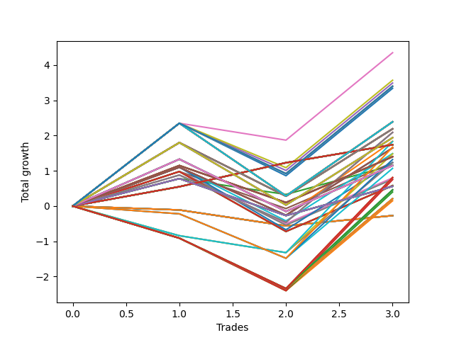

# Short HLT 102 
- Symbol: TSLA
- Date Range: 05/16/2022 - 05/17/2024
- Trading Period: 8:30-12:30
- Number of Trades: 3



| Id. | Name | Win Percent | Profit | Avg Profit / Trade | Avg Time / Trade | Std |      | Name | Win Percent | Profit | Avg Profit / Trade | Avg Time / Trade | Std |
| --- | ---- | ----------- | ------ | ------------------ | ---------------- | --- | ---- | ---- | ----------- | ------ | ------------------ | ---------------- | --- |
| | Sorted By <br> Profit | | | | | | | Sorted By <br> Win Percentage |||||
|0| TP-3 15m | 33.33 | 0.27 | 0.09 | 14:00 | 0.30 |     | TP-0.5 180m | 100.00 | -1.74 | -0.58 | 03:00 | 0.07 |
|1| TP-2.75 15m | 33.33 | 0.27 | 0.09 | 14:00 | 0.30 |     | TP-0.25 180m | 100.00 | -1.74 | -0.58 | 03:00 | 0.07 |
|2| TP-2.5 15m | 33.33 | 0.27 | 0.09 | 14:00 | 0.30 |     | TP-0.5 165m | 100.00 | -1.74 | -0.58 | 03:00 | 0.07 |
|3| TP-2.25 15m | 33.33 | 0.27 | 0.09 | 14:00 | 0.30 |     | TP-0.25 165m | 100.00 | -1.74 | -0.58 | 03:00 | 0.07 |
|4| TP-2 15m | 33.33 | 0.27 | 0.09 | 14:00 | 0.30 |     | TP-0.5 150m | 100.00 | -1.74 | -0.58 | 03:00 | 0.07 |
|5| TP-1.75 15m | 33.33 | 0.27 | 0.09 | 14:00 | 0.30 |     | TP-0.25 150m | 100.00 | -1.74 | -0.58 | 03:00 | 0.07 |
|6| TP-1.5 15m | 33.33 | 0.27 | 0.09 | 14:00 | 0.30 |     | TP-0.5 135m | 100.00 | -1.74 | -0.58 | 03:00 | 0.07 |
|7| TP-1.25 15m | 33.33 | 0.27 | 0.09 | 14:00 | 0.30 |     | TP-0.25 135m | 100.00 | -1.74 | -0.58 | 03:00 | 0.07 |
|8| TP-1 15m | 33.33 | 0.27 | 0.09 | 14:00 | 0.30 |     | TP-0.5 120m | 100.00 | -1.74 | -0.58 | 03:00 | 0.07 |
|9| TP-2.5 105m | 33.33 | -0.15 | -0.05 | 87:40 | 1.78 |     | TP-0.25 120m | 100.00 | -1.74 | -0.58 | 03:00 | 0.07 |
|10| TP-2.5 180m | 33.33 | -0.21 | -0.07 | 92:40 | 1.77 |     | TP-0.5 105m | 100.00 | -1.74 | -0.58 | 03:00 | 0.07 |
|11| TP-2.5 165m | 33.33 | -0.21 | -0.07 | 92:40 | 1.77 |     | TP-0.25 105m | 100.00 | -1.74 | -0.58 | 03:00 | 0.07 |
|12| TP-2.5 150m | 33.33 | -0.21 | -0.07 | 92:40 | 1.77 |     | TP-0.5 90m | 100.00 | -1.74 | -0.58 | 03:00 | 0.07 |
|13| TP-2.5 135m | 33.33 | -0.21 | -0.07 | 92:40 | 1.77 |     | TP-0.25 90m | 100.00 | -1.74 | -0.58 | 03:00 | 0.07 |
|14| TP-2.5 120m | 33.33 | -0.21 | -0.07 | 92:40 | 1.77 |     | TP-0.5 75m | 100.00 | -1.74 | -0.58 | 03:00 | 0.07 |
|15| TP-2.75 105m | 33.33 | -0.40 | -0.13 | 88:00 | 1.90 |     | TP-0.25 75m | 100.00 | -1.74 | -0.58 | 03:00 | 0.07 |
|16| TP-2.75 180m | 33.33 | -0.46 | -0.15 | 93:00 | 1.88 |     | TP-0.5 60m | 100.00 | -1.74 | -0.58 | 03:00 | 0.07 |
|17| TP-2.75 165m | 33.33 | -0.46 | -0.15 | 93:00 | 1.88 |     | TP-0.25 60m | 100.00 | -1.74 | -0.58 | 03:00 | 0.07 |
|18| TP-2.75 150m | 33.33 | -0.46 | -0.15 | 93:00 | 1.88 |     | TP-0.5 45m | 100.00 | -1.74 | -0.58 | 03:00 | 0.07 |
|19| TP-2.75 135m | 33.33 | -0.46 | -0.15 | 93:00 | 1.88 |     | TP-0.25 45m | 100.00 | -1.74 | -0.58 | 03:00 | 0.07 |
|20| TP-2.75 120m | 33.33 | -0.46 | -0.15 | 93:00 | 1.88 |     | TP-0.5 30m | 100.00 | -1.74 | -0.58 | 03:00 | 0.07 |
|21| TP-0.75 180m | 66.67 | -0.56 | -0.19 | 12:20 | 0.87 |     | TP-0.25 30m | 100.00 | -1.74 | -0.58 | 03:00 | 0.07 |
|22| TP-0.75 165m | 66.67 | -0.56 | -0.19 | 12:20 | 0.87 |     | TP-0.5 15m | 100.00 | -1.74 | -0.58 | 03:00 | 0.07 |
|23| TP-0.75 150m | 66.67 | -0.56 | -0.19 | 12:20 | 0.87 |     | TP-0.25 15m | 100.00 | -1.74 | -0.58 | 03:00 | 0.07 |
|24| TP-0.75 135m | 66.67 | -0.56 | -0.19 | 12:20 | 0.87 |     | TP-0.75 180m | 66.67 | -0.56 | -0.19 | 12:20 | 0.87 |
|25| TP-0.75 120m | 66.67 | -0.56 | -0.19 | 12:20 | 0.87 |     | TP-0.75 165m | 66.67 | -0.56 | -0.19 | 12:20 | 0.87 |
|26| TP-0.75 105m | 66.67 | -0.56 | -0.19 | 12:20 | 0.87 |     | TP-0.75 150m | 66.67 | -0.56 | -0.19 | 12:20 | 0.87 |
|27| TP-0.75 90m | 66.67 | -0.56 | -0.19 | 12:20 | 0.87 |     | TP-0.75 135m | 66.67 | -0.56 | -0.19 | 12:20 | 0.87 |
|28| TP-0.75 75m | 66.67 | -0.56 | -0.19 | 12:20 | 0.87 |     | TP-0.75 120m | 66.67 | -0.56 | -0.19 | 12:20 | 0.87 |
|29| TP-0.75 60m | 66.67 | -0.56 | -0.19 | 12:20 | 0.87 |     | TP-0.75 105m | 66.67 | -0.56 | -0.19 | 12:20 | 0.87 |
|30| TP-0.75 45m | 66.67 | -0.56 | -0.19 | 12:20 | 0.87 |     | TP-0.75 90m | 66.67 | -0.56 | -0.19 | 12:20 | 0.87 |
|31| TP-0.75 30m | 66.67 | -0.56 | -0.19 | 12:20 | 0.87 |     | TP-0.75 75m | 66.67 | -0.56 | -0.19 | 12:20 | 0.87 |
|32| TP-3 30m | 66.67 | -0.58 | -0.19 | 29:00 | 1.35 |     | TP-0.75 60m | 66.67 | -0.56 | -0.19 | 12:20 | 0.87 |
|33| TP-2.75 30m | 66.67 | -0.58 | -0.19 | 29:00 | 1.35 |     | TP-0.75 45m | 66.67 | -0.56 | -0.19 | 12:20 | 0.87 |
|34| TP-2.5 30m | 66.67 | -0.58 | -0.19 | 29:00 | 1.35 |     | TP-0.75 30m | 66.67 | -0.56 | -0.19 | 12:20 | 0.87 |
|35| TP-2.25 30m | 66.67 | -0.58 | -0.19 | 29:00 | 1.35 |     | TP-3 30m | 66.67 | -0.58 | -0.19 | 29:00 | 1.35 |
|36| TP-2 30m | 66.67 | -0.58 | -0.19 | 29:00 | 1.35 |     | TP-2.75 30m | 66.67 | -0.58 | -0.19 | 29:00 | 1.35 |
|37| TP-1.75 30m | 66.67 | -0.58 | -0.19 | 29:00 | 1.35 |     | TP-2.5 30m | 66.67 | -0.58 | -0.19 | 29:00 | 1.35 |
|38| TP-3 105m | 33.33 | -0.75 | -0.25 | 88:20 | 2.06 |     | TP-2.25 30m | 66.67 | -0.58 | -0.19 | 29:00 | 1.35 |
|39| TP-1.5 30m | 66.67 | -0.76 | -0.25 | 28:00 | 1.26 |     | TP-2 30m | 66.67 | -0.58 | -0.19 | 29:00 | 1.35 |
|40| TP-1.25 30m | 66.67 | -0.80 | -0.27 | 27:00 | 1.24 |     | TP-1.75 30m | 66.67 | -0.58 | -0.19 | 29:00 | 1.35 |
|41| TP-3 180m | 33.33 | -0.81 | -0.27 | 93:20 | 2.05 |     | TP-1.5 30m | 66.67 | -0.76 | -0.25 | 28:00 | 1.26 |
|42| TP-3 165m | 33.33 | -0.81 | -0.27 | 93:20 | 2.05 |     | TP-1.25 30m | 66.67 | -0.80 | -0.27 | 27:00 | 1.24 |
|43| TP-3 150m | 33.33 | -0.81 | -0.27 | 93:20 | 2.05 |     | TP-1.25 180m | 66.67 | -1.15 | -0.38 | 28:40 | 1.32 |
|44| TP-3 135m | 33.33 | -0.81 | -0.27 | 93:20 | 2.05 |     | TP-1.25 165m | 66.67 | -1.15 | -0.38 | 28:40 | 1.32 |
|45| TP-3 120m | 33.33 | -0.81 | -0.27 | 93:20 | 2.05 |     | TP-1.25 150m | 66.67 | -1.15 | -0.38 | 28:40 | 1.32 |
|46| TP-2.5 90m | 33.33 | -1.07 | -0.36 | 79:00 | 1.61 |     | TP-1.25 135m | 66.67 | -1.15 | -0.38 | 28:40 | 1.32 |
|47| TP-1.25 180m | 66.67 | -1.15 | -0.38 | 28:40 | 1.32 |     | TP-1.25 120m | 66.67 | -1.15 | -0.38 | 28:40 | 1.32 |
|48| TP-1.25 165m | 66.67 | -1.15 | -0.38 | 28:40 | 1.32 |     | TP-1.25 105m | 66.67 | -1.15 | -0.38 | 28:40 | 1.32 |
|49| TP-1.25 150m | 66.67 | -1.15 | -0.38 | 28:40 | 1.32 |     | TP-1.25 90m | 66.67 | -1.15 | -0.38 | 28:40 | 1.32 |
|50| TP-1.25 135m | 66.67 | -1.15 | -0.38 | 28:40 | 1.32 |     | TP-1.25 75m | 66.67 | -1.15 | -0.38 | 28:40 | 1.32 |
|51| TP-1.25 120m | 66.67 | -1.15 | -0.38 | 28:40 | 1.32 |     | TP-1.25 60m | 66.67 | -1.15 | -0.38 | 28:40 | 1.32 |
|52| TP-1.25 105m | 66.67 | -1.15 | -0.38 | 28:40 | 1.32 |     | TP-1.25 45m | 66.67 | -1.15 | -0.38 | 28:40 | 1.32 |
|53| TP-1.25 90m | 66.67 | -1.15 | -0.38 | 28:40 | 1.32 |     | TP-0.75 15m | 66.67 | -1.16 | -0.39 | 09:40 | 0.59 |
|54| TP-1.25 75m | 66.67 | -1.15 | -0.38 | 28:40 | 1.32 |     | TP-1 30m | 66.67 | -1.23 | -0.41 | 26:40 | 1.04 |
|55| TP-1.25 60m | 66.67 | -1.15 | -0.38 | 28:40 | 1.32 |     | TP-1.75 45m | 66.67 | -1.24 | -0.41 | 39:00 | 1.58 |
|56| TP-1.25 45m | 66.67 | -1.15 | -0.38 | 28:40 | 1.32 |     | TP-1 180m | 66.67 | -1.40 | -0.47 | 27:00 | 1.07 |
|57| TP-0.75 15m | 66.67 | -1.16 | -0.39 | 09:40 | 0.59 |     | TP-1 165m | 66.67 | -1.40 | -0.47 | 27:00 | 1.07 |
|58| TP-1 30m | 66.67 | -1.23 | -0.41 | 26:40 | 1.04 |     | TP-1 150m | 66.67 | -1.40 | -0.47 | 27:00 | 1.07 |
|59| TP-2.5 75m | 33.33 | -1.23 | -0.41 | 69:00 | 1.52 |     | TP-1 135m | 66.67 | -1.40 | -0.47 | 27:00 | 1.07 |
|60| TP-1.75 45m | 66.67 | -1.24 | -0.41 | 39:00 | 1.58 |     | TP-1 120m | 66.67 | -1.40 | -0.47 | 27:00 | 1.07 |
|61| TP-2.75 90m | 33.33 | -1.32 | -0.44 | 79:20 | 1.72 |     | TP-1 105m | 66.67 | -1.40 | -0.47 | 27:00 | 1.07 |
|62| TP-1 180m | 66.67 | -1.40 | -0.47 | 27:00 | 1.07 |     | TP-1 90m | 66.67 | -1.40 | -0.47 | 27:00 | 1.07 |
|63| TP-1 165m | 66.67 | -1.40 | -0.47 | 27:00 | 1.07 |     | TP-1 75m | 66.67 | -1.40 | -0.47 | 27:00 | 1.07 |
|64| TP-1 150m | 66.67 | -1.40 | -0.47 | 27:00 | 1.07 |     | TP-1 60m | 66.67 | -1.40 | -0.47 | 27:00 | 1.07 |
|65| TP-1 135m | 66.67 | -1.40 | -0.47 | 27:00 | 1.07 |     | TP-1 45m | 66.67 | -1.40 | -0.47 | 27:00 | 1.07 |
|66| TP-1 120m | 66.67 | -1.40 | -0.47 | 27:00 | 1.07 |     | TP-1.5 45m | 66.67 | -1.49 | -0.50 | 37:20 | 1.46 |
|67| TP-1 105m | 66.67 | -1.40 | -0.47 | 27:00 | 1.07 |     | TP-3 45m | 66.67 | -1.65 | -0.55 | 44:00 | 1.39 |
|68| TP-1 90m | 66.67 | -1.40 | -0.47 | 27:00 | 1.07 |     | TP-2.75 45m | 66.67 | -1.65 | -0.55 | 44:00 | 1.39 |
|69| TP-1 75m | 66.67 | -1.40 | -0.47 | 27:00 | 1.07 |     | TP-2.5 45m | 66.67 | -1.65 | -0.55 | 44:00 | 1.39 |
|70| TP-1 60m | 66.67 | -1.40 | -0.47 | 27:00 | 1.07 |     | TP-2.25 45m | 66.67 | -1.65 | -0.55 | 44:00 | 1.39 |
|71| TP-1 45m | 66.67 | -1.40 | -0.47 | 27:00 | 1.07 |     | TP-2 45m | 66.67 | -1.84 | -0.61 | 43:40 | 1.45 |
|72| TP-2.75 75m | 33.33 | -1.48 | -0.49 | 69:20 | 1.64 |     | TP-1.75 180m | 66.67 | -1.94 | -0.65 | 40:20 | 1.71 |
|73| TP-1.5 45m | 66.67 | -1.49 | -0.50 | 37:20 | 1.46 |     | TP-1.75 165m | 66.67 | -1.94 | -0.65 | 40:20 | 1.71 |
|74| TP-3 45m | 66.67 | -1.65 | -0.55 | 44:00 | 1.39 |     | TP-1.75 150m | 66.67 | -1.94 | -0.65 | 40:20 | 1.71 |
|75| TP-2.75 45m | 66.67 | -1.65 | -0.55 | 44:00 | 1.39 |     | TP-1.75 135m | 66.67 | -1.94 | -0.65 | 40:20 | 1.71 |
|76| TP-2.5 45m | 66.67 | -1.65 | -0.55 | 44:00 | 1.39 |     | TP-1.75 120m | 66.67 | -1.94 | -0.65 | 40:20 | 1.71 |
|77| TP-2.25 45m | 66.67 | -1.65 | -0.55 | 44:00 | 1.39 |     | TP-1.75 105m | 66.67 | -1.94 | -0.65 | 40:20 | 1.71 |
|78| TP-3 90m | 33.33 | -1.67 | -0.56 | 79:40 | 1.88 |     | TP-1.75 90m | 66.67 | -1.94 | -0.65 | 40:20 | 1.71 |
|79| TP-0.5 180m | 100.00 | -1.74 | -0.58 | 03:00 | 0.07 |     | TP-1.75 75m | 66.67 | -1.94 | -0.65 | 40:20 | 1.71 |
|80| TP-0.25 180m | 100.00 | -1.74 | -0.58 | 03:00 | 0.07 |     | TP-1.75 60m | 66.67 | -1.94 | -0.65 | 40:20 | 1.71 |
|81| TP-0.5 165m | 100.00 | -1.74 | -0.58 | 03:00 | 0.07 |     | TP-3 60m | 66.67 | -2.09 | -0.70 | 59:00 | 1.59 |
|82| TP-0.25 165m | 100.00 | -1.74 | -0.58 | 03:00 | 0.07 |     | TP-2.75 60m | 66.67 | -2.09 | -0.70 | 59:00 | 1.59 |
|83| TP-0.5 150m | 100.00 | -1.74 | -0.58 | 03:00 | 0.07 |     | TP-2.5 60m | 66.67 | -2.09 | -0.70 | 59:00 | 1.59 |
|84| TP-0.25 150m | 100.00 | -1.74 | -0.58 | 03:00 | 0.07 |     | TP-1.5 180m | 66.67 | -2.19 | -0.73 | 38:40 | 1.59 |
|85| TP-0.5 135m | 100.00 | -1.74 | -0.58 | 03:00 | 0.07 |     | TP-1.5 165m | 66.67 | -2.19 | -0.73 | 38:40 | 1.59 |
|86| TP-0.25 135m | 100.00 | -1.74 | -0.58 | 03:00 | 0.07 |     | TP-1.5 150m | 66.67 | -2.19 | -0.73 | 38:40 | 1.59 |
|87| TP-0.5 120m | 100.00 | -1.74 | -0.58 | 03:00 | 0.07 |     | TP-1.5 135m | 66.67 | -2.19 | -0.73 | 38:40 | 1.59 |
|88| TP-0.25 120m | 100.00 | -1.74 | -0.58 | 03:00 | 0.07 |     | TP-1.5 120m | 66.67 | -2.19 | -0.73 | 38:40 | 1.59 |
|89| TP-0.5 105m | 100.00 | -1.74 | -0.58 | 03:00 | 0.07 |     | TP-1.5 105m | 66.67 | -2.19 | -0.73 | 38:40 | 1.59 |
|90| TP-0.25 105m | 100.00 | -1.74 | -0.58 | 03:00 | 0.07 |     | TP-1.5 90m | 66.67 | -2.19 | -0.73 | 38:40 | 1.59 |
|91| TP-0.5 90m | 100.00 | -1.74 | -0.58 | 03:00 | 0.07 |     | TP-1.5 75m | 66.67 | -2.19 | -0.73 | 38:40 | 1.59 |
|92| TP-0.25 90m | 100.00 | -1.74 | -0.58 | 03:00 | 0.07 |     | TP-1.5 60m | 66.67 | -2.19 | -0.73 | 38:40 | 1.59 |
|93| TP-0.5 75m | 100.00 | -1.74 | -0.58 | 03:00 | 0.07 |     | TP-2 180m | 66.67 | -2.39 | -0.80 | 47:20 | 2.02 |
|94| TP-0.25 75m | 100.00 | -1.74 | -0.58 | 03:00 | 0.07 |     | TP-2 165m | 66.67 | -2.39 | -0.80 | 47:20 | 2.02 |
|95| TP-0.5 60m | 100.00 | -1.74 | -0.58 | 03:00 | 0.07 |     | TP-2 150m | 66.67 | -2.39 | -0.80 | 47:20 | 2.02 |
|96| TP-0.25 60m | 100.00 | -1.74 | -0.58 | 03:00 | 0.07 |     | TP-2 135m | 66.67 | -2.39 | -0.80 | 47:20 | 2.02 |
|97| TP-0.5 45m | 100.00 | -1.74 | -0.58 | 03:00 | 0.07 |     | TP-2 120m | 66.67 | -2.39 | -0.80 | 47:20 | 2.02 |
|98| TP-0.25 45m | 100.00 | -1.74 | -0.58 | 03:00 | 0.07 |     | TP-2 105m | 66.67 | -2.39 | -0.80 | 47:20 | 2.02 |
|99| TP-0.5 30m | 100.00 | -1.74 | -0.58 | 03:00 | 0.07 |     | TP-2 90m | 66.67 | -2.39 | -0.80 | 47:20 | 2.02 |
|100| TP-0.25 30m | 100.00 | -1.74 | -0.58 | 03:00 | 0.07 |     | TP-2 75m | 66.67 | -2.39 | -0.80 | 47:20 | 2.02 |
|101| TP-0.5 15m | 100.00 | -1.74 | -0.58 | 03:00 | 0.07 |     | TP-2 60m | 66.67 | -2.39 | -0.80 | 47:20 | 2.02 |
|102| TP-0.25 15m | 100.00 | -1.74 | -0.58 | 03:00 | 0.07 |     | TP-2.25 105m | 66.67 | -3.34 | -1.11 | 71:00 | 1.84 |
|103| TP-3 75m | 33.33 | -1.83 | -0.61 | 69:40 | 1.80 |     | TP-2.25 180m | 66.67 | -3.40 | -1.13 | 76:00 | 1.81 |
|104| TP-2 45m | 66.67 | -1.84 | -0.61 | 43:40 | 1.45 |     | TP-2.25 165m | 66.67 | -3.40 | -1.13 | 76:00 | 1.81 |
|105| TP-1.75 180m | 66.67 | -1.94 | -0.65 | 40:20 | 1.71 |     | TP-2.25 150m | 66.67 | -3.40 | -1.13 | 76:00 | 1.81 |
|106| TP-1.75 165m | 66.67 | -1.94 | -0.65 | 40:20 | 1.71 |     | TP-2.25 135m | 66.67 | -3.40 | -1.13 | 76:00 | 1.81 |
|107| TP-1.75 150m | 66.67 | -1.94 | -0.65 | 40:20 | 1.71 |     | TP-2.25 120m | 66.67 | -3.40 | -1.13 | 76:00 | 1.81 |
|108| TP-1.75 135m | 66.67 | -1.94 | -0.65 | 40:20 | 1.71 |     | TP-2.25 60m | 66.67 | -3.49 | -1.16 | 56:00 | 1.77 |
|109| TP-1.75 120m | 66.67 | -1.94 | -0.65 | 40:20 | 1.71 |     | TP-2.25 90m | 66.67 | -3.57 | -1.19 | 66:00 | 1.73 |
|110| TP-1.75 105m | 66.67 | -1.94 | -0.65 | 40:20 | 1.71 |     | TP-2.25 75m | 66.67 | -4.35 | -1.45 | 61:00 | 1.37 |
|111| TP-1.75 90m | 66.67 | -1.94 | -0.65 | 40:20 | 1.71 |     | TP-3 15m | 33.33 | 0.27 | 0.09 | 14:00 | 0.30 |
|112| TP-1.75 75m | 66.67 | -1.94 | -0.65 | 40:20 | 1.71 |     | TP-2.75 15m | 33.33 | 0.27 | 0.09 | 14:00 | 0.30 |
|113| TP-1.75 60m | 66.67 | -1.94 | -0.65 | 40:20 | 1.71 |     | TP-2.5 15m | 33.33 | 0.27 | 0.09 | 14:00 | 0.30 |
|114| TP-3 60m | 66.67 | -2.09 | -0.70 | 59:00 | 1.59 |     | TP-2.25 15m | 33.33 | 0.27 | 0.09 | 14:00 | 0.30 |
|115| TP-2.75 60m | 66.67 | -2.09 | -0.70 | 59:00 | 1.59 |     | TP-2 15m | 33.33 | 0.27 | 0.09 | 14:00 | 0.30 |
|116| TP-2.5 60m | 66.67 | -2.09 | -0.70 | 59:00 | 1.59 |     | TP-1.75 15m | 33.33 | 0.27 | 0.09 | 14:00 | 0.30 |
|117| TP-1.5 180m | 66.67 | -2.19 | -0.73 | 38:40 | 1.59 |     | TP-1.5 15m | 33.33 | 0.27 | 0.09 | 14:00 | 0.30 |
|118| TP-1.5 165m | 66.67 | -2.19 | -0.73 | 38:40 | 1.59 |     | TP-1.25 15m | 33.33 | 0.27 | 0.09 | 14:00 | 0.30 |
|119| TP-1.5 150m | 66.67 | -2.19 | -0.73 | 38:40 | 1.59 |     | TP-1 15m | 33.33 | 0.27 | 0.09 | 14:00 | 0.30 |
|120| TP-1.5 135m | 66.67 | -2.19 | -0.73 | 38:40 | 1.59 |     | TP-2.5 105m | 33.33 | -0.15 | -0.05 | 87:40 | 1.78 |
|121| TP-1.5 120m | 66.67 | -2.19 | -0.73 | 38:40 | 1.59 |     | TP-2.5 180m | 33.33 | -0.21 | -0.07 | 92:40 | 1.77 |
|122| TP-1.5 105m | 66.67 | -2.19 | -0.73 | 38:40 | 1.59 |     | TP-2.5 165m | 33.33 | -0.21 | -0.07 | 92:40 | 1.77 |
|123| TP-1.5 90m | 66.67 | -2.19 | -0.73 | 38:40 | 1.59 |     | TP-2.5 150m | 33.33 | -0.21 | -0.07 | 92:40 | 1.77 |
|124| TP-1.5 75m | 66.67 | -2.19 | -0.73 | 38:40 | 1.59 |     | TP-2.5 135m | 33.33 | -0.21 | -0.07 | 92:40 | 1.77 |
|125| TP-1.5 60m | 66.67 | -2.19 | -0.73 | 38:40 | 1.59 |     | TP-2.5 120m | 33.33 | -0.21 | -0.07 | 92:40 | 1.77 |
|126| TP-2 180m | 66.67 | -2.39 | -0.80 | 47:20 | 2.02 |     | TP-2.75 105m | 33.33 | -0.40 | -0.13 | 88:00 | 1.90 |
|127| TP-2 165m | 66.67 | -2.39 | -0.80 | 47:20 | 2.02 |     | TP-2.75 180m | 33.33 | -0.46 | -0.15 | 93:00 | 1.88 |
|128| TP-2 150m | 66.67 | -2.39 | -0.80 | 47:20 | 2.02 |     | TP-2.75 165m | 33.33 | -0.46 | -0.15 | 93:00 | 1.88 |
|129| TP-2 135m | 66.67 | -2.39 | -0.80 | 47:20 | 2.02 |     | TP-2.75 150m | 33.33 | -0.46 | -0.15 | 93:00 | 1.88 |
|130| TP-2 120m | 66.67 | -2.39 | -0.80 | 47:20 | 2.02 |     | TP-2.75 135m | 33.33 | -0.46 | -0.15 | 93:00 | 1.88 |
|131| TP-2 105m | 66.67 | -2.39 | -0.80 | 47:20 | 2.02 |     | TP-2.75 120m | 33.33 | -0.46 | -0.15 | 93:00 | 1.88 |
|132| TP-2 90m | 66.67 | -2.39 | -0.80 | 47:20 | 2.02 |     | TP-3 105m | 33.33 | -0.75 | -0.25 | 88:20 | 2.06 |
|133| TP-2 75m | 66.67 | -2.39 | -0.80 | 47:20 | 2.02 |     | TP-3 180m | 33.33 | -0.81 | -0.27 | 93:20 | 2.05 |
|134| TP-2 60m | 66.67 | -2.39 | -0.80 | 47:20 | 2.02 |     | TP-3 165m | 33.33 | -0.81 | -0.27 | 93:20 | 2.05 |
|135| TP-2.25 105m | 66.67 | -3.34 | -1.11 | 71:00 | 1.84 |     | TP-3 150m | 33.33 | -0.81 | -0.27 | 93:20 | 2.05 |
|136| TP-2.25 180m | 66.67 | -3.40 | -1.13 | 76:00 | 1.81 |     | TP-3 135m | 33.33 | -0.81 | -0.27 | 93:20 | 2.05 |
|137| TP-2.25 165m | 66.67 | -3.40 | -1.13 | 76:00 | 1.81 |     | TP-3 120m | 33.33 | -0.81 | -0.27 | 93:20 | 2.05 |
|138| TP-2.25 150m | 66.67 | -3.40 | -1.13 | 76:00 | 1.81 |     | TP-2.5 90m | 33.33 | -1.07 | -0.36 | 79:00 | 1.61 |
|139| TP-2.25 135m | 66.67 | -3.40 | -1.13 | 76:00 | 1.81 |     | TP-2.5 75m | 33.33 | -1.23 | -0.41 | 69:00 | 1.52 |
|140| TP-2.25 120m | 66.67 | -3.40 | -1.13 | 76:00 | 1.81 |     | TP-2.75 90m | 33.33 | -1.32 | -0.44 | 79:20 | 1.72 |
|141| TP-2.25 60m | 66.67 | -3.49 | -1.16 | 56:00 | 1.77 |     | TP-2.75 75m | 33.33 | -1.48 | -0.49 | 69:20 | 1.64 |
|142| TP-2.25 90m | 66.67 | -3.57 | -1.19 | 66:00 | 1.73 |     | TP-3 90m | 33.33 | -1.67 | -0.56 | 79:40 | 1.88 |
|143| TP-2.25 75m | 66.67 | -4.35 | -1.45 | 61:00 | 1.37 |     | TP-3 75m | 33.33 | -1.83 | -0.61 | 69:40 | 1.80 |

### Test TP-0.25 15m
* Take Profit of 0.25 Point
* 0.25 Stoploss
* Results:
```
Total Trades: 3
Percent Up: 0.00
Percent Down: 100.00
Total Points Moved Down: 1.74
Potential Profit: 870.00
Total Points Ups: 0.00 Count Ups: 0
Total Points Downs: 1.74 Count Downs: 3
```

<details><summary>Trades</summary>

<code>In: 2022-08-10 11:10:00		Out: 2022-08-10 11:14:00		Total Position Time: 04:00		Total Move Down: 0.55		Total to Date: 0.55</code> <br />
<code>In: 2022-08-12 08:50:00		Out: 2022-08-12 08:52:00		Total Position Time: 02:00		Total Move Down: 0.68		Total to Date: 1.23</code> <br />
<code>In: 2023-01-23 11:05:00		Out: 2023-01-23 11:08:00		Total Position Time: 03:00		Total Move Down: 0.51		Total to Date: 1.74</code> <br />


</details>

### Test TP-0.5 15m
* Take Profit of 0.5 Point
* 0.5 Stoploss
* Results:
```
Total Trades: 3
Percent Up: 0.00
Percent Down: 100.00
Total Points Moved Down: 1.74
Potential Profit: 870.00
Total Points Ups: 0.00 Count Ups: 0
Total Points Downs: 1.74 Count Downs: 3
```

<details><summary>Trades</summary>

<code>In: 2022-08-10 11:10:00		Out: 2022-08-10 11:14:00		Total Position Time: 04:00		Total Move Down: 0.55		Total to Date: 0.55</code> <br />
<code>In: 2022-08-12 08:50:00		Out: 2022-08-12 08:52:00		Total Position Time: 02:00		Total Move Down: 0.68		Total to Date: 1.23</code> <br />
<code>In: 2023-01-23 11:05:00		Out: 2023-01-23 11:08:00		Total Position Time: 03:00		Total Move Down: 0.51		Total to Date: 1.74</code> <br />


</details>

### Test TP-0.75 15m
* Take Profit of 0.75 Point
* 0.75 Stoploss
* Results:
```
Total Trades: 3
Percent Up: 33.33
Percent Down: 66.67
Total Points Moved Down: 1.16
Potential Profit: 580.00
Total Points Ups: 0.45 Count Ups: 1
Total Points Downs: 1.61 Count Downs: 2
```

<details><summary>Trades</summary>

<code>In: 2022-08-10 11:10:00		Out: 2022-08-10 11:18:00		Total Position Time: 08:00		Total Move Down: 0.78		Total to Date: 0.78</code> <br />
<code>In: 2022-08-12 08:50:00		Out: 2022-08-12 09:04:00		Total Position Time: 14:00		Total Move Down: -0.45		Total to Date: 0.33</code> <br />
<code>In: 2023-01-23 11:05:00		Out: 2023-01-23 11:12:00		Total Position Time: 07:00		Total Move Down: 0.83		Total to Date: 1.16</code> <br />


</details>

### Test TP-1 15m
* Take Profit of 1 Point
* 1 Stoploss
* Results:
```
Total Trades: 3
Percent Up: 66.67
Percent Down: 33.33
Total Points Moved Down: -0.27
Potential Profit: -135.00
Total Points Ups: 0.56 Count Ups: 2
Total Points Downs: 0.29 Count Downs: 1
```

<details><summary>Trades</summary>

<code>In: 2022-08-10 11:10:00		Out: 2022-08-10 11:24:00		Total Position Time: 14:00		Total Move Down: -0.11		Total to Date: -0.11</code> <br />
<code>In: 2022-08-12 08:50:00		Out: 2022-08-12 09:04:00		Total Position Time: 14:00		Total Move Down: -0.45		Total to Date: -0.56</code> <br />
<code>In: 2023-01-23 11:05:00		Out: 2023-01-23 11:19:00		Total Position Time: 14:00		Total Move Down: 0.29		Total to Date: -0.27</code> <br />


</details>

### Test TP-1.25 15m
* Take Profit of 1.25 Point
* 1.25 Stoploss
* Results:
```
Total Trades: 3
Percent Up: 66.67
Percent Down: 33.33
Total Points Moved Down: -0.27
Potential Profit: -135.00
Total Points Ups: 0.56 Count Ups: 2
Total Points Downs: 0.29 Count Downs: 1
```

<details><summary>Trades</summary>

<code>In: 2022-08-10 11:10:00		Out: 2022-08-10 11:24:00		Total Position Time: 14:00		Total Move Down: -0.11		Total to Date: -0.11</code> <br />
<code>In: 2022-08-12 08:50:00		Out: 2022-08-12 09:04:00		Total Position Time: 14:00		Total Move Down: -0.45		Total to Date: -0.56</code> <br />
<code>In: 2023-01-23 11:05:00		Out: 2023-01-23 11:19:00		Total Position Time: 14:00		Total Move Down: 0.29		Total to Date: -0.27</code> <br />


</details>

### Test TP-1.5 15m
* Take Profit of 1.5 Point
* 1.5 Stoploss
* Results:
```
Total Trades: 3
Percent Up: 66.67
Percent Down: 33.33
Total Points Moved Down: -0.27
Potential Profit: -135.00
Total Points Ups: 0.56 Count Ups: 2
Total Points Downs: 0.29 Count Downs: 1
```

<details><summary>Trades</summary>

<code>In: 2022-08-10 11:10:00		Out: 2022-08-10 11:24:00		Total Position Time: 14:00		Total Move Down: -0.11		Total to Date: -0.11</code> <br />
<code>In: 2022-08-12 08:50:00		Out: 2022-08-12 09:04:00		Total Position Time: 14:00		Total Move Down: -0.45		Total to Date: -0.56</code> <br />
<code>In: 2023-01-23 11:05:00		Out: 2023-01-23 11:19:00		Total Position Time: 14:00		Total Move Down: 0.29		Total to Date: -0.27</code> <br />


</details>

### Test TP-1.75 15m
* Take Profit of 1.75 Point
* 1.75 Stoploss
* Results:
```
Total Trades: 3
Percent Up: 66.67
Percent Down: 33.33
Total Points Moved Down: -0.27
Potential Profit: -135.00
Total Points Ups: 0.56 Count Ups: 2
Total Points Downs: 0.29 Count Downs: 1
```

<details><summary>Trades</summary>

<code>In: 2022-08-10 11:10:00		Out: 2022-08-10 11:24:00		Total Position Time: 14:00		Total Move Down: -0.11		Total to Date: -0.11</code> <br />
<code>In: 2022-08-12 08:50:00		Out: 2022-08-12 09:04:00		Total Position Time: 14:00		Total Move Down: -0.45		Total to Date: -0.56</code> <br />
<code>In: 2023-01-23 11:05:00		Out: 2023-01-23 11:19:00		Total Position Time: 14:00		Total Move Down: 0.29		Total to Date: -0.27</code> <br />


</details>

### Test TP-2 15m
* Take Profit of 2 Point
* 2 Stoploss
* Results:
```
Total Trades: 3
Percent Up: 66.67
Percent Down: 33.33
Total Points Moved Down: -0.27
Potential Profit: -135.00
Total Points Ups: 0.56 Count Ups: 2
Total Points Downs: 0.29 Count Downs: 1
```

<details><summary>Trades</summary>

<code>In: 2022-08-10 11:10:00		Out: 2022-08-10 11:24:00		Total Position Time: 14:00		Total Move Down: -0.11		Total to Date: -0.11</code> <br />
<code>In: 2022-08-12 08:50:00		Out: 2022-08-12 09:04:00		Total Position Time: 14:00		Total Move Down: -0.45		Total to Date: -0.56</code> <br />
<code>In: 2023-01-23 11:05:00		Out: 2023-01-23 11:19:00		Total Position Time: 14:00		Total Move Down: 0.29		Total to Date: -0.27</code> <br />


</details>

### Test TP-2.25 15m
* Take Profit of 2.25 Point
* 2.25 Stoploss
* Results:
```
Total Trades: 3
Percent Up: 66.67
Percent Down: 33.33
Total Points Moved Down: -0.27
Potential Profit: -135.00
Total Points Ups: 0.56 Count Ups: 2
Total Points Downs: 0.29 Count Downs: 1
```

<details><summary>Trades</summary>

<code>In: 2022-08-10 11:10:00		Out: 2022-08-10 11:24:00		Total Position Time: 14:00		Total Move Down: -0.11		Total to Date: -0.11</code> <br />
<code>In: 2022-08-12 08:50:00		Out: 2022-08-12 09:04:00		Total Position Time: 14:00		Total Move Down: -0.45		Total to Date: -0.56</code> <br />
<code>In: 2023-01-23 11:05:00		Out: 2023-01-23 11:19:00		Total Position Time: 14:00		Total Move Down: 0.29		Total to Date: -0.27</code> <br />


</details>

### Test TP-2.5 15m
* Take Profit of 2.5 Point
* 2.5 Stoploss
* Results:
```
Total Trades: 3
Percent Up: 66.67
Percent Down: 33.33
Total Points Moved Down: -0.27
Potential Profit: -135.00
Total Points Ups: 0.56 Count Ups: 2
Total Points Downs: 0.29 Count Downs: 1
```

<details><summary>Trades</summary>

<code>In: 2022-08-10 11:10:00		Out: 2022-08-10 11:24:00		Total Position Time: 14:00		Total Move Down: -0.11		Total to Date: -0.11</code> <br />
<code>In: 2022-08-12 08:50:00		Out: 2022-08-12 09:04:00		Total Position Time: 14:00		Total Move Down: -0.45		Total to Date: -0.56</code> <br />
<code>In: 2023-01-23 11:05:00		Out: 2023-01-23 11:19:00		Total Position Time: 14:00		Total Move Down: 0.29		Total to Date: -0.27</code> <br />


</details>

### Test TP-2.75 15m
* Take Profit of 2.75 Point
* 2.75 Stoploss
* Results:
```
Total Trades: 3
Percent Up: 66.67
Percent Down: 33.33
Total Points Moved Down: -0.27
Potential Profit: -135.00
Total Points Ups: 0.56 Count Ups: 2
Total Points Downs: 0.29 Count Downs: 1
```

<details><summary>Trades</summary>

<code>In: 2022-08-10 11:10:00		Out: 2022-08-10 11:24:00		Total Position Time: 14:00		Total Move Down: -0.11		Total to Date: -0.11</code> <br />
<code>In: 2022-08-12 08:50:00		Out: 2022-08-12 09:04:00		Total Position Time: 14:00		Total Move Down: -0.45		Total to Date: -0.56</code> <br />
<code>In: 2023-01-23 11:05:00		Out: 2023-01-23 11:19:00		Total Position Time: 14:00		Total Move Down: 0.29		Total to Date: -0.27</code> <br />


</details>

### Test TP-3 15m
* Take Profit of 3 Point
* 3 Stoploss
* Results:
```
Total Trades: 3
Percent Up: 66.67
Percent Down: 33.33
Total Points Moved Down: -0.27
Potential Profit: -135.00
Total Points Ups: 0.56 Count Ups: 2
Total Points Downs: 0.29 Count Downs: 1
```

<details><summary>Trades</summary>

<code>In: 2022-08-10 11:10:00		Out: 2022-08-10 11:24:00		Total Position Time: 14:00		Total Move Down: -0.11		Total to Date: -0.11</code> <br />
<code>In: 2022-08-12 08:50:00		Out: 2022-08-12 09:04:00		Total Position Time: 14:00		Total Move Down: -0.45		Total to Date: -0.56</code> <br />
<code>In: 2023-01-23 11:05:00		Out: 2023-01-23 11:19:00		Total Position Time: 14:00		Total Move Down: 0.29		Total to Date: -0.27</code> <br />


</details>

### Test TP-0.25 30m
* Take Profit of 0.25 Point
* 0.25 Stoploss
* Results:
```
Total Trades: 3
Percent Up: 0.00
Percent Down: 100.00
Total Points Moved Down: 1.74
Potential Profit: 870.00
Total Points Ups: 0.00 Count Ups: 0
Total Points Downs: 1.74 Count Downs: 3
```

<details><summary>Trades</summary>

<code>In: 2022-08-10 11:10:00		Out: 2022-08-10 11:14:00		Total Position Time: 04:00		Total Move Down: 0.55		Total to Date: 0.55</code> <br />
<code>In: 2022-08-12 08:50:00		Out: 2022-08-12 08:52:00		Total Position Time: 02:00		Total Move Down: 0.68		Total to Date: 1.23</code> <br />
<code>In: 2023-01-23 11:05:00		Out: 2023-01-23 11:08:00		Total Position Time: 03:00		Total Move Down: 0.51		Total to Date: 1.74</code> <br />


</details>

### Test TP-0.5 30m
* Take Profit of 0.5 Point
* 0.5 Stoploss
* Results:
```
Total Trades: 3
Percent Up: 0.00
Percent Down: 100.00
Total Points Moved Down: 1.74
Potential Profit: 870.00
Total Points Ups: 0.00 Count Ups: 0
Total Points Downs: 1.74 Count Downs: 3
```

<details><summary>Trades</summary>

<code>In: 2022-08-10 11:10:00		Out: 2022-08-10 11:14:00		Total Position Time: 04:00		Total Move Down: 0.55		Total to Date: 0.55</code> <br />
<code>In: 2022-08-12 08:50:00		Out: 2022-08-12 08:52:00		Total Position Time: 02:00		Total Move Down: 0.68		Total to Date: 1.23</code> <br />
<code>In: 2023-01-23 11:05:00		Out: 2023-01-23 11:08:00		Total Position Time: 03:00		Total Move Down: 0.51		Total to Date: 1.74</code> <br />


</details>

### Test TP-0.75 30m
* Take Profit of 0.75 Point
* 0.75 Stoploss
* Results:
```
Total Trades: 3
Percent Up: 33.33
Percent Down: 66.67
Total Points Moved Down: 0.56
Potential Profit: 280.00
Total Points Ups: 1.05 Count Ups: 1
Total Points Downs: 1.61 Count Downs: 2
```

<details><summary>Trades</summary>

<code>In: 2022-08-10 11:10:00		Out: 2022-08-10 11:18:00		Total Position Time: 08:00		Total Move Down: 0.78		Total to Date: 0.78</code> <br />
<code>In: 2022-08-12 08:50:00		Out: 2022-08-12 09:12:00		Total Position Time: 22:00		Total Move Down: -1.05		Total to Date: -0.27</code> <br />
<code>In: 2023-01-23 11:05:00		Out: 2023-01-23 11:12:00		Total Position Time: 07:00		Total Move Down: 0.83		Total to Date: 0.56</code> <br />


</details>

### Test TP-1 30m
* Take Profit of 1 Point
* 1 Stoploss
* Results:
```
Total Trades: 3
Percent Up: 33.33
Percent Down: 66.67
Total Points Moved Down: 1.23
Potential Profit: 615.00
Total Points Ups: 1.05 Count Ups: 1
Total Points Downs: 2.28 Count Downs: 2
```

<details><summary>Trades</summary>

<code>In: 2022-08-10 11:10:00		Out: 2022-08-10 11:39:00		Total Position Time: 29:00		Total Move Down: 0.98		Total to Date: 0.98</code> <br />
<code>In: 2022-08-12 08:50:00		Out: 2022-08-12 09:12:00		Total Position Time: 22:00		Total Move Down: -1.05		Total to Date: -0.07</code> <br />
<code>In: 2023-01-23 11:05:00		Out: 2023-01-23 11:34:00		Total Position Time: 29:00		Total Move Down: 1.30		Total to Date: 1.23</code> <br />


</details>

### Test TP-1.25 30m
* Take Profit of 1.25 Point
* 1.25 Stoploss
* Results:
```
Total Trades: 3
Percent Up: 33.33
Percent Down: 66.67
Total Points Moved Down: 0.80
Potential Profit: 400.00
Total Points Ups: 1.48 Count Ups: 1
Total Points Downs: 2.28 Count Downs: 2
```

<details><summary>Trades</summary>

<code>In: 2022-08-10 11:10:00		Out: 2022-08-10 11:39:00		Total Position Time: 29:00		Total Move Down: 0.98		Total to Date: 0.98</code> <br />
<code>In: 2022-08-12 08:50:00		Out: 2022-08-12 09:13:00		Total Position Time: 23:00		Total Move Down: -1.48		Total to Date: -0.50</code> <br />
<code>In: 2023-01-23 11:05:00		Out: 2023-01-23 11:34:00		Total Position Time: 29:00		Total Move Down: 1.30		Total to Date: 0.80</code> <br />


</details>

### Test TP-1.5 30m
* Take Profit of 1.5 Point
* 1.5 Stoploss
* Results:
```
Total Trades: 3
Percent Up: 33.33
Percent Down: 66.67
Total Points Moved Down: 0.76
Potential Profit: 380.00
Total Points Ups: 1.52 Count Ups: 1
Total Points Downs: 2.28 Count Downs: 2
```

<details><summary>Trades</summary>

<code>In: 2022-08-10 11:10:00		Out: 2022-08-10 11:39:00		Total Position Time: 29:00		Total Move Down: 0.98		Total to Date: 0.98</code> <br />
<code>In: 2022-08-12 08:50:00		Out: 2022-08-12 09:16:00		Total Position Time: 26:00		Total Move Down: -1.52		Total to Date: -0.54</code> <br />
<code>In: 2023-01-23 11:05:00		Out: 2023-01-23 11:34:00		Total Position Time: 29:00		Total Move Down: 1.30		Total to Date: 0.76</code> <br />


</details>

### Test TP-1.75 30m
* Take Profit of 1.75 Point
* 1.75 Stoploss
* Results:
```
Total Trades: 3
Percent Up: 33.33
Percent Down: 66.67
Total Points Moved Down: 0.58
Potential Profit: 290.00
Total Points Ups: 1.70 Count Ups: 1
Total Points Downs: 2.28 Count Downs: 2
```

<details><summary>Trades</summary>

<code>In: 2022-08-10 11:10:00		Out: 2022-08-10 11:39:00		Total Position Time: 29:00		Total Move Down: 0.98		Total to Date: 0.98</code> <br />
<code>In: 2022-08-12 08:50:00		Out: 2022-08-12 09:19:00		Total Position Time: 29:00		Total Move Down: -1.70		Total to Date: -0.72</code> <br />
<code>In: 2023-01-23 11:05:00		Out: 2023-01-23 11:34:00		Total Position Time: 29:00		Total Move Down: 1.30		Total to Date: 0.58</code> <br />


</details>

### Test TP-2 30m
* Take Profit of 2 Point
* 2 Stoploss
* Results:
```
Total Trades: 3
Percent Up: 33.33
Percent Down: 66.67
Total Points Moved Down: 0.58
Potential Profit: 290.00
Total Points Ups: 1.70 Count Ups: 1
Total Points Downs: 2.28 Count Downs: 2
```

<details><summary>Trades</summary>

<code>In: 2022-08-10 11:10:00		Out: 2022-08-10 11:39:00		Total Position Time: 29:00		Total Move Down: 0.98		Total to Date: 0.98</code> <br />
<code>In: 2022-08-12 08:50:00		Out: 2022-08-12 09:19:00		Total Position Time: 29:00		Total Move Down: -1.70		Total to Date: -0.72</code> <br />
<code>In: 2023-01-23 11:05:00		Out: 2023-01-23 11:34:00		Total Position Time: 29:00		Total Move Down: 1.30		Total to Date: 0.58</code> <br />


</details>

### Test TP-2.25 30m
* Take Profit of 2.25 Point
* 2.25 Stoploss
* Results:
```
Total Trades: 3
Percent Up: 33.33
Percent Down: 66.67
Total Points Moved Down: 0.58
Potential Profit: 290.00
Total Points Ups: 1.70 Count Ups: 1
Total Points Downs: 2.28 Count Downs: 2
```

<details><summary>Trades</summary>

<code>In: 2022-08-10 11:10:00		Out: 2022-08-10 11:39:00		Total Position Time: 29:00		Total Move Down: 0.98		Total to Date: 0.98</code> <br />
<code>In: 2022-08-12 08:50:00		Out: 2022-08-12 09:19:00		Total Position Time: 29:00		Total Move Down: -1.70		Total to Date: -0.72</code> <br />
<code>In: 2023-01-23 11:05:00		Out: 2023-01-23 11:34:00		Total Position Time: 29:00		Total Move Down: 1.30		Total to Date: 0.58</code> <br />


</details>

### Test TP-2.5 30m
* Take Profit of 2.5 Point
* 2.5 Stoploss
* Results:
```
Total Trades: 3
Percent Up: 33.33
Percent Down: 66.67
Total Points Moved Down: 0.58
Potential Profit: 290.00
Total Points Ups: 1.70 Count Ups: 1
Total Points Downs: 2.28 Count Downs: 2
```

<details><summary>Trades</summary>

<code>In: 2022-08-10 11:10:00		Out: 2022-08-10 11:39:00		Total Position Time: 29:00		Total Move Down: 0.98		Total to Date: 0.98</code> <br />
<code>In: 2022-08-12 08:50:00		Out: 2022-08-12 09:19:00		Total Position Time: 29:00		Total Move Down: -1.70		Total to Date: -0.72</code> <br />
<code>In: 2023-01-23 11:05:00		Out: 2023-01-23 11:34:00		Total Position Time: 29:00		Total Move Down: 1.30		Total to Date: 0.58</code> <br />


</details>

### Test TP-2.75 30m
* Take Profit of 2.75 Point
* 2.75 Stoploss
* Results:
```
Total Trades: 3
Percent Up: 33.33
Percent Down: 66.67
Total Points Moved Down: 0.58
Potential Profit: 290.00
Total Points Ups: 1.70 Count Ups: 1
Total Points Downs: 2.28 Count Downs: 2
```

<details><summary>Trades</summary>

<code>In: 2022-08-10 11:10:00		Out: 2022-08-10 11:39:00		Total Position Time: 29:00		Total Move Down: 0.98		Total to Date: 0.98</code> <br />
<code>In: 2022-08-12 08:50:00		Out: 2022-08-12 09:19:00		Total Position Time: 29:00		Total Move Down: -1.70		Total to Date: -0.72</code> <br />
<code>In: 2023-01-23 11:05:00		Out: 2023-01-23 11:34:00		Total Position Time: 29:00		Total Move Down: 1.30		Total to Date: 0.58</code> <br />


</details>

### Test TP-3 30m
* Take Profit of 3 Point
* 3 Stoploss
* Results:
```
Total Trades: 3
Percent Up: 33.33
Percent Down: 66.67
Total Points Moved Down: 0.58
Potential Profit: 290.00
Total Points Ups: 1.70 Count Ups: 1
Total Points Downs: 2.28 Count Downs: 2
```

<details><summary>Trades</summary>

<code>In: 2022-08-10 11:10:00		Out: 2022-08-10 11:39:00		Total Position Time: 29:00		Total Move Down: 0.98		Total to Date: 0.98</code> <br />
<code>In: 2022-08-12 08:50:00		Out: 2022-08-12 09:19:00		Total Position Time: 29:00		Total Move Down: -1.70		Total to Date: -0.72</code> <br />
<code>In: 2023-01-23 11:05:00		Out: 2023-01-23 11:34:00		Total Position Time: 29:00		Total Move Down: 1.30		Total to Date: 0.58</code> <br />


</details>

### Test TP-0.25 45m
* Take Profit of 0.25 Point
* 0.25 Stoploss
* Results:
```
Total Trades: 3
Percent Up: 0.00
Percent Down: 100.00
Total Points Moved Down: 1.74
Potential Profit: 870.00
Total Points Ups: 0.00 Count Ups: 0
Total Points Downs: 1.74 Count Downs: 3
```

<details><summary>Trades</summary>

<code>In: 2022-08-10 11:10:00		Out: 2022-08-10 11:14:00		Total Position Time: 04:00		Total Move Down: 0.55		Total to Date: 0.55</code> <br />
<code>In: 2022-08-12 08:50:00		Out: 2022-08-12 08:52:00		Total Position Time: 02:00		Total Move Down: 0.68		Total to Date: 1.23</code> <br />
<code>In: 2023-01-23 11:05:00		Out: 2023-01-23 11:08:00		Total Position Time: 03:00		Total Move Down: 0.51		Total to Date: 1.74</code> <br />


</details>

### Test TP-0.5 45m
* Take Profit of 0.5 Point
* 0.5 Stoploss
* Results:
```
Total Trades: 3
Percent Up: 0.00
Percent Down: 100.00
Total Points Moved Down: 1.74
Potential Profit: 870.00
Total Points Ups: 0.00 Count Ups: 0
Total Points Downs: 1.74 Count Downs: 3
```

<details><summary>Trades</summary>

<code>In: 2022-08-10 11:10:00		Out: 2022-08-10 11:14:00		Total Position Time: 04:00		Total Move Down: 0.55		Total to Date: 0.55</code> <br />
<code>In: 2022-08-12 08:50:00		Out: 2022-08-12 08:52:00		Total Position Time: 02:00		Total Move Down: 0.68		Total to Date: 1.23</code> <br />
<code>In: 2023-01-23 11:05:00		Out: 2023-01-23 11:08:00		Total Position Time: 03:00		Total Move Down: 0.51		Total to Date: 1.74</code> <br />


</details>

### Test TP-0.75 45m
* Take Profit of 0.75 Point
* 0.75 Stoploss
* Results:
```
Total Trades: 3
Percent Up: 33.33
Percent Down: 66.67
Total Points Moved Down: 0.56
Potential Profit: 280.00
Total Points Ups: 1.05 Count Ups: 1
Total Points Downs: 1.61 Count Downs: 2
```

<details><summary>Trades</summary>

<code>In: 2022-08-10 11:10:00		Out: 2022-08-10 11:18:00		Total Position Time: 08:00		Total Move Down: 0.78		Total to Date: 0.78</code> <br />
<code>In: 2022-08-12 08:50:00		Out: 2022-08-12 09:12:00		Total Position Time: 22:00		Total Move Down: -1.05		Total to Date: -0.27</code> <br />
<code>In: 2023-01-23 11:05:00		Out: 2023-01-23 11:12:00		Total Position Time: 07:00		Total Move Down: 0.83		Total to Date: 0.56</code> <br />


</details>

### Test TP-1 45m
* Take Profit of 1 Point
* 1 Stoploss
* Results:
```
Total Trades: 3
Percent Up: 33.33
Percent Down: 66.67
Total Points Moved Down: 1.40
Potential Profit: 700.00
Total Points Ups: 1.05 Count Ups: 1
Total Points Downs: 2.45 Count Downs: 2
```

<details><summary>Trades</summary>

<code>In: 2022-08-10 11:10:00		Out: 2022-08-10 11:40:00		Total Position Time: 30:00		Total Move Down: 1.15		Total to Date: 1.15</code> <br />
<code>In: 2022-08-12 08:50:00		Out: 2022-08-12 09:12:00		Total Position Time: 22:00		Total Move Down: -1.05		Total to Date: 0.10</code> <br />
<code>In: 2023-01-23 11:05:00		Out: 2023-01-23 11:34:00		Total Position Time: 29:00		Total Move Down: 1.30		Total to Date: 1.40</code> <br />


</details>

### Test TP-1.25 45m
* Take Profit of 1.25 Point
* 1.25 Stoploss
* Results:
```
Total Trades: 3
Percent Up: 33.33
Percent Down: 66.67
Total Points Moved Down: 1.15
Potential Profit: 575.00
Total Points Ups: 1.48 Count Ups: 1
Total Points Downs: 2.63 Count Downs: 2
```

<details><summary>Trades</summary>

<code>In: 2022-08-10 11:10:00		Out: 2022-08-10 11:44:00		Total Position Time: 34:00		Total Move Down: 1.33		Total to Date: 1.33</code> <br />
<code>In: 2022-08-12 08:50:00		Out: 2022-08-12 09:13:00		Total Position Time: 23:00		Total Move Down: -1.48		Total to Date: -0.15</code> <br />
<code>In: 2023-01-23 11:05:00		Out: 2023-01-23 11:34:00		Total Position Time: 29:00		Total Move Down: 1.30		Total to Date: 1.15</code> <br />


</details>

### Test TP-1.5 45m
* Take Profit of 1.5 Point
* 1.5 Stoploss
* Results:
```
Total Trades: 3
Percent Up: 33.33
Percent Down: 66.67
Total Points Moved Down: 1.49
Potential Profit: 745.00
Total Points Ups: 1.52 Count Ups: 1
Total Points Downs: 3.01 Count Downs: 2
```

<details><summary>Trades</summary>

<code>In: 2022-08-10 11:10:00		Out: 2022-08-10 11:54:00		Total Position Time: 44:00		Total Move Down: 1.10		Total to Date: 1.10</code> <br />
<code>In: 2022-08-12 08:50:00		Out: 2022-08-12 09:16:00		Total Position Time: 26:00		Total Move Down: -1.52		Total to Date: -0.42</code> <br />
<code>In: 2023-01-23 11:05:00		Out: 2023-01-23 11:47:00		Total Position Time: 42:00		Total Move Down: 1.91		Total to Date: 1.49</code> <br />


</details>

### Test TP-1.75 45m
* Take Profit of 1.75 Point
* 1.75 Stoploss
* Results:
```
Total Trades: 3
Percent Up: 33.33
Percent Down: 66.67
Total Points Moved Down: 1.24
Potential Profit: 620.00
Total Points Ups: 1.77 Count Ups: 1
Total Points Downs: 3.01 Count Downs: 2
```

<details><summary>Trades</summary>

<code>In: 2022-08-10 11:10:00		Out: 2022-08-10 11:54:00		Total Position Time: 44:00		Total Move Down: 1.10		Total to Date: 1.10</code> <br />
<code>In: 2022-08-12 08:50:00		Out: 2022-08-12 09:21:00		Total Position Time: 31:00		Total Move Down: -1.77		Total to Date: -0.67</code> <br />
<code>In: 2023-01-23 11:05:00		Out: 2023-01-23 11:47:00		Total Position Time: 42:00		Total Move Down: 1.91		Total to Date: 1.24</code> <br />


</details>

### Test TP-2 45m
* Take Profit of 2 Point
* 2 Stoploss
* Results:
```
Total Trades: 3
Percent Up: 33.33
Percent Down: 66.67
Total Points Moved Down: 1.84
Potential Profit: 920.00
Total Points Ups: 1.36 Count Ups: 1
Total Points Downs: 3.20 Count Downs: 2
```

<details><summary>Trades</summary>

<code>In: 2022-08-10 11:10:00		Out: 2022-08-10 11:54:00		Total Position Time: 44:00		Total Move Down: 1.10		Total to Date: 1.10</code> <br />
<code>In: 2022-08-12 08:50:00		Out: 2022-08-12 09:34:00		Total Position Time: 44:00		Total Move Down: -1.36		Total to Date: -0.26</code> <br />
<code>In: 2023-01-23 11:05:00		Out: 2023-01-23 11:48:00		Total Position Time: 43:00		Total Move Down: 2.10		Total to Date: 1.84</code> <br />


</details>

### Test TP-2.25 45m
* Take Profit of 2.25 Point
* 2.25 Stoploss
* Results:
```
Total Trades: 3
Percent Up: 33.33
Percent Down: 66.67
Total Points Moved Down: 1.65
Potential Profit: 825.00
Total Points Ups: 1.36 Count Ups: 1
Total Points Downs: 3.01 Count Downs: 2
```

<details><summary>Trades</summary>

<code>In: 2022-08-10 11:10:00		Out: 2022-08-10 11:54:00		Total Position Time: 44:00		Total Move Down: 1.10		Total to Date: 1.10</code> <br />
<code>In: 2022-08-12 08:50:00		Out: 2022-08-12 09:34:00		Total Position Time: 44:00		Total Move Down: -1.36		Total to Date: -0.26</code> <br />
<code>In: 2023-01-23 11:05:00		Out: 2023-01-23 11:49:00		Total Position Time: 44:00		Total Move Down: 1.91		Total to Date: 1.65</code> <br />


</details>

### Test TP-2.5 45m
* Take Profit of 2.5 Point
* 2.5 Stoploss
* Results:
```
Total Trades: 3
Percent Up: 33.33
Percent Down: 66.67
Total Points Moved Down: 1.65
Potential Profit: 825.00
Total Points Ups: 1.36 Count Ups: 1
Total Points Downs: 3.01 Count Downs: 2
```

<details><summary>Trades</summary>

<code>In: 2022-08-10 11:10:00		Out: 2022-08-10 11:54:00		Total Position Time: 44:00		Total Move Down: 1.10		Total to Date: 1.10</code> <br />
<code>In: 2022-08-12 08:50:00		Out: 2022-08-12 09:34:00		Total Position Time: 44:00		Total Move Down: -1.36		Total to Date: -0.26</code> <br />
<code>In: 2023-01-23 11:05:00		Out: 2023-01-23 11:49:00		Total Position Time: 44:00		Total Move Down: 1.91		Total to Date: 1.65</code> <br />


</details>

### Test TP-2.75 45m
* Take Profit of 2.75 Point
* 2.75 Stoploss
* Results:
```
Total Trades: 3
Percent Up: 33.33
Percent Down: 66.67
Total Points Moved Down: 1.65
Potential Profit: 825.00
Total Points Ups: 1.36 Count Ups: 1
Total Points Downs: 3.01 Count Downs: 2
```

<details><summary>Trades</summary>

<code>In: 2022-08-10 11:10:00		Out: 2022-08-10 11:54:00		Total Position Time: 44:00		Total Move Down: 1.10		Total to Date: 1.10</code> <br />
<code>In: 2022-08-12 08:50:00		Out: 2022-08-12 09:34:00		Total Position Time: 44:00		Total Move Down: -1.36		Total to Date: -0.26</code> <br />
<code>In: 2023-01-23 11:05:00		Out: 2023-01-23 11:49:00		Total Position Time: 44:00		Total Move Down: 1.91		Total to Date: 1.65</code> <br />


</details>

### Test TP-3 45m
* Take Profit of 3 Point
* 3 Stoploss
* Results:
```
Total Trades: 3
Percent Up: 33.33
Percent Down: 66.67
Total Points Moved Down: 1.65
Potential Profit: 825.00
Total Points Ups: 1.36 Count Ups: 1
Total Points Downs: 3.01 Count Downs: 2
```

<details><summary>Trades</summary>

<code>In: 2022-08-10 11:10:00		Out: 2022-08-10 11:54:00		Total Position Time: 44:00		Total Move Down: 1.10		Total to Date: 1.10</code> <br />
<code>In: 2022-08-12 08:50:00		Out: 2022-08-12 09:34:00		Total Position Time: 44:00		Total Move Down: -1.36		Total to Date: -0.26</code> <br />
<code>In: 2023-01-23 11:05:00		Out: 2023-01-23 11:49:00		Total Position Time: 44:00		Total Move Down: 1.91		Total to Date: 1.65</code> <br />


</details>

### Test TP-0.25 60m
* Take Profit of 0.25 Point
* 0.25 Stoploss
* Results:
```
Total Trades: 3
Percent Up: 0.00
Percent Down: 100.00
Total Points Moved Down: 1.74
Potential Profit: 870.00
Total Points Ups: 0.00 Count Ups: 0
Total Points Downs: 1.74 Count Downs: 3
```

<details><summary>Trades</summary>

<code>In: 2022-08-10 11:10:00		Out: 2022-08-10 11:14:00		Total Position Time: 04:00		Total Move Down: 0.55		Total to Date: 0.55</code> <br />
<code>In: 2022-08-12 08:50:00		Out: 2022-08-12 08:52:00		Total Position Time: 02:00		Total Move Down: 0.68		Total to Date: 1.23</code> <br />
<code>In: 2023-01-23 11:05:00		Out: 2023-01-23 11:08:00		Total Position Time: 03:00		Total Move Down: 0.51		Total to Date: 1.74</code> <br />


</details>

### Test TP-0.5 60m
* Take Profit of 0.5 Point
* 0.5 Stoploss
* Results:
```
Total Trades: 3
Percent Up: 0.00
Percent Down: 100.00
Total Points Moved Down: 1.74
Potential Profit: 870.00
Total Points Ups: 0.00 Count Ups: 0
Total Points Downs: 1.74 Count Downs: 3
```

<details><summary>Trades</summary>

<code>In: 2022-08-10 11:10:00		Out: 2022-08-10 11:14:00		Total Position Time: 04:00		Total Move Down: 0.55		Total to Date: 0.55</code> <br />
<code>In: 2022-08-12 08:50:00		Out: 2022-08-12 08:52:00		Total Position Time: 02:00		Total Move Down: 0.68		Total to Date: 1.23</code> <br />
<code>In: 2023-01-23 11:05:00		Out: 2023-01-23 11:08:00		Total Position Time: 03:00		Total Move Down: 0.51		Total to Date: 1.74</code> <br />


</details>

### Test TP-0.75 60m
* Take Profit of 0.75 Point
* 0.75 Stoploss
* Results:
```
Total Trades: 3
Percent Up: 33.33
Percent Down: 66.67
Total Points Moved Down: 0.56
Potential Profit: 280.00
Total Points Ups: 1.05 Count Ups: 1
Total Points Downs: 1.61 Count Downs: 2
```

<details><summary>Trades</summary>

<code>In: 2022-08-10 11:10:00		Out: 2022-08-10 11:18:00		Total Position Time: 08:00		Total Move Down: 0.78		Total to Date: 0.78</code> <br />
<code>In: 2022-08-12 08:50:00		Out: 2022-08-12 09:12:00		Total Position Time: 22:00		Total Move Down: -1.05		Total to Date: -0.27</code> <br />
<code>In: 2023-01-23 11:05:00		Out: 2023-01-23 11:12:00		Total Position Time: 07:00		Total Move Down: 0.83		Total to Date: 0.56</code> <br />


</details>

### Test TP-1 60m
* Take Profit of 1 Point
* 1 Stoploss
* Results:
```
Total Trades: 3
Percent Up: 33.33
Percent Down: 66.67
Total Points Moved Down: 1.40
Potential Profit: 700.00
Total Points Ups: 1.05 Count Ups: 1
Total Points Downs: 2.45 Count Downs: 2
```

<details><summary>Trades</summary>

<code>In: 2022-08-10 11:10:00		Out: 2022-08-10 11:40:00		Total Position Time: 30:00		Total Move Down: 1.15		Total to Date: 1.15</code> <br />
<code>In: 2022-08-12 08:50:00		Out: 2022-08-12 09:12:00		Total Position Time: 22:00		Total Move Down: -1.05		Total to Date: 0.10</code> <br />
<code>In: 2023-01-23 11:05:00		Out: 2023-01-23 11:34:00		Total Position Time: 29:00		Total Move Down: 1.30		Total to Date: 1.40</code> <br />


</details>

### Test TP-1.25 60m
* Take Profit of 1.25 Point
* 1.25 Stoploss
* Results:
```
Total Trades: 3
Percent Up: 33.33
Percent Down: 66.67
Total Points Moved Down: 1.15
Potential Profit: 575.00
Total Points Ups: 1.48 Count Ups: 1
Total Points Downs: 2.63 Count Downs: 2
```

<details><summary>Trades</summary>

<code>In: 2022-08-10 11:10:00		Out: 2022-08-10 11:44:00		Total Position Time: 34:00		Total Move Down: 1.33		Total to Date: 1.33</code> <br />
<code>In: 2022-08-12 08:50:00		Out: 2022-08-12 09:13:00		Total Position Time: 23:00		Total Move Down: -1.48		Total to Date: -0.15</code> <br />
<code>In: 2023-01-23 11:05:00		Out: 2023-01-23 11:34:00		Total Position Time: 29:00		Total Move Down: 1.30		Total to Date: 1.15</code> <br />


</details>

### Test TP-1.5 60m
* Take Profit of 1.5 Point
* 1.5 Stoploss
* Results:
```
Total Trades: 3
Percent Up: 33.33
Percent Down: 66.67
Total Points Moved Down: 2.19
Potential Profit: 1095.00
Total Points Ups: 1.52 Count Ups: 1
Total Points Downs: 3.71 Count Downs: 2
```

<details><summary>Trades</summary>

<code>In: 2022-08-10 11:10:00		Out: 2022-08-10 11:58:00		Total Position Time: 48:00		Total Move Down: 1.80		Total to Date: 1.80</code> <br />
<code>In: 2022-08-12 08:50:00		Out: 2022-08-12 09:16:00		Total Position Time: 26:00		Total Move Down: -1.52		Total to Date: 0.28</code> <br />
<code>In: 2023-01-23 11:05:00		Out: 2023-01-23 11:47:00		Total Position Time: 42:00		Total Move Down: 1.91		Total to Date: 2.19</code> <br />


</details>

### Test TP-1.75 60m
* Take Profit of 1.75 Point
* 1.75 Stoploss
* Results:
```
Total Trades: 3
Percent Up: 33.33
Percent Down: 66.67
Total Points Moved Down: 1.94
Potential Profit: 970.00
Total Points Ups: 1.77 Count Ups: 1
Total Points Downs: 3.71 Count Downs: 2
```

<details><summary>Trades</summary>

<code>In: 2022-08-10 11:10:00		Out: 2022-08-10 11:58:00		Total Position Time: 48:00		Total Move Down: 1.80		Total to Date: 1.80</code> <br />
<code>In: 2022-08-12 08:50:00		Out: 2022-08-12 09:21:00		Total Position Time: 31:00		Total Move Down: -1.77		Total to Date: 0.03</code> <br />
<code>In: 2023-01-23 11:05:00		Out: 2023-01-23 11:47:00		Total Position Time: 42:00		Total Move Down: 1.91		Total to Date: 1.94</code> <br />


</details>

### Test TP-2 60m
* Take Profit of 2 Point
* 2 Stoploss
* Results:
```
Total Trades: 3
Percent Up: 33.33
Percent Down: 66.67
Total Points Moved Down: 2.39
Potential Profit: 1195.00
Total Points Ups: 2.06 Count Ups: 1
Total Points Downs: 4.45 Count Downs: 2
```

<details><summary>Trades</summary>

<code>In: 2022-08-10 11:10:00		Out: 2022-08-10 12:01:00		Total Position Time: 51:00		Total Move Down: 2.35		Total to Date: 2.35</code> <br />
<code>In: 2022-08-12 08:50:00		Out: 2022-08-12 09:38:00		Total Position Time: 48:00		Total Move Down: -2.06		Total to Date: 0.29</code> <br />
<code>In: 2023-01-23 11:05:00		Out: 2023-01-23 11:48:00		Total Position Time: 43:00		Total Move Down: 2.10		Total to Date: 2.39</code> <br />


</details>

### Test TP-2.25 60m
* Take Profit of 2.25 Point
* 2.25 Stoploss
* Results:
```
Total Trades: 3
Percent Up: 33.33
Percent Down: 66.67
Total Points Moved Down: 3.49
Potential Profit: 1745.00
Total Points Ups: 1.34 Count Ups: 1
Total Points Downs: 4.83 Count Downs: 2
```

<details><summary>Trades</summary>

<code>In: 2022-08-10 11:10:00		Out: 2022-08-10 12:01:00		Total Position Time: 51:00		Total Move Down: 2.35		Total to Date: 2.35</code> <br />
<code>In: 2022-08-12 08:50:00		Out: 2022-08-12 09:49:00		Total Position Time: 59:00		Total Move Down: -1.34		Total to Date: 1.01</code> <br />
<code>In: 2023-01-23 11:05:00		Out: 2023-01-23 12:03:00		Total Position Time: 58:00		Total Move Down: 2.48		Total to Date: 3.49</code> <br />


</details>

### Test TP-2.5 60m
* Take Profit of 2.5 Point
* 2.5 Stoploss
* Results:
```
Total Trades: 3
Percent Up: 33.33
Percent Down: 66.67
Total Points Moved Down: 2.09
Potential Profit: 1045.00
Total Points Ups: 1.34 Count Ups: 1
Total Points Downs: 3.43 Count Downs: 2
```

<details><summary>Trades</summary>

<code>In: 2022-08-10 11:10:00		Out: 2022-08-10 12:09:00		Total Position Time: 59:00		Total Move Down: 0.88		Total to Date: 0.88</code> <br />
<code>In: 2022-08-12 08:50:00		Out: 2022-08-12 09:49:00		Total Position Time: 59:00		Total Move Down: -1.34		Total to Date: -0.46</code> <br />
<code>In: 2023-01-23 11:05:00		Out: 2023-01-23 12:04:00		Total Position Time: 59:00		Total Move Down: 2.55		Total to Date: 2.09</code> <br />


</details>

### Test TP-2.75 60m
* Take Profit of 2.75 Point
* 2.75 Stoploss
* Results:
```
Total Trades: 3
Percent Up: 33.33
Percent Down: 66.67
Total Points Moved Down: 2.09
Potential Profit: 1045.00
Total Points Ups: 1.34 Count Ups: 1
Total Points Downs: 3.43 Count Downs: 2
```

<details><summary>Trades</summary>

<code>In: 2022-08-10 11:10:00		Out: 2022-08-10 12:09:00		Total Position Time: 59:00		Total Move Down: 0.88		Total to Date: 0.88</code> <br />
<code>In: 2022-08-12 08:50:00		Out: 2022-08-12 09:49:00		Total Position Time: 59:00		Total Move Down: -1.34		Total to Date: -0.46</code> <br />
<code>In: 2023-01-23 11:05:00		Out: 2023-01-23 12:04:00		Total Position Time: 59:00		Total Move Down: 2.55		Total to Date: 2.09</code> <br />


</details>

### Test TP-3 60m
* Take Profit of 3 Point
* 3 Stoploss
* Results:
```
Total Trades: 3
Percent Up: 33.33
Percent Down: 66.67
Total Points Moved Down: 2.09
Potential Profit: 1045.00
Total Points Ups: 1.34 Count Ups: 1
Total Points Downs: 3.43 Count Downs: 2
```

<details><summary>Trades</summary>

<code>In: 2022-08-10 11:10:00		Out: 2022-08-10 12:09:00		Total Position Time: 59:00		Total Move Down: 0.88		Total to Date: 0.88</code> <br />
<code>In: 2022-08-12 08:50:00		Out: 2022-08-12 09:49:00		Total Position Time: 59:00		Total Move Down: -1.34		Total to Date: -0.46</code> <br />
<code>In: 2023-01-23 11:05:00		Out: 2023-01-23 12:04:00		Total Position Time: 59:00		Total Move Down: 2.55		Total to Date: 2.09</code> <br />


</details>

### Test TP-0.25 75m
* Take Profit of 0.25 Point
* 0.25 Stoploss
* Results:
```
Total Trades: 3
Percent Up: 0.00
Percent Down: 100.00
Total Points Moved Down: 1.74
Potential Profit: 870.00
Total Points Ups: 0.00 Count Ups: 0
Total Points Downs: 1.74 Count Downs: 3
```

<details><summary>Trades</summary>

<code>In: 2022-08-10 11:10:00		Out: 2022-08-10 11:14:00		Total Position Time: 04:00		Total Move Down: 0.55		Total to Date: 0.55</code> <br />
<code>In: 2022-08-12 08:50:00		Out: 2022-08-12 08:52:00		Total Position Time: 02:00		Total Move Down: 0.68		Total to Date: 1.23</code> <br />
<code>In: 2023-01-23 11:05:00		Out: 2023-01-23 11:08:00		Total Position Time: 03:00		Total Move Down: 0.51		Total to Date: 1.74</code> <br />


</details>

### Test TP-0.5 75m
* Take Profit of 0.5 Point
* 0.5 Stoploss
* Results:
```
Total Trades: 3
Percent Up: 0.00
Percent Down: 100.00
Total Points Moved Down: 1.74
Potential Profit: 870.00
Total Points Ups: 0.00 Count Ups: 0
Total Points Downs: 1.74 Count Downs: 3
```

<details><summary>Trades</summary>

<code>In: 2022-08-10 11:10:00		Out: 2022-08-10 11:14:00		Total Position Time: 04:00		Total Move Down: 0.55		Total to Date: 0.55</code> <br />
<code>In: 2022-08-12 08:50:00		Out: 2022-08-12 08:52:00		Total Position Time: 02:00		Total Move Down: 0.68		Total to Date: 1.23</code> <br />
<code>In: 2023-01-23 11:05:00		Out: 2023-01-23 11:08:00		Total Position Time: 03:00		Total Move Down: 0.51		Total to Date: 1.74</code> <br />


</details>

### Test TP-0.75 75m
* Take Profit of 0.75 Point
* 0.75 Stoploss
* Results:
```
Total Trades: 3
Percent Up: 33.33
Percent Down: 66.67
Total Points Moved Down: 0.56
Potential Profit: 280.00
Total Points Ups: 1.05 Count Ups: 1
Total Points Downs: 1.61 Count Downs: 2
```

<details><summary>Trades</summary>

<code>In: 2022-08-10 11:10:00		Out: 2022-08-10 11:18:00		Total Position Time: 08:00		Total Move Down: 0.78		Total to Date: 0.78</code> <br />
<code>In: 2022-08-12 08:50:00		Out: 2022-08-12 09:12:00		Total Position Time: 22:00		Total Move Down: -1.05		Total to Date: -0.27</code> <br />
<code>In: 2023-01-23 11:05:00		Out: 2023-01-23 11:12:00		Total Position Time: 07:00		Total Move Down: 0.83		Total to Date: 0.56</code> <br />


</details>

### Test TP-1 75m
* Take Profit of 1 Point
* 1 Stoploss
* Results:
```
Total Trades: 3
Percent Up: 33.33
Percent Down: 66.67
Total Points Moved Down: 1.40
Potential Profit: 700.00
Total Points Ups: 1.05 Count Ups: 1
Total Points Downs: 2.45 Count Downs: 2
```

<details><summary>Trades</summary>

<code>In: 2022-08-10 11:10:00		Out: 2022-08-10 11:40:00		Total Position Time: 30:00		Total Move Down: 1.15		Total to Date: 1.15</code> <br />
<code>In: 2022-08-12 08:50:00		Out: 2022-08-12 09:12:00		Total Position Time: 22:00		Total Move Down: -1.05		Total to Date: 0.10</code> <br />
<code>In: 2023-01-23 11:05:00		Out: 2023-01-23 11:34:00		Total Position Time: 29:00		Total Move Down: 1.30		Total to Date: 1.40</code> <br />


</details>

### Test TP-1.25 75m
* Take Profit of 1.25 Point
* 1.25 Stoploss
* Results:
```
Total Trades: 3
Percent Up: 33.33
Percent Down: 66.67
Total Points Moved Down: 1.15
Potential Profit: 575.00
Total Points Ups: 1.48 Count Ups: 1
Total Points Downs: 2.63 Count Downs: 2
```

<details><summary>Trades</summary>

<code>In: 2022-08-10 11:10:00		Out: 2022-08-10 11:44:00		Total Position Time: 34:00		Total Move Down: 1.33		Total to Date: 1.33</code> <br />
<code>In: 2022-08-12 08:50:00		Out: 2022-08-12 09:13:00		Total Position Time: 23:00		Total Move Down: -1.48		Total to Date: -0.15</code> <br />
<code>In: 2023-01-23 11:05:00		Out: 2023-01-23 11:34:00		Total Position Time: 29:00		Total Move Down: 1.30		Total to Date: 1.15</code> <br />


</details>

### Test TP-1.5 75m
* Take Profit of 1.5 Point
* 1.5 Stoploss
* Results:
```
Total Trades: 3
Percent Up: 33.33
Percent Down: 66.67
Total Points Moved Down: 2.19
Potential Profit: 1095.00
Total Points Ups: 1.52 Count Ups: 1
Total Points Downs: 3.71 Count Downs: 2
```

<details><summary>Trades</summary>

<code>In: 2022-08-10 11:10:00		Out: 2022-08-10 11:58:00		Total Position Time: 48:00		Total Move Down: 1.80		Total to Date: 1.80</code> <br />
<code>In: 2022-08-12 08:50:00		Out: 2022-08-12 09:16:00		Total Position Time: 26:00		Total Move Down: -1.52		Total to Date: 0.28</code> <br />
<code>In: 2023-01-23 11:05:00		Out: 2023-01-23 11:47:00		Total Position Time: 42:00		Total Move Down: 1.91		Total to Date: 2.19</code> <br />


</details>

### Test TP-1.75 75m
* Take Profit of 1.75 Point
* 1.75 Stoploss
* Results:
```
Total Trades: 3
Percent Up: 33.33
Percent Down: 66.67
Total Points Moved Down: 1.94
Potential Profit: 970.00
Total Points Ups: 1.77 Count Ups: 1
Total Points Downs: 3.71 Count Downs: 2
```

<details><summary>Trades</summary>

<code>In: 2022-08-10 11:10:00		Out: 2022-08-10 11:58:00		Total Position Time: 48:00		Total Move Down: 1.80		Total to Date: 1.80</code> <br />
<code>In: 2022-08-12 08:50:00		Out: 2022-08-12 09:21:00		Total Position Time: 31:00		Total Move Down: -1.77		Total to Date: 0.03</code> <br />
<code>In: 2023-01-23 11:05:00		Out: 2023-01-23 11:47:00		Total Position Time: 42:00		Total Move Down: 1.91		Total to Date: 1.94</code> <br />


</details>

### Test TP-2 75m
* Take Profit of 2 Point
* 2 Stoploss
* Results:
```
Total Trades: 3
Percent Up: 33.33
Percent Down: 66.67
Total Points Moved Down: 2.39
Potential Profit: 1195.00
Total Points Ups: 2.06 Count Ups: 1
Total Points Downs: 4.45 Count Downs: 2
```

<details><summary>Trades</summary>

<code>In: 2022-08-10 11:10:00		Out: 2022-08-10 12:01:00		Total Position Time: 51:00		Total Move Down: 2.35		Total to Date: 2.35</code> <br />
<code>In: 2022-08-12 08:50:00		Out: 2022-08-12 09:38:00		Total Position Time: 48:00		Total Move Down: -2.06		Total to Date: 0.29</code> <br />
<code>In: 2023-01-23 11:05:00		Out: 2023-01-23 11:48:00		Total Position Time: 43:00		Total Move Down: 2.10		Total to Date: 2.39</code> <br />


</details>

### Test TP-2.25 75m
* Take Profit of 2.25 Point
* 2.25 Stoploss
* Results:
```
Total Trades: 3
Percent Up: 33.33
Percent Down: 66.67
Total Points Moved Down: 4.35
Potential Profit: 2175.00
Total Points Ups: 0.48 Count Ups: 1
Total Points Downs: 4.83 Count Downs: 2
```

<details><summary>Trades</summary>

<code>In: 2022-08-10 11:10:00		Out: 2022-08-10 12:01:00		Total Position Time: 51:00		Total Move Down: 2.35		Total to Date: 2.35</code> <br />
<code>In: 2022-08-12 08:50:00		Out: 2022-08-12 10:04:00		Total Position Time: 74:00		Total Move Down: -0.48		Total to Date: 1.87</code> <br />
<code>In: 2023-01-23 11:05:00		Out: 2023-01-23 12:03:00		Total Position Time: 58:00		Total Move Down: 2.48		Total to Date: 4.35</code> <br />


</details>

### Test TP-2.5 75m
* Take Profit of 2.5 Point
* 2.5 Stoploss
* Results:
```
Total Trades: 3
Percent Up: 66.67
Percent Down: 33.33
Total Points Moved Down: 1.23
Potential Profit: 615.00
Total Points Ups: 1.32 Count Ups: 2
Total Points Downs: 2.55 Count Downs: 1
```

<details><summary>Trades</summary>

<code>In: 2022-08-10 11:10:00		Out: 2022-08-10 12:24:00		Total Position Time: 74:00		Total Move Down: -0.84		Total to Date: -0.84</code> <br />
<code>In: 2022-08-12 08:50:00		Out: 2022-08-12 10:04:00		Total Position Time: 74:00		Total Move Down: -0.48		Total to Date: -1.32</code> <br />
<code>In: 2023-01-23 11:05:00		Out: 2023-01-23 12:04:00		Total Position Time: 59:00		Total Move Down: 2.55		Total to Date: 1.23</code> <br />


</details>

### Test TP-2.75 75m
* Take Profit of 2.75 Point
* 2.75 Stoploss
* Results:
```
Total Trades: 3
Percent Up: 66.67
Percent Down: 33.33
Total Points Moved Down: 1.48
Potential Profit: 740.00
Total Points Ups: 1.32 Count Ups: 2
Total Points Downs: 2.80 Count Downs: 1
```

<details><summary>Trades</summary>

<code>In: 2022-08-10 11:10:00		Out: 2022-08-10 12:24:00		Total Position Time: 74:00		Total Move Down: -0.84		Total to Date: -0.84</code> <br />
<code>In: 2022-08-12 08:50:00		Out: 2022-08-12 10:04:00		Total Position Time: 74:00		Total Move Down: -0.48		Total to Date: -1.32</code> <br />
<code>In: 2023-01-23 11:05:00		Out: 2023-01-23 12:05:00		Total Position Time: 60:00		Total Move Down: 2.80		Total to Date: 1.48</code> <br />


</details>

### Test TP-3 75m
* Take Profit of 3 Point
* 3 Stoploss
* Results:
```
Total Trades: 3
Percent Up: 66.67
Percent Down: 33.33
Total Points Moved Down: 1.83
Potential Profit: 915.00
Total Points Ups: 1.32 Count Ups: 2
Total Points Downs: 3.15 Count Downs: 1
```

<details><summary>Trades</summary>

<code>In: 2022-08-10 11:10:00		Out: 2022-08-10 12:24:00		Total Position Time: 74:00		Total Move Down: -0.84		Total to Date: -0.84</code> <br />
<code>In: 2022-08-12 08:50:00		Out: 2022-08-12 10:04:00		Total Position Time: 74:00		Total Move Down: -0.48		Total to Date: -1.32</code> <br />
<code>In: 2023-01-23 11:05:00		Out: 2023-01-23 12:06:00		Total Position Time: 61:00		Total Move Down: 3.15		Total to Date: 1.83</code> <br />


</details>

### Test TP-0.25 90m
* Take Profit of 0.25 Point
* 0.25 Stoploss
* Results:
```
Total Trades: 3
Percent Up: 0.00
Percent Down: 100.00
Total Points Moved Down: 1.74
Potential Profit: 870.00
Total Points Ups: 0.00 Count Ups: 0
Total Points Downs: 1.74 Count Downs: 3
```

<details><summary>Trades</summary>

<code>In: 2022-08-10 11:10:00		Out: 2022-08-10 11:14:00		Total Position Time: 04:00		Total Move Down: 0.55		Total to Date: 0.55</code> <br />
<code>In: 2022-08-12 08:50:00		Out: 2022-08-12 08:52:00		Total Position Time: 02:00		Total Move Down: 0.68		Total to Date: 1.23</code> <br />
<code>In: 2023-01-23 11:05:00		Out: 2023-01-23 11:08:00		Total Position Time: 03:00		Total Move Down: 0.51		Total to Date: 1.74</code> <br />


</details>

### Test TP-0.5 90m
* Take Profit of 0.5 Point
* 0.5 Stoploss
* Results:
```
Total Trades: 3
Percent Up: 0.00
Percent Down: 100.00
Total Points Moved Down: 1.74
Potential Profit: 870.00
Total Points Ups: 0.00 Count Ups: 0
Total Points Downs: 1.74 Count Downs: 3
```

<details><summary>Trades</summary>

<code>In: 2022-08-10 11:10:00		Out: 2022-08-10 11:14:00		Total Position Time: 04:00		Total Move Down: 0.55		Total to Date: 0.55</code> <br />
<code>In: 2022-08-12 08:50:00		Out: 2022-08-12 08:52:00		Total Position Time: 02:00		Total Move Down: 0.68		Total to Date: 1.23</code> <br />
<code>In: 2023-01-23 11:05:00		Out: 2023-01-23 11:08:00		Total Position Time: 03:00		Total Move Down: 0.51		Total to Date: 1.74</code> <br />


</details>

### Test TP-0.75 90m
* Take Profit of 0.75 Point
* 0.75 Stoploss
* Results:
```
Total Trades: 3
Percent Up: 33.33
Percent Down: 66.67
Total Points Moved Down: 0.56
Potential Profit: 280.00
Total Points Ups: 1.05 Count Ups: 1
Total Points Downs: 1.61 Count Downs: 2
```

<details><summary>Trades</summary>

<code>In: 2022-08-10 11:10:00		Out: 2022-08-10 11:18:00		Total Position Time: 08:00		Total Move Down: 0.78		Total to Date: 0.78</code> <br />
<code>In: 2022-08-12 08:50:00		Out: 2022-08-12 09:12:00		Total Position Time: 22:00		Total Move Down: -1.05		Total to Date: -0.27</code> <br />
<code>In: 2023-01-23 11:05:00		Out: 2023-01-23 11:12:00		Total Position Time: 07:00		Total Move Down: 0.83		Total to Date: 0.56</code> <br />


</details>

### Test TP-1 90m
* Take Profit of 1 Point
* 1 Stoploss
* Results:
```
Total Trades: 3
Percent Up: 33.33
Percent Down: 66.67
Total Points Moved Down: 1.40
Potential Profit: 700.00
Total Points Ups: 1.05 Count Ups: 1
Total Points Downs: 2.45 Count Downs: 2
```

<details><summary>Trades</summary>

<code>In: 2022-08-10 11:10:00		Out: 2022-08-10 11:40:00		Total Position Time: 30:00		Total Move Down: 1.15		Total to Date: 1.15</code> <br />
<code>In: 2022-08-12 08:50:00		Out: 2022-08-12 09:12:00		Total Position Time: 22:00		Total Move Down: -1.05		Total to Date: 0.10</code> <br />
<code>In: 2023-01-23 11:05:00		Out: 2023-01-23 11:34:00		Total Position Time: 29:00		Total Move Down: 1.30		Total to Date: 1.40</code> <br />


</details>

### Test TP-1.25 90m
* Take Profit of 1.25 Point
* 1.25 Stoploss
* Results:
```
Total Trades: 3
Percent Up: 33.33
Percent Down: 66.67
Total Points Moved Down: 1.15
Potential Profit: 575.00
Total Points Ups: 1.48 Count Ups: 1
Total Points Downs: 2.63 Count Downs: 2
```

<details><summary>Trades</summary>

<code>In: 2022-08-10 11:10:00		Out: 2022-08-10 11:44:00		Total Position Time: 34:00		Total Move Down: 1.33		Total to Date: 1.33</code> <br />
<code>In: 2022-08-12 08:50:00		Out: 2022-08-12 09:13:00		Total Position Time: 23:00		Total Move Down: -1.48		Total to Date: -0.15</code> <br />
<code>In: 2023-01-23 11:05:00		Out: 2023-01-23 11:34:00		Total Position Time: 29:00		Total Move Down: 1.30		Total to Date: 1.15</code> <br />


</details>

### Test TP-1.5 90m
* Take Profit of 1.5 Point
* 1.5 Stoploss
* Results:
```
Total Trades: 3
Percent Up: 33.33
Percent Down: 66.67
Total Points Moved Down: 2.19
Potential Profit: 1095.00
Total Points Ups: 1.52 Count Ups: 1
Total Points Downs: 3.71 Count Downs: 2
```

<details><summary>Trades</summary>

<code>In: 2022-08-10 11:10:00		Out: 2022-08-10 11:58:00		Total Position Time: 48:00		Total Move Down: 1.80		Total to Date: 1.80</code> <br />
<code>In: 2022-08-12 08:50:00		Out: 2022-08-12 09:16:00		Total Position Time: 26:00		Total Move Down: -1.52		Total to Date: 0.28</code> <br />
<code>In: 2023-01-23 11:05:00		Out: 2023-01-23 11:47:00		Total Position Time: 42:00		Total Move Down: 1.91		Total to Date: 2.19</code> <br />


</details>

### Test TP-1.75 90m
* Take Profit of 1.75 Point
* 1.75 Stoploss
* Results:
```
Total Trades: 3
Percent Up: 33.33
Percent Down: 66.67
Total Points Moved Down: 1.94
Potential Profit: 970.00
Total Points Ups: 1.77 Count Ups: 1
Total Points Downs: 3.71 Count Downs: 2
```

<details><summary>Trades</summary>

<code>In: 2022-08-10 11:10:00		Out: 2022-08-10 11:58:00		Total Position Time: 48:00		Total Move Down: 1.80		Total to Date: 1.80</code> <br />
<code>In: 2022-08-12 08:50:00		Out: 2022-08-12 09:21:00		Total Position Time: 31:00		Total Move Down: -1.77		Total to Date: 0.03</code> <br />
<code>In: 2023-01-23 11:05:00		Out: 2023-01-23 11:47:00		Total Position Time: 42:00		Total Move Down: 1.91		Total to Date: 1.94</code> <br />


</details>

### Test TP-2 90m
* Take Profit of 2 Point
* 2 Stoploss
* Results:
```
Total Trades: 3
Percent Up: 33.33
Percent Down: 66.67
Total Points Moved Down: 2.39
Potential Profit: 1195.00
Total Points Ups: 2.06 Count Ups: 1
Total Points Downs: 4.45 Count Downs: 2
```

<details><summary>Trades</summary>

<code>In: 2022-08-10 11:10:00		Out: 2022-08-10 12:01:00		Total Position Time: 51:00		Total Move Down: 2.35		Total to Date: 2.35</code> <br />
<code>In: 2022-08-12 08:50:00		Out: 2022-08-12 09:38:00		Total Position Time: 48:00		Total Move Down: -2.06		Total to Date: 0.29</code> <br />
<code>In: 2023-01-23 11:05:00		Out: 2023-01-23 11:48:00		Total Position Time: 43:00		Total Move Down: 2.10		Total to Date: 2.39</code> <br />


</details>

### Test TP-2.25 90m
* Take Profit of 2.25 Point
* 2.25 Stoploss
* Results:
```
Total Trades: 3
Percent Up: 33.33
Percent Down: 66.67
Total Points Moved Down: 3.57
Potential Profit: 1785.00
Total Points Ups: 1.26 Count Ups: 1
Total Points Downs: 4.83 Count Downs: 2
```

<details><summary>Trades</summary>

<code>In: 2022-08-10 11:10:00		Out: 2022-08-10 12:01:00		Total Position Time: 51:00		Total Move Down: 2.35		Total to Date: 2.35</code> <br />
<code>In: 2022-08-12 08:50:00		Out: 2022-08-12 10:19:00		Total Position Time: 89:00		Total Move Down: -1.26		Total to Date: 1.09</code> <br />
<code>In: 2023-01-23 11:05:00		Out: 2023-01-23 12:03:00		Total Position Time: 58:00		Total Move Down: 2.48		Total to Date: 3.57</code> <br />


</details>

### Test TP-2.5 90m
* Take Profit of 2.5 Point
* 2.5 Stoploss
* Results:
```
Total Trades: 3
Percent Up: 66.67
Percent Down: 33.33
Total Points Moved Down: 1.07
Potential Profit: 535.00
Total Points Ups: 1.48 Count Ups: 2
Total Points Downs: 2.55 Count Downs: 1
```

<details><summary>Trades</summary>

<code>In: 2022-08-10 11:10:00		Out: 2022-08-10 12:39:00		Total Position Time: 89:00		Total Move Down: -0.22		Total to Date: -0.22</code> <br />
<code>In: 2022-08-12 08:50:00		Out: 2022-08-12 10:19:00		Total Position Time: 89:00		Total Move Down: -1.26		Total to Date: -1.48</code> <br />
<code>In: 2023-01-23 11:05:00		Out: 2023-01-23 12:04:00		Total Position Time: 59:00		Total Move Down: 2.55		Total to Date: 1.07</code> <br />


</details>

### Test TP-2.75 90m
* Take Profit of 2.75 Point
* 2.75 Stoploss
* Results:
```
Total Trades: 3
Percent Up: 66.67
Percent Down: 33.33
Total Points Moved Down: 1.32
Potential Profit: 660.00
Total Points Ups: 1.48 Count Ups: 2
Total Points Downs: 2.80 Count Downs: 1
```

<details><summary>Trades</summary>

<code>In: 2022-08-10 11:10:00		Out: 2022-08-10 12:39:00		Total Position Time: 89:00		Total Move Down: -0.22		Total to Date: -0.22</code> <br />
<code>In: 2022-08-12 08:50:00		Out: 2022-08-12 10:19:00		Total Position Time: 89:00		Total Move Down: -1.26		Total to Date: -1.48</code> <br />
<code>In: 2023-01-23 11:05:00		Out: 2023-01-23 12:05:00		Total Position Time: 60:00		Total Move Down: 2.80		Total to Date: 1.32</code> <br />


</details>

### Test TP-3 90m
* Take Profit of 3 Point
* 3 Stoploss
* Results:
```
Total Trades: 3
Percent Up: 66.67
Percent Down: 33.33
Total Points Moved Down: 1.67
Potential Profit: 835.00
Total Points Ups: 1.48 Count Ups: 2
Total Points Downs: 3.15 Count Downs: 1
```

<details><summary>Trades</summary>

<code>In: 2022-08-10 11:10:00		Out: 2022-08-10 12:39:00		Total Position Time: 89:00		Total Move Down: -0.22		Total to Date: -0.22</code> <br />
<code>In: 2022-08-12 08:50:00		Out: 2022-08-12 10:19:00		Total Position Time: 89:00		Total Move Down: -1.26		Total to Date: -1.48</code> <br />
<code>In: 2023-01-23 11:05:00		Out: 2023-01-23 12:06:00		Total Position Time: 61:00		Total Move Down: 3.15		Total to Date: 1.67</code> <br />


</details>

### Test TP-0.25 105m
* Take Profit of 0.25 Point
* 0.25 Stoploss
* Results:
```
Total Trades: 3
Percent Up: 0.00
Percent Down: 100.00
Total Points Moved Down: 1.74
Potential Profit: 870.00
Total Points Ups: 0.00 Count Ups: 0
Total Points Downs: 1.74 Count Downs: 3
```

<details><summary>Trades</summary>

<code>In: 2022-08-10 11:10:00		Out: 2022-08-10 11:14:00		Total Position Time: 04:00		Total Move Down: 0.55		Total to Date: 0.55</code> <br />
<code>In: 2022-08-12 08:50:00		Out: 2022-08-12 08:52:00		Total Position Time: 02:00		Total Move Down: 0.68		Total to Date: 1.23</code> <br />
<code>In: 2023-01-23 11:05:00		Out: 2023-01-23 11:08:00		Total Position Time: 03:00		Total Move Down: 0.51		Total to Date: 1.74</code> <br />


</details>

### Test TP-0.5 105m
* Take Profit of 0.5 Point
* 0.5 Stoploss
* Results:
```
Total Trades: 3
Percent Up: 0.00
Percent Down: 100.00
Total Points Moved Down: 1.74
Potential Profit: 870.00
Total Points Ups: 0.00 Count Ups: 0
Total Points Downs: 1.74 Count Downs: 3
```

<details><summary>Trades</summary>

<code>In: 2022-08-10 11:10:00		Out: 2022-08-10 11:14:00		Total Position Time: 04:00		Total Move Down: 0.55		Total to Date: 0.55</code> <br />
<code>In: 2022-08-12 08:50:00		Out: 2022-08-12 08:52:00		Total Position Time: 02:00		Total Move Down: 0.68		Total to Date: 1.23</code> <br />
<code>In: 2023-01-23 11:05:00		Out: 2023-01-23 11:08:00		Total Position Time: 03:00		Total Move Down: 0.51		Total to Date: 1.74</code> <br />


</details>

### Test TP-0.75 105m
* Take Profit of 0.75 Point
* 0.75 Stoploss
* Results:
```
Total Trades: 3
Percent Up: 33.33
Percent Down: 66.67
Total Points Moved Down: 0.56
Potential Profit: 280.00
Total Points Ups: 1.05 Count Ups: 1
Total Points Downs: 1.61 Count Downs: 2
```

<details><summary>Trades</summary>

<code>In: 2022-08-10 11:10:00		Out: 2022-08-10 11:18:00		Total Position Time: 08:00		Total Move Down: 0.78		Total to Date: 0.78</code> <br />
<code>In: 2022-08-12 08:50:00		Out: 2022-08-12 09:12:00		Total Position Time: 22:00		Total Move Down: -1.05		Total to Date: -0.27</code> <br />
<code>In: 2023-01-23 11:05:00		Out: 2023-01-23 11:12:00		Total Position Time: 07:00		Total Move Down: 0.83		Total to Date: 0.56</code> <br />


</details>

### Test TP-1 105m
* Take Profit of 1 Point
* 1 Stoploss
* Results:
```
Total Trades: 3
Percent Up: 33.33
Percent Down: 66.67
Total Points Moved Down: 1.40
Potential Profit: 700.00
Total Points Ups: 1.05 Count Ups: 1
Total Points Downs: 2.45 Count Downs: 2
```

<details><summary>Trades</summary>

<code>In: 2022-08-10 11:10:00		Out: 2022-08-10 11:40:00		Total Position Time: 30:00		Total Move Down: 1.15		Total to Date: 1.15</code> <br />
<code>In: 2022-08-12 08:50:00		Out: 2022-08-12 09:12:00		Total Position Time: 22:00		Total Move Down: -1.05		Total to Date: 0.10</code> <br />
<code>In: 2023-01-23 11:05:00		Out: 2023-01-23 11:34:00		Total Position Time: 29:00		Total Move Down: 1.30		Total to Date: 1.40</code> <br />


</details>

### Test TP-1.25 105m
* Take Profit of 1.25 Point
* 1.25 Stoploss
* Results:
```
Total Trades: 3
Percent Up: 33.33
Percent Down: 66.67
Total Points Moved Down: 1.15
Potential Profit: 575.00
Total Points Ups: 1.48 Count Ups: 1
Total Points Downs: 2.63 Count Downs: 2
```

<details><summary>Trades</summary>

<code>In: 2022-08-10 11:10:00		Out: 2022-08-10 11:44:00		Total Position Time: 34:00		Total Move Down: 1.33		Total to Date: 1.33</code> <br />
<code>In: 2022-08-12 08:50:00		Out: 2022-08-12 09:13:00		Total Position Time: 23:00		Total Move Down: -1.48		Total to Date: -0.15</code> <br />
<code>In: 2023-01-23 11:05:00		Out: 2023-01-23 11:34:00		Total Position Time: 29:00		Total Move Down: 1.30		Total to Date: 1.15</code> <br />


</details>

### Test TP-1.5 105m
* Take Profit of 1.5 Point
* 1.5 Stoploss
* Results:
```
Total Trades: 3
Percent Up: 33.33
Percent Down: 66.67
Total Points Moved Down: 2.19
Potential Profit: 1095.00
Total Points Ups: 1.52 Count Ups: 1
Total Points Downs: 3.71 Count Downs: 2
```

<details><summary>Trades</summary>

<code>In: 2022-08-10 11:10:00		Out: 2022-08-10 11:58:00		Total Position Time: 48:00		Total Move Down: 1.80		Total to Date: 1.80</code> <br />
<code>In: 2022-08-12 08:50:00		Out: 2022-08-12 09:16:00		Total Position Time: 26:00		Total Move Down: -1.52		Total to Date: 0.28</code> <br />
<code>In: 2023-01-23 11:05:00		Out: 2023-01-23 11:47:00		Total Position Time: 42:00		Total Move Down: 1.91		Total to Date: 2.19</code> <br />


</details>

### Test TP-1.75 105m
* Take Profit of 1.75 Point
* 1.75 Stoploss
* Results:
```
Total Trades: 3
Percent Up: 33.33
Percent Down: 66.67
Total Points Moved Down: 1.94
Potential Profit: 970.00
Total Points Ups: 1.77 Count Ups: 1
Total Points Downs: 3.71 Count Downs: 2
```

<details><summary>Trades</summary>

<code>In: 2022-08-10 11:10:00		Out: 2022-08-10 11:58:00		Total Position Time: 48:00		Total Move Down: 1.80		Total to Date: 1.80</code> <br />
<code>In: 2022-08-12 08:50:00		Out: 2022-08-12 09:21:00		Total Position Time: 31:00		Total Move Down: -1.77		Total to Date: 0.03</code> <br />
<code>In: 2023-01-23 11:05:00		Out: 2023-01-23 11:47:00		Total Position Time: 42:00		Total Move Down: 1.91		Total to Date: 1.94</code> <br />


</details>

### Test TP-2 105m
* Take Profit of 2 Point
* 2 Stoploss
* Results:
```
Total Trades: 3
Percent Up: 33.33
Percent Down: 66.67
Total Points Moved Down: 2.39
Potential Profit: 1195.00
Total Points Ups: 2.06 Count Ups: 1
Total Points Downs: 4.45 Count Downs: 2
```

<details><summary>Trades</summary>

<code>In: 2022-08-10 11:10:00		Out: 2022-08-10 12:01:00		Total Position Time: 51:00		Total Move Down: 2.35		Total to Date: 2.35</code> <br />
<code>In: 2022-08-12 08:50:00		Out: 2022-08-12 09:38:00		Total Position Time: 48:00		Total Move Down: -2.06		Total to Date: 0.29</code> <br />
<code>In: 2023-01-23 11:05:00		Out: 2023-01-23 11:48:00		Total Position Time: 43:00		Total Move Down: 2.10		Total to Date: 2.39</code> <br />


</details>

### Test TP-2.25 105m
* Take Profit of 2.25 Point
* 2.25 Stoploss
* Results:
```
Total Trades: 3
Percent Up: 33.33
Percent Down: 66.67
Total Points Moved Down: 3.34
Potential Profit: 1670.00
Total Points Ups: 1.49 Count Ups: 1
Total Points Downs: 4.83 Count Downs: 2
```

<details><summary>Trades</summary>

<code>In: 2022-08-10 11:10:00		Out: 2022-08-10 12:01:00		Total Position Time: 51:00		Total Move Down: 2.35		Total to Date: 2.35</code> <br />
<code>In: 2022-08-12 08:50:00		Out: 2022-08-12 10:34:00		Total Position Time: 104:00		Total Move Down: -1.49		Total to Date: 0.86</code> <br />
<code>In: 2023-01-23 11:05:00		Out: 2023-01-23 12:03:00		Total Position Time: 58:00		Total Move Down: 2.48		Total to Date: 3.34</code> <br />


</details>

### Test TP-2.5 105m
* Take Profit of 2.5 Point
* 2.5 Stoploss
* Results:
```
Total Trades: 3
Percent Up: 66.67
Percent Down: 33.33
Total Points Moved Down: 0.15
Potential Profit: 75.00
Total Points Ups: 2.40 Count Ups: 2
Total Points Downs: 2.55 Count Downs: 1
```

<details><summary>Trades</summary>

<code>In: 2022-08-10 11:10:00		Out: 2022-08-10 12:50:00		Total Position Time: 100:00		Total Move Down: -0.91		Total to Date: -0.91</code> <br />
<code>In: 2022-08-12 08:50:00		Out: 2022-08-12 10:34:00		Total Position Time: 104:00		Total Move Down: -1.49		Total to Date: -2.40</code> <br />
<code>In: 2023-01-23 11:05:00		Out: 2023-01-23 12:04:00		Total Position Time: 59:00		Total Move Down: 2.55		Total to Date: 0.15</code> <br />


</details>

### Test TP-2.75 105m
* Take Profit of 2.75 Point
* 2.75 Stoploss
* Results:
```
Total Trades: 3
Percent Up: 66.67
Percent Down: 33.33
Total Points Moved Down: 0.40
Potential Profit: 200.00
Total Points Ups: 2.40 Count Ups: 2
Total Points Downs: 2.80 Count Downs: 1
```

<details><summary>Trades</summary>

<code>In: 2022-08-10 11:10:00		Out: 2022-08-10 12:50:00		Total Position Time: 100:00		Total Move Down: -0.91		Total to Date: -0.91</code> <br />
<code>In: 2022-08-12 08:50:00		Out: 2022-08-12 10:34:00		Total Position Time: 104:00		Total Move Down: -1.49		Total to Date: -2.40</code> <br />
<code>In: 2023-01-23 11:05:00		Out: 2023-01-23 12:05:00		Total Position Time: 60:00		Total Move Down: 2.80		Total to Date: 0.40</code> <br />


</details>

### Test TP-3 105m
* Take Profit of 3 Point
* 3 Stoploss
* Results:
```
Total Trades: 3
Percent Up: 66.67
Percent Down: 33.33
Total Points Moved Down: 0.75
Potential Profit: 375.00
Total Points Ups: 2.40 Count Ups: 2
Total Points Downs: 3.15 Count Downs: 1
```

<details><summary>Trades</summary>

<code>In: 2022-08-10 11:10:00		Out: 2022-08-10 12:50:00		Total Position Time: 100:00		Total Move Down: -0.91		Total to Date: -0.91</code> <br />
<code>In: 2022-08-12 08:50:00		Out: 2022-08-12 10:34:00		Total Position Time: 104:00		Total Move Down: -1.49		Total to Date: -2.40</code> <br />
<code>In: 2023-01-23 11:05:00		Out: 2023-01-23 12:06:00		Total Position Time: 61:00		Total Move Down: 3.15		Total to Date: 0.75</code> <br />


</details>

### Test TP-0.25 120m
* Take Profit of 0.25 Point
* 0.25 Stoploss
* Results:
```
Total Trades: 3
Percent Up: 0.00
Percent Down: 100.00
Total Points Moved Down: 1.74
Potential Profit: 870.00
Total Points Ups: 0.00 Count Ups: 0
Total Points Downs: 1.74 Count Downs: 3
```

<details><summary>Trades</summary>

<code>In: 2022-08-10 11:10:00		Out: 2022-08-10 11:14:00		Total Position Time: 04:00		Total Move Down: 0.55		Total to Date: 0.55</code> <br />
<code>In: 2022-08-12 08:50:00		Out: 2022-08-12 08:52:00		Total Position Time: 02:00		Total Move Down: 0.68		Total to Date: 1.23</code> <br />
<code>In: 2023-01-23 11:05:00		Out: 2023-01-23 11:08:00		Total Position Time: 03:00		Total Move Down: 0.51		Total to Date: 1.74</code> <br />


</details>

### Test TP-0.5 120m
* Take Profit of 0.5 Point
* 0.5 Stoploss
* Results:
```
Total Trades: 3
Percent Up: 0.00
Percent Down: 100.00
Total Points Moved Down: 1.74
Potential Profit: 870.00
Total Points Ups: 0.00 Count Ups: 0
Total Points Downs: 1.74 Count Downs: 3
```

<details><summary>Trades</summary>

<code>In: 2022-08-10 11:10:00		Out: 2022-08-10 11:14:00		Total Position Time: 04:00		Total Move Down: 0.55		Total to Date: 0.55</code> <br />
<code>In: 2022-08-12 08:50:00		Out: 2022-08-12 08:52:00		Total Position Time: 02:00		Total Move Down: 0.68		Total to Date: 1.23</code> <br />
<code>In: 2023-01-23 11:05:00		Out: 2023-01-23 11:08:00		Total Position Time: 03:00		Total Move Down: 0.51		Total to Date: 1.74</code> <br />


</details>

### Test TP-0.75 120m
* Take Profit of 0.75 Point
* 0.75 Stoploss
* Results:
```
Total Trades: 3
Percent Up: 33.33
Percent Down: 66.67
Total Points Moved Down: 0.56
Potential Profit: 280.00
Total Points Ups: 1.05 Count Ups: 1
Total Points Downs: 1.61 Count Downs: 2
```

<details><summary>Trades</summary>

<code>In: 2022-08-10 11:10:00		Out: 2022-08-10 11:18:00		Total Position Time: 08:00		Total Move Down: 0.78		Total to Date: 0.78</code> <br />
<code>In: 2022-08-12 08:50:00		Out: 2022-08-12 09:12:00		Total Position Time: 22:00		Total Move Down: -1.05		Total to Date: -0.27</code> <br />
<code>In: 2023-01-23 11:05:00		Out: 2023-01-23 11:12:00		Total Position Time: 07:00		Total Move Down: 0.83		Total to Date: 0.56</code> <br />


</details>

### Test TP-1 120m
* Take Profit of 1 Point
* 1 Stoploss
* Results:
```
Total Trades: 3
Percent Up: 33.33
Percent Down: 66.67
Total Points Moved Down: 1.40
Potential Profit: 700.00
Total Points Ups: 1.05 Count Ups: 1
Total Points Downs: 2.45 Count Downs: 2
```

<details><summary>Trades</summary>

<code>In: 2022-08-10 11:10:00		Out: 2022-08-10 11:40:00		Total Position Time: 30:00		Total Move Down: 1.15		Total to Date: 1.15</code> <br />
<code>In: 2022-08-12 08:50:00		Out: 2022-08-12 09:12:00		Total Position Time: 22:00		Total Move Down: -1.05		Total to Date: 0.10</code> <br />
<code>In: 2023-01-23 11:05:00		Out: 2023-01-23 11:34:00		Total Position Time: 29:00		Total Move Down: 1.30		Total to Date: 1.40</code> <br />


</details>

### Test TP-1.25 120m
* Take Profit of 1.25 Point
* 1.25 Stoploss
* Results:
```
Total Trades: 3
Percent Up: 33.33
Percent Down: 66.67
Total Points Moved Down: 1.15
Potential Profit: 575.00
Total Points Ups: 1.48 Count Ups: 1
Total Points Downs: 2.63 Count Downs: 2
```

<details><summary>Trades</summary>

<code>In: 2022-08-10 11:10:00		Out: 2022-08-10 11:44:00		Total Position Time: 34:00		Total Move Down: 1.33		Total to Date: 1.33</code> <br />
<code>In: 2022-08-12 08:50:00		Out: 2022-08-12 09:13:00		Total Position Time: 23:00		Total Move Down: -1.48		Total to Date: -0.15</code> <br />
<code>In: 2023-01-23 11:05:00		Out: 2023-01-23 11:34:00		Total Position Time: 29:00		Total Move Down: 1.30		Total to Date: 1.15</code> <br />


</details>

### Test TP-1.5 120m
* Take Profit of 1.5 Point
* 1.5 Stoploss
* Results:
```
Total Trades: 3
Percent Up: 33.33
Percent Down: 66.67
Total Points Moved Down: 2.19
Potential Profit: 1095.00
Total Points Ups: 1.52 Count Ups: 1
Total Points Downs: 3.71 Count Downs: 2
```

<details><summary>Trades</summary>

<code>In: 2022-08-10 11:10:00		Out: 2022-08-10 11:58:00		Total Position Time: 48:00		Total Move Down: 1.80		Total to Date: 1.80</code> <br />
<code>In: 2022-08-12 08:50:00		Out: 2022-08-12 09:16:00		Total Position Time: 26:00		Total Move Down: -1.52		Total to Date: 0.28</code> <br />
<code>In: 2023-01-23 11:05:00		Out: 2023-01-23 11:47:00		Total Position Time: 42:00		Total Move Down: 1.91		Total to Date: 2.19</code> <br />


</details>

### Test TP-1.75 120m
* Take Profit of 1.75 Point
* 1.75 Stoploss
* Results:
```
Total Trades: 3
Percent Up: 33.33
Percent Down: 66.67
Total Points Moved Down: 1.94
Potential Profit: 970.00
Total Points Ups: 1.77 Count Ups: 1
Total Points Downs: 3.71 Count Downs: 2
```

<details><summary>Trades</summary>

<code>In: 2022-08-10 11:10:00		Out: 2022-08-10 11:58:00		Total Position Time: 48:00		Total Move Down: 1.80		Total to Date: 1.80</code> <br />
<code>In: 2022-08-12 08:50:00		Out: 2022-08-12 09:21:00		Total Position Time: 31:00		Total Move Down: -1.77		Total to Date: 0.03</code> <br />
<code>In: 2023-01-23 11:05:00		Out: 2023-01-23 11:47:00		Total Position Time: 42:00		Total Move Down: 1.91		Total to Date: 1.94</code> <br />


</details>

### Test TP-2 120m
* Take Profit of 2 Point
* 2 Stoploss
* Results:
```
Total Trades: 3
Percent Up: 33.33
Percent Down: 66.67
Total Points Moved Down: 2.39
Potential Profit: 1195.00
Total Points Ups: 2.06 Count Ups: 1
Total Points Downs: 4.45 Count Downs: 2
```

<details><summary>Trades</summary>

<code>In: 2022-08-10 11:10:00		Out: 2022-08-10 12:01:00		Total Position Time: 51:00		Total Move Down: 2.35		Total to Date: 2.35</code> <br />
<code>In: 2022-08-12 08:50:00		Out: 2022-08-12 09:38:00		Total Position Time: 48:00		Total Move Down: -2.06		Total to Date: 0.29</code> <br />
<code>In: 2023-01-23 11:05:00		Out: 2023-01-23 11:48:00		Total Position Time: 43:00		Total Move Down: 2.10		Total to Date: 2.39</code> <br />


</details>

### Test TP-2.25 120m
* Take Profit of 2.25 Point
* 2.25 Stoploss
* Results:
```
Total Trades: 3
Percent Up: 33.33
Percent Down: 66.67
Total Points Moved Down: 3.40
Potential Profit: 1700.00
Total Points Ups: 1.43 Count Ups: 1
Total Points Downs: 4.83 Count Downs: 2
```

<details><summary>Trades</summary>

<code>In: 2022-08-10 11:10:00		Out: 2022-08-10 12:01:00		Total Position Time: 51:00		Total Move Down: 2.35		Total to Date: 2.35</code> <br />
<code>In: 2022-08-12 08:50:00		Out: 2022-08-12 10:49:00		Total Position Time: 119:00		Total Move Down: -1.43		Total to Date: 0.92</code> <br />
<code>In: 2023-01-23 11:05:00		Out: 2023-01-23 12:03:00		Total Position Time: 58:00		Total Move Down: 2.48		Total to Date: 3.40</code> <br />


</details>

### Test TP-2.5 120m
* Take Profit of 2.5 Point
* 2.5 Stoploss
* Results:
```
Total Trades: 3
Percent Up: 66.67
Percent Down: 33.33
Total Points Moved Down: 0.21
Potential Profit: 105.00
Total Points Ups: 2.34 Count Ups: 2
Total Points Downs: 2.55 Count Downs: 1
```

<details><summary>Trades</summary>

<code>In: 2022-08-10 11:10:00		Out: 2022-08-10 12:50:00		Total Position Time: 100:00		Total Move Down: -0.91		Total to Date: -0.91</code> <br />
<code>In: 2022-08-12 08:50:00		Out: 2022-08-12 10:49:00		Total Position Time: 119:00		Total Move Down: -1.43		Total to Date: -2.34</code> <br />
<code>In: 2023-01-23 11:05:00		Out: 2023-01-23 12:04:00		Total Position Time: 59:00		Total Move Down: 2.55		Total to Date: 0.21</code> <br />


</details>

### Test TP-2.75 120m
* Take Profit of 2.75 Point
* 2.75 Stoploss
* Results:
```
Total Trades: 3
Percent Up: 66.67
Percent Down: 33.33
Total Points Moved Down: 0.46
Potential Profit: 230.00
Total Points Ups: 2.34 Count Ups: 2
Total Points Downs: 2.80 Count Downs: 1
```

<details><summary>Trades</summary>

<code>In: 2022-08-10 11:10:00		Out: 2022-08-10 12:50:00		Total Position Time: 100:00		Total Move Down: -0.91		Total to Date: -0.91</code> <br />
<code>In: 2022-08-12 08:50:00		Out: 2022-08-12 10:49:00		Total Position Time: 119:00		Total Move Down: -1.43		Total to Date: -2.34</code> <br />
<code>In: 2023-01-23 11:05:00		Out: 2023-01-23 12:05:00		Total Position Time: 60:00		Total Move Down: 2.80		Total to Date: 0.46</code> <br />


</details>

### Test TP-3 120m
* Take Profit of 3 Point
* 3 Stoploss
* Results:
```
Total Trades: 3
Percent Up: 66.67
Percent Down: 33.33
Total Points Moved Down: 0.81
Potential Profit: 405.00
Total Points Ups: 2.34 Count Ups: 2
Total Points Downs: 3.15 Count Downs: 1
```

<details><summary>Trades</summary>

<code>In: 2022-08-10 11:10:00		Out: 2022-08-10 12:50:00		Total Position Time: 100:00		Total Move Down: -0.91		Total to Date: -0.91</code> <br />
<code>In: 2022-08-12 08:50:00		Out: 2022-08-12 10:49:00		Total Position Time: 119:00		Total Move Down: -1.43		Total to Date: -2.34</code> <br />
<code>In: 2023-01-23 11:05:00		Out: 2023-01-23 12:06:00		Total Position Time: 61:00		Total Move Down: 3.15		Total to Date: 0.81</code> <br />


</details>

### Test TP-0.25 135m
* Take Profit of 0.25 Point
* 0.25 Stoploss
* Results:
```
Total Trades: 3
Percent Up: 0.00
Percent Down: 100.00
Total Points Moved Down: 1.74
Potential Profit: 870.00
Total Points Ups: 0.00 Count Ups: 0
Total Points Downs: 1.74 Count Downs: 3
```

<details><summary>Trades</summary>

<code>In: 2022-08-10 11:10:00		Out: 2022-08-10 11:14:00		Total Position Time: 04:00		Total Move Down: 0.55		Total to Date: 0.55</code> <br />
<code>In: 2022-08-12 08:50:00		Out: 2022-08-12 08:52:00		Total Position Time: 02:00		Total Move Down: 0.68		Total to Date: 1.23</code> <br />
<code>In: 2023-01-23 11:05:00		Out: 2023-01-23 11:08:00		Total Position Time: 03:00		Total Move Down: 0.51		Total to Date: 1.74</code> <br />


</details>

### Test TP-0.5 135m
* Take Profit of 0.5 Point
* 0.5 Stoploss
* Results:
```
Total Trades: 3
Percent Up: 0.00
Percent Down: 100.00
Total Points Moved Down: 1.74
Potential Profit: 870.00
Total Points Ups: 0.00 Count Ups: 0
Total Points Downs: 1.74 Count Downs: 3
```

<details><summary>Trades</summary>

<code>In: 2022-08-10 11:10:00		Out: 2022-08-10 11:14:00		Total Position Time: 04:00		Total Move Down: 0.55		Total to Date: 0.55</code> <br />
<code>In: 2022-08-12 08:50:00		Out: 2022-08-12 08:52:00		Total Position Time: 02:00		Total Move Down: 0.68		Total to Date: 1.23</code> <br />
<code>In: 2023-01-23 11:05:00		Out: 2023-01-23 11:08:00		Total Position Time: 03:00		Total Move Down: 0.51		Total to Date: 1.74</code> <br />


</details>

### Test TP-0.75 135m
* Take Profit of 0.75 Point
* 0.75 Stoploss
* Results:
```
Total Trades: 3
Percent Up: 33.33
Percent Down: 66.67
Total Points Moved Down: 0.56
Potential Profit: 280.00
Total Points Ups: 1.05 Count Ups: 1
Total Points Downs: 1.61 Count Downs: 2
```

<details><summary>Trades</summary>

<code>In: 2022-08-10 11:10:00		Out: 2022-08-10 11:18:00		Total Position Time: 08:00		Total Move Down: 0.78		Total to Date: 0.78</code> <br />
<code>In: 2022-08-12 08:50:00		Out: 2022-08-12 09:12:00		Total Position Time: 22:00		Total Move Down: -1.05		Total to Date: -0.27</code> <br />
<code>In: 2023-01-23 11:05:00		Out: 2023-01-23 11:12:00		Total Position Time: 07:00		Total Move Down: 0.83		Total to Date: 0.56</code> <br />


</details>

### Test TP-1 135m
* Take Profit of 1 Point
* 1 Stoploss
* Results:
```
Total Trades: 3
Percent Up: 33.33
Percent Down: 66.67
Total Points Moved Down: 1.40
Potential Profit: 700.00
Total Points Ups: 1.05 Count Ups: 1
Total Points Downs: 2.45 Count Downs: 2
```

<details><summary>Trades</summary>

<code>In: 2022-08-10 11:10:00		Out: 2022-08-10 11:40:00		Total Position Time: 30:00		Total Move Down: 1.15		Total to Date: 1.15</code> <br />
<code>In: 2022-08-12 08:50:00		Out: 2022-08-12 09:12:00		Total Position Time: 22:00		Total Move Down: -1.05		Total to Date: 0.10</code> <br />
<code>In: 2023-01-23 11:05:00		Out: 2023-01-23 11:34:00		Total Position Time: 29:00		Total Move Down: 1.30		Total to Date: 1.40</code> <br />


</details>

### Test TP-1.25 135m
* Take Profit of 1.25 Point
* 1.25 Stoploss
* Results:
```
Total Trades: 3
Percent Up: 33.33
Percent Down: 66.67
Total Points Moved Down: 1.15
Potential Profit: 575.00
Total Points Ups: 1.48 Count Ups: 1
Total Points Downs: 2.63 Count Downs: 2
```

<details><summary>Trades</summary>

<code>In: 2022-08-10 11:10:00		Out: 2022-08-10 11:44:00		Total Position Time: 34:00		Total Move Down: 1.33		Total to Date: 1.33</code> <br />
<code>In: 2022-08-12 08:50:00		Out: 2022-08-12 09:13:00		Total Position Time: 23:00		Total Move Down: -1.48		Total to Date: -0.15</code> <br />
<code>In: 2023-01-23 11:05:00		Out: 2023-01-23 11:34:00		Total Position Time: 29:00		Total Move Down: 1.30		Total to Date: 1.15</code> <br />


</details>

### Test TP-1.5 135m
* Take Profit of 1.5 Point
* 1.5 Stoploss
* Results:
```
Total Trades: 3
Percent Up: 33.33
Percent Down: 66.67
Total Points Moved Down: 2.19
Potential Profit: 1095.00
Total Points Ups: 1.52 Count Ups: 1
Total Points Downs: 3.71 Count Downs: 2
```

<details><summary>Trades</summary>

<code>In: 2022-08-10 11:10:00		Out: 2022-08-10 11:58:00		Total Position Time: 48:00		Total Move Down: 1.80		Total to Date: 1.80</code> <br />
<code>In: 2022-08-12 08:50:00		Out: 2022-08-12 09:16:00		Total Position Time: 26:00		Total Move Down: -1.52		Total to Date: 0.28</code> <br />
<code>In: 2023-01-23 11:05:00		Out: 2023-01-23 11:47:00		Total Position Time: 42:00		Total Move Down: 1.91		Total to Date: 2.19</code> <br />


</details>

### Test TP-1.75 135m
* Take Profit of 1.75 Point
* 1.75 Stoploss
* Results:
```
Total Trades: 3
Percent Up: 33.33
Percent Down: 66.67
Total Points Moved Down: 1.94
Potential Profit: 970.00
Total Points Ups: 1.77 Count Ups: 1
Total Points Downs: 3.71 Count Downs: 2
```

<details><summary>Trades</summary>

<code>In: 2022-08-10 11:10:00		Out: 2022-08-10 11:58:00		Total Position Time: 48:00		Total Move Down: 1.80		Total to Date: 1.80</code> <br />
<code>In: 2022-08-12 08:50:00		Out: 2022-08-12 09:21:00		Total Position Time: 31:00		Total Move Down: -1.77		Total to Date: 0.03</code> <br />
<code>In: 2023-01-23 11:05:00		Out: 2023-01-23 11:47:00		Total Position Time: 42:00		Total Move Down: 1.91		Total to Date: 1.94</code> <br />


</details>

### Test TP-2 135m
* Take Profit of 2 Point
* 2 Stoploss
* Results:
```
Total Trades: 3
Percent Up: 33.33
Percent Down: 66.67
Total Points Moved Down: 2.39
Potential Profit: 1195.00
Total Points Ups: 2.06 Count Ups: 1
Total Points Downs: 4.45 Count Downs: 2
```

<details><summary>Trades</summary>

<code>In: 2022-08-10 11:10:00		Out: 2022-08-10 12:01:00		Total Position Time: 51:00		Total Move Down: 2.35		Total to Date: 2.35</code> <br />
<code>In: 2022-08-12 08:50:00		Out: 2022-08-12 09:38:00		Total Position Time: 48:00		Total Move Down: -2.06		Total to Date: 0.29</code> <br />
<code>In: 2023-01-23 11:05:00		Out: 2023-01-23 11:48:00		Total Position Time: 43:00		Total Move Down: 2.10		Total to Date: 2.39</code> <br />


</details>

### Test TP-2.25 135m
* Take Profit of 2.25 Point
* 2.25 Stoploss
* Results:
```
Total Trades: 3
Percent Up: 33.33
Percent Down: 66.67
Total Points Moved Down: 3.40
Potential Profit: 1700.00
Total Points Ups: 1.43 Count Ups: 1
Total Points Downs: 4.83 Count Downs: 2
```

<details><summary>Trades</summary>

<code>In: 2022-08-10 11:10:00		Out: 2022-08-10 12:01:00		Total Position Time: 51:00		Total Move Down: 2.35		Total to Date: 2.35</code> <br />
<code>In: 2022-08-12 08:50:00		Out: 2022-08-12 10:49:00		Total Position Time: 119:00		Total Move Down: -1.43		Total to Date: 0.92</code> <br />
<code>In: 2023-01-23 11:05:00		Out: 2023-01-23 12:03:00		Total Position Time: 58:00		Total Move Down: 2.48		Total to Date: 3.40</code> <br />


</details>

### Test TP-2.5 135m
* Take Profit of 2.5 Point
* 2.5 Stoploss
* Results:
```
Total Trades: 3
Percent Up: 66.67
Percent Down: 33.33
Total Points Moved Down: 0.21
Potential Profit: 105.00
Total Points Ups: 2.34 Count Ups: 2
Total Points Downs: 2.55 Count Downs: 1
```

<details><summary>Trades</summary>

<code>In: 2022-08-10 11:10:00		Out: 2022-08-10 12:50:00		Total Position Time: 100:00		Total Move Down: -0.91		Total to Date: -0.91</code> <br />
<code>In: 2022-08-12 08:50:00		Out: 2022-08-12 10:49:00		Total Position Time: 119:00		Total Move Down: -1.43		Total to Date: -2.34</code> <br />
<code>In: 2023-01-23 11:05:00		Out: 2023-01-23 12:04:00		Total Position Time: 59:00		Total Move Down: 2.55		Total to Date: 0.21</code> <br />


</details>

### Test TP-2.75 135m
* Take Profit of 2.75 Point
* 2.75 Stoploss
* Results:
```
Total Trades: 3
Percent Up: 66.67
Percent Down: 33.33
Total Points Moved Down: 0.46
Potential Profit: 230.00
Total Points Ups: 2.34 Count Ups: 2
Total Points Downs: 2.80 Count Downs: 1
```

<details><summary>Trades</summary>

<code>In: 2022-08-10 11:10:00		Out: 2022-08-10 12:50:00		Total Position Time: 100:00		Total Move Down: -0.91		Total to Date: -0.91</code> <br />
<code>In: 2022-08-12 08:50:00		Out: 2022-08-12 10:49:00		Total Position Time: 119:00		Total Move Down: -1.43		Total to Date: -2.34</code> <br />
<code>In: 2023-01-23 11:05:00		Out: 2023-01-23 12:05:00		Total Position Time: 60:00		Total Move Down: 2.80		Total to Date: 0.46</code> <br />


</details>

### Test TP-3 135m
* Take Profit of 3 Point
* 3 Stoploss
* Results:
```
Total Trades: 3
Percent Up: 66.67
Percent Down: 33.33
Total Points Moved Down: 0.81
Potential Profit: 405.00
Total Points Ups: 2.34 Count Ups: 2
Total Points Downs: 3.15 Count Downs: 1
```

<details><summary>Trades</summary>

<code>In: 2022-08-10 11:10:00		Out: 2022-08-10 12:50:00		Total Position Time: 100:00		Total Move Down: -0.91		Total to Date: -0.91</code> <br />
<code>In: 2022-08-12 08:50:00		Out: 2022-08-12 10:49:00		Total Position Time: 119:00		Total Move Down: -1.43		Total to Date: -2.34</code> <br />
<code>In: 2023-01-23 11:05:00		Out: 2023-01-23 12:06:00		Total Position Time: 61:00		Total Move Down: 3.15		Total to Date: 0.81</code> <br />


</details>

### Test TP-0.25 150m
* Take Profit of 0.25 Point
* 0.25 Stoploss
* Results:
```
Total Trades: 3
Percent Up: 0.00
Percent Down: 100.00
Total Points Moved Down: 1.74
Potential Profit: 870.00
Total Points Ups: 0.00 Count Ups: 0
Total Points Downs: 1.74 Count Downs: 3
```

<details><summary>Trades</summary>

<code>In: 2022-08-10 11:10:00		Out: 2022-08-10 11:14:00		Total Position Time: 04:00		Total Move Down: 0.55		Total to Date: 0.55</code> <br />
<code>In: 2022-08-12 08:50:00		Out: 2022-08-12 08:52:00		Total Position Time: 02:00		Total Move Down: 0.68		Total to Date: 1.23</code> <br />
<code>In: 2023-01-23 11:05:00		Out: 2023-01-23 11:08:00		Total Position Time: 03:00		Total Move Down: 0.51		Total to Date: 1.74</code> <br />


</details>

### Test TP-0.5 150m
* Take Profit of 0.5 Point
* 0.5 Stoploss
* Results:
```
Total Trades: 3
Percent Up: 0.00
Percent Down: 100.00
Total Points Moved Down: 1.74
Potential Profit: 870.00
Total Points Ups: 0.00 Count Ups: 0
Total Points Downs: 1.74 Count Downs: 3
```

<details><summary>Trades</summary>

<code>In: 2022-08-10 11:10:00		Out: 2022-08-10 11:14:00		Total Position Time: 04:00		Total Move Down: 0.55		Total to Date: 0.55</code> <br />
<code>In: 2022-08-12 08:50:00		Out: 2022-08-12 08:52:00		Total Position Time: 02:00		Total Move Down: 0.68		Total to Date: 1.23</code> <br />
<code>In: 2023-01-23 11:05:00		Out: 2023-01-23 11:08:00		Total Position Time: 03:00		Total Move Down: 0.51		Total to Date: 1.74</code> <br />


</details>

### Test TP-0.75 150m
* Take Profit of 0.75 Point
* 0.75 Stoploss
* Results:
```
Total Trades: 3
Percent Up: 33.33
Percent Down: 66.67
Total Points Moved Down: 0.56
Potential Profit: 280.00
Total Points Ups: 1.05 Count Ups: 1
Total Points Downs: 1.61 Count Downs: 2
```

<details><summary>Trades</summary>

<code>In: 2022-08-10 11:10:00		Out: 2022-08-10 11:18:00		Total Position Time: 08:00		Total Move Down: 0.78		Total to Date: 0.78</code> <br />
<code>In: 2022-08-12 08:50:00		Out: 2022-08-12 09:12:00		Total Position Time: 22:00		Total Move Down: -1.05		Total to Date: -0.27</code> <br />
<code>In: 2023-01-23 11:05:00		Out: 2023-01-23 11:12:00		Total Position Time: 07:00		Total Move Down: 0.83		Total to Date: 0.56</code> <br />


</details>

### Test TP-1 150m
* Take Profit of 1 Point
* 1 Stoploss
* Results:
```
Total Trades: 3
Percent Up: 33.33
Percent Down: 66.67
Total Points Moved Down: 1.40
Potential Profit: 700.00
Total Points Ups: 1.05 Count Ups: 1
Total Points Downs: 2.45 Count Downs: 2
```

<details><summary>Trades</summary>

<code>In: 2022-08-10 11:10:00		Out: 2022-08-10 11:40:00		Total Position Time: 30:00		Total Move Down: 1.15		Total to Date: 1.15</code> <br />
<code>In: 2022-08-12 08:50:00		Out: 2022-08-12 09:12:00		Total Position Time: 22:00		Total Move Down: -1.05		Total to Date: 0.10</code> <br />
<code>In: 2023-01-23 11:05:00		Out: 2023-01-23 11:34:00		Total Position Time: 29:00		Total Move Down: 1.30		Total to Date: 1.40</code> <br />


</details>

### Test TP-1.25 150m
* Take Profit of 1.25 Point
* 1.25 Stoploss
* Results:
```
Total Trades: 3
Percent Up: 33.33
Percent Down: 66.67
Total Points Moved Down: 1.15
Potential Profit: 575.00
Total Points Ups: 1.48 Count Ups: 1
Total Points Downs: 2.63 Count Downs: 2
```

<details><summary>Trades</summary>

<code>In: 2022-08-10 11:10:00		Out: 2022-08-10 11:44:00		Total Position Time: 34:00		Total Move Down: 1.33		Total to Date: 1.33</code> <br />
<code>In: 2022-08-12 08:50:00		Out: 2022-08-12 09:13:00		Total Position Time: 23:00		Total Move Down: -1.48		Total to Date: -0.15</code> <br />
<code>In: 2023-01-23 11:05:00		Out: 2023-01-23 11:34:00		Total Position Time: 29:00		Total Move Down: 1.30		Total to Date: 1.15</code> <br />


</details>

### Test TP-1.5 150m
* Take Profit of 1.5 Point
* 1.5 Stoploss
* Results:
```
Total Trades: 3
Percent Up: 33.33
Percent Down: 66.67
Total Points Moved Down: 2.19
Potential Profit: 1095.00
Total Points Ups: 1.52 Count Ups: 1
Total Points Downs: 3.71 Count Downs: 2
```

<details><summary>Trades</summary>

<code>In: 2022-08-10 11:10:00		Out: 2022-08-10 11:58:00		Total Position Time: 48:00		Total Move Down: 1.80		Total to Date: 1.80</code> <br />
<code>In: 2022-08-12 08:50:00		Out: 2022-08-12 09:16:00		Total Position Time: 26:00		Total Move Down: -1.52		Total to Date: 0.28</code> <br />
<code>In: 2023-01-23 11:05:00		Out: 2023-01-23 11:47:00		Total Position Time: 42:00		Total Move Down: 1.91		Total to Date: 2.19</code> <br />


</details>

### Test TP-1.75 150m
* Take Profit of 1.75 Point
* 1.75 Stoploss
* Results:
```
Total Trades: 3
Percent Up: 33.33
Percent Down: 66.67
Total Points Moved Down: 1.94
Potential Profit: 970.00
Total Points Ups: 1.77 Count Ups: 1
Total Points Downs: 3.71 Count Downs: 2
```

<details><summary>Trades</summary>

<code>In: 2022-08-10 11:10:00		Out: 2022-08-10 11:58:00		Total Position Time: 48:00		Total Move Down: 1.80		Total to Date: 1.80</code> <br />
<code>In: 2022-08-12 08:50:00		Out: 2022-08-12 09:21:00		Total Position Time: 31:00		Total Move Down: -1.77		Total to Date: 0.03</code> <br />
<code>In: 2023-01-23 11:05:00		Out: 2023-01-23 11:47:00		Total Position Time: 42:00		Total Move Down: 1.91		Total to Date: 1.94</code> <br />


</details>

### Test TP-2 150m
* Take Profit of 2 Point
* 2 Stoploss
* Results:
```
Total Trades: 3
Percent Up: 33.33
Percent Down: 66.67
Total Points Moved Down: 2.39
Potential Profit: 1195.00
Total Points Ups: 2.06 Count Ups: 1
Total Points Downs: 4.45 Count Downs: 2
```

<details><summary>Trades</summary>

<code>In: 2022-08-10 11:10:00		Out: 2022-08-10 12:01:00		Total Position Time: 51:00		Total Move Down: 2.35		Total to Date: 2.35</code> <br />
<code>In: 2022-08-12 08:50:00		Out: 2022-08-12 09:38:00		Total Position Time: 48:00		Total Move Down: -2.06		Total to Date: 0.29</code> <br />
<code>In: 2023-01-23 11:05:00		Out: 2023-01-23 11:48:00		Total Position Time: 43:00		Total Move Down: 2.10		Total to Date: 2.39</code> <br />


</details>

### Test TP-2.25 150m
* Take Profit of 2.25 Point
* 2.25 Stoploss
* Results:
```
Total Trades: 3
Percent Up: 33.33
Percent Down: 66.67
Total Points Moved Down: 3.40
Potential Profit: 1700.00
Total Points Ups: 1.43 Count Ups: 1
Total Points Downs: 4.83 Count Downs: 2
```

<details><summary>Trades</summary>

<code>In: 2022-08-10 11:10:00		Out: 2022-08-10 12:01:00		Total Position Time: 51:00		Total Move Down: 2.35		Total to Date: 2.35</code> <br />
<code>In: 2022-08-12 08:50:00		Out: 2022-08-12 10:49:00		Total Position Time: 119:00		Total Move Down: -1.43		Total to Date: 0.92</code> <br />
<code>In: 2023-01-23 11:05:00		Out: 2023-01-23 12:03:00		Total Position Time: 58:00		Total Move Down: 2.48		Total to Date: 3.40</code> <br />


</details>

### Test TP-2.5 150m
* Take Profit of 2.5 Point
* 2.5 Stoploss
* Results:
```
Total Trades: 3
Percent Up: 66.67
Percent Down: 33.33
Total Points Moved Down: 0.21
Potential Profit: 105.00
Total Points Ups: 2.34 Count Ups: 2
Total Points Downs: 2.55 Count Downs: 1
```

<details><summary>Trades</summary>

<code>In: 2022-08-10 11:10:00		Out: 2022-08-10 12:50:00		Total Position Time: 100:00		Total Move Down: -0.91		Total to Date: -0.91</code> <br />
<code>In: 2022-08-12 08:50:00		Out: 2022-08-12 10:49:00		Total Position Time: 119:00		Total Move Down: -1.43		Total to Date: -2.34</code> <br />
<code>In: 2023-01-23 11:05:00		Out: 2023-01-23 12:04:00		Total Position Time: 59:00		Total Move Down: 2.55		Total to Date: 0.21</code> <br />


</details>

### Test TP-2.75 150m
* Take Profit of 2.75 Point
* 2.75 Stoploss
* Results:
```
Total Trades: 3
Percent Up: 66.67
Percent Down: 33.33
Total Points Moved Down: 0.46
Potential Profit: 230.00
Total Points Ups: 2.34 Count Ups: 2
Total Points Downs: 2.80 Count Downs: 1
```

<details><summary>Trades</summary>

<code>In: 2022-08-10 11:10:00		Out: 2022-08-10 12:50:00		Total Position Time: 100:00		Total Move Down: -0.91		Total to Date: -0.91</code> <br />
<code>In: 2022-08-12 08:50:00		Out: 2022-08-12 10:49:00		Total Position Time: 119:00		Total Move Down: -1.43		Total to Date: -2.34</code> <br />
<code>In: 2023-01-23 11:05:00		Out: 2023-01-23 12:05:00		Total Position Time: 60:00		Total Move Down: 2.80		Total to Date: 0.46</code> <br />


</details>

### Test TP-3 150m
* Take Profit of 3 Point
* 3 Stoploss
* Results:
```
Total Trades: 3
Percent Up: 66.67
Percent Down: 33.33
Total Points Moved Down: 0.81
Potential Profit: 405.00
Total Points Ups: 2.34 Count Ups: 2
Total Points Downs: 3.15 Count Downs: 1
```

<details><summary>Trades</summary>

<code>In: 2022-08-10 11:10:00		Out: 2022-08-10 12:50:00		Total Position Time: 100:00		Total Move Down: -0.91		Total to Date: -0.91</code> <br />
<code>In: 2022-08-12 08:50:00		Out: 2022-08-12 10:49:00		Total Position Time: 119:00		Total Move Down: -1.43		Total to Date: -2.34</code> <br />
<code>In: 2023-01-23 11:05:00		Out: 2023-01-23 12:06:00		Total Position Time: 61:00		Total Move Down: 3.15		Total to Date: 0.81</code> <br />


</details>

### Test TP-0.25 165m
* Take Profit of 0.25 Point
* 0.25 Stoploss
* Results:
```
Total Trades: 3
Percent Up: 0.00
Percent Down: 100.00
Total Points Moved Down: 1.74
Potential Profit: 870.00
Total Points Ups: 0.00 Count Ups: 0
Total Points Downs: 1.74 Count Downs: 3
```

<details><summary>Trades</summary>

<code>In: 2022-08-10 11:10:00		Out: 2022-08-10 11:14:00		Total Position Time: 04:00		Total Move Down: 0.55		Total to Date: 0.55</code> <br />
<code>In: 2022-08-12 08:50:00		Out: 2022-08-12 08:52:00		Total Position Time: 02:00		Total Move Down: 0.68		Total to Date: 1.23</code> <br />
<code>In: 2023-01-23 11:05:00		Out: 2023-01-23 11:08:00		Total Position Time: 03:00		Total Move Down: 0.51		Total to Date: 1.74</code> <br />


</details>

### Test TP-0.5 165m
* Take Profit of 0.5 Point
* 0.5 Stoploss
* Results:
```
Total Trades: 3
Percent Up: 0.00
Percent Down: 100.00
Total Points Moved Down: 1.74
Potential Profit: 870.00
Total Points Ups: 0.00 Count Ups: 0
Total Points Downs: 1.74 Count Downs: 3
```

<details><summary>Trades</summary>

<code>In: 2022-08-10 11:10:00		Out: 2022-08-10 11:14:00		Total Position Time: 04:00		Total Move Down: 0.55		Total to Date: 0.55</code> <br />
<code>In: 2022-08-12 08:50:00		Out: 2022-08-12 08:52:00		Total Position Time: 02:00		Total Move Down: 0.68		Total to Date: 1.23</code> <br />
<code>In: 2023-01-23 11:05:00		Out: 2023-01-23 11:08:00		Total Position Time: 03:00		Total Move Down: 0.51		Total to Date: 1.74</code> <br />


</details>

### Test TP-0.75 165m
* Take Profit of 0.75 Point
* 0.75 Stoploss
* Results:
```
Total Trades: 3
Percent Up: 33.33
Percent Down: 66.67
Total Points Moved Down: 0.56
Potential Profit: 280.00
Total Points Ups: 1.05 Count Ups: 1
Total Points Downs: 1.61 Count Downs: 2
```

<details><summary>Trades</summary>

<code>In: 2022-08-10 11:10:00		Out: 2022-08-10 11:18:00		Total Position Time: 08:00		Total Move Down: 0.78		Total to Date: 0.78</code> <br />
<code>In: 2022-08-12 08:50:00		Out: 2022-08-12 09:12:00		Total Position Time: 22:00		Total Move Down: -1.05		Total to Date: -0.27</code> <br />
<code>In: 2023-01-23 11:05:00		Out: 2023-01-23 11:12:00		Total Position Time: 07:00		Total Move Down: 0.83		Total to Date: 0.56</code> <br />


</details>

### Test TP-1 165m
* Take Profit of 1 Point
* 1 Stoploss
* Results:
```
Total Trades: 3
Percent Up: 33.33
Percent Down: 66.67
Total Points Moved Down: 1.40
Potential Profit: 700.00
Total Points Ups: 1.05 Count Ups: 1
Total Points Downs: 2.45 Count Downs: 2
```

<details><summary>Trades</summary>

<code>In: 2022-08-10 11:10:00		Out: 2022-08-10 11:40:00		Total Position Time: 30:00		Total Move Down: 1.15		Total to Date: 1.15</code> <br />
<code>In: 2022-08-12 08:50:00		Out: 2022-08-12 09:12:00		Total Position Time: 22:00		Total Move Down: -1.05		Total to Date: 0.10</code> <br />
<code>In: 2023-01-23 11:05:00		Out: 2023-01-23 11:34:00		Total Position Time: 29:00		Total Move Down: 1.30		Total to Date: 1.40</code> <br />


</details>

### Test TP-1.25 165m
* Take Profit of 1.25 Point
* 1.25 Stoploss
* Results:
```
Total Trades: 3
Percent Up: 33.33
Percent Down: 66.67
Total Points Moved Down: 1.15
Potential Profit: 575.00
Total Points Ups: 1.48 Count Ups: 1
Total Points Downs: 2.63 Count Downs: 2
```

<details><summary>Trades</summary>

<code>In: 2022-08-10 11:10:00		Out: 2022-08-10 11:44:00		Total Position Time: 34:00		Total Move Down: 1.33		Total to Date: 1.33</code> <br />
<code>In: 2022-08-12 08:50:00		Out: 2022-08-12 09:13:00		Total Position Time: 23:00		Total Move Down: -1.48		Total to Date: -0.15</code> <br />
<code>In: 2023-01-23 11:05:00		Out: 2023-01-23 11:34:00		Total Position Time: 29:00		Total Move Down: 1.30		Total to Date: 1.15</code> <br />


</details>

### Test TP-1.5 165m
* Take Profit of 1.5 Point
* 1.5 Stoploss
* Results:
```
Total Trades: 3
Percent Up: 33.33
Percent Down: 66.67
Total Points Moved Down: 2.19
Potential Profit: 1095.00
Total Points Ups: 1.52 Count Ups: 1
Total Points Downs: 3.71 Count Downs: 2
```

<details><summary>Trades</summary>

<code>In: 2022-08-10 11:10:00		Out: 2022-08-10 11:58:00		Total Position Time: 48:00		Total Move Down: 1.80		Total to Date: 1.80</code> <br />
<code>In: 2022-08-12 08:50:00		Out: 2022-08-12 09:16:00		Total Position Time: 26:00		Total Move Down: -1.52		Total to Date: 0.28</code> <br />
<code>In: 2023-01-23 11:05:00		Out: 2023-01-23 11:47:00		Total Position Time: 42:00		Total Move Down: 1.91		Total to Date: 2.19</code> <br />


</details>

### Test TP-1.75 165m
* Take Profit of 1.75 Point
* 1.75 Stoploss
* Results:
```
Total Trades: 3
Percent Up: 33.33
Percent Down: 66.67
Total Points Moved Down: 1.94
Potential Profit: 970.00
Total Points Ups: 1.77 Count Ups: 1
Total Points Downs: 3.71 Count Downs: 2
```

<details><summary>Trades</summary>

<code>In: 2022-08-10 11:10:00		Out: 2022-08-10 11:58:00		Total Position Time: 48:00		Total Move Down: 1.80		Total to Date: 1.80</code> <br />
<code>In: 2022-08-12 08:50:00		Out: 2022-08-12 09:21:00		Total Position Time: 31:00		Total Move Down: -1.77		Total to Date: 0.03</code> <br />
<code>In: 2023-01-23 11:05:00		Out: 2023-01-23 11:47:00		Total Position Time: 42:00		Total Move Down: 1.91		Total to Date: 1.94</code> <br />


</details>

### Test TP-2 165m
* Take Profit of 2 Point
* 2 Stoploss
* Results:
```
Total Trades: 3
Percent Up: 33.33
Percent Down: 66.67
Total Points Moved Down: 2.39
Potential Profit: 1195.00
Total Points Ups: 2.06 Count Ups: 1
Total Points Downs: 4.45 Count Downs: 2
```

<details><summary>Trades</summary>

<code>In: 2022-08-10 11:10:00		Out: 2022-08-10 12:01:00		Total Position Time: 51:00		Total Move Down: 2.35		Total to Date: 2.35</code> <br />
<code>In: 2022-08-12 08:50:00		Out: 2022-08-12 09:38:00		Total Position Time: 48:00		Total Move Down: -2.06		Total to Date: 0.29</code> <br />
<code>In: 2023-01-23 11:05:00		Out: 2023-01-23 11:48:00		Total Position Time: 43:00		Total Move Down: 2.10		Total to Date: 2.39</code> <br />


</details>

### Test TP-2.25 165m
* Take Profit of 2.25 Point
* 2.25 Stoploss
* Results:
```
Total Trades: 3
Percent Up: 33.33
Percent Down: 66.67
Total Points Moved Down: 3.40
Potential Profit: 1700.00
Total Points Ups: 1.43 Count Ups: 1
Total Points Downs: 4.83 Count Downs: 2
```

<details><summary>Trades</summary>

<code>In: 2022-08-10 11:10:00		Out: 2022-08-10 12:01:00		Total Position Time: 51:00		Total Move Down: 2.35		Total to Date: 2.35</code> <br />
<code>In: 2022-08-12 08:50:00		Out: 2022-08-12 10:49:00		Total Position Time: 119:00		Total Move Down: -1.43		Total to Date: 0.92</code> <br />
<code>In: 2023-01-23 11:05:00		Out: 2023-01-23 12:03:00		Total Position Time: 58:00		Total Move Down: 2.48		Total to Date: 3.40</code> <br />


</details>

### Test TP-2.5 165m
* Take Profit of 2.5 Point
* 2.5 Stoploss
* Results:
```
Total Trades: 3
Percent Up: 66.67
Percent Down: 33.33
Total Points Moved Down: 0.21
Potential Profit: 105.00
Total Points Ups: 2.34 Count Ups: 2
Total Points Downs: 2.55 Count Downs: 1
```

<details><summary>Trades</summary>

<code>In: 2022-08-10 11:10:00		Out: 2022-08-10 12:50:00		Total Position Time: 100:00		Total Move Down: -0.91		Total to Date: -0.91</code> <br />
<code>In: 2022-08-12 08:50:00		Out: 2022-08-12 10:49:00		Total Position Time: 119:00		Total Move Down: -1.43		Total to Date: -2.34</code> <br />
<code>In: 2023-01-23 11:05:00		Out: 2023-01-23 12:04:00		Total Position Time: 59:00		Total Move Down: 2.55		Total to Date: 0.21</code> <br />


</details>

### Test TP-2.75 165m
* Take Profit of 2.75 Point
* 2.75 Stoploss
* Results:
```
Total Trades: 3
Percent Up: 66.67
Percent Down: 33.33
Total Points Moved Down: 0.46
Potential Profit: 230.00
Total Points Ups: 2.34 Count Ups: 2
Total Points Downs: 2.80 Count Downs: 1
```

<details><summary>Trades</summary>

<code>In: 2022-08-10 11:10:00		Out: 2022-08-10 12:50:00		Total Position Time: 100:00		Total Move Down: -0.91		Total to Date: -0.91</code> <br />
<code>In: 2022-08-12 08:50:00		Out: 2022-08-12 10:49:00		Total Position Time: 119:00		Total Move Down: -1.43		Total to Date: -2.34</code> <br />
<code>In: 2023-01-23 11:05:00		Out: 2023-01-23 12:05:00		Total Position Time: 60:00		Total Move Down: 2.80		Total to Date: 0.46</code> <br />


</details>

### Test TP-3 165m
* Take Profit of 3 Point
* 3 Stoploss
* Results:
```
Total Trades: 3
Percent Up: 66.67
Percent Down: 33.33
Total Points Moved Down: 0.81
Potential Profit: 405.00
Total Points Ups: 2.34 Count Ups: 2
Total Points Downs: 3.15 Count Downs: 1
```

<details><summary>Trades</summary>

<code>In: 2022-08-10 11:10:00		Out: 2022-08-10 12:50:00		Total Position Time: 100:00		Total Move Down: -0.91		Total to Date: -0.91</code> <br />
<code>In: 2022-08-12 08:50:00		Out: 2022-08-12 10:49:00		Total Position Time: 119:00		Total Move Down: -1.43		Total to Date: -2.34</code> <br />
<code>In: 2023-01-23 11:05:00		Out: 2023-01-23 12:06:00		Total Position Time: 61:00		Total Move Down: 3.15		Total to Date: 0.81</code> <br />


</details>

### Test TP-0.25 180m
* Take Profit of 0.25 Point
* 0.25 Stoploss
* Results:
```
Total Trades: 3
Percent Up: 0.00
Percent Down: 100.00
Total Points Moved Down: 1.74
Potential Profit: 870.00
Total Points Ups: 0.00 Count Ups: 0
Total Points Downs: 1.74 Count Downs: 3
```

<details><summary>Trades</summary>

<code>In: 2022-08-10 11:10:00		Out: 2022-08-10 11:14:00		Total Position Time: 04:00		Total Move Down: 0.55		Total to Date: 0.55</code> <br />
<code>In: 2022-08-12 08:50:00		Out: 2022-08-12 08:52:00		Total Position Time: 02:00		Total Move Down: 0.68		Total to Date: 1.23</code> <br />
<code>In: 2023-01-23 11:05:00		Out: 2023-01-23 11:08:00		Total Position Time: 03:00		Total Move Down: 0.51		Total to Date: 1.74</code> <br />


</details>

### Test TP-0.5 180m
* Take Profit of 0.5 Point
* 0.5 Stoploss
* Results:
```
Total Trades: 3
Percent Up: 0.00
Percent Down: 100.00
Total Points Moved Down: 1.74
Potential Profit: 870.00
Total Points Ups: 0.00 Count Ups: 0
Total Points Downs: 1.74 Count Downs: 3
```

<details><summary>Trades</summary>

<code>In: 2022-08-10 11:10:00		Out: 2022-08-10 11:14:00		Total Position Time: 04:00		Total Move Down: 0.55		Total to Date: 0.55</code> <br />
<code>In: 2022-08-12 08:50:00		Out: 2022-08-12 08:52:00		Total Position Time: 02:00		Total Move Down: 0.68		Total to Date: 1.23</code> <br />
<code>In: 2023-01-23 11:05:00		Out: 2023-01-23 11:08:00		Total Position Time: 03:00		Total Move Down: 0.51		Total to Date: 1.74</code> <br />


</details>

### Test TP-0.75 180m
* Take Profit of 0.75 Point
* 0.75 Stoploss
* Results:
```
Total Trades: 3
Percent Up: 33.33
Percent Down: 66.67
Total Points Moved Down: 0.56
Potential Profit: 280.00
Total Points Ups: 1.05 Count Ups: 1
Total Points Downs: 1.61 Count Downs: 2
```

<details><summary>Trades</summary>

<code>In: 2022-08-10 11:10:00		Out: 2022-08-10 11:18:00		Total Position Time: 08:00		Total Move Down: 0.78		Total to Date: 0.78</code> <br />
<code>In: 2022-08-12 08:50:00		Out: 2022-08-12 09:12:00		Total Position Time: 22:00		Total Move Down: -1.05		Total to Date: -0.27</code> <br />
<code>In: 2023-01-23 11:05:00		Out: 2023-01-23 11:12:00		Total Position Time: 07:00		Total Move Down: 0.83		Total to Date: 0.56</code> <br />


</details>

### Test TP-1 180m
* Take Profit of 1 Point
* 1 Stoploss
* Results:
```
Total Trades: 3
Percent Up: 33.33
Percent Down: 66.67
Total Points Moved Down: 1.40
Potential Profit: 700.00
Total Points Ups: 1.05 Count Ups: 1
Total Points Downs: 2.45 Count Downs: 2
```

<details><summary>Trades</summary>

<code>In: 2022-08-10 11:10:00		Out: 2022-08-10 11:40:00		Total Position Time: 30:00		Total Move Down: 1.15		Total to Date: 1.15</code> <br />
<code>In: 2022-08-12 08:50:00		Out: 2022-08-12 09:12:00		Total Position Time: 22:00		Total Move Down: -1.05		Total to Date: 0.10</code> <br />
<code>In: 2023-01-23 11:05:00		Out: 2023-01-23 11:34:00		Total Position Time: 29:00		Total Move Down: 1.30		Total to Date: 1.40</code> <br />


</details>

### Test TP-1.25 180m
* Take Profit of 1.25 Point
* 1.25 Stoploss
* Results:
```
Total Trades: 3
Percent Up: 33.33
Percent Down: 66.67
Total Points Moved Down: 1.15
Potential Profit: 575.00
Total Points Ups: 1.48 Count Ups: 1
Total Points Downs: 2.63 Count Downs: 2
```

<details><summary>Trades</summary>

<code>In: 2022-08-10 11:10:00		Out: 2022-08-10 11:44:00		Total Position Time: 34:00		Total Move Down: 1.33		Total to Date: 1.33</code> <br />
<code>In: 2022-08-12 08:50:00		Out: 2022-08-12 09:13:00		Total Position Time: 23:00		Total Move Down: -1.48		Total to Date: -0.15</code> <br />
<code>In: 2023-01-23 11:05:00		Out: 2023-01-23 11:34:00		Total Position Time: 29:00		Total Move Down: 1.30		Total to Date: 1.15</code> <br />


</details>

### Test TP-1.5 180m
* Take Profit of 1.5 Point
* 1.5 Stoploss
* Results:
```
Total Trades: 3
Percent Up: 33.33
Percent Down: 66.67
Total Points Moved Down: 2.19
Potential Profit: 1095.00
Total Points Ups: 1.52 Count Ups: 1
Total Points Downs: 3.71 Count Downs: 2
```

<details><summary>Trades</summary>

<code>In: 2022-08-10 11:10:00		Out: 2022-08-10 11:58:00		Total Position Time: 48:00		Total Move Down: 1.80		Total to Date: 1.80</code> <br />
<code>In: 2022-08-12 08:50:00		Out: 2022-08-12 09:16:00		Total Position Time: 26:00		Total Move Down: -1.52		Total to Date: 0.28</code> <br />
<code>In: 2023-01-23 11:05:00		Out: 2023-01-23 11:47:00		Total Position Time: 42:00		Total Move Down: 1.91		Total to Date: 2.19</code> <br />


</details>

### Test TP-1.75 180m
* Take Profit of 1.75 Point
* 1.75 Stoploss
* Results:
```
Total Trades: 3
Percent Up: 33.33
Percent Down: 66.67
Total Points Moved Down: 1.94
Potential Profit: 970.00
Total Points Ups: 1.77 Count Ups: 1
Total Points Downs: 3.71 Count Downs: 2
```

<details><summary>Trades</summary>

<code>In: 2022-08-10 11:10:00		Out: 2022-08-10 11:58:00		Total Position Time: 48:00		Total Move Down: 1.80		Total to Date: 1.80</code> <br />
<code>In: 2022-08-12 08:50:00		Out: 2022-08-12 09:21:00		Total Position Time: 31:00		Total Move Down: -1.77		Total to Date: 0.03</code> <br />
<code>In: 2023-01-23 11:05:00		Out: 2023-01-23 11:47:00		Total Position Time: 42:00		Total Move Down: 1.91		Total to Date: 1.94</code> <br />


</details>

### Test TP-2 180m
* Take Profit of 2 Point
* 2 Stoploss
* Results:
```
Total Trades: 3
Percent Up: 33.33
Percent Down: 66.67
Total Points Moved Down: 2.39
Potential Profit: 1195.00
Total Points Ups: 2.06 Count Ups: 1
Total Points Downs: 4.45 Count Downs: 2
```

<details><summary>Trades</summary>

<code>In: 2022-08-10 11:10:00		Out: 2022-08-10 12:01:00		Total Position Time: 51:00		Total Move Down: 2.35		Total to Date: 2.35</code> <br />
<code>In: 2022-08-12 08:50:00		Out: 2022-08-12 09:38:00		Total Position Time: 48:00		Total Move Down: -2.06		Total to Date: 0.29</code> <br />
<code>In: 2023-01-23 11:05:00		Out: 2023-01-23 11:48:00		Total Position Time: 43:00		Total Move Down: 2.10		Total to Date: 2.39</code> <br />


</details>

### Test TP-2.25 180m
* Take Profit of 2.25 Point
* 2.25 Stoploss
* Results:
```
Total Trades: 3
Percent Up: 33.33
Percent Down: 66.67
Total Points Moved Down: 3.40
Potential Profit: 1700.00
Total Points Ups: 1.43 Count Ups: 1
Total Points Downs: 4.83 Count Downs: 2
```

<details><summary>Trades</summary>

<code>In: 2022-08-10 11:10:00		Out: 2022-08-10 12:01:00		Total Position Time: 51:00		Total Move Down: 2.35		Total to Date: 2.35</code> <br />
<code>In: 2022-08-12 08:50:00		Out: 2022-08-12 10:49:00		Total Position Time: 119:00		Total Move Down: -1.43		Total to Date: 0.92</code> <br />
<code>In: 2023-01-23 11:05:00		Out: 2023-01-23 12:03:00		Total Position Time: 58:00		Total Move Down: 2.48		Total to Date: 3.40</code> <br />


</details>

### Test TP-2.5 180m
* Take Profit of 2.5 Point
* 2.5 Stoploss
* Results:
```
Total Trades: 3
Percent Up: 66.67
Percent Down: 33.33
Total Points Moved Down: 0.21
Potential Profit: 105.00
Total Points Ups: 2.34 Count Ups: 2
Total Points Downs: 2.55 Count Downs: 1
```

<details><summary>Trades</summary>

<code>In: 2022-08-10 11:10:00		Out: 2022-08-10 12:50:00		Total Position Time: 100:00		Total Move Down: -0.91		Total to Date: -0.91</code> <br />
<code>In: 2022-08-12 08:50:00		Out: 2022-08-12 10:49:00		Total Position Time: 119:00		Total Move Down: -1.43		Total to Date: -2.34</code> <br />
<code>In: 2023-01-23 11:05:00		Out: 2023-01-23 12:04:00		Total Position Time: 59:00		Total Move Down: 2.55		Total to Date: 0.21</code> <br />


</details>

### Test TP-2.75 180m
* Take Profit of 2.75 Point
* 2.75 Stoploss
* Results:
```
Total Trades: 3
Percent Up: 66.67
Percent Down: 33.33
Total Points Moved Down: 0.46
Potential Profit: 230.00
Total Points Ups: 2.34 Count Ups: 2
Total Points Downs: 2.80 Count Downs: 1
```

<details><summary>Trades</summary>

<code>In: 2022-08-10 11:10:00		Out: 2022-08-10 12:50:00		Total Position Time: 100:00		Total Move Down: -0.91		Total to Date: -0.91</code> <br />
<code>In: 2022-08-12 08:50:00		Out: 2022-08-12 10:49:00		Total Position Time: 119:00		Total Move Down: -1.43		Total to Date: -2.34</code> <br />
<code>In: 2023-01-23 11:05:00		Out: 2023-01-23 12:05:00		Total Position Time: 60:00		Total Move Down: 2.80		Total to Date: 0.46</code> <br />


</details>

### Test TP-3 180m
* Take Profit of 3 Point
* 3 Stoploss
* Results:
```
Total Trades: 3
Percent Up: 66.67
Percent Down: 33.33
Total Points Moved Down: 0.81
Potential Profit: 405.00
Total Points Ups: 2.34 Count Ups: 2
Total Points Downs: 3.15 Count Downs: 1
```

<details><summary>Trades</summary>

<code>In: 2022-08-10 11:10:00		Out: 2022-08-10 12:50:00		Total Position Time: 100:00		Total Move Down: -0.91		Total to Date: -0.91</code> <br />
<code>In: 2022-08-12 08:50:00		Out: 2022-08-12 10:49:00		Total Position Time: 119:00		Total Move Down: -1.43		Total to Date: -2.34</code> <br />
<code>In: 2023-01-23 11:05:00		Out: 2023-01-23 12:06:00		Total Position Time: 61:00		Total Move Down: 3.15		Total to Date: 0.81</code> <br />


</details>