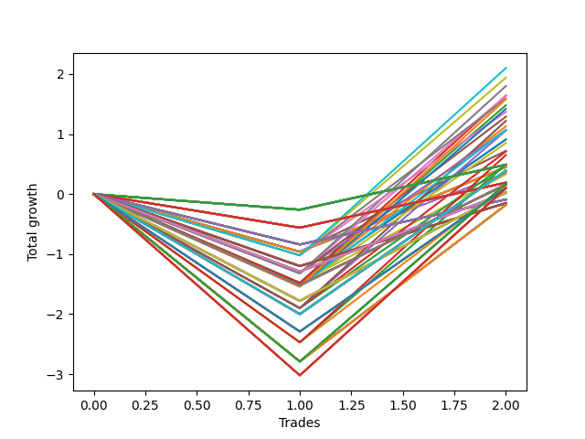

# Short HLT 103_1y 
- Symbol: TSLA
- Date Range: 05/15/2023 - 05/17/2024
- Trading Period: 8:30-12:30
- Number of Trades: 2



| Id. | Name | Win Percent | Profit | Avg Profit / Trade | Avg Time / Trade | Std |      | Name | Win Percent | Profit | Avg Profit / Trade | Avg Time / Trade | Std |
| --- | ---- | ----------- | ------ | ------------------ | ---------------- | --- | ---- | ---- | ----------- | ------ | ------------------ | ---------------- | --- |
| | Sorted By <br> Profit | | | | | | | Sorted By <br> Win Percentage |||||
|0| TP-3 75m | 50.00 | 2.10 | 1.05 | 49:00 | 2.07 |     | TP-3 75m | 50.00 | 2.10 | 1.05 | 49:00 | 2.07 |
|1| TP-2.75 75m | 50.00 | 1.94 | 0.97 | 48:30 | 1.99 |     | TP-2.75 75m | 50.00 | 1.94 | 0.97 | 48:30 | 1.99 |
|2| TP-3 60m | 50.00 | 1.80 | 0.90 | 41:30 | 2.22 |     | TP-3 60m | 50.00 | 1.80 | 0.90 | 41:30 | 2.22 |
|3| TP-2.75 60m | 50.00 | 1.64 | 0.82 | 41:00 | 2.14 |     | TP-2.75 60m | 50.00 | 1.64 | 0.82 | 41:00 | 2.14 |
|4| TP-3 30m | 50.00 | 1.64 | 0.82 | 26:30 | 2.30 |     | TP-3 30m | 50.00 | 1.64 | 0.82 | 26:30 | 2.30 |
|5| TP-2.5 75m | 50.00 | 1.59 | 0.80 | 48:00 | 1.81 |     | TP-2.5 75m | 50.00 | 1.59 | 0.80 | 48:00 | 1.81 |
|6| TP-3 90m | 50.00 | 1.58 | 0.79 | 56:30 | 2.33 |     | TP-3 90m | 50.00 | 1.58 | 0.79 | 56:30 | 2.33 |
|7| TP-2.75 30m | 50.00 | 1.48 | 0.74 | 26:00 | 2.22 |     | TP-2.75 30m | 50.00 | 1.48 | 0.74 | 26:00 | 2.22 |
|8| TP-2.75 90m | 50.00 | 1.42 | 0.71 | 56:00 | 2.25 |     | TP-2.75 90m | 50.00 | 1.42 | 0.71 | 56:00 | 2.25 |
|9| TP-2.25 75m | 50.00 | 1.37 | 0.69 | 46:30 | 1.70 |     | TP-2.25 75m | 50.00 | 1.37 | 0.69 | 46:30 | 1.70 |
|10| TP-2.5 60m | 50.00 | 1.29 | 0.64 | 40:30 | 1.96 |     | TP-2.5 60m | 50.00 | 1.29 | 0.64 | 40:30 | 1.96 |
|11| TP-3 45m | 50.00 | 1.22 | 0.61 | 34:00 | 2.51 |     | TP-3 45m | 50.00 | 1.22 | 0.61 | 34:00 | 2.51 |
|12| TP-2.5 30m | 50.00 | 1.13 | 0.56 | 25:30 | 2.04 |     | TP-2.5 30m | 50.00 | 1.13 | 0.56 | 25:30 | 2.04 |
|13| TP-2.5 90m | 50.00 | 1.07 | 0.53 | 55:30 | 2.07 |     | TP-2.5 90m | 50.00 | 1.07 | 0.53 | 55:30 | 2.07 |
|14| TP-2.25 60m | 50.00 | 1.07 | 0.53 | 39:00 | 1.85 |     | TP-2.25 60m | 50.00 | 1.07 | 0.53 | 39:00 | 1.85 |
|15| TP-2.75 45m | 50.00 | 1.06 | 0.53 | 33:30 | 2.43 |     | TP-2.75 45m | 50.00 | 1.06 | 0.53 | 33:30 | 2.43 |
|16| TP-2.25 30m | 50.00 | 0.91 | 0.45 | 24:00 | 1.93 |     | TP-2.25 30m | 50.00 | 0.91 | 0.45 | 24:00 | 1.93 |
|17| TP-2 30m | 50.00 | 0.91 | 0.45 | 24:00 | 1.93 |     | TP-2 30m | 50.00 | 0.91 | 0.45 | 24:00 | 1.93 |
|18| TP-2.25 90m | 50.00 | 0.85 | 0.42 | 54:00 | 1.96 |     | TP-2.25 90m | 50.00 | 0.85 | 0.42 | 54:00 | 1.96 |
|19| TP-1.5 15m | 50.00 | 0.72 | 0.36 | 13:30 | 1.32 |     | TP-1.5 15m | 50.00 | 0.72 | 0.36 | 13:30 | 1.32 |
|20| TP-2.5 45m | 50.00 | 0.71 | 0.36 | 33:00 | 2.25 |     | TP-2.5 45m | 50.00 | 0.71 | 0.36 | 33:00 | 2.25 |
|21| TP-3 105m | 50.00 | 0.65 | 0.33 | 64:00 | 2.80 |     | TP-3 105m | 50.00 | 0.65 | 0.33 | 64:00 | 2.80 |
|22| TP-0.25 180m | 50.00 | 0.49 | 0.25 | 02:00 | 0.50 |     | TP-0.25 180m | 50.00 | 0.49 | 0.25 | 02:00 | 0.50 |
|23| TP-0.25 165m | 50.00 | 0.49 | 0.25 | 02:00 | 0.50 |     | TP-0.25 165m | 50.00 | 0.49 | 0.25 | 02:00 | 0.50 |
|24| TP-0.25 150m | 50.00 | 0.49 | 0.25 | 02:00 | 0.50 |     | TP-0.25 150m | 50.00 | 0.49 | 0.25 | 02:00 | 0.50 |
|25| TP-0.25 135m | 50.00 | 0.49 | 0.25 | 02:00 | 0.50 |     | TP-0.25 135m | 50.00 | 0.49 | 0.25 | 02:00 | 0.50 |
|26| TP-0.25 120m | 50.00 | 0.49 | 0.25 | 02:00 | 0.50 |     | TP-0.25 120m | 50.00 | 0.49 | 0.25 | 02:00 | 0.50 |
|27| TP-2.75 105m | 50.00 | 0.49 | 0.25 | 63:30 | 2.72 |     | TP-2.75 105m | 50.00 | 0.49 | 0.25 | 63:30 | 2.72 |
|28| TP-0.25 105m | 50.00 | 0.49 | 0.25 | 02:00 | 0.50 |     | TP-0.25 105m | 50.00 | 0.49 | 0.25 | 02:00 | 0.50 |
|29| TP-0.25 90m | 50.00 | 0.49 | 0.25 | 02:00 | 0.50 |     | TP-0.25 90m | 50.00 | 0.49 | 0.25 | 02:00 | 0.50 |
|30| TP-0.25 75m | 50.00 | 0.49 | 0.25 | 02:00 | 0.50 |     | TP-0.25 75m | 50.00 | 0.49 | 0.25 | 02:00 | 0.50 |
|31| TP-0.25 60m | 50.00 | 0.49 | 0.25 | 02:00 | 0.50 |     | TP-0.25 60m | 50.00 | 0.49 | 0.25 | 02:00 | 0.50 |
|32| TP-2.25 45m | 50.00 | 0.49 | 0.25 | 31:30 | 2.14 |     | TP-2.25 45m | 50.00 | 0.49 | 0.25 | 31:30 | 2.14 |
|33| TP-0.25 45m | 50.00 | 0.49 | 0.25 | 02:00 | 0.50 |     | TP-0.25 45m | 50.00 | 0.49 | 0.25 | 02:00 | 0.50 |
|34| TP-0.25 30m | 50.00 | 0.49 | 0.25 | 02:00 | 0.50 |     | TP-0.25 30m | 50.00 | 0.49 | 0.25 | 02:00 | 0.50 |
|35| TP-0.25 15m | 50.00 | 0.49 | 0.25 | 02:00 | 0.50 |     | TP-0.25 15m | 50.00 | 0.49 | 0.25 | 02:00 | 0.50 |
|36| TP-3 15m | 50.00 | 0.45 | 0.23 | 14:00 | 1.18 |     | TP-3 15m | 50.00 | 0.45 | 0.23 | 14:00 | 1.18 |
|37| TP-2.75 15m | 50.00 | 0.45 | 0.23 | 14:00 | 1.18 |     | TP-2.75 15m | 50.00 | 0.45 | 0.23 | 14:00 | 1.18 |
|38| TP-2.5 15m | 50.00 | 0.45 | 0.23 | 14:00 | 1.18 |     | TP-2.5 15m | 50.00 | 0.45 | 0.23 | 14:00 | 1.18 |
|39| TP-2.25 15m | 50.00 | 0.45 | 0.23 | 14:00 | 1.18 |     | TP-2.25 15m | 50.00 | 0.45 | 0.23 | 14:00 | 1.18 |
|40| TP-2 15m | 50.00 | 0.45 | 0.23 | 14:00 | 1.18 |     | TP-2 15m | 50.00 | 0.45 | 0.23 | 14:00 | 1.18 |
|41| TP-1.75 15m | 50.00 | 0.45 | 0.23 | 14:00 | 1.18 |     | TP-1.75 15m | 50.00 | 0.45 | 0.23 | 14:00 | 1.18 |
|42| TP-2 180m | 50.00 | 0.39 | 0.19 | 29:00 | 2.19 |     | TP-2 180m | 50.00 | 0.39 | 0.19 | 29:00 | 2.19 |
|43| TP-2 165m | 50.00 | 0.39 | 0.19 | 29:00 | 2.19 |     | TP-2 165m | 50.00 | 0.39 | 0.19 | 29:00 | 2.19 |
|44| TP-2 150m | 50.00 | 0.39 | 0.19 | 29:00 | 2.19 |     | TP-2 150m | 50.00 | 0.39 | 0.19 | 29:00 | 2.19 |
|45| TP-2 135m | 50.00 | 0.39 | 0.19 | 29:00 | 2.19 |     | TP-2 135m | 50.00 | 0.39 | 0.19 | 29:00 | 2.19 |
|46| TP-2 120m | 50.00 | 0.39 | 0.19 | 29:00 | 2.19 |     | TP-2 120m | 50.00 | 0.39 | 0.19 | 29:00 | 2.19 |
|47| TP-2 105m | 50.00 | 0.39 | 0.19 | 29:00 | 2.19 |     | TP-2 105m | 50.00 | 0.39 | 0.19 | 29:00 | 2.19 |
|48| TP-2 90m | 50.00 | 0.39 | 0.19 | 29:00 | 2.19 |     | TP-2 90m | 50.00 | 0.39 | 0.19 | 29:00 | 2.19 |
|49| TP-2 75m | 50.00 | 0.39 | 0.19 | 29:00 | 2.19 |     | TP-2 75m | 50.00 | 0.39 | 0.19 | 29:00 | 2.19 |
|50| TP-2 60m | 50.00 | 0.39 | 0.19 | 29:00 | 2.19 |     | TP-2 60m | 50.00 | 0.39 | 0.19 | 29:00 | 2.19 |
|51| TP-2 45m | 50.00 | 0.39 | 0.19 | 29:00 | 2.19 |     | TP-2 45m | 50.00 | 0.39 | 0.19 | 29:00 | 2.19 |
|52| TP-1.25 15m | 50.00 | 0.35 | 0.18 | 12:30 | 1.13 |     | TP-1.25 15m | 50.00 | 0.35 | 0.18 | 12:30 | 1.13 |
|53| TP-1.75 30m | 50.00 | 0.33 | 0.17 | 22:00 | 1.64 |     | TP-1.75 30m | 50.00 | 0.33 | 0.17 | 22:00 | 1.64 |
|54| TP-0.5 180m | 50.00 | 0.19 | 0.10 | 03:00 | 0.65 |     | TP-0.5 180m | 50.00 | 0.19 | 0.10 | 03:00 | 0.65 |
|55| TP-0.5 165m | 50.00 | 0.19 | 0.10 | 03:00 | 0.65 |     | TP-0.5 165m | 50.00 | 0.19 | 0.10 | 03:00 | 0.65 |
|56| TP-0.5 150m | 50.00 | 0.19 | 0.10 | 03:00 | 0.65 |     | TP-0.5 150m | 50.00 | 0.19 | 0.10 | 03:00 | 0.65 |
|57| TP-0.5 135m | 50.00 | 0.19 | 0.10 | 03:00 | 0.65 |     | TP-0.5 135m | 50.00 | 0.19 | 0.10 | 03:00 | 0.65 |
|58| TP-0.5 120m | 50.00 | 0.19 | 0.10 | 03:00 | 0.65 |     | TP-0.5 120m | 50.00 | 0.19 | 0.10 | 03:00 | 0.65 |
|59| TP-0.5 105m | 50.00 | 0.19 | 0.10 | 03:00 | 0.65 |     | TP-0.5 105m | 50.00 | 0.19 | 0.10 | 03:00 | 0.65 |
|60| TP-0.5 90m | 50.00 | 0.19 | 0.10 | 03:00 | 0.65 |     | TP-0.5 90m | 50.00 | 0.19 | 0.10 | 03:00 | 0.65 |
|61| TP-0.5 75m | 50.00 | 0.19 | 0.10 | 03:00 | 0.65 |     | TP-0.5 75m | 50.00 | 0.19 | 0.10 | 03:00 | 0.65 |
|62| TP-0.5 60m | 50.00 | 0.19 | 0.10 | 03:00 | 0.65 |     | TP-0.5 60m | 50.00 | 0.19 | 0.10 | 03:00 | 0.65 |
|63| TP-0.5 45m | 50.00 | 0.19 | 0.10 | 03:00 | 0.65 |     | TP-0.5 45m | 50.00 | 0.19 | 0.10 | 03:00 | 0.65 |
|64| TP-0.5 30m | 50.00 | 0.19 | 0.10 | 03:00 | 0.65 |     | TP-0.5 30m | 50.00 | 0.19 | 0.10 | 03:00 | 0.65 |
|65| TP-0.5 15m | 50.00 | 0.19 | 0.10 | 03:00 | 0.65 |     | TP-0.5 15m | 50.00 | 0.19 | 0.10 | 03:00 | 0.65 |
|66| TP-2.75 180m | 50.00 | 0.17 | 0.09 | 64:00 | 2.88 |     | TP-2.75 180m | 50.00 | 0.17 | 0.09 | 64:00 | 2.88 |
|67| TP-2.75 165m | 50.00 | 0.17 | 0.09 | 64:00 | 2.88 |     | TP-2.75 165m | 50.00 | 0.17 | 0.09 | 64:00 | 2.88 |
|68| TP-2.75 150m | 50.00 | 0.17 | 0.09 | 64:00 | 2.88 |     | TP-2.75 150m | 50.00 | 0.17 | 0.09 | 64:00 | 2.88 |
|69| TP-2.75 135m | 50.00 | 0.17 | 0.09 | 64:00 | 2.88 |     | TP-2.75 135m | 50.00 | 0.17 | 0.09 | 64:00 | 2.88 |
|70| TP-2.75 120m | 50.00 | 0.17 | 0.09 | 64:00 | 2.88 |     | TP-2.75 120m | 50.00 | 0.17 | 0.09 | 64:00 | 2.88 |
|71| TP-1.5 180m | 50.00 | 0.16 | 0.08 | 20:30 | 1.60 |     | TP-1.5 180m | 50.00 | 0.16 | 0.08 | 20:30 | 1.60 |
|72| TP-1.5 165m | 50.00 | 0.16 | 0.08 | 20:30 | 1.60 |     | TP-1.5 165m | 50.00 | 0.16 | 0.08 | 20:30 | 1.60 |
|73| TP-1.5 150m | 50.00 | 0.16 | 0.08 | 20:30 | 1.60 |     | TP-1.5 150m | 50.00 | 0.16 | 0.08 | 20:30 | 1.60 |
|74| TP-1.5 135m | 50.00 | 0.16 | 0.08 | 20:30 | 1.60 |     | TP-1.5 135m | 50.00 | 0.16 | 0.08 | 20:30 | 1.60 |
|75| TP-1.5 120m | 50.00 | 0.16 | 0.08 | 20:30 | 1.60 |     | TP-1.5 120m | 50.00 | 0.16 | 0.08 | 20:30 | 1.60 |
|76| TP-1.5 105m | 50.00 | 0.16 | 0.08 | 20:30 | 1.60 |     | TP-1.5 105m | 50.00 | 0.16 | 0.08 | 20:30 | 1.60 |
|77| TP-1.5 90m | 50.00 | 0.16 | 0.08 | 20:30 | 1.60 |     | TP-1.5 90m | 50.00 | 0.16 | 0.08 | 20:30 | 1.60 |
|78| TP-1.5 75m | 50.00 | 0.16 | 0.08 | 20:30 | 1.60 |     | TP-1.5 75m | 50.00 | 0.16 | 0.08 | 20:30 | 1.60 |
|79| TP-1.5 60m | 50.00 | 0.16 | 0.08 | 20:30 | 1.60 |     | TP-1.5 60m | 50.00 | 0.16 | 0.08 | 20:30 | 1.60 |
|80| TP-1.5 45m | 50.00 | 0.16 | 0.08 | 20:30 | 1.60 |     | TP-1.5 45m | 50.00 | 0.16 | 0.08 | 20:30 | 1.60 |
|81| TP-1.5 30m | 50.00 | 0.16 | 0.08 | 20:30 | 1.60 |     | TP-1.5 30m | 50.00 | 0.16 | 0.08 | 20:30 | 1.60 |
|82| TP-2.5 105m | 50.00 | 0.14 | 0.07 | 63:00 | 2.54 |     | TP-2.5 105m | 50.00 | 0.14 | 0.07 | 63:00 | 2.54 |
|83| TP-3 180m | 50.00 | 0.10 | 0.05 | 67:00 | 3.07 |     | TP-3 180m | 50.00 | 0.10 | 0.05 | 67:00 | 3.07 |
|84| TP-2.25 180m | 50.00 | 0.10 | 0.05 | 60:00 | 2.34 |     | TP-2.25 180m | 50.00 | 0.10 | 0.05 | 60:00 | 2.34 |
|85| TP-3 165m | 50.00 | 0.10 | 0.05 | 67:00 | 3.07 |     | TP-3 165m | 50.00 | 0.10 | 0.05 | 67:00 | 3.07 |
|86| TP-2.25 165m | 50.00 | 0.10 | 0.05 | 60:00 | 2.34 |     | TP-2.25 165m | 50.00 | 0.10 | 0.05 | 60:00 | 2.34 |
|87| TP-3 150m | 50.00 | 0.10 | 0.05 | 67:00 | 3.07 |     | TP-3 150m | 50.00 | 0.10 | 0.05 | 67:00 | 3.07 |
|88| TP-2.25 150m | 50.00 | 0.10 | 0.05 | 60:00 | 2.34 |     | TP-2.25 150m | 50.00 | 0.10 | 0.05 | 60:00 | 2.34 |
|89| TP-3 135m | 50.00 | 0.10 | 0.05 | 67:00 | 3.07 |     | TP-3 135m | 50.00 | 0.10 | 0.05 | 67:00 | 3.07 |
|90| TP-2.25 135m | 50.00 | 0.10 | 0.05 | 60:00 | 2.34 |     | TP-2.25 135m | 50.00 | 0.10 | 0.05 | 60:00 | 2.34 |
|91| TP-3 120m | 50.00 | 0.10 | 0.05 | 67:00 | 3.07 |     | TP-3 120m | 50.00 | 0.10 | 0.05 | 67:00 | 3.07 |
|92| TP-2.25 120m | 50.00 | 0.10 | 0.05 | 60:00 | 2.34 |     | TP-2.25 120m | 50.00 | 0.10 | 0.05 | 60:00 | 2.34 |
|93| TP-2.25 105m | 50.00 | 0.10 | 0.05 | 60:00 | 2.34 |     | TP-2.25 105m | 50.00 | 0.10 | 0.05 | 60:00 | 2.34 |
|94| TP-1.75 180m | 50.00 | 0.03 | 0.02 | 26:00 | 1.79 |     | TP-1.75 180m | 50.00 | 0.03 | 0.02 | 26:00 | 1.79 |
|95| TP-1.75 165m | 50.00 | 0.03 | 0.02 | 26:00 | 1.79 |     | TP-1.75 165m | 50.00 | 0.03 | 0.02 | 26:00 | 1.79 |
|96| TP-1.75 150m | 50.00 | 0.03 | 0.02 | 26:00 | 1.79 |     | TP-1.75 150m | 50.00 | 0.03 | 0.02 | 26:00 | 1.79 |
|97| TP-1.75 135m | 50.00 | 0.03 | 0.02 | 26:00 | 1.79 |     | TP-1.75 135m | 50.00 | 0.03 | 0.02 | 26:00 | 1.79 |
|98| TP-1.75 120m | 50.00 | 0.03 | 0.02 | 26:00 | 1.79 |     | TP-1.75 120m | 50.00 | 0.03 | 0.02 | 26:00 | 1.79 |
|99| TP-1.75 105m | 50.00 | 0.03 | 0.02 | 26:00 | 1.79 |     | TP-1.75 105m | 50.00 | 0.03 | 0.02 | 26:00 | 1.79 |
|100| TP-1.75 90m | 50.00 | 0.03 | 0.02 | 26:00 | 1.79 |     | TP-1.75 90m | 50.00 | 0.03 | 0.02 | 26:00 | 1.79 |
|101| TP-1.75 75m | 50.00 | 0.03 | 0.02 | 26:00 | 1.79 |     | TP-1.75 75m | 50.00 | 0.03 | 0.02 | 26:00 | 1.79 |
|102| TP-1.75 60m | 50.00 | 0.03 | 0.02 | 26:00 | 1.79 |     | TP-1.75 60m | 50.00 | 0.03 | 0.02 | 26:00 | 1.79 |
|103| TP-1.75 45m | 50.00 | 0.03 | 0.02 | 26:00 | 1.79 |     | TP-1.75 45m | 50.00 | 0.03 | 0.02 | 26:00 | 1.79 |
|104| TP-1.25 180m | 50.00 | 0.02 | 0.01 | 14:00 | 1.30 |     | TP-1.25 180m | 50.00 | 0.02 | 0.01 | 14:00 | 1.30 |
|105| TP-1.25 165m | 50.00 | 0.02 | 0.01 | 14:00 | 1.30 |     | TP-1.25 165m | 50.00 | 0.02 | 0.01 | 14:00 | 1.30 |
|106| TP-1.25 150m | 50.00 | 0.02 | 0.01 | 14:00 | 1.30 |     | TP-1.25 150m | 50.00 | 0.02 | 0.01 | 14:00 | 1.30 |
|107| TP-1.25 135m | 50.00 | 0.02 | 0.01 | 14:00 | 1.30 |     | TP-1.25 135m | 50.00 | 0.02 | 0.01 | 14:00 | 1.30 |
|108| TP-1.25 120m | 50.00 | 0.02 | 0.01 | 14:00 | 1.30 |     | TP-1.25 120m | 50.00 | 0.02 | 0.01 | 14:00 | 1.30 |
|109| TP-1.25 105m | 50.00 | 0.02 | 0.01 | 14:00 | 1.30 |     | TP-1.25 105m | 50.00 | 0.02 | 0.01 | 14:00 | 1.30 |
|110| TP-1.25 90m | 50.00 | 0.02 | 0.01 | 14:00 | 1.30 |     | TP-1.25 90m | 50.00 | 0.02 | 0.01 | 14:00 | 1.30 |
|111| TP-1.25 75m | 50.00 | 0.02 | 0.01 | 14:00 | 1.30 |     | TP-1.25 75m | 50.00 | 0.02 | 0.01 | 14:00 | 1.30 |
|112| TP-1.25 60m | 50.00 | 0.02 | 0.01 | 14:00 | 1.30 |     | TP-1.25 60m | 50.00 | 0.02 | 0.01 | 14:00 | 1.30 |
|113| TP-1.25 45m | 50.00 | 0.02 | 0.01 | 14:00 | 1.30 |     | TP-1.25 45m | 50.00 | 0.02 | 0.01 | 14:00 | 1.30 |
|114| TP-1.25 30m | 50.00 | 0.02 | 0.01 | 14:00 | 1.30 |     | TP-1.25 30m | 50.00 | 0.02 | 0.01 | 14:00 | 1.30 |
|115| TP-0.75 180m | 50.00 | -0.09 | -0.04 | 04:00 | 0.79 |     | TP-0.75 180m | 50.00 | -0.09 | -0.04 | 04:00 | 0.79 |
|116| TP-0.75 165m | 50.00 | -0.09 | -0.04 | 04:00 | 0.79 |     | TP-0.75 165m | 50.00 | -0.09 | -0.04 | 04:00 | 0.79 |
|117| TP-0.75 150m | 50.00 | -0.09 | -0.04 | 04:00 | 0.79 |     | TP-0.75 150m | 50.00 | -0.09 | -0.04 | 04:00 | 0.79 |
|118| TP-0.75 135m | 50.00 | -0.09 | -0.04 | 04:00 | 0.79 |     | TP-0.75 135m | 50.00 | -0.09 | -0.04 | 04:00 | 0.79 |
|119| TP-0.75 120m | 50.00 | -0.09 | -0.04 | 04:00 | 0.79 |     | TP-0.75 120m | 50.00 | -0.09 | -0.04 | 04:00 | 0.79 |
|120| TP-0.75 105m | 50.00 | -0.09 | -0.04 | 04:00 | 0.79 |     | TP-0.75 105m | 50.00 | -0.09 | -0.04 | 04:00 | 0.79 |
|121| TP-0.75 90m | 50.00 | -0.09 | -0.04 | 04:00 | 0.79 |     | TP-0.75 90m | 50.00 | -0.09 | -0.04 | 04:00 | 0.79 |
|122| TP-0.75 75m | 50.00 | -0.09 | -0.04 | 04:00 | 0.79 |     | TP-0.75 75m | 50.00 | -0.09 | -0.04 | 04:00 | 0.79 |
|123| TP-0.75 60m | 50.00 | -0.09 | -0.04 | 04:00 | 0.79 |     | TP-0.75 60m | 50.00 | -0.09 | -0.04 | 04:00 | 0.79 |
|124| TP-0.75 45m | 50.00 | -0.09 | -0.04 | 04:00 | 0.79 |     | TP-0.75 45m | 50.00 | -0.09 | -0.04 | 04:00 | 0.79 |
|125| TP-0.75 30m | 50.00 | -0.09 | -0.04 | 04:00 | 0.79 |     | TP-0.75 30m | 50.00 | -0.09 | -0.04 | 04:00 | 0.79 |
|126| TP-0.75 15m | 50.00 | -0.09 | -0.04 | 04:00 | 0.79 |     | TP-0.75 15m | 50.00 | -0.09 | -0.04 | 04:00 | 0.79 |
|127| TP-1 180m | 50.00 | -0.15 | -0.08 | 11:30 | 1.12 |     | TP-1 180m | 50.00 | -0.15 | -0.08 | 11:30 | 1.12 |
|128| TP-1 165m | 50.00 | -0.15 | -0.08 | 11:30 | 1.12 |     | TP-1 165m | 50.00 | -0.15 | -0.08 | 11:30 | 1.12 |
|129| TP-1 150m | 50.00 | -0.15 | -0.08 | 11:30 | 1.12 |     | TP-1 150m | 50.00 | -0.15 | -0.08 | 11:30 | 1.12 |
|130| TP-1 135m | 50.00 | -0.15 | -0.08 | 11:30 | 1.12 |     | TP-1 135m | 50.00 | -0.15 | -0.08 | 11:30 | 1.12 |
|131| TP-1 120m | 50.00 | -0.15 | -0.08 | 11:30 | 1.12 |     | TP-1 120m | 50.00 | -0.15 | -0.08 | 11:30 | 1.12 |
|132| TP-1 105m | 50.00 | -0.15 | -0.08 | 11:30 | 1.12 |     | TP-1 105m | 50.00 | -0.15 | -0.08 | 11:30 | 1.12 |
|133| TP-1 90m | 50.00 | -0.15 | -0.08 | 11:30 | 1.12 |     | TP-1 90m | 50.00 | -0.15 | -0.08 | 11:30 | 1.12 |
|134| TP-1 75m | 50.00 | -0.15 | -0.08 | 11:30 | 1.12 |     | TP-1 75m | 50.00 | -0.15 | -0.08 | 11:30 | 1.12 |
|135| TP-1 60m | 50.00 | -0.15 | -0.08 | 11:30 | 1.12 |     | TP-1 60m | 50.00 | -0.15 | -0.08 | 11:30 | 1.12 |
|136| TP-1 45m | 50.00 | -0.15 | -0.08 | 11:30 | 1.12 |     | TP-1 45m | 50.00 | -0.15 | -0.08 | 11:30 | 1.12 |
|137| TP-1 30m | 50.00 | -0.15 | -0.08 | 11:30 | 1.12 |     | TP-1 30m | 50.00 | -0.15 | -0.08 | 11:30 | 1.12 |
|138| TP-1 15m | 50.00 | -0.15 | -0.08 | 11:30 | 1.12 |     | TP-1 15m | 50.00 | -0.15 | -0.08 | 11:30 | 1.12 |
|139| TP-2.5 180m | 50.00 | -0.18 | -0.09 | 63:30 | 2.70 |     | TP-2.5 180m | 50.00 | -0.18 | -0.09 | 63:30 | 2.70 |
|140| TP-2.5 165m | 50.00 | -0.18 | -0.09 | 63:30 | 2.70 |     | TP-2.5 165m | 50.00 | -0.18 | -0.09 | 63:30 | 2.70 |
|141| TP-2.5 150m | 50.00 | -0.18 | -0.09 | 63:30 | 2.70 |     | TP-2.5 150m | 50.00 | -0.18 | -0.09 | 63:30 | 2.70 |
|142| TP-2.5 135m | 50.00 | -0.18 | -0.09 | 63:30 | 2.70 |     | TP-2.5 135m | 50.00 | -0.18 | -0.09 | 63:30 | 2.70 |
|143| TP-2.5 120m | 50.00 | -0.18 | -0.09 | 63:30 | 2.70 |     | TP-2.5 120m | 50.00 | -0.18 | -0.09 | 63:30 | 2.70 |

### Test TP-0.25 15m
* Take Profit of 0.25 Point
* 0.25 Stoploss
* Results:
```
Total Trades: 2
Percent Up: 50.00
Percent Down: 50.00
Total Points Moved Down: 0.49
Potential Profit: 245.00
Total Points Ups: 0.26 Count Ups: 1
Total Points Downs: 0.75 Count Downs: 1
```

<details><summary>Trades</summary>

<code>In: 2023-11-07 10:45:00		Out: 2023-11-07 10:47:00		Total Position Time: 02:00		Total Move Down: -0.26		Total to Date: -0.26</code> <br />
<code>In: 2024-05-01 12:20:00		Out: 2024-05-01 12:22:00		Total Position Time: 02:00		Total Move Down: 0.75		Total to Date: 0.49</code> <br />


</details>

### Test TP-0.5 15m
* Take Profit of 0.5 Point
* 0.5 Stoploss
* Results:
```
Total Trades: 2
Percent Up: 50.00
Percent Down: 50.00
Total Points Moved Down: 0.19
Potential Profit: 95.00
Total Points Ups: 0.56 Count Ups: 1
Total Points Downs: 0.75 Count Downs: 1
```

<details><summary>Trades</summary>

<code>In: 2023-11-07 10:45:00		Out: 2023-11-07 10:49:00		Total Position Time: 04:00		Total Move Down: -0.56		Total to Date: -0.56</code> <br />
<code>In: 2024-05-01 12:20:00		Out: 2024-05-01 12:22:00		Total Position Time: 02:00		Total Move Down: 0.75		Total to Date: 0.19</code> <br />


</details>

### Test TP-0.75 15m
* Take Profit of 0.75 Point
* 0.75 Stoploss
* Results:
```
Total Trades: 2
Percent Up: 50.00
Percent Down: 50.00
Total Points Moved Down: -0.09
Potential Profit: -45.00
Total Points Ups: 0.84 Count Ups: 1
Total Points Downs: 0.75 Count Downs: 1
```

<details><summary>Trades</summary>

<code>In: 2023-11-07 10:45:00		Out: 2023-11-07 10:51:00		Total Position Time: 06:00		Total Move Down: -0.84		Total to Date: -0.84</code> <br />
<code>In: 2024-05-01 12:20:00		Out: 2024-05-01 12:22:00		Total Position Time: 02:00		Total Move Down: 0.75		Total to Date: -0.09</code> <br />


</details>

### Test TP-1 15m
* Take Profit of 1 Point
* 1 Stoploss
* Results:
```
Total Trades: 2
Percent Up: 50.00
Percent Down: 50.00
Total Points Moved Down: -0.15
Potential Profit: -75.00
Total Points Ups: 1.20 Count Ups: 1
Total Points Downs: 1.05 Count Downs: 1
```

<details><summary>Trades</summary>

<code>In: 2023-11-07 10:45:00		Out: 2023-11-07 10:58:00		Total Position Time: 13:00		Total Move Down: -1.20		Total to Date: -1.20</code> <br />
<code>In: 2024-05-01 12:20:00		Out: 2024-05-01 12:30:00		Total Position Time: 10:00		Total Move Down: 1.05		Total to Date: -0.15</code> <br />


</details>

### Test TP-1.25 15m
* Take Profit of 1.25 Point
* 1.25 Stoploss
* Results:
```
Total Trades: 2
Percent Up: 50.00
Percent Down: 50.00
Total Points Moved Down: 0.35
Potential Profit: 175.00
Total Points Ups: 0.96 Count Ups: 1
Total Points Downs: 1.31 Count Downs: 1
```

<details><summary>Trades</summary>

<code>In: 2023-11-07 10:45:00		Out: 2023-11-07 10:59:00		Total Position Time: 14:00		Total Move Down: -0.96		Total to Date: -0.96</code> <br />
<code>In: 2024-05-01 12:20:00		Out: 2024-05-01 12:31:00		Total Position Time: 11:00		Total Move Down: 1.31		Total to Date: 0.35</code> <br />


</details>

### Test TP-1.5 15m
* Take Profit of 1.5 Point
* 1.5 Stoploss
* Results:
```
Total Trades: 2
Percent Up: 50.00
Percent Down: 50.00
Total Points Moved Down: 0.72
Potential Profit: 360.00
Total Points Ups: 0.96 Count Ups: 1
Total Points Downs: 1.68 Count Downs: 1
```

<details><summary>Trades</summary>

<code>In: 2023-11-07 10:45:00		Out: 2023-11-07 10:59:00		Total Position Time: 14:00		Total Move Down: -0.96		Total to Date: -0.96</code> <br />
<code>In: 2024-05-01 12:20:00		Out: 2024-05-01 12:33:00		Total Position Time: 13:00		Total Move Down: 1.68		Total to Date: 0.72</code> <br />


</details>

### Test TP-1.75 15m
* Take Profit of 1.75 Point
* 1.75 Stoploss
* Results:
```
Total Trades: 2
Percent Up: 50.00
Percent Down: 50.00
Total Points Moved Down: 0.45
Potential Profit: 225.00
Total Points Ups: 0.96 Count Ups: 1
Total Points Downs: 1.41 Count Downs: 1
```

<details><summary>Trades</summary>

<code>In: 2023-11-07 10:45:00		Out: 2023-11-07 10:59:00		Total Position Time: 14:00		Total Move Down: -0.96		Total to Date: -0.96</code> <br />
<code>In: 2024-05-01 12:20:00		Out: 2024-05-01 12:34:00		Total Position Time: 14:00		Total Move Down: 1.41		Total to Date: 0.45</code> <br />


</details>

### Test TP-2 15m
* Take Profit of 2 Point
* 2 Stoploss
* Results:
```
Total Trades: 2
Percent Up: 50.00
Percent Down: 50.00
Total Points Moved Down: 0.45
Potential Profit: 225.00
Total Points Ups: 0.96 Count Ups: 1
Total Points Downs: 1.41 Count Downs: 1
```

<details><summary>Trades</summary>

<code>In: 2023-11-07 10:45:00		Out: 2023-11-07 10:59:00		Total Position Time: 14:00		Total Move Down: -0.96		Total to Date: -0.96</code> <br />
<code>In: 2024-05-01 12:20:00		Out: 2024-05-01 12:34:00		Total Position Time: 14:00		Total Move Down: 1.41		Total to Date: 0.45</code> <br />


</details>

### Test TP-2.25 15m
* Take Profit of 2.25 Point
* 2.25 Stoploss
* Results:
```
Total Trades: 2
Percent Up: 50.00
Percent Down: 50.00
Total Points Moved Down: 0.45
Potential Profit: 225.00
Total Points Ups: 0.96 Count Ups: 1
Total Points Downs: 1.41 Count Downs: 1
```

<details><summary>Trades</summary>

<code>In: 2023-11-07 10:45:00		Out: 2023-11-07 10:59:00		Total Position Time: 14:00		Total Move Down: -0.96		Total to Date: -0.96</code> <br />
<code>In: 2024-05-01 12:20:00		Out: 2024-05-01 12:34:00		Total Position Time: 14:00		Total Move Down: 1.41		Total to Date: 0.45</code> <br />


</details>

### Test TP-2.5 15m
* Take Profit of 2.5 Point
* 2.5 Stoploss
* Results:
```
Total Trades: 2
Percent Up: 50.00
Percent Down: 50.00
Total Points Moved Down: 0.45
Potential Profit: 225.00
Total Points Ups: 0.96 Count Ups: 1
Total Points Downs: 1.41 Count Downs: 1
```

<details><summary>Trades</summary>

<code>In: 2023-11-07 10:45:00		Out: 2023-11-07 10:59:00		Total Position Time: 14:00		Total Move Down: -0.96		Total to Date: -0.96</code> <br />
<code>In: 2024-05-01 12:20:00		Out: 2024-05-01 12:34:00		Total Position Time: 14:00		Total Move Down: 1.41		Total to Date: 0.45</code> <br />


</details>

### Test TP-2.75 15m
* Take Profit of 2.75 Point
* 2.75 Stoploss
* Results:
```
Total Trades: 2
Percent Up: 50.00
Percent Down: 50.00
Total Points Moved Down: 0.45
Potential Profit: 225.00
Total Points Ups: 0.96 Count Ups: 1
Total Points Downs: 1.41 Count Downs: 1
```

<details><summary>Trades</summary>

<code>In: 2023-11-07 10:45:00		Out: 2023-11-07 10:59:00		Total Position Time: 14:00		Total Move Down: -0.96		Total to Date: -0.96</code> <br />
<code>In: 2024-05-01 12:20:00		Out: 2024-05-01 12:34:00		Total Position Time: 14:00		Total Move Down: 1.41		Total to Date: 0.45</code> <br />


</details>

### Test TP-3 15m
* Take Profit of 3 Point
* 3 Stoploss
* Results:
```
Total Trades: 2
Percent Up: 50.00
Percent Down: 50.00
Total Points Moved Down: 0.45
Potential Profit: 225.00
Total Points Ups: 0.96 Count Ups: 1
Total Points Downs: 1.41 Count Downs: 1
```

<details><summary>Trades</summary>

<code>In: 2023-11-07 10:45:00		Out: 2023-11-07 10:59:00		Total Position Time: 14:00		Total Move Down: -0.96		Total to Date: -0.96</code> <br />
<code>In: 2024-05-01 12:20:00		Out: 2024-05-01 12:34:00		Total Position Time: 14:00		Total Move Down: 1.41		Total to Date: 0.45</code> <br />


</details>

### Test TP-0.25 30m
* Take Profit of 0.25 Point
* 0.25 Stoploss
* Results:
```
Total Trades: 2
Percent Up: 50.00
Percent Down: 50.00
Total Points Moved Down: 0.49
Potential Profit: 245.00
Total Points Ups: 0.26 Count Ups: 1
Total Points Downs: 0.75 Count Downs: 1
```

<details><summary>Trades</summary>

<code>In: 2023-11-07 10:45:00		Out: 2023-11-07 10:47:00		Total Position Time: 02:00		Total Move Down: -0.26		Total to Date: -0.26</code> <br />
<code>In: 2024-05-01 12:20:00		Out: 2024-05-01 12:22:00		Total Position Time: 02:00		Total Move Down: 0.75		Total to Date: 0.49</code> <br />


</details>

### Test TP-0.5 30m
* Take Profit of 0.5 Point
* 0.5 Stoploss
* Results:
```
Total Trades: 2
Percent Up: 50.00
Percent Down: 50.00
Total Points Moved Down: 0.19
Potential Profit: 95.00
Total Points Ups: 0.56 Count Ups: 1
Total Points Downs: 0.75 Count Downs: 1
```

<details><summary>Trades</summary>

<code>In: 2023-11-07 10:45:00		Out: 2023-11-07 10:49:00		Total Position Time: 04:00		Total Move Down: -0.56		Total to Date: -0.56</code> <br />
<code>In: 2024-05-01 12:20:00		Out: 2024-05-01 12:22:00		Total Position Time: 02:00		Total Move Down: 0.75		Total to Date: 0.19</code> <br />


</details>

### Test TP-0.75 30m
* Take Profit of 0.75 Point
* 0.75 Stoploss
* Results:
```
Total Trades: 2
Percent Up: 50.00
Percent Down: 50.00
Total Points Moved Down: -0.09
Potential Profit: -45.00
Total Points Ups: 0.84 Count Ups: 1
Total Points Downs: 0.75 Count Downs: 1
```

<details><summary>Trades</summary>

<code>In: 2023-11-07 10:45:00		Out: 2023-11-07 10:51:00		Total Position Time: 06:00		Total Move Down: -0.84		Total to Date: -0.84</code> <br />
<code>In: 2024-05-01 12:20:00		Out: 2024-05-01 12:22:00		Total Position Time: 02:00		Total Move Down: 0.75		Total to Date: -0.09</code> <br />


</details>

### Test TP-1 30m
* Take Profit of 1 Point
* 1 Stoploss
* Results:
```
Total Trades: 2
Percent Up: 50.00
Percent Down: 50.00
Total Points Moved Down: -0.15
Potential Profit: -75.00
Total Points Ups: 1.20 Count Ups: 1
Total Points Downs: 1.05 Count Downs: 1
```

<details><summary>Trades</summary>

<code>In: 2023-11-07 10:45:00		Out: 2023-11-07 10:58:00		Total Position Time: 13:00		Total Move Down: -1.20		Total to Date: -1.20</code> <br />
<code>In: 2024-05-01 12:20:00		Out: 2024-05-01 12:30:00		Total Position Time: 10:00		Total Move Down: 1.05		Total to Date: -0.15</code> <br />


</details>

### Test TP-1.25 30m
* Take Profit of 1.25 Point
* 1.25 Stoploss
* Results:
```
Total Trades: 2
Percent Up: 50.00
Percent Down: 50.00
Total Points Moved Down: 0.02
Potential Profit: 10.00
Total Points Ups: 1.29 Count Ups: 1
Total Points Downs: 1.31 Count Downs: 1
```

<details><summary>Trades</summary>

<code>In: 2023-11-07 10:45:00		Out: 2023-11-07 11:02:00		Total Position Time: 17:00		Total Move Down: -1.29		Total to Date: -1.29</code> <br />
<code>In: 2024-05-01 12:20:00		Out: 2024-05-01 12:31:00		Total Position Time: 11:00		Total Move Down: 1.31		Total to Date: 0.02</code> <br />


</details>

### Test TP-1.5 30m
* Take Profit of 1.5 Point
* 1.5 Stoploss
* Results:
```
Total Trades: 2
Percent Up: 50.00
Percent Down: 50.00
Total Points Moved Down: 0.16
Potential Profit: 80.00
Total Points Ups: 1.52 Count Ups: 1
Total Points Downs: 1.68 Count Downs: 1
```

<details><summary>Trades</summary>

<code>In: 2023-11-07 10:45:00		Out: 2023-11-07 11:13:00		Total Position Time: 28:00		Total Move Down: -1.52		Total to Date: -1.52</code> <br />
<code>In: 2024-05-01 12:20:00		Out: 2024-05-01 12:33:00		Total Position Time: 13:00		Total Move Down: 1.68		Total to Date: 0.16</code> <br />


</details>

### Test TP-1.75 30m
* Take Profit of 1.75 Point
* 1.75 Stoploss
* Results:
```
Total Trades: 2
Percent Up: 50.00
Percent Down: 50.00
Total Points Moved Down: 0.33
Potential Profit: 165.00
Total Points Ups: 1.48 Count Ups: 1
Total Points Downs: 1.81 Count Downs: 1
```

<details><summary>Trades</summary>

<code>In: 2023-11-07 10:45:00		Out: 2023-11-07 11:14:00		Total Position Time: 29:00		Total Move Down: -1.48		Total to Date: -1.48</code> <br />
<code>In: 2024-05-01 12:20:00		Out: 2024-05-01 12:35:00		Total Position Time: 15:00		Total Move Down: 1.81		Total to Date: 0.33</code> <br />


</details>

### Test TP-2 30m
* Take Profit of 2 Point
* 2 Stoploss
* Results:
```
Total Trades: 2
Percent Up: 50.00
Percent Down: 50.00
Total Points Moved Down: 0.91
Potential Profit: 455.00
Total Points Ups: 1.48 Count Ups: 1
Total Points Downs: 2.39 Count Downs: 1
```

<details><summary>Trades</summary>

<code>In: 2023-11-07 10:45:00		Out: 2023-11-07 11:14:00		Total Position Time: 29:00		Total Move Down: -1.48		Total to Date: -1.48</code> <br />
<code>In: 2024-05-01 12:20:00		Out: 2024-05-01 12:39:00		Total Position Time: 19:00		Total Move Down: 2.39		Total to Date: 0.91</code> <br />


</details>

### Test TP-2.25 30m
* Take Profit of 2.25 Point
* 2.25 Stoploss
* Results:
```
Total Trades: 2
Percent Up: 50.00
Percent Down: 50.00
Total Points Moved Down: 0.91
Potential Profit: 455.00
Total Points Ups: 1.48 Count Ups: 1
Total Points Downs: 2.39 Count Downs: 1
```

<details><summary>Trades</summary>

<code>In: 2023-11-07 10:45:00		Out: 2023-11-07 11:14:00		Total Position Time: 29:00		Total Move Down: -1.48		Total to Date: -1.48</code> <br />
<code>In: 2024-05-01 12:20:00		Out: 2024-05-01 12:39:00		Total Position Time: 19:00		Total Move Down: 2.39		Total to Date: 0.91</code> <br />


</details>

### Test TP-2.5 30m
* Take Profit of 2.5 Point
* 2.5 Stoploss
* Results:
```
Total Trades: 2
Percent Up: 50.00
Percent Down: 50.00
Total Points Moved Down: 1.13
Potential Profit: 565.00
Total Points Ups: 1.48 Count Ups: 1
Total Points Downs: 2.61 Count Downs: 1
```

<details><summary>Trades</summary>

<code>In: 2023-11-07 10:45:00		Out: 2023-11-07 11:14:00		Total Position Time: 29:00		Total Move Down: -1.48		Total to Date: -1.48</code> <br />
<code>In: 2024-05-01 12:20:00		Out: 2024-05-01 12:42:00		Total Position Time: 22:00		Total Move Down: 2.61		Total to Date: 1.13</code> <br />


</details>

### Test TP-2.75 30m
* Take Profit of 2.75 Point
* 2.75 Stoploss
* Results:
```
Total Trades: 2
Percent Up: 50.00
Percent Down: 50.00
Total Points Moved Down: 1.48
Potential Profit: 740.00
Total Points Ups: 1.48 Count Ups: 1
Total Points Downs: 2.96 Count Downs: 1
```

<details><summary>Trades</summary>

<code>In: 2023-11-07 10:45:00		Out: 2023-11-07 11:14:00		Total Position Time: 29:00		Total Move Down: -1.48		Total to Date: -1.48</code> <br />
<code>In: 2024-05-01 12:20:00		Out: 2024-05-01 12:43:00		Total Position Time: 23:00		Total Move Down: 2.96		Total to Date: 1.48</code> <br />


</details>

### Test TP-3 30m
* Take Profit of 3 Point
* 3 Stoploss
* Results:
```
Total Trades: 2
Percent Up: 50.00
Percent Down: 50.00
Total Points Moved Down: 1.64
Potential Profit: 820.00
Total Points Ups: 1.48 Count Ups: 1
Total Points Downs: 3.12 Count Downs: 1
```

<details><summary>Trades</summary>

<code>In: 2023-11-07 10:45:00		Out: 2023-11-07 11:14:00		Total Position Time: 29:00		Total Move Down: -1.48		Total to Date: -1.48</code> <br />
<code>In: 2024-05-01 12:20:00		Out: 2024-05-01 12:44:00		Total Position Time: 24:00		Total Move Down: 3.12		Total to Date: 1.64</code> <br />


</details>

### Test TP-0.25 45m
* Take Profit of 0.25 Point
* 0.25 Stoploss
* Results:
```
Total Trades: 2
Percent Up: 50.00
Percent Down: 50.00
Total Points Moved Down: 0.49
Potential Profit: 245.00
Total Points Ups: 0.26 Count Ups: 1
Total Points Downs: 0.75 Count Downs: 1
```

<details><summary>Trades</summary>

<code>In: 2023-11-07 10:45:00		Out: 2023-11-07 10:47:00		Total Position Time: 02:00		Total Move Down: -0.26		Total to Date: -0.26</code> <br />
<code>In: 2024-05-01 12:20:00		Out: 2024-05-01 12:22:00		Total Position Time: 02:00		Total Move Down: 0.75		Total to Date: 0.49</code> <br />


</details>

### Test TP-0.5 45m
* Take Profit of 0.5 Point
* 0.5 Stoploss
* Results:
```
Total Trades: 2
Percent Up: 50.00
Percent Down: 50.00
Total Points Moved Down: 0.19
Potential Profit: 95.00
Total Points Ups: 0.56 Count Ups: 1
Total Points Downs: 0.75 Count Downs: 1
```

<details><summary>Trades</summary>

<code>In: 2023-11-07 10:45:00		Out: 2023-11-07 10:49:00		Total Position Time: 04:00		Total Move Down: -0.56		Total to Date: -0.56</code> <br />
<code>In: 2024-05-01 12:20:00		Out: 2024-05-01 12:22:00		Total Position Time: 02:00		Total Move Down: 0.75		Total to Date: 0.19</code> <br />


</details>

### Test TP-0.75 45m
* Take Profit of 0.75 Point
* 0.75 Stoploss
* Results:
```
Total Trades: 2
Percent Up: 50.00
Percent Down: 50.00
Total Points Moved Down: -0.09
Potential Profit: -45.00
Total Points Ups: 0.84 Count Ups: 1
Total Points Downs: 0.75 Count Downs: 1
```

<details><summary>Trades</summary>

<code>In: 2023-11-07 10:45:00		Out: 2023-11-07 10:51:00		Total Position Time: 06:00		Total Move Down: -0.84		Total to Date: -0.84</code> <br />
<code>In: 2024-05-01 12:20:00		Out: 2024-05-01 12:22:00		Total Position Time: 02:00		Total Move Down: 0.75		Total to Date: -0.09</code> <br />


</details>

### Test TP-1 45m
* Take Profit of 1 Point
* 1 Stoploss
* Results:
```
Total Trades: 2
Percent Up: 50.00
Percent Down: 50.00
Total Points Moved Down: -0.15
Potential Profit: -75.00
Total Points Ups: 1.20 Count Ups: 1
Total Points Downs: 1.05 Count Downs: 1
```

<details><summary>Trades</summary>

<code>In: 2023-11-07 10:45:00		Out: 2023-11-07 10:58:00		Total Position Time: 13:00		Total Move Down: -1.20		Total to Date: -1.20</code> <br />
<code>In: 2024-05-01 12:20:00		Out: 2024-05-01 12:30:00		Total Position Time: 10:00		Total Move Down: 1.05		Total to Date: -0.15</code> <br />


</details>

### Test TP-1.25 45m
* Take Profit of 1.25 Point
* 1.25 Stoploss
* Results:
```
Total Trades: 2
Percent Up: 50.00
Percent Down: 50.00
Total Points Moved Down: 0.02
Potential Profit: 10.00
Total Points Ups: 1.29 Count Ups: 1
Total Points Downs: 1.31 Count Downs: 1
```

<details><summary>Trades</summary>

<code>In: 2023-11-07 10:45:00		Out: 2023-11-07 11:02:00		Total Position Time: 17:00		Total Move Down: -1.29		Total to Date: -1.29</code> <br />
<code>In: 2024-05-01 12:20:00		Out: 2024-05-01 12:31:00		Total Position Time: 11:00		Total Move Down: 1.31		Total to Date: 0.02</code> <br />


</details>

### Test TP-1.5 45m
* Take Profit of 1.5 Point
* 1.5 Stoploss
* Results:
```
Total Trades: 2
Percent Up: 50.00
Percent Down: 50.00
Total Points Moved Down: 0.16
Potential Profit: 80.00
Total Points Ups: 1.52 Count Ups: 1
Total Points Downs: 1.68 Count Downs: 1
```

<details><summary>Trades</summary>

<code>In: 2023-11-07 10:45:00		Out: 2023-11-07 11:13:00		Total Position Time: 28:00		Total Move Down: -1.52		Total to Date: -1.52</code> <br />
<code>In: 2024-05-01 12:20:00		Out: 2024-05-01 12:33:00		Total Position Time: 13:00		Total Move Down: 1.68		Total to Date: 0.16</code> <br />


</details>

### Test TP-1.75 45m
* Take Profit of 1.75 Point
* 1.75 Stoploss
* Results:
```
Total Trades: 2
Percent Up: 50.00
Percent Down: 50.00
Total Points Moved Down: 0.03
Potential Profit: 15.00
Total Points Ups: 1.78 Count Ups: 1
Total Points Downs: 1.81 Count Downs: 1
```

<details><summary>Trades</summary>

<code>In: 2023-11-07 10:45:00		Out: 2023-11-07 11:22:00		Total Position Time: 37:00		Total Move Down: -1.78		Total to Date: -1.78</code> <br />
<code>In: 2024-05-01 12:20:00		Out: 2024-05-01 12:35:00		Total Position Time: 15:00		Total Move Down: 1.81		Total to Date: 0.03</code> <br />


</details>

### Test TP-2 45m
* Take Profit of 2 Point
* 2 Stoploss
* Results:
```
Total Trades: 2
Percent Up: 50.00
Percent Down: 50.00
Total Points Moved Down: 0.39
Potential Profit: 195.00
Total Points Ups: 2.00 Count Ups: 1
Total Points Downs: 2.39 Count Downs: 1
```

<details><summary>Trades</summary>

<code>In: 2023-11-07 10:45:00		Out: 2023-11-07 11:24:00		Total Position Time: 39:00		Total Move Down: -2.00		Total to Date: -2.00</code> <br />
<code>In: 2024-05-01 12:20:00		Out: 2024-05-01 12:39:00		Total Position Time: 19:00		Total Move Down: 2.39		Total to Date: 0.39</code> <br />


</details>

### Test TP-2.25 45m
* Take Profit of 2.25 Point
* 2.25 Stoploss
* Results:
```
Total Trades: 2
Percent Up: 50.00
Percent Down: 50.00
Total Points Moved Down: 0.49
Potential Profit: 245.00
Total Points Ups: 1.90 Count Ups: 1
Total Points Downs: 2.39 Count Downs: 1
```

<details><summary>Trades</summary>

<code>In: 2023-11-07 10:45:00		Out: 2023-11-07 11:29:00		Total Position Time: 44:00		Total Move Down: -1.90		Total to Date: -1.90</code> <br />
<code>In: 2024-05-01 12:20:00		Out: 2024-05-01 12:39:00		Total Position Time: 19:00		Total Move Down: 2.39		Total to Date: 0.49</code> <br />


</details>

### Test TP-2.5 45m
* Take Profit of 2.5 Point
* 2.5 Stoploss
* Results:
```
Total Trades: 2
Percent Up: 50.00
Percent Down: 50.00
Total Points Moved Down: 0.71
Potential Profit: 355.00
Total Points Ups: 1.90 Count Ups: 1
Total Points Downs: 2.61 Count Downs: 1
```

<details><summary>Trades</summary>

<code>In: 2023-11-07 10:45:00		Out: 2023-11-07 11:29:00		Total Position Time: 44:00		Total Move Down: -1.90		Total to Date: -1.90</code> <br />
<code>In: 2024-05-01 12:20:00		Out: 2024-05-01 12:42:00		Total Position Time: 22:00		Total Move Down: 2.61		Total to Date: 0.71</code> <br />


</details>

### Test TP-2.75 45m
* Take Profit of 2.75 Point
* 2.75 Stoploss
* Results:
```
Total Trades: 2
Percent Up: 50.00
Percent Down: 50.00
Total Points Moved Down: 1.06
Potential Profit: 530.00
Total Points Ups: 1.90 Count Ups: 1
Total Points Downs: 2.96 Count Downs: 1
```

<details><summary>Trades</summary>

<code>In: 2023-11-07 10:45:00		Out: 2023-11-07 11:29:00		Total Position Time: 44:00		Total Move Down: -1.90		Total to Date: -1.90</code> <br />
<code>In: 2024-05-01 12:20:00		Out: 2024-05-01 12:43:00		Total Position Time: 23:00		Total Move Down: 2.96		Total to Date: 1.06</code> <br />


</details>

### Test TP-3 45m
* Take Profit of 3 Point
* 3 Stoploss
* Results:
```
Total Trades: 2
Percent Up: 50.00
Percent Down: 50.00
Total Points Moved Down: 1.22
Potential Profit: 610.00
Total Points Ups: 1.90 Count Ups: 1
Total Points Downs: 3.12 Count Downs: 1
```

<details><summary>Trades</summary>

<code>In: 2023-11-07 10:45:00		Out: 2023-11-07 11:29:00		Total Position Time: 44:00		Total Move Down: -1.90		Total to Date: -1.90</code> <br />
<code>In: 2024-05-01 12:20:00		Out: 2024-05-01 12:44:00		Total Position Time: 24:00		Total Move Down: 3.12		Total to Date: 1.22</code> <br />


</details>

### Test TP-0.25 60m
* Take Profit of 0.25 Point
* 0.25 Stoploss
* Results:
```
Total Trades: 2
Percent Up: 50.00
Percent Down: 50.00
Total Points Moved Down: 0.49
Potential Profit: 245.00
Total Points Ups: 0.26 Count Ups: 1
Total Points Downs: 0.75 Count Downs: 1
```

<details><summary>Trades</summary>

<code>In: 2023-11-07 10:45:00		Out: 2023-11-07 10:47:00		Total Position Time: 02:00		Total Move Down: -0.26		Total to Date: -0.26</code> <br />
<code>In: 2024-05-01 12:20:00		Out: 2024-05-01 12:22:00		Total Position Time: 02:00		Total Move Down: 0.75		Total to Date: 0.49</code> <br />


</details>

### Test TP-0.5 60m
* Take Profit of 0.5 Point
* 0.5 Stoploss
* Results:
```
Total Trades: 2
Percent Up: 50.00
Percent Down: 50.00
Total Points Moved Down: 0.19
Potential Profit: 95.00
Total Points Ups: 0.56 Count Ups: 1
Total Points Downs: 0.75 Count Downs: 1
```

<details><summary>Trades</summary>

<code>In: 2023-11-07 10:45:00		Out: 2023-11-07 10:49:00		Total Position Time: 04:00		Total Move Down: -0.56		Total to Date: -0.56</code> <br />
<code>In: 2024-05-01 12:20:00		Out: 2024-05-01 12:22:00		Total Position Time: 02:00		Total Move Down: 0.75		Total to Date: 0.19</code> <br />


</details>

### Test TP-0.75 60m
* Take Profit of 0.75 Point
* 0.75 Stoploss
* Results:
```
Total Trades: 2
Percent Up: 50.00
Percent Down: 50.00
Total Points Moved Down: -0.09
Potential Profit: -45.00
Total Points Ups: 0.84 Count Ups: 1
Total Points Downs: 0.75 Count Downs: 1
```

<details><summary>Trades</summary>

<code>In: 2023-11-07 10:45:00		Out: 2023-11-07 10:51:00		Total Position Time: 06:00		Total Move Down: -0.84		Total to Date: -0.84</code> <br />
<code>In: 2024-05-01 12:20:00		Out: 2024-05-01 12:22:00		Total Position Time: 02:00		Total Move Down: 0.75		Total to Date: -0.09</code> <br />


</details>

### Test TP-1 60m
* Take Profit of 1 Point
* 1 Stoploss
* Results:
```
Total Trades: 2
Percent Up: 50.00
Percent Down: 50.00
Total Points Moved Down: -0.15
Potential Profit: -75.00
Total Points Ups: 1.20 Count Ups: 1
Total Points Downs: 1.05 Count Downs: 1
```

<details><summary>Trades</summary>

<code>In: 2023-11-07 10:45:00		Out: 2023-11-07 10:58:00		Total Position Time: 13:00		Total Move Down: -1.20		Total to Date: -1.20</code> <br />
<code>In: 2024-05-01 12:20:00		Out: 2024-05-01 12:30:00		Total Position Time: 10:00		Total Move Down: 1.05		Total to Date: -0.15</code> <br />


</details>

### Test TP-1.25 60m
* Take Profit of 1.25 Point
* 1.25 Stoploss
* Results:
```
Total Trades: 2
Percent Up: 50.00
Percent Down: 50.00
Total Points Moved Down: 0.02
Potential Profit: 10.00
Total Points Ups: 1.29 Count Ups: 1
Total Points Downs: 1.31 Count Downs: 1
```

<details><summary>Trades</summary>

<code>In: 2023-11-07 10:45:00		Out: 2023-11-07 11:02:00		Total Position Time: 17:00		Total Move Down: -1.29		Total to Date: -1.29</code> <br />
<code>In: 2024-05-01 12:20:00		Out: 2024-05-01 12:31:00		Total Position Time: 11:00		Total Move Down: 1.31		Total to Date: 0.02</code> <br />


</details>

### Test TP-1.5 60m
* Take Profit of 1.5 Point
* 1.5 Stoploss
* Results:
```
Total Trades: 2
Percent Up: 50.00
Percent Down: 50.00
Total Points Moved Down: 0.16
Potential Profit: 80.00
Total Points Ups: 1.52 Count Ups: 1
Total Points Downs: 1.68 Count Downs: 1
```

<details><summary>Trades</summary>

<code>In: 2023-11-07 10:45:00		Out: 2023-11-07 11:13:00		Total Position Time: 28:00		Total Move Down: -1.52		Total to Date: -1.52</code> <br />
<code>In: 2024-05-01 12:20:00		Out: 2024-05-01 12:33:00		Total Position Time: 13:00		Total Move Down: 1.68		Total to Date: 0.16</code> <br />


</details>

### Test TP-1.75 60m
* Take Profit of 1.75 Point
* 1.75 Stoploss
* Results:
```
Total Trades: 2
Percent Up: 50.00
Percent Down: 50.00
Total Points Moved Down: 0.03
Potential Profit: 15.00
Total Points Ups: 1.78 Count Ups: 1
Total Points Downs: 1.81 Count Downs: 1
```

<details><summary>Trades</summary>

<code>In: 2023-11-07 10:45:00		Out: 2023-11-07 11:22:00		Total Position Time: 37:00		Total Move Down: -1.78		Total to Date: -1.78</code> <br />
<code>In: 2024-05-01 12:20:00		Out: 2024-05-01 12:35:00		Total Position Time: 15:00		Total Move Down: 1.81		Total to Date: 0.03</code> <br />


</details>

### Test TP-2 60m
* Take Profit of 2 Point
* 2 Stoploss
* Results:
```
Total Trades: 2
Percent Up: 50.00
Percent Down: 50.00
Total Points Moved Down: 0.39
Potential Profit: 195.00
Total Points Ups: 2.00 Count Ups: 1
Total Points Downs: 2.39 Count Downs: 1
```

<details><summary>Trades</summary>

<code>In: 2023-11-07 10:45:00		Out: 2023-11-07 11:24:00		Total Position Time: 39:00		Total Move Down: -2.00		Total to Date: -2.00</code> <br />
<code>In: 2024-05-01 12:20:00		Out: 2024-05-01 12:39:00		Total Position Time: 19:00		Total Move Down: 2.39		Total to Date: 0.39</code> <br />


</details>

### Test TP-2.25 60m
* Take Profit of 2.25 Point
* 2.25 Stoploss
* Results:
```
Total Trades: 2
Percent Up: 50.00
Percent Down: 50.00
Total Points Moved Down: 1.07
Potential Profit: 535.00
Total Points Ups: 1.32 Count Ups: 1
Total Points Downs: 2.39 Count Downs: 1
```

<details><summary>Trades</summary>

<code>In: 2023-11-07 10:45:00		Out: 2023-11-07 11:44:00		Total Position Time: 59:00		Total Move Down: -1.32		Total to Date: -1.32</code> <br />
<code>In: 2024-05-01 12:20:00		Out: 2024-05-01 12:39:00		Total Position Time: 19:00		Total Move Down: 2.39		Total to Date: 1.07</code> <br />


</details>

### Test TP-2.5 60m
* Take Profit of 2.5 Point
* 2.5 Stoploss
* Results:
```
Total Trades: 2
Percent Up: 50.00
Percent Down: 50.00
Total Points Moved Down: 1.29
Potential Profit: 645.00
Total Points Ups: 1.32 Count Ups: 1
Total Points Downs: 2.61 Count Downs: 1
```

<details><summary>Trades</summary>

<code>In: 2023-11-07 10:45:00		Out: 2023-11-07 11:44:00		Total Position Time: 59:00		Total Move Down: -1.32		Total to Date: -1.32</code> <br />
<code>In: 2024-05-01 12:20:00		Out: 2024-05-01 12:42:00		Total Position Time: 22:00		Total Move Down: 2.61		Total to Date: 1.29</code> <br />


</details>

### Test TP-2.75 60m
* Take Profit of 2.75 Point
* 2.75 Stoploss
* Results:
```
Total Trades: 2
Percent Up: 50.00
Percent Down: 50.00
Total Points Moved Down: 1.64
Potential Profit: 820.00
Total Points Ups: 1.32 Count Ups: 1
Total Points Downs: 2.96 Count Downs: 1
```

<details><summary>Trades</summary>

<code>In: 2023-11-07 10:45:00		Out: 2023-11-07 11:44:00		Total Position Time: 59:00		Total Move Down: -1.32		Total to Date: -1.32</code> <br />
<code>In: 2024-05-01 12:20:00		Out: 2024-05-01 12:43:00		Total Position Time: 23:00		Total Move Down: 2.96		Total to Date: 1.64</code> <br />


</details>

### Test TP-3 60m
* Take Profit of 3 Point
* 3 Stoploss
* Results:
```
Total Trades: 2
Percent Up: 50.00
Percent Down: 50.00
Total Points Moved Down: 1.80
Potential Profit: 900.00
Total Points Ups: 1.32 Count Ups: 1
Total Points Downs: 3.12 Count Downs: 1
```

<details><summary>Trades</summary>

<code>In: 2023-11-07 10:45:00		Out: 2023-11-07 11:44:00		Total Position Time: 59:00		Total Move Down: -1.32		Total to Date: -1.32</code> <br />
<code>In: 2024-05-01 12:20:00		Out: 2024-05-01 12:44:00		Total Position Time: 24:00		Total Move Down: 3.12		Total to Date: 1.80</code> <br />


</details>

### Test TP-0.25 75m
* Take Profit of 0.25 Point
* 0.25 Stoploss
* Results:
```
Total Trades: 2
Percent Up: 50.00
Percent Down: 50.00
Total Points Moved Down: 0.49
Potential Profit: 245.00
Total Points Ups: 0.26 Count Ups: 1
Total Points Downs: 0.75 Count Downs: 1
```

<details><summary>Trades</summary>

<code>In: 2023-11-07 10:45:00		Out: 2023-11-07 10:47:00		Total Position Time: 02:00		Total Move Down: -0.26		Total to Date: -0.26</code> <br />
<code>In: 2024-05-01 12:20:00		Out: 2024-05-01 12:22:00		Total Position Time: 02:00		Total Move Down: 0.75		Total to Date: 0.49</code> <br />


</details>

### Test TP-0.5 75m
* Take Profit of 0.5 Point
* 0.5 Stoploss
* Results:
```
Total Trades: 2
Percent Up: 50.00
Percent Down: 50.00
Total Points Moved Down: 0.19
Potential Profit: 95.00
Total Points Ups: 0.56 Count Ups: 1
Total Points Downs: 0.75 Count Downs: 1
```

<details><summary>Trades</summary>

<code>In: 2023-11-07 10:45:00		Out: 2023-11-07 10:49:00		Total Position Time: 04:00		Total Move Down: -0.56		Total to Date: -0.56</code> <br />
<code>In: 2024-05-01 12:20:00		Out: 2024-05-01 12:22:00		Total Position Time: 02:00		Total Move Down: 0.75		Total to Date: 0.19</code> <br />


</details>

### Test TP-0.75 75m
* Take Profit of 0.75 Point
* 0.75 Stoploss
* Results:
```
Total Trades: 2
Percent Up: 50.00
Percent Down: 50.00
Total Points Moved Down: -0.09
Potential Profit: -45.00
Total Points Ups: 0.84 Count Ups: 1
Total Points Downs: 0.75 Count Downs: 1
```

<details><summary>Trades</summary>

<code>In: 2023-11-07 10:45:00		Out: 2023-11-07 10:51:00		Total Position Time: 06:00		Total Move Down: -0.84		Total to Date: -0.84</code> <br />
<code>In: 2024-05-01 12:20:00		Out: 2024-05-01 12:22:00		Total Position Time: 02:00		Total Move Down: 0.75		Total to Date: -0.09</code> <br />


</details>

### Test TP-1 75m
* Take Profit of 1 Point
* 1 Stoploss
* Results:
```
Total Trades: 2
Percent Up: 50.00
Percent Down: 50.00
Total Points Moved Down: -0.15
Potential Profit: -75.00
Total Points Ups: 1.20 Count Ups: 1
Total Points Downs: 1.05 Count Downs: 1
```

<details><summary>Trades</summary>

<code>In: 2023-11-07 10:45:00		Out: 2023-11-07 10:58:00		Total Position Time: 13:00		Total Move Down: -1.20		Total to Date: -1.20</code> <br />
<code>In: 2024-05-01 12:20:00		Out: 2024-05-01 12:30:00		Total Position Time: 10:00		Total Move Down: 1.05		Total to Date: -0.15</code> <br />


</details>

### Test TP-1.25 75m
* Take Profit of 1.25 Point
* 1.25 Stoploss
* Results:
```
Total Trades: 2
Percent Up: 50.00
Percent Down: 50.00
Total Points Moved Down: 0.02
Potential Profit: 10.00
Total Points Ups: 1.29 Count Ups: 1
Total Points Downs: 1.31 Count Downs: 1
```

<details><summary>Trades</summary>

<code>In: 2023-11-07 10:45:00		Out: 2023-11-07 11:02:00		Total Position Time: 17:00		Total Move Down: -1.29		Total to Date: -1.29</code> <br />
<code>In: 2024-05-01 12:20:00		Out: 2024-05-01 12:31:00		Total Position Time: 11:00		Total Move Down: 1.31		Total to Date: 0.02</code> <br />


</details>

### Test TP-1.5 75m
* Take Profit of 1.5 Point
* 1.5 Stoploss
* Results:
```
Total Trades: 2
Percent Up: 50.00
Percent Down: 50.00
Total Points Moved Down: 0.16
Potential Profit: 80.00
Total Points Ups: 1.52 Count Ups: 1
Total Points Downs: 1.68 Count Downs: 1
```

<details><summary>Trades</summary>

<code>In: 2023-11-07 10:45:00		Out: 2023-11-07 11:13:00		Total Position Time: 28:00		Total Move Down: -1.52		Total to Date: -1.52</code> <br />
<code>In: 2024-05-01 12:20:00		Out: 2024-05-01 12:33:00		Total Position Time: 13:00		Total Move Down: 1.68		Total to Date: 0.16</code> <br />


</details>

### Test TP-1.75 75m
* Take Profit of 1.75 Point
* 1.75 Stoploss
* Results:
```
Total Trades: 2
Percent Up: 50.00
Percent Down: 50.00
Total Points Moved Down: 0.03
Potential Profit: 15.00
Total Points Ups: 1.78 Count Ups: 1
Total Points Downs: 1.81 Count Downs: 1
```

<details><summary>Trades</summary>

<code>In: 2023-11-07 10:45:00		Out: 2023-11-07 11:22:00		Total Position Time: 37:00		Total Move Down: -1.78		Total to Date: -1.78</code> <br />
<code>In: 2024-05-01 12:20:00		Out: 2024-05-01 12:35:00		Total Position Time: 15:00		Total Move Down: 1.81		Total to Date: 0.03</code> <br />


</details>

### Test TP-2 75m
* Take Profit of 2 Point
* 2 Stoploss
* Results:
```
Total Trades: 2
Percent Up: 50.00
Percent Down: 50.00
Total Points Moved Down: 0.39
Potential Profit: 195.00
Total Points Ups: 2.00 Count Ups: 1
Total Points Downs: 2.39 Count Downs: 1
```

<details><summary>Trades</summary>

<code>In: 2023-11-07 10:45:00		Out: 2023-11-07 11:24:00		Total Position Time: 39:00		Total Move Down: -2.00		Total to Date: -2.00</code> <br />
<code>In: 2024-05-01 12:20:00		Out: 2024-05-01 12:39:00		Total Position Time: 19:00		Total Move Down: 2.39		Total to Date: 0.39</code> <br />


</details>

### Test TP-2.25 75m
* Take Profit of 2.25 Point
* 2.25 Stoploss
* Results:
```
Total Trades: 2
Percent Up: 50.00
Percent Down: 50.00
Total Points Moved Down: 1.37
Potential Profit: 685.00
Total Points Ups: 1.02 Count Ups: 1
Total Points Downs: 2.39 Count Downs: 1
```

<details><summary>Trades</summary>

<code>In: 2023-11-07 10:45:00		Out: 2023-11-07 11:59:00		Total Position Time: 74:00		Total Move Down: -1.02		Total to Date: -1.02</code> <br />
<code>In: 2024-05-01 12:20:00		Out: 2024-05-01 12:39:00		Total Position Time: 19:00		Total Move Down: 2.39		Total to Date: 1.37</code> <br />


</details>

### Test TP-2.5 75m
* Take Profit of 2.5 Point
* 2.5 Stoploss
* Results:
```
Total Trades: 2
Percent Up: 50.00
Percent Down: 50.00
Total Points Moved Down: 1.59
Potential Profit: 795.00
Total Points Ups: 1.02 Count Ups: 1
Total Points Downs: 2.61 Count Downs: 1
```

<details><summary>Trades</summary>

<code>In: 2023-11-07 10:45:00		Out: 2023-11-07 11:59:00		Total Position Time: 74:00		Total Move Down: -1.02		Total to Date: -1.02</code> <br />
<code>In: 2024-05-01 12:20:00		Out: 2024-05-01 12:42:00		Total Position Time: 22:00		Total Move Down: 2.61		Total to Date: 1.59</code> <br />


</details>

### Test TP-2.75 75m
* Take Profit of 2.75 Point
* 2.75 Stoploss
* Results:
```
Total Trades: 2
Percent Up: 50.00
Percent Down: 50.00
Total Points Moved Down: 1.94
Potential Profit: 970.00
Total Points Ups: 1.02 Count Ups: 1
Total Points Downs: 2.96 Count Downs: 1
```

<details><summary>Trades</summary>

<code>In: 2023-11-07 10:45:00		Out: 2023-11-07 11:59:00		Total Position Time: 74:00		Total Move Down: -1.02		Total to Date: -1.02</code> <br />
<code>In: 2024-05-01 12:20:00		Out: 2024-05-01 12:43:00		Total Position Time: 23:00		Total Move Down: 2.96		Total to Date: 1.94</code> <br />


</details>

### Test TP-3 75m
* Take Profit of 3 Point
* 3 Stoploss
* Results:
```
Total Trades: 2
Percent Up: 50.00
Percent Down: 50.00
Total Points Moved Down: 2.10
Potential Profit: 1050.00
Total Points Ups: 1.02 Count Ups: 1
Total Points Downs: 3.12 Count Downs: 1
```

<details><summary>Trades</summary>

<code>In: 2023-11-07 10:45:00		Out: 2023-11-07 11:59:00		Total Position Time: 74:00		Total Move Down: -1.02		Total to Date: -1.02</code> <br />
<code>In: 2024-05-01 12:20:00		Out: 2024-05-01 12:44:00		Total Position Time: 24:00		Total Move Down: 3.12		Total to Date: 2.10</code> <br />


</details>

### Test TP-0.25 90m
* Take Profit of 0.25 Point
* 0.25 Stoploss
* Results:
```
Total Trades: 2
Percent Up: 50.00
Percent Down: 50.00
Total Points Moved Down: 0.49
Potential Profit: 245.00
Total Points Ups: 0.26 Count Ups: 1
Total Points Downs: 0.75 Count Downs: 1
```

<details><summary>Trades</summary>

<code>In: 2023-11-07 10:45:00		Out: 2023-11-07 10:47:00		Total Position Time: 02:00		Total Move Down: -0.26		Total to Date: -0.26</code> <br />
<code>In: 2024-05-01 12:20:00		Out: 2024-05-01 12:22:00		Total Position Time: 02:00		Total Move Down: 0.75		Total to Date: 0.49</code> <br />


</details>

### Test TP-0.5 90m
* Take Profit of 0.5 Point
* 0.5 Stoploss
* Results:
```
Total Trades: 2
Percent Up: 50.00
Percent Down: 50.00
Total Points Moved Down: 0.19
Potential Profit: 95.00
Total Points Ups: 0.56 Count Ups: 1
Total Points Downs: 0.75 Count Downs: 1
```

<details><summary>Trades</summary>

<code>In: 2023-11-07 10:45:00		Out: 2023-11-07 10:49:00		Total Position Time: 04:00		Total Move Down: -0.56		Total to Date: -0.56</code> <br />
<code>In: 2024-05-01 12:20:00		Out: 2024-05-01 12:22:00		Total Position Time: 02:00		Total Move Down: 0.75		Total to Date: 0.19</code> <br />


</details>

### Test TP-0.75 90m
* Take Profit of 0.75 Point
* 0.75 Stoploss
* Results:
```
Total Trades: 2
Percent Up: 50.00
Percent Down: 50.00
Total Points Moved Down: -0.09
Potential Profit: -45.00
Total Points Ups: 0.84 Count Ups: 1
Total Points Downs: 0.75 Count Downs: 1
```

<details><summary>Trades</summary>

<code>In: 2023-11-07 10:45:00		Out: 2023-11-07 10:51:00		Total Position Time: 06:00		Total Move Down: -0.84		Total to Date: -0.84</code> <br />
<code>In: 2024-05-01 12:20:00		Out: 2024-05-01 12:22:00		Total Position Time: 02:00		Total Move Down: 0.75		Total to Date: -0.09</code> <br />


</details>

### Test TP-1 90m
* Take Profit of 1 Point
* 1 Stoploss
* Results:
```
Total Trades: 2
Percent Up: 50.00
Percent Down: 50.00
Total Points Moved Down: -0.15
Potential Profit: -75.00
Total Points Ups: 1.20 Count Ups: 1
Total Points Downs: 1.05 Count Downs: 1
```

<details><summary>Trades</summary>

<code>In: 2023-11-07 10:45:00		Out: 2023-11-07 10:58:00		Total Position Time: 13:00		Total Move Down: -1.20		Total to Date: -1.20</code> <br />
<code>In: 2024-05-01 12:20:00		Out: 2024-05-01 12:30:00		Total Position Time: 10:00		Total Move Down: 1.05		Total to Date: -0.15</code> <br />


</details>

### Test TP-1.25 90m
* Take Profit of 1.25 Point
* 1.25 Stoploss
* Results:
```
Total Trades: 2
Percent Up: 50.00
Percent Down: 50.00
Total Points Moved Down: 0.02
Potential Profit: 10.00
Total Points Ups: 1.29 Count Ups: 1
Total Points Downs: 1.31 Count Downs: 1
```

<details><summary>Trades</summary>

<code>In: 2023-11-07 10:45:00		Out: 2023-11-07 11:02:00		Total Position Time: 17:00		Total Move Down: -1.29		Total to Date: -1.29</code> <br />
<code>In: 2024-05-01 12:20:00		Out: 2024-05-01 12:31:00		Total Position Time: 11:00		Total Move Down: 1.31		Total to Date: 0.02</code> <br />


</details>

### Test TP-1.5 90m
* Take Profit of 1.5 Point
* 1.5 Stoploss
* Results:
```
Total Trades: 2
Percent Up: 50.00
Percent Down: 50.00
Total Points Moved Down: 0.16
Potential Profit: 80.00
Total Points Ups: 1.52 Count Ups: 1
Total Points Downs: 1.68 Count Downs: 1
```

<details><summary>Trades</summary>

<code>In: 2023-11-07 10:45:00		Out: 2023-11-07 11:13:00		Total Position Time: 28:00		Total Move Down: -1.52		Total to Date: -1.52</code> <br />
<code>In: 2024-05-01 12:20:00		Out: 2024-05-01 12:33:00		Total Position Time: 13:00		Total Move Down: 1.68		Total to Date: 0.16</code> <br />


</details>

### Test TP-1.75 90m
* Take Profit of 1.75 Point
* 1.75 Stoploss
* Results:
```
Total Trades: 2
Percent Up: 50.00
Percent Down: 50.00
Total Points Moved Down: 0.03
Potential Profit: 15.00
Total Points Ups: 1.78 Count Ups: 1
Total Points Downs: 1.81 Count Downs: 1
```

<details><summary>Trades</summary>

<code>In: 2023-11-07 10:45:00		Out: 2023-11-07 11:22:00		Total Position Time: 37:00		Total Move Down: -1.78		Total to Date: -1.78</code> <br />
<code>In: 2024-05-01 12:20:00		Out: 2024-05-01 12:35:00		Total Position Time: 15:00		Total Move Down: 1.81		Total to Date: 0.03</code> <br />


</details>

### Test TP-2 90m
* Take Profit of 2 Point
* 2 Stoploss
* Results:
```
Total Trades: 2
Percent Up: 50.00
Percent Down: 50.00
Total Points Moved Down: 0.39
Potential Profit: 195.00
Total Points Ups: 2.00 Count Ups: 1
Total Points Downs: 2.39 Count Downs: 1
```

<details><summary>Trades</summary>

<code>In: 2023-11-07 10:45:00		Out: 2023-11-07 11:24:00		Total Position Time: 39:00		Total Move Down: -2.00		Total to Date: -2.00</code> <br />
<code>In: 2024-05-01 12:20:00		Out: 2024-05-01 12:39:00		Total Position Time: 19:00		Total Move Down: 2.39		Total to Date: 0.39</code> <br />


</details>

### Test TP-2.25 90m
* Take Profit of 2.25 Point
* 2.25 Stoploss
* Results:
```
Total Trades: 2
Percent Up: 50.00
Percent Down: 50.00
Total Points Moved Down: 0.85
Potential Profit: 425.00
Total Points Ups: 1.54 Count Ups: 1
Total Points Downs: 2.39 Count Downs: 1
```

<details><summary>Trades</summary>

<code>In: 2023-11-07 10:45:00		Out: 2023-11-07 12:14:00		Total Position Time: 89:00		Total Move Down: -1.54		Total to Date: -1.54</code> <br />
<code>In: 2024-05-01 12:20:00		Out: 2024-05-01 12:39:00		Total Position Time: 19:00		Total Move Down: 2.39		Total to Date: 0.85</code> <br />


</details>

### Test TP-2.5 90m
* Take Profit of 2.5 Point
* 2.5 Stoploss
* Results:
```
Total Trades: 2
Percent Up: 50.00
Percent Down: 50.00
Total Points Moved Down: 1.07
Potential Profit: 535.00
Total Points Ups: 1.54 Count Ups: 1
Total Points Downs: 2.61 Count Downs: 1
```

<details><summary>Trades</summary>

<code>In: 2023-11-07 10:45:00		Out: 2023-11-07 12:14:00		Total Position Time: 89:00		Total Move Down: -1.54		Total to Date: -1.54</code> <br />
<code>In: 2024-05-01 12:20:00		Out: 2024-05-01 12:42:00		Total Position Time: 22:00		Total Move Down: 2.61		Total to Date: 1.07</code> <br />


</details>

### Test TP-2.75 90m
* Take Profit of 2.75 Point
* 2.75 Stoploss
* Results:
```
Total Trades: 2
Percent Up: 50.00
Percent Down: 50.00
Total Points Moved Down: 1.42
Potential Profit: 710.00
Total Points Ups: 1.54 Count Ups: 1
Total Points Downs: 2.96 Count Downs: 1
```

<details><summary>Trades</summary>

<code>In: 2023-11-07 10:45:00		Out: 2023-11-07 12:14:00		Total Position Time: 89:00		Total Move Down: -1.54		Total to Date: -1.54</code> <br />
<code>In: 2024-05-01 12:20:00		Out: 2024-05-01 12:43:00		Total Position Time: 23:00		Total Move Down: 2.96		Total to Date: 1.42</code> <br />


</details>

### Test TP-3 90m
* Take Profit of 3 Point
* 3 Stoploss
* Results:
```
Total Trades: 2
Percent Up: 50.00
Percent Down: 50.00
Total Points Moved Down: 1.58
Potential Profit: 790.00
Total Points Ups: 1.54 Count Ups: 1
Total Points Downs: 3.12 Count Downs: 1
```

<details><summary>Trades</summary>

<code>In: 2023-11-07 10:45:00		Out: 2023-11-07 12:14:00		Total Position Time: 89:00		Total Move Down: -1.54		Total to Date: -1.54</code> <br />
<code>In: 2024-05-01 12:20:00		Out: 2024-05-01 12:44:00		Total Position Time: 24:00		Total Move Down: 3.12		Total to Date: 1.58</code> <br />


</details>

### Test TP-0.25 105m
* Take Profit of 0.25 Point
* 0.25 Stoploss
* Results:
```
Total Trades: 2
Percent Up: 50.00
Percent Down: 50.00
Total Points Moved Down: 0.49
Potential Profit: 245.00
Total Points Ups: 0.26 Count Ups: 1
Total Points Downs: 0.75 Count Downs: 1
```

<details><summary>Trades</summary>

<code>In: 2023-11-07 10:45:00		Out: 2023-11-07 10:47:00		Total Position Time: 02:00		Total Move Down: -0.26		Total to Date: -0.26</code> <br />
<code>In: 2024-05-01 12:20:00		Out: 2024-05-01 12:22:00		Total Position Time: 02:00		Total Move Down: 0.75		Total to Date: 0.49</code> <br />


</details>

### Test TP-0.5 105m
* Take Profit of 0.5 Point
* 0.5 Stoploss
* Results:
```
Total Trades: 2
Percent Up: 50.00
Percent Down: 50.00
Total Points Moved Down: 0.19
Potential Profit: 95.00
Total Points Ups: 0.56 Count Ups: 1
Total Points Downs: 0.75 Count Downs: 1
```

<details><summary>Trades</summary>

<code>In: 2023-11-07 10:45:00		Out: 2023-11-07 10:49:00		Total Position Time: 04:00		Total Move Down: -0.56		Total to Date: -0.56</code> <br />
<code>In: 2024-05-01 12:20:00		Out: 2024-05-01 12:22:00		Total Position Time: 02:00		Total Move Down: 0.75		Total to Date: 0.19</code> <br />


</details>

### Test TP-0.75 105m
* Take Profit of 0.75 Point
* 0.75 Stoploss
* Results:
```
Total Trades: 2
Percent Up: 50.00
Percent Down: 50.00
Total Points Moved Down: -0.09
Potential Profit: -45.00
Total Points Ups: 0.84 Count Ups: 1
Total Points Downs: 0.75 Count Downs: 1
```

<details><summary>Trades</summary>

<code>In: 2023-11-07 10:45:00		Out: 2023-11-07 10:51:00		Total Position Time: 06:00		Total Move Down: -0.84		Total to Date: -0.84</code> <br />
<code>In: 2024-05-01 12:20:00		Out: 2024-05-01 12:22:00		Total Position Time: 02:00		Total Move Down: 0.75		Total to Date: -0.09</code> <br />


</details>

### Test TP-1 105m
* Take Profit of 1 Point
* 1 Stoploss
* Results:
```
Total Trades: 2
Percent Up: 50.00
Percent Down: 50.00
Total Points Moved Down: -0.15
Potential Profit: -75.00
Total Points Ups: 1.20 Count Ups: 1
Total Points Downs: 1.05 Count Downs: 1
```

<details><summary>Trades</summary>

<code>In: 2023-11-07 10:45:00		Out: 2023-11-07 10:58:00		Total Position Time: 13:00		Total Move Down: -1.20		Total to Date: -1.20</code> <br />
<code>In: 2024-05-01 12:20:00		Out: 2024-05-01 12:30:00		Total Position Time: 10:00		Total Move Down: 1.05		Total to Date: -0.15</code> <br />


</details>

### Test TP-1.25 105m
* Take Profit of 1.25 Point
* 1.25 Stoploss
* Results:
```
Total Trades: 2
Percent Up: 50.00
Percent Down: 50.00
Total Points Moved Down: 0.02
Potential Profit: 10.00
Total Points Ups: 1.29 Count Ups: 1
Total Points Downs: 1.31 Count Downs: 1
```

<details><summary>Trades</summary>

<code>In: 2023-11-07 10:45:00		Out: 2023-11-07 11:02:00		Total Position Time: 17:00		Total Move Down: -1.29		Total to Date: -1.29</code> <br />
<code>In: 2024-05-01 12:20:00		Out: 2024-05-01 12:31:00		Total Position Time: 11:00		Total Move Down: 1.31		Total to Date: 0.02</code> <br />


</details>

### Test TP-1.5 105m
* Take Profit of 1.5 Point
* 1.5 Stoploss
* Results:
```
Total Trades: 2
Percent Up: 50.00
Percent Down: 50.00
Total Points Moved Down: 0.16
Potential Profit: 80.00
Total Points Ups: 1.52 Count Ups: 1
Total Points Downs: 1.68 Count Downs: 1
```

<details><summary>Trades</summary>

<code>In: 2023-11-07 10:45:00		Out: 2023-11-07 11:13:00		Total Position Time: 28:00		Total Move Down: -1.52		Total to Date: -1.52</code> <br />
<code>In: 2024-05-01 12:20:00		Out: 2024-05-01 12:33:00		Total Position Time: 13:00		Total Move Down: 1.68		Total to Date: 0.16</code> <br />


</details>

### Test TP-1.75 105m
* Take Profit of 1.75 Point
* 1.75 Stoploss
* Results:
```
Total Trades: 2
Percent Up: 50.00
Percent Down: 50.00
Total Points Moved Down: 0.03
Potential Profit: 15.00
Total Points Ups: 1.78 Count Ups: 1
Total Points Downs: 1.81 Count Downs: 1
```

<details><summary>Trades</summary>

<code>In: 2023-11-07 10:45:00		Out: 2023-11-07 11:22:00		Total Position Time: 37:00		Total Move Down: -1.78		Total to Date: -1.78</code> <br />
<code>In: 2024-05-01 12:20:00		Out: 2024-05-01 12:35:00		Total Position Time: 15:00		Total Move Down: 1.81		Total to Date: 0.03</code> <br />


</details>

### Test TP-2 105m
* Take Profit of 2 Point
* 2 Stoploss
* Results:
```
Total Trades: 2
Percent Up: 50.00
Percent Down: 50.00
Total Points Moved Down: 0.39
Potential Profit: 195.00
Total Points Ups: 2.00 Count Ups: 1
Total Points Downs: 2.39 Count Downs: 1
```

<details><summary>Trades</summary>

<code>In: 2023-11-07 10:45:00		Out: 2023-11-07 11:24:00		Total Position Time: 39:00		Total Move Down: -2.00		Total to Date: -2.00</code> <br />
<code>In: 2024-05-01 12:20:00		Out: 2024-05-01 12:39:00		Total Position Time: 19:00		Total Move Down: 2.39		Total to Date: 0.39</code> <br />


</details>

### Test TP-2.25 105m
* Take Profit of 2.25 Point
* 2.25 Stoploss
* Results:
```
Total Trades: 2
Percent Up: 50.00
Percent Down: 50.00
Total Points Moved Down: 0.10
Potential Profit: 50.00
Total Points Ups: 2.29 Count Ups: 1
Total Points Downs: 2.39 Count Downs: 1
```

<details><summary>Trades</summary>

<code>In: 2023-11-07 10:45:00		Out: 2023-11-07 12:26:00		Total Position Time: 101:00		Total Move Down: -2.29		Total to Date: -2.29</code> <br />
<code>In: 2024-05-01 12:20:00		Out: 2024-05-01 12:39:00		Total Position Time: 19:00		Total Move Down: 2.39		Total to Date: 0.10</code> <br />


</details>

### Test TP-2.5 105m
* Take Profit of 2.5 Point
* 2.5 Stoploss
* Results:
```
Total Trades: 2
Percent Up: 50.00
Percent Down: 50.00
Total Points Moved Down: 0.14
Potential Profit: 70.00
Total Points Ups: 2.47 Count Ups: 1
Total Points Downs: 2.61 Count Downs: 1
```

<details><summary>Trades</summary>

<code>In: 2023-11-07 10:45:00		Out: 2023-11-07 12:29:00		Total Position Time: 104:00		Total Move Down: -2.47		Total to Date: -2.47</code> <br />
<code>In: 2024-05-01 12:20:00		Out: 2024-05-01 12:42:00		Total Position Time: 22:00		Total Move Down: 2.61		Total to Date: 0.14</code> <br />


</details>

### Test TP-2.75 105m
* Take Profit of 2.75 Point
* 2.75 Stoploss
* Results:
```
Total Trades: 2
Percent Up: 50.00
Percent Down: 50.00
Total Points Moved Down: 0.49
Potential Profit: 245.00
Total Points Ups: 2.47 Count Ups: 1
Total Points Downs: 2.96 Count Downs: 1
```

<details><summary>Trades</summary>

<code>In: 2023-11-07 10:45:00		Out: 2023-11-07 12:29:00		Total Position Time: 104:00		Total Move Down: -2.47		Total to Date: -2.47</code> <br />
<code>In: 2024-05-01 12:20:00		Out: 2024-05-01 12:43:00		Total Position Time: 23:00		Total Move Down: 2.96		Total to Date: 0.49</code> <br />


</details>

### Test TP-3 105m
* Take Profit of 3 Point
* 3 Stoploss
* Results:
```
Total Trades: 2
Percent Up: 50.00
Percent Down: 50.00
Total Points Moved Down: 0.65
Potential Profit: 325.00
Total Points Ups: 2.47 Count Ups: 1
Total Points Downs: 3.12 Count Downs: 1
```

<details><summary>Trades</summary>

<code>In: 2023-11-07 10:45:00		Out: 2023-11-07 12:29:00		Total Position Time: 104:00		Total Move Down: -2.47		Total to Date: -2.47</code> <br />
<code>In: 2024-05-01 12:20:00		Out: 2024-05-01 12:44:00		Total Position Time: 24:00		Total Move Down: 3.12		Total to Date: 0.65</code> <br />


</details>

### Test TP-0.25 120m
* Take Profit of 0.25 Point
* 0.25 Stoploss
* Results:
```
Total Trades: 2
Percent Up: 50.00
Percent Down: 50.00
Total Points Moved Down: 0.49
Potential Profit: 245.00
Total Points Ups: 0.26 Count Ups: 1
Total Points Downs: 0.75 Count Downs: 1
```

<details><summary>Trades</summary>

<code>In: 2023-11-07 10:45:00		Out: 2023-11-07 10:47:00		Total Position Time: 02:00		Total Move Down: -0.26		Total to Date: -0.26</code> <br />
<code>In: 2024-05-01 12:20:00		Out: 2024-05-01 12:22:00		Total Position Time: 02:00		Total Move Down: 0.75		Total to Date: 0.49</code> <br />


</details>

### Test TP-0.5 120m
* Take Profit of 0.5 Point
* 0.5 Stoploss
* Results:
```
Total Trades: 2
Percent Up: 50.00
Percent Down: 50.00
Total Points Moved Down: 0.19
Potential Profit: 95.00
Total Points Ups: 0.56 Count Ups: 1
Total Points Downs: 0.75 Count Downs: 1
```

<details><summary>Trades</summary>

<code>In: 2023-11-07 10:45:00		Out: 2023-11-07 10:49:00		Total Position Time: 04:00		Total Move Down: -0.56		Total to Date: -0.56</code> <br />
<code>In: 2024-05-01 12:20:00		Out: 2024-05-01 12:22:00		Total Position Time: 02:00		Total Move Down: 0.75		Total to Date: 0.19</code> <br />


</details>

### Test TP-0.75 120m
* Take Profit of 0.75 Point
* 0.75 Stoploss
* Results:
```
Total Trades: 2
Percent Up: 50.00
Percent Down: 50.00
Total Points Moved Down: -0.09
Potential Profit: -45.00
Total Points Ups: 0.84 Count Ups: 1
Total Points Downs: 0.75 Count Downs: 1
```

<details><summary>Trades</summary>

<code>In: 2023-11-07 10:45:00		Out: 2023-11-07 10:51:00		Total Position Time: 06:00		Total Move Down: -0.84		Total to Date: -0.84</code> <br />
<code>In: 2024-05-01 12:20:00		Out: 2024-05-01 12:22:00		Total Position Time: 02:00		Total Move Down: 0.75		Total to Date: -0.09</code> <br />


</details>

### Test TP-1 120m
* Take Profit of 1 Point
* 1 Stoploss
* Results:
```
Total Trades: 2
Percent Up: 50.00
Percent Down: 50.00
Total Points Moved Down: -0.15
Potential Profit: -75.00
Total Points Ups: 1.20 Count Ups: 1
Total Points Downs: 1.05 Count Downs: 1
```

<details><summary>Trades</summary>

<code>In: 2023-11-07 10:45:00		Out: 2023-11-07 10:58:00		Total Position Time: 13:00		Total Move Down: -1.20		Total to Date: -1.20</code> <br />
<code>In: 2024-05-01 12:20:00		Out: 2024-05-01 12:30:00		Total Position Time: 10:00		Total Move Down: 1.05		Total to Date: -0.15</code> <br />


</details>

### Test TP-1.25 120m
* Take Profit of 1.25 Point
* 1.25 Stoploss
* Results:
```
Total Trades: 2
Percent Up: 50.00
Percent Down: 50.00
Total Points Moved Down: 0.02
Potential Profit: 10.00
Total Points Ups: 1.29 Count Ups: 1
Total Points Downs: 1.31 Count Downs: 1
```

<details><summary>Trades</summary>

<code>In: 2023-11-07 10:45:00		Out: 2023-11-07 11:02:00		Total Position Time: 17:00		Total Move Down: -1.29		Total to Date: -1.29</code> <br />
<code>In: 2024-05-01 12:20:00		Out: 2024-05-01 12:31:00		Total Position Time: 11:00		Total Move Down: 1.31		Total to Date: 0.02</code> <br />


</details>

### Test TP-1.5 120m
* Take Profit of 1.5 Point
* 1.5 Stoploss
* Results:
```
Total Trades: 2
Percent Up: 50.00
Percent Down: 50.00
Total Points Moved Down: 0.16
Potential Profit: 80.00
Total Points Ups: 1.52 Count Ups: 1
Total Points Downs: 1.68 Count Downs: 1
```

<details><summary>Trades</summary>

<code>In: 2023-11-07 10:45:00		Out: 2023-11-07 11:13:00		Total Position Time: 28:00		Total Move Down: -1.52		Total to Date: -1.52</code> <br />
<code>In: 2024-05-01 12:20:00		Out: 2024-05-01 12:33:00		Total Position Time: 13:00		Total Move Down: 1.68		Total to Date: 0.16</code> <br />


</details>

### Test TP-1.75 120m
* Take Profit of 1.75 Point
* 1.75 Stoploss
* Results:
```
Total Trades: 2
Percent Up: 50.00
Percent Down: 50.00
Total Points Moved Down: 0.03
Potential Profit: 15.00
Total Points Ups: 1.78 Count Ups: 1
Total Points Downs: 1.81 Count Downs: 1
```

<details><summary>Trades</summary>

<code>In: 2023-11-07 10:45:00		Out: 2023-11-07 11:22:00		Total Position Time: 37:00		Total Move Down: -1.78		Total to Date: -1.78</code> <br />
<code>In: 2024-05-01 12:20:00		Out: 2024-05-01 12:35:00		Total Position Time: 15:00		Total Move Down: 1.81		Total to Date: 0.03</code> <br />


</details>

### Test TP-2 120m
* Take Profit of 2 Point
* 2 Stoploss
* Results:
```
Total Trades: 2
Percent Up: 50.00
Percent Down: 50.00
Total Points Moved Down: 0.39
Potential Profit: 195.00
Total Points Ups: 2.00 Count Ups: 1
Total Points Downs: 2.39 Count Downs: 1
```

<details><summary>Trades</summary>

<code>In: 2023-11-07 10:45:00		Out: 2023-11-07 11:24:00		Total Position Time: 39:00		Total Move Down: -2.00		Total to Date: -2.00</code> <br />
<code>In: 2024-05-01 12:20:00		Out: 2024-05-01 12:39:00		Total Position Time: 19:00		Total Move Down: 2.39		Total to Date: 0.39</code> <br />


</details>

### Test TP-2.25 120m
* Take Profit of 2.25 Point
* 2.25 Stoploss
* Results:
```
Total Trades: 2
Percent Up: 50.00
Percent Down: 50.00
Total Points Moved Down: 0.10
Potential Profit: 50.00
Total Points Ups: 2.29 Count Ups: 1
Total Points Downs: 2.39 Count Downs: 1
```

<details><summary>Trades</summary>

<code>In: 2023-11-07 10:45:00		Out: 2023-11-07 12:26:00		Total Position Time: 101:00		Total Move Down: -2.29		Total to Date: -2.29</code> <br />
<code>In: 2024-05-01 12:20:00		Out: 2024-05-01 12:39:00		Total Position Time: 19:00		Total Move Down: 2.39		Total to Date: 0.10</code> <br />


</details>

### Test TP-2.5 120m
* Take Profit of 2.5 Point
* 2.5 Stoploss
* Results:
```
Total Trades: 2
Percent Up: 50.00
Percent Down: 50.00
Total Points Moved Down: -0.18
Potential Profit: -90.00
Total Points Ups: 2.79 Count Ups: 1
Total Points Downs: 2.61 Count Downs: 1
```

<details><summary>Trades</summary>

<code>In: 2023-11-07 10:45:00		Out: 2023-11-07 12:30:00		Total Position Time: 105:00		Total Move Down: -2.79		Total to Date: -2.79</code> <br />
<code>In: 2024-05-01 12:20:00		Out: 2024-05-01 12:42:00		Total Position Time: 22:00		Total Move Down: 2.61		Total to Date: -0.18</code> <br />


</details>

### Test TP-2.75 120m
* Take Profit of 2.75 Point
* 2.75 Stoploss
* Results:
```
Total Trades: 2
Percent Up: 50.00
Percent Down: 50.00
Total Points Moved Down: 0.17
Potential Profit: 85.00
Total Points Ups: 2.79 Count Ups: 1
Total Points Downs: 2.96 Count Downs: 1
```

<details><summary>Trades</summary>

<code>In: 2023-11-07 10:45:00		Out: 2023-11-07 12:30:00		Total Position Time: 105:00		Total Move Down: -2.79		Total to Date: -2.79</code> <br />
<code>In: 2024-05-01 12:20:00		Out: 2024-05-01 12:43:00		Total Position Time: 23:00		Total Move Down: 2.96		Total to Date: 0.17</code> <br />


</details>

### Test TP-3 120m
* Take Profit of 3 Point
* 3 Stoploss
* Results:
```
Total Trades: 2
Percent Up: 50.00
Percent Down: 50.00
Total Points Moved Down: 0.10
Potential Profit: 50.00
Total Points Ups: 3.02 Count Ups: 1
Total Points Downs: 3.12 Count Downs: 1
```

<details><summary>Trades</summary>

<code>In: 2023-11-07 10:45:00		Out: 2023-11-07 12:35:00		Total Position Time: 110:00		Total Move Down: -3.02		Total to Date: -3.02</code> <br />
<code>In: 2024-05-01 12:20:00		Out: 2024-05-01 12:44:00		Total Position Time: 24:00		Total Move Down: 3.12		Total to Date: 0.10</code> <br />


</details>

### Test TP-0.25 135m
* Take Profit of 0.25 Point
* 0.25 Stoploss
* Results:
```
Total Trades: 2
Percent Up: 50.00
Percent Down: 50.00
Total Points Moved Down: 0.49
Potential Profit: 245.00
Total Points Ups: 0.26 Count Ups: 1
Total Points Downs: 0.75 Count Downs: 1
```

<details><summary>Trades</summary>

<code>In: 2023-11-07 10:45:00		Out: 2023-11-07 10:47:00		Total Position Time: 02:00		Total Move Down: -0.26		Total to Date: -0.26</code> <br />
<code>In: 2024-05-01 12:20:00		Out: 2024-05-01 12:22:00		Total Position Time: 02:00		Total Move Down: 0.75		Total to Date: 0.49</code> <br />


</details>

### Test TP-0.5 135m
* Take Profit of 0.5 Point
* 0.5 Stoploss
* Results:
```
Total Trades: 2
Percent Up: 50.00
Percent Down: 50.00
Total Points Moved Down: 0.19
Potential Profit: 95.00
Total Points Ups: 0.56 Count Ups: 1
Total Points Downs: 0.75 Count Downs: 1
```

<details><summary>Trades</summary>

<code>In: 2023-11-07 10:45:00		Out: 2023-11-07 10:49:00		Total Position Time: 04:00		Total Move Down: -0.56		Total to Date: -0.56</code> <br />
<code>In: 2024-05-01 12:20:00		Out: 2024-05-01 12:22:00		Total Position Time: 02:00		Total Move Down: 0.75		Total to Date: 0.19</code> <br />


</details>

### Test TP-0.75 135m
* Take Profit of 0.75 Point
* 0.75 Stoploss
* Results:
```
Total Trades: 2
Percent Up: 50.00
Percent Down: 50.00
Total Points Moved Down: -0.09
Potential Profit: -45.00
Total Points Ups: 0.84 Count Ups: 1
Total Points Downs: 0.75 Count Downs: 1
```

<details><summary>Trades</summary>

<code>In: 2023-11-07 10:45:00		Out: 2023-11-07 10:51:00		Total Position Time: 06:00		Total Move Down: -0.84		Total to Date: -0.84</code> <br />
<code>In: 2024-05-01 12:20:00		Out: 2024-05-01 12:22:00		Total Position Time: 02:00		Total Move Down: 0.75		Total to Date: -0.09</code> <br />


</details>

### Test TP-1 135m
* Take Profit of 1 Point
* 1 Stoploss
* Results:
```
Total Trades: 2
Percent Up: 50.00
Percent Down: 50.00
Total Points Moved Down: -0.15
Potential Profit: -75.00
Total Points Ups: 1.20 Count Ups: 1
Total Points Downs: 1.05 Count Downs: 1
```

<details><summary>Trades</summary>

<code>In: 2023-11-07 10:45:00		Out: 2023-11-07 10:58:00		Total Position Time: 13:00		Total Move Down: -1.20		Total to Date: -1.20</code> <br />
<code>In: 2024-05-01 12:20:00		Out: 2024-05-01 12:30:00		Total Position Time: 10:00		Total Move Down: 1.05		Total to Date: -0.15</code> <br />


</details>

### Test TP-1.25 135m
* Take Profit of 1.25 Point
* 1.25 Stoploss
* Results:
```
Total Trades: 2
Percent Up: 50.00
Percent Down: 50.00
Total Points Moved Down: 0.02
Potential Profit: 10.00
Total Points Ups: 1.29 Count Ups: 1
Total Points Downs: 1.31 Count Downs: 1
```

<details><summary>Trades</summary>

<code>In: 2023-11-07 10:45:00		Out: 2023-11-07 11:02:00		Total Position Time: 17:00		Total Move Down: -1.29		Total to Date: -1.29</code> <br />
<code>In: 2024-05-01 12:20:00		Out: 2024-05-01 12:31:00		Total Position Time: 11:00		Total Move Down: 1.31		Total to Date: 0.02</code> <br />


</details>

### Test TP-1.5 135m
* Take Profit of 1.5 Point
* 1.5 Stoploss
* Results:
```
Total Trades: 2
Percent Up: 50.00
Percent Down: 50.00
Total Points Moved Down: 0.16
Potential Profit: 80.00
Total Points Ups: 1.52 Count Ups: 1
Total Points Downs: 1.68 Count Downs: 1
```

<details><summary>Trades</summary>

<code>In: 2023-11-07 10:45:00		Out: 2023-11-07 11:13:00		Total Position Time: 28:00		Total Move Down: -1.52		Total to Date: -1.52</code> <br />
<code>In: 2024-05-01 12:20:00		Out: 2024-05-01 12:33:00		Total Position Time: 13:00		Total Move Down: 1.68		Total to Date: 0.16</code> <br />


</details>

### Test TP-1.75 135m
* Take Profit of 1.75 Point
* 1.75 Stoploss
* Results:
```
Total Trades: 2
Percent Up: 50.00
Percent Down: 50.00
Total Points Moved Down: 0.03
Potential Profit: 15.00
Total Points Ups: 1.78 Count Ups: 1
Total Points Downs: 1.81 Count Downs: 1
```

<details><summary>Trades</summary>

<code>In: 2023-11-07 10:45:00		Out: 2023-11-07 11:22:00		Total Position Time: 37:00		Total Move Down: -1.78		Total to Date: -1.78</code> <br />
<code>In: 2024-05-01 12:20:00		Out: 2024-05-01 12:35:00		Total Position Time: 15:00		Total Move Down: 1.81		Total to Date: 0.03</code> <br />


</details>

### Test TP-2 135m
* Take Profit of 2 Point
* 2 Stoploss
* Results:
```
Total Trades: 2
Percent Up: 50.00
Percent Down: 50.00
Total Points Moved Down: 0.39
Potential Profit: 195.00
Total Points Ups: 2.00 Count Ups: 1
Total Points Downs: 2.39 Count Downs: 1
```

<details><summary>Trades</summary>

<code>In: 2023-11-07 10:45:00		Out: 2023-11-07 11:24:00		Total Position Time: 39:00		Total Move Down: -2.00		Total to Date: -2.00</code> <br />
<code>In: 2024-05-01 12:20:00		Out: 2024-05-01 12:39:00		Total Position Time: 19:00		Total Move Down: 2.39		Total to Date: 0.39</code> <br />


</details>

### Test TP-2.25 135m
* Take Profit of 2.25 Point
* 2.25 Stoploss
* Results:
```
Total Trades: 2
Percent Up: 50.00
Percent Down: 50.00
Total Points Moved Down: 0.10
Potential Profit: 50.00
Total Points Ups: 2.29 Count Ups: 1
Total Points Downs: 2.39 Count Downs: 1
```

<details><summary>Trades</summary>

<code>In: 2023-11-07 10:45:00		Out: 2023-11-07 12:26:00		Total Position Time: 101:00		Total Move Down: -2.29		Total to Date: -2.29</code> <br />
<code>In: 2024-05-01 12:20:00		Out: 2024-05-01 12:39:00		Total Position Time: 19:00		Total Move Down: 2.39		Total to Date: 0.10</code> <br />


</details>

### Test TP-2.5 135m
* Take Profit of 2.5 Point
* 2.5 Stoploss
* Results:
```
Total Trades: 2
Percent Up: 50.00
Percent Down: 50.00
Total Points Moved Down: -0.18
Potential Profit: -90.00
Total Points Ups: 2.79 Count Ups: 1
Total Points Downs: 2.61 Count Downs: 1
```

<details><summary>Trades</summary>

<code>In: 2023-11-07 10:45:00		Out: 2023-11-07 12:30:00		Total Position Time: 105:00		Total Move Down: -2.79		Total to Date: -2.79</code> <br />
<code>In: 2024-05-01 12:20:00		Out: 2024-05-01 12:42:00		Total Position Time: 22:00		Total Move Down: 2.61		Total to Date: -0.18</code> <br />


</details>

### Test TP-2.75 135m
* Take Profit of 2.75 Point
* 2.75 Stoploss
* Results:
```
Total Trades: 2
Percent Up: 50.00
Percent Down: 50.00
Total Points Moved Down: 0.17
Potential Profit: 85.00
Total Points Ups: 2.79 Count Ups: 1
Total Points Downs: 2.96 Count Downs: 1
```

<details><summary>Trades</summary>

<code>In: 2023-11-07 10:45:00		Out: 2023-11-07 12:30:00		Total Position Time: 105:00		Total Move Down: -2.79		Total to Date: -2.79</code> <br />
<code>In: 2024-05-01 12:20:00		Out: 2024-05-01 12:43:00		Total Position Time: 23:00		Total Move Down: 2.96		Total to Date: 0.17</code> <br />


</details>

### Test TP-3 135m
* Take Profit of 3 Point
* 3 Stoploss
* Results:
```
Total Trades: 2
Percent Up: 50.00
Percent Down: 50.00
Total Points Moved Down: 0.10
Potential Profit: 50.00
Total Points Ups: 3.02 Count Ups: 1
Total Points Downs: 3.12 Count Downs: 1
```

<details><summary>Trades</summary>

<code>In: 2023-11-07 10:45:00		Out: 2023-11-07 12:35:00		Total Position Time: 110:00		Total Move Down: -3.02		Total to Date: -3.02</code> <br />
<code>In: 2024-05-01 12:20:00		Out: 2024-05-01 12:44:00		Total Position Time: 24:00		Total Move Down: 3.12		Total to Date: 0.10</code> <br />


</details>

### Test TP-0.25 150m
* Take Profit of 0.25 Point
* 0.25 Stoploss
* Results:
```
Total Trades: 2
Percent Up: 50.00
Percent Down: 50.00
Total Points Moved Down: 0.49
Potential Profit: 245.00
Total Points Ups: 0.26 Count Ups: 1
Total Points Downs: 0.75 Count Downs: 1
```

<details><summary>Trades</summary>

<code>In: 2023-11-07 10:45:00		Out: 2023-11-07 10:47:00		Total Position Time: 02:00		Total Move Down: -0.26		Total to Date: -0.26</code> <br />
<code>In: 2024-05-01 12:20:00		Out: 2024-05-01 12:22:00		Total Position Time: 02:00		Total Move Down: 0.75		Total to Date: 0.49</code> <br />


</details>

### Test TP-0.5 150m
* Take Profit of 0.5 Point
* 0.5 Stoploss
* Results:
```
Total Trades: 2
Percent Up: 50.00
Percent Down: 50.00
Total Points Moved Down: 0.19
Potential Profit: 95.00
Total Points Ups: 0.56 Count Ups: 1
Total Points Downs: 0.75 Count Downs: 1
```

<details><summary>Trades</summary>

<code>In: 2023-11-07 10:45:00		Out: 2023-11-07 10:49:00		Total Position Time: 04:00		Total Move Down: -0.56		Total to Date: -0.56</code> <br />
<code>In: 2024-05-01 12:20:00		Out: 2024-05-01 12:22:00		Total Position Time: 02:00		Total Move Down: 0.75		Total to Date: 0.19</code> <br />


</details>

### Test TP-0.75 150m
* Take Profit of 0.75 Point
* 0.75 Stoploss
* Results:
```
Total Trades: 2
Percent Up: 50.00
Percent Down: 50.00
Total Points Moved Down: -0.09
Potential Profit: -45.00
Total Points Ups: 0.84 Count Ups: 1
Total Points Downs: 0.75 Count Downs: 1
```

<details><summary>Trades</summary>

<code>In: 2023-11-07 10:45:00		Out: 2023-11-07 10:51:00		Total Position Time: 06:00		Total Move Down: -0.84		Total to Date: -0.84</code> <br />
<code>In: 2024-05-01 12:20:00		Out: 2024-05-01 12:22:00		Total Position Time: 02:00		Total Move Down: 0.75		Total to Date: -0.09</code> <br />


</details>

### Test TP-1 150m
* Take Profit of 1 Point
* 1 Stoploss
* Results:
```
Total Trades: 2
Percent Up: 50.00
Percent Down: 50.00
Total Points Moved Down: -0.15
Potential Profit: -75.00
Total Points Ups: 1.20 Count Ups: 1
Total Points Downs: 1.05 Count Downs: 1
```

<details><summary>Trades</summary>

<code>In: 2023-11-07 10:45:00		Out: 2023-11-07 10:58:00		Total Position Time: 13:00		Total Move Down: -1.20		Total to Date: -1.20</code> <br />
<code>In: 2024-05-01 12:20:00		Out: 2024-05-01 12:30:00		Total Position Time: 10:00		Total Move Down: 1.05		Total to Date: -0.15</code> <br />


</details>

### Test TP-1.25 150m
* Take Profit of 1.25 Point
* 1.25 Stoploss
* Results:
```
Total Trades: 2
Percent Up: 50.00
Percent Down: 50.00
Total Points Moved Down: 0.02
Potential Profit: 10.00
Total Points Ups: 1.29 Count Ups: 1
Total Points Downs: 1.31 Count Downs: 1
```

<details><summary>Trades</summary>

<code>In: 2023-11-07 10:45:00		Out: 2023-11-07 11:02:00		Total Position Time: 17:00		Total Move Down: -1.29		Total to Date: -1.29</code> <br />
<code>In: 2024-05-01 12:20:00		Out: 2024-05-01 12:31:00		Total Position Time: 11:00		Total Move Down: 1.31		Total to Date: 0.02</code> <br />


</details>

### Test TP-1.5 150m
* Take Profit of 1.5 Point
* 1.5 Stoploss
* Results:
```
Total Trades: 2
Percent Up: 50.00
Percent Down: 50.00
Total Points Moved Down: 0.16
Potential Profit: 80.00
Total Points Ups: 1.52 Count Ups: 1
Total Points Downs: 1.68 Count Downs: 1
```

<details><summary>Trades</summary>

<code>In: 2023-11-07 10:45:00		Out: 2023-11-07 11:13:00		Total Position Time: 28:00		Total Move Down: -1.52		Total to Date: -1.52</code> <br />
<code>In: 2024-05-01 12:20:00		Out: 2024-05-01 12:33:00		Total Position Time: 13:00		Total Move Down: 1.68		Total to Date: 0.16</code> <br />


</details>

### Test TP-1.75 150m
* Take Profit of 1.75 Point
* 1.75 Stoploss
* Results:
```
Total Trades: 2
Percent Up: 50.00
Percent Down: 50.00
Total Points Moved Down: 0.03
Potential Profit: 15.00
Total Points Ups: 1.78 Count Ups: 1
Total Points Downs: 1.81 Count Downs: 1
```

<details><summary>Trades</summary>

<code>In: 2023-11-07 10:45:00		Out: 2023-11-07 11:22:00		Total Position Time: 37:00		Total Move Down: -1.78		Total to Date: -1.78</code> <br />
<code>In: 2024-05-01 12:20:00		Out: 2024-05-01 12:35:00		Total Position Time: 15:00		Total Move Down: 1.81		Total to Date: 0.03</code> <br />


</details>

### Test TP-2 150m
* Take Profit of 2 Point
* 2 Stoploss
* Results:
```
Total Trades: 2
Percent Up: 50.00
Percent Down: 50.00
Total Points Moved Down: 0.39
Potential Profit: 195.00
Total Points Ups: 2.00 Count Ups: 1
Total Points Downs: 2.39 Count Downs: 1
```

<details><summary>Trades</summary>

<code>In: 2023-11-07 10:45:00		Out: 2023-11-07 11:24:00		Total Position Time: 39:00		Total Move Down: -2.00		Total to Date: -2.00</code> <br />
<code>In: 2024-05-01 12:20:00		Out: 2024-05-01 12:39:00		Total Position Time: 19:00		Total Move Down: 2.39		Total to Date: 0.39</code> <br />


</details>

### Test TP-2.25 150m
* Take Profit of 2.25 Point
* 2.25 Stoploss
* Results:
```
Total Trades: 2
Percent Up: 50.00
Percent Down: 50.00
Total Points Moved Down: 0.10
Potential Profit: 50.00
Total Points Ups: 2.29 Count Ups: 1
Total Points Downs: 2.39 Count Downs: 1
```

<details><summary>Trades</summary>

<code>In: 2023-11-07 10:45:00		Out: 2023-11-07 12:26:00		Total Position Time: 101:00		Total Move Down: -2.29		Total to Date: -2.29</code> <br />
<code>In: 2024-05-01 12:20:00		Out: 2024-05-01 12:39:00		Total Position Time: 19:00		Total Move Down: 2.39		Total to Date: 0.10</code> <br />


</details>

### Test TP-2.5 150m
* Take Profit of 2.5 Point
* 2.5 Stoploss
* Results:
```
Total Trades: 2
Percent Up: 50.00
Percent Down: 50.00
Total Points Moved Down: -0.18
Potential Profit: -90.00
Total Points Ups: 2.79 Count Ups: 1
Total Points Downs: 2.61 Count Downs: 1
```

<details><summary>Trades</summary>

<code>In: 2023-11-07 10:45:00		Out: 2023-11-07 12:30:00		Total Position Time: 105:00		Total Move Down: -2.79		Total to Date: -2.79</code> <br />
<code>In: 2024-05-01 12:20:00		Out: 2024-05-01 12:42:00		Total Position Time: 22:00		Total Move Down: 2.61		Total to Date: -0.18</code> <br />


</details>

### Test TP-2.75 150m
* Take Profit of 2.75 Point
* 2.75 Stoploss
* Results:
```
Total Trades: 2
Percent Up: 50.00
Percent Down: 50.00
Total Points Moved Down: 0.17
Potential Profit: 85.00
Total Points Ups: 2.79 Count Ups: 1
Total Points Downs: 2.96 Count Downs: 1
```

<details><summary>Trades</summary>

<code>In: 2023-11-07 10:45:00		Out: 2023-11-07 12:30:00		Total Position Time: 105:00		Total Move Down: -2.79		Total to Date: -2.79</code> <br />
<code>In: 2024-05-01 12:20:00		Out: 2024-05-01 12:43:00		Total Position Time: 23:00		Total Move Down: 2.96		Total to Date: 0.17</code> <br />


</details>

### Test TP-3 150m
* Take Profit of 3 Point
* 3 Stoploss
* Results:
```
Total Trades: 2
Percent Up: 50.00
Percent Down: 50.00
Total Points Moved Down: 0.10
Potential Profit: 50.00
Total Points Ups: 3.02 Count Ups: 1
Total Points Downs: 3.12 Count Downs: 1
```

<details><summary>Trades</summary>

<code>In: 2023-11-07 10:45:00		Out: 2023-11-07 12:35:00		Total Position Time: 110:00		Total Move Down: -3.02		Total to Date: -3.02</code> <br />
<code>In: 2024-05-01 12:20:00		Out: 2024-05-01 12:44:00		Total Position Time: 24:00		Total Move Down: 3.12		Total to Date: 0.10</code> <br />


</details>

### Test TP-0.25 165m
* Take Profit of 0.25 Point
* 0.25 Stoploss
* Results:
```
Total Trades: 2
Percent Up: 50.00
Percent Down: 50.00
Total Points Moved Down: 0.49
Potential Profit: 245.00
Total Points Ups: 0.26 Count Ups: 1
Total Points Downs: 0.75 Count Downs: 1
```

<details><summary>Trades</summary>

<code>In: 2023-11-07 10:45:00		Out: 2023-11-07 10:47:00		Total Position Time: 02:00		Total Move Down: -0.26		Total to Date: -0.26</code> <br />
<code>In: 2024-05-01 12:20:00		Out: 2024-05-01 12:22:00		Total Position Time: 02:00		Total Move Down: 0.75		Total to Date: 0.49</code> <br />


</details>

### Test TP-0.5 165m
* Take Profit of 0.5 Point
* 0.5 Stoploss
* Results:
```
Total Trades: 2
Percent Up: 50.00
Percent Down: 50.00
Total Points Moved Down: 0.19
Potential Profit: 95.00
Total Points Ups: 0.56 Count Ups: 1
Total Points Downs: 0.75 Count Downs: 1
```

<details><summary>Trades</summary>

<code>In: 2023-11-07 10:45:00		Out: 2023-11-07 10:49:00		Total Position Time: 04:00		Total Move Down: -0.56		Total to Date: -0.56</code> <br />
<code>In: 2024-05-01 12:20:00		Out: 2024-05-01 12:22:00		Total Position Time: 02:00		Total Move Down: 0.75		Total to Date: 0.19</code> <br />


</details>

### Test TP-0.75 165m
* Take Profit of 0.75 Point
* 0.75 Stoploss
* Results:
```
Total Trades: 2
Percent Up: 50.00
Percent Down: 50.00
Total Points Moved Down: -0.09
Potential Profit: -45.00
Total Points Ups: 0.84 Count Ups: 1
Total Points Downs: 0.75 Count Downs: 1
```

<details><summary>Trades</summary>

<code>In: 2023-11-07 10:45:00		Out: 2023-11-07 10:51:00		Total Position Time: 06:00		Total Move Down: -0.84		Total to Date: -0.84</code> <br />
<code>In: 2024-05-01 12:20:00		Out: 2024-05-01 12:22:00		Total Position Time: 02:00		Total Move Down: 0.75		Total to Date: -0.09</code> <br />


</details>

### Test TP-1 165m
* Take Profit of 1 Point
* 1 Stoploss
* Results:
```
Total Trades: 2
Percent Up: 50.00
Percent Down: 50.00
Total Points Moved Down: -0.15
Potential Profit: -75.00
Total Points Ups: 1.20 Count Ups: 1
Total Points Downs: 1.05 Count Downs: 1
```

<details><summary>Trades</summary>

<code>In: 2023-11-07 10:45:00		Out: 2023-11-07 10:58:00		Total Position Time: 13:00		Total Move Down: -1.20		Total to Date: -1.20</code> <br />
<code>In: 2024-05-01 12:20:00		Out: 2024-05-01 12:30:00		Total Position Time: 10:00		Total Move Down: 1.05		Total to Date: -0.15</code> <br />


</details>

### Test TP-1.25 165m
* Take Profit of 1.25 Point
* 1.25 Stoploss
* Results:
```
Total Trades: 2
Percent Up: 50.00
Percent Down: 50.00
Total Points Moved Down: 0.02
Potential Profit: 10.00
Total Points Ups: 1.29 Count Ups: 1
Total Points Downs: 1.31 Count Downs: 1
```

<details><summary>Trades</summary>

<code>In: 2023-11-07 10:45:00		Out: 2023-11-07 11:02:00		Total Position Time: 17:00		Total Move Down: -1.29		Total to Date: -1.29</code> <br />
<code>In: 2024-05-01 12:20:00		Out: 2024-05-01 12:31:00		Total Position Time: 11:00		Total Move Down: 1.31		Total to Date: 0.02</code> <br />


</details>

### Test TP-1.5 165m
* Take Profit of 1.5 Point
* 1.5 Stoploss
* Results:
```
Total Trades: 2
Percent Up: 50.00
Percent Down: 50.00
Total Points Moved Down: 0.16
Potential Profit: 80.00
Total Points Ups: 1.52 Count Ups: 1
Total Points Downs: 1.68 Count Downs: 1
```

<details><summary>Trades</summary>

<code>In: 2023-11-07 10:45:00		Out: 2023-11-07 11:13:00		Total Position Time: 28:00		Total Move Down: -1.52		Total to Date: -1.52</code> <br />
<code>In: 2024-05-01 12:20:00		Out: 2024-05-01 12:33:00		Total Position Time: 13:00		Total Move Down: 1.68		Total to Date: 0.16</code> <br />


</details>

### Test TP-1.75 165m
* Take Profit of 1.75 Point
* 1.75 Stoploss
* Results:
```
Total Trades: 2
Percent Up: 50.00
Percent Down: 50.00
Total Points Moved Down: 0.03
Potential Profit: 15.00
Total Points Ups: 1.78 Count Ups: 1
Total Points Downs: 1.81 Count Downs: 1
```

<details><summary>Trades</summary>

<code>In: 2023-11-07 10:45:00		Out: 2023-11-07 11:22:00		Total Position Time: 37:00		Total Move Down: -1.78		Total to Date: -1.78</code> <br />
<code>In: 2024-05-01 12:20:00		Out: 2024-05-01 12:35:00		Total Position Time: 15:00		Total Move Down: 1.81		Total to Date: 0.03</code> <br />


</details>

### Test TP-2 165m
* Take Profit of 2 Point
* 2 Stoploss
* Results:
```
Total Trades: 2
Percent Up: 50.00
Percent Down: 50.00
Total Points Moved Down: 0.39
Potential Profit: 195.00
Total Points Ups: 2.00 Count Ups: 1
Total Points Downs: 2.39 Count Downs: 1
```

<details><summary>Trades</summary>

<code>In: 2023-11-07 10:45:00		Out: 2023-11-07 11:24:00		Total Position Time: 39:00		Total Move Down: -2.00		Total to Date: -2.00</code> <br />
<code>In: 2024-05-01 12:20:00		Out: 2024-05-01 12:39:00		Total Position Time: 19:00		Total Move Down: 2.39		Total to Date: 0.39</code> <br />


</details>

### Test TP-2.25 165m
* Take Profit of 2.25 Point
* 2.25 Stoploss
* Results:
```
Total Trades: 2
Percent Up: 50.00
Percent Down: 50.00
Total Points Moved Down: 0.10
Potential Profit: 50.00
Total Points Ups: 2.29 Count Ups: 1
Total Points Downs: 2.39 Count Downs: 1
```

<details><summary>Trades</summary>

<code>In: 2023-11-07 10:45:00		Out: 2023-11-07 12:26:00		Total Position Time: 101:00		Total Move Down: -2.29		Total to Date: -2.29</code> <br />
<code>In: 2024-05-01 12:20:00		Out: 2024-05-01 12:39:00		Total Position Time: 19:00		Total Move Down: 2.39		Total to Date: 0.10</code> <br />


</details>

### Test TP-2.5 165m
* Take Profit of 2.5 Point
* 2.5 Stoploss
* Results:
```
Total Trades: 2
Percent Up: 50.00
Percent Down: 50.00
Total Points Moved Down: -0.18
Potential Profit: -90.00
Total Points Ups: 2.79 Count Ups: 1
Total Points Downs: 2.61 Count Downs: 1
```

<details><summary>Trades</summary>

<code>In: 2023-11-07 10:45:00		Out: 2023-11-07 12:30:00		Total Position Time: 105:00		Total Move Down: -2.79		Total to Date: -2.79</code> <br />
<code>In: 2024-05-01 12:20:00		Out: 2024-05-01 12:42:00		Total Position Time: 22:00		Total Move Down: 2.61		Total to Date: -0.18</code> <br />


</details>

### Test TP-2.75 165m
* Take Profit of 2.75 Point
* 2.75 Stoploss
* Results:
```
Total Trades: 2
Percent Up: 50.00
Percent Down: 50.00
Total Points Moved Down: 0.17
Potential Profit: 85.00
Total Points Ups: 2.79 Count Ups: 1
Total Points Downs: 2.96 Count Downs: 1
```

<details><summary>Trades</summary>

<code>In: 2023-11-07 10:45:00		Out: 2023-11-07 12:30:00		Total Position Time: 105:00		Total Move Down: -2.79		Total to Date: -2.79</code> <br />
<code>In: 2024-05-01 12:20:00		Out: 2024-05-01 12:43:00		Total Position Time: 23:00		Total Move Down: 2.96		Total to Date: 0.17</code> <br />


</details>

### Test TP-3 165m
* Take Profit of 3 Point
* 3 Stoploss
* Results:
```
Total Trades: 2
Percent Up: 50.00
Percent Down: 50.00
Total Points Moved Down: 0.10
Potential Profit: 50.00
Total Points Ups: 3.02 Count Ups: 1
Total Points Downs: 3.12 Count Downs: 1
```

<details><summary>Trades</summary>

<code>In: 2023-11-07 10:45:00		Out: 2023-11-07 12:35:00		Total Position Time: 110:00		Total Move Down: -3.02		Total to Date: -3.02</code> <br />
<code>In: 2024-05-01 12:20:00		Out: 2024-05-01 12:44:00		Total Position Time: 24:00		Total Move Down: 3.12		Total to Date: 0.10</code> <br />


</details>

### Test TP-0.25 180m
* Take Profit of 0.25 Point
* 0.25 Stoploss
* Results:
```
Total Trades: 2
Percent Up: 50.00
Percent Down: 50.00
Total Points Moved Down: 0.49
Potential Profit: 245.00
Total Points Ups: 0.26 Count Ups: 1
Total Points Downs: 0.75 Count Downs: 1
```

<details><summary>Trades</summary>

<code>In: 2023-11-07 10:45:00		Out: 2023-11-07 10:47:00		Total Position Time: 02:00		Total Move Down: -0.26		Total to Date: -0.26</code> <br />
<code>In: 2024-05-01 12:20:00		Out: 2024-05-01 12:22:00		Total Position Time: 02:00		Total Move Down: 0.75		Total to Date: 0.49</code> <br />


</details>

### Test TP-0.5 180m
* Take Profit of 0.5 Point
* 0.5 Stoploss
* Results:
```
Total Trades: 2
Percent Up: 50.00
Percent Down: 50.00
Total Points Moved Down: 0.19
Potential Profit: 95.00
Total Points Ups: 0.56 Count Ups: 1
Total Points Downs: 0.75 Count Downs: 1
```

<details><summary>Trades</summary>

<code>In: 2023-11-07 10:45:00		Out: 2023-11-07 10:49:00		Total Position Time: 04:00		Total Move Down: -0.56		Total to Date: -0.56</code> <br />
<code>In: 2024-05-01 12:20:00		Out: 2024-05-01 12:22:00		Total Position Time: 02:00		Total Move Down: 0.75		Total to Date: 0.19</code> <br />


</details>

### Test TP-0.75 180m
* Take Profit of 0.75 Point
* 0.75 Stoploss
* Results:
```
Total Trades: 2
Percent Up: 50.00
Percent Down: 50.00
Total Points Moved Down: -0.09
Potential Profit: -45.00
Total Points Ups: 0.84 Count Ups: 1
Total Points Downs: 0.75 Count Downs: 1
```

<details><summary>Trades</summary>

<code>In: 2023-11-07 10:45:00		Out: 2023-11-07 10:51:00		Total Position Time: 06:00		Total Move Down: -0.84		Total to Date: -0.84</code> <br />
<code>In: 2024-05-01 12:20:00		Out: 2024-05-01 12:22:00		Total Position Time: 02:00		Total Move Down: 0.75		Total to Date: -0.09</code> <br />


</details>

### Test TP-1 180m
* Take Profit of 1 Point
* 1 Stoploss
* Results:
```
Total Trades: 2
Percent Up: 50.00
Percent Down: 50.00
Total Points Moved Down: -0.15
Potential Profit: -75.00
Total Points Ups: 1.20 Count Ups: 1
Total Points Downs: 1.05 Count Downs: 1
```

<details><summary>Trades</summary>

<code>In: 2023-11-07 10:45:00		Out: 2023-11-07 10:58:00		Total Position Time: 13:00		Total Move Down: -1.20		Total to Date: -1.20</code> <br />
<code>In: 2024-05-01 12:20:00		Out: 2024-05-01 12:30:00		Total Position Time: 10:00		Total Move Down: 1.05		Total to Date: -0.15</code> <br />


</details>

### Test TP-1.25 180m
* Take Profit of 1.25 Point
* 1.25 Stoploss
* Results:
```
Total Trades: 2
Percent Up: 50.00
Percent Down: 50.00
Total Points Moved Down: 0.02
Potential Profit: 10.00
Total Points Ups: 1.29 Count Ups: 1
Total Points Downs: 1.31 Count Downs: 1
```

<details><summary>Trades</summary>

<code>In: 2023-11-07 10:45:00		Out: 2023-11-07 11:02:00		Total Position Time: 17:00		Total Move Down: -1.29		Total to Date: -1.29</code> <br />
<code>In: 2024-05-01 12:20:00		Out: 2024-05-01 12:31:00		Total Position Time: 11:00		Total Move Down: 1.31		Total to Date: 0.02</code> <br />


</details>

### Test TP-1.5 180m
* Take Profit of 1.5 Point
* 1.5 Stoploss
* Results:
```
Total Trades: 2
Percent Up: 50.00
Percent Down: 50.00
Total Points Moved Down: 0.16
Potential Profit: 80.00
Total Points Ups: 1.52 Count Ups: 1
Total Points Downs: 1.68 Count Downs: 1
```

<details><summary>Trades</summary>

<code>In: 2023-11-07 10:45:00		Out: 2023-11-07 11:13:00		Total Position Time: 28:00		Total Move Down: -1.52		Total to Date: -1.52</code> <br />
<code>In: 2024-05-01 12:20:00		Out: 2024-05-01 12:33:00		Total Position Time: 13:00		Total Move Down: 1.68		Total to Date: 0.16</code> <br />


</details>

### Test TP-1.75 180m
* Take Profit of 1.75 Point
* 1.75 Stoploss
* Results:
```
Total Trades: 2
Percent Up: 50.00
Percent Down: 50.00
Total Points Moved Down: 0.03
Potential Profit: 15.00
Total Points Ups: 1.78 Count Ups: 1
Total Points Downs: 1.81 Count Downs: 1
```

<details><summary>Trades</summary>

<code>In: 2023-11-07 10:45:00		Out: 2023-11-07 11:22:00		Total Position Time: 37:00		Total Move Down: -1.78		Total to Date: -1.78</code> <br />
<code>In: 2024-05-01 12:20:00		Out: 2024-05-01 12:35:00		Total Position Time: 15:00		Total Move Down: 1.81		Total to Date: 0.03</code> <br />


</details>

### Test TP-2 180m
* Take Profit of 2 Point
* 2 Stoploss
* Results:
```
Total Trades: 2
Percent Up: 50.00
Percent Down: 50.00
Total Points Moved Down: 0.39
Potential Profit: 195.00
Total Points Ups: 2.00 Count Ups: 1
Total Points Downs: 2.39 Count Downs: 1
```

<details><summary>Trades</summary>

<code>In: 2023-11-07 10:45:00		Out: 2023-11-07 11:24:00		Total Position Time: 39:00		Total Move Down: -2.00		Total to Date: -2.00</code> <br />
<code>In: 2024-05-01 12:20:00		Out: 2024-05-01 12:39:00		Total Position Time: 19:00		Total Move Down: 2.39		Total to Date: 0.39</code> <br />


</details>

### Test TP-2.25 180m
* Take Profit of 2.25 Point
* 2.25 Stoploss
* Results:
```
Total Trades: 2
Percent Up: 50.00
Percent Down: 50.00
Total Points Moved Down: 0.10
Potential Profit: 50.00
Total Points Ups: 2.29 Count Ups: 1
Total Points Downs: 2.39 Count Downs: 1
```

<details><summary>Trades</summary>

<code>In: 2023-11-07 10:45:00		Out: 2023-11-07 12:26:00		Total Position Time: 101:00		Total Move Down: -2.29		Total to Date: -2.29</code> <br />
<code>In: 2024-05-01 12:20:00		Out: 2024-05-01 12:39:00		Total Position Time: 19:00		Total Move Down: 2.39		Total to Date: 0.10</code> <br />


</details>

### Test TP-2.5 180m
* Take Profit of 2.5 Point
* 2.5 Stoploss
* Results:
```
Total Trades: 2
Percent Up: 50.00
Percent Down: 50.00
Total Points Moved Down: -0.18
Potential Profit: -90.00
Total Points Ups: 2.79 Count Ups: 1
Total Points Downs: 2.61 Count Downs: 1
```

<details><summary>Trades</summary>

<code>In: 2023-11-07 10:45:00		Out: 2023-11-07 12:30:00		Total Position Time: 105:00		Total Move Down: -2.79		Total to Date: -2.79</code> <br />
<code>In: 2024-05-01 12:20:00		Out: 2024-05-01 12:42:00		Total Position Time: 22:00		Total Move Down: 2.61		Total to Date: -0.18</code> <br />


</details>

### Test TP-2.75 180m
* Take Profit of 2.75 Point
* 2.75 Stoploss
* Results:
```
Total Trades: 2
Percent Up: 50.00
Percent Down: 50.00
Total Points Moved Down: 0.17
Potential Profit: 85.00
Total Points Ups: 2.79 Count Ups: 1
Total Points Downs: 2.96 Count Downs: 1
```

<details><summary>Trades</summary>

<code>In: 2023-11-07 10:45:00		Out: 2023-11-07 12:30:00		Total Position Time: 105:00		Total Move Down: -2.79		Total to Date: -2.79</code> <br />
<code>In: 2024-05-01 12:20:00		Out: 2024-05-01 12:43:00		Total Position Time: 23:00		Total Move Down: 2.96		Total to Date: 0.17</code> <br />


</details>

### Test TP-3 180m
* Take Profit of 3 Point
* 3 Stoploss
* Results:
```
Total Trades: 2
Percent Up: 50.00
Percent Down: 50.00
Total Points Moved Down: 0.10
Potential Profit: 50.00
Total Points Ups: 3.02 Count Ups: 1
Total Points Downs: 3.12 Count Downs: 1
```

<details><summary>Trades</summary>

<code>In: 2023-11-07 10:45:00		Out: 2023-11-07 12:35:00		Total Position Time: 110:00		Total Move Down: -3.02		Total to Date: -3.02</code> <br />
<code>In: 2024-05-01 12:20:00		Out: 2024-05-01 12:44:00		Total Position Time: 24:00		Total Move Down: 3.12		Total to Date: 0.10</code> <br />


</details>