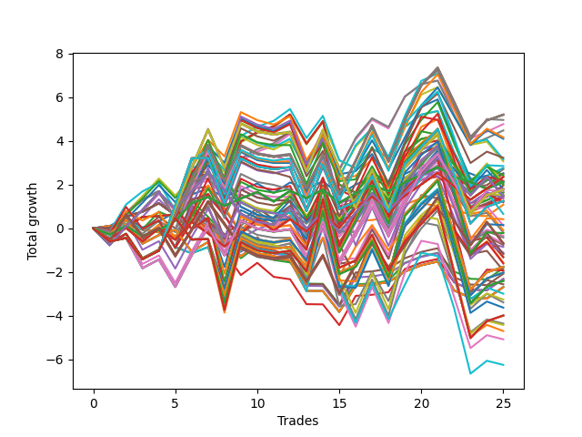

# Short HLT 104_1y 
- Symbol: TSLA
- Date Range: 05/15/2023 - 05/17/2024
- Trading Period: 8:30-12:30
- Number of Trades: 25



| Id. | Name | Win Percent | Profit | Avg Profit / Trade | Avg Time / Trade | Std |      | Name | Win Percent | Profit | Avg Profit / Trade | Avg Time / Trade | Std |
| --- | ---- | ----------- | ------ | ------------------ | ---------------- | --- | ---- | ---- | ----------- | ------ | ------------------ | ---------------- | --- |
| | Sorted By <br> Profit | | | | | | | Sorted By <br> Win Percentage |||||
|0| TP-1.5 180m | 60.00 | 5.20 | 0.21 | 57:28 | 1.29 |     | TP-1.25 30m | 72.00 | 4.77 | 0.19 | 24:55 | 0.92 |
|1| TP-1.5 165m | 60.00 | 5.20 | 0.21 | 57:28 | 1.29 |     | TP-1.5 30m | 72.00 | 4.48 | 0.18 | 25:31 | 0.96 |
|2| TP-1.5 150m | 60.00 | 5.20 | 0.21 | 57:28 | 1.29 |     | TP-2 30m | 68.00 | 2.76 | 0.11 | 28:16 | 1.01 |
|3| TP-1.5 135m | 60.00 | 5.20 | 0.21 | 57:28 | 1.29 |     | TP-1.75 30m | 68.00 | 2.75 | 0.11 | 28:09 | 0.97 |
|4| TP-1.5 120m | 60.00 | 5.20 | 0.21 | 57:28 | 1.29 |     | TP-2.75 30m | 68.00 | 1.64 | 0.07 | 28:36 | 1.08 |
|5| TP-1.5 105m | 56.00 | 4.96 | 0.20 | 55:00 | 1.30 |     | TP-2.5 30m | 68.00 | 1.64 | 0.07 | 28:36 | 1.08 |
|6| TP-1.25 30m | 72.00 | 4.77 | 0.19 | 24:55 | 0.92 |     | TP-2.25 30m | 68.00 | 1.64 | 0.07 | 28:36 | 1.08 |
|7| TP-1.5 30m | 72.00 | 4.48 | 0.18 | 25:31 | 0.96 |     | TP-1 30m | 68.00 | 1.49 | 0.06 | 22:14 | 0.83 |
|8| TP-1.5 60m | 52.00 | 4.16 | 0.17 | 41:00 | 1.27 |     | TP-3 30m | 68.00 | 1.41 | 0.06 | 28:40 | 1.11 |
|9| TP-1.25 60m | 52.00 | 4.10 | 0.16 | 38:55 | 1.13 |     | TP-0.25 15m | 64.00 | 2.52 | 0.10 | 04:16 | 0.39 |
|10| TP-1.5 90m | 52.00 | 3.23 | 0.13 | 50:36 | 1.25 |     | TP-0.75 30m | 64.00 | 1.50 | 0.06 | 20:16 | 0.68 |
|11| TP-1.5 45m | 60.00 | 3.16 | 0.13 | 35:09 | 1.14 |     | TP-1.5 180m | 60.00 | 5.20 | 0.21 | 57:28 | 1.29 |
|12| TP-1.25 45m | 60.00 | 3.07 | 0.12 | 33:57 | 1.05 |     | TP-1.5 165m | 60.00 | 5.20 | 0.21 | 57:28 | 1.29 |
|13| TP-2 105m | 56.00 | 2.85 | 0.11 | 71:16 | 1.48 |     | TP-1.5 150m | 60.00 | 5.20 | 0.21 | 57:28 | 1.29 |
|14| TP-2 30m | 68.00 | 2.76 | 0.11 | 28:16 | 1.01 |     | TP-1.5 135m | 60.00 | 5.20 | 0.21 | 57:28 | 1.29 |
|15| TP-1.75 30m | 68.00 | 2.75 | 0.11 | 28:09 | 0.97 |     | TP-1.5 120m | 60.00 | 5.20 | 0.21 | 57:28 | 1.29 |
|16| TP-0.5 60m | 56.00 | 2.70 | 0.11 | 16:09 | 0.58 |     | TP-1.5 45m | 60.00 | 3.16 | 0.13 | 35:09 | 1.14 |
|17| TP-0.25 15m | 64.00 | 2.52 | 0.10 | 04:16 | 0.39 |     | TP-1.25 45m | 60.00 | 3.07 | 0.12 | 33:57 | 1.05 |
|18| TP-0.5 45m | 60.00 | 2.50 | 0.10 | 15:09 | 0.58 |     | TP-0.5 45m | 60.00 | 2.50 | 0.10 | 15:09 | 0.58 |
|19| TP-1.75 60m | 52.00 | 2.43 | 0.10 | 47:07 | 1.33 |     | TP-0.25 180m | 60.00 | 2.13 | 0.09 | 04:31 | 0.39 |
|20| TP-0.5 180m | 56.00 | 2.35 | 0.09 | 16:24 | 0.59 |     | TP-0.25 165m | 60.00 | 2.13 | 0.09 | 04:31 | 0.39 |
|21| TP-0.5 165m | 56.00 | 2.35 | 0.09 | 16:24 | 0.59 |     | TP-0.25 150m | 60.00 | 2.13 | 0.09 | 04:31 | 0.39 |
|22| TP-0.5 150m | 56.00 | 2.35 | 0.09 | 16:24 | 0.59 |     | TP-0.25 135m | 60.00 | 2.13 | 0.09 | 04:31 | 0.39 |
|23| TP-0.5 135m | 56.00 | 2.35 | 0.09 | 16:24 | 0.59 |     | TP-0.25 120m | 60.00 | 2.13 | 0.09 | 04:31 | 0.39 |
|24| TP-0.5 120m | 56.00 | 2.35 | 0.09 | 16:24 | 0.59 |     | TP-0.25 105m | 60.00 | 2.13 | 0.09 | 04:31 | 0.39 |
|25| TP-0.5 105m | 56.00 | 2.35 | 0.09 | 16:24 | 0.59 |     | TP-0.25 90m | 60.00 | 2.13 | 0.09 | 04:31 | 0.39 |
|26| TP-0.5 90m | 56.00 | 2.35 | 0.09 | 16:24 | 0.59 |     | TP-0.25 75m | 60.00 | 2.13 | 0.09 | 04:31 | 0.39 |
|27| TP-0.5 75m | 56.00 | 2.35 | 0.09 | 16:24 | 0.59 |     | TP-0.25 60m | 60.00 | 2.13 | 0.09 | 04:31 | 0.39 |
|28| TP-1.5 75m | 48.00 | 2.18 | 0.09 | 45:48 | 1.26 |     | TP-0.25 45m | 60.00 | 2.13 | 0.09 | 04:31 | 0.39 |
|29| TP-0.25 180m | 60.00 | 2.13 | 0.09 | 04:31 | 0.39 |     | TP-0.25 30m | 60.00 | 2.13 | 0.09 | 04:31 | 0.39 |
|30| TP-0.25 165m | 60.00 | 2.13 | 0.09 | 04:31 | 0.39 |     | TP-1.75 45m | 60.00 | 1.51 | 0.06 | 39:19 | 1.17 |
|31| TP-0.25 150m | 60.00 | 2.13 | 0.09 | 04:31 | 0.39 |     | TP-2 180m | 60.00 | 1.25 | 0.05 | 75:26 | 1.44 |
|32| TP-0.25 135m | 60.00 | 2.13 | 0.09 | 04:31 | 0.39 |     | TP-2 165m | 60.00 | 1.25 | 0.05 | 75:26 | 1.44 |
|33| TP-0.25 120m | 60.00 | 2.13 | 0.09 | 04:31 | 0.39 |     | TP-2 150m | 60.00 | 1.25 | 0.05 | 75:26 | 1.44 |
|34| TP-0.25 105m | 60.00 | 2.13 | 0.09 | 04:31 | 0.39 |     | TP-2 135m | 60.00 | 1.25 | 0.05 | 75:26 | 1.44 |
|35| TP-0.25 90m | 60.00 | 2.13 | 0.09 | 04:31 | 0.39 |     | TP-2 120m | 60.00 | 1.25 | 0.05 | 75:26 | 1.44 |
|36| TP-0.25 75m | 60.00 | 2.13 | 0.09 | 04:31 | 0.39 |     | TP-2 45m | 60.00 | -0.09 | -0.00 | 41:09 | 1.24 |
|37| TP-0.25 60m | 60.00 | 2.13 | 0.09 | 04:31 | 0.39 |     | TP-2.75 45m | 60.00 | -1.16 | -0.05 | 42:33 | 1.31 |
|38| TP-0.25 45m | 60.00 | 2.13 | 0.09 | 04:31 | 0.39 |     | TP-2.5 45m | 60.00 | -1.32 | -0.05 | 42:07 | 1.30 |
|39| TP-0.25 30m | 60.00 | 2.13 | 0.09 | 04:31 | 0.39 |     | TP-2.25 45m | 60.00 | -1.32 | -0.05 | 42:07 | 1.30 |
|40| TP-0.75 60m | 52.00 | 2.10 | 0.08 | 28:12 | 0.80 |     | TP-3 45m | 60.00 | -1.93 | -0.08 | 42:45 | 1.29 |
|41| TP-1.25 75m | 48.00 | 2.05 | 0.08 | 43:07 | 1.12 |     | TP-1.5 105m | 56.00 | 4.96 | 0.20 | 55:00 | 1.30 |
|42| TP-0.75 90m | 52.00 | 1.99 | 0.08 | 29:24 | 0.80 |     | TP-2 105m | 56.00 | 2.85 | 0.11 | 71:16 | 1.48 |
|43| TP-0.5 30m | 56.00 | 1.96 | 0.08 | 13:14 | 0.56 |     | TP-0.5 60m | 56.00 | 2.70 | 0.11 | 16:09 | 0.58 |
|44| TP-1.25 180m | 56.00 | 1.80 | 0.07 | 52:55 | 1.16 |     | TP-0.5 180m | 56.00 | 2.35 | 0.09 | 16:24 | 0.59 |
|45| TP-1.25 165m | 56.00 | 1.80 | 0.07 | 52:55 | 1.16 |     | TP-0.5 165m | 56.00 | 2.35 | 0.09 | 16:24 | 0.59 |
|46| TP-1.25 150m | 56.00 | 1.80 | 0.07 | 52:55 | 1.16 |     | TP-0.5 150m | 56.00 | 2.35 | 0.09 | 16:24 | 0.59 |
|47| TP-1.25 135m | 56.00 | 1.80 | 0.07 | 52:55 | 1.16 |     | TP-0.5 135m | 56.00 | 2.35 | 0.09 | 16:24 | 0.59 |
|48| TP-1.25 120m | 56.00 | 1.80 | 0.07 | 52:55 | 1.16 |     | TP-0.5 120m | 56.00 | 2.35 | 0.09 | 16:24 | 0.59 |
|49| TP-0.75 75m | 52.00 | 1.80 | 0.07 | 28:48 | 0.81 |     | TP-0.5 105m | 56.00 | 2.35 | 0.09 | 16:24 | 0.59 |
|50| TP-1.75 180m | 56.00 | 1.77 | 0.07 | 65:36 | 1.42 |     | TP-0.5 90m | 56.00 | 2.35 | 0.09 | 16:24 | 0.59 |
|51| TP-1.75 165m | 56.00 | 1.77 | 0.07 | 65:36 | 1.42 |     | TP-0.5 75m | 56.00 | 2.35 | 0.09 | 16:24 | 0.59 |
|52| TP-1.75 150m | 56.00 | 1.77 | 0.07 | 65:36 | 1.42 |     | TP-0.5 30m | 56.00 | 1.96 | 0.08 | 13:14 | 0.56 |
|53| TP-1.75 135m | 56.00 | 1.77 | 0.07 | 65:36 | 1.42 |     | TP-1.25 180m | 56.00 | 1.80 | 0.07 | 52:55 | 1.16 |
|54| TP-1.75 120m | 56.00 | 1.77 | 0.07 | 65:36 | 1.42 |     | TP-1.25 165m | 56.00 | 1.80 | 0.07 | 52:55 | 1.16 |
|55| TP-1.25 105m | 52.00 | 1.71 | 0.07 | 50:28 | 1.16 |     | TP-1.25 150m | 56.00 | 1.80 | 0.07 | 52:55 | 1.16 |
|56| TP-2.75 30m | 68.00 | 1.64 | 0.07 | 28:36 | 1.08 |     | TP-1.25 135m | 56.00 | 1.80 | 0.07 | 52:55 | 1.16 |
|57| TP-2.5 30m | 68.00 | 1.64 | 0.07 | 28:36 | 1.08 |     | TP-1.25 120m | 56.00 | 1.80 | 0.07 | 52:55 | 1.16 |
|58| TP-2.25 30m | 68.00 | 1.64 | 0.07 | 28:36 | 1.08 |     | TP-1.75 180m | 56.00 | 1.77 | 0.07 | 65:36 | 1.42 |
|59| TP-1.75 105m | 52.00 | 1.53 | 0.06 | 63:07 | 1.43 |     | TP-1.75 165m | 56.00 | 1.77 | 0.07 | 65:36 | 1.42 |
|60| TP-1.75 45m | 60.00 | 1.51 | 0.06 | 39:19 | 1.17 |     | TP-1.75 150m | 56.00 | 1.77 | 0.07 | 65:36 | 1.42 |
|61| TP-0.75 30m | 64.00 | 1.50 | 0.06 | 20:16 | 0.68 |     | TP-1.75 135m | 56.00 | 1.77 | 0.07 | 65:36 | 1.42 |
|62| TP-1 30m | 68.00 | 1.49 | 0.06 | 22:14 | 0.83 |     | TP-1.75 120m | 56.00 | 1.77 | 0.07 | 65:36 | 1.42 |
|63| TP-0.75 180m | 52.00 | 1.48 | 0.06 | 29:36 | 0.82 |     | TP-0.5 15m | 56.00 | 1.08 | 0.04 | 09:36 | 0.51 |
|64| TP-0.75 165m | 52.00 | 1.48 | 0.06 | 29:36 | 0.82 |     | TP-0.75 45m | 56.00 | 0.13 | 0.01 | 26:07 | 0.75 |
|65| TP-0.75 150m | 52.00 | 1.48 | 0.06 | 29:36 | 0.82 |     | TP-1 45m | 56.00 | -0.19 | -0.01 | 29:43 | 0.94 |
|66| TP-0.75 135m | 52.00 | 1.48 | 0.06 | 29:36 | 0.82 |     | TP-2.5 180m | 56.00 | -1.76 | -0.07 | 83:52 | 1.56 |
|67| TP-0.75 120m | 52.00 | 1.48 | 0.06 | 29:36 | 0.82 |     | TP-2.5 165m | 56.00 | -1.76 | -0.07 | 83:52 | 1.56 |
|68| TP-0.75 105m | 52.00 | 1.48 | 0.06 | 29:36 | 0.82 |     | TP-2.5 150m | 56.00 | -1.76 | -0.07 | 83:52 | 1.56 |
|69| TP-3 30m | 68.00 | 1.41 | 0.06 | 28:40 | 1.11 |     | TP-2.5 135m | 56.00 | -1.76 | -0.07 | 83:52 | 1.56 |
|70| TP-1.25 90m | 48.00 | 1.38 | 0.06 | 47:14 | 1.15 |     | TP-2.5 120m | 56.00 | -1.76 | -0.07 | 83:52 | 1.56 |
|71| TP-2 180m | 60.00 | 1.25 | 0.05 | 75:26 | 1.44 |     | TP-2.25 180m | 56.00 | -2.03 | -0.08 | 82:43 | 1.47 |
|72| TP-2 165m | 60.00 | 1.25 | 0.05 | 75:26 | 1.44 |     | TP-2.25 165m | 56.00 | -2.03 | -0.08 | 82:43 | 1.47 |
|73| TP-2 150m | 60.00 | 1.25 | 0.05 | 75:26 | 1.44 |     | TP-2.25 150m | 56.00 | -2.03 | -0.08 | 82:43 | 1.47 |
|74| TP-2 135m | 60.00 | 1.25 | 0.05 | 75:26 | 1.44 |     | TP-2.25 135m | 56.00 | -2.03 | -0.08 | 82:43 | 1.47 |
|75| TP-2 120m | 60.00 | 1.25 | 0.05 | 75:26 | 1.44 |     | TP-2.25 120m | 56.00 | -2.03 | -0.08 | 82:43 | 1.47 |
|76| TP-2 60m | 52.00 | 1.20 | 0.05 | 50:21 | 1.41 |     | TP-2.75 180m | 56.00 | -2.40 | -0.10 | 85:02 | 1.64 |
|77| TP-0.5 15m | 56.00 | 1.08 | 0.04 | 09:36 | 0.51 |     | TP-2.75 165m | 56.00 | -2.40 | -0.10 | 85:02 | 1.64 |
|78| TP-1 60m | 48.00 | 0.66 | 0.03 | 33:28 | 1.01 |     | TP-2.75 150m | 56.00 | -2.40 | -0.10 | 85:02 | 1.64 |
|79| TP-2.5 105m | 52.00 | 0.42 | 0.02 | 79:09 | 1.63 |     | TP-2.75 135m | 56.00 | -2.40 | -0.10 | 85:02 | 1.64 |
|80| TP-2.25 105m | 52.00 | 0.15 | 0.01 | 78:00 | 1.54 |     | TP-2.75 120m | 56.00 | -2.40 | -0.10 | 85:02 | 1.64 |
|81| TP-0.75 45m | 56.00 | 0.13 | 0.01 | 26:07 | 0.75 |     | TP-3 180m | 56.00 | -3.99 | -0.16 | 89:45 | 1.70 |
|82| TP-2 45m | 60.00 | -0.09 | -0.00 | 41:09 | 1.24 |     | TP-3 165m | 56.00 | -3.99 | -0.16 | 89:45 | 1.70 |
|83| TP-1 45m | 56.00 | -0.19 | -0.01 | 29:43 | 0.94 |     | TP-3 150m | 56.00 | -3.99 | -0.16 | 89:45 | 1.70 |
|84| TP-2.75 105m | 52.00 | -0.22 | -0.01 | 80:19 | 1.71 |     | TP-3 135m | 56.00 | -3.99 | -0.16 | 89:45 | 1.70 |
|85| TP-1.75 90m | 48.00 | -0.34 | -0.01 | 58:38 | 1.37 |     | TP-3 120m | 56.00 | -3.99 | -0.16 | 89:45 | 1.70 |
|86| TP-2 90m | 48.00 | -0.42 | -0.02 | 65:00 | 1.41 |     | TP-1.5 60m | 52.00 | 4.16 | 0.17 | 41:00 | 1.27 |
|87| TP-1 180m | 48.00 | -0.69 | -0.03 | 41:38 | 1.05 |     | TP-1.25 60m | 52.00 | 4.10 | 0.16 | 38:55 | 1.13 |
|88| TP-1 165m | 48.00 | -0.69 | -0.03 | 41:38 | 1.05 |     | TP-1.5 90m | 52.00 | 3.23 | 0.13 | 50:36 | 1.25 |
|89| TP-1 150m | 48.00 | -0.69 | -0.03 | 41:38 | 1.05 |     | TP-1.75 60m | 52.00 | 2.43 | 0.10 | 47:07 | 1.33 |
|90| TP-1 135m | 48.00 | -0.69 | -0.03 | 41:38 | 1.05 |     | TP-0.75 60m | 52.00 | 2.10 | 0.08 | 28:12 | 0.80 |
|91| TP-1 120m | 48.00 | -0.69 | -0.03 | 41:38 | 1.05 |     | TP-0.75 90m | 52.00 | 1.99 | 0.08 | 29:24 | 0.80 |
|92| TP-2.75 60m | 48.00 | -0.69 | -0.03 | 54:24 | 1.51 |     | TP-0.75 75m | 52.00 | 1.80 | 0.07 | 28:48 | 0.81 |
|93| TP-2.5 60m | 48.00 | -0.76 | -0.03 | 53:52 | 1.49 |     | TP-1.25 105m | 52.00 | 1.71 | 0.07 | 50:28 | 1.16 |
|94| TP-1.75 75m | 44.00 | -0.85 | -0.03 | 53:14 | 1.39 |     | TP-1.75 105m | 52.00 | 1.53 | 0.06 | 63:07 | 1.43 |
|95| TP-2.25 60m | 48.00 | -1.11 | -0.04 | 53:21 | 1.44 |     | TP-0.75 180m | 52.00 | 1.48 | 0.06 | 29:36 | 0.82 |
|96| TP-2.75 45m | 60.00 | -1.16 | -0.05 | 42:33 | 1.31 |     | TP-0.75 165m | 52.00 | 1.48 | 0.06 | 29:36 | 0.82 |
|97| TP-1 105m | 48.00 | -1.18 | -0.05 | 41:09 | 1.04 |     | TP-0.75 150m | 52.00 | 1.48 | 0.06 | 29:36 | 0.82 |
|98| TP-2.5 45m | 60.00 | -1.32 | -0.05 | 42:07 | 1.30 |     | TP-0.75 135m | 52.00 | 1.48 | 0.06 | 29:36 | 0.82 |
|99| TP-2.25 45m | 60.00 | -1.32 | -0.05 | 42:07 | 1.30 |     | TP-0.75 120m | 52.00 | 1.48 | 0.06 | 29:36 | 0.82 |
|100| TP-1 75m | 44.00 | -1.57 | -0.06 | 36:28 | 1.00 |     | TP-0.75 105m | 52.00 | 1.48 | 0.06 | 29:36 | 0.82 |
|101| TP-1 90m | 44.00 | -1.61 | -0.06 | 39:21 | 1.02 |     | TP-2 60m | 52.00 | 1.20 | 0.05 | 50:21 | 1.41 |
|102| TP-2.5 180m | 56.00 | -1.76 | -0.07 | 83:52 | 1.56 |     | TP-2.5 105m | 52.00 | 0.42 | 0.02 | 79:09 | 1.63 |
|103| TP-2.5 165m | 56.00 | -1.76 | -0.07 | 83:52 | 1.56 |     | TP-2.25 105m | 52.00 | 0.15 | 0.01 | 78:00 | 1.54 |
|104| TP-2.5 150m | 56.00 | -1.76 | -0.07 | 83:52 | 1.56 |     | TP-2.75 105m | 52.00 | -0.22 | -0.01 | 80:19 | 1.71 |
|105| TP-2.5 135m | 56.00 | -1.76 | -0.07 | 83:52 | 1.56 |     | TP-3 105m | 52.00 | -1.93 | -0.08 | 84:26 | 1.76 |
|106| TP-2.5 120m | 56.00 | -1.76 | -0.07 | 83:52 | 1.56 |     | TP-1.5 75m | 48.00 | 2.18 | 0.09 | 45:48 | 1.26 |
|107| TP-0.75 15m | 48.00 | -1.82 | -0.07 | 11:55 | 0.60 |     | TP-1.25 75m | 48.00 | 2.05 | 0.08 | 43:07 | 1.12 |
|108| TP-3 45m | 60.00 | -1.93 | -0.08 | 42:45 | 1.29 |     | TP-1.25 90m | 48.00 | 1.38 | 0.06 | 47:14 | 1.15 |
|109| TP-3 105m | 52.00 | -1.93 | -0.08 | 84:26 | 1.76 |     | TP-1 60m | 48.00 | 0.66 | 0.03 | 33:28 | 1.01 |
|110| TP-2.25 180m | 56.00 | -2.03 | -0.08 | 82:43 | 1.47 |     | TP-1.75 90m | 48.00 | -0.34 | -0.01 | 58:38 | 1.37 |
|111| TP-2.25 165m | 56.00 | -2.03 | -0.08 | 82:43 | 1.47 |     | TP-2 90m | 48.00 | -0.42 | -0.02 | 65:00 | 1.41 |
|112| TP-2.25 150m | 56.00 | -2.03 | -0.08 | 82:43 | 1.47 |     | TP-1 180m | 48.00 | -0.69 | -0.03 | 41:38 | 1.05 |
|113| TP-2.25 135m | 56.00 | -2.03 | -0.08 | 82:43 | 1.47 |     | TP-1 165m | 48.00 | -0.69 | -0.03 | 41:38 | 1.05 |
|114| TP-2.25 120m | 56.00 | -2.03 | -0.08 | 82:43 | 1.47 |     | TP-1 150m | 48.00 | -0.69 | -0.03 | 41:38 | 1.05 |
|115| TP-1.5 15m | 44.00 | -2.08 | -0.08 | 13:50 | 0.70 |     | TP-1 135m | 48.00 | -0.69 | -0.03 | 41:38 | 1.05 |
|116| TP-1.25 15m | 44.00 | -2.31 | -0.09 | 13:28 | 0.67 |     | TP-1 120m | 48.00 | -0.69 | -0.03 | 41:38 | 1.05 |
|117| TP-1 15m | 44.00 | -2.32 | -0.09 | 12:48 | 0.68 |     | TP-2.75 60m | 48.00 | -0.69 | -0.03 | 54:24 | 1.51 |
|118| TP-2.75 180m | 56.00 | -2.40 | -0.10 | 85:02 | 1.64 |     | TP-2.5 60m | 48.00 | -0.76 | -0.03 | 53:52 | 1.49 |
|119| TP-2.75 165m | 56.00 | -2.40 | -0.10 | 85:02 | 1.64 |     | TP-2.25 60m | 48.00 | -1.11 | -0.04 | 53:21 | 1.44 |
|120| TP-2.75 150m | 56.00 | -2.40 | -0.10 | 85:02 | 1.64 |     | TP-1 105m | 48.00 | -1.18 | -0.05 | 41:09 | 1.04 |
|121| TP-2.75 135m | 56.00 | -2.40 | -0.10 | 85:02 | 1.64 |     | TP-0.75 15m | 48.00 | -1.82 | -0.07 | 11:55 | 0.60 |
|122| TP-2.75 120m | 56.00 | -2.40 | -0.10 | 85:02 | 1.64 |     | TP-3 60m | 48.00 | -3.39 | -0.14 | 55:24 | 1.38 |
|123| TP-2 75m | 44.00 | -2.56 | -0.10 | 57:48 | 1.47 |     | TP-1.75 75m | 44.00 | -0.85 | -0.03 | 53:14 | 1.39 |
|124| TP-3 15m | 44.00 | -2.69 | -0.11 | 14:00 | 0.64 |     | TP-1 75m | 44.00 | -1.57 | -0.06 | 36:28 | 1.00 |
|125| TP-2.75 15m | 44.00 | -2.69 | -0.11 | 14:00 | 0.64 |     | TP-1 90m | 44.00 | -1.61 | -0.06 | 39:21 | 1.02 |
|126| TP-2.5 15m | 44.00 | -2.69 | -0.11 | 14:00 | 0.64 |     | TP-1.5 15m | 44.00 | -2.08 | -0.08 | 13:50 | 0.70 |
|127| TP-2.25 15m | 44.00 | -2.69 | -0.11 | 14:00 | 0.64 |     | TP-1.25 15m | 44.00 | -2.31 | -0.09 | 13:28 | 0.67 |
|128| TP-2 15m | 44.00 | -2.69 | -0.11 | 14:00 | 0.64 |     | TP-1 15m | 44.00 | -2.32 | -0.09 | 12:48 | 0.68 |
|129| TP-1.75 15m | 44.00 | -2.69 | -0.11 | 14:00 | 0.64 |     | TP-2 75m | 44.00 | -2.56 | -0.10 | 57:48 | 1.47 |
|130| TP-2.5 90m | 44.00 | -2.99 | -0.12 | 72:26 | 1.56 |     | TP-3 15m | 44.00 | -2.69 | -0.11 | 14:00 | 0.64 |
|131| TP-2.25 90m | 44.00 | -3.26 | -0.13 | 71:16 | 1.46 |     | TP-2.75 15m | 44.00 | -2.69 | -0.11 | 14:00 | 0.64 |
|132| TP-3 60m | 48.00 | -3.39 | -0.14 | 55:24 | 1.38 |     | TP-2.5 15m | 44.00 | -2.69 | -0.11 | 14:00 | 0.64 |
|133| TP-2.75 90m | 44.00 | -3.63 | -0.15 | 73:36 | 1.64 |     | TP-2.25 15m | 44.00 | -2.69 | -0.11 | 14:00 | 0.64 |
|134| TP-3 180m | 56.00 | -3.99 | -0.16 | 89:45 | 1.70 |     | TP-2 15m | 44.00 | -2.69 | -0.11 | 14:00 | 0.64 |
|135| TP-3 165m | 56.00 | -3.99 | -0.16 | 89:45 | 1.70 |     | TP-1.75 15m | 44.00 | -2.69 | -0.11 | 14:00 | 0.64 |
|136| TP-3 150m | 56.00 | -3.99 | -0.16 | 89:45 | 1.70 |     | TP-2.5 90m | 44.00 | -2.99 | -0.12 | 72:26 | 1.56 |
|137| TP-3 135m | 56.00 | -3.99 | -0.16 | 89:45 | 1.70 |     | TP-2.25 90m | 44.00 | -3.26 | -0.13 | 71:16 | 1.46 |
|138| TP-3 120m | 56.00 | -3.99 | -0.16 | 89:45 | 1.70 |     | TP-2.75 90m | 44.00 | -3.63 | -0.15 | 73:36 | 1.64 |
|139| TP-2.5 75m | 40.00 | -4.36 | -0.17 | 63:57 | 1.58 |     | TP-3 90m | 44.00 | -4.70 | -0.19 | 77:07 | 1.71 |
|140| TP-2.75 75m | 40.00 | -4.42 | -0.18 | 64:57 | 1.62 |     | TP-2.5 75m | 40.00 | -4.36 | -0.17 | 63:57 | 1.58 |
|141| TP-3 90m | 44.00 | -4.70 | -0.19 | 77:07 | 1.71 |     | TP-2.75 75m | 40.00 | -4.42 | -0.18 | 64:57 | 1.62 |
|142| TP-2.25 75m | 40.00 | -5.08 | -0.20 | 63:04 | 1.51 |     | TP-2.25 75m | 40.00 | -5.08 | -0.20 | 63:04 | 1.51 |
|143| TP-3 75m | 40.00 | -6.25 | -0.25 | 67:24 | 1.57 |     | TP-3 75m | 40.00 | -6.25 | -0.25 | 67:24 | 1.57 |

### Test TP-0.25 15m
* Take Profit of 0.25 Point
* 0.25 Stoploss
* Results:
```
Total Trades: 25
Percent Up: 36.00
Percent Down: 64.00
Total Points Moved Down: 2.52
Potential Profit: 1260.00
Total Points Ups: 3.45 Count Ups: 9
Total Points Downs: 5.97 Count Downs: 16
```

<details><summary>Trades</summary>

<code>In: 2023-05-17 11:05:00		Out: 2023-05-17 11:19:00		Total Position Time: 14:00		Total Move Down: 0.11		Total to Date: 0.11</code> <br />
<code>In: 2023-05-19 10:45:00		Out: 2023-05-19 10:51:00		Total Position Time: 06:00		Total Move Down: 0.38		Total to Date: 0.49</code> <br />
<code>In: 2023-05-24 11:05:00		Out: 2023-05-24 11:07:00		Total Position Time: 02:00		Total Move Down: -0.45		Total to Date: 0.04</code> <br />
<code>In: 2023-05-30 12:10:00		Out: 2023-05-30 12:14:00		Total Position Time: 04:00		Total Move Down: 0.28		Total to Date: 0.32</code> <br />
<code>In: 2023-06-13 09:45:00		Out: 2023-06-13 09:47:00		Total Position Time: 02:00		Total Move Down: 0.42		Total to Date: 0.74</code> <br />
<code>In: 2023-06-27 11:30:00		Out: 2023-06-27 11:33:00		Total Position Time: 03:00		Total Move Down: 0.81		Total to Date: 1.55</code> <br />
<code>In: 2023-07-06 09:45:00		Out: 2023-07-06 09:48:00		Total Position Time: 03:00		Total Move Down: 0.27		Total to Date: 1.82</code> <br />
<code>In: 2023-07-18 10:25:00		Out: 2023-07-18 10:27:00		Total Position Time: 02:00		Total Move Down: -0.40		Total to Date: 1.42</code> <br />
<code>In: 2023-07-21 10:45:00		Out: 2023-07-21 10:47:00		Total Position Time: 02:00		Total Move Down: 0.34		Total to Date: 1.76</code> <br />
<code>In: 2023-08-03 12:10:00		Out: 2023-08-03 12:12:00		Total Position Time: 02:00		Total Move Down: 0.29		Total to Date: 2.05</code> <br />
<code>In: 2023-08-21 12:05:00		Out: 2023-08-21 12:14:00		Total Position Time: 09:00		Total Move Down: -0.43		Total to Date: 1.62</code> <br />
<code>In: 2023-08-23 11:15:00		Out: 2023-08-23 11:19:00		Total Position Time: 04:00		Total Move Down: 0.48		Total to Date: 2.10</code> <br />
<code>In: 2023-09-11 11:10:00		Out: 2023-09-11 11:14:00		Total Position Time: 04:00		Total Move Down: -0.32		Total to Date: 1.78</code> <br />
<code>In: 2023-09-15 10:05:00		Out: 2023-09-15 10:07:00		Total Position Time: 02:00		Total Move Down: 0.38		Total to Date: 2.16</code> <br />
<code>In: 2023-09-20 09:50:00		Out: 2023-09-20 10:00:00		Total Position Time: 10:00		Total Move Down: -0.61		Total to Date: 1.55</code> <br />
<code>In: 2023-10-23 08:45:00		Out: 2023-10-23 08:47:00		Total Position Time: 02:00		Total Move Down: 0.45		Total to Date: 2.00</code> <br />
<code>In: 2023-10-24 10:55:00		Out: 2023-10-24 10:58:00		Total Position Time: 03:00		Total Move Down: 0.35		Total to Date: 2.35</code> <br />
<code>In: 2023-11-07 11:45:00		Out: 2023-11-07 11:47:00		Total Position Time: 02:00		Total Move Down: -0.25		Total to Date: 2.10</code> <br />
<code>In: 2023-11-17 10:45:00		Out: 2023-11-17 10:51:00		Total Position Time: 06:00		Total Move Down: 0.39		Total to Date: 2.49</code> <br />
<code>In: 2024-01-05 11:20:00		Out: 2024-01-05 11:33:00		Total Position Time: 13:00		Total Move Down: 0.36		Total to Date: 2.85</code> <br />
<code>In: 2024-01-16 10:40:00		Out: 2024-01-16 10:42:00		Total Position Time: 02:00		Total Move Down: 0.34		Total to Date: 3.19</code> <br />
<code>In: 2024-02-22 08:55:00		Out: 2024-02-22 08:57:00		Total Position Time: 02:00		Total Move Down: -0.44		Total to Date: 2.75</code> <br />
<code>In: 2024-03-27 08:35:00		Out: 2024-03-27 08:37:00		Total Position Time: 02:00		Total Move Down: -0.24		Total to Date: 2.51</code> <br />
<code>In: 2024-03-28 10:05:00		Out: 2024-03-28 10:09:00		Total Position Time: 04:00		Total Move Down: -0.31		Total to Date: 2.20</code> <br />
<code>In: 2024-04-03 08:50:00		Out: 2024-04-03 08:52:00		Total Position Time: 02:00		Total Move Down: 0.32		Total to Date: 2.52</code> <br />


</details>

### Test TP-0.5 15m
* Take Profit of 0.5 Point
* 0.5 Stoploss
* Results:
```
Total Trades: 25
Percent Up: 44.00
Percent Down: 56.00
Total Points Moved Down: 1.08
Potential Profit: 540.00
Total Points Ups: 4.95 Count Ups: 11
Total Points Downs: 6.03 Count Downs: 14
```

<details><summary>Trades</summary>

<code>In: 2023-05-17 11:05:00		Out: 2023-05-17 11:19:00		Total Position Time: 14:00		Total Move Down: 0.11		Total to Date: 0.11</code> <br />
<code>In: 2023-05-19 10:45:00		Out: 2023-05-19 10:59:00		Total Position Time: 14:00		Total Move Down: 0.08		Total to Date: 0.19</code> <br />
<code>In: 2023-05-24 11:05:00		Out: 2023-05-24 11:14:00		Total Position Time: 09:00		Total Move Down: -0.62		Total to Date: -0.43</code> <br />
<code>In: 2023-05-30 12:10:00		Out: 2023-05-30 12:16:00		Total Position Time: 06:00		Total Move Down: 0.60		Total to Date: 0.17</code> <br />
<code>In: 2023-06-13 09:45:00		Out: 2023-06-13 09:51:00		Total Position Time: 06:00		Total Move Down: -0.52		Total to Date: -0.35</code> <br />
<code>In: 2023-06-27 11:30:00		Out: 2023-06-27 11:33:00		Total Position Time: 03:00		Total Move Down: 0.81		Total to Date: 0.46</code> <br />
<code>In: 2023-07-06 09:45:00		Out: 2023-07-06 09:58:00		Total Position Time: 13:00		Total Move Down: -0.52		Total to Date: -0.06</code> <br />
<code>In: 2023-07-18 10:25:00		Out: 2023-07-18 10:30:00		Total Position Time: 05:00		Total Move Down: -0.60		Total to Date: -0.66</code> <br />
<code>In: 2023-07-21 10:45:00		Out: 2023-07-21 10:48:00		Total Position Time: 03:00		Total Move Down: 0.59		Total to Date: -0.07</code> <br />
<code>In: 2023-08-03 12:10:00		Out: 2023-08-03 12:14:00		Total Position Time: 04:00		Total Move Down: 0.66		Total to Date: 0.59</code> <br />
<code>In: 2023-08-21 12:05:00		Out: 2023-08-21 12:15:00		Total Position Time: 10:00		Total Move Down: -0.52		Total to Date: 0.07</code> <br />
<code>In: 2023-08-23 11:15:00		Out: 2023-08-23 11:21:00		Total Position Time: 06:00		Total Move Down: 0.52		Total to Date: 0.59</code> <br />
<code>In: 2023-09-11 11:10:00		Out: 2023-09-11 11:18:00		Total Position Time: 08:00		Total Move Down: -0.56		Total to Date: 0.03</code> <br />
<code>In: 2023-09-15 10:05:00		Out: 2023-09-15 10:19:00		Total Position Time: 14:00		Total Move Down: -0.01		Total to Date: 0.02</code> <br />
<code>In: 2023-09-20 09:50:00		Out: 2023-09-20 10:00:00		Total Position Time: 10:00		Total Move Down: -0.61		Total to Date: -0.59</code> <br />
<code>In: 2023-10-23 08:45:00		Out: 2023-10-23 08:48:00		Total Position Time: 03:00		Total Move Down: 0.92		Total to Date: 0.33</code> <br />
<code>In: 2023-10-24 10:55:00		Out: 2023-10-24 11:09:00		Total Position Time: 14:00		Total Move Down: 0.05		Total to Date: 0.38</code> <br />
<code>In: 2023-11-07 11:45:00		Out: 2023-11-07 11:59:00		Total Position Time: 14:00		Total Move Down: 0.12		Total to Date: 0.50</code> <br />
<code>In: 2023-11-17 10:45:00		Out: 2023-11-17 10:52:00		Total Position Time: 07:00		Total Move Down: 0.59		Total to Date: 1.09</code> <br />
<code>In: 2024-01-05 11:20:00		Out: 2024-01-05 11:34:00		Total Position Time: 14:00		Total Move Down: 0.29		Total to Date: 1.38</code> <br />
<code>In: 2024-01-16 10:40:00		Out: 2024-01-16 10:54:00		Total Position Time: 14:00		Total Move Down: 0.17		Total to Date: 1.55</code> <br />
<code>In: 2024-02-22 08:55:00		Out: 2024-02-22 09:02:00		Total Position Time: 07:00		Total Move Down: -0.62		Total to Date: 0.93</code> <br />
<code>In: 2024-03-27 08:35:00		Out: 2024-03-27 08:49:00		Total Position Time: 14:00		Total Move Down: -0.34		Total to Date: 0.59</code> <br />
<code>In: 2024-03-28 10:05:00		Out: 2024-03-28 10:19:00		Total Position Time: 14:00		Total Move Down: -0.03		Total to Date: 0.56</code> <br />
<code>In: 2024-04-03 08:50:00		Out: 2024-04-03 09:04:00		Total Position Time: 14:00		Total Move Down: 0.52		Total to Date: 1.08</code> <br />


</details>

### Test TP-0.75 15m
* Take Profit of 0.75 Point
* 0.75 Stoploss
* Results:
```
Total Trades: 25
Percent Up: 52.00
Percent Down: 48.00
Total Points Moved Down: -1.82
Potential Profit: -910.00
Total Points Ups: 7.08 Count Ups: 13
Total Points Downs: 5.26 Count Downs: 12
```

<details><summary>Trades</summary>

<code>In: 2023-05-17 11:05:00		Out: 2023-05-17 11:19:00		Total Position Time: 14:00		Total Move Down: 0.11		Total to Date: 0.11</code> <br />
<code>In: 2023-05-19 10:45:00		Out: 2023-05-19 10:59:00		Total Position Time: 14:00		Total Move Down: 0.08		Total to Date: 0.19</code> <br />
<code>In: 2023-05-24 11:05:00		Out: 2023-05-24 11:19:00		Total Position Time: 14:00		Total Move Down: -0.24		Total to Date: -0.05</code> <br />
<code>In: 2023-05-30 12:10:00		Out: 2023-05-30 12:17:00		Total Position Time: 07:00		Total Move Down: 0.81		Total to Date: 0.76</code> <br />
<code>In: 2023-06-13 09:45:00		Out: 2023-06-13 09:59:00		Total Position Time: 14:00		Total Move Down: -0.31		Total to Date: 0.45</code> <br />
<code>In: 2023-06-27 11:30:00		Out: 2023-06-27 11:33:00		Total Position Time: 03:00		Total Move Down: 0.81		Total to Date: 1.26</code> <br />
<code>In: 2023-07-06 09:45:00		Out: 2023-07-06 09:59:00		Total Position Time: 14:00		Total Move Down: -0.73		Total to Date: 0.53</code> <br />
<code>In: 2023-07-18 10:25:00		Out: 2023-07-18 10:32:00		Total Position Time: 07:00		Total Move Down: -0.82		Total to Date: -0.29</code> <br />
<code>In: 2023-07-21 10:45:00		Out: 2023-07-21 10:55:00		Total Position Time: 10:00		Total Move Down: -1.08		Total to Date: -1.37</code> <br />
<code>In: 2023-08-03 12:10:00		Out: 2023-08-03 12:24:00		Total Position Time: 14:00		Total Move Down: 0.56		Total to Date: -0.81</code> <br />
<code>In: 2023-08-21 12:05:00		Out: 2023-08-21 12:19:00		Total Position Time: 14:00		Total Move Down: -0.64		Total to Date: -1.45</code> <br />
<code>In: 2023-08-23 11:15:00		Out: 2023-08-23 11:29:00		Total Position Time: 14:00		Total Move Down: -0.11		Total to Date: -1.56</code> <br />
<code>In: 2023-09-11 11:10:00		Out: 2023-09-11 11:19:00		Total Position Time: 09:00		Total Move Down: -0.97		Total to Date: -2.53</code> <br />
<code>In: 2023-09-15 10:05:00		Out: 2023-09-15 10:19:00		Total Position Time: 14:00		Total Move Down: -0.01		Total to Date: -2.54</code> <br />
<code>In: 2023-09-20 09:50:00		Out: 2023-09-20 10:04:00		Total Position Time: 14:00		Total Move Down: -0.95		Total to Date: -3.49</code> <br />
<code>In: 2023-10-23 08:45:00		Out: 2023-10-23 08:48:00		Total Position Time: 03:00		Total Move Down: 0.92		Total to Date: -2.57</code> <br />
<code>In: 2023-10-24 10:55:00		Out: 2023-10-24 11:09:00		Total Position Time: 14:00		Total Move Down: 0.05		Total to Date: -2.52</code> <br />
<code>In: 2023-11-07 11:45:00		Out: 2023-11-07 11:59:00		Total Position Time: 14:00		Total Move Down: 0.12		Total to Date: -2.40</code> <br />
<code>In: 2023-11-17 10:45:00		Out: 2023-11-17 10:54:00		Total Position Time: 09:00		Total Move Down: 0.82		Total to Date: -1.58</code> <br />
<code>In: 2024-01-05 11:20:00		Out: 2024-01-05 11:34:00		Total Position Time: 14:00		Total Move Down: 0.29		Total to Date: -1.29</code> <br />
<code>In: 2024-01-16 10:40:00		Out: 2024-01-16 10:54:00		Total Position Time: 14:00		Total Move Down: 0.17		Total to Date: -1.12</code> <br />
<code>In: 2024-02-22 08:55:00		Out: 2024-02-22 09:07:00		Total Position Time: 12:00		Total Move Down: -0.85		Total to Date: -1.97</code> <br />
<code>In: 2024-03-27 08:35:00		Out: 2024-03-27 08:49:00		Total Position Time: 14:00		Total Move Down: -0.34		Total to Date: -2.31</code> <br />
<code>In: 2024-03-28 10:05:00		Out: 2024-03-28 10:19:00		Total Position Time: 14:00		Total Move Down: -0.03		Total to Date: -2.34</code> <br />
<code>In: 2024-04-03 08:50:00		Out: 2024-04-03 09:04:00		Total Position Time: 14:00		Total Move Down: 0.52		Total to Date: -1.82</code> <br />


</details>

### Test TP-1 15m
* Take Profit of 1 Point
* 1 Stoploss
* Results:
```
Total Trades: 25
Percent Up: 56.00
Percent Down: 44.00
Total Points Moved Down: -2.32
Potential Profit: -1160.00
Total Points Ups: 7.80 Count Ups: 14
Total Points Downs: 5.48 Count Downs: 11
```

<details><summary>Trades</summary>

<code>In: 2023-05-17 11:05:00		Out: 2023-05-17 11:19:00		Total Position Time: 14:00		Total Move Down: 0.11		Total to Date: 0.11</code> <br />
<code>In: 2023-05-19 10:45:00		Out: 2023-05-19 10:59:00		Total Position Time: 14:00		Total Move Down: 0.08		Total to Date: 0.19</code> <br />
<code>In: 2023-05-24 11:05:00		Out: 2023-05-24 11:19:00		Total Position Time: 14:00		Total Move Down: -0.24		Total to Date: -0.05</code> <br />
<code>In: 2023-05-30 12:10:00		Out: 2023-05-30 12:24:00		Total Position Time: 14:00		Total Move Down: -0.13		Total to Date: -0.18</code> <br />
<code>In: 2023-06-13 09:45:00		Out: 2023-06-13 09:59:00		Total Position Time: 14:00		Total Move Down: -0.31		Total to Date: -0.49</code> <br />
<code>In: 2023-06-27 11:30:00		Out: 2023-06-27 11:40:00		Total Position Time: 10:00		Total Move Down: 1.18		Total to Date: 0.69</code> <br />
<code>In: 2023-07-06 09:45:00		Out: 2023-07-06 09:59:00		Total Position Time: 14:00		Total Move Down: -0.73		Total to Date: -0.04</code> <br />
<code>In: 2023-07-18 10:25:00		Out: 2023-07-18 10:33:00		Total Position Time: 08:00		Total Move Down: -1.02		Total to Date: -1.06</code> <br />
<code>In: 2023-07-21 10:45:00		Out: 2023-07-21 10:55:00		Total Position Time: 10:00		Total Move Down: -1.08		Total to Date: -2.14</code> <br />
<code>In: 2023-08-03 12:10:00		Out: 2023-08-03 12:24:00		Total Position Time: 14:00		Total Move Down: 0.56		Total to Date: -1.58</code> <br />
<code>In: 2023-08-21 12:05:00		Out: 2023-08-21 12:19:00		Total Position Time: 14:00		Total Move Down: -0.64		Total to Date: -2.22</code> <br />
<code>In: 2023-08-23 11:15:00		Out: 2023-08-23 11:29:00		Total Position Time: 14:00		Total Move Down: -0.11		Total to Date: -2.33</code> <br />
<code>In: 2023-09-11 11:10:00		Out: 2023-09-11 11:21:00		Total Position Time: 11:00		Total Move Down: -1.14		Total to Date: -3.47</code> <br />
<code>In: 2023-09-15 10:05:00		Out: 2023-09-15 10:19:00		Total Position Time: 14:00		Total Move Down: -0.01		Total to Date: -3.48</code> <br />
<code>In: 2023-09-20 09:50:00		Out: 2023-09-20 10:04:00		Total Position Time: 14:00		Total Move Down: -0.95		Total to Date: -4.43</code> <br />
<code>In: 2023-10-23 08:45:00		Out: 2023-10-23 08:50:00		Total Position Time: 05:00		Total Move Down: 1.34		Total to Date: -3.09</code> <br />
<code>In: 2023-10-24 10:55:00		Out: 2023-10-24 11:09:00		Total Position Time: 14:00		Total Move Down: 0.05		Total to Date: -3.04</code> <br />
<code>In: 2023-11-07 11:45:00		Out: 2023-11-07 11:59:00		Total Position Time: 14:00		Total Move Down: 0.12		Total to Date: -2.92</code> <br />
<code>In: 2023-11-17 10:45:00		Out: 2023-11-17 10:56:00		Total Position Time: 11:00		Total Move Down: 1.06		Total to Date: -1.86</code> <br />
<code>In: 2024-01-05 11:20:00		Out: 2024-01-05 11:34:00		Total Position Time: 14:00		Total Move Down: 0.29		Total to Date: -1.57</code> <br />
<code>In: 2024-01-16 10:40:00		Out: 2024-01-16 10:54:00		Total Position Time: 14:00		Total Move Down: 0.17		Total to Date: -1.40</code> <br />
<code>In: 2024-02-22 08:55:00		Out: 2024-02-22 09:08:00		Total Position Time: 13:00		Total Move Down: -1.07		Total to Date: -2.47</code> <br />
<code>In: 2024-03-27 08:35:00		Out: 2024-03-27 08:49:00		Total Position Time: 14:00		Total Move Down: -0.34		Total to Date: -2.81</code> <br />
<code>In: 2024-03-28 10:05:00		Out: 2024-03-28 10:19:00		Total Position Time: 14:00		Total Move Down: -0.03		Total to Date: -2.84</code> <br />
<code>In: 2024-04-03 08:50:00		Out: 2024-04-03 09:04:00		Total Position Time: 14:00		Total Move Down: 0.52		Total to Date: -2.32</code> <br />


</details>

### Test TP-1.25 15m
* Take Profit of 1.25 Point
* 1.25 Stoploss
* Results:
```
Total Trades: 25
Percent Up: 56.00
Percent Down: 44.00
Total Points Moved Down: -2.31
Potential Profit: -1155.00
Total Points Ups: 7.47 Count Ups: 14
Total Points Downs: 5.16 Count Downs: 11
```

<details><summary>Trades</summary>

<code>In: 2023-05-17 11:05:00		Out: 2023-05-17 11:19:00		Total Position Time: 14:00		Total Move Down: 0.11		Total to Date: 0.11</code> <br />
<code>In: 2023-05-19 10:45:00		Out: 2023-05-19 10:59:00		Total Position Time: 14:00		Total Move Down: 0.08		Total to Date: 0.19</code> <br />
<code>In: 2023-05-24 11:05:00		Out: 2023-05-24 11:19:00		Total Position Time: 14:00		Total Move Down: -0.24		Total to Date: -0.05</code> <br />
<code>In: 2023-05-30 12:10:00		Out: 2023-05-30 12:24:00		Total Position Time: 14:00		Total Move Down: -0.13		Total to Date: -0.18</code> <br />
<code>In: 2023-06-13 09:45:00		Out: 2023-06-13 09:59:00		Total Position Time: 14:00		Total Move Down: -0.31		Total to Date: -0.49</code> <br />
<code>In: 2023-06-27 11:30:00		Out: 2023-06-27 11:42:00		Total Position Time: 12:00		Total Move Down: 1.44		Total to Date: 0.95</code> <br />
<code>In: 2023-07-06 09:45:00		Out: 2023-07-06 09:59:00		Total Position Time: 14:00		Total Move Down: -0.73		Total to Date: 0.22</code> <br />
<code>In: 2023-07-18 10:25:00		Out: 2023-07-18 10:39:00		Total Position Time: 14:00		Total Move Down: -0.60		Total to Date: -0.38</code> <br />
<code>In: 2023-07-21 10:45:00		Out: 2023-07-21 10:59:00		Total Position Time: 14:00		Total Move Down: -0.70		Total to Date: -1.08</code> <br />
<code>In: 2023-08-03 12:10:00		Out: 2023-08-03 12:24:00		Total Position Time: 14:00		Total Move Down: 0.56		Total to Date: -0.52</code> <br />
<code>In: 2023-08-21 12:05:00		Out: 2023-08-21 12:19:00		Total Position Time: 14:00		Total Move Down: -0.64		Total to Date: -1.16</code> <br />
<code>In: 2023-08-23 11:15:00		Out: 2023-08-23 11:29:00		Total Position Time: 14:00		Total Move Down: -0.11		Total to Date: -1.27</code> <br />
<code>In: 2023-09-11 11:10:00		Out: 2023-09-11 11:22:00		Total Position Time: 12:00		Total Move Down: -1.36		Total to Date: -2.63</code> <br />
<code>In: 2023-09-15 10:05:00		Out: 2023-09-15 10:19:00		Total Position Time: 14:00		Total Move Down: -0.01		Total to Date: -2.64</code> <br />
<code>In: 2023-09-20 09:50:00		Out: 2023-09-20 10:04:00		Total Position Time: 14:00		Total Move Down: -0.95		Total to Date: -3.59</code> <br />
<code>In: 2023-10-23 08:45:00		Out: 2023-10-23 08:50:00		Total Position Time: 05:00		Total Move Down: 1.34		Total to Date: -2.25</code> <br />
<code>In: 2023-10-24 10:55:00		Out: 2023-10-24 11:09:00		Total Position Time: 14:00		Total Move Down: 0.05		Total to Date: -2.20</code> <br />
<code>In: 2023-11-07 11:45:00		Out: 2023-11-07 11:59:00		Total Position Time: 14:00		Total Move Down: 0.12		Total to Date: -2.08</code> <br />
<code>In: 2023-11-17 10:45:00		Out: 2023-11-17 10:59:00		Total Position Time: 14:00		Total Move Down: 0.48		Total to Date: -1.60</code> <br />
<code>In: 2024-01-05 11:20:00		Out: 2024-01-05 11:34:00		Total Position Time: 14:00		Total Move Down: 0.29		Total to Date: -1.31</code> <br />
<code>In: 2024-01-16 10:40:00		Out: 2024-01-16 10:54:00		Total Position Time: 14:00		Total Move Down: 0.17		Total to Date: -1.14</code> <br />
<code>In: 2024-02-22 08:55:00		Out: 2024-02-22 09:09:00		Total Position Time: 14:00		Total Move Down: -1.32		Total to Date: -2.46</code> <br />
<code>In: 2024-03-27 08:35:00		Out: 2024-03-27 08:49:00		Total Position Time: 14:00		Total Move Down: -0.34		Total to Date: -2.80</code> <br />
<code>In: 2024-03-28 10:05:00		Out: 2024-03-28 10:19:00		Total Position Time: 14:00		Total Move Down: -0.03		Total to Date: -2.83</code> <br />
<code>In: 2024-04-03 08:50:00		Out: 2024-04-03 09:04:00		Total Position Time: 14:00		Total Move Down: 0.52		Total to Date: -2.31</code> <br />


</details>

### Test TP-1.5 15m
* Take Profit of 1.5 Point
* 1.5 Stoploss
* Results:
```
Total Trades: 25
Percent Up: 56.00
Percent Down: 44.00
Total Points Moved Down: -2.08
Potential Profit: -1040.00
Total Points Ups: 7.50 Count Ups: 14
Total Points Downs: 5.42 Count Downs: 11
```

<details><summary>Trades</summary>

<code>In: 2023-05-17 11:05:00		Out: 2023-05-17 11:19:00		Total Position Time: 14:00		Total Move Down: 0.11		Total to Date: 0.11</code> <br />
<code>In: 2023-05-19 10:45:00		Out: 2023-05-19 10:59:00		Total Position Time: 14:00		Total Move Down: 0.08		Total to Date: 0.19</code> <br />
<code>In: 2023-05-24 11:05:00		Out: 2023-05-24 11:19:00		Total Position Time: 14:00		Total Move Down: -0.24		Total to Date: -0.05</code> <br />
<code>In: 2023-05-30 12:10:00		Out: 2023-05-30 12:24:00		Total Position Time: 14:00		Total Move Down: -0.13		Total to Date: -0.18</code> <br />
<code>In: 2023-06-13 09:45:00		Out: 2023-06-13 09:59:00		Total Position Time: 14:00		Total Move Down: -0.31		Total to Date: -0.49</code> <br />
<code>In: 2023-06-27 11:30:00		Out: 2023-06-27 11:43:00		Total Position Time: 13:00		Total Move Down: 1.55		Total to Date: 1.06</code> <br />
<code>In: 2023-07-06 09:45:00		Out: 2023-07-06 09:59:00		Total Position Time: 14:00		Total Move Down: -0.73		Total to Date: 0.33</code> <br />
<code>In: 2023-07-18 10:25:00		Out: 2023-07-18 10:39:00		Total Position Time: 14:00		Total Move Down: -0.60		Total to Date: -0.27</code> <br />
<code>In: 2023-07-21 10:45:00		Out: 2023-07-21 10:59:00		Total Position Time: 14:00		Total Move Down: -0.70		Total to Date: -0.97</code> <br />
<code>In: 2023-08-03 12:10:00		Out: 2023-08-03 12:24:00		Total Position Time: 14:00		Total Move Down: 0.56		Total to Date: -0.41</code> <br />
<code>In: 2023-08-21 12:05:00		Out: 2023-08-21 12:19:00		Total Position Time: 14:00		Total Move Down: -0.64		Total to Date: -1.05</code> <br />
<code>In: 2023-08-23 11:15:00		Out: 2023-08-23 11:29:00		Total Position Time: 14:00		Total Move Down: -0.11		Total to Date: -1.16</code> <br />
<code>In: 2023-09-11 11:10:00		Out: 2023-09-11 11:24:00		Total Position Time: 14:00		Total Move Down: -1.39		Total to Date: -2.55</code> <br />
<code>In: 2023-09-15 10:05:00		Out: 2023-09-15 10:19:00		Total Position Time: 14:00		Total Move Down: -0.01		Total to Date: -2.56</code> <br />
<code>In: 2023-09-20 09:50:00		Out: 2023-09-20 10:04:00		Total Position Time: 14:00		Total Move Down: -0.95		Total to Date: -3.51</code> <br />
<code>In: 2023-10-23 08:45:00		Out: 2023-10-23 08:56:00		Total Position Time: 11:00		Total Move Down: 1.49		Total to Date: -2.02</code> <br />
<code>In: 2023-10-24 10:55:00		Out: 2023-10-24 11:09:00		Total Position Time: 14:00		Total Move Down: 0.05		Total to Date: -1.97</code> <br />
<code>In: 2023-11-07 11:45:00		Out: 2023-11-07 11:59:00		Total Position Time: 14:00		Total Move Down: 0.12		Total to Date: -1.85</code> <br />
<code>In: 2023-11-17 10:45:00		Out: 2023-11-17 10:59:00		Total Position Time: 14:00		Total Move Down: 0.48		Total to Date: -1.37</code> <br />
<code>In: 2024-01-05 11:20:00		Out: 2024-01-05 11:34:00		Total Position Time: 14:00		Total Move Down: 0.29		Total to Date: -1.08</code> <br />
<code>In: 2024-01-16 10:40:00		Out: 2024-01-16 10:54:00		Total Position Time: 14:00		Total Move Down: 0.17		Total to Date: -0.91</code> <br />
<code>In: 2024-02-22 08:55:00		Out: 2024-02-22 09:09:00		Total Position Time: 14:00		Total Move Down: -1.32		Total to Date: -2.23</code> <br />
<code>In: 2024-03-27 08:35:00		Out: 2024-03-27 08:49:00		Total Position Time: 14:00		Total Move Down: -0.34		Total to Date: -2.57</code> <br />
<code>In: 2024-03-28 10:05:00		Out: 2024-03-28 10:19:00		Total Position Time: 14:00		Total Move Down: -0.03		Total to Date: -2.60</code> <br />
<code>In: 2024-04-03 08:50:00		Out: 2024-04-03 09:04:00		Total Position Time: 14:00		Total Move Down: 0.52		Total to Date: -2.08</code> <br />


</details>

### Test TP-1.75 15m
* Take Profit of 1.75 Point
* 1.75 Stoploss
* Results:
```
Total Trades: 25
Percent Up: 56.00
Percent Down: 44.00
Total Points Moved Down: -2.69
Potential Profit: -1345.00
Total Points Ups: 7.50 Count Ups: 14
Total Points Downs: 4.81 Count Downs: 11
```

<details><summary>Trades</summary>

<code>In: 2023-05-17 11:05:00		Out: 2023-05-17 11:19:00		Total Position Time: 14:00		Total Move Down: 0.11		Total to Date: 0.11</code> <br />
<code>In: 2023-05-19 10:45:00		Out: 2023-05-19 10:59:00		Total Position Time: 14:00		Total Move Down: 0.08		Total to Date: 0.19</code> <br />
<code>In: 2023-05-24 11:05:00		Out: 2023-05-24 11:19:00		Total Position Time: 14:00		Total Move Down: -0.24		Total to Date: -0.05</code> <br />
<code>In: 2023-05-30 12:10:00		Out: 2023-05-30 12:24:00		Total Position Time: 14:00		Total Move Down: -0.13		Total to Date: -0.18</code> <br />
<code>In: 2023-06-13 09:45:00		Out: 2023-06-13 09:59:00		Total Position Time: 14:00		Total Move Down: -0.31		Total to Date: -0.49</code> <br />
<code>In: 2023-06-27 11:30:00		Out: 2023-06-27 11:44:00		Total Position Time: 14:00		Total Move Down: 1.24		Total to Date: 0.75</code> <br />
<code>In: 2023-07-06 09:45:00		Out: 2023-07-06 09:59:00		Total Position Time: 14:00		Total Move Down: -0.73		Total to Date: 0.02</code> <br />
<code>In: 2023-07-18 10:25:00		Out: 2023-07-18 10:39:00		Total Position Time: 14:00		Total Move Down: -0.60		Total to Date: -0.58</code> <br />
<code>In: 2023-07-21 10:45:00		Out: 2023-07-21 10:59:00		Total Position Time: 14:00		Total Move Down: -0.70		Total to Date: -1.28</code> <br />
<code>In: 2023-08-03 12:10:00		Out: 2023-08-03 12:24:00		Total Position Time: 14:00		Total Move Down: 0.56		Total to Date: -0.72</code> <br />
<code>In: 2023-08-21 12:05:00		Out: 2023-08-21 12:19:00		Total Position Time: 14:00		Total Move Down: -0.64		Total to Date: -1.36</code> <br />
<code>In: 2023-08-23 11:15:00		Out: 2023-08-23 11:29:00		Total Position Time: 14:00		Total Move Down: -0.11		Total to Date: -1.47</code> <br />
<code>In: 2023-09-11 11:10:00		Out: 2023-09-11 11:24:00		Total Position Time: 14:00		Total Move Down: -1.39		Total to Date: -2.86</code> <br />
<code>In: 2023-09-15 10:05:00		Out: 2023-09-15 10:19:00		Total Position Time: 14:00		Total Move Down: -0.01		Total to Date: -2.87</code> <br />
<code>In: 2023-09-20 09:50:00		Out: 2023-09-20 10:04:00		Total Position Time: 14:00		Total Move Down: -0.95		Total to Date: -3.82</code> <br />
<code>In: 2023-10-23 08:45:00		Out: 2023-10-23 08:59:00		Total Position Time: 14:00		Total Move Down: 1.19		Total to Date: -2.63</code> <br />
<code>In: 2023-10-24 10:55:00		Out: 2023-10-24 11:09:00		Total Position Time: 14:00		Total Move Down: 0.05		Total to Date: -2.58</code> <br />
<code>In: 2023-11-07 11:45:00		Out: 2023-11-07 11:59:00		Total Position Time: 14:00		Total Move Down: 0.12		Total to Date: -2.46</code> <br />
<code>In: 2023-11-17 10:45:00		Out: 2023-11-17 10:59:00		Total Position Time: 14:00		Total Move Down: 0.48		Total to Date: -1.98</code> <br />
<code>In: 2024-01-05 11:20:00		Out: 2024-01-05 11:34:00		Total Position Time: 14:00		Total Move Down: 0.29		Total to Date: -1.69</code> <br />
<code>In: 2024-01-16 10:40:00		Out: 2024-01-16 10:54:00		Total Position Time: 14:00		Total Move Down: 0.17		Total to Date: -1.52</code> <br />
<code>In: 2024-02-22 08:55:00		Out: 2024-02-22 09:09:00		Total Position Time: 14:00		Total Move Down: -1.32		Total to Date: -2.84</code> <br />
<code>In: 2024-03-27 08:35:00		Out: 2024-03-27 08:49:00		Total Position Time: 14:00		Total Move Down: -0.34		Total to Date: -3.18</code> <br />
<code>In: 2024-03-28 10:05:00		Out: 2024-03-28 10:19:00		Total Position Time: 14:00		Total Move Down: -0.03		Total to Date: -3.21</code> <br />
<code>In: 2024-04-03 08:50:00		Out: 2024-04-03 09:04:00		Total Position Time: 14:00		Total Move Down: 0.52		Total to Date: -2.69</code> <br />


</details>

### Test TP-2 15m
* Take Profit of 2 Point
* 2 Stoploss
* Results:
```
Total Trades: 25
Percent Up: 56.00
Percent Down: 44.00
Total Points Moved Down: -2.69
Potential Profit: -1345.00
Total Points Ups: 7.50 Count Ups: 14
Total Points Downs: 4.81 Count Downs: 11
```

<details><summary>Trades</summary>

<code>In: 2023-05-17 11:05:00		Out: 2023-05-17 11:19:00		Total Position Time: 14:00		Total Move Down: 0.11		Total to Date: 0.11</code> <br />
<code>In: 2023-05-19 10:45:00		Out: 2023-05-19 10:59:00		Total Position Time: 14:00		Total Move Down: 0.08		Total to Date: 0.19</code> <br />
<code>In: 2023-05-24 11:05:00		Out: 2023-05-24 11:19:00		Total Position Time: 14:00		Total Move Down: -0.24		Total to Date: -0.05</code> <br />
<code>In: 2023-05-30 12:10:00		Out: 2023-05-30 12:24:00		Total Position Time: 14:00		Total Move Down: -0.13		Total to Date: -0.18</code> <br />
<code>In: 2023-06-13 09:45:00		Out: 2023-06-13 09:59:00		Total Position Time: 14:00		Total Move Down: -0.31		Total to Date: -0.49</code> <br />
<code>In: 2023-06-27 11:30:00		Out: 2023-06-27 11:44:00		Total Position Time: 14:00		Total Move Down: 1.24		Total to Date: 0.75</code> <br />
<code>In: 2023-07-06 09:45:00		Out: 2023-07-06 09:59:00		Total Position Time: 14:00		Total Move Down: -0.73		Total to Date: 0.02</code> <br />
<code>In: 2023-07-18 10:25:00		Out: 2023-07-18 10:39:00		Total Position Time: 14:00		Total Move Down: -0.60		Total to Date: -0.58</code> <br />
<code>In: 2023-07-21 10:45:00		Out: 2023-07-21 10:59:00		Total Position Time: 14:00		Total Move Down: -0.70		Total to Date: -1.28</code> <br />
<code>In: 2023-08-03 12:10:00		Out: 2023-08-03 12:24:00		Total Position Time: 14:00		Total Move Down: 0.56		Total to Date: -0.72</code> <br />
<code>In: 2023-08-21 12:05:00		Out: 2023-08-21 12:19:00		Total Position Time: 14:00		Total Move Down: -0.64		Total to Date: -1.36</code> <br />
<code>In: 2023-08-23 11:15:00		Out: 2023-08-23 11:29:00		Total Position Time: 14:00		Total Move Down: -0.11		Total to Date: -1.47</code> <br />
<code>In: 2023-09-11 11:10:00		Out: 2023-09-11 11:24:00		Total Position Time: 14:00		Total Move Down: -1.39		Total to Date: -2.86</code> <br />
<code>In: 2023-09-15 10:05:00		Out: 2023-09-15 10:19:00		Total Position Time: 14:00		Total Move Down: -0.01		Total to Date: -2.87</code> <br />
<code>In: 2023-09-20 09:50:00		Out: 2023-09-20 10:04:00		Total Position Time: 14:00		Total Move Down: -0.95		Total to Date: -3.82</code> <br />
<code>In: 2023-10-23 08:45:00		Out: 2023-10-23 08:59:00		Total Position Time: 14:00		Total Move Down: 1.19		Total to Date: -2.63</code> <br />
<code>In: 2023-10-24 10:55:00		Out: 2023-10-24 11:09:00		Total Position Time: 14:00		Total Move Down: 0.05		Total to Date: -2.58</code> <br />
<code>In: 2023-11-07 11:45:00		Out: 2023-11-07 11:59:00		Total Position Time: 14:00		Total Move Down: 0.12		Total to Date: -2.46</code> <br />
<code>In: 2023-11-17 10:45:00		Out: 2023-11-17 10:59:00		Total Position Time: 14:00		Total Move Down: 0.48		Total to Date: -1.98</code> <br />
<code>In: 2024-01-05 11:20:00		Out: 2024-01-05 11:34:00		Total Position Time: 14:00		Total Move Down: 0.29		Total to Date: -1.69</code> <br />
<code>In: 2024-01-16 10:40:00		Out: 2024-01-16 10:54:00		Total Position Time: 14:00		Total Move Down: 0.17		Total to Date: -1.52</code> <br />
<code>In: 2024-02-22 08:55:00		Out: 2024-02-22 09:09:00		Total Position Time: 14:00		Total Move Down: -1.32		Total to Date: -2.84</code> <br />
<code>In: 2024-03-27 08:35:00		Out: 2024-03-27 08:49:00		Total Position Time: 14:00		Total Move Down: -0.34		Total to Date: -3.18</code> <br />
<code>In: 2024-03-28 10:05:00		Out: 2024-03-28 10:19:00		Total Position Time: 14:00		Total Move Down: -0.03		Total to Date: -3.21</code> <br />
<code>In: 2024-04-03 08:50:00		Out: 2024-04-03 09:04:00		Total Position Time: 14:00		Total Move Down: 0.52		Total to Date: -2.69</code> <br />


</details>

### Test TP-2.25 15m
* Take Profit of 2.25 Point
* 2.25 Stoploss
* Results:
```
Total Trades: 25
Percent Up: 56.00
Percent Down: 44.00
Total Points Moved Down: -2.69
Potential Profit: -1345.00
Total Points Ups: 7.50 Count Ups: 14
Total Points Downs: 4.81 Count Downs: 11
```

<details><summary>Trades</summary>

<code>In: 2023-05-17 11:05:00		Out: 2023-05-17 11:19:00		Total Position Time: 14:00		Total Move Down: 0.11		Total to Date: 0.11</code> <br />
<code>In: 2023-05-19 10:45:00		Out: 2023-05-19 10:59:00		Total Position Time: 14:00		Total Move Down: 0.08		Total to Date: 0.19</code> <br />
<code>In: 2023-05-24 11:05:00		Out: 2023-05-24 11:19:00		Total Position Time: 14:00		Total Move Down: -0.24		Total to Date: -0.05</code> <br />
<code>In: 2023-05-30 12:10:00		Out: 2023-05-30 12:24:00		Total Position Time: 14:00		Total Move Down: -0.13		Total to Date: -0.18</code> <br />
<code>In: 2023-06-13 09:45:00		Out: 2023-06-13 09:59:00		Total Position Time: 14:00		Total Move Down: -0.31		Total to Date: -0.49</code> <br />
<code>In: 2023-06-27 11:30:00		Out: 2023-06-27 11:44:00		Total Position Time: 14:00		Total Move Down: 1.24		Total to Date: 0.75</code> <br />
<code>In: 2023-07-06 09:45:00		Out: 2023-07-06 09:59:00		Total Position Time: 14:00		Total Move Down: -0.73		Total to Date: 0.02</code> <br />
<code>In: 2023-07-18 10:25:00		Out: 2023-07-18 10:39:00		Total Position Time: 14:00		Total Move Down: -0.60		Total to Date: -0.58</code> <br />
<code>In: 2023-07-21 10:45:00		Out: 2023-07-21 10:59:00		Total Position Time: 14:00		Total Move Down: -0.70		Total to Date: -1.28</code> <br />
<code>In: 2023-08-03 12:10:00		Out: 2023-08-03 12:24:00		Total Position Time: 14:00		Total Move Down: 0.56		Total to Date: -0.72</code> <br />
<code>In: 2023-08-21 12:05:00		Out: 2023-08-21 12:19:00		Total Position Time: 14:00		Total Move Down: -0.64		Total to Date: -1.36</code> <br />
<code>In: 2023-08-23 11:15:00		Out: 2023-08-23 11:29:00		Total Position Time: 14:00		Total Move Down: -0.11		Total to Date: -1.47</code> <br />
<code>In: 2023-09-11 11:10:00		Out: 2023-09-11 11:24:00		Total Position Time: 14:00		Total Move Down: -1.39		Total to Date: -2.86</code> <br />
<code>In: 2023-09-15 10:05:00		Out: 2023-09-15 10:19:00		Total Position Time: 14:00		Total Move Down: -0.01		Total to Date: -2.87</code> <br />
<code>In: 2023-09-20 09:50:00		Out: 2023-09-20 10:04:00		Total Position Time: 14:00		Total Move Down: -0.95		Total to Date: -3.82</code> <br />
<code>In: 2023-10-23 08:45:00		Out: 2023-10-23 08:59:00		Total Position Time: 14:00		Total Move Down: 1.19		Total to Date: -2.63</code> <br />
<code>In: 2023-10-24 10:55:00		Out: 2023-10-24 11:09:00		Total Position Time: 14:00		Total Move Down: 0.05		Total to Date: -2.58</code> <br />
<code>In: 2023-11-07 11:45:00		Out: 2023-11-07 11:59:00		Total Position Time: 14:00		Total Move Down: 0.12		Total to Date: -2.46</code> <br />
<code>In: 2023-11-17 10:45:00		Out: 2023-11-17 10:59:00		Total Position Time: 14:00		Total Move Down: 0.48		Total to Date: -1.98</code> <br />
<code>In: 2024-01-05 11:20:00		Out: 2024-01-05 11:34:00		Total Position Time: 14:00		Total Move Down: 0.29		Total to Date: -1.69</code> <br />
<code>In: 2024-01-16 10:40:00		Out: 2024-01-16 10:54:00		Total Position Time: 14:00		Total Move Down: 0.17		Total to Date: -1.52</code> <br />
<code>In: 2024-02-22 08:55:00		Out: 2024-02-22 09:09:00		Total Position Time: 14:00		Total Move Down: -1.32		Total to Date: -2.84</code> <br />
<code>In: 2024-03-27 08:35:00		Out: 2024-03-27 08:49:00		Total Position Time: 14:00		Total Move Down: -0.34		Total to Date: -3.18</code> <br />
<code>In: 2024-03-28 10:05:00		Out: 2024-03-28 10:19:00		Total Position Time: 14:00		Total Move Down: -0.03		Total to Date: -3.21</code> <br />
<code>In: 2024-04-03 08:50:00		Out: 2024-04-03 09:04:00		Total Position Time: 14:00		Total Move Down: 0.52		Total to Date: -2.69</code> <br />


</details>

### Test TP-2.5 15m
* Take Profit of 2.5 Point
* 2.5 Stoploss
* Results:
```
Total Trades: 25
Percent Up: 56.00
Percent Down: 44.00
Total Points Moved Down: -2.69
Potential Profit: -1345.00
Total Points Ups: 7.50 Count Ups: 14
Total Points Downs: 4.81 Count Downs: 11
```

<details><summary>Trades</summary>

<code>In: 2023-05-17 11:05:00		Out: 2023-05-17 11:19:00		Total Position Time: 14:00		Total Move Down: 0.11		Total to Date: 0.11</code> <br />
<code>In: 2023-05-19 10:45:00		Out: 2023-05-19 10:59:00		Total Position Time: 14:00		Total Move Down: 0.08		Total to Date: 0.19</code> <br />
<code>In: 2023-05-24 11:05:00		Out: 2023-05-24 11:19:00		Total Position Time: 14:00		Total Move Down: -0.24		Total to Date: -0.05</code> <br />
<code>In: 2023-05-30 12:10:00		Out: 2023-05-30 12:24:00		Total Position Time: 14:00		Total Move Down: -0.13		Total to Date: -0.18</code> <br />
<code>In: 2023-06-13 09:45:00		Out: 2023-06-13 09:59:00		Total Position Time: 14:00		Total Move Down: -0.31		Total to Date: -0.49</code> <br />
<code>In: 2023-06-27 11:30:00		Out: 2023-06-27 11:44:00		Total Position Time: 14:00		Total Move Down: 1.24		Total to Date: 0.75</code> <br />
<code>In: 2023-07-06 09:45:00		Out: 2023-07-06 09:59:00		Total Position Time: 14:00		Total Move Down: -0.73		Total to Date: 0.02</code> <br />
<code>In: 2023-07-18 10:25:00		Out: 2023-07-18 10:39:00		Total Position Time: 14:00		Total Move Down: -0.60		Total to Date: -0.58</code> <br />
<code>In: 2023-07-21 10:45:00		Out: 2023-07-21 10:59:00		Total Position Time: 14:00		Total Move Down: -0.70		Total to Date: -1.28</code> <br />
<code>In: 2023-08-03 12:10:00		Out: 2023-08-03 12:24:00		Total Position Time: 14:00		Total Move Down: 0.56		Total to Date: -0.72</code> <br />
<code>In: 2023-08-21 12:05:00		Out: 2023-08-21 12:19:00		Total Position Time: 14:00		Total Move Down: -0.64		Total to Date: -1.36</code> <br />
<code>In: 2023-08-23 11:15:00		Out: 2023-08-23 11:29:00		Total Position Time: 14:00		Total Move Down: -0.11		Total to Date: -1.47</code> <br />
<code>In: 2023-09-11 11:10:00		Out: 2023-09-11 11:24:00		Total Position Time: 14:00		Total Move Down: -1.39		Total to Date: -2.86</code> <br />
<code>In: 2023-09-15 10:05:00		Out: 2023-09-15 10:19:00		Total Position Time: 14:00		Total Move Down: -0.01		Total to Date: -2.87</code> <br />
<code>In: 2023-09-20 09:50:00		Out: 2023-09-20 10:04:00		Total Position Time: 14:00		Total Move Down: -0.95		Total to Date: -3.82</code> <br />
<code>In: 2023-10-23 08:45:00		Out: 2023-10-23 08:59:00		Total Position Time: 14:00		Total Move Down: 1.19		Total to Date: -2.63</code> <br />
<code>In: 2023-10-24 10:55:00		Out: 2023-10-24 11:09:00		Total Position Time: 14:00		Total Move Down: 0.05		Total to Date: -2.58</code> <br />
<code>In: 2023-11-07 11:45:00		Out: 2023-11-07 11:59:00		Total Position Time: 14:00		Total Move Down: 0.12		Total to Date: -2.46</code> <br />
<code>In: 2023-11-17 10:45:00		Out: 2023-11-17 10:59:00		Total Position Time: 14:00		Total Move Down: 0.48		Total to Date: -1.98</code> <br />
<code>In: 2024-01-05 11:20:00		Out: 2024-01-05 11:34:00		Total Position Time: 14:00		Total Move Down: 0.29		Total to Date: -1.69</code> <br />
<code>In: 2024-01-16 10:40:00		Out: 2024-01-16 10:54:00		Total Position Time: 14:00		Total Move Down: 0.17		Total to Date: -1.52</code> <br />
<code>In: 2024-02-22 08:55:00		Out: 2024-02-22 09:09:00		Total Position Time: 14:00		Total Move Down: -1.32		Total to Date: -2.84</code> <br />
<code>In: 2024-03-27 08:35:00		Out: 2024-03-27 08:49:00		Total Position Time: 14:00		Total Move Down: -0.34		Total to Date: -3.18</code> <br />
<code>In: 2024-03-28 10:05:00		Out: 2024-03-28 10:19:00		Total Position Time: 14:00		Total Move Down: -0.03		Total to Date: -3.21</code> <br />
<code>In: 2024-04-03 08:50:00		Out: 2024-04-03 09:04:00		Total Position Time: 14:00		Total Move Down: 0.52		Total to Date: -2.69</code> <br />


</details>

### Test TP-2.75 15m
* Take Profit of 2.75 Point
* 2.75 Stoploss
* Results:
```
Total Trades: 25
Percent Up: 56.00
Percent Down: 44.00
Total Points Moved Down: -2.69
Potential Profit: -1345.00
Total Points Ups: 7.50 Count Ups: 14
Total Points Downs: 4.81 Count Downs: 11
```

<details><summary>Trades</summary>

<code>In: 2023-05-17 11:05:00		Out: 2023-05-17 11:19:00		Total Position Time: 14:00		Total Move Down: 0.11		Total to Date: 0.11</code> <br />
<code>In: 2023-05-19 10:45:00		Out: 2023-05-19 10:59:00		Total Position Time: 14:00		Total Move Down: 0.08		Total to Date: 0.19</code> <br />
<code>In: 2023-05-24 11:05:00		Out: 2023-05-24 11:19:00		Total Position Time: 14:00		Total Move Down: -0.24		Total to Date: -0.05</code> <br />
<code>In: 2023-05-30 12:10:00		Out: 2023-05-30 12:24:00		Total Position Time: 14:00		Total Move Down: -0.13		Total to Date: -0.18</code> <br />
<code>In: 2023-06-13 09:45:00		Out: 2023-06-13 09:59:00		Total Position Time: 14:00		Total Move Down: -0.31		Total to Date: -0.49</code> <br />
<code>In: 2023-06-27 11:30:00		Out: 2023-06-27 11:44:00		Total Position Time: 14:00		Total Move Down: 1.24		Total to Date: 0.75</code> <br />
<code>In: 2023-07-06 09:45:00		Out: 2023-07-06 09:59:00		Total Position Time: 14:00		Total Move Down: -0.73		Total to Date: 0.02</code> <br />
<code>In: 2023-07-18 10:25:00		Out: 2023-07-18 10:39:00		Total Position Time: 14:00		Total Move Down: -0.60		Total to Date: -0.58</code> <br />
<code>In: 2023-07-21 10:45:00		Out: 2023-07-21 10:59:00		Total Position Time: 14:00		Total Move Down: -0.70		Total to Date: -1.28</code> <br />
<code>In: 2023-08-03 12:10:00		Out: 2023-08-03 12:24:00		Total Position Time: 14:00		Total Move Down: 0.56		Total to Date: -0.72</code> <br />
<code>In: 2023-08-21 12:05:00		Out: 2023-08-21 12:19:00		Total Position Time: 14:00		Total Move Down: -0.64		Total to Date: -1.36</code> <br />
<code>In: 2023-08-23 11:15:00		Out: 2023-08-23 11:29:00		Total Position Time: 14:00		Total Move Down: -0.11		Total to Date: -1.47</code> <br />
<code>In: 2023-09-11 11:10:00		Out: 2023-09-11 11:24:00		Total Position Time: 14:00		Total Move Down: -1.39		Total to Date: -2.86</code> <br />
<code>In: 2023-09-15 10:05:00		Out: 2023-09-15 10:19:00		Total Position Time: 14:00		Total Move Down: -0.01		Total to Date: -2.87</code> <br />
<code>In: 2023-09-20 09:50:00		Out: 2023-09-20 10:04:00		Total Position Time: 14:00		Total Move Down: -0.95		Total to Date: -3.82</code> <br />
<code>In: 2023-10-23 08:45:00		Out: 2023-10-23 08:59:00		Total Position Time: 14:00		Total Move Down: 1.19		Total to Date: -2.63</code> <br />
<code>In: 2023-10-24 10:55:00		Out: 2023-10-24 11:09:00		Total Position Time: 14:00		Total Move Down: 0.05		Total to Date: -2.58</code> <br />
<code>In: 2023-11-07 11:45:00		Out: 2023-11-07 11:59:00		Total Position Time: 14:00		Total Move Down: 0.12		Total to Date: -2.46</code> <br />
<code>In: 2023-11-17 10:45:00		Out: 2023-11-17 10:59:00		Total Position Time: 14:00		Total Move Down: 0.48		Total to Date: -1.98</code> <br />
<code>In: 2024-01-05 11:20:00		Out: 2024-01-05 11:34:00		Total Position Time: 14:00		Total Move Down: 0.29		Total to Date: -1.69</code> <br />
<code>In: 2024-01-16 10:40:00		Out: 2024-01-16 10:54:00		Total Position Time: 14:00		Total Move Down: 0.17		Total to Date: -1.52</code> <br />
<code>In: 2024-02-22 08:55:00		Out: 2024-02-22 09:09:00		Total Position Time: 14:00		Total Move Down: -1.32		Total to Date: -2.84</code> <br />
<code>In: 2024-03-27 08:35:00		Out: 2024-03-27 08:49:00		Total Position Time: 14:00		Total Move Down: -0.34		Total to Date: -3.18</code> <br />
<code>In: 2024-03-28 10:05:00		Out: 2024-03-28 10:19:00		Total Position Time: 14:00		Total Move Down: -0.03		Total to Date: -3.21</code> <br />
<code>In: 2024-04-03 08:50:00		Out: 2024-04-03 09:04:00		Total Position Time: 14:00		Total Move Down: 0.52		Total to Date: -2.69</code> <br />


</details>

### Test TP-3 15m
* Take Profit of 3 Point
* 3 Stoploss
* Results:
```
Total Trades: 25
Percent Up: 56.00
Percent Down: 44.00
Total Points Moved Down: -2.69
Potential Profit: -1345.00
Total Points Ups: 7.50 Count Ups: 14
Total Points Downs: 4.81 Count Downs: 11
```

<details><summary>Trades</summary>

<code>In: 2023-05-17 11:05:00		Out: 2023-05-17 11:19:00		Total Position Time: 14:00		Total Move Down: 0.11		Total to Date: 0.11</code> <br />
<code>In: 2023-05-19 10:45:00		Out: 2023-05-19 10:59:00		Total Position Time: 14:00		Total Move Down: 0.08		Total to Date: 0.19</code> <br />
<code>In: 2023-05-24 11:05:00		Out: 2023-05-24 11:19:00		Total Position Time: 14:00		Total Move Down: -0.24		Total to Date: -0.05</code> <br />
<code>In: 2023-05-30 12:10:00		Out: 2023-05-30 12:24:00		Total Position Time: 14:00		Total Move Down: -0.13		Total to Date: -0.18</code> <br />
<code>In: 2023-06-13 09:45:00		Out: 2023-06-13 09:59:00		Total Position Time: 14:00		Total Move Down: -0.31		Total to Date: -0.49</code> <br />
<code>In: 2023-06-27 11:30:00		Out: 2023-06-27 11:44:00		Total Position Time: 14:00		Total Move Down: 1.24		Total to Date: 0.75</code> <br />
<code>In: 2023-07-06 09:45:00		Out: 2023-07-06 09:59:00		Total Position Time: 14:00		Total Move Down: -0.73		Total to Date: 0.02</code> <br />
<code>In: 2023-07-18 10:25:00		Out: 2023-07-18 10:39:00		Total Position Time: 14:00		Total Move Down: -0.60		Total to Date: -0.58</code> <br />
<code>In: 2023-07-21 10:45:00		Out: 2023-07-21 10:59:00		Total Position Time: 14:00		Total Move Down: -0.70		Total to Date: -1.28</code> <br />
<code>In: 2023-08-03 12:10:00		Out: 2023-08-03 12:24:00		Total Position Time: 14:00		Total Move Down: 0.56		Total to Date: -0.72</code> <br />
<code>In: 2023-08-21 12:05:00		Out: 2023-08-21 12:19:00		Total Position Time: 14:00		Total Move Down: -0.64		Total to Date: -1.36</code> <br />
<code>In: 2023-08-23 11:15:00		Out: 2023-08-23 11:29:00		Total Position Time: 14:00		Total Move Down: -0.11		Total to Date: -1.47</code> <br />
<code>In: 2023-09-11 11:10:00		Out: 2023-09-11 11:24:00		Total Position Time: 14:00		Total Move Down: -1.39		Total to Date: -2.86</code> <br />
<code>In: 2023-09-15 10:05:00		Out: 2023-09-15 10:19:00		Total Position Time: 14:00		Total Move Down: -0.01		Total to Date: -2.87</code> <br />
<code>In: 2023-09-20 09:50:00		Out: 2023-09-20 10:04:00		Total Position Time: 14:00		Total Move Down: -0.95		Total to Date: -3.82</code> <br />
<code>In: 2023-10-23 08:45:00		Out: 2023-10-23 08:59:00		Total Position Time: 14:00		Total Move Down: 1.19		Total to Date: -2.63</code> <br />
<code>In: 2023-10-24 10:55:00		Out: 2023-10-24 11:09:00		Total Position Time: 14:00		Total Move Down: 0.05		Total to Date: -2.58</code> <br />
<code>In: 2023-11-07 11:45:00		Out: 2023-11-07 11:59:00		Total Position Time: 14:00		Total Move Down: 0.12		Total to Date: -2.46</code> <br />
<code>In: 2023-11-17 10:45:00		Out: 2023-11-17 10:59:00		Total Position Time: 14:00		Total Move Down: 0.48		Total to Date: -1.98</code> <br />
<code>In: 2024-01-05 11:20:00		Out: 2024-01-05 11:34:00		Total Position Time: 14:00		Total Move Down: 0.29		Total to Date: -1.69</code> <br />
<code>In: 2024-01-16 10:40:00		Out: 2024-01-16 10:54:00		Total Position Time: 14:00		Total Move Down: 0.17		Total to Date: -1.52</code> <br />
<code>In: 2024-02-22 08:55:00		Out: 2024-02-22 09:09:00		Total Position Time: 14:00		Total Move Down: -1.32		Total to Date: -2.84</code> <br />
<code>In: 2024-03-27 08:35:00		Out: 2024-03-27 08:49:00		Total Position Time: 14:00		Total Move Down: -0.34		Total to Date: -3.18</code> <br />
<code>In: 2024-03-28 10:05:00		Out: 2024-03-28 10:19:00		Total Position Time: 14:00		Total Move Down: -0.03		Total to Date: -3.21</code> <br />
<code>In: 2024-04-03 08:50:00		Out: 2024-04-03 09:04:00		Total Position Time: 14:00		Total Move Down: 0.52		Total to Date: -2.69</code> <br />


</details>

### Test TP-0.25 30m
* Take Profit of 0.25 Point
* 0.25 Stoploss
* Results:
```
Total Trades: 25
Percent Up: 40.00
Percent Down: 60.00
Total Points Moved Down: 2.13
Potential Profit: 1065.00
Total Points Ups: 3.73 Count Ups: 10
Total Points Downs: 5.86 Count Downs: 15
```

<details><summary>Trades</summary>

<code>In: 2023-05-17 11:05:00		Out: 2023-05-17 11:25:00		Total Position Time: 20:00		Total Move Down: -0.28		Total to Date: -0.28</code> <br />
<code>In: 2023-05-19 10:45:00		Out: 2023-05-19 10:51:00		Total Position Time: 06:00		Total Move Down: 0.38		Total to Date: 0.10</code> <br />
<code>In: 2023-05-24 11:05:00		Out: 2023-05-24 11:07:00		Total Position Time: 02:00		Total Move Down: -0.45		Total to Date: -0.35</code> <br />
<code>In: 2023-05-30 12:10:00		Out: 2023-05-30 12:14:00		Total Position Time: 04:00		Total Move Down: 0.28		Total to Date: -0.07</code> <br />
<code>In: 2023-06-13 09:45:00		Out: 2023-06-13 09:47:00		Total Position Time: 02:00		Total Move Down: 0.42		Total to Date: 0.35</code> <br />
<code>In: 2023-06-27 11:30:00		Out: 2023-06-27 11:33:00		Total Position Time: 03:00		Total Move Down: 0.81		Total to Date: 1.16</code> <br />
<code>In: 2023-07-06 09:45:00		Out: 2023-07-06 09:48:00		Total Position Time: 03:00		Total Move Down: 0.27		Total to Date: 1.43</code> <br />
<code>In: 2023-07-18 10:25:00		Out: 2023-07-18 10:27:00		Total Position Time: 02:00		Total Move Down: -0.40		Total to Date: 1.03</code> <br />
<code>In: 2023-07-21 10:45:00		Out: 2023-07-21 10:47:00		Total Position Time: 02:00		Total Move Down: 0.34		Total to Date: 1.37</code> <br />
<code>In: 2023-08-03 12:10:00		Out: 2023-08-03 12:12:00		Total Position Time: 02:00		Total Move Down: 0.29		Total to Date: 1.66</code> <br />
<code>In: 2023-08-21 12:05:00		Out: 2023-08-21 12:14:00		Total Position Time: 09:00		Total Move Down: -0.43		Total to Date: 1.23</code> <br />
<code>In: 2023-08-23 11:15:00		Out: 2023-08-23 11:19:00		Total Position Time: 04:00		Total Move Down: 0.48		Total to Date: 1.71</code> <br />
<code>In: 2023-09-11 11:10:00		Out: 2023-09-11 11:14:00		Total Position Time: 04:00		Total Move Down: -0.32		Total to Date: 1.39</code> <br />
<code>In: 2023-09-15 10:05:00		Out: 2023-09-15 10:07:00		Total Position Time: 02:00		Total Move Down: 0.38		Total to Date: 1.77</code> <br />
<code>In: 2023-09-20 09:50:00		Out: 2023-09-20 10:00:00		Total Position Time: 10:00		Total Move Down: -0.61		Total to Date: 1.16</code> <br />
<code>In: 2023-10-23 08:45:00		Out: 2023-10-23 08:47:00		Total Position Time: 02:00		Total Move Down: 0.45		Total to Date: 1.61</code> <br />
<code>In: 2023-10-24 10:55:00		Out: 2023-10-24 10:58:00		Total Position Time: 03:00		Total Move Down: 0.35		Total to Date: 1.96</code> <br />
<code>In: 2023-11-07 11:45:00		Out: 2023-11-07 11:47:00		Total Position Time: 02:00		Total Move Down: -0.25		Total to Date: 1.71</code> <br />
<code>In: 2023-11-17 10:45:00		Out: 2023-11-17 10:51:00		Total Position Time: 06:00		Total Move Down: 0.39		Total to Date: 2.10</code> <br />
<code>In: 2024-01-05 11:20:00		Out: 2024-01-05 11:33:00		Total Position Time: 13:00		Total Move Down: 0.36		Total to Date: 2.46</code> <br />
<code>In: 2024-01-16 10:40:00		Out: 2024-01-16 10:42:00		Total Position Time: 02:00		Total Move Down: 0.34		Total to Date: 2.80</code> <br />
<code>In: 2024-02-22 08:55:00		Out: 2024-02-22 08:57:00		Total Position Time: 02:00		Total Move Down: -0.44		Total to Date: 2.36</code> <br />
<code>In: 2024-03-27 08:35:00		Out: 2024-03-27 08:37:00		Total Position Time: 02:00		Total Move Down: -0.24		Total to Date: 2.12</code> <br />
<code>In: 2024-03-28 10:05:00		Out: 2024-03-28 10:09:00		Total Position Time: 04:00		Total Move Down: -0.31		Total to Date: 1.81</code> <br />
<code>In: 2024-04-03 08:50:00		Out: 2024-04-03 08:52:00		Total Position Time: 02:00		Total Move Down: 0.32		Total to Date: 2.13</code> <br />


</details>

### Test TP-0.5 30m
* Take Profit of 0.5 Point
* 0.5 Stoploss
* Results:
```
Total Trades: 25
Percent Up: 44.00
Percent Down: 56.00
Total Points Moved Down: 1.96
Potential Profit: 980.00
Total Points Ups: 5.68 Count Ups: 11
Total Points Downs: 7.64 Count Downs: 14
```

<details><summary>Trades</summary>

<code>In: 2023-05-17 11:05:00		Out: 2023-05-17 11:34:00		Total Position Time: 29:00		Total Move Down: -0.10		Total to Date: -0.10</code> <br />
<code>In: 2023-05-19 10:45:00		Out: 2023-05-19 11:14:00		Total Position Time: 29:00		Total Move Down: 0.17		Total to Date: 0.07</code> <br />
<code>In: 2023-05-24 11:05:00		Out: 2023-05-24 11:14:00		Total Position Time: 09:00		Total Move Down: -0.62		Total to Date: -0.55</code> <br />
<code>In: 2023-05-30 12:10:00		Out: 2023-05-30 12:16:00		Total Position Time: 06:00		Total Move Down: 0.60		Total to Date: 0.05</code> <br />
<code>In: 2023-06-13 09:45:00		Out: 2023-06-13 09:51:00		Total Position Time: 06:00		Total Move Down: -0.52		Total to Date: -0.47</code> <br />
<code>In: 2023-06-27 11:30:00		Out: 2023-06-27 11:33:00		Total Position Time: 03:00		Total Move Down: 0.81		Total to Date: 0.34</code> <br />
<code>In: 2023-07-06 09:45:00		Out: 2023-07-06 09:58:00		Total Position Time: 13:00		Total Move Down: -0.52		Total to Date: -0.18</code> <br />
<code>In: 2023-07-18 10:25:00		Out: 2023-07-18 10:30:00		Total Position Time: 05:00		Total Move Down: -0.60		Total to Date: -0.78</code> <br />
<code>In: 2023-07-21 10:45:00		Out: 2023-07-21 10:48:00		Total Position Time: 03:00		Total Move Down: 0.59		Total to Date: -0.19</code> <br />
<code>In: 2023-08-03 12:10:00		Out: 2023-08-03 12:14:00		Total Position Time: 04:00		Total Move Down: 0.66		Total to Date: 0.47</code> <br />
<code>In: 2023-08-21 12:05:00		Out: 2023-08-21 12:15:00		Total Position Time: 10:00		Total Move Down: -0.52		Total to Date: -0.05</code> <br />
<code>In: 2023-08-23 11:15:00		Out: 2023-08-23 11:21:00		Total Position Time: 06:00		Total Move Down: 0.52		Total to Date: 0.47</code> <br />
<code>In: 2023-09-11 11:10:00		Out: 2023-09-11 11:18:00		Total Position Time: 08:00		Total Move Down: -0.56		Total to Date: -0.09</code> <br />
<code>In: 2023-09-15 10:05:00		Out: 2023-09-15 10:22:00		Total Position Time: 17:00		Total Move Down: 0.77		Total to Date: 0.68</code> <br />
<code>In: 2023-09-20 09:50:00		Out: 2023-09-20 10:00:00		Total Position Time: 10:00		Total Move Down: -0.61		Total to Date: 0.07</code> <br />
<code>In: 2023-10-23 08:45:00		Out: 2023-10-23 08:48:00		Total Position Time: 03:00		Total Move Down: 0.92		Total to Date: 0.99</code> <br />
<code>In: 2023-10-24 10:55:00		Out: 2023-10-24 11:12:00		Total Position Time: 17:00		Total Move Down: 0.51		Total to Date: 1.50</code> <br />
<code>In: 2023-11-07 11:45:00		Out: 2023-11-07 12:14:00		Total Position Time: 29:00		Total Move Down: -0.40		Total to Date: 1.10</code> <br />
<code>In: 2023-11-17 10:45:00		Out: 2023-11-17 10:52:00		Total Position Time: 07:00		Total Move Down: 0.59		Total to Date: 1.69</code> <br />
<code>In: 2024-01-05 11:20:00		Out: 2024-01-05 11:41:00		Total Position Time: 21:00		Total Move Down: 0.52		Total to Date: 2.21</code> <br />
<code>In: 2024-01-16 10:40:00		Out: 2024-01-16 11:09:00		Total Position Time: 29:00		Total Move Down: 0.16		Total to Date: 2.37</code> <br />
<code>In: 2024-02-22 08:55:00		Out: 2024-02-22 09:02:00		Total Position Time: 07:00		Total Move Down: -0.62		Total to Date: 1.75</code> <br />
<code>In: 2024-03-27 08:35:00		Out: 2024-03-27 08:52:00		Total Position Time: 17:00		Total Move Down: -0.61		Total to Date: 1.14</code> <br />
<code>In: 2024-03-28 10:05:00		Out: 2024-03-28 10:34:00		Total Position Time: 29:00		Total Move Down: 0.30		Total to Date: 1.44</code> <br />
<code>In: 2024-04-03 08:50:00		Out: 2024-04-03 09:04:00		Total Position Time: 14:00		Total Move Down: 0.52		Total to Date: 1.96</code> <br />


</details>

### Test TP-0.75 30m
* Take Profit of 0.75 Point
* 0.75 Stoploss
* Results:
```
Total Trades: 25
Percent Up: 36.00
Percent Down: 64.00
Total Points Moved Down: 1.50
Potential Profit: 750.00
Total Points Ups: 6.83 Count Ups: 9
Total Points Downs: 8.33 Count Downs: 16
```

<details><summary>Trades</summary>

<code>In: 2023-05-17 11:05:00		Out: 2023-05-17 11:34:00		Total Position Time: 29:00		Total Move Down: -0.10		Total to Date: -0.10</code> <br />
<code>In: 2023-05-19 10:45:00		Out: 2023-05-19 11:14:00		Total Position Time: 29:00		Total Move Down: 0.17		Total to Date: 0.07</code> <br />
<code>In: 2023-05-24 11:05:00		Out: 2023-05-24 11:34:00		Total Position Time: 29:00		Total Move Down: 0.45		Total to Date: 0.52</code> <br />
<code>In: 2023-05-30 12:10:00		Out: 2023-05-30 12:17:00		Total Position Time: 07:00		Total Move Down: 0.81		Total to Date: 1.33</code> <br />
<code>In: 2023-06-13 09:45:00		Out: 2023-06-13 10:06:00		Total Position Time: 21:00		Total Move Down: -0.78		Total to Date: 0.55</code> <br />
<code>In: 2023-06-27 11:30:00		Out: 2023-06-27 11:33:00		Total Position Time: 03:00		Total Move Down: 0.81		Total to Date: 1.36</code> <br />
<code>In: 2023-07-06 09:45:00		Out: 2023-07-06 10:14:00		Total Position Time: 29:00		Total Move Down: 0.08		Total to Date: 1.44</code> <br />
<code>In: 2023-07-18 10:25:00		Out: 2023-07-18 10:32:00		Total Position Time: 07:00		Total Move Down: -0.82		Total to Date: 0.62</code> <br />
<code>In: 2023-07-21 10:45:00		Out: 2023-07-21 10:55:00		Total Position Time: 10:00		Total Move Down: -1.08		Total to Date: -0.46</code> <br />
<code>In: 2023-08-03 12:10:00		Out: 2023-08-03 12:39:00		Total Position Time: 29:00		Total Move Down: 0.42		Total to Date: -0.04</code> <br />
<code>In: 2023-08-21 12:05:00		Out: 2023-08-21 12:34:00		Total Position Time: 29:00		Total Move Down: 0.27		Total to Date: 0.23</code> <br />
<code>In: 2023-08-23 11:15:00		Out: 2023-08-23 11:44:00		Total Position Time: 29:00		Total Move Down: 0.54		Total to Date: 0.77</code> <br />
<code>In: 2023-09-11 11:10:00		Out: 2023-09-11 11:19:00		Total Position Time: 09:00		Total Move Down: -0.97		Total to Date: -0.20</code> <br />
<code>In: 2023-09-15 10:05:00		Out: 2023-09-15 10:22:00		Total Position Time: 17:00		Total Move Down: 0.77		Total to Date: 0.57</code> <br />
<code>In: 2023-09-20 09:50:00		Out: 2023-09-20 10:04:00		Total Position Time: 14:00		Total Move Down: -0.95		Total to Date: -0.38</code> <br />
<code>In: 2023-10-23 08:45:00		Out: 2023-10-23 08:48:00		Total Position Time: 03:00		Total Move Down: 0.92		Total to Date: 0.54</code> <br />
<code>In: 2023-10-24 10:55:00		Out: 2023-10-24 11:21:00		Total Position Time: 26:00		Total Move Down: 0.89		Total to Date: 1.43</code> <br />
<code>In: 2023-11-07 11:45:00		Out: 2023-11-07 12:14:00		Total Position Time: 29:00		Total Move Down: -0.40		Total to Date: 1.03</code> <br />
<code>In: 2023-11-17 10:45:00		Out: 2023-11-17 10:54:00		Total Position Time: 09:00		Total Move Down: 0.82		Total to Date: 1.85</code> <br />
<code>In: 2024-01-05 11:20:00		Out: 2024-01-05 11:49:00		Total Position Time: 29:00		Total Move Down: 0.57		Total to Date: 2.42</code> <br />
<code>In: 2024-01-16 10:40:00		Out: 2024-01-16 11:09:00		Total Position Time: 29:00		Total Move Down: 0.16		Total to Date: 2.58</code> <br />
<code>In: 2024-02-22 08:55:00		Out: 2024-02-22 09:07:00		Total Position Time: 12:00		Total Move Down: -0.85		Total to Date: 1.73</code> <br />
<code>In: 2024-03-27 08:35:00		Out: 2024-03-27 08:56:00		Total Position Time: 21:00		Total Move Down: -0.88		Total to Date: 0.85</code> <br />
<code>In: 2024-03-28 10:05:00		Out: 2024-03-28 10:34:00		Total Position Time: 29:00		Total Move Down: 0.30		Total to Date: 1.15</code> <br />
<code>In: 2024-04-03 08:50:00		Out: 2024-04-03 09:19:00		Total Position Time: 29:00		Total Move Down: 0.35		Total to Date: 1.50</code> <br />


</details>

### Test TP-1 30m
* Take Profit of 1 Point
* 1 Stoploss
* Results:
```
Total Trades: 25
Percent Up: 32.00
Percent Down: 68.00
Total Points Moved Down: 1.49
Potential Profit: 745.00
Total Points Ups: 7.68 Count Ups: 8
Total Points Downs: 9.17 Count Downs: 17
```

<details><summary>Trades</summary>

<code>In: 2023-05-17 11:05:00		Out: 2023-05-17 11:34:00		Total Position Time: 29:00		Total Move Down: -0.10		Total to Date: -0.10</code> <br />
<code>In: 2023-05-19 10:45:00		Out: 2023-05-19 11:14:00		Total Position Time: 29:00		Total Move Down: 0.17		Total to Date: 0.07</code> <br />
<code>In: 2023-05-24 11:05:00		Out: 2023-05-24 11:34:00		Total Position Time: 29:00		Total Move Down: 0.45		Total to Date: 0.52</code> <br />
<code>In: 2023-05-30 12:10:00		Out: 2023-05-30 12:39:00		Total Position Time: 29:00		Total Move Down: 0.04		Total to Date: 0.56</code> <br />
<code>In: 2023-06-13 09:45:00		Out: 2023-06-13 10:14:00		Total Position Time: 29:00		Total Move Down: 0.08		Total to Date: 0.64</code> <br />
<code>In: 2023-06-27 11:30:00		Out: 2023-06-27 11:40:00		Total Position Time: 10:00		Total Move Down: 1.18		Total to Date: 1.82</code> <br />
<code>In: 2023-07-06 09:45:00		Out: 2023-07-06 10:14:00		Total Position Time: 29:00		Total Move Down: 0.08		Total to Date: 1.90</code> <br />
<code>In: 2023-07-18 10:25:00		Out: 2023-07-18 10:33:00		Total Position Time: 08:00		Total Move Down: -1.02		Total to Date: 0.88</code> <br />
<code>In: 2023-07-21 10:45:00		Out: 2023-07-21 10:55:00		Total Position Time: 10:00		Total Move Down: -1.08		Total to Date: -0.20</code> <br />
<code>In: 2023-08-03 12:10:00		Out: 2023-08-03 12:39:00		Total Position Time: 29:00		Total Move Down: 0.42		Total to Date: 0.22</code> <br />
<code>In: 2023-08-21 12:05:00		Out: 2023-08-21 12:34:00		Total Position Time: 29:00		Total Move Down: 0.27		Total to Date: 0.49</code> <br />
<code>In: 2023-08-23 11:15:00		Out: 2023-08-23 11:44:00		Total Position Time: 29:00		Total Move Down: 0.54		Total to Date: 1.03</code> <br />
<code>In: 2023-09-11 11:10:00		Out: 2023-09-11 11:21:00		Total Position Time: 11:00		Total Move Down: -1.14		Total to Date: -0.11</code> <br />
<code>In: 2023-09-15 10:05:00		Out: 2023-09-15 10:23:00		Total Position Time: 18:00		Total Move Down: 1.17		Total to Date: 1.06</code> <br />
<code>In: 2023-09-20 09:50:00		Out: 2023-09-20 10:05:00		Total Position Time: 15:00		Total Move Down: -1.75		Total to Date: -0.69</code> <br />
<code>In: 2023-10-23 08:45:00		Out: 2023-10-23 08:50:00		Total Position Time: 05:00		Total Move Down: 1.34		Total to Date: 0.65</code> <br />
<code>In: 2023-10-24 10:55:00		Out: 2023-10-24 11:22:00		Total Position Time: 27:00		Total Move Down: 0.99		Total to Date: 1.64</code> <br />
<code>In: 2023-11-07 11:45:00		Out: 2023-11-07 12:14:00		Total Position Time: 29:00		Total Move Down: -0.40		Total to Date: 1.24</code> <br />
<code>In: 2023-11-17 10:45:00		Out: 2023-11-17 10:56:00		Total Position Time: 11:00		Total Move Down: 1.06		Total to Date: 2.30</code> <br />
<code>In: 2024-01-05 11:20:00		Out: 2024-01-05 11:49:00		Total Position Time: 29:00		Total Move Down: 0.57		Total to Date: 2.87</code> <br />
<code>In: 2024-01-16 10:40:00		Out: 2024-01-16 11:09:00		Total Position Time: 29:00		Total Move Down: 0.16		Total to Date: 3.03</code> <br />
<code>In: 2024-02-22 08:55:00		Out: 2024-02-22 09:08:00		Total Position Time: 13:00		Total Move Down: -1.07		Total to Date: 1.96</code> <br />
<code>In: 2024-03-27 08:35:00		Out: 2024-03-27 08:57:00		Total Position Time: 22:00		Total Move Down: -1.12		Total to Date: 0.84</code> <br />
<code>In: 2024-03-28 10:05:00		Out: 2024-03-28 10:34:00		Total Position Time: 29:00		Total Move Down: 0.30		Total to Date: 1.14</code> <br />
<code>In: 2024-04-03 08:50:00		Out: 2024-04-03 09:19:00		Total Position Time: 29:00		Total Move Down: 0.35		Total to Date: 1.49</code> <br />


</details>

### Test TP-1.25 30m
* Take Profit of 1.25 Point
* 1.25 Stoploss
* Results:
```
Total Trades: 25
Percent Up: 28.00
Percent Down: 72.00
Total Points Moved Down: 4.77
Potential Profit: 2385.00
Total Points Ups: 6.92 Count Ups: 7
Total Points Downs: 11.69 Count Downs: 18
```

<details><summary>Trades</summary>

<code>In: 2023-05-17 11:05:00		Out: 2023-05-17 11:34:00		Total Position Time: 29:00		Total Move Down: -0.10		Total to Date: -0.10</code> <br />
<code>In: 2023-05-19 10:45:00		Out: 2023-05-19 11:14:00		Total Position Time: 29:00		Total Move Down: 0.17		Total to Date: 0.07</code> <br />
<code>In: 2023-05-24 11:05:00		Out: 2023-05-24 11:34:00		Total Position Time: 29:00		Total Move Down: 0.45		Total to Date: 0.52</code> <br />
<code>In: 2023-05-30 12:10:00		Out: 2023-05-30 12:39:00		Total Position Time: 29:00		Total Move Down: 0.04		Total to Date: 0.56</code> <br />
<code>In: 2023-06-13 09:45:00		Out: 2023-06-13 10:14:00		Total Position Time: 29:00		Total Move Down: 0.08		Total to Date: 0.64</code> <br />
<code>In: 2023-06-27 11:30:00		Out: 2023-06-27 11:42:00		Total Position Time: 12:00		Total Move Down: 1.44		Total to Date: 2.08</code> <br />
<code>In: 2023-07-06 09:45:00		Out: 2023-07-06 10:14:00		Total Position Time: 29:00		Total Move Down: 0.08		Total to Date: 2.16</code> <br />
<code>In: 2023-07-18 10:25:00		Out: 2023-07-18 10:54:00		Total Position Time: 29:00		Total Move Down: -0.67		Total to Date: 1.49</code> <br />
<code>In: 2023-07-21 10:45:00		Out: 2023-07-21 11:06:00		Total Position Time: 21:00		Total Move Down: 1.60		Total to Date: 3.09</code> <br />
<code>In: 2023-08-03 12:10:00		Out: 2023-08-03 12:39:00		Total Position Time: 29:00		Total Move Down: 0.42		Total to Date: 3.51</code> <br />
<code>In: 2023-08-21 12:05:00		Out: 2023-08-21 12:34:00		Total Position Time: 29:00		Total Move Down: 0.27		Total to Date: 3.78</code> <br />
<code>In: 2023-08-23 11:15:00		Out: 2023-08-23 11:44:00		Total Position Time: 29:00		Total Move Down: 0.54		Total to Date: 4.32</code> <br />
<code>In: 2023-09-11 11:10:00		Out: 2023-09-11 11:22:00		Total Position Time: 12:00		Total Move Down: -1.36		Total to Date: 2.96</code> <br />
<code>In: 2023-09-15 10:05:00		Out: 2023-09-15 10:31:00		Total Position Time: 26:00		Total Move Down: 1.52		Total to Date: 4.48</code> <br />
<code>In: 2023-09-20 09:50:00		Out: 2023-09-20 10:05:00		Total Position Time: 15:00		Total Move Down: -1.75		Total to Date: 2.73</code> <br />
<code>In: 2023-10-23 08:45:00		Out: 2023-10-23 08:50:00		Total Position Time: 05:00		Total Move Down: 1.34		Total to Date: 4.07</code> <br />
<code>In: 2023-10-24 10:55:00		Out: 2023-10-24 11:24:00		Total Position Time: 29:00		Total Move Down: 0.90		Total to Date: 4.97</code> <br />
<code>In: 2023-11-07 11:45:00		Out: 2023-11-07 12:14:00		Total Position Time: 29:00		Total Move Down: -0.40		Total to Date: 4.57</code> <br />
<code>In: 2023-11-17 10:45:00		Out: 2023-11-17 11:12:00		Total Position Time: 27:00		Total Move Down: 1.46		Total to Date: 6.03</code> <br />
<code>In: 2024-01-05 11:20:00		Out: 2024-01-05 11:49:00		Total Position Time: 29:00		Total Move Down: 0.57		Total to Date: 6.60</code> <br />
<code>In: 2024-01-16 10:40:00		Out: 2024-01-16 11:09:00		Total Position Time: 29:00		Total Move Down: 0.16		Total to Date: 6.76</code> <br />
<code>In: 2024-02-22 08:55:00		Out: 2024-02-22 09:09:00		Total Position Time: 14:00		Total Move Down: -1.32		Total to Date: 5.44</code> <br />
<code>In: 2024-03-27 08:35:00		Out: 2024-03-27 09:02:00		Total Position Time: 27:00		Total Move Down: -1.32		Total to Date: 4.12</code> <br />
<code>In: 2024-03-28 10:05:00		Out: 2024-03-28 10:34:00		Total Position Time: 29:00		Total Move Down: 0.30		Total to Date: 4.42</code> <br />
<code>In: 2024-04-03 08:50:00		Out: 2024-04-03 09:19:00		Total Position Time: 29:00		Total Move Down: 0.35		Total to Date: 4.77</code> <br />


</details>

### Test TP-1.5 30m
* Take Profit of 1.5 Point
* 1.5 Stoploss
* Results:
```
Total Trades: 25
Percent Up: 28.00
Percent Down: 72.00
Total Points Moved Down: 4.48
Potential Profit: 2240.00
Total Points Ups: 7.40 Count Ups: 7
Total Points Downs: 11.88 Count Downs: 18
```

<details><summary>Trades</summary>

<code>In: 2023-05-17 11:05:00		Out: 2023-05-17 11:34:00		Total Position Time: 29:00		Total Move Down: -0.10		Total to Date: -0.10</code> <br />
<code>In: 2023-05-19 10:45:00		Out: 2023-05-19 11:14:00		Total Position Time: 29:00		Total Move Down: 0.17		Total to Date: 0.07</code> <br />
<code>In: 2023-05-24 11:05:00		Out: 2023-05-24 11:34:00		Total Position Time: 29:00		Total Move Down: 0.45		Total to Date: 0.52</code> <br />
<code>In: 2023-05-30 12:10:00		Out: 2023-05-30 12:39:00		Total Position Time: 29:00		Total Move Down: 0.04		Total to Date: 0.56</code> <br />
<code>In: 2023-06-13 09:45:00		Out: 2023-06-13 10:14:00		Total Position Time: 29:00		Total Move Down: 0.08		Total to Date: 0.64</code> <br />
<code>In: 2023-06-27 11:30:00		Out: 2023-06-27 11:43:00		Total Position Time: 13:00		Total Move Down: 1.55		Total to Date: 2.19</code> <br />
<code>In: 2023-07-06 09:45:00		Out: 2023-07-06 10:14:00		Total Position Time: 29:00		Total Move Down: 0.08		Total to Date: 2.27</code> <br />
<code>In: 2023-07-18 10:25:00		Out: 2023-07-18 10:54:00		Total Position Time: 29:00		Total Move Down: -0.67		Total to Date: 1.60</code> <br />
<code>In: 2023-07-21 10:45:00		Out: 2023-07-21 11:06:00		Total Position Time: 21:00		Total Move Down: 1.60		Total to Date: 3.20</code> <br />
<code>In: 2023-08-03 12:10:00		Out: 2023-08-03 12:39:00		Total Position Time: 29:00		Total Move Down: 0.42		Total to Date: 3.62</code> <br />
<code>In: 2023-08-21 12:05:00		Out: 2023-08-21 12:34:00		Total Position Time: 29:00		Total Move Down: 0.27		Total to Date: 3.89</code> <br />
<code>In: 2023-08-23 11:15:00		Out: 2023-08-23 11:44:00		Total Position Time: 29:00		Total Move Down: 0.54		Total to Date: 4.43</code> <br />
<code>In: 2023-09-11 11:10:00		Out: 2023-09-11 11:25:00		Total Position Time: 15:00		Total Move Down: -1.55		Total to Date: 2.88</code> <br />
<code>In: 2023-09-15 10:05:00		Out: 2023-09-15 10:31:00		Total Position Time: 26:00		Total Move Down: 1.52		Total to Date: 4.40</code> <br />
<code>In: 2023-09-20 09:50:00		Out: 2023-09-20 10:05:00		Total Position Time: 15:00		Total Move Down: -1.75		Total to Date: 2.65</code> <br />
<code>In: 2023-10-23 08:45:00		Out: 2023-10-23 08:56:00		Total Position Time: 11:00		Total Move Down: 1.49		Total to Date: 4.14</code> <br />
<code>In: 2023-10-24 10:55:00		Out: 2023-10-24 11:24:00		Total Position Time: 29:00		Total Move Down: 0.90		Total to Date: 5.04</code> <br />
<code>In: 2023-11-07 11:45:00		Out: 2023-11-07 12:14:00		Total Position Time: 29:00		Total Move Down: -0.40		Total to Date: 4.64</code> <br />
<code>In: 2023-11-17 10:45:00		Out: 2023-11-17 11:14:00		Total Position Time: 29:00		Total Move Down: 1.39		Total to Date: 6.03</code> <br />
<code>In: 2024-01-05 11:20:00		Out: 2024-01-05 11:49:00		Total Position Time: 29:00		Total Move Down: 0.57		Total to Date: 6.60</code> <br />
<code>In: 2024-01-16 10:40:00		Out: 2024-01-16 11:09:00		Total Position Time: 29:00		Total Move Down: 0.16		Total to Date: 6.76</code> <br />
<code>In: 2024-02-22 08:55:00		Out: 2024-02-22 09:10:00		Total Position Time: 15:00		Total Move Down: -1.56		Total to Date: 5.20</code> <br />
<code>In: 2024-03-27 08:35:00		Out: 2024-03-27 09:04:00		Total Position Time: 29:00		Total Move Down: -1.37		Total to Date: 3.83</code> <br />
<code>In: 2024-03-28 10:05:00		Out: 2024-03-28 10:34:00		Total Position Time: 29:00		Total Move Down: 0.30		Total to Date: 4.13</code> <br />
<code>In: 2024-04-03 08:50:00		Out: 2024-04-03 09:19:00		Total Position Time: 29:00		Total Move Down: 0.35		Total to Date: 4.48</code> <br />


</details>

### Test TP-1.75 30m
* Take Profit of 1.75 Point
* 1.75 Stoploss
* Results:
```
Total Trades: 25
Percent Up: 32.00
Percent Down: 68.00
Total Points Moved Down: 2.75
Potential Profit: 1375.00
Total Points Ups: 7.88 Count Ups: 8
Total Points Downs: 10.63 Count Downs: 17
```

<details><summary>Trades</summary>

<code>In: 2023-05-17 11:05:00		Out: 2023-05-17 11:34:00		Total Position Time: 29:00		Total Move Down: -0.10		Total to Date: -0.10</code> <br />
<code>In: 2023-05-19 10:45:00		Out: 2023-05-19 11:14:00		Total Position Time: 29:00		Total Move Down: 0.17		Total to Date: 0.07</code> <br />
<code>In: 2023-05-24 11:05:00		Out: 2023-05-24 11:34:00		Total Position Time: 29:00		Total Move Down: 0.45		Total to Date: 0.52</code> <br />
<code>In: 2023-05-30 12:10:00		Out: 2023-05-30 12:39:00		Total Position Time: 29:00		Total Move Down: 0.04		Total to Date: 0.56</code> <br />
<code>In: 2023-06-13 09:45:00		Out: 2023-06-13 10:14:00		Total Position Time: 29:00		Total Move Down: 0.08		Total to Date: 0.64</code> <br />
<code>In: 2023-06-27 11:30:00		Out: 2023-06-27 11:55:00		Total Position Time: 25:00		Total Move Down: 1.86		Total to Date: 2.50</code> <br />
<code>In: 2023-07-06 09:45:00		Out: 2023-07-06 10:14:00		Total Position Time: 29:00		Total Move Down: 0.08		Total to Date: 2.58</code> <br />
<code>In: 2023-07-18 10:25:00		Out: 2023-07-18 10:54:00		Total Position Time: 29:00		Total Move Down: -0.67		Total to Date: 1.91</code> <br />
<code>In: 2023-07-21 10:45:00		Out: 2023-07-21 11:11:00		Total Position Time: 26:00		Total Move Down: 2.03		Total to Date: 3.94</code> <br />
<code>In: 2023-08-03 12:10:00		Out: 2023-08-03 12:39:00		Total Position Time: 29:00		Total Move Down: 0.42		Total to Date: 4.36</code> <br />
<code>In: 2023-08-21 12:05:00		Out: 2023-08-21 12:34:00		Total Position Time: 29:00		Total Move Down: 0.27		Total to Date: 4.63</code> <br />
<code>In: 2023-08-23 11:15:00		Out: 2023-08-23 11:44:00		Total Position Time: 29:00		Total Move Down: 0.54		Total to Date: 5.17</code> <br />
<code>In: 2023-09-11 11:10:00		Out: 2023-09-11 11:39:00		Total Position Time: 29:00		Total Move Down: -1.33		Total to Date: 3.84</code> <br />
<code>In: 2023-09-15 10:05:00		Out: 2023-09-15 10:34:00		Total Position Time: 29:00		Total Move Down: 1.02		Total to Date: 4.86</code> <br />
<code>In: 2023-09-20 09:50:00		Out: 2023-09-20 10:05:00		Total Position Time: 15:00		Total Move Down: -1.75		Total to Date: 3.11</code> <br />
<code>In: 2023-10-23 08:45:00		Out: 2023-10-23 09:14:00		Total Position Time: 29:00		Total Move Down: -0.37		Total to Date: 2.74</code> <br />
<code>In: 2023-10-24 10:55:00		Out: 2023-10-24 11:24:00		Total Position Time: 29:00		Total Move Down: 0.90		Total to Date: 3.64</code> <br />
<code>In: 2023-11-07 11:45:00		Out: 2023-11-07 12:14:00		Total Position Time: 29:00		Total Move Down: -0.40		Total to Date: 3.24</code> <br />
<code>In: 2023-11-17 10:45:00		Out: 2023-11-17 11:14:00		Total Position Time: 29:00		Total Move Down: 1.39		Total to Date: 4.63</code> <br />
<code>In: 2024-01-05 11:20:00		Out: 2024-01-05 11:49:00		Total Position Time: 29:00		Total Move Down: 0.57		Total to Date: 5.20</code> <br />
<code>In: 2024-01-16 10:40:00		Out: 2024-01-16 11:09:00		Total Position Time: 29:00		Total Move Down: 0.16		Total to Date: 5.36</code> <br />
<code>In: 2024-02-22 08:55:00		Out: 2024-02-22 09:24:00		Total Position Time: 29:00		Total Move Down: -1.89		Total to Date: 3.47</code> <br />
<code>In: 2024-03-27 08:35:00		Out: 2024-03-27 09:04:00		Total Position Time: 29:00		Total Move Down: -1.37		Total to Date: 2.10</code> <br />
<code>In: 2024-03-28 10:05:00		Out: 2024-03-28 10:34:00		Total Position Time: 29:00		Total Move Down: 0.30		Total to Date: 2.40</code> <br />
<code>In: 2024-04-03 08:50:00		Out: 2024-04-03 09:19:00		Total Position Time: 29:00		Total Move Down: 0.35		Total to Date: 2.75</code> <br />


</details>

### Test TP-2 30m
* Take Profit of 2 Point
* 2 Stoploss
* Results:
```
Total Trades: 25
Percent Up: 32.00
Percent Down: 68.00
Total Points Moved Down: 2.76
Potential Profit: 1380.00
Total Points Ups: 8.16 Count Ups: 8
Total Points Downs: 10.92 Count Downs: 17
```

<details><summary>Trades</summary>

<code>In: 2023-05-17 11:05:00		Out: 2023-05-17 11:34:00		Total Position Time: 29:00		Total Move Down: -0.10		Total to Date: -0.10</code> <br />
<code>In: 2023-05-19 10:45:00		Out: 2023-05-19 11:14:00		Total Position Time: 29:00		Total Move Down: 0.17		Total to Date: 0.07</code> <br />
<code>In: 2023-05-24 11:05:00		Out: 2023-05-24 11:34:00		Total Position Time: 29:00		Total Move Down: 0.45		Total to Date: 0.52</code> <br />
<code>In: 2023-05-30 12:10:00		Out: 2023-05-30 12:39:00		Total Position Time: 29:00		Total Move Down: 0.04		Total to Date: 0.56</code> <br />
<code>In: 2023-06-13 09:45:00		Out: 2023-06-13 10:14:00		Total Position Time: 29:00		Total Move Down: 0.08		Total to Date: 0.64</code> <br />
<code>In: 2023-06-27 11:30:00		Out: 2023-06-27 11:56:00		Total Position Time: 26:00		Total Move Down: 2.15		Total to Date: 2.79</code> <br />
<code>In: 2023-07-06 09:45:00		Out: 2023-07-06 10:14:00		Total Position Time: 29:00		Total Move Down: 0.08		Total to Date: 2.87</code> <br />
<code>In: 2023-07-18 10:25:00		Out: 2023-07-18 10:54:00		Total Position Time: 29:00		Total Move Down: -0.67		Total to Date: 2.20</code> <br />
<code>In: 2023-07-21 10:45:00		Out: 2023-07-21 11:11:00		Total Position Time: 26:00		Total Move Down: 2.03		Total to Date: 4.23</code> <br />
<code>In: 2023-08-03 12:10:00		Out: 2023-08-03 12:39:00		Total Position Time: 29:00		Total Move Down: 0.42		Total to Date: 4.65</code> <br />
<code>In: 2023-08-21 12:05:00		Out: 2023-08-21 12:34:00		Total Position Time: 29:00		Total Move Down: 0.27		Total to Date: 4.92</code> <br />
<code>In: 2023-08-23 11:15:00		Out: 2023-08-23 11:44:00		Total Position Time: 29:00		Total Move Down: 0.54		Total to Date: 5.46</code> <br />
<code>In: 2023-09-11 11:10:00		Out: 2023-09-11 11:39:00		Total Position Time: 29:00		Total Move Down: -1.33		Total to Date: 4.13</code> <br />
<code>In: 2023-09-15 10:05:00		Out: 2023-09-15 10:34:00		Total Position Time: 29:00		Total Move Down: 1.02		Total to Date: 5.15</code> <br />
<code>In: 2023-09-20 09:50:00		Out: 2023-09-20 10:07:00		Total Position Time: 17:00		Total Move Down: -2.03		Total to Date: 3.12</code> <br />
<code>In: 2023-10-23 08:45:00		Out: 2023-10-23 09:14:00		Total Position Time: 29:00		Total Move Down: -0.37		Total to Date: 2.75</code> <br />
<code>In: 2023-10-24 10:55:00		Out: 2023-10-24 11:24:00		Total Position Time: 29:00		Total Move Down: 0.90		Total to Date: 3.65</code> <br />
<code>In: 2023-11-07 11:45:00		Out: 2023-11-07 12:14:00		Total Position Time: 29:00		Total Move Down: -0.40		Total to Date: 3.25</code> <br />
<code>In: 2023-11-17 10:45:00		Out: 2023-11-17 11:14:00		Total Position Time: 29:00		Total Move Down: 1.39		Total to Date: 4.64</code> <br />
<code>In: 2024-01-05 11:20:00		Out: 2024-01-05 11:49:00		Total Position Time: 29:00		Total Move Down: 0.57		Total to Date: 5.21</code> <br />
<code>In: 2024-01-16 10:40:00		Out: 2024-01-16 11:09:00		Total Position Time: 29:00		Total Move Down: 0.16		Total to Date: 5.37</code> <br />
<code>In: 2024-02-22 08:55:00		Out: 2024-02-22 09:24:00		Total Position Time: 29:00		Total Move Down: -1.89		Total to Date: 3.48</code> <br />
<code>In: 2024-03-27 08:35:00		Out: 2024-03-27 09:04:00		Total Position Time: 29:00		Total Move Down: -1.37		Total to Date: 2.11</code> <br />
<code>In: 2024-03-28 10:05:00		Out: 2024-03-28 10:34:00		Total Position Time: 29:00		Total Move Down: 0.30		Total to Date: 2.41</code> <br />
<code>In: 2024-04-03 08:50:00		Out: 2024-04-03 09:19:00		Total Position Time: 29:00		Total Move Down: 0.35		Total to Date: 2.76</code> <br />


</details>

### Test TP-2.25 30m
* Take Profit of 2.25 Point
* 2.25 Stoploss
* Results:
```
Total Trades: 25
Percent Up: 32.00
Percent Down: 68.00
Total Points Moved Down: 1.64
Potential Profit: 820.00
Total Points Ups: 9.03 Count Ups: 8
Total Points Downs: 10.67 Count Downs: 17
```

<details><summary>Trades</summary>

<code>In: 2023-05-17 11:05:00		Out: 2023-05-17 11:34:00		Total Position Time: 29:00		Total Move Down: -0.10		Total to Date: -0.10</code> <br />
<code>In: 2023-05-19 10:45:00		Out: 2023-05-19 11:14:00		Total Position Time: 29:00		Total Move Down: 0.17		Total to Date: 0.07</code> <br />
<code>In: 2023-05-24 11:05:00		Out: 2023-05-24 11:34:00		Total Position Time: 29:00		Total Move Down: 0.45		Total to Date: 0.52</code> <br />
<code>In: 2023-05-30 12:10:00		Out: 2023-05-30 12:39:00		Total Position Time: 29:00		Total Move Down: 0.04		Total to Date: 0.56</code> <br />
<code>In: 2023-06-13 09:45:00		Out: 2023-06-13 10:14:00		Total Position Time: 29:00		Total Move Down: 0.08		Total to Date: 0.64</code> <br />
<code>In: 2023-06-27 11:30:00		Out: 2023-06-27 11:59:00		Total Position Time: 29:00		Total Move Down: 1.74		Total to Date: 2.38</code> <br />
<code>In: 2023-07-06 09:45:00		Out: 2023-07-06 10:14:00		Total Position Time: 29:00		Total Move Down: 0.08		Total to Date: 2.46</code> <br />
<code>In: 2023-07-18 10:25:00		Out: 2023-07-18 10:54:00		Total Position Time: 29:00		Total Move Down: -0.67		Total to Date: 1.79</code> <br />
<code>In: 2023-07-21 10:45:00		Out: 2023-07-21 11:14:00		Total Position Time: 29:00		Total Move Down: 2.19		Total to Date: 3.98</code> <br />
<code>In: 2023-08-03 12:10:00		Out: 2023-08-03 12:39:00		Total Position Time: 29:00		Total Move Down: 0.42		Total to Date: 4.40</code> <br />
<code>In: 2023-08-21 12:05:00		Out: 2023-08-21 12:34:00		Total Position Time: 29:00		Total Move Down: 0.27		Total to Date: 4.67</code> <br />
<code>In: 2023-08-23 11:15:00		Out: 2023-08-23 11:44:00		Total Position Time: 29:00		Total Move Down: 0.54		Total to Date: 5.21</code> <br />
<code>In: 2023-09-11 11:10:00		Out: 2023-09-11 11:39:00		Total Position Time: 29:00		Total Move Down: -1.33		Total to Date: 3.88</code> <br />
<code>In: 2023-09-15 10:05:00		Out: 2023-09-15 10:34:00		Total Position Time: 29:00		Total Move Down: 1.02		Total to Date: 4.90</code> <br />
<code>In: 2023-09-20 09:50:00		Out: 2023-09-20 10:09:00		Total Position Time: 19:00		Total Move Down: -2.90		Total to Date: 2.00</code> <br />
<code>In: 2023-10-23 08:45:00		Out: 2023-10-23 09:14:00		Total Position Time: 29:00		Total Move Down: -0.37		Total to Date: 1.63</code> <br />
<code>In: 2023-10-24 10:55:00		Out: 2023-10-24 11:24:00		Total Position Time: 29:00		Total Move Down: 0.90		Total to Date: 2.53</code> <br />
<code>In: 2023-11-07 11:45:00		Out: 2023-11-07 12:14:00		Total Position Time: 29:00		Total Move Down: -0.40		Total to Date: 2.13</code> <br />
<code>In: 2023-11-17 10:45:00		Out: 2023-11-17 11:14:00		Total Position Time: 29:00		Total Move Down: 1.39		Total to Date: 3.52</code> <br />
<code>In: 2024-01-05 11:20:00		Out: 2024-01-05 11:49:00		Total Position Time: 29:00		Total Move Down: 0.57		Total to Date: 4.09</code> <br />
<code>In: 2024-01-16 10:40:00		Out: 2024-01-16 11:09:00		Total Position Time: 29:00		Total Move Down: 0.16		Total to Date: 4.25</code> <br />
<code>In: 2024-02-22 08:55:00		Out: 2024-02-22 09:24:00		Total Position Time: 29:00		Total Move Down: -1.89		Total to Date: 2.36</code> <br />
<code>In: 2024-03-27 08:35:00		Out: 2024-03-27 09:04:00		Total Position Time: 29:00		Total Move Down: -1.37		Total to Date: 0.99</code> <br />
<code>In: 2024-03-28 10:05:00		Out: 2024-03-28 10:34:00		Total Position Time: 29:00		Total Move Down: 0.30		Total to Date: 1.29</code> <br />
<code>In: 2024-04-03 08:50:00		Out: 2024-04-03 09:19:00		Total Position Time: 29:00		Total Move Down: 0.35		Total to Date: 1.64</code> <br />


</details>

### Test TP-2.5 30m
* Take Profit of 2.5 Point
* 2.5 Stoploss
* Results:
```
Total Trades: 25
Percent Up: 32.00
Percent Down: 68.00
Total Points Moved Down: 1.64
Potential Profit: 820.00
Total Points Ups: 9.03 Count Ups: 8
Total Points Downs: 10.67 Count Downs: 17
```

<details><summary>Trades</summary>

<code>In: 2023-05-17 11:05:00		Out: 2023-05-17 11:34:00		Total Position Time: 29:00		Total Move Down: -0.10		Total to Date: -0.10</code> <br />
<code>In: 2023-05-19 10:45:00		Out: 2023-05-19 11:14:00		Total Position Time: 29:00		Total Move Down: 0.17		Total to Date: 0.07</code> <br />
<code>In: 2023-05-24 11:05:00		Out: 2023-05-24 11:34:00		Total Position Time: 29:00		Total Move Down: 0.45		Total to Date: 0.52</code> <br />
<code>In: 2023-05-30 12:10:00		Out: 2023-05-30 12:39:00		Total Position Time: 29:00		Total Move Down: 0.04		Total to Date: 0.56</code> <br />
<code>In: 2023-06-13 09:45:00		Out: 2023-06-13 10:14:00		Total Position Time: 29:00		Total Move Down: 0.08		Total to Date: 0.64</code> <br />
<code>In: 2023-06-27 11:30:00		Out: 2023-06-27 11:59:00		Total Position Time: 29:00		Total Move Down: 1.74		Total to Date: 2.38</code> <br />
<code>In: 2023-07-06 09:45:00		Out: 2023-07-06 10:14:00		Total Position Time: 29:00		Total Move Down: 0.08		Total to Date: 2.46</code> <br />
<code>In: 2023-07-18 10:25:00		Out: 2023-07-18 10:54:00		Total Position Time: 29:00		Total Move Down: -0.67		Total to Date: 1.79</code> <br />
<code>In: 2023-07-21 10:45:00		Out: 2023-07-21 11:14:00		Total Position Time: 29:00		Total Move Down: 2.19		Total to Date: 3.98</code> <br />
<code>In: 2023-08-03 12:10:00		Out: 2023-08-03 12:39:00		Total Position Time: 29:00		Total Move Down: 0.42		Total to Date: 4.40</code> <br />
<code>In: 2023-08-21 12:05:00		Out: 2023-08-21 12:34:00		Total Position Time: 29:00		Total Move Down: 0.27		Total to Date: 4.67</code> <br />
<code>In: 2023-08-23 11:15:00		Out: 2023-08-23 11:44:00		Total Position Time: 29:00		Total Move Down: 0.54		Total to Date: 5.21</code> <br />
<code>In: 2023-09-11 11:10:00		Out: 2023-09-11 11:39:00		Total Position Time: 29:00		Total Move Down: -1.33		Total to Date: 3.88</code> <br />
<code>In: 2023-09-15 10:05:00		Out: 2023-09-15 10:34:00		Total Position Time: 29:00		Total Move Down: 1.02		Total to Date: 4.90</code> <br />
<code>In: 2023-09-20 09:50:00		Out: 2023-09-20 10:09:00		Total Position Time: 19:00		Total Move Down: -2.90		Total to Date: 2.00</code> <br />
<code>In: 2023-10-23 08:45:00		Out: 2023-10-23 09:14:00		Total Position Time: 29:00		Total Move Down: -0.37		Total to Date: 1.63</code> <br />
<code>In: 2023-10-24 10:55:00		Out: 2023-10-24 11:24:00		Total Position Time: 29:00		Total Move Down: 0.90		Total to Date: 2.53</code> <br />
<code>In: 2023-11-07 11:45:00		Out: 2023-11-07 12:14:00		Total Position Time: 29:00		Total Move Down: -0.40		Total to Date: 2.13</code> <br />
<code>In: 2023-11-17 10:45:00		Out: 2023-11-17 11:14:00		Total Position Time: 29:00		Total Move Down: 1.39		Total to Date: 3.52</code> <br />
<code>In: 2024-01-05 11:20:00		Out: 2024-01-05 11:49:00		Total Position Time: 29:00		Total Move Down: 0.57		Total to Date: 4.09</code> <br />
<code>In: 2024-01-16 10:40:00		Out: 2024-01-16 11:09:00		Total Position Time: 29:00		Total Move Down: 0.16		Total to Date: 4.25</code> <br />
<code>In: 2024-02-22 08:55:00		Out: 2024-02-22 09:24:00		Total Position Time: 29:00		Total Move Down: -1.89		Total to Date: 2.36</code> <br />
<code>In: 2024-03-27 08:35:00		Out: 2024-03-27 09:04:00		Total Position Time: 29:00		Total Move Down: -1.37		Total to Date: 0.99</code> <br />
<code>In: 2024-03-28 10:05:00		Out: 2024-03-28 10:34:00		Total Position Time: 29:00		Total Move Down: 0.30		Total to Date: 1.29</code> <br />
<code>In: 2024-04-03 08:50:00		Out: 2024-04-03 09:19:00		Total Position Time: 29:00		Total Move Down: 0.35		Total to Date: 1.64</code> <br />


</details>

### Test TP-2.75 30m
* Take Profit of 2.75 Point
* 2.75 Stoploss
* Results:
```
Total Trades: 25
Percent Up: 32.00
Percent Down: 68.00
Total Points Moved Down: 1.64
Potential Profit: 820.00
Total Points Ups: 9.03 Count Ups: 8
Total Points Downs: 10.67 Count Downs: 17
```

<details><summary>Trades</summary>

<code>In: 2023-05-17 11:05:00		Out: 2023-05-17 11:34:00		Total Position Time: 29:00		Total Move Down: -0.10		Total to Date: -0.10</code> <br />
<code>In: 2023-05-19 10:45:00		Out: 2023-05-19 11:14:00		Total Position Time: 29:00		Total Move Down: 0.17		Total to Date: 0.07</code> <br />
<code>In: 2023-05-24 11:05:00		Out: 2023-05-24 11:34:00		Total Position Time: 29:00		Total Move Down: 0.45		Total to Date: 0.52</code> <br />
<code>In: 2023-05-30 12:10:00		Out: 2023-05-30 12:39:00		Total Position Time: 29:00		Total Move Down: 0.04		Total to Date: 0.56</code> <br />
<code>In: 2023-06-13 09:45:00		Out: 2023-06-13 10:14:00		Total Position Time: 29:00		Total Move Down: 0.08		Total to Date: 0.64</code> <br />
<code>In: 2023-06-27 11:30:00		Out: 2023-06-27 11:59:00		Total Position Time: 29:00		Total Move Down: 1.74		Total to Date: 2.38</code> <br />
<code>In: 2023-07-06 09:45:00		Out: 2023-07-06 10:14:00		Total Position Time: 29:00		Total Move Down: 0.08		Total to Date: 2.46</code> <br />
<code>In: 2023-07-18 10:25:00		Out: 2023-07-18 10:54:00		Total Position Time: 29:00		Total Move Down: -0.67		Total to Date: 1.79</code> <br />
<code>In: 2023-07-21 10:45:00		Out: 2023-07-21 11:14:00		Total Position Time: 29:00		Total Move Down: 2.19		Total to Date: 3.98</code> <br />
<code>In: 2023-08-03 12:10:00		Out: 2023-08-03 12:39:00		Total Position Time: 29:00		Total Move Down: 0.42		Total to Date: 4.40</code> <br />
<code>In: 2023-08-21 12:05:00		Out: 2023-08-21 12:34:00		Total Position Time: 29:00		Total Move Down: 0.27		Total to Date: 4.67</code> <br />
<code>In: 2023-08-23 11:15:00		Out: 2023-08-23 11:44:00		Total Position Time: 29:00		Total Move Down: 0.54		Total to Date: 5.21</code> <br />
<code>In: 2023-09-11 11:10:00		Out: 2023-09-11 11:39:00		Total Position Time: 29:00		Total Move Down: -1.33		Total to Date: 3.88</code> <br />
<code>In: 2023-09-15 10:05:00		Out: 2023-09-15 10:34:00		Total Position Time: 29:00		Total Move Down: 1.02		Total to Date: 4.90</code> <br />
<code>In: 2023-09-20 09:50:00		Out: 2023-09-20 10:09:00		Total Position Time: 19:00		Total Move Down: -2.90		Total to Date: 2.00</code> <br />
<code>In: 2023-10-23 08:45:00		Out: 2023-10-23 09:14:00		Total Position Time: 29:00		Total Move Down: -0.37		Total to Date: 1.63</code> <br />
<code>In: 2023-10-24 10:55:00		Out: 2023-10-24 11:24:00		Total Position Time: 29:00		Total Move Down: 0.90		Total to Date: 2.53</code> <br />
<code>In: 2023-11-07 11:45:00		Out: 2023-11-07 12:14:00		Total Position Time: 29:00		Total Move Down: -0.40		Total to Date: 2.13</code> <br />
<code>In: 2023-11-17 10:45:00		Out: 2023-11-17 11:14:00		Total Position Time: 29:00		Total Move Down: 1.39		Total to Date: 3.52</code> <br />
<code>In: 2024-01-05 11:20:00		Out: 2024-01-05 11:49:00		Total Position Time: 29:00		Total Move Down: 0.57		Total to Date: 4.09</code> <br />
<code>In: 2024-01-16 10:40:00		Out: 2024-01-16 11:09:00		Total Position Time: 29:00		Total Move Down: 0.16		Total to Date: 4.25</code> <br />
<code>In: 2024-02-22 08:55:00		Out: 2024-02-22 09:24:00		Total Position Time: 29:00		Total Move Down: -1.89		Total to Date: 2.36</code> <br />
<code>In: 2024-03-27 08:35:00		Out: 2024-03-27 09:04:00		Total Position Time: 29:00		Total Move Down: -1.37		Total to Date: 0.99</code> <br />
<code>In: 2024-03-28 10:05:00		Out: 2024-03-28 10:34:00		Total Position Time: 29:00		Total Move Down: 0.30		Total to Date: 1.29</code> <br />
<code>In: 2024-04-03 08:50:00		Out: 2024-04-03 09:19:00		Total Position Time: 29:00		Total Move Down: 0.35		Total to Date: 1.64</code> <br />


</details>

### Test TP-3 30m
* Take Profit of 3 Point
* 3 Stoploss
* Results:
```
Total Trades: 25
Percent Up: 32.00
Percent Down: 68.00
Total Points Moved Down: 1.41
Potential Profit: 705.00
Total Points Ups: 9.26 Count Ups: 8
Total Points Downs: 10.67 Count Downs: 17
```

<details><summary>Trades</summary>

<code>In: 2023-05-17 11:05:00		Out: 2023-05-17 11:34:00		Total Position Time: 29:00		Total Move Down: -0.10		Total to Date: -0.10</code> <br />
<code>In: 2023-05-19 10:45:00		Out: 2023-05-19 11:14:00		Total Position Time: 29:00		Total Move Down: 0.17		Total to Date: 0.07</code> <br />
<code>In: 2023-05-24 11:05:00		Out: 2023-05-24 11:34:00		Total Position Time: 29:00		Total Move Down: 0.45		Total to Date: 0.52</code> <br />
<code>In: 2023-05-30 12:10:00		Out: 2023-05-30 12:39:00		Total Position Time: 29:00		Total Move Down: 0.04		Total to Date: 0.56</code> <br />
<code>In: 2023-06-13 09:45:00		Out: 2023-06-13 10:14:00		Total Position Time: 29:00		Total Move Down: 0.08		Total to Date: 0.64</code> <br />
<code>In: 2023-06-27 11:30:00		Out: 2023-06-27 11:59:00		Total Position Time: 29:00		Total Move Down: 1.74		Total to Date: 2.38</code> <br />
<code>In: 2023-07-06 09:45:00		Out: 2023-07-06 10:14:00		Total Position Time: 29:00		Total Move Down: 0.08		Total to Date: 2.46</code> <br />
<code>In: 2023-07-18 10:25:00		Out: 2023-07-18 10:54:00		Total Position Time: 29:00		Total Move Down: -0.67		Total to Date: 1.79</code> <br />
<code>In: 2023-07-21 10:45:00		Out: 2023-07-21 11:14:00		Total Position Time: 29:00		Total Move Down: 2.19		Total to Date: 3.98</code> <br />
<code>In: 2023-08-03 12:10:00		Out: 2023-08-03 12:39:00		Total Position Time: 29:00		Total Move Down: 0.42		Total to Date: 4.40</code> <br />
<code>In: 2023-08-21 12:05:00		Out: 2023-08-21 12:34:00		Total Position Time: 29:00		Total Move Down: 0.27		Total to Date: 4.67</code> <br />
<code>In: 2023-08-23 11:15:00		Out: 2023-08-23 11:44:00		Total Position Time: 29:00		Total Move Down: 0.54		Total to Date: 5.21</code> <br />
<code>In: 2023-09-11 11:10:00		Out: 2023-09-11 11:39:00		Total Position Time: 29:00		Total Move Down: -1.33		Total to Date: 3.88</code> <br />
<code>In: 2023-09-15 10:05:00		Out: 2023-09-15 10:34:00		Total Position Time: 29:00		Total Move Down: 1.02		Total to Date: 4.90</code> <br />
<code>In: 2023-09-20 09:50:00		Out: 2023-09-20 10:11:00		Total Position Time: 21:00		Total Move Down: -3.13		Total to Date: 1.77</code> <br />
<code>In: 2023-10-23 08:45:00		Out: 2023-10-23 09:14:00		Total Position Time: 29:00		Total Move Down: -0.37		Total to Date: 1.40</code> <br />
<code>In: 2023-10-24 10:55:00		Out: 2023-10-24 11:24:00		Total Position Time: 29:00		Total Move Down: 0.90		Total to Date: 2.30</code> <br />
<code>In: 2023-11-07 11:45:00		Out: 2023-11-07 12:14:00		Total Position Time: 29:00		Total Move Down: -0.40		Total to Date: 1.90</code> <br />
<code>In: 2023-11-17 10:45:00		Out: 2023-11-17 11:14:00		Total Position Time: 29:00		Total Move Down: 1.39		Total to Date: 3.29</code> <br />
<code>In: 2024-01-05 11:20:00		Out: 2024-01-05 11:49:00		Total Position Time: 29:00		Total Move Down: 0.57		Total to Date: 3.86</code> <br />
<code>In: 2024-01-16 10:40:00		Out: 2024-01-16 11:09:00		Total Position Time: 29:00		Total Move Down: 0.16		Total to Date: 4.02</code> <br />
<code>In: 2024-02-22 08:55:00		Out: 2024-02-22 09:24:00		Total Position Time: 29:00		Total Move Down: -1.89		Total to Date: 2.13</code> <br />
<code>In: 2024-03-27 08:35:00		Out: 2024-03-27 09:04:00		Total Position Time: 29:00		Total Move Down: -1.37		Total to Date: 0.76</code> <br />
<code>In: 2024-03-28 10:05:00		Out: 2024-03-28 10:34:00		Total Position Time: 29:00		Total Move Down: 0.30		Total to Date: 1.06</code> <br />
<code>In: 2024-04-03 08:50:00		Out: 2024-04-03 09:19:00		Total Position Time: 29:00		Total Move Down: 0.35		Total to Date: 1.41</code> <br />


</details>

### Test TP-0.25 45m
* Take Profit of 0.25 Point
* 0.25 Stoploss
* Results:
```
Total Trades: 25
Percent Up: 40.00
Percent Down: 60.00
Total Points Moved Down: 2.13
Potential Profit: 1065.00
Total Points Ups: 3.73 Count Ups: 10
Total Points Downs: 5.86 Count Downs: 15
```

<details><summary>Trades</summary>

<code>In: 2023-05-17 11:05:00		Out: 2023-05-17 11:25:00		Total Position Time: 20:00		Total Move Down: -0.28		Total to Date: -0.28</code> <br />
<code>In: 2023-05-19 10:45:00		Out: 2023-05-19 10:51:00		Total Position Time: 06:00		Total Move Down: 0.38		Total to Date: 0.10</code> <br />
<code>In: 2023-05-24 11:05:00		Out: 2023-05-24 11:07:00		Total Position Time: 02:00		Total Move Down: -0.45		Total to Date: -0.35</code> <br />
<code>In: 2023-05-30 12:10:00		Out: 2023-05-30 12:14:00		Total Position Time: 04:00		Total Move Down: 0.28		Total to Date: -0.07</code> <br />
<code>In: 2023-06-13 09:45:00		Out: 2023-06-13 09:47:00		Total Position Time: 02:00		Total Move Down: 0.42		Total to Date: 0.35</code> <br />
<code>In: 2023-06-27 11:30:00		Out: 2023-06-27 11:33:00		Total Position Time: 03:00		Total Move Down: 0.81		Total to Date: 1.16</code> <br />
<code>In: 2023-07-06 09:45:00		Out: 2023-07-06 09:48:00		Total Position Time: 03:00		Total Move Down: 0.27		Total to Date: 1.43</code> <br />
<code>In: 2023-07-18 10:25:00		Out: 2023-07-18 10:27:00		Total Position Time: 02:00		Total Move Down: -0.40		Total to Date: 1.03</code> <br />
<code>In: 2023-07-21 10:45:00		Out: 2023-07-21 10:47:00		Total Position Time: 02:00		Total Move Down: 0.34		Total to Date: 1.37</code> <br />
<code>In: 2023-08-03 12:10:00		Out: 2023-08-03 12:12:00		Total Position Time: 02:00		Total Move Down: 0.29		Total to Date: 1.66</code> <br />
<code>In: 2023-08-21 12:05:00		Out: 2023-08-21 12:14:00		Total Position Time: 09:00		Total Move Down: -0.43		Total to Date: 1.23</code> <br />
<code>In: 2023-08-23 11:15:00		Out: 2023-08-23 11:19:00		Total Position Time: 04:00		Total Move Down: 0.48		Total to Date: 1.71</code> <br />
<code>In: 2023-09-11 11:10:00		Out: 2023-09-11 11:14:00		Total Position Time: 04:00		Total Move Down: -0.32		Total to Date: 1.39</code> <br />
<code>In: 2023-09-15 10:05:00		Out: 2023-09-15 10:07:00		Total Position Time: 02:00		Total Move Down: 0.38		Total to Date: 1.77</code> <br />
<code>In: 2023-09-20 09:50:00		Out: 2023-09-20 10:00:00		Total Position Time: 10:00		Total Move Down: -0.61		Total to Date: 1.16</code> <br />
<code>In: 2023-10-23 08:45:00		Out: 2023-10-23 08:47:00		Total Position Time: 02:00		Total Move Down: 0.45		Total to Date: 1.61</code> <br />
<code>In: 2023-10-24 10:55:00		Out: 2023-10-24 10:58:00		Total Position Time: 03:00		Total Move Down: 0.35		Total to Date: 1.96</code> <br />
<code>In: 2023-11-07 11:45:00		Out: 2023-11-07 11:47:00		Total Position Time: 02:00		Total Move Down: -0.25		Total to Date: 1.71</code> <br />
<code>In: 2023-11-17 10:45:00		Out: 2023-11-17 10:51:00		Total Position Time: 06:00		Total Move Down: 0.39		Total to Date: 2.10</code> <br />
<code>In: 2024-01-05 11:20:00		Out: 2024-01-05 11:33:00		Total Position Time: 13:00		Total Move Down: 0.36		Total to Date: 2.46</code> <br />
<code>In: 2024-01-16 10:40:00		Out: 2024-01-16 10:42:00		Total Position Time: 02:00		Total Move Down: 0.34		Total to Date: 2.80</code> <br />
<code>In: 2024-02-22 08:55:00		Out: 2024-02-22 08:57:00		Total Position Time: 02:00		Total Move Down: -0.44		Total to Date: 2.36</code> <br />
<code>In: 2024-03-27 08:35:00		Out: 2024-03-27 08:37:00		Total Position Time: 02:00		Total Move Down: -0.24		Total to Date: 2.12</code> <br />
<code>In: 2024-03-28 10:05:00		Out: 2024-03-28 10:09:00		Total Position Time: 04:00		Total Move Down: -0.31		Total to Date: 1.81</code> <br />
<code>In: 2024-04-03 08:50:00		Out: 2024-04-03 08:52:00		Total Position Time: 02:00		Total Move Down: 0.32		Total to Date: 2.13</code> <br />


</details>

### Test TP-0.5 45m
* Take Profit of 0.5 Point
* 0.5 Stoploss
* Results:
```
Total Trades: 25
Percent Up: 40.00
Percent Down: 60.00
Total Points Moved Down: 2.50
Potential Profit: 1250.00
Total Points Ups: 5.73 Count Ups: 10
Total Points Downs: 8.23 Count Downs: 15
```

<details><summary>Trades</summary>

<code>In: 2023-05-17 11:05:00		Out: 2023-05-17 11:49:00		Total Position Time: 44:00		Total Move Down: 0.02		Total to Date: 0.02</code> <br />
<code>In: 2023-05-19 10:45:00		Out: 2023-05-19 11:29:00		Total Position Time: 44:00		Total Move Down: 0.52		Total to Date: 0.54</code> <br />
<code>In: 2023-05-24 11:05:00		Out: 2023-05-24 11:14:00		Total Position Time: 09:00		Total Move Down: -0.62		Total to Date: -0.08</code> <br />
<code>In: 2023-05-30 12:10:00		Out: 2023-05-30 12:16:00		Total Position Time: 06:00		Total Move Down: 0.60		Total to Date: 0.52</code> <br />
<code>In: 2023-06-13 09:45:00		Out: 2023-06-13 09:51:00		Total Position Time: 06:00		Total Move Down: -0.52		Total to Date: 0.00</code> <br />
<code>In: 2023-06-27 11:30:00		Out: 2023-06-27 11:33:00		Total Position Time: 03:00		Total Move Down: 0.81		Total to Date: 0.81</code> <br />
<code>In: 2023-07-06 09:45:00		Out: 2023-07-06 09:58:00		Total Position Time: 13:00		Total Move Down: -0.52		Total to Date: 0.29</code> <br />
<code>In: 2023-07-18 10:25:00		Out: 2023-07-18 10:30:00		Total Position Time: 05:00		Total Move Down: -0.60		Total to Date: -0.31</code> <br />
<code>In: 2023-07-21 10:45:00		Out: 2023-07-21 10:48:00		Total Position Time: 03:00		Total Move Down: 0.59		Total to Date: 0.28</code> <br />
<code>In: 2023-08-03 12:10:00		Out: 2023-08-03 12:14:00		Total Position Time: 04:00		Total Move Down: 0.66		Total to Date: 0.94</code> <br />
<code>In: 2023-08-21 12:05:00		Out: 2023-08-21 12:15:00		Total Position Time: 10:00		Total Move Down: -0.52		Total to Date: 0.42</code> <br />
<code>In: 2023-08-23 11:15:00		Out: 2023-08-23 11:21:00		Total Position Time: 06:00		Total Move Down: 0.52		Total to Date: 0.94</code> <br />
<code>In: 2023-09-11 11:10:00		Out: 2023-09-11 11:18:00		Total Position Time: 08:00		Total Move Down: -0.56		Total to Date: 0.38</code> <br />
<code>In: 2023-09-15 10:05:00		Out: 2023-09-15 10:22:00		Total Position Time: 17:00		Total Move Down: 0.77		Total to Date: 1.15</code> <br />
<code>In: 2023-09-20 09:50:00		Out: 2023-09-20 10:00:00		Total Position Time: 10:00		Total Move Down: -0.61		Total to Date: 0.54</code> <br />
<code>In: 2023-10-23 08:45:00		Out: 2023-10-23 08:48:00		Total Position Time: 03:00		Total Move Down: 0.92		Total to Date: 1.46</code> <br />
<code>In: 2023-10-24 10:55:00		Out: 2023-10-24 11:12:00		Total Position Time: 17:00		Total Move Down: 0.51		Total to Date: 1.97</code> <br />
<code>In: 2023-11-07 11:45:00		Out: 2023-11-07 12:15:00		Total Position Time: 30:00		Total Move Down: -0.55		Total to Date: 1.42</code> <br />
<code>In: 2023-11-17 10:45:00		Out: 2023-11-17 10:52:00		Total Position Time: 07:00		Total Move Down: 0.59		Total to Date: 2.01</code> <br />
<code>In: 2024-01-05 11:20:00		Out: 2024-01-05 11:41:00		Total Position Time: 21:00		Total Move Down: 0.52		Total to Date: 2.53</code> <br />
<code>In: 2024-01-16 10:40:00		Out: 2024-01-16 11:11:00		Total Position Time: 31:00		Total Move Down: 0.53		Total to Date: 3.06</code> <br />
<code>In: 2024-02-22 08:55:00		Out: 2024-02-22 09:02:00		Total Position Time: 07:00		Total Move Down: -0.62		Total to Date: 2.44</code> <br />
<code>In: 2024-03-27 08:35:00		Out: 2024-03-27 08:52:00		Total Position Time: 17:00		Total Move Down: -0.61		Total to Date: 1.83</code> <br />
<code>In: 2024-03-28 10:05:00		Out: 2024-03-28 10:49:00		Total Position Time: 44:00		Total Move Down: 0.15		Total to Date: 1.98</code> <br />
<code>In: 2024-04-03 08:50:00		Out: 2024-04-03 09:04:00		Total Position Time: 14:00		Total Move Down: 0.52		Total to Date: 2.50</code> <br />


</details>

### Test TP-0.75 45m
* Take Profit of 0.75 Point
* 0.75 Stoploss
* Results:
```
Total Trades: 25
Percent Up: 44.00
Percent Down: 56.00
Total Points Moved Down: 0.13
Potential Profit: 65.00
Total Points Ups: 8.58 Count Ups: 11
Total Points Downs: 8.71 Count Downs: 14
```

<details><summary>Trades</summary>

<code>In: 2023-05-17 11:05:00		Out: 2023-05-17 11:49:00		Total Position Time: 44:00		Total Move Down: 0.02		Total to Date: 0.02</code> <br />
<code>In: 2023-05-19 10:45:00		Out: 2023-05-19 11:29:00		Total Position Time: 44:00		Total Move Down: 0.52		Total to Date: 0.54</code> <br />
<code>In: 2023-05-24 11:05:00		Out: 2023-05-24 11:49:00		Total Position Time: 44:00		Total Move Down: 0.22		Total to Date: 0.76</code> <br />
<code>In: 2023-05-30 12:10:00		Out: 2023-05-30 12:17:00		Total Position Time: 07:00		Total Move Down: 0.81		Total to Date: 1.57</code> <br />
<code>In: 2023-06-13 09:45:00		Out: 2023-06-13 10:06:00		Total Position Time: 21:00		Total Move Down: -0.78		Total to Date: 0.79</code> <br />
<code>In: 2023-06-27 11:30:00		Out: 2023-06-27 11:33:00		Total Position Time: 03:00		Total Move Down: 0.81		Total to Date: 1.60</code> <br />
<code>In: 2023-07-06 09:45:00		Out: 2023-07-06 10:27:00		Total Position Time: 42:00		Total Move Down: 0.88		Total to Date: 2.48</code> <br />
<code>In: 2023-07-18 10:25:00		Out: 2023-07-18 10:32:00		Total Position Time: 07:00		Total Move Down: -0.82		Total to Date: 1.66</code> <br />
<code>In: 2023-07-21 10:45:00		Out: 2023-07-21 10:55:00		Total Position Time: 10:00		Total Move Down: -1.08		Total to Date: 0.58</code> <br />
<code>In: 2023-08-03 12:10:00		Out: 2023-08-03 12:50:00		Total Position Time: 40:00		Total Move Down: -0.37		Total to Date: 0.21</code> <br />
<code>In: 2023-08-21 12:05:00		Out: 2023-08-21 12:49:00		Total Position Time: 44:00		Total Move Down: -0.20		Total to Date: 0.01</code> <br />
<code>In: 2023-08-23 11:15:00		Out: 2023-08-23 11:51:00		Total Position Time: 36:00		Total Move Down: 0.78		Total to Date: 0.79</code> <br />
<code>In: 2023-09-11 11:10:00		Out: 2023-09-11 11:19:00		Total Position Time: 09:00		Total Move Down: -0.97		Total to Date: -0.18</code> <br />
<code>In: 2023-09-15 10:05:00		Out: 2023-09-15 10:22:00		Total Position Time: 17:00		Total Move Down: 0.77		Total to Date: 0.59</code> <br />
<code>In: 2023-09-20 09:50:00		Out: 2023-09-20 10:04:00		Total Position Time: 14:00		Total Move Down: -0.95		Total to Date: -0.36</code> <br />
<code>In: 2023-10-23 08:45:00		Out: 2023-10-23 08:48:00		Total Position Time: 03:00		Total Move Down: 0.92		Total to Date: 0.56</code> <br />
<code>In: 2023-10-24 10:55:00		Out: 2023-10-24 11:21:00		Total Position Time: 26:00		Total Move Down: 0.89		Total to Date: 1.45</code> <br />
<code>In: 2023-11-07 11:45:00		Out: 2023-11-07 12:23:00		Total Position Time: 38:00		Total Move Down: -0.81		Total to Date: 0.64</code> <br />
<code>In: 2023-11-17 10:45:00		Out: 2023-11-17 10:54:00		Total Position Time: 09:00		Total Move Down: 0.82		Total to Date: 1.46</code> <br />
<code>In: 2024-01-05 11:20:00		Out: 2024-01-05 11:51:00		Total Position Time: 31:00		Total Move Down: 0.78		Total to Date: 2.24</code> <br />
<code>In: 2024-01-16 10:40:00		Out: 2024-01-16 11:24:00		Total Position Time: 44:00		Total Move Down: 0.34		Total to Date: 2.58</code> <br />
<code>In: 2024-02-22 08:55:00		Out: 2024-02-22 09:07:00		Total Position Time: 12:00		Total Move Down: -0.85		Total to Date: 1.73</code> <br />
<code>In: 2024-03-27 08:35:00		Out: 2024-03-27 08:56:00		Total Position Time: 21:00		Total Move Down: -0.88		Total to Date: 0.85</code> <br />
<code>In: 2024-03-28 10:05:00		Out: 2024-03-28 10:49:00		Total Position Time: 44:00		Total Move Down: 0.15		Total to Date: 1.00</code> <br />
<code>In: 2024-04-03 08:50:00		Out: 2024-04-03 09:33:00		Total Position Time: 43:00		Total Move Down: -0.87		Total to Date: 0.13</code> <br />


</details>

### Test TP-1 45m
* Take Profit of 1 Point
* 1 Stoploss
* Results:
```
Total Trades: 25
Percent Up: 44.00
Percent Down: 56.00
Total Points Moved Down: -0.19
Potential Profit: -95.00
Total Points Ups: 10.34 Count Ups: 11
Total Points Downs: 10.15 Count Downs: 14
```

<details><summary>Trades</summary>

<code>In: 2023-05-17 11:05:00		Out: 2023-05-17 11:49:00		Total Position Time: 44:00		Total Move Down: 0.02		Total to Date: 0.02</code> <br />
<code>In: 2023-05-19 10:45:00		Out: 2023-05-19 11:29:00		Total Position Time: 44:00		Total Move Down: 0.52		Total to Date: 0.54</code> <br />
<code>In: 2023-05-24 11:05:00		Out: 2023-05-24 11:49:00		Total Position Time: 44:00		Total Move Down: 0.22		Total to Date: 0.76</code> <br />
<code>In: 2023-05-30 12:10:00		Out: 2023-05-30 12:50:00		Total Position Time: 40:00		Total Move Down: 0.39		Total to Date: 1.15</code> <br />
<code>In: 2023-06-13 09:45:00		Out: 2023-06-13 10:29:00		Total Position Time: 44:00		Total Move Down: -0.54		Total to Date: 0.61</code> <br />
<code>In: 2023-06-27 11:30:00		Out: 2023-06-27 11:40:00		Total Position Time: 10:00		Total Move Down: 1.18		Total to Date: 1.79</code> <br />
<code>In: 2023-07-06 09:45:00		Out: 2023-07-06 10:29:00		Total Position Time: 44:00		Total Move Down: 1.29		Total to Date: 3.08</code> <br />
<code>In: 2023-07-18 10:25:00		Out: 2023-07-18 10:33:00		Total Position Time: 08:00		Total Move Down: -1.02		Total to Date: 2.06</code> <br />
<code>In: 2023-07-21 10:45:00		Out: 2023-07-21 10:55:00		Total Position Time: 10:00		Total Move Down: -1.08		Total to Date: 0.98</code> <br />
<code>In: 2023-08-03 12:10:00		Out: 2023-08-03 12:50:00		Total Position Time: 40:00		Total Move Down: -0.37		Total to Date: 0.61</code> <br />
<code>In: 2023-08-21 12:05:00		Out: 2023-08-21 12:49:00		Total Position Time: 44:00		Total Move Down: -0.20		Total to Date: 0.41</code> <br />
<code>In: 2023-08-23 11:15:00		Out: 2023-08-23 11:59:00		Total Position Time: 44:00		Total Move Down: 0.38		Total to Date: 0.79</code> <br />
<code>In: 2023-09-11 11:10:00		Out: 2023-09-11 11:21:00		Total Position Time: 11:00		Total Move Down: -1.14		Total to Date: -0.35</code> <br />
<code>In: 2023-09-15 10:05:00		Out: 2023-09-15 10:23:00		Total Position Time: 18:00		Total Move Down: 1.17		Total to Date: 0.82</code> <br />
<code>In: 2023-09-20 09:50:00		Out: 2023-09-20 10:05:00		Total Position Time: 15:00		Total Move Down: -1.75		Total to Date: -0.93</code> <br />
<code>In: 2023-10-23 08:45:00		Out: 2023-10-23 08:50:00		Total Position Time: 05:00		Total Move Down: 1.34		Total to Date: 0.41</code> <br />
<code>In: 2023-10-24 10:55:00		Out: 2023-10-24 11:22:00		Total Position Time: 27:00		Total Move Down: 0.99		Total to Date: 1.40</code> <br />
<code>In: 2023-11-07 11:45:00		Out: 2023-11-07 12:26:00		Total Position Time: 41:00		Total Move Down: -1.15		Total to Date: 0.25</code> <br />
<code>In: 2023-11-17 10:45:00		Out: 2023-11-17 10:56:00		Total Position Time: 11:00		Total Move Down: 1.06		Total to Date: 1.31</code> <br />
<code>In: 2024-01-05 11:20:00		Out: 2024-01-05 11:52:00		Total Position Time: 32:00		Total Move Down: 1.10		Total to Date: 2.41</code> <br />
<code>In: 2024-01-16 10:40:00		Out: 2024-01-16 11:24:00		Total Position Time: 44:00		Total Move Down: 0.34		Total to Date: 2.75</code> <br />
<code>In: 2024-02-22 08:55:00		Out: 2024-02-22 09:08:00		Total Position Time: 13:00		Total Move Down: -1.07		Total to Date: 1.68</code> <br />
<code>In: 2024-03-27 08:35:00		Out: 2024-03-27 08:57:00		Total Position Time: 22:00		Total Move Down: -1.12		Total to Date: 0.56</code> <br />
<code>In: 2024-03-28 10:05:00		Out: 2024-03-28 10:49:00		Total Position Time: 44:00		Total Move Down: 0.15		Total to Date: 0.71</code> <br />
<code>In: 2024-04-03 08:50:00		Out: 2024-04-03 09:34:00		Total Position Time: 44:00		Total Move Down: -0.90		Total to Date: -0.19</code> <br />


</details>

### Test TP-1.25 45m
* Take Profit of 1.25 Point
* 1.25 Stoploss
* Results:
```
Total Trades: 25
Percent Up: 40.00
Percent Down: 60.00
Total Points Moved Down: 3.07
Potential Profit: 1535.00
Total Points Ups: 9.85 Count Ups: 10
Total Points Downs: 12.92 Count Downs: 15
```

<details><summary>Trades</summary>

<code>In: 2023-05-17 11:05:00		Out: 2023-05-17 11:49:00		Total Position Time: 44:00		Total Move Down: 0.02		Total to Date: 0.02</code> <br />
<code>In: 2023-05-19 10:45:00		Out: 2023-05-19 11:29:00		Total Position Time: 44:00		Total Move Down: 0.52		Total to Date: 0.54</code> <br />
<code>In: 2023-05-24 11:05:00		Out: 2023-05-24 11:49:00		Total Position Time: 44:00		Total Move Down: 0.22		Total to Date: 0.76</code> <br />
<code>In: 2023-05-30 12:10:00		Out: 2023-05-30 12:50:00		Total Position Time: 40:00		Total Move Down: 0.39		Total to Date: 1.15</code> <br />
<code>In: 2023-06-13 09:45:00		Out: 2023-06-13 10:29:00		Total Position Time: 44:00		Total Move Down: -0.54		Total to Date: 0.61</code> <br />
<code>In: 2023-06-27 11:30:00		Out: 2023-06-27 11:42:00		Total Position Time: 12:00		Total Move Down: 1.44		Total to Date: 2.05</code> <br />
<code>In: 2023-07-06 09:45:00		Out: 2023-07-06 10:29:00		Total Position Time: 44:00		Total Move Down: 1.29		Total to Date: 3.34</code> <br />
<code>In: 2023-07-18 10:25:00		Out: 2023-07-18 11:09:00		Total Position Time: 44:00		Total Move Down: -0.76		Total to Date: 2.58</code> <br />
<code>In: 2023-07-21 10:45:00		Out: 2023-07-21 11:06:00		Total Position Time: 21:00		Total Move Down: 1.60		Total to Date: 4.18</code> <br />
<code>In: 2023-08-03 12:10:00		Out: 2023-08-03 12:50:00		Total Position Time: 40:00		Total Move Down: -0.37		Total to Date: 3.81</code> <br />
<code>In: 2023-08-21 12:05:00		Out: 2023-08-21 12:49:00		Total Position Time: 44:00		Total Move Down: -0.20		Total to Date: 3.61</code> <br />
<code>In: 2023-08-23 11:15:00		Out: 2023-08-23 11:59:00		Total Position Time: 44:00		Total Move Down: 0.38		Total to Date: 3.99</code> <br />
<code>In: 2023-09-11 11:10:00		Out: 2023-09-11 11:22:00		Total Position Time: 12:00		Total Move Down: -1.36		Total to Date: 2.63</code> <br />
<code>In: 2023-09-15 10:05:00		Out: 2023-09-15 10:31:00		Total Position Time: 26:00		Total Move Down: 1.52		Total to Date: 4.15</code> <br />
<code>In: 2023-09-20 09:50:00		Out: 2023-09-20 10:05:00		Total Position Time: 15:00		Total Move Down: -1.75		Total to Date: 2.40</code> <br />
<code>In: 2023-10-23 08:45:00		Out: 2023-10-23 08:50:00		Total Position Time: 05:00		Total Move Down: 1.34		Total to Date: 3.74</code> <br />
<code>In: 2023-10-24 10:55:00		Out: 2023-10-24 11:39:00		Total Position Time: 44:00		Total Move Down: 0.78		Total to Date: 4.52</code> <br />
<code>In: 2023-11-07 11:45:00		Out: 2023-11-07 12:29:00		Total Position Time: 44:00		Total Move Down: -1.33		Total to Date: 3.19</code> <br />
<code>In: 2023-11-17 10:45:00		Out: 2023-11-17 11:12:00		Total Position Time: 27:00		Total Move Down: 1.46		Total to Date: 4.65</code> <br />
<code>In: 2024-01-05 11:20:00		Out: 2024-01-05 11:58:00		Total Position Time: 38:00		Total Move Down: 1.47		Total to Date: 6.12</code> <br />
<code>In: 2024-01-16 10:40:00		Out: 2024-01-16 11:24:00		Total Position Time: 44:00		Total Move Down: 0.34		Total to Date: 6.46</code> <br />
<code>In: 2024-02-22 08:55:00		Out: 2024-02-22 09:09:00		Total Position Time: 14:00		Total Move Down: -1.32		Total to Date: 5.14</code> <br />
<code>In: 2024-03-27 08:35:00		Out: 2024-03-27 09:02:00		Total Position Time: 27:00		Total Move Down: -1.32		Total to Date: 3.82</code> <br />
<code>In: 2024-03-28 10:05:00		Out: 2024-03-28 10:49:00		Total Position Time: 44:00		Total Move Down: 0.15		Total to Date: 3.97</code> <br />
<code>In: 2024-04-03 08:50:00		Out: 2024-04-03 09:34:00		Total Position Time: 44:00		Total Move Down: -0.90		Total to Date: 3.07</code> <br />


</details>

### Test TP-1.5 45m
* Take Profit of 1.5 Point
* 1.5 Stoploss
* Results:
```
Total Trades: 25
Percent Up: 40.00
Percent Down: 60.00
Total Points Moved Down: 3.16
Potential Profit: 1580.00
Total Points Ups: 10.58 Count Ups: 10
Total Points Downs: 13.74 Count Downs: 15
```

<details><summary>Trades</summary>

<code>In: 2023-05-17 11:05:00		Out: 2023-05-17 11:49:00		Total Position Time: 44:00		Total Move Down: 0.02		Total to Date: 0.02</code> <br />
<code>In: 2023-05-19 10:45:00		Out: 2023-05-19 11:29:00		Total Position Time: 44:00		Total Move Down: 0.52		Total to Date: 0.54</code> <br />
<code>In: 2023-05-24 11:05:00		Out: 2023-05-24 11:49:00		Total Position Time: 44:00		Total Move Down: 0.22		Total to Date: 0.76</code> <br />
<code>In: 2023-05-30 12:10:00		Out: 2023-05-30 12:50:00		Total Position Time: 40:00		Total Move Down: 0.39		Total to Date: 1.15</code> <br />
<code>In: 2023-06-13 09:45:00		Out: 2023-06-13 10:29:00		Total Position Time: 44:00		Total Move Down: -0.54		Total to Date: 0.61</code> <br />
<code>In: 2023-06-27 11:30:00		Out: 2023-06-27 11:43:00		Total Position Time: 13:00		Total Move Down: 1.55		Total to Date: 2.16</code> <br />
<code>In: 2023-07-06 09:45:00		Out: 2023-07-06 10:29:00		Total Position Time: 44:00		Total Move Down: 1.29		Total to Date: 3.45</code> <br />
<code>In: 2023-07-18 10:25:00		Out: 2023-07-18 11:09:00		Total Position Time: 44:00		Total Move Down: -0.76		Total to Date: 2.69</code> <br />
<code>In: 2023-07-21 10:45:00		Out: 2023-07-21 11:06:00		Total Position Time: 21:00		Total Move Down: 1.60		Total to Date: 4.29</code> <br />
<code>In: 2023-08-03 12:10:00		Out: 2023-08-03 12:50:00		Total Position Time: 40:00		Total Move Down: -0.37		Total to Date: 3.92</code> <br />
<code>In: 2023-08-21 12:05:00		Out: 2023-08-21 12:49:00		Total Position Time: 44:00		Total Move Down: -0.20		Total to Date: 3.72</code> <br />
<code>In: 2023-08-23 11:15:00		Out: 2023-08-23 11:59:00		Total Position Time: 44:00		Total Move Down: 0.38		Total to Date: 4.10</code> <br />
<code>In: 2023-09-11 11:10:00		Out: 2023-09-11 11:25:00		Total Position Time: 15:00		Total Move Down: -1.55		Total to Date: 2.55</code> <br />
<code>In: 2023-09-15 10:05:00		Out: 2023-09-15 10:31:00		Total Position Time: 26:00		Total Move Down: 1.52		Total to Date: 4.07</code> <br />
<code>In: 2023-09-20 09:50:00		Out: 2023-09-20 10:05:00		Total Position Time: 15:00		Total Move Down: -1.75		Total to Date: 2.32</code> <br />
<code>In: 2023-10-23 08:45:00		Out: 2023-10-23 08:56:00		Total Position Time: 11:00		Total Move Down: 1.49		Total to Date: 3.81</code> <br />
<code>In: 2023-10-24 10:55:00		Out: 2023-10-24 11:39:00		Total Position Time: 44:00		Total Move Down: 0.78		Total to Date: 4.59</code> <br />
<code>In: 2023-11-07 11:45:00		Out: 2023-11-07 12:29:00		Total Position Time: 44:00		Total Move Down: -1.33		Total to Date: 3.26</code> <br />
<code>In: 2023-11-17 10:45:00		Out: 2023-11-17 11:20:00		Total Position Time: 35:00		Total Move Down: 1.89		Total to Date: 5.15</code> <br />
<code>In: 2024-01-05 11:20:00		Out: 2024-01-05 12:04:00		Total Position Time: 44:00		Total Move Down: 1.60		Total to Date: 6.75</code> <br />
<code>In: 2024-01-16 10:40:00		Out: 2024-01-16 11:24:00		Total Position Time: 44:00		Total Move Down: 0.34		Total to Date: 7.09</code> <br />
<code>In: 2024-02-22 08:55:00		Out: 2024-02-22 09:10:00		Total Position Time: 15:00		Total Move Down: -1.56		Total to Date: 5.53</code> <br />
<code>In: 2024-03-27 08:35:00		Out: 2024-03-27 09:07:00		Total Position Time: 32:00		Total Move Down: -1.62		Total to Date: 3.91</code> <br />
<code>In: 2024-03-28 10:05:00		Out: 2024-03-28 10:49:00		Total Position Time: 44:00		Total Move Down: 0.15		Total to Date: 4.06</code> <br />
<code>In: 2024-04-03 08:50:00		Out: 2024-04-03 09:34:00		Total Position Time: 44:00		Total Move Down: -0.90		Total to Date: 3.16</code> <br />


</details>

### Test TP-1.75 45m
* Take Profit of 1.75 Point
* 1.75 Stoploss
* Results:
```
Total Trades: 25
Percent Up: 40.00
Percent Down: 60.00
Total Points Moved Down: 1.51
Potential Profit: 755.00
Total Points Ups: 11.27 Count Ups: 10
Total Points Downs: 12.78 Count Downs: 15
```

<details><summary>Trades</summary>

<code>In: 2023-05-17 11:05:00		Out: 2023-05-17 11:49:00		Total Position Time: 44:00		Total Move Down: 0.02		Total to Date: 0.02</code> <br />
<code>In: 2023-05-19 10:45:00		Out: 2023-05-19 11:29:00		Total Position Time: 44:00		Total Move Down: 0.52		Total to Date: 0.54</code> <br />
<code>In: 2023-05-24 11:05:00		Out: 2023-05-24 11:49:00		Total Position Time: 44:00		Total Move Down: 0.22		Total to Date: 0.76</code> <br />
<code>In: 2023-05-30 12:10:00		Out: 2023-05-30 12:50:00		Total Position Time: 40:00		Total Move Down: 0.39		Total to Date: 1.15</code> <br />
<code>In: 2023-06-13 09:45:00		Out: 2023-06-13 10:29:00		Total Position Time: 44:00		Total Move Down: -0.54		Total to Date: 0.61</code> <br />
<code>In: 2023-06-27 11:30:00		Out: 2023-06-27 11:55:00		Total Position Time: 25:00		Total Move Down: 1.86		Total to Date: 2.47</code> <br />
<code>In: 2023-07-06 09:45:00		Out: 2023-07-06 10:29:00		Total Position Time: 44:00		Total Move Down: 1.29		Total to Date: 3.76</code> <br />
<code>In: 2023-07-18 10:25:00		Out: 2023-07-18 11:09:00		Total Position Time: 44:00		Total Move Down: -0.76		Total to Date: 3.00</code> <br />
<code>In: 2023-07-21 10:45:00		Out: 2023-07-21 11:11:00		Total Position Time: 26:00		Total Move Down: 2.03		Total to Date: 5.03</code> <br />
<code>In: 2023-08-03 12:10:00		Out: 2023-08-03 12:50:00		Total Position Time: 40:00		Total Move Down: -0.37		Total to Date: 4.66</code> <br />
<code>In: 2023-08-21 12:05:00		Out: 2023-08-21 12:49:00		Total Position Time: 44:00		Total Move Down: -0.20		Total to Date: 4.46</code> <br />
<code>In: 2023-08-23 11:15:00		Out: 2023-08-23 11:59:00		Total Position Time: 44:00		Total Move Down: 0.38		Total to Date: 4.84</code> <br />
<code>In: 2023-09-11 11:10:00		Out: 2023-09-11 11:43:00		Total Position Time: 33:00		Total Move Down: -1.78		Total to Date: 3.06</code> <br />
<code>In: 2023-09-15 10:05:00		Out: 2023-09-15 10:49:00		Total Position Time: 44:00		Total Move Down: 1.16		Total to Date: 4.22</code> <br />
<code>In: 2023-09-20 09:50:00		Out: 2023-09-20 10:05:00		Total Position Time: 15:00		Total Move Down: -1.75		Total to Date: 2.47</code> <br />
<code>In: 2023-10-23 08:45:00		Out: 2023-10-23 09:29:00		Total Position Time: 44:00		Total Move Down: 0.15		Total to Date: 2.62</code> <br />
<code>In: 2023-10-24 10:55:00		Out: 2023-10-24 11:39:00		Total Position Time: 44:00		Total Move Down: 0.78		Total to Date: 3.40</code> <br />
<code>In: 2023-11-07 11:45:00		Out: 2023-11-07 12:29:00		Total Position Time: 44:00		Total Move Down: -1.33		Total to Date: 2.07</code> <br />
<code>In: 2023-11-17 10:45:00		Out: 2023-11-17 11:20:00		Total Position Time: 35:00		Total Move Down: 1.89		Total to Date: 3.96</code> <br />
<code>In: 2024-01-05 11:20:00		Out: 2024-01-05 12:04:00		Total Position Time: 44:00		Total Move Down: 1.60		Total to Date: 5.56</code> <br />
<code>In: 2024-01-16 10:40:00		Out: 2024-01-16 11:24:00		Total Position Time: 44:00		Total Move Down: 0.34		Total to Date: 5.90</code> <br />
<code>In: 2024-02-22 08:55:00		Out: 2024-02-22 09:24:00		Total Position Time: 29:00		Total Move Down: -1.89		Total to Date: 4.01</code> <br />
<code>In: 2024-03-27 08:35:00		Out: 2024-03-27 09:11:00		Total Position Time: 36:00		Total Move Down: -1.75		Total to Date: 2.26</code> <br />
<code>In: 2024-03-28 10:05:00		Out: 2024-03-28 10:49:00		Total Position Time: 44:00		Total Move Down: 0.15		Total to Date: 2.41</code> <br />
<code>In: 2024-04-03 08:50:00		Out: 2024-04-03 09:34:00		Total Position Time: 44:00		Total Move Down: -0.90		Total to Date: 1.51</code> <br />


</details>

### Test TP-2 45m
* Take Profit of 2 Point
* 2 Stoploss
* Results:
```
Total Trades: 25
Percent Up: 40.00
Percent Down: 60.00
Total Points Moved Down: -0.09
Potential Profit: -45.00
Total Points Ups: 12.47 Count Ups: 10
Total Points Downs: 12.38 Count Downs: 15
```

<details><summary>Trades</summary>

<code>In: 2023-05-17 11:05:00		Out: 2023-05-17 11:49:00		Total Position Time: 44:00		Total Move Down: 0.02		Total to Date: 0.02</code> <br />
<code>In: 2023-05-19 10:45:00		Out: 2023-05-19 11:29:00		Total Position Time: 44:00		Total Move Down: 0.52		Total to Date: 0.54</code> <br />
<code>In: 2023-05-24 11:05:00		Out: 2023-05-24 11:49:00		Total Position Time: 44:00		Total Move Down: 0.22		Total to Date: 0.76</code> <br />
<code>In: 2023-05-30 12:10:00		Out: 2023-05-30 12:50:00		Total Position Time: 40:00		Total Move Down: 0.39		Total to Date: 1.15</code> <br />
<code>In: 2023-06-13 09:45:00		Out: 2023-06-13 10:29:00		Total Position Time: 44:00		Total Move Down: -0.54		Total to Date: 0.61</code> <br />
<code>In: 2023-06-27 11:30:00		Out: 2023-06-27 11:56:00		Total Position Time: 26:00		Total Move Down: 2.15		Total to Date: 2.76</code> <br />
<code>In: 2023-07-06 09:45:00		Out: 2023-07-06 10:29:00		Total Position Time: 44:00		Total Move Down: 1.29		Total to Date: 4.05</code> <br />
<code>In: 2023-07-18 10:25:00		Out: 2023-07-18 11:09:00		Total Position Time: 44:00		Total Move Down: -0.76		Total to Date: 3.29</code> <br />
<code>In: 2023-07-21 10:45:00		Out: 2023-07-21 11:11:00		Total Position Time: 26:00		Total Move Down: 2.03		Total to Date: 5.32</code> <br />
<code>In: 2023-08-03 12:10:00		Out: 2023-08-03 12:50:00		Total Position Time: 40:00		Total Move Down: -0.37		Total to Date: 4.95</code> <br />
<code>In: 2023-08-21 12:05:00		Out: 2023-08-21 12:49:00		Total Position Time: 44:00		Total Move Down: -0.20		Total to Date: 4.75</code> <br />
<code>In: 2023-08-23 11:15:00		Out: 2023-08-23 11:59:00		Total Position Time: 44:00		Total Move Down: 0.38		Total to Date: 5.13</code> <br />
<code>In: 2023-09-11 11:10:00		Out: 2023-09-11 11:54:00		Total Position Time: 44:00		Total Move Down: -2.01		Total to Date: 3.12</code> <br />
<code>In: 2023-09-15 10:05:00		Out: 2023-09-15 10:49:00		Total Position Time: 44:00		Total Move Down: 1.16		Total to Date: 4.28</code> <br />
<code>In: 2023-09-20 09:50:00		Out: 2023-09-20 10:07:00		Total Position Time: 17:00		Total Move Down: -2.03		Total to Date: 2.25</code> <br />
<code>In: 2023-10-23 08:45:00		Out: 2023-10-23 09:29:00		Total Position Time: 44:00		Total Move Down: 0.15		Total to Date: 2.40</code> <br />
<code>In: 2023-10-24 10:55:00		Out: 2023-10-24 11:39:00		Total Position Time: 44:00		Total Move Down: 0.78		Total to Date: 3.18</code> <br />
<code>In: 2023-11-07 11:45:00		Out: 2023-11-07 12:29:00		Total Position Time: 44:00		Total Move Down: -1.33		Total to Date: 1.85</code> <br />
<code>In: 2023-11-17 10:45:00		Out: 2023-11-17 11:29:00		Total Position Time: 44:00		Total Move Down: 1.20		Total to Date: 3.05</code> <br />
<code>In: 2024-01-05 11:20:00		Out: 2024-01-05 12:04:00		Total Position Time: 44:00		Total Move Down: 1.60		Total to Date: 4.65</code> <br />
<code>In: 2024-01-16 10:40:00		Out: 2024-01-16 11:24:00		Total Position Time: 44:00		Total Move Down: 0.34		Total to Date: 4.99</code> <br />
<code>In: 2024-02-22 08:55:00		Out: 2024-02-22 09:39:00		Total Position Time: 44:00		Total Move Down: -2.09		Total to Date: 2.90</code> <br />
<code>In: 2024-03-27 08:35:00		Out: 2024-03-27 09:19:00		Total Position Time: 44:00		Total Move Down: -2.24		Total to Date: 0.66</code> <br />
<code>In: 2024-03-28 10:05:00		Out: 2024-03-28 10:49:00		Total Position Time: 44:00		Total Move Down: 0.15		Total to Date: 0.81</code> <br />
<code>In: 2024-04-03 08:50:00		Out: 2024-04-03 09:34:00		Total Position Time: 44:00		Total Move Down: -0.90		Total to Date: -0.09</code> <br />


</details>

### Test TP-2.25 45m
* Take Profit of 2.25 Point
* 2.25 Stoploss
* Results:
```
Total Trades: 25
Percent Up: 40.00
Percent Down: 60.00
Total Points Moved Down: -1.32
Potential Profit: -660.00
Total Points Ups: 13.34 Count Ups: 10
Total Points Downs: 12.02 Count Downs: 15
```

<details><summary>Trades</summary>

<code>In: 2023-05-17 11:05:00		Out: 2023-05-17 11:49:00		Total Position Time: 44:00		Total Move Down: 0.02		Total to Date: 0.02</code> <br />
<code>In: 2023-05-19 10:45:00		Out: 2023-05-19 11:29:00		Total Position Time: 44:00		Total Move Down: 0.52		Total to Date: 0.54</code> <br />
<code>In: 2023-05-24 11:05:00		Out: 2023-05-24 11:49:00		Total Position Time: 44:00		Total Move Down: 0.22		Total to Date: 0.76</code> <br />
<code>In: 2023-05-30 12:10:00		Out: 2023-05-30 12:50:00		Total Position Time: 40:00		Total Move Down: 0.39		Total to Date: 1.15</code> <br />
<code>In: 2023-06-13 09:45:00		Out: 2023-06-13 10:29:00		Total Position Time: 44:00		Total Move Down: -0.54		Total to Date: 0.61</code> <br />
<code>In: 2023-06-27 11:30:00		Out: 2023-06-27 12:14:00		Total Position Time: 44:00		Total Move Down: 1.21		Total to Date: 1.82</code> <br />
<code>In: 2023-07-06 09:45:00		Out: 2023-07-06 10:29:00		Total Position Time: 44:00		Total Move Down: 1.29		Total to Date: 3.11</code> <br />
<code>In: 2023-07-18 10:25:00		Out: 2023-07-18 11:09:00		Total Position Time: 44:00		Total Move Down: -0.76		Total to Date: 2.35</code> <br />
<code>In: 2023-07-21 10:45:00		Out: 2023-07-21 11:15:00		Total Position Time: 30:00		Total Move Down: 2.61		Total to Date: 4.96</code> <br />
<code>In: 2023-08-03 12:10:00		Out: 2023-08-03 12:50:00		Total Position Time: 40:00		Total Move Down: -0.37		Total to Date: 4.59</code> <br />
<code>In: 2023-08-21 12:05:00		Out: 2023-08-21 12:49:00		Total Position Time: 44:00		Total Move Down: -0.20		Total to Date: 4.39</code> <br />
<code>In: 2023-08-23 11:15:00		Out: 2023-08-23 11:59:00		Total Position Time: 44:00		Total Move Down: 0.38		Total to Date: 4.77</code> <br />
<code>In: 2023-09-11 11:10:00		Out: 2023-09-11 11:54:00		Total Position Time: 44:00		Total Move Down: -2.01		Total to Date: 2.76</code> <br />
<code>In: 2023-09-15 10:05:00		Out: 2023-09-15 10:49:00		Total Position Time: 44:00		Total Move Down: 1.16		Total to Date: 3.92</code> <br />
<code>In: 2023-09-20 09:50:00		Out: 2023-09-20 10:09:00		Total Position Time: 19:00		Total Move Down: -2.90		Total to Date: 1.02</code> <br />
<code>In: 2023-10-23 08:45:00		Out: 2023-10-23 09:29:00		Total Position Time: 44:00		Total Move Down: 0.15		Total to Date: 1.17</code> <br />
<code>In: 2023-10-24 10:55:00		Out: 2023-10-24 11:39:00		Total Position Time: 44:00		Total Move Down: 0.78		Total to Date: 1.95</code> <br />
<code>In: 2023-11-07 11:45:00		Out: 2023-11-07 12:29:00		Total Position Time: 44:00		Total Move Down: -1.33		Total to Date: 0.62</code> <br />
<code>In: 2023-11-17 10:45:00		Out: 2023-11-17 11:29:00		Total Position Time: 44:00		Total Move Down: 1.20		Total to Date: 1.82</code> <br />
<code>In: 2024-01-05 11:20:00		Out: 2024-01-05 12:04:00		Total Position Time: 44:00		Total Move Down: 1.60		Total to Date: 3.42</code> <br />
<code>In: 2024-01-16 10:40:00		Out: 2024-01-16 11:24:00		Total Position Time: 44:00		Total Move Down: 0.34		Total to Date: 3.76</code> <br />
<code>In: 2024-02-22 08:55:00		Out: 2024-02-22 09:39:00		Total Position Time: 44:00		Total Move Down: -2.09		Total to Date: 1.67</code> <br />
<code>In: 2024-03-27 08:35:00		Out: 2024-03-27 09:19:00		Total Position Time: 44:00		Total Move Down: -2.24		Total to Date: -0.57</code> <br />
<code>In: 2024-03-28 10:05:00		Out: 2024-03-28 10:49:00		Total Position Time: 44:00		Total Move Down: 0.15		Total to Date: -0.42</code> <br />
<code>In: 2024-04-03 08:50:00		Out: 2024-04-03 09:34:00		Total Position Time: 44:00		Total Move Down: -0.90		Total to Date: -1.32</code> <br />


</details>

### Test TP-2.5 45m
* Take Profit of 2.5 Point
* 2.5 Stoploss
* Results:
```
Total Trades: 25
Percent Up: 40.00
Percent Down: 60.00
Total Points Moved Down: -1.32
Potential Profit: -660.00
Total Points Ups: 13.34 Count Ups: 10
Total Points Downs: 12.02 Count Downs: 15
```

<details><summary>Trades</summary>

<code>In: 2023-05-17 11:05:00		Out: 2023-05-17 11:49:00		Total Position Time: 44:00		Total Move Down: 0.02		Total to Date: 0.02</code> <br />
<code>In: 2023-05-19 10:45:00		Out: 2023-05-19 11:29:00		Total Position Time: 44:00		Total Move Down: 0.52		Total to Date: 0.54</code> <br />
<code>In: 2023-05-24 11:05:00		Out: 2023-05-24 11:49:00		Total Position Time: 44:00		Total Move Down: 0.22		Total to Date: 0.76</code> <br />
<code>In: 2023-05-30 12:10:00		Out: 2023-05-30 12:50:00		Total Position Time: 40:00		Total Move Down: 0.39		Total to Date: 1.15</code> <br />
<code>In: 2023-06-13 09:45:00		Out: 2023-06-13 10:29:00		Total Position Time: 44:00		Total Move Down: -0.54		Total to Date: 0.61</code> <br />
<code>In: 2023-06-27 11:30:00		Out: 2023-06-27 12:14:00		Total Position Time: 44:00		Total Move Down: 1.21		Total to Date: 1.82</code> <br />
<code>In: 2023-07-06 09:45:00		Out: 2023-07-06 10:29:00		Total Position Time: 44:00		Total Move Down: 1.29		Total to Date: 3.11</code> <br />
<code>In: 2023-07-18 10:25:00		Out: 2023-07-18 11:09:00		Total Position Time: 44:00		Total Move Down: -0.76		Total to Date: 2.35</code> <br />
<code>In: 2023-07-21 10:45:00		Out: 2023-07-21 11:15:00		Total Position Time: 30:00		Total Move Down: 2.61		Total to Date: 4.96</code> <br />
<code>In: 2023-08-03 12:10:00		Out: 2023-08-03 12:50:00		Total Position Time: 40:00		Total Move Down: -0.37		Total to Date: 4.59</code> <br />
<code>In: 2023-08-21 12:05:00		Out: 2023-08-21 12:49:00		Total Position Time: 44:00		Total Move Down: -0.20		Total to Date: 4.39</code> <br />
<code>In: 2023-08-23 11:15:00		Out: 2023-08-23 11:59:00		Total Position Time: 44:00		Total Move Down: 0.38		Total to Date: 4.77</code> <br />
<code>In: 2023-09-11 11:10:00		Out: 2023-09-11 11:54:00		Total Position Time: 44:00		Total Move Down: -2.01		Total to Date: 2.76</code> <br />
<code>In: 2023-09-15 10:05:00		Out: 2023-09-15 10:49:00		Total Position Time: 44:00		Total Move Down: 1.16		Total to Date: 3.92</code> <br />
<code>In: 2023-09-20 09:50:00		Out: 2023-09-20 10:09:00		Total Position Time: 19:00		Total Move Down: -2.90		Total to Date: 1.02</code> <br />
<code>In: 2023-10-23 08:45:00		Out: 2023-10-23 09:29:00		Total Position Time: 44:00		Total Move Down: 0.15		Total to Date: 1.17</code> <br />
<code>In: 2023-10-24 10:55:00		Out: 2023-10-24 11:39:00		Total Position Time: 44:00		Total Move Down: 0.78		Total to Date: 1.95</code> <br />
<code>In: 2023-11-07 11:45:00		Out: 2023-11-07 12:29:00		Total Position Time: 44:00		Total Move Down: -1.33		Total to Date: 0.62</code> <br />
<code>In: 2023-11-17 10:45:00		Out: 2023-11-17 11:29:00		Total Position Time: 44:00		Total Move Down: 1.20		Total to Date: 1.82</code> <br />
<code>In: 2024-01-05 11:20:00		Out: 2024-01-05 12:04:00		Total Position Time: 44:00		Total Move Down: 1.60		Total to Date: 3.42</code> <br />
<code>In: 2024-01-16 10:40:00		Out: 2024-01-16 11:24:00		Total Position Time: 44:00		Total Move Down: 0.34		Total to Date: 3.76</code> <br />
<code>In: 2024-02-22 08:55:00		Out: 2024-02-22 09:39:00		Total Position Time: 44:00		Total Move Down: -2.09		Total to Date: 1.67</code> <br />
<code>In: 2024-03-27 08:35:00		Out: 2024-03-27 09:19:00		Total Position Time: 44:00		Total Move Down: -2.24		Total to Date: -0.57</code> <br />
<code>In: 2024-03-28 10:05:00		Out: 2024-03-28 10:49:00		Total Position Time: 44:00		Total Move Down: 0.15		Total to Date: -0.42</code> <br />
<code>In: 2024-04-03 08:50:00		Out: 2024-04-03 09:34:00		Total Position Time: 44:00		Total Move Down: -0.90		Total to Date: -1.32</code> <br />


</details>

### Test TP-2.75 45m
* Take Profit of 2.75 Point
* 2.75 Stoploss
* Results:
```
Total Trades: 25
Percent Up: 40.00
Percent Down: 60.00
Total Points Moved Down: -1.16
Potential Profit: -580.00
Total Points Ups: 13.34 Count Ups: 10
Total Points Downs: 12.18 Count Downs: 15
```

<details><summary>Trades</summary>

<code>In: 2023-05-17 11:05:00		Out: 2023-05-17 11:49:00		Total Position Time: 44:00		Total Move Down: 0.02		Total to Date: 0.02</code> <br />
<code>In: 2023-05-19 10:45:00		Out: 2023-05-19 11:29:00		Total Position Time: 44:00		Total Move Down: 0.52		Total to Date: 0.54</code> <br />
<code>In: 2023-05-24 11:05:00		Out: 2023-05-24 11:49:00		Total Position Time: 44:00		Total Move Down: 0.22		Total to Date: 0.76</code> <br />
<code>In: 2023-05-30 12:10:00		Out: 2023-05-30 12:50:00		Total Position Time: 40:00		Total Move Down: 0.39		Total to Date: 1.15</code> <br />
<code>In: 2023-06-13 09:45:00		Out: 2023-06-13 10:29:00		Total Position Time: 44:00		Total Move Down: -0.54		Total to Date: 0.61</code> <br />
<code>In: 2023-06-27 11:30:00		Out: 2023-06-27 12:14:00		Total Position Time: 44:00		Total Move Down: 1.21		Total to Date: 1.82</code> <br />
<code>In: 2023-07-06 09:45:00		Out: 2023-07-06 10:29:00		Total Position Time: 44:00		Total Move Down: 1.29		Total to Date: 3.11</code> <br />
<code>In: 2023-07-18 10:25:00		Out: 2023-07-18 11:09:00		Total Position Time: 44:00		Total Move Down: -0.76		Total to Date: 2.35</code> <br />
<code>In: 2023-07-21 10:45:00		Out: 2023-07-21 11:26:00		Total Position Time: 41:00		Total Move Down: 2.77		Total to Date: 5.12</code> <br />
<code>In: 2023-08-03 12:10:00		Out: 2023-08-03 12:50:00		Total Position Time: 40:00		Total Move Down: -0.37		Total to Date: 4.75</code> <br />
<code>In: 2023-08-21 12:05:00		Out: 2023-08-21 12:49:00		Total Position Time: 44:00		Total Move Down: -0.20		Total to Date: 4.55</code> <br />
<code>In: 2023-08-23 11:15:00		Out: 2023-08-23 11:59:00		Total Position Time: 44:00		Total Move Down: 0.38		Total to Date: 4.93</code> <br />
<code>In: 2023-09-11 11:10:00		Out: 2023-09-11 11:54:00		Total Position Time: 44:00		Total Move Down: -2.01		Total to Date: 2.92</code> <br />
<code>In: 2023-09-15 10:05:00		Out: 2023-09-15 10:49:00		Total Position Time: 44:00		Total Move Down: 1.16		Total to Date: 4.08</code> <br />
<code>In: 2023-09-20 09:50:00		Out: 2023-09-20 10:09:00		Total Position Time: 19:00		Total Move Down: -2.90		Total to Date: 1.18</code> <br />
<code>In: 2023-10-23 08:45:00		Out: 2023-10-23 09:29:00		Total Position Time: 44:00		Total Move Down: 0.15		Total to Date: 1.33</code> <br />
<code>In: 2023-10-24 10:55:00		Out: 2023-10-24 11:39:00		Total Position Time: 44:00		Total Move Down: 0.78		Total to Date: 2.11</code> <br />
<code>In: 2023-11-07 11:45:00		Out: 2023-11-07 12:29:00		Total Position Time: 44:00		Total Move Down: -1.33		Total to Date: 0.78</code> <br />
<code>In: 2023-11-17 10:45:00		Out: 2023-11-17 11:29:00		Total Position Time: 44:00		Total Move Down: 1.20		Total to Date: 1.98</code> <br />
<code>In: 2024-01-05 11:20:00		Out: 2024-01-05 12:04:00		Total Position Time: 44:00		Total Move Down: 1.60		Total to Date: 3.58</code> <br />
<code>In: 2024-01-16 10:40:00		Out: 2024-01-16 11:24:00		Total Position Time: 44:00		Total Move Down: 0.34		Total to Date: 3.92</code> <br />
<code>In: 2024-02-22 08:55:00		Out: 2024-02-22 09:39:00		Total Position Time: 44:00		Total Move Down: -2.09		Total to Date: 1.83</code> <br />
<code>In: 2024-03-27 08:35:00		Out: 2024-03-27 09:19:00		Total Position Time: 44:00		Total Move Down: -2.24		Total to Date: -0.41</code> <br />
<code>In: 2024-03-28 10:05:00		Out: 2024-03-28 10:49:00		Total Position Time: 44:00		Total Move Down: 0.15		Total to Date: -0.26</code> <br />
<code>In: 2024-04-03 08:50:00		Out: 2024-04-03 09:34:00		Total Position Time: 44:00		Total Move Down: -0.90		Total to Date: -1.16</code> <br />


</details>

### Test TP-3 45m
* Take Profit of 3 Point
* 3 Stoploss
* Results:
```
Total Trades: 25
Percent Up: 40.00
Percent Down: 60.00
Total Points Moved Down: -1.93
Potential Profit: -965.00
Total Points Ups: 13.57 Count Ups: 10
Total Points Downs: 11.64 Count Downs: 15
```

<details><summary>Trades</summary>

<code>In: 2023-05-17 11:05:00		Out: 2023-05-17 11:49:00		Total Position Time: 44:00		Total Move Down: 0.02		Total to Date: 0.02</code> <br />
<code>In: 2023-05-19 10:45:00		Out: 2023-05-19 11:29:00		Total Position Time: 44:00		Total Move Down: 0.52		Total to Date: 0.54</code> <br />
<code>In: 2023-05-24 11:05:00		Out: 2023-05-24 11:49:00		Total Position Time: 44:00		Total Move Down: 0.22		Total to Date: 0.76</code> <br />
<code>In: 2023-05-30 12:10:00		Out: 2023-05-30 12:50:00		Total Position Time: 40:00		Total Move Down: 0.39		Total to Date: 1.15</code> <br />
<code>In: 2023-06-13 09:45:00		Out: 2023-06-13 10:29:00		Total Position Time: 44:00		Total Move Down: -0.54		Total to Date: 0.61</code> <br />
<code>In: 2023-06-27 11:30:00		Out: 2023-06-27 12:14:00		Total Position Time: 44:00		Total Move Down: 1.21		Total to Date: 1.82</code> <br />
<code>In: 2023-07-06 09:45:00		Out: 2023-07-06 10:29:00		Total Position Time: 44:00		Total Move Down: 1.29		Total to Date: 3.11</code> <br />
<code>In: 2023-07-18 10:25:00		Out: 2023-07-18 11:09:00		Total Position Time: 44:00		Total Move Down: -0.76		Total to Date: 2.35</code> <br />
<code>In: 2023-07-21 10:45:00		Out: 2023-07-21 11:29:00		Total Position Time: 44:00		Total Move Down: 2.23		Total to Date: 4.58</code> <br />
<code>In: 2023-08-03 12:10:00		Out: 2023-08-03 12:50:00		Total Position Time: 40:00		Total Move Down: -0.37		Total to Date: 4.21</code> <br />
<code>In: 2023-08-21 12:05:00		Out: 2023-08-21 12:49:00		Total Position Time: 44:00		Total Move Down: -0.20		Total to Date: 4.01</code> <br />
<code>In: 2023-08-23 11:15:00		Out: 2023-08-23 11:59:00		Total Position Time: 44:00		Total Move Down: 0.38		Total to Date: 4.39</code> <br />
<code>In: 2023-09-11 11:10:00		Out: 2023-09-11 11:54:00		Total Position Time: 44:00		Total Move Down: -2.01		Total to Date: 2.38</code> <br />
<code>In: 2023-09-15 10:05:00		Out: 2023-09-15 10:49:00		Total Position Time: 44:00		Total Move Down: 1.16		Total to Date: 3.54</code> <br />
<code>In: 2023-09-20 09:50:00		Out: 2023-09-20 10:11:00		Total Position Time: 21:00		Total Move Down: -3.13		Total to Date: 0.41</code> <br />
<code>In: 2023-10-23 08:45:00		Out: 2023-10-23 09:29:00		Total Position Time: 44:00		Total Move Down: 0.15		Total to Date: 0.56</code> <br />
<code>In: 2023-10-24 10:55:00		Out: 2023-10-24 11:39:00		Total Position Time: 44:00		Total Move Down: 0.78		Total to Date: 1.34</code> <br />
<code>In: 2023-11-07 11:45:00		Out: 2023-11-07 12:29:00		Total Position Time: 44:00		Total Move Down: -1.33		Total to Date: 0.01</code> <br />
<code>In: 2023-11-17 10:45:00		Out: 2023-11-17 11:29:00		Total Position Time: 44:00		Total Move Down: 1.20		Total to Date: 1.21</code> <br />
<code>In: 2024-01-05 11:20:00		Out: 2024-01-05 12:04:00		Total Position Time: 44:00		Total Move Down: 1.60		Total to Date: 2.81</code> <br />
<code>In: 2024-01-16 10:40:00		Out: 2024-01-16 11:24:00		Total Position Time: 44:00		Total Move Down: 0.34		Total to Date: 3.15</code> <br />
<code>In: 2024-02-22 08:55:00		Out: 2024-02-22 09:39:00		Total Position Time: 44:00		Total Move Down: -2.09		Total to Date: 1.06</code> <br />
<code>In: 2024-03-27 08:35:00		Out: 2024-03-27 09:19:00		Total Position Time: 44:00		Total Move Down: -2.24		Total to Date: -1.18</code> <br />
<code>In: 2024-03-28 10:05:00		Out: 2024-03-28 10:49:00		Total Position Time: 44:00		Total Move Down: 0.15		Total to Date: -1.03</code> <br />
<code>In: 2024-04-03 08:50:00		Out: 2024-04-03 09:34:00		Total Position Time: 44:00		Total Move Down: -0.90		Total to Date: -1.93</code> <br />


</details>

### Test TP-0.25 60m
* Take Profit of 0.25 Point
* 0.25 Stoploss
* Results:
```
Total Trades: 25
Percent Up: 40.00
Percent Down: 60.00
Total Points Moved Down: 2.13
Potential Profit: 1065.00
Total Points Ups: 3.73 Count Ups: 10
Total Points Downs: 5.86 Count Downs: 15
```

<details><summary>Trades</summary>

<code>In: 2023-05-17 11:05:00		Out: 2023-05-17 11:25:00		Total Position Time: 20:00		Total Move Down: -0.28		Total to Date: -0.28</code> <br />
<code>In: 2023-05-19 10:45:00		Out: 2023-05-19 10:51:00		Total Position Time: 06:00		Total Move Down: 0.38		Total to Date: 0.10</code> <br />
<code>In: 2023-05-24 11:05:00		Out: 2023-05-24 11:07:00		Total Position Time: 02:00		Total Move Down: -0.45		Total to Date: -0.35</code> <br />
<code>In: 2023-05-30 12:10:00		Out: 2023-05-30 12:14:00		Total Position Time: 04:00		Total Move Down: 0.28		Total to Date: -0.07</code> <br />
<code>In: 2023-06-13 09:45:00		Out: 2023-06-13 09:47:00		Total Position Time: 02:00		Total Move Down: 0.42		Total to Date: 0.35</code> <br />
<code>In: 2023-06-27 11:30:00		Out: 2023-06-27 11:33:00		Total Position Time: 03:00		Total Move Down: 0.81		Total to Date: 1.16</code> <br />
<code>In: 2023-07-06 09:45:00		Out: 2023-07-06 09:48:00		Total Position Time: 03:00		Total Move Down: 0.27		Total to Date: 1.43</code> <br />
<code>In: 2023-07-18 10:25:00		Out: 2023-07-18 10:27:00		Total Position Time: 02:00		Total Move Down: -0.40		Total to Date: 1.03</code> <br />
<code>In: 2023-07-21 10:45:00		Out: 2023-07-21 10:47:00		Total Position Time: 02:00		Total Move Down: 0.34		Total to Date: 1.37</code> <br />
<code>In: 2023-08-03 12:10:00		Out: 2023-08-03 12:12:00		Total Position Time: 02:00		Total Move Down: 0.29		Total to Date: 1.66</code> <br />
<code>In: 2023-08-21 12:05:00		Out: 2023-08-21 12:14:00		Total Position Time: 09:00		Total Move Down: -0.43		Total to Date: 1.23</code> <br />
<code>In: 2023-08-23 11:15:00		Out: 2023-08-23 11:19:00		Total Position Time: 04:00		Total Move Down: 0.48		Total to Date: 1.71</code> <br />
<code>In: 2023-09-11 11:10:00		Out: 2023-09-11 11:14:00		Total Position Time: 04:00		Total Move Down: -0.32		Total to Date: 1.39</code> <br />
<code>In: 2023-09-15 10:05:00		Out: 2023-09-15 10:07:00		Total Position Time: 02:00		Total Move Down: 0.38		Total to Date: 1.77</code> <br />
<code>In: 2023-09-20 09:50:00		Out: 2023-09-20 10:00:00		Total Position Time: 10:00		Total Move Down: -0.61		Total to Date: 1.16</code> <br />
<code>In: 2023-10-23 08:45:00		Out: 2023-10-23 08:47:00		Total Position Time: 02:00		Total Move Down: 0.45		Total to Date: 1.61</code> <br />
<code>In: 2023-10-24 10:55:00		Out: 2023-10-24 10:58:00		Total Position Time: 03:00		Total Move Down: 0.35		Total to Date: 1.96</code> <br />
<code>In: 2023-11-07 11:45:00		Out: 2023-11-07 11:47:00		Total Position Time: 02:00		Total Move Down: -0.25		Total to Date: 1.71</code> <br />
<code>In: 2023-11-17 10:45:00		Out: 2023-11-17 10:51:00		Total Position Time: 06:00		Total Move Down: 0.39		Total to Date: 2.10</code> <br />
<code>In: 2024-01-05 11:20:00		Out: 2024-01-05 11:33:00		Total Position Time: 13:00		Total Move Down: 0.36		Total to Date: 2.46</code> <br />
<code>In: 2024-01-16 10:40:00		Out: 2024-01-16 10:42:00		Total Position Time: 02:00		Total Move Down: 0.34		Total to Date: 2.80</code> <br />
<code>In: 2024-02-22 08:55:00		Out: 2024-02-22 08:57:00		Total Position Time: 02:00		Total Move Down: -0.44		Total to Date: 2.36</code> <br />
<code>In: 2024-03-27 08:35:00		Out: 2024-03-27 08:37:00		Total Position Time: 02:00		Total Move Down: -0.24		Total to Date: 2.12</code> <br />
<code>In: 2024-03-28 10:05:00		Out: 2024-03-28 10:09:00		Total Position Time: 04:00		Total Move Down: -0.31		Total to Date: 1.81</code> <br />
<code>In: 2024-04-03 08:50:00		Out: 2024-04-03 08:52:00		Total Position Time: 02:00		Total Move Down: 0.32		Total to Date: 2.13</code> <br />


</details>

### Test TP-0.5 60m
* Take Profit of 0.5 Point
* 0.5 Stoploss
* Results:
```
Total Trades: 25
Percent Up: 44.00
Percent Down: 56.00
Total Points Moved Down: 2.70
Potential Profit: 1350.00
Total Points Ups: 5.88 Count Ups: 11
Total Points Downs: 8.58 Count Downs: 14
```

<details><summary>Trades</summary>

<code>In: 2023-05-17 11:05:00		Out: 2023-05-17 12:04:00		Total Position Time: 59:00		Total Move Down: -0.15		Total to Date: -0.15</code> <br />
<code>In: 2023-05-19 10:45:00		Out: 2023-05-19 11:29:00		Total Position Time: 44:00		Total Move Down: 0.52		Total to Date: 0.37</code> <br />
<code>In: 2023-05-24 11:05:00		Out: 2023-05-24 11:14:00		Total Position Time: 09:00		Total Move Down: -0.62		Total to Date: -0.25</code> <br />
<code>In: 2023-05-30 12:10:00		Out: 2023-05-30 12:16:00		Total Position Time: 06:00		Total Move Down: 0.60		Total to Date: 0.35</code> <br />
<code>In: 2023-06-13 09:45:00		Out: 2023-06-13 09:51:00		Total Position Time: 06:00		Total Move Down: -0.52		Total to Date: -0.17</code> <br />
<code>In: 2023-06-27 11:30:00		Out: 2023-06-27 11:33:00		Total Position Time: 03:00		Total Move Down: 0.81		Total to Date: 0.64</code> <br />
<code>In: 2023-07-06 09:45:00		Out: 2023-07-06 09:58:00		Total Position Time: 13:00		Total Move Down: -0.52		Total to Date: 0.12</code> <br />
<code>In: 2023-07-18 10:25:00		Out: 2023-07-18 10:30:00		Total Position Time: 05:00		Total Move Down: -0.60		Total to Date: -0.48</code> <br />
<code>In: 2023-07-21 10:45:00		Out: 2023-07-21 10:48:00		Total Position Time: 03:00		Total Move Down: 0.59		Total to Date: 0.11</code> <br />
<code>In: 2023-08-03 12:10:00		Out: 2023-08-03 12:14:00		Total Position Time: 04:00		Total Move Down: 0.66		Total to Date: 0.77</code> <br />
<code>In: 2023-08-21 12:05:00		Out: 2023-08-21 12:15:00		Total Position Time: 10:00		Total Move Down: -0.52		Total to Date: 0.25</code> <br />
<code>In: 2023-08-23 11:15:00		Out: 2023-08-23 11:21:00		Total Position Time: 06:00		Total Move Down: 0.52		Total to Date: 0.77</code> <br />
<code>In: 2023-09-11 11:10:00		Out: 2023-09-11 11:18:00		Total Position Time: 08:00		Total Move Down: -0.56		Total to Date: 0.21</code> <br />
<code>In: 2023-09-15 10:05:00		Out: 2023-09-15 10:22:00		Total Position Time: 17:00		Total Move Down: 0.77		Total to Date: 0.98</code> <br />
<code>In: 2023-09-20 09:50:00		Out: 2023-09-20 10:00:00		Total Position Time: 10:00		Total Move Down: -0.61		Total to Date: 0.37</code> <br />
<code>In: 2023-10-23 08:45:00		Out: 2023-10-23 08:48:00		Total Position Time: 03:00		Total Move Down: 0.92		Total to Date: 1.29</code> <br />
<code>In: 2023-10-24 10:55:00		Out: 2023-10-24 11:12:00		Total Position Time: 17:00		Total Move Down: 0.51		Total to Date: 1.80</code> <br />
<code>In: 2023-11-07 11:45:00		Out: 2023-11-07 12:15:00		Total Position Time: 30:00		Total Move Down: -0.55		Total to Date: 1.25</code> <br />
<code>In: 2023-11-17 10:45:00		Out: 2023-11-17 10:52:00		Total Position Time: 07:00		Total Move Down: 0.59		Total to Date: 1.84</code> <br />
<code>In: 2024-01-05 11:20:00		Out: 2024-01-05 11:41:00		Total Position Time: 21:00		Total Move Down: 0.52		Total to Date: 2.36</code> <br />
<code>In: 2024-01-16 10:40:00		Out: 2024-01-16 11:11:00		Total Position Time: 31:00		Total Move Down: 0.53		Total to Date: 2.89</code> <br />
<code>In: 2024-02-22 08:55:00		Out: 2024-02-22 09:02:00		Total Position Time: 07:00		Total Move Down: -0.62		Total to Date: 2.27</code> <br />
<code>In: 2024-03-27 08:35:00		Out: 2024-03-27 08:52:00		Total Position Time: 17:00		Total Move Down: -0.61		Total to Date: 1.66</code> <br />
<code>In: 2024-03-28 10:05:00		Out: 2024-03-28 10:59:00		Total Position Time: 54:00		Total Move Down: 0.52		Total to Date: 2.18</code> <br />
<code>In: 2024-04-03 08:50:00		Out: 2024-04-03 09:04:00		Total Position Time: 14:00		Total Move Down: 0.52		Total to Date: 2.70</code> <br />


</details>

### Test TP-0.75 60m
* Take Profit of 0.75 Point
* 0.75 Stoploss
* Results:
```
Total Trades: 25
Percent Up: 48.00
Percent Down: 52.00
Total Points Moved Down: 2.10
Potential Profit: 1050.00
Total Points Ups: 8.66 Count Ups: 12
Total Points Downs: 10.76 Count Downs: 13
```

<details><summary>Trades</summary>

<code>In: 2023-05-17 11:05:00		Out: 2023-05-17 12:04:00		Total Position Time: 59:00		Total Move Down: -0.15		Total to Date: -0.15</code> <br />
<code>In: 2023-05-19 10:45:00		Out: 2023-05-19 11:32:00		Total Position Time: 47:00		Total Move Down: 0.86		Total to Date: 0.71</code> <br />
<code>In: 2023-05-24 11:05:00		Out: 2023-05-24 12:01:00		Total Position Time: 56:00		Total Move Down: 0.76		Total to Date: 1.47</code> <br />
<code>In: 2023-05-30 12:10:00		Out: 2023-05-30 12:17:00		Total Position Time: 07:00		Total Move Down: 0.81		Total to Date: 2.28</code> <br />
<code>In: 2023-06-13 09:45:00		Out: 2023-06-13 10:06:00		Total Position Time: 21:00		Total Move Down: -0.78		Total to Date: 1.50</code> <br />
<code>In: 2023-06-27 11:30:00		Out: 2023-06-27 11:33:00		Total Position Time: 03:00		Total Move Down: 0.81		Total to Date: 2.31</code> <br />
<code>In: 2023-07-06 09:45:00		Out: 2023-07-06 10:27:00		Total Position Time: 42:00		Total Move Down: 0.88		Total to Date: 3.19</code> <br />
<code>In: 2023-07-18 10:25:00		Out: 2023-07-18 10:32:00		Total Position Time: 07:00		Total Move Down: -0.82		Total to Date: 2.37</code> <br />
<code>In: 2023-07-21 10:45:00		Out: 2023-07-21 10:55:00		Total Position Time: 10:00		Total Move Down: -1.08		Total to Date: 1.29</code> <br />
<code>In: 2023-08-03 12:10:00		Out: 2023-08-03 12:50:00		Total Position Time: 40:00		Total Move Down: -0.37		Total to Date: 0.92</code> <br />
<code>In: 2023-08-21 12:05:00		Out: 2023-08-21 12:50:00		Total Position Time: 45:00		Total Move Down: -0.13		Total to Date: 0.79</code> <br />
<code>In: 2023-08-23 11:15:00		Out: 2023-08-23 11:51:00		Total Position Time: 36:00		Total Move Down: 0.78		Total to Date: 1.57</code> <br />
<code>In: 2023-09-11 11:10:00		Out: 2023-09-11 11:19:00		Total Position Time: 09:00		Total Move Down: -0.97		Total to Date: 0.60</code> <br />
<code>In: 2023-09-15 10:05:00		Out: 2023-09-15 10:22:00		Total Position Time: 17:00		Total Move Down: 0.77		Total to Date: 1.37</code> <br />
<code>In: 2023-09-20 09:50:00		Out: 2023-09-20 10:04:00		Total Position Time: 14:00		Total Move Down: -0.95		Total to Date: 0.42</code> <br />
<code>In: 2023-10-23 08:45:00		Out: 2023-10-23 08:48:00		Total Position Time: 03:00		Total Move Down: 0.92		Total to Date: 1.34</code> <br />
<code>In: 2023-10-24 10:55:00		Out: 2023-10-24 11:21:00		Total Position Time: 26:00		Total Move Down: 0.89		Total to Date: 2.23</code> <br />
<code>In: 2023-11-07 11:45:00		Out: 2023-11-07 12:23:00		Total Position Time: 38:00		Total Move Down: -0.81		Total to Date: 1.42</code> <br />
<code>In: 2023-11-17 10:45:00		Out: 2023-11-17 10:54:00		Total Position Time: 09:00		Total Move Down: 0.82		Total to Date: 2.24</code> <br />
<code>In: 2024-01-05 11:20:00		Out: 2024-01-05 11:51:00		Total Position Time: 31:00		Total Move Down: 0.78		Total to Date: 3.02</code> <br />
<code>In: 2024-01-16 10:40:00		Out: 2024-01-16 11:32:00		Total Position Time: 52:00		Total Move Down: 0.84		Total to Date: 3.86</code> <br />
<code>In: 2024-02-22 08:55:00		Out: 2024-02-22 09:07:00		Total Position Time: 12:00		Total Move Down: -0.85		Total to Date: 3.01</code> <br />
<code>In: 2024-03-27 08:35:00		Out: 2024-03-27 08:56:00		Total Position Time: 21:00		Total Move Down: -0.88		Total to Date: 2.13</code> <br />
<code>In: 2024-03-28 10:05:00		Out: 2024-03-28 11:02:00		Total Position Time: 57:00		Total Move Down: 0.84		Total to Date: 2.97</code> <br />
<code>In: 2024-04-03 08:50:00		Out: 2024-04-03 09:33:00		Total Position Time: 43:00		Total Move Down: -0.87		Total to Date: 2.10</code> <br />


</details>

### Test TP-1 60m
* Take Profit of 1 Point
* 1 Stoploss
* Results:
```
Total Trades: 25
Percent Up: 52.00
Percent Down: 48.00
Total Points Moved Down: 0.66
Potential Profit: 330.00
Total Points Ups: 11.21 Count Ups: 13
Total Points Downs: 11.87 Count Downs: 12
```

<details><summary>Trades</summary>

<code>In: 2023-05-17 11:05:00		Out: 2023-05-17 12:04:00		Total Position Time: 59:00		Total Move Down: -0.15		Total to Date: -0.15</code> <br />
<code>In: 2023-05-19 10:45:00		Out: 2023-05-19 11:41:00		Total Position Time: 56:00		Total Move Down: 1.24		Total to Date: 1.09</code> <br />
<code>In: 2023-05-24 11:05:00		Out: 2023-05-24 12:04:00		Total Position Time: 59:00		Total Move Down: 0.60		Total to Date: 1.69</code> <br />
<code>In: 2023-05-30 12:10:00		Out: 2023-05-30 12:50:00		Total Position Time: 40:00		Total Move Down: 0.39		Total to Date: 2.08</code> <br />
<code>In: 2023-06-13 09:45:00		Out: 2023-06-13 10:33:00		Total Position Time: 48:00		Total Move Down: -1.25		Total to Date: 0.83</code> <br />
<code>In: 2023-06-27 11:30:00		Out: 2023-06-27 11:40:00		Total Position Time: 10:00		Total Move Down: 1.18		Total to Date: 2.01</code> <br />
<code>In: 2023-07-06 09:45:00		Out: 2023-07-06 10:29:00		Total Position Time: 44:00		Total Move Down: 1.29		Total to Date: 3.30</code> <br />
<code>In: 2023-07-18 10:25:00		Out: 2023-07-18 10:33:00		Total Position Time: 08:00		Total Move Down: -1.02		Total to Date: 2.28</code> <br />
<code>In: 2023-07-21 10:45:00		Out: 2023-07-21 10:55:00		Total Position Time: 10:00		Total Move Down: -1.08		Total to Date: 1.20</code> <br />
<code>In: 2023-08-03 12:10:00		Out: 2023-08-03 12:50:00		Total Position Time: 40:00		Total Move Down: -0.37		Total to Date: 0.83</code> <br />
<code>In: 2023-08-21 12:05:00		Out: 2023-08-21 12:50:00		Total Position Time: 45:00		Total Move Down: -0.13		Total to Date: 0.70</code> <br />
<code>In: 2023-08-23 11:15:00		Out: 2023-08-23 12:14:00		Total Position Time: 59:00		Total Move Down: -0.00		Total to Date: 0.70</code> <br />
<code>In: 2023-09-11 11:10:00		Out: 2023-09-11 11:21:00		Total Position Time: 11:00		Total Move Down: -1.14		Total to Date: -0.44</code> <br />
<code>In: 2023-09-15 10:05:00		Out: 2023-09-15 10:23:00		Total Position Time: 18:00		Total Move Down: 1.17		Total to Date: 0.73</code> <br />
<code>In: 2023-09-20 09:50:00		Out: 2023-09-20 10:05:00		Total Position Time: 15:00		Total Move Down: -1.75		Total to Date: -1.02</code> <br />
<code>In: 2023-10-23 08:45:00		Out: 2023-10-23 08:50:00		Total Position Time: 05:00		Total Move Down: 1.34		Total to Date: 0.32</code> <br />
<code>In: 2023-10-24 10:55:00		Out: 2023-10-24 11:22:00		Total Position Time: 27:00		Total Move Down: 0.99		Total to Date: 1.31</code> <br />
<code>In: 2023-11-07 11:45:00		Out: 2023-11-07 12:26:00		Total Position Time: 41:00		Total Move Down: -1.15		Total to Date: 0.16</code> <br />
<code>In: 2023-11-17 10:45:00		Out: 2023-11-17 10:56:00		Total Position Time: 11:00		Total Move Down: 1.06		Total to Date: 1.22</code> <br />
<code>In: 2024-01-05 11:20:00		Out: 2024-01-05 11:52:00		Total Position Time: 32:00		Total Move Down: 1.10		Total to Date: 2.32</code> <br />
<code>In: 2024-01-16 10:40:00		Out: 2024-01-16 11:39:00		Total Position Time: 59:00		Total Move Down: 0.82		Total to Date: 3.14</code> <br />
<code>In: 2024-02-22 08:55:00		Out: 2024-02-22 09:08:00		Total Position Time: 13:00		Total Move Down: -1.07		Total to Date: 2.07</code> <br />
<code>In: 2024-03-27 08:35:00		Out: 2024-03-27 08:57:00		Total Position Time: 22:00		Total Move Down: -1.12		Total to Date: 0.95</code> <br />
<code>In: 2024-03-28 10:05:00		Out: 2024-03-28 11:04:00		Total Position Time: 59:00		Total Move Down: 0.69		Total to Date: 1.64</code> <br />
<code>In: 2024-04-03 08:50:00		Out: 2024-04-03 09:36:00		Total Position Time: 46:00		Total Move Down: -0.98		Total to Date: 0.66</code> <br />


</details>

### Test TP-1.25 60m
* Take Profit of 1.25 Point
* 1.25 Stoploss
* Results:
```
Total Trades: 25
Percent Up: 48.00
Percent Down: 52.00
Total Points Moved Down: 4.10
Potential Profit: 2050.00
Total Points Ups: 10.67 Count Ups: 12
Total Points Downs: 14.77 Count Downs: 13
```

<details><summary>Trades</summary>

<code>In: 2023-05-17 11:05:00		Out: 2023-05-17 12:04:00		Total Position Time: 59:00		Total Move Down: -0.15		Total to Date: -0.15</code> <br />
<code>In: 2023-05-19 10:45:00		Out: 2023-05-19 11:44:00		Total Position Time: 59:00		Total Move Down: 0.86		Total to Date: 0.71</code> <br />
<code>In: 2023-05-24 11:05:00		Out: 2023-05-24 12:04:00		Total Position Time: 59:00		Total Move Down: 0.60		Total to Date: 1.31</code> <br />
<code>In: 2023-05-30 12:10:00		Out: 2023-05-30 12:50:00		Total Position Time: 40:00		Total Move Down: 0.39		Total to Date: 1.70</code> <br />
<code>In: 2023-06-13 09:45:00		Out: 2023-06-13 10:33:00		Total Position Time: 48:00		Total Move Down: -1.25		Total to Date: 0.45</code> <br />
<code>In: 2023-06-27 11:30:00		Out: 2023-06-27 11:42:00		Total Position Time: 12:00		Total Move Down: 1.44		Total to Date: 1.89</code> <br />
<code>In: 2023-07-06 09:45:00		Out: 2023-07-06 10:29:00		Total Position Time: 44:00		Total Move Down: 1.29		Total to Date: 3.18</code> <br />
<code>In: 2023-07-18 10:25:00		Out: 2023-07-18 11:11:00		Total Position Time: 46:00		Total Move Down: -1.29		Total to Date: 1.89</code> <br />
<code>In: 2023-07-21 10:45:00		Out: 2023-07-21 11:06:00		Total Position Time: 21:00		Total Move Down: 1.60		Total to Date: 3.49</code> <br />
<code>In: 2023-08-03 12:10:00		Out: 2023-08-03 12:50:00		Total Position Time: 40:00		Total Move Down: -0.37		Total to Date: 3.12</code> <br />
<code>In: 2023-08-21 12:05:00		Out: 2023-08-21 12:50:00		Total Position Time: 45:00		Total Move Down: -0.13		Total to Date: 2.99</code> <br />
<code>In: 2023-08-23 11:15:00		Out: 2023-08-23 12:14:00		Total Position Time: 59:00		Total Move Down: -0.00		Total to Date: 2.99</code> <br />
<code>In: 2023-09-11 11:10:00		Out: 2023-09-11 11:22:00		Total Position Time: 12:00		Total Move Down: -1.36		Total to Date: 1.63</code> <br />
<code>In: 2023-09-15 10:05:00		Out: 2023-09-15 10:31:00		Total Position Time: 26:00		Total Move Down: 1.52		Total to Date: 3.15</code> <br />
<code>In: 2023-09-20 09:50:00		Out: 2023-09-20 10:05:00		Total Position Time: 15:00		Total Move Down: -1.75		Total to Date: 1.40</code> <br />
<code>In: 2023-10-23 08:45:00		Out: 2023-10-23 08:50:00		Total Position Time: 05:00		Total Move Down: 1.34		Total to Date: 2.74</code> <br />
<code>In: 2023-10-24 10:55:00		Out: 2023-10-24 11:51:00		Total Position Time: 56:00		Total Move Down: 1.29		Total to Date: 4.03</code> <br />
<code>In: 2023-11-07 11:45:00		Out: 2023-11-07 12:29:00		Total Position Time: 44:00		Total Move Down: -1.33		Total to Date: 2.70</code> <br />
<code>In: 2023-11-17 10:45:00		Out: 2023-11-17 11:12:00		Total Position Time: 27:00		Total Move Down: 1.46		Total to Date: 4.16</code> <br />
<code>In: 2024-01-05 11:20:00		Out: 2024-01-05 11:58:00		Total Position Time: 38:00		Total Move Down: 1.47		Total to Date: 5.63</code> <br />
<code>In: 2024-01-16 10:40:00		Out: 2024-01-16 11:39:00		Total Position Time: 59:00		Total Move Down: 0.82		Total to Date: 6.45</code> <br />
<code>In: 2024-02-22 08:55:00		Out: 2024-02-22 09:09:00		Total Position Time: 14:00		Total Move Down: -1.32		Total to Date: 5.13</code> <br />
<code>In: 2024-03-27 08:35:00		Out: 2024-03-27 09:02:00		Total Position Time: 27:00		Total Move Down: -1.32		Total to Date: 3.81</code> <br />
<code>In: 2024-03-28 10:05:00		Out: 2024-03-28 11:04:00		Total Position Time: 59:00		Total Move Down: 0.69		Total to Date: 4.50</code> <br />
<code>In: 2024-04-03 08:50:00		Out: 2024-04-03 09:49:00		Total Position Time: 59:00		Total Move Down: -0.40		Total to Date: 4.10</code> <br />


</details>

### Test TP-1.5 60m
* Take Profit of 1.5 Point
* 1.5 Stoploss
* Results:
```
Total Trades: 25
Percent Up: 48.00
Percent Down: 52.00
Total Points Moved Down: 4.16
Potential Profit: 2080.00
Total Points Ups: 12.07 Count Ups: 12
Total Points Downs: 16.23 Count Downs: 13
```

<details><summary>Trades</summary>

<code>In: 2023-05-17 11:05:00		Out: 2023-05-17 12:04:00		Total Position Time: 59:00		Total Move Down: -0.15		Total to Date: -0.15</code> <br />
<code>In: 2023-05-19 10:45:00		Out: 2023-05-19 11:44:00		Total Position Time: 59:00		Total Move Down: 0.86		Total to Date: 0.71</code> <br />
<code>In: 2023-05-24 11:05:00		Out: 2023-05-24 12:04:00		Total Position Time: 59:00		Total Move Down: 0.60		Total to Date: 1.31</code> <br />
<code>In: 2023-05-30 12:10:00		Out: 2023-05-30 12:50:00		Total Position Time: 40:00		Total Move Down: 0.39		Total to Date: 1.70</code> <br />
<code>In: 2023-06-13 09:45:00		Out: 2023-06-13 10:44:00		Total Position Time: 59:00		Total Move Down: -1.27		Total to Date: 0.43</code> <br />
<code>In: 2023-06-27 11:30:00		Out: 2023-06-27 11:43:00		Total Position Time: 13:00		Total Move Down: 1.55		Total to Date: 1.98</code> <br />
<code>In: 2023-07-06 09:45:00		Out: 2023-07-06 10:34:00		Total Position Time: 49:00		Total Move Down: 1.60		Total to Date: 3.58</code> <br />
<code>In: 2023-07-18 10:25:00		Out: 2023-07-18 11:15:00		Total Position Time: 50:00		Total Move Down: -1.62		Total to Date: 1.96</code> <br />
<code>In: 2023-07-21 10:45:00		Out: 2023-07-21 11:06:00		Total Position Time: 21:00		Total Move Down: 1.60		Total to Date: 3.56</code> <br />
<code>In: 2023-08-03 12:10:00		Out: 2023-08-03 12:50:00		Total Position Time: 40:00		Total Move Down: -0.37		Total to Date: 3.19</code> <br />
<code>In: 2023-08-21 12:05:00		Out: 2023-08-21 12:50:00		Total Position Time: 45:00		Total Move Down: -0.13		Total to Date: 3.06</code> <br />
<code>In: 2023-08-23 11:15:00		Out: 2023-08-23 12:14:00		Total Position Time: 59:00		Total Move Down: -0.00		Total to Date: 3.06</code> <br />
<code>In: 2023-09-11 11:10:00		Out: 2023-09-11 11:25:00		Total Position Time: 15:00		Total Move Down: -1.55		Total to Date: 1.51</code> <br />
<code>In: 2023-09-15 10:05:00		Out: 2023-09-15 10:31:00		Total Position Time: 26:00		Total Move Down: 1.52		Total to Date: 3.03</code> <br />
<code>In: 2023-09-20 09:50:00		Out: 2023-09-20 10:05:00		Total Position Time: 15:00		Total Move Down: -1.75		Total to Date: 1.28</code> <br />
<code>In: 2023-10-23 08:45:00		Out: 2023-10-23 08:56:00		Total Position Time: 11:00		Total Move Down: 1.49		Total to Date: 2.77</code> <br />
<code>In: 2023-10-24 10:55:00		Out: 2023-10-24 11:52:00		Total Position Time: 57:00		Total Move Down: 1.62		Total to Date: 4.39</code> <br />
<code>In: 2023-11-07 11:45:00		Out: 2023-11-07 12:30:00		Total Position Time: 45:00		Total Move Down: -1.65		Total to Date: 2.74</code> <br />
<code>In: 2023-11-17 10:45:00		Out: 2023-11-17 11:20:00		Total Position Time: 35:00		Total Move Down: 1.89		Total to Date: 4.63</code> <br />
<code>In: 2024-01-05 11:20:00		Out: 2024-01-05 12:04:00		Total Position Time: 44:00		Total Move Down: 1.60		Total to Date: 6.23</code> <br />
<code>In: 2024-01-16 10:40:00		Out: 2024-01-16 11:39:00		Total Position Time: 59:00		Total Move Down: 0.82		Total to Date: 7.05</code> <br />
<code>In: 2024-02-22 08:55:00		Out: 2024-02-22 09:10:00		Total Position Time: 15:00		Total Move Down: -1.56		Total to Date: 5.49</code> <br />
<code>In: 2024-03-27 08:35:00		Out: 2024-03-27 09:07:00		Total Position Time: 32:00		Total Move Down: -1.62		Total to Date: 3.87</code> <br />
<code>In: 2024-03-28 10:05:00		Out: 2024-03-28 11:04:00		Total Position Time: 59:00		Total Move Down: 0.69		Total to Date: 4.56</code> <br />
<code>In: 2024-04-03 08:50:00		Out: 2024-04-03 09:49:00		Total Position Time: 59:00		Total Move Down: -0.40		Total to Date: 4.16</code> <br />


</details>

### Test TP-1.75 60m
* Take Profit of 1.75 Point
* 1.75 Stoploss
* Results:
```
Total Trades: 25
Percent Up: 48.00
Percent Down: 52.00
Total Points Moved Down: 2.43
Potential Profit: 1215.00
Total Points Ups: 13.03 Count Ups: 12
Total Points Downs: 15.46 Count Downs: 13
```

<details><summary>Trades</summary>

<code>In: 2023-05-17 11:05:00		Out: 2023-05-17 12:04:00		Total Position Time: 59:00		Total Move Down: -0.15		Total to Date: -0.15</code> <br />
<code>In: 2023-05-19 10:45:00		Out: 2023-05-19 11:44:00		Total Position Time: 59:00		Total Move Down: 0.86		Total to Date: 0.71</code> <br />
<code>In: 2023-05-24 11:05:00		Out: 2023-05-24 12:04:00		Total Position Time: 59:00		Total Move Down: 0.60		Total to Date: 1.31</code> <br />
<code>In: 2023-05-30 12:10:00		Out: 2023-05-30 12:50:00		Total Position Time: 40:00		Total Move Down: 0.39		Total to Date: 1.70</code> <br />
<code>In: 2023-06-13 09:45:00		Out: 2023-06-13 10:44:00		Total Position Time: 59:00		Total Move Down: -1.27		Total to Date: 0.43</code> <br />
<code>In: 2023-06-27 11:30:00		Out: 2023-06-27 11:55:00		Total Position Time: 25:00		Total Move Down: 1.86		Total to Date: 2.29</code> <br />
<code>In: 2023-07-06 09:45:00		Out: 2023-07-06 10:35:00		Total Position Time: 50:00		Total Move Down: 1.75		Total to Date: 4.04</code> <br />
<code>In: 2023-07-18 10:25:00		Out: 2023-07-18 11:17:00		Total Position Time: 52:00		Total Move Down: -1.76		Total to Date: 2.28</code> <br />
<code>In: 2023-07-21 10:45:00		Out: 2023-07-21 11:11:00		Total Position Time: 26:00		Total Move Down: 2.03		Total to Date: 4.31</code> <br />
<code>In: 2023-08-03 12:10:00		Out: 2023-08-03 12:50:00		Total Position Time: 40:00		Total Move Down: -0.37		Total to Date: 3.94</code> <br />
<code>In: 2023-08-21 12:05:00		Out: 2023-08-21 12:50:00		Total Position Time: 45:00		Total Move Down: -0.13		Total to Date: 3.81</code> <br />
<code>In: 2023-08-23 11:15:00		Out: 2023-08-23 12:14:00		Total Position Time: 59:00		Total Move Down: -0.00		Total to Date: 3.81</code> <br />
<code>In: 2023-09-11 11:10:00		Out: 2023-09-11 11:43:00		Total Position Time: 33:00		Total Move Down: -1.78		Total to Date: 2.03</code> <br />
<code>In: 2023-09-15 10:05:00		Out: 2023-09-15 11:02:00		Total Position Time: 57:00		Total Move Down: 1.88		Total to Date: 3.91</code> <br />
<code>In: 2023-09-20 09:50:00		Out: 2023-09-20 10:05:00		Total Position Time: 15:00		Total Move Down: -1.75		Total to Date: 2.16</code> <br />
<code>In: 2023-10-23 08:45:00		Out: 2023-10-23 09:44:00		Total Position Time: 59:00		Total Move Down: 0.08		Total to Date: 2.24</code> <br />
<code>In: 2023-10-24 10:55:00		Out: 2023-10-24 11:54:00		Total Position Time: 59:00		Total Move Down: 1.49		Total to Date: 3.73</code> <br />
<code>In: 2023-11-07 11:45:00		Out: 2023-11-07 12:31:00		Total Position Time: 46:00		Total Move Down: -1.78		Total to Date: 1.95</code> <br />
<code>In: 2023-11-17 10:45:00		Out: 2023-11-17 11:20:00		Total Position Time: 35:00		Total Move Down: 1.89		Total to Date: 3.84</code> <br />
<code>In: 2024-01-05 11:20:00		Out: 2024-01-05 12:19:00		Total Position Time: 59:00		Total Move Down: 1.12		Total to Date: 4.96</code> <br />
<code>In: 2024-01-16 10:40:00		Out: 2024-01-16 11:39:00		Total Position Time: 59:00		Total Move Down: 0.82		Total to Date: 5.78</code> <br />
<code>In: 2024-02-22 08:55:00		Out: 2024-02-22 09:24:00		Total Position Time: 29:00		Total Move Down: -1.89		Total to Date: 3.89</code> <br />
<code>In: 2024-03-27 08:35:00		Out: 2024-03-27 09:11:00		Total Position Time: 36:00		Total Move Down: -1.75		Total to Date: 2.14</code> <br />
<code>In: 2024-03-28 10:05:00		Out: 2024-03-28 11:04:00		Total Position Time: 59:00		Total Move Down: 0.69		Total to Date: 2.83</code> <br />
<code>In: 2024-04-03 08:50:00		Out: 2024-04-03 09:49:00		Total Position Time: 59:00		Total Move Down: -0.40		Total to Date: 2.43</code> <br />


</details>

### Test TP-2 60m
* Take Profit of 2 Point
* 2 Stoploss
* Results:
```
Total Trades: 25
Percent Up: 48.00
Percent Down: 52.00
Total Points Moved Down: 1.20
Potential Profit: 600.00
Total Points Ups: 14.09 Count Ups: 12
Total Points Downs: 15.29 Count Downs: 13
```

<details><summary>Trades</summary>

<code>In: 2023-05-17 11:05:00		Out: 2023-05-17 12:04:00		Total Position Time: 59:00		Total Move Down: -0.15		Total to Date: -0.15</code> <br />
<code>In: 2023-05-19 10:45:00		Out: 2023-05-19 11:44:00		Total Position Time: 59:00		Total Move Down: 0.86		Total to Date: 0.71</code> <br />
<code>In: 2023-05-24 11:05:00		Out: 2023-05-24 12:04:00		Total Position Time: 59:00		Total Move Down: 0.60		Total to Date: 1.31</code> <br />
<code>In: 2023-05-30 12:10:00		Out: 2023-05-30 12:50:00		Total Position Time: 40:00		Total Move Down: 0.39		Total to Date: 1.70</code> <br />
<code>In: 2023-06-13 09:45:00		Out: 2023-06-13 10:44:00		Total Position Time: 59:00		Total Move Down: -1.27		Total to Date: 0.43</code> <br />
<code>In: 2023-06-27 11:30:00		Out: 2023-06-27 11:56:00		Total Position Time: 26:00		Total Move Down: 2.15		Total to Date: 2.58</code> <br />
<code>In: 2023-07-06 09:45:00		Out: 2023-07-06 10:44:00		Total Position Time: 59:00		Total Move Down: 0.73		Total to Date: 3.31</code> <br />
<code>In: 2023-07-18 10:25:00		Out: 2023-07-18 11:21:00		Total Position Time: 56:00		Total Move Down: -2.05		Total to Date: 1.26</code> <br />
<code>In: 2023-07-21 10:45:00		Out: 2023-07-21 11:11:00		Total Position Time: 26:00		Total Move Down: 2.03		Total to Date: 3.29</code> <br />
<code>In: 2023-08-03 12:10:00		Out: 2023-08-03 12:50:00		Total Position Time: 40:00		Total Move Down: -0.37		Total to Date: 2.92</code> <br />
<code>In: 2023-08-21 12:05:00		Out: 2023-08-21 12:50:00		Total Position Time: 45:00		Total Move Down: -0.13		Total to Date: 2.79</code> <br />
<code>In: 2023-08-23 11:15:00		Out: 2023-08-23 12:14:00		Total Position Time: 59:00		Total Move Down: -0.00		Total to Date: 2.79</code> <br />
<code>In: 2023-09-11 11:10:00		Out: 2023-09-11 11:54:00		Total Position Time: 44:00		Total Move Down: -2.01		Total to Date: 0.78</code> <br />
<code>In: 2023-09-15 10:05:00		Out: 2023-09-15 11:03:00		Total Position Time: 58:00		Total Move Down: 2.13		Total to Date: 2.91</code> <br />
<code>In: 2023-09-20 09:50:00		Out: 2023-09-20 10:07:00		Total Position Time: 17:00		Total Move Down: -2.03		Total to Date: 0.88</code> <br />
<code>In: 2023-10-23 08:45:00		Out: 2023-10-23 09:44:00		Total Position Time: 59:00		Total Move Down: 0.08		Total to Date: 0.96</code> <br />
<code>In: 2023-10-24 10:55:00		Out: 2023-10-24 11:54:00		Total Position Time: 59:00		Total Move Down: 1.49		Total to Date: 2.45</code> <br />
<code>In: 2023-11-07 11:45:00		Out: 2023-11-07 12:44:00		Total Position Time: 59:00		Total Move Down: -1.35		Total to Date: 1.10</code> <br />
<code>In: 2023-11-17 10:45:00		Out: 2023-11-17 11:37:00		Total Position Time: 52:00		Total Move Down: 2.20		Total to Date: 3.30</code> <br />
<code>In: 2024-01-05 11:20:00		Out: 2024-01-05 12:19:00		Total Position Time: 59:00		Total Move Down: 1.12		Total to Date: 4.42</code> <br />
<code>In: 2024-01-16 10:40:00		Out: 2024-01-16 11:39:00		Total Position Time: 59:00		Total Move Down: 0.82		Total to Date: 5.24</code> <br />
<code>In: 2024-02-22 08:55:00		Out: 2024-02-22 09:39:00		Total Position Time: 44:00		Total Move Down: -2.09		Total to Date: 3.15</code> <br />
<code>In: 2024-03-27 08:35:00		Out: 2024-03-27 09:19:00		Total Position Time: 44:00		Total Move Down: -2.24		Total to Date: 0.91</code> <br />
<code>In: 2024-03-28 10:05:00		Out: 2024-03-28 11:04:00		Total Position Time: 59:00		Total Move Down: 0.69		Total to Date: 1.60</code> <br />
<code>In: 2024-04-03 08:50:00		Out: 2024-04-03 09:49:00		Total Position Time: 59:00		Total Move Down: -0.40		Total to Date: 1.20</code> <br />


</details>

### Test TP-2.25 60m
* Take Profit of 2.25 Point
* 2.25 Stoploss
* Results:
```
Total Trades: 25
Percent Up: 52.00
Percent Down: 48.00
Total Points Moved Down: -1.11
Potential Profit: -555.00
Total Points Ups: 14.92 Count Ups: 13
Total Points Downs: 13.81 Count Downs: 12
```

<details><summary>Trades</summary>

<code>In: 2023-05-17 11:05:00		Out: 2023-05-17 12:04:00		Total Position Time: 59:00		Total Move Down: -0.15		Total to Date: -0.15</code> <br />
<code>In: 2023-05-19 10:45:00		Out: 2023-05-19 11:44:00		Total Position Time: 59:00		Total Move Down: 0.86		Total to Date: 0.71</code> <br />
<code>In: 2023-05-24 11:05:00		Out: 2023-05-24 12:04:00		Total Position Time: 59:00		Total Move Down: 0.60		Total to Date: 1.31</code> <br />
<code>In: 2023-05-30 12:10:00		Out: 2023-05-30 12:50:00		Total Position Time: 40:00		Total Move Down: 0.39		Total to Date: 1.70</code> <br />
<code>In: 2023-06-13 09:45:00		Out: 2023-06-13 10:44:00		Total Position Time: 59:00		Total Move Down: -1.27		Total to Date: 0.43</code> <br />
<code>In: 2023-06-27 11:30:00		Out: 2023-06-27 12:29:00		Total Position Time: 59:00		Total Move Down: -0.16		Total to Date: 0.27</code> <br />
<code>In: 2023-07-06 09:45:00		Out: 2023-07-06 10:44:00		Total Position Time: 59:00		Total Move Down: 0.73		Total to Date: 1.00</code> <br />
<code>In: 2023-07-18 10:25:00		Out: 2023-07-18 11:24:00		Total Position Time: 59:00		Total Move Down: -1.83		Total to Date: -0.83</code> <br />
<code>In: 2023-07-21 10:45:00		Out: 2023-07-21 11:15:00		Total Position Time: 30:00		Total Move Down: 2.61		Total to Date: 1.78</code> <br />
<code>In: 2023-08-03 12:10:00		Out: 2023-08-03 12:50:00		Total Position Time: 40:00		Total Move Down: -0.37		Total to Date: 1.41</code> <br />
<code>In: 2023-08-21 12:05:00		Out: 2023-08-21 12:50:00		Total Position Time: 45:00		Total Move Down: -0.13		Total to Date: 1.28</code> <br />
<code>In: 2023-08-23 11:15:00		Out: 2023-08-23 12:14:00		Total Position Time: 59:00		Total Move Down: -0.00		Total to Date: 1.28</code> <br />
<code>In: 2023-09-11 11:10:00		Out: 2023-09-11 12:09:00		Total Position Time: 59:00		Total Move Down: -2.11		Total to Date: -0.83</code> <br />
<code>In: 2023-09-15 10:05:00		Out: 2023-09-15 11:04:00		Total Position Time: 59:00		Total Move Down: 2.12		Total to Date: 1.29</code> <br />
<code>In: 2023-09-20 09:50:00		Out: 2023-09-20 10:09:00		Total Position Time: 19:00		Total Move Down: -2.90		Total to Date: -1.61</code> <br />
<code>In: 2023-10-23 08:45:00		Out: 2023-10-23 09:44:00		Total Position Time: 59:00		Total Move Down: 0.08		Total to Date: -1.53</code> <br />
<code>In: 2023-10-24 10:55:00		Out: 2023-10-24 11:54:00		Total Position Time: 59:00		Total Move Down: 1.49		Total to Date: -0.04</code> <br />
<code>In: 2023-11-07 11:45:00		Out: 2023-11-07 12:44:00		Total Position Time: 59:00		Total Move Down: -1.35		Total to Date: -1.39</code> <br />
<code>In: 2023-11-17 10:45:00		Out: 2023-11-17 11:38:00		Total Position Time: 53:00		Total Move Down: 2.30		Total to Date: 0.91</code> <br />
<code>In: 2024-01-05 11:20:00		Out: 2024-01-05 12:19:00		Total Position Time: 59:00		Total Move Down: 1.12		Total to Date: 2.03</code> <br />
<code>In: 2024-01-16 10:40:00		Out: 2024-01-16 11:39:00		Total Position Time: 59:00		Total Move Down: 0.82		Total to Date: 2.85</code> <br />
<code>In: 2024-02-22 08:55:00		Out: 2024-02-22 09:54:00		Total Position Time: 59:00		Total Move Down: -1.90		Total to Date: 0.95</code> <br />
<code>In: 2024-03-27 08:35:00		Out: 2024-03-27 09:20:00		Total Position Time: 45:00		Total Move Down: -2.35		Total to Date: -1.40</code> <br />
<code>In: 2024-03-28 10:05:00		Out: 2024-03-28 11:04:00		Total Position Time: 59:00		Total Move Down: 0.69		Total to Date: -0.71</code> <br />
<code>In: 2024-04-03 08:50:00		Out: 2024-04-03 09:49:00		Total Position Time: 59:00		Total Move Down: -0.40		Total to Date: -1.11</code> <br />


</details>

### Test TP-2.5 60m
* Take Profit of 2.5 Point
* 2.5 Stoploss
* Results:
```
Total Trades: 25
Percent Up: 52.00
Percent Down: 48.00
Total Points Moved Down: -0.76
Potential Profit: -380.00
Total Points Ups: 15.08 Count Ups: 13
Total Points Downs: 14.32 Count Downs: 12
```

<details><summary>Trades</summary>

<code>In: 2023-05-17 11:05:00		Out: 2023-05-17 12:04:00		Total Position Time: 59:00		Total Move Down: -0.15		Total to Date: -0.15</code> <br />
<code>In: 2023-05-19 10:45:00		Out: 2023-05-19 11:44:00		Total Position Time: 59:00		Total Move Down: 0.86		Total to Date: 0.71</code> <br />
<code>In: 2023-05-24 11:05:00		Out: 2023-05-24 12:04:00		Total Position Time: 59:00		Total Move Down: 0.60		Total to Date: 1.31</code> <br />
<code>In: 2023-05-30 12:10:00		Out: 2023-05-30 12:50:00		Total Position Time: 40:00		Total Move Down: 0.39		Total to Date: 1.70</code> <br />
<code>In: 2023-06-13 09:45:00		Out: 2023-06-13 10:44:00		Total Position Time: 59:00		Total Move Down: -1.27		Total to Date: 0.43</code> <br />
<code>In: 2023-06-27 11:30:00		Out: 2023-06-27 12:29:00		Total Position Time: 59:00		Total Move Down: -0.16		Total to Date: 0.27</code> <br />
<code>In: 2023-07-06 09:45:00		Out: 2023-07-06 10:44:00		Total Position Time: 59:00		Total Move Down: 0.73		Total to Date: 1.00</code> <br />
<code>In: 2023-07-18 10:25:00		Out: 2023-07-18 11:24:00		Total Position Time: 59:00		Total Move Down: -1.83		Total to Date: -0.83</code> <br />
<code>In: 2023-07-21 10:45:00		Out: 2023-07-21 11:15:00		Total Position Time: 30:00		Total Move Down: 2.61		Total to Date: 1.78</code> <br />
<code>In: 2023-08-03 12:10:00		Out: 2023-08-03 12:50:00		Total Position Time: 40:00		Total Move Down: -0.37		Total to Date: 1.41</code> <br />
<code>In: 2023-08-21 12:05:00		Out: 2023-08-21 12:50:00		Total Position Time: 45:00		Total Move Down: -0.13		Total to Date: 1.28</code> <br />
<code>In: 2023-08-23 11:15:00		Out: 2023-08-23 12:14:00		Total Position Time: 59:00		Total Move Down: -0.00		Total to Date: 1.28</code> <br />
<code>In: 2023-09-11 11:10:00		Out: 2023-09-11 12:09:00		Total Position Time: 59:00		Total Move Down: -2.11		Total to Date: -0.83</code> <br />
<code>In: 2023-09-15 10:05:00		Out: 2023-09-15 11:04:00		Total Position Time: 59:00		Total Move Down: 2.12		Total to Date: 1.29</code> <br />
<code>In: 2023-09-20 09:50:00		Out: 2023-09-20 10:09:00		Total Position Time: 19:00		Total Move Down: -2.90		Total to Date: -1.61</code> <br />
<code>In: 2023-10-23 08:45:00		Out: 2023-10-23 09:44:00		Total Position Time: 59:00		Total Move Down: 0.08		Total to Date: -1.53</code> <br />
<code>In: 2023-10-24 10:55:00		Out: 2023-10-24 11:54:00		Total Position Time: 59:00		Total Move Down: 1.49		Total to Date: -0.04</code> <br />
<code>In: 2023-11-07 11:45:00		Out: 2023-11-07 12:44:00		Total Position Time: 59:00		Total Move Down: -1.35		Total to Date: -1.39</code> <br />
<code>In: 2023-11-17 10:45:00		Out: 2023-11-17 11:39:00		Total Position Time: 54:00		Total Move Down: 2.81		Total to Date: 1.42</code> <br />
<code>In: 2024-01-05 11:20:00		Out: 2024-01-05 12:19:00		Total Position Time: 59:00		Total Move Down: 1.12		Total to Date: 2.54</code> <br />
<code>In: 2024-01-16 10:40:00		Out: 2024-01-16 11:39:00		Total Position Time: 59:00		Total Move Down: 0.82		Total to Date: 3.36</code> <br />
<code>In: 2024-02-22 08:55:00		Out: 2024-02-22 09:54:00		Total Position Time: 59:00		Total Move Down: -1.90		Total to Date: 1.46</code> <br />
<code>In: 2024-03-27 08:35:00		Out: 2024-03-27 09:32:00		Total Position Time: 57:00		Total Move Down: -2.51		Total to Date: -1.05</code> <br />
<code>In: 2024-03-28 10:05:00		Out: 2024-03-28 11:04:00		Total Position Time: 59:00		Total Move Down: 0.69		Total to Date: -0.36</code> <br />
<code>In: 2024-04-03 08:50:00		Out: 2024-04-03 09:49:00		Total Position Time: 59:00		Total Move Down: -0.40		Total to Date: -0.76</code> <br />


</details>

### Test TP-2.75 60m
* Take Profit of 2.75 Point
* 2.75 Stoploss
* Results:
```
Total Trades: 25
Percent Up: 52.00
Percent Down: 48.00
Total Points Moved Down: -0.69
Potential Profit: -345.00
Total Points Ups: 15.17 Count Ups: 13
Total Points Downs: 14.48 Count Downs: 12
```

<details><summary>Trades</summary>

<code>In: 2023-05-17 11:05:00		Out: 2023-05-17 12:04:00		Total Position Time: 59:00		Total Move Down: -0.15		Total to Date: -0.15</code> <br />
<code>In: 2023-05-19 10:45:00		Out: 2023-05-19 11:44:00		Total Position Time: 59:00		Total Move Down: 0.86		Total to Date: 0.71</code> <br />
<code>In: 2023-05-24 11:05:00		Out: 2023-05-24 12:04:00		Total Position Time: 59:00		Total Move Down: 0.60		Total to Date: 1.31</code> <br />
<code>In: 2023-05-30 12:10:00		Out: 2023-05-30 12:50:00		Total Position Time: 40:00		Total Move Down: 0.39		Total to Date: 1.70</code> <br />
<code>In: 2023-06-13 09:45:00		Out: 2023-06-13 10:44:00		Total Position Time: 59:00		Total Move Down: -1.27		Total to Date: 0.43</code> <br />
<code>In: 2023-06-27 11:30:00		Out: 2023-06-27 12:29:00		Total Position Time: 59:00		Total Move Down: -0.16		Total to Date: 0.27</code> <br />
<code>In: 2023-07-06 09:45:00		Out: 2023-07-06 10:44:00		Total Position Time: 59:00		Total Move Down: 0.73		Total to Date: 1.00</code> <br />
<code>In: 2023-07-18 10:25:00		Out: 2023-07-18 11:24:00		Total Position Time: 59:00		Total Move Down: -1.83		Total to Date: -0.83</code> <br />
<code>In: 2023-07-21 10:45:00		Out: 2023-07-21 11:26:00		Total Position Time: 41:00		Total Move Down: 2.77		Total to Date: 1.94</code> <br />
<code>In: 2023-08-03 12:10:00		Out: 2023-08-03 12:50:00		Total Position Time: 40:00		Total Move Down: -0.37		Total to Date: 1.57</code> <br />
<code>In: 2023-08-21 12:05:00		Out: 2023-08-21 12:50:00		Total Position Time: 45:00		Total Move Down: -0.13		Total to Date: 1.44</code> <br />
<code>In: 2023-08-23 11:15:00		Out: 2023-08-23 12:14:00		Total Position Time: 59:00		Total Move Down: -0.00		Total to Date: 1.44</code> <br />
<code>In: 2023-09-11 11:10:00		Out: 2023-09-11 12:09:00		Total Position Time: 59:00		Total Move Down: -2.11		Total to Date: -0.67</code> <br />
<code>In: 2023-09-15 10:05:00		Out: 2023-09-15 11:04:00		Total Position Time: 59:00		Total Move Down: 2.12		Total to Date: 1.45</code> <br />
<code>In: 2023-09-20 09:50:00		Out: 2023-09-20 10:09:00		Total Position Time: 19:00		Total Move Down: -2.90		Total to Date: -1.45</code> <br />
<code>In: 2023-10-23 08:45:00		Out: 2023-10-23 09:44:00		Total Position Time: 59:00		Total Move Down: 0.08		Total to Date: -1.37</code> <br />
<code>In: 2023-10-24 10:55:00		Out: 2023-10-24 11:54:00		Total Position Time: 59:00		Total Move Down: 1.49		Total to Date: 0.12</code> <br />
<code>In: 2023-11-07 11:45:00		Out: 2023-11-07 12:44:00		Total Position Time: 59:00		Total Move Down: -1.35		Total to Date: -1.23</code> <br />
<code>In: 2023-11-17 10:45:00		Out: 2023-11-17 11:39:00		Total Position Time: 54:00		Total Move Down: 2.81		Total to Date: 1.58</code> <br />
<code>In: 2024-01-05 11:20:00		Out: 2024-01-05 12:19:00		Total Position Time: 59:00		Total Move Down: 1.12		Total to Date: 2.70</code> <br />
<code>In: 2024-01-16 10:40:00		Out: 2024-01-16 11:39:00		Total Position Time: 59:00		Total Move Down: 0.82		Total to Date: 3.52</code> <br />
<code>In: 2024-02-22 08:55:00		Out: 2024-02-22 09:54:00		Total Position Time: 59:00		Total Move Down: -1.90		Total to Date: 1.62</code> <br />
<code>In: 2024-03-27 08:35:00		Out: 2024-03-27 09:34:00		Total Position Time: 59:00		Total Move Down: -2.60		Total to Date: -0.98</code> <br />
<code>In: 2024-03-28 10:05:00		Out: 2024-03-28 11:04:00		Total Position Time: 59:00		Total Move Down: 0.69		Total to Date: -0.29</code> <br />
<code>In: 2024-04-03 08:50:00		Out: 2024-04-03 09:49:00		Total Position Time: 59:00		Total Move Down: -0.40		Total to Date: -0.69</code> <br />


</details>

### Test TP-3 60m
* Take Profit of 3 Point
* 3 Stoploss
* Results:
```
Total Trades: 25
Percent Up: 52.00
Percent Down: 48.00
Total Points Moved Down: -3.39
Potential Profit: -1695.00
Total Points Ups: 15.40 Count Ups: 13
Total Points Downs: 12.01 Count Downs: 12
```

<details><summary>Trades</summary>

<code>In: 2023-05-17 11:05:00		Out: 2023-05-17 12:04:00		Total Position Time: 59:00		Total Move Down: -0.15		Total to Date: -0.15</code> <br />
<code>In: 2023-05-19 10:45:00		Out: 2023-05-19 11:44:00		Total Position Time: 59:00		Total Move Down: 0.86		Total to Date: 0.71</code> <br />
<code>In: 2023-05-24 11:05:00		Out: 2023-05-24 12:04:00		Total Position Time: 59:00		Total Move Down: 0.60		Total to Date: 1.31</code> <br />
<code>In: 2023-05-30 12:10:00		Out: 2023-05-30 12:50:00		Total Position Time: 40:00		Total Move Down: 0.39		Total to Date: 1.70</code> <br />
<code>In: 2023-06-13 09:45:00		Out: 2023-06-13 10:44:00		Total Position Time: 59:00		Total Move Down: -1.27		Total to Date: 0.43</code> <br />
<code>In: 2023-06-27 11:30:00		Out: 2023-06-27 12:29:00		Total Position Time: 59:00		Total Move Down: -0.16		Total to Date: 0.27</code> <br />
<code>In: 2023-07-06 09:45:00		Out: 2023-07-06 10:44:00		Total Position Time: 59:00		Total Move Down: 0.73		Total to Date: 1.00</code> <br />
<code>In: 2023-07-18 10:25:00		Out: 2023-07-18 11:24:00		Total Position Time: 59:00		Total Move Down: -1.83		Total to Date: -0.83</code> <br />
<code>In: 2023-07-21 10:45:00		Out: 2023-07-21 11:44:00		Total Position Time: 59:00		Total Move Down: 0.90		Total to Date: 0.07</code> <br />
<code>In: 2023-08-03 12:10:00		Out: 2023-08-03 12:50:00		Total Position Time: 40:00		Total Move Down: -0.37		Total to Date: -0.30</code> <br />
<code>In: 2023-08-21 12:05:00		Out: 2023-08-21 12:50:00		Total Position Time: 45:00		Total Move Down: -0.13		Total to Date: -0.43</code> <br />
<code>In: 2023-08-23 11:15:00		Out: 2023-08-23 12:14:00		Total Position Time: 59:00		Total Move Down: -0.00		Total to Date: -0.43</code> <br />
<code>In: 2023-09-11 11:10:00		Out: 2023-09-11 12:09:00		Total Position Time: 59:00		Total Move Down: -2.11		Total to Date: -2.54</code> <br />
<code>In: 2023-09-15 10:05:00		Out: 2023-09-15 11:04:00		Total Position Time: 59:00		Total Move Down: 2.12		Total to Date: -0.42</code> <br />
<code>In: 2023-09-20 09:50:00		Out: 2023-09-20 10:11:00		Total Position Time: 21:00		Total Move Down: -3.13		Total to Date: -3.55</code> <br />
<code>In: 2023-10-23 08:45:00		Out: 2023-10-23 09:44:00		Total Position Time: 59:00		Total Move Down: 0.08		Total to Date: -3.47</code> <br />
<code>In: 2023-10-24 10:55:00		Out: 2023-10-24 11:54:00		Total Position Time: 59:00		Total Move Down: 1.49		Total to Date: -1.98</code> <br />
<code>In: 2023-11-07 11:45:00		Out: 2023-11-07 12:44:00		Total Position Time: 59:00		Total Move Down: -1.35		Total to Date: -3.33</code> <br />
<code>In: 2023-11-17 10:45:00		Out: 2023-11-17 11:44:00		Total Position Time: 59:00		Total Move Down: 2.21		Total to Date: -1.12</code> <br />
<code>In: 2024-01-05 11:20:00		Out: 2024-01-05 12:19:00		Total Position Time: 59:00		Total Move Down: 1.12		Total to Date: -0.00</code> <br />
<code>In: 2024-01-16 10:40:00		Out: 2024-01-16 11:39:00		Total Position Time: 59:00		Total Move Down: 0.82		Total to Date: 0.82</code> <br />
<code>In: 2024-02-22 08:55:00		Out: 2024-02-22 09:54:00		Total Position Time: 59:00		Total Move Down: -1.90		Total to Date: -1.08</code> <br />
<code>In: 2024-03-27 08:35:00		Out: 2024-03-27 09:34:00		Total Position Time: 59:00		Total Move Down: -2.60		Total to Date: -3.68</code> <br />
<code>In: 2024-03-28 10:05:00		Out: 2024-03-28 11:04:00		Total Position Time: 59:00		Total Move Down: 0.69		Total to Date: -2.99</code> <br />
<code>In: 2024-04-03 08:50:00		Out: 2024-04-03 09:49:00		Total Position Time: 59:00		Total Move Down: -0.40		Total to Date: -3.39</code> <br />


</details>

### Test TP-0.25 75m
* Take Profit of 0.25 Point
* 0.25 Stoploss
* Results:
```
Total Trades: 25
Percent Up: 40.00
Percent Down: 60.00
Total Points Moved Down: 2.13
Potential Profit: 1065.00
Total Points Ups: 3.73 Count Ups: 10
Total Points Downs: 5.86 Count Downs: 15
```

<details><summary>Trades</summary>

<code>In: 2023-05-17 11:05:00		Out: 2023-05-17 11:25:00		Total Position Time: 20:00		Total Move Down: -0.28		Total to Date: -0.28</code> <br />
<code>In: 2023-05-19 10:45:00		Out: 2023-05-19 10:51:00		Total Position Time: 06:00		Total Move Down: 0.38		Total to Date: 0.10</code> <br />
<code>In: 2023-05-24 11:05:00		Out: 2023-05-24 11:07:00		Total Position Time: 02:00		Total Move Down: -0.45		Total to Date: -0.35</code> <br />
<code>In: 2023-05-30 12:10:00		Out: 2023-05-30 12:14:00		Total Position Time: 04:00		Total Move Down: 0.28		Total to Date: -0.07</code> <br />
<code>In: 2023-06-13 09:45:00		Out: 2023-06-13 09:47:00		Total Position Time: 02:00		Total Move Down: 0.42		Total to Date: 0.35</code> <br />
<code>In: 2023-06-27 11:30:00		Out: 2023-06-27 11:33:00		Total Position Time: 03:00		Total Move Down: 0.81		Total to Date: 1.16</code> <br />
<code>In: 2023-07-06 09:45:00		Out: 2023-07-06 09:48:00		Total Position Time: 03:00		Total Move Down: 0.27		Total to Date: 1.43</code> <br />
<code>In: 2023-07-18 10:25:00		Out: 2023-07-18 10:27:00		Total Position Time: 02:00		Total Move Down: -0.40		Total to Date: 1.03</code> <br />
<code>In: 2023-07-21 10:45:00		Out: 2023-07-21 10:47:00		Total Position Time: 02:00		Total Move Down: 0.34		Total to Date: 1.37</code> <br />
<code>In: 2023-08-03 12:10:00		Out: 2023-08-03 12:12:00		Total Position Time: 02:00		Total Move Down: 0.29		Total to Date: 1.66</code> <br />
<code>In: 2023-08-21 12:05:00		Out: 2023-08-21 12:14:00		Total Position Time: 09:00		Total Move Down: -0.43		Total to Date: 1.23</code> <br />
<code>In: 2023-08-23 11:15:00		Out: 2023-08-23 11:19:00		Total Position Time: 04:00		Total Move Down: 0.48		Total to Date: 1.71</code> <br />
<code>In: 2023-09-11 11:10:00		Out: 2023-09-11 11:14:00		Total Position Time: 04:00		Total Move Down: -0.32		Total to Date: 1.39</code> <br />
<code>In: 2023-09-15 10:05:00		Out: 2023-09-15 10:07:00		Total Position Time: 02:00		Total Move Down: 0.38		Total to Date: 1.77</code> <br />
<code>In: 2023-09-20 09:50:00		Out: 2023-09-20 10:00:00		Total Position Time: 10:00		Total Move Down: -0.61		Total to Date: 1.16</code> <br />
<code>In: 2023-10-23 08:45:00		Out: 2023-10-23 08:47:00		Total Position Time: 02:00		Total Move Down: 0.45		Total to Date: 1.61</code> <br />
<code>In: 2023-10-24 10:55:00		Out: 2023-10-24 10:58:00		Total Position Time: 03:00		Total Move Down: 0.35		Total to Date: 1.96</code> <br />
<code>In: 2023-11-07 11:45:00		Out: 2023-11-07 11:47:00		Total Position Time: 02:00		Total Move Down: -0.25		Total to Date: 1.71</code> <br />
<code>In: 2023-11-17 10:45:00		Out: 2023-11-17 10:51:00		Total Position Time: 06:00		Total Move Down: 0.39		Total to Date: 2.10</code> <br />
<code>In: 2024-01-05 11:20:00		Out: 2024-01-05 11:33:00		Total Position Time: 13:00		Total Move Down: 0.36		Total to Date: 2.46</code> <br />
<code>In: 2024-01-16 10:40:00		Out: 2024-01-16 10:42:00		Total Position Time: 02:00		Total Move Down: 0.34		Total to Date: 2.80</code> <br />
<code>In: 2024-02-22 08:55:00		Out: 2024-02-22 08:57:00		Total Position Time: 02:00		Total Move Down: -0.44		Total to Date: 2.36</code> <br />
<code>In: 2024-03-27 08:35:00		Out: 2024-03-27 08:37:00		Total Position Time: 02:00		Total Move Down: -0.24		Total to Date: 2.12</code> <br />
<code>In: 2024-03-28 10:05:00		Out: 2024-03-28 10:09:00		Total Position Time: 04:00		Total Move Down: -0.31		Total to Date: 1.81</code> <br />
<code>In: 2024-04-03 08:50:00		Out: 2024-04-03 08:52:00		Total Position Time: 02:00		Total Move Down: 0.32		Total to Date: 2.13</code> <br />


</details>

### Test TP-0.5 75m
* Take Profit of 0.5 Point
* 0.5 Stoploss
* Results:
```
Total Trades: 25
Percent Up: 44.00
Percent Down: 56.00
Total Points Moved Down: 2.35
Potential Profit: 1175.00
Total Points Ups: 6.23 Count Ups: 11
Total Points Downs: 8.58 Count Downs: 14
```

<details><summary>Trades</summary>

<code>In: 2023-05-17 11:05:00		Out: 2023-05-17 12:10:00		Total Position Time: 65:00		Total Move Down: -0.50		Total to Date: -0.50</code> <br />
<code>In: 2023-05-19 10:45:00		Out: 2023-05-19 11:29:00		Total Position Time: 44:00		Total Move Down: 0.52		Total to Date: 0.02</code> <br />
<code>In: 2023-05-24 11:05:00		Out: 2023-05-24 11:14:00		Total Position Time: 09:00		Total Move Down: -0.62		Total to Date: -0.60</code> <br />
<code>In: 2023-05-30 12:10:00		Out: 2023-05-30 12:16:00		Total Position Time: 06:00		Total Move Down: 0.60		Total to Date: 0.00</code> <br />
<code>In: 2023-06-13 09:45:00		Out: 2023-06-13 09:51:00		Total Position Time: 06:00		Total Move Down: -0.52		Total to Date: -0.52</code> <br />
<code>In: 2023-06-27 11:30:00		Out: 2023-06-27 11:33:00		Total Position Time: 03:00		Total Move Down: 0.81		Total to Date: 0.29</code> <br />
<code>In: 2023-07-06 09:45:00		Out: 2023-07-06 09:58:00		Total Position Time: 13:00		Total Move Down: -0.52		Total to Date: -0.23</code> <br />
<code>In: 2023-07-18 10:25:00		Out: 2023-07-18 10:30:00		Total Position Time: 05:00		Total Move Down: -0.60		Total to Date: -0.83</code> <br />
<code>In: 2023-07-21 10:45:00		Out: 2023-07-21 10:48:00		Total Position Time: 03:00		Total Move Down: 0.59		Total to Date: -0.24</code> <br />
<code>In: 2023-08-03 12:10:00		Out: 2023-08-03 12:14:00		Total Position Time: 04:00		Total Move Down: 0.66		Total to Date: 0.42</code> <br />
<code>In: 2023-08-21 12:05:00		Out: 2023-08-21 12:15:00		Total Position Time: 10:00		Total Move Down: -0.52		Total to Date: -0.10</code> <br />
<code>In: 2023-08-23 11:15:00		Out: 2023-08-23 11:21:00		Total Position Time: 06:00		Total Move Down: 0.52		Total to Date: 0.42</code> <br />
<code>In: 2023-09-11 11:10:00		Out: 2023-09-11 11:18:00		Total Position Time: 08:00		Total Move Down: -0.56		Total to Date: -0.14</code> <br />
<code>In: 2023-09-15 10:05:00		Out: 2023-09-15 10:22:00		Total Position Time: 17:00		Total Move Down: 0.77		Total to Date: 0.63</code> <br />
<code>In: 2023-09-20 09:50:00		Out: 2023-09-20 10:00:00		Total Position Time: 10:00		Total Move Down: -0.61		Total to Date: 0.02</code> <br />
<code>In: 2023-10-23 08:45:00		Out: 2023-10-23 08:48:00		Total Position Time: 03:00		Total Move Down: 0.92		Total to Date: 0.94</code> <br />
<code>In: 2023-10-24 10:55:00		Out: 2023-10-24 11:12:00		Total Position Time: 17:00		Total Move Down: 0.51		Total to Date: 1.45</code> <br />
<code>In: 2023-11-07 11:45:00		Out: 2023-11-07 12:15:00		Total Position Time: 30:00		Total Move Down: -0.55		Total to Date: 0.90</code> <br />
<code>In: 2023-11-17 10:45:00		Out: 2023-11-17 10:52:00		Total Position Time: 07:00		Total Move Down: 0.59		Total to Date: 1.49</code> <br />
<code>In: 2024-01-05 11:20:00		Out: 2024-01-05 11:41:00		Total Position Time: 21:00		Total Move Down: 0.52		Total to Date: 2.01</code> <br />
<code>In: 2024-01-16 10:40:00		Out: 2024-01-16 11:11:00		Total Position Time: 31:00		Total Move Down: 0.53		Total to Date: 2.54</code> <br />
<code>In: 2024-02-22 08:55:00		Out: 2024-02-22 09:02:00		Total Position Time: 07:00		Total Move Down: -0.62		Total to Date: 1.92</code> <br />
<code>In: 2024-03-27 08:35:00		Out: 2024-03-27 08:52:00		Total Position Time: 17:00		Total Move Down: -0.61		Total to Date: 1.31</code> <br />
<code>In: 2024-03-28 10:05:00		Out: 2024-03-28 10:59:00		Total Position Time: 54:00		Total Move Down: 0.52		Total to Date: 1.83</code> <br />
<code>In: 2024-04-03 08:50:00		Out: 2024-04-03 09:04:00		Total Position Time: 14:00		Total Move Down: 0.52		Total to Date: 2.35</code> <br />


</details>

### Test TP-0.75 75m
* Take Profit of 0.75 Point
* 0.75 Stoploss
* Results:
```
Total Trades: 25
Percent Up: 48.00
Percent Down: 52.00
Total Points Moved Down: 1.80
Potential Profit: 900.00
Total Points Ups: 8.96 Count Ups: 12
Total Points Downs: 10.76 Count Downs: 13
```

<details><summary>Trades</summary>

<code>In: 2023-05-17 11:05:00		Out: 2023-05-17 12:19:00		Total Position Time: 74:00		Total Move Down: -0.45		Total to Date: -0.45</code> <br />
<code>In: 2023-05-19 10:45:00		Out: 2023-05-19 11:32:00		Total Position Time: 47:00		Total Move Down: 0.86		Total to Date: 0.41</code> <br />
<code>In: 2023-05-24 11:05:00		Out: 2023-05-24 12:01:00		Total Position Time: 56:00		Total Move Down: 0.76		Total to Date: 1.17</code> <br />
<code>In: 2023-05-30 12:10:00		Out: 2023-05-30 12:17:00		Total Position Time: 07:00		Total Move Down: 0.81		Total to Date: 1.98</code> <br />
<code>In: 2023-06-13 09:45:00		Out: 2023-06-13 10:06:00		Total Position Time: 21:00		Total Move Down: -0.78		Total to Date: 1.20</code> <br />
<code>In: 2023-06-27 11:30:00		Out: 2023-06-27 11:33:00		Total Position Time: 03:00		Total Move Down: 0.81		Total to Date: 2.01</code> <br />
<code>In: 2023-07-06 09:45:00		Out: 2023-07-06 10:27:00		Total Position Time: 42:00		Total Move Down: 0.88		Total to Date: 2.89</code> <br />
<code>In: 2023-07-18 10:25:00		Out: 2023-07-18 10:32:00		Total Position Time: 07:00		Total Move Down: -0.82		Total to Date: 2.07</code> <br />
<code>In: 2023-07-21 10:45:00		Out: 2023-07-21 10:55:00		Total Position Time: 10:00		Total Move Down: -1.08		Total to Date: 0.99</code> <br />
<code>In: 2023-08-03 12:10:00		Out: 2023-08-03 12:50:00		Total Position Time: 40:00		Total Move Down: -0.37		Total to Date: 0.62</code> <br />
<code>In: 2023-08-21 12:05:00		Out: 2023-08-21 12:50:00		Total Position Time: 45:00		Total Move Down: -0.13		Total to Date: 0.49</code> <br />
<code>In: 2023-08-23 11:15:00		Out: 2023-08-23 11:51:00		Total Position Time: 36:00		Total Move Down: 0.78		Total to Date: 1.27</code> <br />
<code>In: 2023-09-11 11:10:00		Out: 2023-09-11 11:19:00		Total Position Time: 09:00		Total Move Down: -0.97		Total to Date: 0.30</code> <br />
<code>In: 2023-09-15 10:05:00		Out: 2023-09-15 10:22:00		Total Position Time: 17:00		Total Move Down: 0.77		Total to Date: 1.07</code> <br />
<code>In: 2023-09-20 09:50:00		Out: 2023-09-20 10:04:00		Total Position Time: 14:00		Total Move Down: -0.95		Total to Date: 0.12</code> <br />
<code>In: 2023-10-23 08:45:00		Out: 2023-10-23 08:48:00		Total Position Time: 03:00		Total Move Down: 0.92		Total to Date: 1.04</code> <br />
<code>In: 2023-10-24 10:55:00		Out: 2023-10-24 11:21:00		Total Position Time: 26:00		Total Move Down: 0.89		Total to Date: 1.93</code> <br />
<code>In: 2023-11-07 11:45:00		Out: 2023-11-07 12:23:00		Total Position Time: 38:00		Total Move Down: -0.81		Total to Date: 1.12</code> <br />
<code>In: 2023-11-17 10:45:00		Out: 2023-11-17 10:54:00		Total Position Time: 09:00		Total Move Down: 0.82		Total to Date: 1.94</code> <br />
<code>In: 2024-01-05 11:20:00		Out: 2024-01-05 11:51:00		Total Position Time: 31:00		Total Move Down: 0.78		Total to Date: 2.72</code> <br />
<code>In: 2024-01-16 10:40:00		Out: 2024-01-16 11:32:00		Total Position Time: 52:00		Total Move Down: 0.84		Total to Date: 3.56</code> <br />
<code>In: 2024-02-22 08:55:00		Out: 2024-02-22 09:07:00		Total Position Time: 12:00		Total Move Down: -0.85		Total to Date: 2.71</code> <br />
<code>In: 2024-03-27 08:35:00		Out: 2024-03-27 08:56:00		Total Position Time: 21:00		Total Move Down: -0.88		Total to Date: 1.83</code> <br />
<code>In: 2024-03-28 10:05:00		Out: 2024-03-28 11:02:00		Total Position Time: 57:00		Total Move Down: 0.84		Total to Date: 2.67</code> <br />
<code>In: 2024-04-03 08:50:00		Out: 2024-04-03 09:33:00		Total Position Time: 43:00		Total Move Down: -0.87		Total to Date: 1.80</code> <br />


</details>

### Test TP-1 75m
* Take Profit of 1 Point
* 1 Stoploss
* Results:
```
Total Trades: 25
Percent Up: 56.00
Percent Down: 44.00
Total Points Moved Down: -1.57
Potential Profit: -785.00
Total Points Ups: 12.09 Count Ups: 14
Total Points Downs: 10.52 Count Downs: 11
```

<details><summary>Trades</summary>

<code>In: 2023-05-17 11:05:00		Out: 2023-05-17 12:19:00		Total Position Time: 74:00		Total Move Down: -0.45		Total to Date: -0.45</code> <br />
<code>In: 2023-05-19 10:45:00		Out: 2023-05-19 11:41:00		Total Position Time: 56:00		Total Move Down: 1.24		Total to Date: 0.79</code> <br />
<code>In: 2023-05-24 11:05:00		Out: 2023-05-24 12:19:00		Total Position Time: 74:00		Total Move Down: -0.43		Total to Date: 0.36</code> <br />
<code>In: 2023-05-30 12:10:00		Out: 2023-05-30 12:50:00		Total Position Time: 40:00		Total Move Down: 0.39		Total to Date: 0.75</code> <br />
<code>In: 2023-06-13 09:45:00		Out: 2023-06-13 10:33:00		Total Position Time: 48:00		Total Move Down: -1.25		Total to Date: -0.50</code> <br />
<code>In: 2023-06-27 11:30:00		Out: 2023-06-27 11:40:00		Total Position Time: 10:00		Total Move Down: 1.18		Total to Date: 0.68</code> <br />
<code>In: 2023-07-06 09:45:00		Out: 2023-07-06 10:29:00		Total Position Time: 44:00		Total Move Down: 1.29		Total to Date: 1.97</code> <br />
<code>In: 2023-07-18 10:25:00		Out: 2023-07-18 10:33:00		Total Position Time: 08:00		Total Move Down: -1.02		Total to Date: 0.95</code> <br />
<code>In: 2023-07-21 10:45:00		Out: 2023-07-21 10:55:00		Total Position Time: 10:00		Total Move Down: -1.08		Total to Date: -0.13</code> <br />
<code>In: 2023-08-03 12:10:00		Out: 2023-08-03 12:50:00		Total Position Time: 40:00		Total Move Down: -0.37		Total to Date: -0.50</code> <br />
<code>In: 2023-08-21 12:05:00		Out: 2023-08-21 12:50:00		Total Position Time: 45:00		Total Move Down: -0.13		Total to Date: -0.63</code> <br />
<code>In: 2023-08-23 11:15:00		Out: 2023-08-23 12:29:00		Total Position Time: 74:00		Total Move Down: 0.17		Total to Date: -0.46</code> <br />
<code>In: 2023-09-11 11:10:00		Out: 2023-09-11 11:21:00		Total Position Time: 11:00		Total Move Down: -1.14		Total to Date: -1.60</code> <br />
<code>In: 2023-09-15 10:05:00		Out: 2023-09-15 10:23:00		Total Position Time: 18:00		Total Move Down: 1.17		Total to Date: -0.43</code> <br />
<code>In: 2023-09-20 09:50:00		Out: 2023-09-20 10:05:00		Total Position Time: 15:00		Total Move Down: -1.75		Total to Date: -2.18</code> <br />
<code>In: 2023-10-23 08:45:00		Out: 2023-10-23 08:50:00		Total Position Time: 05:00		Total Move Down: 1.34		Total to Date: -0.84</code> <br />
<code>In: 2023-10-24 10:55:00		Out: 2023-10-24 11:22:00		Total Position Time: 27:00		Total Move Down: 0.99		Total to Date: 0.15</code> <br />
<code>In: 2023-11-07 11:45:00		Out: 2023-11-07 12:26:00		Total Position Time: 41:00		Total Move Down: -1.15		Total to Date: -1.00</code> <br />
<code>In: 2023-11-17 10:45:00		Out: 2023-11-17 10:56:00		Total Position Time: 11:00		Total Move Down: 1.06		Total to Date: 0.06</code> <br />
<code>In: 2024-01-05 11:20:00		Out: 2024-01-05 11:52:00		Total Position Time: 32:00		Total Move Down: 1.10		Total to Date: 1.16</code> <br />
<code>In: 2024-01-16 10:40:00		Out: 2024-01-16 11:54:00		Total Position Time: 74:00		Total Move Down: -0.15		Total to Date: 1.01</code> <br />
<code>In: 2024-02-22 08:55:00		Out: 2024-02-22 09:08:00		Total Position Time: 13:00		Total Move Down: -1.07		Total to Date: -0.06</code> <br />
<code>In: 2024-03-27 08:35:00		Out: 2024-03-27 08:57:00		Total Position Time: 22:00		Total Move Down: -1.12		Total to Date: -1.18</code> <br />
<code>In: 2024-03-28 10:05:00		Out: 2024-03-28 11:19:00		Total Position Time: 74:00		Total Move Down: 0.59		Total to Date: -0.59</code> <br />
<code>In: 2024-04-03 08:50:00		Out: 2024-04-03 09:36:00		Total Position Time: 46:00		Total Move Down: -0.98		Total to Date: -1.57</code> <br />


</details>

### Test TP-1.25 75m
* Take Profit of 1.25 Point
* 1.25 Stoploss
* Results:
```
Total Trades: 25
Percent Up: 52.00
Percent Down: 48.00
Total Points Moved Down: 2.05
Potential Profit: 1025.00
Total Points Ups: 11.34 Count Ups: 13
Total Points Downs: 13.39 Count Downs: 12
```

<details><summary>Trades</summary>

<code>In: 2023-05-17 11:05:00		Out: 2023-05-17 12:19:00		Total Position Time: 74:00		Total Move Down: -0.45		Total to Date: -0.45</code> <br />
<code>In: 2023-05-19 10:45:00		Out: 2023-05-19 11:59:00		Total Position Time: 74:00		Total Move Down: 0.83		Total to Date: 0.38</code> <br />
<code>In: 2023-05-24 11:05:00		Out: 2023-05-24 12:19:00		Total Position Time: 74:00		Total Move Down: -0.43		Total to Date: -0.05</code> <br />
<code>In: 2023-05-30 12:10:00		Out: 2023-05-30 12:50:00		Total Position Time: 40:00		Total Move Down: 0.39		Total to Date: 0.34</code> <br />
<code>In: 2023-06-13 09:45:00		Out: 2023-06-13 10:33:00		Total Position Time: 48:00		Total Move Down: -1.25		Total to Date: -0.91</code> <br />
<code>In: 2023-06-27 11:30:00		Out: 2023-06-27 11:42:00		Total Position Time: 12:00		Total Move Down: 1.44		Total to Date: 0.53</code> <br />
<code>In: 2023-07-06 09:45:00		Out: 2023-07-06 10:29:00		Total Position Time: 44:00		Total Move Down: 1.29		Total to Date: 1.82</code> <br />
<code>In: 2023-07-18 10:25:00		Out: 2023-07-18 11:11:00		Total Position Time: 46:00		Total Move Down: -1.29		Total to Date: 0.53</code> <br />
<code>In: 2023-07-21 10:45:00		Out: 2023-07-21 11:06:00		Total Position Time: 21:00		Total Move Down: 1.60		Total to Date: 2.13</code> <br />
<code>In: 2023-08-03 12:10:00		Out: 2023-08-03 12:50:00		Total Position Time: 40:00		Total Move Down: -0.37		Total to Date: 1.76</code> <br />
<code>In: 2023-08-21 12:05:00		Out: 2023-08-21 12:50:00		Total Position Time: 45:00		Total Move Down: -0.13		Total to Date: 1.63</code> <br />
<code>In: 2023-08-23 11:15:00		Out: 2023-08-23 12:29:00		Total Position Time: 74:00		Total Move Down: 0.17		Total to Date: 1.80</code> <br />
<code>In: 2023-09-11 11:10:00		Out: 2023-09-11 11:22:00		Total Position Time: 12:00		Total Move Down: -1.36		Total to Date: 0.44</code> <br />
<code>In: 2023-09-15 10:05:00		Out: 2023-09-15 10:31:00		Total Position Time: 26:00		Total Move Down: 1.52		Total to Date: 1.96</code> <br />
<code>In: 2023-09-20 09:50:00		Out: 2023-09-20 10:05:00		Total Position Time: 15:00		Total Move Down: -1.75		Total to Date: 0.21</code> <br />
<code>In: 2023-10-23 08:45:00		Out: 2023-10-23 08:50:00		Total Position Time: 05:00		Total Move Down: 1.34		Total to Date: 1.55</code> <br />
<code>In: 2023-10-24 10:55:00		Out: 2023-10-24 11:51:00		Total Position Time: 56:00		Total Move Down: 1.29		Total to Date: 2.84</code> <br />
<code>In: 2023-11-07 11:45:00		Out: 2023-11-07 12:29:00		Total Position Time: 44:00		Total Move Down: -1.33		Total to Date: 1.51</code> <br />
<code>In: 2023-11-17 10:45:00		Out: 2023-11-17 11:12:00		Total Position Time: 27:00		Total Move Down: 1.46		Total to Date: 2.97</code> <br />
<code>In: 2024-01-05 11:20:00		Out: 2024-01-05 11:58:00		Total Position Time: 38:00		Total Move Down: 1.47		Total to Date: 4.44</code> <br />
<code>In: 2024-01-16 10:40:00		Out: 2024-01-16 11:54:00		Total Position Time: 74:00		Total Move Down: -0.15		Total to Date: 4.29</code> <br />
<code>In: 2024-02-22 08:55:00		Out: 2024-02-22 09:09:00		Total Position Time: 14:00		Total Move Down: -1.32		Total to Date: 2.97</code> <br />
<code>In: 2024-03-27 08:35:00		Out: 2024-03-27 09:02:00		Total Position Time: 27:00		Total Move Down: -1.32		Total to Date: 1.65</code> <br />
<code>In: 2024-03-28 10:05:00		Out: 2024-03-28 11:19:00		Total Position Time: 74:00		Total Move Down: 0.59		Total to Date: 2.24</code> <br />
<code>In: 2024-04-03 08:50:00		Out: 2024-04-03 10:04:00		Total Position Time: 74:00		Total Move Down: -0.19		Total to Date: 2.05</code> <br />


</details>

### Test TP-1.5 75m
* Take Profit of 1.5 Point
* 1.5 Stoploss
* Results:
```
Total Trades: 25
Percent Up: 52.00
Percent Down: 48.00
Total Points Moved Down: 2.18
Potential Profit: 1090.00
Total Points Ups: 12.67 Count Ups: 13
Total Points Downs: 14.85 Count Downs: 12
```

<details><summary>Trades</summary>

<code>In: 2023-05-17 11:05:00		Out: 2023-05-17 12:19:00		Total Position Time: 74:00		Total Move Down: -0.45		Total to Date: -0.45</code> <br />
<code>In: 2023-05-19 10:45:00		Out: 2023-05-19 11:59:00		Total Position Time: 74:00		Total Move Down: 0.83		Total to Date: 0.38</code> <br />
<code>In: 2023-05-24 11:05:00		Out: 2023-05-24 12:19:00		Total Position Time: 74:00		Total Move Down: -0.43		Total to Date: -0.05</code> <br />
<code>In: 2023-05-30 12:10:00		Out: 2023-05-30 12:50:00		Total Position Time: 40:00		Total Move Down: 0.39		Total to Date: 0.34</code> <br />
<code>In: 2023-06-13 09:45:00		Out: 2023-06-13 10:59:00		Total Position Time: 74:00		Total Move Down: -1.20		Total to Date: -0.86</code> <br />
<code>In: 2023-06-27 11:30:00		Out: 2023-06-27 11:43:00		Total Position Time: 13:00		Total Move Down: 1.55		Total to Date: 0.69</code> <br />
<code>In: 2023-07-06 09:45:00		Out: 2023-07-06 10:34:00		Total Position Time: 49:00		Total Move Down: 1.60		Total to Date: 2.29</code> <br />
<code>In: 2023-07-18 10:25:00		Out: 2023-07-18 11:15:00		Total Position Time: 50:00		Total Move Down: -1.62		Total to Date: 0.67</code> <br />
<code>In: 2023-07-21 10:45:00		Out: 2023-07-21 11:06:00		Total Position Time: 21:00		Total Move Down: 1.60		Total to Date: 2.27</code> <br />
<code>In: 2023-08-03 12:10:00		Out: 2023-08-03 12:50:00		Total Position Time: 40:00		Total Move Down: -0.37		Total to Date: 1.90</code> <br />
<code>In: 2023-08-21 12:05:00		Out: 2023-08-21 12:50:00		Total Position Time: 45:00		Total Move Down: -0.13		Total to Date: 1.77</code> <br />
<code>In: 2023-08-23 11:15:00		Out: 2023-08-23 12:29:00		Total Position Time: 74:00		Total Move Down: 0.17		Total to Date: 1.94</code> <br />
<code>In: 2023-09-11 11:10:00		Out: 2023-09-11 11:25:00		Total Position Time: 15:00		Total Move Down: -1.55		Total to Date: 0.39</code> <br />
<code>In: 2023-09-15 10:05:00		Out: 2023-09-15 10:31:00		Total Position Time: 26:00		Total Move Down: 1.52		Total to Date: 1.91</code> <br />
<code>In: 2023-09-20 09:50:00		Out: 2023-09-20 10:05:00		Total Position Time: 15:00		Total Move Down: -1.75		Total to Date: 0.16</code> <br />
<code>In: 2023-10-23 08:45:00		Out: 2023-10-23 08:56:00		Total Position Time: 11:00		Total Move Down: 1.49		Total to Date: 1.65</code> <br />
<code>In: 2023-10-24 10:55:00		Out: 2023-10-24 11:52:00		Total Position Time: 57:00		Total Move Down: 1.62		Total to Date: 3.27</code> <br />
<code>In: 2023-11-07 11:45:00		Out: 2023-11-07 12:30:00		Total Position Time: 45:00		Total Move Down: -1.65		Total to Date: 1.62</code> <br />
<code>In: 2023-11-17 10:45:00		Out: 2023-11-17 11:20:00		Total Position Time: 35:00		Total Move Down: 1.89		Total to Date: 3.51</code> <br />
<code>In: 2024-01-05 11:20:00		Out: 2024-01-05 12:04:00		Total Position Time: 44:00		Total Move Down: 1.60		Total to Date: 5.11</code> <br />
<code>In: 2024-01-16 10:40:00		Out: 2024-01-16 11:54:00		Total Position Time: 74:00		Total Move Down: -0.15		Total to Date: 4.96</code> <br />
<code>In: 2024-02-22 08:55:00		Out: 2024-02-22 09:10:00		Total Position Time: 15:00		Total Move Down: -1.56		Total to Date: 3.40</code> <br />
<code>In: 2024-03-27 08:35:00		Out: 2024-03-27 09:07:00		Total Position Time: 32:00		Total Move Down: -1.62		Total to Date: 1.78</code> <br />
<code>In: 2024-03-28 10:05:00		Out: 2024-03-28 11:19:00		Total Position Time: 74:00		Total Move Down: 0.59		Total to Date: 2.37</code> <br />
<code>In: 2024-04-03 08:50:00		Out: 2024-04-03 10:04:00		Total Position Time: 74:00		Total Move Down: -0.19		Total to Date: 2.18</code> <br />


</details>

### Test TP-1.75 75m
* Take Profit of 1.75 Point
* 1.75 Stoploss
* Results:
```
Total Trades: 25
Percent Up: 56.00
Percent Down: 44.00
Total Points Moved Down: -0.85
Potential Profit: -425.00
Total Points Ups: 15.45 Count Ups: 14
Total Points Downs: 14.60 Count Downs: 11
```

<details><summary>Trades</summary>

<code>In: 2023-05-17 11:05:00		Out: 2023-05-17 12:19:00		Total Position Time: 74:00		Total Move Down: -0.45		Total to Date: -0.45</code> <br />
<code>In: 2023-05-19 10:45:00		Out: 2023-05-19 11:59:00		Total Position Time: 74:00		Total Move Down: 0.83		Total to Date: 0.38</code> <br />
<code>In: 2023-05-24 11:05:00		Out: 2023-05-24 12:19:00		Total Position Time: 74:00		Total Move Down: -0.43		Total to Date: -0.05</code> <br />
<code>In: 2023-05-30 12:10:00		Out: 2023-05-30 12:50:00		Total Position Time: 40:00		Total Move Down: 0.39		Total to Date: 0.34</code> <br />
<code>In: 2023-06-13 09:45:00		Out: 2023-06-13 10:59:00		Total Position Time: 74:00		Total Move Down: -1.20		Total to Date: -0.86</code> <br />
<code>In: 2023-06-27 11:30:00		Out: 2023-06-27 11:55:00		Total Position Time: 25:00		Total Move Down: 1.86		Total to Date: 1.00</code> <br />
<code>In: 2023-07-06 09:45:00		Out: 2023-07-06 10:35:00		Total Position Time: 50:00		Total Move Down: 1.75		Total to Date: 2.75</code> <br />
<code>In: 2023-07-18 10:25:00		Out: 2023-07-18 11:17:00		Total Position Time: 52:00		Total Move Down: -1.76		Total to Date: 0.99</code> <br />
<code>In: 2023-07-21 10:45:00		Out: 2023-07-21 11:11:00		Total Position Time: 26:00		Total Move Down: 2.03		Total to Date: 3.02</code> <br />
<code>In: 2023-08-03 12:10:00		Out: 2023-08-03 12:50:00		Total Position Time: 40:00		Total Move Down: -0.37		Total to Date: 2.65</code> <br />
<code>In: 2023-08-21 12:05:00		Out: 2023-08-21 12:50:00		Total Position Time: 45:00		Total Move Down: -0.13		Total to Date: 2.52</code> <br />
<code>In: 2023-08-23 11:15:00		Out: 2023-08-23 12:29:00		Total Position Time: 74:00		Total Move Down: 0.17		Total to Date: 2.69</code> <br />
<code>In: 2023-09-11 11:10:00		Out: 2023-09-11 11:43:00		Total Position Time: 33:00		Total Move Down: -1.78		Total to Date: 0.91</code> <br />
<code>In: 2023-09-15 10:05:00		Out: 2023-09-15 11:02:00		Total Position Time: 57:00		Total Move Down: 1.88		Total to Date: 2.79</code> <br />
<code>In: 2023-09-20 09:50:00		Out: 2023-09-20 10:05:00		Total Position Time: 15:00		Total Move Down: -1.75		Total to Date: 1.04</code> <br />
<code>In: 2023-10-23 08:45:00		Out: 2023-10-23 09:58:00		Total Position Time: 73:00		Total Move Down: -1.82		Total to Date: -0.78</code> <br />
<code>In: 2023-10-24 10:55:00		Out: 2023-10-24 11:58:00		Total Position Time: 63:00		Total Move Down: 1.75		Total to Date: 0.97</code> <br />
<code>In: 2023-11-07 11:45:00		Out: 2023-11-07 12:31:00		Total Position Time: 46:00		Total Move Down: -1.78		Total to Date: -0.81</code> <br />
<code>In: 2023-11-17 10:45:00		Out: 2023-11-17 11:20:00		Total Position Time: 35:00		Total Move Down: 1.89		Total to Date: 1.08</code> <br />
<code>In: 2024-01-05 11:20:00		Out: 2024-01-05 12:34:00		Total Position Time: 74:00		Total Move Down: 1.46		Total to Date: 2.54</code> <br />
<code>In: 2024-01-16 10:40:00		Out: 2024-01-16 11:54:00		Total Position Time: 74:00		Total Move Down: -0.15		Total to Date: 2.39</code> <br />
<code>In: 2024-02-22 08:55:00		Out: 2024-02-22 09:24:00		Total Position Time: 29:00		Total Move Down: -1.89		Total to Date: 0.50</code> <br />
<code>In: 2024-03-27 08:35:00		Out: 2024-03-27 09:11:00		Total Position Time: 36:00		Total Move Down: -1.75		Total to Date: -1.25</code> <br />
<code>In: 2024-03-28 10:05:00		Out: 2024-03-28 11:19:00		Total Position Time: 74:00		Total Move Down: 0.59		Total to Date: -0.66</code> <br />
<code>In: 2024-04-03 08:50:00		Out: 2024-04-03 10:04:00		Total Position Time: 74:00		Total Move Down: -0.19		Total to Date: -0.85</code> <br />


</details>

### Test TP-2 75m
* Take Profit of 2 Point
* 2 Stoploss
* Results:
```
Total Trades: 25
Percent Up: 56.00
Percent Down: 44.00
Total Points Moved Down: -2.56
Potential Profit: -1280.00
Total Points Ups: 16.61 Count Ups: 14
Total Points Downs: 14.05 Count Downs: 11
```

<details><summary>Trades</summary>

<code>In: 2023-05-17 11:05:00		Out: 2023-05-17 12:19:00		Total Position Time: 74:00		Total Move Down: -0.45		Total to Date: -0.45</code> <br />
<code>In: 2023-05-19 10:45:00		Out: 2023-05-19 11:59:00		Total Position Time: 74:00		Total Move Down: 0.83		Total to Date: 0.38</code> <br />
<code>In: 2023-05-24 11:05:00		Out: 2023-05-24 12:19:00		Total Position Time: 74:00		Total Move Down: -0.43		Total to Date: -0.05</code> <br />
<code>In: 2023-05-30 12:10:00		Out: 2023-05-30 12:50:00		Total Position Time: 40:00		Total Move Down: 0.39		Total to Date: 0.34</code> <br />
<code>In: 2023-06-13 09:45:00		Out: 2023-06-13 10:59:00		Total Position Time: 74:00		Total Move Down: -1.20		Total to Date: -0.86</code> <br />
<code>In: 2023-06-27 11:30:00		Out: 2023-06-27 11:56:00		Total Position Time: 26:00		Total Move Down: 2.15		Total to Date: 1.29</code> <br />
<code>In: 2023-07-06 09:45:00		Out: 2023-07-06 10:59:00		Total Position Time: 74:00		Total Move Down: 0.28		Total to Date: 1.57</code> <br />
<code>In: 2023-07-18 10:25:00		Out: 2023-07-18 11:21:00		Total Position Time: 56:00		Total Move Down: -2.05		Total to Date: -0.48</code> <br />
<code>In: 2023-07-21 10:45:00		Out: 2023-07-21 11:11:00		Total Position Time: 26:00		Total Move Down: 2.03		Total to Date: 1.55</code> <br />
<code>In: 2023-08-03 12:10:00		Out: 2023-08-03 12:50:00		Total Position Time: 40:00		Total Move Down: -0.37		Total to Date: 1.18</code> <br />
<code>In: 2023-08-21 12:05:00		Out: 2023-08-21 12:50:00		Total Position Time: 45:00		Total Move Down: -0.13		Total to Date: 1.05</code> <br />
<code>In: 2023-08-23 11:15:00		Out: 2023-08-23 12:29:00		Total Position Time: 74:00		Total Move Down: 0.17		Total to Date: 1.22</code> <br />
<code>In: 2023-09-11 11:10:00		Out: 2023-09-11 11:54:00		Total Position Time: 44:00		Total Move Down: -2.01		Total to Date: -0.79</code> <br />
<code>In: 2023-09-15 10:05:00		Out: 2023-09-15 11:03:00		Total Position Time: 58:00		Total Move Down: 2.13		Total to Date: 1.34</code> <br />
<code>In: 2023-09-20 09:50:00		Out: 2023-09-20 10:07:00		Total Position Time: 17:00		Total Move Down: -2.03		Total to Date: -0.69</code> <br />
<code>In: 2023-10-23 08:45:00		Out: 2023-10-23 09:59:00		Total Position Time: 74:00		Total Move Down: -1.62		Total to Date: -2.31</code> <br />
<code>In: 2023-10-24 10:55:00		Out: 2023-10-24 12:09:00		Total Position Time: 74:00		Total Move Down: 1.82		Total to Date: -0.49</code> <br />
<code>In: 2023-11-07 11:45:00		Out: 2023-11-07 12:50:00		Total Position Time: 65:00		Total Move Down: -1.65		Total to Date: -2.14</code> <br />
<code>In: 2023-11-17 10:45:00		Out: 2023-11-17 11:37:00		Total Position Time: 52:00		Total Move Down: 2.20		Total to Date: 0.06</code> <br />
<code>In: 2024-01-05 11:20:00		Out: 2024-01-05 12:34:00		Total Position Time: 74:00		Total Move Down: 1.46		Total to Date: 1.52</code> <br />
<code>In: 2024-01-16 10:40:00		Out: 2024-01-16 11:54:00		Total Position Time: 74:00		Total Move Down: -0.15		Total to Date: 1.37</code> <br />
<code>In: 2024-02-22 08:55:00		Out: 2024-02-22 09:39:00		Total Position Time: 44:00		Total Move Down: -2.09		Total to Date: -0.72</code> <br />
<code>In: 2024-03-27 08:35:00		Out: 2024-03-27 09:19:00		Total Position Time: 44:00		Total Move Down: -2.24		Total to Date: -2.96</code> <br />
<code>In: 2024-03-28 10:05:00		Out: 2024-03-28 11:19:00		Total Position Time: 74:00		Total Move Down: 0.59		Total to Date: -2.37</code> <br />
<code>In: 2024-04-03 08:50:00		Out: 2024-04-03 10:04:00		Total Position Time: 74:00		Total Move Down: -0.19		Total to Date: -2.56</code> <br />


</details>

### Test TP-2.25 75m
* Take Profit of 2.25 Point
* 2.25 Stoploss
* Results:
```
Total Trades: 25
Percent Up: 60.00
Percent Down: 40.00
Total Points Moved Down: -5.08
Potential Profit: -2540.00
Total Points Ups: 17.84 Count Ups: 15
Total Points Downs: 12.76 Count Downs: 10
```

<details><summary>Trades</summary>

<code>In: 2023-05-17 11:05:00		Out: 2023-05-17 12:19:00		Total Position Time: 74:00		Total Move Down: -0.45		Total to Date: -0.45</code> <br />
<code>In: 2023-05-19 10:45:00		Out: 2023-05-19 11:59:00		Total Position Time: 74:00		Total Move Down: 0.83		Total to Date: 0.38</code> <br />
<code>In: 2023-05-24 11:05:00		Out: 2023-05-24 12:19:00		Total Position Time: 74:00		Total Move Down: -0.43		Total to Date: -0.05</code> <br />
<code>In: 2023-05-30 12:10:00		Out: 2023-05-30 12:50:00		Total Position Time: 40:00		Total Move Down: 0.39		Total to Date: 0.34</code> <br />
<code>In: 2023-06-13 09:45:00		Out: 2023-06-13 10:59:00		Total Position Time: 74:00		Total Move Down: -1.20		Total to Date: -0.86</code> <br />
<code>In: 2023-06-27 11:30:00		Out: 2023-06-27 12:44:00		Total Position Time: 74:00		Total Move Down: -0.28		Total to Date: -1.14</code> <br />
<code>In: 2023-07-06 09:45:00		Out: 2023-07-06 10:59:00		Total Position Time: 74:00		Total Move Down: 0.28		Total to Date: -0.86</code> <br />
<code>In: 2023-07-18 10:25:00		Out: 2023-07-18 11:39:00		Total Position Time: 74:00		Total Move Down: -2.11		Total to Date: -2.97</code> <br />
<code>In: 2023-07-21 10:45:00		Out: 2023-07-21 11:15:00		Total Position Time: 30:00		Total Move Down: 2.61		Total to Date: -0.36</code> <br />
<code>In: 2023-08-03 12:10:00		Out: 2023-08-03 12:50:00		Total Position Time: 40:00		Total Move Down: -0.37		Total to Date: -0.73</code> <br />
<code>In: 2023-08-21 12:05:00		Out: 2023-08-21 12:50:00		Total Position Time: 45:00		Total Move Down: -0.13		Total to Date: -0.86</code> <br />
<code>In: 2023-08-23 11:15:00		Out: 2023-08-23 12:29:00		Total Position Time: 74:00		Total Move Down: 0.17		Total to Date: -0.69</code> <br />
<code>In: 2023-09-11 11:10:00		Out: 2023-09-11 12:24:00		Total Position Time: 74:00		Total Move Down: -1.60		Total to Date: -2.29</code> <br />
<code>In: 2023-09-15 10:05:00		Out: 2023-09-15 11:09:00		Total Position Time: 64:00		Total Move Down: 2.31		Total to Date: 0.02</code> <br />
<code>In: 2023-09-20 09:50:00		Out: 2023-09-20 10:09:00		Total Position Time: 19:00		Total Move Down: -2.90		Total to Date: -2.88</code> <br />
<code>In: 2023-10-23 08:45:00		Out: 2023-10-23 09:59:00		Total Position Time: 74:00		Total Move Down: -1.62		Total to Date: -4.50</code> <br />
<code>In: 2023-10-24 10:55:00		Out: 2023-10-24 12:09:00		Total Position Time: 74:00		Total Move Down: 1.82		Total to Date: -2.68</code> <br />
<code>In: 2023-11-07 11:45:00		Out: 2023-11-07 12:50:00		Total Position Time: 65:00		Total Move Down: -1.65		Total to Date: -4.33</code> <br />
<code>In: 2023-11-17 10:45:00		Out: 2023-11-17 11:38:00		Total Position Time: 53:00		Total Move Down: 2.30		Total to Date: -2.03</code> <br />
<code>In: 2024-01-05 11:20:00		Out: 2024-01-05 12:34:00		Total Position Time: 74:00		Total Move Down: 1.46		Total to Date: -0.57</code> <br />
<code>In: 2024-01-16 10:40:00		Out: 2024-01-16 11:54:00		Total Position Time: 74:00		Total Move Down: -0.15		Total to Date: -0.72</code> <br />
<code>In: 2024-02-22 08:55:00		Out: 2024-02-22 10:01:00		Total Position Time: 66:00		Total Move Down: -2.41		Total to Date: -3.13</code> <br />
<code>In: 2024-03-27 08:35:00		Out: 2024-03-27 09:20:00		Total Position Time: 45:00		Total Move Down: -2.35		Total to Date: -5.48</code> <br />
<code>In: 2024-03-28 10:05:00		Out: 2024-03-28 11:19:00		Total Position Time: 74:00		Total Move Down: 0.59		Total to Date: -4.89</code> <br />
<code>In: 2024-04-03 08:50:00		Out: 2024-04-03 10:04:00		Total Position Time: 74:00		Total Move Down: -0.19		Total to Date: -5.08</code> <br />


</details>

### Test TP-2.5 75m
* Take Profit of 2.5 Point
* 2.5 Stoploss
* Results:
```
Total Trades: 25
Percent Up: 60.00
Percent Down: 40.00
Total Points Moved Down: -4.36
Potential Profit: -2180.00
Total Points Ups: 17.97 Count Ups: 15
Total Points Downs: 13.61 Count Downs: 10
```

<details><summary>Trades</summary>

<code>In: 2023-05-17 11:05:00		Out: 2023-05-17 12:19:00		Total Position Time: 74:00		Total Move Down: -0.45		Total to Date: -0.45</code> <br />
<code>In: 2023-05-19 10:45:00		Out: 2023-05-19 11:59:00		Total Position Time: 74:00		Total Move Down: 0.83		Total to Date: 0.38</code> <br />
<code>In: 2023-05-24 11:05:00		Out: 2023-05-24 12:19:00		Total Position Time: 74:00		Total Move Down: -0.43		Total to Date: -0.05</code> <br />
<code>In: 2023-05-30 12:10:00		Out: 2023-05-30 12:50:00		Total Position Time: 40:00		Total Move Down: 0.39		Total to Date: 0.34</code> <br />
<code>In: 2023-06-13 09:45:00		Out: 2023-06-13 10:59:00		Total Position Time: 74:00		Total Move Down: -1.20		Total to Date: -0.86</code> <br />
<code>In: 2023-06-27 11:30:00		Out: 2023-06-27 12:44:00		Total Position Time: 74:00		Total Move Down: -0.28		Total to Date: -1.14</code> <br />
<code>In: 2023-07-06 09:45:00		Out: 2023-07-06 10:59:00		Total Position Time: 74:00		Total Move Down: 0.28		Total to Date: -0.86</code> <br />
<code>In: 2023-07-18 10:25:00		Out: 2023-07-18 11:39:00		Total Position Time: 74:00		Total Move Down: -2.11		Total to Date: -2.97</code> <br />
<code>In: 2023-07-21 10:45:00		Out: 2023-07-21 11:15:00		Total Position Time: 30:00		Total Move Down: 2.61		Total to Date: -0.36</code> <br />
<code>In: 2023-08-03 12:10:00		Out: 2023-08-03 12:50:00		Total Position Time: 40:00		Total Move Down: -0.37		Total to Date: -0.73</code> <br />
<code>In: 2023-08-21 12:05:00		Out: 2023-08-21 12:50:00		Total Position Time: 45:00		Total Move Down: -0.13		Total to Date: -0.86</code> <br />
<code>In: 2023-08-23 11:15:00		Out: 2023-08-23 12:29:00		Total Position Time: 74:00		Total Move Down: 0.17		Total to Date: -0.69</code> <br />
<code>In: 2023-09-11 11:10:00		Out: 2023-09-11 12:24:00		Total Position Time: 74:00		Total Move Down: -1.60		Total to Date: -2.29</code> <br />
<code>In: 2023-09-15 10:05:00		Out: 2023-09-15 11:10:00		Total Position Time: 65:00		Total Move Down: 2.65		Total to Date: 0.36</code> <br />
<code>In: 2023-09-20 09:50:00		Out: 2023-09-20 10:09:00		Total Position Time: 19:00		Total Move Down: -2.90		Total to Date: -2.54</code> <br />
<code>In: 2023-10-23 08:45:00		Out: 2023-10-23 09:59:00		Total Position Time: 74:00		Total Move Down: -1.62		Total to Date: -4.16</code> <br />
<code>In: 2023-10-24 10:55:00		Out: 2023-10-24 12:09:00		Total Position Time: 74:00		Total Move Down: 1.82		Total to Date: -2.34</code> <br />
<code>In: 2023-11-07 11:45:00		Out: 2023-11-07 12:50:00		Total Position Time: 65:00		Total Move Down: -1.65		Total to Date: -3.99</code> <br />
<code>In: 2023-11-17 10:45:00		Out: 2023-11-17 11:39:00		Total Position Time: 54:00		Total Move Down: 2.81		Total to Date: -1.18</code> <br />
<code>In: 2024-01-05 11:20:00		Out: 2024-01-05 12:34:00		Total Position Time: 74:00		Total Move Down: 1.46		Total to Date: 0.28</code> <br />
<code>In: 2024-01-16 10:40:00		Out: 2024-01-16 11:54:00		Total Position Time: 74:00		Total Move Down: -0.15		Total to Date: 0.13</code> <br />
<code>In: 2024-02-22 08:55:00		Out: 2024-02-22 10:09:00		Total Position Time: 74:00		Total Move Down: -2.38		Total to Date: -2.25</code> <br />
<code>In: 2024-03-27 08:35:00		Out: 2024-03-27 09:32:00		Total Position Time: 57:00		Total Move Down: -2.51		Total to Date: -4.76</code> <br />
<code>In: 2024-03-28 10:05:00		Out: 2024-03-28 11:19:00		Total Position Time: 74:00		Total Move Down: 0.59		Total to Date: -4.17</code> <br />
<code>In: 2024-04-03 08:50:00		Out: 2024-04-03 10:04:00		Total Position Time: 74:00		Total Move Down: -0.19		Total to Date: -4.36</code> <br />


</details>

### Test TP-2.75 75m
* Take Profit of 2.75 Point
* 2.75 Stoploss
* Results:
```
Total Trades: 25
Percent Up: 60.00
Percent Down: 40.00
Total Points Moved Down: -4.42
Potential Profit: -2210.00
Total Points Ups: 18.32 Count Ups: 15
Total Points Downs: 13.90 Count Downs: 10
```

<details><summary>Trades</summary>

<code>In: 2023-05-17 11:05:00		Out: 2023-05-17 12:19:00		Total Position Time: 74:00		Total Move Down: -0.45		Total to Date: -0.45</code> <br />
<code>In: 2023-05-19 10:45:00		Out: 2023-05-19 11:59:00		Total Position Time: 74:00		Total Move Down: 0.83		Total to Date: 0.38</code> <br />
<code>In: 2023-05-24 11:05:00		Out: 2023-05-24 12:19:00		Total Position Time: 74:00		Total Move Down: -0.43		Total to Date: -0.05</code> <br />
<code>In: 2023-05-30 12:10:00		Out: 2023-05-30 12:50:00		Total Position Time: 40:00		Total Move Down: 0.39		Total to Date: 0.34</code> <br />
<code>In: 2023-06-13 09:45:00		Out: 2023-06-13 10:59:00		Total Position Time: 74:00		Total Move Down: -1.20		Total to Date: -0.86</code> <br />
<code>In: 2023-06-27 11:30:00		Out: 2023-06-27 12:44:00		Total Position Time: 74:00		Total Move Down: -0.28		Total to Date: -1.14</code> <br />
<code>In: 2023-07-06 09:45:00		Out: 2023-07-06 10:59:00		Total Position Time: 74:00		Total Move Down: 0.28		Total to Date: -0.86</code> <br />
<code>In: 2023-07-18 10:25:00		Out: 2023-07-18 11:39:00		Total Position Time: 74:00		Total Move Down: -2.11		Total to Date: -2.97</code> <br />
<code>In: 2023-07-21 10:45:00		Out: 2023-07-21 11:26:00		Total Position Time: 41:00		Total Move Down: 2.77		Total to Date: -0.20</code> <br />
<code>In: 2023-08-03 12:10:00		Out: 2023-08-03 12:50:00		Total Position Time: 40:00		Total Move Down: -0.37		Total to Date: -0.57</code> <br />
<code>In: 2023-08-21 12:05:00		Out: 2023-08-21 12:50:00		Total Position Time: 45:00		Total Move Down: -0.13		Total to Date: -0.70</code> <br />
<code>In: 2023-08-23 11:15:00		Out: 2023-08-23 12:29:00		Total Position Time: 74:00		Total Move Down: 0.17		Total to Date: -0.53</code> <br />
<code>In: 2023-09-11 11:10:00		Out: 2023-09-11 12:24:00		Total Position Time: 74:00		Total Move Down: -1.60		Total to Date: -2.13</code> <br />
<code>In: 2023-09-15 10:05:00		Out: 2023-09-15 11:14:00		Total Position Time: 69:00		Total Move Down: 2.78		Total to Date: 0.65</code> <br />
<code>In: 2023-09-20 09:50:00		Out: 2023-09-20 10:09:00		Total Position Time: 19:00		Total Move Down: -2.90		Total to Date: -2.25</code> <br />
<code>In: 2023-10-23 08:45:00		Out: 2023-10-23 09:59:00		Total Position Time: 74:00		Total Move Down: -1.62		Total to Date: -3.87</code> <br />
<code>In: 2023-10-24 10:55:00		Out: 2023-10-24 12:09:00		Total Position Time: 74:00		Total Move Down: 1.82		Total to Date: -2.05</code> <br />
<code>In: 2023-11-07 11:45:00		Out: 2023-11-07 12:50:00		Total Position Time: 65:00		Total Move Down: -1.65		Total to Date: -3.70</code> <br />
<code>In: 2023-11-17 10:45:00		Out: 2023-11-17 11:39:00		Total Position Time: 54:00		Total Move Down: 2.81		Total to Date: -0.89</code> <br />
<code>In: 2024-01-05 11:20:00		Out: 2024-01-05 12:34:00		Total Position Time: 74:00		Total Move Down: 1.46		Total to Date: 0.57</code> <br />
<code>In: 2024-01-16 10:40:00		Out: 2024-01-16 11:54:00		Total Position Time: 74:00		Total Move Down: -0.15		Total to Date: 0.42</code> <br />
<code>In: 2024-02-22 08:55:00		Out: 2024-02-22 10:09:00		Total Position Time: 74:00		Total Move Down: -2.38		Total to Date: -1.96</code> <br />
<code>In: 2024-03-27 08:35:00		Out: 2024-03-27 09:42:00		Total Position Time: 67:00		Total Move Down: -2.86		Total to Date: -4.82</code> <br />
<code>In: 2024-03-28 10:05:00		Out: 2024-03-28 11:19:00		Total Position Time: 74:00		Total Move Down: 0.59		Total to Date: -4.23</code> <br />
<code>In: 2024-04-03 08:50:00		Out: 2024-04-03 10:04:00		Total Position Time: 74:00		Total Move Down: -0.19		Total to Date: -4.42</code> <br />


</details>

### Test TP-3 75m
* Take Profit of 3 Point
* 3 Stoploss
* Results:
```
Total Trades: 25
Percent Up: 60.00
Percent Down: 40.00
Total Points Moved Down: -6.25
Potential Profit: -3125.00
Total Points Ups: 18.69 Count Ups: 15
Total Points Downs: 12.44 Count Downs: 10
```

<details><summary>Trades</summary>

<code>In: 2023-05-17 11:05:00		Out: 2023-05-17 12:19:00		Total Position Time: 74:00		Total Move Down: -0.45		Total to Date: -0.45</code> <br />
<code>In: 2023-05-19 10:45:00		Out: 2023-05-19 11:59:00		Total Position Time: 74:00		Total Move Down: 0.83		Total to Date: 0.38</code> <br />
<code>In: 2023-05-24 11:05:00		Out: 2023-05-24 12:19:00		Total Position Time: 74:00		Total Move Down: -0.43		Total to Date: -0.05</code> <br />
<code>In: 2023-05-30 12:10:00		Out: 2023-05-30 12:50:00		Total Position Time: 40:00		Total Move Down: 0.39		Total to Date: 0.34</code> <br />
<code>In: 2023-06-13 09:45:00		Out: 2023-06-13 10:59:00		Total Position Time: 74:00		Total Move Down: -1.20		Total to Date: -0.86</code> <br />
<code>In: 2023-06-27 11:30:00		Out: 2023-06-27 12:44:00		Total Position Time: 74:00		Total Move Down: -0.28		Total to Date: -1.14</code> <br />
<code>In: 2023-07-06 09:45:00		Out: 2023-07-06 10:59:00		Total Position Time: 74:00		Total Move Down: 0.28		Total to Date: -0.86</code> <br />
<code>In: 2023-07-18 10:25:00		Out: 2023-07-18 11:39:00		Total Position Time: 74:00		Total Move Down: -2.11		Total to Date: -2.97</code> <br />
<code>In: 2023-07-21 10:45:00		Out: 2023-07-21 11:59:00		Total Position Time: 74:00		Total Move Down: 2.04		Total to Date: -0.93</code> <br />
<code>In: 2023-08-03 12:10:00		Out: 2023-08-03 12:50:00		Total Position Time: 40:00		Total Move Down: -0.37		Total to Date: -1.30</code> <br />
<code>In: 2023-08-21 12:05:00		Out: 2023-08-21 12:50:00		Total Position Time: 45:00		Total Move Down: -0.13		Total to Date: -1.43</code> <br />
<code>In: 2023-08-23 11:15:00		Out: 2023-08-23 12:29:00		Total Position Time: 74:00		Total Move Down: 0.17		Total to Date: -1.26</code> <br />
<code>In: 2023-09-11 11:10:00		Out: 2023-09-11 12:24:00		Total Position Time: 74:00		Total Move Down: -1.60		Total to Date: -2.86</code> <br />
<code>In: 2023-09-15 10:05:00		Out: 2023-09-15 11:19:00		Total Position Time: 74:00		Total Move Down: 3.29		Total to Date: 0.43</code> <br />
<code>In: 2023-09-20 09:50:00		Out: 2023-09-20 10:11:00		Total Position Time: 21:00		Total Move Down: -3.13		Total to Date: -2.70</code> <br />
<code>In: 2023-10-23 08:45:00		Out: 2023-10-23 09:59:00		Total Position Time: 74:00		Total Move Down: -1.62		Total to Date: -4.32</code> <br />
<code>In: 2023-10-24 10:55:00		Out: 2023-10-24 12:09:00		Total Position Time: 74:00		Total Move Down: 1.82		Total to Date: -2.50</code> <br />
<code>In: 2023-11-07 11:45:00		Out: 2023-11-07 12:50:00		Total Position Time: 65:00		Total Move Down: -1.65		Total to Date: -4.15</code> <br />
<code>In: 2023-11-17 10:45:00		Out: 2023-11-17 11:59:00		Total Position Time: 74:00		Total Move Down: 1.57		Total to Date: -2.58</code> <br />
<code>In: 2024-01-05 11:20:00		Out: 2024-01-05 12:34:00		Total Position Time: 74:00		Total Move Down: 1.46		Total to Date: -1.12</code> <br />
<code>In: 2024-01-16 10:40:00		Out: 2024-01-16 11:54:00		Total Position Time: 74:00		Total Move Down: -0.15		Total to Date: -1.27</code> <br />
<code>In: 2024-02-22 08:55:00		Out: 2024-02-22 10:09:00		Total Position Time: 74:00		Total Move Down: -2.38		Total to Date: -3.65</code> <br />
<code>In: 2024-03-27 08:35:00		Out: 2024-03-27 09:43:00		Total Position Time: 68:00		Total Move Down: -3.00		Total to Date: -6.65</code> <br />
<code>In: 2024-03-28 10:05:00		Out: 2024-03-28 11:19:00		Total Position Time: 74:00		Total Move Down: 0.59		Total to Date: -6.06</code> <br />
<code>In: 2024-04-03 08:50:00		Out: 2024-04-03 10:04:00		Total Position Time: 74:00		Total Move Down: -0.19		Total to Date: -6.25</code> <br />


</details>

### Test TP-0.25 90m
* Take Profit of 0.25 Point
* 0.25 Stoploss
* Results:
```
Total Trades: 25
Percent Up: 40.00
Percent Down: 60.00
Total Points Moved Down: 2.13
Potential Profit: 1065.00
Total Points Ups: 3.73 Count Ups: 10
Total Points Downs: 5.86 Count Downs: 15
```

<details><summary>Trades</summary>

<code>In: 2023-05-17 11:05:00		Out: 2023-05-17 11:25:00		Total Position Time: 20:00		Total Move Down: -0.28		Total to Date: -0.28</code> <br />
<code>In: 2023-05-19 10:45:00		Out: 2023-05-19 10:51:00		Total Position Time: 06:00		Total Move Down: 0.38		Total to Date: 0.10</code> <br />
<code>In: 2023-05-24 11:05:00		Out: 2023-05-24 11:07:00		Total Position Time: 02:00		Total Move Down: -0.45		Total to Date: -0.35</code> <br />
<code>In: 2023-05-30 12:10:00		Out: 2023-05-30 12:14:00		Total Position Time: 04:00		Total Move Down: 0.28		Total to Date: -0.07</code> <br />
<code>In: 2023-06-13 09:45:00		Out: 2023-06-13 09:47:00		Total Position Time: 02:00		Total Move Down: 0.42		Total to Date: 0.35</code> <br />
<code>In: 2023-06-27 11:30:00		Out: 2023-06-27 11:33:00		Total Position Time: 03:00		Total Move Down: 0.81		Total to Date: 1.16</code> <br />
<code>In: 2023-07-06 09:45:00		Out: 2023-07-06 09:48:00		Total Position Time: 03:00		Total Move Down: 0.27		Total to Date: 1.43</code> <br />
<code>In: 2023-07-18 10:25:00		Out: 2023-07-18 10:27:00		Total Position Time: 02:00		Total Move Down: -0.40		Total to Date: 1.03</code> <br />
<code>In: 2023-07-21 10:45:00		Out: 2023-07-21 10:47:00		Total Position Time: 02:00		Total Move Down: 0.34		Total to Date: 1.37</code> <br />
<code>In: 2023-08-03 12:10:00		Out: 2023-08-03 12:12:00		Total Position Time: 02:00		Total Move Down: 0.29		Total to Date: 1.66</code> <br />
<code>In: 2023-08-21 12:05:00		Out: 2023-08-21 12:14:00		Total Position Time: 09:00		Total Move Down: -0.43		Total to Date: 1.23</code> <br />
<code>In: 2023-08-23 11:15:00		Out: 2023-08-23 11:19:00		Total Position Time: 04:00		Total Move Down: 0.48		Total to Date: 1.71</code> <br />
<code>In: 2023-09-11 11:10:00		Out: 2023-09-11 11:14:00		Total Position Time: 04:00		Total Move Down: -0.32		Total to Date: 1.39</code> <br />
<code>In: 2023-09-15 10:05:00		Out: 2023-09-15 10:07:00		Total Position Time: 02:00		Total Move Down: 0.38		Total to Date: 1.77</code> <br />
<code>In: 2023-09-20 09:50:00		Out: 2023-09-20 10:00:00		Total Position Time: 10:00		Total Move Down: -0.61		Total to Date: 1.16</code> <br />
<code>In: 2023-10-23 08:45:00		Out: 2023-10-23 08:47:00		Total Position Time: 02:00		Total Move Down: 0.45		Total to Date: 1.61</code> <br />
<code>In: 2023-10-24 10:55:00		Out: 2023-10-24 10:58:00		Total Position Time: 03:00		Total Move Down: 0.35		Total to Date: 1.96</code> <br />
<code>In: 2023-11-07 11:45:00		Out: 2023-11-07 11:47:00		Total Position Time: 02:00		Total Move Down: -0.25		Total to Date: 1.71</code> <br />
<code>In: 2023-11-17 10:45:00		Out: 2023-11-17 10:51:00		Total Position Time: 06:00		Total Move Down: 0.39		Total to Date: 2.10</code> <br />
<code>In: 2024-01-05 11:20:00		Out: 2024-01-05 11:33:00		Total Position Time: 13:00		Total Move Down: 0.36		Total to Date: 2.46</code> <br />
<code>In: 2024-01-16 10:40:00		Out: 2024-01-16 10:42:00		Total Position Time: 02:00		Total Move Down: 0.34		Total to Date: 2.80</code> <br />
<code>In: 2024-02-22 08:55:00		Out: 2024-02-22 08:57:00		Total Position Time: 02:00		Total Move Down: -0.44		Total to Date: 2.36</code> <br />
<code>In: 2024-03-27 08:35:00		Out: 2024-03-27 08:37:00		Total Position Time: 02:00		Total Move Down: -0.24		Total to Date: 2.12</code> <br />
<code>In: 2024-03-28 10:05:00		Out: 2024-03-28 10:09:00		Total Position Time: 04:00		Total Move Down: -0.31		Total to Date: 1.81</code> <br />
<code>In: 2024-04-03 08:50:00		Out: 2024-04-03 08:52:00		Total Position Time: 02:00		Total Move Down: 0.32		Total to Date: 2.13</code> <br />


</details>

### Test TP-0.5 90m
* Take Profit of 0.5 Point
* 0.5 Stoploss
* Results:
```
Total Trades: 25
Percent Up: 44.00
Percent Down: 56.00
Total Points Moved Down: 2.35
Potential Profit: 1175.00
Total Points Ups: 6.23 Count Ups: 11
Total Points Downs: 8.58 Count Downs: 14
```

<details><summary>Trades</summary>

<code>In: 2023-05-17 11:05:00		Out: 2023-05-17 12:10:00		Total Position Time: 65:00		Total Move Down: -0.50		Total to Date: -0.50</code> <br />
<code>In: 2023-05-19 10:45:00		Out: 2023-05-19 11:29:00		Total Position Time: 44:00		Total Move Down: 0.52		Total to Date: 0.02</code> <br />
<code>In: 2023-05-24 11:05:00		Out: 2023-05-24 11:14:00		Total Position Time: 09:00		Total Move Down: -0.62		Total to Date: -0.60</code> <br />
<code>In: 2023-05-30 12:10:00		Out: 2023-05-30 12:16:00		Total Position Time: 06:00		Total Move Down: 0.60		Total to Date: 0.00</code> <br />
<code>In: 2023-06-13 09:45:00		Out: 2023-06-13 09:51:00		Total Position Time: 06:00		Total Move Down: -0.52		Total to Date: -0.52</code> <br />
<code>In: 2023-06-27 11:30:00		Out: 2023-06-27 11:33:00		Total Position Time: 03:00		Total Move Down: 0.81		Total to Date: 0.29</code> <br />
<code>In: 2023-07-06 09:45:00		Out: 2023-07-06 09:58:00		Total Position Time: 13:00		Total Move Down: -0.52		Total to Date: -0.23</code> <br />
<code>In: 2023-07-18 10:25:00		Out: 2023-07-18 10:30:00		Total Position Time: 05:00		Total Move Down: -0.60		Total to Date: -0.83</code> <br />
<code>In: 2023-07-21 10:45:00		Out: 2023-07-21 10:48:00		Total Position Time: 03:00		Total Move Down: 0.59		Total to Date: -0.24</code> <br />
<code>In: 2023-08-03 12:10:00		Out: 2023-08-03 12:14:00		Total Position Time: 04:00		Total Move Down: 0.66		Total to Date: 0.42</code> <br />
<code>In: 2023-08-21 12:05:00		Out: 2023-08-21 12:15:00		Total Position Time: 10:00		Total Move Down: -0.52		Total to Date: -0.10</code> <br />
<code>In: 2023-08-23 11:15:00		Out: 2023-08-23 11:21:00		Total Position Time: 06:00		Total Move Down: 0.52		Total to Date: 0.42</code> <br />
<code>In: 2023-09-11 11:10:00		Out: 2023-09-11 11:18:00		Total Position Time: 08:00		Total Move Down: -0.56		Total to Date: -0.14</code> <br />
<code>In: 2023-09-15 10:05:00		Out: 2023-09-15 10:22:00		Total Position Time: 17:00		Total Move Down: 0.77		Total to Date: 0.63</code> <br />
<code>In: 2023-09-20 09:50:00		Out: 2023-09-20 10:00:00		Total Position Time: 10:00		Total Move Down: -0.61		Total to Date: 0.02</code> <br />
<code>In: 2023-10-23 08:45:00		Out: 2023-10-23 08:48:00		Total Position Time: 03:00		Total Move Down: 0.92		Total to Date: 0.94</code> <br />
<code>In: 2023-10-24 10:55:00		Out: 2023-10-24 11:12:00		Total Position Time: 17:00		Total Move Down: 0.51		Total to Date: 1.45</code> <br />
<code>In: 2023-11-07 11:45:00		Out: 2023-11-07 12:15:00		Total Position Time: 30:00		Total Move Down: -0.55		Total to Date: 0.90</code> <br />
<code>In: 2023-11-17 10:45:00		Out: 2023-11-17 10:52:00		Total Position Time: 07:00		Total Move Down: 0.59		Total to Date: 1.49</code> <br />
<code>In: 2024-01-05 11:20:00		Out: 2024-01-05 11:41:00		Total Position Time: 21:00		Total Move Down: 0.52		Total to Date: 2.01</code> <br />
<code>In: 2024-01-16 10:40:00		Out: 2024-01-16 11:11:00		Total Position Time: 31:00		Total Move Down: 0.53		Total to Date: 2.54</code> <br />
<code>In: 2024-02-22 08:55:00		Out: 2024-02-22 09:02:00		Total Position Time: 07:00		Total Move Down: -0.62		Total to Date: 1.92</code> <br />
<code>In: 2024-03-27 08:35:00		Out: 2024-03-27 08:52:00		Total Position Time: 17:00		Total Move Down: -0.61		Total to Date: 1.31</code> <br />
<code>In: 2024-03-28 10:05:00		Out: 2024-03-28 10:59:00		Total Position Time: 54:00		Total Move Down: 0.52		Total to Date: 1.83</code> <br />
<code>In: 2024-04-03 08:50:00		Out: 2024-04-03 09:04:00		Total Position Time: 14:00		Total Move Down: 0.52		Total to Date: 2.35</code> <br />


</details>

### Test TP-0.75 90m
* Take Profit of 0.75 Point
* 0.75 Stoploss
* Results:
```
Total Trades: 25
Percent Up: 48.00
Percent Down: 52.00
Total Points Moved Down: 1.99
Potential Profit: 995.00
Total Points Ups: 8.77 Count Ups: 12
Total Points Downs: 10.76 Count Downs: 13
```

<details><summary>Trades</summary>

<code>In: 2023-05-17 11:05:00		Out: 2023-05-17 12:34:00		Total Position Time: 89:00		Total Move Down: -0.26		Total to Date: -0.26</code> <br />
<code>In: 2023-05-19 10:45:00		Out: 2023-05-19 11:32:00		Total Position Time: 47:00		Total Move Down: 0.86		Total to Date: 0.60</code> <br />
<code>In: 2023-05-24 11:05:00		Out: 2023-05-24 12:01:00		Total Position Time: 56:00		Total Move Down: 0.76		Total to Date: 1.36</code> <br />
<code>In: 2023-05-30 12:10:00		Out: 2023-05-30 12:17:00		Total Position Time: 07:00		Total Move Down: 0.81		Total to Date: 2.17</code> <br />
<code>In: 2023-06-13 09:45:00		Out: 2023-06-13 10:06:00		Total Position Time: 21:00		Total Move Down: -0.78		Total to Date: 1.39</code> <br />
<code>In: 2023-06-27 11:30:00		Out: 2023-06-27 11:33:00		Total Position Time: 03:00		Total Move Down: 0.81		Total to Date: 2.20</code> <br />
<code>In: 2023-07-06 09:45:00		Out: 2023-07-06 10:27:00		Total Position Time: 42:00		Total Move Down: 0.88		Total to Date: 3.08</code> <br />
<code>In: 2023-07-18 10:25:00		Out: 2023-07-18 10:32:00		Total Position Time: 07:00		Total Move Down: -0.82		Total to Date: 2.26</code> <br />
<code>In: 2023-07-21 10:45:00		Out: 2023-07-21 10:55:00		Total Position Time: 10:00		Total Move Down: -1.08		Total to Date: 1.18</code> <br />
<code>In: 2023-08-03 12:10:00		Out: 2023-08-03 12:50:00		Total Position Time: 40:00		Total Move Down: -0.37		Total to Date: 0.81</code> <br />
<code>In: 2023-08-21 12:05:00		Out: 2023-08-21 12:50:00		Total Position Time: 45:00		Total Move Down: -0.13		Total to Date: 0.68</code> <br />
<code>In: 2023-08-23 11:15:00		Out: 2023-08-23 11:51:00		Total Position Time: 36:00		Total Move Down: 0.78		Total to Date: 1.46</code> <br />
<code>In: 2023-09-11 11:10:00		Out: 2023-09-11 11:19:00		Total Position Time: 09:00		Total Move Down: -0.97		Total to Date: 0.49</code> <br />
<code>In: 2023-09-15 10:05:00		Out: 2023-09-15 10:22:00		Total Position Time: 17:00		Total Move Down: 0.77		Total to Date: 1.26</code> <br />
<code>In: 2023-09-20 09:50:00		Out: 2023-09-20 10:04:00		Total Position Time: 14:00		Total Move Down: -0.95		Total to Date: 0.31</code> <br />
<code>In: 2023-10-23 08:45:00		Out: 2023-10-23 08:48:00		Total Position Time: 03:00		Total Move Down: 0.92		Total to Date: 1.23</code> <br />
<code>In: 2023-10-24 10:55:00		Out: 2023-10-24 11:21:00		Total Position Time: 26:00		Total Move Down: 0.89		Total to Date: 2.12</code> <br />
<code>In: 2023-11-07 11:45:00		Out: 2023-11-07 12:23:00		Total Position Time: 38:00		Total Move Down: -0.81		Total to Date: 1.31</code> <br />
<code>In: 2023-11-17 10:45:00		Out: 2023-11-17 10:54:00		Total Position Time: 09:00		Total Move Down: 0.82		Total to Date: 2.13</code> <br />
<code>In: 2024-01-05 11:20:00		Out: 2024-01-05 11:51:00		Total Position Time: 31:00		Total Move Down: 0.78		Total to Date: 2.91</code> <br />
<code>In: 2024-01-16 10:40:00		Out: 2024-01-16 11:32:00		Total Position Time: 52:00		Total Move Down: 0.84		Total to Date: 3.75</code> <br />
<code>In: 2024-02-22 08:55:00		Out: 2024-02-22 09:07:00		Total Position Time: 12:00		Total Move Down: -0.85		Total to Date: 2.90</code> <br />
<code>In: 2024-03-27 08:35:00		Out: 2024-03-27 08:56:00		Total Position Time: 21:00		Total Move Down: -0.88		Total to Date: 2.02</code> <br />
<code>In: 2024-03-28 10:05:00		Out: 2024-03-28 11:02:00		Total Position Time: 57:00		Total Move Down: 0.84		Total to Date: 2.86</code> <br />
<code>In: 2024-04-03 08:50:00		Out: 2024-04-03 09:33:00		Total Position Time: 43:00		Total Move Down: -0.87		Total to Date: 1.99</code> <br />


</details>

### Test TP-1 90m
* Take Profit of 1 Point
* 1 Stoploss
* Results:
```
Total Trades: 25
Percent Up: 56.00
Percent Down: 44.00
Total Points Moved Down: -1.61
Potential Profit: -805.00
Total Points Ups: 12.54 Count Ups: 14
Total Points Downs: 10.93 Count Downs: 11
```

<details><summary>Trades</summary>

<code>In: 2023-05-17 11:05:00		Out: 2023-05-17 12:34:00		Total Position Time: 89:00		Total Move Down: -0.26		Total to Date: -0.26</code> <br />
<code>In: 2023-05-19 10:45:00		Out: 2023-05-19 11:41:00		Total Position Time: 56:00		Total Move Down: 1.24		Total to Date: 0.98</code> <br />
<code>In: 2023-05-24 11:05:00		Out: 2023-05-24 12:31:00		Total Position Time: 86:00		Total Move Down: -1.01		Total to Date: -0.03</code> <br />
<code>In: 2023-05-30 12:10:00		Out: 2023-05-30 12:50:00		Total Position Time: 40:00		Total Move Down: 0.39		Total to Date: 0.36</code> <br />
<code>In: 2023-06-13 09:45:00		Out: 2023-06-13 10:33:00		Total Position Time: 48:00		Total Move Down: -1.25		Total to Date: -0.89</code> <br />
<code>In: 2023-06-27 11:30:00		Out: 2023-06-27 11:40:00		Total Position Time: 10:00		Total Move Down: 1.18		Total to Date: 0.29</code> <br />
<code>In: 2023-07-06 09:45:00		Out: 2023-07-06 10:29:00		Total Position Time: 44:00		Total Move Down: 1.29		Total to Date: 1.58</code> <br />
<code>In: 2023-07-18 10:25:00		Out: 2023-07-18 10:33:00		Total Position Time: 08:00		Total Move Down: -1.02		Total to Date: 0.56</code> <br />
<code>In: 2023-07-21 10:45:00		Out: 2023-07-21 10:55:00		Total Position Time: 10:00		Total Move Down: -1.08		Total to Date: -0.52</code> <br />
<code>In: 2023-08-03 12:10:00		Out: 2023-08-03 12:50:00		Total Position Time: 40:00		Total Move Down: -0.37		Total to Date: -0.89</code> <br />
<code>In: 2023-08-21 12:05:00		Out: 2023-08-21 12:50:00		Total Position Time: 45:00		Total Move Down: -0.13		Total to Date: -1.02</code> <br />
<code>In: 2023-08-23 11:15:00		Out: 2023-08-23 12:44:00		Total Position Time: 89:00		Total Move Down: -0.21		Total to Date: -1.23</code> <br />
<code>In: 2023-09-11 11:10:00		Out: 2023-09-11 11:21:00		Total Position Time: 11:00		Total Move Down: -1.14		Total to Date: -2.37</code> <br />
<code>In: 2023-09-15 10:05:00		Out: 2023-09-15 10:23:00		Total Position Time: 18:00		Total Move Down: 1.17		Total to Date: -1.20</code> <br />
<code>In: 2023-09-20 09:50:00		Out: 2023-09-20 10:05:00		Total Position Time: 15:00		Total Move Down: -1.75		Total to Date: -2.95</code> <br />
<code>In: 2023-10-23 08:45:00		Out: 2023-10-23 08:50:00		Total Position Time: 05:00		Total Move Down: 1.34		Total to Date: -1.61</code> <br />
<code>In: 2023-10-24 10:55:00		Out: 2023-10-24 11:22:00		Total Position Time: 27:00		Total Move Down: 0.99		Total to Date: -0.62</code> <br />
<code>In: 2023-11-07 11:45:00		Out: 2023-11-07 12:26:00		Total Position Time: 41:00		Total Move Down: -1.15		Total to Date: -1.77</code> <br />
<code>In: 2023-11-17 10:45:00		Out: 2023-11-17 10:56:00		Total Position Time: 11:00		Total Move Down: 1.06		Total to Date: -0.71</code> <br />
<code>In: 2024-01-05 11:20:00		Out: 2024-01-05 11:52:00		Total Position Time: 32:00		Total Move Down: 1.10		Total to Date: 0.39</code> <br />
<code>In: 2024-01-16 10:40:00		Out: 2024-01-16 12:09:00		Total Position Time: 89:00		Total Move Down: 0.65		Total to Date: 1.04</code> <br />
<code>In: 2024-02-22 08:55:00		Out: 2024-02-22 09:08:00		Total Position Time: 13:00		Total Move Down: -1.07		Total to Date: -0.03</code> <br />
<code>In: 2024-03-27 08:35:00		Out: 2024-03-27 08:57:00		Total Position Time: 22:00		Total Move Down: -1.12		Total to Date: -1.15</code> <br />
<code>In: 2024-03-28 10:05:00		Out: 2024-03-28 11:34:00		Total Position Time: 89:00		Total Move Down: 0.52		Total to Date: -0.63</code> <br />
<code>In: 2024-04-03 08:50:00		Out: 2024-04-03 09:36:00		Total Position Time: 46:00		Total Move Down: -0.98		Total to Date: -1.61</code> <br />


</details>

### Test TP-1.25 90m
* Take Profit of 1.25 Point
* 1.25 Stoploss
* Results:
```
Total Trades: 25
Percent Up: 52.00
Percent Down: 48.00
Total Points Moved Down: 1.38
Potential Profit: 690.00
Total Points Ups: 12.25 Count Ups: 13
Total Points Downs: 13.63 Count Downs: 12
```

<details><summary>Trades</summary>

<code>In: 2023-05-17 11:05:00		Out: 2023-05-17 12:34:00		Total Position Time: 89:00		Total Move Down: -0.26		Total to Date: -0.26</code> <br />
<code>In: 2023-05-19 10:45:00		Out: 2023-05-19 12:14:00		Total Position Time: 89:00		Total Move Down: 0.66		Total to Date: 0.40</code> <br />
<code>In: 2023-05-24 11:05:00		Out: 2023-05-24 12:32:00		Total Position Time: 87:00		Total Move Down: -1.38		Total to Date: -0.98</code> <br />
<code>In: 2023-05-30 12:10:00		Out: 2023-05-30 12:50:00		Total Position Time: 40:00		Total Move Down: 0.39		Total to Date: -0.59</code> <br />
<code>In: 2023-06-13 09:45:00		Out: 2023-06-13 10:33:00		Total Position Time: 48:00		Total Move Down: -1.25		Total to Date: -1.84</code> <br />
<code>In: 2023-06-27 11:30:00		Out: 2023-06-27 11:42:00		Total Position Time: 12:00		Total Move Down: 1.44		Total to Date: -0.40</code> <br />
<code>In: 2023-07-06 09:45:00		Out: 2023-07-06 10:29:00		Total Position Time: 44:00		Total Move Down: 1.29		Total to Date: 0.89</code> <br />
<code>In: 2023-07-18 10:25:00		Out: 2023-07-18 11:11:00		Total Position Time: 46:00		Total Move Down: -1.29		Total to Date: -0.40</code> <br />
<code>In: 2023-07-21 10:45:00		Out: 2023-07-21 11:06:00		Total Position Time: 21:00		Total Move Down: 1.60		Total to Date: 1.20</code> <br />
<code>In: 2023-08-03 12:10:00		Out: 2023-08-03 12:50:00		Total Position Time: 40:00		Total Move Down: -0.37		Total to Date: 0.83</code> <br />
<code>In: 2023-08-21 12:05:00		Out: 2023-08-21 12:50:00		Total Position Time: 45:00		Total Move Down: -0.13		Total to Date: 0.70</code> <br />
<code>In: 2023-08-23 11:15:00		Out: 2023-08-23 12:44:00		Total Position Time: 89:00		Total Move Down: -0.21		Total to Date: 0.49</code> <br />
<code>In: 2023-09-11 11:10:00		Out: 2023-09-11 11:22:00		Total Position Time: 12:00		Total Move Down: -1.36		Total to Date: -0.87</code> <br />
<code>In: 2023-09-15 10:05:00		Out: 2023-09-15 10:31:00		Total Position Time: 26:00		Total Move Down: 1.52		Total to Date: 0.65</code> <br />
<code>In: 2023-09-20 09:50:00		Out: 2023-09-20 10:05:00		Total Position Time: 15:00		Total Move Down: -1.75		Total to Date: -1.10</code> <br />
<code>In: 2023-10-23 08:45:00		Out: 2023-10-23 08:50:00		Total Position Time: 05:00		Total Move Down: 1.34		Total to Date: 0.24</code> <br />
<code>In: 2023-10-24 10:55:00		Out: 2023-10-24 11:51:00		Total Position Time: 56:00		Total Move Down: 1.29		Total to Date: 1.53</code> <br />
<code>In: 2023-11-07 11:45:00		Out: 2023-11-07 12:29:00		Total Position Time: 44:00		Total Move Down: -1.33		Total to Date: 0.20</code> <br />
<code>In: 2023-11-17 10:45:00		Out: 2023-11-17 11:12:00		Total Position Time: 27:00		Total Move Down: 1.46		Total to Date: 1.66</code> <br />
<code>In: 2024-01-05 11:20:00		Out: 2024-01-05 11:58:00		Total Position Time: 38:00		Total Move Down: 1.47		Total to Date: 3.13</code> <br />
<code>In: 2024-01-16 10:40:00		Out: 2024-01-16 12:09:00		Total Position Time: 89:00		Total Move Down: 0.65		Total to Date: 3.78</code> <br />
<code>In: 2024-02-22 08:55:00		Out: 2024-02-22 09:09:00		Total Position Time: 14:00		Total Move Down: -1.32		Total to Date: 2.46</code> <br />
<code>In: 2024-03-27 08:35:00		Out: 2024-03-27 09:02:00		Total Position Time: 27:00		Total Move Down: -1.32		Total to Date: 1.14</code> <br />
<code>In: 2024-03-28 10:05:00		Out: 2024-03-28 11:34:00		Total Position Time: 89:00		Total Move Down: 0.52		Total to Date: 1.66</code> <br />
<code>In: 2024-04-03 08:50:00		Out: 2024-04-03 10:19:00		Total Position Time: 89:00		Total Move Down: -0.28		Total to Date: 1.38</code> <br />


</details>

### Test TP-1.5 90m
* Take Profit of 1.5 Point
* 1.5 Stoploss
* Results:
```
Total Trades: 25
Percent Up: 48.00
Percent Down: 52.00
Total Points Moved Down: 3.23
Potential Profit: 1615.00
Total Points Ups: 12.10 Count Ups: 12
Total Points Downs: 15.33 Count Downs: 13
```

<details><summary>Trades</summary>

<code>In: 2023-05-17 11:05:00		Out: 2023-05-17 12:34:00		Total Position Time: 89:00		Total Move Down: -0.26		Total to Date: -0.26</code> <br />
<code>In: 2023-05-19 10:45:00		Out: 2023-05-19 12:14:00		Total Position Time: 89:00		Total Move Down: 0.66		Total to Date: 0.40</code> <br />
<code>In: 2023-05-24 11:05:00		Out: 2023-05-24 12:34:00		Total Position Time: 89:00		Total Move Down: -1.10		Total to Date: -0.70</code> <br />
<code>In: 2023-05-30 12:10:00		Out: 2023-05-30 12:50:00		Total Position Time: 40:00		Total Move Down: 0.39		Total to Date: -0.31</code> <br />
<code>In: 2023-06-13 09:45:00		Out: 2023-06-13 11:14:00		Total Position Time: 89:00		Total Move Down: 0.24		Total to Date: -0.07</code> <br />
<code>In: 2023-06-27 11:30:00		Out: 2023-06-27 11:43:00		Total Position Time: 13:00		Total Move Down: 1.55		Total to Date: 1.48</code> <br />
<code>In: 2023-07-06 09:45:00		Out: 2023-07-06 10:34:00		Total Position Time: 49:00		Total Move Down: 1.60		Total to Date: 3.08</code> <br />
<code>In: 2023-07-18 10:25:00		Out: 2023-07-18 11:15:00		Total Position Time: 50:00		Total Move Down: -1.62		Total to Date: 1.46</code> <br />
<code>In: 2023-07-21 10:45:00		Out: 2023-07-21 11:06:00		Total Position Time: 21:00		Total Move Down: 1.60		Total to Date: 3.06</code> <br />
<code>In: 2023-08-03 12:10:00		Out: 2023-08-03 12:50:00		Total Position Time: 40:00		Total Move Down: -0.37		Total to Date: 2.69</code> <br />
<code>In: 2023-08-21 12:05:00		Out: 2023-08-21 12:50:00		Total Position Time: 45:00		Total Move Down: -0.13		Total to Date: 2.56</code> <br />
<code>In: 2023-08-23 11:15:00		Out: 2023-08-23 12:44:00		Total Position Time: 89:00		Total Move Down: -0.21		Total to Date: 2.35</code> <br />
<code>In: 2023-09-11 11:10:00		Out: 2023-09-11 11:25:00		Total Position Time: 15:00		Total Move Down: -1.55		Total to Date: 0.80</code> <br />
<code>In: 2023-09-15 10:05:00		Out: 2023-09-15 10:31:00		Total Position Time: 26:00		Total Move Down: 1.52		Total to Date: 2.32</code> <br />
<code>In: 2023-09-20 09:50:00		Out: 2023-09-20 10:05:00		Total Position Time: 15:00		Total Move Down: -1.75		Total to Date: 0.57</code> <br />
<code>In: 2023-10-23 08:45:00		Out: 2023-10-23 08:56:00		Total Position Time: 11:00		Total Move Down: 1.49		Total to Date: 2.06</code> <br />
<code>In: 2023-10-24 10:55:00		Out: 2023-10-24 11:52:00		Total Position Time: 57:00		Total Move Down: 1.62		Total to Date: 3.68</code> <br />
<code>In: 2023-11-07 11:45:00		Out: 2023-11-07 12:30:00		Total Position Time: 45:00		Total Move Down: -1.65		Total to Date: 2.03</code> <br />
<code>In: 2023-11-17 10:45:00		Out: 2023-11-17 11:20:00		Total Position Time: 35:00		Total Move Down: 1.89		Total to Date: 3.92</code> <br />
<code>In: 2024-01-05 11:20:00		Out: 2024-01-05 12:04:00		Total Position Time: 44:00		Total Move Down: 1.60		Total to Date: 5.52</code> <br />
<code>In: 2024-01-16 10:40:00		Out: 2024-01-16 12:09:00		Total Position Time: 89:00		Total Move Down: 0.65		Total to Date: 6.17</code> <br />
<code>In: 2024-02-22 08:55:00		Out: 2024-02-22 09:10:00		Total Position Time: 15:00		Total Move Down: -1.56		Total to Date: 4.61</code> <br />
<code>In: 2024-03-27 08:35:00		Out: 2024-03-27 09:07:00		Total Position Time: 32:00		Total Move Down: -1.62		Total to Date: 2.99</code> <br />
<code>In: 2024-03-28 10:05:00		Out: 2024-03-28 11:34:00		Total Position Time: 89:00		Total Move Down: 0.52		Total to Date: 3.51</code> <br />
<code>In: 2024-04-03 08:50:00		Out: 2024-04-03 10:19:00		Total Position Time: 89:00		Total Move Down: -0.28		Total to Date: 3.23</code> <br />


</details>

### Test TP-1.75 90m
* Take Profit of 1.75 Point
* 1.75 Stoploss
* Results:
```
Total Trades: 25
Percent Up: 52.00
Percent Down: 48.00
Total Points Moved Down: -0.34
Potential Profit: -170.00
Total Points Ups: 14.88 Count Ups: 13
Total Points Downs: 14.54 Count Downs: 12
```

<details><summary>Trades</summary>

<code>In: 2023-05-17 11:05:00		Out: 2023-05-17 12:34:00		Total Position Time: 89:00		Total Move Down: -0.26		Total to Date: -0.26</code> <br />
<code>In: 2023-05-19 10:45:00		Out: 2023-05-19 12:14:00		Total Position Time: 89:00		Total Move Down: 0.66		Total to Date: 0.40</code> <br />
<code>In: 2023-05-24 11:05:00		Out: 2023-05-24 12:34:00		Total Position Time: 89:00		Total Move Down: -1.10		Total to Date: -0.70</code> <br />
<code>In: 2023-05-30 12:10:00		Out: 2023-05-30 12:50:00		Total Position Time: 40:00		Total Move Down: 0.39		Total to Date: -0.31</code> <br />
<code>In: 2023-06-13 09:45:00		Out: 2023-06-13 11:14:00		Total Position Time: 89:00		Total Move Down: 0.24		Total to Date: -0.07</code> <br />
<code>In: 2023-06-27 11:30:00		Out: 2023-06-27 11:55:00		Total Position Time: 25:00		Total Move Down: 1.86		Total to Date: 1.79</code> <br />
<code>In: 2023-07-06 09:45:00		Out: 2023-07-06 10:35:00		Total Position Time: 50:00		Total Move Down: 1.75		Total to Date: 3.54</code> <br />
<code>In: 2023-07-18 10:25:00		Out: 2023-07-18 11:17:00		Total Position Time: 52:00		Total Move Down: -1.76		Total to Date: 1.78</code> <br />
<code>In: 2023-07-21 10:45:00		Out: 2023-07-21 11:11:00		Total Position Time: 26:00		Total Move Down: 2.03		Total to Date: 3.81</code> <br />
<code>In: 2023-08-03 12:10:00		Out: 2023-08-03 12:50:00		Total Position Time: 40:00		Total Move Down: -0.37		Total to Date: 3.44</code> <br />
<code>In: 2023-08-21 12:05:00		Out: 2023-08-21 12:50:00		Total Position Time: 45:00		Total Move Down: -0.13		Total to Date: 3.31</code> <br />
<code>In: 2023-08-23 11:15:00		Out: 2023-08-23 12:44:00		Total Position Time: 89:00		Total Move Down: -0.21		Total to Date: 3.10</code> <br />
<code>In: 2023-09-11 11:10:00		Out: 2023-09-11 11:43:00		Total Position Time: 33:00		Total Move Down: -1.78		Total to Date: 1.32</code> <br />
<code>In: 2023-09-15 10:05:00		Out: 2023-09-15 11:02:00		Total Position Time: 57:00		Total Move Down: 1.88		Total to Date: 3.20</code> <br />
<code>In: 2023-09-20 09:50:00		Out: 2023-09-20 10:05:00		Total Position Time: 15:00		Total Move Down: -1.75		Total to Date: 1.45</code> <br />
<code>In: 2023-10-23 08:45:00		Out: 2023-10-23 09:58:00		Total Position Time: 73:00		Total Move Down: -1.82		Total to Date: -0.37</code> <br />
<code>In: 2023-10-24 10:55:00		Out: 2023-10-24 11:58:00		Total Position Time: 63:00		Total Move Down: 1.75		Total to Date: 1.38</code> <br />
<code>In: 2023-11-07 11:45:00		Out: 2023-11-07 12:31:00		Total Position Time: 46:00		Total Move Down: -1.78		Total to Date: -0.40</code> <br />
<code>In: 2023-11-17 10:45:00		Out: 2023-11-17 11:20:00		Total Position Time: 35:00		Total Move Down: 1.89		Total to Date: 1.49</code> <br />
<code>In: 2024-01-05 11:20:00		Out: 2024-01-05 12:49:00		Total Position Time: 89:00		Total Move Down: 0.92		Total to Date: 2.41</code> <br />
<code>In: 2024-01-16 10:40:00		Out: 2024-01-16 12:09:00		Total Position Time: 89:00		Total Move Down: 0.65		Total to Date: 3.06</code> <br />
<code>In: 2024-02-22 08:55:00		Out: 2024-02-22 09:24:00		Total Position Time: 29:00		Total Move Down: -1.89		Total to Date: 1.17</code> <br />
<code>In: 2024-03-27 08:35:00		Out: 2024-03-27 09:11:00		Total Position Time: 36:00		Total Move Down: -1.75		Total to Date: -0.58</code> <br />
<code>In: 2024-03-28 10:05:00		Out: 2024-03-28 11:34:00		Total Position Time: 89:00		Total Move Down: 0.52		Total to Date: -0.06</code> <br />
<code>In: 2024-04-03 08:50:00		Out: 2024-04-03 10:19:00		Total Position Time: 89:00		Total Move Down: -0.28		Total to Date: -0.34</code> <br />


</details>

### Test TP-2 90m
* Take Profit of 2 Point
* 2 Stoploss
* Results:
```
Total Trades: 25
Percent Up: 52.00
Percent Down: 48.00
Total Points Moved Down: -0.42
Potential Profit: -210.00
Total Points Ups: 14.47 Count Ups: 13
Total Points Downs: 14.05 Count Downs: 12
```

<details><summary>Trades</summary>

<code>In: 2023-05-17 11:05:00		Out: 2023-05-17 12:34:00		Total Position Time: 89:00		Total Move Down: -0.26		Total to Date: -0.26</code> <br />
<code>In: 2023-05-19 10:45:00		Out: 2023-05-19 12:14:00		Total Position Time: 89:00		Total Move Down: 0.66		Total to Date: 0.40</code> <br />
<code>In: 2023-05-24 11:05:00		Out: 2023-05-24 12:34:00		Total Position Time: 89:00		Total Move Down: -1.10		Total to Date: -0.70</code> <br />
<code>In: 2023-05-30 12:10:00		Out: 2023-05-30 12:50:00		Total Position Time: 40:00		Total Move Down: 0.39		Total to Date: -0.31</code> <br />
<code>In: 2023-06-13 09:45:00		Out: 2023-06-13 11:14:00		Total Position Time: 89:00		Total Move Down: 0.24		Total to Date: -0.07</code> <br />
<code>In: 2023-06-27 11:30:00		Out: 2023-06-27 11:56:00		Total Position Time: 26:00		Total Move Down: 2.15		Total to Date: 2.08</code> <br />
<code>In: 2023-07-06 09:45:00		Out: 2023-07-06 11:14:00		Total Position Time: 89:00		Total Move Down: 0.43		Total to Date: 2.51</code> <br />
<code>In: 2023-07-18 10:25:00		Out: 2023-07-18 11:21:00		Total Position Time: 56:00		Total Move Down: -2.05		Total to Date: 0.46</code> <br />
<code>In: 2023-07-21 10:45:00		Out: 2023-07-21 11:11:00		Total Position Time: 26:00		Total Move Down: 2.03		Total to Date: 2.49</code> <br />
<code>In: 2023-08-03 12:10:00		Out: 2023-08-03 12:50:00		Total Position Time: 40:00		Total Move Down: -0.37		Total to Date: 2.12</code> <br />
<code>In: 2023-08-21 12:05:00		Out: 2023-08-21 12:50:00		Total Position Time: 45:00		Total Move Down: -0.13		Total to Date: 1.99</code> <br />
<code>In: 2023-08-23 11:15:00		Out: 2023-08-23 12:44:00		Total Position Time: 89:00		Total Move Down: -0.21		Total to Date: 1.78</code> <br />
<code>In: 2023-09-11 11:10:00		Out: 2023-09-11 11:54:00		Total Position Time: 44:00		Total Move Down: -2.01		Total to Date: -0.23</code> <br />
<code>In: 2023-09-15 10:05:00		Out: 2023-09-15 11:03:00		Total Position Time: 58:00		Total Move Down: 2.13		Total to Date: 1.90</code> <br />
<code>In: 2023-09-20 09:50:00		Out: 2023-09-20 10:07:00		Total Position Time: 17:00		Total Move Down: -2.03		Total to Date: -0.13</code> <br />
<code>In: 2023-10-23 08:45:00		Out: 2023-10-23 10:14:00		Total Position Time: 89:00		Total Move Down: -0.05		Total to Date: -0.18</code> <br />
<code>In: 2023-10-24 10:55:00		Out: 2023-10-24 12:24:00		Total Position Time: 89:00		Total Move Down: 1.73		Total to Date: 1.55</code> <br />
<code>In: 2023-11-07 11:45:00		Out: 2023-11-07 12:50:00		Total Position Time: 65:00		Total Move Down: -1.65		Total to Date: -0.10</code> <br />
<code>In: 2023-11-17 10:45:00		Out: 2023-11-17 11:37:00		Total Position Time: 52:00		Total Move Down: 2.20		Total to Date: 2.10</code> <br />
<code>In: 2024-01-05 11:20:00		Out: 2024-01-05 12:49:00		Total Position Time: 89:00		Total Move Down: 0.92		Total to Date: 3.02</code> <br />
<code>In: 2024-01-16 10:40:00		Out: 2024-01-16 12:09:00		Total Position Time: 89:00		Total Move Down: 0.65		Total to Date: 3.67</code> <br />
<code>In: 2024-02-22 08:55:00		Out: 2024-02-22 09:39:00		Total Position Time: 44:00		Total Move Down: -2.09		Total to Date: 1.58</code> <br />
<code>In: 2024-03-27 08:35:00		Out: 2024-03-27 09:19:00		Total Position Time: 44:00		Total Move Down: -2.24		Total to Date: -0.66</code> <br />
<code>In: 2024-03-28 10:05:00		Out: 2024-03-28 11:34:00		Total Position Time: 89:00		Total Move Down: 0.52		Total to Date: -0.14</code> <br />
<code>In: 2024-04-03 08:50:00		Out: 2024-04-03 10:19:00		Total Position Time: 89:00		Total Move Down: -0.28		Total to Date: -0.42</code> <br />


</details>

### Test TP-2.25 90m
* Take Profit of 2.25 Point
* 2.25 Stoploss
* Results:
```
Total Trades: 25
Percent Up: 56.00
Percent Down: 44.00
Total Points Moved Down: -3.26
Potential Profit: -1630.00
Total Points Ups: 16.02 Count Ups: 14
Total Points Downs: 12.76 Count Downs: 11
```

<details><summary>Trades</summary>

<code>In: 2023-05-17 11:05:00		Out: 2023-05-17 12:34:00		Total Position Time: 89:00		Total Move Down: -0.26		Total to Date: -0.26</code> <br />
<code>In: 2023-05-19 10:45:00		Out: 2023-05-19 12:14:00		Total Position Time: 89:00		Total Move Down: 0.66		Total to Date: 0.40</code> <br />
<code>In: 2023-05-24 11:05:00		Out: 2023-05-24 12:34:00		Total Position Time: 89:00		Total Move Down: -1.10		Total to Date: -0.70</code> <br />
<code>In: 2023-05-30 12:10:00		Out: 2023-05-30 12:50:00		Total Position Time: 40:00		Total Move Down: 0.39		Total to Date: -0.31</code> <br />
<code>In: 2023-06-13 09:45:00		Out: 2023-06-13 11:14:00		Total Position Time: 89:00		Total Move Down: 0.24		Total to Date: -0.07</code> <br />
<code>In: 2023-06-27 11:30:00		Out: 2023-06-27 12:50:00		Total Position Time: 80:00		Total Move Down: -0.99		Total to Date: -1.06</code> <br />
<code>In: 2023-07-06 09:45:00		Out: 2023-07-06 11:14:00		Total Position Time: 89:00		Total Move Down: 0.43		Total to Date: -0.63</code> <br />
<code>In: 2023-07-18 10:25:00		Out: 2023-07-18 11:43:00		Total Position Time: 78:00		Total Move Down: -2.25		Total to Date: -2.88</code> <br />
<code>In: 2023-07-21 10:45:00		Out: 2023-07-21 11:15:00		Total Position Time: 30:00		Total Move Down: 2.61		Total to Date: -0.27</code> <br />
<code>In: 2023-08-03 12:10:00		Out: 2023-08-03 12:50:00		Total Position Time: 40:00		Total Move Down: -0.37		Total to Date: -0.64</code> <br />
<code>In: 2023-08-21 12:05:00		Out: 2023-08-21 12:50:00		Total Position Time: 45:00		Total Move Down: -0.13		Total to Date: -0.77</code> <br />
<code>In: 2023-08-23 11:15:00		Out: 2023-08-23 12:44:00		Total Position Time: 89:00		Total Move Down: -0.21		Total to Date: -0.98</code> <br />
<code>In: 2023-09-11 11:10:00		Out: 2023-09-11 12:39:00		Total Position Time: 89:00		Total Move Down: -1.07		Total to Date: -2.05</code> <br />
<code>In: 2023-09-15 10:05:00		Out: 2023-09-15 11:09:00		Total Position Time: 64:00		Total Move Down: 2.31		Total to Date: 0.26</code> <br />
<code>In: 2023-09-20 09:50:00		Out: 2023-09-20 10:09:00		Total Position Time: 19:00		Total Move Down: -2.90		Total to Date: -2.64</code> <br />
<code>In: 2023-10-23 08:45:00		Out: 2023-10-23 10:14:00		Total Position Time: 89:00		Total Move Down: -0.05		Total to Date: -2.69</code> <br />
<code>In: 2023-10-24 10:55:00		Out: 2023-10-24 12:24:00		Total Position Time: 89:00		Total Move Down: 1.73		Total to Date: -0.96</code> <br />
<code>In: 2023-11-07 11:45:00		Out: 2023-11-07 12:50:00		Total Position Time: 65:00		Total Move Down: -1.65		Total to Date: -2.61</code> <br />
<code>In: 2023-11-17 10:45:00		Out: 2023-11-17 11:38:00		Total Position Time: 53:00		Total Move Down: 2.30		Total to Date: -0.31</code> <br />
<code>In: 2024-01-05 11:20:00		Out: 2024-01-05 12:49:00		Total Position Time: 89:00		Total Move Down: 0.92		Total to Date: 0.61</code> <br />
<code>In: 2024-01-16 10:40:00		Out: 2024-01-16 12:09:00		Total Position Time: 89:00		Total Move Down: 0.65		Total to Date: 1.26</code> <br />
<code>In: 2024-02-22 08:55:00		Out: 2024-02-22 10:01:00		Total Position Time: 66:00		Total Move Down: -2.41		Total to Date: -1.15</code> <br />
<code>In: 2024-03-27 08:35:00		Out: 2024-03-27 09:20:00		Total Position Time: 45:00		Total Move Down: -2.35		Total to Date: -3.50</code> <br />
<code>In: 2024-03-28 10:05:00		Out: 2024-03-28 11:34:00		Total Position Time: 89:00		Total Move Down: 0.52		Total to Date: -2.98</code> <br />
<code>In: 2024-04-03 08:50:00		Out: 2024-04-03 10:19:00		Total Position Time: 89:00		Total Move Down: -0.28		Total to Date: -3.26</code> <br />


</details>

### Test TP-2.5 90m
* Take Profit of 2.5 Point
* 2.5 Stoploss
* Results:
```
Total Trades: 25
Percent Up: 56.00
Percent Down: 44.00
Total Points Moved Down: -2.99
Potential Profit: -1495.00
Total Points Ups: 16.60 Count Ups: 14
Total Points Downs: 13.61 Count Downs: 11
```

<details><summary>Trades</summary>

<code>In: 2023-05-17 11:05:00		Out: 2023-05-17 12:34:00		Total Position Time: 89:00		Total Move Down: -0.26		Total to Date: -0.26</code> <br />
<code>In: 2023-05-19 10:45:00		Out: 2023-05-19 12:14:00		Total Position Time: 89:00		Total Move Down: 0.66		Total to Date: 0.40</code> <br />
<code>In: 2023-05-24 11:05:00		Out: 2023-05-24 12:34:00		Total Position Time: 89:00		Total Move Down: -1.10		Total to Date: -0.70</code> <br />
<code>In: 2023-05-30 12:10:00		Out: 2023-05-30 12:50:00		Total Position Time: 40:00		Total Move Down: 0.39		Total to Date: -0.31</code> <br />
<code>In: 2023-06-13 09:45:00		Out: 2023-06-13 11:14:00		Total Position Time: 89:00		Total Move Down: 0.24		Total to Date: -0.07</code> <br />
<code>In: 2023-06-27 11:30:00		Out: 2023-06-27 12:50:00		Total Position Time: 80:00		Total Move Down: -0.99		Total to Date: -1.06</code> <br />
<code>In: 2023-07-06 09:45:00		Out: 2023-07-06 11:14:00		Total Position Time: 89:00		Total Move Down: 0.43		Total to Date: -0.63</code> <br />
<code>In: 2023-07-18 10:25:00		Out: 2023-07-18 11:44:00		Total Position Time: 79:00		Total Move Down: -2.55		Total to Date: -3.18</code> <br />
<code>In: 2023-07-21 10:45:00		Out: 2023-07-21 11:15:00		Total Position Time: 30:00		Total Move Down: 2.61		Total to Date: -0.57</code> <br />
<code>In: 2023-08-03 12:10:00		Out: 2023-08-03 12:50:00		Total Position Time: 40:00		Total Move Down: -0.37		Total to Date: -0.94</code> <br />
<code>In: 2023-08-21 12:05:00		Out: 2023-08-21 12:50:00		Total Position Time: 45:00		Total Move Down: -0.13		Total to Date: -1.07</code> <br />
<code>In: 2023-08-23 11:15:00		Out: 2023-08-23 12:44:00		Total Position Time: 89:00		Total Move Down: -0.21		Total to Date: -1.28</code> <br />
<code>In: 2023-09-11 11:10:00		Out: 2023-09-11 12:39:00		Total Position Time: 89:00		Total Move Down: -1.07		Total to Date: -2.35</code> <br />
<code>In: 2023-09-15 10:05:00		Out: 2023-09-15 11:10:00		Total Position Time: 65:00		Total Move Down: 2.65		Total to Date: 0.30</code> <br />
<code>In: 2023-09-20 09:50:00		Out: 2023-09-20 10:09:00		Total Position Time: 19:00		Total Move Down: -2.90		Total to Date: -2.60</code> <br />
<code>In: 2023-10-23 08:45:00		Out: 2023-10-23 10:14:00		Total Position Time: 89:00		Total Move Down: -0.05		Total to Date: -2.65</code> <br />
<code>In: 2023-10-24 10:55:00		Out: 2023-10-24 12:24:00		Total Position Time: 89:00		Total Move Down: 1.73		Total to Date: -0.92</code> <br />
<code>In: 2023-11-07 11:45:00		Out: 2023-11-07 12:50:00		Total Position Time: 65:00		Total Move Down: -1.65		Total to Date: -2.57</code> <br />
<code>In: 2023-11-17 10:45:00		Out: 2023-11-17 11:39:00		Total Position Time: 54:00		Total Move Down: 2.81		Total to Date: 0.24</code> <br />
<code>In: 2024-01-05 11:20:00		Out: 2024-01-05 12:49:00		Total Position Time: 89:00		Total Move Down: 0.92		Total to Date: 1.16</code> <br />
<code>In: 2024-01-16 10:40:00		Out: 2024-01-16 12:09:00		Total Position Time: 89:00		Total Move Down: 0.65		Total to Date: 1.81</code> <br />
<code>In: 2024-02-22 08:55:00		Out: 2024-02-22 10:15:00		Total Position Time: 80:00		Total Move Down: -2.53		Total to Date: -0.72</code> <br />
<code>In: 2024-03-27 08:35:00		Out: 2024-03-27 09:32:00		Total Position Time: 57:00		Total Move Down: -2.51		Total to Date: -3.23</code> <br />
<code>In: 2024-03-28 10:05:00		Out: 2024-03-28 11:34:00		Total Position Time: 89:00		Total Move Down: 0.52		Total to Date: -2.71</code> <br />
<code>In: 2024-04-03 08:50:00		Out: 2024-04-03 10:19:00		Total Position Time: 89:00		Total Move Down: -0.28		Total to Date: -2.99</code> <br />


</details>

### Test TP-2.75 90m
* Take Profit of 2.75 Point
* 2.75 Stoploss
* Results:
```
Total Trades: 25
Percent Up: 56.00
Percent Down: 44.00
Total Points Moved Down: -3.63
Potential Profit: -1815.00
Total Points Ups: 17.53 Count Ups: 14
Total Points Downs: 13.90 Count Downs: 11
```

<details><summary>Trades</summary>

<code>In: 2023-05-17 11:05:00		Out: 2023-05-17 12:34:00		Total Position Time: 89:00		Total Move Down: -0.26		Total to Date: -0.26</code> <br />
<code>In: 2023-05-19 10:45:00		Out: 2023-05-19 12:14:00		Total Position Time: 89:00		Total Move Down: 0.66		Total to Date: 0.40</code> <br />
<code>In: 2023-05-24 11:05:00		Out: 2023-05-24 12:34:00		Total Position Time: 89:00		Total Move Down: -1.10		Total to Date: -0.70</code> <br />
<code>In: 2023-05-30 12:10:00		Out: 2023-05-30 12:50:00		Total Position Time: 40:00		Total Move Down: 0.39		Total to Date: -0.31</code> <br />
<code>In: 2023-06-13 09:45:00		Out: 2023-06-13 11:14:00		Total Position Time: 89:00		Total Move Down: 0.24		Total to Date: -0.07</code> <br />
<code>In: 2023-06-27 11:30:00		Out: 2023-06-27 12:50:00		Total Position Time: 80:00		Total Move Down: -0.99		Total to Date: -1.06</code> <br />
<code>In: 2023-07-06 09:45:00		Out: 2023-07-06 11:14:00		Total Position Time: 89:00		Total Move Down: 0.43		Total to Date: -0.63</code> <br />
<code>In: 2023-07-18 10:25:00		Out: 2023-07-18 11:47:00		Total Position Time: 82:00		Total Move Down: -2.91		Total to Date: -3.54</code> <br />
<code>In: 2023-07-21 10:45:00		Out: 2023-07-21 11:26:00		Total Position Time: 41:00		Total Move Down: 2.77		Total to Date: -0.77</code> <br />
<code>In: 2023-08-03 12:10:00		Out: 2023-08-03 12:50:00		Total Position Time: 40:00		Total Move Down: -0.37		Total to Date: -1.14</code> <br />
<code>In: 2023-08-21 12:05:00		Out: 2023-08-21 12:50:00		Total Position Time: 45:00		Total Move Down: -0.13		Total to Date: -1.27</code> <br />
<code>In: 2023-08-23 11:15:00		Out: 2023-08-23 12:44:00		Total Position Time: 89:00		Total Move Down: -0.21		Total to Date: -1.48</code> <br />
<code>In: 2023-09-11 11:10:00		Out: 2023-09-11 12:39:00		Total Position Time: 89:00		Total Move Down: -1.07		Total to Date: -2.55</code> <br />
<code>In: 2023-09-15 10:05:00		Out: 2023-09-15 11:14:00		Total Position Time: 69:00		Total Move Down: 2.78		Total to Date: 0.23</code> <br />
<code>In: 2023-09-20 09:50:00		Out: 2023-09-20 10:09:00		Total Position Time: 19:00		Total Move Down: -2.90		Total to Date: -2.67</code> <br />
<code>In: 2023-10-23 08:45:00		Out: 2023-10-23 10:14:00		Total Position Time: 89:00		Total Move Down: -0.05		Total to Date: -2.72</code> <br />
<code>In: 2023-10-24 10:55:00		Out: 2023-10-24 12:24:00		Total Position Time: 89:00		Total Move Down: 1.73		Total to Date: -0.99</code> <br />
<code>In: 2023-11-07 11:45:00		Out: 2023-11-07 12:50:00		Total Position Time: 65:00		Total Move Down: -1.65		Total to Date: -2.64</code> <br />
<code>In: 2023-11-17 10:45:00		Out: 2023-11-17 11:39:00		Total Position Time: 54:00		Total Move Down: 2.81		Total to Date: 0.17</code> <br />
<code>In: 2024-01-05 11:20:00		Out: 2024-01-05 12:49:00		Total Position Time: 89:00		Total Move Down: 0.92		Total to Date: 1.09</code> <br />
<code>In: 2024-01-16 10:40:00		Out: 2024-01-16 12:09:00		Total Position Time: 89:00		Total Move Down: 0.65		Total to Date: 1.74</code> <br />
<code>In: 2024-02-22 08:55:00		Out: 2024-02-22 10:16:00		Total Position Time: 81:00		Total Move Down: -2.75		Total to Date: -1.01</code> <br />
<code>In: 2024-03-27 08:35:00		Out: 2024-03-27 09:42:00		Total Position Time: 67:00		Total Move Down: -2.86		Total to Date: -3.87</code> <br />
<code>In: 2024-03-28 10:05:00		Out: 2024-03-28 11:34:00		Total Position Time: 89:00		Total Move Down: 0.52		Total to Date: -3.35</code> <br />
<code>In: 2024-04-03 08:50:00		Out: 2024-04-03 10:19:00		Total Position Time: 89:00		Total Move Down: -0.28		Total to Date: -3.63</code> <br />


</details>

### Test TP-3 90m
* Take Profit of 3 Point
* 3 Stoploss
* Results:
```
Total Trades: 25
Percent Up: 56.00
Percent Down: 44.00
Total Points Moved Down: -4.70
Potential Profit: -2350.00
Total Points Ups: 18.50 Count Ups: 14
Total Points Downs: 13.80 Count Downs: 11
```

<details><summary>Trades</summary>

<code>In: 2023-05-17 11:05:00		Out: 2023-05-17 12:34:00		Total Position Time: 89:00		Total Move Down: -0.26		Total to Date: -0.26</code> <br />
<code>In: 2023-05-19 10:45:00		Out: 2023-05-19 12:14:00		Total Position Time: 89:00		Total Move Down: 0.66		Total to Date: 0.40</code> <br />
<code>In: 2023-05-24 11:05:00		Out: 2023-05-24 12:34:00		Total Position Time: 89:00		Total Move Down: -1.10		Total to Date: -0.70</code> <br />
<code>In: 2023-05-30 12:10:00		Out: 2023-05-30 12:50:00		Total Position Time: 40:00		Total Move Down: 0.39		Total to Date: -0.31</code> <br />
<code>In: 2023-06-13 09:45:00		Out: 2023-06-13 11:14:00		Total Position Time: 89:00		Total Move Down: 0.24		Total to Date: -0.07</code> <br />
<code>In: 2023-06-27 11:30:00		Out: 2023-06-27 12:50:00		Total Position Time: 80:00		Total Move Down: -0.99		Total to Date: -1.06</code> <br />
<code>In: 2023-07-06 09:45:00		Out: 2023-07-06 11:14:00		Total Position Time: 89:00		Total Move Down: 0.43		Total to Date: -0.63</code> <br />
<code>In: 2023-07-18 10:25:00		Out: 2023-07-18 11:49:00		Total Position Time: 84:00		Total Move Down: -3.23		Total to Date: -3.86</code> <br />
<code>In: 2023-07-21 10:45:00		Out: 2023-07-21 12:07:00		Total Position Time: 82:00		Total Move Down: 3.10		Total to Date: -0.76</code> <br />
<code>In: 2023-08-03 12:10:00		Out: 2023-08-03 12:50:00		Total Position Time: 40:00		Total Move Down: -0.37		Total to Date: -1.13</code> <br />
<code>In: 2023-08-21 12:05:00		Out: 2023-08-21 12:50:00		Total Position Time: 45:00		Total Move Down: -0.13		Total to Date: -1.26</code> <br />
<code>In: 2023-08-23 11:15:00		Out: 2023-08-23 12:44:00		Total Position Time: 89:00		Total Move Down: -0.21		Total to Date: -1.47</code> <br />
<code>In: 2023-09-11 11:10:00		Out: 2023-09-11 12:39:00		Total Position Time: 89:00		Total Move Down: -1.07		Total to Date: -2.54</code> <br />
<code>In: 2023-09-15 10:05:00		Out: 2023-09-15 11:19:00		Total Position Time: 74:00		Total Move Down: 3.29		Total to Date: 0.75</code> <br />
<code>In: 2023-09-20 09:50:00		Out: 2023-09-20 10:11:00		Total Position Time: 21:00		Total Move Down: -3.13		Total to Date: -2.38</code> <br />
<code>In: 2023-10-23 08:45:00		Out: 2023-10-23 10:14:00		Total Position Time: 89:00		Total Move Down: -0.05		Total to Date: -2.43</code> <br />
<code>In: 2023-10-24 10:55:00		Out: 2023-10-24 12:24:00		Total Position Time: 89:00		Total Move Down: 1.73		Total to Date: -0.70</code> <br />
<code>In: 2023-11-07 11:45:00		Out: 2023-11-07 12:50:00		Total Position Time: 65:00		Total Move Down: -1.65		Total to Date: -2.35</code> <br />
<code>In: 2023-11-17 10:45:00		Out: 2023-11-17 12:14:00		Total Position Time: 89:00		Total Move Down: 1.87		Total to Date: -0.48</code> <br />
<code>In: 2024-01-05 11:20:00		Out: 2024-01-05 12:49:00		Total Position Time: 89:00		Total Move Down: 0.92		Total to Date: 0.44</code> <br />
<code>In: 2024-01-16 10:40:00		Out: 2024-01-16 12:09:00		Total Position Time: 89:00		Total Move Down: 0.65		Total to Date: 1.09</code> <br />
<code>In: 2024-02-22 08:55:00		Out: 2024-02-22 10:18:00		Total Position Time: 83:00		Total Move Down: -3.03		Total to Date: -1.94</code> <br />
<code>In: 2024-03-27 08:35:00		Out: 2024-03-27 09:43:00		Total Position Time: 68:00		Total Move Down: -3.00		Total to Date: -4.94</code> <br />
<code>In: 2024-03-28 10:05:00		Out: 2024-03-28 11:34:00		Total Position Time: 89:00		Total Move Down: 0.52		Total to Date: -4.42</code> <br />
<code>In: 2024-04-03 08:50:00		Out: 2024-04-03 10:19:00		Total Position Time: 89:00		Total Move Down: -0.28		Total to Date: -4.70</code> <br />


</details>

### Test TP-0.25 105m
* Take Profit of 0.25 Point
* 0.25 Stoploss
* Results:
```
Total Trades: 25
Percent Up: 40.00
Percent Down: 60.00
Total Points Moved Down: 2.13
Potential Profit: 1065.00
Total Points Ups: 3.73 Count Ups: 10
Total Points Downs: 5.86 Count Downs: 15
```

<details><summary>Trades</summary>

<code>In: 2023-05-17 11:05:00		Out: 2023-05-17 11:25:00		Total Position Time: 20:00		Total Move Down: -0.28		Total to Date: -0.28</code> <br />
<code>In: 2023-05-19 10:45:00		Out: 2023-05-19 10:51:00		Total Position Time: 06:00		Total Move Down: 0.38		Total to Date: 0.10</code> <br />
<code>In: 2023-05-24 11:05:00		Out: 2023-05-24 11:07:00		Total Position Time: 02:00		Total Move Down: -0.45		Total to Date: -0.35</code> <br />
<code>In: 2023-05-30 12:10:00		Out: 2023-05-30 12:14:00		Total Position Time: 04:00		Total Move Down: 0.28		Total to Date: -0.07</code> <br />
<code>In: 2023-06-13 09:45:00		Out: 2023-06-13 09:47:00		Total Position Time: 02:00		Total Move Down: 0.42		Total to Date: 0.35</code> <br />
<code>In: 2023-06-27 11:30:00		Out: 2023-06-27 11:33:00		Total Position Time: 03:00		Total Move Down: 0.81		Total to Date: 1.16</code> <br />
<code>In: 2023-07-06 09:45:00		Out: 2023-07-06 09:48:00		Total Position Time: 03:00		Total Move Down: 0.27		Total to Date: 1.43</code> <br />
<code>In: 2023-07-18 10:25:00		Out: 2023-07-18 10:27:00		Total Position Time: 02:00		Total Move Down: -0.40		Total to Date: 1.03</code> <br />
<code>In: 2023-07-21 10:45:00		Out: 2023-07-21 10:47:00		Total Position Time: 02:00		Total Move Down: 0.34		Total to Date: 1.37</code> <br />
<code>In: 2023-08-03 12:10:00		Out: 2023-08-03 12:12:00		Total Position Time: 02:00		Total Move Down: 0.29		Total to Date: 1.66</code> <br />
<code>In: 2023-08-21 12:05:00		Out: 2023-08-21 12:14:00		Total Position Time: 09:00		Total Move Down: -0.43		Total to Date: 1.23</code> <br />
<code>In: 2023-08-23 11:15:00		Out: 2023-08-23 11:19:00		Total Position Time: 04:00		Total Move Down: 0.48		Total to Date: 1.71</code> <br />
<code>In: 2023-09-11 11:10:00		Out: 2023-09-11 11:14:00		Total Position Time: 04:00		Total Move Down: -0.32		Total to Date: 1.39</code> <br />
<code>In: 2023-09-15 10:05:00		Out: 2023-09-15 10:07:00		Total Position Time: 02:00		Total Move Down: 0.38		Total to Date: 1.77</code> <br />
<code>In: 2023-09-20 09:50:00		Out: 2023-09-20 10:00:00		Total Position Time: 10:00		Total Move Down: -0.61		Total to Date: 1.16</code> <br />
<code>In: 2023-10-23 08:45:00		Out: 2023-10-23 08:47:00		Total Position Time: 02:00		Total Move Down: 0.45		Total to Date: 1.61</code> <br />
<code>In: 2023-10-24 10:55:00		Out: 2023-10-24 10:58:00		Total Position Time: 03:00		Total Move Down: 0.35		Total to Date: 1.96</code> <br />
<code>In: 2023-11-07 11:45:00		Out: 2023-11-07 11:47:00		Total Position Time: 02:00		Total Move Down: -0.25		Total to Date: 1.71</code> <br />
<code>In: 2023-11-17 10:45:00		Out: 2023-11-17 10:51:00		Total Position Time: 06:00		Total Move Down: 0.39		Total to Date: 2.10</code> <br />
<code>In: 2024-01-05 11:20:00		Out: 2024-01-05 11:33:00		Total Position Time: 13:00		Total Move Down: 0.36		Total to Date: 2.46</code> <br />
<code>In: 2024-01-16 10:40:00		Out: 2024-01-16 10:42:00		Total Position Time: 02:00		Total Move Down: 0.34		Total to Date: 2.80</code> <br />
<code>In: 2024-02-22 08:55:00		Out: 2024-02-22 08:57:00		Total Position Time: 02:00		Total Move Down: -0.44		Total to Date: 2.36</code> <br />
<code>In: 2024-03-27 08:35:00		Out: 2024-03-27 08:37:00		Total Position Time: 02:00		Total Move Down: -0.24		Total to Date: 2.12</code> <br />
<code>In: 2024-03-28 10:05:00		Out: 2024-03-28 10:09:00		Total Position Time: 04:00		Total Move Down: -0.31		Total to Date: 1.81</code> <br />
<code>In: 2024-04-03 08:50:00		Out: 2024-04-03 08:52:00		Total Position Time: 02:00		Total Move Down: 0.32		Total to Date: 2.13</code> <br />


</details>

### Test TP-0.5 105m
* Take Profit of 0.5 Point
* 0.5 Stoploss
* Results:
```
Total Trades: 25
Percent Up: 44.00
Percent Down: 56.00
Total Points Moved Down: 2.35
Potential Profit: 1175.00
Total Points Ups: 6.23 Count Ups: 11
Total Points Downs: 8.58 Count Downs: 14
```

<details><summary>Trades</summary>

<code>In: 2023-05-17 11:05:00		Out: 2023-05-17 12:10:00		Total Position Time: 65:00		Total Move Down: -0.50		Total to Date: -0.50</code> <br />
<code>In: 2023-05-19 10:45:00		Out: 2023-05-19 11:29:00		Total Position Time: 44:00		Total Move Down: 0.52		Total to Date: 0.02</code> <br />
<code>In: 2023-05-24 11:05:00		Out: 2023-05-24 11:14:00		Total Position Time: 09:00		Total Move Down: -0.62		Total to Date: -0.60</code> <br />
<code>In: 2023-05-30 12:10:00		Out: 2023-05-30 12:16:00		Total Position Time: 06:00		Total Move Down: 0.60		Total to Date: 0.00</code> <br />
<code>In: 2023-06-13 09:45:00		Out: 2023-06-13 09:51:00		Total Position Time: 06:00		Total Move Down: -0.52		Total to Date: -0.52</code> <br />
<code>In: 2023-06-27 11:30:00		Out: 2023-06-27 11:33:00		Total Position Time: 03:00		Total Move Down: 0.81		Total to Date: 0.29</code> <br />
<code>In: 2023-07-06 09:45:00		Out: 2023-07-06 09:58:00		Total Position Time: 13:00		Total Move Down: -0.52		Total to Date: -0.23</code> <br />
<code>In: 2023-07-18 10:25:00		Out: 2023-07-18 10:30:00		Total Position Time: 05:00		Total Move Down: -0.60		Total to Date: -0.83</code> <br />
<code>In: 2023-07-21 10:45:00		Out: 2023-07-21 10:48:00		Total Position Time: 03:00		Total Move Down: 0.59		Total to Date: -0.24</code> <br />
<code>In: 2023-08-03 12:10:00		Out: 2023-08-03 12:14:00		Total Position Time: 04:00		Total Move Down: 0.66		Total to Date: 0.42</code> <br />
<code>In: 2023-08-21 12:05:00		Out: 2023-08-21 12:15:00		Total Position Time: 10:00		Total Move Down: -0.52		Total to Date: -0.10</code> <br />
<code>In: 2023-08-23 11:15:00		Out: 2023-08-23 11:21:00		Total Position Time: 06:00		Total Move Down: 0.52		Total to Date: 0.42</code> <br />
<code>In: 2023-09-11 11:10:00		Out: 2023-09-11 11:18:00		Total Position Time: 08:00		Total Move Down: -0.56		Total to Date: -0.14</code> <br />
<code>In: 2023-09-15 10:05:00		Out: 2023-09-15 10:22:00		Total Position Time: 17:00		Total Move Down: 0.77		Total to Date: 0.63</code> <br />
<code>In: 2023-09-20 09:50:00		Out: 2023-09-20 10:00:00		Total Position Time: 10:00		Total Move Down: -0.61		Total to Date: 0.02</code> <br />
<code>In: 2023-10-23 08:45:00		Out: 2023-10-23 08:48:00		Total Position Time: 03:00		Total Move Down: 0.92		Total to Date: 0.94</code> <br />
<code>In: 2023-10-24 10:55:00		Out: 2023-10-24 11:12:00		Total Position Time: 17:00		Total Move Down: 0.51		Total to Date: 1.45</code> <br />
<code>In: 2023-11-07 11:45:00		Out: 2023-11-07 12:15:00		Total Position Time: 30:00		Total Move Down: -0.55		Total to Date: 0.90</code> <br />
<code>In: 2023-11-17 10:45:00		Out: 2023-11-17 10:52:00		Total Position Time: 07:00		Total Move Down: 0.59		Total to Date: 1.49</code> <br />
<code>In: 2024-01-05 11:20:00		Out: 2024-01-05 11:41:00		Total Position Time: 21:00		Total Move Down: 0.52		Total to Date: 2.01</code> <br />
<code>In: 2024-01-16 10:40:00		Out: 2024-01-16 11:11:00		Total Position Time: 31:00		Total Move Down: 0.53		Total to Date: 2.54</code> <br />
<code>In: 2024-02-22 08:55:00		Out: 2024-02-22 09:02:00		Total Position Time: 07:00		Total Move Down: -0.62		Total to Date: 1.92</code> <br />
<code>In: 2024-03-27 08:35:00		Out: 2024-03-27 08:52:00		Total Position Time: 17:00		Total Move Down: -0.61		Total to Date: 1.31</code> <br />
<code>In: 2024-03-28 10:05:00		Out: 2024-03-28 10:59:00		Total Position Time: 54:00		Total Move Down: 0.52		Total to Date: 1.83</code> <br />
<code>In: 2024-04-03 08:50:00		Out: 2024-04-03 09:04:00		Total Position Time: 14:00		Total Move Down: 0.52		Total to Date: 2.35</code> <br />


</details>

### Test TP-0.75 105m
* Take Profit of 0.75 Point
* 0.75 Stoploss
* Results:
```
Total Trades: 25
Percent Up: 48.00
Percent Down: 52.00
Total Points Moved Down: 1.48
Potential Profit: 740.00
Total Points Ups: 9.28 Count Ups: 12
Total Points Downs: 10.76 Count Downs: 13
```

<details><summary>Trades</summary>

<code>In: 2023-05-17 11:05:00		Out: 2023-05-17 12:39:00		Total Position Time: 94:00		Total Move Down: -0.77		Total to Date: -0.77</code> <br />
<code>In: 2023-05-19 10:45:00		Out: 2023-05-19 11:32:00		Total Position Time: 47:00		Total Move Down: 0.86		Total to Date: 0.09</code> <br />
<code>In: 2023-05-24 11:05:00		Out: 2023-05-24 12:01:00		Total Position Time: 56:00		Total Move Down: 0.76		Total to Date: 0.85</code> <br />
<code>In: 2023-05-30 12:10:00		Out: 2023-05-30 12:17:00		Total Position Time: 07:00		Total Move Down: 0.81		Total to Date: 1.66</code> <br />
<code>In: 2023-06-13 09:45:00		Out: 2023-06-13 10:06:00		Total Position Time: 21:00		Total Move Down: -0.78		Total to Date: 0.88</code> <br />
<code>In: 2023-06-27 11:30:00		Out: 2023-06-27 11:33:00		Total Position Time: 03:00		Total Move Down: 0.81		Total to Date: 1.69</code> <br />
<code>In: 2023-07-06 09:45:00		Out: 2023-07-06 10:27:00		Total Position Time: 42:00		Total Move Down: 0.88		Total to Date: 2.57</code> <br />
<code>In: 2023-07-18 10:25:00		Out: 2023-07-18 10:32:00		Total Position Time: 07:00		Total Move Down: -0.82		Total to Date: 1.75</code> <br />
<code>In: 2023-07-21 10:45:00		Out: 2023-07-21 10:55:00		Total Position Time: 10:00		Total Move Down: -1.08		Total to Date: 0.67</code> <br />
<code>In: 2023-08-03 12:10:00		Out: 2023-08-03 12:50:00		Total Position Time: 40:00		Total Move Down: -0.37		Total to Date: 0.30</code> <br />
<code>In: 2023-08-21 12:05:00		Out: 2023-08-21 12:50:00		Total Position Time: 45:00		Total Move Down: -0.13		Total to Date: 0.17</code> <br />
<code>In: 2023-08-23 11:15:00		Out: 2023-08-23 11:51:00		Total Position Time: 36:00		Total Move Down: 0.78		Total to Date: 0.95</code> <br />
<code>In: 2023-09-11 11:10:00		Out: 2023-09-11 11:19:00		Total Position Time: 09:00		Total Move Down: -0.97		Total to Date: -0.02</code> <br />
<code>In: 2023-09-15 10:05:00		Out: 2023-09-15 10:22:00		Total Position Time: 17:00		Total Move Down: 0.77		Total to Date: 0.75</code> <br />
<code>In: 2023-09-20 09:50:00		Out: 2023-09-20 10:04:00		Total Position Time: 14:00		Total Move Down: -0.95		Total to Date: -0.20</code> <br />
<code>In: 2023-10-23 08:45:00		Out: 2023-10-23 08:48:00		Total Position Time: 03:00		Total Move Down: 0.92		Total to Date: 0.72</code> <br />
<code>In: 2023-10-24 10:55:00		Out: 2023-10-24 11:21:00		Total Position Time: 26:00		Total Move Down: 0.89		Total to Date: 1.61</code> <br />
<code>In: 2023-11-07 11:45:00		Out: 2023-11-07 12:23:00		Total Position Time: 38:00		Total Move Down: -0.81		Total to Date: 0.80</code> <br />
<code>In: 2023-11-17 10:45:00		Out: 2023-11-17 10:54:00		Total Position Time: 09:00		Total Move Down: 0.82		Total to Date: 1.62</code> <br />
<code>In: 2024-01-05 11:20:00		Out: 2024-01-05 11:51:00		Total Position Time: 31:00		Total Move Down: 0.78		Total to Date: 2.40</code> <br />
<code>In: 2024-01-16 10:40:00		Out: 2024-01-16 11:32:00		Total Position Time: 52:00		Total Move Down: 0.84		Total to Date: 3.24</code> <br />
<code>In: 2024-02-22 08:55:00		Out: 2024-02-22 09:07:00		Total Position Time: 12:00		Total Move Down: -0.85		Total to Date: 2.39</code> <br />
<code>In: 2024-03-27 08:35:00		Out: 2024-03-27 08:56:00		Total Position Time: 21:00		Total Move Down: -0.88		Total to Date: 1.51</code> <br />
<code>In: 2024-03-28 10:05:00		Out: 2024-03-28 11:02:00		Total Position Time: 57:00		Total Move Down: 0.84		Total to Date: 2.35</code> <br />
<code>In: 2024-04-03 08:50:00		Out: 2024-04-03 09:33:00		Total Position Time: 43:00		Total Move Down: -0.87		Total to Date: 1.48</code> <br />


</details>

### Test TP-1 105m
* Take Profit of 1 Point
* 1 Stoploss
* Results:
```
Total Trades: 25
Percent Up: 52.00
Percent Down: 48.00
Total Points Moved Down: -1.18
Potential Profit: -590.00
Total Points Ups: 12.74 Count Ups: 13
Total Points Downs: 11.56 Count Downs: 12
```

<details><summary>Trades</summary>

<code>In: 2023-05-17 11:05:00		Out: 2023-05-17 12:49:00		Total Position Time: 104:00		Total Move Down: -0.67		Total to Date: -0.67</code> <br />
<code>In: 2023-05-19 10:45:00		Out: 2023-05-19 11:41:00		Total Position Time: 56:00		Total Move Down: 1.24		Total to Date: 0.57</code> <br />
<code>In: 2023-05-24 11:05:00		Out: 2023-05-24 12:31:00		Total Position Time: 86:00		Total Move Down: -1.01		Total to Date: -0.44</code> <br />
<code>In: 2023-05-30 12:10:00		Out: 2023-05-30 12:50:00		Total Position Time: 40:00		Total Move Down: 0.39		Total to Date: -0.05</code> <br />
<code>In: 2023-06-13 09:45:00		Out: 2023-06-13 10:33:00		Total Position Time: 48:00		Total Move Down: -1.25		Total to Date: -1.30</code> <br />
<code>In: 2023-06-27 11:30:00		Out: 2023-06-27 11:40:00		Total Position Time: 10:00		Total Move Down: 1.18		Total to Date: -0.12</code> <br />
<code>In: 2023-07-06 09:45:00		Out: 2023-07-06 10:29:00		Total Position Time: 44:00		Total Move Down: 1.29		Total to Date: 1.17</code> <br />
<code>In: 2023-07-18 10:25:00		Out: 2023-07-18 10:33:00		Total Position Time: 08:00		Total Move Down: -1.02		Total to Date: 0.15</code> <br />
<code>In: 2023-07-21 10:45:00		Out: 2023-07-21 10:55:00		Total Position Time: 10:00		Total Move Down: -1.08		Total to Date: -0.93</code> <br />
<code>In: 2023-08-03 12:10:00		Out: 2023-08-03 12:50:00		Total Position Time: 40:00		Total Move Down: -0.37		Total to Date: -1.30</code> <br />
<code>In: 2023-08-21 12:05:00		Out: 2023-08-21 12:50:00		Total Position Time: 45:00		Total Move Down: -0.13		Total to Date: -1.43</code> <br />
<code>In: 2023-08-23 11:15:00		Out: 2023-08-23 12:50:00		Total Position Time: 95:00		Total Move Down: 0.10		Total to Date: -1.33</code> <br />
<code>In: 2023-09-11 11:10:00		Out: 2023-09-11 11:21:00		Total Position Time: 11:00		Total Move Down: -1.14		Total to Date: -2.47</code> <br />
<code>In: 2023-09-15 10:05:00		Out: 2023-09-15 10:23:00		Total Position Time: 18:00		Total Move Down: 1.17		Total to Date: -1.30</code> <br />
<code>In: 2023-09-20 09:50:00		Out: 2023-09-20 10:05:00		Total Position Time: 15:00		Total Move Down: -1.75		Total to Date: -3.05</code> <br />
<code>In: 2023-10-23 08:45:00		Out: 2023-10-23 08:50:00		Total Position Time: 05:00		Total Move Down: 1.34		Total to Date: -1.71</code> <br />
<code>In: 2023-10-24 10:55:00		Out: 2023-10-24 11:22:00		Total Position Time: 27:00		Total Move Down: 0.99		Total to Date: -0.72</code> <br />
<code>In: 2023-11-07 11:45:00		Out: 2023-11-07 12:26:00		Total Position Time: 41:00		Total Move Down: -1.15		Total to Date: -1.87</code> <br />
<code>In: 2023-11-17 10:45:00		Out: 2023-11-17 10:56:00		Total Position Time: 11:00		Total Move Down: 1.06		Total to Date: -0.81</code> <br />
<code>In: 2024-01-05 11:20:00		Out: 2024-01-05 11:52:00		Total Position Time: 32:00		Total Move Down: 1.10		Total to Date: 0.29</code> <br />
<code>In: 2024-01-16 10:40:00		Out: 2024-01-16 12:24:00		Total Position Time: 104:00		Total Move Down: 0.64		Total to Date: 0.93</code> <br />
<code>In: 2024-02-22 08:55:00		Out: 2024-02-22 09:08:00		Total Position Time: 13:00		Total Move Down: -1.07		Total to Date: -0.14</code> <br />
<code>In: 2024-03-27 08:35:00		Out: 2024-03-27 08:57:00		Total Position Time: 22:00		Total Move Down: -1.12		Total to Date: -1.26</code> <br />
<code>In: 2024-03-28 10:05:00		Out: 2024-03-28 11:43:00		Total Position Time: 98:00		Total Move Down: 1.06		Total to Date: -0.20</code> <br />
<code>In: 2024-04-03 08:50:00		Out: 2024-04-03 09:36:00		Total Position Time: 46:00		Total Move Down: -0.98		Total to Date: -1.18</code> <br />


</details>

### Test TP-1.25 105m
* Take Profit of 1.25 Point
* 1.25 Stoploss
* Results:
```
Total Trades: 25
Percent Up: 48.00
Percent Down: 52.00
Total Points Moved Down: 1.71
Potential Profit: 855.00
Total Points Ups: 12.21 Count Ups: 12
Total Points Downs: 13.92 Count Downs: 13
```

<details><summary>Trades</summary>

<code>In: 2023-05-17 11:05:00		Out: 2023-05-17 12:49:00		Total Position Time: 104:00		Total Move Down: -0.67		Total to Date: -0.67</code> <br />
<code>In: 2023-05-19 10:45:00		Out: 2023-05-19 12:29:00		Total Position Time: 104:00		Total Move Down: 0.42		Total to Date: -0.25</code> <br />
<code>In: 2023-05-24 11:05:00		Out: 2023-05-24 12:32:00		Total Position Time: 87:00		Total Move Down: -1.38		Total to Date: -1.63</code> <br />
<code>In: 2023-05-30 12:10:00		Out: 2023-05-30 12:50:00		Total Position Time: 40:00		Total Move Down: 0.39		Total to Date: -1.24</code> <br />
<code>In: 2023-06-13 09:45:00		Out: 2023-06-13 10:33:00		Total Position Time: 48:00		Total Move Down: -1.25		Total to Date: -2.49</code> <br />
<code>In: 2023-06-27 11:30:00		Out: 2023-06-27 11:42:00		Total Position Time: 12:00		Total Move Down: 1.44		Total to Date: -1.05</code> <br />
<code>In: 2023-07-06 09:45:00		Out: 2023-07-06 10:29:00		Total Position Time: 44:00		Total Move Down: 1.29		Total to Date: 0.24</code> <br />
<code>In: 2023-07-18 10:25:00		Out: 2023-07-18 11:11:00		Total Position Time: 46:00		Total Move Down: -1.29		Total to Date: -1.05</code> <br />
<code>In: 2023-07-21 10:45:00		Out: 2023-07-21 11:06:00		Total Position Time: 21:00		Total Move Down: 1.60		Total to Date: 0.55</code> <br />
<code>In: 2023-08-03 12:10:00		Out: 2023-08-03 12:50:00		Total Position Time: 40:00		Total Move Down: -0.37		Total to Date: 0.18</code> <br />
<code>In: 2023-08-21 12:05:00		Out: 2023-08-21 12:50:00		Total Position Time: 45:00		Total Move Down: -0.13		Total to Date: 0.05</code> <br />
<code>In: 2023-08-23 11:15:00		Out: 2023-08-23 12:50:00		Total Position Time: 95:00		Total Move Down: 0.10		Total to Date: 0.15</code> <br />
<code>In: 2023-09-11 11:10:00		Out: 2023-09-11 11:22:00		Total Position Time: 12:00		Total Move Down: -1.36		Total to Date: -1.21</code> <br />
<code>In: 2023-09-15 10:05:00		Out: 2023-09-15 10:31:00		Total Position Time: 26:00		Total Move Down: 1.52		Total to Date: 0.31</code> <br />
<code>In: 2023-09-20 09:50:00		Out: 2023-09-20 10:05:00		Total Position Time: 15:00		Total Move Down: -1.75		Total to Date: -1.44</code> <br />
<code>In: 2023-10-23 08:45:00		Out: 2023-10-23 08:50:00		Total Position Time: 05:00		Total Move Down: 1.34		Total to Date: -0.10</code> <br />
<code>In: 2023-10-24 10:55:00		Out: 2023-10-24 11:51:00		Total Position Time: 56:00		Total Move Down: 1.29		Total to Date: 1.19</code> <br />
<code>In: 2023-11-07 11:45:00		Out: 2023-11-07 12:29:00		Total Position Time: 44:00		Total Move Down: -1.33		Total to Date: -0.14</code> <br />
<code>In: 2023-11-17 10:45:00		Out: 2023-11-17 11:12:00		Total Position Time: 27:00		Total Move Down: 1.46		Total to Date: 1.32</code> <br />
<code>In: 2024-01-05 11:20:00		Out: 2024-01-05 11:58:00		Total Position Time: 38:00		Total Move Down: 1.47		Total to Date: 2.79</code> <br />
<code>In: 2024-01-16 10:40:00		Out: 2024-01-16 12:24:00		Total Position Time: 104:00		Total Move Down: 0.64		Total to Date: 3.43</code> <br />
<code>In: 2024-02-22 08:55:00		Out: 2024-02-22 09:09:00		Total Position Time: 14:00		Total Move Down: -1.32		Total to Date: 2.11</code> <br />
<code>In: 2024-03-27 08:35:00		Out: 2024-03-27 09:02:00		Total Position Time: 27:00		Total Move Down: -1.32		Total to Date: 0.79</code> <br />
<code>In: 2024-03-28 10:05:00		Out: 2024-03-28 11:49:00		Total Position Time: 104:00		Total Move Down: 0.96		Total to Date: 1.75</code> <br />
<code>In: 2024-04-03 08:50:00		Out: 2024-04-03 10:34:00		Total Position Time: 104:00		Total Move Down: -0.04		Total to Date: 1.71</code> <br />


</details>

### Test TP-1.5 105m
* Take Profit of 1.5 Point
* 1.5 Stoploss
* Results:
```
Total Trades: 25
Percent Up: 44.00
Percent Down: 56.00
Total Points Moved Down: 4.96
Potential Profit: 2480.00
Total Points Ups: 12.08 Count Ups: 11
Total Points Downs: 17.04 Count Downs: 14
```

<details><summary>Trades</summary>

<code>In: 2023-05-17 11:05:00		Out: 2023-05-17 12:49:00		Total Position Time: 104:00		Total Move Down: -0.67		Total to Date: -0.67</code> <br />
<code>In: 2023-05-19 10:45:00		Out: 2023-05-19 12:29:00		Total Position Time: 104:00		Total Move Down: 0.42		Total to Date: -0.25</code> <br />
<code>In: 2023-05-24 11:05:00		Out: 2023-05-24 12:49:00		Total Position Time: 104:00		Total Move Down: -1.12		Total to Date: -1.37</code> <br />
<code>In: 2023-05-30 12:10:00		Out: 2023-05-30 12:50:00		Total Position Time: 40:00		Total Move Down: 0.39		Total to Date: -0.98</code> <br />
<code>In: 2023-06-13 09:45:00		Out: 2023-06-13 11:28:00		Total Position Time: 103:00		Total Move Down: 1.66		Total to Date: 0.68</code> <br />
<code>In: 2023-06-27 11:30:00		Out: 2023-06-27 11:43:00		Total Position Time: 13:00		Total Move Down: 1.55		Total to Date: 2.23</code> <br />
<code>In: 2023-07-06 09:45:00		Out: 2023-07-06 10:34:00		Total Position Time: 49:00		Total Move Down: 1.60		Total to Date: 3.83</code> <br />
<code>In: 2023-07-18 10:25:00		Out: 2023-07-18 11:15:00		Total Position Time: 50:00		Total Move Down: -1.62		Total to Date: 2.21</code> <br />
<code>In: 2023-07-21 10:45:00		Out: 2023-07-21 11:06:00		Total Position Time: 21:00		Total Move Down: 1.60		Total to Date: 3.81</code> <br />
<code>In: 2023-08-03 12:10:00		Out: 2023-08-03 12:50:00		Total Position Time: 40:00		Total Move Down: -0.37		Total to Date: 3.44</code> <br />
<code>In: 2023-08-21 12:05:00		Out: 2023-08-21 12:50:00		Total Position Time: 45:00		Total Move Down: -0.13		Total to Date: 3.31</code> <br />
<code>In: 2023-08-23 11:15:00		Out: 2023-08-23 12:50:00		Total Position Time: 95:00		Total Move Down: 0.10		Total to Date: 3.41</code> <br />
<code>In: 2023-09-11 11:10:00		Out: 2023-09-11 11:25:00		Total Position Time: 15:00		Total Move Down: -1.55		Total to Date: 1.86</code> <br />
<code>In: 2023-09-15 10:05:00		Out: 2023-09-15 10:31:00		Total Position Time: 26:00		Total Move Down: 1.52		Total to Date: 3.38</code> <br />
<code>In: 2023-09-20 09:50:00		Out: 2023-09-20 10:05:00		Total Position Time: 15:00		Total Move Down: -1.75		Total to Date: 1.63</code> <br />
<code>In: 2023-10-23 08:45:00		Out: 2023-10-23 08:56:00		Total Position Time: 11:00		Total Move Down: 1.49		Total to Date: 3.12</code> <br />
<code>In: 2023-10-24 10:55:00		Out: 2023-10-24 11:52:00		Total Position Time: 57:00		Total Move Down: 1.62		Total to Date: 4.74</code> <br />
<code>In: 2023-11-07 11:45:00		Out: 2023-11-07 12:30:00		Total Position Time: 45:00		Total Move Down: -1.65		Total to Date: 3.09</code> <br />
<code>In: 2023-11-17 10:45:00		Out: 2023-11-17 11:20:00		Total Position Time: 35:00		Total Move Down: 1.89		Total to Date: 4.98</code> <br />
<code>In: 2024-01-05 11:20:00		Out: 2024-01-05 12:04:00		Total Position Time: 44:00		Total Move Down: 1.60		Total to Date: 6.58</code> <br />
<code>In: 2024-01-16 10:40:00		Out: 2024-01-16 12:24:00		Total Position Time: 104:00		Total Move Down: 0.64		Total to Date: 7.22</code> <br />
<code>In: 2024-02-22 08:55:00		Out: 2024-02-22 09:10:00		Total Position Time: 15:00		Total Move Down: -1.56		Total to Date: 5.66</code> <br />
<code>In: 2024-03-27 08:35:00		Out: 2024-03-27 09:07:00		Total Position Time: 32:00		Total Move Down: -1.62		Total to Date: 4.04</code> <br />
<code>In: 2024-03-28 10:05:00		Out: 2024-03-28 11:49:00		Total Position Time: 104:00		Total Move Down: 0.96		Total to Date: 5.00</code> <br />
<code>In: 2024-04-03 08:50:00		Out: 2024-04-03 10:34:00		Total Position Time: 104:00		Total Move Down: -0.04		Total to Date: 4.96</code> <br />


</details>

### Test TP-1.75 105m
* Take Profit of 1.75 Point
* 1.75 Stoploss
* Results:
```
Total Trades: 25
Percent Up: 48.00
Percent Down: 52.00
Total Points Moved Down: 1.53
Potential Profit: 765.00
Total Points Ups: 14.86 Count Ups: 12
Total Points Downs: 16.39 Count Downs: 13
```

<details><summary>Trades</summary>

<code>In: 2023-05-17 11:05:00		Out: 2023-05-17 12:49:00		Total Position Time: 104:00		Total Move Down: -0.67		Total to Date: -0.67</code> <br />
<code>In: 2023-05-19 10:45:00		Out: 2023-05-19 12:29:00		Total Position Time: 104:00		Total Move Down: 0.42		Total to Date: -0.25</code> <br />
<code>In: 2023-05-24 11:05:00		Out: 2023-05-24 12:49:00		Total Position Time: 104:00		Total Move Down: -1.12		Total to Date: -1.37</code> <br />
<code>In: 2023-05-30 12:10:00		Out: 2023-05-30 12:50:00		Total Position Time: 40:00		Total Move Down: 0.39		Total to Date: -0.98</code> <br />
<code>In: 2023-06-13 09:45:00		Out: 2023-06-13 11:29:00		Total Position Time: 104:00		Total Move Down: 1.93		Total to Date: 0.95</code> <br />
<code>In: 2023-06-27 11:30:00		Out: 2023-06-27 11:55:00		Total Position Time: 25:00		Total Move Down: 1.86		Total to Date: 2.81</code> <br />
<code>In: 2023-07-06 09:45:00		Out: 2023-07-06 10:35:00		Total Position Time: 50:00		Total Move Down: 1.75		Total to Date: 4.56</code> <br />
<code>In: 2023-07-18 10:25:00		Out: 2023-07-18 11:17:00		Total Position Time: 52:00		Total Move Down: -1.76		Total to Date: 2.80</code> <br />
<code>In: 2023-07-21 10:45:00		Out: 2023-07-21 11:11:00		Total Position Time: 26:00		Total Move Down: 2.03		Total to Date: 4.83</code> <br />
<code>In: 2023-08-03 12:10:00		Out: 2023-08-03 12:50:00		Total Position Time: 40:00		Total Move Down: -0.37		Total to Date: 4.46</code> <br />
<code>In: 2023-08-21 12:05:00		Out: 2023-08-21 12:50:00		Total Position Time: 45:00		Total Move Down: -0.13		Total to Date: 4.33</code> <br />
<code>In: 2023-08-23 11:15:00		Out: 2023-08-23 12:50:00		Total Position Time: 95:00		Total Move Down: 0.10		Total to Date: 4.43</code> <br />
<code>In: 2023-09-11 11:10:00		Out: 2023-09-11 11:43:00		Total Position Time: 33:00		Total Move Down: -1.78		Total to Date: 2.65</code> <br />
<code>In: 2023-09-15 10:05:00		Out: 2023-09-15 11:02:00		Total Position Time: 57:00		Total Move Down: 1.88		Total to Date: 4.53</code> <br />
<code>In: 2023-09-20 09:50:00		Out: 2023-09-20 10:05:00		Total Position Time: 15:00		Total Move Down: -1.75		Total to Date: 2.78</code> <br />
<code>In: 2023-10-23 08:45:00		Out: 2023-10-23 09:58:00		Total Position Time: 73:00		Total Move Down: -1.82		Total to Date: 0.96</code> <br />
<code>In: 2023-10-24 10:55:00		Out: 2023-10-24 11:58:00		Total Position Time: 63:00		Total Move Down: 1.75		Total to Date: 2.71</code> <br />
<code>In: 2023-11-07 11:45:00		Out: 2023-11-07 12:31:00		Total Position Time: 46:00		Total Move Down: -1.78		Total to Date: 0.93</code> <br />
<code>In: 2023-11-17 10:45:00		Out: 2023-11-17 11:20:00		Total Position Time: 35:00		Total Move Down: 1.89		Total to Date: 2.82</code> <br />
<code>In: 2024-01-05 11:20:00		Out: 2024-01-05 12:50:00		Total Position Time: 90:00		Total Move Down: 0.79		Total to Date: 3.61</code> <br />
<code>In: 2024-01-16 10:40:00		Out: 2024-01-16 12:24:00		Total Position Time: 104:00		Total Move Down: 0.64		Total to Date: 4.25</code> <br />
<code>In: 2024-02-22 08:55:00		Out: 2024-02-22 09:24:00		Total Position Time: 29:00		Total Move Down: -1.89		Total to Date: 2.36</code> <br />
<code>In: 2024-03-27 08:35:00		Out: 2024-03-27 09:11:00		Total Position Time: 36:00		Total Move Down: -1.75		Total to Date: 0.61</code> <br />
<code>In: 2024-03-28 10:05:00		Out: 2024-03-28 11:49:00		Total Position Time: 104:00		Total Move Down: 0.96		Total to Date: 1.57</code> <br />
<code>In: 2024-04-03 08:50:00		Out: 2024-04-03 10:34:00		Total Position Time: 104:00		Total Move Down: -0.04		Total to Date: 1.53</code> <br />


</details>

### Test TP-2 105m
* Take Profit of 2 Point
* 2 Stoploss
* Results:
```
Total Trades: 25
Percent Up: 44.00
Percent Down: 56.00
Total Points Moved Down: 2.85
Potential Profit: 1425.00
Total Points Ups: 14.40 Count Ups: 11
Total Points Downs: 17.25 Count Downs: 14
```

<details><summary>Trades</summary>

<code>In: 2023-05-17 11:05:00		Out: 2023-05-17 12:49:00		Total Position Time: 104:00		Total Move Down: -0.67		Total to Date: -0.67</code> <br />
<code>In: 2023-05-19 10:45:00		Out: 2023-05-19 12:29:00		Total Position Time: 104:00		Total Move Down: 0.42		Total to Date: -0.25</code> <br />
<code>In: 2023-05-24 11:05:00		Out: 2023-05-24 12:49:00		Total Position Time: 104:00		Total Move Down: -1.12		Total to Date: -1.37</code> <br />
<code>In: 2023-05-30 12:10:00		Out: 2023-05-30 12:50:00		Total Position Time: 40:00		Total Move Down: 0.39		Total to Date: -0.98</code> <br />
<code>In: 2023-06-13 09:45:00		Out: 2023-06-13 11:29:00		Total Position Time: 104:00		Total Move Down: 1.93		Total to Date: 0.95</code> <br />
<code>In: 2023-06-27 11:30:00		Out: 2023-06-27 11:56:00		Total Position Time: 26:00		Total Move Down: 2.15		Total to Date: 3.10</code> <br />
<code>In: 2023-07-06 09:45:00		Out: 2023-07-06 11:29:00		Total Position Time: 104:00		Total Move Down: 0.52		Total to Date: 3.62</code> <br />
<code>In: 2023-07-18 10:25:00		Out: 2023-07-18 11:21:00		Total Position Time: 56:00		Total Move Down: -2.05		Total to Date: 1.57</code> <br />
<code>In: 2023-07-21 10:45:00		Out: 2023-07-21 11:11:00		Total Position Time: 26:00		Total Move Down: 2.03		Total to Date: 3.60</code> <br />
<code>In: 2023-08-03 12:10:00		Out: 2023-08-03 12:50:00		Total Position Time: 40:00		Total Move Down: -0.37		Total to Date: 3.23</code> <br />
<code>In: 2023-08-21 12:05:00		Out: 2023-08-21 12:50:00		Total Position Time: 45:00		Total Move Down: -0.13		Total to Date: 3.10</code> <br />
<code>In: 2023-08-23 11:15:00		Out: 2023-08-23 12:50:00		Total Position Time: 95:00		Total Move Down: 0.10		Total to Date: 3.20</code> <br />
<code>In: 2023-09-11 11:10:00		Out: 2023-09-11 11:54:00		Total Position Time: 44:00		Total Move Down: -2.01		Total to Date: 1.19</code> <br />
<code>In: 2023-09-15 10:05:00		Out: 2023-09-15 11:03:00		Total Position Time: 58:00		Total Move Down: 2.13		Total to Date: 3.32</code> <br />
<code>In: 2023-09-20 09:50:00		Out: 2023-09-20 10:07:00		Total Position Time: 17:00		Total Move Down: -2.03		Total to Date: 1.29</code> <br />
<code>In: 2023-10-23 08:45:00		Out: 2023-10-23 10:29:00		Total Position Time: 104:00		Total Move Down: 1.48		Total to Date: 2.77</code> <br />
<code>In: 2023-10-24 10:55:00		Out: 2023-10-24 12:39:00		Total Position Time: 104:00		Total Move Down: 1.51		Total to Date: 4.28</code> <br />
<code>In: 2023-11-07 11:45:00		Out: 2023-11-07 12:50:00		Total Position Time: 65:00		Total Move Down: -1.65		Total to Date: 2.63</code> <br />
<code>In: 2023-11-17 10:45:00		Out: 2023-11-17 11:37:00		Total Position Time: 52:00		Total Move Down: 2.20		Total to Date: 4.83</code> <br />
<code>In: 2024-01-05 11:20:00		Out: 2024-01-05 12:50:00		Total Position Time: 90:00		Total Move Down: 0.79		Total to Date: 5.62</code> <br />
<code>In: 2024-01-16 10:40:00		Out: 2024-01-16 12:24:00		Total Position Time: 104:00		Total Move Down: 0.64		Total to Date: 6.26</code> <br />
<code>In: 2024-02-22 08:55:00		Out: 2024-02-22 09:39:00		Total Position Time: 44:00		Total Move Down: -2.09		Total to Date: 4.17</code> <br />
<code>In: 2024-03-27 08:35:00		Out: 2024-03-27 09:19:00		Total Position Time: 44:00		Total Move Down: -2.24		Total to Date: 1.93</code> <br />
<code>In: 2024-03-28 10:05:00		Out: 2024-03-28 11:49:00		Total Position Time: 104:00		Total Move Down: 0.96		Total to Date: 2.89</code> <br />
<code>In: 2024-04-03 08:50:00		Out: 2024-04-03 10:34:00		Total Position Time: 104:00		Total Move Down: -0.04		Total to Date: 2.85</code> <br />


</details>

### Test TP-2.25 105m
* Take Profit of 2.25 Point
* 2.25 Stoploss
* Results:
```
Total Trades: 25
Percent Up: 48.00
Percent Down: 52.00
Total Points Moved Down: 0.15
Potential Profit: 75.00
Total Points Ups: 15.81 Count Ups: 12
Total Points Downs: 15.96 Count Downs: 13
```

<details><summary>Trades</summary>

<code>In: 2023-05-17 11:05:00		Out: 2023-05-17 12:49:00		Total Position Time: 104:00		Total Move Down: -0.67		Total to Date: -0.67</code> <br />
<code>In: 2023-05-19 10:45:00		Out: 2023-05-19 12:29:00		Total Position Time: 104:00		Total Move Down: 0.42		Total to Date: -0.25</code> <br />
<code>In: 2023-05-24 11:05:00		Out: 2023-05-24 12:49:00		Total Position Time: 104:00		Total Move Down: -1.12		Total to Date: -1.37</code> <br />
<code>In: 2023-05-30 12:10:00		Out: 2023-05-30 12:50:00		Total Position Time: 40:00		Total Move Down: 0.39		Total to Date: -0.98</code> <br />
<code>In: 2023-06-13 09:45:00		Out: 2023-06-13 11:29:00		Total Position Time: 104:00		Total Move Down: 1.93		Total to Date: 0.95</code> <br />
<code>In: 2023-06-27 11:30:00		Out: 2023-06-27 12:50:00		Total Position Time: 80:00		Total Move Down: -0.99		Total to Date: -0.04</code> <br />
<code>In: 2023-07-06 09:45:00		Out: 2023-07-06 11:29:00		Total Position Time: 104:00		Total Move Down: 0.52		Total to Date: 0.48</code> <br />
<code>In: 2023-07-18 10:25:00		Out: 2023-07-18 11:43:00		Total Position Time: 78:00		Total Move Down: -2.25		Total to Date: -1.77</code> <br />
<code>In: 2023-07-21 10:45:00		Out: 2023-07-21 11:15:00		Total Position Time: 30:00		Total Move Down: 2.61		Total to Date: 0.84</code> <br />
<code>In: 2023-08-03 12:10:00		Out: 2023-08-03 12:50:00		Total Position Time: 40:00		Total Move Down: -0.37		Total to Date: 0.47</code> <br />
<code>In: 2023-08-21 12:05:00		Out: 2023-08-21 12:50:00		Total Position Time: 45:00		Total Move Down: -0.13		Total to Date: 0.34</code> <br />
<code>In: 2023-08-23 11:15:00		Out: 2023-08-23 12:50:00		Total Position Time: 95:00		Total Move Down: 0.10		Total to Date: 0.44</code> <br />
<code>In: 2023-09-11 11:10:00		Out: 2023-09-11 12:50:00		Total Position Time: 100:00		Total Move Down: -0.93		Total to Date: -0.49</code> <br />
<code>In: 2023-09-15 10:05:00		Out: 2023-09-15 11:09:00		Total Position Time: 64:00		Total Move Down: 2.31		Total to Date: 1.82</code> <br />
<code>In: 2023-09-20 09:50:00		Out: 2023-09-20 10:09:00		Total Position Time: 19:00		Total Move Down: -2.90		Total to Date: -1.08</code> <br />
<code>In: 2023-10-23 08:45:00		Out: 2023-10-23 10:29:00		Total Position Time: 104:00		Total Move Down: 1.48		Total to Date: 0.40</code> <br />
<code>In: 2023-10-24 10:55:00		Out: 2023-10-24 12:39:00		Total Position Time: 104:00		Total Move Down: 1.51		Total to Date: 1.91</code> <br />
<code>In: 2023-11-07 11:45:00		Out: 2023-11-07 12:50:00		Total Position Time: 65:00		Total Move Down: -1.65		Total to Date: 0.26</code> <br />
<code>In: 2023-11-17 10:45:00		Out: 2023-11-17 11:38:00		Total Position Time: 53:00		Total Move Down: 2.30		Total to Date: 2.56</code> <br />
<code>In: 2024-01-05 11:20:00		Out: 2024-01-05 12:50:00		Total Position Time: 90:00		Total Move Down: 0.79		Total to Date: 3.35</code> <br />
<code>In: 2024-01-16 10:40:00		Out: 2024-01-16 12:24:00		Total Position Time: 104:00		Total Move Down: 0.64		Total to Date: 3.99</code> <br />
<code>In: 2024-02-22 08:55:00		Out: 2024-02-22 10:01:00		Total Position Time: 66:00		Total Move Down: -2.41		Total to Date: 1.58</code> <br />
<code>In: 2024-03-27 08:35:00		Out: 2024-03-27 09:20:00		Total Position Time: 45:00		Total Move Down: -2.35		Total to Date: -0.77</code> <br />
<code>In: 2024-03-28 10:05:00		Out: 2024-03-28 11:49:00		Total Position Time: 104:00		Total Move Down: 0.96		Total to Date: 0.19</code> <br />
<code>In: 2024-04-03 08:50:00		Out: 2024-04-03 10:34:00		Total Position Time: 104:00		Total Move Down: -0.04		Total to Date: 0.15</code> <br />


</details>

### Test TP-2.5 105m
* Take Profit of 2.5 Point
* 2.5 Stoploss
* Results:
```
Total Trades: 25
Percent Up: 48.00
Percent Down: 52.00
Total Points Moved Down: 0.42
Potential Profit: 210.00
Total Points Ups: 16.39 Count Ups: 12
Total Points Downs: 16.81 Count Downs: 13
```

<details><summary>Trades</summary>

<code>In: 2023-05-17 11:05:00		Out: 2023-05-17 12:49:00		Total Position Time: 104:00		Total Move Down: -0.67		Total to Date: -0.67</code> <br />
<code>In: 2023-05-19 10:45:00		Out: 2023-05-19 12:29:00		Total Position Time: 104:00		Total Move Down: 0.42		Total to Date: -0.25</code> <br />
<code>In: 2023-05-24 11:05:00		Out: 2023-05-24 12:49:00		Total Position Time: 104:00		Total Move Down: -1.12		Total to Date: -1.37</code> <br />
<code>In: 2023-05-30 12:10:00		Out: 2023-05-30 12:50:00		Total Position Time: 40:00		Total Move Down: 0.39		Total to Date: -0.98</code> <br />
<code>In: 2023-06-13 09:45:00		Out: 2023-06-13 11:29:00		Total Position Time: 104:00		Total Move Down: 1.93		Total to Date: 0.95</code> <br />
<code>In: 2023-06-27 11:30:00		Out: 2023-06-27 12:50:00		Total Position Time: 80:00		Total Move Down: -0.99		Total to Date: -0.04</code> <br />
<code>In: 2023-07-06 09:45:00		Out: 2023-07-06 11:29:00		Total Position Time: 104:00		Total Move Down: 0.52		Total to Date: 0.48</code> <br />
<code>In: 2023-07-18 10:25:00		Out: 2023-07-18 11:44:00		Total Position Time: 79:00		Total Move Down: -2.55		Total to Date: -2.07</code> <br />
<code>In: 2023-07-21 10:45:00		Out: 2023-07-21 11:15:00		Total Position Time: 30:00		Total Move Down: 2.61		Total to Date: 0.54</code> <br />
<code>In: 2023-08-03 12:10:00		Out: 2023-08-03 12:50:00		Total Position Time: 40:00		Total Move Down: -0.37		Total to Date: 0.17</code> <br />
<code>In: 2023-08-21 12:05:00		Out: 2023-08-21 12:50:00		Total Position Time: 45:00		Total Move Down: -0.13		Total to Date: 0.04</code> <br />
<code>In: 2023-08-23 11:15:00		Out: 2023-08-23 12:50:00		Total Position Time: 95:00		Total Move Down: 0.10		Total to Date: 0.14</code> <br />
<code>In: 2023-09-11 11:10:00		Out: 2023-09-11 12:50:00		Total Position Time: 100:00		Total Move Down: -0.93		Total to Date: -0.79</code> <br />
<code>In: 2023-09-15 10:05:00		Out: 2023-09-15 11:10:00		Total Position Time: 65:00		Total Move Down: 2.65		Total to Date: 1.86</code> <br />
<code>In: 2023-09-20 09:50:00		Out: 2023-09-20 10:09:00		Total Position Time: 19:00		Total Move Down: -2.90		Total to Date: -1.04</code> <br />
<code>In: 2023-10-23 08:45:00		Out: 2023-10-23 10:29:00		Total Position Time: 104:00		Total Move Down: 1.48		Total to Date: 0.44</code> <br />
<code>In: 2023-10-24 10:55:00		Out: 2023-10-24 12:39:00		Total Position Time: 104:00		Total Move Down: 1.51		Total to Date: 1.95</code> <br />
<code>In: 2023-11-07 11:45:00		Out: 2023-11-07 12:50:00		Total Position Time: 65:00		Total Move Down: -1.65		Total to Date: 0.30</code> <br />
<code>In: 2023-11-17 10:45:00		Out: 2023-11-17 11:39:00		Total Position Time: 54:00		Total Move Down: 2.81		Total to Date: 3.11</code> <br />
<code>In: 2024-01-05 11:20:00		Out: 2024-01-05 12:50:00		Total Position Time: 90:00		Total Move Down: 0.79		Total to Date: 3.90</code> <br />
<code>In: 2024-01-16 10:40:00		Out: 2024-01-16 12:24:00		Total Position Time: 104:00		Total Move Down: 0.64		Total to Date: 4.54</code> <br />
<code>In: 2024-02-22 08:55:00		Out: 2024-02-22 10:15:00		Total Position Time: 80:00		Total Move Down: -2.53		Total to Date: 2.01</code> <br />
<code>In: 2024-03-27 08:35:00		Out: 2024-03-27 09:32:00		Total Position Time: 57:00		Total Move Down: -2.51		Total to Date: -0.50</code> <br />
<code>In: 2024-03-28 10:05:00		Out: 2024-03-28 11:49:00		Total Position Time: 104:00		Total Move Down: 0.96		Total to Date: 0.46</code> <br />
<code>In: 2024-04-03 08:50:00		Out: 2024-04-03 10:34:00		Total Position Time: 104:00		Total Move Down: -0.04		Total to Date: 0.42</code> <br />


</details>

### Test TP-2.75 105m
* Take Profit of 2.75 Point
* 2.75 Stoploss
* Results:
```
Total Trades: 25
Percent Up: 48.00
Percent Down: 52.00
Total Points Moved Down: -0.22
Potential Profit: -110.00
Total Points Ups: 17.32 Count Ups: 12
Total Points Downs: 17.10 Count Downs: 13
```

<details><summary>Trades</summary>

<code>In: 2023-05-17 11:05:00		Out: 2023-05-17 12:49:00		Total Position Time: 104:00		Total Move Down: -0.67		Total to Date: -0.67</code> <br />
<code>In: 2023-05-19 10:45:00		Out: 2023-05-19 12:29:00		Total Position Time: 104:00		Total Move Down: 0.42		Total to Date: -0.25</code> <br />
<code>In: 2023-05-24 11:05:00		Out: 2023-05-24 12:49:00		Total Position Time: 104:00		Total Move Down: -1.12		Total to Date: -1.37</code> <br />
<code>In: 2023-05-30 12:10:00		Out: 2023-05-30 12:50:00		Total Position Time: 40:00		Total Move Down: 0.39		Total to Date: -0.98</code> <br />
<code>In: 2023-06-13 09:45:00		Out: 2023-06-13 11:29:00		Total Position Time: 104:00		Total Move Down: 1.93		Total to Date: 0.95</code> <br />
<code>In: 2023-06-27 11:30:00		Out: 2023-06-27 12:50:00		Total Position Time: 80:00		Total Move Down: -0.99		Total to Date: -0.04</code> <br />
<code>In: 2023-07-06 09:45:00		Out: 2023-07-06 11:29:00		Total Position Time: 104:00		Total Move Down: 0.52		Total to Date: 0.48</code> <br />
<code>In: 2023-07-18 10:25:00		Out: 2023-07-18 11:47:00		Total Position Time: 82:00		Total Move Down: -2.91		Total to Date: -2.43</code> <br />
<code>In: 2023-07-21 10:45:00		Out: 2023-07-21 11:26:00		Total Position Time: 41:00		Total Move Down: 2.77		Total to Date: 0.34</code> <br />
<code>In: 2023-08-03 12:10:00		Out: 2023-08-03 12:50:00		Total Position Time: 40:00		Total Move Down: -0.37		Total to Date: -0.03</code> <br />
<code>In: 2023-08-21 12:05:00		Out: 2023-08-21 12:50:00		Total Position Time: 45:00		Total Move Down: -0.13		Total to Date: -0.16</code> <br />
<code>In: 2023-08-23 11:15:00		Out: 2023-08-23 12:50:00		Total Position Time: 95:00		Total Move Down: 0.10		Total to Date: -0.06</code> <br />
<code>In: 2023-09-11 11:10:00		Out: 2023-09-11 12:50:00		Total Position Time: 100:00		Total Move Down: -0.93		Total to Date: -0.99</code> <br />
<code>In: 2023-09-15 10:05:00		Out: 2023-09-15 11:14:00		Total Position Time: 69:00		Total Move Down: 2.78		Total to Date: 1.79</code> <br />
<code>In: 2023-09-20 09:50:00		Out: 2023-09-20 10:09:00		Total Position Time: 19:00		Total Move Down: -2.90		Total to Date: -1.11</code> <br />
<code>In: 2023-10-23 08:45:00		Out: 2023-10-23 10:29:00		Total Position Time: 104:00		Total Move Down: 1.48		Total to Date: 0.37</code> <br />
<code>In: 2023-10-24 10:55:00		Out: 2023-10-24 12:39:00		Total Position Time: 104:00		Total Move Down: 1.51		Total to Date: 1.88</code> <br />
<code>In: 2023-11-07 11:45:00		Out: 2023-11-07 12:50:00		Total Position Time: 65:00		Total Move Down: -1.65		Total to Date: 0.23</code> <br />
<code>In: 2023-11-17 10:45:00		Out: 2023-11-17 11:39:00		Total Position Time: 54:00		Total Move Down: 2.81		Total to Date: 3.04</code> <br />
<code>In: 2024-01-05 11:20:00		Out: 2024-01-05 12:50:00		Total Position Time: 90:00		Total Move Down: 0.79		Total to Date: 3.83</code> <br />
<code>In: 2024-01-16 10:40:00		Out: 2024-01-16 12:24:00		Total Position Time: 104:00		Total Move Down: 0.64		Total to Date: 4.47</code> <br />
<code>In: 2024-02-22 08:55:00		Out: 2024-02-22 10:16:00		Total Position Time: 81:00		Total Move Down: -2.75		Total to Date: 1.72</code> <br />
<code>In: 2024-03-27 08:35:00		Out: 2024-03-27 09:42:00		Total Position Time: 67:00		Total Move Down: -2.86		Total to Date: -1.14</code> <br />
<code>In: 2024-03-28 10:05:00		Out: 2024-03-28 11:49:00		Total Position Time: 104:00		Total Move Down: 0.96		Total to Date: -0.18</code> <br />
<code>In: 2024-04-03 08:50:00		Out: 2024-04-03 10:34:00		Total Position Time: 104:00		Total Move Down: -0.04		Total to Date: -0.22</code> <br />


</details>

### Test TP-3 105m
* Take Profit of 3 Point
* 3 Stoploss
* Results:
```
Total Trades: 25
Percent Up: 48.00
Percent Down: 52.00
Total Points Moved Down: -1.93
Potential Profit: -965.00
Total Points Ups: 18.29 Count Ups: 12
Total Points Downs: 16.36 Count Downs: 13
```

<details><summary>Trades</summary>

<code>In: 2023-05-17 11:05:00		Out: 2023-05-17 12:49:00		Total Position Time: 104:00		Total Move Down: -0.67		Total to Date: -0.67</code> <br />
<code>In: 2023-05-19 10:45:00		Out: 2023-05-19 12:29:00		Total Position Time: 104:00		Total Move Down: 0.42		Total to Date: -0.25</code> <br />
<code>In: 2023-05-24 11:05:00		Out: 2023-05-24 12:49:00		Total Position Time: 104:00		Total Move Down: -1.12		Total to Date: -1.37</code> <br />
<code>In: 2023-05-30 12:10:00		Out: 2023-05-30 12:50:00		Total Position Time: 40:00		Total Move Down: 0.39		Total to Date: -0.98</code> <br />
<code>In: 2023-06-13 09:45:00		Out: 2023-06-13 11:29:00		Total Position Time: 104:00		Total Move Down: 1.93		Total to Date: 0.95</code> <br />
<code>In: 2023-06-27 11:30:00		Out: 2023-06-27 12:50:00		Total Position Time: 80:00		Total Move Down: -0.99		Total to Date: -0.04</code> <br />
<code>In: 2023-07-06 09:45:00		Out: 2023-07-06 11:29:00		Total Position Time: 104:00		Total Move Down: 0.52		Total to Date: 0.48</code> <br />
<code>In: 2023-07-18 10:25:00		Out: 2023-07-18 11:49:00		Total Position Time: 84:00		Total Move Down: -3.23		Total to Date: -2.75</code> <br />
<code>In: 2023-07-21 10:45:00		Out: 2023-07-21 12:07:00		Total Position Time: 82:00		Total Move Down: 3.10		Total to Date: 0.35</code> <br />
<code>In: 2023-08-03 12:10:00		Out: 2023-08-03 12:50:00		Total Position Time: 40:00		Total Move Down: -0.37		Total to Date: -0.02</code> <br />
<code>In: 2023-08-21 12:05:00		Out: 2023-08-21 12:50:00		Total Position Time: 45:00		Total Move Down: -0.13		Total to Date: -0.15</code> <br />
<code>In: 2023-08-23 11:15:00		Out: 2023-08-23 12:50:00		Total Position Time: 95:00		Total Move Down: 0.10		Total to Date: -0.05</code> <br />
<code>In: 2023-09-11 11:10:00		Out: 2023-09-11 12:50:00		Total Position Time: 100:00		Total Move Down: -0.93		Total to Date: -0.98</code> <br />
<code>In: 2023-09-15 10:05:00		Out: 2023-09-15 11:19:00		Total Position Time: 74:00		Total Move Down: 3.29		Total to Date: 2.31</code> <br />
<code>In: 2023-09-20 09:50:00		Out: 2023-09-20 10:11:00		Total Position Time: 21:00		Total Move Down: -3.13		Total to Date: -0.82</code> <br />
<code>In: 2023-10-23 08:45:00		Out: 2023-10-23 10:29:00		Total Position Time: 104:00		Total Move Down: 1.48		Total to Date: 0.66</code> <br />
<code>In: 2023-10-24 10:55:00		Out: 2023-10-24 12:39:00		Total Position Time: 104:00		Total Move Down: 1.51		Total to Date: 2.17</code> <br />
<code>In: 2023-11-07 11:45:00		Out: 2023-11-07 12:50:00		Total Position Time: 65:00		Total Move Down: -1.65		Total to Date: 0.52</code> <br />
<code>In: 2023-11-17 10:45:00		Out: 2023-11-17 12:29:00		Total Position Time: 104:00		Total Move Down: 1.23		Total to Date: 1.75</code> <br />
<code>In: 2024-01-05 11:20:00		Out: 2024-01-05 12:50:00		Total Position Time: 90:00		Total Move Down: 0.79		Total to Date: 2.54</code> <br />
<code>In: 2024-01-16 10:40:00		Out: 2024-01-16 12:24:00		Total Position Time: 104:00		Total Move Down: 0.64		Total to Date: 3.18</code> <br />
<code>In: 2024-02-22 08:55:00		Out: 2024-02-22 10:18:00		Total Position Time: 83:00		Total Move Down: -3.03		Total to Date: 0.15</code> <br />
<code>In: 2024-03-27 08:35:00		Out: 2024-03-27 09:43:00		Total Position Time: 68:00		Total Move Down: -3.00		Total to Date: -2.85</code> <br />
<code>In: 2024-03-28 10:05:00		Out: 2024-03-28 11:49:00		Total Position Time: 104:00		Total Move Down: 0.96		Total to Date: -1.89</code> <br />
<code>In: 2024-04-03 08:50:00		Out: 2024-04-03 10:34:00		Total Position Time: 104:00		Total Move Down: -0.04		Total to Date: -1.93</code> <br />


</details>

### Test TP-0.25 120m
* Take Profit of 0.25 Point
* 0.25 Stoploss
* Results:
```
Total Trades: 25
Percent Up: 40.00
Percent Down: 60.00
Total Points Moved Down: 2.13
Potential Profit: 1065.00
Total Points Ups: 3.73 Count Ups: 10
Total Points Downs: 5.86 Count Downs: 15
```

<details><summary>Trades</summary>

<code>In: 2023-05-17 11:05:00		Out: 2023-05-17 11:25:00		Total Position Time: 20:00		Total Move Down: -0.28		Total to Date: -0.28</code> <br />
<code>In: 2023-05-19 10:45:00		Out: 2023-05-19 10:51:00		Total Position Time: 06:00		Total Move Down: 0.38		Total to Date: 0.10</code> <br />
<code>In: 2023-05-24 11:05:00		Out: 2023-05-24 11:07:00		Total Position Time: 02:00		Total Move Down: -0.45		Total to Date: -0.35</code> <br />
<code>In: 2023-05-30 12:10:00		Out: 2023-05-30 12:14:00		Total Position Time: 04:00		Total Move Down: 0.28		Total to Date: -0.07</code> <br />
<code>In: 2023-06-13 09:45:00		Out: 2023-06-13 09:47:00		Total Position Time: 02:00		Total Move Down: 0.42		Total to Date: 0.35</code> <br />
<code>In: 2023-06-27 11:30:00		Out: 2023-06-27 11:33:00		Total Position Time: 03:00		Total Move Down: 0.81		Total to Date: 1.16</code> <br />
<code>In: 2023-07-06 09:45:00		Out: 2023-07-06 09:48:00		Total Position Time: 03:00		Total Move Down: 0.27		Total to Date: 1.43</code> <br />
<code>In: 2023-07-18 10:25:00		Out: 2023-07-18 10:27:00		Total Position Time: 02:00		Total Move Down: -0.40		Total to Date: 1.03</code> <br />
<code>In: 2023-07-21 10:45:00		Out: 2023-07-21 10:47:00		Total Position Time: 02:00		Total Move Down: 0.34		Total to Date: 1.37</code> <br />
<code>In: 2023-08-03 12:10:00		Out: 2023-08-03 12:12:00		Total Position Time: 02:00		Total Move Down: 0.29		Total to Date: 1.66</code> <br />
<code>In: 2023-08-21 12:05:00		Out: 2023-08-21 12:14:00		Total Position Time: 09:00		Total Move Down: -0.43		Total to Date: 1.23</code> <br />
<code>In: 2023-08-23 11:15:00		Out: 2023-08-23 11:19:00		Total Position Time: 04:00		Total Move Down: 0.48		Total to Date: 1.71</code> <br />
<code>In: 2023-09-11 11:10:00		Out: 2023-09-11 11:14:00		Total Position Time: 04:00		Total Move Down: -0.32		Total to Date: 1.39</code> <br />
<code>In: 2023-09-15 10:05:00		Out: 2023-09-15 10:07:00		Total Position Time: 02:00		Total Move Down: 0.38		Total to Date: 1.77</code> <br />
<code>In: 2023-09-20 09:50:00		Out: 2023-09-20 10:00:00		Total Position Time: 10:00		Total Move Down: -0.61		Total to Date: 1.16</code> <br />
<code>In: 2023-10-23 08:45:00		Out: 2023-10-23 08:47:00		Total Position Time: 02:00		Total Move Down: 0.45		Total to Date: 1.61</code> <br />
<code>In: 2023-10-24 10:55:00		Out: 2023-10-24 10:58:00		Total Position Time: 03:00		Total Move Down: 0.35		Total to Date: 1.96</code> <br />
<code>In: 2023-11-07 11:45:00		Out: 2023-11-07 11:47:00		Total Position Time: 02:00		Total Move Down: -0.25		Total to Date: 1.71</code> <br />
<code>In: 2023-11-17 10:45:00		Out: 2023-11-17 10:51:00		Total Position Time: 06:00		Total Move Down: 0.39		Total to Date: 2.10</code> <br />
<code>In: 2024-01-05 11:20:00		Out: 2024-01-05 11:33:00		Total Position Time: 13:00		Total Move Down: 0.36		Total to Date: 2.46</code> <br />
<code>In: 2024-01-16 10:40:00		Out: 2024-01-16 10:42:00		Total Position Time: 02:00		Total Move Down: 0.34		Total to Date: 2.80</code> <br />
<code>In: 2024-02-22 08:55:00		Out: 2024-02-22 08:57:00		Total Position Time: 02:00		Total Move Down: -0.44		Total to Date: 2.36</code> <br />
<code>In: 2024-03-27 08:35:00		Out: 2024-03-27 08:37:00		Total Position Time: 02:00		Total Move Down: -0.24		Total to Date: 2.12</code> <br />
<code>In: 2024-03-28 10:05:00		Out: 2024-03-28 10:09:00		Total Position Time: 04:00		Total Move Down: -0.31		Total to Date: 1.81</code> <br />
<code>In: 2024-04-03 08:50:00		Out: 2024-04-03 08:52:00		Total Position Time: 02:00		Total Move Down: 0.32		Total to Date: 2.13</code> <br />


</details>

### Test TP-0.5 120m
* Take Profit of 0.5 Point
* 0.5 Stoploss
* Results:
```
Total Trades: 25
Percent Up: 44.00
Percent Down: 56.00
Total Points Moved Down: 2.35
Potential Profit: 1175.00
Total Points Ups: 6.23 Count Ups: 11
Total Points Downs: 8.58 Count Downs: 14
```

<details><summary>Trades</summary>

<code>In: 2023-05-17 11:05:00		Out: 2023-05-17 12:10:00		Total Position Time: 65:00		Total Move Down: -0.50		Total to Date: -0.50</code> <br />
<code>In: 2023-05-19 10:45:00		Out: 2023-05-19 11:29:00		Total Position Time: 44:00		Total Move Down: 0.52		Total to Date: 0.02</code> <br />
<code>In: 2023-05-24 11:05:00		Out: 2023-05-24 11:14:00		Total Position Time: 09:00		Total Move Down: -0.62		Total to Date: -0.60</code> <br />
<code>In: 2023-05-30 12:10:00		Out: 2023-05-30 12:16:00		Total Position Time: 06:00		Total Move Down: 0.60		Total to Date: 0.00</code> <br />
<code>In: 2023-06-13 09:45:00		Out: 2023-06-13 09:51:00		Total Position Time: 06:00		Total Move Down: -0.52		Total to Date: -0.52</code> <br />
<code>In: 2023-06-27 11:30:00		Out: 2023-06-27 11:33:00		Total Position Time: 03:00		Total Move Down: 0.81		Total to Date: 0.29</code> <br />
<code>In: 2023-07-06 09:45:00		Out: 2023-07-06 09:58:00		Total Position Time: 13:00		Total Move Down: -0.52		Total to Date: -0.23</code> <br />
<code>In: 2023-07-18 10:25:00		Out: 2023-07-18 10:30:00		Total Position Time: 05:00		Total Move Down: -0.60		Total to Date: -0.83</code> <br />
<code>In: 2023-07-21 10:45:00		Out: 2023-07-21 10:48:00		Total Position Time: 03:00		Total Move Down: 0.59		Total to Date: -0.24</code> <br />
<code>In: 2023-08-03 12:10:00		Out: 2023-08-03 12:14:00		Total Position Time: 04:00		Total Move Down: 0.66		Total to Date: 0.42</code> <br />
<code>In: 2023-08-21 12:05:00		Out: 2023-08-21 12:15:00		Total Position Time: 10:00		Total Move Down: -0.52		Total to Date: -0.10</code> <br />
<code>In: 2023-08-23 11:15:00		Out: 2023-08-23 11:21:00		Total Position Time: 06:00		Total Move Down: 0.52		Total to Date: 0.42</code> <br />
<code>In: 2023-09-11 11:10:00		Out: 2023-09-11 11:18:00		Total Position Time: 08:00		Total Move Down: -0.56		Total to Date: -0.14</code> <br />
<code>In: 2023-09-15 10:05:00		Out: 2023-09-15 10:22:00		Total Position Time: 17:00		Total Move Down: 0.77		Total to Date: 0.63</code> <br />
<code>In: 2023-09-20 09:50:00		Out: 2023-09-20 10:00:00		Total Position Time: 10:00		Total Move Down: -0.61		Total to Date: 0.02</code> <br />
<code>In: 2023-10-23 08:45:00		Out: 2023-10-23 08:48:00		Total Position Time: 03:00		Total Move Down: 0.92		Total to Date: 0.94</code> <br />
<code>In: 2023-10-24 10:55:00		Out: 2023-10-24 11:12:00		Total Position Time: 17:00		Total Move Down: 0.51		Total to Date: 1.45</code> <br />
<code>In: 2023-11-07 11:45:00		Out: 2023-11-07 12:15:00		Total Position Time: 30:00		Total Move Down: -0.55		Total to Date: 0.90</code> <br />
<code>In: 2023-11-17 10:45:00		Out: 2023-11-17 10:52:00		Total Position Time: 07:00		Total Move Down: 0.59		Total to Date: 1.49</code> <br />
<code>In: 2024-01-05 11:20:00		Out: 2024-01-05 11:41:00		Total Position Time: 21:00		Total Move Down: 0.52		Total to Date: 2.01</code> <br />
<code>In: 2024-01-16 10:40:00		Out: 2024-01-16 11:11:00		Total Position Time: 31:00		Total Move Down: 0.53		Total to Date: 2.54</code> <br />
<code>In: 2024-02-22 08:55:00		Out: 2024-02-22 09:02:00		Total Position Time: 07:00		Total Move Down: -0.62		Total to Date: 1.92</code> <br />
<code>In: 2024-03-27 08:35:00		Out: 2024-03-27 08:52:00		Total Position Time: 17:00		Total Move Down: -0.61		Total to Date: 1.31</code> <br />
<code>In: 2024-03-28 10:05:00		Out: 2024-03-28 10:59:00		Total Position Time: 54:00		Total Move Down: 0.52		Total to Date: 1.83</code> <br />
<code>In: 2024-04-03 08:50:00		Out: 2024-04-03 09:04:00		Total Position Time: 14:00		Total Move Down: 0.52		Total to Date: 2.35</code> <br />


</details>

### Test TP-0.75 120m
* Take Profit of 0.75 Point
* 0.75 Stoploss
* Results:
```
Total Trades: 25
Percent Up: 48.00
Percent Down: 52.00
Total Points Moved Down: 1.48
Potential Profit: 740.00
Total Points Ups: 9.28 Count Ups: 12
Total Points Downs: 10.76 Count Downs: 13
```

<details><summary>Trades</summary>

<code>In: 2023-05-17 11:05:00		Out: 2023-05-17 12:39:00		Total Position Time: 94:00		Total Move Down: -0.77		Total to Date: -0.77</code> <br />
<code>In: 2023-05-19 10:45:00		Out: 2023-05-19 11:32:00		Total Position Time: 47:00		Total Move Down: 0.86		Total to Date: 0.09</code> <br />
<code>In: 2023-05-24 11:05:00		Out: 2023-05-24 12:01:00		Total Position Time: 56:00		Total Move Down: 0.76		Total to Date: 0.85</code> <br />
<code>In: 2023-05-30 12:10:00		Out: 2023-05-30 12:17:00		Total Position Time: 07:00		Total Move Down: 0.81		Total to Date: 1.66</code> <br />
<code>In: 2023-06-13 09:45:00		Out: 2023-06-13 10:06:00		Total Position Time: 21:00		Total Move Down: -0.78		Total to Date: 0.88</code> <br />
<code>In: 2023-06-27 11:30:00		Out: 2023-06-27 11:33:00		Total Position Time: 03:00		Total Move Down: 0.81		Total to Date: 1.69</code> <br />
<code>In: 2023-07-06 09:45:00		Out: 2023-07-06 10:27:00		Total Position Time: 42:00		Total Move Down: 0.88		Total to Date: 2.57</code> <br />
<code>In: 2023-07-18 10:25:00		Out: 2023-07-18 10:32:00		Total Position Time: 07:00		Total Move Down: -0.82		Total to Date: 1.75</code> <br />
<code>In: 2023-07-21 10:45:00		Out: 2023-07-21 10:55:00		Total Position Time: 10:00		Total Move Down: -1.08		Total to Date: 0.67</code> <br />
<code>In: 2023-08-03 12:10:00		Out: 2023-08-03 12:50:00		Total Position Time: 40:00		Total Move Down: -0.37		Total to Date: 0.30</code> <br />
<code>In: 2023-08-21 12:05:00		Out: 2023-08-21 12:50:00		Total Position Time: 45:00		Total Move Down: -0.13		Total to Date: 0.17</code> <br />
<code>In: 2023-08-23 11:15:00		Out: 2023-08-23 11:51:00		Total Position Time: 36:00		Total Move Down: 0.78		Total to Date: 0.95</code> <br />
<code>In: 2023-09-11 11:10:00		Out: 2023-09-11 11:19:00		Total Position Time: 09:00		Total Move Down: -0.97		Total to Date: -0.02</code> <br />
<code>In: 2023-09-15 10:05:00		Out: 2023-09-15 10:22:00		Total Position Time: 17:00		Total Move Down: 0.77		Total to Date: 0.75</code> <br />
<code>In: 2023-09-20 09:50:00		Out: 2023-09-20 10:04:00		Total Position Time: 14:00		Total Move Down: -0.95		Total to Date: -0.20</code> <br />
<code>In: 2023-10-23 08:45:00		Out: 2023-10-23 08:48:00		Total Position Time: 03:00		Total Move Down: 0.92		Total to Date: 0.72</code> <br />
<code>In: 2023-10-24 10:55:00		Out: 2023-10-24 11:21:00		Total Position Time: 26:00		Total Move Down: 0.89		Total to Date: 1.61</code> <br />
<code>In: 2023-11-07 11:45:00		Out: 2023-11-07 12:23:00		Total Position Time: 38:00		Total Move Down: -0.81		Total to Date: 0.80</code> <br />
<code>In: 2023-11-17 10:45:00		Out: 2023-11-17 10:54:00		Total Position Time: 09:00		Total Move Down: 0.82		Total to Date: 1.62</code> <br />
<code>In: 2024-01-05 11:20:00		Out: 2024-01-05 11:51:00		Total Position Time: 31:00		Total Move Down: 0.78		Total to Date: 2.40</code> <br />
<code>In: 2024-01-16 10:40:00		Out: 2024-01-16 11:32:00		Total Position Time: 52:00		Total Move Down: 0.84		Total to Date: 3.24</code> <br />
<code>In: 2024-02-22 08:55:00		Out: 2024-02-22 09:07:00		Total Position Time: 12:00		Total Move Down: -0.85		Total to Date: 2.39</code> <br />
<code>In: 2024-03-27 08:35:00		Out: 2024-03-27 08:56:00		Total Position Time: 21:00		Total Move Down: -0.88		Total to Date: 1.51</code> <br />
<code>In: 2024-03-28 10:05:00		Out: 2024-03-28 11:02:00		Total Position Time: 57:00		Total Move Down: 0.84		Total to Date: 2.35</code> <br />
<code>In: 2024-04-03 08:50:00		Out: 2024-04-03 09:33:00		Total Position Time: 43:00		Total Move Down: -0.87		Total to Date: 1.48</code> <br />


</details>

### Test TP-1 120m
* Take Profit of 1 Point
* 1 Stoploss
* Results:
```
Total Trades: 25
Percent Up: 52.00
Percent Down: 48.00
Total Points Moved Down: -0.69
Potential Profit: -345.00
Total Points Ups: 12.67 Count Ups: 13
Total Points Downs: 11.98 Count Downs: 12
```

<details><summary>Trades</summary>

<code>In: 2023-05-17 11:05:00		Out: 2023-05-17 12:50:00		Total Position Time: 105:00		Total Move Down: -0.60		Total to Date: -0.60</code> <br />
<code>In: 2023-05-19 10:45:00		Out: 2023-05-19 11:41:00		Total Position Time: 56:00		Total Move Down: 1.24		Total to Date: 0.64</code> <br />
<code>In: 2023-05-24 11:05:00		Out: 2023-05-24 12:31:00		Total Position Time: 86:00		Total Move Down: -1.01		Total to Date: -0.37</code> <br />
<code>In: 2023-05-30 12:10:00		Out: 2023-05-30 12:50:00		Total Position Time: 40:00		Total Move Down: 0.39		Total to Date: 0.02</code> <br />
<code>In: 2023-06-13 09:45:00		Out: 2023-06-13 10:33:00		Total Position Time: 48:00		Total Move Down: -1.25		Total to Date: -1.23</code> <br />
<code>In: 2023-06-27 11:30:00		Out: 2023-06-27 11:40:00		Total Position Time: 10:00		Total Move Down: 1.18		Total to Date: -0.05</code> <br />
<code>In: 2023-07-06 09:45:00		Out: 2023-07-06 10:29:00		Total Position Time: 44:00		Total Move Down: 1.29		Total to Date: 1.24</code> <br />
<code>In: 2023-07-18 10:25:00		Out: 2023-07-18 10:33:00		Total Position Time: 08:00		Total Move Down: -1.02		Total to Date: 0.22</code> <br />
<code>In: 2023-07-21 10:45:00		Out: 2023-07-21 10:55:00		Total Position Time: 10:00		Total Move Down: -1.08		Total to Date: -0.86</code> <br />
<code>In: 2023-08-03 12:10:00		Out: 2023-08-03 12:50:00		Total Position Time: 40:00		Total Move Down: -0.37		Total to Date: -1.23</code> <br />
<code>In: 2023-08-21 12:05:00		Out: 2023-08-21 12:50:00		Total Position Time: 45:00		Total Move Down: -0.13		Total to Date: -1.36</code> <br />
<code>In: 2023-08-23 11:15:00		Out: 2023-08-23 12:50:00		Total Position Time: 95:00		Total Move Down: 0.10		Total to Date: -1.26</code> <br />
<code>In: 2023-09-11 11:10:00		Out: 2023-09-11 11:21:00		Total Position Time: 11:00		Total Move Down: -1.14		Total to Date: -2.40</code> <br />
<code>In: 2023-09-15 10:05:00		Out: 2023-09-15 10:23:00		Total Position Time: 18:00		Total Move Down: 1.17		Total to Date: -1.23</code> <br />
<code>In: 2023-09-20 09:50:00		Out: 2023-09-20 10:05:00		Total Position Time: 15:00		Total Move Down: -1.75		Total to Date: -2.98</code> <br />
<code>In: 2023-10-23 08:45:00		Out: 2023-10-23 08:50:00		Total Position Time: 05:00		Total Move Down: 1.34		Total to Date: -1.64</code> <br />
<code>In: 2023-10-24 10:55:00		Out: 2023-10-24 11:22:00		Total Position Time: 27:00		Total Move Down: 0.99		Total to Date: -0.65</code> <br />
<code>In: 2023-11-07 11:45:00		Out: 2023-11-07 12:26:00		Total Position Time: 41:00		Total Move Down: -1.15		Total to Date: -1.80</code> <br />
<code>In: 2023-11-17 10:45:00		Out: 2023-11-17 10:56:00		Total Position Time: 11:00		Total Move Down: 1.06		Total to Date: -0.74</code> <br />
<code>In: 2024-01-05 11:20:00		Out: 2024-01-05 11:52:00		Total Position Time: 32:00		Total Move Down: 1.10		Total to Date: 0.36</code> <br />
<code>In: 2024-01-16 10:40:00		Out: 2024-01-16 12:35:00		Total Position Time: 115:00		Total Move Down: 1.06		Total to Date: 1.42</code> <br />
<code>In: 2024-02-22 08:55:00		Out: 2024-02-22 09:08:00		Total Position Time: 13:00		Total Move Down: -1.07		Total to Date: 0.35</code> <br />
<code>In: 2024-03-27 08:35:00		Out: 2024-03-27 08:57:00		Total Position Time: 22:00		Total Move Down: -1.12		Total to Date: -0.77</code> <br />
<code>In: 2024-03-28 10:05:00		Out: 2024-03-28 11:43:00		Total Position Time: 98:00		Total Move Down: 1.06		Total to Date: 0.29</code> <br />
<code>In: 2024-04-03 08:50:00		Out: 2024-04-03 09:36:00		Total Position Time: 46:00		Total Move Down: -0.98		Total to Date: -0.69</code> <br />


</details>

### Test TP-1.25 120m
* Take Profit of 1.25 Point
* 1.25 Stoploss
* Results:
```
Total Trades: 25
Percent Up: 44.00
Percent Down: 56.00
Total Points Moved Down: 1.80
Potential Profit: 900.00
Total Points Ups: 12.10 Count Ups: 11
Total Points Downs: 13.90 Count Downs: 14
```

<details><summary>Trades</summary>

<code>In: 2023-05-17 11:05:00		Out: 2023-05-17 12:50:00		Total Position Time: 105:00		Total Move Down: -0.60		Total to Date: -0.60</code> <br />
<code>In: 2023-05-19 10:45:00		Out: 2023-05-19 12:44:00		Total Position Time: 119:00		Total Move Down: 0.16		Total to Date: -0.44</code> <br />
<code>In: 2023-05-24 11:05:00		Out: 2023-05-24 12:32:00		Total Position Time: 87:00		Total Move Down: -1.38		Total to Date: -1.82</code> <br />
<code>In: 2023-05-30 12:10:00		Out: 2023-05-30 12:50:00		Total Position Time: 40:00		Total Move Down: 0.39		Total to Date: -1.43</code> <br />
<code>In: 2023-06-13 09:45:00		Out: 2023-06-13 10:33:00		Total Position Time: 48:00		Total Move Down: -1.25		Total to Date: -2.68</code> <br />
<code>In: 2023-06-27 11:30:00		Out: 2023-06-27 11:42:00		Total Position Time: 12:00		Total Move Down: 1.44		Total to Date: -1.24</code> <br />
<code>In: 2023-07-06 09:45:00		Out: 2023-07-06 10:29:00		Total Position Time: 44:00		Total Move Down: 1.29		Total to Date: 0.05</code> <br />
<code>In: 2023-07-18 10:25:00		Out: 2023-07-18 11:11:00		Total Position Time: 46:00		Total Move Down: -1.29		Total to Date: -1.24</code> <br />
<code>In: 2023-07-21 10:45:00		Out: 2023-07-21 11:06:00		Total Position Time: 21:00		Total Move Down: 1.60		Total to Date: 0.36</code> <br />
<code>In: 2023-08-03 12:10:00		Out: 2023-08-03 12:50:00		Total Position Time: 40:00		Total Move Down: -0.37		Total to Date: -0.01</code> <br />
<code>In: 2023-08-21 12:05:00		Out: 2023-08-21 12:50:00		Total Position Time: 45:00		Total Move Down: -0.13		Total to Date: -0.14</code> <br />
<code>In: 2023-08-23 11:15:00		Out: 2023-08-23 12:50:00		Total Position Time: 95:00		Total Move Down: 0.10		Total to Date: -0.04</code> <br />
<code>In: 2023-09-11 11:10:00		Out: 2023-09-11 11:22:00		Total Position Time: 12:00		Total Move Down: -1.36		Total to Date: -1.40</code> <br />
<code>In: 2023-09-15 10:05:00		Out: 2023-09-15 10:31:00		Total Position Time: 26:00		Total Move Down: 1.52		Total to Date: 0.12</code> <br />
<code>In: 2023-09-20 09:50:00		Out: 2023-09-20 10:05:00		Total Position Time: 15:00		Total Move Down: -1.75		Total to Date: -1.63</code> <br />
<code>In: 2023-10-23 08:45:00		Out: 2023-10-23 08:50:00		Total Position Time: 05:00		Total Move Down: 1.34		Total to Date: -0.29</code> <br />
<code>In: 2023-10-24 10:55:00		Out: 2023-10-24 11:51:00		Total Position Time: 56:00		Total Move Down: 1.29		Total to Date: 1.00</code> <br />
<code>In: 2023-11-07 11:45:00		Out: 2023-11-07 12:29:00		Total Position Time: 44:00		Total Move Down: -1.33		Total to Date: -0.33</code> <br />
<code>In: 2023-11-17 10:45:00		Out: 2023-11-17 11:12:00		Total Position Time: 27:00		Total Move Down: 1.46		Total to Date: 1.13</code> <br />
<code>In: 2024-01-05 11:20:00		Out: 2024-01-05 11:58:00		Total Position Time: 38:00		Total Move Down: 1.47		Total to Date: 2.60</code> <br />
<code>In: 2024-01-16 10:40:00		Out: 2024-01-16 12:39:00		Total Position Time: 119:00		Total Move Down: 0.81		Total to Date: 3.41</code> <br />
<code>In: 2024-02-22 08:55:00		Out: 2024-02-22 09:09:00		Total Position Time: 14:00		Total Move Down: -1.32		Total to Date: 2.09</code> <br />
<code>In: 2024-03-27 08:35:00		Out: 2024-03-27 09:02:00		Total Position Time: 27:00		Total Move Down: -1.32		Total to Date: 0.77</code> <br />
<code>In: 2024-03-28 10:05:00		Out: 2024-03-28 12:04:00		Total Position Time: 119:00		Total Move Down: 0.77		Total to Date: 1.54</code> <br />
<code>In: 2024-04-03 08:50:00		Out: 2024-04-03 10:49:00		Total Position Time: 119:00		Total Move Down: 0.26		Total to Date: 1.80</code> <br />


</details>

### Test TP-1.5 120m
* Take Profit of 1.5 Point
* 1.5 Stoploss
* Results:
```
Total Trades: 25
Percent Up: 40.00
Percent Down: 60.00
Total Points Moved Down: 5.20
Potential Profit: 2600.00
Total Points Ups: 11.82 Count Ups: 10
Total Points Downs: 17.02 Count Downs: 15
```

<details><summary>Trades</summary>

<code>In: 2023-05-17 11:05:00		Out: 2023-05-17 12:50:00		Total Position Time: 105:00		Total Move Down: -0.60		Total to Date: -0.60</code> <br />
<code>In: 2023-05-19 10:45:00		Out: 2023-05-19 12:44:00		Total Position Time: 119:00		Total Move Down: 0.16		Total to Date: -0.44</code> <br />
<code>In: 2023-05-24 11:05:00		Out: 2023-05-24 12:50:00		Total Position Time: 105:00		Total Move Down: -0.97		Total to Date: -1.41</code> <br />
<code>In: 2023-05-30 12:10:00		Out: 2023-05-30 12:50:00		Total Position Time: 40:00		Total Move Down: 0.39		Total to Date: -1.02</code> <br />
<code>In: 2023-06-13 09:45:00		Out: 2023-06-13 11:28:00		Total Position Time: 103:00		Total Move Down: 1.66		Total to Date: 0.64</code> <br />
<code>In: 2023-06-27 11:30:00		Out: 2023-06-27 11:43:00		Total Position Time: 13:00		Total Move Down: 1.55		Total to Date: 2.19</code> <br />
<code>In: 2023-07-06 09:45:00		Out: 2023-07-06 10:34:00		Total Position Time: 49:00		Total Move Down: 1.60		Total to Date: 3.79</code> <br />
<code>In: 2023-07-18 10:25:00		Out: 2023-07-18 11:15:00		Total Position Time: 50:00		Total Move Down: -1.62		Total to Date: 2.17</code> <br />
<code>In: 2023-07-21 10:45:00		Out: 2023-07-21 11:06:00		Total Position Time: 21:00		Total Move Down: 1.60		Total to Date: 3.77</code> <br />
<code>In: 2023-08-03 12:10:00		Out: 2023-08-03 12:50:00		Total Position Time: 40:00		Total Move Down: -0.37		Total to Date: 3.40</code> <br />
<code>In: 2023-08-21 12:05:00		Out: 2023-08-21 12:50:00		Total Position Time: 45:00		Total Move Down: -0.13		Total to Date: 3.27</code> <br />
<code>In: 2023-08-23 11:15:00		Out: 2023-08-23 12:50:00		Total Position Time: 95:00		Total Move Down: 0.10		Total to Date: 3.37</code> <br />
<code>In: 2023-09-11 11:10:00		Out: 2023-09-11 11:25:00		Total Position Time: 15:00		Total Move Down: -1.55		Total to Date: 1.82</code> <br />
<code>In: 2023-09-15 10:05:00		Out: 2023-09-15 10:31:00		Total Position Time: 26:00		Total Move Down: 1.52		Total to Date: 3.34</code> <br />
<code>In: 2023-09-20 09:50:00		Out: 2023-09-20 10:05:00		Total Position Time: 15:00		Total Move Down: -1.75		Total to Date: 1.59</code> <br />
<code>In: 2023-10-23 08:45:00		Out: 2023-10-23 08:56:00		Total Position Time: 11:00		Total Move Down: 1.49		Total to Date: 3.08</code> <br />
<code>In: 2023-10-24 10:55:00		Out: 2023-10-24 11:52:00		Total Position Time: 57:00		Total Move Down: 1.62		Total to Date: 4.70</code> <br />
<code>In: 2023-11-07 11:45:00		Out: 2023-11-07 12:30:00		Total Position Time: 45:00		Total Move Down: -1.65		Total to Date: 3.05</code> <br />
<code>In: 2023-11-17 10:45:00		Out: 2023-11-17 11:20:00		Total Position Time: 35:00		Total Move Down: 1.89		Total to Date: 4.94</code> <br />
<code>In: 2024-01-05 11:20:00		Out: 2024-01-05 12:04:00		Total Position Time: 44:00		Total Move Down: 1.60		Total to Date: 6.54</code> <br />
<code>In: 2024-01-16 10:40:00		Out: 2024-01-16 12:39:00		Total Position Time: 119:00		Total Move Down: 0.81		Total to Date: 7.35</code> <br />
<code>In: 2024-02-22 08:55:00		Out: 2024-02-22 09:10:00		Total Position Time: 15:00		Total Move Down: -1.56		Total to Date: 5.79</code> <br />
<code>In: 2024-03-27 08:35:00		Out: 2024-03-27 09:07:00		Total Position Time: 32:00		Total Move Down: -1.62		Total to Date: 4.17</code> <br />
<code>In: 2024-03-28 10:05:00		Out: 2024-03-28 12:04:00		Total Position Time: 119:00		Total Move Down: 0.77		Total to Date: 4.94</code> <br />
<code>In: 2024-04-03 08:50:00		Out: 2024-04-03 10:49:00		Total Position Time: 119:00		Total Move Down: 0.26		Total to Date: 5.20</code> <br />


</details>

### Test TP-1.75 120m
* Take Profit of 1.75 Point
* 1.75 Stoploss
* Results:
```
Total Trades: 25
Percent Up: 44.00
Percent Down: 56.00
Total Points Moved Down: 1.77
Potential Profit: 885.00
Total Points Ups: 14.60 Count Ups: 11
Total Points Downs: 16.37 Count Downs: 14
```

<details><summary>Trades</summary>

<code>In: 2023-05-17 11:05:00		Out: 2023-05-17 12:50:00		Total Position Time: 105:00		Total Move Down: -0.60		Total to Date: -0.60</code> <br />
<code>In: 2023-05-19 10:45:00		Out: 2023-05-19 12:44:00		Total Position Time: 119:00		Total Move Down: 0.16		Total to Date: -0.44</code> <br />
<code>In: 2023-05-24 11:05:00		Out: 2023-05-24 12:50:00		Total Position Time: 105:00		Total Move Down: -0.97		Total to Date: -1.41</code> <br />
<code>In: 2023-05-30 12:10:00		Out: 2023-05-30 12:50:00		Total Position Time: 40:00		Total Move Down: 0.39		Total to Date: -1.02</code> <br />
<code>In: 2023-06-13 09:45:00		Out: 2023-06-13 11:29:00		Total Position Time: 104:00		Total Move Down: 1.93		Total to Date: 0.91</code> <br />
<code>In: 2023-06-27 11:30:00		Out: 2023-06-27 11:55:00		Total Position Time: 25:00		Total Move Down: 1.86		Total to Date: 2.77</code> <br />
<code>In: 2023-07-06 09:45:00		Out: 2023-07-06 10:35:00		Total Position Time: 50:00		Total Move Down: 1.75		Total to Date: 4.52</code> <br />
<code>In: 2023-07-18 10:25:00		Out: 2023-07-18 11:17:00		Total Position Time: 52:00		Total Move Down: -1.76		Total to Date: 2.76</code> <br />
<code>In: 2023-07-21 10:45:00		Out: 2023-07-21 11:11:00		Total Position Time: 26:00		Total Move Down: 2.03		Total to Date: 4.79</code> <br />
<code>In: 2023-08-03 12:10:00		Out: 2023-08-03 12:50:00		Total Position Time: 40:00		Total Move Down: -0.37		Total to Date: 4.42</code> <br />
<code>In: 2023-08-21 12:05:00		Out: 2023-08-21 12:50:00		Total Position Time: 45:00		Total Move Down: -0.13		Total to Date: 4.29</code> <br />
<code>In: 2023-08-23 11:15:00		Out: 2023-08-23 12:50:00		Total Position Time: 95:00		Total Move Down: 0.10		Total to Date: 4.39</code> <br />
<code>In: 2023-09-11 11:10:00		Out: 2023-09-11 11:43:00		Total Position Time: 33:00		Total Move Down: -1.78		Total to Date: 2.61</code> <br />
<code>In: 2023-09-15 10:05:00		Out: 2023-09-15 11:02:00		Total Position Time: 57:00		Total Move Down: 1.88		Total to Date: 4.49</code> <br />
<code>In: 2023-09-20 09:50:00		Out: 2023-09-20 10:05:00		Total Position Time: 15:00		Total Move Down: -1.75		Total to Date: 2.74</code> <br />
<code>In: 2023-10-23 08:45:00		Out: 2023-10-23 09:58:00		Total Position Time: 73:00		Total Move Down: -1.82		Total to Date: 0.92</code> <br />
<code>In: 2023-10-24 10:55:00		Out: 2023-10-24 11:58:00		Total Position Time: 63:00		Total Move Down: 1.75		Total to Date: 2.67</code> <br />
<code>In: 2023-11-07 11:45:00		Out: 2023-11-07 12:31:00		Total Position Time: 46:00		Total Move Down: -1.78		Total to Date: 0.89</code> <br />
<code>In: 2023-11-17 10:45:00		Out: 2023-11-17 11:20:00		Total Position Time: 35:00		Total Move Down: 1.89		Total to Date: 2.78</code> <br />
<code>In: 2024-01-05 11:20:00		Out: 2024-01-05 12:50:00		Total Position Time: 90:00		Total Move Down: 0.79		Total to Date: 3.57</code> <br />
<code>In: 2024-01-16 10:40:00		Out: 2024-01-16 12:39:00		Total Position Time: 119:00		Total Move Down: 0.81		Total to Date: 4.38</code> <br />
<code>In: 2024-02-22 08:55:00		Out: 2024-02-22 09:24:00		Total Position Time: 29:00		Total Move Down: -1.89		Total to Date: 2.49</code> <br />
<code>In: 2024-03-27 08:35:00		Out: 2024-03-27 09:11:00		Total Position Time: 36:00		Total Move Down: -1.75		Total to Date: 0.74</code> <br />
<code>In: 2024-03-28 10:05:00		Out: 2024-03-28 12:04:00		Total Position Time: 119:00		Total Move Down: 0.77		Total to Date: 1.51</code> <br />
<code>In: 2024-04-03 08:50:00		Out: 2024-04-03 10:49:00		Total Position Time: 119:00		Total Move Down: 0.26		Total to Date: 1.77</code> <br />


</details>

### Test TP-2 120m
* Take Profit of 2 Point
* 2 Stoploss
* Results:
```
Total Trades: 25
Percent Up: 40.00
Percent Down: 60.00
Total Points Moved Down: 1.25
Potential Profit: 625.00
Total Points Ups: 14.14 Count Ups: 10
Total Points Downs: 15.39 Count Downs: 15
```

<details><summary>Trades</summary>

<code>In: 2023-05-17 11:05:00		Out: 2023-05-17 12:50:00		Total Position Time: 105:00		Total Move Down: -0.60		Total to Date: -0.60</code> <br />
<code>In: 2023-05-19 10:45:00		Out: 2023-05-19 12:44:00		Total Position Time: 119:00		Total Move Down: 0.16		Total to Date: -0.44</code> <br />
<code>In: 2023-05-24 11:05:00		Out: 2023-05-24 12:50:00		Total Position Time: 105:00		Total Move Down: -0.97		Total to Date: -1.41</code> <br />
<code>In: 2023-05-30 12:10:00		Out: 2023-05-30 12:50:00		Total Position Time: 40:00		Total Move Down: 0.39		Total to Date: -1.02</code> <br />
<code>In: 2023-06-13 09:45:00		Out: 2023-06-13 11:30:00		Total Position Time: 105:00		Total Move Down: 2.08		Total to Date: 1.06</code> <br />
<code>In: 2023-06-27 11:30:00		Out: 2023-06-27 11:56:00		Total Position Time: 26:00		Total Move Down: 2.15		Total to Date: 3.21</code> <br />
<code>In: 2023-07-06 09:45:00		Out: 2023-07-06 11:44:00		Total Position Time: 119:00		Total Move Down: 0.01		Total to Date: 3.22</code> <br />
<code>In: 2023-07-18 10:25:00		Out: 2023-07-18 11:21:00		Total Position Time: 56:00		Total Move Down: -2.05		Total to Date: 1.17</code> <br />
<code>In: 2023-07-21 10:45:00		Out: 2023-07-21 11:11:00		Total Position Time: 26:00		Total Move Down: 2.03		Total to Date: 3.20</code> <br />
<code>In: 2023-08-03 12:10:00		Out: 2023-08-03 12:50:00		Total Position Time: 40:00		Total Move Down: -0.37		Total to Date: 2.83</code> <br />
<code>In: 2023-08-21 12:05:00		Out: 2023-08-21 12:50:00		Total Position Time: 45:00		Total Move Down: -0.13		Total to Date: 2.70</code> <br />
<code>In: 2023-08-23 11:15:00		Out: 2023-08-23 12:50:00		Total Position Time: 95:00		Total Move Down: 0.10		Total to Date: 2.80</code> <br />
<code>In: 2023-09-11 11:10:00		Out: 2023-09-11 11:54:00		Total Position Time: 44:00		Total Move Down: -2.01		Total to Date: 0.79</code> <br />
<code>In: 2023-09-15 10:05:00		Out: 2023-09-15 11:03:00		Total Position Time: 58:00		Total Move Down: 2.13		Total to Date: 2.92</code> <br />
<code>In: 2023-09-20 09:50:00		Out: 2023-09-20 10:07:00		Total Position Time: 17:00		Total Move Down: -2.03		Total to Date: 0.89</code> <br />
<code>In: 2023-10-23 08:45:00		Out: 2023-10-23 10:44:00		Total Position Time: 119:00		Total Move Down: 0.33		Total to Date: 1.22</code> <br />
<code>In: 2023-10-24 10:55:00		Out: 2023-10-24 12:50:00		Total Position Time: 115:00		Total Move Down: 1.18		Total to Date: 2.40</code> <br />
<code>In: 2023-11-07 11:45:00		Out: 2023-11-07 12:50:00		Total Position Time: 65:00		Total Move Down: -1.65		Total to Date: 0.75</code> <br />
<code>In: 2023-11-17 10:45:00		Out: 2023-11-17 11:37:00		Total Position Time: 52:00		Total Move Down: 2.20		Total to Date: 2.95</code> <br />
<code>In: 2024-01-05 11:20:00		Out: 2024-01-05 12:50:00		Total Position Time: 90:00		Total Move Down: 0.79		Total to Date: 3.74</code> <br />
<code>In: 2024-01-16 10:40:00		Out: 2024-01-16 12:39:00		Total Position Time: 119:00		Total Move Down: 0.81		Total to Date: 4.55</code> <br />
<code>In: 2024-02-22 08:55:00		Out: 2024-02-22 09:39:00		Total Position Time: 44:00		Total Move Down: -2.09		Total to Date: 2.46</code> <br />
<code>In: 2024-03-27 08:35:00		Out: 2024-03-27 09:19:00		Total Position Time: 44:00		Total Move Down: -2.24		Total to Date: 0.22</code> <br />
<code>In: 2024-03-28 10:05:00		Out: 2024-03-28 12:04:00		Total Position Time: 119:00		Total Move Down: 0.77		Total to Date: 0.99</code> <br />
<code>In: 2024-04-03 08:50:00		Out: 2024-04-03 10:49:00		Total Position Time: 119:00		Total Move Down: 0.26		Total to Date: 1.25</code> <br />


</details>

### Test TP-2.25 120m
* Take Profit of 2.25 Point
* 2.25 Stoploss
* Results:
```
Total Trades: 25
Percent Up: 44.00
Percent Down: 56.00
Total Points Moved Down: -2.03
Potential Profit: -1015.00
Total Points Ups: 15.55 Count Ups: 11
Total Points Downs: 13.52 Count Downs: 14
```

<details><summary>Trades</summary>

<code>In: 2023-05-17 11:05:00		Out: 2023-05-17 12:50:00		Total Position Time: 105:00		Total Move Down: -0.60		Total to Date: -0.60</code> <br />
<code>In: 2023-05-19 10:45:00		Out: 2023-05-19 12:44:00		Total Position Time: 119:00		Total Move Down: 0.16		Total to Date: -0.44</code> <br />
<code>In: 2023-05-24 11:05:00		Out: 2023-05-24 12:50:00		Total Position Time: 105:00		Total Move Down: -0.97		Total to Date: -1.41</code> <br />
<code>In: 2023-05-30 12:10:00		Out: 2023-05-30 12:50:00		Total Position Time: 40:00		Total Move Down: 0.39		Total to Date: -1.02</code> <br />
<code>In: 2023-06-13 09:45:00		Out: 2023-06-13 11:44:00		Total Position Time: 119:00		Total Move Down: 1.50		Total to Date: 0.48</code> <br />
<code>In: 2023-06-27 11:30:00		Out: 2023-06-27 12:50:00		Total Position Time: 80:00		Total Move Down: -0.99		Total to Date: -0.51</code> <br />
<code>In: 2023-07-06 09:45:00		Out: 2023-07-06 11:44:00		Total Position Time: 119:00		Total Move Down: 0.01		Total to Date: -0.50</code> <br />
<code>In: 2023-07-18 10:25:00		Out: 2023-07-18 11:43:00		Total Position Time: 78:00		Total Move Down: -2.25		Total to Date: -2.75</code> <br />
<code>In: 2023-07-21 10:45:00		Out: 2023-07-21 11:15:00		Total Position Time: 30:00		Total Move Down: 2.61		Total to Date: -0.14</code> <br />
<code>In: 2023-08-03 12:10:00		Out: 2023-08-03 12:50:00		Total Position Time: 40:00		Total Move Down: -0.37		Total to Date: -0.51</code> <br />
<code>In: 2023-08-21 12:05:00		Out: 2023-08-21 12:50:00		Total Position Time: 45:00		Total Move Down: -0.13		Total to Date: -0.64</code> <br />
<code>In: 2023-08-23 11:15:00		Out: 2023-08-23 12:50:00		Total Position Time: 95:00		Total Move Down: 0.10		Total to Date: -0.54</code> <br />
<code>In: 2023-09-11 11:10:00		Out: 2023-09-11 12:50:00		Total Position Time: 100:00		Total Move Down: -0.93		Total to Date: -1.47</code> <br />
<code>In: 2023-09-15 10:05:00		Out: 2023-09-15 11:09:00		Total Position Time: 64:00		Total Move Down: 2.31		Total to Date: 0.84</code> <br />
<code>In: 2023-09-20 09:50:00		Out: 2023-09-20 10:09:00		Total Position Time: 19:00		Total Move Down: -2.90		Total to Date: -2.06</code> <br />
<code>In: 2023-10-23 08:45:00		Out: 2023-10-23 10:44:00		Total Position Time: 119:00		Total Move Down: 0.33		Total to Date: -1.73</code> <br />
<code>In: 2023-10-24 10:55:00		Out: 2023-10-24 12:50:00		Total Position Time: 115:00		Total Move Down: 1.18		Total to Date: -0.55</code> <br />
<code>In: 2023-11-07 11:45:00		Out: 2023-11-07 12:50:00		Total Position Time: 65:00		Total Move Down: -1.65		Total to Date: -2.20</code> <br />
<code>In: 2023-11-17 10:45:00		Out: 2023-11-17 11:38:00		Total Position Time: 53:00		Total Move Down: 2.30		Total to Date: 0.10</code> <br />
<code>In: 2024-01-05 11:20:00		Out: 2024-01-05 12:50:00		Total Position Time: 90:00		Total Move Down: 0.79		Total to Date: 0.89</code> <br />
<code>In: 2024-01-16 10:40:00		Out: 2024-01-16 12:39:00		Total Position Time: 119:00		Total Move Down: 0.81		Total to Date: 1.70</code> <br />
<code>In: 2024-02-22 08:55:00		Out: 2024-02-22 10:01:00		Total Position Time: 66:00		Total Move Down: -2.41		Total to Date: -0.71</code> <br />
<code>In: 2024-03-27 08:35:00		Out: 2024-03-27 09:20:00		Total Position Time: 45:00		Total Move Down: -2.35		Total to Date: -3.06</code> <br />
<code>In: 2024-03-28 10:05:00		Out: 2024-03-28 12:04:00		Total Position Time: 119:00		Total Move Down: 0.77		Total to Date: -2.29</code> <br />
<code>In: 2024-04-03 08:50:00		Out: 2024-04-03 10:49:00		Total Position Time: 119:00		Total Move Down: 0.26		Total to Date: -2.03</code> <br />


</details>

### Test TP-2.5 120m
* Take Profit of 2.5 Point
* 2.5 Stoploss
* Results:
```
Total Trades: 25
Percent Up: 44.00
Percent Down: 56.00
Total Points Moved Down: -1.76
Potential Profit: -880.00
Total Points Ups: 16.13 Count Ups: 11
Total Points Downs: 14.37 Count Downs: 14
```

<details><summary>Trades</summary>

<code>In: 2023-05-17 11:05:00		Out: 2023-05-17 12:50:00		Total Position Time: 105:00		Total Move Down: -0.60		Total to Date: -0.60</code> <br />
<code>In: 2023-05-19 10:45:00		Out: 2023-05-19 12:44:00		Total Position Time: 119:00		Total Move Down: 0.16		Total to Date: -0.44</code> <br />
<code>In: 2023-05-24 11:05:00		Out: 2023-05-24 12:50:00		Total Position Time: 105:00		Total Move Down: -0.97		Total to Date: -1.41</code> <br />
<code>In: 2023-05-30 12:10:00		Out: 2023-05-30 12:50:00		Total Position Time: 40:00		Total Move Down: 0.39		Total to Date: -1.02</code> <br />
<code>In: 2023-06-13 09:45:00		Out: 2023-06-13 11:44:00		Total Position Time: 119:00		Total Move Down: 1.50		Total to Date: 0.48</code> <br />
<code>In: 2023-06-27 11:30:00		Out: 2023-06-27 12:50:00		Total Position Time: 80:00		Total Move Down: -0.99		Total to Date: -0.51</code> <br />
<code>In: 2023-07-06 09:45:00		Out: 2023-07-06 11:44:00		Total Position Time: 119:00		Total Move Down: 0.01		Total to Date: -0.50</code> <br />
<code>In: 2023-07-18 10:25:00		Out: 2023-07-18 11:44:00		Total Position Time: 79:00		Total Move Down: -2.55		Total to Date: -3.05</code> <br />
<code>In: 2023-07-21 10:45:00		Out: 2023-07-21 11:15:00		Total Position Time: 30:00		Total Move Down: 2.61		Total to Date: -0.44</code> <br />
<code>In: 2023-08-03 12:10:00		Out: 2023-08-03 12:50:00		Total Position Time: 40:00		Total Move Down: -0.37		Total to Date: -0.81</code> <br />
<code>In: 2023-08-21 12:05:00		Out: 2023-08-21 12:50:00		Total Position Time: 45:00		Total Move Down: -0.13		Total to Date: -0.94</code> <br />
<code>In: 2023-08-23 11:15:00		Out: 2023-08-23 12:50:00		Total Position Time: 95:00		Total Move Down: 0.10		Total to Date: -0.84</code> <br />
<code>In: 2023-09-11 11:10:00		Out: 2023-09-11 12:50:00		Total Position Time: 100:00		Total Move Down: -0.93		Total to Date: -1.77</code> <br />
<code>In: 2023-09-15 10:05:00		Out: 2023-09-15 11:10:00		Total Position Time: 65:00		Total Move Down: 2.65		Total to Date: 0.88</code> <br />
<code>In: 2023-09-20 09:50:00		Out: 2023-09-20 10:09:00		Total Position Time: 19:00		Total Move Down: -2.90		Total to Date: -2.02</code> <br />
<code>In: 2023-10-23 08:45:00		Out: 2023-10-23 10:44:00		Total Position Time: 119:00		Total Move Down: 0.33		Total to Date: -1.69</code> <br />
<code>In: 2023-10-24 10:55:00		Out: 2023-10-24 12:50:00		Total Position Time: 115:00		Total Move Down: 1.18		Total to Date: -0.51</code> <br />
<code>In: 2023-11-07 11:45:00		Out: 2023-11-07 12:50:00		Total Position Time: 65:00		Total Move Down: -1.65		Total to Date: -2.16</code> <br />
<code>In: 2023-11-17 10:45:00		Out: 2023-11-17 11:39:00		Total Position Time: 54:00		Total Move Down: 2.81		Total to Date: 0.65</code> <br />
<code>In: 2024-01-05 11:20:00		Out: 2024-01-05 12:50:00		Total Position Time: 90:00		Total Move Down: 0.79		Total to Date: 1.44</code> <br />
<code>In: 2024-01-16 10:40:00		Out: 2024-01-16 12:39:00		Total Position Time: 119:00		Total Move Down: 0.81		Total to Date: 2.25</code> <br />
<code>In: 2024-02-22 08:55:00		Out: 2024-02-22 10:15:00		Total Position Time: 80:00		Total Move Down: -2.53		Total to Date: -0.28</code> <br />
<code>In: 2024-03-27 08:35:00		Out: 2024-03-27 09:32:00		Total Position Time: 57:00		Total Move Down: -2.51		Total to Date: -2.79</code> <br />
<code>In: 2024-03-28 10:05:00		Out: 2024-03-28 12:04:00		Total Position Time: 119:00		Total Move Down: 0.77		Total to Date: -2.02</code> <br />
<code>In: 2024-04-03 08:50:00		Out: 2024-04-03 10:49:00		Total Position Time: 119:00		Total Move Down: 0.26		Total to Date: -1.76</code> <br />


</details>

### Test TP-2.75 120m
* Take Profit of 2.75 Point
* 2.75 Stoploss
* Results:
```
Total Trades: 25
Percent Up: 44.00
Percent Down: 56.00
Total Points Moved Down: -2.40
Potential Profit: -1200.00
Total Points Ups: 17.06 Count Ups: 11
Total Points Downs: 14.66 Count Downs: 14
```

<details><summary>Trades</summary>

<code>In: 2023-05-17 11:05:00		Out: 2023-05-17 12:50:00		Total Position Time: 105:00		Total Move Down: -0.60		Total to Date: -0.60</code> <br />
<code>In: 2023-05-19 10:45:00		Out: 2023-05-19 12:44:00		Total Position Time: 119:00		Total Move Down: 0.16		Total to Date: -0.44</code> <br />
<code>In: 2023-05-24 11:05:00		Out: 2023-05-24 12:50:00		Total Position Time: 105:00		Total Move Down: -0.97		Total to Date: -1.41</code> <br />
<code>In: 2023-05-30 12:10:00		Out: 2023-05-30 12:50:00		Total Position Time: 40:00		Total Move Down: 0.39		Total to Date: -1.02</code> <br />
<code>In: 2023-06-13 09:45:00		Out: 2023-06-13 11:44:00		Total Position Time: 119:00		Total Move Down: 1.50		Total to Date: 0.48</code> <br />
<code>In: 2023-06-27 11:30:00		Out: 2023-06-27 12:50:00		Total Position Time: 80:00		Total Move Down: -0.99		Total to Date: -0.51</code> <br />
<code>In: 2023-07-06 09:45:00		Out: 2023-07-06 11:44:00		Total Position Time: 119:00		Total Move Down: 0.01		Total to Date: -0.50</code> <br />
<code>In: 2023-07-18 10:25:00		Out: 2023-07-18 11:47:00		Total Position Time: 82:00		Total Move Down: -2.91		Total to Date: -3.41</code> <br />
<code>In: 2023-07-21 10:45:00		Out: 2023-07-21 11:26:00		Total Position Time: 41:00		Total Move Down: 2.77		Total to Date: -0.64</code> <br />
<code>In: 2023-08-03 12:10:00		Out: 2023-08-03 12:50:00		Total Position Time: 40:00		Total Move Down: -0.37		Total to Date: -1.01</code> <br />
<code>In: 2023-08-21 12:05:00		Out: 2023-08-21 12:50:00		Total Position Time: 45:00		Total Move Down: -0.13		Total to Date: -1.14</code> <br />
<code>In: 2023-08-23 11:15:00		Out: 2023-08-23 12:50:00		Total Position Time: 95:00		Total Move Down: 0.10		Total to Date: -1.04</code> <br />
<code>In: 2023-09-11 11:10:00		Out: 2023-09-11 12:50:00		Total Position Time: 100:00		Total Move Down: -0.93		Total to Date: -1.97</code> <br />
<code>In: 2023-09-15 10:05:00		Out: 2023-09-15 11:14:00		Total Position Time: 69:00		Total Move Down: 2.78		Total to Date: 0.81</code> <br />
<code>In: 2023-09-20 09:50:00		Out: 2023-09-20 10:09:00		Total Position Time: 19:00		Total Move Down: -2.90		Total to Date: -2.09</code> <br />
<code>In: 2023-10-23 08:45:00		Out: 2023-10-23 10:44:00		Total Position Time: 119:00		Total Move Down: 0.33		Total to Date: -1.76</code> <br />
<code>In: 2023-10-24 10:55:00		Out: 2023-10-24 12:50:00		Total Position Time: 115:00		Total Move Down: 1.18		Total to Date: -0.58</code> <br />
<code>In: 2023-11-07 11:45:00		Out: 2023-11-07 12:50:00		Total Position Time: 65:00		Total Move Down: -1.65		Total to Date: -2.23</code> <br />
<code>In: 2023-11-17 10:45:00		Out: 2023-11-17 11:39:00		Total Position Time: 54:00		Total Move Down: 2.81		Total to Date: 0.58</code> <br />
<code>In: 2024-01-05 11:20:00		Out: 2024-01-05 12:50:00		Total Position Time: 90:00		Total Move Down: 0.79		Total to Date: 1.37</code> <br />
<code>In: 2024-01-16 10:40:00		Out: 2024-01-16 12:39:00		Total Position Time: 119:00		Total Move Down: 0.81		Total to Date: 2.18</code> <br />
<code>In: 2024-02-22 08:55:00		Out: 2024-02-22 10:16:00		Total Position Time: 81:00		Total Move Down: -2.75		Total to Date: -0.57</code> <br />
<code>In: 2024-03-27 08:35:00		Out: 2024-03-27 09:42:00		Total Position Time: 67:00		Total Move Down: -2.86		Total to Date: -3.43</code> <br />
<code>In: 2024-03-28 10:05:00		Out: 2024-03-28 12:04:00		Total Position Time: 119:00		Total Move Down: 0.77		Total to Date: -2.66</code> <br />
<code>In: 2024-04-03 08:50:00		Out: 2024-04-03 10:49:00		Total Position Time: 119:00		Total Move Down: 0.26		Total to Date: -2.40</code> <br />


</details>

### Test TP-3 120m
* Take Profit of 3 Point
* 3 Stoploss
* Results:
```
Total Trades: 25
Percent Up: 44.00
Percent Down: 56.00
Total Points Moved Down: -3.99
Potential Profit: -1995.00
Total Points Ups: 18.03 Count Ups: 11
Total Points Downs: 14.04 Count Downs: 14
```

<details><summary>Trades</summary>

<code>In: 2023-05-17 11:05:00		Out: 2023-05-17 12:50:00		Total Position Time: 105:00		Total Move Down: -0.60		Total to Date: -0.60</code> <br />
<code>In: 2023-05-19 10:45:00		Out: 2023-05-19 12:44:00		Total Position Time: 119:00		Total Move Down: 0.16		Total to Date: -0.44</code> <br />
<code>In: 2023-05-24 11:05:00		Out: 2023-05-24 12:50:00		Total Position Time: 105:00		Total Move Down: -0.97		Total to Date: -1.41</code> <br />
<code>In: 2023-05-30 12:10:00		Out: 2023-05-30 12:50:00		Total Position Time: 40:00		Total Move Down: 0.39		Total to Date: -1.02</code> <br />
<code>In: 2023-06-13 09:45:00		Out: 2023-06-13 11:44:00		Total Position Time: 119:00		Total Move Down: 1.50		Total to Date: 0.48</code> <br />
<code>In: 2023-06-27 11:30:00		Out: 2023-06-27 12:50:00		Total Position Time: 80:00		Total Move Down: -0.99		Total to Date: -0.51</code> <br />
<code>In: 2023-07-06 09:45:00		Out: 2023-07-06 11:44:00		Total Position Time: 119:00		Total Move Down: 0.01		Total to Date: -0.50</code> <br />
<code>In: 2023-07-18 10:25:00		Out: 2023-07-18 11:49:00		Total Position Time: 84:00		Total Move Down: -3.23		Total to Date: -3.73</code> <br />
<code>In: 2023-07-21 10:45:00		Out: 2023-07-21 12:07:00		Total Position Time: 82:00		Total Move Down: 3.10		Total to Date: -0.63</code> <br />
<code>In: 2023-08-03 12:10:00		Out: 2023-08-03 12:50:00		Total Position Time: 40:00		Total Move Down: -0.37		Total to Date: -1.00</code> <br />
<code>In: 2023-08-21 12:05:00		Out: 2023-08-21 12:50:00		Total Position Time: 45:00		Total Move Down: -0.13		Total to Date: -1.13</code> <br />
<code>In: 2023-08-23 11:15:00		Out: 2023-08-23 12:50:00		Total Position Time: 95:00		Total Move Down: 0.10		Total to Date: -1.03</code> <br />
<code>In: 2023-09-11 11:10:00		Out: 2023-09-11 12:50:00		Total Position Time: 100:00		Total Move Down: -0.93		Total to Date: -1.96</code> <br />
<code>In: 2023-09-15 10:05:00		Out: 2023-09-15 11:19:00		Total Position Time: 74:00		Total Move Down: 3.29		Total to Date: 1.33</code> <br />
<code>In: 2023-09-20 09:50:00		Out: 2023-09-20 10:11:00		Total Position Time: 21:00		Total Move Down: -3.13		Total to Date: -1.80</code> <br />
<code>In: 2023-10-23 08:45:00		Out: 2023-10-23 10:44:00		Total Position Time: 119:00		Total Move Down: 0.33		Total to Date: -1.47</code> <br />
<code>In: 2023-10-24 10:55:00		Out: 2023-10-24 12:50:00		Total Position Time: 115:00		Total Move Down: 1.18		Total to Date: -0.29</code> <br />
<code>In: 2023-11-07 11:45:00		Out: 2023-11-07 12:50:00		Total Position Time: 65:00		Total Move Down: -1.65		Total to Date: -1.94</code> <br />
<code>In: 2023-11-17 10:45:00		Out: 2023-11-17 12:44:00		Total Position Time: 119:00		Total Move Down: 1.35		Total to Date: -0.59</code> <br />
<code>In: 2024-01-05 11:20:00		Out: 2024-01-05 12:50:00		Total Position Time: 90:00		Total Move Down: 0.79		Total to Date: 0.20</code> <br />
<code>In: 2024-01-16 10:40:00		Out: 2024-01-16 12:39:00		Total Position Time: 119:00		Total Move Down: 0.81		Total to Date: 1.01</code> <br />
<code>In: 2024-02-22 08:55:00		Out: 2024-02-22 10:18:00		Total Position Time: 83:00		Total Move Down: -3.03		Total to Date: -2.02</code> <br />
<code>In: 2024-03-27 08:35:00		Out: 2024-03-27 09:43:00		Total Position Time: 68:00		Total Move Down: -3.00		Total to Date: -5.02</code> <br />
<code>In: 2024-03-28 10:05:00		Out: 2024-03-28 12:04:00		Total Position Time: 119:00		Total Move Down: 0.77		Total to Date: -4.25</code> <br />
<code>In: 2024-04-03 08:50:00		Out: 2024-04-03 10:49:00		Total Position Time: 119:00		Total Move Down: 0.26		Total to Date: -3.99</code> <br />


</details>

### Test TP-0.25 135m
* Take Profit of 0.25 Point
* 0.25 Stoploss
* Results:
```
Total Trades: 25
Percent Up: 40.00
Percent Down: 60.00
Total Points Moved Down: 2.13
Potential Profit: 1065.00
Total Points Ups: 3.73 Count Ups: 10
Total Points Downs: 5.86 Count Downs: 15
```

<details><summary>Trades</summary>

<code>In: 2023-05-17 11:05:00		Out: 2023-05-17 11:25:00		Total Position Time: 20:00		Total Move Down: -0.28		Total to Date: -0.28</code> <br />
<code>In: 2023-05-19 10:45:00		Out: 2023-05-19 10:51:00		Total Position Time: 06:00		Total Move Down: 0.38		Total to Date: 0.10</code> <br />
<code>In: 2023-05-24 11:05:00		Out: 2023-05-24 11:07:00		Total Position Time: 02:00		Total Move Down: -0.45		Total to Date: -0.35</code> <br />
<code>In: 2023-05-30 12:10:00		Out: 2023-05-30 12:14:00		Total Position Time: 04:00		Total Move Down: 0.28		Total to Date: -0.07</code> <br />
<code>In: 2023-06-13 09:45:00		Out: 2023-06-13 09:47:00		Total Position Time: 02:00		Total Move Down: 0.42		Total to Date: 0.35</code> <br />
<code>In: 2023-06-27 11:30:00		Out: 2023-06-27 11:33:00		Total Position Time: 03:00		Total Move Down: 0.81		Total to Date: 1.16</code> <br />
<code>In: 2023-07-06 09:45:00		Out: 2023-07-06 09:48:00		Total Position Time: 03:00		Total Move Down: 0.27		Total to Date: 1.43</code> <br />
<code>In: 2023-07-18 10:25:00		Out: 2023-07-18 10:27:00		Total Position Time: 02:00		Total Move Down: -0.40		Total to Date: 1.03</code> <br />
<code>In: 2023-07-21 10:45:00		Out: 2023-07-21 10:47:00		Total Position Time: 02:00		Total Move Down: 0.34		Total to Date: 1.37</code> <br />
<code>In: 2023-08-03 12:10:00		Out: 2023-08-03 12:12:00		Total Position Time: 02:00		Total Move Down: 0.29		Total to Date: 1.66</code> <br />
<code>In: 2023-08-21 12:05:00		Out: 2023-08-21 12:14:00		Total Position Time: 09:00		Total Move Down: -0.43		Total to Date: 1.23</code> <br />
<code>In: 2023-08-23 11:15:00		Out: 2023-08-23 11:19:00		Total Position Time: 04:00		Total Move Down: 0.48		Total to Date: 1.71</code> <br />
<code>In: 2023-09-11 11:10:00		Out: 2023-09-11 11:14:00		Total Position Time: 04:00		Total Move Down: -0.32		Total to Date: 1.39</code> <br />
<code>In: 2023-09-15 10:05:00		Out: 2023-09-15 10:07:00		Total Position Time: 02:00		Total Move Down: 0.38		Total to Date: 1.77</code> <br />
<code>In: 2023-09-20 09:50:00		Out: 2023-09-20 10:00:00		Total Position Time: 10:00		Total Move Down: -0.61		Total to Date: 1.16</code> <br />
<code>In: 2023-10-23 08:45:00		Out: 2023-10-23 08:47:00		Total Position Time: 02:00		Total Move Down: 0.45		Total to Date: 1.61</code> <br />
<code>In: 2023-10-24 10:55:00		Out: 2023-10-24 10:58:00		Total Position Time: 03:00		Total Move Down: 0.35		Total to Date: 1.96</code> <br />
<code>In: 2023-11-07 11:45:00		Out: 2023-11-07 11:47:00		Total Position Time: 02:00		Total Move Down: -0.25		Total to Date: 1.71</code> <br />
<code>In: 2023-11-17 10:45:00		Out: 2023-11-17 10:51:00		Total Position Time: 06:00		Total Move Down: 0.39		Total to Date: 2.10</code> <br />
<code>In: 2024-01-05 11:20:00		Out: 2024-01-05 11:33:00		Total Position Time: 13:00		Total Move Down: 0.36		Total to Date: 2.46</code> <br />
<code>In: 2024-01-16 10:40:00		Out: 2024-01-16 10:42:00		Total Position Time: 02:00		Total Move Down: 0.34		Total to Date: 2.80</code> <br />
<code>In: 2024-02-22 08:55:00		Out: 2024-02-22 08:57:00		Total Position Time: 02:00		Total Move Down: -0.44		Total to Date: 2.36</code> <br />
<code>In: 2024-03-27 08:35:00		Out: 2024-03-27 08:37:00		Total Position Time: 02:00		Total Move Down: -0.24		Total to Date: 2.12</code> <br />
<code>In: 2024-03-28 10:05:00		Out: 2024-03-28 10:09:00		Total Position Time: 04:00		Total Move Down: -0.31		Total to Date: 1.81</code> <br />
<code>In: 2024-04-03 08:50:00		Out: 2024-04-03 08:52:00		Total Position Time: 02:00		Total Move Down: 0.32		Total to Date: 2.13</code> <br />


</details>

### Test TP-0.5 135m
* Take Profit of 0.5 Point
* 0.5 Stoploss
* Results:
```
Total Trades: 25
Percent Up: 44.00
Percent Down: 56.00
Total Points Moved Down: 2.35
Potential Profit: 1175.00
Total Points Ups: 6.23 Count Ups: 11
Total Points Downs: 8.58 Count Downs: 14
```

<details><summary>Trades</summary>

<code>In: 2023-05-17 11:05:00		Out: 2023-05-17 12:10:00		Total Position Time: 65:00		Total Move Down: -0.50		Total to Date: -0.50</code> <br />
<code>In: 2023-05-19 10:45:00		Out: 2023-05-19 11:29:00		Total Position Time: 44:00		Total Move Down: 0.52		Total to Date: 0.02</code> <br />
<code>In: 2023-05-24 11:05:00		Out: 2023-05-24 11:14:00		Total Position Time: 09:00		Total Move Down: -0.62		Total to Date: -0.60</code> <br />
<code>In: 2023-05-30 12:10:00		Out: 2023-05-30 12:16:00		Total Position Time: 06:00		Total Move Down: 0.60		Total to Date: 0.00</code> <br />
<code>In: 2023-06-13 09:45:00		Out: 2023-06-13 09:51:00		Total Position Time: 06:00		Total Move Down: -0.52		Total to Date: -0.52</code> <br />
<code>In: 2023-06-27 11:30:00		Out: 2023-06-27 11:33:00		Total Position Time: 03:00		Total Move Down: 0.81		Total to Date: 0.29</code> <br />
<code>In: 2023-07-06 09:45:00		Out: 2023-07-06 09:58:00		Total Position Time: 13:00		Total Move Down: -0.52		Total to Date: -0.23</code> <br />
<code>In: 2023-07-18 10:25:00		Out: 2023-07-18 10:30:00		Total Position Time: 05:00		Total Move Down: -0.60		Total to Date: -0.83</code> <br />
<code>In: 2023-07-21 10:45:00		Out: 2023-07-21 10:48:00		Total Position Time: 03:00		Total Move Down: 0.59		Total to Date: -0.24</code> <br />
<code>In: 2023-08-03 12:10:00		Out: 2023-08-03 12:14:00		Total Position Time: 04:00		Total Move Down: 0.66		Total to Date: 0.42</code> <br />
<code>In: 2023-08-21 12:05:00		Out: 2023-08-21 12:15:00		Total Position Time: 10:00		Total Move Down: -0.52		Total to Date: -0.10</code> <br />
<code>In: 2023-08-23 11:15:00		Out: 2023-08-23 11:21:00		Total Position Time: 06:00		Total Move Down: 0.52		Total to Date: 0.42</code> <br />
<code>In: 2023-09-11 11:10:00		Out: 2023-09-11 11:18:00		Total Position Time: 08:00		Total Move Down: -0.56		Total to Date: -0.14</code> <br />
<code>In: 2023-09-15 10:05:00		Out: 2023-09-15 10:22:00		Total Position Time: 17:00		Total Move Down: 0.77		Total to Date: 0.63</code> <br />
<code>In: 2023-09-20 09:50:00		Out: 2023-09-20 10:00:00		Total Position Time: 10:00		Total Move Down: -0.61		Total to Date: 0.02</code> <br />
<code>In: 2023-10-23 08:45:00		Out: 2023-10-23 08:48:00		Total Position Time: 03:00		Total Move Down: 0.92		Total to Date: 0.94</code> <br />
<code>In: 2023-10-24 10:55:00		Out: 2023-10-24 11:12:00		Total Position Time: 17:00		Total Move Down: 0.51		Total to Date: 1.45</code> <br />
<code>In: 2023-11-07 11:45:00		Out: 2023-11-07 12:15:00		Total Position Time: 30:00		Total Move Down: -0.55		Total to Date: 0.90</code> <br />
<code>In: 2023-11-17 10:45:00		Out: 2023-11-17 10:52:00		Total Position Time: 07:00		Total Move Down: 0.59		Total to Date: 1.49</code> <br />
<code>In: 2024-01-05 11:20:00		Out: 2024-01-05 11:41:00		Total Position Time: 21:00		Total Move Down: 0.52		Total to Date: 2.01</code> <br />
<code>In: 2024-01-16 10:40:00		Out: 2024-01-16 11:11:00		Total Position Time: 31:00		Total Move Down: 0.53		Total to Date: 2.54</code> <br />
<code>In: 2024-02-22 08:55:00		Out: 2024-02-22 09:02:00		Total Position Time: 07:00		Total Move Down: -0.62		Total to Date: 1.92</code> <br />
<code>In: 2024-03-27 08:35:00		Out: 2024-03-27 08:52:00		Total Position Time: 17:00		Total Move Down: -0.61		Total to Date: 1.31</code> <br />
<code>In: 2024-03-28 10:05:00		Out: 2024-03-28 10:59:00		Total Position Time: 54:00		Total Move Down: 0.52		Total to Date: 1.83</code> <br />
<code>In: 2024-04-03 08:50:00		Out: 2024-04-03 09:04:00		Total Position Time: 14:00		Total Move Down: 0.52		Total to Date: 2.35</code> <br />


</details>

### Test TP-0.75 135m
* Take Profit of 0.75 Point
* 0.75 Stoploss
* Results:
```
Total Trades: 25
Percent Up: 48.00
Percent Down: 52.00
Total Points Moved Down: 1.48
Potential Profit: 740.00
Total Points Ups: 9.28 Count Ups: 12
Total Points Downs: 10.76 Count Downs: 13
```

<details><summary>Trades</summary>

<code>In: 2023-05-17 11:05:00		Out: 2023-05-17 12:39:00		Total Position Time: 94:00		Total Move Down: -0.77		Total to Date: -0.77</code> <br />
<code>In: 2023-05-19 10:45:00		Out: 2023-05-19 11:32:00		Total Position Time: 47:00		Total Move Down: 0.86		Total to Date: 0.09</code> <br />
<code>In: 2023-05-24 11:05:00		Out: 2023-05-24 12:01:00		Total Position Time: 56:00		Total Move Down: 0.76		Total to Date: 0.85</code> <br />
<code>In: 2023-05-30 12:10:00		Out: 2023-05-30 12:17:00		Total Position Time: 07:00		Total Move Down: 0.81		Total to Date: 1.66</code> <br />
<code>In: 2023-06-13 09:45:00		Out: 2023-06-13 10:06:00		Total Position Time: 21:00		Total Move Down: -0.78		Total to Date: 0.88</code> <br />
<code>In: 2023-06-27 11:30:00		Out: 2023-06-27 11:33:00		Total Position Time: 03:00		Total Move Down: 0.81		Total to Date: 1.69</code> <br />
<code>In: 2023-07-06 09:45:00		Out: 2023-07-06 10:27:00		Total Position Time: 42:00		Total Move Down: 0.88		Total to Date: 2.57</code> <br />
<code>In: 2023-07-18 10:25:00		Out: 2023-07-18 10:32:00		Total Position Time: 07:00		Total Move Down: -0.82		Total to Date: 1.75</code> <br />
<code>In: 2023-07-21 10:45:00		Out: 2023-07-21 10:55:00		Total Position Time: 10:00		Total Move Down: -1.08		Total to Date: 0.67</code> <br />
<code>In: 2023-08-03 12:10:00		Out: 2023-08-03 12:50:00		Total Position Time: 40:00		Total Move Down: -0.37		Total to Date: 0.30</code> <br />
<code>In: 2023-08-21 12:05:00		Out: 2023-08-21 12:50:00		Total Position Time: 45:00		Total Move Down: -0.13		Total to Date: 0.17</code> <br />
<code>In: 2023-08-23 11:15:00		Out: 2023-08-23 11:51:00		Total Position Time: 36:00		Total Move Down: 0.78		Total to Date: 0.95</code> <br />
<code>In: 2023-09-11 11:10:00		Out: 2023-09-11 11:19:00		Total Position Time: 09:00		Total Move Down: -0.97		Total to Date: -0.02</code> <br />
<code>In: 2023-09-15 10:05:00		Out: 2023-09-15 10:22:00		Total Position Time: 17:00		Total Move Down: 0.77		Total to Date: 0.75</code> <br />
<code>In: 2023-09-20 09:50:00		Out: 2023-09-20 10:04:00		Total Position Time: 14:00		Total Move Down: -0.95		Total to Date: -0.20</code> <br />
<code>In: 2023-10-23 08:45:00		Out: 2023-10-23 08:48:00		Total Position Time: 03:00		Total Move Down: 0.92		Total to Date: 0.72</code> <br />
<code>In: 2023-10-24 10:55:00		Out: 2023-10-24 11:21:00		Total Position Time: 26:00		Total Move Down: 0.89		Total to Date: 1.61</code> <br />
<code>In: 2023-11-07 11:45:00		Out: 2023-11-07 12:23:00		Total Position Time: 38:00		Total Move Down: -0.81		Total to Date: 0.80</code> <br />
<code>In: 2023-11-17 10:45:00		Out: 2023-11-17 10:54:00		Total Position Time: 09:00		Total Move Down: 0.82		Total to Date: 1.62</code> <br />
<code>In: 2024-01-05 11:20:00		Out: 2024-01-05 11:51:00		Total Position Time: 31:00		Total Move Down: 0.78		Total to Date: 2.40</code> <br />
<code>In: 2024-01-16 10:40:00		Out: 2024-01-16 11:32:00		Total Position Time: 52:00		Total Move Down: 0.84		Total to Date: 3.24</code> <br />
<code>In: 2024-02-22 08:55:00		Out: 2024-02-22 09:07:00		Total Position Time: 12:00		Total Move Down: -0.85		Total to Date: 2.39</code> <br />
<code>In: 2024-03-27 08:35:00		Out: 2024-03-27 08:56:00		Total Position Time: 21:00		Total Move Down: -0.88		Total to Date: 1.51</code> <br />
<code>In: 2024-03-28 10:05:00		Out: 2024-03-28 11:02:00		Total Position Time: 57:00		Total Move Down: 0.84		Total to Date: 2.35</code> <br />
<code>In: 2024-04-03 08:50:00		Out: 2024-04-03 09:33:00		Total Position Time: 43:00		Total Move Down: -0.87		Total to Date: 1.48</code> <br />


</details>

### Test TP-1 135m
* Take Profit of 1 Point
* 1 Stoploss
* Results:
```
Total Trades: 25
Percent Up: 52.00
Percent Down: 48.00
Total Points Moved Down: -0.69
Potential Profit: -345.00
Total Points Ups: 12.67 Count Ups: 13
Total Points Downs: 11.98 Count Downs: 12
```

<details><summary>Trades</summary>

<code>In: 2023-05-17 11:05:00		Out: 2023-05-17 12:50:00		Total Position Time: 105:00		Total Move Down: -0.60		Total to Date: -0.60</code> <br />
<code>In: 2023-05-19 10:45:00		Out: 2023-05-19 11:41:00		Total Position Time: 56:00		Total Move Down: 1.24		Total to Date: 0.64</code> <br />
<code>In: 2023-05-24 11:05:00		Out: 2023-05-24 12:31:00		Total Position Time: 86:00		Total Move Down: -1.01		Total to Date: -0.37</code> <br />
<code>In: 2023-05-30 12:10:00		Out: 2023-05-30 12:50:00		Total Position Time: 40:00		Total Move Down: 0.39		Total to Date: 0.02</code> <br />
<code>In: 2023-06-13 09:45:00		Out: 2023-06-13 10:33:00		Total Position Time: 48:00		Total Move Down: -1.25		Total to Date: -1.23</code> <br />
<code>In: 2023-06-27 11:30:00		Out: 2023-06-27 11:40:00		Total Position Time: 10:00		Total Move Down: 1.18		Total to Date: -0.05</code> <br />
<code>In: 2023-07-06 09:45:00		Out: 2023-07-06 10:29:00		Total Position Time: 44:00		Total Move Down: 1.29		Total to Date: 1.24</code> <br />
<code>In: 2023-07-18 10:25:00		Out: 2023-07-18 10:33:00		Total Position Time: 08:00		Total Move Down: -1.02		Total to Date: 0.22</code> <br />
<code>In: 2023-07-21 10:45:00		Out: 2023-07-21 10:55:00		Total Position Time: 10:00		Total Move Down: -1.08		Total to Date: -0.86</code> <br />
<code>In: 2023-08-03 12:10:00		Out: 2023-08-03 12:50:00		Total Position Time: 40:00		Total Move Down: -0.37		Total to Date: -1.23</code> <br />
<code>In: 2023-08-21 12:05:00		Out: 2023-08-21 12:50:00		Total Position Time: 45:00		Total Move Down: -0.13		Total to Date: -1.36</code> <br />
<code>In: 2023-08-23 11:15:00		Out: 2023-08-23 12:50:00		Total Position Time: 95:00		Total Move Down: 0.10		Total to Date: -1.26</code> <br />
<code>In: 2023-09-11 11:10:00		Out: 2023-09-11 11:21:00		Total Position Time: 11:00		Total Move Down: -1.14		Total to Date: -2.40</code> <br />
<code>In: 2023-09-15 10:05:00		Out: 2023-09-15 10:23:00		Total Position Time: 18:00		Total Move Down: 1.17		Total to Date: -1.23</code> <br />
<code>In: 2023-09-20 09:50:00		Out: 2023-09-20 10:05:00		Total Position Time: 15:00		Total Move Down: -1.75		Total to Date: -2.98</code> <br />
<code>In: 2023-10-23 08:45:00		Out: 2023-10-23 08:50:00		Total Position Time: 05:00		Total Move Down: 1.34		Total to Date: -1.64</code> <br />
<code>In: 2023-10-24 10:55:00		Out: 2023-10-24 11:22:00		Total Position Time: 27:00		Total Move Down: 0.99		Total to Date: -0.65</code> <br />
<code>In: 2023-11-07 11:45:00		Out: 2023-11-07 12:26:00		Total Position Time: 41:00		Total Move Down: -1.15		Total to Date: -1.80</code> <br />
<code>In: 2023-11-17 10:45:00		Out: 2023-11-17 10:56:00		Total Position Time: 11:00		Total Move Down: 1.06		Total to Date: -0.74</code> <br />
<code>In: 2024-01-05 11:20:00		Out: 2024-01-05 11:52:00		Total Position Time: 32:00		Total Move Down: 1.10		Total to Date: 0.36</code> <br />
<code>In: 2024-01-16 10:40:00		Out: 2024-01-16 12:35:00		Total Position Time: 115:00		Total Move Down: 1.06		Total to Date: 1.42</code> <br />
<code>In: 2024-02-22 08:55:00		Out: 2024-02-22 09:08:00		Total Position Time: 13:00		Total Move Down: -1.07		Total to Date: 0.35</code> <br />
<code>In: 2024-03-27 08:35:00		Out: 2024-03-27 08:57:00		Total Position Time: 22:00		Total Move Down: -1.12		Total to Date: -0.77</code> <br />
<code>In: 2024-03-28 10:05:00		Out: 2024-03-28 11:43:00		Total Position Time: 98:00		Total Move Down: 1.06		Total to Date: 0.29</code> <br />
<code>In: 2024-04-03 08:50:00		Out: 2024-04-03 09:36:00		Total Position Time: 46:00		Total Move Down: -0.98		Total to Date: -0.69</code> <br />


</details>

### Test TP-1.25 135m
* Take Profit of 1.25 Point
* 1.25 Stoploss
* Results:
```
Total Trades: 25
Percent Up: 44.00
Percent Down: 56.00
Total Points Moved Down: 1.80
Potential Profit: 900.00
Total Points Ups: 12.10 Count Ups: 11
Total Points Downs: 13.90 Count Downs: 14
```

<details><summary>Trades</summary>

<code>In: 2023-05-17 11:05:00		Out: 2023-05-17 12:50:00		Total Position Time: 105:00		Total Move Down: -0.60		Total to Date: -0.60</code> <br />
<code>In: 2023-05-19 10:45:00		Out: 2023-05-19 12:44:00		Total Position Time: 119:00		Total Move Down: 0.16		Total to Date: -0.44</code> <br />
<code>In: 2023-05-24 11:05:00		Out: 2023-05-24 12:32:00		Total Position Time: 87:00		Total Move Down: -1.38		Total to Date: -1.82</code> <br />
<code>In: 2023-05-30 12:10:00		Out: 2023-05-30 12:50:00		Total Position Time: 40:00		Total Move Down: 0.39		Total to Date: -1.43</code> <br />
<code>In: 2023-06-13 09:45:00		Out: 2023-06-13 10:33:00		Total Position Time: 48:00		Total Move Down: -1.25		Total to Date: -2.68</code> <br />
<code>In: 2023-06-27 11:30:00		Out: 2023-06-27 11:42:00		Total Position Time: 12:00		Total Move Down: 1.44		Total to Date: -1.24</code> <br />
<code>In: 2023-07-06 09:45:00		Out: 2023-07-06 10:29:00		Total Position Time: 44:00		Total Move Down: 1.29		Total to Date: 0.05</code> <br />
<code>In: 2023-07-18 10:25:00		Out: 2023-07-18 11:11:00		Total Position Time: 46:00		Total Move Down: -1.29		Total to Date: -1.24</code> <br />
<code>In: 2023-07-21 10:45:00		Out: 2023-07-21 11:06:00		Total Position Time: 21:00		Total Move Down: 1.60		Total to Date: 0.36</code> <br />
<code>In: 2023-08-03 12:10:00		Out: 2023-08-03 12:50:00		Total Position Time: 40:00		Total Move Down: -0.37		Total to Date: -0.01</code> <br />
<code>In: 2023-08-21 12:05:00		Out: 2023-08-21 12:50:00		Total Position Time: 45:00		Total Move Down: -0.13		Total to Date: -0.14</code> <br />
<code>In: 2023-08-23 11:15:00		Out: 2023-08-23 12:50:00		Total Position Time: 95:00		Total Move Down: 0.10		Total to Date: -0.04</code> <br />
<code>In: 2023-09-11 11:10:00		Out: 2023-09-11 11:22:00		Total Position Time: 12:00		Total Move Down: -1.36		Total to Date: -1.40</code> <br />
<code>In: 2023-09-15 10:05:00		Out: 2023-09-15 10:31:00		Total Position Time: 26:00		Total Move Down: 1.52		Total to Date: 0.12</code> <br />
<code>In: 2023-09-20 09:50:00		Out: 2023-09-20 10:05:00		Total Position Time: 15:00		Total Move Down: -1.75		Total to Date: -1.63</code> <br />
<code>In: 2023-10-23 08:45:00		Out: 2023-10-23 08:50:00		Total Position Time: 05:00		Total Move Down: 1.34		Total to Date: -0.29</code> <br />
<code>In: 2023-10-24 10:55:00		Out: 2023-10-24 11:51:00		Total Position Time: 56:00		Total Move Down: 1.29		Total to Date: 1.00</code> <br />
<code>In: 2023-11-07 11:45:00		Out: 2023-11-07 12:29:00		Total Position Time: 44:00		Total Move Down: -1.33		Total to Date: -0.33</code> <br />
<code>In: 2023-11-17 10:45:00		Out: 2023-11-17 11:12:00		Total Position Time: 27:00		Total Move Down: 1.46		Total to Date: 1.13</code> <br />
<code>In: 2024-01-05 11:20:00		Out: 2024-01-05 11:58:00		Total Position Time: 38:00		Total Move Down: 1.47		Total to Date: 2.60</code> <br />
<code>In: 2024-01-16 10:40:00		Out: 2024-01-16 12:39:00		Total Position Time: 119:00		Total Move Down: 0.81		Total to Date: 3.41</code> <br />
<code>In: 2024-02-22 08:55:00		Out: 2024-02-22 09:09:00		Total Position Time: 14:00		Total Move Down: -1.32		Total to Date: 2.09</code> <br />
<code>In: 2024-03-27 08:35:00		Out: 2024-03-27 09:02:00		Total Position Time: 27:00		Total Move Down: -1.32		Total to Date: 0.77</code> <br />
<code>In: 2024-03-28 10:05:00		Out: 2024-03-28 12:04:00		Total Position Time: 119:00		Total Move Down: 0.77		Total to Date: 1.54</code> <br />
<code>In: 2024-04-03 08:50:00		Out: 2024-04-03 10:49:00		Total Position Time: 119:00		Total Move Down: 0.26		Total to Date: 1.80</code> <br />


</details>

### Test TP-1.5 135m
* Take Profit of 1.5 Point
* 1.5 Stoploss
* Results:
```
Total Trades: 25
Percent Up: 40.00
Percent Down: 60.00
Total Points Moved Down: 5.20
Potential Profit: 2600.00
Total Points Ups: 11.82 Count Ups: 10
Total Points Downs: 17.02 Count Downs: 15
```

<details><summary>Trades</summary>

<code>In: 2023-05-17 11:05:00		Out: 2023-05-17 12:50:00		Total Position Time: 105:00		Total Move Down: -0.60		Total to Date: -0.60</code> <br />
<code>In: 2023-05-19 10:45:00		Out: 2023-05-19 12:44:00		Total Position Time: 119:00		Total Move Down: 0.16		Total to Date: -0.44</code> <br />
<code>In: 2023-05-24 11:05:00		Out: 2023-05-24 12:50:00		Total Position Time: 105:00		Total Move Down: -0.97		Total to Date: -1.41</code> <br />
<code>In: 2023-05-30 12:10:00		Out: 2023-05-30 12:50:00		Total Position Time: 40:00		Total Move Down: 0.39		Total to Date: -1.02</code> <br />
<code>In: 2023-06-13 09:45:00		Out: 2023-06-13 11:28:00		Total Position Time: 103:00		Total Move Down: 1.66		Total to Date: 0.64</code> <br />
<code>In: 2023-06-27 11:30:00		Out: 2023-06-27 11:43:00		Total Position Time: 13:00		Total Move Down: 1.55		Total to Date: 2.19</code> <br />
<code>In: 2023-07-06 09:45:00		Out: 2023-07-06 10:34:00		Total Position Time: 49:00		Total Move Down: 1.60		Total to Date: 3.79</code> <br />
<code>In: 2023-07-18 10:25:00		Out: 2023-07-18 11:15:00		Total Position Time: 50:00		Total Move Down: -1.62		Total to Date: 2.17</code> <br />
<code>In: 2023-07-21 10:45:00		Out: 2023-07-21 11:06:00		Total Position Time: 21:00		Total Move Down: 1.60		Total to Date: 3.77</code> <br />
<code>In: 2023-08-03 12:10:00		Out: 2023-08-03 12:50:00		Total Position Time: 40:00		Total Move Down: -0.37		Total to Date: 3.40</code> <br />
<code>In: 2023-08-21 12:05:00		Out: 2023-08-21 12:50:00		Total Position Time: 45:00		Total Move Down: -0.13		Total to Date: 3.27</code> <br />
<code>In: 2023-08-23 11:15:00		Out: 2023-08-23 12:50:00		Total Position Time: 95:00		Total Move Down: 0.10		Total to Date: 3.37</code> <br />
<code>In: 2023-09-11 11:10:00		Out: 2023-09-11 11:25:00		Total Position Time: 15:00		Total Move Down: -1.55		Total to Date: 1.82</code> <br />
<code>In: 2023-09-15 10:05:00		Out: 2023-09-15 10:31:00		Total Position Time: 26:00		Total Move Down: 1.52		Total to Date: 3.34</code> <br />
<code>In: 2023-09-20 09:50:00		Out: 2023-09-20 10:05:00		Total Position Time: 15:00		Total Move Down: -1.75		Total to Date: 1.59</code> <br />
<code>In: 2023-10-23 08:45:00		Out: 2023-10-23 08:56:00		Total Position Time: 11:00		Total Move Down: 1.49		Total to Date: 3.08</code> <br />
<code>In: 2023-10-24 10:55:00		Out: 2023-10-24 11:52:00		Total Position Time: 57:00		Total Move Down: 1.62		Total to Date: 4.70</code> <br />
<code>In: 2023-11-07 11:45:00		Out: 2023-11-07 12:30:00		Total Position Time: 45:00		Total Move Down: -1.65		Total to Date: 3.05</code> <br />
<code>In: 2023-11-17 10:45:00		Out: 2023-11-17 11:20:00		Total Position Time: 35:00		Total Move Down: 1.89		Total to Date: 4.94</code> <br />
<code>In: 2024-01-05 11:20:00		Out: 2024-01-05 12:04:00		Total Position Time: 44:00		Total Move Down: 1.60		Total to Date: 6.54</code> <br />
<code>In: 2024-01-16 10:40:00		Out: 2024-01-16 12:39:00		Total Position Time: 119:00		Total Move Down: 0.81		Total to Date: 7.35</code> <br />
<code>In: 2024-02-22 08:55:00		Out: 2024-02-22 09:10:00		Total Position Time: 15:00		Total Move Down: -1.56		Total to Date: 5.79</code> <br />
<code>In: 2024-03-27 08:35:00		Out: 2024-03-27 09:07:00		Total Position Time: 32:00		Total Move Down: -1.62		Total to Date: 4.17</code> <br />
<code>In: 2024-03-28 10:05:00		Out: 2024-03-28 12:04:00		Total Position Time: 119:00		Total Move Down: 0.77		Total to Date: 4.94</code> <br />
<code>In: 2024-04-03 08:50:00		Out: 2024-04-03 10:49:00		Total Position Time: 119:00		Total Move Down: 0.26		Total to Date: 5.20</code> <br />


</details>

### Test TP-1.75 135m
* Take Profit of 1.75 Point
* 1.75 Stoploss
* Results:
```
Total Trades: 25
Percent Up: 44.00
Percent Down: 56.00
Total Points Moved Down: 1.77
Potential Profit: 885.00
Total Points Ups: 14.60 Count Ups: 11
Total Points Downs: 16.37 Count Downs: 14
```

<details><summary>Trades</summary>

<code>In: 2023-05-17 11:05:00		Out: 2023-05-17 12:50:00		Total Position Time: 105:00		Total Move Down: -0.60		Total to Date: -0.60</code> <br />
<code>In: 2023-05-19 10:45:00		Out: 2023-05-19 12:44:00		Total Position Time: 119:00		Total Move Down: 0.16		Total to Date: -0.44</code> <br />
<code>In: 2023-05-24 11:05:00		Out: 2023-05-24 12:50:00		Total Position Time: 105:00		Total Move Down: -0.97		Total to Date: -1.41</code> <br />
<code>In: 2023-05-30 12:10:00		Out: 2023-05-30 12:50:00		Total Position Time: 40:00		Total Move Down: 0.39		Total to Date: -1.02</code> <br />
<code>In: 2023-06-13 09:45:00		Out: 2023-06-13 11:29:00		Total Position Time: 104:00		Total Move Down: 1.93		Total to Date: 0.91</code> <br />
<code>In: 2023-06-27 11:30:00		Out: 2023-06-27 11:55:00		Total Position Time: 25:00		Total Move Down: 1.86		Total to Date: 2.77</code> <br />
<code>In: 2023-07-06 09:45:00		Out: 2023-07-06 10:35:00		Total Position Time: 50:00		Total Move Down: 1.75		Total to Date: 4.52</code> <br />
<code>In: 2023-07-18 10:25:00		Out: 2023-07-18 11:17:00		Total Position Time: 52:00		Total Move Down: -1.76		Total to Date: 2.76</code> <br />
<code>In: 2023-07-21 10:45:00		Out: 2023-07-21 11:11:00		Total Position Time: 26:00		Total Move Down: 2.03		Total to Date: 4.79</code> <br />
<code>In: 2023-08-03 12:10:00		Out: 2023-08-03 12:50:00		Total Position Time: 40:00		Total Move Down: -0.37		Total to Date: 4.42</code> <br />
<code>In: 2023-08-21 12:05:00		Out: 2023-08-21 12:50:00		Total Position Time: 45:00		Total Move Down: -0.13		Total to Date: 4.29</code> <br />
<code>In: 2023-08-23 11:15:00		Out: 2023-08-23 12:50:00		Total Position Time: 95:00		Total Move Down: 0.10		Total to Date: 4.39</code> <br />
<code>In: 2023-09-11 11:10:00		Out: 2023-09-11 11:43:00		Total Position Time: 33:00		Total Move Down: -1.78		Total to Date: 2.61</code> <br />
<code>In: 2023-09-15 10:05:00		Out: 2023-09-15 11:02:00		Total Position Time: 57:00		Total Move Down: 1.88		Total to Date: 4.49</code> <br />
<code>In: 2023-09-20 09:50:00		Out: 2023-09-20 10:05:00		Total Position Time: 15:00		Total Move Down: -1.75		Total to Date: 2.74</code> <br />
<code>In: 2023-10-23 08:45:00		Out: 2023-10-23 09:58:00		Total Position Time: 73:00		Total Move Down: -1.82		Total to Date: 0.92</code> <br />
<code>In: 2023-10-24 10:55:00		Out: 2023-10-24 11:58:00		Total Position Time: 63:00		Total Move Down: 1.75		Total to Date: 2.67</code> <br />
<code>In: 2023-11-07 11:45:00		Out: 2023-11-07 12:31:00		Total Position Time: 46:00		Total Move Down: -1.78		Total to Date: 0.89</code> <br />
<code>In: 2023-11-17 10:45:00		Out: 2023-11-17 11:20:00		Total Position Time: 35:00		Total Move Down: 1.89		Total to Date: 2.78</code> <br />
<code>In: 2024-01-05 11:20:00		Out: 2024-01-05 12:50:00		Total Position Time: 90:00		Total Move Down: 0.79		Total to Date: 3.57</code> <br />
<code>In: 2024-01-16 10:40:00		Out: 2024-01-16 12:39:00		Total Position Time: 119:00		Total Move Down: 0.81		Total to Date: 4.38</code> <br />
<code>In: 2024-02-22 08:55:00		Out: 2024-02-22 09:24:00		Total Position Time: 29:00		Total Move Down: -1.89		Total to Date: 2.49</code> <br />
<code>In: 2024-03-27 08:35:00		Out: 2024-03-27 09:11:00		Total Position Time: 36:00		Total Move Down: -1.75		Total to Date: 0.74</code> <br />
<code>In: 2024-03-28 10:05:00		Out: 2024-03-28 12:04:00		Total Position Time: 119:00		Total Move Down: 0.77		Total to Date: 1.51</code> <br />
<code>In: 2024-04-03 08:50:00		Out: 2024-04-03 10:49:00		Total Position Time: 119:00		Total Move Down: 0.26		Total to Date: 1.77</code> <br />


</details>

### Test TP-2 135m
* Take Profit of 2 Point
* 2 Stoploss
* Results:
```
Total Trades: 25
Percent Up: 40.00
Percent Down: 60.00
Total Points Moved Down: 1.25
Potential Profit: 625.00
Total Points Ups: 14.14 Count Ups: 10
Total Points Downs: 15.39 Count Downs: 15
```

<details><summary>Trades</summary>

<code>In: 2023-05-17 11:05:00		Out: 2023-05-17 12:50:00		Total Position Time: 105:00		Total Move Down: -0.60		Total to Date: -0.60</code> <br />
<code>In: 2023-05-19 10:45:00		Out: 2023-05-19 12:44:00		Total Position Time: 119:00		Total Move Down: 0.16		Total to Date: -0.44</code> <br />
<code>In: 2023-05-24 11:05:00		Out: 2023-05-24 12:50:00		Total Position Time: 105:00		Total Move Down: -0.97		Total to Date: -1.41</code> <br />
<code>In: 2023-05-30 12:10:00		Out: 2023-05-30 12:50:00		Total Position Time: 40:00		Total Move Down: 0.39		Total to Date: -1.02</code> <br />
<code>In: 2023-06-13 09:45:00		Out: 2023-06-13 11:30:00		Total Position Time: 105:00		Total Move Down: 2.08		Total to Date: 1.06</code> <br />
<code>In: 2023-06-27 11:30:00		Out: 2023-06-27 11:56:00		Total Position Time: 26:00		Total Move Down: 2.15		Total to Date: 3.21</code> <br />
<code>In: 2023-07-06 09:45:00		Out: 2023-07-06 11:44:00		Total Position Time: 119:00		Total Move Down: 0.01		Total to Date: 3.22</code> <br />
<code>In: 2023-07-18 10:25:00		Out: 2023-07-18 11:21:00		Total Position Time: 56:00		Total Move Down: -2.05		Total to Date: 1.17</code> <br />
<code>In: 2023-07-21 10:45:00		Out: 2023-07-21 11:11:00		Total Position Time: 26:00		Total Move Down: 2.03		Total to Date: 3.20</code> <br />
<code>In: 2023-08-03 12:10:00		Out: 2023-08-03 12:50:00		Total Position Time: 40:00		Total Move Down: -0.37		Total to Date: 2.83</code> <br />
<code>In: 2023-08-21 12:05:00		Out: 2023-08-21 12:50:00		Total Position Time: 45:00		Total Move Down: -0.13		Total to Date: 2.70</code> <br />
<code>In: 2023-08-23 11:15:00		Out: 2023-08-23 12:50:00		Total Position Time: 95:00		Total Move Down: 0.10		Total to Date: 2.80</code> <br />
<code>In: 2023-09-11 11:10:00		Out: 2023-09-11 11:54:00		Total Position Time: 44:00		Total Move Down: -2.01		Total to Date: 0.79</code> <br />
<code>In: 2023-09-15 10:05:00		Out: 2023-09-15 11:03:00		Total Position Time: 58:00		Total Move Down: 2.13		Total to Date: 2.92</code> <br />
<code>In: 2023-09-20 09:50:00		Out: 2023-09-20 10:07:00		Total Position Time: 17:00		Total Move Down: -2.03		Total to Date: 0.89</code> <br />
<code>In: 2023-10-23 08:45:00		Out: 2023-10-23 10:44:00		Total Position Time: 119:00		Total Move Down: 0.33		Total to Date: 1.22</code> <br />
<code>In: 2023-10-24 10:55:00		Out: 2023-10-24 12:50:00		Total Position Time: 115:00		Total Move Down: 1.18		Total to Date: 2.40</code> <br />
<code>In: 2023-11-07 11:45:00		Out: 2023-11-07 12:50:00		Total Position Time: 65:00		Total Move Down: -1.65		Total to Date: 0.75</code> <br />
<code>In: 2023-11-17 10:45:00		Out: 2023-11-17 11:37:00		Total Position Time: 52:00		Total Move Down: 2.20		Total to Date: 2.95</code> <br />
<code>In: 2024-01-05 11:20:00		Out: 2024-01-05 12:50:00		Total Position Time: 90:00		Total Move Down: 0.79		Total to Date: 3.74</code> <br />
<code>In: 2024-01-16 10:40:00		Out: 2024-01-16 12:39:00		Total Position Time: 119:00		Total Move Down: 0.81		Total to Date: 4.55</code> <br />
<code>In: 2024-02-22 08:55:00		Out: 2024-02-22 09:39:00		Total Position Time: 44:00		Total Move Down: -2.09		Total to Date: 2.46</code> <br />
<code>In: 2024-03-27 08:35:00		Out: 2024-03-27 09:19:00		Total Position Time: 44:00		Total Move Down: -2.24		Total to Date: 0.22</code> <br />
<code>In: 2024-03-28 10:05:00		Out: 2024-03-28 12:04:00		Total Position Time: 119:00		Total Move Down: 0.77		Total to Date: 0.99</code> <br />
<code>In: 2024-04-03 08:50:00		Out: 2024-04-03 10:49:00		Total Position Time: 119:00		Total Move Down: 0.26		Total to Date: 1.25</code> <br />


</details>

### Test TP-2.25 135m
* Take Profit of 2.25 Point
* 2.25 Stoploss
* Results:
```
Total Trades: 25
Percent Up: 44.00
Percent Down: 56.00
Total Points Moved Down: -2.03
Potential Profit: -1015.00
Total Points Ups: 15.55 Count Ups: 11
Total Points Downs: 13.52 Count Downs: 14
```

<details><summary>Trades</summary>

<code>In: 2023-05-17 11:05:00		Out: 2023-05-17 12:50:00		Total Position Time: 105:00		Total Move Down: -0.60		Total to Date: -0.60</code> <br />
<code>In: 2023-05-19 10:45:00		Out: 2023-05-19 12:44:00		Total Position Time: 119:00		Total Move Down: 0.16		Total to Date: -0.44</code> <br />
<code>In: 2023-05-24 11:05:00		Out: 2023-05-24 12:50:00		Total Position Time: 105:00		Total Move Down: -0.97		Total to Date: -1.41</code> <br />
<code>In: 2023-05-30 12:10:00		Out: 2023-05-30 12:50:00		Total Position Time: 40:00		Total Move Down: 0.39		Total to Date: -1.02</code> <br />
<code>In: 2023-06-13 09:45:00		Out: 2023-06-13 11:44:00		Total Position Time: 119:00		Total Move Down: 1.50		Total to Date: 0.48</code> <br />
<code>In: 2023-06-27 11:30:00		Out: 2023-06-27 12:50:00		Total Position Time: 80:00		Total Move Down: -0.99		Total to Date: -0.51</code> <br />
<code>In: 2023-07-06 09:45:00		Out: 2023-07-06 11:44:00		Total Position Time: 119:00		Total Move Down: 0.01		Total to Date: -0.50</code> <br />
<code>In: 2023-07-18 10:25:00		Out: 2023-07-18 11:43:00		Total Position Time: 78:00		Total Move Down: -2.25		Total to Date: -2.75</code> <br />
<code>In: 2023-07-21 10:45:00		Out: 2023-07-21 11:15:00		Total Position Time: 30:00		Total Move Down: 2.61		Total to Date: -0.14</code> <br />
<code>In: 2023-08-03 12:10:00		Out: 2023-08-03 12:50:00		Total Position Time: 40:00		Total Move Down: -0.37		Total to Date: -0.51</code> <br />
<code>In: 2023-08-21 12:05:00		Out: 2023-08-21 12:50:00		Total Position Time: 45:00		Total Move Down: -0.13		Total to Date: -0.64</code> <br />
<code>In: 2023-08-23 11:15:00		Out: 2023-08-23 12:50:00		Total Position Time: 95:00		Total Move Down: 0.10		Total to Date: -0.54</code> <br />
<code>In: 2023-09-11 11:10:00		Out: 2023-09-11 12:50:00		Total Position Time: 100:00		Total Move Down: -0.93		Total to Date: -1.47</code> <br />
<code>In: 2023-09-15 10:05:00		Out: 2023-09-15 11:09:00		Total Position Time: 64:00		Total Move Down: 2.31		Total to Date: 0.84</code> <br />
<code>In: 2023-09-20 09:50:00		Out: 2023-09-20 10:09:00		Total Position Time: 19:00		Total Move Down: -2.90		Total to Date: -2.06</code> <br />
<code>In: 2023-10-23 08:45:00		Out: 2023-10-23 10:44:00		Total Position Time: 119:00		Total Move Down: 0.33		Total to Date: -1.73</code> <br />
<code>In: 2023-10-24 10:55:00		Out: 2023-10-24 12:50:00		Total Position Time: 115:00		Total Move Down: 1.18		Total to Date: -0.55</code> <br />
<code>In: 2023-11-07 11:45:00		Out: 2023-11-07 12:50:00		Total Position Time: 65:00		Total Move Down: -1.65		Total to Date: -2.20</code> <br />
<code>In: 2023-11-17 10:45:00		Out: 2023-11-17 11:38:00		Total Position Time: 53:00		Total Move Down: 2.30		Total to Date: 0.10</code> <br />
<code>In: 2024-01-05 11:20:00		Out: 2024-01-05 12:50:00		Total Position Time: 90:00		Total Move Down: 0.79		Total to Date: 0.89</code> <br />
<code>In: 2024-01-16 10:40:00		Out: 2024-01-16 12:39:00		Total Position Time: 119:00		Total Move Down: 0.81		Total to Date: 1.70</code> <br />
<code>In: 2024-02-22 08:55:00		Out: 2024-02-22 10:01:00		Total Position Time: 66:00		Total Move Down: -2.41		Total to Date: -0.71</code> <br />
<code>In: 2024-03-27 08:35:00		Out: 2024-03-27 09:20:00		Total Position Time: 45:00		Total Move Down: -2.35		Total to Date: -3.06</code> <br />
<code>In: 2024-03-28 10:05:00		Out: 2024-03-28 12:04:00		Total Position Time: 119:00		Total Move Down: 0.77		Total to Date: -2.29</code> <br />
<code>In: 2024-04-03 08:50:00		Out: 2024-04-03 10:49:00		Total Position Time: 119:00		Total Move Down: 0.26		Total to Date: -2.03</code> <br />


</details>

### Test TP-2.5 135m
* Take Profit of 2.5 Point
* 2.5 Stoploss
* Results:
```
Total Trades: 25
Percent Up: 44.00
Percent Down: 56.00
Total Points Moved Down: -1.76
Potential Profit: -880.00
Total Points Ups: 16.13 Count Ups: 11
Total Points Downs: 14.37 Count Downs: 14
```

<details><summary>Trades</summary>

<code>In: 2023-05-17 11:05:00		Out: 2023-05-17 12:50:00		Total Position Time: 105:00		Total Move Down: -0.60		Total to Date: -0.60</code> <br />
<code>In: 2023-05-19 10:45:00		Out: 2023-05-19 12:44:00		Total Position Time: 119:00		Total Move Down: 0.16		Total to Date: -0.44</code> <br />
<code>In: 2023-05-24 11:05:00		Out: 2023-05-24 12:50:00		Total Position Time: 105:00		Total Move Down: -0.97		Total to Date: -1.41</code> <br />
<code>In: 2023-05-30 12:10:00		Out: 2023-05-30 12:50:00		Total Position Time: 40:00		Total Move Down: 0.39		Total to Date: -1.02</code> <br />
<code>In: 2023-06-13 09:45:00		Out: 2023-06-13 11:44:00		Total Position Time: 119:00		Total Move Down: 1.50		Total to Date: 0.48</code> <br />
<code>In: 2023-06-27 11:30:00		Out: 2023-06-27 12:50:00		Total Position Time: 80:00		Total Move Down: -0.99		Total to Date: -0.51</code> <br />
<code>In: 2023-07-06 09:45:00		Out: 2023-07-06 11:44:00		Total Position Time: 119:00		Total Move Down: 0.01		Total to Date: -0.50</code> <br />
<code>In: 2023-07-18 10:25:00		Out: 2023-07-18 11:44:00		Total Position Time: 79:00		Total Move Down: -2.55		Total to Date: -3.05</code> <br />
<code>In: 2023-07-21 10:45:00		Out: 2023-07-21 11:15:00		Total Position Time: 30:00		Total Move Down: 2.61		Total to Date: -0.44</code> <br />
<code>In: 2023-08-03 12:10:00		Out: 2023-08-03 12:50:00		Total Position Time: 40:00		Total Move Down: -0.37		Total to Date: -0.81</code> <br />
<code>In: 2023-08-21 12:05:00		Out: 2023-08-21 12:50:00		Total Position Time: 45:00		Total Move Down: -0.13		Total to Date: -0.94</code> <br />
<code>In: 2023-08-23 11:15:00		Out: 2023-08-23 12:50:00		Total Position Time: 95:00		Total Move Down: 0.10		Total to Date: -0.84</code> <br />
<code>In: 2023-09-11 11:10:00		Out: 2023-09-11 12:50:00		Total Position Time: 100:00		Total Move Down: -0.93		Total to Date: -1.77</code> <br />
<code>In: 2023-09-15 10:05:00		Out: 2023-09-15 11:10:00		Total Position Time: 65:00		Total Move Down: 2.65		Total to Date: 0.88</code> <br />
<code>In: 2023-09-20 09:50:00		Out: 2023-09-20 10:09:00		Total Position Time: 19:00		Total Move Down: -2.90		Total to Date: -2.02</code> <br />
<code>In: 2023-10-23 08:45:00		Out: 2023-10-23 10:44:00		Total Position Time: 119:00		Total Move Down: 0.33		Total to Date: -1.69</code> <br />
<code>In: 2023-10-24 10:55:00		Out: 2023-10-24 12:50:00		Total Position Time: 115:00		Total Move Down: 1.18		Total to Date: -0.51</code> <br />
<code>In: 2023-11-07 11:45:00		Out: 2023-11-07 12:50:00		Total Position Time: 65:00		Total Move Down: -1.65		Total to Date: -2.16</code> <br />
<code>In: 2023-11-17 10:45:00		Out: 2023-11-17 11:39:00		Total Position Time: 54:00		Total Move Down: 2.81		Total to Date: 0.65</code> <br />
<code>In: 2024-01-05 11:20:00		Out: 2024-01-05 12:50:00		Total Position Time: 90:00		Total Move Down: 0.79		Total to Date: 1.44</code> <br />
<code>In: 2024-01-16 10:40:00		Out: 2024-01-16 12:39:00		Total Position Time: 119:00		Total Move Down: 0.81		Total to Date: 2.25</code> <br />
<code>In: 2024-02-22 08:55:00		Out: 2024-02-22 10:15:00		Total Position Time: 80:00		Total Move Down: -2.53		Total to Date: -0.28</code> <br />
<code>In: 2024-03-27 08:35:00		Out: 2024-03-27 09:32:00		Total Position Time: 57:00		Total Move Down: -2.51		Total to Date: -2.79</code> <br />
<code>In: 2024-03-28 10:05:00		Out: 2024-03-28 12:04:00		Total Position Time: 119:00		Total Move Down: 0.77		Total to Date: -2.02</code> <br />
<code>In: 2024-04-03 08:50:00		Out: 2024-04-03 10:49:00		Total Position Time: 119:00		Total Move Down: 0.26		Total to Date: -1.76</code> <br />


</details>

### Test TP-2.75 135m
* Take Profit of 2.75 Point
* 2.75 Stoploss
* Results:
```
Total Trades: 25
Percent Up: 44.00
Percent Down: 56.00
Total Points Moved Down: -2.40
Potential Profit: -1200.00
Total Points Ups: 17.06 Count Ups: 11
Total Points Downs: 14.66 Count Downs: 14
```

<details><summary>Trades</summary>

<code>In: 2023-05-17 11:05:00		Out: 2023-05-17 12:50:00		Total Position Time: 105:00		Total Move Down: -0.60		Total to Date: -0.60</code> <br />
<code>In: 2023-05-19 10:45:00		Out: 2023-05-19 12:44:00		Total Position Time: 119:00		Total Move Down: 0.16		Total to Date: -0.44</code> <br />
<code>In: 2023-05-24 11:05:00		Out: 2023-05-24 12:50:00		Total Position Time: 105:00		Total Move Down: -0.97		Total to Date: -1.41</code> <br />
<code>In: 2023-05-30 12:10:00		Out: 2023-05-30 12:50:00		Total Position Time: 40:00		Total Move Down: 0.39		Total to Date: -1.02</code> <br />
<code>In: 2023-06-13 09:45:00		Out: 2023-06-13 11:44:00		Total Position Time: 119:00		Total Move Down: 1.50		Total to Date: 0.48</code> <br />
<code>In: 2023-06-27 11:30:00		Out: 2023-06-27 12:50:00		Total Position Time: 80:00		Total Move Down: -0.99		Total to Date: -0.51</code> <br />
<code>In: 2023-07-06 09:45:00		Out: 2023-07-06 11:44:00		Total Position Time: 119:00		Total Move Down: 0.01		Total to Date: -0.50</code> <br />
<code>In: 2023-07-18 10:25:00		Out: 2023-07-18 11:47:00		Total Position Time: 82:00		Total Move Down: -2.91		Total to Date: -3.41</code> <br />
<code>In: 2023-07-21 10:45:00		Out: 2023-07-21 11:26:00		Total Position Time: 41:00		Total Move Down: 2.77		Total to Date: -0.64</code> <br />
<code>In: 2023-08-03 12:10:00		Out: 2023-08-03 12:50:00		Total Position Time: 40:00		Total Move Down: -0.37		Total to Date: -1.01</code> <br />
<code>In: 2023-08-21 12:05:00		Out: 2023-08-21 12:50:00		Total Position Time: 45:00		Total Move Down: -0.13		Total to Date: -1.14</code> <br />
<code>In: 2023-08-23 11:15:00		Out: 2023-08-23 12:50:00		Total Position Time: 95:00		Total Move Down: 0.10		Total to Date: -1.04</code> <br />
<code>In: 2023-09-11 11:10:00		Out: 2023-09-11 12:50:00		Total Position Time: 100:00		Total Move Down: -0.93		Total to Date: -1.97</code> <br />
<code>In: 2023-09-15 10:05:00		Out: 2023-09-15 11:14:00		Total Position Time: 69:00		Total Move Down: 2.78		Total to Date: 0.81</code> <br />
<code>In: 2023-09-20 09:50:00		Out: 2023-09-20 10:09:00		Total Position Time: 19:00		Total Move Down: -2.90		Total to Date: -2.09</code> <br />
<code>In: 2023-10-23 08:45:00		Out: 2023-10-23 10:44:00		Total Position Time: 119:00		Total Move Down: 0.33		Total to Date: -1.76</code> <br />
<code>In: 2023-10-24 10:55:00		Out: 2023-10-24 12:50:00		Total Position Time: 115:00		Total Move Down: 1.18		Total to Date: -0.58</code> <br />
<code>In: 2023-11-07 11:45:00		Out: 2023-11-07 12:50:00		Total Position Time: 65:00		Total Move Down: -1.65		Total to Date: -2.23</code> <br />
<code>In: 2023-11-17 10:45:00		Out: 2023-11-17 11:39:00		Total Position Time: 54:00		Total Move Down: 2.81		Total to Date: 0.58</code> <br />
<code>In: 2024-01-05 11:20:00		Out: 2024-01-05 12:50:00		Total Position Time: 90:00		Total Move Down: 0.79		Total to Date: 1.37</code> <br />
<code>In: 2024-01-16 10:40:00		Out: 2024-01-16 12:39:00		Total Position Time: 119:00		Total Move Down: 0.81		Total to Date: 2.18</code> <br />
<code>In: 2024-02-22 08:55:00		Out: 2024-02-22 10:16:00		Total Position Time: 81:00		Total Move Down: -2.75		Total to Date: -0.57</code> <br />
<code>In: 2024-03-27 08:35:00		Out: 2024-03-27 09:42:00		Total Position Time: 67:00		Total Move Down: -2.86		Total to Date: -3.43</code> <br />
<code>In: 2024-03-28 10:05:00		Out: 2024-03-28 12:04:00		Total Position Time: 119:00		Total Move Down: 0.77		Total to Date: -2.66</code> <br />
<code>In: 2024-04-03 08:50:00		Out: 2024-04-03 10:49:00		Total Position Time: 119:00		Total Move Down: 0.26		Total to Date: -2.40</code> <br />


</details>

### Test TP-3 135m
* Take Profit of 3 Point
* 3 Stoploss
* Results:
```
Total Trades: 25
Percent Up: 44.00
Percent Down: 56.00
Total Points Moved Down: -3.99
Potential Profit: -1995.00
Total Points Ups: 18.03 Count Ups: 11
Total Points Downs: 14.04 Count Downs: 14
```

<details><summary>Trades</summary>

<code>In: 2023-05-17 11:05:00		Out: 2023-05-17 12:50:00		Total Position Time: 105:00		Total Move Down: -0.60		Total to Date: -0.60</code> <br />
<code>In: 2023-05-19 10:45:00		Out: 2023-05-19 12:44:00		Total Position Time: 119:00		Total Move Down: 0.16		Total to Date: -0.44</code> <br />
<code>In: 2023-05-24 11:05:00		Out: 2023-05-24 12:50:00		Total Position Time: 105:00		Total Move Down: -0.97		Total to Date: -1.41</code> <br />
<code>In: 2023-05-30 12:10:00		Out: 2023-05-30 12:50:00		Total Position Time: 40:00		Total Move Down: 0.39		Total to Date: -1.02</code> <br />
<code>In: 2023-06-13 09:45:00		Out: 2023-06-13 11:44:00		Total Position Time: 119:00		Total Move Down: 1.50		Total to Date: 0.48</code> <br />
<code>In: 2023-06-27 11:30:00		Out: 2023-06-27 12:50:00		Total Position Time: 80:00		Total Move Down: -0.99		Total to Date: -0.51</code> <br />
<code>In: 2023-07-06 09:45:00		Out: 2023-07-06 11:44:00		Total Position Time: 119:00		Total Move Down: 0.01		Total to Date: -0.50</code> <br />
<code>In: 2023-07-18 10:25:00		Out: 2023-07-18 11:49:00		Total Position Time: 84:00		Total Move Down: -3.23		Total to Date: -3.73</code> <br />
<code>In: 2023-07-21 10:45:00		Out: 2023-07-21 12:07:00		Total Position Time: 82:00		Total Move Down: 3.10		Total to Date: -0.63</code> <br />
<code>In: 2023-08-03 12:10:00		Out: 2023-08-03 12:50:00		Total Position Time: 40:00		Total Move Down: -0.37		Total to Date: -1.00</code> <br />
<code>In: 2023-08-21 12:05:00		Out: 2023-08-21 12:50:00		Total Position Time: 45:00		Total Move Down: -0.13		Total to Date: -1.13</code> <br />
<code>In: 2023-08-23 11:15:00		Out: 2023-08-23 12:50:00		Total Position Time: 95:00		Total Move Down: 0.10		Total to Date: -1.03</code> <br />
<code>In: 2023-09-11 11:10:00		Out: 2023-09-11 12:50:00		Total Position Time: 100:00		Total Move Down: -0.93		Total to Date: -1.96</code> <br />
<code>In: 2023-09-15 10:05:00		Out: 2023-09-15 11:19:00		Total Position Time: 74:00		Total Move Down: 3.29		Total to Date: 1.33</code> <br />
<code>In: 2023-09-20 09:50:00		Out: 2023-09-20 10:11:00		Total Position Time: 21:00		Total Move Down: -3.13		Total to Date: -1.80</code> <br />
<code>In: 2023-10-23 08:45:00		Out: 2023-10-23 10:44:00		Total Position Time: 119:00		Total Move Down: 0.33		Total to Date: -1.47</code> <br />
<code>In: 2023-10-24 10:55:00		Out: 2023-10-24 12:50:00		Total Position Time: 115:00		Total Move Down: 1.18		Total to Date: -0.29</code> <br />
<code>In: 2023-11-07 11:45:00		Out: 2023-11-07 12:50:00		Total Position Time: 65:00		Total Move Down: -1.65		Total to Date: -1.94</code> <br />
<code>In: 2023-11-17 10:45:00		Out: 2023-11-17 12:44:00		Total Position Time: 119:00		Total Move Down: 1.35		Total to Date: -0.59</code> <br />
<code>In: 2024-01-05 11:20:00		Out: 2024-01-05 12:50:00		Total Position Time: 90:00		Total Move Down: 0.79		Total to Date: 0.20</code> <br />
<code>In: 2024-01-16 10:40:00		Out: 2024-01-16 12:39:00		Total Position Time: 119:00		Total Move Down: 0.81		Total to Date: 1.01</code> <br />
<code>In: 2024-02-22 08:55:00		Out: 2024-02-22 10:18:00		Total Position Time: 83:00		Total Move Down: -3.03		Total to Date: -2.02</code> <br />
<code>In: 2024-03-27 08:35:00		Out: 2024-03-27 09:43:00		Total Position Time: 68:00		Total Move Down: -3.00		Total to Date: -5.02</code> <br />
<code>In: 2024-03-28 10:05:00		Out: 2024-03-28 12:04:00		Total Position Time: 119:00		Total Move Down: 0.77		Total to Date: -4.25</code> <br />
<code>In: 2024-04-03 08:50:00		Out: 2024-04-03 10:49:00		Total Position Time: 119:00		Total Move Down: 0.26		Total to Date: -3.99</code> <br />


</details>

### Test TP-0.25 150m
* Take Profit of 0.25 Point
* 0.25 Stoploss
* Results:
```
Total Trades: 25
Percent Up: 40.00
Percent Down: 60.00
Total Points Moved Down: 2.13
Potential Profit: 1065.00
Total Points Ups: 3.73 Count Ups: 10
Total Points Downs: 5.86 Count Downs: 15
```

<details><summary>Trades</summary>

<code>In: 2023-05-17 11:05:00		Out: 2023-05-17 11:25:00		Total Position Time: 20:00		Total Move Down: -0.28		Total to Date: -0.28</code> <br />
<code>In: 2023-05-19 10:45:00		Out: 2023-05-19 10:51:00		Total Position Time: 06:00		Total Move Down: 0.38		Total to Date: 0.10</code> <br />
<code>In: 2023-05-24 11:05:00		Out: 2023-05-24 11:07:00		Total Position Time: 02:00		Total Move Down: -0.45		Total to Date: -0.35</code> <br />
<code>In: 2023-05-30 12:10:00		Out: 2023-05-30 12:14:00		Total Position Time: 04:00		Total Move Down: 0.28		Total to Date: -0.07</code> <br />
<code>In: 2023-06-13 09:45:00		Out: 2023-06-13 09:47:00		Total Position Time: 02:00		Total Move Down: 0.42		Total to Date: 0.35</code> <br />
<code>In: 2023-06-27 11:30:00		Out: 2023-06-27 11:33:00		Total Position Time: 03:00		Total Move Down: 0.81		Total to Date: 1.16</code> <br />
<code>In: 2023-07-06 09:45:00		Out: 2023-07-06 09:48:00		Total Position Time: 03:00		Total Move Down: 0.27		Total to Date: 1.43</code> <br />
<code>In: 2023-07-18 10:25:00		Out: 2023-07-18 10:27:00		Total Position Time: 02:00		Total Move Down: -0.40		Total to Date: 1.03</code> <br />
<code>In: 2023-07-21 10:45:00		Out: 2023-07-21 10:47:00		Total Position Time: 02:00		Total Move Down: 0.34		Total to Date: 1.37</code> <br />
<code>In: 2023-08-03 12:10:00		Out: 2023-08-03 12:12:00		Total Position Time: 02:00		Total Move Down: 0.29		Total to Date: 1.66</code> <br />
<code>In: 2023-08-21 12:05:00		Out: 2023-08-21 12:14:00		Total Position Time: 09:00		Total Move Down: -0.43		Total to Date: 1.23</code> <br />
<code>In: 2023-08-23 11:15:00		Out: 2023-08-23 11:19:00		Total Position Time: 04:00		Total Move Down: 0.48		Total to Date: 1.71</code> <br />
<code>In: 2023-09-11 11:10:00		Out: 2023-09-11 11:14:00		Total Position Time: 04:00		Total Move Down: -0.32		Total to Date: 1.39</code> <br />
<code>In: 2023-09-15 10:05:00		Out: 2023-09-15 10:07:00		Total Position Time: 02:00		Total Move Down: 0.38		Total to Date: 1.77</code> <br />
<code>In: 2023-09-20 09:50:00		Out: 2023-09-20 10:00:00		Total Position Time: 10:00		Total Move Down: -0.61		Total to Date: 1.16</code> <br />
<code>In: 2023-10-23 08:45:00		Out: 2023-10-23 08:47:00		Total Position Time: 02:00		Total Move Down: 0.45		Total to Date: 1.61</code> <br />
<code>In: 2023-10-24 10:55:00		Out: 2023-10-24 10:58:00		Total Position Time: 03:00		Total Move Down: 0.35		Total to Date: 1.96</code> <br />
<code>In: 2023-11-07 11:45:00		Out: 2023-11-07 11:47:00		Total Position Time: 02:00		Total Move Down: -0.25		Total to Date: 1.71</code> <br />
<code>In: 2023-11-17 10:45:00		Out: 2023-11-17 10:51:00		Total Position Time: 06:00		Total Move Down: 0.39		Total to Date: 2.10</code> <br />
<code>In: 2024-01-05 11:20:00		Out: 2024-01-05 11:33:00		Total Position Time: 13:00		Total Move Down: 0.36		Total to Date: 2.46</code> <br />
<code>In: 2024-01-16 10:40:00		Out: 2024-01-16 10:42:00		Total Position Time: 02:00		Total Move Down: 0.34		Total to Date: 2.80</code> <br />
<code>In: 2024-02-22 08:55:00		Out: 2024-02-22 08:57:00		Total Position Time: 02:00		Total Move Down: -0.44		Total to Date: 2.36</code> <br />
<code>In: 2024-03-27 08:35:00		Out: 2024-03-27 08:37:00		Total Position Time: 02:00		Total Move Down: -0.24		Total to Date: 2.12</code> <br />
<code>In: 2024-03-28 10:05:00		Out: 2024-03-28 10:09:00		Total Position Time: 04:00		Total Move Down: -0.31		Total to Date: 1.81</code> <br />
<code>In: 2024-04-03 08:50:00		Out: 2024-04-03 08:52:00		Total Position Time: 02:00		Total Move Down: 0.32		Total to Date: 2.13</code> <br />


</details>

### Test TP-0.5 150m
* Take Profit of 0.5 Point
* 0.5 Stoploss
* Results:
```
Total Trades: 25
Percent Up: 44.00
Percent Down: 56.00
Total Points Moved Down: 2.35
Potential Profit: 1175.00
Total Points Ups: 6.23 Count Ups: 11
Total Points Downs: 8.58 Count Downs: 14
```

<details><summary>Trades</summary>

<code>In: 2023-05-17 11:05:00		Out: 2023-05-17 12:10:00		Total Position Time: 65:00		Total Move Down: -0.50		Total to Date: -0.50</code> <br />
<code>In: 2023-05-19 10:45:00		Out: 2023-05-19 11:29:00		Total Position Time: 44:00		Total Move Down: 0.52		Total to Date: 0.02</code> <br />
<code>In: 2023-05-24 11:05:00		Out: 2023-05-24 11:14:00		Total Position Time: 09:00		Total Move Down: -0.62		Total to Date: -0.60</code> <br />
<code>In: 2023-05-30 12:10:00		Out: 2023-05-30 12:16:00		Total Position Time: 06:00		Total Move Down: 0.60		Total to Date: 0.00</code> <br />
<code>In: 2023-06-13 09:45:00		Out: 2023-06-13 09:51:00		Total Position Time: 06:00		Total Move Down: -0.52		Total to Date: -0.52</code> <br />
<code>In: 2023-06-27 11:30:00		Out: 2023-06-27 11:33:00		Total Position Time: 03:00		Total Move Down: 0.81		Total to Date: 0.29</code> <br />
<code>In: 2023-07-06 09:45:00		Out: 2023-07-06 09:58:00		Total Position Time: 13:00		Total Move Down: -0.52		Total to Date: -0.23</code> <br />
<code>In: 2023-07-18 10:25:00		Out: 2023-07-18 10:30:00		Total Position Time: 05:00		Total Move Down: -0.60		Total to Date: -0.83</code> <br />
<code>In: 2023-07-21 10:45:00		Out: 2023-07-21 10:48:00		Total Position Time: 03:00		Total Move Down: 0.59		Total to Date: -0.24</code> <br />
<code>In: 2023-08-03 12:10:00		Out: 2023-08-03 12:14:00		Total Position Time: 04:00		Total Move Down: 0.66		Total to Date: 0.42</code> <br />
<code>In: 2023-08-21 12:05:00		Out: 2023-08-21 12:15:00		Total Position Time: 10:00		Total Move Down: -0.52		Total to Date: -0.10</code> <br />
<code>In: 2023-08-23 11:15:00		Out: 2023-08-23 11:21:00		Total Position Time: 06:00		Total Move Down: 0.52		Total to Date: 0.42</code> <br />
<code>In: 2023-09-11 11:10:00		Out: 2023-09-11 11:18:00		Total Position Time: 08:00		Total Move Down: -0.56		Total to Date: -0.14</code> <br />
<code>In: 2023-09-15 10:05:00		Out: 2023-09-15 10:22:00		Total Position Time: 17:00		Total Move Down: 0.77		Total to Date: 0.63</code> <br />
<code>In: 2023-09-20 09:50:00		Out: 2023-09-20 10:00:00		Total Position Time: 10:00		Total Move Down: -0.61		Total to Date: 0.02</code> <br />
<code>In: 2023-10-23 08:45:00		Out: 2023-10-23 08:48:00		Total Position Time: 03:00		Total Move Down: 0.92		Total to Date: 0.94</code> <br />
<code>In: 2023-10-24 10:55:00		Out: 2023-10-24 11:12:00		Total Position Time: 17:00		Total Move Down: 0.51		Total to Date: 1.45</code> <br />
<code>In: 2023-11-07 11:45:00		Out: 2023-11-07 12:15:00		Total Position Time: 30:00		Total Move Down: -0.55		Total to Date: 0.90</code> <br />
<code>In: 2023-11-17 10:45:00		Out: 2023-11-17 10:52:00		Total Position Time: 07:00		Total Move Down: 0.59		Total to Date: 1.49</code> <br />
<code>In: 2024-01-05 11:20:00		Out: 2024-01-05 11:41:00		Total Position Time: 21:00		Total Move Down: 0.52		Total to Date: 2.01</code> <br />
<code>In: 2024-01-16 10:40:00		Out: 2024-01-16 11:11:00		Total Position Time: 31:00		Total Move Down: 0.53		Total to Date: 2.54</code> <br />
<code>In: 2024-02-22 08:55:00		Out: 2024-02-22 09:02:00		Total Position Time: 07:00		Total Move Down: -0.62		Total to Date: 1.92</code> <br />
<code>In: 2024-03-27 08:35:00		Out: 2024-03-27 08:52:00		Total Position Time: 17:00		Total Move Down: -0.61		Total to Date: 1.31</code> <br />
<code>In: 2024-03-28 10:05:00		Out: 2024-03-28 10:59:00		Total Position Time: 54:00		Total Move Down: 0.52		Total to Date: 1.83</code> <br />
<code>In: 2024-04-03 08:50:00		Out: 2024-04-03 09:04:00		Total Position Time: 14:00		Total Move Down: 0.52		Total to Date: 2.35</code> <br />


</details>

### Test TP-0.75 150m
* Take Profit of 0.75 Point
* 0.75 Stoploss
* Results:
```
Total Trades: 25
Percent Up: 48.00
Percent Down: 52.00
Total Points Moved Down: 1.48
Potential Profit: 740.00
Total Points Ups: 9.28 Count Ups: 12
Total Points Downs: 10.76 Count Downs: 13
```

<details><summary>Trades</summary>

<code>In: 2023-05-17 11:05:00		Out: 2023-05-17 12:39:00		Total Position Time: 94:00		Total Move Down: -0.77		Total to Date: -0.77</code> <br />
<code>In: 2023-05-19 10:45:00		Out: 2023-05-19 11:32:00		Total Position Time: 47:00		Total Move Down: 0.86		Total to Date: 0.09</code> <br />
<code>In: 2023-05-24 11:05:00		Out: 2023-05-24 12:01:00		Total Position Time: 56:00		Total Move Down: 0.76		Total to Date: 0.85</code> <br />
<code>In: 2023-05-30 12:10:00		Out: 2023-05-30 12:17:00		Total Position Time: 07:00		Total Move Down: 0.81		Total to Date: 1.66</code> <br />
<code>In: 2023-06-13 09:45:00		Out: 2023-06-13 10:06:00		Total Position Time: 21:00		Total Move Down: -0.78		Total to Date: 0.88</code> <br />
<code>In: 2023-06-27 11:30:00		Out: 2023-06-27 11:33:00		Total Position Time: 03:00		Total Move Down: 0.81		Total to Date: 1.69</code> <br />
<code>In: 2023-07-06 09:45:00		Out: 2023-07-06 10:27:00		Total Position Time: 42:00		Total Move Down: 0.88		Total to Date: 2.57</code> <br />
<code>In: 2023-07-18 10:25:00		Out: 2023-07-18 10:32:00		Total Position Time: 07:00		Total Move Down: -0.82		Total to Date: 1.75</code> <br />
<code>In: 2023-07-21 10:45:00		Out: 2023-07-21 10:55:00		Total Position Time: 10:00		Total Move Down: -1.08		Total to Date: 0.67</code> <br />
<code>In: 2023-08-03 12:10:00		Out: 2023-08-03 12:50:00		Total Position Time: 40:00		Total Move Down: -0.37		Total to Date: 0.30</code> <br />
<code>In: 2023-08-21 12:05:00		Out: 2023-08-21 12:50:00		Total Position Time: 45:00		Total Move Down: -0.13		Total to Date: 0.17</code> <br />
<code>In: 2023-08-23 11:15:00		Out: 2023-08-23 11:51:00		Total Position Time: 36:00		Total Move Down: 0.78		Total to Date: 0.95</code> <br />
<code>In: 2023-09-11 11:10:00		Out: 2023-09-11 11:19:00		Total Position Time: 09:00		Total Move Down: -0.97		Total to Date: -0.02</code> <br />
<code>In: 2023-09-15 10:05:00		Out: 2023-09-15 10:22:00		Total Position Time: 17:00		Total Move Down: 0.77		Total to Date: 0.75</code> <br />
<code>In: 2023-09-20 09:50:00		Out: 2023-09-20 10:04:00		Total Position Time: 14:00		Total Move Down: -0.95		Total to Date: -0.20</code> <br />
<code>In: 2023-10-23 08:45:00		Out: 2023-10-23 08:48:00		Total Position Time: 03:00		Total Move Down: 0.92		Total to Date: 0.72</code> <br />
<code>In: 2023-10-24 10:55:00		Out: 2023-10-24 11:21:00		Total Position Time: 26:00		Total Move Down: 0.89		Total to Date: 1.61</code> <br />
<code>In: 2023-11-07 11:45:00		Out: 2023-11-07 12:23:00		Total Position Time: 38:00		Total Move Down: -0.81		Total to Date: 0.80</code> <br />
<code>In: 2023-11-17 10:45:00		Out: 2023-11-17 10:54:00		Total Position Time: 09:00		Total Move Down: 0.82		Total to Date: 1.62</code> <br />
<code>In: 2024-01-05 11:20:00		Out: 2024-01-05 11:51:00		Total Position Time: 31:00		Total Move Down: 0.78		Total to Date: 2.40</code> <br />
<code>In: 2024-01-16 10:40:00		Out: 2024-01-16 11:32:00		Total Position Time: 52:00		Total Move Down: 0.84		Total to Date: 3.24</code> <br />
<code>In: 2024-02-22 08:55:00		Out: 2024-02-22 09:07:00		Total Position Time: 12:00		Total Move Down: -0.85		Total to Date: 2.39</code> <br />
<code>In: 2024-03-27 08:35:00		Out: 2024-03-27 08:56:00		Total Position Time: 21:00		Total Move Down: -0.88		Total to Date: 1.51</code> <br />
<code>In: 2024-03-28 10:05:00		Out: 2024-03-28 11:02:00		Total Position Time: 57:00		Total Move Down: 0.84		Total to Date: 2.35</code> <br />
<code>In: 2024-04-03 08:50:00		Out: 2024-04-03 09:33:00		Total Position Time: 43:00		Total Move Down: -0.87		Total to Date: 1.48</code> <br />


</details>

### Test TP-1 150m
* Take Profit of 1 Point
* 1 Stoploss
* Results:
```
Total Trades: 25
Percent Up: 52.00
Percent Down: 48.00
Total Points Moved Down: -0.69
Potential Profit: -345.00
Total Points Ups: 12.67 Count Ups: 13
Total Points Downs: 11.98 Count Downs: 12
```

<details><summary>Trades</summary>

<code>In: 2023-05-17 11:05:00		Out: 2023-05-17 12:50:00		Total Position Time: 105:00		Total Move Down: -0.60		Total to Date: -0.60</code> <br />
<code>In: 2023-05-19 10:45:00		Out: 2023-05-19 11:41:00		Total Position Time: 56:00		Total Move Down: 1.24		Total to Date: 0.64</code> <br />
<code>In: 2023-05-24 11:05:00		Out: 2023-05-24 12:31:00		Total Position Time: 86:00		Total Move Down: -1.01		Total to Date: -0.37</code> <br />
<code>In: 2023-05-30 12:10:00		Out: 2023-05-30 12:50:00		Total Position Time: 40:00		Total Move Down: 0.39		Total to Date: 0.02</code> <br />
<code>In: 2023-06-13 09:45:00		Out: 2023-06-13 10:33:00		Total Position Time: 48:00		Total Move Down: -1.25		Total to Date: -1.23</code> <br />
<code>In: 2023-06-27 11:30:00		Out: 2023-06-27 11:40:00		Total Position Time: 10:00		Total Move Down: 1.18		Total to Date: -0.05</code> <br />
<code>In: 2023-07-06 09:45:00		Out: 2023-07-06 10:29:00		Total Position Time: 44:00		Total Move Down: 1.29		Total to Date: 1.24</code> <br />
<code>In: 2023-07-18 10:25:00		Out: 2023-07-18 10:33:00		Total Position Time: 08:00		Total Move Down: -1.02		Total to Date: 0.22</code> <br />
<code>In: 2023-07-21 10:45:00		Out: 2023-07-21 10:55:00		Total Position Time: 10:00		Total Move Down: -1.08		Total to Date: -0.86</code> <br />
<code>In: 2023-08-03 12:10:00		Out: 2023-08-03 12:50:00		Total Position Time: 40:00		Total Move Down: -0.37		Total to Date: -1.23</code> <br />
<code>In: 2023-08-21 12:05:00		Out: 2023-08-21 12:50:00		Total Position Time: 45:00		Total Move Down: -0.13		Total to Date: -1.36</code> <br />
<code>In: 2023-08-23 11:15:00		Out: 2023-08-23 12:50:00		Total Position Time: 95:00		Total Move Down: 0.10		Total to Date: -1.26</code> <br />
<code>In: 2023-09-11 11:10:00		Out: 2023-09-11 11:21:00		Total Position Time: 11:00		Total Move Down: -1.14		Total to Date: -2.40</code> <br />
<code>In: 2023-09-15 10:05:00		Out: 2023-09-15 10:23:00		Total Position Time: 18:00		Total Move Down: 1.17		Total to Date: -1.23</code> <br />
<code>In: 2023-09-20 09:50:00		Out: 2023-09-20 10:05:00		Total Position Time: 15:00		Total Move Down: -1.75		Total to Date: -2.98</code> <br />
<code>In: 2023-10-23 08:45:00		Out: 2023-10-23 08:50:00		Total Position Time: 05:00		Total Move Down: 1.34		Total to Date: -1.64</code> <br />
<code>In: 2023-10-24 10:55:00		Out: 2023-10-24 11:22:00		Total Position Time: 27:00		Total Move Down: 0.99		Total to Date: -0.65</code> <br />
<code>In: 2023-11-07 11:45:00		Out: 2023-11-07 12:26:00		Total Position Time: 41:00		Total Move Down: -1.15		Total to Date: -1.80</code> <br />
<code>In: 2023-11-17 10:45:00		Out: 2023-11-17 10:56:00		Total Position Time: 11:00		Total Move Down: 1.06		Total to Date: -0.74</code> <br />
<code>In: 2024-01-05 11:20:00		Out: 2024-01-05 11:52:00		Total Position Time: 32:00		Total Move Down: 1.10		Total to Date: 0.36</code> <br />
<code>In: 2024-01-16 10:40:00		Out: 2024-01-16 12:35:00		Total Position Time: 115:00		Total Move Down: 1.06		Total to Date: 1.42</code> <br />
<code>In: 2024-02-22 08:55:00		Out: 2024-02-22 09:08:00		Total Position Time: 13:00		Total Move Down: -1.07		Total to Date: 0.35</code> <br />
<code>In: 2024-03-27 08:35:00		Out: 2024-03-27 08:57:00		Total Position Time: 22:00		Total Move Down: -1.12		Total to Date: -0.77</code> <br />
<code>In: 2024-03-28 10:05:00		Out: 2024-03-28 11:43:00		Total Position Time: 98:00		Total Move Down: 1.06		Total to Date: 0.29</code> <br />
<code>In: 2024-04-03 08:50:00		Out: 2024-04-03 09:36:00		Total Position Time: 46:00		Total Move Down: -0.98		Total to Date: -0.69</code> <br />


</details>

### Test TP-1.25 150m
* Take Profit of 1.25 Point
* 1.25 Stoploss
* Results:
```
Total Trades: 25
Percent Up: 44.00
Percent Down: 56.00
Total Points Moved Down: 1.80
Potential Profit: 900.00
Total Points Ups: 12.10 Count Ups: 11
Total Points Downs: 13.90 Count Downs: 14
```

<details><summary>Trades</summary>

<code>In: 2023-05-17 11:05:00		Out: 2023-05-17 12:50:00		Total Position Time: 105:00		Total Move Down: -0.60		Total to Date: -0.60</code> <br />
<code>In: 2023-05-19 10:45:00		Out: 2023-05-19 12:44:00		Total Position Time: 119:00		Total Move Down: 0.16		Total to Date: -0.44</code> <br />
<code>In: 2023-05-24 11:05:00		Out: 2023-05-24 12:32:00		Total Position Time: 87:00		Total Move Down: -1.38		Total to Date: -1.82</code> <br />
<code>In: 2023-05-30 12:10:00		Out: 2023-05-30 12:50:00		Total Position Time: 40:00		Total Move Down: 0.39		Total to Date: -1.43</code> <br />
<code>In: 2023-06-13 09:45:00		Out: 2023-06-13 10:33:00		Total Position Time: 48:00		Total Move Down: -1.25		Total to Date: -2.68</code> <br />
<code>In: 2023-06-27 11:30:00		Out: 2023-06-27 11:42:00		Total Position Time: 12:00		Total Move Down: 1.44		Total to Date: -1.24</code> <br />
<code>In: 2023-07-06 09:45:00		Out: 2023-07-06 10:29:00		Total Position Time: 44:00		Total Move Down: 1.29		Total to Date: 0.05</code> <br />
<code>In: 2023-07-18 10:25:00		Out: 2023-07-18 11:11:00		Total Position Time: 46:00		Total Move Down: -1.29		Total to Date: -1.24</code> <br />
<code>In: 2023-07-21 10:45:00		Out: 2023-07-21 11:06:00		Total Position Time: 21:00		Total Move Down: 1.60		Total to Date: 0.36</code> <br />
<code>In: 2023-08-03 12:10:00		Out: 2023-08-03 12:50:00		Total Position Time: 40:00		Total Move Down: -0.37		Total to Date: -0.01</code> <br />
<code>In: 2023-08-21 12:05:00		Out: 2023-08-21 12:50:00		Total Position Time: 45:00		Total Move Down: -0.13		Total to Date: -0.14</code> <br />
<code>In: 2023-08-23 11:15:00		Out: 2023-08-23 12:50:00		Total Position Time: 95:00		Total Move Down: 0.10		Total to Date: -0.04</code> <br />
<code>In: 2023-09-11 11:10:00		Out: 2023-09-11 11:22:00		Total Position Time: 12:00		Total Move Down: -1.36		Total to Date: -1.40</code> <br />
<code>In: 2023-09-15 10:05:00		Out: 2023-09-15 10:31:00		Total Position Time: 26:00		Total Move Down: 1.52		Total to Date: 0.12</code> <br />
<code>In: 2023-09-20 09:50:00		Out: 2023-09-20 10:05:00		Total Position Time: 15:00		Total Move Down: -1.75		Total to Date: -1.63</code> <br />
<code>In: 2023-10-23 08:45:00		Out: 2023-10-23 08:50:00		Total Position Time: 05:00		Total Move Down: 1.34		Total to Date: -0.29</code> <br />
<code>In: 2023-10-24 10:55:00		Out: 2023-10-24 11:51:00		Total Position Time: 56:00		Total Move Down: 1.29		Total to Date: 1.00</code> <br />
<code>In: 2023-11-07 11:45:00		Out: 2023-11-07 12:29:00		Total Position Time: 44:00		Total Move Down: -1.33		Total to Date: -0.33</code> <br />
<code>In: 2023-11-17 10:45:00		Out: 2023-11-17 11:12:00		Total Position Time: 27:00		Total Move Down: 1.46		Total to Date: 1.13</code> <br />
<code>In: 2024-01-05 11:20:00		Out: 2024-01-05 11:58:00		Total Position Time: 38:00		Total Move Down: 1.47		Total to Date: 2.60</code> <br />
<code>In: 2024-01-16 10:40:00		Out: 2024-01-16 12:39:00		Total Position Time: 119:00		Total Move Down: 0.81		Total to Date: 3.41</code> <br />
<code>In: 2024-02-22 08:55:00		Out: 2024-02-22 09:09:00		Total Position Time: 14:00		Total Move Down: -1.32		Total to Date: 2.09</code> <br />
<code>In: 2024-03-27 08:35:00		Out: 2024-03-27 09:02:00		Total Position Time: 27:00		Total Move Down: -1.32		Total to Date: 0.77</code> <br />
<code>In: 2024-03-28 10:05:00		Out: 2024-03-28 12:04:00		Total Position Time: 119:00		Total Move Down: 0.77		Total to Date: 1.54</code> <br />
<code>In: 2024-04-03 08:50:00		Out: 2024-04-03 10:49:00		Total Position Time: 119:00		Total Move Down: 0.26		Total to Date: 1.80</code> <br />


</details>

### Test TP-1.5 150m
* Take Profit of 1.5 Point
* 1.5 Stoploss
* Results:
```
Total Trades: 25
Percent Up: 40.00
Percent Down: 60.00
Total Points Moved Down: 5.20
Potential Profit: 2600.00
Total Points Ups: 11.82 Count Ups: 10
Total Points Downs: 17.02 Count Downs: 15
```

<details><summary>Trades</summary>

<code>In: 2023-05-17 11:05:00		Out: 2023-05-17 12:50:00		Total Position Time: 105:00		Total Move Down: -0.60		Total to Date: -0.60</code> <br />
<code>In: 2023-05-19 10:45:00		Out: 2023-05-19 12:44:00		Total Position Time: 119:00		Total Move Down: 0.16		Total to Date: -0.44</code> <br />
<code>In: 2023-05-24 11:05:00		Out: 2023-05-24 12:50:00		Total Position Time: 105:00		Total Move Down: -0.97		Total to Date: -1.41</code> <br />
<code>In: 2023-05-30 12:10:00		Out: 2023-05-30 12:50:00		Total Position Time: 40:00		Total Move Down: 0.39		Total to Date: -1.02</code> <br />
<code>In: 2023-06-13 09:45:00		Out: 2023-06-13 11:28:00		Total Position Time: 103:00		Total Move Down: 1.66		Total to Date: 0.64</code> <br />
<code>In: 2023-06-27 11:30:00		Out: 2023-06-27 11:43:00		Total Position Time: 13:00		Total Move Down: 1.55		Total to Date: 2.19</code> <br />
<code>In: 2023-07-06 09:45:00		Out: 2023-07-06 10:34:00		Total Position Time: 49:00		Total Move Down: 1.60		Total to Date: 3.79</code> <br />
<code>In: 2023-07-18 10:25:00		Out: 2023-07-18 11:15:00		Total Position Time: 50:00		Total Move Down: -1.62		Total to Date: 2.17</code> <br />
<code>In: 2023-07-21 10:45:00		Out: 2023-07-21 11:06:00		Total Position Time: 21:00		Total Move Down: 1.60		Total to Date: 3.77</code> <br />
<code>In: 2023-08-03 12:10:00		Out: 2023-08-03 12:50:00		Total Position Time: 40:00		Total Move Down: -0.37		Total to Date: 3.40</code> <br />
<code>In: 2023-08-21 12:05:00		Out: 2023-08-21 12:50:00		Total Position Time: 45:00		Total Move Down: -0.13		Total to Date: 3.27</code> <br />
<code>In: 2023-08-23 11:15:00		Out: 2023-08-23 12:50:00		Total Position Time: 95:00		Total Move Down: 0.10		Total to Date: 3.37</code> <br />
<code>In: 2023-09-11 11:10:00		Out: 2023-09-11 11:25:00		Total Position Time: 15:00		Total Move Down: -1.55		Total to Date: 1.82</code> <br />
<code>In: 2023-09-15 10:05:00		Out: 2023-09-15 10:31:00		Total Position Time: 26:00		Total Move Down: 1.52		Total to Date: 3.34</code> <br />
<code>In: 2023-09-20 09:50:00		Out: 2023-09-20 10:05:00		Total Position Time: 15:00		Total Move Down: -1.75		Total to Date: 1.59</code> <br />
<code>In: 2023-10-23 08:45:00		Out: 2023-10-23 08:56:00		Total Position Time: 11:00		Total Move Down: 1.49		Total to Date: 3.08</code> <br />
<code>In: 2023-10-24 10:55:00		Out: 2023-10-24 11:52:00		Total Position Time: 57:00		Total Move Down: 1.62		Total to Date: 4.70</code> <br />
<code>In: 2023-11-07 11:45:00		Out: 2023-11-07 12:30:00		Total Position Time: 45:00		Total Move Down: -1.65		Total to Date: 3.05</code> <br />
<code>In: 2023-11-17 10:45:00		Out: 2023-11-17 11:20:00		Total Position Time: 35:00		Total Move Down: 1.89		Total to Date: 4.94</code> <br />
<code>In: 2024-01-05 11:20:00		Out: 2024-01-05 12:04:00		Total Position Time: 44:00		Total Move Down: 1.60		Total to Date: 6.54</code> <br />
<code>In: 2024-01-16 10:40:00		Out: 2024-01-16 12:39:00		Total Position Time: 119:00		Total Move Down: 0.81		Total to Date: 7.35</code> <br />
<code>In: 2024-02-22 08:55:00		Out: 2024-02-22 09:10:00		Total Position Time: 15:00		Total Move Down: -1.56		Total to Date: 5.79</code> <br />
<code>In: 2024-03-27 08:35:00		Out: 2024-03-27 09:07:00		Total Position Time: 32:00		Total Move Down: -1.62		Total to Date: 4.17</code> <br />
<code>In: 2024-03-28 10:05:00		Out: 2024-03-28 12:04:00		Total Position Time: 119:00		Total Move Down: 0.77		Total to Date: 4.94</code> <br />
<code>In: 2024-04-03 08:50:00		Out: 2024-04-03 10:49:00		Total Position Time: 119:00		Total Move Down: 0.26		Total to Date: 5.20</code> <br />


</details>

### Test TP-1.75 150m
* Take Profit of 1.75 Point
* 1.75 Stoploss
* Results:
```
Total Trades: 25
Percent Up: 44.00
Percent Down: 56.00
Total Points Moved Down: 1.77
Potential Profit: 885.00
Total Points Ups: 14.60 Count Ups: 11
Total Points Downs: 16.37 Count Downs: 14
```

<details><summary>Trades</summary>

<code>In: 2023-05-17 11:05:00		Out: 2023-05-17 12:50:00		Total Position Time: 105:00		Total Move Down: -0.60		Total to Date: -0.60</code> <br />
<code>In: 2023-05-19 10:45:00		Out: 2023-05-19 12:44:00		Total Position Time: 119:00		Total Move Down: 0.16		Total to Date: -0.44</code> <br />
<code>In: 2023-05-24 11:05:00		Out: 2023-05-24 12:50:00		Total Position Time: 105:00		Total Move Down: -0.97		Total to Date: -1.41</code> <br />
<code>In: 2023-05-30 12:10:00		Out: 2023-05-30 12:50:00		Total Position Time: 40:00		Total Move Down: 0.39		Total to Date: -1.02</code> <br />
<code>In: 2023-06-13 09:45:00		Out: 2023-06-13 11:29:00		Total Position Time: 104:00		Total Move Down: 1.93		Total to Date: 0.91</code> <br />
<code>In: 2023-06-27 11:30:00		Out: 2023-06-27 11:55:00		Total Position Time: 25:00		Total Move Down: 1.86		Total to Date: 2.77</code> <br />
<code>In: 2023-07-06 09:45:00		Out: 2023-07-06 10:35:00		Total Position Time: 50:00		Total Move Down: 1.75		Total to Date: 4.52</code> <br />
<code>In: 2023-07-18 10:25:00		Out: 2023-07-18 11:17:00		Total Position Time: 52:00		Total Move Down: -1.76		Total to Date: 2.76</code> <br />
<code>In: 2023-07-21 10:45:00		Out: 2023-07-21 11:11:00		Total Position Time: 26:00		Total Move Down: 2.03		Total to Date: 4.79</code> <br />
<code>In: 2023-08-03 12:10:00		Out: 2023-08-03 12:50:00		Total Position Time: 40:00		Total Move Down: -0.37		Total to Date: 4.42</code> <br />
<code>In: 2023-08-21 12:05:00		Out: 2023-08-21 12:50:00		Total Position Time: 45:00		Total Move Down: -0.13		Total to Date: 4.29</code> <br />
<code>In: 2023-08-23 11:15:00		Out: 2023-08-23 12:50:00		Total Position Time: 95:00		Total Move Down: 0.10		Total to Date: 4.39</code> <br />
<code>In: 2023-09-11 11:10:00		Out: 2023-09-11 11:43:00		Total Position Time: 33:00		Total Move Down: -1.78		Total to Date: 2.61</code> <br />
<code>In: 2023-09-15 10:05:00		Out: 2023-09-15 11:02:00		Total Position Time: 57:00		Total Move Down: 1.88		Total to Date: 4.49</code> <br />
<code>In: 2023-09-20 09:50:00		Out: 2023-09-20 10:05:00		Total Position Time: 15:00		Total Move Down: -1.75		Total to Date: 2.74</code> <br />
<code>In: 2023-10-23 08:45:00		Out: 2023-10-23 09:58:00		Total Position Time: 73:00		Total Move Down: -1.82		Total to Date: 0.92</code> <br />
<code>In: 2023-10-24 10:55:00		Out: 2023-10-24 11:58:00		Total Position Time: 63:00		Total Move Down: 1.75		Total to Date: 2.67</code> <br />
<code>In: 2023-11-07 11:45:00		Out: 2023-11-07 12:31:00		Total Position Time: 46:00		Total Move Down: -1.78		Total to Date: 0.89</code> <br />
<code>In: 2023-11-17 10:45:00		Out: 2023-11-17 11:20:00		Total Position Time: 35:00		Total Move Down: 1.89		Total to Date: 2.78</code> <br />
<code>In: 2024-01-05 11:20:00		Out: 2024-01-05 12:50:00		Total Position Time: 90:00		Total Move Down: 0.79		Total to Date: 3.57</code> <br />
<code>In: 2024-01-16 10:40:00		Out: 2024-01-16 12:39:00		Total Position Time: 119:00		Total Move Down: 0.81		Total to Date: 4.38</code> <br />
<code>In: 2024-02-22 08:55:00		Out: 2024-02-22 09:24:00		Total Position Time: 29:00		Total Move Down: -1.89		Total to Date: 2.49</code> <br />
<code>In: 2024-03-27 08:35:00		Out: 2024-03-27 09:11:00		Total Position Time: 36:00		Total Move Down: -1.75		Total to Date: 0.74</code> <br />
<code>In: 2024-03-28 10:05:00		Out: 2024-03-28 12:04:00		Total Position Time: 119:00		Total Move Down: 0.77		Total to Date: 1.51</code> <br />
<code>In: 2024-04-03 08:50:00		Out: 2024-04-03 10:49:00		Total Position Time: 119:00		Total Move Down: 0.26		Total to Date: 1.77</code> <br />


</details>

### Test TP-2 150m
* Take Profit of 2 Point
* 2 Stoploss
* Results:
```
Total Trades: 25
Percent Up: 40.00
Percent Down: 60.00
Total Points Moved Down: 1.25
Potential Profit: 625.00
Total Points Ups: 14.14 Count Ups: 10
Total Points Downs: 15.39 Count Downs: 15
```

<details><summary>Trades</summary>

<code>In: 2023-05-17 11:05:00		Out: 2023-05-17 12:50:00		Total Position Time: 105:00		Total Move Down: -0.60		Total to Date: -0.60</code> <br />
<code>In: 2023-05-19 10:45:00		Out: 2023-05-19 12:44:00		Total Position Time: 119:00		Total Move Down: 0.16		Total to Date: -0.44</code> <br />
<code>In: 2023-05-24 11:05:00		Out: 2023-05-24 12:50:00		Total Position Time: 105:00		Total Move Down: -0.97		Total to Date: -1.41</code> <br />
<code>In: 2023-05-30 12:10:00		Out: 2023-05-30 12:50:00		Total Position Time: 40:00		Total Move Down: 0.39		Total to Date: -1.02</code> <br />
<code>In: 2023-06-13 09:45:00		Out: 2023-06-13 11:30:00		Total Position Time: 105:00		Total Move Down: 2.08		Total to Date: 1.06</code> <br />
<code>In: 2023-06-27 11:30:00		Out: 2023-06-27 11:56:00		Total Position Time: 26:00		Total Move Down: 2.15		Total to Date: 3.21</code> <br />
<code>In: 2023-07-06 09:45:00		Out: 2023-07-06 11:44:00		Total Position Time: 119:00		Total Move Down: 0.01		Total to Date: 3.22</code> <br />
<code>In: 2023-07-18 10:25:00		Out: 2023-07-18 11:21:00		Total Position Time: 56:00		Total Move Down: -2.05		Total to Date: 1.17</code> <br />
<code>In: 2023-07-21 10:45:00		Out: 2023-07-21 11:11:00		Total Position Time: 26:00		Total Move Down: 2.03		Total to Date: 3.20</code> <br />
<code>In: 2023-08-03 12:10:00		Out: 2023-08-03 12:50:00		Total Position Time: 40:00		Total Move Down: -0.37		Total to Date: 2.83</code> <br />
<code>In: 2023-08-21 12:05:00		Out: 2023-08-21 12:50:00		Total Position Time: 45:00		Total Move Down: -0.13		Total to Date: 2.70</code> <br />
<code>In: 2023-08-23 11:15:00		Out: 2023-08-23 12:50:00		Total Position Time: 95:00		Total Move Down: 0.10		Total to Date: 2.80</code> <br />
<code>In: 2023-09-11 11:10:00		Out: 2023-09-11 11:54:00		Total Position Time: 44:00		Total Move Down: -2.01		Total to Date: 0.79</code> <br />
<code>In: 2023-09-15 10:05:00		Out: 2023-09-15 11:03:00		Total Position Time: 58:00		Total Move Down: 2.13		Total to Date: 2.92</code> <br />
<code>In: 2023-09-20 09:50:00		Out: 2023-09-20 10:07:00		Total Position Time: 17:00		Total Move Down: -2.03		Total to Date: 0.89</code> <br />
<code>In: 2023-10-23 08:45:00		Out: 2023-10-23 10:44:00		Total Position Time: 119:00		Total Move Down: 0.33		Total to Date: 1.22</code> <br />
<code>In: 2023-10-24 10:55:00		Out: 2023-10-24 12:50:00		Total Position Time: 115:00		Total Move Down: 1.18		Total to Date: 2.40</code> <br />
<code>In: 2023-11-07 11:45:00		Out: 2023-11-07 12:50:00		Total Position Time: 65:00		Total Move Down: -1.65		Total to Date: 0.75</code> <br />
<code>In: 2023-11-17 10:45:00		Out: 2023-11-17 11:37:00		Total Position Time: 52:00		Total Move Down: 2.20		Total to Date: 2.95</code> <br />
<code>In: 2024-01-05 11:20:00		Out: 2024-01-05 12:50:00		Total Position Time: 90:00		Total Move Down: 0.79		Total to Date: 3.74</code> <br />
<code>In: 2024-01-16 10:40:00		Out: 2024-01-16 12:39:00		Total Position Time: 119:00		Total Move Down: 0.81		Total to Date: 4.55</code> <br />
<code>In: 2024-02-22 08:55:00		Out: 2024-02-22 09:39:00		Total Position Time: 44:00		Total Move Down: -2.09		Total to Date: 2.46</code> <br />
<code>In: 2024-03-27 08:35:00		Out: 2024-03-27 09:19:00		Total Position Time: 44:00		Total Move Down: -2.24		Total to Date: 0.22</code> <br />
<code>In: 2024-03-28 10:05:00		Out: 2024-03-28 12:04:00		Total Position Time: 119:00		Total Move Down: 0.77		Total to Date: 0.99</code> <br />
<code>In: 2024-04-03 08:50:00		Out: 2024-04-03 10:49:00		Total Position Time: 119:00		Total Move Down: 0.26		Total to Date: 1.25</code> <br />


</details>

### Test TP-2.25 150m
* Take Profit of 2.25 Point
* 2.25 Stoploss
* Results:
```
Total Trades: 25
Percent Up: 44.00
Percent Down: 56.00
Total Points Moved Down: -2.03
Potential Profit: -1015.00
Total Points Ups: 15.55 Count Ups: 11
Total Points Downs: 13.52 Count Downs: 14
```

<details><summary>Trades</summary>

<code>In: 2023-05-17 11:05:00		Out: 2023-05-17 12:50:00		Total Position Time: 105:00		Total Move Down: -0.60		Total to Date: -0.60</code> <br />
<code>In: 2023-05-19 10:45:00		Out: 2023-05-19 12:44:00		Total Position Time: 119:00		Total Move Down: 0.16		Total to Date: -0.44</code> <br />
<code>In: 2023-05-24 11:05:00		Out: 2023-05-24 12:50:00		Total Position Time: 105:00		Total Move Down: -0.97		Total to Date: -1.41</code> <br />
<code>In: 2023-05-30 12:10:00		Out: 2023-05-30 12:50:00		Total Position Time: 40:00		Total Move Down: 0.39		Total to Date: -1.02</code> <br />
<code>In: 2023-06-13 09:45:00		Out: 2023-06-13 11:44:00		Total Position Time: 119:00		Total Move Down: 1.50		Total to Date: 0.48</code> <br />
<code>In: 2023-06-27 11:30:00		Out: 2023-06-27 12:50:00		Total Position Time: 80:00		Total Move Down: -0.99		Total to Date: -0.51</code> <br />
<code>In: 2023-07-06 09:45:00		Out: 2023-07-06 11:44:00		Total Position Time: 119:00		Total Move Down: 0.01		Total to Date: -0.50</code> <br />
<code>In: 2023-07-18 10:25:00		Out: 2023-07-18 11:43:00		Total Position Time: 78:00		Total Move Down: -2.25		Total to Date: -2.75</code> <br />
<code>In: 2023-07-21 10:45:00		Out: 2023-07-21 11:15:00		Total Position Time: 30:00		Total Move Down: 2.61		Total to Date: -0.14</code> <br />
<code>In: 2023-08-03 12:10:00		Out: 2023-08-03 12:50:00		Total Position Time: 40:00		Total Move Down: -0.37		Total to Date: -0.51</code> <br />
<code>In: 2023-08-21 12:05:00		Out: 2023-08-21 12:50:00		Total Position Time: 45:00		Total Move Down: -0.13		Total to Date: -0.64</code> <br />
<code>In: 2023-08-23 11:15:00		Out: 2023-08-23 12:50:00		Total Position Time: 95:00		Total Move Down: 0.10		Total to Date: -0.54</code> <br />
<code>In: 2023-09-11 11:10:00		Out: 2023-09-11 12:50:00		Total Position Time: 100:00		Total Move Down: -0.93		Total to Date: -1.47</code> <br />
<code>In: 2023-09-15 10:05:00		Out: 2023-09-15 11:09:00		Total Position Time: 64:00		Total Move Down: 2.31		Total to Date: 0.84</code> <br />
<code>In: 2023-09-20 09:50:00		Out: 2023-09-20 10:09:00		Total Position Time: 19:00		Total Move Down: -2.90		Total to Date: -2.06</code> <br />
<code>In: 2023-10-23 08:45:00		Out: 2023-10-23 10:44:00		Total Position Time: 119:00		Total Move Down: 0.33		Total to Date: -1.73</code> <br />
<code>In: 2023-10-24 10:55:00		Out: 2023-10-24 12:50:00		Total Position Time: 115:00		Total Move Down: 1.18		Total to Date: -0.55</code> <br />
<code>In: 2023-11-07 11:45:00		Out: 2023-11-07 12:50:00		Total Position Time: 65:00		Total Move Down: -1.65		Total to Date: -2.20</code> <br />
<code>In: 2023-11-17 10:45:00		Out: 2023-11-17 11:38:00		Total Position Time: 53:00		Total Move Down: 2.30		Total to Date: 0.10</code> <br />
<code>In: 2024-01-05 11:20:00		Out: 2024-01-05 12:50:00		Total Position Time: 90:00		Total Move Down: 0.79		Total to Date: 0.89</code> <br />
<code>In: 2024-01-16 10:40:00		Out: 2024-01-16 12:39:00		Total Position Time: 119:00		Total Move Down: 0.81		Total to Date: 1.70</code> <br />
<code>In: 2024-02-22 08:55:00		Out: 2024-02-22 10:01:00		Total Position Time: 66:00		Total Move Down: -2.41		Total to Date: -0.71</code> <br />
<code>In: 2024-03-27 08:35:00		Out: 2024-03-27 09:20:00		Total Position Time: 45:00		Total Move Down: -2.35		Total to Date: -3.06</code> <br />
<code>In: 2024-03-28 10:05:00		Out: 2024-03-28 12:04:00		Total Position Time: 119:00		Total Move Down: 0.77		Total to Date: -2.29</code> <br />
<code>In: 2024-04-03 08:50:00		Out: 2024-04-03 10:49:00		Total Position Time: 119:00		Total Move Down: 0.26		Total to Date: -2.03</code> <br />


</details>

### Test TP-2.5 150m
* Take Profit of 2.5 Point
* 2.5 Stoploss
* Results:
```
Total Trades: 25
Percent Up: 44.00
Percent Down: 56.00
Total Points Moved Down: -1.76
Potential Profit: -880.00
Total Points Ups: 16.13 Count Ups: 11
Total Points Downs: 14.37 Count Downs: 14
```

<details><summary>Trades</summary>

<code>In: 2023-05-17 11:05:00		Out: 2023-05-17 12:50:00		Total Position Time: 105:00		Total Move Down: -0.60		Total to Date: -0.60</code> <br />
<code>In: 2023-05-19 10:45:00		Out: 2023-05-19 12:44:00		Total Position Time: 119:00		Total Move Down: 0.16		Total to Date: -0.44</code> <br />
<code>In: 2023-05-24 11:05:00		Out: 2023-05-24 12:50:00		Total Position Time: 105:00		Total Move Down: -0.97		Total to Date: -1.41</code> <br />
<code>In: 2023-05-30 12:10:00		Out: 2023-05-30 12:50:00		Total Position Time: 40:00		Total Move Down: 0.39		Total to Date: -1.02</code> <br />
<code>In: 2023-06-13 09:45:00		Out: 2023-06-13 11:44:00		Total Position Time: 119:00		Total Move Down: 1.50		Total to Date: 0.48</code> <br />
<code>In: 2023-06-27 11:30:00		Out: 2023-06-27 12:50:00		Total Position Time: 80:00		Total Move Down: -0.99		Total to Date: -0.51</code> <br />
<code>In: 2023-07-06 09:45:00		Out: 2023-07-06 11:44:00		Total Position Time: 119:00		Total Move Down: 0.01		Total to Date: -0.50</code> <br />
<code>In: 2023-07-18 10:25:00		Out: 2023-07-18 11:44:00		Total Position Time: 79:00		Total Move Down: -2.55		Total to Date: -3.05</code> <br />
<code>In: 2023-07-21 10:45:00		Out: 2023-07-21 11:15:00		Total Position Time: 30:00		Total Move Down: 2.61		Total to Date: -0.44</code> <br />
<code>In: 2023-08-03 12:10:00		Out: 2023-08-03 12:50:00		Total Position Time: 40:00		Total Move Down: -0.37		Total to Date: -0.81</code> <br />
<code>In: 2023-08-21 12:05:00		Out: 2023-08-21 12:50:00		Total Position Time: 45:00		Total Move Down: -0.13		Total to Date: -0.94</code> <br />
<code>In: 2023-08-23 11:15:00		Out: 2023-08-23 12:50:00		Total Position Time: 95:00		Total Move Down: 0.10		Total to Date: -0.84</code> <br />
<code>In: 2023-09-11 11:10:00		Out: 2023-09-11 12:50:00		Total Position Time: 100:00		Total Move Down: -0.93		Total to Date: -1.77</code> <br />
<code>In: 2023-09-15 10:05:00		Out: 2023-09-15 11:10:00		Total Position Time: 65:00		Total Move Down: 2.65		Total to Date: 0.88</code> <br />
<code>In: 2023-09-20 09:50:00		Out: 2023-09-20 10:09:00		Total Position Time: 19:00		Total Move Down: -2.90		Total to Date: -2.02</code> <br />
<code>In: 2023-10-23 08:45:00		Out: 2023-10-23 10:44:00		Total Position Time: 119:00		Total Move Down: 0.33		Total to Date: -1.69</code> <br />
<code>In: 2023-10-24 10:55:00		Out: 2023-10-24 12:50:00		Total Position Time: 115:00		Total Move Down: 1.18		Total to Date: -0.51</code> <br />
<code>In: 2023-11-07 11:45:00		Out: 2023-11-07 12:50:00		Total Position Time: 65:00		Total Move Down: -1.65		Total to Date: -2.16</code> <br />
<code>In: 2023-11-17 10:45:00		Out: 2023-11-17 11:39:00		Total Position Time: 54:00		Total Move Down: 2.81		Total to Date: 0.65</code> <br />
<code>In: 2024-01-05 11:20:00		Out: 2024-01-05 12:50:00		Total Position Time: 90:00		Total Move Down: 0.79		Total to Date: 1.44</code> <br />
<code>In: 2024-01-16 10:40:00		Out: 2024-01-16 12:39:00		Total Position Time: 119:00		Total Move Down: 0.81		Total to Date: 2.25</code> <br />
<code>In: 2024-02-22 08:55:00		Out: 2024-02-22 10:15:00		Total Position Time: 80:00		Total Move Down: -2.53		Total to Date: -0.28</code> <br />
<code>In: 2024-03-27 08:35:00		Out: 2024-03-27 09:32:00		Total Position Time: 57:00		Total Move Down: -2.51		Total to Date: -2.79</code> <br />
<code>In: 2024-03-28 10:05:00		Out: 2024-03-28 12:04:00		Total Position Time: 119:00		Total Move Down: 0.77		Total to Date: -2.02</code> <br />
<code>In: 2024-04-03 08:50:00		Out: 2024-04-03 10:49:00		Total Position Time: 119:00		Total Move Down: 0.26		Total to Date: -1.76</code> <br />


</details>

### Test TP-2.75 150m
* Take Profit of 2.75 Point
* 2.75 Stoploss
* Results:
```
Total Trades: 25
Percent Up: 44.00
Percent Down: 56.00
Total Points Moved Down: -2.40
Potential Profit: -1200.00
Total Points Ups: 17.06 Count Ups: 11
Total Points Downs: 14.66 Count Downs: 14
```

<details><summary>Trades</summary>

<code>In: 2023-05-17 11:05:00		Out: 2023-05-17 12:50:00		Total Position Time: 105:00		Total Move Down: -0.60		Total to Date: -0.60</code> <br />
<code>In: 2023-05-19 10:45:00		Out: 2023-05-19 12:44:00		Total Position Time: 119:00		Total Move Down: 0.16		Total to Date: -0.44</code> <br />
<code>In: 2023-05-24 11:05:00		Out: 2023-05-24 12:50:00		Total Position Time: 105:00		Total Move Down: -0.97		Total to Date: -1.41</code> <br />
<code>In: 2023-05-30 12:10:00		Out: 2023-05-30 12:50:00		Total Position Time: 40:00		Total Move Down: 0.39		Total to Date: -1.02</code> <br />
<code>In: 2023-06-13 09:45:00		Out: 2023-06-13 11:44:00		Total Position Time: 119:00		Total Move Down: 1.50		Total to Date: 0.48</code> <br />
<code>In: 2023-06-27 11:30:00		Out: 2023-06-27 12:50:00		Total Position Time: 80:00		Total Move Down: -0.99		Total to Date: -0.51</code> <br />
<code>In: 2023-07-06 09:45:00		Out: 2023-07-06 11:44:00		Total Position Time: 119:00		Total Move Down: 0.01		Total to Date: -0.50</code> <br />
<code>In: 2023-07-18 10:25:00		Out: 2023-07-18 11:47:00		Total Position Time: 82:00		Total Move Down: -2.91		Total to Date: -3.41</code> <br />
<code>In: 2023-07-21 10:45:00		Out: 2023-07-21 11:26:00		Total Position Time: 41:00		Total Move Down: 2.77		Total to Date: -0.64</code> <br />
<code>In: 2023-08-03 12:10:00		Out: 2023-08-03 12:50:00		Total Position Time: 40:00		Total Move Down: -0.37		Total to Date: -1.01</code> <br />
<code>In: 2023-08-21 12:05:00		Out: 2023-08-21 12:50:00		Total Position Time: 45:00		Total Move Down: -0.13		Total to Date: -1.14</code> <br />
<code>In: 2023-08-23 11:15:00		Out: 2023-08-23 12:50:00		Total Position Time: 95:00		Total Move Down: 0.10		Total to Date: -1.04</code> <br />
<code>In: 2023-09-11 11:10:00		Out: 2023-09-11 12:50:00		Total Position Time: 100:00		Total Move Down: -0.93		Total to Date: -1.97</code> <br />
<code>In: 2023-09-15 10:05:00		Out: 2023-09-15 11:14:00		Total Position Time: 69:00		Total Move Down: 2.78		Total to Date: 0.81</code> <br />
<code>In: 2023-09-20 09:50:00		Out: 2023-09-20 10:09:00		Total Position Time: 19:00		Total Move Down: -2.90		Total to Date: -2.09</code> <br />
<code>In: 2023-10-23 08:45:00		Out: 2023-10-23 10:44:00		Total Position Time: 119:00		Total Move Down: 0.33		Total to Date: -1.76</code> <br />
<code>In: 2023-10-24 10:55:00		Out: 2023-10-24 12:50:00		Total Position Time: 115:00		Total Move Down: 1.18		Total to Date: -0.58</code> <br />
<code>In: 2023-11-07 11:45:00		Out: 2023-11-07 12:50:00		Total Position Time: 65:00		Total Move Down: -1.65		Total to Date: -2.23</code> <br />
<code>In: 2023-11-17 10:45:00		Out: 2023-11-17 11:39:00		Total Position Time: 54:00		Total Move Down: 2.81		Total to Date: 0.58</code> <br />
<code>In: 2024-01-05 11:20:00		Out: 2024-01-05 12:50:00		Total Position Time: 90:00		Total Move Down: 0.79		Total to Date: 1.37</code> <br />
<code>In: 2024-01-16 10:40:00		Out: 2024-01-16 12:39:00		Total Position Time: 119:00		Total Move Down: 0.81		Total to Date: 2.18</code> <br />
<code>In: 2024-02-22 08:55:00		Out: 2024-02-22 10:16:00		Total Position Time: 81:00		Total Move Down: -2.75		Total to Date: -0.57</code> <br />
<code>In: 2024-03-27 08:35:00		Out: 2024-03-27 09:42:00		Total Position Time: 67:00		Total Move Down: -2.86		Total to Date: -3.43</code> <br />
<code>In: 2024-03-28 10:05:00		Out: 2024-03-28 12:04:00		Total Position Time: 119:00		Total Move Down: 0.77		Total to Date: -2.66</code> <br />
<code>In: 2024-04-03 08:50:00		Out: 2024-04-03 10:49:00		Total Position Time: 119:00		Total Move Down: 0.26		Total to Date: -2.40</code> <br />


</details>

### Test TP-3 150m
* Take Profit of 3 Point
* 3 Stoploss
* Results:
```
Total Trades: 25
Percent Up: 44.00
Percent Down: 56.00
Total Points Moved Down: -3.99
Potential Profit: -1995.00
Total Points Ups: 18.03 Count Ups: 11
Total Points Downs: 14.04 Count Downs: 14
```

<details><summary>Trades</summary>

<code>In: 2023-05-17 11:05:00		Out: 2023-05-17 12:50:00		Total Position Time: 105:00		Total Move Down: -0.60		Total to Date: -0.60</code> <br />
<code>In: 2023-05-19 10:45:00		Out: 2023-05-19 12:44:00		Total Position Time: 119:00		Total Move Down: 0.16		Total to Date: -0.44</code> <br />
<code>In: 2023-05-24 11:05:00		Out: 2023-05-24 12:50:00		Total Position Time: 105:00		Total Move Down: -0.97		Total to Date: -1.41</code> <br />
<code>In: 2023-05-30 12:10:00		Out: 2023-05-30 12:50:00		Total Position Time: 40:00		Total Move Down: 0.39		Total to Date: -1.02</code> <br />
<code>In: 2023-06-13 09:45:00		Out: 2023-06-13 11:44:00		Total Position Time: 119:00		Total Move Down: 1.50		Total to Date: 0.48</code> <br />
<code>In: 2023-06-27 11:30:00		Out: 2023-06-27 12:50:00		Total Position Time: 80:00		Total Move Down: -0.99		Total to Date: -0.51</code> <br />
<code>In: 2023-07-06 09:45:00		Out: 2023-07-06 11:44:00		Total Position Time: 119:00		Total Move Down: 0.01		Total to Date: -0.50</code> <br />
<code>In: 2023-07-18 10:25:00		Out: 2023-07-18 11:49:00		Total Position Time: 84:00		Total Move Down: -3.23		Total to Date: -3.73</code> <br />
<code>In: 2023-07-21 10:45:00		Out: 2023-07-21 12:07:00		Total Position Time: 82:00		Total Move Down: 3.10		Total to Date: -0.63</code> <br />
<code>In: 2023-08-03 12:10:00		Out: 2023-08-03 12:50:00		Total Position Time: 40:00		Total Move Down: -0.37		Total to Date: -1.00</code> <br />
<code>In: 2023-08-21 12:05:00		Out: 2023-08-21 12:50:00		Total Position Time: 45:00		Total Move Down: -0.13		Total to Date: -1.13</code> <br />
<code>In: 2023-08-23 11:15:00		Out: 2023-08-23 12:50:00		Total Position Time: 95:00		Total Move Down: 0.10		Total to Date: -1.03</code> <br />
<code>In: 2023-09-11 11:10:00		Out: 2023-09-11 12:50:00		Total Position Time: 100:00		Total Move Down: -0.93		Total to Date: -1.96</code> <br />
<code>In: 2023-09-15 10:05:00		Out: 2023-09-15 11:19:00		Total Position Time: 74:00		Total Move Down: 3.29		Total to Date: 1.33</code> <br />
<code>In: 2023-09-20 09:50:00		Out: 2023-09-20 10:11:00		Total Position Time: 21:00		Total Move Down: -3.13		Total to Date: -1.80</code> <br />
<code>In: 2023-10-23 08:45:00		Out: 2023-10-23 10:44:00		Total Position Time: 119:00		Total Move Down: 0.33		Total to Date: -1.47</code> <br />
<code>In: 2023-10-24 10:55:00		Out: 2023-10-24 12:50:00		Total Position Time: 115:00		Total Move Down: 1.18		Total to Date: -0.29</code> <br />
<code>In: 2023-11-07 11:45:00		Out: 2023-11-07 12:50:00		Total Position Time: 65:00		Total Move Down: -1.65		Total to Date: -1.94</code> <br />
<code>In: 2023-11-17 10:45:00		Out: 2023-11-17 12:44:00		Total Position Time: 119:00		Total Move Down: 1.35		Total to Date: -0.59</code> <br />
<code>In: 2024-01-05 11:20:00		Out: 2024-01-05 12:50:00		Total Position Time: 90:00		Total Move Down: 0.79		Total to Date: 0.20</code> <br />
<code>In: 2024-01-16 10:40:00		Out: 2024-01-16 12:39:00		Total Position Time: 119:00		Total Move Down: 0.81		Total to Date: 1.01</code> <br />
<code>In: 2024-02-22 08:55:00		Out: 2024-02-22 10:18:00		Total Position Time: 83:00		Total Move Down: -3.03		Total to Date: -2.02</code> <br />
<code>In: 2024-03-27 08:35:00		Out: 2024-03-27 09:43:00		Total Position Time: 68:00		Total Move Down: -3.00		Total to Date: -5.02</code> <br />
<code>In: 2024-03-28 10:05:00		Out: 2024-03-28 12:04:00		Total Position Time: 119:00		Total Move Down: 0.77		Total to Date: -4.25</code> <br />
<code>In: 2024-04-03 08:50:00		Out: 2024-04-03 10:49:00		Total Position Time: 119:00		Total Move Down: 0.26		Total to Date: -3.99</code> <br />


</details>

### Test TP-0.25 165m
* Take Profit of 0.25 Point
* 0.25 Stoploss
* Results:
```
Total Trades: 25
Percent Up: 40.00
Percent Down: 60.00
Total Points Moved Down: 2.13
Potential Profit: 1065.00
Total Points Ups: 3.73 Count Ups: 10
Total Points Downs: 5.86 Count Downs: 15
```

<details><summary>Trades</summary>

<code>In: 2023-05-17 11:05:00		Out: 2023-05-17 11:25:00		Total Position Time: 20:00		Total Move Down: -0.28		Total to Date: -0.28</code> <br />
<code>In: 2023-05-19 10:45:00		Out: 2023-05-19 10:51:00		Total Position Time: 06:00		Total Move Down: 0.38		Total to Date: 0.10</code> <br />
<code>In: 2023-05-24 11:05:00		Out: 2023-05-24 11:07:00		Total Position Time: 02:00		Total Move Down: -0.45		Total to Date: -0.35</code> <br />
<code>In: 2023-05-30 12:10:00		Out: 2023-05-30 12:14:00		Total Position Time: 04:00		Total Move Down: 0.28		Total to Date: -0.07</code> <br />
<code>In: 2023-06-13 09:45:00		Out: 2023-06-13 09:47:00		Total Position Time: 02:00		Total Move Down: 0.42		Total to Date: 0.35</code> <br />
<code>In: 2023-06-27 11:30:00		Out: 2023-06-27 11:33:00		Total Position Time: 03:00		Total Move Down: 0.81		Total to Date: 1.16</code> <br />
<code>In: 2023-07-06 09:45:00		Out: 2023-07-06 09:48:00		Total Position Time: 03:00		Total Move Down: 0.27		Total to Date: 1.43</code> <br />
<code>In: 2023-07-18 10:25:00		Out: 2023-07-18 10:27:00		Total Position Time: 02:00		Total Move Down: -0.40		Total to Date: 1.03</code> <br />
<code>In: 2023-07-21 10:45:00		Out: 2023-07-21 10:47:00		Total Position Time: 02:00		Total Move Down: 0.34		Total to Date: 1.37</code> <br />
<code>In: 2023-08-03 12:10:00		Out: 2023-08-03 12:12:00		Total Position Time: 02:00		Total Move Down: 0.29		Total to Date: 1.66</code> <br />
<code>In: 2023-08-21 12:05:00		Out: 2023-08-21 12:14:00		Total Position Time: 09:00		Total Move Down: -0.43		Total to Date: 1.23</code> <br />
<code>In: 2023-08-23 11:15:00		Out: 2023-08-23 11:19:00		Total Position Time: 04:00		Total Move Down: 0.48		Total to Date: 1.71</code> <br />
<code>In: 2023-09-11 11:10:00		Out: 2023-09-11 11:14:00		Total Position Time: 04:00		Total Move Down: -0.32		Total to Date: 1.39</code> <br />
<code>In: 2023-09-15 10:05:00		Out: 2023-09-15 10:07:00		Total Position Time: 02:00		Total Move Down: 0.38		Total to Date: 1.77</code> <br />
<code>In: 2023-09-20 09:50:00		Out: 2023-09-20 10:00:00		Total Position Time: 10:00		Total Move Down: -0.61		Total to Date: 1.16</code> <br />
<code>In: 2023-10-23 08:45:00		Out: 2023-10-23 08:47:00		Total Position Time: 02:00		Total Move Down: 0.45		Total to Date: 1.61</code> <br />
<code>In: 2023-10-24 10:55:00		Out: 2023-10-24 10:58:00		Total Position Time: 03:00		Total Move Down: 0.35		Total to Date: 1.96</code> <br />
<code>In: 2023-11-07 11:45:00		Out: 2023-11-07 11:47:00		Total Position Time: 02:00		Total Move Down: -0.25		Total to Date: 1.71</code> <br />
<code>In: 2023-11-17 10:45:00		Out: 2023-11-17 10:51:00		Total Position Time: 06:00		Total Move Down: 0.39		Total to Date: 2.10</code> <br />
<code>In: 2024-01-05 11:20:00		Out: 2024-01-05 11:33:00		Total Position Time: 13:00		Total Move Down: 0.36		Total to Date: 2.46</code> <br />
<code>In: 2024-01-16 10:40:00		Out: 2024-01-16 10:42:00		Total Position Time: 02:00		Total Move Down: 0.34		Total to Date: 2.80</code> <br />
<code>In: 2024-02-22 08:55:00		Out: 2024-02-22 08:57:00		Total Position Time: 02:00		Total Move Down: -0.44		Total to Date: 2.36</code> <br />
<code>In: 2024-03-27 08:35:00		Out: 2024-03-27 08:37:00		Total Position Time: 02:00		Total Move Down: -0.24		Total to Date: 2.12</code> <br />
<code>In: 2024-03-28 10:05:00		Out: 2024-03-28 10:09:00		Total Position Time: 04:00		Total Move Down: -0.31		Total to Date: 1.81</code> <br />
<code>In: 2024-04-03 08:50:00		Out: 2024-04-03 08:52:00		Total Position Time: 02:00		Total Move Down: 0.32		Total to Date: 2.13</code> <br />


</details>

### Test TP-0.5 165m
* Take Profit of 0.5 Point
* 0.5 Stoploss
* Results:
```
Total Trades: 25
Percent Up: 44.00
Percent Down: 56.00
Total Points Moved Down: 2.35
Potential Profit: 1175.00
Total Points Ups: 6.23 Count Ups: 11
Total Points Downs: 8.58 Count Downs: 14
```

<details><summary>Trades</summary>

<code>In: 2023-05-17 11:05:00		Out: 2023-05-17 12:10:00		Total Position Time: 65:00		Total Move Down: -0.50		Total to Date: -0.50</code> <br />
<code>In: 2023-05-19 10:45:00		Out: 2023-05-19 11:29:00		Total Position Time: 44:00		Total Move Down: 0.52		Total to Date: 0.02</code> <br />
<code>In: 2023-05-24 11:05:00		Out: 2023-05-24 11:14:00		Total Position Time: 09:00		Total Move Down: -0.62		Total to Date: -0.60</code> <br />
<code>In: 2023-05-30 12:10:00		Out: 2023-05-30 12:16:00		Total Position Time: 06:00		Total Move Down: 0.60		Total to Date: 0.00</code> <br />
<code>In: 2023-06-13 09:45:00		Out: 2023-06-13 09:51:00		Total Position Time: 06:00		Total Move Down: -0.52		Total to Date: -0.52</code> <br />
<code>In: 2023-06-27 11:30:00		Out: 2023-06-27 11:33:00		Total Position Time: 03:00		Total Move Down: 0.81		Total to Date: 0.29</code> <br />
<code>In: 2023-07-06 09:45:00		Out: 2023-07-06 09:58:00		Total Position Time: 13:00		Total Move Down: -0.52		Total to Date: -0.23</code> <br />
<code>In: 2023-07-18 10:25:00		Out: 2023-07-18 10:30:00		Total Position Time: 05:00		Total Move Down: -0.60		Total to Date: -0.83</code> <br />
<code>In: 2023-07-21 10:45:00		Out: 2023-07-21 10:48:00		Total Position Time: 03:00		Total Move Down: 0.59		Total to Date: -0.24</code> <br />
<code>In: 2023-08-03 12:10:00		Out: 2023-08-03 12:14:00		Total Position Time: 04:00		Total Move Down: 0.66		Total to Date: 0.42</code> <br />
<code>In: 2023-08-21 12:05:00		Out: 2023-08-21 12:15:00		Total Position Time: 10:00		Total Move Down: -0.52		Total to Date: -0.10</code> <br />
<code>In: 2023-08-23 11:15:00		Out: 2023-08-23 11:21:00		Total Position Time: 06:00		Total Move Down: 0.52		Total to Date: 0.42</code> <br />
<code>In: 2023-09-11 11:10:00		Out: 2023-09-11 11:18:00		Total Position Time: 08:00		Total Move Down: -0.56		Total to Date: -0.14</code> <br />
<code>In: 2023-09-15 10:05:00		Out: 2023-09-15 10:22:00		Total Position Time: 17:00		Total Move Down: 0.77		Total to Date: 0.63</code> <br />
<code>In: 2023-09-20 09:50:00		Out: 2023-09-20 10:00:00		Total Position Time: 10:00		Total Move Down: -0.61		Total to Date: 0.02</code> <br />
<code>In: 2023-10-23 08:45:00		Out: 2023-10-23 08:48:00		Total Position Time: 03:00		Total Move Down: 0.92		Total to Date: 0.94</code> <br />
<code>In: 2023-10-24 10:55:00		Out: 2023-10-24 11:12:00		Total Position Time: 17:00		Total Move Down: 0.51		Total to Date: 1.45</code> <br />
<code>In: 2023-11-07 11:45:00		Out: 2023-11-07 12:15:00		Total Position Time: 30:00		Total Move Down: -0.55		Total to Date: 0.90</code> <br />
<code>In: 2023-11-17 10:45:00		Out: 2023-11-17 10:52:00		Total Position Time: 07:00		Total Move Down: 0.59		Total to Date: 1.49</code> <br />
<code>In: 2024-01-05 11:20:00		Out: 2024-01-05 11:41:00		Total Position Time: 21:00		Total Move Down: 0.52		Total to Date: 2.01</code> <br />
<code>In: 2024-01-16 10:40:00		Out: 2024-01-16 11:11:00		Total Position Time: 31:00		Total Move Down: 0.53		Total to Date: 2.54</code> <br />
<code>In: 2024-02-22 08:55:00		Out: 2024-02-22 09:02:00		Total Position Time: 07:00		Total Move Down: -0.62		Total to Date: 1.92</code> <br />
<code>In: 2024-03-27 08:35:00		Out: 2024-03-27 08:52:00		Total Position Time: 17:00		Total Move Down: -0.61		Total to Date: 1.31</code> <br />
<code>In: 2024-03-28 10:05:00		Out: 2024-03-28 10:59:00		Total Position Time: 54:00		Total Move Down: 0.52		Total to Date: 1.83</code> <br />
<code>In: 2024-04-03 08:50:00		Out: 2024-04-03 09:04:00		Total Position Time: 14:00		Total Move Down: 0.52		Total to Date: 2.35</code> <br />


</details>

### Test TP-0.75 165m
* Take Profit of 0.75 Point
* 0.75 Stoploss
* Results:
```
Total Trades: 25
Percent Up: 48.00
Percent Down: 52.00
Total Points Moved Down: 1.48
Potential Profit: 740.00
Total Points Ups: 9.28 Count Ups: 12
Total Points Downs: 10.76 Count Downs: 13
```

<details><summary>Trades</summary>

<code>In: 2023-05-17 11:05:00		Out: 2023-05-17 12:39:00		Total Position Time: 94:00		Total Move Down: -0.77		Total to Date: -0.77</code> <br />
<code>In: 2023-05-19 10:45:00		Out: 2023-05-19 11:32:00		Total Position Time: 47:00		Total Move Down: 0.86		Total to Date: 0.09</code> <br />
<code>In: 2023-05-24 11:05:00		Out: 2023-05-24 12:01:00		Total Position Time: 56:00		Total Move Down: 0.76		Total to Date: 0.85</code> <br />
<code>In: 2023-05-30 12:10:00		Out: 2023-05-30 12:17:00		Total Position Time: 07:00		Total Move Down: 0.81		Total to Date: 1.66</code> <br />
<code>In: 2023-06-13 09:45:00		Out: 2023-06-13 10:06:00		Total Position Time: 21:00		Total Move Down: -0.78		Total to Date: 0.88</code> <br />
<code>In: 2023-06-27 11:30:00		Out: 2023-06-27 11:33:00		Total Position Time: 03:00		Total Move Down: 0.81		Total to Date: 1.69</code> <br />
<code>In: 2023-07-06 09:45:00		Out: 2023-07-06 10:27:00		Total Position Time: 42:00		Total Move Down: 0.88		Total to Date: 2.57</code> <br />
<code>In: 2023-07-18 10:25:00		Out: 2023-07-18 10:32:00		Total Position Time: 07:00		Total Move Down: -0.82		Total to Date: 1.75</code> <br />
<code>In: 2023-07-21 10:45:00		Out: 2023-07-21 10:55:00		Total Position Time: 10:00		Total Move Down: -1.08		Total to Date: 0.67</code> <br />
<code>In: 2023-08-03 12:10:00		Out: 2023-08-03 12:50:00		Total Position Time: 40:00		Total Move Down: -0.37		Total to Date: 0.30</code> <br />
<code>In: 2023-08-21 12:05:00		Out: 2023-08-21 12:50:00		Total Position Time: 45:00		Total Move Down: -0.13		Total to Date: 0.17</code> <br />
<code>In: 2023-08-23 11:15:00		Out: 2023-08-23 11:51:00		Total Position Time: 36:00		Total Move Down: 0.78		Total to Date: 0.95</code> <br />
<code>In: 2023-09-11 11:10:00		Out: 2023-09-11 11:19:00		Total Position Time: 09:00		Total Move Down: -0.97		Total to Date: -0.02</code> <br />
<code>In: 2023-09-15 10:05:00		Out: 2023-09-15 10:22:00		Total Position Time: 17:00		Total Move Down: 0.77		Total to Date: 0.75</code> <br />
<code>In: 2023-09-20 09:50:00		Out: 2023-09-20 10:04:00		Total Position Time: 14:00		Total Move Down: -0.95		Total to Date: -0.20</code> <br />
<code>In: 2023-10-23 08:45:00		Out: 2023-10-23 08:48:00		Total Position Time: 03:00		Total Move Down: 0.92		Total to Date: 0.72</code> <br />
<code>In: 2023-10-24 10:55:00		Out: 2023-10-24 11:21:00		Total Position Time: 26:00		Total Move Down: 0.89		Total to Date: 1.61</code> <br />
<code>In: 2023-11-07 11:45:00		Out: 2023-11-07 12:23:00		Total Position Time: 38:00		Total Move Down: -0.81		Total to Date: 0.80</code> <br />
<code>In: 2023-11-17 10:45:00		Out: 2023-11-17 10:54:00		Total Position Time: 09:00		Total Move Down: 0.82		Total to Date: 1.62</code> <br />
<code>In: 2024-01-05 11:20:00		Out: 2024-01-05 11:51:00		Total Position Time: 31:00		Total Move Down: 0.78		Total to Date: 2.40</code> <br />
<code>In: 2024-01-16 10:40:00		Out: 2024-01-16 11:32:00		Total Position Time: 52:00		Total Move Down: 0.84		Total to Date: 3.24</code> <br />
<code>In: 2024-02-22 08:55:00		Out: 2024-02-22 09:07:00		Total Position Time: 12:00		Total Move Down: -0.85		Total to Date: 2.39</code> <br />
<code>In: 2024-03-27 08:35:00		Out: 2024-03-27 08:56:00		Total Position Time: 21:00		Total Move Down: -0.88		Total to Date: 1.51</code> <br />
<code>In: 2024-03-28 10:05:00		Out: 2024-03-28 11:02:00		Total Position Time: 57:00		Total Move Down: 0.84		Total to Date: 2.35</code> <br />
<code>In: 2024-04-03 08:50:00		Out: 2024-04-03 09:33:00		Total Position Time: 43:00		Total Move Down: -0.87		Total to Date: 1.48</code> <br />


</details>

### Test TP-1 165m
* Take Profit of 1 Point
* 1 Stoploss
* Results:
```
Total Trades: 25
Percent Up: 52.00
Percent Down: 48.00
Total Points Moved Down: -0.69
Potential Profit: -345.00
Total Points Ups: 12.67 Count Ups: 13
Total Points Downs: 11.98 Count Downs: 12
```

<details><summary>Trades</summary>

<code>In: 2023-05-17 11:05:00		Out: 2023-05-17 12:50:00		Total Position Time: 105:00		Total Move Down: -0.60		Total to Date: -0.60</code> <br />
<code>In: 2023-05-19 10:45:00		Out: 2023-05-19 11:41:00		Total Position Time: 56:00		Total Move Down: 1.24		Total to Date: 0.64</code> <br />
<code>In: 2023-05-24 11:05:00		Out: 2023-05-24 12:31:00		Total Position Time: 86:00		Total Move Down: -1.01		Total to Date: -0.37</code> <br />
<code>In: 2023-05-30 12:10:00		Out: 2023-05-30 12:50:00		Total Position Time: 40:00		Total Move Down: 0.39		Total to Date: 0.02</code> <br />
<code>In: 2023-06-13 09:45:00		Out: 2023-06-13 10:33:00		Total Position Time: 48:00		Total Move Down: -1.25		Total to Date: -1.23</code> <br />
<code>In: 2023-06-27 11:30:00		Out: 2023-06-27 11:40:00		Total Position Time: 10:00		Total Move Down: 1.18		Total to Date: -0.05</code> <br />
<code>In: 2023-07-06 09:45:00		Out: 2023-07-06 10:29:00		Total Position Time: 44:00		Total Move Down: 1.29		Total to Date: 1.24</code> <br />
<code>In: 2023-07-18 10:25:00		Out: 2023-07-18 10:33:00		Total Position Time: 08:00		Total Move Down: -1.02		Total to Date: 0.22</code> <br />
<code>In: 2023-07-21 10:45:00		Out: 2023-07-21 10:55:00		Total Position Time: 10:00		Total Move Down: -1.08		Total to Date: -0.86</code> <br />
<code>In: 2023-08-03 12:10:00		Out: 2023-08-03 12:50:00		Total Position Time: 40:00		Total Move Down: -0.37		Total to Date: -1.23</code> <br />
<code>In: 2023-08-21 12:05:00		Out: 2023-08-21 12:50:00		Total Position Time: 45:00		Total Move Down: -0.13		Total to Date: -1.36</code> <br />
<code>In: 2023-08-23 11:15:00		Out: 2023-08-23 12:50:00		Total Position Time: 95:00		Total Move Down: 0.10		Total to Date: -1.26</code> <br />
<code>In: 2023-09-11 11:10:00		Out: 2023-09-11 11:21:00		Total Position Time: 11:00		Total Move Down: -1.14		Total to Date: -2.40</code> <br />
<code>In: 2023-09-15 10:05:00		Out: 2023-09-15 10:23:00		Total Position Time: 18:00		Total Move Down: 1.17		Total to Date: -1.23</code> <br />
<code>In: 2023-09-20 09:50:00		Out: 2023-09-20 10:05:00		Total Position Time: 15:00		Total Move Down: -1.75		Total to Date: -2.98</code> <br />
<code>In: 2023-10-23 08:45:00		Out: 2023-10-23 08:50:00		Total Position Time: 05:00		Total Move Down: 1.34		Total to Date: -1.64</code> <br />
<code>In: 2023-10-24 10:55:00		Out: 2023-10-24 11:22:00		Total Position Time: 27:00		Total Move Down: 0.99		Total to Date: -0.65</code> <br />
<code>In: 2023-11-07 11:45:00		Out: 2023-11-07 12:26:00		Total Position Time: 41:00		Total Move Down: -1.15		Total to Date: -1.80</code> <br />
<code>In: 2023-11-17 10:45:00		Out: 2023-11-17 10:56:00		Total Position Time: 11:00		Total Move Down: 1.06		Total to Date: -0.74</code> <br />
<code>In: 2024-01-05 11:20:00		Out: 2024-01-05 11:52:00		Total Position Time: 32:00		Total Move Down: 1.10		Total to Date: 0.36</code> <br />
<code>In: 2024-01-16 10:40:00		Out: 2024-01-16 12:35:00		Total Position Time: 115:00		Total Move Down: 1.06		Total to Date: 1.42</code> <br />
<code>In: 2024-02-22 08:55:00		Out: 2024-02-22 09:08:00		Total Position Time: 13:00		Total Move Down: -1.07		Total to Date: 0.35</code> <br />
<code>In: 2024-03-27 08:35:00		Out: 2024-03-27 08:57:00		Total Position Time: 22:00		Total Move Down: -1.12		Total to Date: -0.77</code> <br />
<code>In: 2024-03-28 10:05:00		Out: 2024-03-28 11:43:00		Total Position Time: 98:00		Total Move Down: 1.06		Total to Date: 0.29</code> <br />
<code>In: 2024-04-03 08:50:00		Out: 2024-04-03 09:36:00		Total Position Time: 46:00		Total Move Down: -0.98		Total to Date: -0.69</code> <br />


</details>

### Test TP-1.25 165m
* Take Profit of 1.25 Point
* 1.25 Stoploss
* Results:
```
Total Trades: 25
Percent Up: 44.00
Percent Down: 56.00
Total Points Moved Down: 1.80
Potential Profit: 900.00
Total Points Ups: 12.10 Count Ups: 11
Total Points Downs: 13.90 Count Downs: 14
```

<details><summary>Trades</summary>

<code>In: 2023-05-17 11:05:00		Out: 2023-05-17 12:50:00		Total Position Time: 105:00		Total Move Down: -0.60		Total to Date: -0.60</code> <br />
<code>In: 2023-05-19 10:45:00		Out: 2023-05-19 12:44:00		Total Position Time: 119:00		Total Move Down: 0.16		Total to Date: -0.44</code> <br />
<code>In: 2023-05-24 11:05:00		Out: 2023-05-24 12:32:00		Total Position Time: 87:00		Total Move Down: -1.38		Total to Date: -1.82</code> <br />
<code>In: 2023-05-30 12:10:00		Out: 2023-05-30 12:50:00		Total Position Time: 40:00		Total Move Down: 0.39		Total to Date: -1.43</code> <br />
<code>In: 2023-06-13 09:45:00		Out: 2023-06-13 10:33:00		Total Position Time: 48:00		Total Move Down: -1.25		Total to Date: -2.68</code> <br />
<code>In: 2023-06-27 11:30:00		Out: 2023-06-27 11:42:00		Total Position Time: 12:00		Total Move Down: 1.44		Total to Date: -1.24</code> <br />
<code>In: 2023-07-06 09:45:00		Out: 2023-07-06 10:29:00		Total Position Time: 44:00		Total Move Down: 1.29		Total to Date: 0.05</code> <br />
<code>In: 2023-07-18 10:25:00		Out: 2023-07-18 11:11:00		Total Position Time: 46:00		Total Move Down: -1.29		Total to Date: -1.24</code> <br />
<code>In: 2023-07-21 10:45:00		Out: 2023-07-21 11:06:00		Total Position Time: 21:00		Total Move Down: 1.60		Total to Date: 0.36</code> <br />
<code>In: 2023-08-03 12:10:00		Out: 2023-08-03 12:50:00		Total Position Time: 40:00		Total Move Down: -0.37		Total to Date: -0.01</code> <br />
<code>In: 2023-08-21 12:05:00		Out: 2023-08-21 12:50:00		Total Position Time: 45:00		Total Move Down: -0.13		Total to Date: -0.14</code> <br />
<code>In: 2023-08-23 11:15:00		Out: 2023-08-23 12:50:00		Total Position Time: 95:00		Total Move Down: 0.10		Total to Date: -0.04</code> <br />
<code>In: 2023-09-11 11:10:00		Out: 2023-09-11 11:22:00		Total Position Time: 12:00		Total Move Down: -1.36		Total to Date: -1.40</code> <br />
<code>In: 2023-09-15 10:05:00		Out: 2023-09-15 10:31:00		Total Position Time: 26:00		Total Move Down: 1.52		Total to Date: 0.12</code> <br />
<code>In: 2023-09-20 09:50:00		Out: 2023-09-20 10:05:00		Total Position Time: 15:00		Total Move Down: -1.75		Total to Date: -1.63</code> <br />
<code>In: 2023-10-23 08:45:00		Out: 2023-10-23 08:50:00		Total Position Time: 05:00		Total Move Down: 1.34		Total to Date: -0.29</code> <br />
<code>In: 2023-10-24 10:55:00		Out: 2023-10-24 11:51:00		Total Position Time: 56:00		Total Move Down: 1.29		Total to Date: 1.00</code> <br />
<code>In: 2023-11-07 11:45:00		Out: 2023-11-07 12:29:00		Total Position Time: 44:00		Total Move Down: -1.33		Total to Date: -0.33</code> <br />
<code>In: 2023-11-17 10:45:00		Out: 2023-11-17 11:12:00		Total Position Time: 27:00		Total Move Down: 1.46		Total to Date: 1.13</code> <br />
<code>In: 2024-01-05 11:20:00		Out: 2024-01-05 11:58:00		Total Position Time: 38:00		Total Move Down: 1.47		Total to Date: 2.60</code> <br />
<code>In: 2024-01-16 10:40:00		Out: 2024-01-16 12:39:00		Total Position Time: 119:00		Total Move Down: 0.81		Total to Date: 3.41</code> <br />
<code>In: 2024-02-22 08:55:00		Out: 2024-02-22 09:09:00		Total Position Time: 14:00		Total Move Down: -1.32		Total to Date: 2.09</code> <br />
<code>In: 2024-03-27 08:35:00		Out: 2024-03-27 09:02:00		Total Position Time: 27:00		Total Move Down: -1.32		Total to Date: 0.77</code> <br />
<code>In: 2024-03-28 10:05:00		Out: 2024-03-28 12:04:00		Total Position Time: 119:00		Total Move Down: 0.77		Total to Date: 1.54</code> <br />
<code>In: 2024-04-03 08:50:00		Out: 2024-04-03 10:49:00		Total Position Time: 119:00		Total Move Down: 0.26		Total to Date: 1.80</code> <br />


</details>

### Test TP-1.5 165m
* Take Profit of 1.5 Point
* 1.5 Stoploss
* Results:
```
Total Trades: 25
Percent Up: 40.00
Percent Down: 60.00
Total Points Moved Down: 5.20
Potential Profit: 2600.00
Total Points Ups: 11.82 Count Ups: 10
Total Points Downs: 17.02 Count Downs: 15
```

<details><summary>Trades</summary>

<code>In: 2023-05-17 11:05:00		Out: 2023-05-17 12:50:00		Total Position Time: 105:00		Total Move Down: -0.60		Total to Date: -0.60</code> <br />
<code>In: 2023-05-19 10:45:00		Out: 2023-05-19 12:44:00		Total Position Time: 119:00		Total Move Down: 0.16		Total to Date: -0.44</code> <br />
<code>In: 2023-05-24 11:05:00		Out: 2023-05-24 12:50:00		Total Position Time: 105:00		Total Move Down: -0.97		Total to Date: -1.41</code> <br />
<code>In: 2023-05-30 12:10:00		Out: 2023-05-30 12:50:00		Total Position Time: 40:00		Total Move Down: 0.39		Total to Date: -1.02</code> <br />
<code>In: 2023-06-13 09:45:00		Out: 2023-06-13 11:28:00		Total Position Time: 103:00		Total Move Down: 1.66		Total to Date: 0.64</code> <br />
<code>In: 2023-06-27 11:30:00		Out: 2023-06-27 11:43:00		Total Position Time: 13:00		Total Move Down: 1.55		Total to Date: 2.19</code> <br />
<code>In: 2023-07-06 09:45:00		Out: 2023-07-06 10:34:00		Total Position Time: 49:00		Total Move Down: 1.60		Total to Date: 3.79</code> <br />
<code>In: 2023-07-18 10:25:00		Out: 2023-07-18 11:15:00		Total Position Time: 50:00		Total Move Down: -1.62		Total to Date: 2.17</code> <br />
<code>In: 2023-07-21 10:45:00		Out: 2023-07-21 11:06:00		Total Position Time: 21:00		Total Move Down: 1.60		Total to Date: 3.77</code> <br />
<code>In: 2023-08-03 12:10:00		Out: 2023-08-03 12:50:00		Total Position Time: 40:00		Total Move Down: -0.37		Total to Date: 3.40</code> <br />
<code>In: 2023-08-21 12:05:00		Out: 2023-08-21 12:50:00		Total Position Time: 45:00		Total Move Down: -0.13		Total to Date: 3.27</code> <br />
<code>In: 2023-08-23 11:15:00		Out: 2023-08-23 12:50:00		Total Position Time: 95:00		Total Move Down: 0.10		Total to Date: 3.37</code> <br />
<code>In: 2023-09-11 11:10:00		Out: 2023-09-11 11:25:00		Total Position Time: 15:00		Total Move Down: -1.55		Total to Date: 1.82</code> <br />
<code>In: 2023-09-15 10:05:00		Out: 2023-09-15 10:31:00		Total Position Time: 26:00		Total Move Down: 1.52		Total to Date: 3.34</code> <br />
<code>In: 2023-09-20 09:50:00		Out: 2023-09-20 10:05:00		Total Position Time: 15:00		Total Move Down: -1.75		Total to Date: 1.59</code> <br />
<code>In: 2023-10-23 08:45:00		Out: 2023-10-23 08:56:00		Total Position Time: 11:00		Total Move Down: 1.49		Total to Date: 3.08</code> <br />
<code>In: 2023-10-24 10:55:00		Out: 2023-10-24 11:52:00		Total Position Time: 57:00		Total Move Down: 1.62		Total to Date: 4.70</code> <br />
<code>In: 2023-11-07 11:45:00		Out: 2023-11-07 12:30:00		Total Position Time: 45:00		Total Move Down: -1.65		Total to Date: 3.05</code> <br />
<code>In: 2023-11-17 10:45:00		Out: 2023-11-17 11:20:00		Total Position Time: 35:00		Total Move Down: 1.89		Total to Date: 4.94</code> <br />
<code>In: 2024-01-05 11:20:00		Out: 2024-01-05 12:04:00		Total Position Time: 44:00		Total Move Down: 1.60		Total to Date: 6.54</code> <br />
<code>In: 2024-01-16 10:40:00		Out: 2024-01-16 12:39:00		Total Position Time: 119:00		Total Move Down: 0.81		Total to Date: 7.35</code> <br />
<code>In: 2024-02-22 08:55:00		Out: 2024-02-22 09:10:00		Total Position Time: 15:00		Total Move Down: -1.56		Total to Date: 5.79</code> <br />
<code>In: 2024-03-27 08:35:00		Out: 2024-03-27 09:07:00		Total Position Time: 32:00		Total Move Down: -1.62		Total to Date: 4.17</code> <br />
<code>In: 2024-03-28 10:05:00		Out: 2024-03-28 12:04:00		Total Position Time: 119:00		Total Move Down: 0.77		Total to Date: 4.94</code> <br />
<code>In: 2024-04-03 08:50:00		Out: 2024-04-03 10:49:00		Total Position Time: 119:00		Total Move Down: 0.26		Total to Date: 5.20</code> <br />


</details>

### Test TP-1.75 165m
* Take Profit of 1.75 Point
* 1.75 Stoploss
* Results:
```
Total Trades: 25
Percent Up: 44.00
Percent Down: 56.00
Total Points Moved Down: 1.77
Potential Profit: 885.00
Total Points Ups: 14.60 Count Ups: 11
Total Points Downs: 16.37 Count Downs: 14
```

<details><summary>Trades</summary>

<code>In: 2023-05-17 11:05:00		Out: 2023-05-17 12:50:00		Total Position Time: 105:00		Total Move Down: -0.60		Total to Date: -0.60</code> <br />
<code>In: 2023-05-19 10:45:00		Out: 2023-05-19 12:44:00		Total Position Time: 119:00		Total Move Down: 0.16		Total to Date: -0.44</code> <br />
<code>In: 2023-05-24 11:05:00		Out: 2023-05-24 12:50:00		Total Position Time: 105:00		Total Move Down: -0.97		Total to Date: -1.41</code> <br />
<code>In: 2023-05-30 12:10:00		Out: 2023-05-30 12:50:00		Total Position Time: 40:00		Total Move Down: 0.39		Total to Date: -1.02</code> <br />
<code>In: 2023-06-13 09:45:00		Out: 2023-06-13 11:29:00		Total Position Time: 104:00		Total Move Down: 1.93		Total to Date: 0.91</code> <br />
<code>In: 2023-06-27 11:30:00		Out: 2023-06-27 11:55:00		Total Position Time: 25:00		Total Move Down: 1.86		Total to Date: 2.77</code> <br />
<code>In: 2023-07-06 09:45:00		Out: 2023-07-06 10:35:00		Total Position Time: 50:00		Total Move Down: 1.75		Total to Date: 4.52</code> <br />
<code>In: 2023-07-18 10:25:00		Out: 2023-07-18 11:17:00		Total Position Time: 52:00		Total Move Down: -1.76		Total to Date: 2.76</code> <br />
<code>In: 2023-07-21 10:45:00		Out: 2023-07-21 11:11:00		Total Position Time: 26:00		Total Move Down: 2.03		Total to Date: 4.79</code> <br />
<code>In: 2023-08-03 12:10:00		Out: 2023-08-03 12:50:00		Total Position Time: 40:00		Total Move Down: -0.37		Total to Date: 4.42</code> <br />
<code>In: 2023-08-21 12:05:00		Out: 2023-08-21 12:50:00		Total Position Time: 45:00		Total Move Down: -0.13		Total to Date: 4.29</code> <br />
<code>In: 2023-08-23 11:15:00		Out: 2023-08-23 12:50:00		Total Position Time: 95:00		Total Move Down: 0.10		Total to Date: 4.39</code> <br />
<code>In: 2023-09-11 11:10:00		Out: 2023-09-11 11:43:00		Total Position Time: 33:00		Total Move Down: -1.78		Total to Date: 2.61</code> <br />
<code>In: 2023-09-15 10:05:00		Out: 2023-09-15 11:02:00		Total Position Time: 57:00		Total Move Down: 1.88		Total to Date: 4.49</code> <br />
<code>In: 2023-09-20 09:50:00		Out: 2023-09-20 10:05:00		Total Position Time: 15:00		Total Move Down: -1.75		Total to Date: 2.74</code> <br />
<code>In: 2023-10-23 08:45:00		Out: 2023-10-23 09:58:00		Total Position Time: 73:00		Total Move Down: -1.82		Total to Date: 0.92</code> <br />
<code>In: 2023-10-24 10:55:00		Out: 2023-10-24 11:58:00		Total Position Time: 63:00		Total Move Down: 1.75		Total to Date: 2.67</code> <br />
<code>In: 2023-11-07 11:45:00		Out: 2023-11-07 12:31:00		Total Position Time: 46:00		Total Move Down: -1.78		Total to Date: 0.89</code> <br />
<code>In: 2023-11-17 10:45:00		Out: 2023-11-17 11:20:00		Total Position Time: 35:00		Total Move Down: 1.89		Total to Date: 2.78</code> <br />
<code>In: 2024-01-05 11:20:00		Out: 2024-01-05 12:50:00		Total Position Time: 90:00		Total Move Down: 0.79		Total to Date: 3.57</code> <br />
<code>In: 2024-01-16 10:40:00		Out: 2024-01-16 12:39:00		Total Position Time: 119:00		Total Move Down: 0.81		Total to Date: 4.38</code> <br />
<code>In: 2024-02-22 08:55:00		Out: 2024-02-22 09:24:00		Total Position Time: 29:00		Total Move Down: -1.89		Total to Date: 2.49</code> <br />
<code>In: 2024-03-27 08:35:00		Out: 2024-03-27 09:11:00		Total Position Time: 36:00		Total Move Down: -1.75		Total to Date: 0.74</code> <br />
<code>In: 2024-03-28 10:05:00		Out: 2024-03-28 12:04:00		Total Position Time: 119:00		Total Move Down: 0.77		Total to Date: 1.51</code> <br />
<code>In: 2024-04-03 08:50:00		Out: 2024-04-03 10:49:00		Total Position Time: 119:00		Total Move Down: 0.26		Total to Date: 1.77</code> <br />


</details>

### Test TP-2 165m
* Take Profit of 2 Point
* 2 Stoploss
* Results:
```
Total Trades: 25
Percent Up: 40.00
Percent Down: 60.00
Total Points Moved Down: 1.25
Potential Profit: 625.00
Total Points Ups: 14.14 Count Ups: 10
Total Points Downs: 15.39 Count Downs: 15
```

<details><summary>Trades</summary>

<code>In: 2023-05-17 11:05:00		Out: 2023-05-17 12:50:00		Total Position Time: 105:00		Total Move Down: -0.60		Total to Date: -0.60</code> <br />
<code>In: 2023-05-19 10:45:00		Out: 2023-05-19 12:44:00		Total Position Time: 119:00		Total Move Down: 0.16		Total to Date: -0.44</code> <br />
<code>In: 2023-05-24 11:05:00		Out: 2023-05-24 12:50:00		Total Position Time: 105:00		Total Move Down: -0.97		Total to Date: -1.41</code> <br />
<code>In: 2023-05-30 12:10:00		Out: 2023-05-30 12:50:00		Total Position Time: 40:00		Total Move Down: 0.39		Total to Date: -1.02</code> <br />
<code>In: 2023-06-13 09:45:00		Out: 2023-06-13 11:30:00		Total Position Time: 105:00		Total Move Down: 2.08		Total to Date: 1.06</code> <br />
<code>In: 2023-06-27 11:30:00		Out: 2023-06-27 11:56:00		Total Position Time: 26:00		Total Move Down: 2.15		Total to Date: 3.21</code> <br />
<code>In: 2023-07-06 09:45:00		Out: 2023-07-06 11:44:00		Total Position Time: 119:00		Total Move Down: 0.01		Total to Date: 3.22</code> <br />
<code>In: 2023-07-18 10:25:00		Out: 2023-07-18 11:21:00		Total Position Time: 56:00		Total Move Down: -2.05		Total to Date: 1.17</code> <br />
<code>In: 2023-07-21 10:45:00		Out: 2023-07-21 11:11:00		Total Position Time: 26:00		Total Move Down: 2.03		Total to Date: 3.20</code> <br />
<code>In: 2023-08-03 12:10:00		Out: 2023-08-03 12:50:00		Total Position Time: 40:00		Total Move Down: -0.37		Total to Date: 2.83</code> <br />
<code>In: 2023-08-21 12:05:00		Out: 2023-08-21 12:50:00		Total Position Time: 45:00		Total Move Down: -0.13		Total to Date: 2.70</code> <br />
<code>In: 2023-08-23 11:15:00		Out: 2023-08-23 12:50:00		Total Position Time: 95:00		Total Move Down: 0.10		Total to Date: 2.80</code> <br />
<code>In: 2023-09-11 11:10:00		Out: 2023-09-11 11:54:00		Total Position Time: 44:00		Total Move Down: -2.01		Total to Date: 0.79</code> <br />
<code>In: 2023-09-15 10:05:00		Out: 2023-09-15 11:03:00		Total Position Time: 58:00		Total Move Down: 2.13		Total to Date: 2.92</code> <br />
<code>In: 2023-09-20 09:50:00		Out: 2023-09-20 10:07:00		Total Position Time: 17:00		Total Move Down: -2.03		Total to Date: 0.89</code> <br />
<code>In: 2023-10-23 08:45:00		Out: 2023-10-23 10:44:00		Total Position Time: 119:00		Total Move Down: 0.33		Total to Date: 1.22</code> <br />
<code>In: 2023-10-24 10:55:00		Out: 2023-10-24 12:50:00		Total Position Time: 115:00		Total Move Down: 1.18		Total to Date: 2.40</code> <br />
<code>In: 2023-11-07 11:45:00		Out: 2023-11-07 12:50:00		Total Position Time: 65:00		Total Move Down: -1.65		Total to Date: 0.75</code> <br />
<code>In: 2023-11-17 10:45:00		Out: 2023-11-17 11:37:00		Total Position Time: 52:00		Total Move Down: 2.20		Total to Date: 2.95</code> <br />
<code>In: 2024-01-05 11:20:00		Out: 2024-01-05 12:50:00		Total Position Time: 90:00		Total Move Down: 0.79		Total to Date: 3.74</code> <br />
<code>In: 2024-01-16 10:40:00		Out: 2024-01-16 12:39:00		Total Position Time: 119:00		Total Move Down: 0.81		Total to Date: 4.55</code> <br />
<code>In: 2024-02-22 08:55:00		Out: 2024-02-22 09:39:00		Total Position Time: 44:00		Total Move Down: -2.09		Total to Date: 2.46</code> <br />
<code>In: 2024-03-27 08:35:00		Out: 2024-03-27 09:19:00		Total Position Time: 44:00		Total Move Down: -2.24		Total to Date: 0.22</code> <br />
<code>In: 2024-03-28 10:05:00		Out: 2024-03-28 12:04:00		Total Position Time: 119:00		Total Move Down: 0.77		Total to Date: 0.99</code> <br />
<code>In: 2024-04-03 08:50:00		Out: 2024-04-03 10:49:00		Total Position Time: 119:00		Total Move Down: 0.26		Total to Date: 1.25</code> <br />


</details>

### Test TP-2.25 165m
* Take Profit of 2.25 Point
* 2.25 Stoploss
* Results:
```
Total Trades: 25
Percent Up: 44.00
Percent Down: 56.00
Total Points Moved Down: -2.03
Potential Profit: -1015.00
Total Points Ups: 15.55 Count Ups: 11
Total Points Downs: 13.52 Count Downs: 14
```

<details><summary>Trades</summary>

<code>In: 2023-05-17 11:05:00		Out: 2023-05-17 12:50:00		Total Position Time: 105:00		Total Move Down: -0.60		Total to Date: -0.60</code> <br />
<code>In: 2023-05-19 10:45:00		Out: 2023-05-19 12:44:00		Total Position Time: 119:00		Total Move Down: 0.16		Total to Date: -0.44</code> <br />
<code>In: 2023-05-24 11:05:00		Out: 2023-05-24 12:50:00		Total Position Time: 105:00		Total Move Down: -0.97		Total to Date: -1.41</code> <br />
<code>In: 2023-05-30 12:10:00		Out: 2023-05-30 12:50:00		Total Position Time: 40:00		Total Move Down: 0.39		Total to Date: -1.02</code> <br />
<code>In: 2023-06-13 09:45:00		Out: 2023-06-13 11:44:00		Total Position Time: 119:00		Total Move Down: 1.50		Total to Date: 0.48</code> <br />
<code>In: 2023-06-27 11:30:00		Out: 2023-06-27 12:50:00		Total Position Time: 80:00		Total Move Down: -0.99		Total to Date: -0.51</code> <br />
<code>In: 2023-07-06 09:45:00		Out: 2023-07-06 11:44:00		Total Position Time: 119:00		Total Move Down: 0.01		Total to Date: -0.50</code> <br />
<code>In: 2023-07-18 10:25:00		Out: 2023-07-18 11:43:00		Total Position Time: 78:00		Total Move Down: -2.25		Total to Date: -2.75</code> <br />
<code>In: 2023-07-21 10:45:00		Out: 2023-07-21 11:15:00		Total Position Time: 30:00		Total Move Down: 2.61		Total to Date: -0.14</code> <br />
<code>In: 2023-08-03 12:10:00		Out: 2023-08-03 12:50:00		Total Position Time: 40:00		Total Move Down: -0.37		Total to Date: -0.51</code> <br />
<code>In: 2023-08-21 12:05:00		Out: 2023-08-21 12:50:00		Total Position Time: 45:00		Total Move Down: -0.13		Total to Date: -0.64</code> <br />
<code>In: 2023-08-23 11:15:00		Out: 2023-08-23 12:50:00		Total Position Time: 95:00		Total Move Down: 0.10		Total to Date: -0.54</code> <br />
<code>In: 2023-09-11 11:10:00		Out: 2023-09-11 12:50:00		Total Position Time: 100:00		Total Move Down: -0.93		Total to Date: -1.47</code> <br />
<code>In: 2023-09-15 10:05:00		Out: 2023-09-15 11:09:00		Total Position Time: 64:00		Total Move Down: 2.31		Total to Date: 0.84</code> <br />
<code>In: 2023-09-20 09:50:00		Out: 2023-09-20 10:09:00		Total Position Time: 19:00		Total Move Down: -2.90		Total to Date: -2.06</code> <br />
<code>In: 2023-10-23 08:45:00		Out: 2023-10-23 10:44:00		Total Position Time: 119:00		Total Move Down: 0.33		Total to Date: -1.73</code> <br />
<code>In: 2023-10-24 10:55:00		Out: 2023-10-24 12:50:00		Total Position Time: 115:00		Total Move Down: 1.18		Total to Date: -0.55</code> <br />
<code>In: 2023-11-07 11:45:00		Out: 2023-11-07 12:50:00		Total Position Time: 65:00		Total Move Down: -1.65		Total to Date: -2.20</code> <br />
<code>In: 2023-11-17 10:45:00		Out: 2023-11-17 11:38:00		Total Position Time: 53:00		Total Move Down: 2.30		Total to Date: 0.10</code> <br />
<code>In: 2024-01-05 11:20:00		Out: 2024-01-05 12:50:00		Total Position Time: 90:00		Total Move Down: 0.79		Total to Date: 0.89</code> <br />
<code>In: 2024-01-16 10:40:00		Out: 2024-01-16 12:39:00		Total Position Time: 119:00		Total Move Down: 0.81		Total to Date: 1.70</code> <br />
<code>In: 2024-02-22 08:55:00		Out: 2024-02-22 10:01:00		Total Position Time: 66:00		Total Move Down: -2.41		Total to Date: -0.71</code> <br />
<code>In: 2024-03-27 08:35:00		Out: 2024-03-27 09:20:00		Total Position Time: 45:00		Total Move Down: -2.35		Total to Date: -3.06</code> <br />
<code>In: 2024-03-28 10:05:00		Out: 2024-03-28 12:04:00		Total Position Time: 119:00		Total Move Down: 0.77		Total to Date: -2.29</code> <br />
<code>In: 2024-04-03 08:50:00		Out: 2024-04-03 10:49:00		Total Position Time: 119:00		Total Move Down: 0.26		Total to Date: -2.03</code> <br />


</details>

### Test TP-2.5 165m
* Take Profit of 2.5 Point
* 2.5 Stoploss
* Results:
```
Total Trades: 25
Percent Up: 44.00
Percent Down: 56.00
Total Points Moved Down: -1.76
Potential Profit: -880.00
Total Points Ups: 16.13 Count Ups: 11
Total Points Downs: 14.37 Count Downs: 14
```

<details><summary>Trades</summary>

<code>In: 2023-05-17 11:05:00		Out: 2023-05-17 12:50:00		Total Position Time: 105:00		Total Move Down: -0.60		Total to Date: -0.60</code> <br />
<code>In: 2023-05-19 10:45:00		Out: 2023-05-19 12:44:00		Total Position Time: 119:00		Total Move Down: 0.16		Total to Date: -0.44</code> <br />
<code>In: 2023-05-24 11:05:00		Out: 2023-05-24 12:50:00		Total Position Time: 105:00		Total Move Down: -0.97		Total to Date: -1.41</code> <br />
<code>In: 2023-05-30 12:10:00		Out: 2023-05-30 12:50:00		Total Position Time: 40:00		Total Move Down: 0.39		Total to Date: -1.02</code> <br />
<code>In: 2023-06-13 09:45:00		Out: 2023-06-13 11:44:00		Total Position Time: 119:00		Total Move Down: 1.50		Total to Date: 0.48</code> <br />
<code>In: 2023-06-27 11:30:00		Out: 2023-06-27 12:50:00		Total Position Time: 80:00		Total Move Down: -0.99		Total to Date: -0.51</code> <br />
<code>In: 2023-07-06 09:45:00		Out: 2023-07-06 11:44:00		Total Position Time: 119:00		Total Move Down: 0.01		Total to Date: -0.50</code> <br />
<code>In: 2023-07-18 10:25:00		Out: 2023-07-18 11:44:00		Total Position Time: 79:00		Total Move Down: -2.55		Total to Date: -3.05</code> <br />
<code>In: 2023-07-21 10:45:00		Out: 2023-07-21 11:15:00		Total Position Time: 30:00		Total Move Down: 2.61		Total to Date: -0.44</code> <br />
<code>In: 2023-08-03 12:10:00		Out: 2023-08-03 12:50:00		Total Position Time: 40:00		Total Move Down: -0.37		Total to Date: -0.81</code> <br />
<code>In: 2023-08-21 12:05:00		Out: 2023-08-21 12:50:00		Total Position Time: 45:00		Total Move Down: -0.13		Total to Date: -0.94</code> <br />
<code>In: 2023-08-23 11:15:00		Out: 2023-08-23 12:50:00		Total Position Time: 95:00		Total Move Down: 0.10		Total to Date: -0.84</code> <br />
<code>In: 2023-09-11 11:10:00		Out: 2023-09-11 12:50:00		Total Position Time: 100:00		Total Move Down: -0.93		Total to Date: -1.77</code> <br />
<code>In: 2023-09-15 10:05:00		Out: 2023-09-15 11:10:00		Total Position Time: 65:00		Total Move Down: 2.65		Total to Date: 0.88</code> <br />
<code>In: 2023-09-20 09:50:00		Out: 2023-09-20 10:09:00		Total Position Time: 19:00		Total Move Down: -2.90		Total to Date: -2.02</code> <br />
<code>In: 2023-10-23 08:45:00		Out: 2023-10-23 10:44:00		Total Position Time: 119:00		Total Move Down: 0.33		Total to Date: -1.69</code> <br />
<code>In: 2023-10-24 10:55:00		Out: 2023-10-24 12:50:00		Total Position Time: 115:00		Total Move Down: 1.18		Total to Date: -0.51</code> <br />
<code>In: 2023-11-07 11:45:00		Out: 2023-11-07 12:50:00		Total Position Time: 65:00		Total Move Down: -1.65		Total to Date: -2.16</code> <br />
<code>In: 2023-11-17 10:45:00		Out: 2023-11-17 11:39:00		Total Position Time: 54:00		Total Move Down: 2.81		Total to Date: 0.65</code> <br />
<code>In: 2024-01-05 11:20:00		Out: 2024-01-05 12:50:00		Total Position Time: 90:00		Total Move Down: 0.79		Total to Date: 1.44</code> <br />
<code>In: 2024-01-16 10:40:00		Out: 2024-01-16 12:39:00		Total Position Time: 119:00		Total Move Down: 0.81		Total to Date: 2.25</code> <br />
<code>In: 2024-02-22 08:55:00		Out: 2024-02-22 10:15:00		Total Position Time: 80:00		Total Move Down: -2.53		Total to Date: -0.28</code> <br />
<code>In: 2024-03-27 08:35:00		Out: 2024-03-27 09:32:00		Total Position Time: 57:00		Total Move Down: -2.51		Total to Date: -2.79</code> <br />
<code>In: 2024-03-28 10:05:00		Out: 2024-03-28 12:04:00		Total Position Time: 119:00		Total Move Down: 0.77		Total to Date: -2.02</code> <br />
<code>In: 2024-04-03 08:50:00		Out: 2024-04-03 10:49:00		Total Position Time: 119:00		Total Move Down: 0.26		Total to Date: -1.76</code> <br />


</details>

### Test TP-2.75 165m
* Take Profit of 2.75 Point
* 2.75 Stoploss
* Results:
```
Total Trades: 25
Percent Up: 44.00
Percent Down: 56.00
Total Points Moved Down: -2.40
Potential Profit: -1200.00
Total Points Ups: 17.06 Count Ups: 11
Total Points Downs: 14.66 Count Downs: 14
```

<details><summary>Trades</summary>

<code>In: 2023-05-17 11:05:00		Out: 2023-05-17 12:50:00		Total Position Time: 105:00		Total Move Down: -0.60		Total to Date: -0.60</code> <br />
<code>In: 2023-05-19 10:45:00		Out: 2023-05-19 12:44:00		Total Position Time: 119:00		Total Move Down: 0.16		Total to Date: -0.44</code> <br />
<code>In: 2023-05-24 11:05:00		Out: 2023-05-24 12:50:00		Total Position Time: 105:00		Total Move Down: -0.97		Total to Date: -1.41</code> <br />
<code>In: 2023-05-30 12:10:00		Out: 2023-05-30 12:50:00		Total Position Time: 40:00		Total Move Down: 0.39		Total to Date: -1.02</code> <br />
<code>In: 2023-06-13 09:45:00		Out: 2023-06-13 11:44:00		Total Position Time: 119:00		Total Move Down: 1.50		Total to Date: 0.48</code> <br />
<code>In: 2023-06-27 11:30:00		Out: 2023-06-27 12:50:00		Total Position Time: 80:00		Total Move Down: -0.99		Total to Date: -0.51</code> <br />
<code>In: 2023-07-06 09:45:00		Out: 2023-07-06 11:44:00		Total Position Time: 119:00		Total Move Down: 0.01		Total to Date: -0.50</code> <br />
<code>In: 2023-07-18 10:25:00		Out: 2023-07-18 11:47:00		Total Position Time: 82:00		Total Move Down: -2.91		Total to Date: -3.41</code> <br />
<code>In: 2023-07-21 10:45:00		Out: 2023-07-21 11:26:00		Total Position Time: 41:00		Total Move Down: 2.77		Total to Date: -0.64</code> <br />
<code>In: 2023-08-03 12:10:00		Out: 2023-08-03 12:50:00		Total Position Time: 40:00		Total Move Down: -0.37		Total to Date: -1.01</code> <br />
<code>In: 2023-08-21 12:05:00		Out: 2023-08-21 12:50:00		Total Position Time: 45:00		Total Move Down: -0.13		Total to Date: -1.14</code> <br />
<code>In: 2023-08-23 11:15:00		Out: 2023-08-23 12:50:00		Total Position Time: 95:00		Total Move Down: 0.10		Total to Date: -1.04</code> <br />
<code>In: 2023-09-11 11:10:00		Out: 2023-09-11 12:50:00		Total Position Time: 100:00		Total Move Down: -0.93		Total to Date: -1.97</code> <br />
<code>In: 2023-09-15 10:05:00		Out: 2023-09-15 11:14:00		Total Position Time: 69:00		Total Move Down: 2.78		Total to Date: 0.81</code> <br />
<code>In: 2023-09-20 09:50:00		Out: 2023-09-20 10:09:00		Total Position Time: 19:00		Total Move Down: -2.90		Total to Date: -2.09</code> <br />
<code>In: 2023-10-23 08:45:00		Out: 2023-10-23 10:44:00		Total Position Time: 119:00		Total Move Down: 0.33		Total to Date: -1.76</code> <br />
<code>In: 2023-10-24 10:55:00		Out: 2023-10-24 12:50:00		Total Position Time: 115:00		Total Move Down: 1.18		Total to Date: -0.58</code> <br />
<code>In: 2023-11-07 11:45:00		Out: 2023-11-07 12:50:00		Total Position Time: 65:00		Total Move Down: -1.65		Total to Date: -2.23</code> <br />
<code>In: 2023-11-17 10:45:00		Out: 2023-11-17 11:39:00		Total Position Time: 54:00		Total Move Down: 2.81		Total to Date: 0.58</code> <br />
<code>In: 2024-01-05 11:20:00		Out: 2024-01-05 12:50:00		Total Position Time: 90:00		Total Move Down: 0.79		Total to Date: 1.37</code> <br />
<code>In: 2024-01-16 10:40:00		Out: 2024-01-16 12:39:00		Total Position Time: 119:00		Total Move Down: 0.81		Total to Date: 2.18</code> <br />
<code>In: 2024-02-22 08:55:00		Out: 2024-02-22 10:16:00		Total Position Time: 81:00		Total Move Down: -2.75		Total to Date: -0.57</code> <br />
<code>In: 2024-03-27 08:35:00		Out: 2024-03-27 09:42:00		Total Position Time: 67:00		Total Move Down: -2.86		Total to Date: -3.43</code> <br />
<code>In: 2024-03-28 10:05:00		Out: 2024-03-28 12:04:00		Total Position Time: 119:00		Total Move Down: 0.77		Total to Date: -2.66</code> <br />
<code>In: 2024-04-03 08:50:00		Out: 2024-04-03 10:49:00		Total Position Time: 119:00		Total Move Down: 0.26		Total to Date: -2.40</code> <br />


</details>

### Test TP-3 165m
* Take Profit of 3 Point
* 3 Stoploss
* Results:
```
Total Trades: 25
Percent Up: 44.00
Percent Down: 56.00
Total Points Moved Down: -3.99
Potential Profit: -1995.00
Total Points Ups: 18.03 Count Ups: 11
Total Points Downs: 14.04 Count Downs: 14
```

<details><summary>Trades</summary>

<code>In: 2023-05-17 11:05:00		Out: 2023-05-17 12:50:00		Total Position Time: 105:00		Total Move Down: -0.60		Total to Date: -0.60</code> <br />
<code>In: 2023-05-19 10:45:00		Out: 2023-05-19 12:44:00		Total Position Time: 119:00		Total Move Down: 0.16		Total to Date: -0.44</code> <br />
<code>In: 2023-05-24 11:05:00		Out: 2023-05-24 12:50:00		Total Position Time: 105:00		Total Move Down: -0.97		Total to Date: -1.41</code> <br />
<code>In: 2023-05-30 12:10:00		Out: 2023-05-30 12:50:00		Total Position Time: 40:00		Total Move Down: 0.39		Total to Date: -1.02</code> <br />
<code>In: 2023-06-13 09:45:00		Out: 2023-06-13 11:44:00		Total Position Time: 119:00		Total Move Down: 1.50		Total to Date: 0.48</code> <br />
<code>In: 2023-06-27 11:30:00		Out: 2023-06-27 12:50:00		Total Position Time: 80:00		Total Move Down: -0.99		Total to Date: -0.51</code> <br />
<code>In: 2023-07-06 09:45:00		Out: 2023-07-06 11:44:00		Total Position Time: 119:00		Total Move Down: 0.01		Total to Date: -0.50</code> <br />
<code>In: 2023-07-18 10:25:00		Out: 2023-07-18 11:49:00		Total Position Time: 84:00		Total Move Down: -3.23		Total to Date: -3.73</code> <br />
<code>In: 2023-07-21 10:45:00		Out: 2023-07-21 12:07:00		Total Position Time: 82:00		Total Move Down: 3.10		Total to Date: -0.63</code> <br />
<code>In: 2023-08-03 12:10:00		Out: 2023-08-03 12:50:00		Total Position Time: 40:00		Total Move Down: -0.37		Total to Date: -1.00</code> <br />
<code>In: 2023-08-21 12:05:00		Out: 2023-08-21 12:50:00		Total Position Time: 45:00		Total Move Down: -0.13		Total to Date: -1.13</code> <br />
<code>In: 2023-08-23 11:15:00		Out: 2023-08-23 12:50:00		Total Position Time: 95:00		Total Move Down: 0.10		Total to Date: -1.03</code> <br />
<code>In: 2023-09-11 11:10:00		Out: 2023-09-11 12:50:00		Total Position Time: 100:00		Total Move Down: -0.93		Total to Date: -1.96</code> <br />
<code>In: 2023-09-15 10:05:00		Out: 2023-09-15 11:19:00		Total Position Time: 74:00		Total Move Down: 3.29		Total to Date: 1.33</code> <br />
<code>In: 2023-09-20 09:50:00		Out: 2023-09-20 10:11:00		Total Position Time: 21:00		Total Move Down: -3.13		Total to Date: -1.80</code> <br />
<code>In: 2023-10-23 08:45:00		Out: 2023-10-23 10:44:00		Total Position Time: 119:00		Total Move Down: 0.33		Total to Date: -1.47</code> <br />
<code>In: 2023-10-24 10:55:00		Out: 2023-10-24 12:50:00		Total Position Time: 115:00		Total Move Down: 1.18		Total to Date: -0.29</code> <br />
<code>In: 2023-11-07 11:45:00		Out: 2023-11-07 12:50:00		Total Position Time: 65:00		Total Move Down: -1.65		Total to Date: -1.94</code> <br />
<code>In: 2023-11-17 10:45:00		Out: 2023-11-17 12:44:00		Total Position Time: 119:00		Total Move Down: 1.35		Total to Date: -0.59</code> <br />
<code>In: 2024-01-05 11:20:00		Out: 2024-01-05 12:50:00		Total Position Time: 90:00		Total Move Down: 0.79		Total to Date: 0.20</code> <br />
<code>In: 2024-01-16 10:40:00		Out: 2024-01-16 12:39:00		Total Position Time: 119:00		Total Move Down: 0.81		Total to Date: 1.01</code> <br />
<code>In: 2024-02-22 08:55:00		Out: 2024-02-22 10:18:00		Total Position Time: 83:00		Total Move Down: -3.03		Total to Date: -2.02</code> <br />
<code>In: 2024-03-27 08:35:00		Out: 2024-03-27 09:43:00		Total Position Time: 68:00		Total Move Down: -3.00		Total to Date: -5.02</code> <br />
<code>In: 2024-03-28 10:05:00		Out: 2024-03-28 12:04:00		Total Position Time: 119:00		Total Move Down: 0.77		Total to Date: -4.25</code> <br />
<code>In: 2024-04-03 08:50:00		Out: 2024-04-03 10:49:00		Total Position Time: 119:00		Total Move Down: 0.26		Total to Date: -3.99</code> <br />


</details>

### Test TP-0.25 180m
* Take Profit of 0.25 Point
* 0.25 Stoploss
* Results:
```
Total Trades: 25
Percent Up: 40.00
Percent Down: 60.00
Total Points Moved Down: 2.13
Potential Profit: 1065.00
Total Points Ups: 3.73 Count Ups: 10
Total Points Downs: 5.86 Count Downs: 15
```

<details><summary>Trades</summary>

<code>In: 2023-05-17 11:05:00		Out: 2023-05-17 11:25:00		Total Position Time: 20:00		Total Move Down: -0.28		Total to Date: -0.28</code> <br />
<code>In: 2023-05-19 10:45:00		Out: 2023-05-19 10:51:00		Total Position Time: 06:00		Total Move Down: 0.38		Total to Date: 0.10</code> <br />
<code>In: 2023-05-24 11:05:00		Out: 2023-05-24 11:07:00		Total Position Time: 02:00		Total Move Down: -0.45		Total to Date: -0.35</code> <br />
<code>In: 2023-05-30 12:10:00		Out: 2023-05-30 12:14:00		Total Position Time: 04:00		Total Move Down: 0.28		Total to Date: -0.07</code> <br />
<code>In: 2023-06-13 09:45:00		Out: 2023-06-13 09:47:00		Total Position Time: 02:00		Total Move Down: 0.42		Total to Date: 0.35</code> <br />
<code>In: 2023-06-27 11:30:00		Out: 2023-06-27 11:33:00		Total Position Time: 03:00		Total Move Down: 0.81		Total to Date: 1.16</code> <br />
<code>In: 2023-07-06 09:45:00		Out: 2023-07-06 09:48:00		Total Position Time: 03:00		Total Move Down: 0.27		Total to Date: 1.43</code> <br />
<code>In: 2023-07-18 10:25:00		Out: 2023-07-18 10:27:00		Total Position Time: 02:00		Total Move Down: -0.40		Total to Date: 1.03</code> <br />
<code>In: 2023-07-21 10:45:00		Out: 2023-07-21 10:47:00		Total Position Time: 02:00		Total Move Down: 0.34		Total to Date: 1.37</code> <br />
<code>In: 2023-08-03 12:10:00		Out: 2023-08-03 12:12:00		Total Position Time: 02:00		Total Move Down: 0.29		Total to Date: 1.66</code> <br />
<code>In: 2023-08-21 12:05:00		Out: 2023-08-21 12:14:00		Total Position Time: 09:00		Total Move Down: -0.43		Total to Date: 1.23</code> <br />
<code>In: 2023-08-23 11:15:00		Out: 2023-08-23 11:19:00		Total Position Time: 04:00		Total Move Down: 0.48		Total to Date: 1.71</code> <br />
<code>In: 2023-09-11 11:10:00		Out: 2023-09-11 11:14:00		Total Position Time: 04:00		Total Move Down: -0.32		Total to Date: 1.39</code> <br />
<code>In: 2023-09-15 10:05:00		Out: 2023-09-15 10:07:00		Total Position Time: 02:00		Total Move Down: 0.38		Total to Date: 1.77</code> <br />
<code>In: 2023-09-20 09:50:00		Out: 2023-09-20 10:00:00		Total Position Time: 10:00		Total Move Down: -0.61		Total to Date: 1.16</code> <br />
<code>In: 2023-10-23 08:45:00		Out: 2023-10-23 08:47:00		Total Position Time: 02:00		Total Move Down: 0.45		Total to Date: 1.61</code> <br />
<code>In: 2023-10-24 10:55:00		Out: 2023-10-24 10:58:00		Total Position Time: 03:00		Total Move Down: 0.35		Total to Date: 1.96</code> <br />
<code>In: 2023-11-07 11:45:00		Out: 2023-11-07 11:47:00		Total Position Time: 02:00		Total Move Down: -0.25		Total to Date: 1.71</code> <br />
<code>In: 2023-11-17 10:45:00		Out: 2023-11-17 10:51:00		Total Position Time: 06:00		Total Move Down: 0.39		Total to Date: 2.10</code> <br />
<code>In: 2024-01-05 11:20:00		Out: 2024-01-05 11:33:00		Total Position Time: 13:00		Total Move Down: 0.36		Total to Date: 2.46</code> <br />
<code>In: 2024-01-16 10:40:00		Out: 2024-01-16 10:42:00		Total Position Time: 02:00		Total Move Down: 0.34		Total to Date: 2.80</code> <br />
<code>In: 2024-02-22 08:55:00		Out: 2024-02-22 08:57:00		Total Position Time: 02:00		Total Move Down: -0.44		Total to Date: 2.36</code> <br />
<code>In: 2024-03-27 08:35:00		Out: 2024-03-27 08:37:00		Total Position Time: 02:00		Total Move Down: -0.24		Total to Date: 2.12</code> <br />
<code>In: 2024-03-28 10:05:00		Out: 2024-03-28 10:09:00		Total Position Time: 04:00		Total Move Down: -0.31		Total to Date: 1.81</code> <br />
<code>In: 2024-04-03 08:50:00		Out: 2024-04-03 08:52:00		Total Position Time: 02:00		Total Move Down: 0.32		Total to Date: 2.13</code> <br />


</details>

### Test TP-0.5 180m
* Take Profit of 0.5 Point
* 0.5 Stoploss
* Results:
```
Total Trades: 25
Percent Up: 44.00
Percent Down: 56.00
Total Points Moved Down: 2.35
Potential Profit: 1175.00
Total Points Ups: 6.23 Count Ups: 11
Total Points Downs: 8.58 Count Downs: 14
```

<details><summary>Trades</summary>

<code>In: 2023-05-17 11:05:00		Out: 2023-05-17 12:10:00		Total Position Time: 65:00		Total Move Down: -0.50		Total to Date: -0.50</code> <br />
<code>In: 2023-05-19 10:45:00		Out: 2023-05-19 11:29:00		Total Position Time: 44:00		Total Move Down: 0.52		Total to Date: 0.02</code> <br />
<code>In: 2023-05-24 11:05:00		Out: 2023-05-24 11:14:00		Total Position Time: 09:00		Total Move Down: -0.62		Total to Date: -0.60</code> <br />
<code>In: 2023-05-30 12:10:00		Out: 2023-05-30 12:16:00		Total Position Time: 06:00		Total Move Down: 0.60		Total to Date: 0.00</code> <br />
<code>In: 2023-06-13 09:45:00		Out: 2023-06-13 09:51:00		Total Position Time: 06:00		Total Move Down: -0.52		Total to Date: -0.52</code> <br />
<code>In: 2023-06-27 11:30:00		Out: 2023-06-27 11:33:00		Total Position Time: 03:00		Total Move Down: 0.81		Total to Date: 0.29</code> <br />
<code>In: 2023-07-06 09:45:00		Out: 2023-07-06 09:58:00		Total Position Time: 13:00		Total Move Down: -0.52		Total to Date: -0.23</code> <br />
<code>In: 2023-07-18 10:25:00		Out: 2023-07-18 10:30:00		Total Position Time: 05:00		Total Move Down: -0.60		Total to Date: -0.83</code> <br />
<code>In: 2023-07-21 10:45:00		Out: 2023-07-21 10:48:00		Total Position Time: 03:00		Total Move Down: 0.59		Total to Date: -0.24</code> <br />
<code>In: 2023-08-03 12:10:00		Out: 2023-08-03 12:14:00		Total Position Time: 04:00		Total Move Down: 0.66		Total to Date: 0.42</code> <br />
<code>In: 2023-08-21 12:05:00		Out: 2023-08-21 12:15:00		Total Position Time: 10:00		Total Move Down: -0.52		Total to Date: -0.10</code> <br />
<code>In: 2023-08-23 11:15:00		Out: 2023-08-23 11:21:00		Total Position Time: 06:00		Total Move Down: 0.52		Total to Date: 0.42</code> <br />
<code>In: 2023-09-11 11:10:00		Out: 2023-09-11 11:18:00		Total Position Time: 08:00		Total Move Down: -0.56		Total to Date: -0.14</code> <br />
<code>In: 2023-09-15 10:05:00		Out: 2023-09-15 10:22:00		Total Position Time: 17:00		Total Move Down: 0.77		Total to Date: 0.63</code> <br />
<code>In: 2023-09-20 09:50:00		Out: 2023-09-20 10:00:00		Total Position Time: 10:00		Total Move Down: -0.61		Total to Date: 0.02</code> <br />
<code>In: 2023-10-23 08:45:00		Out: 2023-10-23 08:48:00		Total Position Time: 03:00		Total Move Down: 0.92		Total to Date: 0.94</code> <br />
<code>In: 2023-10-24 10:55:00		Out: 2023-10-24 11:12:00		Total Position Time: 17:00		Total Move Down: 0.51		Total to Date: 1.45</code> <br />
<code>In: 2023-11-07 11:45:00		Out: 2023-11-07 12:15:00		Total Position Time: 30:00		Total Move Down: -0.55		Total to Date: 0.90</code> <br />
<code>In: 2023-11-17 10:45:00		Out: 2023-11-17 10:52:00		Total Position Time: 07:00		Total Move Down: 0.59		Total to Date: 1.49</code> <br />
<code>In: 2024-01-05 11:20:00		Out: 2024-01-05 11:41:00		Total Position Time: 21:00		Total Move Down: 0.52		Total to Date: 2.01</code> <br />
<code>In: 2024-01-16 10:40:00		Out: 2024-01-16 11:11:00		Total Position Time: 31:00		Total Move Down: 0.53		Total to Date: 2.54</code> <br />
<code>In: 2024-02-22 08:55:00		Out: 2024-02-22 09:02:00		Total Position Time: 07:00		Total Move Down: -0.62		Total to Date: 1.92</code> <br />
<code>In: 2024-03-27 08:35:00		Out: 2024-03-27 08:52:00		Total Position Time: 17:00		Total Move Down: -0.61		Total to Date: 1.31</code> <br />
<code>In: 2024-03-28 10:05:00		Out: 2024-03-28 10:59:00		Total Position Time: 54:00		Total Move Down: 0.52		Total to Date: 1.83</code> <br />
<code>In: 2024-04-03 08:50:00		Out: 2024-04-03 09:04:00		Total Position Time: 14:00		Total Move Down: 0.52		Total to Date: 2.35</code> <br />


</details>

### Test TP-0.75 180m
* Take Profit of 0.75 Point
* 0.75 Stoploss
* Results:
```
Total Trades: 25
Percent Up: 48.00
Percent Down: 52.00
Total Points Moved Down: 1.48
Potential Profit: 740.00
Total Points Ups: 9.28 Count Ups: 12
Total Points Downs: 10.76 Count Downs: 13
```

<details><summary>Trades</summary>

<code>In: 2023-05-17 11:05:00		Out: 2023-05-17 12:39:00		Total Position Time: 94:00		Total Move Down: -0.77		Total to Date: -0.77</code> <br />
<code>In: 2023-05-19 10:45:00		Out: 2023-05-19 11:32:00		Total Position Time: 47:00		Total Move Down: 0.86		Total to Date: 0.09</code> <br />
<code>In: 2023-05-24 11:05:00		Out: 2023-05-24 12:01:00		Total Position Time: 56:00		Total Move Down: 0.76		Total to Date: 0.85</code> <br />
<code>In: 2023-05-30 12:10:00		Out: 2023-05-30 12:17:00		Total Position Time: 07:00		Total Move Down: 0.81		Total to Date: 1.66</code> <br />
<code>In: 2023-06-13 09:45:00		Out: 2023-06-13 10:06:00		Total Position Time: 21:00		Total Move Down: -0.78		Total to Date: 0.88</code> <br />
<code>In: 2023-06-27 11:30:00		Out: 2023-06-27 11:33:00		Total Position Time: 03:00		Total Move Down: 0.81		Total to Date: 1.69</code> <br />
<code>In: 2023-07-06 09:45:00		Out: 2023-07-06 10:27:00		Total Position Time: 42:00		Total Move Down: 0.88		Total to Date: 2.57</code> <br />
<code>In: 2023-07-18 10:25:00		Out: 2023-07-18 10:32:00		Total Position Time: 07:00		Total Move Down: -0.82		Total to Date: 1.75</code> <br />
<code>In: 2023-07-21 10:45:00		Out: 2023-07-21 10:55:00		Total Position Time: 10:00		Total Move Down: -1.08		Total to Date: 0.67</code> <br />
<code>In: 2023-08-03 12:10:00		Out: 2023-08-03 12:50:00		Total Position Time: 40:00		Total Move Down: -0.37		Total to Date: 0.30</code> <br />
<code>In: 2023-08-21 12:05:00		Out: 2023-08-21 12:50:00		Total Position Time: 45:00		Total Move Down: -0.13		Total to Date: 0.17</code> <br />
<code>In: 2023-08-23 11:15:00		Out: 2023-08-23 11:51:00		Total Position Time: 36:00		Total Move Down: 0.78		Total to Date: 0.95</code> <br />
<code>In: 2023-09-11 11:10:00		Out: 2023-09-11 11:19:00		Total Position Time: 09:00		Total Move Down: -0.97		Total to Date: -0.02</code> <br />
<code>In: 2023-09-15 10:05:00		Out: 2023-09-15 10:22:00		Total Position Time: 17:00		Total Move Down: 0.77		Total to Date: 0.75</code> <br />
<code>In: 2023-09-20 09:50:00		Out: 2023-09-20 10:04:00		Total Position Time: 14:00		Total Move Down: -0.95		Total to Date: -0.20</code> <br />
<code>In: 2023-10-23 08:45:00		Out: 2023-10-23 08:48:00		Total Position Time: 03:00		Total Move Down: 0.92		Total to Date: 0.72</code> <br />
<code>In: 2023-10-24 10:55:00		Out: 2023-10-24 11:21:00		Total Position Time: 26:00		Total Move Down: 0.89		Total to Date: 1.61</code> <br />
<code>In: 2023-11-07 11:45:00		Out: 2023-11-07 12:23:00		Total Position Time: 38:00		Total Move Down: -0.81		Total to Date: 0.80</code> <br />
<code>In: 2023-11-17 10:45:00		Out: 2023-11-17 10:54:00		Total Position Time: 09:00		Total Move Down: 0.82		Total to Date: 1.62</code> <br />
<code>In: 2024-01-05 11:20:00		Out: 2024-01-05 11:51:00		Total Position Time: 31:00		Total Move Down: 0.78		Total to Date: 2.40</code> <br />
<code>In: 2024-01-16 10:40:00		Out: 2024-01-16 11:32:00		Total Position Time: 52:00		Total Move Down: 0.84		Total to Date: 3.24</code> <br />
<code>In: 2024-02-22 08:55:00		Out: 2024-02-22 09:07:00		Total Position Time: 12:00		Total Move Down: -0.85		Total to Date: 2.39</code> <br />
<code>In: 2024-03-27 08:35:00		Out: 2024-03-27 08:56:00		Total Position Time: 21:00		Total Move Down: -0.88		Total to Date: 1.51</code> <br />
<code>In: 2024-03-28 10:05:00		Out: 2024-03-28 11:02:00		Total Position Time: 57:00		Total Move Down: 0.84		Total to Date: 2.35</code> <br />
<code>In: 2024-04-03 08:50:00		Out: 2024-04-03 09:33:00		Total Position Time: 43:00		Total Move Down: -0.87		Total to Date: 1.48</code> <br />


</details>

### Test TP-1 180m
* Take Profit of 1 Point
* 1 Stoploss
* Results:
```
Total Trades: 25
Percent Up: 52.00
Percent Down: 48.00
Total Points Moved Down: -0.69
Potential Profit: -345.00
Total Points Ups: 12.67 Count Ups: 13
Total Points Downs: 11.98 Count Downs: 12
```

<details><summary>Trades</summary>

<code>In: 2023-05-17 11:05:00		Out: 2023-05-17 12:50:00		Total Position Time: 105:00		Total Move Down: -0.60		Total to Date: -0.60</code> <br />
<code>In: 2023-05-19 10:45:00		Out: 2023-05-19 11:41:00		Total Position Time: 56:00		Total Move Down: 1.24		Total to Date: 0.64</code> <br />
<code>In: 2023-05-24 11:05:00		Out: 2023-05-24 12:31:00		Total Position Time: 86:00		Total Move Down: -1.01		Total to Date: -0.37</code> <br />
<code>In: 2023-05-30 12:10:00		Out: 2023-05-30 12:50:00		Total Position Time: 40:00		Total Move Down: 0.39		Total to Date: 0.02</code> <br />
<code>In: 2023-06-13 09:45:00		Out: 2023-06-13 10:33:00		Total Position Time: 48:00		Total Move Down: -1.25		Total to Date: -1.23</code> <br />
<code>In: 2023-06-27 11:30:00		Out: 2023-06-27 11:40:00		Total Position Time: 10:00		Total Move Down: 1.18		Total to Date: -0.05</code> <br />
<code>In: 2023-07-06 09:45:00		Out: 2023-07-06 10:29:00		Total Position Time: 44:00		Total Move Down: 1.29		Total to Date: 1.24</code> <br />
<code>In: 2023-07-18 10:25:00		Out: 2023-07-18 10:33:00		Total Position Time: 08:00		Total Move Down: -1.02		Total to Date: 0.22</code> <br />
<code>In: 2023-07-21 10:45:00		Out: 2023-07-21 10:55:00		Total Position Time: 10:00		Total Move Down: -1.08		Total to Date: -0.86</code> <br />
<code>In: 2023-08-03 12:10:00		Out: 2023-08-03 12:50:00		Total Position Time: 40:00		Total Move Down: -0.37		Total to Date: -1.23</code> <br />
<code>In: 2023-08-21 12:05:00		Out: 2023-08-21 12:50:00		Total Position Time: 45:00		Total Move Down: -0.13		Total to Date: -1.36</code> <br />
<code>In: 2023-08-23 11:15:00		Out: 2023-08-23 12:50:00		Total Position Time: 95:00		Total Move Down: 0.10		Total to Date: -1.26</code> <br />
<code>In: 2023-09-11 11:10:00		Out: 2023-09-11 11:21:00		Total Position Time: 11:00		Total Move Down: -1.14		Total to Date: -2.40</code> <br />
<code>In: 2023-09-15 10:05:00		Out: 2023-09-15 10:23:00		Total Position Time: 18:00		Total Move Down: 1.17		Total to Date: -1.23</code> <br />
<code>In: 2023-09-20 09:50:00		Out: 2023-09-20 10:05:00		Total Position Time: 15:00		Total Move Down: -1.75		Total to Date: -2.98</code> <br />
<code>In: 2023-10-23 08:45:00		Out: 2023-10-23 08:50:00		Total Position Time: 05:00		Total Move Down: 1.34		Total to Date: -1.64</code> <br />
<code>In: 2023-10-24 10:55:00		Out: 2023-10-24 11:22:00		Total Position Time: 27:00		Total Move Down: 0.99		Total to Date: -0.65</code> <br />
<code>In: 2023-11-07 11:45:00		Out: 2023-11-07 12:26:00		Total Position Time: 41:00		Total Move Down: -1.15		Total to Date: -1.80</code> <br />
<code>In: 2023-11-17 10:45:00		Out: 2023-11-17 10:56:00		Total Position Time: 11:00		Total Move Down: 1.06		Total to Date: -0.74</code> <br />
<code>In: 2024-01-05 11:20:00		Out: 2024-01-05 11:52:00		Total Position Time: 32:00		Total Move Down: 1.10		Total to Date: 0.36</code> <br />
<code>In: 2024-01-16 10:40:00		Out: 2024-01-16 12:35:00		Total Position Time: 115:00		Total Move Down: 1.06		Total to Date: 1.42</code> <br />
<code>In: 2024-02-22 08:55:00		Out: 2024-02-22 09:08:00		Total Position Time: 13:00		Total Move Down: -1.07		Total to Date: 0.35</code> <br />
<code>In: 2024-03-27 08:35:00		Out: 2024-03-27 08:57:00		Total Position Time: 22:00		Total Move Down: -1.12		Total to Date: -0.77</code> <br />
<code>In: 2024-03-28 10:05:00		Out: 2024-03-28 11:43:00		Total Position Time: 98:00		Total Move Down: 1.06		Total to Date: 0.29</code> <br />
<code>In: 2024-04-03 08:50:00		Out: 2024-04-03 09:36:00		Total Position Time: 46:00		Total Move Down: -0.98		Total to Date: -0.69</code> <br />


</details>

### Test TP-1.25 180m
* Take Profit of 1.25 Point
* 1.25 Stoploss
* Results:
```
Total Trades: 25
Percent Up: 44.00
Percent Down: 56.00
Total Points Moved Down: 1.80
Potential Profit: 900.00
Total Points Ups: 12.10 Count Ups: 11
Total Points Downs: 13.90 Count Downs: 14
```

<details><summary>Trades</summary>

<code>In: 2023-05-17 11:05:00		Out: 2023-05-17 12:50:00		Total Position Time: 105:00		Total Move Down: -0.60		Total to Date: -0.60</code> <br />
<code>In: 2023-05-19 10:45:00		Out: 2023-05-19 12:44:00		Total Position Time: 119:00		Total Move Down: 0.16		Total to Date: -0.44</code> <br />
<code>In: 2023-05-24 11:05:00		Out: 2023-05-24 12:32:00		Total Position Time: 87:00		Total Move Down: -1.38		Total to Date: -1.82</code> <br />
<code>In: 2023-05-30 12:10:00		Out: 2023-05-30 12:50:00		Total Position Time: 40:00		Total Move Down: 0.39		Total to Date: -1.43</code> <br />
<code>In: 2023-06-13 09:45:00		Out: 2023-06-13 10:33:00		Total Position Time: 48:00		Total Move Down: -1.25		Total to Date: -2.68</code> <br />
<code>In: 2023-06-27 11:30:00		Out: 2023-06-27 11:42:00		Total Position Time: 12:00		Total Move Down: 1.44		Total to Date: -1.24</code> <br />
<code>In: 2023-07-06 09:45:00		Out: 2023-07-06 10:29:00		Total Position Time: 44:00		Total Move Down: 1.29		Total to Date: 0.05</code> <br />
<code>In: 2023-07-18 10:25:00		Out: 2023-07-18 11:11:00		Total Position Time: 46:00		Total Move Down: -1.29		Total to Date: -1.24</code> <br />
<code>In: 2023-07-21 10:45:00		Out: 2023-07-21 11:06:00		Total Position Time: 21:00		Total Move Down: 1.60		Total to Date: 0.36</code> <br />
<code>In: 2023-08-03 12:10:00		Out: 2023-08-03 12:50:00		Total Position Time: 40:00		Total Move Down: -0.37		Total to Date: -0.01</code> <br />
<code>In: 2023-08-21 12:05:00		Out: 2023-08-21 12:50:00		Total Position Time: 45:00		Total Move Down: -0.13		Total to Date: -0.14</code> <br />
<code>In: 2023-08-23 11:15:00		Out: 2023-08-23 12:50:00		Total Position Time: 95:00		Total Move Down: 0.10		Total to Date: -0.04</code> <br />
<code>In: 2023-09-11 11:10:00		Out: 2023-09-11 11:22:00		Total Position Time: 12:00		Total Move Down: -1.36		Total to Date: -1.40</code> <br />
<code>In: 2023-09-15 10:05:00		Out: 2023-09-15 10:31:00		Total Position Time: 26:00		Total Move Down: 1.52		Total to Date: 0.12</code> <br />
<code>In: 2023-09-20 09:50:00		Out: 2023-09-20 10:05:00		Total Position Time: 15:00		Total Move Down: -1.75		Total to Date: -1.63</code> <br />
<code>In: 2023-10-23 08:45:00		Out: 2023-10-23 08:50:00		Total Position Time: 05:00		Total Move Down: 1.34		Total to Date: -0.29</code> <br />
<code>In: 2023-10-24 10:55:00		Out: 2023-10-24 11:51:00		Total Position Time: 56:00		Total Move Down: 1.29		Total to Date: 1.00</code> <br />
<code>In: 2023-11-07 11:45:00		Out: 2023-11-07 12:29:00		Total Position Time: 44:00		Total Move Down: -1.33		Total to Date: -0.33</code> <br />
<code>In: 2023-11-17 10:45:00		Out: 2023-11-17 11:12:00		Total Position Time: 27:00		Total Move Down: 1.46		Total to Date: 1.13</code> <br />
<code>In: 2024-01-05 11:20:00		Out: 2024-01-05 11:58:00		Total Position Time: 38:00		Total Move Down: 1.47		Total to Date: 2.60</code> <br />
<code>In: 2024-01-16 10:40:00		Out: 2024-01-16 12:39:00		Total Position Time: 119:00		Total Move Down: 0.81		Total to Date: 3.41</code> <br />
<code>In: 2024-02-22 08:55:00		Out: 2024-02-22 09:09:00		Total Position Time: 14:00		Total Move Down: -1.32		Total to Date: 2.09</code> <br />
<code>In: 2024-03-27 08:35:00		Out: 2024-03-27 09:02:00		Total Position Time: 27:00		Total Move Down: -1.32		Total to Date: 0.77</code> <br />
<code>In: 2024-03-28 10:05:00		Out: 2024-03-28 12:04:00		Total Position Time: 119:00		Total Move Down: 0.77		Total to Date: 1.54</code> <br />
<code>In: 2024-04-03 08:50:00		Out: 2024-04-03 10:49:00		Total Position Time: 119:00		Total Move Down: 0.26		Total to Date: 1.80</code> <br />


</details>

### Test TP-1.5 180m
* Take Profit of 1.5 Point
* 1.5 Stoploss
* Results:
```
Total Trades: 25
Percent Up: 40.00
Percent Down: 60.00
Total Points Moved Down: 5.20
Potential Profit: 2600.00
Total Points Ups: 11.82 Count Ups: 10
Total Points Downs: 17.02 Count Downs: 15
```

<details><summary>Trades</summary>

<code>In: 2023-05-17 11:05:00		Out: 2023-05-17 12:50:00		Total Position Time: 105:00		Total Move Down: -0.60		Total to Date: -0.60</code> <br />
<code>In: 2023-05-19 10:45:00		Out: 2023-05-19 12:44:00		Total Position Time: 119:00		Total Move Down: 0.16		Total to Date: -0.44</code> <br />
<code>In: 2023-05-24 11:05:00		Out: 2023-05-24 12:50:00		Total Position Time: 105:00		Total Move Down: -0.97		Total to Date: -1.41</code> <br />
<code>In: 2023-05-30 12:10:00		Out: 2023-05-30 12:50:00		Total Position Time: 40:00		Total Move Down: 0.39		Total to Date: -1.02</code> <br />
<code>In: 2023-06-13 09:45:00		Out: 2023-06-13 11:28:00		Total Position Time: 103:00		Total Move Down: 1.66		Total to Date: 0.64</code> <br />
<code>In: 2023-06-27 11:30:00		Out: 2023-06-27 11:43:00		Total Position Time: 13:00		Total Move Down: 1.55		Total to Date: 2.19</code> <br />
<code>In: 2023-07-06 09:45:00		Out: 2023-07-06 10:34:00		Total Position Time: 49:00		Total Move Down: 1.60		Total to Date: 3.79</code> <br />
<code>In: 2023-07-18 10:25:00		Out: 2023-07-18 11:15:00		Total Position Time: 50:00		Total Move Down: -1.62		Total to Date: 2.17</code> <br />
<code>In: 2023-07-21 10:45:00		Out: 2023-07-21 11:06:00		Total Position Time: 21:00		Total Move Down: 1.60		Total to Date: 3.77</code> <br />
<code>In: 2023-08-03 12:10:00		Out: 2023-08-03 12:50:00		Total Position Time: 40:00		Total Move Down: -0.37		Total to Date: 3.40</code> <br />
<code>In: 2023-08-21 12:05:00		Out: 2023-08-21 12:50:00		Total Position Time: 45:00		Total Move Down: -0.13		Total to Date: 3.27</code> <br />
<code>In: 2023-08-23 11:15:00		Out: 2023-08-23 12:50:00		Total Position Time: 95:00		Total Move Down: 0.10		Total to Date: 3.37</code> <br />
<code>In: 2023-09-11 11:10:00		Out: 2023-09-11 11:25:00		Total Position Time: 15:00		Total Move Down: -1.55		Total to Date: 1.82</code> <br />
<code>In: 2023-09-15 10:05:00		Out: 2023-09-15 10:31:00		Total Position Time: 26:00		Total Move Down: 1.52		Total to Date: 3.34</code> <br />
<code>In: 2023-09-20 09:50:00		Out: 2023-09-20 10:05:00		Total Position Time: 15:00		Total Move Down: -1.75		Total to Date: 1.59</code> <br />
<code>In: 2023-10-23 08:45:00		Out: 2023-10-23 08:56:00		Total Position Time: 11:00		Total Move Down: 1.49		Total to Date: 3.08</code> <br />
<code>In: 2023-10-24 10:55:00		Out: 2023-10-24 11:52:00		Total Position Time: 57:00		Total Move Down: 1.62		Total to Date: 4.70</code> <br />
<code>In: 2023-11-07 11:45:00		Out: 2023-11-07 12:30:00		Total Position Time: 45:00		Total Move Down: -1.65		Total to Date: 3.05</code> <br />
<code>In: 2023-11-17 10:45:00		Out: 2023-11-17 11:20:00		Total Position Time: 35:00		Total Move Down: 1.89		Total to Date: 4.94</code> <br />
<code>In: 2024-01-05 11:20:00		Out: 2024-01-05 12:04:00		Total Position Time: 44:00		Total Move Down: 1.60		Total to Date: 6.54</code> <br />
<code>In: 2024-01-16 10:40:00		Out: 2024-01-16 12:39:00		Total Position Time: 119:00		Total Move Down: 0.81		Total to Date: 7.35</code> <br />
<code>In: 2024-02-22 08:55:00		Out: 2024-02-22 09:10:00		Total Position Time: 15:00		Total Move Down: -1.56		Total to Date: 5.79</code> <br />
<code>In: 2024-03-27 08:35:00		Out: 2024-03-27 09:07:00		Total Position Time: 32:00		Total Move Down: -1.62		Total to Date: 4.17</code> <br />
<code>In: 2024-03-28 10:05:00		Out: 2024-03-28 12:04:00		Total Position Time: 119:00		Total Move Down: 0.77		Total to Date: 4.94</code> <br />
<code>In: 2024-04-03 08:50:00		Out: 2024-04-03 10:49:00		Total Position Time: 119:00		Total Move Down: 0.26		Total to Date: 5.20</code> <br />


</details>

### Test TP-1.75 180m
* Take Profit of 1.75 Point
* 1.75 Stoploss
* Results:
```
Total Trades: 25
Percent Up: 44.00
Percent Down: 56.00
Total Points Moved Down: 1.77
Potential Profit: 885.00
Total Points Ups: 14.60 Count Ups: 11
Total Points Downs: 16.37 Count Downs: 14
```

<details><summary>Trades</summary>

<code>In: 2023-05-17 11:05:00		Out: 2023-05-17 12:50:00		Total Position Time: 105:00		Total Move Down: -0.60		Total to Date: -0.60</code> <br />
<code>In: 2023-05-19 10:45:00		Out: 2023-05-19 12:44:00		Total Position Time: 119:00		Total Move Down: 0.16		Total to Date: -0.44</code> <br />
<code>In: 2023-05-24 11:05:00		Out: 2023-05-24 12:50:00		Total Position Time: 105:00		Total Move Down: -0.97		Total to Date: -1.41</code> <br />
<code>In: 2023-05-30 12:10:00		Out: 2023-05-30 12:50:00		Total Position Time: 40:00		Total Move Down: 0.39		Total to Date: -1.02</code> <br />
<code>In: 2023-06-13 09:45:00		Out: 2023-06-13 11:29:00		Total Position Time: 104:00		Total Move Down: 1.93		Total to Date: 0.91</code> <br />
<code>In: 2023-06-27 11:30:00		Out: 2023-06-27 11:55:00		Total Position Time: 25:00		Total Move Down: 1.86		Total to Date: 2.77</code> <br />
<code>In: 2023-07-06 09:45:00		Out: 2023-07-06 10:35:00		Total Position Time: 50:00		Total Move Down: 1.75		Total to Date: 4.52</code> <br />
<code>In: 2023-07-18 10:25:00		Out: 2023-07-18 11:17:00		Total Position Time: 52:00		Total Move Down: -1.76		Total to Date: 2.76</code> <br />
<code>In: 2023-07-21 10:45:00		Out: 2023-07-21 11:11:00		Total Position Time: 26:00		Total Move Down: 2.03		Total to Date: 4.79</code> <br />
<code>In: 2023-08-03 12:10:00		Out: 2023-08-03 12:50:00		Total Position Time: 40:00		Total Move Down: -0.37		Total to Date: 4.42</code> <br />
<code>In: 2023-08-21 12:05:00		Out: 2023-08-21 12:50:00		Total Position Time: 45:00		Total Move Down: -0.13		Total to Date: 4.29</code> <br />
<code>In: 2023-08-23 11:15:00		Out: 2023-08-23 12:50:00		Total Position Time: 95:00		Total Move Down: 0.10		Total to Date: 4.39</code> <br />
<code>In: 2023-09-11 11:10:00		Out: 2023-09-11 11:43:00		Total Position Time: 33:00		Total Move Down: -1.78		Total to Date: 2.61</code> <br />
<code>In: 2023-09-15 10:05:00		Out: 2023-09-15 11:02:00		Total Position Time: 57:00		Total Move Down: 1.88		Total to Date: 4.49</code> <br />
<code>In: 2023-09-20 09:50:00		Out: 2023-09-20 10:05:00		Total Position Time: 15:00		Total Move Down: -1.75		Total to Date: 2.74</code> <br />
<code>In: 2023-10-23 08:45:00		Out: 2023-10-23 09:58:00		Total Position Time: 73:00		Total Move Down: -1.82		Total to Date: 0.92</code> <br />
<code>In: 2023-10-24 10:55:00		Out: 2023-10-24 11:58:00		Total Position Time: 63:00		Total Move Down: 1.75		Total to Date: 2.67</code> <br />
<code>In: 2023-11-07 11:45:00		Out: 2023-11-07 12:31:00		Total Position Time: 46:00		Total Move Down: -1.78		Total to Date: 0.89</code> <br />
<code>In: 2023-11-17 10:45:00		Out: 2023-11-17 11:20:00		Total Position Time: 35:00		Total Move Down: 1.89		Total to Date: 2.78</code> <br />
<code>In: 2024-01-05 11:20:00		Out: 2024-01-05 12:50:00		Total Position Time: 90:00		Total Move Down: 0.79		Total to Date: 3.57</code> <br />
<code>In: 2024-01-16 10:40:00		Out: 2024-01-16 12:39:00		Total Position Time: 119:00		Total Move Down: 0.81		Total to Date: 4.38</code> <br />
<code>In: 2024-02-22 08:55:00		Out: 2024-02-22 09:24:00		Total Position Time: 29:00		Total Move Down: -1.89		Total to Date: 2.49</code> <br />
<code>In: 2024-03-27 08:35:00		Out: 2024-03-27 09:11:00		Total Position Time: 36:00		Total Move Down: -1.75		Total to Date: 0.74</code> <br />
<code>In: 2024-03-28 10:05:00		Out: 2024-03-28 12:04:00		Total Position Time: 119:00		Total Move Down: 0.77		Total to Date: 1.51</code> <br />
<code>In: 2024-04-03 08:50:00		Out: 2024-04-03 10:49:00		Total Position Time: 119:00		Total Move Down: 0.26		Total to Date: 1.77</code> <br />


</details>

### Test TP-2 180m
* Take Profit of 2 Point
* 2 Stoploss
* Results:
```
Total Trades: 25
Percent Up: 40.00
Percent Down: 60.00
Total Points Moved Down: 1.25
Potential Profit: 625.00
Total Points Ups: 14.14 Count Ups: 10
Total Points Downs: 15.39 Count Downs: 15
```

<details><summary>Trades</summary>

<code>In: 2023-05-17 11:05:00		Out: 2023-05-17 12:50:00		Total Position Time: 105:00		Total Move Down: -0.60		Total to Date: -0.60</code> <br />
<code>In: 2023-05-19 10:45:00		Out: 2023-05-19 12:44:00		Total Position Time: 119:00		Total Move Down: 0.16		Total to Date: -0.44</code> <br />
<code>In: 2023-05-24 11:05:00		Out: 2023-05-24 12:50:00		Total Position Time: 105:00		Total Move Down: -0.97		Total to Date: -1.41</code> <br />
<code>In: 2023-05-30 12:10:00		Out: 2023-05-30 12:50:00		Total Position Time: 40:00		Total Move Down: 0.39		Total to Date: -1.02</code> <br />
<code>In: 2023-06-13 09:45:00		Out: 2023-06-13 11:30:00		Total Position Time: 105:00		Total Move Down: 2.08		Total to Date: 1.06</code> <br />
<code>In: 2023-06-27 11:30:00		Out: 2023-06-27 11:56:00		Total Position Time: 26:00		Total Move Down: 2.15		Total to Date: 3.21</code> <br />
<code>In: 2023-07-06 09:45:00		Out: 2023-07-06 11:44:00		Total Position Time: 119:00		Total Move Down: 0.01		Total to Date: 3.22</code> <br />
<code>In: 2023-07-18 10:25:00		Out: 2023-07-18 11:21:00		Total Position Time: 56:00		Total Move Down: -2.05		Total to Date: 1.17</code> <br />
<code>In: 2023-07-21 10:45:00		Out: 2023-07-21 11:11:00		Total Position Time: 26:00		Total Move Down: 2.03		Total to Date: 3.20</code> <br />
<code>In: 2023-08-03 12:10:00		Out: 2023-08-03 12:50:00		Total Position Time: 40:00		Total Move Down: -0.37		Total to Date: 2.83</code> <br />
<code>In: 2023-08-21 12:05:00		Out: 2023-08-21 12:50:00		Total Position Time: 45:00		Total Move Down: -0.13		Total to Date: 2.70</code> <br />
<code>In: 2023-08-23 11:15:00		Out: 2023-08-23 12:50:00		Total Position Time: 95:00		Total Move Down: 0.10		Total to Date: 2.80</code> <br />
<code>In: 2023-09-11 11:10:00		Out: 2023-09-11 11:54:00		Total Position Time: 44:00		Total Move Down: -2.01		Total to Date: 0.79</code> <br />
<code>In: 2023-09-15 10:05:00		Out: 2023-09-15 11:03:00		Total Position Time: 58:00		Total Move Down: 2.13		Total to Date: 2.92</code> <br />
<code>In: 2023-09-20 09:50:00		Out: 2023-09-20 10:07:00		Total Position Time: 17:00		Total Move Down: -2.03		Total to Date: 0.89</code> <br />
<code>In: 2023-10-23 08:45:00		Out: 2023-10-23 10:44:00		Total Position Time: 119:00		Total Move Down: 0.33		Total to Date: 1.22</code> <br />
<code>In: 2023-10-24 10:55:00		Out: 2023-10-24 12:50:00		Total Position Time: 115:00		Total Move Down: 1.18		Total to Date: 2.40</code> <br />
<code>In: 2023-11-07 11:45:00		Out: 2023-11-07 12:50:00		Total Position Time: 65:00		Total Move Down: -1.65		Total to Date: 0.75</code> <br />
<code>In: 2023-11-17 10:45:00		Out: 2023-11-17 11:37:00		Total Position Time: 52:00		Total Move Down: 2.20		Total to Date: 2.95</code> <br />
<code>In: 2024-01-05 11:20:00		Out: 2024-01-05 12:50:00		Total Position Time: 90:00		Total Move Down: 0.79		Total to Date: 3.74</code> <br />
<code>In: 2024-01-16 10:40:00		Out: 2024-01-16 12:39:00		Total Position Time: 119:00		Total Move Down: 0.81		Total to Date: 4.55</code> <br />
<code>In: 2024-02-22 08:55:00		Out: 2024-02-22 09:39:00		Total Position Time: 44:00		Total Move Down: -2.09		Total to Date: 2.46</code> <br />
<code>In: 2024-03-27 08:35:00		Out: 2024-03-27 09:19:00		Total Position Time: 44:00		Total Move Down: -2.24		Total to Date: 0.22</code> <br />
<code>In: 2024-03-28 10:05:00		Out: 2024-03-28 12:04:00		Total Position Time: 119:00		Total Move Down: 0.77		Total to Date: 0.99</code> <br />
<code>In: 2024-04-03 08:50:00		Out: 2024-04-03 10:49:00		Total Position Time: 119:00		Total Move Down: 0.26		Total to Date: 1.25</code> <br />


</details>

### Test TP-2.25 180m
* Take Profit of 2.25 Point
* 2.25 Stoploss
* Results:
```
Total Trades: 25
Percent Up: 44.00
Percent Down: 56.00
Total Points Moved Down: -2.03
Potential Profit: -1015.00
Total Points Ups: 15.55 Count Ups: 11
Total Points Downs: 13.52 Count Downs: 14
```

<details><summary>Trades</summary>

<code>In: 2023-05-17 11:05:00		Out: 2023-05-17 12:50:00		Total Position Time: 105:00		Total Move Down: -0.60		Total to Date: -0.60</code> <br />
<code>In: 2023-05-19 10:45:00		Out: 2023-05-19 12:44:00		Total Position Time: 119:00		Total Move Down: 0.16		Total to Date: -0.44</code> <br />
<code>In: 2023-05-24 11:05:00		Out: 2023-05-24 12:50:00		Total Position Time: 105:00		Total Move Down: -0.97		Total to Date: -1.41</code> <br />
<code>In: 2023-05-30 12:10:00		Out: 2023-05-30 12:50:00		Total Position Time: 40:00		Total Move Down: 0.39		Total to Date: -1.02</code> <br />
<code>In: 2023-06-13 09:45:00		Out: 2023-06-13 11:44:00		Total Position Time: 119:00		Total Move Down: 1.50		Total to Date: 0.48</code> <br />
<code>In: 2023-06-27 11:30:00		Out: 2023-06-27 12:50:00		Total Position Time: 80:00		Total Move Down: -0.99		Total to Date: -0.51</code> <br />
<code>In: 2023-07-06 09:45:00		Out: 2023-07-06 11:44:00		Total Position Time: 119:00		Total Move Down: 0.01		Total to Date: -0.50</code> <br />
<code>In: 2023-07-18 10:25:00		Out: 2023-07-18 11:43:00		Total Position Time: 78:00		Total Move Down: -2.25		Total to Date: -2.75</code> <br />
<code>In: 2023-07-21 10:45:00		Out: 2023-07-21 11:15:00		Total Position Time: 30:00		Total Move Down: 2.61		Total to Date: -0.14</code> <br />
<code>In: 2023-08-03 12:10:00		Out: 2023-08-03 12:50:00		Total Position Time: 40:00		Total Move Down: -0.37		Total to Date: -0.51</code> <br />
<code>In: 2023-08-21 12:05:00		Out: 2023-08-21 12:50:00		Total Position Time: 45:00		Total Move Down: -0.13		Total to Date: -0.64</code> <br />
<code>In: 2023-08-23 11:15:00		Out: 2023-08-23 12:50:00		Total Position Time: 95:00		Total Move Down: 0.10		Total to Date: -0.54</code> <br />
<code>In: 2023-09-11 11:10:00		Out: 2023-09-11 12:50:00		Total Position Time: 100:00		Total Move Down: -0.93		Total to Date: -1.47</code> <br />
<code>In: 2023-09-15 10:05:00		Out: 2023-09-15 11:09:00		Total Position Time: 64:00		Total Move Down: 2.31		Total to Date: 0.84</code> <br />
<code>In: 2023-09-20 09:50:00		Out: 2023-09-20 10:09:00		Total Position Time: 19:00		Total Move Down: -2.90		Total to Date: -2.06</code> <br />
<code>In: 2023-10-23 08:45:00		Out: 2023-10-23 10:44:00		Total Position Time: 119:00		Total Move Down: 0.33		Total to Date: -1.73</code> <br />
<code>In: 2023-10-24 10:55:00		Out: 2023-10-24 12:50:00		Total Position Time: 115:00		Total Move Down: 1.18		Total to Date: -0.55</code> <br />
<code>In: 2023-11-07 11:45:00		Out: 2023-11-07 12:50:00		Total Position Time: 65:00		Total Move Down: -1.65		Total to Date: -2.20</code> <br />
<code>In: 2023-11-17 10:45:00		Out: 2023-11-17 11:38:00		Total Position Time: 53:00		Total Move Down: 2.30		Total to Date: 0.10</code> <br />
<code>In: 2024-01-05 11:20:00		Out: 2024-01-05 12:50:00		Total Position Time: 90:00		Total Move Down: 0.79		Total to Date: 0.89</code> <br />
<code>In: 2024-01-16 10:40:00		Out: 2024-01-16 12:39:00		Total Position Time: 119:00		Total Move Down: 0.81		Total to Date: 1.70</code> <br />
<code>In: 2024-02-22 08:55:00		Out: 2024-02-22 10:01:00		Total Position Time: 66:00		Total Move Down: -2.41		Total to Date: -0.71</code> <br />
<code>In: 2024-03-27 08:35:00		Out: 2024-03-27 09:20:00		Total Position Time: 45:00		Total Move Down: -2.35		Total to Date: -3.06</code> <br />
<code>In: 2024-03-28 10:05:00		Out: 2024-03-28 12:04:00		Total Position Time: 119:00		Total Move Down: 0.77		Total to Date: -2.29</code> <br />
<code>In: 2024-04-03 08:50:00		Out: 2024-04-03 10:49:00		Total Position Time: 119:00		Total Move Down: 0.26		Total to Date: -2.03</code> <br />


</details>

### Test TP-2.5 180m
* Take Profit of 2.5 Point
* 2.5 Stoploss
* Results:
```
Total Trades: 25
Percent Up: 44.00
Percent Down: 56.00
Total Points Moved Down: -1.76
Potential Profit: -880.00
Total Points Ups: 16.13 Count Ups: 11
Total Points Downs: 14.37 Count Downs: 14
```

<details><summary>Trades</summary>

<code>In: 2023-05-17 11:05:00		Out: 2023-05-17 12:50:00		Total Position Time: 105:00		Total Move Down: -0.60		Total to Date: -0.60</code> <br />
<code>In: 2023-05-19 10:45:00		Out: 2023-05-19 12:44:00		Total Position Time: 119:00		Total Move Down: 0.16		Total to Date: -0.44</code> <br />
<code>In: 2023-05-24 11:05:00		Out: 2023-05-24 12:50:00		Total Position Time: 105:00		Total Move Down: -0.97		Total to Date: -1.41</code> <br />
<code>In: 2023-05-30 12:10:00		Out: 2023-05-30 12:50:00		Total Position Time: 40:00		Total Move Down: 0.39		Total to Date: -1.02</code> <br />
<code>In: 2023-06-13 09:45:00		Out: 2023-06-13 11:44:00		Total Position Time: 119:00		Total Move Down: 1.50		Total to Date: 0.48</code> <br />
<code>In: 2023-06-27 11:30:00		Out: 2023-06-27 12:50:00		Total Position Time: 80:00		Total Move Down: -0.99		Total to Date: -0.51</code> <br />
<code>In: 2023-07-06 09:45:00		Out: 2023-07-06 11:44:00		Total Position Time: 119:00		Total Move Down: 0.01		Total to Date: -0.50</code> <br />
<code>In: 2023-07-18 10:25:00		Out: 2023-07-18 11:44:00		Total Position Time: 79:00		Total Move Down: -2.55		Total to Date: -3.05</code> <br />
<code>In: 2023-07-21 10:45:00		Out: 2023-07-21 11:15:00		Total Position Time: 30:00		Total Move Down: 2.61		Total to Date: -0.44</code> <br />
<code>In: 2023-08-03 12:10:00		Out: 2023-08-03 12:50:00		Total Position Time: 40:00		Total Move Down: -0.37		Total to Date: -0.81</code> <br />
<code>In: 2023-08-21 12:05:00		Out: 2023-08-21 12:50:00		Total Position Time: 45:00		Total Move Down: -0.13		Total to Date: -0.94</code> <br />
<code>In: 2023-08-23 11:15:00		Out: 2023-08-23 12:50:00		Total Position Time: 95:00		Total Move Down: 0.10		Total to Date: -0.84</code> <br />
<code>In: 2023-09-11 11:10:00		Out: 2023-09-11 12:50:00		Total Position Time: 100:00		Total Move Down: -0.93		Total to Date: -1.77</code> <br />
<code>In: 2023-09-15 10:05:00		Out: 2023-09-15 11:10:00		Total Position Time: 65:00		Total Move Down: 2.65		Total to Date: 0.88</code> <br />
<code>In: 2023-09-20 09:50:00		Out: 2023-09-20 10:09:00		Total Position Time: 19:00		Total Move Down: -2.90		Total to Date: -2.02</code> <br />
<code>In: 2023-10-23 08:45:00		Out: 2023-10-23 10:44:00		Total Position Time: 119:00		Total Move Down: 0.33		Total to Date: -1.69</code> <br />
<code>In: 2023-10-24 10:55:00		Out: 2023-10-24 12:50:00		Total Position Time: 115:00		Total Move Down: 1.18		Total to Date: -0.51</code> <br />
<code>In: 2023-11-07 11:45:00		Out: 2023-11-07 12:50:00		Total Position Time: 65:00		Total Move Down: -1.65		Total to Date: -2.16</code> <br />
<code>In: 2023-11-17 10:45:00		Out: 2023-11-17 11:39:00		Total Position Time: 54:00		Total Move Down: 2.81		Total to Date: 0.65</code> <br />
<code>In: 2024-01-05 11:20:00		Out: 2024-01-05 12:50:00		Total Position Time: 90:00		Total Move Down: 0.79		Total to Date: 1.44</code> <br />
<code>In: 2024-01-16 10:40:00		Out: 2024-01-16 12:39:00		Total Position Time: 119:00		Total Move Down: 0.81		Total to Date: 2.25</code> <br />
<code>In: 2024-02-22 08:55:00		Out: 2024-02-22 10:15:00		Total Position Time: 80:00		Total Move Down: -2.53		Total to Date: -0.28</code> <br />
<code>In: 2024-03-27 08:35:00		Out: 2024-03-27 09:32:00		Total Position Time: 57:00		Total Move Down: -2.51		Total to Date: -2.79</code> <br />
<code>In: 2024-03-28 10:05:00		Out: 2024-03-28 12:04:00		Total Position Time: 119:00		Total Move Down: 0.77		Total to Date: -2.02</code> <br />
<code>In: 2024-04-03 08:50:00		Out: 2024-04-03 10:49:00		Total Position Time: 119:00		Total Move Down: 0.26		Total to Date: -1.76</code> <br />


</details>

### Test TP-2.75 180m
* Take Profit of 2.75 Point
* 2.75 Stoploss
* Results:
```
Total Trades: 25
Percent Up: 44.00
Percent Down: 56.00
Total Points Moved Down: -2.40
Potential Profit: -1200.00
Total Points Ups: 17.06 Count Ups: 11
Total Points Downs: 14.66 Count Downs: 14
```

<details><summary>Trades</summary>

<code>In: 2023-05-17 11:05:00		Out: 2023-05-17 12:50:00		Total Position Time: 105:00		Total Move Down: -0.60		Total to Date: -0.60</code> <br />
<code>In: 2023-05-19 10:45:00		Out: 2023-05-19 12:44:00		Total Position Time: 119:00		Total Move Down: 0.16		Total to Date: -0.44</code> <br />
<code>In: 2023-05-24 11:05:00		Out: 2023-05-24 12:50:00		Total Position Time: 105:00		Total Move Down: -0.97		Total to Date: -1.41</code> <br />
<code>In: 2023-05-30 12:10:00		Out: 2023-05-30 12:50:00		Total Position Time: 40:00		Total Move Down: 0.39		Total to Date: -1.02</code> <br />
<code>In: 2023-06-13 09:45:00		Out: 2023-06-13 11:44:00		Total Position Time: 119:00		Total Move Down: 1.50		Total to Date: 0.48</code> <br />
<code>In: 2023-06-27 11:30:00		Out: 2023-06-27 12:50:00		Total Position Time: 80:00		Total Move Down: -0.99		Total to Date: -0.51</code> <br />
<code>In: 2023-07-06 09:45:00		Out: 2023-07-06 11:44:00		Total Position Time: 119:00		Total Move Down: 0.01		Total to Date: -0.50</code> <br />
<code>In: 2023-07-18 10:25:00		Out: 2023-07-18 11:47:00		Total Position Time: 82:00		Total Move Down: -2.91		Total to Date: -3.41</code> <br />
<code>In: 2023-07-21 10:45:00		Out: 2023-07-21 11:26:00		Total Position Time: 41:00		Total Move Down: 2.77		Total to Date: -0.64</code> <br />
<code>In: 2023-08-03 12:10:00		Out: 2023-08-03 12:50:00		Total Position Time: 40:00		Total Move Down: -0.37		Total to Date: -1.01</code> <br />
<code>In: 2023-08-21 12:05:00		Out: 2023-08-21 12:50:00		Total Position Time: 45:00		Total Move Down: -0.13		Total to Date: -1.14</code> <br />
<code>In: 2023-08-23 11:15:00		Out: 2023-08-23 12:50:00		Total Position Time: 95:00		Total Move Down: 0.10		Total to Date: -1.04</code> <br />
<code>In: 2023-09-11 11:10:00		Out: 2023-09-11 12:50:00		Total Position Time: 100:00		Total Move Down: -0.93		Total to Date: -1.97</code> <br />
<code>In: 2023-09-15 10:05:00		Out: 2023-09-15 11:14:00		Total Position Time: 69:00		Total Move Down: 2.78		Total to Date: 0.81</code> <br />
<code>In: 2023-09-20 09:50:00		Out: 2023-09-20 10:09:00		Total Position Time: 19:00		Total Move Down: -2.90		Total to Date: -2.09</code> <br />
<code>In: 2023-10-23 08:45:00		Out: 2023-10-23 10:44:00		Total Position Time: 119:00		Total Move Down: 0.33		Total to Date: -1.76</code> <br />
<code>In: 2023-10-24 10:55:00		Out: 2023-10-24 12:50:00		Total Position Time: 115:00		Total Move Down: 1.18		Total to Date: -0.58</code> <br />
<code>In: 2023-11-07 11:45:00		Out: 2023-11-07 12:50:00		Total Position Time: 65:00		Total Move Down: -1.65		Total to Date: -2.23</code> <br />
<code>In: 2023-11-17 10:45:00		Out: 2023-11-17 11:39:00		Total Position Time: 54:00		Total Move Down: 2.81		Total to Date: 0.58</code> <br />
<code>In: 2024-01-05 11:20:00		Out: 2024-01-05 12:50:00		Total Position Time: 90:00		Total Move Down: 0.79		Total to Date: 1.37</code> <br />
<code>In: 2024-01-16 10:40:00		Out: 2024-01-16 12:39:00		Total Position Time: 119:00		Total Move Down: 0.81		Total to Date: 2.18</code> <br />
<code>In: 2024-02-22 08:55:00		Out: 2024-02-22 10:16:00		Total Position Time: 81:00		Total Move Down: -2.75		Total to Date: -0.57</code> <br />
<code>In: 2024-03-27 08:35:00		Out: 2024-03-27 09:42:00		Total Position Time: 67:00		Total Move Down: -2.86		Total to Date: -3.43</code> <br />
<code>In: 2024-03-28 10:05:00		Out: 2024-03-28 12:04:00		Total Position Time: 119:00		Total Move Down: 0.77		Total to Date: -2.66</code> <br />
<code>In: 2024-04-03 08:50:00		Out: 2024-04-03 10:49:00		Total Position Time: 119:00		Total Move Down: 0.26		Total to Date: -2.40</code> <br />


</details>

### Test TP-3 180m
* Take Profit of 3 Point
* 3 Stoploss
* Results:
```
Total Trades: 25
Percent Up: 44.00
Percent Down: 56.00
Total Points Moved Down: -3.99
Potential Profit: -1995.00
Total Points Ups: 18.03 Count Ups: 11
Total Points Downs: 14.04 Count Downs: 14
```

<details><summary>Trades</summary>

<code>In: 2023-05-17 11:05:00		Out: 2023-05-17 12:50:00		Total Position Time: 105:00		Total Move Down: -0.60		Total to Date: -0.60</code> <br />
<code>In: 2023-05-19 10:45:00		Out: 2023-05-19 12:44:00		Total Position Time: 119:00		Total Move Down: 0.16		Total to Date: -0.44</code> <br />
<code>In: 2023-05-24 11:05:00		Out: 2023-05-24 12:50:00		Total Position Time: 105:00		Total Move Down: -0.97		Total to Date: -1.41</code> <br />
<code>In: 2023-05-30 12:10:00		Out: 2023-05-30 12:50:00		Total Position Time: 40:00		Total Move Down: 0.39		Total to Date: -1.02</code> <br />
<code>In: 2023-06-13 09:45:00		Out: 2023-06-13 11:44:00		Total Position Time: 119:00		Total Move Down: 1.50		Total to Date: 0.48</code> <br />
<code>In: 2023-06-27 11:30:00		Out: 2023-06-27 12:50:00		Total Position Time: 80:00		Total Move Down: -0.99		Total to Date: -0.51</code> <br />
<code>In: 2023-07-06 09:45:00		Out: 2023-07-06 11:44:00		Total Position Time: 119:00		Total Move Down: 0.01		Total to Date: -0.50</code> <br />
<code>In: 2023-07-18 10:25:00		Out: 2023-07-18 11:49:00		Total Position Time: 84:00		Total Move Down: -3.23		Total to Date: -3.73</code> <br />
<code>In: 2023-07-21 10:45:00		Out: 2023-07-21 12:07:00		Total Position Time: 82:00		Total Move Down: 3.10		Total to Date: -0.63</code> <br />
<code>In: 2023-08-03 12:10:00		Out: 2023-08-03 12:50:00		Total Position Time: 40:00		Total Move Down: -0.37		Total to Date: -1.00</code> <br />
<code>In: 2023-08-21 12:05:00		Out: 2023-08-21 12:50:00		Total Position Time: 45:00		Total Move Down: -0.13		Total to Date: -1.13</code> <br />
<code>In: 2023-08-23 11:15:00		Out: 2023-08-23 12:50:00		Total Position Time: 95:00		Total Move Down: 0.10		Total to Date: -1.03</code> <br />
<code>In: 2023-09-11 11:10:00		Out: 2023-09-11 12:50:00		Total Position Time: 100:00		Total Move Down: -0.93		Total to Date: -1.96</code> <br />
<code>In: 2023-09-15 10:05:00		Out: 2023-09-15 11:19:00		Total Position Time: 74:00		Total Move Down: 3.29		Total to Date: 1.33</code> <br />
<code>In: 2023-09-20 09:50:00		Out: 2023-09-20 10:11:00		Total Position Time: 21:00		Total Move Down: -3.13		Total to Date: -1.80</code> <br />
<code>In: 2023-10-23 08:45:00		Out: 2023-10-23 10:44:00		Total Position Time: 119:00		Total Move Down: 0.33		Total to Date: -1.47</code> <br />
<code>In: 2023-10-24 10:55:00		Out: 2023-10-24 12:50:00		Total Position Time: 115:00		Total Move Down: 1.18		Total to Date: -0.29</code> <br />
<code>In: 2023-11-07 11:45:00		Out: 2023-11-07 12:50:00		Total Position Time: 65:00		Total Move Down: -1.65		Total to Date: -1.94</code> <br />
<code>In: 2023-11-17 10:45:00		Out: 2023-11-17 12:44:00		Total Position Time: 119:00		Total Move Down: 1.35		Total to Date: -0.59</code> <br />
<code>In: 2024-01-05 11:20:00		Out: 2024-01-05 12:50:00		Total Position Time: 90:00		Total Move Down: 0.79		Total to Date: 0.20</code> <br />
<code>In: 2024-01-16 10:40:00		Out: 2024-01-16 12:39:00		Total Position Time: 119:00		Total Move Down: 0.81		Total to Date: 1.01</code> <br />
<code>In: 2024-02-22 08:55:00		Out: 2024-02-22 10:18:00		Total Position Time: 83:00		Total Move Down: -3.03		Total to Date: -2.02</code> <br />
<code>In: 2024-03-27 08:35:00		Out: 2024-03-27 09:43:00		Total Position Time: 68:00		Total Move Down: -3.00		Total to Date: -5.02</code> <br />
<code>In: 2024-03-28 10:05:00		Out: 2024-03-28 12:04:00		Total Position Time: 119:00		Total Move Down: 0.77		Total to Date: -4.25</code> <br />
<code>In: 2024-04-03 08:50:00		Out: 2024-04-03 10:49:00		Total Position Time: 119:00		Total Move Down: 0.26		Total to Date: -3.99</code> <br />


</details>