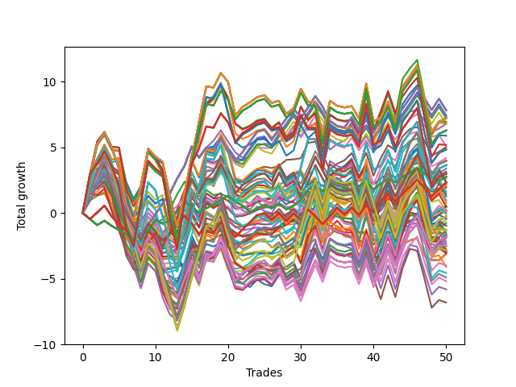

# Short HLT 104 
- Symbol: TSLA
- Date Range: 01/10/2024 - 05/17/2024
- Trading Period: 8:30-12:30
- Number of Trades: 5


### Test TP-0.25 15m
* Take Profit of 0.25 Point
* 0.25 Stoploss
* Results:
```
Total Trades: 5
Percent Up: 60.00
Percent Down: 40.00
Total Points Moved Down: -0.33
Potential Profit: -165.00
Total Points Ups: 0.99 Count Ups: 3
Total Points Downs: 0.66 Count Downs: 2
```

<details><summary>Trades</summary>

<code>In: 2024-01-16 10:40:00		Out: 2024-01-16 10:42:00		Total Position Time: 02:00		Total Move Down: 0.34		Total to Date: 0.34</code> <br />
<code>In: 2024-02-22 08:55:00		Out: 2024-02-22 08:57:00		Total Position Time: 02:00		Total Move Down: -0.44		Total to Date: -0.10</code> <br />
<code>In: 2024-03-27 08:35:00		Out: 2024-03-27 08:37:00		Total Position Time: 02:00		Total Move Down: -0.24		Total to Date: -0.34</code> <br />
<code>In: 2024-03-28 10:05:00		Out: 2024-03-28 10:09:00		Total Position Time: 04:00		Total Move Down: -0.31		Total to Date: -0.65</code> <br />
<code>In: 2024-04-03 08:50:00		Out: 2024-04-03 08:52:00		Total Position Time: 02:00		Total Move Down: 0.32		Total to Date: -0.33</code> <br />


</details>

### Test TP-0.5 15m
* Take Profit of 0.5 Point
* 0.5 Stoploss
* Results:
```
Total Trades: 5
Percent Up: 60.00
Percent Down: 40.00
Total Points Moved Down: -0.30
Potential Profit: -150.00
Total Points Ups: 0.99 Count Ups: 3
Total Points Downs: 0.69 Count Downs: 2
```

<details><summary>Trades</summary>

<code>In: 2024-01-16 10:40:00		Out: 2024-01-16 10:54:00		Total Position Time: 14:00		Total Move Down: 0.17		Total to Date: 0.17</code> <br />
<code>In: 2024-02-22 08:55:00		Out: 2024-02-22 09:02:00		Total Position Time: 07:00		Total Move Down: -0.62		Total to Date: -0.45</code> <br />
<code>In: 2024-03-27 08:35:00		Out: 2024-03-27 08:49:00		Total Position Time: 14:00		Total Move Down: -0.34		Total to Date: -0.79</code> <br />
<code>In: 2024-03-28 10:05:00		Out: 2024-03-28 10:19:00		Total Position Time: 14:00		Total Move Down: -0.03		Total to Date: -0.82</code> <br />
<code>In: 2024-04-03 08:50:00		Out: 2024-04-03 09:04:00		Total Position Time: 14:00		Total Move Down: 0.52		Total to Date: -0.30</code> <br />


</details>

### Test TP-0.75 15m
* Take Profit of 0.75 Point
* 0.75 Stoploss
* Results:
```
Total Trades: 5
Percent Up: 60.00
Percent Down: 40.00
Total Points Moved Down: -0.53
Potential Profit: -265.00
Total Points Ups: 1.22 Count Ups: 3
Total Points Downs: 0.69 Count Downs: 2
```

<details><summary>Trades</summary>

<code>In: 2024-01-16 10:40:00		Out: 2024-01-16 10:54:00		Total Position Time: 14:00		Total Move Down: 0.17		Total to Date: 0.17</code> <br />
<code>In: 2024-02-22 08:55:00		Out: 2024-02-22 09:07:00		Total Position Time: 12:00		Total Move Down: -0.85		Total to Date: -0.68</code> <br />
<code>In: 2024-03-27 08:35:00		Out: 2024-03-27 08:49:00		Total Position Time: 14:00		Total Move Down: -0.34		Total to Date: -1.02</code> <br />
<code>In: 2024-03-28 10:05:00		Out: 2024-03-28 10:19:00		Total Position Time: 14:00		Total Move Down: -0.03		Total to Date: -1.05</code> <br />
<code>In: 2024-04-03 08:50:00		Out: 2024-04-03 09:04:00		Total Position Time: 14:00		Total Move Down: 0.52		Total to Date: -0.53</code> <br />


</details>

### Test TP-1 15m
* Take Profit of 1 Point
* 1 Stoploss
* Results:
```
Total Trades: 5
Percent Up: 60.00
Percent Down: 40.00
Total Points Moved Down: -0.75
Potential Profit: -375.00
Total Points Ups: 1.44 Count Ups: 3
Total Points Downs: 0.69 Count Downs: 2
```

<details><summary>Trades</summary>

<code>In: 2024-01-16 10:40:00		Out: 2024-01-16 10:54:00		Total Position Time: 14:00		Total Move Down: 0.17		Total to Date: 0.17</code> <br />
<code>In: 2024-02-22 08:55:00		Out: 2024-02-22 09:08:00		Total Position Time: 13:00		Total Move Down: -1.07		Total to Date: -0.90</code> <br />
<code>In: 2024-03-27 08:35:00		Out: 2024-03-27 08:49:00		Total Position Time: 14:00		Total Move Down: -0.34		Total to Date: -1.24</code> <br />
<code>In: 2024-03-28 10:05:00		Out: 2024-03-28 10:19:00		Total Position Time: 14:00		Total Move Down: -0.03		Total to Date: -1.27</code> <br />
<code>In: 2024-04-03 08:50:00		Out: 2024-04-03 09:04:00		Total Position Time: 14:00		Total Move Down: 0.52		Total to Date: -0.75</code> <br />


</details>

### Test TP-1.25 15m
* Take Profit of 1.25 Point
* 1.25 Stoploss
* Results:
```
Total Trades: 5
Percent Up: 60.00
Percent Down: 40.00
Total Points Moved Down: -1.00
Potential Profit: -500.00
Total Points Ups: 1.69 Count Ups: 3
Total Points Downs: 0.69 Count Downs: 2
```

<details><summary>Trades</summary>

<code>In: 2024-01-16 10:40:00		Out: 2024-01-16 10:54:00		Total Position Time: 14:00		Total Move Down: 0.17		Total to Date: 0.17</code> <br />
<code>In: 2024-02-22 08:55:00		Out: 2024-02-22 09:09:00		Total Position Time: 14:00		Total Move Down: -1.32		Total to Date: -1.15</code> <br />
<code>In: 2024-03-27 08:35:00		Out: 2024-03-27 08:49:00		Total Position Time: 14:00		Total Move Down: -0.34		Total to Date: -1.49</code> <br />
<code>In: 2024-03-28 10:05:00		Out: 2024-03-28 10:19:00		Total Position Time: 14:00		Total Move Down: -0.03		Total to Date: -1.52</code> <br />
<code>In: 2024-04-03 08:50:00		Out: 2024-04-03 09:04:00		Total Position Time: 14:00		Total Move Down: 0.52		Total to Date: -1.00</code> <br />


</details>

### Test TP-1.5 15m
* Take Profit of 1.5 Point
* 1.5 Stoploss
* Results:
```
Total Trades: 5
Percent Up: 60.00
Percent Down: 40.00
Total Points Moved Down: -1.00
Potential Profit: -500.00
Total Points Ups: 1.69 Count Ups: 3
Total Points Downs: 0.69 Count Downs: 2
```

<details><summary>Trades</summary>

<code>In: 2024-01-16 10:40:00		Out: 2024-01-16 10:54:00		Total Position Time: 14:00		Total Move Down: 0.17		Total to Date: 0.17</code> <br />
<code>In: 2024-02-22 08:55:00		Out: 2024-02-22 09:09:00		Total Position Time: 14:00		Total Move Down: -1.32		Total to Date: -1.15</code> <br />
<code>In: 2024-03-27 08:35:00		Out: 2024-03-27 08:49:00		Total Position Time: 14:00		Total Move Down: -0.34		Total to Date: -1.49</code> <br />
<code>In: 2024-03-28 10:05:00		Out: 2024-03-28 10:19:00		Total Position Time: 14:00		Total Move Down: -0.03		Total to Date: -1.52</code> <br />
<code>In: 2024-04-03 08:50:00		Out: 2024-04-03 09:04:00		Total Position Time: 14:00		Total Move Down: 0.52		Total to Date: -1.00</code> <br />


</details>

### Test TP-1.75 15m
* Take Profit of 1.75 Point
* 1.75 Stoploss
* Results:
```
Total Trades: 5
Percent Up: 60.00
Percent Down: 40.00
Total Points Moved Down: -1.00
Potential Profit: -500.00
Total Points Ups: 1.69 Count Ups: 3
Total Points Downs: 0.69 Count Downs: 2
```

<details><summary>Trades</summary>

<code>In: 2024-01-16 10:40:00		Out: 2024-01-16 10:54:00		Total Position Time: 14:00		Total Move Down: 0.17		Total to Date: 0.17</code> <br />
<code>In: 2024-02-22 08:55:00		Out: 2024-02-22 09:09:00		Total Position Time: 14:00		Total Move Down: -1.32		Total to Date: -1.15</code> <br />
<code>In: 2024-03-27 08:35:00		Out: 2024-03-27 08:49:00		Total Position Time: 14:00		Total Move Down: -0.34		Total to Date: -1.49</code> <br />
<code>In: 2024-03-28 10:05:00		Out: 2024-03-28 10:19:00		Total Position Time: 14:00		Total Move Down: -0.03		Total to Date: -1.52</code> <br />
<code>In: 2024-04-03 08:50:00		Out: 2024-04-03 09:04:00		Total Position Time: 14:00		Total Move Down: 0.52		Total to Date: -1.00</code> <br />


</details>

### Test TP-2 15m
* Take Profit of 2 Point
* 2 Stoploss
* Results:
```
Total Trades: 5
Percent Up: 60.00
Percent Down: 40.00
Total Points Moved Down: -1.00
Potential Profit: -500.00
Total Points Ups: 1.69 Count Ups: 3
Total Points Downs: 0.69 Count Downs: 2
```

<details><summary>Trades</summary>

<code>In: 2024-01-16 10:40:00		Out: 2024-01-16 10:54:00		Total Position Time: 14:00		Total Move Down: 0.17		Total to Date: 0.17</code> <br />
<code>In: 2024-02-22 08:55:00		Out: 2024-02-22 09:09:00		Total Position Time: 14:00		Total Move Down: -1.32		Total to Date: -1.15</code> <br />
<code>In: 2024-03-27 08:35:00		Out: 2024-03-27 08:49:00		Total Position Time: 14:00		Total Move Down: -0.34		Total to Date: -1.49</code> <br />
<code>In: 2024-03-28 10:05:00		Out: 2024-03-28 10:19:00		Total Position Time: 14:00		Total Move Down: -0.03		Total to Date: -1.52</code> <br />
<code>In: 2024-04-03 08:50:00		Out: 2024-04-03 09:04:00		Total Position Time: 14:00		Total Move Down: 0.52		Total to Date: -1.00</code> <br />


</details>

### Test TP-2.25 15m
* Take Profit of 2.25 Point
* 2.25 Stoploss
* Results:
```
Total Trades: 5
Percent Up: 60.00
Percent Down: 40.00
Total Points Moved Down: -1.00
Potential Profit: -500.00
Total Points Ups: 1.69 Count Ups: 3
Total Points Downs: 0.69 Count Downs: 2
```

<details><summary>Trades</summary>

<code>In: 2024-01-16 10:40:00		Out: 2024-01-16 10:54:00		Total Position Time: 14:00		Total Move Down: 0.17		Total to Date: 0.17</code> <br />
<code>In: 2024-02-22 08:55:00		Out: 2024-02-22 09:09:00		Total Position Time: 14:00		Total Move Down: -1.32		Total to Date: -1.15</code> <br />
<code>In: 2024-03-27 08:35:00		Out: 2024-03-27 08:49:00		Total Position Time: 14:00		Total Move Down: -0.34		Total to Date: -1.49</code> <br />
<code>In: 2024-03-28 10:05:00		Out: 2024-03-28 10:19:00		Total Position Time: 14:00		Total Move Down: -0.03		Total to Date: -1.52</code> <br />
<code>In: 2024-04-03 08:50:00		Out: 2024-04-03 09:04:00		Total Position Time: 14:00		Total Move Down: 0.52		Total to Date: -1.00</code> <br />


</details>

### Test TP-2.5 15m
* Take Profit of 2.5 Point
* 2.5 Stoploss
* Results:
```
Total Trades: 5
Percent Up: 60.00
Percent Down: 40.00
Total Points Moved Down: -1.00
Potential Profit: -500.00
Total Points Ups: 1.69 Count Ups: 3
Total Points Downs: 0.69 Count Downs: 2
```

<details><summary>Trades</summary>

<code>In: 2024-01-16 10:40:00		Out: 2024-01-16 10:54:00		Total Position Time: 14:00		Total Move Down: 0.17		Total to Date: 0.17</code> <br />
<code>In: 2024-02-22 08:55:00		Out: 2024-02-22 09:09:00		Total Position Time: 14:00		Total Move Down: -1.32		Total to Date: -1.15</code> <br />
<code>In: 2024-03-27 08:35:00		Out: 2024-03-27 08:49:00		Total Position Time: 14:00		Total Move Down: -0.34		Total to Date: -1.49</code> <br />
<code>In: 2024-03-28 10:05:00		Out: 2024-03-28 10:19:00		Total Position Time: 14:00		Total Move Down: -0.03		Total to Date: -1.52</code> <br />
<code>In: 2024-04-03 08:50:00		Out: 2024-04-03 09:04:00		Total Position Time: 14:00		Total Move Down: 0.52		Total to Date: -1.00</code> <br />


</details>

### Test TP-2.75 15m
* Take Profit of 2.75 Point
* 2.75 Stoploss
* Results:
```
Total Trades: 5
Percent Up: 60.00
Percent Down: 40.00
Total Points Moved Down: -1.00
Potential Profit: -500.00
Total Points Ups: 1.69 Count Ups: 3
Total Points Downs: 0.69 Count Downs: 2
```

<details><summary>Trades</summary>

<code>In: 2024-01-16 10:40:00		Out: 2024-01-16 10:54:00		Total Position Time: 14:00		Total Move Down: 0.17		Total to Date: 0.17</code> <br />
<code>In: 2024-02-22 08:55:00		Out: 2024-02-22 09:09:00		Total Position Time: 14:00		Total Move Down: -1.32		Total to Date: -1.15</code> <br />
<code>In: 2024-03-27 08:35:00		Out: 2024-03-27 08:49:00		Total Position Time: 14:00		Total Move Down: -0.34		Total to Date: -1.49</code> <br />
<code>In: 2024-03-28 10:05:00		Out: 2024-03-28 10:19:00		Total Position Time: 14:00		Total Move Down: -0.03		Total to Date: -1.52</code> <br />
<code>In: 2024-04-03 08:50:00		Out: 2024-04-03 09:04:00		Total Position Time: 14:00		Total Move Down: 0.52		Total to Date: -1.00</code> <br />


</details>

### Test TP-3 15m
* Take Profit of 3 Point
* 3 Stoploss
* Results:
```
Total Trades: 5
Percent Up: 60.00
Percent Down: 40.00
Total Points Moved Down: -1.00
Potential Profit: -500.00
Total Points Ups: 1.69 Count Ups: 3
Total Points Downs: 0.69 Count Downs: 2
```

<details><summary>Trades</summary>

<code>In: 2024-01-16 10:40:00		Out: 2024-01-16 10:54:00		Total Position Time: 14:00		Total Move Down: 0.17		Total to Date: 0.17</code> <br />
<code>In: 2024-02-22 08:55:00		Out: 2024-02-22 09:09:00		Total Position Time: 14:00		Total Move Down: -1.32		Total to Date: -1.15</code> <br />
<code>In: 2024-03-27 08:35:00		Out: 2024-03-27 08:49:00		Total Position Time: 14:00		Total Move Down: -0.34		Total to Date: -1.49</code> <br />
<code>In: 2024-03-28 10:05:00		Out: 2024-03-28 10:19:00		Total Position Time: 14:00		Total Move Down: -0.03		Total to Date: -1.52</code> <br />
<code>In: 2024-04-03 08:50:00		Out: 2024-04-03 09:04:00		Total Position Time: 14:00		Total Move Down: 0.52		Total to Date: -1.00</code> <br />


</details>

### Test TP-0.25 30m
* Take Profit of 0.25 Point
* 0.25 Stoploss
* Results:
```
Total Trades: 5
Percent Up: 60.00
Percent Down: 40.00
Total Points Moved Down: -0.33
Potential Profit: -165.00
Total Points Ups: 0.99 Count Ups: 3
Total Points Downs: 0.66 Count Downs: 2
```

<details><summary>Trades</summary>

<code>In: 2024-01-16 10:40:00		Out: 2024-01-16 10:42:00		Total Position Time: 02:00		Total Move Down: 0.34		Total to Date: 0.34</code> <br />
<code>In: 2024-02-22 08:55:00		Out: 2024-02-22 08:57:00		Total Position Time: 02:00		Total Move Down: -0.44		Total to Date: -0.10</code> <br />
<code>In: 2024-03-27 08:35:00		Out: 2024-03-27 08:37:00		Total Position Time: 02:00		Total Move Down: -0.24		Total to Date: -0.34</code> <br />
<code>In: 2024-03-28 10:05:00		Out: 2024-03-28 10:09:00		Total Position Time: 04:00		Total Move Down: -0.31		Total to Date: -0.65</code> <br />
<code>In: 2024-04-03 08:50:00		Out: 2024-04-03 08:52:00		Total Position Time: 02:00		Total Move Down: 0.32		Total to Date: -0.33</code> <br />


</details>

### Test TP-0.5 30m
* Take Profit of 0.5 Point
* 0.5 Stoploss
* Results:
```
Total Trades: 5
Percent Up: 40.00
Percent Down: 60.00
Total Points Moved Down: -0.25
Potential Profit: -125.00
Total Points Ups: 1.23 Count Ups: 2
Total Points Downs: 0.98 Count Downs: 3
```

<details><summary>Trades</summary>

<code>In: 2024-01-16 10:40:00		Out: 2024-01-16 11:09:00		Total Position Time: 29:00		Total Move Down: 0.16		Total to Date: 0.16</code> <br />
<code>In: 2024-02-22 08:55:00		Out: 2024-02-22 09:02:00		Total Position Time: 07:00		Total Move Down: -0.62		Total to Date: -0.46</code> <br />
<code>In: 2024-03-27 08:35:00		Out: 2024-03-27 08:52:00		Total Position Time: 17:00		Total Move Down: -0.61		Total to Date: -1.07</code> <br />
<code>In: 2024-03-28 10:05:00		Out: 2024-03-28 10:34:00		Total Position Time: 29:00		Total Move Down: 0.30		Total to Date: -0.77</code> <br />
<code>In: 2024-04-03 08:50:00		Out: 2024-04-03 09:04:00		Total Position Time: 14:00		Total Move Down: 0.52		Total to Date: -0.25</code> <br />


</details>

### Test TP-0.75 30m
* Take Profit of 0.75 Point
* 0.75 Stoploss
* Results:
```
Total Trades: 5
Percent Up: 40.00
Percent Down: 60.00
Total Points Moved Down: -0.92
Potential Profit: -460.00
Total Points Ups: 1.73 Count Ups: 2
Total Points Downs: 0.81 Count Downs: 3
```

<details><summary>Trades</summary>

<code>In: 2024-01-16 10:40:00		Out: 2024-01-16 11:09:00		Total Position Time: 29:00		Total Move Down: 0.16		Total to Date: 0.16</code> <br />
<code>In: 2024-02-22 08:55:00		Out: 2024-02-22 09:07:00		Total Position Time: 12:00		Total Move Down: -0.85		Total to Date: -0.69</code> <br />
<code>In: 2024-03-27 08:35:00		Out: 2024-03-27 08:56:00		Total Position Time: 21:00		Total Move Down: -0.88		Total to Date: -1.57</code> <br />
<code>In: 2024-03-28 10:05:00		Out: 2024-03-28 10:34:00		Total Position Time: 29:00		Total Move Down: 0.30		Total to Date: -1.27</code> <br />
<code>In: 2024-04-03 08:50:00		Out: 2024-04-03 09:19:00		Total Position Time: 29:00		Total Move Down: 0.35		Total to Date: -0.92</code> <br />


</details>

### Test TP-1 30m
* Take Profit of 1 Point
* 1 Stoploss
* Results:
```
Total Trades: 5
Percent Up: 40.00
Percent Down: 60.00
Total Points Moved Down: -1.38
Potential Profit: -690.00
Total Points Ups: 2.19 Count Ups: 2
Total Points Downs: 0.81 Count Downs: 3
```

<details><summary>Trades</summary>

<code>In: 2024-01-16 10:40:00		Out: 2024-01-16 11:09:00		Total Position Time: 29:00		Total Move Down: 0.16		Total to Date: 0.16</code> <br />
<code>In: 2024-02-22 08:55:00		Out: 2024-02-22 09:08:00		Total Position Time: 13:00		Total Move Down: -1.07		Total to Date: -0.91</code> <br />
<code>In: 2024-03-27 08:35:00		Out: 2024-03-27 08:57:00		Total Position Time: 22:00		Total Move Down: -1.12		Total to Date: -2.03</code> <br />
<code>In: 2024-03-28 10:05:00		Out: 2024-03-28 10:34:00		Total Position Time: 29:00		Total Move Down: 0.30		Total to Date: -1.73</code> <br />
<code>In: 2024-04-03 08:50:00		Out: 2024-04-03 09:19:00		Total Position Time: 29:00		Total Move Down: 0.35		Total to Date: -1.38</code> <br />


</details>

### Test TP-1.25 30m
* Take Profit of 1.25 Point
* 1.25 Stoploss
* Results:
```
Total Trades: 5
Percent Up: 40.00
Percent Down: 60.00
Total Points Moved Down: -1.83
Potential Profit: -915.00
Total Points Ups: 2.64 Count Ups: 2
Total Points Downs: 0.81 Count Downs: 3
```

<details><summary>Trades</summary>

<code>In: 2024-01-16 10:40:00		Out: 2024-01-16 11:09:00		Total Position Time: 29:00		Total Move Down: 0.16		Total to Date: 0.16</code> <br />
<code>In: 2024-02-22 08:55:00		Out: 2024-02-22 09:09:00		Total Position Time: 14:00		Total Move Down: -1.32		Total to Date: -1.16</code> <br />
<code>In: 2024-03-27 08:35:00		Out: 2024-03-27 09:02:00		Total Position Time: 27:00		Total Move Down: -1.32		Total to Date: -2.48</code> <br />
<code>In: 2024-03-28 10:05:00		Out: 2024-03-28 10:34:00		Total Position Time: 29:00		Total Move Down: 0.30		Total to Date: -2.18</code> <br />
<code>In: 2024-04-03 08:50:00		Out: 2024-04-03 09:19:00		Total Position Time: 29:00		Total Move Down: 0.35		Total to Date: -1.83</code> <br />


</details>

### Test TP-1.5 30m
* Take Profit of 1.5 Point
* 1.5 Stoploss
* Results:
```
Total Trades: 5
Percent Up: 40.00
Percent Down: 60.00
Total Points Moved Down: -2.12
Potential Profit: -1060.00
Total Points Ups: 2.93 Count Ups: 2
Total Points Downs: 0.81 Count Downs: 3
```

<details><summary>Trades</summary>

<code>In: 2024-01-16 10:40:00		Out: 2024-01-16 11:09:00		Total Position Time: 29:00		Total Move Down: 0.16		Total to Date: 0.16</code> <br />
<code>In: 2024-02-22 08:55:00		Out: 2024-02-22 09:10:00		Total Position Time: 15:00		Total Move Down: -1.56		Total to Date: -1.40</code> <br />
<code>In: 2024-03-27 08:35:00		Out: 2024-03-27 09:04:00		Total Position Time: 29:00		Total Move Down: -1.37		Total to Date: -2.77</code> <br />
<code>In: 2024-03-28 10:05:00		Out: 2024-03-28 10:34:00		Total Position Time: 29:00		Total Move Down: 0.30		Total to Date: -2.47</code> <br />
<code>In: 2024-04-03 08:50:00		Out: 2024-04-03 09:19:00		Total Position Time: 29:00		Total Move Down: 0.35		Total to Date: -2.12</code> <br />


</details>

### Test TP-1.75 30m
* Take Profit of 1.75 Point
* 1.75 Stoploss
* Results:
```
Total Trades: 5
Percent Up: 40.00
Percent Down: 60.00
Total Points Moved Down: -2.45
Potential Profit: -1225.00
Total Points Ups: 3.26 Count Ups: 2
Total Points Downs: 0.81 Count Downs: 3
```

<details><summary>Trades</summary>

<code>In: 2024-01-16 10:40:00		Out: 2024-01-16 11:09:00		Total Position Time: 29:00		Total Move Down: 0.16		Total to Date: 0.16</code> <br />
<code>In: 2024-02-22 08:55:00		Out: 2024-02-22 09:24:00		Total Position Time: 29:00		Total Move Down: -1.89		Total to Date: -1.73</code> <br />
<code>In: 2024-03-27 08:35:00		Out: 2024-03-27 09:04:00		Total Position Time: 29:00		Total Move Down: -1.37		Total to Date: -3.10</code> <br />
<code>In: 2024-03-28 10:05:00		Out: 2024-03-28 10:34:00		Total Position Time: 29:00		Total Move Down: 0.30		Total to Date: -2.80</code> <br />
<code>In: 2024-04-03 08:50:00		Out: 2024-04-03 09:19:00		Total Position Time: 29:00		Total Move Down: 0.35		Total to Date: -2.45</code> <br />


</details>

### Test TP-2 30m
* Take Profit of 2 Point
* 2 Stoploss
* Results:
```
Total Trades: 5
Percent Up: 40.00
Percent Down: 60.00
Total Points Moved Down: -2.45
Potential Profit: -1225.00
Total Points Ups: 3.26 Count Ups: 2
Total Points Downs: 0.81 Count Downs: 3
```

<details><summary>Trades</summary>

<code>In: 2024-01-16 10:40:00		Out: 2024-01-16 11:09:00		Total Position Time: 29:00		Total Move Down: 0.16		Total to Date: 0.16</code> <br />
<code>In: 2024-02-22 08:55:00		Out: 2024-02-22 09:24:00		Total Position Time: 29:00		Total Move Down: -1.89		Total to Date: -1.73</code> <br />
<code>In: 2024-03-27 08:35:00		Out: 2024-03-27 09:04:00		Total Position Time: 29:00		Total Move Down: -1.37		Total to Date: -3.10</code> <br />
<code>In: 2024-03-28 10:05:00		Out: 2024-03-28 10:34:00		Total Position Time: 29:00		Total Move Down: 0.30		Total to Date: -2.80</code> <br />
<code>In: 2024-04-03 08:50:00		Out: 2024-04-03 09:19:00		Total Position Time: 29:00		Total Move Down: 0.35		Total to Date: -2.45</code> <br />


</details>

### Test TP-2.25 30m
* Take Profit of 2.25 Point
* 2.25 Stoploss
* Results:
```
Total Trades: 5
Percent Up: 40.00
Percent Down: 60.00
Total Points Moved Down: -2.45
Potential Profit: -1225.00
Total Points Ups: 3.26 Count Ups: 2
Total Points Downs: 0.81 Count Downs: 3
```

<details><summary>Trades</summary>

<code>In: 2024-01-16 10:40:00		Out: 2024-01-16 11:09:00		Total Position Time: 29:00		Total Move Down: 0.16		Total to Date: 0.16</code> <br />
<code>In: 2024-02-22 08:55:00		Out: 2024-02-22 09:24:00		Total Position Time: 29:00		Total Move Down: -1.89		Total to Date: -1.73</code> <br />
<code>In: 2024-03-27 08:35:00		Out: 2024-03-27 09:04:00		Total Position Time: 29:00		Total Move Down: -1.37		Total to Date: -3.10</code> <br />
<code>In: 2024-03-28 10:05:00		Out: 2024-03-28 10:34:00		Total Position Time: 29:00		Total Move Down: 0.30		Total to Date: -2.80</code> <br />
<code>In: 2024-04-03 08:50:00		Out: 2024-04-03 09:19:00		Total Position Time: 29:00		Total Move Down: 0.35		Total to Date: -2.45</code> <br />


</details>

### Test TP-2.5 30m
* Take Profit of 2.5 Point
* 2.5 Stoploss
* Results:
```
Total Trades: 5
Percent Up: 40.00
Percent Down: 60.00
Total Points Moved Down: -2.45
Potential Profit: -1225.00
Total Points Ups: 3.26 Count Ups: 2
Total Points Downs: 0.81 Count Downs: 3
```

<details><summary>Trades</summary>

<code>In: 2024-01-16 10:40:00		Out: 2024-01-16 11:09:00		Total Position Time: 29:00		Total Move Down: 0.16		Total to Date: 0.16</code> <br />
<code>In: 2024-02-22 08:55:00		Out: 2024-02-22 09:24:00		Total Position Time: 29:00		Total Move Down: -1.89		Total to Date: -1.73</code> <br />
<code>In: 2024-03-27 08:35:00		Out: 2024-03-27 09:04:00		Total Position Time: 29:00		Total Move Down: -1.37		Total to Date: -3.10</code> <br />
<code>In: 2024-03-28 10:05:00		Out: 2024-03-28 10:34:00		Total Position Time: 29:00		Total Move Down: 0.30		Total to Date: -2.80</code> <br />
<code>In: 2024-04-03 08:50:00		Out: 2024-04-03 09:19:00		Total Position Time: 29:00		Total Move Down: 0.35		Total to Date: -2.45</code> <br />


</details>

### Test TP-2.75 30m
* Take Profit of 2.75 Point
* 2.75 Stoploss
* Results:
```
Total Trades: 5
Percent Up: 40.00
Percent Down: 60.00
Total Points Moved Down: -2.45
Potential Profit: -1225.00
Total Points Ups: 3.26 Count Ups: 2
Total Points Downs: 0.81 Count Downs: 3
```

<details><summary>Trades</summary>

<code>In: 2024-01-16 10:40:00		Out: 2024-01-16 11:09:00		Total Position Time: 29:00		Total Move Down: 0.16		Total to Date: 0.16</code> <br />
<code>In: 2024-02-22 08:55:00		Out: 2024-02-22 09:24:00		Total Position Time: 29:00		Total Move Down: -1.89		Total to Date: -1.73</code> <br />
<code>In: 2024-03-27 08:35:00		Out: 2024-03-27 09:04:00		Total Position Time: 29:00		Total Move Down: -1.37		Total to Date: -3.10</code> <br />
<code>In: 2024-03-28 10:05:00		Out: 2024-03-28 10:34:00		Total Position Time: 29:00		Total Move Down: 0.30		Total to Date: -2.80</code> <br />
<code>In: 2024-04-03 08:50:00		Out: 2024-04-03 09:19:00		Total Position Time: 29:00		Total Move Down: 0.35		Total to Date: -2.45</code> <br />


</details>

### Test TP-3 30m
* Take Profit of 3 Point
* 3 Stoploss
* Results:
```
Total Trades: 5
Percent Up: 40.00
Percent Down: 60.00
Total Points Moved Down: -2.45
Potential Profit: -1225.00
Total Points Ups: 3.26 Count Ups: 2
Total Points Downs: 0.81 Count Downs: 3
```

<details><summary>Trades</summary>

<code>In: 2024-01-16 10:40:00		Out: 2024-01-16 11:09:00		Total Position Time: 29:00		Total Move Down: 0.16		Total to Date: 0.16</code> <br />
<code>In: 2024-02-22 08:55:00		Out: 2024-02-22 09:24:00		Total Position Time: 29:00		Total Move Down: -1.89		Total to Date: -1.73</code> <br />
<code>In: 2024-03-27 08:35:00		Out: 2024-03-27 09:04:00		Total Position Time: 29:00		Total Move Down: -1.37		Total to Date: -3.10</code> <br />
<code>In: 2024-03-28 10:05:00		Out: 2024-03-28 10:34:00		Total Position Time: 29:00		Total Move Down: 0.30		Total to Date: -2.80</code> <br />
<code>In: 2024-04-03 08:50:00		Out: 2024-04-03 09:19:00		Total Position Time: 29:00		Total Move Down: 0.35		Total to Date: -2.45</code> <br />


</details>

### Test TP-0.25 45m
* Take Profit of 0.25 Point
* 0.25 Stoploss
* Results:
```
Total Trades: 5
Percent Up: 60.00
Percent Down: 40.00
Total Points Moved Down: -0.33
Potential Profit: -165.00
Total Points Ups: 0.99 Count Ups: 3
Total Points Downs: 0.66 Count Downs: 2
```

<details><summary>Trades</summary>

<code>In: 2024-01-16 10:40:00		Out: 2024-01-16 10:42:00		Total Position Time: 02:00		Total Move Down: 0.34		Total to Date: 0.34</code> <br />
<code>In: 2024-02-22 08:55:00		Out: 2024-02-22 08:57:00		Total Position Time: 02:00		Total Move Down: -0.44		Total to Date: -0.10</code> <br />
<code>In: 2024-03-27 08:35:00		Out: 2024-03-27 08:37:00		Total Position Time: 02:00		Total Move Down: -0.24		Total to Date: -0.34</code> <br />
<code>In: 2024-03-28 10:05:00		Out: 2024-03-28 10:09:00		Total Position Time: 04:00		Total Move Down: -0.31		Total to Date: -0.65</code> <br />
<code>In: 2024-04-03 08:50:00		Out: 2024-04-03 08:52:00		Total Position Time: 02:00		Total Move Down: 0.32		Total to Date: -0.33</code> <br />


</details>

### Test TP-0.5 45m
* Take Profit of 0.5 Point
* 0.5 Stoploss
* Results:
```
Total Trades: 5
Percent Up: 40.00
Percent Down: 60.00
Total Points Moved Down: -0.03
Potential Profit: -15.00
Total Points Ups: 1.23 Count Ups: 2
Total Points Downs: 1.20 Count Downs: 3
```

<details><summary>Trades</summary>

<code>In: 2024-01-16 10:40:00		Out: 2024-01-16 11:11:00		Total Position Time: 31:00		Total Move Down: 0.53		Total to Date: 0.53</code> <br />
<code>In: 2024-02-22 08:55:00		Out: 2024-02-22 09:02:00		Total Position Time: 07:00		Total Move Down: -0.62		Total to Date: -0.09</code> <br />
<code>In: 2024-03-27 08:35:00		Out: 2024-03-27 08:52:00		Total Position Time: 17:00		Total Move Down: -0.61		Total to Date: -0.70</code> <br />
<code>In: 2024-03-28 10:05:00		Out: 2024-03-28 10:49:00		Total Position Time: 44:00		Total Move Down: 0.15		Total to Date: -0.55</code> <br />
<code>In: 2024-04-03 08:50:00		Out: 2024-04-03 09:04:00		Total Position Time: 14:00		Total Move Down: 0.52		Total to Date: -0.03</code> <br />


</details>

### Test TP-0.75 45m
* Take Profit of 0.75 Point
* 0.75 Stoploss
* Results:
```
Total Trades: 5
Percent Up: 60.00
Percent Down: 40.00
Total Points Moved Down: -2.11
Potential Profit: -1055.00
Total Points Ups: 2.60 Count Ups: 3
Total Points Downs: 0.49 Count Downs: 2
```

<details><summary>Trades</summary>

<code>In: 2024-01-16 10:40:00		Out: 2024-01-16 11:24:00		Total Position Time: 44:00		Total Move Down: 0.34		Total to Date: 0.34</code> <br />
<code>In: 2024-02-22 08:55:00		Out: 2024-02-22 09:07:00		Total Position Time: 12:00		Total Move Down: -0.85		Total to Date: -0.51</code> <br />
<code>In: 2024-03-27 08:35:00		Out: 2024-03-27 08:56:00		Total Position Time: 21:00		Total Move Down: -0.88		Total to Date: -1.39</code> <br />
<code>In: 2024-03-28 10:05:00		Out: 2024-03-28 10:49:00		Total Position Time: 44:00		Total Move Down: 0.15		Total to Date: -1.24</code> <br />
<code>In: 2024-04-03 08:50:00		Out: 2024-04-03 09:33:00		Total Position Time: 43:00		Total Move Down: -0.87		Total to Date: -2.11</code> <br />


</details>

### Test TP-1 45m
* Take Profit of 1 Point
* 1 Stoploss
* Results:
```
Total Trades: 5
Percent Up: 60.00
Percent Down: 40.00
Total Points Moved Down: -2.60
Potential Profit: -1300.00
Total Points Ups: 3.09 Count Ups: 3
Total Points Downs: 0.49 Count Downs: 2
```

<details><summary>Trades</summary>

<code>In: 2024-01-16 10:40:00		Out: 2024-01-16 11:24:00		Total Position Time: 44:00		Total Move Down: 0.34		Total to Date: 0.34</code> <br />
<code>In: 2024-02-22 08:55:00		Out: 2024-02-22 09:08:00		Total Position Time: 13:00		Total Move Down: -1.07		Total to Date: -0.73</code> <br />
<code>In: 2024-03-27 08:35:00		Out: 2024-03-27 08:57:00		Total Position Time: 22:00		Total Move Down: -1.12		Total to Date: -1.85</code> <br />
<code>In: 2024-03-28 10:05:00		Out: 2024-03-28 10:49:00		Total Position Time: 44:00		Total Move Down: 0.15		Total to Date: -1.70</code> <br />
<code>In: 2024-04-03 08:50:00		Out: 2024-04-03 09:34:00		Total Position Time: 44:00		Total Move Down: -0.90		Total to Date: -2.60</code> <br />


</details>

### Test TP-1.25 45m
* Take Profit of 1.25 Point
* 1.25 Stoploss
* Results:
```
Total Trades: 5
Percent Up: 60.00
Percent Down: 40.00
Total Points Moved Down: -3.05
Potential Profit: -1525.00
Total Points Ups: 3.54 Count Ups: 3
Total Points Downs: 0.49 Count Downs: 2
```

<details><summary>Trades</summary>

<code>In: 2024-01-16 10:40:00		Out: 2024-01-16 11:24:00		Total Position Time: 44:00		Total Move Down: 0.34		Total to Date: 0.34</code> <br />
<code>In: 2024-02-22 08:55:00		Out: 2024-02-22 09:09:00		Total Position Time: 14:00		Total Move Down: -1.32		Total to Date: -0.98</code> <br />
<code>In: 2024-03-27 08:35:00		Out: 2024-03-27 09:02:00		Total Position Time: 27:00		Total Move Down: -1.32		Total to Date: -2.30</code> <br />
<code>In: 2024-03-28 10:05:00		Out: 2024-03-28 10:49:00		Total Position Time: 44:00		Total Move Down: 0.15		Total to Date: -2.15</code> <br />
<code>In: 2024-04-03 08:50:00		Out: 2024-04-03 09:34:00		Total Position Time: 44:00		Total Move Down: -0.90		Total to Date: -3.05</code> <br />


</details>

### Test TP-1.5 45m
* Take Profit of 1.5 Point
* 1.5 Stoploss
* Results:
```
Total Trades: 5
Percent Up: 60.00
Percent Down: 40.00
Total Points Moved Down: -3.59
Potential Profit: -1795.00
Total Points Ups: 4.08 Count Ups: 3
Total Points Downs: 0.49 Count Downs: 2
```

<details><summary>Trades</summary>

<code>In: 2024-01-16 10:40:00		Out: 2024-01-16 11:24:00		Total Position Time: 44:00		Total Move Down: 0.34		Total to Date: 0.34</code> <br />
<code>In: 2024-02-22 08:55:00		Out: 2024-02-22 09:10:00		Total Position Time: 15:00		Total Move Down: -1.56		Total to Date: -1.22</code> <br />
<code>In: 2024-03-27 08:35:00		Out: 2024-03-27 09:07:00		Total Position Time: 32:00		Total Move Down: -1.62		Total to Date: -2.84</code> <br />
<code>In: 2024-03-28 10:05:00		Out: 2024-03-28 10:49:00		Total Position Time: 44:00		Total Move Down: 0.15		Total to Date: -2.69</code> <br />
<code>In: 2024-04-03 08:50:00		Out: 2024-04-03 09:34:00		Total Position Time: 44:00		Total Move Down: -0.90		Total to Date: -3.59</code> <br />


</details>

### Test TP-1.75 45m
* Take Profit of 1.75 Point
* 1.75 Stoploss
* Results:
```
Total Trades: 5
Percent Up: 60.00
Percent Down: 40.00
Total Points Moved Down: -4.05
Potential Profit: -2025.00
Total Points Ups: 4.54 Count Ups: 3
Total Points Downs: 0.49 Count Downs: 2
```

<details><summary>Trades</summary>

<code>In: 2024-01-16 10:40:00		Out: 2024-01-16 11:24:00		Total Position Time: 44:00		Total Move Down: 0.34		Total to Date: 0.34</code> <br />
<code>In: 2024-02-22 08:55:00		Out: 2024-02-22 09:24:00		Total Position Time: 29:00		Total Move Down: -1.89		Total to Date: -1.55</code> <br />
<code>In: 2024-03-27 08:35:00		Out: 2024-03-27 09:11:00		Total Position Time: 36:00		Total Move Down: -1.75		Total to Date: -3.30</code> <br />
<code>In: 2024-03-28 10:05:00		Out: 2024-03-28 10:49:00		Total Position Time: 44:00		Total Move Down: 0.15		Total to Date: -3.15</code> <br />
<code>In: 2024-04-03 08:50:00		Out: 2024-04-03 09:34:00		Total Position Time: 44:00		Total Move Down: -0.90		Total to Date: -4.05</code> <br />


</details>

### Test TP-2 45m
* Take Profit of 2 Point
* 2 Stoploss
* Results:
```
Total Trades: 5
Percent Up: 60.00
Percent Down: 40.00
Total Points Moved Down: -4.74
Potential Profit: -2370.00
Total Points Ups: 5.23 Count Ups: 3
Total Points Downs: 0.49 Count Downs: 2
```

<details><summary>Trades</summary>

<code>In: 2024-01-16 10:40:00		Out: 2024-01-16 11:24:00		Total Position Time: 44:00		Total Move Down: 0.34		Total to Date: 0.34</code> <br />
<code>In: 2024-02-22 08:55:00		Out: 2024-02-22 09:39:00		Total Position Time: 44:00		Total Move Down: -2.09		Total to Date: -1.75</code> <br />
<code>In: 2024-03-27 08:35:00		Out: 2024-03-27 09:19:00		Total Position Time: 44:00		Total Move Down: -2.24		Total to Date: -3.99</code> <br />
<code>In: 2024-03-28 10:05:00		Out: 2024-03-28 10:49:00		Total Position Time: 44:00		Total Move Down: 0.15		Total to Date: -3.84</code> <br />
<code>In: 2024-04-03 08:50:00		Out: 2024-04-03 09:34:00		Total Position Time: 44:00		Total Move Down: -0.90		Total to Date: -4.74</code> <br />


</details>

### Test TP-2.25 45m
* Take Profit of 2.25 Point
* 2.25 Stoploss
* Results:
```
Total Trades: 5
Percent Up: 60.00
Percent Down: 40.00
Total Points Moved Down: -4.74
Potential Profit: -2370.00
Total Points Ups: 5.23 Count Ups: 3
Total Points Downs: 0.49 Count Downs: 2
```

<details><summary>Trades</summary>

<code>In: 2024-01-16 10:40:00		Out: 2024-01-16 11:24:00		Total Position Time: 44:00		Total Move Down: 0.34		Total to Date: 0.34</code> <br />
<code>In: 2024-02-22 08:55:00		Out: 2024-02-22 09:39:00		Total Position Time: 44:00		Total Move Down: -2.09		Total to Date: -1.75</code> <br />
<code>In: 2024-03-27 08:35:00		Out: 2024-03-27 09:19:00		Total Position Time: 44:00		Total Move Down: -2.24		Total to Date: -3.99</code> <br />
<code>In: 2024-03-28 10:05:00		Out: 2024-03-28 10:49:00		Total Position Time: 44:00		Total Move Down: 0.15		Total to Date: -3.84</code> <br />
<code>In: 2024-04-03 08:50:00		Out: 2024-04-03 09:34:00		Total Position Time: 44:00		Total Move Down: -0.90		Total to Date: -4.74</code> <br />


</details>

### Test TP-2.5 45m
* Take Profit of 2.5 Point
* 2.5 Stoploss
* Results:
```
Total Trades: 5
Percent Up: 60.00
Percent Down: 40.00
Total Points Moved Down: -4.74
Potential Profit: -2370.00
Total Points Ups: 5.23 Count Ups: 3
Total Points Downs: 0.49 Count Downs: 2
```

<details><summary>Trades</summary>

<code>In: 2024-01-16 10:40:00		Out: 2024-01-16 11:24:00		Total Position Time: 44:00		Total Move Down: 0.34		Total to Date: 0.34</code> <br />
<code>In: 2024-02-22 08:55:00		Out: 2024-02-22 09:39:00		Total Position Time: 44:00		Total Move Down: -2.09		Total to Date: -1.75</code> <br />
<code>In: 2024-03-27 08:35:00		Out: 2024-03-27 09:19:00		Total Position Time: 44:00		Total Move Down: -2.24		Total to Date: -3.99</code> <br />
<code>In: 2024-03-28 10:05:00		Out: 2024-03-28 10:49:00		Total Position Time: 44:00		Total Move Down: 0.15		Total to Date: -3.84</code> <br />
<code>In: 2024-04-03 08:50:00		Out: 2024-04-03 09:34:00		Total Position Time: 44:00		Total Move Down: -0.90		Total to Date: -4.74</code> <br />


</details>

### Test TP-2.75 45m
* Take Profit of 2.75 Point
* 2.75 Stoploss
* Results:
```
Total Trades: 5
Percent Up: 60.00
Percent Down: 40.00
Total Points Moved Down: -4.74
Potential Profit: -2370.00
Total Points Ups: 5.23 Count Ups: 3
Total Points Downs: 0.49 Count Downs: 2
```

<details><summary>Trades</summary>

<code>In: 2024-01-16 10:40:00		Out: 2024-01-16 11:24:00		Total Position Time: 44:00		Total Move Down: 0.34		Total to Date: 0.34</code> <br />
<code>In: 2024-02-22 08:55:00		Out: 2024-02-22 09:39:00		Total Position Time: 44:00		Total Move Down: -2.09		Total to Date: -1.75</code> <br />
<code>In: 2024-03-27 08:35:00		Out: 2024-03-27 09:19:00		Total Position Time: 44:00		Total Move Down: -2.24		Total to Date: -3.99</code> <br />
<code>In: 2024-03-28 10:05:00		Out: 2024-03-28 10:49:00		Total Position Time: 44:00		Total Move Down: 0.15		Total to Date: -3.84</code> <br />
<code>In: 2024-04-03 08:50:00		Out: 2024-04-03 09:34:00		Total Position Time: 44:00		Total Move Down: -0.90		Total to Date: -4.74</code> <br />


</details>

### Test TP-3 45m
* Take Profit of 3 Point
* 3 Stoploss
* Results:
```
Total Trades: 5
Percent Up: 60.00
Percent Down: 40.00
Total Points Moved Down: -4.74
Potential Profit: -2370.00
Total Points Ups: 5.23 Count Ups: 3
Total Points Downs: 0.49 Count Downs: 2
```

<details><summary>Trades</summary>

<code>In: 2024-01-16 10:40:00		Out: 2024-01-16 11:24:00		Total Position Time: 44:00		Total Move Down: 0.34		Total to Date: 0.34</code> <br />
<code>In: 2024-02-22 08:55:00		Out: 2024-02-22 09:39:00		Total Position Time: 44:00		Total Move Down: -2.09		Total to Date: -1.75</code> <br />
<code>In: 2024-03-27 08:35:00		Out: 2024-03-27 09:19:00		Total Position Time: 44:00		Total Move Down: -2.24		Total to Date: -3.99</code> <br />
<code>In: 2024-03-28 10:05:00		Out: 2024-03-28 10:49:00		Total Position Time: 44:00		Total Move Down: 0.15		Total to Date: -3.84</code> <br />
<code>In: 2024-04-03 08:50:00		Out: 2024-04-03 09:34:00		Total Position Time: 44:00		Total Move Down: -0.90		Total to Date: -4.74</code> <br />


</details>

### Test TP-0.25 60m
* Take Profit of 0.25 Point
* 0.25 Stoploss
* Results:
```
Total Trades: 5
Percent Up: 60.00
Percent Down: 40.00
Total Points Moved Down: -0.33
Potential Profit: -165.00
Total Points Ups: 0.99 Count Ups: 3
Total Points Downs: 0.66 Count Downs: 2
```

<details><summary>Trades</summary>

<code>In: 2024-01-16 10:40:00		Out: 2024-01-16 10:42:00		Total Position Time: 02:00		Total Move Down: 0.34		Total to Date: 0.34</code> <br />
<code>In: 2024-02-22 08:55:00		Out: 2024-02-22 08:57:00		Total Position Time: 02:00		Total Move Down: -0.44		Total to Date: -0.10</code> <br />
<code>In: 2024-03-27 08:35:00		Out: 2024-03-27 08:37:00		Total Position Time: 02:00		Total Move Down: -0.24		Total to Date: -0.34</code> <br />
<code>In: 2024-03-28 10:05:00		Out: 2024-03-28 10:09:00		Total Position Time: 04:00		Total Move Down: -0.31		Total to Date: -0.65</code> <br />
<code>In: 2024-04-03 08:50:00		Out: 2024-04-03 08:52:00		Total Position Time: 02:00		Total Move Down: 0.32		Total to Date: -0.33</code> <br />


</details>

### Test TP-0.5 60m
* Take Profit of 0.5 Point
* 0.5 Stoploss
* Results:
```
Total Trades: 5
Percent Up: 40.00
Percent Down: 60.00
Total Points Moved Down: 0.34
Potential Profit: 170.00
Total Points Ups: 1.23 Count Ups: 2
Total Points Downs: 1.57 Count Downs: 3
```

<details><summary>Trades</summary>

<code>In: 2024-01-16 10:40:00		Out: 2024-01-16 11:11:00		Total Position Time: 31:00		Total Move Down: 0.53		Total to Date: 0.53</code> <br />
<code>In: 2024-02-22 08:55:00		Out: 2024-02-22 09:02:00		Total Position Time: 07:00		Total Move Down: -0.62		Total to Date: -0.09</code> <br />
<code>In: 2024-03-27 08:35:00		Out: 2024-03-27 08:52:00		Total Position Time: 17:00		Total Move Down: -0.61		Total to Date: -0.70</code> <br />
<code>In: 2024-03-28 10:05:00		Out: 2024-03-28 10:59:00		Total Position Time: 54:00		Total Move Down: 0.52		Total to Date: -0.18</code> <br />
<code>In: 2024-04-03 08:50:00		Out: 2024-04-03 09:04:00		Total Position Time: 14:00		Total Move Down: 0.52		Total to Date: 0.34</code> <br />


</details>

### Test TP-0.75 60m
* Take Profit of 0.75 Point
* 0.75 Stoploss
* Results:
```
Total Trades: 5
Percent Up: 60.00
Percent Down: 40.00
Total Points Moved Down: -0.92
Potential Profit: -460.00
Total Points Ups: 2.60 Count Ups: 3
Total Points Downs: 1.68 Count Downs: 2
```

<details><summary>Trades</summary>

<code>In: 2024-01-16 10:40:00		Out: 2024-01-16 11:32:00		Total Position Time: 52:00		Total Move Down: 0.84		Total to Date: 0.84</code> <br />
<code>In: 2024-02-22 08:55:00		Out: 2024-02-22 09:07:00		Total Position Time: 12:00		Total Move Down: -0.85		Total to Date: -0.01</code> <br />
<code>In: 2024-03-27 08:35:00		Out: 2024-03-27 08:56:00		Total Position Time: 21:00		Total Move Down: -0.88		Total to Date: -0.89</code> <br />
<code>In: 2024-03-28 10:05:00		Out: 2024-03-28 11:02:00		Total Position Time: 57:00		Total Move Down: 0.84		Total to Date: -0.05</code> <br />
<code>In: 2024-04-03 08:50:00		Out: 2024-04-03 09:33:00		Total Position Time: 43:00		Total Move Down: -0.87		Total to Date: -0.92</code> <br />


</details>

### Test TP-1 60m
* Take Profit of 1 Point
* 1 Stoploss
* Results:
```
Total Trades: 5
Percent Up: 60.00
Percent Down: 40.00
Total Points Moved Down: -1.66
Potential Profit: -830.00
Total Points Ups: 3.17 Count Ups: 3
Total Points Downs: 1.51 Count Downs: 2
```

<details><summary>Trades</summary>

<code>In: 2024-01-16 10:40:00		Out: 2024-01-16 11:39:00		Total Position Time: 59:00		Total Move Down: 0.82		Total to Date: 0.82</code> <br />
<code>In: 2024-02-22 08:55:00		Out: 2024-02-22 09:08:00		Total Position Time: 13:00		Total Move Down: -1.07		Total to Date: -0.25</code> <br />
<code>In: 2024-03-27 08:35:00		Out: 2024-03-27 08:57:00		Total Position Time: 22:00		Total Move Down: -1.12		Total to Date: -1.37</code> <br />
<code>In: 2024-03-28 10:05:00		Out: 2024-03-28 11:04:00		Total Position Time: 59:00		Total Move Down: 0.69		Total to Date: -0.68</code> <br />
<code>In: 2024-04-03 08:50:00		Out: 2024-04-03 09:36:00		Total Position Time: 46:00		Total Move Down: -0.98		Total to Date: -1.66</code> <br />


</details>

### Test TP-1.25 60m
* Take Profit of 1.25 Point
* 1.25 Stoploss
* Results:
```
Total Trades: 5
Percent Up: 60.00
Percent Down: 40.00
Total Points Moved Down: -1.53
Potential Profit: -765.00
Total Points Ups: 3.04 Count Ups: 3
Total Points Downs: 1.51 Count Downs: 2
```

<details><summary>Trades</summary>

<code>In: 2024-01-16 10:40:00		Out: 2024-01-16 11:39:00		Total Position Time: 59:00		Total Move Down: 0.82		Total to Date: 0.82</code> <br />
<code>In: 2024-02-22 08:55:00		Out: 2024-02-22 09:09:00		Total Position Time: 14:00		Total Move Down: -1.32		Total to Date: -0.50</code> <br />
<code>In: 2024-03-27 08:35:00		Out: 2024-03-27 09:02:00		Total Position Time: 27:00		Total Move Down: -1.32		Total to Date: -1.82</code> <br />
<code>In: 2024-03-28 10:05:00		Out: 2024-03-28 11:04:00		Total Position Time: 59:00		Total Move Down: 0.69		Total to Date: -1.13</code> <br />
<code>In: 2024-04-03 08:50:00		Out: 2024-04-03 09:49:00		Total Position Time: 59:00		Total Move Down: -0.40		Total to Date: -1.53</code> <br />


</details>

### Test TP-1.5 60m
* Take Profit of 1.5 Point
* 1.5 Stoploss
* Results:
```
Total Trades: 5
Percent Up: 60.00
Percent Down: 40.00
Total Points Moved Down: -2.07
Potential Profit: -1035.00
Total Points Ups: 3.58 Count Ups: 3
Total Points Downs: 1.51 Count Downs: 2
```

<details><summary>Trades</summary>

<code>In: 2024-01-16 10:40:00		Out: 2024-01-16 11:39:00		Total Position Time: 59:00		Total Move Down: 0.82		Total to Date: 0.82</code> <br />
<code>In: 2024-02-22 08:55:00		Out: 2024-02-22 09:10:00		Total Position Time: 15:00		Total Move Down: -1.56		Total to Date: -0.74</code> <br />
<code>In: 2024-03-27 08:35:00		Out: 2024-03-27 09:07:00		Total Position Time: 32:00		Total Move Down: -1.62		Total to Date: -2.36</code> <br />
<code>In: 2024-03-28 10:05:00		Out: 2024-03-28 11:04:00		Total Position Time: 59:00		Total Move Down: 0.69		Total to Date: -1.67</code> <br />
<code>In: 2024-04-03 08:50:00		Out: 2024-04-03 09:49:00		Total Position Time: 59:00		Total Move Down: -0.40		Total to Date: -2.07</code> <br />


</details>

### Test TP-1.75 60m
* Take Profit of 1.75 Point
* 1.75 Stoploss
* Results:
```
Total Trades: 5
Percent Up: 60.00
Percent Down: 40.00
Total Points Moved Down: -2.53
Potential Profit: -1265.00
Total Points Ups: 4.04 Count Ups: 3
Total Points Downs: 1.51 Count Downs: 2
```

<details><summary>Trades</summary>

<code>In: 2024-01-16 10:40:00		Out: 2024-01-16 11:39:00		Total Position Time: 59:00		Total Move Down: 0.82		Total to Date: 0.82</code> <br />
<code>In: 2024-02-22 08:55:00		Out: 2024-02-22 09:24:00		Total Position Time: 29:00		Total Move Down: -1.89		Total to Date: -1.07</code> <br />
<code>In: 2024-03-27 08:35:00		Out: 2024-03-27 09:11:00		Total Position Time: 36:00		Total Move Down: -1.75		Total to Date: -2.82</code> <br />
<code>In: 2024-03-28 10:05:00		Out: 2024-03-28 11:04:00		Total Position Time: 59:00		Total Move Down: 0.69		Total to Date: -2.13</code> <br />
<code>In: 2024-04-03 08:50:00		Out: 2024-04-03 09:49:00		Total Position Time: 59:00		Total Move Down: -0.40		Total to Date: -2.53</code> <br />


</details>

### Test TP-2 60m
* Take Profit of 2 Point
* 2 Stoploss
* Results:
```
Total Trades: 5
Percent Up: 60.00
Percent Down: 40.00
Total Points Moved Down: -3.22
Potential Profit: -1610.00
Total Points Ups: 4.73 Count Ups: 3
Total Points Downs: 1.51 Count Downs: 2
```

<details><summary>Trades</summary>

<code>In: 2024-01-16 10:40:00		Out: 2024-01-16 11:39:00		Total Position Time: 59:00		Total Move Down: 0.82		Total to Date: 0.82</code> <br />
<code>In: 2024-02-22 08:55:00		Out: 2024-02-22 09:39:00		Total Position Time: 44:00		Total Move Down: -2.09		Total to Date: -1.27</code> <br />
<code>In: 2024-03-27 08:35:00		Out: 2024-03-27 09:19:00		Total Position Time: 44:00		Total Move Down: -2.24		Total to Date: -3.51</code> <br />
<code>In: 2024-03-28 10:05:00		Out: 2024-03-28 11:04:00		Total Position Time: 59:00		Total Move Down: 0.69		Total to Date: -2.82</code> <br />
<code>In: 2024-04-03 08:50:00		Out: 2024-04-03 09:49:00		Total Position Time: 59:00		Total Move Down: -0.40		Total to Date: -3.22</code> <br />


</details>

### Test TP-2.25 60m
* Take Profit of 2.25 Point
* 2.25 Stoploss
* Results:
```
Total Trades: 5
Percent Up: 60.00
Percent Down: 40.00
Total Points Moved Down: -3.14
Potential Profit: -1570.00
Total Points Ups: 4.65 Count Ups: 3
Total Points Downs: 1.51 Count Downs: 2
```

<details><summary>Trades</summary>

<code>In: 2024-01-16 10:40:00		Out: 2024-01-16 11:39:00		Total Position Time: 59:00		Total Move Down: 0.82		Total to Date: 0.82</code> <br />
<code>In: 2024-02-22 08:55:00		Out: 2024-02-22 09:54:00		Total Position Time: 59:00		Total Move Down: -1.90		Total to Date: -1.08</code> <br />
<code>In: 2024-03-27 08:35:00		Out: 2024-03-27 09:20:00		Total Position Time: 45:00		Total Move Down: -2.35		Total to Date: -3.43</code> <br />
<code>In: 2024-03-28 10:05:00		Out: 2024-03-28 11:04:00		Total Position Time: 59:00		Total Move Down: 0.69		Total to Date: -2.74</code> <br />
<code>In: 2024-04-03 08:50:00		Out: 2024-04-03 09:49:00		Total Position Time: 59:00		Total Move Down: -0.40		Total to Date: -3.14</code> <br />


</details>

### Test TP-2.5 60m
* Take Profit of 2.5 Point
* 2.5 Stoploss
* Results:
```
Total Trades: 5
Percent Up: 60.00
Percent Down: 40.00
Total Points Moved Down: -3.30
Potential Profit: -1650.00
Total Points Ups: 4.81 Count Ups: 3
Total Points Downs: 1.51 Count Downs: 2
```

<details><summary>Trades</summary>

<code>In: 2024-01-16 10:40:00		Out: 2024-01-16 11:39:00		Total Position Time: 59:00		Total Move Down: 0.82		Total to Date: 0.82</code> <br />
<code>In: 2024-02-22 08:55:00		Out: 2024-02-22 09:54:00		Total Position Time: 59:00		Total Move Down: -1.90		Total to Date: -1.08</code> <br />
<code>In: 2024-03-27 08:35:00		Out: 2024-03-27 09:32:00		Total Position Time: 57:00		Total Move Down: -2.51		Total to Date: -3.59</code> <br />
<code>In: 2024-03-28 10:05:00		Out: 2024-03-28 11:04:00		Total Position Time: 59:00		Total Move Down: 0.69		Total to Date: -2.90</code> <br />
<code>In: 2024-04-03 08:50:00		Out: 2024-04-03 09:49:00		Total Position Time: 59:00		Total Move Down: -0.40		Total to Date: -3.30</code> <br />


</details>

### Test TP-2.75 60m
* Take Profit of 2.75 Point
* 2.75 Stoploss
* Results:
```
Total Trades: 5
Percent Up: 60.00
Percent Down: 40.00
Total Points Moved Down: -3.39
Potential Profit: -1695.00
Total Points Ups: 4.90 Count Ups: 3
Total Points Downs: 1.51 Count Downs: 2
```

<details><summary>Trades</summary>

<code>In: 2024-01-16 10:40:00		Out: 2024-01-16 11:39:00		Total Position Time: 59:00		Total Move Down: 0.82		Total to Date: 0.82</code> <br />
<code>In: 2024-02-22 08:55:00		Out: 2024-02-22 09:54:00		Total Position Time: 59:00		Total Move Down: -1.90		Total to Date: -1.08</code> <br />
<code>In: 2024-03-27 08:35:00		Out: 2024-03-27 09:34:00		Total Position Time: 59:00		Total Move Down: -2.60		Total to Date: -3.68</code> <br />
<code>In: 2024-03-28 10:05:00		Out: 2024-03-28 11:04:00		Total Position Time: 59:00		Total Move Down: 0.69		Total to Date: -2.99</code> <br />
<code>In: 2024-04-03 08:50:00		Out: 2024-04-03 09:49:00		Total Position Time: 59:00		Total Move Down: -0.40		Total to Date: -3.39</code> <br />


</details>

### Test TP-3 60m
* Take Profit of 3 Point
* 3 Stoploss
* Results:
```
Total Trades: 5
Percent Up: 60.00
Percent Down: 40.00
Total Points Moved Down: -3.39
Potential Profit: -1695.00
Total Points Ups: 4.90 Count Ups: 3
Total Points Downs: 1.51 Count Downs: 2
```

<details><summary>Trades</summary>

<code>In: 2024-01-16 10:40:00		Out: 2024-01-16 11:39:00		Total Position Time: 59:00		Total Move Down: 0.82		Total to Date: 0.82</code> <br />
<code>In: 2024-02-22 08:55:00		Out: 2024-02-22 09:54:00		Total Position Time: 59:00		Total Move Down: -1.90		Total to Date: -1.08</code> <br />
<code>In: 2024-03-27 08:35:00		Out: 2024-03-27 09:34:00		Total Position Time: 59:00		Total Move Down: -2.60		Total to Date: -3.68</code> <br />
<code>In: 2024-03-28 10:05:00		Out: 2024-03-28 11:04:00		Total Position Time: 59:00		Total Move Down: 0.69		Total to Date: -2.99</code> <br />
<code>In: 2024-04-03 08:50:00		Out: 2024-04-03 09:49:00		Total Position Time: 59:00		Total Move Down: -0.40		Total to Date: -3.39</code> <br />


</details>

### Test TP-0.25 75m
* Take Profit of 0.25 Point
* 0.25 Stoploss
* Results:
```
Total Trades: 5
Percent Up: 60.00
Percent Down: 40.00
Total Points Moved Down: -0.33
Potential Profit: -165.00
Total Points Ups: 0.99 Count Ups: 3
Total Points Downs: 0.66 Count Downs: 2
```

<details><summary>Trades</summary>

<code>In: 2024-01-16 10:40:00		Out: 2024-01-16 10:42:00		Total Position Time: 02:00		Total Move Down: 0.34		Total to Date: 0.34</code> <br />
<code>In: 2024-02-22 08:55:00		Out: 2024-02-22 08:57:00		Total Position Time: 02:00		Total Move Down: -0.44		Total to Date: -0.10</code> <br />
<code>In: 2024-03-27 08:35:00		Out: 2024-03-27 08:37:00		Total Position Time: 02:00		Total Move Down: -0.24		Total to Date: -0.34</code> <br />
<code>In: 2024-03-28 10:05:00		Out: 2024-03-28 10:09:00		Total Position Time: 04:00		Total Move Down: -0.31		Total to Date: -0.65</code> <br />
<code>In: 2024-04-03 08:50:00		Out: 2024-04-03 08:52:00		Total Position Time: 02:00		Total Move Down: 0.32		Total to Date: -0.33</code> <br />


</details>

### Test TP-0.5 75m
* Take Profit of 0.5 Point
* 0.5 Stoploss
* Results:
```
Total Trades: 5
Percent Up: 40.00
Percent Down: 60.00
Total Points Moved Down: 0.34
Potential Profit: 170.00
Total Points Ups: 1.23 Count Ups: 2
Total Points Downs: 1.57 Count Downs: 3
```

<details><summary>Trades</summary>

<code>In: 2024-01-16 10:40:00		Out: 2024-01-16 11:11:00		Total Position Time: 31:00		Total Move Down: 0.53		Total to Date: 0.53</code> <br />
<code>In: 2024-02-22 08:55:00		Out: 2024-02-22 09:02:00		Total Position Time: 07:00		Total Move Down: -0.62		Total to Date: -0.09</code> <br />
<code>In: 2024-03-27 08:35:00		Out: 2024-03-27 08:52:00		Total Position Time: 17:00		Total Move Down: -0.61		Total to Date: -0.70</code> <br />
<code>In: 2024-03-28 10:05:00		Out: 2024-03-28 10:59:00		Total Position Time: 54:00		Total Move Down: 0.52		Total to Date: -0.18</code> <br />
<code>In: 2024-04-03 08:50:00		Out: 2024-04-03 09:04:00		Total Position Time: 14:00		Total Move Down: 0.52		Total to Date: 0.34</code> <br />


</details>

### Test TP-0.75 75m
* Take Profit of 0.75 Point
* 0.75 Stoploss
* Results:
```
Total Trades: 5
Percent Up: 60.00
Percent Down: 40.00
Total Points Moved Down: -0.92
Potential Profit: -460.00
Total Points Ups: 2.60 Count Ups: 3
Total Points Downs: 1.68 Count Downs: 2
```

<details><summary>Trades</summary>

<code>In: 2024-01-16 10:40:00		Out: 2024-01-16 11:32:00		Total Position Time: 52:00		Total Move Down: 0.84		Total to Date: 0.84</code> <br />
<code>In: 2024-02-22 08:55:00		Out: 2024-02-22 09:07:00		Total Position Time: 12:00		Total Move Down: -0.85		Total to Date: -0.01</code> <br />
<code>In: 2024-03-27 08:35:00		Out: 2024-03-27 08:56:00		Total Position Time: 21:00		Total Move Down: -0.88		Total to Date: -0.89</code> <br />
<code>In: 2024-03-28 10:05:00		Out: 2024-03-28 11:02:00		Total Position Time: 57:00		Total Move Down: 0.84		Total to Date: -0.05</code> <br />
<code>In: 2024-04-03 08:50:00		Out: 2024-04-03 09:33:00		Total Position Time: 43:00		Total Move Down: -0.87		Total to Date: -0.92</code> <br />


</details>

### Test TP-1 75m
* Take Profit of 1 Point
* 1 Stoploss
* Results:
```
Total Trades: 5
Percent Up: 80.00
Percent Down: 20.00
Total Points Moved Down: -2.73
Potential Profit: -1365.00
Total Points Ups: 3.32 Count Ups: 4
Total Points Downs: 0.59 Count Downs: 1
```

<details><summary>Trades</summary>

<code>In: 2024-01-16 10:40:00		Out: 2024-01-16 11:54:00		Total Position Time: 74:00		Total Move Down: -0.15		Total to Date: -0.15</code> <br />
<code>In: 2024-02-22 08:55:00		Out: 2024-02-22 09:08:00		Total Position Time: 13:00		Total Move Down: -1.07		Total to Date: -1.22</code> <br />
<code>In: 2024-03-27 08:35:00		Out: 2024-03-27 08:57:00		Total Position Time: 22:00		Total Move Down: -1.12		Total to Date: -2.34</code> <br />
<code>In: 2024-03-28 10:05:00		Out: 2024-03-28 11:19:00		Total Position Time: 74:00		Total Move Down: 0.59		Total to Date: -1.75</code> <br />
<code>In: 2024-04-03 08:50:00		Out: 2024-04-03 09:36:00		Total Position Time: 46:00		Total Move Down: -0.98		Total to Date: -2.73</code> <br />


</details>

### Test TP-1.25 75m
* Take Profit of 1.25 Point
* 1.25 Stoploss
* Results:
```
Total Trades: 5
Percent Up: 80.00
Percent Down: 20.00
Total Points Moved Down: -2.39
Potential Profit: -1195.00
Total Points Ups: 2.98 Count Ups: 4
Total Points Downs: 0.59 Count Downs: 1
```

<details><summary>Trades</summary>

<code>In: 2024-01-16 10:40:00		Out: 2024-01-16 11:54:00		Total Position Time: 74:00		Total Move Down: -0.15		Total to Date: -0.15</code> <br />
<code>In: 2024-02-22 08:55:00		Out: 2024-02-22 09:09:00		Total Position Time: 14:00		Total Move Down: -1.32		Total to Date: -1.47</code> <br />
<code>In: 2024-03-27 08:35:00		Out: 2024-03-27 09:02:00		Total Position Time: 27:00		Total Move Down: -1.32		Total to Date: -2.79</code> <br />
<code>In: 2024-03-28 10:05:00		Out: 2024-03-28 11:19:00		Total Position Time: 74:00		Total Move Down: 0.59		Total to Date: -2.20</code> <br />
<code>In: 2024-04-03 08:50:00		Out: 2024-04-03 10:04:00		Total Position Time: 74:00		Total Move Down: -0.19		Total to Date: -2.39</code> <br />


</details>

### Test TP-1.5 75m
* Take Profit of 1.5 Point
* 1.5 Stoploss
* Results:
```
Total Trades: 5
Percent Up: 80.00
Percent Down: 20.00
Total Points Moved Down: -2.93
Potential Profit: -1465.00
Total Points Ups: 3.52 Count Ups: 4
Total Points Downs: 0.59 Count Downs: 1
```

<details><summary>Trades</summary>

<code>In: 2024-01-16 10:40:00		Out: 2024-01-16 11:54:00		Total Position Time: 74:00		Total Move Down: -0.15		Total to Date: -0.15</code> <br />
<code>In: 2024-02-22 08:55:00		Out: 2024-02-22 09:10:00		Total Position Time: 15:00		Total Move Down: -1.56		Total to Date: -1.71</code> <br />
<code>In: 2024-03-27 08:35:00		Out: 2024-03-27 09:07:00		Total Position Time: 32:00		Total Move Down: -1.62		Total to Date: -3.33</code> <br />
<code>In: 2024-03-28 10:05:00		Out: 2024-03-28 11:19:00		Total Position Time: 74:00		Total Move Down: 0.59		Total to Date: -2.74</code> <br />
<code>In: 2024-04-03 08:50:00		Out: 2024-04-03 10:04:00		Total Position Time: 74:00		Total Move Down: -0.19		Total to Date: -2.93</code> <br />


</details>

### Test TP-1.75 75m
* Take Profit of 1.75 Point
* 1.75 Stoploss
* Results:
```
Total Trades: 5
Percent Up: 80.00
Percent Down: 20.00
Total Points Moved Down: -3.39
Potential Profit: -1695.00
Total Points Ups: 3.98 Count Ups: 4
Total Points Downs: 0.59 Count Downs: 1
```

<details><summary>Trades</summary>

<code>In: 2024-01-16 10:40:00		Out: 2024-01-16 11:54:00		Total Position Time: 74:00		Total Move Down: -0.15		Total to Date: -0.15</code> <br />
<code>In: 2024-02-22 08:55:00		Out: 2024-02-22 09:24:00		Total Position Time: 29:00		Total Move Down: -1.89		Total to Date: -2.04</code> <br />
<code>In: 2024-03-27 08:35:00		Out: 2024-03-27 09:11:00		Total Position Time: 36:00		Total Move Down: -1.75		Total to Date: -3.79</code> <br />
<code>In: 2024-03-28 10:05:00		Out: 2024-03-28 11:19:00		Total Position Time: 74:00		Total Move Down: 0.59		Total to Date: -3.20</code> <br />
<code>In: 2024-04-03 08:50:00		Out: 2024-04-03 10:04:00		Total Position Time: 74:00		Total Move Down: -0.19		Total to Date: -3.39</code> <br />


</details>

### Test TP-2 75m
* Take Profit of 2 Point
* 2 Stoploss
* Results:
```
Total Trades: 5
Percent Up: 80.00
Percent Down: 20.00
Total Points Moved Down: -4.08
Potential Profit: -2040.00
Total Points Ups: 4.67 Count Ups: 4
Total Points Downs: 0.59 Count Downs: 1
```

<details><summary>Trades</summary>

<code>In: 2024-01-16 10:40:00		Out: 2024-01-16 11:54:00		Total Position Time: 74:00		Total Move Down: -0.15		Total to Date: -0.15</code> <br />
<code>In: 2024-02-22 08:55:00		Out: 2024-02-22 09:39:00		Total Position Time: 44:00		Total Move Down: -2.09		Total to Date: -2.24</code> <br />
<code>In: 2024-03-27 08:35:00		Out: 2024-03-27 09:19:00		Total Position Time: 44:00		Total Move Down: -2.24		Total to Date: -4.48</code> <br />
<code>In: 2024-03-28 10:05:00		Out: 2024-03-28 11:19:00		Total Position Time: 74:00		Total Move Down: 0.59		Total to Date: -3.89</code> <br />
<code>In: 2024-04-03 08:50:00		Out: 2024-04-03 10:04:00		Total Position Time: 74:00		Total Move Down: -0.19		Total to Date: -4.08</code> <br />


</details>

### Test TP-2.25 75m
* Take Profit of 2.25 Point
* 2.25 Stoploss
* Results:
```
Total Trades: 5
Percent Up: 80.00
Percent Down: 20.00
Total Points Moved Down: -4.51
Potential Profit: -2255.00
Total Points Ups: 5.10 Count Ups: 4
Total Points Downs: 0.59 Count Downs: 1
```

<details><summary>Trades</summary>

<code>In: 2024-01-16 10:40:00		Out: 2024-01-16 11:54:00		Total Position Time: 74:00		Total Move Down: -0.15		Total to Date: -0.15</code> <br />
<code>In: 2024-02-22 08:55:00		Out: 2024-02-22 10:01:00		Total Position Time: 66:00		Total Move Down: -2.41		Total to Date: -2.56</code> <br />
<code>In: 2024-03-27 08:35:00		Out: 2024-03-27 09:20:00		Total Position Time: 45:00		Total Move Down: -2.35		Total to Date: -4.91</code> <br />
<code>In: 2024-03-28 10:05:00		Out: 2024-03-28 11:19:00		Total Position Time: 74:00		Total Move Down: 0.59		Total to Date: -4.32</code> <br />
<code>In: 2024-04-03 08:50:00		Out: 2024-04-03 10:04:00		Total Position Time: 74:00		Total Move Down: -0.19		Total to Date: -4.51</code> <br />


</details>

### Test TP-2.5 75m
* Take Profit of 2.5 Point
* 2.5 Stoploss
* Results:
```
Total Trades: 5
Percent Up: 80.00
Percent Down: 20.00
Total Points Moved Down: -4.64
Potential Profit: -2320.00
Total Points Ups: 5.23 Count Ups: 4
Total Points Downs: 0.59 Count Downs: 1
```

<details><summary>Trades</summary>

<code>In: 2024-01-16 10:40:00		Out: 2024-01-16 11:54:00		Total Position Time: 74:00		Total Move Down: -0.15		Total to Date: -0.15</code> <br />
<code>In: 2024-02-22 08:55:00		Out: 2024-02-22 10:09:00		Total Position Time: 74:00		Total Move Down: -2.38		Total to Date: -2.53</code> <br />
<code>In: 2024-03-27 08:35:00		Out: 2024-03-27 09:32:00		Total Position Time: 57:00		Total Move Down: -2.51		Total to Date: -5.04</code> <br />
<code>In: 2024-03-28 10:05:00		Out: 2024-03-28 11:19:00		Total Position Time: 74:00		Total Move Down: 0.59		Total to Date: -4.45</code> <br />
<code>In: 2024-04-03 08:50:00		Out: 2024-04-03 10:04:00		Total Position Time: 74:00		Total Move Down: -0.19		Total to Date: -4.64</code> <br />


</details>

### Test TP-2.75 75m
* Take Profit of 2.75 Point
* 2.75 Stoploss
* Results:
```
Total Trades: 5
Percent Up: 80.00
Percent Down: 20.00
Total Points Moved Down: -4.99
Potential Profit: -2495.00
Total Points Ups: 5.58 Count Ups: 4
Total Points Downs: 0.59 Count Downs: 1
```

<details><summary>Trades</summary>

<code>In: 2024-01-16 10:40:00		Out: 2024-01-16 11:54:00		Total Position Time: 74:00		Total Move Down: -0.15		Total to Date: -0.15</code> <br />
<code>In: 2024-02-22 08:55:00		Out: 2024-02-22 10:09:00		Total Position Time: 74:00		Total Move Down: -2.38		Total to Date: -2.53</code> <br />
<code>In: 2024-03-27 08:35:00		Out: 2024-03-27 09:42:00		Total Position Time: 67:00		Total Move Down: -2.86		Total to Date: -5.39</code> <br />
<code>In: 2024-03-28 10:05:00		Out: 2024-03-28 11:19:00		Total Position Time: 74:00		Total Move Down: 0.59		Total to Date: -4.80</code> <br />
<code>In: 2024-04-03 08:50:00		Out: 2024-04-03 10:04:00		Total Position Time: 74:00		Total Move Down: -0.19		Total to Date: -4.99</code> <br />


</details>

### Test TP-3 75m
* Take Profit of 3 Point
* 3 Stoploss
* Results:
```
Total Trades: 5
Percent Up: 80.00
Percent Down: 20.00
Total Points Moved Down: -5.13
Potential Profit: -2565.00
Total Points Ups: 5.72 Count Ups: 4
Total Points Downs: 0.59 Count Downs: 1
```

<details><summary>Trades</summary>

<code>In: 2024-01-16 10:40:00		Out: 2024-01-16 11:54:00		Total Position Time: 74:00		Total Move Down: -0.15		Total to Date: -0.15</code> <br />
<code>In: 2024-02-22 08:55:00		Out: 2024-02-22 10:09:00		Total Position Time: 74:00		Total Move Down: -2.38		Total to Date: -2.53</code> <br />
<code>In: 2024-03-27 08:35:00		Out: 2024-03-27 09:43:00		Total Position Time: 68:00		Total Move Down: -3.00		Total to Date: -5.53</code> <br />
<code>In: 2024-03-28 10:05:00		Out: 2024-03-28 11:19:00		Total Position Time: 74:00		Total Move Down: 0.59		Total to Date: -4.94</code> <br />
<code>In: 2024-04-03 08:50:00		Out: 2024-04-03 10:04:00		Total Position Time: 74:00		Total Move Down: -0.19		Total to Date: -5.13</code> <br />


</details>

### Test TP-0.25 90m
* Take Profit of 0.25 Point
* 0.25 Stoploss
* Results:
```
Total Trades: 5
Percent Up: 60.00
Percent Down: 40.00
Total Points Moved Down: -0.33
Potential Profit: -165.00
Total Points Ups: 0.99 Count Ups: 3
Total Points Downs: 0.66 Count Downs: 2
```

<details><summary>Trades</summary>

<code>In: 2024-01-16 10:40:00		Out: 2024-01-16 10:42:00		Total Position Time: 02:00		Total Move Down: 0.34		Total to Date: 0.34</code> <br />
<code>In: 2024-02-22 08:55:00		Out: 2024-02-22 08:57:00		Total Position Time: 02:00		Total Move Down: -0.44		Total to Date: -0.10</code> <br />
<code>In: 2024-03-27 08:35:00		Out: 2024-03-27 08:37:00		Total Position Time: 02:00		Total Move Down: -0.24		Total to Date: -0.34</code> <br />
<code>In: 2024-03-28 10:05:00		Out: 2024-03-28 10:09:00		Total Position Time: 04:00		Total Move Down: -0.31		Total to Date: -0.65</code> <br />
<code>In: 2024-04-03 08:50:00		Out: 2024-04-03 08:52:00		Total Position Time: 02:00		Total Move Down: 0.32		Total to Date: -0.33</code> <br />


</details>

### Test TP-0.5 90m
* Take Profit of 0.5 Point
* 0.5 Stoploss
* Results:
```
Total Trades: 5
Percent Up: 40.00
Percent Down: 60.00
Total Points Moved Down: 0.34
Potential Profit: 170.00
Total Points Ups: 1.23 Count Ups: 2
Total Points Downs: 1.57 Count Downs: 3
```

<details><summary>Trades</summary>

<code>In: 2024-01-16 10:40:00		Out: 2024-01-16 11:11:00		Total Position Time: 31:00		Total Move Down: 0.53		Total to Date: 0.53</code> <br />
<code>In: 2024-02-22 08:55:00		Out: 2024-02-22 09:02:00		Total Position Time: 07:00		Total Move Down: -0.62		Total to Date: -0.09</code> <br />
<code>In: 2024-03-27 08:35:00		Out: 2024-03-27 08:52:00		Total Position Time: 17:00		Total Move Down: -0.61		Total to Date: -0.70</code> <br />
<code>In: 2024-03-28 10:05:00		Out: 2024-03-28 10:59:00		Total Position Time: 54:00		Total Move Down: 0.52		Total to Date: -0.18</code> <br />
<code>In: 2024-04-03 08:50:00		Out: 2024-04-03 09:04:00		Total Position Time: 14:00		Total Move Down: 0.52		Total to Date: 0.34</code> <br />


</details>

### Test TP-0.75 90m
* Take Profit of 0.75 Point
* 0.75 Stoploss
* Results:
```
Total Trades: 5
Percent Up: 60.00
Percent Down: 40.00
Total Points Moved Down: -0.92
Potential Profit: -460.00
Total Points Ups: 2.60 Count Ups: 3
Total Points Downs: 1.68 Count Downs: 2
```

<details><summary>Trades</summary>

<code>In: 2024-01-16 10:40:00		Out: 2024-01-16 11:32:00		Total Position Time: 52:00		Total Move Down: 0.84		Total to Date: 0.84</code> <br />
<code>In: 2024-02-22 08:55:00		Out: 2024-02-22 09:07:00		Total Position Time: 12:00		Total Move Down: -0.85		Total to Date: -0.01</code> <br />
<code>In: 2024-03-27 08:35:00		Out: 2024-03-27 08:56:00		Total Position Time: 21:00		Total Move Down: -0.88		Total to Date: -0.89</code> <br />
<code>In: 2024-03-28 10:05:00		Out: 2024-03-28 11:02:00		Total Position Time: 57:00		Total Move Down: 0.84		Total to Date: -0.05</code> <br />
<code>In: 2024-04-03 08:50:00		Out: 2024-04-03 09:33:00		Total Position Time: 43:00		Total Move Down: -0.87		Total to Date: -0.92</code> <br />


</details>

### Test TP-1 90m
* Take Profit of 1 Point
* 1 Stoploss
* Results:
```
Total Trades: 5
Percent Up: 60.00
Percent Down: 40.00
Total Points Moved Down: -2.00
Potential Profit: -1000.00
Total Points Ups: 3.17 Count Ups: 3
Total Points Downs: 1.17 Count Downs: 2
```

<details><summary>Trades</summary>

<code>In: 2024-01-16 10:40:00		Out: 2024-01-16 12:09:00		Total Position Time: 89:00		Total Move Down: 0.65		Total to Date: 0.65</code> <br />
<code>In: 2024-02-22 08:55:00		Out: 2024-02-22 09:08:00		Total Position Time: 13:00		Total Move Down: -1.07		Total to Date: -0.42</code> <br />
<code>In: 2024-03-27 08:35:00		Out: 2024-03-27 08:57:00		Total Position Time: 22:00		Total Move Down: -1.12		Total to Date: -1.54</code> <br />
<code>In: 2024-03-28 10:05:00		Out: 2024-03-28 11:34:00		Total Position Time: 89:00		Total Move Down: 0.52		Total to Date: -1.02</code> <br />
<code>In: 2024-04-03 08:50:00		Out: 2024-04-03 09:36:00		Total Position Time: 46:00		Total Move Down: -0.98		Total to Date: -2.00</code> <br />


</details>

### Test TP-1.25 90m
* Take Profit of 1.25 Point
* 1.25 Stoploss
* Results:
```
Total Trades: 5
Percent Up: 60.00
Percent Down: 40.00
Total Points Moved Down: -1.75
Potential Profit: -875.00
Total Points Ups: 2.92 Count Ups: 3
Total Points Downs: 1.17 Count Downs: 2
```

<details><summary>Trades</summary>

<code>In: 2024-01-16 10:40:00		Out: 2024-01-16 12:09:00		Total Position Time: 89:00		Total Move Down: 0.65		Total to Date: 0.65</code> <br />
<code>In: 2024-02-22 08:55:00		Out: 2024-02-22 09:09:00		Total Position Time: 14:00		Total Move Down: -1.32		Total to Date: -0.67</code> <br />
<code>In: 2024-03-27 08:35:00		Out: 2024-03-27 09:02:00		Total Position Time: 27:00		Total Move Down: -1.32		Total to Date: -1.99</code> <br />
<code>In: 2024-03-28 10:05:00		Out: 2024-03-28 11:34:00		Total Position Time: 89:00		Total Move Down: 0.52		Total to Date: -1.47</code> <br />
<code>In: 2024-04-03 08:50:00		Out: 2024-04-03 10:19:00		Total Position Time: 89:00		Total Move Down: -0.28		Total to Date: -1.75</code> <br />


</details>

### Test TP-1.5 90m
* Take Profit of 1.5 Point
* 1.5 Stoploss
* Results:
```
Total Trades: 5
Percent Up: 60.00
Percent Down: 40.00
Total Points Moved Down: -2.29
Potential Profit: -1145.00
Total Points Ups: 3.46 Count Ups: 3
Total Points Downs: 1.17 Count Downs: 2
```

<details><summary>Trades</summary>

<code>In: 2024-01-16 10:40:00		Out: 2024-01-16 12:09:00		Total Position Time: 89:00		Total Move Down: 0.65		Total to Date: 0.65</code> <br />
<code>In: 2024-02-22 08:55:00		Out: 2024-02-22 09:10:00		Total Position Time: 15:00		Total Move Down: -1.56		Total to Date: -0.91</code> <br />
<code>In: 2024-03-27 08:35:00		Out: 2024-03-27 09:07:00		Total Position Time: 32:00		Total Move Down: -1.62		Total to Date: -2.53</code> <br />
<code>In: 2024-03-28 10:05:00		Out: 2024-03-28 11:34:00		Total Position Time: 89:00		Total Move Down: 0.52		Total to Date: -2.01</code> <br />
<code>In: 2024-04-03 08:50:00		Out: 2024-04-03 10:19:00		Total Position Time: 89:00		Total Move Down: -0.28		Total to Date: -2.29</code> <br />


</details>

### Test TP-1.75 90m
* Take Profit of 1.75 Point
* 1.75 Stoploss
* Results:
```
Total Trades: 5
Percent Up: 60.00
Percent Down: 40.00
Total Points Moved Down: -2.75
Potential Profit: -1375.00
Total Points Ups: 3.92 Count Ups: 3
Total Points Downs: 1.17 Count Downs: 2
```

<details><summary>Trades</summary>

<code>In: 2024-01-16 10:40:00		Out: 2024-01-16 12:09:00		Total Position Time: 89:00		Total Move Down: 0.65		Total to Date: 0.65</code> <br />
<code>In: 2024-02-22 08:55:00		Out: 2024-02-22 09:24:00		Total Position Time: 29:00		Total Move Down: -1.89		Total to Date: -1.24</code> <br />
<code>In: 2024-03-27 08:35:00		Out: 2024-03-27 09:11:00		Total Position Time: 36:00		Total Move Down: -1.75		Total to Date: -2.99</code> <br />
<code>In: 2024-03-28 10:05:00		Out: 2024-03-28 11:34:00		Total Position Time: 89:00		Total Move Down: 0.52		Total to Date: -2.47</code> <br />
<code>In: 2024-04-03 08:50:00		Out: 2024-04-03 10:19:00		Total Position Time: 89:00		Total Move Down: -0.28		Total to Date: -2.75</code> <br />


</details>

### Test TP-2 90m
* Take Profit of 2 Point
* 2 Stoploss
* Results:
```
Total Trades: 5
Percent Up: 60.00
Percent Down: 40.00
Total Points Moved Down: -3.44
Potential Profit: -1720.00
Total Points Ups: 4.61 Count Ups: 3
Total Points Downs: 1.17 Count Downs: 2
```

<details><summary>Trades</summary>

<code>In: 2024-01-16 10:40:00		Out: 2024-01-16 12:09:00		Total Position Time: 89:00		Total Move Down: 0.65		Total to Date: 0.65</code> <br />
<code>In: 2024-02-22 08:55:00		Out: 2024-02-22 09:39:00		Total Position Time: 44:00		Total Move Down: -2.09		Total to Date: -1.44</code> <br />
<code>In: 2024-03-27 08:35:00		Out: 2024-03-27 09:19:00		Total Position Time: 44:00		Total Move Down: -2.24		Total to Date: -3.68</code> <br />
<code>In: 2024-03-28 10:05:00		Out: 2024-03-28 11:34:00		Total Position Time: 89:00		Total Move Down: 0.52		Total to Date: -3.16</code> <br />
<code>In: 2024-04-03 08:50:00		Out: 2024-04-03 10:19:00		Total Position Time: 89:00		Total Move Down: -0.28		Total to Date: -3.44</code> <br />


</details>

### Test TP-2.25 90m
* Take Profit of 2.25 Point
* 2.25 Stoploss
* Results:
```
Total Trades: 5
Percent Up: 60.00
Percent Down: 40.00
Total Points Moved Down: -3.87
Potential Profit: -1935.00
Total Points Ups: 5.04 Count Ups: 3
Total Points Downs: 1.17 Count Downs: 2
```

<details><summary>Trades</summary>

<code>In: 2024-01-16 10:40:00		Out: 2024-01-16 12:09:00		Total Position Time: 89:00		Total Move Down: 0.65		Total to Date: 0.65</code> <br />
<code>In: 2024-02-22 08:55:00		Out: 2024-02-22 10:01:00		Total Position Time: 66:00		Total Move Down: -2.41		Total to Date: -1.76</code> <br />
<code>In: 2024-03-27 08:35:00		Out: 2024-03-27 09:20:00		Total Position Time: 45:00		Total Move Down: -2.35		Total to Date: -4.11</code> <br />
<code>In: 2024-03-28 10:05:00		Out: 2024-03-28 11:34:00		Total Position Time: 89:00		Total Move Down: 0.52		Total to Date: -3.59</code> <br />
<code>In: 2024-04-03 08:50:00		Out: 2024-04-03 10:19:00		Total Position Time: 89:00		Total Move Down: -0.28		Total to Date: -3.87</code> <br />


</details>

### Test TP-2.5 90m
* Take Profit of 2.5 Point
* 2.5 Stoploss
* Results:
```
Total Trades: 5
Percent Up: 60.00
Percent Down: 40.00
Total Points Moved Down: -4.15
Potential Profit: -2075.00
Total Points Ups: 5.32 Count Ups: 3
Total Points Downs: 1.17 Count Downs: 2
```

<details><summary>Trades</summary>

<code>In: 2024-01-16 10:40:00		Out: 2024-01-16 12:09:00		Total Position Time: 89:00		Total Move Down: 0.65		Total to Date: 0.65</code> <br />
<code>In: 2024-02-22 08:55:00		Out: 2024-02-22 10:15:00		Total Position Time: 80:00		Total Move Down: -2.53		Total to Date: -1.88</code> <br />
<code>In: 2024-03-27 08:35:00		Out: 2024-03-27 09:32:00		Total Position Time: 57:00		Total Move Down: -2.51		Total to Date: -4.39</code> <br />
<code>In: 2024-03-28 10:05:00		Out: 2024-03-28 11:34:00		Total Position Time: 89:00		Total Move Down: 0.52		Total to Date: -3.87</code> <br />
<code>In: 2024-04-03 08:50:00		Out: 2024-04-03 10:19:00		Total Position Time: 89:00		Total Move Down: -0.28		Total to Date: -4.15</code> <br />


</details>

### Test TP-2.75 90m
* Take Profit of 2.75 Point
* 2.75 Stoploss
* Results:
```
Total Trades: 5
Percent Up: 60.00
Percent Down: 40.00
Total Points Moved Down: -4.72
Potential Profit: -2360.00
Total Points Ups: 5.89 Count Ups: 3
Total Points Downs: 1.17 Count Downs: 2
```

<details><summary>Trades</summary>

<code>In: 2024-01-16 10:40:00		Out: 2024-01-16 12:09:00		Total Position Time: 89:00		Total Move Down: 0.65		Total to Date: 0.65</code> <br />
<code>In: 2024-02-22 08:55:00		Out: 2024-02-22 10:16:00		Total Position Time: 81:00		Total Move Down: -2.75		Total to Date: -2.10</code> <br />
<code>In: 2024-03-27 08:35:00		Out: 2024-03-27 09:42:00		Total Position Time: 67:00		Total Move Down: -2.86		Total to Date: -4.96</code> <br />
<code>In: 2024-03-28 10:05:00		Out: 2024-03-28 11:34:00		Total Position Time: 89:00		Total Move Down: 0.52		Total to Date: -4.44</code> <br />
<code>In: 2024-04-03 08:50:00		Out: 2024-04-03 10:19:00		Total Position Time: 89:00		Total Move Down: -0.28		Total to Date: -4.72</code> <br />


</details>

### Test TP-3 90m
* Take Profit of 3 Point
* 3 Stoploss
* Results:
```
Total Trades: 5
Percent Up: 60.00
Percent Down: 40.00
Total Points Moved Down: -5.14
Potential Profit: -2570.00
Total Points Ups: 6.31 Count Ups: 3
Total Points Downs: 1.17 Count Downs: 2
```

<details><summary>Trades</summary>

<code>In: 2024-01-16 10:40:00		Out: 2024-01-16 12:09:00		Total Position Time: 89:00		Total Move Down: 0.65		Total to Date: 0.65</code> <br />
<code>In: 2024-02-22 08:55:00		Out: 2024-02-22 10:18:00		Total Position Time: 83:00		Total Move Down: -3.03		Total to Date: -2.38</code> <br />
<code>In: 2024-03-27 08:35:00		Out: 2024-03-27 09:43:00		Total Position Time: 68:00		Total Move Down: -3.00		Total to Date: -5.38</code> <br />
<code>In: 2024-03-28 10:05:00		Out: 2024-03-28 11:34:00		Total Position Time: 89:00		Total Move Down: 0.52		Total to Date: -4.86</code> <br />
<code>In: 2024-04-03 08:50:00		Out: 2024-04-03 10:19:00		Total Position Time: 89:00		Total Move Down: -0.28		Total to Date: -5.14</code> <br />


</details>

### Test TP-0.25 105m
* Take Profit of 0.25 Point
* 0.25 Stoploss
* Results:
```
Total Trades: 5
Percent Up: 60.00
Percent Down: 40.00
Total Points Moved Down: -0.33
Potential Profit: -165.00
Total Points Ups: 0.99 Count Ups: 3
Total Points Downs: 0.66 Count Downs: 2
```

<details><summary>Trades</summary>

<code>In: 2024-01-16 10:40:00		Out: 2024-01-16 10:42:00		Total Position Time: 02:00		Total Move Down: 0.34		Total to Date: 0.34</code> <br />
<code>In: 2024-02-22 08:55:00		Out: 2024-02-22 08:57:00		Total Position Time: 02:00		Total Move Down: -0.44		Total to Date: -0.10</code> <br />
<code>In: 2024-03-27 08:35:00		Out: 2024-03-27 08:37:00		Total Position Time: 02:00		Total Move Down: -0.24		Total to Date: -0.34</code> <br />
<code>In: 2024-03-28 10:05:00		Out: 2024-03-28 10:09:00		Total Position Time: 04:00		Total Move Down: -0.31		Total to Date: -0.65</code> <br />
<code>In: 2024-04-03 08:50:00		Out: 2024-04-03 08:52:00		Total Position Time: 02:00		Total Move Down: 0.32		Total to Date: -0.33</code> <br />


</details>

### Test TP-0.5 105m
* Take Profit of 0.5 Point
* 0.5 Stoploss
* Results:
```
Total Trades: 5
Percent Up: 40.00
Percent Down: 60.00
Total Points Moved Down: 0.34
Potential Profit: 170.00
Total Points Ups: 1.23 Count Ups: 2
Total Points Downs: 1.57 Count Downs: 3
```

<details><summary>Trades</summary>

<code>In: 2024-01-16 10:40:00		Out: 2024-01-16 11:11:00		Total Position Time: 31:00		Total Move Down: 0.53		Total to Date: 0.53</code> <br />
<code>In: 2024-02-22 08:55:00		Out: 2024-02-22 09:02:00		Total Position Time: 07:00		Total Move Down: -0.62		Total to Date: -0.09</code> <br />
<code>In: 2024-03-27 08:35:00		Out: 2024-03-27 08:52:00		Total Position Time: 17:00		Total Move Down: -0.61		Total to Date: -0.70</code> <br />
<code>In: 2024-03-28 10:05:00		Out: 2024-03-28 10:59:00		Total Position Time: 54:00		Total Move Down: 0.52		Total to Date: -0.18</code> <br />
<code>In: 2024-04-03 08:50:00		Out: 2024-04-03 09:04:00		Total Position Time: 14:00		Total Move Down: 0.52		Total to Date: 0.34</code> <br />


</details>

### Test TP-0.75 105m
* Take Profit of 0.75 Point
* 0.75 Stoploss
* Results:
```
Total Trades: 5
Percent Up: 60.00
Percent Down: 40.00
Total Points Moved Down: -0.92
Potential Profit: -460.00
Total Points Ups: 2.60 Count Ups: 3
Total Points Downs: 1.68 Count Downs: 2
```

<details><summary>Trades</summary>

<code>In: 2024-01-16 10:40:00		Out: 2024-01-16 11:32:00		Total Position Time: 52:00		Total Move Down: 0.84		Total to Date: 0.84</code> <br />
<code>In: 2024-02-22 08:55:00		Out: 2024-02-22 09:07:00		Total Position Time: 12:00		Total Move Down: -0.85		Total to Date: -0.01</code> <br />
<code>In: 2024-03-27 08:35:00		Out: 2024-03-27 08:56:00		Total Position Time: 21:00		Total Move Down: -0.88		Total to Date: -0.89</code> <br />
<code>In: 2024-03-28 10:05:00		Out: 2024-03-28 11:02:00		Total Position Time: 57:00		Total Move Down: 0.84		Total to Date: -0.05</code> <br />
<code>In: 2024-04-03 08:50:00		Out: 2024-04-03 09:33:00		Total Position Time: 43:00		Total Move Down: -0.87		Total to Date: -0.92</code> <br />


</details>

### Test TP-1 105m
* Take Profit of 1 Point
* 1 Stoploss
* Results:
```
Total Trades: 5
Percent Up: 60.00
Percent Down: 40.00
Total Points Moved Down: -1.47
Potential Profit: -735.00
Total Points Ups: 3.17 Count Ups: 3
Total Points Downs: 1.70 Count Downs: 2
```

<details><summary>Trades</summary>

<code>In: 2024-01-16 10:40:00		Out: 2024-01-16 12:24:00		Total Position Time: 104:00		Total Move Down: 0.64		Total to Date: 0.64</code> <br />
<code>In: 2024-02-22 08:55:00		Out: 2024-02-22 09:08:00		Total Position Time: 13:00		Total Move Down: -1.07		Total to Date: -0.43</code> <br />
<code>In: 2024-03-27 08:35:00		Out: 2024-03-27 08:57:00		Total Position Time: 22:00		Total Move Down: -1.12		Total to Date: -1.55</code> <br />
<code>In: 2024-03-28 10:05:00		Out: 2024-03-28 11:43:00		Total Position Time: 98:00		Total Move Down: 1.06		Total to Date: -0.49</code> <br />
<code>In: 2024-04-03 08:50:00		Out: 2024-04-03 09:36:00		Total Position Time: 46:00		Total Move Down: -0.98		Total to Date: -1.47</code> <br />


</details>

### Test TP-1.25 105m
* Take Profit of 1.25 Point
* 1.25 Stoploss
* Results:
```
Total Trades: 5
Percent Up: 60.00
Percent Down: 40.00
Total Points Moved Down: -1.08
Potential Profit: -540.00
Total Points Ups: 2.68 Count Ups: 3
Total Points Downs: 1.60 Count Downs: 2
```

<details><summary>Trades</summary>

<code>In: 2024-01-16 10:40:00		Out: 2024-01-16 12:24:00		Total Position Time: 104:00		Total Move Down: 0.64		Total to Date: 0.64</code> <br />
<code>In: 2024-02-22 08:55:00		Out: 2024-02-22 09:09:00		Total Position Time: 14:00		Total Move Down: -1.32		Total to Date: -0.68</code> <br />
<code>In: 2024-03-27 08:35:00		Out: 2024-03-27 09:02:00		Total Position Time: 27:00		Total Move Down: -1.32		Total to Date: -2.00</code> <br />
<code>In: 2024-03-28 10:05:00		Out: 2024-03-28 11:49:00		Total Position Time: 104:00		Total Move Down: 0.96		Total to Date: -1.04</code> <br />
<code>In: 2024-04-03 08:50:00		Out: 2024-04-03 10:34:00		Total Position Time: 104:00		Total Move Down: -0.04		Total to Date: -1.08</code> <br />


</details>

### Test TP-1.5 105m
* Take Profit of 1.5 Point
* 1.5 Stoploss
* Results:
```
Total Trades: 5
Percent Up: 60.00
Percent Down: 40.00
Total Points Moved Down: -1.62
Potential Profit: -810.00
Total Points Ups: 3.22 Count Ups: 3
Total Points Downs: 1.60 Count Downs: 2
```

<details><summary>Trades</summary>

<code>In: 2024-01-16 10:40:00		Out: 2024-01-16 12:24:00		Total Position Time: 104:00		Total Move Down: 0.64		Total to Date: 0.64</code> <br />
<code>In: 2024-02-22 08:55:00		Out: 2024-02-22 09:10:00		Total Position Time: 15:00		Total Move Down: -1.56		Total to Date: -0.92</code> <br />
<code>In: 2024-03-27 08:35:00		Out: 2024-03-27 09:07:00		Total Position Time: 32:00		Total Move Down: -1.62		Total to Date: -2.54</code> <br />
<code>In: 2024-03-28 10:05:00		Out: 2024-03-28 11:49:00		Total Position Time: 104:00		Total Move Down: 0.96		Total to Date: -1.58</code> <br />
<code>In: 2024-04-03 08:50:00		Out: 2024-04-03 10:34:00		Total Position Time: 104:00		Total Move Down: -0.04		Total to Date: -1.62</code> <br />


</details>

### Test TP-1.75 105m
* Take Profit of 1.75 Point
* 1.75 Stoploss
* Results:
```
Total Trades: 5
Percent Up: 60.00
Percent Down: 40.00
Total Points Moved Down: -2.08
Potential Profit: -1040.00
Total Points Ups: 3.68 Count Ups: 3
Total Points Downs: 1.60 Count Downs: 2
```

<details><summary>Trades</summary>

<code>In: 2024-01-16 10:40:00		Out: 2024-01-16 12:24:00		Total Position Time: 104:00		Total Move Down: 0.64		Total to Date: 0.64</code> <br />
<code>In: 2024-02-22 08:55:00		Out: 2024-02-22 09:24:00		Total Position Time: 29:00		Total Move Down: -1.89		Total to Date: -1.25</code> <br />
<code>In: 2024-03-27 08:35:00		Out: 2024-03-27 09:11:00		Total Position Time: 36:00		Total Move Down: -1.75		Total to Date: -3.00</code> <br />
<code>In: 2024-03-28 10:05:00		Out: 2024-03-28 11:49:00		Total Position Time: 104:00		Total Move Down: 0.96		Total to Date: -2.04</code> <br />
<code>In: 2024-04-03 08:50:00		Out: 2024-04-03 10:34:00		Total Position Time: 104:00		Total Move Down: -0.04		Total to Date: -2.08</code> <br />


</details>

### Test TP-2 105m
* Take Profit of 2 Point
* 2 Stoploss
* Results:
```
Total Trades: 5
Percent Up: 60.00
Percent Down: 40.00
Total Points Moved Down: -2.77
Potential Profit: -1385.00
Total Points Ups: 4.37 Count Ups: 3
Total Points Downs: 1.60 Count Downs: 2
```

<details><summary>Trades</summary>

<code>In: 2024-01-16 10:40:00		Out: 2024-01-16 12:24:00		Total Position Time: 104:00		Total Move Down: 0.64		Total to Date: 0.64</code> <br />
<code>In: 2024-02-22 08:55:00		Out: 2024-02-22 09:39:00		Total Position Time: 44:00		Total Move Down: -2.09		Total to Date: -1.45</code> <br />
<code>In: 2024-03-27 08:35:00		Out: 2024-03-27 09:19:00		Total Position Time: 44:00		Total Move Down: -2.24		Total to Date: -3.69</code> <br />
<code>In: 2024-03-28 10:05:00		Out: 2024-03-28 11:49:00		Total Position Time: 104:00		Total Move Down: 0.96		Total to Date: -2.73</code> <br />
<code>In: 2024-04-03 08:50:00		Out: 2024-04-03 10:34:00		Total Position Time: 104:00		Total Move Down: -0.04		Total to Date: -2.77</code> <br />


</details>

### Test TP-2.25 105m
* Take Profit of 2.25 Point
* 2.25 Stoploss
* Results:
```
Total Trades: 5
Percent Up: 60.00
Percent Down: 40.00
Total Points Moved Down: -3.20
Potential Profit: -1600.00
Total Points Ups: 4.80 Count Ups: 3
Total Points Downs: 1.60 Count Downs: 2
```

<details><summary>Trades</summary>

<code>In: 2024-01-16 10:40:00		Out: 2024-01-16 12:24:00		Total Position Time: 104:00		Total Move Down: 0.64		Total to Date: 0.64</code> <br />
<code>In: 2024-02-22 08:55:00		Out: 2024-02-22 10:01:00		Total Position Time: 66:00		Total Move Down: -2.41		Total to Date: -1.77</code> <br />
<code>In: 2024-03-27 08:35:00		Out: 2024-03-27 09:20:00		Total Position Time: 45:00		Total Move Down: -2.35		Total to Date: -4.12</code> <br />
<code>In: 2024-03-28 10:05:00		Out: 2024-03-28 11:49:00		Total Position Time: 104:00		Total Move Down: 0.96		Total to Date: -3.16</code> <br />
<code>In: 2024-04-03 08:50:00		Out: 2024-04-03 10:34:00		Total Position Time: 104:00		Total Move Down: -0.04		Total to Date: -3.20</code> <br />


</details>

### Test TP-2.5 105m
* Take Profit of 2.5 Point
* 2.5 Stoploss
* Results:
```
Total Trades: 5
Percent Up: 60.00
Percent Down: 40.00
Total Points Moved Down: -3.48
Potential Profit: -1740.00
Total Points Ups: 5.08 Count Ups: 3
Total Points Downs: 1.60 Count Downs: 2
```

<details><summary>Trades</summary>

<code>In: 2024-01-16 10:40:00		Out: 2024-01-16 12:24:00		Total Position Time: 104:00		Total Move Down: 0.64		Total to Date: 0.64</code> <br />
<code>In: 2024-02-22 08:55:00		Out: 2024-02-22 10:15:00		Total Position Time: 80:00		Total Move Down: -2.53		Total to Date: -1.89</code> <br />
<code>In: 2024-03-27 08:35:00		Out: 2024-03-27 09:32:00		Total Position Time: 57:00		Total Move Down: -2.51		Total to Date: -4.40</code> <br />
<code>In: 2024-03-28 10:05:00		Out: 2024-03-28 11:49:00		Total Position Time: 104:00		Total Move Down: 0.96		Total to Date: -3.44</code> <br />
<code>In: 2024-04-03 08:50:00		Out: 2024-04-03 10:34:00		Total Position Time: 104:00		Total Move Down: -0.04		Total to Date: -3.48</code> <br />


</details>

### Test TP-2.75 105m
* Take Profit of 2.75 Point
* 2.75 Stoploss
* Results:
```
Total Trades: 5
Percent Up: 60.00
Percent Down: 40.00
Total Points Moved Down: -4.05
Potential Profit: -2025.00
Total Points Ups: 5.65 Count Ups: 3
Total Points Downs: 1.60 Count Downs: 2
```

<details><summary>Trades</summary>

<code>In: 2024-01-16 10:40:00		Out: 2024-01-16 12:24:00		Total Position Time: 104:00		Total Move Down: 0.64		Total to Date: 0.64</code> <br />
<code>In: 2024-02-22 08:55:00		Out: 2024-02-22 10:16:00		Total Position Time: 81:00		Total Move Down: -2.75		Total to Date: -2.11</code> <br />
<code>In: 2024-03-27 08:35:00		Out: 2024-03-27 09:42:00		Total Position Time: 67:00		Total Move Down: -2.86		Total to Date: -4.97</code> <br />
<code>In: 2024-03-28 10:05:00		Out: 2024-03-28 11:49:00		Total Position Time: 104:00		Total Move Down: 0.96		Total to Date: -4.01</code> <br />
<code>In: 2024-04-03 08:50:00		Out: 2024-04-03 10:34:00		Total Position Time: 104:00		Total Move Down: -0.04		Total to Date: -4.05</code> <br />


</details>

### Test TP-3 105m
* Take Profit of 3 Point
* 3 Stoploss
* Results:
```
Total Trades: 5
Percent Up: 60.00
Percent Down: 40.00
Total Points Moved Down: -4.47
Potential Profit: -2235.00
Total Points Ups: 6.07 Count Ups: 3
Total Points Downs: 1.60 Count Downs: 2
```

<details><summary>Trades</summary>

<code>In: 2024-01-16 10:40:00		Out: 2024-01-16 12:24:00		Total Position Time: 104:00		Total Move Down: 0.64		Total to Date: 0.64</code> <br />
<code>In: 2024-02-22 08:55:00		Out: 2024-02-22 10:18:00		Total Position Time: 83:00		Total Move Down: -3.03		Total to Date: -2.39</code> <br />
<code>In: 2024-03-27 08:35:00		Out: 2024-03-27 09:43:00		Total Position Time: 68:00		Total Move Down: -3.00		Total to Date: -5.39</code> <br />
<code>In: 2024-03-28 10:05:00		Out: 2024-03-28 11:49:00		Total Position Time: 104:00		Total Move Down: 0.96		Total to Date: -4.43</code> <br />
<code>In: 2024-04-03 08:50:00		Out: 2024-04-03 10:34:00		Total Position Time: 104:00		Total Move Down: -0.04		Total to Date: -4.47</code> <br />


</details>

### Test TP-0.25 120m
* Take Profit of 0.25 Point
* 0.25 Stoploss
* Results:
```
Total Trades: 5
Percent Up: 60.00
Percent Down: 40.00
Total Points Moved Down: -0.33
Potential Profit: -165.00
Total Points Ups: 0.99 Count Ups: 3
Total Points Downs: 0.66 Count Downs: 2
```

<details><summary>Trades</summary>

<code>In: 2024-01-16 10:40:00		Out: 2024-01-16 10:42:00		Total Position Time: 02:00		Total Move Down: 0.34		Total to Date: 0.34</code> <br />
<code>In: 2024-02-22 08:55:00		Out: 2024-02-22 08:57:00		Total Position Time: 02:00		Total Move Down: -0.44		Total to Date: -0.10</code> <br />
<code>In: 2024-03-27 08:35:00		Out: 2024-03-27 08:37:00		Total Position Time: 02:00		Total Move Down: -0.24		Total to Date: -0.34</code> <br />
<code>In: 2024-03-28 10:05:00		Out: 2024-03-28 10:09:00		Total Position Time: 04:00		Total Move Down: -0.31		Total to Date: -0.65</code> <br />
<code>In: 2024-04-03 08:50:00		Out: 2024-04-03 08:52:00		Total Position Time: 02:00		Total Move Down: 0.32		Total to Date: -0.33</code> <br />


</details>

### Test TP-0.5 120m
* Take Profit of 0.5 Point
* 0.5 Stoploss
* Results:
```
Total Trades: 5
Percent Up: 40.00
Percent Down: 60.00
Total Points Moved Down: 0.34
Potential Profit: 170.00
Total Points Ups: 1.23 Count Ups: 2
Total Points Downs: 1.57 Count Downs: 3
```

<details><summary>Trades</summary>

<code>In: 2024-01-16 10:40:00		Out: 2024-01-16 11:11:00		Total Position Time: 31:00		Total Move Down: 0.53		Total to Date: 0.53</code> <br />
<code>In: 2024-02-22 08:55:00		Out: 2024-02-22 09:02:00		Total Position Time: 07:00		Total Move Down: -0.62		Total to Date: -0.09</code> <br />
<code>In: 2024-03-27 08:35:00		Out: 2024-03-27 08:52:00		Total Position Time: 17:00		Total Move Down: -0.61		Total to Date: -0.70</code> <br />
<code>In: 2024-03-28 10:05:00		Out: 2024-03-28 10:59:00		Total Position Time: 54:00		Total Move Down: 0.52		Total to Date: -0.18</code> <br />
<code>In: 2024-04-03 08:50:00		Out: 2024-04-03 09:04:00		Total Position Time: 14:00		Total Move Down: 0.52		Total to Date: 0.34</code> <br />


</details>

### Test TP-0.75 120m
* Take Profit of 0.75 Point
* 0.75 Stoploss
* Results:
```
Total Trades: 5
Percent Up: 60.00
Percent Down: 40.00
Total Points Moved Down: -0.92
Potential Profit: -460.00
Total Points Ups: 2.60 Count Ups: 3
Total Points Downs: 1.68 Count Downs: 2
```

<details><summary>Trades</summary>

<code>In: 2024-01-16 10:40:00		Out: 2024-01-16 11:32:00		Total Position Time: 52:00		Total Move Down: 0.84		Total to Date: 0.84</code> <br />
<code>In: 2024-02-22 08:55:00		Out: 2024-02-22 09:07:00		Total Position Time: 12:00		Total Move Down: -0.85		Total to Date: -0.01</code> <br />
<code>In: 2024-03-27 08:35:00		Out: 2024-03-27 08:56:00		Total Position Time: 21:00		Total Move Down: -0.88		Total to Date: -0.89</code> <br />
<code>In: 2024-03-28 10:05:00		Out: 2024-03-28 11:02:00		Total Position Time: 57:00		Total Move Down: 0.84		Total to Date: -0.05</code> <br />
<code>In: 2024-04-03 08:50:00		Out: 2024-04-03 09:33:00		Total Position Time: 43:00		Total Move Down: -0.87		Total to Date: -0.92</code> <br />


</details>

### Test TP-1 120m
* Take Profit of 1 Point
* 1 Stoploss
* Results:
```
Total Trades: 5
Percent Up: 60.00
Percent Down: 40.00
Total Points Moved Down: -1.05
Potential Profit: -525.00
Total Points Ups: 3.17 Count Ups: 3
Total Points Downs: 2.12 Count Downs: 2
```

<details><summary>Trades</summary>

<code>In: 2024-01-16 10:40:00		Out: 2024-01-16 12:35:00		Total Position Time: 115:00		Total Move Down: 1.06		Total to Date: 1.06</code> <br />
<code>In: 2024-02-22 08:55:00		Out: 2024-02-22 09:08:00		Total Position Time: 13:00		Total Move Down: -1.07		Total to Date: -0.01</code> <br />
<code>In: 2024-03-27 08:35:00		Out: 2024-03-27 08:57:00		Total Position Time: 22:00		Total Move Down: -1.12		Total to Date: -1.13</code> <br />
<code>In: 2024-03-28 10:05:00		Out: 2024-03-28 11:43:00		Total Position Time: 98:00		Total Move Down: 1.06		Total to Date: -0.07</code> <br />
<code>In: 2024-04-03 08:50:00		Out: 2024-04-03 09:36:00		Total Position Time: 46:00		Total Move Down: -0.98		Total to Date: -1.05</code> <br />


</details>

### Test TP-1.25 120m
* Take Profit of 1.25 Point
* 1.25 Stoploss
* Results:
```
Total Trades: 5
Percent Up: 40.00
Percent Down: 60.00
Total Points Moved Down: -0.80
Potential Profit: -400.00
Total Points Ups: 2.64 Count Ups: 2
Total Points Downs: 1.84 Count Downs: 3
```

<details><summary>Trades</summary>

<code>In: 2024-01-16 10:40:00		Out: 2024-01-16 12:39:00		Total Position Time: 119:00		Total Move Down: 0.81		Total to Date: 0.81</code> <br />
<code>In: 2024-02-22 08:55:00		Out: 2024-02-22 09:09:00		Total Position Time: 14:00		Total Move Down: -1.32		Total to Date: -0.51</code> <br />
<code>In: 2024-03-27 08:35:00		Out: 2024-03-27 09:02:00		Total Position Time: 27:00		Total Move Down: -1.32		Total to Date: -1.83</code> <br />
<code>In: 2024-03-28 10:05:00		Out: 2024-03-28 12:04:00		Total Position Time: 119:00		Total Move Down: 0.77		Total to Date: -1.06</code> <br />
<code>In: 2024-04-03 08:50:00		Out: 2024-04-03 10:49:00		Total Position Time: 119:00		Total Move Down: 0.26		Total to Date: -0.80</code> <br />


</details>

### Test TP-1.5 120m
* Take Profit of 1.5 Point
* 1.5 Stoploss
* Results:
```
Total Trades: 5
Percent Up: 40.00
Percent Down: 60.00
Total Points Moved Down: -1.34
Potential Profit: -670.00
Total Points Ups: 3.18 Count Ups: 2
Total Points Downs: 1.84 Count Downs: 3
```

<details><summary>Trades</summary>

<code>In: 2024-01-16 10:40:00		Out: 2024-01-16 12:39:00		Total Position Time: 119:00		Total Move Down: 0.81		Total to Date: 0.81</code> <br />
<code>In: 2024-02-22 08:55:00		Out: 2024-02-22 09:10:00		Total Position Time: 15:00		Total Move Down: -1.56		Total to Date: -0.75</code> <br />
<code>In: 2024-03-27 08:35:00		Out: 2024-03-27 09:07:00		Total Position Time: 32:00		Total Move Down: -1.62		Total to Date: -2.37</code> <br />
<code>In: 2024-03-28 10:05:00		Out: 2024-03-28 12:04:00		Total Position Time: 119:00		Total Move Down: 0.77		Total to Date: -1.60</code> <br />
<code>In: 2024-04-03 08:50:00		Out: 2024-04-03 10:49:00		Total Position Time: 119:00		Total Move Down: 0.26		Total to Date: -1.34</code> <br />


</details>

### Test TP-1.75 120m
* Take Profit of 1.75 Point
* 1.75 Stoploss
* Results:
```
Total Trades: 5
Percent Up: 40.00
Percent Down: 60.00
Total Points Moved Down: -1.80
Potential Profit: -900.00
Total Points Ups: 3.64 Count Ups: 2
Total Points Downs: 1.84 Count Downs: 3
```

<details><summary>Trades</summary>

<code>In: 2024-01-16 10:40:00		Out: 2024-01-16 12:39:00		Total Position Time: 119:00		Total Move Down: 0.81		Total to Date: 0.81</code> <br />
<code>In: 2024-02-22 08:55:00		Out: 2024-02-22 09:24:00		Total Position Time: 29:00		Total Move Down: -1.89		Total to Date: -1.08</code> <br />
<code>In: 2024-03-27 08:35:00		Out: 2024-03-27 09:11:00		Total Position Time: 36:00		Total Move Down: -1.75		Total to Date: -2.83</code> <br />
<code>In: 2024-03-28 10:05:00		Out: 2024-03-28 12:04:00		Total Position Time: 119:00		Total Move Down: 0.77		Total to Date: -2.06</code> <br />
<code>In: 2024-04-03 08:50:00		Out: 2024-04-03 10:49:00		Total Position Time: 119:00		Total Move Down: 0.26		Total to Date: -1.80</code> <br />


</details>

### Test TP-2 120m
* Take Profit of 2 Point
* 2 Stoploss
* Results:
```
Total Trades: 5
Percent Up: 40.00
Percent Down: 60.00
Total Points Moved Down: -2.49
Potential Profit: -1245.00
Total Points Ups: 4.33 Count Ups: 2
Total Points Downs: 1.84 Count Downs: 3
```

<details><summary>Trades</summary>

<code>In: 2024-01-16 10:40:00		Out: 2024-01-16 12:39:00		Total Position Time: 119:00		Total Move Down: 0.81		Total to Date: 0.81</code> <br />
<code>In: 2024-02-22 08:55:00		Out: 2024-02-22 09:39:00		Total Position Time: 44:00		Total Move Down: -2.09		Total to Date: -1.28</code> <br />
<code>In: 2024-03-27 08:35:00		Out: 2024-03-27 09:19:00		Total Position Time: 44:00		Total Move Down: -2.24		Total to Date: -3.52</code> <br />
<code>In: 2024-03-28 10:05:00		Out: 2024-03-28 12:04:00		Total Position Time: 119:00		Total Move Down: 0.77		Total to Date: -2.75</code> <br />
<code>In: 2024-04-03 08:50:00		Out: 2024-04-03 10:49:00		Total Position Time: 119:00		Total Move Down: 0.26		Total to Date: -2.49</code> <br />


</details>

### Test TP-2.25 120m
* Take Profit of 2.25 Point
* 2.25 Stoploss
* Results:
```
Total Trades: 5
Percent Up: 40.00
Percent Down: 60.00
Total Points Moved Down: -2.92
Potential Profit: -1460.00
Total Points Ups: 4.76 Count Ups: 2
Total Points Downs: 1.84 Count Downs: 3
```

<details><summary>Trades</summary>

<code>In: 2024-01-16 10:40:00		Out: 2024-01-16 12:39:00		Total Position Time: 119:00		Total Move Down: 0.81		Total to Date: 0.81</code> <br />
<code>In: 2024-02-22 08:55:00		Out: 2024-02-22 10:01:00		Total Position Time: 66:00		Total Move Down: -2.41		Total to Date: -1.60</code> <br />
<code>In: 2024-03-27 08:35:00		Out: 2024-03-27 09:20:00		Total Position Time: 45:00		Total Move Down: -2.35		Total to Date: -3.95</code> <br />
<code>In: 2024-03-28 10:05:00		Out: 2024-03-28 12:04:00		Total Position Time: 119:00		Total Move Down: 0.77		Total to Date: -3.18</code> <br />
<code>In: 2024-04-03 08:50:00		Out: 2024-04-03 10:49:00		Total Position Time: 119:00		Total Move Down: 0.26		Total to Date: -2.92</code> <br />


</details>

### Test TP-2.5 120m
* Take Profit of 2.5 Point
* 2.5 Stoploss
* Results:
```
Total Trades: 5
Percent Up: 40.00
Percent Down: 60.00
Total Points Moved Down: -3.20
Potential Profit: -1600.00
Total Points Ups: 5.04 Count Ups: 2
Total Points Downs: 1.84 Count Downs: 3
```

<details><summary>Trades</summary>

<code>In: 2024-01-16 10:40:00		Out: 2024-01-16 12:39:00		Total Position Time: 119:00		Total Move Down: 0.81		Total to Date: 0.81</code> <br />
<code>In: 2024-02-22 08:55:00		Out: 2024-02-22 10:15:00		Total Position Time: 80:00		Total Move Down: -2.53		Total to Date: -1.72</code> <br />
<code>In: 2024-03-27 08:35:00		Out: 2024-03-27 09:32:00		Total Position Time: 57:00		Total Move Down: -2.51		Total to Date: -4.23</code> <br />
<code>In: 2024-03-28 10:05:00		Out: 2024-03-28 12:04:00		Total Position Time: 119:00		Total Move Down: 0.77		Total to Date: -3.46</code> <br />
<code>In: 2024-04-03 08:50:00		Out: 2024-04-03 10:49:00		Total Position Time: 119:00		Total Move Down: 0.26		Total to Date: -3.20</code> <br />


</details>

### Test TP-2.75 120m
* Take Profit of 2.75 Point
* 2.75 Stoploss
* Results:
```
Total Trades: 5
Percent Up: 40.00
Percent Down: 60.00
Total Points Moved Down: -3.77
Potential Profit: -1885.00
Total Points Ups: 5.61 Count Ups: 2
Total Points Downs: 1.84 Count Downs: 3
```

<details><summary>Trades</summary>

<code>In: 2024-01-16 10:40:00		Out: 2024-01-16 12:39:00		Total Position Time: 119:00		Total Move Down: 0.81		Total to Date: 0.81</code> <br />
<code>In: 2024-02-22 08:55:00		Out: 2024-02-22 10:16:00		Total Position Time: 81:00		Total Move Down: -2.75		Total to Date: -1.94</code> <br />
<code>In: 2024-03-27 08:35:00		Out: 2024-03-27 09:42:00		Total Position Time: 67:00		Total Move Down: -2.86		Total to Date: -4.80</code> <br />
<code>In: 2024-03-28 10:05:00		Out: 2024-03-28 12:04:00		Total Position Time: 119:00		Total Move Down: 0.77		Total to Date: -4.03</code> <br />
<code>In: 2024-04-03 08:50:00		Out: 2024-04-03 10:49:00		Total Position Time: 119:00		Total Move Down: 0.26		Total to Date: -3.77</code> <br />


</details>

### Test TP-3 120m
* Take Profit of 3 Point
* 3 Stoploss
* Results:
```
Total Trades: 5
Percent Up: 40.00
Percent Down: 60.00
Total Points Moved Down: -4.19
Potential Profit: -2095.00
Total Points Ups: 6.03 Count Ups: 2
Total Points Downs: 1.84 Count Downs: 3
```

<details><summary>Trades</summary>

<code>In: 2024-01-16 10:40:00		Out: 2024-01-16 12:39:00		Total Position Time: 119:00		Total Move Down: 0.81		Total to Date: 0.81</code> <br />
<code>In: 2024-02-22 08:55:00		Out: 2024-02-22 10:18:00		Total Position Time: 83:00		Total Move Down: -3.03		Total to Date: -2.22</code> <br />
<code>In: 2024-03-27 08:35:00		Out: 2024-03-27 09:43:00		Total Position Time: 68:00		Total Move Down: -3.00		Total to Date: -5.22</code> <br />
<code>In: 2024-03-28 10:05:00		Out: 2024-03-28 12:04:00		Total Position Time: 119:00		Total Move Down: 0.77		Total to Date: -4.45</code> <br />
<code>In: 2024-04-03 08:50:00		Out: 2024-04-03 10:49:00		Total Position Time: 119:00		Total Move Down: 0.26		Total to Date: -4.19</code> <br />


</details>

### Test TP-0.25 135m
* Take Profit of 0.25 Point
* 0.25 Stoploss
* Results:
```
Total Trades: 5
Percent Up: 60.00
Percent Down: 40.00
Total Points Moved Down: -0.33
Potential Profit: -165.00
Total Points Ups: 0.99 Count Ups: 3
Total Points Downs: 0.66 Count Downs: 2
```

<details><summary>Trades</summary>

<code>In: 2024-01-16 10:40:00		Out: 2024-01-16 10:42:00		Total Position Time: 02:00		Total Move Down: 0.34		Total to Date: 0.34</code> <br />
<code>In: 2024-02-22 08:55:00		Out: 2024-02-22 08:57:00		Total Position Time: 02:00		Total Move Down: -0.44		Total to Date: -0.10</code> <br />
<code>In: 2024-03-27 08:35:00		Out: 2024-03-27 08:37:00		Total Position Time: 02:00		Total Move Down: -0.24		Total to Date: -0.34</code> <br />
<code>In: 2024-03-28 10:05:00		Out: 2024-03-28 10:09:00		Total Position Time: 04:00		Total Move Down: -0.31		Total to Date: -0.65</code> <br />
<code>In: 2024-04-03 08:50:00		Out: 2024-04-03 08:52:00		Total Position Time: 02:00		Total Move Down: 0.32		Total to Date: -0.33</code> <br />


</details>

### Test TP-0.5 135m
* Take Profit of 0.5 Point
* 0.5 Stoploss
* Results:
```
Total Trades: 5
Percent Up: 40.00
Percent Down: 60.00
Total Points Moved Down: 0.34
Potential Profit: 170.00
Total Points Ups: 1.23 Count Ups: 2
Total Points Downs: 1.57 Count Downs: 3
```

<details><summary>Trades</summary>

<code>In: 2024-01-16 10:40:00		Out: 2024-01-16 11:11:00		Total Position Time: 31:00		Total Move Down: 0.53		Total to Date: 0.53</code> <br />
<code>In: 2024-02-22 08:55:00		Out: 2024-02-22 09:02:00		Total Position Time: 07:00		Total Move Down: -0.62		Total to Date: -0.09</code> <br />
<code>In: 2024-03-27 08:35:00		Out: 2024-03-27 08:52:00		Total Position Time: 17:00		Total Move Down: -0.61		Total to Date: -0.70</code> <br />
<code>In: 2024-03-28 10:05:00		Out: 2024-03-28 10:59:00		Total Position Time: 54:00		Total Move Down: 0.52		Total to Date: -0.18</code> <br />
<code>In: 2024-04-03 08:50:00		Out: 2024-04-03 09:04:00		Total Position Time: 14:00		Total Move Down: 0.52		Total to Date: 0.34</code> <br />


</details>

### Test TP-0.75 135m
* Take Profit of 0.75 Point
* 0.75 Stoploss
* Results:
```
Total Trades: 5
Percent Up: 60.00
Percent Down: 40.00
Total Points Moved Down: -0.92
Potential Profit: -460.00
Total Points Ups: 2.60 Count Ups: 3
Total Points Downs: 1.68 Count Downs: 2
```

<details><summary>Trades</summary>

<code>In: 2024-01-16 10:40:00		Out: 2024-01-16 11:32:00		Total Position Time: 52:00		Total Move Down: 0.84		Total to Date: 0.84</code> <br />
<code>In: 2024-02-22 08:55:00		Out: 2024-02-22 09:07:00		Total Position Time: 12:00		Total Move Down: -0.85		Total to Date: -0.01</code> <br />
<code>In: 2024-03-27 08:35:00		Out: 2024-03-27 08:56:00		Total Position Time: 21:00		Total Move Down: -0.88		Total to Date: -0.89</code> <br />
<code>In: 2024-03-28 10:05:00		Out: 2024-03-28 11:02:00		Total Position Time: 57:00		Total Move Down: 0.84		Total to Date: -0.05</code> <br />
<code>In: 2024-04-03 08:50:00		Out: 2024-04-03 09:33:00		Total Position Time: 43:00		Total Move Down: -0.87		Total to Date: -0.92</code> <br />


</details>

### Test TP-1 135m
* Take Profit of 1 Point
* 1 Stoploss
* Results:
```
Total Trades: 5
Percent Up: 60.00
Percent Down: 40.00
Total Points Moved Down: -1.05
Potential Profit: -525.00
Total Points Ups: 3.17 Count Ups: 3
Total Points Downs: 2.12 Count Downs: 2
```

<details><summary>Trades</summary>

<code>In: 2024-01-16 10:40:00		Out: 2024-01-16 12:35:00		Total Position Time: 115:00		Total Move Down: 1.06		Total to Date: 1.06</code> <br />
<code>In: 2024-02-22 08:55:00		Out: 2024-02-22 09:08:00		Total Position Time: 13:00		Total Move Down: -1.07		Total to Date: -0.01</code> <br />
<code>In: 2024-03-27 08:35:00		Out: 2024-03-27 08:57:00		Total Position Time: 22:00		Total Move Down: -1.12		Total to Date: -1.13</code> <br />
<code>In: 2024-03-28 10:05:00		Out: 2024-03-28 11:43:00		Total Position Time: 98:00		Total Move Down: 1.06		Total to Date: -0.07</code> <br />
<code>In: 2024-04-03 08:50:00		Out: 2024-04-03 09:36:00		Total Position Time: 46:00		Total Move Down: -0.98		Total to Date: -1.05</code> <br />


</details>

### Test TP-1.25 135m
* Take Profit of 1.25 Point
* 1.25 Stoploss
* Results:
```
Total Trades: 5
Percent Up: 40.00
Percent Down: 60.00
Total Points Moved Down: -0.80
Potential Profit: -400.00
Total Points Ups: 2.64 Count Ups: 2
Total Points Downs: 1.84 Count Downs: 3
```

<details><summary>Trades</summary>

<code>In: 2024-01-16 10:40:00		Out: 2024-01-16 12:39:00		Total Position Time: 119:00		Total Move Down: 0.81		Total to Date: 0.81</code> <br />
<code>In: 2024-02-22 08:55:00		Out: 2024-02-22 09:09:00		Total Position Time: 14:00		Total Move Down: -1.32		Total to Date: -0.51</code> <br />
<code>In: 2024-03-27 08:35:00		Out: 2024-03-27 09:02:00		Total Position Time: 27:00		Total Move Down: -1.32		Total to Date: -1.83</code> <br />
<code>In: 2024-03-28 10:05:00		Out: 2024-03-28 12:04:00		Total Position Time: 119:00		Total Move Down: 0.77		Total to Date: -1.06</code> <br />
<code>In: 2024-04-03 08:50:00		Out: 2024-04-03 10:49:00		Total Position Time: 119:00		Total Move Down: 0.26		Total to Date: -0.80</code> <br />


</details>

### Test TP-1.5 135m
* Take Profit of 1.5 Point
* 1.5 Stoploss
* Results:
```
Total Trades: 5
Percent Up: 40.00
Percent Down: 60.00
Total Points Moved Down: -1.34
Potential Profit: -670.00
Total Points Ups: 3.18 Count Ups: 2
Total Points Downs: 1.84 Count Downs: 3
```

<details><summary>Trades</summary>

<code>In: 2024-01-16 10:40:00		Out: 2024-01-16 12:39:00		Total Position Time: 119:00		Total Move Down: 0.81		Total to Date: 0.81</code> <br />
<code>In: 2024-02-22 08:55:00		Out: 2024-02-22 09:10:00		Total Position Time: 15:00		Total Move Down: -1.56		Total to Date: -0.75</code> <br />
<code>In: 2024-03-27 08:35:00		Out: 2024-03-27 09:07:00		Total Position Time: 32:00		Total Move Down: -1.62		Total to Date: -2.37</code> <br />
<code>In: 2024-03-28 10:05:00		Out: 2024-03-28 12:04:00		Total Position Time: 119:00		Total Move Down: 0.77		Total to Date: -1.60</code> <br />
<code>In: 2024-04-03 08:50:00		Out: 2024-04-03 10:49:00		Total Position Time: 119:00		Total Move Down: 0.26		Total to Date: -1.34</code> <br />


</details>

### Test TP-1.75 135m
* Take Profit of 1.75 Point
* 1.75 Stoploss
* Results:
```
Total Trades: 5
Percent Up: 40.00
Percent Down: 60.00
Total Points Moved Down: -1.80
Potential Profit: -900.00
Total Points Ups: 3.64 Count Ups: 2
Total Points Downs: 1.84 Count Downs: 3
```

<details><summary>Trades</summary>

<code>In: 2024-01-16 10:40:00		Out: 2024-01-16 12:39:00		Total Position Time: 119:00		Total Move Down: 0.81		Total to Date: 0.81</code> <br />
<code>In: 2024-02-22 08:55:00		Out: 2024-02-22 09:24:00		Total Position Time: 29:00		Total Move Down: -1.89		Total to Date: -1.08</code> <br />
<code>In: 2024-03-27 08:35:00		Out: 2024-03-27 09:11:00		Total Position Time: 36:00		Total Move Down: -1.75		Total to Date: -2.83</code> <br />
<code>In: 2024-03-28 10:05:00		Out: 2024-03-28 12:04:00		Total Position Time: 119:00		Total Move Down: 0.77		Total to Date: -2.06</code> <br />
<code>In: 2024-04-03 08:50:00		Out: 2024-04-03 10:49:00		Total Position Time: 119:00		Total Move Down: 0.26		Total to Date: -1.80</code> <br />


</details>

### Test TP-2 135m
* Take Profit of 2 Point
* 2 Stoploss
* Results:
```
Total Trades: 5
Percent Up: 40.00
Percent Down: 60.00
Total Points Moved Down: -2.49
Potential Profit: -1245.00
Total Points Ups: 4.33 Count Ups: 2
Total Points Downs: 1.84 Count Downs: 3
```

<details><summary>Trades</summary>

<code>In: 2024-01-16 10:40:00		Out: 2024-01-16 12:39:00		Total Position Time: 119:00		Total Move Down: 0.81		Total to Date: 0.81</code> <br />
<code>In: 2024-02-22 08:55:00		Out: 2024-02-22 09:39:00		Total Position Time: 44:00		Total Move Down: -2.09		Total to Date: -1.28</code> <br />
<code>In: 2024-03-27 08:35:00		Out: 2024-03-27 09:19:00		Total Position Time: 44:00		Total Move Down: -2.24		Total to Date: -3.52</code> <br />
<code>In: 2024-03-28 10:05:00		Out: 2024-03-28 12:04:00		Total Position Time: 119:00		Total Move Down: 0.77		Total to Date: -2.75</code> <br />
<code>In: 2024-04-03 08:50:00		Out: 2024-04-03 10:49:00		Total Position Time: 119:00		Total Move Down: 0.26		Total to Date: -2.49</code> <br />


</details>

### Test TP-2.25 135m
* Take Profit of 2.25 Point
* 2.25 Stoploss
* Results:
```
Total Trades: 5
Percent Up: 40.00
Percent Down: 60.00
Total Points Moved Down: -2.92
Potential Profit: -1460.00
Total Points Ups: 4.76 Count Ups: 2
Total Points Downs: 1.84 Count Downs: 3
```

<details><summary>Trades</summary>

<code>In: 2024-01-16 10:40:00		Out: 2024-01-16 12:39:00		Total Position Time: 119:00		Total Move Down: 0.81		Total to Date: 0.81</code> <br />
<code>In: 2024-02-22 08:55:00		Out: 2024-02-22 10:01:00		Total Position Time: 66:00		Total Move Down: -2.41		Total to Date: -1.60</code> <br />
<code>In: 2024-03-27 08:35:00		Out: 2024-03-27 09:20:00		Total Position Time: 45:00		Total Move Down: -2.35		Total to Date: -3.95</code> <br />
<code>In: 2024-03-28 10:05:00		Out: 2024-03-28 12:04:00		Total Position Time: 119:00		Total Move Down: 0.77		Total to Date: -3.18</code> <br />
<code>In: 2024-04-03 08:50:00		Out: 2024-04-03 10:49:00		Total Position Time: 119:00		Total Move Down: 0.26		Total to Date: -2.92</code> <br />


</details>

### Test TP-2.5 135m
* Take Profit of 2.5 Point
* 2.5 Stoploss
* Results:
```
Total Trades: 5
Percent Up: 40.00
Percent Down: 60.00
Total Points Moved Down: -3.20
Potential Profit: -1600.00
Total Points Ups: 5.04 Count Ups: 2
Total Points Downs: 1.84 Count Downs: 3
```

<details><summary>Trades</summary>

<code>In: 2024-01-16 10:40:00		Out: 2024-01-16 12:39:00		Total Position Time: 119:00		Total Move Down: 0.81		Total to Date: 0.81</code> <br />
<code>In: 2024-02-22 08:55:00		Out: 2024-02-22 10:15:00		Total Position Time: 80:00		Total Move Down: -2.53		Total to Date: -1.72</code> <br />
<code>In: 2024-03-27 08:35:00		Out: 2024-03-27 09:32:00		Total Position Time: 57:00		Total Move Down: -2.51		Total to Date: -4.23</code> <br />
<code>In: 2024-03-28 10:05:00		Out: 2024-03-28 12:04:00		Total Position Time: 119:00		Total Move Down: 0.77		Total to Date: -3.46</code> <br />
<code>In: 2024-04-03 08:50:00		Out: 2024-04-03 10:49:00		Total Position Time: 119:00		Total Move Down: 0.26		Total to Date: -3.20</code> <br />


</details>

### Test TP-2.75 135m
* Take Profit of 2.75 Point
* 2.75 Stoploss
* Results:
```
Total Trades: 5
Percent Up: 40.00
Percent Down: 60.00
Total Points Moved Down: -3.77
Potential Profit: -1885.00
Total Points Ups: 5.61 Count Ups: 2
Total Points Downs: 1.84 Count Downs: 3
```

<details><summary>Trades</summary>

<code>In: 2024-01-16 10:40:00		Out: 2024-01-16 12:39:00		Total Position Time: 119:00		Total Move Down: 0.81		Total to Date: 0.81</code> <br />
<code>In: 2024-02-22 08:55:00		Out: 2024-02-22 10:16:00		Total Position Time: 81:00		Total Move Down: -2.75		Total to Date: -1.94</code> <br />
<code>In: 2024-03-27 08:35:00		Out: 2024-03-27 09:42:00		Total Position Time: 67:00		Total Move Down: -2.86		Total to Date: -4.80</code> <br />
<code>In: 2024-03-28 10:05:00		Out: 2024-03-28 12:04:00		Total Position Time: 119:00		Total Move Down: 0.77		Total to Date: -4.03</code> <br />
<code>In: 2024-04-03 08:50:00		Out: 2024-04-03 10:49:00		Total Position Time: 119:00		Total Move Down: 0.26		Total to Date: -3.77</code> <br />


</details>

### Test TP-3 135m
* Take Profit of 3 Point
* 3 Stoploss
* Results:
```
Total Trades: 5
Percent Up: 40.00
Percent Down: 60.00
Total Points Moved Down: -4.19
Potential Profit: -2095.00
Total Points Ups: 6.03 Count Ups: 2
Total Points Downs: 1.84 Count Downs: 3
```

<details><summary>Trades</summary>

<code>In: 2024-01-16 10:40:00		Out: 2024-01-16 12:39:00		Total Position Time: 119:00		Total Move Down: 0.81		Total to Date: 0.81</code> <br />
<code>In: 2024-02-22 08:55:00		Out: 2024-02-22 10:18:00		Total Position Time: 83:00		Total Move Down: -3.03		Total to Date: -2.22</code> <br />
<code>In: 2024-03-27 08:35:00		Out: 2024-03-27 09:43:00		Total Position Time: 68:00		Total Move Down: -3.00		Total to Date: -5.22</code> <br />
<code>In: 2024-03-28 10:05:00		Out: 2024-03-28 12:04:00		Total Position Time: 119:00		Total Move Down: 0.77		Total to Date: -4.45</code> <br />
<code>In: 2024-04-03 08:50:00		Out: 2024-04-03 10:49:00		Total Position Time: 119:00		Total Move Down: 0.26		Total to Date: -4.19</code> <br />


</details>

### Test TP-0.25 150m
* Take Profit of 0.25 Point
* 0.25 Stoploss
* Results:
```
Total Trades: 5
Percent Up: 60.00
Percent Down: 40.00
Total Points Moved Down: -0.33
Potential Profit: -165.00
Total Points Ups: 0.99 Count Ups: 3
Total Points Downs: 0.66 Count Downs: 2
```

<details><summary>Trades</summary>

<code>In: 2024-01-16 10:40:00		Out: 2024-01-16 10:42:00		Total Position Time: 02:00		Total Move Down: 0.34		Total to Date: 0.34</code> <br />
<code>In: 2024-02-22 08:55:00		Out: 2024-02-22 08:57:00		Total Position Time: 02:00		Total Move Down: -0.44		Total to Date: -0.10</code> <br />
<code>In: 2024-03-27 08:35:00		Out: 2024-03-27 08:37:00		Total Position Time: 02:00		Total Move Down: -0.24		Total to Date: -0.34</code> <br />
<code>In: 2024-03-28 10:05:00		Out: 2024-03-28 10:09:00		Total Position Time: 04:00		Total Move Down: -0.31		Total to Date: -0.65</code> <br />
<code>In: 2024-04-03 08:50:00		Out: 2024-04-03 08:52:00		Total Position Time: 02:00		Total Move Down: 0.32		Total to Date: -0.33</code> <br />


</details>

### Test TP-0.5 150m
* Take Profit of 0.5 Point
* 0.5 Stoploss
* Results:
```
Total Trades: 5
Percent Up: 40.00
Percent Down: 60.00
Total Points Moved Down: 0.34
Potential Profit: 170.00
Total Points Ups: 1.23 Count Ups: 2
Total Points Downs: 1.57 Count Downs: 3
```

<details><summary>Trades</summary>

<code>In: 2024-01-16 10:40:00		Out: 2024-01-16 11:11:00		Total Position Time: 31:00		Total Move Down: 0.53		Total to Date: 0.53</code> <br />
<code>In: 2024-02-22 08:55:00		Out: 2024-02-22 09:02:00		Total Position Time: 07:00		Total Move Down: -0.62		Total to Date: -0.09</code> <br />
<code>In: 2024-03-27 08:35:00		Out: 2024-03-27 08:52:00		Total Position Time: 17:00		Total Move Down: -0.61		Total to Date: -0.70</code> <br />
<code>In: 2024-03-28 10:05:00		Out: 2024-03-28 10:59:00		Total Position Time: 54:00		Total Move Down: 0.52		Total to Date: -0.18</code> <br />
<code>In: 2024-04-03 08:50:00		Out: 2024-04-03 09:04:00		Total Position Time: 14:00		Total Move Down: 0.52		Total to Date: 0.34</code> <br />


</details>

### Test TP-0.75 150m
* Take Profit of 0.75 Point
* 0.75 Stoploss
* Results:
```
Total Trades: 5
Percent Up: 60.00
Percent Down: 40.00
Total Points Moved Down: -0.92
Potential Profit: -460.00
Total Points Ups: 2.60 Count Ups: 3
Total Points Downs: 1.68 Count Downs: 2
```

<details><summary>Trades</summary>

<code>In: 2024-01-16 10:40:00		Out: 2024-01-16 11:32:00		Total Position Time: 52:00		Total Move Down: 0.84		Total to Date: 0.84</code> <br />
<code>In: 2024-02-22 08:55:00		Out: 2024-02-22 09:07:00		Total Position Time: 12:00		Total Move Down: -0.85		Total to Date: -0.01</code> <br />
<code>In: 2024-03-27 08:35:00		Out: 2024-03-27 08:56:00		Total Position Time: 21:00		Total Move Down: -0.88		Total to Date: -0.89</code> <br />
<code>In: 2024-03-28 10:05:00		Out: 2024-03-28 11:02:00		Total Position Time: 57:00		Total Move Down: 0.84		Total to Date: -0.05</code> <br />
<code>In: 2024-04-03 08:50:00		Out: 2024-04-03 09:33:00		Total Position Time: 43:00		Total Move Down: -0.87		Total to Date: -0.92</code> <br />


</details>

### Test TP-1 150m
* Take Profit of 1 Point
* 1 Stoploss
* Results:
```
Total Trades: 5
Percent Up: 60.00
Percent Down: 40.00
Total Points Moved Down: -1.05
Potential Profit: -525.00
Total Points Ups: 3.17 Count Ups: 3
Total Points Downs: 2.12 Count Downs: 2
```

<details><summary>Trades</summary>

<code>In: 2024-01-16 10:40:00		Out: 2024-01-16 12:35:00		Total Position Time: 115:00		Total Move Down: 1.06		Total to Date: 1.06</code> <br />
<code>In: 2024-02-22 08:55:00		Out: 2024-02-22 09:08:00		Total Position Time: 13:00		Total Move Down: -1.07		Total to Date: -0.01</code> <br />
<code>In: 2024-03-27 08:35:00		Out: 2024-03-27 08:57:00		Total Position Time: 22:00		Total Move Down: -1.12		Total to Date: -1.13</code> <br />
<code>In: 2024-03-28 10:05:00		Out: 2024-03-28 11:43:00		Total Position Time: 98:00		Total Move Down: 1.06		Total to Date: -0.07</code> <br />
<code>In: 2024-04-03 08:50:00		Out: 2024-04-03 09:36:00		Total Position Time: 46:00		Total Move Down: -0.98		Total to Date: -1.05</code> <br />


</details>

### Test TP-1.25 150m
* Take Profit of 1.25 Point
* 1.25 Stoploss
* Results:
```
Total Trades: 5
Percent Up: 40.00
Percent Down: 60.00
Total Points Moved Down: -0.80
Potential Profit: -400.00
Total Points Ups: 2.64 Count Ups: 2
Total Points Downs: 1.84 Count Downs: 3
```

<details><summary>Trades</summary>

<code>In: 2024-01-16 10:40:00		Out: 2024-01-16 12:39:00		Total Position Time: 119:00		Total Move Down: 0.81		Total to Date: 0.81</code> <br />
<code>In: 2024-02-22 08:55:00		Out: 2024-02-22 09:09:00		Total Position Time: 14:00		Total Move Down: -1.32		Total to Date: -0.51</code> <br />
<code>In: 2024-03-27 08:35:00		Out: 2024-03-27 09:02:00		Total Position Time: 27:00		Total Move Down: -1.32		Total to Date: -1.83</code> <br />
<code>In: 2024-03-28 10:05:00		Out: 2024-03-28 12:04:00		Total Position Time: 119:00		Total Move Down: 0.77		Total to Date: -1.06</code> <br />
<code>In: 2024-04-03 08:50:00		Out: 2024-04-03 10:49:00		Total Position Time: 119:00		Total Move Down: 0.26		Total to Date: -0.80</code> <br />


</details>

### Test TP-1.5 150m
* Take Profit of 1.5 Point
* 1.5 Stoploss
* Results:
```
Total Trades: 5
Percent Up: 40.00
Percent Down: 60.00
Total Points Moved Down: -1.34
Potential Profit: -670.00
Total Points Ups: 3.18 Count Ups: 2
Total Points Downs: 1.84 Count Downs: 3
```

<details><summary>Trades</summary>

<code>In: 2024-01-16 10:40:00		Out: 2024-01-16 12:39:00		Total Position Time: 119:00		Total Move Down: 0.81		Total to Date: 0.81</code> <br />
<code>In: 2024-02-22 08:55:00		Out: 2024-02-22 09:10:00		Total Position Time: 15:00		Total Move Down: -1.56		Total to Date: -0.75</code> <br />
<code>In: 2024-03-27 08:35:00		Out: 2024-03-27 09:07:00		Total Position Time: 32:00		Total Move Down: -1.62		Total to Date: -2.37</code> <br />
<code>In: 2024-03-28 10:05:00		Out: 2024-03-28 12:04:00		Total Position Time: 119:00		Total Move Down: 0.77		Total to Date: -1.60</code> <br />
<code>In: 2024-04-03 08:50:00		Out: 2024-04-03 10:49:00		Total Position Time: 119:00		Total Move Down: 0.26		Total to Date: -1.34</code> <br />


</details>

### Test TP-1.75 150m
* Take Profit of 1.75 Point
* 1.75 Stoploss
* Results:
```
Total Trades: 5
Percent Up: 40.00
Percent Down: 60.00
Total Points Moved Down: -1.80
Potential Profit: -900.00
Total Points Ups: 3.64 Count Ups: 2
Total Points Downs: 1.84 Count Downs: 3
```

<details><summary>Trades</summary>

<code>In: 2024-01-16 10:40:00		Out: 2024-01-16 12:39:00		Total Position Time: 119:00		Total Move Down: 0.81		Total to Date: 0.81</code> <br />
<code>In: 2024-02-22 08:55:00		Out: 2024-02-22 09:24:00		Total Position Time: 29:00		Total Move Down: -1.89		Total to Date: -1.08</code> <br />
<code>In: 2024-03-27 08:35:00		Out: 2024-03-27 09:11:00		Total Position Time: 36:00		Total Move Down: -1.75		Total to Date: -2.83</code> <br />
<code>In: 2024-03-28 10:05:00		Out: 2024-03-28 12:04:00		Total Position Time: 119:00		Total Move Down: 0.77		Total to Date: -2.06</code> <br />
<code>In: 2024-04-03 08:50:00		Out: 2024-04-03 10:49:00		Total Position Time: 119:00		Total Move Down: 0.26		Total to Date: -1.80</code> <br />


</details>

### Test TP-2 150m
* Take Profit of 2 Point
* 2 Stoploss
* Results:
```
Total Trades: 5
Percent Up: 40.00
Percent Down: 60.00
Total Points Moved Down: -2.49
Potential Profit: -1245.00
Total Points Ups: 4.33 Count Ups: 2
Total Points Downs: 1.84 Count Downs: 3
```

<details><summary>Trades</summary>

<code>In: 2024-01-16 10:40:00		Out: 2024-01-16 12:39:00		Total Position Time: 119:00		Total Move Down: 0.81		Total to Date: 0.81</code> <br />
<code>In: 2024-02-22 08:55:00		Out: 2024-02-22 09:39:00		Total Position Time: 44:00		Total Move Down: -2.09		Total to Date: -1.28</code> <br />
<code>In: 2024-03-27 08:35:00		Out: 2024-03-27 09:19:00		Total Position Time: 44:00		Total Move Down: -2.24		Total to Date: -3.52</code> <br />
<code>In: 2024-03-28 10:05:00		Out: 2024-03-28 12:04:00		Total Position Time: 119:00		Total Move Down: 0.77		Total to Date: -2.75</code> <br />
<code>In: 2024-04-03 08:50:00		Out: 2024-04-03 10:49:00		Total Position Time: 119:00		Total Move Down: 0.26		Total to Date: -2.49</code> <br />


</details>

### Test TP-2.25 150m
* Take Profit of 2.25 Point
* 2.25 Stoploss
* Results:
```
Total Trades: 5
Percent Up: 40.00
Percent Down: 60.00
Total Points Moved Down: -2.92
Potential Profit: -1460.00
Total Points Ups: 4.76 Count Ups: 2
Total Points Downs: 1.84 Count Downs: 3
```

<details><summary>Trades</summary>

<code>In: 2024-01-16 10:40:00		Out: 2024-01-16 12:39:00		Total Position Time: 119:00		Total Move Down: 0.81		Total to Date: 0.81</code> <br />
<code>In: 2024-02-22 08:55:00		Out: 2024-02-22 10:01:00		Total Position Time: 66:00		Total Move Down: -2.41		Total to Date: -1.60</code> <br />
<code>In: 2024-03-27 08:35:00		Out: 2024-03-27 09:20:00		Total Position Time: 45:00		Total Move Down: -2.35		Total to Date: -3.95</code> <br />
<code>In: 2024-03-28 10:05:00		Out: 2024-03-28 12:04:00		Total Position Time: 119:00		Total Move Down: 0.77		Total to Date: -3.18</code> <br />
<code>In: 2024-04-03 08:50:00		Out: 2024-04-03 10:49:00		Total Position Time: 119:00		Total Move Down: 0.26		Total to Date: -2.92</code> <br />


</details>

### Test TP-2.5 150m
* Take Profit of 2.5 Point
* 2.5 Stoploss
* Results:
```
Total Trades: 5
Percent Up: 40.00
Percent Down: 60.00
Total Points Moved Down: -3.20
Potential Profit: -1600.00
Total Points Ups: 5.04 Count Ups: 2
Total Points Downs: 1.84 Count Downs: 3
```

<details><summary>Trades</summary>

<code>In: 2024-01-16 10:40:00		Out: 2024-01-16 12:39:00		Total Position Time: 119:00		Total Move Down: 0.81		Total to Date: 0.81</code> <br />
<code>In: 2024-02-22 08:55:00		Out: 2024-02-22 10:15:00		Total Position Time: 80:00		Total Move Down: -2.53		Total to Date: -1.72</code> <br />
<code>In: 2024-03-27 08:35:00		Out: 2024-03-27 09:32:00		Total Position Time: 57:00		Total Move Down: -2.51		Total to Date: -4.23</code> <br />
<code>In: 2024-03-28 10:05:00		Out: 2024-03-28 12:04:00		Total Position Time: 119:00		Total Move Down: 0.77		Total to Date: -3.46</code> <br />
<code>In: 2024-04-03 08:50:00		Out: 2024-04-03 10:49:00		Total Position Time: 119:00		Total Move Down: 0.26		Total to Date: -3.20</code> <br />


</details>

### Test TP-2.75 150m
* Take Profit of 2.75 Point
* 2.75 Stoploss
* Results:
```
Total Trades: 5
Percent Up: 40.00
Percent Down: 60.00
Total Points Moved Down: -3.77
Potential Profit: -1885.00
Total Points Ups: 5.61 Count Ups: 2
Total Points Downs: 1.84 Count Downs: 3
```

<details><summary>Trades</summary>

<code>In: 2024-01-16 10:40:00		Out: 2024-01-16 12:39:00		Total Position Time: 119:00		Total Move Down: 0.81		Total to Date: 0.81</code> <br />
<code>In: 2024-02-22 08:55:00		Out: 2024-02-22 10:16:00		Total Position Time: 81:00		Total Move Down: -2.75		Total to Date: -1.94</code> <br />
<code>In: 2024-03-27 08:35:00		Out: 2024-03-27 09:42:00		Total Position Time: 67:00		Total Move Down: -2.86		Total to Date: -4.80</code> <br />
<code>In: 2024-03-28 10:05:00		Out: 2024-03-28 12:04:00		Total Position Time: 119:00		Total Move Down: 0.77		Total to Date: -4.03</code> <br />
<code>In: 2024-04-03 08:50:00		Out: 2024-04-03 10:49:00		Total Position Time: 119:00		Total Move Down: 0.26		Total to Date: -3.77</code> <br />


</details>

### Test TP-3 150m
* Take Profit of 3 Point
* 3 Stoploss
* Results:
```
Total Trades: 5
Percent Up: 40.00
Percent Down: 60.00
Total Points Moved Down: -4.19
Potential Profit: -2095.00
Total Points Ups: 6.03 Count Ups: 2
Total Points Downs: 1.84 Count Downs: 3
```

<details><summary>Trades</summary>

<code>In: 2024-01-16 10:40:00		Out: 2024-01-16 12:39:00		Total Position Time: 119:00		Total Move Down: 0.81		Total to Date: 0.81</code> <br />
<code>In: 2024-02-22 08:55:00		Out: 2024-02-22 10:18:00		Total Position Time: 83:00		Total Move Down: -3.03		Total to Date: -2.22</code> <br />
<code>In: 2024-03-27 08:35:00		Out: 2024-03-27 09:43:00		Total Position Time: 68:00		Total Move Down: -3.00		Total to Date: -5.22</code> <br />
<code>In: 2024-03-28 10:05:00		Out: 2024-03-28 12:04:00		Total Position Time: 119:00		Total Move Down: 0.77		Total to Date: -4.45</code> <br />
<code>In: 2024-04-03 08:50:00		Out: 2024-04-03 10:49:00		Total Position Time: 119:00		Total Move Down: 0.26		Total to Date: -4.19</code> <br />


</details>

### Test TP-0.25 165m
* Take Profit of 0.25 Point
* 0.25 Stoploss
* Results:
```
Total Trades: 5
Percent Up: 60.00
Percent Down: 40.00
Total Points Moved Down: -0.33
Potential Profit: -165.00
Total Points Ups: 0.99 Count Ups: 3
Total Points Downs: 0.66 Count Downs: 2
```

<details><summary>Trades</summary>

<code>In: 2024-01-16 10:40:00		Out: 2024-01-16 10:42:00		Total Position Time: 02:00		Total Move Down: 0.34		Total to Date: 0.34</code> <br />
<code>In: 2024-02-22 08:55:00		Out: 2024-02-22 08:57:00		Total Position Time: 02:00		Total Move Down: -0.44		Total to Date: -0.10</code> <br />
<code>In: 2024-03-27 08:35:00		Out: 2024-03-27 08:37:00		Total Position Time: 02:00		Total Move Down: -0.24		Total to Date: -0.34</code> <br />
<code>In: 2024-03-28 10:05:00		Out: 2024-03-28 10:09:00		Total Position Time: 04:00		Total Move Down: -0.31		Total to Date: -0.65</code> <br />
<code>In: 2024-04-03 08:50:00		Out: 2024-04-03 08:52:00		Total Position Time: 02:00		Total Move Down: 0.32		Total to Date: -0.33</code> <br />


</details>

### Test TP-0.5 165m
* Take Profit of 0.5 Point
* 0.5 Stoploss
* Results:
```
Total Trades: 5
Percent Up: 40.00
Percent Down: 60.00
Total Points Moved Down: 0.34
Potential Profit: 170.00
Total Points Ups: 1.23 Count Ups: 2
Total Points Downs: 1.57 Count Downs: 3
```

<details><summary>Trades</summary>

<code>In: 2024-01-16 10:40:00		Out: 2024-01-16 11:11:00		Total Position Time: 31:00		Total Move Down: 0.53		Total to Date: 0.53</code> <br />
<code>In: 2024-02-22 08:55:00		Out: 2024-02-22 09:02:00		Total Position Time: 07:00		Total Move Down: -0.62		Total to Date: -0.09</code> <br />
<code>In: 2024-03-27 08:35:00		Out: 2024-03-27 08:52:00		Total Position Time: 17:00		Total Move Down: -0.61		Total to Date: -0.70</code> <br />
<code>In: 2024-03-28 10:05:00		Out: 2024-03-28 10:59:00		Total Position Time: 54:00		Total Move Down: 0.52		Total to Date: -0.18</code> <br />
<code>In: 2024-04-03 08:50:00		Out: 2024-04-03 09:04:00		Total Position Time: 14:00		Total Move Down: 0.52		Total to Date: 0.34</code> <br />


</details>

### Test TP-0.75 165m
* Take Profit of 0.75 Point
* 0.75 Stoploss
* Results:
```
Total Trades: 5
Percent Up: 60.00
Percent Down: 40.00
Total Points Moved Down: -0.92
Potential Profit: -460.00
Total Points Ups: 2.60 Count Ups: 3
Total Points Downs: 1.68 Count Downs: 2
```

<details><summary>Trades</summary>

<code>In: 2024-01-16 10:40:00		Out: 2024-01-16 11:32:00		Total Position Time: 52:00		Total Move Down: 0.84		Total to Date: 0.84</code> <br />
<code>In: 2024-02-22 08:55:00		Out: 2024-02-22 09:07:00		Total Position Time: 12:00		Total Move Down: -0.85		Total to Date: -0.01</code> <br />
<code>In: 2024-03-27 08:35:00		Out: 2024-03-27 08:56:00		Total Position Time: 21:00		Total Move Down: -0.88		Total to Date: -0.89</code> <br />
<code>In: 2024-03-28 10:05:00		Out: 2024-03-28 11:02:00		Total Position Time: 57:00		Total Move Down: 0.84		Total to Date: -0.05</code> <br />
<code>In: 2024-04-03 08:50:00		Out: 2024-04-03 09:33:00		Total Position Time: 43:00		Total Move Down: -0.87		Total to Date: -0.92</code> <br />


</details>

### Test TP-1 165m
* Take Profit of 1 Point
* 1 Stoploss
* Results:
```
Total Trades: 5
Percent Up: 60.00
Percent Down: 40.00
Total Points Moved Down: -1.05
Potential Profit: -525.00
Total Points Ups: 3.17 Count Ups: 3
Total Points Downs: 2.12 Count Downs: 2
```

<details><summary>Trades</summary>

<code>In: 2024-01-16 10:40:00		Out: 2024-01-16 12:35:00		Total Position Time: 115:00		Total Move Down: 1.06		Total to Date: 1.06</code> <br />
<code>In: 2024-02-22 08:55:00		Out: 2024-02-22 09:08:00		Total Position Time: 13:00		Total Move Down: -1.07		Total to Date: -0.01</code> <br />
<code>In: 2024-03-27 08:35:00		Out: 2024-03-27 08:57:00		Total Position Time: 22:00		Total Move Down: -1.12		Total to Date: -1.13</code> <br />
<code>In: 2024-03-28 10:05:00		Out: 2024-03-28 11:43:00		Total Position Time: 98:00		Total Move Down: 1.06		Total to Date: -0.07</code> <br />
<code>In: 2024-04-03 08:50:00		Out: 2024-04-03 09:36:00		Total Position Time: 46:00		Total Move Down: -0.98		Total to Date: -1.05</code> <br />


</details>

### Test TP-1.25 165m
* Take Profit of 1.25 Point
* 1.25 Stoploss
* Results:
```
Total Trades: 5
Percent Up: 40.00
Percent Down: 60.00
Total Points Moved Down: -0.80
Potential Profit: -400.00
Total Points Ups: 2.64 Count Ups: 2
Total Points Downs: 1.84 Count Downs: 3
```

<details><summary>Trades</summary>

<code>In: 2024-01-16 10:40:00		Out: 2024-01-16 12:39:00		Total Position Time: 119:00		Total Move Down: 0.81		Total to Date: 0.81</code> <br />
<code>In: 2024-02-22 08:55:00		Out: 2024-02-22 09:09:00		Total Position Time: 14:00		Total Move Down: -1.32		Total to Date: -0.51</code> <br />
<code>In: 2024-03-27 08:35:00		Out: 2024-03-27 09:02:00		Total Position Time: 27:00		Total Move Down: -1.32		Total to Date: -1.83</code> <br />
<code>In: 2024-03-28 10:05:00		Out: 2024-03-28 12:04:00		Total Position Time: 119:00		Total Move Down: 0.77		Total to Date: -1.06</code> <br />
<code>In: 2024-04-03 08:50:00		Out: 2024-04-03 10:49:00		Total Position Time: 119:00		Total Move Down: 0.26		Total to Date: -0.80</code> <br />


</details>

### Test TP-1.5 165m
* Take Profit of 1.5 Point
* 1.5 Stoploss
* Results:
```
Total Trades: 5
Percent Up: 40.00
Percent Down: 60.00
Total Points Moved Down: -1.34
Potential Profit: -670.00
Total Points Ups: 3.18 Count Ups: 2
Total Points Downs: 1.84 Count Downs: 3
```

<details><summary>Trades</summary>

<code>In: 2024-01-16 10:40:00		Out: 2024-01-16 12:39:00		Total Position Time: 119:00		Total Move Down: 0.81		Total to Date: 0.81</code> <br />
<code>In: 2024-02-22 08:55:00		Out: 2024-02-22 09:10:00		Total Position Time: 15:00		Total Move Down: -1.56		Total to Date: -0.75</code> <br />
<code>In: 2024-03-27 08:35:00		Out: 2024-03-27 09:07:00		Total Position Time: 32:00		Total Move Down: -1.62		Total to Date: -2.37</code> <br />
<code>In: 2024-03-28 10:05:00		Out: 2024-03-28 12:04:00		Total Position Time: 119:00		Total Move Down: 0.77		Total to Date: -1.60</code> <br />
<code>In: 2024-04-03 08:50:00		Out: 2024-04-03 10:49:00		Total Position Time: 119:00		Total Move Down: 0.26		Total to Date: -1.34</code> <br />


</details>

### Test TP-1.75 165m
* Take Profit of 1.75 Point
* 1.75 Stoploss
* Results:
```
Total Trades: 5
Percent Up: 40.00
Percent Down: 60.00
Total Points Moved Down: -1.80
Potential Profit: -900.00
Total Points Ups: 3.64 Count Ups: 2
Total Points Downs: 1.84 Count Downs: 3
```

<details><summary>Trades</summary>

<code>In: 2024-01-16 10:40:00		Out: 2024-01-16 12:39:00		Total Position Time: 119:00		Total Move Down: 0.81		Total to Date: 0.81</code> <br />
<code>In: 2024-02-22 08:55:00		Out: 2024-02-22 09:24:00		Total Position Time: 29:00		Total Move Down: -1.89		Total to Date: -1.08</code> <br />
<code>In: 2024-03-27 08:35:00		Out: 2024-03-27 09:11:00		Total Position Time: 36:00		Total Move Down: -1.75		Total to Date: -2.83</code> <br />
<code>In: 2024-03-28 10:05:00		Out: 2024-03-28 12:04:00		Total Position Time: 119:00		Total Move Down: 0.77		Total to Date: -2.06</code> <br />
<code>In: 2024-04-03 08:50:00		Out: 2024-04-03 10:49:00		Total Position Time: 119:00		Total Move Down: 0.26		Total to Date: -1.80</code> <br />


</details>

### Test TP-2 165m
* Take Profit of 2 Point
* 2 Stoploss
* Results:
```
Total Trades: 5
Percent Up: 40.00
Percent Down: 60.00
Total Points Moved Down: -2.49
Potential Profit: -1245.00
Total Points Ups: 4.33 Count Ups: 2
Total Points Downs: 1.84 Count Downs: 3
```

<details><summary>Trades</summary>

<code>In: 2024-01-16 10:40:00		Out: 2024-01-16 12:39:00		Total Position Time: 119:00		Total Move Down: 0.81		Total to Date: 0.81</code> <br />
<code>In: 2024-02-22 08:55:00		Out: 2024-02-22 09:39:00		Total Position Time: 44:00		Total Move Down: -2.09		Total to Date: -1.28</code> <br />
<code>In: 2024-03-27 08:35:00		Out: 2024-03-27 09:19:00		Total Position Time: 44:00		Total Move Down: -2.24		Total to Date: -3.52</code> <br />
<code>In: 2024-03-28 10:05:00		Out: 2024-03-28 12:04:00		Total Position Time: 119:00		Total Move Down: 0.77		Total to Date: -2.75</code> <br />
<code>In: 2024-04-03 08:50:00		Out: 2024-04-03 10:49:00		Total Position Time: 119:00		Total Move Down: 0.26		Total to Date: -2.49</code> <br />


</details>

### Test TP-2.25 165m
* Take Profit of 2.25 Point
* 2.25 Stoploss
* Results:
```
Total Trades: 5
Percent Up: 40.00
Percent Down: 60.00
Total Points Moved Down: -2.92
Potential Profit: -1460.00
Total Points Ups: 4.76 Count Ups: 2
Total Points Downs: 1.84 Count Downs: 3
```

<details><summary>Trades</summary>

<code>In: 2024-01-16 10:40:00		Out: 2024-01-16 12:39:00		Total Position Time: 119:00		Total Move Down: 0.81		Total to Date: 0.81</code> <br />
<code>In: 2024-02-22 08:55:00		Out: 2024-02-22 10:01:00		Total Position Time: 66:00		Total Move Down: -2.41		Total to Date: -1.60</code> <br />
<code>In: 2024-03-27 08:35:00		Out: 2024-03-27 09:20:00		Total Position Time: 45:00		Total Move Down: -2.35		Total to Date: -3.95</code> <br />
<code>In: 2024-03-28 10:05:00		Out: 2024-03-28 12:04:00		Total Position Time: 119:00		Total Move Down: 0.77		Total to Date: -3.18</code> <br />
<code>In: 2024-04-03 08:50:00		Out: 2024-04-03 10:49:00		Total Position Time: 119:00		Total Move Down: 0.26		Total to Date: -2.92</code> <br />


</details>

### Test TP-2.5 165m
* Take Profit of 2.5 Point
* 2.5 Stoploss
* Results:
```
Total Trades: 5
Percent Up: 40.00
Percent Down: 60.00
Total Points Moved Down: -3.20
Potential Profit: -1600.00
Total Points Ups: 5.04 Count Ups: 2
Total Points Downs: 1.84 Count Downs: 3
```

<details><summary>Trades</summary>

<code>In: 2024-01-16 10:40:00		Out: 2024-01-16 12:39:00		Total Position Time: 119:00		Total Move Down: 0.81		Total to Date: 0.81</code> <br />
<code>In: 2024-02-22 08:55:00		Out: 2024-02-22 10:15:00		Total Position Time: 80:00		Total Move Down: -2.53		Total to Date: -1.72</code> <br />
<code>In: 2024-03-27 08:35:00		Out: 2024-03-27 09:32:00		Total Position Time: 57:00		Total Move Down: -2.51		Total to Date: -4.23</code> <br />
<code>In: 2024-03-28 10:05:00		Out: 2024-03-28 12:04:00		Total Position Time: 119:00		Total Move Down: 0.77		Total to Date: -3.46</code> <br />
<code>In: 2024-04-03 08:50:00		Out: 2024-04-03 10:49:00		Total Position Time: 119:00		Total Move Down: 0.26		Total to Date: -3.20</code> <br />


</details>

### Test TP-2.75 165m
* Take Profit of 2.75 Point
* 2.75 Stoploss
* Results:
```
Total Trades: 5
Percent Up: 40.00
Percent Down: 60.00
Total Points Moved Down: -3.77
Potential Profit: -1885.00
Total Points Ups: 5.61 Count Ups: 2
Total Points Downs: 1.84 Count Downs: 3
```

<details><summary>Trades</summary>

<code>In: 2024-01-16 10:40:00		Out: 2024-01-16 12:39:00		Total Position Time: 119:00		Total Move Down: 0.81		Total to Date: 0.81</code> <br />
<code>In: 2024-02-22 08:55:00		Out: 2024-02-22 10:16:00		Total Position Time: 81:00		Total Move Down: -2.75		Total to Date: -1.94</code> <br />
<code>In: 2024-03-27 08:35:00		Out: 2024-03-27 09:42:00		Total Position Time: 67:00		Total Move Down: -2.86		Total to Date: -4.80</code> <br />
<code>In: 2024-03-28 10:05:00		Out: 2024-03-28 12:04:00		Total Position Time: 119:00		Total Move Down: 0.77		Total to Date: -4.03</code> <br />
<code>In: 2024-04-03 08:50:00		Out: 2024-04-03 10:49:00		Total Position Time: 119:00		Total Move Down: 0.26		Total to Date: -3.77</code> <br />


</details>

### Test TP-3 165m
* Take Profit of 3 Point
* 3 Stoploss
* Results:
```
Total Trades: 5
Percent Up: 40.00
Percent Down: 60.00
Total Points Moved Down: -4.19
Potential Profit: -2095.00
Total Points Ups: 6.03 Count Ups: 2
Total Points Downs: 1.84 Count Downs: 3
```

<details><summary>Trades</summary>

<code>In: 2024-01-16 10:40:00		Out: 2024-01-16 12:39:00		Total Position Time: 119:00		Total Move Down: 0.81		Total to Date: 0.81</code> <br />
<code>In: 2024-02-22 08:55:00		Out: 2024-02-22 10:18:00		Total Position Time: 83:00		Total Move Down: -3.03		Total to Date: -2.22</code> <br />
<code>In: 2024-03-27 08:35:00		Out: 2024-03-27 09:43:00		Total Position Time: 68:00		Total Move Down: -3.00		Total to Date: -5.22</code> <br />
<code>In: 2024-03-28 10:05:00		Out: 2024-03-28 12:04:00		Total Position Time: 119:00		Total Move Down: 0.77		Total to Date: -4.45</code> <br />
<code>In: 2024-04-03 08:50:00		Out: 2024-04-03 10:49:00		Total Position Time: 119:00		Total Move Down: 0.26		Total to Date: -4.19</code> <br />


</details>

### Test TP-0.25 180m
* Take Profit of 0.25 Point
* 0.25 Stoploss
* Results:
```
Total Trades: 5
Percent Up: 60.00
Percent Down: 40.00
Total Points Moved Down: -0.33
Potential Profit: -165.00
Total Points Ups: 0.99 Count Ups: 3
Total Points Downs: 0.66 Count Downs: 2
```

<details><summary>Trades</summary>

<code>In: 2024-01-16 10:40:00		Out: 2024-01-16 10:42:00		Total Position Time: 02:00		Total Move Down: 0.34		Total to Date: 0.34</code> <br />
<code>In: 2024-02-22 08:55:00		Out: 2024-02-22 08:57:00		Total Position Time: 02:00		Total Move Down: -0.44		Total to Date: -0.10</code> <br />
<code>In: 2024-03-27 08:35:00		Out: 2024-03-27 08:37:00		Total Position Time: 02:00		Total Move Down: -0.24		Total to Date: -0.34</code> <br />
<code>In: 2024-03-28 10:05:00		Out: 2024-03-28 10:09:00		Total Position Time: 04:00		Total Move Down: -0.31		Total to Date: -0.65</code> <br />
<code>In: 2024-04-03 08:50:00		Out: 2024-04-03 08:52:00		Total Position Time: 02:00		Total Move Down: 0.32		Total to Date: -0.33</code> <br />


</details>

### Test TP-0.5 180m
* Take Profit of 0.5 Point
* 0.5 Stoploss
* Results:
```
Total Trades: 5
Percent Up: 40.00
Percent Down: 60.00
Total Points Moved Down: 0.34
Potential Profit: 170.00
Total Points Ups: 1.23 Count Ups: 2
Total Points Downs: 1.57 Count Downs: 3
```

<details><summary>Trades</summary>

<code>In: 2024-01-16 10:40:00		Out: 2024-01-16 11:11:00		Total Position Time: 31:00		Total Move Down: 0.53		Total to Date: 0.53</code> <br />
<code>In: 2024-02-22 08:55:00		Out: 2024-02-22 09:02:00		Total Position Time: 07:00		Total Move Down: -0.62		Total to Date: -0.09</code> <br />
<code>In: 2024-03-27 08:35:00		Out: 2024-03-27 08:52:00		Total Position Time: 17:00		Total Move Down: -0.61		Total to Date: -0.70</code> <br />
<code>In: 2024-03-28 10:05:00		Out: 2024-03-28 10:59:00		Total Position Time: 54:00		Total Move Down: 0.52		Total to Date: -0.18</code> <br />
<code>In: 2024-04-03 08:50:00		Out: 2024-04-03 09:04:00		Total Position Time: 14:00		Total Move Down: 0.52		Total to Date: 0.34</code> <br />


</details>

### Test TP-0.75 180m
* Take Profit of 0.75 Point
* 0.75 Stoploss
* Results:
```
Total Trades: 5
Percent Up: 60.00
Percent Down: 40.00
Total Points Moved Down: -0.92
Potential Profit: -460.00
Total Points Ups: 2.60 Count Ups: 3
Total Points Downs: 1.68 Count Downs: 2
```

<details><summary>Trades</summary>

<code>In: 2024-01-16 10:40:00		Out: 2024-01-16 11:32:00		Total Position Time: 52:00		Total Move Down: 0.84		Total to Date: 0.84</code> <br />
<code>In: 2024-02-22 08:55:00		Out: 2024-02-22 09:07:00		Total Position Time: 12:00		Total Move Down: -0.85		Total to Date: -0.01</code> <br />
<code>In: 2024-03-27 08:35:00		Out: 2024-03-27 08:56:00		Total Position Time: 21:00		Total Move Down: -0.88		Total to Date: -0.89</code> <br />
<code>In: 2024-03-28 10:05:00		Out: 2024-03-28 11:02:00		Total Position Time: 57:00		Total Move Down: 0.84		Total to Date: -0.05</code> <br />
<code>In: 2024-04-03 08:50:00		Out: 2024-04-03 09:33:00		Total Position Time: 43:00		Total Move Down: -0.87		Total to Date: -0.92</code> <br />


</details>

### Test TP-1 180m
* Take Profit of 1 Point
* 1 Stoploss
* Results:
```
Total Trades: 5
Percent Up: 60.00
Percent Down: 40.00
Total Points Moved Down: -1.05
Potential Profit: -525.00
Total Points Ups: 3.17 Count Ups: 3
Total Points Downs: 2.12 Count Downs: 2
```

<details><summary>Trades</summary>

<code>In: 2024-01-16 10:40:00		Out: 2024-01-16 12:35:00		Total Position Time: 115:00		Total Move Down: 1.06		Total to Date: 1.06</code> <br />
<code>In: 2024-02-22 08:55:00		Out: 2024-02-22 09:08:00		Total Position Time: 13:00		Total Move Down: -1.07		Total to Date: -0.01</code> <br />
<code>In: 2024-03-27 08:35:00		Out: 2024-03-27 08:57:00		Total Position Time: 22:00		Total Move Down: -1.12		Total to Date: -1.13</code> <br />
<code>In: 2024-03-28 10:05:00		Out: 2024-03-28 11:43:00		Total Position Time: 98:00		Total Move Down: 1.06		Total to Date: -0.07</code> <br />
<code>In: 2024-04-03 08:50:00		Out: 2024-04-03 09:36:00		Total Position Time: 46:00		Total Move Down: -0.98		Total to Date: -1.05</code> <br />


</details>

### Test TP-1.25 180m
* Take Profit of 1.25 Point
* 1.25 Stoploss
* Results:
```
Total Trades: 5
Percent Up: 40.00
Percent Down: 60.00
Total Points Moved Down: -0.80
Potential Profit: -400.00
Total Points Ups: 2.64 Count Ups: 2
Total Points Downs: 1.84 Count Downs: 3
```

<details><summary>Trades</summary>

<code>In: 2024-01-16 10:40:00		Out: 2024-01-16 12:39:00		Total Position Time: 119:00		Total Move Down: 0.81		Total to Date: 0.81</code> <br />
<code>In: 2024-02-22 08:55:00		Out: 2024-02-22 09:09:00		Total Position Time: 14:00		Total Move Down: -1.32		Total to Date: -0.51</code> <br />
<code>In: 2024-03-27 08:35:00		Out: 2024-03-27 09:02:00		Total Position Time: 27:00		Total Move Down: -1.32		Total to Date: -1.83</code> <br />
<code>In: 2024-03-28 10:05:00		Out: 2024-03-28 12:04:00		Total Position Time: 119:00		Total Move Down: 0.77		Total to Date: -1.06</code> <br />
<code>In: 2024-04-03 08:50:00		Out: 2024-04-03 10:49:00		Total Position Time: 119:00		Total Move Down: 0.26		Total to Date: -0.80</code> <br />


</details>

### Test TP-1.5 180m
* Take Profit of 1.5 Point
* 1.5 Stoploss
* Results:
```
Total Trades: 5
Percent Up: 40.00
Percent Down: 60.00
Total Points Moved Down: -1.34
Potential Profit: -670.00
Total Points Ups: 3.18 Count Ups: 2
Total Points Downs: 1.84 Count Downs: 3
```

<details><summary>Trades</summary>

<code>In: 2024-01-16 10:40:00		Out: 2024-01-16 12:39:00		Total Position Time: 119:00		Total Move Down: 0.81		Total to Date: 0.81</code> <br />
<code>In: 2024-02-22 08:55:00		Out: 2024-02-22 09:10:00		Total Position Time: 15:00		Total Move Down: -1.56		Total to Date: -0.75</code> <br />
<code>In: 2024-03-27 08:35:00		Out: 2024-03-27 09:07:00		Total Position Time: 32:00		Total Move Down: -1.62		Total to Date: -2.37</code> <br />
<code>In: 2024-03-28 10:05:00		Out: 2024-03-28 12:04:00		Total Position Time: 119:00		Total Move Down: 0.77		Total to Date: -1.60</code> <br />
<code>In: 2024-04-03 08:50:00		Out: 2024-04-03 10:49:00		Total Position Time: 119:00		Total Move Down: 0.26		Total to Date: -1.34</code> <br />


</details>

### Test TP-1.75 180m
* Take Profit of 1.75 Point
* 1.75 Stoploss
* Results:
```
Total Trades: 5
Percent Up: 40.00
Percent Down: 60.00
Total Points Moved Down: -1.80
Potential Profit: -900.00
Total Points Ups: 3.64 Count Ups: 2
Total Points Downs: 1.84 Count Downs: 3
```

<details><summary>Trades</summary>

<code>In: 2024-01-16 10:40:00		Out: 2024-01-16 12:39:00		Total Position Time: 119:00		Total Move Down: 0.81		Total to Date: 0.81</code> <br />
<code>In: 2024-02-22 08:55:00		Out: 2024-02-22 09:24:00		Total Position Time: 29:00		Total Move Down: -1.89		Total to Date: -1.08</code> <br />
<code>In: 2024-03-27 08:35:00		Out: 2024-03-27 09:11:00		Total Position Time: 36:00		Total Move Down: -1.75		Total to Date: -2.83</code> <br />
<code>In: 2024-03-28 10:05:00		Out: 2024-03-28 12:04:00		Total Position Time: 119:00		Total Move Down: 0.77		Total to Date: -2.06</code> <br />
<code>In: 2024-04-03 08:50:00		Out: 2024-04-03 10:49:00		Total Position Time: 119:00		Total Move Down: 0.26		Total to Date: -1.80</code> <br />


</details>

### Test TP-2 180m
* Take Profit of 2 Point
* 2 Stoploss
* Results:
```
Total Trades: 5
Percent Up: 40.00
Percent Down: 60.00
Total Points Moved Down: -2.49
Potential Profit: -1245.00
Total Points Ups: 4.33 Count Ups: 2
Total Points Downs: 1.84 Count Downs: 3
```

<details><summary>Trades</summary>

<code>In: 2024-01-16 10:40:00		Out: 2024-01-16 12:39:00		Total Position Time: 119:00		Total Move Down: 0.81		Total to Date: 0.81</code> <br />
<code>In: 2024-02-22 08:55:00		Out: 2024-02-22 09:39:00		Total Position Time: 44:00		Total Move Down: -2.09		Total to Date: -1.28</code> <br />
<code>In: 2024-03-27 08:35:00		Out: 2024-03-27 09:19:00		Total Position Time: 44:00		Total Move Down: -2.24		Total to Date: -3.52</code> <br />
<code>In: 2024-03-28 10:05:00		Out: 2024-03-28 12:04:00		Total Position Time: 119:00		Total Move Down: 0.77		Total to Date: -2.75</code> <br />
<code>In: 2024-04-03 08:50:00		Out: 2024-04-03 10:49:00		Total Position Time: 119:00		Total Move Down: 0.26		Total to Date: -2.49</code> <br />


</details>

### Test TP-2.25 180m
* Take Profit of 2.25 Point
* 2.25 Stoploss
* Results:
```
Total Trades: 5
Percent Up: 40.00
Percent Down: 60.00
Total Points Moved Down: -2.92
Potential Profit: -1460.00
Total Points Ups: 4.76 Count Ups: 2
Total Points Downs: 1.84 Count Downs: 3
```

<details><summary>Trades</summary>

<code>In: 2024-01-16 10:40:00		Out: 2024-01-16 12:39:00		Total Position Time: 119:00		Total Move Down: 0.81		Total to Date: 0.81</code> <br />
<code>In: 2024-02-22 08:55:00		Out: 2024-02-22 10:01:00		Total Position Time: 66:00		Total Move Down: -2.41		Total to Date: -1.60</code> <br />
<code>In: 2024-03-27 08:35:00		Out: 2024-03-27 09:20:00		Total Position Time: 45:00		Total Move Down: -2.35		Total to Date: -3.95</code> <br />
<code>In: 2024-03-28 10:05:00		Out: 2024-03-28 12:04:00		Total Position Time: 119:00		Total Move Down: 0.77		Total to Date: -3.18</code> <br />
<code>In: 2024-04-03 08:50:00		Out: 2024-04-03 10:49:00		Total Position Time: 119:00		Total Move Down: 0.26		Total to Date: -2.92</code> <br />


</details>

### Test TP-2.5 180m
* Take Profit of 2.5 Point
* 2.5 Stoploss
* Results:
```
Total Trades: 5
Percent Up: 40.00
Percent Down: 60.00
Total Points Moved Down: -3.20
Potential Profit: -1600.00
Total Points Ups: 5.04 Count Ups: 2
Total Points Downs: 1.84 Count Downs: 3
```

<details><summary>Trades</summary>

<code>In: 2024-01-16 10:40:00		Out: 2024-01-16 12:39:00		Total Position Time: 119:00		Total Move Down: 0.81		Total to Date: 0.81</code> <br />
<code>In: 2024-02-22 08:55:00		Out: 2024-02-22 10:15:00		Total Position Time: 80:00		Total Move Down: -2.53		Total to Date: -1.72</code> <br />
<code>In: 2024-03-27 08:35:00		Out: 2024-03-27 09:32:00		Total Position Time: 57:00		Total Move Down: -2.51		Total to Date: -4.23</code> <br />
<code>In: 2024-03-28 10:05:00		Out: 2024-03-28 12:04:00		Total Position Time: 119:00		Total Move Down: 0.77		Total to Date: -3.46</code> <br />
<code>In: 2024-04-03 08:50:00		Out: 2024-04-03 10:49:00		Total Position Time: 119:00		Total Move Down: 0.26		Total to Date: -3.20</code> <br />


</details>

### Test TP-2.75 180m
* Take Profit of 2.75 Point
* 2.75 Stoploss
* Results:
```
Total Trades: 5
Percent Up: 40.00
Percent Down: 60.00
Total Points Moved Down: -3.77
Potential Profit: -1885.00
Total Points Ups: 5.61 Count Ups: 2
Total Points Downs: 1.84 Count Downs: 3
```

<details><summary>Trades</summary>

<code>In: 2024-01-16 10:40:00		Out: 2024-01-16 12:39:00		Total Position Time: 119:00		Total Move Down: 0.81		Total to Date: 0.81</code> <br />
<code>In: 2024-02-22 08:55:00		Out: 2024-02-22 10:16:00		Total Position Time: 81:00		Total Move Down: -2.75		Total to Date: -1.94</code> <br />
<code>In: 2024-03-27 08:35:00		Out: 2024-03-27 09:42:00		Total Position Time: 67:00		Total Move Down: -2.86		Total to Date: -4.80</code> <br />
<code>In: 2024-03-28 10:05:00		Out: 2024-03-28 12:04:00		Total Position Time: 119:00		Total Move Down: 0.77		Total to Date: -4.03</code> <br />
<code>In: 2024-04-03 08:50:00		Out: 2024-04-03 10:49:00		Total Position Time: 119:00		Total Move Down: 0.26		Total to Date: -3.77</code> <br />


</details>

### Test TP-3 180m
* Take Profit of 3 Point
* 3 Stoploss
* Results:
```
Total Trades: 5
Percent Up: 40.00
Percent Down: 60.00
Total Points Moved Down: -4.19
Potential Profit: -2095.00
Total Points Ups: 6.03 Count Ups: 2
Total Points Downs: 1.84 Count Downs: 3
```

<details><summary>Trades</summary>

<code>In: 2024-01-16 10:40:00		Out: 2024-01-16 12:39:00		Total Position Time: 119:00		Total Move Down: 0.81		Total to Date: 0.81</code> <br />
<code>In: 2024-02-22 08:55:00		Out: 2024-02-22 10:18:00		Total Position Time: 83:00		Total Move Down: -3.03		Total to Date: -2.22</code> <br />
<code>In: 2024-03-27 08:35:00		Out: 2024-03-27 09:43:00		Total Position Time: 68:00		Total Move Down: -3.00		Total to Date: -5.22</code> <br />
<code>In: 2024-03-28 10:05:00		Out: 2024-03-28 12:04:00		Total Position Time: 119:00		Total Move Down: 0.77		Total to Date: -4.45</code> <br />
<code>In: 2024-04-03 08:50:00		Out: 2024-04-03 10:49:00		Total Position Time: 119:00		Total Move Down: 0.26		Total to Date: -4.19</code> <br />


</details>