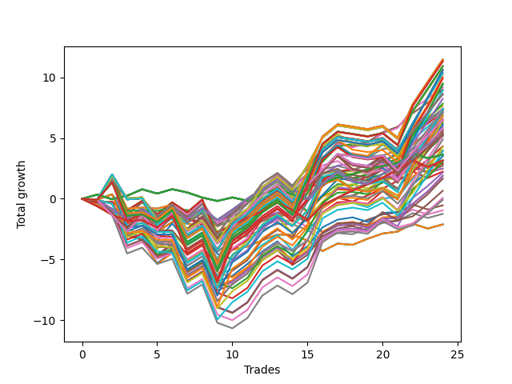

# Short HLT 105_1y 
- Symbol: TSLA
- Date Range: 05/15/2023 - 05/17/2024
- Trading Period: 8:30-12:30
- Number of Trades: 24



| Id. | Name | Win Percent | Profit | Avg Profit / Trade | Avg Time / Trade | Std |      | Name | Win Percent | Profit | Avg Profit / Trade | Avg Time / Trade | Std |
| --- | ---- | ----------- | ------ | ------------------ | ---------------- | --- | ---- | ---- | ----------- | ------ | ------------------ | ---------------- | --- |
| | Sorted By <br> Profit | | | | | | | Sorted By <br> Win Percentage |||||
|0| TP-2.5 180m | 62.50 | 11.46 | 0.48 | 82:47 | 1.65 |     | TP-1.25 30m | 70.83 | 9.17 | 0.38 | 25:12 | 0.91 |
|1| TP-2.5 165m | 62.50 | 11.46 | 0.48 | 82:47 | 1.65 |     | TP-1 30m | 70.83 | 8.98 | 0.37 | 22:27 | 0.92 |
|2| TP-2.5 150m | 62.50 | 11.46 | 0.48 | 82:47 | 1.65 |     | TP-1.75 30m | 70.83 | 7.65 | 0.32 | 27:32 | 0.98 |
|3| TP-2.5 135m | 62.50 | 11.46 | 0.48 | 82:47 | 1.65 |     | TP-1.5 30m | 70.83 | 7.35 | 0.31 | 27:10 | 0.90 |
|4| TP-2.5 120m | 62.50 | 11.46 | 0.48 | 82:47 | 1.65 |     | TP-2.75 30m | 70.83 | 7.34 | 0.31 | 28:22 | 1.05 |
|5| TP-3 180m | 62.50 | 11.32 | 0.47 | 83:42 | 1.85 |     | TP-2.5 30m | 70.83 | 7.34 | 0.31 | 28:22 | 1.05 |
|6| TP-3 165m | 62.50 | 11.32 | 0.47 | 83:42 | 1.85 |     | TP-2.25 30m | 70.83 | 7.34 | 0.31 | 28:22 | 1.05 |
|7| TP-3 150m | 62.50 | 11.32 | 0.47 | 83:42 | 1.85 |     | TP-2 30m | 70.83 | 7.29 | 0.30 | 27:47 | 1.02 |
|8| TP-3 135m | 62.50 | 11.32 | 0.47 | 83:42 | 1.85 |     | TP-3 30m | 70.83 | 7.11 | 0.30 | 28:27 | 1.08 |
|9| TP-3 120m | 62.50 | 11.32 | 0.47 | 83:42 | 1.85 |     | TP-1 45m | 66.67 | 7.43 | 0.31 | 26:17 | 0.99 |
|10| TP-1.75 180m | 62.50 | 10.90 | 0.45 | 65:30 | 1.39 |     | TP-2.5 180m | 62.50 | 11.46 | 0.48 | 82:47 | 1.65 |
|11| TP-1.75 165m | 62.50 | 10.90 | 0.45 | 65:30 | 1.39 |     | TP-2.5 165m | 62.50 | 11.46 | 0.48 | 82:47 | 1.65 |
|12| TP-1.75 150m | 62.50 | 10.90 | 0.45 | 65:30 | 1.39 |     | TP-2.5 150m | 62.50 | 11.46 | 0.48 | 82:47 | 1.65 |
|13| TP-1.75 135m | 62.50 | 10.90 | 0.45 | 65:30 | 1.39 |     | TP-2.5 135m | 62.50 | 11.46 | 0.48 | 82:47 | 1.65 |
|14| TP-1.75 120m | 62.50 | 10.90 | 0.45 | 65:30 | 1.39 |     | TP-2.5 120m | 62.50 | 11.46 | 0.48 | 82:47 | 1.65 |
|15| TP-2.75 180m | 62.50 | 10.89 | 0.45 | 83:07 | 1.70 |     | TP-3 180m | 62.50 | 11.32 | 0.47 | 83:42 | 1.85 |
|16| TP-2.75 165m | 62.50 | 10.89 | 0.45 | 83:07 | 1.70 |     | TP-3 165m | 62.50 | 11.32 | 0.47 | 83:42 | 1.85 |
|17| TP-2.75 150m | 62.50 | 10.89 | 0.45 | 83:07 | 1.70 |     | TP-3 150m | 62.50 | 11.32 | 0.47 | 83:42 | 1.85 |
|18| TP-2.75 135m | 62.50 | 10.89 | 0.45 | 83:07 | 1.70 |     | TP-3 135m | 62.50 | 11.32 | 0.47 | 83:42 | 1.85 |
|19| TP-2.75 120m | 62.50 | 10.89 | 0.45 | 83:07 | 1.70 |     | TP-3 120m | 62.50 | 11.32 | 0.47 | 83:42 | 1.85 |
|20| TP-2.25 180m | 62.50 | 10.59 | 0.44 | 77:40 | 1.58 |     | TP-1.75 180m | 62.50 | 10.90 | 0.45 | 65:30 | 1.39 |
|21| TP-2.25 165m | 62.50 | 10.59 | 0.44 | 77:40 | 1.58 |     | TP-1.75 165m | 62.50 | 10.90 | 0.45 | 65:30 | 1.39 |
|22| TP-2.25 150m | 62.50 | 10.59 | 0.44 | 77:40 | 1.58 |     | TP-1.75 150m | 62.50 | 10.90 | 0.45 | 65:30 | 1.39 |
|23| TP-2.25 135m | 62.50 | 10.59 | 0.44 | 77:40 | 1.58 |     | TP-1.75 135m | 62.50 | 10.90 | 0.45 | 65:30 | 1.39 |
|24| TP-2.25 120m | 62.50 | 10.59 | 0.44 | 77:40 | 1.58 |     | TP-1.75 120m | 62.50 | 10.90 | 0.45 | 65:30 | 1.39 |
|25| TP-2 180m | 62.50 | 10.33 | 0.43 | 68:52 | 1.46 |     | TP-2.75 180m | 62.50 | 10.89 | 0.45 | 83:07 | 1.70 |
|26| TP-2 165m | 62.50 | 10.33 | 0.43 | 68:52 | 1.46 |     | TP-2.75 165m | 62.50 | 10.89 | 0.45 | 83:07 | 1.70 |
|27| TP-2 150m | 62.50 | 10.33 | 0.43 | 68:52 | 1.46 |     | TP-2.75 150m | 62.50 | 10.89 | 0.45 | 83:07 | 1.70 |
|28| TP-2 135m | 62.50 | 10.33 | 0.43 | 68:52 | 1.46 |     | TP-2.75 135m | 62.50 | 10.89 | 0.45 | 83:07 | 1.70 |
|29| TP-2 120m | 62.50 | 10.33 | 0.43 | 68:52 | 1.46 |     | TP-2.75 120m | 62.50 | 10.89 | 0.45 | 83:07 | 1.70 |
|30| TP-2.5 105m | 62.50 | 10.05 | 0.42 | 78:00 | 1.61 |     | TP-2.25 180m | 62.50 | 10.59 | 0.44 | 77:40 | 1.58 |
|31| TP-3 105m | 62.50 | 9.91 | 0.41 | 78:55 | 1.82 |     | TP-2.25 165m | 62.50 | 10.59 | 0.44 | 77:40 | 1.58 |
|32| TP-1.75 105m | 62.50 | 9.49 | 0.40 | 63:47 | 1.40 |     | TP-2.25 150m | 62.50 | 10.59 | 0.44 | 77:40 | 1.58 |
|33| TP-2.75 105m | 62.50 | 9.48 | 0.40 | 78:20 | 1.66 |     | TP-2.25 135m | 62.50 | 10.59 | 0.44 | 77:40 | 1.58 |
|34| TP-2.25 105m | 62.50 | 9.38 | 0.39 | 74:17 | 1.57 |     | TP-2.25 120m | 62.50 | 10.59 | 0.44 | 77:40 | 1.58 |
|35| TP-1.25 30m | 70.83 | 9.17 | 0.38 | 25:12 | 0.91 |     | TP-2 180m | 62.50 | 10.33 | 0.43 | 68:52 | 1.46 |
|36| TP-1 30m | 70.83 | 8.98 | 0.37 | 22:27 | 0.92 |     | TP-2 165m | 62.50 | 10.33 | 0.43 | 68:52 | 1.46 |
|37| TP-2 105m | 62.50 | 8.91 | 0.37 | 66:55 | 1.48 |     | TP-2 150m | 62.50 | 10.33 | 0.43 | 68:52 | 1.46 |
|38| TP-1.5 180m | 62.50 | 8.61 | 0.36 | 63:17 | 1.18 |     | TP-2 135m | 62.50 | 10.33 | 0.43 | 68:52 | 1.46 |
|39| TP-1.5 165m | 62.50 | 8.61 | 0.36 | 63:17 | 1.18 |     | TP-2 120m | 62.50 | 10.33 | 0.43 | 68:52 | 1.46 |
|40| TP-1.5 150m | 62.50 | 8.61 | 0.36 | 63:17 | 1.18 |     | TP-2.5 105m | 62.50 | 10.05 | 0.42 | 78:00 | 1.61 |
|41| TP-1.5 135m | 62.50 | 8.61 | 0.36 | 63:17 | 1.18 |     | TP-3 105m | 62.50 | 9.91 | 0.41 | 78:55 | 1.82 |
|42| TP-1.5 120m | 62.50 | 8.61 | 0.36 | 63:17 | 1.18 |     | TP-1.75 105m | 62.50 | 9.49 | 0.40 | 63:47 | 1.40 |
|43| TP-1.75 75m | 58.33 | 8.23 | 0.34 | 55:15 | 1.32 |     | TP-2.75 105m | 62.50 | 9.48 | 0.40 | 78:20 | 1.66 |
|44| TP-1.25 75m | 62.50 | 7.83 | 0.33 | 42:10 | 1.15 |     | TP-2.25 105m | 62.50 | 9.38 | 0.39 | 74:17 | 1.57 |
|45| TP-1.75 30m | 70.83 | 7.65 | 0.32 | 27:32 | 0.98 |     | TP-2 105m | 62.50 | 8.91 | 0.37 | 66:55 | 1.48 |
|46| TP-1.75 90m | 58.33 | 7.44 | 0.31 | 60:30 | 1.35 |     | TP-1.5 180m | 62.50 | 8.61 | 0.36 | 63:17 | 1.18 |
|47| TP-1 45m | 66.67 | 7.43 | 0.31 | 26:17 | 0.99 |     | TP-1.5 165m | 62.50 | 8.61 | 0.36 | 63:17 | 1.18 |
|48| TP-2.5 90m | 58.33 | 7.39 | 0.31 | 71:22 | 1.58 |     | TP-1.5 150m | 62.50 | 8.61 | 0.36 | 63:17 | 1.18 |
|49| TP-1.5 30m | 70.83 | 7.35 | 0.31 | 27:10 | 0.90 |     | TP-1.5 135m | 62.50 | 8.61 | 0.36 | 63:17 | 1.18 |
|50| TP-2.75 30m | 70.83 | 7.34 | 0.31 | 28:22 | 1.05 |     | TP-1.5 120m | 62.50 | 8.61 | 0.36 | 63:17 | 1.18 |
|51| TP-2.5 30m | 70.83 | 7.34 | 0.31 | 28:22 | 1.05 |     | TP-1.25 75m | 62.50 | 7.83 | 0.33 | 42:10 | 1.15 |
|52| TP-2.25 30m | 70.83 | 7.34 | 0.31 | 28:22 | 1.05 |     | TP-1.5 105m | 62.50 | 7.20 | 0.30 | 61:35 | 1.19 |
|53| TP-2 75m | 58.33 | 7.34 | 0.31 | 56:32 | 1.37 |     | TP-1 60m | 62.50 | 6.99 | 0.29 | 28:15 | 1.01 |
|54| TP-2 30m | 70.83 | 7.29 | 0.30 | 27:47 | 1.02 |     | TP-1 75m | 62.50 | 6.57 | 0.27 | 29:02 | 1.04 |
|55| TP-1.5 105m | 62.50 | 7.20 | 0.30 | 61:35 | 1.19 |     | TP-0.75 75m | 62.50 | 6.21 | 0.26 | 21:35 | 0.76 |
|56| TP-2 90m | 58.33 | 7.12 | 0.30 | 62:57 | 1.43 |     | TP-0.75 60m | 62.50 | 6.11 | 0.25 | 20:55 | 0.77 |
|57| TP-3 30m | 70.83 | 7.11 | 0.30 | 28:27 | 1.08 |     | TP-1.25 45m | 62.50 | 5.87 | 0.24 | 34:00 | 1.08 |
|58| TP-1 60m | 62.50 | 6.99 | 0.29 | 28:15 | 1.01 |     | TP-0.75 30m | 62.50 | 5.71 | 0.24 | 17:12 | 0.77 |
|59| TP-3 90m | 58.33 | 6.86 | 0.29 | 72:10 | 1.76 |     | TP-0.75 45m | 62.50 | 5.34 | 0.22 | 19:20 | 0.76 |
|60| TP-2.75 90m | 58.33 | 6.82 | 0.28 | 71:42 | 1.63 |     | TP-1.5 45m | 62.50 | 3.99 | 0.17 | 38:40 | 1.07 |
|61| TP-1 75m | 62.50 | 6.57 | 0.27 | 29:02 | 1.04 |     | TP-0.25 180m | 62.50 | 3.63 | 0.15 | 04:45 | 0.44 |
|62| TP-1.25 180m | 58.33 | 6.50 | 0.27 | 46:10 | 1.18 |     | TP-0.25 165m | 62.50 | 3.63 | 0.15 | 04:45 | 0.44 |
|63| TP-1.25 165m | 58.33 | 6.50 | 0.27 | 46:10 | 1.18 |     | TP-0.25 150m | 62.50 | 3.63 | 0.15 | 04:45 | 0.44 |
|64| TP-1.25 150m | 58.33 | 6.50 | 0.27 | 46:10 | 1.18 |     | TP-0.25 135m | 62.50 | 3.63 | 0.15 | 04:45 | 0.44 |
|65| TP-1.25 135m | 58.33 | 6.50 | 0.27 | 46:10 | 1.18 |     | TP-0.25 120m | 62.50 | 3.63 | 0.15 | 04:45 | 0.44 |
|66| TP-1.25 120m | 58.33 | 6.50 | 0.27 | 46:10 | 1.18 |     | TP-0.25 105m | 62.50 | 3.63 | 0.15 | 04:45 | 0.44 |
|67| TP-2.25 90m | 58.33 | 6.45 | 0.27 | 68:47 | 1.52 |     | TP-0.25 90m | 62.50 | 3.63 | 0.15 | 04:45 | 0.44 |
|68| TP-1.5 75m | 58.33 | 6.37 | 0.27 | 53:17 | 1.12 |     | TP-0.25 75m | 62.50 | 3.63 | 0.15 | 04:45 | 0.44 |
|69| TP-0.75 75m | 62.50 | 6.21 | 0.26 | 21:35 | 0.76 |     | TP-0.25 60m | 62.50 | 3.63 | 0.15 | 04:45 | 0.44 |
|70| TP-0.75 60m | 62.50 | 6.11 | 0.25 | 20:55 | 0.77 |     | TP-0.25 45m | 62.50 | 3.63 | 0.15 | 04:45 | 0.44 |
|71| TP-1.25 60m | 58.33 | 6.05 | 0.25 | 39:05 | 1.10 |     | TP-0.25 30m | 62.50 | 3.63 | 0.15 | 04:45 | 0.44 |
|72| TP-1.25 90m | 58.33 | 5.88 | 0.25 | 43:50 | 1.19 |     | TP-0.25 15m | 62.50 | 3.63 | 0.15 | 04:45 | 0.44 |
|73| TP-1.25 45m | 62.50 | 5.87 | 0.24 | 34:00 | 1.08 |     | TP-1.75 45m | 62.50 | 3.50 | 0.15 | 39:32 | 1.13 |
|74| TP-1.25 105m | 58.33 | 5.78 | 0.24 | 45:05 | 1.19 |     | TP-2 45m | 62.50 | 3.14 | 0.13 | 39:47 | 1.16 |
|75| TP-0.75 30m | 62.50 | 5.71 | 0.24 | 17:12 | 0.77 |     | TP-2.25 45m | 62.50 | 3.07 | 0.13 | 41:02 | 1.20 |
|76| TP-1 90m | 58.33 | 5.61 | 0.23 | 29:40 | 1.06 |     | TP-2.75 45m | 62.50 | 1.89 | 0.08 | 41:37 | 1.13 |
|77| TP-1 105m | 58.33 | 5.59 | 0.23 | 30:17 | 1.06 |     | TP-2.5 45m | 62.50 | 1.89 | 0.08 | 41:37 | 1.13 |
|78| TP-1.5 90m | 58.33 | 5.42 | 0.23 | 58:20 | 1.14 |     | TP-3 45m | 62.50 | 1.66 | 0.07 | 41:42 | 1.16 |
|79| TP-0.75 45m | 62.50 | 5.34 | 0.22 | 19:20 | 0.76 |     | TP-1.75 75m | 58.33 | 8.23 | 0.34 | 55:15 | 1.32 |
|80| TP-1 180m | 58.33 | 5.27 | 0.22 | 30:22 | 1.07 |     | TP-1.75 90m | 58.33 | 7.44 | 0.31 | 60:30 | 1.35 |
|81| TP-1 165m | 58.33 | 5.27 | 0.22 | 30:22 | 1.07 |     | TP-2.5 90m | 58.33 | 7.39 | 0.31 | 71:22 | 1.58 |
|82| TP-1 150m | 58.33 | 5.27 | 0.22 | 30:22 | 1.07 |     | TP-2 75m | 58.33 | 7.34 | 0.31 | 56:32 | 1.37 |
|83| TP-1 135m | 58.33 | 5.27 | 0.22 | 30:22 | 1.07 |     | TP-2 90m | 58.33 | 7.12 | 0.30 | 62:57 | 1.43 |
|84| TP-1 120m | 58.33 | 5.27 | 0.22 | 30:22 | 1.07 |     | TP-3 90m | 58.33 | 6.86 | 0.29 | 72:10 | 1.76 |
|85| TP-0.75 180m | 58.33 | 5.25 | 0.22 | 22:12 | 0.79 |     | TP-2.75 90m | 58.33 | 6.82 | 0.28 | 71:42 | 1.63 |
|86| TP-0.75 165m | 58.33 | 5.25 | 0.22 | 22:12 | 0.79 |     | TP-1.25 180m | 58.33 | 6.50 | 0.27 | 46:10 | 1.18 |
|87| TP-0.75 150m | 58.33 | 5.25 | 0.22 | 22:12 | 0.79 |     | TP-1.25 165m | 58.33 | 6.50 | 0.27 | 46:10 | 1.18 |
|88| TP-0.75 135m | 58.33 | 5.25 | 0.22 | 22:12 | 0.79 |     | TP-1.25 150m | 58.33 | 6.50 | 0.27 | 46:10 | 1.18 |
|89| TP-0.75 120m | 58.33 | 5.25 | 0.22 | 22:12 | 0.79 |     | TP-1.25 135m | 58.33 | 6.50 | 0.27 | 46:10 | 1.18 |
|90| TP-0.75 105m | 58.33 | 5.25 | 0.22 | 22:12 | 0.79 |     | TP-1.25 120m | 58.33 | 6.50 | 0.27 | 46:10 | 1.18 |
|91| TP-0.75 90m | 58.33 | 5.25 | 0.22 | 22:12 | 0.79 |     | TP-2.25 90m | 58.33 | 6.45 | 0.27 | 68:47 | 1.52 |
|92| TP-2.25 75m | 58.33 | 5.19 | 0.22 | 60:17 | 1.44 |     | TP-1.5 75m | 58.33 | 6.37 | 0.27 | 53:17 | 1.12 |
|93| TP-1.75 60m | 58.33 | 5.11 | 0.21 | 48:37 | 1.27 |     | TP-1.25 60m | 58.33 | 6.05 | 0.25 | 39:05 | 1.10 |
|94| TP-2.5 75m | 58.33 | 4.87 | 0.20 | 62:22 | 1.44 |     | TP-1.25 90m | 58.33 | 5.88 | 0.25 | 43:50 | 1.19 |
|95| TP-2 60m | 58.33 | 4.32 | 0.18 | 49:00 | 1.33 |     | TP-1.25 105m | 58.33 | 5.78 | 0.24 | 45:05 | 1.19 |
|96| TP-2.75 75m | 58.33 | 4.28 | 0.18 | 62:37 | 1.49 |     | TP-1 90m | 58.33 | 5.61 | 0.23 | 29:40 | 1.06 |
|97| TP-1.5 45m | 62.50 | 3.99 | 0.17 | 38:40 | 1.07 |     | TP-1 105m | 58.33 | 5.59 | 0.23 | 30:17 | 1.06 |
|98| TP-1.5 60m | 58.33 | 3.92 | 0.16 | 46:57 | 1.09 |     | TP-1.5 90m | 58.33 | 5.42 | 0.23 | 58:20 | 1.14 |
|99| TP-3 75m | 58.33 | 3.89 | 0.16 | 62:55 | 1.60 |     | TP-1 180m | 58.33 | 5.27 | 0.22 | 30:22 | 1.07 |
|100| TP-0.25 180m | 62.50 | 3.63 | 0.15 | 04:45 | 0.44 |     | TP-1 165m | 58.33 | 5.27 | 0.22 | 30:22 | 1.07 |
|101| TP-0.25 165m | 62.50 | 3.63 | 0.15 | 04:45 | 0.44 |     | TP-1 150m | 58.33 | 5.27 | 0.22 | 30:22 | 1.07 |
|102| TP-0.25 150m | 62.50 | 3.63 | 0.15 | 04:45 | 0.44 |     | TP-1 135m | 58.33 | 5.27 | 0.22 | 30:22 | 1.07 |
|103| TP-0.25 135m | 62.50 | 3.63 | 0.15 | 04:45 | 0.44 |     | TP-1 120m | 58.33 | 5.27 | 0.22 | 30:22 | 1.07 |
|104| TP-0.25 120m | 62.50 | 3.63 | 0.15 | 04:45 | 0.44 |     | TP-0.75 180m | 58.33 | 5.25 | 0.22 | 22:12 | 0.79 |
|105| TP-0.25 105m | 62.50 | 3.63 | 0.15 | 04:45 | 0.44 |     | TP-0.75 165m | 58.33 | 5.25 | 0.22 | 22:12 | 0.79 |
|106| TP-0.25 90m | 62.50 | 3.63 | 0.15 | 04:45 | 0.44 |     | TP-0.75 150m | 58.33 | 5.25 | 0.22 | 22:12 | 0.79 |
|107| TP-0.25 75m | 62.50 | 3.63 | 0.15 | 04:45 | 0.44 |     | TP-0.75 135m | 58.33 | 5.25 | 0.22 | 22:12 | 0.79 |
|108| TP-0.25 60m | 62.50 | 3.63 | 0.15 | 04:45 | 0.44 |     | TP-0.75 120m | 58.33 | 5.25 | 0.22 | 22:12 | 0.79 |
|109| TP-0.25 45m | 62.50 | 3.63 | 0.15 | 04:45 | 0.44 |     | TP-0.75 105m | 58.33 | 5.25 | 0.22 | 22:12 | 0.79 |
|110| TP-0.25 30m | 62.50 | 3.63 | 0.15 | 04:45 | 0.44 |     | TP-0.75 90m | 58.33 | 5.25 | 0.22 | 22:12 | 0.79 |
|111| TP-0.25 15m | 62.50 | 3.63 | 0.15 | 04:45 | 0.44 |     | TP-2.25 75m | 58.33 | 5.19 | 0.22 | 60:17 | 1.44 |
|112| TP-1.75 45m | 62.50 | 3.50 | 0.15 | 39:32 | 1.13 |     | TP-1.75 60m | 58.33 | 5.11 | 0.21 | 48:37 | 1.27 |
|113| TP-0.5 180m | 58.33 | 3.15 | 0.13 | 12:42 | 0.65 |     | TP-2.5 75m | 58.33 | 4.87 | 0.20 | 62:22 | 1.44 |
|114| TP-0.5 165m | 58.33 | 3.15 | 0.13 | 12:42 | 0.65 |     | TP-2 60m | 58.33 | 4.32 | 0.18 | 49:00 | 1.33 |
|115| TP-0.5 150m | 58.33 | 3.15 | 0.13 | 12:42 | 0.65 |     | TP-2.75 75m | 58.33 | 4.28 | 0.18 | 62:37 | 1.49 |
|116| TP-0.5 135m | 58.33 | 3.15 | 0.13 | 12:42 | 0.65 |     | TP-1.5 60m | 58.33 | 3.92 | 0.16 | 46:57 | 1.09 |
|117| TP-0.5 120m | 58.33 | 3.15 | 0.13 | 12:42 | 0.65 |     | TP-3 75m | 58.33 | 3.89 | 0.16 | 62:55 | 1.60 |
|118| TP-0.5 105m | 58.33 | 3.15 | 0.13 | 12:42 | 0.65 |     | TP-0.5 180m | 58.33 | 3.15 | 0.13 | 12:42 | 0.65 |
|119| TP-0.5 90m | 58.33 | 3.15 | 0.13 | 12:42 | 0.65 |     | TP-0.5 165m | 58.33 | 3.15 | 0.13 | 12:42 | 0.65 |
|120| TP-0.5 75m | 58.33 | 3.15 | 0.13 | 12:42 | 0.65 |     | TP-0.5 150m | 58.33 | 3.15 | 0.13 | 12:42 | 0.65 |
|121| TP-0.5 60m | 58.33 | 3.15 | 0.13 | 12:42 | 0.65 |     | TP-0.5 135m | 58.33 | 3.15 | 0.13 | 12:42 | 0.65 |
|122| TP-2 45m | 62.50 | 3.14 | 0.13 | 39:47 | 1.16 |     | TP-0.5 120m | 58.33 | 3.15 | 0.13 | 12:42 | 0.65 |
|123| TP-2.25 45m | 62.50 | 3.07 | 0.13 | 41:02 | 1.20 |     | TP-0.5 105m | 58.33 | 3.15 | 0.13 | 12:42 | 0.65 |
|124| TP-0.75 15m | 54.17 | 2.91 | 0.12 | 11:15 | 0.62 |     | TP-0.5 90m | 58.33 | 3.15 | 0.13 | 12:42 | 0.65 |
|125| TP-1 15m | 54.17 | 2.88 | 0.12 | 12:20 | 0.75 |     | TP-0.5 75m | 58.33 | 3.15 | 0.13 | 12:42 | 0.65 |
|126| TP-0.5 45m | 58.33 | 2.73 | 0.11 | 12:12 | 0.64 |     | TP-0.5 60m | 58.33 | 3.15 | 0.13 | 12:42 | 0.65 |
|127| TP-1.25 15m | 54.17 | 2.50 | 0.10 | 12:47 | 0.74 |     | TP-0.5 45m | 58.33 | 2.73 | 0.11 | 12:12 | 0.64 |
|128| TP-0.5 15m | 54.17 | 2.48 | 0.10 | 09:47 | 0.58 |     | TP-2.25 60m | 58.33 | 2.16 | 0.09 | 51:30 | 1.39 |
|129| TP-0.5 30m | 54.17 | 2.24 | 0.09 | 11:35 | 0.64 |     | TP-2.5 60m | 58.33 | 0.66 | 0.03 | 52:57 | 1.36 |
|130| TP-2.25 60m | 58.33 | 2.16 | 0.09 | 51:30 | 1.39 |     | TP-2.75 60m | 58.33 | 0.07 | 0.00 | 53:12 | 1.41 |
|131| TP-2.75 45m | 62.50 | 1.89 | 0.08 | 41:37 | 1.13 |     | TP-3 60m | 58.33 | -0.09 | -0.00 | 53:27 | 1.51 |
|132| TP-2.5 45m | 62.50 | 1.89 | 0.08 | 41:37 | 1.13 |     | TP-0.75 15m | 54.17 | 2.91 | 0.12 | 11:15 | 0.62 |
|133| TP-3 45m | 62.50 | 1.66 | 0.07 | 41:42 | 1.16 |     | TP-1 15m | 54.17 | 2.88 | 0.12 | 12:20 | 0.75 |
|134| TP-2.5 60m | 58.33 | 0.66 | 0.03 | 52:57 | 1.36 |     | TP-1.25 15m | 54.17 | 2.50 | 0.10 | 12:47 | 0.74 |
|135| TP-2.75 60m | 58.33 | 0.07 | 0.00 | 53:12 | 1.41 |     | TP-0.5 15m | 54.17 | 2.48 | 0.10 | 09:47 | 0.58 |
|136| TP-3 60m | 58.33 | -0.09 | -0.00 | 53:27 | 1.51 |     | TP-0.5 30m | 54.17 | 2.24 | 0.09 | 11:35 | 0.64 |
|137| TP-1.5 15m | 50.00 | -0.54 | -0.02 | 13:30 | 0.70 |     | TP-1.5 15m | 50.00 | -0.54 | -0.02 | 13:30 | 0.70 |
|138| TP-1.75 15m | 50.00 | -0.95 | -0.04 | 13:47 | 0.74 |     | TP-1.75 15m | 50.00 | -0.95 | -0.04 | 13:47 | 0.74 |
|139| TP-2 15m | 50.00 | -1.24 | -0.05 | 13:55 | 0.77 |     | TP-2 15m | 50.00 | -1.24 | -0.05 | 13:55 | 0.77 |
|140| TP-3 15m | 50.00 | -2.11 | -0.09 | 14:00 | 0.88 |     | TP-3 15m | 50.00 | -2.11 | -0.09 | 14:00 | 0.88 |
|141| TP-2.75 15m | 50.00 | -2.11 | -0.09 | 14:00 | 0.88 |     | TP-2.75 15m | 50.00 | -2.11 | -0.09 | 14:00 | 0.88 |
|142| TP-2.5 15m | 50.00 | -2.11 | -0.09 | 14:00 | 0.88 |     | TP-2.5 15m | 50.00 | -2.11 | -0.09 | 14:00 | 0.88 |
|143| TP-2.25 15m | 50.00 | -2.11 | -0.09 | 14:00 | 0.88 |     | TP-2.25 15m | 50.00 | -2.11 | -0.09 | 14:00 | 0.88 |

### Test TP-0.25 15m
* Take Profit of 0.25 Point
* 0.25 Stoploss
* Results:
```
Total Trades: 24
Percent Up: 37.50
Percent Down: 62.50
Total Points Moved Down: 3.63
Potential Profit: 1815.00
Total Points Ups: 3.15 Count Ups: 9
Total Points Downs: 6.78 Count Downs: 15
```

<details><summary>Trades</summary>

<code>In: 2023-05-30 12:15:00		Out: 2023-05-30 12:17:00		Total Position Time: 02:00		Total Move Down: 0.34		Total to Date: 0.34</code> <br />
<code>In: 2023-06-13 09:50:00		Out: 2023-06-13 09:52:00		Total Position Time: 02:00		Total Move Down: -0.38		Total to Date: -0.04</code> <br />
<code>In: 2023-07-13 11:00:00		Out: 2023-07-13 11:02:00		Total Position Time: 02:00		Total Move Down: 0.29		Total to Date: 0.25</code> <br />
<code>In: 2023-07-24 11:20:00		Out: 2023-07-24 11:22:00		Total Position Time: 02:00		Total Move Down: 0.53		Total to Date: 0.78</code> <br />
<code>In: 2023-07-28 09:10:00		Out: 2023-07-28 09:12:00		Total Position Time: 02:00		Total Move Down: -0.35		Total to Date: 0.43</code> <br />
<code>In: 2023-07-31 09:50:00		Out: 2023-07-31 09:54:00		Total Position Time: 04:00		Total Move Down: 0.36		Total to Date: 0.79</code> <br />
<code>In: 2023-08-25 10:25:00		Out: 2023-08-25 10:28:00		Total Position Time: 03:00		Total Move Down: -0.27		Total to Date: 0.52</code> <br />
<code>In: 2023-09-11 12:15:00		Out: 2023-09-11 12:25:00		Total Position Time: 10:00		Total Move Down: -0.42		Total to Date: 0.10</code> <br />
<code>In: 2023-09-20 09:55:00		Out: 2023-09-20 09:59:00		Total Position Time: 04:00		Total Move Down: -0.28		Total to Date: -0.18</code> <br />
<code>In: 2023-10-02 08:45:00		Out: 2023-10-02 08:48:00		Total Position Time: 03:00		Total Move Down: 0.29		Total to Date: 0.11</code> <br />
<code>In: 2023-10-05 11:55:00		Out: 2023-10-05 11:58:00		Total Position Time: 03:00		Total Move Down: -0.27		Total to Date: -0.16</code> <br />
<code>In: 2023-10-24 11:00:00		Out: 2023-10-24 11:12:00		Total Position Time: 12:00		Total Move Down: 0.57		Total to Date: 0.41</code> <br />
<code>In: 2023-11-02 12:15:00		Out: 2023-11-02 12:20:00		Total Position Time: 05:00		Total Move Down: 0.41		Total to Date: 0.82</code> <br />
<code>In: 2023-11-28 11:20:00		Out: 2023-11-28 11:22:00		Total Position Time: 02:00		Total Move Down: -0.47		Total to Date: 0.35</code> <br />
<code>In: 2023-11-29 09:45:00		Out: 2023-11-29 09:48:00		Total Position Time: 03:00		Total Move Down: -0.32		Total to Date: 0.03</code> <br />
<code>In: 2023-12-14 10:00:00		Out: 2023-12-14 10:02:00		Total Position Time: 02:00		Total Move Down: 1.25		Total to Date: 1.28</code> <br />
<code>In: 2024-02-07 11:10:00		Out: 2024-02-07 11:13:00		Total Position Time: 03:00		Total Move Down: 0.47		Total to Date: 1.75</code> <br />
<code>In: 2024-02-22 10:55:00		Out: 2024-02-22 11:00:00		Total Position Time: 05:00		Total Move Down: 0.28		Total to Date: 2.03</code> <br />
<code>In: 2024-03-18 11:50:00		Out: 2024-03-18 11:57:00		Total Position Time: 07:00		Total Move Down: 0.40		Total to Date: 2.43</code> <br />
<code>In: 2024-03-27 09:55:00		Out: 2024-03-27 10:03:00		Total Position Time: 08:00		Total Move Down: 0.26		Total to Date: 2.69</code> <br />
<code>In: 2024-04-24 11:10:00		Out: 2024-04-24 11:18:00		Total Position Time: 08:00		Total Move Down: 0.27		Total to Date: 2.96</code> <br />
<code>In: 2024-04-29 09:40:00		Out: 2024-04-29 09:42:00		Total Position Time: 02:00		Total Move Down: 0.77		Total to Date: 3.73</code> <br />
<code>In: 2024-05-14 08:40:00		Out: 2024-05-14 08:50:00		Total Position Time: 10:00		Total Move Down: -0.39		Total to Date: 3.34</code> <br />
<code>In: 2024-05-17 09:45:00		Out: 2024-05-17 09:55:00		Total Position Time: 10:00		Total Move Down: 0.29		Total to Date: 3.63</code> <br />


</details>

### Test TP-0.5 15m
* Take Profit of 0.5 Point
* 0.5 Stoploss
* Results:
```
Total Trades: 24
Percent Up: 45.83
Percent Down: 54.17
Total Points Moved Down: 2.48
Potential Profit: 1240.00
Total Points Ups: 5.02 Count Ups: 11
Total Points Downs: 7.50 Count Downs: 13
```

<details><summary>Trades</summary>

<code>In: 2023-05-30 12:15:00		Out: 2023-05-30 12:24:00		Total Position Time: 09:00		Total Move Down: -0.60		Total to Date: -0.60</code> <br />
<code>In: 2023-06-13 09:50:00		Out: 2023-06-13 10:03:00		Total Position Time: 13:00		Total Move Down: -0.71		Total to Date: -1.31</code> <br />
<code>In: 2023-07-13 11:00:00		Out: 2023-07-13 11:12:00		Total Position Time: 12:00		Total Move Down: -0.50		Total to Date: -1.81</code> <br />
<code>In: 2023-07-24 11:20:00		Out: 2023-07-24 11:22:00		Total Position Time: 02:00		Total Move Down: 0.53		Total to Date: -1.28</code> <br />
<code>In: 2023-07-28 09:10:00		Out: 2023-07-28 09:13:00		Total Position Time: 03:00		Total Move Down: -0.54		Total to Date: -1.82</code> <br />
<code>In: 2023-07-31 09:50:00		Out: 2023-07-31 09:56:00		Total Position Time: 06:00		Total Move Down: 0.81		Total to Date: -1.01</code> <br />
<code>In: 2023-08-25 10:25:00		Out: 2023-08-25 10:39:00		Total Position Time: 14:00		Total Move Down: -0.11		Total to Date: -1.12</code> <br />
<code>In: 2023-09-11 12:15:00		Out: 2023-09-11 12:26:00		Total Position Time: 11:00		Total Move Down: -0.54		Total to Date: -1.66</code> <br />
<code>In: 2023-09-20 09:55:00		Out: 2023-09-20 10:00:00		Total Position Time: 05:00		Total Move Down: -0.63		Total to Date: -2.29</code> <br />
<code>In: 2023-10-02 08:45:00		Out: 2023-10-02 08:54:00		Total Position Time: 09:00		Total Move Down: 0.59		Total to Date: -1.70</code> <br />
<code>In: 2023-10-05 11:55:00		Out: 2023-10-05 12:09:00		Total Position Time: 14:00		Total Move Down: 0.25		Total to Date: -1.45</code> <br />
<code>In: 2023-10-24 11:00:00		Out: 2023-10-24 11:12:00		Total Position Time: 12:00		Total Move Down: 0.57		Total to Date: -0.88</code> <br />
<code>In: 2023-11-02 12:15:00		Out: 2023-11-02 12:27:00		Total Position Time: 12:00		Total Move Down: 0.69		Total to Date: -0.19</code> <br />
<code>In: 2023-11-28 11:20:00		Out: 2023-11-28 11:34:00		Total Position Time: 14:00		Total Move Down: -0.03		Total to Date: -0.22</code> <br />
<code>In: 2023-11-29 09:45:00		Out: 2023-11-29 09:53:00		Total Position Time: 08:00		Total Move Down: -0.86		Total to Date: -1.08</code> <br />
<code>In: 2023-12-14 10:00:00		Out: 2023-12-14 10:02:00		Total Position Time: 02:00		Total Move Down: 1.25		Total to Date: 0.17</code> <br />
<code>In: 2024-02-07 11:10:00		Out: 2024-02-07 11:14:00		Total Position Time: 04:00		Total Move Down: 0.61		Total to Date: 0.78</code> <br />
<code>In: 2024-02-22 10:55:00		Out: 2024-02-22 11:09:00		Total Position Time: 14:00		Total Move Down: -0.10		Total to Date: 0.68</code> <br />
<code>In: 2024-03-18 11:50:00		Out: 2024-03-18 12:03:00		Total Position Time: 13:00		Total Move Down: 0.50		Total to Date: 1.18</code> <br />
<code>In: 2024-03-27 09:55:00		Out: 2024-03-27 10:09:00		Total Position Time: 14:00		Total Move Down: 0.43		Total to Date: 1.61</code> <br />
<code>In: 2024-04-24 11:10:00		Out: 2024-04-24 11:24:00		Total Position Time: 14:00		Total Move Down: 0.16		Total to Date: 1.77</code> <br />
<code>In: 2024-04-29 09:40:00		Out: 2024-04-29 09:42:00		Total Position Time: 02:00		Total Move Down: 0.77		Total to Date: 2.54</code> <br />
<code>In: 2024-05-14 08:40:00		Out: 2024-05-14 08:54:00		Total Position Time: 14:00		Total Move Down: -0.40		Total to Date: 2.14</code> <br />
<code>In: 2024-05-17 09:45:00		Out: 2024-05-17 09:59:00		Total Position Time: 14:00		Total Move Down: 0.34		Total to Date: 2.48</code> <br />


</details>

### Test TP-0.75 15m
* Take Profit of 0.75 Point
* 0.75 Stoploss
* Results:
```
Total Trades: 24
Percent Up: 45.83
Percent Down: 54.17
Total Points Moved Down: 2.91
Potential Profit: 1455.00
Total Points Ups: 5.18 Count Ups: 11
Total Points Downs: 8.09 Count Downs: 13
```

<details><summary>Trades</summary>

<code>In: 2023-05-30 12:15:00		Out: 2023-05-30 12:29:00		Total Position Time: 14:00		Total Move Down: -0.48		Total to Date: -0.48</code> <br />
<code>In: 2023-06-13 09:50:00		Out: 2023-06-13 10:04:00		Total Position Time: 14:00		Total Move Down: -0.53		Total to Date: -1.01</code> <br />
<code>In: 2023-07-13 11:00:00		Out: 2023-07-13 11:14:00		Total Position Time: 14:00		Total Move Down: -0.57		Total to Date: -1.58</code> <br />
<code>In: 2023-07-24 11:20:00		Out: 2023-07-24 11:31:00		Total Position Time: 11:00		Total Move Down: 0.78		Total to Date: -0.80</code> <br />
<code>In: 2023-07-28 09:10:00		Out: 2023-07-28 09:14:00		Total Position Time: 04:00		Total Move Down: -0.83		Total to Date: -1.63</code> <br />
<code>In: 2023-07-31 09:50:00		Out: 2023-07-31 09:56:00		Total Position Time: 06:00		Total Move Down: 0.81		Total to Date: -0.82</code> <br />
<code>In: 2023-08-25 10:25:00		Out: 2023-08-25 10:39:00		Total Position Time: 14:00		Total Move Down: -0.11		Total to Date: -0.93</code> <br />
<code>In: 2023-09-11 12:15:00		Out: 2023-09-11 12:29:00		Total Position Time: 14:00		Total Move Down: -0.30		Total to Date: -1.23</code> <br />
<code>In: 2023-09-20 09:55:00		Out: 2023-09-20 10:04:00		Total Position Time: 09:00		Total Move Down: -0.97		Total to Date: -2.20</code> <br />
<code>In: 2023-10-02 08:45:00		Out: 2023-10-02 08:55:00		Total Position Time: 10:00		Total Move Down: 0.84		Total to Date: -1.36</code> <br />
<code>In: 2023-10-05 11:55:00		Out: 2023-10-05 12:09:00		Total Position Time: 14:00		Total Move Down: 0.25		Total to Date: -1.11</code> <br />
<code>In: 2023-10-24 11:00:00		Out: 2023-10-24 11:14:00		Total Position Time: 14:00		Total Move Down: 0.52		Total to Date: -0.59</code> <br />
<code>In: 2023-11-02 12:15:00		Out: 2023-11-02 12:29:00		Total Position Time: 14:00		Total Move Down: 0.47		Total to Date: -0.12</code> <br />
<code>In: 2023-11-28 11:20:00		Out: 2023-11-28 11:34:00		Total Position Time: 14:00		Total Move Down: -0.03		Total to Date: -0.15</code> <br />
<code>In: 2023-11-29 09:45:00		Out: 2023-11-29 09:53:00		Total Position Time: 08:00		Total Move Down: -0.86		Total to Date: -1.01</code> <br />
<code>In: 2023-12-14 10:00:00		Out: 2023-12-14 10:02:00		Total Position Time: 02:00		Total Move Down: 1.25		Total to Date: 0.24</code> <br />
<code>In: 2024-02-07 11:10:00		Out: 2024-02-07 11:18:00		Total Position Time: 08:00		Total Move Down: 0.97		Total to Date: 1.21</code> <br />
<code>In: 2024-02-22 10:55:00		Out: 2024-02-22 11:09:00		Total Position Time: 14:00		Total Move Down: -0.10		Total to Date: 1.11</code> <br />
<code>In: 2024-03-18 11:50:00		Out: 2024-03-18 12:04:00		Total Position Time: 14:00		Total Move Down: 0.50		Total to Date: 1.61</code> <br />
<code>In: 2024-03-27 09:55:00		Out: 2024-03-27 10:09:00		Total Position Time: 14:00		Total Move Down: 0.43		Total to Date: 2.04</code> <br />
<code>In: 2024-04-24 11:10:00		Out: 2024-04-24 11:24:00		Total Position Time: 14:00		Total Move Down: 0.16		Total to Date: 2.20</code> <br />
<code>In: 2024-04-29 09:40:00		Out: 2024-04-29 09:42:00		Total Position Time: 02:00		Total Move Down: 0.77		Total to Date: 2.97</code> <br />
<code>In: 2024-05-14 08:40:00		Out: 2024-05-14 08:54:00		Total Position Time: 14:00		Total Move Down: -0.40		Total to Date: 2.57</code> <br />
<code>In: 2024-05-17 09:45:00		Out: 2024-05-17 09:59:00		Total Position Time: 14:00		Total Move Down: 0.34		Total to Date: 2.91</code> <br />


</details>

### Test TP-1 15m
* Take Profit of 1 Point
* 1 Stoploss
* Results:
```
Total Trades: 24
Percent Up: 45.83
Percent Down: 54.17
Total Points Moved Down: 2.88
Potential Profit: 1440.00
Total Points Ups: 6.02 Count Ups: 11
Total Points Downs: 8.90 Count Downs: 13
```

<details><summary>Trades</summary>

<code>In: 2023-05-30 12:15:00		Out: 2023-05-30 12:29:00		Total Position Time: 14:00		Total Move Down: -0.48		Total to Date: -0.48</code> <br />
<code>In: 2023-06-13 09:50:00		Out: 2023-06-13 10:04:00		Total Position Time: 14:00		Total Move Down: -0.53		Total to Date: -1.01</code> <br />
<code>In: 2023-07-13 11:00:00		Out: 2023-07-13 11:14:00		Total Position Time: 14:00		Total Move Down: -0.57		Total to Date: -1.58</code> <br />
<code>In: 2023-07-24 11:20:00		Out: 2023-07-24 11:34:00		Total Position Time: 14:00		Total Move Down: 0.79		Total to Date: -0.79</code> <br />
<code>In: 2023-07-28 09:10:00		Out: 2023-07-28 09:15:00		Total Position Time: 05:00		Total Move Down: -1.26		Total to Date: -2.05</code> <br />
<code>In: 2023-07-31 09:50:00		Out: 2023-07-31 10:04:00		Total Position Time: 14:00		Total Move Down: 0.80		Total to Date: -1.25</code> <br />
<code>In: 2023-08-25 10:25:00		Out: 2023-08-25 10:39:00		Total Position Time: 14:00		Total Move Down: -0.11		Total to Date: -1.36</code> <br />
<code>In: 2023-09-11 12:15:00		Out: 2023-09-11 12:29:00		Total Position Time: 14:00		Total Move Down: -0.30		Total to Date: -1.66</code> <br />
<code>In: 2023-09-20 09:55:00		Out: 2023-09-20 10:05:00		Total Position Time: 10:00		Total Move Down: -1.77		Total to Date: -3.43</code> <br />
<code>In: 2023-10-02 08:45:00		Out: 2023-10-02 08:57:00		Total Position Time: 12:00		Total Move Down: 0.99		Total to Date: -2.44</code> <br />
<code>In: 2023-10-05 11:55:00		Out: 2023-10-05 12:09:00		Total Position Time: 14:00		Total Move Down: 0.25		Total to Date: -2.19</code> <br />
<code>In: 2023-10-24 11:00:00		Out: 2023-10-24 11:14:00		Total Position Time: 14:00		Total Move Down: 0.52		Total to Date: -1.67</code> <br />
<code>In: 2023-11-02 12:15:00		Out: 2023-11-02 12:29:00		Total Position Time: 14:00		Total Move Down: 0.47		Total to Date: -1.20</code> <br />
<code>In: 2023-11-28 11:20:00		Out: 2023-11-28 11:34:00		Total Position Time: 14:00		Total Move Down: -0.03		Total to Date: -1.23</code> <br />
<code>In: 2023-11-29 09:45:00		Out: 2023-11-29 09:59:00		Total Position Time: 14:00		Total Move Down: -0.47		Total to Date: -1.70</code> <br />
<code>In: 2023-12-14 10:00:00		Out: 2023-12-14 10:02:00		Total Position Time: 02:00		Total Move Down: 1.25		Total to Date: -0.45</code> <br />
<code>In: 2024-02-07 11:10:00		Out: 2024-02-07 11:20:00		Total Position Time: 10:00		Total Move Down: 1.29		Total to Date: 0.84</code> <br />
<code>In: 2024-02-22 10:55:00		Out: 2024-02-22 11:09:00		Total Position Time: 14:00		Total Move Down: -0.10		Total to Date: 0.74</code> <br />
<code>In: 2024-03-18 11:50:00		Out: 2024-03-18 12:04:00		Total Position Time: 14:00		Total Move Down: 0.50		Total to Date: 1.24</code> <br />
<code>In: 2024-03-27 09:55:00		Out: 2024-03-27 10:09:00		Total Position Time: 14:00		Total Move Down: 0.43		Total to Date: 1.67</code> <br />
<code>In: 2024-04-24 11:10:00		Out: 2024-04-24 11:24:00		Total Position Time: 14:00		Total Move Down: 0.16		Total to Date: 1.83</code> <br />
<code>In: 2024-04-29 09:40:00		Out: 2024-04-29 09:45:00		Total Position Time: 05:00		Total Move Down: 1.11		Total to Date: 2.94</code> <br />
<code>In: 2024-05-14 08:40:00		Out: 2024-05-14 08:54:00		Total Position Time: 14:00		Total Move Down: -0.40		Total to Date: 2.54</code> <br />
<code>In: 2024-05-17 09:45:00		Out: 2024-05-17 09:59:00		Total Position Time: 14:00		Total Move Down: 0.34		Total to Date: 2.88</code> <br />


</details>

### Test TP-1.25 15m
* Take Profit of 1.25 Point
* 1.25 Stoploss
* Results:
```
Total Trades: 24
Percent Up: 45.83
Percent Down: 54.17
Total Points Moved Down: 2.50
Potential Profit: 1250.00
Total Points Ups: 6.02 Count Ups: 11
Total Points Downs: 8.52 Count Downs: 13
```

<details><summary>Trades</summary>

<code>In: 2023-05-30 12:15:00		Out: 2023-05-30 12:29:00		Total Position Time: 14:00		Total Move Down: -0.48		Total to Date: -0.48</code> <br />
<code>In: 2023-06-13 09:50:00		Out: 2023-06-13 10:04:00		Total Position Time: 14:00		Total Move Down: -0.53		Total to Date: -1.01</code> <br />
<code>In: 2023-07-13 11:00:00		Out: 2023-07-13 11:14:00		Total Position Time: 14:00		Total Move Down: -0.57		Total to Date: -1.58</code> <br />
<code>In: 2023-07-24 11:20:00		Out: 2023-07-24 11:34:00		Total Position Time: 14:00		Total Move Down: 0.79		Total to Date: -0.79</code> <br />
<code>In: 2023-07-28 09:10:00		Out: 2023-07-28 09:15:00		Total Position Time: 05:00		Total Move Down: -1.26		Total to Date: -2.05</code> <br />
<code>In: 2023-07-31 09:50:00		Out: 2023-07-31 10:04:00		Total Position Time: 14:00		Total Move Down: 0.80		Total to Date: -1.25</code> <br />
<code>In: 2023-08-25 10:25:00		Out: 2023-08-25 10:39:00		Total Position Time: 14:00		Total Move Down: -0.11		Total to Date: -1.36</code> <br />
<code>In: 2023-09-11 12:15:00		Out: 2023-09-11 12:29:00		Total Position Time: 14:00		Total Move Down: -0.30		Total to Date: -1.66</code> <br />
<code>In: 2023-09-20 09:55:00		Out: 2023-09-20 10:05:00		Total Position Time: 10:00		Total Move Down: -1.77		Total to Date: -3.43</code> <br />
<code>In: 2023-10-02 08:45:00		Out: 2023-10-02 08:59:00		Total Position Time: 14:00		Total Move Down: 1.07		Total to Date: -2.36</code> <br />
<code>In: 2023-10-05 11:55:00		Out: 2023-10-05 12:09:00		Total Position Time: 14:00		Total Move Down: 0.25		Total to Date: -2.11</code> <br />
<code>In: 2023-10-24 11:00:00		Out: 2023-10-24 11:14:00		Total Position Time: 14:00		Total Move Down: 0.52		Total to Date: -1.59</code> <br />
<code>In: 2023-11-02 12:15:00		Out: 2023-11-02 12:29:00		Total Position Time: 14:00		Total Move Down: 0.47		Total to Date: -1.12</code> <br />
<code>In: 2023-11-28 11:20:00		Out: 2023-11-28 11:34:00		Total Position Time: 14:00		Total Move Down: -0.03		Total to Date: -1.15</code> <br />
<code>In: 2023-11-29 09:45:00		Out: 2023-11-29 09:59:00		Total Position Time: 14:00		Total Move Down: -0.47		Total to Date: -1.62</code> <br />
<code>In: 2023-12-14 10:00:00		Out: 2023-12-14 10:02:00		Total Position Time: 02:00		Total Move Down: 1.25		Total to Date: -0.37</code> <br />
<code>In: 2024-02-07 11:10:00		Out: 2024-02-07 11:20:00		Total Position Time: 10:00		Total Move Down: 1.29		Total to Date: 0.92</code> <br />
<code>In: 2024-02-22 10:55:00		Out: 2024-02-22 11:09:00		Total Position Time: 14:00		Total Move Down: -0.10		Total to Date: 0.82</code> <br />
<code>In: 2024-03-18 11:50:00		Out: 2024-03-18 12:04:00		Total Position Time: 14:00		Total Move Down: 0.50		Total to Date: 1.32</code> <br />
<code>In: 2024-03-27 09:55:00		Out: 2024-03-27 10:09:00		Total Position Time: 14:00		Total Move Down: 0.43		Total to Date: 1.75</code> <br />
<code>In: 2024-04-24 11:10:00		Out: 2024-04-24 11:24:00		Total Position Time: 14:00		Total Move Down: 0.16		Total to Date: 1.91</code> <br />
<code>In: 2024-04-29 09:40:00		Out: 2024-04-29 09:54:00		Total Position Time: 14:00		Total Move Down: 0.65		Total to Date: 2.56</code> <br />
<code>In: 2024-05-14 08:40:00		Out: 2024-05-14 08:54:00		Total Position Time: 14:00		Total Move Down: -0.40		Total to Date: 2.16</code> <br />
<code>In: 2024-05-17 09:45:00		Out: 2024-05-17 09:59:00		Total Position Time: 14:00		Total Move Down: 0.34		Total to Date: 2.50</code> <br />


</details>

### Test TP-1.5 15m
* Take Profit of 1.5 Point
* 1.5 Stoploss
* Results:
```
Total Trades: 24
Percent Up: 50.00
Percent Down: 50.00
Total Points Moved Down: -0.54
Potential Profit: -270.00
Total Points Ups: 7.13 Count Ups: 12
Total Points Downs: 6.59 Count Downs: 12
```

<details><summary>Trades</summary>

<code>In: 2023-05-30 12:15:00		Out: 2023-05-30 12:29:00		Total Position Time: 14:00		Total Move Down: -0.48		Total to Date: -0.48</code> <br />
<code>In: 2023-06-13 09:50:00		Out: 2023-06-13 10:04:00		Total Position Time: 14:00		Total Move Down: -0.53		Total to Date: -1.01</code> <br />
<code>In: 2023-07-13 11:00:00		Out: 2023-07-13 11:14:00		Total Position Time: 14:00		Total Move Down: -0.57		Total to Date: -1.58</code> <br />
<code>In: 2023-07-24 11:20:00		Out: 2023-07-24 11:34:00		Total Position Time: 14:00		Total Move Down: 0.79		Total to Date: -0.79</code> <br />
<code>In: 2023-07-28 09:10:00		Out: 2023-07-28 09:16:00		Total Position Time: 06:00		Total Move Down: -1.51		Total to Date: -2.30</code> <br />
<code>In: 2023-07-31 09:50:00		Out: 2023-07-31 10:04:00		Total Position Time: 14:00		Total Move Down: 0.80		Total to Date: -1.50</code> <br />
<code>In: 2023-08-25 10:25:00		Out: 2023-08-25 10:39:00		Total Position Time: 14:00		Total Move Down: -0.11		Total to Date: -1.61</code> <br />
<code>In: 2023-09-11 12:15:00		Out: 2023-09-11 12:29:00		Total Position Time: 14:00		Total Move Down: -0.30		Total to Date: -1.91</code> <br />
<code>In: 2023-09-20 09:55:00		Out: 2023-09-20 10:05:00		Total Position Time: 10:00		Total Move Down: -1.77		Total to Date: -3.68</code> <br />
<code>In: 2023-10-02 08:45:00		Out: 2023-10-02 08:59:00		Total Position Time: 14:00		Total Move Down: 1.07		Total to Date: -2.61</code> <br />
<code>In: 2023-10-05 11:55:00		Out: 2023-10-05 12:09:00		Total Position Time: 14:00		Total Move Down: 0.25		Total to Date: -2.36</code> <br />
<code>In: 2023-10-24 11:00:00		Out: 2023-10-24 11:14:00		Total Position Time: 14:00		Total Move Down: 0.52		Total to Date: -1.84</code> <br />
<code>In: 2023-11-02 12:15:00		Out: 2023-11-02 12:29:00		Total Position Time: 14:00		Total Move Down: 0.47		Total to Date: -1.37</code> <br />
<code>In: 2023-11-28 11:20:00		Out: 2023-11-28 11:34:00		Total Position Time: 14:00		Total Move Down: -0.03		Total to Date: -1.40</code> <br />
<code>In: 2023-11-29 09:45:00		Out: 2023-11-29 09:59:00		Total Position Time: 14:00		Total Move Down: -0.47		Total to Date: -1.87</code> <br />
<code>In: 2023-12-14 10:00:00		Out: 2023-12-14 10:14:00		Total Position Time: 14:00		Total Move Down: -0.86		Total to Date: -2.73</code> <br />
<code>In: 2024-02-07 11:10:00		Out: 2024-02-07 11:24:00		Total Position Time: 14:00		Total Move Down: 0.61		Total to Date: -2.12</code> <br />
<code>In: 2024-02-22 10:55:00		Out: 2024-02-22 11:09:00		Total Position Time: 14:00		Total Move Down: -0.10		Total to Date: -2.22</code> <br />
<code>In: 2024-03-18 11:50:00		Out: 2024-03-18 12:04:00		Total Position Time: 14:00		Total Move Down: 0.50		Total to Date: -1.72</code> <br />
<code>In: 2024-03-27 09:55:00		Out: 2024-03-27 10:09:00		Total Position Time: 14:00		Total Move Down: 0.43		Total to Date: -1.29</code> <br />
<code>In: 2024-04-24 11:10:00		Out: 2024-04-24 11:24:00		Total Position Time: 14:00		Total Move Down: 0.16		Total to Date: -1.13</code> <br />
<code>In: 2024-04-29 09:40:00		Out: 2024-04-29 09:54:00		Total Position Time: 14:00		Total Move Down: 0.65		Total to Date: -0.48</code> <br />
<code>In: 2024-05-14 08:40:00		Out: 2024-05-14 08:54:00		Total Position Time: 14:00		Total Move Down: -0.40		Total to Date: -0.88</code> <br />
<code>In: 2024-05-17 09:45:00		Out: 2024-05-17 09:59:00		Total Position Time: 14:00		Total Move Down: 0.34		Total to Date: -0.54</code> <br />


</details>

### Test TP-1.75 15m
* Take Profit of 1.75 Point
* 1.75 Stoploss
* Results:
```
Total Trades: 24
Percent Up: 50.00
Percent Down: 50.00
Total Points Moved Down: -0.95
Potential Profit: -475.00
Total Points Ups: 7.54 Count Ups: 12
Total Points Downs: 6.59 Count Downs: 12
```

<details><summary>Trades</summary>

<code>In: 2023-05-30 12:15:00		Out: 2023-05-30 12:29:00		Total Position Time: 14:00		Total Move Down: -0.48		Total to Date: -0.48</code> <br />
<code>In: 2023-06-13 09:50:00		Out: 2023-06-13 10:04:00		Total Position Time: 14:00		Total Move Down: -0.53		Total to Date: -1.01</code> <br />
<code>In: 2023-07-13 11:00:00		Out: 2023-07-13 11:14:00		Total Position Time: 14:00		Total Move Down: -0.57		Total to Date: -1.58</code> <br />
<code>In: 2023-07-24 11:20:00		Out: 2023-07-24 11:34:00		Total Position Time: 14:00		Total Move Down: 0.79		Total to Date: -0.79</code> <br />
<code>In: 2023-07-28 09:10:00		Out: 2023-07-28 09:23:00		Total Position Time: 13:00		Total Move Down: -1.92		Total to Date: -2.71</code> <br />
<code>In: 2023-07-31 09:50:00		Out: 2023-07-31 10:04:00		Total Position Time: 14:00		Total Move Down: 0.80		Total to Date: -1.91</code> <br />
<code>In: 2023-08-25 10:25:00		Out: 2023-08-25 10:39:00		Total Position Time: 14:00		Total Move Down: -0.11		Total to Date: -2.02</code> <br />
<code>In: 2023-09-11 12:15:00		Out: 2023-09-11 12:29:00		Total Position Time: 14:00		Total Move Down: -0.30		Total to Date: -2.32</code> <br />
<code>In: 2023-09-20 09:55:00		Out: 2023-09-20 10:05:00		Total Position Time: 10:00		Total Move Down: -1.77		Total to Date: -4.09</code> <br />
<code>In: 2023-10-02 08:45:00		Out: 2023-10-02 08:59:00		Total Position Time: 14:00		Total Move Down: 1.07		Total to Date: -3.02</code> <br />
<code>In: 2023-10-05 11:55:00		Out: 2023-10-05 12:09:00		Total Position Time: 14:00		Total Move Down: 0.25		Total to Date: -2.77</code> <br />
<code>In: 2023-10-24 11:00:00		Out: 2023-10-24 11:14:00		Total Position Time: 14:00		Total Move Down: 0.52		Total to Date: -2.25</code> <br />
<code>In: 2023-11-02 12:15:00		Out: 2023-11-02 12:29:00		Total Position Time: 14:00		Total Move Down: 0.47		Total to Date: -1.78</code> <br />
<code>In: 2023-11-28 11:20:00		Out: 2023-11-28 11:34:00		Total Position Time: 14:00		Total Move Down: -0.03		Total to Date: -1.81</code> <br />
<code>In: 2023-11-29 09:45:00		Out: 2023-11-29 09:59:00		Total Position Time: 14:00		Total Move Down: -0.47		Total to Date: -2.28</code> <br />
<code>In: 2023-12-14 10:00:00		Out: 2023-12-14 10:14:00		Total Position Time: 14:00		Total Move Down: -0.86		Total to Date: -3.14</code> <br />
<code>In: 2024-02-07 11:10:00		Out: 2024-02-07 11:24:00		Total Position Time: 14:00		Total Move Down: 0.61		Total to Date: -2.53</code> <br />
<code>In: 2024-02-22 10:55:00		Out: 2024-02-22 11:09:00		Total Position Time: 14:00		Total Move Down: -0.10		Total to Date: -2.63</code> <br />
<code>In: 2024-03-18 11:50:00		Out: 2024-03-18 12:04:00		Total Position Time: 14:00		Total Move Down: 0.50		Total to Date: -2.13</code> <br />
<code>In: 2024-03-27 09:55:00		Out: 2024-03-27 10:09:00		Total Position Time: 14:00		Total Move Down: 0.43		Total to Date: -1.70</code> <br />
<code>In: 2024-04-24 11:10:00		Out: 2024-04-24 11:24:00		Total Position Time: 14:00		Total Move Down: 0.16		Total to Date: -1.54</code> <br />
<code>In: 2024-04-29 09:40:00		Out: 2024-04-29 09:54:00		Total Position Time: 14:00		Total Move Down: 0.65		Total to Date: -0.89</code> <br />
<code>In: 2024-05-14 08:40:00		Out: 2024-05-14 08:54:00		Total Position Time: 14:00		Total Move Down: -0.40		Total to Date: -1.29</code> <br />
<code>In: 2024-05-17 09:45:00		Out: 2024-05-17 09:59:00		Total Position Time: 14:00		Total Move Down: 0.34		Total to Date: -0.95</code> <br />


</details>

### Test TP-2 15m
* Take Profit of 2 Point
* 2 Stoploss
* Results:
```
Total Trades: 24
Percent Up: 50.00
Percent Down: 50.00
Total Points Moved Down: -1.24
Potential Profit: -620.00
Total Points Ups: 7.83 Count Ups: 12
Total Points Downs: 6.59 Count Downs: 12
```

<details><summary>Trades</summary>

<code>In: 2023-05-30 12:15:00		Out: 2023-05-30 12:29:00		Total Position Time: 14:00		Total Move Down: -0.48		Total to Date: -0.48</code> <br />
<code>In: 2023-06-13 09:50:00		Out: 2023-06-13 10:04:00		Total Position Time: 14:00		Total Move Down: -0.53		Total to Date: -1.01</code> <br />
<code>In: 2023-07-13 11:00:00		Out: 2023-07-13 11:14:00		Total Position Time: 14:00		Total Move Down: -0.57		Total to Date: -1.58</code> <br />
<code>In: 2023-07-24 11:20:00		Out: 2023-07-24 11:34:00		Total Position Time: 14:00		Total Move Down: 0.79		Total to Date: -0.79</code> <br />
<code>In: 2023-07-28 09:10:00		Out: 2023-07-28 09:24:00		Total Position Time: 14:00		Total Move Down: -1.93		Total to Date: -2.72</code> <br />
<code>In: 2023-07-31 09:50:00		Out: 2023-07-31 10:04:00		Total Position Time: 14:00		Total Move Down: 0.80		Total to Date: -1.92</code> <br />
<code>In: 2023-08-25 10:25:00		Out: 2023-08-25 10:39:00		Total Position Time: 14:00		Total Move Down: -0.11		Total to Date: -2.03</code> <br />
<code>In: 2023-09-11 12:15:00		Out: 2023-09-11 12:29:00		Total Position Time: 14:00		Total Move Down: -0.30		Total to Date: -2.33</code> <br />
<code>In: 2023-09-20 09:55:00		Out: 2023-09-20 10:07:00		Total Position Time: 12:00		Total Move Down: -2.05		Total to Date: -4.38</code> <br />
<code>In: 2023-10-02 08:45:00		Out: 2023-10-02 08:59:00		Total Position Time: 14:00		Total Move Down: 1.07		Total to Date: -3.31</code> <br />
<code>In: 2023-10-05 11:55:00		Out: 2023-10-05 12:09:00		Total Position Time: 14:00		Total Move Down: 0.25		Total to Date: -3.06</code> <br />
<code>In: 2023-10-24 11:00:00		Out: 2023-10-24 11:14:00		Total Position Time: 14:00		Total Move Down: 0.52		Total to Date: -2.54</code> <br />
<code>In: 2023-11-02 12:15:00		Out: 2023-11-02 12:29:00		Total Position Time: 14:00		Total Move Down: 0.47		Total to Date: -2.07</code> <br />
<code>In: 2023-11-28 11:20:00		Out: 2023-11-28 11:34:00		Total Position Time: 14:00		Total Move Down: -0.03		Total to Date: -2.10</code> <br />
<code>In: 2023-11-29 09:45:00		Out: 2023-11-29 09:59:00		Total Position Time: 14:00		Total Move Down: -0.47		Total to Date: -2.57</code> <br />
<code>In: 2023-12-14 10:00:00		Out: 2023-12-14 10:14:00		Total Position Time: 14:00		Total Move Down: -0.86		Total to Date: -3.43</code> <br />
<code>In: 2024-02-07 11:10:00		Out: 2024-02-07 11:24:00		Total Position Time: 14:00		Total Move Down: 0.61		Total to Date: -2.82</code> <br />
<code>In: 2024-02-22 10:55:00		Out: 2024-02-22 11:09:00		Total Position Time: 14:00		Total Move Down: -0.10		Total to Date: -2.92</code> <br />
<code>In: 2024-03-18 11:50:00		Out: 2024-03-18 12:04:00		Total Position Time: 14:00		Total Move Down: 0.50		Total to Date: -2.42</code> <br />
<code>In: 2024-03-27 09:55:00		Out: 2024-03-27 10:09:00		Total Position Time: 14:00		Total Move Down: 0.43		Total to Date: -1.99</code> <br />
<code>In: 2024-04-24 11:10:00		Out: 2024-04-24 11:24:00		Total Position Time: 14:00		Total Move Down: 0.16		Total to Date: -1.83</code> <br />
<code>In: 2024-04-29 09:40:00		Out: 2024-04-29 09:54:00		Total Position Time: 14:00		Total Move Down: 0.65		Total to Date: -1.18</code> <br />
<code>In: 2024-05-14 08:40:00		Out: 2024-05-14 08:54:00		Total Position Time: 14:00		Total Move Down: -0.40		Total to Date: -1.58</code> <br />
<code>In: 2024-05-17 09:45:00		Out: 2024-05-17 09:59:00		Total Position Time: 14:00		Total Move Down: 0.34		Total to Date: -1.24</code> <br />


</details>

### Test TP-2.25 15m
* Take Profit of 2.25 Point
* 2.25 Stoploss
* Results:
```
Total Trades: 24
Percent Up: 50.00
Percent Down: 50.00
Total Points Moved Down: -2.11
Potential Profit: -1055.00
Total Points Ups: 8.70 Count Ups: 12
Total Points Downs: 6.59 Count Downs: 12
```

<details><summary>Trades</summary>

<code>In: 2023-05-30 12:15:00		Out: 2023-05-30 12:29:00		Total Position Time: 14:00		Total Move Down: -0.48		Total to Date: -0.48</code> <br />
<code>In: 2023-06-13 09:50:00		Out: 2023-06-13 10:04:00		Total Position Time: 14:00		Total Move Down: -0.53		Total to Date: -1.01</code> <br />
<code>In: 2023-07-13 11:00:00		Out: 2023-07-13 11:14:00		Total Position Time: 14:00		Total Move Down: -0.57		Total to Date: -1.58</code> <br />
<code>In: 2023-07-24 11:20:00		Out: 2023-07-24 11:34:00		Total Position Time: 14:00		Total Move Down: 0.79		Total to Date: -0.79</code> <br />
<code>In: 2023-07-28 09:10:00		Out: 2023-07-28 09:24:00		Total Position Time: 14:00		Total Move Down: -1.93		Total to Date: -2.72</code> <br />
<code>In: 2023-07-31 09:50:00		Out: 2023-07-31 10:04:00		Total Position Time: 14:00		Total Move Down: 0.80		Total to Date: -1.92</code> <br />
<code>In: 2023-08-25 10:25:00		Out: 2023-08-25 10:39:00		Total Position Time: 14:00		Total Move Down: -0.11		Total to Date: -2.03</code> <br />
<code>In: 2023-09-11 12:15:00		Out: 2023-09-11 12:29:00		Total Position Time: 14:00		Total Move Down: -0.30		Total to Date: -2.33</code> <br />
<code>In: 2023-09-20 09:55:00		Out: 2023-09-20 10:09:00		Total Position Time: 14:00		Total Move Down: -2.92		Total to Date: -5.25</code> <br />
<code>In: 2023-10-02 08:45:00		Out: 2023-10-02 08:59:00		Total Position Time: 14:00		Total Move Down: 1.07		Total to Date: -4.18</code> <br />
<code>In: 2023-10-05 11:55:00		Out: 2023-10-05 12:09:00		Total Position Time: 14:00		Total Move Down: 0.25		Total to Date: -3.93</code> <br />
<code>In: 2023-10-24 11:00:00		Out: 2023-10-24 11:14:00		Total Position Time: 14:00		Total Move Down: 0.52		Total to Date: -3.41</code> <br />
<code>In: 2023-11-02 12:15:00		Out: 2023-11-02 12:29:00		Total Position Time: 14:00		Total Move Down: 0.47		Total to Date: -2.94</code> <br />
<code>In: 2023-11-28 11:20:00		Out: 2023-11-28 11:34:00		Total Position Time: 14:00		Total Move Down: -0.03		Total to Date: -2.97</code> <br />
<code>In: 2023-11-29 09:45:00		Out: 2023-11-29 09:59:00		Total Position Time: 14:00		Total Move Down: -0.47		Total to Date: -3.44</code> <br />
<code>In: 2023-12-14 10:00:00		Out: 2023-12-14 10:14:00		Total Position Time: 14:00		Total Move Down: -0.86		Total to Date: -4.30</code> <br />
<code>In: 2024-02-07 11:10:00		Out: 2024-02-07 11:24:00		Total Position Time: 14:00		Total Move Down: 0.61		Total to Date: -3.69</code> <br />
<code>In: 2024-02-22 10:55:00		Out: 2024-02-22 11:09:00		Total Position Time: 14:00		Total Move Down: -0.10		Total to Date: -3.79</code> <br />
<code>In: 2024-03-18 11:50:00		Out: 2024-03-18 12:04:00		Total Position Time: 14:00		Total Move Down: 0.50		Total to Date: -3.29</code> <br />
<code>In: 2024-03-27 09:55:00		Out: 2024-03-27 10:09:00		Total Position Time: 14:00		Total Move Down: 0.43		Total to Date: -2.86</code> <br />
<code>In: 2024-04-24 11:10:00		Out: 2024-04-24 11:24:00		Total Position Time: 14:00		Total Move Down: 0.16		Total to Date: -2.70</code> <br />
<code>In: 2024-04-29 09:40:00		Out: 2024-04-29 09:54:00		Total Position Time: 14:00		Total Move Down: 0.65		Total to Date: -2.05</code> <br />
<code>In: 2024-05-14 08:40:00		Out: 2024-05-14 08:54:00		Total Position Time: 14:00		Total Move Down: -0.40		Total to Date: -2.45</code> <br />
<code>In: 2024-05-17 09:45:00		Out: 2024-05-17 09:59:00		Total Position Time: 14:00		Total Move Down: 0.34		Total to Date: -2.11</code> <br />


</details>

### Test TP-2.5 15m
* Take Profit of 2.5 Point
* 2.5 Stoploss
* Results:
```
Total Trades: 24
Percent Up: 50.00
Percent Down: 50.00
Total Points Moved Down: -2.11
Potential Profit: -1055.00
Total Points Ups: 8.70 Count Ups: 12
Total Points Downs: 6.59 Count Downs: 12
```

<details><summary>Trades</summary>

<code>In: 2023-05-30 12:15:00		Out: 2023-05-30 12:29:00		Total Position Time: 14:00		Total Move Down: -0.48		Total to Date: -0.48</code> <br />
<code>In: 2023-06-13 09:50:00		Out: 2023-06-13 10:04:00		Total Position Time: 14:00		Total Move Down: -0.53		Total to Date: -1.01</code> <br />
<code>In: 2023-07-13 11:00:00		Out: 2023-07-13 11:14:00		Total Position Time: 14:00		Total Move Down: -0.57		Total to Date: -1.58</code> <br />
<code>In: 2023-07-24 11:20:00		Out: 2023-07-24 11:34:00		Total Position Time: 14:00		Total Move Down: 0.79		Total to Date: -0.79</code> <br />
<code>In: 2023-07-28 09:10:00		Out: 2023-07-28 09:24:00		Total Position Time: 14:00		Total Move Down: -1.93		Total to Date: -2.72</code> <br />
<code>In: 2023-07-31 09:50:00		Out: 2023-07-31 10:04:00		Total Position Time: 14:00		Total Move Down: 0.80		Total to Date: -1.92</code> <br />
<code>In: 2023-08-25 10:25:00		Out: 2023-08-25 10:39:00		Total Position Time: 14:00		Total Move Down: -0.11		Total to Date: -2.03</code> <br />
<code>In: 2023-09-11 12:15:00		Out: 2023-09-11 12:29:00		Total Position Time: 14:00		Total Move Down: -0.30		Total to Date: -2.33</code> <br />
<code>In: 2023-09-20 09:55:00		Out: 2023-09-20 10:09:00		Total Position Time: 14:00		Total Move Down: -2.92		Total to Date: -5.25</code> <br />
<code>In: 2023-10-02 08:45:00		Out: 2023-10-02 08:59:00		Total Position Time: 14:00		Total Move Down: 1.07		Total to Date: -4.18</code> <br />
<code>In: 2023-10-05 11:55:00		Out: 2023-10-05 12:09:00		Total Position Time: 14:00		Total Move Down: 0.25		Total to Date: -3.93</code> <br />
<code>In: 2023-10-24 11:00:00		Out: 2023-10-24 11:14:00		Total Position Time: 14:00		Total Move Down: 0.52		Total to Date: -3.41</code> <br />
<code>In: 2023-11-02 12:15:00		Out: 2023-11-02 12:29:00		Total Position Time: 14:00		Total Move Down: 0.47		Total to Date: -2.94</code> <br />
<code>In: 2023-11-28 11:20:00		Out: 2023-11-28 11:34:00		Total Position Time: 14:00		Total Move Down: -0.03		Total to Date: -2.97</code> <br />
<code>In: 2023-11-29 09:45:00		Out: 2023-11-29 09:59:00		Total Position Time: 14:00		Total Move Down: -0.47		Total to Date: -3.44</code> <br />
<code>In: 2023-12-14 10:00:00		Out: 2023-12-14 10:14:00		Total Position Time: 14:00		Total Move Down: -0.86		Total to Date: -4.30</code> <br />
<code>In: 2024-02-07 11:10:00		Out: 2024-02-07 11:24:00		Total Position Time: 14:00		Total Move Down: 0.61		Total to Date: -3.69</code> <br />
<code>In: 2024-02-22 10:55:00		Out: 2024-02-22 11:09:00		Total Position Time: 14:00		Total Move Down: -0.10		Total to Date: -3.79</code> <br />
<code>In: 2024-03-18 11:50:00		Out: 2024-03-18 12:04:00		Total Position Time: 14:00		Total Move Down: 0.50		Total to Date: -3.29</code> <br />
<code>In: 2024-03-27 09:55:00		Out: 2024-03-27 10:09:00		Total Position Time: 14:00		Total Move Down: 0.43		Total to Date: -2.86</code> <br />
<code>In: 2024-04-24 11:10:00		Out: 2024-04-24 11:24:00		Total Position Time: 14:00		Total Move Down: 0.16		Total to Date: -2.70</code> <br />
<code>In: 2024-04-29 09:40:00		Out: 2024-04-29 09:54:00		Total Position Time: 14:00		Total Move Down: 0.65		Total to Date: -2.05</code> <br />
<code>In: 2024-05-14 08:40:00		Out: 2024-05-14 08:54:00		Total Position Time: 14:00		Total Move Down: -0.40		Total to Date: -2.45</code> <br />
<code>In: 2024-05-17 09:45:00		Out: 2024-05-17 09:59:00		Total Position Time: 14:00		Total Move Down: 0.34		Total to Date: -2.11</code> <br />


</details>

### Test TP-2.75 15m
* Take Profit of 2.75 Point
* 2.75 Stoploss
* Results:
```
Total Trades: 24
Percent Up: 50.00
Percent Down: 50.00
Total Points Moved Down: -2.11
Potential Profit: -1055.00
Total Points Ups: 8.70 Count Ups: 12
Total Points Downs: 6.59 Count Downs: 12
```

<details><summary>Trades</summary>

<code>In: 2023-05-30 12:15:00		Out: 2023-05-30 12:29:00		Total Position Time: 14:00		Total Move Down: -0.48		Total to Date: -0.48</code> <br />
<code>In: 2023-06-13 09:50:00		Out: 2023-06-13 10:04:00		Total Position Time: 14:00		Total Move Down: -0.53		Total to Date: -1.01</code> <br />
<code>In: 2023-07-13 11:00:00		Out: 2023-07-13 11:14:00		Total Position Time: 14:00		Total Move Down: -0.57		Total to Date: -1.58</code> <br />
<code>In: 2023-07-24 11:20:00		Out: 2023-07-24 11:34:00		Total Position Time: 14:00		Total Move Down: 0.79		Total to Date: -0.79</code> <br />
<code>In: 2023-07-28 09:10:00		Out: 2023-07-28 09:24:00		Total Position Time: 14:00		Total Move Down: -1.93		Total to Date: -2.72</code> <br />
<code>In: 2023-07-31 09:50:00		Out: 2023-07-31 10:04:00		Total Position Time: 14:00		Total Move Down: 0.80		Total to Date: -1.92</code> <br />
<code>In: 2023-08-25 10:25:00		Out: 2023-08-25 10:39:00		Total Position Time: 14:00		Total Move Down: -0.11		Total to Date: -2.03</code> <br />
<code>In: 2023-09-11 12:15:00		Out: 2023-09-11 12:29:00		Total Position Time: 14:00		Total Move Down: -0.30		Total to Date: -2.33</code> <br />
<code>In: 2023-09-20 09:55:00		Out: 2023-09-20 10:09:00		Total Position Time: 14:00		Total Move Down: -2.92		Total to Date: -5.25</code> <br />
<code>In: 2023-10-02 08:45:00		Out: 2023-10-02 08:59:00		Total Position Time: 14:00		Total Move Down: 1.07		Total to Date: -4.18</code> <br />
<code>In: 2023-10-05 11:55:00		Out: 2023-10-05 12:09:00		Total Position Time: 14:00		Total Move Down: 0.25		Total to Date: -3.93</code> <br />
<code>In: 2023-10-24 11:00:00		Out: 2023-10-24 11:14:00		Total Position Time: 14:00		Total Move Down: 0.52		Total to Date: -3.41</code> <br />
<code>In: 2023-11-02 12:15:00		Out: 2023-11-02 12:29:00		Total Position Time: 14:00		Total Move Down: 0.47		Total to Date: -2.94</code> <br />
<code>In: 2023-11-28 11:20:00		Out: 2023-11-28 11:34:00		Total Position Time: 14:00		Total Move Down: -0.03		Total to Date: -2.97</code> <br />
<code>In: 2023-11-29 09:45:00		Out: 2023-11-29 09:59:00		Total Position Time: 14:00		Total Move Down: -0.47		Total to Date: -3.44</code> <br />
<code>In: 2023-12-14 10:00:00		Out: 2023-12-14 10:14:00		Total Position Time: 14:00		Total Move Down: -0.86		Total to Date: -4.30</code> <br />
<code>In: 2024-02-07 11:10:00		Out: 2024-02-07 11:24:00		Total Position Time: 14:00		Total Move Down: 0.61		Total to Date: -3.69</code> <br />
<code>In: 2024-02-22 10:55:00		Out: 2024-02-22 11:09:00		Total Position Time: 14:00		Total Move Down: -0.10		Total to Date: -3.79</code> <br />
<code>In: 2024-03-18 11:50:00		Out: 2024-03-18 12:04:00		Total Position Time: 14:00		Total Move Down: 0.50		Total to Date: -3.29</code> <br />
<code>In: 2024-03-27 09:55:00		Out: 2024-03-27 10:09:00		Total Position Time: 14:00		Total Move Down: 0.43		Total to Date: -2.86</code> <br />
<code>In: 2024-04-24 11:10:00		Out: 2024-04-24 11:24:00		Total Position Time: 14:00		Total Move Down: 0.16		Total to Date: -2.70</code> <br />
<code>In: 2024-04-29 09:40:00		Out: 2024-04-29 09:54:00		Total Position Time: 14:00		Total Move Down: 0.65		Total to Date: -2.05</code> <br />
<code>In: 2024-05-14 08:40:00		Out: 2024-05-14 08:54:00		Total Position Time: 14:00		Total Move Down: -0.40		Total to Date: -2.45</code> <br />
<code>In: 2024-05-17 09:45:00		Out: 2024-05-17 09:59:00		Total Position Time: 14:00		Total Move Down: 0.34		Total to Date: -2.11</code> <br />


</details>

### Test TP-3 15m
* Take Profit of 3 Point
* 3 Stoploss
* Results:
```
Total Trades: 24
Percent Up: 50.00
Percent Down: 50.00
Total Points Moved Down: -2.11
Potential Profit: -1055.00
Total Points Ups: 8.70 Count Ups: 12
Total Points Downs: 6.59 Count Downs: 12
```

<details><summary>Trades</summary>

<code>In: 2023-05-30 12:15:00		Out: 2023-05-30 12:29:00		Total Position Time: 14:00		Total Move Down: -0.48		Total to Date: -0.48</code> <br />
<code>In: 2023-06-13 09:50:00		Out: 2023-06-13 10:04:00		Total Position Time: 14:00		Total Move Down: -0.53		Total to Date: -1.01</code> <br />
<code>In: 2023-07-13 11:00:00		Out: 2023-07-13 11:14:00		Total Position Time: 14:00		Total Move Down: -0.57		Total to Date: -1.58</code> <br />
<code>In: 2023-07-24 11:20:00		Out: 2023-07-24 11:34:00		Total Position Time: 14:00		Total Move Down: 0.79		Total to Date: -0.79</code> <br />
<code>In: 2023-07-28 09:10:00		Out: 2023-07-28 09:24:00		Total Position Time: 14:00		Total Move Down: -1.93		Total to Date: -2.72</code> <br />
<code>In: 2023-07-31 09:50:00		Out: 2023-07-31 10:04:00		Total Position Time: 14:00		Total Move Down: 0.80		Total to Date: -1.92</code> <br />
<code>In: 2023-08-25 10:25:00		Out: 2023-08-25 10:39:00		Total Position Time: 14:00		Total Move Down: -0.11		Total to Date: -2.03</code> <br />
<code>In: 2023-09-11 12:15:00		Out: 2023-09-11 12:29:00		Total Position Time: 14:00		Total Move Down: -0.30		Total to Date: -2.33</code> <br />
<code>In: 2023-09-20 09:55:00		Out: 2023-09-20 10:09:00		Total Position Time: 14:00		Total Move Down: -2.92		Total to Date: -5.25</code> <br />
<code>In: 2023-10-02 08:45:00		Out: 2023-10-02 08:59:00		Total Position Time: 14:00		Total Move Down: 1.07		Total to Date: -4.18</code> <br />
<code>In: 2023-10-05 11:55:00		Out: 2023-10-05 12:09:00		Total Position Time: 14:00		Total Move Down: 0.25		Total to Date: -3.93</code> <br />
<code>In: 2023-10-24 11:00:00		Out: 2023-10-24 11:14:00		Total Position Time: 14:00		Total Move Down: 0.52		Total to Date: -3.41</code> <br />
<code>In: 2023-11-02 12:15:00		Out: 2023-11-02 12:29:00		Total Position Time: 14:00		Total Move Down: 0.47		Total to Date: -2.94</code> <br />
<code>In: 2023-11-28 11:20:00		Out: 2023-11-28 11:34:00		Total Position Time: 14:00		Total Move Down: -0.03		Total to Date: -2.97</code> <br />
<code>In: 2023-11-29 09:45:00		Out: 2023-11-29 09:59:00		Total Position Time: 14:00		Total Move Down: -0.47		Total to Date: -3.44</code> <br />
<code>In: 2023-12-14 10:00:00		Out: 2023-12-14 10:14:00		Total Position Time: 14:00		Total Move Down: -0.86		Total to Date: -4.30</code> <br />
<code>In: 2024-02-07 11:10:00		Out: 2024-02-07 11:24:00		Total Position Time: 14:00		Total Move Down: 0.61		Total to Date: -3.69</code> <br />
<code>In: 2024-02-22 10:55:00		Out: 2024-02-22 11:09:00		Total Position Time: 14:00		Total Move Down: -0.10		Total to Date: -3.79</code> <br />
<code>In: 2024-03-18 11:50:00		Out: 2024-03-18 12:04:00		Total Position Time: 14:00		Total Move Down: 0.50		Total to Date: -3.29</code> <br />
<code>In: 2024-03-27 09:55:00		Out: 2024-03-27 10:09:00		Total Position Time: 14:00		Total Move Down: 0.43		Total to Date: -2.86</code> <br />
<code>In: 2024-04-24 11:10:00		Out: 2024-04-24 11:24:00		Total Position Time: 14:00		Total Move Down: 0.16		Total to Date: -2.70</code> <br />
<code>In: 2024-04-29 09:40:00		Out: 2024-04-29 09:54:00		Total Position Time: 14:00		Total Move Down: 0.65		Total to Date: -2.05</code> <br />
<code>In: 2024-05-14 08:40:00		Out: 2024-05-14 08:54:00		Total Position Time: 14:00		Total Move Down: -0.40		Total to Date: -2.45</code> <br />
<code>In: 2024-05-17 09:45:00		Out: 2024-05-17 09:59:00		Total Position Time: 14:00		Total Move Down: 0.34		Total to Date: -2.11</code> <br />


</details>

### Test TP-0.25 30m
* Take Profit of 0.25 Point
* 0.25 Stoploss
* Results:
```
Total Trades: 24
Percent Up: 37.50
Percent Down: 62.50
Total Points Moved Down: 3.63
Potential Profit: 1815.00
Total Points Ups: 3.15 Count Ups: 9
Total Points Downs: 6.78 Count Downs: 15
```

<details><summary>Trades</summary>

<code>In: 2023-05-30 12:15:00		Out: 2023-05-30 12:17:00		Total Position Time: 02:00		Total Move Down: 0.34		Total to Date: 0.34</code> <br />
<code>In: 2023-06-13 09:50:00		Out: 2023-06-13 09:52:00		Total Position Time: 02:00		Total Move Down: -0.38		Total to Date: -0.04</code> <br />
<code>In: 2023-07-13 11:00:00		Out: 2023-07-13 11:02:00		Total Position Time: 02:00		Total Move Down: 0.29		Total to Date: 0.25</code> <br />
<code>In: 2023-07-24 11:20:00		Out: 2023-07-24 11:22:00		Total Position Time: 02:00		Total Move Down: 0.53		Total to Date: 0.78</code> <br />
<code>In: 2023-07-28 09:10:00		Out: 2023-07-28 09:12:00		Total Position Time: 02:00		Total Move Down: -0.35		Total to Date: 0.43</code> <br />
<code>In: 2023-07-31 09:50:00		Out: 2023-07-31 09:54:00		Total Position Time: 04:00		Total Move Down: 0.36		Total to Date: 0.79</code> <br />
<code>In: 2023-08-25 10:25:00		Out: 2023-08-25 10:28:00		Total Position Time: 03:00		Total Move Down: -0.27		Total to Date: 0.52</code> <br />
<code>In: 2023-09-11 12:15:00		Out: 2023-09-11 12:25:00		Total Position Time: 10:00		Total Move Down: -0.42		Total to Date: 0.10</code> <br />
<code>In: 2023-09-20 09:55:00		Out: 2023-09-20 09:59:00		Total Position Time: 04:00		Total Move Down: -0.28		Total to Date: -0.18</code> <br />
<code>In: 2023-10-02 08:45:00		Out: 2023-10-02 08:48:00		Total Position Time: 03:00		Total Move Down: 0.29		Total to Date: 0.11</code> <br />
<code>In: 2023-10-05 11:55:00		Out: 2023-10-05 11:58:00		Total Position Time: 03:00		Total Move Down: -0.27		Total to Date: -0.16</code> <br />
<code>In: 2023-10-24 11:00:00		Out: 2023-10-24 11:12:00		Total Position Time: 12:00		Total Move Down: 0.57		Total to Date: 0.41</code> <br />
<code>In: 2023-11-02 12:15:00		Out: 2023-11-02 12:20:00		Total Position Time: 05:00		Total Move Down: 0.41		Total to Date: 0.82</code> <br />
<code>In: 2023-11-28 11:20:00		Out: 2023-11-28 11:22:00		Total Position Time: 02:00		Total Move Down: -0.47		Total to Date: 0.35</code> <br />
<code>In: 2023-11-29 09:45:00		Out: 2023-11-29 09:48:00		Total Position Time: 03:00		Total Move Down: -0.32		Total to Date: 0.03</code> <br />
<code>In: 2023-12-14 10:00:00		Out: 2023-12-14 10:02:00		Total Position Time: 02:00		Total Move Down: 1.25		Total to Date: 1.28</code> <br />
<code>In: 2024-02-07 11:10:00		Out: 2024-02-07 11:13:00		Total Position Time: 03:00		Total Move Down: 0.47		Total to Date: 1.75</code> <br />
<code>In: 2024-02-22 10:55:00		Out: 2024-02-22 11:00:00		Total Position Time: 05:00		Total Move Down: 0.28		Total to Date: 2.03</code> <br />
<code>In: 2024-03-18 11:50:00		Out: 2024-03-18 11:57:00		Total Position Time: 07:00		Total Move Down: 0.40		Total to Date: 2.43</code> <br />
<code>In: 2024-03-27 09:55:00		Out: 2024-03-27 10:03:00		Total Position Time: 08:00		Total Move Down: 0.26		Total to Date: 2.69</code> <br />
<code>In: 2024-04-24 11:10:00		Out: 2024-04-24 11:18:00		Total Position Time: 08:00		Total Move Down: 0.27		Total to Date: 2.96</code> <br />
<code>In: 2024-04-29 09:40:00		Out: 2024-04-29 09:42:00		Total Position Time: 02:00		Total Move Down: 0.77		Total to Date: 3.73</code> <br />
<code>In: 2024-05-14 08:40:00		Out: 2024-05-14 08:50:00		Total Position Time: 10:00		Total Move Down: -0.39		Total to Date: 3.34</code> <br />
<code>In: 2024-05-17 09:45:00		Out: 2024-05-17 09:55:00		Total Position Time: 10:00		Total Move Down: 0.29		Total to Date: 3.63</code> <br />


</details>

### Test TP-0.5 30m
* Take Profit of 0.5 Point
* 0.5 Stoploss
* Results:
```
Total Trades: 24
Percent Up: 45.83
Percent Down: 54.17
Total Points Moved Down: 2.24
Potential Profit: 1120.00
Total Points Ups: 6.41 Count Ups: 11
Total Points Downs: 8.65 Count Downs: 13
```

<details><summary>Trades</summary>

<code>In: 2023-05-30 12:15:00		Out: 2023-05-30 12:24:00		Total Position Time: 09:00		Total Move Down: -0.60		Total to Date: -0.60</code> <br />
<code>In: 2023-06-13 09:50:00		Out: 2023-06-13 10:03:00		Total Position Time: 13:00		Total Move Down: -0.71		Total to Date: -1.31</code> <br />
<code>In: 2023-07-13 11:00:00		Out: 2023-07-13 11:12:00		Total Position Time: 12:00		Total Move Down: -0.50		Total to Date: -1.81</code> <br />
<code>In: 2023-07-24 11:20:00		Out: 2023-07-24 11:22:00		Total Position Time: 02:00		Total Move Down: 0.53		Total to Date: -1.28</code> <br />
<code>In: 2023-07-28 09:10:00		Out: 2023-07-28 09:13:00		Total Position Time: 03:00		Total Move Down: -0.54		Total to Date: -1.82</code> <br />
<code>In: 2023-07-31 09:50:00		Out: 2023-07-31 09:56:00		Total Position Time: 06:00		Total Move Down: 0.81		Total to Date: -1.01</code> <br />
<code>In: 2023-08-25 10:25:00		Out: 2023-08-25 10:42:00		Total Position Time: 17:00		Total Move Down: -0.59		Total to Date: -1.60</code> <br />
<code>In: 2023-09-11 12:15:00		Out: 2023-09-11 12:26:00		Total Position Time: 11:00		Total Move Down: -0.54		Total to Date: -2.14</code> <br />
<code>In: 2023-09-20 09:55:00		Out: 2023-09-20 10:00:00		Total Position Time: 05:00		Total Move Down: -0.63		Total to Date: -2.77</code> <br />
<code>In: 2023-10-02 08:45:00		Out: 2023-10-02 08:54:00		Total Position Time: 09:00		Total Move Down: 0.59		Total to Date: -2.18</code> <br />
<code>In: 2023-10-05 11:55:00		Out: 2023-10-05 12:12:00		Total Position Time: 17:00		Total Move Down: 0.60		Total to Date: -1.58</code> <br />
<code>In: 2023-10-24 11:00:00		Out: 2023-10-24 11:12:00		Total Position Time: 12:00		Total Move Down: 0.57		Total to Date: -1.01</code> <br />
<code>In: 2023-11-02 12:15:00		Out: 2023-11-02 12:27:00		Total Position Time: 12:00		Total Move Down: 0.69		Total to Date: -0.32</code> <br />
<code>In: 2023-11-28 11:20:00		Out: 2023-11-28 11:41:00		Total Position Time: 21:00		Total Move Down: -0.60		Total to Date: -0.92</code> <br />
<code>In: 2023-11-29 09:45:00		Out: 2023-11-29 09:53:00		Total Position Time: 08:00		Total Move Down: -0.86		Total to Date: -1.78</code> <br />
<code>In: 2023-12-14 10:00:00		Out: 2023-12-14 10:02:00		Total Position Time: 02:00		Total Move Down: 1.25		Total to Date: -0.53</code> <br />
<code>In: 2024-02-07 11:10:00		Out: 2024-02-07 11:14:00		Total Position Time: 04:00		Total Move Down: 0.61		Total to Date: 0.08</code> <br />
<code>In: 2024-02-22 10:55:00		Out: 2024-02-22 11:24:00		Total Position Time: 29:00		Total Move Down: -0.30		Total to Date: -0.22</code> <br />
<code>In: 2024-03-18 11:50:00		Out: 2024-03-18 12:03:00		Total Position Time: 13:00		Total Move Down: 0.50		Total to Date: 0.28</code> <br />
<code>In: 2024-03-27 09:55:00		Out: 2024-03-27 10:10:00		Total Position Time: 15:00		Total Move Down: 0.55		Total to Date: 0.83</code> <br />
<code>In: 2024-04-24 11:10:00		Out: 2024-04-24 11:35:00		Total Position Time: 25:00		Total Move Down: 0.65		Total to Date: 1.48</code> <br />
<code>In: 2024-04-29 09:40:00		Out: 2024-04-29 09:42:00		Total Position Time: 02:00		Total Move Down: 0.77		Total to Date: 2.25</code> <br />
<code>In: 2024-05-14 08:40:00		Out: 2024-05-14 08:55:00		Total Position Time: 15:00		Total Move Down: -0.54		Total to Date: 1.71</code> <br />
<code>In: 2024-05-17 09:45:00		Out: 2024-05-17 10:01:00		Total Position Time: 16:00		Total Move Down: 0.53		Total to Date: 2.24</code> <br />


</details>

### Test TP-0.75 30m
* Take Profit of 0.75 Point
* 0.75 Stoploss
* Results:
```
Total Trades: 24
Percent Up: 37.50
Percent Down: 62.50
Total Points Moved Down: 5.71
Potential Profit: 2855.00
Total Points Ups: 6.41 Count Ups: 9
Total Points Downs: 12.12 Count Downs: 15
```

<details><summary>Trades</summary>

<code>In: 2023-05-30 12:15:00		Out: 2023-05-30 12:44:00		Total Position Time: 29:00		Total Move Down: -0.29		Total to Date: -0.29</code> <br />
<code>In: 2023-06-13 09:50:00		Out: 2023-06-13 10:06:00		Total Position Time: 16:00		Total Move Down: -0.77		Total to Date: -1.06</code> <br />
<code>In: 2023-07-13 11:00:00		Out: 2023-07-13 11:15:00		Total Position Time: 15:00		Total Move Down: -0.78		Total to Date: -1.84</code> <br />
<code>In: 2023-07-24 11:20:00		Out: 2023-07-24 11:31:00		Total Position Time: 11:00		Total Move Down: 0.78		Total to Date: -1.06</code> <br />
<code>In: 2023-07-28 09:10:00		Out: 2023-07-28 09:14:00		Total Position Time: 04:00		Total Move Down: -0.83		Total to Date: -1.89</code> <br />
<code>In: 2023-07-31 09:50:00		Out: 2023-07-31 09:56:00		Total Position Time: 06:00		Total Move Down: 0.81		Total to Date: -1.08</code> <br />
<code>In: 2023-08-25 10:25:00		Out: 2023-08-25 10:53:00		Total Position Time: 28:00		Total Move Down: -0.80		Total to Date: -1.88</code> <br />
<code>In: 2023-09-11 12:15:00		Out: 2023-09-11 12:41:00		Total Position Time: 26:00		Total Move Down: 0.89		Total to Date: -0.99</code> <br />
<code>In: 2023-09-20 09:55:00		Out: 2023-09-20 10:04:00		Total Position Time: 09:00		Total Move Down: -0.97		Total to Date: -1.96</code> <br />
<code>In: 2023-10-02 08:45:00		Out: 2023-10-02 08:55:00		Total Position Time: 10:00		Total Move Down: 0.84		Total to Date: -1.12</code> <br />
<code>In: 2023-10-05 11:55:00		Out: 2023-10-05 12:13:00		Total Position Time: 18:00		Total Move Down: 0.91		Total to Date: -0.21</code> <br />
<code>In: 2023-10-24 11:00:00		Out: 2023-10-24 11:18:00		Total Position Time: 18:00		Total Move Down: 0.81		Total to Date: 0.60</code> <br />
<code>In: 2023-11-02 12:15:00		Out: 2023-11-02 12:30:00		Total Position Time: 15:00		Total Move Down: 0.85		Total to Date: 1.45</code> <br />
<code>In: 2023-11-28 11:20:00		Out: 2023-11-28 11:44:00		Total Position Time: 24:00		Total Move Down: -0.81		Total to Date: 0.64</code> <br />
<code>In: 2023-11-29 09:45:00		Out: 2023-11-29 09:53:00		Total Position Time: 08:00		Total Move Down: -0.86		Total to Date: -0.22</code> <br />
<code>In: 2023-12-14 10:00:00		Out: 2023-12-14 10:02:00		Total Position Time: 02:00		Total Move Down: 1.25		Total to Date: 1.03</code> <br />
<code>In: 2024-02-07 11:10:00		Out: 2024-02-07 11:18:00		Total Position Time: 08:00		Total Move Down: 0.97		Total to Date: 2.00</code> <br />
<code>In: 2024-02-22 10:55:00		Out: 2024-02-22 11:24:00		Total Position Time: 29:00		Total Move Down: -0.30		Total to Date: 1.70</code> <br />
<code>In: 2024-03-18 11:50:00		Out: 2024-03-18 12:19:00		Total Position Time: 29:00		Total Move Down: 0.34		Total to Date: 2.04</code> <br />
<code>In: 2024-03-27 09:55:00		Out: 2024-03-27 10:24:00		Total Position Time: 29:00		Total Move Down: 0.81		Total to Date: 2.85</code> <br />
<code>In: 2024-04-24 11:10:00		Out: 2024-04-24 11:39:00		Total Position Time: 29:00		Total Move Down: 0.46		Total to Date: 3.31</code> <br />
<code>In: 2024-04-29 09:40:00		Out: 2024-04-29 09:42:00		Total Position Time: 02:00		Total Move Down: 0.77		Total to Date: 4.08</code> <br />
<code>In: 2024-05-14 08:40:00		Out: 2024-05-14 09:08:00		Total Position Time: 28:00		Total Move Down: 0.83		Total to Date: 4.91</code> <br />
<code>In: 2024-05-17 09:45:00		Out: 2024-05-17 10:05:00		Total Position Time: 20:00		Total Move Down: 0.80		Total to Date: 5.71</code> <br />


</details>

### Test TP-1 30m
* Take Profit of 1 Point
* 1 Stoploss
* Results:
```
Total Trades: 24
Percent Up: 29.17
Percent Down: 70.83
Total Points Moved Down: 8.98
Potential Profit: 4490.00
Total Points Ups: 6.54 Count Ups: 7
Total Points Downs: 15.52 Count Downs: 17
```

<details><summary>Trades</summary>

<code>In: 2023-05-30 12:15:00		Out: 2023-05-30 12:44:00		Total Position Time: 29:00		Total Move Down: -0.29		Total to Date: -0.29</code> <br />
<code>In: 2023-06-13 09:50:00		Out: 2023-06-13 10:19:00		Total Position Time: 29:00		Total Move Down: 0.02		Total to Date: -0.27</code> <br />
<code>In: 2023-07-13 11:00:00		Out: 2023-07-13 11:25:00		Total Position Time: 25:00		Total Move Down: -1.03		Total to Date: -1.30</code> <br />
<code>In: 2023-07-24 11:20:00		Out: 2023-07-24 11:43:00		Total Position Time: 23:00		Total Move Down: 1.00		Total to Date: -0.30</code> <br />
<code>In: 2023-07-28 09:10:00		Out: 2023-07-28 09:15:00		Total Position Time: 05:00		Total Move Down: -1.26		Total to Date: -1.56</code> <br />
<code>In: 2023-07-31 09:50:00		Out: 2023-07-31 10:19:00		Total Position Time: 29:00		Total Move Down: 0.97		Total to Date: -0.59</code> <br />
<code>In: 2023-08-25 10:25:00		Out: 2023-08-25 10:54:00		Total Position Time: 29:00		Total Move Down: -0.83		Total to Date: -1.42</code> <br />
<code>In: 2023-09-11 12:15:00		Out: 2023-09-11 12:42:00		Total Position Time: 27:00		Total Move Down: 1.02		Total to Date: -0.40</code> <br />
<code>In: 2023-09-20 09:55:00		Out: 2023-09-20 10:05:00		Total Position Time: 10:00		Total Move Down: -1.77		Total to Date: -2.17</code> <br />
<code>In: 2023-10-02 08:45:00		Out: 2023-10-02 08:57:00		Total Position Time: 12:00		Total Move Down: 0.99		Total to Date: -1.18</code> <br />
<code>In: 2023-10-05 11:55:00		Out: 2023-10-05 12:22:00		Total Position Time: 27:00		Total Move Down: 1.07		Total to Date: -0.11</code> <br />
<code>In: 2023-10-24 11:00:00		Out: 2023-10-24 11:22:00		Total Position Time: 22:00		Total Move Down: 1.05		Total to Date: 0.94</code> <br />
<code>In: 2023-11-02 12:15:00		Out: 2023-11-02 12:44:00		Total Position Time: 29:00		Total Move Down: 1.01		Total to Date: 1.95</code> <br />
<code>In: 2023-11-28 11:20:00		Out: 2023-11-28 11:49:00		Total Position Time: 29:00		Total Move Down: -1.06		Total to Date: 0.89</code> <br />
<code>In: 2023-11-29 09:45:00		Out: 2023-11-29 10:12:00		Total Position Time: 27:00		Total Move Down: 1.19		Total to Date: 2.08</code> <br />
<code>In: 2023-12-14 10:00:00		Out: 2023-12-14 10:02:00		Total Position Time: 02:00		Total Move Down: 1.25		Total to Date: 3.33</code> <br />
<code>In: 2024-02-07 11:10:00		Out: 2024-02-07 11:20:00		Total Position Time: 10:00		Total Move Down: 1.29		Total to Date: 4.62</code> <br />
<code>In: 2024-02-22 10:55:00		Out: 2024-02-22 11:24:00		Total Position Time: 29:00		Total Move Down: -0.30		Total to Date: 4.32</code> <br />
<code>In: 2024-03-18 11:50:00		Out: 2024-03-18 12:19:00		Total Position Time: 29:00		Total Move Down: 0.34		Total to Date: 4.66</code> <br />
<code>In: 2024-03-27 09:55:00		Out: 2024-03-27 10:24:00		Total Position Time: 29:00		Total Move Down: 0.81		Total to Date: 5.47</code> <br />
<code>In: 2024-04-24 11:10:00		Out: 2024-04-24 11:39:00		Total Position Time: 29:00		Total Move Down: 0.46		Total to Date: 5.93</code> <br />
<code>In: 2024-04-29 09:40:00		Out: 2024-04-29 09:45:00		Total Position Time: 05:00		Total Move Down: 1.11		Total to Date: 7.04</code> <br />
<code>In: 2024-05-14 08:40:00		Out: 2024-05-14 09:09:00		Total Position Time: 29:00		Total Move Down: 0.87		Total to Date: 7.91</code> <br />
<code>In: 2024-05-17 09:45:00		Out: 2024-05-17 10:10:00		Total Position Time: 25:00		Total Move Down: 1.07		Total to Date: 8.98</code> <br />


</details>

### Test TP-1.25 30m
* Take Profit of 1.25 Point
* 1.25 Stoploss
* Results:
```
Total Trades: 24
Percent Up: 29.17
Percent Down: 70.83
Total Points Moved Down: 9.17
Potential Profit: 4585.00
Total Points Ups: 6.20 Count Ups: 7
Total Points Downs: 15.37 Count Downs: 17
```

<details><summary>Trades</summary>

<code>In: 2023-05-30 12:15:00		Out: 2023-05-30 12:44:00		Total Position Time: 29:00		Total Move Down: -0.29		Total to Date: -0.29</code> <br />
<code>In: 2023-06-13 09:50:00		Out: 2023-06-13 10:19:00		Total Position Time: 29:00		Total Move Down: 0.02		Total to Date: -0.27</code> <br />
<code>In: 2023-07-13 11:00:00		Out: 2023-07-13 11:29:00		Total Position Time: 29:00		Total Move Down: -0.69		Total to Date: -0.96</code> <br />
<code>In: 2023-07-24 11:20:00		Out: 2023-07-24 11:49:00		Total Position Time: 29:00		Total Move Down: 0.78		Total to Date: -0.18</code> <br />
<code>In: 2023-07-28 09:10:00		Out: 2023-07-28 09:15:00		Total Position Time: 05:00		Total Move Down: -1.26		Total to Date: -1.44</code> <br />
<code>In: 2023-07-31 09:50:00		Out: 2023-07-31 10:19:00		Total Position Time: 29:00		Total Move Down: 0.97		Total to Date: -0.47</code> <br />
<code>In: 2023-08-25 10:25:00		Out: 2023-08-25 10:54:00		Total Position Time: 29:00		Total Move Down: -0.83		Total to Date: -1.30</code> <br />
<code>In: 2023-09-11 12:15:00		Out: 2023-09-11 12:44:00		Total Position Time: 29:00		Total Move Down: 1.06		Total to Date: -0.24</code> <br />
<code>In: 2023-09-20 09:55:00		Out: 2023-09-20 10:05:00		Total Position Time: 10:00		Total Move Down: -1.77		Total to Date: -2.01</code> <br />
<code>In: 2023-10-02 08:45:00		Out: 2023-10-02 09:14:00		Total Position Time: 29:00		Total Move Down: 0.54		Total to Date: -1.47</code> <br />
<code>In: 2023-10-05 11:55:00		Out: 2023-10-05 12:24:00		Total Position Time: 29:00		Total Move Down: 1.32		Total to Date: -0.15</code> <br />
<code>In: 2023-10-24 11:00:00		Out: 2023-10-24 11:29:00		Total Position Time: 29:00		Total Move Down: 1.04		Total to Date: 0.89</code> <br />
<code>In: 2023-11-02 12:15:00		Out: 2023-11-02 12:44:00		Total Position Time: 29:00		Total Move Down: 1.01		Total to Date: 1.90</code> <br />
<code>In: 2023-11-28 11:20:00		Out: 2023-11-28 11:49:00		Total Position Time: 29:00		Total Move Down: -1.06		Total to Date: 0.84</code> <br />
<code>In: 2023-11-29 09:45:00		Out: 2023-11-29 10:14:00		Total Position Time: 29:00		Total Move Down: 1.14		Total to Date: 1.98</code> <br />
<code>In: 2023-12-14 10:00:00		Out: 2023-12-14 10:02:00		Total Position Time: 02:00		Total Move Down: 1.25		Total to Date: 3.23</code> <br />
<code>In: 2024-02-07 11:10:00		Out: 2024-02-07 11:20:00		Total Position Time: 10:00		Total Move Down: 1.29		Total to Date: 4.52</code> <br />
<code>In: 2024-02-22 10:55:00		Out: 2024-02-22 11:24:00		Total Position Time: 29:00		Total Move Down: -0.30		Total to Date: 4.22</code> <br />
<code>In: 2024-03-18 11:50:00		Out: 2024-03-18 12:19:00		Total Position Time: 29:00		Total Move Down: 0.34		Total to Date: 4.56</code> <br />
<code>In: 2024-03-27 09:55:00		Out: 2024-03-27 10:24:00		Total Position Time: 29:00		Total Move Down: 0.81		Total to Date: 5.37</code> <br />
<code>In: 2024-04-24 11:10:00		Out: 2024-04-24 11:39:00		Total Position Time: 29:00		Total Move Down: 0.46		Total to Date: 5.83</code> <br />
<code>In: 2024-04-29 09:40:00		Out: 2024-04-29 10:07:00		Total Position Time: 27:00		Total Move Down: 1.55		Total to Date: 7.38</code> <br />
<code>In: 2024-05-14 08:40:00		Out: 2024-05-14 09:09:00		Total Position Time: 29:00		Total Move Down: 0.87		Total to Date: 8.25</code> <br />
<code>In: 2024-05-17 09:45:00		Out: 2024-05-17 10:14:00		Total Position Time: 29:00		Total Move Down: 0.92		Total to Date: 9.17</code> <br />


</details>

### Test TP-1.5 30m
* Take Profit of 1.5 Point
* 1.5 Stoploss
* Results:
```
Total Trades: 24
Percent Up: 29.17
Percent Down: 70.83
Total Points Moved Down: 7.35
Potential Profit: 3675.00
Total Points Ups: 6.45 Count Ups: 7
Total Points Downs: 13.80 Count Downs: 17
```

<details><summary>Trades</summary>

<code>In: 2023-05-30 12:15:00		Out: 2023-05-30 12:44:00		Total Position Time: 29:00		Total Move Down: -0.29		Total to Date: -0.29</code> <br />
<code>In: 2023-06-13 09:50:00		Out: 2023-06-13 10:19:00		Total Position Time: 29:00		Total Move Down: 0.02		Total to Date: -0.27</code> <br />
<code>In: 2023-07-13 11:00:00		Out: 2023-07-13 11:29:00		Total Position Time: 29:00		Total Move Down: -0.69		Total to Date: -0.96</code> <br />
<code>In: 2023-07-24 11:20:00		Out: 2023-07-24 11:49:00		Total Position Time: 29:00		Total Move Down: 0.78		Total to Date: -0.18</code> <br />
<code>In: 2023-07-28 09:10:00		Out: 2023-07-28 09:16:00		Total Position Time: 06:00		Total Move Down: -1.51		Total to Date: -1.69</code> <br />
<code>In: 2023-07-31 09:50:00		Out: 2023-07-31 10:19:00		Total Position Time: 29:00		Total Move Down: 0.97		Total to Date: -0.72</code> <br />
<code>In: 2023-08-25 10:25:00		Out: 2023-08-25 10:54:00		Total Position Time: 29:00		Total Move Down: -0.83		Total to Date: -1.55</code> <br />
<code>In: 2023-09-11 12:15:00		Out: 2023-09-11 12:44:00		Total Position Time: 29:00		Total Move Down: 1.06		Total to Date: -0.49</code> <br />
<code>In: 2023-09-20 09:55:00		Out: 2023-09-20 10:05:00		Total Position Time: 10:00		Total Move Down: -1.77		Total to Date: -2.26</code> <br />
<code>In: 2023-10-02 08:45:00		Out: 2023-10-02 09:14:00		Total Position Time: 29:00		Total Move Down: 0.54		Total to Date: -1.72</code> <br />
<code>In: 2023-10-05 11:55:00		Out: 2023-10-05 12:24:00		Total Position Time: 29:00		Total Move Down: 1.32		Total to Date: -0.40</code> <br />
<code>In: 2023-10-24 11:00:00		Out: 2023-10-24 11:29:00		Total Position Time: 29:00		Total Move Down: 1.04		Total to Date: 0.64</code> <br />
<code>In: 2023-11-02 12:15:00		Out: 2023-11-02 12:44:00		Total Position Time: 29:00		Total Move Down: 1.01		Total to Date: 1.65</code> <br />
<code>In: 2023-11-28 11:20:00		Out: 2023-11-28 11:49:00		Total Position Time: 29:00		Total Move Down: -1.06		Total to Date: 0.59</code> <br />
<code>In: 2023-11-29 09:45:00		Out: 2023-11-29 10:14:00		Total Position Time: 29:00		Total Move Down: 1.14		Total to Date: 1.73</code> <br />
<code>In: 2023-12-14 10:00:00		Out: 2023-12-14 10:29:00		Total Position Time: 29:00		Total Move Down: 0.70		Total to Date: 2.43</code> <br />
<code>In: 2024-02-07 11:10:00		Out: 2024-02-07 11:39:00		Total Position Time: 29:00		Total Move Down: 0.27		Total to Date: 2.70</code> <br />
<code>In: 2024-02-22 10:55:00		Out: 2024-02-22 11:24:00		Total Position Time: 29:00		Total Move Down: -0.30		Total to Date: 2.40</code> <br />
<code>In: 2024-03-18 11:50:00		Out: 2024-03-18 12:19:00		Total Position Time: 29:00		Total Move Down: 0.34		Total to Date: 2.74</code> <br />
<code>In: 2024-03-27 09:55:00		Out: 2024-03-27 10:24:00		Total Position Time: 29:00		Total Move Down: 0.81		Total to Date: 3.55</code> <br />
<code>In: 2024-04-24 11:10:00		Out: 2024-04-24 11:39:00		Total Position Time: 29:00		Total Move Down: 0.46		Total to Date: 4.01</code> <br />
<code>In: 2024-04-29 09:40:00		Out: 2024-04-29 10:07:00		Total Position Time: 27:00		Total Move Down: 1.55		Total to Date: 5.56</code> <br />
<code>In: 2024-05-14 08:40:00		Out: 2024-05-14 09:09:00		Total Position Time: 29:00		Total Move Down: 0.87		Total to Date: 6.43</code> <br />
<code>In: 2024-05-17 09:45:00		Out: 2024-05-17 10:14:00		Total Position Time: 29:00		Total Move Down: 0.92		Total to Date: 7.35</code> <br />


</details>

### Test TP-1.75 30m
* Take Profit of 1.75 Point
* 1.75 Stoploss
* Results:
```
Total Trades: 24
Percent Up: 29.17
Percent Down: 70.83
Total Points Moved Down: 7.65
Potential Profit: 3825.00
Total Points Ups: 6.86 Count Ups: 7
Total Points Downs: 14.51 Count Downs: 17
```

<details><summary>Trades</summary>

<code>In: 2023-05-30 12:15:00		Out: 2023-05-30 12:44:00		Total Position Time: 29:00		Total Move Down: -0.29		Total to Date: -0.29</code> <br />
<code>In: 2023-06-13 09:50:00		Out: 2023-06-13 10:19:00		Total Position Time: 29:00		Total Move Down: 0.02		Total to Date: -0.27</code> <br />
<code>In: 2023-07-13 11:00:00		Out: 2023-07-13 11:29:00		Total Position Time: 29:00		Total Move Down: -0.69		Total to Date: -0.96</code> <br />
<code>In: 2023-07-24 11:20:00		Out: 2023-07-24 11:49:00		Total Position Time: 29:00		Total Move Down: 0.78		Total to Date: -0.18</code> <br />
<code>In: 2023-07-28 09:10:00		Out: 2023-07-28 09:23:00		Total Position Time: 13:00		Total Move Down: -1.92		Total to Date: -2.10</code> <br />
<code>In: 2023-07-31 09:50:00		Out: 2023-07-31 10:19:00		Total Position Time: 29:00		Total Move Down: 0.97		Total to Date: -1.13</code> <br />
<code>In: 2023-08-25 10:25:00		Out: 2023-08-25 10:54:00		Total Position Time: 29:00		Total Move Down: -0.83		Total to Date: -1.96</code> <br />
<code>In: 2023-09-11 12:15:00		Out: 2023-09-11 12:44:00		Total Position Time: 29:00		Total Move Down: 1.06		Total to Date: -0.90</code> <br />
<code>In: 2023-09-20 09:55:00		Out: 2023-09-20 10:05:00		Total Position Time: 10:00		Total Move Down: -1.77		Total to Date: -2.67</code> <br />
<code>In: 2023-10-02 08:45:00		Out: 2023-10-02 09:14:00		Total Position Time: 29:00		Total Move Down: 0.54		Total to Date: -2.13</code> <br />
<code>In: 2023-10-05 11:55:00		Out: 2023-10-05 12:24:00		Total Position Time: 29:00		Total Move Down: 1.32		Total to Date: -0.81</code> <br />
<code>In: 2023-10-24 11:00:00		Out: 2023-10-24 11:29:00		Total Position Time: 29:00		Total Move Down: 1.04		Total to Date: 0.23</code> <br />
<code>In: 2023-11-02 12:15:00		Out: 2023-11-02 12:44:00		Total Position Time: 29:00		Total Move Down: 1.01		Total to Date: 1.24</code> <br />
<code>In: 2023-11-28 11:20:00		Out: 2023-11-28 11:49:00		Total Position Time: 29:00		Total Move Down: -1.06		Total to Date: 0.18</code> <br />
<code>In: 2023-11-29 09:45:00		Out: 2023-11-29 10:14:00		Total Position Time: 29:00		Total Move Down: 1.14		Total to Date: 1.32</code> <br />
<code>In: 2023-12-14 10:00:00		Out: 2023-12-14 10:29:00		Total Position Time: 29:00		Total Move Down: 0.70		Total to Date: 2.02</code> <br />
<code>In: 2024-02-07 11:10:00		Out: 2024-02-07 11:39:00		Total Position Time: 29:00		Total Move Down: 0.27		Total to Date: 2.29</code> <br />
<code>In: 2024-02-22 10:55:00		Out: 2024-02-22 11:24:00		Total Position Time: 29:00		Total Move Down: -0.30		Total to Date: 1.99</code> <br />
<code>In: 2024-03-18 11:50:00		Out: 2024-03-18 12:19:00		Total Position Time: 29:00		Total Move Down: 0.34		Total to Date: 2.33</code> <br />
<code>In: 2024-03-27 09:55:00		Out: 2024-03-27 10:24:00		Total Position Time: 29:00		Total Move Down: 0.81		Total to Date: 3.14</code> <br />
<code>In: 2024-04-24 11:10:00		Out: 2024-04-24 11:39:00		Total Position Time: 29:00		Total Move Down: 0.46		Total to Date: 3.60</code> <br />
<code>In: 2024-04-29 09:40:00		Out: 2024-04-29 10:09:00		Total Position Time: 29:00		Total Move Down: 2.26		Total to Date: 5.86</code> <br />
<code>In: 2024-05-14 08:40:00		Out: 2024-05-14 09:09:00		Total Position Time: 29:00		Total Move Down: 0.87		Total to Date: 6.73</code> <br />
<code>In: 2024-05-17 09:45:00		Out: 2024-05-17 10:14:00		Total Position Time: 29:00		Total Move Down: 0.92		Total to Date: 7.65</code> <br />


</details>

### Test TP-2 30m
* Take Profit of 2 Point
* 2 Stoploss
* Results:
```
Total Trades: 24
Percent Up: 29.17
Percent Down: 70.83
Total Points Moved Down: 7.29
Potential Profit: 3645.00
Total Points Ups: 7.22 Count Ups: 7
Total Points Downs: 14.51 Count Downs: 17
```

<details><summary>Trades</summary>

<code>In: 2023-05-30 12:15:00		Out: 2023-05-30 12:44:00		Total Position Time: 29:00		Total Move Down: -0.29		Total to Date: -0.29</code> <br />
<code>In: 2023-06-13 09:50:00		Out: 2023-06-13 10:19:00		Total Position Time: 29:00		Total Move Down: 0.02		Total to Date: -0.27</code> <br />
<code>In: 2023-07-13 11:00:00		Out: 2023-07-13 11:29:00		Total Position Time: 29:00		Total Move Down: -0.69		Total to Date: -0.96</code> <br />
<code>In: 2023-07-24 11:20:00		Out: 2023-07-24 11:49:00		Total Position Time: 29:00		Total Move Down: 0.78		Total to Date: -0.18</code> <br />
<code>In: 2023-07-28 09:10:00		Out: 2023-07-28 09:27:00		Total Position Time: 17:00		Total Move Down: -2.00		Total to Date: -2.18</code> <br />
<code>In: 2023-07-31 09:50:00		Out: 2023-07-31 10:19:00		Total Position Time: 29:00		Total Move Down: 0.97		Total to Date: -1.21</code> <br />
<code>In: 2023-08-25 10:25:00		Out: 2023-08-25 10:54:00		Total Position Time: 29:00		Total Move Down: -0.83		Total to Date: -2.04</code> <br />
<code>In: 2023-09-11 12:15:00		Out: 2023-09-11 12:44:00		Total Position Time: 29:00		Total Move Down: 1.06		Total to Date: -0.98</code> <br />
<code>In: 2023-09-20 09:55:00		Out: 2023-09-20 10:07:00		Total Position Time: 12:00		Total Move Down: -2.05		Total to Date: -3.03</code> <br />
<code>In: 2023-10-02 08:45:00		Out: 2023-10-02 09:14:00		Total Position Time: 29:00		Total Move Down: 0.54		Total to Date: -2.49</code> <br />
<code>In: 2023-10-05 11:55:00		Out: 2023-10-05 12:24:00		Total Position Time: 29:00		Total Move Down: 1.32		Total to Date: -1.17</code> <br />
<code>In: 2023-10-24 11:00:00		Out: 2023-10-24 11:29:00		Total Position Time: 29:00		Total Move Down: 1.04		Total to Date: -0.13</code> <br />
<code>In: 2023-11-02 12:15:00		Out: 2023-11-02 12:44:00		Total Position Time: 29:00		Total Move Down: 1.01		Total to Date: 0.88</code> <br />
<code>In: 2023-11-28 11:20:00		Out: 2023-11-28 11:49:00		Total Position Time: 29:00		Total Move Down: -1.06		Total to Date: -0.18</code> <br />
<code>In: 2023-11-29 09:45:00		Out: 2023-11-29 10:14:00		Total Position Time: 29:00		Total Move Down: 1.14		Total to Date: 0.96</code> <br />
<code>In: 2023-12-14 10:00:00		Out: 2023-12-14 10:29:00		Total Position Time: 29:00		Total Move Down: 0.70		Total to Date: 1.66</code> <br />
<code>In: 2024-02-07 11:10:00		Out: 2024-02-07 11:39:00		Total Position Time: 29:00		Total Move Down: 0.27		Total to Date: 1.93</code> <br />
<code>In: 2024-02-22 10:55:00		Out: 2024-02-22 11:24:00		Total Position Time: 29:00		Total Move Down: -0.30		Total to Date: 1.63</code> <br />
<code>In: 2024-03-18 11:50:00		Out: 2024-03-18 12:19:00		Total Position Time: 29:00		Total Move Down: 0.34		Total to Date: 1.97</code> <br />
<code>In: 2024-03-27 09:55:00		Out: 2024-03-27 10:24:00		Total Position Time: 29:00		Total Move Down: 0.81		Total to Date: 2.78</code> <br />
<code>In: 2024-04-24 11:10:00		Out: 2024-04-24 11:39:00		Total Position Time: 29:00		Total Move Down: 0.46		Total to Date: 3.24</code> <br />
<code>In: 2024-04-29 09:40:00		Out: 2024-04-29 10:09:00		Total Position Time: 29:00		Total Move Down: 2.26		Total to Date: 5.50</code> <br />
<code>In: 2024-05-14 08:40:00		Out: 2024-05-14 09:09:00		Total Position Time: 29:00		Total Move Down: 0.87		Total to Date: 6.37</code> <br />
<code>In: 2024-05-17 09:45:00		Out: 2024-05-17 10:14:00		Total Position Time: 29:00		Total Move Down: 0.92		Total to Date: 7.29</code> <br />


</details>

### Test TP-2.25 30m
* Take Profit of 2.25 Point
* 2.25 Stoploss
* Results:
```
Total Trades: 24
Percent Up: 29.17
Percent Down: 70.83
Total Points Moved Down: 7.34
Potential Profit: 3670.00
Total Points Ups: 7.17 Count Ups: 7
Total Points Downs: 14.51 Count Downs: 17
```

<details><summary>Trades</summary>

<code>In: 2023-05-30 12:15:00		Out: 2023-05-30 12:44:00		Total Position Time: 29:00		Total Move Down: -0.29		Total to Date: -0.29</code> <br />
<code>In: 2023-06-13 09:50:00		Out: 2023-06-13 10:19:00		Total Position Time: 29:00		Total Move Down: 0.02		Total to Date: -0.27</code> <br />
<code>In: 2023-07-13 11:00:00		Out: 2023-07-13 11:29:00		Total Position Time: 29:00		Total Move Down: -0.69		Total to Date: -0.96</code> <br />
<code>In: 2023-07-24 11:20:00		Out: 2023-07-24 11:49:00		Total Position Time: 29:00		Total Move Down: 0.78		Total to Date: -0.18</code> <br />
<code>In: 2023-07-28 09:10:00		Out: 2023-07-28 09:39:00		Total Position Time: 29:00		Total Move Down: -1.08		Total to Date: -1.26</code> <br />
<code>In: 2023-07-31 09:50:00		Out: 2023-07-31 10:19:00		Total Position Time: 29:00		Total Move Down: 0.97		Total to Date: -0.29</code> <br />
<code>In: 2023-08-25 10:25:00		Out: 2023-08-25 10:54:00		Total Position Time: 29:00		Total Move Down: -0.83		Total to Date: -1.12</code> <br />
<code>In: 2023-09-11 12:15:00		Out: 2023-09-11 12:44:00		Total Position Time: 29:00		Total Move Down: 1.06		Total to Date: -0.06</code> <br />
<code>In: 2023-09-20 09:55:00		Out: 2023-09-20 10:09:00		Total Position Time: 14:00		Total Move Down: -2.92		Total to Date: -2.98</code> <br />
<code>In: 2023-10-02 08:45:00		Out: 2023-10-02 09:14:00		Total Position Time: 29:00		Total Move Down: 0.54		Total to Date: -2.44</code> <br />
<code>In: 2023-10-05 11:55:00		Out: 2023-10-05 12:24:00		Total Position Time: 29:00		Total Move Down: 1.32		Total to Date: -1.12</code> <br />
<code>In: 2023-10-24 11:00:00		Out: 2023-10-24 11:29:00		Total Position Time: 29:00		Total Move Down: 1.04		Total to Date: -0.08</code> <br />
<code>In: 2023-11-02 12:15:00		Out: 2023-11-02 12:44:00		Total Position Time: 29:00		Total Move Down: 1.01		Total to Date: 0.93</code> <br />
<code>In: 2023-11-28 11:20:00		Out: 2023-11-28 11:49:00		Total Position Time: 29:00		Total Move Down: -1.06		Total to Date: -0.13</code> <br />
<code>In: 2023-11-29 09:45:00		Out: 2023-11-29 10:14:00		Total Position Time: 29:00		Total Move Down: 1.14		Total to Date: 1.01</code> <br />
<code>In: 2023-12-14 10:00:00		Out: 2023-12-14 10:29:00		Total Position Time: 29:00		Total Move Down: 0.70		Total to Date: 1.71</code> <br />
<code>In: 2024-02-07 11:10:00		Out: 2024-02-07 11:39:00		Total Position Time: 29:00		Total Move Down: 0.27		Total to Date: 1.98</code> <br />
<code>In: 2024-02-22 10:55:00		Out: 2024-02-22 11:24:00		Total Position Time: 29:00		Total Move Down: -0.30		Total to Date: 1.68</code> <br />
<code>In: 2024-03-18 11:50:00		Out: 2024-03-18 12:19:00		Total Position Time: 29:00		Total Move Down: 0.34		Total to Date: 2.02</code> <br />
<code>In: 2024-03-27 09:55:00		Out: 2024-03-27 10:24:00		Total Position Time: 29:00		Total Move Down: 0.81		Total to Date: 2.83</code> <br />
<code>In: 2024-04-24 11:10:00		Out: 2024-04-24 11:39:00		Total Position Time: 29:00		Total Move Down: 0.46		Total to Date: 3.29</code> <br />
<code>In: 2024-04-29 09:40:00		Out: 2024-04-29 10:09:00		Total Position Time: 29:00		Total Move Down: 2.26		Total to Date: 5.55</code> <br />
<code>In: 2024-05-14 08:40:00		Out: 2024-05-14 09:09:00		Total Position Time: 29:00		Total Move Down: 0.87		Total to Date: 6.42</code> <br />
<code>In: 2024-05-17 09:45:00		Out: 2024-05-17 10:14:00		Total Position Time: 29:00		Total Move Down: 0.92		Total to Date: 7.34</code> <br />


</details>

### Test TP-2.5 30m
* Take Profit of 2.5 Point
* 2.5 Stoploss
* Results:
```
Total Trades: 24
Percent Up: 29.17
Percent Down: 70.83
Total Points Moved Down: 7.34
Potential Profit: 3670.00
Total Points Ups: 7.17 Count Ups: 7
Total Points Downs: 14.51 Count Downs: 17
```

<details><summary>Trades</summary>

<code>In: 2023-05-30 12:15:00		Out: 2023-05-30 12:44:00		Total Position Time: 29:00		Total Move Down: -0.29		Total to Date: -0.29</code> <br />
<code>In: 2023-06-13 09:50:00		Out: 2023-06-13 10:19:00		Total Position Time: 29:00		Total Move Down: 0.02		Total to Date: -0.27</code> <br />
<code>In: 2023-07-13 11:00:00		Out: 2023-07-13 11:29:00		Total Position Time: 29:00		Total Move Down: -0.69		Total to Date: -0.96</code> <br />
<code>In: 2023-07-24 11:20:00		Out: 2023-07-24 11:49:00		Total Position Time: 29:00		Total Move Down: 0.78		Total to Date: -0.18</code> <br />
<code>In: 2023-07-28 09:10:00		Out: 2023-07-28 09:39:00		Total Position Time: 29:00		Total Move Down: -1.08		Total to Date: -1.26</code> <br />
<code>In: 2023-07-31 09:50:00		Out: 2023-07-31 10:19:00		Total Position Time: 29:00		Total Move Down: 0.97		Total to Date: -0.29</code> <br />
<code>In: 2023-08-25 10:25:00		Out: 2023-08-25 10:54:00		Total Position Time: 29:00		Total Move Down: -0.83		Total to Date: -1.12</code> <br />
<code>In: 2023-09-11 12:15:00		Out: 2023-09-11 12:44:00		Total Position Time: 29:00		Total Move Down: 1.06		Total to Date: -0.06</code> <br />
<code>In: 2023-09-20 09:55:00		Out: 2023-09-20 10:09:00		Total Position Time: 14:00		Total Move Down: -2.92		Total to Date: -2.98</code> <br />
<code>In: 2023-10-02 08:45:00		Out: 2023-10-02 09:14:00		Total Position Time: 29:00		Total Move Down: 0.54		Total to Date: -2.44</code> <br />
<code>In: 2023-10-05 11:55:00		Out: 2023-10-05 12:24:00		Total Position Time: 29:00		Total Move Down: 1.32		Total to Date: -1.12</code> <br />
<code>In: 2023-10-24 11:00:00		Out: 2023-10-24 11:29:00		Total Position Time: 29:00		Total Move Down: 1.04		Total to Date: -0.08</code> <br />
<code>In: 2023-11-02 12:15:00		Out: 2023-11-02 12:44:00		Total Position Time: 29:00		Total Move Down: 1.01		Total to Date: 0.93</code> <br />
<code>In: 2023-11-28 11:20:00		Out: 2023-11-28 11:49:00		Total Position Time: 29:00		Total Move Down: -1.06		Total to Date: -0.13</code> <br />
<code>In: 2023-11-29 09:45:00		Out: 2023-11-29 10:14:00		Total Position Time: 29:00		Total Move Down: 1.14		Total to Date: 1.01</code> <br />
<code>In: 2023-12-14 10:00:00		Out: 2023-12-14 10:29:00		Total Position Time: 29:00		Total Move Down: 0.70		Total to Date: 1.71</code> <br />
<code>In: 2024-02-07 11:10:00		Out: 2024-02-07 11:39:00		Total Position Time: 29:00		Total Move Down: 0.27		Total to Date: 1.98</code> <br />
<code>In: 2024-02-22 10:55:00		Out: 2024-02-22 11:24:00		Total Position Time: 29:00		Total Move Down: -0.30		Total to Date: 1.68</code> <br />
<code>In: 2024-03-18 11:50:00		Out: 2024-03-18 12:19:00		Total Position Time: 29:00		Total Move Down: 0.34		Total to Date: 2.02</code> <br />
<code>In: 2024-03-27 09:55:00		Out: 2024-03-27 10:24:00		Total Position Time: 29:00		Total Move Down: 0.81		Total to Date: 2.83</code> <br />
<code>In: 2024-04-24 11:10:00		Out: 2024-04-24 11:39:00		Total Position Time: 29:00		Total Move Down: 0.46		Total to Date: 3.29</code> <br />
<code>In: 2024-04-29 09:40:00		Out: 2024-04-29 10:09:00		Total Position Time: 29:00		Total Move Down: 2.26		Total to Date: 5.55</code> <br />
<code>In: 2024-05-14 08:40:00		Out: 2024-05-14 09:09:00		Total Position Time: 29:00		Total Move Down: 0.87		Total to Date: 6.42</code> <br />
<code>In: 2024-05-17 09:45:00		Out: 2024-05-17 10:14:00		Total Position Time: 29:00		Total Move Down: 0.92		Total to Date: 7.34</code> <br />


</details>

### Test TP-2.75 30m
* Take Profit of 2.75 Point
* 2.75 Stoploss
* Results:
```
Total Trades: 24
Percent Up: 29.17
Percent Down: 70.83
Total Points Moved Down: 7.34
Potential Profit: 3670.00
Total Points Ups: 7.17 Count Ups: 7
Total Points Downs: 14.51 Count Downs: 17
```

<details><summary>Trades</summary>

<code>In: 2023-05-30 12:15:00		Out: 2023-05-30 12:44:00		Total Position Time: 29:00		Total Move Down: -0.29		Total to Date: -0.29</code> <br />
<code>In: 2023-06-13 09:50:00		Out: 2023-06-13 10:19:00		Total Position Time: 29:00		Total Move Down: 0.02		Total to Date: -0.27</code> <br />
<code>In: 2023-07-13 11:00:00		Out: 2023-07-13 11:29:00		Total Position Time: 29:00		Total Move Down: -0.69		Total to Date: -0.96</code> <br />
<code>In: 2023-07-24 11:20:00		Out: 2023-07-24 11:49:00		Total Position Time: 29:00		Total Move Down: 0.78		Total to Date: -0.18</code> <br />
<code>In: 2023-07-28 09:10:00		Out: 2023-07-28 09:39:00		Total Position Time: 29:00		Total Move Down: -1.08		Total to Date: -1.26</code> <br />
<code>In: 2023-07-31 09:50:00		Out: 2023-07-31 10:19:00		Total Position Time: 29:00		Total Move Down: 0.97		Total to Date: -0.29</code> <br />
<code>In: 2023-08-25 10:25:00		Out: 2023-08-25 10:54:00		Total Position Time: 29:00		Total Move Down: -0.83		Total to Date: -1.12</code> <br />
<code>In: 2023-09-11 12:15:00		Out: 2023-09-11 12:44:00		Total Position Time: 29:00		Total Move Down: 1.06		Total to Date: -0.06</code> <br />
<code>In: 2023-09-20 09:55:00		Out: 2023-09-20 10:09:00		Total Position Time: 14:00		Total Move Down: -2.92		Total to Date: -2.98</code> <br />
<code>In: 2023-10-02 08:45:00		Out: 2023-10-02 09:14:00		Total Position Time: 29:00		Total Move Down: 0.54		Total to Date: -2.44</code> <br />
<code>In: 2023-10-05 11:55:00		Out: 2023-10-05 12:24:00		Total Position Time: 29:00		Total Move Down: 1.32		Total to Date: -1.12</code> <br />
<code>In: 2023-10-24 11:00:00		Out: 2023-10-24 11:29:00		Total Position Time: 29:00		Total Move Down: 1.04		Total to Date: -0.08</code> <br />
<code>In: 2023-11-02 12:15:00		Out: 2023-11-02 12:44:00		Total Position Time: 29:00		Total Move Down: 1.01		Total to Date: 0.93</code> <br />
<code>In: 2023-11-28 11:20:00		Out: 2023-11-28 11:49:00		Total Position Time: 29:00		Total Move Down: -1.06		Total to Date: -0.13</code> <br />
<code>In: 2023-11-29 09:45:00		Out: 2023-11-29 10:14:00		Total Position Time: 29:00		Total Move Down: 1.14		Total to Date: 1.01</code> <br />
<code>In: 2023-12-14 10:00:00		Out: 2023-12-14 10:29:00		Total Position Time: 29:00		Total Move Down: 0.70		Total to Date: 1.71</code> <br />
<code>In: 2024-02-07 11:10:00		Out: 2024-02-07 11:39:00		Total Position Time: 29:00		Total Move Down: 0.27		Total to Date: 1.98</code> <br />
<code>In: 2024-02-22 10:55:00		Out: 2024-02-22 11:24:00		Total Position Time: 29:00		Total Move Down: -0.30		Total to Date: 1.68</code> <br />
<code>In: 2024-03-18 11:50:00		Out: 2024-03-18 12:19:00		Total Position Time: 29:00		Total Move Down: 0.34		Total to Date: 2.02</code> <br />
<code>In: 2024-03-27 09:55:00		Out: 2024-03-27 10:24:00		Total Position Time: 29:00		Total Move Down: 0.81		Total to Date: 2.83</code> <br />
<code>In: 2024-04-24 11:10:00		Out: 2024-04-24 11:39:00		Total Position Time: 29:00		Total Move Down: 0.46		Total to Date: 3.29</code> <br />
<code>In: 2024-04-29 09:40:00		Out: 2024-04-29 10:09:00		Total Position Time: 29:00		Total Move Down: 2.26		Total to Date: 5.55</code> <br />
<code>In: 2024-05-14 08:40:00		Out: 2024-05-14 09:09:00		Total Position Time: 29:00		Total Move Down: 0.87		Total to Date: 6.42</code> <br />
<code>In: 2024-05-17 09:45:00		Out: 2024-05-17 10:14:00		Total Position Time: 29:00		Total Move Down: 0.92		Total to Date: 7.34</code> <br />


</details>

### Test TP-3 30m
* Take Profit of 3 Point
* 3 Stoploss
* Results:
```
Total Trades: 24
Percent Up: 29.17
Percent Down: 70.83
Total Points Moved Down: 7.11
Potential Profit: 3555.00
Total Points Ups: 7.40 Count Ups: 7
Total Points Downs: 14.51 Count Downs: 17
```

<details><summary>Trades</summary>

<code>In: 2023-05-30 12:15:00		Out: 2023-05-30 12:44:00		Total Position Time: 29:00		Total Move Down: -0.29		Total to Date: -0.29</code> <br />
<code>In: 2023-06-13 09:50:00		Out: 2023-06-13 10:19:00		Total Position Time: 29:00		Total Move Down: 0.02		Total to Date: -0.27</code> <br />
<code>In: 2023-07-13 11:00:00		Out: 2023-07-13 11:29:00		Total Position Time: 29:00		Total Move Down: -0.69		Total to Date: -0.96</code> <br />
<code>In: 2023-07-24 11:20:00		Out: 2023-07-24 11:49:00		Total Position Time: 29:00		Total Move Down: 0.78		Total to Date: -0.18</code> <br />
<code>In: 2023-07-28 09:10:00		Out: 2023-07-28 09:39:00		Total Position Time: 29:00		Total Move Down: -1.08		Total to Date: -1.26</code> <br />
<code>In: 2023-07-31 09:50:00		Out: 2023-07-31 10:19:00		Total Position Time: 29:00		Total Move Down: 0.97		Total to Date: -0.29</code> <br />
<code>In: 2023-08-25 10:25:00		Out: 2023-08-25 10:54:00		Total Position Time: 29:00		Total Move Down: -0.83		Total to Date: -1.12</code> <br />
<code>In: 2023-09-11 12:15:00		Out: 2023-09-11 12:44:00		Total Position Time: 29:00		Total Move Down: 1.06		Total to Date: -0.06</code> <br />
<code>In: 2023-09-20 09:55:00		Out: 2023-09-20 10:11:00		Total Position Time: 16:00		Total Move Down: -3.15		Total to Date: -3.21</code> <br />
<code>In: 2023-10-02 08:45:00		Out: 2023-10-02 09:14:00		Total Position Time: 29:00		Total Move Down: 0.54		Total to Date: -2.67</code> <br />
<code>In: 2023-10-05 11:55:00		Out: 2023-10-05 12:24:00		Total Position Time: 29:00		Total Move Down: 1.32		Total to Date: -1.35</code> <br />
<code>In: 2023-10-24 11:00:00		Out: 2023-10-24 11:29:00		Total Position Time: 29:00		Total Move Down: 1.04		Total to Date: -0.31</code> <br />
<code>In: 2023-11-02 12:15:00		Out: 2023-11-02 12:44:00		Total Position Time: 29:00		Total Move Down: 1.01		Total to Date: 0.70</code> <br />
<code>In: 2023-11-28 11:20:00		Out: 2023-11-28 11:49:00		Total Position Time: 29:00		Total Move Down: -1.06		Total to Date: -0.36</code> <br />
<code>In: 2023-11-29 09:45:00		Out: 2023-11-29 10:14:00		Total Position Time: 29:00		Total Move Down: 1.14		Total to Date: 0.78</code> <br />
<code>In: 2023-12-14 10:00:00		Out: 2023-12-14 10:29:00		Total Position Time: 29:00		Total Move Down: 0.70		Total to Date: 1.48</code> <br />
<code>In: 2024-02-07 11:10:00		Out: 2024-02-07 11:39:00		Total Position Time: 29:00		Total Move Down: 0.27		Total to Date: 1.75</code> <br />
<code>In: 2024-02-22 10:55:00		Out: 2024-02-22 11:24:00		Total Position Time: 29:00		Total Move Down: -0.30		Total to Date: 1.45</code> <br />
<code>In: 2024-03-18 11:50:00		Out: 2024-03-18 12:19:00		Total Position Time: 29:00		Total Move Down: 0.34		Total to Date: 1.79</code> <br />
<code>In: 2024-03-27 09:55:00		Out: 2024-03-27 10:24:00		Total Position Time: 29:00		Total Move Down: 0.81		Total to Date: 2.60</code> <br />
<code>In: 2024-04-24 11:10:00		Out: 2024-04-24 11:39:00		Total Position Time: 29:00		Total Move Down: 0.46		Total to Date: 3.06</code> <br />
<code>In: 2024-04-29 09:40:00		Out: 2024-04-29 10:09:00		Total Position Time: 29:00		Total Move Down: 2.26		Total to Date: 5.32</code> <br />
<code>In: 2024-05-14 08:40:00		Out: 2024-05-14 09:09:00		Total Position Time: 29:00		Total Move Down: 0.87		Total to Date: 6.19</code> <br />
<code>In: 2024-05-17 09:45:00		Out: 2024-05-17 10:14:00		Total Position Time: 29:00		Total Move Down: 0.92		Total to Date: 7.11</code> <br />


</details>

### Test TP-0.25 45m
* Take Profit of 0.25 Point
* 0.25 Stoploss
* Results:
```
Total Trades: 24
Percent Up: 37.50
Percent Down: 62.50
Total Points Moved Down: 3.63
Potential Profit: 1815.00
Total Points Ups: 3.15 Count Ups: 9
Total Points Downs: 6.78 Count Downs: 15
```

<details><summary>Trades</summary>

<code>In: 2023-05-30 12:15:00		Out: 2023-05-30 12:17:00		Total Position Time: 02:00		Total Move Down: 0.34		Total to Date: 0.34</code> <br />
<code>In: 2023-06-13 09:50:00		Out: 2023-06-13 09:52:00		Total Position Time: 02:00		Total Move Down: -0.38		Total to Date: -0.04</code> <br />
<code>In: 2023-07-13 11:00:00		Out: 2023-07-13 11:02:00		Total Position Time: 02:00		Total Move Down: 0.29		Total to Date: 0.25</code> <br />
<code>In: 2023-07-24 11:20:00		Out: 2023-07-24 11:22:00		Total Position Time: 02:00		Total Move Down: 0.53		Total to Date: 0.78</code> <br />
<code>In: 2023-07-28 09:10:00		Out: 2023-07-28 09:12:00		Total Position Time: 02:00		Total Move Down: -0.35		Total to Date: 0.43</code> <br />
<code>In: 2023-07-31 09:50:00		Out: 2023-07-31 09:54:00		Total Position Time: 04:00		Total Move Down: 0.36		Total to Date: 0.79</code> <br />
<code>In: 2023-08-25 10:25:00		Out: 2023-08-25 10:28:00		Total Position Time: 03:00		Total Move Down: -0.27		Total to Date: 0.52</code> <br />
<code>In: 2023-09-11 12:15:00		Out: 2023-09-11 12:25:00		Total Position Time: 10:00		Total Move Down: -0.42		Total to Date: 0.10</code> <br />
<code>In: 2023-09-20 09:55:00		Out: 2023-09-20 09:59:00		Total Position Time: 04:00		Total Move Down: -0.28		Total to Date: -0.18</code> <br />
<code>In: 2023-10-02 08:45:00		Out: 2023-10-02 08:48:00		Total Position Time: 03:00		Total Move Down: 0.29		Total to Date: 0.11</code> <br />
<code>In: 2023-10-05 11:55:00		Out: 2023-10-05 11:58:00		Total Position Time: 03:00		Total Move Down: -0.27		Total to Date: -0.16</code> <br />
<code>In: 2023-10-24 11:00:00		Out: 2023-10-24 11:12:00		Total Position Time: 12:00		Total Move Down: 0.57		Total to Date: 0.41</code> <br />
<code>In: 2023-11-02 12:15:00		Out: 2023-11-02 12:20:00		Total Position Time: 05:00		Total Move Down: 0.41		Total to Date: 0.82</code> <br />
<code>In: 2023-11-28 11:20:00		Out: 2023-11-28 11:22:00		Total Position Time: 02:00		Total Move Down: -0.47		Total to Date: 0.35</code> <br />
<code>In: 2023-11-29 09:45:00		Out: 2023-11-29 09:48:00		Total Position Time: 03:00		Total Move Down: -0.32		Total to Date: 0.03</code> <br />
<code>In: 2023-12-14 10:00:00		Out: 2023-12-14 10:02:00		Total Position Time: 02:00		Total Move Down: 1.25		Total to Date: 1.28</code> <br />
<code>In: 2024-02-07 11:10:00		Out: 2024-02-07 11:13:00		Total Position Time: 03:00		Total Move Down: 0.47		Total to Date: 1.75</code> <br />
<code>In: 2024-02-22 10:55:00		Out: 2024-02-22 11:00:00		Total Position Time: 05:00		Total Move Down: 0.28		Total to Date: 2.03</code> <br />
<code>In: 2024-03-18 11:50:00		Out: 2024-03-18 11:57:00		Total Position Time: 07:00		Total Move Down: 0.40		Total to Date: 2.43</code> <br />
<code>In: 2024-03-27 09:55:00		Out: 2024-03-27 10:03:00		Total Position Time: 08:00		Total Move Down: 0.26		Total to Date: 2.69</code> <br />
<code>In: 2024-04-24 11:10:00		Out: 2024-04-24 11:18:00		Total Position Time: 08:00		Total Move Down: 0.27		Total to Date: 2.96</code> <br />
<code>In: 2024-04-29 09:40:00		Out: 2024-04-29 09:42:00		Total Position Time: 02:00		Total Move Down: 0.77		Total to Date: 3.73</code> <br />
<code>In: 2024-05-14 08:40:00		Out: 2024-05-14 08:50:00		Total Position Time: 10:00		Total Move Down: -0.39		Total to Date: 3.34</code> <br />
<code>In: 2024-05-17 09:45:00		Out: 2024-05-17 09:55:00		Total Position Time: 10:00		Total Move Down: 0.29		Total to Date: 3.63</code> <br />


</details>

### Test TP-0.5 45m
* Take Profit of 0.5 Point
* 0.5 Stoploss
* Results:
```
Total Trades: 24
Percent Up: 41.67
Percent Down: 58.33
Total Points Moved Down: 2.73
Potential Profit: 1365.00
Total Points Ups: 6.11 Count Ups: 10
Total Points Downs: 8.84 Count Downs: 14
```

<details><summary>Trades</summary>

<code>In: 2023-05-30 12:15:00		Out: 2023-05-30 12:24:00		Total Position Time: 09:00		Total Move Down: -0.60		Total to Date: -0.60</code> <br />
<code>In: 2023-06-13 09:50:00		Out: 2023-06-13 10:03:00		Total Position Time: 13:00		Total Move Down: -0.71		Total to Date: -1.31</code> <br />
<code>In: 2023-07-13 11:00:00		Out: 2023-07-13 11:12:00		Total Position Time: 12:00		Total Move Down: -0.50		Total to Date: -1.81</code> <br />
<code>In: 2023-07-24 11:20:00		Out: 2023-07-24 11:22:00		Total Position Time: 02:00		Total Move Down: 0.53		Total to Date: -1.28</code> <br />
<code>In: 2023-07-28 09:10:00		Out: 2023-07-28 09:13:00		Total Position Time: 03:00		Total Move Down: -0.54		Total to Date: -1.82</code> <br />
<code>In: 2023-07-31 09:50:00		Out: 2023-07-31 09:56:00		Total Position Time: 06:00		Total Move Down: 0.81		Total to Date: -1.01</code> <br />
<code>In: 2023-08-25 10:25:00		Out: 2023-08-25 10:42:00		Total Position Time: 17:00		Total Move Down: -0.59		Total to Date: -1.60</code> <br />
<code>In: 2023-09-11 12:15:00		Out: 2023-09-11 12:26:00		Total Position Time: 11:00		Total Move Down: -0.54		Total to Date: -2.14</code> <br />
<code>In: 2023-09-20 09:55:00		Out: 2023-09-20 10:00:00		Total Position Time: 05:00		Total Move Down: -0.63		Total to Date: -2.77</code> <br />
<code>In: 2023-10-02 08:45:00		Out: 2023-10-02 08:54:00		Total Position Time: 09:00		Total Move Down: 0.59		Total to Date: -2.18</code> <br />
<code>In: 2023-10-05 11:55:00		Out: 2023-10-05 12:12:00		Total Position Time: 17:00		Total Move Down: 0.60		Total to Date: -1.58</code> <br />
<code>In: 2023-10-24 11:00:00		Out: 2023-10-24 11:12:00		Total Position Time: 12:00		Total Move Down: 0.57		Total to Date: -1.01</code> <br />
<code>In: 2023-11-02 12:15:00		Out: 2023-11-02 12:27:00		Total Position Time: 12:00		Total Move Down: 0.69		Total to Date: -0.32</code> <br />
<code>In: 2023-11-28 11:20:00		Out: 2023-11-28 11:41:00		Total Position Time: 21:00		Total Move Down: -0.60		Total to Date: -0.92</code> <br />
<code>In: 2023-11-29 09:45:00		Out: 2023-11-29 09:53:00		Total Position Time: 08:00		Total Move Down: -0.86		Total to Date: -1.78</code> <br />
<code>In: 2023-12-14 10:00:00		Out: 2023-12-14 10:02:00		Total Position Time: 02:00		Total Move Down: 1.25		Total to Date: -0.53</code> <br />
<code>In: 2024-02-07 11:10:00		Out: 2024-02-07 11:14:00		Total Position Time: 04:00		Total Move Down: 0.61		Total to Date: 0.08</code> <br />
<code>In: 2024-02-22 10:55:00		Out: 2024-02-22 11:39:00		Total Position Time: 44:00		Total Move Down: 0.19		Total to Date: 0.27</code> <br />
<code>In: 2024-03-18 11:50:00		Out: 2024-03-18 12:03:00		Total Position Time: 13:00		Total Move Down: 0.50		Total to Date: 0.77</code> <br />
<code>In: 2024-03-27 09:55:00		Out: 2024-03-27 10:10:00		Total Position Time: 15:00		Total Move Down: 0.55		Total to Date: 1.32</code> <br />
<code>In: 2024-04-24 11:10:00		Out: 2024-04-24 11:35:00		Total Position Time: 25:00		Total Move Down: 0.65		Total to Date: 1.97</code> <br />
<code>In: 2024-04-29 09:40:00		Out: 2024-04-29 09:42:00		Total Position Time: 02:00		Total Move Down: 0.77		Total to Date: 2.74</code> <br />
<code>In: 2024-05-14 08:40:00		Out: 2024-05-14 08:55:00		Total Position Time: 15:00		Total Move Down: -0.54		Total to Date: 2.20</code> <br />
<code>In: 2024-05-17 09:45:00		Out: 2024-05-17 10:01:00		Total Position Time: 16:00		Total Move Down: 0.53		Total to Date: 2.73</code> <br />


</details>

### Test TP-0.75 45m
* Take Profit of 0.75 Point
* 0.75 Stoploss
* Results:
```
Total Trades: 24
Percent Up: 37.50
Percent Down: 62.50
Total Points Moved Down: 5.34
Potential Profit: 2670.00
Total Points Ups: 6.27 Count Ups: 9
Total Points Downs: 11.61 Count Downs: 15
```

<details><summary>Trades</summary>

<code>In: 2023-05-30 12:15:00		Out: 2023-05-30 12:50:00		Total Position Time: 35:00		Total Move Down: -0.08		Total to Date: -0.08</code> <br />
<code>In: 2023-06-13 09:50:00		Out: 2023-06-13 10:06:00		Total Position Time: 16:00		Total Move Down: -0.77		Total to Date: -0.85</code> <br />
<code>In: 2023-07-13 11:00:00		Out: 2023-07-13 11:15:00		Total Position Time: 15:00		Total Move Down: -0.78		Total to Date: -1.63</code> <br />
<code>In: 2023-07-24 11:20:00		Out: 2023-07-24 11:31:00		Total Position Time: 11:00		Total Move Down: 0.78		Total to Date: -0.85</code> <br />
<code>In: 2023-07-28 09:10:00		Out: 2023-07-28 09:14:00		Total Position Time: 04:00		Total Move Down: -0.83		Total to Date: -1.68</code> <br />
<code>In: 2023-07-31 09:50:00		Out: 2023-07-31 09:56:00		Total Position Time: 06:00		Total Move Down: 0.81		Total to Date: -0.87</code> <br />
<code>In: 2023-08-25 10:25:00		Out: 2023-08-25 10:53:00		Total Position Time: 28:00		Total Move Down: -0.80		Total to Date: -1.67</code> <br />
<code>In: 2023-09-11 12:15:00		Out: 2023-09-11 12:41:00		Total Position Time: 26:00		Total Move Down: 0.89		Total to Date: -0.78</code> <br />
<code>In: 2023-09-20 09:55:00		Out: 2023-09-20 10:04:00		Total Position Time: 09:00		Total Move Down: -0.97		Total to Date: -1.75</code> <br />
<code>In: 2023-10-02 08:45:00		Out: 2023-10-02 08:55:00		Total Position Time: 10:00		Total Move Down: 0.84		Total to Date: -0.91</code> <br />
<code>In: 2023-10-05 11:55:00		Out: 2023-10-05 12:13:00		Total Position Time: 18:00		Total Move Down: 0.91		Total to Date: 0.00</code> <br />
<code>In: 2023-10-24 11:00:00		Out: 2023-10-24 11:18:00		Total Position Time: 18:00		Total Move Down: 0.81		Total to Date: 0.81</code> <br />
<code>In: 2023-11-02 12:15:00		Out: 2023-11-02 12:30:00		Total Position Time: 15:00		Total Move Down: 0.85		Total to Date: 1.66</code> <br />
<code>In: 2023-11-28 11:20:00		Out: 2023-11-28 11:44:00		Total Position Time: 24:00		Total Move Down: -0.81		Total to Date: 0.85</code> <br />
<code>In: 2023-11-29 09:45:00		Out: 2023-11-29 09:53:00		Total Position Time: 08:00		Total Move Down: -0.86		Total to Date: -0.01</code> <br />
<code>In: 2023-12-14 10:00:00		Out: 2023-12-14 10:02:00		Total Position Time: 02:00		Total Move Down: 1.25		Total to Date: 1.24</code> <br />
<code>In: 2024-02-07 11:10:00		Out: 2024-02-07 11:18:00		Total Position Time: 08:00		Total Move Down: 0.97		Total to Date: 2.21</code> <br />
<code>In: 2024-02-22 10:55:00		Out: 2024-02-22 11:39:00		Total Position Time: 44:00		Total Move Down: 0.19		Total to Date: 2.40</code> <br />
<code>In: 2024-03-18 11:50:00		Out: 2024-03-18 12:34:00		Total Position Time: 44:00		Total Move Down: -0.37		Total to Date: 2.03</code> <br />
<code>In: 2024-03-27 09:55:00		Out: 2024-03-27 10:24:00		Total Position Time: 29:00		Total Move Down: 0.81		Total to Date: 2.84</code> <br />
<code>In: 2024-04-24 11:10:00		Out: 2024-04-24 11:54:00		Total Position Time: 44:00		Total Move Down: 0.10		Total to Date: 2.94</code> <br />
<code>In: 2024-04-29 09:40:00		Out: 2024-04-29 09:42:00		Total Position Time: 02:00		Total Move Down: 0.77		Total to Date: 3.71</code> <br />
<code>In: 2024-05-14 08:40:00		Out: 2024-05-14 09:08:00		Total Position Time: 28:00		Total Move Down: 0.83		Total to Date: 4.54</code> <br />
<code>In: 2024-05-17 09:45:00		Out: 2024-05-17 10:05:00		Total Position Time: 20:00		Total Move Down: 0.80		Total to Date: 5.34</code> <br />


</details>

### Test TP-1 45m
* Take Profit of 1 Point
* 1 Stoploss
* Results:
```
Total Trades: 24
Percent Up: 33.33
Percent Down: 66.67
Total Points Moved Down: 7.43
Potential Profit: 3715.00
Total Points Ups: 7.81 Count Ups: 8
Total Points Downs: 15.24 Count Downs: 16
```

<details><summary>Trades</summary>

<code>In: 2023-05-30 12:15:00		Out: 2023-05-30 12:50:00		Total Position Time: 35:00		Total Move Down: -0.08		Total to Date: -0.08</code> <br />
<code>In: 2023-06-13 09:50:00		Out: 2023-06-13 10:33:00		Total Position Time: 43:00		Total Move Down: -1.24		Total to Date: -1.32</code> <br />
<code>In: 2023-07-13 11:00:00		Out: 2023-07-13 11:25:00		Total Position Time: 25:00		Total Move Down: -1.03		Total to Date: -2.35</code> <br />
<code>In: 2023-07-24 11:20:00		Out: 2023-07-24 11:43:00		Total Position Time: 23:00		Total Move Down: 1.00		Total to Date: -1.35</code> <br />
<code>In: 2023-07-28 09:10:00		Out: 2023-07-28 09:15:00		Total Position Time: 05:00		Total Move Down: -1.26		Total to Date: -2.61</code> <br />
<code>In: 2023-07-31 09:50:00		Out: 2023-07-31 10:20:00		Total Position Time: 30:00		Total Move Down: 1.12		Total to Date: -1.49</code> <br />
<code>In: 2023-08-25 10:25:00		Out: 2023-08-25 10:58:00		Total Position Time: 33:00		Total Move Down: -1.00		Total to Date: -2.49</code> <br />
<code>In: 2023-09-11 12:15:00		Out: 2023-09-11 12:42:00		Total Position Time: 27:00		Total Move Down: 1.02		Total to Date: -1.47</code> <br />
<code>In: 2023-09-20 09:55:00		Out: 2023-09-20 10:05:00		Total Position Time: 10:00		Total Move Down: -1.77		Total to Date: -3.24</code> <br />
<code>In: 2023-10-02 08:45:00		Out: 2023-10-02 08:57:00		Total Position Time: 12:00		Total Move Down: 0.99		Total to Date: -2.25</code> <br />
<code>In: 2023-10-05 11:55:00		Out: 2023-10-05 12:22:00		Total Position Time: 27:00		Total Move Down: 1.07		Total to Date: -1.18</code> <br />
<code>In: 2023-10-24 11:00:00		Out: 2023-10-24 11:22:00		Total Position Time: 22:00		Total Move Down: 1.05		Total to Date: -0.13</code> <br />
<code>In: 2023-11-02 12:15:00		Out: 2023-11-02 12:44:00		Total Position Time: 29:00		Total Move Down: 1.01		Total to Date: 0.88</code> <br />
<code>In: 2023-11-28 11:20:00		Out: 2023-11-28 11:49:00		Total Position Time: 29:00		Total Move Down: -1.06		Total to Date: -0.18</code> <br />
<code>In: 2023-11-29 09:45:00		Out: 2023-11-29 10:12:00		Total Position Time: 27:00		Total Move Down: 1.19		Total to Date: 1.01</code> <br />
<code>In: 2023-12-14 10:00:00		Out: 2023-12-14 10:02:00		Total Position Time: 02:00		Total Move Down: 1.25		Total to Date: 2.26</code> <br />
<code>In: 2024-02-07 11:10:00		Out: 2024-02-07 11:20:00		Total Position Time: 10:00		Total Move Down: 1.29		Total to Date: 3.55</code> <br />
<code>In: 2024-02-22 10:55:00		Out: 2024-02-22 11:39:00		Total Position Time: 44:00		Total Move Down: 0.19		Total to Date: 3.74</code> <br />
<code>In: 2024-03-18 11:50:00		Out: 2024-03-18 12:34:00		Total Position Time: 44:00		Total Move Down: -0.37		Total to Date: 3.37</code> <br />
<code>In: 2024-03-27 09:55:00		Out: 2024-03-27 10:39:00		Total Position Time: 44:00		Total Move Down: 0.73		Total to Date: 4.10</code> <br />
<code>In: 2024-04-24 11:10:00		Out: 2024-04-24 11:54:00		Total Position Time: 44:00		Total Move Down: 0.10		Total to Date: 4.20</code> <br />
<code>In: 2024-04-29 09:40:00		Out: 2024-04-29 09:45:00		Total Position Time: 05:00		Total Move Down: 1.11		Total to Date: 5.31</code> <br />
<code>In: 2024-05-14 08:40:00		Out: 2024-05-14 09:16:00		Total Position Time: 36:00		Total Move Down: 1.05		Total to Date: 6.36</code> <br />
<code>In: 2024-05-17 09:45:00		Out: 2024-05-17 10:10:00		Total Position Time: 25:00		Total Move Down: 1.07		Total to Date: 7.43</code> <br />


</details>

### Test TP-1.25 45m
* Take Profit of 1.25 Point
* 1.25 Stoploss
* Results:
```
Total Trades: 24
Percent Up: 37.50
Percent Down: 62.50
Total Points Moved Down: 5.87
Potential Profit: 2935.00
Total Points Ups: 9.01 Count Ups: 9
Total Points Downs: 14.88 Count Downs: 15
```

<details><summary>Trades</summary>

<code>In: 2023-05-30 12:15:00		Out: 2023-05-30 12:50:00		Total Position Time: 35:00		Total Move Down: -0.08		Total to Date: -0.08</code> <br />
<code>In: 2023-06-13 09:50:00		Out: 2023-06-13 10:34:00		Total Position Time: 44:00		Total Move Down: -1.09		Total to Date: -1.17</code> <br />
<code>In: 2023-07-13 11:00:00		Out: 2023-07-13 11:38:00		Total Position Time: 38:00		Total Move Down: -1.35		Total to Date: -2.52</code> <br />
<code>In: 2023-07-24 11:20:00		Out: 2023-07-24 12:04:00		Total Position Time: 44:00		Total Move Down: -0.37		Total to Date: -2.89</code> <br />
<code>In: 2023-07-28 09:10:00		Out: 2023-07-28 09:15:00		Total Position Time: 05:00		Total Move Down: -1.26		Total to Date: -4.15</code> <br />
<code>In: 2023-07-31 09:50:00		Out: 2023-07-31 10:30:00		Total Position Time: 40:00		Total Move Down: 1.43		Total to Date: -2.72</code> <br />
<code>In: 2023-08-25 10:25:00		Out: 2023-08-25 11:06:00		Total Position Time: 41:00		Total Move Down: -1.49		Total to Date: -4.21</code> <br />
<code>In: 2023-09-11 12:15:00		Out: 2023-09-11 12:50:00		Total Position Time: 35:00		Total Move Down: 0.77		Total to Date: -3.44</code> <br />
<code>In: 2023-09-20 09:55:00		Out: 2023-09-20 10:05:00		Total Position Time: 10:00		Total Move Down: -1.77		Total to Date: -5.21</code> <br />
<code>In: 2023-10-02 08:45:00		Out: 2023-10-02 09:29:00		Total Position Time: 44:00		Total Move Down: 0.47		Total to Date: -4.74</code> <br />
<code>In: 2023-10-05 11:55:00		Out: 2023-10-05 12:24:00		Total Position Time: 29:00		Total Move Down: 1.32		Total to Date: -3.42</code> <br />
<code>In: 2023-10-24 11:00:00		Out: 2023-10-24 11:44:00		Total Position Time: 44:00		Total Move Down: 1.04		Total to Date: -2.38</code> <br />
<code>In: 2023-11-02 12:15:00		Out: 2023-11-02 12:50:00		Total Position Time: 35:00		Total Move Down: 0.82		Total to Date: -1.56</code> <br />
<code>In: 2023-11-28 11:20:00		Out: 2023-11-28 12:04:00		Total Position Time: 44:00		Total Move Down: -1.23		Total to Date: -2.79</code> <br />
<code>In: 2023-11-29 09:45:00		Out: 2023-11-29 10:15:00		Total Position Time: 30:00		Total Move Down: 1.27		Total to Date: -1.52</code> <br />
<code>In: 2023-12-14 10:00:00		Out: 2023-12-14 10:02:00		Total Position Time: 02:00		Total Move Down: 1.25		Total to Date: -0.27</code> <br />
<code>In: 2024-02-07 11:10:00		Out: 2024-02-07 11:20:00		Total Position Time: 10:00		Total Move Down: 1.29		Total to Date: 1.02</code> <br />
<code>In: 2024-02-22 10:55:00		Out: 2024-02-22 11:39:00		Total Position Time: 44:00		Total Move Down: 0.19		Total to Date: 1.21</code> <br />
<code>In: 2024-03-18 11:50:00		Out: 2024-03-18 12:34:00		Total Position Time: 44:00		Total Move Down: -0.37		Total to Date: 0.84</code> <br />
<code>In: 2024-03-27 09:55:00		Out: 2024-03-27 10:39:00		Total Position Time: 44:00		Total Move Down: 0.73		Total to Date: 1.57</code> <br />
<code>In: 2024-04-24 11:10:00		Out: 2024-04-24 11:54:00		Total Position Time: 44:00		Total Move Down: 0.10		Total to Date: 1.67</code> <br />
<code>In: 2024-04-29 09:40:00		Out: 2024-04-29 10:07:00		Total Position Time: 27:00		Total Move Down: 1.55		Total to Date: 3.22</code> <br />
<code>In: 2024-05-14 08:40:00		Out: 2024-05-14 09:19:00		Total Position Time: 39:00		Total Move Down: 1.36		Total to Date: 4.58</code> <br />
<code>In: 2024-05-17 09:45:00		Out: 2024-05-17 10:29:00		Total Position Time: 44:00		Total Move Down: 1.29		Total to Date: 5.87</code> <br />


</details>

### Test TP-1.5 45m
* Take Profit of 1.5 Point
* 1.5 Stoploss
* Results:
```
Total Trades: 24
Percent Up: 37.50
Percent Down: 62.50
Total Points Moved Down: 3.99
Potential Profit: 1995.00
Total Points Ups: 9.54 Count Ups: 9
Total Points Downs: 13.53 Count Downs: 15
```

<details><summary>Trades</summary>

<code>In: 2023-05-30 12:15:00		Out: 2023-05-30 12:50:00		Total Position Time: 35:00		Total Move Down: -0.08		Total to Date: -0.08</code> <br />
<code>In: 2023-06-13 09:50:00		Out: 2023-06-13 10:34:00		Total Position Time: 44:00		Total Move Down: -1.09		Total to Date: -1.17</code> <br />
<code>In: 2023-07-13 11:00:00		Out: 2023-07-13 11:39:00		Total Position Time: 39:00		Total Move Down: -1.63		Total to Date: -2.80</code> <br />
<code>In: 2023-07-24 11:20:00		Out: 2023-07-24 12:04:00		Total Position Time: 44:00		Total Move Down: -0.37		Total to Date: -3.17</code> <br />
<code>In: 2023-07-28 09:10:00		Out: 2023-07-28 09:16:00		Total Position Time: 06:00		Total Move Down: -1.51		Total to Date: -4.68</code> <br />
<code>In: 2023-07-31 09:50:00		Out: 2023-07-31 10:34:00		Total Position Time: 44:00		Total Move Down: 0.89		Total to Date: -3.79</code> <br />
<code>In: 2023-08-25 10:25:00		Out: 2023-08-25 11:06:00		Total Position Time: 41:00		Total Move Down: -1.49		Total to Date: -5.28</code> <br />
<code>In: 2023-09-11 12:15:00		Out: 2023-09-11 12:50:00		Total Position Time: 35:00		Total Move Down: 0.77		Total to Date: -4.51</code> <br />
<code>In: 2023-09-20 09:55:00		Out: 2023-09-20 10:05:00		Total Position Time: 10:00		Total Move Down: -1.77		Total to Date: -6.28</code> <br />
<code>In: 2023-10-02 08:45:00		Out: 2023-10-02 09:29:00		Total Position Time: 44:00		Total Move Down: 0.47		Total to Date: -5.81</code> <br />
<code>In: 2023-10-05 11:55:00		Out: 2023-10-05 12:39:00		Total Position Time: 44:00		Total Move Down: 0.98		Total to Date: -4.83</code> <br />
<code>In: 2023-10-24 11:00:00		Out: 2023-10-24 11:44:00		Total Position Time: 44:00		Total Move Down: 1.04		Total to Date: -3.79</code> <br />
<code>In: 2023-11-02 12:15:00		Out: 2023-11-02 12:50:00		Total Position Time: 35:00		Total Move Down: 0.82		Total to Date: -2.97</code> <br />
<code>In: 2023-11-28 11:20:00		Out: 2023-11-28 12:04:00		Total Position Time: 44:00		Total Move Down: -1.23		Total to Date: -4.20</code> <br />
<code>In: 2023-11-29 09:45:00		Out: 2023-11-29 10:25:00		Total Position Time: 40:00		Total Move Down: 1.50		Total to Date: -2.70</code> <br />
<code>In: 2023-12-14 10:00:00		Out: 2023-12-14 10:44:00		Total Position Time: 44:00		Total Move Down: 1.55		Total to Date: -1.15</code> <br />
<code>In: 2024-02-07 11:10:00		Out: 2024-02-07 11:54:00		Total Position Time: 44:00		Total Move Down: 0.63		Total to Date: -0.52</code> <br />
<code>In: 2024-02-22 10:55:00		Out: 2024-02-22 11:39:00		Total Position Time: 44:00		Total Move Down: 0.19		Total to Date: -0.33</code> <br />
<code>In: 2024-03-18 11:50:00		Out: 2024-03-18 12:34:00		Total Position Time: 44:00		Total Move Down: -0.37		Total to Date: -0.70</code> <br />
<code>In: 2024-03-27 09:55:00		Out: 2024-03-27 10:39:00		Total Position Time: 44:00		Total Move Down: 0.73		Total to Date: 0.03</code> <br />
<code>In: 2024-04-24 11:10:00		Out: 2024-04-24 11:54:00		Total Position Time: 44:00		Total Move Down: 0.10		Total to Date: 0.13</code> <br />
<code>In: 2024-04-29 09:40:00		Out: 2024-04-29 10:07:00		Total Position Time: 27:00		Total Move Down: 1.55		Total to Date: 1.68</code> <br />
<code>In: 2024-05-14 08:40:00		Out: 2024-05-14 09:24:00		Total Position Time: 44:00		Total Move Down: 1.02		Total to Date: 2.70</code> <br />
<code>In: 2024-05-17 09:45:00		Out: 2024-05-17 10:29:00		Total Position Time: 44:00		Total Move Down: 1.29		Total to Date: 3.99</code> <br />


</details>

### Test TP-1.75 45m
* Take Profit of 1.75 Point
* 1.75 Stoploss
* Results:
```
Total Trades: 24
Percent Up: 37.50
Percent Down: 62.50
Total Points Moved Down: 3.50
Potential Profit: 1750.00
Total Points Ups: 10.07 Count Ups: 9
Total Points Downs: 13.57 Count Downs: 15
```

<details><summary>Trades</summary>

<code>In: 2023-05-30 12:15:00		Out: 2023-05-30 12:50:00		Total Position Time: 35:00		Total Move Down: -0.08		Total to Date: -0.08</code> <br />
<code>In: 2023-06-13 09:50:00		Out: 2023-06-13 10:34:00		Total Position Time: 44:00		Total Move Down: -1.09		Total to Date: -1.17</code> <br />
<code>In: 2023-07-13 11:00:00		Out: 2023-07-13 11:44:00		Total Position Time: 44:00		Total Move Down: -1.83		Total to Date: -3.00</code> <br />
<code>In: 2023-07-24 11:20:00		Out: 2023-07-24 12:04:00		Total Position Time: 44:00		Total Move Down: -0.37		Total to Date: -3.37</code> <br />
<code>In: 2023-07-28 09:10:00		Out: 2023-07-28 09:23:00		Total Position Time: 13:00		Total Move Down: -1.92		Total to Date: -5.29</code> <br />
<code>In: 2023-07-31 09:50:00		Out: 2023-07-31 10:34:00		Total Position Time: 44:00		Total Move Down: 0.89		Total to Date: -4.40</code> <br />
<code>In: 2023-08-25 10:25:00		Out: 2023-08-25 11:09:00		Total Position Time: 44:00		Total Move Down: -1.41		Total to Date: -5.81</code> <br />
<code>In: 2023-09-11 12:15:00		Out: 2023-09-11 12:50:00		Total Position Time: 35:00		Total Move Down: 0.77		Total to Date: -5.04</code> <br />
<code>In: 2023-09-20 09:55:00		Out: 2023-09-20 10:05:00		Total Position Time: 10:00		Total Move Down: -1.77		Total to Date: -6.81</code> <br />
<code>In: 2023-10-02 08:45:00		Out: 2023-10-02 09:29:00		Total Position Time: 44:00		Total Move Down: 0.47		Total to Date: -6.34</code> <br />
<code>In: 2023-10-05 11:55:00		Out: 2023-10-05 12:39:00		Total Position Time: 44:00		Total Move Down: 0.98		Total to Date: -5.36</code> <br />
<code>In: 2023-10-24 11:00:00		Out: 2023-10-24 11:44:00		Total Position Time: 44:00		Total Move Down: 1.04		Total to Date: -4.32</code> <br />
<code>In: 2023-11-02 12:15:00		Out: 2023-11-02 12:50:00		Total Position Time: 35:00		Total Move Down: 0.82		Total to Date: -3.50</code> <br />
<code>In: 2023-11-28 11:20:00		Out: 2023-11-28 12:04:00		Total Position Time: 44:00		Total Move Down: -1.23		Total to Date: -4.73</code> <br />
<code>In: 2023-11-29 09:45:00		Out: 2023-11-29 10:29:00		Total Position Time: 44:00		Total Move Down: 0.83		Total to Date: -3.90</code> <br />
<code>In: 2023-12-14 10:00:00		Out: 2023-12-14 10:44:00		Total Position Time: 44:00		Total Move Down: 1.55		Total to Date: -2.35</code> <br />
<code>In: 2024-02-07 11:10:00		Out: 2024-02-07 11:54:00		Total Position Time: 44:00		Total Move Down: 0.63		Total to Date: -1.72</code> <br />
<code>In: 2024-02-22 10:55:00		Out: 2024-02-22 11:39:00		Total Position Time: 44:00		Total Move Down: 0.19		Total to Date: -1.53</code> <br />
<code>In: 2024-03-18 11:50:00		Out: 2024-03-18 12:34:00		Total Position Time: 44:00		Total Move Down: -0.37		Total to Date: -1.90</code> <br />
<code>In: 2024-03-27 09:55:00		Out: 2024-03-27 10:39:00		Total Position Time: 44:00		Total Move Down: 0.73		Total to Date: -1.17</code> <br />
<code>In: 2024-04-24 11:10:00		Out: 2024-04-24 11:54:00		Total Position Time: 44:00		Total Move Down: 0.10		Total to Date: -1.07</code> <br />
<code>In: 2024-04-29 09:40:00		Out: 2024-04-29 10:09:00		Total Position Time: 29:00		Total Move Down: 2.26		Total to Date: 1.19</code> <br />
<code>In: 2024-05-14 08:40:00		Out: 2024-05-14 09:24:00		Total Position Time: 44:00		Total Move Down: 1.02		Total to Date: 2.21</code> <br />
<code>In: 2024-05-17 09:45:00		Out: 2024-05-17 10:29:00		Total Position Time: 44:00		Total Move Down: 1.29		Total to Date: 3.50</code> <br />


</details>

### Test TP-2 45m
* Take Profit of 2 Point
* 2 Stoploss
* Results:
```
Total Trades: 24
Percent Up: 37.50
Percent Down: 62.50
Total Points Moved Down: 3.14
Potential Profit: 1570.00
Total Points Ups: 10.43 Count Ups: 9
Total Points Downs: 13.57 Count Downs: 15
```

<details><summary>Trades</summary>

<code>In: 2023-05-30 12:15:00		Out: 2023-05-30 12:50:00		Total Position Time: 35:00		Total Move Down: -0.08		Total to Date: -0.08</code> <br />
<code>In: 2023-06-13 09:50:00		Out: 2023-06-13 10:34:00		Total Position Time: 44:00		Total Move Down: -1.09		Total to Date: -1.17</code> <br />
<code>In: 2023-07-13 11:00:00		Out: 2023-07-13 11:44:00		Total Position Time: 44:00		Total Move Down: -1.83		Total to Date: -3.00</code> <br />
<code>In: 2023-07-24 11:20:00		Out: 2023-07-24 12:04:00		Total Position Time: 44:00		Total Move Down: -0.37		Total to Date: -3.37</code> <br />
<code>In: 2023-07-28 09:10:00		Out: 2023-07-28 09:27:00		Total Position Time: 17:00		Total Move Down: -2.00		Total to Date: -5.37</code> <br />
<code>In: 2023-07-31 09:50:00		Out: 2023-07-31 10:34:00		Total Position Time: 44:00		Total Move Down: 0.89		Total to Date: -4.48</code> <br />
<code>In: 2023-08-25 10:25:00		Out: 2023-08-25 11:09:00		Total Position Time: 44:00		Total Move Down: -1.41		Total to Date: -5.89</code> <br />
<code>In: 2023-09-11 12:15:00		Out: 2023-09-11 12:50:00		Total Position Time: 35:00		Total Move Down: 0.77		Total to Date: -5.12</code> <br />
<code>In: 2023-09-20 09:55:00		Out: 2023-09-20 10:07:00		Total Position Time: 12:00		Total Move Down: -2.05		Total to Date: -7.17</code> <br />
<code>In: 2023-10-02 08:45:00		Out: 2023-10-02 09:29:00		Total Position Time: 44:00		Total Move Down: 0.47		Total to Date: -6.70</code> <br />
<code>In: 2023-10-05 11:55:00		Out: 2023-10-05 12:39:00		Total Position Time: 44:00		Total Move Down: 0.98		Total to Date: -5.72</code> <br />
<code>In: 2023-10-24 11:00:00		Out: 2023-10-24 11:44:00		Total Position Time: 44:00		Total Move Down: 1.04		Total to Date: -4.68</code> <br />
<code>In: 2023-11-02 12:15:00		Out: 2023-11-02 12:50:00		Total Position Time: 35:00		Total Move Down: 0.82		Total to Date: -3.86</code> <br />
<code>In: 2023-11-28 11:20:00		Out: 2023-11-28 12:04:00		Total Position Time: 44:00		Total Move Down: -1.23		Total to Date: -5.09</code> <br />
<code>In: 2023-11-29 09:45:00		Out: 2023-11-29 10:29:00		Total Position Time: 44:00		Total Move Down: 0.83		Total to Date: -4.26</code> <br />
<code>In: 2023-12-14 10:00:00		Out: 2023-12-14 10:44:00		Total Position Time: 44:00		Total Move Down: 1.55		Total to Date: -2.71</code> <br />
<code>In: 2024-02-07 11:10:00		Out: 2024-02-07 11:54:00		Total Position Time: 44:00		Total Move Down: 0.63		Total to Date: -2.08</code> <br />
<code>In: 2024-02-22 10:55:00		Out: 2024-02-22 11:39:00		Total Position Time: 44:00		Total Move Down: 0.19		Total to Date: -1.89</code> <br />
<code>In: 2024-03-18 11:50:00		Out: 2024-03-18 12:34:00		Total Position Time: 44:00		Total Move Down: -0.37		Total to Date: -2.26</code> <br />
<code>In: 2024-03-27 09:55:00		Out: 2024-03-27 10:39:00		Total Position Time: 44:00		Total Move Down: 0.73		Total to Date: -1.53</code> <br />
<code>In: 2024-04-24 11:10:00		Out: 2024-04-24 11:54:00		Total Position Time: 44:00		Total Move Down: 0.10		Total to Date: -1.43</code> <br />
<code>In: 2024-04-29 09:40:00		Out: 2024-04-29 10:09:00		Total Position Time: 29:00		Total Move Down: 2.26		Total to Date: 0.83</code> <br />
<code>In: 2024-05-14 08:40:00		Out: 2024-05-14 09:24:00		Total Position Time: 44:00		Total Move Down: 1.02		Total to Date: 1.85</code> <br />
<code>In: 2024-05-17 09:45:00		Out: 2024-05-17 10:29:00		Total Position Time: 44:00		Total Move Down: 1.29		Total to Date: 3.14</code> <br />


</details>

### Test TP-2.25 45m
* Take Profit of 2.25 Point
* 2.25 Stoploss
* Results:
```
Total Trades: 24
Percent Up: 37.50
Percent Down: 62.50
Total Points Moved Down: 3.07
Potential Profit: 1535.00
Total Points Ups: 10.56 Count Ups: 9
Total Points Downs: 13.63 Count Downs: 15
```

<details><summary>Trades</summary>

<code>In: 2023-05-30 12:15:00		Out: 2023-05-30 12:50:00		Total Position Time: 35:00		Total Move Down: -0.08		Total to Date: -0.08</code> <br />
<code>In: 2023-06-13 09:50:00		Out: 2023-06-13 10:34:00		Total Position Time: 44:00		Total Move Down: -1.09		Total to Date: -1.17</code> <br />
<code>In: 2023-07-13 11:00:00		Out: 2023-07-13 11:44:00		Total Position Time: 44:00		Total Move Down: -1.83		Total to Date: -3.00</code> <br />
<code>In: 2023-07-24 11:20:00		Out: 2023-07-24 12:04:00		Total Position Time: 44:00		Total Move Down: -0.37		Total to Date: -3.37</code> <br />
<code>In: 2023-07-28 09:10:00		Out: 2023-07-28 09:54:00		Total Position Time: 44:00		Total Move Down: -1.26		Total to Date: -4.63</code> <br />
<code>In: 2023-07-31 09:50:00		Out: 2023-07-31 10:34:00		Total Position Time: 44:00		Total Move Down: 0.89		Total to Date: -3.74</code> <br />
<code>In: 2023-08-25 10:25:00		Out: 2023-08-25 11:09:00		Total Position Time: 44:00		Total Move Down: -1.41		Total to Date: -5.15</code> <br />
<code>In: 2023-09-11 12:15:00		Out: 2023-09-11 12:50:00		Total Position Time: 35:00		Total Move Down: 0.77		Total to Date: -4.38</code> <br />
<code>In: 2023-09-20 09:55:00		Out: 2023-09-20 10:09:00		Total Position Time: 14:00		Total Move Down: -2.92		Total to Date: -7.30</code> <br />
<code>In: 2023-10-02 08:45:00		Out: 2023-10-02 09:29:00		Total Position Time: 44:00		Total Move Down: 0.47		Total to Date: -6.83</code> <br />
<code>In: 2023-10-05 11:55:00		Out: 2023-10-05 12:39:00		Total Position Time: 44:00		Total Move Down: 0.98		Total to Date: -5.85</code> <br />
<code>In: 2023-10-24 11:00:00		Out: 2023-10-24 11:44:00		Total Position Time: 44:00		Total Move Down: 1.04		Total to Date: -4.81</code> <br />
<code>In: 2023-11-02 12:15:00		Out: 2023-11-02 12:50:00		Total Position Time: 35:00		Total Move Down: 0.82		Total to Date: -3.99</code> <br />
<code>In: 2023-11-28 11:20:00		Out: 2023-11-28 12:04:00		Total Position Time: 44:00		Total Move Down: -1.23		Total to Date: -5.22</code> <br />
<code>In: 2023-11-29 09:45:00		Out: 2023-11-29 10:29:00		Total Position Time: 44:00		Total Move Down: 0.83		Total to Date: -4.39</code> <br />
<code>In: 2023-12-14 10:00:00		Out: 2023-12-14 10:44:00		Total Position Time: 44:00		Total Move Down: 1.55		Total to Date: -2.84</code> <br />
<code>In: 2024-02-07 11:10:00		Out: 2024-02-07 11:54:00		Total Position Time: 44:00		Total Move Down: 0.63		Total to Date: -2.21</code> <br />
<code>In: 2024-02-22 10:55:00		Out: 2024-02-22 11:39:00		Total Position Time: 44:00		Total Move Down: 0.19		Total to Date: -2.02</code> <br />
<code>In: 2024-03-18 11:50:00		Out: 2024-03-18 12:34:00		Total Position Time: 44:00		Total Move Down: -0.37		Total to Date: -2.39</code> <br />
<code>In: 2024-03-27 09:55:00		Out: 2024-03-27 10:39:00		Total Position Time: 44:00		Total Move Down: 0.73		Total to Date: -1.66</code> <br />
<code>In: 2024-04-24 11:10:00		Out: 2024-04-24 11:54:00		Total Position Time: 44:00		Total Move Down: 0.10		Total to Date: -1.56</code> <br />
<code>In: 2024-04-29 09:40:00		Out: 2024-04-29 10:10:00		Total Position Time: 30:00		Total Move Down: 2.32		Total to Date: 0.76</code> <br />
<code>In: 2024-05-14 08:40:00		Out: 2024-05-14 09:24:00		Total Position Time: 44:00		Total Move Down: 1.02		Total to Date: 1.78</code> <br />
<code>In: 2024-05-17 09:45:00		Out: 2024-05-17 10:29:00		Total Position Time: 44:00		Total Move Down: 1.29		Total to Date: 3.07</code> <br />


</details>

### Test TP-2.5 45m
* Take Profit of 2.5 Point
* 2.5 Stoploss
* Results:
```
Total Trades: 24
Percent Up: 37.50
Percent Down: 62.50
Total Points Moved Down: 1.89
Potential Profit: 945.00
Total Points Ups: 10.56 Count Ups: 9
Total Points Downs: 12.45 Count Downs: 15
```

<details><summary>Trades</summary>

<code>In: 2023-05-30 12:15:00		Out: 2023-05-30 12:50:00		Total Position Time: 35:00		Total Move Down: -0.08		Total to Date: -0.08</code> <br />
<code>In: 2023-06-13 09:50:00		Out: 2023-06-13 10:34:00		Total Position Time: 44:00		Total Move Down: -1.09		Total to Date: -1.17</code> <br />
<code>In: 2023-07-13 11:00:00		Out: 2023-07-13 11:44:00		Total Position Time: 44:00		Total Move Down: -1.83		Total to Date: -3.00</code> <br />
<code>In: 2023-07-24 11:20:00		Out: 2023-07-24 12:04:00		Total Position Time: 44:00		Total Move Down: -0.37		Total to Date: -3.37</code> <br />
<code>In: 2023-07-28 09:10:00		Out: 2023-07-28 09:54:00		Total Position Time: 44:00		Total Move Down: -1.26		Total to Date: -4.63</code> <br />
<code>In: 2023-07-31 09:50:00		Out: 2023-07-31 10:34:00		Total Position Time: 44:00		Total Move Down: 0.89		Total to Date: -3.74</code> <br />
<code>In: 2023-08-25 10:25:00		Out: 2023-08-25 11:09:00		Total Position Time: 44:00		Total Move Down: -1.41		Total to Date: -5.15</code> <br />
<code>In: 2023-09-11 12:15:00		Out: 2023-09-11 12:50:00		Total Position Time: 35:00		Total Move Down: 0.77		Total to Date: -4.38</code> <br />
<code>In: 2023-09-20 09:55:00		Out: 2023-09-20 10:09:00		Total Position Time: 14:00		Total Move Down: -2.92		Total to Date: -7.30</code> <br />
<code>In: 2023-10-02 08:45:00		Out: 2023-10-02 09:29:00		Total Position Time: 44:00		Total Move Down: 0.47		Total to Date: -6.83</code> <br />
<code>In: 2023-10-05 11:55:00		Out: 2023-10-05 12:39:00		Total Position Time: 44:00		Total Move Down: 0.98		Total to Date: -5.85</code> <br />
<code>In: 2023-10-24 11:00:00		Out: 2023-10-24 11:44:00		Total Position Time: 44:00		Total Move Down: 1.04		Total to Date: -4.81</code> <br />
<code>In: 2023-11-02 12:15:00		Out: 2023-11-02 12:50:00		Total Position Time: 35:00		Total Move Down: 0.82		Total to Date: -3.99</code> <br />
<code>In: 2023-11-28 11:20:00		Out: 2023-11-28 12:04:00		Total Position Time: 44:00		Total Move Down: -1.23		Total to Date: -5.22</code> <br />
<code>In: 2023-11-29 09:45:00		Out: 2023-11-29 10:29:00		Total Position Time: 44:00		Total Move Down: 0.83		Total to Date: -4.39</code> <br />
<code>In: 2023-12-14 10:00:00		Out: 2023-12-14 10:44:00		Total Position Time: 44:00		Total Move Down: 1.55		Total to Date: -2.84</code> <br />
<code>In: 2024-02-07 11:10:00		Out: 2024-02-07 11:54:00		Total Position Time: 44:00		Total Move Down: 0.63		Total to Date: -2.21</code> <br />
<code>In: 2024-02-22 10:55:00		Out: 2024-02-22 11:39:00		Total Position Time: 44:00		Total Move Down: 0.19		Total to Date: -2.02</code> <br />
<code>In: 2024-03-18 11:50:00		Out: 2024-03-18 12:34:00		Total Position Time: 44:00		Total Move Down: -0.37		Total to Date: -2.39</code> <br />
<code>In: 2024-03-27 09:55:00		Out: 2024-03-27 10:39:00		Total Position Time: 44:00		Total Move Down: 0.73		Total to Date: -1.66</code> <br />
<code>In: 2024-04-24 11:10:00		Out: 2024-04-24 11:54:00		Total Position Time: 44:00		Total Move Down: 0.10		Total to Date: -1.56</code> <br />
<code>In: 2024-04-29 09:40:00		Out: 2024-04-29 10:24:00		Total Position Time: 44:00		Total Move Down: 1.14		Total to Date: -0.42</code> <br />
<code>In: 2024-05-14 08:40:00		Out: 2024-05-14 09:24:00		Total Position Time: 44:00		Total Move Down: 1.02		Total to Date: 0.60</code> <br />
<code>In: 2024-05-17 09:45:00		Out: 2024-05-17 10:29:00		Total Position Time: 44:00		Total Move Down: 1.29		Total to Date: 1.89</code> <br />


</details>

### Test TP-2.75 45m
* Take Profit of 2.75 Point
* 2.75 Stoploss
* Results:
```
Total Trades: 24
Percent Up: 37.50
Percent Down: 62.50
Total Points Moved Down: 1.89
Potential Profit: 945.00
Total Points Ups: 10.56 Count Ups: 9
Total Points Downs: 12.45 Count Downs: 15
```

<details><summary>Trades</summary>

<code>In: 2023-05-30 12:15:00		Out: 2023-05-30 12:50:00		Total Position Time: 35:00		Total Move Down: -0.08		Total to Date: -0.08</code> <br />
<code>In: 2023-06-13 09:50:00		Out: 2023-06-13 10:34:00		Total Position Time: 44:00		Total Move Down: -1.09		Total to Date: -1.17</code> <br />
<code>In: 2023-07-13 11:00:00		Out: 2023-07-13 11:44:00		Total Position Time: 44:00		Total Move Down: -1.83		Total to Date: -3.00</code> <br />
<code>In: 2023-07-24 11:20:00		Out: 2023-07-24 12:04:00		Total Position Time: 44:00		Total Move Down: -0.37		Total to Date: -3.37</code> <br />
<code>In: 2023-07-28 09:10:00		Out: 2023-07-28 09:54:00		Total Position Time: 44:00		Total Move Down: -1.26		Total to Date: -4.63</code> <br />
<code>In: 2023-07-31 09:50:00		Out: 2023-07-31 10:34:00		Total Position Time: 44:00		Total Move Down: 0.89		Total to Date: -3.74</code> <br />
<code>In: 2023-08-25 10:25:00		Out: 2023-08-25 11:09:00		Total Position Time: 44:00		Total Move Down: -1.41		Total to Date: -5.15</code> <br />
<code>In: 2023-09-11 12:15:00		Out: 2023-09-11 12:50:00		Total Position Time: 35:00		Total Move Down: 0.77		Total to Date: -4.38</code> <br />
<code>In: 2023-09-20 09:55:00		Out: 2023-09-20 10:09:00		Total Position Time: 14:00		Total Move Down: -2.92		Total to Date: -7.30</code> <br />
<code>In: 2023-10-02 08:45:00		Out: 2023-10-02 09:29:00		Total Position Time: 44:00		Total Move Down: 0.47		Total to Date: -6.83</code> <br />
<code>In: 2023-10-05 11:55:00		Out: 2023-10-05 12:39:00		Total Position Time: 44:00		Total Move Down: 0.98		Total to Date: -5.85</code> <br />
<code>In: 2023-10-24 11:00:00		Out: 2023-10-24 11:44:00		Total Position Time: 44:00		Total Move Down: 1.04		Total to Date: -4.81</code> <br />
<code>In: 2023-11-02 12:15:00		Out: 2023-11-02 12:50:00		Total Position Time: 35:00		Total Move Down: 0.82		Total to Date: -3.99</code> <br />
<code>In: 2023-11-28 11:20:00		Out: 2023-11-28 12:04:00		Total Position Time: 44:00		Total Move Down: -1.23		Total to Date: -5.22</code> <br />
<code>In: 2023-11-29 09:45:00		Out: 2023-11-29 10:29:00		Total Position Time: 44:00		Total Move Down: 0.83		Total to Date: -4.39</code> <br />
<code>In: 2023-12-14 10:00:00		Out: 2023-12-14 10:44:00		Total Position Time: 44:00		Total Move Down: 1.55		Total to Date: -2.84</code> <br />
<code>In: 2024-02-07 11:10:00		Out: 2024-02-07 11:54:00		Total Position Time: 44:00		Total Move Down: 0.63		Total to Date: -2.21</code> <br />
<code>In: 2024-02-22 10:55:00		Out: 2024-02-22 11:39:00		Total Position Time: 44:00		Total Move Down: 0.19		Total to Date: -2.02</code> <br />
<code>In: 2024-03-18 11:50:00		Out: 2024-03-18 12:34:00		Total Position Time: 44:00		Total Move Down: -0.37		Total to Date: -2.39</code> <br />
<code>In: 2024-03-27 09:55:00		Out: 2024-03-27 10:39:00		Total Position Time: 44:00		Total Move Down: 0.73		Total to Date: -1.66</code> <br />
<code>In: 2024-04-24 11:10:00		Out: 2024-04-24 11:54:00		Total Position Time: 44:00		Total Move Down: 0.10		Total to Date: -1.56</code> <br />
<code>In: 2024-04-29 09:40:00		Out: 2024-04-29 10:24:00		Total Position Time: 44:00		Total Move Down: 1.14		Total to Date: -0.42</code> <br />
<code>In: 2024-05-14 08:40:00		Out: 2024-05-14 09:24:00		Total Position Time: 44:00		Total Move Down: 1.02		Total to Date: 0.60</code> <br />
<code>In: 2024-05-17 09:45:00		Out: 2024-05-17 10:29:00		Total Position Time: 44:00		Total Move Down: 1.29		Total to Date: 1.89</code> <br />


</details>

### Test TP-3 45m
* Take Profit of 3 Point
* 3 Stoploss
* Results:
```
Total Trades: 24
Percent Up: 37.50
Percent Down: 62.50
Total Points Moved Down: 1.66
Potential Profit: 830.00
Total Points Ups: 10.79 Count Ups: 9
Total Points Downs: 12.45 Count Downs: 15
```

<details><summary>Trades</summary>

<code>In: 2023-05-30 12:15:00		Out: 2023-05-30 12:50:00		Total Position Time: 35:00		Total Move Down: -0.08		Total to Date: -0.08</code> <br />
<code>In: 2023-06-13 09:50:00		Out: 2023-06-13 10:34:00		Total Position Time: 44:00		Total Move Down: -1.09		Total to Date: -1.17</code> <br />
<code>In: 2023-07-13 11:00:00		Out: 2023-07-13 11:44:00		Total Position Time: 44:00		Total Move Down: -1.83		Total to Date: -3.00</code> <br />
<code>In: 2023-07-24 11:20:00		Out: 2023-07-24 12:04:00		Total Position Time: 44:00		Total Move Down: -0.37		Total to Date: -3.37</code> <br />
<code>In: 2023-07-28 09:10:00		Out: 2023-07-28 09:54:00		Total Position Time: 44:00		Total Move Down: -1.26		Total to Date: -4.63</code> <br />
<code>In: 2023-07-31 09:50:00		Out: 2023-07-31 10:34:00		Total Position Time: 44:00		Total Move Down: 0.89		Total to Date: -3.74</code> <br />
<code>In: 2023-08-25 10:25:00		Out: 2023-08-25 11:09:00		Total Position Time: 44:00		Total Move Down: -1.41		Total to Date: -5.15</code> <br />
<code>In: 2023-09-11 12:15:00		Out: 2023-09-11 12:50:00		Total Position Time: 35:00		Total Move Down: 0.77		Total to Date: -4.38</code> <br />
<code>In: 2023-09-20 09:55:00		Out: 2023-09-20 10:11:00		Total Position Time: 16:00		Total Move Down: -3.15		Total to Date: -7.53</code> <br />
<code>In: 2023-10-02 08:45:00		Out: 2023-10-02 09:29:00		Total Position Time: 44:00		Total Move Down: 0.47		Total to Date: -7.06</code> <br />
<code>In: 2023-10-05 11:55:00		Out: 2023-10-05 12:39:00		Total Position Time: 44:00		Total Move Down: 0.98		Total to Date: -6.08</code> <br />
<code>In: 2023-10-24 11:00:00		Out: 2023-10-24 11:44:00		Total Position Time: 44:00		Total Move Down: 1.04		Total to Date: -5.04</code> <br />
<code>In: 2023-11-02 12:15:00		Out: 2023-11-02 12:50:00		Total Position Time: 35:00		Total Move Down: 0.82		Total to Date: -4.22</code> <br />
<code>In: 2023-11-28 11:20:00		Out: 2023-11-28 12:04:00		Total Position Time: 44:00		Total Move Down: -1.23		Total to Date: -5.45</code> <br />
<code>In: 2023-11-29 09:45:00		Out: 2023-11-29 10:29:00		Total Position Time: 44:00		Total Move Down: 0.83		Total to Date: -4.62</code> <br />
<code>In: 2023-12-14 10:00:00		Out: 2023-12-14 10:44:00		Total Position Time: 44:00		Total Move Down: 1.55		Total to Date: -3.07</code> <br />
<code>In: 2024-02-07 11:10:00		Out: 2024-02-07 11:54:00		Total Position Time: 44:00		Total Move Down: 0.63		Total to Date: -2.44</code> <br />
<code>In: 2024-02-22 10:55:00		Out: 2024-02-22 11:39:00		Total Position Time: 44:00		Total Move Down: 0.19		Total to Date: -2.25</code> <br />
<code>In: 2024-03-18 11:50:00		Out: 2024-03-18 12:34:00		Total Position Time: 44:00		Total Move Down: -0.37		Total to Date: -2.62</code> <br />
<code>In: 2024-03-27 09:55:00		Out: 2024-03-27 10:39:00		Total Position Time: 44:00		Total Move Down: 0.73		Total to Date: -1.89</code> <br />
<code>In: 2024-04-24 11:10:00		Out: 2024-04-24 11:54:00		Total Position Time: 44:00		Total Move Down: 0.10		Total to Date: -1.79</code> <br />
<code>In: 2024-04-29 09:40:00		Out: 2024-04-29 10:24:00		Total Position Time: 44:00		Total Move Down: 1.14		Total to Date: -0.65</code> <br />
<code>In: 2024-05-14 08:40:00		Out: 2024-05-14 09:24:00		Total Position Time: 44:00		Total Move Down: 1.02		Total to Date: 0.37</code> <br />
<code>In: 2024-05-17 09:45:00		Out: 2024-05-17 10:29:00		Total Position Time: 44:00		Total Move Down: 1.29		Total to Date: 1.66</code> <br />


</details>

### Test TP-0.25 60m
* Take Profit of 0.25 Point
* 0.25 Stoploss
* Results:
```
Total Trades: 24
Percent Up: 37.50
Percent Down: 62.50
Total Points Moved Down: 3.63
Potential Profit: 1815.00
Total Points Ups: 3.15 Count Ups: 9
Total Points Downs: 6.78 Count Downs: 15
```

<details><summary>Trades</summary>

<code>In: 2023-05-30 12:15:00		Out: 2023-05-30 12:17:00		Total Position Time: 02:00		Total Move Down: 0.34		Total to Date: 0.34</code> <br />
<code>In: 2023-06-13 09:50:00		Out: 2023-06-13 09:52:00		Total Position Time: 02:00		Total Move Down: -0.38		Total to Date: -0.04</code> <br />
<code>In: 2023-07-13 11:00:00		Out: 2023-07-13 11:02:00		Total Position Time: 02:00		Total Move Down: 0.29		Total to Date: 0.25</code> <br />
<code>In: 2023-07-24 11:20:00		Out: 2023-07-24 11:22:00		Total Position Time: 02:00		Total Move Down: 0.53		Total to Date: 0.78</code> <br />
<code>In: 2023-07-28 09:10:00		Out: 2023-07-28 09:12:00		Total Position Time: 02:00		Total Move Down: -0.35		Total to Date: 0.43</code> <br />
<code>In: 2023-07-31 09:50:00		Out: 2023-07-31 09:54:00		Total Position Time: 04:00		Total Move Down: 0.36		Total to Date: 0.79</code> <br />
<code>In: 2023-08-25 10:25:00		Out: 2023-08-25 10:28:00		Total Position Time: 03:00		Total Move Down: -0.27		Total to Date: 0.52</code> <br />
<code>In: 2023-09-11 12:15:00		Out: 2023-09-11 12:25:00		Total Position Time: 10:00		Total Move Down: -0.42		Total to Date: 0.10</code> <br />
<code>In: 2023-09-20 09:55:00		Out: 2023-09-20 09:59:00		Total Position Time: 04:00		Total Move Down: -0.28		Total to Date: -0.18</code> <br />
<code>In: 2023-10-02 08:45:00		Out: 2023-10-02 08:48:00		Total Position Time: 03:00		Total Move Down: 0.29		Total to Date: 0.11</code> <br />
<code>In: 2023-10-05 11:55:00		Out: 2023-10-05 11:58:00		Total Position Time: 03:00		Total Move Down: -0.27		Total to Date: -0.16</code> <br />
<code>In: 2023-10-24 11:00:00		Out: 2023-10-24 11:12:00		Total Position Time: 12:00		Total Move Down: 0.57		Total to Date: 0.41</code> <br />
<code>In: 2023-11-02 12:15:00		Out: 2023-11-02 12:20:00		Total Position Time: 05:00		Total Move Down: 0.41		Total to Date: 0.82</code> <br />
<code>In: 2023-11-28 11:20:00		Out: 2023-11-28 11:22:00		Total Position Time: 02:00		Total Move Down: -0.47		Total to Date: 0.35</code> <br />
<code>In: 2023-11-29 09:45:00		Out: 2023-11-29 09:48:00		Total Position Time: 03:00		Total Move Down: -0.32		Total to Date: 0.03</code> <br />
<code>In: 2023-12-14 10:00:00		Out: 2023-12-14 10:02:00		Total Position Time: 02:00		Total Move Down: 1.25		Total to Date: 1.28</code> <br />
<code>In: 2024-02-07 11:10:00		Out: 2024-02-07 11:13:00		Total Position Time: 03:00		Total Move Down: 0.47		Total to Date: 1.75</code> <br />
<code>In: 2024-02-22 10:55:00		Out: 2024-02-22 11:00:00		Total Position Time: 05:00		Total Move Down: 0.28		Total to Date: 2.03</code> <br />
<code>In: 2024-03-18 11:50:00		Out: 2024-03-18 11:57:00		Total Position Time: 07:00		Total Move Down: 0.40		Total to Date: 2.43</code> <br />
<code>In: 2024-03-27 09:55:00		Out: 2024-03-27 10:03:00		Total Position Time: 08:00		Total Move Down: 0.26		Total to Date: 2.69</code> <br />
<code>In: 2024-04-24 11:10:00		Out: 2024-04-24 11:18:00		Total Position Time: 08:00		Total Move Down: 0.27		Total to Date: 2.96</code> <br />
<code>In: 2024-04-29 09:40:00		Out: 2024-04-29 09:42:00		Total Position Time: 02:00		Total Move Down: 0.77		Total to Date: 3.73</code> <br />
<code>In: 2024-05-14 08:40:00		Out: 2024-05-14 08:50:00		Total Position Time: 10:00		Total Move Down: -0.39		Total to Date: 3.34</code> <br />
<code>In: 2024-05-17 09:45:00		Out: 2024-05-17 09:55:00		Total Position Time: 10:00		Total Move Down: 0.29		Total to Date: 3.63</code> <br />


</details>

### Test TP-0.5 60m
* Take Profit of 0.5 Point
* 0.5 Stoploss
* Results:
```
Total Trades: 24
Percent Up: 41.67
Percent Down: 58.33
Total Points Moved Down: 3.15
Potential Profit: 1575.00
Total Points Ups: 6.11 Count Ups: 10
Total Points Downs: 9.26 Count Downs: 14
```

<details><summary>Trades</summary>

<code>In: 2023-05-30 12:15:00		Out: 2023-05-30 12:24:00		Total Position Time: 09:00		Total Move Down: -0.60		Total to Date: -0.60</code> <br />
<code>In: 2023-06-13 09:50:00		Out: 2023-06-13 10:03:00		Total Position Time: 13:00		Total Move Down: -0.71		Total to Date: -1.31</code> <br />
<code>In: 2023-07-13 11:00:00		Out: 2023-07-13 11:12:00		Total Position Time: 12:00		Total Move Down: -0.50		Total to Date: -1.81</code> <br />
<code>In: 2023-07-24 11:20:00		Out: 2023-07-24 11:22:00		Total Position Time: 02:00		Total Move Down: 0.53		Total to Date: -1.28</code> <br />
<code>In: 2023-07-28 09:10:00		Out: 2023-07-28 09:13:00		Total Position Time: 03:00		Total Move Down: -0.54		Total to Date: -1.82</code> <br />
<code>In: 2023-07-31 09:50:00		Out: 2023-07-31 09:56:00		Total Position Time: 06:00		Total Move Down: 0.81		Total to Date: -1.01</code> <br />
<code>In: 2023-08-25 10:25:00		Out: 2023-08-25 10:42:00		Total Position Time: 17:00		Total Move Down: -0.59		Total to Date: -1.60</code> <br />
<code>In: 2023-09-11 12:15:00		Out: 2023-09-11 12:26:00		Total Position Time: 11:00		Total Move Down: -0.54		Total to Date: -2.14</code> <br />
<code>In: 2023-09-20 09:55:00		Out: 2023-09-20 10:00:00		Total Position Time: 05:00		Total Move Down: -0.63		Total to Date: -2.77</code> <br />
<code>In: 2023-10-02 08:45:00		Out: 2023-10-02 08:54:00		Total Position Time: 09:00		Total Move Down: 0.59		Total to Date: -2.18</code> <br />
<code>In: 2023-10-05 11:55:00		Out: 2023-10-05 12:12:00		Total Position Time: 17:00		Total Move Down: 0.60		Total to Date: -1.58</code> <br />
<code>In: 2023-10-24 11:00:00		Out: 2023-10-24 11:12:00		Total Position Time: 12:00		Total Move Down: 0.57		Total to Date: -1.01</code> <br />
<code>In: 2023-11-02 12:15:00		Out: 2023-11-02 12:27:00		Total Position Time: 12:00		Total Move Down: 0.69		Total to Date: -0.32</code> <br />
<code>In: 2023-11-28 11:20:00		Out: 2023-11-28 11:41:00		Total Position Time: 21:00		Total Move Down: -0.60		Total to Date: -0.92</code> <br />
<code>In: 2023-11-29 09:45:00		Out: 2023-11-29 09:53:00		Total Position Time: 08:00		Total Move Down: -0.86		Total to Date: -1.78</code> <br />
<code>In: 2023-12-14 10:00:00		Out: 2023-12-14 10:02:00		Total Position Time: 02:00		Total Move Down: 1.25		Total to Date: -0.53</code> <br />
<code>In: 2024-02-07 11:10:00		Out: 2024-02-07 11:14:00		Total Position Time: 04:00		Total Move Down: 0.61		Total to Date: 0.08</code> <br />
<code>In: 2024-02-22 10:55:00		Out: 2024-02-22 11:51:00		Total Position Time: 56:00		Total Move Down: 0.61		Total to Date: 0.69</code> <br />
<code>In: 2024-03-18 11:50:00		Out: 2024-03-18 12:03:00		Total Position Time: 13:00		Total Move Down: 0.50		Total to Date: 1.19</code> <br />
<code>In: 2024-03-27 09:55:00		Out: 2024-03-27 10:10:00		Total Position Time: 15:00		Total Move Down: 0.55		Total to Date: 1.74</code> <br />
<code>In: 2024-04-24 11:10:00		Out: 2024-04-24 11:35:00		Total Position Time: 25:00		Total Move Down: 0.65		Total to Date: 2.39</code> <br />
<code>In: 2024-04-29 09:40:00		Out: 2024-04-29 09:42:00		Total Position Time: 02:00		Total Move Down: 0.77		Total to Date: 3.16</code> <br />
<code>In: 2024-05-14 08:40:00		Out: 2024-05-14 08:55:00		Total Position Time: 15:00		Total Move Down: -0.54		Total to Date: 2.62</code> <br />
<code>In: 2024-05-17 09:45:00		Out: 2024-05-17 10:01:00		Total Position Time: 16:00		Total Move Down: 0.53		Total to Date: 3.15</code> <br />


</details>

### Test TP-0.75 60m
* Take Profit of 0.75 Point
* 0.75 Stoploss
* Results:
```
Total Trades: 24
Percent Up: 37.50
Percent Down: 62.50
Total Points Moved Down: 6.11
Potential Profit: 3055.00
Total Points Ups: 6.08 Count Ups: 9
Total Points Downs: 12.19 Count Downs: 15
```

<details><summary>Trades</summary>

<code>In: 2023-05-30 12:15:00		Out: 2023-05-30 12:50:00		Total Position Time: 35:00		Total Move Down: -0.08		Total to Date: -0.08</code> <br />
<code>In: 2023-06-13 09:50:00		Out: 2023-06-13 10:06:00		Total Position Time: 16:00		Total Move Down: -0.77		Total to Date: -0.85</code> <br />
<code>In: 2023-07-13 11:00:00		Out: 2023-07-13 11:15:00		Total Position Time: 15:00		Total Move Down: -0.78		Total to Date: -1.63</code> <br />
<code>In: 2023-07-24 11:20:00		Out: 2023-07-24 11:31:00		Total Position Time: 11:00		Total Move Down: 0.78		Total to Date: -0.85</code> <br />
<code>In: 2023-07-28 09:10:00		Out: 2023-07-28 09:14:00		Total Position Time: 04:00		Total Move Down: -0.83		Total to Date: -1.68</code> <br />
<code>In: 2023-07-31 09:50:00		Out: 2023-07-31 09:56:00		Total Position Time: 06:00		Total Move Down: 0.81		Total to Date: -0.87</code> <br />
<code>In: 2023-08-25 10:25:00		Out: 2023-08-25 10:53:00		Total Position Time: 28:00		Total Move Down: -0.80		Total to Date: -1.67</code> <br />
<code>In: 2023-09-11 12:15:00		Out: 2023-09-11 12:41:00		Total Position Time: 26:00		Total Move Down: 0.89		Total to Date: -0.78</code> <br />
<code>In: 2023-09-20 09:55:00		Out: 2023-09-20 10:04:00		Total Position Time: 09:00		Total Move Down: -0.97		Total to Date: -1.75</code> <br />
<code>In: 2023-10-02 08:45:00		Out: 2023-10-02 08:55:00		Total Position Time: 10:00		Total Move Down: 0.84		Total to Date: -0.91</code> <br />
<code>In: 2023-10-05 11:55:00		Out: 2023-10-05 12:13:00		Total Position Time: 18:00		Total Move Down: 0.91		Total to Date: 0.00</code> <br />
<code>In: 2023-10-24 11:00:00		Out: 2023-10-24 11:18:00		Total Position Time: 18:00		Total Move Down: 0.81		Total to Date: 0.81</code> <br />
<code>In: 2023-11-02 12:15:00		Out: 2023-11-02 12:30:00		Total Position Time: 15:00		Total Move Down: 0.85		Total to Date: 1.66</code> <br />
<code>In: 2023-11-28 11:20:00		Out: 2023-11-28 11:44:00		Total Position Time: 24:00		Total Move Down: -0.81		Total to Date: 0.85</code> <br />
<code>In: 2023-11-29 09:45:00		Out: 2023-11-29 09:53:00		Total Position Time: 08:00		Total Move Down: -0.86		Total to Date: -0.01</code> <br />
<code>In: 2023-12-14 10:00:00		Out: 2023-12-14 10:02:00		Total Position Time: 02:00		Total Move Down: 1.25		Total to Date: 1.24</code> <br />
<code>In: 2024-02-07 11:10:00		Out: 2024-02-07 11:18:00		Total Position Time: 08:00		Total Move Down: 0.97		Total to Date: 2.21</code> <br />
<code>In: 2024-02-22 10:55:00		Out: 2024-02-22 11:54:00		Total Position Time: 59:00		Total Move Down: 0.06		Total to Date: 2.27</code> <br />
<code>In: 2024-03-18 11:50:00		Out: 2024-03-18 12:49:00		Total Position Time: 59:00		Total Move Down: -0.18		Total to Date: 2.09</code> <br />
<code>In: 2024-03-27 09:55:00		Out: 2024-03-27 10:24:00		Total Position Time: 29:00		Total Move Down: 0.81		Total to Date: 2.90</code> <br />
<code>In: 2024-04-24 11:10:00		Out: 2024-04-24 12:02:00		Total Position Time: 52:00		Total Move Down: 0.81		Total to Date: 3.71</code> <br />
<code>In: 2024-04-29 09:40:00		Out: 2024-04-29 09:42:00		Total Position Time: 02:00		Total Move Down: 0.77		Total to Date: 4.48</code> <br />
<code>In: 2024-05-14 08:40:00		Out: 2024-05-14 09:08:00		Total Position Time: 28:00		Total Move Down: 0.83		Total to Date: 5.31</code> <br />
<code>In: 2024-05-17 09:45:00		Out: 2024-05-17 10:05:00		Total Position Time: 20:00		Total Move Down: 0.80		Total to Date: 6.11</code> <br />


</details>

### Test TP-1 60m
* Take Profit of 1 Point
* 1 Stoploss
* Results:
```
Total Trades: 24
Percent Up: 37.50
Percent Down: 62.50
Total Points Moved Down: 6.99
Potential Profit: 3495.00
Total Points Ups: 8.29 Count Ups: 9
Total Points Downs: 15.28 Count Downs: 15
```

<details><summary>Trades</summary>

<code>In: 2023-05-30 12:15:00		Out: 2023-05-30 12:50:00		Total Position Time: 35:00		Total Move Down: -0.08		Total to Date: -0.08</code> <br />
<code>In: 2023-06-13 09:50:00		Out: 2023-06-13 10:33:00		Total Position Time: 43:00		Total Move Down: -1.24		Total to Date: -1.32</code> <br />
<code>In: 2023-07-13 11:00:00		Out: 2023-07-13 11:25:00		Total Position Time: 25:00		Total Move Down: -1.03		Total to Date: -2.35</code> <br />
<code>In: 2023-07-24 11:20:00		Out: 2023-07-24 11:43:00		Total Position Time: 23:00		Total Move Down: 1.00		Total to Date: -1.35</code> <br />
<code>In: 2023-07-28 09:10:00		Out: 2023-07-28 09:15:00		Total Position Time: 05:00		Total Move Down: -1.26		Total to Date: -2.61</code> <br />
<code>In: 2023-07-31 09:50:00		Out: 2023-07-31 10:20:00		Total Position Time: 30:00		Total Move Down: 1.12		Total to Date: -1.49</code> <br />
<code>In: 2023-08-25 10:25:00		Out: 2023-08-25 10:58:00		Total Position Time: 33:00		Total Move Down: -1.00		Total to Date: -2.49</code> <br />
<code>In: 2023-09-11 12:15:00		Out: 2023-09-11 12:42:00		Total Position Time: 27:00		Total Move Down: 1.02		Total to Date: -1.47</code> <br />
<code>In: 2023-09-20 09:55:00		Out: 2023-09-20 10:05:00		Total Position Time: 10:00		Total Move Down: -1.77		Total to Date: -3.24</code> <br />
<code>In: 2023-10-02 08:45:00		Out: 2023-10-02 08:57:00		Total Position Time: 12:00		Total Move Down: 0.99		Total to Date: -2.25</code> <br />
<code>In: 2023-10-05 11:55:00		Out: 2023-10-05 12:22:00		Total Position Time: 27:00		Total Move Down: 1.07		Total to Date: -1.18</code> <br />
<code>In: 2023-10-24 11:00:00		Out: 2023-10-24 11:22:00		Total Position Time: 22:00		Total Move Down: 1.05		Total to Date: -0.13</code> <br />
<code>In: 2023-11-02 12:15:00		Out: 2023-11-02 12:44:00		Total Position Time: 29:00		Total Move Down: 1.01		Total to Date: 0.88</code> <br />
<code>In: 2023-11-28 11:20:00		Out: 2023-11-28 11:49:00		Total Position Time: 29:00		Total Move Down: -1.06		Total to Date: -0.18</code> <br />
<code>In: 2023-11-29 09:45:00		Out: 2023-11-29 10:12:00		Total Position Time: 27:00		Total Move Down: 1.19		Total to Date: 1.01</code> <br />
<code>In: 2023-12-14 10:00:00		Out: 2023-12-14 10:02:00		Total Position Time: 02:00		Total Move Down: 1.25		Total to Date: 2.26</code> <br />
<code>In: 2024-02-07 11:10:00		Out: 2024-02-07 11:20:00		Total Position Time: 10:00		Total Move Down: 1.29		Total to Date: 3.55</code> <br />
<code>In: 2024-02-22 10:55:00		Out: 2024-02-22 11:54:00		Total Position Time: 59:00		Total Move Down: 0.06		Total to Date: 3.61</code> <br />
<code>In: 2024-03-18 11:50:00		Out: 2024-03-18 12:49:00		Total Position Time: 59:00		Total Move Down: -0.18		Total to Date: 3.43</code> <br />
<code>In: 2024-03-27 09:55:00		Out: 2024-03-27 10:41:00		Total Position Time: 46:00		Total Move Down: 1.00		Total to Date: 4.43</code> <br />
<code>In: 2024-04-24 11:10:00		Out: 2024-04-24 12:09:00		Total Position Time: 59:00		Total Move Down: -0.67		Total to Date: 3.76</code> <br />
<code>In: 2024-04-29 09:40:00		Out: 2024-04-29 09:45:00		Total Position Time: 05:00		Total Move Down: 1.11		Total to Date: 4.87</code> <br />
<code>In: 2024-05-14 08:40:00		Out: 2024-05-14 09:16:00		Total Position Time: 36:00		Total Move Down: 1.05		Total to Date: 5.92</code> <br />
<code>In: 2024-05-17 09:45:00		Out: 2024-05-17 10:10:00		Total Position Time: 25:00		Total Move Down: 1.07		Total to Date: 6.99</code> <br />


</details>

### Test TP-1.25 60m
* Take Profit of 1.25 Point
* 1.25 Stoploss
* Results:
```
Total Trades: 24
Percent Up: 41.67
Percent Down: 58.33
Total Points Moved Down: 6.05
Potential Profit: 3025.00
Total Points Ups: 9.23 Count Ups: 10
Total Points Downs: 15.28 Count Downs: 14
```

<details><summary>Trades</summary>

<code>In: 2023-05-30 12:15:00		Out: 2023-05-30 12:50:00		Total Position Time: 35:00		Total Move Down: -0.08		Total to Date: -0.08</code> <br />
<code>In: 2023-06-13 09:50:00		Out: 2023-06-13 10:44:00		Total Position Time: 54:00		Total Move Down: -1.26		Total to Date: -1.34</code> <br />
<code>In: 2023-07-13 11:00:00		Out: 2023-07-13 11:38:00		Total Position Time: 38:00		Total Move Down: -1.35		Total to Date: -2.69</code> <br />
<code>In: 2023-07-24 11:20:00		Out: 2023-07-24 12:19:00		Total Position Time: 59:00		Total Move Down: 0.48		Total to Date: -2.21</code> <br />
<code>In: 2023-07-28 09:10:00		Out: 2023-07-28 09:15:00		Total Position Time: 05:00		Total Move Down: -1.26		Total to Date: -3.47</code> <br />
<code>In: 2023-07-31 09:50:00		Out: 2023-07-31 10:30:00		Total Position Time: 40:00		Total Move Down: 1.43		Total to Date: -2.04</code> <br />
<code>In: 2023-08-25 10:25:00		Out: 2023-08-25 11:06:00		Total Position Time: 41:00		Total Move Down: -1.49		Total to Date: -3.53</code> <br />
<code>In: 2023-09-11 12:15:00		Out: 2023-09-11 12:50:00		Total Position Time: 35:00		Total Move Down: 0.77		Total to Date: -2.76</code> <br />
<code>In: 2023-09-20 09:55:00		Out: 2023-09-20 10:05:00		Total Position Time: 10:00		Total Move Down: -1.77		Total to Date: -4.53</code> <br />
<code>In: 2023-10-02 08:45:00		Out: 2023-10-02 09:44:00		Total Position Time: 59:00		Total Move Down: -0.46		Total to Date: -4.99</code> <br />
<code>In: 2023-10-05 11:55:00		Out: 2023-10-05 12:24:00		Total Position Time: 29:00		Total Move Down: 1.32		Total to Date: -3.67</code> <br />
<code>In: 2023-10-24 11:00:00		Out: 2023-10-24 11:51:00		Total Position Time: 51:00		Total Move Down: 1.35		Total to Date: -2.32</code> <br />
<code>In: 2023-11-02 12:15:00		Out: 2023-11-02 12:50:00		Total Position Time: 35:00		Total Move Down: 0.82		Total to Date: -1.50</code> <br />
<code>In: 2023-11-28 11:20:00		Out: 2023-11-28 12:19:00		Total Position Time: 59:00		Total Move Down: -0.71		Total to Date: -2.21</code> <br />
<code>In: 2023-11-29 09:45:00		Out: 2023-11-29 10:15:00		Total Position Time: 30:00		Total Move Down: 1.27		Total to Date: -0.94</code> <br />
<code>In: 2023-12-14 10:00:00		Out: 2023-12-14 10:02:00		Total Position Time: 02:00		Total Move Down: 1.25		Total to Date: 0.31</code> <br />
<code>In: 2024-02-07 11:10:00		Out: 2024-02-07 11:20:00		Total Position Time: 10:00		Total Move Down: 1.29		Total to Date: 1.60</code> <br />
<code>In: 2024-02-22 10:55:00		Out: 2024-02-22 11:54:00		Total Position Time: 59:00		Total Move Down: 0.06		Total to Date: 1.66</code> <br />
<code>In: 2024-03-18 11:50:00		Out: 2024-03-18 12:49:00		Total Position Time: 59:00		Total Move Down: -0.18		Total to Date: 1.48</code> <br />
<code>In: 2024-03-27 09:55:00		Out: 2024-03-27 10:54:00		Total Position Time: 59:00		Total Move Down: 1.04		Total to Date: 2.52</code> <br />
<code>In: 2024-04-24 11:10:00		Out: 2024-04-24 12:09:00		Total Position Time: 59:00		Total Move Down: -0.67		Total to Date: 1.85</code> <br />
<code>In: 2024-04-29 09:40:00		Out: 2024-04-29 10:07:00		Total Position Time: 27:00		Total Move Down: 1.55		Total to Date: 3.40</code> <br />
<code>In: 2024-05-14 08:40:00		Out: 2024-05-14 09:19:00		Total Position Time: 39:00		Total Move Down: 1.36		Total to Date: 4.76</code> <br />
<code>In: 2024-05-17 09:45:00		Out: 2024-05-17 10:29:00		Total Position Time: 44:00		Total Move Down: 1.29		Total to Date: 6.05</code> <br />


</details>

### Test TP-1.5 60m
* Take Profit of 1.5 Point
* 1.5 Stoploss
* Results:
```
Total Trades: 24
Percent Up: 41.67
Percent Down: 58.33
Total Points Moved Down: 3.92
Potential Profit: 1960.00
Total Points Ups: 9.72 Count Ups: 10
Total Points Downs: 13.64 Count Downs: 14
```

<details><summary>Trades</summary>

<code>In: 2023-05-30 12:15:00		Out: 2023-05-30 12:50:00		Total Position Time: 35:00		Total Move Down: -0.08		Total to Date: -0.08</code> <br />
<code>In: 2023-06-13 09:50:00		Out: 2023-06-13 10:49:00		Total Position Time: 59:00		Total Move Down: -1.22		Total to Date: -1.30</code> <br />
<code>In: 2023-07-13 11:00:00		Out: 2023-07-13 11:39:00		Total Position Time: 39:00		Total Move Down: -1.63		Total to Date: -2.93</code> <br />
<code>In: 2023-07-24 11:20:00		Out: 2023-07-24 12:19:00		Total Position Time: 59:00		Total Move Down: 0.48		Total to Date: -2.45</code> <br />
<code>In: 2023-07-28 09:10:00		Out: 2023-07-28 09:16:00		Total Position Time: 06:00		Total Move Down: -1.51		Total to Date: -3.96</code> <br />
<code>In: 2023-07-31 09:50:00		Out: 2023-07-31 10:49:00		Total Position Time: 59:00		Total Move Down: 0.43		Total to Date: -3.53</code> <br />
<code>In: 2023-08-25 10:25:00		Out: 2023-08-25 11:06:00		Total Position Time: 41:00		Total Move Down: -1.49		Total to Date: -5.02</code> <br />
<code>In: 2023-09-11 12:15:00		Out: 2023-09-11 12:50:00		Total Position Time: 35:00		Total Move Down: 0.77		Total to Date: -4.25</code> <br />
<code>In: 2023-09-20 09:55:00		Out: 2023-09-20 10:05:00		Total Position Time: 10:00		Total Move Down: -1.77		Total to Date: -6.02</code> <br />
<code>In: 2023-10-02 08:45:00		Out: 2023-10-02 09:44:00		Total Position Time: 59:00		Total Move Down: -0.46		Total to Date: -6.48</code> <br />
<code>In: 2023-10-05 11:55:00		Out: 2023-10-05 12:50:00		Total Position Time: 55:00		Total Move Down: 0.85		Total to Date: -5.63</code> <br />
<code>In: 2023-10-24 11:00:00		Out: 2023-10-24 11:52:00		Total Position Time: 52:00		Total Move Down: 1.68		Total to Date: -3.95</code> <br />
<code>In: 2023-11-02 12:15:00		Out: 2023-11-02 12:50:00		Total Position Time: 35:00		Total Move Down: 0.82		Total to Date: -3.13</code> <br />
<code>In: 2023-11-28 11:20:00		Out: 2023-11-28 12:19:00		Total Position Time: 59:00		Total Move Down: -0.71		Total to Date: -3.84</code> <br />
<code>In: 2023-11-29 09:45:00		Out: 2023-11-29 10:25:00		Total Position Time: 40:00		Total Move Down: 1.50		Total to Date: -2.34</code> <br />
<code>In: 2023-12-14 10:00:00		Out: 2023-12-14 10:44:00		Total Position Time: 44:00		Total Move Down: 1.55		Total to Date: -0.79</code> <br />
<code>In: 2024-02-07 11:10:00		Out: 2024-02-07 12:09:00		Total Position Time: 59:00		Total Move Down: 0.81		Total to Date: 0.02</code> <br />
<code>In: 2024-02-22 10:55:00		Out: 2024-02-22 11:54:00		Total Position Time: 59:00		Total Move Down: 0.06		Total to Date: 0.08</code> <br />
<code>In: 2024-03-18 11:50:00		Out: 2024-03-18 12:49:00		Total Position Time: 59:00		Total Move Down: -0.18		Total to Date: -0.10</code> <br />
<code>In: 2024-03-27 09:55:00		Out: 2024-03-27 10:54:00		Total Position Time: 59:00		Total Move Down: 1.04		Total to Date: 0.94</code> <br />
<code>In: 2024-04-24 11:10:00		Out: 2024-04-24 12:09:00		Total Position Time: 59:00		Total Move Down: -0.67		Total to Date: 0.27</code> <br />
<code>In: 2024-04-29 09:40:00		Out: 2024-04-29 10:07:00		Total Position Time: 27:00		Total Move Down: 1.55		Total to Date: 1.82</code> <br />
<code>In: 2024-05-14 08:40:00		Out: 2024-05-14 09:39:00		Total Position Time: 59:00		Total Move Down: 1.00		Total to Date: 2.82</code> <br />
<code>In: 2024-05-17 09:45:00		Out: 2024-05-17 10:44:00		Total Position Time: 59:00		Total Move Down: 1.10		Total to Date: 3.92</code> <br />


</details>

### Test TP-1.75 60m
* Take Profit of 1.75 Point
* 1.75 Stoploss
* Results:
```
Total Trades: 24
Percent Up: 41.67
Percent Down: 58.33
Total Points Moved Down: 5.11
Potential Profit: 2555.00
Total Points Ups: 10.60 Count Ups: 10
Total Points Downs: 15.71 Count Downs: 14
```

<details><summary>Trades</summary>

<code>In: 2023-05-30 12:15:00		Out: 2023-05-30 12:50:00		Total Position Time: 35:00		Total Move Down: -0.08		Total to Date: -0.08</code> <br />
<code>In: 2023-06-13 09:50:00		Out: 2023-06-13 10:49:00		Total Position Time: 59:00		Total Move Down: -1.22		Total to Date: -1.30</code> <br />
<code>In: 2023-07-13 11:00:00		Out: 2023-07-13 11:44:00		Total Position Time: 44:00		Total Move Down: -1.83		Total to Date: -3.13</code> <br />
<code>In: 2023-07-24 11:20:00		Out: 2023-07-24 12:19:00		Total Position Time: 59:00		Total Move Down: 0.48		Total to Date: -2.65</code> <br />
<code>In: 2023-07-28 09:10:00		Out: 2023-07-28 09:23:00		Total Position Time: 13:00		Total Move Down: -1.92		Total to Date: -4.57</code> <br />
<code>In: 2023-07-31 09:50:00		Out: 2023-07-31 10:49:00		Total Position Time: 59:00		Total Move Down: 0.43		Total to Date: -4.14</code> <br />
<code>In: 2023-08-25 10:25:00		Out: 2023-08-25 11:14:00		Total Position Time: 49:00		Total Move Down: -1.76		Total to Date: -5.90</code> <br />
<code>In: 2023-09-11 12:15:00		Out: 2023-09-11 12:50:00		Total Position Time: 35:00		Total Move Down: 0.77		Total to Date: -5.13</code> <br />
<code>In: 2023-09-20 09:55:00		Out: 2023-09-20 10:05:00		Total Position Time: 10:00		Total Move Down: -1.77		Total to Date: -6.90</code> <br />
<code>In: 2023-10-02 08:45:00		Out: 2023-10-02 09:44:00		Total Position Time: 59:00		Total Move Down: -0.46		Total to Date: -7.36</code> <br />
<code>In: 2023-10-05 11:55:00		Out: 2023-10-05 12:50:00		Total Position Time: 55:00		Total Move Down: 0.85		Total to Date: -6.51</code> <br />
<code>In: 2023-10-24 11:00:00		Out: 2023-10-24 11:58:00		Total Position Time: 58:00		Total Move Down: 1.81		Total to Date: -4.70</code> <br />
<code>In: 2023-11-02 12:15:00		Out: 2023-11-02 12:50:00		Total Position Time: 35:00		Total Move Down: 0.82		Total to Date: -3.88</code> <br />
<code>In: 2023-11-28 11:20:00		Out: 2023-11-28 12:19:00		Total Position Time: 59:00		Total Move Down: -0.71		Total to Date: -4.59</code> <br />
<code>In: 2023-11-29 09:45:00		Out: 2023-11-29 10:34:00		Total Position Time: 49:00		Total Move Down: 2.01		Total to Date: -2.58</code> <br />
<code>In: 2023-12-14 10:00:00		Out: 2023-12-14 10:47:00		Total Position Time: 47:00		Total Move Down: 2.27		Total to Date: -0.31</code> <br />
<code>In: 2024-02-07 11:10:00		Out: 2024-02-07 12:09:00		Total Position Time: 59:00		Total Move Down: 0.81		Total to Date: 0.50</code> <br />
<code>In: 2024-02-22 10:55:00		Out: 2024-02-22 11:54:00		Total Position Time: 59:00		Total Move Down: 0.06		Total to Date: 0.56</code> <br />
<code>In: 2024-03-18 11:50:00		Out: 2024-03-18 12:49:00		Total Position Time: 59:00		Total Move Down: -0.18		Total to Date: 0.38</code> <br />
<code>In: 2024-03-27 09:55:00		Out: 2024-03-27 10:54:00		Total Position Time: 59:00		Total Move Down: 1.04		Total to Date: 1.42</code> <br />
<code>In: 2024-04-24 11:10:00		Out: 2024-04-24 12:09:00		Total Position Time: 59:00		Total Move Down: -0.67		Total to Date: 0.75</code> <br />
<code>In: 2024-04-29 09:40:00		Out: 2024-04-29 10:09:00		Total Position Time: 29:00		Total Move Down: 2.26		Total to Date: 3.01</code> <br />
<code>In: 2024-05-14 08:40:00		Out: 2024-05-14 09:39:00		Total Position Time: 59:00		Total Move Down: 1.00		Total to Date: 4.01</code> <br />
<code>In: 2024-05-17 09:45:00		Out: 2024-05-17 10:44:00		Total Position Time: 59:00		Total Move Down: 1.10		Total to Date: 5.11</code> <br />


</details>

### Test TP-2 60m
* Take Profit of 2 Point
* 2 Stoploss
* Results:
```
Total Trades: 24
Percent Up: 41.67
Percent Down: 58.33
Total Points Moved Down: 4.32
Potential Profit: 2160.00
Total Points Ups: 11.43 Count Ups: 10
Total Points Downs: 15.75 Count Downs: 14
```

<details><summary>Trades</summary>

<code>In: 2023-05-30 12:15:00		Out: 2023-05-30 12:50:00		Total Position Time: 35:00		Total Move Down: -0.08		Total to Date: -0.08</code> <br />
<code>In: 2023-06-13 09:50:00		Out: 2023-06-13 10:49:00		Total Position Time: 59:00		Total Move Down: -1.22		Total to Date: -1.30</code> <br />
<code>In: 2023-07-13 11:00:00		Out: 2023-07-13 11:45:00		Total Position Time: 45:00		Total Move Down: -2.06		Total to Date: -3.36</code> <br />
<code>In: 2023-07-24 11:20:00		Out: 2023-07-24 12:19:00		Total Position Time: 59:00		Total Move Down: 0.48		Total to Date: -2.88</code> <br />
<code>In: 2023-07-28 09:10:00		Out: 2023-07-28 09:27:00		Total Position Time: 17:00		Total Move Down: -2.00		Total to Date: -4.88</code> <br />
<code>In: 2023-07-31 09:50:00		Out: 2023-07-31 10:49:00		Total Position Time: 59:00		Total Move Down: 0.43		Total to Date: -4.45</code> <br />
<code>In: 2023-08-25 10:25:00		Out: 2023-08-25 11:15:00		Total Position Time: 50:00		Total Move Down: -2.00		Total to Date: -6.45</code> <br />
<code>In: 2023-09-11 12:15:00		Out: 2023-09-11 12:50:00		Total Position Time: 35:00		Total Move Down: 0.77		Total to Date: -5.68</code> <br />
<code>In: 2023-09-20 09:55:00		Out: 2023-09-20 10:07:00		Total Position Time: 12:00		Total Move Down: -2.05		Total to Date: -7.73</code> <br />
<code>In: 2023-10-02 08:45:00		Out: 2023-10-02 09:44:00		Total Position Time: 59:00		Total Move Down: -0.46		Total to Date: -8.19</code> <br />
<code>In: 2023-10-05 11:55:00		Out: 2023-10-05 12:50:00		Total Position Time: 55:00		Total Move Down: 0.85		Total to Date: -7.34</code> <br />
<code>In: 2023-10-24 11:00:00		Out: 2023-10-24 11:59:00		Total Position Time: 59:00		Total Move Down: 1.85		Total to Date: -5.49</code> <br />
<code>In: 2023-11-02 12:15:00		Out: 2023-11-02 12:50:00		Total Position Time: 35:00		Total Move Down: 0.82		Total to Date: -4.67</code> <br />
<code>In: 2023-11-28 11:20:00		Out: 2023-11-28 12:19:00		Total Position Time: 59:00		Total Move Down: -0.71		Total to Date: -5.38</code> <br />
<code>In: 2023-11-29 09:45:00		Out: 2023-11-29 10:34:00		Total Position Time: 49:00		Total Move Down: 2.01		Total to Date: -3.37</code> <br />
<code>In: 2023-12-14 10:00:00		Out: 2023-12-14 10:47:00		Total Position Time: 47:00		Total Move Down: 2.27		Total to Date: -1.10</code> <br />
<code>In: 2024-02-07 11:10:00		Out: 2024-02-07 12:09:00		Total Position Time: 59:00		Total Move Down: 0.81		Total to Date: -0.29</code> <br />
<code>In: 2024-02-22 10:55:00		Out: 2024-02-22 11:54:00		Total Position Time: 59:00		Total Move Down: 0.06		Total to Date: -0.23</code> <br />
<code>In: 2024-03-18 11:50:00		Out: 2024-03-18 12:49:00		Total Position Time: 59:00		Total Move Down: -0.18		Total to Date: -0.41</code> <br />
<code>In: 2024-03-27 09:55:00		Out: 2024-03-27 10:54:00		Total Position Time: 59:00		Total Move Down: 1.04		Total to Date: 0.63</code> <br />
<code>In: 2024-04-24 11:10:00		Out: 2024-04-24 12:09:00		Total Position Time: 59:00		Total Move Down: -0.67		Total to Date: -0.04</code> <br />
<code>In: 2024-04-29 09:40:00		Out: 2024-04-29 10:09:00		Total Position Time: 29:00		Total Move Down: 2.26		Total to Date: 2.22</code> <br />
<code>In: 2024-05-14 08:40:00		Out: 2024-05-14 09:39:00		Total Position Time: 59:00		Total Move Down: 1.00		Total to Date: 3.22</code> <br />
<code>In: 2024-05-17 09:45:00		Out: 2024-05-17 10:44:00		Total Position Time: 59:00		Total Move Down: 1.10		Total to Date: 4.32</code> <br />


</details>

### Test TP-2.25 60m
* Take Profit of 2.25 Point
* 2.25 Stoploss
* Results:
```
Total Trades: 24
Percent Up: 41.67
Percent Down: 58.33
Total Points Moved Down: 2.16
Potential Profit: 1080.00
Total Points Ups: 12.59 Count Ups: 10
Total Points Downs: 14.75 Count Downs: 14
```

<details><summary>Trades</summary>

<code>In: 2023-05-30 12:15:00		Out: 2023-05-30 12:50:00		Total Position Time: 35:00		Total Move Down: -0.08		Total to Date: -0.08</code> <br />
<code>In: 2023-06-13 09:50:00		Out: 2023-06-13 10:49:00		Total Position Time: 59:00		Total Move Down: -1.22		Total to Date: -1.30</code> <br />
<code>In: 2023-07-13 11:00:00		Out: 2023-07-13 11:46:00		Total Position Time: 46:00		Total Move Down: -2.56		Total to Date: -3.86</code> <br />
<code>In: 2023-07-24 11:20:00		Out: 2023-07-24 12:19:00		Total Position Time: 59:00		Total Move Down: 0.48		Total to Date: -3.38</code> <br />
<code>In: 2023-07-28 09:10:00		Out: 2023-07-28 10:09:00		Total Position Time: 59:00		Total Move Down: -1.35		Total to Date: -4.73</code> <br />
<code>In: 2023-07-31 09:50:00		Out: 2023-07-31 10:49:00		Total Position Time: 59:00		Total Move Down: 0.43		Total to Date: -4.30</code> <br />
<code>In: 2023-08-25 10:25:00		Out: 2023-08-25 11:19:00		Total Position Time: 54:00		Total Move Down: -2.44		Total to Date: -6.74</code> <br />
<code>In: 2023-09-11 12:15:00		Out: 2023-09-11 12:50:00		Total Position Time: 35:00		Total Move Down: 0.77		Total to Date: -5.97</code> <br />
<code>In: 2023-09-20 09:55:00		Out: 2023-09-20 10:09:00		Total Position Time: 14:00		Total Move Down: -2.92		Total to Date: -8.89</code> <br />
<code>In: 2023-10-02 08:45:00		Out: 2023-10-02 09:44:00		Total Position Time: 59:00		Total Move Down: -0.46		Total to Date: -9.35</code> <br />
<code>In: 2023-10-05 11:55:00		Out: 2023-10-05 12:50:00		Total Position Time: 55:00		Total Move Down: 0.85		Total to Date: -8.50</code> <br />
<code>In: 2023-10-24 11:00:00		Out: 2023-10-24 11:59:00		Total Position Time: 59:00		Total Move Down: 1.85		Total to Date: -6.65</code> <br />
<code>In: 2023-11-02 12:15:00		Out: 2023-11-02 12:50:00		Total Position Time: 35:00		Total Move Down: 0.82		Total to Date: -5.83</code> <br />
<code>In: 2023-11-28 11:20:00		Out: 2023-11-28 12:19:00		Total Position Time: 59:00		Total Move Down: -0.71		Total to Date: -6.54</code> <br />
<code>In: 2023-11-29 09:45:00		Out: 2023-11-29 10:44:00		Total Position Time: 59:00		Total Move Down: 0.95		Total to Date: -5.59</code> <br />
<code>In: 2023-12-14 10:00:00		Out: 2023-12-14 10:47:00		Total Position Time: 47:00		Total Move Down: 2.27		Total to Date: -3.32</code> <br />
<code>In: 2024-02-07 11:10:00		Out: 2024-02-07 12:09:00		Total Position Time: 59:00		Total Move Down: 0.81		Total to Date: -2.51</code> <br />
<code>In: 2024-02-22 10:55:00		Out: 2024-02-22 11:54:00		Total Position Time: 59:00		Total Move Down: 0.06		Total to Date: -2.45</code> <br />
<code>In: 2024-03-18 11:50:00		Out: 2024-03-18 12:49:00		Total Position Time: 59:00		Total Move Down: -0.18		Total to Date: -2.63</code> <br />
<code>In: 2024-03-27 09:55:00		Out: 2024-03-27 10:54:00		Total Position Time: 59:00		Total Move Down: 1.04		Total to Date: -1.59</code> <br />
<code>In: 2024-04-24 11:10:00		Out: 2024-04-24 12:09:00		Total Position Time: 59:00		Total Move Down: -0.67		Total to Date: -2.26</code> <br />
<code>In: 2024-04-29 09:40:00		Out: 2024-04-29 10:10:00		Total Position Time: 30:00		Total Move Down: 2.32		Total to Date: 0.06</code> <br />
<code>In: 2024-05-14 08:40:00		Out: 2024-05-14 09:39:00		Total Position Time: 59:00		Total Move Down: 1.00		Total to Date: 1.06</code> <br />
<code>In: 2024-05-17 09:45:00		Out: 2024-05-17 10:44:00		Total Position Time: 59:00		Total Move Down: 1.10		Total to Date: 2.16</code> <br />


</details>

### Test TP-2.5 60m
* Take Profit of 2.5 Point
* 2.5 Stoploss
* Results:
```
Total Trades: 24
Percent Up: 41.67
Percent Down: 58.33
Total Points Moved Down: 0.66
Potential Profit: 330.00
Total Points Ups: 12.64 Count Ups: 10
Total Points Downs: 13.30 Count Downs: 14
```

<details><summary>Trades</summary>

<code>In: 2023-05-30 12:15:00		Out: 2023-05-30 12:50:00		Total Position Time: 35:00		Total Move Down: -0.08		Total to Date: -0.08</code> <br />
<code>In: 2023-06-13 09:50:00		Out: 2023-06-13 10:49:00		Total Position Time: 59:00		Total Move Down: -1.22		Total to Date: -1.30</code> <br />
<code>In: 2023-07-13 11:00:00		Out: 2023-07-13 11:46:00		Total Position Time: 46:00		Total Move Down: -2.56		Total to Date: -3.86</code> <br />
<code>In: 2023-07-24 11:20:00		Out: 2023-07-24 12:19:00		Total Position Time: 59:00		Total Move Down: 0.48		Total to Date: -3.38</code> <br />
<code>In: 2023-07-28 09:10:00		Out: 2023-07-28 10:09:00		Total Position Time: 59:00		Total Move Down: -1.35		Total to Date: -4.73</code> <br />
<code>In: 2023-07-31 09:50:00		Out: 2023-07-31 10:49:00		Total Position Time: 59:00		Total Move Down: 0.43		Total to Date: -4.30</code> <br />
<code>In: 2023-08-25 10:25:00		Out: 2023-08-25 11:21:00		Total Position Time: 56:00		Total Move Down: -2.49		Total to Date: -6.79</code> <br />
<code>In: 2023-09-11 12:15:00		Out: 2023-09-11 12:50:00		Total Position Time: 35:00		Total Move Down: 0.77		Total to Date: -6.02</code> <br />
<code>In: 2023-09-20 09:55:00		Out: 2023-09-20 10:09:00		Total Position Time: 14:00		Total Move Down: -2.92		Total to Date: -8.94</code> <br />
<code>In: 2023-10-02 08:45:00		Out: 2023-10-02 09:44:00		Total Position Time: 59:00		Total Move Down: -0.46		Total to Date: -9.40</code> <br />
<code>In: 2023-10-05 11:55:00		Out: 2023-10-05 12:50:00		Total Position Time: 55:00		Total Move Down: 0.85		Total to Date: -8.55</code> <br />
<code>In: 2023-10-24 11:00:00		Out: 2023-10-24 11:59:00		Total Position Time: 59:00		Total Move Down: 1.85		Total to Date: -6.70</code> <br />
<code>In: 2023-11-02 12:15:00		Out: 2023-11-02 12:50:00		Total Position Time: 35:00		Total Move Down: 0.82		Total to Date: -5.88</code> <br />
<code>In: 2023-11-28 11:20:00		Out: 2023-11-28 12:19:00		Total Position Time: 59:00		Total Move Down: -0.71		Total to Date: -6.59</code> <br />
<code>In: 2023-11-29 09:45:00		Out: 2023-11-29 10:44:00		Total Position Time: 59:00		Total Move Down: 0.95		Total to Date: -5.64</code> <br />
<code>In: 2023-12-14 10:00:00		Out: 2023-12-14 10:51:00		Total Position Time: 51:00		Total Move Down: 2.82		Total to Date: -2.82</code> <br />
<code>In: 2024-02-07 11:10:00		Out: 2024-02-07 12:09:00		Total Position Time: 59:00		Total Move Down: 0.81		Total to Date: -2.01</code> <br />
<code>In: 2024-02-22 10:55:00		Out: 2024-02-22 11:54:00		Total Position Time: 59:00		Total Move Down: 0.06		Total to Date: -1.95</code> <br />
<code>In: 2024-03-18 11:50:00		Out: 2024-03-18 12:49:00		Total Position Time: 59:00		Total Move Down: -0.18		Total to Date: -2.13</code> <br />
<code>In: 2024-03-27 09:55:00		Out: 2024-03-27 10:54:00		Total Position Time: 59:00		Total Move Down: 1.04		Total to Date: -1.09</code> <br />
<code>In: 2024-04-24 11:10:00		Out: 2024-04-24 12:09:00		Total Position Time: 59:00		Total Move Down: -0.67		Total to Date: -1.76</code> <br />
<code>In: 2024-04-29 09:40:00		Out: 2024-04-29 10:39:00		Total Position Time: 59:00		Total Move Down: 0.32		Total to Date: -1.44</code> <br />
<code>In: 2024-05-14 08:40:00		Out: 2024-05-14 09:39:00		Total Position Time: 59:00		Total Move Down: 1.00		Total to Date: -0.44</code> <br />
<code>In: 2024-05-17 09:45:00		Out: 2024-05-17 10:44:00		Total Position Time: 59:00		Total Move Down: 1.10		Total to Date: 0.66</code> <br />


</details>

### Test TP-2.75 60m
* Take Profit of 2.75 Point
* 2.75 Stoploss
* Results:
```
Total Trades: 24
Percent Up: 41.67
Percent Down: 58.33
Total Points Moved Down: 0.07
Potential Profit: 35.00
Total Points Ups: 13.23 Count Ups: 10
Total Points Downs: 13.30 Count Downs: 14
```

<details><summary>Trades</summary>

<code>In: 2023-05-30 12:15:00		Out: 2023-05-30 12:50:00		Total Position Time: 35:00		Total Move Down: -0.08		Total to Date: -0.08</code> <br />
<code>In: 2023-06-13 09:50:00		Out: 2023-06-13 10:49:00		Total Position Time: 59:00		Total Move Down: -1.22		Total to Date: -1.30</code> <br />
<code>In: 2023-07-13 11:00:00		Out: 2023-07-13 11:49:00		Total Position Time: 49:00		Total Move Down: -2.76		Total to Date: -4.06</code> <br />
<code>In: 2023-07-24 11:20:00		Out: 2023-07-24 12:19:00		Total Position Time: 59:00		Total Move Down: 0.48		Total to Date: -3.58</code> <br />
<code>In: 2023-07-28 09:10:00		Out: 2023-07-28 10:09:00		Total Position Time: 59:00		Total Move Down: -1.35		Total to Date: -4.93</code> <br />
<code>In: 2023-07-31 09:50:00		Out: 2023-07-31 10:49:00		Total Position Time: 59:00		Total Move Down: 0.43		Total to Date: -4.50</code> <br />
<code>In: 2023-08-25 10:25:00		Out: 2023-08-25 11:24:00		Total Position Time: 59:00		Total Move Down: -2.88		Total to Date: -7.38</code> <br />
<code>In: 2023-09-11 12:15:00		Out: 2023-09-11 12:50:00		Total Position Time: 35:00		Total Move Down: 0.77		Total to Date: -6.61</code> <br />
<code>In: 2023-09-20 09:55:00		Out: 2023-09-20 10:09:00		Total Position Time: 14:00		Total Move Down: -2.92		Total to Date: -9.53</code> <br />
<code>In: 2023-10-02 08:45:00		Out: 2023-10-02 09:44:00		Total Position Time: 59:00		Total Move Down: -0.46		Total to Date: -9.99</code> <br />
<code>In: 2023-10-05 11:55:00		Out: 2023-10-05 12:50:00		Total Position Time: 55:00		Total Move Down: 0.85		Total to Date: -9.14</code> <br />
<code>In: 2023-10-24 11:00:00		Out: 2023-10-24 11:59:00		Total Position Time: 59:00		Total Move Down: 1.85		Total to Date: -7.29</code> <br />
<code>In: 2023-11-02 12:15:00		Out: 2023-11-02 12:50:00		Total Position Time: 35:00		Total Move Down: 0.82		Total to Date: -6.47</code> <br />
<code>In: 2023-11-28 11:20:00		Out: 2023-11-28 12:19:00		Total Position Time: 59:00		Total Move Down: -0.71		Total to Date: -7.18</code> <br />
<code>In: 2023-11-29 09:45:00		Out: 2023-11-29 10:44:00		Total Position Time: 59:00		Total Move Down: 0.95		Total to Date: -6.23</code> <br />
<code>In: 2023-12-14 10:00:00		Out: 2023-12-14 10:51:00		Total Position Time: 51:00		Total Move Down: 2.82		Total to Date: -3.41</code> <br />
<code>In: 2024-02-07 11:10:00		Out: 2024-02-07 12:09:00		Total Position Time: 59:00		Total Move Down: 0.81		Total to Date: -2.60</code> <br />
<code>In: 2024-02-22 10:55:00		Out: 2024-02-22 11:54:00		Total Position Time: 59:00		Total Move Down: 0.06		Total to Date: -2.54</code> <br />
<code>In: 2024-03-18 11:50:00		Out: 2024-03-18 12:49:00		Total Position Time: 59:00		Total Move Down: -0.18		Total to Date: -2.72</code> <br />
<code>In: 2024-03-27 09:55:00		Out: 2024-03-27 10:54:00		Total Position Time: 59:00		Total Move Down: 1.04		Total to Date: -1.68</code> <br />
<code>In: 2024-04-24 11:10:00		Out: 2024-04-24 12:09:00		Total Position Time: 59:00		Total Move Down: -0.67		Total to Date: -2.35</code> <br />
<code>In: 2024-04-29 09:40:00		Out: 2024-04-29 10:39:00		Total Position Time: 59:00		Total Move Down: 0.32		Total to Date: -2.03</code> <br />
<code>In: 2024-05-14 08:40:00		Out: 2024-05-14 09:39:00		Total Position Time: 59:00		Total Move Down: 1.00		Total to Date: -1.03</code> <br />
<code>In: 2024-05-17 09:45:00		Out: 2024-05-17 10:44:00		Total Position Time: 59:00		Total Move Down: 1.10		Total to Date: 0.07</code> <br />


</details>

### Test TP-3 60m
* Take Profit of 3 Point
* 3 Stoploss
* Results:
```
Total Trades: 24
Percent Up: 41.67
Percent Down: 58.33
Total Points Moved Down: -0.09
Potential Profit: -45.00
Total Points Ups: 13.90 Count Ups: 10
Total Points Downs: 13.81 Count Downs: 14
```

<details><summary>Trades</summary>

<code>In: 2023-05-30 12:15:00		Out: 2023-05-30 12:50:00		Total Position Time: 35:00		Total Move Down: -0.08		Total to Date: -0.08</code> <br />
<code>In: 2023-06-13 09:50:00		Out: 2023-06-13 10:49:00		Total Position Time: 59:00		Total Move Down: -1.22		Total to Date: -1.30</code> <br />
<code>In: 2023-07-13 11:00:00		Out: 2023-07-13 11:52:00		Total Position Time: 52:00		Total Move Down: -3.20		Total to Date: -4.50</code> <br />
<code>In: 2023-07-24 11:20:00		Out: 2023-07-24 12:19:00		Total Position Time: 59:00		Total Move Down: 0.48		Total to Date: -4.02</code> <br />
<code>In: 2023-07-28 09:10:00		Out: 2023-07-28 10:09:00		Total Position Time: 59:00		Total Move Down: -1.35		Total to Date: -5.37</code> <br />
<code>In: 2023-07-31 09:50:00		Out: 2023-07-31 10:49:00		Total Position Time: 59:00		Total Move Down: 0.43		Total to Date: -4.94</code> <br />
<code>In: 2023-08-25 10:25:00		Out: 2023-08-25 11:24:00		Total Position Time: 59:00		Total Move Down: -2.88		Total to Date: -7.82</code> <br />
<code>In: 2023-09-11 12:15:00		Out: 2023-09-11 12:50:00		Total Position Time: 35:00		Total Move Down: 0.77		Total to Date: -7.05</code> <br />
<code>In: 2023-09-20 09:55:00		Out: 2023-09-20 10:11:00		Total Position Time: 16:00		Total Move Down: -3.15		Total to Date: -10.20</code> <br />
<code>In: 2023-10-02 08:45:00		Out: 2023-10-02 09:44:00		Total Position Time: 59:00		Total Move Down: -0.46		Total to Date: -10.66</code> <br />
<code>In: 2023-10-05 11:55:00		Out: 2023-10-05 12:50:00		Total Position Time: 55:00		Total Move Down: 0.85		Total to Date: -9.81</code> <br />
<code>In: 2023-10-24 11:00:00		Out: 2023-10-24 11:59:00		Total Position Time: 59:00		Total Move Down: 1.85		Total to Date: -7.96</code> <br />
<code>In: 2023-11-02 12:15:00		Out: 2023-11-02 12:50:00		Total Position Time: 35:00		Total Move Down: 0.82		Total to Date: -7.14</code> <br />
<code>In: 2023-11-28 11:20:00		Out: 2023-11-28 12:19:00		Total Position Time: 59:00		Total Move Down: -0.71		Total to Date: -7.85</code> <br />
<code>In: 2023-11-29 09:45:00		Out: 2023-11-29 10:44:00		Total Position Time: 59:00		Total Move Down: 0.95		Total to Date: -6.90</code> <br />
<code>In: 2023-12-14 10:00:00		Out: 2023-12-14 10:52:00		Total Position Time: 52:00		Total Move Down: 3.33		Total to Date: -3.57</code> <br />
<code>In: 2024-02-07 11:10:00		Out: 2024-02-07 12:09:00		Total Position Time: 59:00		Total Move Down: 0.81		Total to Date: -2.76</code> <br />
<code>In: 2024-02-22 10:55:00		Out: 2024-02-22 11:54:00		Total Position Time: 59:00		Total Move Down: 0.06		Total to Date: -2.70</code> <br />
<code>In: 2024-03-18 11:50:00		Out: 2024-03-18 12:49:00		Total Position Time: 59:00		Total Move Down: -0.18		Total to Date: -2.88</code> <br />
<code>In: 2024-03-27 09:55:00		Out: 2024-03-27 10:54:00		Total Position Time: 59:00		Total Move Down: 1.04		Total to Date: -1.84</code> <br />
<code>In: 2024-04-24 11:10:00		Out: 2024-04-24 12:09:00		Total Position Time: 59:00		Total Move Down: -0.67		Total to Date: -2.51</code> <br />
<code>In: 2024-04-29 09:40:00		Out: 2024-04-29 10:39:00		Total Position Time: 59:00		Total Move Down: 0.32		Total to Date: -2.19</code> <br />
<code>In: 2024-05-14 08:40:00		Out: 2024-05-14 09:39:00		Total Position Time: 59:00		Total Move Down: 1.00		Total to Date: -1.19</code> <br />
<code>In: 2024-05-17 09:45:00		Out: 2024-05-17 10:44:00		Total Position Time: 59:00		Total Move Down: 1.10		Total to Date: -0.09</code> <br />


</details>

### Test TP-0.25 75m
* Take Profit of 0.25 Point
* 0.25 Stoploss
* Results:
```
Total Trades: 24
Percent Up: 37.50
Percent Down: 62.50
Total Points Moved Down: 3.63
Potential Profit: 1815.00
Total Points Ups: 3.15 Count Ups: 9
Total Points Downs: 6.78 Count Downs: 15
```

<details><summary>Trades</summary>

<code>In: 2023-05-30 12:15:00		Out: 2023-05-30 12:17:00		Total Position Time: 02:00		Total Move Down: 0.34		Total to Date: 0.34</code> <br />
<code>In: 2023-06-13 09:50:00		Out: 2023-06-13 09:52:00		Total Position Time: 02:00		Total Move Down: -0.38		Total to Date: -0.04</code> <br />
<code>In: 2023-07-13 11:00:00		Out: 2023-07-13 11:02:00		Total Position Time: 02:00		Total Move Down: 0.29		Total to Date: 0.25</code> <br />
<code>In: 2023-07-24 11:20:00		Out: 2023-07-24 11:22:00		Total Position Time: 02:00		Total Move Down: 0.53		Total to Date: 0.78</code> <br />
<code>In: 2023-07-28 09:10:00		Out: 2023-07-28 09:12:00		Total Position Time: 02:00		Total Move Down: -0.35		Total to Date: 0.43</code> <br />
<code>In: 2023-07-31 09:50:00		Out: 2023-07-31 09:54:00		Total Position Time: 04:00		Total Move Down: 0.36		Total to Date: 0.79</code> <br />
<code>In: 2023-08-25 10:25:00		Out: 2023-08-25 10:28:00		Total Position Time: 03:00		Total Move Down: -0.27		Total to Date: 0.52</code> <br />
<code>In: 2023-09-11 12:15:00		Out: 2023-09-11 12:25:00		Total Position Time: 10:00		Total Move Down: -0.42		Total to Date: 0.10</code> <br />
<code>In: 2023-09-20 09:55:00		Out: 2023-09-20 09:59:00		Total Position Time: 04:00		Total Move Down: -0.28		Total to Date: -0.18</code> <br />
<code>In: 2023-10-02 08:45:00		Out: 2023-10-02 08:48:00		Total Position Time: 03:00		Total Move Down: 0.29		Total to Date: 0.11</code> <br />
<code>In: 2023-10-05 11:55:00		Out: 2023-10-05 11:58:00		Total Position Time: 03:00		Total Move Down: -0.27		Total to Date: -0.16</code> <br />
<code>In: 2023-10-24 11:00:00		Out: 2023-10-24 11:12:00		Total Position Time: 12:00		Total Move Down: 0.57		Total to Date: 0.41</code> <br />
<code>In: 2023-11-02 12:15:00		Out: 2023-11-02 12:20:00		Total Position Time: 05:00		Total Move Down: 0.41		Total to Date: 0.82</code> <br />
<code>In: 2023-11-28 11:20:00		Out: 2023-11-28 11:22:00		Total Position Time: 02:00		Total Move Down: -0.47		Total to Date: 0.35</code> <br />
<code>In: 2023-11-29 09:45:00		Out: 2023-11-29 09:48:00		Total Position Time: 03:00		Total Move Down: -0.32		Total to Date: 0.03</code> <br />
<code>In: 2023-12-14 10:00:00		Out: 2023-12-14 10:02:00		Total Position Time: 02:00		Total Move Down: 1.25		Total to Date: 1.28</code> <br />
<code>In: 2024-02-07 11:10:00		Out: 2024-02-07 11:13:00		Total Position Time: 03:00		Total Move Down: 0.47		Total to Date: 1.75</code> <br />
<code>In: 2024-02-22 10:55:00		Out: 2024-02-22 11:00:00		Total Position Time: 05:00		Total Move Down: 0.28		Total to Date: 2.03</code> <br />
<code>In: 2024-03-18 11:50:00		Out: 2024-03-18 11:57:00		Total Position Time: 07:00		Total Move Down: 0.40		Total to Date: 2.43</code> <br />
<code>In: 2024-03-27 09:55:00		Out: 2024-03-27 10:03:00		Total Position Time: 08:00		Total Move Down: 0.26		Total to Date: 2.69</code> <br />
<code>In: 2024-04-24 11:10:00		Out: 2024-04-24 11:18:00		Total Position Time: 08:00		Total Move Down: 0.27		Total to Date: 2.96</code> <br />
<code>In: 2024-04-29 09:40:00		Out: 2024-04-29 09:42:00		Total Position Time: 02:00		Total Move Down: 0.77		Total to Date: 3.73</code> <br />
<code>In: 2024-05-14 08:40:00		Out: 2024-05-14 08:50:00		Total Position Time: 10:00		Total Move Down: -0.39		Total to Date: 3.34</code> <br />
<code>In: 2024-05-17 09:45:00		Out: 2024-05-17 09:55:00		Total Position Time: 10:00		Total Move Down: 0.29		Total to Date: 3.63</code> <br />


</details>

### Test TP-0.5 75m
* Take Profit of 0.5 Point
* 0.5 Stoploss
* Results:
```
Total Trades: 24
Percent Up: 41.67
Percent Down: 58.33
Total Points Moved Down: 3.15
Potential Profit: 1575.00
Total Points Ups: 6.11 Count Ups: 10
Total Points Downs: 9.26 Count Downs: 14
```

<details><summary>Trades</summary>

<code>In: 2023-05-30 12:15:00		Out: 2023-05-30 12:24:00		Total Position Time: 09:00		Total Move Down: -0.60		Total to Date: -0.60</code> <br />
<code>In: 2023-06-13 09:50:00		Out: 2023-06-13 10:03:00		Total Position Time: 13:00		Total Move Down: -0.71		Total to Date: -1.31</code> <br />
<code>In: 2023-07-13 11:00:00		Out: 2023-07-13 11:12:00		Total Position Time: 12:00		Total Move Down: -0.50		Total to Date: -1.81</code> <br />
<code>In: 2023-07-24 11:20:00		Out: 2023-07-24 11:22:00		Total Position Time: 02:00		Total Move Down: 0.53		Total to Date: -1.28</code> <br />
<code>In: 2023-07-28 09:10:00		Out: 2023-07-28 09:13:00		Total Position Time: 03:00		Total Move Down: -0.54		Total to Date: -1.82</code> <br />
<code>In: 2023-07-31 09:50:00		Out: 2023-07-31 09:56:00		Total Position Time: 06:00		Total Move Down: 0.81		Total to Date: -1.01</code> <br />
<code>In: 2023-08-25 10:25:00		Out: 2023-08-25 10:42:00		Total Position Time: 17:00		Total Move Down: -0.59		Total to Date: -1.60</code> <br />
<code>In: 2023-09-11 12:15:00		Out: 2023-09-11 12:26:00		Total Position Time: 11:00		Total Move Down: -0.54		Total to Date: -2.14</code> <br />
<code>In: 2023-09-20 09:55:00		Out: 2023-09-20 10:00:00		Total Position Time: 05:00		Total Move Down: -0.63		Total to Date: -2.77</code> <br />
<code>In: 2023-10-02 08:45:00		Out: 2023-10-02 08:54:00		Total Position Time: 09:00		Total Move Down: 0.59		Total to Date: -2.18</code> <br />
<code>In: 2023-10-05 11:55:00		Out: 2023-10-05 12:12:00		Total Position Time: 17:00		Total Move Down: 0.60		Total to Date: -1.58</code> <br />
<code>In: 2023-10-24 11:00:00		Out: 2023-10-24 11:12:00		Total Position Time: 12:00		Total Move Down: 0.57		Total to Date: -1.01</code> <br />
<code>In: 2023-11-02 12:15:00		Out: 2023-11-02 12:27:00		Total Position Time: 12:00		Total Move Down: 0.69		Total to Date: -0.32</code> <br />
<code>In: 2023-11-28 11:20:00		Out: 2023-11-28 11:41:00		Total Position Time: 21:00		Total Move Down: -0.60		Total to Date: -0.92</code> <br />
<code>In: 2023-11-29 09:45:00		Out: 2023-11-29 09:53:00		Total Position Time: 08:00		Total Move Down: -0.86		Total to Date: -1.78</code> <br />
<code>In: 2023-12-14 10:00:00		Out: 2023-12-14 10:02:00		Total Position Time: 02:00		Total Move Down: 1.25		Total to Date: -0.53</code> <br />
<code>In: 2024-02-07 11:10:00		Out: 2024-02-07 11:14:00		Total Position Time: 04:00		Total Move Down: 0.61		Total to Date: 0.08</code> <br />
<code>In: 2024-02-22 10:55:00		Out: 2024-02-22 11:51:00		Total Position Time: 56:00		Total Move Down: 0.61		Total to Date: 0.69</code> <br />
<code>In: 2024-03-18 11:50:00		Out: 2024-03-18 12:03:00		Total Position Time: 13:00		Total Move Down: 0.50		Total to Date: 1.19</code> <br />
<code>In: 2024-03-27 09:55:00		Out: 2024-03-27 10:10:00		Total Position Time: 15:00		Total Move Down: 0.55		Total to Date: 1.74</code> <br />
<code>In: 2024-04-24 11:10:00		Out: 2024-04-24 11:35:00		Total Position Time: 25:00		Total Move Down: 0.65		Total to Date: 2.39</code> <br />
<code>In: 2024-04-29 09:40:00		Out: 2024-04-29 09:42:00		Total Position Time: 02:00		Total Move Down: 0.77		Total to Date: 3.16</code> <br />
<code>In: 2024-05-14 08:40:00		Out: 2024-05-14 08:55:00		Total Position Time: 15:00		Total Move Down: -0.54		Total to Date: 2.62</code> <br />
<code>In: 2024-05-17 09:45:00		Out: 2024-05-17 10:01:00		Total Position Time: 16:00		Total Move Down: 0.53		Total to Date: 3.15</code> <br />


</details>

### Test TP-0.75 75m
* Take Profit of 0.75 Point
* 0.75 Stoploss
* Results:
```
Total Trades: 24
Percent Up: 37.50
Percent Down: 62.50
Total Points Moved Down: 6.21
Potential Profit: 3105.00
Total Points Ups: 6.10 Count Ups: 9
Total Points Downs: 12.31 Count Downs: 15
```

<details><summary>Trades</summary>

<code>In: 2023-05-30 12:15:00		Out: 2023-05-30 12:50:00		Total Position Time: 35:00		Total Move Down: -0.08		Total to Date: -0.08</code> <br />
<code>In: 2023-06-13 09:50:00		Out: 2023-06-13 10:06:00		Total Position Time: 16:00		Total Move Down: -0.77		Total to Date: -0.85</code> <br />
<code>In: 2023-07-13 11:00:00		Out: 2023-07-13 11:15:00		Total Position Time: 15:00		Total Move Down: -0.78		Total to Date: -1.63</code> <br />
<code>In: 2023-07-24 11:20:00		Out: 2023-07-24 11:31:00		Total Position Time: 11:00		Total Move Down: 0.78		Total to Date: -0.85</code> <br />
<code>In: 2023-07-28 09:10:00		Out: 2023-07-28 09:14:00		Total Position Time: 04:00		Total Move Down: -0.83		Total to Date: -1.68</code> <br />
<code>In: 2023-07-31 09:50:00		Out: 2023-07-31 09:56:00		Total Position Time: 06:00		Total Move Down: 0.81		Total to Date: -0.87</code> <br />
<code>In: 2023-08-25 10:25:00		Out: 2023-08-25 10:53:00		Total Position Time: 28:00		Total Move Down: -0.80		Total to Date: -1.67</code> <br />
<code>In: 2023-09-11 12:15:00		Out: 2023-09-11 12:41:00		Total Position Time: 26:00		Total Move Down: 0.89		Total to Date: -0.78</code> <br />
<code>In: 2023-09-20 09:55:00		Out: 2023-09-20 10:04:00		Total Position Time: 09:00		Total Move Down: -0.97		Total to Date: -1.75</code> <br />
<code>In: 2023-10-02 08:45:00		Out: 2023-10-02 08:55:00		Total Position Time: 10:00		Total Move Down: 0.84		Total to Date: -0.91</code> <br />
<code>In: 2023-10-05 11:55:00		Out: 2023-10-05 12:13:00		Total Position Time: 18:00		Total Move Down: 0.91		Total to Date: 0.00</code> <br />
<code>In: 2023-10-24 11:00:00		Out: 2023-10-24 11:18:00		Total Position Time: 18:00		Total Move Down: 0.81		Total to Date: 0.81</code> <br />
<code>In: 2023-11-02 12:15:00		Out: 2023-11-02 12:30:00		Total Position Time: 15:00		Total Move Down: 0.85		Total to Date: 1.66</code> <br />
<code>In: 2023-11-28 11:20:00		Out: 2023-11-28 11:44:00		Total Position Time: 24:00		Total Move Down: -0.81		Total to Date: 0.85</code> <br />
<code>In: 2023-11-29 09:45:00		Out: 2023-11-29 09:53:00		Total Position Time: 08:00		Total Move Down: -0.86		Total to Date: -0.01</code> <br />
<code>In: 2023-12-14 10:00:00		Out: 2023-12-14 10:02:00		Total Position Time: 02:00		Total Move Down: 1.25		Total to Date: 1.24</code> <br />
<code>In: 2024-02-07 11:10:00		Out: 2024-02-07 11:18:00		Total Position Time: 08:00		Total Move Down: 0.97		Total to Date: 2.21</code> <br />
<code>In: 2024-02-22 10:55:00		Out: 2024-02-22 12:09:00		Total Position Time: 74:00		Total Move Down: 0.18		Total to Date: 2.39</code> <br />
<code>In: 2024-03-18 11:50:00		Out: 2024-03-18 12:50:00		Total Position Time: 60:00		Total Move Down: -0.20		Total to Date: 2.19</code> <br />
<code>In: 2024-03-27 09:55:00		Out: 2024-03-27 10:24:00		Total Position Time: 29:00		Total Move Down: 0.81		Total to Date: 3.00</code> <br />
<code>In: 2024-04-24 11:10:00		Out: 2024-04-24 12:02:00		Total Position Time: 52:00		Total Move Down: 0.81		Total to Date: 3.81</code> <br />
<code>In: 2024-04-29 09:40:00		Out: 2024-04-29 09:42:00		Total Position Time: 02:00		Total Move Down: 0.77		Total to Date: 4.58</code> <br />
<code>In: 2024-05-14 08:40:00		Out: 2024-05-14 09:08:00		Total Position Time: 28:00		Total Move Down: 0.83		Total to Date: 5.41</code> <br />
<code>In: 2024-05-17 09:45:00		Out: 2024-05-17 10:05:00		Total Position Time: 20:00		Total Move Down: 0.80		Total to Date: 6.21</code> <br />


</details>

### Test TP-1 75m
* Take Profit of 1 Point
* 1 Stoploss
* Results:
```
Total Trades: 24
Percent Up: 37.50
Percent Down: 62.50
Total Points Moved Down: 6.57
Potential Profit: 3285.00
Total Points Ups: 8.83 Count Ups: 9
Total Points Downs: 15.40 Count Downs: 15
```

<details><summary>Trades</summary>

<code>In: 2023-05-30 12:15:00		Out: 2023-05-30 12:50:00		Total Position Time: 35:00		Total Move Down: -0.08		Total to Date: -0.08</code> <br />
<code>In: 2023-06-13 09:50:00		Out: 2023-06-13 10:33:00		Total Position Time: 43:00		Total Move Down: -1.24		Total to Date: -1.32</code> <br />
<code>In: 2023-07-13 11:00:00		Out: 2023-07-13 11:25:00		Total Position Time: 25:00		Total Move Down: -1.03		Total to Date: -2.35</code> <br />
<code>In: 2023-07-24 11:20:00		Out: 2023-07-24 11:43:00		Total Position Time: 23:00		Total Move Down: 1.00		Total to Date: -1.35</code> <br />
<code>In: 2023-07-28 09:10:00		Out: 2023-07-28 09:15:00		Total Position Time: 05:00		Total Move Down: -1.26		Total to Date: -2.61</code> <br />
<code>In: 2023-07-31 09:50:00		Out: 2023-07-31 10:20:00		Total Position Time: 30:00		Total Move Down: 1.12		Total to Date: -1.49</code> <br />
<code>In: 2023-08-25 10:25:00		Out: 2023-08-25 10:58:00		Total Position Time: 33:00		Total Move Down: -1.00		Total to Date: -2.49</code> <br />
<code>In: 2023-09-11 12:15:00		Out: 2023-09-11 12:42:00		Total Position Time: 27:00		Total Move Down: 1.02		Total to Date: -1.47</code> <br />
<code>In: 2023-09-20 09:55:00		Out: 2023-09-20 10:05:00		Total Position Time: 10:00		Total Move Down: -1.77		Total to Date: -3.24</code> <br />
<code>In: 2023-10-02 08:45:00		Out: 2023-10-02 08:57:00		Total Position Time: 12:00		Total Move Down: 0.99		Total to Date: -2.25</code> <br />
<code>In: 2023-10-05 11:55:00		Out: 2023-10-05 12:22:00		Total Position Time: 27:00		Total Move Down: 1.07		Total to Date: -1.18</code> <br />
<code>In: 2023-10-24 11:00:00		Out: 2023-10-24 11:22:00		Total Position Time: 22:00		Total Move Down: 1.05		Total to Date: -0.13</code> <br />
<code>In: 2023-11-02 12:15:00		Out: 2023-11-02 12:44:00		Total Position Time: 29:00		Total Move Down: 1.01		Total to Date: 0.88</code> <br />
<code>In: 2023-11-28 11:20:00		Out: 2023-11-28 11:49:00		Total Position Time: 29:00		Total Move Down: -1.06		Total to Date: -0.18</code> <br />
<code>In: 2023-11-29 09:45:00		Out: 2023-11-29 10:12:00		Total Position Time: 27:00		Total Move Down: 1.19		Total to Date: 1.01</code> <br />
<code>In: 2023-12-14 10:00:00		Out: 2023-12-14 10:02:00		Total Position Time: 02:00		Total Move Down: 1.25		Total to Date: 2.26</code> <br />
<code>In: 2024-02-07 11:10:00		Out: 2024-02-07 11:20:00		Total Position Time: 10:00		Total Move Down: 1.29		Total to Date: 3.55</code> <br />
<code>In: 2024-02-22 10:55:00		Out: 2024-02-22 12:09:00		Total Position Time: 74:00		Total Move Down: 0.18		Total to Date: 3.73</code> <br />
<code>In: 2024-03-18 11:50:00		Out: 2024-03-18 12:50:00		Total Position Time: 60:00		Total Move Down: -0.20		Total to Date: 3.53</code> <br />
<code>In: 2024-03-27 09:55:00		Out: 2024-03-27 10:41:00		Total Position Time: 46:00		Total Move Down: 1.00		Total to Date: 4.53</code> <br />
<code>In: 2024-04-24 11:10:00		Out: 2024-04-24 12:12:00		Total Position Time: 62:00		Total Move Down: -1.19		Total to Date: 3.34</code> <br />
<code>In: 2024-04-29 09:40:00		Out: 2024-04-29 09:45:00		Total Position Time: 05:00		Total Move Down: 1.11		Total to Date: 4.45</code> <br />
<code>In: 2024-05-14 08:40:00		Out: 2024-05-14 09:16:00		Total Position Time: 36:00		Total Move Down: 1.05		Total to Date: 5.50</code> <br />
<code>In: 2024-05-17 09:45:00		Out: 2024-05-17 10:10:00		Total Position Time: 25:00		Total Move Down: 1.07		Total to Date: 6.57</code> <br />


</details>

### Test TP-1.25 75m
* Take Profit of 1.25 Point
* 1.25 Stoploss
* Results:
```
Total Trades: 24
Percent Up: 37.50
Percent Down: 62.50
Total Points Moved Down: 7.83
Potential Profit: 3915.00
Total Points Ups: 9.33 Count Ups: 9
Total Points Downs: 17.16 Count Downs: 15
```

<details><summary>Trades</summary>

<code>In: 2023-05-30 12:15:00		Out: 2023-05-30 12:50:00		Total Position Time: 35:00		Total Move Down: -0.08		Total to Date: -0.08</code> <br />
<code>In: 2023-06-13 09:50:00		Out: 2023-06-13 10:44:00		Total Position Time: 54:00		Total Move Down: -1.26		Total to Date: -1.34</code> <br />
<code>In: 2023-07-13 11:00:00		Out: 2023-07-13 11:38:00		Total Position Time: 38:00		Total Move Down: -1.35		Total to Date: -2.69</code> <br />
<code>In: 2023-07-24 11:20:00		Out: 2023-07-24 12:29:00		Total Position Time: 69:00		Total Move Down: 1.34		Total to Date: -1.35</code> <br />
<code>In: 2023-07-28 09:10:00		Out: 2023-07-28 09:15:00		Total Position Time: 05:00		Total Move Down: -1.26		Total to Date: -2.61</code> <br />
<code>In: 2023-07-31 09:50:00		Out: 2023-07-31 10:30:00		Total Position Time: 40:00		Total Move Down: 1.43		Total to Date: -1.18</code> <br />
<code>In: 2023-08-25 10:25:00		Out: 2023-08-25 11:06:00		Total Position Time: 41:00		Total Move Down: -1.49		Total to Date: -2.67</code> <br />
<code>In: 2023-09-11 12:15:00		Out: 2023-09-11 12:50:00		Total Position Time: 35:00		Total Move Down: 0.77		Total to Date: -1.90</code> <br />
<code>In: 2023-09-20 09:55:00		Out: 2023-09-20 10:05:00		Total Position Time: 10:00		Total Move Down: -1.77		Total to Date: -3.67</code> <br />
<code>In: 2023-10-02 08:45:00		Out: 2023-10-02 09:58:00		Total Position Time: 73:00		Total Move Down: 1.34		Total to Date: -2.33</code> <br />
<code>In: 2023-10-05 11:55:00		Out: 2023-10-05 12:24:00		Total Position Time: 29:00		Total Move Down: 1.32		Total to Date: -1.01</code> <br />
<code>In: 2023-10-24 11:00:00		Out: 2023-10-24 11:51:00		Total Position Time: 51:00		Total Move Down: 1.35		Total to Date: 0.34</code> <br />
<code>In: 2023-11-02 12:15:00		Out: 2023-11-02 12:50:00		Total Position Time: 35:00		Total Move Down: 0.82		Total to Date: 1.16</code> <br />
<code>In: 2023-11-28 11:20:00		Out: 2023-11-28 12:34:00		Total Position Time: 74:00		Total Move Down: -0.65		Total to Date: 0.51</code> <br />
<code>In: 2023-11-29 09:45:00		Out: 2023-11-29 10:15:00		Total Position Time: 30:00		Total Move Down: 1.27		Total to Date: 1.78</code> <br />
<code>In: 2023-12-14 10:00:00		Out: 2023-12-14 10:02:00		Total Position Time: 02:00		Total Move Down: 1.25		Total to Date: 3.03</code> <br />
<code>In: 2024-02-07 11:10:00		Out: 2024-02-07 11:20:00		Total Position Time: 10:00		Total Move Down: 1.29		Total to Date: 4.32</code> <br />
<code>In: 2024-02-22 10:55:00		Out: 2024-02-22 12:09:00		Total Position Time: 74:00		Total Move Down: 0.18		Total to Date: 4.50</code> <br />
<code>In: 2024-03-18 11:50:00		Out: 2024-03-18 12:50:00		Total Position Time: 60:00		Total Move Down: -0.20		Total to Date: 4.30</code> <br />
<code>In: 2024-03-27 09:55:00		Out: 2024-03-27 11:09:00		Total Position Time: 74:00		Total Move Down: 0.60		Total to Date: 4.90</code> <br />
<code>In: 2024-04-24 11:10:00		Out: 2024-04-24 12:13:00		Total Position Time: 63:00		Total Move Down: -1.27		Total to Date: 3.63</code> <br />
<code>In: 2024-04-29 09:40:00		Out: 2024-04-29 10:07:00		Total Position Time: 27:00		Total Move Down: 1.55		Total to Date: 5.18</code> <br />
<code>In: 2024-05-14 08:40:00		Out: 2024-05-14 09:19:00		Total Position Time: 39:00		Total Move Down: 1.36		Total to Date: 6.54</code> <br />
<code>In: 2024-05-17 09:45:00		Out: 2024-05-17 10:29:00		Total Position Time: 44:00		Total Move Down: 1.29		Total to Date: 7.83</code> <br />


</details>

### Test TP-1.5 75m
* Take Profit of 1.5 Point
* 1.5 Stoploss
* Results:
```
Total Trades: 24
Percent Up: 41.67
Percent Down: 58.33
Total Points Moved Down: 6.37
Potential Profit: 3185.00
Total Points Ups: 8.82 Count Ups: 10
Total Points Downs: 15.19 Count Downs: 14
```

<details><summary>Trades</summary>

<code>In: 2023-05-30 12:15:00		Out: 2023-05-30 12:50:00		Total Position Time: 35:00		Total Move Down: -0.08		Total to Date: -0.08</code> <br />
<code>In: 2023-06-13 09:50:00		Out: 2023-06-13 11:04:00		Total Position Time: 74:00		Total Move Down: -0.33		Total to Date: -0.41</code> <br />
<code>In: 2023-07-13 11:00:00		Out: 2023-07-13 11:39:00		Total Position Time: 39:00		Total Move Down: -1.63		Total to Date: -2.04</code> <br />
<code>In: 2023-07-24 11:20:00		Out: 2023-07-24 12:34:00		Total Position Time: 74:00		Total Move Down: 0.53		Total to Date: -1.51</code> <br />
<code>In: 2023-07-28 09:10:00		Out: 2023-07-28 09:16:00		Total Position Time: 06:00		Total Move Down: -1.51		Total to Date: -3.02</code> <br />
<code>In: 2023-07-31 09:50:00		Out: 2023-07-31 11:04:00		Total Position Time: 74:00		Total Move Down: -0.11		Total to Date: -3.13</code> <br />
<code>In: 2023-08-25 10:25:00		Out: 2023-08-25 11:06:00		Total Position Time: 41:00		Total Move Down: -1.49		Total to Date: -4.62</code> <br />
<code>In: 2023-09-11 12:15:00		Out: 2023-09-11 12:50:00		Total Position Time: 35:00		Total Move Down: 0.77		Total to Date: -3.85</code> <br />
<code>In: 2023-09-20 09:55:00		Out: 2023-09-20 10:05:00		Total Position Time: 10:00		Total Move Down: -1.77		Total to Date: -5.62</code> <br />
<code>In: 2023-10-02 08:45:00		Out: 2023-10-02 09:59:00		Total Position Time: 74:00		Total Move Down: 1.42		Total to Date: -4.20</code> <br />
<code>In: 2023-10-05 11:55:00		Out: 2023-10-05 12:50:00		Total Position Time: 55:00		Total Move Down: 0.85		Total to Date: -3.35</code> <br />
<code>In: 2023-10-24 11:00:00		Out: 2023-10-24 11:52:00		Total Position Time: 52:00		Total Move Down: 1.68		Total to Date: -1.67</code> <br />
<code>In: 2023-11-02 12:15:00		Out: 2023-11-02 12:50:00		Total Position Time: 35:00		Total Move Down: 0.82		Total to Date: -0.85</code> <br />
<code>In: 2023-11-28 11:20:00		Out: 2023-11-28 12:34:00		Total Position Time: 74:00		Total Move Down: -0.65		Total to Date: -1.50</code> <br />
<code>In: 2023-11-29 09:45:00		Out: 2023-11-29 10:25:00		Total Position Time: 40:00		Total Move Down: 1.50		Total to Date: 0.00</code> <br />
<code>In: 2023-12-14 10:00:00		Out: 2023-12-14 10:44:00		Total Position Time: 44:00		Total Move Down: 1.55		Total to Date: 1.55</code> <br />
<code>In: 2024-02-07 11:10:00		Out: 2024-02-07 12:24:00		Total Position Time: 74:00		Total Move Down: 0.70		Total to Date: 2.25</code> <br />
<code>In: 2024-02-22 10:55:00		Out: 2024-02-22 12:09:00		Total Position Time: 74:00		Total Move Down: 0.18		Total to Date: 2.43</code> <br />
<code>In: 2024-03-18 11:50:00		Out: 2024-03-18 12:50:00		Total Position Time: 60:00		Total Move Down: -0.20		Total to Date: 2.23</code> <br />
<code>In: 2024-03-27 09:55:00		Out: 2024-03-27 11:09:00		Total Position Time: 74:00		Total Move Down: 0.60		Total to Date: 2.83</code> <br />
<code>In: 2024-04-24 11:10:00		Out: 2024-04-24 12:24:00		Total Position Time: 74:00		Total Move Down: -1.05		Total to Date: 1.78</code> <br />
<code>In: 2024-04-29 09:40:00		Out: 2024-04-29 10:07:00		Total Position Time: 27:00		Total Move Down: 1.55		Total to Date: 3.33</code> <br />
<code>In: 2024-05-14 08:40:00		Out: 2024-05-14 09:50:00		Total Position Time: 70:00		Total Move Down: 1.54		Total to Date: 4.87</code> <br />
<code>In: 2024-05-17 09:45:00		Out: 2024-05-17 10:49:00		Total Position Time: 64:00		Total Move Down: 1.50		Total to Date: 6.37</code> <br />


</details>

### Test TP-1.75 75m
* Take Profit of 1.75 Point
* 1.75 Stoploss
* Results:
```
Total Trades: 24
Percent Up: 41.67
Percent Down: 58.33
Total Points Moved Down: 8.23
Potential Profit: 4115.00
Total Points Ups: 9.70 Count Ups: 10
Total Points Downs: 17.93 Count Downs: 14
```

<details><summary>Trades</summary>

<code>In: 2023-05-30 12:15:00		Out: 2023-05-30 12:50:00		Total Position Time: 35:00		Total Move Down: -0.08		Total to Date: -0.08</code> <br />
<code>In: 2023-06-13 09:50:00		Out: 2023-06-13 11:04:00		Total Position Time: 74:00		Total Move Down: -0.33		Total to Date: -0.41</code> <br />
<code>In: 2023-07-13 11:00:00		Out: 2023-07-13 11:44:00		Total Position Time: 44:00		Total Move Down: -1.83		Total to Date: -2.24</code> <br />
<code>In: 2023-07-24 11:20:00		Out: 2023-07-24 12:34:00		Total Position Time: 74:00		Total Move Down: 0.53		Total to Date: -1.71</code> <br />
<code>In: 2023-07-28 09:10:00		Out: 2023-07-28 09:23:00		Total Position Time: 13:00		Total Move Down: -1.92		Total to Date: -3.63</code> <br />
<code>In: 2023-07-31 09:50:00		Out: 2023-07-31 11:04:00		Total Position Time: 74:00		Total Move Down: -0.11		Total to Date: -3.74</code> <br />
<code>In: 2023-08-25 10:25:00		Out: 2023-08-25 11:14:00		Total Position Time: 49:00		Total Move Down: -1.76		Total to Date: -5.50</code> <br />
<code>In: 2023-09-11 12:15:00		Out: 2023-09-11 12:50:00		Total Position Time: 35:00		Total Move Down: 0.77		Total to Date: -4.73</code> <br />
<code>In: 2023-09-20 09:55:00		Out: 2023-09-20 10:05:00		Total Position Time: 10:00		Total Move Down: -1.77		Total to Date: -6.50</code> <br />
<code>In: 2023-10-02 08:45:00		Out: 2023-10-02 09:59:00		Total Position Time: 74:00		Total Move Down: 1.42		Total to Date: -5.08</code> <br />
<code>In: 2023-10-05 11:55:00		Out: 2023-10-05 12:50:00		Total Position Time: 55:00		Total Move Down: 0.85		Total to Date: -4.23</code> <br />
<code>In: 2023-10-24 11:00:00		Out: 2023-10-24 11:58:00		Total Position Time: 58:00		Total Move Down: 1.81		Total to Date: -2.42</code> <br />
<code>In: 2023-11-02 12:15:00		Out: 2023-11-02 12:50:00		Total Position Time: 35:00		Total Move Down: 0.82		Total to Date: -1.60</code> <br />
<code>In: 2023-11-28 11:20:00		Out: 2023-11-28 12:34:00		Total Position Time: 74:00		Total Move Down: -0.65		Total to Date: -2.25</code> <br />
<code>In: 2023-11-29 09:45:00		Out: 2023-11-29 10:34:00		Total Position Time: 49:00		Total Move Down: 2.01		Total to Date: -0.24</code> <br />
<code>In: 2023-12-14 10:00:00		Out: 2023-12-14 10:47:00		Total Position Time: 47:00		Total Move Down: 2.27		Total to Date: 2.03</code> <br />
<code>In: 2024-02-07 11:10:00		Out: 2024-02-07 12:24:00		Total Position Time: 74:00		Total Move Down: 0.70		Total to Date: 2.73</code> <br />
<code>In: 2024-02-22 10:55:00		Out: 2024-02-22 12:09:00		Total Position Time: 74:00		Total Move Down: 0.18		Total to Date: 2.91</code> <br />
<code>In: 2024-03-18 11:50:00		Out: 2024-03-18 12:50:00		Total Position Time: 60:00		Total Move Down: -0.20		Total to Date: 2.71</code> <br />
<code>In: 2024-03-27 09:55:00		Out: 2024-03-27 11:09:00		Total Position Time: 74:00		Total Move Down: 0.60		Total to Date: 3.31</code> <br />
<code>In: 2024-04-24 11:10:00		Out: 2024-04-24 12:24:00		Total Position Time: 74:00		Total Move Down: -1.05		Total to Date: 2.26</code> <br />
<code>In: 2024-04-29 09:40:00		Out: 2024-04-29 10:09:00		Total Position Time: 29:00		Total Move Down: 2.26		Total to Date: 4.52</code> <br />
<code>In: 2024-05-14 08:40:00		Out: 2024-05-14 09:52:00		Total Position Time: 72:00		Total Move Down: 1.82		Total to Date: 6.34</code> <br />
<code>In: 2024-05-17 09:45:00		Out: 2024-05-17 10:54:00		Total Position Time: 69:00		Total Move Down: 1.89		Total to Date: 8.23</code> <br />


</details>

### Test TP-2 75m
* Take Profit of 2 Point
* 2 Stoploss
* Results:
```
Total Trades: 24
Percent Up: 41.67
Percent Down: 58.33
Total Points Moved Down: 7.34
Potential Profit: 3670.00
Total Points Ups: 10.53 Count Ups: 10
Total Points Downs: 17.87 Count Downs: 14
```

<details><summary>Trades</summary>

<code>In: 2023-05-30 12:15:00		Out: 2023-05-30 12:50:00		Total Position Time: 35:00		Total Move Down: -0.08		Total to Date: -0.08</code> <br />
<code>In: 2023-06-13 09:50:00		Out: 2023-06-13 11:04:00		Total Position Time: 74:00		Total Move Down: -0.33		Total to Date: -0.41</code> <br />
<code>In: 2023-07-13 11:00:00		Out: 2023-07-13 11:45:00		Total Position Time: 45:00		Total Move Down: -2.06		Total to Date: -2.47</code> <br />
<code>In: 2023-07-24 11:20:00		Out: 2023-07-24 12:34:00		Total Position Time: 74:00		Total Move Down: 0.53		Total to Date: -1.94</code> <br />
<code>In: 2023-07-28 09:10:00		Out: 2023-07-28 09:27:00		Total Position Time: 17:00		Total Move Down: -2.00		Total to Date: -3.94</code> <br />
<code>In: 2023-07-31 09:50:00		Out: 2023-07-31 11:04:00		Total Position Time: 74:00		Total Move Down: -0.11		Total to Date: -4.05</code> <br />
<code>In: 2023-08-25 10:25:00		Out: 2023-08-25 11:15:00		Total Position Time: 50:00		Total Move Down: -2.00		Total to Date: -6.05</code> <br />
<code>In: 2023-09-11 12:15:00		Out: 2023-09-11 12:50:00		Total Position Time: 35:00		Total Move Down: 0.77		Total to Date: -5.28</code> <br />
<code>In: 2023-09-20 09:55:00		Out: 2023-09-20 10:07:00		Total Position Time: 12:00		Total Move Down: -2.05		Total to Date: -7.33</code> <br />
<code>In: 2023-10-02 08:45:00		Out: 2023-10-02 09:59:00		Total Position Time: 74:00		Total Move Down: 1.42		Total to Date: -5.91</code> <br />
<code>In: 2023-10-05 11:55:00		Out: 2023-10-05 12:50:00		Total Position Time: 55:00		Total Move Down: 0.85		Total to Date: -5.06</code> <br />
<code>In: 2023-10-24 11:00:00		Out: 2023-10-24 12:14:00		Total Position Time: 74:00		Total Move Down: 1.69		Total to Date: -3.37</code> <br />
<code>In: 2023-11-02 12:15:00		Out: 2023-11-02 12:50:00		Total Position Time: 35:00		Total Move Down: 0.82		Total to Date: -2.55</code> <br />
<code>In: 2023-11-28 11:20:00		Out: 2023-11-28 12:34:00		Total Position Time: 74:00		Total Move Down: -0.65		Total to Date: -3.20</code> <br />
<code>In: 2023-11-29 09:45:00		Out: 2023-11-29 10:34:00		Total Position Time: 49:00		Total Move Down: 2.01		Total to Date: -1.19</code> <br />
<code>In: 2023-12-14 10:00:00		Out: 2023-12-14 10:47:00		Total Position Time: 47:00		Total Move Down: 2.27		Total to Date: 1.08</code> <br />
<code>In: 2024-02-07 11:10:00		Out: 2024-02-07 12:24:00		Total Position Time: 74:00		Total Move Down: 0.70		Total to Date: 1.78</code> <br />
<code>In: 2024-02-22 10:55:00		Out: 2024-02-22 12:09:00		Total Position Time: 74:00		Total Move Down: 0.18		Total to Date: 1.96</code> <br />
<code>In: 2024-03-18 11:50:00		Out: 2024-03-18 12:50:00		Total Position Time: 60:00		Total Move Down: -0.20		Total to Date: 1.76</code> <br />
<code>In: 2024-03-27 09:55:00		Out: 2024-03-27 11:09:00		Total Position Time: 74:00		Total Move Down: 0.60		Total to Date: 2.36</code> <br />
<code>In: 2024-04-24 11:10:00		Out: 2024-04-24 12:24:00		Total Position Time: 74:00		Total Move Down: -1.05		Total to Date: 1.31</code> <br />
<code>In: 2024-04-29 09:40:00		Out: 2024-04-29 10:09:00		Total Position Time: 29:00		Total Move Down: 2.26		Total to Date: 3.57</code> <br />
<code>In: 2024-05-14 08:40:00		Out: 2024-05-14 09:54:00		Total Position Time: 74:00		Total Move Down: 1.88		Total to Date: 5.45</code> <br />
<code>In: 2024-05-17 09:45:00		Out: 2024-05-17 10:59:00		Total Position Time: 74:00		Total Move Down: 1.89		Total to Date: 7.34</code> <br />


</details>

### Test TP-2.25 75m
* Take Profit of 2.25 Point
* 2.25 Stoploss
* Results:
```
Total Trades: 24
Percent Up: 41.67
Percent Down: 58.33
Total Points Moved Down: 5.19
Potential Profit: 2595.00
Total Points Ups: 11.59 Count Ups: 10
Total Points Downs: 16.78 Count Downs: 14
```

<details><summary>Trades</summary>

<code>In: 2023-05-30 12:15:00		Out: 2023-05-30 12:50:00		Total Position Time: 35:00		Total Move Down: -0.08		Total to Date: -0.08</code> <br />
<code>In: 2023-06-13 09:50:00		Out: 2023-06-13 11:04:00		Total Position Time: 74:00		Total Move Down: -0.33		Total to Date: -0.41</code> <br />
<code>In: 2023-07-13 11:00:00		Out: 2023-07-13 11:46:00		Total Position Time: 46:00		Total Move Down: -2.56		Total to Date: -2.97</code> <br />
<code>In: 2023-07-24 11:20:00		Out: 2023-07-24 12:34:00		Total Position Time: 74:00		Total Move Down: 0.53		Total to Date: -2.44</code> <br />
<code>In: 2023-07-28 09:10:00		Out: 2023-07-28 10:24:00		Total Position Time: 74:00		Total Move Down: -1.25		Total to Date: -3.69</code> <br />
<code>In: 2023-07-31 09:50:00		Out: 2023-07-31 11:04:00		Total Position Time: 74:00		Total Move Down: -0.11		Total to Date: -3.80</code> <br />
<code>In: 2023-08-25 10:25:00		Out: 2023-08-25 11:19:00		Total Position Time: 54:00		Total Move Down: -2.44		Total to Date: -6.24</code> <br />
<code>In: 2023-09-11 12:15:00		Out: 2023-09-11 12:50:00		Total Position Time: 35:00		Total Move Down: 0.77		Total to Date: -5.47</code> <br />
<code>In: 2023-09-20 09:55:00		Out: 2023-09-20 10:09:00		Total Position Time: 14:00		Total Move Down: -2.92		Total to Date: -8.39</code> <br />
<code>In: 2023-10-02 08:45:00		Out: 2023-10-02 09:59:00		Total Position Time: 74:00		Total Move Down: 1.42		Total to Date: -6.97</code> <br />
<code>In: 2023-10-05 11:55:00		Out: 2023-10-05 12:50:00		Total Position Time: 55:00		Total Move Down: 0.85		Total to Date: -6.12</code> <br />
<code>In: 2023-10-24 11:00:00		Out: 2023-10-24 12:14:00		Total Position Time: 74:00		Total Move Down: 1.69		Total to Date: -4.43</code> <br />
<code>In: 2023-11-02 12:15:00		Out: 2023-11-02 12:50:00		Total Position Time: 35:00		Total Move Down: 0.82		Total to Date: -3.61</code> <br />
<code>In: 2023-11-28 11:20:00		Out: 2023-11-28 12:34:00		Total Position Time: 74:00		Total Move Down: -0.65		Total to Date: -4.26</code> <br />
<code>In: 2023-11-29 09:45:00		Out: 2023-11-29 10:59:00		Total Position Time: 74:00		Total Move Down: 0.86		Total to Date: -3.40</code> <br />
<code>In: 2023-12-14 10:00:00		Out: 2023-12-14 10:47:00		Total Position Time: 47:00		Total Move Down: 2.27		Total to Date: -1.13</code> <br />
<code>In: 2024-02-07 11:10:00		Out: 2024-02-07 12:24:00		Total Position Time: 74:00		Total Move Down: 0.70		Total to Date: -0.43</code> <br />
<code>In: 2024-02-22 10:55:00		Out: 2024-02-22 12:09:00		Total Position Time: 74:00		Total Move Down: 0.18		Total to Date: -0.25</code> <br />
<code>In: 2024-03-18 11:50:00		Out: 2024-03-18 12:50:00		Total Position Time: 60:00		Total Move Down: -0.20		Total to Date: -0.45</code> <br />
<code>In: 2024-03-27 09:55:00		Out: 2024-03-27 11:09:00		Total Position Time: 74:00		Total Move Down: 0.60		Total to Date: 0.15</code> <br />
<code>In: 2024-04-24 11:10:00		Out: 2024-04-24 12:24:00		Total Position Time: 74:00		Total Move Down: -1.05		Total to Date: -0.90</code> <br />
<code>In: 2024-04-29 09:40:00		Out: 2024-04-29 10:10:00		Total Position Time: 30:00		Total Move Down: 2.32		Total to Date: 1.42</code> <br />
<code>In: 2024-05-14 08:40:00		Out: 2024-05-14 09:54:00		Total Position Time: 74:00		Total Move Down: 1.88		Total to Date: 3.30</code> <br />
<code>In: 2024-05-17 09:45:00		Out: 2024-05-17 10:59:00		Total Position Time: 74:00		Total Move Down: 1.89		Total to Date: 5.19</code> <br />


</details>

### Test TP-2.5 75m
* Take Profit of 2.5 Point
* 2.5 Stoploss
* Results:
```
Total Trades: 24
Percent Up: 41.67
Percent Down: 58.33
Total Points Moved Down: 4.87
Potential Profit: 2435.00
Total Points Ups: 11.64 Count Ups: 10
Total Points Downs: 16.51 Count Downs: 14
```

<details><summary>Trades</summary>

<code>In: 2023-05-30 12:15:00		Out: 2023-05-30 12:50:00		Total Position Time: 35:00		Total Move Down: -0.08		Total to Date: -0.08</code> <br />
<code>In: 2023-06-13 09:50:00		Out: 2023-06-13 11:04:00		Total Position Time: 74:00		Total Move Down: -0.33		Total to Date: -0.41</code> <br />
<code>In: 2023-07-13 11:00:00		Out: 2023-07-13 11:46:00		Total Position Time: 46:00		Total Move Down: -2.56		Total to Date: -2.97</code> <br />
<code>In: 2023-07-24 11:20:00		Out: 2023-07-24 12:34:00		Total Position Time: 74:00		Total Move Down: 0.53		Total to Date: -2.44</code> <br />
<code>In: 2023-07-28 09:10:00		Out: 2023-07-28 10:24:00		Total Position Time: 74:00		Total Move Down: -1.25		Total to Date: -3.69</code> <br />
<code>In: 2023-07-31 09:50:00		Out: 2023-07-31 11:04:00		Total Position Time: 74:00		Total Move Down: -0.11		Total to Date: -3.80</code> <br />
<code>In: 2023-08-25 10:25:00		Out: 2023-08-25 11:21:00		Total Position Time: 56:00		Total Move Down: -2.49		Total to Date: -6.29</code> <br />
<code>In: 2023-09-11 12:15:00		Out: 2023-09-11 12:50:00		Total Position Time: 35:00		Total Move Down: 0.77		Total to Date: -5.52</code> <br />
<code>In: 2023-09-20 09:55:00		Out: 2023-09-20 10:09:00		Total Position Time: 14:00		Total Move Down: -2.92		Total to Date: -8.44</code> <br />
<code>In: 2023-10-02 08:45:00		Out: 2023-10-02 09:59:00		Total Position Time: 74:00		Total Move Down: 1.42		Total to Date: -7.02</code> <br />
<code>In: 2023-10-05 11:55:00		Out: 2023-10-05 12:50:00		Total Position Time: 55:00		Total Move Down: 0.85		Total to Date: -6.17</code> <br />
<code>In: 2023-10-24 11:00:00		Out: 2023-10-24 12:14:00		Total Position Time: 74:00		Total Move Down: 1.69		Total to Date: -4.48</code> <br />
<code>In: 2023-11-02 12:15:00		Out: 2023-11-02 12:50:00		Total Position Time: 35:00		Total Move Down: 0.82		Total to Date: -3.66</code> <br />
<code>In: 2023-11-28 11:20:00		Out: 2023-11-28 12:34:00		Total Position Time: 74:00		Total Move Down: -0.65		Total to Date: -4.31</code> <br />
<code>In: 2023-11-29 09:45:00		Out: 2023-11-29 10:59:00		Total Position Time: 74:00		Total Move Down: 0.86		Total to Date: -3.45</code> <br />
<code>In: 2023-12-14 10:00:00		Out: 2023-12-14 10:51:00		Total Position Time: 51:00		Total Move Down: 2.82		Total to Date: -0.63</code> <br />
<code>In: 2024-02-07 11:10:00		Out: 2024-02-07 12:24:00		Total Position Time: 74:00		Total Move Down: 0.70		Total to Date: 0.07</code> <br />
<code>In: 2024-02-22 10:55:00		Out: 2024-02-22 12:09:00		Total Position Time: 74:00		Total Move Down: 0.18		Total to Date: 0.25</code> <br />
<code>In: 2024-03-18 11:50:00		Out: 2024-03-18 12:50:00		Total Position Time: 60:00		Total Move Down: -0.20		Total to Date: 0.05</code> <br />
<code>In: 2024-03-27 09:55:00		Out: 2024-03-27 11:09:00		Total Position Time: 74:00		Total Move Down: 0.60		Total to Date: 0.65</code> <br />
<code>In: 2024-04-24 11:10:00		Out: 2024-04-24 12:24:00		Total Position Time: 74:00		Total Move Down: -1.05		Total to Date: -0.40</code> <br />
<code>In: 2024-04-29 09:40:00		Out: 2024-04-29 10:54:00		Total Position Time: 74:00		Total Move Down: 1.50		Total to Date: 1.10</code> <br />
<code>In: 2024-05-14 08:40:00		Out: 2024-05-14 09:54:00		Total Position Time: 74:00		Total Move Down: 1.88		Total to Date: 2.98</code> <br />
<code>In: 2024-05-17 09:45:00		Out: 2024-05-17 10:59:00		Total Position Time: 74:00		Total Move Down: 1.89		Total to Date: 4.87</code> <br />


</details>

### Test TP-2.75 75m
* Take Profit of 2.75 Point
* 2.75 Stoploss
* Results:
```
Total Trades: 24
Percent Up: 41.67
Percent Down: 58.33
Total Points Moved Down: 4.28
Potential Profit: 2140.00
Total Points Ups: 12.23 Count Ups: 10
Total Points Downs: 16.51 Count Downs: 14
```

<details><summary>Trades</summary>

<code>In: 2023-05-30 12:15:00		Out: 2023-05-30 12:50:00		Total Position Time: 35:00		Total Move Down: -0.08		Total to Date: -0.08</code> <br />
<code>In: 2023-06-13 09:50:00		Out: 2023-06-13 11:04:00		Total Position Time: 74:00		Total Move Down: -0.33		Total to Date: -0.41</code> <br />
<code>In: 2023-07-13 11:00:00		Out: 2023-07-13 11:49:00		Total Position Time: 49:00		Total Move Down: -2.76		Total to Date: -3.17</code> <br />
<code>In: 2023-07-24 11:20:00		Out: 2023-07-24 12:34:00		Total Position Time: 74:00		Total Move Down: 0.53		Total to Date: -2.64</code> <br />
<code>In: 2023-07-28 09:10:00		Out: 2023-07-28 10:24:00		Total Position Time: 74:00		Total Move Down: -1.25		Total to Date: -3.89</code> <br />
<code>In: 2023-07-31 09:50:00		Out: 2023-07-31 11:04:00		Total Position Time: 74:00		Total Move Down: -0.11		Total to Date: -4.00</code> <br />
<code>In: 2023-08-25 10:25:00		Out: 2023-08-25 11:24:00		Total Position Time: 59:00		Total Move Down: -2.88		Total to Date: -6.88</code> <br />
<code>In: 2023-09-11 12:15:00		Out: 2023-09-11 12:50:00		Total Position Time: 35:00		Total Move Down: 0.77		Total to Date: -6.11</code> <br />
<code>In: 2023-09-20 09:55:00		Out: 2023-09-20 10:09:00		Total Position Time: 14:00		Total Move Down: -2.92		Total to Date: -9.03</code> <br />
<code>In: 2023-10-02 08:45:00		Out: 2023-10-02 09:59:00		Total Position Time: 74:00		Total Move Down: 1.42		Total to Date: -7.61</code> <br />
<code>In: 2023-10-05 11:55:00		Out: 2023-10-05 12:50:00		Total Position Time: 55:00		Total Move Down: 0.85		Total to Date: -6.76</code> <br />
<code>In: 2023-10-24 11:00:00		Out: 2023-10-24 12:14:00		Total Position Time: 74:00		Total Move Down: 1.69		Total to Date: -5.07</code> <br />
<code>In: 2023-11-02 12:15:00		Out: 2023-11-02 12:50:00		Total Position Time: 35:00		Total Move Down: 0.82		Total to Date: -4.25</code> <br />
<code>In: 2023-11-28 11:20:00		Out: 2023-11-28 12:34:00		Total Position Time: 74:00		Total Move Down: -0.65		Total to Date: -4.90</code> <br />
<code>In: 2023-11-29 09:45:00		Out: 2023-11-29 10:59:00		Total Position Time: 74:00		Total Move Down: 0.86		Total to Date: -4.04</code> <br />
<code>In: 2023-12-14 10:00:00		Out: 2023-12-14 10:51:00		Total Position Time: 51:00		Total Move Down: 2.82		Total to Date: -1.22</code> <br />
<code>In: 2024-02-07 11:10:00		Out: 2024-02-07 12:24:00		Total Position Time: 74:00		Total Move Down: 0.70		Total to Date: -0.52</code> <br />
<code>In: 2024-02-22 10:55:00		Out: 2024-02-22 12:09:00		Total Position Time: 74:00		Total Move Down: 0.18		Total to Date: -0.34</code> <br />
<code>In: 2024-03-18 11:50:00		Out: 2024-03-18 12:50:00		Total Position Time: 60:00		Total Move Down: -0.20		Total to Date: -0.54</code> <br />
<code>In: 2024-03-27 09:55:00		Out: 2024-03-27 11:09:00		Total Position Time: 74:00		Total Move Down: 0.60		Total to Date: 0.06</code> <br />
<code>In: 2024-04-24 11:10:00		Out: 2024-04-24 12:24:00		Total Position Time: 74:00		Total Move Down: -1.05		Total to Date: -0.99</code> <br />
<code>In: 2024-04-29 09:40:00		Out: 2024-04-29 10:54:00		Total Position Time: 74:00		Total Move Down: 1.50		Total to Date: 0.51</code> <br />
<code>In: 2024-05-14 08:40:00		Out: 2024-05-14 09:54:00		Total Position Time: 74:00		Total Move Down: 1.88		Total to Date: 2.39</code> <br />
<code>In: 2024-05-17 09:45:00		Out: 2024-05-17 10:59:00		Total Position Time: 74:00		Total Move Down: 1.89		Total to Date: 4.28</code> <br />


</details>

### Test TP-3 75m
* Take Profit of 3 Point
* 3 Stoploss
* Results:
```
Total Trades: 24
Percent Up: 41.67
Percent Down: 58.33
Total Points Moved Down: 3.89
Potential Profit: 1945.00
Total Points Ups: 13.13 Count Ups: 10
Total Points Downs: 17.02 Count Downs: 14
```

<details><summary>Trades</summary>

<code>In: 2023-05-30 12:15:00		Out: 2023-05-30 12:50:00		Total Position Time: 35:00		Total Move Down: -0.08		Total to Date: -0.08</code> <br />
<code>In: 2023-06-13 09:50:00		Out: 2023-06-13 11:04:00		Total Position Time: 74:00		Total Move Down: -0.33		Total to Date: -0.41</code> <br />
<code>In: 2023-07-13 11:00:00		Out: 2023-07-13 11:52:00		Total Position Time: 52:00		Total Move Down: -3.20		Total to Date: -3.61</code> <br />
<code>In: 2023-07-24 11:20:00		Out: 2023-07-24 12:34:00		Total Position Time: 74:00		Total Move Down: 0.53		Total to Date: -3.08</code> <br />
<code>In: 2023-07-28 09:10:00		Out: 2023-07-28 10:24:00		Total Position Time: 74:00		Total Move Down: -1.25		Total to Date: -4.33</code> <br />
<code>In: 2023-07-31 09:50:00		Out: 2023-07-31 11:04:00		Total Position Time: 74:00		Total Move Down: -0.11		Total to Date: -4.44</code> <br />
<code>In: 2023-08-25 10:25:00		Out: 2023-08-25 11:25:00		Total Position Time: 60:00		Total Move Down: -3.11		Total to Date: -7.55</code> <br />
<code>In: 2023-09-11 12:15:00		Out: 2023-09-11 12:50:00		Total Position Time: 35:00		Total Move Down: 0.77		Total to Date: -6.78</code> <br />
<code>In: 2023-09-20 09:55:00		Out: 2023-09-20 10:11:00		Total Position Time: 16:00		Total Move Down: -3.15		Total to Date: -9.93</code> <br />
<code>In: 2023-10-02 08:45:00		Out: 2023-10-02 09:59:00		Total Position Time: 74:00		Total Move Down: 1.42		Total to Date: -8.51</code> <br />
<code>In: 2023-10-05 11:55:00		Out: 2023-10-05 12:50:00		Total Position Time: 55:00		Total Move Down: 0.85		Total to Date: -7.66</code> <br />
<code>In: 2023-10-24 11:00:00		Out: 2023-10-24 12:14:00		Total Position Time: 74:00		Total Move Down: 1.69		Total to Date: -5.97</code> <br />
<code>In: 2023-11-02 12:15:00		Out: 2023-11-02 12:50:00		Total Position Time: 35:00		Total Move Down: 0.82		Total to Date: -5.15</code> <br />
<code>In: 2023-11-28 11:20:00		Out: 2023-11-28 12:34:00		Total Position Time: 74:00		Total Move Down: -0.65		Total to Date: -5.80</code> <br />
<code>In: 2023-11-29 09:45:00		Out: 2023-11-29 10:59:00		Total Position Time: 74:00		Total Move Down: 0.86		Total to Date: -4.94</code> <br />
<code>In: 2023-12-14 10:00:00		Out: 2023-12-14 10:52:00		Total Position Time: 52:00		Total Move Down: 3.33		Total to Date: -1.61</code> <br />
<code>In: 2024-02-07 11:10:00		Out: 2024-02-07 12:24:00		Total Position Time: 74:00		Total Move Down: 0.70		Total to Date: -0.91</code> <br />
<code>In: 2024-02-22 10:55:00		Out: 2024-02-22 12:09:00		Total Position Time: 74:00		Total Move Down: 0.18		Total to Date: -0.73</code> <br />
<code>In: 2024-03-18 11:50:00		Out: 2024-03-18 12:50:00		Total Position Time: 60:00		Total Move Down: -0.20		Total to Date: -0.93</code> <br />
<code>In: 2024-03-27 09:55:00		Out: 2024-03-27 11:09:00		Total Position Time: 74:00		Total Move Down: 0.60		Total to Date: -0.33</code> <br />
<code>In: 2024-04-24 11:10:00		Out: 2024-04-24 12:24:00		Total Position Time: 74:00		Total Move Down: -1.05		Total to Date: -1.38</code> <br />
<code>In: 2024-04-29 09:40:00		Out: 2024-04-29 10:54:00		Total Position Time: 74:00		Total Move Down: 1.50		Total to Date: 0.12</code> <br />
<code>In: 2024-05-14 08:40:00		Out: 2024-05-14 09:54:00		Total Position Time: 74:00		Total Move Down: 1.88		Total to Date: 2.00</code> <br />
<code>In: 2024-05-17 09:45:00		Out: 2024-05-17 10:59:00		Total Position Time: 74:00		Total Move Down: 1.89		Total to Date: 3.89</code> <br />


</details>

### Test TP-0.25 90m
* Take Profit of 0.25 Point
* 0.25 Stoploss
* Results:
```
Total Trades: 24
Percent Up: 37.50
Percent Down: 62.50
Total Points Moved Down: 3.63
Potential Profit: 1815.00
Total Points Ups: 3.15 Count Ups: 9
Total Points Downs: 6.78 Count Downs: 15
```

<details><summary>Trades</summary>

<code>In: 2023-05-30 12:15:00		Out: 2023-05-30 12:17:00		Total Position Time: 02:00		Total Move Down: 0.34		Total to Date: 0.34</code> <br />
<code>In: 2023-06-13 09:50:00		Out: 2023-06-13 09:52:00		Total Position Time: 02:00		Total Move Down: -0.38		Total to Date: -0.04</code> <br />
<code>In: 2023-07-13 11:00:00		Out: 2023-07-13 11:02:00		Total Position Time: 02:00		Total Move Down: 0.29		Total to Date: 0.25</code> <br />
<code>In: 2023-07-24 11:20:00		Out: 2023-07-24 11:22:00		Total Position Time: 02:00		Total Move Down: 0.53		Total to Date: 0.78</code> <br />
<code>In: 2023-07-28 09:10:00		Out: 2023-07-28 09:12:00		Total Position Time: 02:00		Total Move Down: -0.35		Total to Date: 0.43</code> <br />
<code>In: 2023-07-31 09:50:00		Out: 2023-07-31 09:54:00		Total Position Time: 04:00		Total Move Down: 0.36		Total to Date: 0.79</code> <br />
<code>In: 2023-08-25 10:25:00		Out: 2023-08-25 10:28:00		Total Position Time: 03:00		Total Move Down: -0.27		Total to Date: 0.52</code> <br />
<code>In: 2023-09-11 12:15:00		Out: 2023-09-11 12:25:00		Total Position Time: 10:00		Total Move Down: -0.42		Total to Date: 0.10</code> <br />
<code>In: 2023-09-20 09:55:00		Out: 2023-09-20 09:59:00		Total Position Time: 04:00		Total Move Down: -0.28		Total to Date: -0.18</code> <br />
<code>In: 2023-10-02 08:45:00		Out: 2023-10-02 08:48:00		Total Position Time: 03:00		Total Move Down: 0.29		Total to Date: 0.11</code> <br />
<code>In: 2023-10-05 11:55:00		Out: 2023-10-05 11:58:00		Total Position Time: 03:00		Total Move Down: -0.27		Total to Date: -0.16</code> <br />
<code>In: 2023-10-24 11:00:00		Out: 2023-10-24 11:12:00		Total Position Time: 12:00		Total Move Down: 0.57		Total to Date: 0.41</code> <br />
<code>In: 2023-11-02 12:15:00		Out: 2023-11-02 12:20:00		Total Position Time: 05:00		Total Move Down: 0.41		Total to Date: 0.82</code> <br />
<code>In: 2023-11-28 11:20:00		Out: 2023-11-28 11:22:00		Total Position Time: 02:00		Total Move Down: -0.47		Total to Date: 0.35</code> <br />
<code>In: 2023-11-29 09:45:00		Out: 2023-11-29 09:48:00		Total Position Time: 03:00		Total Move Down: -0.32		Total to Date: 0.03</code> <br />
<code>In: 2023-12-14 10:00:00		Out: 2023-12-14 10:02:00		Total Position Time: 02:00		Total Move Down: 1.25		Total to Date: 1.28</code> <br />
<code>In: 2024-02-07 11:10:00		Out: 2024-02-07 11:13:00		Total Position Time: 03:00		Total Move Down: 0.47		Total to Date: 1.75</code> <br />
<code>In: 2024-02-22 10:55:00		Out: 2024-02-22 11:00:00		Total Position Time: 05:00		Total Move Down: 0.28		Total to Date: 2.03</code> <br />
<code>In: 2024-03-18 11:50:00		Out: 2024-03-18 11:57:00		Total Position Time: 07:00		Total Move Down: 0.40		Total to Date: 2.43</code> <br />
<code>In: 2024-03-27 09:55:00		Out: 2024-03-27 10:03:00		Total Position Time: 08:00		Total Move Down: 0.26		Total to Date: 2.69</code> <br />
<code>In: 2024-04-24 11:10:00		Out: 2024-04-24 11:18:00		Total Position Time: 08:00		Total Move Down: 0.27		Total to Date: 2.96</code> <br />
<code>In: 2024-04-29 09:40:00		Out: 2024-04-29 09:42:00		Total Position Time: 02:00		Total Move Down: 0.77		Total to Date: 3.73</code> <br />
<code>In: 2024-05-14 08:40:00		Out: 2024-05-14 08:50:00		Total Position Time: 10:00		Total Move Down: -0.39		Total to Date: 3.34</code> <br />
<code>In: 2024-05-17 09:45:00		Out: 2024-05-17 09:55:00		Total Position Time: 10:00		Total Move Down: 0.29		Total to Date: 3.63</code> <br />


</details>

### Test TP-0.5 90m
* Take Profit of 0.5 Point
* 0.5 Stoploss
* Results:
```
Total Trades: 24
Percent Up: 41.67
Percent Down: 58.33
Total Points Moved Down: 3.15
Potential Profit: 1575.00
Total Points Ups: 6.11 Count Ups: 10
Total Points Downs: 9.26 Count Downs: 14
```

<details><summary>Trades</summary>

<code>In: 2023-05-30 12:15:00		Out: 2023-05-30 12:24:00		Total Position Time: 09:00		Total Move Down: -0.60		Total to Date: -0.60</code> <br />
<code>In: 2023-06-13 09:50:00		Out: 2023-06-13 10:03:00		Total Position Time: 13:00		Total Move Down: -0.71		Total to Date: -1.31</code> <br />
<code>In: 2023-07-13 11:00:00		Out: 2023-07-13 11:12:00		Total Position Time: 12:00		Total Move Down: -0.50		Total to Date: -1.81</code> <br />
<code>In: 2023-07-24 11:20:00		Out: 2023-07-24 11:22:00		Total Position Time: 02:00		Total Move Down: 0.53		Total to Date: -1.28</code> <br />
<code>In: 2023-07-28 09:10:00		Out: 2023-07-28 09:13:00		Total Position Time: 03:00		Total Move Down: -0.54		Total to Date: -1.82</code> <br />
<code>In: 2023-07-31 09:50:00		Out: 2023-07-31 09:56:00		Total Position Time: 06:00		Total Move Down: 0.81		Total to Date: -1.01</code> <br />
<code>In: 2023-08-25 10:25:00		Out: 2023-08-25 10:42:00		Total Position Time: 17:00		Total Move Down: -0.59		Total to Date: -1.60</code> <br />
<code>In: 2023-09-11 12:15:00		Out: 2023-09-11 12:26:00		Total Position Time: 11:00		Total Move Down: -0.54		Total to Date: -2.14</code> <br />
<code>In: 2023-09-20 09:55:00		Out: 2023-09-20 10:00:00		Total Position Time: 05:00		Total Move Down: -0.63		Total to Date: -2.77</code> <br />
<code>In: 2023-10-02 08:45:00		Out: 2023-10-02 08:54:00		Total Position Time: 09:00		Total Move Down: 0.59		Total to Date: -2.18</code> <br />
<code>In: 2023-10-05 11:55:00		Out: 2023-10-05 12:12:00		Total Position Time: 17:00		Total Move Down: 0.60		Total to Date: -1.58</code> <br />
<code>In: 2023-10-24 11:00:00		Out: 2023-10-24 11:12:00		Total Position Time: 12:00		Total Move Down: 0.57		Total to Date: -1.01</code> <br />
<code>In: 2023-11-02 12:15:00		Out: 2023-11-02 12:27:00		Total Position Time: 12:00		Total Move Down: 0.69		Total to Date: -0.32</code> <br />
<code>In: 2023-11-28 11:20:00		Out: 2023-11-28 11:41:00		Total Position Time: 21:00		Total Move Down: -0.60		Total to Date: -0.92</code> <br />
<code>In: 2023-11-29 09:45:00		Out: 2023-11-29 09:53:00		Total Position Time: 08:00		Total Move Down: -0.86		Total to Date: -1.78</code> <br />
<code>In: 2023-12-14 10:00:00		Out: 2023-12-14 10:02:00		Total Position Time: 02:00		Total Move Down: 1.25		Total to Date: -0.53</code> <br />
<code>In: 2024-02-07 11:10:00		Out: 2024-02-07 11:14:00		Total Position Time: 04:00		Total Move Down: 0.61		Total to Date: 0.08</code> <br />
<code>In: 2024-02-22 10:55:00		Out: 2024-02-22 11:51:00		Total Position Time: 56:00		Total Move Down: 0.61		Total to Date: 0.69</code> <br />
<code>In: 2024-03-18 11:50:00		Out: 2024-03-18 12:03:00		Total Position Time: 13:00		Total Move Down: 0.50		Total to Date: 1.19</code> <br />
<code>In: 2024-03-27 09:55:00		Out: 2024-03-27 10:10:00		Total Position Time: 15:00		Total Move Down: 0.55		Total to Date: 1.74</code> <br />
<code>In: 2024-04-24 11:10:00		Out: 2024-04-24 11:35:00		Total Position Time: 25:00		Total Move Down: 0.65		Total to Date: 2.39</code> <br />
<code>In: 2024-04-29 09:40:00		Out: 2024-04-29 09:42:00		Total Position Time: 02:00		Total Move Down: 0.77		Total to Date: 3.16</code> <br />
<code>In: 2024-05-14 08:40:00		Out: 2024-05-14 08:55:00		Total Position Time: 15:00		Total Move Down: -0.54		Total to Date: 2.62</code> <br />
<code>In: 2024-05-17 09:45:00		Out: 2024-05-17 10:01:00		Total Position Time: 16:00		Total Move Down: 0.53		Total to Date: 3.15</code> <br />


</details>

### Test TP-0.75 90m
* Take Profit of 0.75 Point
* 0.75 Stoploss
* Results:
```
Total Trades: 24
Percent Up: 41.67
Percent Down: 58.33
Total Points Moved Down: 5.25
Potential Profit: 2625.00
Total Points Ups: 6.88 Count Ups: 10
Total Points Downs: 12.13 Count Downs: 14
```

<details><summary>Trades</summary>

<code>In: 2023-05-30 12:15:00		Out: 2023-05-30 12:50:00		Total Position Time: 35:00		Total Move Down: -0.08		Total to Date: -0.08</code> <br />
<code>In: 2023-06-13 09:50:00		Out: 2023-06-13 10:06:00		Total Position Time: 16:00		Total Move Down: -0.77		Total to Date: -0.85</code> <br />
<code>In: 2023-07-13 11:00:00		Out: 2023-07-13 11:15:00		Total Position Time: 15:00		Total Move Down: -0.78		Total to Date: -1.63</code> <br />
<code>In: 2023-07-24 11:20:00		Out: 2023-07-24 11:31:00		Total Position Time: 11:00		Total Move Down: 0.78		Total to Date: -0.85</code> <br />
<code>In: 2023-07-28 09:10:00		Out: 2023-07-28 09:14:00		Total Position Time: 04:00		Total Move Down: -0.83		Total to Date: -1.68</code> <br />
<code>In: 2023-07-31 09:50:00		Out: 2023-07-31 09:56:00		Total Position Time: 06:00		Total Move Down: 0.81		Total to Date: -0.87</code> <br />
<code>In: 2023-08-25 10:25:00		Out: 2023-08-25 10:53:00		Total Position Time: 28:00		Total Move Down: -0.80		Total to Date: -1.67</code> <br />
<code>In: 2023-09-11 12:15:00		Out: 2023-09-11 12:41:00		Total Position Time: 26:00		Total Move Down: 0.89		Total to Date: -0.78</code> <br />
<code>In: 2023-09-20 09:55:00		Out: 2023-09-20 10:04:00		Total Position Time: 09:00		Total Move Down: -0.97		Total to Date: -1.75</code> <br />
<code>In: 2023-10-02 08:45:00		Out: 2023-10-02 08:55:00		Total Position Time: 10:00		Total Move Down: 0.84		Total to Date: -0.91</code> <br />
<code>In: 2023-10-05 11:55:00		Out: 2023-10-05 12:13:00		Total Position Time: 18:00		Total Move Down: 0.91		Total to Date: 0.00</code> <br />
<code>In: 2023-10-24 11:00:00		Out: 2023-10-24 11:18:00		Total Position Time: 18:00		Total Move Down: 0.81		Total to Date: 0.81</code> <br />
<code>In: 2023-11-02 12:15:00		Out: 2023-11-02 12:30:00		Total Position Time: 15:00		Total Move Down: 0.85		Total to Date: 1.66</code> <br />
<code>In: 2023-11-28 11:20:00		Out: 2023-11-28 11:44:00		Total Position Time: 24:00		Total Move Down: -0.81		Total to Date: 0.85</code> <br />
<code>In: 2023-11-29 09:45:00		Out: 2023-11-29 09:53:00		Total Position Time: 08:00		Total Move Down: -0.86		Total to Date: -0.01</code> <br />
<code>In: 2023-12-14 10:00:00		Out: 2023-12-14 10:02:00		Total Position Time: 02:00		Total Move Down: 1.25		Total to Date: 1.24</code> <br />
<code>In: 2024-02-07 11:10:00		Out: 2024-02-07 11:18:00		Total Position Time: 08:00		Total Move Down: 0.97		Total to Date: 2.21</code> <br />
<code>In: 2024-02-22 10:55:00		Out: 2024-02-22 12:24:00		Total Position Time: 89:00		Total Move Down: -0.78		Total to Date: 1.43</code> <br />
<code>In: 2024-03-18 11:50:00		Out: 2024-03-18 12:50:00		Total Position Time: 60:00		Total Move Down: -0.20		Total to Date: 1.23</code> <br />
<code>In: 2024-03-27 09:55:00		Out: 2024-03-27 10:24:00		Total Position Time: 29:00		Total Move Down: 0.81		Total to Date: 2.04</code> <br />
<code>In: 2024-04-24 11:10:00		Out: 2024-04-24 12:02:00		Total Position Time: 52:00		Total Move Down: 0.81		Total to Date: 2.85</code> <br />
<code>In: 2024-04-29 09:40:00		Out: 2024-04-29 09:42:00		Total Position Time: 02:00		Total Move Down: 0.77		Total to Date: 3.62</code> <br />
<code>In: 2024-05-14 08:40:00		Out: 2024-05-14 09:08:00		Total Position Time: 28:00		Total Move Down: 0.83		Total to Date: 4.45</code> <br />
<code>In: 2024-05-17 09:45:00		Out: 2024-05-17 10:05:00		Total Position Time: 20:00		Total Move Down: 0.80		Total to Date: 5.25</code> <br />


</details>

### Test TP-1 90m
* Take Profit of 1 Point
* 1 Stoploss
* Results:
```
Total Trades: 24
Percent Up: 41.67
Percent Down: 58.33
Total Points Moved Down: 5.61
Potential Profit: 2805.00
Total Points Ups: 9.61 Count Ups: 10
Total Points Downs: 15.22 Count Downs: 14
```

<details><summary>Trades</summary>

<code>In: 2023-05-30 12:15:00		Out: 2023-05-30 12:50:00		Total Position Time: 35:00		Total Move Down: -0.08		Total to Date: -0.08</code> <br />
<code>In: 2023-06-13 09:50:00		Out: 2023-06-13 10:33:00		Total Position Time: 43:00		Total Move Down: -1.24		Total to Date: -1.32</code> <br />
<code>In: 2023-07-13 11:00:00		Out: 2023-07-13 11:25:00		Total Position Time: 25:00		Total Move Down: -1.03		Total to Date: -2.35</code> <br />
<code>In: 2023-07-24 11:20:00		Out: 2023-07-24 11:43:00		Total Position Time: 23:00		Total Move Down: 1.00		Total to Date: -1.35</code> <br />
<code>In: 2023-07-28 09:10:00		Out: 2023-07-28 09:15:00		Total Position Time: 05:00		Total Move Down: -1.26		Total to Date: -2.61</code> <br />
<code>In: 2023-07-31 09:50:00		Out: 2023-07-31 10:20:00		Total Position Time: 30:00		Total Move Down: 1.12		Total to Date: -1.49</code> <br />
<code>In: 2023-08-25 10:25:00		Out: 2023-08-25 10:58:00		Total Position Time: 33:00		Total Move Down: -1.00		Total to Date: -2.49</code> <br />
<code>In: 2023-09-11 12:15:00		Out: 2023-09-11 12:42:00		Total Position Time: 27:00		Total Move Down: 1.02		Total to Date: -1.47</code> <br />
<code>In: 2023-09-20 09:55:00		Out: 2023-09-20 10:05:00		Total Position Time: 10:00		Total Move Down: -1.77		Total to Date: -3.24</code> <br />
<code>In: 2023-10-02 08:45:00		Out: 2023-10-02 08:57:00		Total Position Time: 12:00		Total Move Down: 0.99		Total to Date: -2.25</code> <br />
<code>In: 2023-10-05 11:55:00		Out: 2023-10-05 12:22:00		Total Position Time: 27:00		Total Move Down: 1.07		Total to Date: -1.18</code> <br />
<code>In: 2023-10-24 11:00:00		Out: 2023-10-24 11:22:00		Total Position Time: 22:00		Total Move Down: 1.05		Total to Date: -0.13</code> <br />
<code>In: 2023-11-02 12:15:00		Out: 2023-11-02 12:44:00		Total Position Time: 29:00		Total Move Down: 1.01		Total to Date: 0.88</code> <br />
<code>In: 2023-11-28 11:20:00		Out: 2023-11-28 11:49:00		Total Position Time: 29:00		Total Move Down: -1.06		Total to Date: -0.18</code> <br />
<code>In: 2023-11-29 09:45:00		Out: 2023-11-29 10:12:00		Total Position Time: 27:00		Total Move Down: 1.19		Total to Date: 1.01</code> <br />
<code>In: 2023-12-14 10:00:00		Out: 2023-12-14 10:02:00		Total Position Time: 02:00		Total Move Down: 1.25		Total to Date: 2.26</code> <br />
<code>In: 2024-02-07 11:10:00		Out: 2024-02-07 11:20:00		Total Position Time: 10:00		Total Move Down: 1.29		Total to Date: 3.55</code> <br />
<code>In: 2024-02-22 10:55:00		Out: 2024-02-22 12:24:00		Total Position Time: 89:00		Total Move Down: -0.78		Total to Date: 2.77</code> <br />
<code>In: 2024-03-18 11:50:00		Out: 2024-03-18 12:50:00		Total Position Time: 60:00		Total Move Down: -0.20		Total to Date: 2.57</code> <br />
<code>In: 2024-03-27 09:55:00		Out: 2024-03-27 10:41:00		Total Position Time: 46:00		Total Move Down: 1.00		Total to Date: 3.57</code> <br />
<code>In: 2024-04-24 11:10:00		Out: 2024-04-24 12:12:00		Total Position Time: 62:00		Total Move Down: -1.19		Total to Date: 2.38</code> <br />
<code>In: 2024-04-29 09:40:00		Out: 2024-04-29 09:45:00		Total Position Time: 05:00		Total Move Down: 1.11		Total to Date: 3.49</code> <br />
<code>In: 2024-05-14 08:40:00		Out: 2024-05-14 09:16:00		Total Position Time: 36:00		Total Move Down: 1.05		Total to Date: 4.54</code> <br />
<code>In: 2024-05-17 09:45:00		Out: 2024-05-17 10:10:00		Total Position Time: 25:00		Total Move Down: 1.07		Total to Date: 5.61</code> <br />


</details>

### Test TP-1.25 90m
* Take Profit of 1.25 Point
* 1.25 Stoploss
* Results:
```
Total Trades: 24
Percent Up: 41.67
Percent Down: 58.33
Total Points Moved Down: 5.88
Potential Profit: 2940.00
Total Points Ups: 10.75 Count Ups: 10
Total Points Downs: 16.63 Count Downs: 14
```

<details><summary>Trades</summary>

<code>In: 2023-05-30 12:15:00		Out: 2023-05-30 12:50:00		Total Position Time: 35:00		Total Move Down: -0.08		Total to Date: -0.08</code> <br />
<code>In: 2023-06-13 09:50:00		Out: 2023-06-13 10:44:00		Total Position Time: 54:00		Total Move Down: -1.26		Total to Date: -1.34</code> <br />
<code>In: 2023-07-13 11:00:00		Out: 2023-07-13 11:38:00		Total Position Time: 38:00		Total Move Down: -1.35		Total to Date: -2.69</code> <br />
<code>In: 2023-07-24 11:20:00		Out: 2023-07-24 12:29:00		Total Position Time: 69:00		Total Move Down: 1.34		Total to Date: -1.35</code> <br />
<code>In: 2023-07-28 09:10:00		Out: 2023-07-28 09:15:00		Total Position Time: 05:00		Total Move Down: -1.26		Total to Date: -2.61</code> <br />
<code>In: 2023-07-31 09:50:00		Out: 2023-07-31 10:30:00		Total Position Time: 40:00		Total Move Down: 1.43		Total to Date: -1.18</code> <br />
<code>In: 2023-08-25 10:25:00		Out: 2023-08-25 11:06:00		Total Position Time: 41:00		Total Move Down: -1.49		Total to Date: -2.67</code> <br />
<code>In: 2023-09-11 12:15:00		Out: 2023-09-11 12:50:00		Total Position Time: 35:00		Total Move Down: 0.77		Total to Date: -1.90</code> <br />
<code>In: 2023-09-20 09:55:00		Out: 2023-09-20 10:05:00		Total Position Time: 10:00		Total Move Down: -1.77		Total to Date: -3.67</code> <br />
<code>In: 2023-10-02 08:45:00		Out: 2023-10-02 09:58:00		Total Position Time: 73:00		Total Move Down: 1.34		Total to Date: -2.33</code> <br />
<code>In: 2023-10-05 11:55:00		Out: 2023-10-05 12:24:00		Total Position Time: 29:00		Total Move Down: 1.32		Total to Date: -1.01</code> <br />
<code>In: 2023-10-24 11:00:00		Out: 2023-10-24 11:51:00		Total Position Time: 51:00		Total Move Down: 1.35		Total to Date: 0.34</code> <br />
<code>In: 2023-11-02 12:15:00		Out: 2023-11-02 12:50:00		Total Position Time: 35:00		Total Move Down: 0.82		Total to Date: 1.16</code> <br />
<code>In: 2023-11-28 11:20:00		Out: 2023-11-28 12:44:00		Total Position Time: 84:00		Total Move Down: -1.29		Total to Date: -0.13</code> <br />
<code>In: 2023-11-29 09:45:00		Out: 2023-11-29 10:15:00		Total Position Time: 30:00		Total Move Down: 1.27		Total to Date: 1.14</code> <br />
<code>In: 2023-12-14 10:00:00		Out: 2023-12-14 10:02:00		Total Position Time: 02:00		Total Move Down: 1.25		Total to Date: 2.39</code> <br />
<code>In: 2024-02-07 11:10:00		Out: 2024-02-07 11:20:00		Total Position Time: 10:00		Total Move Down: 1.29		Total to Date: 3.68</code> <br />
<code>In: 2024-02-22 10:55:00		Out: 2024-02-22 12:24:00		Total Position Time: 89:00		Total Move Down: -0.78		Total to Date: 2.90</code> <br />
<code>In: 2024-03-18 11:50:00		Out: 2024-03-18 12:50:00		Total Position Time: 60:00		Total Move Down: -0.20		Total to Date: 2.70</code> <br />
<code>In: 2024-03-27 09:55:00		Out: 2024-03-27 11:24:00		Total Position Time: 89:00		Total Move Down: 0.25		Total to Date: 2.95</code> <br />
<code>In: 2024-04-24 11:10:00		Out: 2024-04-24 12:13:00		Total Position Time: 63:00		Total Move Down: -1.27		Total to Date: 1.68</code> <br />
<code>In: 2024-04-29 09:40:00		Out: 2024-04-29 10:07:00		Total Position Time: 27:00		Total Move Down: 1.55		Total to Date: 3.23</code> <br />
<code>In: 2024-05-14 08:40:00		Out: 2024-05-14 09:19:00		Total Position Time: 39:00		Total Move Down: 1.36		Total to Date: 4.59</code> <br />
<code>In: 2024-05-17 09:45:00		Out: 2024-05-17 10:29:00		Total Position Time: 44:00		Total Move Down: 1.29		Total to Date: 5.88</code> <br />


</details>

### Test TP-1.5 90m
* Take Profit of 1.5 Point
* 1.5 Stoploss
* Results:
```
Total Trades: 24
Percent Up: 41.67
Percent Down: 58.33
Total Points Moved Down: 5.42
Potential Profit: 2710.00
Total Points Ups: 9.29 Count Ups: 10
Total Points Downs: 14.71 Count Downs: 14
```

<details><summary>Trades</summary>

<code>In: 2023-05-30 12:15:00		Out: 2023-05-30 12:50:00		Total Position Time: 35:00		Total Move Down: -0.08		Total to Date: -0.08</code> <br />
<code>In: 2023-06-13 09:50:00		Out: 2023-06-13 11:19:00		Total Position Time: 89:00		Total Move Down: 0.45		Total to Date: 0.37</code> <br />
<code>In: 2023-07-13 11:00:00		Out: 2023-07-13 11:39:00		Total Position Time: 39:00		Total Move Down: -1.63		Total to Date: -1.26</code> <br />
<code>In: 2023-07-24 11:20:00		Out: 2023-07-24 12:49:00		Total Position Time: 89:00		Total Move Down: 0.18		Total to Date: -1.08</code> <br />
<code>In: 2023-07-28 09:10:00		Out: 2023-07-28 09:16:00		Total Position Time: 06:00		Total Move Down: -1.51		Total to Date: -2.59</code> <br />
<code>In: 2023-07-31 09:50:00		Out: 2023-07-31 11:19:00		Total Position Time: 89:00		Total Move Down: -0.01		Total to Date: -2.60</code> <br />
<code>In: 2023-08-25 10:25:00		Out: 2023-08-25 11:06:00		Total Position Time: 41:00		Total Move Down: -1.49		Total to Date: -4.09</code> <br />
<code>In: 2023-09-11 12:15:00		Out: 2023-09-11 12:50:00		Total Position Time: 35:00		Total Move Down: 0.77		Total to Date: -3.32</code> <br />
<code>In: 2023-09-20 09:55:00		Out: 2023-09-20 10:05:00		Total Position Time: 10:00		Total Move Down: -1.77		Total to Date: -5.09</code> <br />
<code>In: 2023-10-02 08:45:00		Out: 2023-10-02 10:00:00		Total Position Time: 75:00		Total Move Down: 1.71		Total to Date: -3.38</code> <br />
<code>In: 2023-10-05 11:55:00		Out: 2023-10-05 12:50:00		Total Position Time: 55:00		Total Move Down: 0.85		Total to Date: -2.53</code> <br />
<code>In: 2023-10-24 11:00:00		Out: 2023-10-24 11:52:00		Total Position Time: 52:00		Total Move Down: 1.68		Total to Date: -0.85</code> <br />
<code>In: 2023-11-02 12:15:00		Out: 2023-11-02 12:50:00		Total Position Time: 35:00		Total Move Down: 0.82		Total to Date: -0.03</code> <br />
<code>In: 2023-11-28 11:20:00		Out: 2023-11-28 12:49:00		Total Position Time: 89:00		Total Move Down: -0.91		Total to Date: -0.94</code> <br />
<code>In: 2023-11-29 09:45:00		Out: 2023-11-29 10:25:00		Total Position Time: 40:00		Total Move Down: 1.50		Total to Date: 0.56</code> <br />
<code>In: 2023-12-14 10:00:00		Out: 2023-12-14 10:44:00		Total Position Time: 44:00		Total Move Down: 1.55		Total to Date: 2.11</code> <br />
<code>In: 2024-02-07 11:10:00		Out: 2024-02-07 12:39:00		Total Position Time: 89:00		Total Move Down: 0.36		Total to Date: 2.47</code> <br />
<code>In: 2024-02-22 10:55:00		Out: 2024-02-22 12:24:00		Total Position Time: 89:00		Total Move Down: -0.78		Total to Date: 1.69</code> <br />
<code>In: 2024-03-18 11:50:00		Out: 2024-03-18 12:50:00		Total Position Time: 60:00		Total Move Down: -0.20		Total to Date: 1.49</code> <br />
<code>In: 2024-03-27 09:55:00		Out: 2024-03-27 11:24:00		Total Position Time: 89:00		Total Move Down: 0.25		Total to Date: 1.74</code> <br />
<code>In: 2024-04-24 11:10:00		Out: 2024-04-24 12:39:00		Total Position Time: 89:00		Total Move Down: -0.91		Total to Date: 0.83</code> <br />
<code>In: 2024-04-29 09:40:00		Out: 2024-04-29 10:07:00		Total Position Time: 27:00		Total Move Down: 1.55		Total to Date: 2.38</code> <br />
<code>In: 2024-05-14 08:40:00		Out: 2024-05-14 09:50:00		Total Position Time: 70:00		Total Move Down: 1.54		Total to Date: 3.92</code> <br />
<code>In: 2024-05-17 09:45:00		Out: 2024-05-17 10:49:00		Total Position Time: 64:00		Total Move Down: 1.50		Total to Date: 5.42</code> <br />


</details>

### Test TP-1.75 90m
* Take Profit of 1.75 Point
* 1.75 Stoploss
* Results:
```
Total Trades: 24
Percent Up: 41.67
Percent Down: 58.33
Total Points Moved Down: 7.44
Potential Profit: 3720.00
Total Points Ups: 10.17 Count Ups: 10
Total Points Downs: 17.61 Count Downs: 14
```

<details><summary>Trades</summary>

<code>In: 2023-05-30 12:15:00		Out: 2023-05-30 12:50:00		Total Position Time: 35:00		Total Move Down: -0.08		Total to Date: -0.08</code> <br />
<code>In: 2023-06-13 09:50:00		Out: 2023-06-13 11:19:00		Total Position Time: 89:00		Total Move Down: 0.45		Total to Date: 0.37</code> <br />
<code>In: 2023-07-13 11:00:00		Out: 2023-07-13 11:44:00		Total Position Time: 44:00		Total Move Down: -1.83		Total to Date: -1.46</code> <br />
<code>In: 2023-07-24 11:20:00		Out: 2023-07-24 12:49:00		Total Position Time: 89:00		Total Move Down: 0.18		Total to Date: -1.28</code> <br />
<code>In: 2023-07-28 09:10:00		Out: 2023-07-28 09:23:00		Total Position Time: 13:00		Total Move Down: -1.92		Total to Date: -3.20</code> <br />
<code>In: 2023-07-31 09:50:00		Out: 2023-07-31 11:19:00		Total Position Time: 89:00		Total Move Down: -0.01		Total to Date: -3.21</code> <br />
<code>In: 2023-08-25 10:25:00		Out: 2023-08-25 11:14:00		Total Position Time: 49:00		Total Move Down: -1.76		Total to Date: -4.97</code> <br />
<code>In: 2023-09-11 12:15:00		Out: 2023-09-11 12:50:00		Total Position Time: 35:00		Total Move Down: 0.77		Total to Date: -4.20</code> <br />
<code>In: 2023-09-20 09:55:00		Out: 2023-09-20 10:05:00		Total Position Time: 10:00		Total Move Down: -1.77		Total to Date: -5.97</code> <br />
<code>In: 2023-10-02 08:45:00		Out: 2023-10-02 10:05:00		Total Position Time: 80:00		Total Move Down: 1.87		Total to Date: -4.10</code> <br />
<code>In: 2023-10-05 11:55:00		Out: 2023-10-05 12:50:00		Total Position Time: 55:00		Total Move Down: 0.85		Total to Date: -3.25</code> <br />
<code>In: 2023-10-24 11:00:00		Out: 2023-10-24 11:58:00		Total Position Time: 58:00		Total Move Down: 1.81		Total to Date: -1.44</code> <br />
<code>In: 2023-11-02 12:15:00		Out: 2023-11-02 12:50:00		Total Position Time: 35:00		Total Move Down: 0.82		Total to Date: -0.62</code> <br />
<code>In: 2023-11-28 11:20:00		Out: 2023-11-28 12:49:00		Total Position Time: 89:00		Total Move Down: -0.91		Total to Date: -1.53</code> <br />
<code>In: 2023-11-29 09:45:00		Out: 2023-11-29 10:34:00		Total Position Time: 49:00		Total Move Down: 2.01		Total to Date: 0.48</code> <br />
<code>In: 2023-12-14 10:00:00		Out: 2023-12-14 10:47:00		Total Position Time: 47:00		Total Move Down: 2.27		Total to Date: 2.75</code> <br />
<code>In: 2024-02-07 11:10:00		Out: 2024-02-07 12:39:00		Total Position Time: 89:00		Total Move Down: 0.36		Total to Date: 3.11</code> <br />
<code>In: 2024-02-22 10:55:00		Out: 2024-02-22 12:24:00		Total Position Time: 89:00		Total Move Down: -0.78		Total to Date: 2.33</code> <br />
<code>In: 2024-03-18 11:50:00		Out: 2024-03-18 12:50:00		Total Position Time: 60:00		Total Move Down: -0.20		Total to Date: 2.13</code> <br />
<code>In: 2024-03-27 09:55:00		Out: 2024-03-27 11:24:00		Total Position Time: 89:00		Total Move Down: 0.25		Total to Date: 2.38</code> <br />
<code>In: 2024-04-24 11:10:00		Out: 2024-04-24 12:39:00		Total Position Time: 89:00		Total Move Down: -0.91		Total to Date: 1.47</code> <br />
<code>In: 2024-04-29 09:40:00		Out: 2024-04-29 10:09:00		Total Position Time: 29:00		Total Move Down: 2.26		Total to Date: 3.73</code> <br />
<code>In: 2024-05-14 08:40:00		Out: 2024-05-14 09:52:00		Total Position Time: 72:00		Total Move Down: 1.82		Total to Date: 5.55</code> <br />
<code>In: 2024-05-17 09:45:00		Out: 2024-05-17 10:54:00		Total Position Time: 69:00		Total Move Down: 1.89		Total to Date: 7.44</code> <br />


</details>

### Test TP-2 90m
* Take Profit of 2 Point
* 2 Stoploss
* Results:
```
Total Trades: 24
Percent Up: 41.67
Percent Down: 58.33
Total Points Moved Down: 7.12
Potential Profit: 3560.00
Total Points Ups: 11.00 Count Ups: 10
Total Points Downs: 18.12 Count Downs: 14
```

<details><summary>Trades</summary>

<code>In: 2023-05-30 12:15:00		Out: 2023-05-30 12:50:00		Total Position Time: 35:00		Total Move Down: -0.08		Total to Date: -0.08</code> <br />
<code>In: 2023-06-13 09:50:00		Out: 2023-06-13 11:19:00		Total Position Time: 89:00		Total Move Down: 0.45		Total to Date: 0.37</code> <br />
<code>In: 2023-07-13 11:00:00		Out: 2023-07-13 11:45:00		Total Position Time: 45:00		Total Move Down: -2.06		Total to Date: -1.69</code> <br />
<code>In: 2023-07-24 11:20:00		Out: 2023-07-24 12:49:00		Total Position Time: 89:00		Total Move Down: 0.18		Total to Date: -1.51</code> <br />
<code>In: 2023-07-28 09:10:00		Out: 2023-07-28 09:27:00		Total Position Time: 17:00		Total Move Down: -2.00		Total to Date: -3.51</code> <br />
<code>In: 2023-07-31 09:50:00		Out: 2023-07-31 11:19:00		Total Position Time: 89:00		Total Move Down: -0.01		Total to Date: -3.52</code> <br />
<code>In: 2023-08-25 10:25:00		Out: 2023-08-25 11:15:00		Total Position Time: 50:00		Total Move Down: -2.00		Total to Date: -5.52</code> <br />
<code>In: 2023-09-11 12:15:00		Out: 2023-09-11 12:50:00		Total Position Time: 35:00		Total Move Down: 0.77		Total to Date: -4.75</code> <br />
<code>In: 2023-09-20 09:55:00		Out: 2023-09-20 10:07:00		Total Position Time: 12:00		Total Move Down: -2.05		Total to Date: -6.80</code> <br />
<code>In: 2023-10-02 08:45:00		Out: 2023-10-02 10:06:00		Total Position Time: 81:00		Total Move Down: 2.15		Total to Date: -4.65</code> <br />
<code>In: 2023-10-05 11:55:00		Out: 2023-10-05 12:50:00		Total Position Time: 55:00		Total Move Down: 0.85		Total to Date: -3.80</code> <br />
<code>In: 2023-10-24 11:00:00		Out: 2023-10-24 12:29:00		Total Position Time: 89:00		Total Move Down: 1.64		Total to Date: -2.16</code> <br />
<code>In: 2023-11-02 12:15:00		Out: 2023-11-02 12:50:00		Total Position Time: 35:00		Total Move Down: 0.82		Total to Date: -1.34</code> <br />
<code>In: 2023-11-28 11:20:00		Out: 2023-11-28 12:49:00		Total Position Time: 89:00		Total Move Down: -0.91		Total to Date: -2.25</code> <br />
<code>In: 2023-11-29 09:45:00		Out: 2023-11-29 10:34:00		Total Position Time: 49:00		Total Move Down: 2.01		Total to Date: -0.24</code> <br />
<code>In: 2023-12-14 10:00:00		Out: 2023-12-14 10:47:00		Total Position Time: 47:00		Total Move Down: 2.27		Total to Date: 2.03</code> <br />
<code>In: 2024-02-07 11:10:00		Out: 2024-02-07 12:39:00		Total Position Time: 89:00		Total Move Down: 0.36		Total to Date: 2.39</code> <br />
<code>In: 2024-02-22 10:55:00		Out: 2024-02-22 12:24:00		Total Position Time: 89:00		Total Move Down: -0.78		Total to Date: 1.61</code> <br />
<code>In: 2024-03-18 11:50:00		Out: 2024-03-18 12:50:00		Total Position Time: 60:00		Total Move Down: -0.20		Total to Date: 1.41</code> <br />
<code>In: 2024-03-27 09:55:00		Out: 2024-03-27 11:24:00		Total Position Time: 89:00		Total Move Down: 0.25		Total to Date: 1.66</code> <br />
<code>In: 2024-04-24 11:10:00		Out: 2024-04-24 12:39:00		Total Position Time: 89:00		Total Move Down: -0.91		Total to Date: 0.75</code> <br />
<code>In: 2024-04-29 09:40:00		Out: 2024-04-29 10:09:00		Total Position Time: 29:00		Total Move Down: 2.26		Total to Date: 3.01</code> <br />
<code>In: 2024-05-14 08:40:00		Out: 2024-05-14 10:04:00		Total Position Time: 84:00		Total Move Down: 2.04		Total to Date: 5.05</code> <br />
<code>In: 2024-05-17 09:45:00		Out: 2024-05-17 11:01:00		Total Position Time: 76:00		Total Move Down: 2.07		Total to Date: 7.12</code> <br />


</details>

### Test TP-2.25 90m
* Take Profit of 2.25 Point
* 2.25 Stoploss
* Results:
```
Total Trades: 24
Percent Up: 41.67
Percent Down: 58.33
Total Points Moved Down: 6.45
Potential Profit: 3225.00
Total Points Ups: 11.53 Count Ups: 10
Total Points Downs: 17.98 Count Downs: 14
```

<details><summary>Trades</summary>

<code>In: 2023-05-30 12:15:00		Out: 2023-05-30 12:50:00		Total Position Time: 35:00		Total Move Down: -0.08		Total to Date: -0.08</code> <br />
<code>In: 2023-06-13 09:50:00		Out: 2023-06-13 11:19:00		Total Position Time: 89:00		Total Move Down: 0.45		Total to Date: 0.37</code> <br />
<code>In: 2023-07-13 11:00:00		Out: 2023-07-13 11:46:00		Total Position Time: 46:00		Total Move Down: -2.56		Total to Date: -2.19</code> <br />
<code>In: 2023-07-24 11:20:00		Out: 2023-07-24 12:49:00		Total Position Time: 89:00		Total Move Down: 0.18		Total to Date: -2.01</code> <br />
<code>In: 2023-07-28 09:10:00		Out: 2023-07-28 10:39:00		Total Position Time: 89:00		Total Move Down: -0.72		Total to Date: -2.73</code> <br />
<code>In: 2023-07-31 09:50:00		Out: 2023-07-31 11:19:00		Total Position Time: 89:00		Total Move Down: -0.01		Total to Date: -2.74</code> <br />
<code>In: 2023-08-25 10:25:00		Out: 2023-08-25 11:19:00		Total Position Time: 54:00		Total Move Down: -2.44		Total to Date: -5.18</code> <br />
<code>In: 2023-09-11 12:15:00		Out: 2023-09-11 12:50:00		Total Position Time: 35:00		Total Move Down: 0.77		Total to Date: -4.41</code> <br />
<code>In: 2023-09-20 09:55:00		Out: 2023-09-20 10:09:00		Total Position Time: 14:00		Total Move Down: -2.92		Total to Date: -7.33</code> <br />
<code>In: 2023-10-02 08:45:00		Out: 2023-10-02 10:08:00		Total Position Time: 83:00		Total Move Down: 2.75		Total to Date: -4.58</code> <br />
<code>In: 2023-10-05 11:55:00		Out: 2023-10-05 12:50:00		Total Position Time: 55:00		Total Move Down: 0.85		Total to Date: -3.73</code> <br />
<code>In: 2023-10-24 11:00:00		Out: 2023-10-24 12:29:00		Total Position Time: 89:00		Total Move Down: 1.64		Total to Date: -2.09</code> <br />
<code>In: 2023-11-02 12:15:00		Out: 2023-11-02 12:50:00		Total Position Time: 35:00		Total Move Down: 0.82		Total to Date: -1.27</code> <br />
<code>In: 2023-11-28 11:20:00		Out: 2023-11-28 12:49:00		Total Position Time: 89:00		Total Move Down: -0.91		Total to Date: -2.18</code> <br />
<code>In: 2023-11-29 09:45:00		Out: 2023-11-29 11:14:00		Total Position Time: 89:00		Total Move Down: 1.22		Total to Date: -0.96</code> <br />
<code>In: 2023-12-14 10:00:00		Out: 2023-12-14 10:47:00		Total Position Time: 47:00		Total Move Down: 2.27		Total to Date: 1.31</code> <br />
<code>In: 2024-02-07 11:10:00		Out: 2024-02-07 12:39:00		Total Position Time: 89:00		Total Move Down: 0.36		Total to Date: 1.67</code> <br />
<code>In: 2024-02-22 10:55:00		Out: 2024-02-22 12:24:00		Total Position Time: 89:00		Total Move Down: -0.78		Total to Date: 0.89</code> <br />
<code>In: 2024-03-18 11:50:00		Out: 2024-03-18 12:50:00		Total Position Time: 60:00		Total Move Down: -0.20		Total to Date: 0.69</code> <br />
<code>In: 2024-03-27 09:55:00		Out: 2024-03-27 11:24:00		Total Position Time: 89:00		Total Move Down: 0.25		Total to Date: 0.94</code> <br />
<code>In: 2024-04-24 11:10:00		Out: 2024-04-24 12:39:00		Total Position Time: 89:00		Total Move Down: -0.91		Total to Date: 0.03</code> <br />
<code>In: 2024-04-29 09:40:00		Out: 2024-04-29 10:10:00		Total Position Time: 30:00		Total Move Down: 2.32		Total to Date: 2.35</code> <br />
<code>In: 2024-05-14 08:40:00		Out: 2024-05-14 10:09:00		Total Position Time: 89:00		Total Move Down: 1.86		Total to Date: 4.21</code> <br />
<code>In: 2024-05-17 09:45:00		Out: 2024-05-17 11:14:00		Total Position Time: 89:00		Total Move Down: 2.24		Total to Date: 6.45</code> <br />


</details>

### Test TP-2.5 90m
* Take Profit of 2.5 Point
* 2.5 Stoploss
* Results:
```
Total Trades: 24
Percent Up: 41.67
Percent Down: 58.33
Total Points Moved Down: 7.39
Potential Profit: 3695.00
Total Points Ups: 11.58 Count Ups: 10
Total Points Downs: 18.97 Count Downs: 14
```

<details><summary>Trades</summary>

<code>In: 2023-05-30 12:15:00		Out: 2023-05-30 12:50:00		Total Position Time: 35:00		Total Move Down: -0.08		Total to Date: -0.08</code> <br />
<code>In: 2023-06-13 09:50:00		Out: 2023-06-13 11:19:00		Total Position Time: 89:00		Total Move Down: 0.45		Total to Date: 0.37</code> <br />
<code>In: 2023-07-13 11:00:00		Out: 2023-07-13 11:46:00		Total Position Time: 46:00		Total Move Down: -2.56		Total to Date: -2.19</code> <br />
<code>In: 2023-07-24 11:20:00		Out: 2023-07-24 12:49:00		Total Position Time: 89:00		Total Move Down: 0.18		Total to Date: -2.01</code> <br />
<code>In: 2023-07-28 09:10:00		Out: 2023-07-28 10:39:00		Total Position Time: 89:00		Total Move Down: -0.72		Total to Date: -2.73</code> <br />
<code>In: 2023-07-31 09:50:00		Out: 2023-07-31 11:19:00		Total Position Time: 89:00		Total Move Down: -0.01		Total to Date: -2.74</code> <br />
<code>In: 2023-08-25 10:25:00		Out: 2023-08-25 11:21:00		Total Position Time: 56:00		Total Move Down: -2.49		Total to Date: -5.23</code> <br />
<code>In: 2023-09-11 12:15:00		Out: 2023-09-11 12:50:00		Total Position Time: 35:00		Total Move Down: 0.77		Total to Date: -4.46</code> <br />
<code>In: 2023-09-20 09:55:00		Out: 2023-09-20 10:09:00		Total Position Time: 14:00		Total Move Down: -2.92		Total to Date: -7.38</code> <br />
<code>In: 2023-10-02 08:45:00		Out: 2023-10-02 10:08:00		Total Position Time: 83:00		Total Move Down: 2.75		Total to Date: -4.63</code> <br />
<code>In: 2023-10-05 11:55:00		Out: 2023-10-05 12:50:00		Total Position Time: 55:00		Total Move Down: 0.85		Total to Date: -3.78</code> <br />
<code>In: 2023-10-24 11:00:00		Out: 2023-10-24 12:29:00		Total Position Time: 89:00		Total Move Down: 1.64		Total to Date: -2.14</code> <br />
<code>In: 2023-11-02 12:15:00		Out: 2023-11-02 12:50:00		Total Position Time: 35:00		Total Move Down: 0.82		Total to Date: -1.32</code> <br />
<code>In: 2023-11-28 11:20:00		Out: 2023-11-28 12:49:00		Total Position Time: 89:00		Total Move Down: -0.91		Total to Date: -2.23</code> <br />
<code>In: 2023-11-29 09:45:00		Out: 2023-11-29 11:14:00		Total Position Time: 89:00		Total Move Down: 1.22		Total to Date: -1.01</code> <br />
<code>In: 2023-12-14 10:00:00		Out: 2023-12-14 10:51:00		Total Position Time: 51:00		Total Move Down: 2.82		Total to Date: 1.81</code> <br />
<code>In: 2024-02-07 11:10:00		Out: 2024-02-07 12:39:00		Total Position Time: 89:00		Total Move Down: 0.36		Total to Date: 2.17</code> <br />
<code>In: 2024-02-22 10:55:00		Out: 2024-02-22 12:24:00		Total Position Time: 89:00		Total Move Down: -0.78		Total to Date: 1.39</code> <br />
<code>In: 2024-03-18 11:50:00		Out: 2024-03-18 12:50:00		Total Position Time: 60:00		Total Move Down: -0.20		Total to Date: 1.19</code> <br />
<code>In: 2024-03-27 09:55:00		Out: 2024-03-27 11:24:00		Total Position Time: 89:00		Total Move Down: 0.25		Total to Date: 1.44</code> <br />
<code>In: 2024-04-24 11:10:00		Out: 2024-04-24 12:39:00		Total Position Time: 89:00		Total Move Down: -0.91		Total to Date: 0.53</code> <br />
<code>In: 2024-04-29 09:40:00		Out: 2024-04-29 11:06:00		Total Position Time: 86:00		Total Move Down: 2.76		Total to Date: 3.29</code> <br />
<code>In: 2024-05-14 08:40:00		Out: 2024-05-14 10:09:00		Total Position Time: 89:00		Total Move Down: 1.86		Total to Date: 5.15</code> <br />
<code>In: 2024-05-17 09:45:00		Out: 2024-05-17 11:14:00		Total Position Time: 89:00		Total Move Down: 2.24		Total to Date: 7.39</code> <br />


</details>

### Test TP-2.75 90m
* Take Profit of 2.75 Point
* 2.75 Stoploss
* Results:
```
Total Trades: 24
Percent Up: 41.67
Percent Down: 58.33
Total Points Moved Down: 6.82
Potential Profit: 3410.00
Total Points Ups: 12.17 Count Ups: 10
Total Points Downs: 18.99 Count Downs: 14
```

<details><summary>Trades</summary>

<code>In: 2023-05-30 12:15:00		Out: 2023-05-30 12:50:00		Total Position Time: 35:00		Total Move Down: -0.08		Total to Date: -0.08</code> <br />
<code>In: 2023-06-13 09:50:00		Out: 2023-06-13 11:19:00		Total Position Time: 89:00		Total Move Down: 0.45		Total to Date: 0.37</code> <br />
<code>In: 2023-07-13 11:00:00		Out: 2023-07-13 11:49:00		Total Position Time: 49:00		Total Move Down: -2.76		Total to Date: -2.39</code> <br />
<code>In: 2023-07-24 11:20:00		Out: 2023-07-24 12:49:00		Total Position Time: 89:00		Total Move Down: 0.18		Total to Date: -2.21</code> <br />
<code>In: 2023-07-28 09:10:00		Out: 2023-07-28 10:39:00		Total Position Time: 89:00		Total Move Down: -0.72		Total to Date: -2.93</code> <br />
<code>In: 2023-07-31 09:50:00		Out: 2023-07-31 11:19:00		Total Position Time: 89:00		Total Move Down: -0.01		Total to Date: -2.94</code> <br />
<code>In: 2023-08-25 10:25:00		Out: 2023-08-25 11:24:00		Total Position Time: 59:00		Total Move Down: -2.88		Total to Date: -5.82</code> <br />
<code>In: 2023-09-11 12:15:00		Out: 2023-09-11 12:50:00		Total Position Time: 35:00		Total Move Down: 0.77		Total to Date: -5.05</code> <br />
<code>In: 2023-09-20 09:55:00		Out: 2023-09-20 10:09:00		Total Position Time: 14:00		Total Move Down: -2.92		Total to Date: -7.97</code> <br />
<code>In: 2023-10-02 08:45:00		Out: 2023-10-02 10:08:00		Total Position Time: 83:00		Total Move Down: 2.75		Total to Date: -5.22</code> <br />
<code>In: 2023-10-05 11:55:00		Out: 2023-10-05 12:50:00		Total Position Time: 55:00		Total Move Down: 0.85		Total to Date: -4.37</code> <br />
<code>In: 2023-10-24 11:00:00		Out: 2023-10-24 12:29:00		Total Position Time: 89:00		Total Move Down: 1.64		Total to Date: -2.73</code> <br />
<code>In: 2023-11-02 12:15:00		Out: 2023-11-02 12:50:00		Total Position Time: 35:00		Total Move Down: 0.82		Total to Date: -1.91</code> <br />
<code>In: 2023-11-28 11:20:00		Out: 2023-11-28 12:49:00		Total Position Time: 89:00		Total Move Down: -0.91		Total to Date: -2.82</code> <br />
<code>In: 2023-11-29 09:45:00		Out: 2023-11-29 11:14:00		Total Position Time: 89:00		Total Move Down: 1.22		Total to Date: -1.60</code> <br />
<code>In: 2023-12-14 10:00:00		Out: 2023-12-14 10:51:00		Total Position Time: 51:00		Total Move Down: 2.82		Total to Date: 1.22</code> <br />
<code>In: 2024-02-07 11:10:00		Out: 2024-02-07 12:39:00		Total Position Time: 89:00		Total Move Down: 0.36		Total to Date: 1.58</code> <br />
<code>In: 2024-02-22 10:55:00		Out: 2024-02-22 12:24:00		Total Position Time: 89:00		Total Move Down: -0.78		Total to Date: 0.80</code> <br />
<code>In: 2024-03-18 11:50:00		Out: 2024-03-18 12:50:00		Total Position Time: 60:00		Total Move Down: -0.20		Total to Date: 0.60</code> <br />
<code>In: 2024-03-27 09:55:00		Out: 2024-03-27 11:24:00		Total Position Time: 89:00		Total Move Down: 0.25		Total to Date: 0.85</code> <br />
<code>In: 2024-04-24 11:10:00		Out: 2024-04-24 12:39:00		Total Position Time: 89:00		Total Move Down: -0.91		Total to Date: -0.06</code> <br />
<code>In: 2024-04-29 09:40:00		Out: 2024-04-29 11:08:00		Total Position Time: 88:00		Total Move Down: 2.78		Total to Date: 2.72</code> <br />
<code>In: 2024-05-14 08:40:00		Out: 2024-05-14 10:09:00		Total Position Time: 89:00		Total Move Down: 1.86		Total to Date: 4.58</code> <br />
<code>In: 2024-05-17 09:45:00		Out: 2024-05-17 11:14:00		Total Position Time: 89:00		Total Move Down: 2.24		Total to Date: 6.82</code> <br />


</details>

### Test TP-3 90m
* Take Profit of 3 Point
* 3 Stoploss
* Results:
```
Total Trades: 24
Percent Up: 41.67
Percent Down: 58.33
Total Points Moved Down: 6.86
Potential Profit: 3430.00
Total Points Ups: 13.07 Count Ups: 10
Total Points Downs: 19.93 Count Downs: 14
```

<details><summary>Trades</summary>

<code>In: 2023-05-30 12:15:00		Out: 2023-05-30 12:50:00		Total Position Time: 35:00		Total Move Down: -0.08		Total to Date: -0.08</code> <br />
<code>In: 2023-06-13 09:50:00		Out: 2023-06-13 11:19:00		Total Position Time: 89:00		Total Move Down: 0.45		Total to Date: 0.37</code> <br />
<code>In: 2023-07-13 11:00:00		Out: 2023-07-13 11:52:00		Total Position Time: 52:00		Total Move Down: -3.20		Total to Date: -2.83</code> <br />
<code>In: 2023-07-24 11:20:00		Out: 2023-07-24 12:49:00		Total Position Time: 89:00		Total Move Down: 0.18		Total to Date: -2.65</code> <br />
<code>In: 2023-07-28 09:10:00		Out: 2023-07-28 10:39:00		Total Position Time: 89:00		Total Move Down: -0.72		Total to Date: -3.37</code> <br />
<code>In: 2023-07-31 09:50:00		Out: 2023-07-31 11:19:00		Total Position Time: 89:00		Total Move Down: -0.01		Total to Date: -3.38</code> <br />
<code>In: 2023-08-25 10:25:00		Out: 2023-08-25 11:25:00		Total Position Time: 60:00		Total Move Down: -3.11		Total to Date: -6.49</code> <br />
<code>In: 2023-09-11 12:15:00		Out: 2023-09-11 12:50:00		Total Position Time: 35:00		Total Move Down: 0.77		Total to Date: -5.72</code> <br />
<code>In: 2023-09-20 09:55:00		Out: 2023-09-20 10:11:00		Total Position Time: 16:00		Total Move Down: -3.15		Total to Date: -8.87</code> <br />
<code>In: 2023-10-02 08:45:00		Out: 2023-10-02 10:11:00		Total Position Time: 86:00		Total Move Down: 3.12		Total to Date: -5.75</code> <br />
<code>In: 2023-10-05 11:55:00		Out: 2023-10-05 12:50:00		Total Position Time: 55:00		Total Move Down: 0.85		Total to Date: -4.90</code> <br />
<code>In: 2023-10-24 11:00:00		Out: 2023-10-24 12:29:00		Total Position Time: 89:00		Total Move Down: 1.64		Total to Date: -3.26</code> <br />
<code>In: 2023-11-02 12:15:00		Out: 2023-11-02 12:50:00		Total Position Time: 35:00		Total Move Down: 0.82		Total to Date: -2.44</code> <br />
<code>In: 2023-11-28 11:20:00		Out: 2023-11-28 12:49:00		Total Position Time: 89:00		Total Move Down: -0.91		Total to Date: -3.35</code> <br />
<code>In: 2023-11-29 09:45:00		Out: 2023-11-29 11:14:00		Total Position Time: 89:00		Total Move Down: 1.22		Total to Date: -2.13</code> <br />
<code>In: 2023-12-14 10:00:00		Out: 2023-12-14 10:52:00		Total Position Time: 52:00		Total Move Down: 3.33		Total to Date: 1.20</code> <br />
<code>In: 2024-02-07 11:10:00		Out: 2024-02-07 12:39:00		Total Position Time: 89:00		Total Move Down: 0.36		Total to Date: 1.56</code> <br />
<code>In: 2024-02-22 10:55:00		Out: 2024-02-22 12:24:00		Total Position Time: 89:00		Total Move Down: -0.78		Total to Date: 0.78</code> <br />
<code>In: 2024-03-18 11:50:00		Out: 2024-03-18 12:50:00		Total Position Time: 60:00		Total Move Down: -0.20		Total to Date: 0.58</code> <br />
<code>In: 2024-03-27 09:55:00		Out: 2024-03-27 11:24:00		Total Position Time: 89:00		Total Move Down: 0.25		Total to Date: 0.83</code> <br />
<code>In: 2024-04-24 11:10:00		Out: 2024-04-24 12:39:00		Total Position Time: 89:00		Total Move Down: -0.91		Total to Date: -0.08</code> <br />
<code>In: 2024-04-29 09:40:00		Out: 2024-04-29 11:09:00		Total Position Time: 89:00		Total Move Down: 2.84		Total to Date: 2.76</code> <br />
<code>In: 2024-05-14 08:40:00		Out: 2024-05-14 10:09:00		Total Position Time: 89:00		Total Move Down: 1.86		Total to Date: 4.62</code> <br />
<code>In: 2024-05-17 09:45:00		Out: 2024-05-17 11:14:00		Total Position Time: 89:00		Total Move Down: 2.24		Total to Date: 6.86</code> <br />


</details>

### Test TP-0.25 105m
* Take Profit of 0.25 Point
* 0.25 Stoploss
* Results:
```
Total Trades: 24
Percent Up: 37.50
Percent Down: 62.50
Total Points Moved Down: 3.63
Potential Profit: 1815.00
Total Points Ups: 3.15 Count Ups: 9
Total Points Downs: 6.78 Count Downs: 15
```

<details><summary>Trades</summary>

<code>In: 2023-05-30 12:15:00		Out: 2023-05-30 12:17:00		Total Position Time: 02:00		Total Move Down: 0.34		Total to Date: 0.34</code> <br />
<code>In: 2023-06-13 09:50:00		Out: 2023-06-13 09:52:00		Total Position Time: 02:00		Total Move Down: -0.38		Total to Date: -0.04</code> <br />
<code>In: 2023-07-13 11:00:00		Out: 2023-07-13 11:02:00		Total Position Time: 02:00		Total Move Down: 0.29		Total to Date: 0.25</code> <br />
<code>In: 2023-07-24 11:20:00		Out: 2023-07-24 11:22:00		Total Position Time: 02:00		Total Move Down: 0.53		Total to Date: 0.78</code> <br />
<code>In: 2023-07-28 09:10:00		Out: 2023-07-28 09:12:00		Total Position Time: 02:00		Total Move Down: -0.35		Total to Date: 0.43</code> <br />
<code>In: 2023-07-31 09:50:00		Out: 2023-07-31 09:54:00		Total Position Time: 04:00		Total Move Down: 0.36		Total to Date: 0.79</code> <br />
<code>In: 2023-08-25 10:25:00		Out: 2023-08-25 10:28:00		Total Position Time: 03:00		Total Move Down: -0.27		Total to Date: 0.52</code> <br />
<code>In: 2023-09-11 12:15:00		Out: 2023-09-11 12:25:00		Total Position Time: 10:00		Total Move Down: -0.42		Total to Date: 0.10</code> <br />
<code>In: 2023-09-20 09:55:00		Out: 2023-09-20 09:59:00		Total Position Time: 04:00		Total Move Down: -0.28		Total to Date: -0.18</code> <br />
<code>In: 2023-10-02 08:45:00		Out: 2023-10-02 08:48:00		Total Position Time: 03:00		Total Move Down: 0.29		Total to Date: 0.11</code> <br />
<code>In: 2023-10-05 11:55:00		Out: 2023-10-05 11:58:00		Total Position Time: 03:00		Total Move Down: -0.27		Total to Date: -0.16</code> <br />
<code>In: 2023-10-24 11:00:00		Out: 2023-10-24 11:12:00		Total Position Time: 12:00		Total Move Down: 0.57		Total to Date: 0.41</code> <br />
<code>In: 2023-11-02 12:15:00		Out: 2023-11-02 12:20:00		Total Position Time: 05:00		Total Move Down: 0.41		Total to Date: 0.82</code> <br />
<code>In: 2023-11-28 11:20:00		Out: 2023-11-28 11:22:00		Total Position Time: 02:00		Total Move Down: -0.47		Total to Date: 0.35</code> <br />
<code>In: 2023-11-29 09:45:00		Out: 2023-11-29 09:48:00		Total Position Time: 03:00		Total Move Down: -0.32		Total to Date: 0.03</code> <br />
<code>In: 2023-12-14 10:00:00		Out: 2023-12-14 10:02:00		Total Position Time: 02:00		Total Move Down: 1.25		Total to Date: 1.28</code> <br />
<code>In: 2024-02-07 11:10:00		Out: 2024-02-07 11:13:00		Total Position Time: 03:00		Total Move Down: 0.47		Total to Date: 1.75</code> <br />
<code>In: 2024-02-22 10:55:00		Out: 2024-02-22 11:00:00		Total Position Time: 05:00		Total Move Down: 0.28		Total to Date: 2.03</code> <br />
<code>In: 2024-03-18 11:50:00		Out: 2024-03-18 11:57:00		Total Position Time: 07:00		Total Move Down: 0.40		Total to Date: 2.43</code> <br />
<code>In: 2024-03-27 09:55:00		Out: 2024-03-27 10:03:00		Total Position Time: 08:00		Total Move Down: 0.26		Total to Date: 2.69</code> <br />
<code>In: 2024-04-24 11:10:00		Out: 2024-04-24 11:18:00		Total Position Time: 08:00		Total Move Down: 0.27		Total to Date: 2.96</code> <br />
<code>In: 2024-04-29 09:40:00		Out: 2024-04-29 09:42:00		Total Position Time: 02:00		Total Move Down: 0.77		Total to Date: 3.73</code> <br />
<code>In: 2024-05-14 08:40:00		Out: 2024-05-14 08:50:00		Total Position Time: 10:00		Total Move Down: -0.39		Total to Date: 3.34</code> <br />
<code>In: 2024-05-17 09:45:00		Out: 2024-05-17 09:55:00		Total Position Time: 10:00		Total Move Down: 0.29		Total to Date: 3.63</code> <br />


</details>

### Test TP-0.5 105m
* Take Profit of 0.5 Point
* 0.5 Stoploss
* Results:
```
Total Trades: 24
Percent Up: 41.67
Percent Down: 58.33
Total Points Moved Down: 3.15
Potential Profit: 1575.00
Total Points Ups: 6.11 Count Ups: 10
Total Points Downs: 9.26 Count Downs: 14
```

<details><summary>Trades</summary>

<code>In: 2023-05-30 12:15:00		Out: 2023-05-30 12:24:00		Total Position Time: 09:00		Total Move Down: -0.60		Total to Date: -0.60</code> <br />
<code>In: 2023-06-13 09:50:00		Out: 2023-06-13 10:03:00		Total Position Time: 13:00		Total Move Down: -0.71		Total to Date: -1.31</code> <br />
<code>In: 2023-07-13 11:00:00		Out: 2023-07-13 11:12:00		Total Position Time: 12:00		Total Move Down: -0.50		Total to Date: -1.81</code> <br />
<code>In: 2023-07-24 11:20:00		Out: 2023-07-24 11:22:00		Total Position Time: 02:00		Total Move Down: 0.53		Total to Date: -1.28</code> <br />
<code>In: 2023-07-28 09:10:00		Out: 2023-07-28 09:13:00		Total Position Time: 03:00		Total Move Down: -0.54		Total to Date: -1.82</code> <br />
<code>In: 2023-07-31 09:50:00		Out: 2023-07-31 09:56:00		Total Position Time: 06:00		Total Move Down: 0.81		Total to Date: -1.01</code> <br />
<code>In: 2023-08-25 10:25:00		Out: 2023-08-25 10:42:00		Total Position Time: 17:00		Total Move Down: -0.59		Total to Date: -1.60</code> <br />
<code>In: 2023-09-11 12:15:00		Out: 2023-09-11 12:26:00		Total Position Time: 11:00		Total Move Down: -0.54		Total to Date: -2.14</code> <br />
<code>In: 2023-09-20 09:55:00		Out: 2023-09-20 10:00:00		Total Position Time: 05:00		Total Move Down: -0.63		Total to Date: -2.77</code> <br />
<code>In: 2023-10-02 08:45:00		Out: 2023-10-02 08:54:00		Total Position Time: 09:00		Total Move Down: 0.59		Total to Date: -2.18</code> <br />
<code>In: 2023-10-05 11:55:00		Out: 2023-10-05 12:12:00		Total Position Time: 17:00		Total Move Down: 0.60		Total to Date: -1.58</code> <br />
<code>In: 2023-10-24 11:00:00		Out: 2023-10-24 11:12:00		Total Position Time: 12:00		Total Move Down: 0.57		Total to Date: -1.01</code> <br />
<code>In: 2023-11-02 12:15:00		Out: 2023-11-02 12:27:00		Total Position Time: 12:00		Total Move Down: 0.69		Total to Date: -0.32</code> <br />
<code>In: 2023-11-28 11:20:00		Out: 2023-11-28 11:41:00		Total Position Time: 21:00		Total Move Down: -0.60		Total to Date: -0.92</code> <br />
<code>In: 2023-11-29 09:45:00		Out: 2023-11-29 09:53:00		Total Position Time: 08:00		Total Move Down: -0.86		Total to Date: -1.78</code> <br />
<code>In: 2023-12-14 10:00:00		Out: 2023-12-14 10:02:00		Total Position Time: 02:00		Total Move Down: 1.25		Total to Date: -0.53</code> <br />
<code>In: 2024-02-07 11:10:00		Out: 2024-02-07 11:14:00		Total Position Time: 04:00		Total Move Down: 0.61		Total to Date: 0.08</code> <br />
<code>In: 2024-02-22 10:55:00		Out: 2024-02-22 11:51:00		Total Position Time: 56:00		Total Move Down: 0.61		Total to Date: 0.69</code> <br />
<code>In: 2024-03-18 11:50:00		Out: 2024-03-18 12:03:00		Total Position Time: 13:00		Total Move Down: 0.50		Total to Date: 1.19</code> <br />
<code>In: 2024-03-27 09:55:00		Out: 2024-03-27 10:10:00		Total Position Time: 15:00		Total Move Down: 0.55		Total to Date: 1.74</code> <br />
<code>In: 2024-04-24 11:10:00		Out: 2024-04-24 11:35:00		Total Position Time: 25:00		Total Move Down: 0.65		Total to Date: 2.39</code> <br />
<code>In: 2024-04-29 09:40:00		Out: 2024-04-29 09:42:00		Total Position Time: 02:00		Total Move Down: 0.77		Total to Date: 3.16</code> <br />
<code>In: 2024-05-14 08:40:00		Out: 2024-05-14 08:55:00		Total Position Time: 15:00		Total Move Down: -0.54		Total to Date: 2.62</code> <br />
<code>In: 2024-05-17 09:45:00		Out: 2024-05-17 10:01:00		Total Position Time: 16:00		Total Move Down: 0.53		Total to Date: 3.15</code> <br />


</details>

### Test TP-0.75 105m
* Take Profit of 0.75 Point
* 0.75 Stoploss
* Results:
```
Total Trades: 24
Percent Up: 41.67
Percent Down: 58.33
Total Points Moved Down: 5.25
Potential Profit: 2625.00
Total Points Ups: 6.88 Count Ups: 10
Total Points Downs: 12.13 Count Downs: 14
```

<details><summary>Trades</summary>

<code>In: 2023-05-30 12:15:00		Out: 2023-05-30 12:50:00		Total Position Time: 35:00		Total Move Down: -0.08		Total to Date: -0.08</code> <br />
<code>In: 2023-06-13 09:50:00		Out: 2023-06-13 10:06:00		Total Position Time: 16:00		Total Move Down: -0.77		Total to Date: -0.85</code> <br />
<code>In: 2023-07-13 11:00:00		Out: 2023-07-13 11:15:00		Total Position Time: 15:00		Total Move Down: -0.78		Total to Date: -1.63</code> <br />
<code>In: 2023-07-24 11:20:00		Out: 2023-07-24 11:31:00		Total Position Time: 11:00		Total Move Down: 0.78		Total to Date: -0.85</code> <br />
<code>In: 2023-07-28 09:10:00		Out: 2023-07-28 09:14:00		Total Position Time: 04:00		Total Move Down: -0.83		Total to Date: -1.68</code> <br />
<code>In: 2023-07-31 09:50:00		Out: 2023-07-31 09:56:00		Total Position Time: 06:00		Total Move Down: 0.81		Total to Date: -0.87</code> <br />
<code>In: 2023-08-25 10:25:00		Out: 2023-08-25 10:53:00		Total Position Time: 28:00		Total Move Down: -0.80		Total to Date: -1.67</code> <br />
<code>In: 2023-09-11 12:15:00		Out: 2023-09-11 12:41:00		Total Position Time: 26:00		Total Move Down: 0.89		Total to Date: -0.78</code> <br />
<code>In: 2023-09-20 09:55:00		Out: 2023-09-20 10:04:00		Total Position Time: 09:00		Total Move Down: -0.97		Total to Date: -1.75</code> <br />
<code>In: 2023-10-02 08:45:00		Out: 2023-10-02 08:55:00		Total Position Time: 10:00		Total Move Down: 0.84		Total to Date: -0.91</code> <br />
<code>In: 2023-10-05 11:55:00		Out: 2023-10-05 12:13:00		Total Position Time: 18:00		Total Move Down: 0.91		Total to Date: 0.00</code> <br />
<code>In: 2023-10-24 11:00:00		Out: 2023-10-24 11:18:00		Total Position Time: 18:00		Total Move Down: 0.81		Total to Date: 0.81</code> <br />
<code>In: 2023-11-02 12:15:00		Out: 2023-11-02 12:30:00		Total Position Time: 15:00		Total Move Down: 0.85		Total to Date: 1.66</code> <br />
<code>In: 2023-11-28 11:20:00		Out: 2023-11-28 11:44:00		Total Position Time: 24:00		Total Move Down: -0.81		Total to Date: 0.85</code> <br />
<code>In: 2023-11-29 09:45:00		Out: 2023-11-29 09:53:00		Total Position Time: 08:00		Total Move Down: -0.86		Total to Date: -0.01</code> <br />
<code>In: 2023-12-14 10:00:00		Out: 2023-12-14 10:02:00		Total Position Time: 02:00		Total Move Down: 1.25		Total to Date: 1.24</code> <br />
<code>In: 2024-02-07 11:10:00		Out: 2024-02-07 11:18:00		Total Position Time: 08:00		Total Move Down: 0.97		Total to Date: 2.21</code> <br />
<code>In: 2024-02-22 10:55:00		Out: 2024-02-22 12:24:00		Total Position Time: 89:00		Total Move Down: -0.78		Total to Date: 1.43</code> <br />
<code>In: 2024-03-18 11:50:00		Out: 2024-03-18 12:50:00		Total Position Time: 60:00		Total Move Down: -0.20		Total to Date: 1.23</code> <br />
<code>In: 2024-03-27 09:55:00		Out: 2024-03-27 10:24:00		Total Position Time: 29:00		Total Move Down: 0.81		Total to Date: 2.04</code> <br />
<code>In: 2024-04-24 11:10:00		Out: 2024-04-24 12:02:00		Total Position Time: 52:00		Total Move Down: 0.81		Total to Date: 2.85</code> <br />
<code>In: 2024-04-29 09:40:00		Out: 2024-04-29 09:42:00		Total Position Time: 02:00		Total Move Down: 0.77		Total to Date: 3.62</code> <br />
<code>In: 2024-05-14 08:40:00		Out: 2024-05-14 09:08:00		Total Position Time: 28:00		Total Move Down: 0.83		Total to Date: 4.45</code> <br />
<code>In: 2024-05-17 09:45:00		Out: 2024-05-17 10:05:00		Total Position Time: 20:00		Total Move Down: 0.80		Total to Date: 5.25</code> <br />


</details>

### Test TP-1 105m
* Take Profit of 1 Point
* 1 Stoploss
* Results:
```
Total Trades: 24
Percent Up: 41.67
Percent Down: 58.33
Total Points Moved Down: 5.59
Potential Profit: 2795.00
Total Points Ups: 9.63 Count Ups: 10
Total Points Downs: 15.22 Count Downs: 14
```

<details><summary>Trades</summary>

<code>In: 2023-05-30 12:15:00		Out: 2023-05-30 12:50:00		Total Position Time: 35:00		Total Move Down: -0.08		Total to Date: -0.08</code> <br />
<code>In: 2023-06-13 09:50:00		Out: 2023-06-13 10:33:00		Total Position Time: 43:00		Total Move Down: -1.24		Total to Date: -1.32</code> <br />
<code>In: 2023-07-13 11:00:00		Out: 2023-07-13 11:25:00		Total Position Time: 25:00		Total Move Down: -1.03		Total to Date: -2.35</code> <br />
<code>In: 2023-07-24 11:20:00		Out: 2023-07-24 11:43:00		Total Position Time: 23:00		Total Move Down: 1.00		Total to Date: -1.35</code> <br />
<code>In: 2023-07-28 09:10:00		Out: 2023-07-28 09:15:00		Total Position Time: 05:00		Total Move Down: -1.26		Total to Date: -2.61</code> <br />
<code>In: 2023-07-31 09:50:00		Out: 2023-07-31 10:20:00		Total Position Time: 30:00		Total Move Down: 1.12		Total to Date: -1.49</code> <br />
<code>In: 2023-08-25 10:25:00		Out: 2023-08-25 10:58:00		Total Position Time: 33:00		Total Move Down: -1.00		Total to Date: -2.49</code> <br />
<code>In: 2023-09-11 12:15:00		Out: 2023-09-11 12:42:00		Total Position Time: 27:00		Total Move Down: 1.02		Total to Date: -1.47</code> <br />
<code>In: 2023-09-20 09:55:00		Out: 2023-09-20 10:05:00		Total Position Time: 10:00		Total Move Down: -1.77		Total to Date: -3.24</code> <br />
<code>In: 2023-10-02 08:45:00		Out: 2023-10-02 08:57:00		Total Position Time: 12:00		Total Move Down: 0.99		Total to Date: -2.25</code> <br />
<code>In: 2023-10-05 11:55:00		Out: 2023-10-05 12:22:00		Total Position Time: 27:00		Total Move Down: 1.07		Total to Date: -1.18</code> <br />
<code>In: 2023-10-24 11:00:00		Out: 2023-10-24 11:22:00		Total Position Time: 22:00		Total Move Down: 1.05		Total to Date: -0.13</code> <br />
<code>In: 2023-11-02 12:15:00		Out: 2023-11-02 12:44:00		Total Position Time: 29:00		Total Move Down: 1.01		Total to Date: 0.88</code> <br />
<code>In: 2023-11-28 11:20:00		Out: 2023-11-28 11:49:00		Total Position Time: 29:00		Total Move Down: -1.06		Total to Date: -0.18</code> <br />
<code>In: 2023-11-29 09:45:00		Out: 2023-11-29 10:12:00		Total Position Time: 27:00		Total Move Down: 1.19		Total to Date: 1.01</code> <br />
<code>In: 2023-12-14 10:00:00		Out: 2023-12-14 10:02:00		Total Position Time: 02:00		Total Move Down: 1.25		Total to Date: 2.26</code> <br />
<code>In: 2024-02-07 11:10:00		Out: 2024-02-07 11:20:00		Total Position Time: 10:00		Total Move Down: 1.29		Total to Date: 3.55</code> <br />
<code>In: 2024-02-22 10:55:00		Out: 2024-02-22 12:39:00		Total Position Time: 104:00		Total Move Down: -0.80		Total to Date: 2.75</code> <br />
<code>In: 2024-03-18 11:50:00		Out: 2024-03-18 12:50:00		Total Position Time: 60:00		Total Move Down: -0.20		Total to Date: 2.55</code> <br />
<code>In: 2024-03-27 09:55:00		Out: 2024-03-27 10:41:00		Total Position Time: 46:00		Total Move Down: 1.00		Total to Date: 3.55</code> <br />
<code>In: 2024-04-24 11:10:00		Out: 2024-04-24 12:12:00		Total Position Time: 62:00		Total Move Down: -1.19		Total to Date: 2.36</code> <br />
<code>In: 2024-04-29 09:40:00		Out: 2024-04-29 09:45:00		Total Position Time: 05:00		Total Move Down: 1.11		Total to Date: 3.47</code> <br />
<code>In: 2024-05-14 08:40:00		Out: 2024-05-14 09:16:00		Total Position Time: 36:00		Total Move Down: 1.05		Total to Date: 4.52</code> <br />
<code>In: 2024-05-17 09:45:00		Out: 2024-05-17 10:10:00		Total Position Time: 25:00		Total Move Down: 1.07		Total to Date: 5.59</code> <br />


</details>

### Test TP-1.25 105m
* Take Profit of 1.25 Point
* 1.25 Stoploss
* Results:
```
Total Trades: 24
Percent Up: 41.67
Percent Down: 58.33
Total Points Moved Down: 5.78
Potential Profit: 2890.00
Total Points Ups: 10.77 Count Ups: 10
Total Points Downs: 16.55 Count Downs: 14
```

<details><summary>Trades</summary>

<code>In: 2023-05-30 12:15:00		Out: 2023-05-30 12:50:00		Total Position Time: 35:00		Total Move Down: -0.08		Total to Date: -0.08</code> <br />
<code>In: 2023-06-13 09:50:00		Out: 2023-06-13 10:44:00		Total Position Time: 54:00		Total Move Down: -1.26		Total to Date: -1.34</code> <br />
<code>In: 2023-07-13 11:00:00		Out: 2023-07-13 11:38:00		Total Position Time: 38:00		Total Move Down: -1.35		Total to Date: -2.69</code> <br />
<code>In: 2023-07-24 11:20:00		Out: 2023-07-24 12:29:00		Total Position Time: 69:00		Total Move Down: 1.34		Total to Date: -1.35</code> <br />
<code>In: 2023-07-28 09:10:00		Out: 2023-07-28 09:15:00		Total Position Time: 05:00		Total Move Down: -1.26		Total to Date: -2.61</code> <br />
<code>In: 2023-07-31 09:50:00		Out: 2023-07-31 10:30:00		Total Position Time: 40:00		Total Move Down: 1.43		Total to Date: -1.18</code> <br />
<code>In: 2023-08-25 10:25:00		Out: 2023-08-25 11:06:00		Total Position Time: 41:00		Total Move Down: -1.49		Total to Date: -2.67</code> <br />
<code>In: 2023-09-11 12:15:00		Out: 2023-09-11 12:50:00		Total Position Time: 35:00		Total Move Down: 0.77		Total to Date: -1.90</code> <br />
<code>In: 2023-09-20 09:55:00		Out: 2023-09-20 10:05:00		Total Position Time: 10:00		Total Move Down: -1.77		Total to Date: -3.67</code> <br />
<code>In: 2023-10-02 08:45:00		Out: 2023-10-02 09:58:00		Total Position Time: 73:00		Total Move Down: 1.34		Total to Date: -2.33</code> <br />
<code>In: 2023-10-05 11:55:00		Out: 2023-10-05 12:24:00		Total Position Time: 29:00		Total Move Down: 1.32		Total to Date: -1.01</code> <br />
<code>In: 2023-10-24 11:00:00		Out: 2023-10-24 11:51:00		Total Position Time: 51:00		Total Move Down: 1.35		Total to Date: 0.34</code> <br />
<code>In: 2023-11-02 12:15:00		Out: 2023-11-02 12:50:00		Total Position Time: 35:00		Total Move Down: 0.82		Total to Date: 1.16</code> <br />
<code>In: 2023-11-28 11:20:00		Out: 2023-11-28 12:44:00		Total Position Time: 84:00		Total Move Down: -1.29		Total to Date: -0.13</code> <br />
<code>In: 2023-11-29 09:45:00		Out: 2023-11-29 10:15:00		Total Position Time: 30:00		Total Move Down: 1.27		Total to Date: 1.14</code> <br />
<code>In: 2023-12-14 10:00:00		Out: 2023-12-14 10:02:00		Total Position Time: 02:00		Total Move Down: 1.25		Total to Date: 2.39</code> <br />
<code>In: 2024-02-07 11:10:00		Out: 2024-02-07 11:20:00		Total Position Time: 10:00		Total Move Down: 1.29		Total to Date: 3.68</code> <br />
<code>In: 2024-02-22 10:55:00		Out: 2024-02-22 12:39:00		Total Position Time: 104:00		Total Move Down: -0.80		Total to Date: 2.88</code> <br />
<code>In: 2024-03-18 11:50:00		Out: 2024-03-18 12:50:00		Total Position Time: 60:00		Total Move Down: -0.20		Total to Date: 2.68</code> <br />
<code>In: 2024-03-27 09:55:00		Out: 2024-03-27 11:39:00		Total Position Time: 104:00		Total Move Down: 0.17		Total to Date: 2.85</code> <br />
<code>In: 2024-04-24 11:10:00		Out: 2024-04-24 12:13:00		Total Position Time: 63:00		Total Move Down: -1.27		Total to Date: 1.58</code> <br />
<code>In: 2024-04-29 09:40:00		Out: 2024-04-29 10:07:00		Total Position Time: 27:00		Total Move Down: 1.55		Total to Date: 3.13</code> <br />
<code>In: 2024-05-14 08:40:00		Out: 2024-05-14 09:19:00		Total Position Time: 39:00		Total Move Down: 1.36		Total to Date: 4.49</code> <br />
<code>In: 2024-05-17 09:45:00		Out: 2024-05-17 10:29:00		Total Position Time: 44:00		Total Move Down: 1.29		Total to Date: 5.78</code> <br />


</details>

### Test TP-1.5 105m
* Take Profit of 1.5 Point
* 1.5 Stoploss
* Results:
```
Total Trades: 24
Percent Up: 37.50
Percent Down: 62.50
Total Points Moved Down: 7.20
Potential Profit: 3600.00
Total Points Ups: 9.51 Count Ups: 9
Total Points Downs: 16.71 Count Downs: 15
```

<details><summary>Trades</summary>

<code>In: 2023-05-30 12:15:00		Out: 2023-05-30 12:50:00		Total Position Time: 35:00		Total Move Down: -0.08		Total to Date: -0.08</code> <br />
<code>In: 2023-06-13 09:50:00		Out: 2023-06-13 11:28:00		Total Position Time: 98:00		Total Move Down: 1.67		Total to Date: 1.59</code> <br />
<code>In: 2023-07-13 11:00:00		Out: 2023-07-13 11:39:00		Total Position Time: 39:00		Total Move Down: -1.63		Total to Date: -0.04</code> <br />
<code>In: 2023-07-24 11:20:00		Out: 2023-07-24 12:50:00		Total Position Time: 90:00		Total Move Down: 0.09		Total to Date: 0.05</code> <br />
<code>In: 2023-07-28 09:10:00		Out: 2023-07-28 09:16:00		Total Position Time: 06:00		Total Move Down: -1.51		Total to Date: -1.46</code> <br />
<code>In: 2023-07-31 09:50:00		Out: 2023-07-31 11:34:00		Total Position Time: 104:00		Total Move Down: 0.31		Total to Date: -1.15</code> <br />
<code>In: 2023-08-25 10:25:00		Out: 2023-08-25 11:06:00		Total Position Time: 41:00		Total Move Down: -1.49		Total to Date: -2.64</code> <br />
<code>In: 2023-09-11 12:15:00		Out: 2023-09-11 12:50:00		Total Position Time: 35:00		Total Move Down: 0.77		Total to Date: -1.87</code> <br />
<code>In: 2023-09-20 09:55:00		Out: 2023-09-20 10:05:00		Total Position Time: 10:00		Total Move Down: -1.77		Total to Date: -3.64</code> <br />
<code>In: 2023-10-02 08:45:00		Out: 2023-10-02 10:00:00		Total Position Time: 75:00		Total Move Down: 1.71		Total to Date: -1.93</code> <br />
<code>In: 2023-10-05 11:55:00		Out: 2023-10-05 12:50:00		Total Position Time: 55:00		Total Move Down: 0.85		Total to Date: -1.08</code> <br />
<code>In: 2023-10-24 11:00:00		Out: 2023-10-24 11:52:00		Total Position Time: 52:00		Total Move Down: 1.68		Total to Date: 0.60</code> <br />
<code>In: 2023-11-02 12:15:00		Out: 2023-11-02 12:50:00		Total Position Time: 35:00		Total Move Down: 0.82		Total to Date: 1.42</code> <br />
<code>In: 2023-11-28 11:20:00		Out: 2023-11-28 12:50:00		Total Position Time: 90:00		Total Move Down: -1.04		Total to Date: 0.38</code> <br />
<code>In: 2023-11-29 09:45:00		Out: 2023-11-29 10:25:00		Total Position Time: 40:00		Total Move Down: 1.50		Total to Date: 1.88</code> <br />
<code>In: 2023-12-14 10:00:00		Out: 2023-12-14 10:44:00		Total Position Time: 44:00		Total Move Down: 1.55		Total to Date: 3.43</code> <br />
<code>In: 2024-02-07 11:10:00		Out: 2024-02-07 12:50:00		Total Position Time: 100:00		Total Move Down: 1.00		Total to Date: 4.43</code> <br />
<code>In: 2024-02-22 10:55:00		Out: 2024-02-22 12:39:00		Total Position Time: 104:00		Total Move Down: -0.80		Total to Date: 3.63</code> <br />
<code>In: 2024-03-18 11:50:00		Out: 2024-03-18 12:50:00		Total Position Time: 60:00		Total Move Down: -0.20		Total to Date: 3.43</code> <br />
<code>In: 2024-03-27 09:55:00		Out: 2024-03-27 11:39:00		Total Position Time: 104:00		Total Move Down: 0.17		Total to Date: 3.60</code> <br />
<code>In: 2024-04-24 11:10:00		Out: 2024-04-24 12:50:00		Total Position Time: 100:00		Total Move Down: -0.99		Total to Date: 2.61</code> <br />
<code>In: 2024-04-29 09:40:00		Out: 2024-04-29 10:07:00		Total Position Time: 27:00		Total Move Down: 1.55		Total to Date: 4.16</code> <br />
<code>In: 2024-05-14 08:40:00		Out: 2024-05-14 09:50:00		Total Position Time: 70:00		Total Move Down: 1.54		Total to Date: 5.70</code> <br />
<code>In: 2024-05-17 09:45:00		Out: 2024-05-17 10:49:00		Total Position Time: 64:00		Total Move Down: 1.50		Total to Date: 7.20</code> <br />


</details>

### Test TP-1.75 105m
* Take Profit of 1.75 Point
* 1.75 Stoploss
* Results:
```
Total Trades: 24
Percent Up: 37.50
Percent Down: 62.50
Total Points Moved Down: 9.49
Potential Profit: 4745.00
Total Points Ups: 10.39 Count Ups: 9
Total Points Downs: 19.88 Count Downs: 15
```

<details><summary>Trades</summary>

<code>In: 2023-05-30 12:15:00		Out: 2023-05-30 12:50:00		Total Position Time: 35:00		Total Move Down: -0.08		Total to Date: -0.08</code> <br />
<code>In: 2023-06-13 09:50:00		Out: 2023-06-13 11:29:00		Total Position Time: 99:00		Total Move Down: 1.94		Total to Date: 1.86</code> <br />
<code>In: 2023-07-13 11:00:00		Out: 2023-07-13 11:44:00		Total Position Time: 44:00		Total Move Down: -1.83		Total to Date: 0.03</code> <br />
<code>In: 2023-07-24 11:20:00		Out: 2023-07-24 12:50:00		Total Position Time: 90:00		Total Move Down: 0.09		Total to Date: 0.12</code> <br />
<code>In: 2023-07-28 09:10:00		Out: 2023-07-28 09:23:00		Total Position Time: 13:00		Total Move Down: -1.92		Total to Date: -1.80</code> <br />
<code>In: 2023-07-31 09:50:00		Out: 2023-07-31 11:34:00		Total Position Time: 104:00		Total Move Down: 0.31		Total to Date: -1.49</code> <br />
<code>In: 2023-08-25 10:25:00		Out: 2023-08-25 11:14:00		Total Position Time: 49:00		Total Move Down: -1.76		Total to Date: -3.25</code> <br />
<code>In: 2023-09-11 12:15:00		Out: 2023-09-11 12:50:00		Total Position Time: 35:00		Total Move Down: 0.77		Total to Date: -2.48</code> <br />
<code>In: 2023-09-20 09:55:00		Out: 2023-09-20 10:05:00		Total Position Time: 10:00		Total Move Down: -1.77		Total to Date: -4.25</code> <br />
<code>In: 2023-10-02 08:45:00		Out: 2023-10-02 10:05:00		Total Position Time: 80:00		Total Move Down: 1.87		Total to Date: -2.38</code> <br />
<code>In: 2023-10-05 11:55:00		Out: 2023-10-05 12:50:00		Total Position Time: 55:00		Total Move Down: 0.85		Total to Date: -1.53</code> <br />
<code>In: 2023-10-24 11:00:00		Out: 2023-10-24 11:58:00		Total Position Time: 58:00		Total Move Down: 1.81		Total to Date: 0.28</code> <br />
<code>In: 2023-11-02 12:15:00		Out: 2023-11-02 12:50:00		Total Position Time: 35:00		Total Move Down: 0.82		Total to Date: 1.10</code> <br />
<code>In: 2023-11-28 11:20:00		Out: 2023-11-28 12:50:00		Total Position Time: 90:00		Total Move Down: -1.04		Total to Date: 0.06</code> <br />
<code>In: 2023-11-29 09:45:00		Out: 2023-11-29 10:34:00		Total Position Time: 49:00		Total Move Down: 2.01		Total to Date: 2.07</code> <br />
<code>In: 2023-12-14 10:00:00		Out: 2023-12-14 10:47:00		Total Position Time: 47:00		Total Move Down: 2.27		Total to Date: 4.34</code> <br />
<code>In: 2024-02-07 11:10:00		Out: 2024-02-07 12:50:00		Total Position Time: 100:00		Total Move Down: 1.00		Total to Date: 5.34</code> <br />
<code>In: 2024-02-22 10:55:00		Out: 2024-02-22 12:39:00		Total Position Time: 104:00		Total Move Down: -0.80		Total to Date: 4.54</code> <br />
<code>In: 2024-03-18 11:50:00		Out: 2024-03-18 12:50:00		Total Position Time: 60:00		Total Move Down: -0.20		Total to Date: 4.34</code> <br />
<code>In: 2024-03-27 09:55:00		Out: 2024-03-27 11:39:00		Total Position Time: 104:00		Total Move Down: 0.17		Total to Date: 4.51</code> <br />
<code>In: 2024-04-24 11:10:00		Out: 2024-04-24 12:50:00		Total Position Time: 100:00		Total Move Down: -0.99		Total to Date: 3.52</code> <br />
<code>In: 2024-04-29 09:40:00		Out: 2024-04-29 10:09:00		Total Position Time: 29:00		Total Move Down: 2.26		Total to Date: 5.78</code> <br />
<code>In: 2024-05-14 08:40:00		Out: 2024-05-14 09:52:00		Total Position Time: 72:00		Total Move Down: 1.82		Total to Date: 7.60</code> <br />
<code>In: 2024-05-17 09:45:00		Out: 2024-05-17 10:54:00		Total Position Time: 69:00		Total Move Down: 1.89		Total to Date: 9.49</code> <br />


</details>

### Test TP-2 105m
* Take Profit of 2 Point
* 2 Stoploss
* Results:
```
Total Trades: 24
Percent Up: 37.50
Percent Down: 62.50
Total Points Moved Down: 8.91
Potential Profit: 4455.00
Total Points Ups: 11.22 Count Ups: 9
Total Points Downs: 20.13 Count Downs: 15
```

<details><summary>Trades</summary>

<code>In: 2023-05-30 12:15:00		Out: 2023-05-30 12:50:00		Total Position Time: 35:00		Total Move Down: -0.08		Total to Date: -0.08</code> <br />
<code>In: 2023-06-13 09:50:00		Out: 2023-06-13 11:30:00		Total Position Time: 100:00		Total Move Down: 2.09		Total to Date: 2.01</code> <br />
<code>In: 2023-07-13 11:00:00		Out: 2023-07-13 11:45:00		Total Position Time: 45:00		Total Move Down: -2.06		Total to Date: -0.05</code> <br />
<code>In: 2023-07-24 11:20:00		Out: 2023-07-24 12:50:00		Total Position Time: 90:00		Total Move Down: 0.09		Total to Date: 0.04</code> <br />
<code>In: 2023-07-28 09:10:00		Out: 2023-07-28 09:27:00		Total Position Time: 17:00		Total Move Down: -2.00		Total to Date: -1.96</code> <br />
<code>In: 2023-07-31 09:50:00		Out: 2023-07-31 11:34:00		Total Position Time: 104:00		Total Move Down: 0.31		Total to Date: -1.65</code> <br />
<code>In: 2023-08-25 10:25:00		Out: 2023-08-25 11:15:00		Total Position Time: 50:00		Total Move Down: -2.00		Total to Date: -3.65</code> <br />
<code>In: 2023-09-11 12:15:00		Out: 2023-09-11 12:50:00		Total Position Time: 35:00		Total Move Down: 0.77		Total to Date: -2.88</code> <br />
<code>In: 2023-09-20 09:55:00		Out: 2023-09-20 10:07:00		Total Position Time: 12:00		Total Move Down: -2.05		Total to Date: -4.93</code> <br />
<code>In: 2023-10-02 08:45:00		Out: 2023-10-02 10:06:00		Total Position Time: 81:00		Total Move Down: 2.15		Total to Date: -2.78</code> <br />
<code>In: 2023-10-05 11:55:00		Out: 2023-10-05 12:50:00		Total Position Time: 55:00		Total Move Down: 0.85		Total to Date: -1.93</code> <br />
<code>In: 2023-10-24 11:00:00		Out: 2023-10-24 12:44:00		Total Position Time: 104:00		Total Move Down: 1.23		Total to Date: -0.70</code> <br />
<code>In: 2023-11-02 12:15:00		Out: 2023-11-02 12:50:00		Total Position Time: 35:00		Total Move Down: 0.82		Total to Date: 0.12</code> <br />
<code>In: 2023-11-28 11:20:00		Out: 2023-11-28 12:50:00		Total Position Time: 90:00		Total Move Down: -1.04		Total to Date: -0.92</code> <br />
<code>In: 2023-11-29 09:45:00		Out: 2023-11-29 10:34:00		Total Position Time: 49:00		Total Move Down: 2.01		Total to Date: 1.09</code> <br />
<code>In: 2023-12-14 10:00:00		Out: 2023-12-14 10:47:00		Total Position Time: 47:00		Total Move Down: 2.27		Total to Date: 3.36</code> <br />
<code>In: 2024-02-07 11:10:00		Out: 2024-02-07 12:50:00		Total Position Time: 100:00		Total Move Down: 1.00		Total to Date: 4.36</code> <br />
<code>In: 2024-02-22 10:55:00		Out: 2024-02-22 12:39:00		Total Position Time: 104:00		Total Move Down: -0.80		Total to Date: 3.56</code> <br />
<code>In: 2024-03-18 11:50:00		Out: 2024-03-18 12:50:00		Total Position Time: 60:00		Total Move Down: -0.20		Total to Date: 3.36</code> <br />
<code>In: 2024-03-27 09:55:00		Out: 2024-03-27 11:39:00		Total Position Time: 104:00		Total Move Down: 0.17		Total to Date: 3.53</code> <br />
<code>In: 2024-04-24 11:10:00		Out: 2024-04-24 12:50:00		Total Position Time: 100:00		Total Move Down: -0.99		Total to Date: 2.54</code> <br />
<code>In: 2024-04-29 09:40:00		Out: 2024-04-29 10:09:00		Total Position Time: 29:00		Total Move Down: 2.26		Total to Date: 4.80</code> <br />
<code>In: 2024-05-14 08:40:00		Out: 2024-05-14 10:04:00		Total Position Time: 84:00		Total Move Down: 2.04		Total to Date: 6.84</code> <br />
<code>In: 2024-05-17 09:45:00		Out: 2024-05-17 11:01:00		Total Position Time: 76:00		Total Move Down: 2.07		Total to Date: 8.91</code> <br />


</details>

### Test TP-2.25 105m
* Take Profit of 2.25 Point
* 2.25 Stoploss
* Results:
```
Total Trades: 24
Percent Up: 37.50
Percent Down: 62.50
Total Points Moved Down: 9.38
Potential Profit: 4690.00
Total Points Ups: 11.11 Count Ups: 9
Total Points Downs: 20.49 Count Downs: 15
```

<details><summary>Trades</summary>

<code>In: 2023-05-30 12:15:00		Out: 2023-05-30 12:50:00		Total Position Time: 35:00		Total Move Down: -0.08		Total to Date: -0.08</code> <br />
<code>In: 2023-06-13 09:50:00		Out: 2023-06-13 11:34:00		Total Position Time: 104:00		Total Move Down: 1.83		Total to Date: 1.75</code> <br />
<code>In: 2023-07-13 11:00:00		Out: 2023-07-13 11:46:00		Total Position Time: 46:00		Total Move Down: -2.56		Total to Date: -0.81</code> <br />
<code>In: 2023-07-24 11:20:00		Out: 2023-07-24 12:50:00		Total Position Time: 90:00		Total Move Down: 0.09		Total to Date: -0.72</code> <br />
<code>In: 2023-07-28 09:10:00		Out: 2023-07-28 10:54:00		Total Position Time: 104:00		Total Move Down: -0.08		Total to Date: -0.80</code> <br />
<code>In: 2023-07-31 09:50:00		Out: 2023-07-31 11:34:00		Total Position Time: 104:00		Total Move Down: 0.31		Total to Date: -0.49</code> <br />
<code>In: 2023-08-25 10:25:00		Out: 2023-08-25 11:19:00		Total Position Time: 54:00		Total Move Down: -2.44		Total to Date: -2.93</code> <br />
<code>In: 2023-09-11 12:15:00		Out: 2023-09-11 12:50:00		Total Position Time: 35:00		Total Move Down: 0.77		Total to Date: -2.16</code> <br />
<code>In: 2023-09-20 09:55:00		Out: 2023-09-20 10:09:00		Total Position Time: 14:00		Total Move Down: -2.92		Total to Date: -5.08</code> <br />
<code>In: 2023-10-02 08:45:00		Out: 2023-10-02 10:08:00		Total Position Time: 83:00		Total Move Down: 2.75		Total to Date: -2.33</code> <br />
<code>In: 2023-10-05 11:55:00		Out: 2023-10-05 12:50:00		Total Position Time: 55:00		Total Move Down: 0.85		Total to Date: -1.48</code> <br />
<code>In: 2023-10-24 11:00:00		Out: 2023-10-24 12:44:00		Total Position Time: 104:00		Total Move Down: 1.23		Total to Date: -0.25</code> <br />
<code>In: 2023-11-02 12:15:00		Out: 2023-11-02 12:50:00		Total Position Time: 35:00		Total Move Down: 0.82		Total to Date: 0.57</code> <br />
<code>In: 2023-11-28 11:20:00		Out: 2023-11-28 12:50:00		Total Position Time: 90:00		Total Move Down: -1.04		Total to Date: -0.47</code> <br />
<code>In: 2023-11-29 09:45:00		Out: 2023-11-29 11:29:00		Total Position Time: 104:00		Total Move Down: 1.54		Total to Date: 1.07</code> <br />
<code>In: 2023-12-14 10:00:00		Out: 2023-12-14 10:47:00		Total Position Time: 47:00		Total Move Down: 2.27		Total to Date: 3.34</code> <br />
<code>In: 2024-02-07 11:10:00		Out: 2024-02-07 12:50:00		Total Position Time: 100:00		Total Move Down: 1.00		Total to Date: 4.34</code> <br />
<code>In: 2024-02-22 10:55:00		Out: 2024-02-22 12:39:00		Total Position Time: 104:00		Total Move Down: -0.80		Total to Date: 3.54</code> <br />
<code>In: 2024-03-18 11:50:00		Out: 2024-03-18 12:50:00		Total Position Time: 60:00		Total Move Down: -0.20		Total to Date: 3.34</code> <br />
<code>In: 2024-03-27 09:55:00		Out: 2024-03-27 11:39:00		Total Position Time: 104:00		Total Move Down: 0.17		Total to Date: 3.51</code> <br />
<code>In: 2024-04-24 11:10:00		Out: 2024-04-24 12:50:00		Total Position Time: 100:00		Total Move Down: -0.99		Total to Date: 2.52</code> <br />
<code>In: 2024-04-29 09:40:00		Out: 2024-04-29 10:10:00		Total Position Time: 30:00		Total Move Down: 2.32		Total to Date: 4.84</code> <br />
<code>In: 2024-05-14 08:40:00		Out: 2024-05-14 10:12:00		Total Position Time: 92:00		Total Move Down: 2.30		Total to Date: 7.14</code> <br />
<code>In: 2024-05-17 09:45:00		Out: 2024-05-17 11:14:00		Total Position Time: 89:00		Total Move Down: 2.24		Total to Date: 9.38</code> <br />


</details>

### Test TP-2.5 105m
* Take Profit of 2.5 Point
* 2.5 Stoploss
* Results:
```
Total Trades: 24
Percent Up: 37.50
Percent Down: 62.50
Total Points Moved Down: 10.05
Potential Profit: 5025.00
Total Points Ups: 11.16 Count Ups: 9
Total Points Downs: 21.21 Count Downs: 15
```

<details><summary>Trades</summary>

<code>In: 2023-05-30 12:15:00		Out: 2023-05-30 12:50:00		Total Position Time: 35:00		Total Move Down: -0.08		Total to Date: -0.08</code> <br />
<code>In: 2023-06-13 09:50:00		Out: 2023-06-13 11:34:00		Total Position Time: 104:00		Total Move Down: 1.83		Total to Date: 1.75</code> <br />
<code>In: 2023-07-13 11:00:00		Out: 2023-07-13 11:46:00		Total Position Time: 46:00		Total Move Down: -2.56		Total to Date: -0.81</code> <br />
<code>In: 2023-07-24 11:20:00		Out: 2023-07-24 12:50:00		Total Position Time: 90:00		Total Move Down: 0.09		Total to Date: -0.72</code> <br />
<code>In: 2023-07-28 09:10:00		Out: 2023-07-28 10:54:00		Total Position Time: 104:00		Total Move Down: -0.08		Total to Date: -0.80</code> <br />
<code>In: 2023-07-31 09:50:00		Out: 2023-07-31 11:34:00		Total Position Time: 104:00		Total Move Down: 0.31		Total to Date: -0.49</code> <br />
<code>In: 2023-08-25 10:25:00		Out: 2023-08-25 11:21:00		Total Position Time: 56:00		Total Move Down: -2.49		Total to Date: -2.98</code> <br />
<code>In: 2023-09-11 12:15:00		Out: 2023-09-11 12:50:00		Total Position Time: 35:00		Total Move Down: 0.77		Total to Date: -2.21</code> <br />
<code>In: 2023-09-20 09:55:00		Out: 2023-09-20 10:09:00		Total Position Time: 14:00		Total Move Down: -2.92		Total to Date: -5.13</code> <br />
<code>In: 2023-10-02 08:45:00		Out: 2023-10-02 10:08:00		Total Position Time: 83:00		Total Move Down: 2.75		Total to Date: -2.38</code> <br />
<code>In: 2023-10-05 11:55:00		Out: 2023-10-05 12:50:00		Total Position Time: 55:00		Total Move Down: 0.85		Total to Date: -1.53</code> <br />
<code>In: 2023-10-24 11:00:00		Out: 2023-10-24 12:44:00		Total Position Time: 104:00		Total Move Down: 1.23		Total to Date: -0.30</code> <br />
<code>In: 2023-11-02 12:15:00		Out: 2023-11-02 12:50:00		Total Position Time: 35:00		Total Move Down: 0.82		Total to Date: 0.52</code> <br />
<code>In: 2023-11-28 11:20:00		Out: 2023-11-28 12:50:00		Total Position Time: 90:00		Total Move Down: -1.04		Total to Date: -0.52</code> <br />
<code>In: 2023-11-29 09:45:00		Out: 2023-11-29 11:29:00		Total Position Time: 104:00		Total Move Down: 1.54		Total to Date: 1.02</code> <br />
<code>In: 2023-12-14 10:00:00		Out: 2023-12-14 10:51:00		Total Position Time: 51:00		Total Move Down: 2.82		Total to Date: 3.84</code> <br />
<code>In: 2024-02-07 11:10:00		Out: 2024-02-07 12:50:00		Total Position Time: 100:00		Total Move Down: 1.00		Total to Date: 4.84</code> <br />
<code>In: 2024-02-22 10:55:00		Out: 2024-02-22 12:39:00		Total Position Time: 104:00		Total Move Down: -0.80		Total to Date: 4.04</code> <br />
<code>In: 2024-03-18 11:50:00		Out: 2024-03-18 12:50:00		Total Position Time: 60:00		Total Move Down: -0.20		Total to Date: 3.84</code> <br />
<code>In: 2024-03-27 09:55:00		Out: 2024-03-27 11:39:00		Total Position Time: 104:00		Total Move Down: 0.17		Total to Date: 4.01</code> <br />
<code>In: 2024-04-24 11:10:00		Out: 2024-04-24 12:50:00		Total Position Time: 100:00		Total Move Down: -0.99		Total to Date: 3.02</code> <br />
<code>In: 2024-04-29 09:40:00		Out: 2024-04-29 11:06:00		Total Position Time: 86:00		Total Move Down: 2.76		Total to Date: 5.78</code> <br />
<code>In: 2024-05-14 08:40:00		Out: 2024-05-14 10:24:00		Total Position Time: 104:00		Total Move Down: 1.93		Total to Date: 7.71</code> <br />
<code>In: 2024-05-17 09:45:00		Out: 2024-05-17 11:29:00		Total Position Time: 104:00		Total Move Down: 2.34		Total to Date: 10.05</code> <br />


</details>

### Test TP-2.75 105m
* Take Profit of 2.75 Point
* 2.75 Stoploss
* Results:
```
Total Trades: 24
Percent Up: 37.50
Percent Down: 62.50
Total Points Moved Down: 9.48
Potential Profit: 4740.00
Total Points Ups: 11.75 Count Ups: 9
Total Points Downs: 21.23 Count Downs: 15
```

<details><summary>Trades</summary>

<code>In: 2023-05-30 12:15:00		Out: 2023-05-30 12:50:00		Total Position Time: 35:00		Total Move Down: -0.08		Total to Date: -0.08</code> <br />
<code>In: 2023-06-13 09:50:00		Out: 2023-06-13 11:34:00		Total Position Time: 104:00		Total Move Down: 1.83		Total to Date: 1.75</code> <br />
<code>In: 2023-07-13 11:00:00		Out: 2023-07-13 11:49:00		Total Position Time: 49:00		Total Move Down: -2.76		Total to Date: -1.01</code> <br />
<code>In: 2023-07-24 11:20:00		Out: 2023-07-24 12:50:00		Total Position Time: 90:00		Total Move Down: 0.09		Total to Date: -0.92</code> <br />
<code>In: 2023-07-28 09:10:00		Out: 2023-07-28 10:54:00		Total Position Time: 104:00		Total Move Down: -0.08		Total to Date: -1.00</code> <br />
<code>In: 2023-07-31 09:50:00		Out: 2023-07-31 11:34:00		Total Position Time: 104:00		Total Move Down: 0.31		Total to Date: -0.69</code> <br />
<code>In: 2023-08-25 10:25:00		Out: 2023-08-25 11:24:00		Total Position Time: 59:00		Total Move Down: -2.88		Total to Date: -3.57</code> <br />
<code>In: 2023-09-11 12:15:00		Out: 2023-09-11 12:50:00		Total Position Time: 35:00		Total Move Down: 0.77		Total to Date: -2.80</code> <br />
<code>In: 2023-09-20 09:55:00		Out: 2023-09-20 10:09:00		Total Position Time: 14:00		Total Move Down: -2.92		Total to Date: -5.72</code> <br />
<code>In: 2023-10-02 08:45:00		Out: 2023-10-02 10:08:00		Total Position Time: 83:00		Total Move Down: 2.75		Total to Date: -2.97</code> <br />
<code>In: 2023-10-05 11:55:00		Out: 2023-10-05 12:50:00		Total Position Time: 55:00		Total Move Down: 0.85		Total to Date: -2.12</code> <br />
<code>In: 2023-10-24 11:00:00		Out: 2023-10-24 12:44:00		Total Position Time: 104:00		Total Move Down: 1.23		Total to Date: -0.89</code> <br />
<code>In: 2023-11-02 12:15:00		Out: 2023-11-02 12:50:00		Total Position Time: 35:00		Total Move Down: 0.82		Total to Date: -0.07</code> <br />
<code>In: 2023-11-28 11:20:00		Out: 2023-11-28 12:50:00		Total Position Time: 90:00		Total Move Down: -1.04		Total to Date: -1.11</code> <br />
<code>In: 2023-11-29 09:45:00		Out: 2023-11-29 11:29:00		Total Position Time: 104:00		Total Move Down: 1.54		Total to Date: 0.43</code> <br />
<code>In: 2023-12-14 10:00:00		Out: 2023-12-14 10:51:00		Total Position Time: 51:00		Total Move Down: 2.82		Total to Date: 3.25</code> <br />
<code>In: 2024-02-07 11:10:00		Out: 2024-02-07 12:50:00		Total Position Time: 100:00		Total Move Down: 1.00		Total to Date: 4.25</code> <br />
<code>In: 2024-02-22 10:55:00		Out: 2024-02-22 12:39:00		Total Position Time: 104:00		Total Move Down: -0.80		Total to Date: 3.45</code> <br />
<code>In: 2024-03-18 11:50:00		Out: 2024-03-18 12:50:00		Total Position Time: 60:00		Total Move Down: -0.20		Total to Date: 3.25</code> <br />
<code>In: 2024-03-27 09:55:00		Out: 2024-03-27 11:39:00		Total Position Time: 104:00		Total Move Down: 0.17		Total to Date: 3.42</code> <br />
<code>In: 2024-04-24 11:10:00		Out: 2024-04-24 12:50:00		Total Position Time: 100:00		Total Move Down: -0.99		Total to Date: 2.43</code> <br />
<code>In: 2024-04-29 09:40:00		Out: 2024-04-29 11:08:00		Total Position Time: 88:00		Total Move Down: 2.78		Total to Date: 5.21</code> <br />
<code>In: 2024-05-14 08:40:00		Out: 2024-05-14 10:24:00		Total Position Time: 104:00		Total Move Down: 1.93		Total to Date: 7.14</code> <br />
<code>In: 2024-05-17 09:45:00		Out: 2024-05-17 11:29:00		Total Position Time: 104:00		Total Move Down: 2.34		Total to Date: 9.48</code> <br />


</details>

### Test TP-3 105m
* Take Profit of 3 Point
* 3 Stoploss
* Results:
```
Total Trades: 24
Percent Up: 37.50
Percent Down: 62.50
Total Points Moved Down: 9.91
Potential Profit: 4955.00
Total Points Ups: 12.65 Count Ups: 9
Total Points Downs: 22.56 Count Downs: 15
```

<details><summary>Trades</summary>

<code>In: 2023-05-30 12:15:00		Out: 2023-05-30 12:50:00		Total Position Time: 35:00		Total Move Down: -0.08		Total to Date: -0.08</code> <br />
<code>In: 2023-06-13 09:50:00		Out: 2023-06-13 11:34:00		Total Position Time: 104:00		Total Move Down: 1.83		Total to Date: 1.75</code> <br />
<code>In: 2023-07-13 11:00:00		Out: 2023-07-13 11:52:00		Total Position Time: 52:00		Total Move Down: -3.20		Total to Date: -1.45</code> <br />
<code>In: 2023-07-24 11:20:00		Out: 2023-07-24 12:50:00		Total Position Time: 90:00		Total Move Down: 0.09		Total to Date: -1.36</code> <br />
<code>In: 2023-07-28 09:10:00		Out: 2023-07-28 10:54:00		Total Position Time: 104:00		Total Move Down: -0.08		Total to Date: -1.44</code> <br />
<code>In: 2023-07-31 09:50:00		Out: 2023-07-31 11:34:00		Total Position Time: 104:00		Total Move Down: 0.31		Total to Date: -1.13</code> <br />
<code>In: 2023-08-25 10:25:00		Out: 2023-08-25 11:25:00		Total Position Time: 60:00		Total Move Down: -3.11		Total to Date: -4.24</code> <br />
<code>In: 2023-09-11 12:15:00		Out: 2023-09-11 12:50:00		Total Position Time: 35:00		Total Move Down: 0.77		Total to Date: -3.47</code> <br />
<code>In: 2023-09-20 09:55:00		Out: 2023-09-20 10:11:00		Total Position Time: 16:00		Total Move Down: -3.15		Total to Date: -6.62</code> <br />
<code>In: 2023-10-02 08:45:00		Out: 2023-10-02 10:11:00		Total Position Time: 86:00		Total Move Down: 3.12		Total to Date: -3.50</code> <br />
<code>In: 2023-10-05 11:55:00		Out: 2023-10-05 12:50:00		Total Position Time: 55:00		Total Move Down: 0.85		Total to Date: -2.65</code> <br />
<code>In: 2023-10-24 11:00:00		Out: 2023-10-24 12:44:00		Total Position Time: 104:00		Total Move Down: 1.23		Total to Date: -1.42</code> <br />
<code>In: 2023-11-02 12:15:00		Out: 2023-11-02 12:50:00		Total Position Time: 35:00		Total Move Down: 0.82		Total to Date: -0.60</code> <br />
<code>In: 2023-11-28 11:20:00		Out: 2023-11-28 12:50:00		Total Position Time: 90:00		Total Move Down: -1.04		Total to Date: -1.64</code> <br />
<code>In: 2023-11-29 09:45:00		Out: 2023-11-29 11:29:00		Total Position Time: 104:00		Total Move Down: 1.54		Total to Date: -0.10</code> <br />
<code>In: 2023-12-14 10:00:00		Out: 2023-12-14 10:52:00		Total Position Time: 52:00		Total Move Down: 3.33		Total to Date: 3.23</code> <br />
<code>In: 2024-02-07 11:10:00		Out: 2024-02-07 12:50:00		Total Position Time: 100:00		Total Move Down: 1.00		Total to Date: 4.23</code> <br />
<code>In: 2024-02-22 10:55:00		Out: 2024-02-22 12:39:00		Total Position Time: 104:00		Total Move Down: -0.80		Total to Date: 3.43</code> <br />
<code>In: 2024-03-18 11:50:00		Out: 2024-03-18 12:50:00		Total Position Time: 60:00		Total Move Down: -0.20		Total to Date: 3.23</code> <br />
<code>In: 2024-03-27 09:55:00		Out: 2024-03-27 11:39:00		Total Position Time: 104:00		Total Move Down: 0.17		Total to Date: 3.40</code> <br />
<code>In: 2024-04-24 11:10:00		Out: 2024-04-24 12:50:00		Total Position Time: 100:00		Total Move Down: -0.99		Total to Date: 2.41</code> <br />
<code>In: 2024-04-29 09:40:00		Out: 2024-04-29 11:12:00		Total Position Time: 92:00		Total Move Down: 3.23		Total to Date: 5.64</code> <br />
<code>In: 2024-05-14 08:40:00		Out: 2024-05-14 10:24:00		Total Position Time: 104:00		Total Move Down: 1.93		Total to Date: 7.57</code> <br />
<code>In: 2024-05-17 09:45:00		Out: 2024-05-17 11:29:00		Total Position Time: 104:00		Total Move Down: 2.34		Total to Date: 9.91</code> <br />


</details>

### Test TP-0.25 120m
* Take Profit of 0.25 Point
* 0.25 Stoploss
* Results:
```
Total Trades: 24
Percent Up: 37.50
Percent Down: 62.50
Total Points Moved Down: 3.63
Potential Profit: 1815.00
Total Points Ups: 3.15 Count Ups: 9
Total Points Downs: 6.78 Count Downs: 15
```

<details><summary>Trades</summary>

<code>In: 2023-05-30 12:15:00		Out: 2023-05-30 12:17:00		Total Position Time: 02:00		Total Move Down: 0.34		Total to Date: 0.34</code> <br />
<code>In: 2023-06-13 09:50:00		Out: 2023-06-13 09:52:00		Total Position Time: 02:00		Total Move Down: -0.38		Total to Date: -0.04</code> <br />
<code>In: 2023-07-13 11:00:00		Out: 2023-07-13 11:02:00		Total Position Time: 02:00		Total Move Down: 0.29		Total to Date: 0.25</code> <br />
<code>In: 2023-07-24 11:20:00		Out: 2023-07-24 11:22:00		Total Position Time: 02:00		Total Move Down: 0.53		Total to Date: 0.78</code> <br />
<code>In: 2023-07-28 09:10:00		Out: 2023-07-28 09:12:00		Total Position Time: 02:00		Total Move Down: -0.35		Total to Date: 0.43</code> <br />
<code>In: 2023-07-31 09:50:00		Out: 2023-07-31 09:54:00		Total Position Time: 04:00		Total Move Down: 0.36		Total to Date: 0.79</code> <br />
<code>In: 2023-08-25 10:25:00		Out: 2023-08-25 10:28:00		Total Position Time: 03:00		Total Move Down: -0.27		Total to Date: 0.52</code> <br />
<code>In: 2023-09-11 12:15:00		Out: 2023-09-11 12:25:00		Total Position Time: 10:00		Total Move Down: -0.42		Total to Date: 0.10</code> <br />
<code>In: 2023-09-20 09:55:00		Out: 2023-09-20 09:59:00		Total Position Time: 04:00		Total Move Down: -0.28		Total to Date: -0.18</code> <br />
<code>In: 2023-10-02 08:45:00		Out: 2023-10-02 08:48:00		Total Position Time: 03:00		Total Move Down: 0.29		Total to Date: 0.11</code> <br />
<code>In: 2023-10-05 11:55:00		Out: 2023-10-05 11:58:00		Total Position Time: 03:00		Total Move Down: -0.27		Total to Date: -0.16</code> <br />
<code>In: 2023-10-24 11:00:00		Out: 2023-10-24 11:12:00		Total Position Time: 12:00		Total Move Down: 0.57		Total to Date: 0.41</code> <br />
<code>In: 2023-11-02 12:15:00		Out: 2023-11-02 12:20:00		Total Position Time: 05:00		Total Move Down: 0.41		Total to Date: 0.82</code> <br />
<code>In: 2023-11-28 11:20:00		Out: 2023-11-28 11:22:00		Total Position Time: 02:00		Total Move Down: -0.47		Total to Date: 0.35</code> <br />
<code>In: 2023-11-29 09:45:00		Out: 2023-11-29 09:48:00		Total Position Time: 03:00		Total Move Down: -0.32		Total to Date: 0.03</code> <br />
<code>In: 2023-12-14 10:00:00		Out: 2023-12-14 10:02:00		Total Position Time: 02:00		Total Move Down: 1.25		Total to Date: 1.28</code> <br />
<code>In: 2024-02-07 11:10:00		Out: 2024-02-07 11:13:00		Total Position Time: 03:00		Total Move Down: 0.47		Total to Date: 1.75</code> <br />
<code>In: 2024-02-22 10:55:00		Out: 2024-02-22 11:00:00		Total Position Time: 05:00		Total Move Down: 0.28		Total to Date: 2.03</code> <br />
<code>In: 2024-03-18 11:50:00		Out: 2024-03-18 11:57:00		Total Position Time: 07:00		Total Move Down: 0.40		Total to Date: 2.43</code> <br />
<code>In: 2024-03-27 09:55:00		Out: 2024-03-27 10:03:00		Total Position Time: 08:00		Total Move Down: 0.26		Total to Date: 2.69</code> <br />
<code>In: 2024-04-24 11:10:00		Out: 2024-04-24 11:18:00		Total Position Time: 08:00		Total Move Down: 0.27		Total to Date: 2.96</code> <br />
<code>In: 2024-04-29 09:40:00		Out: 2024-04-29 09:42:00		Total Position Time: 02:00		Total Move Down: 0.77		Total to Date: 3.73</code> <br />
<code>In: 2024-05-14 08:40:00		Out: 2024-05-14 08:50:00		Total Position Time: 10:00		Total Move Down: -0.39		Total to Date: 3.34</code> <br />
<code>In: 2024-05-17 09:45:00		Out: 2024-05-17 09:55:00		Total Position Time: 10:00		Total Move Down: 0.29		Total to Date: 3.63</code> <br />


</details>

### Test TP-0.5 120m
* Take Profit of 0.5 Point
* 0.5 Stoploss
* Results:
```
Total Trades: 24
Percent Up: 41.67
Percent Down: 58.33
Total Points Moved Down: 3.15
Potential Profit: 1575.00
Total Points Ups: 6.11 Count Ups: 10
Total Points Downs: 9.26 Count Downs: 14
```

<details><summary>Trades</summary>

<code>In: 2023-05-30 12:15:00		Out: 2023-05-30 12:24:00		Total Position Time: 09:00		Total Move Down: -0.60		Total to Date: -0.60</code> <br />
<code>In: 2023-06-13 09:50:00		Out: 2023-06-13 10:03:00		Total Position Time: 13:00		Total Move Down: -0.71		Total to Date: -1.31</code> <br />
<code>In: 2023-07-13 11:00:00		Out: 2023-07-13 11:12:00		Total Position Time: 12:00		Total Move Down: -0.50		Total to Date: -1.81</code> <br />
<code>In: 2023-07-24 11:20:00		Out: 2023-07-24 11:22:00		Total Position Time: 02:00		Total Move Down: 0.53		Total to Date: -1.28</code> <br />
<code>In: 2023-07-28 09:10:00		Out: 2023-07-28 09:13:00		Total Position Time: 03:00		Total Move Down: -0.54		Total to Date: -1.82</code> <br />
<code>In: 2023-07-31 09:50:00		Out: 2023-07-31 09:56:00		Total Position Time: 06:00		Total Move Down: 0.81		Total to Date: -1.01</code> <br />
<code>In: 2023-08-25 10:25:00		Out: 2023-08-25 10:42:00		Total Position Time: 17:00		Total Move Down: -0.59		Total to Date: -1.60</code> <br />
<code>In: 2023-09-11 12:15:00		Out: 2023-09-11 12:26:00		Total Position Time: 11:00		Total Move Down: -0.54		Total to Date: -2.14</code> <br />
<code>In: 2023-09-20 09:55:00		Out: 2023-09-20 10:00:00		Total Position Time: 05:00		Total Move Down: -0.63		Total to Date: -2.77</code> <br />
<code>In: 2023-10-02 08:45:00		Out: 2023-10-02 08:54:00		Total Position Time: 09:00		Total Move Down: 0.59		Total to Date: -2.18</code> <br />
<code>In: 2023-10-05 11:55:00		Out: 2023-10-05 12:12:00		Total Position Time: 17:00		Total Move Down: 0.60		Total to Date: -1.58</code> <br />
<code>In: 2023-10-24 11:00:00		Out: 2023-10-24 11:12:00		Total Position Time: 12:00		Total Move Down: 0.57		Total to Date: -1.01</code> <br />
<code>In: 2023-11-02 12:15:00		Out: 2023-11-02 12:27:00		Total Position Time: 12:00		Total Move Down: 0.69		Total to Date: -0.32</code> <br />
<code>In: 2023-11-28 11:20:00		Out: 2023-11-28 11:41:00		Total Position Time: 21:00		Total Move Down: -0.60		Total to Date: -0.92</code> <br />
<code>In: 2023-11-29 09:45:00		Out: 2023-11-29 09:53:00		Total Position Time: 08:00		Total Move Down: -0.86		Total to Date: -1.78</code> <br />
<code>In: 2023-12-14 10:00:00		Out: 2023-12-14 10:02:00		Total Position Time: 02:00		Total Move Down: 1.25		Total to Date: -0.53</code> <br />
<code>In: 2024-02-07 11:10:00		Out: 2024-02-07 11:14:00		Total Position Time: 04:00		Total Move Down: 0.61		Total to Date: 0.08</code> <br />
<code>In: 2024-02-22 10:55:00		Out: 2024-02-22 11:51:00		Total Position Time: 56:00		Total Move Down: 0.61		Total to Date: 0.69</code> <br />
<code>In: 2024-03-18 11:50:00		Out: 2024-03-18 12:03:00		Total Position Time: 13:00		Total Move Down: 0.50		Total to Date: 1.19</code> <br />
<code>In: 2024-03-27 09:55:00		Out: 2024-03-27 10:10:00		Total Position Time: 15:00		Total Move Down: 0.55		Total to Date: 1.74</code> <br />
<code>In: 2024-04-24 11:10:00		Out: 2024-04-24 11:35:00		Total Position Time: 25:00		Total Move Down: 0.65		Total to Date: 2.39</code> <br />
<code>In: 2024-04-29 09:40:00		Out: 2024-04-29 09:42:00		Total Position Time: 02:00		Total Move Down: 0.77		Total to Date: 3.16</code> <br />
<code>In: 2024-05-14 08:40:00		Out: 2024-05-14 08:55:00		Total Position Time: 15:00		Total Move Down: -0.54		Total to Date: 2.62</code> <br />
<code>In: 2024-05-17 09:45:00		Out: 2024-05-17 10:01:00		Total Position Time: 16:00		Total Move Down: 0.53		Total to Date: 3.15</code> <br />


</details>

### Test TP-0.75 120m
* Take Profit of 0.75 Point
* 0.75 Stoploss
* Results:
```
Total Trades: 24
Percent Up: 41.67
Percent Down: 58.33
Total Points Moved Down: 5.25
Potential Profit: 2625.00
Total Points Ups: 6.88 Count Ups: 10
Total Points Downs: 12.13 Count Downs: 14
```

<details><summary>Trades</summary>

<code>In: 2023-05-30 12:15:00		Out: 2023-05-30 12:50:00		Total Position Time: 35:00		Total Move Down: -0.08		Total to Date: -0.08</code> <br />
<code>In: 2023-06-13 09:50:00		Out: 2023-06-13 10:06:00		Total Position Time: 16:00		Total Move Down: -0.77		Total to Date: -0.85</code> <br />
<code>In: 2023-07-13 11:00:00		Out: 2023-07-13 11:15:00		Total Position Time: 15:00		Total Move Down: -0.78		Total to Date: -1.63</code> <br />
<code>In: 2023-07-24 11:20:00		Out: 2023-07-24 11:31:00		Total Position Time: 11:00		Total Move Down: 0.78		Total to Date: -0.85</code> <br />
<code>In: 2023-07-28 09:10:00		Out: 2023-07-28 09:14:00		Total Position Time: 04:00		Total Move Down: -0.83		Total to Date: -1.68</code> <br />
<code>In: 2023-07-31 09:50:00		Out: 2023-07-31 09:56:00		Total Position Time: 06:00		Total Move Down: 0.81		Total to Date: -0.87</code> <br />
<code>In: 2023-08-25 10:25:00		Out: 2023-08-25 10:53:00		Total Position Time: 28:00		Total Move Down: -0.80		Total to Date: -1.67</code> <br />
<code>In: 2023-09-11 12:15:00		Out: 2023-09-11 12:41:00		Total Position Time: 26:00		Total Move Down: 0.89		Total to Date: -0.78</code> <br />
<code>In: 2023-09-20 09:55:00		Out: 2023-09-20 10:04:00		Total Position Time: 09:00		Total Move Down: -0.97		Total to Date: -1.75</code> <br />
<code>In: 2023-10-02 08:45:00		Out: 2023-10-02 08:55:00		Total Position Time: 10:00		Total Move Down: 0.84		Total to Date: -0.91</code> <br />
<code>In: 2023-10-05 11:55:00		Out: 2023-10-05 12:13:00		Total Position Time: 18:00		Total Move Down: 0.91		Total to Date: 0.00</code> <br />
<code>In: 2023-10-24 11:00:00		Out: 2023-10-24 11:18:00		Total Position Time: 18:00		Total Move Down: 0.81		Total to Date: 0.81</code> <br />
<code>In: 2023-11-02 12:15:00		Out: 2023-11-02 12:30:00		Total Position Time: 15:00		Total Move Down: 0.85		Total to Date: 1.66</code> <br />
<code>In: 2023-11-28 11:20:00		Out: 2023-11-28 11:44:00		Total Position Time: 24:00		Total Move Down: -0.81		Total to Date: 0.85</code> <br />
<code>In: 2023-11-29 09:45:00		Out: 2023-11-29 09:53:00		Total Position Time: 08:00		Total Move Down: -0.86		Total to Date: -0.01</code> <br />
<code>In: 2023-12-14 10:00:00		Out: 2023-12-14 10:02:00		Total Position Time: 02:00		Total Move Down: 1.25		Total to Date: 1.24</code> <br />
<code>In: 2024-02-07 11:10:00		Out: 2024-02-07 11:18:00		Total Position Time: 08:00		Total Move Down: 0.97		Total to Date: 2.21</code> <br />
<code>In: 2024-02-22 10:55:00		Out: 2024-02-22 12:24:00		Total Position Time: 89:00		Total Move Down: -0.78		Total to Date: 1.43</code> <br />
<code>In: 2024-03-18 11:50:00		Out: 2024-03-18 12:50:00		Total Position Time: 60:00		Total Move Down: -0.20		Total to Date: 1.23</code> <br />
<code>In: 2024-03-27 09:55:00		Out: 2024-03-27 10:24:00		Total Position Time: 29:00		Total Move Down: 0.81		Total to Date: 2.04</code> <br />
<code>In: 2024-04-24 11:10:00		Out: 2024-04-24 12:02:00		Total Position Time: 52:00		Total Move Down: 0.81		Total to Date: 2.85</code> <br />
<code>In: 2024-04-29 09:40:00		Out: 2024-04-29 09:42:00		Total Position Time: 02:00		Total Move Down: 0.77		Total to Date: 3.62</code> <br />
<code>In: 2024-05-14 08:40:00		Out: 2024-05-14 09:08:00		Total Position Time: 28:00		Total Move Down: 0.83		Total to Date: 4.45</code> <br />
<code>In: 2024-05-17 09:45:00		Out: 2024-05-17 10:05:00		Total Position Time: 20:00		Total Move Down: 0.80		Total to Date: 5.25</code> <br />


</details>

### Test TP-1 120m
* Take Profit of 1 Point
* 1 Stoploss
* Results:
```
Total Trades: 24
Percent Up: 41.67
Percent Down: 58.33
Total Points Moved Down: 5.27
Potential Profit: 2635.00
Total Points Ups: 9.95 Count Ups: 10
Total Points Downs: 15.22 Count Downs: 14
```

<details><summary>Trades</summary>

<code>In: 2023-05-30 12:15:00		Out: 2023-05-30 12:50:00		Total Position Time: 35:00		Total Move Down: -0.08		Total to Date: -0.08</code> <br />
<code>In: 2023-06-13 09:50:00		Out: 2023-06-13 10:33:00		Total Position Time: 43:00		Total Move Down: -1.24		Total to Date: -1.32</code> <br />
<code>In: 2023-07-13 11:00:00		Out: 2023-07-13 11:25:00		Total Position Time: 25:00		Total Move Down: -1.03		Total to Date: -2.35</code> <br />
<code>In: 2023-07-24 11:20:00		Out: 2023-07-24 11:43:00		Total Position Time: 23:00		Total Move Down: 1.00		Total to Date: -1.35</code> <br />
<code>In: 2023-07-28 09:10:00		Out: 2023-07-28 09:15:00		Total Position Time: 05:00		Total Move Down: -1.26		Total to Date: -2.61</code> <br />
<code>In: 2023-07-31 09:50:00		Out: 2023-07-31 10:20:00		Total Position Time: 30:00		Total Move Down: 1.12		Total to Date: -1.49</code> <br />
<code>In: 2023-08-25 10:25:00		Out: 2023-08-25 10:58:00		Total Position Time: 33:00		Total Move Down: -1.00		Total to Date: -2.49</code> <br />
<code>In: 2023-09-11 12:15:00		Out: 2023-09-11 12:42:00		Total Position Time: 27:00		Total Move Down: 1.02		Total to Date: -1.47</code> <br />
<code>In: 2023-09-20 09:55:00		Out: 2023-09-20 10:05:00		Total Position Time: 10:00		Total Move Down: -1.77		Total to Date: -3.24</code> <br />
<code>In: 2023-10-02 08:45:00		Out: 2023-10-02 08:57:00		Total Position Time: 12:00		Total Move Down: 0.99		Total to Date: -2.25</code> <br />
<code>In: 2023-10-05 11:55:00		Out: 2023-10-05 12:22:00		Total Position Time: 27:00		Total Move Down: 1.07		Total to Date: -1.18</code> <br />
<code>In: 2023-10-24 11:00:00		Out: 2023-10-24 11:22:00		Total Position Time: 22:00		Total Move Down: 1.05		Total to Date: -0.13</code> <br />
<code>In: 2023-11-02 12:15:00		Out: 2023-11-02 12:44:00		Total Position Time: 29:00		Total Move Down: 1.01		Total to Date: 0.88</code> <br />
<code>In: 2023-11-28 11:20:00		Out: 2023-11-28 11:49:00		Total Position Time: 29:00		Total Move Down: -1.06		Total to Date: -0.18</code> <br />
<code>In: 2023-11-29 09:45:00		Out: 2023-11-29 10:12:00		Total Position Time: 27:00		Total Move Down: 1.19		Total to Date: 1.01</code> <br />
<code>In: 2023-12-14 10:00:00		Out: 2023-12-14 10:02:00		Total Position Time: 02:00		Total Move Down: 1.25		Total to Date: 2.26</code> <br />
<code>In: 2024-02-07 11:10:00		Out: 2024-02-07 11:20:00		Total Position Time: 10:00		Total Move Down: 1.29		Total to Date: 3.55</code> <br />
<code>In: 2024-02-22 10:55:00		Out: 2024-02-22 12:41:00		Total Position Time: 106:00		Total Move Down: -1.12		Total to Date: 2.43</code> <br />
<code>In: 2024-03-18 11:50:00		Out: 2024-03-18 12:50:00		Total Position Time: 60:00		Total Move Down: -0.20		Total to Date: 2.23</code> <br />
<code>In: 2024-03-27 09:55:00		Out: 2024-03-27 10:41:00		Total Position Time: 46:00		Total Move Down: 1.00		Total to Date: 3.23</code> <br />
<code>In: 2024-04-24 11:10:00		Out: 2024-04-24 12:12:00		Total Position Time: 62:00		Total Move Down: -1.19		Total to Date: 2.04</code> <br />
<code>In: 2024-04-29 09:40:00		Out: 2024-04-29 09:45:00		Total Position Time: 05:00		Total Move Down: 1.11		Total to Date: 3.15</code> <br />
<code>In: 2024-05-14 08:40:00		Out: 2024-05-14 09:16:00		Total Position Time: 36:00		Total Move Down: 1.05		Total to Date: 4.20</code> <br />
<code>In: 2024-05-17 09:45:00		Out: 2024-05-17 10:10:00		Total Position Time: 25:00		Total Move Down: 1.07		Total to Date: 5.27</code> <br />


</details>

### Test TP-1.25 120m
* Take Profit of 1.25 Point
* 1.25 Stoploss
* Results:
```
Total Trades: 24
Percent Up: 41.67
Percent Down: 58.33
Total Points Moved Down: 6.50
Potential Profit: 3250.00
Total Points Ups: 10.16 Count Ups: 10
Total Points Downs: 16.66 Count Downs: 14
```

<details><summary>Trades</summary>

<code>In: 2023-05-30 12:15:00		Out: 2023-05-30 12:50:00		Total Position Time: 35:00		Total Move Down: -0.08		Total to Date: -0.08</code> <br />
<code>In: 2023-06-13 09:50:00		Out: 2023-06-13 10:44:00		Total Position Time: 54:00		Total Move Down: -1.26		Total to Date: -1.34</code> <br />
<code>In: 2023-07-13 11:00:00		Out: 2023-07-13 11:38:00		Total Position Time: 38:00		Total Move Down: -1.35		Total to Date: -2.69</code> <br />
<code>In: 2023-07-24 11:20:00		Out: 2023-07-24 12:29:00		Total Position Time: 69:00		Total Move Down: 1.34		Total to Date: -1.35</code> <br />
<code>In: 2023-07-28 09:10:00		Out: 2023-07-28 09:15:00		Total Position Time: 05:00		Total Move Down: -1.26		Total to Date: -2.61</code> <br />
<code>In: 2023-07-31 09:50:00		Out: 2023-07-31 10:30:00		Total Position Time: 40:00		Total Move Down: 1.43		Total to Date: -1.18</code> <br />
<code>In: 2023-08-25 10:25:00		Out: 2023-08-25 11:06:00		Total Position Time: 41:00		Total Move Down: -1.49		Total to Date: -2.67</code> <br />
<code>In: 2023-09-11 12:15:00		Out: 2023-09-11 12:50:00		Total Position Time: 35:00		Total Move Down: 0.77		Total to Date: -1.90</code> <br />
<code>In: 2023-09-20 09:55:00		Out: 2023-09-20 10:05:00		Total Position Time: 10:00		Total Move Down: -1.77		Total to Date: -3.67</code> <br />
<code>In: 2023-10-02 08:45:00		Out: 2023-10-02 09:58:00		Total Position Time: 73:00		Total Move Down: 1.34		Total to Date: -2.33</code> <br />
<code>In: 2023-10-05 11:55:00		Out: 2023-10-05 12:24:00		Total Position Time: 29:00		Total Move Down: 1.32		Total to Date: -1.01</code> <br />
<code>In: 2023-10-24 11:00:00		Out: 2023-10-24 11:51:00		Total Position Time: 51:00		Total Move Down: 1.35		Total to Date: 0.34</code> <br />
<code>In: 2023-11-02 12:15:00		Out: 2023-11-02 12:50:00		Total Position Time: 35:00		Total Move Down: 0.82		Total to Date: 1.16</code> <br />
<code>In: 2023-11-28 11:20:00		Out: 2023-11-28 12:44:00		Total Position Time: 84:00		Total Move Down: -1.29		Total to Date: -0.13</code> <br />
<code>In: 2023-11-29 09:45:00		Out: 2023-11-29 10:15:00		Total Position Time: 30:00		Total Move Down: 1.27		Total to Date: 1.14</code> <br />
<code>In: 2023-12-14 10:00:00		Out: 2023-12-14 10:02:00		Total Position Time: 02:00		Total Move Down: 1.25		Total to Date: 2.39</code> <br />
<code>In: 2024-02-07 11:10:00		Out: 2024-02-07 11:20:00		Total Position Time: 10:00		Total Move Down: 1.29		Total to Date: 3.68</code> <br />
<code>In: 2024-02-22 10:55:00		Out: 2024-02-22 12:50:00		Total Position Time: 115:00		Total Move Down: -0.19		Total to Date: 3.49</code> <br />
<code>In: 2024-03-18 11:50:00		Out: 2024-03-18 12:50:00		Total Position Time: 60:00		Total Move Down: -0.20		Total to Date: 3.29</code> <br />
<code>In: 2024-03-27 09:55:00		Out: 2024-03-27 11:54:00		Total Position Time: 119:00		Total Move Down: 0.28		Total to Date: 3.57</code> <br />
<code>In: 2024-04-24 11:10:00		Out: 2024-04-24 12:13:00		Total Position Time: 63:00		Total Move Down: -1.27		Total to Date: 2.30</code> <br />
<code>In: 2024-04-29 09:40:00		Out: 2024-04-29 10:07:00		Total Position Time: 27:00		Total Move Down: 1.55		Total to Date: 3.85</code> <br />
<code>In: 2024-05-14 08:40:00		Out: 2024-05-14 09:19:00		Total Position Time: 39:00		Total Move Down: 1.36		Total to Date: 5.21</code> <br />
<code>In: 2024-05-17 09:45:00		Out: 2024-05-17 10:29:00		Total Position Time: 44:00		Total Move Down: 1.29		Total to Date: 6.50</code> <br />


</details>

### Test TP-1.5 120m
* Take Profit of 1.5 Point
* 1.5 Stoploss
* Results:
```
Total Trades: 24
Percent Up: 37.50
Percent Down: 62.50
Total Points Moved Down: 8.61
Potential Profit: 4305.00
Total Points Ups: 8.90 Count Ups: 9
Total Points Downs: 17.51 Count Downs: 15
```

<details><summary>Trades</summary>

<code>In: 2023-05-30 12:15:00		Out: 2023-05-30 12:50:00		Total Position Time: 35:00		Total Move Down: -0.08		Total to Date: -0.08</code> <br />
<code>In: 2023-06-13 09:50:00		Out: 2023-06-13 11:28:00		Total Position Time: 98:00		Total Move Down: 1.67		Total to Date: 1.59</code> <br />
<code>In: 2023-07-13 11:00:00		Out: 2023-07-13 11:39:00		Total Position Time: 39:00		Total Move Down: -1.63		Total to Date: -0.04</code> <br />
<code>In: 2023-07-24 11:20:00		Out: 2023-07-24 12:50:00		Total Position Time: 90:00		Total Move Down: 0.09		Total to Date: 0.05</code> <br />
<code>In: 2023-07-28 09:10:00		Out: 2023-07-28 09:16:00		Total Position Time: 06:00		Total Move Down: -1.51		Total to Date: -1.46</code> <br />
<code>In: 2023-07-31 09:50:00		Out: 2023-07-31 11:49:00		Total Position Time: 119:00		Total Move Down: 1.00		Total to Date: -0.46</code> <br />
<code>In: 2023-08-25 10:25:00		Out: 2023-08-25 11:06:00		Total Position Time: 41:00		Total Move Down: -1.49		Total to Date: -1.95</code> <br />
<code>In: 2023-09-11 12:15:00		Out: 2023-09-11 12:50:00		Total Position Time: 35:00		Total Move Down: 0.77		Total to Date: -1.18</code> <br />
<code>In: 2023-09-20 09:55:00		Out: 2023-09-20 10:05:00		Total Position Time: 10:00		Total Move Down: -1.77		Total to Date: -2.95</code> <br />
<code>In: 2023-10-02 08:45:00		Out: 2023-10-02 10:00:00		Total Position Time: 75:00		Total Move Down: 1.71		Total to Date: -1.24</code> <br />
<code>In: 2023-10-05 11:55:00		Out: 2023-10-05 12:50:00		Total Position Time: 55:00		Total Move Down: 0.85		Total to Date: -0.39</code> <br />
<code>In: 2023-10-24 11:00:00		Out: 2023-10-24 11:52:00		Total Position Time: 52:00		Total Move Down: 1.68		Total to Date: 1.29</code> <br />
<code>In: 2023-11-02 12:15:00		Out: 2023-11-02 12:50:00		Total Position Time: 35:00		Total Move Down: 0.82		Total to Date: 2.11</code> <br />
<code>In: 2023-11-28 11:20:00		Out: 2023-11-28 12:50:00		Total Position Time: 90:00		Total Move Down: -1.04		Total to Date: 1.07</code> <br />
<code>In: 2023-11-29 09:45:00		Out: 2023-11-29 10:25:00		Total Position Time: 40:00		Total Move Down: 1.50		Total to Date: 2.57</code> <br />
<code>In: 2023-12-14 10:00:00		Out: 2023-12-14 10:44:00		Total Position Time: 44:00		Total Move Down: 1.55		Total to Date: 4.12</code> <br />
<code>In: 2024-02-07 11:10:00		Out: 2024-02-07 12:50:00		Total Position Time: 100:00		Total Move Down: 1.00		Total to Date: 5.12</code> <br />
<code>In: 2024-02-22 10:55:00		Out: 2024-02-22 12:50:00		Total Position Time: 115:00		Total Move Down: -0.19		Total to Date: 4.93</code> <br />
<code>In: 2024-03-18 11:50:00		Out: 2024-03-18 12:50:00		Total Position Time: 60:00		Total Move Down: -0.20		Total to Date: 4.73</code> <br />
<code>In: 2024-03-27 09:55:00		Out: 2024-03-27 11:54:00		Total Position Time: 119:00		Total Move Down: 0.28		Total to Date: 5.01</code> <br />
<code>In: 2024-04-24 11:10:00		Out: 2024-04-24 12:50:00		Total Position Time: 100:00		Total Move Down: -0.99		Total to Date: 4.02</code> <br />
<code>In: 2024-04-29 09:40:00		Out: 2024-04-29 10:07:00		Total Position Time: 27:00		Total Move Down: 1.55		Total to Date: 5.57</code> <br />
<code>In: 2024-05-14 08:40:00		Out: 2024-05-14 09:50:00		Total Position Time: 70:00		Total Move Down: 1.54		Total to Date: 7.11</code> <br />
<code>In: 2024-05-17 09:45:00		Out: 2024-05-17 10:49:00		Total Position Time: 64:00		Total Move Down: 1.50		Total to Date: 8.61</code> <br />


</details>

### Test TP-1.75 120m
* Take Profit of 1.75 Point
* 1.75 Stoploss
* Results:
```
Total Trades: 24
Percent Up: 37.50
Percent Down: 62.50
Total Points Moved Down: 10.90
Potential Profit: 5450.00
Total Points Ups: 9.78 Count Ups: 9
Total Points Downs: 20.68 Count Downs: 15
```

<details><summary>Trades</summary>

<code>In: 2023-05-30 12:15:00		Out: 2023-05-30 12:50:00		Total Position Time: 35:00		Total Move Down: -0.08		Total to Date: -0.08</code> <br />
<code>In: 2023-06-13 09:50:00		Out: 2023-06-13 11:29:00		Total Position Time: 99:00		Total Move Down: 1.94		Total to Date: 1.86</code> <br />
<code>In: 2023-07-13 11:00:00		Out: 2023-07-13 11:44:00		Total Position Time: 44:00		Total Move Down: -1.83		Total to Date: 0.03</code> <br />
<code>In: 2023-07-24 11:20:00		Out: 2023-07-24 12:50:00		Total Position Time: 90:00		Total Move Down: 0.09		Total to Date: 0.12</code> <br />
<code>In: 2023-07-28 09:10:00		Out: 2023-07-28 09:23:00		Total Position Time: 13:00		Total Move Down: -1.92		Total to Date: -1.80</code> <br />
<code>In: 2023-07-31 09:50:00		Out: 2023-07-31 11:49:00		Total Position Time: 119:00		Total Move Down: 1.00		Total to Date: -0.80</code> <br />
<code>In: 2023-08-25 10:25:00		Out: 2023-08-25 11:14:00		Total Position Time: 49:00		Total Move Down: -1.76		Total to Date: -2.56</code> <br />
<code>In: 2023-09-11 12:15:00		Out: 2023-09-11 12:50:00		Total Position Time: 35:00		Total Move Down: 0.77		Total to Date: -1.79</code> <br />
<code>In: 2023-09-20 09:55:00		Out: 2023-09-20 10:05:00		Total Position Time: 10:00		Total Move Down: -1.77		Total to Date: -3.56</code> <br />
<code>In: 2023-10-02 08:45:00		Out: 2023-10-02 10:05:00		Total Position Time: 80:00		Total Move Down: 1.87		Total to Date: -1.69</code> <br />
<code>In: 2023-10-05 11:55:00		Out: 2023-10-05 12:50:00		Total Position Time: 55:00		Total Move Down: 0.85		Total to Date: -0.84</code> <br />
<code>In: 2023-10-24 11:00:00		Out: 2023-10-24 11:58:00		Total Position Time: 58:00		Total Move Down: 1.81		Total to Date: 0.97</code> <br />
<code>In: 2023-11-02 12:15:00		Out: 2023-11-02 12:50:00		Total Position Time: 35:00		Total Move Down: 0.82		Total to Date: 1.79</code> <br />
<code>In: 2023-11-28 11:20:00		Out: 2023-11-28 12:50:00		Total Position Time: 90:00		Total Move Down: -1.04		Total to Date: 0.75</code> <br />
<code>In: 2023-11-29 09:45:00		Out: 2023-11-29 10:34:00		Total Position Time: 49:00		Total Move Down: 2.01		Total to Date: 2.76</code> <br />
<code>In: 2023-12-14 10:00:00		Out: 2023-12-14 10:47:00		Total Position Time: 47:00		Total Move Down: 2.27		Total to Date: 5.03</code> <br />
<code>In: 2024-02-07 11:10:00		Out: 2024-02-07 12:50:00		Total Position Time: 100:00		Total Move Down: 1.00		Total to Date: 6.03</code> <br />
<code>In: 2024-02-22 10:55:00		Out: 2024-02-22 12:50:00		Total Position Time: 115:00		Total Move Down: -0.19		Total to Date: 5.84</code> <br />
<code>In: 2024-03-18 11:50:00		Out: 2024-03-18 12:50:00		Total Position Time: 60:00		Total Move Down: -0.20		Total to Date: 5.64</code> <br />
<code>In: 2024-03-27 09:55:00		Out: 2024-03-27 11:54:00		Total Position Time: 119:00		Total Move Down: 0.28		Total to Date: 5.92</code> <br />
<code>In: 2024-04-24 11:10:00		Out: 2024-04-24 12:50:00		Total Position Time: 100:00		Total Move Down: -0.99		Total to Date: 4.93</code> <br />
<code>In: 2024-04-29 09:40:00		Out: 2024-04-29 10:09:00		Total Position Time: 29:00		Total Move Down: 2.26		Total to Date: 7.19</code> <br />
<code>In: 2024-05-14 08:40:00		Out: 2024-05-14 09:52:00		Total Position Time: 72:00		Total Move Down: 1.82		Total to Date: 9.01</code> <br />
<code>In: 2024-05-17 09:45:00		Out: 2024-05-17 10:54:00		Total Position Time: 69:00		Total Move Down: 1.89		Total to Date: 10.90</code> <br />


</details>

### Test TP-2 120m
* Take Profit of 2 Point
* 2 Stoploss
* Results:
```
Total Trades: 24
Percent Up: 37.50
Percent Down: 62.50
Total Points Moved Down: 10.33
Potential Profit: 5165.00
Total Points Ups: 10.61 Count Ups: 9
Total Points Downs: 20.94 Count Downs: 15
```

<details><summary>Trades</summary>

<code>In: 2023-05-30 12:15:00		Out: 2023-05-30 12:50:00		Total Position Time: 35:00		Total Move Down: -0.08		Total to Date: -0.08</code> <br />
<code>In: 2023-06-13 09:50:00		Out: 2023-06-13 11:30:00		Total Position Time: 100:00		Total Move Down: 2.09		Total to Date: 2.01</code> <br />
<code>In: 2023-07-13 11:00:00		Out: 2023-07-13 11:45:00		Total Position Time: 45:00		Total Move Down: -2.06		Total to Date: -0.05</code> <br />
<code>In: 2023-07-24 11:20:00		Out: 2023-07-24 12:50:00		Total Position Time: 90:00		Total Move Down: 0.09		Total to Date: 0.04</code> <br />
<code>In: 2023-07-28 09:10:00		Out: 2023-07-28 09:27:00		Total Position Time: 17:00		Total Move Down: -2.00		Total to Date: -1.96</code> <br />
<code>In: 2023-07-31 09:50:00		Out: 2023-07-31 11:49:00		Total Position Time: 119:00		Total Move Down: 1.00		Total to Date: -0.96</code> <br />
<code>In: 2023-08-25 10:25:00		Out: 2023-08-25 11:15:00		Total Position Time: 50:00		Total Move Down: -2.00		Total to Date: -2.96</code> <br />
<code>In: 2023-09-11 12:15:00		Out: 2023-09-11 12:50:00		Total Position Time: 35:00		Total Move Down: 0.77		Total to Date: -2.19</code> <br />
<code>In: 2023-09-20 09:55:00		Out: 2023-09-20 10:07:00		Total Position Time: 12:00		Total Move Down: -2.05		Total to Date: -4.24</code> <br />
<code>In: 2023-10-02 08:45:00		Out: 2023-10-02 10:06:00		Total Position Time: 81:00		Total Move Down: 2.15		Total to Date: -2.09</code> <br />
<code>In: 2023-10-05 11:55:00		Out: 2023-10-05 12:50:00		Total Position Time: 55:00		Total Move Down: 0.85		Total to Date: -1.24</code> <br />
<code>In: 2023-10-24 11:00:00		Out: 2023-10-24 12:50:00		Total Position Time: 110:00		Total Move Down: 1.24		Total to Date: 0.00</code> <br />
<code>In: 2023-11-02 12:15:00		Out: 2023-11-02 12:50:00		Total Position Time: 35:00		Total Move Down: 0.82		Total to Date: 0.82</code> <br />
<code>In: 2023-11-28 11:20:00		Out: 2023-11-28 12:50:00		Total Position Time: 90:00		Total Move Down: -1.04		Total to Date: -0.22</code> <br />
<code>In: 2023-11-29 09:45:00		Out: 2023-11-29 10:34:00		Total Position Time: 49:00		Total Move Down: 2.01		Total to Date: 1.79</code> <br />
<code>In: 2023-12-14 10:00:00		Out: 2023-12-14 10:47:00		Total Position Time: 47:00		Total Move Down: 2.27		Total to Date: 4.06</code> <br />
<code>In: 2024-02-07 11:10:00		Out: 2024-02-07 12:50:00		Total Position Time: 100:00		Total Move Down: 1.00		Total to Date: 5.06</code> <br />
<code>In: 2024-02-22 10:55:00		Out: 2024-02-22 12:50:00		Total Position Time: 115:00		Total Move Down: -0.19		Total to Date: 4.87</code> <br />
<code>In: 2024-03-18 11:50:00		Out: 2024-03-18 12:50:00		Total Position Time: 60:00		Total Move Down: -0.20		Total to Date: 4.67</code> <br />
<code>In: 2024-03-27 09:55:00		Out: 2024-03-27 11:54:00		Total Position Time: 119:00		Total Move Down: 0.28		Total to Date: 4.95</code> <br />
<code>In: 2024-04-24 11:10:00		Out: 2024-04-24 12:50:00		Total Position Time: 100:00		Total Move Down: -0.99		Total to Date: 3.96</code> <br />
<code>In: 2024-04-29 09:40:00		Out: 2024-04-29 10:09:00		Total Position Time: 29:00		Total Move Down: 2.26		Total to Date: 6.22</code> <br />
<code>In: 2024-05-14 08:40:00		Out: 2024-05-14 10:04:00		Total Position Time: 84:00		Total Move Down: 2.04		Total to Date: 8.26</code> <br />
<code>In: 2024-05-17 09:45:00		Out: 2024-05-17 11:01:00		Total Position Time: 76:00		Total Move Down: 2.07		Total to Date: 10.33</code> <br />


</details>

### Test TP-2.25 120m
* Take Profit of 2.25 Point
* 2.25 Stoploss
* Results:
```
Total Trades: 24
Percent Up: 37.50
Percent Down: 62.50
Total Points Moved Down: 10.59
Potential Profit: 5295.00
Total Points Ups: 11.03 Count Ups: 9
Total Points Downs: 21.62 Count Downs: 15
```

<details><summary>Trades</summary>

<code>In: 2023-05-30 12:15:00		Out: 2023-05-30 12:50:00		Total Position Time: 35:00		Total Move Down: -0.08		Total to Date: -0.08</code> <br />
<code>In: 2023-06-13 09:50:00		Out: 2023-06-13 11:49:00		Total Position Time: 119:00		Total Move Down: 1.44		Total to Date: 1.36</code> <br />
<code>In: 2023-07-13 11:00:00		Out: 2023-07-13 11:46:00		Total Position Time: 46:00		Total Move Down: -2.56		Total to Date: -1.20</code> <br />
<code>In: 2023-07-24 11:20:00		Out: 2023-07-24 12:50:00		Total Position Time: 90:00		Total Move Down: 0.09		Total to Date: -1.11</code> <br />
<code>In: 2023-07-28 09:10:00		Out: 2023-07-28 11:09:00		Total Position Time: 119:00		Total Move Down: -0.61		Total to Date: -1.72</code> <br />
<code>In: 2023-07-31 09:50:00		Out: 2023-07-31 11:49:00		Total Position Time: 119:00		Total Move Down: 1.00		Total to Date: -0.72</code> <br />
<code>In: 2023-08-25 10:25:00		Out: 2023-08-25 11:19:00		Total Position Time: 54:00		Total Move Down: -2.44		Total to Date: -3.16</code> <br />
<code>In: 2023-09-11 12:15:00		Out: 2023-09-11 12:50:00		Total Position Time: 35:00		Total Move Down: 0.77		Total to Date: -2.39</code> <br />
<code>In: 2023-09-20 09:55:00		Out: 2023-09-20 10:09:00		Total Position Time: 14:00		Total Move Down: -2.92		Total to Date: -5.31</code> <br />
<code>In: 2023-10-02 08:45:00		Out: 2023-10-02 10:08:00		Total Position Time: 83:00		Total Move Down: 2.75		Total to Date: -2.56</code> <br />
<code>In: 2023-10-05 11:55:00		Out: 2023-10-05 12:50:00		Total Position Time: 55:00		Total Move Down: 0.85		Total to Date: -1.71</code> <br />
<code>In: 2023-10-24 11:00:00		Out: 2023-10-24 12:50:00		Total Position Time: 110:00		Total Move Down: 1.24		Total to Date: -0.47</code> <br />
<code>In: 2023-11-02 12:15:00		Out: 2023-11-02 12:50:00		Total Position Time: 35:00		Total Move Down: 0.82		Total to Date: 0.35</code> <br />
<code>In: 2023-11-28 11:20:00		Out: 2023-11-28 12:50:00		Total Position Time: 90:00		Total Move Down: -1.04		Total to Date: -0.69</code> <br />
<code>In: 2023-11-29 09:45:00		Out: 2023-11-29 11:33:00		Total Position Time: 108:00		Total Move Down: 2.25		Total to Date: 1.56</code> <br />
<code>In: 2023-12-14 10:00:00		Out: 2023-12-14 10:47:00		Total Position Time: 47:00		Total Move Down: 2.27		Total to Date: 3.83</code> <br />
<code>In: 2024-02-07 11:10:00		Out: 2024-02-07 12:50:00		Total Position Time: 100:00		Total Move Down: 1.00		Total to Date: 4.83</code> <br />
<code>In: 2024-02-22 10:55:00		Out: 2024-02-22 12:50:00		Total Position Time: 115:00		Total Move Down: -0.19		Total to Date: 4.64</code> <br />
<code>In: 2024-03-18 11:50:00		Out: 2024-03-18 12:50:00		Total Position Time: 60:00		Total Move Down: -0.20		Total to Date: 4.44</code> <br />
<code>In: 2024-03-27 09:55:00		Out: 2024-03-27 11:54:00		Total Position Time: 119:00		Total Move Down: 0.28		Total to Date: 4.72</code> <br />
<code>In: 2024-04-24 11:10:00		Out: 2024-04-24 12:50:00		Total Position Time: 100:00		Total Move Down: -0.99		Total to Date: 3.73</code> <br />
<code>In: 2024-04-29 09:40:00		Out: 2024-04-29 10:10:00		Total Position Time: 30:00		Total Move Down: 2.32		Total to Date: 6.05</code> <br />
<code>In: 2024-05-14 08:40:00		Out: 2024-05-14 10:12:00		Total Position Time: 92:00		Total Move Down: 2.30		Total to Date: 8.35</code> <br />
<code>In: 2024-05-17 09:45:00		Out: 2024-05-17 11:14:00		Total Position Time: 89:00		Total Move Down: 2.24		Total to Date: 10.59</code> <br />


</details>

### Test TP-2.5 120m
* Take Profit of 2.5 Point
* 2.5 Stoploss
* Results:
```
Total Trades: 24
Percent Up: 37.50
Percent Down: 62.50
Total Points Moved Down: 11.46
Potential Profit: 5730.00
Total Points Ups: 11.08 Count Ups: 9
Total Points Downs: 22.54 Count Downs: 15
```

<details><summary>Trades</summary>

<code>In: 2023-05-30 12:15:00		Out: 2023-05-30 12:50:00		Total Position Time: 35:00		Total Move Down: -0.08		Total to Date: -0.08</code> <br />
<code>In: 2023-06-13 09:50:00		Out: 2023-06-13 11:49:00		Total Position Time: 119:00		Total Move Down: 1.44		Total to Date: 1.36</code> <br />
<code>In: 2023-07-13 11:00:00		Out: 2023-07-13 11:46:00		Total Position Time: 46:00		Total Move Down: -2.56		Total to Date: -1.20</code> <br />
<code>In: 2023-07-24 11:20:00		Out: 2023-07-24 12:50:00		Total Position Time: 90:00		Total Move Down: 0.09		Total to Date: -1.11</code> <br />
<code>In: 2023-07-28 09:10:00		Out: 2023-07-28 11:09:00		Total Position Time: 119:00		Total Move Down: -0.61		Total to Date: -1.72</code> <br />
<code>In: 2023-07-31 09:50:00		Out: 2023-07-31 11:49:00		Total Position Time: 119:00		Total Move Down: 1.00		Total to Date: -0.72</code> <br />
<code>In: 2023-08-25 10:25:00		Out: 2023-08-25 11:21:00		Total Position Time: 56:00		Total Move Down: -2.49		Total to Date: -3.21</code> <br />
<code>In: 2023-09-11 12:15:00		Out: 2023-09-11 12:50:00		Total Position Time: 35:00		Total Move Down: 0.77		Total to Date: -2.44</code> <br />
<code>In: 2023-09-20 09:55:00		Out: 2023-09-20 10:09:00		Total Position Time: 14:00		Total Move Down: -2.92		Total to Date: -5.36</code> <br />
<code>In: 2023-10-02 08:45:00		Out: 2023-10-02 10:08:00		Total Position Time: 83:00		Total Move Down: 2.75		Total to Date: -2.61</code> <br />
<code>In: 2023-10-05 11:55:00		Out: 2023-10-05 12:50:00		Total Position Time: 55:00		Total Move Down: 0.85		Total to Date: -1.76</code> <br />
<code>In: 2023-10-24 11:00:00		Out: 2023-10-24 12:50:00		Total Position Time: 110:00		Total Move Down: 1.24		Total to Date: -0.52</code> <br />
<code>In: 2023-11-02 12:15:00		Out: 2023-11-02 12:50:00		Total Position Time: 35:00		Total Move Down: 0.82		Total to Date: 0.30</code> <br />
<code>In: 2023-11-28 11:20:00		Out: 2023-11-28 12:50:00		Total Position Time: 90:00		Total Move Down: -1.04		Total to Date: -0.74</code> <br />
<code>In: 2023-11-29 09:45:00		Out: 2023-11-29 11:37:00		Total Position Time: 112:00		Total Move Down: 3.04		Total to Date: 2.30</code> <br />
<code>In: 2023-12-14 10:00:00		Out: 2023-12-14 10:51:00		Total Position Time: 51:00		Total Move Down: 2.82		Total to Date: 5.12</code> <br />
<code>In: 2024-02-07 11:10:00		Out: 2024-02-07 12:50:00		Total Position Time: 100:00		Total Move Down: 1.00		Total to Date: 6.12</code> <br />
<code>In: 2024-02-22 10:55:00		Out: 2024-02-22 12:50:00		Total Position Time: 115:00		Total Move Down: -0.19		Total to Date: 5.93</code> <br />
<code>In: 2024-03-18 11:50:00		Out: 2024-03-18 12:50:00		Total Position Time: 60:00		Total Move Down: -0.20		Total to Date: 5.73</code> <br />
<code>In: 2024-03-27 09:55:00		Out: 2024-03-27 11:54:00		Total Position Time: 119:00		Total Move Down: 0.28		Total to Date: 6.01</code> <br />
<code>In: 2024-04-24 11:10:00		Out: 2024-04-24 12:50:00		Total Position Time: 100:00		Total Move Down: -0.99		Total to Date: 5.02</code> <br />
<code>In: 2024-04-29 09:40:00		Out: 2024-04-29 11:06:00		Total Position Time: 86:00		Total Move Down: 2.76		Total to Date: 7.78</code> <br />
<code>In: 2024-05-14 08:40:00		Out: 2024-05-14 10:39:00		Total Position Time: 119:00		Total Move Down: 1.84		Total to Date: 9.62</code> <br />
<code>In: 2024-05-17 09:45:00		Out: 2024-05-17 11:44:00		Total Position Time: 119:00		Total Move Down: 1.84		Total to Date: 11.46</code> <br />


</details>

### Test TP-2.75 120m
* Take Profit of 2.75 Point
* 2.75 Stoploss
* Results:
```
Total Trades: 24
Percent Up: 37.50
Percent Down: 62.50
Total Points Moved Down: 10.89
Potential Profit: 5445.00
Total Points Ups: 11.67 Count Ups: 9
Total Points Downs: 22.56 Count Downs: 15
```

<details><summary>Trades</summary>

<code>In: 2023-05-30 12:15:00		Out: 2023-05-30 12:50:00		Total Position Time: 35:00		Total Move Down: -0.08		Total to Date: -0.08</code> <br />
<code>In: 2023-06-13 09:50:00		Out: 2023-06-13 11:49:00		Total Position Time: 119:00		Total Move Down: 1.44		Total to Date: 1.36</code> <br />
<code>In: 2023-07-13 11:00:00		Out: 2023-07-13 11:49:00		Total Position Time: 49:00		Total Move Down: -2.76		Total to Date: -1.40</code> <br />
<code>In: 2023-07-24 11:20:00		Out: 2023-07-24 12:50:00		Total Position Time: 90:00		Total Move Down: 0.09		Total to Date: -1.31</code> <br />
<code>In: 2023-07-28 09:10:00		Out: 2023-07-28 11:09:00		Total Position Time: 119:00		Total Move Down: -0.61		Total to Date: -1.92</code> <br />
<code>In: 2023-07-31 09:50:00		Out: 2023-07-31 11:49:00		Total Position Time: 119:00		Total Move Down: 1.00		Total to Date: -0.92</code> <br />
<code>In: 2023-08-25 10:25:00		Out: 2023-08-25 11:24:00		Total Position Time: 59:00		Total Move Down: -2.88		Total to Date: -3.80</code> <br />
<code>In: 2023-09-11 12:15:00		Out: 2023-09-11 12:50:00		Total Position Time: 35:00		Total Move Down: 0.77		Total to Date: -3.03</code> <br />
<code>In: 2023-09-20 09:55:00		Out: 2023-09-20 10:09:00		Total Position Time: 14:00		Total Move Down: -2.92		Total to Date: -5.95</code> <br />
<code>In: 2023-10-02 08:45:00		Out: 2023-10-02 10:08:00		Total Position Time: 83:00		Total Move Down: 2.75		Total to Date: -3.20</code> <br />
<code>In: 2023-10-05 11:55:00		Out: 2023-10-05 12:50:00		Total Position Time: 55:00		Total Move Down: 0.85		Total to Date: -2.35</code> <br />
<code>In: 2023-10-24 11:00:00		Out: 2023-10-24 12:50:00		Total Position Time: 110:00		Total Move Down: 1.24		Total to Date: -1.11</code> <br />
<code>In: 2023-11-02 12:15:00		Out: 2023-11-02 12:50:00		Total Position Time: 35:00		Total Move Down: 0.82		Total to Date: -0.29</code> <br />
<code>In: 2023-11-28 11:20:00		Out: 2023-11-28 12:50:00		Total Position Time: 90:00		Total Move Down: -1.04		Total to Date: -1.33</code> <br />
<code>In: 2023-11-29 09:45:00		Out: 2023-11-29 11:37:00		Total Position Time: 112:00		Total Move Down: 3.04		Total to Date: 1.71</code> <br />
<code>In: 2023-12-14 10:00:00		Out: 2023-12-14 10:51:00		Total Position Time: 51:00		Total Move Down: 2.82		Total to Date: 4.53</code> <br />
<code>In: 2024-02-07 11:10:00		Out: 2024-02-07 12:50:00		Total Position Time: 100:00		Total Move Down: 1.00		Total to Date: 5.53</code> <br />
<code>In: 2024-02-22 10:55:00		Out: 2024-02-22 12:50:00		Total Position Time: 115:00		Total Move Down: -0.19		Total to Date: 5.34</code> <br />
<code>In: 2024-03-18 11:50:00		Out: 2024-03-18 12:50:00		Total Position Time: 60:00		Total Move Down: -0.20		Total to Date: 5.14</code> <br />
<code>In: 2024-03-27 09:55:00		Out: 2024-03-27 11:54:00		Total Position Time: 119:00		Total Move Down: 0.28		Total to Date: 5.42</code> <br />
<code>In: 2024-04-24 11:10:00		Out: 2024-04-24 12:50:00		Total Position Time: 100:00		Total Move Down: -0.99		Total to Date: 4.43</code> <br />
<code>In: 2024-04-29 09:40:00		Out: 2024-04-29 11:08:00		Total Position Time: 88:00		Total Move Down: 2.78		Total to Date: 7.21</code> <br />
<code>In: 2024-05-14 08:40:00		Out: 2024-05-14 10:39:00		Total Position Time: 119:00		Total Move Down: 1.84		Total to Date: 9.05</code> <br />
<code>In: 2024-05-17 09:45:00		Out: 2024-05-17 11:44:00		Total Position Time: 119:00		Total Move Down: 1.84		Total to Date: 10.89</code> <br />


</details>

### Test TP-3 120m
* Take Profit of 3 Point
* 3 Stoploss
* Results:
```
Total Trades: 24
Percent Up: 37.50
Percent Down: 62.50
Total Points Moved Down: 11.32
Potential Profit: 5660.00
Total Points Ups: 12.57 Count Ups: 9
Total Points Downs: 23.89 Count Downs: 15
```

<details><summary>Trades</summary>

<code>In: 2023-05-30 12:15:00		Out: 2023-05-30 12:50:00		Total Position Time: 35:00		Total Move Down: -0.08		Total to Date: -0.08</code> <br />
<code>In: 2023-06-13 09:50:00		Out: 2023-06-13 11:49:00		Total Position Time: 119:00		Total Move Down: 1.44		Total to Date: 1.36</code> <br />
<code>In: 2023-07-13 11:00:00		Out: 2023-07-13 11:52:00		Total Position Time: 52:00		Total Move Down: -3.20		Total to Date: -1.84</code> <br />
<code>In: 2023-07-24 11:20:00		Out: 2023-07-24 12:50:00		Total Position Time: 90:00		Total Move Down: 0.09		Total to Date: -1.75</code> <br />
<code>In: 2023-07-28 09:10:00		Out: 2023-07-28 11:09:00		Total Position Time: 119:00		Total Move Down: -0.61		Total to Date: -2.36</code> <br />
<code>In: 2023-07-31 09:50:00		Out: 2023-07-31 11:49:00		Total Position Time: 119:00		Total Move Down: 1.00		Total to Date: -1.36</code> <br />
<code>In: 2023-08-25 10:25:00		Out: 2023-08-25 11:25:00		Total Position Time: 60:00		Total Move Down: -3.11		Total to Date: -4.47</code> <br />
<code>In: 2023-09-11 12:15:00		Out: 2023-09-11 12:50:00		Total Position Time: 35:00		Total Move Down: 0.77		Total to Date: -3.70</code> <br />
<code>In: 2023-09-20 09:55:00		Out: 2023-09-20 10:11:00		Total Position Time: 16:00		Total Move Down: -3.15		Total to Date: -6.85</code> <br />
<code>In: 2023-10-02 08:45:00		Out: 2023-10-02 10:11:00		Total Position Time: 86:00		Total Move Down: 3.12		Total to Date: -3.73</code> <br />
<code>In: 2023-10-05 11:55:00		Out: 2023-10-05 12:50:00		Total Position Time: 55:00		Total Move Down: 0.85		Total to Date: -2.88</code> <br />
<code>In: 2023-10-24 11:00:00		Out: 2023-10-24 12:50:00		Total Position Time: 110:00		Total Move Down: 1.24		Total to Date: -1.64</code> <br />
<code>In: 2023-11-02 12:15:00		Out: 2023-11-02 12:50:00		Total Position Time: 35:00		Total Move Down: 0.82		Total to Date: -0.82</code> <br />
<code>In: 2023-11-28 11:20:00		Out: 2023-11-28 12:50:00		Total Position Time: 90:00		Total Move Down: -1.04		Total to Date: -1.86</code> <br />
<code>In: 2023-11-29 09:45:00		Out: 2023-11-29 11:37:00		Total Position Time: 112:00		Total Move Down: 3.04		Total to Date: 1.18</code> <br />
<code>In: 2023-12-14 10:00:00		Out: 2023-12-14 10:52:00		Total Position Time: 52:00		Total Move Down: 3.33		Total to Date: 4.51</code> <br />
<code>In: 2024-02-07 11:10:00		Out: 2024-02-07 12:50:00		Total Position Time: 100:00		Total Move Down: 1.00		Total to Date: 5.51</code> <br />
<code>In: 2024-02-22 10:55:00		Out: 2024-02-22 12:50:00		Total Position Time: 115:00		Total Move Down: -0.19		Total to Date: 5.32</code> <br />
<code>In: 2024-03-18 11:50:00		Out: 2024-03-18 12:50:00		Total Position Time: 60:00		Total Move Down: -0.20		Total to Date: 5.12</code> <br />
<code>In: 2024-03-27 09:55:00		Out: 2024-03-27 11:54:00		Total Position Time: 119:00		Total Move Down: 0.28		Total to Date: 5.40</code> <br />
<code>In: 2024-04-24 11:10:00		Out: 2024-04-24 12:50:00		Total Position Time: 100:00		Total Move Down: -0.99		Total to Date: 4.41</code> <br />
<code>In: 2024-04-29 09:40:00		Out: 2024-04-29 11:12:00		Total Position Time: 92:00		Total Move Down: 3.23		Total to Date: 7.64</code> <br />
<code>In: 2024-05-14 08:40:00		Out: 2024-05-14 10:39:00		Total Position Time: 119:00		Total Move Down: 1.84		Total to Date: 9.48</code> <br />
<code>In: 2024-05-17 09:45:00		Out: 2024-05-17 11:44:00		Total Position Time: 119:00		Total Move Down: 1.84		Total to Date: 11.32</code> <br />


</details>

### Test TP-0.25 135m
* Take Profit of 0.25 Point
* 0.25 Stoploss
* Results:
```
Total Trades: 24
Percent Up: 37.50
Percent Down: 62.50
Total Points Moved Down: 3.63
Potential Profit: 1815.00
Total Points Ups: 3.15 Count Ups: 9
Total Points Downs: 6.78 Count Downs: 15
```

<details><summary>Trades</summary>

<code>In: 2023-05-30 12:15:00		Out: 2023-05-30 12:17:00		Total Position Time: 02:00		Total Move Down: 0.34		Total to Date: 0.34</code> <br />
<code>In: 2023-06-13 09:50:00		Out: 2023-06-13 09:52:00		Total Position Time: 02:00		Total Move Down: -0.38		Total to Date: -0.04</code> <br />
<code>In: 2023-07-13 11:00:00		Out: 2023-07-13 11:02:00		Total Position Time: 02:00		Total Move Down: 0.29		Total to Date: 0.25</code> <br />
<code>In: 2023-07-24 11:20:00		Out: 2023-07-24 11:22:00		Total Position Time: 02:00		Total Move Down: 0.53		Total to Date: 0.78</code> <br />
<code>In: 2023-07-28 09:10:00		Out: 2023-07-28 09:12:00		Total Position Time: 02:00		Total Move Down: -0.35		Total to Date: 0.43</code> <br />
<code>In: 2023-07-31 09:50:00		Out: 2023-07-31 09:54:00		Total Position Time: 04:00		Total Move Down: 0.36		Total to Date: 0.79</code> <br />
<code>In: 2023-08-25 10:25:00		Out: 2023-08-25 10:28:00		Total Position Time: 03:00		Total Move Down: -0.27		Total to Date: 0.52</code> <br />
<code>In: 2023-09-11 12:15:00		Out: 2023-09-11 12:25:00		Total Position Time: 10:00		Total Move Down: -0.42		Total to Date: 0.10</code> <br />
<code>In: 2023-09-20 09:55:00		Out: 2023-09-20 09:59:00		Total Position Time: 04:00		Total Move Down: -0.28		Total to Date: -0.18</code> <br />
<code>In: 2023-10-02 08:45:00		Out: 2023-10-02 08:48:00		Total Position Time: 03:00		Total Move Down: 0.29		Total to Date: 0.11</code> <br />
<code>In: 2023-10-05 11:55:00		Out: 2023-10-05 11:58:00		Total Position Time: 03:00		Total Move Down: -0.27		Total to Date: -0.16</code> <br />
<code>In: 2023-10-24 11:00:00		Out: 2023-10-24 11:12:00		Total Position Time: 12:00		Total Move Down: 0.57		Total to Date: 0.41</code> <br />
<code>In: 2023-11-02 12:15:00		Out: 2023-11-02 12:20:00		Total Position Time: 05:00		Total Move Down: 0.41		Total to Date: 0.82</code> <br />
<code>In: 2023-11-28 11:20:00		Out: 2023-11-28 11:22:00		Total Position Time: 02:00		Total Move Down: -0.47		Total to Date: 0.35</code> <br />
<code>In: 2023-11-29 09:45:00		Out: 2023-11-29 09:48:00		Total Position Time: 03:00		Total Move Down: -0.32		Total to Date: 0.03</code> <br />
<code>In: 2023-12-14 10:00:00		Out: 2023-12-14 10:02:00		Total Position Time: 02:00		Total Move Down: 1.25		Total to Date: 1.28</code> <br />
<code>In: 2024-02-07 11:10:00		Out: 2024-02-07 11:13:00		Total Position Time: 03:00		Total Move Down: 0.47		Total to Date: 1.75</code> <br />
<code>In: 2024-02-22 10:55:00		Out: 2024-02-22 11:00:00		Total Position Time: 05:00		Total Move Down: 0.28		Total to Date: 2.03</code> <br />
<code>In: 2024-03-18 11:50:00		Out: 2024-03-18 11:57:00		Total Position Time: 07:00		Total Move Down: 0.40		Total to Date: 2.43</code> <br />
<code>In: 2024-03-27 09:55:00		Out: 2024-03-27 10:03:00		Total Position Time: 08:00		Total Move Down: 0.26		Total to Date: 2.69</code> <br />
<code>In: 2024-04-24 11:10:00		Out: 2024-04-24 11:18:00		Total Position Time: 08:00		Total Move Down: 0.27		Total to Date: 2.96</code> <br />
<code>In: 2024-04-29 09:40:00		Out: 2024-04-29 09:42:00		Total Position Time: 02:00		Total Move Down: 0.77		Total to Date: 3.73</code> <br />
<code>In: 2024-05-14 08:40:00		Out: 2024-05-14 08:50:00		Total Position Time: 10:00		Total Move Down: -0.39		Total to Date: 3.34</code> <br />
<code>In: 2024-05-17 09:45:00		Out: 2024-05-17 09:55:00		Total Position Time: 10:00		Total Move Down: 0.29		Total to Date: 3.63</code> <br />


</details>

### Test TP-0.5 135m
* Take Profit of 0.5 Point
* 0.5 Stoploss
* Results:
```
Total Trades: 24
Percent Up: 41.67
Percent Down: 58.33
Total Points Moved Down: 3.15
Potential Profit: 1575.00
Total Points Ups: 6.11 Count Ups: 10
Total Points Downs: 9.26 Count Downs: 14
```

<details><summary>Trades</summary>

<code>In: 2023-05-30 12:15:00		Out: 2023-05-30 12:24:00		Total Position Time: 09:00		Total Move Down: -0.60		Total to Date: -0.60</code> <br />
<code>In: 2023-06-13 09:50:00		Out: 2023-06-13 10:03:00		Total Position Time: 13:00		Total Move Down: -0.71		Total to Date: -1.31</code> <br />
<code>In: 2023-07-13 11:00:00		Out: 2023-07-13 11:12:00		Total Position Time: 12:00		Total Move Down: -0.50		Total to Date: -1.81</code> <br />
<code>In: 2023-07-24 11:20:00		Out: 2023-07-24 11:22:00		Total Position Time: 02:00		Total Move Down: 0.53		Total to Date: -1.28</code> <br />
<code>In: 2023-07-28 09:10:00		Out: 2023-07-28 09:13:00		Total Position Time: 03:00		Total Move Down: -0.54		Total to Date: -1.82</code> <br />
<code>In: 2023-07-31 09:50:00		Out: 2023-07-31 09:56:00		Total Position Time: 06:00		Total Move Down: 0.81		Total to Date: -1.01</code> <br />
<code>In: 2023-08-25 10:25:00		Out: 2023-08-25 10:42:00		Total Position Time: 17:00		Total Move Down: -0.59		Total to Date: -1.60</code> <br />
<code>In: 2023-09-11 12:15:00		Out: 2023-09-11 12:26:00		Total Position Time: 11:00		Total Move Down: -0.54		Total to Date: -2.14</code> <br />
<code>In: 2023-09-20 09:55:00		Out: 2023-09-20 10:00:00		Total Position Time: 05:00		Total Move Down: -0.63		Total to Date: -2.77</code> <br />
<code>In: 2023-10-02 08:45:00		Out: 2023-10-02 08:54:00		Total Position Time: 09:00		Total Move Down: 0.59		Total to Date: -2.18</code> <br />
<code>In: 2023-10-05 11:55:00		Out: 2023-10-05 12:12:00		Total Position Time: 17:00		Total Move Down: 0.60		Total to Date: -1.58</code> <br />
<code>In: 2023-10-24 11:00:00		Out: 2023-10-24 11:12:00		Total Position Time: 12:00		Total Move Down: 0.57		Total to Date: -1.01</code> <br />
<code>In: 2023-11-02 12:15:00		Out: 2023-11-02 12:27:00		Total Position Time: 12:00		Total Move Down: 0.69		Total to Date: -0.32</code> <br />
<code>In: 2023-11-28 11:20:00		Out: 2023-11-28 11:41:00		Total Position Time: 21:00		Total Move Down: -0.60		Total to Date: -0.92</code> <br />
<code>In: 2023-11-29 09:45:00		Out: 2023-11-29 09:53:00		Total Position Time: 08:00		Total Move Down: -0.86		Total to Date: -1.78</code> <br />
<code>In: 2023-12-14 10:00:00		Out: 2023-12-14 10:02:00		Total Position Time: 02:00		Total Move Down: 1.25		Total to Date: -0.53</code> <br />
<code>In: 2024-02-07 11:10:00		Out: 2024-02-07 11:14:00		Total Position Time: 04:00		Total Move Down: 0.61		Total to Date: 0.08</code> <br />
<code>In: 2024-02-22 10:55:00		Out: 2024-02-22 11:51:00		Total Position Time: 56:00		Total Move Down: 0.61		Total to Date: 0.69</code> <br />
<code>In: 2024-03-18 11:50:00		Out: 2024-03-18 12:03:00		Total Position Time: 13:00		Total Move Down: 0.50		Total to Date: 1.19</code> <br />
<code>In: 2024-03-27 09:55:00		Out: 2024-03-27 10:10:00		Total Position Time: 15:00		Total Move Down: 0.55		Total to Date: 1.74</code> <br />
<code>In: 2024-04-24 11:10:00		Out: 2024-04-24 11:35:00		Total Position Time: 25:00		Total Move Down: 0.65		Total to Date: 2.39</code> <br />
<code>In: 2024-04-29 09:40:00		Out: 2024-04-29 09:42:00		Total Position Time: 02:00		Total Move Down: 0.77		Total to Date: 3.16</code> <br />
<code>In: 2024-05-14 08:40:00		Out: 2024-05-14 08:55:00		Total Position Time: 15:00		Total Move Down: -0.54		Total to Date: 2.62</code> <br />
<code>In: 2024-05-17 09:45:00		Out: 2024-05-17 10:01:00		Total Position Time: 16:00		Total Move Down: 0.53		Total to Date: 3.15</code> <br />


</details>

### Test TP-0.75 135m
* Take Profit of 0.75 Point
* 0.75 Stoploss
* Results:
```
Total Trades: 24
Percent Up: 41.67
Percent Down: 58.33
Total Points Moved Down: 5.25
Potential Profit: 2625.00
Total Points Ups: 6.88 Count Ups: 10
Total Points Downs: 12.13 Count Downs: 14
```

<details><summary>Trades</summary>

<code>In: 2023-05-30 12:15:00		Out: 2023-05-30 12:50:00		Total Position Time: 35:00		Total Move Down: -0.08		Total to Date: -0.08</code> <br />
<code>In: 2023-06-13 09:50:00		Out: 2023-06-13 10:06:00		Total Position Time: 16:00		Total Move Down: -0.77		Total to Date: -0.85</code> <br />
<code>In: 2023-07-13 11:00:00		Out: 2023-07-13 11:15:00		Total Position Time: 15:00		Total Move Down: -0.78		Total to Date: -1.63</code> <br />
<code>In: 2023-07-24 11:20:00		Out: 2023-07-24 11:31:00		Total Position Time: 11:00		Total Move Down: 0.78		Total to Date: -0.85</code> <br />
<code>In: 2023-07-28 09:10:00		Out: 2023-07-28 09:14:00		Total Position Time: 04:00		Total Move Down: -0.83		Total to Date: -1.68</code> <br />
<code>In: 2023-07-31 09:50:00		Out: 2023-07-31 09:56:00		Total Position Time: 06:00		Total Move Down: 0.81		Total to Date: -0.87</code> <br />
<code>In: 2023-08-25 10:25:00		Out: 2023-08-25 10:53:00		Total Position Time: 28:00		Total Move Down: -0.80		Total to Date: -1.67</code> <br />
<code>In: 2023-09-11 12:15:00		Out: 2023-09-11 12:41:00		Total Position Time: 26:00		Total Move Down: 0.89		Total to Date: -0.78</code> <br />
<code>In: 2023-09-20 09:55:00		Out: 2023-09-20 10:04:00		Total Position Time: 09:00		Total Move Down: -0.97		Total to Date: -1.75</code> <br />
<code>In: 2023-10-02 08:45:00		Out: 2023-10-02 08:55:00		Total Position Time: 10:00		Total Move Down: 0.84		Total to Date: -0.91</code> <br />
<code>In: 2023-10-05 11:55:00		Out: 2023-10-05 12:13:00		Total Position Time: 18:00		Total Move Down: 0.91		Total to Date: 0.00</code> <br />
<code>In: 2023-10-24 11:00:00		Out: 2023-10-24 11:18:00		Total Position Time: 18:00		Total Move Down: 0.81		Total to Date: 0.81</code> <br />
<code>In: 2023-11-02 12:15:00		Out: 2023-11-02 12:30:00		Total Position Time: 15:00		Total Move Down: 0.85		Total to Date: 1.66</code> <br />
<code>In: 2023-11-28 11:20:00		Out: 2023-11-28 11:44:00		Total Position Time: 24:00		Total Move Down: -0.81		Total to Date: 0.85</code> <br />
<code>In: 2023-11-29 09:45:00		Out: 2023-11-29 09:53:00		Total Position Time: 08:00		Total Move Down: -0.86		Total to Date: -0.01</code> <br />
<code>In: 2023-12-14 10:00:00		Out: 2023-12-14 10:02:00		Total Position Time: 02:00		Total Move Down: 1.25		Total to Date: 1.24</code> <br />
<code>In: 2024-02-07 11:10:00		Out: 2024-02-07 11:18:00		Total Position Time: 08:00		Total Move Down: 0.97		Total to Date: 2.21</code> <br />
<code>In: 2024-02-22 10:55:00		Out: 2024-02-22 12:24:00		Total Position Time: 89:00		Total Move Down: -0.78		Total to Date: 1.43</code> <br />
<code>In: 2024-03-18 11:50:00		Out: 2024-03-18 12:50:00		Total Position Time: 60:00		Total Move Down: -0.20		Total to Date: 1.23</code> <br />
<code>In: 2024-03-27 09:55:00		Out: 2024-03-27 10:24:00		Total Position Time: 29:00		Total Move Down: 0.81		Total to Date: 2.04</code> <br />
<code>In: 2024-04-24 11:10:00		Out: 2024-04-24 12:02:00		Total Position Time: 52:00		Total Move Down: 0.81		Total to Date: 2.85</code> <br />
<code>In: 2024-04-29 09:40:00		Out: 2024-04-29 09:42:00		Total Position Time: 02:00		Total Move Down: 0.77		Total to Date: 3.62</code> <br />
<code>In: 2024-05-14 08:40:00		Out: 2024-05-14 09:08:00		Total Position Time: 28:00		Total Move Down: 0.83		Total to Date: 4.45</code> <br />
<code>In: 2024-05-17 09:45:00		Out: 2024-05-17 10:05:00		Total Position Time: 20:00		Total Move Down: 0.80		Total to Date: 5.25</code> <br />


</details>

### Test TP-1 135m
* Take Profit of 1 Point
* 1 Stoploss
* Results:
```
Total Trades: 24
Percent Up: 41.67
Percent Down: 58.33
Total Points Moved Down: 5.27
Potential Profit: 2635.00
Total Points Ups: 9.95 Count Ups: 10
Total Points Downs: 15.22 Count Downs: 14
```

<details><summary>Trades</summary>

<code>In: 2023-05-30 12:15:00		Out: 2023-05-30 12:50:00		Total Position Time: 35:00		Total Move Down: -0.08		Total to Date: -0.08</code> <br />
<code>In: 2023-06-13 09:50:00		Out: 2023-06-13 10:33:00		Total Position Time: 43:00		Total Move Down: -1.24		Total to Date: -1.32</code> <br />
<code>In: 2023-07-13 11:00:00		Out: 2023-07-13 11:25:00		Total Position Time: 25:00		Total Move Down: -1.03		Total to Date: -2.35</code> <br />
<code>In: 2023-07-24 11:20:00		Out: 2023-07-24 11:43:00		Total Position Time: 23:00		Total Move Down: 1.00		Total to Date: -1.35</code> <br />
<code>In: 2023-07-28 09:10:00		Out: 2023-07-28 09:15:00		Total Position Time: 05:00		Total Move Down: -1.26		Total to Date: -2.61</code> <br />
<code>In: 2023-07-31 09:50:00		Out: 2023-07-31 10:20:00		Total Position Time: 30:00		Total Move Down: 1.12		Total to Date: -1.49</code> <br />
<code>In: 2023-08-25 10:25:00		Out: 2023-08-25 10:58:00		Total Position Time: 33:00		Total Move Down: -1.00		Total to Date: -2.49</code> <br />
<code>In: 2023-09-11 12:15:00		Out: 2023-09-11 12:42:00		Total Position Time: 27:00		Total Move Down: 1.02		Total to Date: -1.47</code> <br />
<code>In: 2023-09-20 09:55:00		Out: 2023-09-20 10:05:00		Total Position Time: 10:00		Total Move Down: -1.77		Total to Date: -3.24</code> <br />
<code>In: 2023-10-02 08:45:00		Out: 2023-10-02 08:57:00		Total Position Time: 12:00		Total Move Down: 0.99		Total to Date: -2.25</code> <br />
<code>In: 2023-10-05 11:55:00		Out: 2023-10-05 12:22:00		Total Position Time: 27:00		Total Move Down: 1.07		Total to Date: -1.18</code> <br />
<code>In: 2023-10-24 11:00:00		Out: 2023-10-24 11:22:00		Total Position Time: 22:00		Total Move Down: 1.05		Total to Date: -0.13</code> <br />
<code>In: 2023-11-02 12:15:00		Out: 2023-11-02 12:44:00		Total Position Time: 29:00		Total Move Down: 1.01		Total to Date: 0.88</code> <br />
<code>In: 2023-11-28 11:20:00		Out: 2023-11-28 11:49:00		Total Position Time: 29:00		Total Move Down: -1.06		Total to Date: -0.18</code> <br />
<code>In: 2023-11-29 09:45:00		Out: 2023-11-29 10:12:00		Total Position Time: 27:00		Total Move Down: 1.19		Total to Date: 1.01</code> <br />
<code>In: 2023-12-14 10:00:00		Out: 2023-12-14 10:02:00		Total Position Time: 02:00		Total Move Down: 1.25		Total to Date: 2.26</code> <br />
<code>In: 2024-02-07 11:10:00		Out: 2024-02-07 11:20:00		Total Position Time: 10:00		Total Move Down: 1.29		Total to Date: 3.55</code> <br />
<code>In: 2024-02-22 10:55:00		Out: 2024-02-22 12:41:00		Total Position Time: 106:00		Total Move Down: -1.12		Total to Date: 2.43</code> <br />
<code>In: 2024-03-18 11:50:00		Out: 2024-03-18 12:50:00		Total Position Time: 60:00		Total Move Down: -0.20		Total to Date: 2.23</code> <br />
<code>In: 2024-03-27 09:55:00		Out: 2024-03-27 10:41:00		Total Position Time: 46:00		Total Move Down: 1.00		Total to Date: 3.23</code> <br />
<code>In: 2024-04-24 11:10:00		Out: 2024-04-24 12:12:00		Total Position Time: 62:00		Total Move Down: -1.19		Total to Date: 2.04</code> <br />
<code>In: 2024-04-29 09:40:00		Out: 2024-04-29 09:45:00		Total Position Time: 05:00		Total Move Down: 1.11		Total to Date: 3.15</code> <br />
<code>In: 2024-05-14 08:40:00		Out: 2024-05-14 09:16:00		Total Position Time: 36:00		Total Move Down: 1.05		Total to Date: 4.20</code> <br />
<code>In: 2024-05-17 09:45:00		Out: 2024-05-17 10:10:00		Total Position Time: 25:00		Total Move Down: 1.07		Total to Date: 5.27</code> <br />


</details>

### Test TP-1.25 135m
* Take Profit of 1.25 Point
* 1.25 Stoploss
* Results:
```
Total Trades: 24
Percent Up: 41.67
Percent Down: 58.33
Total Points Moved Down: 6.50
Potential Profit: 3250.00
Total Points Ups: 10.16 Count Ups: 10
Total Points Downs: 16.66 Count Downs: 14
```

<details><summary>Trades</summary>

<code>In: 2023-05-30 12:15:00		Out: 2023-05-30 12:50:00		Total Position Time: 35:00		Total Move Down: -0.08		Total to Date: -0.08</code> <br />
<code>In: 2023-06-13 09:50:00		Out: 2023-06-13 10:44:00		Total Position Time: 54:00		Total Move Down: -1.26		Total to Date: -1.34</code> <br />
<code>In: 2023-07-13 11:00:00		Out: 2023-07-13 11:38:00		Total Position Time: 38:00		Total Move Down: -1.35		Total to Date: -2.69</code> <br />
<code>In: 2023-07-24 11:20:00		Out: 2023-07-24 12:29:00		Total Position Time: 69:00		Total Move Down: 1.34		Total to Date: -1.35</code> <br />
<code>In: 2023-07-28 09:10:00		Out: 2023-07-28 09:15:00		Total Position Time: 05:00		Total Move Down: -1.26		Total to Date: -2.61</code> <br />
<code>In: 2023-07-31 09:50:00		Out: 2023-07-31 10:30:00		Total Position Time: 40:00		Total Move Down: 1.43		Total to Date: -1.18</code> <br />
<code>In: 2023-08-25 10:25:00		Out: 2023-08-25 11:06:00		Total Position Time: 41:00		Total Move Down: -1.49		Total to Date: -2.67</code> <br />
<code>In: 2023-09-11 12:15:00		Out: 2023-09-11 12:50:00		Total Position Time: 35:00		Total Move Down: 0.77		Total to Date: -1.90</code> <br />
<code>In: 2023-09-20 09:55:00		Out: 2023-09-20 10:05:00		Total Position Time: 10:00		Total Move Down: -1.77		Total to Date: -3.67</code> <br />
<code>In: 2023-10-02 08:45:00		Out: 2023-10-02 09:58:00		Total Position Time: 73:00		Total Move Down: 1.34		Total to Date: -2.33</code> <br />
<code>In: 2023-10-05 11:55:00		Out: 2023-10-05 12:24:00		Total Position Time: 29:00		Total Move Down: 1.32		Total to Date: -1.01</code> <br />
<code>In: 2023-10-24 11:00:00		Out: 2023-10-24 11:51:00		Total Position Time: 51:00		Total Move Down: 1.35		Total to Date: 0.34</code> <br />
<code>In: 2023-11-02 12:15:00		Out: 2023-11-02 12:50:00		Total Position Time: 35:00		Total Move Down: 0.82		Total to Date: 1.16</code> <br />
<code>In: 2023-11-28 11:20:00		Out: 2023-11-28 12:44:00		Total Position Time: 84:00		Total Move Down: -1.29		Total to Date: -0.13</code> <br />
<code>In: 2023-11-29 09:45:00		Out: 2023-11-29 10:15:00		Total Position Time: 30:00		Total Move Down: 1.27		Total to Date: 1.14</code> <br />
<code>In: 2023-12-14 10:00:00		Out: 2023-12-14 10:02:00		Total Position Time: 02:00		Total Move Down: 1.25		Total to Date: 2.39</code> <br />
<code>In: 2024-02-07 11:10:00		Out: 2024-02-07 11:20:00		Total Position Time: 10:00		Total Move Down: 1.29		Total to Date: 3.68</code> <br />
<code>In: 2024-02-22 10:55:00		Out: 2024-02-22 12:50:00		Total Position Time: 115:00		Total Move Down: -0.19		Total to Date: 3.49</code> <br />
<code>In: 2024-03-18 11:50:00		Out: 2024-03-18 12:50:00		Total Position Time: 60:00		Total Move Down: -0.20		Total to Date: 3.29</code> <br />
<code>In: 2024-03-27 09:55:00		Out: 2024-03-27 11:54:00		Total Position Time: 119:00		Total Move Down: 0.28		Total to Date: 3.57</code> <br />
<code>In: 2024-04-24 11:10:00		Out: 2024-04-24 12:13:00		Total Position Time: 63:00		Total Move Down: -1.27		Total to Date: 2.30</code> <br />
<code>In: 2024-04-29 09:40:00		Out: 2024-04-29 10:07:00		Total Position Time: 27:00		Total Move Down: 1.55		Total to Date: 3.85</code> <br />
<code>In: 2024-05-14 08:40:00		Out: 2024-05-14 09:19:00		Total Position Time: 39:00		Total Move Down: 1.36		Total to Date: 5.21</code> <br />
<code>In: 2024-05-17 09:45:00		Out: 2024-05-17 10:29:00		Total Position Time: 44:00		Total Move Down: 1.29		Total to Date: 6.50</code> <br />


</details>

### Test TP-1.5 135m
* Take Profit of 1.5 Point
* 1.5 Stoploss
* Results:
```
Total Trades: 24
Percent Up: 37.50
Percent Down: 62.50
Total Points Moved Down: 8.61
Potential Profit: 4305.00
Total Points Ups: 8.90 Count Ups: 9
Total Points Downs: 17.51 Count Downs: 15
```

<details><summary>Trades</summary>

<code>In: 2023-05-30 12:15:00		Out: 2023-05-30 12:50:00		Total Position Time: 35:00		Total Move Down: -0.08		Total to Date: -0.08</code> <br />
<code>In: 2023-06-13 09:50:00		Out: 2023-06-13 11:28:00		Total Position Time: 98:00		Total Move Down: 1.67		Total to Date: 1.59</code> <br />
<code>In: 2023-07-13 11:00:00		Out: 2023-07-13 11:39:00		Total Position Time: 39:00		Total Move Down: -1.63		Total to Date: -0.04</code> <br />
<code>In: 2023-07-24 11:20:00		Out: 2023-07-24 12:50:00		Total Position Time: 90:00		Total Move Down: 0.09		Total to Date: 0.05</code> <br />
<code>In: 2023-07-28 09:10:00		Out: 2023-07-28 09:16:00		Total Position Time: 06:00		Total Move Down: -1.51		Total to Date: -1.46</code> <br />
<code>In: 2023-07-31 09:50:00		Out: 2023-07-31 11:49:00		Total Position Time: 119:00		Total Move Down: 1.00		Total to Date: -0.46</code> <br />
<code>In: 2023-08-25 10:25:00		Out: 2023-08-25 11:06:00		Total Position Time: 41:00		Total Move Down: -1.49		Total to Date: -1.95</code> <br />
<code>In: 2023-09-11 12:15:00		Out: 2023-09-11 12:50:00		Total Position Time: 35:00		Total Move Down: 0.77		Total to Date: -1.18</code> <br />
<code>In: 2023-09-20 09:55:00		Out: 2023-09-20 10:05:00		Total Position Time: 10:00		Total Move Down: -1.77		Total to Date: -2.95</code> <br />
<code>In: 2023-10-02 08:45:00		Out: 2023-10-02 10:00:00		Total Position Time: 75:00		Total Move Down: 1.71		Total to Date: -1.24</code> <br />
<code>In: 2023-10-05 11:55:00		Out: 2023-10-05 12:50:00		Total Position Time: 55:00		Total Move Down: 0.85		Total to Date: -0.39</code> <br />
<code>In: 2023-10-24 11:00:00		Out: 2023-10-24 11:52:00		Total Position Time: 52:00		Total Move Down: 1.68		Total to Date: 1.29</code> <br />
<code>In: 2023-11-02 12:15:00		Out: 2023-11-02 12:50:00		Total Position Time: 35:00		Total Move Down: 0.82		Total to Date: 2.11</code> <br />
<code>In: 2023-11-28 11:20:00		Out: 2023-11-28 12:50:00		Total Position Time: 90:00		Total Move Down: -1.04		Total to Date: 1.07</code> <br />
<code>In: 2023-11-29 09:45:00		Out: 2023-11-29 10:25:00		Total Position Time: 40:00		Total Move Down: 1.50		Total to Date: 2.57</code> <br />
<code>In: 2023-12-14 10:00:00		Out: 2023-12-14 10:44:00		Total Position Time: 44:00		Total Move Down: 1.55		Total to Date: 4.12</code> <br />
<code>In: 2024-02-07 11:10:00		Out: 2024-02-07 12:50:00		Total Position Time: 100:00		Total Move Down: 1.00		Total to Date: 5.12</code> <br />
<code>In: 2024-02-22 10:55:00		Out: 2024-02-22 12:50:00		Total Position Time: 115:00		Total Move Down: -0.19		Total to Date: 4.93</code> <br />
<code>In: 2024-03-18 11:50:00		Out: 2024-03-18 12:50:00		Total Position Time: 60:00		Total Move Down: -0.20		Total to Date: 4.73</code> <br />
<code>In: 2024-03-27 09:55:00		Out: 2024-03-27 11:54:00		Total Position Time: 119:00		Total Move Down: 0.28		Total to Date: 5.01</code> <br />
<code>In: 2024-04-24 11:10:00		Out: 2024-04-24 12:50:00		Total Position Time: 100:00		Total Move Down: -0.99		Total to Date: 4.02</code> <br />
<code>In: 2024-04-29 09:40:00		Out: 2024-04-29 10:07:00		Total Position Time: 27:00		Total Move Down: 1.55		Total to Date: 5.57</code> <br />
<code>In: 2024-05-14 08:40:00		Out: 2024-05-14 09:50:00		Total Position Time: 70:00		Total Move Down: 1.54		Total to Date: 7.11</code> <br />
<code>In: 2024-05-17 09:45:00		Out: 2024-05-17 10:49:00		Total Position Time: 64:00		Total Move Down: 1.50		Total to Date: 8.61</code> <br />


</details>

### Test TP-1.75 135m
* Take Profit of 1.75 Point
* 1.75 Stoploss
* Results:
```
Total Trades: 24
Percent Up: 37.50
Percent Down: 62.50
Total Points Moved Down: 10.90
Potential Profit: 5450.00
Total Points Ups: 9.78 Count Ups: 9
Total Points Downs: 20.68 Count Downs: 15
```

<details><summary>Trades</summary>

<code>In: 2023-05-30 12:15:00		Out: 2023-05-30 12:50:00		Total Position Time: 35:00		Total Move Down: -0.08		Total to Date: -0.08</code> <br />
<code>In: 2023-06-13 09:50:00		Out: 2023-06-13 11:29:00		Total Position Time: 99:00		Total Move Down: 1.94		Total to Date: 1.86</code> <br />
<code>In: 2023-07-13 11:00:00		Out: 2023-07-13 11:44:00		Total Position Time: 44:00		Total Move Down: -1.83		Total to Date: 0.03</code> <br />
<code>In: 2023-07-24 11:20:00		Out: 2023-07-24 12:50:00		Total Position Time: 90:00		Total Move Down: 0.09		Total to Date: 0.12</code> <br />
<code>In: 2023-07-28 09:10:00		Out: 2023-07-28 09:23:00		Total Position Time: 13:00		Total Move Down: -1.92		Total to Date: -1.80</code> <br />
<code>In: 2023-07-31 09:50:00		Out: 2023-07-31 11:49:00		Total Position Time: 119:00		Total Move Down: 1.00		Total to Date: -0.80</code> <br />
<code>In: 2023-08-25 10:25:00		Out: 2023-08-25 11:14:00		Total Position Time: 49:00		Total Move Down: -1.76		Total to Date: -2.56</code> <br />
<code>In: 2023-09-11 12:15:00		Out: 2023-09-11 12:50:00		Total Position Time: 35:00		Total Move Down: 0.77		Total to Date: -1.79</code> <br />
<code>In: 2023-09-20 09:55:00		Out: 2023-09-20 10:05:00		Total Position Time: 10:00		Total Move Down: -1.77		Total to Date: -3.56</code> <br />
<code>In: 2023-10-02 08:45:00		Out: 2023-10-02 10:05:00		Total Position Time: 80:00		Total Move Down: 1.87		Total to Date: -1.69</code> <br />
<code>In: 2023-10-05 11:55:00		Out: 2023-10-05 12:50:00		Total Position Time: 55:00		Total Move Down: 0.85		Total to Date: -0.84</code> <br />
<code>In: 2023-10-24 11:00:00		Out: 2023-10-24 11:58:00		Total Position Time: 58:00		Total Move Down: 1.81		Total to Date: 0.97</code> <br />
<code>In: 2023-11-02 12:15:00		Out: 2023-11-02 12:50:00		Total Position Time: 35:00		Total Move Down: 0.82		Total to Date: 1.79</code> <br />
<code>In: 2023-11-28 11:20:00		Out: 2023-11-28 12:50:00		Total Position Time: 90:00		Total Move Down: -1.04		Total to Date: 0.75</code> <br />
<code>In: 2023-11-29 09:45:00		Out: 2023-11-29 10:34:00		Total Position Time: 49:00		Total Move Down: 2.01		Total to Date: 2.76</code> <br />
<code>In: 2023-12-14 10:00:00		Out: 2023-12-14 10:47:00		Total Position Time: 47:00		Total Move Down: 2.27		Total to Date: 5.03</code> <br />
<code>In: 2024-02-07 11:10:00		Out: 2024-02-07 12:50:00		Total Position Time: 100:00		Total Move Down: 1.00		Total to Date: 6.03</code> <br />
<code>In: 2024-02-22 10:55:00		Out: 2024-02-22 12:50:00		Total Position Time: 115:00		Total Move Down: -0.19		Total to Date: 5.84</code> <br />
<code>In: 2024-03-18 11:50:00		Out: 2024-03-18 12:50:00		Total Position Time: 60:00		Total Move Down: -0.20		Total to Date: 5.64</code> <br />
<code>In: 2024-03-27 09:55:00		Out: 2024-03-27 11:54:00		Total Position Time: 119:00		Total Move Down: 0.28		Total to Date: 5.92</code> <br />
<code>In: 2024-04-24 11:10:00		Out: 2024-04-24 12:50:00		Total Position Time: 100:00		Total Move Down: -0.99		Total to Date: 4.93</code> <br />
<code>In: 2024-04-29 09:40:00		Out: 2024-04-29 10:09:00		Total Position Time: 29:00		Total Move Down: 2.26		Total to Date: 7.19</code> <br />
<code>In: 2024-05-14 08:40:00		Out: 2024-05-14 09:52:00		Total Position Time: 72:00		Total Move Down: 1.82		Total to Date: 9.01</code> <br />
<code>In: 2024-05-17 09:45:00		Out: 2024-05-17 10:54:00		Total Position Time: 69:00		Total Move Down: 1.89		Total to Date: 10.90</code> <br />


</details>

### Test TP-2 135m
* Take Profit of 2 Point
* 2 Stoploss
* Results:
```
Total Trades: 24
Percent Up: 37.50
Percent Down: 62.50
Total Points Moved Down: 10.33
Potential Profit: 5165.00
Total Points Ups: 10.61 Count Ups: 9
Total Points Downs: 20.94 Count Downs: 15
```

<details><summary>Trades</summary>

<code>In: 2023-05-30 12:15:00		Out: 2023-05-30 12:50:00		Total Position Time: 35:00		Total Move Down: -0.08		Total to Date: -0.08</code> <br />
<code>In: 2023-06-13 09:50:00		Out: 2023-06-13 11:30:00		Total Position Time: 100:00		Total Move Down: 2.09		Total to Date: 2.01</code> <br />
<code>In: 2023-07-13 11:00:00		Out: 2023-07-13 11:45:00		Total Position Time: 45:00		Total Move Down: -2.06		Total to Date: -0.05</code> <br />
<code>In: 2023-07-24 11:20:00		Out: 2023-07-24 12:50:00		Total Position Time: 90:00		Total Move Down: 0.09		Total to Date: 0.04</code> <br />
<code>In: 2023-07-28 09:10:00		Out: 2023-07-28 09:27:00		Total Position Time: 17:00		Total Move Down: -2.00		Total to Date: -1.96</code> <br />
<code>In: 2023-07-31 09:50:00		Out: 2023-07-31 11:49:00		Total Position Time: 119:00		Total Move Down: 1.00		Total to Date: -0.96</code> <br />
<code>In: 2023-08-25 10:25:00		Out: 2023-08-25 11:15:00		Total Position Time: 50:00		Total Move Down: -2.00		Total to Date: -2.96</code> <br />
<code>In: 2023-09-11 12:15:00		Out: 2023-09-11 12:50:00		Total Position Time: 35:00		Total Move Down: 0.77		Total to Date: -2.19</code> <br />
<code>In: 2023-09-20 09:55:00		Out: 2023-09-20 10:07:00		Total Position Time: 12:00		Total Move Down: -2.05		Total to Date: -4.24</code> <br />
<code>In: 2023-10-02 08:45:00		Out: 2023-10-02 10:06:00		Total Position Time: 81:00		Total Move Down: 2.15		Total to Date: -2.09</code> <br />
<code>In: 2023-10-05 11:55:00		Out: 2023-10-05 12:50:00		Total Position Time: 55:00		Total Move Down: 0.85		Total to Date: -1.24</code> <br />
<code>In: 2023-10-24 11:00:00		Out: 2023-10-24 12:50:00		Total Position Time: 110:00		Total Move Down: 1.24		Total to Date: 0.00</code> <br />
<code>In: 2023-11-02 12:15:00		Out: 2023-11-02 12:50:00		Total Position Time: 35:00		Total Move Down: 0.82		Total to Date: 0.82</code> <br />
<code>In: 2023-11-28 11:20:00		Out: 2023-11-28 12:50:00		Total Position Time: 90:00		Total Move Down: -1.04		Total to Date: -0.22</code> <br />
<code>In: 2023-11-29 09:45:00		Out: 2023-11-29 10:34:00		Total Position Time: 49:00		Total Move Down: 2.01		Total to Date: 1.79</code> <br />
<code>In: 2023-12-14 10:00:00		Out: 2023-12-14 10:47:00		Total Position Time: 47:00		Total Move Down: 2.27		Total to Date: 4.06</code> <br />
<code>In: 2024-02-07 11:10:00		Out: 2024-02-07 12:50:00		Total Position Time: 100:00		Total Move Down: 1.00		Total to Date: 5.06</code> <br />
<code>In: 2024-02-22 10:55:00		Out: 2024-02-22 12:50:00		Total Position Time: 115:00		Total Move Down: -0.19		Total to Date: 4.87</code> <br />
<code>In: 2024-03-18 11:50:00		Out: 2024-03-18 12:50:00		Total Position Time: 60:00		Total Move Down: -0.20		Total to Date: 4.67</code> <br />
<code>In: 2024-03-27 09:55:00		Out: 2024-03-27 11:54:00		Total Position Time: 119:00		Total Move Down: 0.28		Total to Date: 4.95</code> <br />
<code>In: 2024-04-24 11:10:00		Out: 2024-04-24 12:50:00		Total Position Time: 100:00		Total Move Down: -0.99		Total to Date: 3.96</code> <br />
<code>In: 2024-04-29 09:40:00		Out: 2024-04-29 10:09:00		Total Position Time: 29:00		Total Move Down: 2.26		Total to Date: 6.22</code> <br />
<code>In: 2024-05-14 08:40:00		Out: 2024-05-14 10:04:00		Total Position Time: 84:00		Total Move Down: 2.04		Total to Date: 8.26</code> <br />
<code>In: 2024-05-17 09:45:00		Out: 2024-05-17 11:01:00		Total Position Time: 76:00		Total Move Down: 2.07		Total to Date: 10.33</code> <br />


</details>

### Test TP-2.25 135m
* Take Profit of 2.25 Point
* 2.25 Stoploss
* Results:
```
Total Trades: 24
Percent Up: 37.50
Percent Down: 62.50
Total Points Moved Down: 10.59
Potential Profit: 5295.00
Total Points Ups: 11.03 Count Ups: 9
Total Points Downs: 21.62 Count Downs: 15
```

<details><summary>Trades</summary>

<code>In: 2023-05-30 12:15:00		Out: 2023-05-30 12:50:00		Total Position Time: 35:00		Total Move Down: -0.08		Total to Date: -0.08</code> <br />
<code>In: 2023-06-13 09:50:00		Out: 2023-06-13 11:49:00		Total Position Time: 119:00		Total Move Down: 1.44		Total to Date: 1.36</code> <br />
<code>In: 2023-07-13 11:00:00		Out: 2023-07-13 11:46:00		Total Position Time: 46:00		Total Move Down: -2.56		Total to Date: -1.20</code> <br />
<code>In: 2023-07-24 11:20:00		Out: 2023-07-24 12:50:00		Total Position Time: 90:00		Total Move Down: 0.09		Total to Date: -1.11</code> <br />
<code>In: 2023-07-28 09:10:00		Out: 2023-07-28 11:09:00		Total Position Time: 119:00		Total Move Down: -0.61		Total to Date: -1.72</code> <br />
<code>In: 2023-07-31 09:50:00		Out: 2023-07-31 11:49:00		Total Position Time: 119:00		Total Move Down: 1.00		Total to Date: -0.72</code> <br />
<code>In: 2023-08-25 10:25:00		Out: 2023-08-25 11:19:00		Total Position Time: 54:00		Total Move Down: -2.44		Total to Date: -3.16</code> <br />
<code>In: 2023-09-11 12:15:00		Out: 2023-09-11 12:50:00		Total Position Time: 35:00		Total Move Down: 0.77		Total to Date: -2.39</code> <br />
<code>In: 2023-09-20 09:55:00		Out: 2023-09-20 10:09:00		Total Position Time: 14:00		Total Move Down: -2.92		Total to Date: -5.31</code> <br />
<code>In: 2023-10-02 08:45:00		Out: 2023-10-02 10:08:00		Total Position Time: 83:00		Total Move Down: 2.75		Total to Date: -2.56</code> <br />
<code>In: 2023-10-05 11:55:00		Out: 2023-10-05 12:50:00		Total Position Time: 55:00		Total Move Down: 0.85		Total to Date: -1.71</code> <br />
<code>In: 2023-10-24 11:00:00		Out: 2023-10-24 12:50:00		Total Position Time: 110:00		Total Move Down: 1.24		Total to Date: -0.47</code> <br />
<code>In: 2023-11-02 12:15:00		Out: 2023-11-02 12:50:00		Total Position Time: 35:00		Total Move Down: 0.82		Total to Date: 0.35</code> <br />
<code>In: 2023-11-28 11:20:00		Out: 2023-11-28 12:50:00		Total Position Time: 90:00		Total Move Down: -1.04		Total to Date: -0.69</code> <br />
<code>In: 2023-11-29 09:45:00		Out: 2023-11-29 11:33:00		Total Position Time: 108:00		Total Move Down: 2.25		Total to Date: 1.56</code> <br />
<code>In: 2023-12-14 10:00:00		Out: 2023-12-14 10:47:00		Total Position Time: 47:00		Total Move Down: 2.27		Total to Date: 3.83</code> <br />
<code>In: 2024-02-07 11:10:00		Out: 2024-02-07 12:50:00		Total Position Time: 100:00		Total Move Down: 1.00		Total to Date: 4.83</code> <br />
<code>In: 2024-02-22 10:55:00		Out: 2024-02-22 12:50:00		Total Position Time: 115:00		Total Move Down: -0.19		Total to Date: 4.64</code> <br />
<code>In: 2024-03-18 11:50:00		Out: 2024-03-18 12:50:00		Total Position Time: 60:00		Total Move Down: -0.20		Total to Date: 4.44</code> <br />
<code>In: 2024-03-27 09:55:00		Out: 2024-03-27 11:54:00		Total Position Time: 119:00		Total Move Down: 0.28		Total to Date: 4.72</code> <br />
<code>In: 2024-04-24 11:10:00		Out: 2024-04-24 12:50:00		Total Position Time: 100:00		Total Move Down: -0.99		Total to Date: 3.73</code> <br />
<code>In: 2024-04-29 09:40:00		Out: 2024-04-29 10:10:00		Total Position Time: 30:00		Total Move Down: 2.32		Total to Date: 6.05</code> <br />
<code>In: 2024-05-14 08:40:00		Out: 2024-05-14 10:12:00		Total Position Time: 92:00		Total Move Down: 2.30		Total to Date: 8.35</code> <br />
<code>In: 2024-05-17 09:45:00		Out: 2024-05-17 11:14:00		Total Position Time: 89:00		Total Move Down: 2.24		Total to Date: 10.59</code> <br />


</details>

### Test TP-2.5 135m
* Take Profit of 2.5 Point
* 2.5 Stoploss
* Results:
```
Total Trades: 24
Percent Up: 37.50
Percent Down: 62.50
Total Points Moved Down: 11.46
Potential Profit: 5730.00
Total Points Ups: 11.08 Count Ups: 9
Total Points Downs: 22.54 Count Downs: 15
```

<details><summary>Trades</summary>

<code>In: 2023-05-30 12:15:00		Out: 2023-05-30 12:50:00		Total Position Time: 35:00		Total Move Down: -0.08		Total to Date: -0.08</code> <br />
<code>In: 2023-06-13 09:50:00		Out: 2023-06-13 11:49:00		Total Position Time: 119:00		Total Move Down: 1.44		Total to Date: 1.36</code> <br />
<code>In: 2023-07-13 11:00:00		Out: 2023-07-13 11:46:00		Total Position Time: 46:00		Total Move Down: -2.56		Total to Date: -1.20</code> <br />
<code>In: 2023-07-24 11:20:00		Out: 2023-07-24 12:50:00		Total Position Time: 90:00		Total Move Down: 0.09		Total to Date: -1.11</code> <br />
<code>In: 2023-07-28 09:10:00		Out: 2023-07-28 11:09:00		Total Position Time: 119:00		Total Move Down: -0.61		Total to Date: -1.72</code> <br />
<code>In: 2023-07-31 09:50:00		Out: 2023-07-31 11:49:00		Total Position Time: 119:00		Total Move Down: 1.00		Total to Date: -0.72</code> <br />
<code>In: 2023-08-25 10:25:00		Out: 2023-08-25 11:21:00		Total Position Time: 56:00		Total Move Down: -2.49		Total to Date: -3.21</code> <br />
<code>In: 2023-09-11 12:15:00		Out: 2023-09-11 12:50:00		Total Position Time: 35:00		Total Move Down: 0.77		Total to Date: -2.44</code> <br />
<code>In: 2023-09-20 09:55:00		Out: 2023-09-20 10:09:00		Total Position Time: 14:00		Total Move Down: -2.92		Total to Date: -5.36</code> <br />
<code>In: 2023-10-02 08:45:00		Out: 2023-10-02 10:08:00		Total Position Time: 83:00		Total Move Down: 2.75		Total to Date: -2.61</code> <br />
<code>In: 2023-10-05 11:55:00		Out: 2023-10-05 12:50:00		Total Position Time: 55:00		Total Move Down: 0.85		Total to Date: -1.76</code> <br />
<code>In: 2023-10-24 11:00:00		Out: 2023-10-24 12:50:00		Total Position Time: 110:00		Total Move Down: 1.24		Total to Date: -0.52</code> <br />
<code>In: 2023-11-02 12:15:00		Out: 2023-11-02 12:50:00		Total Position Time: 35:00		Total Move Down: 0.82		Total to Date: 0.30</code> <br />
<code>In: 2023-11-28 11:20:00		Out: 2023-11-28 12:50:00		Total Position Time: 90:00		Total Move Down: -1.04		Total to Date: -0.74</code> <br />
<code>In: 2023-11-29 09:45:00		Out: 2023-11-29 11:37:00		Total Position Time: 112:00		Total Move Down: 3.04		Total to Date: 2.30</code> <br />
<code>In: 2023-12-14 10:00:00		Out: 2023-12-14 10:51:00		Total Position Time: 51:00		Total Move Down: 2.82		Total to Date: 5.12</code> <br />
<code>In: 2024-02-07 11:10:00		Out: 2024-02-07 12:50:00		Total Position Time: 100:00		Total Move Down: 1.00		Total to Date: 6.12</code> <br />
<code>In: 2024-02-22 10:55:00		Out: 2024-02-22 12:50:00		Total Position Time: 115:00		Total Move Down: -0.19		Total to Date: 5.93</code> <br />
<code>In: 2024-03-18 11:50:00		Out: 2024-03-18 12:50:00		Total Position Time: 60:00		Total Move Down: -0.20		Total to Date: 5.73</code> <br />
<code>In: 2024-03-27 09:55:00		Out: 2024-03-27 11:54:00		Total Position Time: 119:00		Total Move Down: 0.28		Total to Date: 6.01</code> <br />
<code>In: 2024-04-24 11:10:00		Out: 2024-04-24 12:50:00		Total Position Time: 100:00		Total Move Down: -0.99		Total to Date: 5.02</code> <br />
<code>In: 2024-04-29 09:40:00		Out: 2024-04-29 11:06:00		Total Position Time: 86:00		Total Move Down: 2.76		Total to Date: 7.78</code> <br />
<code>In: 2024-05-14 08:40:00		Out: 2024-05-14 10:39:00		Total Position Time: 119:00		Total Move Down: 1.84		Total to Date: 9.62</code> <br />
<code>In: 2024-05-17 09:45:00		Out: 2024-05-17 11:44:00		Total Position Time: 119:00		Total Move Down: 1.84		Total to Date: 11.46</code> <br />


</details>

### Test TP-2.75 135m
* Take Profit of 2.75 Point
* 2.75 Stoploss
* Results:
```
Total Trades: 24
Percent Up: 37.50
Percent Down: 62.50
Total Points Moved Down: 10.89
Potential Profit: 5445.00
Total Points Ups: 11.67 Count Ups: 9
Total Points Downs: 22.56 Count Downs: 15
```

<details><summary>Trades</summary>

<code>In: 2023-05-30 12:15:00		Out: 2023-05-30 12:50:00		Total Position Time: 35:00		Total Move Down: -0.08		Total to Date: -0.08</code> <br />
<code>In: 2023-06-13 09:50:00		Out: 2023-06-13 11:49:00		Total Position Time: 119:00		Total Move Down: 1.44		Total to Date: 1.36</code> <br />
<code>In: 2023-07-13 11:00:00		Out: 2023-07-13 11:49:00		Total Position Time: 49:00		Total Move Down: -2.76		Total to Date: -1.40</code> <br />
<code>In: 2023-07-24 11:20:00		Out: 2023-07-24 12:50:00		Total Position Time: 90:00		Total Move Down: 0.09		Total to Date: -1.31</code> <br />
<code>In: 2023-07-28 09:10:00		Out: 2023-07-28 11:09:00		Total Position Time: 119:00		Total Move Down: -0.61		Total to Date: -1.92</code> <br />
<code>In: 2023-07-31 09:50:00		Out: 2023-07-31 11:49:00		Total Position Time: 119:00		Total Move Down: 1.00		Total to Date: -0.92</code> <br />
<code>In: 2023-08-25 10:25:00		Out: 2023-08-25 11:24:00		Total Position Time: 59:00		Total Move Down: -2.88		Total to Date: -3.80</code> <br />
<code>In: 2023-09-11 12:15:00		Out: 2023-09-11 12:50:00		Total Position Time: 35:00		Total Move Down: 0.77		Total to Date: -3.03</code> <br />
<code>In: 2023-09-20 09:55:00		Out: 2023-09-20 10:09:00		Total Position Time: 14:00		Total Move Down: -2.92		Total to Date: -5.95</code> <br />
<code>In: 2023-10-02 08:45:00		Out: 2023-10-02 10:08:00		Total Position Time: 83:00		Total Move Down: 2.75		Total to Date: -3.20</code> <br />
<code>In: 2023-10-05 11:55:00		Out: 2023-10-05 12:50:00		Total Position Time: 55:00		Total Move Down: 0.85		Total to Date: -2.35</code> <br />
<code>In: 2023-10-24 11:00:00		Out: 2023-10-24 12:50:00		Total Position Time: 110:00		Total Move Down: 1.24		Total to Date: -1.11</code> <br />
<code>In: 2023-11-02 12:15:00		Out: 2023-11-02 12:50:00		Total Position Time: 35:00		Total Move Down: 0.82		Total to Date: -0.29</code> <br />
<code>In: 2023-11-28 11:20:00		Out: 2023-11-28 12:50:00		Total Position Time: 90:00		Total Move Down: -1.04		Total to Date: -1.33</code> <br />
<code>In: 2023-11-29 09:45:00		Out: 2023-11-29 11:37:00		Total Position Time: 112:00		Total Move Down: 3.04		Total to Date: 1.71</code> <br />
<code>In: 2023-12-14 10:00:00		Out: 2023-12-14 10:51:00		Total Position Time: 51:00		Total Move Down: 2.82		Total to Date: 4.53</code> <br />
<code>In: 2024-02-07 11:10:00		Out: 2024-02-07 12:50:00		Total Position Time: 100:00		Total Move Down: 1.00		Total to Date: 5.53</code> <br />
<code>In: 2024-02-22 10:55:00		Out: 2024-02-22 12:50:00		Total Position Time: 115:00		Total Move Down: -0.19		Total to Date: 5.34</code> <br />
<code>In: 2024-03-18 11:50:00		Out: 2024-03-18 12:50:00		Total Position Time: 60:00		Total Move Down: -0.20		Total to Date: 5.14</code> <br />
<code>In: 2024-03-27 09:55:00		Out: 2024-03-27 11:54:00		Total Position Time: 119:00		Total Move Down: 0.28		Total to Date: 5.42</code> <br />
<code>In: 2024-04-24 11:10:00		Out: 2024-04-24 12:50:00		Total Position Time: 100:00		Total Move Down: -0.99		Total to Date: 4.43</code> <br />
<code>In: 2024-04-29 09:40:00		Out: 2024-04-29 11:08:00		Total Position Time: 88:00		Total Move Down: 2.78		Total to Date: 7.21</code> <br />
<code>In: 2024-05-14 08:40:00		Out: 2024-05-14 10:39:00		Total Position Time: 119:00		Total Move Down: 1.84		Total to Date: 9.05</code> <br />
<code>In: 2024-05-17 09:45:00		Out: 2024-05-17 11:44:00		Total Position Time: 119:00		Total Move Down: 1.84		Total to Date: 10.89</code> <br />


</details>

### Test TP-3 135m
* Take Profit of 3 Point
* 3 Stoploss
* Results:
```
Total Trades: 24
Percent Up: 37.50
Percent Down: 62.50
Total Points Moved Down: 11.32
Potential Profit: 5660.00
Total Points Ups: 12.57 Count Ups: 9
Total Points Downs: 23.89 Count Downs: 15
```

<details><summary>Trades</summary>

<code>In: 2023-05-30 12:15:00		Out: 2023-05-30 12:50:00		Total Position Time: 35:00		Total Move Down: -0.08		Total to Date: -0.08</code> <br />
<code>In: 2023-06-13 09:50:00		Out: 2023-06-13 11:49:00		Total Position Time: 119:00		Total Move Down: 1.44		Total to Date: 1.36</code> <br />
<code>In: 2023-07-13 11:00:00		Out: 2023-07-13 11:52:00		Total Position Time: 52:00		Total Move Down: -3.20		Total to Date: -1.84</code> <br />
<code>In: 2023-07-24 11:20:00		Out: 2023-07-24 12:50:00		Total Position Time: 90:00		Total Move Down: 0.09		Total to Date: -1.75</code> <br />
<code>In: 2023-07-28 09:10:00		Out: 2023-07-28 11:09:00		Total Position Time: 119:00		Total Move Down: -0.61		Total to Date: -2.36</code> <br />
<code>In: 2023-07-31 09:50:00		Out: 2023-07-31 11:49:00		Total Position Time: 119:00		Total Move Down: 1.00		Total to Date: -1.36</code> <br />
<code>In: 2023-08-25 10:25:00		Out: 2023-08-25 11:25:00		Total Position Time: 60:00		Total Move Down: -3.11		Total to Date: -4.47</code> <br />
<code>In: 2023-09-11 12:15:00		Out: 2023-09-11 12:50:00		Total Position Time: 35:00		Total Move Down: 0.77		Total to Date: -3.70</code> <br />
<code>In: 2023-09-20 09:55:00		Out: 2023-09-20 10:11:00		Total Position Time: 16:00		Total Move Down: -3.15		Total to Date: -6.85</code> <br />
<code>In: 2023-10-02 08:45:00		Out: 2023-10-02 10:11:00		Total Position Time: 86:00		Total Move Down: 3.12		Total to Date: -3.73</code> <br />
<code>In: 2023-10-05 11:55:00		Out: 2023-10-05 12:50:00		Total Position Time: 55:00		Total Move Down: 0.85		Total to Date: -2.88</code> <br />
<code>In: 2023-10-24 11:00:00		Out: 2023-10-24 12:50:00		Total Position Time: 110:00		Total Move Down: 1.24		Total to Date: -1.64</code> <br />
<code>In: 2023-11-02 12:15:00		Out: 2023-11-02 12:50:00		Total Position Time: 35:00		Total Move Down: 0.82		Total to Date: -0.82</code> <br />
<code>In: 2023-11-28 11:20:00		Out: 2023-11-28 12:50:00		Total Position Time: 90:00		Total Move Down: -1.04		Total to Date: -1.86</code> <br />
<code>In: 2023-11-29 09:45:00		Out: 2023-11-29 11:37:00		Total Position Time: 112:00		Total Move Down: 3.04		Total to Date: 1.18</code> <br />
<code>In: 2023-12-14 10:00:00		Out: 2023-12-14 10:52:00		Total Position Time: 52:00		Total Move Down: 3.33		Total to Date: 4.51</code> <br />
<code>In: 2024-02-07 11:10:00		Out: 2024-02-07 12:50:00		Total Position Time: 100:00		Total Move Down: 1.00		Total to Date: 5.51</code> <br />
<code>In: 2024-02-22 10:55:00		Out: 2024-02-22 12:50:00		Total Position Time: 115:00		Total Move Down: -0.19		Total to Date: 5.32</code> <br />
<code>In: 2024-03-18 11:50:00		Out: 2024-03-18 12:50:00		Total Position Time: 60:00		Total Move Down: -0.20		Total to Date: 5.12</code> <br />
<code>In: 2024-03-27 09:55:00		Out: 2024-03-27 11:54:00		Total Position Time: 119:00		Total Move Down: 0.28		Total to Date: 5.40</code> <br />
<code>In: 2024-04-24 11:10:00		Out: 2024-04-24 12:50:00		Total Position Time: 100:00		Total Move Down: -0.99		Total to Date: 4.41</code> <br />
<code>In: 2024-04-29 09:40:00		Out: 2024-04-29 11:12:00		Total Position Time: 92:00		Total Move Down: 3.23		Total to Date: 7.64</code> <br />
<code>In: 2024-05-14 08:40:00		Out: 2024-05-14 10:39:00		Total Position Time: 119:00		Total Move Down: 1.84		Total to Date: 9.48</code> <br />
<code>In: 2024-05-17 09:45:00		Out: 2024-05-17 11:44:00		Total Position Time: 119:00		Total Move Down: 1.84		Total to Date: 11.32</code> <br />


</details>

### Test TP-0.25 150m
* Take Profit of 0.25 Point
* 0.25 Stoploss
* Results:
```
Total Trades: 24
Percent Up: 37.50
Percent Down: 62.50
Total Points Moved Down: 3.63
Potential Profit: 1815.00
Total Points Ups: 3.15 Count Ups: 9
Total Points Downs: 6.78 Count Downs: 15
```

<details><summary>Trades</summary>

<code>In: 2023-05-30 12:15:00		Out: 2023-05-30 12:17:00		Total Position Time: 02:00		Total Move Down: 0.34		Total to Date: 0.34</code> <br />
<code>In: 2023-06-13 09:50:00		Out: 2023-06-13 09:52:00		Total Position Time: 02:00		Total Move Down: -0.38		Total to Date: -0.04</code> <br />
<code>In: 2023-07-13 11:00:00		Out: 2023-07-13 11:02:00		Total Position Time: 02:00		Total Move Down: 0.29		Total to Date: 0.25</code> <br />
<code>In: 2023-07-24 11:20:00		Out: 2023-07-24 11:22:00		Total Position Time: 02:00		Total Move Down: 0.53		Total to Date: 0.78</code> <br />
<code>In: 2023-07-28 09:10:00		Out: 2023-07-28 09:12:00		Total Position Time: 02:00		Total Move Down: -0.35		Total to Date: 0.43</code> <br />
<code>In: 2023-07-31 09:50:00		Out: 2023-07-31 09:54:00		Total Position Time: 04:00		Total Move Down: 0.36		Total to Date: 0.79</code> <br />
<code>In: 2023-08-25 10:25:00		Out: 2023-08-25 10:28:00		Total Position Time: 03:00		Total Move Down: -0.27		Total to Date: 0.52</code> <br />
<code>In: 2023-09-11 12:15:00		Out: 2023-09-11 12:25:00		Total Position Time: 10:00		Total Move Down: -0.42		Total to Date: 0.10</code> <br />
<code>In: 2023-09-20 09:55:00		Out: 2023-09-20 09:59:00		Total Position Time: 04:00		Total Move Down: -0.28		Total to Date: -0.18</code> <br />
<code>In: 2023-10-02 08:45:00		Out: 2023-10-02 08:48:00		Total Position Time: 03:00		Total Move Down: 0.29		Total to Date: 0.11</code> <br />
<code>In: 2023-10-05 11:55:00		Out: 2023-10-05 11:58:00		Total Position Time: 03:00		Total Move Down: -0.27		Total to Date: -0.16</code> <br />
<code>In: 2023-10-24 11:00:00		Out: 2023-10-24 11:12:00		Total Position Time: 12:00		Total Move Down: 0.57		Total to Date: 0.41</code> <br />
<code>In: 2023-11-02 12:15:00		Out: 2023-11-02 12:20:00		Total Position Time: 05:00		Total Move Down: 0.41		Total to Date: 0.82</code> <br />
<code>In: 2023-11-28 11:20:00		Out: 2023-11-28 11:22:00		Total Position Time: 02:00		Total Move Down: -0.47		Total to Date: 0.35</code> <br />
<code>In: 2023-11-29 09:45:00		Out: 2023-11-29 09:48:00		Total Position Time: 03:00		Total Move Down: -0.32		Total to Date: 0.03</code> <br />
<code>In: 2023-12-14 10:00:00		Out: 2023-12-14 10:02:00		Total Position Time: 02:00		Total Move Down: 1.25		Total to Date: 1.28</code> <br />
<code>In: 2024-02-07 11:10:00		Out: 2024-02-07 11:13:00		Total Position Time: 03:00		Total Move Down: 0.47		Total to Date: 1.75</code> <br />
<code>In: 2024-02-22 10:55:00		Out: 2024-02-22 11:00:00		Total Position Time: 05:00		Total Move Down: 0.28		Total to Date: 2.03</code> <br />
<code>In: 2024-03-18 11:50:00		Out: 2024-03-18 11:57:00		Total Position Time: 07:00		Total Move Down: 0.40		Total to Date: 2.43</code> <br />
<code>In: 2024-03-27 09:55:00		Out: 2024-03-27 10:03:00		Total Position Time: 08:00		Total Move Down: 0.26		Total to Date: 2.69</code> <br />
<code>In: 2024-04-24 11:10:00		Out: 2024-04-24 11:18:00		Total Position Time: 08:00		Total Move Down: 0.27		Total to Date: 2.96</code> <br />
<code>In: 2024-04-29 09:40:00		Out: 2024-04-29 09:42:00		Total Position Time: 02:00		Total Move Down: 0.77		Total to Date: 3.73</code> <br />
<code>In: 2024-05-14 08:40:00		Out: 2024-05-14 08:50:00		Total Position Time: 10:00		Total Move Down: -0.39		Total to Date: 3.34</code> <br />
<code>In: 2024-05-17 09:45:00		Out: 2024-05-17 09:55:00		Total Position Time: 10:00		Total Move Down: 0.29		Total to Date: 3.63</code> <br />


</details>

### Test TP-0.5 150m
* Take Profit of 0.5 Point
* 0.5 Stoploss
* Results:
```
Total Trades: 24
Percent Up: 41.67
Percent Down: 58.33
Total Points Moved Down: 3.15
Potential Profit: 1575.00
Total Points Ups: 6.11 Count Ups: 10
Total Points Downs: 9.26 Count Downs: 14
```

<details><summary>Trades</summary>

<code>In: 2023-05-30 12:15:00		Out: 2023-05-30 12:24:00		Total Position Time: 09:00		Total Move Down: -0.60		Total to Date: -0.60</code> <br />
<code>In: 2023-06-13 09:50:00		Out: 2023-06-13 10:03:00		Total Position Time: 13:00		Total Move Down: -0.71		Total to Date: -1.31</code> <br />
<code>In: 2023-07-13 11:00:00		Out: 2023-07-13 11:12:00		Total Position Time: 12:00		Total Move Down: -0.50		Total to Date: -1.81</code> <br />
<code>In: 2023-07-24 11:20:00		Out: 2023-07-24 11:22:00		Total Position Time: 02:00		Total Move Down: 0.53		Total to Date: -1.28</code> <br />
<code>In: 2023-07-28 09:10:00		Out: 2023-07-28 09:13:00		Total Position Time: 03:00		Total Move Down: -0.54		Total to Date: -1.82</code> <br />
<code>In: 2023-07-31 09:50:00		Out: 2023-07-31 09:56:00		Total Position Time: 06:00		Total Move Down: 0.81		Total to Date: -1.01</code> <br />
<code>In: 2023-08-25 10:25:00		Out: 2023-08-25 10:42:00		Total Position Time: 17:00		Total Move Down: -0.59		Total to Date: -1.60</code> <br />
<code>In: 2023-09-11 12:15:00		Out: 2023-09-11 12:26:00		Total Position Time: 11:00		Total Move Down: -0.54		Total to Date: -2.14</code> <br />
<code>In: 2023-09-20 09:55:00		Out: 2023-09-20 10:00:00		Total Position Time: 05:00		Total Move Down: -0.63		Total to Date: -2.77</code> <br />
<code>In: 2023-10-02 08:45:00		Out: 2023-10-02 08:54:00		Total Position Time: 09:00		Total Move Down: 0.59		Total to Date: -2.18</code> <br />
<code>In: 2023-10-05 11:55:00		Out: 2023-10-05 12:12:00		Total Position Time: 17:00		Total Move Down: 0.60		Total to Date: -1.58</code> <br />
<code>In: 2023-10-24 11:00:00		Out: 2023-10-24 11:12:00		Total Position Time: 12:00		Total Move Down: 0.57		Total to Date: -1.01</code> <br />
<code>In: 2023-11-02 12:15:00		Out: 2023-11-02 12:27:00		Total Position Time: 12:00		Total Move Down: 0.69		Total to Date: -0.32</code> <br />
<code>In: 2023-11-28 11:20:00		Out: 2023-11-28 11:41:00		Total Position Time: 21:00		Total Move Down: -0.60		Total to Date: -0.92</code> <br />
<code>In: 2023-11-29 09:45:00		Out: 2023-11-29 09:53:00		Total Position Time: 08:00		Total Move Down: -0.86		Total to Date: -1.78</code> <br />
<code>In: 2023-12-14 10:00:00		Out: 2023-12-14 10:02:00		Total Position Time: 02:00		Total Move Down: 1.25		Total to Date: -0.53</code> <br />
<code>In: 2024-02-07 11:10:00		Out: 2024-02-07 11:14:00		Total Position Time: 04:00		Total Move Down: 0.61		Total to Date: 0.08</code> <br />
<code>In: 2024-02-22 10:55:00		Out: 2024-02-22 11:51:00		Total Position Time: 56:00		Total Move Down: 0.61		Total to Date: 0.69</code> <br />
<code>In: 2024-03-18 11:50:00		Out: 2024-03-18 12:03:00		Total Position Time: 13:00		Total Move Down: 0.50		Total to Date: 1.19</code> <br />
<code>In: 2024-03-27 09:55:00		Out: 2024-03-27 10:10:00		Total Position Time: 15:00		Total Move Down: 0.55		Total to Date: 1.74</code> <br />
<code>In: 2024-04-24 11:10:00		Out: 2024-04-24 11:35:00		Total Position Time: 25:00		Total Move Down: 0.65		Total to Date: 2.39</code> <br />
<code>In: 2024-04-29 09:40:00		Out: 2024-04-29 09:42:00		Total Position Time: 02:00		Total Move Down: 0.77		Total to Date: 3.16</code> <br />
<code>In: 2024-05-14 08:40:00		Out: 2024-05-14 08:55:00		Total Position Time: 15:00		Total Move Down: -0.54		Total to Date: 2.62</code> <br />
<code>In: 2024-05-17 09:45:00		Out: 2024-05-17 10:01:00		Total Position Time: 16:00		Total Move Down: 0.53		Total to Date: 3.15</code> <br />


</details>

### Test TP-0.75 150m
* Take Profit of 0.75 Point
* 0.75 Stoploss
* Results:
```
Total Trades: 24
Percent Up: 41.67
Percent Down: 58.33
Total Points Moved Down: 5.25
Potential Profit: 2625.00
Total Points Ups: 6.88 Count Ups: 10
Total Points Downs: 12.13 Count Downs: 14
```

<details><summary>Trades</summary>

<code>In: 2023-05-30 12:15:00		Out: 2023-05-30 12:50:00		Total Position Time: 35:00		Total Move Down: -0.08		Total to Date: -0.08</code> <br />
<code>In: 2023-06-13 09:50:00		Out: 2023-06-13 10:06:00		Total Position Time: 16:00		Total Move Down: -0.77		Total to Date: -0.85</code> <br />
<code>In: 2023-07-13 11:00:00		Out: 2023-07-13 11:15:00		Total Position Time: 15:00		Total Move Down: -0.78		Total to Date: -1.63</code> <br />
<code>In: 2023-07-24 11:20:00		Out: 2023-07-24 11:31:00		Total Position Time: 11:00		Total Move Down: 0.78		Total to Date: -0.85</code> <br />
<code>In: 2023-07-28 09:10:00		Out: 2023-07-28 09:14:00		Total Position Time: 04:00		Total Move Down: -0.83		Total to Date: -1.68</code> <br />
<code>In: 2023-07-31 09:50:00		Out: 2023-07-31 09:56:00		Total Position Time: 06:00		Total Move Down: 0.81		Total to Date: -0.87</code> <br />
<code>In: 2023-08-25 10:25:00		Out: 2023-08-25 10:53:00		Total Position Time: 28:00		Total Move Down: -0.80		Total to Date: -1.67</code> <br />
<code>In: 2023-09-11 12:15:00		Out: 2023-09-11 12:41:00		Total Position Time: 26:00		Total Move Down: 0.89		Total to Date: -0.78</code> <br />
<code>In: 2023-09-20 09:55:00		Out: 2023-09-20 10:04:00		Total Position Time: 09:00		Total Move Down: -0.97		Total to Date: -1.75</code> <br />
<code>In: 2023-10-02 08:45:00		Out: 2023-10-02 08:55:00		Total Position Time: 10:00		Total Move Down: 0.84		Total to Date: -0.91</code> <br />
<code>In: 2023-10-05 11:55:00		Out: 2023-10-05 12:13:00		Total Position Time: 18:00		Total Move Down: 0.91		Total to Date: 0.00</code> <br />
<code>In: 2023-10-24 11:00:00		Out: 2023-10-24 11:18:00		Total Position Time: 18:00		Total Move Down: 0.81		Total to Date: 0.81</code> <br />
<code>In: 2023-11-02 12:15:00		Out: 2023-11-02 12:30:00		Total Position Time: 15:00		Total Move Down: 0.85		Total to Date: 1.66</code> <br />
<code>In: 2023-11-28 11:20:00		Out: 2023-11-28 11:44:00		Total Position Time: 24:00		Total Move Down: -0.81		Total to Date: 0.85</code> <br />
<code>In: 2023-11-29 09:45:00		Out: 2023-11-29 09:53:00		Total Position Time: 08:00		Total Move Down: -0.86		Total to Date: -0.01</code> <br />
<code>In: 2023-12-14 10:00:00		Out: 2023-12-14 10:02:00		Total Position Time: 02:00		Total Move Down: 1.25		Total to Date: 1.24</code> <br />
<code>In: 2024-02-07 11:10:00		Out: 2024-02-07 11:18:00		Total Position Time: 08:00		Total Move Down: 0.97		Total to Date: 2.21</code> <br />
<code>In: 2024-02-22 10:55:00		Out: 2024-02-22 12:24:00		Total Position Time: 89:00		Total Move Down: -0.78		Total to Date: 1.43</code> <br />
<code>In: 2024-03-18 11:50:00		Out: 2024-03-18 12:50:00		Total Position Time: 60:00		Total Move Down: -0.20		Total to Date: 1.23</code> <br />
<code>In: 2024-03-27 09:55:00		Out: 2024-03-27 10:24:00		Total Position Time: 29:00		Total Move Down: 0.81		Total to Date: 2.04</code> <br />
<code>In: 2024-04-24 11:10:00		Out: 2024-04-24 12:02:00		Total Position Time: 52:00		Total Move Down: 0.81		Total to Date: 2.85</code> <br />
<code>In: 2024-04-29 09:40:00		Out: 2024-04-29 09:42:00		Total Position Time: 02:00		Total Move Down: 0.77		Total to Date: 3.62</code> <br />
<code>In: 2024-05-14 08:40:00		Out: 2024-05-14 09:08:00		Total Position Time: 28:00		Total Move Down: 0.83		Total to Date: 4.45</code> <br />
<code>In: 2024-05-17 09:45:00		Out: 2024-05-17 10:05:00		Total Position Time: 20:00		Total Move Down: 0.80		Total to Date: 5.25</code> <br />


</details>

### Test TP-1 150m
* Take Profit of 1 Point
* 1 Stoploss
* Results:
```
Total Trades: 24
Percent Up: 41.67
Percent Down: 58.33
Total Points Moved Down: 5.27
Potential Profit: 2635.00
Total Points Ups: 9.95 Count Ups: 10
Total Points Downs: 15.22 Count Downs: 14
```

<details><summary>Trades</summary>

<code>In: 2023-05-30 12:15:00		Out: 2023-05-30 12:50:00		Total Position Time: 35:00		Total Move Down: -0.08		Total to Date: -0.08</code> <br />
<code>In: 2023-06-13 09:50:00		Out: 2023-06-13 10:33:00		Total Position Time: 43:00		Total Move Down: -1.24		Total to Date: -1.32</code> <br />
<code>In: 2023-07-13 11:00:00		Out: 2023-07-13 11:25:00		Total Position Time: 25:00		Total Move Down: -1.03		Total to Date: -2.35</code> <br />
<code>In: 2023-07-24 11:20:00		Out: 2023-07-24 11:43:00		Total Position Time: 23:00		Total Move Down: 1.00		Total to Date: -1.35</code> <br />
<code>In: 2023-07-28 09:10:00		Out: 2023-07-28 09:15:00		Total Position Time: 05:00		Total Move Down: -1.26		Total to Date: -2.61</code> <br />
<code>In: 2023-07-31 09:50:00		Out: 2023-07-31 10:20:00		Total Position Time: 30:00		Total Move Down: 1.12		Total to Date: -1.49</code> <br />
<code>In: 2023-08-25 10:25:00		Out: 2023-08-25 10:58:00		Total Position Time: 33:00		Total Move Down: -1.00		Total to Date: -2.49</code> <br />
<code>In: 2023-09-11 12:15:00		Out: 2023-09-11 12:42:00		Total Position Time: 27:00		Total Move Down: 1.02		Total to Date: -1.47</code> <br />
<code>In: 2023-09-20 09:55:00		Out: 2023-09-20 10:05:00		Total Position Time: 10:00		Total Move Down: -1.77		Total to Date: -3.24</code> <br />
<code>In: 2023-10-02 08:45:00		Out: 2023-10-02 08:57:00		Total Position Time: 12:00		Total Move Down: 0.99		Total to Date: -2.25</code> <br />
<code>In: 2023-10-05 11:55:00		Out: 2023-10-05 12:22:00		Total Position Time: 27:00		Total Move Down: 1.07		Total to Date: -1.18</code> <br />
<code>In: 2023-10-24 11:00:00		Out: 2023-10-24 11:22:00		Total Position Time: 22:00		Total Move Down: 1.05		Total to Date: -0.13</code> <br />
<code>In: 2023-11-02 12:15:00		Out: 2023-11-02 12:44:00		Total Position Time: 29:00		Total Move Down: 1.01		Total to Date: 0.88</code> <br />
<code>In: 2023-11-28 11:20:00		Out: 2023-11-28 11:49:00		Total Position Time: 29:00		Total Move Down: -1.06		Total to Date: -0.18</code> <br />
<code>In: 2023-11-29 09:45:00		Out: 2023-11-29 10:12:00		Total Position Time: 27:00		Total Move Down: 1.19		Total to Date: 1.01</code> <br />
<code>In: 2023-12-14 10:00:00		Out: 2023-12-14 10:02:00		Total Position Time: 02:00		Total Move Down: 1.25		Total to Date: 2.26</code> <br />
<code>In: 2024-02-07 11:10:00		Out: 2024-02-07 11:20:00		Total Position Time: 10:00		Total Move Down: 1.29		Total to Date: 3.55</code> <br />
<code>In: 2024-02-22 10:55:00		Out: 2024-02-22 12:41:00		Total Position Time: 106:00		Total Move Down: -1.12		Total to Date: 2.43</code> <br />
<code>In: 2024-03-18 11:50:00		Out: 2024-03-18 12:50:00		Total Position Time: 60:00		Total Move Down: -0.20		Total to Date: 2.23</code> <br />
<code>In: 2024-03-27 09:55:00		Out: 2024-03-27 10:41:00		Total Position Time: 46:00		Total Move Down: 1.00		Total to Date: 3.23</code> <br />
<code>In: 2024-04-24 11:10:00		Out: 2024-04-24 12:12:00		Total Position Time: 62:00		Total Move Down: -1.19		Total to Date: 2.04</code> <br />
<code>In: 2024-04-29 09:40:00		Out: 2024-04-29 09:45:00		Total Position Time: 05:00		Total Move Down: 1.11		Total to Date: 3.15</code> <br />
<code>In: 2024-05-14 08:40:00		Out: 2024-05-14 09:16:00		Total Position Time: 36:00		Total Move Down: 1.05		Total to Date: 4.20</code> <br />
<code>In: 2024-05-17 09:45:00		Out: 2024-05-17 10:10:00		Total Position Time: 25:00		Total Move Down: 1.07		Total to Date: 5.27</code> <br />


</details>

### Test TP-1.25 150m
* Take Profit of 1.25 Point
* 1.25 Stoploss
* Results:
```
Total Trades: 24
Percent Up: 41.67
Percent Down: 58.33
Total Points Moved Down: 6.50
Potential Profit: 3250.00
Total Points Ups: 10.16 Count Ups: 10
Total Points Downs: 16.66 Count Downs: 14
```

<details><summary>Trades</summary>

<code>In: 2023-05-30 12:15:00		Out: 2023-05-30 12:50:00		Total Position Time: 35:00		Total Move Down: -0.08		Total to Date: -0.08</code> <br />
<code>In: 2023-06-13 09:50:00		Out: 2023-06-13 10:44:00		Total Position Time: 54:00		Total Move Down: -1.26		Total to Date: -1.34</code> <br />
<code>In: 2023-07-13 11:00:00		Out: 2023-07-13 11:38:00		Total Position Time: 38:00		Total Move Down: -1.35		Total to Date: -2.69</code> <br />
<code>In: 2023-07-24 11:20:00		Out: 2023-07-24 12:29:00		Total Position Time: 69:00		Total Move Down: 1.34		Total to Date: -1.35</code> <br />
<code>In: 2023-07-28 09:10:00		Out: 2023-07-28 09:15:00		Total Position Time: 05:00		Total Move Down: -1.26		Total to Date: -2.61</code> <br />
<code>In: 2023-07-31 09:50:00		Out: 2023-07-31 10:30:00		Total Position Time: 40:00		Total Move Down: 1.43		Total to Date: -1.18</code> <br />
<code>In: 2023-08-25 10:25:00		Out: 2023-08-25 11:06:00		Total Position Time: 41:00		Total Move Down: -1.49		Total to Date: -2.67</code> <br />
<code>In: 2023-09-11 12:15:00		Out: 2023-09-11 12:50:00		Total Position Time: 35:00		Total Move Down: 0.77		Total to Date: -1.90</code> <br />
<code>In: 2023-09-20 09:55:00		Out: 2023-09-20 10:05:00		Total Position Time: 10:00		Total Move Down: -1.77		Total to Date: -3.67</code> <br />
<code>In: 2023-10-02 08:45:00		Out: 2023-10-02 09:58:00		Total Position Time: 73:00		Total Move Down: 1.34		Total to Date: -2.33</code> <br />
<code>In: 2023-10-05 11:55:00		Out: 2023-10-05 12:24:00		Total Position Time: 29:00		Total Move Down: 1.32		Total to Date: -1.01</code> <br />
<code>In: 2023-10-24 11:00:00		Out: 2023-10-24 11:51:00		Total Position Time: 51:00		Total Move Down: 1.35		Total to Date: 0.34</code> <br />
<code>In: 2023-11-02 12:15:00		Out: 2023-11-02 12:50:00		Total Position Time: 35:00		Total Move Down: 0.82		Total to Date: 1.16</code> <br />
<code>In: 2023-11-28 11:20:00		Out: 2023-11-28 12:44:00		Total Position Time: 84:00		Total Move Down: -1.29		Total to Date: -0.13</code> <br />
<code>In: 2023-11-29 09:45:00		Out: 2023-11-29 10:15:00		Total Position Time: 30:00		Total Move Down: 1.27		Total to Date: 1.14</code> <br />
<code>In: 2023-12-14 10:00:00		Out: 2023-12-14 10:02:00		Total Position Time: 02:00		Total Move Down: 1.25		Total to Date: 2.39</code> <br />
<code>In: 2024-02-07 11:10:00		Out: 2024-02-07 11:20:00		Total Position Time: 10:00		Total Move Down: 1.29		Total to Date: 3.68</code> <br />
<code>In: 2024-02-22 10:55:00		Out: 2024-02-22 12:50:00		Total Position Time: 115:00		Total Move Down: -0.19		Total to Date: 3.49</code> <br />
<code>In: 2024-03-18 11:50:00		Out: 2024-03-18 12:50:00		Total Position Time: 60:00		Total Move Down: -0.20		Total to Date: 3.29</code> <br />
<code>In: 2024-03-27 09:55:00		Out: 2024-03-27 11:54:00		Total Position Time: 119:00		Total Move Down: 0.28		Total to Date: 3.57</code> <br />
<code>In: 2024-04-24 11:10:00		Out: 2024-04-24 12:13:00		Total Position Time: 63:00		Total Move Down: -1.27		Total to Date: 2.30</code> <br />
<code>In: 2024-04-29 09:40:00		Out: 2024-04-29 10:07:00		Total Position Time: 27:00		Total Move Down: 1.55		Total to Date: 3.85</code> <br />
<code>In: 2024-05-14 08:40:00		Out: 2024-05-14 09:19:00		Total Position Time: 39:00		Total Move Down: 1.36		Total to Date: 5.21</code> <br />
<code>In: 2024-05-17 09:45:00		Out: 2024-05-17 10:29:00		Total Position Time: 44:00		Total Move Down: 1.29		Total to Date: 6.50</code> <br />


</details>

### Test TP-1.5 150m
* Take Profit of 1.5 Point
* 1.5 Stoploss
* Results:
```
Total Trades: 24
Percent Up: 37.50
Percent Down: 62.50
Total Points Moved Down: 8.61
Potential Profit: 4305.00
Total Points Ups: 8.90 Count Ups: 9
Total Points Downs: 17.51 Count Downs: 15
```

<details><summary>Trades</summary>

<code>In: 2023-05-30 12:15:00		Out: 2023-05-30 12:50:00		Total Position Time: 35:00		Total Move Down: -0.08		Total to Date: -0.08</code> <br />
<code>In: 2023-06-13 09:50:00		Out: 2023-06-13 11:28:00		Total Position Time: 98:00		Total Move Down: 1.67		Total to Date: 1.59</code> <br />
<code>In: 2023-07-13 11:00:00		Out: 2023-07-13 11:39:00		Total Position Time: 39:00		Total Move Down: -1.63		Total to Date: -0.04</code> <br />
<code>In: 2023-07-24 11:20:00		Out: 2023-07-24 12:50:00		Total Position Time: 90:00		Total Move Down: 0.09		Total to Date: 0.05</code> <br />
<code>In: 2023-07-28 09:10:00		Out: 2023-07-28 09:16:00		Total Position Time: 06:00		Total Move Down: -1.51		Total to Date: -1.46</code> <br />
<code>In: 2023-07-31 09:50:00		Out: 2023-07-31 11:49:00		Total Position Time: 119:00		Total Move Down: 1.00		Total to Date: -0.46</code> <br />
<code>In: 2023-08-25 10:25:00		Out: 2023-08-25 11:06:00		Total Position Time: 41:00		Total Move Down: -1.49		Total to Date: -1.95</code> <br />
<code>In: 2023-09-11 12:15:00		Out: 2023-09-11 12:50:00		Total Position Time: 35:00		Total Move Down: 0.77		Total to Date: -1.18</code> <br />
<code>In: 2023-09-20 09:55:00		Out: 2023-09-20 10:05:00		Total Position Time: 10:00		Total Move Down: -1.77		Total to Date: -2.95</code> <br />
<code>In: 2023-10-02 08:45:00		Out: 2023-10-02 10:00:00		Total Position Time: 75:00		Total Move Down: 1.71		Total to Date: -1.24</code> <br />
<code>In: 2023-10-05 11:55:00		Out: 2023-10-05 12:50:00		Total Position Time: 55:00		Total Move Down: 0.85		Total to Date: -0.39</code> <br />
<code>In: 2023-10-24 11:00:00		Out: 2023-10-24 11:52:00		Total Position Time: 52:00		Total Move Down: 1.68		Total to Date: 1.29</code> <br />
<code>In: 2023-11-02 12:15:00		Out: 2023-11-02 12:50:00		Total Position Time: 35:00		Total Move Down: 0.82		Total to Date: 2.11</code> <br />
<code>In: 2023-11-28 11:20:00		Out: 2023-11-28 12:50:00		Total Position Time: 90:00		Total Move Down: -1.04		Total to Date: 1.07</code> <br />
<code>In: 2023-11-29 09:45:00		Out: 2023-11-29 10:25:00		Total Position Time: 40:00		Total Move Down: 1.50		Total to Date: 2.57</code> <br />
<code>In: 2023-12-14 10:00:00		Out: 2023-12-14 10:44:00		Total Position Time: 44:00		Total Move Down: 1.55		Total to Date: 4.12</code> <br />
<code>In: 2024-02-07 11:10:00		Out: 2024-02-07 12:50:00		Total Position Time: 100:00		Total Move Down: 1.00		Total to Date: 5.12</code> <br />
<code>In: 2024-02-22 10:55:00		Out: 2024-02-22 12:50:00		Total Position Time: 115:00		Total Move Down: -0.19		Total to Date: 4.93</code> <br />
<code>In: 2024-03-18 11:50:00		Out: 2024-03-18 12:50:00		Total Position Time: 60:00		Total Move Down: -0.20		Total to Date: 4.73</code> <br />
<code>In: 2024-03-27 09:55:00		Out: 2024-03-27 11:54:00		Total Position Time: 119:00		Total Move Down: 0.28		Total to Date: 5.01</code> <br />
<code>In: 2024-04-24 11:10:00		Out: 2024-04-24 12:50:00		Total Position Time: 100:00		Total Move Down: -0.99		Total to Date: 4.02</code> <br />
<code>In: 2024-04-29 09:40:00		Out: 2024-04-29 10:07:00		Total Position Time: 27:00		Total Move Down: 1.55		Total to Date: 5.57</code> <br />
<code>In: 2024-05-14 08:40:00		Out: 2024-05-14 09:50:00		Total Position Time: 70:00		Total Move Down: 1.54		Total to Date: 7.11</code> <br />
<code>In: 2024-05-17 09:45:00		Out: 2024-05-17 10:49:00		Total Position Time: 64:00		Total Move Down: 1.50		Total to Date: 8.61</code> <br />


</details>

### Test TP-1.75 150m
* Take Profit of 1.75 Point
* 1.75 Stoploss
* Results:
```
Total Trades: 24
Percent Up: 37.50
Percent Down: 62.50
Total Points Moved Down: 10.90
Potential Profit: 5450.00
Total Points Ups: 9.78 Count Ups: 9
Total Points Downs: 20.68 Count Downs: 15
```

<details><summary>Trades</summary>

<code>In: 2023-05-30 12:15:00		Out: 2023-05-30 12:50:00		Total Position Time: 35:00		Total Move Down: -0.08		Total to Date: -0.08</code> <br />
<code>In: 2023-06-13 09:50:00		Out: 2023-06-13 11:29:00		Total Position Time: 99:00		Total Move Down: 1.94		Total to Date: 1.86</code> <br />
<code>In: 2023-07-13 11:00:00		Out: 2023-07-13 11:44:00		Total Position Time: 44:00		Total Move Down: -1.83		Total to Date: 0.03</code> <br />
<code>In: 2023-07-24 11:20:00		Out: 2023-07-24 12:50:00		Total Position Time: 90:00		Total Move Down: 0.09		Total to Date: 0.12</code> <br />
<code>In: 2023-07-28 09:10:00		Out: 2023-07-28 09:23:00		Total Position Time: 13:00		Total Move Down: -1.92		Total to Date: -1.80</code> <br />
<code>In: 2023-07-31 09:50:00		Out: 2023-07-31 11:49:00		Total Position Time: 119:00		Total Move Down: 1.00		Total to Date: -0.80</code> <br />
<code>In: 2023-08-25 10:25:00		Out: 2023-08-25 11:14:00		Total Position Time: 49:00		Total Move Down: -1.76		Total to Date: -2.56</code> <br />
<code>In: 2023-09-11 12:15:00		Out: 2023-09-11 12:50:00		Total Position Time: 35:00		Total Move Down: 0.77		Total to Date: -1.79</code> <br />
<code>In: 2023-09-20 09:55:00		Out: 2023-09-20 10:05:00		Total Position Time: 10:00		Total Move Down: -1.77		Total to Date: -3.56</code> <br />
<code>In: 2023-10-02 08:45:00		Out: 2023-10-02 10:05:00		Total Position Time: 80:00		Total Move Down: 1.87		Total to Date: -1.69</code> <br />
<code>In: 2023-10-05 11:55:00		Out: 2023-10-05 12:50:00		Total Position Time: 55:00		Total Move Down: 0.85		Total to Date: -0.84</code> <br />
<code>In: 2023-10-24 11:00:00		Out: 2023-10-24 11:58:00		Total Position Time: 58:00		Total Move Down: 1.81		Total to Date: 0.97</code> <br />
<code>In: 2023-11-02 12:15:00		Out: 2023-11-02 12:50:00		Total Position Time: 35:00		Total Move Down: 0.82		Total to Date: 1.79</code> <br />
<code>In: 2023-11-28 11:20:00		Out: 2023-11-28 12:50:00		Total Position Time: 90:00		Total Move Down: -1.04		Total to Date: 0.75</code> <br />
<code>In: 2023-11-29 09:45:00		Out: 2023-11-29 10:34:00		Total Position Time: 49:00		Total Move Down: 2.01		Total to Date: 2.76</code> <br />
<code>In: 2023-12-14 10:00:00		Out: 2023-12-14 10:47:00		Total Position Time: 47:00		Total Move Down: 2.27		Total to Date: 5.03</code> <br />
<code>In: 2024-02-07 11:10:00		Out: 2024-02-07 12:50:00		Total Position Time: 100:00		Total Move Down: 1.00		Total to Date: 6.03</code> <br />
<code>In: 2024-02-22 10:55:00		Out: 2024-02-22 12:50:00		Total Position Time: 115:00		Total Move Down: -0.19		Total to Date: 5.84</code> <br />
<code>In: 2024-03-18 11:50:00		Out: 2024-03-18 12:50:00		Total Position Time: 60:00		Total Move Down: -0.20		Total to Date: 5.64</code> <br />
<code>In: 2024-03-27 09:55:00		Out: 2024-03-27 11:54:00		Total Position Time: 119:00		Total Move Down: 0.28		Total to Date: 5.92</code> <br />
<code>In: 2024-04-24 11:10:00		Out: 2024-04-24 12:50:00		Total Position Time: 100:00		Total Move Down: -0.99		Total to Date: 4.93</code> <br />
<code>In: 2024-04-29 09:40:00		Out: 2024-04-29 10:09:00		Total Position Time: 29:00		Total Move Down: 2.26		Total to Date: 7.19</code> <br />
<code>In: 2024-05-14 08:40:00		Out: 2024-05-14 09:52:00		Total Position Time: 72:00		Total Move Down: 1.82		Total to Date: 9.01</code> <br />
<code>In: 2024-05-17 09:45:00		Out: 2024-05-17 10:54:00		Total Position Time: 69:00		Total Move Down: 1.89		Total to Date: 10.90</code> <br />


</details>

### Test TP-2 150m
* Take Profit of 2 Point
* 2 Stoploss
* Results:
```
Total Trades: 24
Percent Up: 37.50
Percent Down: 62.50
Total Points Moved Down: 10.33
Potential Profit: 5165.00
Total Points Ups: 10.61 Count Ups: 9
Total Points Downs: 20.94 Count Downs: 15
```

<details><summary>Trades</summary>

<code>In: 2023-05-30 12:15:00		Out: 2023-05-30 12:50:00		Total Position Time: 35:00		Total Move Down: -0.08		Total to Date: -0.08</code> <br />
<code>In: 2023-06-13 09:50:00		Out: 2023-06-13 11:30:00		Total Position Time: 100:00		Total Move Down: 2.09		Total to Date: 2.01</code> <br />
<code>In: 2023-07-13 11:00:00		Out: 2023-07-13 11:45:00		Total Position Time: 45:00		Total Move Down: -2.06		Total to Date: -0.05</code> <br />
<code>In: 2023-07-24 11:20:00		Out: 2023-07-24 12:50:00		Total Position Time: 90:00		Total Move Down: 0.09		Total to Date: 0.04</code> <br />
<code>In: 2023-07-28 09:10:00		Out: 2023-07-28 09:27:00		Total Position Time: 17:00		Total Move Down: -2.00		Total to Date: -1.96</code> <br />
<code>In: 2023-07-31 09:50:00		Out: 2023-07-31 11:49:00		Total Position Time: 119:00		Total Move Down: 1.00		Total to Date: -0.96</code> <br />
<code>In: 2023-08-25 10:25:00		Out: 2023-08-25 11:15:00		Total Position Time: 50:00		Total Move Down: -2.00		Total to Date: -2.96</code> <br />
<code>In: 2023-09-11 12:15:00		Out: 2023-09-11 12:50:00		Total Position Time: 35:00		Total Move Down: 0.77		Total to Date: -2.19</code> <br />
<code>In: 2023-09-20 09:55:00		Out: 2023-09-20 10:07:00		Total Position Time: 12:00		Total Move Down: -2.05		Total to Date: -4.24</code> <br />
<code>In: 2023-10-02 08:45:00		Out: 2023-10-02 10:06:00		Total Position Time: 81:00		Total Move Down: 2.15		Total to Date: -2.09</code> <br />
<code>In: 2023-10-05 11:55:00		Out: 2023-10-05 12:50:00		Total Position Time: 55:00		Total Move Down: 0.85		Total to Date: -1.24</code> <br />
<code>In: 2023-10-24 11:00:00		Out: 2023-10-24 12:50:00		Total Position Time: 110:00		Total Move Down: 1.24		Total to Date: 0.00</code> <br />
<code>In: 2023-11-02 12:15:00		Out: 2023-11-02 12:50:00		Total Position Time: 35:00		Total Move Down: 0.82		Total to Date: 0.82</code> <br />
<code>In: 2023-11-28 11:20:00		Out: 2023-11-28 12:50:00		Total Position Time: 90:00		Total Move Down: -1.04		Total to Date: -0.22</code> <br />
<code>In: 2023-11-29 09:45:00		Out: 2023-11-29 10:34:00		Total Position Time: 49:00		Total Move Down: 2.01		Total to Date: 1.79</code> <br />
<code>In: 2023-12-14 10:00:00		Out: 2023-12-14 10:47:00		Total Position Time: 47:00		Total Move Down: 2.27		Total to Date: 4.06</code> <br />
<code>In: 2024-02-07 11:10:00		Out: 2024-02-07 12:50:00		Total Position Time: 100:00		Total Move Down: 1.00		Total to Date: 5.06</code> <br />
<code>In: 2024-02-22 10:55:00		Out: 2024-02-22 12:50:00		Total Position Time: 115:00		Total Move Down: -0.19		Total to Date: 4.87</code> <br />
<code>In: 2024-03-18 11:50:00		Out: 2024-03-18 12:50:00		Total Position Time: 60:00		Total Move Down: -0.20		Total to Date: 4.67</code> <br />
<code>In: 2024-03-27 09:55:00		Out: 2024-03-27 11:54:00		Total Position Time: 119:00		Total Move Down: 0.28		Total to Date: 4.95</code> <br />
<code>In: 2024-04-24 11:10:00		Out: 2024-04-24 12:50:00		Total Position Time: 100:00		Total Move Down: -0.99		Total to Date: 3.96</code> <br />
<code>In: 2024-04-29 09:40:00		Out: 2024-04-29 10:09:00		Total Position Time: 29:00		Total Move Down: 2.26		Total to Date: 6.22</code> <br />
<code>In: 2024-05-14 08:40:00		Out: 2024-05-14 10:04:00		Total Position Time: 84:00		Total Move Down: 2.04		Total to Date: 8.26</code> <br />
<code>In: 2024-05-17 09:45:00		Out: 2024-05-17 11:01:00		Total Position Time: 76:00		Total Move Down: 2.07		Total to Date: 10.33</code> <br />


</details>

### Test TP-2.25 150m
* Take Profit of 2.25 Point
* 2.25 Stoploss
* Results:
```
Total Trades: 24
Percent Up: 37.50
Percent Down: 62.50
Total Points Moved Down: 10.59
Potential Profit: 5295.00
Total Points Ups: 11.03 Count Ups: 9
Total Points Downs: 21.62 Count Downs: 15
```

<details><summary>Trades</summary>

<code>In: 2023-05-30 12:15:00		Out: 2023-05-30 12:50:00		Total Position Time: 35:00		Total Move Down: -0.08		Total to Date: -0.08</code> <br />
<code>In: 2023-06-13 09:50:00		Out: 2023-06-13 11:49:00		Total Position Time: 119:00		Total Move Down: 1.44		Total to Date: 1.36</code> <br />
<code>In: 2023-07-13 11:00:00		Out: 2023-07-13 11:46:00		Total Position Time: 46:00		Total Move Down: -2.56		Total to Date: -1.20</code> <br />
<code>In: 2023-07-24 11:20:00		Out: 2023-07-24 12:50:00		Total Position Time: 90:00		Total Move Down: 0.09		Total to Date: -1.11</code> <br />
<code>In: 2023-07-28 09:10:00		Out: 2023-07-28 11:09:00		Total Position Time: 119:00		Total Move Down: -0.61		Total to Date: -1.72</code> <br />
<code>In: 2023-07-31 09:50:00		Out: 2023-07-31 11:49:00		Total Position Time: 119:00		Total Move Down: 1.00		Total to Date: -0.72</code> <br />
<code>In: 2023-08-25 10:25:00		Out: 2023-08-25 11:19:00		Total Position Time: 54:00		Total Move Down: -2.44		Total to Date: -3.16</code> <br />
<code>In: 2023-09-11 12:15:00		Out: 2023-09-11 12:50:00		Total Position Time: 35:00		Total Move Down: 0.77		Total to Date: -2.39</code> <br />
<code>In: 2023-09-20 09:55:00		Out: 2023-09-20 10:09:00		Total Position Time: 14:00		Total Move Down: -2.92		Total to Date: -5.31</code> <br />
<code>In: 2023-10-02 08:45:00		Out: 2023-10-02 10:08:00		Total Position Time: 83:00		Total Move Down: 2.75		Total to Date: -2.56</code> <br />
<code>In: 2023-10-05 11:55:00		Out: 2023-10-05 12:50:00		Total Position Time: 55:00		Total Move Down: 0.85		Total to Date: -1.71</code> <br />
<code>In: 2023-10-24 11:00:00		Out: 2023-10-24 12:50:00		Total Position Time: 110:00		Total Move Down: 1.24		Total to Date: -0.47</code> <br />
<code>In: 2023-11-02 12:15:00		Out: 2023-11-02 12:50:00		Total Position Time: 35:00		Total Move Down: 0.82		Total to Date: 0.35</code> <br />
<code>In: 2023-11-28 11:20:00		Out: 2023-11-28 12:50:00		Total Position Time: 90:00		Total Move Down: -1.04		Total to Date: -0.69</code> <br />
<code>In: 2023-11-29 09:45:00		Out: 2023-11-29 11:33:00		Total Position Time: 108:00		Total Move Down: 2.25		Total to Date: 1.56</code> <br />
<code>In: 2023-12-14 10:00:00		Out: 2023-12-14 10:47:00		Total Position Time: 47:00		Total Move Down: 2.27		Total to Date: 3.83</code> <br />
<code>In: 2024-02-07 11:10:00		Out: 2024-02-07 12:50:00		Total Position Time: 100:00		Total Move Down: 1.00		Total to Date: 4.83</code> <br />
<code>In: 2024-02-22 10:55:00		Out: 2024-02-22 12:50:00		Total Position Time: 115:00		Total Move Down: -0.19		Total to Date: 4.64</code> <br />
<code>In: 2024-03-18 11:50:00		Out: 2024-03-18 12:50:00		Total Position Time: 60:00		Total Move Down: -0.20		Total to Date: 4.44</code> <br />
<code>In: 2024-03-27 09:55:00		Out: 2024-03-27 11:54:00		Total Position Time: 119:00		Total Move Down: 0.28		Total to Date: 4.72</code> <br />
<code>In: 2024-04-24 11:10:00		Out: 2024-04-24 12:50:00		Total Position Time: 100:00		Total Move Down: -0.99		Total to Date: 3.73</code> <br />
<code>In: 2024-04-29 09:40:00		Out: 2024-04-29 10:10:00		Total Position Time: 30:00		Total Move Down: 2.32		Total to Date: 6.05</code> <br />
<code>In: 2024-05-14 08:40:00		Out: 2024-05-14 10:12:00		Total Position Time: 92:00		Total Move Down: 2.30		Total to Date: 8.35</code> <br />
<code>In: 2024-05-17 09:45:00		Out: 2024-05-17 11:14:00		Total Position Time: 89:00		Total Move Down: 2.24		Total to Date: 10.59</code> <br />


</details>

### Test TP-2.5 150m
* Take Profit of 2.5 Point
* 2.5 Stoploss
* Results:
```
Total Trades: 24
Percent Up: 37.50
Percent Down: 62.50
Total Points Moved Down: 11.46
Potential Profit: 5730.00
Total Points Ups: 11.08 Count Ups: 9
Total Points Downs: 22.54 Count Downs: 15
```

<details><summary>Trades</summary>

<code>In: 2023-05-30 12:15:00		Out: 2023-05-30 12:50:00		Total Position Time: 35:00		Total Move Down: -0.08		Total to Date: -0.08</code> <br />
<code>In: 2023-06-13 09:50:00		Out: 2023-06-13 11:49:00		Total Position Time: 119:00		Total Move Down: 1.44		Total to Date: 1.36</code> <br />
<code>In: 2023-07-13 11:00:00		Out: 2023-07-13 11:46:00		Total Position Time: 46:00		Total Move Down: -2.56		Total to Date: -1.20</code> <br />
<code>In: 2023-07-24 11:20:00		Out: 2023-07-24 12:50:00		Total Position Time: 90:00		Total Move Down: 0.09		Total to Date: -1.11</code> <br />
<code>In: 2023-07-28 09:10:00		Out: 2023-07-28 11:09:00		Total Position Time: 119:00		Total Move Down: -0.61		Total to Date: -1.72</code> <br />
<code>In: 2023-07-31 09:50:00		Out: 2023-07-31 11:49:00		Total Position Time: 119:00		Total Move Down: 1.00		Total to Date: -0.72</code> <br />
<code>In: 2023-08-25 10:25:00		Out: 2023-08-25 11:21:00		Total Position Time: 56:00		Total Move Down: -2.49		Total to Date: -3.21</code> <br />
<code>In: 2023-09-11 12:15:00		Out: 2023-09-11 12:50:00		Total Position Time: 35:00		Total Move Down: 0.77		Total to Date: -2.44</code> <br />
<code>In: 2023-09-20 09:55:00		Out: 2023-09-20 10:09:00		Total Position Time: 14:00		Total Move Down: -2.92		Total to Date: -5.36</code> <br />
<code>In: 2023-10-02 08:45:00		Out: 2023-10-02 10:08:00		Total Position Time: 83:00		Total Move Down: 2.75		Total to Date: -2.61</code> <br />
<code>In: 2023-10-05 11:55:00		Out: 2023-10-05 12:50:00		Total Position Time: 55:00		Total Move Down: 0.85		Total to Date: -1.76</code> <br />
<code>In: 2023-10-24 11:00:00		Out: 2023-10-24 12:50:00		Total Position Time: 110:00		Total Move Down: 1.24		Total to Date: -0.52</code> <br />
<code>In: 2023-11-02 12:15:00		Out: 2023-11-02 12:50:00		Total Position Time: 35:00		Total Move Down: 0.82		Total to Date: 0.30</code> <br />
<code>In: 2023-11-28 11:20:00		Out: 2023-11-28 12:50:00		Total Position Time: 90:00		Total Move Down: -1.04		Total to Date: -0.74</code> <br />
<code>In: 2023-11-29 09:45:00		Out: 2023-11-29 11:37:00		Total Position Time: 112:00		Total Move Down: 3.04		Total to Date: 2.30</code> <br />
<code>In: 2023-12-14 10:00:00		Out: 2023-12-14 10:51:00		Total Position Time: 51:00		Total Move Down: 2.82		Total to Date: 5.12</code> <br />
<code>In: 2024-02-07 11:10:00		Out: 2024-02-07 12:50:00		Total Position Time: 100:00		Total Move Down: 1.00		Total to Date: 6.12</code> <br />
<code>In: 2024-02-22 10:55:00		Out: 2024-02-22 12:50:00		Total Position Time: 115:00		Total Move Down: -0.19		Total to Date: 5.93</code> <br />
<code>In: 2024-03-18 11:50:00		Out: 2024-03-18 12:50:00		Total Position Time: 60:00		Total Move Down: -0.20		Total to Date: 5.73</code> <br />
<code>In: 2024-03-27 09:55:00		Out: 2024-03-27 11:54:00		Total Position Time: 119:00		Total Move Down: 0.28		Total to Date: 6.01</code> <br />
<code>In: 2024-04-24 11:10:00		Out: 2024-04-24 12:50:00		Total Position Time: 100:00		Total Move Down: -0.99		Total to Date: 5.02</code> <br />
<code>In: 2024-04-29 09:40:00		Out: 2024-04-29 11:06:00		Total Position Time: 86:00		Total Move Down: 2.76		Total to Date: 7.78</code> <br />
<code>In: 2024-05-14 08:40:00		Out: 2024-05-14 10:39:00		Total Position Time: 119:00		Total Move Down: 1.84		Total to Date: 9.62</code> <br />
<code>In: 2024-05-17 09:45:00		Out: 2024-05-17 11:44:00		Total Position Time: 119:00		Total Move Down: 1.84		Total to Date: 11.46</code> <br />


</details>

### Test TP-2.75 150m
* Take Profit of 2.75 Point
* 2.75 Stoploss
* Results:
```
Total Trades: 24
Percent Up: 37.50
Percent Down: 62.50
Total Points Moved Down: 10.89
Potential Profit: 5445.00
Total Points Ups: 11.67 Count Ups: 9
Total Points Downs: 22.56 Count Downs: 15
```

<details><summary>Trades</summary>

<code>In: 2023-05-30 12:15:00		Out: 2023-05-30 12:50:00		Total Position Time: 35:00		Total Move Down: -0.08		Total to Date: -0.08</code> <br />
<code>In: 2023-06-13 09:50:00		Out: 2023-06-13 11:49:00		Total Position Time: 119:00		Total Move Down: 1.44		Total to Date: 1.36</code> <br />
<code>In: 2023-07-13 11:00:00		Out: 2023-07-13 11:49:00		Total Position Time: 49:00		Total Move Down: -2.76		Total to Date: -1.40</code> <br />
<code>In: 2023-07-24 11:20:00		Out: 2023-07-24 12:50:00		Total Position Time: 90:00		Total Move Down: 0.09		Total to Date: -1.31</code> <br />
<code>In: 2023-07-28 09:10:00		Out: 2023-07-28 11:09:00		Total Position Time: 119:00		Total Move Down: -0.61		Total to Date: -1.92</code> <br />
<code>In: 2023-07-31 09:50:00		Out: 2023-07-31 11:49:00		Total Position Time: 119:00		Total Move Down: 1.00		Total to Date: -0.92</code> <br />
<code>In: 2023-08-25 10:25:00		Out: 2023-08-25 11:24:00		Total Position Time: 59:00		Total Move Down: -2.88		Total to Date: -3.80</code> <br />
<code>In: 2023-09-11 12:15:00		Out: 2023-09-11 12:50:00		Total Position Time: 35:00		Total Move Down: 0.77		Total to Date: -3.03</code> <br />
<code>In: 2023-09-20 09:55:00		Out: 2023-09-20 10:09:00		Total Position Time: 14:00		Total Move Down: -2.92		Total to Date: -5.95</code> <br />
<code>In: 2023-10-02 08:45:00		Out: 2023-10-02 10:08:00		Total Position Time: 83:00		Total Move Down: 2.75		Total to Date: -3.20</code> <br />
<code>In: 2023-10-05 11:55:00		Out: 2023-10-05 12:50:00		Total Position Time: 55:00		Total Move Down: 0.85		Total to Date: -2.35</code> <br />
<code>In: 2023-10-24 11:00:00		Out: 2023-10-24 12:50:00		Total Position Time: 110:00		Total Move Down: 1.24		Total to Date: -1.11</code> <br />
<code>In: 2023-11-02 12:15:00		Out: 2023-11-02 12:50:00		Total Position Time: 35:00		Total Move Down: 0.82		Total to Date: -0.29</code> <br />
<code>In: 2023-11-28 11:20:00		Out: 2023-11-28 12:50:00		Total Position Time: 90:00		Total Move Down: -1.04		Total to Date: -1.33</code> <br />
<code>In: 2023-11-29 09:45:00		Out: 2023-11-29 11:37:00		Total Position Time: 112:00		Total Move Down: 3.04		Total to Date: 1.71</code> <br />
<code>In: 2023-12-14 10:00:00		Out: 2023-12-14 10:51:00		Total Position Time: 51:00		Total Move Down: 2.82		Total to Date: 4.53</code> <br />
<code>In: 2024-02-07 11:10:00		Out: 2024-02-07 12:50:00		Total Position Time: 100:00		Total Move Down: 1.00		Total to Date: 5.53</code> <br />
<code>In: 2024-02-22 10:55:00		Out: 2024-02-22 12:50:00		Total Position Time: 115:00		Total Move Down: -0.19		Total to Date: 5.34</code> <br />
<code>In: 2024-03-18 11:50:00		Out: 2024-03-18 12:50:00		Total Position Time: 60:00		Total Move Down: -0.20		Total to Date: 5.14</code> <br />
<code>In: 2024-03-27 09:55:00		Out: 2024-03-27 11:54:00		Total Position Time: 119:00		Total Move Down: 0.28		Total to Date: 5.42</code> <br />
<code>In: 2024-04-24 11:10:00		Out: 2024-04-24 12:50:00		Total Position Time: 100:00		Total Move Down: -0.99		Total to Date: 4.43</code> <br />
<code>In: 2024-04-29 09:40:00		Out: 2024-04-29 11:08:00		Total Position Time: 88:00		Total Move Down: 2.78		Total to Date: 7.21</code> <br />
<code>In: 2024-05-14 08:40:00		Out: 2024-05-14 10:39:00		Total Position Time: 119:00		Total Move Down: 1.84		Total to Date: 9.05</code> <br />
<code>In: 2024-05-17 09:45:00		Out: 2024-05-17 11:44:00		Total Position Time: 119:00		Total Move Down: 1.84		Total to Date: 10.89</code> <br />


</details>

### Test TP-3 150m
* Take Profit of 3 Point
* 3 Stoploss
* Results:
```
Total Trades: 24
Percent Up: 37.50
Percent Down: 62.50
Total Points Moved Down: 11.32
Potential Profit: 5660.00
Total Points Ups: 12.57 Count Ups: 9
Total Points Downs: 23.89 Count Downs: 15
```

<details><summary>Trades</summary>

<code>In: 2023-05-30 12:15:00		Out: 2023-05-30 12:50:00		Total Position Time: 35:00		Total Move Down: -0.08		Total to Date: -0.08</code> <br />
<code>In: 2023-06-13 09:50:00		Out: 2023-06-13 11:49:00		Total Position Time: 119:00		Total Move Down: 1.44		Total to Date: 1.36</code> <br />
<code>In: 2023-07-13 11:00:00		Out: 2023-07-13 11:52:00		Total Position Time: 52:00		Total Move Down: -3.20		Total to Date: -1.84</code> <br />
<code>In: 2023-07-24 11:20:00		Out: 2023-07-24 12:50:00		Total Position Time: 90:00		Total Move Down: 0.09		Total to Date: -1.75</code> <br />
<code>In: 2023-07-28 09:10:00		Out: 2023-07-28 11:09:00		Total Position Time: 119:00		Total Move Down: -0.61		Total to Date: -2.36</code> <br />
<code>In: 2023-07-31 09:50:00		Out: 2023-07-31 11:49:00		Total Position Time: 119:00		Total Move Down: 1.00		Total to Date: -1.36</code> <br />
<code>In: 2023-08-25 10:25:00		Out: 2023-08-25 11:25:00		Total Position Time: 60:00		Total Move Down: -3.11		Total to Date: -4.47</code> <br />
<code>In: 2023-09-11 12:15:00		Out: 2023-09-11 12:50:00		Total Position Time: 35:00		Total Move Down: 0.77		Total to Date: -3.70</code> <br />
<code>In: 2023-09-20 09:55:00		Out: 2023-09-20 10:11:00		Total Position Time: 16:00		Total Move Down: -3.15		Total to Date: -6.85</code> <br />
<code>In: 2023-10-02 08:45:00		Out: 2023-10-02 10:11:00		Total Position Time: 86:00		Total Move Down: 3.12		Total to Date: -3.73</code> <br />
<code>In: 2023-10-05 11:55:00		Out: 2023-10-05 12:50:00		Total Position Time: 55:00		Total Move Down: 0.85		Total to Date: -2.88</code> <br />
<code>In: 2023-10-24 11:00:00		Out: 2023-10-24 12:50:00		Total Position Time: 110:00		Total Move Down: 1.24		Total to Date: -1.64</code> <br />
<code>In: 2023-11-02 12:15:00		Out: 2023-11-02 12:50:00		Total Position Time: 35:00		Total Move Down: 0.82		Total to Date: -0.82</code> <br />
<code>In: 2023-11-28 11:20:00		Out: 2023-11-28 12:50:00		Total Position Time: 90:00		Total Move Down: -1.04		Total to Date: -1.86</code> <br />
<code>In: 2023-11-29 09:45:00		Out: 2023-11-29 11:37:00		Total Position Time: 112:00		Total Move Down: 3.04		Total to Date: 1.18</code> <br />
<code>In: 2023-12-14 10:00:00		Out: 2023-12-14 10:52:00		Total Position Time: 52:00		Total Move Down: 3.33		Total to Date: 4.51</code> <br />
<code>In: 2024-02-07 11:10:00		Out: 2024-02-07 12:50:00		Total Position Time: 100:00		Total Move Down: 1.00		Total to Date: 5.51</code> <br />
<code>In: 2024-02-22 10:55:00		Out: 2024-02-22 12:50:00		Total Position Time: 115:00		Total Move Down: -0.19		Total to Date: 5.32</code> <br />
<code>In: 2024-03-18 11:50:00		Out: 2024-03-18 12:50:00		Total Position Time: 60:00		Total Move Down: -0.20		Total to Date: 5.12</code> <br />
<code>In: 2024-03-27 09:55:00		Out: 2024-03-27 11:54:00		Total Position Time: 119:00		Total Move Down: 0.28		Total to Date: 5.40</code> <br />
<code>In: 2024-04-24 11:10:00		Out: 2024-04-24 12:50:00		Total Position Time: 100:00		Total Move Down: -0.99		Total to Date: 4.41</code> <br />
<code>In: 2024-04-29 09:40:00		Out: 2024-04-29 11:12:00		Total Position Time: 92:00		Total Move Down: 3.23		Total to Date: 7.64</code> <br />
<code>In: 2024-05-14 08:40:00		Out: 2024-05-14 10:39:00		Total Position Time: 119:00		Total Move Down: 1.84		Total to Date: 9.48</code> <br />
<code>In: 2024-05-17 09:45:00		Out: 2024-05-17 11:44:00		Total Position Time: 119:00		Total Move Down: 1.84		Total to Date: 11.32</code> <br />


</details>

### Test TP-0.25 165m
* Take Profit of 0.25 Point
* 0.25 Stoploss
* Results:
```
Total Trades: 24
Percent Up: 37.50
Percent Down: 62.50
Total Points Moved Down: 3.63
Potential Profit: 1815.00
Total Points Ups: 3.15 Count Ups: 9
Total Points Downs: 6.78 Count Downs: 15
```

<details><summary>Trades</summary>

<code>In: 2023-05-30 12:15:00		Out: 2023-05-30 12:17:00		Total Position Time: 02:00		Total Move Down: 0.34		Total to Date: 0.34</code> <br />
<code>In: 2023-06-13 09:50:00		Out: 2023-06-13 09:52:00		Total Position Time: 02:00		Total Move Down: -0.38		Total to Date: -0.04</code> <br />
<code>In: 2023-07-13 11:00:00		Out: 2023-07-13 11:02:00		Total Position Time: 02:00		Total Move Down: 0.29		Total to Date: 0.25</code> <br />
<code>In: 2023-07-24 11:20:00		Out: 2023-07-24 11:22:00		Total Position Time: 02:00		Total Move Down: 0.53		Total to Date: 0.78</code> <br />
<code>In: 2023-07-28 09:10:00		Out: 2023-07-28 09:12:00		Total Position Time: 02:00		Total Move Down: -0.35		Total to Date: 0.43</code> <br />
<code>In: 2023-07-31 09:50:00		Out: 2023-07-31 09:54:00		Total Position Time: 04:00		Total Move Down: 0.36		Total to Date: 0.79</code> <br />
<code>In: 2023-08-25 10:25:00		Out: 2023-08-25 10:28:00		Total Position Time: 03:00		Total Move Down: -0.27		Total to Date: 0.52</code> <br />
<code>In: 2023-09-11 12:15:00		Out: 2023-09-11 12:25:00		Total Position Time: 10:00		Total Move Down: -0.42		Total to Date: 0.10</code> <br />
<code>In: 2023-09-20 09:55:00		Out: 2023-09-20 09:59:00		Total Position Time: 04:00		Total Move Down: -0.28		Total to Date: -0.18</code> <br />
<code>In: 2023-10-02 08:45:00		Out: 2023-10-02 08:48:00		Total Position Time: 03:00		Total Move Down: 0.29		Total to Date: 0.11</code> <br />
<code>In: 2023-10-05 11:55:00		Out: 2023-10-05 11:58:00		Total Position Time: 03:00		Total Move Down: -0.27		Total to Date: -0.16</code> <br />
<code>In: 2023-10-24 11:00:00		Out: 2023-10-24 11:12:00		Total Position Time: 12:00		Total Move Down: 0.57		Total to Date: 0.41</code> <br />
<code>In: 2023-11-02 12:15:00		Out: 2023-11-02 12:20:00		Total Position Time: 05:00		Total Move Down: 0.41		Total to Date: 0.82</code> <br />
<code>In: 2023-11-28 11:20:00		Out: 2023-11-28 11:22:00		Total Position Time: 02:00		Total Move Down: -0.47		Total to Date: 0.35</code> <br />
<code>In: 2023-11-29 09:45:00		Out: 2023-11-29 09:48:00		Total Position Time: 03:00		Total Move Down: -0.32		Total to Date: 0.03</code> <br />
<code>In: 2023-12-14 10:00:00		Out: 2023-12-14 10:02:00		Total Position Time: 02:00		Total Move Down: 1.25		Total to Date: 1.28</code> <br />
<code>In: 2024-02-07 11:10:00		Out: 2024-02-07 11:13:00		Total Position Time: 03:00		Total Move Down: 0.47		Total to Date: 1.75</code> <br />
<code>In: 2024-02-22 10:55:00		Out: 2024-02-22 11:00:00		Total Position Time: 05:00		Total Move Down: 0.28		Total to Date: 2.03</code> <br />
<code>In: 2024-03-18 11:50:00		Out: 2024-03-18 11:57:00		Total Position Time: 07:00		Total Move Down: 0.40		Total to Date: 2.43</code> <br />
<code>In: 2024-03-27 09:55:00		Out: 2024-03-27 10:03:00		Total Position Time: 08:00		Total Move Down: 0.26		Total to Date: 2.69</code> <br />
<code>In: 2024-04-24 11:10:00		Out: 2024-04-24 11:18:00		Total Position Time: 08:00		Total Move Down: 0.27		Total to Date: 2.96</code> <br />
<code>In: 2024-04-29 09:40:00		Out: 2024-04-29 09:42:00		Total Position Time: 02:00		Total Move Down: 0.77		Total to Date: 3.73</code> <br />
<code>In: 2024-05-14 08:40:00		Out: 2024-05-14 08:50:00		Total Position Time: 10:00		Total Move Down: -0.39		Total to Date: 3.34</code> <br />
<code>In: 2024-05-17 09:45:00		Out: 2024-05-17 09:55:00		Total Position Time: 10:00		Total Move Down: 0.29		Total to Date: 3.63</code> <br />


</details>

### Test TP-0.5 165m
* Take Profit of 0.5 Point
* 0.5 Stoploss
* Results:
```
Total Trades: 24
Percent Up: 41.67
Percent Down: 58.33
Total Points Moved Down: 3.15
Potential Profit: 1575.00
Total Points Ups: 6.11 Count Ups: 10
Total Points Downs: 9.26 Count Downs: 14
```

<details><summary>Trades</summary>

<code>In: 2023-05-30 12:15:00		Out: 2023-05-30 12:24:00		Total Position Time: 09:00		Total Move Down: -0.60		Total to Date: -0.60</code> <br />
<code>In: 2023-06-13 09:50:00		Out: 2023-06-13 10:03:00		Total Position Time: 13:00		Total Move Down: -0.71		Total to Date: -1.31</code> <br />
<code>In: 2023-07-13 11:00:00		Out: 2023-07-13 11:12:00		Total Position Time: 12:00		Total Move Down: -0.50		Total to Date: -1.81</code> <br />
<code>In: 2023-07-24 11:20:00		Out: 2023-07-24 11:22:00		Total Position Time: 02:00		Total Move Down: 0.53		Total to Date: -1.28</code> <br />
<code>In: 2023-07-28 09:10:00		Out: 2023-07-28 09:13:00		Total Position Time: 03:00		Total Move Down: -0.54		Total to Date: -1.82</code> <br />
<code>In: 2023-07-31 09:50:00		Out: 2023-07-31 09:56:00		Total Position Time: 06:00		Total Move Down: 0.81		Total to Date: -1.01</code> <br />
<code>In: 2023-08-25 10:25:00		Out: 2023-08-25 10:42:00		Total Position Time: 17:00		Total Move Down: -0.59		Total to Date: -1.60</code> <br />
<code>In: 2023-09-11 12:15:00		Out: 2023-09-11 12:26:00		Total Position Time: 11:00		Total Move Down: -0.54		Total to Date: -2.14</code> <br />
<code>In: 2023-09-20 09:55:00		Out: 2023-09-20 10:00:00		Total Position Time: 05:00		Total Move Down: -0.63		Total to Date: -2.77</code> <br />
<code>In: 2023-10-02 08:45:00		Out: 2023-10-02 08:54:00		Total Position Time: 09:00		Total Move Down: 0.59		Total to Date: -2.18</code> <br />
<code>In: 2023-10-05 11:55:00		Out: 2023-10-05 12:12:00		Total Position Time: 17:00		Total Move Down: 0.60		Total to Date: -1.58</code> <br />
<code>In: 2023-10-24 11:00:00		Out: 2023-10-24 11:12:00		Total Position Time: 12:00		Total Move Down: 0.57		Total to Date: -1.01</code> <br />
<code>In: 2023-11-02 12:15:00		Out: 2023-11-02 12:27:00		Total Position Time: 12:00		Total Move Down: 0.69		Total to Date: -0.32</code> <br />
<code>In: 2023-11-28 11:20:00		Out: 2023-11-28 11:41:00		Total Position Time: 21:00		Total Move Down: -0.60		Total to Date: -0.92</code> <br />
<code>In: 2023-11-29 09:45:00		Out: 2023-11-29 09:53:00		Total Position Time: 08:00		Total Move Down: -0.86		Total to Date: -1.78</code> <br />
<code>In: 2023-12-14 10:00:00		Out: 2023-12-14 10:02:00		Total Position Time: 02:00		Total Move Down: 1.25		Total to Date: -0.53</code> <br />
<code>In: 2024-02-07 11:10:00		Out: 2024-02-07 11:14:00		Total Position Time: 04:00		Total Move Down: 0.61		Total to Date: 0.08</code> <br />
<code>In: 2024-02-22 10:55:00		Out: 2024-02-22 11:51:00		Total Position Time: 56:00		Total Move Down: 0.61		Total to Date: 0.69</code> <br />
<code>In: 2024-03-18 11:50:00		Out: 2024-03-18 12:03:00		Total Position Time: 13:00		Total Move Down: 0.50		Total to Date: 1.19</code> <br />
<code>In: 2024-03-27 09:55:00		Out: 2024-03-27 10:10:00		Total Position Time: 15:00		Total Move Down: 0.55		Total to Date: 1.74</code> <br />
<code>In: 2024-04-24 11:10:00		Out: 2024-04-24 11:35:00		Total Position Time: 25:00		Total Move Down: 0.65		Total to Date: 2.39</code> <br />
<code>In: 2024-04-29 09:40:00		Out: 2024-04-29 09:42:00		Total Position Time: 02:00		Total Move Down: 0.77		Total to Date: 3.16</code> <br />
<code>In: 2024-05-14 08:40:00		Out: 2024-05-14 08:55:00		Total Position Time: 15:00		Total Move Down: -0.54		Total to Date: 2.62</code> <br />
<code>In: 2024-05-17 09:45:00		Out: 2024-05-17 10:01:00		Total Position Time: 16:00		Total Move Down: 0.53		Total to Date: 3.15</code> <br />


</details>

### Test TP-0.75 165m
* Take Profit of 0.75 Point
* 0.75 Stoploss
* Results:
```
Total Trades: 24
Percent Up: 41.67
Percent Down: 58.33
Total Points Moved Down: 5.25
Potential Profit: 2625.00
Total Points Ups: 6.88 Count Ups: 10
Total Points Downs: 12.13 Count Downs: 14
```

<details><summary>Trades</summary>

<code>In: 2023-05-30 12:15:00		Out: 2023-05-30 12:50:00		Total Position Time: 35:00		Total Move Down: -0.08		Total to Date: -0.08</code> <br />
<code>In: 2023-06-13 09:50:00		Out: 2023-06-13 10:06:00		Total Position Time: 16:00		Total Move Down: -0.77		Total to Date: -0.85</code> <br />
<code>In: 2023-07-13 11:00:00		Out: 2023-07-13 11:15:00		Total Position Time: 15:00		Total Move Down: -0.78		Total to Date: -1.63</code> <br />
<code>In: 2023-07-24 11:20:00		Out: 2023-07-24 11:31:00		Total Position Time: 11:00		Total Move Down: 0.78		Total to Date: -0.85</code> <br />
<code>In: 2023-07-28 09:10:00		Out: 2023-07-28 09:14:00		Total Position Time: 04:00		Total Move Down: -0.83		Total to Date: -1.68</code> <br />
<code>In: 2023-07-31 09:50:00		Out: 2023-07-31 09:56:00		Total Position Time: 06:00		Total Move Down: 0.81		Total to Date: -0.87</code> <br />
<code>In: 2023-08-25 10:25:00		Out: 2023-08-25 10:53:00		Total Position Time: 28:00		Total Move Down: -0.80		Total to Date: -1.67</code> <br />
<code>In: 2023-09-11 12:15:00		Out: 2023-09-11 12:41:00		Total Position Time: 26:00		Total Move Down: 0.89		Total to Date: -0.78</code> <br />
<code>In: 2023-09-20 09:55:00		Out: 2023-09-20 10:04:00		Total Position Time: 09:00		Total Move Down: -0.97		Total to Date: -1.75</code> <br />
<code>In: 2023-10-02 08:45:00		Out: 2023-10-02 08:55:00		Total Position Time: 10:00		Total Move Down: 0.84		Total to Date: -0.91</code> <br />
<code>In: 2023-10-05 11:55:00		Out: 2023-10-05 12:13:00		Total Position Time: 18:00		Total Move Down: 0.91		Total to Date: 0.00</code> <br />
<code>In: 2023-10-24 11:00:00		Out: 2023-10-24 11:18:00		Total Position Time: 18:00		Total Move Down: 0.81		Total to Date: 0.81</code> <br />
<code>In: 2023-11-02 12:15:00		Out: 2023-11-02 12:30:00		Total Position Time: 15:00		Total Move Down: 0.85		Total to Date: 1.66</code> <br />
<code>In: 2023-11-28 11:20:00		Out: 2023-11-28 11:44:00		Total Position Time: 24:00		Total Move Down: -0.81		Total to Date: 0.85</code> <br />
<code>In: 2023-11-29 09:45:00		Out: 2023-11-29 09:53:00		Total Position Time: 08:00		Total Move Down: -0.86		Total to Date: -0.01</code> <br />
<code>In: 2023-12-14 10:00:00		Out: 2023-12-14 10:02:00		Total Position Time: 02:00		Total Move Down: 1.25		Total to Date: 1.24</code> <br />
<code>In: 2024-02-07 11:10:00		Out: 2024-02-07 11:18:00		Total Position Time: 08:00		Total Move Down: 0.97		Total to Date: 2.21</code> <br />
<code>In: 2024-02-22 10:55:00		Out: 2024-02-22 12:24:00		Total Position Time: 89:00		Total Move Down: -0.78		Total to Date: 1.43</code> <br />
<code>In: 2024-03-18 11:50:00		Out: 2024-03-18 12:50:00		Total Position Time: 60:00		Total Move Down: -0.20		Total to Date: 1.23</code> <br />
<code>In: 2024-03-27 09:55:00		Out: 2024-03-27 10:24:00		Total Position Time: 29:00		Total Move Down: 0.81		Total to Date: 2.04</code> <br />
<code>In: 2024-04-24 11:10:00		Out: 2024-04-24 12:02:00		Total Position Time: 52:00		Total Move Down: 0.81		Total to Date: 2.85</code> <br />
<code>In: 2024-04-29 09:40:00		Out: 2024-04-29 09:42:00		Total Position Time: 02:00		Total Move Down: 0.77		Total to Date: 3.62</code> <br />
<code>In: 2024-05-14 08:40:00		Out: 2024-05-14 09:08:00		Total Position Time: 28:00		Total Move Down: 0.83		Total to Date: 4.45</code> <br />
<code>In: 2024-05-17 09:45:00		Out: 2024-05-17 10:05:00		Total Position Time: 20:00		Total Move Down: 0.80		Total to Date: 5.25</code> <br />


</details>

### Test TP-1 165m
* Take Profit of 1 Point
* 1 Stoploss
* Results:
```
Total Trades: 24
Percent Up: 41.67
Percent Down: 58.33
Total Points Moved Down: 5.27
Potential Profit: 2635.00
Total Points Ups: 9.95 Count Ups: 10
Total Points Downs: 15.22 Count Downs: 14
```

<details><summary>Trades</summary>

<code>In: 2023-05-30 12:15:00		Out: 2023-05-30 12:50:00		Total Position Time: 35:00		Total Move Down: -0.08		Total to Date: -0.08</code> <br />
<code>In: 2023-06-13 09:50:00		Out: 2023-06-13 10:33:00		Total Position Time: 43:00		Total Move Down: -1.24		Total to Date: -1.32</code> <br />
<code>In: 2023-07-13 11:00:00		Out: 2023-07-13 11:25:00		Total Position Time: 25:00		Total Move Down: -1.03		Total to Date: -2.35</code> <br />
<code>In: 2023-07-24 11:20:00		Out: 2023-07-24 11:43:00		Total Position Time: 23:00		Total Move Down: 1.00		Total to Date: -1.35</code> <br />
<code>In: 2023-07-28 09:10:00		Out: 2023-07-28 09:15:00		Total Position Time: 05:00		Total Move Down: -1.26		Total to Date: -2.61</code> <br />
<code>In: 2023-07-31 09:50:00		Out: 2023-07-31 10:20:00		Total Position Time: 30:00		Total Move Down: 1.12		Total to Date: -1.49</code> <br />
<code>In: 2023-08-25 10:25:00		Out: 2023-08-25 10:58:00		Total Position Time: 33:00		Total Move Down: -1.00		Total to Date: -2.49</code> <br />
<code>In: 2023-09-11 12:15:00		Out: 2023-09-11 12:42:00		Total Position Time: 27:00		Total Move Down: 1.02		Total to Date: -1.47</code> <br />
<code>In: 2023-09-20 09:55:00		Out: 2023-09-20 10:05:00		Total Position Time: 10:00		Total Move Down: -1.77		Total to Date: -3.24</code> <br />
<code>In: 2023-10-02 08:45:00		Out: 2023-10-02 08:57:00		Total Position Time: 12:00		Total Move Down: 0.99		Total to Date: -2.25</code> <br />
<code>In: 2023-10-05 11:55:00		Out: 2023-10-05 12:22:00		Total Position Time: 27:00		Total Move Down: 1.07		Total to Date: -1.18</code> <br />
<code>In: 2023-10-24 11:00:00		Out: 2023-10-24 11:22:00		Total Position Time: 22:00		Total Move Down: 1.05		Total to Date: -0.13</code> <br />
<code>In: 2023-11-02 12:15:00		Out: 2023-11-02 12:44:00		Total Position Time: 29:00		Total Move Down: 1.01		Total to Date: 0.88</code> <br />
<code>In: 2023-11-28 11:20:00		Out: 2023-11-28 11:49:00		Total Position Time: 29:00		Total Move Down: -1.06		Total to Date: -0.18</code> <br />
<code>In: 2023-11-29 09:45:00		Out: 2023-11-29 10:12:00		Total Position Time: 27:00		Total Move Down: 1.19		Total to Date: 1.01</code> <br />
<code>In: 2023-12-14 10:00:00		Out: 2023-12-14 10:02:00		Total Position Time: 02:00		Total Move Down: 1.25		Total to Date: 2.26</code> <br />
<code>In: 2024-02-07 11:10:00		Out: 2024-02-07 11:20:00		Total Position Time: 10:00		Total Move Down: 1.29		Total to Date: 3.55</code> <br />
<code>In: 2024-02-22 10:55:00		Out: 2024-02-22 12:41:00		Total Position Time: 106:00		Total Move Down: -1.12		Total to Date: 2.43</code> <br />
<code>In: 2024-03-18 11:50:00		Out: 2024-03-18 12:50:00		Total Position Time: 60:00		Total Move Down: -0.20		Total to Date: 2.23</code> <br />
<code>In: 2024-03-27 09:55:00		Out: 2024-03-27 10:41:00		Total Position Time: 46:00		Total Move Down: 1.00		Total to Date: 3.23</code> <br />
<code>In: 2024-04-24 11:10:00		Out: 2024-04-24 12:12:00		Total Position Time: 62:00		Total Move Down: -1.19		Total to Date: 2.04</code> <br />
<code>In: 2024-04-29 09:40:00		Out: 2024-04-29 09:45:00		Total Position Time: 05:00		Total Move Down: 1.11		Total to Date: 3.15</code> <br />
<code>In: 2024-05-14 08:40:00		Out: 2024-05-14 09:16:00		Total Position Time: 36:00		Total Move Down: 1.05		Total to Date: 4.20</code> <br />
<code>In: 2024-05-17 09:45:00		Out: 2024-05-17 10:10:00		Total Position Time: 25:00		Total Move Down: 1.07		Total to Date: 5.27</code> <br />


</details>

### Test TP-1.25 165m
* Take Profit of 1.25 Point
* 1.25 Stoploss
* Results:
```
Total Trades: 24
Percent Up: 41.67
Percent Down: 58.33
Total Points Moved Down: 6.50
Potential Profit: 3250.00
Total Points Ups: 10.16 Count Ups: 10
Total Points Downs: 16.66 Count Downs: 14
```

<details><summary>Trades</summary>

<code>In: 2023-05-30 12:15:00		Out: 2023-05-30 12:50:00		Total Position Time: 35:00		Total Move Down: -0.08		Total to Date: -0.08</code> <br />
<code>In: 2023-06-13 09:50:00		Out: 2023-06-13 10:44:00		Total Position Time: 54:00		Total Move Down: -1.26		Total to Date: -1.34</code> <br />
<code>In: 2023-07-13 11:00:00		Out: 2023-07-13 11:38:00		Total Position Time: 38:00		Total Move Down: -1.35		Total to Date: -2.69</code> <br />
<code>In: 2023-07-24 11:20:00		Out: 2023-07-24 12:29:00		Total Position Time: 69:00		Total Move Down: 1.34		Total to Date: -1.35</code> <br />
<code>In: 2023-07-28 09:10:00		Out: 2023-07-28 09:15:00		Total Position Time: 05:00		Total Move Down: -1.26		Total to Date: -2.61</code> <br />
<code>In: 2023-07-31 09:50:00		Out: 2023-07-31 10:30:00		Total Position Time: 40:00		Total Move Down: 1.43		Total to Date: -1.18</code> <br />
<code>In: 2023-08-25 10:25:00		Out: 2023-08-25 11:06:00		Total Position Time: 41:00		Total Move Down: -1.49		Total to Date: -2.67</code> <br />
<code>In: 2023-09-11 12:15:00		Out: 2023-09-11 12:50:00		Total Position Time: 35:00		Total Move Down: 0.77		Total to Date: -1.90</code> <br />
<code>In: 2023-09-20 09:55:00		Out: 2023-09-20 10:05:00		Total Position Time: 10:00		Total Move Down: -1.77		Total to Date: -3.67</code> <br />
<code>In: 2023-10-02 08:45:00		Out: 2023-10-02 09:58:00		Total Position Time: 73:00		Total Move Down: 1.34		Total to Date: -2.33</code> <br />
<code>In: 2023-10-05 11:55:00		Out: 2023-10-05 12:24:00		Total Position Time: 29:00		Total Move Down: 1.32		Total to Date: -1.01</code> <br />
<code>In: 2023-10-24 11:00:00		Out: 2023-10-24 11:51:00		Total Position Time: 51:00		Total Move Down: 1.35		Total to Date: 0.34</code> <br />
<code>In: 2023-11-02 12:15:00		Out: 2023-11-02 12:50:00		Total Position Time: 35:00		Total Move Down: 0.82		Total to Date: 1.16</code> <br />
<code>In: 2023-11-28 11:20:00		Out: 2023-11-28 12:44:00		Total Position Time: 84:00		Total Move Down: -1.29		Total to Date: -0.13</code> <br />
<code>In: 2023-11-29 09:45:00		Out: 2023-11-29 10:15:00		Total Position Time: 30:00		Total Move Down: 1.27		Total to Date: 1.14</code> <br />
<code>In: 2023-12-14 10:00:00		Out: 2023-12-14 10:02:00		Total Position Time: 02:00		Total Move Down: 1.25		Total to Date: 2.39</code> <br />
<code>In: 2024-02-07 11:10:00		Out: 2024-02-07 11:20:00		Total Position Time: 10:00		Total Move Down: 1.29		Total to Date: 3.68</code> <br />
<code>In: 2024-02-22 10:55:00		Out: 2024-02-22 12:50:00		Total Position Time: 115:00		Total Move Down: -0.19		Total to Date: 3.49</code> <br />
<code>In: 2024-03-18 11:50:00		Out: 2024-03-18 12:50:00		Total Position Time: 60:00		Total Move Down: -0.20		Total to Date: 3.29</code> <br />
<code>In: 2024-03-27 09:55:00		Out: 2024-03-27 11:54:00		Total Position Time: 119:00		Total Move Down: 0.28		Total to Date: 3.57</code> <br />
<code>In: 2024-04-24 11:10:00		Out: 2024-04-24 12:13:00		Total Position Time: 63:00		Total Move Down: -1.27		Total to Date: 2.30</code> <br />
<code>In: 2024-04-29 09:40:00		Out: 2024-04-29 10:07:00		Total Position Time: 27:00		Total Move Down: 1.55		Total to Date: 3.85</code> <br />
<code>In: 2024-05-14 08:40:00		Out: 2024-05-14 09:19:00		Total Position Time: 39:00		Total Move Down: 1.36		Total to Date: 5.21</code> <br />
<code>In: 2024-05-17 09:45:00		Out: 2024-05-17 10:29:00		Total Position Time: 44:00		Total Move Down: 1.29		Total to Date: 6.50</code> <br />


</details>

### Test TP-1.5 165m
* Take Profit of 1.5 Point
* 1.5 Stoploss
* Results:
```
Total Trades: 24
Percent Up: 37.50
Percent Down: 62.50
Total Points Moved Down: 8.61
Potential Profit: 4305.00
Total Points Ups: 8.90 Count Ups: 9
Total Points Downs: 17.51 Count Downs: 15
```

<details><summary>Trades</summary>

<code>In: 2023-05-30 12:15:00		Out: 2023-05-30 12:50:00		Total Position Time: 35:00		Total Move Down: -0.08		Total to Date: -0.08</code> <br />
<code>In: 2023-06-13 09:50:00		Out: 2023-06-13 11:28:00		Total Position Time: 98:00		Total Move Down: 1.67		Total to Date: 1.59</code> <br />
<code>In: 2023-07-13 11:00:00		Out: 2023-07-13 11:39:00		Total Position Time: 39:00		Total Move Down: -1.63		Total to Date: -0.04</code> <br />
<code>In: 2023-07-24 11:20:00		Out: 2023-07-24 12:50:00		Total Position Time: 90:00		Total Move Down: 0.09		Total to Date: 0.05</code> <br />
<code>In: 2023-07-28 09:10:00		Out: 2023-07-28 09:16:00		Total Position Time: 06:00		Total Move Down: -1.51		Total to Date: -1.46</code> <br />
<code>In: 2023-07-31 09:50:00		Out: 2023-07-31 11:49:00		Total Position Time: 119:00		Total Move Down: 1.00		Total to Date: -0.46</code> <br />
<code>In: 2023-08-25 10:25:00		Out: 2023-08-25 11:06:00		Total Position Time: 41:00		Total Move Down: -1.49		Total to Date: -1.95</code> <br />
<code>In: 2023-09-11 12:15:00		Out: 2023-09-11 12:50:00		Total Position Time: 35:00		Total Move Down: 0.77		Total to Date: -1.18</code> <br />
<code>In: 2023-09-20 09:55:00		Out: 2023-09-20 10:05:00		Total Position Time: 10:00		Total Move Down: -1.77		Total to Date: -2.95</code> <br />
<code>In: 2023-10-02 08:45:00		Out: 2023-10-02 10:00:00		Total Position Time: 75:00		Total Move Down: 1.71		Total to Date: -1.24</code> <br />
<code>In: 2023-10-05 11:55:00		Out: 2023-10-05 12:50:00		Total Position Time: 55:00		Total Move Down: 0.85		Total to Date: -0.39</code> <br />
<code>In: 2023-10-24 11:00:00		Out: 2023-10-24 11:52:00		Total Position Time: 52:00		Total Move Down: 1.68		Total to Date: 1.29</code> <br />
<code>In: 2023-11-02 12:15:00		Out: 2023-11-02 12:50:00		Total Position Time: 35:00		Total Move Down: 0.82		Total to Date: 2.11</code> <br />
<code>In: 2023-11-28 11:20:00		Out: 2023-11-28 12:50:00		Total Position Time: 90:00		Total Move Down: -1.04		Total to Date: 1.07</code> <br />
<code>In: 2023-11-29 09:45:00		Out: 2023-11-29 10:25:00		Total Position Time: 40:00		Total Move Down: 1.50		Total to Date: 2.57</code> <br />
<code>In: 2023-12-14 10:00:00		Out: 2023-12-14 10:44:00		Total Position Time: 44:00		Total Move Down: 1.55		Total to Date: 4.12</code> <br />
<code>In: 2024-02-07 11:10:00		Out: 2024-02-07 12:50:00		Total Position Time: 100:00		Total Move Down: 1.00		Total to Date: 5.12</code> <br />
<code>In: 2024-02-22 10:55:00		Out: 2024-02-22 12:50:00		Total Position Time: 115:00		Total Move Down: -0.19		Total to Date: 4.93</code> <br />
<code>In: 2024-03-18 11:50:00		Out: 2024-03-18 12:50:00		Total Position Time: 60:00		Total Move Down: -0.20		Total to Date: 4.73</code> <br />
<code>In: 2024-03-27 09:55:00		Out: 2024-03-27 11:54:00		Total Position Time: 119:00		Total Move Down: 0.28		Total to Date: 5.01</code> <br />
<code>In: 2024-04-24 11:10:00		Out: 2024-04-24 12:50:00		Total Position Time: 100:00		Total Move Down: -0.99		Total to Date: 4.02</code> <br />
<code>In: 2024-04-29 09:40:00		Out: 2024-04-29 10:07:00		Total Position Time: 27:00		Total Move Down: 1.55		Total to Date: 5.57</code> <br />
<code>In: 2024-05-14 08:40:00		Out: 2024-05-14 09:50:00		Total Position Time: 70:00		Total Move Down: 1.54		Total to Date: 7.11</code> <br />
<code>In: 2024-05-17 09:45:00		Out: 2024-05-17 10:49:00		Total Position Time: 64:00		Total Move Down: 1.50		Total to Date: 8.61</code> <br />


</details>

### Test TP-1.75 165m
* Take Profit of 1.75 Point
* 1.75 Stoploss
* Results:
```
Total Trades: 24
Percent Up: 37.50
Percent Down: 62.50
Total Points Moved Down: 10.90
Potential Profit: 5450.00
Total Points Ups: 9.78 Count Ups: 9
Total Points Downs: 20.68 Count Downs: 15
```

<details><summary>Trades</summary>

<code>In: 2023-05-30 12:15:00		Out: 2023-05-30 12:50:00		Total Position Time: 35:00		Total Move Down: -0.08		Total to Date: -0.08</code> <br />
<code>In: 2023-06-13 09:50:00		Out: 2023-06-13 11:29:00		Total Position Time: 99:00		Total Move Down: 1.94		Total to Date: 1.86</code> <br />
<code>In: 2023-07-13 11:00:00		Out: 2023-07-13 11:44:00		Total Position Time: 44:00		Total Move Down: -1.83		Total to Date: 0.03</code> <br />
<code>In: 2023-07-24 11:20:00		Out: 2023-07-24 12:50:00		Total Position Time: 90:00		Total Move Down: 0.09		Total to Date: 0.12</code> <br />
<code>In: 2023-07-28 09:10:00		Out: 2023-07-28 09:23:00		Total Position Time: 13:00		Total Move Down: -1.92		Total to Date: -1.80</code> <br />
<code>In: 2023-07-31 09:50:00		Out: 2023-07-31 11:49:00		Total Position Time: 119:00		Total Move Down: 1.00		Total to Date: -0.80</code> <br />
<code>In: 2023-08-25 10:25:00		Out: 2023-08-25 11:14:00		Total Position Time: 49:00		Total Move Down: -1.76		Total to Date: -2.56</code> <br />
<code>In: 2023-09-11 12:15:00		Out: 2023-09-11 12:50:00		Total Position Time: 35:00		Total Move Down: 0.77		Total to Date: -1.79</code> <br />
<code>In: 2023-09-20 09:55:00		Out: 2023-09-20 10:05:00		Total Position Time: 10:00		Total Move Down: -1.77		Total to Date: -3.56</code> <br />
<code>In: 2023-10-02 08:45:00		Out: 2023-10-02 10:05:00		Total Position Time: 80:00		Total Move Down: 1.87		Total to Date: -1.69</code> <br />
<code>In: 2023-10-05 11:55:00		Out: 2023-10-05 12:50:00		Total Position Time: 55:00		Total Move Down: 0.85		Total to Date: -0.84</code> <br />
<code>In: 2023-10-24 11:00:00		Out: 2023-10-24 11:58:00		Total Position Time: 58:00		Total Move Down: 1.81		Total to Date: 0.97</code> <br />
<code>In: 2023-11-02 12:15:00		Out: 2023-11-02 12:50:00		Total Position Time: 35:00		Total Move Down: 0.82		Total to Date: 1.79</code> <br />
<code>In: 2023-11-28 11:20:00		Out: 2023-11-28 12:50:00		Total Position Time: 90:00		Total Move Down: -1.04		Total to Date: 0.75</code> <br />
<code>In: 2023-11-29 09:45:00		Out: 2023-11-29 10:34:00		Total Position Time: 49:00		Total Move Down: 2.01		Total to Date: 2.76</code> <br />
<code>In: 2023-12-14 10:00:00		Out: 2023-12-14 10:47:00		Total Position Time: 47:00		Total Move Down: 2.27		Total to Date: 5.03</code> <br />
<code>In: 2024-02-07 11:10:00		Out: 2024-02-07 12:50:00		Total Position Time: 100:00		Total Move Down: 1.00		Total to Date: 6.03</code> <br />
<code>In: 2024-02-22 10:55:00		Out: 2024-02-22 12:50:00		Total Position Time: 115:00		Total Move Down: -0.19		Total to Date: 5.84</code> <br />
<code>In: 2024-03-18 11:50:00		Out: 2024-03-18 12:50:00		Total Position Time: 60:00		Total Move Down: -0.20		Total to Date: 5.64</code> <br />
<code>In: 2024-03-27 09:55:00		Out: 2024-03-27 11:54:00		Total Position Time: 119:00		Total Move Down: 0.28		Total to Date: 5.92</code> <br />
<code>In: 2024-04-24 11:10:00		Out: 2024-04-24 12:50:00		Total Position Time: 100:00		Total Move Down: -0.99		Total to Date: 4.93</code> <br />
<code>In: 2024-04-29 09:40:00		Out: 2024-04-29 10:09:00		Total Position Time: 29:00		Total Move Down: 2.26		Total to Date: 7.19</code> <br />
<code>In: 2024-05-14 08:40:00		Out: 2024-05-14 09:52:00		Total Position Time: 72:00		Total Move Down: 1.82		Total to Date: 9.01</code> <br />
<code>In: 2024-05-17 09:45:00		Out: 2024-05-17 10:54:00		Total Position Time: 69:00		Total Move Down: 1.89		Total to Date: 10.90</code> <br />


</details>

### Test TP-2 165m
* Take Profit of 2 Point
* 2 Stoploss
* Results:
```
Total Trades: 24
Percent Up: 37.50
Percent Down: 62.50
Total Points Moved Down: 10.33
Potential Profit: 5165.00
Total Points Ups: 10.61 Count Ups: 9
Total Points Downs: 20.94 Count Downs: 15
```

<details><summary>Trades</summary>

<code>In: 2023-05-30 12:15:00		Out: 2023-05-30 12:50:00		Total Position Time: 35:00		Total Move Down: -0.08		Total to Date: -0.08</code> <br />
<code>In: 2023-06-13 09:50:00		Out: 2023-06-13 11:30:00		Total Position Time: 100:00		Total Move Down: 2.09		Total to Date: 2.01</code> <br />
<code>In: 2023-07-13 11:00:00		Out: 2023-07-13 11:45:00		Total Position Time: 45:00		Total Move Down: -2.06		Total to Date: -0.05</code> <br />
<code>In: 2023-07-24 11:20:00		Out: 2023-07-24 12:50:00		Total Position Time: 90:00		Total Move Down: 0.09		Total to Date: 0.04</code> <br />
<code>In: 2023-07-28 09:10:00		Out: 2023-07-28 09:27:00		Total Position Time: 17:00		Total Move Down: -2.00		Total to Date: -1.96</code> <br />
<code>In: 2023-07-31 09:50:00		Out: 2023-07-31 11:49:00		Total Position Time: 119:00		Total Move Down: 1.00		Total to Date: -0.96</code> <br />
<code>In: 2023-08-25 10:25:00		Out: 2023-08-25 11:15:00		Total Position Time: 50:00		Total Move Down: -2.00		Total to Date: -2.96</code> <br />
<code>In: 2023-09-11 12:15:00		Out: 2023-09-11 12:50:00		Total Position Time: 35:00		Total Move Down: 0.77		Total to Date: -2.19</code> <br />
<code>In: 2023-09-20 09:55:00		Out: 2023-09-20 10:07:00		Total Position Time: 12:00		Total Move Down: -2.05		Total to Date: -4.24</code> <br />
<code>In: 2023-10-02 08:45:00		Out: 2023-10-02 10:06:00		Total Position Time: 81:00		Total Move Down: 2.15		Total to Date: -2.09</code> <br />
<code>In: 2023-10-05 11:55:00		Out: 2023-10-05 12:50:00		Total Position Time: 55:00		Total Move Down: 0.85		Total to Date: -1.24</code> <br />
<code>In: 2023-10-24 11:00:00		Out: 2023-10-24 12:50:00		Total Position Time: 110:00		Total Move Down: 1.24		Total to Date: 0.00</code> <br />
<code>In: 2023-11-02 12:15:00		Out: 2023-11-02 12:50:00		Total Position Time: 35:00		Total Move Down: 0.82		Total to Date: 0.82</code> <br />
<code>In: 2023-11-28 11:20:00		Out: 2023-11-28 12:50:00		Total Position Time: 90:00		Total Move Down: -1.04		Total to Date: -0.22</code> <br />
<code>In: 2023-11-29 09:45:00		Out: 2023-11-29 10:34:00		Total Position Time: 49:00		Total Move Down: 2.01		Total to Date: 1.79</code> <br />
<code>In: 2023-12-14 10:00:00		Out: 2023-12-14 10:47:00		Total Position Time: 47:00		Total Move Down: 2.27		Total to Date: 4.06</code> <br />
<code>In: 2024-02-07 11:10:00		Out: 2024-02-07 12:50:00		Total Position Time: 100:00		Total Move Down: 1.00		Total to Date: 5.06</code> <br />
<code>In: 2024-02-22 10:55:00		Out: 2024-02-22 12:50:00		Total Position Time: 115:00		Total Move Down: -0.19		Total to Date: 4.87</code> <br />
<code>In: 2024-03-18 11:50:00		Out: 2024-03-18 12:50:00		Total Position Time: 60:00		Total Move Down: -0.20		Total to Date: 4.67</code> <br />
<code>In: 2024-03-27 09:55:00		Out: 2024-03-27 11:54:00		Total Position Time: 119:00		Total Move Down: 0.28		Total to Date: 4.95</code> <br />
<code>In: 2024-04-24 11:10:00		Out: 2024-04-24 12:50:00		Total Position Time: 100:00		Total Move Down: -0.99		Total to Date: 3.96</code> <br />
<code>In: 2024-04-29 09:40:00		Out: 2024-04-29 10:09:00		Total Position Time: 29:00		Total Move Down: 2.26		Total to Date: 6.22</code> <br />
<code>In: 2024-05-14 08:40:00		Out: 2024-05-14 10:04:00		Total Position Time: 84:00		Total Move Down: 2.04		Total to Date: 8.26</code> <br />
<code>In: 2024-05-17 09:45:00		Out: 2024-05-17 11:01:00		Total Position Time: 76:00		Total Move Down: 2.07		Total to Date: 10.33</code> <br />


</details>

### Test TP-2.25 165m
* Take Profit of 2.25 Point
* 2.25 Stoploss
* Results:
```
Total Trades: 24
Percent Up: 37.50
Percent Down: 62.50
Total Points Moved Down: 10.59
Potential Profit: 5295.00
Total Points Ups: 11.03 Count Ups: 9
Total Points Downs: 21.62 Count Downs: 15
```

<details><summary>Trades</summary>

<code>In: 2023-05-30 12:15:00		Out: 2023-05-30 12:50:00		Total Position Time: 35:00		Total Move Down: -0.08		Total to Date: -0.08</code> <br />
<code>In: 2023-06-13 09:50:00		Out: 2023-06-13 11:49:00		Total Position Time: 119:00		Total Move Down: 1.44		Total to Date: 1.36</code> <br />
<code>In: 2023-07-13 11:00:00		Out: 2023-07-13 11:46:00		Total Position Time: 46:00		Total Move Down: -2.56		Total to Date: -1.20</code> <br />
<code>In: 2023-07-24 11:20:00		Out: 2023-07-24 12:50:00		Total Position Time: 90:00		Total Move Down: 0.09		Total to Date: -1.11</code> <br />
<code>In: 2023-07-28 09:10:00		Out: 2023-07-28 11:09:00		Total Position Time: 119:00		Total Move Down: -0.61		Total to Date: -1.72</code> <br />
<code>In: 2023-07-31 09:50:00		Out: 2023-07-31 11:49:00		Total Position Time: 119:00		Total Move Down: 1.00		Total to Date: -0.72</code> <br />
<code>In: 2023-08-25 10:25:00		Out: 2023-08-25 11:19:00		Total Position Time: 54:00		Total Move Down: -2.44		Total to Date: -3.16</code> <br />
<code>In: 2023-09-11 12:15:00		Out: 2023-09-11 12:50:00		Total Position Time: 35:00		Total Move Down: 0.77		Total to Date: -2.39</code> <br />
<code>In: 2023-09-20 09:55:00		Out: 2023-09-20 10:09:00		Total Position Time: 14:00		Total Move Down: -2.92		Total to Date: -5.31</code> <br />
<code>In: 2023-10-02 08:45:00		Out: 2023-10-02 10:08:00		Total Position Time: 83:00		Total Move Down: 2.75		Total to Date: -2.56</code> <br />
<code>In: 2023-10-05 11:55:00		Out: 2023-10-05 12:50:00		Total Position Time: 55:00		Total Move Down: 0.85		Total to Date: -1.71</code> <br />
<code>In: 2023-10-24 11:00:00		Out: 2023-10-24 12:50:00		Total Position Time: 110:00		Total Move Down: 1.24		Total to Date: -0.47</code> <br />
<code>In: 2023-11-02 12:15:00		Out: 2023-11-02 12:50:00		Total Position Time: 35:00		Total Move Down: 0.82		Total to Date: 0.35</code> <br />
<code>In: 2023-11-28 11:20:00		Out: 2023-11-28 12:50:00		Total Position Time: 90:00		Total Move Down: -1.04		Total to Date: -0.69</code> <br />
<code>In: 2023-11-29 09:45:00		Out: 2023-11-29 11:33:00		Total Position Time: 108:00		Total Move Down: 2.25		Total to Date: 1.56</code> <br />
<code>In: 2023-12-14 10:00:00		Out: 2023-12-14 10:47:00		Total Position Time: 47:00		Total Move Down: 2.27		Total to Date: 3.83</code> <br />
<code>In: 2024-02-07 11:10:00		Out: 2024-02-07 12:50:00		Total Position Time: 100:00		Total Move Down: 1.00		Total to Date: 4.83</code> <br />
<code>In: 2024-02-22 10:55:00		Out: 2024-02-22 12:50:00		Total Position Time: 115:00		Total Move Down: -0.19		Total to Date: 4.64</code> <br />
<code>In: 2024-03-18 11:50:00		Out: 2024-03-18 12:50:00		Total Position Time: 60:00		Total Move Down: -0.20		Total to Date: 4.44</code> <br />
<code>In: 2024-03-27 09:55:00		Out: 2024-03-27 11:54:00		Total Position Time: 119:00		Total Move Down: 0.28		Total to Date: 4.72</code> <br />
<code>In: 2024-04-24 11:10:00		Out: 2024-04-24 12:50:00		Total Position Time: 100:00		Total Move Down: -0.99		Total to Date: 3.73</code> <br />
<code>In: 2024-04-29 09:40:00		Out: 2024-04-29 10:10:00		Total Position Time: 30:00		Total Move Down: 2.32		Total to Date: 6.05</code> <br />
<code>In: 2024-05-14 08:40:00		Out: 2024-05-14 10:12:00		Total Position Time: 92:00		Total Move Down: 2.30		Total to Date: 8.35</code> <br />
<code>In: 2024-05-17 09:45:00		Out: 2024-05-17 11:14:00		Total Position Time: 89:00		Total Move Down: 2.24		Total to Date: 10.59</code> <br />


</details>

### Test TP-2.5 165m
* Take Profit of 2.5 Point
* 2.5 Stoploss
* Results:
```
Total Trades: 24
Percent Up: 37.50
Percent Down: 62.50
Total Points Moved Down: 11.46
Potential Profit: 5730.00
Total Points Ups: 11.08 Count Ups: 9
Total Points Downs: 22.54 Count Downs: 15
```

<details><summary>Trades</summary>

<code>In: 2023-05-30 12:15:00		Out: 2023-05-30 12:50:00		Total Position Time: 35:00		Total Move Down: -0.08		Total to Date: -0.08</code> <br />
<code>In: 2023-06-13 09:50:00		Out: 2023-06-13 11:49:00		Total Position Time: 119:00		Total Move Down: 1.44		Total to Date: 1.36</code> <br />
<code>In: 2023-07-13 11:00:00		Out: 2023-07-13 11:46:00		Total Position Time: 46:00		Total Move Down: -2.56		Total to Date: -1.20</code> <br />
<code>In: 2023-07-24 11:20:00		Out: 2023-07-24 12:50:00		Total Position Time: 90:00		Total Move Down: 0.09		Total to Date: -1.11</code> <br />
<code>In: 2023-07-28 09:10:00		Out: 2023-07-28 11:09:00		Total Position Time: 119:00		Total Move Down: -0.61		Total to Date: -1.72</code> <br />
<code>In: 2023-07-31 09:50:00		Out: 2023-07-31 11:49:00		Total Position Time: 119:00		Total Move Down: 1.00		Total to Date: -0.72</code> <br />
<code>In: 2023-08-25 10:25:00		Out: 2023-08-25 11:21:00		Total Position Time: 56:00		Total Move Down: -2.49		Total to Date: -3.21</code> <br />
<code>In: 2023-09-11 12:15:00		Out: 2023-09-11 12:50:00		Total Position Time: 35:00		Total Move Down: 0.77		Total to Date: -2.44</code> <br />
<code>In: 2023-09-20 09:55:00		Out: 2023-09-20 10:09:00		Total Position Time: 14:00		Total Move Down: -2.92		Total to Date: -5.36</code> <br />
<code>In: 2023-10-02 08:45:00		Out: 2023-10-02 10:08:00		Total Position Time: 83:00		Total Move Down: 2.75		Total to Date: -2.61</code> <br />
<code>In: 2023-10-05 11:55:00		Out: 2023-10-05 12:50:00		Total Position Time: 55:00		Total Move Down: 0.85		Total to Date: -1.76</code> <br />
<code>In: 2023-10-24 11:00:00		Out: 2023-10-24 12:50:00		Total Position Time: 110:00		Total Move Down: 1.24		Total to Date: -0.52</code> <br />
<code>In: 2023-11-02 12:15:00		Out: 2023-11-02 12:50:00		Total Position Time: 35:00		Total Move Down: 0.82		Total to Date: 0.30</code> <br />
<code>In: 2023-11-28 11:20:00		Out: 2023-11-28 12:50:00		Total Position Time: 90:00		Total Move Down: -1.04		Total to Date: -0.74</code> <br />
<code>In: 2023-11-29 09:45:00		Out: 2023-11-29 11:37:00		Total Position Time: 112:00		Total Move Down: 3.04		Total to Date: 2.30</code> <br />
<code>In: 2023-12-14 10:00:00		Out: 2023-12-14 10:51:00		Total Position Time: 51:00		Total Move Down: 2.82		Total to Date: 5.12</code> <br />
<code>In: 2024-02-07 11:10:00		Out: 2024-02-07 12:50:00		Total Position Time: 100:00		Total Move Down: 1.00		Total to Date: 6.12</code> <br />
<code>In: 2024-02-22 10:55:00		Out: 2024-02-22 12:50:00		Total Position Time: 115:00		Total Move Down: -0.19		Total to Date: 5.93</code> <br />
<code>In: 2024-03-18 11:50:00		Out: 2024-03-18 12:50:00		Total Position Time: 60:00		Total Move Down: -0.20		Total to Date: 5.73</code> <br />
<code>In: 2024-03-27 09:55:00		Out: 2024-03-27 11:54:00		Total Position Time: 119:00		Total Move Down: 0.28		Total to Date: 6.01</code> <br />
<code>In: 2024-04-24 11:10:00		Out: 2024-04-24 12:50:00		Total Position Time: 100:00		Total Move Down: -0.99		Total to Date: 5.02</code> <br />
<code>In: 2024-04-29 09:40:00		Out: 2024-04-29 11:06:00		Total Position Time: 86:00		Total Move Down: 2.76		Total to Date: 7.78</code> <br />
<code>In: 2024-05-14 08:40:00		Out: 2024-05-14 10:39:00		Total Position Time: 119:00		Total Move Down: 1.84		Total to Date: 9.62</code> <br />
<code>In: 2024-05-17 09:45:00		Out: 2024-05-17 11:44:00		Total Position Time: 119:00		Total Move Down: 1.84		Total to Date: 11.46</code> <br />


</details>

### Test TP-2.75 165m
* Take Profit of 2.75 Point
* 2.75 Stoploss
* Results:
```
Total Trades: 24
Percent Up: 37.50
Percent Down: 62.50
Total Points Moved Down: 10.89
Potential Profit: 5445.00
Total Points Ups: 11.67 Count Ups: 9
Total Points Downs: 22.56 Count Downs: 15
```

<details><summary>Trades</summary>

<code>In: 2023-05-30 12:15:00		Out: 2023-05-30 12:50:00		Total Position Time: 35:00		Total Move Down: -0.08		Total to Date: -0.08</code> <br />
<code>In: 2023-06-13 09:50:00		Out: 2023-06-13 11:49:00		Total Position Time: 119:00		Total Move Down: 1.44		Total to Date: 1.36</code> <br />
<code>In: 2023-07-13 11:00:00		Out: 2023-07-13 11:49:00		Total Position Time: 49:00		Total Move Down: -2.76		Total to Date: -1.40</code> <br />
<code>In: 2023-07-24 11:20:00		Out: 2023-07-24 12:50:00		Total Position Time: 90:00		Total Move Down: 0.09		Total to Date: -1.31</code> <br />
<code>In: 2023-07-28 09:10:00		Out: 2023-07-28 11:09:00		Total Position Time: 119:00		Total Move Down: -0.61		Total to Date: -1.92</code> <br />
<code>In: 2023-07-31 09:50:00		Out: 2023-07-31 11:49:00		Total Position Time: 119:00		Total Move Down: 1.00		Total to Date: -0.92</code> <br />
<code>In: 2023-08-25 10:25:00		Out: 2023-08-25 11:24:00		Total Position Time: 59:00		Total Move Down: -2.88		Total to Date: -3.80</code> <br />
<code>In: 2023-09-11 12:15:00		Out: 2023-09-11 12:50:00		Total Position Time: 35:00		Total Move Down: 0.77		Total to Date: -3.03</code> <br />
<code>In: 2023-09-20 09:55:00		Out: 2023-09-20 10:09:00		Total Position Time: 14:00		Total Move Down: -2.92		Total to Date: -5.95</code> <br />
<code>In: 2023-10-02 08:45:00		Out: 2023-10-02 10:08:00		Total Position Time: 83:00		Total Move Down: 2.75		Total to Date: -3.20</code> <br />
<code>In: 2023-10-05 11:55:00		Out: 2023-10-05 12:50:00		Total Position Time: 55:00		Total Move Down: 0.85		Total to Date: -2.35</code> <br />
<code>In: 2023-10-24 11:00:00		Out: 2023-10-24 12:50:00		Total Position Time: 110:00		Total Move Down: 1.24		Total to Date: -1.11</code> <br />
<code>In: 2023-11-02 12:15:00		Out: 2023-11-02 12:50:00		Total Position Time: 35:00		Total Move Down: 0.82		Total to Date: -0.29</code> <br />
<code>In: 2023-11-28 11:20:00		Out: 2023-11-28 12:50:00		Total Position Time: 90:00		Total Move Down: -1.04		Total to Date: -1.33</code> <br />
<code>In: 2023-11-29 09:45:00		Out: 2023-11-29 11:37:00		Total Position Time: 112:00		Total Move Down: 3.04		Total to Date: 1.71</code> <br />
<code>In: 2023-12-14 10:00:00		Out: 2023-12-14 10:51:00		Total Position Time: 51:00		Total Move Down: 2.82		Total to Date: 4.53</code> <br />
<code>In: 2024-02-07 11:10:00		Out: 2024-02-07 12:50:00		Total Position Time: 100:00		Total Move Down: 1.00		Total to Date: 5.53</code> <br />
<code>In: 2024-02-22 10:55:00		Out: 2024-02-22 12:50:00		Total Position Time: 115:00		Total Move Down: -0.19		Total to Date: 5.34</code> <br />
<code>In: 2024-03-18 11:50:00		Out: 2024-03-18 12:50:00		Total Position Time: 60:00		Total Move Down: -0.20		Total to Date: 5.14</code> <br />
<code>In: 2024-03-27 09:55:00		Out: 2024-03-27 11:54:00		Total Position Time: 119:00		Total Move Down: 0.28		Total to Date: 5.42</code> <br />
<code>In: 2024-04-24 11:10:00		Out: 2024-04-24 12:50:00		Total Position Time: 100:00		Total Move Down: -0.99		Total to Date: 4.43</code> <br />
<code>In: 2024-04-29 09:40:00		Out: 2024-04-29 11:08:00		Total Position Time: 88:00		Total Move Down: 2.78		Total to Date: 7.21</code> <br />
<code>In: 2024-05-14 08:40:00		Out: 2024-05-14 10:39:00		Total Position Time: 119:00		Total Move Down: 1.84		Total to Date: 9.05</code> <br />
<code>In: 2024-05-17 09:45:00		Out: 2024-05-17 11:44:00		Total Position Time: 119:00		Total Move Down: 1.84		Total to Date: 10.89</code> <br />


</details>

### Test TP-3 165m
* Take Profit of 3 Point
* 3 Stoploss
* Results:
```
Total Trades: 24
Percent Up: 37.50
Percent Down: 62.50
Total Points Moved Down: 11.32
Potential Profit: 5660.00
Total Points Ups: 12.57 Count Ups: 9
Total Points Downs: 23.89 Count Downs: 15
```

<details><summary>Trades</summary>

<code>In: 2023-05-30 12:15:00		Out: 2023-05-30 12:50:00		Total Position Time: 35:00		Total Move Down: -0.08		Total to Date: -0.08</code> <br />
<code>In: 2023-06-13 09:50:00		Out: 2023-06-13 11:49:00		Total Position Time: 119:00		Total Move Down: 1.44		Total to Date: 1.36</code> <br />
<code>In: 2023-07-13 11:00:00		Out: 2023-07-13 11:52:00		Total Position Time: 52:00		Total Move Down: -3.20		Total to Date: -1.84</code> <br />
<code>In: 2023-07-24 11:20:00		Out: 2023-07-24 12:50:00		Total Position Time: 90:00		Total Move Down: 0.09		Total to Date: -1.75</code> <br />
<code>In: 2023-07-28 09:10:00		Out: 2023-07-28 11:09:00		Total Position Time: 119:00		Total Move Down: -0.61		Total to Date: -2.36</code> <br />
<code>In: 2023-07-31 09:50:00		Out: 2023-07-31 11:49:00		Total Position Time: 119:00		Total Move Down: 1.00		Total to Date: -1.36</code> <br />
<code>In: 2023-08-25 10:25:00		Out: 2023-08-25 11:25:00		Total Position Time: 60:00		Total Move Down: -3.11		Total to Date: -4.47</code> <br />
<code>In: 2023-09-11 12:15:00		Out: 2023-09-11 12:50:00		Total Position Time: 35:00		Total Move Down: 0.77		Total to Date: -3.70</code> <br />
<code>In: 2023-09-20 09:55:00		Out: 2023-09-20 10:11:00		Total Position Time: 16:00		Total Move Down: -3.15		Total to Date: -6.85</code> <br />
<code>In: 2023-10-02 08:45:00		Out: 2023-10-02 10:11:00		Total Position Time: 86:00		Total Move Down: 3.12		Total to Date: -3.73</code> <br />
<code>In: 2023-10-05 11:55:00		Out: 2023-10-05 12:50:00		Total Position Time: 55:00		Total Move Down: 0.85		Total to Date: -2.88</code> <br />
<code>In: 2023-10-24 11:00:00		Out: 2023-10-24 12:50:00		Total Position Time: 110:00		Total Move Down: 1.24		Total to Date: -1.64</code> <br />
<code>In: 2023-11-02 12:15:00		Out: 2023-11-02 12:50:00		Total Position Time: 35:00		Total Move Down: 0.82		Total to Date: -0.82</code> <br />
<code>In: 2023-11-28 11:20:00		Out: 2023-11-28 12:50:00		Total Position Time: 90:00		Total Move Down: -1.04		Total to Date: -1.86</code> <br />
<code>In: 2023-11-29 09:45:00		Out: 2023-11-29 11:37:00		Total Position Time: 112:00		Total Move Down: 3.04		Total to Date: 1.18</code> <br />
<code>In: 2023-12-14 10:00:00		Out: 2023-12-14 10:52:00		Total Position Time: 52:00		Total Move Down: 3.33		Total to Date: 4.51</code> <br />
<code>In: 2024-02-07 11:10:00		Out: 2024-02-07 12:50:00		Total Position Time: 100:00		Total Move Down: 1.00		Total to Date: 5.51</code> <br />
<code>In: 2024-02-22 10:55:00		Out: 2024-02-22 12:50:00		Total Position Time: 115:00		Total Move Down: -0.19		Total to Date: 5.32</code> <br />
<code>In: 2024-03-18 11:50:00		Out: 2024-03-18 12:50:00		Total Position Time: 60:00		Total Move Down: -0.20		Total to Date: 5.12</code> <br />
<code>In: 2024-03-27 09:55:00		Out: 2024-03-27 11:54:00		Total Position Time: 119:00		Total Move Down: 0.28		Total to Date: 5.40</code> <br />
<code>In: 2024-04-24 11:10:00		Out: 2024-04-24 12:50:00		Total Position Time: 100:00		Total Move Down: -0.99		Total to Date: 4.41</code> <br />
<code>In: 2024-04-29 09:40:00		Out: 2024-04-29 11:12:00		Total Position Time: 92:00		Total Move Down: 3.23		Total to Date: 7.64</code> <br />
<code>In: 2024-05-14 08:40:00		Out: 2024-05-14 10:39:00		Total Position Time: 119:00		Total Move Down: 1.84		Total to Date: 9.48</code> <br />
<code>In: 2024-05-17 09:45:00		Out: 2024-05-17 11:44:00		Total Position Time: 119:00		Total Move Down: 1.84		Total to Date: 11.32</code> <br />


</details>

### Test TP-0.25 180m
* Take Profit of 0.25 Point
* 0.25 Stoploss
* Results:
```
Total Trades: 24
Percent Up: 37.50
Percent Down: 62.50
Total Points Moved Down: 3.63
Potential Profit: 1815.00
Total Points Ups: 3.15 Count Ups: 9
Total Points Downs: 6.78 Count Downs: 15
```

<details><summary>Trades</summary>

<code>In: 2023-05-30 12:15:00		Out: 2023-05-30 12:17:00		Total Position Time: 02:00		Total Move Down: 0.34		Total to Date: 0.34</code> <br />
<code>In: 2023-06-13 09:50:00		Out: 2023-06-13 09:52:00		Total Position Time: 02:00		Total Move Down: -0.38		Total to Date: -0.04</code> <br />
<code>In: 2023-07-13 11:00:00		Out: 2023-07-13 11:02:00		Total Position Time: 02:00		Total Move Down: 0.29		Total to Date: 0.25</code> <br />
<code>In: 2023-07-24 11:20:00		Out: 2023-07-24 11:22:00		Total Position Time: 02:00		Total Move Down: 0.53		Total to Date: 0.78</code> <br />
<code>In: 2023-07-28 09:10:00		Out: 2023-07-28 09:12:00		Total Position Time: 02:00		Total Move Down: -0.35		Total to Date: 0.43</code> <br />
<code>In: 2023-07-31 09:50:00		Out: 2023-07-31 09:54:00		Total Position Time: 04:00		Total Move Down: 0.36		Total to Date: 0.79</code> <br />
<code>In: 2023-08-25 10:25:00		Out: 2023-08-25 10:28:00		Total Position Time: 03:00		Total Move Down: -0.27		Total to Date: 0.52</code> <br />
<code>In: 2023-09-11 12:15:00		Out: 2023-09-11 12:25:00		Total Position Time: 10:00		Total Move Down: -0.42		Total to Date: 0.10</code> <br />
<code>In: 2023-09-20 09:55:00		Out: 2023-09-20 09:59:00		Total Position Time: 04:00		Total Move Down: -0.28		Total to Date: -0.18</code> <br />
<code>In: 2023-10-02 08:45:00		Out: 2023-10-02 08:48:00		Total Position Time: 03:00		Total Move Down: 0.29		Total to Date: 0.11</code> <br />
<code>In: 2023-10-05 11:55:00		Out: 2023-10-05 11:58:00		Total Position Time: 03:00		Total Move Down: -0.27		Total to Date: -0.16</code> <br />
<code>In: 2023-10-24 11:00:00		Out: 2023-10-24 11:12:00		Total Position Time: 12:00		Total Move Down: 0.57		Total to Date: 0.41</code> <br />
<code>In: 2023-11-02 12:15:00		Out: 2023-11-02 12:20:00		Total Position Time: 05:00		Total Move Down: 0.41		Total to Date: 0.82</code> <br />
<code>In: 2023-11-28 11:20:00		Out: 2023-11-28 11:22:00		Total Position Time: 02:00		Total Move Down: -0.47		Total to Date: 0.35</code> <br />
<code>In: 2023-11-29 09:45:00		Out: 2023-11-29 09:48:00		Total Position Time: 03:00		Total Move Down: -0.32		Total to Date: 0.03</code> <br />
<code>In: 2023-12-14 10:00:00		Out: 2023-12-14 10:02:00		Total Position Time: 02:00		Total Move Down: 1.25		Total to Date: 1.28</code> <br />
<code>In: 2024-02-07 11:10:00		Out: 2024-02-07 11:13:00		Total Position Time: 03:00		Total Move Down: 0.47		Total to Date: 1.75</code> <br />
<code>In: 2024-02-22 10:55:00		Out: 2024-02-22 11:00:00		Total Position Time: 05:00		Total Move Down: 0.28		Total to Date: 2.03</code> <br />
<code>In: 2024-03-18 11:50:00		Out: 2024-03-18 11:57:00		Total Position Time: 07:00		Total Move Down: 0.40		Total to Date: 2.43</code> <br />
<code>In: 2024-03-27 09:55:00		Out: 2024-03-27 10:03:00		Total Position Time: 08:00		Total Move Down: 0.26		Total to Date: 2.69</code> <br />
<code>In: 2024-04-24 11:10:00		Out: 2024-04-24 11:18:00		Total Position Time: 08:00		Total Move Down: 0.27		Total to Date: 2.96</code> <br />
<code>In: 2024-04-29 09:40:00		Out: 2024-04-29 09:42:00		Total Position Time: 02:00		Total Move Down: 0.77		Total to Date: 3.73</code> <br />
<code>In: 2024-05-14 08:40:00		Out: 2024-05-14 08:50:00		Total Position Time: 10:00		Total Move Down: -0.39		Total to Date: 3.34</code> <br />
<code>In: 2024-05-17 09:45:00		Out: 2024-05-17 09:55:00		Total Position Time: 10:00		Total Move Down: 0.29		Total to Date: 3.63</code> <br />


</details>

### Test TP-0.5 180m
* Take Profit of 0.5 Point
* 0.5 Stoploss
* Results:
```
Total Trades: 24
Percent Up: 41.67
Percent Down: 58.33
Total Points Moved Down: 3.15
Potential Profit: 1575.00
Total Points Ups: 6.11 Count Ups: 10
Total Points Downs: 9.26 Count Downs: 14
```

<details><summary>Trades</summary>

<code>In: 2023-05-30 12:15:00		Out: 2023-05-30 12:24:00		Total Position Time: 09:00		Total Move Down: -0.60		Total to Date: -0.60</code> <br />
<code>In: 2023-06-13 09:50:00		Out: 2023-06-13 10:03:00		Total Position Time: 13:00		Total Move Down: -0.71		Total to Date: -1.31</code> <br />
<code>In: 2023-07-13 11:00:00		Out: 2023-07-13 11:12:00		Total Position Time: 12:00		Total Move Down: -0.50		Total to Date: -1.81</code> <br />
<code>In: 2023-07-24 11:20:00		Out: 2023-07-24 11:22:00		Total Position Time: 02:00		Total Move Down: 0.53		Total to Date: -1.28</code> <br />
<code>In: 2023-07-28 09:10:00		Out: 2023-07-28 09:13:00		Total Position Time: 03:00		Total Move Down: -0.54		Total to Date: -1.82</code> <br />
<code>In: 2023-07-31 09:50:00		Out: 2023-07-31 09:56:00		Total Position Time: 06:00		Total Move Down: 0.81		Total to Date: -1.01</code> <br />
<code>In: 2023-08-25 10:25:00		Out: 2023-08-25 10:42:00		Total Position Time: 17:00		Total Move Down: -0.59		Total to Date: -1.60</code> <br />
<code>In: 2023-09-11 12:15:00		Out: 2023-09-11 12:26:00		Total Position Time: 11:00		Total Move Down: -0.54		Total to Date: -2.14</code> <br />
<code>In: 2023-09-20 09:55:00		Out: 2023-09-20 10:00:00		Total Position Time: 05:00		Total Move Down: -0.63		Total to Date: -2.77</code> <br />
<code>In: 2023-10-02 08:45:00		Out: 2023-10-02 08:54:00		Total Position Time: 09:00		Total Move Down: 0.59		Total to Date: -2.18</code> <br />
<code>In: 2023-10-05 11:55:00		Out: 2023-10-05 12:12:00		Total Position Time: 17:00		Total Move Down: 0.60		Total to Date: -1.58</code> <br />
<code>In: 2023-10-24 11:00:00		Out: 2023-10-24 11:12:00		Total Position Time: 12:00		Total Move Down: 0.57		Total to Date: -1.01</code> <br />
<code>In: 2023-11-02 12:15:00		Out: 2023-11-02 12:27:00		Total Position Time: 12:00		Total Move Down: 0.69		Total to Date: -0.32</code> <br />
<code>In: 2023-11-28 11:20:00		Out: 2023-11-28 11:41:00		Total Position Time: 21:00		Total Move Down: -0.60		Total to Date: -0.92</code> <br />
<code>In: 2023-11-29 09:45:00		Out: 2023-11-29 09:53:00		Total Position Time: 08:00		Total Move Down: -0.86		Total to Date: -1.78</code> <br />
<code>In: 2023-12-14 10:00:00		Out: 2023-12-14 10:02:00		Total Position Time: 02:00		Total Move Down: 1.25		Total to Date: -0.53</code> <br />
<code>In: 2024-02-07 11:10:00		Out: 2024-02-07 11:14:00		Total Position Time: 04:00		Total Move Down: 0.61		Total to Date: 0.08</code> <br />
<code>In: 2024-02-22 10:55:00		Out: 2024-02-22 11:51:00		Total Position Time: 56:00		Total Move Down: 0.61		Total to Date: 0.69</code> <br />
<code>In: 2024-03-18 11:50:00		Out: 2024-03-18 12:03:00		Total Position Time: 13:00		Total Move Down: 0.50		Total to Date: 1.19</code> <br />
<code>In: 2024-03-27 09:55:00		Out: 2024-03-27 10:10:00		Total Position Time: 15:00		Total Move Down: 0.55		Total to Date: 1.74</code> <br />
<code>In: 2024-04-24 11:10:00		Out: 2024-04-24 11:35:00		Total Position Time: 25:00		Total Move Down: 0.65		Total to Date: 2.39</code> <br />
<code>In: 2024-04-29 09:40:00		Out: 2024-04-29 09:42:00		Total Position Time: 02:00		Total Move Down: 0.77		Total to Date: 3.16</code> <br />
<code>In: 2024-05-14 08:40:00		Out: 2024-05-14 08:55:00		Total Position Time: 15:00		Total Move Down: -0.54		Total to Date: 2.62</code> <br />
<code>In: 2024-05-17 09:45:00		Out: 2024-05-17 10:01:00		Total Position Time: 16:00		Total Move Down: 0.53		Total to Date: 3.15</code> <br />


</details>

### Test TP-0.75 180m
* Take Profit of 0.75 Point
* 0.75 Stoploss
* Results:
```
Total Trades: 24
Percent Up: 41.67
Percent Down: 58.33
Total Points Moved Down: 5.25
Potential Profit: 2625.00
Total Points Ups: 6.88 Count Ups: 10
Total Points Downs: 12.13 Count Downs: 14
```

<details><summary>Trades</summary>

<code>In: 2023-05-30 12:15:00		Out: 2023-05-30 12:50:00		Total Position Time: 35:00		Total Move Down: -0.08		Total to Date: -0.08</code> <br />
<code>In: 2023-06-13 09:50:00		Out: 2023-06-13 10:06:00		Total Position Time: 16:00		Total Move Down: -0.77		Total to Date: -0.85</code> <br />
<code>In: 2023-07-13 11:00:00		Out: 2023-07-13 11:15:00		Total Position Time: 15:00		Total Move Down: -0.78		Total to Date: -1.63</code> <br />
<code>In: 2023-07-24 11:20:00		Out: 2023-07-24 11:31:00		Total Position Time: 11:00		Total Move Down: 0.78		Total to Date: -0.85</code> <br />
<code>In: 2023-07-28 09:10:00		Out: 2023-07-28 09:14:00		Total Position Time: 04:00		Total Move Down: -0.83		Total to Date: -1.68</code> <br />
<code>In: 2023-07-31 09:50:00		Out: 2023-07-31 09:56:00		Total Position Time: 06:00		Total Move Down: 0.81		Total to Date: -0.87</code> <br />
<code>In: 2023-08-25 10:25:00		Out: 2023-08-25 10:53:00		Total Position Time: 28:00		Total Move Down: -0.80		Total to Date: -1.67</code> <br />
<code>In: 2023-09-11 12:15:00		Out: 2023-09-11 12:41:00		Total Position Time: 26:00		Total Move Down: 0.89		Total to Date: -0.78</code> <br />
<code>In: 2023-09-20 09:55:00		Out: 2023-09-20 10:04:00		Total Position Time: 09:00		Total Move Down: -0.97		Total to Date: -1.75</code> <br />
<code>In: 2023-10-02 08:45:00		Out: 2023-10-02 08:55:00		Total Position Time: 10:00		Total Move Down: 0.84		Total to Date: -0.91</code> <br />
<code>In: 2023-10-05 11:55:00		Out: 2023-10-05 12:13:00		Total Position Time: 18:00		Total Move Down: 0.91		Total to Date: 0.00</code> <br />
<code>In: 2023-10-24 11:00:00		Out: 2023-10-24 11:18:00		Total Position Time: 18:00		Total Move Down: 0.81		Total to Date: 0.81</code> <br />
<code>In: 2023-11-02 12:15:00		Out: 2023-11-02 12:30:00		Total Position Time: 15:00		Total Move Down: 0.85		Total to Date: 1.66</code> <br />
<code>In: 2023-11-28 11:20:00		Out: 2023-11-28 11:44:00		Total Position Time: 24:00		Total Move Down: -0.81		Total to Date: 0.85</code> <br />
<code>In: 2023-11-29 09:45:00		Out: 2023-11-29 09:53:00		Total Position Time: 08:00		Total Move Down: -0.86		Total to Date: -0.01</code> <br />
<code>In: 2023-12-14 10:00:00		Out: 2023-12-14 10:02:00		Total Position Time: 02:00		Total Move Down: 1.25		Total to Date: 1.24</code> <br />
<code>In: 2024-02-07 11:10:00		Out: 2024-02-07 11:18:00		Total Position Time: 08:00		Total Move Down: 0.97		Total to Date: 2.21</code> <br />
<code>In: 2024-02-22 10:55:00		Out: 2024-02-22 12:24:00		Total Position Time: 89:00		Total Move Down: -0.78		Total to Date: 1.43</code> <br />
<code>In: 2024-03-18 11:50:00		Out: 2024-03-18 12:50:00		Total Position Time: 60:00		Total Move Down: -0.20		Total to Date: 1.23</code> <br />
<code>In: 2024-03-27 09:55:00		Out: 2024-03-27 10:24:00		Total Position Time: 29:00		Total Move Down: 0.81		Total to Date: 2.04</code> <br />
<code>In: 2024-04-24 11:10:00		Out: 2024-04-24 12:02:00		Total Position Time: 52:00		Total Move Down: 0.81		Total to Date: 2.85</code> <br />
<code>In: 2024-04-29 09:40:00		Out: 2024-04-29 09:42:00		Total Position Time: 02:00		Total Move Down: 0.77		Total to Date: 3.62</code> <br />
<code>In: 2024-05-14 08:40:00		Out: 2024-05-14 09:08:00		Total Position Time: 28:00		Total Move Down: 0.83		Total to Date: 4.45</code> <br />
<code>In: 2024-05-17 09:45:00		Out: 2024-05-17 10:05:00		Total Position Time: 20:00		Total Move Down: 0.80		Total to Date: 5.25</code> <br />


</details>

### Test TP-1 180m
* Take Profit of 1 Point
* 1 Stoploss
* Results:
```
Total Trades: 24
Percent Up: 41.67
Percent Down: 58.33
Total Points Moved Down: 5.27
Potential Profit: 2635.00
Total Points Ups: 9.95 Count Ups: 10
Total Points Downs: 15.22 Count Downs: 14
```

<details><summary>Trades</summary>

<code>In: 2023-05-30 12:15:00		Out: 2023-05-30 12:50:00		Total Position Time: 35:00		Total Move Down: -0.08		Total to Date: -0.08</code> <br />
<code>In: 2023-06-13 09:50:00		Out: 2023-06-13 10:33:00		Total Position Time: 43:00		Total Move Down: -1.24		Total to Date: -1.32</code> <br />
<code>In: 2023-07-13 11:00:00		Out: 2023-07-13 11:25:00		Total Position Time: 25:00		Total Move Down: -1.03		Total to Date: -2.35</code> <br />
<code>In: 2023-07-24 11:20:00		Out: 2023-07-24 11:43:00		Total Position Time: 23:00		Total Move Down: 1.00		Total to Date: -1.35</code> <br />
<code>In: 2023-07-28 09:10:00		Out: 2023-07-28 09:15:00		Total Position Time: 05:00		Total Move Down: -1.26		Total to Date: -2.61</code> <br />
<code>In: 2023-07-31 09:50:00		Out: 2023-07-31 10:20:00		Total Position Time: 30:00		Total Move Down: 1.12		Total to Date: -1.49</code> <br />
<code>In: 2023-08-25 10:25:00		Out: 2023-08-25 10:58:00		Total Position Time: 33:00		Total Move Down: -1.00		Total to Date: -2.49</code> <br />
<code>In: 2023-09-11 12:15:00		Out: 2023-09-11 12:42:00		Total Position Time: 27:00		Total Move Down: 1.02		Total to Date: -1.47</code> <br />
<code>In: 2023-09-20 09:55:00		Out: 2023-09-20 10:05:00		Total Position Time: 10:00		Total Move Down: -1.77		Total to Date: -3.24</code> <br />
<code>In: 2023-10-02 08:45:00		Out: 2023-10-02 08:57:00		Total Position Time: 12:00		Total Move Down: 0.99		Total to Date: -2.25</code> <br />
<code>In: 2023-10-05 11:55:00		Out: 2023-10-05 12:22:00		Total Position Time: 27:00		Total Move Down: 1.07		Total to Date: -1.18</code> <br />
<code>In: 2023-10-24 11:00:00		Out: 2023-10-24 11:22:00		Total Position Time: 22:00		Total Move Down: 1.05		Total to Date: -0.13</code> <br />
<code>In: 2023-11-02 12:15:00		Out: 2023-11-02 12:44:00		Total Position Time: 29:00		Total Move Down: 1.01		Total to Date: 0.88</code> <br />
<code>In: 2023-11-28 11:20:00		Out: 2023-11-28 11:49:00		Total Position Time: 29:00		Total Move Down: -1.06		Total to Date: -0.18</code> <br />
<code>In: 2023-11-29 09:45:00		Out: 2023-11-29 10:12:00		Total Position Time: 27:00		Total Move Down: 1.19		Total to Date: 1.01</code> <br />
<code>In: 2023-12-14 10:00:00		Out: 2023-12-14 10:02:00		Total Position Time: 02:00		Total Move Down: 1.25		Total to Date: 2.26</code> <br />
<code>In: 2024-02-07 11:10:00		Out: 2024-02-07 11:20:00		Total Position Time: 10:00		Total Move Down: 1.29		Total to Date: 3.55</code> <br />
<code>In: 2024-02-22 10:55:00		Out: 2024-02-22 12:41:00		Total Position Time: 106:00		Total Move Down: -1.12		Total to Date: 2.43</code> <br />
<code>In: 2024-03-18 11:50:00		Out: 2024-03-18 12:50:00		Total Position Time: 60:00		Total Move Down: -0.20		Total to Date: 2.23</code> <br />
<code>In: 2024-03-27 09:55:00		Out: 2024-03-27 10:41:00		Total Position Time: 46:00		Total Move Down: 1.00		Total to Date: 3.23</code> <br />
<code>In: 2024-04-24 11:10:00		Out: 2024-04-24 12:12:00		Total Position Time: 62:00		Total Move Down: -1.19		Total to Date: 2.04</code> <br />
<code>In: 2024-04-29 09:40:00		Out: 2024-04-29 09:45:00		Total Position Time: 05:00		Total Move Down: 1.11		Total to Date: 3.15</code> <br />
<code>In: 2024-05-14 08:40:00		Out: 2024-05-14 09:16:00		Total Position Time: 36:00		Total Move Down: 1.05		Total to Date: 4.20</code> <br />
<code>In: 2024-05-17 09:45:00		Out: 2024-05-17 10:10:00		Total Position Time: 25:00		Total Move Down: 1.07		Total to Date: 5.27</code> <br />


</details>

### Test TP-1.25 180m
* Take Profit of 1.25 Point
* 1.25 Stoploss
* Results:
```
Total Trades: 24
Percent Up: 41.67
Percent Down: 58.33
Total Points Moved Down: 6.50
Potential Profit: 3250.00
Total Points Ups: 10.16 Count Ups: 10
Total Points Downs: 16.66 Count Downs: 14
```

<details><summary>Trades</summary>

<code>In: 2023-05-30 12:15:00		Out: 2023-05-30 12:50:00		Total Position Time: 35:00		Total Move Down: -0.08		Total to Date: -0.08</code> <br />
<code>In: 2023-06-13 09:50:00		Out: 2023-06-13 10:44:00		Total Position Time: 54:00		Total Move Down: -1.26		Total to Date: -1.34</code> <br />
<code>In: 2023-07-13 11:00:00		Out: 2023-07-13 11:38:00		Total Position Time: 38:00		Total Move Down: -1.35		Total to Date: -2.69</code> <br />
<code>In: 2023-07-24 11:20:00		Out: 2023-07-24 12:29:00		Total Position Time: 69:00		Total Move Down: 1.34		Total to Date: -1.35</code> <br />
<code>In: 2023-07-28 09:10:00		Out: 2023-07-28 09:15:00		Total Position Time: 05:00		Total Move Down: -1.26		Total to Date: -2.61</code> <br />
<code>In: 2023-07-31 09:50:00		Out: 2023-07-31 10:30:00		Total Position Time: 40:00		Total Move Down: 1.43		Total to Date: -1.18</code> <br />
<code>In: 2023-08-25 10:25:00		Out: 2023-08-25 11:06:00		Total Position Time: 41:00		Total Move Down: -1.49		Total to Date: -2.67</code> <br />
<code>In: 2023-09-11 12:15:00		Out: 2023-09-11 12:50:00		Total Position Time: 35:00		Total Move Down: 0.77		Total to Date: -1.90</code> <br />
<code>In: 2023-09-20 09:55:00		Out: 2023-09-20 10:05:00		Total Position Time: 10:00		Total Move Down: -1.77		Total to Date: -3.67</code> <br />
<code>In: 2023-10-02 08:45:00		Out: 2023-10-02 09:58:00		Total Position Time: 73:00		Total Move Down: 1.34		Total to Date: -2.33</code> <br />
<code>In: 2023-10-05 11:55:00		Out: 2023-10-05 12:24:00		Total Position Time: 29:00		Total Move Down: 1.32		Total to Date: -1.01</code> <br />
<code>In: 2023-10-24 11:00:00		Out: 2023-10-24 11:51:00		Total Position Time: 51:00		Total Move Down: 1.35		Total to Date: 0.34</code> <br />
<code>In: 2023-11-02 12:15:00		Out: 2023-11-02 12:50:00		Total Position Time: 35:00		Total Move Down: 0.82		Total to Date: 1.16</code> <br />
<code>In: 2023-11-28 11:20:00		Out: 2023-11-28 12:44:00		Total Position Time: 84:00		Total Move Down: -1.29		Total to Date: -0.13</code> <br />
<code>In: 2023-11-29 09:45:00		Out: 2023-11-29 10:15:00		Total Position Time: 30:00		Total Move Down: 1.27		Total to Date: 1.14</code> <br />
<code>In: 2023-12-14 10:00:00		Out: 2023-12-14 10:02:00		Total Position Time: 02:00		Total Move Down: 1.25		Total to Date: 2.39</code> <br />
<code>In: 2024-02-07 11:10:00		Out: 2024-02-07 11:20:00		Total Position Time: 10:00		Total Move Down: 1.29		Total to Date: 3.68</code> <br />
<code>In: 2024-02-22 10:55:00		Out: 2024-02-22 12:50:00		Total Position Time: 115:00		Total Move Down: -0.19		Total to Date: 3.49</code> <br />
<code>In: 2024-03-18 11:50:00		Out: 2024-03-18 12:50:00		Total Position Time: 60:00		Total Move Down: -0.20		Total to Date: 3.29</code> <br />
<code>In: 2024-03-27 09:55:00		Out: 2024-03-27 11:54:00		Total Position Time: 119:00		Total Move Down: 0.28		Total to Date: 3.57</code> <br />
<code>In: 2024-04-24 11:10:00		Out: 2024-04-24 12:13:00		Total Position Time: 63:00		Total Move Down: -1.27		Total to Date: 2.30</code> <br />
<code>In: 2024-04-29 09:40:00		Out: 2024-04-29 10:07:00		Total Position Time: 27:00		Total Move Down: 1.55		Total to Date: 3.85</code> <br />
<code>In: 2024-05-14 08:40:00		Out: 2024-05-14 09:19:00		Total Position Time: 39:00		Total Move Down: 1.36		Total to Date: 5.21</code> <br />
<code>In: 2024-05-17 09:45:00		Out: 2024-05-17 10:29:00		Total Position Time: 44:00		Total Move Down: 1.29		Total to Date: 6.50</code> <br />


</details>

### Test TP-1.5 180m
* Take Profit of 1.5 Point
* 1.5 Stoploss
* Results:
```
Total Trades: 24
Percent Up: 37.50
Percent Down: 62.50
Total Points Moved Down: 8.61
Potential Profit: 4305.00
Total Points Ups: 8.90 Count Ups: 9
Total Points Downs: 17.51 Count Downs: 15
```

<details><summary>Trades</summary>

<code>In: 2023-05-30 12:15:00		Out: 2023-05-30 12:50:00		Total Position Time: 35:00		Total Move Down: -0.08		Total to Date: -0.08</code> <br />
<code>In: 2023-06-13 09:50:00		Out: 2023-06-13 11:28:00		Total Position Time: 98:00		Total Move Down: 1.67		Total to Date: 1.59</code> <br />
<code>In: 2023-07-13 11:00:00		Out: 2023-07-13 11:39:00		Total Position Time: 39:00		Total Move Down: -1.63		Total to Date: -0.04</code> <br />
<code>In: 2023-07-24 11:20:00		Out: 2023-07-24 12:50:00		Total Position Time: 90:00		Total Move Down: 0.09		Total to Date: 0.05</code> <br />
<code>In: 2023-07-28 09:10:00		Out: 2023-07-28 09:16:00		Total Position Time: 06:00		Total Move Down: -1.51		Total to Date: -1.46</code> <br />
<code>In: 2023-07-31 09:50:00		Out: 2023-07-31 11:49:00		Total Position Time: 119:00		Total Move Down: 1.00		Total to Date: -0.46</code> <br />
<code>In: 2023-08-25 10:25:00		Out: 2023-08-25 11:06:00		Total Position Time: 41:00		Total Move Down: -1.49		Total to Date: -1.95</code> <br />
<code>In: 2023-09-11 12:15:00		Out: 2023-09-11 12:50:00		Total Position Time: 35:00		Total Move Down: 0.77		Total to Date: -1.18</code> <br />
<code>In: 2023-09-20 09:55:00		Out: 2023-09-20 10:05:00		Total Position Time: 10:00		Total Move Down: -1.77		Total to Date: -2.95</code> <br />
<code>In: 2023-10-02 08:45:00		Out: 2023-10-02 10:00:00		Total Position Time: 75:00		Total Move Down: 1.71		Total to Date: -1.24</code> <br />
<code>In: 2023-10-05 11:55:00		Out: 2023-10-05 12:50:00		Total Position Time: 55:00		Total Move Down: 0.85		Total to Date: -0.39</code> <br />
<code>In: 2023-10-24 11:00:00		Out: 2023-10-24 11:52:00		Total Position Time: 52:00		Total Move Down: 1.68		Total to Date: 1.29</code> <br />
<code>In: 2023-11-02 12:15:00		Out: 2023-11-02 12:50:00		Total Position Time: 35:00		Total Move Down: 0.82		Total to Date: 2.11</code> <br />
<code>In: 2023-11-28 11:20:00		Out: 2023-11-28 12:50:00		Total Position Time: 90:00		Total Move Down: -1.04		Total to Date: 1.07</code> <br />
<code>In: 2023-11-29 09:45:00		Out: 2023-11-29 10:25:00		Total Position Time: 40:00		Total Move Down: 1.50		Total to Date: 2.57</code> <br />
<code>In: 2023-12-14 10:00:00		Out: 2023-12-14 10:44:00		Total Position Time: 44:00		Total Move Down: 1.55		Total to Date: 4.12</code> <br />
<code>In: 2024-02-07 11:10:00		Out: 2024-02-07 12:50:00		Total Position Time: 100:00		Total Move Down: 1.00		Total to Date: 5.12</code> <br />
<code>In: 2024-02-22 10:55:00		Out: 2024-02-22 12:50:00		Total Position Time: 115:00		Total Move Down: -0.19		Total to Date: 4.93</code> <br />
<code>In: 2024-03-18 11:50:00		Out: 2024-03-18 12:50:00		Total Position Time: 60:00		Total Move Down: -0.20		Total to Date: 4.73</code> <br />
<code>In: 2024-03-27 09:55:00		Out: 2024-03-27 11:54:00		Total Position Time: 119:00		Total Move Down: 0.28		Total to Date: 5.01</code> <br />
<code>In: 2024-04-24 11:10:00		Out: 2024-04-24 12:50:00		Total Position Time: 100:00		Total Move Down: -0.99		Total to Date: 4.02</code> <br />
<code>In: 2024-04-29 09:40:00		Out: 2024-04-29 10:07:00		Total Position Time: 27:00		Total Move Down: 1.55		Total to Date: 5.57</code> <br />
<code>In: 2024-05-14 08:40:00		Out: 2024-05-14 09:50:00		Total Position Time: 70:00		Total Move Down: 1.54		Total to Date: 7.11</code> <br />
<code>In: 2024-05-17 09:45:00		Out: 2024-05-17 10:49:00		Total Position Time: 64:00		Total Move Down: 1.50		Total to Date: 8.61</code> <br />


</details>

### Test TP-1.75 180m
* Take Profit of 1.75 Point
* 1.75 Stoploss
* Results:
```
Total Trades: 24
Percent Up: 37.50
Percent Down: 62.50
Total Points Moved Down: 10.90
Potential Profit: 5450.00
Total Points Ups: 9.78 Count Ups: 9
Total Points Downs: 20.68 Count Downs: 15
```

<details><summary>Trades</summary>

<code>In: 2023-05-30 12:15:00		Out: 2023-05-30 12:50:00		Total Position Time: 35:00		Total Move Down: -0.08		Total to Date: -0.08</code> <br />
<code>In: 2023-06-13 09:50:00		Out: 2023-06-13 11:29:00		Total Position Time: 99:00		Total Move Down: 1.94		Total to Date: 1.86</code> <br />
<code>In: 2023-07-13 11:00:00		Out: 2023-07-13 11:44:00		Total Position Time: 44:00		Total Move Down: -1.83		Total to Date: 0.03</code> <br />
<code>In: 2023-07-24 11:20:00		Out: 2023-07-24 12:50:00		Total Position Time: 90:00		Total Move Down: 0.09		Total to Date: 0.12</code> <br />
<code>In: 2023-07-28 09:10:00		Out: 2023-07-28 09:23:00		Total Position Time: 13:00		Total Move Down: -1.92		Total to Date: -1.80</code> <br />
<code>In: 2023-07-31 09:50:00		Out: 2023-07-31 11:49:00		Total Position Time: 119:00		Total Move Down: 1.00		Total to Date: -0.80</code> <br />
<code>In: 2023-08-25 10:25:00		Out: 2023-08-25 11:14:00		Total Position Time: 49:00		Total Move Down: -1.76		Total to Date: -2.56</code> <br />
<code>In: 2023-09-11 12:15:00		Out: 2023-09-11 12:50:00		Total Position Time: 35:00		Total Move Down: 0.77		Total to Date: -1.79</code> <br />
<code>In: 2023-09-20 09:55:00		Out: 2023-09-20 10:05:00		Total Position Time: 10:00		Total Move Down: -1.77		Total to Date: -3.56</code> <br />
<code>In: 2023-10-02 08:45:00		Out: 2023-10-02 10:05:00		Total Position Time: 80:00		Total Move Down: 1.87		Total to Date: -1.69</code> <br />
<code>In: 2023-10-05 11:55:00		Out: 2023-10-05 12:50:00		Total Position Time: 55:00		Total Move Down: 0.85		Total to Date: -0.84</code> <br />
<code>In: 2023-10-24 11:00:00		Out: 2023-10-24 11:58:00		Total Position Time: 58:00		Total Move Down: 1.81		Total to Date: 0.97</code> <br />
<code>In: 2023-11-02 12:15:00		Out: 2023-11-02 12:50:00		Total Position Time: 35:00		Total Move Down: 0.82		Total to Date: 1.79</code> <br />
<code>In: 2023-11-28 11:20:00		Out: 2023-11-28 12:50:00		Total Position Time: 90:00		Total Move Down: -1.04		Total to Date: 0.75</code> <br />
<code>In: 2023-11-29 09:45:00		Out: 2023-11-29 10:34:00		Total Position Time: 49:00		Total Move Down: 2.01		Total to Date: 2.76</code> <br />
<code>In: 2023-12-14 10:00:00		Out: 2023-12-14 10:47:00		Total Position Time: 47:00		Total Move Down: 2.27		Total to Date: 5.03</code> <br />
<code>In: 2024-02-07 11:10:00		Out: 2024-02-07 12:50:00		Total Position Time: 100:00		Total Move Down: 1.00		Total to Date: 6.03</code> <br />
<code>In: 2024-02-22 10:55:00		Out: 2024-02-22 12:50:00		Total Position Time: 115:00		Total Move Down: -0.19		Total to Date: 5.84</code> <br />
<code>In: 2024-03-18 11:50:00		Out: 2024-03-18 12:50:00		Total Position Time: 60:00		Total Move Down: -0.20		Total to Date: 5.64</code> <br />
<code>In: 2024-03-27 09:55:00		Out: 2024-03-27 11:54:00		Total Position Time: 119:00		Total Move Down: 0.28		Total to Date: 5.92</code> <br />
<code>In: 2024-04-24 11:10:00		Out: 2024-04-24 12:50:00		Total Position Time: 100:00		Total Move Down: -0.99		Total to Date: 4.93</code> <br />
<code>In: 2024-04-29 09:40:00		Out: 2024-04-29 10:09:00		Total Position Time: 29:00		Total Move Down: 2.26		Total to Date: 7.19</code> <br />
<code>In: 2024-05-14 08:40:00		Out: 2024-05-14 09:52:00		Total Position Time: 72:00		Total Move Down: 1.82		Total to Date: 9.01</code> <br />
<code>In: 2024-05-17 09:45:00		Out: 2024-05-17 10:54:00		Total Position Time: 69:00		Total Move Down: 1.89		Total to Date: 10.90</code> <br />


</details>

### Test TP-2 180m
* Take Profit of 2 Point
* 2 Stoploss
* Results:
```
Total Trades: 24
Percent Up: 37.50
Percent Down: 62.50
Total Points Moved Down: 10.33
Potential Profit: 5165.00
Total Points Ups: 10.61 Count Ups: 9
Total Points Downs: 20.94 Count Downs: 15
```

<details><summary>Trades</summary>

<code>In: 2023-05-30 12:15:00		Out: 2023-05-30 12:50:00		Total Position Time: 35:00		Total Move Down: -0.08		Total to Date: -0.08</code> <br />
<code>In: 2023-06-13 09:50:00		Out: 2023-06-13 11:30:00		Total Position Time: 100:00		Total Move Down: 2.09		Total to Date: 2.01</code> <br />
<code>In: 2023-07-13 11:00:00		Out: 2023-07-13 11:45:00		Total Position Time: 45:00		Total Move Down: -2.06		Total to Date: -0.05</code> <br />
<code>In: 2023-07-24 11:20:00		Out: 2023-07-24 12:50:00		Total Position Time: 90:00		Total Move Down: 0.09		Total to Date: 0.04</code> <br />
<code>In: 2023-07-28 09:10:00		Out: 2023-07-28 09:27:00		Total Position Time: 17:00		Total Move Down: -2.00		Total to Date: -1.96</code> <br />
<code>In: 2023-07-31 09:50:00		Out: 2023-07-31 11:49:00		Total Position Time: 119:00		Total Move Down: 1.00		Total to Date: -0.96</code> <br />
<code>In: 2023-08-25 10:25:00		Out: 2023-08-25 11:15:00		Total Position Time: 50:00		Total Move Down: -2.00		Total to Date: -2.96</code> <br />
<code>In: 2023-09-11 12:15:00		Out: 2023-09-11 12:50:00		Total Position Time: 35:00		Total Move Down: 0.77		Total to Date: -2.19</code> <br />
<code>In: 2023-09-20 09:55:00		Out: 2023-09-20 10:07:00		Total Position Time: 12:00		Total Move Down: -2.05		Total to Date: -4.24</code> <br />
<code>In: 2023-10-02 08:45:00		Out: 2023-10-02 10:06:00		Total Position Time: 81:00		Total Move Down: 2.15		Total to Date: -2.09</code> <br />
<code>In: 2023-10-05 11:55:00		Out: 2023-10-05 12:50:00		Total Position Time: 55:00		Total Move Down: 0.85		Total to Date: -1.24</code> <br />
<code>In: 2023-10-24 11:00:00		Out: 2023-10-24 12:50:00		Total Position Time: 110:00		Total Move Down: 1.24		Total to Date: 0.00</code> <br />
<code>In: 2023-11-02 12:15:00		Out: 2023-11-02 12:50:00		Total Position Time: 35:00		Total Move Down: 0.82		Total to Date: 0.82</code> <br />
<code>In: 2023-11-28 11:20:00		Out: 2023-11-28 12:50:00		Total Position Time: 90:00		Total Move Down: -1.04		Total to Date: -0.22</code> <br />
<code>In: 2023-11-29 09:45:00		Out: 2023-11-29 10:34:00		Total Position Time: 49:00		Total Move Down: 2.01		Total to Date: 1.79</code> <br />
<code>In: 2023-12-14 10:00:00		Out: 2023-12-14 10:47:00		Total Position Time: 47:00		Total Move Down: 2.27		Total to Date: 4.06</code> <br />
<code>In: 2024-02-07 11:10:00		Out: 2024-02-07 12:50:00		Total Position Time: 100:00		Total Move Down: 1.00		Total to Date: 5.06</code> <br />
<code>In: 2024-02-22 10:55:00		Out: 2024-02-22 12:50:00		Total Position Time: 115:00		Total Move Down: -0.19		Total to Date: 4.87</code> <br />
<code>In: 2024-03-18 11:50:00		Out: 2024-03-18 12:50:00		Total Position Time: 60:00		Total Move Down: -0.20		Total to Date: 4.67</code> <br />
<code>In: 2024-03-27 09:55:00		Out: 2024-03-27 11:54:00		Total Position Time: 119:00		Total Move Down: 0.28		Total to Date: 4.95</code> <br />
<code>In: 2024-04-24 11:10:00		Out: 2024-04-24 12:50:00		Total Position Time: 100:00		Total Move Down: -0.99		Total to Date: 3.96</code> <br />
<code>In: 2024-04-29 09:40:00		Out: 2024-04-29 10:09:00		Total Position Time: 29:00		Total Move Down: 2.26		Total to Date: 6.22</code> <br />
<code>In: 2024-05-14 08:40:00		Out: 2024-05-14 10:04:00		Total Position Time: 84:00		Total Move Down: 2.04		Total to Date: 8.26</code> <br />
<code>In: 2024-05-17 09:45:00		Out: 2024-05-17 11:01:00		Total Position Time: 76:00		Total Move Down: 2.07		Total to Date: 10.33</code> <br />


</details>

### Test TP-2.25 180m
* Take Profit of 2.25 Point
* 2.25 Stoploss
* Results:
```
Total Trades: 24
Percent Up: 37.50
Percent Down: 62.50
Total Points Moved Down: 10.59
Potential Profit: 5295.00
Total Points Ups: 11.03 Count Ups: 9
Total Points Downs: 21.62 Count Downs: 15
```

<details><summary>Trades</summary>

<code>In: 2023-05-30 12:15:00		Out: 2023-05-30 12:50:00		Total Position Time: 35:00		Total Move Down: -0.08		Total to Date: -0.08</code> <br />
<code>In: 2023-06-13 09:50:00		Out: 2023-06-13 11:49:00		Total Position Time: 119:00		Total Move Down: 1.44		Total to Date: 1.36</code> <br />
<code>In: 2023-07-13 11:00:00		Out: 2023-07-13 11:46:00		Total Position Time: 46:00		Total Move Down: -2.56		Total to Date: -1.20</code> <br />
<code>In: 2023-07-24 11:20:00		Out: 2023-07-24 12:50:00		Total Position Time: 90:00		Total Move Down: 0.09		Total to Date: -1.11</code> <br />
<code>In: 2023-07-28 09:10:00		Out: 2023-07-28 11:09:00		Total Position Time: 119:00		Total Move Down: -0.61		Total to Date: -1.72</code> <br />
<code>In: 2023-07-31 09:50:00		Out: 2023-07-31 11:49:00		Total Position Time: 119:00		Total Move Down: 1.00		Total to Date: -0.72</code> <br />
<code>In: 2023-08-25 10:25:00		Out: 2023-08-25 11:19:00		Total Position Time: 54:00		Total Move Down: -2.44		Total to Date: -3.16</code> <br />
<code>In: 2023-09-11 12:15:00		Out: 2023-09-11 12:50:00		Total Position Time: 35:00		Total Move Down: 0.77		Total to Date: -2.39</code> <br />
<code>In: 2023-09-20 09:55:00		Out: 2023-09-20 10:09:00		Total Position Time: 14:00		Total Move Down: -2.92		Total to Date: -5.31</code> <br />
<code>In: 2023-10-02 08:45:00		Out: 2023-10-02 10:08:00		Total Position Time: 83:00		Total Move Down: 2.75		Total to Date: -2.56</code> <br />
<code>In: 2023-10-05 11:55:00		Out: 2023-10-05 12:50:00		Total Position Time: 55:00		Total Move Down: 0.85		Total to Date: -1.71</code> <br />
<code>In: 2023-10-24 11:00:00		Out: 2023-10-24 12:50:00		Total Position Time: 110:00		Total Move Down: 1.24		Total to Date: -0.47</code> <br />
<code>In: 2023-11-02 12:15:00		Out: 2023-11-02 12:50:00		Total Position Time: 35:00		Total Move Down: 0.82		Total to Date: 0.35</code> <br />
<code>In: 2023-11-28 11:20:00		Out: 2023-11-28 12:50:00		Total Position Time: 90:00		Total Move Down: -1.04		Total to Date: -0.69</code> <br />
<code>In: 2023-11-29 09:45:00		Out: 2023-11-29 11:33:00		Total Position Time: 108:00		Total Move Down: 2.25		Total to Date: 1.56</code> <br />
<code>In: 2023-12-14 10:00:00		Out: 2023-12-14 10:47:00		Total Position Time: 47:00		Total Move Down: 2.27		Total to Date: 3.83</code> <br />
<code>In: 2024-02-07 11:10:00		Out: 2024-02-07 12:50:00		Total Position Time: 100:00		Total Move Down: 1.00		Total to Date: 4.83</code> <br />
<code>In: 2024-02-22 10:55:00		Out: 2024-02-22 12:50:00		Total Position Time: 115:00		Total Move Down: -0.19		Total to Date: 4.64</code> <br />
<code>In: 2024-03-18 11:50:00		Out: 2024-03-18 12:50:00		Total Position Time: 60:00		Total Move Down: -0.20		Total to Date: 4.44</code> <br />
<code>In: 2024-03-27 09:55:00		Out: 2024-03-27 11:54:00		Total Position Time: 119:00		Total Move Down: 0.28		Total to Date: 4.72</code> <br />
<code>In: 2024-04-24 11:10:00		Out: 2024-04-24 12:50:00		Total Position Time: 100:00		Total Move Down: -0.99		Total to Date: 3.73</code> <br />
<code>In: 2024-04-29 09:40:00		Out: 2024-04-29 10:10:00		Total Position Time: 30:00		Total Move Down: 2.32		Total to Date: 6.05</code> <br />
<code>In: 2024-05-14 08:40:00		Out: 2024-05-14 10:12:00		Total Position Time: 92:00		Total Move Down: 2.30		Total to Date: 8.35</code> <br />
<code>In: 2024-05-17 09:45:00		Out: 2024-05-17 11:14:00		Total Position Time: 89:00		Total Move Down: 2.24		Total to Date: 10.59</code> <br />


</details>

### Test TP-2.5 180m
* Take Profit of 2.5 Point
* 2.5 Stoploss
* Results:
```
Total Trades: 24
Percent Up: 37.50
Percent Down: 62.50
Total Points Moved Down: 11.46
Potential Profit: 5730.00
Total Points Ups: 11.08 Count Ups: 9
Total Points Downs: 22.54 Count Downs: 15
```

<details><summary>Trades</summary>

<code>In: 2023-05-30 12:15:00		Out: 2023-05-30 12:50:00		Total Position Time: 35:00		Total Move Down: -0.08		Total to Date: -0.08</code> <br />
<code>In: 2023-06-13 09:50:00		Out: 2023-06-13 11:49:00		Total Position Time: 119:00		Total Move Down: 1.44		Total to Date: 1.36</code> <br />
<code>In: 2023-07-13 11:00:00		Out: 2023-07-13 11:46:00		Total Position Time: 46:00		Total Move Down: -2.56		Total to Date: -1.20</code> <br />
<code>In: 2023-07-24 11:20:00		Out: 2023-07-24 12:50:00		Total Position Time: 90:00		Total Move Down: 0.09		Total to Date: -1.11</code> <br />
<code>In: 2023-07-28 09:10:00		Out: 2023-07-28 11:09:00		Total Position Time: 119:00		Total Move Down: -0.61		Total to Date: -1.72</code> <br />
<code>In: 2023-07-31 09:50:00		Out: 2023-07-31 11:49:00		Total Position Time: 119:00		Total Move Down: 1.00		Total to Date: -0.72</code> <br />
<code>In: 2023-08-25 10:25:00		Out: 2023-08-25 11:21:00		Total Position Time: 56:00		Total Move Down: -2.49		Total to Date: -3.21</code> <br />
<code>In: 2023-09-11 12:15:00		Out: 2023-09-11 12:50:00		Total Position Time: 35:00		Total Move Down: 0.77		Total to Date: -2.44</code> <br />
<code>In: 2023-09-20 09:55:00		Out: 2023-09-20 10:09:00		Total Position Time: 14:00		Total Move Down: -2.92		Total to Date: -5.36</code> <br />
<code>In: 2023-10-02 08:45:00		Out: 2023-10-02 10:08:00		Total Position Time: 83:00		Total Move Down: 2.75		Total to Date: -2.61</code> <br />
<code>In: 2023-10-05 11:55:00		Out: 2023-10-05 12:50:00		Total Position Time: 55:00		Total Move Down: 0.85		Total to Date: -1.76</code> <br />
<code>In: 2023-10-24 11:00:00		Out: 2023-10-24 12:50:00		Total Position Time: 110:00		Total Move Down: 1.24		Total to Date: -0.52</code> <br />
<code>In: 2023-11-02 12:15:00		Out: 2023-11-02 12:50:00		Total Position Time: 35:00		Total Move Down: 0.82		Total to Date: 0.30</code> <br />
<code>In: 2023-11-28 11:20:00		Out: 2023-11-28 12:50:00		Total Position Time: 90:00		Total Move Down: -1.04		Total to Date: -0.74</code> <br />
<code>In: 2023-11-29 09:45:00		Out: 2023-11-29 11:37:00		Total Position Time: 112:00		Total Move Down: 3.04		Total to Date: 2.30</code> <br />
<code>In: 2023-12-14 10:00:00		Out: 2023-12-14 10:51:00		Total Position Time: 51:00		Total Move Down: 2.82		Total to Date: 5.12</code> <br />
<code>In: 2024-02-07 11:10:00		Out: 2024-02-07 12:50:00		Total Position Time: 100:00		Total Move Down: 1.00		Total to Date: 6.12</code> <br />
<code>In: 2024-02-22 10:55:00		Out: 2024-02-22 12:50:00		Total Position Time: 115:00		Total Move Down: -0.19		Total to Date: 5.93</code> <br />
<code>In: 2024-03-18 11:50:00		Out: 2024-03-18 12:50:00		Total Position Time: 60:00		Total Move Down: -0.20		Total to Date: 5.73</code> <br />
<code>In: 2024-03-27 09:55:00		Out: 2024-03-27 11:54:00		Total Position Time: 119:00		Total Move Down: 0.28		Total to Date: 6.01</code> <br />
<code>In: 2024-04-24 11:10:00		Out: 2024-04-24 12:50:00		Total Position Time: 100:00		Total Move Down: -0.99		Total to Date: 5.02</code> <br />
<code>In: 2024-04-29 09:40:00		Out: 2024-04-29 11:06:00		Total Position Time: 86:00		Total Move Down: 2.76		Total to Date: 7.78</code> <br />
<code>In: 2024-05-14 08:40:00		Out: 2024-05-14 10:39:00		Total Position Time: 119:00		Total Move Down: 1.84		Total to Date: 9.62</code> <br />
<code>In: 2024-05-17 09:45:00		Out: 2024-05-17 11:44:00		Total Position Time: 119:00		Total Move Down: 1.84		Total to Date: 11.46</code> <br />


</details>

### Test TP-2.75 180m
* Take Profit of 2.75 Point
* 2.75 Stoploss
* Results:
```
Total Trades: 24
Percent Up: 37.50
Percent Down: 62.50
Total Points Moved Down: 10.89
Potential Profit: 5445.00
Total Points Ups: 11.67 Count Ups: 9
Total Points Downs: 22.56 Count Downs: 15
```

<details><summary>Trades</summary>

<code>In: 2023-05-30 12:15:00		Out: 2023-05-30 12:50:00		Total Position Time: 35:00		Total Move Down: -0.08		Total to Date: -0.08</code> <br />
<code>In: 2023-06-13 09:50:00		Out: 2023-06-13 11:49:00		Total Position Time: 119:00		Total Move Down: 1.44		Total to Date: 1.36</code> <br />
<code>In: 2023-07-13 11:00:00		Out: 2023-07-13 11:49:00		Total Position Time: 49:00		Total Move Down: -2.76		Total to Date: -1.40</code> <br />
<code>In: 2023-07-24 11:20:00		Out: 2023-07-24 12:50:00		Total Position Time: 90:00		Total Move Down: 0.09		Total to Date: -1.31</code> <br />
<code>In: 2023-07-28 09:10:00		Out: 2023-07-28 11:09:00		Total Position Time: 119:00		Total Move Down: -0.61		Total to Date: -1.92</code> <br />
<code>In: 2023-07-31 09:50:00		Out: 2023-07-31 11:49:00		Total Position Time: 119:00		Total Move Down: 1.00		Total to Date: -0.92</code> <br />
<code>In: 2023-08-25 10:25:00		Out: 2023-08-25 11:24:00		Total Position Time: 59:00		Total Move Down: -2.88		Total to Date: -3.80</code> <br />
<code>In: 2023-09-11 12:15:00		Out: 2023-09-11 12:50:00		Total Position Time: 35:00		Total Move Down: 0.77		Total to Date: -3.03</code> <br />
<code>In: 2023-09-20 09:55:00		Out: 2023-09-20 10:09:00		Total Position Time: 14:00		Total Move Down: -2.92		Total to Date: -5.95</code> <br />
<code>In: 2023-10-02 08:45:00		Out: 2023-10-02 10:08:00		Total Position Time: 83:00		Total Move Down: 2.75		Total to Date: -3.20</code> <br />
<code>In: 2023-10-05 11:55:00		Out: 2023-10-05 12:50:00		Total Position Time: 55:00		Total Move Down: 0.85		Total to Date: -2.35</code> <br />
<code>In: 2023-10-24 11:00:00		Out: 2023-10-24 12:50:00		Total Position Time: 110:00		Total Move Down: 1.24		Total to Date: -1.11</code> <br />
<code>In: 2023-11-02 12:15:00		Out: 2023-11-02 12:50:00		Total Position Time: 35:00		Total Move Down: 0.82		Total to Date: -0.29</code> <br />
<code>In: 2023-11-28 11:20:00		Out: 2023-11-28 12:50:00		Total Position Time: 90:00		Total Move Down: -1.04		Total to Date: -1.33</code> <br />
<code>In: 2023-11-29 09:45:00		Out: 2023-11-29 11:37:00		Total Position Time: 112:00		Total Move Down: 3.04		Total to Date: 1.71</code> <br />
<code>In: 2023-12-14 10:00:00		Out: 2023-12-14 10:51:00		Total Position Time: 51:00		Total Move Down: 2.82		Total to Date: 4.53</code> <br />
<code>In: 2024-02-07 11:10:00		Out: 2024-02-07 12:50:00		Total Position Time: 100:00		Total Move Down: 1.00		Total to Date: 5.53</code> <br />
<code>In: 2024-02-22 10:55:00		Out: 2024-02-22 12:50:00		Total Position Time: 115:00		Total Move Down: -0.19		Total to Date: 5.34</code> <br />
<code>In: 2024-03-18 11:50:00		Out: 2024-03-18 12:50:00		Total Position Time: 60:00		Total Move Down: -0.20		Total to Date: 5.14</code> <br />
<code>In: 2024-03-27 09:55:00		Out: 2024-03-27 11:54:00		Total Position Time: 119:00		Total Move Down: 0.28		Total to Date: 5.42</code> <br />
<code>In: 2024-04-24 11:10:00		Out: 2024-04-24 12:50:00		Total Position Time: 100:00		Total Move Down: -0.99		Total to Date: 4.43</code> <br />
<code>In: 2024-04-29 09:40:00		Out: 2024-04-29 11:08:00		Total Position Time: 88:00		Total Move Down: 2.78		Total to Date: 7.21</code> <br />
<code>In: 2024-05-14 08:40:00		Out: 2024-05-14 10:39:00		Total Position Time: 119:00		Total Move Down: 1.84		Total to Date: 9.05</code> <br />
<code>In: 2024-05-17 09:45:00		Out: 2024-05-17 11:44:00		Total Position Time: 119:00		Total Move Down: 1.84		Total to Date: 10.89</code> <br />


</details>

### Test TP-3 180m
* Take Profit of 3 Point
* 3 Stoploss
* Results:
```
Total Trades: 24
Percent Up: 37.50
Percent Down: 62.50
Total Points Moved Down: 11.32
Potential Profit: 5660.00
Total Points Ups: 12.57 Count Ups: 9
Total Points Downs: 23.89 Count Downs: 15
```

<details><summary>Trades</summary>

<code>In: 2023-05-30 12:15:00		Out: 2023-05-30 12:50:00		Total Position Time: 35:00		Total Move Down: -0.08		Total to Date: -0.08</code> <br />
<code>In: 2023-06-13 09:50:00		Out: 2023-06-13 11:49:00		Total Position Time: 119:00		Total Move Down: 1.44		Total to Date: 1.36</code> <br />
<code>In: 2023-07-13 11:00:00		Out: 2023-07-13 11:52:00		Total Position Time: 52:00		Total Move Down: -3.20		Total to Date: -1.84</code> <br />
<code>In: 2023-07-24 11:20:00		Out: 2023-07-24 12:50:00		Total Position Time: 90:00		Total Move Down: 0.09		Total to Date: -1.75</code> <br />
<code>In: 2023-07-28 09:10:00		Out: 2023-07-28 11:09:00		Total Position Time: 119:00		Total Move Down: -0.61		Total to Date: -2.36</code> <br />
<code>In: 2023-07-31 09:50:00		Out: 2023-07-31 11:49:00		Total Position Time: 119:00		Total Move Down: 1.00		Total to Date: -1.36</code> <br />
<code>In: 2023-08-25 10:25:00		Out: 2023-08-25 11:25:00		Total Position Time: 60:00		Total Move Down: -3.11		Total to Date: -4.47</code> <br />
<code>In: 2023-09-11 12:15:00		Out: 2023-09-11 12:50:00		Total Position Time: 35:00		Total Move Down: 0.77		Total to Date: -3.70</code> <br />
<code>In: 2023-09-20 09:55:00		Out: 2023-09-20 10:11:00		Total Position Time: 16:00		Total Move Down: -3.15		Total to Date: -6.85</code> <br />
<code>In: 2023-10-02 08:45:00		Out: 2023-10-02 10:11:00		Total Position Time: 86:00		Total Move Down: 3.12		Total to Date: -3.73</code> <br />
<code>In: 2023-10-05 11:55:00		Out: 2023-10-05 12:50:00		Total Position Time: 55:00		Total Move Down: 0.85		Total to Date: -2.88</code> <br />
<code>In: 2023-10-24 11:00:00		Out: 2023-10-24 12:50:00		Total Position Time: 110:00		Total Move Down: 1.24		Total to Date: -1.64</code> <br />
<code>In: 2023-11-02 12:15:00		Out: 2023-11-02 12:50:00		Total Position Time: 35:00		Total Move Down: 0.82		Total to Date: -0.82</code> <br />
<code>In: 2023-11-28 11:20:00		Out: 2023-11-28 12:50:00		Total Position Time: 90:00		Total Move Down: -1.04		Total to Date: -1.86</code> <br />
<code>In: 2023-11-29 09:45:00		Out: 2023-11-29 11:37:00		Total Position Time: 112:00		Total Move Down: 3.04		Total to Date: 1.18</code> <br />
<code>In: 2023-12-14 10:00:00		Out: 2023-12-14 10:52:00		Total Position Time: 52:00		Total Move Down: 3.33		Total to Date: 4.51</code> <br />
<code>In: 2024-02-07 11:10:00		Out: 2024-02-07 12:50:00		Total Position Time: 100:00		Total Move Down: 1.00		Total to Date: 5.51</code> <br />
<code>In: 2024-02-22 10:55:00		Out: 2024-02-22 12:50:00		Total Position Time: 115:00		Total Move Down: -0.19		Total to Date: 5.32</code> <br />
<code>In: 2024-03-18 11:50:00		Out: 2024-03-18 12:50:00		Total Position Time: 60:00		Total Move Down: -0.20		Total to Date: 5.12</code> <br />
<code>In: 2024-03-27 09:55:00		Out: 2024-03-27 11:54:00		Total Position Time: 119:00		Total Move Down: 0.28		Total to Date: 5.40</code> <br />
<code>In: 2024-04-24 11:10:00		Out: 2024-04-24 12:50:00		Total Position Time: 100:00		Total Move Down: -0.99		Total to Date: 4.41</code> <br />
<code>In: 2024-04-29 09:40:00		Out: 2024-04-29 11:12:00		Total Position Time: 92:00		Total Move Down: 3.23		Total to Date: 7.64</code> <br />
<code>In: 2024-05-14 08:40:00		Out: 2024-05-14 10:39:00		Total Position Time: 119:00		Total Move Down: 1.84		Total to Date: 9.48</code> <br />
<code>In: 2024-05-17 09:45:00		Out: 2024-05-17 11:44:00		Total Position Time: 119:00		Total Move Down: 1.84		Total to Date: 11.32</code> <br />


</details>